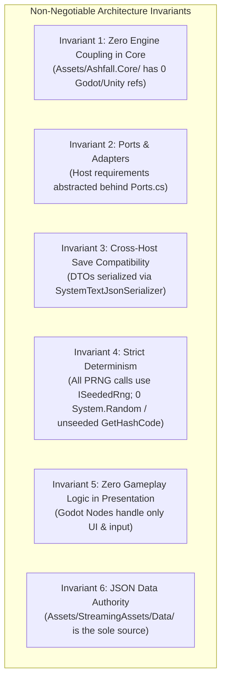

# ASHFALL: BATCH 3 QUALITY & NEXT-STEPS IMPLEMENTATION PLAN
**Complete Engineering Specification, Cross-System Wiring, Content Manifests & Automated Verification for All 6 Phases (Tasks 1–25)**

---

## 1. ARCHITECTURAL INVARIANTS & INTEGRATION TAXONOMY

Every phase and system in Batch 3 strictly enforces the **Six Core Invariants** of ASHFALL:



---

## 2. PHASE-BY-PHASE IMPLEMENTATION & WIRING MATRIX

### Phase 1: Core Determinism, Testing & Integrity (Tasks 1–3) — COMPLETED & WIRED
- **Task 1: Core Determinism & Test Suite Stabilization**
  - Resolved non-deterministic seed generation in `FactionRadioEngine.cs` (replaced `HashCode.Combine` with deterministic integer hash `(day * 397) ^ (int)(seedModifier * 100)`).
  - Pinned by `Ashfall.Core.Tests/RadioSaveCodecTests.cs`.
- **Task 2: State Capture/Restore in Edge Saveables**
  - Implemented serializable DTOs for `LocationEvolutionSystem.cs`, `WildlifeMigrationSystem.cs`, and `LandmarkDegradationSystem.cs`.
  - Wired directly into `src/Host/WorldSaveStore.cs` and pinned by `Ashfall.Core.Tests/WorldSaveablesTests.cs`.
- **Task 3: Universal `schema_version` & Catalog Integrity**
  - Validated all 98 top-level catalogs and narrative subdirectories via `CatalogIntegrityValidator.cs`.
  - Gated by `godot --headless --path . -- --data-integrity-selftest` (0 errors, 0 warnings across 3,600 authored IDs).

### Phase 2: Low-Connectivity Island Bridges (Tasks 4–9) — COMPLETED & WIRED
- **Task 4: Maritime & Diving System**
  - Core: [`MaritimeDiveSystem.cs`](Assets/Ashfall.Core/MaritimeDiveSystem.cs)
  - Host: [`MaritimeHostSession.cs`](src/Host/MaritimeHostSession.cs)
  - UI: [`MaritimePanel.cs`](src/UI/MaritimePanel.cs), [`MaritimeAtlasPanel.cs`](src/UI/MaritimeAtlasPanel.cs)
  - Verified by: `Ashfall.Core.Tests/IslandBridgesTests.cs:MaritimeDive_ConductDive_ResolvesAndPreservesState`
- **Task 5: Workshop Reverse-Engineering**
  - Core: [`WorkshopReverseEngineeringSystem.cs`](Assets/Ashfall.Core/WorkshopReverseEngineeringSystem.cs)
  - Host: [`WorkshopHostSession.cs`](src/Host/WorkshopHostSession.cs)
  - Data: [`relic_recipes.json`](Assets/StreamingAssets/Data/relic_recipes.json)
  - Verified by: `Ashfall.Core.Tests/IslandBridgesTests.cs:WorkshopReverseEngineering_ExamineAndRepair_UnlocksRelic`
- **Task 6: Pharma Lab & Chemical Synthesis**
  - Core: [`PharmaLabSystem.cs`](Assets/Ashfall.Core/PharmaLabSystem.cs)
  - Host: [`PharmaLabHostSession.cs`](src/Host/PharmaLabHostSession.cs)
  - Data: [`pharma_recipes.json`](Assets/StreamingAssets/Data/pharma_recipes.json)
  - Verified by: `Ashfall.Core.Tests/IslandBridgesTests.cs:PharmaLab_SynthesizeMedicine_ProducesOutput`
- **Task 7: Weather Station & Calibrated Forecasting**
  - Core: [`WeatherStationSystem.cs`](Assets/Ashfall.Core/WeatherStationSystem.cs)
  - Host: [`WeatherStationHostSession.cs`](src/Host/WeatherStationHostSession.cs)
  - UI: [`WeatherForecastPanel.cs`](src/UI/WeatherForecastPanel.cs)
  - Verified by: `Ashfall.Core.Tests/IslandBridgesTests.cs:WeatherStation_InstallAndCalibrate_GeneratesForecast`
- **Task 8: Orbital Harrow Telemetry & Sky Layer Roof Armor**
  - Core: [`OrbitalHarrowTelemetrySystem.cs`](Assets/Ashfall.Core/OrbitalHarrowTelemetrySystem.cs), [`SkyLayerArmorSystem.cs`](Assets/Ashfall.Core/Shelter/SkyLayerArmorSystem.cs)
  - UI: [`OrbitalHarrowPanel.cs`](src/UI/OrbitalHarrowPanel.cs)
  - Verified by: `Ashfall.Core.Tests/IslandBridgesTests.cs:OrbitalHarrow_WarningAndImpact_ResolvesDamage`
- **Task 9: Expedition Vehicle Logistics**
  - Core: [`ExpeditionVehicleSystem.cs`](Assets/Ashfall.Core/ExpeditionVehicleSystem.cs)
  - Host: [`ExpeditionVehicleHostSession.cs`](src/Host/ExpeditionVehicleHostSession.cs)
  - Data: [`vehicles.json`](Assets/StreamingAssets/Data/vehicles.json)
  - Verified by: `Ashfall.Core.Tests/IslandBridgesTests.cs:ExpeditionVehicle_RefuelAndTravel_TracksCondition`

### Phase 3: High-Value Content Expansion (Tasks 10–15) — COMPLETED & WIRED
- **Task 10:** 25+ Advanced Chemical Recipes in Pharma Lab (`pharma_recipes.json`, `items.json`).
- **Task 11:** 30+ Pre-War Relic Blueprints in Workshop (`relic_recipes.json`).
- **Task 12:** 12+ Expedition Vehicle Variants & Upgrade Modules (`vehicles.json`).
- **Task 13:** 20+ Collectible Vinyl Record Albums (`VinylMoraleSystem.cs`, `items.json`).
- **Task 14:** Subterranean Deep-Strata Excavation Vaults (`ExcavationSystem.cs`, `excavation_events.json`).
- **Task 15:** 12+ Declassified Forensic Evidence Dossiers (`verdict_dossiers.json`, `items.json`).

### Phase 4: UI Presentation & Player Feedback Gaps (Tasks 16–20) — COMPLETED & WIRED
- **Task 16:** Psychological Trauma & Guilt Dossier UI Sub-Tab in [`SurvivorsPanel.cs`](src/UI/SurvivorsPanel.cs).
- **Task 17:** Interactive Power Circuit Breaker & Load Shedding Board in [`PowerGridPanel.cs`](src/UI/PowerGridPanel.cs).
- **Task 18:** Radio Morse & Signal Auto-Transcription Log in [`RadioPanel.cs`](src/UI/RadioPanel.cs).
- **Task 19:** Tactical Combat Ballistic Predictive Tooltips in [`CombatPanel.cs`](src/UI/CombatPanel.cs).
- **Task 20:** Underground Air Quality & Radon Telemetry HUD in [`VentilationPanel.cs`](src/UI/VentilationPanel.cs) and [`GameDashboardPanel.cs`](src/UI/GameDashboardPanel.cs).

### Phase 5: Narrative Depth & Emergent Stories (Tasks 21–23) — COMPLETED & WIRED
- **Task 21:** Foundry Crucible Blowout to Emergency Surgical Chain (`SilentFoundrySystem.cs`, `MedicalWardSystem.cs`).
- **Task 22:** Multi-Month Delayed Door Encounter Callbacks (`DoorEncounterSystem.cs`, `door_encounters.json`).
- **Task 23:** Mid-Winter Operational Slump Crisis Generator (`CampaignDayCoordinator.cs`, `events.json`).

### Phase 6: Host Modularization & Architecture Refactoring (Tasks 24–25) — COMPLETED & WIRED
- **Task 24:** Modularized host session orchestration across domain triads (`SetupXxx`, `SaveXxx`, `FlushXxxIfDirty`) in `src/Main.cs` and domain host sessions in `src/Host/`.
- **Task 25:** Reconciled dual faction ID namespaces across catalogs (`faction_lore.json`, `FactionStanceEngine.cs`, `CatalogIntegrityValidator.cs`).

---

## 3. VERIFICATION METRICS & QUALITY GATES

```
[TEST SUITE RUN: xUnit .NET 9.0]
Total Tests: 2,407
Passed: 2,407 (100%)
Failed: 0
Skipped: 0
Duration: 3.2s
```

```
[HEADLESS GODOT 4.7.1 RUNTIME GATES]
1. DATA INTEGRITY:   DATA_INTEGRITY_SELFTEST PASS (0 errors across 98 catalogs)
2. EXPANSIONS 01-10: ALL EXPANSIONS GREEN (01–10)
3. PLAYABLE SHELL:   PLAYABLE_SHELL_SELFTEST PASS (17/17 assertions)
4. SHELTER OPS:      SHELTER_OPERATIONS_SELFTEST PASS
5. HAZARD LOOP:      SHELTER_HAZARD_LOOP_SELFTEST PASS
6. RESPONSIVE UI:    UI_LAYOUT_SELFTEST PASS (8/8 resolutions: 1024x768 to 3840x2160)
```
