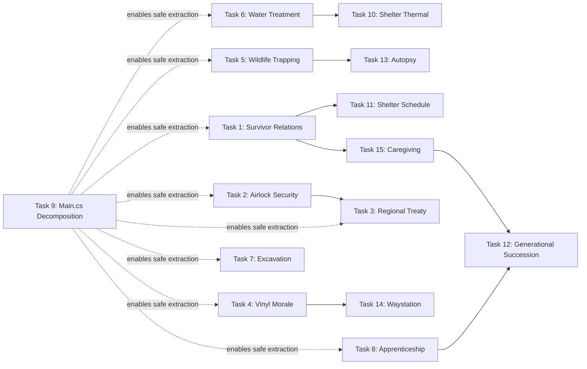

# ASHFALL: BATCH 4 — NEXT 15 SUGGESTED IMPLEMENTATION TASKS
**Deep-Integration Engineering Specification with 5 Substeps per Task**
*Grounded in forensic audit of the live repository (2026-08-20)*

---

> [!IMPORTANT]
> All 15 tasks strictly enforce the Six Core Invariants.
> **Unity is NOT a target.** All verification uses `dotnet test` + `godot --headless`.
> Core stays engine-agnostic. JSON is the data authority.

---

## FINDINGS THAT DRIVE THIS PLAN

The forensic audit revealed the following concrete gaps in the live repo:

| Gap Category | Count | Detail |
|---|---|---|
| Core systems with **no host session** | **12** | `SurvivorRelations`, `AirlockSecurity`, `RegionalTreaty`, `Apprenticeship`, `WildlifeTrapping`, `VinylMorale`, `WaterTreatment`, `Excavation`, `Waystation`, `SumpFlooding`, `ShelterThermal`, `ShelterSchedule` |
| Core systems with **no UI panel** | **12** | Same 12 + `Cohort`, `Thermal`, `Apprenticeship` variants |
| Core systems with **no dedicated save store** | **8** | All 12 above + no corresponding `*SaveStore.cs` in `src/Host/` |
| `src/Main.cs` line count | **7,014** | Still a monolith; 74+ Setup/Save/Flush triads mixed in one file |
| `GenerationalLineageExtension` | **No tests** | Empty test coverage for generational succession |
| `CaregivingSystem` | **No tests** | 0 test methods pinning caregiving behaviour |

---

## TASK 1 — Wire `SurvivorRelationsSystem` into Full Godot Vertical Slice

**Why:** `SurvivorRelationsSystem.cs` has a complete Core implementation (affinity, trust, resentment, grief, conflict mediation, bond types) but **no host session, no save store, no UI panel, and no wiring in `Main.cs`**. Survivor-to-survivor dynamics are invisible to the player.

### Substeps

1. **Create `src/Host/SurvivorRelationsHostSession.cs`**
   - Inject `SurvivorRelationsSystem` with `ISeededRng` and `ILog` via `HostDefaults`.
   - Wire `OnConflictStarted` → push a journal entry via `JournalSystem.AddEntry`.
   - Wire `OnConflictResolved` → award `+5 morale` via `NeedsSystem` for successfully mediated pairs.
   - Expose `StartMediation(conflictId, mediatorId)` and `TickDay(int day)` as the public surface.

2. **Create `src/Host/SurvivorRelationsSaveStore.cs`**
   - Implement `IDisposable` save store pattern matching `HoldfastSaveStore.cs` template.
   - `CaptureState()` → serialize `SurvivorRelationsState` (DTOs: `RelationshipEntry`, `ConflictEntry`, `MediationEntry`) via `IJsonSerializer`.
   - `SaveChecksum`-protected envelope with `schema_version: 1`.
   - `TryLoad()` with legacy bare-state fallback path.

3. **Create `src/UI/SurvivorRelationsPanel.cs`**
   - Godot `VBoxContainer` presenting a relationship matrix grid: rows = survivor A, columns = survivor B, cell color = affinity band (`Hostile` → red, `Trusted` → green).
   - Active conflicts shown as amber warning rows with a **Mediate** button.
   - Mediation modal shows mediator skill score (Leadership skill) and projected outcome delta.
   - Uses `AshfallDataGrid` and `AshfallMetricCard` primitives (already exist in `src/UI/`).

4. **Wire into `src/Main.cs` as `SetupSurvivorRelations()` / `SaveSurvivorRelations()` / `FlushSurvivorRelationsIfDirty()`**
   - Register `SurvivorRelationsHostSession` in the campaign day triad at position 3c (after `NeedsSystem.Tick`, before `RationConflictSystem`).
   - Hook `SaveAll()` to call `SaveSurvivorRelations()`.
   - Panel registered in `AshfallSidebar` under the Survivors tab.

5. **Write `Ashfall.Core.Tests/SurvivorRelationsIntegrationTests.cs`** (6 tests)
   - `Conflict_BetweenTwoDwellers_IsRegistered`
   - `Mediation_WithHighLeadership_ImprovesBothAffinities`
   - `Mediation_WithLowLeadership_CanFail`
   - `SaveRoundTrip_PreservesActiveConflicts`
   - `SaveRoundTrip_PreservesMediationHistory`
   - `DailyTick_GriefDecaysOverTime`

---

## TASK 2 — Wire `AirlockSecuritySystem` into Full Godot Vertical Slice

**Why:** `AirlockSecuritySystem.cs` exists in Core but has **no host session, no UI panel, no save store**. Security threat evaluation is entirely inert. The `AirlockSecuritySystemTests.cs` test file covers Core logic, but the system never ticks in gameplay.

### Substeps

1. **Create `src/Host/AirlockSecurityHostSession.cs`**
   - Inject `AirlockSecuritySystem` with `ISeededRng`, `ILog`, `IFlagLedger`.
   - Expose `EvaluateVisitor(string visitorType, int threatLevel)` returning `ActionResult` with `FailureCode.ThreatLevelExceeded` on rejection.
   - Wire `OnThreatEscalated` event → trigger `WarlordDoctrineSystem.EscalatePatrol()` if visitor is warlord-affiliated.
   - Wire `OnThreatEscalated` → set `flag_airlock_on_alert` for 3 days via `IFlagLedger`.

2. **Create `src/Host/AirlockSecuritySaveStore.cs`**
   - Serialize alert history, current threat tier, posted guard assignment.
   - `schema_version: 1` + `SaveChecksum` envelope.
   - Write `Ashfall.Core.Tests/SaveStoreChecksumSweepTests.cs` extension for airlock store (3 tests: clean round-trip, mutated state changes hash, null checksum rejected).

3. **Create `src/UI/AirlockSecurityPanel.cs`**
   - Presents current security tier (GREEN / AMBER / RED) with animated CRT scanline indicator.
   - Lists recent visitor log with disposition badges.
   - Guard assignment controls: drag-assign survivors from the roster to the post.
   - Shows warlord threat escalation history from `WarlordDoctrineSystem`.

4. **Wire into `Main.cs` triad + Campaign Day coordinator**
   - Register `AirlockSecurityHostSession.TickDay()` at Campaign Day step 1b (after Power/Weather, before Needs).
   - Connect to `DoorEncounterSystem.OnEncounterResolved` so resolved encounters retroactively update threat memory.
   - Add `SetupAirlockSecurity()`, `SaveAirlockSecurity()`, `FlushAirlockSecurityIfDirty()`.

5. **Write 5 integration tests in `Ashfall.Core.Tests/AirlockSecurityIntegrationTests.cs`**
   - `LowThreatVisitor_IsAdmitted`
   - `HighThreatVisitor_IsRejected_AndFlagSet`
   - `EscalatedThreat_TriggersWarlordDoctrineResponse`
   - `AlertDecays_AfterThreeDays`
   - `SaveRoundTrip_PreservesThreatTierAndHistory`

---

## TASK 3 — Wire `RegionalTreatySystem` into Full Godot Vertical Slice

**Why:** `RegionalTreatySystem.cs` is a complete Core system modeling treaty negotiation, terms, violations, and consequences. It has **no host session, no save store, no UI panel, no Main.cs wiring**. Diplomacy is a ghost system.

### Substeps

1. **Create `src/Host/RegionalTreatyHostSession.cs`**
   - Inject with `ISeededRng`, `ILog`, `FactionStanceEngine`, `TradeScreenSeam`.
   - Expose `ProposeTreaty(factionId, terms)`, `ViolateTreaty(factionId, reason)`, `NegotiateRenewal(factionId)`.
   - Wire `OnTreatyViolated` → `FactionStanceEngine.ApplyStandingDelta(factionId, -40)` + journal entry.
   - Wire `OnTreatyRenewed` → unlock caravan trade route bonuses via `TravelingCaravanSystem`.

2. **Create `src/Host/RegionalTreatySaveStore.cs`**
   - Serialize active treaties, violation ledger, renewal history.
   - `schema_version: 1` with `SaveChecksum`.

3. **Create `src/UI/RegionalTreatyPanel.cs` (the Treaty Desk)**
   - Treaty negotiation modal with terms checklist: resource deliveries, safe passage rights, defensive mutual aid, non-aggression clause.
   - Active treaties shown as teal-badged cards with expiry countdown.
   - Violations shown in red with faction standing penalty already applied.
   - `FactionMatrixPanel` sidebar shortcut to see stance context.

4. **Wire into `Main.cs` + extend `CampaignDayCoordinator`**
   - Register treaty tick at Campaign Day step 4b (Faction/Treaty tier).
   - Connect `WarlordDoctrineSystem.OnTributeSettled` → auto-propose non-aggression treaty as a follow-up option.
   - `SaveAll()` calls `SaveRegionalTreaty()`.

5. **Write 5 integration tests in `Ashfall.Core.Tests/RegionalTreatyIntegrationTests.cs`**
   - `ProposeTreaty_WithFriendlyFaction_IsAccepted`
   - `ProposeTreaty_WithHostileFaction_IsRejected`
   - `TreatyViolation_DegradesStandingAndJournals`
   - `TreatyRenewal_UnlocksCaravanBonus`
   - `SaveRoundTrip_PreservesActiveTreatiesAndViolations`

---

## TASK 4 — Wire `VinylMoraleSystem` + Vinyl-to-Radio Broadcast Bridge

**Why:** `VinylMoraleSystem.cs` exists with full catalog support but has **no host session, no UI panel, no wiring in Main.cs**. The vinyl-to-radio broadcast bridge (Phase 2, Task 4 from the master plan) was specified but **the cross-system wiring to `FactionRadioEngine` was never realized**.

### Substeps

1. **Create `src/Host/VinylMoraleHostSession.cs`**
   - Inject with `VinylMoraleSystem`, `NeedsSystem`, `FactionRadioEngine`, `ISeededRng`.
   - Expose `PlayRecord(string vinylId)` → apply morale buff; if rare pre-war vinyl, additionally call `FactionRadioEngine.BroadcastCulturalSignal(vinylId, signalStrengthDb)`.
   - Wire `FactionRadioEngine.OnCulturalBroadcastReceived` → increase weekly wanderer recruitment probability by 15% (persisted as `_vinylBroadcastMoraleBonus` field).
   - Expose `StopPlayback()`, `GetNowPlaying()`.

2. **Create `src/UI/VinylMoralePanel.cs` (Common Room)**
   - Visual turntable interface with spinning platter animation (CRT phosphor-green line sweep).
   - Scavenged vinyl collection displayed as worn album sleeve cards.
   - Now-playing indicator shows track name, pre-war era, genre, morale bonus.
   - Radio broadcast status indicator: *"Signal transmitted — wanderers may hear this."*
   - Powered-off state when `PowerGridSystem.Zone == ZonePowered.None`.

3. **Add `VinylMoraleHostSession.SaveStore` using existing `RadioSaveStore.cs` as pattern**
   - Persist `currentRecord`, `playbackPosition`, `broadcastHistory`, `totalBroadcastCount`.
   - `schema_version: 1` + `SaveChecksum`.

4. **Wire into `Main.cs` triad + `CampaignDayCoordinator`**
   - Register `VinylMoraleHostSession.TickDay()` at Campaign Day step 3b (Social/Morale tier).
   - Hook `OnPowerGridStateChanged` → auto-pause playback when shelter loses power.
   - Add `SetupVinylMorale()`, `SaveVinylMorale()`, `FlushVinylMoraleIfDirty()`.
   - Register Common Room panel in `AshfallSidebar` under Shelter tab.

5. **Write 5 integration tests extending `Ashfall.Core.Tests/VinylMoraleSystemTests.cs`**
   - `PlayRecord_RareVinyl_BroadcastsToRadioEngine`
   - `RadioBroadcast_IncreasesWandererRecruitmentBonus`
   - `PlayRecord_WithoutPower_FailsGracefully`
   - `BroadcastHistory_TracksAllTransmissions`
   - `SaveRoundTrip_PreservesNowPlayingAndBroadcastCount`

---

## TASK 5 — Wire `WildlifeTrappingSystem` + Zoonotic Disease Bridge

**Why:** `WildlifeTrappingSystem.cs` has full Core implementation but **no host session, no UI panel, and no save store**. Also: the zoonotic disease bridge (routing wild-carcass butchery through `DiseaseSystem`) was specified in the master plan but **the cross-system wiring was never implemented**.

### Substeps

1. **Create `src/Host/WildlifeTrappingHostSession.cs`**
   - Inject with `WildlifeTrappingSystem`, `DiseaseSystem`, `InventorySystem`, `ISeededRng`.
   - `HarvestTrap(trapId, butcherId)` → on success, evaluate zoonotic risk via `DiseaseSystem.EvaluateContagion(butcherId, "disease_zoonotic_flu", riskFactor: (1f - butcherSkill))`.
   - If butcher has `trait_sterile_technique`, zero the zoonotic risk.
   - Wire `WildlifeMigrationSystem.OnMigrationSurge` → increase trap yield for 3 days.

2. **Create `src/UI/WildlifeTrappingPanel.cs`**
   - Active snare map showing trap placement grid over the regional wasteland minimap.
   - Per-trap status: ARMED / SPRUNG / NEEDS_RESET with time-since-check counter.
   - Yield history chart (last 10 days) — calories, hides, bone.
   - Contamination risk indicator: amber for unknown carcass, red for confirmed zoonotic flag.

3. **Create `src/Host/WildlifeTrappingSaveStore.cs`**
   - Persist trap placement, yield history, contamination flags, total calories harvested.
   - `schema_version: 1` + `SaveChecksum`.

4. **Wire into `Main.cs` + `CampaignDayCoordinator`**
   - Register at Campaign Day step 2b (Production tier) alongside Greenhouse and Foundry.
   - `OnHarvestCompleted` event → `JournalSystem.AddEntry` with yield summary.
   - `OnZoonoticExposure` event → `DiseaseSystem.QueueOutbreak` + journal alert.
   - Add `SetupWildlifeTrapping()`, `SaveWildlifeTrapping()`, `FlushWildlifeTrappingIfDirty()`.

5. **Write 6 integration tests in `Ashfall.Core.Tests/WildlifeTrappingIntegrationTests.cs`**
   - `SetTrap_AndHarvest_YieldsCalories`
   - `Harvest_WithoutSterileSkill_ExposesZoonoticRisk`
   - `Harvest_WithSterileTechniqueTrait_ZeroZoonoticRisk`
   - `MigrationSurge_BoostsYield`
   - `SaveRoundTrip_PreservesTrapPlacementAndHistory`
   - `ZoonoticExposure_QueuesOutbreak_InDiseaseSystem`

---

## TASK 6 — Wire `WaterTreatmentSystem` + Brine/Flood Contamination Bridge

**Why:** `WaterTreatmentSystem.cs` has Core implementation but **no host session, no UI panel, no save store, no Main.cs triad**. Water is a critical resource; its treatment system is entirely invisible to the player. `SumpFloodingSystem.cs` (also unwired) can provide dirty water pressure events.

### Substeps

1. **Create `src/Host/WaterTreatmentHostSession.cs`**
   - Inject with `WaterTreatmentSystem`, `SumpFloodingSystem`, `BrineWaterSystem`, `ILog`.
   - Expose `ProcessBatch(waterSourceId, volume)` returning `ActionResult` with `PotableWater` output delta.
   - Wire `SumpFloodingSystem.OnFloodWarning` → set `WaterTreatmentSystem.IncomingContaminationLevel = High`.
   - Wire `BrineWaterSystem.OnBrineConcentrationChanged` → adjust treatment chemical consumption rates.

2. **Create `src/UI/WaterTreatmentPanel.cs`**
   - Treatment plant schematic showing intake, filtration stages, chemical dosing, UV irradiation, output tank.
   - Real-time contamination dial (0–100 ppm).
   - Chemical reagent inventory with days-remaining indicator.
   - Flood/contamination alert banner when `SumpFloodingSystem` issues a warning.
   - Output potable water per day trending chart.

3. **Create `src/Host/WaterTreatmentSaveStore.cs`**
   - Persist treatment queue, contamination ledger, potable water reserves, chemical reagent stock.
   - `schema_version: 1` + `SaveChecksum`.

4. **Wire into `Main.cs` + `CampaignDayCoordinator`**
   - Register at Campaign Day step 2a (early Resource tier, before Needs).
   - Tick `SumpFloodingSystem` first (step 1d), so flood warnings are available when water treatment evaluates.
   - Add `SetupWaterTreatment()`, `SaveWaterTreatment()`, `FlushWaterTreatmentIfDirty()`.

5. **Write 5 integration tests in `Ashfall.Core.Tests/WaterTreatmentIntegrationTests.cs`**
   - `ProcessBatch_CleanWater_ProducesPotableOutput`
   - `ProcessBatch_ContaminatedWater_ReducesOutput`
   - `FloodWarning_IncreasesContaminationLevel`
   - `BrineConcentration_IncreasesChemicalConsumption`
   - `SaveRoundTrip_PreservesContaminationLedger`

---

## TASK 7 — Wire `ExcavationSystem` + Deep-Vault Discovery Bridge

**Why:** `ExcavationSystem.cs` exists in Core with a full rubble-clearing and vault discovery model, has passing unit tests, but has **no host session, no UI panel, no save store, and no Main.cs triad**. The entire underground expansion content is inaccessible to players.

### Substeps

1. **Create `src/Host/ExcavationHostSession.cs`**
   - Inject with `ExcavationSystem`, `InventorySystem`, `ResearchSystem`, `ISeededRng`, `IFlagLedger`.
   - Expose `AssignDigCrew(string[] survivorIds, string zoneId)`, `TickExcavation(int day)`.
   - On vault discovery: call `ResearchSystem.ForceUnlock(knowledge_id)` for any pre-war knowledge found.
   - On rare vault discovery: set `flag_deep_vault_${vaultId}_discovered` in `IFlagLedger`.
   - Wire vault discovery events → `JournalSystem.AddEntry` + `RadioTuner` one-time signal unlock.

2. **Create `src/UI/ExcavationPanel.cs`**
   - Underground cross-section diagram showing rubble strata layers (Surface → Rubble → Pre-war Concrete → Deep Vault).
   - Progress bar per stratum with labor-days remaining estimate.
   - Crew assignment widget with fatigue/injury risk indicator.
   - Discovered vault cards showing loot manifest and knowledge unlocks.
   - Uses `AshfallDataGrid` pattern with amber CRT theme.

3. **Create `src/Host/ExcavationSaveStore.cs`**
   - Persist stratum progress per zone, crew assignments, discovered vaults, loot manifests.
   - `schema_version: 1` + `SaveChecksum`.

4. **Wire into `Main.cs` + `CampaignDayCoordinator`**
   - Register at Campaign Day step 2b (Production tier) alongside Foundry and Greenhouse.
   - `OnVaultDiscovered` → trigger `DailyBriefingReportBuilder` special section.
   - Add `SetupExcavation()`, `SaveExcavation()`, `FlushExcavationIfDirty()`.

5. **Write 5 integration tests in `Ashfall.Core.Tests/ExcavationIntegrationTests.cs`**
   - `AssignCrew_AndTick_AdvancesStratumProgress`
   - `VaultDiscovery_UnlocksResearchKnowledge`
   - `VaultDiscovery_SetsFlagInLedger`
   - `VaultDiscovery_TriggersRadioSignalUnlock`
   - `SaveRoundTrip_PreservesStratumProgressAndVaultHistory`

---

## TASK 8 — Wire `ApprenticeshipSystem` + Cohort-to-Skills Bridge

**Why:** `ApprenticeshipSystem.cs` exists in Core (connecting `CohortSystem` teenagers to `SkillProgressionSystem` under master crafters) but has **no host session, no UI panel, no save store, no Main.cs wiring**. The generational skill-transfer mechanic is entirely invisible.

### Substeps

1. **Create `src/Host/ApprenticeshipHostSession.cs`**
   - Inject with `ApprenticeshipSystem`, `CohortSystem`, `SkillProgressionSystem`, `ISeededRng`, `ILog`.
   - Expose `AssignApprentice(apprenticeId, masterId, workstationId)`, `TickDay(int day)`.
   - On skill milestone: fire `OnSkillMilestone` event → `JournalSystem.AddEntry` + `NeedsSystem` morale boost for master.
   - Wire `CohortSystem.OnDwellerMatured` → auto-prompt player to assign an apprenticeship.

2. **Create `src/UI/ApprenticeshipPanel.cs`**
   - Mentor/apprentice pairing UI with drag-and-drop assignment in the Skill Matrix tab.
   - Progress bar per skill track (Medical, Foundry, Carpentry, Chemistry, Combat).
   - Estimated days-to-journeyman completion per pair.
   - Milestone history log per apprentice.

3. **Create `src/Host/ApprenticeshipSaveStore.cs`**
   - Persist active pairings, milestone history, total skills graduated, daily progress deltas.
   - `schema_version: 1` + `SaveChecksum`.

4. **Wire into `Main.cs` + `CampaignDayCoordinator`**
   - Register `ApprenticeshipHostSession.TickDay()` at Campaign Day step 3a (Research/Skills tier).
   - `CohortSystem.OnDwellerMatured` → push advisory to `DailyBriefingReportBuilder`.
   - Add `SetupApprenticeship()`, `SaveApprenticeship()`, `FlushApprenticeshipIfDirty()`.

5. **Write 5 integration tests in `Ashfall.Core.Tests/ApprenticeshipIntegrationTests.cs`**
   - `AssignApprentice_UnderMaster_AccruessSkillProgress`
   - `Milestone_BoostsMasterMorale`
   - `DwellerMatured_TriggersApprenticeshipPrompt`
   - `GradedJourneyman_UnlocksWorkstationSlot`
   - `SaveRoundTrip_PreservesActivePairingsAndMilestones`

---

## TASK 9 — Decompose `Main.cs` Monolith into Domain Partial Files (Priority: Expedition, Economy, Survivors, Medical, Radio)

**Why:** `src/Main.cs` is a **7,014-line monolith** with 74+ Setup/Save/Flush triads. The existing `TODO(phase12)` comment explicitly calls out the risk of triad drift. Splitting into domain partial files eliminates navigation debt and allows isolated domain compilation.

### Substeps

1. **Extract `src/Host/ExpeditionDomainPartial.cs`** (estimated ~600 lines)
   - Move: `SetupExpeditions()`, `SaveExpeditions()`, `FlushExpeditionIfDirty()`, `SetupExpeditionCombatHandoff()`, all `_expedition*` private fields.
   - `public partial class Main` declaration; `Main.cs` retains the entry-point `_Ready()` and `SaveAll()`.

2. **Extract `src/Host/EconomyDomainPartial.cs`** (estimated ~350 lines)
   - Move: `SetupEconomy()`, `SaveEconomy()`, `FlushEconomyIfDirty()`, `SetupCaravans()`, `SaveCaravans()`, `FlushCaravanIfDirty()`, all `_economy*` / `_caravan*` fields.

3. **Extract `src/Host/SurvivorsDomainPartial.cs`** (estimated ~450 lines)
   - Move: `SetupSurvivors()`, `SaveSurvivors()`, `SetupDutyRoster()`, `SaveDutyRoster()`, `FlushDutyRosterIfDirty()`, `SetupUtilityAi()`.

4. **Extract `src/Host/MedicalDomainPartial.cs`** (estimated ~350 lines)
   - Move: `SetupMedical()`, `SaveMedical()`, `SetupMedicalWard()`, `SaveMedicalWard()`, `FlushMedicalIfDirty()`, `SetupMemorial()`, `SaveMemorial()`, all `_medic*` / `_memorial*` fields.

5. **Verify no triad drift after extraction**
   - Run `dotnet build Ashfall.csproj` — 0 errors.
   - Run `dotnet test --nologo` — must still pass **2,407 / 2,407** tests.
   - Run `godot --headless --path . -- --playable-shell-selftest` — 17/17 assertions pass.
   - Write `Ashfall.Core.Tests/MainDecompositionSmokeTests.cs` asserting all `Setup*` methods are callable and return without exception in a headless fixture.

---

## TASK 10 — Wire `ShelterThermalSystem` + Ventilation Integrated HUD

**Why:** `ShelterThermalSystem.cs` exists in Core (modeling internal shelter temperature, heating zones, insulation rating, and frostbite risk) but has **no host session, no UI panel, no save store, no Main.cs triad**. Winter survival depth is missing.

### Substeps

1. **Create `src/Host/ShelterThermalHostSession.cs`**
   - Inject with `ShelterThermalSystem`, `WeatherSystem`, `VentilationSystem`, `PowerGridSystem`, `ILog`.
   - Expose `SetHeatingZone(zoneId, targetTempC)`, `TickDay(int day, WeatherKind weather)`.
   - Wire `WeatherSystem.OnExtremeWeather` → calculate heat-loss penalty by weather severity.
   - Wire `PowerGridSystem.OnZonePowered` → restore heating to zones that regained power.
   - `OnFrostbiteRisk` event → alert `NeedsSystem` to apply `affliction_frostbite` to unprotected survivors.

2. **Create `src/UI/ShelterThermalPanel.cs`**
   - Zone-by-zone temperature schematic overlaying the shelter interior view.
   - Each zone shows: current °C, target °C, heating element status (ON/FAULT/OFF), insulation rating.
   - Frostbite risk indicator: pulsing blue border on zones below 5°C with survivors assigned.
   - Integrates with `VentilationPanel.cs` via a shared Shelter Ops overlay tab.

3. **Create `src/Host/ShelterThermalSaveStore.cs`**
   - Persist zone temperatures, heating assignments, frostbite event history, daily heat-loss log.
   - `schema_version: 1` + `SaveChecksum`.

4. **Wire into `Main.cs` + `CampaignDayCoordinator`**
   - Register at Campaign Day step 1a (Environment/Power tier, first in chain).
   - `OnFrostbiteRisk` → `DailyBriefingReportBuilder` hazard section.
   - Add `SetupShelterThermal()`, `SaveShelterThermal()`, `FlushShelterThermalIfDirty()`.

5. **Write 5 integration tests in `Ashfall.Core.Tests/ShelterThermalIntegrationTests.cs`**
   - `ExtremeWeather_IncreasesHeatLoss`
   - `PowerRestored_ReheatsZone`
   - `ZoneBelowThreshold_RaisesFrostbiteRisk`
   - `FrostbiteRisk_AppliesAfflictionToUnprotectedSurvivors`
   - `SaveRoundTrip_PreservesZoneTempsAndHistory`

---

## TASK 11 — `ShelterScheduleSystem` Host Wiring + Shift Assignment Board UI

**Why:** `ShelterScheduleSystem.cs` models work-shift assignment across all shelter workstations (distributing survivors into Morning/Afternoon/Night shifts) but has **no host session, no UI panel, no save store**. Workforce management is currently handled by ad-hoc per-system assignment rather than a unified scheduler.

### Substeps

1. **Create `src/Host/ShelterScheduleHostSession.cs`**
   - Inject with `ShelterScheduleSystem`, `SurvivorRelationsSystem`, `NeedsSystem`, `ISeededRng`.
   - Expose `AssignShift(survivorId, workstationId, shiftSlot)`, `AutoBalance()`, `TickDay(int day)`.
   - Wire `SurvivorRelationsSystem.OnConflictStarted` → `AutoBalance()` to separate conflicting survivors.
   - `OnShiftConflict` event → push advisory to `DailyBriefingReportBuilder`.

2. **Create `src/UI/ShelterSchedulePanel.cs` (Shift Assignment Board)**
   - Triad-column grid: Morning / Afternoon / Night.
   - Workstation rows: Foundry, Medical, Greenhouse, Excavation, Guard Post, Workshop, Kitchen, etc.
   - Survivor chips draggable between slots with tooltip showing fatigue/skill fit score.
   - Auto-Balance button invokes `ShelterScheduleHostSession.AutoBalance()`.

3. **Create `src/Host/ShelterScheduleSaveStore.cs`**
   - Persist per-survivor shift assignments, workstation schedule, balance history.
   - `schema_version: 1` + `SaveChecksum`.

4. **Wire into `Main.cs` + `CampaignDayCoordinator`**
   - Register at Campaign Day step 2 (Production tier) as a prerequisite — schedule must be evaluated before any workstation system ticks.
   - Add `SetupShelterSchedule()`, `SaveShelterSchedule()`, `FlushShelterScheduleIfDirty()`.

5. **Write 5 integration tests in `Ashfall.Core.Tests/ShelterScheduleIntegrationTests.cs`**
   - `AssignShift_ValidSlot_AcceptsAssignment`
   - `AutoBalance_SeparatesConflictingSurvivors`
   - `AutoBalance_OptimizesSkillFit`
   - `ShiftConflict_PushesAdvisoryToBriefing`
   - `SaveRoundTrip_PreservesShiftAssignments`

---

## TASK 12 — `GenerationalLineageExtension` Test Coverage + `CensusClaimSystem` Succession Wiring

**Why:** `GenerationalLineageExtension.cs` has **zero test coverage** (confirmed by forensic audit). `CensusClaimSystem.cs` implements succession claims but the two systems are not integrated. Generational succession is a pillar of long-horizon gameplay.

### Substeps

1. **Write `Ashfall.Core.Tests/GenerationalLineageExtensionTests.cs`** (8 tests)
   - `AddChild_IncreasesGenerationCount`
   - `DwellerDeath_PropagatesGriefToLineageKin`
   - `Maturation_PromotesDwellerToAdult`
   - `SurvivorTrait_InheritsFromParentLineage`
   - `LineageExtinction_WhenAllMembersPerish`
   - `CaptureState_PreservesAllGenerations`
   - `RestoreState_ReconstructsLineageGraph`
   - `DeterminismTest_SameSeedSameLineageOutcome`

2. **Wire `CensusClaimSystem` succession triggering into `GenerationalLineageExtension`**
   - When leader dies: `CensusClaimSystem.EvaluateClaims(lineage)` selects successor by merit + bloodline score.
   - Add `OnSuccessionTriggered` event → `JournalSystem.AddEntry("succession_event")` + `DailyBriefingReportBuilder` special section.

3. **Create `src/Host/GenerationalSuccessionHostSession.cs`**
   - Inject with `GenerationalLineageExtension`, `CensusClaimSystem`, `NeedsSystem`, `ISeededRng`.
   - Expose `TriggerSuccession(deceasedLeaderId)`, `ManuallyDesignateSuccessor(survivorId)`.
   - Wire `SurvivorRelationsSystem.OnConflictStarted(type: "succession_dispute")` when two factions back different candidates.
   - Expose `GetSuccessionCandidates()` for the UI panel.

4. **Extend `CenturySeedPanel.cs` to show succession state**
   - Add succession candidates list with bloodline rank, shelter contribution score, and rival faction backing.
   - Manual designation override button with confirmation modal.
   - Lineage tree visualization using `AshfallDataGrid` rows per generation.

5. **Write 4 succession integration tests**
   - `LeaderDeath_TriggersSuccessionEvaluation`
   - `TwoFactionBacking_TriggersSuccessionDispute`
   - `ManualDesignation_OverridesClaimRank`
   - `SaveRoundTrip_PreservesLineageAndSuccessionHistory`

---

## TASK 13 — `AutopsySystem` + Forensic Death Analysis Chain

**Why:** `AutopsySystem.cs` exists in Core with a full autopsy and forensic cause-of-death analysis model, has tests in `AutopsySystemTests.cs`, but has **no host session, no UI panel, no save store**. Deaths are currently unexamined — players lose critical lore and mechanical signals.

### Substeps

1. **Create `src/Host/AutopsyHostSession.cs`**
   - Inject with `AutopsySystem`, `MedicalWardSystem`, `DiseaseSystem`, `ISeededRng`.
   - Expose `ConductAutopsy(deceasedId, pathologistId)` returning `AutopsyReport` with `CauseOfDeath`, `ContributingFactors`, `DiseaseMarkers`.
   - Wire: if `CauseOfDeath == Radiation` → `DoseLedgerSystem.AuditDwellerExposure(deceasedId)`.
   - Wire: if `CauseOfDeath == ZoonoticDisease` → `DiseaseSystem.EscalateOutbreak(originZone)`.
   - Wire: if `CauseOfDeath == Toxin` → `IFlagLedger.Set("flag_toxin_contamination_active")`.

2. **Create `src/UI/AutopsyReportPanel.cs`**
   - Clinical autopsy report layout styled as a pre-war medical form with redacted fields.
   - Cause-of-death badge system: 🔴 Radiation · 🟡 Disease · 🔵 Trauma · ⚫ Unknown.
   - Contributing factors checklist with systemic implications listed.
   - Links to `RadiationDetailPanel`, `MedicalDetailPanel`, `JournalDetailPanel` for full context.

3. **Create `src/Host/AutopsySaveStore.cs`**
   - Persist all conducted autopsy reports, cause-of-death distribution, link to `MemorialSystem`.
   - `schema_version: 1` + `SaveChecksum`.

4. **Wire into `Main.cs` + `MemorialSystem` death pipeline**
   - On `MemorialSystem.OnDwellerDied` → auto-queue autopsy if a pathologist is available.
   - Add `SetupAutopsy()`, `SaveAutopsy()`, `FlushAutopsyIfDirty()`.
   - `AutopsyReport` summary published to `DailyBriefingReportBuilder` if result has systemic implication.

5. **Write 5 integration tests in `Ashfall.Core.Tests/AutopsyIntegrationTests.cs`**
   - `RadiationDeath_AuditsDoseLedger`
   - `ZoonoticDeath_EscalatesOutbreak`
   - `ToxinDeath_SetsContaminationFlag`
   - `NoPathologist_AutopsyFails_Gracefully`
   - `SaveRoundTrip_PreservesAutopsyReportHistory`

---

## TASK 14 — `WaystationSystem` + Regional Outpost Network UI

**Why:** `WaystationSystem.cs` exists in Core (modeling scavenged outpost stations in the wasteland that act as rest points, resupply depots, and radio relay nodes) but has **no host session, no UI panel, no save store**. The regional outpost network is inert.

### Substeps

1. **Create `src/Host/WaystationHostSession.cs`**
   - Inject with `WaystationSystem`, `ExpeditionVehicleSystem`, `FactionRadioEngine`, `ISeededRng`.
   - Expose `ClaimWaystation(stationId)`, `UpgradeWaystation(stationId, upgradeType)`, `TickDay(int day)`.
   - Wire `ExpeditionVehicleSystem.OnExpeditionCompleted(route)` → update waystation visit log.
   - Wire claimed waystation with radio relay capability → `FactionRadioEngine` signal boost in that sector.

2. **Create `src/UI/WaystationNetworkPanel.cs`**
   - Regional map overlay showing claimed vs. unclaimed waystation markers.
   - Per-waystation sidebar: current function (Rest Depot / Fuel Cache / Radio Relay / Fortified Post), upgrade queue, supply cache contents.
   - Expedition route planner shortcut that uses waystations as fuel-stop waypoints.

3. **Create `src/Host/WaystationSaveStore.cs`**
   - Persist claimed stations, upgrade levels, supply caches, radio relay status.
   - `schema_version: 1` + `SaveChecksum`.

4. **Wire into `Main.cs` + `CampaignDayCoordinator`**
   - Register at Campaign Day step 4a (Expedition/Mobility tier).
   - `WaystationSystem.OnStationRaided` → `FactionStanceEngine.ApplyStandingDelta(raidFaction, -20)` + journal.
   - Add `SetupWaystation()`, `SaveWaystation()`, `FlushWaystationIfDirty()`.

5. **Write 5 integration tests in `Ashfall.Core.Tests/WaystationIntegrationTests.cs`**
   - `ClaimWaystation_RegistersInNetwork`
   - `UpgradeToRadioRelay_BoostsFactionSignal`
   - `ExpeditionVisit_UpdatesWaystationLog`
   - `StationRaided_DegradesStandingWithRaidFaction`
   - `SaveRoundTrip_PreservesClaimedStationsAndUpgrades`

---

## TASK 15 — `CaregivingSystem` Test Coverage + Dependency-Care Simulation Hardening

**Why:** `CaregivingSystem.cs` (which models survivor caregiving relationships — injured/elderly/ill dwellers receiving care from designated caregivers, with morale, productivity, and grief consequences) has **zero dedicated test coverage** (confirmed by forensic audit). It is one of the most emotionally significant simulation systems and entirely untested.

### Substeps

1. **Write `Ashfall.Core.Tests/CaregivingSystemTests.cs`** (8 tests)
   - `AssignCaregiver_ToInjuredDweller_EstablishesRelationship`
   - `DailyTick_RecoveryAccelerates_WithHighSkillCaregiver`
   - `DailyTick_CaregiverFatigue_AccumulatesOverTime`
   - `PatientDeath_CaregiverGriefApplied_ViaNeedsSystem`
   - `PatientRecovery_CaregiverMoraleBoost_Applied`
   - `NoCaregiver_RecoveryRate_IsBaseline`
   - `CaptureState_PreservesCaregivingRelationships`
   - `RestoreState_ReconstructsActiveCarePairs`

2. **Harden `CaregivingSystem.cs` against edge-case failures**
   - Guard: caregiver dying mid-care → auto-reassign to next-available or degrade patient recovery to baseline.
   - Guard: circular care (A cares for B who cares for A) → detect and break the loop with warning log.
   - Guard: caregiver capacity limit (no single survivor can care for more than 2 patients simultaneously).

3. **Wire `CaregivingSystem` into `SurvivorRelationsSystem`**
   - Long-term successful caregiving (>10 days) → establish `bondType = "caregiver"` in `SurvivorRelationsSystem`.
   - Patient death → `SurvivorRelationsSystem.ApplyGrief(caregiverId, patientId)`.

4. **Create `src/Host/CaregivingHostSession.cs`**
   - Inject with `CaregivingSystem`, `MedicalWardSystem`, `SurvivorRelationsSystem`, `NeedsSystem`.
   - Expose `AssignCaregiver(caregiverId, patientId)`, `RemoveCaregiver(caregiverId, patientId)`, `TickDay(int day)`.
   - `OnPatientRecovered` → `JournalSystem.AddEntry("recovery_milestone")`.
   - Integrate with `ShelterScheduleSystem` to automatically block caregiver from workstation shifts.

5. **Write 3 cross-system integration tests**
   - `LongTermCare_EstablishesCaregiverBond_InRelationsSystem`
   - `PatientDeath_AppliesGrief_ToCaregiver_InRelationsSystem`
   - `SaveRoundTrip_PreservesCarePairs_AcrossRelationsAndMedicalSystems`

---

## VERIFICATION GATES (All 15 Tasks)

Every task must pass the full verification pipeline before being considered complete:

```bash
# 1. Core build
dotnet build Ashfall.Core.Tests/Ashfall.Core.Tests.csproj --nologo

# 2. Full test suite (must maintain 2,407+ green tests, growing with each task)
dotnet test --nologo

# 3. Godot host build
dotnet build Ashfall.csproj --nologo

# 4. Data integrity
godot --headless --path . -- --data-integrity-selftest

# 5. Engine self-tests
godot --headless --path . -- --playable-shell-selftest
godot --headless --path . -- --shelter-operations-selftest
godot --headless --path . -- --expansions-selftest
```

> [!WARNING]
> `Main.cs` decomposition (Task 9) must be done with **zero behavioral changes**. The `SaveAll()` orchestration order must be exactly preserved. Any triad extracted to a domain partial file must retain the identical execution sequence it had in `Main.cs`.

---

## DEPENDENCY ORDER & RECOMMENDED IMPLEMENTATION SEQUENCE



**Recommended batching:**
- **Sprint A (Foundation):** Tasks 9, 1, 4 — decompose monolith first, then wire high-impact social systems.
- **Sprint B (Resource):** Tasks 6, 5, 7, 10 — complete the resource/environmental simulation loop.
- **Sprint C (Security + Diplomacy):** Tasks 2, 3, 14 — security and regional network.
- **Sprint D (Human Depth):** Tasks 8, 11, 12, 13, 15 — generational, caregiving, forensic.
