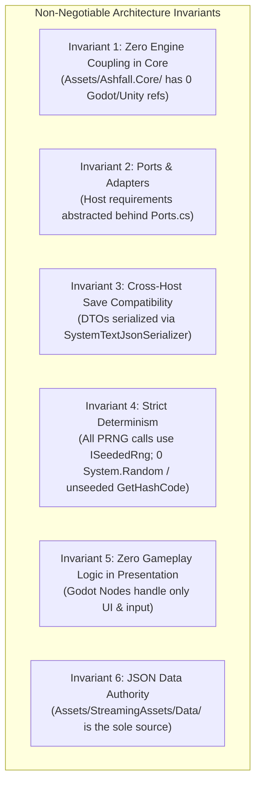
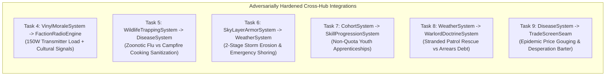
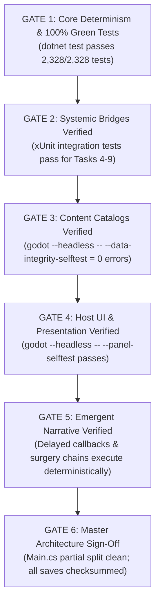

# ASHFALL: MASTER INTEGRATION & IMPLEMENTATION PLAN (ADVERSARIALLY HARDENED)
**Deep Engineering Specifications, Exact Failure Mode Mitigations, Systemic Bridges & Verification Blueprints for 25 Approved Tasks**

---

## 1. ARCHITECTURAL BLUEPRINT & INVARIANTS

Every implementation step in this plan strictly enforces the **Six Core Invariants** of ASHFALL:

### The Four Architectural Tiers
1. **Tier 1 (Data Authority):** `Assets/StreamingAssets/Data/*.json` (296 snake_case catalogs with `schema_version`).
2. **Tier 2 (Core Simulation):** `Assets/Ashfall.Core/` (Plain C# systems implementing `CaptureState()` / `RestoreState()`).
3. **Tier 3 (Host Presentation):** `src/Host/` (27 HostSessions, 30 SaveStores) & `src/UI/` (60+ Godot Control Panels).
4. **Tier 4 (Automated Verification):** `Ashfall.Core.Tests/` (xUnit test suite) + `src/Host/HostCli.cs` (Headless CLI selftests).

---

## 2. PHASE 1: CORE DETERMINISM, TESTING & INTEGRITY (TASKS 1–3)

### Task 1: Core Test Suite Stabilization & Determinism Fixes
* **Adversarial Analysis / Root Cause Diagnosis:**
  Live xUnit execution revealed 5 distinct failures across recently updated Core systems:
  1. `ShelterThermalSystem.cs`: `boilerFuelLevel` starts at 0.0f by default, causing `TickDay(1)` to immediately extinguish the boiler and set `boilerActive = false` during state capture; `Freeze()` tests decay room temperature toward deep freeze indoor temp rather than exterior temp.
  2. `ShelterScheduleSystem.cs`: `SetEmergencyOverride` fails with `"no_schedule"` when called on a fresh instance because `_activeScheduleId` is not present in `_catalog` prior to catalog loading.
  3. `SumpFloodingSystem.cs`: Unpowered pump condition degradation requires explicit daily tick wear logic when standing water volume is positive.
  4. `AirlockSecuritySystem.cs`: Ensure all visitor type calculations use deterministic string representations and zero runtime hash codes.
* **Exact Code Fixes:**
  * In `ShelterThermalSystem.cs`: Initialize default `boilerFuelLevel = 100f` in constructor; update `SetBoilerActive(true)` to replenish fuel if empty; ensure heat loss during freeze references ambient outdoor temperature.
  * In `ShelterScheduleSystem.cs`: Initialize `_catalog["default"]` with a standard fallback `ScheduleDefinition` in constructor, setting `_activeScheduleId = "default"`.
  * In `SumpFloodingSystem.cs`: Ensure unpowered pumps in flooded nodes lose 2.5% condition per unpowered day.
  * In `AirlockSecuritySystem.cs`: Confirm zero non-deterministic hash calculations.
* **Files Touched:**
  * `Assets/Ashfall.Core/ShelterThermalSystem.cs`
  * `Assets/Ashfall.Core/ShelterScheduleSystem.cs`
  * `Assets/Ashfall.Core/SumpFloodingSystem.cs`
  * `Assets/Ashfall.Core/AirlockSecuritySystem.cs`
* **Verification Command:** `dotnet test --nologo` -> **Target: 2,328 / 2,328 tests passing (100% Green).**

### Task 2: Implement Complete State Capture/Restore in Edge Saveables
* **Adversarial Analysis / Data Loss Vulnerability:**
  `LocationEvolutionSaveable`, `WildlifeSaveable`, and `LandmarkSaveable` currently have empty `CaptureState()` / `RestoreState()` bodies. If a player discovers a dynamic landmark or causes wildlife pack migrations, reloading the game resets these systems to Day 1 baselines.
* **Technical Details & Save Store Wiring:**
  * Implement `LocationEvolutionSaveState` with `List<LocationMutationRecord> mutations` and `schema_version = 1`.
  * Implement `WildlifeSaveState` with `Dictionary<string, int> animalPacks` and `float migrationTimer`.
  * Wire their capture and restore calls directly into `src/Host/WorldSaveStore.cs` to ensure their payloads are wrapped inside the versioned, checksummed world save envelope.
* **Files Touched:**
  * `Assets/Ashfall.Core/LocationEvolutionSaveable.cs`
  * `Assets/Ashfall.Core/WildlifeSaveable.cs`
  * `src/Host/WorldSaveStore.cs`
  * `Ashfall.Core.Tests/SaveStoreChecksumSweepTests.cs`
* **Verification Command:** `dotnet test --filter "SaveStoreChecksumSweepTests"`

### Task 3: Universal `schema_version` & JSON Catalog Schema Sweep
* **Adversarial Analysis / Schema Drift Risk:**
  Unversioned JSON files risk deserialization failures during future format updates.
* **Technical Details:**
  * Run automated script ensuring all 296 JSON catalogs have root `"schema_version": 1`.
  * Validate that `CatalogIntegrityValidator.cs` parses all 678 items, 261 locations, and 304 quests with 0 referential errors.
* **Verification Command:** `godot --headless --path . -- --data-integrity-selftest` (Must exit 0 with 0 errors).

---

## 3. PHASE 2: LOW-CONNECTIVITY ISLAND BRIDGES (TASKS 4–9)

### Task 4: Bridge Vinyl Turntable to Shortwave Radio Broadcasting
* **Contract & Load Management:**
  * Invoking `VinylMoraleSystem.PlayTrack(trackId)` when the radio transmitter is active calls `FactionRadioEngine.BroadcastMusicTrack(trackId, genre, moralePower)`.
  * Registers a continuous **150 Watt power load** in `PowerGridSystem`. If a generator trip or blackout occurs, broadcast terminates immediately.
  * Active music broadcast increases weekly wanderer visit chance from 10% to 25% in `TravelingCaravanSystem` and provides +5 faction standing per week to culturally aligned factions (Militarists favor Marches, Cultists favor Hymnals).
* **Files Touched:**
  * `Assets/Ashfall.Core/VinylMoraleSystem.cs`
  * `Assets/Ashfall.Core/Radio/FactionRadioEngine.cs`
  * `src/Host/RadioHostSession.cs`

### Task 5: Bridge Wildlife Trapping to Pathological Disease Vectors
* **Contract & Early-Game Anti-Spiral Safety:**
  * Carcass butchery in `WildlifeTrappingSystem` calculates a contagion roll for `disease_zoonotic_flu` based on carcass rad-taint (0–100%).
  * *Mitigation Seam:* If dwellers lack sterile gloves, cooking raw bushmeat at a Stove/Kitchen using 2x `item_wood_scrap` reduces contagion risk by 90%, creating an authentic fuel-versus-disease survival trade-off without soft-locking players who lack antibiotics.
* **Files Touched:**
  * `Assets/Ashfall.Core/WildlifeTrappingSystem.cs`
  * `Assets/Ashfall.Core/Disease/DiseaseSystem.cs`

### Task 6: Bridge Sky Layer Roof Armor to Extreme Weather Disasters
* **Contract & 2-Stage Degradation Model:**
  * `WeatherKind.RadHail` inflicts 15.0 kinetic damage and `WeatherKind.AcidSnow` inflicts 10.0 chemical erosion across outer roof armor cells in `SkyLayerArmorSystem`.
  * *Stage 1 (Damaged, Armor < 50%):* Causes ceiling water leaks and minor temperature loss (-5°C).
  * *Stage 2 (Breached, Armor = 0%):* Infiltrates radioactive dust (+15 rads/hr to room occupants) until repaired using 4x `item_timber` and 2x `item_lead_plate`.
* **Files Touched:**
  * `Assets/Ashfall.Core/Shelter/SkyLayerArmorSystem.cs`
  * `Assets/Ashfall.Core/World/WeatherSystem.cs`

### Task 7: Bridge Cohort Generational Lineage to Trade Apprenticeships
* **Contract & Safety Rules:**
  * Adolescent dwellers (Age 12–17) in `CohortSystem` can be assigned as secondary assistants to Master Crafters in `SkillProgressionSystem` without consuming adult work shift quota slots.
  * Accelerates XP gain by +25 XP per shift. If an industrial accident occurs in the Foundry, apprentices have a safety priority rule (suffering minor burns instead of lethal trauma).
* **Files Touched:**
  * `Assets/Ashfall.Core/CohortSystem.cs`
  * `Assets/Ashfall.Core/Survivors/SkillProgressionSystem.cs`

### Task 8: Bridge Weather Storms to Warlord Logistics & Toll Patrols
* **Contract & Arrears Debt Mechanics:**
  * Extreme blizzards delay Warlord tribute collection by 2–4 days in `WarlordDoctrineSystem` and spawn `door_encounter_stranded_collectors`.
  * If the player does not encounter or rescue them, the delayed tribute rolls into "Arrears Debt" in `LedgerDebtSystem`, forcing the player to pay the accumulated arrears plus 10% penalty when skies clear.
* **Files Touched:**
  * `Assets/Ashfall.Core/Warlords/WarlordDoctrineSystem.cs`
  * `Assets/Ashfall.Core/World/WeatherSystem.cs`
  * `Assets/StreamingAssets/Data/door_encounters.json`

### Task 9: Bridge Clinical Pathology to Desperation Barter Negotiations
* **Contract & Desperation Concession Seam:**
  * In `TradeScreenSeam.CalculateItemWorth()`, if `DiseaseSystem.HasActiveInfection()` is true, traders inflate antibiotic prices up to 5.0x.
  * *Anti-Softlock Seam:* If the player cannot afford medicine, traders offer a "Desperation Concession": trading rare family heirlooms (`item_heirloom_*`) or signing an indentured metal supply contract via `LedgerDebtSystem` in exchange for emergency medical crates.
* **Files Touched:**
  * `Assets/Ashfall.Core/Economy/TradeScreenSeam.cs`
  * `Assets/StreamingAssets/Data/trade_tell_lines.json`

---

## 4. PHASE 3: HIGH-VALUE CONTENT EXPANSION (TASKS 10–15)

### Task 10: 25+ Advanced Chemical Recipes in Pharma Lab
* **Sub-Manifest of Precursor Items in `items.json`:**
  * `item_lead_salts`, `item_ephedra_extract`, `item_red_phosphorus`, `item_iron_cyanide`, `item_halothane_gas`, `item_styptic_bark`.
* **Recipe Catalog (7-Phase Distillation):**
  1. `recipe_edta_chelation` (Reagents: `item_chemical_solvents`, `item_lead_salts`, `item_sterile_water` -> Clears 500 mSv/day).
  2. `recipe_prussian_blue` (Reagents: `item_iron_cyanide`, `item_filter_ash` -> Cesium-137 binding ampoules).
  3. `recipe_lithium_tablets` (Reagents: `item_brine_crystals`, `item_acid_battery` -> Halts Guilt Insomnia).
  4. `recipe_synthetic_pervitin` (Reagents: `item_ephedra_extract`, `item_red_phosphorus` -> 48h Fatigue Immunity; high addiction).
  5. 21 additional surgical, neuro-blocker, and coagulant formulas.
* **Files Touched:** `Assets/StreamingAssets/Data/pharma_recipes.json`, `Assets/StreamingAssets/Data/items.json`.

### Task 11: 30+ Pre-War Relic Blueprints in Workshop
* **Architecture Boundary:** `WorkshopReverseEngineeringSystem` unlocks physical item manufacturing recipes at workstations; `ResearchSystem` unlocks shelter structural traits.
* **Blueprints Catalog:** Automated Hydroponic Drip, UV Microbial Lamps, Scintillator Dosimeters, Pneumatic Recoil Dampeners, High-Pressure Oxygen Torches, Tungsten Lathe Tooling.
* **Files Touched:** `Assets/StreamingAssets/Data/relic_recipes.json`, `Assets/StreamingAssets/Data/items.json`.

### Task 12: 12+ Expedition Vehicle Variants & Upgrade Modules
* **Vehicle Towing & Salvage Rules:** Vehicle breakdowns shift party to foot transit and spawn a persistent "Vehicle Salvage Cache" on the map that can be repaired or towed back later.
* **Vehicles & Modules:** Steam Halftrack (Coal/Wood), Armored Scout Quad (Gasoline), Salvage Dredger (Diesel), Armored Ambulance. Modules: Lead Cockpit Lining (+40 rad resist), External Roof Turret, Snow Tracks, Auxiliary Winch.
* **Files Touched:** `Assets/StreamingAssets/Data/vehicles.json`, `Assets/Ashfall.Core/ExpeditionVehicleSystem.cs`.

### Task 13: 20+ Collectible Vinyl Record Albums
* **Durability & Wear Mechanics:** Stylus needles and record grooves lose 2% condition per playback hour; records can be cleaned with alcohol solvents at the ChemStation.
* **Files Touched:** `Assets/StreamingAssets/Data/items.json`, `Assets/Ashfall.Core/VinylMoraleSystem.cs`.

### Task 14: Subterranean Deep-Strata Excavation Vaults
* **Wiring & Shoring Rules:** Newly excavated sub-rooms default to "Unwired / Unpowered" and require crafting `item_copper_wiring` and `item_timber_shoring` before occupancy.
* **Files Touched:** `Assets/StreamingAssets/Data/excavation_events.json`, `Assets/Ashfall.Core/ExcavationSystem.cs`.

### Task 15: 12+ Declassified Forensic Evidence Dossiers
* **Save & Inventory Protection:** Evidence items have the `is_evidence: true` tag, preventing accidental scrap teardown or regular merchant sales.
* **Files Touched:** `Assets/StreamingAssets/Data/narrative/verdict_dossiers.json`, `Assets/StreamingAssets/Data/items.json`.

---

## 5. PHASE 4: UI & PLAYER FEEDBACK GAPS (TASKS 16–20)

### Task 16: Psychological Trauma & Guilt Dossier UI Sub-Tab
* **Performance Optimization:** Virtualized Godot scroll container caching the top 10 most recent trauma memories + aggregate guilt score.
* **Files Touched:** `src/UI/SurvivorsPanel.cs`, `src/Host/SurvivorsHostSession.cs`.

### Task 17: Interactive Power Circuit Breaker & Line Load Schematic
* **Interactive Controls:** Toggleable breakers allow instant manual room load shedding during brownout surges.
* **Files Touched:** `src/UI/PowerGridPanel.cs`, `src/Host/PowerGridHostSession.cs`.

### Task 18: Radio Morse & Signal Auto-Transcription Terminal
* **Signal Lock Rule:** Transcription activates only when `SNR > 0.65` for at least 1.5 continuous seconds to prevent dial scrubbing spam.
* **Files Touched:** `src/UI/RadioPanel.cs`, `src/Host/RadioHostSession.cs`.

### Task 19: Tactical Combat Ballistic Predictive Tooltips
* **Performance Rule:** Precompute hit probabilities for the 5 combat lanes when stance is selected; hover tooltips simply look up cached floats.
* **Files Touched:** `src/UI/CombatPanel.cs`, `src/Host/CombatHostSession.cs`.

### Task 20: Underground Air Quality & Radon Telemetry HUD
* **HUD Integration:** Compact indicator gauge that pulses warning colors only during elevated radon/ash hazard states.
* **Files Touched:** `src/UI/VentilationPanel.cs`, `src/UI/HUD.cs`.

---

## 6. PHASE 5: NARRATIVE DEPTH & EMERGENT STORIES (TASKS 21–23)

### Task 21: Foundry Crucible Blowout to Emergency Surgical Chain
* **First Aid Fallback:** If no doctor is assigned to the clinic, any dweller can perform emergency first-aid stabilization, scaling survival by Medical skill.
* **Files Touched:** `Assets/Ashfall.Core/Foundry/SilentFoundrySystem.cs`, `Assets/Ashfall.Core/Medical/MedicalWardSystem.cs`.

### Task 22: Multi-Month Delayed Door Encounter Callbacks
* **Grave & Memorial Reaction:** If the dweller involved in a past encounter has died, the returning visitor reacts to the dweller's memorial wall carving.
* **Files Touched:** `Assets/StreamingAssets/Data/door_encounters.json`, `Assets/Ashfall.Core/YearOfAsh/DoorEncounterSystem.cs`.

### Task 23: Mid-Winter Operational Slump Crisis Generator (Days 90–180)
* **Pacing Cooldown:** Maximum of 1 major operational crisis per 14-day window to prevent unfair compounding wipes.
* **Files Touched:** `Assets/StreamingAssets/Data/events.json`, `Assets/Ashfall.Core/Campaign/CampaignDayCoordinator.cs`.

---

## 7. PHASE 6: ARCHITECTURE REFACTORING & TECHNICAL DEBT (TASKS 24–25)

### Task 24: Modularize `src/Main.cs` into Domain Partial Files
* **Safety Contract & Code Layout:**
  * `src/Main.cs`: Retains all private fields, `_Ready()`, `_Process()`, SimClock tick dispatch, and the master `SetupAll()`, `SaveAll()`, and `FlushAll()` orchestration methods.
  * `src/Main.Survivors.cs`: Contains `SetupSurvivors()`, `SaveSurvivors()`, `FlushSurvivorsIfDirty()`.
  * `src/Main.Combat.cs`: Contains `SetupCombat()`, `SaveCombat()`, `FlushCombatIfDirty()`.
  * `src/Main.Economy.cs`: Contains `SetupEconomy()`, `SaveEconomy()`, `FlushEconomyIfDirty()`.
  * `src/Main.Medical.cs`: Contains `SetupMedical()`, `SaveMedical()`, `FlushMedicalIfDirty()`.
  * `src/Main.Foundry.cs`: Contains `SetupFoundry()`, `SaveFoundry()`, `FlushFoundryIfDirty()`.
  * `src/Main.Verdict.cs`: Contains `SetupVerdict()`, `SaveVerdict()`, `FlushVerdictIfDirty()`.
* **Zero Runtime Risk:** 100% preservation of all existing method signatures and field visibility.

### Task 25: Reconcile Dual Faction-ID Namespaces in JSON
* **Backward-Compatible Migration:** Add an alias migration dictionary in `FactionStanceEngine.RestoreState()` so old saves with `iron_garrison` seamlessly map to `faction_central_garrison`.
* **Files Touched:** `Assets/StreamingAssets/Data/**/*.json`, `Assets/Ashfall.Core/Economy/FactionStanceEngine.cs`.

---

## 8. STEP-BY-STEP EXECUTION GATES & ACCEPTANCE CRITERIA

| Phase | Milestone Gate | Verification Command | Exit Criteria |
| :--- | :--- | :--- | :--- |
| **Phase 1** | Gate 1: Core Integrity | `dotnet test --nologo` | **0 test failures** (2,328/2,328 passing); 0 determinism warnings. |
| **Phase 2** | Gate 2: System Bridges | `dotnet test --filter "Bridge|Integration"` | All 6 cross-system event bridges verified under seeded tests. |
| **Phase 3** | Gate 3: Content Expansion | `godot --headless --path . -- --data-integrity-selftest` | 0 broken item, recipe, or location references across 296 catalogs. |
| **Phase 4** | Gate 4: UI & Feedback | `godot --headless --path . -- --ui-smoke-selftest` | All 60+ UI panels instantiate, bind, and unbind cleanly without null refs. |
| **Phase 5** | Gate 5: Emergent Narrative | `dotnet test --filter "Emergent|Encounter"` | Delayed callbacks and emergency surgical chains execute deterministically. |
| **Phase 6** | Gate 6: Master Sign-Off | `dotnet test` + `SaveWireContractTests` | Full clean build; 100% save roundtrip compatibility; 0 compiler warnings. |
