# ASHFALL: STRATEGIC NEXT-STEPS ACTION PLAN
**25 Prioritized Implementation & Expansion Tasks (Forensic Gap Remediation, Systemic Integration & Content Expansion)**

---

## EXECUTIVE SUMMARY & STRATEGY

Following the comprehensive forensic audit across [`docs/ASHFALL_IMPLEMENTED_CANON_REGISTRY.md`](docs/ASHFALL_IMPLEMENTED_CANON_REGISTRY.md) and [`docs/ASHFALL_EXPANSION_CONTEXT_ATLAS.md`](docs/ASHFALL_EXPANSION_CONTEXT_ATLAS.md), this action plan identifies the **25 highest-impact next steps** to elevate ASHFALL from a functionally complete simulation core into a deeply integrated, polished, and content-rich post-nuclear survival management masterpiece.

```mermaid
graph TD
    subgraph Phase1["Phase 1: Determinism & Core Integrity (Tasks 1-3)"]
        T1["Task 1: Fix Airlock Non-Determinism (100% Green Tests)"]
        T2["Task 2: Empty Saveable DTO Audit & Capture/Restore Fix"]
        T3["Task 3: Universal schema_version & JSON Catalog Sweep"]
    end

    subgraph Phase2["Phase 2: Low-Connectivity Island Bridges (Tasks 4-9)"]
        T4["Task 4: Bridge Vinyl Turntable to Radio Broadcasting"]
        T5["Task 5: Bridge Wildlife Trapping to Epidemic Vectors"]
        T6["Task 6: Bridge Sky Layer Armor to Extreme Weather Storms"]
        T7["Task 7: Bridge Cohort Lineage to Trade Apprenticeships"]
        T8["Task 8: Bridge Weather Storms to Warlord Patrol Logistics"]
        T9["Task 9: Bridge Clinical Pathology to Barter Negotiation"]
    end

    subgraph Phase3["Phase 3: High-Value Content Expansion (Tasks 10-15)"]
        T10["Task 10: 25+ Advanced Chemical Recipes in PharmaLab"]
        T11["Task 11: 30+ Pre-War Relic Blueprints in Workshop"]
        T12["Task 12: 12+ Expedition Vehicle Variants & Upgrades"]
        T13["Task 13: 20+ Collectible Vinyl Record Albums"]
        T14["Task 14: Deep-Strata Subterranean Excavation Vaults"]
        T15["Task 15: 12+ Declassified Forensic Evidence Dossiers"]
    end

    subgraph Phase4["Phase 4: UI & Feedback Transparency (Tasks 16-20)"]
        T16["Task 16: Psychological Trauma & Guilt Dossier UI"]
        T17["Task 17: Interactive Power Circuit Breaker Board"]
        T18["Task 18: Radio Morse & Signal Auto-Transcription Log"]
        T19["Task 19: Tactical Combat Ballistic Predictive Tooltips"]
        T20["Task 20: Underground Air Quality & Radon Telemetry HUD"]
    end

    subgraph Phase5["Phase 5: Narrative Depth & Emergent Stories (Tasks 21-23)"]
        T21["Task 21: Foundry Crucible Blowout to Emergency Surgery Chain"]
        T22["Task 22: Multi-Month Delayed Door Encounter Callbacks"]
        T23["Task 23: Mid-Winter Operational Slump Crisis Generator (Days 90-180)"]
    end

    subgraph Phase6["Phase 6: Host Modularization & Architecture (Tasks 24-25)"]
        T24["Task 24: Modularize Main.cs into Domain Partial Files"]
        T25["Task 25: Reconcile Dual Faction-ID Namespaces in JSON"]
    end

    Phase1 --> Phase2
    Phase2 --> Phase3
    Phase3 --> Phase4
    Phase4 --> Phase5
    Phase5 --> Phase6
```

---

## 25 PRIORITIZED IMPLEMENTATION TASKS

### PHASE 1: CORE DETERMINISM, TESTING & INTEGRITY

#### Task 1: Fix Core Non-Determinism in Airlock Security (`AirlockSecuritySystem.cs:80`)
* **Problem / Gap:** Exactly 1 xUnit test fails (`CoreInvariantSourceTests.Core_HasZeroNondeterminismSources`) because `AirlockSecuritySystem.cs` line 80 calls `visitorType?.GetHashCode()`. Object hash codes in .NET are non-deterministic between process runs, violating Invariant 4.
* **Action:** Replace `visitorType?.GetHashCode()` with deterministic string hashing via `StableHash.Compute(visitorType)` or an explicit integer type enum lookup.
* **Target Files:** [`Assets/Ashfall.Core/AirlockSecuritySystem.cs`](Assets/Ashfall.Core/AirlockSecuritySystem.cs), [`Ashfall.Core.Tests/CoreInvariantSourceTests.cs`](Ashfall.Core.Tests/CoreInvariantSourceTests.cs).
* **Expected Outcome:** Test suite achieves **100% passing status (2,194/2,194 tests)** with 0 determinism violations.

#### Task 2: Implement Missing Save State in Edge Saveables
* **Problem / Gap:** `LocationEvolutionSaveable`, `WildlifeSaveable`, and `LandmarkSaveable` currently contain empty `CaptureState()` and `RestoreState()` bodies, causing silent loss of dynamic location mutations across save/load cycles.
* **Action:** Implement proper serializable DTOs for each saveable with `schema_version` and wire them into `SaveWireContractTests.cs`.
* **Target Files:** [`Assets/Ashfall.Core/World/LocationEvolutionSaveable.cs`](Assets/Ashfall.Core), [`Assets/Ashfall.Core/WildlifeSaveable.cs`](Assets/Ashfall.Core).
* **Expected Outcome:** Persistent world mutations, animal migration patterns, and landmark discoveries survive save/reload without data loss.

#### Task 3: Universal `schema_version` & JSON Catalog Schema Sweep
* **Problem / Gap:** While master catalogs have `schema_version`, approximately 15% of smaller narrative and expansion JSON files lack explicit schema versioning headers.
* **Action:** Run a script adding `"schema_version": 1` to all root and narrative JSON catalogs in `Assets/StreamingAssets/Data/` and pin via `CatalogIntegrityValidator`.
* **Target Files:** [`Assets/StreamingAssets/Data/**/*.json`](Assets/StreamingAssets/Data), [`CatalogIntegrityValidator.cs`](Assets/Ashfall.Core/CatalogIntegrityValidator.cs).
* **Expected Outcome:** Future schema changes can be version-migrated safely without breaking older save files or legacy data loaders.

---

### PHASE 2: LOW-CONNECTIVITY ISLAND BRIDGES

#### Task 4: Bridge Vinyl Turntable to Shortwave Radio Broadcasting
* **Problem / Gap:** [`VinylMoraleSystem.cs`](Assets/Ashfall.Core/VinylMoraleSystem.cs) is an isolated island providing an internal shelter morale buff, while [`FactionRadioEngine.cs`](Assets/Ashfall.Core/Radio/FactionRadioEngine.cs) only receives external audio signals.
* **Action:** Wire `VinylMoraleSystem.OnPlaybackStarted` to `FactionRadioEngine.BroadcastSignal()`. Broadcasting rare pre-war jazz or classical music transmits an outbound cultural signal across the wasteland, increasing weekly wanderer recruitment rates (+15%) and attracting friendly traveling caravans.
* **Target Files:** `Assets/Ashfall.Core/VinylMoraleSystem.cs`, `Assets/Ashfall.Core/Radio/FactionRadioEngine.cs`, `src/Host/RadioHostSession.cs`.
* **Expected Outcome:** Turntable gameplay extends into active wasteland diplomacy and regional cultural influence.

#### Task 5: Bridge Wildlife Trapping to Pathological Disease Vectors
* **Problem / Gap:** [`WildlifeTrappingSystem.cs`](Assets/Ashfall.Core/WildlifeTrappingSystem.cs) generates bushmeat and pelts in isolation without testing meat contamination against [`DiseaseSystem.cs`](Assets/Ashfall.Core/Disease/DiseaseSystem.cs).
* **Action:** Hook carcass butchery into `DiseaseSystem.EvaluateContagion()`. Butchering wild beasts without sterile butchery tools or high Cooking skill introduces risks of contracting `disease_zoonotic_flu` or toxic parasite infections.
* **Target Files:** `Assets/Ashfall.Core/WildlifeTrappingSystem.cs`, `Assets/Ashfall.Core/Disease/DiseaseSystem.cs`.
* **Expected Outcome:** Wildlife harvesting introduces meaningful trade-offs between emergency calories and epidemic infection risks.

#### Task 6: Bridge Sky Layer Roof Armor to Extreme Weather Disasters
* **Problem / Gap:** [`SkyLayerArmorSystem.cs`](Assets/Ashfall.Core/Shelter/SkyLayerArmorSystem.cs) models cell-grid roof armor against kinetic penetration, but is rarely tested outside of rare orbital strikes.
* **Action:** Connect `WeatherSystem.CurrentWeather` directly to roof armor integrity. `WeatherKind.RadHail`, `WeatherKind.GlassStorm`, and `WeatherKind.AcidSnow` inflict structural erosion on un-reinforced roof cells, triggering ceiling leaks and interior radiation contamination if not repaired with timber and lead plating.
* **Target Files:** `Assets/Ashfall.Core/Shelter/SkyLayerArmorSystem.cs`, `Assets/Ashfall.Core/World/WeatherSystem.cs`, `src/Host/PowerGridHostSession.cs`.
* **Expected Outcome:** Overhead fortification becomes a critical active defensive layer during severe post-nuclear weather seasons.

#### Task 7: Bridge Cohort Generational Lineage to Trade Apprenticeships
* **Problem / Gap:** [`CohortSystem.cs`](Assets/Ashfall.Core/CohortSystem.cs) and [`GenerationalLineageExtension.cs`](Assets/Ashfall.Core/GenerationalLineageExtension.cs) track child maturation in the late game, but children cannot participate in daily bunker operations or education.
* **Action:** Wire adolescent dwellers into [`SkillProgressionSystem.cs`](Assets/Ashfall.Core/Survivors/SkillProgressionSystem.cs) as apprentices. Assigning a youth to work alongside a Master Crafter in the Silent Foundry, Clinic, or Chem Lab accelerates skill XP gain by 200% and unlocks unique generational successor traits.
* **Target Files:** `Assets/Ashfall.Core/CohortSystem.cs`, `Assets/Ashfall.Core/Survivors/SkillProgressionSystem.cs`, `Assets/Ashfall.Core/Survivors/TradeSpecialtySystem.cs`.
* **Expected Outcome:** Long-term multi-year playthroughs gain deep generational legacy and succession mechanics.

#### Task 8: Bridge Weather Storms to Warlord Logistics & Toll Patrols
* **Problem / Gap:** [`WarlordDoctrineSystem.cs`](Assets/Ashfall.Core/Warlords/WarlordDoctrineSystem.cs) schedules tribute collections on static day intervals regardless of active blizzard or fallout storms.
* **Action:** Modulate Warlord patrol arrival times based on `WeatherSystem.CurrentWeather`. Severe blizzards strand collector squads in the wasteland, creating emergency threshold events where players can rescue freezing extortionists for major diplomatic goodwill (+25 standing) or let them perish to scavenge their weapons.
* **Target Files:** `Assets/Ashfall.Core/Warlords/WarlordDoctrineSystem.cs`, `Assets/Ashfall.Core/World/WeatherSystem.cs`, `door_encounters.json`.
* **Expected Outcome:** Weather directly disrupts geopolitical extortion and creates dynamic emergent dilemmas.

#### Task 9: Bridge Clinical Pathology to Desperation Barter Negotiations
* **Problem / Gap:** Visiting merchant caravans evaluate item prices in [`TradeScreenSeam.cs`](Assets/Ashfall.Core/Economy/TradeScreenSeam.cs) without evaluating active shelter disease outbreaks.
* **Action:** Hook `DiseaseSystem.HasActiveInfection()` into `TradeScreenSeam.CalculateItemWorth()`. Opportunistic wasteland traders charge extortionate prices (up to 8.0x) for antibiotics and clean water if they observe sick dwellers coughing in the airlock, or offer discounted bulk medicine in exchange for rare military firearms.
* **Target Files:** `Assets/Ashfall.Core/Economy/TradeScreenSeam.cs`, `Assets/Ashfall.Core/Disease/DiseaseSystem.cs`, `trade_tell_lines.json`.
* **Expected Outcome:** Epidemics create severe economic desperation and high-stakes trade choices.

---

### PHASE 3: HIGH-VALUE CONTENT EXPANSION ON UNDERUSED ENGINES

#### Task 10: Author 25+ Advanced Chemical Recipes in Pharma Lab
* **Problem / Gap:** [`PharmaLabSystem.cs`](Assets/Ashfall.Core/PharmaLabSystem.cs) has a full 7-phase distillation state machine with purity and addiction rolls, but currently only supports a handful of basic medical recipes.
* **Action:** Author 25+ advanced chemical synthesis recipes in JSON:
  * *Chelators:* EDTA Infusion (rapid ARS clearance), Prussian Blue Ampoules (cesium isotope binding).
  * *Psychotropics:* Lithium Carbonate Solution (suppresses guilt insomnia), Chlorpromazine (halts somatic flashbacks).
  * *Stimulants:* Synthetic Pervitin (eliminates fatigue for 48h; high addiction risk), Epinephrine Injections (resuscitates critical surgery patients).
  * *Surgical:* Halothane Anesthetic, Sterile Iodine Swabs, Coagulant Styptic Powders.
* **Target Files:** `Assets/StreamingAssets/Data/pharma_recipes.json` (or `items.json`), `Assets/Ashfall.Core/PharmaLabSystem.cs`.
* **Expected Outcome:** The Pharma Lab becomes a central late-game strategic hub for life extension and chemical engineering.

#### Task 11: Author 30+ Pre-War Relic Blueprints in Workshop
* **Problem / Gap:** [`WorkshopReverseEngineeringSystem.cs`](Assets/Ashfall.Core/WorkshopReverseEngineeringSystem.cs) implements artifact teardown, tool wear, and blueprint discovery, but has limited relic definitions in `relic_recipes.json`.
* **Action:** Author 30+ pre-war technical relics and unlocking blueprints:
  * *Shelter Tech:* Automated Hydroponic Nutrient Drip, UV Sterilization Lamps, Micro-Geiger Scintillators, High-Efficiency Ozone Injectors.
  * *Military Gear:* Pneumatic Recoil Dampeners, Night-Vision Optics, Infrared Thermal Scopes, Match-Grade Barrel Liners.
  * *Industrial Tools:* Tungsten Carbide Lathe Bits, Pneumatic Riveting Hammers, High-Pressure Oxygen Torches.
* **Target Files:** `Assets/StreamingAssets/Data/relic_recipes.json`, `Assets/StreamingAssets/Data/items.json`.
* **Expected Outcome:** Scavenging runs yield exciting technical relics that unlock permanent structural and tactical upgrades.

#### Task 12: Author 12+ Expedition Vehicle Variants & Upgrades
* **Problem / Gap:** [`ExpeditionVehicleSystem.cs`](Assets/Ashfall.Core/ExpeditionVehicleSystem.cs) models chassis stats, armor, fuel consumption, and breakdown rates, but standard playthroughs only spawn basic scout rigs.
* **Action:** Define 12+ vehicle hulls and modular upgrades:
  * *Hulls:* Steam-Powered Halftrack (heavy cargo, burns coal/wood), Armored Scout Quad (high speed, low radar visibility), Salvage Dredger (clears road debris), Armored Ambulance (mobile ICU bed).
  * *Upgrades:* Lead-Lined Cockpit Shielding, External Rooftop Gun Turret, Snow Treads, Aux Fuel Bladder, Winch System.
* **Target Files:** `Assets/StreamingAssets/Data/vehicles.json`, `Assets/Ashfall.Core/ExpeditionVehicleSystem.cs`.
* **Expected Outcome:** Overland wasteland expeditions gain a rich vehicular customization and maintenance meta-game.

#### Task 13: Author 20+ Collectible Vinyl Record Albums
* **Problem / Gap:** [`VinylMoraleSystem.cs`](Assets/Ashfall.Core/VinylMoraleSystem.cs) supports turntable audio playback and morale boosts, but has a sparse record catalog.
* **Action:** Author 20+ collectible vinyl record items with authentic historical/fictional liner notes and distinct buffs:
  * *Classical / Symphony:* Grants +20 Morale and accelerates sleep fatigue recovery by 25%.
  * *Post-War Blues / Folk:* Reduces Guilt Insomnia accumulation during grief crises.
  * *Industrial Marches:* Boosts Silent Foundry and Workshop work efficiency by 15% during day shifts.
  * *Cold War Radio Speeches:* Inspires Militarist dwellers (+10% combat accuracy) while causing friction among Cultists.
* **Target Files:** `Assets/StreamingAssets/Data/items.json`, `Assets/Ashfall.Core/VinylMoraleSystem.cs`.
* **Expected Outcome:** Scavenging vinyl records becomes a compelling psychological collector mechanic.

#### Task 14: Author Deep-Strata Subterranean Excavation Vaults
* **Problem / Gap:** [`ExcavationSystem.cs`](Assets/Ashfall.Core/ExcavationSystem.cs) models timber shoring, depth levels, and cave-in hazards, but is used primarily in starting room unlocks.
* **Action:** Create multi-tier deep-strata excavation missions:
  * Uncovering buried Cold War command sub-vaults, flooded emergency water cisterns, radioactive core crawlspaces, and salt caverns.
  * Implement dynamic subterranean hazards: toxic methane pockets, seismic cave-in tremors, and pressurized aquifer breaches.
* **Target Files:** `Assets/StreamingAssets/Data/excavation_events.json`, `Assets/Ashfall.Core/ExcavationSystem.cs`.
* **Expected Outcome:** Subterranean bunker expansion becomes an active, high-stakes engineering adventure.

#### Task 15: Author 12+ Declassified Forensic Evidence Dossiers for The Verdict
* **Problem / Gap:** [`ReckoningSystem.cs`](Assets/Ashfall.Core/Verdict/ReckoningSystem.cs) and [`EvidenceLedger.cs`](Assets/Ashfall.Core/Verdict/EvidenceLedger.cs) evaluate evidence items to decide The Machine's Day 360 census verdict, but require more discoverable forensic dossiers.
* **Action:** Author 12+ declassified pre-war investigative dossiers scattered across high-rad military ruins:
  * *The Substation Nine Cable Directive:* Proving automated orbital defense systems failed due to pre-war software bugs.
  * *The Hydro Baron Aquifer Divert Order:* Exposing intentional poisoning of civilian water supplies during the evacuation.
  * *The Central Garrison Execution Logs:* Documenting military tribunals against mutinous engineers.
* **Target Files:** `Assets/StreamingAssets/Data/narrative/verdict_dossiers.json`, `Assets/StreamingAssets/Data/items.json`.
* **Expected Outcome:** The endgame tribunal outcome is deeply tied to exploratory wasteland archaeology and investigative discovery.

---

### PHASE 4: UI & PLAYER FEEDBACK GAPS

#### Task 16: Implement Psychological Trauma & Guilt Dossier UI
* **Problem / Gap:** Detailed guilt records, somatic triggers, and trauma histories in `GuiltInsomniaSystem` and `SomaticFlashbackSystem` are tracked in Core but obscured in the main survivors UI.
* **Action:** Add a "Psychological Dossier" sub-tab to [`SurvivorsPanel.cs`](src/UI/SurvivorsPanel.cs) showing specific guilt crimes, active trauma triggers (e.g. panic on sirens), and trauma bond partnerships.
* **Target Files:** `src/UI/SurvivorsPanel.cs`, `src/Host/SurvivorsHostSession.cs`.
* **Expected Outcome:** Players can clearly diagnose why specific dwellers are suffering from insomnia or work refusals.

#### Task 17: Build Interactive Circuit Breaker & Line Load Schematic
* **Problem / Gap:** [`PowerGridPanel.cs`](src/UI/PowerGridPanel.cs) shows numeric watt meters and load shedding buttons, but does not visualize circuit line stress or individual room short-circuits.
* **Action:** Add an interactive electrical schematic diagram showing live wattage flows to Clinic, Hydroponics, Foundry, and Bunks, with animated breaker trip indicators and overload warning flashes.
* **Target Files:** `src/UI/PowerGridPanel.cs`, `src/Host/PowerGridHostSession.cs`.
* **Expected Outcome:** Power management becomes visually intuitive, tactical, and immediately readable during blackouts.

#### Task 18: Build Radio Morse & Signal Auto-Transcription Log
* **Problem / Gap:** Players tuning into shortwave signals in [`RadioPanel.cs`](src/UI/RadioPanel.cs) must manually decode audio Morse cues or check the journal codex.
* **Action:** Add a live auto-transcription terminal CRT window to `RadioPanel.cs` that dynamically prints decoded text, signal strength (SNR), and transmitting station identity when frequency lock is achieved.
* **Target Files:** `src/UI/RadioPanel.cs`, `src/Host/RadioHostSession.cs`.
* **Expected Outcome:** Radio scanning feels like operating authentic Cold War military signal intelligence hardware.

#### Task 19: Add Tactical Combat Ballistic Predictive Tooltips
* **Problem / Gap:** In [`CombatPanel.cs`](src/UI/CombatPanel.cs), complex ballistic physics (penetration vs armor thickness, ricochet chance, range falloff) operate under the hood without tactical previews.
* **Action:** Add predictive hover tooltips on enemy targets displaying calculated Hit Probability (%), Armor Deflection Risk (%), and Expected Damage based on selected stance and weapon condition.
* **Target Files:** `src/UI/CombatPanel.cs`, `src/Host/CombatHostSession.cs`.
* **Expected Outcome:** Players can make informed tactical decisions about when to take overwatch shots versus repositioning behind cover.

#### Task 20: Add Underground Air Quality & Deep Radon Telemetry HUD
* **Problem / Gap:** Deep shaft radon PPM and particulate levels accumulate quietly in `VentilationSystem` without distinct player feedback until dwellers develop respiratory degeneration.
* **Action:** Add an ambient "Air Quality & Radon" indicator gauge to the main HUD and ventilation panel, changing from Clean Green to Warning Yellow and Toxic Purple during ash storms.
* **Target Files:** `src/UI/VentilationPanel.cs`, `src/UI/HUD.cs`, `src/Host/PowerGridHostSession.cs`.
* **Expected Outcome:** Air intake filter health and underground radon hazards are perceived before clinical illness manifests.

---

### PHASE 5: NARRATIVE DEPTH & EMERGENT STORIES

#### Task 21: Bridge Foundry Crucible Blowouts to Emergency Surgical Chains
* **Problem / Gap:** When a crucible explodes in [`SilentFoundrySystem.cs`](Assets/Ashfall.Core/Foundry/SilentFoundrySystem.cs), workers are injured, but it does not trigger an interactive emergency hospital trauma event in [`MedicalWardSystem.cs`](Assets/Ashfall.Core/Medical/MedicalWardSystem.cs).
* **Action:** Emit a `OnIndustrialAccident` event that immediately admits severely burned workers to ICU beds in `MedicalWardSystem`, starting a 24-hour surgical stabilization timer requiring sterile saline flushes, burn dressings, and anesthetics.
* **Target Files:** `Assets/Ashfall.Core/Foundry/SilentFoundrySystem.cs`, `Assets/Ashfall.Core/Medical/MedicalWardSystem.cs`, `src/Main.cs`.
* **Expected Outcome:** Heavy industrial production failures seamlessly generate intense clinical medical drama.

#### Task 22: Author Multi-Month Delayed Door Encounter Callbacks
* **Problem / Gap:** Early-game choices in [`door_encounters.json`](Assets/StreamingAssets/Data/door_encounters.json) apply instant stat deltas but rarely trigger narrative callbacks months later.
* **Action:** Wire `IFlagLedger` flags from 15 key door encounters to spawn delayed consequence encounters 60 to 120 days later:
  * Exiled deserters return leading a heavily armed raider assault.
  * Rescued refugees return as wealthy caravan masters offering rare trade concessions.
  * Untreated plague victims infect a neighboring settlement, triggering hostile bio-weapon accusations.
* **Target Files:** `Assets/StreamingAssets/Data/door_encounters.json`, `Assets/Ashfall.Core/YearOfAsh/DoorEncounterSystem.cs`.
* **Expected Outcome:** Player moral choices carry long-term narrative weight and unexpected future repercussions.

#### Task 23: Create Mid-Winter Operational Slump Crisis Generator (Days 90–180)
* **Problem / Gap:** Once early water/power utilities stabilize around Day 60, gameplay pressure can plateau until the Day 360 Machine Reckoning.
* **Action:** Author a series of mid-game seasonal crisis chains in `events.json`:
  * *The Deep Aquifer Freezing:* Sub-zero cold freezes primary well pipes, forcing emergency steam boiler routing.
  * *The Warlord Conscription Levy:* Sector 4 demands 2 able-bodied dweller workers for labor battalions or 500 rounds of rifle ammo.
  * *The Fungal Spore Blight:* Spores infest greenhouse soil, forcing a choice between burning crops or using experimental chemical fungicides.
* **Target Files:** `Assets/StreamingAssets/Data/events.json`, `Assets/Ashfall.Core/Campaign/CampaignDayCoordinator.cs`.
* **Expected Outcome:** Mid-game survival maintains tense operational prioritization and prevents complacency.

---

### PHASE 6: ARCHITECTURE REFACTORING & TECHNICAL DEBT

#### Task 24: Modularize `src/Main.cs` into Domain Partial Files
* **Problem / Gap:** [`src/Main.cs`](src/Main.cs) is a 7,014-line monolithic class containing 38 Setup, 30 Save, and 18 Flush methods across 24 domains.
* **Action:** Split `Main.cs` into clean domain partial files (`Main.Survivors.cs`, `Main.Combat.cs`, `Main.Economy.cs`, `Main.Medical.cs`, `Main.Foundry.cs`, `Main.Verdict.cs`) while strictly preserving Setup-Save-Flush triads and existing method signatures.
* **Target Files:** `src/Main.cs`, `src/Main.*.cs`.
* **Expected Outcome:** Codebase maintainability and team navigation are drastically improved with zero breaking runtime changes.

#### Task 25: Reconcile Dual Faction-ID Namespaces Across Catalogs
* **Problem / Gap:** Inconsistent naming persists between display namespaces (`iron_garrison`, `ash_militia`) and systems IDs (`faction_central_garrison`, `faction_ash_militia`) in some quest JSONs.
* **Action:** Run a migration sweep replacing all legacy faction aliases with canonical `faction_*` IDs in `questline_master.json`, `door_encounters.json`, and `events.json`, verified by `DataRuleComplianceTests.cs`.
* **Target Files:** `Assets/StreamingAssets/Data/**/*.json`, `Ashfall.Core.Tests/DataRuleComplianceTests.cs`.
* **Expected Outcome:** Referential integrity is 100% unified, eliminating faction trigger failures in custom questlines.

---

## TASK DEPENDENCY & PRIORITY MATRIX

| Task # | Task Name | Domain | Priority | Estimated Complexity | Prerequisites |
| :---: | :--- | :--- | :---: | :---: | :---: |
| **01** | Fix Core Non-Determinism (`AirlockSecuritySystem`) | Core / Tests | **P0 (Critical)** | `CORE EXTENSION` (Tiny) | None |
| **02** | Implement Missing Save State in Edge Saveables | Core / Save | **P0 (Critical)** | `CORE EXTENSION` | None |
| **03** | Universal `schema_version` & JSON Schema Sweep | Data / Integrity | **P1 (High)** | `DATA-ONLY` | None |
| **04** | Bridge Vinyl Turntable to Radio Broadcasting | Systems Bridge | **P1 (High)** | `DATA + MINOR WIRING` | None |
| **05** | Bridge Wildlife Trapping to Disease Vectors | Systems Bridge | **P1 (High)** | `DATA + MINOR WIRING` | None |
| **06** | Bridge Sky Layer Roof Armor to Extreme Storms | Systems Bridge | **P1 (High)** | `DATA + MINOR WIRING` | None |
| **07** | Bridge Cohort Lineage to Trade Apprenticeships | Systems Bridge | **P2 (Medium)** | `CORE EXTENSION` | None |
| **08** | Bridge Weather Storms to Warlord Patrols | Systems Bridge | **P1 (High)** | `DATA + MINOR WIRING` | None |
| **09** | Bridge Pathology to Desperation Barter | Systems Bridge | **P1 (High)** | `DATA + MINOR WIRING` | None |
| **10** | 25+ Advanced Chemical Recipes in Pharma Lab | Content / Pharma | **P1 (High)** | `DATA-ONLY` | None |
| **11** | 30+ Pre-War Relic Blueprints in Workshop | Content / Workshop | **P1 (High)** | `DATA-ONLY` | None |
| **12** | 12+ Expedition Vehicle Variants & Upgrades | Content / Vehicles | **P2 (Medium)** | `DATA-ONLY` | None |
| **13** | 20+ Collectible Vinyl Record Albums | Content / Morale | **P2 (Medium)** | `DATA-ONLY` | Task 04 |
| **14** | Subterranean Deep-Strata Excavation Vaults | Content / World | **P2 (Medium)** | `DATA-ONLY` | None |
| **15** | 12+ Forensic Evidence Dossiers for The Verdict | Narrative / Lore | **P1 (High)** | `DATA-ONLY` | None |
| **16** | Psychological Trauma & Guilt Dossier UI | UI / Presentation | **P1 (High)** | `DATA + MINOR WIRING` | None |
| **17** | Interactive Power Circuit Breaker Board | UI / Presentation | **P2 (Medium)** | `DATA + MINOR WIRING` | None |
| **18** | Radio Morse & Signal Auto-Transcription Log | UI / Presentation | **P1 (High)** | `DATA + MINOR WIRING` | None |
| **19** | Tactical Combat Ballistic Predictive Tooltips | UI / Presentation | **P2 (Medium)** | `DATA + MINOR WIRING` | None |
| **20** | Underground Air Quality & Radon Telemetry HUD | UI / Presentation | **P2 (Medium)** | `DATA + MINOR WIRING` | Task 06 |
| **21** | Foundry Crucible Blowout to Surgery Chain | Emergent Narrative | **P1 (High)** | `CROSS-SYSTEM` | None |
| **22** | Multi-Month Delayed Door Encounter Callbacks | Emergent Narrative | **P1 (High)** | `DATA-ONLY` | None |
| **23** | Mid-Winter Slump Crisis Generator (Days 90-180) | Campaign Pacing | **P1 (High)** | `DATA-ONLY` | None |
| **24** | Modularize `Main.cs` into Partial Files | Architecture / Refactor | **P2 (Medium)** | `HOST REFACTOR` | Task 01 |
| **25** | Reconcile Dual Faction-ID Namespaces in JSON | Data / Clean-up | **P1 (High)** | `DATA-ONLY` | Task 03 |

---

## IMPLEMENTATION GUIDELINES FOR DEVELOPERS & AI AGENTS

1. **Verify Before and After:** Run `dotnet test` and `godot --headless --path . -- --data-integrity-selftest` before and after every single task.
2. **Honor the Four Tiers:** Never place gameplay simulation logic in `src/` (Godot). Keep all simulation in `Assets/Ashfall.Core/` and all definitions in `Assets/StreamingAssets/Data/*.json`.
3. **Preserve Invariant 4 (Determinism):** Never use `System.Random`, `Guid.NewGuid()`, or unseeded `GetHashCode()` in Core simulation classes. Always consume `ISeededRng`.
4. **Maintain Main.cs Triads:** When adding any new stateful system, implement the matching `SetupXxx`, `SaveXxx`, and `FlushXxxIfDirty` triad to ensure zero state drops.
