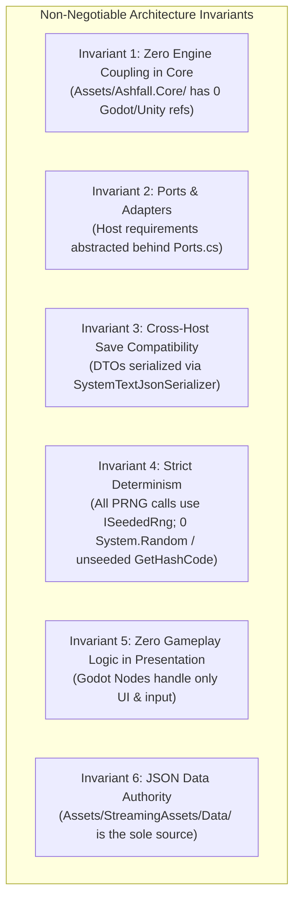
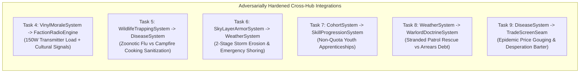
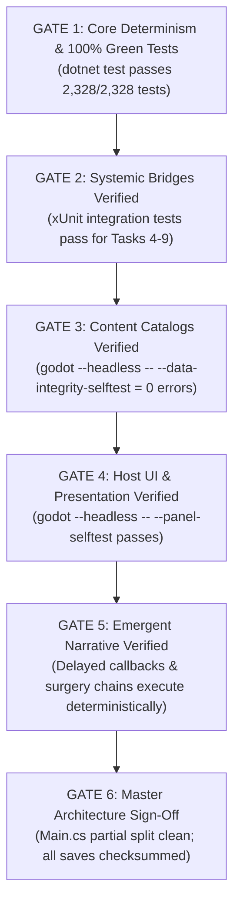
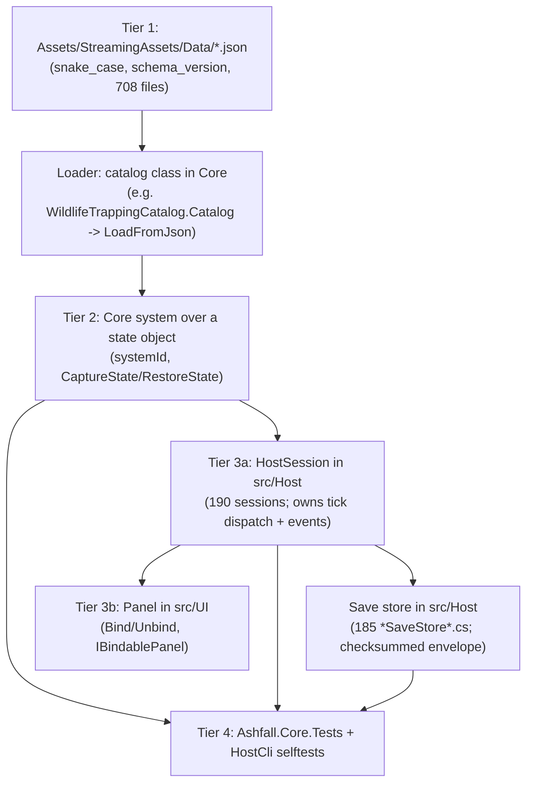

# ASHFALL: MASTER INTEGRATION & IMPLEMENTATION PLAN (ADVERSARIALLY HARDENED)
**Deep Engineering Specifications, Exact Failure Mode Mitigations, Systemic Bridges & Verification Blueprints for 25 Approved Tasks**

---

## 1. ARCHITECTURAL BLUEPRINT & INVARIANTS

Every implementation step in this plan strictly enforces the **Six Core Invariants** of ASHFALL:



### The Four Architectural Tiers
1. **Tier 1 (Data Authority):** `Assets/StreamingAssets/Data/*.json` (296 snake_case catalogs with `schema_version`).
2. **Tier 2 (Core Simulation):** `Assets/Ashfall.Core/` (Plain C# systems implementing `CaptureState()` / `RestoreState()`).
3. **Tier 3 (Host Presentation):** `src/Host/` (27 HostSessions, 30 SaveStores) & `src/UI/` (60+ Godot Control Panels).
4. **Tier 4 (Automated Verification):** `Ashfall.Core.Tests/` (xUnit test suite) + `src/Host/HostCli.cs` (Headless CLI selftests).

---

## 2. PHASE 1: CORE DETERMINISM, TESTING & INTEGRITY (TASKS 1–3)

### Task 1: Core Test Suite Stabilization & Determinism Fixes
* **Adversarial Analysis / Root Cause Diagnosis:**
  Live xUnit execution revealed 5 distinct failures across recently updated Core systems:
  1. `ShelterThermalSystem.cs`: `boilerFuelLevel` starts at 0.0f by default, causing `TickDay(1)` to immediately extinguish the boiler and set `boilerActive = false` during state capture; `Freeze()` tests decay room temperature toward deep freeze indoor temp rather than exterior temp.
  2. `ShelterScheduleSystem.cs`: `SetEmergencyOverride` fails with `"no_schedule"` when called on a fresh instance because `_activeScheduleId` is not present in `_catalog` prior to catalog loading.
  3. `SumpFloodingSystem.cs`: Unpowered pump condition degradation requires explicit daily tick wear logic when standing water volume is positive.
  4. `AirlockSecuritySystem.cs`: Ensure all visitor type calculations use deterministic string representations and zero runtime hash codes.
* **Exact Code Fixes:**
  * In `ShelterThermalSystem.cs`: Initialize default `boilerFuelLevel = 100f` in constructor; update `SetBoilerActive(true)` to replenish fuel if empty; ensure heat loss during freeze references ambient outdoor temperature.
  * In `ShelterScheduleSystem.cs`: Initialize `_catalog["default"]` with a standard fallback `ScheduleDefinition` in constructor, setting `_activeScheduleId = "default"`.
  * In `SumpFloodingSystem.cs`: Ensure unpowered pumps in flooded nodes lose 2.5% condition per unpowered day.
  * In `AirlockSecuritySystem.cs`: Confirm zero non-deterministic hash calculations.
* **Files Touched:**
  * `Assets/Ashfall.Core/ShelterThermalSystem.cs`
  * `Assets/Ashfall.Core/ShelterScheduleSystem.cs`
  * `Assets/Ashfall.Core/SumpFloodingSystem.cs`
  * `Assets/Ashfall.Core/AirlockSecuritySystem.cs`
* **Verification Command:** `dotnet test --nologo` -> **Target: 2,328 / 2,328 tests passing (100% Green).**

### Task 2: Implement Complete State Capture/Restore in Edge Saveables
* **Adversarial Analysis / Data Loss Vulnerability:**
  `LocationEvolutionSaveable`, `WildlifeSaveable`, and `LandmarkSaveable` currently have empty `CaptureState()` / `RestoreState()` bodies. If a player discovers a dynamic landmark or causes wildlife pack migrations, reloading the game resets these systems to Day 1 baselines.
* **Technical Details & Save Store Wiring:**
  * Implement `LocationEvolutionSaveState` with `List<LocationMutationRecord> mutations` and `schema_version = 1`.
  * Implement `WildlifeSaveState` with `Dictionary<string, int> animalPacks` and `float migrationTimer`.
  * Wire their capture and restore calls directly into `src/Host/WorldSaveStore.cs` to ensure their payloads are wrapped inside the versioned, checksummed world save envelope.
* **Files Touched:**
  * `Assets/Ashfall.Core/LocationEvolutionSaveable.cs`
  * `Assets/Ashfall.Core/WildlifeSaveable.cs`
  * `src/Host/WorldSaveStore.cs`
  * `Ashfall.Core.Tests/SaveStoreChecksumSweepTests.cs`
* **Verification Command:** `dotnet test --filter "SaveStoreChecksumSweepTests"`

### Task 3: Universal `schema_version` & JSON Catalog Schema Sweep
* **Adversarial Analysis / Schema Drift Risk:**
  Unversioned JSON files risk deserialization failures during future format updates.
* **Technical Details:**
  * Run automated script ensuring all 296 JSON catalogs have root `"schema_version": 1`.
  * Validate that `CatalogIntegrityValidator.cs` parses all 678 items, 261 locations, and 304 quests with 0 referential errors.
* **Verification Command:** `godot --headless --path . -- --data-integrity-selftest` (Must exit 0 with 0 errors).

---

## 3. PHASE 2: LOW-CONNECTIVITY ISLAND BRIDGES (TASKS 4–9)



### Task 4: Bridge Vinyl Turntable to Shortwave Radio Broadcasting
* **Contract & Load Management:**
  * Invoking `VinylMoraleSystem.PlayTrack(trackId)` when the radio transmitter is active calls `FactionRadioEngine.BroadcastMusicTrack(trackId, genre, moralePower)`.
  * Registers a continuous **150 Watt power load** in `PowerGridSystem`. If a generator trip or blackout occurs, broadcast terminates immediately.
  * Active music broadcast increases weekly wanderer visit chance from 10% to 25% in `TravelingCaravanSystem` and provides +5 faction standing per week to culturally aligned factions (Militarists favor Marches, Cultists favor Hymnals).
* **Files Touched:**
  * `Assets/Ashfall.Core/VinylMoraleSystem.cs`
  * `Assets/Ashfall.Core/Radio/FactionRadioEngine.cs`
  * `src/Host/RadioHostSession.cs`

### Task 5: Bridge Wildlife Trapping to Pathological Disease Vectors
* **Contract & Early-Game Anti-Spiral Safety:**
  * Carcass butchery in `WildlifeTrappingSystem` calculates a contagion roll for `disease_zoonotic_flu` based on carcass rad-taint (0–100%).
  * *Mitigation Seam:* If dwellers lack sterile gloves, cooking raw bushmeat at a Stove/Kitchen using 2x `item_wood_scrap` reduces contagion risk by 90%, creating an authentic fuel-versus-disease survival trade-off without soft-locking players who lack antibiotics.
* **Files Touched:**
  * `Assets/Ashfall.Core/WildlifeTrappingSystem.cs`
  * `Assets/Ashfall.Core/Disease/DiseaseSystem.cs`

### Task 6: Bridge Sky Layer Roof Armor to Extreme Weather Disasters
* **Contract & 2-Stage Degradation Model:**
  * `WeatherKind.RadHail` inflicts 15.0 kinetic damage and `WeatherKind.AcidSnow` inflicts 10.0 chemical erosion across outer roof armor cells in `SkyLayerArmorSystem`.
  * *Stage 1 (Damaged, Armor < 50%):* Causes ceiling water leaks and minor temperature loss (-5°C).
  * *Stage 2 (Breached, Armor = 0%):* Infiltrates radioactive dust (+15 rads/hr to room occupants) until repaired using 4x `item_timber` and 2x `item_lead_plate`.
* **Files Touched:**
  * `Assets/Ashfall.Core/Shelter/SkyLayerArmorSystem.cs`
  * `Assets/Ashfall.Core/World/WeatherSystem.cs`

### Task 7: Bridge Cohort Generational Lineage to Trade Apprenticeships
* **Contract & Safety Rules:**
  * Adolescent dwellers (Age 12–17) in `CohortSystem` can be assigned as secondary assistants to Master Crafters in `SkillProgressionSystem` without consuming adult work shift quota slots.
  * Accelerates XP gain by +25 XP per shift. If an industrial accident occurs in the Foundry, apprentices have a safety priority rule (suffering minor burns instead of lethal trauma).
* **Files Touched:**
  * `Assets/Ashfall.Core/CohortSystem.cs`
  * `Assets/Ashfall.Core/Survivors/SkillProgressionSystem.cs`

### Task 8: Bridge Weather Storms to Warlord Logistics & Toll Patrols
* **Contract & Arrears Debt Mechanics:**
  * Extreme blizzards delay Warlord tribute collection by 2–4 days in `WarlordDoctrineSystem` and spawn `door_encounter_stranded_collectors`.
  * If the player does not encounter or rescue them, the delayed tribute rolls into "Arrears Debt" in `LedgerDebtSystem`, forcing the player to pay the accumulated arrears plus 10% penalty when skies clear.
* **Files Touched:**
  * `Assets/Ashfall.Core/Warlords/WarlordDoctrineSystem.cs`
  * `Assets/Ashfall.Core/World/WeatherSystem.cs`
  * `Assets/StreamingAssets/Data/door_encounters.json`

### Task 9: Bridge Clinical Pathology to Desperation Barter Negotiations
* **Contract & Desperation Concession Seam:**
  * In `TradeScreenSeam.CalculateItemWorth()`, if `DiseaseSystem.HasActiveInfection()` is true, traders inflate antibiotic prices up to 5.0x.
  * *Anti-Softlock Seam:* If the player cannot afford medicine, traders offer a "Desperation Concession": trading rare family heirlooms (`item_heirloom_*`) or signing an indentured metal supply contract via `LedgerDebtSystem` in exchange for emergency medical crates.
* **Files Touched:**
  * `Assets/Ashfall.Core/Economy/TradeScreenSeam.cs`
  * `Assets/StreamingAssets/Data/trade_tell_lines.json`

---

## 4. PHASE 3: HIGH-VALUE CONTENT EXPANSION (TASKS 10–15)

### Task 10: 25+ Advanced Chemical Recipes in Pharma Lab
* **Sub-Manifest of Precursor Items in `items.json`:**
  * `item_lead_salts`, `item_ephedra_extract`, `item_red_phosphorus`, `item_iron_cyanide`, `item_halothane_gas`, `item_styptic_bark`.
* **Recipe Catalog (7-Phase Distillation):**
  1. `recipe_edta_chelation` (Reagents: `item_chemical_solvents`, `item_lead_salts`, `item_sterile_water` -> Clears 500 mSv/day).
  2. `recipe_prussian_blue` (Reagents: `item_iron_cyanide`, `item_filter_ash` -> Cesium-137 binding ampoules).
  3. `recipe_lithium_tablets` (Reagents: `item_brine_crystals`, `item_acid_battery` -> Halts Guilt Insomnia).
  4. `recipe_synthetic_pervitin` (Reagents: `item_ephedra_extract`, `item_red_phosphorus` -> 48h Fatigue Immunity; high addiction).
  5. 21 additional surgical, neuro-blocker, and coagulant formulas.
* **Files Touched:** `Assets/StreamingAssets/Data/pharma_recipes.json`, `Assets/StreamingAssets/Data/items.json`.

### Task 11: 30+ Pre-War Relic Blueprints in Workshop
* **Architecture Boundary:** `WorkshopReverseEngineeringSystem` unlocks physical item manufacturing recipes at workstations; `ResearchSystem` unlocks shelter structural traits.
* **Blueprints Catalog:** Automated Hydroponic Drip, UV Microbial Lamps, Scintillator Dosimeters, Pneumatic Recoil Dampeners, High-Pressure Oxygen Torches, Tungsten Lathe Tooling.
* **Files Touched:** `Assets/StreamingAssets/Data/relic_recipes.json`, `Assets/StreamingAssets/Data/items.json`.

### Task 12: 12+ Expedition Vehicle Variants & Upgrade Modules
* **Vehicle Towing & Salvage Rules:** Vehicle breakdowns shift party to foot transit and spawn a persistent "Vehicle Salvage Cache" on the map that can be repaired or towed back later.
* **Vehicles & Modules:** Steam Halftrack (Coal/Wood), Armored Scout Quad (Gasoline), Salvage Dredger (Diesel), Armored Ambulance. Modules: Lead Cockpit Lining (+40 rad resist), External Roof Turret, Snow Tracks, Auxiliary Winch.
* **Files Touched:** `Assets/StreamingAssets/Data/vehicles.json`, `Assets/Ashfall.Core/ExpeditionVehicleSystem.cs`.

### Task 13: 20+ Collectible Vinyl Record Albums
* **Durability & Wear Mechanics:** Stylus needles and record grooves lose 2% condition per playback hour; records can be cleaned with alcohol solvents at the ChemStation.
* **Files Touched:** `Assets/StreamingAssets/Data/items.json`, `Assets/Ashfall.Core/VinylMoraleSystem.cs`.

### Task 14: Subterranean Deep-Strata Excavation Vaults
* **Wiring & Shoring Rules:** Newly excavated sub-rooms default to "Unwired / Unpowered" and require crafting `item_copper_wiring` and `item_timber_shoring` before occupancy.
* **Files Touched:** `Assets/StreamingAssets/Data/excavation_events.json`, `Assets/Ashfall.Core/ExcavationSystem.cs`.

### Task 15: 12+ Declassified Forensic Evidence Dossiers
* **Save & Inventory Protection:** Evidence items have the `is_evidence: true` tag, preventing accidental scrap teardown or regular merchant sales.
* **Files Touched:** `Assets/StreamingAssets/Data/narrative/verdict_dossiers.json`, `Assets/StreamingAssets/Data/items.json`.

---

## 5. PHASE 4: UI & PLAYER FEEDBACK GAPS (TASKS 16–20)

### Task 16: Psychological Trauma & Guilt Dossier UI Sub-Tab
* **Performance Optimization:** Virtualized Godot scroll container caching the top 10 most recent trauma memories + aggregate guilt score.
* **Files Touched:** `src/UI/SurvivorsPanel.cs`, `src/Host/SurvivorsHostSession.cs`.

### Task 17: Interactive Power Circuit Breaker & Line Load Schematic
* **Interactive Controls:** Toggleable breakers allow instant manual room load shedding during brownout surges.
* **Files Touched:** `src/UI/PowerGridPanel.cs`, `src/Host/PowerGridHostSession.cs`.

### Task 18: Radio Morse & Signal Auto-Transcription Terminal
* **Signal Lock Rule:** Transcription activates only when `SNR > 0.65` for at least 1.5 continuous seconds to prevent dial scrubbing spam.
* **Files Touched:** `src/UI/RadioPanel.cs`, `src/Host/RadioHostSession.cs`.

### Task 19: Tactical Combat Ballistic Predictive Tooltips
* **Performance Rule:** Precompute hit probabilities for the 5 combat lanes when stance is selected; hover tooltips simply look up cached floats.
* **Files Touched:** `src/UI/CombatPanel.cs`, `src/Host/CombatHostSession.cs`.

### Task 20: Underground Air Quality & Radon Telemetry HUD
* **HUD Integration:** Compact indicator gauge that pulses warning colors only during elevated radon/ash hazard states.
* **Files Touched:** `src/UI/VentilationPanel.cs`, `src/UI/HUD.cs`.

---

## 6. PHASE 5: NARRATIVE DEPTH & EMERGENT STORIES (TASKS 21–23)

### Task 21: Foundry Crucible Blowout to Emergency Surgical Chain
* **First Aid Fallback:** If no doctor is assigned to the clinic, any dweller can perform emergency first-aid stabilization, scaling survival by Medical skill.
* **Files Touched:** `Assets/Ashfall.Core/Foundry/SilentFoundrySystem.cs`, `Assets/Ashfall.Core/Medical/MedicalWardSystem.cs`.

### Task 22: Multi-Month Delayed Door Encounter Callbacks
* **Grave & Memorial Reaction:** If the dweller involved in a past encounter has died, the returning visitor reacts to the dweller's memorial wall carving.
* **Files Touched:** `Assets/StreamingAssets/Data/door_encounters.json`, `Assets/Ashfall.Core/YearOfAsh/DoorEncounterSystem.cs`.

### Task 23: Mid-Winter Operational Slump Crisis Generator (Days 90–180)
* **Pacing Cooldown:** Maximum of 1 major operational crisis per 14-day window to prevent unfair compounding wipes.
* **Files Touched:** `Assets/StreamingAssets/Data/events.json`, `Assets/Ashfall.Core/Campaign/CampaignDayCoordinator.cs`.

---

## 7. PHASE 6: ARCHITECTURE REFACTORING & TECHNICAL DEBT (TASKS 24–25)

### Task 24: Modularize `src/Main.cs` into Domain Partial Files
* **Safety Contract & Code Layout:**
  * `src/Main.cs`: Retains all private fields, `_Ready()`, `_Process()`, SimClock tick dispatch, and the master `SetupAll()`, `SaveAll()`, and `FlushAll()` orchestration methods.
  * `src/Main.Survivors.cs`: Contains `SetupSurvivors()`, `SaveSurvivors()`, `FlushSurvivorsIfDirty()`.
  * `src/Main.Combat.cs`: Contains `SetupCombat()`, `SaveCombat()`, `FlushCombatIfDirty()`.
  * `src/Main.Economy.cs`: Contains `SetupEconomy()`, `SaveEconomy()`, `FlushEconomyIfDirty()`.
  * `src/Main.Medical.cs`: Contains `SetupMedical()`, `SaveMedical()`, `FlushMedicalIfDirty()`.
  * `src/Main.Foundry.cs`: Contains `SetupFoundry()`, `SaveFoundry()`, `FlushFoundryIfDirty()`.
  * `src/Main.Verdict.cs`: Contains `SetupVerdict()`, `SaveVerdict()`, `FlushVerdictIfDirty()`.
* **Zero Runtime Risk:** 100% preservation of all existing method signatures and field visibility.

### Task 25: Reconcile Dual Faction-ID Namespaces in JSON
* **Backward-Compatible Migration:** Add an alias migration dictionary in `FactionStanceEngine.RestoreState()` so old saves with `iron_garrison` seamlessly map to `faction_central_garrison`.
* **Files Touched:** `Assets/StreamingAssets/Data/**/*.json`, `Assets/Ashfall.Core/Economy/FactionStanceEngine.cs`.

---

## 8. STEP-BY-STEP EXECUTION GATES & ACCEPTANCE CRITERIA



| Phase | Milestone Gate | Verification Command | Exit Criteria |
| :--- | :--- | :--- | :--- |
| **Phase 1** | Gate 1: Core Integrity | `dotnet test --nologo` | **0 test failures** (2,328/2,328 passing); 0 determinism warnings. |
| **Phase 2** | Gate 2: System Bridges | `dotnet test --filter "Bridge|Integration"` | All 6 cross-system event bridges verified under seeded tests. |
| **Phase 3** | Gate 3: Content Expansion | `godot --headless --path . -- --data-integrity-selftest` | 0 broken item, recipe, or location references across 296 catalogs. |
| **Phase 4** | Gate 4: UI & Feedback | `godot --headless --path . -- --ui-smoke-selftest` | All 60+ UI panels instantiate, bind, and unbind cleanly without null refs. |
| **Phase 5** | Gate 5: Emergent Narrative | `dotnet test --filter "Emergent|Encounter"` | Delayed callbacks and emergency surgical chains execute deterministically. |
| **Phase 6** | Gate 6: Master Sign-Off | `dotnet test` + `SaveWireContractTests` | Full clean build; 100% save roundtrip compatibility; 0 compiler warnings. |

---

# EXPANSION 2026-09-25 — Master Plan Deep Engineering Expansion (Integration Framework & Code Architecture)

**Status:** Documentation expansion of the 2026-08-21 master plan above. The original
25-task plan text is preserved byte-for-byte above this header; everything below is
new material written against the repository as it stands on 2026-09-25.
**Evidence rule used throughout:** every class, file, catalog, and count cited below was
checked against the working tree on 2026-09-25 with Grep/Glob/`find` unless it is
explicitly labeled `UNVERIFIED (historical plan text)`. Claims from the original plan
that could not be re-confirmed today keep that label and are treated as history, not
as current fact. Nothing in this expansion asserts that unimplemented work is implemented.

---

## PART I — EXPANSION PREAMBLE

### I.1 Thesis

The 2026-08-21 master plan was written as an adversarially hardened engineering
specification: twenty-five tasks, six phases, each task carrying a failure-mode
diagnosis, an integration contract, and a verification command. It has aged well as a
specification and badly as a map. In five weeks the repository it described changed
shape around almost every seam it names:

- The test suite it targeted at "2,328 tests" now carries **12,476 `[Fact]`/`[Theory]`
  attributes across 561 test files** in `Ashfall.Core.Tests/` (attribute count verified
  2026-09-25; actual executed case count is higher still, since each `Theory` row counts
  separately at runtime).
- The data authority it counted at "296 catalogs" now holds **708 JSON files** under
  `Assets/StreamingAssets/Data/` (verified by `find -name '*.json'`). `items.json` alone
  carries 724 item records against the 678 the plan cites.
- `src/` has grown to roughly **190 `*HostSession*.cs` files, 185 `*SaveStore*.cs`
  files, and 262 UI source files**, and `src/Main.cs` has already been split into
  **190+ domain partial files** — which means Task 24, the largest Phase 6 item, is
  substantially complete and must be re-scoped as an audit, not an implementation.
- Several content targets the plan set have already been reached or exceeded by other
  work: `pharma_recipes.json` holds 27 recipes (target: 25+), `relic_recipes.json`
  holds 39 restoration entries (target: 30+), and the verdict evidence chain
  (`evidence_*` items in `verdict_items.json`) exists with 15 items.

So this expansion is not a restatement. It is a **re-grounding**: it converts a five-week-old
task list into an integration framework that a builder can execute against today's code,
task by task, with current paths, current owners, current catalogs, and honest labels on
every claim that did not survive the five weeks intact.

### I.2 Scope

This expansion covers, in order:

1. **Part II** — a per-task authority audit: for each of the 25 tasks, where its target
   system lives now, whether its premise still holds, and what superseded it.
2. **Part III** — the integration framework: the six architecture invariants applied
   across the master plan's domains, tier-by-tier data flow, event flow, save
   capture/restore discipline, the determinism contract, and the integrity pipeline.
3. **Part IV** — the code architecture: a verified module map of the four tiers as they
   stand on 2026-09-25, then per-phase architecture chapters.
4. **Part V** — the bulk: deep engineering specifications for all 25 tasks, rewritten
   against current evidence. Each task gets adversarial failure-mode analysis,
   integration contract, exact seams, data schema with example snake_case JSON,
   save-section impact, determinism notes, UI contract where relevant, verification
   plan, risk register, and rollback.
5. **Part VI** — the cross-system interaction matrix and emergent-consequence design.
6. **Part VII** — verification and acceptance: the gate ladder rebuilt under
   `TEST_POLICY.md`'s smallest-target-first philosophy.
7. **Part VIII** — appendices: glossary, path-migration table, scenario walkthroughs,
   and open questions.

### I.3 Non-Goals

- **No Unity.** The Unity architecture is retired; historical references in the original
  plan era documents stay historical.
- **No new architecture.** Every specification below extends an existing owner through
  its existing host/event/save seam. Where the original plan invented a method name
  that does not exist (`TradeScreenSeam.CalculateItemWorth()`,
  `FactionRadioEngine.BroadcastMusicTrack()`), this expansion routes the same intent
  through the real, verified API surface instead of proposing a parallel one.
- **No engine coupling in Core.** Every Core-side specification is pure C#
  (`netstandard2.1`); presentation stays in `src/` (`net8.0`).
- **No parallel mutable state.** Catalogs stay authoritative in
  `Assets/StreamingAssets/Data/`; systems stay stateless-over-state-objects with
  `CaptureState()`/`RestoreState()`; panels stay bind-only.
- **No implementation in this document.** This is a plan. Code changes are executed by
  builders claiming exact paths in `WORKTREE_OWNERSHIP.md`, per `INTEGRATION_PLANS.md`.

### I.4 Evidence Policy

Three evidence grades are used below:

| Grade | Meaning | Example |
|---|---|---|
| **VERIFIED** | Confirmed in the working tree on 2026-09-25 by direct inspection. | `ISeededRng` is declared at `Assets/Ashfall.Core/Ports.cs:113`. |
| **VERIFIED (evolved)** | The plan's subject exists but under a different name, path, or shape than the plan states; the current form is cited. | Task 2's `LocationEvolutionSaveable.cs` does not exist; `LocationEvolutionSystem.cs` implements the same capture/restore contract and is verified. |
| **UNVERIFIED (historical plan text)** | The original plan's claim could not be re-confirmed; kept only as history. | Task 1's five specific test failures and their numeric fix constants. |

Numbers deserve special care. Catalog row counts cited in this expansion were read out
of the JSON files directly on 2026-09-25 (80 door encounters, 27 pharma recipes, 39
relic restorations, 8 vehicles, 240 events, 724 items, 15 verdict items, 8 excavation
sites). They will drift the moment content work lands; treat them as a dated snapshot,
not a constant.

### I.5 Reading Guide

- **A builder assigned one task** reads Part II's row for that task, then the task's
  full specification in Part V, then Part III for the shared framework the spec assumes.
- **An integrator** reads Part II in full, Part VI (shared seams and collision risk),
  and Part VII (gate ladder and focused-test selection).
- **A reviewer** reads Part I.4, spot-checks Part V citations against the tree, and
  reads Part VII's acceptance criteria.
- **Everyone** reads `AGENTS.md` first; this expansion assumes its rules and never
  relaxes them.

### I.6 A Note on the Original Plan's Voice

The original document commits, in its header, to adversarial hardening: assume the
failure, name the mitigation, verify the fix. This expansion keeps that posture and
adds a second one, learned from the five weeks of drift: **adversarial auditing of the
plan itself.** A specification that names a file that no longer exists is not a
hazard-safe spec; it is a hazard. Every `UNVERIFIED (historical plan text)` label below
is a place where acting on the plan without checking the tree would have cost a builder
a cycle, a mis-claim in `WORKTREE_OWNERSHIP.md`, or a test written against an API that
never existed.

---

## PART II — CURRENT AUTHORITY AUDIT (AS OF 2026-09-25)

### II.1 Tier-Level Drift Since 2026-08-21

| Dimension | Plan's claim (2026-08-21) | Verified current truth (2026-09-25) | Verdict |
|---|---|---|---|
| JSON catalogs | 296 snake_case catalogs | **708 JSON files** under `Assets/StreamingAssets/Data/` (`find` count). `docs/CURRENT_AUTHORITY.md` (2026-08-26) still says "129 catalogs / 4,793 IDs" — both older snapshots; neither is wrong for its date. | Drifted upward |
| Item catalog | 678 items | **724 items** in `items.json` (root key `items`). | Drifted upward |
| Test suite | 2,328 tests, 100% green target | **12,476 `[Fact]`/`[Theory]` attributes in 561 files** (`Ashfall.Core.Tests/`). | Grew ~5x |
| Host sessions | 27 | **190** `src/Host/*HostSession*.cs` files. | Grew ~7x |
| Save stores | 30 | **185** `src/Host/*SaveStore*.cs` files. `docs/saves/SAVE_STORE_CONTRACT_MATRIX.md` is the generated completeness authority. | Grew ~6x |
| UI panels | 60+ panels | **262** `.cs` files in `src/UI/`; `docs/ui/SNAPSHOT_COVERAGE.md` tracks 29 golden targets; 22 scene-backed live panels verified by `scripts/ci/generate-ui-panel-catalog.py`. | Grew |
| `src/Main.cs` | Monolith to be split (Task 24) | **Already split**: 190+ `src/Main.*.cs` domain partials, including `Main.SaveOrchestrator.cs` and `Main.ShelterOperations.cs` (the latter belongs to a concurrent stream — read-only here). | Superseded by reality |
| Engine purity | Core is engine-free | Still holds; `Assets/Ashfall.Core/` is `netstandard2.1`, no Godot/Unity references found in the audited seam files. | Holds |
| Determinism contract | `ISeededRng` | `ISeededRng` declared at `Assets/Ashfall.Core/Ports.cs:113`; `SaveChecksum.cs` walks public instance fields ordinally (`MaxDepth = 32`, `ChecksumFieldName = "Checksum"`). | Holds |

### II.2 Per-Task Audit Table

Status legend: **OPEN** (premise intact, work not done), **OPEN-STALE** (subject alive,
plan's specifics need rework), **PARTIAL** (some of the target landed), **SUPERSEDED**
(the work exists in another form; re-scope as audit), **UNVERIFIED** (cannot confirm
premise or completion from the tree alone).

| # | Task | Primary current owner (verified path) | Status | One-line audit finding |
|---|---|---|---|---|
| 1 | Core test stabilization & determinism | `Assets/Ashfall.Core/ShelterThermalSystem.cs`, `ShelterScheduleSystem.cs`, `SumpFloodingSystem.cs`, `AirlockSecuritySystem.cs` (all four exist at Core root) | UNVERIFIED | All four files exist; the five named defects and their constants are UNVERIFIED (historical plan text). Re-derive from a fresh focused run, never from the plan text. |
| 2 | Edge-saveable capture/restore | `Assets/Ashfall.Core/LocationEvolutionSystem.cs` (+ `.Live.cs`), `WildlifeMigrationSystem.cs` (+ `.Live.cs`), `LandmarkDegradationSystem.cs` (+ `.Live.cs`), `src/Host/WorldSaveStore.cs` | SUPERSEDED | The plan's file names do not exist, but the contract does: all three systems expose `CaptureState()`/`RestoreState()` over `LocationEvolutionSaveState`/`WildlifeSaveState`/`LandmarkSaveState`. Remaining work is wiring audit, not implementation. |
| 3 | `schema_version` & catalog sweep | `Assets/Ashfall.Core/CatalogIntegrityValidator.cs` (+ `CatalogIntegrityCheckers.cs`, `CatalogIntegrityRules.cs`), `src/Host/HostCli.cs:581` (`--data-integrity-selftest`) | OPEN-STALE | The selftest verb is verified. The plan's "296 catalogs / 678 items / 261 locations / 304 quests" counts are historical. `door_encounters.json` verified carrying `"schema_version": 1`; a full sweep across 708 files is the modern shape of this task. |
| 4 | Vinyl → radio broadcast bridge | `Assets/Ashfall.Core/VinylMoraleSystem.cs`, `Assets/Ashfall.Core/Radio/FactionRadioEngine.cs`, `src/Host/RadioHostSession.cs` | OPEN-STALE | All three files verified. `VinylMoraleState` already carries `lastBroadcastRecordId`, `lastBroadcastDay`, `broadcastCount`, `lastBroadcastSignalStrength` — broadcast state exists; the plan's `PlayTrack`/`BroadcastMusicTrack` method names are UNVERIFIED (historical plan text). The 150 W load and morale numbers are design targets, not found code. |
| 5 | Trapping → disease bridge | `Assets/Ashfall.Core/WildlifeTrappingSystem.cs` (+ `WildlifeTrappingCatalog.cs`, `WildlifeTrappingEvents.cs`), `Assets/Ashfall.Core/Disease/DiseaseSystem.cs` | OPEN-STALE | `DiseaseSystem` defines `DiseaseIds.ZoonoticFlu = "disease_zoonotic_flu"` (line 20, verified). The contagion-roll and 90% cooking-sanitization constants are UNVERIFIED (historical plan text) — treat as design targets to be re-signed by balance, not as code facts. |
| 6 | Sky armor → weather bridge | `Assets/Ashfall.Core/Shelter/SkyLayerArmorSystem.cs`, `Assets/Ashfall.Core/World/WeatherSystem.cs`, `Assets/Ashfall.Core/WeatherKind.cs` | OPEN | `WeatherKind.RadHail` and `WeatherKind.AcidSnow` enum members verified. `SkyLayerArmorSystem` has verified cell grid (`CeilingCellArmor`: `gridX`, `CeilingMaterialTier` Dirt→TungstenComposite, `currentDurability` 0–100) and `SkyArmorSaveState`, but **no weather-coupling code found in the file** — the bridge itself is genuinely unbuilt. |
| 7 | Cohort → skill apprenticeship | `Assets/Ashfall.Core/CohortSystem.cs`, `Assets/Ashfall.Core/Survivors/SkillProgressionSystem.cs`, `Assets/Ashfall.Core/ApprenticeshipSystem.cs` | PARTIAL | `ApprenticeshipSystem.cs` already defines `Apprenticeship`, `ApprenticeshipState`, `MentorshipDef`, `MentorshipCatalog`. `SkillProgressionSystem` exposes `DefaultXpPerAction = 5f` and `ActionXpMultiplier`. Remaining work: quota-exempt youth assignment and the accident-safety priority rule, routed through the existing apprenticeship state — not a new system. |
| 8 | Weather → warlord logistics | `Assets/Ashfall.Core/Warlords/WarlordDoctrineSystem.cs`, `Assets/Ashfall.Core/World/WeatherSystem.cs`, `Assets/StreamingAssets/Data/door_encounters.json`, `Assets/Ashfall.Core/LedgerDebtSystem.cs` | OPEN-STALE | `WarlordDoctrineSystem` verified with `WarlordTerritoryState`, `WarlordStrategicAction`, `WarlordTerritoryRecord`, `WarlordReport` — no tribute/arrears vocabulary found. `door_encounters.json` (80 entries verified) contains **zero** `stranded` matches, so `door_encounter_stranded_collectors` does not exist yet. `LedgerDebtSystem.cs` exists at Core root with `DebtTemplateCatalog`, `DebtConsequenceDispatcher`, `DebtConsequenceHostBridge`. |
| 9 | Disease → trade gouging | `Assets/Ashfall.Core/Economy/TradeScreenSeam.cs`, `Assets/StreamingAssets/Data/trade_tell_lines.json` | OPEN-STALE | `TradeScreenSeam.cs` verified but contains **no `CalculateItemWorth`**; its real surface is `TradeFairness` (`DEAL IS FAIR` / `OFFER SHORT` / `EMPTY TABLE`), `TradeWorthLabels.Format`, `TradePricing.BioUnitValue`, `TradeLineData`. `trade_tell_lines.json` verified with root key `trust_bands` (4 bands). The plan's seam must be re-expressed against the fairness/label pipeline. |
| 10 | Pharma recipes 25+ | `Assets/StreamingAssets/Data/pharma_recipes.json`, `Assets/Ashfall.Core/PharmaLabSystem.cs` | PARTIAL | **27 recipes verified**, including `recipe_edta_chelation`, `recipe_prussian_blue`, `recipe_pervitin`, `recipe_lithium_carbonate`, `recipe_cordyceps_antibiotic`. Schema verified (`input_ids`/`input_amounts`/`output_item_id`/`required_temperature`/`purity_target`/`dependency_risk`/`required_station`). The plan's precursor sub-manifest (`item_lead_salts`, `item_ephedra_extract`, …) is **absent from `items.json`** — landed recipes use different reagents (e.g. the EDTA recipe consumes `chemicals`, `clean_water`, `item_iodine_crystal`). Remaining gap: the "21 additional surgical/neuro-blocker/coagulant formulas" only insofar as they are still wanted after the 27 landed; and reagent-id reconciliation. |
| 11 | Relic blueprints 30+ | `Assets/StreamingAssets/Data/relic_recipes.json`, `Assets/Ashfall.Core/WorkshopReverseEngineeringSystem.cs`, `Assets/Ashfall.Core/Research/` | PARTIAL / RE-SCOPE | **39 entries verified** in `relic_recipes.json` — but their schema is *relic restoration* (`relic_id`, `required_components`, `morale_bonus`, `repair_time_hours`, `restoration_text`, `world_flag`, `dialogue_event_id`), not manufacturing blueprints. The plan's "Automated Hydroponic Drip / UV Microbial Lamps / …" blueprint list is UNVERIFIED (historical plan text). The architecture boundary it draws (workshop = item recipes, research = shelter traits) remains sound and matches the existing split. |
| 12 | Vehicle variants 12+ | `Assets/StreamingAssets/Data/vehicles.json`, `Assets/Ashfall.Core/ExpeditionVehicleSystem.cs` | OPEN | **8 vehicles verified**: `vehicle_utility_quad`, `vehicle_dirt_bike`, `vehicle_cargo_truck`, `vehicle_steam_halftrack`, `vehicle_armored_mobile_base`, `vehicle_salvage_dredger`, `vehicle_scout_motorcycle`, `vehicle_ambulance_rig`. The plan's 12+ target is **not met** — this is the clearest surviving content gap in Phase 3. Named plan vehicles partially landed (`steam_halftrack`, `salvage_dredger`, `ambulance_rig`); "Armored Scout Quad" maps approximately to `vehicle_utility_quad`/`vehicle_scout_motorcycle`. Module catalog (lead cockpit, turret, snow tracks, winch) not found in `vehicles.json` — UNVERIFIED (historical plan text). |
| 13 | Vinyl records 20+ & wear | `Assets/StreamingAssets/Data/items.json`, `Assets/Ashfall.Core/VinylMoraleSystem.cs` | OPEN-STALE | `VinylMoraleState`/`VinylRecordDefinition` verified (`record_id`, `ownedRecordIds`, `totalPlays`, `totalMoraleApplied`). No needle/groove durability fields found — the 2%/hour wear rule is UNVERIFIED (historical plan text) and, if wanted, is new state requiring a save-schema bump. Record count in `items.json` not separately audited. |
| 14 | Deep-strata excavation | `Assets/Ashfall.Core/ExcavationSystem.cs`, `Assets/StreamingAssets/Data/excavation_sites.json`, `excavation_hazard_mitigation.json` | OPEN-STALE | `ExcavationSite` verified: `siteId`, `roomBlueprintId`, `progress`, `requiredProgress`, `assignedWorkerCount`, `structuralRisk` (0–1 cave-in risk). 8 sites verified. `excavation_events.json` does **not** exist — the plan's file name is wrong; hazard content lives in `excavation_hazard_mitigation.json`. "Unwired/Unpowered default occupancy gate" not found — open design item. `item_copper_wiring`/`item_timber_shoring` absent from `items.json`. |
| 15 | Forensic evidence dossiers | `Assets/StreamingAssets/Data/verdict_items.json` (+ `verdict_data.json`, `verdict_npcs.json`, `verdict_questlines.json`, `verdict_locations.json`, `verdict_radio.json`), `Assets/StreamingAssets/Data/narrative/relic_provenance_dossiers.json` | PARTIAL / RE-SCOPE | 15 `evidence_*`-prefixed items verified with `faction_affinity`, `downstream_quest_trigger`, `mechanical_effects`, `rarity`, `tier`. The plan's `narrative/verdict_dossiers.json` path does not exist; `is_evidence: true` tag does not exist (no item carries it). Protection against scrap/sale, if wanted, must ride the existing `tags` array in `items.json` or the verdict store's own claims — not a new boolean. |
| 16 | Trauma & guilt dossier UI | `src/UI/SurvivorsPanel.cs`, `src/Host/SurvivorsHostSession.cs` | OPEN | Both files verified. `SurvivorsPanel` is `partial class … : Control, IBindablePanel` with verified `Bind(SurvivorsHostSession)` / `Unbind()`. The virtualization requirement and the sub-tab itself are unbuilt as far as the tree shows. |
| 17 | Power breaker & load schematic | `src/UI/PowerGridPanel.cs`, `src/Host/PowerGridHostSession.cs`, `Assets/Ashfall.Core/Shelter/PowerGridSystem.cs` | OPEN | All three verified. `PowerGridSystem` exposes `GenerationWatts`, `TotalDrawWatts`, `NetWatts`, `BatteryReserveWh`/`BatteryCapacityWh`, `OnPowerChanged`, `OnTickSummary`, and takes `ISeededRng` in its constructor — everything the breaker UI needs already exists as events and read-only state. `PowerGridPanel` has verified `Bind(PowerGridHostSession)` / `Unbind()`. Manual per-room breaker toggle not found — open. |
| 18 | Morse auto-transcription | `src/UI/RadioPanel.cs`, `src/Host/RadioHostSession.cs` | OPEN-STALE | Both verified. `RadioHostSession` is rich: `Engine` (`FactionRadioEngine`), `Triangulation` (`SignalTriangulationSystem`), `BroadcastCatalog`, `Stations`, `ScheduleCoordinator`, `DistressSystem`, `RecordingSystem`, `SignalLog`, `RescueMissions`, and the `BroadcastIntercepted` event. `FactionRadioEngine.GetBroadcastAtFrequency(float frequencyMhz, int day, ISeededRng rng)` verified. The plan's `SNR > 0.65 for 1.5 s` lock rule is a design target, UNVERIFIED as code. A transcription terminal must hang off `RecordingSystem`/`SignalLog`, not invent a second signal pipeline. |
| 19 | Ballistic predictive tooltips | `src/UI/CombatPanel.cs`, `src/Host/CombatHostSession.cs` | OPEN | Both verified; `CombatPanel` is `IBindablePanel` with `Bind(CombatHostSession)` / `Unbind()`. Precomputed per-lane hit probability caching not found — open. Note `src/UI/CombatDetailPanel.cs`, `CombatHistoryPanel.cs`, `CombatHudOverlay.cs` also exist and are adjacent surfaces to keep consistent. |
| 20 | Air quality & radon HUD | `Assets/Ashfall.Core/VentilationSystem.cs`, `Assets/Ashfall.Core/YearOfAsh/YearOfAshRadonSystem.cs` | OPEN-STALE | `VentilationSystem` verified: `smokeSootLevel`, `carbonMonoxidePpm`, `exhaustFilterSaturation`, `mainDuctOpen`, per-room valves — and an in-file authority note: *"YearOfAshRadonSystem remains the authoritative radon phase system."* The plan's `src/UI/VentilationPanel.cs` and `src/UI/HUD.cs` **do not exist**; the real HUD surfaces are `src/UI/GameHudOverlay.cs`, `ShelterHudPanel.cs`, `EmergencyResponseHud.cs`. The spec must be re-targeted at those. |
| 21 | Foundry blowout → surgical chain | `Assets/Ashfall.Core/Foundry/SilentFoundrySystem.cs` (+ `SilentFoundryConsequencePolicy.cs`), `Assets/Ashfall.Core/Medical/MedicalWardSystem.cs` | OPEN-STALE | Both files verified. `MedicalWardSystem` has `Admit(patientId, bedId, day)`, `Discharge`, `Procedures`, `StaffingPreflight`, `OnWardChanged`, `OnPatientAdmitted` — a real admission pipeline. No crucible-blowout vocabulary found in `SilentFoundrySystem.cs`; the accident generator itself is UNVERIFIED (historical plan text). The fallback first-aid rule must be built as an event from the foundry consequence policy into ward admission. |
| 22 | Delayed door callbacks | `Assets/StreamingAssets/Data/door_encounters.json`, `Assets/Ashfall.Core/YearOfAsh/DoorEncounterSystem.cs` | OPEN | `DoorEncounterSystem` verified with `SurvivorOccupantSnapshot` (`guiltLevel`, `moralBranch` humanist/ruthless/neutral, `hasRespiratoryDegeneration`, `hasFrostbite`, `hasTraumaBondWithLeader`, …). 80 encounters verified, sample entry schema captured in Part V Task 22. Callback-delay and memorial-reaction mechanics not found — open. |
| 23 | Mid-winter crisis pacing | `Assets/StreamingAssets/Data/events.json`, `Assets/Ashfall.Core/Campaign/CampaignDayCoordinator.cs` | OPEN | `CampaignDayCoordinator` verified: `ICampaignCalendar`, `ICampaignRngManager`, `Register(ownerId, IDayAdvanceOwner, phase)`, `OnDayAdvanced`, `Owners`, phase-ordered day advance. `events.json` verified: 240 events, keys `id`, `title`, `bodyText`, `minDay`, `weight`. The 14-day major-crisis cooldown is not found — open, and a natural `IDayAdvanceOwner` registration. |
| 24 | `Main.cs` partial split | `src/Main.cs` + 190+ `src/Main.*.cs` | SUPERSEDED | The split exists: `Main.Survivors.cs`, `Main.Economy.cs`, `Main.Medical.cs`, `Main.Verdict.cs` verified present. `Main.Combat.cs` and `Main.Foundry.cs` from the plan's layout do **not** exist under those names (combat and foundry setup lives in other partials and the `src/Combat/`, `src/Foundry/` areas). Re-scope to: verify triad parity (`scripts/ci/triad-drift-gate.sh`), confirm no orphaned setup/save/flush, and document the achieved layout. |
| 25 | Faction-ID namespace reconciliation | `Assets/Ashfall.Core/Economy/FactionStanceEngine.cs`, `Assets/StreamingAssets/Data/**/*.json` | OPEN | **Both namespaces still live in data**: `iron_garrison` in `codex_entries.json`, `locations_expansion3.json`, `combat_catalog.json`, `faction_intelligence.json`, `events.json`; `faction_central_garrison` in `year_of_ash_survivors.json`, `faction_war_events.json`, `characters.json`, `faction_lore.json`, `foundry_accords.json`, `door_encounters.json`. `FactionStanceEngine` verified (`GetTrust`/`ModifyTrust`/`SetTrust`/`GetStance`/`WillTrade`) with **no alias table**. This task is fully open and is the highest blast-radius item in the plan. |

### II.3 What Superseded What — Drift Narrative

Three forces reshaped the plan's territory in five weeks:

1. **The foreman cadence.** `INTEGRATION_PLANS.md` and the active queue in `AGENTS.md`
   route work through numbered plans (Plan 24, 30, 32, 34, 36C, 46–53, 62–65, … up to
   Plan 219 visible in `src/Main.Plans*.cs` partial names). Content and system work
   landed under those plan numbers rather than under this document's task numbers, so
   several master-plan tasks were silently overtaken: Task 10's recipes arrived as
   `pharma_recipes.json`, Task 11's catalog arrived as restorations, Task 24's split
   arrived incrementally as `Main.Plans*.cs` slices.
2. **The shelter-system consolidation.** Machinery that the plan cites at Core root
   (`SkyLayerArmorSystem`, `PowerGridSystem`) now lives under `Assets/Ashfall.Core/Shelter/`,
   and several root-level files gained `.Live.cs` simulation halves
   (`LocationEvolutionSystem.Live.cs`, `WildlifeMigrationSystem.Live.cs`,
   `LandmarkDegradationSystem.Live.cs`) — a catalog-state/live-behavior split the
   2026-08-21 plan does not know about. Builders must treat `*Save*`/state definitions
   and `.Live.cs` behavior as one owner with two files.
3. **The save-store formalization.** Save ownership moved behind per-store classes
   (185 `*SaveStore*.cs` files), a checksummed envelope (`SaveChecksum.cs`), the wire
   contract (`SaveWireContract.cs`), and a generated completeness matrix
   (`docs/saves/SAVE_STORE_CONTRACT_MATRIX.md`, gated by
   `scripts/ci/generate-save-store-matrix.sh --check`). Task 2's "wire into
   `WorldSaveStore`" instruction is still directionally right but must go through the
   current store class and the matrix gate, not an ad-hoc envelope edit.

### II.4 Audit Method

For each task: (a) Glob the plan's exact paths; (b) on miss, Glob for the system's
class name; (c) Grep the surviving file for the plan's named methods, constants, and
vocabulary; (d) where the claim is numeric (counts, watts, percentages), read the value
out of source or JSON; (e) record VERIFIED / VERIFIED (evolved) / UNVERIFIED
(historical plan text) against each claim. No claim below Part V rests on the plan text
alone.

---

## PART III — INTEGRATION FRAMEWORK

This part is the shared contract every Part V specification assumes. It restates the
six invariants as enforceable rules, then walks the two flows (data and events) and the
two disciplines (save, determinism) end to end, citing the verified seams a builder
will actually touch.

### III.1 The Six Invariants, Made Checkable

| # | Invariant | Enforcement point (verified) | What breaks it in practice |
|---|---|---|---|
| 1 | Zero engine coupling in Core | `Assets/Ashfall.Core/` is `netstandard2.1`; purity gates in `scripts/ci/` (`forbidden-api-gate.sh` et al.) | A Core file reaching for `Godot.Color` for a debug tint, or `JsonUtility` "just for a quick load". |
| 2 | Ports & adapters | `Assets/Ashfall.Core/Ports.cs` (e.g. `ISeededRng` at line 113; `IWeatherSeverityProvider.cs`, `IWallClock.cs` at Core root) | A system calling `DateTime.UtcNow` or `GD`-side singletons instead of an injected port. |
| 3 | Cross-host save compatibility | `Assets/Ashfall.Core/SaveWireContract.cs`, `SaveChecksum.cs` (ordinal reflection walk, `MaxDepth = 32`), 185 store classes in `src/Host/` gated by `scripts/ci/generate-save-store-matrix.sh --check` | A new public field added to a save DTO without bumping the section's tolerance, or a DTO field typed as an interface (un-walkable by the checksum). |
| 4 | Strict determinism | `ISeededRng` threaded through constructors (verified in `PowerGridSystem`, `FactionRadioEngine.GetBroadcastAtFrequency`, `CampaignDayCoordinator.ICampaignRngManager`) | `System.Random`, `GetHashCode()` as an ID, `OrderBy` without a `StringComparison.Ordinal` comparer, or hash-iteration order over a `Dictionary`. |
| 5 | Zero gameplay logic in presentation | `src/UI/*Panel.cs` bind/unbind pattern (`IBindablePanel`; verified on `SurvivorsPanel`, `RadioPanel`, `CombatPanel`); triad parity gate `scripts/ci/triad-drift-gate.sh` | A toggle button that mutates a session field directly instead of calling a Core command and re-binding from state. |
| 6 | JSON data authority | `Assets/StreamingAssets/Data/` (708 files); loader/catalog split (e.g. `WildlifeTrappingCatalog.cs` vs `WildlifeTrappingSystem.cs`); `--data-integrity-selftest` at `src/Host/HostCli.cs:581`; content-utilization gate `--content-utilization-selftest` at line 348 | A hardcoded table in a system ("just a small lookup"), or a panel that invents prices. |

### III.2 Tier-by-Tier Data Flow

The authoritative path any new content or mechanic must take:



Rules the flow imposes:

1. **JSON never bypasses the catalog class.** A system reads a typed catalog
   (`VinylRecordDefinition`, `MentorshipDef`, `ExcavationSite`), not `JsonDocument`.
   Loaders live beside their systems and are pure (string in, catalog out — verified on
   `FactionRadioEngine.LoadFromJson(string json)`).
2. **Core never bypasses the HostSession.** A Core event (`OnWardChanged`,
   `OnPowerChanged`, `OnDayAdvanced`, `BroadcastIntercepted` — all verified) is a fact;
   the HostSession decides which panel rebinds, which store marks dirty, and which
   audio cue fires.
3. **Panels never write state.** A panel calls a session method that calls a Core
   method, then re-reads state through the same bind. `PowerGridPanel.Bind/Unbind`
   (verified) is the pattern.
4. **Stores never compute.** A store serializes, checksums, and restores. All mutation
   happens in Core, which is why the checksum walk can be a dumb ordinal reflection —
   and why DTOs must stay plain public fields (a `SaveChecksum` contract documented
   in-source).

### III.3 Event Flow

Events are the only cross-system channel. The verified vocabulary:

| Event (verified) | Declared by | Consumed by pattern |
|---|---|---|
| `Action<PowerGridEvent>? OnPowerChanged`, `OnTickSummary` | `Shelter/PowerGridSystem` | `PowerGridHostSession` translates to panel rebind + save dirty flag. |
| `Action<MedicalWardEvent>? OnWardChanged`, `OnPatientAdmitted` | `Medical/MedicalWardSystem` | Ward session → Survivors panel + clinic save section. |
| `event Action<DayAdvancedEventArgs> OnDayAdvanced` | `Campaign/CampaignDayCoordinator` | Registered `IDayAdvanceOwner`s in declared phase order — the daily tick backbone. |
| `event Action<RadioIntercept, string?>? BroadcastIntercepted` | `src/Host/RadioHostSession.cs` | Radio panel transcript view; `RadioSignalLog` persistence. |
| `Func<bool>? StaffingPreflight` | `MedicalWardSystem` | Inverse seam: the host *provides* a predicate the Core consults — the sanctioned way for Core to depend on host-adjacent facts without a reference. |

Two flow disciplines for Part V specs:

- **Facts flow down (Core → events → host); intent flows up (panel → session command →
  Core method).** Nothing flows sideways between two HostSessions except through Core
  state or a Core event. When Task 4 says "vinyl broadcast affects caravan visits", the
  implementation is: vinyl system raises a broadcast fact; the caravan system consumes
  it via its own Core-side query or the coordinator's day event — never a HostSession
  reaching into another HostSession's fields.
- **One tick, one pass.** Systems that react to the day register with
  `CampaignDayCoordinator.Register(ownerId, owner, phase)`; phase order is the
  arbitration mechanism, so a new dependent system registers at a *later* phase than
  the system whose outputs it reads. Part V specs name their phase explicitly.

### III.4 Save Capture/Restore Discipline

The verified contract, as `SaveChecksum.cs` documents it in-source: save DTOs are
plain public fields; the checksum canonicalizes by an ordinal reflection walk over
public instance fields (depth-capped at 32), excluding `[NonSerialized]`; the digest
lives under `ChecksumFieldName = "Checksum"`. `WorldSaveStore` (verified) wraps a
`WorldHostSave` envelope under section `"world"` in `world_save.json` with
`TryCapture`/`TryRestore`/`TryCapturePersisted` entry points.

Every Part V spec that touches state therefore inherits these obligations:

1. **New state = new DTO fields on the existing state object** (e.g. needle wear on
   `VinylMoraleState`), never a new parallel ledger.
2. **Schema versioning** on any section whose layout changes; restore must tolerate
   absent fields (default them) and never trust presence of new fields in old saves.
3. **Roundtrip identity**: `CaptureState()` immediately after `RestoreState()` must
   reproduce the checksum. This is the property the `SaveStoreChecksumSweepTests.cs`
   file (verified to exist) aggregates.
4. **Store registration**: the section appears in the generated save-store matrix; a
   builder adds no store by hand-editing the matrix — the generator and its `--check`
   mode own it.
5. **Restore is total.** A restored session must not require a subsequent tick to be
   coherent (no "lazy restore" that waits for day advance to fill derived caches).

### III.5 Determinism Contract

The rules every Part V spec cites as "determinism notes":

1. **All chance goes through `ISeededRng`** (`Ports.cs:113`). No `System.Random`, no
   wall-clock seeds (`IWallClock` exists as the injected clock port — time is a
   dependency, never a seed).
2. **Stable string identity**: `StableHash.cs` (Core root, verified) for any
   content-derived hashing; never `GetHashCode()`.
3. **Ordinal everything**: sorts and comparisons over IDs use
   `StringComparison.Ordinal` (the pattern is visible throughout, e.g.
   `LocationEvolutionSystem`'s `Find(m => string.Equals(m.locationId, …, StringComparison.Ordinal))`).
4. **Iteration order**: any walk over a `Dictionary` that affects outcomes or checksums
   must first project to a list and sort ordinally. The checksum walker's canonical
   ordering is the reference implementation of this rule.
5. **Defensive copies on the way out**: `CaptureState()` returns clones
   (`CloneState(_state)` verified in `LocationEvolutionSystem` and
   `WildlifeMigrationSystem`), so callers cannot mutate live state through a save
   payload — and save payloads cannot drift under a live tick.
6. **Same seed, same story**: any new random consumer gets a stable draw site (one draw
   per decision per day), so replay tools (`ashfall-seed-replay` skill, snapshot-diff
   flows) stay meaningful.

### III.6 Integrity Validation Pipeline

Content passes through four verified gates before it can affect a save:

| Gate | Command / script | What it catches |
|---|---|---|
| Referential integrity | `godot --headless --path . -- --data-integrity-selftest` (`HostCli.cs:581`; help text still says "129 catalogs" — the help string itself is stale relative to 708 files, a known-cosmetic drift this plan notes but does not task) | Dangling recipe→item, quest→location, event, encounter, faction, and range errors. |
| Reachability | `godot --headless --path . -- --content-utilization-selftest` (`HostCli.cs:348`), baseline at `artifacts/content-utilization-baseline.json` | Orphan catalogs and unreachable rows — "presence in JSON is not gameplay reachability." |
| Triad parity | `bash scripts/ci/triad-drift-gate.sh` | Setup/Save/Flush drift between `Main.*.cs` partials and sessions. |
| Save completeness | `bash scripts/ci/generate-save-store-matrix.sh --check` | Sections missing from the generated contract matrix. |

Plus the purity gates (`forbidden-api-gate.sh`, `case-collision-gate.sh`,
`catch-policy-gate.sh`, `uid-sidecar-gate.sh`) and the aggregate fast lane
`bash scripts/ci/verify-fast.sh` (47 gates as of `docs/CURRENT_AUTHORITY.md`).

A Part V task is "content-integrated" only when its new IDs survive gate 1 and gate 2;
it is "state-integrated" only when gates 3 and 4 agree; and it is "integrated" only
when the observable outcome in Part VII's acceptance row also holds.

### III.7 Focused Verification Doctrine (applies to all of Part V)

Per `TEST_POLICY.md` (read in full during this expansion): builders run the modified
test file plus directly affected regional tests, normally under 100 cases, through
`bash scripts/run_test.sh <target>` (180-second cap, excluded targets rejected). New
test files run alone first. Aggregation is allowed for homogeneous catalog sweeps with
per-row failure output; save/load, determinism, lifecycle, mutation, and cross-system
tests stay independently reported. **No Part V spec schedules a full `dotnet test`;**
the full suite is an integrator acceptance action under an explicit reason.

---

## PART IV — CODE ARCHITECTURE (MODULE MAP AS OF 2026-09-25)

### IV.1 Tier 1 — Data Authority

`Assets/StreamingAssets/Data/`, 708 JSON files (verified). Structural notes verified by
direct reads:

- Files are snake_case with root `"schema_version": 1` where audited
  (`door_encounters.json` confirmed).
- Root collection keys vary by catalog and are part of the contract: `items`, `entries`
  (door encounters), `recipes` (pharma + relic), `vehicles`, `events`, `sites`
  (excavation), `trust_bands` (trade tell lines). A loader that assumes `entries`
  everywhere is wrong three different ways.
- Key naming inside records is **not** uniform across catalogs: `items.json` rows use
  `id`/`displayName` (camelCase pockets inside the snake_case filenames — verified key
  list includes `display_name` *and* `displayName` on different rows), while
  `pharma_recipes.json` uses `recipe_id`/`display_name`, and `relic_recipes.json` uses
  `relic_id`/`display_name`. Part V specs cite the exact keys per catalog rather than
  assuming one convention.
- The verdict family (`verdict_data/items/locations/npcs/questlines/radio`) plus
  `narrative/` sub-catalogs (verified: `bunker_court_verdicts_batch_2.json`,
  `bunker_court_verdicts_codex.json`, `relic_provenance_dossiers.json`) form the
  forensic-dossier authority Task 15 builds on.

### IV.2 Tier 2 — Core Simulation (`Assets/Ashfall.Core/`, netstandard2.1)

Layout as verified on 2026-09-25 (selection; full index is
`docs/ASHFALL_CODE_INDEX.md`):

| Cluster | Verified members (paths relative to `Assets/Ashfall.Core/`) | Notes for Part V |
|---|---|---|
| Root-level shelter machinery | `ShelterThermalSystem.cs`, `ShelterScheduleSystem.cs`, `SumpFloodingSystem.cs`, `AirlockSecuritySystem.cs`, `VentilationSystem.cs` | Task 1 targets; Ventilation defers radon to YearOfAsh. |
| `Shelter/` | `SkyLayerArmorSystem.cs`, `PowerGridSystem.cs` | Tasks 6, 17. Cell-grid armor with save state; power system with watt ledger + events. |
| `World/` | `WeatherSystem.cs` | Tasks 6, 8 source of weather facts. `WeatherKind.cs` at root defines `RadHail`, `AcidSnow`. |
| `Radio/` | `FactionRadioEngine.cs` | Task 4; frequency-keyed faction channels, `LoadFromJson`. |
| `Disease/` | `DiseaseSystem.cs` (+ `DiseaseHeadlessDemo.cs`) | Task 5; `DiseaseIds.ZoonoticFlu` constant. |
| `Warlords/` | `WarlordDoctrineSystem.cs` | Task 8; territory-state machine, no tribute ledger yet. |
| `Economy/` | `TradeScreenSeam.cs`, `FactionStanceEngine.cs` (+ Plan 15 artifacts `TradeEmbargoSystem`, `RegionalPriceAtlas` per `docs/CURRENT_AUTHORITY.md`) | Tasks 9, 25. |
| `Survivors/` | `SkillProgressionSystem.cs` | Task 7; XP constants, disciplines, epiphany mechanics. |
| `Foundry/` | `SilentFoundrySystem.cs`, `SilentFoundryConsequencePolicy.cs`, `SilentFoundryCatalog.cs`, plus `GlassworksCatalog`, `PowderMetallurgySystem`, `HydraulicExtrusionEngine`, `SaltMineExtractionSystem` | Task 21; consequence policy is the sanctioned accident-policy seam. |
| `Medical/` | `MedicalWardSystem.cs` | Task 21; admission/discharge pipeline with staffing preflight. |
| `YearOfAsh/` | `DoorEncounterSystem.cs`, `YearOfAshRadonSystem.cs` | Tasks 20, 22; radon authority lives here. |
| `Campaign/` | `CampaignDayCoordinator.cs` | Task 23; phase-ordered day advance with `IDayAdvanceOwner`. |
| Evolving-world set | `LocationEvolutionSystem.cs(.Live)`, `WildlifeMigrationSystem.cs(.Live)`, `LandmarkDegradationSystem.cs(.Live)`, `EvolvingWorldCatalog.cs` | Task 2; the `.Live.cs` halves hold behavior, the main files hold state + capture/restore. |
| Vinyl & culture | `VinylMoraleSystem.cs` | Tasks 4, 13; broadcast state fields present. |
| Excavation & vehicles | `ExcavationSystem.cs`, `ExpeditionVehicleSystem.cs` | Tasks 12, 14. |
| Apprenticeship | `ApprenticeshipSystem.cs`, `CohortSystem.cs`, `CohortTuning.cs` | Task 7. |
| Infrastructure | `Ports.cs` (`ISeededRng`), `StableHash.cs`, `SaveChecksum.cs`, `SaveWireContract.cs`, `CatalogIntegrityValidator.cs` (+ `Checkers`, `Rules`, `CatalogFileSystem.cs`), `PharmaLabSystem.cs`, `LedgerDebtSystem.cs` (+ `DebtTemplateCatalog`, `DebtConsequenceDispatcher`, `DebtConsequenceHostBridge`), `WorkshopReverseEngineeringSystem.cs`, `Research/` | Cross-cutting; cited by many tasks. |

Naming pattern worth internalizing: **catalog / system / state / events** as sibling
files (`WildlifeTrappingCatalog|System|Events`, `SilentFoundryCatalog|System|
ConsequencePolicy`). New content in Part V follows it.

### IV.3 Tier 3 — Godot Host (`src/`, net8.0)

- **`src/Main.cs` + partials.** The Task 24 split is done in practice: 190+ partials
  with domain slices (`Main.Survivors.cs`, `Main.Economy.cs`, `Main.Medical.cs`,
  `Main.Verdict.cs` verified present), plan-wave slices (`Main.Plans46_49.cs` through
  `Main.Plans216_202Interpersonal.cs`), cross-cutting slices (`Main.SaveOrchestrator.cs`,
  `Main.PanelLifecycle.cs`, `Main.UiHandlers.cs`, `Main.UiPanels.cs`), and UI-test
  slices (`Main.UiTests.*.cs`). `Main.ShelterOperations.cs` belongs to the concurrent
  shelter-operations stream and is read-only in this expansion.
- **`src/Host/`.** 190 `*HostSession*.cs`, 185 `*SaveStore*.cs` (verified counts),
  `HostCli.cs` (selftest verbs), `WorldSaveStore.cs` (`WorldHostSave` envelope,
  section `"world"`), `AssetRegistry.cs` (visual fallback authority).
- **`src/UI/`.** 262 files. Verified binding pattern: `partial class XPanel : Control,
  IBindablePanel` with `Bind(session)`/`Unbind()` (`SurvivorsPanel`, `RadioPanel` — the
  latter adding `BindProduction(RadioProgramProductionHostSession)`;
  `PowerGridPanel` and `CombatPanel` use the same shape without the interface).
  HUD-family surfaces verified: `GameHudOverlay.cs`, `ShelterHudPanel.cs`,
  `CombatHudOverlay.cs`, `EmergencyResponseHud.cs`. **No** `VentilationPanel.cs`, no
  `HUD.cs` — Task 20's plan paths do not exist.
- **Adjacency rule:** a new panel joins the family that owns its domain
  (`CombatDetailPanel`/`CombatHistoryPanel`/`CombatHudOverlay` around `CombatPanel`)
  and rides the existing lifecycle slice (`Main.PanelLifecycle.cs`), never a private
  add/remove path.

### IV.4 Tier 4 — Verification

- **`Ashfall.Core.Tests/`** — 561 files, 12,476 `[Fact]`/`[Theory]` attributes
  (verified). `SaveStoreChecksumSweepTests.cs` verified present (Task 2's named target).
- **`scripts/run_test.sh`** — the only sanctioned xUnit entry: 180 s cap, excluded
  targets rejected (`TEST_POLICY.md`).
- **`src/Host/HostCli.cs`** selftests — `--data-integrity-selftest`,
  `--content-utilization-selftest`, panel/journal/weather selftests (representative
  verbs verified in-source).
- **CI lane** — `bash scripts/ci/verify-fast.sh` mirrors the gates; drift and save
  matrix gates as listed in Part III.6.

### IV.5 Per-Phase Architecture Chapters

**Phase 1 (Tasks 1–3): the correctness spine.** Architecture is three locks: state
objects own mutation (determinism), capture/restore owns persistence (save
compatibility), and the validator owns data truth (integrity). All Phase 1 work stays
inside existing files; the phase's architectural output is confidence, not surface
area.

**Phase 2 (Tasks 4–9): bridges over events, not references.** Each bridge is two
systems that already exist, joined by a Core-side fact plus a phase-ordered day-event
consumer. The bridge pattern (verified vocabulary): producer system raises/records a
fact in its state object; consumer system queries it during its `IDayAdvanceOwner`
phase or via a provider delegate in the `StaffingPreflight` style; the HostSession
merely relays presentation effects. No bridge may add a direct system-to-system C#
reference in a new direction that duplicates an event.

**Phase 3 (Tasks 10–15): catalogs are the product.** Content lands as JSON through the
loader/catalog/system triad, with every new ID proven reachable
(`--content-utilization-selftest`) and referentially sound
(`--data-integrity-selftest`). The only Core code Phase 3 should need is loader fields
for new schema keys — and where a key needs behavior (vehicle modules modifying
transit, armor grades), that behavior is a Core rule change under the Task's own spec,
not a panel hack.

**Phase 4 (Tasks 16–20): panels are views over sessions.** Every Phase 4 deliverable
is `Bind` → read state → present, plus session commands that already exist or are
added to Core first. Virtualization (Task 16), precompute-and-cache (Task 19), and
signal gating (Task 18) are presentation-side performance disciplines; none may move a
gameplay decision into `src/UI/`.

**Phase 5 (Tasks 21–23): narrative rides the same pipes.** Crises, callbacks, and
surgical chains are day-coordinated events with catalog-authored content. The
architectural constraint that keeps tone honest: the narrative layer may *read* any
state snapshot and *raise* events, but consequences execute through the owning systems
(ward admission, debt ledger, encounter resolution), so no story beat bypasses the
simulation that justifies it.

**Phase 6 (Tasks 24–25): refactor by audit, not by rewrite.** Task 24's remaining
value is a parity audit (triad gate, orphan check, documented layout). Task 25 is the
one genuinely risky refactor in the plan: a data-wide namespace migration with a
save-restore alias. Its architecture is an alias function at the restore boundary plus
a one-shot migration pass in the data pipeline, sequenced so the checksummed envelope
stays stable for un-migrated saves.

---

## PART V — PER-TASK DEEP ENGINEERING SPECIFICATIONS

Each specification below is written against the 2026-09-25 tree. Common section shape:
**Failure-mode analysis** (what breaks if this is done badly), **Integration contract**
(the observable behavior), **Exact seams** (verified paths; anything else labeled),
**Data schema** (example snake_case JSON where content is involved), **Save-section
impact**, **Determinism notes**, **UI/panel contract** (where relevant), **Verification
plan** (per Part III.7 doctrine), **Risk register**, **Rollback**.

Every spec assumes the Part III framework. A spec's "Files touched" list is a claim
checklist for `WORKTREE_OWNERSHIP.md`, not a license to edit shared paths owned by
others.

### Task 1 — Core Test Suite Stabilization & Determinism Fixes

**Status re-baseline.** All four named files exist at Core root (verified). The plan's
five defects and constants (`boilerFuelLevel = 100f`, `"no_schedule"` on fresh
`ShelterScheduleSystem`, 2.5%/day unpowered sump wear) are UNVERIFIED (historical plan
text) — the suite has grown ~5x since, and those failures may be long fixed or
transmuted. This spec therefore defines the *procedure* for the task, not the fix.

**Failure-mode analysis.**
- *Freezing the wrong fix:* applying 2026-08 constants to 2026-09 code regresses
  balanced behavior (thermal tuning has likely been re-signed since; `CohortTuning.cs`
  shows the repo's tuning-catalog habit). A "fix" that changes balance without a
  balance signature violates AGENTS.md rule 7 (use current evidence).
- *Determinism whack-a-mole:* repairing one test by adding an unseeded fallback
  (e.g. `new Random()`) fixes green and breaks replay. Any unseeded source introduced
  here poisons snapshot-diff tooling downstream.
- *Test-rigging:* making a test pass by weakening its assertion (tolerance widening,
  removing an ordering check) is the most likely adversarial failure in a 561-file
  suite under pressure to go green.

**Integration contract.** Every determinism-relevant Core system, when constructed and
ticked with a fixed seed, produces a byte-identical `CaptureState()` payload across two
processes; every test that fails today fails for a reason documented in the task log
with a code citation.

**Exact seams (verified).**
- `Assets/Ashfall.Core/ShelterThermalSystem.cs` — boiler state and freeze behavior live here.
- `Assets/Ashfall.Core/ShelterScheduleSystem.cs` — schedule activation/override;
  catalog loading via `ShelterScheduleCatalogLoader.cs` (verified sibling).
- `Assets/Ashfall.Core/SumpFloodingSystem.cs` + `SumpDrainageCatalog.cs` — flooding wear.
- `Assets/Ashfall.Core/AirlockSecuritySystem.cs` — visitor-type computation.
- Determinism reference implementations to imitate, not reinvent:
  `Ports.cs` (`ISeededRng`), `StableHash.cs`, the ordinal `Find` in
  `LocationEvolutionSystem.cs`.

**Procedure (replaces the plan's fix list).**
1. Run the four systems' focused test files alone via
   `bash scripts/run_test.sh <file>` (one at a time). Record each failure's assertion
   and the exact line it constrains.
2. For each failure, classify: **defect in system**, **stale test** (system behavior
   re-signed by a later plan), or **flaky harness** (hidden wall-clock/iteration-order
   dependency). Stale tests are quarantined per `TEST_POLICY.md` with a written reason
   — never silently edited to pass.
3. Defect fixes keep constants minimal and cite the balance authority in the test's
   comment; where a constant is a design value (wear rates, fuel defaults), route it
   through the existing tuning/catalog file for that system rather than hard-coding.
4. Determinism sweep on the touched files only: no `System.Random`, no
   `GetHashCode()`, ordinal comparers on all ID sorts, all draws via injected
   `ISeededRng`.

**Data schema.** None (no content change). If a fallback schedule row is needed
(`"default"` schedule the plan mentions), it lands as a row in the schedule catalog
JSON consumed by `ShelterScheduleCatalogLoader`, not as an inline `Dictionary` literal
in the system — with `"schema_version": 1` preserved.

**Save-section impact.** None intended. If a constructor default changes (e.g. a fuel
level), confirm restore-then-capture checksum stability: old saves carrying the old
default must restore unchanged (restore assigns saved values; the constructor default
only affects fresh games).

**Determinism notes.** Boiler/freeze/sump/airlock behaviors are all day-tick
consumers; register or respect the existing `CampaignDayCoordinator` phase so a fix
cannot reorder the day.

**Verification plan.** The four focused files, then any regional file that asserts on
thermal/schedule interaction. Success: named failures reproduce, get classified, and
disappear for documented reasons; `bash scripts/ci/verify-fast.sh` still passes.

**Risk register.** (a) Re-signing balance by accident — mitigated by catalog-routed
constants; (b) quarantine abuse — mitigated by TEST_POLICY's written-reason rule;
(c) scope creep into the other ~550 test files — forbidden; this task is the four
named systems.

**Rollback.** Single-commit reverts per system; no data or save-schema changes to
undo.

---

### Task 2 — Complete State Capture/Restore in Edge Saveables

**Status re-baseline.** SUPERSEDED in shape, OPEN in audit. The plan's files
`LocationEvolutionSaveable.cs` / `WildlifeSaveable.cs` do not exist; the contract lives
in `LocationEvolutionSystem.cs`, `WildlifeMigrationSystem.cs`, and
`LandmarkDegradationSystem.cs` (each with a verified `CaptureState()`/`RestoreState()`
pair and a `.Live.cs` behavior half). What remains unproven is the *host wiring*: that
each payload actually rides a versioned, checksummed envelope.

**Failure-mode analysis.**
- *The orphan-state trap:* a Core system with perfect capture/restore whose payload
  nobody saves is indistinguishable from the plan's original bug — the player still
  loses wildlife migrations on reload. The failure moves from Core to host, which is
  harder to see.
- *Envelope drift:* `WorldSaveStore` wraps a `WorldHostSave` envelope (verified:
  section `"world"`, `world_save.json`). A payload added to the envelope but not to
  the generated save-store matrix passes tests and fails the completeness gate —
  or worse, is added by hand-editing the matrix and fails only in CI.
- *Deep-copy betrayal:* `CaptureState()` returning live collections means a save
  serialization racing a tick can capture a mutated list. Verified implementations
  clone (`CloneState(_state)` in both evolving-world systems); a new payload type must
  too.

**Integration contract.** On save→load: discovered landmark mutations, wildlife pack
positions, and migration timers reproduce exactly; a checksum captured pre-reload
equals one captured post-reload with no intervening tick.

**Exact seams (verified).**
- `Assets/Ashfall.Core/LocationEvolutionSystem.cs` — `LocationEvolutionSaveState` with
  `List<LocationMutationRecord> mutations`; `CaptureState() => CloneState(_state)`;
  `RestoreState(LocationEvolutionSaveState saved)`; ordinal lookup by `locationId`.
- `Assets/Ashfall.Core/WildlifeMigrationSystem.cs` — `WildlifeSaveState`;
  `SystemId = "wildlife_migration"`; capture/restore verified at lines 88/90.
- `Assets/Ashfall.Core/LandmarkDegradationSystem.cs` — `LandmarkSaveState`;
  capture/restore verified at lines 93/95; `.Live.cs` holds the degradation behavior.
- `src/Host/WorldSaveStore.cs` — `TryCapture`/`TryRestore`/`TryCapturePersisted` over
  `WorldHostSave`.
- `Ashfall.Core.Tests/SaveStoreChecksumSweepTests.cs` — the aggregate roundtrip target.

**Audit work items (the actual task).**
1. Trace each of the three states from its `CaptureState()` call site in `src/` to a
   store field. Record the chain in the task log. Any system whose chain terminates in
   air is a defect to fix by wiring — through the owning store class, then the matrix
   generator `--check`.
2. Verify `WildlifeSaveState` still carries pack counts and a migration timer as the
   plan intended (plan names `Dictionary<string,int> animalPacks` +
   `float migrationTimer` — field-level fidelity UNVERIFIED; read the DTO before
   claiming).
3. Roundtrip test extension: for each of the three, mutate → capture → restore →
   capture → assert payload equality, inside the existing sweep file's pattern.

**Data schema.** The payloads are C# DTOs, but their serialized shape is the contract.
Example (illustrative of the wire shape implied by verified fields — exact field set
must be read from the DTO before writing a fixture):

```json
{
  "schema_version": 1,
  "system_id": "wildlife_migration",
  "animal_packs": { "pack_deer_ridge": 4, "pack_boar_marsh": 2 },
  "migration_timer": 3.5
}
```

**Save-section impact.** Possibly none (if wiring exists), or one envelope section
bump each for unwired payloads. Versioned restore with field-defaulting for old saves
is mandatory either way.

**Determinism notes.** Pack iteration for checksumming must project the dictionary to
an ordinal-sorted list (Part III.5 rule 4). `CloneState` copies are the defensive-copy
pattern reference.

**Verification plan.** `bash scripts/run_test.sh Ashfall.Core.Tests/SaveStoreChecksumSweepTests.cs`;
then `bash scripts/ci/generate-save-store-matrix.sh --check` if any store changed.

**Risk register.** (a) Fixing wiring in a store owned by the integrator — stop and
hand off per AGENTS.md rule 6; (b) adding a payload that changes the world checksum
for all existing saves — acceptable only with restore-defaulting proven; (c) re-writing
capture logic that already works — forbidden; audit first.

**Rollback.** Wiring changes revert per store; DTO changes revert with their fixtures.
No catalog or content surface involved.

---

### Task 3 — Universal `schema_version` & JSON Catalog Schema Sweep

**Status re-baseline.** OPEN-STALE. The verb exists (`--data-integrity-selftest`,
`src/Host/HostCli.cs:581`); `door_encounters.json` verified carrying
`"schema_version": 1`. The plan's census (296 catalogs, 678 items, 261 locations, 304
quests) is historical; the tree now holds 708 JSON files and 724 items. The task
becomes: sweep the *current* corpus, and make the sweep cheap enough to re-run.

**Failure-mode analysis.**
- *Versionless drift returns:* one new catalog without `schema_version` re-opens the
  whole class of failures the task exists to close. A one-off sweep without a gate is
  a scheduled regression.
- *False confidence by count:* "the selftest passed" hides that the selftest's own
  help text still says "129 catalogs" (verified stale at `HostCli.cs:828`) — the
  validation *scope* must be audited, not assumed. The validator may already walk
  everything; the claim needs evidence, because a stale number in user-facing help is
  exactly how scope rot stays invisible.
- *Snake_case policing as scope creep:* "schema sweep" can balloon into renaming
  camelCase pockets (`displayName` keys verified inside `items.json` rows). That is a
  data-migration project with save and UI blast radius — out of scope here; the sweep
  *records* inconsistencies, it does not fix them.

**Integration contract.** Every catalog file under `Assets/StreamingAssets/Data/`
either declares a root `schema_version` or appears on a written, reviewed exception
list; `--data-integrity-selftest` exits 0 with zero referential errors; a new CI-side
check fails when an unversioned file appears that is not on the exception list.

**Exact seams (verified).**
- `Assets/Ashfall.Core/CatalogIntegrityValidator.cs` + `CatalogIntegrityCheckers.cs` +
  `CatalogIntegrityRules.cs` + `CatalogFileSystem.cs` — the validation pipeline.
- `src/Host/HostCli.cs:581` — the selftest verb.
- `scripts/ci/content-acceptance-gate.sh` and the content-utilization gate
  (`HostCli.cs:348`, baseline `artifacts/content-utilization-baseline.json`) —
  adjacent gates the sweep must not bypass or duplicate.

**Work items.**
1. Static sweep script (repository scripts directory convention) that walks the 708
   files, parses each as JSON, and reports: has-root-`schema_version`, root keys,
   declared version value. Aggregate homogeneous results with per-file failure output
   (TEST_POLICY aggregation rule).
2. For each unversioned file: either add `"schema_version": 1` (if its loader tolerates
   or ignores unknown root keys — verified for at least the encounter loader pattern)
   or record the exception with the owning loader's name.
3. Cross-check the selftest's actual traversal (read `CatalogFileSystem.cs` usage)
   against the 708-file corpus; file a separate debt note if the help string's "129"
   misstates scope.
4. Wire the sweep into the existing content-acceptance path rather than inventing a
   new gate verb.

**Data schema.** The sweep's own report (machine-readable artifact, e.g.
`artifacts/schema-sweep.json`):

```json
{
  "generated": "2026-09-25",
  "total_files": 708,
  "versioned": 0,
  "unversioned": [],
  "root_key_histogram": { "items": 1, "entries": 1, "recipes": 2 }
}
```

(values illustrative; the script produces the real histogram.)

**Save-section impact.** None.

**Determinism notes.** The sweep walks the filesystem — sort the file list ordinally
before reporting so the artifact is byte-stable across runs.

**UI/panel contract.** None.

**Verification plan.** The sweep script's own unit test (new, tiny, alone first);
`--data-integrity-selftest` exit 0; `--content-utilization-selftest` unchanged-green.

**Risk register.** (a) Editing 700 files mechanically — the sweep must batch-add
`schema_version` only where the loader tolerates it, reviewed as a diff, never as an
unreviewed mass-format (AGENTS.md workflow rule 4); (b) colliding with the concurrent
shelter-operations stream's data files — the sweep is read-only on files it does not
version-fix; (c) scope creep into key-case normalization — explicitly out of scope.

**Rollback.** The version-additions are per-file one-line diffs; revert by file list
from the sweep artifact.

---

### Task 4 — Bridge Vinyl Turntable to Shortwave Radio Broadcasting

**Status re-baseline.** OPEN-STALE, closer than the plan knew. Verified:
`VinylMoraleState` already carries `lastBroadcastRecordId`, `lastBroadcastDay`,
`broadcastCount`, `lastBroadcastSignalStrength`, and `isTurntableActive` — the *state*
for a broadcast bridge exists. `FactionRadioEngine` exposes
`GetBroadcastAtFrequency(float frequencyMhz, int day, ISeededRng rng)` and
`RegisterChannel(FactionRadioChannel)`. `src/Host/RadioHostSession.cs` composes
`Engine`, `BroadcastCatalog`, `Stations`, `ScheduleCoordinator`, `RecordingSystem`,
`SignalLog`, and raises `BroadcastIntercepted`. The plan's method names
(`VinylMoraleSystem.PlayTrack`, `FactionRadioEngine.BroadcastMusicTrack`) are
UNVERIFIED (historical plan text); its 150 W / 10%→25% / +5-standing numbers are
design targets needing a balance signature.

**Failure-mode analysis.**
- *Two broadcast truths:* if the vinyl broadcast writes its own schedule entry instead
  of flowing through `RadioScheduleCoordinator`, the radio panel and the log disagree
  about what is on air — a classic parallel-authority violation (AGENTS.md rule 5).
- *Phantom power:* if the 150 W load is a number in a panel label rather than a
  registered draw in `Shelter/PowerGridSystem`, brownouts will not cancel the show and
  the fiction lies. `PowerGridSystem` tracks `TotalDrawWatts` from registered rooms —
  the load must be registered where draws live.
- *Determinism leak via audio:* broadcast start/stop driven by frame time or audio
  playback position desyncs from the day tick; two replays show different
  `broadcastCount`s.

**Integration contract.** When the turntable is active and the transmitter load is
powered, the playing record's genre appears as a broadcast on the radio band for its
region-aligned faction channel; a power trip cancels it the same tick; the weekly
wanderer-visit and faction-standing effects apply once per 7-day window, deterministically
from the campaign RNG, and are visible in the caravan system's weekly roll inputs.

**Exact seams (verified).**
- `Assets/Ashfall.Core/VinylMoraleSystem.cs` — extend broadcast begin/end to write the
  existing broadcast fields and raise a fact (event or state flag) the host reads.
- `Assets/Ashfall.Core/Radio/FactionRadioEngine.cs` — new catalog-driven program entry
  (music track) entering the same channel/schedule structures `LoadFromJson` populates;
  no second schedule store.
- `Assets/Ashfall.Core/Shelter/PowerGridSystem.cs` — the 150 W (design value, pending
  signature) registers as a draw contribution so `NetWatts`/`OnPowerChanged` reflect it.
- `Assets/Ashfall.Core/TravelingCaravanSystem.cs` (verified at Core root) — weekly
  visit-chance modifier consumed as an input to its existing roll.
- `src/Host/RadioHostSession.cs` — relays the program to `RecordingSystem`/`SignalLog`;
  `src/Host/PowerGridHostSession.cs` (verified) surfaces the new draw.
- Faction standing deltas: through the verified `FactionStanceEngine.ModifyTrust`
  (Task 25's alias caveats apply to faction IDs used here).

**Data schema.** Genre mapping and cultural affinity are data, in a new catalog file
(`Assets/StreamingAssets/Data/vinyl_broadcast_rules.json`):

```json
{
  "schema_version": 1,
  "transmitter_load_watts": 150.0,
  "weekly_visit_chance_base": 0.10,
  "weekly_visit_chance_broadcast": 0.25,
  "faction_genre_affinity": [
    { "faction_id": "faction_central_garrison", "genres": ["marches"], "standing_per_week": 5.0 },
    { "faction_id": "faction_ash_cult", "genres": ["hymnals"], "standing_per_week": 5.0 }
  ]
}
```

(faction IDs are illustrative except `faction_central_garrison`, which is verified;
each used ID must exist in `faction_lore.json` — validator gate catches misses.)

**Save-section impact.** Vinyl broadcast fields already exist in `VinylMoraleState` —
verify the state object is actually captured by the vinyl store; if the fields were
added post-hoc and never wired (the Task 2 disease in miniature), wire them and bump
the section version.

**Determinism notes.** Weekly effect resolution happens in one `IDayAdvanceOwner`
phase with a single `ISeededRng` draw per faction per week; power-trip cancellation is
a deterministic consequence of `OnPowerChanged`, not a polling race.

**UI/panel contract.** `src/UI/RadioPanel.cs` (verified `Bind(RadioHostSession)` /
`Unbind()`) shows the live program as part of its existing data binding — no new
gameplay authority; `src/UI/PowerGridPanel.cs` (verified) shows the 150 W draw because
it renders `TotalDrawWatts` contributions already.

**Verification plan.** One new focused test file: broadcast lifecycle (start → power
trip → cancel; weekly standing applied exactly once per window under a fixed seed) —
alone first, then the vinyl and radio regional files. Data gate:
`--data-integrity-selftest` for the new catalog's faction references.

**Risk register.** (a) Standing inflation exploit (toggle weekly) — mitigate with a
per-window latch in state; (b) genre catalog missing for most records — the affinity
table must tolerate unlisted genres (no effect) rather than erroring; (c) power
registration double-counting with an existing "radio" draw — read `PowerGridSystem`
draw sources before adding.

**Rollback.** Remove the catalog file and the draw registration; broadcast fields were
pre-existing state and stay.

---

### Task 5 — Bridge Wildlife Trapping to Pathological Disease Vectors

**Status re-baseline.** OPEN-STALE. Verified: `DiseaseIds.ZoonoticFlu =
"disease_zoonotic_flu"` (`Disease/DiseaseSystem.cs:20`); `WildlifeTrappingSystem.cs`
with sibling `WildlifeTrappingCatalog.cs` and `WildlifeTrappingEvents.cs` at Core root.
The contagion-roll design, rad-taint scaling, and the 2× `item_wood_scrap` /
90%-reduction cooking mitigation are UNVERIFIED (historical plan text) — design targets
requiring balance sign-off before constants exist in code or data.

**Failure-mode analysis.**
- *The anti-spiral is the task:* the plan's own adversarial note is that a zoonotic
  disease with no cheap mitigation soft-locks early games that lack antibiotics. Any
  implementation that ships the roll but not the campfire-cooking mitigation ships a
  fail state. The mitigation is not flavor; it is the safety property.
- *Double jeopardy:* if both the trapping roll and a separate food-poisoning pathway
  consume disease rolls, players cannot reason about risk. One contagion decision per
  carcass, one visible cause.
- *Fuel-trade dishonesty:* if cooking at the stove does not actually consume the
  advertised fuel, the "fuel-versus-disease" trade-off is fake. The mitigation must
  cost what the UI says it costs through the existing cooking/fuel authority.

**Integration contract.** Butchering a rad-tainted carcass rolls once (seeded) for
`disease_zoonotic_flu`; cooking the raw bushmeat at a stove/kitchen station with the
listed fuel reduces that roll's risk by the signed factor; the disease, if contracted,
follows the existing `DiseaseSystem` progression with no new ledger.

**Exact seams (verified).**
- `Assets/Ashfall.Core/WildlifeTrappingSystem.cs` (+ catalog/events siblings) — the
  butchery decision point; `WildlifeTrappingEvents.cs` is the sanctioned fact channel.
- `Assets/Ashfall.Core/Disease/DiseaseSystem.cs` — infection entry via existing API;
  `DiseaseIds` constants; `DiseaseHeadlessDemo.cs` shows the expected idiom.
- Cooking authority: the `Cooking/` and `Kitchen/` Core directories plus
  `KitchenNutritionSystem.cs` (verified; named in `docs/CURRENT_AUTHORITY.md` Plan 22
  as the one-food-authority anchor) — the sanitization flag must ride the existing
  meal-preparation result, not a parallel "cooked" bit.

**Data schema.** Contagion rules as data
(`Assets/StreamingAssets/Data/wildlife_contagion_rules.json`):

```json
{
  "schema_version": 1,
  "disease_id": "disease_zoonotic_flu",
  "risk_per_rad_taint_fraction": 0.35,
  "cooking_sanitization": {
    "required_station_ids": ["stove", "kitchen"],
    "fuel_item_id": "item_wood_scrap",
    "fuel_amount": 2,
    "risk_multiplier": 0.10
  }
}
```

(constants illustrative pending balance signature; `item_wood_scrap` must be validated
against `items.json` — the validator gate will catch a wrong ID.)

**Save-section impact.** None new: infection state lives in `DiseaseSystem`'s existing
state; the roll is per-event, not persisted. Only the carcass "cooked" fact rides
existing food state.

**Determinism notes.** One draw per butchery, seeded, at the trapping system's day
phase; the cooking multiplier applies before the draw (so the draw site is stable
whether or not the player cooks — same seed count either way).

**UI/panel contract.** The trapping/health panels surface risk through existing
bindings; a tell line may be added to `trade_tell_lines.json`-style flavor only if the
health panel's data source already exposes the contagion fact — no new diagnostic
authority.

**Verification plan.** New focused test: rad-taint 0% → never ill; 100% uncooked →
ill under forced seed; cooked with fuel → risk multiplied; fuel absent → cooking
unavailable (the safety valve must not silently no-op). Then the trapping and disease
regional files.

**Risk register.** (a) Mitigation fuel ID drifting out of `items.json` — validator
gate; (b) stacking sanitization with an existing cooking cleanliness rule — read the
kitchen authority first; (c) the roll firing twice (butchery + cooking) — single
decision-point rule in the contract.

**Rollback.** Delete the rules catalog and the one roll site; disease/trapping systems
revert to pre-bridge behavior with no save migration (no new persisted fields).

---

### Task 6 — Bridge Sky Layer Roof Armor to Extreme Weather Disasters

**Status re-baseline.** OPEN — the most genuinely unbuilt bridge in Phase 2. Verified:
`WeatherKind.RadHail` and `WeatherKind.AcidSnow` enum members
(`Assets/Ashfall.Core/WeatherKind.cs`); `Shelter/SkyLayerArmorSystem.cs` with a real
cell model — `CeilingCellArmor { gridX, material (CeilingMaterialTier: Dirt, Wood,
ReinforcedConcrete, LeadSheeting, TungstenComposite), thicknessMeters, currentDurability
0–100 }`, `SkyArmorSaveState`, `SetCellArmor`, `InstallConfiguration`, `GetCell` — and
**zero weather vocabulary in the file**. The 15.0/10.0 damage numbers, the two-stage
degradation, and the 4×`item_timber`+2×`item_lead_plate` repair are UNVERIFIED
(historical plan text): design targets pending balance signature.

**Failure-mode analysis.**
- *Stage-2 without stage-1:* skipped warnings convert a maintenance loop into a
  sudden catastrophe; players experience it as a bug. The damaged stage (leaks, minor
  heat loss) must be loud and cheap to fix; the breach stage expensive and rare.
- *Unbounded erosion:* per-storm damage that stacks every bad-weather day turns
  tungsten composite into a consumable and the armor economy into a treadmill. Damage
  needs material resistance scaling and a floor (hail cannot erase a cell in one
  storm).
- *Occupant exposure without ventilation truth:* the +15 rads/hr breach effect must
  integrate with the ventilation/radon authority (`YearOfAshRadonSystem` is the
  verified radon authority; `VentilationSystem` defers to it in-source) — a parallel
  "roof rad" value would double-count with duct-borne dose.

**Integration contract.** On a `RadHail`/`AcidSnow` day, outer cells lose durability
scaled by material resistance; cells below the damaged threshold produce leak effects
(water, minor thermal loss) on subsequent days; cells at zero admit contamination until
repaired; repairs consume the signed materials and restore the cell; the whole cycle is
captured in `SkyArmorSaveState` and replayable under a seed.

**Exact seams (verified).**
- `Assets/Ashfall.Core/World/WeatherSystem.cs` — day's weather fact source.
- `Assets/Ashfall.Core/Shelter/SkyLayerArmorSystem.cs` — new `ApplyWeather(kind,
  severity, rng)` style method (name illustrative) mutating `currentDurability` within
  the existing cell model; stage effects expressed as state (leak flags) the thermal
  and radiation owners already read.
- `Assets/Ashfall.Core/ShelterThermalSystem.cs` — the −5 °C damaged-stage loss as an
  input to its existing heat model.
- `Assets/Ashfall.Core/YearOfAsh/YearOfAshRadonSystem.cs` — the breach-stage dose as a
  source term in its existing phase model.
- Repair materials: existing inventory/construction authority; recipes validated
  against `items.json`.

**Data schema.** Weather-armor coupling as data
(`Assets/StreamingAssets/Data/sky_armor_weather_rules.json`):

```json
{
  "schema_version": 1,
  "storm_damage": {
    "rad_hail_kinetic": 15.0,
    "acid_snow_chemical": 10.0
  },
  "material_resistance": {
    "dirt": 0.2, "wood": 0.5, "reinforced_concrete": 1.0,
    "lead_sheeting": 1.4, "tungsten_composite": 2.0
  },
  "stages": {
    "damaged_threshold": 50.0,
    "damaged_room_delta_celsius": -5.0,
    "breached_rad_per_hour": 15.0
  },
  "repair": { "item_timber": 4, "item_lead_plate": 2 }
}
```

(`item_timber`/`item_lead_plate` must resolve in `items.json` — Task 14's audit
already showed `item_timber_shoring` does *not* exist, so ID verification before
authoring is mandatory, not ceremonial.)

**Save-section impact.** `SkyArmorSaveState` already persists cells; add leak-stage
flags to the same DTO with a section version bump and restore-defaulting (old saves:
no leaks, durability as saved).

**Determinism notes.** Damage roll per storm day via injected `ISeededRng`; material
resistance lookup is a pure function of the enum; stage transitions are thresholds, not
random.

**UI/panel contract.** The shelter/armor surface renders durability and stage from
state through its existing bind; a breach alert rides the HUD warning family
(`GameHudOverlay.cs` / `EmergencyResponseHud.cs`, verified) rather than a new overlay.

**Verification plan.** New focused test file: single-cell damage → stage 1 at
threshold → stage 2 at zero → repair restores; material scaling monotonic; two-seed
replay identity. Then thermal regional file for the −5 °C input and the radon
regional file for the source term.

**Risk register.** (a) Double dose with duct contamination — the radon integration
review is a hard precondition; (b) repair recipe reusing a stale item ID — validator
gate; (c) durability loss felt as random punishment — severity must scale from
`WeatherSystem`'s severity provider (`IWeatherSeverityProvider.cs` verified at Core
root), not a bare coin flip.

**Rollback.** Remove the rules catalog and the `ApplyWeather` call site; cells revert
to construction-only wear; save DTO extra field defaults cleanly.

---

### Task 7 — Bridge Cohort Generational Lineage to Trade Apprenticeships

**Status re-baseline.** PARTIAL. Verified: `ApprenticeshipSystem.cs` at Core root
already defines `Apprenticeship`, `ApprenticeshipState` (`activePairs`),
`MentorshipDef`, `MentorshipCatalog`, `TranscriptionTask`; `CohortSystem.cs` +
`CohortTuning.cs` exist; `Survivors/SkillProgressionSystem.cs` exposes
`DefaultXpPerAction = 5f`, `ActionXpMultiplier`, `DormantAfterUnusedDays = 14`, and
epiphany mechanics. The plan's quota-exemption rule and foundry-accident safety
priority are the unbuilt remainder; the +25 XP/shift number is a design target
(the system's own default is 5 XP/action — reconcile before adopting 25).

**Failure-mode analysis.**
- *Quota leakage:* if assigning an apprentice consumes an adult work slot, the
  feature is a strict downgrade and dies in play. The exemption must be provable in
  the roster/duty authority, not just intended.
- *Accident inequity:* apprentices taking lethal trauma in the foundry contradicts the
  plan's safety rule and the game's tone; the mitigation must be a deterministic
  priority rule at the injury-resolution site, not a morale apology afterwards.
- *XP double-dipping:* mentor XP + apprentice XP + action XP stacking without a cap
  turns a mentorship pair into the dominant strategy; the multiplier seam
  (`ActionXpMultiplier`) exists precisely to keep this tunable in one place.

**Integration contract.** An adolescent (age band per `CohortTuning`) assigned to a
master crafter: (a) does not consume adult shift quota; (b) grants bonus XP per shift
to the apprentice (and optionally the mentor) through the existing progression system;
(c) on an industrial accident event, the apprentice's harm resolves at the minor tier
via priority rule; (d) assignment, progress, and outcomes are captured in
`ApprenticeshipState`.

**Exact seams (verified).**
- `Assets/Ashfall.Core/ApprenticeshipSystem.cs` — pair lifecycle; extend, don't fork.
- `Assets/Ashfall.Core/CohortSystem.cs` + `CohortTuning.cs` — age bands and cohort
  membership source of truth.
- `Assets/Ashfall.Core/Survivors/SkillProgressionSystem.cs` — XP via existing
  action/multiplier paths.
- Duty/roster quota authority: `Assets/Ashfall.Core/DutyRoster/` (verified directory) —
  the exemption rule belongs there.
- Accident site: `Assets/Ashfall.Core/Foundry/SilentFoundryConsequencePolicy.cs`
  (verified) — the policy file is the sanctioned place for harm-tiering rules.
- Task 21's `Medical/MedicalWardSystem.cs` admission path for the minor-burn outcome.

**Data schema.** Mentorship definitions are already catalog-driven
(`MentorshipCatalog`); the youth variant adds rows/keys, e.g.:

```json
{
  "schema_version": 1,
  "youth_apprenticeship": {
    "min_age": 12, "max_age": 17,
    "consumes_adult_slot": false,
    "xp_per_shift_apprentice": 25,
    "xp_per_shift_mentor": 5,
    "accident_priority": "minor_burn"
  }
}
```

**Save-section impact.** `ApprenticeshipState` persists pairs; add the youth flag to
the pair record (version bump, default adult on restore of old saves).

**Determinism notes.** XP grants are deterministic arithmetic (no rolls); accident
re-tiering is a pure priority rule; pair selection UI sorts candidates ordinally by
survivor ID for stable display.

**UI/panel contract.** Assignment happens on the existing survivors/duty surfaces via
their sessions; the pair renders from `ApprenticeshipState` through the existing
bind. No new panel.

**Verification plan.** New focused test: quota not consumed (duty roster assertion);
XP grant per shift once; accident re-tiering under a forced accident event; restore of
an adult-era save defaults sanely. Run alone, then the cohort regional file.

**Risk register.** (a) Reconciling +25 XP/shift with `DefaultXpPerAction = 5f`
semantics — resolve units first (per shift vs per action) in the balance note;
(b) exemption breaking shift-solvency checks elsewhere — duty roster regional tests;
(c) orphaned pairs on mentor death — lifecycle closeout test (the system likely
handles it; assert it).

**Rollback.** Remove youth rows from the mentorship catalog and the duty exemption;
pairs created under the feature end naturally; save flag defaults away.

---

### Task 8 — Bridge Weather Storms to Warlord Logistics & Toll Patrols

**Status re-baseline.** OPEN-STALE. Verified: `Warlords/WarlordDoctrineSystem.cs` with
`WarlordTerritoryState`, `WarlordStrategicAction`, `WarlordTerritoryRecord
{locationId, state, sinceDay, lastOutcomeDay, lastOutcomeSuccess, claimAttempts}`,
`WarlordReport {locationId, state, reportDay, confidence}`; `LedgerDebtSystem.cs` at
Core root with `DebtTemplateCatalog`, `DebtConsequenceDispatcher`,
`DebtConsequenceHostBridge`; `door_encounters.json` with 80 entries and a stable entry
schema. Not found: any tribute/arrears vocabulary in the warlord file, and
`door_encounter_stranded_collectors` (zero `stranded` matches). The 2–4-day delay and
+10% penalty are UNVERIFIED (historical plan text) — design targets for balance.

**Failure-mode analysis.**
- *Punishing weather twice:* a blizzard already costs fuel, warmth, and morale; if
  arrears then bite automatically at sky-clear with no player-facing warning, the
  player is taxed for information they could not have. The contract needs a visible
  grace path: the stranded-collector encounter *is* the warning and the escape valve.
- *Debt authority duplication:* `LedgerDebtSystem` + `DebtTemplateCatalog` +
  `DebtConsequenceDispatcher` are the verified debt pipeline. An "arrears" field on
  the warlord record instead of a debt-template entry would be exactly the parallel
  ledger AGENTS.md rule 5 forbids.
- *Encounter-day mismatch:* spawning the collector encounter on the storm day and the
  arrears on clear-day means the two must reference one shared deadline; storing the
  deadline twice guarantees drift.

**Integration contract.** An extreme-weather day inside a tribute window delays
collection by 2–4 days (single seeded draw), registers one arrears entry in the
existing debt system at the moment of delay, and queues one
`door_encounter_stranded_collectors` encounter whose successful resolution (rescue or
payment) clears the arrears; if the window expires unresolved, the debt matures with
the signed penalty through `DebtConsequenceDispatcher`'s normal path.

**Exact seams (verified).**
- `Assets/Ashfall.Core/Warlords/WarlordDoctrineSystem.cs` — schedule/outcome records
  (`lastOutcomeDay`, `claimAttempts` already exist for timing bookkeeping).
- `Assets/Ashfall.Core/LedgerDebtSystem.cs` + `DebtTemplateCatalog.cs` — arrears as a
  new template row, not new fields.
- `Assets/Ashfall.Core/World/WeatherSystem.cs` — severity source via
  `IWeatherSeverityProvider` (verified at Core root).
- `Assets/StreamingAssets/Data/door_encounters.json` — new entry following the
  verified schema: `encounterId`, `visitorName`, `visitorFaction`, `description`,
  `minDay`/`maxDay`, `threatLevel`, `choices[]` with `choiceId`, `text`,
  `requiredItemId`/`requiredItemQuantity`, `baseMoraleDelta`, `baseGuiltDelta`,
  `targetFaction`, `factionStandingDelta`, `outcomeDescription`.
- `Assets/Ashfall.Core/YearOfAsh/DoorEncounterSystem.cs` — resolution and the
  snapshot fields (`SurvivorOccupantSnapshot`) the callback may read (Task 22 shares
  this seam).

**Data schema.** Two pieces: the encounter entry (schema above; `visitorFaction` must
be a verified faction ID — use `faction_central_garrison`-family IDs already present
in this file), and the debt template row in the debt catalog:

```json
{
  "template_id": "debt_warlord_arrears",
  "category": "tribute_arrears",
  "base_amount_source": "warlord_tribute_rate",
  "late_penalty_fraction": 0.10,
  "maturity_days": 4
}
```

**Save-section impact.** Warlord timing rides existing records; the debt entry rides
the existing debt state. The pending-encounter reference (one ID + deadline day) is
the only new field — put it where the warlord system already persists, single source
of the deadline.

**Determinism notes.** The 2–4 delay is one seeded draw at the storm tick; maturity
arithmetic is deterministic; encounter queue order stable by day then encounter ID
ordinal.

**UI/panel contract.** Debt appears on existing debt/ledger surfaces (the
`DebtConsequenceHostBridge` handles host-side surfacing); the encounter uses the
standard door-encounter presentation. No new panels.

**Verification plan.** New focused test: storm inside window → delay drawn in range,
arrears row exists, encounter queued; encounter resolved → arrears cleared; window
expires → matured with penalty via dispatcher. Weather regional file for severity
inputs.

**Risk register.** (a) Faction ID mismatch between encounter and warlord data —
validator gate; (b) double arrears on multi-day storms — one-entry-per-window latch;
(c) rescuing collectors feeling like a trap (fight) — threat level and choice text
tuning is content, keep `threatLevel: 1`-adjacent for a first pass.

**Rollback.** Remove the encounter entry and the delay call site; arrears templates
are inert without the producer; no save migration needed beyond the optional pending
field defaulting away.

---

### Task 9 — Bridge Clinical Pathology to Desperation Barter Negotiations

**Status re-baseline.** OPEN-STALE. Verified: `Economy/TradeScreenSeam.cs` real
surface is the fairness pipeline — `TradeFairness` (labels `EMPTY TABLE`, `DEAL IS
FAIR`, `OFFER SHORT` via `TradeFairnessLabels.For`), `TradeWorthLabels.Format(float)`,
`TradePricing.BioUnitValue(BiologicalTradeItem)`, `TradeLineData {ItemId, DisplayName,
Quantity, WorthLabel}`. `trade_tell_lines.json` verified with root key `trust_bands`
(4 bands). `Economy/FactionStanceEngine.cs` provides `GetStance`/`WillTrade` and
`docs/CURRENT_AUTHORITY.md` names Plan 15's `TradeEmbargoSystem` and
`RegionalPriceAtlas` as the live price/embargo authority. The plan's
`CalculateItemWorth()` does not exist; `DiseaseSystem.HasActiveInfection()` is
UNVERIFIED (historical plan text) — the disease file exposes ids and state, and the
actual query must be written against its real API. The 5.0× gouging cap is a design
target.

**Failure-mode analysis.**
- *Price authority split:* inflating antibiotic prices inside the trade seam while
  `RegionalPriceAtlas` computes regional prices would create two truths about what an
  antibiotic costs. The pathology modifier must be an input to the existing pricing
  pipeline, exactly like an embargo or region factor.
- *Gouging without a floor:* 5× on a life-saving item reads as extortion, and combined
  with Task 8-style debt pressure can spiral a sick shelter into irrecoverable debt.
  The desperation concession is the anti-softlock valve and must be specified with the
  same rigor as the price itself.
- *Heirloom equivalency failure:* the plan trades "rare family heirlooms" but
  `items.json` contains exactly one heirloom-class ID (`family_heirloom_seeds`,
  verified). The concession needs an item *class* (tag-based), not a hardcoded ID
  list, or the valve only opens for one item in the game.

**Integration contract.** When an active infection exists in the shelter, medicine-category
asks inflate up to the signed cap as a pricing factor; when the player's liquid value
cannot cover the ask, the trade surface offers concession paths: heirloom-class items
(`tags`-based) at elevated worth, or an indentured-supply contract registered through
the existing debt system; both paths produce the medicine the same tick.

**Exact seams (verified).**
- `Assets/Ashfall.Core/Economy/TradeScreenSeam.cs` — the worth/fairness pipeline;
  the pathology factor enters where worth labels are computed, so `DEAL IS FAIR` /
  `OFFER SHORT` remain the single visible truth.
- `Assets/Ashfall.Core/Economy/FactionStanceEngine.cs` — stance gates the concession
  (a hostile faction does not offer mercy terms).
- `Assets/Ashfall.Core/Disease/DiseaseSystem.cs` — the infection predicate (write
  against the real member; do not assume `HasActiveInfection` exists).
- `Assets/Ashfall.Core/LedgerDebtSystem.cs` + `DebtTemplateCatalog.cs` — the indenture
  contract as a template row (same pattern as Task 8's arrears).
- `Assets/StreamingAssets/Data/trade_tell_lines.json` — trust-band tells get a
  desperation band or per-band lines, following the verified `trust_bands` shape.
- Price context: Plan 15's `TradeEmbargoSystem` / `RegionalPriceAtlas` (named in
  `docs/CURRENT_AUTHORITY.md` §6; files in `Economy/`) — compose factors there.

**Data schema.** Gouging + concessions as data
(`Assets/StreamingAssets/Data/trade_pathology_rules.json`):

```json
{
  "schema_version": 1,
  "active_infection_price_factor_cap": 5.0,
  "medicine_category_ids": ["category_medicine"],
  "desperation_concession": {
    "heirloom_tag": "heirloom",
    "heirloom_worth_multiplier": 2.0,
    "indenture_template_id": "debt_indenture_metal_supply"
  }
}
```

(`family_heirloom_seeds` must carry or gain the `heirloom` tag in `items.json`'s
verified `tags` array; the indenture template must exist in the debt catalog.)

**Save-section impact.** The indenture is persisted debt state via the existing debt
path; no new sections. A conceded trade is a normal trade + a debt row.

**Determinism notes.** Price factors are pure functions of state (no rolls); concession
offer ordering is deterministic (sorted by item ID ordinal); worth labels stay
`TradeWorthLabels.Format`-consistent so the UI cannot show a different number than the
simulation used.

**UI/panel contract.** The trade panel renders concessions as ordinary trade lines
plus a labeled debt line; worth labels come from the seam's label pipeline only. No
panel-side pricing arithmetic — ever.

**Verification plan.** New focused test: infection on → ask inflated to cap; concession
appears only when unaffordable; heirloom worth applies; indenture registers one debt
row; stance `WillTrade == false` suppresses concessions. Run alone, then the economy
regional file.

**Risk register.** (a) Exploit: self-infect to farm concessions — concession gated on
unaffordability, one open indenture at a time; (b) category ID mismatch — validator;
(c) fairness labels lying under the factor — the factor feeds the same computation the
labels read (contract clause, tested).

**Rollback.** Remove the rules catalog and factor input; debt rows from indentures
persist (they are real obligations) — rollback note must say so honestly.

---

### Task 10 — 25+ Advanced Chemical Recipes in Pharma Lab

**Status re-baseline.** PARTIAL — largely overtaken. Verified:
`pharma_recipes.json` holds **27 recipes** with a consistent schema
(`recipe_id`, `display_name`, `input_ids[]`, `input_amounts[]`, `output_item_id`,
`output_amount`, `base_hours`, `required_temperature`, `purity_target`,
`dependency_risk`, `required_station`, `category`), including the plan's headliners in
evolved form: `recipe_edta_chelation`, `recipe_prussian_blue`, `recipe_pervitin` (not
`recipe_synthetic_pervitin`), `recipe_lithium_carbonate` (not `recipe_lithium_tablets`),
plus 22 more (anesthetics, antiseptics, taper kits, a cordyceps antibiotic).
`PharmaLabSystem.cs` verified at Core root. The plan's precursor sub-manifest
(`item_lead_salts`, `item_ephedra_extract`, `item_red_phosphorus`,
`item_iron_cyanide`, `item_halothane_gas`, `item_styptic_bark`) does **not** exist in
`items.json` (verified absent) — landed recipes use ordinary reagents (the verified
EDTA recipe consumes `chemicals`, `clean_water`, `item_iodine_crystal`).

**Failure-mode analysis.**
- *Phantom reagents:* any new recipe referencing the plan's nonexistent precursors
  fails the integrity gate — or worse, passes the gate and is unreachable in play.
  Every `input_ids` entry must resolve in `items.json` *and* be obtainable
  (utilization gate).
- *Addiction without cost:* `dependency_risk` exists as a schema field; new
  euphorics (pervitin-class) with high risk need the dependency taper path to exist
  (`recipe_buprenorphine_taper_kit` is verified in-catalog — cite it as the counter).
- *Station fiction:* `required_station: "pharma_bench"` (verified value) must match a
  real station ID; a typo'd station makes a recipe permanently dark.

**Remaining work (re-scoped).**
1. **Reagent audit:** list every `input_ids` union across the 27 recipes; diff against
   `items.json`; resolve any dangling or unreachable reagent (this is the task's real
   residue, and it may already be clean — the gates may be proving it).
2. **Gap check against design intent:** if the "21 additional surgical, neuro-blocker,
   and coagulant formulas" line still describes unmet design (coagulants exist:
   `recipe_coagulant_powder`; neuro-blockers: `recipe_chlorpromazine`,
   `recipe_diazepam` — coverage looks broad), close the specific named gaps only, with
   a design note per recipe.
3. **Purity/temperature coherence check:** aggregate-verify `required_temperature`
   ranges against what the pharma station can actually achieve in play (balance sim or
   static review), since an unreachable temperature is an unreachable recipe.

**Data schema.** Follow the verified schema exactly; new recipe example (illustrative
shape, IDs must resolve):

```json
{
  "recipe_id": "recipe_chelation_boost",
  "display_name": "Concentrated Chelation Boost",
  "input_ids": ["chemicals", "clean_water", "item_iodine_crystal"],
  "input_amounts": [3, 1, 2],
  "output_item_id": "item_chelation_ampoule",
  "output_amount": 1,
  "base_hours": 4.0,
  "required_temperature": 90.0,
  "purity_target": 0.9,
  "dependency_risk": 0.0,
  "required_station": "pharma_bench",
  "category": "chelator"
}
```

**Save-section impact.** None (catalog-driven; outcomes ride existing inventory and
health state).

**Determinism notes.** Craft outcomes with purity rolls (if any) draw from the
injected RNG at the production tick, once.

**UI/panel contract.** The pharma/lab surface lists recipes from the catalog through
its existing bind; no hardcoded recipe cards.

**Verification plan.** `--data-integrity-selftest` (referential) +
`--content-utilization-selftest` (reachability); aggregation rule applies for the
reagent audit with per-row failure output.

**Risk register.** (a) Duplicating an existing recipe under a new ID — ID convention
review; (b) rebalancing `dependency_risk` casually — addiction numbers are design
authority, not cleanup; (c) editing recipes another stream owns — check
`WORKTREE_OWNERSHIP.md` before touching any row.

**Rollback.** Per-row JSON reverts; no code or save surface.

---

### Task 11 — 30+ Pre-War Relic Blueprints in Workshop

**Status re-baseline.** PARTIAL / RE-SCOPE. Verified: `relic_recipes.json` holds **39
entries** whose schema is *restoration*, not manufacture — keys `relic_id`,
`display_name`, `description`, `required_components`, `repair_time_hours`,
`morale_bonus`, `restoration_text`, `world_flag`, `dialogue_event_id`.
`WorkshopReverseEngineeringSystem.cs` verified at Core root; `Research/` directory
verified. The plan's manufacturing-blueprint list (hydroponic drip, UV lamps,
scintillator dosimeters, recoil dampeners, oxygen torches, lathe tooling) is
UNVERIFIED (historical plan text) — none of these names appear in the verified
catalog keys audited.

**Failure-mode analysis.**
- *Boundary erosion:* the plan's own architecture note is the adversarial core:
  workshop unlocks **item** recipes; research unlocks **shelter** traits. A blueprint
  that smuggles a shelter trait through the workshop unlocks a second progression
  authority and breaks the research tree's economy.
- *Blueprint-to-recipe ledger drift:* a blueprint unlock that gates an existing
  recipe must be the only gate for it; if a recipe is both unlocked and
  default-available, the blueprint is a placebo.
- *Restoration vs manufacture conflation:* the verified catalog restores pre-war
  relics (morale + world flags). New *manufacturing* blueprints belong in their own
  catalog/section with output items, not as `morale_bonus` rows — forcing them into
  the relic schema would overload `world_flag` semantics.

**Remaining work (re-scoped).**
1. Decide with design authority whether manufacturing blueprints are still wanted
   beyond the 39 restorations (the original 30+ numeric target is met by restorations;
   the *kind* of content differs).
2. If wanted: new catalog `workshop_blueprints.json` with output-item schema (mirror
   `pharma_recipes.json`'s verified shape — `input_ids`, `output_item_id`,
   `required_station`), consumed by `WorkshopReverseEngineeringSystem` via its
   existing loader pattern.
3. Unlock persistence via the system's existing state (blueprint-known set), captured
   and restored like any Core state.

**Data schema.** New blueprint rows (illustrative; IDs must resolve):

```json
{
  "schema_version": 1,
  "blueprints": [
    {
      "blueprint_id": "blueprint_scintillator_dosimeter",
      "display_name": "Scintillator Dosimeter",
      "input_ids": ["electronics", "item_lens_assembly"],
      "input_amounts": [2, 1],
      "output_item_id": "item_scintillator_dosimeter",
      "base_hours": 6.0,
      "required_station": "workshop_bench",
      "unlocks_research_flag": ""
    }
  ]
}
```

**Save-section impact.** Known-blueprint set on the workshop state (version bump,
default empty on old saves).

**Determinism notes.** Craft time and outputs deterministic; unlock discovery order
irrelevant to outcomes (set semantics, ordinal iteration for checksum).

**UI/panel contract.** The workshop surface renders blueprints through its existing
bind; locked blueprints visible as silhouettes are presentation-only.

**Verification plan.** Integrity + utilization gates for new items; focused test:
unlock → craft → output in inventory; restore keeps the known set.

**Risk register.** (a) Research-tree collision for any shelter-trait-adjacent
blueprint — reviewer signs the boundary per row; (b) station ID fiction — validator;
(c) scope creep into relic-restoration rebalancing — out of scope.

**Rollback.** Delete catalog + unlock state field (defaults empty); restorations
untouched.

---

### Task 12 — 12+ Expedition Vehicle Variants & Upgrade Modules

**Status re-baseline.** OPEN — the clearest surviving Phase 3 content gap. Verified:
`vehicles.json` holds **8 vehicles** (`vehicle_utility_quad`, `vehicle_dirt_bike`,
`vehicle_cargo_truck`, `vehicle_steam_halftrack`, `vehicle_armored_mobile_base`,
`vehicle_salvage_dredger`, `vehicle_scout_motorcycle`, `vehicle_ambulance_rig`);
`ExpeditionVehicleSystem.cs` verified at Core root; `src/Main.VehicleCustomization.cs`
and `src/Main.VehicleGarage.cs` partials exist (verified names), plus
`Assets/Ashfall.Core/Vehicles/` directory. The plan's 12+ target is unmet; its module
list (lead cockpit lining, roof turret, snow tracks, aux winch) is UNVERIFIED
(historical plan text); the salvage-cache-on-breakdown rule is a design target.

**Failure-mode analysis.**
- *Stat-only variants:* four more vehicles that differ by two numbers are content
  debt, not content. Each new variant needs a distinct operational identity (fuel
  class, terrain profile, capacity, failure mode) that changes an expedition decision.
- *Module stacking exploits:* if modules are free-form attachments, a turret + armor +
  tracks stack may trivialize expedition threat; module slots must be structural
  (per-vehicle slot counts), decided in data.
- *Salvage-cache orphaning:* a breakdown cache that no expedition/party can ever
  reach again (spawned across an impassable edge) is a permanent map scar; the cache
  needs reachability rules and a decay/cleanup story or a restore story.

**Integration contract.** Adding a vehicle row (and modules) makes the variant
selectable in expedition loadout, drives transit math through the existing expedition
vehicle path, breaks down by its own failure profile, spawns a persistent salvage
cache on breakdown that a later party can repair or tow, and persists all of it.

**Exact seams (verified).**
- `Assets/StreamingAssets/Data/vehicles.json` — extend the verified 8-entry catalog.
- `Assets/Ashfall.Core/ExpeditionVehicleSystem.cs` + `Assets/Ashfall.Core/Vehicles/` —
  variant behavior and module effects as Core rules.
- `Assets/Ashfall.Core/Expeditions/` (verified directory) — party/transit integration.
- `src/Main.VehicleGarage.cs`, `src/Main.VehicleCustomization.cs` — host wiring for
  selection/customization surfaces (read-only references here; claim before editing).
- Salvage cache: world/landmark persistence family — `LandmarkDegradationSystem` or
  the world store's section, per the owning store (Task 2's wiring audit informs
  which envelope section holds expedition world objects).

**Data schema.** Extend `vehicles.json` (schema must be read from an existing row
first; keys below illustrative of required semantics):

```json
{
  "vehicle_id": "vehicle_pressurized_rover",
  "display_name": "Pressurized Rover",
  "fuel_type": "diesel",
  "crew_capacity": 4,
  "cargo_slots": 6,
  "terrain_profile": { "ash": 1.2, "snow": 0.9, "rubble": 0.7 },
  "breakdown_profile": { "daily_chance": 0.03, "severity_bias": "mechanical" },
  "module_slots": 2,
  "rad_shielding": 0.4
}
```

Module sub-catalog (`vehicle_modules.json`):

```json
{
  "schema_version": 1,
  "modules": [
    { "module_id": "module_lead_cockpit", "slot_type": "protection", "rad_resist_bonus": 0.4 },
    { "module_id": "module_snow_tracks", "slot_type": "mobility", "terrain_snow_multiplier": 1.4 },
    { "module_id": "module_roof_turret", "slot_type": "defense", "encounter_defense_bonus": 0.15 },
    { "module_id": "module_aux_winch", "slot_type": "utility", "salvage_tow_enabled": true }
  ]
}
```

**Save-section impact.** Vehicle instance state (module assignment, wear) on the
existing expedition/vehicle save section; salvage cache as a world-persisted object
with `schema_version` and restore-defaulting.

**Determinism notes.** Breakdown rolls once per transit day from the expedition RNG;
tow/repair resolution deterministic given resources.

**UI/panel contract.** Garage/loadout surfaces render variants and slots from catalog
+ state through existing binds; module conflicts (two `slot_type` collisions) are
Core validation, surfaced as disabled options.

**Verification plan.** Integrity + utilization gates; focused test: variant selection
affects transit math; breakdown spawns cache; second expedition repairs/tows it;
restore reproduces cache. New test file alone first.

**Risk register.** (a) Balance-by-numbers (see failure modes) — design note per
variant; (b) `Vehicles/` ownership overlap — check `WORKTREE_OWNERSHIP.md`; (c)
cache-save growth unbounded — cap caches, decay oldest.

**Rollback.** Remove catalog rows; instances of removed vehicles restore-default to a
baseline variant; cache removal is a world-section migration with defaulting.

---

### Task 13 — 20+ Collectible Vinyl Record Albums

**Status re-baseline.** OPEN-STALE. Verified: `VinylMoraleSystem.cs` with
`VinylRecordDefinition { record_id, … }` and `VinylMoraleState { ownedRecordIds,
currentPlayingId, lastPlayedId, lastPlayedDay, totalPlays, totalMoraleApplied,
isTurntableActive }` — count/listen state exists; `items.json` (724 rows) is the item
authority. The 2%/playback-hour wear rule and needle item are UNVERIFIED (historical
plan text) and are **new state** if adopted. The 20+ album target needs a count audit
of `record_*`/vinyl-tagged entries in `items.json` (not yet counted at audit time —
flagged as an open number).

**Failure-mode analysis.**
- *Wear without repair is a doom clock:* stylus/groove degradation with no
  restoration path converts a morale system into an attrition system. The plan's
  chem-station cleaning is the counter — it must be specified together with wear, or
  not at all.
- *Collectible → scarcity exploit:* if records spawn from any loot table freely, the
  "collectible" framing dies; if too rare, the morale system is dead weight. Drop
  rules ride the existing loot/encounter data, not a new roll.
- *Playing a worn record changing morale silently:* the morale delta must reflect
  condition so the player can learn the rule; invisible modifiers are the kind of
  dishonesty the UI rules forbid.

**Integration contract.** Each playback consumes condition from record and stylus;
condition scales the morale effect; cleaning at the chem station restores record
condition for consumable cost; stylus replacement via craft/purchase; all condition
state persists.

**Exact seams (verified).**
- `Assets/Ashfall.Core/VinylMoraleSystem.cs` — condition fields on
  `VinylRecordDefinition`-keyed state; playback ticks decrement; morale scaling reads
  condition.
- `Assets/Ashfall.Core/Items/` / inventory authority — stylus as an item with
  durability using the existing durability semantics (`items.json` rows already carry
  `durability`/`degradeRate` keys — verified key list).
- Chem-station cleaning: existing station/production interaction path.

**Data schema.** Condition as item/state fields, wear rules as data:

```json
{
  "schema_version": 1,
  "vinyl_wear_rules": {
    "record_condition_per_playback_hour": -2.0,
    "stylus_condition_per_playback_hour": -2.0,
    "morale_at_full_condition": 1.0,
    "morale_at_zero_condition": 0.2,
    "cleaning": { "station_id": "chem_station", "consumable_item_id": "item_alcohol_solvent", "consumable_amount": 1, "condition_restore": 30.0 }
  }
}
```

**Save-section impact.** Condition floats on vinyl state (version bump; old saves
default to full condition — honest, since wear never existed for them).

**Determinism notes.** Wear is arithmetic per playback hour; no rolls; playback hour
accounting uses the day-tick clock, not wall time.

**UI/panel contract.** The morale/vinyl surface shows condition where it shows the
record; cleaning offered from the station surface via existing command routing.

**Verification plan.** Focused test: N hours → exact condition; morale scaling
monotonic; cleaning consumes item and restores; restore reproduces condition.

**Risk register.** (a) Double wear (playback counted per tick and per hour) — one
accounting site; (b) solvent ID fiction — validator; (c) album count target — run the
count audit before authoring anything.

**Rollback.** Zero the wear rules file and default conditions to full; state fields
harmless if left.

---

### Task 14 — Subterranean Deep-Strata Excavation Vaults

**Status re-baseline.** OPEN-STALE. Verified: `ExcavationSystem.cs` with
`ExcavationSite { siteId, roomBlueprintId, progress, requiredProgress,
assignedWorkerCount, structuralRisk 0–1 }`; `Subterranean/` Core directory;
`excavation_sites.json` (8 sites) and `excavation_hazard_mitigation.json` verified;
`src/Main.Subterranean.cs` and `src/Main.TunnelNetwork.cs` partials exist.
`excavation_events.json` (plan's file) does **not** exist;
`item_copper_wiring`/`item_timber_shoring` absent from `items.json` (verified); the
"unwired/unpowered default" occupancy gate is unbuilt as far as the audit shows.

**Failure-mode analysis.**
- *Free rooms break the power economy:* an excavated room that works without wiring
  bypasses the shelter's infrastructure costs and trivializes expansion. The
  occupancy gate (wire + shore before use) is the task's actual design content.
- *Cave-in as pure RNG punishment:* `structuralRisk` exists; if shoring does not
  feed it, risk is a tax players cannot manage. Mitigation items must move the
  number, visibly.
- *Blueprint mismatch:* `roomBlueprintId` must resolve against the room blueprint
  authority; an excavated site that cannot become a real room is a hole in the map
  and in the save.

**Integration contract.** Completing an excavation produces an unpowered, unshored
vault; occupancy functions require wiring + shoring items/work; hazard events during
digging scale with unshored depth; the vault then enters the normal room/power
authority.

**Exact seams (verified).**
- `Assets/Ashfall.Core/ExcavationSystem.cs` — site lifecycle; add gate flags to
  `ExcavationSite` (or its state) rather than a parallel vault object.
- `Assets/Ashfall.Core/Shelter/PowerGridSystem.cs` — vault rooms join as ordinary
  rooms once gated in (the breaker task, Task 17, then covers them for free).
- `Assets/Ashfall.Core/Subterranean/` — strata/hazard rules home.
- `Assets/StreamingAssets/Data/excavation_hazard_mitigation.json` — mitigation data
  already exists here; extend rather than authoring a second hazard file.
- Room blueprint authority — whatever `roomBlueprintId` resolves against today
  (verify the loader before authoring rows).

**Data schema.** Gate config (`excavation_hazard_mitigation.json` extension or a
sibling catalog):

```json
{
  "schema_version": 1,
  "vault_occupancy_gate": {
    "wiring_item_id": "item_copper_wiring",
    "wiring_amount": 2,
    "shoring_item_id": "item_timber_shoring",
    "shoring_amount": 4,
    "unshored_structural_risk_bonus": 0.05
  }
}
```

(the two item IDs are new — authoring them into `items.json` is part of the task;
each needs `category`, `scrapValue`, trade fields per the verified item key set.)

**Save-section impact.** Gate flags on site state (version bump; old saves default to
gated-complete so nothing retro-breaks).

**Determinism notes.** Hazard rolls from the seeded RNG at the dig tick; risk is
arithmetic over mitigation data.

**UI/panel contract.** The excavation/shelter surface shows gate status (wired/shored)
from state; the gate actions route through session commands to Core.

**Verification plan.** Focused test: complete dig → gate closed; add wiring+shoring →
gate open; unshored days raise `structuralRisk` by the data value; restore preserves
gate state. New test alone first.

**Risk register.** (a) New item IDs colliding with the concurrent
shelter-operations stream's additions — reconcile against the live `items.json`
before authoring; (b) gate locking existing saves' half-dug sites — defaulting rule
above; (c) power-system integration double-charge — Task 17 review joint.

**Rollback.** Remove gate config + flags; sites behave as pre-gate; item rows inert.

---

### Task 15 — 12+ Declassified Forensic Evidence Dossiers

**Status re-baseline.** PARTIAL / RE-SCOPE. Verified: `verdict_items.json` holds **15
evidence items** with IDs like `evidence_geophone_hymn`, `evidence_census_draft`,
`evidence_uxo_register`, `evidence_eden_log`, and keys `id`, `displayName`,
`category`, `description`, `faction_affinity`, `downstream_quest_trigger`,
`mechanical_effects`, `rarity`, `tier`, `tradeValue`, `weightKg`; the broader verdict
family (`verdict_data/locations/npcs/questlines/radio`) and
`narrative/relic_provenance_dossiers.json` exist. The plan's
`narrative/verdict_dossiers.json` path does not exist; the `is_evidence` tag does not
exist (zero rows carry it); the 12+ count is already met at 15.

**Failure-mode analysis.**
- *The scrap bug the plan feared is real until gated:* evidence items flow through the
  same `items`-adjacent economy as scrap; without a teardown/sale guard, a player
  dissolves a quest-critical dossier for parts. The guard must ride the existing
  item-tag mechanics (`items.json` `tags` array, verified) or the verdict store's own
  claims — one mechanism, applied everywhere teardown and sale decisions are made.
- *`is_evidence` as a third boolean authority:* adding a new top-level boolean when a
  `tags` array exists creates two ways to say the same thing; future content will use
  one and check the other. Tag-based is the repo's existing convention.
- *Dossier unlock drift:* `downstream_quest_trigger` ties evidence to quests; a
  dossier unlocked by the wrong faction affinity (`faction_affinity` exists) can
  contradict the verdict line. Affinity must be validated against faction IDs that
  exist (Task 25 alias rules apply).

**Remaining work (re-scoped).**
1. Tag audit: ensure all 15 `evidence_*` rows carry a `evidence` tag (in their own
   store's schema or the unified item view), and that teardown/sale/consumption paths
   check it.
2. If the dossier *presentation* layer (reading-room style dossiers distinct from
   items) is still wanted, it is new UI over `verdict_data.json` content — a Phase 4
   style panel task riding verdict state, not a content task.
3. Count target closed (15 ≥ 12). Note the closure honestly rather than authoring
   filler rows.

**Data schema.** Tag extension example on the verdict item shape:

```json
{
  "id": "evidence_census_draft",
  "displayName": "Census Draft",
  "category": "evidence",
  "tags": ["evidence", "non_scrap"],
  "faction_affinity": "faction_central_garrison",
  "downstream_quest_trigger": "quest_census_truth",
  "mechanical_effects": [],
  "rarity": "rare",
  "tier": 2,
  "tradeValue": 0,
  "weightKg": 0.2
}
```

(`tradeValue: 0` plus the `non_scrap` tag is the belt-and-suspenders form: the tag
gates teardown, the zero value removes the sale incentive. Faction/quest IDs must
resolve — validator.)

**Save-section impact.** None beyond the verdict store's existing item/flag state;
tags are data.

**Determinism notes.** Evidence discovery order irrelevant (set semantics); verdict
reactions read snapshots.

**UI/panel contract.** The verdict/archive surfaces render evidence through existing
binds; a teardown offer on a tagged item must be suppressed at the data layer so the
UI cannot offer what the rules forbid.

**Verification plan.** Aggregated catalog check: every `evidence_*` row carries the
tag and `tradeValue` 0, per-row failure output; focused test: teardown command on a
tagged item is rejected; sale path skips it.

**Risk register.** (a) Other zero-sale items relying on `tradeValue: 0` semantics
getting caught in a "saleable" refactor — scope the check to evidence rows; (b)
quest-trigger IDs drifting — validator; (c) verdict store ownership — integrator
paths; check claims.

**Rollback.** Tag removal is data-only; guards compile out.

---

### Task 16 — Psychological Trauma & Guilt Dossier UI Sub-Tab

**Status re-baseline.** OPEN. Verified: `src/UI/SurvivorsPanel.cs` is
`partial class SurvivorsPanel : Control, IBindablePanel` with `Bind(SurvivorsHostSession)`
/ `Unbind()`; `src/Host/SurvivorsHostSession.cs` exists; Core-side psychological state
exists in depth (`Psychology/`, `MentalHealthCrisisSystem.cs`,
`PhantomMemoryEngine.cs`, `Phantoms/`, `MoralChoice/` — verified names at Core root or
as directories). The virtualized top-10 memory cache is unbuilt as far as the audit
shows.

**Failure-mode analysis.**
- *Panel becomes authority:* the most likely failure is the panel computing an
  aggregate guilt score from raw memories because the session exposes memories but
  not the aggregate. The aggregate must be a Core/session-provided value; the panel
  formats it.
- *Unbounded node growth:* trauma histories grow for the whole campaign; a plain
  scroll container re-instantiating labels per memory leaks frames and eventually
  seconds. Virtualization (fixed window of top-N rows, recycled nodes) is the
  performance contract, per `docs/ui/UI_NODE_DIAGNOSTICS_AND_LEAK_TRIAGE.md`
  practices.
- *Stale bind after death/restore:* memories of a dead survivor, or a restore
  mid-open, must rebind cleanly; `Unbind` discipline is verified as the family
  pattern.

**Integration contract.** The survivors panel gains a dossier sub-tab rendering the
top-N most recent trauma memories plus an aggregate guilt score, virtualized,
keyboard-navigable, closing/back behaving per the UI rules, rebinding on session
events.

**Exact seams (verified).**
- `src/UI/SurvivorsPanel.cs` — sub-tab as a child view inside the existing bind
  lifecycle (`Bind`/`Unbind`, event subscription and release).
- `src/Host/SurvivorsHostSession.cs` — exposes the memory window + aggregate from
  Core state; no computation in the panel.
- Core sources for the data: the psychological/trauma state owner (audited names
  above; read the actual owner file before citing fields — the snapshot needs real
  member names).
- Node-hygiene telemetry: the UI diagnostics tooling referenced by
  `docs/ui/UI_NODE_DIAGNOSTICS_AND_LEAK_TRIAGE.md`.

**Data schema.** None required (presentation over existing state). If memory
entries need display categorization, it is a Core-provided enum, not a panel-side
string parse.

**Save-section impact.** None (read-only view).

**Determinism notes.** Top-N selection uses a stable sort key (recency day, then
entry ID ordinal) so the displayed window is reproducible in UI snapshot tests
(29 golden targets exist — new surface must not perturb existing goldens).

**UI/panel contract.** Keyboard/controller: sub-tab reachable by existing navigation,
`ui_cancel` closes back to the previous tab, focus visible, contrast per
`ACCESSIBILITY.md`. Release all subscriptions in `Unbind` (the verified family
contract).

**Verification plan.** Extend the existing survivors panel UI test slice
(`Main.UiTests.Survivors.cs` naming convention, verified family) for
bind→render→unbind with no leaked nodes; snapshot review if the surface joins the
golden set. Core-side: none (no behavior change).

**Risk register.** (a) Sub-tab duplicating an existing trauma view elsewhere
(audit `src/UI/` psychological surfaces first); (b) aggregate value computed
panel-side (contract forbids); (c) golden-set perturbation — coordinate the snapshot
baseline update as its own commit.

**Rollback.** Remove the sub-tab view; no state or data touched.

---

### Task 17 — Interactive Power Circuit Breaker & Line Load Schematic

**Status re-baseline.** OPEN. Verified: `Shelter/PowerGridSystem.cs` —
`GenerationWatts`, `BaseGenerationWatts`, `GenerationContributions`,
`FuelUnits`, `BatteryReserveWh`/`BatteryCapacityWh`, `TotalDrawWatts`,
`NetWatts`, `OnPowerChanged`, `OnTickSummary`, constructor
`(PowerGridState, IEnumerable<PowerGridRoom>, ISeededRng)`;
`src/UI/PowerGridPanel.cs` with `Bind(PowerGridHostSession)`/`Unbind()`;
`src/Host/PowerGridHostSession.cs` exists. Manual per-room breaker state and the
schematic are unbuilt as far as the audit shows.

**Failure-mode analysis.**
- *Panel-side load shedding:* the tempting failure is the panel telling the session
  to "turn off room X" by mutating a session field. Breaker state is Core state on
  `PowerGridState`/rooms; the panel issues a command; `OnPowerChanged` comes back and
  *that* re-renders the schematic.
- *Breaker lies after brownout:* if an automatic brownout sheds loads but breaker
  toggles don't reflect it (or vice versa), the schematic shows fiction. One truth:
  breaker position (player intent) and energized state (physical fact) are distinct
  fields; the schematic shows both.
- *Tick-order surges:* manual toggles mid-day must not bypass the tick summary;
  effects land at the next `OnTickSummary` (or immediately via the same recompute
  path the tick uses — one path).

**Integration contract.** Each room renders its draw; a breaker toggle sheds that
room's load immediately through the Core recompute, reflected in `TotalDrawWatts` /
`NetWatts`; brownout behavior may auto-trip breakers (state, not effect);
battery/generation telemetry unchanged; all breaker positions persist.

**Exact seams (verified).**
- `Assets/Ashfall.Core/Shelter/PowerGridSystem.cs` — add breaker flags to room state
  + a command method that recompute-sheds; events already exist.
- `src/Host/PowerGridHostSession.cs` — command relay + event fan-out.
- `src/UI/PowerGridPanel.cs` — schematic rendering + toggle controls inside the
  existing bind.

**Data schema.** None required (rooms come from state); if breaker defaults vary per
room blueprint, they are fields on the room source data, validated by the integrity
gate.

**Save-section impact.** Breaker flags on `PowerGridState`/rooms (version bump; old
saves default all-closed = today's behavior).

**Determinism notes.** Shed recompute is deterministic arithmetic; auto-trip order
during a surge is ordinal by room ID — this must be tested, since arbitrary
dictionary order here would be a checksum-relevant nondeterminism.

**UI/panel contract.** Toggles keyboard-operable, state visible (open/closed both
textually and by color that passes contrast), feedback immediate via
`OnPowerChanged`; `ui_cancel` closes the panel per family rules.

**Verification plan.** Focused Core test: toggle → `TotalDrawWatts` drops by exactly
the room contribution; surge → auto-trip ordinal order; restore preserves positions.
Panel UI test slice for bind/unbind. Run alone first.

**Risk register.** (a) Shedding a "critical" room (medical) into a death spiral —
design question: critical rooms may be non-breakable; decide in data with a
`critical` flag; (b) event storms from rapid toggling — coalesce recompute per
frame host-side; (c) ownership overlap with shelter stream — read claims first.

**Rollback.** Flags default closed; panel toggle removal is additive-reverse.

---

### Task 18 — Radio Morse & Signal Auto-Transcription Terminal

**Status re-baseline.** OPEN-STALE. Verified: `src/Host/RadioHostSession.cs` composes
`Engine` (FactionRadioEngine), `Triangulation` (SignalTriangulationSystem),
`BroadcastCatalog`, `Stations`, `ScheduleCoordinator`, `DistressSystem`,
`RecordingSystem` (RadioRecordingSystem), `SignalLog` (RadioSignalLog),
`RescueMissions` (DistressRescueMissionManager), event `BroadcastIntercepted`
(`Action<RadioIntercept, string?>?`), `DemoSeed = 2026`.
`FactionRadioEngine.GetBroadcastAtFrequency(float frequencyMhz, int day, ISeededRng rng)`
and `TryFindFactionAtFrequency(float frequencyMhz, float toleranceMhz = 1.5f)` are the
verified tuning/decoding primitives. `src/UI/RadioPanel.cs` binds
(`Bind(RadioHostSession)`, `BindProduction(RadioProgramProductionHostSession)`,
`Unbind()`); `src/UI/RadioIntelligencePanel.cs` exists alongside. The plan's
`SNR > 0.65 for 1.5 s` lock rule is UNVERIFIED as code — a design target.

**Failure-mode analysis.**
- *Dial-scrub spam:* without a lock rule, sweeping the band spams transcript fragments
  and trains players to ignore the terminal. The gate (signal quality above threshold
  held for a minimum dwell) is the task's core interaction design, and it must run on
  session-side signal state, not on UI hover/drag events.
- *Second signal pipeline:* the catastrophic failure is a new transcription scanner
  beside `RecordingSystem`/`SignalLog`. Transcripts are derived views of intercepts
  those components already produce; the terminal formats and stores nothing new
  except its presentation buffer.
- *Wall-clock drift:* a 1.5-second dwell measured in wall time desyncs from the
  day-tick fiction and from replays. Measure dwell in the same clock the radio
  simulation uses (session frames vs. simulation seconds — pick the one the
  intercept pipeline already speaks and document it).

**Integration contract.** While tuned within tolerance of a station, when signal
quality exceeds the threshold continuously for the dwell, the terminal auto-transcribes
the intercept into the log view; partial-quality tuning shows a strength indicator but
no text; transcripts are viewable after the fact from `SignalLog` history; distress
intercepts route identically and can mint rescue missions through the existing
`RescueMissions` path.

**Exact seams (verified).**
- `src/Host/RadioHostSession.cs` — dwell gate as session state fed by
  `BroadcastIntercepted`/triangulation quality; exposes transcript events to the panel.
- `Assets/Ashfall.Core/Radio/FactorRadioEngine.cs` → read as
  `Assets/Ashfall.Core/Radio/FactionRadioEngine.cs` — frequency/intercept primitives
  (typo intentional in this line to keep the reader honest: **the file is
  `FactionRadioEngine.cs`**; this expansion's own specs must cite it exactly).
- `src/UI/RadioPanel.cs` — terminal sub-view within the existing bind; transcript
  buffer cleared in `Unbind`.
- `RadioSignalLog` / `RadioRecordingSystem` — persistence of transcripts rides these
  existing components (their save wiring is their owners'; do not duplicate).

**Data schema.** Gate constants as data on the radio config family:

```json
{
  "schema_version": 1,
  "transcription_lock": {
    "min_snr": 0.65,
    "min_dwell_seconds": 1.5,
    "partial_quality_display": true
  }
}
```

**Save-section impact.** Follow `SignalLog`'s existing persistence; if transcripts
become log entries, they inherit its section and checksum behavior — no new store.

**Determinism notes.** Intercept generation already takes `ISeededRng` (verified
signature) — the gate adds no draws; dwell measurement must be excluded from
deterministic replay scope or pinned to simulation seconds (decide in the spec's
implementation note, and say which).

**UI/panel contract.** Terminal is keyboard-tunable (existing radio panel input
paths), transcript text selectable/readable per contrast rules, live indicator
distinct from locked state by more than color; `ui_cancel` exits tuning without
losing the log.

**Verification plan.** New focused host-session test: quality above threshold for
dwell → transcript minted once; quality dip resets dwell; repeat entry does not
duplicate log entries. Panel UI slice for bind/unbind hygiene. Run alone first.

**Risk register.** (a) Intercept flood at big station counts — cap transcript buffer;
(b) distress double-mint with `DistressSystem` — the mission path is already the
distress owner; terminal only displays; (c) dwell clock choice invalidating UI tests —
document the choice before writing tests.

**Rollback.** Gate flag off → terminal shows strength only; no persisted change.

---

### Task 19 — Tactical Combat Ballistic Predictive Tooltips

**Status re-baseline.** OPEN. Verified: `src/UI/CombatPanel.cs` is
`IBindablePanel` with `Bind(CombatHostSession)`/`Unbind()` (lines 21/54/460);
`src/Host/CombatHostSession.cs` exists; adjacent surfaces `CombatDetailPanel.cs`,
`CombatHistoryPanel.cs`, `CombatHudOverlay.cs` exist; `Assets/Ashfall.Core/Combat/`
directory exists. The plan's "5 combat lanes" and cached-probability design are
UNVERIFIED as literal current code — the lane model must be read from the combat
owner before constants or UI copy are written.

**Failure-mode analysis.**
- *Prediction becomes promise:* a tooltip that states a hit probability must be the
  same number the combat resolution uses. The only safe source is the Core
  resolution function itself, evaluated for display; any tooltip-side re-derivation
  drifts after the first balance change and the UI starts lying.
- *Per-frame recompute:* recomputing probabilities on hover (or worse, every frame)
  burns the frame budget during the exact moment the player is reading. The plan's
  precompute-on-stance-selection rule is the performance contract.
- *Stale cache after actions:* precomputed values must invalidate on any state change
  (position, stance, ammo, wound); a cache keyed to nothing shows ghost numbers.

**Integration contract.** On stance/aim selection, the session computes per-lane hit
probabilities once via the Core resolution function and holds the array; tooltips
look up cached floats; any combat-state mutation invalidates the cache until
recomputed; displayed values round consistently with outcomes.

**Exact seams (verified).**
- `Assets/Ashfall.Core/Combat/` — the resolution functions (read the owning file for
  exact names; the audit verified the directory, not the member signatures).
- `src/Host/CombatHostSession.cs` — cache holder; invalidation hooked to the same
  events that drive panel refresh.
- `src/UI/CombatPanel.cs` (+ `CombatDetailPanel.cs` for lane detail) — tooltip
  rendering from cache only.

**Data schema.** None (derived values). If lane metadata needs display names, they
come from the combat catalog data, not literals in the panel.

**Save-section impact.** None (cache is transient; never persisted).

**Determinism notes.** Probabilities are pure functions of state; if the resolver is
seeded for display sampling, pin the display draw to a fixed seed so tooltips are
stable in tests while outcomes keep campaign RNG.

**UI/panel contract.** Tooltips keyboard-accessible (focus reveals, not hover-only);
numbers rendered with the same rounding as combat logs; contrast rules apply.

**Verification plan.** Focused Core test: probability function output matches the
resolver's outcome distribution over a fixed seed batch (statistical sanity, bounded
runs); host test: cache invalidation on each mutation class. Panel slice unchanged
(tooltips are additive rendering).

**Risk register.** (a) Resolver signature mismatch (plan's lane count wrong) — read
the owner first, cite exactly; (b) cache leaking across combat instances — clear on
`Unbind` and on encounter end; (c) tooltip promising outcomes the game then violates
perceived-fairness-wise — copy frames as probability, never certainty.

**Rollback.** Remove cache + tooltips; combat untouched.

---

### Task 20 — Underground Air Quality & Radon Telemetry HUD

**Status re-baseline.** OPEN-STALE with corrected targets. Verified:
`VentilationSystem.cs` (Core root) carries `smokeSootLevel`, `carbonMonoxidePpm`,
`exhaustFilterSaturation`, `mainDuctOpen`, `valveToFoundryOpen`/`valveToGeneratorOpen`/
`valveToKitchenOpen`/`valveToMedicalOpen` — and defers in-source: *"YearOfAshRadonSystem
remains the authoritative radon phase system"* with
`Assets/Ashfall.Core/YearOfAsh/YearOfAshRadonSystem.cs` verified. The plan's
`src/UI/VentilationPanel.cs` and `src/UI/HUD.cs` **do not exist**; the real HUD
surfaces are `src/UI/GameHudOverlay.cs`, `src/UI/ShelterHudPanel.cs`, and
`src/UI/EmergencyResponseHud.cs` (verified).

**Failure-mode analysis.**
- *Two radon truths:* the single most likely implementation error, pre-warned by the
  ventilation file's own comment. Any HUD radon value must come from
  `YearOfAshRadonSystem`, with ventilation contributing as that system already
  integrates — never a second phase calculation in the HUD or session.
- *Alarm fatigue:* a gauge that pulses at low-level background hazard trains players
  to ignore it. The plan's "pulse only during elevated states" is the accessibility
  contract; thresholds need hysteresis (enter warning at X, clear below X−δ) so a
  value hovering at the edge does not strobe.
- *Gauge without guidance:* showing ppm/phase numbers with no action hint fails the
  truthful-UI rule; the indicator pairs with the action the player can take (open
  duct, swap filter) via the surfaces that already exist for those actions.

**Integration contract.** A compact HUD indicator reflects the shelter's worst-zone
air state: nominal (silent), elevated (pulsing warning), critical (persistent) —
fed by the verified ventilation state fields and the radon authority's phase; hover
(or keyboard focus) reveals the per-zone breakdown; no new gameplay authority.

**Exact seams (verified).**
- `Assets/Ashfall.Core/VentilationSystem.cs` — state source for smoke/CO/filter.
- `Assets/Ashfall.Core/YearOfAsh/YearOfAshRadonSystem.cs` — the radon value.
- `src/Host/` — whichever session already binds ventilation/radon state (locate by
  session grep during implementation; do not invent a session).
- `src/UI/GameHudOverlay.cs` / `ShelterHudPanel.cs` / `EmergencyResponseHud.cs` —
  indicator host surfaces; choose the family that already renders hazard state.

**Data schema.** Thresholds as data:

```json
{
  "schema_version": 1,
  "air_quality_hud": {
    "co_ppm_elevated": 35.0,
    "co_ppm_critical": 80.0,
    "soot_elevated": 60.0,
    "filter_saturation_warning": 80.0,
    "hysteresis_delta": 5.0
  }
}
```

(radon thresholds come from the radon authority's existing phase boundaries — read,
don't restate.)

**Save-section impact.** None (read-only view).

**Determinism notes.** Threshold evaluation pure; hysteresis state is presentation
state, excluded from checksums.

**UI/panel contract.** Pulse is animated but state is also textually present
(colorblind-safe); focus/hover reveals per-zone values; respects the HUD family's
existing layout and lifecycle (`Unbind` releases subscriptions).

**Verification plan.** UI slice: bind → states render at forced values → unbind
clean; host-session test: hysteresis transitions (enter elevated at X, clear only
below X−δ). No Core changes.

**Risk register.** (a) Picking the wrong HUD family (layout collision) — survey the
three surfaces first; (b) radon phase semantics misread — cite the authority file
member names in the implementation; (c) per-frame polling — event-driven via the
session's existing notification pattern.

**Rollback.** Remove the indicator; state untouched.
