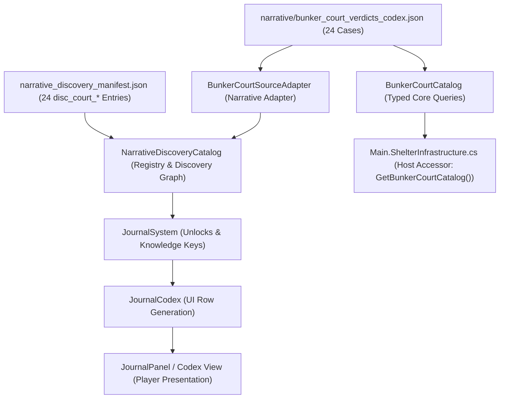

# Bunker Court Authority & System Boundary Map

**Document ID:** ARCH-BUNKER-COURT-AUTHORITY
**Status:** Approved Architecture Specification
**Project:** ASHFALL (Godot 4.7+ .NET 8 Host / C# Core)
**Date:** 2026-09-09

---

## 1. Domain Purpose & Authority Scope

The **Bunker Popular Tribunal Court Records & Decrees** represent historical codex data detailing judicial decisions rendered inside the shelter during the initial ten years following the nuclear exchange.

The sole authoritative data source for this corpus is:
`Assets/StreamingAssets/Data/narrative/bunker_court_verdicts_codex.json`

This file is managed by `BunkerCourtCatalog` in Core (`Assets/Ashfall.Core/Narrative/BunkerCourtCatalog.cs`) and adapted into the runtime discovery graph via `BunkerCourtSourceAdapter` in `NarrativeDiscoveryCatalog` (`Assets/Ashfall.Core/Narrative/NarrativeDiscoveryCatalog.cs`).

---

## 2. System Separation & Anti-Corruption Invariants

A critical invariant of ASHFALL architecture is that historical narrative records must **never** be conflated with active gameplay simulation state.

| System Domain | Responsible Authority | Data Authority | Mutation Capability | Role in Plan 146 |
|---|---|---|---|---|
| **Bunker Court Records** | `BunkerCourtCatalog` | `narrative/bunker_court_verdicts_codex.json` | **STRICTLY IMMUTABLE** | Historical narrative archive. Read-only codex entries. |
| **Narrative Discovery Pipeline** | `NarrativeDiscoveryCatalog` / `JournalSystem` | `narrative_discovery_manifest.json` | Discovery state only (`KnowledgeBase`) | Progression-gated discovery of cases via terminal/archive channels. |
| **Expansion 08: The Verdict** | `VerdictSystem` / `ArbitrationEngine` | `verdict_data.json` / `factions.json` | Active faction standing, moral flags | **Completely separate.** Must NOT share records or mutate from codex reads. |
| **Live Wasteland Justice** | `JusticeSystem` | `wasteland_laws.json` | Survivor trials, exile, execution | **Completely separate.** Does NOT adjudicate historical bunker dweller actions. |
| **Survivor Roster & Morale** | `SurvivorsHostSession` / `NeedsSystem` | `survivors.json` | Health, hunger, trauma, morale | **ZERO MUTATION.** Penalties in records (e.g. boiler soot, lye soap) are NOT applied to living survivors. |
| **Inventory & Resource Stores** | `InventorySystem` | `items.json` | Item quantities, equipment wear | **ZERO MUTATION.** Confiscations in records (e.g. 15L ethanol still, domino sugar) do NOT deduct player inventory. |

---

## 3. Disciplinary Penalties as Historical Diegesis

Several court records specify penalties such as:
- Case 01: "Defendant sentenced to 40 hours cleaning boiler flue soot without beer ration."
- Case 02: "Defendants assigned to scrub the entire Sub-Level 3 communal laundry facility by hand with lye soap for fourteen consecutive days."
- Case 07: "Defendant required to waterproof thirty pairs of sentry winter boots for free..."
- Case 09: "Defendant assigned to manual pump duty on the Sub-Level 4 drainage sump for thirty days..."
- Case 19: "All goods confiscated. Defendant permanently expelled from the shelter perimeter..."

**Architectural Rule:**
These penalties are 100% diegetic narrative text. They represent historical events that occurred in the past (e.g., Day 84, Day 112, Day 375). At no point does `BunkerCourtCatalog` or any UI consumer parse or apply these penalties to the live player state, live survivor shifts, or current inventory.

---

## 4. Discovery Pipeline Topology

---

## 5. Summary of Guarantees

1. Reading a case record triggers zero side effects in inventory, morale, survivor health, or faction standing.
2. Discovery status is tracked solely by key existence in `KnowledgeBase` (`narrative_disc_disc_court_*`).
3. Loading `BunkerCourtCatalog` is idempotent and thread-safe for reads.
4. Historical characters named in dockets remain historical entities and do not conflict with live survivor generation.
