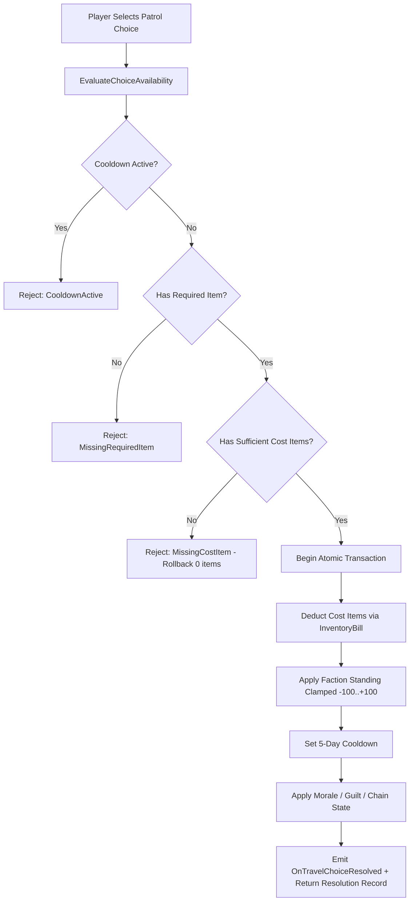

# ASHFALL Patrol Encounter Choice & Outcome Matrix
## Flagship Integration: Tasks F1–F4 (Faction Standing, Atomic Inventory Costs, Required Items & Expedition Wiring)

### Overview
This matrix serves as the authoritative specification of all 15 patrol and travel encounter definitions in `Assets/StreamingAssets/Data/travel_encounters.json` (lines 638–942). It defines the exact transactional behavior, faction standing mutations, atomic inventory deductions, non-consuming required item gates, and reachability rules for patrol choices across both normal travel and expedition sorties.

---

### Core Architectural Invariants

1. **Atomic Gameplay Transactions**:
   - Every patrol choice resolves as a single atomic transaction through `TravelEncounterSystem.ResolveChoice`.
   - Inventory costs are validated prior to execution. If inventory is insufficient for any cost item, zero items are deducted, zero faction standing is applied, zero morale/guilt is applied, no cooldown is set, and the transaction returns `false`.
2. **Authoritative Faction Standing (`FactionWarSystem.ModifyStanding`)**:
   - Standing mutations route exclusively to `FactionWarSystem.ModifyStanding(factionId, delta)`.
   - All standing values are strictly clamped to the canonical `[-100, +100]` range.
   - Idempotence: re-resolving an encounter during its 5-day cooldown fails immediately, preventing duplicate standing modifications.
3. **Non-Consuming Required Item Gates**:
   - `required_item_id` and `required_item_quantity` represent gating credentials, passes, or permits.
   - Availability is dynamically evaluated at selection time (`TravelEncounterSystem.EvaluateChoiceAvailability`).
   - Resolving a choice requiring an item validates that the player possesses the required quantity, but does **not** consume the item from inventory.
4. **Shared 5-Day Cooldown**:
   - Resolving any choice on an encounter places it on a 5-day cooldown (`_encounterAvailableDay[encounterId] = currentDay + 5`).
   - Cooldown state is shared seamlessly between normal wasteland travel and expedition sorties via `ExpeditionEncounterBridge.TravelEngine`.
5. **Deterministic Expedition Reachability (Option B)**:
   - Patrol encounters are surfaced during expeditions via `ExpeditionEncounterBridge` using the expedition's shared `ISeededRng` stream.
   - At least 5 major patrol archetypes are reachable and dynamically surfaced based on regional and danger parameters.

---

### Encounter & Choice Outcome Matrix

| Encounter ID | Choice ID | Choice Text | Standing Delta | Faction ID | Cost Items | Required Items | Field Guide Unlock / Effects |
|---|---|---|---|---|---|---|---|
| `enc_patrol_garrison_checkpoint` | `choice_pay_garrison_toll` | Pay the toll in rations | +1 | `iron_garrison` | `canned_food` x2 | None | Morale: 0, Guilt: 0, Cooldown: 5d |
| `enc_patrol_garrison_checkpoint` | `choice_show_garrison_pass` | Present sealed government transit pass | +2 | `iron_garrison` | None | `sealed_government_document` x1 | Morale: +1, Guilt: 0, Cooldown: 5d |
| `enc_patrol_garrison_checkpoint` | `choice_negotiate_garrison` | Negotiate civilian transit | 0 | `iron_garrison` | None | None | Morale: 0, Guilt: 0, Cooldown: 5d |
| `enc_patrol_garrison_checkpoint` | `choice_avoid_garrison` | Slip through perimeter ruins | 0 | None | None | None | Morale: -1, Guilt: 0, Cooldown: 5d |
| `enc_patrol_warlord_raid` | `choice_warlord_bribe` | Buy safe passage with supplies | 0 | `warlords_sector_4` | `canned_food` x3 | None | Morale: -1, Guilt: 0, Cooldown: 5d |
| `enc_patrol_warlord_raid` | `choice_warlord_fight` | Stand ground and return fire | -15 | `warlords_sector_4` | None | None | Morale: +2, Guilt: 0, Cooldown: 5d |
| `enc_patrol_warlord_raid` | `choice_warlord_scatter` | Scatter into the ruins | 0 | None | None | None | Morale: -2, Guilt: 0, Cooldown: 5d |
| `enc_patrol_refugee_eviction` | `choice_eviction_supplies` | Provide emergency rations and bandages | +5 | `faction_rebuilders` | `canned_food` x1, `bandage` x1 | None | Morale: +3, Guilt: -2, Cooldown: 5d |
| `enc_patrol_refugee_eviction` | `choice_eviction_ignore` | Keep head down and move on | -3 | `faction_rebuilders` | None | None | Morale: -2, Guilt: +3, Cooldown: 5d |
| `enc_patrol_cult_recon` | `choice_cult_trade_relics` | Trade a military medal for passage | +3 | `faction_cult_of_the_atom` | `tarnished_medal` x1 | None | Morale: 0, Guilt: 0, Cooldown: 5d |
| `enc_patrol_cult_recon` | `choice_cult_evade` | Circle around their procession | 0 | None | None | None | Morale: 0, Guilt: 0, Cooldown: 5d |
| `enc_patrol_central_garrison_border` | `choice_central_comply` | Comply with biometric and document scan | +2 | `faction_central_garrison` | None | `sealed_government_document` x1 | Morale: 0, Guilt: 0, Cooldown: 5d |
| `enc_patrol_central_garrison_border` | `choice_central_detour` | Take the contaminated gully detour | 0 | None | None | None | Morale: -1, Guilt: 0, Cooldown: 5d |
| `enc_patrol_penal_battalion` | `choice_penal_trade_warden` | Trade repair tools to the overseer | +2 | `iron_garrison` | `soldering_kit` x1 | None | Morale: 0, Guilt: +1, Cooldown: 5d |
| `enc_patrol_penal_battalion` | `choice_penal_pass` | Maintain distance from work detail | 0 | None | None | None | Morale: 0, Guilt: 0, Cooldown: 5d |
| `enc_patrol_black_ops_ambush` | `choice_blackops_fight` | Return suppressing fire and break line | -20 | `faction_black_ops` | None | None | Morale: +1, Guilt: 0, Cooldown: 5d |
| `enc_patrol_black_ops_ambush` | `choice_blackops_surrender_intel` | Drop field telemetry and retreat | 0 | `faction_black_ops` | None | None | Morale: -3, Guilt: +1, Cooldown: 5d |
| `enc_patrol_warlord_press_gang` | `choice_press_side_with` | Hand over conscript bounty | +8 | `warlords_sector_4` | None | None | Morale: -4, Guilt: +5, Cooldown: 5d |
| `enc_patrol_warlord_press_gang` | `choice_press_intervene` | Ambush the press gang | -12 | `warlords_sector_4` | None | None | Morale: +4, Guilt: -3, Cooldown: 5d |
| `enc_patrol_railway_convoy` | `choice_railway_flag_down` | Signal convoy for track report | +2 | `iron_garrison` | None | None | Morale: +1, Guilt: 0, Cooldown: 5d |
| `enc_patrol_railway_convoy` | `choice_railway_shelter` | Take cover until engine passes | 0 | None | None | None | Morale: 0, Guilt: 0, Cooldown: 5d |
| `enc_patrol_foundry_supply` | `choice_foundry_assist` | Help clear blocked slag transport | +4 | `faction_silent_foundry` | None | None | Morale: +2, Guilt: 0, Cooldown: 5d |
| `enc_patrol_foundry_supply` | `choice_foundry_bypass` | Bypass industrial siding | 0 | None | None | None | Morale: 0, Guilt: 0, Cooldown: 5d |
| `enc_patrol_ash_sign_scouts` | `choice_ash_exchange_marks` | Exchange trail markers with rangers | +3 | `faction_rebuilders` | None | None | Morale: +2, Guilt: 0, Cooldown: 5d |
| `enc_patrol_ash_sign_scouts` | `choice_ash_conceal` | Conceal camp tracks | 0 | None | None | None | Morale: 0, Guilt: 0, Cooldown: 5d |
| `enc_patrol_supply_corps_convoy` | `choice_supply_barter` | Barter clean coolant for field rations | +2 | `iron_garrison` | None | None | Morale: +1, Guilt: 0, Cooldown: 5d |
| `enc_patrol_supply_corps_convoy` | `choice_supply_let_pass` | Allow convoy clear right of way | 0 | None | None | None | Morale: 0, Guilt: 0, Cooldown: 5d |
| `enc_patrol_mercenary_recon` | `choice_merc_hire_intel` | Purchase perimeter threat map | 0 | None | None | None | Morale: +1, Guilt: 0, Cooldown: 5d |
| `enc_patrol_mercenary_recon` | `choice_merc_ignore` | Decline contractor terms | 0 | None | None | None | Morale: 0, Guilt: 0, Cooldown: 5d |
| `enc_patrol_courier_intercept` | `choice_courier_assist` | Tend wounded courier's burns | +4 | `faction_rebuilders` | `bandage` x1 | None | Morale: +2, Guilt: -1, Cooldown: 5d |
| `enc_patrol_courier_intercept` | `choice_courier_take_pouch` | Commandeer official courier dispatch | -10 | `iron_garrison` | None | None | Morale: -2, Guilt: +3, Cooldown: 5d |

---

### Transaction Flow Diagram

