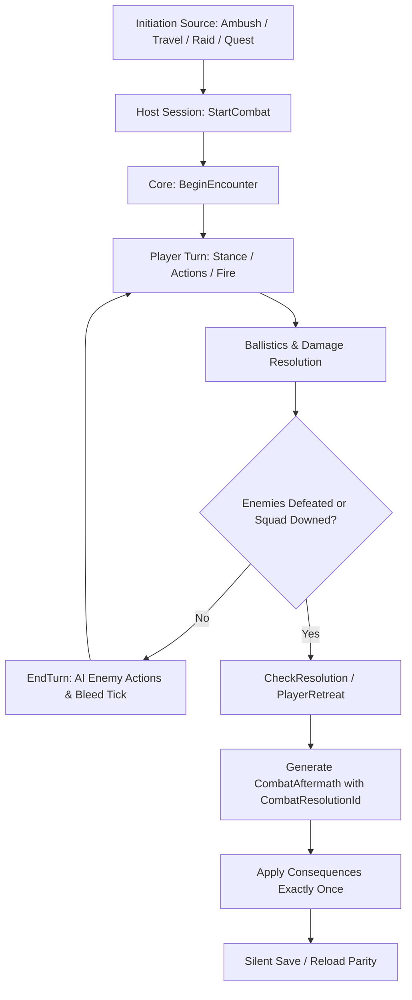

# ASHFALL — Tactical Combat Encounter Loop & Authority Architecture (Plan 62 / B3)

**Document ID:** DOC-COMBAT-ENCOUNTER-LOOP
**Date:** 2026-09-05
**Author:** Antigravity
**Authority:** `Assets/Ashfall.Core/Combat/TacticalCombatSystem.cs`

---

## 1. Executive Summary

Tactical combat in ASHFALL operates under strict architectural invariants:
1. **Core Authority:** All combat simulation, calculations, health modifications, ballistics, status progression, and loot determination belong exclusively to `TacticalCombatSystem` in `Assets/Ashfall.Core/Combat/`.
2. **Thin Presentation:** Godot nodes (`CombatPanel`, `CombatDetailPanel`, `CombatHudOverlay`) are strictly read/render and action dispatch conduits. They own zero simulation state.
3. **Determinism:** Given the same initial state, command sequence, and seed, the simulation produces an identical sequence of combat events and final outcome.
4. **Exactly-Once Aftermath:** All post-encounter mutations (survivor trauma, deaths, weapon wear, ammo expenditure, loot, and memorial logging) are keyed to a stable `CombatResolutionId` and applied exactly once across session lifecycles and save/reload cycles.

---

## 2. Encounter Lifecycle

### 2.1 Initiation Sources
Tactical encounters originate from several gameplay surfaces, but all converge on `CombatHostSession.StartCombat`:
- **Expedition Travel Ambush:** Triggered via `SetupExpeditionCombatHandoff` when an expedition enters high-danger sectors.
- **Wasteland Map Incidents:** Scripted hostile encounters at specific points of interest.
- **Shelter Defense / Raids:** Direct shelter breach defenses.
- **Narrative & Quest Encounters:** Flag-triggered combat events.
- **Headless Demos & Self-Tests:** `CombatHeadlessDemo` and CLI `--combat-selftest`.

### 2.2 State Initialization
- `BeginEncounter` clones player combatants and assigns weapon instances from the equipment authority (`WeaponEquipmentBridge`).
- Generates enemy combatants either from `CombatCatalog` archetypes (`CombatantFactory`) or legacy templates.
- Initializes round, turn, player stance (`HoldPosition`), and phase (`PlayerTurn`).
- Captures starting weapon conditions into `BoundWeaponConditionAtStart` for post-combat wear reconciliation.

### 2.3 Turn & Initiative Cycle
- **Player Turn (`PlayerTurn`):**
  - Player may adjust stance (`HoldPosition`, `Advance`, `SuppressiveFire`, `Retreat`, `LastStand`).
  - Player executes tactical actions: `Fire`, `Suppress`, `DeployTrap`, `ClearJam`, `FieldRepair`, `Decontaminate`, `Bandage`, `MoveLane`.
  - Actions consume ammo and apply weapon wear at the time of firing/action.
- **Enemy Turn (`EnemyTurn` via `EndTurn`):**
  - Bleed-out counters decrement for downed player units.
  - Living hostiles pick player targets using deterministic RNG, modified by enemy AI traits (`AiAccuracyMod`, `AiDamageMod`, stance preferences).
  - Pins and temporary status debuffs decay.
  - Turn increments and control returns to the player.

### 2.4 Ballistics & Damage Resolution
- Governed by `BallisticsSystem` and `TacticalCombatSystem.Damage.cs`.
- Ballistics calculates accuracy, cover blocking/penetration, barrier durability, armor absorption, direct hits, and ricochets.
- Health reductions update combatant state. If a player hits 0 HP:
  - If in `LastStand`: instant death and mutual kill attempt.
  - Otherwise: transitions to `IsDowned = true` with `BleedTurnsRemaining = DefaultBleedTurns`.
  - If hit again while downed: transitions to permanent death (`Kill`).

### 2.5 Resolution & Exactly-Once Aftermath
When living enemies reach 0 (`Won`), all players fall (`Lost`), or the squad breaks contact (`Retreated`):
1. **Resolution ID:** `TacticalCombatSystem` stamps `_state.ResolutionId = "cres_" + _state.EncounterId`.
2. **Aftermath Assembly:** Constructs `CombatAftermath`:
   - `resolutionId`: unique stable identifier.
   - `encounterId`: encounter reference.
   - `outcome`: Won, Lost, or Retreated.
   - `survivorInjuries`: list of survivor IDs downed/injured.
   - `survivorDeaths`: list of survivor IDs killed.
   - `weaponWear`: delta between start condition and final condition for each weapon.
   - `ammoSpent`: summary of ammo consumed during combat.
   - `lootConsequences`: captured scrap, ammo, and resources.
   - `moraleConsequences`: net team morale delta.
   - `isApplied`: marked `true` when dispatched to host authorities.
3. **Dispatch to Authorities:**
   - Deaths route to `SurvivorFateSystem.ReportDeath(...)` which handles Memorial, eulogy, and journal.
   - Weapon wear routes to `EquipmentConditionSystem` via `WeaponEquipmentBridge.SyncAfterCombat(...)`.
   - Loot and morale route to `InventoryHostSession` and `SurvivorsHostSession`.
   - On save load, if `Aftermath.IsApplied == true`, no consequence is ever re-applied.

### 2.6 Mid-Encounter Save & Reload Parity
- Full combat state (`CombatState`) is serializable and versioned (`CurrentSaveVersion = 3`).
- Mid-encounter saves capture combatants, barriers, weapons (including condition and jam counters), turns, round, stance, and RNG seed continuation.
- Reloading restores the exact state silently: no fresh events, no duplicate ammo deductions, and no replay of already-applied aftermath.
