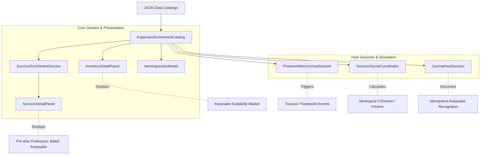

# Survivor Enrichment Consumer Seam Architecture

## 1. Overview
The survivor enrichment layer is consumed across five distinct gameplay, simulation, and presentation subsystems. This document maps each consumer, its input dependencies, its behavioral response, and its separation of concerns.

---

## 2. Consumer Architecture Map

---

## 3. Subsystem Breakdown

### 3.1 Survivor Detail Panel (`src/UI/SurvivorDetailPanel.cs`)
- **Layer:** Presentation (Godot UI).
- **Consumes:** `SurvivorEnrichmentService.GetView(survivorId)`.
- **Fields Displayed:**
  - `FormattedProfession`: Shows pre-war background (e.g. "Pre-War Nurse", "Pre-War Machinist", or current definition profession).
  - `FormattedBelief`: Shows human-readable ideological stance (e.g. "Atheist Rationalist", "Collectivist Solidarity") with muted styling.
  - `FormattedKeepsake`: Displays keepsake name if associated, with contextual status ("Associated personal keepsake", or "None").
- **Design Standard:** Never exposes raw catalog tokens (e.g. `collectivist_solidarity` is formatted as `Collectivist Solidarity`).

### 3.2 Inventory & Item Inspection (`src/UI/InventoryDetailPanel.cs`, `ItemInspectionModel.cs`)
- **Layer:** Core & Presentation.
- **Consumes:** `ExpansionEnrichmentCatalog.GetKeepsakeCandidates()`, `HasTag(itemId, "personal_keepsake_candidate")`.
- **Behavior:**
  - `ItemInspectionModel` sets `IsKeepsakeCandidate = true` if the item is tagged or referenced by survivors.
  - `InventoryDetailPanel` renders `[Keepsake: Suitable as a personal keepsake]` in the item property list.
- **Separation:** Does not auto-grant items to survivors or bind items exclusively to one character.

### 3.3 Social Simulation (`src/Main.SurvivorSocial.cs`)
- **Layer:** Simulation / Host Session.
- **Consumes:** `ExpansionEnrichmentCatalog.GetSurvivorFields(id).belief_profile_id`.
- **Behavior:**
  - Replaces trait-only heuristics with authored ideological profiles.
  - If a survivor is not enriched, smoothly falls back to trait inference (`InferBeliefProfile(traits)`).
  - Social interactions compare belief pairs: matching beliefs generate camaraderie bonuses; antithetical beliefs (e.g. `religious_faith` vs `atheist_rationalist`, or `pacifist` vs `military_discipline`) increase tension.

### 3.4 Phantom Memory System (`src/Main.Phase0.cs`, `PhantomMemoryHostSession.cs`)
- **Layer:** Narrative / Memory.
- **Consumes:** `ExpansionEnrichmentCatalog.GetSurvivorFields(id).phantom_background_id`.
- **Behavior:**
  - Populates `SurvivorPhantomBackground` during roster initialization.
  - Background keys (`child_refugee`, `former_soldier`, `nurse`, etc.) index into trauma encounter tables, ensuring nightmares, panic triggers, and hallucinated audio logs match the survivor's past.

### 3.5 Journal Lore Recognition (`src/Main.Enrichment.cs`)
- **Layer:** Narrative State.
- **Consumes:** `ExpansionEnrichmentCatalog.GetKeepsakeItemId(survivorId)`.
- **Behavior:**
  - When an item enters the holdfast inventory, `CheckKeepsakeRecognition(itemId)` checks if any roster member associates with that item.
  - If matched, logs an idempotent entry in the settlement journal:
    `"Elena recognized the worn stethoscope from her clinic days."`
  - Uses `_journal.Knowledge.Discover($"keepsake_recognized:{sid}:{itemId}")` to guarantee zero duplicate journal entries or notification spam.
