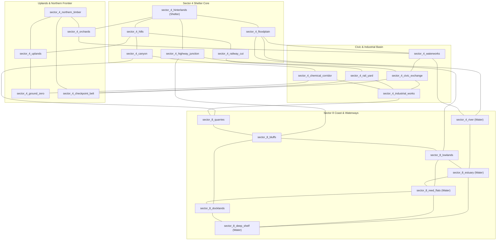

# World Evolution 24-Sector Graph Specification

## 1. Overview
Plan 132 expands the regional sector topology of ASHFALL from 11 nodes to 24 nodes. The graph integrates the inland hinterlands (Sector 4), the high ridges, the industrial and agricultural belts, and the coastal estuary (Sector 8).

---

## 2. Sector Inventory & Functional Zones

### Zone A: Sector 4 Inland & Residential Buffer
| Sector ID | Water | Rationale / Anchor Locations |
|---|---|---|
| `sector_4_hinterlands` | No | Immediate shelter perimeter. Scrub hills, wasteland roads. *(loc_st_brigids_almshouse)* |
| `sector_4_hills` | No | Low limestone ridges overlooking rail corridors. *(loc_transit_authority_hq)* |
| `sector_4_floodplain` | No | Alluvial mudflats bordering the upper river. *(loc_bridge_seven)* |
| `sector_4_canyon` | No | Steep basalt gorge bottleneck between inland and coastal quarries. *(loc_diesel_tank_farm)* |
| `sector_4_railway_cut` | No | Unstable rock walls flanking the main railway track. *(loc_radio_relay_mast)* |
| `sector_4_highway_junction`| No | Concrete overpass cloverleaf linking eastern highway and rail line. |

### Zone B: Sector 4 Production, Civic & Frontier Expansion
| Sector ID | Water | Rationale / Anchor Locations |
|---|---|---|
| `sector_4_orchards` | No | Pre-war agricultural belt of dead apple groves and root cellars. *(loc_grange_hall, loc_cider_press, loc_the_allotments, loc_apiary_rows, loc_seed_library_annex)* |
| `sector_4_waterworks` | No | Canal locks and municipal pump stations. *(loc_terrace_pumphouse, loc_pump_station_nine, loc_lock_gate_four)* |
| `sector_4_civic_exchange` | No | Collapsed downtown municipal core and ration distribution. *(loc_ration_queue_plaza, loc_municipal_archive, loc_department_store, loc_dentists_row, loc_public_swimming_baths)* |
| `sector_4_industrial_works`| No | Heavy manufacturing, printworks, foundries, and scrap sorting. *(loc_printworks, loc_recovery_yard)* |
| `sector_4_chemical_corridor`| No | High-hazard petroleum storage, pipeline valves, and chemical runoff. *(loc_diesel_tank_farm, loc_alloc_12b)* |
| `sector_4_rail_yard` | No | Multi-track freight staging depot and marshalling switches. *(loc_weighbridge, loc_railway_span_44_alpha)* |
| `sector_4_uplands` | No | High granite ridges, switchbacks, and weather observation masts. *(loc_pilgrim_switchbacks, loc_snowline_station, loc_summit_relay, loc_avalanche_gallery)* |
| `sector_4_northern_timber` | No | Burnt timber stands and northern deadfall forest. *(loc_forward_roster_camp, loc_understory_transmitter)* |
| `sector_4_checkpoint_belt` | No | Fortified road barricades, concrete tank traps, and screening posts. *(loc_garrison_checkpoint_gamma, loc_school_gymnasium)* |
| `sector_4_ground_zero` | No | Extreme radiation blast crater and geothermal fissures. *(loc_ash_sign_shrine, loc_the_vessels_cell)* |

### Zone C: Sector 8 Coast, Estuary & Waterways
| Sector ID | Water | Rationale / Anchor Locations |
|---|---|---|
| `sector_4_river` | **Yes** | Upper freshwater channel flowing southeast to the bay. |
| `sector_8_bluffs` | No | Coastal limestone cliffs overlooking the sea. *(loc_motel_verity)* |
| `sector_8_lowlands` | No | Damp peat bogs and coastal meadows. *(loc_ordnance_shoulder)* |
| `sector_8_estuary` | **Yes** | Brackish river mouth and sandbars. *(loc_conscription_office)* |
| `sector_8_quarries` | No | Granite strip mines and excavators. |
| `sector_8_docklands` | No | Coastal shipping piers, cold storage, and rotted pilings. *(loc_cold_store_atlantic, loc_drowned_cinema)* |
| `sector_8_reed_flats` | **Yes** | Tidal cordgrass marsh and shallow brine channels. *(loc_the_shallows_market)* |
| `sector_8_deep_shelf` | **Yes** | Submerged coastal sound, ferry approaches, and deep salvage. *(loc_bathymetric_boat)* |

---

## 3. Adjacency Table

| Sector ID | Degree | Connected Neighbors |
|---|---|---|
| `sector_4_hinterlands` | 4 | `sector_4_hills`, `sector_4_floodplain`, `sector_4_highway_junction`, `sector_4_orchards` |
| `sector_4_hills` | 4 | `sector_4_hinterlands`, `sector_4_canyon`, `sector_4_railway_cut`, `sector_4_uplands` |
| `sector_4_floodplain` | 4 | `sector_4_hinterlands`, `sector_4_river`, `sector_8_lowlands`, `sector_4_waterworks` |
| `sector_4_canyon` | 4 | `sector_4_hills`, `sector_4_railway_cut`, `sector_8_quarries`, `sector_4_chemical_corridor` |
| `sector_4_railway_cut` | 4 | `sector_4_hills`, `sector_4_canyon`, `sector_4_highway_junction`, `sector_4_rail_yard` |
| `sector_4_river` [W] | 3 | `sector_4_floodplain`, `sector_8_estuary`, `sector_4_waterworks` |
| `sector_4_highway_junction` | 4 | `sector_4_hinterlands`, `sector_4_railway_cut`, `sector_8_bluffs`, `sector_4_civic_exchange` |
| `sector_8_bluffs` | 4 | `sector_4_highway_junction`, `sector_8_lowlands`, `sector_8_quarries`, `sector_8_docklands` |
| `sector_8_lowlands` | 4 | `sector_8_bluffs`, `sector_4_floodplain`, `sector_8_estuary`, `sector_8_reed_flats` |
| `sector_8_estuary` [W] | 4 | `sector_8_lowlands`, `sector_4_river`, `sector_8_reed_flats`, `sector_8_deep_shelf` |
| `sector_8_quarries` | 3 | `sector_8_bluffs`, `sector_4_canyon`, `sector_4_industrial_works` |
| `sector_4_orchards` | 3 | `sector_4_hinterlands`, `sector_4_waterworks`, `sector_4_northern_timber` |
| `sector_4_waterworks` | 4 | `sector_4_floodplain`, `sector_4_river`, `sector_4_orchards`, `sector_4_civic_exchange` |
| `sector_4_civic_exchange` | 4 | `sector_4_highway_junction`, `sector_4_waterworks`, `sector_4_industrial_works`, `sector_4_checkpoint_belt` |
| `sector_4_industrial_works` | 4 | `sector_4_civic_exchange`, `sector_8_quarries`, `sector_4_chemical_corridor`, `sector_4_rail_yard` |
| `sector_4_chemical_corridor` | 3 | `sector_4_canyon`, `sector_4_industrial_works`, `sector_4_ground_zero` |
| `sector_4_rail_yard` | 3 | `sector_4_railway_cut`, `sector_4_industrial_works`, `sector_4_checkpoint_belt` |
| `sector_4_uplands` | 3 | `sector_4_hills`, `sector_4_northern_timber`, `sector_4_ground_zero` |
| `sector_4_northern_timber` | 3 | `sector_4_orchards`, `sector_4_uplands`, `sector_4_checkpoint_belt` |
| `sector_4_checkpoint_belt` | 3 | `sector_4_civic_exchange`, `sector_4_rail_yard`, `sector_4_northern_timber` |
| `sector_4_ground_zero` | 2 | `sector_4_uplands`, `sector_4_chemical_corridor` |
| `sector_8_docklands` | 3 | `sector_8_bluffs`, `sector_8_reed_flats`, `sector_8_deep_shelf` |
| `sector_8_reed_flats` [W] | 4 | `sector_8_lowlands`, `sector_8_estuary`, `sector_8_docklands`, `sector_8_deep_shelf` |
| `sector_8_deep_shelf` [W] | 3 | `sector_8_estuary`, `sector_8_docklands`, `sector_8_reed_flats` |

---

## 4. Waterway Corridor & Aquatic Migration
The waterway sub-network forms an unbroken 4-node corridor:
$$\text{sector\_4\_river} \longleftrightarrow \text{sector\_8\_estuary} \longleftrightarrow \text{sector\_8\_reed\_flats} \longleftrightarrow \text{sector\_8\_deep\_shelf}$$
Coastal runners (`species_gray_heron`, `species_mirror_carp`) are restricted to this corridor by `WildlifeSeasonalCalendar.FilterNeighbors`.

---

## 5. Topological Graph Metrics
- **Total Nodes:** 24
- **Total Edges:** 41 undirected edges (82 directed adjacency records)
- **Average Node Degree:** $3.42$
- **Connected Components:** 1 (Fully Connected)
- **Shelter Component Size:** 24 / 24 (100% reachable)
- **Graph Diameter:** 6 hops (e.g. `sector_4_northern_timber` to `sector_8_deep_shelf`)

---

## 6. Topology Diagram

