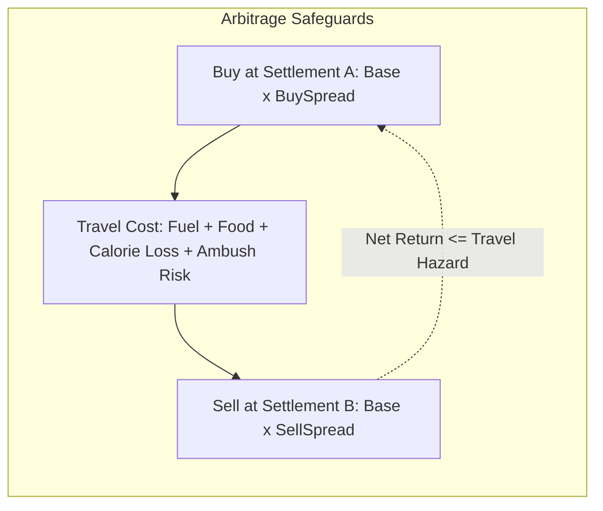

# Hardcore Arbitrage Audit

## 1. Loop Analysis

An economic arbitrage exploit occurs if a player can buy an item in Settlement A and immediately sell it in Settlement B (or via a roaming merchant) for an infinite riskless profit loop that trivializes survival scarcity.

---

## 2. Structural Safeguards Against Infinite Arbitrage

1. **Merchant Spread:**
   - Standard vendor sell prices incorporate a bid-ask spread ($1.25\times$ buy, $0.75\times$ sell). Even with a $1.3\times$ faction premium, the effective resale ratio is:
     $$0.75 \times 1.3 = 0.975\times \text{ (Net loss before transit)}$$
2. **Transit & Logistics Friction:**
   - Cartography travel incurs fuel consumption, tire/boot wear, caloric depletion, and encounter hazards. Moving 50 kg of grain across regions costs more in diesel and rations than any margin gained from regional price differences.
3. **Refusal Boundaries:**
   - Specialized factions refuse non-specialty goods entirely (`Refuses`), preventing dumping of unwanted commodities.
4. **Stock Exhaustion:**
   - Vendors possess finite barter currency and stock ceilings. Infinite repetition within a single day is structurally impossible.
