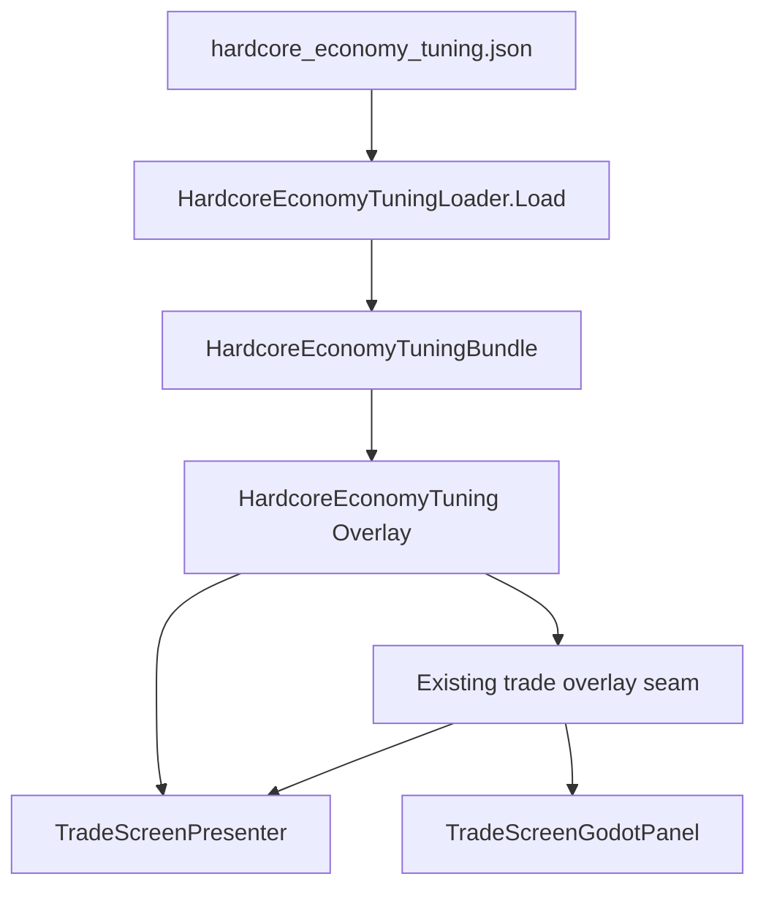

# Hardcore Content Utilization

## 1. Scanner Alignment & Consumer Registry

`hardcore_economy_tuning.json` is tracked by `ContentUtilizationScanner.cs`:

- **Primary Consumer:** `HardcoreEconomyTuningLoader`
- **Runtime host consumer:** `Main.OpenTradeScreen`, which loads the JSON and
  passes the overlay through the existing `IPriceShockProvider` seam.
- **Presentation consumers:** `TradeScreenPresenter`, `TradeScreenGodotPanel`,
  and `HostCli.PanelTests.cs`.
- `MarketSystem` remains the base demand/price authority. It is not silently
  replaced by a second hardcore pricing implementation.

### CI Verification
- Verified by `--content-utilization-selftest` (PASS).
- Verified by `--data-integrity-selftest` (PASS, 0 errors).
- Gated by `CatalogIntegrityValidatorTests`.
