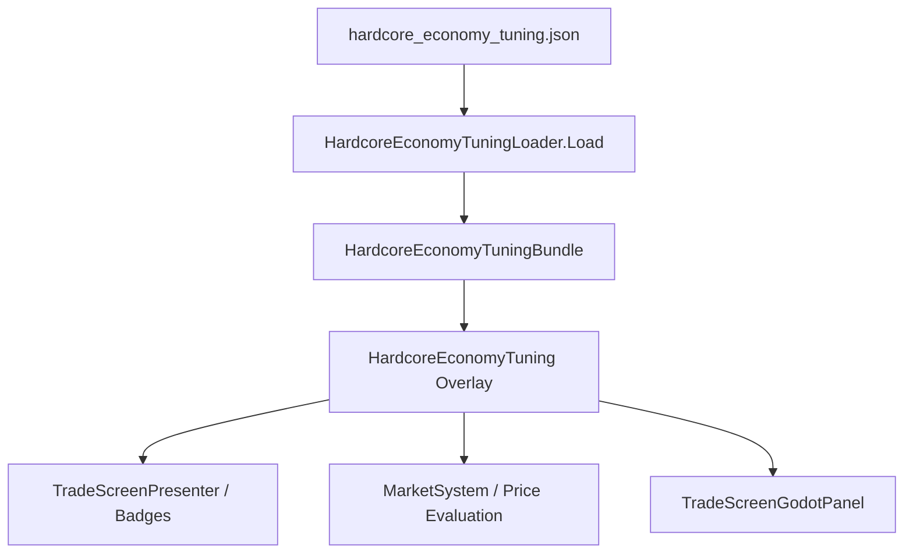

# Hardcore Content Utilization

## 1. Scanner Alignment & Consumer Registry

`hardcore_economy_tuning.json` is tracked by `ContentUtilizationScanner.cs`:

- **Primary Consumer:** `HardcoreEconomyTuningLoader`
- **Secondary Systems:** `MarketSystem`, `TradeScreenPresenter`, `TradeScreenGodotPanel`, `HostCli.PanelTests.cs`

### CI Verification
- Verified by `--content-utilization-selftest` (PASS).
- Verified by `--data-integrity-selftest` (PASS, 0 errors).
- Gated by `CatalogIntegrityValidatorTests`.
