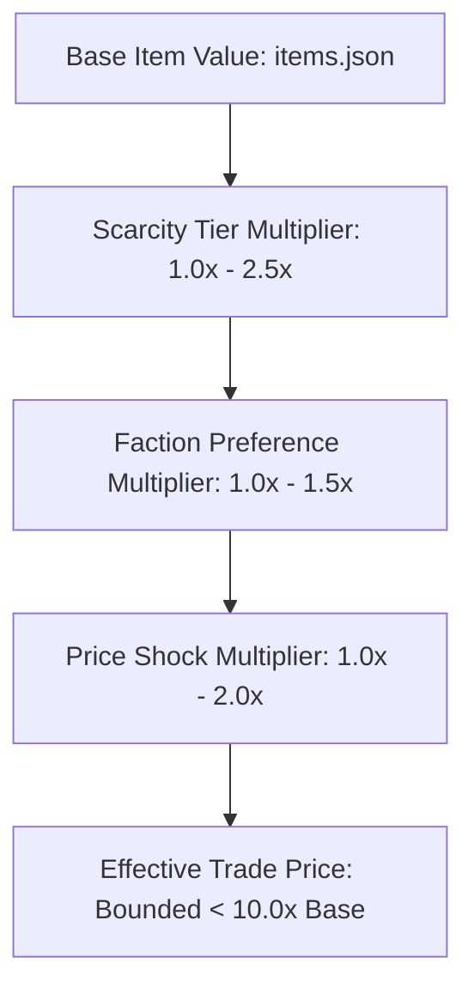

# Hardcore Modifier Stacking Order

## 1. Mathematical Stacking Model

When calculating the final trade valuation of a commodity, economic modifiers stack multiplicatively according to a strict hierarchical pipeline:

$$\text{FinalPrice} = \text{BaseValue} \times M_{\text{ScarcityTier}} \times M_{\text{FactionPreference}} \times M_{\text{PriceShock}}$$

### Modifier Layers:
1. **Layer 1 — Base Trade Value:** Defined in `Assets/StreamingAssets/Data/items.json` (`tradeValue`).
2. **Layer 2 — Scarcity Tier ($M_{\text{ScarcityTier}}$):** Derived from `HardcoreEconomyTuning.GetScarcityMultiplier(day, itemId)` (ranging from `1.3x` to `2.5x`).
3. **Layer 3 — Faction Premium ($M_{\text{FactionPreference}}$):** If the trading partner's faction lists the item in `buys_at_premium`, a standard trade premium (typically `1.2x` to `1.5x`) applies.
4. **Layer 4 — Transient Price Shock ($M_{\text{PriceShock}}$):** If a dynamic event shock is active for the commodity, the shock multiplier (ranging from `1.5x` to `2.0x`) applies.

---

## 2. Hard Ceiling & Worst-Case Bound

To prevent runaway hyperinflation and economy breakdown:
- **Maximum Theoretical Stack:**
  $$\text{Critical Tier (2.5x)} \times \text{Faction Premium (1.5x)} \times \text{Disease Outbreak (2.0x)} = 7.5\times \text{Base Value}$$
- **Safety Ceiling:** The effective compounded multiplier is strictly guaranteed to remain below **`10.0x`** across all valid combinations.
