# Hardcore Tier Timeline (Days 1–365+)

## 1. Complete Campaign Economic Arc

The 8 scarcity tiers map continuous full-campaign economic phases from the immediate fallout shock to the deep winter and post-year horizon:

| Order | Tier Name | Day Range Label | Days Active | Multiplier | Primary Goods Under Pressure | Narrative Driver |
|:---:|:---|:---|:---:|:---:|:---|:---|
| 0 | `Critical` | `Days 1-15` | 1–15 | 2.5x | Clean water, iodine pills, anti-rad, air filters | Acute survival panic following initial detonation. Radiation plume passing. |
| 1 | `High` | `Days 15-40` | 15–40 | 2.0x | Antibiotics, medical kits, fuel, water filters | Infection outbreaks in makeshift shelters. Filter clogging and diesel depletion. |
| 2 | `Moderate` | `Days 41-100` | 41–100 | 1.6x | Mechanical scrap, calibration tools, antibiotics, filters | Acute mortality slows; infrastructure failure and mechanical maintenance dominate. |
| 3 | `Stable` | `Days 101-160` | 101–160 | 1.3x | Seeds, ash grain, mechanical scrap, engines | Basic calories stabilize; demand shifts to agricultural seed banks and prime movers. |
| 4 | `Reconstruction` | `Days 161-220` | 161–220 | 1.5x | Engines, roof armor plate, scrap, seed packets | Active rebuilding phase: retrofitting bunker roofs and establishing workshops. |
| 5 | `LateScarcity` | `Days 221-280` | 221–280 | 1.8x | Fuel, ammunition (`ammo_*`), medkits, canned food | Pre-war supply caches dry up. Factions hoard fuel and munitions as conflicts escalate. |
| 6 | `DeepWinter` | `Days 281-340` | 281–340 | 2.2x | Fuel, canned food, clean water, medkits | Sub-zero freeze solidifies rivers and wells. Surface travel halts; fuel is life. |
| 7 | `Endgame` | `Days 341+` | 341+ | 2.4x | Ash grain, engines, medkits, dosimeters | Long-term survival horizon. Irreplaceable precision tech and pure germplasm. |

```mermaid
gantt
    title Hardcore Economy Scarcity Timeline
    dateFormat X
    axisFormat Day %s
    section Survival Shock
    Critical (x2.5)     :0, 15
    High (x2.0)         :15, 40
    section Stabilization
    Moderate (x1.6)     :40, 100
    Stable (x1.3)       :100, 160
    section Renewal
    Reconstruction (x1.5):160, 220
    LateScarcity (x1.8) :220, 280
    section Harsh Horizon
    DeepWinter (x2.2)   :280, 340
    Endgame (x2.4)      :340, 450
```

