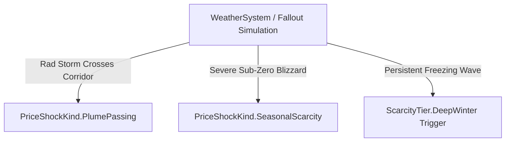

# Hardcore Weather Handoff

## 1. Environmental Coupling

Weather and fallout patterns directly trigger transient price shocks:

### Event Routes:
1. **Radiation Storm (`PlumePassing`):**
   - Triggered when `WeatherSystem` detects an active radiation plume crossing trade lanes.
   - Activates `PriceShockKind.PlumePassing` for 3 days, imposing a 1.8x multiplier across all goods.
2. **Blizzard / Ice-In (`SeasonalScarcity`):**
   - Triggered when temperature drops below $-15^\circ\text{C}$ for 3 consecutive days.
   - Activates `PriceShockKind.SeasonalScarcity` for 7 days, targeting canned food, clean water, and seed packets.
