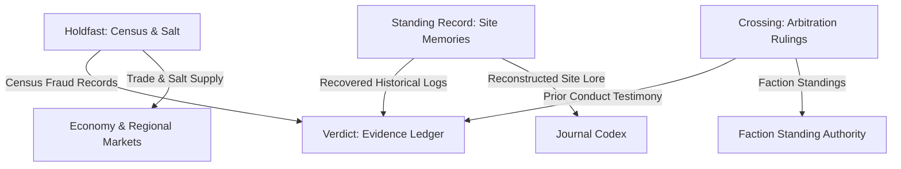

# Cross-Expansion Integration & Evidence Web

## 1. Cross-Expansion Interaction Map

The four charter expansions interact through authoritative shared systems without creating duplicate state engines:

## 2. Specific Integration Seams

1. **Holdfast → Verdict:**
   - Census fraud records from `quest_holdfast_census_forged_voucher` feed into Verdict evidence as proof of municipal administration breakdown during evacuation.
2. **Standing Record → Verdict:**
   - Charred directives from `quest_record_archive_burn_layer` and command mutiny forensics from `quest_record_vault_breach_forensics` enroll directly into the Verdict Evidence Ledger.
3. **Crossing → Verdict:**
   - Arbitration rulings (e.g. `quest_crossing_asylum_in_the_truss`) establish official precedent and testimony regarding garrison war crimes consumed during tribunal hearings.
4. **Crossing → Faction Standing:**
   - All arbitration rulings alter faction standings strictly through the central `FactionLedger` system without bespoke crossing rating fields.
5. **Holdfast → Regional Economy:**
   - Salt convoy deliveries and desalination boiler repairs modify regional market commodity demand and prices through `HoldfastTradeSession` and `EconomySystem`.
