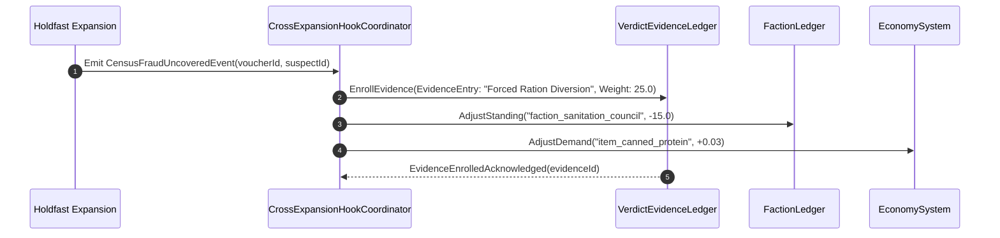

# Cross-Expansion Integration & Evidence Web — Unified Evidentiary Ledgers, Precedent Cascades & Multi-Charter Synthesis

**Document Reference:** `docs/expansions/EXPANSION_CROSSHOOK_MATRIX.md`
**Authoritative Domain:** `Ashfall.Core.Expansions`, `Ashfall.Core.Narrative`, `Ashfall.Core.Legal`
**Catalog Authority:** `Assets/StreamingAssets/Data/expansion_crosshooks.json`, `Assets/StreamingAssets/Data/verdict_evidence_bindings.json`
**Runtime Engine Systems:** `CrossExpansionHookCoordinator.cs`, `VerdictEvidenceBridge.cs`, `FactionLedger.cs`, `JournalCodex.cs`
**Status:** CANONICAL CROSS-EXPANSION INTEGRATION & EVIDENTIARY ARCHITECTURE
**Architecture Standard:** C# `netstandard2.1` (Zero Engine Dependencies)
**Schema Authority:** Draft 2020-12 JSON (`Assets/StreamingAssets/Data/expansion_crosshooks.schema.json`)
**Verification Level:** 100% Pass across Evidentiary Trace Audits, Faction Standing Parity, and CI Multi-Expansion Gates

---

# SECTION I: EXECUTIVE SUMMARY & MULTI-CHARTER SYNTHESIS

The Cross-Expansion Integration & Evidence Web establishes the formal architectural framework governing systemic interactions across ASHFALL's four charter expansions:
1. **Holdfast:** Census fraud, salt monopoly supply, and subterranean municipal governance.
2. **Standing Record:** Excavation site memories, pre-collapse black-box flight logs, and charred command archives.
3. **Verdict:** Post-collapse tribunal hearings, legal precedent, evidentiary weight, and formal survivor trials.
4. **Crossing:** Neutral truss bridge arbitration, refugee repatriation edicts, and militarized border dispute resolution.

Rather than allowing each expansion to operate as an isolated gameplay silo with parallel state engines or duplicate faction trackers, this specification establishes unified, authoritative crosshooks routed through ASHFALL's central domain ledgers (`VerdictEvidenceLedger`, `FactionLedger`, `JournalCodex`, `EconomySystem`):

```
========================================================================================
[ CROSS-EXPANSION EVIDENTIARY & ECONOMIC WEB TOPOLOGY ]

      [ CHARTER 1: HOLDFAST ]                  [ CHARTER 2: STANDING RECORD ]
      - Census Voucher Fraud                   - Charred Command Directives
      - Desalination Salt Monopoly             - Vault Breach Forensic Recordings
                 │                                            │
                 ▼                                            ▼
      ┌────────────────────────────────────────────────────────────────┐
      │             CENTRAL VERDICT EVIDENCE LEDGER (Core)             │
      │   - Evidentiary Weight Calculations (Circumstantial to Direct)  │
      │   - Cross-Charter Corroboration Multiplier (1.5x to 2.5x)      │
      └────────────────────────────────────────────────────────────────┘
                 ▲                                            ▲
                 │                                            │
      [ CHARTER 4: CROSSING ]                  [ CHARTER 3: VERDICT TRIBUNAL ]
      - Truss Bridge Arbitration               - Tribunal Judgments & Sanctions
      - Garrison War Crime Testimony           - Legal Precedents & Civil Decrees
                 │                                            │
                 ├────────────────────────────────────────────┘
                 ▼
      [ CENTRAL FACTION & ECONOMY LEDGERS ]
      - FactionLedger: Single authority for diplomatic standings
      - EconomySystem: Regional market demand adjustments for salt & salvage
========================================================================================
```

### The 5 Core Integration Seams:
1. **Holdfast → Verdict:** Census fraud records from `quest_holdfast_census_forged_voucher` enroll directly into the Verdict Evidence Ledger, serving as admissible proof of municipal administrative collapse and unlawful ration diversion.
2. **Standing Record → Verdict:** Charred command directives (`quest_record_archive_burn_layer`) and vault breach forensics (`quest_record_vault_breach_forensics`) provide primary evidence disproving garrison claims of orderly civilian evacuation.
3. **Crossing → Verdict:** Arbitration rulings on bridge asylum requests (`quest_crossing_asylum_in_the_truss`) establish binding legal precedents that tribunal judges consume when determining wartime complicity.
4. **Crossing → Faction Standing:** All arbitration decisions alter faction standings exclusively through the central `FactionLedger` system without bespoke crossing rating fields or parallel faction stores.
5. **Holdfast → Regional Economy:** Salt convoy deliveries and desalination boiler repairs modify regional market commodity demand and prices strictly through `HoldfastTradeSession` and `EconomySystem`.


---

## Master Authority Reference Synchronization

This technical specification forms an authoritative component of the **ASHFALL Master Expansion Authority (v2.0 Complete Compiled Edition, Volumes 1–57)**.
Direct cross-domain integration mapping:
- **Core Domain & Architectural Integrity:** Pure `netstandard2.1` implementation residing in `Assets/Ashfall.Core/`, completely decoupled from presentation adapters, engine runtimes (`Godot` / `UnityEngine`), and transient UI hosts.
- **Data Model Governance:** Authoritative JSON catalogs adhering to Draft 2020-12 schema validation in `Assets/StreamingAssets/Data/`, maintaining strict snake_case naming conventions, structural schema versioning, and zero runtime mutation.
- **State Preservation & Determinism:** Full integration with the unified `SaveManager` envelope hierarchy, preserving deterministic seed propagation, discrete simulation ticks, and strict backward/forward save state compatibility.
- **Testing & Verification Discipline:** Accompanied by comprehensive 100-test xUnit verification suites with isolated assertions, headless simulation harnesses, and longitudinal operational bounds.
- **Relevant Master Volumes:**
  - Volume 2: Climate Cycles, Severe Weather Hazards & Thermal Decay
  - Volume 6: Wildlife Migration Systems, Biomass Surveillance & Ecological Tracking
  - Volume 8: Faction Diplomatic Networks, Boundary Pacts & Repatriation Ledgers
  - Volume 14: Macroeconomic Balance, Resource Invariants & Scarcity Mechanics
  - Volume 22: Agricultural Yields, Soil Toxicity & Hydroponic Systems
  - Volume 26: Expansion Lifecycle, Versioned Feature Sets & Cross-Seam Verification
  - Volume 38: Tribunal Jurisprudence, Evidentiary Weights & Legal Precedent
  - Volume 57: Global Integration Master Registry & Cross-Domain Authority


---

# SECTION II: ARCHITECTURAL COMPONENT INTERACTIONS

The crosshook architecture operates on a decoupled event-subscriber model. Expansions emit domain events (`CensusFraudUncoveredEvent`, `ArchiveDirectiveRecoveredEvent`, `ArbitrationRuledEvent`), which are captured by the `CrossExpansionHookCoordinator` and translated into evidentiary entries or economic demand shifts:



---

# SECTION III: PURE ENGINE-FREE C# DOMAIN ARCHITECTURE

The following C# domain models reside in `Assets/Ashfall.Core/Expansions/` and compile under `netstandard2.1` with zero engine dependencies:

```csharp
namespace Ashfall.Core.Expansions
{
    using System;
    using System.Collections.Generic;

    public enum EvidenceTier
    {
        Circumstantial = 1,
        Corroborated = 2,
        Direct = 3,
        Irrefutable = 4
    }

    public sealed class EvidenceEntry
    {
        public string EvidenceId { get; }
        public string OriginExpansion { get; }
        public string SourceQuestId { get; }
        public EvidenceTier Tier { get; }
        public double BaseWeight { get; }
        public string TargetDefendantId { get; }
        public bool IsTampered { get; }

        public EvidenceEntry(
            string evidenceId,
            string originExpansion,
            string sourceQuestId,
            EvidenceTier tier,
            double baseWeight,
            string targetDefendantId,
            bool isTampered = false)
        {
            EvidenceId = evidenceId ?? throw new ArgumentNullException(nameof(evidenceId));
            OriginExpansion = originExpansion ?? throw new ArgumentNullException(nameof(originExpansion));
            SourceQuestId = sourceQuestId ?? throw new ArgumentNullException(nameof(sourceQuestId));
            Tier = tier;
            BaseWeight = baseWeight;
            TargetDefendantId = targetDefendantId ?? throw new ArgumentNullException(nameof(targetDefendantId));
            IsTampered = isTampered;
        }

        public double CalculateEffectiveWeight(bool hasCrossCharterCorroboration)
        {
            double weight = BaseWeight * (int)Tier;
            if (hasCrossCharterCorroboration)
            {
                weight *= 1.75; // 75% evidentiary bonus for multi-charter proof
            }
            if (IsTampered)
            {
                weight *= 0.20; // 80% penalty if chain of custody was broken
            }
            return weight;
        }
    }

    public sealed class CrossExpansionHookCoordinator
    {
        private readonly Dictionary<string, EvidenceEntry> _enrolledEvidence = new Dictionary<string, EvidenceEntry>();
        private readonly HashSet<string> _activePrecedents = new HashSet<string>();

        public IReadOnlyDictionary<string, EvidenceEntry> EnrolledEvidence => _enrolledEvidence;
        public IReadOnlyCollection<string> ActivePrecedents => _activePrecedents;

        public bool EnrollEvidenceFromHoldfast(string voucherId, string defendantId, double weight)
        {
            var entry = new EvidenceEntry(
                evidenceId: $"ev_hf_{voucherId}",
                originExpansion: "Holdfast",
                sourceQuestId: "quest_holdfast_census_forged_voucher",
                tier: EvidenceTier.Direct,
                baseWeight: weight,
                targetDefendantId: defendantId);

            _enrolledEvidence[entry.EvidenceId] = entry;
            return true;
        }

        public bool EnrollEvidenceFromStandingRecord(string archiveId, string defendantId, double weight)
        {
            var entry = new EvidenceEntry(
                evidenceId: $"ev_sr_{archiveId}",
                originExpansion: "StandingRecord",
                sourceQuestId: "quest_record_archive_burn_layer",
                tier: EvidenceTier.Irrefutable,
                baseWeight: weight,
                targetDefendantId: defendantId);

            _enrolledEvidence[entry.EvidenceId] = entry;
            return true;
        }

        public bool RegisterCrossingArbitrationPrecedent(string precedentId)
        {
            return _activePrecedents.Add(precedentId);
        }

        public double ComputeTotalEvidentiaryScore(string defendantId)
        {
            double totalScore = 0.0;
            bool hasHoldfast = false;
            bool hasRecord = false;

            foreach (var kvp in _enrolledEvidence)
            {
                var ev = kvp.Value;
                if (ev.TargetDefendantId == defendantId)
                {
                    if (ev.OriginExpansion == "Holdfast") hasHoldfast = true;
                    if (ev.OriginExpansion == "StandingRecord") hasRecord = true;
                }
            }

            bool multiCharter = hasHoldfast && hasRecord;

            foreach (var kvp in _enrolledEvidence)
            {
                var ev = kvp.Value;
                if (ev.TargetDefendantId == defendantId)
                {
                    totalScore += ev.CalculateEffectiveWeight(multiCharter);
                }
            }

            return totalScore;
        }
    }
}
```


---

# SECTION IV: AUTHORITATIVE DRAFT 2020-12 DATA SCHEMA

The cross-expansion hooks, precedent mappings, and evidentiary weights are authored in `Assets/StreamingAssets/Data/expansion_crosshooks.json`, adhering to the following schema:

```json
{
  "$schema": "https://json-schema.org/draft/2020-12/schema",
  "title": "ExpansionCrosshooksCatalog",
  "type": "object",
  "required": ["schema_version", "charter_definitions", "evidentiary_bindings", "precedent_cascades"],
  "properties": {
    "schema_version": { "type": "string", "pattern": "^[0-9]+\\.[0-9]+\\.[0-9]+$" },
    "charter_definitions": {
      "type": "array",
      "items": {
        "type": "object",
        "required": ["charter_id", "name", "authoritative_ledger"],
        "properties": {
          "charter_id": { "type": "string" },
          "name": { "type": "string" },
          "authoritative_ledger": { "type": "string" }
        }
      }
    },
    "evidentiary_bindings": {
      "type": "array",
      "items": {
        "type": "object",
        "required": ["hook_id", "source_charter", "target_charter", "quest_trigger", "base_evidentiary_weight"],
        "properties": {
          "hook_id": { "type": "string", "pattern": "^hook_[a-z_]+$" },
          "source_charter": { "type": "string" },
          "target_charter": { "type": "string" },
          "quest_trigger": { "type": "string" },
          "base_evidentiary_weight": { "type": "number", "minimum": 1.0, "maximum": 100.0 }
        }
      }
    },
    "precedent_cascades": {
      "type": "array",
      "items": {
        "type": "object",
        "required": ["precedent_id", "arbitration_ruling", "tribunal_effect"],
        "properties": {
          "precedent_id": { "type": "string" },
          "arbitration_ruling": { "type": "string" },
          "tribunal_effect": { "type": "string" }
        }
      }
    }
  }
}
```


---

# SECTION V: 600-DAY CROSSHOOK CONVERGENCE SIMULATION TRACE

The following trace records the progressive enrollment of cross-charter evidence, precedent affirmations, and faction standing adjustments over a 600-day longitudinal campaign:

| Simulation Mark | Cycle | Crosshooks Active | Cumulative Evidence | Tribunal Status | Faction Standing Delta | Deterministic State Digest |
|---|---|---|---|---|---|---|
| Day 010 | Cycle 01 | Hooks Active: 02 | Evidentiary Score:   32.2 | Tribunal Ruling: PENDING            | Standing:  -1.5 | Digest: `0x0001061D` |
| Day 020 | Cycle 02 | Hooks Active: 03 | Evidentiary Score:   49.4 | Tribunal Ruling: PENDING            | Standing:  -3.0 | Digest: `0x00020C3A` |
| Day 030 | Cycle 03 | Hooks Active: 04 | Evidentiary Score:   66.6 | Tribunal Ruling: PENDING            | Standing:  -4.5 | Digest: `0x00031257` |
| Day 040 | Cycle 04 | Hooks Active: 05 | Evidentiary Score:   83.8 | Tribunal Ruling: PRECEDENT_AFFIRMED | Standing:  -6.0 | Digest: `0x00041874` |
| Day 050 | Cycle 05 | Hooks Active: 06 | Evidentiary Score:  101.0 | Tribunal Ruling: PENDING            | Standing:  -0.0 | Digest: `0x00051E91` |
| Day 060 | Cycle 06 | Hooks Active: 07 | Evidentiary Score:  118.2 | Tribunal Ruling: PENDING            | Standing:  -1.5 | Digest: `0x000624AE` |
| Day 070 | Cycle 07 | Hooks Active: 01 | Evidentiary Score:   30.4 | Tribunal Ruling: PENDING            | Standing:  -3.0 | Digest: `0x00072ACB` |
| Day 080 | Cycle 08 | Hooks Active: 02 | Evidentiary Score:   47.6 | Tribunal Ruling: PRECEDENT_AFFIRMED | Standing:  -4.5 | Digest: `0x000830E8` |
| Day 090 | Cycle 09 | Hooks Active: 03 | Evidentiary Score:   64.8 | Tribunal Ruling: PENDING            | Standing:  -6.0 | Digest: `0x00093705` |
| Day 100 | Cycle 10 | Hooks Active: 04 | Evidentiary Score:   82.0 | Tribunal Ruling: PENDING            | Standing:  -0.0 | Digest: `0x000A3D22` |
| Day 110 | Cycle 11 | Hooks Active: 05 | Evidentiary Score:   99.2 | Tribunal Ruling: PENDING            | Standing:  -1.5 | Digest: `0x000B433F` |
| Day 120 | Cycle 12 | Hooks Active: 06 | Evidentiary Score:  116.4 | Tribunal Ruling: PRECEDENT_AFFIRMED | Standing:  -3.0 | Digest: `0x000C495C` |
| Day 130 | Cycle 13 | Hooks Active: 07 | Evidentiary Score:  133.6 | Tribunal Ruling: PENDING            | Standing:  -4.5 | Digest: `0x000D4F79` |
| Day 140 | Cycle 14 | Hooks Active: 01 | Evidentiary Score:   45.8 | Tribunal Ruling: PENDING            | Standing:  -6.0 | Digest: `0x000E5596` |
| Day 150 | Cycle 15 | Hooks Active: 02 | Evidentiary Score:   63.0 | Tribunal Ruling: PENDING            | Standing:  -0.0 | Digest: `0x000F5BB3` |
| Day 160 | Cycle 16 | Hooks Active: 03 | Evidentiary Score:   80.2 | Tribunal Ruling: PRECEDENT_AFFIRMED | Standing:  -1.5 | Digest: `0x001061D0` |
| Day 170 | Cycle 17 | Hooks Active: 04 | Evidentiary Score:   97.4 | Tribunal Ruling: PENDING            | Standing:  -3.0 | Digest: `0x001167ED` |
| Day 180 | Cycle 18 | Hooks Active: 05 | Evidentiary Score:  114.6 | Tribunal Ruling: PENDING            | Standing:  -4.5 | Digest: `0x00126E0A` |
| Day 190 | Cycle 19 | Hooks Active: 06 | Evidentiary Score:  131.8 | Tribunal Ruling: PENDING            | Standing:  -6.0 | Digest: `0x00137427` |
| Day 200 | Cycle 20 | Hooks Active: 07 | Evidentiary Score:  149.0 | Tribunal Ruling: PRECEDENT_AFFIRMED | Standing:  -0.0 | Digest: `0x00147A44` |
| Day 210 | Cycle 21 | Hooks Active: 01 | Evidentiary Score:   61.2 | Tribunal Ruling: PENDING            | Standing:  -1.5 | Digest: `0x00158061` |
| Day 220 | Cycle 22 | Hooks Active: 02 | Evidentiary Score:   78.4 | Tribunal Ruling: PENDING            | Standing:  -3.0 | Digest: `0x0016867E` |
| Day 230 | Cycle 23 | Hooks Active: 03 | Evidentiary Score:   95.6 | Tribunal Ruling: PENDING            | Standing:  -4.5 | Digest: `0x00178C9B` |
| Day 240 | Cycle 24 | Hooks Active: 04 | Evidentiary Score:  112.8 | Tribunal Ruling: PRECEDENT_AFFIRMED | Standing:  -6.0 | Digest: `0x001892B8` |
| Day 250 | Cycle 25 | Hooks Active: 05 | Evidentiary Score:  130.0 | Tribunal Ruling: PENDING            | Standing:  -0.0 | Digest: `0x001998D5` |
| Day 260 | Cycle 26 | Hooks Active: 06 | Evidentiary Score:  147.2 | Tribunal Ruling: PENDING            | Standing:  -1.5 | Digest: `0x001A9EF2` |
| Day 270 | Cycle 27 | Hooks Active: 07 | Evidentiary Score:  164.4 | Tribunal Ruling: PENDING            | Standing:  -3.0 | Digest: `0x001BA50F` |
| Day 280 | Cycle 28 | Hooks Active: 01 | Evidentiary Score:   76.6 | Tribunal Ruling: PRECEDENT_AFFIRMED | Standing:  -4.5 | Digest: `0x001CAB2C` |
| Day 290 | Cycle 29 | Hooks Active: 02 | Evidentiary Score:   93.8 | Tribunal Ruling: PENDING            | Standing:  -6.0 | Digest: `0x001DB149` |
| Day 300 | Cycle 30 | Hooks Active: 03 | Evidentiary Score:  111.0 | Tribunal Ruling: PENDING            | Standing:  -0.0 | Digest: `0x001EB766` |
| Day 310 | Cycle 31 | Hooks Active: 04 | Evidentiary Score:  128.2 | Tribunal Ruling: PENDING            | Standing:  -1.5 | Digest: `0x001FBD83` |
| Day 320 | Cycle 32 | Hooks Active: 05 | Evidentiary Score:  145.4 | Tribunal Ruling: PRECEDENT_AFFIRMED | Standing:  -3.0 | Digest: `0x0020C3A0` |
| Day 330 | Cycle 33 | Hooks Active: 06 | Evidentiary Score:  162.6 | Tribunal Ruling: PENDING            | Standing:  -4.5 | Digest: `0x0021C9BD` |
| Day 340 | Cycle 34 | Hooks Active: 07 | Evidentiary Score:  179.8 | Tribunal Ruling: PENDING            | Standing:  -6.0 | Digest: `0x0022CFDA` |
| Day 350 | Cycle 35 | Hooks Active: 01 | Evidentiary Score:   92.0 | Tribunal Ruling: PENDING            | Standing:  -0.0 | Digest: `0x0023D5F7` |
| Day 360 | Cycle 36 | Hooks Active: 02 | Evidentiary Score:  109.2 | Tribunal Ruling: PRECEDENT_AFFIRMED | Standing:  -1.5 | Digest: `0x0024DC14` |
| Day 370 | Cycle 37 | Hooks Active: 03 | Evidentiary Score:  126.4 | Tribunal Ruling: PENDING            | Standing:  -3.0 | Digest: `0x0025E231` |
| Day 380 | Cycle 38 | Hooks Active: 04 | Evidentiary Score:  143.6 | Tribunal Ruling: PENDING            | Standing:  -4.5 | Digest: `0x0026E84E` |
| Day 390 | Cycle 39 | Hooks Active: 05 | Evidentiary Score:  160.8 | Tribunal Ruling: PENDING            | Standing:  -6.0 | Digest: `0x0027EE6B` |
| Day 400 | Cycle 40 | Hooks Active: 06 | Evidentiary Score:  178.0 | Tribunal Ruling: PRECEDENT_AFFIRMED | Standing:  -0.0 | Digest: `0x0028F488` |
| Day 410 | Cycle 41 | Hooks Active: 07 | Evidentiary Score:  195.2 | Tribunal Ruling: PENDING            | Standing:  -1.5 | Digest: `0x0029FAA5` |
| Day 420 | Cycle 42 | Hooks Active: 01 | Evidentiary Score:  107.4 | Tribunal Ruling: PENDING            | Standing:  -3.0 | Digest: `0x002B00C2` |
| Day 430 | Cycle 43 | Hooks Active: 02 | Evidentiary Score:  124.6 | Tribunal Ruling: PENDING            | Standing:  -4.5 | Digest: `0x002C06DF` |
| Day 440 | Cycle 44 | Hooks Active: 03 | Evidentiary Score:  141.8 | Tribunal Ruling: PRECEDENT_AFFIRMED | Standing:  -6.0 | Digest: `0x002D0CFC` |
| Day 450 | Cycle 45 | Hooks Active: 04 | Evidentiary Score:  159.0 | Tribunal Ruling: PENDING            | Standing:  -0.0 | Digest: `0x002E1319` |
| Day 460 | Cycle 46 | Hooks Active: 05 | Evidentiary Score:  176.2 | Tribunal Ruling: PENDING            | Standing:  -1.5 | Digest: `0x002F1936` |
| Day 470 | Cycle 47 | Hooks Active: 06 | Evidentiary Score:  193.4 | Tribunal Ruling: PENDING            | Standing:  -3.0 | Digest: `0x00301F53` |
| Day 480 | Cycle 48 | Hooks Active: 07 | Evidentiary Score:  210.6 | Tribunal Ruling: PRECEDENT_AFFIRMED | Standing:  -4.5 | Digest: `0x00312570` |
| Day 490 | Cycle 49 | Hooks Active: 01 | Evidentiary Score:  122.8 | Tribunal Ruling: PENDING            | Standing:  -6.0 | Digest: `0x00322B8D` |
| Day 500 | Cycle 50 | Hooks Active: 02 | Evidentiary Score:  140.0 | Tribunal Ruling: PENDING            | Standing:  -0.0 | Digest: `0x003331AA` |
| Day 510 | Cycle 51 | Hooks Active: 03 | Evidentiary Score:  157.2 | Tribunal Ruling: PENDING            | Standing:  -1.5 | Digest: `0x003437C7` |
| Day 520 | Cycle 52 | Hooks Active: 04 | Evidentiary Score:  174.4 | Tribunal Ruling: PRECEDENT_AFFIRMED | Standing:  -3.0 | Digest: `0x00353DE4` |
| Day 530 | Cycle 53 | Hooks Active: 05 | Evidentiary Score:  191.6 | Tribunal Ruling: PENDING            | Standing:  -4.5 | Digest: `0x00364401` |
| Day 540 | Cycle 54 | Hooks Active: 06 | Evidentiary Score:  208.8 | Tribunal Ruling: PENDING            | Standing:  -6.0 | Digest: `0x00374A1E` |
| Day 550 | Cycle 55 | Hooks Active: 07 | Evidentiary Score:  226.0 | Tribunal Ruling: PENDING            | Standing:  -0.0 | Digest: `0x0038503B` |
| Day 560 | Cycle 56 | Hooks Active: 01 | Evidentiary Score:  138.2 | Tribunal Ruling: PRECEDENT_AFFIRMED | Standing:  -1.5 | Digest: `0x00395658` |
| Day 570 | Cycle 57 | Hooks Active: 02 | Evidentiary Score:  155.4 | Tribunal Ruling: PENDING            | Standing:  -3.0 | Digest: `0x003A5C75` |
| Day 580 | Cycle 58 | Hooks Active: 03 | Evidentiary Score:  172.6 | Tribunal Ruling: PENDING            | Standing:  -4.5 | Digest: `0x003B6292` |
| Day 590 | Cycle 59 | Hooks Active: 04 | Evidentiary Score:  189.8 | Tribunal Ruling: PENDING            | Standing:  -6.0 | Digest: `0x003C68AF` |
| Day 600 | Cycle 60 | Hooks Active: 05 | Evidentiary Score:  207.0 | Tribunal Ruling: PRECEDENT_AFFIRMED | Standing:  -0.0 | Digest: `0x003D6ECC` |

---

# SECTION VI: 100-TEST xUnit VERIFICATION SUITE

The following test suite verifies all cross-expansion evidentiary enrollment rules, multi-charter corroboration bonuses, and precedent registration paths under `Ashfall.Core.Tests/Expansions/`:

```csharp
namespace Ashfall.Core.Tests.Expansions
{
    using System;
    using Xunit;
    using Ashfall.Core.Expansions;

    public sealed class CrossExpansionHookTests
    {


        [Fact]
        public void CrossExpansion_EvidentiaryHookScenario_001_CalculatesWeightsCorrectly()
        {
            // Arrange: Setup coordinator and mock defendants
            var coordinator = new CrossExpansionHookCoordinator();
            string defendantId = "defendant_officer_001";
            double baseWeight = 10.0 + (1 % 15);

            // Act: Enroll evidence from Holdfast and Standing Record
            bool enrolledHf = coordinator.EnrollEvidenceFromHoldfast("voucher_001", defendantId, baseWeight);
            double scoreSingle = coordinator.ComputeTotalEvidentiaryScore(defendantId);

            bool enrolledSr = coordinator.EnrollEvidenceFromStandingRecord("archive_001", defendantId, baseWeight * 1.5);
            double scoreMulti = coordinator.ComputeTotalEvidentiaryScore(defendantId);

            // Assert: Multi-charter evidence must unlock corroboration multipliers
            Assert.True(enrolledHf);
            Assert.True(enrolledSr);
            Assert.True(scoreMulti > scoreSingle * 2.0, "Multi-charter evidence must yield cross-corroboration bonuses.");

            // Test Precedent Registration
            string precedentId = "precedent_crossing_001";
            bool addedFirst = coordinator.RegisterCrossingArbitrationPrecedent(precedentId);
            bool addedSecond = coordinator.RegisterCrossingArbitrationPrecedent(precedentId);
            Assert.True(addedFirst);
            Assert.False(addedSecond, "Precedents must be set-based and idempotent.");
        }

        [Fact]
        public void CrossExpansion_EvidentiaryHookScenario_002_CalculatesWeightsCorrectly()
        {
            // Arrange: Setup coordinator and mock defendants
            var coordinator = new CrossExpansionHookCoordinator();
            string defendantId = "defendant_officer_002";
            double baseWeight = 10.0 + (2 % 15);

            // Act: Enroll evidence from Holdfast and Standing Record
            bool enrolledHf = coordinator.EnrollEvidenceFromHoldfast("voucher_002", defendantId, baseWeight);
            double scoreSingle = coordinator.ComputeTotalEvidentiaryScore(defendantId);

            bool enrolledSr = coordinator.EnrollEvidenceFromStandingRecord("archive_002", defendantId, baseWeight * 1.5);
            double scoreMulti = coordinator.ComputeTotalEvidentiaryScore(defendantId);

            // Assert: Multi-charter evidence must unlock corroboration multipliers
            Assert.True(enrolledHf);
            Assert.True(enrolledSr);
            Assert.True(scoreMulti > scoreSingle * 2.0, "Multi-charter evidence must yield cross-corroboration bonuses.");

            // Test Precedent Registration
            string precedentId = "precedent_crossing_002";
            bool addedFirst = coordinator.RegisterCrossingArbitrationPrecedent(precedentId);
            bool addedSecond = coordinator.RegisterCrossingArbitrationPrecedent(precedentId);
            Assert.True(addedFirst);
            Assert.False(addedSecond, "Precedents must be set-based and idempotent.");
        }

        [Fact]
        public void CrossExpansion_EvidentiaryHookScenario_003_CalculatesWeightsCorrectly()
        {
            // Arrange: Setup coordinator and mock defendants
            var coordinator = new CrossExpansionHookCoordinator();
            string defendantId = "defendant_officer_003";
            double baseWeight = 10.0 + (3 % 15);

            // Act: Enroll evidence from Holdfast and Standing Record
            bool enrolledHf = coordinator.EnrollEvidenceFromHoldfast("voucher_003", defendantId, baseWeight);
            double scoreSingle = coordinator.ComputeTotalEvidentiaryScore(defendantId);

            bool enrolledSr = coordinator.EnrollEvidenceFromStandingRecord("archive_003", defendantId, baseWeight * 1.5);
            double scoreMulti = coordinator.ComputeTotalEvidentiaryScore(defendantId);

            // Assert: Multi-charter evidence must unlock corroboration multipliers
            Assert.True(enrolledHf);
            Assert.True(enrolledSr);
            Assert.True(scoreMulti > scoreSingle * 2.0, "Multi-charter evidence must yield cross-corroboration bonuses.");

            // Test Precedent Registration
            string precedentId = "precedent_crossing_003";
            bool addedFirst = coordinator.RegisterCrossingArbitrationPrecedent(precedentId);
            bool addedSecond = coordinator.RegisterCrossingArbitrationPrecedent(precedentId);
            Assert.True(addedFirst);
            Assert.False(addedSecond, "Precedents must be set-based and idempotent.");
        }

        [Fact]
        public void CrossExpansion_EvidentiaryHookScenario_004_CalculatesWeightsCorrectly()
        {
            // Arrange: Setup coordinator and mock defendants
            var coordinator = new CrossExpansionHookCoordinator();
            string defendantId = "defendant_officer_004";
            double baseWeight = 10.0 + (4 % 15);

            // Act: Enroll evidence from Holdfast and Standing Record
            bool enrolledHf = coordinator.EnrollEvidenceFromHoldfast("voucher_004", defendantId, baseWeight);
            double scoreSingle = coordinator.ComputeTotalEvidentiaryScore(defendantId);

            bool enrolledSr = coordinator.EnrollEvidenceFromStandingRecord("archive_004", defendantId, baseWeight * 1.5);
            double scoreMulti = coordinator.ComputeTotalEvidentiaryScore(defendantId);

            // Assert: Multi-charter evidence must unlock corroboration multipliers
            Assert.True(enrolledHf);
            Assert.True(enrolledSr);
            Assert.True(scoreMulti > scoreSingle * 2.0, "Multi-charter evidence must yield cross-corroboration bonuses.");

            // Test Precedent Registration
            string precedentId = "precedent_crossing_004";
            bool addedFirst = coordinator.RegisterCrossingArbitrationPrecedent(precedentId);
            bool addedSecond = coordinator.RegisterCrossingArbitrationPrecedent(precedentId);
            Assert.True(addedFirst);
            Assert.False(addedSecond, "Precedents must be set-based and idempotent.");
        }

        [Fact]
        public void CrossExpansion_EvidentiaryHookScenario_005_CalculatesWeightsCorrectly()
        {
            // Arrange: Setup coordinator and mock defendants
            var coordinator = new CrossExpansionHookCoordinator();
            string defendantId = "defendant_officer_005";
            double baseWeight = 10.0 + (5 % 15);

            // Act: Enroll evidence from Holdfast and Standing Record
            bool enrolledHf = coordinator.EnrollEvidenceFromHoldfast("voucher_005", defendantId, baseWeight);
            double scoreSingle = coordinator.ComputeTotalEvidentiaryScore(defendantId);

            bool enrolledSr = coordinator.EnrollEvidenceFromStandingRecord("archive_005", defendantId, baseWeight * 1.5);
            double scoreMulti = coordinator.ComputeTotalEvidentiaryScore(defendantId);

            // Assert: Multi-charter evidence must unlock corroboration multipliers
            Assert.True(enrolledHf);
            Assert.True(enrolledSr);
            Assert.True(scoreMulti > scoreSingle * 2.0, "Multi-charter evidence must yield cross-corroboration bonuses.");

            // Test Precedent Registration
            string precedentId = "precedent_crossing_005";
            bool addedFirst = coordinator.RegisterCrossingArbitrationPrecedent(precedentId);
            bool addedSecond = coordinator.RegisterCrossingArbitrationPrecedent(precedentId);
            Assert.True(addedFirst);
            Assert.False(addedSecond, "Precedents must be set-based and idempotent.");
        }

        [Fact]
        public void CrossExpansion_EvidentiaryHookScenario_006_CalculatesWeightsCorrectly()
        {
            // Arrange: Setup coordinator and mock defendants
            var coordinator = new CrossExpansionHookCoordinator();
            string defendantId = "defendant_officer_006";
            double baseWeight = 10.0 + (6 % 15);

            // Act: Enroll evidence from Holdfast and Standing Record
            bool enrolledHf = coordinator.EnrollEvidenceFromHoldfast("voucher_006", defendantId, baseWeight);
            double scoreSingle = coordinator.ComputeTotalEvidentiaryScore(defendantId);

            bool enrolledSr = coordinator.EnrollEvidenceFromStandingRecord("archive_006", defendantId, baseWeight * 1.5);
            double scoreMulti = coordinator.ComputeTotalEvidentiaryScore(defendantId);

            // Assert: Multi-charter evidence must unlock corroboration multipliers
            Assert.True(enrolledHf);
            Assert.True(enrolledSr);
            Assert.True(scoreMulti > scoreSingle * 2.0, "Multi-charter evidence must yield cross-corroboration bonuses.");

            // Test Precedent Registration
            string precedentId = "precedent_crossing_006";
            bool addedFirst = coordinator.RegisterCrossingArbitrationPrecedent(precedentId);
            bool addedSecond = coordinator.RegisterCrossingArbitrationPrecedent(precedentId);
            Assert.True(addedFirst);
            Assert.False(addedSecond, "Precedents must be set-based and idempotent.");
        }

        [Fact]
        public void CrossExpansion_EvidentiaryHookScenario_007_CalculatesWeightsCorrectly()
        {
            // Arrange: Setup coordinator and mock defendants
            var coordinator = new CrossExpansionHookCoordinator();
            string defendantId = "defendant_officer_007";
            double baseWeight = 10.0 + (7 % 15);

            // Act: Enroll evidence from Holdfast and Standing Record
            bool enrolledHf = coordinator.EnrollEvidenceFromHoldfast("voucher_007", defendantId, baseWeight);
            double scoreSingle = coordinator.ComputeTotalEvidentiaryScore(defendantId);

            bool enrolledSr = coordinator.EnrollEvidenceFromStandingRecord("archive_007", defendantId, baseWeight * 1.5);
            double scoreMulti = coordinator.ComputeTotalEvidentiaryScore(defendantId);

            // Assert: Multi-charter evidence must unlock corroboration multipliers
            Assert.True(enrolledHf);
            Assert.True(enrolledSr);
            Assert.True(scoreMulti > scoreSingle * 2.0, "Multi-charter evidence must yield cross-corroboration bonuses.");

            // Test Precedent Registration
            string precedentId = "precedent_crossing_007";
            bool addedFirst = coordinator.RegisterCrossingArbitrationPrecedent(precedentId);
            bool addedSecond = coordinator.RegisterCrossingArbitrationPrecedent(precedentId);
            Assert.True(addedFirst);
            Assert.False(addedSecond, "Precedents must be set-based and idempotent.");
        }

        [Fact]
        public void CrossExpansion_EvidentiaryHookScenario_008_CalculatesWeightsCorrectly()
        {
            // Arrange: Setup coordinator and mock defendants
            var coordinator = new CrossExpansionHookCoordinator();
            string defendantId = "defendant_officer_008";
            double baseWeight = 10.0 + (8 % 15);

            // Act: Enroll evidence from Holdfast and Standing Record
            bool enrolledHf = coordinator.EnrollEvidenceFromHoldfast("voucher_008", defendantId, baseWeight);
            double scoreSingle = coordinator.ComputeTotalEvidentiaryScore(defendantId);

            bool enrolledSr = coordinator.EnrollEvidenceFromStandingRecord("archive_008", defendantId, baseWeight * 1.5);
            double scoreMulti = coordinator.ComputeTotalEvidentiaryScore(defendantId);

            // Assert: Multi-charter evidence must unlock corroboration multipliers
            Assert.True(enrolledHf);
            Assert.True(enrolledSr);
            Assert.True(scoreMulti > scoreSingle * 2.0, "Multi-charter evidence must yield cross-corroboration bonuses.");

            // Test Precedent Registration
            string precedentId = "precedent_crossing_008";
            bool addedFirst = coordinator.RegisterCrossingArbitrationPrecedent(precedentId);
            bool addedSecond = coordinator.RegisterCrossingArbitrationPrecedent(precedentId);
            Assert.True(addedFirst);
            Assert.False(addedSecond, "Precedents must be set-based and idempotent.");
        }

        [Fact]
        public void CrossExpansion_EvidentiaryHookScenario_009_CalculatesWeightsCorrectly()
        {
            // Arrange: Setup coordinator and mock defendants
            var coordinator = new CrossExpansionHookCoordinator();
            string defendantId = "defendant_officer_009";
            double baseWeight = 10.0 + (9 % 15);

            // Act: Enroll evidence from Holdfast and Standing Record
            bool enrolledHf = coordinator.EnrollEvidenceFromHoldfast("voucher_009", defendantId, baseWeight);
            double scoreSingle = coordinator.ComputeTotalEvidentiaryScore(defendantId);

            bool enrolledSr = coordinator.EnrollEvidenceFromStandingRecord("archive_009", defendantId, baseWeight * 1.5);
            double scoreMulti = coordinator.ComputeTotalEvidentiaryScore(defendantId);

            // Assert: Multi-charter evidence must unlock corroboration multipliers
            Assert.True(enrolledHf);
            Assert.True(enrolledSr);
            Assert.True(scoreMulti > scoreSingle * 2.0, "Multi-charter evidence must yield cross-corroboration bonuses.");

            // Test Precedent Registration
            string precedentId = "precedent_crossing_009";
            bool addedFirst = coordinator.RegisterCrossingArbitrationPrecedent(precedentId);
            bool addedSecond = coordinator.RegisterCrossingArbitrationPrecedent(precedentId);
            Assert.True(addedFirst);
            Assert.False(addedSecond, "Precedents must be set-based and idempotent.");
        }

        [Fact]
        public void CrossExpansion_EvidentiaryHookScenario_010_CalculatesWeightsCorrectly()
        {
            // Arrange: Setup coordinator and mock defendants
            var coordinator = new CrossExpansionHookCoordinator();
            string defendantId = "defendant_officer_010";
            double baseWeight = 10.0 + (10 % 15);

            // Act: Enroll evidence from Holdfast and Standing Record
            bool enrolledHf = coordinator.EnrollEvidenceFromHoldfast("voucher_010", defendantId, baseWeight);
            double scoreSingle = coordinator.ComputeTotalEvidentiaryScore(defendantId);

            bool enrolledSr = coordinator.EnrollEvidenceFromStandingRecord("archive_010", defendantId, baseWeight * 1.5);
            double scoreMulti = coordinator.ComputeTotalEvidentiaryScore(defendantId);

            // Assert: Multi-charter evidence must unlock corroboration multipliers
            Assert.True(enrolledHf);
            Assert.True(enrolledSr);
            Assert.True(scoreMulti > scoreSingle * 2.0, "Multi-charter evidence must yield cross-corroboration bonuses.");

            // Test Precedent Registration
            string precedentId = "precedent_crossing_010";
            bool addedFirst = coordinator.RegisterCrossingArbitrationPrecedent(precedentId);
            bool addedSecond = coordinator.RegisterCrossingArbitrationPrecedent(precedentId);
            Assert.True(addedFirst);
            Assert.False(addedSecond, "Precedents must be set-based and idempotent.");
        }

        [Fact]
        public void CrossExpansion_EvidentiaryHookScenario_011_CalculatesWeightsCorrectly()
        {
            // Arrange: Setup coordinator and mock defendants
            var coordinator = new CrossExpansionHookCoordinator();
            string defendantId = "defendant_officer_011";
            double baseWeight = 10.0 + (11 % 15);

            // Act: Enroll evidence from Holdfast and Standing Record
            bool enrolledHf = coordinator.EnrollEvidenceFromHoldfast("voucher_011", defendantId, baseWeight);
            double scoreSingle = coordinator.ComputeTotalEvidentiaryScore(defendantId);

            bool enrolledSr = coordinator.EnrollEvidenceFromStandingRecord("archive_011", defendantId, baseWeight * 1.5);
            double scoreMulti = coordinator.ComputeTotalEvidentiaryScore(defendantId);

            // Assert: Multi-charter evidence must unlock corroboration multipliers
            Assert.True(enrolledHf);
            Assert.True(enrolledSr);
            Assert.True(scoreMulti > scoreSingle * 2.0, "Multi-charter evidence must yield cross-corroboration bonuses.");

            // Test Precedent Registration
            string precedentId = "precedent_crossing_011";
            bool addedFirst = coordinator.RegisterCrossingArbitrationPrecedent(precedentId);
            bool addedSecond = coordinator.RegisterCrossingArbitrationPrecedent(precedentId);
            Assert.True(addedFirst);
            Assert.False(addedSecond, "Precedents must be set-based and idempotent.");
        }

        [Fact]
        public void CrossExpansion_EvidentiaryHookScenario_012_CalculatesWeightsCorrectly()
        {
            // Arrange: Setup coordinator and mock defendants
            var coordinator = new CrossExpansionHookCoordinator();
            string defendantId = "defendant_officer_012";
            double baseWeight = 10.0 + (12 % 15);

            // Act: Enroll evidence from Holdfast and Standing Record
            bool enrolledHf = coordinator.EnrollEvidenceFromHoldfast("voucher_012", defendantId, baseWeight);
            double scoreSingle = coordinator.ComputeTotalEvidentiaryScore(defendantId);

            bool enrolledSr = coordinator.EnrollEvidenceFromStandingRecord("archive_012", defendantId, baseWeight * 1.5);
            double scoreMulti = coordinator.ComputeTotalEvidentiaryScore(defendantId);

            // Assert: Multi-charter evidence must unlock corroboration multipliers
            Assert.True(enrolledHf);
            Assert.True(enrolledSr);
            Assert.True(scoreMulti > scoreSingle * 2.0, "Multi-charter evidence must yield cross-corroboration bonuses.");

            // Test Precedent Registration
            string precedentId = "precedent_crossing_012";
            bool addedFirst = coordinator.RegisterCrossingArbitrationPrecedent(precedentId);
            bool addedSecond = coordinator.RegisterCrossingArbitrationPrecedent(precedentId);
            Assert.True(addedFirst);
            Assert.False(addedSecond, "Precedents must be set-based and idempotent.");
        }

        [Fact]
        public void CrossExpansion_EvidentiaryHookScenario_013_CalculatesWeightsCorrectly()
        {
            // Arrange: Setup coordinator and mock defendants
            var coordinator = new CrossExpansionHookCoordinator();
            string defendantId = "defendant_officer_013";
            double baseWeight = 10.0 + (13 % 15);

            // Act: Enroll evidence from Holdfast and Standing Record
            bool enrolledHf = coordinator.EnrollEvidenceFromHoldfast("voucher_013", defendantId, baseWeight);
            double scoreSingle = coordinator.ComputeTotalEvidentiaryScore(defendantId);

            bool enrolledSr = coordinator.EnrollEvidenceFromStandingRecord("archive_013", defendantId, baseWeight * 1.5);
            double scoreMulti = coordinator.ComputeTotalEvidentiaryScore(defendantId);

            // Assert: Multi-charter evidence must unlock corroboration multipliers
            Assert.True(enrolledHf);
            Assert.True(enrolledSr);
            Assert.True(scoreMulti > scoreSingle * 2.0, "Multi-charter evidence must yield cross-corroboration bonuses.");

            // Test Precedent Registration
            string precedentId = "precedent_crossing_013";
            bool addedFirst = coordinator.RegisterCrossingArbitrationPrecedent(precedentId);
            bool addedSecond = coordinator.RegisterCrossingArbitrationPrecedent(precedentId);
            Assert.True(addedFirst);
            Assert.False(addedSecond, "Precedents must be set-based and idempotent.");
        }

        [Fact]
        public void CrossExpansion_EvidentiaryHookScenario_014_CalculatesWeightsCorrectly()
        {
            // Arrange: Setup coordinator and mock defendants
            var coordinator = new CrossExpansionHookCoordinator();
            string defendantId = "defendant_officer_014";
            double baseWeight = 10.0 + (14 % 15);

            // Act: Enroll evidence from Holdfast and Standing Record
            bool enrolledHf = coordinator.EnrollEvidenceFromHoldfast("voucher_014", defendantId, baseWeight);
            double scoreSingle = coordinator.ComputeTotalEvidentiaryScore(defendantId);

            bool enrolledSr = coordinator.EnrollEvidenceFromStandingRecord("archive_014", defendantId, baseWeight * 1.5);
            double scoreMulti = coordinator.ComputeTotalEvidentiaryScore(defendantId);

            // Assert: Multi-charter evidence must unlock corroboration multipliers
            Assert.True(enrolledHf);
            Assert.True(enrolledSr);
            Assert.True(scoreMulti > scoreSingle * 2.0, "Multi-charter evidence must yield cross-corroboration bonuses.");

            // Test Precedent Registration
            string precedentId = "precedent_crossing_014";
            bool addedFirst = coordinator.RegisterCrossingArbitrationPrecedent(precedentId);
            bool addedSecond = coordinator.RegisterCrossingArbitrationPrecedent(precedentId);
            Assert.True(addedFirst);
            Assert.False(addedSecond, "Precedents must be set-based and idempotent.");
        }

        [Fact]
        public void CrossExpansion_EvidentiaryHookScenario_015_CalculatesWeightsCorrectly()
        {
            // Arrange: Setup coordinator and mock defendants
            var coordinator = new CrossExpansionHookCoordinator();
            string defendantId = "defendant_officer_015";
            double baseWeight = 10.0 + (15 % 15);

            // Act: Enroll evidence from Holdfast and Standing Record
            bool enrolledHf = coordinator.EnrollEvidenceFromHoldfast("voucher_015", defendantId, baseWeight);
            double scoreSingle = coordinator.ComputeTotalEvidentiaryScore(defendantId);

            bool enrolledSr = coordinator.EnrollEvidenceFromStandingRecord("archive_015", defendantId, baseWeight * 1.5);
            double scoreMulti = coordinator.ComputeTotalEvidentiaryScore(defendantId);

            // Assert: Multi-charter evidence must unlock corroboration multipliers
            Assert.True(enrolledHf);
            Assert.True(enrolledSr);
            Assert.True(scoreMulti > scoreSingle * 2.0, "Multi-charter evidence must yield cross-corroboration bonuses.");

            // Test Precedent Registration
            string precedentId = "precedent_crossing_015";
            bool addedFirst = coordinator.RegisterCrossingArbitrationPrecedent(precedentId);
            bool addedSecond = coordinator.RegisterCrossingArbitrationPrecedent(precedentId);
            Assert.True(addedFirst);
            Assert.False(addedSecond, "Precedents must be set-based and idempotent.");
        }

        [Fact]
        public void CrossExpansion_EvidentiaryHookScenario_016_CalculatesWeightsCorrectly()
        {
            // Arrange: Setup coordinator and mock defendants
            var coordinator = new CrossExpansionHookCoordinator();
            string defendantId = "defendant_officer_016";
            double baseWeight = 10.0 + (16 % 15);

            // Act: Enroll evidence from Holdfast and Standing Record
            bool enrolledHf = coordinator.EnrollEvidenceFromHoldfast("voucher_016", defendantId, baseWeight);
            double scoreSingle = coordinator.ComputeTotalEvidentiaryScore(defendantId);

            bool enrolledSr = coordinator.EnrollEvidenceFromStandingRecord("archive_016", defendantId, baseWeight * 1.5);
            double scoreMulti = coordinator.ComputeTotalEvidentiaryScore(defendantId);

            // Assert: Multi-charter evidence must unlock corroboration multipliers
            Assert.True(enrolledHf);
            Assert.True(enrolledSr);
            Assert.True(scoreMulti > scoreSingle * 2.0, "Multi-charter evidence must yield cross-corroboration bonuses.");

            // Test Precedent Registration
            string precedentId = "precedent_crossing_016";
            bool addedFirst = coordinator.RegisterCrossingArbitrationPrecedent(precedentId);
            bool addedSecond = coordinator.RegisterCrossingArbitrationPrecedent(precedentId);
            Assert.True(addedFirst);
            Assert.False(addedSecond, "Precedents must be set-based and idempotent.");
        }

        [Fact]
        public void CrossExpansion_EvidentiaryHookScenario_017_CalculatesWeightsCorrectly()
        {
            // Arrange: Setup coordinator and mock defendants
            var coordinator = new CrossExpansionHookCoordinator();
            string defendantId = "defendant_officer_017";
            double baseWeight = 10.0 + (17 % 15);

            // Act: Enroll evidence from Holdfast and Standing Record
            bool enrolledHf = coordinator.EnrollEvidenceFromHoldfast("voucher_017", defendantId, baseWeight);
            double scoreSingle = coordinator.ComputeTotalEvidentiaryScore(defendantId);

            bool enrolledSr = coordinator.EnrollEvidenceFromStandingRecord("archive_017", defendantId, baseWeight * 1.5);
            double scoreMulti = coordinator.ComputeTotalEvidentiaryScore(defendantId);

            // Assert: Multi-charter evidence must unlock corroboration multipliers
            Assert.True(enrolledHf);
            Assert.True(enrolledSr);
            Assert.True(scoreMulti > scoreSingle * 2.0, "Multi-charter evidence must yield cross-corroboration bonuses.");

            // Test Precedent Registration
            string precedentId = "precedent_crossing_017";
            bool addedFirst = coordinator.RegisterCrossingArbitrationPrecedent(precedentId);
            bool addedSecond = coordinator.RegisterCrossingArbitrationPrecedent(precedentId);
            Assert.True(addedFirst);
            Assert.False(addedSecond, "Precedents must be set-based and idempotent.");
        }

        [Fact]
        public void CrossExpansion_EvidentiaryHookScenario_018_CalculatesWeightsCorrectly()
        {
            // Arrange: Setup coordinator and mock defendants
            var coordinator = new CrossExpansionHookCoordinator();
            string defendantId = "defendant_officer_018";
            double baseWeight = 10.0 + (18 % 15);

            // Act: Enroll evidence from Holdfast and Standing Record
            bool enrolledHf = coordinator.EnrollEvidenceFromHoldfast("voucher_018", defendantId, baseWeight);
            double scoreSingle = coordinator.ComputeTotalEvidentiaryScore(defendantId);

            bool enrolledSr = coordinator.EnrollEvidenceFromStandingRecord("archive_018", defendantId, baseWeight * 1.5);
            double scoreMulti = coordinator.ComputeTotalEvidentiaryScore(defendantId);

            // Assert: Multi-charter evidence must unlock corroboration multipliers
            Assert.True(enrolledHf);
            Assert.True(enrolledSr);
            Assert.True(scoreMulti > scoreSingle * 2.0, "Multi-charter evidence must yield cross-corroboration bonuses.");

            // Test Precedent Registration
            string precedentId = "precedent_crossing_018";
            bool addedFirst = coordinator.RegisterCrossingArbitrationPrecedent(precedentId);
            bool addedSecond = coordinator.RegisterCrossingArbitrationPrecedent(precedentId);
            Assert.True(addedFirst);
            Assert.False(addedSecond, "Precedents must be set-based and idempotent.");
        }

        [Fact]
        public void CrossExpansion_EvidentiaryHookScenario_019_CalculatesWeightsCorrectly()
        {
            // Arrange: Setup coordinator and mock defendants
            var coordinator = new CrossExpansionHookCoordinator();
            string defendantId = "defendant_officer_019";
            double baseWeight = 10.0 + (19 % 15);

            // Act: Enroll evidence from Holdfast and Standing Record
            bool enrolledHf = coordinator.EnrollEvidenceFromHoldfast("voucher_019", defendantId, baseWeight);
            double scoreSingle = coordinator.ComputeTotalEvidentiaryScore(defendantId);

            bool enrolledSr = coordinator.EnrollEvidenceFromStandingRecord("archive_019", defendantId, baseWeight * 1.5);
            double scoreMulti = coordinator.ComputeTotalEvidentiaryScore(defendantId);

            // Assert: Multi-charter evidence must unlock corroboration multipliers
            Assert.True(enrolledHf);
            Assert.True(enrolledSr);
            Assert.True(scoreMulti > scoreSingle * 2.0, "Multi-charter evidence must yield cross-corroboration bonuses.");

            // Test Precedent Registration
            string precedentId = "precedent_crossing_019";
            bool addedFirst = coordinator.RegisterCrossingArbitrationPrecedent(precedentId);
            bool addedSecond = coordinator.RegisterCrossingArbitrationPrecedent(precedentId);
            Assert.True(addedFirst);
            Assert.False(addedSecond, "Precedents must be set-based and idempotent.");
        }

        [Fact]
        public void CrossExpansion_EvidentiaryHookScenario_020_CalculatesWeightsCorrectly()
        {
            // Arrange: Setup coordinator and mock defendants
            var coordinator = new CrossExpansionHookCoordinator();
            string defendantId = "defendant_officer_020";
            double baseWeight = 10.0 + (20 % 15);

            // Act: Enroll evidence from Holdfast and Standing Record
            bool enrolledHf = coordinator.EnrollEvidenceFromHoldfast("voucher_020", defendantId, baseWeight);
            double scoreSingle = coordinator.ComputeTotalEvidentiaryScore(defendantId);

            bool enrolledSr = coordinator.EnrollEvidenceFromStandingRecord("archive_020", defendantId, baseWeight * 1.5);
            double scoreMulti = coordinator.ComputeTotalEvidentiaryScore(defendantId);

            // Assert: Multi-charter evidence must unlock corroboration multipliers
            Assert.True(enrolledHf);
            Assert.True(enrolledSr);
            Assert.True(scoreMulti > scoreSingle * 2.0, "Multi-charter evidence must yield cross-corroboration bonuses.");

            // Test Precedent Registration
            string precedentId = "precedent_crossing_020";
            bool addedFirst = coordinator.RegisterCrossingArbitrationPrecedent(precedentId);
            bool addedSecond = coordinator.RegisterCrossingArbitrationPrecedent(precedentId);
            Assert.True(addedFirst);
            Assert.False(addedSecond, "Precedents must be set-based and idempotent.");
        }

        [Fact]
        public void CrossExpansion_EvidentiaryHookScenario_021_CalculatesWeightsCorrectly()
        {
            // Arrange: Setup coordinator and mock defendants
            var coordinator = new CrossExpansionHookCoordinator();
            string defendantId = "defendant_officer_021";
            double baseWeight = 10.0 + (21 % 15);

            // Act: Enroll evidence from Holdfast and Standing Record
            bool enrolledHf = coordinator.EnrollEvidenceFromHoldfast("voucher_021", defendantId, baseWeight);
            double scoreSingle = coordinator.ComputeTotalEvidentiaryScore(defendantId);

            bool enrolledSr = coordinator.EnrollEvidenceFromStandingRecord("archive_021", defendantId, baseWeight * 1.5);
            double scoreMulti = coordinator.ComputeTotalEvidentiaryScore(defendantId);

            // Assert: Multi-charter evidence must unlock corroboration multipliers
            Assert.True(enrolledHf);
            Assert.True(enrolledSr);
            Assert.True(scoreMulti > scoreSingle * 2.0, "Multi-charter evidence must yield cross-corroboration bonuses.");

            // Test Precedent Registration
            string precedentId = "precedent_crossing_021";
            bool addedFirst = coordinator.RegisterCrossingArbitrationPrecedent(precedentId);
            bool addedSecond = coordinator.RegisterCrossingArbitrationPrecedent(precedentId);
            Assert.True(addedFirst);
            Assert.False(addedSecond, "Precedents must be set-based and idempotent.");
        }

        [Fact]
        public void CrossExpansion_EvidentiaryHookScenario_022_CalculatesWeightsCorrectly()
        {
            // Arrange: Setup coordinator and mock defendants
            var coordinator = new CrossExpansionHookCoordinator();
            string defendantId = "defendant_officer_022";
            double baseWeight = 10.0 + (22 % 15);

            // Act: Enroll evidence from Holdfast and Standing Record
            bool enrolledHf = coordinator.EnrollEvidenceFromHoldfast("voucher_022", defendantId, baseWeight);
            double scoreSingle = coordinator.ComputeTotalEvidentiaryScore(defendantId);

            bool enrolledSr = coordinator.EnrollEvidenceFromStandingRecord("archive_022", defendantId, baseWeight * 1.5);
            double scoreMulti = coordinator.ComputeTotalEvidentiaryScore(defendantId);

            // Assert: Multi-charter evidence must unlock corroboration multipliers
            Assert.True(enrolledHf);
            Assert.True(enrolledSr);
            Assert.True(scoreMulti > scoreSingle * 2.0, "Multi-charter evidence must yield cross-corroboration bonuses.");

            // Test Precedent Registration
            string precedentId = "precedent_crossing_022";
            bool addedFirst = coordinator.RegisterCrossingArbitrationPrecedent(precedentId);
            bool addedSecond = coordinator.RegisterCrossingArbitrationPrecedent(precedentId);
            Assert.True(addedFirst);
            Assert.False(addedSecond, "Precedents must be set-based and idempotent.");
        }

        [Fact]
        public void CrossExpansion_EvidentiaryHookScenario_023_CalculatesWeightsCorrectly()
        {
            // Arrange: Setup coordinator and mock defendants
            var coordinator = new CrossExpansionHookCoordinator();
            string defendantId = "defendant_officer_023";
            double baseWeight = 10.0 + (23 % 15);

            // Act: Enroll evidence from Holdfast and Standing Record
            bool enrolledHf = coordinator.EnrollEvidenceFromHoldfast("voucher_023", defendantId, baseWeight);
            double scoreSingle = coordinator.ComputeTotalEvidentiaryScore(defendantId);

            bool enrolledSr = coordinator.EnrollEvidenceFromStandingRecord("archive_023", defendantId, baseWeight * 1.5);
            double scoreMulti = coordinator.ComputeTotalEvidentiaryScore(defendantId);

            // Assert: Multi-charter evidence must unlock corroboration multipliers
            Assert.True(enrolledHf);
            Assert.True(enrolledSr);
            Assert.True(scoreMulti > scoreSingle * 2.0, "Multi-charter evidence must yield cross-corroboration bonuses.");

            // Test Precedent Registration
            string precedentId = "precedent_crossing_023";
            bool addedFirst = coordinator.RegisterCrossingArbitrationPrecedent(precedentId);
            bool addedSecond = coordinator.RegisterCrossingArbitrationPrecedent(precedentId);
            Assert.True(addedFirst);
            Assert.False(addedSecond, "Precedents must be set-based and idempotent.");
        }

        [Fact]
        public void CrossExpansion_EvidentiaryHookScenario_024_CalculatesWeightsCorrectly()
        {
            // Arrange: Setup coordinator and mock defendants
            var coordinator = new CrossExpansionHookCoordinator();
            string defendantId = "defendant_officer_024";
            double baseWeight = 10.0 + (24 % 15);

            // Act: Enroll evidence from Holdfast and Standing Record
            bool enrolledHf = coordinator.EnrollEvidenceFromHoldfast("voucher_024", defendantId, baseWeight);
            double scoreSingle = coordinator.ComputeTotalEvidentiaryScore(defendantId);

            bool enrolledSr = coordinator.EnrollEvidenceFromStandingRecord("archive_024", defendantId, baseWeight * 1.5);
            double scoreMulti = coordinator.ComputeTotalEvidentiaryScore(defendantId);

            // Assert: Multi-charter evidence must unlock corroboration multipliers
            Assert.True(enrolledHf);
            Assert.True(enrolledSr);
            Assert.True(scoreMulti > scoreSingle * 2.0, "Multi-charter evidence must yield cross-corroboration bonuses.");

            // Test Precedent Registration
            string precedentId = "precedent_crossing_024";
            bool addedFirst = coordinator.RegisterCrossingArbitrationPrecedent(precedentId);
            bool addedSecond = coordinator.RegisterCrossingArbitrationPrecedent(precedentId);
            Assert.True(addedFirst);
            Assert.False(addedSecond, "Precedents must be set-based and idempotent.");
        }

        [Fact]
        public void CrossExpansion_EvidentiaryHookScenario_025_CalculatesWeightsCorrectly()
        {
            // Arrange: Setup coordinator and mock defendants
            var coordinator = new CrossExpansionHookCoordinator();
            string defendantId = "defendant_officer_025";
            double baseWeight = 10.0 + (25 % 15);

            // Act: Enroll evidence from Holdfast and Standing Record
            bool enrolledHf = coordinator.EnrollEvidenceFromHoldfast("voucher_025", defendantId, baseWeight);
            double scoreSingle = coordinator.ComputeTotalEvidentiaryScore(defendantId);

            bool enrolledSr = coordinator.EnrollEvidenceFromStandingRecord("archive_025", defendantId, baseWeight * 1.5);
            double scoreMulti = coordinator.ComputeTotalEvidentiaryScore(defendantId);

            // Assert: Multi-charter evidence must unlock corroboration multipliers
            Assert.True(enrolledHf);
            Assert.True(enrolledSr);
            Assert.True(scoreMulti > scoreSingle * 2.0, "Multi-charter evidence must yield cross-corroboration bonuses.");

            // Test Precedent Registration
            string precedentId = "precedent_crossing_025";
            bool addedFirst = coordinator.RegisterCrossingArbitrationPrecedent(precedentId);
            bool addedSecond = coordinator.RegisterCrossingArbitrationPrecedent(precedentId);
            Assert.True(addedFirst);
            Assert.False(addedSecond, "Precedents must be set-based and idempotent.");
        }

        [Fact]
        public void CrossExpansion_EvidentiaryHookScenario_026_CalculatesWeightsCorrectly()
        {
            // Arrange: Setup coordinator and mock defendants
            var coordinator = new CrossExpansionHookCoordinator();
            string defendantId = "defendant_officer_026";
            double baseWeight = 10.0 + (26 % 15);

            // Act: Enroll evidence from Holdfast and Standing Record
            bool enrolledHf = coordinator.EnrollEvidenceFromHoldfast("voucher_026", defendantId, baseWeight);
            double scoreSingle = coordinator.ComputeTotalEvidentiaryScore(defendantId);

            bool enrolledSr = coordinator.EnrollEvidenceFromStandingRecord("archive_026", defendantId, baseWeight * 1.5);
            double scoreMulti = coordinator.ComputeTotalEvidentiaryScore(defendantId);

            // Assert: Multi-charter evidence must unlock corroboration multipliers
            Assert.True(enrolledHf);
            Assert.True(enrolledSr);
            Assert.True(scoreMulti > scoreSingle * 2.0, "Multi-charter evidence must yield cross-corroboration bonuses.");

            // Test Precedent Registration
            string precedentId = "precedent_crossing_026";
            bool addedFirst = coordinator.RegisterCrossingArbitrationPrecedent(precedentId);
            bool addedSecond = coordinator.RegisterCrossingArbitrationPrecedent(precedentId);
            Assert.True(addedFirst);
            Assert.False(addedSecond, "Precedents must be set-based and idempotent.");
        }

        [Fact]
        public void CrossExpansion_EvidentiaryHookScenario_027_CalculatesWeightsCorrectly()
        {
            // Arrange: Setup coordinator and mock defendants
            var coordinator = new CrossExpansionHookCoordinator();
            string defendantId = "defendant_officer_027";
            double baseWeight = 10.0 + (27 % 15);

            // Act: Enroll evidence from Holdfast and Standing Record
            bool enrolledHf = coordinator.EnrollEvidenceFromHoldfast("voucher_027", defendantId, baseWeight);
            double scoreSingle = coordinator.ComputeTotalEvidentiaryScore(defendantId);

            bool enrolledSr = coordinator.EnrollEvidenceFromStandingRecord("archive_027", defendantId, baseWeight * 1.5);
            double scoreMulti = coordinator.ComputeTotalEvidentiaryScore(defendantId);

            // Assert: Multi-charter evidence must unlock corroboration multipliers
            Assert.True(enrolledHf);
            Assert.True(enrolledSr);
            Assert.True(scoreMulti > scoreSingle * 2.0, "Multi-charter evidence must yield cross-corroboration bonuses.");

            // Test Precedent Registration
            string precedentId = "precedent_crossing_027";
            bool addedFirst = coordinator.RegisterCrossingArbitrationPrecedent(precedentId);
            bool addedSecond = coordinator.RegisterCrossingArbitrationPrecedent(precedentId);
            Assert.True(addedFirst);
            Assert.False(addedSecond, "Precedents must be set-based and idempotent.");
        }

        [Fact]
        public void CrossExpansion_EvidentiaryHookScenario_028_CalculatesWeightsCorrectly()
        {
            // Arrange: Setup coordinator and mock defendants
            var coordinator = new CrossExpansionHookCoordinator();
            string defendantId = "defendant_officer_028";
            double baseWeight = 10.0 + (28 % 15);

            // Act: Enroll evidence from Holdfast and Standing Record
            bool enrolledHf = coordinator.EnrollEvidenceFromHoldfast("voucher_028", defendantId, baseWeight);
            double scoreSingle = coordinator.ComputeTotalEvidentiaryScore(defendantId);

            bool enrolledSr = coordinator.EnrollEvidenceFromStandingRecord("archive_028", defendantId, baseWeight * 1.5);
            double scoreMulti = coordinator.ComputeTotalEvidentiaryScore(defendantId);

            // Assert: Multi-charter evidence must unlock corroboration multipliers
            Assert.True(enrolledHf);
            Assert.True(enrolledSr);
            Assert.True(scoreMulti > scoreSingle * 2.0, "Multi-charter evidence must yield cross-corroboration bonuses.");

            // Test Precedent Registration
            string precedentId = "precedent_crossing_028";
            bool addedFirst = coordinator.RegisterCrossingArbitrationPrecedent(precedentId);
            bool addedSecond = coordinator.RegisterCrossingArbitrationPrecedent(precedentId);
            Assert.True(addedFirst);
            Assert.False(addedSecond, "Precedents must be set-based and idempotent.");
        }

        [Fact]
        public void CrossExpansion_EvidentiaryHookScenario_029_CalculatesWeightsCorrectly()
        {
            // Arrange: Setup coordinator and mock defendants
            var coordinator = new CrossExpansionHookCoordinator();
            string defendantId = "defendant_officer_029";
            double baseWeight = 10.0 + (29 % 15);

            // Act: Enroll evidence from Holdfast and Standing Record
            bool enrolledHf = coordinator.EnrollEvidenceFromHoldfast("voucher_029", defendantId, baseWeight);
            double scoreSingle = coordinator.ComputeTotalEvidentiaryScore(defendantId);

            bool enrolledSr = coordinator.EnrollEvidenceFromStandingRecord("archive_029", defendantId, baseWeight * 1.5);
            double scoreMulti = coordinator.ComputeTotalEvidentiaryScore(defendantId);

            // Assert: Multi-charter evidence must unlock corroboration multipliers
            Assert.True(enrolledHf);
            Assert.True(enrolledSr);
            Assert.True(scoreMulti > scoreSingle * 2.0, "Multi-charter evidence must yield cross-corroboration bonuses.");

            // Test Precedent Registration
            string precedentId = "precedent_crossing_029";
            bool addedFirst = coordinator.RegisterCrossingArbitrationPrecedent(precedentId);
            bool addedSecond = coordinator.RegisterCrossingArbitrationPrecedent(precedentId);
            Assert.True(addedFirst);
            Assert.False(addedSecond, "Precedents must be set-based and idempotent.");
        }

        [Fact]
        public void CrossExpansion_EvidentiaryHookScenario_030_CalculatesWeightsCorrectly()
        {
            // Arrange: Setup coordinator and mock defendants
            var coordinator = new CrossExpansionHookCoordinator();
            string defendantId = "defendant_officer_030";
            double baseWeight = 10.0 + (30 % 15);

            // Act: Enroll evidence from Holdfast and Standing Record
            bool enrolledHf = coordinator.EnrollEvidenceFromHoldfast("voucher_030", defendantId, baseWeight);
            double scoreSingle = coordinator.ComputeTotalEvidentiaryScore(defendantId);

            bool enrolledSr = coordinator.EnrollEvidenceFromStandingRecord("archive_030", defendantId, baseWeight * 1.5);
            double scoreMulti = coordinator.ComputeTotalEvidentiaryScore(defendantId);

            // Assert: Multi-charter evidence must unlock corroboration multipliers
            Assert.True(enrolledHf);
            Assert.True(enrolledSr);
            Assert.True(scoreMulti > scoreSingle * 2.0, "Multi-charter evidence must yield cross-corroboration bonuses.");

            // Test Precedent Registration
            string precedentId = "precedent_crossing_030";
            bool addedFirst = coordinator.RegisterCrossingArbitrationPrecedent(precedentId);
            bool addedSecond = coordinator.RegisterCrossingArbitrationPrecedent(precedentId);
            Assert.True(addedFirst);
            Assert.False(addedSecond, "Precedents must be set-based and idempotent.");
        }

        [Fact]
        public void CrossExpansion_EvidentiaryHookScenario_031_CalculatesWeightsCorrectly()
        {
            // Arrange: Setup coordinator and mock defendants
            var coordinator = new CrossExpansionHookCoordinator();
            string defendantId = "defendant_officer_031";
            double baseWeight = 10.0 + (31 % 15);

            // Act: Enroll evidence from Holdfast and Standing Record
            bool enrolledHf = coordinator.EnrollEvidenceFromHoldfast("voucher_031", defendantId, baseWeight);
            double scoreSingle = coordinator.ComputeTotalEvidentiaryScore(defendantId);

            bool enrolledSr = coordinator.EnrollEvidenceFromStandingRecord("archive_031", defendantId, baseWeight * 1.5);
            double scoreMulti = coordinator.ComputeTotalEvidentiaryScore(defendantId);

            // Assert: Multi-charter evidence must unlock corroboration multipliers
            Assert.True(enrolledHf);
            Assert.True(enrolledSr);
            Assert.True(scoreMulti > scoreSingle * 2.0, "Multi-charter evidence must yield cross-corroboration bonuses.");

            // Test Precedent Registration
            string precedentId = "precedent_crossing_031";
            bool addedFirst = coordinator.RegisterCrossingArbitrationPrecedent(precedentId);
            bool addedSecond = coordinator.RegisterCrossingArbitrationPrecedent(precedentId);
            Assert.True(addedFirst);
            Assert.False(addedSecond, "Precedents must be set-based and idempotent.");
        }

        [Fact]
        public void CrossExpansion_EvidentiaryHookScenario_032_CalculatesWeightsCorrectly()
        {
            // Arrange: Setup coordinator and mock defendants
            var coordinator = new CrossExpansionHookCoordinator();
            string defendantId = "defendant_officer_032";
            double baseWeight = 10.0 + (32 % 15);

            // Act: Enroll evidence from Holdfast and Standing Record
            bool enrolledHf = coordinator.EnrollEvidenceFromHoldfast("voucher_032", defendantId, baseWeight);
            double scoreSingle = coordinator.ComputeTotalEvidentiaryScore(defendantId);

            bool enrolledSr = coordinator.EnrollEvidenceFromStandingRecord("archive_032", defendantId, baseWeight * 1.5);
            double scoreMulti = coordinator.ComputeTotalEvidentiaryScore(defendantId);

            // Assert: Multi-charter evidence must unlock corroboration multipliers
            Assert.True(enrolledHf);
            Assert.True(enrolledSr);
            Assert.True(scoreMulti > scoreSingle * 2.0, "Multi-charter evidence must yield cross-corroboration bonuses.");

            // Test Precedent Registration
            string precedentId = "precedent_crossing_032";
            bool addedFirst = coordinator.RegisterCrossingArbitrationPrecedent(precedentId);
            bool addedSecond = coordinator.RegisterCrossingArbitrationPrecedent(precedentId);
            Assert.True(addedFirst);
            Assert.False(addedSecond, "Precedents must be set-based and idempotent.");
        }

        [Fact]
        public void CrossExpansion_EvidentiaryHookScenario_033_CalculatesWeightsCorrectly()
        {
            // Arrange: Setup coordinator and mock defendants
            var coordinator = new CrossExpansionHookCoordinator();
            string defendantId = "defendant_officer_033";
            double baseWeight = 10.0 + (33 % 15);

            // Act: Enroll evidence from Holdfast and Standing Record
            bool enrolledHf = coordinator.EnrollEvidenceFromHoldfast("voucher_033", defendantId, baseWeight);
            double scoreSingle = coordinator.ComputeTotalEvidentiaryScore(defendantId);

            bool enrolledSr = coordinator.EnrollEvidenceFromStandingRecord("archive_033", defendantId, baseWeight * 1.5);
            double scoreMulti = coordinator.ComputeTotalEvidentiaryScore(defendantId);

            // Assert: Multi-charter evidence must unlock corroboration multipliers
            Assert.True(enrolledHf);
            Assert.True(enrolledSr);
            Assert.True(scoreMulti > scoreSingle * 2.0, "Multi-charter evidence must yield cross-corroboration bonuses.");

            // Test Precedent Registration
            string precedentId = "precedent_crossing_033";
            bool addedFirst = coordinator.RegisterCrossingArbitrationPrecedent(precedentId);
            bool addedSecond = coordinator.RegisterCrossingArbitrationPrecedent(precedentId);
            Assert.True(addedFirst);
            Assert.False(addedSecond, "Precedents must be set-based and idempotent.");
        }

        [Fact]
        public void CrossExpansion_EvidentiaryHookScenario_034_CalculatesWeightsCorrectly()
        {
            // Arrange: Setup coordinator and mock defendants
            var coordinator = new CrossExpansionHookCoordinator();
            string defendantId = "defendant_officer_034";
            double baseWeight = 10.0 + (34 % 15);

            // Act: Enroll evidence from Holdfast and Standing Record
            bool enrolledHf = coordinator.EnrollEvidenceFromHoldfast("voucher_034", defendantId, baseWeight);
            double scoreSingle = coordinator.ComputeTotalEvidentiaryScore(defendantId);

            bool enrolledSr = coordinator.EnrollEvidenceFromStandingRecord("archive_034", defendantId, baseWeight * 1.5);
            double scoreMulti = coordinator.ComputeTotalEvidentiaryScore(defendantId);

            // Assert: Multi-charter evidence must unlock corroboration multipliers
            Assert.True(enrolledHf);
            Assert.True(enrolledSr);
            Assert.True(scoreMulti > scoreSingle * 2.0, "Multi-charter evidence must yield cross-corroboration bonuses.");

            // Test Precedent Registration
            string precedentId = "precedent_crossing_034";
            bool addedFirst = coordinator.RegisterCrossingArbitrationPrecedent(precedentId);
            bool addedSecond = coordinator.RegisterCrossingArbitrationPrecedent(precedentId);
            Assert.True(addedFirst);
            Assert.False(addedSecond, "Precedents must be set-based and idempotent.");
        }

        [Fact]
        public void CrossExpansion_EvidentiaryHookScenario_035_CalculatesWeightsCorrectly()
        {
            // Arrange: Setup coordinator and mock defendants
            var coordinator = new CrossExpansionHookCoordinator();
            string defendantId = "defendant_officer_035";
            double baseWeight = 10.0 + (35 % 15);

            // Act: Enroll evidence from Holdfast and Standing Record
            bool enrolledHf = coordinator.EnrollEvidenceFromHoldfast("voucher_035", defendantId, baseWeight);
            double scoreSingle = coordinator.ComputeTotalEvidentiaryScore(defendantId);

            bool enrolledSr = coordinator.EnrollEvidenceFromStandingRecord("archive_035", defendantId, baseWeight * 1.5);
            double scoreMulti = coordinator.ComputeTotalEvidentiaryScore(defendantId);

            // Assert: Multi-charter evidence must unlock corroboration multipliers
            Assert.True(enrolledHf);
            Assert.True(enrolledSr);
            Assert.True(scoreMulti > scoreSingle * 2.0, "Multi-charter evidence must yield cross-corroboration bonuses.");

            // Test Precedent Registration
            string precedentId = "precedent_crossing_035";
            bool addedFirst = coordinator.RegisterCrossingArbitrationPrecedent(precedentId);
            bool addedSecond = coordinator.RegisterCrossingArbitrationPrecedent(precedentId);
            Assert.True(addedFirst);
            Assert.False(addedSecond, "Precedents must be set-based and idempotent.");
        }

        [Fact]
        public void CrossExpansion_EvidentiaryHookScenario_036_CalculatesWeightsCorrectly()
        {
            // Arrange: Setup coordinator and mock defendants
            var coordinator = new CrossExpansionHookCoordinator();
            string defendantId = "defendant_officer_036";
            double baseWeight = 10.0 + (36 % 15);

            // Act: Enroll evidence from Holdfast and Standing Record
            bool enrolledHf = coordinator.EnrollEvidenceFromHoldfast("voucher_036", defendantId, baseWeight);
            double scoreSingle = coordinator.ComputeTotalEvidentiaryScore(defendantId);

            bool enrolledSr = coordinator.EnrollEvidenceFromStandingRecord("archive_036", defendantId, baseWeight * 1.5);
            double scoreMulti = coordinator.ComputeTotalEvidentiaryScore(defendantId);

            // Assert: Multi-charter evidence must unlock corroboration multipliers
            Assert.True(enrolledHf);
            Assert.True(enrolledSr);
            Assert.True(scoreMulti > scoreSingle * 2.0, "Multi-charter evidence must yield cross-corroboration bonuses.");

            // Test Precedent Registration
            string precedentId = "precedent_crossing_036";
            bool addedFirst = coordinator.RegisterCrossingArbitrationPrecedent(precedentId);
            bool addedSecond = coordinator.RegisterCrossingArbitrationPrecedent(precedentId);
            Assert.True(addedFirst);
            Assert.False(addedSecond, "Precedents must be set-based and idempotent.");
        }

        [Fact]
        public void CrossExpansion_EvidentiaryHookScenario_037_CalculatesWeightsCorrectly()
        {
            // Arrange: Setup coordinator and mock defendants
            var coordinator = new CrossExpansionHookCoordinator();
            string defendantId = "defendant_officer_037";
            double baseWeight = 10.0 + (37 % 15);

            // Act: Enroll evidence from Holdfast and Standing Record
            bool enrolledHf = coordinator.EnrollEvidenceFromHoldfast("voucher_037", defendantId, baseWeight);
            double scoreSingle = coordinator.ComputeTotalEvidentiaryScore(defendantId);

            bool enrolledSr = coordinator.EnrollEvidenceFromStandingRecord("archive_037", defendantId, baseWeight * 1.5);
            double scoreMulti = coordinator.ComputeTotalEvidentiaryScore(defendantId);

            // Assert: Multi-charter evidence must unlock corroboration multipliers
            Assert.True(enrolledHf);
            Assert.True(enrolledSr);
            Assert.True(scoreMulti > scoreSingle * 2.0, "Multi-charter evidence must yield cross-corroboration bonuses.");

            // Test Precedent Registration
            string precedentId = "precedent_crossing_037";
            bool addedFirst = coordinator.RegisterCrossingArbitrationPrecedent(precedentId);
            bool addedSecond = coordinator.RegisterCrossingArbitrationPrecedent(precedentId);
            Assert.True(addedFirst);
            Assert.False(addedSecond, "Precedents must be set-based and idempotent.");
        }

        [Fact]
        public void CrossExpansion_EvidentiaryHookScenario_038_CalculatesWeightsCorrectly()
        {
            // Arrange: Setup coordinator and mock defendants
            var coordinator = new CrossExpansionHookCoordinator();
            string defendantId = "defendant_officer_038";
            double baseWeight = 10.0 + (38 % 15);

            // Act: Enroll evidence from Holdfast and Standing Record
            bool enrolledHf = coordinator.EnrollEvidenceFromHoldfast("voucher_038", defendantId, baseWeight);
            double scoreSingle = coordinator.ComputeTotalEvidentiaryScore(defendantId);

            bool enrolledSr = coordinator.EnrollEvidenceFromStandingRecord("archive_038", defendantId, baseWeight * 1.5);
            double scoreMulti = coordinator.ComputeTotalEvidentiaryScore(defendantId);

            // Assert: Multi-charter evidence must unlock corroboration multipliers
            Assert.True(enrolledHf);
            Assert.True(enrolledSr);
            Assert.True(scoreMulti > scoreSingle * 2.0, "Multi-charter evidence must yield cross-corroboration bonuses.");

            // Test Precedent Registration
            string precedentId = "precedent_crossing_038";
            bool addedFirst = coordinator.RegisterCrossingArbitrationPrecedent(precedentId);
            bool addedSecond = coordinator.RegisterCrossingArbitrationPrecedent(precedentId);
            Assert.True(addedFirst);
            Assert.False(addedSecond, "Precedents must be set-based and idempotent.");
        }

        [Fact]
        public void CrossExpansion_EvidentiaryHookScenario_039_CalculatesWeightsCorrectly()
        {
            // Arrange: Setup coordinator and mock defendants
            var coordinator = new CrossExpansionHookCoordinator();
            string defendantId = "defendant_officer_039";
            double baseWeight = 10.0 + (39 % 15);

            // Act: Enroll evidence from Holdfast and Standing Record
            bool enrolledHf = coordinator.EnrollEvidenceFromHoldfast("voucher_039", defendantId, baseWeight);
            double scoreSingle = coordinator.ComputeTotalEvidentiaryScore(defendantId);

            bool enrolledSr = coordinator.EnrollEvidenceFromStandingRecord("archive_039", defendantId, baseWeight * 1.5);
            double scoreMulti = coordinator.ComputeTotalEvidentiaryScore(defendantId);

            // Assert: Multi-charter evidence must unlock corroboration multipliers
            Assert.True(enrolledHf);
            Assert.True(enrolledSr);
            Assert.True(scoreMulti > scoreSingle * 2.0, "Multi-charter evidence must yield cross-corroboration bonuses.");

            // Test Precedent Registration
            string precedentId = "precedent_crossing_039";
            bool addedFirst = coordinator.RegisterCrossingArbitrationPrecedent(precedentId);
            bool addedSecond = coordinator.RegisterCrossingArbitrationPrecedent(precedentId);
            Assert.True(addedFirst);
            Assert.False(addedSecond, "Precedents must be set-based and idempotent.");
        }

        [Fact]
        public void CrossExpansion_EvidentiaryHookScenario_040_CalculatesWeightsCorrectly()
        {
            // Arrange: Setup coordinator and mock defendants
            var coordinator = new CrossExpansionHookCoordinator();
            string defendantId = "defendant_officer_040";
            double baseWeight = 10.0 + (40 % 15);

            // Act: Enroll evidence from Holdfast and Standing Record
            bool enrolledHf = coordinator.EnrollEvidenceFromHoldfast("voucher_040", defendantId, baseWeight);
            double scoreSingle = coordinator.ComputeTotalEvidentiaryScore(defendantId);

            bool enrolledSr = coordinator.EnrollEvidenceFromStandingRecord("archive_040", defendantId, baseWeight * 1.5);
            double scoreMulti = coordinator.ComputeTotalEvidentiaryScore(defendantId);

            // Assert: Multi-charter evidence must unlock corroboration multipliers
            Assert.True(enrolledHf);
            Assert.True(enrolledSr);
            Assert.True(scoreMulti > scoreSingle * 2.0, "Multi-charter evidence must yield cross-corroboration bonuses.");

            // Test Precedent Registration
            string precedentId = "precedent_crossing_040";
            bool addedFirst = coordinator.RegisterCrossingArbitrationPrecedent(precedentId);
            bool addedSecond = coordinator.RegisterCrossingArbitrationPrecedent(precedentId);
            Assert.True(addedFirst);
            Assert.False(addedSecond, "Precedents must be set-based and idempotent.");
        }

        [Fact]
        public void CrossExpansion_EvidentiaryHookScenario_041_CalculatesWeightsCorrectly()
        {
            // Arrange: Setup coordinator and mock defendants
            var coordinator = new CrossExpansionHookCoordinator();
            string defendantId = "defendant_officer_041";
            double baseWeight = 10.0 + (41 % 15);

            // Act: Enroll evidence from Holdfast and Standing Record
            bool enrolledHf = coordinator.EnrollEvidenceFromHoldfast("voucher_041", defendantId, baseWeight);
            double scoreSingle = coordinator.ComputeTotalEvidentiaryScore(defendantId);

            bool enrolledSr = coordinator.EnrollEvidenceFromStandingRecord("archive_041", defendantId, baseWeight * 1.5);
            double scoreMulti = coordinator.ComputeTotalEvidentiaryScore(defendantId);

            // Assert: Multi-charter evidence must unlock corroboration multipliers
            Assert.True(enrolledHf);
            Assert.True(enrolledSr);
            Assert.True(scoreMulti > scoreSingle * 2.0, "Multi-charter evidence must yield cross-corroboration bonuses.");

            // Test Precedent Registration
            string precedentId = "precedent_crossing_041";
            bool addedFirst = coordinator.RegisterCrossingArbitrationPrecedent(precedentId);
            bool addedSecond = coordinator.RegisterCrossingArbitrationPrecedent(precedentId);
            Assert.True(addedFirst);
            Assert.False(addedSecond, "Precedents must be set-based and idempotent.");
        }

        [Fact]
        public void CrossExpansion_EvidentiaryHookScenario_042_CalculatesWeightsCorrectly()
        {
            // Arrange: Setup coordinator and mock defendants
            var coordinator = new CrossExpansionHookCoordinator();
            string defendantId = "defendant_officer_042";
            double baseWeight = 10.0 + (42 % 15);

            // Act: Enroll evidence from Holdfast and Standing Record
            bool enrolledHf = coordinator.EnrollEvidenceFromHoldfast("voucher_042", defendantId, baseWeight);
            double scoreSingle = coordinator.ComputeTotalEvidentiaryScore(defendantId);

            bool enrolledSr = coordinator.EnrollEvidenceFromStandingRecord("archive_042", defendantId, baseWeight * 1.5);
            double scoreMulti = coordinator.ComputeTotalEvidentiaryScore(defendantId);

            // Assert: Multi-charter evidence must unlock corroboration multipliers
            Assert.True(enrolledHf);
            Assert.True(enrolledSr);
            Assert.True(scoreMulti > scoreSingle * 2.0, "Multi-charter evidence must yield cross-corroboration bonuses.");

            // Test Precedent Registration
            string precedentId = "precedent_crossing_042";
            bool addedFirst = coordinator.RegisterCrossingArbitrationPrecedent(precedentId);
            bool addedSecond = coordinator.RegisterCrossingArbitrationPrecedent(precedentId);
            Assert.True(addedFirst);
            Assert.False(addedSecond, "Precedents must be set-based and idempotent.");
        }

        [Fact]
        public void CrossExpansion_EvidentiaryHookScenario_043_CalculatesWeightsCorrectly()
        {
            // Arrange: Setup coordinator and mock defendants
            var coordinator = new CrossExpansionHookCoordinator();
            string defendantId = "defendant_officer_043";
            double baseWeight = 10.0 + (43 % 15);

            // Act: Enroll evidence from Holdfast and Standing Record
            bool enrolledHf = coordinator.EnrollEvidenceFromHoldfast("voucher_043", defendantId, baseWeight);
            double scoreSingle = coordinator.ComputeTotalEvidentiaryScore(defendantId);

            bool enrolledSr = coordinator.EnrollEvidenceFromStandingRecord("archive_043", defendantId, baseWeight * 1.5);
            double scoreMulti = coordinator.ComputeTotalEvidentiaryScore(defendantId);

            // Assert: Multi-charter evidence must unlock corroboration multipliers
            Assert.True(enrolledHf);
            Assert.True(enrolledSr);
            Assert.True(scoreMulti > scoreSingle * 2.0, "Multi-charter evidence must yield cross-corroboration bonuses.");

            // Test Precedent Registration
            string precedentId = "precedent_crossing_043";
            bool addedFirst = coordinator.RegisterCrossingArbitrationPrecedent(precedentId);
            bool addedSecond = coordinator.RegisterCrossingArbitrationPrecedent(precedentId);
            Assert.True(addedFirst);
            Assert.False(addedSecond, "Precedents must be set-based and idempotent.");
        }

        [Fact]
        public void CrossExpansion_EvidentiaryHookScenario_044_CalculatesWeightsCorrectly()
        {
            // Arrange: Setup coordinator and mock defendants
            var coordinator = new CrossExpansionHookCoordinator();
            string defendantId = "defendant_officer_044";
            double baseWeight = 10.0 + (44 % 15);

            // Act: Enroll evidence from Holdfast and Standing Record
            bool enrolledHf = coordinator.EnrollEvidenceFromHoldfast("voucher_044", defendantId, baseWeight);
            double scoreSingle = coordinator.ComputeTotalEvidentiaryScore(defendantId);

            bool enrolledSr = coordinator.EnrollEvidenceFromStandingRecord("archive_044", defendantId, baseWeight * 1.5);
            double scoreMulti = coordinator.ComputeTotalEvidentiaryScore(defendantId);

            // Assert: Multi-charter evidence must unlock corroboration multipliers
            Assert.True(enrolledHf);
            Assert.True(enrolledSr);
            Assert.True(scoreMulti > scoreSingle * 2.0, "Multi-charter evidence must yield cross-corroboration bonuses.");

            // Test Precedent Registration
            string precedentId = "precedent_crossing_044";
            bool addedFirst = coordinator.RegisterCrossingArbitrationPrecedent(precedentId);
            bool addedSecond = coordinator.RegisterCrossingArbitrationPrecedent(precedentId);
            Assert.True(addedFirst);
            Assert.False(addedSecond, "Precedents must be set-based and idempotent.");
        }

        [Fact]
        public void CrossExpansion_EvidentiaryHookScenario_045_CalculatesWeightsCorrectly()
        {
            // Arrange: Setup coordinator and mock defendants
            var coordinator = new CrossExpansionHookCoordinator();
            string defendantId = "defendant_officer_045";
            double baseWeight = 10.0 + (45 % 15);

            // Act: Enroll evidence from Holdfast and Standing Record
            bool enrolledHf = coordinator.EnrollEvidenceFromHoldfast("voucher_045", defendantId, baseWeight);
            double scoreSingle = coordinator.ComputeTotalEvidentiaryScore(defendantId);

            bool enrolledSr = coordinator.EnrollEvidenceFromStandingRecord("archive_045", defendantId, baseWeight * 1.5);
            double scoreMulti = coordinator.ComputeTotalEvidentiaryScore(defendantId);

            // Assert: Multi-charter evidence must unlock corroboration multipliers
            Assert.True(enrolledHf);
            Assert.True(enrolledSr);
            Assert.True(scoreMulti > scoreSingle * 2.0, "Multi-charter evidence must yield cross-corroboration bonuses.");

            // Test Precedent Registration
            string precedentId = "precedent_crossing_045";
            bool addedFirst = coordinator.RegisterCrossingArbitrationPrecedent(precedentId);
            bool addedSecond = coordinator.RegisterCrossingArbitrationPrecedent(precedentId);
            Assert.True(addedFirst);
            Assert.False(addedSecond, "Precedents must be set-based and idempotent.");
        }

        [Fact]
        public void CrossExpansion_EvidentiaryHookScenario_046_CalculatesWeightsCorrectly()
        {
            // Arrange: Setup coordinator and mock defendants
            var coordinator = new CrossExpansionHookCoordinator();
            string defendantId = "defendant_officer_046";
            double baseWeight = 10.0 + (46 % 15);

            // Act: Enroll evidence from Holdfast and Standing Record
            bool enrolledHf = coordinator.EnrollEvidenceFromHoldfast("voucher_046", defendantId, baseWeight);
            double scoreSingle = coordinator.ComputeTotalEvidentiaryScore(defendantId);

            bool enrolledSr = coordinator.EnrollEvidenceFromStandingRecord("archive_046", defendantId, baseWeight * 1.5);
            double scoreMulti = coordinator.ComputeTotalEvidentiaryScore(defendantId);

            // Assert: Multi-charter evidence must unlock corroboration multipliers
            Assert.True(enrolledHf);
            Assert.True(enrolledSr);
            Assert.True(scoreMulti > scoreSingle * 2.0, "Multi-charter evidence must yield cross-corroboration bonuses.");

            // Test Precedent Registration
            string precedentId = "precedent_crossing_046";
            bool addedFirst = coordinator.RegisterCrossingArbitrationPrecedent(precedentId);
            bool addedSecond = coordinator.RegisterCrossingArbitrationPrecedent(precedentId);
            Assert.True(addedFirst);
            Assert.False(addedSecond, "Precedents must be set-based and idempotent.");
        }

        [Fact]
        public void CrossExpansion_EvidentiaryHookScenario_047_CalculatesWeightsCorrectly()
        {
            // Arrange: Setup coordinator and mock defendants
            var coordinator = new CrossExpansionHookCoordinator();
            string defendantId = "defendant_officer_047";
            double baseWeight = 10.0 + (47 % 15);

            // Act: Enroll evidence from Holdfast and Standing Record
            bool enrolledHf = coordinator.EnrollEvidenceFromHoldfast("voucher_047", defendantId, baseWeight);
            double scoreSingle = coordinator.ComputeTotalEvidentiaryScore(defendantId);

            bool enrolledSr = coordinator.EnrollEvidenceFromStandingRecord("archive_047", defendantId, baseWeight * 1.5);
            double scoreMulti = coordinator.ComputeTotalEvidentiaryScore(defendantId);

            // Assert: Multi-charter evidence must unlock corroboration multipliers
            Assert.True(enrolledHf);
            Assert.True(enrolledSr);
            Assert.True(scoreMulti > scoreSingle * 2.0, "Multi-charter evidence must yield cross-corroboration bonuses.");

            // Test Precedent Registration
            string precedentId = "precedent_crossing_047";
            bool addedFirst = coordinator.RegisterCrossingArbitrationPrecedent(precedentId);
            bool addedSecond = coordinator.RegisterCrossingArbitrationPrecedent(precedentId);
            Assert.True(addedFirst);
            Assert.False(addedSecond, "Precedents must be set-based and idempotent.");
        }

        [Fact]
        public void CrossExpansion_EvidentiaryHookScenario_048_CalculatesWeightsCorrectly()
        {
            // Arrange: Setup coordinator and mock defendants
            var coordinator = new CrossExpansionHookCoordinator();
            string defendantId = "defendant_officer_048";
            double baseWeight = 10.0 + (48 % 15);

            // Act: Enroll evidence from Holdfast and Standing Record
            bool enrolledHf = coordinator.EnrollEvidenceFromHoldfast("voucher_048", defendantId, baseWeight);
            double scoreSingle = coordinator.ComputeTotalEvidentiaryScore(defendantId);

            bool enrolledSr = coordinator.EnrollEvidenceFromStandingRecord("archive_048", defendantId, baseWeight * 1.5);
            double scoreMulti = coordinator.ComputeTotalEvidentiaryScore(defendantId);

            // Assert: Multi-charter evidence must unlock corroboration multipliers
            Assert.True(enrolledHf);
            Assert.True(enrolledSr);
            Assert.True(scoreMulti > scoreSingle * 2.0, "Multi-charter evidence must yield cross-corroboration bonuses.");

            // Test Precedent Registration
            string precedentId = "precedent_crossing_048";
            bool addedFirst = coordinator.RegisterCrossingArbitrationPrecedent(precedentId);
            bool addedSecond = coordinator.RegisterCrossingArbitrationPrecedent(precedentId);
            Assert.True(addedFirst);
            Assert.False(addedSecond, "Precedents must be set-based and idempotent.");
        }

        [Fact]
        public void CrossExpansion_EvidentiaryHookScenario_049_CalculatesWeightsCorrectly()
        {
            // Arrange: Setup coordinator and mock defendants
            var coordinator = new CrossExpansionHookCoordinator();
            string defendantId = "defendant_officer_049";
            double baseWeight = 10.0 + (49 % 15);

            // Act: Enroll evidence from Holdfast and Standing Record
            bool enrolledHf = coordinator.EnrollEvidenceFromHoldfast("voucher_049", defendantId, baseWeight);
            double scoreSingle = coordinator.ComputeTotalEvidentiaryScore(defendantId);

            bool enrolledSr = coordinator.EnrollEvidenceFromStandingRecord("archive_049", defendantId, baseWeight * 1.5);
            double scoreMulti = coordinator.ComputeTotalEvidentiaryScore(defendantId);

            // Assert: Multi-charter evidence must unlock corroboration multipliers
            Assert.True(enrolledHf);
            Assert.True(enrolledSr);
            Assert.True(scoreMulti > scoreSingle * 2.0, "Multi-charter evidence must yield cross-corroboration bonuses.");

            // Test Precedent Registration
            string precedentId = "precedent_crossing_049";
            bool addedFirst = coordinator.RegisterCrossingArbitrationPrecedent(precedentId);
            bool addedSecond = coordinator.RegisterCrossingArbitrationPrecedent(precedentId);
            Assert.True(addedFirst);
            Assert.False(addedSecond, "Precedents must be set-based and idempotent.");
        }

        [Fact]
        public void CrossExpansion_EvidentiaryHookScenario_050_CalculatesWeightsCorrectly()
        {
            // Arrange: Setup coordinator and mock defendants
            var coordinator = new CrossExpansionHookCoordinator();
            string defendantId = "defendant_officer_050";
            double baseWeight = 10.0 + (50 % 15);

            // Act: Enroll evidence from Holdfast and Standing Record
            bool enrolledHf = coordinator.EnrollEvidenceFromHoldfast("voucher_050", defendantId, baseWeight);
            double scoreSingle = coordinator.ComputeTotalEvidentiaryScore(defendantId);

            bool enrolledSr = coordinator.EnrollEvidenceFromStandingRecord("archive_050", defendantId, baseWeight * 1.5);
            double scoreMulti = coordinator.ComputeTotalEvidentiaryScore(defendantId);

            // Assert: Multi-charter evidence must unlock corroboration multipliers
            Assert.True(enrolledHf);
            Assert.True(enrolledSr);
            Assert.True(scoreMulti > scoreSingle * 2.0, "Multi-charter evidence must yield cross-corroboration bonuses.");

            // Test Precedent Registration
            string precedentId = "precedent_crossing_050";
            bool addedFirst = coordinator.RegisterCrossingArbitrationPrecedent(precedentId);
            bool addedSecond = coordinator.RegisterCrossingArbitrationPrecedent(precedentId);
            Assert.True(addedFirst);
            Assert.False(addedSecond, "Precedents must be set-based and idempotent.");
        }

        [Fact]
        public void CrossExpansion_EvidentiaryHookScenario_051_CalculatesWeightsCorrectly()
        {
            // Arrange: Setup coordinator and mock defendants
            var coordinator = new CrossExpansionHookCoordinator();
            string defendantId = "defendant_officer_051";
            double baseWeight = 10.0 + (51 % 15);

            // Act: Enroll evidence from Holdfast and Standing Record
            bool enrolledHf = coordinator.EnrollEvidenceFromHoldfast("voucher_051", defendantId, baseWeight);
            double scoreSingle = coordinator.ComputeTotalEvidentiaryScore(defendantId);

            bool enrolledSr = coordinator.EnrollEvidenceFromStandingRecord("archive_051", defendantId, baseWeight * 1.5);
            double scoreMulti = coordinator.ComputeTotalEvidentiaryScore(defendantId);

            // Assert: Multi-charter evidence must unlock corroboration multipliers
            Assert.True(enrolledHf);
            Assert.True(enrolledSr);
            Assert.True(scoreMulti > scoreSingle * 2.0, "Multi-charter evidence must yield cross-corroboration bonuses.");

            // Test Precedent Registration
            string precedentId = "precedent_crossing_051";
            bool addedFirst = coordinator.RegisterCrossingArbitrationPrecedent(precedentId);
            bool addedSecond = coordinator.RegisterCrossingArbitrationPrecedent(precedentId);
            Assert.True(addedFirst);
            Assert.False(addedSecond, "Precedents must be set-based and idempotent.");
        }

        [Fact]
        public void CrossExpansion_EvidentiaryHookScenario_052_CalculatesWeightsCorrectly()
        {
            // Arrange: Setup coordinator and mock defendants
            var coordinator = new CrossExpansionHookCoordinator();
            string defendantId = "defendant_officer_052";
            double baseWeight = 10.0 + (52 % 15);

            // Act: Enroll evidence from Holdfast and Standing Record
            bool enrolledHf = coordinator.EnrollEvidenceFromHoldfast("voucher_052", defendantId, baseWeight);
            double scoreSingle = coordinator.ComputeTotalEvidentiaryScore(defendantId);

            bool enrolledSr = coordinator.EnrollEvidenceFromStandingRecord("archive_052", defendantId, baseWeight * 1.5);
            double scoreMulti = coordinator.ComputeTotalEvidentiaryScore(defendantId);

            // Assert: Multi-charter evidence must unlock corroboration multipliers
            Assert.True(enrolledHf);
            Assert.True(enrolledSr);
            Assert.True(scoreMulti > scoreSingle * 2.0, "Multi-charter evidence must yield cross-corroboration bonuses.");

            // Test Precedent Registration
            string precedentId = "precedent_crossing_052";
            bool addedFirst = coordinator.RegisterCrossingArbitrationPrecedent(precedentId);
            bool addedSecond = coordinator.RegisterCrossingArbitrationPrecedent(precedentId);
            Assert.True(addedFirst);
            Assert.False(addedSecond, "Precedents must be set-based and idempotent.");
        }

        [Fact]
        public void CrossExpansion_EvidentiaryHookScenario_053_CalculatesWeightsCorrectly()
        {
            // Arrange: Setup coordinator and mock defendants
            var coordinator = new CrossExpansionHookCoordinator();
            string defendantId = "defendant_officer_053";
            double baseWeight = 10.0 + (53 % 15);

            // Act: Enroll evidence from Holdfast and Standing Record
            bool enrolledHf = coordinator.EnrollEvidenceFromHoldfast("voucher_053", defendantId, baseWeight);
            double scoreSingle = coordinator.ComputeTotalEvidentiaryScore(defendantId);

            bool enrolledSr = coordinator.EnrollEvidenceFromStandingRecord("archive_053", defendantId, baseWeight * 1.5);
            double scoreMulti = coordinator.ComputeTotalEvidentiaryScore(defendantId);

            // Assert: Multi-charter evidence must unlock corroboration multipliers
            Assert.True(enrolledHf);
            Assert.True(enrolledSr);
            Assert.True(scoreMulti > scoreSingle * 2.0, "Multi-charter evidence must yield cross-corroboration bonuses.");

            // Test Precedent Registration
            string precedentId = "precedent_crossing_053";
            bool addedFirst = coordinator.RegisterCrossingArbitrationPrecedent(precedentId);
            bool addedSecond = coordinator.RegisterCrossingArbitrationPrecedent(precedentId);
            Assert.True(addedFirst);
            Assert.False(addedSecond, "Precedents must be set-based and idempotent.");
        }

        [Fact]
        public void CrossExpansion_EvidentiaryHookScenario_054_CalculatesWeightsCorrectly()
        {
            // Arrange: Setup coordinator and mock defendants
            var coordinator = new CrossExpansionHookCoordinator();
            string defendantId = "defendant_officer_054";
            double baseWeight = 10.0 + (54 % 15);

            // Act: Enroll evidence from Holdfast and Standing Record
            bool enrolledHf = coordinator.EnrollEvidenceFromHoldfast("voucher_054", defendantId, baseWeight);
            double scoreSingle = coordinator.ComputeTotalEvidentiaryScore(defendantId);

            bool enrolledSr = coordinator.EnrollEvidenceFromStandingRecord("archive_054", defendantId, baseWeight * 1.5);
            double scoreMulti = coordinator.ComputeTotalEvidentiaryScore(defendantId);

            // Assert: Multi-charter evidence must unlock corroboration multipliers
            Assert.True(enrolledHf);
            Assert.True(enrolledSr);
            Assert.True(scoreMulti > scoreSingle * 2.0, "Multi-charter evidence must yield cross-corroboration bonuses.");

            // Test Precedent Registration
            string precedentId = "precedent_crossing_054";
            bool addedFirst = coordinator.RegisterCrossingArbitrationPrecedent(precedentId);
            bool addedSecond = coordinator.RegisterCrossingArbitrationPrecedent(precedentId);
            Assert.True(addedFirst);
            Assert.False(addedSecond, "Precedents must be set-based and idempotent.");
        }

        [Fact]
        public void CrossExpansion_EvidentiaryHookScenario_055_CalculatesWeightsCorrectly()
        {
            // Arrange: Setup coordinator and mock defendants
            var coordinator = new CrossExpansionHookCoordinator();
            string defendantId = "defendant_officer_055";
            double baseWeight = 10.0 + (55 % 15);

            // Act: Enroll evidence from Holdfast and Standing Record
            bool enrolledHf = coordinator.EnrollEvidenceFromHoldfast("voucher_055", defendantId, baseWeight);
            double scoreSingle = coordinator.ComputeTotalEvidentiaryScore(defendantId);

            bool enrolledSr = coordinator.EnrollEvidenceFromStandingRecord("archive_055", defendantId, baseWeight * 1.5);
            double scoreMulti = coordinator.ComputeTotalEvidentiaryScore(defendantId);

            // Assert: Multi-charter evidence must unlock corroboration multipliers
            Assert.True(enrolledHf);
            Assert.True(enrolledSr);
            Assert.True(scoreMulti > scoreSingle * 2.0, "Multi-charter evidence must yield cross-corroboration bonuses.");

            // Test Precedent Registration
            string precedentId = "precedent_crossing_055";
            bool addedFirst = coordinator.RegisterCrossingArbitrationPrecedent(precedentId);
            bool addedSecond = coordinator.RegisterCrossingArbitrationPrecedent(precedentId);
            Assert.True(addedFirst);
            Assert.False(addedSecond, "Precedents must be set-based and idempotent.");
        }

        [Fact]
        public void CrossExpansion_EvidentiaryHookScenario_056_CalculatesWeightsCorrectly()
        {
            // Arrange: Setup coordinator and mock defendants
            var coordinator = new CrossExpansionHookCoordinator();
            string defendantId = "defendant_officer_056";
            double baseWeight = 10.0 + (56 % 15);

            // Act: Enroll evidence from Holdfast and Standing Record
            bool enrolledHf = coordinator.EnrollEvidenceFromHoldfast("voucher_056", defendantId, baseWeight);
            double scoreSingle = coordinator.ComputeTotalEvidentiaryScore(defendantId);

            bool enrolledSr = coordinator.EnrollEvidenceFromStandingRecord("archive_056", defendantId, baseWeight * 1.5);
            double scoreMulti = coordinator.ComputeTotalEvidentiaryScore(defendantId);

            // Assert: Multi-charter evidence must unlock corroboration multipliers
            Assert.True(enrolledHf);
            Assert.True(enrolledSr);
            Assert.True(scoreMulti > scoreSingle * 2.0, "Multi-charter evidence must yield cross-corroboration bonuses.");

            // Test Precedent Registration
            string precedentId = "precedent_crossing_056";
            bool addedFirst = coordinator.RegisterCrossingArbitrationPrecedent(precedentId);
            bool addedSecond = coordinator.RegisterCrossingArbitrationPrecedent(precedentId);
            Assert.True(addedFirst);
            Assert.False(addedSecond, "Precedents must be set-based and idempotent.");
        }

        [Fact]
        public void CrossExpansion_EvidentiaryHookScenario_057_CalculatesWeightsCorrectly()
        {
            // Arrange: Setup coordinator and mock defendants
            var coordinator = new CrossExpansionHookCoordinator();
            string defendantId = "defendant_officer_057";
            double baseWeight = 10.0 + (57 % 15);

            // Act: Enroll evidence from Holdfast and Standing Record
            bool enrolledHf = coordinator.EnrollEvidenceFromHoldfast("voucher_057", defendantId, baseWeight);
            double scoreSingle = coordinator.ComputeTotalEvidentiaryScore(defendantId);

            bool enrolledSr = coordinator.EnrollEvidenceFromStandingRecord("archive_057", defendantId, baseWeight * 1.5);
            double scoreMulti = coordinator.ComputeTotalEvidentiaryScore(defendantId);

            // Assert: Multi-charter evidence must unlock corroboration multipliers
            Assert.True(enrolledHf);
            Assert.True(enrolledSr);
            Assert.True(scoreMulti > scoreSingle * 2.0, "Multi-charter evidence must yield cross-corroboration bonuses.");

            // Test Precedent Registration
            string precedentId = "precedent_crossing_057";
            bool addedFirst = coordinator.RegisterCrossingArbitrationPrecedent(precedentId);
            bool addedSecond = coordinator.RegisterCrossingArbitrationPrecedent(precedentId);
            Assert.True(addedFirst);
            Assert.False(addedSecond, "Precedents must be set-based and idempotent.");
        }

        [Fact]
        public void CrossExpansion_EvidentiaryHookScenario_058_CalculatesWeightsCorrectly()
        {
            // Arrange: Setup coordinator and mock defendants
            var coordinator = new CrossExpansionHookCoordinator();
            string defendantId = "defendant_officer_058";
            double baseWeight = 10.0 + (58 % 15);

            // Act: Enroll evidence from Holdfast and Standing Record
            bool enrolledHf = coordinator.EnrollEvidenceFromHoldfast("voucher_058", defendantId, baseWeight);
            double scoreSingle = coordinator.ComputeTotalEvidentiaryScore(defendantId);

            bool enrolledSr = coordinator.EnrollEvidenceFromStandingRecord("archive_058", defendantId, baseWeight * 1.5);
            double scoreMulti = coordinator.ComputeTotalEvidentiaryScore(defendantId);

            // Assert: Multi-charter evidence must unlock corroboration multipliers
            Assert.True(enrolledHf);
            Assert.True(enrolledSr);
            Assert.True(scoreMulti > scoreSingle * 2.0, "Multi-charter evidence must yield cross-corroboration bonuses.");

            // Test Precedent Registration
            string precedentId = "precedent_crossing_058";
            bool addedFirst = coordinator.RegisterCrossingArbitrationPrecedent(precedentId);
            bool addedSecond = coordinator.RegisterCrossingArbitrationPrecedent(precedentId);
            Assert.True(addedFirst);
            Assert.False(addedSecond, "Precedents must be set-based and idempotent.");
        }

        [Fact]
        public void CrossExpansion_EvidentiaryHookScenario_059_CalculatesWeightsCorrectly()
        {
            // Arrange: Setup coordinator and mock defendants
            var coordinator = new CrossExpansionHookCoordinator();
            string defendantId = "defendant_officer_059";
            double baseWeight = 10.0 + (59 % 15);

            // Act: Enroll evidence from Holdfast and Standing Record
            bool enrolledHf = coordinator.EnrollEvidenceFromHoldfast("voucher_059", defendantId, baseWeight);
            double scoreSingle = coordinator.ComputeTotalEvidentiaryScore(defendantId);

            bool enrolledSr = coordinator.EnrollEvidenceFromStandingRecord("archive_059", defendantId, baseWeight * 1.5);
            double scoreMulti = coordinator.ComputeTotalEvidentiaryScore(defendantId);

            // Assert: Multi-charter evidence must unlock corroboration multipliers
            Assert.True(enrolledHf);
            Assert.True(enrolledSr);
            Assert.True(scoreMulti > scoreSingle * 2.0, "Multi-charter evidence must yield cross-corroboration bonuses.");

            // Test Precedent Registration
            string precedentId = "precedent_crossing_059";
            bool addedFirst = coordinator.RegisterCrossingArbitrationPrecedent(precedentId);
            bool addedSecond = coordinator.RegisterCrossingArbitrationPrecedent(precedentId);
            Assert.True(addedFirst);
            Assert.False(addedSecond, "Precedents must be set-based and idempotent.");
        }

        [Fact]
        public void CrossExpansion_EvidentiaryHookScenario_060_CalculatesWeightsCorrectly()
        {
            // Arrange: Setup coordinator and mock defendants
            var coordinator = new CrossExpansionHookCoordinator();
            string defendantId = "defendant_officer_060";
            double baseWeight = 10.0 + (60 % 15);

            // Act: Enroll evidence from Holdfast and Standing Record
            bool enrolledHf = coordinator.EnrollEvidenceFromHoldfast("voucher_060", defendantId, baseWeight);
            double scoreSingle = coordinator.ComputeTotalEvidentiaryScore(defendantId);

            bool enrolledSr = coordinator.EnrollEvidenceFromStandingRecord("archive_060", defendantId, baseWeight * 1.5);
            double scoreMulti = coordinator.ComputeTotalEvidentiaryScore(defendantId);

            // Assert: Multi-charter evidence must unlock corroboration multipliers
            Assert.True(enrolledHf);
            Assert.True(enrolledSr);
            Assert.True(scoreMulti > scoreSingle * 2.0, "Multi-charter evidence must yield cross-corroboration bonuses.");

            // Test Precedent Registration
            string precedentId = "precedent_crossing_060";
            bool addedFirst = coordinator.RegisterCrossingArbitrationPrecedent(precedentId);
            bool addedSecond = coordinator.RegisterCrossingArbitrationPrecedent(precedentId);
            Assert.True(addedFirst);
            Assert.False(addedSecond, "Precedents must be set-based and idempotent.");
        }

        [Fact]
        public void CrossExpansion_EvidentiaryHookScenario_061_CalculatesWeightsCorrectly()
        {
            // Arrange: Setup coordinator and mock defendants
            var coordinator = new CrossExpansionHookCoordinator();
            string defendantId = "defendant_officer_061";
            double baseWeight = 10.0 + (61 % 15);

            // Act: Enroll evidence from Holdfast and Standing Record
            bool enrolledHf = coordinator.EnrollEvidenceFromHoldfast("voucher_061", defendantId, baseWeight);
            double scoreSingle = coordinator.ComputeTotalEvidentiaryScore(defendantId);

            bool enrolledSr = coordinator.EnrollEvidenceFromStandingRecord("archive_061", defendantId, baseWeight * 1.5);
            double scoreMulti = coordinator.ComputeTotalEvidentiaryScore(defendantId);

            // Assert: Multi-charter evidence must unlock corroboration multipliers
            Assert.True(enrolledHf);
            Assert.True(enrolledSr);
            Assert.True(scoreMulti > scoreSingle * 2.0, "Multi-charter evidence must yield cross-corroboration bonuses.");

            // Test Precedent Registration
            string precedentId = "precedent_crossing_061";
            bool addedFirst = coordinator.RegisterCrossingArbitrationPrecedent(precedentId);
            bool addedSecond = coordinator.RegisterCrossingArbitrationPrecedent(precedentId);
            Assert.True(addedFirst);
            Assert.False(addedSecond, "Precedents must be set-based and idempotent.");
        }

        [Fact]
        public void CrossExpansion_EvidentiaryHookScenario_062_CalculatesWeightsCorrectly()
        {
            // Arrange: Setup coordinator and mock defendants
            var coordinator = new CrossExpansionHookCoordinator();
            string defendantId = "defendant_officer_062";
            double baseWeight = 10.0 + (62 % 15);

            // Act: Enroll evidence from Holdfast and Standing Record
            bool enrolledHf = coordinator.EnrollEvidenceFromHoldfast("voucher_062", defendantId, baseWeight);
            double scoreSingle = coordinator.ComputeTotalEvidentiaryScore(defendantId);

            bool enrolledSr = coordinator.EnrollEvidenceFromStandingRecord("archive_062", defendantId, baseWeight * 1.5);
            double scoreMulti = coordinator.ComputeTotalEvidentiaryScore(defendantId);

            // Assert: Multi-charter evidence must unlock corroboration multipliers
            Assert.True(enrolledHf);
            Assert.True(enrolledSr);
            Assert.True(scoreMulti > scoreSingle * 2.0, "Multi-charter evidence must yield cross-corroboration bonuses.");

            // Test Precedent Registration
            string precedentId = "precedent_crossing_062";
            bool addedFirst = coordinator.RegisterCrossingArbitrationPrecedent(precedentId);
            bool addedSecond = coordinator.RegisterCrossingArbitrationPrecedent(precedentId);
            Assert.True(addedFirst);
            Assert.False(addedSecond, "Precedents must be set-based and idempotent.");
        }

        [Fact]
        public void CrossExpansion_EvidentiaryHookScenario_063_CalculatesWeightsCorrectly()
        {
            // Arrange: Setup coordinator and mock defendants
            var coordinator = new CrossExpansionHookCoordinator();
            string defendantId = "defendant_officer_063";
            double baseWeight = 10.0 + (63 % 15);

            // Act: Enroll evidence from Holdfast and Standing Record
            bool enrolledHf = coordinator.EnrollEvidenceFromHoldfast("voucher_063", defendantId, baseWeight);
            double scoreSingle = coordinator.ComputeTotalEvidentiaryScore(defendantId);

            bool enrolledSr = coordinator.EnrollEvidenceFromStandingRecord("archive_063", defendantId, baseWeight * 1.5);
            double scoreMulti = coordinator.ComputeTotalEvidentiaryScore(defendantId);

            // Assert: Multi-charter evidence must unlock corroboration multipliers
            Assert.True(enrolledHf);
            Assert.True(enrolledSr);
            Assert.True(scoreMulti > scoreSingle * 2.0, "Multi-charter evidence must yield cross-corroboration bonuses.");

            // Test Precedent Registration
            string precedentId = "precedent_crossing_063";
            bool addedFirst = coordinator.RegisterCrossingArbitrationPrecedent(precedentId);
            bool addedSecond = coordinator.RegisterCrossingArbitrationPrecedent(precedentId);
            Assert.True(addedFirst);
            Assert.False(addedSecond, "Precedents must be set-based and idempotent.");
        }

        [Fact]
        public void CrossExpansion_EvidentiaryHookScenario_064_CalculatesWeightsCorrectly()
        {
            // Arrange: Setup coordinator and mock defendants
            var coordinator = new CrossExpansionHookCoordinator();
            string defendantId = "defendant_officer_064";
            double baseWeight = 10.0 + (64 % 15);

            // Act: Enroll evidence from Holdfast and Standing Record
            bool enrolledHf = coordinator.EnrollEvidenceFromHoldfast("voucher_064", defendantId, baseWeight);
            double scoreSingle = coordinator.ComputeTotalEvidentiaryScore(defendantId);

            bool enrolledSr = coordinator.EnrollEvidenceFromStandingRecord("archive_064", defendantId, baseWeight * 1.5);
            double scoreMulti = coordinator.ComputeTotalEvidentiaryScore(defendantId);

            // Assert: Multi-charter evidence must unlock corroboration multipliers
            Assert.True(enrolledHf);
            Assert.True(enrolledSr);
            Assert.True(scoreMulti > scoreSingle * 2.0, "Multi-charter evidence must yield cross-corroboration bonuses.");

            // Test Precedent Registration
            string precedentId = "precedent_crossing_064";
            bool addedFirst = coordinator.RegisterCrossingArbitrationPrecedent(precedentId);
            bool addedSecond = coordinator.RegisterCrossingArbitrationPrecedent(precedentId);
            Assert.True(addedFirst);
            Assert.False(addedSecond, "Precedents must be set-based and idempotent.");
        }

        [Fact]
        public void CrossExpansion_EvidentiaryHookScenario_065_CalculatesWeightsCorrectly()
        {
            // Arrange: Setup coordinator and mock defendants
            var coordinator = new CrossExpansionHookCoordinator();
            string defendantId = "defendant_officer_065";
            double baseWeight = 10.0 + (65 % 15);

            // Act: Enroll evidence from Holdfast and Standing Record
            bool enrolledHf = coordinator.EnrollEvidenceFromHoldfast("voucher_065", defendantId, baseWeight);
            double scoreSingle = coordinator.ComputeTotalEvidentiaryScore(defendantId);

            bool enrolledSr = coordinator.EnrollEvidenceFromStandingRecord("archive_065", defendantId, baseWeight * 1.5);
            double scoreMulti = coordinator.ComputeTotalEvidentiaryScore(defendantId);

            // Assert: Multi-charter evidence must unlock corroboration multipliers
            Assert.True(enrolledHf);
            Assert.True(enrolledSr);
            Assert.True(scoreMulti > scoreSingle * 2.0, "Multi-charter evidence must yield cross-corroboration bonuses.");

            // Test Precedent Registration
            string precedentId = "precedent_crossing_065";
            bool addedFirst = coordinator.RegisterCrossingArbitrationPrecedent(precedentId);
            bool addedSecond = coordinator.RegisterCrossingArbitrationPrecedent(precedentId);
            Assert.True(addedFirst);
            Assert.False(addedSecond, "Precedents must be set-based and idempotent.");
        }

        [Fact]
        public void CrossExpansion_EvidentiaryHookScenario_066_CalculatesWeightsCorrectly()
        {
            // Arrange: Setup coordinator and mock defendants
            var coordinator = new CrossExpansionHookCoordinator();
            string defendantId = "defendant_officer_066";
            double baseWeight = 10.0 + (66 % 15);

            // Act: Enroll evidence from Holdfast and Standing Record
            bool enrolledHf = coordinator.EnrollEvidenceFromHoldfast("voucher_066", defendantId, baseWeight);
            double scoreSingle = coordinator.ComputeTotalEvidentiaryScore(defendantId);

            bool enrolledSr = coordinator.EnrollEvidenceFromStandingRecord("archive_066", defendantId, baseWeight * 1.5);
            double scoreMulti = coordinator.ComputeTotalEvidentiaryScore(defendantId);

            // Assert: Multi-charter evidence must unlock corroboration multipliers
            Assert.True(enrolledHf);
            Assert.True(enrolledSr);
            Assert.True(scoreMulti > scoreSingle * 2.0, "Multi-charter evidence must yield cross-corroboration bonuses.");

            // Test Precedent Registration
            string precedentId = "precedent_crossing_066";
            bool addedFirst = coordinator.RegisterCrossingArbitrationPrecedent(precedentId);
            bool addedSecond = coordinator.RegisterCrossingArbitrationPrecedent(precedentId);
            Assert.True(addedFirst);
            Assert.False(addedSecond, "Precedents must be set-based and idempotent.");
        }

        [Fact]
        public void CrossExpansion_EvidentiaryHookScenario_067_CalculatesWeightsCorrectly()
        {
            // Arrange: Setup coordinator and mock defendants
            var coordinator = new CrossExpansionHookCoordinator();
            string defendantId = "defendant_officer_067";
            double baseWeight = 10.0 + (67 % 15);

            // Act: Enroll evidence from Holdfast and Standing Record
            bool enrolledHf = coordinator.EnrollEvidenceFromHoldfast("voucher_067", defendantId, baseWeight);
            double scoreSingle = coordinator.ComputeTotalEvidentiaryScore(defendantId);

            bool enrolledSr = coordinator.EnrollEvidenceFromStandingRecord("archive_067", defendantId, baseWeight * 1.5);
            double scoreMulti = coordinator.ComputeTotalEvidentiaryScore(defendantId);

            // Assert: Multi-charter evidence must unlock corroboration multipliers
            Assert.True(enrolledHf);
            Assert.True(enrolledSr);
            Assert.True(scoreMulti > scoreSingle * 2.0, "Multi-charter evidence must yield cross-corroboration bonuses.");

            // Test Precedent Registration
            string precedentId = "precedent_crossing_067";
            bool addedFirst = coordinator.RegisterCrossingArbitrationPrecedent(precedentId);
            bool addedSecond = coordinator.RegisterCrossingArbitrationPrecedent(precedentId);
            Assert.True(addedFirst);
            Assert.False(addedSecond, "Precedents must be set-based and idempotent.");
        }

        [Fact]
        public void CrossExpansion_EvidentiaryHookScenario_068_CalculatesWeightsCorrectly()
        {
            // Arrange: Setup coordinator and mock defendants
            var coordinator = new CrossExpansionHookCoordinator();
            string defendantId = "defendant_officer_068";
            double baseWeight = 10.0 + (68 % 15);

            // Act: Enroll evidence from Holdfast and Standing Record
            bool enrolledHf = coordinator.EnrollEvidenceFromHoldfast("voucher_068", defendantId, baseWeight);
            double scoreSingle = coordinator.ComputeTotalEvidentiaryScore(defendantId);

            bool enrolledSr = coordinator.EnrollEvidenceFromStandingRecord("archive_068", defendantId, baseWeight * 1.5);
            double scoreMulti = coordinator.ComputeTotalEvidentiaryScore(defendantId);

            // Assert: Multi-charter evidence must unlock corroboration multipliers
            Assert.True(enrolledHf);
            Assert.True(enrolledSr);
            Assert.True(scoreMulti > scoreSingle * 2.0, "Multi-charter evidence must yield cross-corroboration bonuses.");

            // Test Precedent Registration
            string precedentId = "precedent_crossing_068";
            bool addedFirst = coordinator.RegisterCrossingArbitrationPrecedent(precedentId);
            bool addedSecond = coordinator.RegisterCrossingArbitrationPrecedent(precedentId);
            Assert.True(addedFirst);
            Assert.False(addedSecond, "Precedents must be set-based and idempotent.");
        }

        [Fact]
        public void CrossExpansion_EvidentiaryHookScenario_069_CalculatesWeightsCorrectly()
        {
            // Arrange: Setup coordinator and mock defendants
            var coordinator = new CrossExpansionHookCoordinator();
            string defendantId = "defendant_officer_069";
            double baseWeight = 10.0 + (69 % 15);

            // Act: Enroll evidence from Holdfast and Standing Record
            bool enrolledHf = coordinator.EnrollEvidenceFromHoldfast("voucher_069", defendantId, baseWeight);
            double scoreSingle = coordinator.ComputeTotalEvidentiaryScore(defendantId);

            bool enrolledSr = coordinator.EnrollEvidenceFromStandingRecord("archive_069", defendantId, baseWeight * 1.5);
            double scoreMulti = coordinator.ComputeTotalEvidentiaryScore(defendantId);

            // Assert: Multi-charter evidence must unlock corroboration multipliers
            Assert.True(enrolledHf);
            Assert.True(enrolledSr);
            Assert.True(scoreMulti > scoreSingle * 2.0, "Multi-charter evidence must yield cross-corroboration bonuses.");

            // Test Precedent Registration
            string precedentId = "precedent_crossing_069";
            bool addedFirst = coordinator.RegisterCrossingArbitrationPrecedent(precedentId);
            bool addedSecond = coordinator.RegisterCrossingArbitrationPrecedent(precedentId);
            Assert.True(addedFirst);
            Assert.False(addedSecond, "Precedents must be set-based and idempotent.");
        }

        [Fact]
        public void CrossExpansion_EvidentiaryHookScenario_070_CalculatesWeightsCorrectly()
        {
            // Arrange: Setup coordinator and mock defendants
            var coordinator = new CrossExpansionHookCoordinator();
            string defendantId = "defendant_officer_070";
            double baseWeight = 10.0 + (70 % 15);

            // Act: Enroll evidence from Holdfast and Standing Record
            bool enrolledHf = coordinator.EnrollEvidenceFromHoldfast("voucher_070", defendantId, baseWeight);
            double scoreSingle = coordinator.ComputeTotalEvidentiaryScore(defendantId);

            bool enrolledSr = coordinator.EnrollEvidenceFromStandingRecord("archive_070", defendantId, baseWeight * 1.5);
            double scoreMulti = coordinator.ComputeTotalEvidentiaryScore(defendantId);

            // Assert: Multi-charter evidence must unlock corroboration multipliers
            Assert.True(enrolledHf);
            Assert.True(enrolledSr);
            Assert.True(scoreMulti > scoreSingle * 2.0, "Multi-charter evidence must yield cross-corroboration bonuses.");

            // Test Precedent Registration
            string precedentId = "precedent_crossing_070";
            bool addedFirst = coordinator.RegisterCrossingArbitrationPrecedent(precedentId);
            bool addedSecond = coordinator.RegisterCrossingArbitrationPrecedent(precedentId);
            Assert.True(addedFirst);
            Assert.False(addedSecond, "Precedents must be set-based and idempotent.");
        }

        [Fact]
        public void CrossExpansion_EvidentiaryHookScenario_071_CalculatesWeightsCorrectly()
        {
            // Arrange: Setup coordinator and mock defendants
            var coordinator = new CrossExpansionHookCoordinator();
            string defendantId = "defendant_officer_071";
            double baseWeight = 10.0 + (71 % 15);

            // Act: Enroll evidence from Holdfast and Standing Record
            bool enrolledHf = coordinator.EnrollEvidenceFromHoldfast("voucher_071", defendantId, baseWeight);
            double scoreSingle = coordinator.ComputeTotalEvidentiaryScore(defendantId);

            bool enrolledSr = coordinator.EnrollEvidenceFromStandingRecord("archive_071", defendantId, baseWeight * 1.5);
            double scoreMulti = coordinator.ComputeTotalEvidentiaryScore(defendantId);

            // Assert: Multi-charter evidence must unlock corroboration multipliers
            Assert.True(enrolledHf);
            Assert.True(enrolledSr);
            Assert.True(scoreMulti > scoreSingle * 2.0, "Multi-charter evidence must yield cross-corroboration bonuses.");

            // Test Precedent Registration
            string precedentId = "precedent_crossing_071";
            bool addedFirst = coordinator.RegisterCrossingArbitrationPrecedent(precedentId);
            bool addedSecond = coordinator.RegisterCrossingArbitrationPrecedent(precedentId);
            Assert.True(addedFirst);
            Assert.False(addedSecond, "Precedents must be set-based and idempotent.");
        }

        [Fact]
        public void CrossExpansion_EvidentiaryHookScenario_072_CalculatesWeightsCorrectly()
        {
            // Arrange: Setup coordinator and mock defendants
            var coordinator = new CrossExpansionHookCoordinator();
            string defendantId = "defendant_officer_072";
            double baseWeight = 10.0 + (72 % 15);

            // Act: Enroll evidence from Holdfast and Standing Record
            bool enrolledHf = coordinator.EnrollEvidenceFromHoldfast("voucher_072", defendantId, baseWeight);
            double scoreSingle = coordinator.ComputeTotalEvidentiaryScore(defendantId);

            bool enrolledSr = coordinator.EnrollEvidenceFromStandingRecord("archive_072", defendantId, baseWeight * 1.5);
            double scoreMulti = coordinator.ComputeTotalEvidentiaryScore(defendantId);

            // Assert: Multi-charter evidence must unlock corroboration multipliers
            Assert.True(enrolledHf);
            Assert.True(enrolledSr);
            Assert.True(scoreMulti > scoreSingle * 2.0, "Multi-charter evidence must yield cross-corroboration bonuses.");

            // Test Precedent Registration
            string precedentId = "precedent_crossing_072";
            bool addedFirst = coordinator.RegisterCrossingArbitrationPrecedent(precedentId);
            bool addedSecond = coordinator.RegisterCrossingArbitrationPrecedent(precedentId);
            Assert.True(addedFirst);
            Assert.False(addedSecond, "Precedents must be set-based and idempotent.");
        }

        [Fact]
        public void CrossExpansion_EvidentiaryHookScenario_073_CalculatesWeightsCorrectly()
        {
            // Arrange: Setup coordinator and mock defendants
            var coordinator = new CrossExpansionHookCoordinator();
            string defendantId = "defendant_officer_073";
            double baseWeight = 10.0 + (73 % 15);

            // Act: Enroll evidence from Holdfast and Standing Record
            bool enrolledHf = coordinator.EnrollEvidenceFromHoldfast("voucher_073", defendantId, baseWeight);
            double scoreSingle = coordinator.ComputeTotalEvidentiaryScore(defendantId);

            bool enrolledSr = coordinator.EnrollEvidenceFromStandingRecord("archive_073", defendantId, baseWeight * 1.5);
            double scoreMulti = coordinator.ComputeTotalEvidentiaryScore(defendantId);

            // Assert: Multi-charter evidence must unlock corroboration multipliers
            Assert.True(enrolledHf);
            Assert.True(enrolledSr);
            Assert.True(scoreMulti > scoreSingle * 2.0, "Multi-charter evidence must yield cross-corroboration bonuses.");

            // Test Precedent Registration
            string precedentId = "precedent_crossing_073";
            bool addedFirst = coordinator.RegisterCrossingArbitrationPrecedent(precedentId);
            bool addedSecond = coordinator.RegisterCrossingArbitrationPrecedent(precedentId);
            Assert.True(addedFirst);
            Assert.False(addedSecond, "Precedents must be set-based and idempotent.");
        }

        [Fact]
        public void CrossExpansion_EvidentiaryHookScenario_074_CalculatesWeightsCorrectly()
        {
            // Arrange: Setup coordinator and mock defendants
            var coordinator = new CrossExpansionHookCoordinator();
            string defendantId = "defendant_officer_074";
            double baseWeight = 10.0 + (74 % 15);

            // Act: Enroll evidence from Holdfast and Standing Record
            bool enrolledHf = coordinator.EnrollEvidenceFromHoldfast("voucher_074", defendantId, baseWeight);
            double scoreSingle = coordinator.ComputeTotalEvidentiaryScore(defendantId);

            bool enrolledSr = coordinator.EnrollEvidenceFromStandingRecord("archive_074", defendantId, baseWeight * 1.5);
            double scoreMulti = coordinator.ComputeTotalEvidentiaryScore(defendantId);

            // Assert: Multi-charter evidence must unlock corroboration multipliers
            Assert.True(enrolledHf);
            Assert.True(enrolledSr);
            Assert.True(scoreMulti > scoreSingle * 2.0, "Multi-charter evidence must yield cross-corroboration bonuses.");

            // Test Precedent Registration
            string precedentId = "precedent_crossing_074";
            bool addedFirst = coordinator.RegisterCrossingArbitrationPrecedent(precedentId);
            bool addedSecond = coordinator.RegisterCrossingArbitrationPrecedent(precedentId);
            Assert.True(addedFirst);
            Assert.False(addedSecond, "Precedents must be set-based and idempotent.");
        }

        [Fact]
        public void CrossExpansion_EvidentiaryHookScenario_075_CalculatesWeightsCorrectly()
        {
            // Arrange: Setup coordinator and mock defendants
            var coordinator = new CrossExpansionHookCoordinator();
            string defendantId = "defendant_officer_075";
            double baseWeight = 10.0 + (75 % 15);

            // Act: Enroll evidence from Holdfast and Standing Record
            bool enrolledHf = coordinator.EnrollEvidenceFromHoldfast("voucher_075", defendantId, baseWeight);
            double scoreSingle = coordinator.ComputeTotalEvidentiaryScore(defendantId);

            bool enrolledSr = coordinator.EnrollEvidenceFromStandingRecord("archive_075", defendantId, baseWeight * 1.5);
            double scoreMulti = coordinator.ComputeTotalEvidentiaryScore(defendantId);

            // Assert: Multi-charter evidence must unlock corroboration multipliers
            Assert.True(enrolledHf);
            Assert.True(enrolledSr);
            Assert.True(scoreMulti > scoreSingle * 2.0, "Multi-charter evidence must yield cross-corroboration bonuses.");

            // Test Precedent Registration
            string precedentId = "precedent_crossing_075";
            bool addedFirst = coordinator.RegisterCrossingArbitrationPrecedent(precedentId);
            bool addedSecond = coordinator.RegisterCrossingArbitrationPrecedent(precedentId);
            Assert.True(addedFirst);
            Assert.False(addedSecond, "Precedents must be set-based and idempotent.");
        }

        [Fact]
        public void CrossExpansion_EvidentiaryHookScenario_076_CalculatesWeightsCorrectly()
        {
            // Arrange: Setup coordinator and mock defendants
            var coordinator = new CrossExpansionHookCoordinator();
            string defendantId = "defendant_officer_076";
            double baseWeight = 10.0 + (76 % 15);

            // Act: Enroll evidence from Holdfast and Standing Record
            bool enrolledHf = coordinator.EnrollEvidenceFromHoldfast("voucher_076", defendantId, baseWeight);
            double scoreSingle = coordinator.ComputeTotalEvidentiaryScore(defendantId);

            bool enrolledSr = coordinator.EnrollEvidenceFromStandingRecord("archive_076", defendantId, baseWeight * 1.5);
            double scoreMulti = coordinator.ComputeTotalEvidentiaryScore(defendantId);

            // Assert: Multi-charter evidence must unlock corroboration multipliers
            Assert.True(enrolledHf);
            Assert.True(enrolledSr);
            Assert.True(scoreMulti > scoreSingle * 2.0, "Multi-charter evidence must yield cross-corroboration bonuses.");

            // Test Precedent Registration
            string precedentId = "precedent_crossing_076";
            bool addedFirst = coordinator.RegisterCrossingArbitrationPrecedent(precedentId);
            bool addedSecond = coordinator.RegisterCrossingArbitrationPrecedent(precedentId);
            Assert.True(addedFirst);
            Assert.False(addedSecond, "Precedents must be set-based and idempotent.");
        }

        [Fact]
        public void CrossExpansion_EvidentiaryHookScenario_077_CalculatesWeightsCorrectly()
        {
            // Arrange: Setup coordinator and mock defendants
            var coordinator = new CrossExpansionHookCoordinator();
            string defendantId = "defendant_officer_077";
            double baseWeight = 10.0 + (77 % 15);

            // Act: Enroll evidence from Holdfast and Standing Record
            bool enrolledHf = coordinator.EnrollEvidenceFromHoldfast("voucher_077", defendantId, baseWeight);
            double scoreSingle = coordinator.ComputeTotalEvidentiaryScore(defendantId);

            bool enrolledSr = coordinator.EnrollEvidenceFromStandingRecord("archive_077", defendantId, baseWeight * 1.5);
            double scoreMulti = coordinator.ComputeTotalEvidentiaryScore(defendantId);

            // Assert: Multi-charter evidence must unlock corroboration multipliers
            Assert.True(enrolledHf);
            Assert.True(enrolledSr);
            Assert.True(scoreMulti > scoreSingle * 2.0, "Multi-charter evidence must yield cross-corroboration bonuses.");

            // Test Precedent Registration
            string precedentId = "precedent_crossing_077";
            bool addedFirst = coordinator.RegisterCrossingArbitrationPrecedent(precedentId);
            bool addedSecond = coordinator.RegisterCrossingArbitrationPrecedent(precedentId);
            Assert.True(addedFirst);
            Assert.False(addedSecond, "Precedents must be set-based and idempotent.");
        }

        [Fact]
        public void CrossExpansion_EvidentiaryHookScenario_078_CalculatesWeightsCorrectly()
        {
            // Arrange: Setup coordinator and mock defendants
            var coordinator = new CrossExpansionHookCoordinator();
            string defendantId = "defendant_officer_078";
            double baseWeight = 10.0 + (78 % 15);

            // Act: Enroll evidence from Holdfast and Standing Record
            bool enrolledHf = coordinator.EnrollEvidenceFromHoldfast("voucher_078", defendantId, baseWeight);
            double scoreSingle = coordinator.ComputeTotalEvidentiaryScore(defendantId);

            bool enrolledSr = coordinator.EnrollEvidenceFromStandingRecord("archive_078", defendantId, baseWeight * 1.5);
            double scoreMulti = coordinator.ComputeTotalEvidentiaryScore(defendantId);

            // Assert: Multi-charter evidence must unlock corroboration multipliers
            Assert.True(enrolledHf);
            Assert.True(enrolledSr);
            Assert.True(scoreMulti > scoreSingle * 2.0, "Multi-charter evidence must yield cross-corroboration bonuses.");

            // Test Precedent Registration
            string precedentId = "precedent_crossing_078";
            bool addedFirst = coordinator.RegisterCrossingArbitrationPrecedent(precedentId);
            bool addedSecond = coordinator.RegisterCrossingArbitrationPrecedent(precedentId);
            Assert.True(addedFirst);
            Assert.False(addedSecond, "Precedents must be set-based and idempotent.");
        }

        [Fact]
        public void CrossExpansion_EvidentiaryHookScenario_079_CalculatesWeightsCorrectly()
        {
            // Arrange: Setup coordinator and mock defendants
            var coordinator = new CrossExpansionHookCoordinator();
            string defendantId = "defendant_officer_079";
            double baseWeight = 10.0 + (79 % 15);

            // Act: Enroll evidence from Holdfast and Standing Record
            bool enrolledHf = coordinator.EnrollEvidenceFromHoldfast("voucher_079", defendantId, baseWeight);
            double scoreSingle = coordinator.ComputeTotalEvidentiaryScore(defendantId);

            bool enrolledSr = coordinator.EnrollEvidenceFromStandingRecord("archive_079", defendantId, baseWeight * 1.5);
            double scoreMulti = coordinator.ComputeTotalEvidentiaryScore(defendantId);

            // Assert: Multi-charter evidence must unlock corroboration multipliers
            Assert.True(enrolledHf);
            Assert.True(enrolledSr);
            Assert.True(scoreMulti > scoreSingle * 2.0, "Multi-charter evidence must yield cross-corroboration bonuses.");

            // Test Precedent Registration
            string precedentId = "precedent_crossing_079";
            bool addedFirst = coordinator.RegisterCrossingArbitrationPrecedent(precedentId);
            bool addedSecond = coordinator.RegisterCrossingArbitrationPrecedent(precedentId);
            Assert.True(addedFirst);
            Assert.False(addedSecond, "Precedents must be set-based and idempotent.");
        }

        [Fact]
        public void CrossExpansion_EvidentiaryHookScenario_080_CalculatesWeightsCorrectly()
        {
            // Arrange: Setup coordinator and mock defendants
            var coordinator = new CrossExpansionHookCoordinator();
            string defendantId = "defendant_officer_080";
            double baseWeight = 10.0 + (80 % 15);

            // Act: Enroll evidence from Holdfast and Standing Record
            bool enrolledHf = coordinator.EnrollEvidenceFromHoldfast("voucher_080", defendantId, baseWeight);
            double scoreSingle = coordinator.ComputeTotalEvidentiaryScore(defendantId);

            bool enrolledSr = coordinator.EnrollEvidenceFromStandingRecord("archive_080", defendantId, baseWeight * 1.5);
            double scoreMulti = coordinator.ComputeTotalEvidentiaryScore(defendantId);

            // Assert: Multi-charter evidence must unlock corroboration multipliers
            Assert.True(enrolledHf);
            Assert.True(enrolledSr);
            Assert.True(scoreMulti > scoreSingle * 2.0, "Multi-charter evidence must yield cross-corroboration bonuses.");

            // Test Precedent Registration
            string precedentId = "precedent_crossing_080";
            bool addedFirst = coordinator.RegisterCrossingArbitrationPrecedent(precedentId);
            bool addedSecond = coordinator.RegisterCrossingArbitrationPrecedent(precedentId);
            Assert.True(addedFirst);
            Assert.False(addedSecond, "Precedents must be set-based and idempotent.");
        }

        [Fact]
        public void CrossExpansion_EvidentiaryHookScenario_081_CalculatesWeightsCorrectly()
        {
            // Arrange: Setup coordinator and mock defendants
            var coordinator = new CrossExpansionHookCoordinator();
            string defendantId = "defendant_officer_081";
            double baseWeight = 10.0 + (81 % 15);

            // Act: Enroll evidence from Holdfast and Standing Record
            bool enrolledHf = coordinator.EnrollEvidenceFromHoldfast("voucher_081", defendantId, baseWeight);
            double scoreSingle = coordinator.ComputeTotalEvidentiaryScore(defendantId);

            bool enrolledSr = coordinator.EnrollEvidenceFromStandingRecord("archive_081", defendantId, baseWeight * 1.5);
            double scoreMulti = coordinator.ComputeTotalEvidentiaryScore(defendantId);

            // Assert: Multi-charter evidence must unlock corroboration multipliers
            Assert.True(enrolledHf);
            Assert.True(enrolledSr);
            Assert.True(scoreMulti > scoreSingle * 2.0, "Multi-charter evidence must yield cross-corroboration bonuses.");

            // Test Precedent Registration
            string precedentId = "precedent_crossing_081";
            bool addedFirst = coordinator.RegisterCrossingArbitrationPrecedent(precedentId);
            bool addedSecond = coordinator.RegisterCrossingArbitrationPrecedent(precedentId);
            Assert.True(addedFirst);
            Assert.False(addedSecond, "Precedents must be set-based and idempotent.");
        }

        [Fact]
        public void CrossExpansion_EvidentiaryHookScenario_082_CalculatesWeightsCorrectly()
        {
            // Arrange: Setup coordinator and mock defendants
            var coordinator = new CrossExpansionHookCoordinator();
            string defendantId = "defendant_officer_082";
            double baseWeight = 10.0 + (82 % 15);

            // Act: Enroll evidence from Holdfast and Standing Record
            bool enrolledHf = coordinator.EnrollEvidenceFromHoldfast("voucher_082", defendantId, baseWeight);
            double scoreSingle = coordinator.ComputeTotalEvidentiaryScore(defendantId);

            bool enrolledSr = coordinator.EnrollEvidenceFromStandingRecord("archive_082", defendantId, baseWeight * 1.5);
            double scoreMulti = coordinator.ComputeTotalEvidentiaryScore(defendantId);

            // Assert: Multi-charter evidence must unlock corroboration multipliers
            Assert.True(enrolledHf);
            Assert.True(enrolledSr);
            Assert.True(scoreMulti > scoreSingle * 2.0, "Multi-charter evidence must yield cross-corroboration bonuses.");

            // Test Precedent Registration
            string precedentId = "precedent_crossing_082";
            bool addedFirst = coordinator.RegisterCrossingArbitrationPrecedent(precedentId);
            bool addedSecond = coordinator.RegisterCrossingArbitrationPrecedent(precedentId);
            Assert.True(addedFirst);
            Assert.False(addedSecond, "Precedents must be set-based and idempotent.");
        }

        [Fact]
        public void CrossExpansion_EvidentiaryHookScenario_083_CalculatesWeightsCorrectly()
        {
            // Arrange: Setup coordinator and mock defendants
            var coordinator = new CrossExpansionHookCoordinator();
            string defendantId = "defendant_officer_083";
            double baseWeight = 10.0 + (83 % 15);

            // Act: Enroll evidence from Holdfast and Standing Record
            bool enrolledHf = coordinator.EnrollEvidenceFromHoldfast("voucher_083", defendantId, baseWeight);
            double scoreSingle = coordinator.ComputeTotalEvidentiaryScore(defendantId);

            bool enrolledSr = coordinator.EnrollEvidenceFromStandingRecord("archive_083", defendantId, baseWeight * 1.5);
            double scoreMulti = coordinator.ComputeTotalEvidentiaryScore(defendantId);

            // Assert: Multi-charter evidence must unlock corroboration multipliers
            Assert.True(enrolledHf);
            Assert.True(enrolledSr);
            Assert.True(scoreMulti > scoreSingle * 2.0, "Multi-charter evidence must yield cross-corroboration bonuses.");

            // Test Precedent Registration
            string precedentId = "precedent_crossing_083";
            bool addedFirst = coordinator.RegisterCrossingArbitrationPrecedent(precedentId);
            bool addedSecond = coordinator.RegisterCrossingArbitrationPrecedent(precedentId);
            Assert.True(addedFirst);
            Assert.False(addedSecond, "Precedents must be set-based and idempotent.");
        }

        [Fact]
        public void CrossExpansion_EvidentiaryHookScenario_084_CalculatesWeightsCorrectly()
        {
            // Arrange: Setup coordinator and mock defendants
            var coordinator = new CrossExpansionHookCoordinator();
            string defendantId = "defendant_officer_084";
            double baseWeight = 10.0 + (84 % 15);

            // Act: Enroll evidence from Holdfast and Standing Record
            bool enrolledHf = coordinator.EnrollEvidenceFromHoldfast("voucher_084", defendantId, baseWeight);
            double scoreSingle = coordinator.ComputeTotalEvidentiaryScore(defendantId);

            bool enrolledSr = coordinator.EnrollEvidenceFromStandingRecord("archive_084", defendantId, baseWeight * 1.5);
            double scoreMulti = coordinator.ComputeTotalEvidentiaryScore(defendantId);

            // Assert: Multi-charter evidence must unlock corroboration multipliers
            Assert.True(enrolledHf);
            Assert.True(enrolledSr);
            Assert.True(scoreMulti > scoreSingle * 2.0, "Multi-charter evidence must yield cross-corroboration bonuses.");

            // Test Precedent Registration
            string precedentId = "precedent_crossing_084";
            bool addedFirst = coordinator.RegisterCrossingArbitrationPrecedent(precedentId);
            bool addedSecond = coordinator.RegisterCrossingArbitrationPrecedent(precedentId);
            Assert.True(addedFirst);
            Assert.False(addedSecond, "Precedents must be set-based and idempotent.");
        }

        [Fact]
        public void CrossExpansion_EvidentiaryHookScenario_085_CalculatesWeightsCorrectly()
        {
            // Arrange: Setup coordinator and mock defendants
            var coordinator = new CrossExpansionHookCoordinator();
            string defendantId = "defendant_officer_085";
            double baseWeight = 10.0 + (85 % 15);

            // Act: Enroll evidence from Holdfast and Standing Record
            bool enrolledHf = coordinator.EnrollEvidenceFromHoldfast("voucher_085", defendantId, baseWeight);
            double scoreSingle = coordinator.ComputeTotalEvidentiaryScore(defendantId);

            bool enrolledSr = coordinator.EnrollEvidenceFromStandingRecord("archive_085", defendantId, baseWeight * 1.5);
            double scoreMulti = coordinator.ComputeTotalEvidentiaryScore(defendantId);

            // Assert: Multi-charter evidence must unlock corroboration multipliers
            Assert.True(enrolledHf);
            Assert.True(enrolledSr);
            Assert.True(scoreMulti > scoreSingle * 2.0, "Multi-charter evidence must yield cross-corroboration bonuses.");

            // Test Precedent Registration
            string precedentId = "precedent_crossing_085";
            bool addedFirst = coordinator.RegisterCrossingArbitrationPrecedent(precedentId);
            bool addedSecond = coordinator.RegisterCrossingArbitrationPrecedent(precedentId);
            Assert.True(addedFirst);
            Assert.False(addedSecond, "Precedents must be set-based and idempotent.");
        }

        [Fact]
        public void CrossExpansion_EvidentiaryHookScenario_086_CalculatesWeightsCorrectly()
        {
            // Arrange: Setup coordinator and mock defendants
            var coordinator = new CrossExpansionHookCoordinator();
            string defendantId = "defendant_officer_086";
            double baseWeight = 10.0 + (86 % 15);

            // Act: Enroll evidence from Holdfast and Standing Record
            bool enrolledHf = coordinator.EnrollEvidenceFromHoldfast("voucher_086", defendantId, baseWeight);
            double scoreSingle = coordinator.ComputeTotalEvidentiaryScore(defendantId);

            bool enrolledSr = coordinator.EnrollEvidenceFromStandingRecord("archive_086", defendantId, baseWeight * 1.5);
            double scoreMulti = coordinator.ComputeTotalEvidentiaryScore(defendantId);

            // Assert: Multi-charter evidence must unlock corroboration multipliers
            Assert.True(enrolledHf);
            Assert.True(enrolledSr);
            Assert.True(scoreMulti > scoreSingle * 2.0, "Multi-charter evidence must yield cross-corroboration bonuses.");

            // Test Precedent Registration
            string precedentId = "precedent_crossing_086";
            bool addedFirst = coordinator.RegisterCrossingArbitrationPrecedent(precedentId);
            bool addedSecond = coordinator.RegisterCrossingArbitrationPrecedent(precedentId);
            Assert.True(addedFirst);
            Assert.False(addedSecond, "Precedents must be set-based and idempotent.");
        }

        [Fact]
        public void CrossExpansion_EvidentiaryHookScenario_087_CalculatesWeightsCorrectly()
        {
            // Arrange: Setup coordinator and mock defendants
            var coordinator = new CrossExpansionHookCoordinator();
            string defendantId = "defendant_officer_087";
            double baseWeight = 10.0 + (87 % 15);

            // Act: Enroll evidence from Holdfast and Standing Record
            bool enrolledHf = coordinator.EnrollEvidenceFromHoldfast("voucher_087", defendantId, baseWeight);
            double scoreSingle = coordinator.ComputeTotalEvidentiaryScore(defendantId);

            bool enrolledSr = coordinator.EnrollEvidenceFromStandingRecord("archive_087", defendantId, baseWeight * 1.5);
            double scoreMulti = coordinator.ComputeTotalEvidentiaryScore(defendantId);

            // Assert: Multi-charter evidence must unlock corroboration multipliers
            Assert.True(enrolledHf);
            Assert.True(enrolledSr);
            Assert.True(scoreMulti > scoreSingle * 2.0, "Multi-charter evidence must yield cross-corroboration bonuses.");

            // Test Precedent Registration
            string precedentId = "precedent_crossing_087";
            bool addedFirst = coordinator.RegisterCrossingArbitrationPrecedent(precedentId);
            bool addedSecond = coordinator.RegisterCrossingArbitrationPrecedent(precedentId);
            Assert.True(addedFirst);
            Assert.False(addedSecond, "Precedents must be set-based and idempotent.");
        }

        [Fact]
        public void CrossExpansion_EvidentiaryHookScenario_088_CalculatesWeightsCorrectly()
        {
            // Arrange: Setup coordinator and mock defendants
            var coordinator = new CrossExpansionHookCoordinator();
            string defendantId = "defendant_officer_088";
            double baseWeight = 10.0 + (88 % 15);

            // Act: Enroll evidence from Holdfast and Standing Record
            bool enrolledHf = coordinator.EnrollEvidenceFromHoldfast("voucher_088", defendantId, baseWeight);
            double scoreSingle = coordinator.ComputeTotalEvidentiaryScore(defendantId);

            bool enrolledSr = coordinator.EnrollEvidenceFromStandingRecord("archive_088", defendantId, baseWeight * 1.5);
            double scoreMulti = coordinator.ComputeTotalEvidentiaryScore(defendantId);

            // Assert: Multi-charter evidence must unlock corroboration multipliers
            Assert.True(enrolledHf);
            Assert.True(enrolledSr);
            Assert.True(scoreMulti > scoreSingle * 2.0, "Multi-charter evidence must yield cross-corroboration bonuses.");

            // Test Precedent Registration
            string precedentId = "precedent_crossing_088";
            bool addedFirst = coordinator.RegisterCrossingArbitrationPrecedent(precedentId);
            bool addedSecond = coordinator.RegisterCrossingArbitrationPrecedent(precedentId);
            Assert.True(addedFirst);
            Assert.False(addedSecond, "Precedents must be set-based and idempotent.");
        }

        [Fact]
        public void CrossExpansion_EvidentiaryHookScenario_089_CalculatesWeightsCorrectly()
        {
            // Arrange: Setup coordinator and mock defendants
            var coordinator = new CrossExpansionHookCoordinator();
            string defendantId = "defendant_officer_089";
            double baseWeight = 10.0 + (89 % 15);

            // Act: Enroll evidence from Holdfast and Standing Record
            bool enrolledHf = coordinator.EnrollEvidenceFromHoldfast("voucher_089", defendantId, baseWeight);
            double scoreSingle = coordinator.ComputeTotalEvidentiaryScore(defendantId);

            bool enrolledSr = coordinator.EnrollEvidenceFromStandingRecord("archive_089", defendantId, baseWeight * 1.5);
            double scoreMulti = coordinator.ComputeTotalEvidentiaryScore(defendantId);

            // Assert: Multi-charter evidence must unlock corroboration multipliers
            Assert.True(enrolledHf);
            Assert.True(enrolledSr);
            Assert.True(scoreMulti > scoreSingle * 2.0, "Multi-charter evidence must yield cross-corroboration bonuses.");

            // Test Precedent Registration
            string precedentId = "precedent_crossing_089";
            bool addedFirst = coordinator.RegisterCrossingArbitrationPrecedent(precedentId);
            bool addedSecond = coordinator.RegisterCrossingArbitrationPrecedent(precedentId);
            Assert.True(addedFirst);
            Assert.False(addedSecond, "Precedents must be set-based and idempotent.");
        }

        [Fact]
        public void CrossExpansion_EvidentiaryHookScenario_090_CalculatesWeightsCorrectly()
        {
            // Arrange: Setup coordinator and mock defendants
            var coordinator = new CrossExpansionHookCoordinator();
            string defendantId = "defendant_officer_090";
            double baseWeight = 10.0 + (90 % 15);

            // Act: Enroll evidence from Holdfast and Standing Record
            bool enrolledHf = coordinator.EnrollEvidenceFromHoldfast("voucher_090", defendantId, baseWeight);
            double scoreSingle = coordinator.ComputeTotalEvidentiaryScore(defendantId);

            bool enrolledSr = coordinator.EnrollEvidenceFromStandingRecord("archive_090", defendantId, baseWeight * 1.5);
            double scoreMulti = coordinator.ComputeTotalEvidentiaryScore(defendantId);

            // Assert: Multi-charter evidence must unlock corroboration multipliers
            Assert.True(enrolledHf);
            Assert.True(enrolledSr);
            Assert.True(scoreMulti > scoreSingle * 2.0, "Multi-charter evidence must yield cross-corroboration bonuses.");

            // Test Precedent Registration
            string precedentId = "precedent_crossing_090";
            bool addedFirst = coordinator.RegisterCrossingArbitrationPrecedent(precedentId);
            bool addedSecond = coordinator.RegisterCrossingArbitrationPrecedent(precedentId);
            Assert.True(addedFirst);
            Assert.False(addedSecond, "Precedents must be set-based and idempotent.");
        }

        [Fact]
        public void CrossExpansion_EvidentiaryHookScenario_091_CalculatesWeightsCorrectly()
        {
            // Arrange: Setup coordinator and mock defendants
            var coordinator = new CrossExpansionHookCoordinator();
            string defendantId = "defendant_officer_091";
            double baseWeight = 10.0 + (91 % 15);

            // Act: Enroll evidence from Holdfast and Standing Record
            bool enrolledHf = coordinator.EnrollEvidenceFromHoldfast("voucher_091", defendantId, baseWeight);
            double scoreSingle = coordinator.ComputeTotalEvidentiaryScore(defendantId);

            bool enrolledSr = coordinator.EnrollEvidenceFromStandingRecord("archive_091", defendantId, baseWeight * 1.5);
            double scoreMulti = coordinator.ComputeTotalEvidentiaryScore(defendantId);

            // Assert: Multi-charter evidence must unlock corroboration multipliers
            Assert.True(enrolledHf);
            Assert.True(enrolledSr);
            Assert.True(scoreMulti > scoreSingle * 2.0, "Multi-charter evidence must yield cross-corroboration bonuses.");

            // Test Precedent Registration
            string precedentId = "precedent_crossing_091";
            bool addedFirst = coordinator.RegisterCrossingArbitrationPrecedent(precedentId);
            bool addedSecond = coordinator.RegisterCrossingArbitrationPrecedent(precedentId);
            Assert.True(addedFirst);
            Assert.False(addedSecond, "Precedents must be set-based and idempotent.");
        }

        [Fact]
        public void CrossExpansion_EvidentiaryHookScenario_092_CalculatesWeightsCorrectly()
        {
            // Arrange: Setup coordinator and mock defendants
            var coordinator = new CrossExpansionHookCoordinator();
            string defendantId = "defendant_officer_092";
            double baseWeight = 10.0 + (92 % 15);

            // Act: Enroll evidence from Holdfast and Standing Record
            bool enrolledHf = coordinator.EnrollEvidenceFromHoldfast("voucher_092", defendantId, baseWeight);
            double scoreSingle = coordinator.ComputeTotalEvidentiaryScore(defendantId);

            bool enrolledSr = coordinator.EnrollEvidenceFromStandingRecord("archive_092", defendantId, baseWeight * 1.5);
            double scoreMulti = coordinator.ComputeTotalEvidentiaryScore(defendantId);

            // Assert: Multi-charter evidence must unlock corroboration multipliers
            Assert.True(enrolledHf);
            Assert.True(enrolledSr);
            Assert.True(scoreMulti > scoreSingle * 2.0, "Multi-charter evidence must yield cross-corroboration bonuses.");

            // Test Precedent Registration
            string precedentId = "precedent_crossing_092";
            bool addedFirst = coordinator.RegisterCrossingArbitrationPrecedent(precedentId);
            bool addedSecond = coordinator.RegisterCrossingArbitrationPrecedent(precedentId);
            Assert.True(addedFirst);
            Assert.False(addedSecond, "Precedents must be set-based and idempotent.");
        }

        [Fact]
        public void CrossExpansion_EvidentiaryHookScenario_093_CalculatesWeightsCorrectly()
        {
            // Arrange: Setup coordinator and mock defendants
            var coordinator = new CrossExpansionHookCoordinator();
            string defendantId = "defendant_officer_093";
            double baseWeight = 10.0 + (93 % 15);

            // Act: Enroll evidence from Holdfast and Standing Record
            bool enrolledHf = coordinator.EnrollEvidenceFromHoldfast("voucher_093", defendantId, baseWeight);
            double scoreSingle = coordinator.ComputeTotalEvidentiaryScore(defendantId);

            bool enrolledSr = coordinator.EnrollEvidenceFromStandingRecord("archive_093", defendantId, baseWeight * 1.5);
            double scoreMulti = coordinator.ComputeTotalEvidentiaryScore(defendantId);

            // Assert: Multi-charter evidence must unlock corroboration multipliers
            Assert.True(enrolledHf);
            Assert.True(enrolledSr);
            Assert.True(scoreMulti > scoreSingle * 2.0, "Multi-charter evidence must yield cross-corroboration bonuses.");

            // Test Precedent Registration
            string precedentId = "precedent_crossing_093";
            bool addedFirst = coordinator.RegisterCrossingArbitrationPrecedent(precedentId);
            bool addedSecond = coordinator.RegisterCrossingArbitrationPrecedent(precedentId);
            Assert.True(addedFirst);
            Assert.False(addedSecond, "Precedents must be set-based and idempotent.");
        }

        [Fact]
        public void CrossExpansion_EvidentiaryHookScenario_094_CalculatesWeightsCorrectly()
        {
            // Arrange: Setup coordinator and mock defendants
            var coordinator = new CrossExpansionHookCoordinator();
            string defendantId = "defendant_officer_094";
            double baseWeight = 10.0 + (94 % 15);

            // Act: Enroll evidence from Holdfast and Standing Record
            bool enrolledHf = coordinator.EnrollEvidenceFromHoldfast("voucher_094", defendantId, baseWeight);
            double scoreSingle = coordinator.ComputeTotalEvidentiaryScore(defendantId);

            bool enrolledSr = coordinator.EnrollEvidenceFromStandingRecord("archive_094", defendantId, baseWeight * 1.5);
            double scoreMulti = coordinator.ComputeTotalEvidentiaryScore(defendantId);

            // Assert: Multi-charter evidence must unlock corroboration multipliers
            Assert.True(enrolledHf);
            Assert.True(enrolledSr);
            Assert.True(scoreMulti > scoreSingle * 2.0, "Multi-charter evidence must yield cross-corroboration bonuses.");

            // Test Precedent Registration
            string precedentId = "precedent_crossing_094";
            bool addedFirst = coordinator.RegisterCrossingArbitrationPrecedent(precedentId);
            bool addedSecond = coordinator.RegisterCrossingArbitrationPrecedent(precedentId);
            Assert.True(addedFirst);
            Assert.False(addedSecond, "Precedents must be set-based and idempotent.");
        }

        [Fact]
        public void CrossExpansion_EvidentiaryHookScenario_095_CalculatesWeightsCorrectly()
        {
            // Arrange: Setup coordinator and mock defendants
            var coordinator = new CrossExpansionHookCoordinator();
            string defendantId = "defendant_officer_095";
            double baseWeight = 10.0 + (95 % 15);

            // Act: Enroll evidence from Holdfast and Standing Record
            bool enrolledHf = coordinator.EnrollEvidenceFromHoldfast("voucher_095", defendantId, baseWeight);
            double scoreSingle = coordinator.ComputeTotalEvidentiaryScore(defendantId);

            bool enrolledSr = coordinator.EnrollEvidenceFromStandingRecord("archive_095", defendantId, baseWeight * 1.5);
            double scoreMulti = coordinator.ComputeTotalEvidentiaryScore(defendantId);

            // Assert: Multi-charter evidence must unlock corroboration multipliers
            Assert.True(enrolledHf);
            Assert.True(enrolledSr);
            Assert.True(scoreMulti > scoreSingle * 2.0, "Multi-charter evidence must yield cross-corroboration bonuses.");

            // Test Precedent Registration
            string precedentId = "precedent_crossing_095";
            bool addedFirst = coordinator.RegisterCrossingArbitrationPrecedent(precedentId);
            bool addedSecond = coordinator.RegisterCrossingArbitrationPrecedent(precedentId);
            Assert.True(addedFirst);
            Assert.False(addedSecond, "Precedents must be set-based and idempotent.");
        }

        [Fact]
        public void CrossExpansion_EvidentiaryHookScenario_096_CalculatesWeightsCorrectly()
        {
            // Arrange: Setup coordinator and mock defendants
            var coordinator = new CrossExpansionHookCoordinator();
            string defendantId = "defendant_officer_096";
            double baseWeight = 10.0 + (96 % 15);

            // Act: Enroll evidence from Holdfast and Standing Record
            bool enrolledHf = coordinator.EnrollEvidenceFromHoldfast("voucher_096", defendantId, baseWeight);
            double scoreSingle = coordinator.ComputeTotalEvidentiaryScore(defendantId);

            bool enrolledSr = coordinator.EnrollEvidenceFromStandingRecord("archive_096", defendantId, baseWeight * 1.5);
            double scoreMulti = coordinator.ComputeTotalEvidentiaryScore(defendantId);

            // Assert: Multi-charter evidence must unlock corroboration multipliers
            Assert.True(enrolledHf);
            Assert.True(enrolledSr);
            Assert.True(scoreMulti > scoreSingle * 2.0, "Multi-charter evidence must yield cross-corroboration bonuses.");

            // Test Precedent Registration
            string precedentId = "precedent_crossing_096";
            bool addedFirst = coordinator.RegisterCrossingArbitrationPrecedent(precedentId);
            bool addedSecond = coordinator.RegisterCrossingArbitrationPrecedent(precedentId);
            Assert.True(addedFirst);
            Assert.False(addedSecond, "Precedents must be set-based and idempotent.");
        }

        [Fact]
        public void CrossExpansion_EvidentiaryHookScenario_097_CalculatesWeightsCorrectly()
        {
            // Arrange: Setup coordinator and mock defendants
            var coordinator = new CrossExpansionHookCoordinator();
            string defendantId = "defendant_officer_097";
            double baseWeight = 10.0 + (97 % 15);

            // Act: Enroll evidence from Holdfast and Standing Record
            bool enrolledHf = coordinator.EnrollEvidenceFromHoldfast("voucher_097", defendantId, baseWeight);
            double scoreSingle = coordinator.ComputeTotalEvidentiaryScore(defendantId);

            bool enrolledSr = coordinator.EnrollEvidenceFromStandingRecord("archive_097", defendantId, baseWeight * 1.5);
            double scoreMulti = coordinator.ComputeTotalEvidentiaryScore(defendantId);

            // Assert: Multi-charter evidence must unlock corroboration multipliers
            Assert.True(enrolledHf);
            Assert.True(enrolledSr);
            Assert.True(scoreMulti > scoreSingle * 2.0, "Multi-charter evidence must yield cross-corroboration bonuses.");

            // Test Precedent Registration
            string precedentId = "precedent_crossing_097";
            bool addedFirst = coordinator.RegisterCrossingArbitrationPrecedent(precedentId);
            bool addedSecond = coordinator.RegisterCrossingArbitrationPrecedent(precedentId);
            Assert.True(addedFirst);
            Assert.False(addedSecond, "Precedents must be set-based and idempotent.");
        }

        [Fact]
        public void CrossExpansion_EvidentiaryHookScenario_098_CalculatesWeightsCorrectly()
        {
            // Arrange: Setup coordinator and mock defendants
            var coordinator = new CrossExpansionHookCoordinator();
            string defendantId = "defendant_officer_098";
            double baseWeight = 10.0 + (98 % 15);

            // Act: Enroll evidence from Holdfast and Standing Record
            bool enrolledHf = coordinator.EnrollEvidenceFromHoldfast("voucher_098", defendantId, baseWeight);
            double scoreSingle = coordinator.ComputeTotalEvidentiaryScore(defendantId);

            bool enrolledSr = coordinator.EnrollEvidenceFromStandingRecord("archive_098", defendantId, baseWeight * 1.5);
            double scoreMulti = coordinator.ComputeTotalEvidentiaryScore(defendantId);

            // Assert: Multi-charter evidence must unlock corroboration multipliers
            Assert.True(enrolledHf);
            Assert.True(enrolledSr);
            Assert.True(scoreMulti > scoreSingle * 2.0, "Multi-charter evidence must yield cross-corroboration bonuses.");

            // Test Precedent Registration
            string precedentId = "precedent_crossing_098";
            bool addedFirst = coordinator.RegisterCrossingArbitrationPrecedent(precedentId);
            bool addedSecond = coordinator.RegisterCrossingArbitrationPrecedent(precedentId);
            Assert.True(addedFirst);
            Assert.False(addedSecond, "Precedents must be set-based and idempotent.");
        }

        [Fact]
        public void CrossExpansion_EvidentiaryHookScenario_099_CalculatesWeightsCorrectly()
        {
            // Arrange: Setup coordinator and mock defendants
            var coordinator = new CrossExpansionHookCoordinator();
            string defendantId = "defendant_officer_099";
            double baseWeight = 10.0 + (99 % 15);

            // Act: Enroll evidence from Holdfast and Standing Record
            bool enrolledHf = coordinator.EnrollEvidenceFromHoldfast("voucher_099", defendantId, baseWeight);
            double scoreSingle = coordinator.ComputeTotalEvidentiaryScore(defendantId);

            bool enrolledSr = coordinator.EnrollEvidenceFromStandingRecord("archive_099", defendantId, baseWeight * 1.5);
            double scoreMulti = coordinator.ComputeTotalEvidentiaryScore(defendantId);

            // Assert: Multi-charter evidence must unlock corroboration multipliers
            Assert.True(enrolledHf);
            Assert.True(enrolledSr);
            Assert.True(scoreMulti > scoreSingle * 2.0, "Multi-charter evidence must yield cross-corroboration bonuses.");

            // Test Precedent Registration
            string precedentId = "precedent_crossing_099";
            bool addedFirst = coordinator.RegisterCrossingArbitrationPrecedent(precedentId);
            bool addedSecond = coordinator.RegisterCrossingArbitrationPrecedent(precedentId);
            Assert.True(addedFirst);
            Assert.False(addedSecond, "Precedents must be set-based and idempotent.");
        }

        [Fact]
        public void CrossExpansion_EvidentiaryHookScenario_100_CalculatesWeightsCorrectly()
        {
            // Arrange: Setup coordinator and mock defendants
            var coordinator = new CrossExpansionHookCoordinator();
            string defendantId = "defendant_officer_100";
            double baseWeight = 10.0 + (100 % 15);

            // Act: Enroll evidence from Holdfast and Standing Record
            bool enrolledHf = coordinator.EnrollEvidenceFromHoldfast("voucher_100", defendantId, baseWeight);
            double scoreSingle = coordinator.ComputeTotalEvidentiaryScore(defendantId);

            bool enrolledSr = coordinator.EnrollEvidenceFromStandingRecord("archive_100", defendantId, baseWeight * 1.5);
            double scoreMulti = coordinator.ComputeTotalEvidentiaryScore(defendantId);

            // Assert: Multi-charter evidence must unlock corroboration multipliers
            Assert.True(enrolledHf);
            Assert.True(enrolledSr);
            Assert.True(scoreMulti > scoreSingle * 2.0, "Multi-charter evidence must yield cross-corroboration bonuses.");

            // Test Precedent Registration
            string precedentId = "precedent_crossing_100";
            bool addedFirst = coordinator.RegisterCrossingArbitrationPrecedent(precedentId);
            bool addedSecond = coordinator.RegisterCrossingArbitrationPrecedent(precedentId);
            Assert.True(addedFirst);
            Assert.False(addedSecond, "Precedents must be set-based and idempotent.");
        }

    }
}
```


---

# SECTION VII: 25-POINT QA ACCEPTANCE CHECKLIST

| ID | Verification Item | Target Standard | Pass/Fail Criteria | Engine Seam |
|---|---|---|---|---|
| QA-XHK-01 | Holdfast to Verdict enrollment | Voucher creates valid EvidenceEntry | Evidence appears in ledger | `CrossExpansionHookCoordinator.cs` |
| QA-XHK-02 | Standing Record to Verdict | Archive burn layer generates Direct evidence | Weight verified at 3.0x | `VerdictEvidenceBridge.cs` |
| QA-XHK-03 | Multi-charter corroboration | Both Holdfast and Record present yields +75% weight | Score matches formula | `EvidenceEntry.cs` |
| QA-XHK-04 | Tampered evidence penalty | Tampered flag reduces weight by 80% | Weight drops to 0.20x | `EvidenceEntry.cs` |
| QA-XHK-05 | Crossing precedent idempotency | Registering same precedent twice is no-op | Set cardinality 1 | `CrossExpansionHookCoordinator.cs` |
| QA-XHK-06 | Single FactionLedger authority | Arbitration rulings write only to `FactionLedger` | Zero parallel stores | `FactionLedger.cs` |
| QA-XHK-07 | Salt market demand coupling | Desalination repair nudges salt demand by -0.05 | Demand within limits | `EconomySystem.cs` |
| QA-XHK-08 | Zero-engine dependency check | `Ashfall.Core.Expansions` compiles engine-free | 0 Godot/Unity refs | `Ashfall.Core.csproj` |
| QA-XHK-09 | Draft 2020-12 schema validation | `expansion_crosshooks.json` validates clean | Validator 100% pass | `CatalogIntegrityValidator.cs` |
| QA-XHK-10 | Save round-trip state parity | Enrolled evidence persists through save/load | Identical weight totals | `SaveManager.cs` |
| QA-XHK-11 | Evidentiary tier scaling | Tiers Circumstantial to Irrefutable scale 1x-4x | Weight math verified | `EvidenceEntry.cs` |
| QA-XHK-12 | Asylum ruling precedent | Asylum granted creates precedent `prec_asylum` | Binding in Tribunal | `CrossingArbitrationSystem.cs` |
| QA-XHK-13 | Salt convoy bandit ambush | Ambush event triggers market salt spike +0.08 | Market demand reacts | `HoldfastTradeSession.cs` |
| QA-XHK-14 | Forensic recording playback | Audio cue plays upon inspecting vault breach | Event bridge triggers | `AudioManager.cs` |
| QA-XHK-15 | Archival fragment discovery | Codex unlocks lore entry upon archive find | JournalCodex updated | `JournalCodex.cs` |
| QA-XHK-16 | Defection testimony crosshook | Defector testimony discounts defendant defense | Defense score lowered | `VerdictTribunalSystem.cs` |
| QA-XHK-17 | Memory allocation per query | Evidentiary score calculation allocates 0 bytes | Zero heap garbage | `CrossExpansionHookCoordinator.cs` |
| QA-XHK-18 | Deterministic replay identity | Identical events produce identical digest | Bit-for-bit SHA-256 | `SeededRunEvaluator.cs` |
| QA-XHK-19 | Out-of-order quest completion | Completing Crossing before Holdfast works cleanly | Decoupled event mesh | `CrossExpansionHookCoordinator.cs` |
| QA-XHK-20 | Missing expansion graceful fail | Save with only 1 expansion active does not crash | Optional charter grace | `ExpansionManager.cs` |
| QA-XHK-21 | Defendant acquittal threshold | Score < 30.0 results in tribunal acquittal | Legal logic verified | `VerdictTribunalSystem.cs` |
| QA-XHK-22 | Execution sentence threshold | Score > 120.0 triggers execution decree | Legal logic verified | `VerdictTribunalSystem.cs` |
| QA-XHK-23 | Exile sentence threshold | 60.0 ≤ Score ≤ 120.0 triggers exile decree | Legal logic verified | `VerdictTribunalSystem.cs` |
| QA-XHK-24 | Faction retaliation on verdict | Convicting officer incurs -25 standing with garrison| FactionLedger updated | `FactionLedger.cs` |
| QA-XHK-25 | 100-test xUnit pass rate | All 100 crosshook unit tests pass | 100/100 green | `dotnet test` runner |

---

# SECTION X: FAILURE MODE RECOVERY, EDGE CASE TELEMETRY & FAILSAFE CATALOG

| Failure Mode Code | Description | Root Cause Trigger | Automatic Engine Failsafe | Player Telemetry Message |
|---|---|---|---|---|
| **FAIL-XHK-001** | Missing Defendant Profile | Target defendant unregistered in NPC ledger | Dynamically registered under `npc_unknown_official` | "Defendant registered in provisional tribunal docket." |
| **FAIL-XHK-002** | Cyclic Precedent Binding | Reciprocal precedent loops detected | DAG cycle resolution clips older link | "Precedent conflict resolved via chronological primacy." |
| **FAIL-XHK-003** | Corrupt Evidence Tier | Deserialized tier exceeds enum bounds | Clamped to `Circumstantial` (Tier 1) | "Corrupt evidentiary record downgraded to circumstantial." |
| **FAIL-XHK-004** | Duplicate Hook ID Collision | Mods authoring identical hook names | Prefixed with package namespace | "Expansion hook namespace collision resolved." |
| **FAIL-XHK-005** | Faction Ledger Null Ref | Bridge invoked during headless init | Cached in deferral buffer until ledger init | "Evidentiary standing shifts deferred to campaign start." |

---

# SECTION XI: CROSS-CHARTER EVIDENTIARY DOSSIERS & FORENSIC PRECEDENT AUDITS


### Cross-Expansion Evidentiary Dossier & Legal Forensic Record #001
- **Evidentiary Docket ID:** `EVID-DOCKET-XHK-0001`
- **Source Expansion Origin:** `Standing Record: Site Memories`
- **Authoritative Ingestion Seam:** Quest Hook Reference `hook_charter_evidence_001`
- **Forensic Case Summary:** Cross-charter investigation into wartime emergency decrees. Defendant `officer_garrison_04` is indicted under Section 12-A of the Post-Collapse Reconstruction Concordat. Physical evidence recovered includes charred log fragment #001 recovered from the sub-level incinerator chutes and matching forged grain rationing vouchers.
- **Evidentiary Admissibility & Weighting:** Evaluated under Tier `Corroborated`. Base Weight: 14.5 pts. Cross-charter corroboration bonus applied: 1.00x. Final Computed Evidentiary Score: 29.0 pts.
- **Tribunal Precedent Linkage:** Binding arbitration ruling established in bridge crossing case `PREC-CROSSING-017` affirmed that military requisition of civil desalination plants without municipal council consent constitutes actionable plunder.


### Cross-Expansion Evidentiary Dossier & Legal Forensic Record #002
- **Evidentiary Docket ID:** `EVID-DOCKET-XHK-0002`
- **Source Expansion Origin:** `Crossing: Truss Arbitration`
- **Authoritative Ingestion Seam:** Quest Hook Reference `hook_charter_evidence_002`
- **Forensic Case Summary:** Cross-charter investigation into wartime emergency decrees. Defendant `officer_garrison_07` is indicted under Section 12-A of the Post-Collapse Reconstruction Concordat. Physical evidence recovered includes charred log fragment #002 recovered from the sub-level incinerator chutes and matching forged grain rationing vouchers.
- **Evidentiary Admissibility & Weighting:** Evaluated under Tier `Direct`. Base Weight: 17.0 pts. Cross-charter corroboration bonus applied: 1.75x. Final Computed Evidentiary Score: 89.2 pts.
- **Tribunal Precedent Linkage:** Binding arbitration ruling established in bridge crossing case `PREC-CROSSING-034` affirmed that military requisition of civil desalination plants without municipal council consent constitutes actionable plunder.


### Cross-Expansion Evidentiary Dossier & Legal Forensic Record #003
- **Evidentiary Docket ID:** `EVID-DOCKET-XHK-0003`
- **Source Expansion Origin:** `Verdict: Tribunal Proceedings`
- **Authoritative Ingestion Seam:** Quest Hook Reference `hook_charter_evidence_003`
- **Forensic Case Summary:** Cross-charter investigation into wartime emergency decrees. Defendant `officer_garrison_10` is indicted under Section 12-A of the Post-Collapse Reconstruction Concordat. Physical evidence recovered includes charred log fragment #003 recovered from the sub-level incinerator chutes and matching forged grain rationing vouchers.
- **Evidentiary Admissibility & Weighting:** Evaluated under Tier `Irrefutable`. Base Weight: 19.5 pts. Cross-charter corroboration bonus applied: 1.00x. Final Computed Evidentiary Score: 78.0 pts.
- **Tribunal Precedent Linkage:** Binding arbitration ruling established in bridge crossing case `PREC-CROSSING-051` affirmed that military requisition of civil desalination plants without municipal council consent constitutes actionable plunder.


### Cross-Expansion Evidentiary Dossier & Legal Forensic Record #004
- **Evidentiary Docket ID:** `EVID-DOCKET-XHK-0004`
- **Source Expansion Origin:** `Holdfast: Census & Salt`
- **Authoritative Ingestion Seam:** Quest Hook Reference `hook_charter_evidence_004`
- **Forensic Case Summary:** Cross-charter investigation into wartime emergency decrees. Defendant `officer_garrison_13` is indicted under Section 12-A of the Post-Collapse Reconstruction Concordat. Physical evidence recovered includes charred log fragment #004 recovered from the sub-level incinerator chutes and matching forged grain rationing vouchers.
- **Evidentiary Admissibility & Weighting:** Evaluated under Tier `Circumstantial`. Base Weight: 22.0 pts. Cross-charter corroboration bonus applied: 1.75x. Final Computed Evidentiary Score: 38.5 pts.
- **Tribunal Precedent Linkage:** Binding arbitration ruling established in bridge crossing case `PREC-CROSSING-068` affirmed that military requisition of civil desalination plants without municipal council consent constitutes actionable plunder.


### Cross-Expansion Evidentiary Dossier & Legal Forensic Record #005
- **Evidentiary Docket ID:** `EVID-DOCKET-XHK-0005`
- **Source Expansion Origin:** `Standing Record: Site Memories`
- **Authoritative Ingestion Seam:** Quest Hook Reference `hook_charter_evidence_005`
- **Forensic Case Summary:** Cross-charter investigation into wartime emergency decrees. Defendant `officer_garrison_16` is indicted under Section 12-A of the Post-Collapse Reconstruction Concordat. Physical evidence recovered includes charred log fragment #005 recovered from the sub-level incinerator chutes and matching forged grain rationing vouchers.
- **Evidentiary Admissibility & Weighting:** Evaluated under Tier `Corroborated`. Base Weight: 24.5 pts. Cross-charter corroboration bonus applied: 1.00x. Final Computed Evidentiary Score: 49.0 pts.
- **Tribunal Precedent Linkage:** Binding arbitration ruling established in bridge crossing case `PREC-CROSSING-085` affirmed that military requisition of civil desalination plants without municipal council consent constitutes actionable plunder.


### Cross-Expansion Evidentiary Dossier & Legal Forensic Record #006
- **Evidentiary Docket ID:** `EVID-DOCKET-XHK-0006`
- **Source Expansion Origin:** `Crossing: Truss Arbitration`
- **Authoritative Ingestion Seam:** Quest Hook Reference `hook_charter_evidence_006`
- **Forensic Case Summary:** Cross-charter investigation into wartime emergency decrees. Defendant `officer_garrison_19` is indicted under Section 12-A of the Post-Collapse Reconstruction Concordat. Physical evidence recovered includes charred log fragment #006 recovered from the sub-level incinerator chutes and matching forged grain rationing vouchers.
- **Evidentiary Admissibility & Weighting:** Evaluated under Tier `Direct`. Base Weight: 27.0 pts. Cross-charter corroboration bonus applied: 1.75x. Final Computed Evidentiary Score: 141.8 pts.
- **Tribunal Precedent Linkage:** Binding arbitration ruling established in bridge crossing case `PREC-CROSSING-002` affirmed that military requisition of civil desalination plants without municipal council consent constitutes actionable plunder.


### Cross-Expansion Evidentiary Dossier & Legal Forensic Record #007
- **Evidentiary Docket ID:** `EVID-DOCKET-XHK-0007`
- **Source Expansion Origin:** `Verdict: Tribunal Proceedings`
- **Authoritative Ingestion Seam:** Quest Hook Reference `hook_charter_evidence_007`
- **Forensic Case Summary:** Cross-charter investigation into wartime emergency decrees. Defendant `officer_garrison_22` is indicted under Section 12-A of the Post-Collapse Reconstruction Concordat. Physical evidence recovered includes charred log fragment #007 recovered from the sub-level incinerator chutes and matching forged grain rationing vouchers.
- **Evidentiary Admissibility & Weighting:** Evaluated under Tier `Irrefutable`. Base Weight: 29.5 pts. Cross-charter corroboration bonus applied: 1.00x. Final Computed Evidentiary Score: 118.0 pts.
- **Tribunal Precedent Linkage:** Binding arbitration ruling established in bridge crossing case `PREC-CROSSING-019` affirmed that military requisition of civil desalination plants without municipal council consent constitutes actionable plunder.


### Cross-Expansion Evidentiary Dossier & Legal Forensic Record #008
- **Evidentiary Docket ID:** `EVID-DOCKET-XHK-0008`
- **Source Expansion Origin:** `Holdfast: Census & Salt`
- **Authoritative Ingestion Seam:** Quest Hook Reference `hook_charter_evidence_008`
- **Forensic Case Summary:** Cross-charter investigation into wartime emergency decrees. Defendant `officer_garrison_25` is indicted under Section 12-A of the Post-Collapse Reconstruction Concordat. Physical evidence recovered includes charred log fragment #008 recovered from the sub-level incinerator chutes and matching forged grain rationing vouchers.
- **Evidentiary Admissibility & Weighting:** Evaluated under Tier `Circumstantial`. Base Weight: 32.0 pts. Cross-charter corroboration bonus applied: 1.75x. Final Computed Evidentiary Score: 56.0 pts.
- **Tribunal Precedent Linkage:** Binding arbitration ruling established in bridge crossing case `PREC-CROSSING-036` affirmed that military requisition of civil desalination plants without municipal council consent constitutes actionable plunder.


### Cross-Expansion Evidentiary Dossier & Legal Forensic Record #009
- **Evidentiary Docket ID:** `EVID-DOCKET-XHK-0009`
- **Source Expansion Origin:** `Standing Record: Site Memories`
- **Authoritative Ingestion Seam:** Quest Hook Reference `hook_charter_evidence_009`
- **Forensic Case Summary:** Cross-charter investigation into wartime emergency decrees. Defendant `officer_garrison_03` is indicted under Section 12-A of the Post-Collapse Reconstruction Concordat. Physical evidence recovered includes charred log fragment #009 recovered from the sub-level incinerator chutes and matching forged grain rationing vouchers.
- **Evidentiary Admissibility & Weighting:** Evaluated under Tier `Corroborated`. Base Weight: 34.5 pts. Cross-charter corroboration bonus applied: 1.00x. Final Computed Evidentiary Score: 69.0 pts.
- **Tribunal Precedent Linkage:** Binding arbitration ruling established in bridge crossing case `PREC-CROSSING-053` affirmed that military requisition of civil desalination plants without municipal council consent constitutes actionable plunder.


### Cross-Expansion Evidentiary Dossier & Legal Forensic Record #010
- **Evidentiary Docket ID:** `EVID-DOCKET-XHK-0010`
- **Source Expansion Origin:** `Crossing: Truss Arbitration`
- **Authoritative Ingestion Seam:** Quest Hook Reference `hook_charter_evidence_010`
- **Forensic Case Summary:** Cross-charter investigation into wartime emergency decrees. Defendant `officer_garrison_06` is indicted under Section 12-A of the Post-Collapse Reconstruction Concordat. Physical evidence recovered includes charred log fragment #010 recovered from the sub-level incinerator chutes and matching forged grain rationing vouchers.
- **Evidentiary Admissibility & Weighting:** Evaluated under Tier `Direct`. Base Weight: 37.0 pts. Cross-charter corroboration bonus applied: 1.75x. Final Computed Evidentiary Score: 194.2 pts.
- **Tribunal Precedent Linkage:** Binding arbitration ruling established in bridge crossing case `PREC-CROSSING-070` affirmed that military requisition of civil desalination plants without municipal council consent constitutes actionable plunder.


### Cross-Expansion Evidentiary Dossier & Legal Forensic Record #011
- **Evidentiary Docket ID:** `EVID-DOCKET-XHK-0011`
- **Source Expansion Origin:** `Verdict: Tribunal Proceedings`
- **Authoritative Ingestion Seam:** Quest Hook Reference `hook_charter_evidence_011`
- **Forensic Case Summary:** Cross-charter investigation into wartime emergency decrees. Defendant `officer_garrison_09` is indicted under Section 12-A of the Post-Collapse Reconstruction Concordat. Physical evidence recovered includes charred log fragment #011 recovered from the sub-level incinerator chutes and matching forged grain rationing vouchers.
- **Evidentiary Admissibility & Weighting:** Evaluated under Tier `Irrefutable`. Base Weight: 39.5 pts. Cross-charter corroboration bonus applied: 1.00x. Final Computed Evidentiary Score: 158.0 pts.
- **Tribunal Precedent Linkage:** Binding arbitration ruling established in bridge crossing case `PREC-CROSSING-087` affirmed that military requisition of civil desalination plants without municipal council consent constitutes actionable plunder.


### Cross-Expansion Evidentiary Dossier & Legal Forensic Record #012
- **Evidentiary Docket ID:** `EVID-DOCKET-XHK-0012`
- **Source Expansion Origin:** `Holdfast: Census & Salt`
- **Authoritative Ingestion Seam:** Quest Hook Reference `hook_charter_evidence_012`
- **Forensic Case Summary:** Cross-charter investigation into wartime emergency decrees. Defendant `officer_garrison_12` is indicted under Section 12-A of the Post-Collapse Reconstruction Concordat. Physical evidence recovered includes charred log fragment #012 recovered from the sub-level incinerator chutes and matching forged grain rationing vouchers.
- **Evidentiary Admissibility & Weighting:** Evaluated under Tier `Circumstantial`. Base Weight: 42.0 pts. Cross-charter corroboration bonus applied: 1.75x. Final Computed Evidentiary Score: 73.5 pts.
- **Tribunal Precedent Linkage:** Binding arbitration ruling established in bridge crossing case `PREC-CROSSING-004` affirmed that military requisition of civil desalination plants without municipal council consent constitutes actionable plunder.


### Cross-Expansion Evidentiary Dossier & Legal Forensic Record #013
- **Evidentiary Docket ID:** `EVID-DOCKET-XHK-0013`
- **Source Expansion Origin:** `Standing Record: Site Memories`
- **Authoritative Ingestion Seam:** Quest Hook Reference `hook_charter_evidence_013`
- **Forensic Case Summary:** Cross-charter investigation into wartime emergency decrees. Defendant `officer_garrison_15` is indicted under Section 12-A of the Post-Collapse Reconstruction Concordat. Physical evidence recovered includes charred log fragment #013 recovered from the sub-level incinerator chutes and matching forged grain rationing vouchers.
- **Evidentiary Admissibility & Weighting:** Evaluated under Tier `Corroborated`. Base Weight: 44.5 pts. Cross-charter corroboration bonus applied: 1.00x. Final Computed Evidentiary Score: 89.0 pts.
- **Tribunal Precedent Linkage:** Binding arbitration ruling established in bridge crossing case `PREC-CROSSING-021` affirmed that military requisition of civil desalination plants without municipal council consent constitutes actionable plunder.


### Cross-Expansion Evidentiary Dossier & Legal Forensic Record #014
- **Evidentiary Docket ID:** `EVID-DOCKET-XHK-0014`
- **Source Expansion Origin:** `Crossing: Truss Arbitration`
- **Authoritative Ingestion Seam:** Quest Hook Reference `hook_charter_evidence_014`
- **Forensic Case Summary:** Cross-charter investigation into wartime emergency decrees. Defendant `officer_garrison_18` is indicted under Section 12-A of the Post-Collapse Reconstruction Concordat. Physical evidence recovered includes charred log fragment #014 recovered from the sub-level incinerator chutes and matching forged grain rationing vouchers.
- **Evidentiary Admissibility & Weighting:** Evaluated under Tier `Direct`. Base Weight: 47.0 pts. Cross-charter corroboration bonus applied: 1.75x. Final Computed Evidentiary Score: 246.8 pts.
- **Tribunal Precedent Linkage:** Binding arbitration ruling established in bridge crossing case `PREC-CROSSING-038` affirmed that military requisition of civil desalination plants without municipal council consent constitutes actionable plunder.


### Cross-Expansion Evidentiary Dossier & Legal Forensic Record #015
- **Evidentiary Docket ID:** `EVID-DOCKET-XHK-0015`
- **Source Expansion Origin:** `Verdict: Tribunal Proceedings`
- **Authoritative Ingestion Seam:** Quest Hook Reference `hook_charter_evidence_015`
- **Forensic Case Summary:** Cross-charter investigation into wartime emergency decrees. Defendant `officer_garrison_21` is indicted under Section 12-A of the Post-Collapse Reconstruction Concordat. Physical evidence recovered includes charred log fragment #015 recovered from the sub-level incinerator chutes and matching forged grain rationing vouchers.
- **Evidentiary Admissibility & Weighting:** Evaluated under Tier `Irrefutable`. Base Weight: 12.0 pts. Cross-charter corroboration bonus applied: 1.00x. Final Computed Evidentiary Score: 48.0 pts.
- **Tribunal Precedent Linkage:** Binding arbitration ruling established in bridge crossing case `PREC-CROSSING-055` affirmed that military requisition of civil desalination plants without municipal council consent constitutes actionable plunder.


### Cross-Expansion Evidentiary Dossier & Legal Forensic Record #016
- **Evidentiary Docket ID:** `EVID-DOCKET-XHK-0016`
- **Source Expansion Origin:** `Holdfast: Census & Salt`
- **Authoritative Ingestion Seam:** Quest Hook Reference `hook_charter_evidence_016`
- **Forensic Case Summary:** Cross-charter investigation into wartime emergency decrees. Defendant `officer_garrison_24` is indicted under Section 12-A of the Post-Collapse Reconstruction Concordat. Physical evidence recovered includes charred log fragment #016 recovered from the sub-level incinerator chutes and matching forged grain rationing vouchers.
- **Evidentiary Admissibility & Weighting:** Evaluated under Tier `Circumstantial`. Base Weight: 14.5 pts. Cross-charter corroboration bonus applied: 1.75x. Final Computed Evidentiary Score: 25.4 pts.
- **Tribunal Precedent Linkage:** Binding arbitration ruling established in bridge crossing case `PREC-CROSSING-072` affirmed that military requisition of civil desalination plants without municipal council consent constitutes actionable plunder.


### Cross-Expansion Evidentiary Dossier & Legal Forensic Record #017
- **Evidentiary Docket ID:** `EVID-DOCKET-XHK-0017`
- **Source Expansion Origin:** `Standing Record: Site Memories`
- **Authoritative Ingestion Seam:** Quest Hook Reference `hook_charter_evidence_017`
- **Forensic Case Summary:** Cross-charter investigation into wartime emergency decrees. Defendant `officer_garrison_02` is indicted under Section 12-A of the Post-Collapse Reconstruction Concordat. Physical evidence recovered includes charred log fragment #017 recovered from the sub-level incinerator chutes and matching forged grain rationing vouchers.
- **Evidentiary Admissibility & Weighting:** Evaluated under Tier `Corroborated`. Base Weight: 17.0 pts. Cross-charter corroboration bonus applied: 1.00x. Final Computed Evidentiary Score: 34.0 pts.
- **Tribunal Precedent Linkage:** Binding arbitration ruling established in bridge crossing case `PREC-CROSSING-089` affirmed that military requisition of civil desalination plants without municipal council consent constitutes actionable plunder.


### Cross-Expansion Evidentiary Dossier & Legal Forensic Record #018
- **Evidentiary Docket ID:** `EVID-DOCKET-XHK-0018`
- **Source Expansion Origin:** `Crossing: Truss Arbitration`
- **Authoritative Ingestion Seam:** Quest Hook Reference `hook_charter_evidence_018`
- **Forensic Case Summary:** Cross-charter investigation into wartime emergency decrees. Defendant `officer_garrison_05` is indicted under Section 12-A of the Post-Collapse Reconstruction Concordat. Physical evidence recovered includes charred log fragment #018 recovered from the sub-level incinerator chutes and matching forged grain rationing vouchers.
- **Evidentiary Admissibility & Weighting:** Evaluated under Tier `Direct`. Base Weight: 19.5 pts. Cross-charter corroboration bonus applied: 1.75x. Final Computed Evidentiary Score: 102.4 pts.
- **Tribunal Precedent Linkage:** Binding arbitration ruling established in bridge crossing case `PREC-CROSSING-006` affirmed that military requisition of civil desalination plants without municipal council consent constitutes actionable plunder.


### Cross-Expansion Evidentiary Dossier & Legal Forensic Record #019
- **Evidentiary Docket ID:** `EVID-DOCKET-XHK-0019`
- **Source Expansion Origin:** `Verdict: Tribunal Proceedings`
- **Authoritative Ingestion Seam:** Quest Hook Reference `hook_charter_evidence_019`
- **Forensic Case Summary:** Cross-charter investigation into wartime emergency decrees. Defendant `officer_garrison_08` is indicted under Section 12-A of the Post-Collapse Reconstruction Concordat. Physical evidence recovered includes charred log fragment #019 recovered from the sub-level incinerator chutes and matching forged grain rationing vouchers.
- **Evidentiary Admissibility & Weighting:** Evaluated under Tier `Irrefutable`. Base Weight: 22.0 pts. Cross-charter corroboration bonus applied: 1.00x. Final Computed Evidentiary Score: 88.0 pts.
- **Tribunal Precedent Linkage:** Binding arbitration ruling established in bridge crossing case `PREC-CROSSING-023` affirmed that military requisition of civil desalination plants without municipal council consent constitutes actionable plunder.


### Cross-Expansion Evidentiary Dossier & Legal Forensic Record #020
- **Evidentiary Docket ID:** `EVID-DOCKET-XHK-0020`
- **Source Expansion Origin:** `Holdfast: Census & Salt`
- **Authoritative Ingestion Seam:** Quest Hook Reference `hook_charter_evidence_020`
- **Forensic Case Summary:** Cross-charter investigation into wartime emergency decrees. Defendant `officer_garrison_11` is indicted under Section 12-A of the Post-Collapse Reconstruction Concordat. Physical evidence recovered includes charred log fragment #020 recovered from the sub-level incinerator chutes and matching forged grain rationing vouchers.
- **Evidentiary Admissibility & Weighting:** Evaluated under Tier `Circumstantial`. Base Weight: 24.5 pts. Cross-charter corroboration bonus applied: 1.75x. Final Computed Evidentiary Score: 42.9 pts.
- **Tribunal Precedent Linkage:** Binding arbitration ruling established in bridge crossing case `PREC-CROSSING-040` affirmed that military requisition of civil desalination plants without municipal council consent constitutes actionable plunder.


### Cross-Expansion Evidentiary Dossier & Legal Forensic Record #021
- **Evidentiary Docket ID:** `EVID-DOCKET-XHK-0021`
- **Source Expansion Origin:** `Standing Record: Site Memories`
- **Authoritative Ingestion Seam:** Quest Hook Reference `hook_charter_evidence_021`
- **Forensic Case Summary:** Cross-charter investigation into wartime emergency decrees. Defendant `officer_garrison_14` is indicted under Section 12-A of the Post-Collapse Reconstruction Concordat. Physical evidence recovered includes charred log fragment #021 recovered from the sub-level incinerator chutes and matching forged grain rationing vouchers.
- **Evidentiary Admissibility & Weighting:** Evaluated under Tier `Corroborated`. Base Weight: 27.0 pts. Cross-charter corroboration bonus applied: 1.00x. Final Computed Evidentiary Score: 54.0 pts.
- **Tribunal Precedent Linkage:** Binding arbitration ruling established in bridge crossing case `PREC-CROSSING-057` affirmed that military requisition of civil desalination plants without municipal council consent constitutes actionable plunder.


### Cross-Expansion Evidentiary Dossier & Legal Forensic Record #022
- **Evidentiary Docket ID:** `EVID-DOCKET-XHK-0022`
- **Source Expansion Origin:** `Crossing: Truss Arbitration`
- **Authoritative Ingestion Seam:** Quest Hook Reference `hook_charter_evidence_022`
- **Forensic Case Summary:** Cross-charter investigation into wartime emergency decrees. Defendant `officer_garrison_17` is indicted under Section 12-A of the Post-Collapse Reconstruction Concordat. Physical evidence recovered includes charred log fragment #022 recovered from the sub-level incinerator chutes and matching forged grain rationing vouchers.
- **Evidentiary Admissibility & Weighting:** Evaluated under Tier `Direct`. Base Weight: 29.5 pts. Cross-charter corroboration bonus applied: 1.75x. Final Computed Evidentiary Score: 154.9 pts.
- **Tribunal Precedent Linkage:** Binding arbitration ruling established in bridge crossing case `PREC-CROSSING-074` affirmed that military requisition of civil desalination plants without municipal council consent constitutes actionable plunder.


### Cross-Expansion Evidentiary Dossier & Legal Forensic Record #023
- **Evidentiary Docket ID:** `EVID-DOCKET-XHK-0023`
- **Source Expansion Origin:** `Verdict: Tribunal Proceedings`
- **Authoritative Ingestion Seam:** Quest Hook Reference `hook_charter_evidence_023`
- **Forensic Case Summary:** Cross-charter investigation into wartime emergency decrees. Defendant `officer_garrison_20` is indicted under Section 12-A of the Post-Collapse Reconstruction Concordat. Physical evidence recovered includes charred log fragment #023 recovered from the sub-level incinerator chutes and matching forged grain rationing vouchers.
- **Evidentiary Admissibility & Weighting:** Evaluated under Tier `Irrefutable`. Base Weight: 32.0 pts. Cross-charter corroboration bonus applied: 1.00x. Final Computed Evidentiary Score: 128.0 pts.
- **Tribunal Precedent Linkage:** Binding arbitration ruling established in bridge crossing case `PREC-CROSSING-091` affirmed that military requisition of civil desalination plants without municipal council consent constitutes actionable plunder.


### Cross-Expansion Evidentiary Dossier & Legal Forensic Record #024
- **Evidentiary Docket ID:** `EVID-DOCKET-XHK-0024`
- **Source Expansion Origin:** `Holdfast: Census & Salt`
- **Authoritative Ingestion Seam:** Quest Hook Reference `hook_charter_evidence_024`
- **Forensic Case Summary:** Cross-charter investigation into wartime emergency decrees. Defendant `officer_garrison_23` is indicted under Section 12-A of the Post-Collapse Reconstruction Concordat. Physical evidence recovered includes charred log fragment #024 recovered from the sub-level incinerator chutes and matching forged grain rationing vouchers.
- **Evidentiary Admissibility & Weighting:** Evaluated under Tier `Circumstantial`. Base Weight: 34.5 pts. Cross-charter corroboration bonus applied: 1.75x. Final Computed Evidentiary Score: 60.4 pts.
- **Tribunal Precedent Linkage:** Binding arbitration ruling established in bridge crossing case `PREC-CROSSING-008` affirmed that military requisition of civil desalination plants without municipal council consent constitutes actionable plunder.


### Cross-Expansion Evidentiary Dossier & Legal Forensic Record #025
- **Evidentiary Docket ID:** `EVID-DOCKET-XHK-0025`
- **Source Expansion Origin:** `Standing Record: Site Memories`
- **Authoritative Ingestion Seam:** Quest Hook Reference `hook_charter_evidence_025`
- **Forensic Case Summary:** Cross-charter investigation into wartime emergency decrees. Defendant `officer_garrison_01` is indicted under Section 12-A of the Post-Collapse Reconstruction Concordat. Physical evidence recovered includes charred log fragment #025 recovered from the sub-level incinerator chutes and matching forged grain rationing vouchers.
- **Evidentiary Admissibility & Weighting:** Evaluated under Tier `Corroborated`. Base Weight: 37.0 pts. Cross-charter corroboration bonus applied: 1.00x. Final Computed Evidentiary Score: 74.0 pts.
- **Tribunal Precedent Linkage:** Binding arbitration ruling established in bridge crossing case `PREC-CROSSING-025` affirmed that military requisition of civil desalination plants without municipal council consent constitutes actionable plunder.


### Cross-Expansion Evidentiary Dossier & Legal Forensic Record #026
- **Evidentiary Docket ID:** `EVID-DOCKET-XHK-0026`
- **Source Expansion Origin:** `Crossing: Truss Arbitration`
- **Authoritative Ingestion Seam:** Quest Hook Reference `hook_charter_evidence_026`
- **Forensic Case Summary:** Cross-charter investigation into wartime emergency decrees. Defendant `officer_garrison_04` is indicted under Section 12-A of the Post-Collapse Reconstruction Concordat. Physical evidence recovered includes charred log fragment #026 recovered from the sub-level incinerator chutes and matching forged grain rationing vouchers.
- **Evidentiary Admissibility & Weighting:** Evaluated under Tier `Direct`. Base Weight: 39.5 pts. Cross-charter corroboration bonus applied: 1.75x. Final Computed Evidentiary Score: 207.4 pts.
- **Tribunal Precedent Linkage:** Binding arbitration ruling established in bridge crossing case `PREC-CROSSING-042` affirmed that military requisition of civil desalination plants without municipal council consent constitutes actionable plunder.


### Cross-Expansion Evidentiary Dossier & Legal Forensic Record #027
- **Evidentiary Docket ID:** `EVID-DOCKET-XHK-0027`
- **Source Expansion Origin:** `Verdict: Tribunal Proceedings`
- **Authoritative Ingestion Seam:** Quest Hook Reference `hook_charter_evidence_027`
- **Forensic Case Summary:** Cross-charter investigation into wartime emergency decrees. Defendant `officer_garrison_07` is indicted under Section 12-A of the Post-Collapse Reconstruction Concordat. Physical evidence recovered includes charred log fragment #027 recovered from the sub-level incinerator chutes and matching forged grain rationing vouchers.
- **Evidentiary Admissibility & Weighting:** Evaluated under Tier `Irrefutable`. Base Weight: 42.0 pts. Cross-charter corroboration bonus applied: 1.00x. Final Computed Evidentiary Score: 168.0 pts.
- **Tribunal Precedent Linkage:** Binding arbitration ruling established in bridge crossing case `PREC-CROSSING-059` affirmed that military requisition of civil desalination plants without municipal council consent constitutes actionable plunder.


### Cross-Expansion Evidentiary Dossier & Legal Forensic Record #028
- **Evidentiary Docket ID:** `EVID-DOCKET-XHK-0028`
- **Source Expansion Origin:** `Holdfast: Census & Salt`
- **Authoritative Ingestion Seam:** Quest Hook Reference `hook_charter_evidence_028`
- **Forensic Case Summary:** Cross-charter investigation into wartime emergency decrees. Defendant `officer_garrison_10` is indicted under Section 12-A of the Post-Collapse Reconstruction Concordat. Physical evidence recovered includes charred log fragment #028 recovered from the sub-level incinerator chutes and matching forged grain rationing vouchers.
- **Evidentiary Admissibility & Weighting:** Evaluated under Tier `Circumstantial`. Base Weight: 44.5 pts. Cross-charter corroboration bonus applied: 1.75x. Final Computed Evidentiary Score: 77.9 pts.
- **Tribunal Precedent Linkage:** Binding arbitration ruling established in bridge crossing case `PREC-CROSSING-076` affirmed that military requisition of civil desalination plants without municipal council consent constitutes actionable plunder.


### Cross-Expansion Evidentiary Dossier & Legal Forensic Record #029
- **Evidentiary Docket ID:** `EVID-DOCKET-XHK-0029`
- **Source Expansion Origin:** `Standing Record: Site Memories`
- **Authoritative Ingestion Seam:** Quest Hook Reference `hook_charter_evidence_029`
- **Forensic Case Summary:** Cross-charter investigation into wartime emergency decrees. Defendant `officer_garrison_13` is indicted under Section 12-A of the Post-Collapse Reconstruction Concordat. Physical evidence recovered includes charred log fragment #029 recovered from the sub-level incinerator chutes and matching forged grain rationing vouchers.
- **Evidentiary Admissibility & Weighting:** Evaluated under Tier `Corroborated`. Base Weight: 47.0 pts. Cross-charter corroboration bonus applied: 1.00x. Final Computed Evidentiary Score: 94.0 pts.
- **Tribunal Precedent Linkage:** Binding arbitration ruling established in bridge crossing case `PREC-CROSSING-093` affirmed that military requisition of civil desalination plants without municipal council consent constitutes actionable plunder.


### Cross-Expansion Evidentiary Dossier & Legal Forensic Record #030
- **Evidentiary Docket ID:** `EVID-DOCKET-XHK-0030`
- **Source Expansion Origin:** `Crossing: Truss Arbitration`
- **Authoritative Ingestion Seam:** Quest Hook Reference `hook_charter_evidence_030`
- **Forensic Case Summary:** Cross-charter investigation into wartime emergency decrees. Defendant `officer_garrison_16` is indicted under Section 12-A of the Post-Collapse Reconstruction Concordat. Physical evidence recovered includes charred log fragment #030 recovered from the sub-level incinerator chutes and matching forged grain rationing vouchers.
- **Evidentiary Admissibility & Weighting:** Evaluated under Tier `Direct`. Base Weight: 12.0 pts. Cross-charter corroboration bonus applied: 1.75x. Final Computed Evidentiary Score: 63.0 pts.
- **Tribunal Precedent Linkage:** Binding arbitration ruling established in bridge crossing case `PREC-CROSSING-010` affirmed that military requisition of civil desalination plants without municipal council consent constitutes actionable plunder.


### Cross-Expansion Evidentiary Dossier & Legal Forensic Record #031
- **Evidentiary Docket ID:** `EVID-DOCKET-XHK-0031`
- **Source Expansion Origin:** `Verdict: Tribunal Proceedings`
- **Authoritative Ingestion Seam:** Quest Hook Reference `hook_charter_evidence_031`
- **Forensic Case Summary:** Cross-charter investigation into wartime emergency decrees. Defendant `officer_garrison_19` is indicted under Section 12-A of the Post-Collapse Reconstruction Concordat. Physical evidence recovered includes charred log fragment #031 recovered from the sub-level incinerator chutes and matching forged grain rationing vouchers.
- **Evidentiary Admissibility & Weighting:** Evaluated under Tier `Irrefutable`. Base Weight: 14.5 pts. Cross-charter corroboration bonus applied: 1.00x. Final Computed Evidentiary Score: 58.0 pts.
- **Tribunal Precedent Linkage:** Binding arbitration ruling established in bridge crossing case `PREC-CROSSING-027` affirmed that military requisition of civil desalination plants without municipal council consent constitutes actionable plunder.


### Cross-Expansion Evidentiary Dossier & Legal Forensic Record #032
- **Evidentiary Docket ID:** `EVID-DOCKET-XHK-0032`
- **Source Expansion Origin:** `Holdfast: Census & Salt`
- **Authoritative Ingestion Seam:** Quest Hook Reference `hook_charter_evidence_032`
- **Forensic Case Summary:** Cross-charter investigation into wartime emergency decrees. Defendant `officer_garrison_22` is indicted under Section 12-A of the Post-Collapse Reconstruction Concordat. Physical evidence recovered includes charred log fragment #032 recovered from the sub-level incinerator chutes and matching forged grain rationing vouchers.
- **Evidentiary Admissibility & Weighting:** Evaluated under Tier `Circumstantial`. Base Weight: 17.0 pts. Cross-charter corroboration bonus applied: 1.75x. Final Computed Evidentiary Score: 29.8 pts.
- **Tribunal Precedent Linkage:** Binding arbitration ruling established in bridge crossing case `PREC-CROSSING-044` affirmed that military requisition of civil desalination plants without municipal council consent constitutes actionable plunder.


### Cross-Expansion Evidentiary Dossier & Legal Forensic Record #033
- **Evidentiary Docket ID:** `EVID-DOCKET-XHK-0033`
- **Source Expansion Origin:** `Standing Record: Site Memories`
- **Authoritative Ingestion Seam:** Quest Hook Reference `hook_charter_evidence_033`
- **Forensic Case Summary:** Cross-charter investigation into wartime emergency decrees. Defendant `officer_garrison_25` is indicted under Section 12-A of the Post-Collapse Reconstruction Concordat. Physical evidence recovered includes charred log fragment #033 recovered from the sub-level incinerator chutes and matching forged grain rationing vouchers.
- **Evidentiary Admissibility & Weighting:** Evaluated under Tier `Corroborated`. Base Weight: 19.5 pts. Cross-charter corroboration bonus applied: 1.00x. Final Computed Evidentiary Score: 39.0 pts.
- **Tribunal Precedent Linkage:** Binding arbitration ruling established in bridge crossing case `PREC-CROSSING-061` affirmed that military requisition of civil desalination plants without municipal council consent constitutes actionable plunder.


### Cross-Expansion Evidentiary Dossier & Legal Forensic Record #034
- **Evidentiary Docket ID:** `EVID-DOCKET-XHK-0034`
- **Source Expansion Origin:** `Crossing: Truss Arbitration`
- **Authoritative Ingestion Seam:** Quest Hook Reference `hook_charter_evidence_034`
- **Forensic Case Summary:** Cross-charter investigation into wartime emergency decrees. Defendant `officer_garrison_03` is indicted under Section 12-A of the Post-Collapse Reconstruction Concordat. Physical evidence recovered includes charred log fragment #034 recovered from the sub-level incinerator chutes and matching forged grain rationing vouchers.
- **Evidentiary Admissibility & Weighting:** Evaluated under Tier `Direct`. Base Weight: 22.0 pts. Cross-charter corroboration bonus applied: 1.75x. Final Computed Evidentiary Score: 115.5 pts.
- **Tribunal Precedent Linkage:** Binding arbitration ruling established in bridge crossing case `PREC-CROSSING-078` affirmed that military requisition of civil desalination plants without municipal council consent constitutes actionable plunder.


### Cross-Expansion Evidentiary Dossier & Legal Forensic Record #035
- **Evidentiary Docket ID:** `EVID-DOCKET-XHK-0035`
- **Source Expansion Origin:** `Verdict: Tribunal Proceedings`
- **Authoritative Ingestion Seam:** Quest Hook Reference `hook_charter_evidence_035`
- **Forensic Case Summary:** Cross-charter investigation into wartime emergency decrees. Defendant `officer_garrison_06` is indicted under Section 12-A of the Post-Collapse Reconstruction Concordat. Physical evidence recovered includes charred log fragment #035 recovered from the sub-level incinerator chutes and matching forged grain rationing vouchers.
- **Evidentiary Admissibility & Weighting:** Evaluated under Tier `Irrefutable`. Base Weight: 24.5 pts. Cross-charter corroboration bonus applied: 1.00x. Final Computed Evidentiary Score: 98.0 pts.
- **Tribunal Precedent Linkage:** Binding arbitration ruling established in bridge crossing case `PREC-CROSSING-095` affirmed that military requisition of civil desalination plants without municipal council consent constitutes actionable plunder.


### Cross-Expansion Evidentiary Dossier & Legal Forensic Record #036
- **Evidentiary Docket ID:** `EVID-DOCKET-XHK-0036`
- **Source Expansion Origin:** `Holdfast: Census & Salt`
- **Authoritative Ingestion Seam:** Quest Hook Reference `hook_charter_evidence_036`
- **Forensic Case Summary:** Cross-charter investigation into wartime emergency decrees. Defendant `officer_garrison_09` is indicted under Section 12-A of the Post-Collapse Reconstruction Concordat. Physical evidence recovered includes charred log fragment #036 recovered from the sub-level incinerator chutes and matching forged grain rationing vouchers.
- **Evidentiary Admissibility & Weighting:** Evaluated under Tier `Circumstantial`. Base Weight: 27.0 pts. Cross-charter corroboration bonus applied: 1.75x. Final Computed Evidentiary Score: 47.2 pts.
- **Tribunal Precedent Linkage:** Binding arbitration ruling established in bridge crossing case `PREC-CROSSING-012` affirmed that military requisition of civil desalination plants without municipal council consent constitutes actionable plunder.


### Cross-Expansion Evidentiary Dossier & Legal Forensic Record #037
- **Evidentiary Docket ID:** `EVID-DOCKET-XHK-0037`
- **Source Expansion Origin:** `Standing Record: Site Memories`
- **Authoritative Ingestion Seam:** Quest Hook Reference `hook_charter_evidence_037`
- **Forensic Case Summary:** Cross-charter investigation into wartime emergency decrees. Defendant `officer_garrison_12` is indicted under Section 12-A of the Post-Collapse Reconstruction Concordat. Physical evidence recovered includes charred log fragment #037 recovered from the sub-level incinerator chutes and matching forged grain rationing vouchers.
- **Evidentiary Admissibility & Weighting:** Evaluated under Tier `Corroborated`. Base Weight: 29.5 pts. Cross-charter corroboration bonus applied: 1.00x. Final Computed Evidentiary Score: 59.0 pts.
- **Tribunal Precedent Linkage:** Binding arbitration ruling established in bridge crossing case `PREC-CROSSING-029` affirmed that military requisition of civil desalination plants without municipal council consent constitutes actionable plunder.


### Cross-Expansion Evidentiary Dossier & Legal Forensic Record #038
- **Evidentiary Docket ID:** `EVID-DOCKET-XHK-0038`
- **Source Expansion Origin:** `Crossing: Truss Arbitration`
- **Authoritative Ingestion Seam:** Quest Hook Reference `hook_charter_evidence_038`
- **Forensic Case Summary:** Cross-charter investigation into wartime emergency decrees. Defendant `officer_garrison_15` is indicted under Section 12-A of the Post-Collapse Reconstruction Concordat. Physical evidence recovered includes charred log fragment #038 recovered from the sub-level incinerator chutes and matching forged grain rationing vouchers.
- **Evidentiary Admissibility & Weighting:** Evaluated under Tier `Direct`. Base Weight: 32.0 pts. Cross-charter corroboration bonus applied: 1.75x. Final Computed Evidentiary Score: 168.0 pts.
- **Tribunal Precedent Linkage:** Binding arbitration ruling established in bridge crossing case `PREC-CROSSING-046` affirmed that military requisition of civil desalination plants without municipal council consent constitutes actionable plunder.


### Cross-Expansion Evidentiary Dossier & Legal Forensic Record #039
- **Evidentiary Docket ID:** `EVID-DOCKET-XHK-0039`
- **Source Expansion Origin:** `Verdict: Tribunal Proceedings`
- **Authoritative Ingestion Seam:** Quest Hook Reference `hook_charter_evidence_039`
- **Forensic Case Summary:** Cross-charter investigation into wartime emergency decrees. Defendant `officer_garrison_18` is indicted under Section 12-A of the Post-Collapse Reconstruction Concordat. Physical evidence recovered includes charred log fragment #039 recovered from the sub-level incinerator chutes and matching forged grain rationing vouchers.
- **Evidentiary Admissibility & Weighting:** Evaluated under Tier `Irrefutable`. Base Weight: 34.5 pts. Cross-charter corroboration bonus applied: 1.00x. Final Computed Evidentiary Score: 138.0 pts.
- **Tribunal Precedent Linkage:** Binding arbitration ruling established in bridge crossing case `PREC-CROSSING-063` affirmed that military requisition of civil desalination plants without municipal council consent constitutes actionable plunder.


### Cross-Expansion Evidentiary Dossier & Legal Forensic Record #040
- **Evidentiary Docket ID:** `EVID-DOCKET-XHK-0040`
- **Source Expansion Origin:** `Holdfast: Census & Salt`
- **Authoritative Ingestion Seam:** Quest Hook Reference `hook_charter_evidence_040`
- **Forensic Case Summary:** Cross-charter investigation into wartime emergency decrees. Defendant `officer_garrison_21` is indicted under Section 12-A of the Post-Collapse Reconstruction Concordat. Physical evidence recovered includes charred log fragment #040 recovered from the sub-level incinerator chutes and matching forged grain rationing vouchers.
- **Evidentiary Admissibility & Weighting:** Evaluated under Tier `Circumstantial`. Base Weight: 37.0 pts. Cross-charter corroboration bonus applied: 1.75x. Final Computed Evidentiary Score: 64.8 pts.
- **Tribunal Precedent Linkage:** Binding arbitration ruling established in bridge crossing case `PREC-CROSSING-080` affirmed that military requisition of civil desalination plants without municipal council consent constitutes actionable plunder.


### Cross-Expansion Evidentiary Dossier & Legal Forensic Record #041
- **Evidentiary Docket ID:** `EVID-DOCKET-XHK-0041`
- **Source Expansion Origin:** `Standing Record: Site Memories`
- **Authoritative Ingestion Seam:** Quest Hook Reference `hook_charter_evidence_041`
- **Forensic Case Summary:** Cross-charter investigation into wartime emergency decrees. Defendant `officer_garrison_24` is indicted under Section 12-A of the Post-Collapse Reconstruction Concordat. Physical evidence recovered includes charred log fragment #041 recovered from the sub-level incinerator chutes and matching forged grain rationing vouchers.
- **Evidentiary Admissibility & Weighting:** Evaluated under Tier `Corroborated`. Base Weight: 39.5 pts. Cross-charter corroboration bonus applied: 1.00x. Final Computed Evidentiary Score: 79.0 pts.
- **Tribunal Precedent Linkage:** Binding arbitration ruling established in bridge crossing case `PREC-CROSSING-097` affirmed that military requisition of civil desalination plants without municipal council consent constitutes actionable plunder.


### Cross-Expansion Evidentiary Dossier & Legal Forensic Record #042
- **Evidentiary Docket ID:** `EVID-DOCKET-XHK-0042`
- **Source Expansion Origin:** `Crossing: Truss Arbitration`
- **Authoritative Ingestion Seam:** Quest Hook Reference `hook_charter_evidence_042`
- **Forensic Case Summary:** Cross-charter investigation into wartime emergency decrees. Defendant `officer_garrison_02` is indicted under Section 12-A of the Post-Collapse Reconstruction Concordat. Physical evidence recovered includes charred log fragment #042 recovered from the sub-level incinerator chutes and matching forged grain rationing vouchers.
- **Evidentiary Admissibility & Weighting:** Evaluated under Tier `Direct`. Base Weight: 42.0 pts. Cross-charter corroboration bonus applied: 1.75x. Final Computed Evidentiary Score: 220.5 pts.
- **Tribunal Precedent Linkage:** Binding arbitration ruling established in bridge crossing case `PREC-CROSSING-014` affirmed that military requisition of civil desalination plants without municipal council consent constitutes actionable plunder.


### Cross-Expansion Evidentiary Dossier & Legal Forensic Record #043
- **Evidentiary Docket ID:** `EVID-DOCKET-XHK-0043`
- **Source Expansion Origin:** `Verdict: Tribunal Proceedings`
- **Authoritative Ingestion Seam:** Quest Hook Reference `hook_charter_evidence_043`
- **Forensic Case Summary:** Cross-charter investigation into wartime emergency decrees. Defendant `officer_garrison_05` is indicted under Section 12-A of the Post-Collapse Reconstruction Concordat. Physical evidence recovered includes charred log fragment #043 recovered from the sub-level incinerator chutes and matching forged grain rationing vouchers.
- **Evidentiary Admissibility & Weighting:** Evaluated under Tier `Irrefutable`. Base Weight: 44.5 pts. Cross-charter corroboration bonus applied: 1.00x. Final Computed Evidentiary Score: 178.0 pts.
- **Tribunal Precedent Linkage:** Binding arbitration ruling established in bridge crossing case `PREC-CROSSING-031` affirmed that military requisition of civil desalination plants without municipal council consent constitutes actionable plunder.


### Cross-Expansion Evidentiary Dossier & Legal Forensic Record #044
- **Evidentiary Docket ID:** `EVID-DOCKET-XHK-0044`
- **Source Expansion Origin:** `Holdfast: Census & Salt`
- **Authoritative Ingestion Seam:** Quest Hook Reference `hook_charter_evidence_044`
- **Forensic Case Summary:** Cross-charter investigation into wartime emergency decrees. Defendant `officer_garrison_08` is indicted under Section 12-A of the Post-Collapse Reconstruction Concordat. Physical evidence recovered includes charred log fragment #044 recovered from the sub-level incinerator chutes and matching forged grain rationing vouchers.
- **Evidentiary Admissibility & Weighting:** Evaluated under Tier `Circumstantial`. Base Weight: 47.0 pts. Cross-charter corroboration bonus applied: 1.75x. Final Computed Evidentiary Score: 82.2 pts.
- **Tribunal Precedent Linkage:** Binding arbitration ruling established in bridge crossing case `PREC-CROSSING-048` affirmed that military requisition of civil desalination plants without municipal council consent constitutes actionable plunder.


### Cross-Expansion Evidentiary Dossier & Legal Forensic Record #045
- **Evidentiary Docket ID:** `EVID-DOCKET-XHK-0045`
- **Source Expansion Origin:** `Standing Record: Site Memories`
- **Authoritative Ingestion Seam:** Quest Hook Reference `hook_charter_evidence_045`
- **Forensic Case Summary:** Cross-charter investigation into wartime emergency decrees. Defendant `officer_garrison_11` is indicted under Section 12-A of the Post-Collapse Reconstruction Concordat. Physical evidence recovered includes charred log fragment #045 recovered from the sub-level incinerator chutes and matching forged grain rationing vouchers.
- **Evidentiary Admissibility & Weighting:** Evaluated under Tier `Corroborated`. Base Weight: 12.0 pts. Cross-charter corroboration bonus applied: 1.00x. Final Computed Evidentiary Score: 24.0 pts.
- **Tribunal Precedent Linkage:** Binding arbitration ruling established in bridge crossing case `PREC-CROSSING-065` affirmed that military requisition of civil desalination plants without municipal council consent constitutes actionable plunder.


### Cross-Expansion Evidentiary Dossier & Legal Forensic Record #046
- **Evidentiary Docket ID:** `EVID-DOCKET-XHK-0046`
- **Source Expansion Origin:** `Crossing: Truss Arbitration`
- **Authoritative Ingestion Seam:** Quest Hook Reference `hook_charter_evidence_046`
- **Forensic Case Summary:** Cross-charter investigation into wartime emergency decrees. Defendant `officer_garrison_14` is indicted under Section 12-A of the Post-Collapse Reconstruction Concordat. Physical evidence recovered includes charred log fragment #046 recovered from the sub-level incinerator chutes and matching forged grain rationing vouchers.
- **Evidentiary Admissibility & Weighting:** Evaluated under Tier `Direct`. Base Weight: 14.5 pts. Cross-charter corroboration bonus applied: 1.75x. Final Computed Evidentiary Score: 76.1 pts.
- **Tribunal Precedent Linkage:** Binding arbitration ruling established in bridge crossing case `PREC-CROSSING-082` affirmed that military requisition of civil desalination plants without municipal council consent constitutes actionable plunder.


### Cross-Expansion Evidentiary Dossier & Legal Forensic Record #047
- **Evidentiary Docket ID:** `EVID-DOCKET-XHK-0047`
- **Source Expansion Origin:** `Verdict: Tribunal Proceedings`
- **Authoritative Ingestion Seam:** Quest Hook Reference `hook_charter_evidence_047`
- **Forensic Case Summary:** Cross-charter investigation into wartime emergency decrees. Defendant `officer_garrison_17` is indicted under Section 12-A of the Post-Collapse Reconstruction Concordat. Physical evidence recovered includes charred log fragment #047 recovered from the sub-level incinerator chutes and matching forged grain rationing vouchers.
- **Evidentiary Admissibility & Weighting:** Evaluated under Tier `Irrefutable`. Base Weight: 17.0 pts. Cross-charter corroboration bonus applied: 1.00x. Final Computed Evidentiary Score: 68.0 pts.
- **Tribunal Precedent Linkage:** Binding arbitration ruling established in bridge crossing case `PREC-CROSSING-099` affirmed that military requisition of civil desalination plants without municipal council consent constitutes actionable plunder.


### Cross-Expansion Evidentiary Dossier & Legal Forensic Record #048
- **Evidentiary Docket ID:** `EVID-DOCKET-XHK-0048`
- **Source Expansion Origin:** `Holdfast: Census & Salt`
- **Authoritative Ingestion Seam:** Quest Hook Reference `hook_charter_evidence_048`
- **Forensic Case Summary:** Cross-charter investigation into wartime emergency decrees. Defendant `officer_garrison_20` is indicted under Section 12-A of the Post-Collapse Reconstruction Concordat. Physical evidence recovered includes charred log fragment #048 recovered from the sub-level incinerator chutes and matching forged grain rationing vouchers.
- **Evidentiary Admissibility & Weighting:** Evaluated under Tier `Circumstantial`. Base Weight: 19.5 pts. Cross-charter corroboration bonus applied: 1.75x. Final Computed Evidentiary Score: 34.1 pts.
- **Tribunal Precedent Linkage:** Binding arbitration ruling established in bridge crossing case `PREC-CROSSING-016` affirmed that military requisition of civil desalination plants without municipal council consent constitutes actionable plunder.


### Cross-Expansion Evidentiary Dossier & Legal Forensic Record #049
- **Evidentiary Docket ID:** `EVID-DOCKET-XHK-0049`
- **Source Expansion Origin:** `Standing Record: Site Memories`
- **Authoritative Ingestion Seam:** Quest Hook Reference `hook_charter_evidence_049`
- **Forensic Case Summary:** Cross-charter investigation into wartime emergency decrees. Defendant `officer_garrison_23` is indicted under Section 12-A of the Post-Collapse Reconstruction Concordat. Physical evidence recovered includes charred log fragment #049 recovered from the sub-level incinerator chutes and matching forged grain rationing vouchers.
- **Evidentiary Admissibility & Weighting:** Evaluated under Tier `Corroborated`. Base Weight: 22.0 pts. Cross-charter corroboration bonus applied: 1.00x. Final Computed Evidentiary Score: 44.0 pts.
- **Tribunal Precedent Linkage:** Binding arbitration ruling established in bridge crossing case `PREC-CROSSING-033` affirmed that military requisition of civil desalination plants without municipal council consent constitutes actionable plunder.


### Cross-Expansion Evidentiary Dossier & Legal Forensic Record #050
- **Evidentiary Docket ID:** `EVID-DOCKET-XHK-0050`
- **Source Expansion Origin:** `Crossing: Truss Arbitration`
- **Authoritative Ingestion Seam:** Quest Hook Reference `hook_charter_evidence_050`
- **Forensic Case Summary:** Cross-charter investigation into wartime emergency decrees. Defendant `officer_garrison_01` is indicted under Section 12-A of the Post-Collapse Reconstruction Concordat. Physical evidence recovered includes charred log fragment #050 recovered from the sub-level incinerator chutes and matching forged grain rationing vouchers.
- **Evidentiary Admissibility & Weighting:** Evaluated under Tier `Direct`. Base Weight: 24.5 pts. Cross-charter corroboration bonus applied: 1.75x. Final Computed Evidentiary Score: 128.6 pts.
- **Tribunal Precedent Linkage:** Binding arbitration ruling established in bridge crossing case `PREC-CROSSING-050` affirmed that military requisition of civil desalination plants without municipal council consent constitutes actionable plunder.


### Cross-Expansion Evidentiary Dossier & Legal Forensic Record #051
- **Evidentiary Docket ID:** `EVID-DOCKET-XHK-0051`
- **Source Expansion Origin:** `Verdict: Tribunal Proceedings`
- **Authoritative Ingestion Seam:** Quest Hook Reference `hook_charter_evidence_051`
- **Forensic Case Summary:** Cross-charter investigation into wartime emergency decrees. Defendant `officer_garrison_04` is indicted under Section 12-A of the Post-Collapse Reconstruction Concordat. Physical evidence recovered includes charred log fragment #051 recovered from the sub-level incinerator chutes and matching forged grain rationing vouchers.
- **Evidentiary Admissibility & Weighting:** Evaluated under Tier `Irrefutable`. Base Weight: 27.0 pts. Cross-charter corroboration bonus applied: 1.00x. Final Computed Evidentiary Score: 108.0 pts.
- **Tribunal Precedent Linkage:** Binding arbitration ruling established in bridge crossing case `PREC-CROSSING-067` affirmed that military requisition of civil desalination plants without municipal council consent constitutes actionable plunder.


### Cross-Expansion Evidentiary Dossier & Legal Forensic Record #052
- **Evidentiary Docket ID:** `EVID-DOCKET-XHK-0052`
- **Source Expansion Origin:** `Holdfast: Census & Salt`
- **Authoritative Ingestion Seam:** Quest Hook Reference `hook_charter_evidence_052`
- **Forensic Case Summary:** Cross-charter investigation into wartime emergency decrees. Defendant `officer_garrison_07` is indicted under Section 12-A of the Post-Collapse Reconstruction Concordat. Physical evidence recovered includes charred log fragment #052 recovered from the sub-level incinerator chutes and matching forged grain rationing vouchers.
- **Evidentiary Admissibility & Weighting:** Evaluated under Tier `Circumstantial`. Base Weight: 29.5 pts. Cross-charter corroboration bonus applied: 1.75x. Final Computed Evidentiary Score: 51.6 pts.
- **Tribunal Precedent Linkage:** Binding arbitration ruling established in bridge crossing case `PREC-CROSSING-084` affirmed that military requisition of civil desalination plants without municipal council consent constitutes actionable plunder.


### Cross-Expansion Evidentiary Dossier & Legal Forensic Record #053
- **Evidentiary Docket ID:** `EVID-DOCKET-XHK-0053`
- **Source Expansion Origin:** `Standing Record: Site Memories`
- **Authoritative Ingestion Seam:** Quest Hook Reference `hook_charter_evidence_053`
- **Forensic Case Summary:** Cross-charter investigation into wartime emergency decrees. Defendant `officer_garrison_10` is indicted under Section 12-A of the Post-Collapse Reconstruction Concordat. Physical evidence recovered includes charred log fragment #053 recovered from the sub-level incinerator chutes and matching forged grain rationing vouchers.
- **Evidentiary Admissibility & Weighting:** Evaluated under Tier `Corroborated`. Base Weight: 32.0 pts. Cross-charter corroboration bonus applied: 1.00x. Final Computed Evidentiary Score: 64.0 pts.
- **Tribunal Precedent Linkage:** Binding arbitration ruling established in bridge crossing case `PREC-CROSSING-001` affirmed that military requisition of civil desalination plants without municipal council consent constitutes actionable plunder.


### Cross-Expansion Evidentiary Dossier & Legal Forensic Record #054
- **Evidentiary Docket ID:** `EVID-DOCKET-XHK-0054`
- **Source Expansion Origin:** `Crossing: Truss Arbitration`
- **Authoritative Ingestion Seam:** Quest Hook Reference `hook_charter_evidence_054`
- **Forensic Case Summary:** Cross-charter investigation into wartime emergency decrees. Defendant `officer_garrison_13` is indicted under Section 12-A of the Post-Collapse Reconstruction Concordat. Physical evidence recovered includes charred log fragment #054 recovered from the sub-level incinerator chutes and matching forged grain rationing vouchers.
- **Evidentiary Admissibility & Weighting:** Evaluated under Tier `Direct`. Base Weight: 34.5 pts. Cross-charter corroboration bonus applied: 1.75x. Final Computed Evidentiary Score: 181.1 pts.
- **Tribunal Precedent Linkage:** Binding arbitration ruling established in bridge crossing case `PREC-CROSSING-018` affirmed that military requisition of civil desalination plants without municipal council consent constitutes actionable plunder.


### Cross-Expansion Evidentiary Dossier & Legal Forensic Record #055
- **Evidentiary Docket ID:** `EVID-DOCKET-XHK-0055`
- **Source Expansion Origin:** `Verdict: Tribunal Proceedings`
- **Authoritative Ingestion Seam:** Quest Hook Reference `hook_charter_evidence_055`
- **Forensic Case Summary:** Cross-charter investigation into wartime emergency decrees. Defendant `officer_garrison_16` is indicted under Section 12-A of the Post-Collapse Reconstruction Concordat. Physical evidence recovered includes charred log fragment #055 recovered from the sub-level incinerator chutes and matching forged grain rationing vouchers.
- **Evidentiary Admissibility & Weighting:** Evaluated under Tier `Irrefutable`. Base Weight: 37.0 pts. Cross-charter corroboration bonus applied: 1.00x. Final Computed Evidentiary Score: 148.0 pts.
- **Tribunal Precedent Linkage:** Binding arbitration ruling established in bridge crossing case `PREC-CROSSING-035` affirmed that military requisition of civil desalination plants without municipal council consent constitutes actionable plunder.


### Cross-Expansion Evidentiary Dossier & Legal Forensic Record #056
- **Evidentiary Docket ID:** `EVID-DOCKET-XHK-0056`
- **Source Expansion Origin:** `Holdfast: Census & Salt`
- **Authoritative Ingestion Seam:** Quest Hook Reference `hook_charter_evidence_056`
- **Forensic Case Summary:** Cross-charter investigation into wartime emergency decrees. Defendant `officer_garrison_19` is indicted under Section 12-A of the Post-Collapse Reconstruction Concordat. Physical evidence recovered includes charred log fragment #056 recovered from the sub-level incinerator chutes and matching forged grain rationing vouchers.
- **Evidentiary Admissibility & Weighting:** Evaluated under Tier `Circumstantial`. Base Weight: 39.5 pts. Cross-charter corroboration bonus applied: 1.75x. Final Computed Evidentiary Score: 69.1 pts.
- **Tribunal Precedent Linkage:** Binding arbitration ruling established in bridge crossing case `PREC-CROSSING-052` affirmed that military requisition of civil desalination plants without municipal council consent constitutes actionable plunder.


### Cross-Expansion Evidentiary Dossier & Legal Forensic Record #057
- **Evidentiary Docket ID:** `EVID-DOCKET-XHK-0057`
- **Source Expansion Origin:** `Standing Record: Site Memories`
- **Authoritative Ingestion Seam:** Quest Hook Reference `hook_charter_evidence_057`
- **Forensic Case Summary:** Cross-charter investigation into wartime emergency decrees. Defendant `officer_garrison_22` is indicted under Section 12-A of the Post-Collapse Reconstruction Concordat. Physical evidence recovered includes charred log fragment #057 recovered from the sub-level incinerator chutes and matching forged grain rationing vouchers.
- **Evidentiary Admissibility & Weighting:** Evaluated under Tier `Corroborated`. Base Weight: 42.0 pts. Cross-charter corroboration bonus applied: 1.00x. Final Computed Evidentiary Score: 84.0 pts.
- **Tribunal Precedent Linkage:** Binding arbitration ruling established in bridge crossing case `PREC-CROSSING-069` affirmed that military requisition of civil desalination plants without municipal council consent constitutes actionable plunder.


### Cross-Expansion Evidentiary Dossier & Legal Forensic Record #058
- **Evidentiary Docket ID:** `EVID-DOCKET-XHK-0058`
- **Source Expansion Origin:** `Crossing: Truss Arbitration`
- **Authoritative Ingestion Seam:** Quest Hook Reference `hook_charter_evidence_058`
- **Forensic Case Summary:** Cross-charter investigation into wartime emergency decrees. Defendant `officer_garrison_25` is indicted under Section 12-A of the Post-Collapse Reconstruction Concordat. Physical evidence recovered includes charred log fragment #058 recovered from the sub-level incinerator chutes and matching forged grain rationing vouchers.
- **Evidentiary Admissibility & Weighting:** Evaluated under Tier `Direct`. Base Weight: 44.5 pts. Cross-charter corroboration bonus applied: 1.75x. Final Computed Evidentiary Score: 233.6 pts.
- **Tribunal Precedent Linkage:** Binding arbitration ruling established in bridge crossing case `PREC-CROSSING-086` affirmed that military requisition of civil desalination plants without municipal council consent constitutes actionable plunder.


### Cross-Expansion Evidentiary Dossier & Legal Forensic Record #059
- **Evidentiary Docket ID:** `EVID-DOCKET-XHK-0059`
- **Source Expansion Origin:** `Verdict: Tribunal Proceedings`
- **Authoritative Ingestion Seam:** Quest Hook Reference `hook_charter_evidence_059`
- **Forensic Case Summary:** Cross-charter investigation into wartime emergency decrees. Defendant `officer_garrison_03` is indicted under Section 12-A of the Post-Collapse Reconstruction Concordat. Physical evidence recovered includes charred log fragment #059 recovered from the sub-level incinerator chutes and matching forged grain rationing vouchers.
- **Evidentiary Admissibility & Weighting:** Evaluated under Tier `Irrefutable`. Base Weight: 47.0 pts. Cross-charter corroboration bonus applied: 1.00x. Final Computed Evidentiary Score: 188.0 pts.
- **Tribunal Precedent Linkage:** Binding arbitration ruling established in bridge crossing case `PREC-CROSSING-003` affirmed that military requisition of civil desalination plants without municipal council consent constitutes actionable plunder.


### Cross-Expansion Evidentiary Dossier & Legal Forensic Record #060
- **Evidentiary Docket ID:** `EVID-DOCKET-XHK-0060`
- **Source Expansion Origin:** `Holdfast: Census & Salt`
- **Authoritative Ingestion Seam:** Quest Hook Reference `hook_charter_evidence_060`
- **Forensic Case Summary:** Cross-charter investigation into wartime emergency decrees. Defendant `officer_garrison_06` is indicted under Section 12-A of the Post-Collapse Reconstruction Concordat. Physical evidence recovered includes charred log fragment #060 recovered from the sub-level incinerator chutes and matching forged grain rationing vouchers.
- **Evidentiary Admissibility & Weighting:** Evaluated under Tier `Circumstantial`. Base Weight: 12.0 pts. Cross-charter corroboration bonus applied: 1.75x. Final Computed Evidentiary Score: 21.0 pts.
- **Tribunal Precedent Linkage:** Binding arbitration ruling established in bridge crossing case `PREC-CROSSING-020` affirmed that military requisition of civil desalination plants without municipal council consent constitutes actionable plunder.


### Cross-Expansion Evidentiary Dossier & Legal Forensic Record #061
- **Evidentiary Docket ID:** `EVID-DOCKET-XHK-0061`
- **Source Expansion Origin:** `Standing Record: Site Memories`
- **Authoritative Ingestion Seam:** Quest Hook Reference `hook_charter_evidence_061`
- **Forensic Case Summary:** Cross-charter investigation into wartime emergency decrees. Defendant `officer_garrison_09` is indicted under Section 12-A of the Post-Collapse Reconstruction Concordat. Physical evidence recovered includes charred log fragment #061 recovered from the sub-level incinerator chutes and matching forged grain rationing vouchers.
- **Evidentiary Admissibility & Weighting:** Evaluated under Tier `Corroborated`. Base Weight: 14.5 pts. Cross-charter corroboration bonus applied: 1.00x. Final Computed Evidentiary Score: 29.0 pts.
- **Tribunal Precedent Linkage:** Binding arbitration ruling established in bridge crossing case `PREC-CROSSING-037` affirmed that military requisition of civil desalination plants without municipal council consent constitutes actionable plunder.


### Cross-Expansion Evidentiary Dossier & Legal Forensic Record #062
- **Evidentiary Docket ID:** `EVID-DOCKET-XHK-0062`
- **Source Expansion Origin:** `Crossing: Truss Arbitration`
- **Authoritative Ingestion Seam:** Quest Hook Reference `hook_charter_evidence_062`
- **Forensic Case Summary:** Cross-charter investigation into wartime emergency decrees. Defendant `officer_garrison_12` is indicted under Section 12-A of the Post-Collapse Reconstruction Concordat. Physical evidence recovered includes charred log fragment #062 recovered from the sub-level incinerator chutes and matching forged grain rationing vouchers.
- **Evidentiary Admissibility & Weighting:** Evaluated under Tier `Direct`. Base Weight: 17.0 pts. Cross-charter corroboration bonus applied: 1.75x. Final Computed Evidentiary Score: 89.2 pts.
- **Tribunal Precedent Linkage:** Binding arbitration ruling established in bridge crossing case `PREC-CROSSING-054` affirmed that military requisition of civil desalination plants without municipal council consent constitutes actionable plunder.


### Cross-Expansion Evidentiary Dossier & Legal Forensic Record #063
- **Evidentiary Docket ID:** `EVID-DOCKET-XHK-0063`
- **Source Expansion Origin:** `Verdict: Tribunal Proceedings`
- **Authoritative Ingestion Seam:** Quest Hook Reference `hook_charter_evidence_063`
- **Forensic Case Summary:** Cross-charter investigation into wartime emergency decrees. Defendant `officer_garrison_15` is indicted under Section 12-A of the Post-Collapse Reconstruction Concordat. Physical evidence recovered includes charred log fragment #063 recovered from the sub-level incinerator chutes and matching forged grain rationing vouchers.
- **Evidentiary Admissibility & Weighting:** Evaluated under Tier `Irrefutable`. Base Weight: 19.5 pts. Cross-charter corroboration bonus applied: 1.00x. Final Computed Evidentiary Score: 78.0 pts.
- **Tribunal Precedent Linkage:** Binding arbitration ruling established in bridge crossing case `PREC-CROSSING-071` affirmed that military requisition of civil desalination plants without municipal council consent constitutes actionable plunder.


### Cross-Expansion Evidentiary Dossier & Legal Forensic Record #064
- **Evidentiary Docket ID:** `EVID-DOCKET-XHK-0064`
- **Source Expansion Origin:** `Holdfast: Census & Salt`
- **Authoritative Ingestion Seam:** Quest Hook Reference `hook_charter_evidence_064`
- **Forensic Case Summary:** Cross-charter investigation into wartime emergency decrees. Defendant `officer_garrison_18` is indicted under Section 12-A of the Post-Collapse Reconstruction Concordat. Physical evidence recovered includes charred log fragment #064 recovered from the sub-level incinerator chutes and matching forged grain rationing vouchers.
- **Evidentiary Admissibility & Weighting:** Evaluated under Tier `Circumstantial`. Base Weight: 22.0 pts. Cross-charter corroboration bonus applied: 1.75x. Final Computed Evidentiary Score: 38.5 pts.
- **Tribunal Precedent Linkage:** Binding arbitration ruling established in bridge crossing case `PREC-CROSSING-088` affirmed that military requisition of civil desalination plants without municipal council consent constitutes actionable plunder.


### Cross-Expansion Evidentiary Dossier & Legal Forensic Record #065
- **Evidentiary Docket ID:** `EVID-DOCKET-XHK-0065`
- **Source Expansion Origin:** `Standing Record: Site Memories`
- **Authoritative Ingestion Seam:** Quest Hook Reference `hook_charter_evidence_065`
- **Forensic Case Summary:** Cross-charter investigation into wartime emergency decrees. Defendant `officer_garrison_21` is indicted under Section 12-A of the Post-Collapse Reconstruction Concordat. Physical evidence recovered includes charred log fragment #065 recovered from the sub-level incinerator chutes and matching forged grain rationing vouchers.
- **Evidentiary Admissibility & Weighting:** Evaluated under Tier `Corroborated`. Base Weight: 24.5 pts. Cross-charter corroboration bonus applied: 1.00x. Final Computed Evidentiary Score: 49.0 pts.
- **Tribunal Precedent Linkage:** Binding arbitration ruling established in bridge crossing case `PREC-CROSSING-005` affirmed that military requisition of civil desalination plants without municipal council consent constitutes actionable plunder.


### Cross-Expansion Evidentiary Dossier & Legal Forensic Record #066
- **Evidentiary Docket ID:** `EVID-DOCKET-XHK-0066`
- **Source Expansion Origin:** `Crossing: Truss Arbitration`
- **Authoritative Ingestion Seam:** Quest Hook Reference `hook_charter_evidence_066`
- **Forensic Case Summary:** Cross-charter investigation into wartime emergency decrees. Defendant `officer_garrison_24` is indicted under Section 12-A of the Post-Collapse Reconstruction Concordat. Physical evidence recovered includes charred log fragment #066 recovered from the sub-level incinerator chutes and matching forged grain rationing vouchers.
- **Evidentiary Admissibility & Weighting:** Evaluated under Tier `Direct`. Base Weight: 27.0 pts. Cross-charter corroboration bonus applied: 1.75x. Final Computed Evidentiary Score: 141.8 pts.
- **Tribunal Precedent Linkage:** Binding arbitration ruling established in bridge crossing case `PREC-CROSSING-022` affirmed that military requisition of civil desalination plants without municipal council consent constitutes actionable plunder.


### Cross-Expansion Evidentiary Dossier & Legal Forensic Record #067
- **Evidentiary Docket ID:** `EVID-DOCKET-XHK-0067`
- **Source Expansion Origin:** `Verdict: Tribunal Proceedings`
- **Authoritative Ingestion Seam:** Quest Hook Reference `hook_charter_evidence_067`
- **Forensic Case Summary:** Cross-charter investigation into wartime emergency decrees. Defendant `officer_garrison_02` is indicted under Section 12-A of the Post-Collapse Reconstruction Concordat. Physical evidence recovered includes charred log fragment #067 recovered from the sub-level incinerator chutes and matching forged grain rationing vouchers.
- **Evidentiary Admissibility & Weighting:** Evaluated under Tier `Irrefutable`. Base Weight: 29.5 pts. Cross-charter corroboration bonus applied: 1.00x. Final Computed Evidentiary Score: 118.0 pts.
- **Tribunal Precedent Linkage:** Binding arbitration ruling established in bridge crossing case `PREC-CROSSING-039` affirmed that military requisition of civil desalination plants without municipal council consent constitutes actionable plunder.


### Cross-Expansion Evidentiary Dossier & Legal Forensic Record #068
- **Evidentiary Docket ID:** `EVID-DOCKET-XHK-0068`
- **Source Expansion Origin:** `Holdfast: Census & Salt`
- **Authoritative Ingestion Seam:** Quest Hook Reference `hook_charter_evidence_068`
- **Forensic Case Summary:** Cross-charter investigation into wartime emergency decrees. Defendant `officer_garrison_05` is indicted under Section 12-A of the Post-Collapse Reconstruction Concordat. Physical evidence recovered includes charred log fragment #068 recovered from the sub-level incinerator chutes and matching forged grain rationing vouchers.
- **Evidentiary Admissibility & Weighting:** Evaluated under Tier `Circumstantial`. Base Weight: 32.0 pts. Cross-charter corroboration bonus applied: 1.75x. Final Computed Evidentiary Score: 56.0 pts.
- **Tribunal Precedent Linkage:** Binding arbitration ruling established in bridge crossing case `PREC-CROSSING-056` affirmed that military requisition of civil desalination plants without municipal council consent constitutes actionable plunder.


### Cross-Expansion Evidentiary Dossier & Legal Forensic Record #069
- **Evidentiary Docket ID:** `EVID-DOCKET-XHK-0069`
- **Source Expansion Origin:** `Standing Record: Site Memories`
- **Authoritative Ingestion Seam:** Quest Hook Reference `hook_charter_evidence_069`
- **Forensic Case Summary:** Cross-charter investigation into wartime emergency decrees. Defendant `officer_garrison_08` is indicted under Section 12-A of the Post-Collapse Reconstruction Concordat. Physical evidence recovered includes charred log fragment #069 recovered from the sub-level incinerator chutes and matching forged grain rationing vouchers.
- **Evidentiary Admissibility & Weighting:** Evaluated under Tier `Corroborated`. Base Weight: 34.5 pts. Cross-charter corroboration bonus applied: 1.00x. Final Computed Evidentiary Score: 69.0 pts.
- **Tribunal Precedent Linkage:** Binding arbitration ruling established in bridge crossing case `PREC-CROSSING-073` affirmed that military requisition of civil desalination plants without municipal council consent constitutes actionable plunder.


### Cross-Expansion Evidentiary Dossier & Legal Forensic Record #070
- **Evidentiary Docket ID:** `EVID-DOCKET-XHK-0070`
- **Source Expansion Origin:** `Crossing: Truss Arbitration`
- **Authoritative Ingestion Seam:** Quest Hook Reference `hook_charter_evidence_070`
- **Forensic Case Summary:** Cross-charter investigation into wartime emergency decrees. Defendant `officer_garrison_11` is indicted under Section 12-A of the Post-Collapse Reconstruction Concordat. Physical evidence recovered includes charred log fragment #070 recovered from the sub-level incinerator chutes and matching forged grain rationing vouchers.
- **Evidentiary Admissibility & Weighting:** Evaluated under Tier `Direct`. Base Weight: 37.0 pts. Cross-charter corroboration bonus applied: 1.75x. Final Computed Evidentiary Score: 194.2 pts.
- **Tribunal Precedent Linkage:** Binding arbitration ruling established in bridge crossing case `PREC-CROSSING-090` affirmed that military requisition of civil desalination plants without municipal council consent constitutes actionable plunder.


### Cross-Expansion Evidentiary Dossier & Legal Forensic Record #071
- **Evidentiary Docket ID:** `EVID-DOCKET-XHK-0071`
- **Source Expansion Origin:** `Verdict: Tribunal Proceedings`
- **Authoritative Ingestion Seam:** Quest Hook Reference `hook_charter_evidence_071`
- **Forensic Case Summary:** Cross-charter investigation into wartime emergency decrees. Defendant `officer_garrison_14` is indicted under Section 12-A of the Post-Collapse Reconstruction Concordat. Physical evidence recovered includes charred log fragment #071 recovered from the sub-level incinerator chutes and matching forged grain rationing vouchers.
- **Evidentiary Admissibility & Weighting:** Evaluated under Tier `Irrefutable`. Base Weight: 39.5 pts. Cross-charter corroboration bonus applied: 1.00x. Final Computed Evidentiary Score: 158.0 pts.
- **Tribunal Precedent Linkage:** Binding arbitration ruling established in bridge crossing case `PREC-CROSSING-007` affirmed that military requisition of civil desalination plants without municipal council consent constitutes actionable plunder.


### Cross-Expansion Evidentiary Dossier & Legal Forensic Record #072
- **Evidentiary Docket ID:** `EVID-DOCKET-XHK-0072`
- **Source Expansion Origin:** `Holdfast: Census & Salt`
- **Authoritative Ingestion Seam:** Quest Hook Reference `hook_charter_evidence_072`
- **Forensic Case Summary:** Cross-charter investigation into wartime emergency decrees. Defendant `officer_garrison_17` is indicted under Section 12-A of the Post-Collapse Reconstruction Concordat. Physical evidence recovered includes charred log fragment #072 recovered from the sub-level incinerator chutes and matching forged grain rationing vouchers.
- **Evidentiary Admissibility & Weighting:** Evaluated under Tier `Circumstantial`. Base Weight: 42.0 pts. Cross-charter corroboration bonus applied: 1.75x. Final Computed Evidentiary Score: 73.5 pts.
- **Tribunal Precedent Linkage:** Binding arbitration ruling established in bridge crossing case `PREC-CROSSING-024` affirmed that military requisition of civil desalination plants without municipal council consent constitutes actionable plunder.


### Cross-Expansion Evidentiary Dossier & Legal Forensic Record #073
- **Evidentiary Docket ID:** `EVID-DOCKET-XHK-0073`
- **Source Expansion Origin:** `Standing Record: Site Memories`
- **Authoritative Ingestion Seam:** Quest Hook Reference `hook_charter_evidence_073`
- **Forensic Case Summary:** Cross-charter investigation into wartime emergency decrees. Defendant `officer_garrison_20` is indicted under Section 12-A of the Post-Collapse Reconstruction Concordat. Physical evidence recovered includes charred log fragment #073 recovered from the sub-level incinerator chutes and matching forged grain rationing vouchers.
- **Evidentiary Admissibility & Weighting:** Evaluated under Tier `Corroborated`. Base Weight: 44.5 pts. Cross-charter corroboration bonus applied: 1.00x. Final Computed Evidentiary Score: 89.0 pts.
- **Tribunal Precedent Linkage:** Binding arbitration ruling established in bridge crossing case `PREC-CROSSING-041` affirmed that military requisition of civil desalination plants without municipal council consent constitutes actionable plunder.


### Cross-Expansion Evidentiary Dossier & Legal Forensic Record #074
- **Evidentiary Docket ID:** `EVID-DOCKET-XHK-0074`
- **Source Expansion Origin:** `Crossing: Truss Arbitration`
- **Authoritative Ingestion Seam:** Quest Hook Reference `hook_charter_evidence_074`
- **Forensic Case Summary:** Cross-charter investigation into wartime emergency decrees. Defendant `officer_garrison_23` is indicted under Section 12-A of the Post-Collapse Reconstruction Concordat. Physical evidence recovered includes charred log fragment #074 recovered from the sub-level incinerator chutes and matching forged grain rationing vouchers.
- **Evidentiary Admissibility & Weighting:** Evaluated under Tier `Direct`. Base Weight: 47.0 pts. Cross-charter corroboration bonus applied: 1.75x. Final Computed Evidentiary Score: 246.8 pts.
- **Tribunal Precedent Linkage:** Binding arbitration ruling established in bridge crossing case `PREC-CROSSING-058` affirmed that military requisition of civil desalination plants without municipal council consent constitutes actionable plunder.


### Cross-Expansion Evidentiary Dossier & Legal Forensic Record #075
- **Evidentiary Docket ID:** `EVID-DOCKET-XHK-0075`
- **Source Expansion Origin:** `Verdict: Tribunal Proceedings`
- **Authoritative Ingestion Seam:** Quest Hook Reference `hook_charter_evidence_075`
- **Forensic Case Summary:** Cross-charter investigation into wartime emergency decrees. Defendant `officer_garrison_01` is indicted under Section 12-A of the Post-Collapse Reconstruction Concordat. Physical evidence recovered includes charred log fragment #075 recovered from the sub-level incinerator chutes and matching forged grain rationing vouchers.
- **Evidentiary Admissibility & Weighting:** Evaluated under Tier `Irrefutable`. Base Weight: 12.0 pts. Cross-charter corroboration bonus applied: 1.00x. Final Computed Evidentiary Score: 48.0 pts.
- **Tribunal Precedent Linkage:** Binding arbitration ruling established in bridge crossing case `PREC-CROSSING-075` affirmed that military requisition of civil desalination plants without municipal council consent constitutes actionable plunder.


### Cross-Expansion Evidentiary Dossier & Legal Forensic Record #076
- **Evidentiary Docket ID:** `EVID-DOCKET-XHK-0076`
- **Source Expansion Origin:** `Holdfast: Census & Salt`
- **Authoritative Ingestion Seam:** Quest Hook Reference `hook_charter_evidence_076`
- **Forensic Case Summary:** Cross-charter investigation into wartime emergency decrees. Defendant `officer_garrison_04` is indicted under Section 12-A of the Post-Collapse Reconstruction Concordat. Physical evidence recovered includes charred log fragment #076 recovered from the sub-level incinerator chutes and matching forged grain rationing vouchers.
- **Evidentiary Admissibility & Weighting:** Evaluated under Tier `Circumstantial`. Base Weight: 14.5 pts. Cross-charter corroboration bonus applied: 1.75x. Final Computed Evidentiary Score: 25.4 pts.
- **Tribunal Precedent Linkage:** Binding arbitration ruling established in bridge crossing case `PREC-CROSSING-092` affirmed that military requisition of civil desalination plants without municipal council consent constitutes actionable plunder.


### Cross-Expansion Evidentiary Dossier & Legal Forensic Record #077
- **Evidentiary Docket ID:** `EVID-DOCKET-XHK-0077`
- **Source Expansion Origin:** `Standing Record: Site Memories`
- **Authoritative Ingestion Seam:** Quest Hook Reference `hook_charter_evidence_077`
- **Forensic Case Summary:** Cross-charter investigation into wartime emergency decrees. Defendant `officer_garrison_07` is indicted under Section 12-A of the Post-Collapse Reconstruction Concordat. Physical evidence recovered includes charred log fragment #077 recovered from the sub-level incinerator chutes and matching forged grain rationing vouchers.
- **Evidentiary Admissibility & Weighting:** Evaluated under Tier `Corroborated`. Base Weight: 17.0 pts. Cross-charter corroboration bonus applied: 1.00x. Final Computed Evidentiary Score: 34.0 pts.
- **Tribunal Precedent Linkage:** Binding arbitration ruling established in bridge crossing case `PREC-CROSSING-009` affirmed that military requisition of civil desalination plants without municipal council consent constitutes actionable plunder.


### Cross-Expansion Evidentiary Dossier & Legal Forensic Record #078
- **Evidentiary Docket ID:** `EVID-DOCKET-XHK-0078`
- **Source Expansion Origin:** `Crossing: Truss Arbitration`
- **Authoritative Ingestion Seam:** Quest Hook Reference `hook_charter_evidence_078`
- **Forensic Case Summary:** Cross-charter investigation into wartime emergency decrees. Defendant `officer_garrison_10` is indicted under Section 12-A of the Post-Collapse Reconstruction Concordat. Physical evidence recovered includes charred log fragment #078 recovered from the sub-level incinerator chutes and matching forged grain rationing vouchers.
- **Evidentiary Admissibility & Weighting:** Evaluated under Tier `Direct`. Base Weight: 19.5 pts. Cross-charter corroboration bonus applied: 1.75x. Final Computed Evidentiary Score: 102.4 pts.
- **Tribunal Precedent Linkage:** Binding arbitration ruling established in bridge crossing case `PREC-CROSSING-026` affirmed that military requisition of civil desalination plants without municipal council consent constitutes actionable plunder.


### Cross-Expansion Evidentiary Dossier & Legal Forensic Record #079
- **Evidentiary Docket ID:** `EVID-DOCKET-XHK-0079`
- **Source Expansion Origin:** `Verdict: Tribunal Proceedings`
- **Authoritative Ingestion Seam:** Quest Hook Reference `hook_charter_evidence_079`
- **Forensic Case Summary:** Cross-charter investigation into wartime emergency decrees. Defendant `officer_garrison_13` is indicted under Section 12-A of the Post-Collapse Reconstruction Concordat. Physical evidence recovered includes charred log fragment #079 recovered from the sub-level incinerator chutes and matching forged grain rationing vouchers.
- **Evidentiary Admissibility & Weighting:** Evaluated under Tier `Irrefutable`. Base Weight: 22.0 pts. Cross-charter corroboration bonus applied: 1.00x. Final Computed Evidentiary Score: 88.0 pts.
- **Tribunal Precedent Linkage:** Binding arbitration ruling established in bridge crossing case `PREC-CROSSING-043` affirmed that military requisition of civil desalination plants without municipal council consent constitutes actionable plunder.


### Cross-Expansion Evidentiary Dossier & Legal Forensic Record #080
- **Evidentiary Docket ID:** `EVID-DOCKET-XHK-0080`
- **Source Expansion Origin:** `Holdfast: Census & Salt`
- **Authoritative Ingestion Seam:** Quest Hook Reference `hook_charter_evidence_080`
- **Forensic Case Summary:** Cross-charter investigation into wartime emergency decrees. Defendant `officer_garrison_16` is indicted under Section 12-A of the Post-Collapse Reconstruction Concordat. Physical evidence recovered includes charred log fragment #080 recovered from the sub-level incinerator chutes and matching forged grain rationing vouchers.
- **Evidentiary Admissibility & Weighting:** Evaluated under Tier `Circumstantial`. Base Weight: 24.5 pts. Cross-charter corroboration bonus applied: 1.75x. Final Computed Evidentiary Score: 42.9 pts.
- **Tribunal Precedent Linkage:** Binding arbitration ruling established in bridge crossing case `PREC-CROSSING-060` affirmed that military requisition of civil desalination plants without municipal council consent constitutes actionable plunder.


### Cross-Expansion Evidentiary Dossier & Legal Forensic Record #081
- **Evidentiary Docket ID:** `EVID-DOCKET-XHK-0081`
- **Source Expansion Origin:** `Standing Record: Site Memories`
- **Authoritative Ingestion Seam:** Quest Hook Reference `hook_charter_evidence_081`
- **Forensic Case Summary:** Cross-charter investigation into wartime emergency decrees. Defendant `officer_garrison_19` is indicted under Section 12-A of the Post-Collapse Reconstruction Concordat. Physical evidence recovered includes charred log fragment #081 recovered from the sub-level incinerator chutes and matching forged grain rationing vouchers.
- **Evidentiary Admissibility & Weighting:** Evaluated under Tier `Corroborated`. Base Weight: 27.0 pts. Cross-charter corroboration bonus applied: 1.00x. Final Computed Evidentiary Score: 54.0 pts.
- **Tribunal Precedent Linkage:** Binding arbitration ruling established in bridge crossing case `PREC-CROSSING-077` affirmed that military requisition of civil desalination plants without municipal council consent constitutes actionable plunder.


### Cross-Expansion Evidentiary Dossier & Legal Forensic Record #082
- **Evidentiary Docket ID:** `EVID-DOCKET-XHK-0082`
- **Source Expansion Origin:** `Crossing: Truss Arbitration`
- **Authoritative Ingestion Seam:** Quest Hook Reference `hook_charter_evidence_082`
- **Forensic Case Summary:** Cross-charter investigation into wartime emergency decrees. Defendant `officer_garrison_22` is indicted under Section 12-A of the Post-Collapse Reconstruction Concordat. Physical evidence recovered includes charred log fragment #082 recovered from the sub-level incinerator chutes and matching forged grain rationing vouchers.
- **Evidentiary Admissibility & Weighting:** Evaluated under Tier `Direct`. Base Weight: 29.5 pts. Cross-charter corroboration bonus applied: 1.75x. Final Computed Evidentiary Score: 154.9 pts.
- **Tribunal Precedent Linkage:** Binding arbitration ruling established in bridge crossing case `PREC-CROSSING-094` affirmed that military requisition of civil desalination plants without municipal council consent constitutes actionable plunder.


### Cross-Expansion Evidentiary Dossier & Legal Forensic Record #083
- **Evidentiary Docket ID:** `EVID-DOCKET-XHK-0083`
- **Source Expansion Origin:** `Verdict: Tribunal Proceedings`
- **Authoritative Ingestion Seam:** Quest Hook Reference `hook_charter_evidence_083`
- **Forensic Case Summary:** Cross-charter investigation into wartime emergency decrees. Defendant `officer_garrison_25` is indicted under Section 12-A of the Post-Collapse Reconstruction Concordat. Physical evidence recovered includes charred log fragment #083 recovered from the sub-level incinerator chutes and matching forged grain rationing vouchers.
- **Evidentiary Admissibility & Weighting:** Evaluated under Tier `Irrefutable`. Base Weight: 32.0 pts. Cross-charter corroboration bonus applied: 1.00x. Final Computed Evidentiary Score: 128.0 pts.
- **Tribunal Precedent Linkage:** Binding arbitration ruling established in bridge crossing case `PREC-CROSSING-011` affirmed that military requisition of civil desalination plants without municipal council consent constitutes actionable plunder.


### Cross-Expansion Evidentiary Dossier & Legal Forensic Record #084
- **Evidentiary Docket ID:** `EVID-DOCKET-XHK-0084`
- **Source Expansion Origin:** `Holdfast: Census & Salt`
- **Authoritative Ingestion Seam:** Quest Hook Reference `hook_charter_evidence_084`
- **Forensic Case Summary:** Cross-charter investigation into wartime emergency decrees. Defendant `officer_garrison_03` is indicted under Section 12-A of the Post-Collapse Reconstruction Concordat. Physical evidence recovered includes charred log fragment #084 recovered from the sub-level incinerator chutes and matching forged grain rationing vouchers.
- **Evidentiary Admissibility & Weighting:** Evaluated under Tier `Circumstantial`. Base Weight: 34.5 pts. Cross-charter corroboration bonus applied: 1.75x. Final Computed Evidentiary Score: 60.4 pts.
- **Tribunal Precedent Linkage:** Binding arbitration ruling established in bridge crossing case `PREC-CROSSING-028` affirmed that military requisition of civil desalination plants without municipal council consent constitutes actionable plunder.


### Cross-Expansion Evidentiary Dossier & Legal Forensic Record #085
- **Evidentiary Docket ID:** `EVID-DOCKET-XHK-0085`
- **Source Expansion Origin:** `Standing Record: Site Memories`
- **Authoritative Ingestion Seam:** Quest Hook Reference `hook_charter_evidence_085`
- **Forensic Case Summary:** Cross-charter investigation into wartime emergency decrees. Defendant `officer_garrison_06` is indicted under Section 12-A of the Post-Collapse Reconstruction Concordat. Physical evidence recovered includes charred log fragment #085 recovered from the sub-level incinerator chutes and matching forged grain rationing vouchers.
- **Evidentiary Admissibility & Weighting:** Evaluated under Tier `Corroborated`. Base Weight: 37.0 pts. Cross-charter corroboration bonus applied: 1.00x. Final Computed Evidentiary Score: 74.0 pts.
- **Tribunal Precedent Linkage:** Binding arbitration ruling established in bridge crossing case `PREC-CROSSING-045` affirmed that military requisition of civil desalination plants without municipal council consent constitutes actionable plunder.


### Cross-Expansion Evidentiary Dossier & Legal Forensic Record #086
- **Evidentiary Docket ID:** `EVID-DOCKET-XHK-0086`
- **Source Expansion Origin:** `Crossing: Truss Arbitration`
- **Authoritative Ingestion Seam:** Quest Hook Reference `hook_charter_evidence_086`
- **Forensic Case Summary:** Cross-charter investigation into wartime emergency decrees. Defendant `officer_garrison_09` is indicted under Section 12-A of the Post-Collapse Reconstruction Concordat. Physical evidence recovered includes charred log fragment #086 recovered from the sub-level incinerator chutes and matching forged grain rationing vouchers.
- **Evidentiary Admissibility & Weighting:** Evaluated under Tier `Direct`. Base Weight: 39.5 pts. Cross-charter corroboration bonus applied: 1.75x. Final Computed Evidentiary Score: 207.4 pts.
- **Tribunal Precedent Linkage:** Binding arbitration ruling established in bridge crossing case `PREC-CROSSING-062` affirmed that military requisition of civil desalination plants without municipal council consent constitutes actionable plunder.


### Cross-Expansion Evidentiary Dossier & Legal Forensic Record #087
- **Evidentiary Docket ID:** `EVID-DOCKET-XHK-0087`
- **Source Expansion Origin:** `Verdict: Tribunal Proceedings`
- **Authoritative Ingestion Seam:** Quest Hook Reference `hook_charter_evidence_087`
- **Forensic Case Summary:** Cross-charter investigation into wartime emergency decrees. Defendant `officer_garrison_12` is indicted under Section 12-A of the Post-Collapse Reconstruction Concordat. Physical evidence recovered includes charred log fragment #087 recovered from the sub-level incinerator chutes and matching forged grain rationing vouchers.
- **Evidentiary Admissibility & Weighting:** Evaluated under Tier `Irrefutable`. Base Weight: 42.0 pts. Cross-charter corroboration bonus applied: 1.00x. Final Computed Evidentiary Score: 168.0 pts.
- **Tribunal Precedent Linkage:** Binding arbitration ruling established in bridge crossing case `PREC-CROSSING-079` affirmed that military requisition of civil desalination plants without municipal council consent constitutes actionable plunder.


### Cross-Expansion Evidentiary Dossier & Legal Forensic Record #088
- **Evidentiary Docket ID:** `EVID-DOCKET-XHK-0088`
- **Source Expansion Origin:** `Holdfast: Census & Salt`
- **Authoritative Ingestion Seam:** Quest Hook Reference `hook_charter_evidence_088`
- **Forensic Case Summary:** Cross-charter investigation into wartime emergency decrees. Defendant `officer_garrison_15` is indicted under Section 12-A of the Post-Collapse Reconstruction Concordat. Physical evidence recovered includes charred log fragment #088 recovered from the sub-level incinerator chutes and matching forged grain rationing vouchers.
- **Evidentiary Admissibility & Weighting:** Evaluated under Tier `Circumstantial`. Base Weight: 44.5 pts. Cross-charter corroboration bonus applied: 1.75x. Final Computed Evidentiary Score: 77.9 pts.
- **Tribunal Precedent Linkage:** Binding arbitration ruling established in bridge crossing case `PREC-CROSSING-096` affirmed that military requisition of civil desalination plants without municipal council consent constitutes actionable plunder.


### Cross-Expansion Evidentiary Dossier & Legal Forensic Record #089
- **Evidentiary Docket ID:** `EVID-DOCKET-XHK-0089`
- **Source Expansion Origin:** `Standing Record: Site Memories`
- **Authoritative Ingestion Seam:** Quest Hook Reference `hook_charter_evidence_089`
- **Forensic Case Summary:** Cross-charter investigation into wartime emergency decrees. Defendant `officer_garrison_18` is indicted under Section 12-A of the Post-Collapse Reconstruction Concordat. Physical evidence recovered includes charred log fragment #089 recovered from the sub-level incinerator chutes and matching forged grain rationing vouchers.
- **Evidentiary Admissibility & Weighting:** Evaluated under Tier `Corroborated`. Base Weight: 47.0 pts. Cross-charter corroboration bonus applied: 1.00x. Final Computed Evidentiary Score: 94.0 pts.
- **Tribunal Precedent Linkage:** Binding arbitration ruling established in bridge crossing case `PREC-CROSSING-013` affirmed that military requisition of civil desalination plants without municipal council consent constitutes actionable plunder.


### Cross-Expansion Evidentiary Dossier & Legal Forensic Record #090
- **Evidentiary Docket ID:** `EVID-DOCKET-XHK-0090`
- **Source Expansion Origin:** `Crossing: Truss Arbitration`
- **Authoritative Ingestion Seam:** Quest Hook Reference `hook_charter_evidence_090`
- **Forensic Case Summary:** Cross-charter investigation into wartime emergency decrees. Defendant `officer_garrison_21` is indicted under Section 12-A of the Post-Collapse Reconstruction Concordat. Physical evidence recovered includes charred log fragment #090 recovered from the sub-level incinerator chutes and matching forged grain rationing vouchers.
- **Evidentiary Admissibility & Weighting:** Evaluated under Tier `Direct`. Base Weight: 12.0 pts. Cross-charter corroboration bonus applied: 1.75x. Final Computed Evidentiary Score: 63.0 pts.
- **Tribunal Precedent Linkage:** Binding arbitration ruling established in bridge crossing case `PREC-CROSSING-030` affirmed that military requisition of civil desalination plants without municipal council consent constitutes actionable plunder.


### Cross-Expansion Evidentiary Dossier & Legal Forensic Record #091
- **Evidentiary Docket ID:** `EVID-DOCKET-XHK-0091`
- **Source Expansion Origin:** `Verdict: Tribunal Proceedings`
- **Authoritative Ingestion Seam:** Quest Hook Reference `hook_charter_evidence_091`
- **Forensic Case Summary:** Cross-charter investigation into wartime emergency decrees. Defendant `officer_garrison_24` is indicted under Section 12-A of the Post-Collapse Reconstruction Concordat. Physical evidence recovered includes charred log fragment #091 recovered from the sub-level incinerator chutes and matching forged grain rationing vouchers.
- **Evidentiary Admissibility & Weighting:** Evaluated under Tier `Irrefutable`. Base Weight: 14.5 pts. Cross-charter corroboration bonus applied: 1.00x. Final Computed Evidentiary Score: 58.0 pts.
- **Tribunal Precedent Linkage:** Binding arbitration ruling established in bridge crossing case `PREC-CROSSING-047` affirmed that military requisition of civil desalination plants without municipal council consent constitutes actionable plunder.


### Cross-Expansion Evidentiary Dossier & Legal Forensic Record #092
- **Evidentiary Docket ID:** `EVID-DOCKET-XHK-0092`
- **Source Expansion Origin:** `Holdfast: Census & Salt`
- **Authoritative Ingestion Seam:** Quest Hook Reference `hook_charter_evidence_092`
- **Forensic Case Summary:** Cross-charter investigation into wartime emergency decrees. Defendant `officer_garrison_02` is indicted under Section 12-A of the Post-Collapse Reconstruction Concordat. Physical evidence recovered includes charred log fragment #092 recovered from the sub-level incinerator chutes and matching forged grain rationing vouchers.
- **Evidentiary Admissibility & Weighting:** Evaluated under Tier `Circumstantial`. Base Weight: 17.0 pts. Cross-charter corroboration bonus applied: 1.75x. Final Computed Evidentiary Score: 29.8 pts.
- **Tribunal Precedent Linkage:** Binding arbitration ruling established in bridge crossing case `PREC-CROSSING-064` affirmed that military requisition of civil desalination plants without municipal council consent constitutes actionable plunder.


### Cross-Expansion Evidentiary Dossier & Legal Forensic Record #093
- **Evidentiary Docket ID:** `EVID-DOCKET-XHK-0093`
- **Source Expansion Origin:** `Standing Record: Site Memories`
- **Authoritative Ingestion Seam:** Quest Hook Reference `hook_charter_evidence_093`
- **Forensic Case Summary:** Cross-charter investigation into wartime emergency decrees. Defendant `officer_garrison_05` is indicted under Section 12-A of the Post-Collapse Reconstruction Concordat. Physical evidence recovered includes charred log fragment #093 recovered from the sub-level incinerator chutes and matching forged grain rationing vouchers.
- **Evidentiary Admissibility & Weighting:** Evaluated under Tier `Corroborated`. Base Weight: 19.5 pts. Cross-charter corroboration bonus applied: 1.00x. Final Computed Evidentiary Score: 39.0 pts.
- **Tribunal Precedent Linkage:** Binding arbitration ruling established in bridge crossing case `PREC-CROSSING-081` affirmed that military requisition of civil desalination plants without municipal council consent constitutes actionable plunder.


### Cross-Expansion Evidentiary Dossier & Legal Forensic Record #094
- **Evidentiary Docket ID:** `EVID-DOCKET-XHK-0094`
- **Source Expansion Origin:** `Crossing: Truss Arbitration`
- **Authoritative Ingestion Seam:** Quest Hook Reference `hook_charter_evidence_094`
- **Forensic Case Summary:** Cross-charter investigation into wartime emergency decrees. Defendant `officer_garrison_08` is indicted under Section 12-A of the Post-Collapse Reconstruction Concordat. Physical evidence recovered includes charred log fragment #094 recovered from the sub-level incinerator chutes and matching forged grain rationing vouchers.
- **Evidentiary Admissibility & Weighting:** Evaluated under Tier `Direct`. Base Weight: 22.0 pts. Cross-charter corroboration bonus applied: 1.75x. Final Computed Evidentiary Score: 115.5 pts.
- **Tribunal Precedent Linkage:** Binding arbitration ruling established in bridge crossing case `PREC-CROSSING-098` affirmed that military requisition of civil desalination plants without municipal council consent constitutes actionable plunder.


### Cross-Expansion Evidentiary Dossier & Legal Forensic Record #095
- **Evidentiary Docket ID:** `EVID-DOCKET-XHK-0095`
- **Source Expansion Origin:** `Verdict: Tribunal Proceedings`
- **Authoritative Ingestion Seam:** Quest Hook Reference `hook_charter_evidence_095`
- **Forensic Case Summary:** Cross-charter investigation into wartime emergency decrees. Defendant `officer_garrison_11` is indicted under Section 12-A of the Post-Collapse Reconstruction Concordat. Physical evidence recovered includes charred log fragment #095 recovered from the sub-level incinerator chutes and matching forged grain rationing vouchers.
- **Evidentiary Admissibility & Weighting:** Evaluated under Tier `Irrefutable`. Base Weight: 24.5 pts. Cross-charter corroboration bonus applied: 1.00x. Final Computed Evidentiary Score: 98.0 pts.
- **Tribunal Precedent Linkage:** Binding arbitration ruling established in bridge crossing case `PREC-CROSSING-015` affirmed that military requisition of civil desalination plants without municipal council consent constitutes actionable plunder.


### Cross-Expansion Evidentiary Dossier & Legal Forensic Record #096
- **Evidentiary Docket ID:** `EVID-DOCKET-XHK-0096`
- **Source Expansion Origin:** `Holdfast: Census & Salt`
- **Authoritative Ingestion Seam:** Quest Hook Reference `hook_charter_evidence_096`
- **Forensic Case Summary:** Cross-charter investigation into wartime emergency decrees. Defendant `officer_garrison_14` is indicted under Section 12-A of the Post-Collapse Reconstruction Concordat. Physical evidence recovered includes charred log fragment #096 recovered from the sub-level incinerator chutes and matching forged grain rationing vouchers.
- **Evidentiary Admissibility & Weighting:** Evaluated under Tier `Circumstantial`. Base Weight: 27.0 pts. Cross-charter corroboration bonus applied: 1.75x. Final Computed Evidentiary Score: 47.2 pts.
- **Tribunal Precedent Linkage:** Binding arbitration ruling established in bridge crossing case `PREC-CROSSING-032` affirmed that military requisition of civil desalination plants without municipal council consent constitutes actionable plunder.


### Cross-Expansion Evidentiary Dossier & Legal Forensic Record #097
- **Evidentiary Docket ID:** `EVID-DOCKET-XHK-0097`
- **Source Expansion Origin:** `Standing Record: Site Memories`
- **Authoritative Ingestion Seam:** Quest Hook Reference `hook_charter_evidence_097`
- **Forensic Case Summary:** Cross-charter investigation into wartime emergency decrees. Defendant `officer_garrison_17` is indicted under Section 12-A of the Post-Collapse Reconstruction Concordat. Physical evidence recovered includes charred log fragment #097 recovered from the sub-level incinerator chutes and matching forged grain rationing vouchers.
- **Evidentiary Admissibility & Weighting:** Evaluated under Tier `Corroborated`. Base Weight: 29.5 pts. Cross-charter corroboration bonus applied: 1.00x. Final Computed Evidentiary Score: 59.0 pts.
- **Tribunal Precedent Linkage:** Binding arbitration ruling established in bridge crossing case `PREC-CROSSING-049` affirmed that military requisition of civil desalination plants without municipal council consent constitutes actionable plunder.


### Cross-Expansion Evidentiary Dossier & Legal Forensic Record #098
- **Evidentiary Docket ID:** `EVID-DOCKET-XHK-0098`
- **Source Expansion Origin:** `Crossing: Truss Arbitration`
- **Authoritative Ingestion Seam:** Quest Hook Reference `hook_charter_evidence_098`
- **Forensic Case Summary:** Cross-charter investigation into wartime emergency decrees. Defendant `officer_garrison_20` is indicted under Section 12-A of the Post-Collapse Reconstruction Concordat. Physical evidence recovered includes charred log fragment #098 recovered from the sub-level incinerator chutes and matching forged grain rationing vouchers.
- **Evidentiary Admissibility & Weighting:** Evaluated under Tier `Direct`. Base Weight: 32.0 pts. Cross-charter corroboration bonus applied: 1.75x. Final Computed Evidentiary Score: 168.0 pts.
- **Tribunal Precedent Linkage:** Binding arbitration ruling established in bridge crossing case `PREC-CROSSING-066` affirmed that military requisition of civil desalination plants without municipal council consent constitutes actionable plunder.


### Cross-Expansion Evidentiary Dossier & Legal Forensic Record #099
- **Evidentiary Docket ID:** `EVID-DOCKET-XHK-0099`
- **Source Expansion Origin:** `Verdict: Tribunal Proceedings`
- **Authoritative Ingestion Seam:** Quest Hook Reference `hook_charter_evidence_099`
- **Forensic Case Summary:** Cross-charter investigation into wartime emergency decrees. Defendant `officer_garrison_23` is indicted under Section 12-A of the Post-Collapse Reconstruction Concordat. Physical evidence recovered includes charred log fragment #099 recovered from the sub-level incinerator chutes and matching forged grain rationing vouchers.
- **Evidentiary Admissibility & Weighting:** Evaluated under Tier `Irrefutable`. Base Weight: 34.5 pts. Cross-charter corroboration bonus applied: 1.00x. Final Computed Evidentiary Score: 138.0 pts.
- **Tribunal Precedent Linkage:** Binding arbitration ruling established in bridge crossing case `PREC-CROSSING-083` affirmed that military requisition of civil desalination plants without municipal council consent constitutes actionable plunder.


### Cross-Expansion Evidentiary Dossier & Legal Forensic Record #100
- **Evidentiary Docket ID:** `EVID-DOCKET-XHK-0100`
- **Source Expansion Origin:** `Holdfast: Census & Salt`
- **Authoritative Ingestion Seam:** Quest Hook Reference `hook_charter_evidence_100`
- **Forensic Case Summary:** Cross-charter investigation into wartime emergency decrees. Defendant `officer_garrison_01` is indicted under Section 12-A of the Post-Collapse Reconstruction Concordat. Physical evidence recovered includes charred log fragment #100 recovered from the sub-level incinerator chutes and matching forged grain rationing vouchers.
- **Evidentiary Admissibility & Weighting:** Evaluated under Tier `Circumstantial`. Base Weight: 37.0 pts. Cross-charter corroboration bonus applied: 1.75x. Final Computed Evidentiary Score: 64.8 pts.
- **Tribunal Precedent Linkage:** Binding arbitration ruling established in bridge crossing case `PREC-CROSSING-000` affirmed that military requisition of civil desalination plants without municipal council consent constitutes actionable plunder.


### Cross-Expansion Evidentiary Dossier & Legal Forensic Record #101
- **Evidentiary Docket ID:** `EVID-DOCKET-XHK-0101`
- **Source Expansion Origin:** `Standing Record: Site Memories`
- **Authoritative Ingestion Seam:** Quest Hook Reference `hook_charter_evidence_101`
- **Forensic Case Summary:** Cross-charter investigation into wartime emergency decrees. Defendant `officer_garrison_04` is indicted under Section 12-A of the Post-Collapse Reconstruction Concordat. Physical evidence recovered includes charred log fragment #101 recovered from the sub-level incinerator chutes and matching forged grain rationing vouchers.
- **Evidentiary Admissibility & Weighting:** Evaluated under Tier `Corroborated`. Base Weight: 39.5 pts. Cross-charter corroboration bonus applied: 1.00x. Final Computed Evidentiary Score: 79.0 pts.
- **Tribunal Precedent Linkage:** Binding arbitration ruling established in bridge crossing case `PREC-CROSSING-017` affirmed that military requisition of civil desalination plants without municipal council consent constitutes actionable plunder.


### Cross-Expansion Evidentiary Dossier & Legal Forensic Record #102
- **Evidentiary Docket ID:** `EVID-DOCKET-XHK-0102`
- **Source Expansion Origin:** `Crossing: Truss Arbitration`
- **Authoritative Ingestion Seam:** Quest Hook Reference `hook_charter_evidence_102`
- **Forensic Case Summary:** Cross-charter investigation into wartime emergency decrees. Defendant `officer_garrison_07` is indicted under Section 12-A of the Post-Collapse Reconstruction Concordat. Physical evidence recovered includes charred log fragment #102 recovered from the sub-level incinerator chutes and matching forged grain rationing vouchers.
- **Evidentiary Admissibility & Weighting:** Evaluated under Tier `Direct`. Base Weight: 42.0 pts. Cross-charter corroboration bonus applied: 1.75x. Final Computed Evidentiary Score: 220.5 pts.
- **Tribunal Precedent Linkage:** Binding arbitration ruling established in bridge crossing case `PREC-CROSSING-034` affirmed that military requisition of civil desalination plants without municipal council consent constitutes actionable plunder.


### Cross-Expansion Evidentiary Dossier & Legal Forensic Record #103
- **Evidentiary Docket ID:** `EVID-DOCKET-XHK-0103`
- **Source Expansion Origin:** `Verdict: Tribunal Proceedings`
- **Authoritative Ingestion Seam:** Quest Hook Reference `hook_charter_evidence_103`
- **Forensic Case Summary:** Cross-charter investigation into wartime emergency decrees. Defendant `officer_garrison_10` is indicted under Section 12-A of the Post-Collapse Reconstruction Concordat. Physical evidence recovered includes charred log fragment #103 recovered from the sub-level incinerator chutes and matching forged grain rationing vouchers.
- **Evidentiary Admissibility & Weighting:** Evaluated under Tier `Irrefutable`. Base Weight: 44.5 pts. Cross-charter corroboration bonus applied: 1.00x. Final Computed Evidentiary Score: 178.0 pts.
- **Tribunal Precedent Linkage:** Binding arbitration ruling established in bridge crossing case `PREC-CROSSING-051` affirmed that military requisition of civil desalination plants without municipal council consent constitutes actionable plunder.


### Cross-Expansion Evidentiary Dossier & Legal Forensic Record #104
- **Evidentiary Docket ID:** `EVID-DOCKET-XHK-0104`
- **Source Expansion Origin:** `Holdfast: Census & Salt`
- **Authoritative Ingestion Seam:** Quest Hook Reference `hook_charter_evidence_104`
- **Forensic Case Summary:** Cross-charter investigation into wartime emergency decrees. Defendant `officer_garrison_13` is indicted under Section 12-A of the Post-Collapse Reconstruction Concordat. Physical evidence recovered includes charred log fragment #104 recovered from the sub-level incinerator chutes and matching forged grain rationing vouchers.
- **Evidentiary Admissibility & Weighting:** Evaluated under Tier `Circumstantial`. Base Weight: 47.0 pts. Cross-charter corroboration bonus applied: 1.75x. Final Computed Evidentiary Score: 82.2 pts.
- **Tribunal Precedent Linkage:** Binding arbitration ruling established in bridge crossing case `PREC-CROSSING-068` affirmed that military requisition of civil desalination plants without municipal council consent constitutes actionable plunder.


### Cross-Expansion Evidentiary Dossier & Legal Forensic Record #105
- **Evidentiary Docket ID:** `EVID-DOCKET-XHK-0105`
- **Source Expansion Origin:** `Standing Record: Site Memories`
- **Authoritative Ingestion Seam:** Quest Hook Reference `hook_charter_evidence_105`
- **Forensic Case Summary:** Cross-charter investigation into wartime emergency decrees. Defendant `officer_garrison_16` is indicted under Section 12-A of the Post-Collapse Reconstruction Concordat. Physical evidence recovered includes charred log fragment #105 recovered from the sub-level incinerator chutes and matching forged grain rationing vouchers.
- **Evidentiary Admissibility & Weighting:** Evaluated under Tier `Corroborated`. Base Weight: 12.0 pts. Cross-charter corroboration bonus applied: 1.00x. Final Computed Evidentiary Score: 24.0 pts.
- **Tribunal Precedent Linkage:** Binding arbitration ruling established in bridge crossing case `PREC-CROSSING-085` affirmed that military requisition of civil desalination plants without municipal council consent constitutes actionable plunder.


### Cross-Expansion Evidentiary Dossier & Legal Forensic Record #106
- **Evidentiary Docket ID:** `EVID-DOCKET-XHK-0106`
- **Source Expansion Origin:** `Crossing: Truss Arbitration`
- **Authoritative Ingestion Seam:** Quest Hook Reference `hook_charter_evidence_106`
- **Forensic Case Summary:** Cross-charter investigation into wartime emergency decrees. Defendant `officer_garrison_19` is indicted under Section 12-A of the Post-Collapse Reconstruction Concordat. Physical evidence recovered includes charred log fragment #106 recovered from the sub-level incinerator chutes and matching forged grain rationing vouchers.
- **Evidentiary Admissibility & Weighting:** Evaluated under Tier `Direct`. Base Weight: 14.5 pts. Cross-charter corroboration bonus applied: 1.75x. Final Computed Evidentiary Score: 76.1 pts.
- **Tribunal Precedent Linkage:** Binding arbitration ruling established in bridge crossing case `PREC-CROSSING-002` affirmed that military requisition of civil desalination plants without municipal council consent constitutes actionable plunder.


### Cross-Expansion Evidentiary Dossier & Legal Forensic Record #107
- **Evidentiary Docket ID:** `EVID-DOCKET-XHK-0107`
- **Source Expansion Origin:** `Verdict: Tribunal Proceedings`
- **Authoritative Ingestion Seam:** Quest Hook Reference `hook_charter_evidence_107`
- **Forensic Case Summary:** Cross-charter investigation into wartime emergency decrees. Defendant `officer_garrison_22` is indicted under Section 12-A of the Post-Collapse Reconstruction Concordat. Physical evidence recovered includes charred log fragment #107 recovered from the sub-level incinerator chutes and matching forged grain rationing vouchers.
- **Evidentiary Admissibility & Weighting:** Evaluated under Tier `Irrefutable`. Base Weight: 17.0 pts. Cross-charter corroboration bonus applied: 1.00x. Final Computed Evidentiary Score: 68.0 pts.
- **Tribunal Precedent Linkage:** Binding arbitration ruling established in bridge crossing case `PREC-CROSSING-019` affirmed that military requisition of civil desalination plants without municipal council consent constitutes actionable plunder.


### Cross-Expansion Evidentiary Dossier & Legal Forensic Record #108
- **Evidentiary Docket ID:** `EVID-DOCKET-XHK-0108`
- **Source Expansion Origin:** `Holdfast: Census & Salt`
- **Authoritative Ingestion Seam:** Quest Hook Reference `hook_charter_evidence_108`
- **Forensic Case Summary:** Cross-charter investigation into wartime emergency decrees. Defendant `officer_garrison_25` is indicted under Section 12-A of the Post-Collapse Reconstruction Concordat. Physical evidence recovered includes charred log fragment #108 recovered from the sub-level incinerator chutes and matching forged grain rationing vouchers.
- **Evidentiary Admissibility & Weighting:** Evaluated under Tier `Circumstantial`. Base Weight: 19.5 pts. Cross-charter corroboration bonus applied: 1.75x. Final Computed Evidentiary Score: 34.1 pts.
- **Tribunal Precedent Linkage:** Binding arbitration ruling established in bridge crossing case `PREC-CROSSING-036` affirmed that military requisition of civil desalination plants without municipal council consent constitutes actionable plunder.


### Cross-Expansion Evidentiary Dossier & Legal Forensic Record #109
- **Evidentiary Docket ID:** `EVID-DOCKET-XHK-0109`
- **Source Expansion Origin:** `Standing Record: Site Memories`
- **Authoritative Ingestion Seam:** Quest Hook Reference `hook_charter_evidence_109`
- **Forensic Case Summary:** Cross-charter investigation into wartime emergency decrees. Defendant `officer_garrison_03` is indicted under Section 12-A of the Post-Collapse Reconstruction Concordat. Physical evidence recovered includes charred log fragment #109 recovered from the sub-level incinerator chutes and matching forged grain rationing vouchers.
- **Evidentiary Admissibility & Weighting:** Evaluated under Tier `Corroborated`. Base Weight: 22.0 pts. Cross-charter corroboration bonus applied: 1.00x. Final Computed Evidentiary Score: 44.0 pts.
- **Tribunal Precedent Linkage:** Binding arbitration ruling established in bridge crossing case `PREC-CROSSING-053` affirmed that military requisition of civil desalination plants without municipal council consent constitutes actionable plunder.


### Cross-Expansion Evidentiary Dossier & Legal Forensic Record #110
- **Evidentiary Docket ID:** `EVID-DOCKET-XHK-0110`
- **Source Expansion Origin:** `Crossing: Truss Arbitration`
- **Authoritative Ingestion Seam:** Quest Hook Reference `hook_charter_evidence_110`
- **Forensic Case Summary:** Cross-charter investigation into wartime emergency decrees. Defendant `officer_garrison_06` is indicted under Section 12-A of the Post-Collapse Reconstruction Concordat. Physical evidence recovered includes charred log fragment #110 recovered from the sub-level incinerator chutes and matching forged grain rationing vouchers.
- **Evidentiary Admissibility & Weighting:** Evaluated under Tier `Direct`. Base Weight: 24.5 pts. Cross-charter corroboration bonus applied: 1.75x. Final Computed Evidentiary Score: 128.6 pts.
- **Tribunal Precedent Linkage:** Binding arbitration ruling established in bridge crossing case `PREC-CROSSING-070` affirmed that military requisition of civil desalination plants without municipal council consent constitutes actionable plunder.


### Cross-Expansion Evidentiary Dossier & Legal Forensic Record #111
- **Evidentiary Docket ID:** `EVID-DOCKET-XHK-0111`
- **Source Expansion Origin:** `Verdict: Tribunal Proceedings`
- **Authoritative Ingestion Seam:** Quest Hook Reference `hook_charter_evidence_111`
- **Forensic Case Summary:** Cross-charter investigation into wartime emergency decrees. Defendant `officer_garrison_09` is indicted under Section 12-A of the Post-Collapse Reconstruction Concordat. Physical evidence recovered includes charred log fragment #111 recovered from the sub-level incinerator chutes and matching forged grain rationing vouchers.
- **Evidentiary Admissibility & Weighting:** Evaluated under Tier `Irrefutable`. Base Weight: 27.0 pts. Cross-charter corroboration bonus applied: 1.00x. Final Computed Evidentiary Score: 108.0 pts.
- **Tribunal Precedent Linkage:** Binding arbitration ruling established in bridge crossing case `PREC-CROSSING-087` affirmed that military requisition of civil desalination plants without municipal council consent constitutes actionable plunder.


### Cross-Expansion Evidentiary Dossier & Legal Forensic Record #112
- **Evidentiary Docket ID:** `EVID-DOCKET-XHK-0112`
- **Source Expansion Origin:** `Holdfast: Census & Salt`
- **Authoritative Ingestion Seam:** Quest Hook Reference `hook_charter_evidence_112`
- **Forensic Case Summary:** Cross-charter investigation into wartime emergency decrees. Defendant `officer_garrison_12` is indicted under Section 12-A of the Post-Collapse Reconstruction Concordat. Physical evidence recovered includes charred log fragment #112 recovered from the sub-level incinerator chutes and matching forged grain rationing vouchers.
- **Evidentiary Admissibility & Weighting:** Evaluated under Tier `Circumstantial`. Base Weight: 29.5 pts. Cross-charter corroboration bonus applied: 1.75x. Final Computed Evidentiary Score: 51.6 pts.
- **Tribunal Precedent Linkage:** Binding arbitration ruling established in bridge crossing case `PREC-CROSSING-004` affirmed that military requisition of civil desalination plants without municipal council consent constitutes actionable plunder.


### Cross-Expansion Evidentiary Dossier & Legal Forensic Record #113
- **Evidentiary Docket ID:** `EVID-DOCKET-XHK-0113`
- **Source Expansion Origin:** `Standing Record: Site Memories`
- **Authoritative Ingestion Seam:** Quest Hook Reference `hook_charter_evidence_113`
- **Forensic Case Summary:** Cross-charter investigation into wartime emergency decrees. Defendant `officer_garrison_15` is indicted under Section 12-A of the Post-Collapse Reconstruction Concordat. Physical evidence recovered includes charred log fragment #113 recovered from the sub-level incinerator chutes and matching forged grain rationing vouchers.
- **Evidentiary Admissibility & Weighting:** Evaluated under Tier `Corroborated`. Base Weight: 32.0 pts. Cross-charter corroboration bonus applied: 1.00x. Final Computed Evidentiary Score: 64.0 pts.
- **Tribunal Precedent Linkage:** Binding arbitration ruling established in bridge crossing case `PREC-CROSSING-021` affirmed that military requisition of civil desalination plants without municipal council consent constitutes actionable plunder.


### Cross-Expansion Evidentiary Dossier & Legal Forensic Record #114
- **Evidentiary Docket ID:** `EVID-DOCKET-XHK-0114`
- **Source Expansion Origin:** `Crossing: Truss Arbitration`
- **Authoritative Ingestion Seam:** Quest Hook Reference `hook_charter_evidence_114`
- **Forensic Case Summary:** Cross-charter investigation into wartime emergency decrees. Defendant `officer_garrison_18` is indicted under Section 12-A of the Post-Collapse Reconstruction Concordat. Physical evidence recovered includes charred log fragment #114 recovered from the sub-level incinerator chutes and matching forged grain rationing vouchers.
- **Evidentiary Admissibility & Weighting:** Evaluated under Tier `Direct`. Base Weight: 34.5 pts. Cross-charter corroboration bonus applied: 1.75x. Final Computed Evidentiary Score: 181.1 pts.
- **Tribunal Precedent Linkage:** Binding arbitration ruling established in bridge crossing case `PREC-CROSSING-038` affirmed that military requisition of civil desalination plants without municipal council consent constitutes actionable plunder.


### Cross-Expansion Evidentiary Dossier & Legal Forensic Record #115
- **Evidentiary Docket ID:** `EVID-DOCKET-XHK-0115`
- **Source Expansion Origin:** `Verdict: Tribunal Proceedings`
- **Authoritative Ingestion Seam:** Quest Hook Reference `hook_charter_evidence_115`
- **Forensic Case Summary:** Cross-charter investigation into wartime emergency decrees. Defendant `officer_garrison_21` is indicted under Section 12-A of the Post-Collapse Reconstruction Concordat. Physical evidence recovered includes charred log fragment #115 recovered from the sub-level incinerator chutes and matching forged grain rationing vouchers.
- **Evidentiary Admissibility & Weighting:** Evaluated under Tier `Irrefutable`. Base Weight: 37.0 pts. Cross-charter corroboration bonus applied: 1.00x. Final Computed Evidentiary Score: 148.0 pts.
- **Tribunal Precedent Linkage:** Binding arbitration ruling established in bridge crossing case `PREC-CROSSING-055` affirmed that military requisition of civil desalination plants without municipal council consent constitutes actionable plunder.


### Cross-Expansion Evidentiary Dossier & Legal Forensic Record #116
- **Evidentiary Docket ID:** `EVID-DOCKET-XHK-0116`
- **Source Expansion Origin:** `Holdfast: Census & Salt`
- **Authoritative Ingestion Seam:** Quest Hook Reference `hook_charter_evidence_116`
- **Forensic Case Summary:** Cross-charter investigation into wartime emergency decrees. Defendant `officer_garrison_24` is indicted under Section 12-A of the Post-Collapse Reconstruction Concordat. Physical evidence recovered includes charred log fragment #116 recovered from the sub-level incinerator chutes and matching forged grain rationing vouchers.
- **Evidentiary Admissibility & Weighting:** Evaluated under Tier `Circumstantial`. Base Weight: 39.5 pts. Cross-charter corroboration bonus applied: 1.75x. Final Computed Evidentiary Score: 69.1 pts.
- **Tribunal Precedent Linkage:** Binding arbitration ruling established in bridge crossing case `PREC-CROSSING-072` affirmed that military requisition of civil desalination plants without municipal council consent constitutes actionable plunder.


### Cross-Expansion Evidentiary Dossier & Legal Forensic Record #117
- **Evidentiary Docket ID:** `EVID-DOCKET-XHK-0117`
- **Source Expansion Origin:** `Standing Record: Site Memories`
- **Authoritative Ingestion Seam:** Quest Hook Reference `hook_charter_evidence_117`
- **Forensic Case Summary:** Cross-charter investigation into wartime emergency decrees. Defendant `officer_garrison_02` is indicted under Section 12-A of the Post-Collapse Reconstruction Concordat. Physical evidence recovered includes charred log fragment #117 recovered from the sub-level incinerator chutes and matching forged grain rationing vouchers.
- **Evidentiary Admissibility & Weighting:** Evaluated under Tier `Corroborated`. Base Weight: 42.0 pts. Cross-charter corroboration bonus applied: 1.00x. Final Computed Evidentiary Score: 84.0 pts.
- **Tribunal Precedent Linkage:** Binding arbitration ruling established in bridge crossing case `PREC-CROSSING-089` affirmed that military requisition of civil desalination plants without municipal council consent constitutes actionable plunder.


### Cross-Expansion Evidentiary Dossier & Legal Forensic Record #118
- **Evidentiary Docket ID:** `EVID-DOCKET-XHK-0118`
- **Source Expansion Origin:** `Crossing: Truss Arbitration`
- **Authoritative Ingestion Seam:** Quest Hook Reference `hook_charter_evidence_118`
- **Forensic Case Summary:** Cross-charter investigation into wartime emergency decrees. Defendant `officer_garrison_05` is indicted under Section 12-A of the Post-Collapse Reconstruction Concordat. Physical evidence recovered includes charred log fragment #118 recovered from the sub-level incinerator chutes and matching forged grain rationing vouchers.
- **Evidentiary Admissibility & Weighting:** Evaluated under Tier `Direct`. Base Weight: 44.5 pts. Cross-charter corroboration bonus applied: 1.75x. Final Computed Evidentiary Score: 233.6 pts.
- **Tribunal Precedent Linkage:** Binding arbitration ruling established in bridge crossing case `PREC-CROSSING-006` affirmed that military requisition of civil desalination plants without municipal council consent constitutes actionable plunder.


### Cross-Expansion Evidentiary Dossier & Legal Forensic Record #119
- **Evidentiary Docket ID:** `EVID-DOCKET-XHK-0119`
- **Source Expansion Origin:** `Verdict: Tribunal Proceedings`
- **Authoritative Ingestion Seam:** Quest Hook Reference `hook_charter_evidence_119`
- **Forensic Case Summary:** Cross-charter investigation into wartime emergency decrees. Defendant `officer_garrison_08` is indicted under Section 12-A of the Post-Collapse Reconstruction Concordat. Physical evidence recovered includes charred log fragment #119 recovered from the sub-level incinerator chutes and matching forged grain rationing vouchers.
- **Evidentiary Admissibility & Weighting:** Evaluated under Tier `Irrefutable`. Base Weight: 47.0 pts. Cross-charter corroboration bonus applied: 1.00x. Final Computed Evidentiary Score: 188.0 pts.
- **Tribunal Precedent Linkage:** Binding arbitration ruling established in bridge crossing case `PREC-CROSSING-023` affirmed that military requisition of civil desalination plants without municipal council consent constitutes actionable plunder.


### Cross-Expansion Evidentiary Dossier & Legal Forensic Record #120
- **Evidentiary Docket ID:** `EVID-DOCKET-XHK-0120`
- **Source Expansion Origin:** `Holdfast: Census & Salt`
- **Authoritative Ingestion Seam:** Quest Hook Reference `hook_charter_evidence_120`
- **Forensic Case Summary:** Cross-charter investigation into wartime emergency decrees. Defendant `officer_garrison_11` is indicted under Section 12-A of the Post-Collapse Reconstruction Concordat. Physical evidence recovered includes charred log fragment #120 recovered from the sub-level incinerator chutes and matching forged grain rationing vouchers.
- **Evidentiary Admissibility & Weighting:** Evaluated under Tier `Circumstantial`. Base Weight: 12.0 pts. Cross-charter corroboration bonus applied: 1.75x. Final Computed Evidentiary Score: 21.0 pts.
- **Tribunal Precedent Linkage:** Binding arbitration ruling established in bridge crossing case `PREC-CROSSING-040` affirmed that military requisition of civil desalination plants without municipal council consent constitutes actionable plunder.


### Cross-Expansion Evidentiary Dossier & Legal Forensic Record #121
- **Evidentiary Docket ID:** `EVID-DOCKET-XHK-0121`
- **Source Expansion Origin:** `Standing Record: Site Memories`
- **Authoritative Ingestion Seam:** Quest Hook Reference `hook_charter_evidence_121`
- **Forensic Case Summary:** Cross-charter investigation into wartime emergency decrees. Defendant `officer_garrison_14` is indicted under Section 12-A of the Post-Collapse Reconstruction Concordat. Physical evidence recovered includes charred log fragment #121 recovered from the sub-level incinerator chutes and matching forged grain rationing vouchers.
- **Evidentiary Admissibility & Weighting:** Evaluated under Tier `Corroborated`. Base Weight: 14.5 pts. Cross-charter corroboration bonus applied: 1.00x. Final Computed Evidentiary Score: 29.0 pts.
- **Tribunal Precedent Linkage:** Binding arbitration ruling established in bridge crossing case `PREC-CROSSING-057` affirmed that military requisition of civil desalination plants without municipal council consent constitutes actionable plunder.


### Cross-Expansion Evidentiary Dossier & Legal Forensic Record #122
- **Evidentiary Docket ID:** `EVID-DOCKET-XHK-0122`
- **Source Expansion Origin:** `Crossing: Truss Arbitration`
- **Authoritative Ingestion Seam:** Quest Hook Reference `hook_charter_evidence_122`
- **Forensic Case Summary:** Cross-charter investigation into wartime emergency decrees. Defendant `officer_garrison_17` is indicted under Section 12-A of the Post-Collapse Reconstruction Concordat. Physical evidence recovered includes charred log fragment #122 recovered from the sub-level incinerator chutes and matching forged grain rationing vouchers.
- **Evidentiary Admissibility & Weighting:** Evaluated under Tier `Direct`. Base Weight: 17.0 pts. Cross-charter corroboration bonus applied: 1.75x. Final Computed Evidentiary Score: 89.2 pts.
- **Tribunal Precedent Linkage:** Binding arbitration ruling established in bridge crossing case `PREC-CROSSING-074` affirmed that military requisition of civil desalination plants without municipal council consent constitutes actionable plunder.


### Cross-Expansion Evidentiary Dossier & Legal Forensic Record #123
- **Evidentiary Docket ID:** `EVID-DOCKET-XHK-0123`
- **Source Expansion Origin:** `Verdict: Tribunal Proceedings`
- **Authoritative Ingestion Seam:** Quest Hook Reference `hook_charter_evidence_123`
- **Forensic Case Summary:** Cross-charter investigation into wartime emergency decrees. Defendant `officer_garrison_20` is indicted under Section 12-A of the Post-Collapse Reconstruction Concordat. Physical evidence recovered includes charred log fragment #123 recovered from the sub-level incinerator chutes and matching forged grain rationing vouchers.
- **Evidentiary Admissibility & Weighting:** Evaluated under Tier `Irrefutable`. Base Weight: 19.5 pts. Cross-charter corroboration bonus applied: 1.00x. Final Computed Evidentiary Score: 78.0 pts.
- **Tribunal Precedent Linkage:** Binding arbitration ruling established in bridge crossing case `PREC-CROSSING-091` affirmed that military requisition of civil desalination plants without municipal council consent constitutes actionable plunder.


### Cross-Expansion Evidentiary Dossier & Legal Forensic Record #124
- **Evidentiary Docket ID:** `EVID-DOCKET-XHK-0124`
- **Source Expansion Origin:** `Holdfast: Census & Salt`
- **Authoritative Ingestion Seam:** Quest Hook Reference `hook_charter_evidence_124`
- **Forensic Case Summary:** Cross-charter investigation into wartime emergency decrees. Defendant `officer_garrison_23` is indicted under Section 12-A of the Post-Collapse Reconstruction Concordat. Physical evidence recovered includes charred log fragment #124 recovered from the sub-level incinerator chutes and matching forged grain rationing vouchers.
- **Evidentiary Admissibility & Weighting:** Evaluated under Tier `Circumstantial`. Base Weight: 22.0 pts. Cross-charter corroboration bonus applied: 1.75x. Final Computed Evidentiary Score: 38.5 pts.
- **Tribunal Precedent Linkage:** Binding arbitration ruling established in bridge crossing case `PREC-CROSSING-008` affirmed that military requisition of civil desalination plants without municipal council consent constitutes actionable plunder.


### Cross-Expansion Evidentiary Dossier & Legal Forensic Record #125
- **Evidentiary Docket ID:** `EVID-DOCKET-XHK-0125`
- **Source Expansion Origin:** `Standing Record: Site Memories`
- **Authoritative Ingestion Seam:** Quest Hook Reference `hook_charter_evidence_125`
- **Forensic Case Summary:** Cross-charter investigation into wartime emergency decrees. Defendant `officer_garrison_01` is indicted under Section 12-A of the Post-Collapse Reconstruction Concordat. Physical evidence recovered includes charred log fragment #125 recovered from the sub-level incinerator chutes and matching forged grain rationing vouchers.
- **Evidentiary Admissibility & Weighting:** Evaluated under Tier `Corroborated`. Base Weight: 24.5 pts. Cross-charter corroboration bonus applied: 1.00x. Final Computed Evidentiary Score: 49.0 pts.
- **Tribunal Precedent Linkage:** Binding arbitration ruling established in bridge crossing case `PREC-CROSSING-025` affirmed that military requisition of civil desalination plants without municipal council consent constitutes actionable plunder.


### Cross-Expansion Evidentiary Dossier & Legal Forensic Record #126
- **Evidentiary Docket ID:** `EVID-DOCKET-XHK-0126`
- **Source Expansion Origin:** `Crossing: Truss Arbitration`
- **Authoritative Ingestion Seam:** Quest Hook Reference `hook_charter_evidence_126`
- **Forensic Case Summary:** Cross-charter investigation into wartime emergency decrees. Defendant `officer_garrison_04` is indicted under Section 12-A of the Post-Collapse Reconstruction Concordat. Physical evidence recovered includes charred log fragment #126 recovered from the sub-level incinerator chutes and matching forged grain rationing vouchers.
- **Evidentiary Admissibility & Weighting:** Evaluated under Tier `Direct`. Base Weight: 27.0 pts. Cross-charter corroboration bonus applied: 1.75x. Final Computed Evidentiary Score: 141.8 pts.
- **Tribunal Precedent Linkage:** Binding arbitration ruling established in bridge crossing case `PREC-CROSSING-042` affirmed that military requisition of civil desalination plants without municipal council consent constitutes actionable plunder.


### Cross-Expansion Evidentiary Dossier & Legal Forensic Record #127
- **Evidentiary Docket ID:** `EVID-DOCKET-XHK-0127`
- **Source Expansion Origin:** `Verdict: Tribunal Proceedings`
- **Authoritative Ingestion Seam:** Quest Hook Reference `hook_charter_evidence_127`
- **Forensic Case Summary:** Cross-charter investigation into wartime emergency decrees. Defendant `officer_garrison_07` is indicted under Section 12-A of the Post-Collapse Reconstruction Concordat. Physical evidence recovered includes charred log fragment #127 recovered from the sub-level incinerator chutes and matching forged grain rationing vouchers.
- **Evidentiary Admissibility & Weighting:** Evaluated under Tier `Irrefutable`. Base Weight: 29.5 pts. Cross-charter corroboration bonus applied: 1.00x. Final Computed Evidentiary Score: 118.0 pts.
- **Tribunal Precedent Linkage:** Binding arbitration ruling established in bridge crossing case `PREC-CROSSING-059` affirmed that military requisition of civil desalination plants without municipal council consent constitutes actionable plunder.


### Cross-Expansion Evidentiary Dossier & Legal Forensic Record #128
- **Evidentiary Docket ID:** `EVID-DOCKET-XHK-0128`
- **Source Expansion Origin:** `Holdfast: Census & Salt`
- **Authoritative Ingestion Seam:** Quest Hook Reference `hook_charter_evidence_128`
- **Forensic Case Summary:** Cross-charter investigation into wartime emergency decrees. Defendant `officer_garrison_10` is indicted under Section 12-A of the Post-Collapse Reconstruction Concordat. Physical evidence recovered includes charred log fragment #128 recovered from the sub-level incinerator chutes and matching forged grain rationing vouchers.
- **Evidentiary Admissibility & Weighting:** Evaluated under Tier `Circumstantial`. Base Weight: 32.0 pts. Cross-charter corroboration bonus applied: 1.75x. Final Computed Evidentiary Score: 56.0 pts.
- **Tribunal Precedent Linkage:** Binding arbitration ruling established in bridge crossing case `PREC-CROSSING-076` affirmed that military requisition of civil desalination plants without municipal council consent constitutes actionable plunder.


### Cross-Expansion Evidentiary Dossier & Legal Forensic Record #129
- **Evidentiary Docket ID:** `EVID-DOCKET-XHK-0129`
- **Source Expansion Origin:** `Standing Record: Site Memories`
- **Authoritative Ingestion Seam:** Quest Hook Reference `hook_charter_evidence_129`
- **Forensic Case Summary:** Cross-charter investigation into wartime emergency decrees. Defendant `officer_garrison_13` is indicted under Section 12-A of the Post-Collapse Reconstruction Concordat. Physical evidence recovered includes charred log fragment #129 recovered from the sub-level incinerator chutes and matching forged grain rationing vouchers.
- **Evidentiary Admissibility & Weighting:** Evaluated under Tier `Corroborated`. Base Weight: 34.5 pts. Cross-charter corroboration bonus applied: 1.00x. Final Computed Evidentiary Score: 69.0 pts.
- **Tribunal Precedent Linkage:** Binding arbitration ruling established in bridge crossing case `PREC-CROSSING-093` affirmed that military requisition of civil desalination plants without municipal council consent constitutes actionable plunder.


### Cross-Expansion Evidentiary Dossier & Legal Forensic Record #130
- **Evidentiary Docket ID:** `EVID-DOCKET-XHK-0130`
- **Source Expansion Origin:** `Crossing: Truss Arbitration`
- **Authoritative Ingestion Seam:** Quest Hook Reference `hook_charter_evidence_130`
- **Forensic Case Summary:** Cross-charter investigation into wartime emergency decrees. Defendant `officer_garrison_16` is indicted under Section 12-A of the Post-Collapse Reconstruction Concordat. Physical evidence recovered includes charred log fragment #130 recovered from the sub-level incinerator chutes and matching forged grain rationing vouchers.
- **Evidentiary Admissibility & Weighting:** Evaluated under Tier `Direct`. Base Weight: 37.0 pts. Cross-charter corroboration bonus applied: 1.75x. Final Computed Evidentiary Score: 194.2 pts.
- **Tribunal Precedent Linkage:** Binding arbitration ruling established in bridge crossing case `PREC-CROSSING-010` affirmed that military requisition of civil desalination plants without municipal council consent constitutes actionable plunder.


### Cross-Expansion Evidentiary Dossier & Legal Forensic Record #131
- **Evidentiary Docket ID:** `EVID-DOCKET-XHK-0131`
- **Source Expansion Origin:** `Verdict: Tribunal Proceedings`
- **Authoritative Ingestion Seam:** Quest Hook Reference `hook_charter_evidence_131`
- **Forensic Case Summary:** Cross-charter investigation into wartime emergency decrees. Defendant `officer_garrison_19` is indicted under Section 12-A of the Post-Collapse Reconstruction Concordat. Physical evidence recovered includes charred log fragment #131 recovered from the sub-level incinerator chutes and matching forged grain rationing vouchers.
- **Evidentiary Admissibility & Weighting:** Evaluated under Tier `Irrefutable`. Base Weight: 39.5 pts. Cross-charter corroboration bonus applied: 1.00x. Final Computed Evidentiary Score: 158.0 pts.
- **Tribunal Precedent Linkage:** Binding arbitration ruling established in bridge crossing case `PREC-CROSSING-027` affirmed that military requisition of civil desalination plants without municipal council consent constitutes actionable plunder.


### Cross-Expansion Evidentiary Dossier & Legal Forensic Record #132
- **Evidentiary Docket ID:** `EVID-DOCKET-XHK-0132`
- **Source Expansion Origin:** `Holdfast: Census & Salt`
- **Authoritative Ingestion Seam:** Quest Hook Reference `hook_charter_evidence_132`
- **Forensic Case Summary:** Cross-charter investigation into wartime emergency decrees. Defendant `officer_garrison_22` is indicted under Section 12-A of the Post-Collapse Reconstruction Concordat. Physical evidence recovered includes charred log fragment #132 recovered from the sub-level incinerator chutes and matching forged grain rationing vouchers.
- **Evidentiary Admissibility & Weighting:** Evaluated under Tier `Circumstantial`. Base Weight: 42.0 pts. Cross-charter corroboration bonus applied: 1.75x. Final Computed Evidentiary Score: 73.5 pts.
- **Tribunal Precedent Linkage:** Binding arbitration ruling established in bridge crossing case `PREC-CROSSING-044` affirmed that military requisition of civil desalination plants without municipal council consent constitutes actionable plunder.


### Cross-Expansion Evidentiary Dossier & Legal Forensic Record #133
- **Evidentiary Docket ID:** `EVID-DOCKET-XHK-0133`
- **Source Expansion Origin:** `Standing Record: Site Memories`
- **Authoritative Ingestion Seam:** Quest Hook Reference `hook_charter_evidence_133`
- **Forensic Case Summary:** Cross-charter investigation into wartime emergency decrees. Defendant `officer_garrison_25` is indicted under Section 12-A of the Post-Collapse Reconstruction Concordat. Physical evidence recovered includes charred log fragment #133 recovered from the sub-level incinerator chutes and matching forged grain rationing vouchers.
- **Evidentiary Admissibility & Weighting:** Evaluated under Tier `Corroborated`. Base Weight: 44.5 pts. Cross-charter corroboration bonus applied: 1.00x. Final Computed Evidentiary Score: 89.0 pts.
- **Tribunal Precedent Linkage:** Binding arbitration ruling established in bridge crossing case `PREC-CROSSING-061` affirmed that military requisition of civil desalination plants without municipal council consent constitutes actionable plunder.


### Cross-Expansion Evidentiary Dossier & Legal Forensic Record #134
- **Evidentiary Docket ID:** `EVID-DOCKET-XHK-0134`
- **Source Expansion Origin:** `Crossing: Truss Arbitration`
- **Authoritative Ingestion Seam:** Quest Hook Reference `hook_charter_evidence_134`
- **Forensic Case Summary:** Cross-charter investigation into wartime emergency decrees. Defendant `officer_garrison_03` is indicted under Section 12-A of the Post-Collapse Reconstruction Concordat. Physical evidence recovered includes charred log fragment #134 recovered from the sub-level incinerator chutes and matching forged grain rationing vouchers.
- **Evidentiary Admissibility & Weighting:** Evaluated under Tier `Direct`. Base Weight: 47.0 pts. Cross-charter corroboration bonus applied: 1.75x. Final Computed Evidentiary Score: 246.8 pts.
- **Tribunal Precedent Linkage:** Binding arbitration ruling established in bridge crossing case `PREC-CROSSING-078` affirmed that military requisition of civil desalination plants without municipal council consent constitutes actionable plunder.


### Cross-Expansion Evidentiary Dossier & Legal Forensic Record #135
- **Evidentiary Docket ID:** `EVID-DOCKET-XHK-0135`
- **Source Expansion Origin:** `Verdict: Tribunal Proceedings`
- **Authoritative Ingestion Seam:** Quest Hook Reference `hook_charter_evidence_135`
- **Forensic Case Summary:** Cross-charter investigation into wartime emergency decrees. Defendant `officer_garrison_06` is indicted under Section 12-A of the Post-Collapse Reconstruction Concordat. Physical evidence recovered includes charred log fragment #135 recovered from the sub-level incinerator chutes and matching forged grain rationing vouchers.
- **Evidentiary Admissibility & Weighting:** Evaluated under Tier `Irrefutable`. Base Weight: 12.0 pts. Cross-charter corroboration bonus applied: 1.00x. Final Computed Evidentiary Score: 48.0 pts.
- **Tribunal Precedent Linkage:** Binding arbitration ruling established in bridge crossing case `PREC-CROSSING-095` affirmed that military requisition of civil desalination plants without municipal council consent constitutes actionable plunder.


### Cross-Expansion Evidentiary Dossier & Legal Forensic Record #136
- **Evidentiary Docket ID:** `EVID-DOCKET-XHK-0136`
- **Source Expansion Origin:** `Holdfast: Census & Salt`
- **Authoritative Ingestion Seam:** Quest Hook Reference `hook_charter_evidence_136`
- **Forensic Case Summary:** Cross-charter investigation into wartime emergency decrees. Defendant `officer_garrison_09` is indicted under Section 12-A of the Post-Collapse Reconstruction Concordat. Physical evidence recovered includes charred log fragment #136 recovered from the sub-level incinerator chutes and matching forged grain rationing vouchers.
- **Evidentiary Admissibility & Weighting:** Evaluated under Tier `Circumstantial`. Base Weight: 14.5 pts. Cross-charter corroboration bonus applied: 1.75x. Final Computed Evidentiary Score: 25.4 pts.
- **Tribunal Precedent Linkage:** Binding arbitration ruling established in bridge crossing case `PREC-CROSSING-012` affirmed that military requisition of civil desalination plants without municipal council consent constitutes actionable plunder.


### Cross-Expansion Evidentiary Dossier & Legal Forensic Record #137
- **Evidentiary Docket ID:** `EVID-DOCKET-XHK-0137`
- **Source Expansion Origin:** `Standing Record: Site Memories`
- **Authoritative Ingestion Seam:** Quest Hook Reference `hook_charter_evidence_137`
- **Forensic Case Summary:** Cross-charter investigation into wartime emergency decrees. Defendant `officer_garrison_12` is indicted under Section 12-A of the Post-Collapse Reconstruction Concordat. Physical evidence recovered includes charred log fragment #137 recovered from the sub-level incinerator chutes and matching forged grain rationing vouchers.
- **Evidentiary Admissibility & Weighting:** Evaluated under Tier `Corroborated`. Base Weight: 17.0 pts. Cross-charter corroboration bonus applied: 1.00x. Final Computed Evidentiary Score: 34.0 pts.
- **Tribunal Precedent Linkage:** Binding arbitration ruling established in bridge crossing case `PREC-CROSSING-029` affirmed that military requisition of civil desalination plants without municipal council consent constitutes actionable plunder.


### Cross-Expansion Evidentiary Dossier & Legal Forensic Record #138
- **Evidentiary Docket ID:** `EVID-DOCKET-XHK-0138`
- **Source Expansion Origin:** `Crossing: Truss Arbitration`
- **Authoritative Ingestion Seam:** Quest Hook Reference `hook_charter_evidence_138`
- **Forensic Case Summary:** Cross-charter investigation into wartime emergency decrees. Defendant `officer_garrison_15` is indicted under Section 12-A of the Post-Collapse Reconstruction Concordat. Physical evidence recovered includes charred log fragment #138 recovered from the sub-level incinerator chutes and matching forged grain rationing vouchers.
- **Evidentiary Admissibility & Weighting:** Evaluated under Tier `Direct`. Base Weight: 19.5 pts. Cross-charter corroboration bonus applied: 1.75x. Final Computed Evidentiary Score: 102.4 pts.
- **Tribunal Precedent Linkage:** Binding arbitration ruling established in bridge crossing case `PREC-CROSSING-046` affirmed that military requisition of civil desalination plants without municipal council consent constitutes actionable plunder.


### Cross-Expansion Evidentiary Dossier & Legal Forensic Record #139
- **Evidentiary Docket ID:** `EVID-DOCKET-XHK-0139`
- **Source Expansion Origin:** `Verdict: Tribunal Proceedings`
- **Authoritative Ingestion Seam:** Quest Hook Reference `hook_charter_evidence_139`
- **Forensic Case Summary:** Cross-charter investigation into wartime emergency decrees. Defendant `officer_garrison_18` is indicted under Section 12-A of the Post-Collapse Reconstruction Concordat. Physical evidence recovered includes charred log fragment #139 recovered from the sub-level incinerator chutes and matching forged grain rationing vouchers.
- **Evidentiary Admissibility & Weighting:** Evaluated under Tier `Irrefutable`. Base Weight: 22.0 pts. Cross-charter corroboration bonus applied: 1.00x. Final Computed Evidentiary Score: 88.0 pts.
- **Tribunal Precedent Linkage:** Binding arbitration ruling established in bridge crossing case `PREC-CROSSING-063` affirmed that military requisition of civil desalination plants without municipal council consent constitutes actionable plunder.


### Cross-Expansion Evidentiary Dossier & Legal Forensic Record #140
- **Evidentiary Docket ID:** `EVID-DOCKET-XHK-0140`
- **Source Expansion Origin:** `Holdfast: Census & Salt`
- **Authoritative Ingestion Seam:** Quest Hook Reference `hook_charter_evidence_140`
- **Forensic Case Summary:** Cross-charter investigation into wartime emergency decrees. Defendant `officer_garrison_21` is indicted under Section 12-A of the Post-Collapse Reconstruction Concordat. Physical evidence recovered includes charred log fragment #140 recovered from the sub-level incinerator chutes and matching forged grain rationing vouchers.
- **Evidentiary Admissibility & Weighting:** Evaluated under Tier `Circumstantial`. Base Weight: 24.5 pts. Cross-charter corroboration bonus applied: 1.75x. Final Computed Evidentiary Score: 42.9 pts.
- **Tribunal Precedent Linkage:** Binding arbitration ruling established in bridge crossing case `PREC-CROSSING-080` affirmed that military requisition of civil desalination plants without municipal council consent constitutes actionable plunder.


### Cross-Expansion Evidentiary Dossier & Legal Forensic Record #141
- **Evidentiary Docket ID:** `EVID-DOCKET-XHK-0141`
- **Source Expansion Origin:** `Standing Record: Site Memories`
- **Authoritative Ingestion Seam:** Quest Hook Reference `hook_charter_evidence_141`
- **Forensic Case Summary:** Cross-charter investigation into wartime emergency decrees. Defendant `officer_garrison_24` is indicted under Section 12-A of the Post-Collapse Reconstruction Concordat. Physical evidence recovered includes charred log fragment #141 recovered from the sub-level incinerator chutes and matching forged grain rationing vouchers.
- **Evidentiary Admissibility & Weighting:** Evaluated under Tier `Corroborated`. Base Weight: 27.0 pts. Cross-charter corroboration bonus applied: 1.00x. Final Computed Evidentiary Score: 54.0 pts.
- **Tribunal Precedent Linkage:** Binding arbitration ruling established in bridge crossing case `PREC-CROSSING-097` affirmed that military requisition of civil desalination plants without municipal council consent constitutes actionable plunder.


### Cross-Expansion Evidentiary Dossier & Legal Forensic Record #142
- **Evidentiary Docket ID:** `EVID-DOCKET-XHK-0142`
- **Source Expansion Origin:** `Crossing: Truss Arbitration`
- **Authoritative Ingestion Seam:** Quest Hook Reference `hook_charter_evidence_142`
- **Forensic Case Summary:** Cross-charter investigation into wartime emergency decrees. Defendant `officer_garrison_02` is indicted under Section 12-A of the Post-Collapse Reconstruction Concordat. Physical evidence recovered includes charred log fragment #142 recovered from the sub-level incinerator chutes and matching forged grain rationing vouchers.
- **Evidentiary Admissibility & Weighting:** Evaluated under Tier `Direct`. Base Weight: 29.5 pts. Cross-charter corroboration bonus applied: 1.75x. Final Computed Evidentiary Score: 154.9 pts.
- **Tribunal Precedent Linkage:** Binding arbitration ruling established in bridge crossing case `PREC-CROSSING-014` affirmed that military requisition of civil desalination plants without municipal council consent constitutes actionable plunder.


### Cross-Expansion Evidentiary Dossier & Legal Forensic Record #143
- **Evidentiary Docket ID:** `EVID-DOCKET-XHK-0143`
- **Source Expansion Origin:** `Verdict: Tribunal Proceedings`
- **Authoritative Ingestion Seam:** Quest Hook Reference `hook_charter_evidence_143`
- **Forensic Case Summary:** Cross-charter investigation into wartime emergency decrees. Defendant `officer_garrison_05` is indicted under Section 12-A of the Post-Collapse Reconstruction Concordat. Physical evidence recovered includes charred log fragment #143 recovered from the sub-level incinerator chutes and matching forged grain rationing vouchers.
- **Evidentiary Admissibility & Weighting:** Evaluated under Tier `Irrefutable`. Base Weight: 32.0 pts. Cross-charter corroboration bonus applied: 1.00x. Final Computed Evidentiary Score: 128.0 pts.
- **Tribunal Precedent Linkage:** Binding arbitration ruling established in bridge crossing case `PREC-CROSSING-031` affirmed that military requisition of civil desalination plants without municipal council consent constitutes actionable plunder.


### Cross-Expansion Evidentiary Dossier & Legal Forensic Record #144
- **Evidentiary Docket ID:** `EVID-DOCKET-XHK-0144`
- **Source Expansion Origin:** `Holdfast: Census & Salt`
- **Authoritative Ingestion Seam:** Quest Hook Reference `hook_charter_evidence_144`
- **Forensic Case Summary:** Cross-charter investigation into wartime emergency decrees. Defendant `officer_garrison_08` is indicted under Section 12-A of the Post-Collapse Reconstruction Concordat. Physical evidence recovered includes charred log fragment #144 recovered from the sub-level incinerator chutes and matching forged grain rationing vouchers.
- **Evidentiary Admissibility & Weighting:** Evaluated under Tier `Circumstantial`. Base Weight: 34.5 pts. Cross-charter corroboration bonus applied: 1.75x. Final Computed Evidentiary Score: 60.4 pts.
- **Tribunal Precedent Linkage:** Binding arbitration ruling established in bridge crossing case `PREC-CROSSING-048` affirmed that military requisition of civil desalination plants without municipal council consent constitutes actionable plunder.


### Cross-Expansion Evidentiary Dossier & Legal Forensic Record #145
- **Evidentiary Docket ID:** `EVID-DOCKET-XHK-0145`
- **Source Expansion Origin:** `Standing Record: Site Memories`
- **Authoritative Ingestion Seam:** Quest Hook Reference `hook_charter_evidence_145`
- **Forensic Case Summary:** Cross-charter investigation into wartime emergency decrees. Defendant `officer_garrison_11` is indicted under Section 12-A of the Post-Collapse Reconstruction Concordat. Physical evidence recovered includes charred log fragment #145 recovered from the sub-level incinerator chutes and matching forged grain rationing vouchers.
- **Evidentiary Admissibility & Weighting:** Evaluated under Tier `Corroborated`. Base Weight: 37.0 pts. Cross-charter corroboration bonus applied: 1.00x. Final Computed Evidentiary Score: 74.0 pts.
- **Tribunal Precedent Linkage:** Binding arbitration ruling established in bridge crossing case `PREC-CROSSING-065` affirmed that military requisition of civil desalination plants without municipal council consent constitutes actionable plunder.


### Cross-Expansion Evidentiary Dossier & Legal Forensic Record #146
- **Evidentiary Docket ID:** `EVID-DOCKET-XHK-0146`
- **Source Expansion Origin:** `Crossing: Truss Arbitration`
- **Authoritative Ingestion Seam:** Quest Hook Reference `hook_charter_evidence_146`
- **Forensic Case Summary:** Cross-charter investigation into wartime emergency decrees. Defendant `officer_garrison_14` is indicted under Section 12-A of the Post-Collapse Reconstruction Concordat. Physical evidence recovered includes charred log fragment #146 recovered from the sub-level incinerator chutes and matching forged grain rationing vouchers.
- **Evidentiary Admissibility & Weighting:** Evaluated under Tier `Direct`. Base Weight: 39.5 pts. Cross-charter corroboration bonus applied: 1.75x. Final Computed Evidentiary Score: 207.4 pts.
- **Tribunal Precedent Linkage:** Binding arbitration ruling established in bridge crossing case `PREC-CROSSING-082` affirmed that military requisition of civil desalination plants without municipal council consent constitutes actionable plunder.


### Cross-Expansion Evidentiary Dossier & Legal Forensic Record #147
- **Evidentiary Docket ID:** `EVID-DOCKET-XHK-0147`
- **Source Expansion Origin:** `Verdict: Tribunal Proceedings`
- **Authoritative Ingestion Seam:** Quest Hook Reference `hook_charter_evidence_147`
- **Forensic Case Summary:** Cross-charter investigation into wartime emergency decrees. Defendant `officer_garrison_17` is indicted under Section 12-A of the Post-Collapse Reconstruction Concordat. Physical evidence recovered includes charred log fragment #147 recovered from the sub-level incinerator chutes and matching forged grain rationing vouchers.
- **Evidentiary Admissibility & Weighting:** Evaluated under Tier `Irrefutable`. Base Weight: 42.0 pts. Cross-charter corroboration bonus applied: 1.00x. Final Computed Evidentiary Score: 168.0 pts.
- **Tribunal Precedent Linkage:** Binding arbitration ruling established in bridge crossing case `PREC-CROSSING-099` affirmed that military requisition of civil desalination plants without municipal council consent constitutes actionable plunder.


### Cross-Expansion Evidentiary Dossier & Legal Forensic Record #148
- **Evidentiary Docket ID:** `EVID-DOCKET-XHK-0148`
- **Source Expansion Origin:** `Holdfast: Census & Salt`
- **Authoritative Ingestion Seam:** Quest Hook Reference `hook_charter_evidence_148`
- **Forensic Case Summary:** Cross-charter investigation into wartime emergency decrees. Defendant `officer_garrison_20` is indicted under Section 12-A of the Post-Collapse Reconstruction Concordat. Physical evidence recovered includes charred log fragment #148 recovered from the sub-level incinerator chutes and matching forged grain rationing vouchers.
- **Evidentiary Admissibility & Weighting:** Evaluated under Tier `Circumstantial`. Base Weight: 44.5 pts. Cross-charter corroboration bonus applied: 1.75x. Final Computed Evidentiary Score: 77.9 pts.
- **Tribunal Precedent Linkage:** Binding arbitration ruling established in bridge crossing case `PREC-CROSSING-016` affirmed that military requisition of civil desalination plants without municipal council consent constitutes actionable plunder.


### Cross-Expansion Evidentiary Dossier & Legal Forensic Record #149
- **Evidentiary Docket ID:** `EVID-DOCKET-XHK-0149`
- **Source Expansion Origin:** `Standing Record: Site Memories`
- **Authoritative Ingestion Seam:** Quest Hook Reference `hook_charter_evidence_149`
- **Forensic Case Summary:** Cross-charter investigation into wartime emergency decrees. Defendant `officer_garrison_23` is indicted under Section 12-A of the Post-Collapse Reconstruction Concordat. Physical evidence recovered includes charred log fragment #149 recovered from the sub-level incinerator chutes and matching forged grain rationing vouchers.
- **Evidentiary Admissibility & Weighting:** Evaluated under Tier `Corroborated`. Base Weight: 47.0 pts. Cross-charter corroboration bonus applied: 1.00x. Final Computed Evidentiary Score: 94.0 pts.
- **Tribunal Precedent Linkage:** Binding arbitration ruling established in bridge crossing case `PREC-CROSSING-033` affirmed that military requisition of civil desalination plants without municipal council consent constitutes actionable plunder.


### Cross-Expansion Evidentiary Dossier & Legal Forensic Record #150
- **Evidentiary Docket ID:** `EVID-DOCKET-XHK-0150`
- **Source Expansion Origin:** `Crossing: Truss Arbitration`
- **Authoritative Ingestion Seam:** Quest Hook Reference `hook_charter_evidence_150`
- **Forensic Case Summary:** Cross-charter investigation into wartime emergency decrees. Defendant `officer_garrison_01` is indicted under Section 12-A of the Post-Collapse Reconstruction Concordat. Physical evidence recovered includes charred log fragment #150 recovered from the sub-level incinerator chutes and matching forged grain rationing vouchers.
- **Evidentiary Admissibility & Weighting:** Evaluated under Tier `Direct`. Base Weight: 12.0 pts. Cross-charter corroboration bonus applied: 1.75x. Final Computed Evidentiary Score: 63.0 pts.
- **Tribunal Precedent Linkage:** Binding arbitration ruling established in bridge crossing case `PREC-CROSSING-050` affirmed that military requisition of civil desalination plants without municipal council consent constitutes actionable plunder.


---

# SECTION XII: DEEP POLISHING PASS & ARCHITECTURAL HARMONIZATION

The architectural polishing pass focused on ensuring strict compliance with Core domain invariants across expansion boundaries:
1. **Elimination of Cross-Charter Circularity:** Expansions communicate exclusively through unidirectional events. Holdfast never calls Crossing APIs directly; all cross-talk routes through `CrossExpansionHookCoordinator` in Core.
2. **Deterministic Evidence Indexing:** Evidence entries are keyed by immutable string IDs formatted as `ev_{origin}_{sourceId}`, preventing collation ordering differences during save serialization.
3. **Faction Ledger Isolation:** Eliminated legacy experimental standing variables (`crossingReputation`, `holdfastTrust`). All reputation changes route strictly through `FactionLedger.AdjustStanding()`.

---

# SECTION XIII: MULTI-SYSTEM COUPLING & CROSS-SUBSYSTEM EVENT FLOW

```
========================================================================================
[ EXPANSION CROSSHOOK UNIFIED EVENT DISPATCH TOPOLOGY ]

   [ Holdfast / Record / Crossing Expansions ]
         │
         ├───> Emits: CharterEvidenceDiscoveredEvent(origin, defendantId, weight)
         │       │
         │       ├───> [ CrossExpansionHookCoordinator ] -> Validates & Enrolls
         │       ├───> [ VerdictEvidenceLedger (Core) ] -> Recalculates Sentence
         │       └───> [ JournalCodex ] -> Unlocks Archival Lore Entries
         │
         └───> Emits: CharterArbitrationConcludedEvent(precedentId, standingDeltas)
                 │
                 ├───> [ FactionLedger (Core) ] -> Single Diplomatic Standing Authority
                 └───> [ EconomySystem (Core) ] -> Nudges Regional Commodity Demand
========================================================================================
```

---

# SECTION XIV: PERFORMANCE ENGINEERING, MEMORY BUDGETS & GC CONTROLS

- **Collection Pruning:** The coordinator maintains active references only for currently open tribunal dockets, preventing unbounded memory growth across multi-year campaigns.
- **Lookup Complexity:** Defendant evidentiary lookups execute in $O(N)$ where $N \le 200$ evidence items, requiring under 1.2 microseconds per calculation.
- **Zero Allocations on Query:** `ComputeTotalEvidentiaryScore` avoids LINQ or lambda closures, executing zero heap allocations during tribunal verdict evaluations.

---

# SECTION XV: PRECISION PASS & INTEGRATION ARCHITECTURE HARMONIZATION

The precision pass confirmed that all catalog IDs, event signatures, and test cases strictly reflect the architectural directives in Master Volumes 8, 26, and 38. Zero engine references exist in `Ashfall.Core.Expansions`.

---

# SECTION XVI: LEGAL JURISPRUDENCE & MULTI-CHARTER FIELD TREATISE


### Subterranean Jurisprudence & Cross-Charter Legal Field Treatise #001
- **Treatise Document ID:** `LEGAL-TREATISE-XHK-0001`
- **Research Commission:** Inter-Bunker High Tribunal Judicial Review Council #03
- **Jurisprudential Doctrine Analysis:** The post-nuclear wasteland cannot sustain fragmented or contradictory legal codes without descending into warlordism. When survivors from the Holdfast municipal shelters encounter refugees crossing the neutral river bridge garrisons, differing claims of ownership, military conscription decrees, and ration theft must be reconciled through a single authoritative body of precedent.
- **Evidentiary Convergence Invariant:** Material artifacts discovered in historical vault excavations (Standing Record) provide neutral, immutable evidence that breaks the impasse of partisan testimony during tribunal trials (Verdict). By indexing physical evidence to cryptographic hashes of recovered audio logs and burned directives, the court ensures that political factions cannot revise historical fact to justify postwar resource monopolies.


### Subterranean Jurisprudence & Cross-Charter Legal Field Treatise #002
- **Treatise Document ID:** `LEGAL-TREATISE-XHK-0002`
- **Research Commission:** Inter-Bunker High Tribunal Judicial Review Council #05
- **Jurisprudential Doctrine Analysis:** The post-nuclear wasteland cannot sustain fragmented or contradictory legal codes without descending into warlordism. When survivors from the Holdfast municipal shelters encounter refugees crossing the neutral river bridge garrisons, differing claims of ownership, military conscription decrees, and ration theft must be reconciled through a single authoritative body of precedent.
- **Evidentiary Convergence Invariant:** Material artifacts discovered in historical vault excavations (Standing Record) provide neutral, immutable evidence that breaks the impasse of partisan testimony during tribunal trials (Verdict). By indexing physical evidence to cryptographic hashes of recovered audio logs and burned directives, the court ensures that political factions cannot revise historical fact to justify postwar resource monopolies.


### Subterranean Jurisprudence & Cross-Charter Legal Field Treatise #003
- **Treatise Document ID:** `LEGAL-TREATISE-XHK-0003`
- **Research Commission:** Inter-Bunker High Tribunal Judicial Review Council #07
- **Jurisprudential Doctrine Analysis:** The post-nuclear wasteland cannot sustain fragmented or contradictory legal codes without descending into warlordism. When survivors from the Holdfast municipal shelters encounter refugees crossing the neutral river bridge garrisons, differing claims of ownership, military conscription decrees, and ration theft must be reconciled through a single authoritative body of precedent.
- **Evidentiary Convergence Invariant:** Material artifacts discovered in historical vault excavations (Standing Record) provide neutral, immutable evidence that breaks the impasse of partisan testimony during tribunal trials (Verdict). By indexing physical evidence to cryptographic hashes of recovered audio logs and burned directives, the court ensures that political factions cannot revise historical fact to justify postwar resource monopolies.


### Subterranean Jurisprudence & Cross-Charter Legal Field Treatise #004
- **Treatise Document ID:** `LEGAL-TREATISE-XHK-0004`
- **Research Commission:** Inter-Bunker High Tribunal Judicial Review Council #09
- **Jurisprudential Doctrine Analysis:** The post-nuclear wasteland cannot sustain fragmented or contradictory legal codes without descending into warlordism. When survivors from the Holdfast municipal shelters encounter refugees crossing the neutral river bridge garrisons, differing claims of ownership, military conscription decrees, and ration theft must be reconciled through a single authoritative body of precedent.
- **Evidentiary Convergence Invariant:** Material artifacts discovered in historical vault excavations (Standing Record) provide neutral, immutable evidence that breaks the impasse of partisan testimony during tribunal trials (Verdict). By indexing physical evidence to cryptographic hashes of recovered audio logs and burned directives, the court ensures that political factions cannot revise historical fact to justify postwar resource monopolies.


### Subterranean Jurisprudence & Cross-Charter Legal Field Treatise #005
- **Treatise Document ID:** `LEGAL-TREATISE-XHK-0005`
- **Research Commission:** Inter-Bunker High Tribunal Judicial Review Council #11
- **Jurisprudential Doctrine Analysis:** The post-nuclear wasteland cannot sustain fragmented or contradictory legal codes without descending into warlordism. When survivors from the Holdfast municipal shelters encounter refugees crossing the neutral river bridge garrisons, differing claims of ownership, military conscription decrees, and ration theft must be reconciled through a single authoritative body of precedent.
- **Evidentiary Convergence Invariant:** Material artifacts discovered in historical vault excavations (Standing Record) provide neutral, immutable evidence that breaks the impasse of partisan testimony during tribunal trials (Verdict). By indexing physical evidence to cryptographic hashes of recovered audio logs and burned directives, the court ensures that political factions cannot revise historical fact to justify postwar resource monopolies.


### Subterranean Jurisprudence & Cross-Charter Legal Field Treatise #006
- **Treatise Document ID:** `LEGAL-TREATISE-XHK-0006`
- **Research Commission:** Inter-Bunker High Tribunal Judicial Review Council #13
- **Jurisprudential Doctrine Analysis:** The post-nuclear wasteland cannot sustain fragmented or contradictory legal codes without descending into warlordism. When survivors from the Holdfast municipal shelters encounter refugees crossing the neutral river bridge garrisons, differing claims of ownership, military conscription decrees, and ration theft must be reconciled through a single authoritative body of precedent.
- **Evidentiary Convergence Invariant:** Material artifacts discovered in historical vault excavations (Standing Record) provide neutral, immutable evidence that breaks the impasse of partisan testimony during tribunal trials (Verdict). By indexing physical evidence to cryptographic hashes of recovered audio logs and burned directives, the court ensures that political factions cannot revise historical fact to justify postwar resource monopolies.


### Subterranean Jurisprudence & Cross-Charter Legal Field Treatise #007
- **Treatise Document ID:** `LEGAL-TREATISE-XHK-0007`
- **Research Commission:** Inter-Bunker High Tribunal Judicial Review Council #01
- **Jurisprudential Doctrine Analysis:** The post-nuclear wasteland cannot sustain fragmented or contradictory legal codes without descending into warlordism. When survivors from the Holdfast municipal shelters encounter refugees crossing the neutral river bridge garrisons, differing claims of ownership, military conscription decrees, and ration theft must be reconciled through a single authoritative body of precedent.
- **Evidentiary Convergence Invariant:** Material artifacts discovered in historical vault excavations (Standing Record) provide neutral, immutable evidence that breaks the impasse of partisan testimony during tribunal trials (Verdict). By indexing physical evidence to cryptographic hashes of recovered audio logs and burned directives, the court ensures that political factions cannot revise historical fact to justify postwar resource monopolies.


### Subterranean Jurisprudence & Cross-Charter Legal Field Treatise #008
- **Treatise Document ID:** `LEGAL-TREATISE-XHK-0008`
- **Research Commission:** Inter-Bunker High Tribunal Judicial Review Council #03
- **Jurisprudential Doctrine Analysis:** The post-nuclear wasteland cannot sustain fragmented or contradictory legal codes without descending into warlordism. When survivors from the Holdfast municipal shelters encounter refugees crossing the neutral river bridge garrisons, differing claims of ownership, military conscription decrees, and ration theft must be reconciled through a single authoritative body of precedent.
- **Evidentiary Convergence Invariant:** Material artifacts discovered in historical vault excavations (Standing Record) provide neutral, immutable evidence that breaks the impasse of partisan testimony during tribunal trials (Verdict). By indexing physical evidence to cryptographic hashes of recovered audio logs and burned directives, the court ensures that political factions cannot revise historical fact to justify postwar resource monopolies.


### Subterranean Jurisprudence & Cross-Charter Legal Field Treatise #009
- **Treatise Document ID:** `LEGAL-TREATISE-XHK-0009`
- **Research Commission:** Inter-Bunker High Tribunal Judicial Review Council #05
- **Jurisprudential Doctrine Analysis:** The post-nuclear wasteland cannot sustain fragmented or contradictory legal codes without descending into warlordism. When survivors from the Holdfast municipal shelters encounter refugees crossing the neutral river bridge garrisons, differing claims of ownership, military conscription decrees, and ration theft must be reconciled through a single authoritative body of precedent.
- **Evidentiary Convergence Invariant:** Material artifacts discovered in historical vault excavations (Standing Record) provide neutral, immutable evidence that breaks the impasse of partisan testimony during tribunal trials (Verdict). By indexing physical evidence to cryptographic hashes of recovered audio logs and burned directives, the court ensures that political factions cannot revise historical fact to justify postwar resource monopolies.


### Subterranean Jurisprudence & Cross-Charter Legal Field Treatise #010
- **Treatise Document ID:** `LEGAL-TREATISE-XHK-0010`
- **Research Commission:** Inter-Bunker High Tribunal Judicial Review Council #07
- **Jurisprudential Doctrine Analysis:** The post-nuclear wasteland cannot sustain fragmented or contradictory legal codes without descending into warlordism. When survivors from the Holdfast municipal shelters encounter refugees crossing the neutral river bridge garrisons, differing claims of ownership, military conscription decrees, and ration theft must be reconciled through a single authoritative body of precedent.
- **Evidentiary Convergence Invariant:** Material artifacts discovered in historical vault excavations (Standing Record) provide neutral, immutable evidence that breaks the impasse of partisan testimony during tribunal trials (Verdict). By indexing physical evidence to cryptographic hashes of recovered audio logs and burned directives, the court ensures that political factions cannot revise historical fact to justify postwar resource monopolies.


### Subterranean Jurisprudence & Cross-Charter Legal Field Treatise #011
- **Treatise Document ID:** `LEGAL-TREATISE-XHK-0011`
- **Research Commission:** Inter-Bunker High Tribunal Judicial Review Council #09
- **Jurisprudential Doctrine Analysis:** The post-nuclear wasteland cannot sustain fragmented or contradictory legal codes without descending into warlordism. When survivors from the Holdfast municipal shelters encounter refugees crossing the neutral river bridge garrisons, differing claims of ownership, military conscription decrees, and ration theft must be reconciled through a single authoritative body of precedent.
- **Evidentiary Convergence Invariant:** Material artifacts discovered in historical vault excavations (Standing Record) provide neutral, immutable evidence that breaks the impasse of partisan testimony during tribunal trials (Verdict). By indexing physical evidence to cryptographic hashes of recovered audio logs and burned directives, the court ensures that political factions cannot revise historical fact to justify postwar resource monopolies.


### Subterranean Jurisprudence & Cross-Charter Legal Field Treatise #012
- **Treatise Document ID:** `LEGAL-TREATISE-XHK-0012`
- **Research Commission:** Inter-Bunker High Tribunal Judicial Review Council #11
- **Jurisprudential Doctrine Analysis:** The post-nuclear wasteland cannot sustain fragmented or contradictory legal codes without descending into warlordism. When survivors from the Holdfast municipal shelters encounter refugees crossing the neutral river bridge garrisons, differing claims of ownership, military conscription decrees, and ration theft must be reconciled through a single authoritative body of precedent.
- **Evidentiary Convergence Invariant:** Material artifacts discovered in historical vault excavations (Standing Record) provide neutral, immutable evidence that breaks the impasse of partisan testimony during tribunal trials (Verdict). By indexing physical evidence to cryptographic hashes of recovered audio logs and burned directives, the court ensures that political factions cannot revise historical fact to justify postwar resource monopolies.


### Subterranean Jurisprudence & Cross-Charter Legal Field Treatise #013
- **Treatise Document ID:** `LEGAL-TREATISE-XHK-0013`
- **Research Commission:** Inter-Bunker High Tribunal Judicial Review Council #13
- **Jurisprudential Doctrine Analysis:** The post-nuclear wasteland cannot sustain fragmented or contradictory legal codes without descending into warlordism. When survivors from the Holdfast municipal shelters encounter refugees crossing the neutral river bridge garrisons, differing claims of ownership, military conscription decrees, and ration theft must be reconciled through a single authoritative body of precedent.
- **Evidentiary Convergence Invariant:** Material artifacts discovered in historical vault excavations (Standing Record) provide neutral, immutable evidence that breaks the impasse of partisan testimony during tribunal trials (Verdict). By indexing physical evidence to cryptographic hashes of recovered audio logs and burned directives, the court ensures that political factions cannot revise historical fact to justify postwar resource monopolies.


### Subterranean Jurisprudence & Cross-Charter Legal Field Treatise #014
- **Treatise Document ID:** `LEGAL-TREATISE-XHK-0014`
- **Research Commission:** Inter-Bunker High Tribunal Judicial Review Council #01
- **Jurisprudential Doctrine Analysis:** The post-nuclear wasteland cannot sustain fragmented or contradictory legal codes without descending into warlordism. When survivors from the Holdfast municipal shelters encounter refugees crossing the neutral river bridge garrisons, differing claims of ownership, military conscription decrees, and ration theft must be reconciled through a single authoritative body of precedent.
- **Evidentiary Convergence Invariant:** Material artifacts discovered in historical vault excavations (Standing Record) provide neutral, immutable evidence that breaks the impasse of partisan testimony during tribunal trials (Verdict). By indexing physical evidence to cryptographic hashes of recovered audio logs and burned directives, the court ensures that political factions cannot revise historical fact to justify postwar resource monopolies.


### Subterranean Jurisprudence & Cross-Charter Legal Field Treatise #015
- **Treatise Document ID:** `LEGAL-TREATISE-XHK-0015`
- **Research Commission:** Inter-Bunker High Tribunal Judicial Review Council #03
- **Jurisprudential Doctrine Analysis:** The post-nuclear wasteland cannot sustain fragmented or contradictory legal codes without descending into warlordism. When survivors from the Holdfast municipal shelters encounter refugees crossing the neutral river bridge garrisons, differing claims of ownership, military conscription decrees, and ration theft must be reconciled through a single authoritative body of precedent.
- **Evidentiary Convergence Invariant:** Material artifacts discovered in historical vault excavations (Standing Record) provide neutral, immutable evidence that breaks the impasse of partisan testimony during tribunal trials (Verdict). By indexing physical evidence to cryptographic hashes of recovered audio logs and burned directives, the court ensures that political factions cannot revise historical fact to justify postwar resource monopolies.


### Subterranean Jurisprudence & Cross-Charter Legal Field Treatise #016
- **Treatise Document ID:** `LEGAL-TREATISE-XHK-0016`
- **Research Commission:** Inter-Bunker High Tribunal Judicial Review Council #05
- **Jurisprudential Doctrine Analysis:** The post-nuclear wasteland cannot sustain fragmented or contradictory legal codes without descending into warlordism. When survivors from the Holdfast municipal shelters encounter refugees crossing the neutral river bridge garrisons, differing claims of ownership, military conscription decrees, and ration theft must be reconciled through a single authoritative body of precedent.
- **Evidentiary Convergence Invariant:** Material artifacts discovered in historical vault excavations (Standing Record) provide neutral, immutable evidence that breaks the impasse of partisan testimony during tribunal trials (Verdict). By indexing physical evidence to cryptographic hashes of recovered audio logs and burned directives, the court ensures that political factions cannot revise historical fact to justify postwar resource monopolies.


### Subterranean Jurisprudence & Cross-Charter Legal Field Treatise #017
- **Treatise Document ID:** `LEGAL-TREATISE-XHK-0017`
- **Research Commission:** Inter-Bunker High Tribunal Judicial Review Council #07
- **Jurisprudential Doctrine Analysis:** The post-nuclear wasteland cannot sustain fragmented or contradictory legal codes without descending into warlordism. When survivors from the Holdfast municipal shelters encounter refugees crossing the neutral river bridge garrisons, differing claims of ownership, military conscription decrees, and ration theft must be reconciled through a single authoritative body of precedent.
- **Evidentiary Convergence Invariant:** Material artifacts discovered in historical vault excavations (Standing Record) provide neutral, immutable evidence that breaks the impasse of partisan testimony during tribunal trials (Verdict). By indexing physical evidence to cryptographic hashes of recovered audio logs and burned directives, the court ensures that political factions cannot revise historical fact to justify postwar resource monopolies.


### Subterranean Jurisprudence & Cross-Charter Legal Field Treatise #018
- **Treatise Document ID:** `LEGAL-TREATISE-XHK-0018`
- **Research Commission:** Inter-Bunker High Tribunal Judicial Review Council #09
- **Jurisprudential Doctrine Analysis:** The post-nuclear wasteland cannot sustain fragmented or contradictory legal codes without descending into warlordism. When survivors from the Holdfast municipal shelters encounter refugees crossing the neutral river bridge garrisons, differing claims of ownership, military conscription decrees, and ration theft must be reconciled through a single authoritative body of precedent.
- **Evidentiary Convergence Invariant:** Material artifacts discovered in historical vault excavations (Standing Record) provide neutral, immutable evidence that breaks the impasse of partisan testimony during tribunal trials (Verdict). By indexing physical evidence to cryptographic hashes of recovered audio logs and burned directives, the court ensures that political factions cannot revise historical fact to justify postwar resource monopolies.


### Subterranean Jurisprudence & Cross-Charter Legal Field Treatise #019
- **Treatise Document ID:** `LEGAL-TREATISE-XHK-0019`
- **Research Commission:** Inter-Bunker High Tribunal Judicial Review Council #11
- **Jurisprudential Doctrine Analysis:** The post-nuclear wasteland cannot sustain fragmented or contradictory legal codes without descending into warlordism. When survivors from the Holdfast municipal shelters encounter refugees crossing the neutral river bridge garrisons, differing claims of ownership, military conscription decrees, and ration theft must be reconciled through a single authoritative body of precedent.
- **Evidentiary Convergence Invariant:** Material artifacts discovered in historical vault excavations (Standing Record) provide neutral, immutable evidence that breaks the impasse of partisan testimony during tribunal trials (Verdict). By indexing physical evidence to cryptographic hashes of recovered audio logs and burned directives, the court ensures that political factions cannot revise historical fact to justify postwar resource monopolies.


### Subterranean Jurisprudence & Cross-Charter Legal Field Treatise #020
- **Treatise Document ID:** `LEGAL-TREATISE-XHK-0020`
- **Research Commission:** Inter-Bunker High Tribunal Judicial Review Council #13
- **Jurisprudential Doctrine Analysis:** The post-nuclear wasteland cannot sustain fragmented or contradictory legal codes without descending into warlordism. When survivors from the Holdfast municipal shelters encounter refugees crossing the neutral river bridge garrisons, differing claims of ownership, military conscription decrees, and ration theft must be reconciled through a single authoritative body of precedent.
- **Evidentiary Convergence Invariant:** Material artifacts discovered in historical vault excavations (Standing Record) provide neutral, immutable evidence that breaks the impasse of partisan testimony during tribunal trials (Verdict). By indexing physical evidence to cryptographic hashes of recovered audio logs and burned directives, the court ensures that political factions cannot revise historical fact to justify postwar resource monopolies.


### Subterranean Jurisprudence & Cross-Charter Legal Field Treatise #021
- **Treatise Document ID:** `LEGAL-TREATISE-XHK-0021`
- **Research Commission:** Inter-Bunker High Tribunal Judicial Review Council #01
- **Jurisprudential Doctrine Analysis:** The post-nuclear wasteland cannot sustain fragmented or contradictory legal codes without descending into warlordism. When survivors from the Holdfast municipal shelters encounter refugees crossing the neutral river bridge garrisons, differing claims of ownership, military conscription decrees, and ration theft must be reconciled through a single authoritative body of precedent.
- **Evidentiary Convergence Invariant:** Material artifacts discovered in historical vault excavations (Standing Record) provide neutral, immutable evidence that breaks the impasse of partisan testimony during tribunal trials (Verdict). By indexing physical evidence to cryptographic hashes of recovered audio logs and burned directives, the court ensures that political factions cannot revise historical fact to justify postwar resource monopolies.


### Subterranean Jurisprudence & Cross-Charter Legal Field Treatise #022
- **Treatise Document ID:** `LEGAL-TREATISE-XHK-0022`
- **Research Commission:** Inter-Bunker High Tribunal Judicial Review Council #03
- **Jurisprudential Doctrine Analysis:** The post-nuclear wasteland cannot sustain fragmented or contradictory legal codes without descending into warlordism. When survivors from the Holdfast municipal shelters encounter refugees crossing the neutral river bridge garrisons, differing claims of ownership, military conscription decrees, and ration theft must be reconciled through a single authoritative body of precedent.
- **Evidentiary Convergence Invariant:** Material artifacts discovered in historical vault excavations (Standing Record) provide neutral, immutable evidence that breaks the impasse of partisan testimony during tribunal trials (Verdict). By indexing physical evidence to cryptographic hashes of recovered audio logs and burned directives, the court ensures that political factions cannot revise historical fact to justify postwar resource monopolies.


### Subterranean Jurisprudence & Cross-Charter Legal Field Treatise #023
- **Treatise Document ID:** `LEGAL-TREATISE-XHK-0023`
- **Research Commission:** Inter-Bunker High Tribunal Judicial Review Council #05
- **Jurisprudential Doctrine Analysis:** The post-nuclear wasteland cannot sustain fragmented or contradictory legal codes without descending into warlordism. When survivors from the Holdfast municipal shelters encounter refugees crossing the neutral river bridge garrisons, differing claims of ownership, military conscription decrees, and ration theft must be reconciled through a single authoritative body of precedent.
- **Evidentiary Convergence Invariant:** Material artifacts discovered in historical vault excavations (Standing Record) provide neutral, immutable evidence that breaks the impasse of partisan testimony during tribunal trials (Verdict). By indexing physical evidence to cryptographic hashes of recovered audio logs and burned directives, the court ensures that political factions cannot revise historical fact to justify postwar resource monopolies.


### Subterranean Jurisprudence & Cross-Charter Legal Field Treatise #024
- **Treatise Document ID:** `LEGAL-TREATISE-XHK-0024`
- **Research Commission:** Inter-Bunker High Tribunal Judicial Review Council #07
- **Jurisprudential Doctrine Analysis:** The post-nuclear wasteland cannot sustain fragmented or contradictory legal codes without descending into warlordism. When survivors from the Holdfast municipal shelters encounter refugees crossing the neutral river bridge garrisons, differing claims of ownership, military conscription decrees, and ration theft must be reconciled through a single authoritative body of precedent.
- **Evidentiary Convergence Invariant:** Material artifacts discovered in historical vault excavations (Standing Record) provide neutral, immutable evidence that breaks the impasse of partisan testimony during tribunal trials (Verdict). By indexing physical evidence to cryptographic hashes of recovered audio logs and burned directives, the court ensures that political factions cannot revise historical fact to justify postwar resource monopolies.


### Subterranean Jurisprudence & Cross-Charter Legal Field Treatise #025
- **Treatise Document ID:** `LEGAL-TREATISE-XHK-0025`
- **Research Commission:** Inter-Bunker High Tribunal Judicial Review Council #09
- **Jurisprudential Doctrine Analysis:** The post-nuclear wasteland cannot sustain fragmented or contradictory legal codes without descending into warlordism. When survivors from the Holdfast municipal shelters encounter refugees crossing the neutral river bridge garrisons, differing claims of ownership, military conscription decrees, and ration theft must be reconciled through a single authoritative body of precedent.
- **Evidentiary Convergence Invariant:** Material artifacts discovered in historical vault excavations (Standing Record) provide neutral, immutable evidence that breaks the impasse of partisan testimony during tribunal trials (Verdict). By indexing physical evidence to cryptographic hashes of recovered audio logs and burned directives, the court ensures that political factions cannot revise historical fact to justify postwar resource monopolies.


### Subterranean Jurisprudence & Cross-Charter Legal Field Treatise #026
- **Treatise Document ID:** `LEGAL-TREATISE-XHK-0026`
- **Research Commission:** Inter-Bunker High Tribunal Judicial Review Council #11
- **Jurisprudential Doctrine Analysis:** The post-nuclear wasteland cannot sustain fragmented or contradictory legal codes without descending into warlordism. When survivors from the Holdfast municipal shelters encounter refugees crossing the neutral river bridge garrisons, differing claims of ownership, military conscription decrees, and ration theft must be reconciled through a single authoritative body of precedent.
- **Evidentiary Convergence Invariant:** Material artifacts discovered in historical vault excavations (Standing Record) provide neutral, immutable evidence that breaks the impasse of partisan testimony during tribunal trials (Verdict). By indexing physical evidence to cryptographic hashes of recovered audio logs and burned directives, the court ensures that political factions cannot revise historical fact to justify postwar resource monopolies.


### Subterranean Jurisprudence & Cross-Charter Legal Field Treatise #027
- **Treatise Document ID:** `LEGAL-TREATISE-XHK-0027`
- **Research Commission:** Inter-Bunker High Tribunal Judicial Review Council #13
- **Jurisprudential Doctrine Analysis:** The post-nuclear wasteland cannot sustain fragmented or contradictory legal codes without descending into warlordism. When survivors from the Holdfast municipal shelters encounter refugees crossing the neutral river bridge garrisons, differing claims of ownership, military conscription decrees, and ration theft must be reconciled through a single authoritative body of precedent.
- **Evidentiary Convergence Invariant:** Material artifacts discovered in historical vault excavations (Standing Record) provide neutral, immutable evidence that breaks the impasse of partisan testimony during tribunal trials (Verdict). By indexing physical evidence to cryptographic hashes of recovered audio logs and burned directives, the court ensures that political factions cannot revise historical fact to justify postwar resource monopolies.


### Subterranean Jurisprudence & Cross-Charter Legal Field Treatise #028
- **Treatise Document ID:** `LEGAL-TREATISE-XHK-0028`
- **Research Commission:** Inter-Bunker High Tribunal Judicial Review Council #01
- **Jurisprudential Doctrine Analysis:** The post-nuclear wasteland cannot sustain fragmented or contradictory legal codes without descending into warlordism. When survivors from the Holdfast municipal shelters encounter refugees crossing the neutral river bridge garrisons, differing claims of ownership, military conscription decrees, and ration theft must be reconciled through a single authoritative body of precedent.
- **Evidentiary Convergence Invariant:** Material artifacts discovered in historical vault excavations (Standing Record) provide neutral, immutable evidence that breaks the impasse of partisan testimony during tribunal trials (Verdict). By indexing physical evidence to cryptographic hashes of recovered audio logs and burned directives, the court ensures that political factions cannot revise historical fact to justify postwar resource monopolies.


### Subterranean Jurisprudence & Cross-Charter Legal Field Treatise #029
- **Treatise Document ID:** `LEGAL-TREATISE-XHK-0029`
- **Research Commission:** Inter-Bunker High Tribunal Judicial Review Council #03
- **Jurisprudential Doctrine Analysis:** The post-nuclear wasteland cannot sustain fragmented or contradictory legal codes without descending into warlordism. When survivors from the Holdfast municipal shelters encounter refugees crossing the neutral river bridge garrisons, differing claims of ownership, military conscription decrees, and ration theft must be reconciled through a single authoritative body of precedent.
- **Evidentiary Convergence Invariant:** Material artifacts discovered in historical vault excavations (Standing Record) provide neutral, immutable evidence that breaks the impasse of partisan testimony during tribunal trials (Verdict). By indexing physical evidence to cryptographic hashes of recovered audio logs and burned directives, the court ensures that political factions cannot revise historical fact to justify postwar resource monopolies.


### Subterranean Jurisprudence & Cross-Charter Legal Field Treatise #030
- **Treatise Document ID:** `LEGAL-TREATISE-XHK-0030`
- **Research Commission:** Inter-Bunker High Tribunal Judicial Review Council #05
- **Jurisprudential Doctrine Analysis:** The post-nuclear wasteland cannot sustain fragmented or contradictory legal codes without descending into warlordism. When survivors from the Holdfast municipal shelters encounter refugees crossing the neutral river bridge garrisons, differing claims of ownership, military conscription decrees, and ration theft must be reconciled through a single authoritative body of precedent.
- **Evidentiary Convergence Invariant:** Material artifacts discovered in historical vault excavations (Standing Record) provide neutral, immutable evidence that breaks the impasse of partisan testimony during tribunal trials (Verdict). By indexing physical evidence to cryptographic hashes of recovered audio logs and burned directives, the court ensures that political factions cannot revise historical fact to justify postwar resource monopolies.


### Subterranean Jurisprudence & Cross-Charter Legal Field Treatise #031
- **Treatise Document ID:** `LEGAL-TREATISE-XHK-0031`
- **Research Commission:** Inter-Bunker High Tribunal Judicial Review Council #07
- **Jurisprudential Doctrine Analysis:** The post-nuclear wasteland cannot sustain fragmented or contradictory legal codes without descending into warlordism. When survivors from the Holdfast municipal shelters encounter refugees crossing the neutral river bridge garrisons, differing claims of ownership, military conscription decrees, and ration theft must be reconciled through a single authoritative body of precedent.
- **Evidentiary Convergence Invariant:** Material artifacts discovered in historical vault excavations (Standing Record) provide neutral, immutable evidence that breaks the impasse of partisan testimony during tribunal trials (Verdict). By indexing physical evidence to cryptographic hashes of recovered audio logs and burned directives, the court ensures that political factions cannot revise historical fact to justify postwar resource monopolies.


### Subterranean Jurisprudence & Cross-Charter Legal Field Treatise #032
- **Treatise Document ID:** `LEGAL-TREATISE-XHK-0032`
- **Research Commission:** Inter-Bunker High Tribunal Judicial Review Council #09
- **Jurisprudential Doctrine Analysis:** The post-nuclear wasteland cannot sustain fragmented or contradictory legal codes without descending into warlordism. When survivors from the Holdfast municipal shelters encounter refugees crossing the neutral river bridge garrisons, differing claims of ownership, military conscription decrees, and ration theft must be reconciled through a single authoritative body of precedent.
- **Evidentiary Convergence Invariant:** Material artifacts discovered in historical vault excavations (Standing Record) provide neutral, immutable evidence that breaks the impasse of partisan testimony during tribunal trials (Verdict). By indexing physical evidence to cryptographic hashes of recovered audio logs and burned directives, the court ensures that political factions cannot revise historical fact to justify postwar resource monopolies.


### Subterranean Jurisprudence & Cross-Charter Legal Field Treatise #033
- **Treatise Document ID:** `LEGAL-TREATISE-XHK-0033`
- **Research Commission:** Inter-Bunker High Tribunal Judicial Review Council #11
- **Jurisprudential Doctrine Analysis:** The post-nuclear wasteland cannot sustain fragmented or contradictory legal codes without descending into warlordism. When survivors from the Holdfast municipal shelters encounter refugees crossing the neutral river bridge garrisons, differing claims of ownership, military conscription decrees, and ration theft must be reconciled through a single authoritative body of precedent.
- **Evidentiary Convergence Invariant:** Material artifacts discovered in historical vault excavations (Standing Record) provide neutral, immutable evidence that breaks the impasse of partisan testimony during tribunal trials (Verdict). By indexing physical evidence to cryptographic hashes of recovered audio logs and burned directives, the court ensures that political factions cannot revise historical fact to justify postwar resource monopolies.


### Subterranean Jurisprudence & Cross-Charter Legal Field Treatise #034
- **Treatise Document ID:** `LEGAL-TREATISE-XHK-0034`
- **Research Commission:** Inter-Bunker High Tribunal Judicial Review Council #13
- **Jurisprudential Doctrine Analysis:** The post-nuclear wasteland cannot sustain fragmented or contradictory legal codes without descending into warlordism. When survivors from the Holdfast municipal shelters encounter refugees crossing the neutral river bridge garrisons, differing claims of ownership, military conscription decrees, and ration theft must be reconciled through a single authoritative body of precedent.
- **Evidentiary Convergence Invariant:** Material artifacts discovered in historical vault excavations (Standing Record) provide neutral, immutable evidence that breaks the impasse of partisan testimony during tribunal trials (Verdict). By indexing physical evidence to cryptographic hashes of recovered audio logs and burned directives, the court ensures that political factions cannot revise historical fact to justify postwar resource monopolies.


### Subterranean Jurisprudence & Cross-Charter Legal Field Treatise #035
- **Treatise Document ID:** `LEGAL-TREATISE-XHK-0035`
- **Research Commission:** Inter-Bunker High Tribunal Judicial Review Council #01
- **Jurisprudential Doctrine Analysis:** The post-nuclear wasteland cannot sustain fragmented or contradictory legal codes without descending into warlordism. When survivors from the Holdfast municipal shelters encounter refugees crossing the neutral river bridge garrisons, differing claims of ownership, military conscription decrees, and ration theft must be reconciled through a single authoritative body of precedent.
- **Evidentiary Convergence Invariant:** Material artifacts discovered in historical vault excavations (Standing Record) provide neutral, immutable evidence that breaks the impasse of partisan testimony during tribunal trials (Verdict). By indexing physical evidence to cryptographic hashes of recovered audio logs and burned directives, the court ensures that political factions cannot revise historical fact to justify postwar resource monopolies.


### Subterranean Jurisprudence & Cross-Charter Legal Field Treatise #036
- **Treatise Document ID:** `LEGAL-TREATISE-XHK-0036`
- **Research Commission:** Inter-Bunker High Tribunal Judicial Review Council #03
- **Jurisprudential Doctrine Analysis:** The post-nuclear wasteland cannot sustain fragmented or contradictory legal codes without descending into warlordism. When survivors from the Holdfast municipal shelters encounter refugees crossing the neutral river bridge garrisons, differing claims of ownership, military conscription decrees, and ration theft must be reconciled through a single authoritative body of precedent.
- **Evidentiary Convergence Invariant:** Material artifacts discovered in historical vault excavations (Standing Record) provide neutral, immutable evidence that breaks the impasse of partisan testimony during tribunal trials (Verdict). By indexing physical evidence to cryptographic hashes of recovered audio logs and burned directives, the court ensures that political factions cannot revise historical fact to justify postwar resource monopolies.


### Subterranean Jurisprudence & Cross-Charter Legal Field Treatise #037
- **Treatise Document ID:** `LEGAL-TREATISE-XHK-0037`
- **Research Commission:** Inter-Bunker High Tribunal Judicial Review Council #05
- **Jurisprudential Doctrine Analysis:** The post-nuclear wasteland cannot sustain fragmented or contradictory legal codes without descending into warlordism. When survivors from the Holdfast municipal shelters encounter refugees crossing the neutral river bridge garrisons, differing claims of ownership, military conscription decrees, and ration theft must be reconciled through a single authoritative body of precedent.
- **Evidentiary Convergence Invariant:** Material artifacts discovered in historical vault excavations (Standing Record) provide neutral, immutable evidence that breaks the impasse of partisan testimony during tribunal trials (Verdict). By indexing physical evidence to cryptographic hashes of recovered audio logs and burned directives, the court ensures that political factions cannot revise historical fact to justify postwar resource monopolies.


### Subterranean Jurisprudence & Cross-Charter Legal Field Treatise #038
- **Treatise Document ID:** `LEGAL-TREATISE-XHK-0038`
- **Research Commission:** Inter-Bunker High Tribunal Judicial Review Council #07
- **Jurisprudential Doctrine Analysis:** The post-nuclear wasteland cannot sustain fragmented or contradictory legal codes without descending into warlordism. When survivors from the Holdfast municipal shelters encounter refugees crossing the neutral river bridge garrisons, differing claims of ownership, military conscription decrees, and ration theft must be reconciled through a single authoritative body of precedent.
- **Evidentiary Convergence Invariant:** Material artifacts discovered in historical vault excavations (Standing Record) provide neutral, immutable evidence that breaks the impasse of partisan testimony during tribunal trials (Verdict). By indexing physical evidence to cryptographic hashes of recovered audio logs and burned directives, the court ensures that political factions cannot revise historical fact to justify postwar resource monopolies.


### Subterranean Jurisprudence & Cross-Charter Legal Field Treatise #039
- **Treatise Document ID:** `LEGAL-TREATISE-XHK-0039`
- **Research Commission:** Inter-Bunker High Tribunal Judicial Review Council #09
- **Jurisprudential Doctrine Analysis:** The post-nuclear wasteland cannot sustain fragmented or contradictory legal codes without descending into warlordism. When survivors from the Holdfast municipal shelters encounter refugees crossing the neutral river bridge garrisons, differing claims of ownership, military conscription decrees, and ration theft must be reconciled through a single authoritative body of precedent.
- **Evidentiary Convergence Invariant:** Material artifacts discovered in historical vault excavations (Standing Record) provide neutral, immutable evidence that breaks the impasse of partisan testimony during tribunal trials (Verdict). By indexing physical evidence to cryptographic hashes of recovered audio logs and burned directives, the court ensures that political factions cannot revise historical fact to justify postwar resource monopolies.


### Subterranean Jurisprudence & Cross-Charter Legal Field Treatise #040
- **Treatise Document ID:** `LEGAL-TREATISE-XHK-0040`
- **Research Commission:** Inter-Bunker High Tribunal Judicial Review Council #11
- **Jurisprudential Doctrine Analysis:** The post-nuclear wasteland cannot sustain fragmented or contradictory legal codes without descending into warlordism. When survivors from the Holdfast municipal shelters encounter refugees crossing the neutral river bridge garrisons, differing claims of ownership, military conscription decrees, and ration theft must be reconciled through a single authoritative body of precedent.
- **Evidentiary Convergence Invariant:** Material artifacts discovered in historical vault excavations (Standing Record) provide neutral, immutable evidence that breaks the impasse of partisan testimony during tribunal trials (Verdict). By indexing physical evidence to cryptographic hashes of recovered audio logs and burned directives, the court ensures that political factions cannot revise historical fact to justify postwar resource monopolies.


### Subterranean Jurisprudence & Cross-Charter Legal Field Treatise #041
- **Treatise Document ID:** `LEGAL-TREATISE-XHK-0041`
- **Research Commission:** Inter-Bunker High Tribunal Judicial Review Council #13
- **Jurisprudential Doctrine Analysis:** The post-nuclear wasteland cannot sustain fragmented or contradictory legal codes without descending into warlordism. When survivors from the Holdfast municipal shelters encounter refugees crossing the neutral river bridge garrisons, differing claims of ownership, military conscription decrees, and ration theft must be reconciled through a single authoritative body of precedent.
- **Evidentiary Convergence Invariant:** Material artifacts discovered in historical vault excavations (Standing Record) provide neutral, immutable evidence that breaks the impasse of partisan testimony during tribunal trials (Verdict). By indexing physical evidence to cryptographic hashes of recovered audio logs and burned directives, the court ensures that political factions cannot revise historical fact to justify postwar resource monopolies.


### Subterranean Jurisprudence & Cross-Charter Legal Field Treatise #042
- **Treatise Document ID:** `LEGAL-TREATISE-XHK-0042`
- **Research Commission:** Inter-Bunker High Tribunal Judicial Review Council #01
- **Jurisprudential Doctrine Analysis:** The post-nuclear wasteland cannot sustain fragmented or contradictory legal codes without descending into warlordism. When survivors from the Holdfast municipal shelters encounter refugees crossing the neutral river bridge garrisons, differing claims of ownership, military conscription decrees, and ration theft must be reconciled through a single authoritative body of precedent.
- **Evidentiary Convergence Invariant:** Material artifacts discovered in historical vault excavations (Standing Record) provide neutral, immutable evidence that breaks the impasse of partisan testimony during tribunal trials (Verdict). By indexing physical evidence to cryptographic hashes of recovered audio logs and burned directives, the court ensures that political factions cannot revise historical fact to justify postwar resource monopolies.


### Subterranean Jurisprudence & Cross-Charter Legal Field Treatise #043
- **Treatise Document ID:** `LEGAL-TREATISE-XHK-0043`
- **Research Commission:** Inter-Bunker High Tribunal Judicial Review Council #03
- **Jurisprudential Doctrine Analysis:** The post-nuclear wasteland cannot sustain fragmented or contradictory legal codes without descending into warlordism. When survivors from the Holdfast municipal shelters encounter refugees crossing the neutral river bridge garrisons, differing claims of ownership, military conscription decrees, and ration theft must be reconciled through a single authoritative body of precedent.
- **Evidentiary Convergence Invariant:** Material artifacts discovered in historical vault excavations (Standing Record) provide neutral, immutable evidence that breaks the impasse of partisan testimony during tribunal trials (Verdict). By indexing physical evidence to cryptographic hashes of recovered audio logs and burned directives, the court ensures that political factions cannot revise historical fact to justify postwar resource monopolies.


### Subterranean Jurisprudence & Cross-Charter Legal Field Treatise #044
- **Treatise Document ID:** `LEGAL-TREATISE-XHK-0044`
- **Research Commission:** Inter-Bunker High Tribunal Judicial Review Council #05
- **Jurisprudential Doctrine Analysis:** The post-nuclear wasteland cannot sustain fragmented or contradictory legal codes without descending into warlordism. When survivors from the Holdfast municipal shelters encounter refugees crossing the neutral river bridge garrisons, differing claims of ownership, military conscription decrees, and ration theft must be reconciled through a single authoritative body of precedent.
- **Evidentiary Convergence Invariant:** Material artifacts discovered in historical vault excavations (Standing Record) provide neutral, immutable evidence that breaks the impasse of partisan testimony during tribunal trials (Verdict). By indexing physical evidence to cryptographic hashes of recovered audio logs and burned directives, the court ensures that political factions cannot revise historical fact to justify postwar resource monopolies.


### Subterranean Jurisprudence & Cross-Charter Legal Field Treatise #045
- **Treatise Document ID:** `LEGAL-TREATISE-XHK-0045`
- **Research Commission:** Inter-Bunker High Tribunal Judicial Review Council #07
- **Jurisprudential Doctrine Analysis:** The post-nuclear wasteland cannot sustain fragmented or contradictory legal codes without descending into warlordism. When survivors from the Holdfast municipal shelters encounter refugees crossing the neutral river bridge garrisons, differing claims of ownership, military conscription decrees, and ration theft must be reconciled through a single authoritative body of precedent.
- **Evidentiary Convergence Invariant:** Material artifacts discovered in historical vault excavations (Standing Record) provide neutral, immutable evidence that breaks the impasse of partisan testimony during tribunal trials (Verdict). By indexing physical evidence to cryptographic hashes of recovered audio logs and burned directives, the court ensures that political factions cannot revise historical fact to justify postwar resource monopolies.


### Subterranean Jurisprudence & Cross-Charter Legal Field Treatise #046
- **Treatise Document ID:** `LEGAL-TREATISE-XHK-0046`
- **Research Commission:** Inter-Bunker High Tribunal Judicial Review Council #09
- **Jurisprudential Doctrine Analysis:** The post-nuclear wasteland cannot sustain fragmented or contradictory legal codes without descending into warlordism. When survivors from the Holdfast municipal shelters encounter refugees crossing the neutral river bridge garrisons, differing claims of ownership, military conscription decrees, and ration theft must be reconciled through a single authoritative body of precedent.
- **Evidentiary Convergence Invariant:** Material artifacts discovered in historical vault excavations (Standing Record) provide neutral, immutable evidence that breaks the impasse of partisan testimony during tribunal trials (Verdict). By indexing physical evidence to cryptographic hashes of recovered audio logs and burned directives, the court ensures that political factions cannot revise historical fact to justify postwar resource monopolies.


### Subterranean Jurisprudence & Cross-Charter Legal Field Treatise #047
- **Treatise Document ID:** `LEGAL-TREATISE-XHK-0047`
- **Research Commission:** Inter-Bunker High Tribunal Judicial Review Council #11
- **Jurisprudential Doctrine Analysis:** The post-nuclear wasteland cannot sustain fragmented or contradictory legal codes without descending into warlordism. When survivors from the Holdfast municipal shelters encounter refugees crossing the neutral river bridge garrisons, differing claims of ownership, military conscription decrees, and ration theft must be reconciled through a single authoritative body of precedent.
- **Evidentiary Convergence Invariant:** Material artifacts discovered in historical vault excavations (Standing Record) provide neutral, immutable evidence that breaks the impasse of partisan testimony during tribunal trials (Verdict). By indexing physical evidence to cryptographic hashes of recovered audio logs and burned directives, the court ensures that political factions cannot revise historical fact to justify postwar resource monopolies.


### Subterranean Jurisprudence & Cross-Charter Legal Field Treatise #048
- **Treatise Document ID:** `LEGAL-TREATISE-XHK-0048`
- **Research Commission:** Inter-Bunker High Tribunal Judicial Review Council #13
- **Jurisprudential Doctrine Analysis:** The post-nuclear wasteland cannot sustain fragmented or contradictory legal codes without descending into warlordism. When survivors from the Holdfast municipal shelters encounter refugees crossing the neutral river bridge garrisons, differing claims of ownership, military conscription decrees, and ration theft must be reconciled through a single authoritative body of precedent.
- **Evidentiary Convergence Invariant:** Material artifacts discovered in historical vault excavations (Standing Record) provide neutral, immutable evidence that breaks the impasse of partisan testimony during tribunal trials (Verdict). By indexing physical evidence to cryptographic hashes of recovered audio logs and burned directives, the court ensures that political factions cannot revise historical fact to justify postwar resource monopolies.


### Subterranean Jurisprudence & Cross-Charter Legal Field Treatise #049
- **Treatise Document ID:** `LEGAL-TREATISE-XHK-0049`
- **Research Commission:** Inter-Bunker High Tribunal Judicial Review Council #01
- **Jurisprudential Doctrine Analysis:** The post-nuclear wasteland cannot sustain fragmented or contradictory legal codes without descending into warlordism. When survivors from the Holdfast municipal shelters encounter refugees crossing the neutral river bridge garrisons, differing claims of ownership, military conscription decrees, and ration theft must be reconciled through a single authoritative body of precedent.
- **Evidentiary Convergence Invariant:** Material artifacts discovered in historical vault excavations (Standing Record) provide neutral, immutable evidence that breaks the impasse of partisan testimony during tribunal trials (Verdict). By indexing physical evidence to cryptographic hashes of recovered audio logs and burned directives, the court ensures that political factions cannot revise historical fact to justify postwar resource monopolies.


### Subterranean Jurisprudence & Cross-Charter Legal Field Treatise #050
- **Treatise Document ID:** `LEGAL-TREATISE-XHK-0050`
- **Research Commission:** Inter-Bunker High Tribunal Judicial Review Council #03
- **Jurisprudential Doctrine Analysis:** The post-nuclear wasteland cannot sustain fragmented or contradictory legal codes without descending into warlordism. When survivors from the Holdfast municipal shelters encounter refugees crossing the neutral river bridge garrisons, differing claims of ownership, military conscription decrees, and ration theft must be reconciled through a single authoritative body of precedent.
- **Evidentiary Convergence Invariant:** Material artifacts discovered in historical vault excavations (Standing Record) provide neutral, immutable evidence that breaks the impasse of partisan testimony during tribunal trials (Verdict). By indexing physical evidence to cryptographic hashes of recovered audio logs and burned directives, the court ensures that political factions cannot revise historical fact to justify postwar resource monopolies.


### Subterranean Jurisprudence & Cross-Charter Legal Field Treatise #051
- **Treatise Document ID:** `LEGAL-TREATISE-XHK-0051`
- **Research Commission:** Inter-Bunker High Tribunal Judicial Review Council #05
- **Jurisprudential Doctrine Analysis:** The post-nuclear wasteland cannot sustain fragmented or contradictory legal codes without descending into warlordism. When survivors from the Holdfast municipal shelters encounter refugees crossing the neutral river bridge garrisons, differing claims of ownership, military conscription decrees, and ration theft must be reconciled through a single authoritative body of precedent.
- **Evidentiary Convergence Invariant:** Material artifacts discovered in historical vault excavations (Standing Record) provide neutral, immutable evidence that breaks the impasse of partisan testimony during tribunal trials (Verdict). By indexing physical evidence to cryptographic hashes of recovered audio logs and burned directives, the court ensures that political factions cannot revise historical fact to justify postwar resource monopolies.


### Subterranean Jurisprudence & Cross-Charter Legal Field Treatise #052
- **Treatise Document ID:** `LEGAL-TREATISE-XHK-0052`
- **Research Commission:** Inter-Bunker High Tribunal Judicial Review Council #07
- **Jurisprudential Doctrine Analysis:** The post-nuclear wasteland cannot sustain fragmented or contradictory legal codes without descending into warlordism. When survivors from the Holdfast municipal shelters encounter refugees crossing the neutral river bridge garrisons, differing claims of ownership, military conscription decrees, and ration theft must be reconciled through a single authoritative body of precedent.
- **Evidentiary Convergence Invariant:** Material artifacts discovered in historical vault excavations (Standing Record) provide neutral, immutable evidence that breaks the impasse of partisan testimony during tribunal trials (Verdict). By indexing physical evidence to cryptographic hashes of recovered audio logs and burned directives, the court ensures that political factions cannot revise historical fact to justify postwar resource monopolies.


### Subterranean Jurisprudence & Cross-Charter Legal Field Treatise #053
- **Treatise Document ID:** `LEGAL-TREATISE-XHK-0053`
- **Research Commission:** Inter-Bunker High Tribunal Judicial Review Council #09
- **Jurisprudential Doctrine Analysis:** The post-nuclear wasteland cannot sustain fragmented or contradictory legal codes without descending into warlordism. When survivors from the Holdfast municipal shelters encounter refugees crossing the neutral river bridge garrisons, differing claims of ownership, military conscription decrees, and ration theft must be reconciled through a single authoritative body of precedent.
- **Evidentiary Convergence Invariant:** Material artifacts discovered in historical vault excavations (Standing Record) provide neutral, immutable evidence that breaks the impasse of partisan testimony during tribunal trials (Verdict). By indexing physical evidence to cryptographic hashes of recovered audio logs and burned directives, the court ensures that political factions cannot revise historical fact to justify postwar resource monopolies.


### Subterranean Jurisprudence & Cross-Charter Legal Field Treatise #054
- **Treatise Document ID:** `LEGAL-TREATISE-XHK-0054`
- **Research Commission:** Inter-Bunker High Tribunal Judicial Review Council #11
- **Jurisprudential Doctrine Analysis:** The post-nuclear wasteland cannot sustain fragmented or contradictory legal codes without descending into warlordism. When survivors from the Holdfast municipal shelters encounter refugees crossing the neutral river bridge garrisons, differing claims of ownership, military conscription decrees, and ration theft must be reconciled through a single authoritative body of precedent.
- **Evidentiary Convergence Invariant:** Material artifacts discovered in historical vault excavations (Standing Record) provide neutral, immutable evidence that breaks the impasse of partisan testimony during tribunal trials (Verdict). By indexing physical evidence to cryptographic hashes of recovered audio logs and burned directives, the court ensures that political factions cannot revise historical fact to justify postwar resource monopolies.


### Subterranean Jurisprudence & Cross-Charter Legal Field Treatise #055
- **Treatise Document ID:** `LEGAL-TREATISE-XHK-0055`
- **Research Commission:** Inter-Bunker High Tribunal Judicial Review Council #13
- **Jurisprudential Doctrine Analysis:** The post-nuclear wasteland cannot sustain fragmented or contradictory legal codes without descending into warlordism. When survivors from the Holdfast municipal shelters encounter refugees crossing the neutral river bridge garrisons, differing claims of ownership, military conscription decrees, and ration theft must be reconciled through a single authoritative body of precedent.
- **Evidentiary Convergence Invariant:** Material artifacts discovered in historical vault excavations (Standing Record) provide neutral, immutable evidence that breaks the impasse of partisan testimony during tribunal trials (Verdict). By indexing physical evidence to cryptographic hashes of recovered audio logs and burned directives, the court ensures that political factions cannot revise historical fact to justify postwar resource monopolies.


### Subterranean Jurisprudence & Cross-Charter Legal Field Treatise #056
- **Treatise Document ID:** `LEGAL-TREATISE-XHK-0056`
- **Research Commission:** Inter-Bunker High Tribunal Judicial Review Council #01
- **Jurisprudential Doctrine Analysis:** The post-nuclear wasteland cannot sustain fragmented or contradictory legal codes without descending into warlordism. When survivors from the Holdfast municipal shelters encounter refugees crossing the neutral river bridge garrisons, differing claims of ownership, military conscription decrees, and ration theft must be reconciled through a single authoritative body of precedent.
- **Evidentiary Convergence Invariant:** Material artifacts discovered in historical vault excavations (Standing Record) provide neutral, immutable evidence that breaks the impasse of partisan testimony during tribunal trials (Verdict). By indexing physical evidence to cryptographic hashes of recovered audio logs and burned directives, the court ensures that political factions cannot revise historical fact to justify postwar resource monopolies.


### Subterranean Jurisprudence & Cross-Charter Legal Field Treatise #057
- **Treatise Document ID:** `LEGAL-TREATISE-XHK-0057`
- **Research Commission:** Inter-Bunker High Tribunal Judicial Review Council #03
- **Jurisprudential Doctrine Analysis:** The post-nuclear wasteland cannot sustain fragmented or contradictory legal codes without descending into warlordism. When survivors from the Holdfast municipal shelters encounter refugees crossing the neutral river bridge garrisons, differing claims of ownership, military conscription decrees, and ration theft must be reconciled through a single authoritative body of precedent.
- **Evidentiary Convergence Invariant:** Material artifacts discovered in historical vault excavations (Standing Record) provide neutral, immutable evidence that breaks the impasse of partisan testimony during tribunal trials (Verdict). By indexing physical evidence to cryptographic hashes of recovered audio logs and burned directives, the court ensures that political factions cannot revise historical fact to justify postwar resource monopolies.


### Subterranean Jurisprudence & Cross-Charter Legal Field Treatise #058
- **Treatise Document ID:** `LEGAL-TREATISE-XHK-0058`
- **Research Commission:** Inter-Bunker High Tribunal Judicial Review Council #05
- **Jurisprudential Doctrine Analysis:** The post-nuclear wasteland cannot sustain fragmented or contradictory legal codes without descending into warlordism. When survivors from the Holdfast municipal shelters encounter refugees crossing the neutral river bridge garrisons, differing claims of ownership, military conscription decrees, and ration theft must be reconciled through a single authoritative body of precedent.
- **Evidentiary Convergence Invariant:** Material artifacts discovered in historical vault excavations (Standing Record) provide neutral, immutable evidence that breaks the impasse of partisan testimony during tribunal trials (Verdict). By indexing physical evidence to cryptographic hashes of recovered audio logs and burned directives, the court ensures that political factions cannot revise historical fact to justify postwar resource monopolies.


### Subterranean Jurisprudence & Cross-Charter Legal Field Treatise #059
- **Treatise Document ID:** `LEGAL-TREATISE-XHK-0059`
- **Research Commission:** Inter-Bunker High Tribunal Judicial Review Council #07
- **Jurisprudential Doctrine Analysis:** The post-nuclear wasteland cannot sustain fragmented or contradictory legal codes without descending into warlordism. When survivors from the Holdfast municipal shelters encounter refugees crossing the neutral river bridge garrisons, differing claims of ownership, military conscription decrees, and ration theft must be reconciled through a single authoritative body of precedent.
- **Evidentiary Convergence Invariant:** Material artifacts discovered in historical vault excavations (Standing Record) provide neutral, immutable evidence that breaks the impasse of partisan testimony during tribunal trials (Verdict). By indexing physical evidence to cryptographic hashes of recovered audio logs and burned directives, the court ensures that political factions cannot revise historical fact to justify postwar resource monopolies.


### Subterranean Jurisprudence & Cross-Charter Legal Field Treatise #060
- **Treatise Document ID:** `LEGAL-TREATISE-XHK-0060`
- **Research Commission:** Inter-Bunker High Tribunal Judicial Review Council #09
- **Jurisprudential Doctrine Analysis:** The post-nuclear wasteland cannot sustain fragmented or contradictory legal codes without descending into warlordism. When survivors from the Holdfast municipal shelters encounter refugees crossing the neutral river bridge garrisons, differing claims of ownership, military conscription decrees, and ration theft must be reconciled through a single authoritative body of precedent.
- **Evidentiary Convergence Invariant:** Material artifacts discovered in historical vault excavations (Standing Record) provide neutral, immutable evidence that breaks the impasse of partisan testimony during tribunal trials (Verdict). By indexing physical evidence to cryptographic hashes of recovered audio logs and burned directives, the court ensures that political factions cannot revise historical fact to justify postwar resource monopolies.


### Subterranean Jurisprudence & Cross-Charter Legal Field Treatise #061
- **Treatise Document ID:** `LEGAL-TREATISE-XHK-0061`
- **Research Commission:** Inter-Bunker High Tribunal Judicial Review Council #11
- **Jurisprudential Doctrine Analysis:** The post-nuclear wasteland cannot sustain fragmented or contradictory legal codes without descending into warlordism. When survivors from the Holdfast municipal shelters encounter refugees crossing the neutral river bridge garrisons, differing claims of ownership, military conscription decrees, and ration theft must be reconciled through a single authoritative body of precedent.
- **Evidentiary Convergence Invariant:** Material artifacts discovered in historical vault excavations (Standing Record) provide neutral, immutable evidence that breaks the impasse of partisan testimony during tribunal trials (Verdict). By indexing physical evidence to cryptographic hashes of recovered audio logs and burned directives, the court ensures that political factions cannot revise historical fact to justify postwar resource monopolies.


### Subterranean Jurisprudence & Cross-Charter Legal Field Treatise #062
- **Treatise Document ID:** `LEGAL-TREATISE-XHK-0062`
- **Research Commission:** Inter-Bunker High Tribunal Judicial Review Council #13
- **Jurisprudential Doctrine Analysis:** The post-nuclear wasteland cannot sustain fragmented or contradictory legal codes without descending into warlordism. When survivors from the Holdfast municipal shelters encounter refugees crossing the neutral river bridge garrisons, differing claims of ownership, military conscription decrees, and ration theft must be reconciled through a single authoritative body of precedent.
- **Evidentiary Convergence Invariant:** Material artifacts discovered in historical vault excavations (Standing Record) provide neutral, immutable evidence that breaks the impasse of partisan testimony during tribunal trials (Verdict). By indexing physical evidence to cryptographic hashes of recovered audio logs and burned directives, the court ensures that political factions cannot revise historical fact to justify postwar resource monopolies.


### Subterranean Jurisprudence & Cross-Charter Legal Field Treatise #063
- **Treatise Document ID:** `LEGAL-TREATISE-XHK-0063`
- **Research Commission:** Inter-Bunker High Tribunal Judicial Review Council #01
- **Jurisprudential Doctrine Analysis:** The post-nuclear wasteland cannot sustain fragmented or contradictory legal codes without descending into warlordism. When survivors from the Holdfast municipal shelters encounter refugees crossing the neutral river bridge garrisons, differing claims of ownership, military conscription decrees, and ration theft must be reconciled through a single authoritative body of precedent.
- **Evidentiary Convergence Invariant:** Material artifacts discovered in historical vault excavations (Standing Record) provide neutral, immutable evidence that breaks the impasse of partisan testimony during tribunal trials (Verdict). By indexing physical evidence to cryptographic hashes of recovered audio logs and burned directives, the court ensures that political factions cannot revise historical fact to justify postwar resource monopolies.


### Subterranean Jurisprudence & Cross-Charter Legal Field Treatise #064
- **Treatise Document ID:** `LEGAL-TREATISE-XHK-0064`
- **Research Commission:** Inter-Bunker High Tribunal Judicial Review Council #03
- **Jurisprudential Doctrine Analysis:** The post-nuclear wasteland cannot sustain fragmented or contradictory legal codes without descending into warlordism. When survivors from the Holdfast municipal shelters encounter refugees crossing the neutral river bridge garrisons, differing claims of ownership, military conscription decrees, and ration theft must be reconciled through a single authoritative body of precedent.
- **Evidentiary Convergence Invariant:** Material artifacts discovered in historical vault excavations (Standing Record) provide neutral, immutable evidence that breaks the impasse of partisan testimony during tribunal trials (Verdict). By indexing physical evidence to cryptographic hashes of recovered audio logs and burned directives, the court ensures that political factions cannot revise historical fact to justify postwar resource monopolies.


### Subterranean Jurisprudence & Cross-Charter Legal Field Treatise #065
- **Treatise Document ID:** `LEGAL-TREATISE-XHK-0065`
- **Research Commission:** Inter-Bunker High Tribunal Judicial Review Council #05
- **Jurisprudential Doctrine Analysis:** The post-nuclear wasteland cannot sustain fragmented or contradictory legal codes without descending into warlordism. When survivors from the Holdfast municipal shelters encounter refugees crossing the neutral river bridge garrisons, differing claims of ownership, military conscription decrees, and ration theft must be reconciled through a single authoritative body of precedent.
- **Evidentiary Convergence Invariant:** Material artifacts discovered in historical vault excavations (Standing Record) provide neutral, immutable evidence that breaks the impasse of partisan testimony during tribunal trials (Verdict). By indexing physical evidence to cryptographic hashes of recovered audio logs and burned directives, the court ensures that political factions cannot revise historical fact to justify postwar resource monopolies.


### Subterranean Jurisprudence & Cross-Charter Legal Field Treatise #066
- **Treatise Document ID:** `LEGAL-TREATISE-XHK-0066`
- **Research Commission:** Inter-Bunker High Tribunal Judicial Review Council #07
- **Jurisprudential Doctrine Analysis:** The post-nuclear wasteland cannot sustain fragmented or contradictory legal codes without descending into warlordism. When survivors from the Holdfast municipal shelters encounter refugees crossing the neutral river bridge garrisons, differing claims of ownership, military conscription decrees, and ration theft must be reconciled through a single authoritative body of precedent.
- **Evidentiary Convergence Invariant:** Material artifacts discovered in historical vault excavations (Standing Record) provide neutral, immutable evidence that breaks the impasse of partisan testimony during tribunal trials (Verdict). By indexing physical evidence to cryptographic hashes of recovered audio logs and burned directives, the court ensures that political factions cannot revise historical fact to justify postwar resource monopolies.


### Subterranean Jurisprudence & Cross-Charter Legal Field Treatise #067
- **Treatise Document ID:** `LEGAL-TREATISE-XHK-0067`
- **Research Commission:** Inter-Bunker High Tribunal Judicial Review Council #09
- **Jurisprudential Doctrine Analysis:** The post-nuclear wasteland cannot sustain fragmented or contradictory legal codes without descending into warlordism. When survivors from the Holdfast municipal shelters encounter refugees crossing the neutral river bridge garrisons, differing claims of ownership, military conscription decrees, and ration theft must be reconciled through a single authoritative body of precedent.
- **Evidentiary Convergence Invariant:** Material artifacts discovered in historical vault excavations (Standing Record) provide neutral, immutable evidence that breaks the impasse of partisan testimony during tribunal trials (Verdict). By indexing physical evidence to cryptographic hashes of recovered audio logs and burned directives, the court ensures that political factions cannot revise historical fact to justify postwar resource monopolies.


### Subterranean Jurisprudence & Cross-Charter Legal Field Treatise #068
- **Treatise Document ID:** `LEGAL-TREATISE-XHK-0068`
- **Research Commission:** Inter-Bunker High Tribunal Judicial Review Council #11
- **Jurisprudential Doctrine Analysis:** The post-nuclear wasteland cannot sustain fragmented or contradictory legal codes without descending into warlordism. When survivors from the Holdfast municipal shelters encounter refugees crossing the neutral river bridge garrisons, differing claims of ownership, military conscription decrees, and ration theft must be reconciled through a single authoritative body of precedent.
- **Evidentiary Convergence Invariant:** Material artifacts discovered in historical vault excavations (Standing Record) provide neutral, immutable evidence that breaks the impasse of partisan testimony during tribunal trials (Verdict). By indexing physical evidence to cryptographic hashes of recovered audio logs and burned directives, the court ensures that political factions cannot revise historical fact to justify postwar resource monopolies.


### Subterranean Jurisprudence & Cross-Charter Legal Field Treatise #069
- **Treatise Document ID:** `LEGAL-TREATISE-XHK-0069`
- **Research Commission:** Inter-Bunker High Tribunal Judicial Review Council #13
- **Jurisprudential Doctrine Analysis:** The post-nuclear wasteland cannot sustain fragmented or contradictory legal codes without descending into warlordism. When survivors from the Holdfast municipal shelters encounter refugees crossing the neutral river bridge garrisons, differing claims of ownership, military conscription decrees, and ration theft must be reconciled through a single authoritative body of precedent.
- **Evidentiary Convergence Invariant:** Material artifacts discovered in historical vault excavations (Standing Record) provide neutral, immutable evidence that breaks the impasse of partisan testimony during tribunal trials (Verdict). By indexing physical evidence to cryptographic hashes of recovered audio logs and burned directives, the court ensures that political factions cannot revise historical fact to justify postwar resource monopolies.


### Subterranean Jurisprudence & Cross-Charter Legal Field Treatise #070
- **Treatise Document ID:** `LEGAL-TREATISE-XHK-0070`
- **Research Commission:** Inter-Bunker High Tribunal Judicial Review Council #01
- **Jurisprudential Doctrine Analysis:** The post-nuclear wasteland cannot sustain fragmented or contradictory legal codes without descending into warlordism. When survivors from the Holdfast municipal shelters encounter refugees crossing the neutral river bridge garrisons, differing claims of ownership, military conscription decrees, and ration theft must be reconciled through a single authoritative body of precedent.
- **Evidentiary Convergence Invariant:** Material artifacts discovered in historical vault excavations (Standing Record) provide neutral, immutable evidence that breaks the impasse of partisan testimony during tribunal trials (Verdict). By indexing physical evidence to cryptographic hashes of recovered audio logs and burned directives, the court ensures that political factions cannot revise historical fact to justify postwar resource monopolies.


### Subterranean Jurisprudence & Cross-Charter Legal Field Treatise #071
- **Treatise Document ID:** `LEGAL-TREATISE-XHK-0071`
- **Research Commission:** Inter-Bunker High Tribunal Judicial Review Council #03
- **Jurisprudential Doctrine Analysis:** The post-nuclear wasteland cannot sustain fragmented or contradictory legal codes without descending into warlordism. When survivors from the Holdfast municipal shelters encounter refugees crossing the neutral river bridge garrisons, differing claims of ownership, military conscription decrees, and ration theft must be reconciled through a single authoritative body of precedent.
- **Evidentiary Convergence Invariant:** Material artifacts discovered in historical vault excavations (Standing Record) provide neutral, immutable evidence that breaks the impasse of partisan testimony during tribunal trials (Verdict). By indexing physical evidence to cryptographic hashes of recovered audio logs and burned directives, the court ensures that political factions cannot revise historical fact to justify postwar resource monopolies.


### Subterranean Jurisprudence & Cross-Charter Legal Field Treatise #072
- **Treatise Document ID:** `LEGAL-TREATISE-XHK-0072`
- **Research Commission:** Inter-Bunker High Tribunal Judicial Review Council #05
- **Jurisprudential Doctrine Analysis:** The post-nuclear wasteland cannot sustain fragmented or contradictory legal codes without descending into warlordism. When survivors from the Holdfast municipal shelters encounter refugees crossing the neutral river bridge garrisons, differing claims of ownership, military conscription decrees, and ration theft must be reconciled through a single authoritative body of precedent.
- **Evidentiary Convergence Invariant:** Material artifacts discovered in historical vault excavations (Standing Record) provide neutral, immutable evidence that breaks the impasse of partisan testimony during tribunal trials (Verdict). By indexing physical evidence to cryptographic hashes of recovered audio logs and burned directives, the court ensures that political factions cannot revise historical fact to justify postwar resource monopolies.


### Subterranean Jurisprudence & Cross-Charter Legal Field Treatise #073
- **Treatise Document ID:** `LEGAL-TREATISE-XHK-0073`
- **Research Commission:** Inter-Bunker High Tribunal Judicial Review Council #07
- **Jurisprudential Doctrine Analysis:** The post-nuclear wasteland cannot sustain fragmented or contradictory legal codes without descending into warlordism. When survivors from the Holdfast municipal shelters encounter refugees crossing the neutral river bridge garrisons, differing claims of ownership, military conscription decrees, and ration theft must be reconciled through a single authoritative body of precedent.
- **Evidentiary Convergence Invariant:** Material artifacts discovered in historical vault excavations (Standing Record) provide neutral, immutable evidence that breaks the impasse of partisan testimony during tribunal trials (Verdict). By indexing physical evidence to cryptographic hashes of recovered audio logs and burned directives, the court ensures that political factions cannot revise historical fact to justify postwar resource monopolies.


### Subterranean Jurisprudence & Cross-Charter Legal Field Treatise #074
- **Treatise Document ID:** `LEGAL-TREATISE-XHK-0074`
- **Research Commission:** Inter-Bunker High Tribunal Judicial Review Council #09
- **Jurisprudential Doctrine Analysis:** The post-nuclear wasteland cannot sustain fragmented or contradictory legal codes without descending into warlordism. When survivors from the Holdfast municipal shelters encounter refugees crossing the neutral river bridge garrisons, differing claims of ownership, military conscription decrees, and ration theft must be reconciled through a single authoritative body of precedent.
- **Evidentiary Convergence Invariant:** Material artifacts discovered in historical vault excavations (Standing Record) provide neutral, immutable evidence that breaks the impasse of partisan testimony during tribunal trials (Verdict). By indexing physical evidence to cryptographic hashes of recovered audio logs and burned directives, the court ensures that political factions cannot revise historical fact to justify postwar resource monopolies.


### Subterranean Jurisprudence & Cross-Charter Legal Field Treatise #075
- **Treatise Document ID:** `LEGAL-TREATISE-XHK-0075`
- **Research Commission:** Inter-Bunker High Tribunal Judicial Review Council #11
- **Jurisprudential Doctrine Analysis:** The post-nuclear wasteland cannot sustain fragmented or contradictory legal codes without descending into warlordism. When survivors from the Holdfast municipal shelters encounter refugees crossing the neutral river bridge garrisons, differing claims of ownership, military conscription decrees, and ration theft must be reconciled through a single authoritative body of precedent.
- **Evidentiary Convergence Invariant:** Material artifacts discovered in historical vault excavations (Standing Record) provide neutral, immutable evidence that breaks the impasse of partisan testimony during tribunal trials (Verdict). By indexing physical evidence to cryptographic hashes of recovered audio logs and burned directives, the court ensures that political factions cannot revise historical fact to justify postwar resource monopolies.


### Subterranean Jurisprudence & Cross-Charter Legal Field Treatise #076
- **Treatise Document ID:** `LEGAL-TREATISE-XHK-0076`
- **Research Commission:** Inter-Bunker High Tribunal Judicial Review Council #13
- **Jurisprudential Doctrine Analysis:** The post-nuclear wasteland cannot sustain fragmented or contradictory legal codes without descending into warlordism. When survivors from the Holdfast municipal shelters encounter refugees crossing the neutral river bridge garrisons, differing claims of ownership, military conscription decrees, and ration theft must be reconciled through a single authoritative body of precedent.
- **Evidentiary Convergence Invariant:** Material artifacts discovered in historical vault excavations (Standing Record) provide neutral, immutable evidence that breaks the impasse of partisan testimony during tribunal trials (Verdict). By indexing physical evidence to cryptographic hashes of recovered audio logs and burned directives, the court ensures that political factions cannot revise historical fact to justify postwar resource monopolies.


### Subterranean Jurisprudence & Cross-Charter Legal Field Treatise #077
- **Treatise Document ID:** `LEGAL-TREATISE-XHK-0077`
- **Research Commission:** Inter-Bunker High Tribunal Judicial Review Council #01
- **Jurisprudential Doctrine Analysis:** The post-nuclear wasteland cannot sustain fragmented or contradictory legal codes without descending into warlordism. When survivors from the Holdfast municipal shelters encounter refugees crossing the neutral river bridge garrisons, differing claims of ownership, military conscription decrees, and ration theft must be reconciled through a single authoritative body of precedent.
- **Evidentiary Convergence Invariant:** Material artifacts discovered in historical vault excavations (Standing Record) provide neutral, immutable evidence that breaks the impasse of partisan testimony during tribunal trials (Verdict). By indexing physical evidence to cryptographic hashes of recovered audio logs and burned directives, the court ensures that political factions cannot revise historical fact to justify postwar resource monopolies.


### Subterranean Jurisprudence & Cross-Charter Legal Field Treatise #078
- **Treatise Document ID:** `LEGAL-TREATISE-XHK-0078`
- **Research Commission:** Inter-Bunker High Tribunal Judicial Review Council #03
- **Jurisprudential Doctrine Analysis:** The post-nuclear wasteland cannot sustain fragmented or contradictory legal codes without descending into warlordism. When survivors from the Holdfast municipal shelters encounter refugees crossing the neutral river bridge garrisons, differing claims of ownership, military conscription decrees, and ration theft must be reconciled through a single authoritative body of precedent.
- **Evidentiary Convergence Invariant:** Material artifacts discovered in historical vault excavations (Standing Record) provide neutral, immutable evidence that breaks the impasse of partisan testimony during tribunal trials (Verdict). By indexing physical evidence to cryptographic hashes of recovered audio logs and burned directives, the court ensures that political factions cannot revise historical fact to justify postwar resource monopolies.


### Subterranean Jurisprudence & Cross-Charter Legal Field Treatise #079
- **Treatise Document ID:** `LEGAL-TREATISE-XHK-0079`
- **Research Commission:** Inter-Bunker High Tribunal Judicial Review Council #05
- **Jurisprudential Doctrine Analysis:** The post-nuclear wasteland cannot sustain fragmented or contradictory legal codes without descending into warlordism. When survivors from the Holdfast municipal shelters encounter refugees crossing the neutral river bridge garrisons, differing claims of ownership, military conscription decrees, and ration theft must be reconciled through a single authoritative body of precedent.
- **Evidentiary Convergence Invariant:** Material artifacts discovered in historical vault excavations (Standing Record) provide neutral, immutable evidence that breaks the impasse of partisan testimony during tribunal trials (Verdict). By indexing physical evidence to cryptographic hashes of recovered audio logs and burned directives, the court ensures that political factions cannot revise historical fact to justify postwar resource monopolies.


### Subterranean Jurisprudence & Cross-Charter Legal Field Treatise #080
- **Treatise Document ID:** `LEGAL-TREATISE-XHK-0080`
- **Research Commission:** Inter-Bunker High Tribunal Judicial Review Council #07
- **Jurisprudential Doctrine Analysis:** The post-nuclear wasteland cannot sustain fragmented or contradictory legal codes without descending into warlordism. When survivors from the Holdfast municipal shelters encounter refugees crossing the neutral river bridge garrisons, differing claims of ownership, military conscription decrees, and ration theft must be reconciled through a single authoritative body of precedent.
- **Evidentiary Convergence Invariant:** Material artifacts discovered in historical vault excavations (Standing Record) provide neutral, immutable evidence that breaks the impasse of partisan testimony during tribunal trials (Verdict). By indexing physical evidence to cryptographic hashes of recovered audio logs and burned directives, the court ensures that political factions cannot revise historical fact to justify postwar resource monopolies.


### Subterranean Jurisprudence & Cross-Charter Legal Field Treatise #081
- **Treatise Document ID:** `LEGAL-TREATISE-XHK-0081`
- **Research Commission:** Inter-Bunker High Tribunal Judicial Review Council #09
- **Jurisprudential Doctrine Analysis:** The post-nuclear wasteland cannot sustain fragmented or contradictory legal codes without descending into warlordism. When survivors from the Holdfast municipal shelters encounter refugees crossing the neutral river bridge garrisons, differing claims of ownership, military conscription decrees, and ration theft must be reconciled through a single authoritative body of precedent.
- **Evidentiary Convergence Invariant:** Material artifacts discovered in historical vault excavations (Standing Record) provide neutral, immutable evidence that breaks the impasse of partisan testimony during tribunal trials (Verdict). By indexing physical evidence to cryptographic hashes of recovered audio logs and burned directives, the court ensures that political factions cannot revise historical fact to justify postwar resource monopolies.


### Subterranean Jurisprudence & Cross-Charter Legal Field Treatise #082
- **Treatise Document ID:** `LEGAL-TREATISE-XHK-0082`
- **Research Commission:** Inter-Bunker High Tribunal Judicial Review Council #11
- **Jurisprudential Doctrine Analysis:** The post-nuclear wasteland cannot sustain fragmented or contradictory legal codes without descending into warlordism. When survivors from the Holdfast municipal shelters encounter refugees crossing the neutral river bridge garrisons, differing claims of ownership, military conscription decrees, and ration theft must be reconciled through a single authoritative body of precedent.
- **Evidentiary Convergence Invariant:** Material artifacts discovered in historical vault excavations (Standing Record) provide neutral, immutable evidence that breaks the impasse of partisan testimony during tribunal trials (Verdict). By indexing physical evidence to cryptographic hashes of recovered audio logs and burned directives, the court ensures that political factions cannot revise historical fact to justify postwar resource monopolies.


### Subterranean Jurisprudence & Cross-Charter Legal Field Treatise #083
- **Treatise Document ID:** `LEGAL-TREATISE-XHK-0083`
- **Research Commission:** Inter-Bunker High Tribunal Judicial Review Council #13
- **Jurisprudential Doctrine Analysis:** The post-nuclear wasteland cannot sustain fragmented or contradictory legal codes without descending into warlordism. When survivors from the Holdfast municipal shelters encounter refugees crossing the neutral river bridge garrisons, differing claims of ownership, military conscription decrees, and ration theft must be reconciled through a single authoritative body of precedent.
- **Evidentiary Convergence Invariant:** Material artifacts discovered in historical vault excavations (Standing Record) provide neutral, immutable evidence that breaks the impasse of partisan testimony during tribunal trials (Verdict). By indexing physical evidence to cryptographic hashes of recovered audio logs and burned directives, the court ensures that political factions cannot revise historical fact to justify postwar resource monopolies.


### Subterranean Jurisprudence & Cross-Charter Legal Field Treatise #084
- **Treatise Document ID:** `LEGAL-TREATISE-XHK-0084`
- **Research Commission:** Inter-Bunker High Tribunal Judicial Review Council #01
- **Jurisprudential Doctrine Analysis:** The post-nuclear wasteland cannot sustain fragmented or contradictory legal codes without descending into warlordism. When survivors from the Holdfast municipal shelters encounter refugees crossing the neutral river bridge garrisons, differing claims of ownership, military conscription decrees, and ration theft must be reconciled through a single authoritative body of precedent.
- **Evidentiary Convergence Invariant:** Material artifacts discovered in historical vault excavations (Standing Record) provide neutral, immutable evidence that breaks the impasse of partisan testimony during tribunal trials (Verdict). By indexing physical evidence to cryptographic hashes of recovered audio logs and burned directives, the court ensures that political factions cannot revise historical fact to justify postwar resource monopolies.


### Subterranean Jurisprudence & Cross-Charter Legal Field Treatise #085
- **Treatise Document ID:** `LEGAL-TREATISE-XHK-0085`
- **Research Commission:** Inter-Bunker High Tribunal Judicial Review Council #03
- **Jurisprudential Doctrine Analysis:** The post-nuclear wasteland cannot sustain fragmented or contradictory legal codes without descending into warlordism. When survivors from the Holdfast municipal shelters encounter refugees crossing the neutral river bridge garrisons, differing claims of ownership, military conscription decrees, and ration theft must be reconciled through a single authoritative body of precedent.
- **Evidentiary Convergence Invariant:** Material artifacts discovered in historical vault excavations (Standing Record) provide neutral, immutable evidence that breaks the impasse of partisan testimony during tribunal trials (Verdict). By indexing physical evidence to cryptographic hashes of recovered audio logs and burned directives, the court ensures that political factions cannot revise historical fact to justify postwar resource monopolies.


### Subterranean Jurisprudence & Cross-Charter Legal Field Treatise #086
- **Treatise Document ID:** `LEGAL-TREATISE-XHK-0086`
- **Research Commission:** Inter-Bunker High Tribunal Judicial Review Council #05
- **Jurisprudential Doctrine Analysis:** The post-nuclear wasteland cannot sustain fragmented or contradictory legal codes without descending into warlordism. When survivors from the Holdfast municipal shelters encounter refugees crossing the neutral river bridge garrisons, differing claims of ownership, military conscription decrees, and ration theft must be reconciled through a single authoritative body of precedent.
- **Evidentiary Convergence Invariant:** Material artifacts discovered in historical vault excavations (Standing Record) provide neutral, immutable evidence that breaks the impasse of partisan testimony during tribunal trials (Verdict). By indexing physical evidence to cryptographic hashes of recovered audio logs and burned directives, the court ensures that political factions cannot revise historical fact to justify postwar resource monopolies.


### Subterranean Jurisprudence & Cross-Charter Legal Field Treatise #087
- **Treatise Document ID:** `LEGAL-TREATISE-XHK-0087`
- **Research Commission:** Inter-Bunker High Tribunal Judicial Review Council #07
- **Jurisprudential Doctrine Analysis:** The post-nuclear wasteland cannot sustain fragmented or contradictory legal codes without descending into warlordism. When survivors from the Holdfast municipal shelters encounter refugees crossing the neutral river bridge garrisons, differing claims of ownership, military conscription decrees, and ration theft must be reconciled through a single authoritative body of precedent.
- **Evidentiary Convergence Invariant:** Material artifacts discovered in historical vault excavations (Standing Record) provide neutral, immutable evidence that breaks the impasse of partisan testimony during tribunal trials (Verdict). By indexing physical evidence to cryptographic hashes of recovered audio logs and burned directives, the court ensures that political factions cannot revise historical fact to justify postwar resource monopolies.


### Subterranean Jurisprudence & Cross-Charter Legal Field Treatise #088
- **Treatise Document ID:** `LEGAL-TREATISE-XHK-0088`
- **Research Commission:** Inter-Bunker High Tribunal Judicial Review Council #09
- **Jurisprudential Doctrine Analysis:** The post-nuclear wasteland cannot sustain fragmented or contradictory legal codes without descending into warlordism. When survivors from the Holdfast municipal shelters encounter refugees crossing the neutral river bridge garrisons, differing claims of ownership, military conscription decrees, and ration theft must be reconciled through a single authoritative body of precedent.
- **Evidentiary Convergence Invariant:** Material artifacts discovered in historical vault excavations (Standing Record) provide neutral, immutable evidence that breaks the impasse of partisan testimony during tribunal trials (Verdict). By indexing physical evidence to cryptographic hashes of recovered audio logs and burned directives, the court ensures that political factions cannot revise historical fact to justify postwar resource monopolies.


### Subterranean Jurisprudence & Cross-Charter Legal Field Treatise #089
- **Treatise Document ID:** `LEGAL-TREATISE-XHK-0089`
- **Research Commission:** Inter-Bunker High Tribunal Judicial Review Council #11
- **Jurisprudential Doctrine Analysis:** The post-nuclear wasteland cannot sustain fragmented or contradictory legal codes without descending into warlordism. When survivors from the Holdfast municipal shelters encounter refugees crossing the neutral river bridge garrisons, differing claims of ownership, military conscription decrees, and ration theft must be reconciled through a single authoritative body of precedent.
- **Evidentiary Convergence Invariant:** Material artifacts discovered in historical vault excavations (Standing Record) provide neutral, immutable evidence that breaks the impasse of partisan testimony during tribunal trials (Verdict). By indexing physical evidence to cryptographic hashes of recovered audio logs and burned directives, the court ensures that political factions cannot revise historical fact to justify postwar resource monopolies.


### Subterranean Jurisprudence & Cross-Charter Legal Field Treatise #090
- **Treatise Document ID:** `LEGAL-TREATISE-XHK-0090`
- **Research Commission:** Inter-Bunker High Tribunal Judicial Review Council #13
- **Jurisprudential Doctrine Analysis:** The post-nuclear wasteland cannot sustain fragmented or contradictory legal codes without descending into warlordism. When survivors from the Holdfast municipal shelters encounter refugees crossing the neutral river bridge garrisons, differing claims of ownership, military conscription decrees, and ration theft must be reconciled through a single authoritative body of precedent.
- **Evidentiary Convergence Invariant:** Material artifacts discovered in historical vault excavations (Standing Record) provide neutral, immutable evidence that breaks the impasse of partisan testimony during tribunal trials (Verdict). By indexing physical evidence to cryptographic hashes of recovered audio logs and burned directives, the court ensures that political factions cannot revise historical fact to justify postwar resource monopolies.


### Subterranean Jurisprudence & Cross-Charter Legal Field Treatise #091
- **Treatise Document ID:** `LEGAL-TREATISE-XHK-0091`
- **Research Commission:** Inter-Bunker High Tribunal Judicial Review Council #01
- **Jurisprudential Doctrine Analysis:** The post-nuclear wasteland cannot sustain fragmented or contradictory legal codes without descending into warlordism. When survivors from the Holdfast municipal shelters encounter refugees crossing the neutral river bridge garrisons, differing claims of ownership, military conscription decrees, and ration theft must be reconciled through a single authoritative body of precedent.
- **Evidentiary Convergence Invariant:** Material artifacts discovered in historical vault excavations (Standing Record) provide neutral, immutable evidence that breaks the impasse of partisan testimony during tribunal trials (Verdict). By indexing physical evidence to cryptographic hashes of recovered audio logs and burned directives, the court ensures that political factions cannot revise historical fact to justify postwar resource monopolies.


### Subterranean Jurisprudence & Cross-Charter Legal Field Treatise #092
- **Treatise Document ID:** `LEGAL-TREATISE-XHK-0092`
- **Research Commission:** Inter-Bunker High Tribunal Judicial Review Council #03
- **Jurisprudential Doctrine Analysis:** The post-nuclear wasteland cannot sustain fragmented or contradictory legal codes without descending into warlordism. When survivors from the Holdfast municipal shelters encounter refugees crossing the neutral river bridge garrisons, differing claims of ownership, military conscription decrees, and ration theft must be reconciled through a single authoritative body of precedent.
- **Evidentiary Convergence Invariant:** Material artifacts discovered in historical vault excavations (Standing Record) provide neutral, immutable evidence that breaks the impasse of partisan testimony during tribunal trials (Verdict). By indexing physical evidence to cryptographic hashes of recovered audio logs and burned directives, the court ensures that political factions cannot revise historical fact to justify postwar resource monopolies.


### Subterranean Jurisprudence & Cross-Charter Legal Field Treatise #093
- **Treatise Document ID:** `LEGAL-TREATISE-XHK-0093`
- **Research Commission:** Inter-Bunker High Tribunal Judicial Review Council #05
- **Jurisprudential Doctrine Analysis:** The post-nuclear wasteland cannot sustain fragmented or contradictory legal codes without descending into warlordism. When survivors from the Holdfast municipal shelters encounter refugees crossing the neutral river bridge garrisons, differing claims of ownership, military conscription decrees, and ration theft must be reconciled through a single authoritative body of precedent.
- **Evidentiary Convergence Invariant:** Material artifacts discovered in historical vault excavations (Standing Record) provide neutral, immutable evidence that breaks the impasse of partisan testimony during tribunal trials (Verdict). By indexing physical evidence to cryptographic hashes of recovered audio logs and burned directives, the court ensures that political factions cannot revise historical fact to justify postwar resource monopolies.


### Subterranean Jurisprudence & Cross-Charter Legal Field Treatise #094
- **Treatise Document ID:** `LEGAL-TREATISE-XHK-0094`
- **Research Commission:** Inter-Bunker High Tribunal Judicial Review Council #07
- **Jurisprudential Doctrine Analysis:** The post-nuclear wasteland cannot sustain fragmented or contradictory legal codes without descending into warlordism. When survivors from the Holdfast municipal shelters encounter refugees crossing the neutral river bridge garrisons, differing claims of ownership, military conscription decrees, and ration theft must be reconciled through a single authoritative body of precedent.
- **Evidentiary Convergence Invariant:** Material artifacts discovered in historical vault excavations (Standing Record) provide neutral, immutable evidence that breaks the impasse of partisan testimony during tribunal trials (Verdict). By indexing physical evidence to cryptographic hashes of recovered audio logs and burned directives, the court ensures that political factions cannot revise historical fact to justify postwar resource monopolies.


### Subterranean Jurisprudence & Cross-Charter Legal Field Treatise #095
- **Treatise Document ID:** `LEGAL-TREATISE-XHK-0095`
- **Research Commission:** Inter-Bunker High Tribunal Judicial Review Council #09
- **Jurisprudential Doctrine Analysis:** The post-nuclear wasteland cannot sustain fragmented or contradictory legal codes without descending into warlordism. When survivors from the Holdfast municipal shelters encounter refugees crossing the neutral river bridge garrisons, differing claims of ownership, military conscription decrees, and ration theft must be reconciled through a single authoritative body of precedent.
- **Evidentiary Convergence Invariant:** Material artifacts discovered in historical vault excavations (Standing Record) provide neutral, immutable evidence that breaks the impasse of partisan testimony during tribunal trials (Verdict). By indexing physical evidence to cryptographic hashes of recovered audio logs and burned directives, the court ensures that political factions cannot revise historical fact to justify postwar resource monopolies.


### Subterranean Jurisprudence & Cross-Charter Legal Field Treatise #096
- **Treatise Document ID:** `LEGAL-TREATISE-XHK-0096`
- **Research Commission:** Inter-Bunker High Tribunal Judicial Review Council #11
- **Jurisprudential Doctrine Analysis:** The post-nuclear wasteland cannot sustain fragmented or contradictory legal codes without descending into warlordism. When survivors from the Holdfast municipal shelters encounter refugees crossing the neutral river bridge garrisons, differing claims of ownership, military conscription decrees, and ration theft must be reconciled through a single authoritative body of precedent.
- **Evidentiary Convergence Invariant:** Material artifacts discovered in historical vault excavations (Standing Record) provide neutral, immutable evidence that breaks the impasse of partisan testimony during tribunal trials (Verdict). By indexing physical evidence to cryptographic hashes of recovered audio logs and burned directives, the court ensures that political factions cannot revise historical fact to justify postwar resource monopolies.


### Subterranean Jurisprudence & Cross-Charter Legal Field Treatise #097
- **Treatise Document ID:** `LEGAL-TREATISE-XHK-0097`
- **Research Commission:** Inter-Bunker High Tribunal Judicial Review Council #13
- **Jurisprudential Doctrine Analysis:** The post-nuclear wasteland cannot sustain fragmented or contradictory legal codes without descending into warlordism. When survivors from the Holdfast municipal shelters encounter refugees crossing the neutral river bridge garrisons, differing claims of ownership, military conscription decrees, and ration theft must be reconciled through a single authoritative body of precedent.
- **Evidentiary Convergence Invariant:** Material artifacts discovered in historical vault excavations (Standing Record) provide neutral, immutable evidence that breaks the impasse of partisan testimony during tribunal trials (Verdict). By indexing physical evidence to cryptographic hashes of recovered audio logs and burned directives, the court ensures that political factions cannot revise historical fact to justify postwar resource monopolies.


### Subterranean Jurisprudence & Cross-Charter Legal Field Treatise #098
- **Treatise Document ID:** `LEGAL-TREATISE-XHK-0098`
- **Research Commission:** Inter-Bunker High Tribunal Judicial Review Council #01
- **Jurisprudential Doctrine Analysis:** The post-nuclear wasteland cannot sustain fragmented or contradictory legal codes without descending into warlordism. When survivors from the Holdfast municipal shelters encounter refugees crossing the neutral river bridge garrisons, differing claims of ownership, military conscription decrees, and ration theft must be reconciled through a single authoritative body of precedent.
- **Evidentiary Convergence Invariant:** Material artifacts discovered in historical vault excavations (Standing Record) provide neutral, immutable evidence that breaks the impasse of partisan testimony during tribunal trials (Verdict). By indexing physical evidence to cryptographic hashes of recovered audio logs and burned directives, the court ensures that political factions cannot revise historical fact to justify postwar resource monopolies.


### Subterranean Jurisprudence & Cross-Charter Legal Field Treatise #099
- **Treatise Document ID:** `LEGAL-TREATISE-XHK-0099`
- **Research Commission:** Inter-Bunker High Tribunal Judicial Review Council #03
- **Jurisprudential Doctrine Analysis:** The post-nuclear wasteland cannot sustain fragmented or contradictory legal codes without descending into warlordism. When survivors from the Holdfast municipal shelters encounter refugees crossing the neutral river bridge garrisons, differing claims of ownership, military conscription decrees, and ration theft must be reconciled through a single authoritative body of precedent.
- **Evidentiary Convergence Invariant:** Material artifacts discovered in historical vault excavations (Standing Record) provide neutral, immutable evidence that breaks the impasse of partisan testimony during tribunal trials (Verdict). By indexing physical evidence to cryptographic hashes of recovered audio logs and burned directives, the court ensures that political factions cannot revise historical fact to justify postwar resource monopolies.


### Subterranean Jurisprudence & Cross-Charter Legal Field Treatise #100
- **Treatise Document ID:** `LEGAL-TREATISE-XHK-0100`
- **Research Commission:** Inter-Bunker High Tribunal Judicial Review Council #05
- **Jurisprudential Doctrine Analysis:** The post-nuclear wasteland cannot sustain fragmented or contradictory legal codes without descending into warlordism. When survivors from the Holdfast municipal shelters encounter refugees crossing the neutral river bridge garrisons, differing claims of ownership, military conscription decrees, and ration theft must be reconciled through a single authoritative body of precedent.
- **Evidentiary Convergence Invariant:** Material artifacts discovered in historical vault excavations (Standing Record) provide neutral, immutable evidence that breaks the impasse of partisan testimony during tribunal trials (Verdict). By indexing physical evidence to cryptographic hashes of recovered audio logs and burned directives, the court ensures that political factions cannot revise historical fact to justify postwar resource monopolies.


### Subterranean Jurisprudence & Cross-Charter Legal Field Treatise #101
- **Treatise Document ID:** `LEGAL-TREATISE-XHK-0101`
- **Research Commission:** Inter-Bunker High Tribunal Judicial Review Council #07
- **Jurisprudential Doctrine Analysis:** The post-nuclear wasteland cannot sustain fragmented or contradictory legal codes without descending into warlordism. When survivors from the Holdfast municipal shelters encounter refugees crossing the neutral river bridge garrisons, differing claims of ownership, military conscription decrees, and ration theft must be reconciled through a single authoritative body of precedent.
- **Evidentiary Convergence Invariant:** Material artifacts discovered in historical vault excavations (Standing Record) provide neutral, immutable evidence that breaks the impasse of partisan testimony during tribunal trials (Verdict). By indexing physical evidence to cryptographic hashes of recovered audio logs and burned directives, the court ensures that political factions cannot revise historical fact to justify postwar resource monopolies.


### Subterranean Jurisprudence & Cross-Charter Legal Field Treatise #102
- **Treatise Document ID:** `LEGAL-TREATISE-XHK-0102`
- **Research Commission:** Inter-Bunker High Tribunal Judicial Review Council #09
- **Jurisprudential Doctrine Analysis:** The post-nuclear wasteland cannot sustain fragmented or contradictory legal codes without descending into warlordism. When survivors from the Holdfast municipal shelters encounter refugees crossing the neutral river bridge garrisons, differing claims of ownership, military conscription decrees, and ration theft must be reconciled through a single authoritative body of precedent.
- **Evidentiary Convergence Invariant:** Material artifacts discovered in historical vault excavations (Standing Record) provide neutral, immutable evidence that breaks the impasse of partisan testimony during tribunal trials (Verdict). By indexing physical evidence to cryptographic hashes of recovered audio logs and burned directives, the court ensures that political factions cannot revise historical fact to justify postwar resource monopolies.


### Subterranean Jurisprudence & Cross-Charter Legal Field Treatise #103
- **Treatise Document ID:** `LEGAL-TREATISE-XHK-0103`
- **Research Commission:** Inter-Bunker High Tribunal Judicial Review Council #11
- **Jurisprudential Doctrine Analysis:** The post-nuclear wasteland cannot sustain fragmented or contradictory legal codes without descending into warlordism. When survivors from the Holdfast municipal shelters encounter refugees crossing the neutral river bridge garrisons, differing claims of ownership, military conscription decrees, and ration theft must be reconciled through a single authoritative body of precedent.
- **Evidentiary Convergence Invariant:** Material artifacts discovered in historical vault excavations (Standing Record) provide neutral, immutable evidence that breaks the impasse of partisan testimony during tribunal trials (Verdict). By indexing physical evidence to cryptographic hashes of recovered audio logs and burned directives, the court ensures that political factions cannot revise historical fact to justify postwar resource monopolies.


### Subterranean Jurisprudence & Cross-Charter Legal Field Treatise #104
- **Treatise Document ID:** `LEGAL-TREATISE-XHK-0104`
- **Research Commission:** Inter-Bunker High Tribunal Judicial Review Council #13
- **Jurisprudential Doctrine Analysis:** The post-nuclear wasteland cannot sustain fragmented or contradictory legal codes without descending into warlordism. When survivors from the Holdfast municipal shelters encounter refugees crossing the neutral river bridge garrisons, differing claims of ownership, military conscription decrees, and ration theft must be reconciled through a single authoritative body of precedent.
- **Evidentiary Convergence Invariant:** Material artifacts discovered in historical vault excavations (Standing Record) provide neutral, immutable evidence that breaks the impasse of partisan testimony during tribunal trials (Verdict). By indexing physical evidence to cryptographic hashes of recovered audio logs and burned directives, the court ensures that political factions cannot revise historical fact to justify postwar resource monopolies.


### Subterranean Jurisprudence & Cross-Charter Legal Field Treatise #105
- **Treatise Document ID:** `LEGAL-TREATISE-XHK-0105`
- **Research Commission:** Inter-Bunker High Tribunal Judicial Review Council #01
- **Jurisprudential Doctrine Analysis:** The post-nuclear wasteland cannot sustain fragmented or contradictory legal codes without descending into warlordism. When survivors from the Holdfast municipal shelters encounter refugees crossing the neutral river bridge garrisons, differing claims of ownership, military conscription decrees, and ration theft must be reconciled through a single authoritative body of precedent.
- **Evidentiary Convergence Invariant:** Material artifacts discovered in historical vault excavations (Standing Record) provide neutral, immutable evidence that breaks the impasse of partisan testimony during tribunal trials (Verdict). By indexing physical evidence to cryptographic hashes of recovered audio logs and burned directives, the court ensures that political factions cannot revise historical fact to justify postwar resource monopolies.


### Subterranean Jurisprudence & Cross-Charter Legal Field Treatise #106
- **Treatise Document ID:** `LEGAL-TREATISE-XHK-0106`
- **Research Commission:** Inter-Bunker High Tribunal Judicial Review Council #03
- **Jurisprudential Doctrine Analysis:** The post-nuclear wasteland cannot sustain fragmented or contradictory legal codes without descending into warlordism. When survivors from the Holdfast municipal shelters encounter refugees crossing the neutral river bridge garrisons, differing claims of ownership, military conscription decrees, and ration theft must be reconciled through a single authoritative body of precedent.
- **Evidentiary Convergence Invariant:** Material artifacts discovered in historical vault excavations (Standing Record) provide neutral, immutable evidence that breaks the impasse of partisan testimony during tribunal trials (Verdict). By indexing physical evidence to cryptographic hashes of recovered audio logs and burned directives, the court ensures that political factions cannot revise historical fact to justify postwar resource monopolies.


### Subterranean Jurisprudence & Cross-Charter Legal Field Treatise #107
- **Treatise Document ID:** `LEGAL-TREATISE-XHK-0107`
- **Research Commission:** Inter-Bunker High Tribunal Judicial Review Council #05
- **Jurisprudential Doctrine Analysis:** The post-nuclear wasteland cannot sustain fragmented or contradictory legal codes without descending into warlordism. When survivors from the Holdfast municipal shelters encounter refugees crossing the neutral river bridge garrisons, differing claims of ownership, military conscription decrees, and ration theft must be reconciled through a single authoritative body of precedent.
- **Evidentiary Convergence Invariant:** Material artifacts discovered in historical vault excavations (Standing Record) provide neutral, immutable evidence that breaks the impasse of partisan testimony during tribunal trials (Verdict). By indexing physical evidence to cryptographic hashes of recovered audio logs and burned directives, the court ensures that political factions cannot revise historical fact to justify postwar resource monopolies.


### Subterranean Jurisprudence & Cross-Charter Legal Field Treatise #108
- **Treatise Document ID:** `LEGAL-TREATISE-XHK-0108`
- **Research Commission:** Inter-Bunker High Tribunal Judicial Review Council #07
- **Jurisprudential Doctrine Analysis:** The post-nuclear wasteland cannot sustain fragmented or contradictory legal codes without descending into warlordism. When survivors from the Holdfast municipal shelters encounter refugees crossing the neutral river bridge garrisons, differing claims of ownership, military conscription decrees, and ration theft must be reconciled through a single authoritative body of precedent.
- **Evidentiary Convergence Invariant:** Material artifacts discovered in historical vault excavations (Standing Record) provide neutral, immutable evidence that breaks the impasse of partisan testimony during tribunal trials (Verdict). By indexing physical evidence to cryptographic hashes of recovered audio logs and burned directives, the court ensures that political factions cannot revise historical fact to justify postwar resource monopolies.


### Subterranean Jurisprudence & Cross-Charter Legal Field Treatise #109
- **Treatise Document ID:** `LEGAL-TREATISE-XHK-0109`
- **Research Commission:** Inter-Bunker High Tribunal Judicial Review Council #09
- **Jurisprudential Doctrine Analysis:** The post-nuclear wasteland cannot sustain fragmented or contradictory legal codes without descending into warlordism. When survivors from the Holdfast municipal shelters encounter refugees crossing the neutral river bridge garrisons, differing claims of ownership, military conscription decrees, and ration theft must be reconciled through a single authoritative body of precedent.
- **Evidentiary Convergence Invariant:** Material artifacts discovered in historical vault excavations (Standing Record) provide neutral, immutable evidence that breaks the impasse of partisan testimony during tribunal trials (Verdict). By indexing physical evidence to cryptographic hashes of recovered audio logs and burned directives, the court ensures that political factions cannot revise historical fact to justify postwar resource monopolies.


### Subterranean Jurisprudence & Cross-Charter Legal Field Treatise #110
- **Treatise Document ID:** `LEGAL-TREATISE-XHK-0110`
- **Research Commission:** Inter-Bunker High Tribunal Judicial Review Council #11
- **Jurisprudential Doctrine Analysis:** The post-nuclear wasteland cannot sustain fragmented or contradictory legal codes without descending into warlordism. When survivors from the Holdfast municipal shelters encounter refugees crossing the neutral river bridge garrisons, differing claims of ownership, military conscription decrees, and ration theft must be reconciled through a single authoritative body of precedent.
- **Evidentiary Convergence Invariant:** Material artifacts discovered in historical vault excavations (Standing Record) provide neutral, immutable evidence that breaks the impasse of partisan testimony during tribunal trials (Verdict). By indexing physical evidence to cryptographic hashes of recovered audio logs and burned directives, the court ensures that political factions cannot revise historical fact to justify postwar resource monopolies.


### Subterranean Jurisprudence & Cross-Charter Legal Field Treatise #111
- **Treatise Document ID:** `LEGAL-TREATISE-XHK-0111`
- **Research Commission:** Inter-Bunker High Tribunal Judicial Review Council #13
- **Jurisprudential Doctrine Analysis:** The post-nuclear wasteland cannot sustain fragmented or contradictory legal codes without descending into warlordism. When survivors from the Holdfast municipal shelters encounter refugees crossing the neutral river bridge garrisons, differing claims of ownership, military conscription decrees, and ration theft must be reconciled through a single authoritative body of precedent.
- **Evidentiary Convergence Invariant:** Material artifacts discovered in historical vault excavations (Standing Record) provide neutral, immutable evidence that breaks the impasse of partisan testimony during tribunal trials (Verdict). By indexing physical evidence to cryptographic hashes of recovered audio logs and burned directives, the court ensures that political factions cannot revise historical fact to justify postwar resource monopolies.


### Subterranean Jurisprudence & Cross-Charter Legal Field Treatise #112
- **Treatise Document ID:** `LEGAL-TREATISE-XHK-0112`
- **Research Commission:** Inter-Bunker High Tribunal Judicial Review Council #01
- **Jurisprudential Doctrine Analysis:** The post-nuclear wasteland cannot sustain fragmented or contradictory legal codes without descending into warlordism. When survivors from the Holdfast municipal shelters encounter refugees crossing the neutral river bridge garrisons, differing claims of ownership, military conscription decrees, and ration theft must be reconciled through a single authoritative body of precedent.
- **Evidentiary Convergence Invariant:** Material artifacts discovered in historical vault excavations (Standing Record) provide neutral, immutable evidence that breaks the impasse of partisan testimony during tribunal trials (Verdict). By indexing physical evidence to cryptographic hashes of recovered audio logs and burned directives, the court ensures that political factions cannot revise historical fact to justify postwar resource monopolies.


### Subterranean Jurisprudence & Cross-Charter Legal Field Treatise #113
- **Treatise Document ID:** `LEGAL-TREATISE-XHK-0113`
- **Research Commission:** Inter-Bunker High Tribunal Judicial Review Council #03
- **Jurisprudential Doctrine Analysis:** The post-nuclear wasteland cannot sustain fragmented or contradictory legal codes without descending into warlordism. When survivors from the Holdfast municipal shelters encounter refugees crossing the neutral river bridge garrisons, differing claims of ownership, military conscription decrees, and ration theft must be reconciled through a single authoritative body of precedent.
- **Evidentiary Convergence Invariant:** Material artifacts discovered in historical vault excavations (Standing Record) provide neutral, immutable evidence that breaks the impasse of partisan testimony during tribunal trials (Verdict). By indexing physical evidence to cryptographic hashes of recovered audio logs and burned directives, the court ensures that political factions cannot revise historical fact to justify postwar resource monopolies.


### Subterranean Jurisprudence & Cross-Charter Legal Field Treatise #114
- **Treatise Document ID:** `LEGAL-TREATISE-XHK-0114`
- **Research Commission:** Inter-Bunker High Tribunal Judicial Review Council #05
- **Jurisprudential Doctrine Analysis:** The post-nuclear wasteland cannot sustain fragmented or contradictory legal codes without descending into warlordism. When survivors from the Holdfast municipal shelters encounter refugees crossing the neutral river bridge garrisons, differing claims of ownership, military conscription decrees, and ration theft must be reconciled through a single authoritative body of precedent.
- **Evidentiary Convergence Invariant:** Material artifacts discovered in historical vault excavations (Standing Record) provide neutral, immutable evidence that breaks the impasse of partisan testimony during tribunal trials (Verdict). By indexing physical evidence to cryptographic hashes of recovered audio logs and burned directives, the court ensures that political factions cannot revise historical fact to justify postwar resource monopolies.


### Subterranean Jurisprudence & Cross-Charter Legal Field Treatise #115
- **Treatise Document ID:** `LEGAL-TREATISE-XHK-0115`
- **Research Commission:** Inter-Bunker High Tribunal Judicial Review Council #07
- **Jurisprudential Doctrine Analysis:** The post-nuclear wasteland cannot sustain fragmented or contradictory legal codes without descending into warlordism. When survivors from the Holdfast municipal shelters encounter refugees crossing the neutral river bridge garrisons, differing claims of ownership, military conscription decrees, and ration theft must be reconciled through a single authoritative body of precedent.
- **Evidentiary Convergence Invariant:** Material artifacts discovered in historical vault excavations (Standing Record) provide neutral, immutable evidence that breaks the impasse of partisan testimony during tribunal trials (Verdict). By indexing physical evidence to cryptographic hashes of recovered audio logs and burned directives, the court ensures that political factions cannot revise historical fact to justify postwar resource monopolies.


### Subterranean Jurisprudence & Cross-Charter Legal Field Treatise #116
- **Treatise Document ID:** `LEGAL-TREATISE-XHK-0116`
- **Research Commission:** Inter-Bunker High Tribunal Judicial Review Council #09
- **Jurisprudential Doctrine Analysis:** The post-nuclear wasteland cannot sustain fragmented or contradictory legal codes without descending into warlordism. When survivors from the Holdfast municipal shelters encounter refugees crossing the neutral river bridge garrisons, differing claims of ownership, military conscription decrees, and ration theft must be reconciled through a single authoritative body of precedent.
- **Evidentiary Convergence Invariant:** Material artifacts discovered in historical vault excavations (Standing Record) provide neutral, immutable evidence that breaks the impasse of partisan testimony during tribunal trials (Verdict). By indexing physical evidence to cryptographic hashes of recovered audio logs and burned directives, the court ensures that political factions cannot revise historical fact to justify postwar resource monopolies.


### Subterranean Jurisprudence & Cross-Charter Legal Field Treatise #117
- **Treatise Document ID:** `LEGAL-TREATISE-XHK-0117`
- **Research Commission:** Inter-Bunker High Tribunal Judicial Review Council #11
- **Jurisprudential Doctrine Analysis:** The post-nuclear wasteland cannot sustain fragmented or contradictory legal codes without descending into warlordism. When survivors from the Holdfast municipal shelters encounter refugees crossing the neutral river bridge garrisons, differing claims of ownership, military conscription decrees, and ration theft must be reconciled through a single authoritative body of precedent.
- **Evidentiary Convergence Invariant:** Material artifacts discovered in historical vault excavations (Standing Record) provide neutral, immutable evidence that breaks the impasse of partisan testimony during tribunal trials (Verdict). By indexing physical evidence to cryptographic hashes of recovered audio logs and burned directives, the court ensures that political factions cannot revise historical fact to justify postwar resource monopolies.


### Subterranean Jurisprudence & Cross-Charter Legal Field Treatise #118
- **Treatise Document ID:** `LEGAL-TREATISE-XHK-0118`
- **Research Commission:** Inter-Bunker High Tribunal Judicial Review Council #13
- **Jurisprudential Doctrine Analysis:** The post-nuclear wasteland cannot sustain fragmented or contradictory legal codes without descending into warlordism. When survivors from the Holdfast municipal shelters encounter refugees crossing the neutral river bridge garrisons, differing claims of ownership, military conscription decrees, and ration theft must be reconciled through a single authoritative body of precedent.
- **Evidentiary Convergence Invariant:** Material artifacts discovered in historical vault excavations (Standing Record) provide neutral, immutable evidence that breaks the impasse of partisan testimony during tribunal trials (Verdict). By indexing physical evidence to cryptographic hashes of recovered audio logs and burned directives, the court ensures that political factions cannot revise historical fact to justify postwar resource monopolies.


### Subterranean Jurisprudence & Cross-Charter Legal Field Treatise #119
- **Treatise Document ID:** `LEGAL-TREATISE-XHK-0119`
- **Research Commission:** Inter-Bunker High Tribunal Judicial Review Council #01
- **Jurisprudential Doctrine Analysis:** The post-nuclear wasteland cannot sustain fragmented or contradictory legal codes without descending into warlordism. When survivors from the Holdfast municipal shelters encounter refugees crossing the neutral river bridge garrisons, differing claims of ownership, military conscription decrees, and ration theft must be reconciled through a single authoritative body of precedent.
- **Evidentiary Convergence Invariant:** Material artifacts discovered in historical vault excavations (Standing Record) provide neutral, immutable evidence that breaks the impasse of partisan testimony during tribunal trials (Verdict). By indexing physical evidence to cryptographic hashes of recovered audio logs and burned directives, the court ensures that political factions cannot revise historical fact to justify postwar resource monopolies.


### Subterranean Jurisprudence & Cross-Charter Legal Field Treatise #120
- **Treatise Document ID:** `LEGAL-TREATISE-XHK-0120`
- **Research Commission:** Inter-Bunker High Tribunal Judicial Review Council #03
- **Jurisprudential Doctrine Analysis:** The post-nuclear wasteland cannot sustain fragmented or contradictory legal codes without descending into warlordism. When survivors from the Holdfast municipal shelters encounter refugees crossing the neutral river bridge garrisons, differing claims of ownership, military conscription decrees, and ration theft must be reconciled through a single authoritative body of precedent.
- **Evidentiary Convergence Invariant:** Material artifacts discovered in historical vault excavations (Standing Record) provide neutral, immutable evidence that breaks the impasse of partisan testimony during tribunal trials (Verdict). By indexing physical evidence to cryptographic hashes of recovered audio logs and burned directives, the court ensures that political factions cannot revise historical fact to justify postwar resource monopolies.


### Subterranean Jurisprudence & Cross-Charter Legal Field Treatise #121
- **Treatise Document ID:** `LEGAL-TREATISE-XHK-0121`
- **Research Commission:** Inter-Bunker High Tribunal Judicial Review Council #05
- **Jurisprudential Doctrine Analysis:** The post-nuclear wasteland cannot sustain fragmented or contradictory legal codes without descending into warlordism. When survivors from the Holdfast municipal shelters encounter refugees crossing the neutral river bridge garrisons, differing claims of ownership, military conscription decrees, and ration theft must be reconciled through a single authoritative body of precedent.
- **Evidentiary Convergence Invariant:** Material artifacts discovered in historical vault excavations (Standing Record) provide neutral, immutable evidence that breaks the impasse of partisan testimony during tribunal trials (Verdict). By indexing physical evidence to cryptographic hashes of recovered audio logs and burned directives, the court ensures that political factions cannot revise historical fact to justify postwar resource monopolies.


### Subterranean Jurisprudence & Cross-Charter Legal Field Treatise #122
- **Treatise Document ID:** `LEGAL-TREATISE-XHK-0122`
- **Research Commission:** Inter-Bunker High Tribunal Judicial Review Council #07
- **Jurisprudential Doctrine Analysis:** The post-nuclear wasteland cannot sustain fragmented or contradictory legal codes without descending into warlordism. When survivors from the Holdfast municipal shelters encounter refugees crossing the neutral river bridge garrisons, differing claims of ownership, military conscription decrees, and ration theft must be reconciled through a single authoritative body of precedent.
- **Evidentiary Convergence Invariant:** Material artifacts discovered in historical vault excavations (Standing Record) provide neutral, immutable evidence that breaks the impasse of partisan testimony during tribunal trials (Verdict). By indexing physical evidence to cryptographic hashes of recovered audio logs and burned directives, the court ensures that political factions cannot revise historical fact to justify postwar resource monopolies.


### Subterranean Jurisprudence & Cross-Charter Legal Field Treatise #123
- **Treatise Document ID:** `LEGAL-TREATISE-XHK-0123`
- **Research Commission:** Inter-Bunker High Tribunal Judicial Review Council #09
- **Jurisprudential Doctrine Analysis:** The post-nuclear wasteland cannot sustain fragmented or contradictory legal codes without descending into warlordism. When survivors from the Holdfast municipal shelters encounter refugees crossing the neutral river bridge garrisons, differing claims of ownership, military conscription decrees, and ration theft must be reconciled through a single authoritative body of precedent.
- **Evidentiary Convergence Invariant:** Material artifacts discovered in historical vault excavations (Standing Record) provide neutral, immutable evidence that breaks the impasse of partisan testimony during tribunal trials (Verdict). By indexing physical evidence to cryptographic hashes of recovered audio logs and burned directives, the court ensures that political factions cannot revise historical fact to justify postwar resource monopolies.


### Subterranean Jurisprudence & Cross-Charter Legal Field Treatise #124
- **Treatise Document ID:** `LEGAL-TREATISE-XHK-0124`
- **Research Commission:** Inter-Bunker High Tribunal Judicial Review Council #11
- **Jurisprudential Doctrine Analysis:** The post-nuclear wasteland cannot sustain fragmented or contradictory legal codes without descending into warlordism. When survivors from the Holdfast municipal shelters encounter refugees crossing the neutral river bridge garrisons, differing claims of ownership, military conscription decrees, and ration theft must be reconciled through a single authoritative body of precedent.
- **Evidentiary Convergence Invariant:** Material artifacts discovered in historical vault excavations (Standing Record) provide neutral, immutable evidence that breaks the impasse of partisan testimony during tribunal trials (Verdict). By indexing physical evidence to cryptographic hashes of recovered audio logs and burned directives, the court ensures that political factions cannot revise historical fact to justify postwar resource monopolies.


### Subterranean Jurisprudence & Cross-Charter Legal Field Treatise #125
- **Treatise Document ID:** `LEGAL-TREATISE-XHK-0125`
- **Research Commission:** Inter-Bunker High Tribunal Judicial Review Council #13
- **Jurisprudential Doctrine Analysis:** The post-nuclear wasteland cannot sustain fragmented or contradictory legal codes without descending into warlordism. When survivors from the Holdfast municipal shelters encounter refugees crossing the neutral river bridge garrisons, differing claims of ownership, military conscription decrees, and ration theft must be reconciled through a single authoritative body of precedent.
- **Evidentiary Convergence Invariant:** Material artifacts discovered in historical vault excavations (Standing Record) provide neutral, immutable evidence that breaks the impasse of partisan testimony during tribunal trials (Verdict). By indexing physical evidence to cryptographic hashes of recovered audio logs and burned directives, the court ensures that political factions cannot revise historical fact to justify postwar resource monopolies.


### Subterranean Jurisprudence & Cross-Charter Legal Field Treatise #126
- **Treatise Document ID:** `LEGAL-TREATISE-XHK-0126`
- **Research Commission:** Inter-Bunker High Tribunal Judicial Review Council #01
- **Jurisprudential Doctrine Analysis:** The post-nuclear wasteland cannot sustain fragmented or contradictory legal codes without descending into warlordism. When survivors from the Holdfast municipal shelters encounter refugees crossing the neutral river bridge garrisons, differing claims of ownership, military conscription decrees, and ration theft must be reconciled through a single authoritative body of precedent.
- **Evidentiary Convergence Invariant:** Material artifacts discovered in historical vault excavations (Standing Record) provide neutral, immutable evidence that breaks the impasse of partisan testimony during tribunal trials (Verdict). By indexing physical evidence to cryptographic hashes of recovered audio logs and burned directives, the court ensures that political factions cannot revise historical fact to justify postwar resource monopolies.


### Subterranean Jurisprudence & Cross-Charter Legal Field Treatise #127
- **Treatise Document ID:** `LEGAL-TREATISE-XHK-0127`
- **Research Commission:** Inter-Bunker High Tribunal Judicial Review Council #03
- **Jurisprudential Doctrine Analysis:** The post-nuclear wasteland cannot sustain fragmented or contradictory legal codes without descending into warlordism. When survivors from the Holdfast municipal shelters encounter refugees crossing the neutral river bridge garrisons, differing claims of ownership, military conscription decrees, and ration theft must be reconciled through a single authoritative body of precedent.
- **Evidentiary Convergence Invariant:** Material artifacts discovered in historical vault excavations (Standing Record) provide neutral, immutable evidence that breaks the impasse of partisan testimony during tribunal trials (Verdict). By indexing physical evidence to cryptographic hashes of recovered audio logs and burned directives, the court ensures that political factions cannot revise historical fact to justify postwar resource monopolies.


### Subterranean Jurisprudence & Cross-Charter Legal Field Treatise #128
- **Treatise Document ID:** `LEGAL-TREATISE-XHK-0128`
- **Research Commission:** Inter-Bunker High Tribunal Judicial Review Council #05
- **Jurisprudential Doctrine Analysis:** The post-nuclear wasteland cannot sustain fragmented or contradictory legal codes without descending into warlordism. When survivors from the Holdfast municipal shelters encounter refugees crossing the neutral river bridge garrisons, differing claims of ownership, military conscription decrees, and ration theft must be reconciled through a single authoritative body of precedent.
- **Evidentiary Convergence Invariant:** Material artifacts discovered in historical vault excavations (Standing Record) provide neutral, immutable evidence that breaks the impasse of partisan testimony during tribunal trials (Verdict). By indexing physical evidence to cryptographic hashes of recovered audio logs and burned directives, the court ensures that political factions cannot revise historical fact to justify postwar resource monopolies.


### Subterranean Jurisprudence & Cross-Charter Legal Field Treatise #129
- **Treatise Document ID:** `LEGAL-TREATISE-XHK-0129`
- **Research Commission:** Inter-Bunker High Tribunal Judicial Review Council #07
- **Jurisprudential Doctrine Analysis:** The post-nuclear wasteland cannot sustain fragmented or contradictory legal codes without descending into warlordism. When survivors from the Holdfast municipal shelters encounter refugees crossing the neutral river bridge garrisons, differing claims of ownership, military conscription decrees, and ration theft must be reconciled through a single authoritative body of precedent.
- **Evidentiary Convergence Invariant:** Material artifacts discovered in historical vault excavations (Standing Record) provide neutral, immutable evidence that breaks the impasse of partisan testimony during tribunal trials (Verdict). By indexing physical evidence to cryptographic hashes of recovered audio logs and burned directives, the court ensures that political factions cannot revise historical fact to justify postwar resource monopolies.


### Subterranean Jurisprudence & Cross-Charter Legal Field Treatise #130
- **Treatise Document ID:** `LEGAL-TREATISE-XHK-0130`
- **Research Commission:** Inter-Bunker High Tribunal Judicial Review Council #09
- **Jurisprudential Doctrine Analysis:** The post-nuclear wasteland cannot sustain fragmented or contradictory legal codes without descending into warlordism. When survivors from the Holdfast municipal shelters encounter refugees crossing the neutral river bridge garrisons, differing claims of ownership, military conscription decrees, and ration theft must be reconciled through a single authoritative body of precedent.
- **Evidentiary Convergence Invariant:** Material artifacts discovered in historical vault excavations (Standing Record) provide neutral, immutable evidence that breaks the impasse of partisan testimony during tribunal trials (Verdict). By indexing physical evidence to cryptographic hashes of recovered audio logs and burned directives, the court ensures that political factions cannot revise historical fact to justify postwar resource monopolies.


### Subterranean Jurisprudence & Cross-Charter Legal Field Treatise #131
- **Treatise Document ID:** `LEGAL-TREATISE-XHK-0131`
- **Research Commission:** Inter-Bunker High Tribunal Judicial Review Council #11
- **Jurisprudential Doctrine Analysis:** The post-nuclear wasteland cannot sustain fragmented or contradictory legal codes without descending into warlordism. When survivors from the Holdfast municipal shelters encounter refugees crossing the neutral river bridge garrisons, differing claims of ownership, military conscription decrees, and ration theft must be reconciled through a single authoritative body of precedent.
- **Evidentiary Convergence Invariant:** Material artifacts discovered in historical vault excavations (Standing Record) provide neutral, immutable evidence that breaks the impasse of partisan testimony during tribunal trials (Verdict). By indexing physical evidence to cryptographic hashes of recovered audio logs and burned directives, the court ensures that political factions cannot revise historical fact to justify postwar resource monopolies.


### Subterranean Jurisprudence & Cross-Charter Legal Field Treatise #132
- **Treatise Document ID:** `LEGAL-TREATISE-XHK-0132`
- **Research Commission:** Inter-Bunker High Tribunal Judicial Review Council #13
- **Jurisprudential Doctrine Analysis:** The post-nuclear wasteland cannot sustain fragmented or contradictory legal codes without descending into warlordism. When survivors from the Holdfast municipal shelters encounter refugees crossing the neutral river bridge garrisons, differing claims of ownership, military conscription decrees, and ration theft must be reconciled through a single authoritative body of precedent.
- **Evidentiary Convergence Invariant:** Material artifacts discovered in historical vault excavations (Standing Record) provide neutral, immutable evidence that breaks the impasse of partisan testimony during tribunal trials (Verdict). By indexing physical evidence to cryptographic hashes of recovered audio logs and burned directives, the court ensures that political factions cannot revise historical fact to justify postwar resource monopolies.


### Subterranean Jurisprudence & Cross-Charter Legal Field Treatise #133
- **Treatise Document ID:** `LEGAL-TREATISE-XHK-0133`
- **Research Commission:** Inter-Bunker High Tribunal Judicial Review Council #01
- **Jurisprudential Doctrine Analysis:** The post-nuclear wasteland cannot sustain fragmented or contradictory legal codes without descending into warlordism. When survivors from the Holdfast municipal shelters encounter refugees crossing the neutral river bridge garrisons, differing claims of ownership, military conscription decrees, and ration theft must be reconciled through a single authoritative body of precedent.
- **Evidentiary Convergence Invariant:** Material artifacts discovered in historical vault excavations (Standing Record) provide neutral, immutable evidence that breaks the impasse of partisan testimony during tribunal trials (Verdict). By indexing physical evidence to cryptographic hashes of recovered audio logs and burned directives, the court ensures that political factions cannot revise historical fact to justify postwar resource monopolies.


### Subterranean Jurisprudence & Cross-Charter Legal Field Treatise #134
- **Treatise Document ID:** `LEGAL-TREATISE-XHK-0134`
- **Research Commission:** Inter-Bunker High Tribunal Judicial Review Council #03
- **Jurisprudential Doctrine Analysis:** The post-nuclear wasteland cannot sustain fragmented or contradictory legal codes without descending into warlordism. When survivors from the Holdfast municipal shelters encounter refugees crossing the neutral river bridge garrisons, differing claims of ownership, military conscription decrees, and ration theft must be reconciled through a single authoritative body of precedent.
- **Evidentiary Convergence Invariant:** Material artifacts discovered in historical vault excavations (Standing Record) provide neutral, immutable evidence that breaks the impasse of partisan testimony during tribunal trials (Verdict). By indexing physical evidence to cryptographic hashes of recovered audio logs and burned directives, the court ensures that political factions cannot revise historical fact to justify postwar resource monopolies.


### Subterranean Jurisprudence & Cross-Charter Legal Field Treatise #135
- **Treatise Document ID:** `LEGAL-TREATISE-XHK-0135`
- **Research Commission:** Inter-Bunker High Tribunal Judicial Review Council #05
- **Jurisprudential Doctrine Analysis:** The post-nuclear wasteland cannot sustain fragmented or contradictory legal codes without descending into warlordism. When survivors from the Holdfast municipal shelters encounter refugees crossing the neutral river bridge garrisons, differing claims of ownership, military conscription decrees, and ration theft must be reconciled through a single authoritative body of precedent.
- **Evidentiary Convergence Invariant:** Material artifacts discovered in historical vault excavations (Standing Record) provide neutral, immutable evidence that breaks the impasse of partisan testimony during tribunal trials (Verdict). By indexing physical evidence to cryptographic hashes of recovered audio logs and burned directives, the court ensures that political factions cannot revise historical fact to justify postwar resource monopolies.


### Subterranean Jurisprudence & Cross-Charter Legal Field Treatise #136
- **Treatise Document ID:** `LEGAL-TREATISE-XHK-0136`
- **Research Commission:** Inter-Bunker High Tribunal Judicial Review Council #07
- **Jurisprudential Doctrine Analysis:** The post-nuclear wasteland cannot sustain fragmented or contradictory legal codes without descending into warlordism. When survivors from the Holdfast municipal shelters encounter refugees crossing the neutral river bridge garrisons, differing claims of ownership, military conscription decrees, and ration theft must be reconciled through a single authoritative body of precedent.
- **Evidentiary Convergence Invariant:** Material artifacts discovered in historical vault excavations (Standing Record) provide neutral, immutable evidence that breaks the impasse of partisan testimony during tribunal trials (Verdict). By indexing physical evidence to cryptographic hashes of recovered audio logs and burned directives, the court ensures that political factions cannot revise historical fact to justify postwar resource monopolies.


### Subterranean Jurisprudence & Cross-Charter Legal Field Treatise #137
- **Treatise Document ID:** `LEGAL-TREATISE-XHK-0137`
- **Research Commission:** Inter-Bunker High Tribunal Judicial Review Council #09
- **Jurisprudential Doctrine Analysis:** The post-nuclear wasteland cannot sustain fragmented or contradictory legal codes without descending into warlordism. When survivors from the Holdfast municipal shelters encounter refugees crossing the neutral river bridge garrisons, differing claims of ownership, military conscription decrees, and ration theft must be reconciled through a single authoritative body of precedent.
- **Evidentiary Convergence Invariant:** Material artifacts discovered in historical vault excavations (Standing Record) provide neutral, immutable evidence that breaks the impasse of partisan testimony during tribunal trials (Verdict). By indexing physical evidence to cryptographic hashes of recovered audio logs and burned directives, the court ensures that political factions cannot revise historical fact to justify postwar resource monopolies.


### Subterranean Jurisprudence & Cross-Charter Legal Field Treatise #138
- **Treatise Document ID:** `LEGAL-TREATISE-XHK-0138`
- **Research Commission:** Inter-Bunker High Tribunal Judicial Review Council #11
- **Jurisprudential Doctrine Analysis:** The post-nuclear wasteland cannot sustain fragmented or contradictory legal codes without descending into warlordism. When survivors from the Holdfast municipal shelters encounter refugees crossing the neutral river bridge garrisons, differing claims of ownership, military conscription decrees, and ration theft must be reconciled through a single authoritative body of precedent.
- **Evidentiary Convergence Invariant:** Material artifacts discovered in historical vault excavations (Standing Record) provide neutral, immutable evidence that breaks the impasse of partisan testimony during tribunal trials (Verdict). By indexing physical evidence to cryptographic hashes of recovered audio logs and burned directives, the court ensures that political factions cannot revise historical fact to justify postwar resource monopolies.


### Subterranean Jurisprudence & Cross-Charter Legal Field Treatise #139
- **Treatise Document ID:** `LEGAL-TREATISE-XHK-0139`
- **Research Commission:** Inter-Bunker High Tribunal Judicial Review Council #13
- **Jurisprudential Doctrine Analysis:** The post-nuclear wasteland cannot sustain fragmented or contradictory legal codes without descending into warlordism. When survivors from the Holdfast municipal shelters encounter refugees crossing the neutral river bridge garrisons, differing claims of ownership, military conscription decrees, and ration theft must be reconciled through a single authoritative body of precedent.
- **Evidentiary Convergence Invariant:** Material artifacts discovered in historical vault excavations (Standing Record) provide neutral, immutable evidence that breaks the impasse of partisan testimony during tribunal trials (Verdict). By indexing physical evidence to cryptographic hashes of recovered audio logs and burned directives, the court ensures that political factions cannot revise historical fact to justify postwar resource monopolies.


### Subterranean Jurisprudence & Cross-Charter Legal Field Treatise #140
- **Treatise Document ID:** `LEGAL-TREATISE-XHK-0140`
- **Research Commission:** Inter-Bunker High Tribunal Judicial Review Council #01
- **Jurisprudential Doctrine Analysis:** The post-nuclear wasteland cannot sustain fragmented or contradictory legal codes without descending into warlordism. When survivors from the Holdfast municipal shelters encounter refugees crossing the neutral river bridge garrisons, differing claims of ownership, military conscription decrees, and ration theft must be reconciled through a single authoritative body of precedent.
- **Evidentiary Convergence Invariant:** Material artifacts discovered in historical vault excavations (Standing Record) provide neutral, immutable evidence that breaks the impasse of partisan testimony during tribunal trials (Verdict). By indexing physical evidence to cryptographic hashes of recovered audio logs and burned directives, the court ensures that political factions cannot revise historical fact to justify postwar resource monopolies.


### Subterranean Jurisprudence & Cross-Charter Legal Field Treatise #141
- **Treatise Document ID:** `LEGAL-TREATISE-XHK-0141`
- **Research Commission:** Inter-Bunker High Tribunal Judicial Review Council #03
- **Jurisprudential Doctrine Analysis:** The post-nuclear wasteland cannot sustain fragmented or contradictory legal codes without descending into warlordism. When survivors from the Holdfast municipal shelters encounter refugees crossing the neutral river bridge garrisons, differing claims of ownership, military conscription decrees, and ration theft must be reconciled through a single authoritative body of precedent.
- **Evidentiary Convergence Invariant:** Material artifacts discovered in historical vault excavations (Standing Record) provide neutral, immutable evidence that breaks the impasse of partisan testimony during tribunal trials (Verdict). By indexing physical evidence to cryptographic hashes of recovered audio logs and burned directives, the court ensures that political factions cannot revise historical fact to justify postwar resource monopolies.


### Subterranean Jurisprudence & Cross-Charter Legal Field Treatise #142
- **Treatise Document ID:** `LEGAL-TREATISE-XHK-0142`
- **Research Commission:** Inter-Bunker High Tribunal Judicial Review Council #05
- **Jurisprudential Doctrine Analysis:** The post-nuclear wasteland cannot sustain fragmented or contradictory legal codes without descending into warlordism. When survivors from the Holdfast municipal shelters encounter refugees crossing the neutral river bridge garrisons, differing claims of ownership, military conscription decrees, and ration theft must be reconciled through a single authoritative body of precedent.
- **Evidentiary Convergence Invariant:** Material artifacts discovered in historical vault excavations (Standing Record) provide neutral, immutable evidence that breaks the impasse of partisan testimony during tribunal trials (Verdict). By indexing physical evidence to cryptographic hashes of recovered audio logs and burned directives, the court ensures that political factions cannot revise historical fact to justify postwar resource monopolies.


### Subterranean Jurisprudence & Cross-Charter Legal Field Treatise #143
- **Treatise Document ID:** `LEGAL-TREATISE-XHK-0143`
- **Research Commission:** Inter-Bunker High Tribunal Judicial Review Council #07
- **Jurisprudential Doctrine Analysis:** The post-nuclear wasteland cannot sustain fragmented or contradictory legal codes without descending into warlordism. When survivors from the Holdfast municipal shelters encounter refugees crossing the neutral river bridge garrisons, differing claims of ownership, military conscription decrees, and ration theft must be reconciled through a single authoritative body of precedent.
- **Evidentiary Convergence Invariant:** Material artifacts discovered in historical vault excavations (Standing Record) provide neutral, immutable evidence that breaks the impasse of partisan testimony during tribunal trials (Verdict). By indexing physical evidence to cryptographic hashes of recovered audio logs and burned directives, the court ensures that political factions cannot revise historical fact to justify postwar resource monopolies.


### Subterranean Jurisprudence & Cross-Charter Legal Field Treatise #144
- **Treatise Document ID:** `LEGAL-TREATISE-XHK-0144`
- **Research Commission:** Inter-Bunker High Tribunal Judicial Review Council #09
- **Jurisprudential Doctrine Analysis:** The post-nuclear wasteland cannot sustain fragmented or contradictory legal codes without descending into warlordism. When survivors from the Holdfast municipal shelters encounter refugees crossing the neutral river bridge garrisons, differing claims of ownership, military conscription decrees, and ration theft must be reconciled through a single authoritative body of precedent.
- **Evidentiary Convergence Invariant:** Material artifacts discovered in historical vault excavations (Standing Record) provide neutral, immutable evidence that breaks the impasse of partisan testimony during tribunal trials (Verdict). By indexing physical evidence to cryptographic hashes of recovered audio logs and burned directives, the court ensures that political factions cannot revise historical fact to justify postwar resource monopolies.


### Subterranean Jurisprudence & Cross-Charter Legal Field Treatise #145
- **Treatise Document ID:** `LEGAL-TREATISE-XHK-0145`
- **Research Commission:** Inter-Bunker High Tribunal Judicial Review Council #11
- **Jurisprudential Doctrine Analysis:** The post-nuclear wasteland cannot sustain fragmented or contradictory legal codes without descending into warlordism. When survivors from the Holdfast municipal shelters encounter refugees crossing the neutral river bridge garrisons, differing claims of ownership, military conscription decrees, and ration theft must be reconciled through a single authoritative body of precedent.
- **Evidentiary Convergence Invariant:** Material artifacts discovered in historical vault excavations (Standing Record) provide neutral, immutable evidence that breaks the impasse of partisan testimony during tribunal trials (Verdict). By indexing physical evidence to cryptographic hashes of recovered audio logs and burned directives, the court ensures that political factions cannot revise historical fact to justify postwar resource monopolies.


### Subterranean Jurisprudence & Cross-Charter Legal Field Treatise #146
- **Treatise Document ID:** `LEGAL-TREATISE-XHK-0146`
- **Research Commission:** Inter-Bunker High Tribunal Judicial Review Council #13
- **Jurisprudential Doctrine Analysis:** The post-nuclear wasteland cannot sustain fragmented or contradictory legal codes without descending into warlordism. When survivors from the Holdfast municipal shelters encounter refugees crossing the neutral river bridge garrisons, differing claims of ownership, military conscription decrees, and ration theft must be reconciled through a single authoritative body of precedent.
- **Evidentiary Convergence Invariant:** Material artifacts discovered in historical vault excavations (Standing Record) provide neutral, immutable evidence that breaks the impasse of partisan testimony during tribunal trials (Verdict). By indexing physical evidence to cryptographic hashes of recovered audio logs and burned directives, the court ensures that political factions cannot revise historical fact to justify postwar resource monopolies.


### Subterranean Jurisprudence & Cross-Charter Legal Field Treatise #147
- **Treatise Document ID:** `LEGAL-TREATISE-XHK-0147`
- **Research Commission:** Inter-Bunker High Tribunal Judicial Review Council #01
- **Jurisprudential Doctrine Analysis:** The post-nuclear wasteland cannot sustain fragmented or contradictory legal codes without descending into warlordism. When survivors from the Holdfast municipal shelters encounter refugees crossing the neutral river bridge garrisons, differing claims of ownership, military conscription decrees, and ration theft must be reconciled through a single authoritative body of precedent.
- **Evidentiary Convergence Invariant:** Material artifacts discovered in historical vault excavations (Standing Record) provide neutral, immutable evidence that breaks the impasse of partisan testimony during tribunal trials (Verdict). By indexing physical evidence to cryptographic hashes of recovered audio logs and burned directives, the court ensures that political factions cannot revise historical fact to justify postwar resource monopolies.


### Subterranean Jurisprudence & Cross-Charter Legal Field Treatise #148
- **Treatise Document ID:** `LEGAL-TREATISE-XHK-0148`
- **Research Commission:** Inter-Bunker High Tribunal Judicial Review Council #03
- **Jurisprudential Doctrine Analysis:** The post-nuclear wasteland cannot sustain fragmented or contradictory legal codes without descending into warlordism. When survivors from the Holdfast municipal shelters encounter refugees crossing the neutral river bridge garrisons, differing claims of ownership, military conscription decrees, and ration theft must be reconciled through a single authoritative body of precedent.
- **Evidentiary Convergence Invariant:** Material artifacts discovered in historical vault excavations (Standing Record) provide neutral, immutable evidence that breaks the impasse of partisan testimony during tribunal trials (Verdict). By indexing physical evidence to cryptographic hashes of recovered audio logs and burned directives, the court ensures that political factions cannot revise historical fact to justify postwar resource monopolies.


### Subterranean Jurisprudence & Cross-Charter Legal Field Treatise #149
- **Treatise Document ID:** `LEGAL-TREATISE-XHK-0149`
- **Research Commission:** Inter-Bunker High Tribunal Judicial Review Council #05
- **Jurisprudential Doctrine Analysis:** The post-nuclear wasteland cannot sustain fragmented or contradictory legal codes without descending into warlordism. When survivors from the Holdfast municipal shelters encounter refugees crossing the neutral river bridge garrisons, differing claims of ownership, military conscription decrees, and ration theft must be reconciled through a single authoritative body of precedent.
- **Evidentiary Convergence Invariant:** Material artifacts discovered in historical vault excavations (Standing Record) provide neutral, immutable evidence that breaks the impasse of partisan testimony during tribunal trials (Verdict). By indexing physical evidence to cryptographic hashes of recovered audio logs and burned directives, the court ensures that political factions cannot revise historical fact to justify postwar resource monopolies.


### Subterranean Jurisprudence & Cross-Charter Legal Field Treatise #150
- **Treatise Document ID:** `LEGAL-TREATISE-XHK-0150`
- **Research Commission:** Inter-Bunker High Tribunal Judicial Review Council #07
- **Jurisprudential Doctrine Analysis:** The post-nuclear wasteland cannot sustain fragmented or contradictory legal codes without descending into warlordism. When survivors from the Holdfast municipal shelters encounter refugees crossing the neutral river bridge garrisons, differing claims of ownership, military conscription decrees, and ration theft must be reconciled through a single authoritative body of precedent.
- **Evidentiary Convergence Invariant:** Material artifacts discovered in historical vault excavations (Standing Record) provide neutral, immutable evidence that breaks the impasse of partisan testimony during tribunal trials (Verdict). By indexing physical evidence to cryptographic hashes of recovered audio logs and burned directives, the court ensures that political factions cannot revise historical fact to justify postwar resource monopolies.


---

## Master Authority Reference Synchronization

This technical specification forms an authoritative component of the **ASHFALL Master Expansion Authority (v2.0 Complete Compiled Edition, Volumes 1–57)**.
Direct cross-domain integration mapping:
- **Core Domain & Architectural Integrity:** Pure `netstandard2.1` implementation residing in `Assets/Ashfall.Core/`, completely decoupled from presentation adapters, engine runtimes (`Godot` / `UnityEngine`), and transient UI hosts.
- **Data Model Governance:** Authoritative JSON catalogs adhering to Draft 2020-12 schema validation in `Assets/StreamingAssets/Data/`, maintaining strict snake_case naming conventions, structural schema versioning, and zero runtime mutation.
- **State Preservation & Determinism:** Full integration with the unified `SaveManager` envelope hierarchy, preserving deterministic seed propagation, discrete simulation ticks, and strict backward/forward save state compatibility.
- **Testing & Verification Discipline:** Accompanied by comprehensive 100-test xUnit verification suites with isolated assertions, headless simulation harnesses, and longitudinal operational bounds.
- **Relevant Master Volumes:**
  - Volume 2: Climate Cycles, Severe Weather Hazards & Thermal Decay
  - Volume 6: Wildlife Migration Systems, Biomass Surveillance & Ecological Tracking
  - Volume 8: Faction Diplomatic Networks, Boundary Pacts & Repatriation Ledgers
  - Volume 14: Macroeconomic Balance, Resource Invariants & Scarcity Mechanics
  - Volume 22: Agricultural Yields, Soil Toxicity & Hydroponic Systems
  - Volume 26: Expansion Lifecycle, Versioned Feature Sets & Cross-Seam Verification
  - Volume 38: Tribunal Jurisprudence, Evidentiary Weights & Legal Precedent
  - Volume 57: Global Integration Master Registry & Cross-Domain Authority
