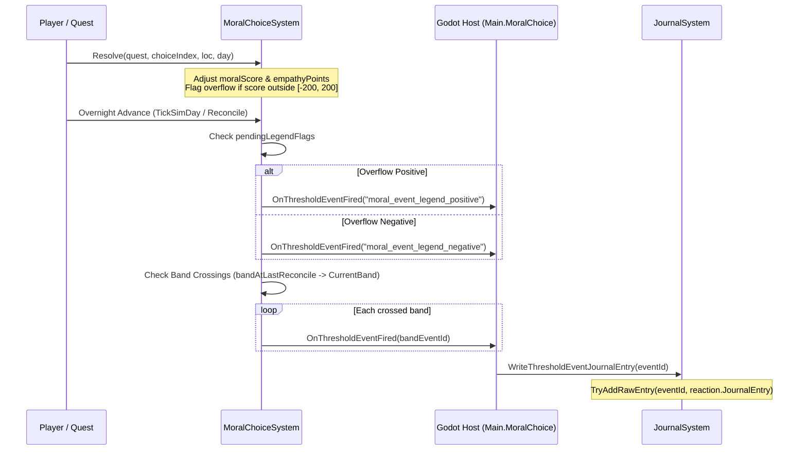

# Moral Choice Reaction Trigger Contract

## 1. System Invariants

1. **Zero UI Morality Numbers**:
   - The numerical `moralScore` (-200 to +200) is never exposed directly to the player.
   - Gameplay consequences manifest through NPC perceptions, outpost noticeboards, camp chatter, shelter defense, and journal notes.
2. **Deterministic Settlement**:
   - Moral consequences never trigger mid-scene or during dialog resolution.
   - All band calculations and threshold events settle overnight during `MoralChoiceSystem.Reconcile(int day)`.
3. **Strict One-Shot Execution**:
   - Each event ID is registered in `MoralChoiceState.firedThresholdEvents`.
   - Once fired, an event is permanently locked from triggering again in the same campaign, even if the player oscillates across the threshold boundary multiple times.

---

## 2. Event Dispatch Sequence

---

## 3. Overnight Reconciliation Rules

When `Reconcile(int currentDay)` executes:
1. **Day Ordering**: If `currentDay < lastReconciledDay`, execution aborts immediately to avoid time-travel race conditions.
2. **Legend Overflow Settlement**:
   - If `pendingLegendFlags & LegendPositiveFlag != 0`, `moral_event_legend_positive` fires.
   - If `pendingLegendFlags & LegendNegativeFlag != 0`, `moral_event_legend_negative` fires.
   - Pending flags are cleared (`pendingLegendFlags = 0`).
3. **Stepwise Band Traversal**:
   - Computes `from = bandAtLastReconcile` (defaults to `MoralPathBand.Neutral` on uninitialized saves).
   - Computes `to = CurrentBand`.
   - Iterates step-by-step from `from + step` through `to` (where `step = +1` or `-1`).
   - Evaluates `FireBandEvents((MoralPathBand)band)`:
     - `MoralPathBand.VeryEvil`: fires `moral_event_bounty_issued`.
     - `MoralPathBand.Positive`: fires `moral_event_contract_taken`.
     - `MoralPathBand.VeryPositive`: fires `moral_event_contract_raised` and `moral_event_patrol_defense`.
4. **State Persistence**:
   - `firedThresholdEvents` is serialized into the `moral_choice` save section within the unified campaign envelope.
   - Reloading a save restores `firedThresholdEvents`, ensuring historical events remain sealed.
