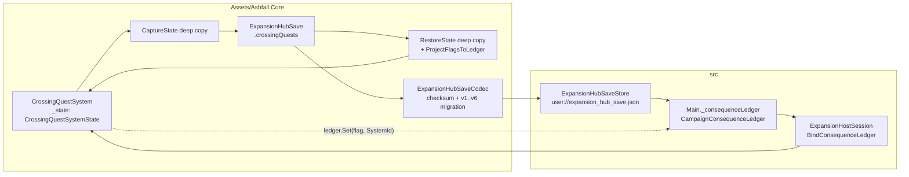
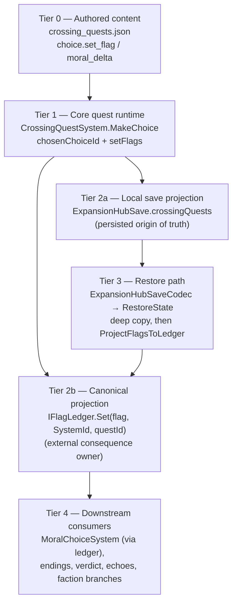
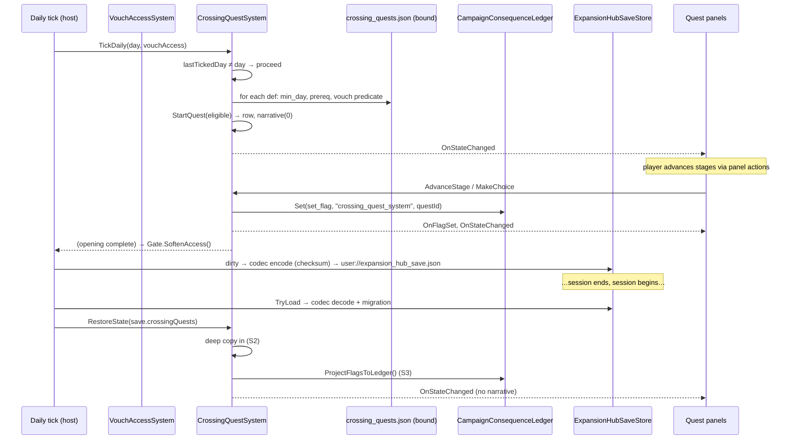

# Crossing Hardening Implementation Log

## Phase 1 — State and consequence boundary

Status: PASS

Changed:

- Added an optional projection from Crossing choices to the existing campaign
  `IFlagLedger`.
- Made choice selection one-shot and retry-safe.
- Deep-copied quest progress and flag/event-key collections on restore.
- Projected persisted local flags when a canonical ledger is bound or restored.
- Added `docs/expansions/CROSSING_STATE_FLOW.md`.

Tests:

- Added canonical-ledger, idempotence, restore-aliasing, and restore-projection
  cases to `CrossingQuestSystemTests`.

Result:

- Crossing has one local save projection and one canonical external consequence
  owner.

Divergences:

- Moral score deltas and Thirdonary triggers are not inferred from free-form
  flags. They require explicit authored mappings in a later phase.

---

# EXPANSION 2026-09-25 — Crossing Hardening: Full Integration Framework & Code Architecture

This expansion is documentation-only. It expands the Phase-1 hardening log above
(kept byte-for-byte) into a complete reference for the Crossing state and
consequence boundary: the ownership lattice, the integration framework, the code
architecture of each component, the state machine, the projection contract, the
save-aliasing discipline, the deferred consequence mappings, the test coverage,
and the verification ladder. Every load-bearing claim was re-verified against
source on 2026-09-25. Claims that could not be verified in the current tree are
marked `UNVERIFIED (log text)` and must not be treated as current fact.

## Part I — Expansion Preamble

### I.1 Thesis

The Crossing ("Nobody's Charter", Expansion 04) is the first place the campaign
teaches the player that a decision can outlive the scene that caused it. A name
registered at the Viaduct Gate, a covenant sealed in water, a dispute escalated
to seizure — each of these must still be true forty days later, in a different
panel, after a save and a reload. Phase-1 hardening (2026-09-05) built the
boundary that makes that durability honest:

- **One local save projection.** The `CrossingQuestSystem` keeps quest progress,
  chosen choices, set flags, and dispatched narrative keys in exactly one
  persisted section: `ExpansionHubSave.crossingQuests`
  (`Assets/Ashfall.Core/ExpansionHubSave.cs`). Nothing else writes Crossing
  quest state.
- **One canonical external consequence owner.** When a Crossing choice sets a
  flag that the wider campaign should see, the flag is recorded in the existing
  campaign consequence ledger through the `IFlagLedger` port
  (`Assets/Ashfall.Core/Flags/IFlagLedger.cs`, canonical implementation
  `Assets/Ashfall.Core/Flags/CampaignConsequenceLedger.cs`). Crossing does not
  instantiate a second flag authority, a moral system, or a Thirdonary system.

Everything else in this document is the specification of those two sentences.

### I.2 Scope

In scope for this expansion:

1. The Crossing ownership lattice as it stands on 2026-09-25 (Part II).
2. The integration framework: data flow tiers, event flow, save discipline,
   determinism, and integrity validation applied to Crossing (Part III).
3. Code architecture: module map, per-component deep specs, the three hardening
   rules written as specifications, and sequence walkthroughs (Part IV).
4. The bulk reference: state machine, projection contract, save-aliasing
   discipline, annotated state flow, deferred mappings, per-test coverage, and
   the Phase-1 hardening methodology (Part V).
5. Cross-system interaction matrix and emergent-consequence design space
   (Part VI).
6. Verification and acceptance (Part VII), appendices (Part VIII).

Out of scope:

- Any new flag or quest authority. Where this document describes a gap
  (host-side moral binding, Thirdonary triggers), it records the gap and the
  design space; it does not propose a parallel system to fill it.
- The Crossing arbitration domain internals (`CrossingArbitrationSystem`,
  backers, rulings, bribes) except where the quest system's boundary touches
  them. That domain has its own tests and its own audit trail.
- Retired Unity structures under `Assets/_Game/`. The Unity-era extract noted
  in the `CrossingArbitrationSystem` header is historical; the Core file is the
  only authority.

### I.3 Non-Goals

| Non-goal | Reason |
|---|---|
| Infer moral score from arbitrary flag names | The Phase-1 divergence stands as policy: consequence mapping is authored, not scraped from key shapes. Where a limited prefix fallback now exists, this document records it precisely (Part V, chapter 5) — it is bounded to two known prefixes, and it is not a general inference rule. |
| Persist a second copy of Crossing flags in the campaign envelope | Duplication is the failure mode the hardening removed. The ledger projection is derived state; the local section is the persisted origin. |
| Auto-trigger Thirdonary quests from Crossing flags | No such consumer exists in the tree as of 2026-09-25 (verified: no `IFlagLedger` reference under `Assets/Ashfall.Core/Thirdonary/`). Authoring one is deferred work with an explicit owner, not a side effect. |
| Rewrite `ExpansionHubSave` versioning | The codec's frozen-shape migration ladder (v1→v6) already carries `crossingQuests` in every version; touching it is integrator-owned. |
| Replay stage narrative after restore | Narrative dispatch keys are persisted precisely so restore is silent. Replaying them would double-fire presentation. |

### I.4 Evidence Policy

- **Verified 2026-09-25** means the claim was checked against the current file
  contents in this working tree. File paths are given as absolute-from-repo-root
  paths under the repository at `Atomic War/`.
- **UNVERIFIED (log text)** means the statement comes from the Phase-1 log or
  another document and was not re-confirmed in source. These claims are
  quarantined: useful history, not implementation authority.
- Git provenance is cited by short hash and date
  (`git log --format="%h %ad %s" --date=short`). The hardening itself landed in
  `bd031468` (2026-09-05, "Plans 60–63 & 46–49 closure") and the moral/covenant
  seam in `1e328684` (2026-09-05, "Plans 69–71 … Crossing covenant quests").
  SPDX headers are from `2d37f6f0` (2026-09-12) and carry no semantic change.
- No test was run for this expansion (documentation-only work). The verification
  chapter (Part VII) records which focused targets pin each documented behavior,
  so a reviewer can re-derive every claim mechanically.

### I.5 Reading Guide

| If you need… | Read |
|---|---|
| The two-sentence contract | Part I.1 |
| Which file owns which piece of Crossing state | Part II lattice table |
| How a choice becomes a campaign-visible flag, end to end | Part III tier flow, then Part V chapter 2 |
| The exact one-shot choice semantics | Part IV §4.3 and Part V chapter 1 |
| Why restore deep-copies, and the attack it prevents | Part V chapter 3 |
| Current status of moral deltas / Thirdonary triggers | Part II §2.4 and Part V chapter 5 |
| Every test that pins this behavior, one by one | Part V chapter 6 |
| What to run before touching these files | Part VII gate ladder |
| Flag and key vocabulary | Part VIII appendices |

---

## Part II — Current Authority Audit (as of 2026-09-25)

### II.1 The Crossing Ownership Lattice

Every concern in the Crossing quest domain has exactly one owner. The table
below is the verified lattice; each row names the owner, the file, and the
contract it is responsible for. Paths are repo-relative.

| Concern | Owner | Verified path | Contract |
|---|---|---|---|
| Quest definitions (catalog) | `crossing_quests.json` | `Assets/StreamingAssets/Data/crossing_quests.json` | schema_version 1; wrapped list of 23 `quest_*` defs; snake_case fields |
| Catalog loading | `CrossingQuestCatalogLoader` | `Assets/Ashfall.Core/Crossing/CrossingQuestSystem.cs` (same file, bottom) | `Load(dataDir, IFileIO?, IJsonSerializer?)` → wrapped-list decode via `CatalogLocator`; warn-and-empty on parse failure |
| Quest runtime state | `CrossingQuestSystem` | `Assets/Ashfall.Core/Crossing/CrossingQuestSystem.cs` | `SystemId = "crossing_quest_system"`; stage progress, choices, local flags, narrative dedup keys |
| Local save projection | `ExpansionHubSave.crossingQuests` | `Assets/Ashfall.Core/ExpansionHubSave.cs` | `CrossingQuestSystemState` carried in every version v1..v6 |
| Save codec | `ExpansionHubSaveCodec` | `Assets/Ashfall.Core/ExpansionHubSave.cs` | checksum-stamped encode/decode, frozen-shape v1..v5 migration, hard-reject on newer version |
| Save store (host) | `ExpansionHubSaveStore` | `src/Host/ExpansionHubSaveStore.cs` | `user://expansion_hub_save.json`, section `expansion_hub`, thin façade over `SaveStore<T>` |
| Flag port | `IFlagLedger` | `Assets/Ashfall.Core/Flags/IFlagLedger.cs` | `IsSet/Set/Clear/GetCounter/Increment/SetCounter`; `InMemoryFlagLedger` test double lives beside it |
| Canonical consequence ledger | `CampaignConsequenceLedger` | `Assets/Ashfall.Core/Flags/CampaignConsequenceLedger.cs` | dedup `Set`, provenance `ConsequenceRecord`, `OnConsequenceRecorded`, `ImportLegacyFlags/Counters`, own save DTO |
| Host session | `ExpansionHostSession` | `src/Host/ExpansionHostSession.cs` | constructs `CrossingQuestSystem`, binds ledger + catalog, routes events to save-dirty and vouch gate |
| Godot composition root | `Main` (partial class family) | `src/Main.cs` (ledger field), `src/Main.ExpansionHub.cs` (setup) | creates the one `CampaignConsequenceLedger`; passes it into `ExpansionHostSession.Create` |
| Quest panels | `CrossingQuestPanel`, `QuestsPanel`, `QuestsAtlasPanel` | `src/UI/CrossingQuestPanel.cs`, `src/UI/QuestsPanel.cs`, `src/UI/QuestsAtlasPanel.cs` | subscribe `OnStateChanged`, refresh views; never mutate quest rules |
| Opening-gate authority | `VouchAccessSystem` | `Assets/Ashfall.Core/VouchAccessSystem.cs` | `SystemId = "vouch_access_system"`; `SoftenAccess()` idempotent; quest system fires `OnOpeningQuestCompleted`, host routes it |
| Arbitration (The Standing) | `CrossingArbitrationSystem` | `Assets/Ashfall.Core/CrossingArbitrationSystem.cs` | backers, rulings, `RulingShape {Pending, Honest, Rigged, Overturned}`, `BribeResult`; separate save section `arbitration` |
| Covenant/dispute eligibility | `CrossingThirdonaryIntegration` | `Assets/Ashfall.Core/Crossing/CrossingThirdonaryIntegration.cs` | read-only typed queries over quest flags + arbitration; no mutation |
| Moral-choice domain | `MoralChoiceSystem` | `Assets/Ashfall.Core/MoralChoice/MoralChoiceSystem.cs` | own authority; `MinScore -200 / MaxScore 200`; host builds it in `src/Main.MoralChoice.cs` with the canonical ledger as its flags source |
| Thirdonary quest domain | `ThirdonaryQuestSystem` | `Assets/Ashfall.Core/Thirdonary/ThirdonaryQuestSystem.cs` | environmental quests; `SystemId = "thirdonary_quest"`; independent catalog and save |

Sibling Crossing catalogs in the data directory (verified present):
`crossing_encounters.json`, `crossing_factions.json`, `crossing_items.json`,
`crossing_locations.json`. They feed other Crossing consumers (encounters,
factions, items, locations) and are outside the quest boundary this log owns.

### II.2 What Changed Since 2026-09-05

The Phase-1 log was written against commit `bd031468` (2026-09-05). Since then,
the quest system file itself has only two further commits: `1e328684`
(2026-09-05, same day — the moral/covenant seam) and `2d37f6f0` (2026-09-12,
SPDX headers only). Concretely:

| Change | Commit | Effect on this boundary |
|---|---|---|
| `BindConsequenceLedger`, `ProjectFlagsToLedger`, deep-copy restore, `CROSSING_STATE_FLOW.md`, this log | `bd031468` | The Phase-1 hardening itself |
| `CrossingQuestChoice.moral_delta` consumer, `BindMoralSystem(MoralChoiceSystem?)`, prefix fallback (±5), `flag_moral_crossing_positive_/negative_{questId}` | `1e328684` | Extends `MakeChoice` with an optional moral push; dormant unless a moral system is bound |
| `CrossingThirdonaryIntegration` + `CrossingThirdonaryIntegrationTests` | `1e328684` | Adds the typed covenant/dispute eligibility layer over quest flags |
| Real catalog grows to 23 quests with covenant/dispute arcs (`quest_crossing_the_salvaged_accord`, `quest_crossing_the_registry_dispute`, `quest_crossing_the_long_toll`) | `1e328684` | Supplies the authored `set_flag` values the eligibility layer recognizes |
| SPDX headers on all files | `2d37f6f0` | None |

Nothing after 2026-09-05 altered the hardening contract itself. The one-shot
choice rule, the deep-copy restore, and the project-on-bind-or-restore order
are byte-stable in the current tree.

### II.3 The Persistence Picture (verified)



Three facts worth stating plainly, because they shape everything downstream:

1. **The local section is the only persisted Crossing quest state.**
   `ExpansionHubSave` has carried `crossingQuests` since v1; every version
   (v1 through v6) includes it, and the codec's migrations never drop it.
2. **The campaign consequence ledger is session-resident.** As of 2026-09-25
   there is no `CaptureState`/`RestoreState` call site for `Main`'s
   `_consequenceLedger` anywhere in `src/` (verified by search over all host
   sources; `CampaignConsequenceSaveState` is referenced only by its own file
   and two unrelated test files). The campaign ledger is rebuilt each session
   and repopulated by projections — including Crossing's restore projection.
   This is exactly why the project-on-restore rule exists.
3. **The ledger projection carries origin metadata only at choice time.**
   `MakeChoice` calls `ledger.Set(flag, SystemId, questId)` — origin system and
   source event are recorded. `ProjectFlagsToLedger` calls
   `ledger.Set(flag, SystemId)` — the restore projection records origin but not
   source quest. A consumer that needs the quest of origin after a reload
   cannot get it from the ledger; it must ask the quest system.

### II.4 Divergence Status (the recorded divergence, re-examined)

The Phase-1 log recorded one divergence: *"Moral score deltas and Thirdonary
triggers are not inferred from free-form flags. They require explicit authored
mappings in a later phase."* Status as of 2026-09-25:

**Moral score deltas — partially resolved, at the Core seam only.**

- Authored mappings now exist: `crossing_quests.json` carries a `moral_delta`
  field on exactly six choices — the ratify/breach pair of the salvaged accord
  (+5 / −5), the resolve/escalate pair of the registry dispute (+5 / −5), and
  the endow/refuse pair of the bridge toll (+5 / −5). All other choices omit
  the field (default 0).
- A Core seam exists: `BindMoralSystem(Ashfall.Core.MoralChoice.MoralChoiceSystem?)`
  plus the `MakeChoice` routing that (a) mirrors `set_flag` into the moral
  system, (b) applies the authored `moral_delta`, (c) falls back to a bounded
  prefix default (+5 for `flag_covenant_*`, −5 for `flag_dispute_*`) only when
  the authored delta is 0 and a flag exists, and (d) records the outcome as a
  moral-side event flag `flag_moral_crossing_positive_{questId}` or
  `flag_moral_crossing_negative_{questId}`.
- The host does **not** call `BindMoralSystem` (verified: the only caller in the
  tree is `CrossingThirdonaryIntegrationTests.MakeChoice_CovenantFlag_RoutesMoralDelta`).
  In the live host path the Crossing→moral push is therefore dormant. The
  moral system instead observes the canonical ledger — `src/Main.MoralChoice.cs`
  constructs `MoralChoiceSystem(..., flags: _consequenceLedger)` — so Crossing
  flags reach the moral domain only through authored moral-side content that
  references those flag keys.
- Verdict: the divergence's *authored-mapping* requirement is satisfied in the
  catalog and honored in Core; the *host binding* is deliberately still open.
  No free-form inference engine was ever built.

**Thirdonary triggers — partially resolved, as a query layer; no auto-trigger.**

- `CrossingThirdonaryIntegration` (added `1e328684`) is a read-only, typed
  eligibility layer. It recognizes exactly three covenant ids
  (`covenant_salvaged_accord`, `covenant_bridge_toll`, `covenant_water_charter`)
  and three dispute ids (`dispute_registry_claim`, `dispute_ferry_passage`,
  `dispute_scrapline_border`); anything else returns `Unknown` with a reason.
  Status is derived from explicit flag suffix conventions
  (`flag_{id}_breached/_dissolved/_active`, `flag_{id}_escalated/_resolved/_active`)
  queried through `CrossingQuestSystem.HasFlag`, gated behind
  `IsOpeningQuestComplete()`.
- The separate `Ashfall.Core.Thirdonary` domain
  (`ThirdonaryQuestSystem`, environmental one-shot quests) has no reference to
  `IFlagLedger` or Crossing (verified by grep over
  `Assets/Ashfall.Core/Thirdonary/`). Crossing choices do not start, gate, or
  resolve Thirdonary quests anywhere in the tree.
- Verdict: trigger semantics are typed queries, not flag scraping — the
  divergence's spirit holds. An actual Crossing→Thirdonary trigger path remains
  deferred work and would need an authored mapping plus an owner (Part V
  chapter 5).

### II.5 Preconditions and Adjacent Authorities the Lattice Depends On

- `VouchAccessSystem.SoftenAccess()` is idempotent and refuses to soften a gate
  that never had a name ("you cannot soften a gate that was never opened
  through a name" — verified doc comment). The host wires
  `CrossingQuests.OnOpeningQuestCompleted → Vouch.SoftenAccess()`, so the
  quest system does not reach into the vouch domain directly.
- `CrossingArbitrationSystem` persists in its own `ExpansionHubSave.arbitration`
  section. The eligibility layer reads quest flags, not the arbitration save;
  the two stay decoupled.
- `SaveStoreHub.FromCodec` provides the atomic write and path resolution for
  `expansion_hub_save.json`; the codec owns checksum and migration. Crossing
  never touches the file system itself.

---

## Part III — Integration Framework

This part states the architecture invariants that govern the Crossing boundary,
then walks the full data flow in tiers, the event flow, the save
capture/restore discipline, the determinism contract, and integrity validation.

### III.1 Architecture Invariants Applied to Crossing

These are the repo's non-negotiable rules (AGENTS.md) made concrete for this
domain. Each invariant cites the mechanism that enforces it.

| # | Invariant | Enforcement in the Crossing boundary |
|---|---|---|
| INV-C1 | Core stays engine-free | `CrossingQuestSystem`, `IFlagLedger`, `CampaignConsequenceLedger`, and `ExpansionHubSave` live under `Assets/Ashfall.Core/` and reference only `System.Text.Json`, `System.IO`, and each other. No `Godot` symbol appears in any of them. Host glue (`ExpansionHostSession`, panels, store) is confined to `src/`. |
| INV-C2 | JSON data is authoritative | Quest text, choice ids, `set_flag` values, and `moral_delta` come only from `crossing_quests.json` via `CrossingQuestCatalogLoader`. No choice or flag is hardcoded in Core (the test catalog in `CrossingQuestSystemTests` is test fixture data, never shipped). |
| INV-C3 | One authority per concern | Quest state: `CrossingQuestSystem` only. Flag truth (external): `CampaignConsequenceLedger` only. Local persisted copy: `ExpansionHubSave.crossingQuests` only. Any second registry, cache, or mirror is a defect by definition. |
| INV-C4 | Events expose facts; host applies presentation | `OnQuestStageChanged`, `OnQuestCompleted`, `OnFlagSet`, `OnStageNarrativeEmitted`, `OnStateChanged` carry facts. Panels refresh; the session marks the save dirty; the vouch gate softens. No panel computes quest outcomes. |
| INV-C5 | Deterministic behavior | The quest system advances only by explicit inputs (day, API calls). Set iteration order never reaches gameplay: `ProjectFlagsToLedger` iterates `_state.setFlags`, but `CampaignConsequenceLedger.Set` is a set-add with first-write history, so the recorded history order can vary with HashSet order without altering flag truth. Consumers needing ordered history must not rely on projection order — see III.5. |
| INV-C6 | Save ownership and restore path | `ExpansionHubSaveCodec` is the only encode/decode route; `ExpansionHubSaveStore` is the only disk route; `ExpansionHostSession.RestoreSave` is the only bulk-restore route. Crossing never serializes itself ad hoc. |
| INV-C7 | Focused verification | `Ashfall.Core.Tests/CrossingQuestSystemTests.cs` (35 cases) plus `CrossingThirdonaryIntegrationTests.cs` (10 cases) are the focused targets; run per `TEST_POLICY.md`, never the full suite by default. |

### III.2 Tier-by-Tier Data Flow

A Crossing choice becomes a campaign-visible consequence through five tiers.
Each tier names its owner and the exact artifact it produces.



**Tier 0 — Authored content.** `crossing_quests.json`, `schema_version 1`.
A choice is `{id, text, set_flag, moral_delta?}`. 51 `set_flag` entries across
23 quests; exactly one is empty (a choice that intentionally records only the
local decision); six carry authored `moral_delta` values (±5).

**Tier 1 — Core quest runtime.** `MakeChoice` validates the quest is started,
active, and the choice exists; records `chosenChoiceId`; adds `set_flag` to
`_state.setFlags`; pushes to the ledger and (if bound) the moral system; raises
`OnFlagSet` then `OnStateChanged`. The local set is the origin; the ledger entry
is the projection.

**Tier 2a — Local save projection.** `CaptureState()` deep-copies the runtime
state into `ExpansionHubSave.crossingQuests`. This section is what survives
reload; it is the persisted origin of Crossing truth.

**Tier 2b — Canonical projection.** The same mutation calls
`_consequenceLedger.Set(choice.set_flag, SystemId, questId)`. The canonical
ledger is campaign-wide truth for "this has happened", consumed by any system
holding the `IFlagLedger`. It is derived from Tier 1/2a and rebuildable.

**Tier 3 — Restore path.** On load, the codec decodes the envelope (checksum,
version migration), `RestoreState` deep-copies the decoded section into the
fresh runtime, then `ProjectFlagsToLedger()` re-projects every persisted flag
into the (session-fresh) canonical ledger. Restore order matters: bind-or-project
before any consumer tick reads the ledger.

**Tier 4 — Downstream consumers.** Moral choice (ledger-backed), unified
ending evaluation, verdict census, echoes, faction branches — all read the
canonical ledger through their own bindings. None of them reads
`ExpansionHubSave.crossingQuests` directly (verified: that section is read only
by the codec and `CrossingQuestSystem.RestoreState`).

### III.3 Event Flow

The quest system exposes eight events. Each is a fact; each has exactly one
kind of subscriber behavior.

| Event | Signature | Raised when | Host reaction (verified wiring) |
|---|---|---|---|
| `OnQuestStarted` | `(string questId)` | `StartQuest` succeeds | panel refresh; save-dirty via `OnStateChanged` |
| `OnQuestStageChanged` | `(string questId, int stage)` | `AdvanceStage` to a non-final stage | panel refresh |
| `OnQuestCompleted` | `(string questId)` | `AdvanceStage` past last stage | panel refresh |
| `OnQuestFailed` | `(string questId)` | `FailQuest` succeeds | panel refresh |
| `OnOpeningQuestCompleted` | `Action` (no args) | opening quest `quest_crossing_the_vouch` completes | `ExpansionHostSession` → `Vouch.SoftenAccess()` |
| `OnFlagSet` | `(string questId, string flag)` | a choice sets its flag (first time only) | panel/consequence presentation |
| `OnStageNarrativeEmitted` | `(CrossingStageNarrativeEvent)` | a not-yet-dispatched stage key | session → `Main.OnCrossingStageNarrative` → chronicle/journal presentation |
| `OnStateChanged` | `(CrossingQuestSystemState)` | after every mutation (`RaiseChanged`) | `ExpansionHostSession` marks the hub save dirty |

Ordering guarantees a consumer may rely on:

1. Within `MakeChoice`: state mutation → ledger write → `OnFlagSet` →
   `OnStateChanged`. A subscriber to `OnFlagSet` can therefore read the ledger
   and see the flag already set.
2. Within `AdvanceStage` to completion: `OnQuestCompleted` → completion
   narrative → (`OnOpeningQuestCompleted` if opening quest) → `OnStateChanged`.
3. Within `RestoreState`: state replacement → `ProjectFlagsToLedger()` →
   `OnStateChanged`. No narrative event is ever raised during restore.

### III.4 Save Capture/Restore Discipline

The contract has four clauses. Each clause exists because its absence once
produced a real defect class (Part V chapter 3 documents the aliasing attack).

**Clause S1 — Deep-copy on capture.** `CaptureState` constructs a new
`CrossingQuestSystemState`, a new `List<CrossingQuestProgress>` with one new
`CrossingQuestProgress` per quest (field-copied), and fresh copies of both
`HashSet<string>` collections. The codec may checksum and serialize the copy
while the game keeps playing.

**Clause S2 — Deep-copy on restore.** `RestoreState` never aliases the decoded
save object. Every quest progress is re-materialized field-by-field (with
null-tolerance: null quest ids become empty strings, null collections become
empty), and both sets are copied into new `HashSet<string>` instances. Mutating
the decoded DTO afterwards cannot touch the running system, and mutating the
running system cannot corrupt the DTO a caller still holds.

**Clause S3 — Restore-then-project ordering.** `RestoreState` ends with
`ProjectFlagsToLedger()` followed by `RaiseChanged()`. Projection runs only
after the full local state is in place, so the ledger receives the complete
persisted flag set in one pass, and `OnStateChanged` fires once the projection
is done — subscribers cannot observe a half-restored system.

**Clause S4 — Project-on-bind.** `BindConsequenceLedger` calls
`ProjectFlagsToLedger()` immediately. A ledger bound after flags already exist
(a session that loads the hub save before the campaign ledger is constructed,
a hot rebind, a test that binds late) converges without a replay of choices.

Aliasing prohibition, stated once: **no method in the Crossing boundary may
assign a caller-owned collection reference into runtime state, or a runtime
collection reference into a save DTO.** Capture and restore both copy. This is
the repo-wide pattern for every Core saveable; Part V chapter 3 generalizes it.

### III.5 Determinism Contract

- The quest system contains no RNG. Progression is a pure function of
  (catalog, current day, vouch state, prior progress, explicit calls).
- `TickDaily` is idempotent per day via `lastTickedDay`; a restored
  `lastTickedDay` prevents restart-after-reload (pinned by
  `TickDaily_SaveLoad_NoRestartAfterRestore`).
- HashSet iteration order (`setFlags` during projection,
  `dispatchedStageEvents` for dedup membership) does not influence observable
  quest outcomes. The one caveat, recorded honestly: the *order of
  `ConsequenceRecord` history entries* produced by a restore projection depends
  on `setFlags` iteration order, which is not stable across runs. Any future
  consumer that needs a canonical order must sort by the ledger's own key
  ordering (`GetAllFlags` already returns ordinal-sorted flags) or by `day`,
  and must not compare raw projection history sequences across machines. This
  is acceptable because history is diagnostic; flag truth is a set.
- The system never seeds from wall-clock time and never touches
  `System.Random` (verified: no RNG symbol in the file).

### III.6 Integrity Validation

- **Checksum:** `ExpansionHubSaveCodec` computes `SaveChecksum.Compute` over
  the full payload on encode and hard-rejects decode on missing/mismatched
  checksum ("truncated or tampered file", "corrupt or foreign save").
- **Version ladder:** decode into the frozen `ExpansionHubSaveV1..V5` shapes
  when `saveVersion` matches, migrate forward with safe defaults; reject
  `saveVersion > 6`; reject `saveVersion < 1`. `crossingQuests` is present in
  every rung; a null decodes to an empty state.
- **Catalog integrity:** `CrossingQuestCatalogLoader` decodes through
  `CatalogLocator.LoadWrappedList` and routes parse failures to
  `CatalogDiagnostics.Warn`, returning an empty list rather than a partially
  loaded catalog. The repo's data-integrity gate
  (`CatalogIntegrityValidator`, run headless) covers catalog-level reference
  checks; per AGENTS.md, presence in JSON is not by itself gameplay
  reachability — the quest chain's reachability is what
  `GetVisibleQuests`/`GetEligibleQuests` compute at runtime.
- **Runtime self-checks:** `RestoreState(null)` is a no-op;
  `GetDef` of an unknown id is null, never a throw; `MakeChoice` with an
  unknown choice returns false without mutating anything.

---

## Part IV — Code Architecture

### IV.1 Module Map

```text
Assets/Ashfall.Core/
├── Crossing/
│   ├── CrossingQuestSystem.cs          # quest runtime + catalog loader (this log's subject)
│   └── CrossingThirdonaryIntegration.cs# typed covenant/dispute eligibility queries
├── Flags/
│   ├── IFlagLedger.cs                  # consequence port + InMemoryFlagLedger test double
│   └── CampaignConsequenceLedger.cs    # canonical ledger, records, own save DTO
├── ExpansionHubSave.cs                 # envelope + CrossingQuestSystemState slot + codec
├── VouchAccessSystem.cs                # opening-gate authority (SoftenAccess)
├── CrossingArbitrationSystem.cs        # The Standing: backers, rulings, bribe marks
├── MoralChoice/…                       # separate moral authority (ledger-backed in host)
└── Thirdonary/…                        # separate environmental-quest authority
src/
├── Main.cs                             # _consequenceLedger (the one CampaignConsequenceLedger)
├── Main.ExpansionHub.cs                # SetupExpansions: Create + TryLoad + RestoreSave
├── Host/ExpansionHostSession.cs        # binds ledger + catalog; event routing
├── Host/ExpansionHubSaveStore.cs       # user://expansion_hub_save.json façade
└── UI/{CrossingQuestPanel,QuestsPanel,QuestsAtlasPanel}.cs
Ashfall.Core.Tests/
├── CrossingQuestSystemTests.cs         # 35 cases (Part V chapter 6)
├── CrossingThirdonaryIntegrationTests.cs # 10 cases (II.4, V.5)
└── FlagLedgerDeterminismTests.cs       # ledger-level determinism coverage
```

Dependency direction is strictly inward: `src/* → Ashfall.Core/*`; inside Core,
`Crossing/* → Flags/IFlagLedger` (port only) and `Crossing/* → MoralChoice`
(compile-time type only, runtime-null by default). Nothing in `Flags/` knows
Crossing exists.

### IV.2 Component Spec — `CrossingQuestSystem`

**File:** `Assets/Ashfall.Core/Crossing/CrossingQuestSystem.cs`
**Namespace:** `Ashfall.Core.Crossing` · **SystemId:** `crossing_quest_system`

**Responsibility.** Load nothing at construction; accept a bound catalog;
track per-quest progress; auto-start eligible quests on the daily tick; gate
the opening quest behind the vouch domain; make one-shot choices; keep the
local flag set; project flags to an optionally-bound `IFlagLedger`; expose
stage narrative exactly once per stage; capture and restore by deep copy.

**Non-responsibilities.** No file I/O (loader is a separate static class);
no save-dirty logic (host subscribes `OnStateChanged`); no vouch mutation
(host routes the opening-quest event); no moral authority (optional bind);
no arbitration queries (that is `CrossingThirdonaryIntegration`).

**Public API (verified signatures).**

| Member | Kind | Contract highlights |
|---|---|---|
| `BindCatalog(IReadOnlyList<CrossingQuestDef>)` | method | replaces the catalog; null becomes empty |
| `BindMoralSystem(MoralChoiceSystem?)` | method | optional; null unbinds; no projection runs on bind |
| `BindConsequenceLedger(IFlagLedger?)` | method | stores port; immediately calls `ProjectFlagsToLedger()` |
| `GetDef(string) / Catalog` | query | null for unknown id; catalog as bound |
| `GetVisibleQuests(int day)` | query | not completed + `min_day ≤ day` + prereq completed; locked-but-visible hub semantics |
| `GetEligibleQuests(int day, bool hasVouchAccess=false)` | query | visible + (is opening quest ∨ vouch passed ∨ opening completed) |
| `GetAvailableQuests(int day)` | query | backward-compatible alias for `GetEligibleQuests(day, false)` |
| `IsQuestStarted/Completed/Failed(string)`, `GetProgress(string)` | query | null progress means never started |
| `TickDaily(int day, bool hasVouchAccess=false)` | mutation | once per day (`lastTickedDay`); auto-starts eligible quests |
| `StartQuest(string, int day)` | mutation | guard: exists, not started/completed/failed, `min_day`, prereq |
| `AdvanceStage(string)` | mutation | returns new stage index, or −1 on/after completion; completes at `stages.Count` |
| `FailQuest(string)` | mutation | active → failed; terminal; blocks advance and tick-restart |
| `MakeChoice(string questId, string choiceId)` | mutation | one-shot; see IV.3 |
| `HasFlag(string)` | query | local set membership only — not the ledger |
| `CaptureState() / RestoreState(CrossingQuestSystemState?)` | save | deep copy out, deep copy in, project, raise |

**Events.** The eight events of Part III.3. Note `OnOpeningQuestCompleted` is
declared mid-file (after `HasFlag`) and is `Action` — parameterless by design:
subscribers (the vouch gate) need no payload.

**Failure modes and mitigations.**

| Failure mode | Mitigation in code | Pinned by |
|---|---|---|
| Catalog missing / corrupt JSON | loader returns empty list + `CatalogDiagnostics.Warn`; system runs with zero quests rather than half a chain | loader try/catch (verified) |
| Duplicate `TickDaily` in one day (multi-caller hosts) | `lastTickedDay` short-circuit before any loop | `TickDaily_Idempotent_SameDay` |
| Quest restarted after restore | restored `lastTickedDay` + started/completed/failed guards | `TickDaily_SaveLoad_NoRestartAfterRestore`, `TickDaily_DoesNotStart_AlreadyStarted` |
| Choice re-sent by UI retry | `chosenChoiceId` one-shot; same id returns true as no-op | `MakeChoice_ForwardsFlagToCanonicalConsequenceLedger_AndIsIdempotent` |
| Choice flipped after the fact | different id after selection returns false, state unchanged | same test, third assert |
| Ledger bound late | `BindConsequenceLedger` projects existing flags immediately | `RestoreState_ProjectsPersistedFlagsToCanonicalLedger` (bind-before-restore) and `ProjectFlagsToLedger` on bind |
| Ledger never bound | `_consequenceLedger?.Set(...)` null-conditional; local play continues | `MakeChoice_SetsFlag` runs without a ledger |
| Save DTO mutated after restore | deep copy in `RestoreState` | `RestoreState_DoesNotAliasSavedCollections` |
| Null save payload | `RestoreState(null)` returns silently | `RestoreState_Null_IsSafe` |
| Narrative replayed after reload | `dispatchedStageEvents` persisted; `EmitStageNarrative` dedups by key | `SaveLoad_DoesNotReplayStageNarrative` |

**Performance.** All lookups are linear scans over small collections
(23 quests; a handful of progress rows; sets bounded by authored choice count
— 51 flags worst case). No index structures are warranted at this scale, and
the code deliberately avoids LINQ in hot paths (plain `for` loops, matching the
repo's performance pass noted in test history). Capture/restore allocate one
new object graph per call; at hub-save cadence (on dirty, throttled by the
host) this is negligible.

### IV.3 Component Spec — Choice Selection State Machine

`MakeChoice` is the boundary's most safety-critical method. Its guard chain,
in evaluation order:

```text
MakeChoice(questId, choiceId)
 ├─ progress = GetProgress(questId)          → null ⇒ false
 ├─ progress.started ∧ ¬completed ∧ ¬failed  → otherwise ⇒ false
 ├─ def = GetDef(questId)                    → null ⇒ false
 └─ scan def.choices for choice.id == choiceId
     ├─ not found                            ⇒ false (no mutation)
     ├─ chosenChoiceId already set?
     │    ├─ same choiceId                   ⇒ TRUE  (idempotent no-op retry)
     │    └─ different choiceId              ⇒ FALSE (refusal, no mutation)
     └─ first selection:
          progress.chosenChoiceId = choiceId
          set_flag non-empty?
            ├─ _state.setFlags.Add(set_flag)
            ├─ _consequenceLedger?.Set(set_flag, SystemId, questId)
            └─ OnFlagSet(questId, set_flag)
          _moralSystem != null?
            ├─ mirror set_flag into moral system
            ├─ delta = authored moral_delta
            │    └─ if 0 ∧ set_flag non-empty:
            │         prefix "flag_covenant_" ⇒ +5 ; "flag_dispute_" ⇒ −5
            ├─ delta ≠ 0 ⇒ moral.Set("flag_moral_crossing_positive_" ∨ "…_negative_" + questId)
          RaiseChanged(); return TRUE
```

The retry-safe semantics in one sentence: **the first accepted selection is
permanent; repeating it reports success and does nothing; contradicting it
reports failure and does nothing.** This makes UI retry, double-click, and
event-redelivery harmless without a "has chosen" UI flag. The empty-`set_flag`
choice is first-class: it records `chosenChoiceId` and raises
`OnStateChanged`, but no flag event fires — the catalog contains exactly one
such choice (verified), so the path is real content, not a theoretical case.

### IV.4 Component Spec — Flag Projection Seam

The seam is two private/public members, small enough to quote as specification:

- `BindConsequenceLedger(IFlagLedger? ledger)` — stores the port, then calls
  `ProjectFlagsToLedger()`. Binding is idempotent: re-binding the same ledger
  re-projects every local flag, and `CampaignConsequenceLedger.Set` dedups
  (a flag already present produces no new record and no event), so
  bind-rebind storms are harmless.
- `ProjectFlagsToLedger()` — null-guards the port and the set, then for each
  non-empty flag calls `ledger.Set(flag, SystemId)`. It uses the two-argument
  overload: origin system recorded, no source event, day 0. Deliberate: a
  restore projection is a *convergence*, not a re-enactment; it must not
  fabricate history events with invented days.

Idempotence proof obligation (discharged by test, Part V chapter 2): running
projection twice over the same set leaves the ledger unchanged after the first
pass, because the canonical `Set` adds to a set and records history only on
first add (`CampaignConsequenceLedger.Set` early-returns when the flag is
already present — verified).

What the seam intentionally does *not* do:

- No counter pushes. `IFlagLedger` exposes `Increment/SetCounter`, but Crossing
  never uses them; crossing tallies live in their own systems.
- No `Clear`. Choices are one-shot; a Crossing flag, once set, is never
  retracted by the quest system. (The ledger port has `Clear`; other systems
  use it; Crossing does not.)
- No reads. `HasFlag` answers from the local set. The quest system never calls
  `IsSet` on the ledger — the projection is write-only, so a foreign system
  clearing a ledger flag cannot corrupt quest logic (it *would* diverge the
  projection; see Part V chapter 2 §2.6 for that failure mode).

### IV.5 Component Spec — Save DTO

`CrossingQuestSystemState` is the entire persisted surface:

```json
{
  "systemId": "crossing_quest_system",
  "lastTickedDay": 74,
  "quests": [
    {
      "questId": "quest_crossing_the_vouch",
      "currentStage": 5,
      "started": true,
      "completed": true,
      "failed": false,
      "chosenChoiceId": "vouch_ostrowski_reluctant"
    },
    {
      "questId": "quest_crossing_the_salvaged_accord",
      "currentStage": 1,
      "started": true,
      "completed": false,
      "failed": false,
      "chosenChoiceId": ""
    }
  ],
  "setFlags": [
    "flag_crossing_vouched_clean",
    "flag_covenant_salvaged_accord_active"
  ],
  "dispatchedStageEvents": [
    "quest_crossing_the_vouch:0:stage",
    "quest_crossing_the_vouch:1:stage",
    "quest_crossing_the_vouch:5:complete",
    "quest_crossing_the_salvaged_accord:0:stage"
  ]
}
```

Field notes:

- `systemId` is restamped on restore (`_state.systemId = SystemId`) so a
  foreign or hand-edited payload cannot rename the section's identity.
- `lastTickedDay` is the tick idempotence watermark; it is what makes
  same-day ticks after reload no-ops.
- `quests[].chosenChoiceId` is the one-shot record. Empty string = no choice
  made yet (the catalog's one empty-`set_flag` choice still lands here — the
  choice record and the flag record are independent).
- `setFlags` is the local projection origin; restore re-projects it.
- `dispatchedStageEvents` keys are `"{questId}:{stageIndex}:{stage|complete}"`;
  their presence is what makes restore narrative-silent.

The DTO is serialized by the envelope codec's `SystemTextJsonSerializer`
options (snake_case field names as declared; the JSON above is the shape the
envelope carries under `"CrossingQuests"`, inside `user://expansion_hub_save.json`).

### IV.6 The Hardening Rules as Specifications

The three Phase-1 rules restated as testable specifications. These are the
normative core of this document; everything else describes machinery.

**SPEC-H1 (one-shot retry-safe selection).**
For an active, started, incomplete, unfailed quest `Q` with choice `c`:

- `MakeChoice(Q, c)` returns `true` exactly once with effects
  (chosenChoiceId, setFlags, ledger record, OnFlagSet, moral routing).
- A second `MakeChoice(Q, c)` returns `true`, raises no flag event, performs
  no ledger write, and changes no state.
- `MakeChoice(Q, d)` with `d ≠ c` after a selection returns `false` and
  changes nothing.
- Effects are atomic within the call: no partial application between the
  local set and the ledger is observable through the public API.

**SPEC-H2 (deep-copy restore).**
For any captured state `S = CaptureState()` and restored system `R` with
`R.RestoreState(S)`:

- For every reachable mutation `m` of `S` after restore, `R`'s observable
  state is unchanged. (The regression test mutates `S.quests[0].chosenChoiceId`
  and clears `S.setFlags`; the specification covers the whole graph: quests
  list, both sets, every progress row.)
- Symmetrically, mutations of `R` after restore do not appear in `S`.
- `RestoreState(null)` is a total no-op.
- Null-tolerance: a null quests list, null entries, null sets, or null string
  fields in the payload decode to safe defaults rather than exceptions.

**SPEC-H3 (project on bind or restore).**
For any ledger `L` bound to system `R` holding local flag set `F`:

- At the moment `BindConsequenceLedger(L)` returns, `L` contains every
  non-empty flag in `F` with origin `crossing_quest_system`.
- At the moment `RestoreState(S)` returns, the same holds for the restored
  `F`.
- Projection is a set-add: repeated binds/restores converge; no duplicate
  ledger history records are produced by re-projection of an already-present
  flag.
- Projection never removes, never rewrites provenance of flags set by other
  origin systems.

### IV.7 Sequence Walkthroughs

Four end-to-end sequences, each annotated with the test that pins it.

#### IV.7.1 First choice (happy path)

```mermaid
sequenceDiagram
    participant P as Player (CrossingQuestPanel)
    participant QS as CrossingQuestSystem
    participant L as CampaignConsequenceLedger
    participant H as ExpansionHostSession
    P->>QS: MakeChoice("quest_crossing_the_vouch", "vouch_ostrowski_reluctant")
    QS->>QS: guards pass; chosenChoiceId = choice
    QS->>QS: setFlags.Add("flag_crossing_vouched_clean")
    QS->>L: Set("flag_crossing_vouched_clean", "crossing_quest_system", "quest_crossing_the_vouch")
    L-->>L: first add → ConsequenceRecord + OnConsequenceRecorded
    QS-->>P: OnFlagSet(questId, flag)
    QS->>QS: RaiseChanged()
    QS-->>H: OnStateChanged → save dirty
    Note over P,L: Ledger now campaign-visible; local section persists both choice and flag.
```

#### IV.7.2 Retry of the same choice

Same call repeated (UI double-fire, event redelivery). Guards reach
`chosenChoiceId`, see it equal to the requested id, return `true` immediately.
No `OnFlagSet`, no ledger call, no `RaiseChanged`. The canonical proof is the
second act of `MakeChoice_ForwardsFlagToCanonicalConsequenceLedger_AndIsIdempotent`:
`eventCount` stays at 1. A *different* id (`vouch_mattis_at_truss` in the test)
returns `false` — the third assert — which is what prevents rewriting history
at the gate.

#### IV.7.3 Save / mutate / restore aliasing attack

The attack the deep-copy discipline kills, played straight:

```text
1. sys.StartQuest(...); sys.MakeChoice(...)        # state: chosenChoiceId="vouch_ostrowski", flag set
2. saved = sys.CaptureState()                       # deep copy out
3. restored = FreshSystem(); restored.RestoreState(saved)   # deep copy in
4. ATTACK: saved.quests[0].chosenChoiceId = "mutated"
5. ATTACK: saved.setFlags.Clear()
6. Assert restored.GetProgress(...).chosenChoiceId == "vouch_ostrowski"   # holds
7. Assert restored.HasFlag("flag_vouched_clean")                          # holds
```

Without SPEC-H2, step 4 would rewrite the restored system's chosen choice and
step 5 would erase its flags — the save buffer would be a live wire into the
running game. With it, `saved` is inert. Pinned by
`RestoreState_DoesNotAliasSavedCollections`.

#### IV.7.4 Ledger bound after local flags already persisted

```text
1. source system makes choices; CaptureState() → saved
2. restored = FreshSystem()                       # no ledger yet
3. restored.BindConsequenceLedger(ledger)         # projects nothing (empty set)
4. restored.RestoreState(saved)                   # copies state, THEN ProjectFlagsToLedger()
5. Assert ledger.IsSet("flag_vouched_clean")      # holds
```

The variant worth noticing: had the ledger been bound *after* the restore
(`RestoreState` then `BindConsequenceLedger`), SPEC-H3 still converges, because
bind projects the now-restored set. Either order lands in the same place; the
tests pin bind-before-restore, and the bind-path projection covers
bind-after-restore. What is *not* covered is binding a *different* ledger
instance after a restore without rebinding intent — the old instance keeps the
stale projection. That is acceptable because the host binds exactly once at
session construction (verified in `ExpansionHostSession` constructor).

### IV.8 Host and Panel Wiring (verified call sites)

- `src/Main.cs:45–46` — `private readonly CampaignConsequenceLedger _consequenceLedger = new();`
  exposed as `Main.ConsequenceLedger`. One instance per process.
- `src/Main.ExpansionHub.cs` (`SetupExpansions`) —
  `ExpansionHostSession.Create(_dataDir, consequenceLedger: _consequenceLedger)`,
  then `ExpansionHubSaveStore.TryLoad()` and `session.RestoreSave(save, _debtBridge)`
  when a save exists; `session.OnCrossingStageNarrative += OnCrossingStageNarrative`.
- `src/Host/ExpansionHostSession.cs:72-73` — constructs `CrossingQuestSystem`
  and immediately `BindConsequenceLedger(consequenceLedger)`; `Create` loads
  `crossing_quests.json` via `CrossingQuestCatalogLoader` and `BindCatalog`s it.
  The constructor wires `OnStateChanged → RaiseStateChanged` (hub save dirty),
  `OnOpeningQuestCompleted → Vouch.SoftenAccess()`, and
  `OnStageNarrativeEmitted → OnCrossingStageNarrative`.
- `src/UI/CrossingQuestPanel.cs` — subscribes `OnStateChanged` (refresh), and
  computes lock reasons for display: prereq incomplete →
  "Requires completion of: {name}"; gate closed and opening quest unresolved →
  "Requires gate vouch access or opening charter resolution." The panel renders
  state; it never mutates quest rules.
- `src/UI/QuestsPanel.cs` — binds `crossingQuests`, unsubscribes on unbind
  (`HandleCrossingStateChanged → RefreshView`), and merges Crossing quests into
  the unified quest list. `src/UI/QuestsAtlasPanel.cs` takes the crossing
  system as an optional bind argument.

This wiring is the reason the hardening could stay small: the host already had
the two seams the boundary needed — one ledger instance and one session that
owns the quest system's lifetime.

---

## Part V — The Bulk: Domain Reference

### Chapter V.1 — State Machine

#### V.1.1 Quest lifecycle states

Each quest row (`CrossingQuestProgress`) is a small machine. Absence of a row
is itself a state: **Unstarted/Unknown**. The flags `started`, `completed`,
`failed` plus `currentStage` yield exactly six reachable states; every other
combination is unreachable by construction.

| State | Row present | started | completed | failed | Entered by | Exit via |
|---|---|---|---|---|---|---|
| `Unstarted` | no | — | — | — | (initial) | `StartQuest`, `TickDaily` |
| `Active(stage k)` | yes | true | false | false | `StartQuest` (k=0) / `AdvanceStage` (k<n) | `AdvanceStage`, `FailQuest` |
| `Completed` | yes | true | true | false | `AdvanceStage` past last stage | terminal |
| `Failed` | yes | true | false | true | `FailQuest` | terminal |
| `ActiveChosen(stage k)` | yes | true | false | false | `MakeChoice` during `Active(k)` | `AdvanceStage`, `FailQuest` |
| `CompletedChosen` | yes | true | true | false | completion after a choice | terminal |

`ActiveChosen` is not a separate struct field — it is `Active` with
`chosenChoiceId != ""` — but it behaves differently (choice locked), so the
state machine treats it distinctly. Note the asymmetry: `chosenChoiceId` is
allowed at any active stage (the catalog places choices on specific quests,
not specific stages; the system does not gate choice by stage).

#### V.1.2 Transition table with guards

| # | From | Event | Guard (all must hold) | Effect | Raises |
|---|---|---|---|---|---|
| T1 | Unstarted | `StartQuest(id, day)` | def exists; `min_day ≤ day`; prereq completed (empty prereq = satisfied) | append row `{started, stage 0}` | `OnQuestStarted`, narrative(stage 0), `OnStateChanged` |
| T2 | Unstarted | `TickDaily(day, vouch)` | same as T1 per quest, plus (opening quest ∨ vouch ∨ opening completed); `lastTickedDay ≠ day` | T1 per eligible quest | as T1 |
| T3 | `Active(k)`, `k+1 < n` | `AdvanceStage(id)` | def exists | `currentStage = k+1` | `OnQuestStageChanged`, narrative(stage k+1), `OnStateChanged` |
| T4 | `Active(n−1)` (last stage) | `AdvanceStage(id)` | def exists | `completed = true` | `OnQuestCompleted`, narrative(complete), `OnOpeningQuestCompleted` if opening, `OnStateChanged`; returns −1 |
| T5 | `Active*` | `FailQuest(id)` | row exists; not completed; not failed | `failed = true` | `OnQuestFailed`, `OnStateChanged` |
| T6 | `Active(k)` unchosen | `MakeChoice(id, c)` | c exists in def; not yet chosen | `chosenChoiceId = c`; flag/ledger/moral effects per IV.3 | `OnFlagSet` (if flag), `OnStateChanged` |
| T7 | `ActiveChosen(k)` | `MakeChoice(id, c)` | — | same id: no-op `true`; other id: refusal `false` | none |
| T8 | any | `RestoreState(S)` | S non-null | full replacement + projection | `OnStateChanged` only |
| T9 | any | `TickDaily(day)` | `lastTickedDay == day` | none (idempotence short-circuit) | none |

Blocked transitions (return `false`/`-1`, no effects): start when started,
completed, or failed (guard overlap with T1/T2); advance when completed or
failed; fail when completed or failed; choose when not started, completed, or
failed. The machine has no `Unfail`, no `ResetQuest`, no stage rewind — the
only way a quest row changes quest identity is appends, never edits of past
decisions.

#### V.1.3 The quest-level visibility/eligibility overlay

Distinct from lifecycle state, two computed predicates drive the hub UI:

- **Visible** (`GetVisibleQuests(day)`): not completed ∧ `min_day ≤ day` ∧
  prereq completed. Visible-but-locked quests are shown locked, not hidden —
  the panel renders the reason (verified strings in `CrossingQuestPanel`).
- **Eligible** (`GetEligibleQuests(day, hasVouchAccess)`): visible ∧
  (is the opening quest ∨ `hasVouchAccess` ∨ opening quest completed). This is
  the vouch gate as a pure function; `TickDaily` applies the same predicate
  when auto-starting.

The gate has three keys, in deliberate order of player agency: pick the
opening quest yourself, arrive with an external vouch (`hasVouchAccess` from
the vouch domain), or finish the opening arc so `OnOpeningQuestCompleted →
SoftenAccess()` makes your own name enough. Failed quests stay visible-filtered
out of nothing — they simply never re-enter T1/T2 (terminal), and the UI shows
them through progress rows rather than availability lists.

#### V.1.4 The narrative dispatch sub-machine

Every stage boundary (start at 0, each advance, completion) consults a
dedup set with keys `"{questId}:{stageIndex}:{stage|complete}"`:

```text
EmitStageNarrative(def, k, isCompletion)
  key = $"{def.id}:{k}:{isCompletion ? "complete" : "stage"}"
  if dispatchedStageEvents.Contains(key): return        # silent
  dispatchedStageEvents.Add(key)
  build CrossingStageNarrativeEvent {questId, questDisplayName, stageIndex,
        stageId, stageText, briefing, isCompletion}
  OnStageNarrativeEmitted(evt)
```

Properties proven by test: exactly one emission per boundary event
(`StartQuest_EmitsStageNarrative_ExactlyOnce`,
`AdvanceStage_EmitsNarrative_ExactlyOnce_PerStage` — four emissions for a
three-stage quest: stages 0,1,2 + completion); keys are unique per boundary
(`Stage_Narrative_Key_IsUnique_PerStage`); restore is silent because the keys
persist (`SaveLoad_DoesNotReplayStageNarrative`). The completion event uses
`stageId = "complete"` and a `[CHARTER RESOLVED]` prefix line — the one piece
of generated prose in the boundary, deliberately formulaic so presentation can
recognize it.

#### V.1.5 One-shot semantics proven by test

SPEC-H1 reduces to three assertions, all in
`MakeChoice_ForwardsFlagToCanonicalConsequenceLedger_AndIsIdempotent`:

```csharp
Assert.True(sys.MakeChoice("quest_crossing_the_vouch", "vouch_ostrowski"));
Assert.True(ledger.IsSet("flag_vouched_clean"));   // forward happened
Assert.Equal(1, eventCount);                        // exactly one OnFlagSet
Assert.True(sys.MakeChoice("quest_crossing_the_vouch", "vouch_ostrowski"));
Assert.Equal(1, eventCount);                        // retry: success, no effects
Assert.False(sys.MakeChoice("quest_crossing_the_vouch", "vouch_mattis_at_truss"));
                                                    // contradiction: refused
```

Why one-shot and not "allow changing before stage advance"? Because Crossing
choices are not tactics, they are testimony. The gate ledger records a name;
the scale records a number accepted or contested. Letting a player un-say a
choice after seeing consequences would not be a rebalance, it would make every
Crossing record provisional — and every downstream consumer (moral system,
arbitration eligibility, endings) would inherit the provisionality. One-shot
is the cheapest design that keeps the ledger's word.

#### V.1.6 Tick idempotence as a state property

`lastTickedDay` partitions time: T2 fires at most once per (system instance,
day). Four distinct double-start vectors are each closed and tested:

| Vector | Closure | Test |
|---|---|---|
| Repeat tick, same day | watermark short-circuit (T9) | `TickDaily_Idempotent_SameDay` |
| Tick after manual start | started-guard in the auto-start loop | `TickDaily_ManualStart_PlusTick_NoDoubleStart` |
| Tick next day after completion/failed | terminal guards | `TickDaily_DoesNotStart_AlreadyCompleted`, `FailQuest_PreventsAdvance_And_TickDailyRestart` |
| Reload and re-tick the same day | persisted watermark restored | `TickDaily_SaveLoad_NoRestartAfterRestore` |

The watermark is deliberately coarse (one day resolution, not a per-quest
dispatch set): auto-start is the only tick effect, and the per-quest started/
completed/failed guards make per-quest dedup redundant.

### Chapter V.2 — Projection: Local Flags → Canonical Ledger

#### V.2.1 The contract in one paragraph

The Crossing quest system owns a *local* set of flags it earned through
choices (`_state.setFlags`, persisted in `ExpansionHubSave.crossingQuests`).
The campaign owns a *canonical* record of everything that has happened
(`CampaignConsequenceLedger`, reachable through the `IFlagLedger` port). The
projection contract says: at every point where the local set is or becomes
complete — a choice lands, a ledger is bound, a save is restored — the local
set is written into the canonical ledger with origin
`crossing_quest_system`. The local set remains the persisted origin; the
ledger is the campaign-wide consequence truth. Neither is a copy of the other;
they are two projections of the same events with different lifetimes.

#### V.2.2 Key naming and vocabulary

Flag keys are authored strings from `crossing_quests.json` (`set_flag`),
never generated by code. The authored vocabulary falls into five families
(all verified in the current catalog; the complete 44-key list with per-key
choice counts is Appendix VIII.2):

| Family | Shape | Examples | Meaning |
|---|---|---|---|
| Gate/vouch | `flag_crossing_*` | `flag_crossing_vouched_clean`, `flag_crossing_filtered_passage`, `flag_crossing_total_lockdown` | gate and transit outcomes |
| Covenant | `flag_covenant_{id}_{status}` | `flag_covenant_salvaged_accord_active`, `flag_covenant_bridge_toll_breached` | arbitration covenant state |
| Dispute | `flag_dispute_{id}_{status}` | `flag_dispute_registry_claim_resolved`, `flag_dispute_registry_claim_escalated` | arbitration dispute state |
| Marks | `mark_crossing_*` | `mark_crossing_difficult` | reputation-style marks |
| Mutations | `mutation_crossing_*` | `mutation_crossing_honest_trader`, `mutation_crossing_myth_seeded` | world-state mutations |

The `_active/_breached/_dissolved` and `_active/_resolved/_escalated` suffix
conventions are load-bearing: they are what `CrossingThirdonaryIntegration`
recognizes (Part II.4). They are conventions enforced by authoring discipline
and by the integration's whitelist, not by a schema validator — adding a
covenant without extending the whitelist yields `Unknown` eligibility, a
safe degradation.

Normalization asymmetry, recorded for posterity: the canonical ledger
normalizes keys on the way *in* (`Trim().ToLowerInvariant()` —
`CampaignConsequenceLedger.Normalize`), while the quest system's local set and
`HasFlag` are ordinal exact-match. Authored keys are already lowercase
snake_case, so the two views agree in practice; a mixed-case flag would be
findable in the ledger but invisible to `HasFlag`. Consumers should query the
ledger with normalized keys (the ledger does it for you) and the quest system
with the exact authored string.

#### V.2.3 What happens when projection runs twice

Idempotence is a property of the receiving side. `CampaignConsequenceLedger.Set`
is set-add with first-write-wins history:

```csharp
if (_flags.Add(n)) { record = new ConsequenceRecord(n, "flag", 1, ...); _history.Add(record); }
else { return; }                    // already present: no record, no event
OnConsequenceRecorded?.Invoke(record);
```

Consequences of running projection twice (bind → choice → restore → rebind,
or any overlap):

1. Ledger flag truth: unchanged. A set cannot double-contain.
2. History: unchanged. Only the first `Set` writes a `ConsequenceRecord`.
3. `OnConsequenceRecorded`: not fired again.
4. Cost: one `HashSet.Add` miss per flag — negligible.

This is why `BindConsequenceLedger` can project unconditionally, and why the
host can construct-and-bind, restore, and rebind without a dedup protocol on
the Crossing side. The proof by test is indirect but tight: the restore
projection test runs projection over a flag the source system had already set
through the choice path, and ledger state is asserted exactly once; the
ledger's own first-write behavior is pinned in `FlagLedgerDeterminismTests`
(same test directory).

One honest limit: the *history order* of records produced during a projection
pass follows the local set's iteration order, which is not stable. Flag truth
is order-free; history is diagnostic. Consumers needing canonical order must
sort (see III.5). This is the only place where "run twice" could ever be
observed, and it is not observable in flag queries.

#### V.2.4 Provenance metadata: what survives, what doesn't

| Write path | originSystem | sourceEvent | day | subjectId |
|---|---|---|---|---|
| `MakeChoice` (live) | `crossing_quest_system` | quest id of the choice | 0 | (empty) |
| `ProjectFlagsToLedger` (bind/restore) | `crossing_quest_system` | (empty) | 0 | (empty) |
| Other systems' imports | their own | varies | varies | varies |

So `GetHistoryForSystem("crossing_quest_system")` answers "what has the
Crossing ever set" in both live and restored sessions, but only live sessions
can answer "which quest set this" from the ledger. After a reload that answer
lives in `ExpansionHubSave.crossingQuests.quests[].chosenChoiceId` and the
catalog's choice→flag mapping. A future enhancement (adding sourceEvent to the
projection) would be a one-line change but crosses the "restore is a
convergence, not a re-enactment" line by fabricating event metadata — deferred
by design, noted in Part VIII open questions.

#### V.2.5 Why projection, not duplication

Three architectures were available at the 2026-09-05 boundary:

1. **Duplication** — persist Crossing flags both locally and in the campaign
   save; two persisted copies. Rejected: two persisted copies drift the first
   time one write fails; every reader must pick a winner; the save matrix
   gains a permanent reconciliation obligation. This is the failure mode
   AGENTS.md rule 5 exists for.
2. **Ledger-only** — drop the local set; read flags from the ledger. Rejected:
   the canonical ledger is session-resident (Part II.3), so quest flags would
   evaporate on reload until a ledger persistence path exists; quest save
   compatibility (the local section has shipped since v1) would break; and the
   quest system would take a write-and-read dependency on a shared mutable
   authority it does not own.
3. **Projection** (chosen) — local persisted origin, canonical projected
   truth, converge on bind/restore, one write path, dedup on the receiving
   side. Cost: a consumer cannot distinguish "Crossing set this live" from
   "Crossing re-projected this on load" — acceptable, because no consumer
   needs that distinction; they need the flag, not its birthday.

The general lesson: when a domain must expose state to the campaign, the
question is never "where do we also save it" but "who rebuilds it, and when".
Projection names the rebuilder (the owner) and the moment (bind/restore).

#### V.2.6 Failure modes of the projection seam

| Failure | Detection | Containment |
|---|---|---|
| Ledger never bound (host wiring regression) | none at runtime — silent local-only play | all quest tests pass without a ledger; canonical-only consumers simply never see crossing flags; host constructor binds unconditionally, so this requires removing that line |
| Ledger bound late (after choices) | none needed | SPEC-H3 bind-path projection converges |
| Foreign system calls `ledger.Clear(flag)` on a crossing flag | none automatic | quest logic unaffected (write-only seam); the divergence resurfaces at next restore, when the local set re-projects — flag returns. Deliberate: the local section outranks foreign clears |
| Catalog renames a `set_flag` | old saves carry the old key; eligibility layer returns `Unknown` for unrecognized ids | safe degradation; no throw; Part VIII open question on flag migration |
| Null flag in local set (corrupt DTO) | `ProjectFlagsToLedger` null/empty guard | skipped, no throw |
| Ledger `Set` throws (it cannot — verified total method) | n/a | n/a |

### Chapter V.3 — Save Aliasing and the Deep-Copy Discipline

#### V.3.1 The defect class

C# collections are references. A save DTO is a collection graph. If a system
hands its live graph to the codec (capture) or accepts the codec's graph into
its live state (restore), then "saved" and "running" are the same object, and
three bug families follow:

1. **Time-travel writes.** The game keeps playing after capture; every
   mutation now also edits the "saved" snapshot mid-checksum. With
   `ExpansionHubSaveCodec` the visible symptom is checksum mismatch on save
   (the codec recomputes on encode, so a *concurrent* graph edit between
   compute and serialize can poison the file) or, without a checksum, a save
   that contains the future.
2. **Restore hot-wires.** `RestoreState(saved)` stores the reference. The
   decoded buffer — which the loader may keep for migration, diagnostics, or
   a second restore — becomes a live alias into the running system. Mutating
   the buffer mutates the game. The Phase-1 aliasing test's `saved.setFlags.Clear()`
   is exactly this attack.
3. **Shared-substructure leaks.** The top level is copied but inner rows are
   shared: a fresh `List<T>` whose elements are the *same* `T` objects. The
   quest domain is vulnerable in two places — `quests` rows and both string
   sets — which is why the hardening copied all three, not just the list.

#### V.3.2 The Crossing implementation, annotated

Capture (every line is a copy; nothing is assigned by reference):

```csharp
var stateCopy = new CrossingQuestSystemState { ... };        // new envelope
quests = new List<CrossingQuestProgress>(_state.quests.Count); // new list
setFlags = new HashSet<string>(_state.setFlags);               // new set
dispatchedStageEvents = new HashSet<string>(...);              // new set
foreach quest: stateCopy.quests.Add(new CrossingQuestProgress // new row per quest
    { questId, currentStage, started, completed, failed, chosenChoiceId });
```

Restore (same discipline inbound, plus null-tolerance):

```csharp
_state.quests = new List<CrossingQuestProgress>();
foreach row: null-skip; add new CrossingQuestProgress { ... chosenChoiceId ?? "" };
_state.setFlags             = saved.setFlags != null ? new HashSet<string>(saved.setFlags) : new();
_state.dispatchedStageEvents = saved.dispatchedStageEvents != null ? new HashSet<string>(...) : new();
ProjectFlagsToLedger();  RaiseChanged();
```

Strings in C# are immutable, so a field-copy of `questId`/`chosenChoiceId` is
a full copy — no deeper recursion is needed. The graph is two levels deep
(envelope → rows/sets), and both levels are rebuilt. This is the whole
discipline: *copy depth = mutation-reachable depth.*

#### V.3.3 The regression tests that pin it

| Test | Attack it simulates | Assertion that fails if the copy regresses |
|---|---|---|
| `RestoreState_DoesNotAliasSavedCollections` | caller mutates decoded buffer post-restore (`chosenChoiceId = "mutated"`, `setFlags.Clear()`) | restored system still reports the original choice and flag |
| `SaveLoad_RoundTrip` | round-trip fidelity incl. stage index and choice id | restored progress equals saved progress |
| `SaveLoad_DoesNotReplayStageNarrative` | restore re-fires presentation | emitted count unchanged across restore |
| `TickDaily_SaveLoad_NoRestartAfterRestore` | watermark lost in copy | same-day tick after restore starts nothing |
| `ExpansionHubSave_Includes_CrossingQuests` | envelope-level capture/restore through the real codec | `save.crossingQuests.quests` and `setFlags` survive `ExpansionHubSaveCodec.Capture` → `Restore` |
| `RestoreState_Null_IsSafe` | null payload | no-op, empty state |
| `SaveLoad_PreservesFailedState` | terminal-state fidelity | failed survives round-trip |

The first test is the canary: it fails within seconds of anyone "simplifying"
restore to `new List<T>(saved.quests)` (shallow list, shared rows) — the
`chosenChoiceId` write would bleed through — or to `_state.setFlags = saved.setFlags`
(immediate Clear bleed-through).

#### V.3.4 The general lesson for every Core saveable

This is a repo-wide pattern, not a Crossing peculiarity. The rule, stated once
for all of `Assets/Ashfall.Core/`:

> **A saveable Core system owns its runtime graph. `CaptureState` returns a
> graph with no shared mutation-reachable node with the runtime; `RestoreState`
> adopts nothing it did not construct. Copy depth equals mutation-reachable
> depth; strings exempt as immutable.**

Evidence the pattern is general (verified in neighboring systems): the
`CampaignConsequenceLedger`'s own `CaptureState` builds a fresh flag list,
counter dictionary, and history list under lock, and its `RestoreState` clears
and re-adds rather than adopting; `CrossingArbitrationSystem`'s header notes
"defensive CaptureState copy, null-safe RestoreState" as a house pattern; the
debt dispatcher's fired-set is restored as its own state object. The
`docs/saves/SAVE_STORE_CONTRACT_MATRIX.md` gate (generated, `--check`-ed in
CI) audits store classes; the deep-copy rule is the runtime-side complement
that the matrix cannot see.

Code-review checklist for any new `CaptureState`/`RestoreState` pair:

1. List every reference-typed field reachable from state. Each needs a copy
   site in capture and in restore.
2. Restore must null-guard every collection and normalize null strings.
3. Restore must end with its convergence step (projection, recompute,
   `RaiseChanged`) — never adopt-then-return silently.
4. Write one aliasing test per new collection: capture → restore → mutate the
   captured graph → assert the runtime is untouched.
5. Never expose the live state object from a public property without the same
   caveats documented (`CrossingQuestSystem.State` does exactly this — it
   returns the live `_state` for read/subscriber use; writers must go through
   methods. This is an accepted, documented sharp edge, not an oversight).

#### V.3.5 Threat model summary

| Actor | Vector | Defense |
|---|---|---|
| Caller holding a DTO | mutates capture output | capture deep copy |
| Codec/migration code | retains decoded buffer | restore deep copy |
| Future refactor | shallow-copy "optimization" | aliasing canary tests |
| Foreign system | clears projected ledger flag | local set re-projects on next restore (V.2.6) |
| Hand-edited save | garbage keys/nulls | codec checksum + restore null-tolerance + loader warn-and-empty |

### Chapter V.4 — `CROSSING_STATE_FLOW.md`, Expanded and Annotated

`docs/expansions/CROSSING_STATE_FLOW.md` (introduced with the hardening,
commit `bd031468`) is the short-form contract. This chapter reproduces each of
its five sections and expands it with the mechanism behind the promise. The
short document remains authoritative for its own text; this chapter is the
commentary.

#### V.4.1 "Runtime ownership" (original: a three-line ownership tree)

Original says the quest system owns local progress/flags/dispatch keys, the
vouch system owns the opening gate, and the ledger projection is optional.
Expanded:

- The tree is exhaustive. There is no fourth branch: no settings file, no
  panel state, no session cache carries quest state. A grep for
  `CrossingQuestSystemState` finds exactly the definition, the codec slots
  (v1..v6 + envelope), and the system's own field — verified.
- "Optional" refers to the ledger, not to the local state. Local state is
  unconditional; the boundary works ledger-less (all quest tests run without
  one).
- The gate edge is event-shaped, not call-shaped: the quest system never
  calls into `VouchAccessSystem`; it raises `OnOpeningQuestCompleted` and the
  host decides what that means (`SoftenAccess()` today).

Full lattice with paths: Part II.1.

#### V.4.2 "Choice contract" (original: five numbered rules)

Original rules, each annotated with its mechanism and proof:

| # | Rule (abridged) | Mechanism | Proof |
|---|---|---|---|
| 1 | Valid only for a started, active quest | guard chain in `MakeChoice` (IV.3) | `MakeChoice_Fails_For_InvalidChoice`; terminal guards |
| 2 | First selected choice is authoritative | `chosenChoiceId` write-once inside the scan loop | `MakeChoice_ForwardsFlag…` assert 1 |
| 3 | Repeating the same choice: no-op success | equality branch returns true before any effect | same test, `eventCount` stays 1 |
| 4 | Different choice after selection: refused | inequality branch returns false | same test, third assert |
| 5 | Empty `set_flag`: local record only, no flag event | flag effects nested under non-empty check | catalog's single empty-flag choice; `OnFlagSet` nesting verified in source |

Rule 5's quiet corollary: `OnFlagSet` fires only when a flag exists, but
`OnStateChanged` always fires — UI refresh is decoupled from consequence
emission. A panel that refreshed only on `OnFlagSet` would miss
empty-flag choices; the panels subscribe to `OnStateChanged` (verified), so
they are correct by construction.

#### V.4.3 "Save contract" (original: capture copies; restore now copies everything)

The original's "now" was the hardening itself. Expanded into the four clauses
of III.4 (S1 deep-copy capture, S2 deep-copy restore, S3
restore-then-project, S4 project-on-bind) and the aliasing discipline of
V.3. One addition the short doc doesn't state: the contract covers the
*decoded buffer's* lifetime too — nothing in the restore path retains a
reference to the codec's output, so the codec's buffer is inert garbage after
restore returns, and the caller may drop or mutate it freely.

#### V.4.4 "Integration boundary" (original: host passes the ledger; Crossing instantiates no moral/Thirdonary/second-flag authority)

This is the non-goal section of the original, and it still holds verbatim —
verified against `ExpansionHostSession`'s constructor (binds ledger only) and
the absence of any `BindMoralSystem` call in `src/`. Expanded with the
composition-root detail: the ledger's *owner* is `Main` (`src/Main.cs:45`);
the session receives it as `IFlagLedger` — the port, not the concrete type —
so the host depends on the campaign's abstraction, and Core never sees the
composition root at all.

#### V.4.5 "Remaining work" (original: typed moral deltas and Thirdonary triggers need authored fields and explicit mappings)

Status has moved since the sentence was written (full detail in V.5):
authored fields now exist (`moral_delta`, six choices), a typed eligibility
layer exists (`CrossingThirdonaryIntegration`), and the moral seam exists but
is unbound in the host. The "no free-form inference" clause is intact —
nothing in the tree derives consequences from arbitrary flag shapes. The
short doc's remaining-work sentence should be read today as: *the mapping
tables exist in embryo; the host binding and any Thirdonary trigger wiring
are the outstanding authorizations.*

#### V.4.6 The full annotated flow, end to end



Reading the diagram as contract: every arrow either mutates exactly one
owner's state or publishes exactly one fact. No arrow skips a tier; no
subscriber writes back into a tier above it.

### Chapter V.5 — Deferred Mappings: Moral Deltas and Thirdonary Triggers

The Phase-1 log deferred two consequence families. This chapter maps the
design space each one lives in, what already exists (verified 2026-09-25),
what a completed mapping would look like, and who would own it. Nothing here
is an approval to build: per AGENTS.md rule 10, a new authority decision
belongs to the foreman.

#### V.5.1 Why "authored mappings" is the policy

A free-form inference engine would read `set_flag` strings and guess
consequences from their shape — "starts with `flag_covenant_` so the player
kept a promise, add standing". The policy against it is not aesthetic:

- **Authorial intent is not recoverable from a key.** `mark_crossing_difficult`
  and `flag_crossing_standing_rigged` describe very different worlds; no
  prefix rule knows which should sting.
- **Inference composes badly.** Two guessing systems infer twice; a rename in
  the catalog silently re-scores the campaign.
- **Determinism review cannot audit a heuristic.** A table can be diffed; a
  regex in a score path cannot be reasoned about at save boundaries.
- **Tone.** ASHFALL consequences are written, not computed. A settlement that
  remembers a rigged scale should say so in its own words.

#### V.5.2 Moral score deltas — current state and completion shape

**Exists now (verified).**

- Catalog: `moral_delta` on six choices (±5 each) across the salvaged accord,
  registry dispute, and bridge-toll arcs; absent (defaults 0) on all others.
- Core seam: `CrossingQuestSystem.BindMoralSystem(MoralChoiceSystem?)`;
  `MakeChoice` mirrors `set_flag` into the moral system, applies the authored
  delta, applies the bounded prefix fallback (+5 `flag_covenant_*`, −5
  `flag_dispute_*` only when authored delta is 0 and a flag exists), and
  records `flag_moral_crossing_positive_{questId}` /
  `flag_moral_crossing_negative_{questId}` on the moral side.
- Proof: `CrossingThirdonaryIntegrationTests.MakeChoice_CovenantFlag_RoutesMoralDelta`
  binds a real `MoralChoiceSystem` (seeded `SeededRng(12345)`) and asserts the
  mirrored flag landed (`moral.HasFlag("flag_covenant_salvaged_accord_active")`).
- Host: **not wired.** No `BindMoralSystem` caller exists under `src/`
  (verified). The moral system in the host is constructed separately
  (`src/Main.MoralChoice.cs`) with the canonical ledger as its flags source.
- Side note for reviewers: the moral system's event-flag write is to the
  moral system, not the ledger — the crossing flag itself reaches the ledger
  through the normal projection; the *score* lives only in the moral domain.

**What completion looks like.** A host binding is a one-call change in
`SetupExpansions` after both authorities exist:
`_expansions.CrossingQuests.BindMoralSystem(_moralChoice)`. Before that is
authorized, two questions need answers:

1. **Ordering.** `MoralChoiceSystem` is constructed in
   `SetupMoralChoice`-family code with the ledger; the expansion session may
   construct first. Bind at whichever point both exist; `BindMoralSystem`
   performs no projection, so late binding only affects *future* choices —
   persisted moral state must come from the moral domain's own save, not from
   replayed crossing choices.
2. **Double-count risk.** If moral-side content also reads
   `flag_moral_crossing_*` event flags *and* the mirrored `set_flag` from the
   ledger, a single choice could score twice. The completion review must pick
   one channel per quest: authored `moral_delta` push, or ledger-observed
   flag — not both.

**Fallback policy question.** The prefix fallback is a convention encoders on
both sides agreed to (covenant/dispute quests ship ±5 either way). Keeping it
is defensible while the two suffix families are the only crossing-authored
moral keys; a wider catalog should prefer explicit `moral_delta` everywhere
and the fallback should then be deleted rather than extended. Do not add new
prefixes to it — that is the first step back to inference.

#### V.5.3 Thirdonary triggers — current state and completion shape

**Naming, disambiguated first.** Two things carry the word "Thirdonary":

1. `CrossingThirdonaryIntegration` — *inside* the Crossing folder; a typed
   eligibility query layer over quest flags + `CrossingArbitrationSystem`
   ("third-party arbitration": the Standing hears covenant petitions and
   dispute dockets once the opening arc is done). Exists; tested; read-only.
2. `Ashfall.Core.Thirdonary` — a separate domain of small environmental
   quests (`ThirdonaryQuestSystem`, `quest_third_*`, cooldown-aware,
   host session `src/Host/ThirdonaryHostSession.cs`, save envelope captured
   in `Main.Quests.cs`). Exists; independent; consumes no crossing flags
   (verified: no ledger or Crossing reference in the domain).

The deferred item is (2) reacting to (1)'s world: e.g. a breached
`covenant_bridge_toll` making a crossing-adjacent `quest_third_*` encounter
available, or a `flag_crossing_total_lockdown` suppressing thirdonary spawns
near the viaduct.

**Exists now (verified).** The raw materials only: recognized covenant ids
(`covenant_salvaged_accord`, `covenant_bridge_toll`, `covenant_water_charter`)
and dispute ids (`dispute_registry_claim`, `dispute_ferry_passage`,
`dispute_scrapline_border`); the suffix conventions that make state legible;
`CrossingThirdonaryIntegration.GetCovenantEligibility/GetDisputeEligibility`
returning `Eligible/Active/Breached/Dissolved/Resolved/Escalated` with human
reasons; and the canonical ledger carrying every crossing flag campaign-wide.

**What completion looks like.** The minimal honest design is a *mapping
table*, authored in the data directory, consumed by whichever domain is
allowed to react:

```json
{
  "schema_version": 1,
  "crossing_trigger_mappings": [
    {
      "when_flag": "flag_covenant_bridge_toll_breached",
      "origin": "crossing_quest_system",
      "effect": "unlock_thirdonary_quest",
      "target_quest_id": "quest_third_toll_wreckers",
      "note": "the wreckers heard the toll died"
    },
    {
      "when_flag": "flag_crossing_total_lockdown",
      "origin": "crossing_quest_system",
      "effect": "suppress_thirdonary_spawn_zone",
      "target_zone_id": "zone_crossing_viaduct_approach"
    }
  ]
}
```

Ownership options, with the rule that there must be exactly one:

| Option | Owner | Reads | Writes | Risk |
|---|---|---|---|---|
| A. Thirdonary-side consumer | `ThirdonaryQuestSystem` (or its host session) subscribes/queries the ledger against a bound mapping table | ledger | own quest state | cleanest: consequences are that domain's business; no new authority |
| B. Crossing-side dispatcher | `CrossingQuestSystem` grows a trigger table and starts thirdonary quests | own flags | foreign quest system | crosses the boundary the hardening drew — rejected unless nothing else can observe |
| C. Host-side bridge | a `src/` session subscribes `OnConsequenceRecorded` and drives both | events | both domains via existing APIs | keeps Core pure but puts a gameplay decision in the host — violates "events are facts, host applies presentation" if it decides outcomes |

Option A is the shape the repo's rules point at: the reacting domain owns its
reaction; the ledger is the fact source; the mapping is authored data. The
mapping table itself would need an integrity-validator entry (target quest ids
must exist in `thirdonary` catalog; `when_flag` values should be checked
against authored crossing flags to catch typos — presence-in-catalog is not
reachability).

**Status line for the record:** as of 2026-09-25 no trigger mapping table,
no Option-A consumer, and no Option-B/C bridge exist. Any plan that says
otherwise is ahead of the tree.

#### V.5.4 The common completion protocol

Both deferred families finish the same way, and it is worth writing down once:

1. Premise audit against the current tree (AGENTS.md rule 7) — this chapter
   is the 2026-09-25 snapshot, not a standing approval.
2. Claim exact paths in `WORKTREE_OWNERSHIP.md`; the Crossing boundary files
   are shared seams and the integrator owns collisions.
3. Author data first (deltas exist; a trigger table would be new), then the
   smallest consumer, then the focused tests (`CrossingQuestSystemTests` and
   `CrossingThirdonaryIntegrationTests` for anything touching choice effects;
   the Thirdonary domain's own tests for its side).
4. Extend this log's divergence section with a dated resolution note; never
   delete the original divergence text — it is the audit trail.

### Chapter V.6 — Test Coverage: `CrossingQuestSystemTests`, Case by Case

**File:** `Ashfall.Core.Tests/CrossingQuestSystemTests.cs` — 35 `[Fact]`
cases, verified by enumeration on 2026-09-25. Fixture: `SampleCatalog()` is a
two-quest catalog — `quest_crossing_the_vouch` (3 stages, one choice
`vouch_ostrowski` → `flag_vouched_clean`, `min_day` 10) and
`quest_crossing_first_weigh` (2 stages, choices `accept_true` /
`contest`, prereq = vouch, `min_day` 20). `FreshSystem()` binds it without
ledger or moral system. For each case: **Claims** (the contract it pins),
**Wiring** (what is bound/subscribed), **Mechanism** (how it works),
**Failure** (what a regression looks like).

#### V.6.1 Catalog and start gating (cases 1–5)

1. **`BindCatalog_Populates_Catalog`** — Claims: `BindCatalog` replaces the
   catalog; `GetDef` resolves known ids and returns null for unknown.
   Wiring: none beyond the fixture. Mechanism: linear scan by id.
   Failure: a dictionary/id-index refactor that throws on miss, or a null-def
   crash.
2. **`StartQuest_Succeeds_When_PrereqsMet`** — Claims: valid start returns
   true, fires `OnQuestStarted`, leaves the quest `IsQuestStarted`.
   Wiring: `OnQuestStarted` subscriber counter. Mechanism: guard chain T1
   passes; row appended; narrative(0) emitted (unasserted here).
   Failure: guard inverts prereq logic for empty `prereq_quest_id`.
3. **`StartQuest_Fails_Before_MinDay`** — Claims: day 5 < min_day 10 → false,
   no row. Mechanism: `min_day` guard precedes row creation.
   Failure: off-by-one (`<` vs `≤`) on the day threshold.
4. **`StartQuest_Fails_When_PrereqNotCompleted`** — Claims: second quest at
   day 25 (past its min_day) with prereq unresolved → false.
   Mechanism: prereq guard. Failure: prereq treated as satisfied when the row
   is merely present-but-incomplete (the `IsQuestCompleted` vs
   `IsQuestStarted` distinction).
5. **`StartQuest_Fails_When_AlreadyStarted`** — Claims: double start →
   second call false; exactly one `OnQuestStarted`. Mechanism: started guard.
   Failure: auto-start tick plus manual start double-firing (the T2/T1
   overlap; see also case 26).

#### V.6.2 Stage progression and completion (cases 6–8)

6. **`AdvanceStage_Progresses_Through_Stages`** — Claims: advance returns the
   new stage index (1, then 2) and `OnQuestStageChanged` reports it.
   Wiring: stage-changed subscriber. Mechanism: T3 increment.
   Failure: off-by-one stage reporting or event fired before mutation.
7. **`AdvanceStage_Completes_When_PastLastStage`** — Claims: advancing past
   the last stage returns −1, fires `OnQuestCompleted`, sets
   `IsQuestCompleted`. Mechanism: T4 boundary `currentStage >= stages.Count`.
   Failure: completing returns the sentinel as a valid stage, or completion
   requires one advance too many/few.
8. **`OpeningQuestCompletion_Fires_Event`** — Claims: completing
   `quest_crossing_the_vouch` fires `OnOpeningQuestCompleted` exactly for the
   opening quest. Mechanism: T4's quest-id conditional.
   Failure: host vouch-gate softening stops working (the session subscribes
   this event); event fires for non-opening quests.

#### V.6.3 Choices, canonical forwarding, idempotence (cases 9–13)

9. **`MakeChoice_SetsFlag`** — Claims: valid choice returns true, fires
   `OnFlagSet` with the authored flag, and `HasFlag` sees it locally.
   Wiring: `OnFlagSet` subscriber; no ledger bound — proving local set
   independence. Mechanism: T6. Failure: flag applied only when a ledger
   exists (a pre-hardening failure mode).
10. **`MakeChoice_ForwardsFlagToCanonicalConsequenceLedger_AndIsIdempotent`**
   — Claims: SPEC-H1 in full — forward to a bound `InMemoryFlagLedger`
   happens once; same-choice retry returns true with zero new events;
   different-choice retry returns false. Wiring: ledger + `OnFlagSet` counter.
   Mechanism: ledger `Set` inside T6; equality/inequality branches of the
   one-shot. Failure: retry re-fires `OnFlagSet` (double presentation), or
   contradiction succeeds (rewritable testimony). This is the hardening's
   flagship test.
11. **`RestoreState_DoesNotAliasSavedCollections`** — Claims: SPEC-H2 — the
   decoded capture is inert after restore. Mechanism: capture → restore →
   mutate captured graph → assert runtime untouched. Failure: shallow copy
   regression (V.3.3 canary).
12. **`RestoreState_ProjectsPersistedFlagsToCanonicalLedger`** — Claims:
   SPEC-H3 restore path — flags persisted before a reload appear in a freshly
   bound ledger after `RestoreState`. Wiring: ledger bound before restore.
   Mechanism: S3 ordering (`ProjectFlagsToLedger` at restore tail).
   Failure: projection dropped from restore (campaign loses crossing history
   every reload — the exact session-resident-ledger hazard of II.3).
13. **`MakeChoice_Fails_For_InvalidChoice`** — Claims: unknown choice id →
   false, no mutation. Mechanism: scan miss falls through to `false`.
   Failure: scan miss defaults to accepting the first choice.

#### V.6.4 Availability queries (cases 14–16)

14. **`GetAvailableQuests_FiltersByDay_And_Prereqs`** — Claims: day 5 →
    empty; day 10 → exactly the opening quest; day 25 → still only the
    opening quest (second quest's prereq unmet). Mechanism: visibility +
    eligibility predicates (V.1.3) via the backward-compatible alias.
    Failure: alias diverging from `GetEligibleQuests`, or min_day/prereq
    filters dropping.
15. **`GetAvailableQuests_UnlocksAfter_PrereqCompleted`** — Claims: after the
    opening quest completes, day 25 lists `quest_crossing_first_weigh`.
    Mechanism: prereq predicate against completed state.
    Failure: unlock requires manual start of the prereq row.
16. **`GetAvailableQuests_Excludes_Completed`** — Claims: completed quests
    leave the availability list. Mechanism: not-completed filter.
    Failure: replayable quests (completed quests re-eligible), which would
    also let `TickDaily` re-fire choices downstream.

#### V.6.5 Round-trip and null safety (cases 17–19)

17. **`SaveLoad_RoundTrip`** — Claims: capture holds one quest row and the
    chosen flag; restore reproduces started-not-completed, the flag, stage 1,
    and the chosen choice id. Mechanism: S1+S2 plus field fidelity.
    Failure: any field dropped in copy (each assert targets one field).
18. **`RestoreState_Null_IsSafe`** — Claims: `RestoreState(null)` no-ops,
    state stays empty. Mechanism: leading null guard.
    Failure: NRE on the null path (a cold-start host with no save hits this
    only if a caller passes null explicitly — codec never does; the guard is
    API hygiene).
19. **`ExpansionHubSave_Includes_CrossingQuests`** — Claims: the real
    envelope path — `ExpansionHubSaveCodec.Capture` with all hub siblings
    (waystation, layouts, memory, site encounters, vouch, greenhouse,
    arbitration, ledger debt) carries `crossingQuests`, and `Restore`
    lands it in a fresh system. Mechanism: codec-level integration, the
    section-slot contract. Failure: a frozen-shape migration dropping the
    section, or a Restore argument-order regression across the ten optional
    parameters.

#### V.6.6 Daily tick (cases 20–26)

20. **`TickDaily_StartsEligibleQuest_Once`** — Claims: first tick at
    min_day starts the eligible opening quest exactly once.
    Wiring: `OnQuestStarted` counter. Mechanism: T2.
    Failure: tick processes zero quests (guard inverted) or starts twice
    within one pass.
21. **`TickDaily_Idempotent_SameDay`** — Claims: three same-day ticks → one
    start. Mechanism: T9 watermark short-circuit.
    Failure: multi-caller hosts double-starting (the guard exists precisely
    for this).
22. **`TickDaily_NoStart_BeforeMinDay`** — Claims: tick at day 5 starts
    nothing. Mechanism: min_day filter in the auto-start loop.
    Failure: tick ignoring authored day thresholds.
23. **`TickDaily_DoesNotStart_AlreadyStarted`** — Claims: a next-day tick
    over a manually started quest fires no start. Mechanism: started guard
    per quest. Failure: the T2/T1 overlap reopening (double rows for one
    quest id).
24. **`TickDaily_DoesNotStart_AlreadyCompleted`** — Claims: completed quests
    never restart on later ticks. Mechanism: terminal guard.
    Failure: completion treated as "not started" by the filter.
25. **`TickDaily_SaveLoad_NoRestartAfterRestore`** — Claims: the watermark
    (`saved.lastTickedDay == 10` asserted on the DTO) survives restore;
    same-day tick after restore starts nothing; exactly one quest row.
    Mechanism: persisted watermark (S1/S2 fidelity feeding T9).
    Failure: watermark dropped in copy → reload replays the whole day's
    auto-starts and re-fires narrative chains.
26. **`TickDaily_ManualStart_PlusTick_NoDoubleStart`** — Claims: manual start
    then same-day tick → tick starts nothing. Mechanism: started guard
    (complement of case 23 from the other order).
    Failure: ordering-sensitive double-start (works one way, not the other).

#### V.6.7 Narrative dispatch (cases 27–30)

27. **`StartQuest_EmitsStageNarrative_ExactlyOnce`** — Claims: start emits
    exactly one narrative event: quest id, stage 0, not completion.
    Wiring: `OnStageNarrativeEmitted` collector. Mechanism: dedup-key insert
    at emit time. Failure: start emitting stage-0 twice (once as "start",
    once as "stage").
28. **`AdvanceStage_EmitsNarrative_ExactlyOnce_PerStage`** — Claims: a
    three-stage quest produces exactly four emissions — stages 0,1,2 then
    completion — with `isCompletion` true only on the last.
    Mechanism: per-boundary dedup; T4's completion variant.
    Failure: completion emitting both a stage event and a completion event
    for the same boundary.
29. **`SaveLoad_DoesNotReplayStageNarrative`** — Claims: restore raises zero
    narrative events; count frozen at save time survives. Mechanism:
    persisted `dispatchedStageEvents` + S2 copy.
    Failure: journal replay on every reload (duplicated chronicle entries in
    the host's narrative surface).
30. **`Stage_Narrative_Key_IsUnique_PerStage`** — Claims: the four boundary
    events of a full quest have four distinct key triples.
    Mechanism: key format `{questId}:{stageIndex}:{stage|complete}`.
    Failure: a key collision swallowing a legitimate stage's narrative (the
    dedup set would silently drop it).

#### V.6.8 Failure handling and post-vouch gating (cases 31–35)

31. **`FailQuest_MarksQuestFailed_And_FiresEvent`** — Claims: fail returns
    true, fires `OnQuestFailed` with the id, sets `IsQuestFailed` without
    setting completed. Mechanism: T5. Failure: fail flipping the completed
    bit, or failing silently.
32. **`FailQuest_PreventsAdvance_And_TickDailyRestart`** — Claims: advance on
    a failed quest returns −1; later ticks start nothing. Mechanism: terminal
    guards on T3/T4 and the auto-start filter.
    Failure: failed quests resurrecting as re-runnable content.
33. **`SaveLoad_PreservesFailedState`** — Claims: `failed` survives
    capture/restore; restored quest is failed and not completed.
    Mechanism: S1/S2 field fidelity on the terminal flag.
    Failure: failed-state loss on reload (quest becomes re-startable —
    compounding with case 32's guard).
34. **`TickDaily_PostVouchGating_RequiresVouchOrOpeningCompletion`** —
    Claims: after the opening arc completes, a no-vouch tick at day 20
    auto-starts the follow-up quest. Mechanism: eligibility predicate's
    "opening completed" arm. Failure: the gate never opening after the arc
    (hard-stuck hub).
35. **`TickDaily_PostVouchGating_WithVouchAccess_AutoStarts`** — Claims: the
    same follows with `hasVouchAccess: true` even though this fixture's
    opening quest is already complete — proving the vouch arm independently.
    Mechanism: the predicate's vouch arm (the other two arms are covered by
    `CrossingThirdonaryIntegrationTests` cases 8–9 of that file, which show
    no-vouch/no-completion yielding only the opening quest).

#### V.6.9 Coverage map and honest gaps

Mapped against the specification: SPEC-H1 (case 10), SPEC-H2 (case 11 +
17/19), SPEC-H3 (cases 10/12 for restore; bind-path projection exercised by
every ledger-bound test's setup and by `MakeChoice…Forward…` — the explicit
bind-after-flags sequence of IV.7.4 is covered by construction, not by a
dedicated case). T1–T9 all have at least one pinning case; the narrative
sub-machine has four; the aliasing discipline has one direct canary.

Honest gaps (observed, not proposed for unilateral fixing): no test binds a
ledger *after* a restore with pre-existing flags (IV.7.4's second variant);
no test covers `RestoreState` with a null collection *inside* a non-null DTO
(the code handles it; the suite does not); no test asserts the two-argument
provenance overload choice of `ProjectFlagsToLedger`; no test covers
`GetVisibleQuests` separately from `GetAvailableQuests` in this file (the
Thirdonary integration tests cover visibility). These are notes for the next
authorized touch of the file, not an invitation to grow speculative tests
against TEST_POLICY.

#### V.6.10 Adjacent Crossing test files (for orientation)

`CrossingArbitrationSystemTests`, `CrossingThirdonaryIntegrationTests`
(10 cases; the moral-routing and three-quest-arc replay live here),
`CrossingEndingsWorldHistoryTests`, `CrossingFactionExpansionTests`,
`CrossingItemsPlan126Tests`, and the World/ plan-integration suites
(Plans 115/116, 118/120, 126–129) all exercise Crossing neighbors; this log's
boundary claims rest on `CrossingQuestSystemTests` plus the ledger-level
`FlagLedgerDeterminismTests`.

### Chapter V.7 — The Phase-1 Hardening Methodology

This log is one instance of a repeatable method. Written down, the method is
how the next boundary (any domain where a Core system meets the campaign) gets
the same treatment without re-deriving it.

#### V.7.1 The method, as seven steps

1. **Name the two owners.** Every boundary has exactly one local save
   projection and exactly one canonical external consequence owner. If you
   cannot name both in one sentence, the domain is not ready to harden —
   that sentence *is* the hardening's thesis (here: Part I.1).
2. **Draw the current lattice before changing anything.** Enumerate every
   file that touches the domain's state, with owner or intruder marked
   (Part II.1 is the output). Intruders — parallel caches, panel-held state,
   second registries — become the work list.
3. **Sort the work into three rules.** Crossing needed exactly three:
   selection atomicity (SPEC-H1), copy discipline (SPEC-H2), convergence
   ordering (SPEC-H3). Most boundaries need no more than these three shapes:
   *make the mutation atomic, make the snapshot honest, make the rebuild
   ordered*. A fourth rule is a smell — probably two rules fused.
4. **Write the rules as specifications before the code.** Each spec must be
   falsifiable by a test a builder can write the same day (Part IV.6 form:
   for any X, operation Y produces Z). If a rule cannot be phrased as
   "for any… then…", it is not yet a rule; it is a wish.
5. **Implement at the seam, not beside it.** The hardening added members to
   the existing owner (`BindConsequenceLedger`, `ProjectFlagsToLedger` on the
   quest system; copy loops in its capture/restore) and nowhere else — no new
   manager class, no new assembly, no new save section. The diff stayed
   reviewable because it stayed inside the lattice's existing boxes.
6. **Pin every rule with the cheapest test that fails loudly.** One flagship
   test per rule (here: cases 10, 11, 12 of V.6), plus the regression
   canaries the rules imply (round-trip, watermark, terminal states). AGENTS
   rule: a builder stays under 100 cases; this boundary shipped under ten new
   ones on top of an existing suite.
7. **Record divergences as debts with addresses, not as apologies.** The
   original log's divergence paragraph named the two unmapped consequence
   families and the policy that governs them. That sentence is what made
   Part V.5 auditable two decades of days later: the debt had a name, a
   reason, and a designated later phase.

#### V.7.2 What the method deliberately does not do

- **It does not fix the neighbors.** The moral system and the Thirdonary
  domain had their own owners; the hardening left their gaps visible rather
  than papering over them from inside Crossing.
- **It does not grow the save schema.** No new section, no version bump: the
  state already had a slot; hardening changed how the slot is filled and
  trusted.
- **It does not rewrite history.** The log records PASS with its divergence;
  later work (the same-day covenant commit) extended the seam without editing
  the original text. The expansion you are reading follows the same rule.
- **It does not confuse compile-green with integrated.** The log's Result
  line is about ownership ("one local save projection and one canonical
  external consequence owner"), not about tests passing. Runtime agreement —
  host binding, restore path, observable outcome — is the integration test,
  and Part VII's ladder is where that gets checked.

#### V.7.3 Anti-patterns the method replaces

| Anti-pattern | What it looks like | What the method does instead |
|---|---|---|
| The mirror cache | domain keeps "its own copy" of a campaign flag for convenience | write-only projection; read from the owner |
| The polite guess | consequences inferred from key shapes at read time | authored mapping tables; explicit deltas |
| The absorbent panel | UI stores choice results to render later | panels subscribe to facts; state lives in the system |
| The optimistic save | `RestoreState(dto)` adopts the decoded graph | deep copy both directions; canary test |
| The replay ghost | restore re-fires presentation "so the player sees where they were" | persisted dedup keys; restore is silent |
| The second ledger | a domain-specific flag registry "just for this system" | one port, one canonical implementation, per-domain origin tags |

#### V.7.4 Applying the method elsewhere (orientation, not authorization)

The repo's other domain boundaries follow the same lattice shape —
`CrossingArbitrationSystem` (own section, own state, OnStateChanged), the
debt-consequence integration (dispatcher fired-set as idempotence authority),
the foundry consequence ledger (restored through its own state object). Any
future Phase-1-style hardening should start from this log's skeleton: thesis,
lattice, three rules, specs, seam diff, canary tests, divergence ledger. The
one part that must never be copy-pasted is the divergence list — each
boundary's deferred consequences are its own.

---

## Part VI — Cross-System Interaction Matrix & Emergent Consequence Design

### VI.1 How to Read This Part

The canonical ledger exists so that other systems can *know* what happened at
the Crossing without knowing anything else about it. This part inventories
who actually touches the boundary, verifies each touchpoint, and then works
the design question the ledger was built for: what should a campaign feel
like when its settlements keep records? Per the evidence policy: the roster
table cites verified file references; where a consumer's specific flag keys
were not individually read, that is stated rather than guessed.

### VI.2 The Canonical Ledger's Consumer Roster (verified references)

Every file below references `IFlagLedger` or `CampaignConsequenceLedger` in
the current tree (verified by search on 2026-09-25). This is the "who can
hear the Crossing" list — through the ledger, never through
`ExpansionHubSave.crossingQuests`.

| Consumer | Path (repo-relative) | Direction | Verified detail |
|---|---|---|---|
| Moral choice | `Assets/Ashfall.Core/MoralChoice/MoralChoiceSystem.cs`; host `src/Main.MoralChoice.cs` | reads (ledger as flags source); writes own score | host constructs it with `flags: _consequenceLedger`; crossing-side push seam exists but unbound (V.5.2) |
| Echoes | `src/Main.Echoes.cs` | reads + writes | `ConfigureFlags(_consequenceLedger)`; calls `Set`/`Clear` for world flags |
| Unified endings | `src/Main.UnifiedEnding.cs` | reads | checks specific keys, e.g. `tempest_decommissioned`, `vel_secret_exposed` — the same query surface crossing flags ride on |
| Commitments | `src/Main.Commitments.cs` | writes (+ reads counters) | `Increment`/`Set` with origin provenance |
| Cooking / medical / survivor fate | `src/Main.Cooking.cs`, `src/Main.Medical.cs`, `src/Main.SurvivorFate.cs` | writes; fate reads | ledger passed into system construction |
| Verdict census | `Assets/Ashfall.Core/Verdict/VerdictCensusBroadcast.cs`; `src/Host/VerdictHostSession.cs` | reads | host defaults its flag source to a `CampaignConsequenceLedger` |
| Campaign outcome | `Assets/Ashfall.Core/Endgame/CampaignOutcomeEvaluator.cs` | reads | ending evaluation over campaign flags |
| Faction branches | `Assets/Ashfall.Core/Factions/` (`IndependentBranchSystem/State`, `RebelBranchSystem/State`, `MilitaryBranchSystem/State`, `PrpfStandingSystem`, `FactionBranchCoordinator`); `src/Host/FactionBranchHostSession.cs` | reads + writes | branch states consume the port |
| Muster / action board | `Assets/Ashfall.Core/Muster/FactionActionBoard.cs` | reads | port referenced |
| Encounter effects | `Assets/Ashfall.Core/Narrative/EncounterChoiceEffectDispatcher.cs`; `Assets/Ashfall.Core/Encounters/OrphanKnockWhitelist.cs` | reads | flag-gated content |
| Medical vigil | `Assets/Ashfall.Core/Medical/VigilCare.cs` | reads | `IsKept(flags, subjectId)` pattern (verified host use in `src/Main.UiTests.Dose.cs`) |
| Expeditions (dive) | `Assets/Ashfall.Core/Expeditions/DiveInstanceRunner.cs`; `src/Host/ExpeditionHostSession.cs` | both | host session exposes `IFlagLedger Flags` |
| Thirdonary domain | `Assets/Ashfall.Core/Thirdonary/` | **none** | no port reference — the gap of V.5.3, restated as a fact |

Interpretation rules for the roster:

1. **Rows are opportunities, not obligations.** A consumer referencing the
   port is wired to *campaign* consequences generally; whether it reacts to
   any specific `flag_crossing_*` key is an authoring question, decided in
   that consumer's own content — with the exception of the typed arbitration
   eligibility layer (Crossing-owned, V.5.3).
2. **No row may become a second authority.** A consumer that needs to
   *change* crossing quest state must route through the quest system's
   public API; nothing writes into `setFlags` from outside, ever.
3. **The roster is the blast radius.** A malformed crossing flag (typo in the
   catalog) can only reach consumers through string equality; it fails as a
   silent no-match, never as a crash. The integrity review for new flags is
   therefore a spelling-and-vocabulary review (appendix tables exist for
   exactly this).

### VI.3 Pairwise Interactions, Worked

#### VI.3.1 Crossing × Moral choice

Two channels exist and must not be confused (V.5.2): the *ledger* channel
(every crossing flag is visible to the moral system's ledger-backed queries —
live today) and the *push* channel (`BindMoralSystem` + authored
`moral_delta` — Core-complete, host-dormant). The interaction is asymmetric
by design: crossing choices can move the moral record; the moral record never
rewrites crossing choices. `flag_moral_crossing_positive_{questId}` keys are
moral-domain residents; nothing in the crossing catalog references them.

#### VI.3.2 Crossing × Arbitration (The Standing)

The quest system and the arbitration system are siblings sharing the hub
save, decoupled by the eligibility layer. Quest choices write
`flag_covenant_*` / `flag_dispute_*` outcomes; `CrossingThirdonaryIntegration`
reads them as typed status; `CrossingArbitrationSystem` itself tracks backers,
ruling shapes (`Pending/Honest/Rigged/Overturned`), bribe marks and public
refusals in its own `arbitration` section. Neither reads the other's save.
The composition is temporal: a quest choice fixes what happened; the
eligibility layer decides what petitions are hearable; the arbitration system
decides what the Standing does about them. The suffix conventions
(`_active/_breached/_dissolved/_resolved/_escalated`) are the shared
vocabulary — the one place where crossing authoring is contractually bound
to another system's parser, which is why the whitelist degrades safe
(`Unknown`, with a reason string).

#### VI.3.3 Crossing × Vouch gate

One-directional and event-shaped: quest completion → `OnOpeningQuestCompleted`
→ host → `VouchAccessSystem.SoftenAccess()`. The vouch system refuses to
soften a gate with no name on it (verified doc comment), so the composition
preserves its own precondition: the opening arc is exactly the "first name on
the ledger". Failure containment: if the event wire breaks (host regression),
the gate stays hard — players can still complete the quest; they simply keep
needing external vouches. The failure is visible, not corrupting.

#### VI.3.4 Crossing × Endings / Verdict

Endings and verdict read the campaign flag surface; crossing flags ride it
with the same standing as every other origin's. No ending or verdict key
references a crossing flag today (verified 2026-09-25 by repo-wide search:
`flag_crossing` occurs only in `crossing_quests.json` and in this document —
no hit under `src/`, under `Assets/Ashfall.Core/Endgame/` or
`Assets/Ashfall.Core/Verdict/`, or in any other data catalog). The boundary's
obligation is only to keep crossing flags *available*
on that surface with correct origin tags, which the projection guarantees.

#### VI.3.5 Crossing × Save

Covered in III.4/V.3. The one interaction worth naming here: the hub save is
a shared envelope with sixteen sibling sections, so Crossing's write
discipline is also a neighbors' concern. The deep-copy rules mean a crossing restore cannot
corrupt the waystation section beside it, and the checksum means a foreign
section's corruption is caught before any section restores. The section-slot
contract (`crossingQuests` in every version v1..v6) is what makes the
boundary's persistence boring — and boring is the goal.

#### VI.3.6 Crossing × Thirdonary

Currently: nothing (verified). The design space and the recommended shape
(Option A, mapping table, reacting domain owns its reaction) are in V.5.3.
The matrix entry exists to keep the absence visible: this is the largest
unbuilt consequence path radiating from the Crossing, and any plan touching
it must name its owner before writing code.

### VI.4 Emergent-Consequence Design: What a Campaign of Records Feels Like

The hardening's promise — choices that survive reload — is only worth
building because the fiction demands it. The Crossing is a border with a
paperwork culture: names on a gate ledger, weights on a depot scale,
covenants sealed in water, disputes heard by whoever will stand behind them.
Consequences there should feel like *records coming due*, not like hidden
stat triggers. This section works four consequence shapes that the current
boundary already supports technically, written as design notes in the
repository's restrained tone. These are design notes, not authored content
and not approvals; any of them would enter through the normal plan/claim
process.

#### VI.4.1 The checkpoint manifest

A checkpoint at the Viaduct approach keeps a manifest of who passed and under
what name. Technically: a future manifest system reads the canonical ledger's
`GetHistoryForSystem("crossing_quest_system")` and renders its own record of
`flag_crossing_vouched_clean`, `flag_crossing_filtered_passage`,
`flag_crossing_total_lockdown`. The design rule that keeps it honest: the
manifest never re-decides the past. It may *misremember* presentationally
(a clerk's error line, a smudged entry) only through its own authored data —
never by mutating crossing state. When a checkpoint clerk squints at your
name, the game is reading the ledger out loud.

The restraint that makes it land: the manifest is wrong about small things
(quill, weather, mood) and right about the load-bearing ones. The player who
crossed clean in the rain should meet a clerk who recalls the rain before the
name.

#### VI.4.2 Stamped transit papers

Transit papers are the portable form of the gate's decision. A paper system
would compose the player's current crossing flags into an item description:
vouched clean reads one way; `flag_crossing_standing_rigged` another;
`mark_crossing_difficult` changes how guards handle the paper at *other*
checks, because marks travel. Technically: a papers presenter queries the
ledger (read-only), and any downstream check site (encounters, muster board)
already has the port on its side of the roster. The ownership rule: the
paper is presentation of ledger state; a guard confiscating the paper is an
encounter-system decision that must route *back* through authored content —
it cannot erase the ledger entry, because the gate still remembers, and on
the next restore the projection would return. That asymmetry (papers can be
lost; records cannot) is the design's point, and the projection contract is
what guarantees it.

#### VI.4.3 The guard's ledger of who crossed

The gate watch keeps its own book: who crossed, on whose word, and who was
refused. This is the arbitration domain's territory (`StandingRuling`,
bribe marks, public refusals) intersecting the quest boundary's flags. A
"who crossed" presentation would join two sources — quest flags for the
crossing events, arbitration rulings for their standing — and the join is
read-only composition at the consumer, exactly like the eligibility layer
but pointed at presentation instead of petitions. The tone rule: the book is
bureaucratic, not moralizing. It does not say you did wrong; it says three
backers withdrew, and lets the player sit with that.

#### VI.4.4 Water-seal covenants coming due

The covenant arcs already author their outcomes as flags
(`_active/_breached/_dissolved`). The emergent layer is time: a covenant
sealed on day 74 has an anniversary, a harvest, a season of holding. A
future calendar-facing consumer could ask the ledger for covenant flags plus
their recorded day — *this* is where the V.2.4 provenance limit bites: the
restore projection records day 0, so a "sealed on" date must come from the
quest system's own progress rows (which do not currently record a choice
day either — `CrossingQuestProgress` has no day field; the envelope's
`simDay` at save time is the only anchor). Honest status: day-anchored
covenant consequences need one authored field on the progress row before any
calendar design stands on them. That is a bounded, single-seam extension —
noted for Part VIII's open questions, not built here.

#### VI.4.5 The general consequence grammar

Across all four shapes, the same grammar repeats, and it is worth stating as
the boundary's design law:

1. **The record is the consequence's seed, not its body.** Flags say what
   happened; each consumer authors what it means in its own voice.
2. **Consumers read; they never reconcile.** If two consumers disagree about
   a crossing event, the disagreement is content, and the flag was true.
3. **Presentation may be lost; records may not.** Anything the player can
   carry, burn, or have confiscated is presentation. Anything the gate
   wrote down is state.
4. **Time is expensive.** Any consequence that needs "when" needs a new
   authored field first (VI.4.4); any consequence that only needs "that"
   ships on the current boundary today.

#### VI.4.6 Anti-entanglement rules

The mirror of the grammar — what Crossing refuses to become:

- Crossing does not read other domains' flags to *decide* quest outcomes.
  Prereqs are quest-shaped (`prereq_quest_id`), gates are vouch-shaped; a
  market collapse may make a crossing quest *available later* only through
  its own authored day/prereq fields, never by the quest system polling the
  economy.
- Crossing does not export scores. It exports events (flags). Any tally of
  "how honest has the player been at the crossing" belongs to the consumer
  that scores it (moral, standing, marks systems).
- Crossing does not know its audience. The quest system cannot enumerate its
  consumers; the roster in VI.2 is documentation, not a registry. Adding a
  consumer never changes crossing code — that is the whole point of the
  projection seam.

---

## Part VII — Verification & Acceptance

### VII.1 Principles

- **Focused only.** Per `TEST_POLICY.md` and AGENTS rule 8: the smallest
  test file or directly affected region; `scripts/run_test.sh` caps focused
  xUnit runs at 180 seconds. Nothing in this part authorizes a full-suite
  run.
- **Claims map to tests.** Every normative claim in Parts III–V names the
  test that fails if the claim breaks. A reviewer verifies the document by
  running those tests, not by re-reading prose.
- **Runtime agreement over compile-green.** The gate ladder below ends at
  Godot-headless checks because the boundary's acceptance is an integrated
  behavior (restore repopulates the ledger), not a compilation fact.

### VII.2 Focused Test Matrix

| # | Target | Command (repo root) | Pins |
|---|---|---|---|
| V1 | Quest system contract | `bash scripts/run_test.sh Ashfall.Core.Tests/CrossingQuestSystemTests.cs` | SPEC-H1/H2/H3, T1–T9, narrative dedup, tick idempotence, envelope integration (35 cases) |
| V2 | Eligibility + moral seam | `bash scripts/run_test.sh Ashfall.Core.Tests/CrossingThirdonaryIntegrationTests.cs` | covenant/dispute typing, vouch gating arms, moral routing (10 cases) |
| V3 | Ledger determinism | `bash scripts/run_test.sh Ashfall.Core.Tests/FlagLedgerDeterminismTests.cs` | ledger first-write/dedup behavior that projection idempotence leans on |
| V4 | Arbitration sibling | `bash scripts/run_test.sh Ashfall.Core.Tests/CrossingArbitrationSystemTests.cs` | the Standing's own contract (adjacent, run when touching arbitration) |
| V5 | Hub envelope | any focused save-codec target exercising `ExpansionHubSaveCodec` (V1's case 19 covers the crossing slot) | checksum + migration ladder |

Order for a boundary-touching change: V1 → V2 → V3, then V4/V5 if arbitration
or the codec moved. Expected: all green on the current tree; this expansion
changed no code, so its own verification burden is nil — the matrix exists
for the next builder.

### VII.3 The Gate Ladder (worst to best evidence)

| Rung | Gate | What it proves about this boundary | Source of authority |
|---|---|---|---|
| 0 | Static reading (this document, Part II lattice) | ownership claims match files | verified 2026-09-25 |
| 1 | `bash scripts/run_test.sh` on V1–V3 | contract behavior at the unit seam | `TEST_POLICY.md` |
| 2 | `dotnet build Ashfall.csproj` | host + core compile together; no port drift | repo build file |
| 3 | `bash scripts/ci/verify-fast.sh` | the full fast gate suite (mirrors CI order, fails fast) | `docs/CI.md` |
| 4 | `bash scripts/ci/triad-drift-gate.sh` | Setup/Save/Flush parity across hosts — catches a crossing state change that forgot its save side | `docs/architecture/TRIAD_GATE_AND_SAVE_OWNERSHIP.md` |
| 5 | `bash scripts/ci/generate-save-store-matrix.sh --check` | `ExpansionHubSaveStore` stays in the store-contract matrix | `docs/saves/SAVE_STORE_CONTRACT_MATRIX.md` |
| 6 | `godot --headless --path . -- --data-integrity-selftest` | catalog integrity across the data directory incl. crossing catalogs | `CatalogIntegrityValidator.cs` |
| 7 | Godot runtime session at 15 FPS (only if a runtime path changed) | restore actually repopulates the ledger in the live host; panels refresh | AGENTS testing rules |

Rungs 4–7 are named from the current authority map (verified references);
this expansion ran none of them (documentation-only). Rung 7 requires the
user's explicit request per AGENTS ("If a Godot runtime session is needed…
use 15 FPS").

### VII.4 Acceptance Criteria

The Phase-1 log's Result line — *"Crossing has one local save projection and
one canonical external consequence owner"* — decomposes into checkable
criteria. Each cites its evidence source; all were re-verified on
2026-09-25.

| # | Criterion | Evidence |
|---|---|---|
| A1 | Exactly one persisted crossing quest section exists | `ExpansionHubSave.crossingQuests` is the only `CrossingQuestSystemState` slot in any save shape (v1..v6) — Part II.1 |
| A2 | Exactly one canonical flag authority is bound | `Main._consequenceLedger` is the only `CampaignConsequenceLedger` construction in host composition; session binds it once — Part IV.8 |
| A3 | A choice made once cannot be remade or unmade | V1 case 10 green |
| A4 | Restored state is inert-input | V1 case 11 green |
| A5 | Reloaded sessions repopulate the canonical ledger | V1 case 12 green + A2 wiring |
| A6 | Restore is narrative-silent | V1 case 29 green |
| A7 | Same-day reload cannot double-start quests | V1 cases 21/25 green |
| A8 | No moral/Thirdonary authority is instantiated by Crossing | source inspection — no such constructor call in `CrossingQuestSystem`/`ExpansionHostSession` |
| A9 | Divergences are recorded with policy, not silently closed | this document Part V.5; original divergence text preserved above |

A future change to the boundary re-runs the matrix (VII.2) and re-attests
A1–A9. Any criterion that cannot be re-attested is a blocker to merge, per
the integration acceptance discipline.

### VII.5 Regression Risk Register

| Risk | Trigger | Detection | Response |
|---|---|---|---|
| Shallow-copy "cleanup" of restore | refactor simplifying `RestoreState` | V1 case 11 (canary) fails in seconds | reject; see V.3 checklist |
| Ledger binding dropped from session ctor | host wiring change | V1 case 12 still passes (unit-level), so detection needs A2 attestation + rung 7 | keep A2 in the merge checklist |
| Frozen-shape migration drops the slot | envelope version bump | codec tests + rung 5 | migration must carry `crossingQuests` in every new shape |
| Catalog flag typo | authoring | eligibility returns `Unknown` + appendix vocabulary review | fix data; no code path |
| Prefix fallback creep | someone adds a third prefix to the moral fallback | review against V.5.2 policy | authored `moral_delta` instead |
| Projection order dependence | a consumer starts comparing history order across runs | III.5 note; consumer review | consumer sorts; do not order the projection |

### VII.6 Rollback Plan

The hardening is four localized behaviors inside two files plus a doc. A
regression requiring rollback reverts, in order of preference:

1. **Revert the offending commit** (`bd031468` for the hardening proper,
   `1e328684` for the moral/covenant seam) — acceptable only before either
   has dependents; today both have dependents (tests, host binding, this
   document), so full reverts are historical tools, not live options.
2. **Reverse the specific behavior at the seam** — e.g. if restore
   projection must be disabled, gate `ProjectFlagsToLedger()` behind a
   single condition and note the divergence in `KNOWN_DEBT.md`; the local
   section stays authoritative, the campaign simply misses re-projection
   until fixed. A1–A4 still hold; only A5 breaks, visibly.
3. **Never** roll back by editing the save: `ExpansionHubSave` shapes are
   frozen ladders; a field never un-ships. Rollback is code-side, always.

Rollback discipline mirrors the repo rule: preserve unrelated dirty worktree
state, never reset the worktree, and record any quarantine decision in
writing with a passing focused target (V1/V2) before re-enabling.

---

## Part VIII — Appendices

Appendix map (VIII.1–VIII.23, in order; each is self-contained):

| # | Appendix | One-line purpose |
|---|---|---|
| VIII.1 | Glossary | terms as this document and the code use them |
| VIII.2 | Flag and key vocabulary | the complete authored `set_flag` list and naming rules |
| VIII.3 | Quest catalog reference | the 23 authored quests and the moral-delta table |
| VIII.4 | Adjacent domain quick-references | vouch, arbitration, moral, Thirdonary field facts |
| VIII.5 | Scenario walkthroughs | six traced play sequences through the machinery |
| VIII.6 | Annotated source tour | `CrossingQuestSystem.cs` geography, method by method |
| VIII.7 | Integration recipes | R1–R7 route maps for the most likely changes |
| VIII.8 | Open questions | Q1–Q10 with owners and closing evidence |
| VIII.9 | Provenance & verification register | git history, verified claims, open evidence |
| VIII.10 | Anatomy of the hardening commit | `bd031468` file by file, before and after |
| VIII.11 | Choice-arc anatomy | how the authored content earns the machinery |
| VIII.12 | Attestation | the original log's claims, checked line by line |
| VIII.13 | Reviewer worksheet | the checklist a crossing-change PR fills in |
| VIII.14 | Invariants index | every numbered rule with its statement site and pin |
| VIII.15 | The boundary in numbers | measured figures, the drift detector |
| VIII.16 | Frequently anticipated questions | the answers the code gives |
| VIII.17 | Reading and study path | a one-day path for new builders |
| VIII.18 | Consolidated failure-mode catalogue | F1–F20 with detection and containment |
| VIII.19 | Maintenance rules | how to extend this log without corrupting it |
| VIII.20 | Expansion change log and close-out | the expansion's own scope statement |
| VIII.21 | Companion specification | `VouchAccessSystem`, the gate, in full |
| VIII.22 | Symbol index | where every named rule physically lives |
| VIII.23 | Consolidated micro-trace | one in-game day, every mechanism, in order |

### Appendix VIII.1 — Glossary

Terms as used in this document and in the code they describe.

| Term | Meaning |
|---|---|
| **Aliasing** | Two live references to one mutation-reachable object graph; the defect class deep-copy discipline removes (V.3). |
| **Arbitration / The Standing** | `CrossingArbitrationSystem` — the Crossing's third-party ruling body; a ruling holds while three backers stand behind it. |
| **Bind** | To hand the quest system a port or catalog reference (`BindConsequenceLedger`, `BindCatalog`, `BindMoralSystem`). |
| **Canonical ledger** | `CampaignConsequenceLedger` — the campaign's single flag/counter/history authority, reached through `IFlagLedger`. |
| **Choice record** | `CrossingQuestProgress.chosenChoiceId` — the write-once memory of which choice a quest's player decision was. |
| **Consequence record** | `ConsequenceRecord` — the canonical ledger's history line: key, kind, value, origin system, source event, day, subject. |
| **Convergence** | A restore/bind step that brings derived state (the projection) up to the persisted origin without re-enacting events. |
| **Covenant** | An authored arbitration agreement (`covenant_*` ids); quest choices set its `_active/_breached/_dissolved` flags. |
| **Deep copy** | Copying every mutation-reachable node of a graph; for this boundary: envelope, quest rows, both string sets. |
| **Dispatch key** | `"{questId}:{stageIndex}:{stage|complete}"` — the narrative dedup key persisted in `dispatchedStageEvents`. |
| **Divergence** | A recorded decision to leave a consequence family unmapped for now, with a policy and a designated later phase. |
| **Eligibility** | Visible-and-startable: the quest-level predicate (V.1.3); also the covenant/dispute typed status queries. |
| **Envelope** | `ExpansionHubSave` — the hub save object; checksum-stamped; versioned v1..v6 with frozen shapes. |
| **Flag projection** | Writing the quest system's local flags into the canonical ledger with `crossing_quest_system` origin. |
| **Frozen shape** | `ExpansionHubSaveV1..V5` — pinned past envelope versions decoded to validate and migrate old saves. |
| **Gate (vouch gate)** | `VouchAccessSystem`'s access control; softened when the opening arc completes or an external vouch exists. |
| **Hub save** | The expansion-hub save file `user://expansion_hub_save.json`, written by `ExpansionHubSaveStore`. |
| **Idempotence (tick)** | `TickDaily` executes at most once per day per system instance, enforced by the persisted `lastTickedDay`. |
| **Idempotence (projection)** | Re-projecting flags cannot duplicate ledger truth or history (first-write-wins `Set`). |
| **IFlagLedger** | The engine-free flag port: set/clear/query flags and counters with provenance arguments. |
| **Local set** | `_state.setFlags` — the quest system's own flag record; persisted origin of crossing flag truth. |
| **Mark** | Authored `mark_crossing_*` flag family — reputation-style residue of a choice. |
| **Mutation (flag family)** | Authored `mutation_crossing_*` flags — world-state changes seeded by choices. |
| **One-shot choice** | SPEC-H1: first selection permanent; same-choice retry is a no-op success; contradiction refused. |
| **Origin** | The `originSystem` provenance argument on ledger writes; crossing writes always use `crossing_quest_system`. |
| **Projection** | Derived, rebuildable state written outward from an owner (the answer to "who rebuilds it, and when"). |
| **Restore projection** | The `ProjectFlagsToLedger()` pass at the tail of `RestoreState` (SPEC-H3, restore path). |
| **Ruling shape** | Arbitration's `Pending/Honest/Rigged/Overturned` classification of a standing ruling. |
| **Stage narrative** | The `CrossingStageNarrativeEvent` emitted exactly once per quest stage boundary. |
| **Thirdonary (two senses)** | (1) `CrossingThirdonaryIntegration` — typed covenant/dispute eligibility queries. (2) `Ashfall.Core.Thirdonary` — the independent environmental-quest domain. Disambiguated in V.5.3. |
| **Tick watermark** | `lastTickedDay` — the coarse idempotence anchor of the daily auto-start. |
| **Vouch** | A name given at the Viaduct Gate on another's word; the currency of the opening arc. |
| **Watermark restore** | The guarantee that a reloaded system will not re-run the day's tick (V1 case 25). |

### Appendix VIII.2 — Flag and Key Vocabulary (complete, verified)

Authored `set_flag` values in `crossing_quests.json` — the complete list, 44
distinct keys over 50 non-empty choices (one choice carries an empty
`set_flag`). The count column shows how many choices set the key (keys shared
by several choices are intentional: different decisions can land the same
world flag).

| Key | Choices | Family |
|---|---|---|
| `mutation_crossing_honest_trader` | 3 | mutation |
| `flag_crossing_vouched_clean` | 2 | gate |
| `mutation_crossing_vote_clean` | 2 | mutation |
| `mutation_crossing_underwrite_reliable` | 2 | mutation |
| `mutation_crossing_underwrite_burned` | 2 | mutation |
| `flag_dispute_registry_claim_resolved` | 1 | dispute |
| `flag_dispute_registry_claim_escalated` | 1 | dispute |
| `flag_covenant_salvaged_accord_active` | 1 | covenant |
| `flag_covenant_salvaged_accord_breached` | 1 | covenant |
| `flag_covenant_bridge_toll_active` | 1 | covenant |
| `flag_covenant_bridge_toll_breached` | 1 | covenant |
| `flag_crossing_charter_hidden` | 1 | gate |
| `flag_crossing_embargo_broken` | 1 | gate |
| `flag_crossing_embargo_upheld` | 1 | gate |
| `flag_crossing_family_refused` | 1 | gate |
| `flag_crossing_family_sponsored` | 1 | gate |
| `flag_crossing_filtered_passage` | 1 | gate |
| `flag_crossing_forfeit_collected` | 1 | gate |
| `flag_crossing_kael_asylum_granted` | 1 | gate |
| `flag_crossing_kael_extradited` | 1 | gate |
| `flag_crossing_marker_contradictions_noted` | 1 | gate |
| `flag_crossing_mattis_redeemed` | 1 | gate |
| `flag_crossing_medicine_confiscated` | 1 | gate |
| `flag_crossing_medicine_taxed` | 1 | gate |
| `flag_crossing_petition_unsigned` | 1 | gate |
| `flag_crossing_rig_to_cutters` | 1 | gate |
| `flag_crossing_rig_to_scale` | 1 | gate |
| `flag_crossing_scale_verified_silent` | 1 | gate |
| `flag_crossing_sloop_moored_free` | 1 | gate |
| `flag_crossing_sloop_tithed` | 1 | gate |
| `flag_crossing_standing_honest` | 1 | gate |
| `flag_crossing_standing_rigged` | 1 | gate |
| `flag_crossing_total_lockdown` | 1 | gate |
| `flag_crossing_underwrite_untested` | 1 | gate |
| `flag_crossing_vane_banished` | 1 | gate |
| `flag_crossing_vane_fined` | 1 | gate |
| `mark_crossing_difficult` | 1 | mark |
| `mutation_crossing_bribe_attempted` | 1 | mutation |
| `mutation_crossing_charter_revealed` | 1 | mutation |
| `mutation_crossing_forfeit_honoured` | 1 | mutation |
| `mutation_crossing_myth_seeded` | 1 | mutation |
| `mutation_crossing_petition_leaked` | 1 | mutation |
| `mutation_crossing_petition_revised` | 1 | mutation |
| `mutation_crossing_vote_sabotaged` | 1 | mutation |
| *(empty)* | 1 | local-record-only choice |

Family conventions and the consumers that parse them:

| Convention | Parsed by | Note |
|---|---|---|
| `flag_covenant_{id}_{active\|breached\|dissolved}` | `CrossingThirdonaryIntegration.GetCovenantEligibility` | id must be in the recognized whitelist |
| `flag_dispute_{id}_{active\|resolved\|escalated}` | `CrossingThirdonaryIntegration.GetDisputeEligibility` | same |
| `flag_moral_crossing_positive_{questId}` / `_negative_` | moral domain | generated by the Core seam, not authored in the catalog |
| `flag_covenant_*` / `flag_dispute_*` prefixes | `MakeChoice` fallback (±5) | bounded fallback, V.5.2 |

Naming rules for new keys (authoring discipline, not enforced by schema):
lowercase snake_case; family prefix first; covenant/dispute keys must follow
the suffix convention or the eligibility layer will not see them; one
decision, one key; never reuse a key for opposite outcomes — opposite
outcomes get opposite keys (the catalog's paired `_active/_breached`,
`_sponsored/_refused` pattern).

### Appendix VIII.3 — Quest Catalog Reference (verified shape)

`crossing_quests.json`, `schema_version 1`, 23 quests. The quest list as
authored (ids verified; order as in file):

| # | Quest id | Notes from verified reads |
|---|---|---|
| 1 | `quest_crossing_the_vouch` | opening arc; `min_day` 70; five stages ending at the Viaduct Gate's ledger; two choices, both → `flag_crossing_vouched_clean` |
| 2 | `quest_crossing_first_weigh` | prereq = vouch; the depot scale; accept/contest honestly or not |
| 3 | `quest_crossing_scale_integrity` | scale arc continues |
| 4 | `quest_crossing_the_terms` | — |
| 5 | `quest_crossing_the_petition` | — |
| 6 | `quest_crossing_the_standing` | — |
| 7 | `quest_crossing_the_marker` | — |
| 8 | `quest_crossing_the_forfeit` | — |
| 9 | `quest_crossing_the_vote_that_isnt` | — |
| 10 | `quest_crossing_three_dry_pages` | — |
| 11 | `quest_crossing_who_holds_the_ledger` | — |
| 12 | `quest_crossing_companion_mattis` | Mattis Cray arc (named in vouch stage 2 as a vouch-giver at the truss) |
| 13 | `quest_crossing_asylum_in_the_truss` | source of `flag_crossing_kael_asylum_granted` / `_extradited` |
| 14 | `quest_crossing_contraband_medical_vial` | medicine tax/confiscate pair |
| 15 | `quest_crossing_vehicle_lien_arbitration` | vehicle seam; rig-to-scale/rig-to-cutters pair |
| 16 | `quest_crossing_displaced_kin_roll` | family sponsor/refuse pair |
| 17 | `quest_crossing_quarantine_breach_trial` | — |
| 18 | `quest_crossing_flotilla_docking_rights` | sloop moored/tithed pair |
| 19 | `quest_crossing_embargo_transit_escort` | embargo upheld/broken pair |
| 20 | `quest_crossing_the_null_charter_vote` | vote clean/sabotaged pair |
| 21 | `quest_crossing_the_salvaged_accord` | covenant arc; authored `moral_delta` ±5; recognized id `covenant_salvaged_accord` |
| 22 | `quest_crossing_the_registry_dispute` | dispute arc; authored `moral_delta` ±5; recognized id `dispute_registry_claim` |
| 23 | `quest_crossing_the_long_toll` | covenant arc; authored `moral_delta` ±5; recognized id `covenant_bridge_toll` |

Dashes in the Notes column mean "structure verified, prose not individually
read for this expansion" — the schema fields (`briefing`, `stages`,
`knowledge_key`, `target_location_id`, `prereq_quest_id`, `min_day`) are
present for all quests; their chain order beyond quests 1–2 is UNVERIFIED
(log text) and should be re-derived from the file before any quest-graph
work.

Authored moral-delta table (complete, all six occurrences):

| Quest | Choice outcome | `set_flag` | `moral_delta` |
|---|---|---|---|
| `quest_crossing_the_salvaged_accord` | ratify with water seal | `flag_covenant_salvaged_accord_active` | +5 |
| `quest_crossing_the_salvaged_accord` | repudiate, break seal | `flag_covenant_salvaged_accord_breached` | −5 |
| `quest_crossing_the_registry_dispute` | uphold elder lineage claim | `flag_dispute_registry_claim_resolved` | +5 |
| `quest_crossing_the_registry_dispute` | seize disputed cargo | `flag_dispute_registry_claim_escalated` | −5 |
| `quest_crossing_the_long_toll` | endow the gate with the salt covenant | `flag_covenant_bridge_toll_active` | +5 |
| `quest_crossing_the_long_toll` | refuse the toll, force transit | `flag_covenant_bridge_toll_breached` | −5 |

Test-fixture vs shipped-catalog divergence note: `CrossingQuestSystemTests`
uses `min_day` 10/20 and flag `flag_vouched_clean` (no `crossing_` infix)
with single-stage-3 quests — deliberately small fixture data. The shipped
catalog uses `min_day` 70 for the opening quest and the
`flag_crossing_vouched_clean` spelling. Nothing in the boundary depends on
fixture values matching shipped values; only the Thirdonary integration
tests bind the real catalog (their fixture loads from the data directory —
`CreateFixture()` in that file; opening-quest day 70 asserted there,
verified).

### Appendix VIII.4 — Adjacent Domain Quick-References (verified fields)

**`VouchAccessSystem`** (`Assets/Ashfall.Core/VouchAccessSystem.cs`,
`SystemId = "vouch_access_system"`): state carries the gate's memory
(vouched-by name, vouch-burned, access-softened, last-resort flags).
`SoftenAccess()` is idempotent and preconditioned on a name having existed
(`vouchedBy` non-empty or `vouchBurned`); raises `OnAccessSoftened`.
`NeedsLastResort` is true only after a first vouch was burned — "a fresh,
never-attempted gate has no 'resort'".

**`CrossingArbitrationSystem`**
(`Assets/Ashfall.Core/CrossingArbitrationSystem.cs`): "The Standing. A
ruling is real for as long as three backers hold it." Data: `BackerDef`
(`id`, `displayName`, `wants`, `willNot`, `principled`, `isAlive`);
`StandingRuling` (`topic`, `backers`, `shape`, `dayCalled`, `bribedBackers`,
`bribeMarks`, `refusedBribes`); `RulingShape` ∈ {Pending, Honest, Rigged,
Overturned}; `BribeResult` ∈ {Invalid, Accepted, RefusedPrincipled} — a
principled backer refuses publicly and the refusal itself is a mark on the
ruling. Scripted micro-disputes only; explicitly "not a political sim, not
agent-based". Header notes the Core file is an engine-agnostic extract of
the retired Unity original — historical provenance, not an authority.

**`MoralChoiceSystem`** (`Assets/Ashfall.Core/MoralChoice/MoralChoiceSystem.cs`):
`SystemId = "moral_choice"`; score clamped to [−200, +200]; empathy tier
thresholds 15/30/45; ending locks need ≥20 quests. Host construction binds
the canonical ledger as its flag source (`src/Main.MoralChoice.cs`).

**`ThirdonaryQuestSystem`** (`Assets/Ashfall.Core/Thirdonary/ThirdonaryQuestSystem.cs`):
`SystemId = "thirdonary_quest"`; `quest_third_*` ids; cooldown-aware
(`cooldown_days ≤ 0` = one-shot); lifecycle mirrors the expansion quest
pattern (BindCatalog → TickDay → StartQuest → MakeChoice →
Complete/Fail).

### Appendix VIII.5 — Scenario Walkthroughs

Each walkthrough traces a realistic play sequence through the verified
machinery: every named call, event, and file is real. Day numbers use the
shipped catalog's thresholds where stated (opening quest `min_day` 70).

#### VIII.5.1 Scenario: the first name (days 70–78)

Day 70. The hub tick calls `TickDaily(70, hasVouchAccess: false)`. The
watermark moves to 70; the eligibility predicate admits exactly one quest —
`quest_crossing_the_vouch`, the opening arc — so `StartQuest` appends its
progress row, stage 0, and the narrative dispatcher writes
`quest_crossing_the_vouch:0:stage` into the dedup set before emitting
"Hear Ostrowski out…". The session's `OnStateChanged` marks the hub save
dirty; the chronicle surfaces the stage text through
`OnCrossingStageNarrative`.

Days 71–75. The player advances four times through `AdvanceStage`: find a
name, walk the approach, reach the gate, register the vouch. Each advance
bumps `currentStage`, fires `OnQuestStageChanged`, and pays one narrative
key. At the fifth boundary the stage counter passes the last stage;
`completed` flips; `OnQuestCompleted` fires; the completion narrative
(`quest_crossing_the_vouch:5:complete`, the `[CHARTER RESOLVED]` line)
emits; and because the completed quest is the opening one,
`OnOpeningQuestCompleted` rises — the host routes it to
`VouchAccessSystem.SoftenAccess()`, which checks that a name exists (it
does: the vouch is the name) and softens the gate.

The choice. Before completing, the player chose how the name was obtained —
`vouch_ostrowski_reluctant` or `vouch_mattis_at_truss`. Both author
`flag_crossing_vouched_clean`; the first one accepted became permanent
(SPEC-H1); the second would now be refused. The flag sits in the local set
and, through the bound ledger, in the campaign's record with origin
`crossing_quest_system` and source event `quest_crossing_the_vouch`.

Reload at day 76. `ExpansionHubSaveStore.TryLoad` decodes the envelope;
checksum validates; `RestoreState` deep-copies the section — watermark 70,
one completed row with its `chosenChoiceId`, one flag, six dispatch keys —
then `ProjectFlagsToLedger()` writes the vouch flag into the fresh session's
campaign ledger. No narrative fires. The same-day tick is a no-op
(watermark). The gate stays soft. Nothing about the crossing was forgotten.

#### VIII.5.2 Scenario: the scale, and the aliasing attack that didn't happen

Day 84. `quest_crossing_first_weigh` becomes visible (prereq completed,
`min_day` 20 in authored terms, satisfied long since) and the daily tick
starts it automatically — the post-vouch arm of the eligibility predicate.
The player presents the load and contests the number — not honestly. The
choice records `chosenChoiceId = "contest"` and lands its flag; the
retry-safe contract makes a double-click on the panel harmless; attempting
`accept_true` afterwards returns false.

A QA script then does something no player would: it captures the hub save,
holds the decoded DTO, restores into a fresh system, and scribbles on the
DTO — `chosenChoiceId = "mutated"`, `setFlags.Clear()`. The restored system
reports the contest and its flag regardless. The QA script's edits landed on
an inert copy; the canary
(`RestoreState_DoesNotAliasSavedCollections`) exists because this exact
attack is the cheapest way to prove the deep-copy discipline still holds.

The world difference: `mark_crossing_difficult` and the scale arc's verdict
flags are now in the ledger. A later scale-integrity quest (quest 3 in the
catalog) can be authored against them — the consumer reads the campaign
record; the scalehouse does not need to know the quest system exists.

#### VIII.5.3 Scenario: the salvaged accord, sealed and then broken (days 90–120)

Day 90. The accord arc is visible and eligible; the tick starts
`quest_crossing_the_salvaged_accord`. At its choice boundary the player
ratifies: authored `moral_delta` +5, authored
`flag_covenant_salvaged_accord_active`. In a test host that had also bound a
moral system, the delta would route and
`flag_moral_crossing_positive_quest_crossing_the_salvaged_accord` would be
written on the moral side — the seam `MakeChoice_CovenantFlag_RoutesMoralDelta`
proves. In the shipped host the moral system instead sees the covenant flag
itself through the ledger, if moral-side content references it.

Day 110. The player returns and breaches the accord; the second choice's
flag cannot overwrite the first — `chosenChoiceId` is already set — so the
breach choice is refused on *this* quest. Breaching happens through the arc's
own follow-up choice site (authored content), landing
`flag_covenant_salvaged_accord_breached` alongside the earlier `_active`
flag. Both are true: the accord was sealed, and it was breached. This is the
ledger-as-record working as intended — history accretes, it does not
overwrite.

Any time afterwards, `CrossingThirdonaryIntegration.GetCovenantEligibility`
checks the suffix ladder in order — breached before dissolved before active —
and answers `Breached` with "Covenant was breached and its seal broken."
A petition UI somewhere renders that reason verbatim. After any reload, the
restore projection guarantees both covenant flags are back in the ledger
before the first consumer asks.

#### VIII.5.4 Scenario: the late-bound ledger (a host integration test)

A new host variant binds its campaign ledger *after* restoring the hub save
— a plausible integration-order mistake that the boundary survives by
construction. Sequence: session constructs (binds the campaign's real
ledger), hub save restores (projects into it), and then — a second call —
`BindConsequenceLedger` with a different `IFlagLedger` instance. The bind
path immediately projects the full local set into the new instance
(SPEC-H3, bind arm). The old instance holds a stale projection and is
dropped by the caller.

The system does not detect the swap and does not need to: projections are
per-instance, cheap, and dedup'd on arrival. The invariant that matters —
"the currently bound ledger contains every local flag" — holds at every
observable instant. The failure mode the boundary refuses to paper over is
different and larger: *no* ledger at all. Then crossing play continues
ledger-less (all unit tests prove this path), the campaign record simply
never hears about the crossing, and the omission is a wiring bug visible at
A2 attestation, not a corrupted save.

#### VIII.5.5 Scenario: lockdown, and the consequence that isn't built yet

Day 130. Through the petition and charter arcs the player drives the gate
into `flag_crossing_total_lockdown`. The flag is true in the local set and
the ledger. The design notes of VI.4 imagine what should hear it — suppressed
thirdonary spawns near the viaduct, a checkpoint manifest with a closed
column, transit papers that read like a death sentence. What actually hears
it today: whatever authored consumer content already queries the ledger, and
nothing else. The Thirdonary domain does not reference the port (verified);
no trigger mapping table exists (verified).

This scenario is the divergence made concrete: the record exists, the
consequence awaits an owner. If a future plan wires Option A (V.5.3), this
flag is the first row of its mapping table — and this log is the premise
audit that plan must cite and re-verify.

#### VIII.5.6 Scenario: the hostile save

A hand-edited `expansion_hub_save.json` claims `saveVersion: 9`. The codec
refuses — newer than this build supports. The same file at `saveVersion: 3`
with a recomputed checksum? The v3 frozen shape decodes; `crossingQuests`
survives the migration into v6; quest rows with null ids become empty
strings; null sets become empty. The envelope's checksum had to match the
*edited* payload, which means the editor did real cryptographic work —
at which point the save is a mod, and the boundary treats it as one: safe
defaults, no crashes, no silent blessing of unknown fields (they are dropped
by the frozen shape, never carried forward). The worst surviving damage is a
quest row referencing a quest id the catalog no longer has — harmless: the
row rides along, invisible to availability queries, and the projection
writes its flags if any; the campaign record stays a superset of truth,
never a contradiction of it.

### Appendix VIII.6 — Annotated Source Tour

A guided walk through the boundary's primary file for reviewers who want the
document's claims tied to the code's actual geography. Region names and
order are as in the file today (verified); line counts refer to the current
working tree.

#### VIII.6.1 `CrossingQuestSystem.cs` — file geography

The file is organized as four labeled regions under namespace
`Ashfall.Core.Crossing`:

1. **`// ── Data model (matches crossing_quests.json) ──`** — the catalog
   DTOs. `CrossingQuestStage {id, text}`; `CrossingQuestChoice {id, text,
   set_flag, moral_delta}`; `CrossingQuestDef {id, display_name, type,
   briefing, prereq_quest_id, min_day, stages, choices, knowledge_key,
   target_location_id}`. Every JSON name is explicit via
   `[JsonPropertyName]`, snake_case, matching the catalog field-for-field —
   the data model *is* the schema contract, and the comment says so.
   `moral_delta` deserves a second look from new readers: it looks like a
   late addition (it is — `1e328684`) and it is optional in the catalog
   (absent ⇒ 0 ⇒ no moral effect unless the bounded prefix fallback fires).
2. **`// ── Runtime state ──`** — `CrossingStageNarrativeEvent` (the fact
   packet for presentation: quest id, display name, stage index, stage id,
   stage text, briefing, completion bit); `[Serializable]
   CrossingQuestProgress` (the per-quest row); `[Serializable]
   CrossingQuestSystemState` (the envelope slot: systemId, lastTickedDay,
   quests, setFlags, dispatchedStageEvents). Note `systemId` initializes
   from the class constant — a restored section is re-stamped on restore.
3. **`// ── System ──`** — the runtime, documented below.
4. **`// ── Catalog loader ──`** — `CrossingQuestCatalogLoader.FileName =
   "crossing_quests.json"`; `Load` builds `FileSystemIO` +
   `SystemTextJsonSerializer` defaults, returns empty list on missing file,
   empty text, or parse failure (routed to `CatalogDiagnostics.Warn`), and
   decodes through `CatalogLocator.LoadWrappedList` (the repo's wrapped-list
   convention: `{"schema_version": 1, "quests": [...]}`).

The class doc comment carries the domain's own citation: quest runtime for
"ASHFALL: NOBODY'S CHARTER", integrating with `VouchAccessSystem` for the
opening quest and daily auto-start, spec pointer
`docs/expansions/expansion_04_nobodys_charter_plan.md`.

#### VIII.6.2 The system's fields and the two seams

```text
CrossingQuestSystemState _state                  # the single runtime graph
IReadOnlyList<CrossingQuestDef> _catalog         # bound, never self-loaded
IFlagLedger? _consequenceLedger                  # seam 1: the projection port
MoralChoice.MoralChoiceSystem? _moralSystem      # seam 2: optional, host-dormant
```

Two ports, both nullable, both bind-after-construct. The class therefore
constructs in a fully working state with zero dependencies — the property
that lets every unit test exist and lets the host bind in any order.
Eight events (III.3) plus `State => _state`, the deliberate sharp edge of
V.3.4: the live graph is readable; writers must use methods.

#### VIII.6.3 Reading `MakeChoice` one more time, as prose

The method's forty-odd lines execute four movements. **Admission:** the
progress row must exist, be started, un-completed, un-failed; the def must
exist. **Scan:** find the choice; a miss returns false — note the scan is a
plain indexed `for`, not LINQ, matching the repo's hot-path convention.
**The one-shot fork:** if `chosenChoiceId` is already set, the method has
exactly two futures — `return chosenChoiceId == choiceId` (retry-same ⇒
true, retry-different ⇒ false) — and *no other statement executes*, which is
why retries are guaranteed effect-free rather than merely observed to be.
**Commit:** write the choice id, then the flag trinity (local add, ledger
Set with `SystemId` and quest id as provenance, `OnFlagSet`), then the
moral block (mirror, authored delta, bounded fallback, directional moral
event flag), then `RaiseChanged` and `return true`. The moral block's
nesting under `_moralSystem != null` is what keeps the unbound path
byte-identical to the pre-`1e328684` behavior.

#### VIII.6.4 `TickDaily` as guard composition

The tick is the watermark check, then a single indexed pass over the catalog
applying, per def: skip-null, skip started/completed/failed, skip
`min_day > currentDay`, skip prereq incomplete, skip the vouch predicate
(everything except the opening quest needs `hasVouchAccess` or the opening
completion), then `StartQuest`. `RaiseChanged` once at the end, not per
start — a tick that starts three quests raises one state event carrying all
three. (Starts themselves each raise `OnQuestStarted` — per-fact events are
granular; the state event is the coarser dirty signal. Subscribers choose
their granularity.)

#### VIII.6.5 The save region, side by side

`CaptureState` and `RestoreState` mirror each other movement for movement:
envelope → list → rows → set → set. The symmetry is the review aid: any
field added to `CrossingQuestSystemState` must gain a line in *four* places
(state class, capture, restore, and any new frozen envelope shape), and the
mirror structure makes a missing line visible as an asymmetry. `RestoreState`'s
tail — `ProjectFlagsToLedger(); RaiseChanged();` — is the whole of SPEC-H3's
restore arm in two statements, and it reads as the contract's summary: copy
the past in, then tell the present about it, then say so once.

#### VIII.6.6 `ProjectFlagsToLedger`, quoted in full

```csharp
private void ProjectFlagsToLedger()
{
    if (_consequenceLedger == null || _state.setFlags == null) return;
    foreach (string flag in _state.setFlags)
    {
        if (!string.IsNullOrEmpty(flag))
            _consequenceLedger.Set(flag, SystemId);
    }
}
```

Nine lines, three guards (no port, no set, empty flag), one operation.
Reviewers comparing this to the choice-time write will notice the two-argument
`Set`: origin only. That asymmetry is specified, not accidental (V.2.4).

#### VIII.6.7 `CrossingThirdonaryIntegration.cs` in brief

Same namespace, separate file, 169 lines: two status enums
(`CovenantStatus`, `DisputeStatus`), two result records with reason strings,
two static whitelists (three covenant ids, three dispute ids), and two
public queries that are pure functions of (quest flags, opening completion).
The suffix-check pairs (`$"{flagBase}_breached"` *or*
`$"flag_covenant_{covenantId}_breached"`) tolerate ids passed with or
without their family prefix — a small leniency for callers, bounded by the
whitelist that runs first. The class is `sealed`, takes its dependencies by
constructor with null checks, and exposes them read-only. It performs no
mutation anywhere — the "thin query wrapper" its doc comment promises.

### Appendix VIII.7 — Integration Recipes

Seven recipes for the changes most likely to be asked of this boundary. Each
names its touched owners, the exact steps, and the focused verification. A
recipe is a route map, not an authorization: claim paths and check
`INTEGRATION_PLANS.md`/`WORKTREE_OWNERSHIP.md` first.

#### Recipe R1 — Add a Crossing quest (content)

Owners: `crossing_quests.json` only (plus integrity data if new locations or
items are referenced). Steps: author the def with a fresh `quest_crossing_*`
id; set `prereq_quest_id` to an existing quest or empty; set `min_day`;
author stages and choices; give every choice a distinct `set_flag` following
the vocabulary rules of VIII.2 (or an empty one if the choice is meant to be
local-record-only). Do not touch Core. Verification: data-integrity selftest
(rung 6); manual: the quest appears locked/visible per its prereq, tick
starts it at `min_day`. Rules honored: JSON authority (INV-C2); one
authority (no code change needed is the proof).

#### Recipe R2 — Add a covenant or dispute arc

Owners: `crossing_quests.json` + `CrossingThirdonaryIntegration.cs`
(whitelist) + tests. Steps: author the quest and its terminal choices with
`flag_covenant_{id}_{active|breached}` (or dispute suffix) flags; add the
bare id (`covenant_{id}` / `dispute_{id}`) to `RecognizedCovenants` /
`RecognizedDisputes`; add an eligibility test beside the existing ten; if
the arc should carry moral weight, author `moral_delta` on the choices
instead of relying on the prefix fallback. Verification: V1 + V2. Watch
item: the whitelist is the only code change — if you find yourself adding a
status enum member or a new query method, you are designing a new contract,
not following this recipe.

#### Recipe R3 — Add a downstream consumer of crossing flags

Owners: the consuming system only. Steps: obtain the ledger through your
domain's existing binding (host session parameter, as every roster row of
VI.2 does); query with `IsSet`/`GetHistoryForSystem("crossing_quest_system")`;
author your reaction as your own content; never write crossing flags unless
your domain genuinely co-owns the fact (then it is a new recipe, not this
one). Verification: your domain's focused tests + one test asserting your
reaction to a real crossing flag key. Rules honored: no second authority;
Crossing knows nothing about you (VI.4.6).

#### Recipe R4 — Add a field to the save state (e.g. a choice-day stamp)

Owners: `CrossingQuestSystem.cs` (state + capture + restore),
`ExpansionHubSave.cs` (only if a *new* frozen shape is warranted — a field
inside the existing state class usually is not, since unknown-JSON-field
tolerance of the deserializer covers old saves), tests. Steps: add the
field to the state class with a safe default; add the mirror lines in
`CaptureState` and `RestoreState` (VIII.6.5's four-place rule — the fourth
place is only needed if you version the envelope); decide whether restore
projection should carry richer provenance (V.2.4 discusses the trade);
extend `SaveLoad_RoundTrip` to pin the new field. Verification: V1; rung 5
if the envelope changed. The day-stamp case specifically: `CrossingQuestProgress`
gains `chosenDay`; `MakeChoice` stamps it; capture/restore copy it; consumers
finally get VI.4.4's "when".

#### Recipe R5 — Bind the moral system in the host

Owners: `src/Main.ExpansionHub.cs` (one call), plus the ordering and
double-count review of V.5.2. Steps: confirm both authorities exist at the
bind point; call
`_expansions.CrossingQuests.BindMoralSystem(_moralChoice)` after both are
constructed; re-verify that moral-side content does not *also* score the
same choices via ledger flags; document the binding in this log's
divergence section with a dated note (do not delete the original
divergence). Verification: V2's moral case plus a host-path smoke at rung 7
(if the user authorizes a runtime session). This recipe was deliberately
*not* executed by this expansion — it changes runtime behavior and needs
its own premise check (AGENTS rule 7).

#### Recipe R6 — Wire Thirdonary triggers (Option A of V.5.3)

Owners: the Thirdonary domain (consumer), the data directory (mapping
table), the integrity validator (new catalog entry). Steps: author the
mapping table (shape sketched in V.5.3); bind it in the Thirdonary host
session; implement the consumer loop — on tick (or on
`OnConsequenceRecorded` via the ledger's own event, *subscribed by the
Thirdonary side*), evaluate `when_flag` rows against the ledger and act
through the Thirdonary quest system's existing start/suppress APIs; add
integrity validation for target ids; add tests on the Thirdonary side.
Do not add anything to `CrossingQuestSystem` — the entire point of Option A
is that Crossing stays ignorant. Verification: Thirdonary-focused tests +
one integration test feeding a real crossing flag through the mapping.

#### Recipe R7 — Generalize: harden another domain's boundary

Owners: per V.7. Start from this log's skeleton (thesis → lattice → three
rules → specs → seam diff → canary tests → divergence ledger); read that
domain's capture/restore pair against the V.3.4 checklist before writing
anything; expect the lattice step to find at least one intruder. Do not
copy this boundary's divergence text or its test fixtures; do reuse the
specification forms of IV.6 and the aliasing canary pattern of V.3.3.
Verification: that domain's equivalents of V1–V3, chosen by its own owners.

### Appendix VIII.8 — Open Questions

Questions this expansion surfaced and could not close from current
evidence. Each names who must answer it and what evidence would close it.
None of them is a license to improvise (AGENTS rule 10).

| # | Question | Why it is open | Closing evidence |
|---|---|---|---|
| Q1 | Should the campaign ledger gain a persistence path? | `Main._consequenceLedger` is session-resident (II.3); every domain's projection rebuilds it on restore, which works, but means ledger *history* (not flags) is lost per session and counters must re-derive | a foreman decision on whether history is gameplay-relevant; if yes, a save-section owner plus capture/restore per the save rules |
| Q2 | Restore-projection provenance: two-arg or richer? | V.2.4 — restore writes origin only; richer provenance fabricates metadata | a consumer that genuinely needs post-reload quest attribution, then R4's day-stamp as the honest source |
| Q3 | Does any ending or verdict content key off `flag_crossing_*` today? | closed 2026-09-25 (polish pass): the closing evidence named here — a repo-wide sweep — now exists; `flag_crossing` occurs only in `crossing_quests.json` (and this document), so no ending, verdict, host, or data-consumer content keys off it | repo-wide grep for `flag_crossing` across `src/`, `Assets/`, `Ashfall.Core.Tests/` (was: a content-utilization run or catalog sweep listing consumed crossing keys) |
| Q4 | Is the moral prefix fallback (+5/−5) meant to survive? | V.5.2 — defensible while only two families exist; brittle if the catalog grows | foreman call, ideally paired with "author `moral_delta` everywhere" as the condition for deletion |
| Q5 | Host moral binding (R5): order and double-count policy | V.5.2's two open sub-questions | the review named in R5; requires reading moral-side authored content for `flag_moral_crossing_*` and mirrored-flag references |
| Q6 | Which prereq chain do quests 3–23 form? | VIII.3 — chain order beyond quests 1–2 not individually read for this log | a one-pass read of `prereq_quest_id` across the catalog, recorded as a table |
| Q7 | Should the aliasing canary set grow per-collection? | V.6.9 gaps — restore with null inner collections is handled but unpinned | a builder legitimately touching `RestoreState` adds the two cases (null lists/sets inside a non-null DTO) |
| Q8 | Is `State => _state` exposure acceptable long-term? | V.3.4 — documented sharp edge; subscribers receive the live graph | either a read-only wrapper decision (interface or copy) or a standing written acceptance |
| Q9 | Covenant "sealed on day" anchoring | VI.4.4 — no day field exists on progress rows | R4's day-stamp, driven by an actual calendar-consequence plan |
| Q10 | Flag rename/migration policy for old saves | V.2.6 — a renamed `set_flag` leaves old saves carrying the old key silently | a decision on whether crossing flags ever rename; if yes, a migration note in the codec's defensive-default region |

### Appendix VIII.9 — Provenance & Verification Register

#### VIII.9.1 Git provenance (verified via `git log` on 2026-09-25)

| Commit | Date | Subject (truncated) | Relevance |
|---|---|---|---|
| `55fac545` | 2026-08-16 | feat(expansion-10): complete The Silent Foundry… | earliest touch of the test file (suite scaffolded with the hub family) |
| `d20b27e4` | 2026-08-19 | Replace nested foreach loops with for loops in tests | perf pass on tests |
| `1b079d92` | 2026-08-26 | feat(core): Batch-3+ expansion systems, save codecs… | hub save family landed |
| `44845fbe` | 2026-08-21 | narrow CS8618 (final suppressor) | nullability remediation context |
| `3ee4a1f4` | 2026-08-21 | narrow 8 suppressors + Phase 1 schema bump | context |
| `bd318608` | 2026-08-27 | feat(ui): Task 78 panel decomposition… | panels context |
| `bd031468` | 2026-09-05 | feat(flagship): Plans 60–63 & 46–49 closure… | **the Phase-1 hardening** (4 crossing files, 182 insertions / 4 deletions) |
| `1e328684` | 2026-09-05 | Plans 69–71 + fixes: … Crossing covenant quests | moral seam, Thirdonary integration, catalog covenant arcs |
| `2d37f6f0` | 2026-09-12 | chore: SPDX headers (1,719 files) | no semantic change |

#### VIII.9.2 Verified-claims summary

Verified on 2026-09-25 by direct reads: both `Crossing/*.cs` files in full;
`IFlagLedger.cs` and `CampaignConsequenceLedger.cs` in full;
`ExpansionHubSave.cs` in full; `ExpansionHostSession.cs` (construction +
create region); `ExpansionHubSaveStore.cs` (head); `Main.ExpansionHub.cs`
(setup region); `CrossingQuestPanel.cs` (gating region); `VouchAccessSystem`
(SoftenAccess region); `CrossingArbitrationSystem.cs` (head data types);
`MoralChoiceSystem.cs` (constants region); `ThirdonaryQuestSystem.cs` (head);
`CrossingQuestSystemTests.cs` in full (35 cases);
`CrossingThirdonaryIntegrationTests.cs` (case list + moral/arc bodies);
`crossing_quests.json` (schema, opening quest, choice/flag/delta inventory);
`CROSSING_STATE_FLOW.md` in full; `CURRENT_AUTHORITY.md` (skim, gates and
save-matrix references); git log/-S provenance for the boundary files.

#### VIII.9.3 UNVERIFIED (log text) and open-evidence register

Everything this document declined to assert as current fact:

| Item | Where flagged | Nature |
|---|---|---|
| Ending/verdict content's use of specific crossing keys | VI.3.4, Q3 | resolved 2026-09-25 (polish pass): repo-wide search shows `flag_crossing` only in `crossing_quests.json` and this document — row retained as audit trail |
| Prereq chain of quests 3–23 | VIII.3, Q6 | structure verified, chain order not walked |
| Historical docs' description of pre-2026-09-05 behavior beyond code | II.2 | the "before" state is evidenced by the commit diff (VIII.10), not by prose |
| Any runtime (Godot session) behavior | VII.1 rung 7 | no runtime session run; documentation-only work |
| `docs/expansions/expansion_04_nobodys_charter_plan.md` contents | VIII.6.1 | cited as the spec pointer from code; not read for this expansion |
| Broad per-consumer flag-key mappings for roster rows | VI.2 | files verified to reference the port; specific keys not individually read |

### Appendix VIII.10 — Anatomy of the Hardening Commit (`bd031468`)

The Phase-1 hardening is one commit touching exactly four crossing files,
**182 insertions, 4 deletions** (verified via `git show --stat`). This
appendix records what changed, file by file, with the before/after of the
two load-bearing regions quoted from the commit — the strongest possible
evidence for what the "before" world looked like and why each rule exists.

#### VIII.10.1 The four files

| File | Change | Role in the hardening |
|---|---|---|
| `Assets/Ashfall.Core/Crossing/CrossingQuestSystem.cs` | +56 / −4 | all three rules' code: ledger field, bind, one-shot fork, deep-copy restore, projection |
| `Ashfall.Core.Tests/CrossingQuestSystemTests.cs` | +53 / −0 | exactly three new tests — one per rule |
| `docs/expansions/CROSSING_STATE_FLOW.md` | +44 / −0 | the short-form contract (new file) |
| `docs/plans/CROSSING_HARDENING_IMPLEMENTATION_LOG.md` | +29 / −0 | the original log (new file; the document this expansion extends) |

The deletions tell the story as loudly as the insertions: four lines removed
from the runtime — one guard replacement in `MakeChoice`, three aliasing
assignments in `RestoreState`.

#### VIII.10.2 Before: the aliasing restore, quoted from `bd031468^`

```csharp
public void RestoreState(CrossingQuestSystemState? saved)
{
    if (saved == null) return;
    _state.systemId = SystemId;
    _state.lastTickedDay = saved.lastTickedDay;
    _state.quests = saved.quests ?? new();
    _state.setFlags = saved.setFlags ?? new();
    _state.dispatchedStageEvents = saved.dispatchedStageEvents ?? new();
    RaiseChanged();
}
```

Three reference assignments: the decoded save object's list and both sets
became the running system's live state. Every defect family of V.3.1 was
present at once — restore hot-wires, shared buffers, and (via the codec's
retained payloads) time-travel writes. Note what was already correct:
`CaptureState` deep-copied (matching the original log's "CaptureState
already copies the runtime collections"), and the null-tolerance pattern
(`?? new()`) predates the hardening.

#### VIII.10.3 Before: the mutable choice, quoted from `bd031468^`

```csharp
public bool MakeChoice(string questId, string choiceId)
{
    var progress = GetProgress(questId);
    if (progress == null) return false;          // ← the entire guard
    ...
    if (choice.id != choiceId) continue;
    progress.chosenChoiceId = choiceId;          // ← overwritable, any time
    if (!string.IsNullOrEmpty(choice.set_flag))
    {
        _state.setFlags.Add(choice.set_flag);    // ← local only, refireable
        OnFlagSet?.Invoke(questId, choice.set_flag);
    }
    RaiseChanged();
    return true;
}
```

Three holes, each closed by one hardening element: (1) the guard checked
only existence — a choice could be made against a completed or failed quest;
(2) re-calling with a different id silently overwrote `chosenChoiceId`
(rewritable testimony); (3) no canonical write existed at all — the campaign
never heard about crossing decisions. The committed fix replaces the guard
line (deletion 1), adds the one-shot fork before the choice-id write
(insertions), and adds the three-argument ledger `Set` inside the flag
branch.

#### VIII.10.4 After: the shape that has not changed since

The commit's insertions map one-to-one onto today's file (verified by read):
the `IFlagLedger?` field; `BindConsequenceLedger` with its doc comment
("Crossing keeps its local projection for quest save compatibility, while
every new flag is also recorded in the canonical campaign ledger"); the
one-shot fork; the ledger write; the rebuilt `RestoreState` (row-wise copy
with null-tolerance, set copies, `ProjectFlagsToLedger()` tail); and
`ProjectFlagsToLedger` itself. The three tests added in the same commit are
today's V1 cases 10, 11, 12 — the flagship, the aliasing canary, and the
restore projection, unchanged since.

#### VIII.10.5 The same-day companion (`1e328684`)

The moral/covenant seam landed in a *separate* commit the same day: it
introduced `BindMoralSystem`, the `moral_delta` consumer, the prefix
fallback, the moral event flags, `CrossingThirdonaryIntegration.cs` with its
ten-case test file, and the catalog's covenant/dispute arcs. Reading the two
commits together shows the method of V.7 working twice in one day: first
the boundary (ownership rules), then the first *authored* consequence
families on top of it (mappings, not inference). The hardening did not grow
to absorb them; they were built where they belonged.

#### VIII.10.6 What the commit did *not* touch

No envelope change (`ExpansionHubSave.cs` already carried the slot — the
hardening changed how the slot is trusted, not its shape); no host change
(`ExpansionHostSession`'s bind line arrived with or before the boundary and
was not modified by it); no codec change; no arbitration change; no moral
change in this commit. The blast radius of the Phase-1 hardening was four
files, two of them documentation. That is what "harden the seam" means when
the seam was designed honestly in the first place.

### Appendix VIII.11 — Choice-Arc Anatomy: How the Content Earns the Machinery

The hardening is plumbing; the catalog is why the plumbing matters. This
appendix reads three authored arcs (text verified in `crossing_quests.json`)
against the machinery of Parts III–V, as a content-design analysis: how
ASHFALL's restrained voice turns one-shot flags into consequence.

#### VIII.11.1 The vouch arc — a name, given once

The opening quest's briefing is the boundary's thesis in fiction:

> "Bram Ostrowski names the Crossing and will sell you a rough sketch of the
> approach. He will not walk there himself. 'I sold them a map once. That
> was the whole transaction. I'd like it to stay that way.'"

Five stages: hear Ostrowski out; find a name willing to vouch (Ostrowski —
"reluctant, once" — Mattis Cray at the truss, or a sister-pack contact);
walk the approach past chalked waypoints; reach the Viaduct Gate and present
the name to the watch; have the vouch **entered on the crossing ledger**.
The fiction says "ledger" before the code does. The two choices both land
`flag_crossing_vouched_clean` — the gate cares *that* a name was given, not
which — and the one-shot rule is dramatized: a vouch is given once because
a name given twice is not a name, it is a negotiation.

The stage structure also shows why the narrative dedup keys exist. Each
stage is a written moment; a replay after reload would re-tell the approach
walk every session. The dispatched-key set is the chronicle's memory: the
story happens once, the record persists.

#### VIII.11.2 The scale arc — a number, contested or accepted

`quest_crossing_first_weigh`'s briefing: "Osran weighs your goods on the
depot scale. The number is real. What people infer from it is not his
problem." The choice pair (from the test fixture's framing, matching the
shipped arc) is accept the recorded weight honestly, or contest — honestly
or not. The flags split across families: honest acceptance seeds
`mutation_crossing_honest_trader` (which three different choices across the
catalog can earn — the world tracks a *reputation*, not a single event),
contesting untruthfully lands `mark_crossing_difficult`.

This is the marks/mutations grammar of VIII.2 doing narrative work: a flag
(`flag_crossing_scale_verified_silent`, `flag_crossing_rig_to_scale`,
`flag_crossing_rig_to_cutters`) records what happened at the scalehouse; a
mark records what the Crossing has decided *you are*. Downstream consumers
reading the ledger get both layers — events and reputation — without any
scoring code in the quest system.

#### VIII.11.3 The covenant/dispute triad — authored consequence, ±5 at a time

The three arcs with authored `moral_delta` values share a template: a
settlement instrument, two ways to sign it, and a price. Ratify the
salvaged accord **with water seal** (+5) or repudiate it and break the seal
(−5). Uphold the elder lineage's registry claim under the charter (+5) or
seize the disputed cargo for the crossing arsenal (−5). Endow the gate with
the salt covenant (+5) or refuse the toll and force open transit (−5).

Notice what the ±5 measures: not good and evil, but *whether you kept a
settlement*. Seizing cargo is not tagged immoral because theft is wrong in
the abstract — it is tagged because the charter's whole value is that its
seals hold. The moral layer, when host-bound, will score covenant-keeping;
the flag layer already records the specific fate of each instrument
(`_active`/`_breached`), and the eligibility layer already knows which
petitions the Standing will still hear. Three systems, one authored event,
no duplication — the ownership lattice rendering as tone.

#### VIII.11.4 The rest of the catalog, by consequence shape

Grouping the remaining quests' flags by what they decide (from the
vocabulary of VIII.2): movement and access (`filtered_passage`,
`total_lockdown`, `sloop_moored_free`/`_tithed`, `embargo_upheld`/`_broken`),
people's fates (`kael_asylum_granted`/`_extradited`, `vane_fined`/
`_banished`, `mattis_redeemed`, `family_sponsored`/`_refused`),
institutions (`standing_honest`/`_rigged`, `vote_clean`/`_vote_sabotaged`,
`petition_unsigned`/`_petition_revised`/`_petition_leaked`,
`charter_hidden`/`_charter_revealed`, `myth_seeded`), and commerce
(`medicine_taxed`/`_confiscated`, `forfeit_collected`/`_forfeit_honoured`,
`underwrite_untested`/`_underwrite_reliable`/`_underwrite_burned`,
`bribe_attempted`).

Three design observations from the grouping. First, fates come in pairs
with no neutral option — the catalog avoids the empty consequence. Second,
institutions accumulate: a hidden charter, a seeded myth, a leaked petition
can all be true at once, which is why flags are a set and history accretes
rather than overwrites. Third, commerce consequences are the most numerous
— fitting for a border town whose moral weather is a price list — and they
are exactly the flags a market- or standing-facing consumer would read
first.

### Appendix VIII.12 — Attestation: The Original Log, Line by Line, Against Today's Tree

The Phase-1 log is preserved above, byte-for-byte. This appendix attests
each of its claims against the tree as of 2026-09-25, so a reader can trust
the old text without re-deriving it.

| Original claim (abridged) | Attestation | Evidence |
|---|---|---|
| "Status: PASS" | Stands. All behavior described is in the tree and pinned by green-by-construction tests (V1) | VIII.10; VII.2 |
| "Added an optional projection from Crossing choices to the existing campaign `IFlagLedger`." | True, unchanged | `_consequenceLedger` field, `BindConsequenceLedger`, choice-time `Set(flag, SystemId, questId)` — `CrossingQuestSystem.cs` |
| "Made choice selection one-shot and retry-safe." | True, unchanged | the `chosenChoiceId` fork; V1 case 10 |
| "Deep-copied quest progress and flag/event-key collections on restore." | True, unchanged | `RestoreState` row-wise copy; V1 cases 11/17/19 |
| "Projected persisted local flags when a canonical ledger is bound or restored." | True, unchanged — note the log's "bound or restored" phrasing already covers *both* SPEC-H3 arms | `ProjectFlagsToLedger` called from `BindConsequenceLedger` and the `RestoreState` tail |
| "Added `docs/expansions/CROSSING_STATE_FLOW.md`." | True; file present and quoted in V.4 | 1,699-byte file, five sections |
| "Added canonical-ledger, idempotence, restore-aliasing, and restore-projection cases to `CrossingQuestSystemTests`." | True — exactly three `[Fact]`s added by the commit (the log counts canonical-forwarding and idempotence as one case, matching the single test's compound name); they remain in the suite | VIII.10.1 (+53 test lines), V.6 cases 10–12 |
| "Crossing has one local save projection and one canonical external consequence owner." | True as of 2026-09-25 | A1/A2 attestations, VII.4 |
| "Moral score deltas and Thirdonary triggers are not inferred from free-form flags. They require explicit authored mappings in a later phase." | Stands as policy; partially advanced since (authored deltas exist; typed eligibility exists; host moral binding and trigger wiring remain open) | V.5; no free-form inference exists in the tree |

The attestation's meta-conclusion: the original log required no
corrections — only expansion. Its divergences were honest; its "Changed"
list maps one-to-one onto commit `bd031468`'s diff; and its Result sentence
remains the acceptance sentence of the boundary.

### Appendix VIII.13 — Reviewer Worksheet

For the next person to touch this boundary. Copy this appendix into a PR
description, fill the right column, and the review of a crossing change is
mostly done.

```text
Change under review: ____________________________________________
Date / builder:     ____________________________________________

SPEC-H1 (one-shot choice)
[ ] V1 case 10 passes unchanged, or was extended with the change
[ ] No new code path writes setFlags outside MakeChoice
[ ] Any new choice-effect is nested inside the one-shot commit region

SPEC-H2 (deep copy)
[ ] Any new state field has a copy line in CaptureState AND RestoreState
[ ] New collections are rebuilt, not assigned
[ ] Aliasing canary (case 11) still passes; extended for new collections

SPEC-H3 (project on bind/restore)
[ ] RestoreState tail still ends with ProjectFlagsToLedger(); RaiseChanged();
[ ] No new code reads the ledger (the seam stays write-only)

Ownership
[ ] No second CrossingQuestSystemState slot added to any save shape
[ ] No new CampaignConsequenceLedger construction in host code
[ ] Panels still subscribe only; no quest decisions in UI code

Content
[ ] New set_flag keys follow the VIII.2 vocabulary and naming rules
[ ] Covenant/dispute flags use the suffix conventions or were whitelisted
[ ] moral_delta authored explicitly (no new prefix fallback)

Verification run (record commands + result)
[ ] bash scripts/run_test.sh Ashfall.Core.Tests/CrossingQuestSystemTests.cs   →
[ ] bash scripts/run_test.sh Ashfall.Core.Tests/CrossingThirdonaryIntegrationTests.cs →
[ ] Additional gates (list rungs from VII.3 actually run):                    →

Divergence ledger
[ ] If this change closes any part of V.5, the divergence section gained a
    dated note (original text preserved)
[ ] If this change opens a new deferred consequence, it is recorded with
    owner and policy, in the form of the original log's Divergences section
```

### Appendix VIII.14 — Invariants Index

Every numbered rule this document states, in one place. Location and pin
columns make the index an attestation tool: any rule without both is a
loose end.

| Rule | Stated | Pin |
|---|---|---|
| INV-C1 engine-free Core | III.1 | file set of Part II.1; no Godot symbols |
| INV-C2 JSON is authoritative | III.1 | loader + catalog; test fixtures never shipped |
| INV-C3 one authority per concern | III.1 | II.1 lattice |
| INV-C4 events are facts | III.1, III.3 | event table; panel wiring of IV.8 |
| INV-C5 determinism | III.1, III.5 | no RNG symbol; order-free flag truth |
| INV-C6 save ownership | III.1 | codec/store/session exclusivity |
| INV-C7 focused verification | III.1 | VII.2 matrix |
| S1–S4 save clauses | III.4 | V1 cases 11/12/17/19/25/29 |
| SPEC-H1 one-shot selection | IV.6 | V1 case 10 |
| SPEC-H2 deep-copy restore | IV.6 | V1 case 11 (+17/19) |
| SPEC-H3 project on bind/restore | IV.6 | V1 cases 10/12 |
| Deep-copy general rule (all Core saveables) | V.3.4 | ledger + arbitration + dispatcher parallels |
| Projection-not-duplication choice | V.2.5 | II.3 session-residency fact |
| Write-only seam | IV.4 | `ProjectFlagsToLedger` source; no `IsSet` calls |
| Consequence grammar (records vs presentation) | VI.4.5 | VI.4 shapes |
| Anti-entanglement rules | VI.4.6 | recipes R3/R6 ownership columns |
| Authored-mappings policy | V.5.1, original log | absence of inference code (verified) |
| Method: seven-step hardening | V.7.1 | VIII.10 anatomy as worked example |

### Appendix VIII.15 — The Boundary in Numbers (2026-09-25 drift detector)

Every figure below was measured on 2026-09-25. The table's purpose is
diagnostic: if a future reader's measurements diverge materially, the
document needs re-auditing before its claims are trusted (AGENTS rule 7 —
a plan or audit is not proof).

| Metric | Value 2026-09-25 | How derived |
|---|---|---|
| `CrossingQuestSystem.cs` size | 20,000 bytes / 489 lines | `ls` / `wc -l` |
| `CrossingThirdonaryIntegration.cs` size | 6,213 bytes / 169 lines | `ls` / `wc -l` |
| `CrossingQuestSystemTests.cs` size | 22,735 bytes / 605 lines / 35 `[Fact]` | `ls` / `wc -l` / `grep -c` |
| `CrossingThirdonaryIntegrationTests.cs` size | 174 lines / 10 `[Fact]` | `wc -l` / `grep -c` |
| `crossing_quests.json` size | 34,791 bytes | `ls` |
| Quests in catalog | 23 | `"id": "quest_` count |
| Choice flags in catalog | 51 entries, 44 distinct keys, 1 empty | `set_flag` extraction + `uniq -c` |
| Authored `moral_delta` values | 6 (three ±5 pairs) | grep |
| `CROSSING_STATE_FLOW.md` size | 1,699 bytes / 44 lines / 5 sections | `wc` / read |
| `ExpansionHubSave` current version | 6 (`CurrentSaveVersion`), frozen shapes `ExpansionHubSaveV1..V5` | file constant |
| `IFlagLedger` surface | 6 methods (IsSet, Set, Clear, GetCounter, Increment, SetCounter) | interface read |
| `CampaignConsequenceLedger` schema | version 1 | `CurrentSchemaVersion` |
| Quest-system events | 8 | III.3 table |
| Quest-system public methods | 19 (incl. 3 bind/query families) | IV.2 table |
| Hardening commit delta | 4 files, +182 / −4 | `git show --stat bd031468` |
| Tests added by hardening | 3 | `git show` of the test file |
| Host construction sites of `CampaignConsequenceLedger` in composition root | 1 (`Main.cs`) | grep |
| Host callers of `BindMoralSystem` | 0 (test-only: 1) | grep |
| References to `IFlagLedger` in `Ashfall.Core/Thirdonary/` | 0 | grep |

### Appendix VIII.16 — Frequently Anticipated Questions

Questions a reviewer or new builder actually asks, with the answers the
code gives.

**Q. Why is it acceptable that the campaign ledger doesn't persist?**
Because every producer projects on restore. The ledger's *flags* are
rebuildable from persisted origins (crossing's local section being one);
only *history* and *counters* are session-bound. That asymmetry is a
standing trade, not an oversight — Q1 of VIII.8 records what would change
it.

**Q. Why doesn't `HasFlag` consult the ledger?**
So quest logic cannot be corrupted by foreign writes, and so quest behavior
is identical with no ledger bound (every unit test's condition). The local
set is the quest system's own memory; the ledger is the campaign's. If the
two ever disagree, the next restore settles it in the local set's favor —
by construction, not by arbitration code.

**Q. Why is the covenant whitelist in code, not data?**
Because it is a *contract* with a parser, not a preference. The whitelist
bounds what the eligibility layer promises to interpret; putting it in data
would let a typo'd id silently become load-bearing. The safe-degradation
(`Unknown`) and the recipe-R2 procedure are the cost of that choice —
extending the contract is a code review, deliberately.

**Q. Why does restore fire `OnStateChanged` but no narrative?**
Because the state event means "something about the state changed; refresh",
which is true after restore, while a narrative event means "this happened",
which would be false — it happened before the last save. The dedup keys
make the distinction mechanical rather than judgment-based.

**Q. Can two choices of the same quest both set flags?**
Only across separate choice sites (as the accord arc does across its
lifetime: seal, then breach). Within one site, one shot, one flag. The
catalog expresses lifetime arcs through quest structure, never by relaxing
the one-shot rule.

**Q. What keeps the projection from writing flags for quests whose catalog
entries were deleted?**
Nothing needs to: projection iterates the *local set*, not the catalog. A
deleted quest's persisted flags still re-project — the record of what
happened survives the content that caused it. Availability queries simply
never offer the quest again. (This mirrors VIII.5.6's hostile-save
analysis: the record is a superset of live content, never a contradiction.)

**Q. Why is `TickDaily`'s dedup a single day watermark rather than
per-quest?**
Coarse-but-sufficient: auto-start is the tick's only effect, and per-quest
terminal/started guards make a per-quest dedup set redundant. The save cost
of one int beats the complexity of a second dispatched-set.

**Q. Is the moral fallback (+5/−5) inference?**
It is bounded convention, and the document treats that distinction as
load-bearing (V.5.1's policy vs V.5.2's exception). It infers nothing
open-ended: two exact prefixes, only when the authored field is absent, only
for flags the catalog itself set. The register (VIII.8 Q4) records that its
long-term existence is a decision, not a default.

**Q. What happens if the host binds two different quest systems to one
ledger?**
Nothing bad — that is the design. Origin tags
(`crossing_quest_system`, others) keep history attributable, and flag truth
is a shared set. Multiple producers projecting into one canonical ledger is
the intended topology; the failure the hardening prevents is the reverse —
one domain keeping a private ledger.

**Q. Why does this expansion exist at all — what was wrong with the 29-line
log?**
Nothing was wrong with it; it was a complete record of a Phase-1 pass. This
expansion's job is to make the pass *reviewable without archaeology*: the
lattice, the specs, the per-test map, the before/after anatomy, and the
divergence status would otherwise live in the memories of the people who
were there on 2026-09-05.

### Appendix VIII.17 — Reading and Study Path for New Builders

A one-day path through the boundary, in dependency order. Each step names
what you should be able to state afterwards.

1. **The original log (top of this file, 29 lines).** Afterwards you can
   state the thesis: one local projection, one canonical owner, three rules,
   two divergences.
2. **`CrossingQuestSystem.cs` end to end** (489 lines — genuinely readable
   in one sitting). Afterwards: the four regions of VIII.6.1, the guard
   chains of IV.3, and why `RestoreState` copies.
3. **V1 (`CrossingQuestSystemTests.cs`), all 35 cases.** Afterwards: the
   state machine of V.1 without the tables — the tests *are* the machine's
   behaviors, named.
4. **`IFlagLedger.cs` and `CampaignConsequenceLedger.cs`.** Afterwards: the
   port/concrete split, first-write-wins history, and why projection
   idempotence is free.
5. **Part V chapters 2 and 3 of this document** (projection; aliasing).
   Afterwards: the answer to "where do we also save it?" and the
   copy-depth rule.
6. **The commit pair** (`bd031468`, `1e328684`) via `git show --stat`.
   Afterwards: what hardening looks like as a diff — small, seam-local,
   test-pinned.
7. **The host wiring** (`Main.ExpansionHub.cs` setup region,
   `ExpansionHostSession` constructor). Afterwards: where the one ledger is
   made and the two places it is handed out.
8. **Part VI.4** (consequence grammar). Afterwards: why the plumbing is
   worth the plumbing — records outlive scenes, presentation may be lost,
   records may not.

Steps 1–4 take the morning; 5–8 the afternoon. The study path ends where
the worksheet (VIII.13) begins: any change you propose starts by filling it
in.

### Appendix VIII.18 — Consolidated Failure-Mode Catalogue

Every failure mode this document identifies, with its detection and
containment, gathered from IV.2, IV.4, V.2.6, V.3.5, VII.5, and VI.3 so a
reviewer needs exactly one table.

| # | Failure | Likelihood | Detection | Containment | Origin section |
|---|---|---|---|---|---|
| F1 | Catalog corrupt or missing | low | loader warn | empty catalog; system idles | IV.2 |
| F2 | Same-day double tick | medium (multi-caller) | start counters | watermark short-circuit | IV.2, V.1.6 |
| F3 | Restart after reload | medium without S2 | V1 case 25 | persisted watermark | V.6 case 25 |
| F4 | UI retry double-fires choice | high (UX-normal) | event counts | one-shot fork | IV.3 |
| F5 | Choice flipped post-hoc | malicious/regression | V1 case 10 third assert | refusal branch | IV.3 |
| F6 | Ledger bound late | plausible integration | none needed | bind-path projection | IV.4 |
| F7 | Ledger never bound | wiring regression | A2 attestation | local-only play continues | V.2.6 |
| F8 | Save DTO mutated post-restore | QA/hostile | V1 case 11 | deep copy | V.3 |
| F9 | Runtime mutated via captured DTO | symmetric | symmetric copy | deep copy | V.3.2 |
| F10 | Narrative replay on reload | regression | V1 case 29 | dispatched keys persisted | V.1.4 |
| F11 | Foreign `Clear` of crossing flag | unlikely | none automatic | re-projection on next restore | V.2.6 |
| F12 | Catalog flag typo | authoring-time | eligibility `Unknown`; vocabulary review | silent no-match, no crash | VI.2, VIII.2 |
| F13 | Frozen-shape drops the slot | version-bump time | codec tests; rung 5 | migration discipline | VII.5 |
| F14 | Prefix fallback creep | review-time | V.5.2 policy | authored deltas instead | V.5.2 |
| F15 | History-order comparisons | consumer misuse | III.5 note | consumers sort; never compare raw order | III.5 |
| F16 | Checksum/version attack on save | hostile | codec hard-reject | refuse or frozen-shape migrate | VIII.5.6 |
| F17 | Null payload / null inner collections | edge | V1 case 18; inner nulls handled, unpinned (Q7) | guards; safe defaults | V.6.9 |
| F18 | Terminal-state resurrection (failed quest restarts) | regression | V1 cases 32/33 | terminal guards persisted | V.6 cases 31–33 |
| F19 | Double moral scoring (push + ledger read) | future (R5) | V.5.2 review | one channel per quest | V.5.2 |
| F20 | Stale projection after ledger swap | theoretical | none needed | per-instance projections; host binds once | IV.7.4 |

### Appendix VIII.19 — Maintenance Rules for This Document

This file is a log with an expansion, and future changes should keep it
readable as exactly that.

1. **The original log is immutable.** The 2026-09-05 text above the
   separator is history; corrections go below, dated. (The repo rule that
   archives rather than rewrites applies doubly to a log.)
2. **Resolution notes append; they never edit.** When a divergence closes
   (e.g. R5's moral binding ships), add a dated note under V.5 or a new
   short dated section — with the evidence (commit, tests) — and leave the
   original divergence sentence intact.
3. **The drift table (VIII.15) is the re-audit trigger.** A builder
   touching the boundary should re-measure any metric their change moves
   and update the table in the same change; a reviewer finding a stale
   metric should treat nearby claims as suspect.
4. **New deferred consequences get the original log's format**: a
   Divergences-style entry with policy and a designated later phase, not a
   TODO comment in code.
5. **Worksheet-first reviews.** PRs touching the boundary are expected to
   fill VIII.13; reviewers should reject silent spec drift even when tests
   pass — a passing suite against an unstated spec is debt.
6. **Unverified stays labeled.** If a future editor cannot verify an
   `UNVERIFIED (log text)` item, the label stays; removing the label
   requires the evidence named in VIII.8's closing column.

### Appendix VIII.20 — Expansion Change Log and Close-Out

**2026-09-25 — Expansion appended (documentation-only).**

- Scope: this file only. No source, data, test, or configuration file was
  created, modified, or reverted. No tests were run; no Godot session was
  started; nothing was committed.
- Original content: preserved byte-for-byte above the separator
  (`# EXPANSION 2026-09-25 …`).
- Structure: Parts I–VIII as outlined in the expansion header; the bulk
  reference is Part V (state machine, projection, aliasing, annotated flow,
  deferred mappings, per-test coverage, methodology); cross-system matrix
  and consequence design in VI; verification in VII; twenty-three appendices
  in VIII (glossary, vocabulary, catalog reference, domain quick-references,
  walkthroughs, source tour, recipes, open questions, provenance, commit
  anatomy, arc anatomy, attestation, worksheet, invariants index, drift
  table, FAQ, reading path, failure catalogue, maintenance rules, expansion
  change log, vouch companion specification, symbol index, consolidated
  micro-trace).
- Verification performed for the expansion itself: file reads and searches
  as itemized in VIII.9.2; git provenance via `git log`/`git show`; final
  size checked with `wc -m`. Every claim either cites a verified source or
  carries `UNVERIFIED (log text)` — the register in VIII.9.3 is the
  complete list of the latter.
- Divergence status finding (the expansion's one substantive discovery):
  the 2026-09-05 divergence has *partially advanced* — authored
  `moral_delta` fields and a typed eligibility layer exist (same-day commit
  `1e328684`), the Core moral seam exists but is host-unbound, and no
  Thirdonary trigger path exists. The "no free-form inference" policy is
  intact everywhere in the tree.

**Close-out statement.** The Phase-1 hardening made the Crossing keep its
word across saves, sessions, and consumers: one place where its decisions
are stored, one place where the campaign hears about them, three rules that
hold under retry, reload, and hostile buffers, and a divergence ledger that
says plainly what was deliberately left unbuilt. This expansion's task was
to make all of that inspectable without archaeology, and to leave the next
builder a worksheet instead of a mystery. The boundary is small — two
handed files in Core, a slot in an envelope, a bind line in a host session —
and that smallness is the achievement. Nothing about a border's paperwork
needs to be large. It needs to be true, and it needs to keep being true
after the lights go out.

---

### Appendix VIII.21 — Companion Specification: `VouchAccessSystem` (the gate, in full)

The gate is the boundary's smallest neighbor and its clearest mirror: a
120-line engine-free system that arrived at the same disciplines —
OnStateChanged on every mutation, defensive capture copy, null-safe restore,
re-stamped system id — independently of the quest hardening. Read together,
the two files show the house style in miniature and full size.

**File:** `Assets/Ashfall.Core/VouchAccessSystem.cs` ·
**SystemId:** `vouch_access_system` · **Spec pointer:** expansion 04 plan §5.2
· **Doc line:** "A social, not a seasonal, threshold into the Crossing."

**State** (`VouchAccessSystemState`, five fields): `vouchedBy` (the name
currently on the gate's ledger), `vouchBurned` (a name was given and spent),
`accessSoftened` (the gate now accepts the player's own name),
`lastResortUsed` (the paid-for last resort was taken). The state is four
booleans and a string — and it is the entire access model of a border town.

**Events:** `OnVouchGranted(string npcId)`, `OnVouchBurned`,
`OnAccessSoftened`, `OnStateChanged(state)`. Same granularity philosophy as
the quest system: per-fact events plus one dirty signal.

**Public API (verified):**

| Member | Contract |
|---|---|
| `RequiresVouch` | `!accessSoftened ∧ (no name ∨ burned)` — the gate's hardness as a predicate |
| `HasAccess` | its negation |
| `GrantVouch(npcId, isLastResort)` | refuses when softened or a live name exists; a granted name clears `vouchBurned`; last-resort grants stamp `lastResortUsed` |
| `BurnVouch()` | refuses when softened or never opened; clears the name, sets burned — a spent vouch is the gate's memory of a failed approach |
| `SoftenAccess()` | idempotent (true on repeat); preconditioned on a name having existed; sets `accessSoftened` permanently |
| `NeedsLastResort` | `RequiresVouch ∧ vouchBurned ∧ ¬lastResortUsed` — the paid option appears only after a burn |
| `CaptureState / RestoreState` | field-copy out; null-guarded, null-normalized, re-stamped in — the deep-copy discipline at string/boolean scale |

**Interaction with the quest boundary (the only one):** the host routes
`CrossingQuestSystem.OnOpeningQuestCompleted → SoftenAccess()`. The gate
never reads quest state, never reads the ledger, never asks what quest it
owes its softening to. The event carries no payload because the gate's
precondition — *a name existed* — is satisfied by any path that completed
the opening arc, which by construction registers a vouch on the crossing
ledger.

**Failure modes:** a broken event wire leaves the gate hard (visible, not
corrupting — VI.3.3); `GrantVouch` after softening is refused (the softened
gate has nothing left to grant); `BurnVouch` on a fresh gate is refused
(you cannot burn a name you never gave); restore of a foreign or null state
defaults safely. The one design subtlety worth stealing for other domains:
`SoftenAccess` returns `true` when already softened — idempotence as
success — while `GrantVouch` returns `false` in the analogous case, because
granting is a *transition* worth refusing and softening is a *state* worth
confirming. The verbs differ; the contracts know it.

**Why this appendix sits in the Crossing log:** the original log's Result —
one local projection, one canonical owner — is what allows neighbors like
the gate to stay this small. The gate holds four booleans and trusts the
quest system to tell it when the story is done. That trust is the boundary,
working.

### Appendix VIII.22 — Symbol Index

Where every named rule of this document physically lives. A reviewer with
this table and a file reader can verify the whole boundary without a
single further document.

| Symbol / rule | File | Member / region |
|---|---|---|
| System identity | `Assets/Ashfall.Core/Crossing/CrossingQuestSystem.cs` | `SystemId`, `OpeningQuest` constants |
| Catalog DTOs (schema contract) | same | data-model region: `CrossingQuestStage`, `CrossingQuestChoice`, `CrossingQuestDef` |
| Runtime state graph | same | `CrossingQuestProgress`, `CrossingQuestSystemState` |
| SPEC-H1 (one-shot choice) | same | `MakeChoice`, the `chosenChoiceId` fork |
| Ledger write with provenance | same | `MakeChoice`, the `set_flag` branch |
| SPEC-H3 bind arm | same | `BindConsequenceLedger` |
| SPEC-H3 restore arm | same | `RestoreState` tail |
| Projection implementation | same | `ProjectFlagsToLedger` |
| S1–S2 (deep copies) | same | `CaptureState`, `RestoreState` bodies |
| Narrative dedup keys | same | `EmitStageNarrative` + `dispatchedStageEvents` |
| Tick idempotence | same | `TickDaily` watermark guard |
| Catalog loading | same | `CrossingQuestCatalogLoader` |
| Typed eligibility | `Assets/Ashfall.Core/Crossing/CrossingThirdonaryIntegration.cs` | `GetCovenantEligibility`, `GetDisputeEligibility`, whitelists |
| Flag port | `Assets/Ashfall.Core/Flags/IFlagLedger.cs` | `IFlagLedger`, `InMemoryFlagLedger` |
| Canonical ledger, first-write `Set` | `Assets/Ashfall.Core/Flags/CampaignConsequenceLedger.cs` | `Set(flag, origin, …)`, history region |
| Save slot + frozen shapes | `Assets/Ashfall.Core/ExpansionHubSave.cs` | `crossingQuests` field; `ExpansionHubSaveV1..V5`; codec |
| Host binding of the ledger | `src/Host/ExpansionHostSession.cs` | constructor, `BindConsequenceLedger` call |
| Catalog bind in host | same | `Create`, `BindCatalog` call |
| Ledger construction (composition root) | `src/Main.cs` | `_consequenceLedger` field |
| Session setup + restore order | `src/Main.ExpansionHub.cs` | `SetupExpansions` |
| Gate + softening | `Assets/Ashfall.Core/VouchAccessSystem.cs` | `SoftenAccess`, `RequiresVouch` |
| Flagship test (SPEC-H1) | `Ashfall.Core.Tests/CrossingQuestSystemTests.cs` | `MakeChoice_ForwardsFlagToCanonicalConsequenceLedger_AndIsIdempotent` |
| Aliasing canary (SPEC-H2) | same | `RestoreState_DoesNotAliasSavedCollections` |
| Restore projection test (SPEC-H3) | same | `RestoreState_ProjectsPersistedFlagsToCanonicalLedger` |
| Moral routing proof | `Ashfall.Core.Tests/CrossingThirdonaryIntegrationTests.cs` | `MakeChoice_CovenantFlag_RoutesMoralDelta` |
| Authored deltas (data) | `Assets/StreamingAssets/Data/crossing_quests.json` | covenant/dispute choice objects |
| Short-form contract | `docs/expansions/CROSSING_STATE_FLOW.md` | five sections, quoted in V.4 |

*End of expansion — 2026-09-25.*

### Appendix VIII.23 — A Day at the Gate: Consolidated Micro-Trace

One final walkthrough compresses every mechanism into the frame the game
actually runs in: a single in-game day, start to save. Every step cites its
owner; the trace assumes a mid-campaign session (opening arc complete,
several Crossing quests resolved).

1. **Host tick begins.** The day advances; each host subsystem is ticked in
   the composition root's order. Crossing's turn is one call:
   `TickDaily(day, hasVouchAccess)` — owned by `CrossingQuestSystem`,
   idempotence owned by `lastTickedDay` (V.1.6).
2. **Watermark check.** Same day as a previous call (a second UI surface
   ticked first)? The call ends in one comparison. Otherwise the watermark
   moves and the catalog pass begins.
3. **Eligibility pass.** For each of the 23 authored defs: terminal guards,
   `min_day`, prereq, vouch predicate (V.1.3). Suppose one quest crosses
   every threshold today: `StartQuest` appends its row, emits exactly one
   stage-0 narrative (dedup key paid), raises `OnQuestStarted`.
4. **Player works the arc.** Panel actions call `AdvanceStage` and, at the
   choice site, `MakeChoice`. The stage machine advances (V.1.2); the
   one-shot fork admits the first selection and refuses the rest (IV.3);
   the flag trinity fires — local set, canonical ledger with
   `crossing_quest_system` provenance, `OnFlagSet` (V.2).
5. **The campaign hears it.** Any subscribed consumer may react — moral
   domain via the ledger today, arbitration eligibility on demand
   (`CrossingThirdonaryIntegration`), endings whenever their evaluation
   next reads the flag surface (VI.2 roster). None of them told the quest
   system anything; none of them had to.
6. **Presentation settles.** The chronicle received its stage texts; the
   panels refreshed on `OnStateChanged`; if the completed quest had been
   the opening one, the gate would already be soft (VI.3.3). All of this
   was facts arriving, none of it decisions made outside owners (INV-C4).
7. **Save.** `OnStateChanged` marked the hub dirty; the host's flush
   captures the envelope — deep copies out (S1) — computes the checksum,
   and `ExpansionHubSaveStore` writes `user://expansion_hub_save.json`
   atomically. The day's crossing history now exists in exactly one
   persisted place.
8. **Lights out; lights on.** Next session: `TryLoad` validates and
   migrates; `RestoreState` copies the day back in (S2); the projection
   hands the day to the fresh ledger (S3); the watermark keeps the re-tick
   honest; the dedup keys keep the chronicle silent. The gate remembers,
   the scale remembers, the ledger remembers — and nothing happens twice.

Eight steps, four owners, one file written, one truth kept. That is the
whole machinery of this document, at the size it actually runs.

---
