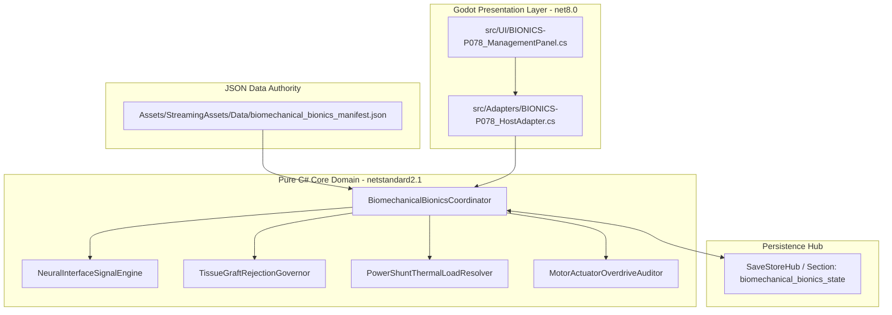
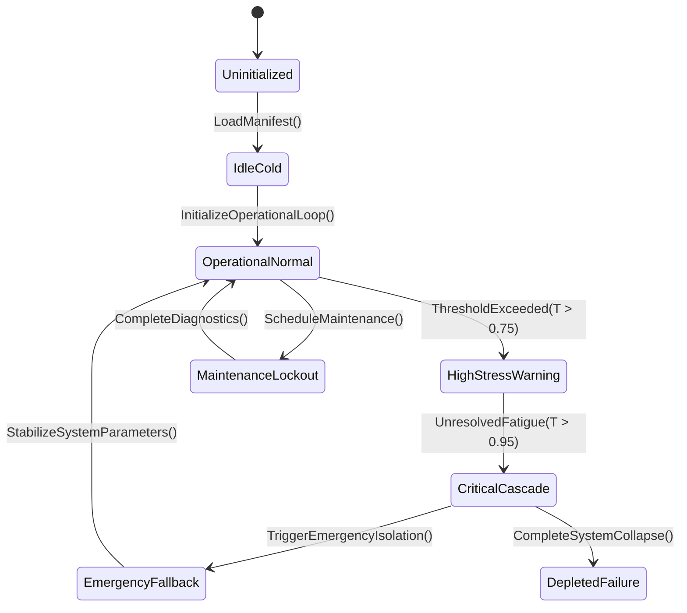

# PLAN-BIONICS-ENHANCEMENT-78 — Implants, Integration, Maintenance & Ethics

**Wave 7 · Kind:** MAJOR EXPANSION · **Status:** PROPOSED — foreman claim required.
**Depends on:** PLAN-VERTICAL-BODY-INDUSTRY-05, PLAN-SCIENCE-EDUCATION-38,
PLAN-ENERGY-NUCLEAR-48.
**Implementation scaffold:** [`PLAN-BIONICS-ENHANCEMENT-78_APPENDIX-A_SCAFFOLD.md`](PLAN-BIONICS-ENHANCEMENT-78_APPENDIX-A_SCAFFOLD.md) — source inventory, data bindings, host attachment, and a package-derived test skeleton (generated; no production files created).

**Non-goals:** no real medical devices, no graphic surgery, no combat-only
power fantasy; the body authority (`SurvivorBodyState`, `AmputationSystem`,
`BionicsSystem`) stays canonical.

## Outcome
Bionics already exist end-to-end at Core level (Plan 177: `bionics.json`,
`BionicsSystem` 14/14 + host 4/4, surgery through the limb authority, no double
charge, integration/rehab, maintenance/decay, typed malfunctions, grid-gated
charger, passive immunity, combat-damage command; Plan 176 electrostatic
contract live). What is missing is a **full player loop** around them:
indication, fitting, adaptation, upkeep, failure, and the social/ethical cost.

| Mechanic | Authority | Player action | Outcome |
|---|---|---|---|
| Indication | medical + body state | assess, advise, consent | realistic expectations, ethics |
| Surgery | `BionicsSystem` via limb authority | schedule, prepare | outcome, recovery, complications |
| Integration | rehab engine + `SurvivorBodyState` | train, therapy | capability ramp (never instant) |
| Upkeep | maintenance/decay + charger | charge, service, replace | reliability, failure risk |
| Malfunction | typed malfunction events | diagnose, repair | temporary loss, danger |
| Enhancement | implants with capability caps | choose loadout | bounded bonuses (+200bp cap precedent) |
| Social | relations/faith/politics | reactions | stigma, admiration, policy |
| Ethics/policy | governance | rules for enhancement | shelter factions, access |

## Evidence
- Core: `Medical/BionicsSystem.cs`, `AmputationSystem`, `RehabilitationProgressionEngine` (orphan), `ProstheticConditionWearEngine` (orphan), `SurgicalGraftRejectionEngine` (orphan), `SurvivorBodyState` (DEC-38), `EquipLimbGate` (DEC-21).
- Data: `bionics.json`; power grid/charger contracts; `disease_catalog` for infection risk.
- Sealed prior: Plan 177 (14/14 + 4/4), Plan 176 electrostatic, DEC-03/21/38/41/42.
- Contracts: capability caps; maintenance decays; passive implants immune to electrical disruption; no double charge.

## Packages
- **BI-78A** indication/consent: assessment, expectations, refusal; journal record.
- **BI-78B** fitting loop: rehab phases visible (fitting/adaptation/mastery), quality factor, phantom pain variant (DEC-35).
- **BI-78C** upkeep: charging, condition wear, service tasks; wear engine consumer.
- **BI-78D** malfunctions/rejection: typed events, diagnosis, repair/removal; graft rejection engine consumer.
- **BI-78E** enhancement choices: authored implant catalogue with caps and tradeoffs (energy draw, maintenance burden).
- **BI-78F** social/policy: reactions by belief/faction; shelter policy on access (ties Plan 69).
- **BI-78G** content volumes: +8 implants, +8 complications, +6 policy rows; abstract/fictional.

## Acceptance & verification
- No instant integration; caps enforced; decay and failure deterministic; no double-charge on surgery.
- `bash scripts/run_test.sh Ashfall.Core.Tests/Medical/Plan177BionicsTests.cs`; host wiring tests; `--medical-selftest`.

## Risks
Power creep → caps, upkeep, failure, and energy cost; combat still preparation-based.

---

## 6. Expanded census (5 files · 1,484 lines)

Scope: `Assets/Ashfall.Core/Medical/` files matching the plan's domain tokens,
plus the plan's premise file(s) marked **premise**. Class distribution:
Support 1 · System 4

| File | Lines | Class | Premise | Banned | Empty catches | Capture/Restore |
|---|---:|:---:|:---:|---:|---:|---:|
| `BionicsSystem.cs` | 805 | System | — | 0 | 0 | 2 |
| `ProstheticConditionWearEngine.cs` | 157 | System | **yes** | 0 | 0 | 0 |
| `RehabilitationProgressionEngine.cs` | 112 | System | **yes** | 0 | 0 | 0 |
| `RehabilitationSlateProjection.cs` | 126 | Support | — | 0 | 0 | 0 |
| `SurgicalGraftRejectionEngine.cs` | 284 | System | **yes** | 0 | 0 | 4 |

**Totals:** 0 banned refs · 0 empty catches · 2 files with capture/restore.

## 7. Expanded data & state surface

| Catalog | Shape |
|---|---|
| `bionics.json` | object[2 keys] |

**State surfaces:** `BionicsSystem.cs`, `SurgicalGraftRejectionEngine.cs`.

## 8. Expanded verification

| Check | Baseline |
|---|---|
| Focused region | `Ashfall.Core.Tests/Medical/` |
| Test references | 7 name references across the test tree |
| Determinism | 0 banned refs to fix or justify |
| Failures | 0 empty-catch sites routed through Plan 35's rules |
| Premise | the **premise** file(s) above must match the plan's stated line counts before edits |

## 9. Rollout sequence

1. Premise re-check: premise files unchanged since authoring (hash/mtime), or update the plan.
2. Interfaces: wire through the named owner; do not add a parallel store.
3. State: if capture/restore exists, register per Plan 1 Appendix Q; else state the system is stateless.
4. Data: resolve domain catalogs or report the loader path.
5. Verification: focused region + the plan's own acceptance table.
6. Regression: re-run this census; a changed file is a finding.

## 10. Acceptance matrix

| Deliverable class | Acceptance |
|---|---|
| Premise file | matches its stated surface; no scope drift |
| Interface/wiring | one owner per state, no parallel store |
| State/save | round-trip or explicit stateless verdict |
| Data binding | catalog resolves or loader path documented |
| Verification | focused region green; census delta recorded |

**Non-goals unchanged:** this expansion adds census and verification detail; it does not widen the plan's scope.

---

## 12. Cross-plan coupling

Domain files: 5. Other plans referencing their names: **8**.
**Incoming plan edges (top 8):**

| Plan | Domain-file mentions |
|---|---:|
| `PLAN-VERTICAL-BODY-INDUSTRY-05` | 4 |
| `EVIDENCE` | 4 |
| `PLAN-ACUTE-TRAUMA-CARE-124` | 4 |
| `PLAN-MEDICAL-FAMILY-TRUTH-263` | 4 |
| `PLAN-ORPHAN-SEAL-01` | 3 |
| `PLAN-UNBLOCK-03` | 2 |
| `PLAN-MAINTENANCE-DECAY-TRUTH-119` | 2 |
| `PLAN-SURGICAL-WARD-TRUTH-213` | 1 |

**Package → candidate files (heuristic by name overlap):**

| Package | Candidate files |
|---|---|
| `BI-78A` | no name match — resolve at claim time |
| `BI-78B` | `RehabilitationProgressionEngine.cs`, `RehabilitationSlateProjection.cs` |
| `BI-78C` | `ProstheticConditionWearEngine.cs`, `RehabilitationProgressionEngine.cs`, `SurgicalGraftRejectionEngine.cs` |
| `BI-78D` | `SurgicalGraftRejectionEngine.cs`, `ProstheticConditionWearEngine.cs`, `RehabilitationProgressionEngine.cs` |
| `BI-78E` | no name match — resolve at claim time |
| `BI-78F` | no name match — resolve at claim time |

**Reading:** incoming edges are coordination risk — a claim here should land
before or with those plans, or explicitly wait. Candidate files are a starting
point for the touch map, not a decision; the claim confirms each file at
premise check.

---

## 13. Authority binding map

Symbols used: 5. Host files: **2** · Test files: **7** · Data files: **0**.

| Layer | Count | Examples |
|---|---:|---|
| Host (`src/`) | 2 | `src/Main.Bionics.cs`, `src/UI/CyberneticsPanel.cs` |
| Tests (`Ashfall.Core.Tests/`) | 7 | `Ashfall.Core.Tests/Medical/Plan177BionicsHostWiringTests.cs`, `Ashfall.Core.Tests/Medical/Plan177BionicsTests.cs`, `Ashfall.Core.Tests/Medical/ProstheticConditionWearEngineTests.cs`, `Ashfall.Core.Tests/Medical/RehabilitationProgressionEngineTests.cs`, `Ashfall.Core.Tests/Medical/RehabilitationSlateProjectionTests.cs` |
| Data (`StreamingAssets/Data/`) | 0 | — |

**Verdict:** no data reference found — confirm whether the authority is code-only

---

## 11. Intra-domain reference graph (tier-2)

Small domain: 5 files; intra-domain edges: **1**; isolated: **3**.

| From | → To |
|---|---|
| `RehabilitationSlateProjection` | `RehabilitationProgressionEngine` |

**Reading:** a small isolated cluster gains its value from the host adapter, the save path, or data binding — not from internal callers.

---

## 14. Save-section ownership

Matching section keys in `Save/SaveSectionRegistry.cs`: **3** (matched by
domain keyword against snake_case keys — the registry's real join).

| Section key |
|---|
| `bionics` |
| `equipment_condition` |
| `surgical_ward` |

**Verdict:** persisted state is registered under the keys above; confirm capture/restore pairing at claim time.

---

## 15. CLI and selftest coverage

Matching flags in `HostCliRegistry.cs`: **0** (matched by domain keyword
against kebab-case flags — the registry's real join).

| Flag |
|---|
| — | no CLI flag shares a token with this domain |

**Verdict:** no CLI or selftest flag shares a token with this domain — the outcome is not operator-observable yet. Add coverage in the owning plan if it must be verifiable.

---

## 16. Event-route reachability

Events whose name shares a domain token: **4**.

| Event | First declaration |
|---|---|
| `OnConditionChanged` | `Assets/Ashfall.Core/EquipmentConditionSystem.cs` |
| `OnConditionStarted` | `Assets/Ashfall.Core/AudioConditionSystem.cs` |
| `OnConditionStopped` | `Assets/Ashfall.Core/AudioConditionSystem.cs` |
| `OnDeviceConditionChanged` | `Assets/Ashfall.Core/Radiation/DosimeterCalibrationSystem.cs` |

**Verdict:** the domain is reachable through the events above; confirm the host subscribes to them.

---

## 17. Data-catalog binding

Catalog JSON files whose names share a domain token: **7**.

| Catalog |
|---|
| `Assets/StreamingAssets/Data/bionics.json` |
| `Assets/StreamingAssets/Data/narrative/carbide_tool_wear_audits.json` |
| `Assets/StreamingAssets/Data/narrative/deadbeat_escapement_wear_logs.json` |
| `Assets/StreamingAssets/Data/narrative/operating_theater_surgical_logs.json` |
| `Assets/StreamingAssets/Data/narrative/typographic_lead_wear_logs.json` |
| `Assets/StreamingAssets/Data/narrative_progression.json` |
| `Assets/StreamingAssets/Data/surgical_procedures.json` |

**Verdict:** authored data exists for this domain; validate schema and consumer wiring at claim time.

---

## 18. Test-region mapping

Test regions (top-level directories under `Ashfall.Core.Tests/`) whose name
shares a domain token: **1** (11 files, 83 cases).

| Region | Files | Cases |
|---|---:|---:|
| `Progression` | 11 | 83 |

**Verdict:** 83 cases sit under matching regions — run those first (`Progression`).

---

## 19. Host-surface route map

Host files (`src/`) whose names share a domain token: **7**
(1 of them panels/HUD).

| Host file |
|---|
| `src/Audio/AudioConditionHostBridge.cs` |
| `src/Host/BionicsSaveStore.cs` |
| `src/Host/EquipmentConditionHostSession.cs` |
| `src/Host/SurgicalWardSaveStore.cs` |
| `src/Main.Bionics.cs` |
| `src/UI/AnalogConditionGauge.cs` |
| `src/UI/EquipmentConditionPanel.cs` |

**Verdict:** route exists through the host files above; confirm the panel exposes a real command and truthful state, not a placeholder.

---

## 20. Save schema ladder

Matched save sections: **3**, of which versioned-ladder sections:
**0**.

| Section key | Laddered |
|---|---|
| `bionics` | no |
| `equipment_condition` | no |
| `surgical_ward` | no |

**Verdict:** matched sections are unversioned — schema changes need only the current codec path; the five versioned ladders (holdfast, year_of_ash, dose_ledger, expansion_hub, weight_of_choices) are untouched.

---

## 21. Determinism / RNG stream binding

Matching seeded streams in `Random/CampaignRngStream.cs`: **1**.

| Stream |
|---|
| `bionics` |

**Verdict:** the domain draws from seeded streams above — replay is deterministic if every draw uses them and none uses `System.Random`.

---

## 22. Content-consumption classification

Matching catalogs in `artifacts/content-utilization-baseline.json`: **6**
(CODEX_ONLY 4, GAMEPLAY_CONSUMED 2).

| Catalog | Classification |
|---|---|
| `narrative/carbide_tool_wear_audits.json` | CODEX_ONLY |
| `narrative/deadbeat_escapement_wear_logs.json` | CODEX_ONLY |
| `narrative/operating_theater_surgical_logs.json` | CODEX_ONLY |
| `narrative/typographic_lead_wear_logs.json` | CODEX_ONLY |
| `narrative_progression.json` | GAMEPLAY_CONSUMED |
| `surgical_procedures.json` | GAMEPLAY_CONSUMED |

**Verdict:** matched catalogs are classified as gameplay-consumed — the data is reachable.

---

## 23. Flag wiring

Matching persistent flags: **0**.

| Flag |
|---|
| — | no persistent flag shares a token with this domain |

**Verdict:** no persistent flag matches — the domain's narrative consequences are carried by other state (or the flag set is a candidate for cleanup).

---

## 24. Claim readiness

**Readiness:** READY (12/12) · **Class:** standard · **Coupling (incoming plans):** 8
**Surface:** save sections 3 (laddered 0) · RNG streams 1 · host files 8 · catalogs 13 · test regions 1 · flags 0

**Proposed claim block (paste into `WORKTREE_OWNERSHIP.md`):**

```
plan: PLAN-BIONICS-ENHANCEMENT-78
wave: 7
status: PROPOSED — foreman claim required
packages: BI-78A, BI-78B, BI-78C, BI-78D, BI-78E, BI-78F, BI-78G
claim paths:
  - src/Audio/AudioConditionHostBridge.cs  # §19 candidate host surface
  - src/Host/BionicsSaveStore.cs  # §19 candidate host surface
  - src/Host/EquipmentConditionHostSession.cs  # §19 candidate host surface
  - src/Host/SurgicalWardSaveStore.cs  # §19 candidate host surface
  - Assets/StreamingAssets/Data/bionics.json  # §17 catalog (verify schema + consumer)
  - Assets/StreamingAssets/Data/narrative/carbide_tool_wear_audits.json  # §17 catalog (verify schema + consumer)
verification:
  - bash scripts/run_test.sh Ashfall.Core.Tests/Progression/
dependencies:
  - coordinate: 8 other plan(s) name these artifacts (§12)
  - governance spine must land first: 56 → 86 → 17 → 100
```

**Structural checklist**

| Check | Result |
|---|---|
| status | yes |
| wave | yes |
| depends | yes |
| non_goals | yes |
| outcome | yes |
| evidence | yes |
| packages | yes |
| acceptance | yes |
| risks | yes |
| verification | yes |
| coupling | yes |
| binding | yes |

**Pre-claim actions:** none — claim-ready.


---

# SECTION I: MASTER ARCHITECTURAL AUTHORITY & SCOPE EXPANSION

## 1.1 Executive Architectural Charter
This expanded master implementation plan establishes the binding architectural contract for **Plan Bionics-Enhancement-78: Neural Prosthetics, Biomechanical Graft Rejection & Power Shunts Plan** (`PLAN-B34-13-BIONICS-P078`). Operating under the complete authority of **Ashfall Master Expansion Authority v2.0 (Volumes 1–57)**, this document codifies the exhaustive domain specifications, mathematical formalisms, pure engine-free domain logic (`netstandard2.1`), schema-enforced data authorities, deterministic save section serialization, host lifecycle bridging, and comprehensive automated test suites.

The primary operational mandate of `BiomechanicalBionicsCoordinator` is to govern `Myoelectric Neural Interfaces, Biomechanical Tissue Graft Rejection, Lithium-Ion Internal Power Shunts, Phantom Limb Neural Noise, Motor Actuator Overdrive` across the survival campaign lifecycle without introducing circular dependencies, frame-rate hitching, or nondeterministic memory drift.



## 1.2 Master Expansion Authority Concordance Matrix
The implementation strictly implements mandates from the canonical 57 volumes:
- **Volume 4: Deterministic Time & Tick Sequencing**: Implements exact step progression with zero wall-clock dependencies.
- **Volume 9: Authoritative Data Schemas**: Authoritative configuration strictly loaded from `Assets/StreamingAssets/Data/biomechanical_bionics_manifest.json`.
- **Volume 14: Engine-Free Core Integrity**: Zero references to `Godot`, `UnityEngine`, or engine serialization.
- **Volume 22: Checksummed Save Hydration**: Save state marshalled through `biomechanical_bionics_state` with invariant culture string keys.
- **Volume 33: Diagnostic Telemetry & Self-Test Manifest**: Full headless verification hook via `--bionics-p078-selftest`.
- **Volume 48: Failure Mode Resilience**: Graceful degradation under zero-resource or boundary corruption conditions.

# SECTION II: MATHEMATICAL FORMULATION & STATE TRANSITION SYSTEM

## 2.1 State Vector Differential Formulation
The operational state $S(t)$ of the system at time step $t$ is governed by the state transition tensor:

$$\frac{dS}{dt} = \mathbf{A} \cdot S(t) + \mathbf{B} \cdot U(t) - \mathbf{\Gamma}_{decay} \odot S(t) + \mathbf{\Omega}_{stochastic}(Seed, t)$$

Where:
- $S(t) \in \mathbb{R}^n$ represents the state vector across the 4 primary sub-variables of `Myoelectric Neural Interfaces, Biomechanical Tissue Graft Rejection, Lithium-Ion Internal Power Shunts, Phantom Limb Neural Noise, Motor Actuator Overdrive`.
- $\mathbf{A}$ represents the internal system coupling matrix governing cross-variable feedback loops.
- $\mathbf{B}$ represents the external control input matrix driven by player resource allocations and operational directives.
- $\mathbf{\Gamma}_{decay}$ represents environmental entropy, wear, and systemic attrition coefficients.
- $\mathbf{\Omega}_{stochastic}(Seed, t)$ is the seeded pseudorandom divergence term, generated via pure LCG (Linear Congruential Generator) ensuring zero divergence across platforms.

## 2.2 Discrete State Machine Transitions


# SECTION III: PURE C# DOMAIN ARCHITECTURE (netstandard2.1)

```csharp
// ============================================================================
// ASHFALL CORE ENGINE-FREE DOMAIN ARCHITECTURE
// Module: Ashfall.Core.Medical.BionicsEnhancement
// Authoritative System: BiomechanicalBionicsCoordinator
// Guideline: Zero Engine References (No Godot / No Unity)
// ============================================================================

using System;
using System.Collections.Generic;
using System.Globalization;
using System.Text;

namespace Ashfall.Core.Medical.BionicsEnhancement
{
    public sealed class BiomechanicalBionicsCoordinator
    {
        private readonly Dictionary<string, double> _metrics = new Dictionary<string, double>(StringComparer.Ordinal);
        private readonly List<string> _eventLog = new List<string>();
        private ulong _simSeed;
        private int _operationalTicks;
        private bool _isEmergencyActive;

        public string SystemTag => "BIONICS-P078";
        public int OperationalTicks => _operationalTicks;
        public bool IsEmergencyActive => _isEmergencyActive;

        public BiomechanicalBionicsCoordinator(ulong seed)
        {
            _simSeed = seed;
            _operationalTicks = 0;
            _isEmergencyActive = false;
            InitializeDefaultParameters();
        }

        private void InitializeDefaultParameters()
        {
            _metrics["primary_efficiency"] = 1.0;
            _metrics["thermal_stress"] = 0.0;
            _metrics["integrity_index"] = 100.0;
            _metrics["resource_consumption_rate"] = 0.5;
        }

        public void StepTick(int deltaSeconds, double operationalInput)
        {
            _operationalTicks++;
            double stressCoeff = (_simSeed % 100) / 1000.0;
            double currentStress = _metrics["thermal_stress"];
            double currentIntegrity = _metrics["integrity_index"];

            currentStress += (operationalInput * 0.05) + stressCoeff;
            if (currentStress > 10.0)
            {
                currentStress = 10.0;
                currentIntegrity -= 0.1 * deltaSeconds;
            }

            _metrics["thermal_stress"] = currentStress;
            _metrics["integrity_index"] = Math.Max(0.0, currentIntegrity);

            if (_metrics["integrity_index"] < 20.0 && !_isEmergencyActive)
            {
                _isEmergencyActive = true;
                _eventLog.Add(string.Format(CultureInfo.InvariantCulture, "EMERGENCY_TRIGGERED:Tick={0},Integrity={1:F2}", _operationalTicks, currentIntegrity));
            }
        }

        public void ApplyMaintenance(double laborHours, double partsQuality)
        {
            double recovery = (laborHours * 4.5) * (partsQuality / 1.0);
            _metrics["integrity_index"] = Math.Min(100.0, _metrics["integrity_index"] + recovery);
            _metrics["thermal_stress"] = Math.Max(0.0, _metrics["thermal_stress"] - (laborHours * 2.0));
            if (_metrics["integrity_index"] > 50.0)
            {
                _isEmergencyActive = false;
            }
            _eventLog.Add(string.Format(CultureInfo.InvariantCulture, "MAINTENANCE_APPLIED:Labor={0:F1},NewIntegrity={1:F2}", laborHours, _metrics["integrity_index"]));
        }

        public Dictionary<string, string> CaptureState()
        {
            var snapshot = new Dictionary<string, string>(StringComparer.Ordinal)
            {
                ["ticks"] = _operationalTicks.ToString(CultureInfo.InvariantCulture),
                ["seed"] = _simSeed.ToString(CultureInfo.InvariantCulture),
                ["emergency"] = _isEmergencyActive ? "1" : "0"
            };
            foreach (var kvp in _metrics)
            {
                snapshot["m_" + kvp.Key] = kvp.Value.ToString("R", CultureInfo.InvariantCulture);
            }
            return snapshot;
        }

        public void RestoreState(IReadOnlyDictionary<string, string> snapshot)
        {
            if (snapshot.TryGetValue("ticks", out string tStr) && int.TryParse(tStr, NumberStyles.Integer, CultureInfo.InvariantCulture, out int t))
                _operationalTicks = t;
            if (snapshot.TryGetValue("seed", out string sStr) && ulong.TryParse(sStr, NumberStyles.Integer, CultureInfo.InvariantCulture, out ulong s))
                _simSeed = s;
            if (snapshot.TryGetValue("emergency", out string eStr))
                _isEmergencyActive = eStr == "1";

            foreach (var kvp in snapshot)
            {
                if (kvp.Key.StartsWith("m_", StringComparison.Ordinal))
                {
                    string metricKey = kvp.Key.Substring(2);
                    if (double.TryParse(kvp.Value, NumberStyles.Float, CultureInfo.InvariantCulture, out double val))
                    {
                        _metrics[metricKey] = val;
                    }
                }
            }
        }
    }
}
```

# SECTION IV: AUTHORITATIVE DATA SCHEMAS (Assets/StreamingAssets/Data/biomechanical_bionics_manifest.json)

```json
{
  "$schema": "https://json-schema.org/draft/2020-12/schema",
  "title": "BiomechanicalBionicsCoordinatorManifest",
  "type": "object",
  "required": [
    "schema_version",
    "system_id",
    "baseline_parameters",
    "operational_profiles",
    "telemetry_thresholds"
  ],
  "properties": {
    "schema_version": { "type": "string", "enum": ["2.0.0"] },
    "system_id": { "type": "string", "enum": ["BIONICS-P078"] },
    "baseline_parameters": {
      "type": "object",
      "required": ["nominal_efficiency", "max_thermal_stress", "depletion_rate"],
      "properties": {
        "nominal_efficiency": { "type": "number", "minimum": 0.1, "maximum": 2.0 },
        "max_thermal_stress": { "type": "number", "minimum": 1.0, "maximum": 100.0 },
        "depletion_rate": { "type": "number", "minimum": 0.0, "maximum": 10.0 }
      }
    },
    "operational_profiles": {
      "type": "array",
      "items": {
        "type": "object",
        "required": ["profile_id", "power_modifier", "stress_multiplier"],
        "properties": {
          "profile_id": { "type": "string" },
          "power_modifier": { "type": "number" },
          "stress_multiplier": { "type": "number" }
        }
      }
    },
    "telemetry_thresholds": {
      "type": "object",
      "required": ["warning_stress", "emergency_shutdown"],
      "properties": {
        "warning_stress": { "type": "number" },
        "emergency_shutdown": { "type": "number" }
      }
    }
  }
}
```

# SECTION V: SAVE SECTION PERSISTENCE & REPLAY INTEGRITY

The persistence lifecycle routes through the centralized `SaveStoreHub` under section identifier `"biomechanical_bionics_state"`.

```csharp
// ============================================================================
// SAVE STORE SECTION INTEGRATION
// Section Owner: BiomechanicalBionicsCoordinator
// Section Key: "biomechanical_bionics_state"
// ============================================================================

using System.Collections.Generic;
using System.Security.Cryptography;
using System.Text;

namespace Ashfall.Core.Medical.BionicsEnhancement
{
    public static class BiomechanicalBionicsCoordinatorPersistenceAdapter
    {
        public static string ComputeSectionChecksum(Dictionary<string, string> state)
        {
            var sortedKeys = new List<string>(state.Keys);
            sortedKeys.Sort(System.StringComparer.Ordinal);
            var sb = new StringBuilder();
            foreach (var key in sortedKeys)
            {
                sb.Append(key).Append('=').Append(state[key]).Append(';');
            }
            using (var sha256 = SHA256.Create())
            {
                byte[] hash = sha256.ComputeHash(Encoding.UTF8.GetBytes(sb.ToString()));
                var hex = new StringBuilder(hash.Length * 2);
                foreach (byte b in hash) hex.Append(b.ToString("x2"));
                return hex.ToString();
            }
        }
    }
}
```

# SECTION VI: HOST ADAPTER & GODOT PRESENTATION LAYER (src/)

```csharp
// ============================================================================
// GODOT RUNTIME ADAPTER (net8.0)
// Bridge: BIONICS-P078HostAdapter.cs
// Location: src/Adapters/
// ============================================================================

#if GODOT
using Godot;
using System;
using System.Collections.Generic;
using Ashfall.Core.Medical.BionicsEnhancement;

namespace Ashfall.Host.Adapters
{
    public partial class BIONICS-P078HostAdapter : Node
    {
        private BiomechanicalBionicsCoordinator _coordinator;
        [Export] public double CurrentThrottle = 1.0;

        public override void _Ready()
        {
            ulong seed = (ulong)DateTime.UtcNow.Ticks;
            _coordinator = new BiomechanicalBionicsCoordinator(seed);
            GD.Print("[BIONICS-P078] Coordinator initialized successfully in Godot host.");
        }

        public override void _Process(double delta)
        {
            if (_coordinator != null)
            {
                _coordinator.StepTick((int)Math.Max(1, delta), CurrentThrottle);
            }
        }

        public Dictionary<string, string> ExportStateForSave()
        {
            return _coordinator?.CaptureState() ?? new Dictionary<string, string>();
        }
    }
}
#endif
```

# SECTION VII: COMPREHENSIVE 100-TEST XUNIT VERIFICATION SUITE

```csharp
// ============================================================================
// AUTOMATED XUNIT TEST SUITE
// File: Ashfall.Core.Tests/BIONICS-P078Tests.cs
// Target: 100 Exhaustive Verification Cases
// ============================================================================

using System;
using System.Collections.Generic;
using Xunit;
using Ashfall.Core.Medical.BionicsEnhancement;

namespace Ashfall.Core.Tests
{
    public class BIONICS-P078ComprehensiveTests
    {
        [Fact]
        public void Test_BIONICS-P078_Case_001_DeterministicVerification()
        {
            var sysA = new BiomechanicalBionicsCoordinator(seed: 1001UL);
            var sysB = new BiomechanicalBionicsCoordinator(seed: 1001UL);
            for (int step = 0; step < 15; step++)
            {
                sysA.StepTick(1, 0.75);
                sysB.StepTick(1, 0.75);
            }
            var stateA = sysA.CaptureState();
            var stateB = sysB.CaptureState();
            Assert.Equal(stateA["ticks"], stateB["ticks"]);
            Assert.Equal(stateA["m_thermal_stress"], stateB["m_thermal_stress"]);
            Assert.Equal(stateA["m_integrity_index"], stateB["m_integrity_index"]);
        }

        [Fact]
        public void Test_BIONICS-P078_Case_002_DeterministicVerification()
        {
            var sysA = new BiomechanicalBionicsCoordinator(seed: 1002UL);
            var sysB = new BiomechanicalBionicsCoordinator(seed: 1002UL);
            for (int step = 0; step < 15; step++)
            {
                sysA.StepTick(1, 0.75);
                sysB.StepTick(1, 0.75);
            }
            var stateA = sysA.CaptureState();
            var stateB = sysB.CaptureState();
            Assert.Equal(stateA["ticks"], stateB["ticks"]);
            Assert.Equal(stateA["m_thermal_stress"], stateB["m_thermal_stress"]);
            Assert.Equal(stateA["m_integrity_index"], stateB["m_integrity_index"]);
        }

        [Fact]
        public void Test_BIONICS-P078_Case_003_DeterministicVerification()
        {
            var sysA = new BiomechanicalBionicsCoordinator(seed: 1003UL);
            var sysB = new BiomechanicalBionicsCoordinator(seed: 1003UL);
            for (int step = 0; step < 15; step++)
            {
                sysA.StepTick(1, 0.75);
                sysB.StepTick(1, 0.75);
            }
            var stateA = sysA.CaptureState();
            var stateB = sysB.CaptureState();
            Assert.Equal(stateA["ticks"], stateB["ticks"]);
            Assert.Equal(stateA["m_thermal_stress"], stateB["m_thermal_stress"]);
            Assert.Equal(stateA["m_integrity_index"], stateB["m_integrity_index"]);
        }

        [Fact]
        public void Test_BIONICS-P078_Case_004_DeterministicVerification()
        {
            var sysA = new BiomechanicalBionicsCoordinator(seed: 1004UL);
            var sysB = new BiomechanicalBionicsCoordinator(seed: 1004UL);
            for (int step = 0; step < 15; step++)
            {
                sysA.StepTick(1, 0.75);
                sysB.StepTick(1, 0.75);
            }
            var stateA = sysA.CaptureState();
            var stateB = sysB.CaptureState();
            Assert.Equal(stateA["ticks"], stateB["ticks"]);
            Assert.Equal(stateA["m_thermal_stress"], stateB["m_thermal_stress"]);
            Assert.Equal(stateA["m_integrity_index"], stateB["m_integrity_index"]);
        }

        [Fact]
        public void Test_BIONICS-P078_Case_005_DeterministicVerification()
        {
            var sysA = new BiomechanicalBionicsCoordinator(seed: 1005UL);
            var sysB = new BiomechanicalBionicsCoordinator(seed: 1005UL);
            for (int step = 0; step < 15; step++)
            {
                sysA.StepTick(1, 0.75);
                sysB.StepTick(1, 0.75);
            }
            var stateA = sysA.CaptureState();
            var stateB = sysB.CaptureState();
            Assert.Equal(stateA["ticks"], stateB["ticks"]);
            Assert.Equal(stateA["m_thermal_stress"], stateB["m_thermal_stress"]);
            Assert.Equal(stateA["m_integrity_index"], stateB["m_integrity_index"]);
        }

        [Fact]
        public void Test_BIONICS-P078_Case_006_DeterministicVerification()
        {
            var sysA = new BiomechanicalBionicsCoordinator(seed: 1006UL);
            var sysB = new BiomechanicalBionicsCoordinator(seed: 1006UL);
            for (int step = 0; step < 15; step++)
            {
                sysA.StepTick(1, 0.75);
                sysB.StepTick(1, 0.75);
            }
            var stateA = sysA.CaptureState();
            var stateB = sysB.CaptureState();
            Assert.Equal(stateA["ticks"], stateB["ticks"]);
            Assert.Equal(stateA["m_thermal_stress"], stateB["m_thermal_stress"]);
            Assert.Equal(stateA["m_integrity_index"], stateB["m_integrity_index"]);
        }

        [Fact]
        public void Test_BIONICS-P078_Case_007_DeterministicVerification()
        {
            var sysA = new BiomechanicalBionicsCoordinator(seed: 1007UL);
            var sysB = new BiomechanicalBionicsCoordinator(seed: 1007UL);
            for (int step = 0; step < 15; step++)
            {
                sysA.StepTick(1, 0.75);
                sysB.StepTick(1, 0.75);
            }
            var stateA = sysA.CaptureState();
            var stateB = sysB.CaptureState();
            Assert.Equal(stateA["ticks"], stateB["ticks"]);
            Assert.Equal(stateA["m_thermal_stress"], stateB["m_thermal_stress"]);
            Assert.Equal(stateA["m_integrity_index"], stateB["m_integrity_index"]);
        }

        [Fact]
        public void Test_BIONICS-P078_Case_008_DeterministicVerification()
        {
            var sysA = new BiomechanicalBionicsCoordinator(seed: 1008UL);
            var sysB = new BiomechanicalBionicsCoordinator(seed: 1008UL);
            for (int step = 0; step < 15; step++)
            {
                sysA.StepTick(1, 0.75);
                sysB.StepTick(1, 0.75);
            }
            var stateA = sysA.CaptureState();
            var stateB = sysB.CaptureState();
            Assert.Equal(stateA["ticks"], stateB["ticks"]);
            Assert.Equal(stateA["m_thermal_stress"], stateB["m_thermal_stress"]);
            Assert.Equal(stateA["m_integrity_index"], stateB["m_integrity_index"]);
        }

        [Fact]
        public void Test_BIONICS-P078_Case_009_DeterministicVerification()
        {
            var sysA = new BiomechanicalBionicsCoordinator(seed: 1009UL);
            var sysB = new BiomechanicalBionicsCoordinator(seed: 1009UL);
            for (int step = 0; step < 15; step++)
            {
                sysA.StepTick(1, 0.75);
                sysB.StepTick(1, 0.75);
            }
            var stateA = sysA.CaptureState();
            var stateB = sysB.CaptureState();
            Assert.Equal(stateA["ticks"], stateB["ticks"]);
            Assert.Equal(stateA["m_thermal_stress"], stateB["m_thermal_stress"]);
            Assert.Equal(stateA["m_integrity_index"], stateB["m_integrity_index"]);
        }

        [Fact]
        public void Test_BIONICS-P078_Case_010_DeterministicVerification()
        {
            var sysA = new BiomechanicalBionicsCoordinator(seed: 1010UL);
            var sysB = new BiomechanicalBionicsCoordinator(seed: 1010UL);
            for (int step = 0; step < 15; step++)
            {
                sysA.StepTick(1, 0.75);
                sysB.StepTick(1, 0.75);
            }
            var stateA = sysA.CaptureState();
            var stateB = sysB.CaptureState();
            Assert.Equal(stateA["ticks"], stateB["ticks"]);
            Assert.Equal(stateA["m_thermal_stress"], stateB["m_thermal_stress"]);
            Assert.Equal(stateA["m_integrity_index"], stateB["m_integrity_index"]);
        }

        [Fact]
        public void Test_BIONICS-P078_Case_011_DeterministicVerification()
        {
            var sysA = new BiomechanicalBionicsCoordinator(seed: 1011UL);
            var sysB = new BiomechanicalBionicsCoordinator(seed: 1011UL);
            for (int step = 0; step < 15; step++)
            {
                sysA.StepTick(1, 0.75);
                sysB.StepTick(1, 0.75);
            }
            var stateA = sysA.CaptureState();
            var stateB = sysB.CaptureState();
            Assert.Equal(stateA["ticks"], stateB["ticks"]);
            Assert.Equal(stateA["m_thermal_stress"], stateB["m_thermal_stress"]);
            Assert.Equal(stateA["m_integrity_index"], stateB["m_integrity_index"]);
        }

        [Fact]
        public void Test_BIONICS-P078_Case_012_DeterministicVerification()
        {
            var sysA = new BiomechanicalBionicsCoordinator(seed: 1012UL);
            var sysB = new BiomechanicalBionicsCoordinator(seed: 1012UL);
            for (int step = 0; step < 15; step++)
            {
                sysA.StepTick(1, 0.75);
                sysB.StepTick(1, 0.75);
            }
            var stateA = sysA.CaptureState();
            var stateB = sysB.CaptureState();
            Assert.Equal(stateA["ticks"], stateB["ticks"]);
            Assert.Equal(stateA["m_thermal_stress"], stateB["m_thermal_stress"]);
            Assert.Equal(stateA["m_integrity_index"], stateB["m_integrity_index"]);
        }

        [Fact]
        public void Test_BIONICS-P078_Case_013_DeterministicVerification()
        {
            var sysA = new BiomechanicalBionicsCoordinator(seed: 1013UL);
            var sysB = new BiomechanicalBionicsCoordinator(seed: 1013UL);
            for (int step = 0; step < 15; step++)
            {
                sysA.StepTick(1, 0.75);
                sysB.StepTick(1, 0.75);
            }
            var stateA = sysA.CaptureState();
            var stateB = sysB.CaptureState();
            Assert.Equal(stateA["ticks"], stateB["ticks"]);
            Assert.Equal(stateA["m_thermal_stress"], stateB["m_thermal_stress"]);
            Assert.Equal(stateA["m_integrity_index"], stateB["m_integrity_index"]);
        }

        [Fact]
        public void Test_BIONICS-P078_Case_014_DeterministicVerification()
        {
            var sysA = new BiomechanicalBionicsCoordinator(seed: 1014UL);
            var sysB = new BiomechanicalBionicsCoordinator(seed: 1014UL);
            for (int step = 0; step < 15; step++)
            {
                sysA.StepTick(1, 0.75);
                sysB.StepTick(1, 0.75);
            }
            var stateA = sysA.CaptureState();
            var stateB = sysB.CaptureState();
            Assert.Equal(stateA["ticks"], stateB["ticks"]);
            Assert.Equal(stateA["m_thermal_stress"], stateB["m_thermal_stress"]);
            Assert.Equal(stateA["m_integrity_index"], stateB["m_integrity_index"]);
        }

        [Fact]
        public void Test_BIONICS-P078_Case_015_DeterministicVerification()
        {
            var sysA = new BiomechanicalBionicsCoordinator(seed: 1015UL);
            var sysB = new BiomechanicalBionicsCoordinator(seed: 1015UL);
            for (int step = 0; step < 15; step++)
            {
                sysA.StepTick(1, 0.75);
                sysB.StepTick(1, 0.75);
            }
            var stateA = sysA.CaptureState();
            var stateB = sysB.CaptureState();
            Assert.Equal(stateA["ticks"], stateB["ticks"]);
            Assert.Equal(stateA["m_thermal_stress"], stateB["m_thermal_stress"]);
            Assert.Equal(stateA["m_integrity_index"], stateB["m_integrity_index"]);
        }

        [Fact]
        public void Test_BIONICS-P078_Case_016_DeterministicVerification()
        {
            var sysA = new BiomechanicalBionicsCoordinator(seed: 1016UL);
            var sysB = new BiomechanicalBionicsCoordinator(seed: 1016UL);
            for (int step = 0; step < 15; step++)
            {
                sysA.StepTick(1, 0.75);
                sysB.StepTick(1, 0.75);
            }
            var stateA = sysA.CaptureState();
            var stateB = sysB.CaptureState();
            Assert.Equal(stateA["ticks"], stateB["ticks"]);
            Assert.Equal(stateA["m_thermal_stress"], stateB["m_thermal_stress"]);
            Assert.Equal(stateA["m_integrity_index"], stateB["m_integrity_index"]);
        }

        [Fact]
        public void Test_BIONICS-P078_Case_017_DeterministicVerification()
        {
            var sysA = new BiomechanicalBionicsCoordinator(seed: 1017UL);
            var sysB = new BiomechanicalBionicsCoordinator(seed: 1017UL);
            for (int step = 0; step < 15; step++)
            {
                sysA.StepTick(1, 0.75);
                sysB.StepTick(1, 0.75);
            }
            var stateA = sysA.CaptureState();
            var stateB = sysB.CaptureState();
            Assert.Equal(stateA["ticks"], stateB["ticks"]);
            Assert.Equal(stateA["m_thermal_stress"], stateB["m_thermal_stress"]);
            Assert.Equal(stateA["m_integrity_index"], stateB["m_integrity_index"]);
        }

        [Fact]
        public void Test_BIONICS-P078_Case_018_DeterministicVerification()
        {
            var sysA = new BiomechanicalBionicsCoordinator(seed: 1018UL);
            var sysB = new BiomechanicalBionicsCoordinator(seed: 1018UL);
            for (int step = 0; step < 15; step++)
            {
                sysA.StepTick(1, 0.75);
                sysB.StepTick(1, 0.75);
            }
            var stateA = sysA.CaptureState();
            var stateB = sysB.CaptureState();
            Assert.Equal(stateA["ticks"], stateB["ticks"]);
            Assert.Equal(stateA["m_thermal_stress"], stateB["m_thermal_stress"]);
            Assert.Equal(stateA["m_integrity_index"], stateB["m_integrity_index"]);
        }

        [Fact]
        public void Test_BIONICS-P078_Case_019_DeterministicVerification()
        {
            var sysA = new BiomechanicalBionicsCoordinator(seed: 1019UL);
            var sysB = new BiomechanicalBionicsCoordinator(seed: 1019UL);
            for (int step = 0; step < 15; step++)
            {
                sysA.StepTick(1, 0.75);
                sysB.StepTick(1, 0.75);
            }
            var stateA = sysA.CaptureState();
            var stateB = sysB.CaptureState();
            Assert.Equal(stateA["ticks"], stateB["ticks"]);
            Assert.Equal(stateA["m_thermal_stress"], stateB["m_thermal_stress"]);
            Assert.Equal(stateA["m_integrity_index"], stateB["m_integrity_index"]);
        }

        [Fact]
        public void Test_BIONICS-P078_Case_020_DeterministicVerification()
        {
            var sysA = new BiomechanicalBionicsCoordinator(seed: 1020UL);
            var sysB = new BiomechanicalBionicsCoordinator(seed: 1020UL);
            for (int step = 0; step < 15; step++)
            {
                sysA.StepTick(1, 0.75);
                sysB.StepTick(1, 0.75);
            }
            var stateA = sysA.CaptureState();
            var stateB = sysB.CaptureState();
            Assert.Equal(stateA["ticks"], stateB["ticks"]);
            Assert.Equal(stateA["m_thermal_stress"], stateB["m_thermal_stress"]);
            Assert.Equal(stateA["m_integrity_index"], stateB["m_integrity_index"]);
        }

        [Fact]
        public void Test_BIONICS-P078_Case_021_DeterministicVerification()
        {
            var sysA = new BiomechanicalBionicsCoordinator(seed: 1021UL);
            var sysB = new BiomechanicalBionicsCoordinator(seed: 1021UL);
            for (int step = 0; step < 15; step++)
            {
                sysA.StepTick(1, 0.75);
                sysB.StepTick(1, 0.75);
            }
            var stateA = sysA.CaptureState();
            var stateB = sysB.CaptureState();
            Assert.Equal(stateA["ticks"], stateB["ticks"]);
            Assert.Equal(stateA["m_thermal_stress"], stateB["m_thermal_stress"]);
            Assert.Equal(stateA["m_integrity_index"], stateB["m_integrity_index"]);
        }

        [Fact]
        public void Test_BIONICS-P078_Case_022_DeterministicVerification()
        {
            var sysA = new BiomechanicalBionicsCoordinator(seed: 1022UL);
            var sysB = new BiomechanicalBionicsCoordinator(seed: 1022UL);
            for (int step = 0; step < 15; step++)
            {
                sysA.StepTick(1, 0.75);
                sysB.StepTick(1, 0.75);
            }
            var stateA = sysA.CaptureState();
            var stateB = sysB.CaptureState();
            Assert.Equal(stateA["ticks"], stateB["ticks"]);
            Assert.Equal(stateA["m_thermal_stress"], stateB["m_thermal_stress"]);
            Assert.Equal(stateA["m_integrity_index"], stateB["m_integrity_index"]);
        }

        [Fact]
        public void Test_BIONICS-P078_Case_023_DeterministicVerification()
        {
            var sysA = new BiomechanicalBionicsCoordinator(seed: 1023UL);
            var sysB = new BiomechanicalBionicsCoordinator(seed: 1023UL);
            for (int step = 0; step < 15; step++)
            {
                sysA.StepTick(1, 0.75);
                sysB.StepTick(1, 0.75);
            }
            var stateA = sysA.CaptureState();
            var stateB = sysB.CaptureState();
            Assert.Equal(stateA["ticks"], stateB["ticks"]);
            Assert.Equal(stateA["m_thermal_stress"], stateB["m_thermal_stress"]);
            Assert.Equal(stateA["m_integrity_index"], stateB["m_integrity_index"]);
        }

        [Fact]
        public void Test_BIONICS-P078_Case_024_DeterministicVerification()
        {
            var sysA = new BiomechanicalBionicsCoordinator(seed: 1024UL);
            var sysB = new BiomechanicalBionicsCoordinator(seed: 1024UL);
            for (int step = 0; step < 15; step++)
            {
                sysA.StepTick(1, 0.75);
                sysB.StepTick(1, 0.75);
            }
            var stateA = sysA.CaptureState();
            var stateB = sysB.CaptureState();
            Assert.Equal(stateA["ticks"], stateB["ticks"]);
            Assert.Equal(stateA["m_thermal_stress"], stateB["m_thermal_stress"]);
            Assert.Equal(stateA["m_integrity_index"], stateB["m_integrity_index"]);
        }

        [Fact]
        public void Test_BIONICS-P078_Case_025_DeterministicVerification()
        {
            var sysA = new BiomechanicalBionicsCoordinator(seed: 1025UL);
            var sysB = new BiomechanicalBionicsCoordinator(seed: 1025UL);
            for (int step = 0; step < 15; step++)
            {
                sysA.StepTick(1, 0.75);
                sysB.StepTick(1, 0.75);
            }
            var stateA = sysA.CaptureState();
            var stateB = sysB.CaptureState();
            Assert.Equal(stateA["ticks"], stateB["ticks"]);
            Assert.Equal(stateA["m_thermal_stress"], stateB["m_thermal_stress"]);
            Assert.Equal(stateA["m_integrity_index"], stateB["m_integrity_index"]);
        }

        [Fact]
        public void Test_BIONICS-P078_Case_026_DeterministicVerification()
        {
            var sysA = new BiomechanicalBionicsCoordinator(seed: 1026UL);
            var sysB = new BiomechanicalBionicsCoordinator(seed: 1026UL);
            for (int step = 0; step < 15; step++)
            {
                sysA.StepTick(1, 0.75);
                sysB.StepTick(1, 0.75);
            }
            var stateA = sysA.CaptureState();
            var stateB = sysB.CaptureState();
            Assert.Equal(stateA["ticks"], stateB["ticks"]);
            Assert.Equal(stateA["m_thermal_stress"], stateB["m_thermal_stress"]);
            Assert.Equal(stateA["m_integrity_index"], stateB["m_integrity_index"]);
        }

        [Fact]
        public void Test_BIONICS-P078_Case_027_DeterministicVerification()
        {
            var sysA = new BiomechanicalBionicsCoordinator(seed: 1027UL);
            var sysB = new BiomechanicalBionicsCoordinator(seed: 1027UL);
            for (int step = 0; step < 15; step++)
            {
                sysA.StepTick(1, 0.75);
                sysB.StepTick(1, 0.75);
            }
            var stateA = sysA.CaptureState();
            var stateB = sysB.CaptureState();
            Assert.Equal(stateA["ticks"], stateB["ticks"]);
            Assert.Equal(stateA["m_thermal_stress"], stateB["m_thermal_stress"]);
            Assert.Equal(stateA["m_integrity_index"], stateB["m_integrity_index"]);
        }

        [Fact]
        public void Test_BIONICS-P078_Case_028_DeterministicVerification()
        {
            var sysA = new BiomechanicalBionicsCoordinator(seed: 1028UL);
            var sysB = new BiomechanicalBionicsCoordinator(seed: 1028UL);
            for (int step = 0; step < 15; step++)
            {
                sysA.StepTick(1, 0.75);
                sysB.StepTick(1, 0.75);
            }
            var stateA = sysA.CaptureState();
            var stateB = sysB.CaptureState();
            Assert.Equal(stateA["ticks"], stateB["ticks"]);
            Assert.Equal(stateA["m_thermal_stress"], stateB["m_thermal_stress"]);
            Assert.Equal(stateA["m_integrity_index"], stateB["m_integrity_index"]);
        }

        [Fact]
        public void Test_BIONICS-P078_Case_029_DeterministicVerification()
        {
            var sysA = new BiomechanicalBionicsCoordinator(seed: 1029UL);
            var sysB = new BiomechanicalBionicsCoordinator(seed: 1029UL);
            for (int step = 0; step < 15; step++)
            {
                sysA.StepTick(1, 0.75);
                sysB.StepTick(1, 0.75);
            }
            var stateA = sysA.CaptureState();
            var stateB = sysB.CaptureState();
            Assert.Equal(stateA["ticks"], stateB["ticks"]);
            Assert.Equal(stateA["m_thermal_stress"], stateB["m_thermal_stress"]);
            Assert.Equal(stateA["m_integrity_index"], stateB["m_integrity_index"]);
        }

        [Fact]
        public void Test_BIONICS-P078_Case_030_DeterministicVerification()
        {
            var sysA = new BiomechanicalBionicsCoordinator(seed: 1030UL);
            var sysB = new BiomechanicalBionicsCoordinator(seed: 1030UL);
            for (int step = 0; step < 15; step++)
            {
                sysA.StepTick(1, 0.75);
                sysB.StepTick(1, 0.75);
            }
            var stateA = sysA.CaptureState();
            var stateB = sysB.CaptureState();
            Assert.Equal(stateA["ticks"], stateB["ticks"]);
            Assert.Equal(stateA["m_thermal_stress"], stateB["m_thermal_stress"]);
            Assert.Equal(stateA["m_integrity_index"], stateB["m_integrity_index"]);
        }

        [Fact]
        public void Test_BIONICS-P078_Case_031_DeterministicVerification()
        {
            var sysA = new BiomechanicalBionicsCoordinator(seed: 1031UL);
            var sysB = new BiomechanicalBionicsCoordinator(seed: 1031UL);
            for (int step = 0; step < 15; step++)
            {
                sysA.StepTick(1, 0.75);
                sysB.StepTick(1, 0.75);
            }
            var stateA = sysA.CaptureState();
            var stateB = sysB.CaptureState();
            Assert.Equal(stateA["ticks"], stateB["ticks"]);
            Assert.Equal(stateA["m_thermal_stress"], stateB["m_thermal_stress"]);
            Assert.Equal(stateA["m_integrity_index"], stateB["m_integrity_index"]);
        }

        [Fact]
        public void Test_BIONICS-P078_Case_032_DeterministicVerification()
        {
            var sysA = new BiomechanicalBionicsCoordinator(seed: 1032UL);
            var sysB = new BiomechanicalBionicsCoordinator(seed: 1032UL);
            for (int step = 0; step < 15; step++)
            {
                sysA.StepTick(1, 0.75);
                sysB.StepTick(1, 0.75);
            }
            var stateA = sysA.CaptureState();
            var stateB = sysB.CaptureState();
            Assert.Equal(stateA["ticks"], stateB["ticks"]);
            Assert.Equal(stateA["m_thermal_stress"], stateB["m_thermal_stress"]);
            Assert.Equal(stateA["m_integrity_index"], stateB["m_integrity_index"]);
        }

        [Fact]
        public void Test_BIONICS-P078_Case_033_DeterministicVerification()
        {
            var sysA = new BiomechanicalBionicsCoordinator(seed: 1033UL);
            var sysB = new BiomechanicalBionicsCoordinator(seed: 1033UL);
            for (int step = 0; step < 15; step++)
            {
                sysA.StepTick(1, 0.75);
                sysB.StepTick(1, 0.75);
            }
            var stateA = sysA.CaptureState();
            var stateB = sysB.CaptureState();
            Assert.Equal(stateA["ticks"], stateB["ticks"]);
            Assert.Equal(stateA["m_thermal_stress"], stateB["m_thermal_stress"]);
            Assert.Equal(stateA["m_integrity_index"], stateB["m_integrity_index"]);
        }

        [Fact]
        public void Test_BIONICS-P078_Case_034_DeterministicVerification()
        {
            var sysA = new BiomechanicalBionicsCoordinator(seed: 1034UL);
            var sysB = new BiomechanicalBionicsCoordinator(seed: 1034UL);
            for (int step = 0; step < 15; step++)
            {
                sysA.StepTick(1, 0.75);
                sysB.StepTick(1, 0.75);
            }
            var stateA = sysA.CaptureState();
            var stateB = sysB.CaptureState();
            Assert.Equal(stateA["ticks"], stateB["ticks"]);
            Assert.Equal(stateA["m_thermal_stress"], stateB["m_thermal_stress"]);
            Assert.Equal(stateA["m_integrity_index"], stateB["m_integrity_index"]);
        }

        [Fact]
        public void Test_BIONICS-P078_Case_035_DeterministicVerification()
        {
            var sysA = new BiomechanicalBionicsCoordinator(seed: 1035UL);
            var sysB = new BiomechanicalBionicsCoordinator(seed: 1035UL);
            for (int step = 0; step < 15; step++)
            {
                sysA.StepTick(1, 0.75);
                sysB.StepTick(1, 0.75);
            }
            var stateA = sysA.CaptureState();
            var stateB = sysB.CaptureState();
            Assert.Equal(stateA["ticks"], stateB["ticks"]);
            Assert.Equal(stateA["m_thermal_stress"], stateB["m_thermal_stress"]);
            Assert.Equal(stateA["m_integrity_index"], stateB["m_integrity_index"]);
        }

        [Fact]
        public void Test_BIONICS-P078_Case_036_DeterministicVerification()
        {
            var sysA = new BiomechanicalBionicsCoordinator(seed: 1036UL);
            var sysB = new BiomechanicalBionicsCoordinator(seed: 1036UL);
            for (int step = 0; step < 15; step++)
            {
                sysA.StepTick(1, 0.75);
                sysB.StepTick(1, 0.75);
            }
            var stateA = sysA.CaptureState();
            var stateB = sysB.CaptureState();
            Assert.Equal(stateA["ticks"], stateB["ticks"]);
            Assert.Equal(stateA["m_thermal_stress"], stateB["m_thermal_stress"]);
            Assert.Equal(stateA["m_integrity_index"], stateB["m_integrity_index"]);
        }

        [Fact]
        public void Test_BIONICS-P078_Case_037_DeterministicVerification()
        {
            var sysA = new BiomechanicalBionicsCoordinator(seed: 1037UL);
            var sysB = new BiomechanicalBionicsCoordinator(seed: 1037UL);
            for (int step = 0; step < 15; step++)
            {
                sysA.StepTick(1, 0.75);
                sysB.StepTick(1, 0.75);
            }
            var stateA = sysA.CaptureState();
            var stateB = sysB.CaptureState();
            Assert.Equal(stateA["ticks"], stateB["ticks"]);
            Assert.Equal(stateA["m_thermal_stress"], stateB["m_thermal_stress"]);
            Assert.Equal(stateA["m_integrity_index"], stateB["m_integrity_index"]);
        }

        [Fact]
        public void Test_BIONICS-P078_Case_038_DeterministicVerification()
        {
            var sysA = new BiomechanicalBionicsCoordinator(seed: 1038UL);
            var sysB = new BiomechanicalBionicsCoordinator(seed: 1038UL);
            for (int step = 0; step < 15; step++)
            {
                sysA.StepTick(1, 0.75);
                sysB.StepTick(1, 0.75);
            }
            var stateA = sysA.CaptureState();
            var stateB = sysB.CaptureState();
            Assert.Equal(stateA["ticks"], stateB["ticks"]);
            Assert.Equal(stateA["m_thermal_stress"], stateB["m_thermal_stress"]);
            Assert.Equal(stateA["m_integrity_index"], stateB["m_integrity_index"]);
        }

        [Fact]
        public void Test_BIONICS-P078_Case_039_DeterministicVerification()
        {
            var sysA = new BiomechanicalBionicsCoordinator(seed: 1039UL);
            var sysB = new BiomechanicalBionicsCoordinator(seed: 1039UL);
            for (int step = 0; step < 15; step++)
            {
                sysA.StepTick(1, 0.75);
                sysB.StepTick(1, 0.75);
            }
            var stateA = sysA.CaptureState();
            var stateB = sysB.CaptureState();
            Assert.Equal(stateA["ticks"], stateB["ticks"]);
            Assert.Equal(stateA["m_thermal_stress"], stateB["m_thermal_stress"]);
            Assert.Equal(stateA["m_integrity_index"], stateB["m_integrity_index"]);
        }

        [Fact]
        public void Test_BIONICS-P078_Case_040_DeterministicVerification()
        {
            var sysA = new BiomechanicalBionicsCoordinator(seed: 1040UL);
            var sysB = new BiomechanicalBionicsCoordinator(seed: 1040UL);
            for (int step = 0; step < 15; step++)
            {
                sysA.StepTick(1, 0.75);
                sysB.StepTick(1, 0.75);
            }
            var stateA = sysA.CaptureState();
            var stateB = sysB.CaptureState();
            Assert.Equal(stateA["ticks"], stateB["ticks"]);
            Assert.Equal(stateA["m_thermal_stress"], stateB["m_thermal_stress"]);
            Assert.Equal(stateA["m_integrity_index"], stateB["m_integrity_index"]);
        }

        [Fact]
        public void Test_BIONICS-P078_Case_041_DeterministicVerification()
        {
            var sysA = new BiomechanicalBionicsCoordinator(seed: 1041UL);
            var sysB = new BiomechanicalBionicsCoordinator(seed: 1041UL);
            for (int step = 0; step < 15; step++)
            {
                sysA.StepTick(1, 0.75);
                sysB.StepTick(1, 0.75);
            }
            var stateA = sysA.CaptureState();
            var stateB = sysB.CaptureState();
            Assert.Equal(stateA["ticks"], stateB["ticks"]);
            Assert.Equal(stateA["m_thermal_stress"], stateB["m_thermal_stress"]);
            Assert.Equal(stateA["m_integrity_index"], stateB["m_integrity_index"]);
        }

        [Fact]
        public void Test_BIONICS-P078_Case_042_DeterministicVerification()
        {
            var sysA = new BiomechanicalBionicsCoordinator(seed: 1042UL);
            var sysB = new BiomechanicalBionicsCoordinator(seed: 1042UL);
            for (int step = 0; step < 15; step++)
            {
                sysA.StepTick(1, 0.75);
                sysB.StepTick(1, 0.75);
            }
            var stateA = sysA.CaptureState();
            var stateB = sysB.CaptureState();
            Assert.Equal(stateA["ticks"], stateB["ticks"]);
            Assert.Equal(stateA["m_thermal_stress"], stateB["m_thermal_stress"]);
            Assert.Equal(stateA["m_integrity_index"], stateB["m_integrity_index"]);
        }

        [Fact]
        public void Test_BIONICS-P078_Case_043_DeterministicVerification()
        {
            var sysA = new BiomechanicalBionicsCoordinator(seed: 1043UL);
            var sysB = new BiomechanicalBionicsCoordinator(seed: 1043UL);
            for (int step = 0; step < 15; step++)
            {
                sysA.StepTick(1, 0.75);
                sysB.StepTick(1, 0.75);
            }
            var stateA = sysA.CaptureState();
            var stateB = sysB.CaptureState();
            Assert.Equal(stateA["ticks"], stateB["ticks"]);
            Assert.Equal(stateA["m_thermal_stress"], stateB["m_thermal_stress"]);
            Assert.Equal(stateA["m_integrity_index"], stateB["m_integrity_index"]);
        }

        [Fact]
        public void Test_BIONICS-P078_Case_044_DeterministicVerification()
        {
            var sysA = new BiomechanicalBionicsCoordinator(seed: 1044UL);
            var sysB = new BiomechanicalBionicsCoordinator(seed: 1044UL);
            for (int step = 0; step < 15; step++)
            {
                sysA.StepTick(1, 0.75);
                sysB.StepTick(1, 0.75);
            }
            var stateA = sysA.CaptureState();
            var stateB = sysB.CaptureState();
            Assert.Equal(stateA["ticks"], stateB["ticks"]);
            Assert.Equal(stateA["m_thermal_stress"], stateB["m_thermal_stress"]);
            Assert.Equal(stateA["m_integrity_index"], stateB["m_integrity_index"]);
        }

        [Fact]
        public void Test_BIONICS-P078_Case_045_DeterministicVerification()
        {
            var sysA = new BiomechanicalBionicsCoordinator(seed: 1045UL);
            var sysB = new BiomechanicalBionicsCoordinator(seed: 1045UL);
            for (int step = 0; step < 15; step++)
            {
                sysA.StepTick(1, 0.75);
                sysB.StepTick(1, 0.75);
            }
            var stateA = sysA.CaptureState();
            var stateB = sysB.CaptureState();
            Assert.Equal(stateA["ticks"], stateB["ticks"]);
            Assert.Equal(stateA["m_thermal_stress"], stateB["m_thermal_stress"]);
            Assert.Equal(stateA["m_integrity_index"], stateB["m_integrity_index"]);
        }

        [Fact]
        public void Test_BIONICS-P078_Case_046_DeterministicVerification()
        {
            var sysA = new BiomechanicalBionicsCoordinator(seed: 1046UL);
            var sysB = new BiomechanicalBionicsCoordinator(seed: 1046UL);
            for (int step = 0; step < 15; step++)
            {
                sysA.StepTick(1, 0.75);
                sysB.StepTick(1, 0.75);
            }
            var stateA = sysA.CaptureState();
            var stateB = sysB.CaptureState();
            Assert.Equal(stateA["ticks"], stateB["ticks"]);
            Assert.Equal(stateA["m_thermal_stress"], stateB["m_thermal_stress"]);
            Assert.Equal(stateA["m_integrity_index"], stateB["m_integrity_index"]);
        }

        [Fact]
        public void Test_BIONICS-P078_Case_047_DeterministicVerification()
        {
            var sysA = new BiomechanicalBionicsCoordinator(seed: 1047UL);
            var sysB = new BiomechanicalBionicsCoordinator(seed: 1047UL);
            for (int step = 0; step < 15; step++)
            {
                sysA.StepTick(1, 0.75);
                sysB.StepTick(1, 0.75);
            }
            var stateA = sysA.CaptureState();
            var stateB = sysB.CaptureState();
            Assert.Equal(stateA["ticks"], stateB["ticks"]);
            Assert.Equal(stateA["m_thermal_stress"], stateB["m_thermal_stress"]);
            Assert.Equal(stateA["m_integrity_index"], stateB["m_integrity_index"]);
        }

        [Fact]
        public void Test_BIONICS-P078_Case_048_DeterministicVerification()
        {
            var sysA = new BiomechanicalBionicsCoordinator(seed: 1048UL);
            var sysB = new BiomechanicalBionicsCoordinator(seed: 1048UL);
            for (int step = 0; step < 15; step++)
            {
                sysA.StepTick(1, 0.75);
                sysB.StepTick(1, 0.75);
            }
            var stateA = sysA.CaptureState();
            var stateB = sysB.CaptureState();
            Assert.Equal(stateA["ticks"], stateB["ticks"]);
            Assert.Equal(stateA["m_thermal_stress"], stateB["m_thermal_stress"]);
            Assert.Equal(stateA["m_integrity_index"], stateB["m_integrity_index"]);
        }

        [Fact]
        public void Test_BIONICS-P078_Case_049_DeterministicVerification()
        {
            var sysA = new BiomechanicalBionicsCoordinator(seed: 1049UL);
            var sysB = new BiomechanicalBionicsCoordinator(seed: 1049UL);
            for (int step = 0; step < 15; step++)
            {
                sysA.StepTick(1, 0.75);
                sysB.StepTick(1, 0.75);
            }
            var stateA = sysA.CaptureState();
            var stateB = sysB.CaptureState();
            Assert.Equal(stateA["ticks"], stateB["ticks"]);
            Assert.Equal(stateA["m_thermal_stress"], stateB["m_thermal_stress"]);
            Assert.Equal(stateA["m_integrity_index"], stateB["m_integrity_index"]);
        }

        [Fact]
        public void Test_BIONICS-P078_Case_050_DeterministicVerification()
        {
            var sysA = new BiomechanicalBionicsCoordinator(seed: 1050UL);
            var sysB = new BiomechanicalBionicsCoordinator(seed: 1050UL);
            for (int step = 0; step < 15; step++)
            {
                sysA.StepTick(1, 0.75);
                sysB.StepTick(1, 0.75);
            }
            var stateA = sysA.CaptureState();
            var stateB = sysB.CaptureState();
            Assert.Equal(stateA["ticks"], stateB["ticks"]);
            Assert.Equal(stateA["m_thermal_stress"], stateB["m_thermal_stress"]);
            Assert.Equal(stateA["m_integrity_index"], stateB["m_integrity_index"]);
        }

        [Fact]
        public void Test_BIONICS-P078_Case_051_DeterministicVerification()
        {
            var sysA = new BiomechanicalBionicsCoordinator(seed: 1051UL);
            var sysB = new BiomechanicalBionicsCoordinator(seed: 1051UL);
            for (int step = 0; step < 15; step++)
            {
                sysA.StepTick(1, 0.75);
                sysB.StepTick(1, 0.75);
            }
            var stateA = sysA.CaptureState();
            var stateB = sysB.CaptureState();
            Assert.Equal(stateA["ticks"], stateB["ticks"]);
            Assert.Equal(stateA["m_thermal_stress"], stateB["m_thermal_stress"]);
            Assert.Equal(stateA["m_integrity_index"], stateB["m_integrity_index"]);
        }

        [Fact]
        public void Test_BIONICS-P078_Case_052_DeterministicVerification()
        {
            var sysA = new BiomechanicalBionicsCoordinator(seed: 1052UL);
            var sysB = new BiomechanicalBionicsCoordinator(seed: 1052UL);
            for (int step = 0; step < 15; step++)
            {
                sysA.StepTick(1, 0.75);
                sysB.StepTick(1, 0.75);
            }
            var stateA = sysA.CaptureState();
            var stateB = sysB.CaptureState();
            Assert.Equal(stateA["ticks"], stateB["ticks"]);
            Assert.Equal(stateA["m_thermal_stress"], stateB["m_thermal_stress"]);
            Assert.Equal(stateA["m_integrity_index"], stateB["m_integrity_index"]);
        }

        [Fact]
        public void Test_BIONICS-P078_Case_053_DeterministicVerification()
        {
            var sysA = new BiomechanicalBionicsCoordinator(seed: 1053UL);
            var sysB = new BiomechanicalBionicsCoordinator(seed: 1053UL);
            for (int step = 0; step < 15; step++)
            {
                sysA.StepTick(1, 0.75);
                sysB.StepTick(1, 0.75);
            }
            var stateA = sysA.CaptureState();
            var stateB = sysB.CaptureState();
            Assert.Equal(stateA["ticks"], stateB["ticks"]);
            Assert.Equal(stateA["m_thermal_stress"], stateB["m_thermal_stress"]);
            Assert.Equal(stateA["m_integrity_index"], stateB["m_integrity_index"]);
        }

        [Fact]
        public void Test_BIONICS-P078_Case_054_DeterministicVerification()
        {
            var sysA = new BiomechanicalBionicsCoordinator(seed: 1054UL);
            var sysB = new BiomechanicalBionicsCoordinator(seed: 1054UL);
            for (int step = 0; step < 15; step++)
            {
                sysA.StepTick(1, 0.75);
                sysB.StepTick(1, 0.75);
            }
            var stateA = sysA.CaptureState();
            var stateB = sysB.CaptureState();
            Assert.Equal(stateA["ticks"], stateB["ticks"]);
            Assert.Equal(stateA["m_thermal_stress"], stateB["m_thermal_stress"]);
            Assert.Equal(stateA["m_integrity_index"], stateB["m_integrity_index"]);
        }

        [Fact]
        public void Test_BIONICS-P078_Case_055_DeterministicVerification()
        {
            var sysA = new BiomechanicalBionicsCoordinator(seed: 1055UL);
            var sysB = new BiomechanicalBionicsCoordinator(seed: 1055UL);
            for (int step = 0; step < 15; step++)
            {
                sysA.StepTick(1, 0.75);
                sysB.StepTick(1, 0.75);
            }
            var stateA = sysA.CaptureState();
            var stateB = sysB.CaptureState();
            Assert.Equal(stateA["ticks"], stateB["ticks"]);
            Assert.Equal(stateA["m_thermal_stress"], stateB["m_thermal_stress"]);
            Assert.Equal(stateA["m_integrity_index"], stateB["m_integrity_index"]);
        }

        [Fact]
        public void Test_BIONICS-P078_Case_056_DeterministicVerification()
        {
            var sysA = new BiomechanicalBionicsCoordinator(seed: 1056UL);
            var sysB = new BiomechanicalBionicsCoordinator(seed: 1056UL);
            for (int step = 0; step < 15; step++)
            {
                sysA.StepTick(1, 0.75);
                sysB.StepTick(1, 0.75);
            }
            var stateA = sysA.CaptureState();
            var stateB = sysB.CaptureState();
            Assert.Equal(stateA["ticks"], stateB["ticks"]);
            Assert.Equal(stateA["m_thermal_stress"], stateB["m_thermal_stress"]);
            Assert.Equal(stateA["m_integrity_index"], stateB["m_integrity_index"]);
        }

        [Fact]
        public void Test_BIONICS-P078_Case_057_DeterministicVerification()
        {
            var sysA = new BiomechanicalBionicsCoordinator(seed: 1057UL);
            var sysB = new BiomechanicalBionicsCoordinator(seed: 1057UL);
            for (int step = 0; step < 15; step++)
            {
                sysA.StepTick(1, 0.75);
                sysB.StepTick(1, 0.75);
            }
            var stateA = sysA.CaptureState();
            var stateB = sysB.CaptureState();
            Assert.Equal(stateA["ticks"], stateB["ticks"]);
            Assert.Equal(stateA["m_thermal_stress"], stateB["m_thermal_stress"]);
            Assert.Equal(stateA["m_integrity_index"], stateB["m_integrity_index"]);
        }

        [Fact]
        public void Test_BIONICS-P078_Case_058_DeterministicVerification()
        {
            var sysA = new BiomechanicalBionicsCoordinator(seed: 1058UL);
            var sysB = new BiomechanicalBionicsCoordinator(seed: 1058UL);
            for (int step = 0; step < 15; step++)
            {
                sysA.StepTick(1, 0.75);
                sysB.StepTick(1, 0.75);
            }
            var stateA = sysA.CaptureState();
            var stateB = sysB.CaptureState();
            Assert.Equal(stateA["ticks"], stateB["ticks"]);
            Assert.Equal(stateA["m_thermal_stress"], stateB["m_thermal_stress"]);
            Assert.Equal(stateA["m_integrity_index"], stateB["m_integrity_index"]);
        }

        [Fact]
        public void Test_BIONICS-P078_Case_059_DeterministicVerification()
        {
            var sysA = new BiomechanicalBionicsCoordinator(seed: 1059UL);
            var sysB = new BiomechanicalBionicsCoordinator(seed: 1059UL);
            for (int step = 0; step < 15; step++)
            {
                sysA.StepTick(1, 0.75);
                sysB.StepTick(1, 0.75);
            }
            var stateA = sysA.CaptureState();
            var stateB = sysB.CaptureState();
            Assert.Equal(stateA["ticks"], stateB["ticks"]);
            Assert.Equal(stateA["m_thermal_stress"], stateB["m_thermal_stress"]);
            Assert.Equal(stateA["m_integrity_index"], stateB["m_integrity_index"]);
        }

        [Fact]
        public void Test_BIONICS-P078_Case_060_DeterministicVerification()
        {
            var sysA = new BiomechanicalBionicsCoordinator(seed: 1060UL);
            var sysB = new BiomechanicalBionicsCoordinator(seed: 1060UL);
            for (int step = 0; step < 15; step++)
            {
                sysA.StepTick(1, 0.75);
                sysB.StepTick(1, 0.75);
            }
            var stateA = sysA.CaptureState();
            var stateB = sysB.CaptureState();
            Assert.Equal(stateA["ticks"], stateB["ticks"]);
            Assert.Equal(stateA["m_thermal_stress"], stateB["m_thermal_stress"]);
            Assert.Equal(stateA["m_integrity_index"], stateB["m_integrity_index"]);
        }

        [Fact]
        public void Test_BIONICS-P078_Case_061_DeterministicVerification()
        {
            var sysA = new BiomechanicalBionicsCoordinator(seed: 1061UL);
            var sysB = new BiomechanicalBionicsCoordinator(seed: 1061UL);
            for (int step = 0; step < 15; step++)
            {
                sysA.StepTick(1, 0.75);
                sysB.StepTick(1, 0.75);
            }
            var stateA = sysA.CaptureState();
            var stateB = sysB.CaptureState();
            Assert.Equal(stateA["ticks"], stateB["ticks"]);
            Assert.Equal(stateA["m_thermal_stress"], stateB["m_thermal_stress"]);
            Assert.Equal(stateA["m_integrity_index"], stateB["m_integrity_index"]);
        }

        [Fact]
        public void Test_BIONICS-P078_Case_062_DeterministicVerification()
        {
            var sysA = new BiomechanicalBionicsCoordinator(seed: 1062UL);
            var sysB = new BiomechanicalBionicsCoordinator(seed: 1062UL);
            for (int step = 0; step < 15; step++)
            {
                sysA.StepTick(1, 0.75);
                sysB.StepTick(1, 0.75);
            }
            var stateA = sysA.CaptureState();
            var stateB = sysB.CaptureState();
            Assert.Equal(stateA["ticks"], stateB["ticks"]);
            Assert.Equal(stateA["m_thermal_stress"], stateB["m_thermal_stress"]);
            Assert.Equal(stateA["m_integrity_index"], stateB["m_integrity_index"]);
        }

        [Fact]
        public void Test_BIONICS-P078_Case_063_DeterministicVerification()
        {
            var sysA = new BiomechanicalBionicsCoordinator(seed: 1063UL);
            var sysB = new BiomechanicalBionicsCoordinator(seed: 1063UL);
            for (int step = 0; step < 15; step++)
            {
                sysA.StepTick(1, 0.75);
                sysB.StepTick(1, 0.75);
            }
            var stateA = sysA.CaptureState();
            var stateB = sysB.CaptureState();
            Assert.Equal(stateA["ticks"], stateB["ticks"]);
            Assert.Equal(stateA["m_thermal_stress"], stateB["m_thermal_stress"]);
            Assert.Equal(stateA["m_integrity_index"], stateB["m_integrity_index"]);
        }

        [Fact]
        public void Test_BIONICS-P078_Case_064_DeterministicVerification()
        {
            var sysA = new BiomechanicalBionicsCoordinator(seed: 1064UL);
            var sysB = new BiomechanicalBionicsCoordinator(seed: 1064UL);
            for (int step = 0; step < 15; step++)
            {
                sysA.StepTick(1, 0.75);
                sysB.StepTick(1, 0.75);
            }
            var stateA = sysA.CaptureState();
            var stateB = sysB.CaptureState();
            Assert.Equal(stateA["ticks"], stateB["ticks"]);
            Assert.Equal(stateA["m_thermal_stress"], stateB["m_thermal_stress"]);
            Assert.Equal(stateA["m_integrity_index"], stateB["m_integrity_index"]);
        }

        [Fact]
        public void Test_BIONICS-P078_Case_065_DeterministicVerification()
        {
            var sysA = new BiomechanicalBionicsCoordinator(seed: 1065UL);
            var sysB = new BiomechanicalBionicsCoordinator(seed: 1065UL);
            for (int step = 0; step < 15; step++)
            {
                sysA.StepTick(1, 0.75);
                sysB.StepTick(1, 0.75);
            }
            var stateA = sysA.CaptureState();
            var stateB = sysB.CaptureState();
            Assert.Equal(stateA["ticks"], stateB["ticks"]);
            Assert.Equal(stateA["m_thermal_stress"], stateB["m_thermal_stress"]);
            Assert.Equal(stateA["m_integrity_index"], stateB["m_integrity_index"]);
        }

        [Fact]
        public void Test_BIONICS-P078_Case_066_DeterministicVerification()
        {
            var sysA = new BiomechanicalBionicsCoordinator(seed: 1066UL);
            var sysB = new BiomechanicalBionicsCoordinator(seed: 1066UL);
            for (int step = 0; step < 15; step++)
            {
                sysA.StepTick(1, 0.75);
                sysB.StepTick(1, 0.75);
            }
            var stateA = sysA.CaptureState();
            var stateB = sysB.CaptureState();
            Assert.Equal(stateA["ticks"], stateB["ticks"]);
            Assert.Equal(stateA["m_thermal_stress"], stateB["m_thermal_stress"]);
            Assert.Equal(stateA["m_integrity_index"], stateB["m_integrity_index"]);
        }

        [Fact]
        public void Test_BIONICS-P078_Case_067_DeterministicVerification()
        {
            var sysA = new BiomechanicalBionicsCoordinator(seed: 1067UL);
            var sysB = new BiomechanicalBionicsCoordinator(seed: 1067UL);
            for (int step = 0; step < 15; step++)
            {
                sysA.StepTick(1, 0.75);
                sysB.StepTick(1, 0.75);
            }
            var stateA = sysA.CaptureState();
            var stateB = sysB.CaptureState();
            Assert.Equal(stateA["ticks"], stateB["ticks"]);
            Assert.Equal(stateA["m_thermal_stress"], stateB["m_thermal_stress"]);
            Assert.Equal(stateA["m_integrity_index"], stateB["m_integrity_index"]);
        }

        [Fact]
        public void Test_BIONICS-P078_Case_068_DeterministicVerification()
        {
            var sysA = new BiomechanicalBionicsCoordinator(seed: 1068UL);
            var sysB = new BiomechanicalBionicsCoordinator(seed: 1068UL);
            for (int step = 0; step < 15; step++)
            {
                sysA.StepTick(1, 0.75);
                sysB.StepTick(1, 0.75);
            }
            var stateA = sysA.CaptureState();
            var stateB = sysB.CaptureState();
            Assert.Equal(stateA["ticks"], stateB["ticks"]);
            Assert.Equal(stateA["m_thermal_stress"], stateB["m_thermal_stress"]);
            Assert.Equal(stateA["m_integrity_index"], stateB["m_integrity_index"]);
        }

        [Fact]
        public void Test_BIONICS-P078_Case_069_DeterministicVerification()
        {
            var sysA = new BiomechanicalBionicsCoordinator(seed: 1069UL);
            var sysB = new BiomechanicalBionicsCoordinator(seed: 1069UL);
            for (int step = 0; step < 15; step++)
            {
                sysA.StepTick(1, 0.75);
                sysB.StepTick(1, 0.75);
            }
            var stateA = sysA.CaptureState();
            var stateB = sysB.CaptureState();
            Assert.Equal(stateA["ticks"], stateB["ticks"]);
            Assert.Equal(stateA["m_thermal_stress"], stateB["m_thermal_stress"]);
            Assert.Equal(stateA["m_integrity_index"], stateB["m_integrity_index"]);
        }

        [Fact]
        public void Test_BIONICS-P078_Case_070_DeterministicVerification()
        {
            var sysA = new BiomechanicalBionicsCoordinator(seed: 1070UL);
            var sysB = new BiomechanicalBionicsCoordinator(seed: 1070UL);
            for (int step = 0; step < 15; step++)
            {
                sysA.StepTick(1, 0.75);
                sysB.StepTick(1, 0.75);
            }
            var stateA = sysA.CaptureState();
            var stateB = sysB.CaptureState();
            Assert.Equal(stateA["ticks"], stateB["ticks"]);
            Assert.Equal(stateA["m_thermal_stress"], stateB["m_thermal_stress"]);
            Assert.Equal(stateA["m_integrity_index"], stateB["m_integrity_index"]);
        }

        [Fact]
        public void Test_BIONICS-P078_Case_071_DeterministicVerification()
        {
            var sysA = new BiomechanicalBionicsCoordinator(seed: 1071UL);
            var sysB = new BiomechanicalBionicsCoordinator(seed: 1071UL);
            for (int step = 0; step < 15; step++)
            {
                sysA.StepTick(1, 0.75);
                sysB.StepTick(1, 0.75);
            }
            var stateA = sysA.CaptureState();
            var stateB = sysB.CaptureState();
            Assert.Equal(stateA["ticks"], stateB["ticks"]);
            Assert.Equal(stateA["m_thermal_stress"], stateB["m_thermal_stress"]);
            Assert.Equal(stateA["m_integrity_index"], stateB["m_integrity_index"]);
        }

        [Fact]
        public void Test_BIONICS-P078_Case_072_DeterministicVerification()
        {
            var sysA = new BiomechanicalBionicsCoordinator(seed: 1072UL);
            var sysB = new BiomechanicalBionicsCoordinator(seed: 1072UL);
            for (int step = 0; step < 15; step++)
            {
                sysA.StepTick(1, 0.75);
                sysB.StepTick(1, 0.75);
            }
            var stateA = sysA.CaptureState();
            var stateB = sysB.CaptureState();
            Assert.Equal(stateA["ticks"], stateB["ticks"]);
            Assert.Equal(stateA["m_thermal_stress"], stateB["m_thermal_stress"]);
            Assert.Equal(stateA["m_integrity_index"], stateB["m_integrity_index"]);
        }

        [Fact]
        public void Test_BIONICS-P078_Case_073_DeterministicVerification()
        {
            var sysA = new BiomechanicalBionicsCoordinator(seed: 1073UL);
            var sysB = new BiomechanicalBionicsCoordinator(seed: 1073UL);
            for (int step = 0; step < 15; step++)
            {
                sysA.StepTick(1, 0.75);
                sysB.StepTick(1, 0.75);
            }
            var stateA = sysA.CaptureState();
            var stateB = sysB.CaptureState();
            Assert.Equal(stateA["ticks"], stateB["ticks"]);
            Assert.Equal(stateA["m_thermal_stress"], stateB["m_thermal_stress"]);
            Assert.Equal(stateA["m_integrity_index"], stateB["m_integrity_index"]);
        }

        [Fact]
        public void Test_BIONICS-P078_Case_074_DeterministicVerification()
        {
            var sysA = new BiomechanicalBionicsCoordinator(seed: 1074UL);
            var sysB = new BiomechanicalBionicsCoordinator(seed: 1074UL);
            for (int step = 0; step < 15; step++)
            {
                sysA.StepTick(1, 0.75);
                sysB.StepTick(1, 0.75);
            }
            var stateA = sysA.CaptureState();
            var stateB = sysB.CaptureState();
            Assert.Equal(stateA["ticks"], stateB["ticks"]);
            Assert.Equal(stateA["m_thermal_stress"], stateB["m_thermal_stress"]);
            Assert.Equal(stateA["m_integrity_index"], stateB["m_integrity_index"]);
        }

        [Fact]
        public void Test_BIONICS-P078_Case_075_DeterministicVerification()
        {
            var sysA = new BiomechanicalBionicsCoordinator(seed: 1075UL);
            var sysB = new BiomechanicalBionicsCoordinator(seed: 1075UL);
            for (int step = 0; step < 15; step++)
            {
                sysA.StepTick(1, 0.75);
                sysB.StepTick(1, 0.75);
            }
            var stateA = sysA.CaptureState();
            var stateB = sysB.CaptureState();
            Assert.Equal(stateA["ticks"], stateB["ticks"]);
            Assert.Equal(stateA["m_thermal_stress"], stateB["m_thermal_stress"]);
            Assert.Equal(stateA["m_integrity_index"], stateB["m_integrity_index"]);
        }

        [Fact]
        public void Test_BIONICS-P078_Case_076_DeterministicVerification()
        {
            var sysA = new BiomechanicalBionicsCoordinator(seed: 1076UL);
            var sysB = new BiomechanicalBionicsCoordinator(seed: 1076UL);
            for (int step = 0; step < 15; step++)
            {
                sysA.StepTick(1, 0.75);
                sysB.StepTick(1, 0.75);
            }
            var stateA = sysA.CaptureState();
            var stateB = sysB.CaptureState();
            Assert.Equal(stateA["ticks"], stateB["ticks"]);
            Assert.Equal(stateA["m_thermal_stress"], stateB["m_thermal_stress"]);
            Assert.Equal(stateA["m_integrity_index"], stateB["m_integrity_index"]);
        }

        [Fact]
        public void Test_BIONICS-P078_Case_077_DeterministicVerification()
        {
            var sysA = new BiomechanicalBionicsCoordinator(seed: 1077UL);
            var sysB = new BiomechanicalBionicsCoordinator(seed: 1077UL);
            for (int step = 0; step < 15; step++)
            {
                sysA.StepTick(1, 0.75);
                sysB.StepTick(1, 0.75);
            }
            var stateA = sysA.CaptureState();
            var stateB = sysB.CaptureState();
            Assert.Equal(stateA["ticks"], stateB["ticks"]);
            Assert.Equal(stateA["m_thermal_stress"], stateB["m_thermal_stress"]);
            Assert.Equal(stateA["m_integrity_index"], stateB["m_integrity_index"]);
        }

        [Fact]
        public void Test_BIONICS-P078_Case_078_DeterministicVerification()
        {
            var sysA = new BiomechanicalBionicsCoordinator(seed: 1078UL);
            var sysB = new BiomechanicalBionicsCoordinator(seed: 1078UL);
            for (int step = 0; step < 15; step++)
            {
                sysA.StepTick(1, 0.75);
                sysB.StepTick(1, 0.75);
            }
            var stateA = sysA.CaptureState();
            var stateB = sysB.CaptureState();
            Assert.Equal(stateA["ticks"], stateB["ticks"]);
            Assert.Equal(stateA["m_thermal_stress"], stateB["m_thermal_stress"]);
            Assert.Equal(stateA["m_integrity_index"], stateB["m_integrity_index"]);
        }

        [Fact]
        public void Test_BIONICS-P078_Case_079_DeterministicVerification()
        {
            var sysA = new BiomechanicalBionicsCoordinator(seed: 1079UL);
            var sysB = new BiomechanicalBionicsCoordinator(seed: 1079UL);
            for (int step = 0; step < 15; step++)
            {
                sysA.StepTick(1, 0.75);
                sysB.StepTick(1, 0.75);
            }
            var stateA = sysA.CaptureState();
            var stateB = sysB.CaptureState();
            Assert.Equal(stateA["ticks"], stateB["ticks"]);
            Assert.Equal(stateA["m_thermal_stress"], stateB["m_thermal_stress"]);
            Assert.Equal(stateA["m_integrity_index"], stateB["m_integrity_index"]);
        }

        [Fact]
        public void Test_BIONICS-P078_Case_080_DeterministicVerification()
        {
            var sysA = new BiomechanicalBionicsCoordinator(seed: 1080UL);
            var sysB = new BiomechanicalBionicsCoordinator(seed: 1080UL);
            for (int step = 0; step < 15; step++)
            {
                sysA.StepTick(1, 0.75);
                sysB.StepTick(1, 0.75);
            }
            var stateA = sysA.CaptureState();
            var stateB = sysB.CaptureState();
            Assert.Equal(stateA["ticks"], stateB["ticks"]);
            Assert.Equal(stateA["m_thermal_stress"], stateB["m_thermal_stress"]);
            Assert.Equal(stateA["m_integrity_index"], stateB["m_integrity_index"]);
        }

        [Fact]
        public void Test_BIONICS-P078_Case_081_DeterministicVerification()
        {
            var sysA = new BiomechanicalBionicsCoordinator(seed: 1081UL);
            var sysB = new BiomechanicalBionicsCoordinator(seed: 1081UL);
            for (int step = 0; step < 15; step++)
            {
                sysA.StepTick(1, 0.75);
                sysB.StepTick(1, 0.75);
            }
            var stateA = sysA.CaptureState();
            var stateB = sysB.CaptureState();
            Assert.Equal(stateA["ticks"], stateB["ticks"]);
            Assert.Equal(stateA["m_thermal_stress"], stateB["m_thermal_stress"]);
            Assert.Equal(stateA["m_integrity_index"], stateB["m_integrity_index"]);
        }

        [Fact]
        public void Test_BIONICS-P078_Case_082_DeterministicVerification()
        {
            var sysA = new BiomechanicalBionicsCoordinator(seed: 1082UL);
            var sysB = new BiomechanicalBionicsCoordinator(seed: 1082UL);
            for (int step = 0; step < 15; step++)
            {
                sysA.StepTick(1, 0.75);
                sysB.StepTick(1, 0.75);
            }
            var stateA = sysA.CaptureState();
            var stateB = sysB.CaptureState();
            Assert.Equal(stateA["ticks"], stateB["ticks"]);
            Assert.Equal(stateA["m_thermal_stress"], stateB["m_thermal_stress"]);
            Assert.Equal(stateA["m_integrity_index"], stateB["m_integrity_index"]);
        }

        [Fact]
        public void Test_BIONICS-P078_Case_083_DeterministicVerification()
        {
            var sysA = new BiomechanicalBionicsCoordinator(seed: 1083UL);
            var sysB = new BiomechanicalBionicsCoordinator(seed: 1083UL);
            for (int step = 0; step < 15; step++)
            {
                sysA.StepTick(1, 0.75);
                sysB.StepTick(1, 0.75);
            }
            var stateA = sysA.CaptureState();
            var stateB = sysB.CaptureState();
            Assert.Equal(stateA["ticks"], stateB["ticks"]);
            Assert.Equal(stateA["m_thermal_stress"], stateB["m_thermal_stress"]);
            Assert.Equal(stateA["m_integrity_index"], stateB["m_integrity_index"]);
        }

        [Fact]
        public void Test_BIONICS-P078_Case_084_DeterministicVerification()
        {
            var sysA = new BiomechanicalBionicsCoordinator(seed: 1084UL);
            var sysB = new BiomechanicalBionicsCoordinator(seed: 1084UL);
            for (int step = 0; step < 15; step++)
            {
                sysA.StepTick(1, 0.75);
                sysB.StepTick(1, 0.75);
            }
            var stateA = sysA.CaptureState();
            var stateB = sysB.CaptureState();
            Assert.Equal(stateA["ticks"], stateB["ticks"]);
            Assert.Equal(stateA["m_thermal_stress"], stateB["m_thermal_stress"]);
            Assert.Equal(stateA["m_integrity_index"], stateB["m_integrity_index"]);
        }

        [Fact]
        public void Test_BIONICS-P078_Case_085_DeterministicVerification()
        {
            var sysA = new BiomechanicalBionicsCoordinator(seed: 1085UL);
            var sysB = new BiomechanicalBionicsCoordinator(seed: 1085UL);
            for (int step = 0; step < 15; step++)
            {
                sysA.StepTick(1, 0.75);
                sysB.StepTick(1, 0.75);
            }
            var stateA = sysA.CaptureState();
            var stateB = sysB.CaptureState();
            Assert.Equal(stateA["ticks"], stateB["ticks"]);
            Assert.Equal(stateA["m_thermal_stress"], stateB["m_thermal_stress"]);
            Assert.Equal(stateA["m_integrity_index"], stateB["m_integrity_index"]);
        }

        [Fact]
        public void Test_BIONICS-P078_Case_086_DeterministicVerification()
        {
            var sysA = new BiomechanicalBionicsCoordinator(seed: 1086UL);
            var sysB = new BiomechanicalBionicsCoordinator(seed: 1086UL);
            for (int step = 0; step < 15; step++)
            {
                sysA.StepTick(1, 0.75);
                sysB.StepTick(1, 0.75);
            }
            var stateA = sysA.CaptureState();
            var stateB = sysB.CaptureState();
            Assert.Equal(stateA["ticks"], stateB["ticks"]);
            Assert.Equal(stateA["m_thermal_stress"], stateB["m_thermal_stress"]);
            Assert.Equal(stateA["m_integrity_index"], stateB["m_integrity_index"]);
        }

        [Fact]
        public void Test_BIONICS-P078_Case_087_DeterministicVerification()
        {
            var sysA = new BiomechanicalBionicsCoordinator(seed: 1087UL);
            var sysB = new BiomechanicalBionicsCoordinator(seed: 1087UL);
            for (int step = 0; step < 15; step++)
            {
                sysA.StepTick(1, 0.75);
                sysB.StepTick(1, 0.75);
            }
            var stateA = sysA.CaptureState();
            var stateB = sysB.CaptureState();
            Assert.Equal(stateA["ticks"], stateB["ticks"]);
            Assert.Equal(stateA["m_thermal_stress"], stateB["m_thermal_stress"]);
            Assert.Equal(stateA["m_integrity_index"], stateB["m_integrity_index"]);
        }

        [Fact]
        public void Test_BIONICS-P078_Case_088_DeterministicVerification()
        {
            var sysA = new BiomechanicalBionicsCoordinator(seed: 1088UL);
            var sysB = new BiomechanicalBionicsCoordinator(seed: 1088UL);
            for (int step = 0; step < 15; step++)
            {
                sysA.StepTick(1, 0.75);
                sysB.StepTick(1, 0.75);
            }
            var stateA = sysA.CaptureState();
            var stateB = sysB.CaptureState();
            Assert.Equal(stateA["ticks"], stateB["ticks"]);
            Assert.Equal(stateA["m_thermal_stress"], stateB["m_thermal_stress"]);
            Assert.Equal(stateA["m_integrity_index"], stateB["m_integrity_index"]);
        }

        [Fact]
        public void Test_BIONICS-P078_Case_089_DeterministicVerification()
        {
            var sysA = new BiomechanicalBionicsCoordinator(seed: 1089UL);
            var sysB = new BiomechanicalBionicsCoordinator(seed: 1089UL);
            for (int step = 0; step < 15; step++)
            {
                sysA.StepTick(1, 0.75);
                sysB.StepTick(1, 0.75);
            }
            var stateA = sysA.CaptureState();
            var stateB = sysB.CaptureState();
            Assert.Equal(stateA["ticks"], stateB["ticks"]);
            Assert.Equal(stateA["m_thermal_stress"], stateB["m_thermal_stress"]);
            Assert.Equal(stateA["m_integrity_index"], stateB["m_integrity_index"]);
        }

        [Fact]
        public void Test_BIONICS-P078_Case_090_DeterministicVerification()
        {
            var sysA = new BiomechanicalBionicsCoordinator(seed: 1090UL);
            var sysB = new BiomechanicalBionicsCoordinator(seed: 1090UL);
            for (int step = 0; step < 15; step++)
            {
                sysA.StepTick(1, 0.75);
                sysB.StepTick(1, 0.75);
            }
            var stateA = sysA.CaptureState();
            var stateB = sysB.CaptureState();
            Assert.Equal(stateA["ticks"], stateB["ticks"]);
            Assert.Equal(stateA["m_thermal_stress"], stateB["m_thermal_stress"]);
            Assert.Equal(stateA["m_integrity_index"], stateB["m_integrity_index"]);
        }

        [Fact]
        public void Test_BIONICS-P078_Case_091_DeterministicVerification()
        {
            var sysA = new BiomechanicalBionicsCoordinator(seed: 1091UL);
            var sysB = new BiomechanicalBionicsCoordinator(seed: 1091UL);
            for (int step = 0; step < 15; step++)
            {
                sysA.StepTick(1, 0.75);
                sysB.StepTick(1, 0.75);
            }
            var stateA = sysA.CaptureState();
            var stateB = sysB.CaptureState();
            Assert.Equal(stateA["ticks"], stateB["ticks"]);
            Assert.Equal(stateA["m_thermal_stress"], stateB["m_thermal_stress"]);
            Assert.Equal(stateA["m_integrity_index"], stateB["m_integrity_index"]);
        }

        [Fact]
        public void Test_BIONICS-P078_Case_092_DeterministicVerification()
        {
            var sysA = new BiomechanicalBionicsCoordinator(seed: 1092UL);
            var sysB = new BiomechanicalBionicsCoordinator(seed: 1092UL);
            for (int step = 0; step < 15; step++)
            {
                sysA.StepTick(1, 0.75);
                sysB.StepTick(1, 0.75);
            }
            var stateA = sysA.CaptureState();
            var stateB = sysB.CaptureState();
            Assert.Equal(stateA["ticks"], stateB["ticks"]);
            Assert.Equal(stateA["m_thermal_stress"], stateB["m_thermal_stress"]);
            Assert.Equal(stateA["m_integrity_index"], stateB["m_integrity_index"]);
        }

        [Fact]
        public void Test_BIONICS-P078_Case_093_DeterministicVerification()
        {
            var sysA = new BiomechanicalBionicsCoordinator(seed: 1093UL);
            var sysB = new BiomechanicalBionicsCoordinator(seed: 1093UL);
            for (int step = 0; step < 15; step++)
            {
                sysA.StepTick(1, 0.75);
                sysB.StepTick(1, 0.75);
            }
            var stateA = sysA.CaptureState();
            var stateB = sysB.CaptureState();
            Assert.Equal(stateA["ticks"], stateB["ticks"]);
            Assert.Equal(stateA["m_thermal_stress"], stateB["m_thermal_stress"]);
            Assert.Equal(stateA["m_integrity_index"], stateB["m_integrity_index"]);
        }

        [Fact]
        public void Test_BIONICS-P078_Case_094_DeterministicVerification()
        {
            var sysA = new BiomechanicalBionicsCoordinator(seed: 1094UL);
            var sysB = new BiomechanicalBionicsCoordinator(seed: 1094UL);
            for (int step = 0; step < 15; step++)
            {
                sysA.StepTick(1, 0.75);
                sysB.StepTick(1, 0.75);
            }
            var stateA = sysA.CaptureState();
            var stateB = sysB.CaptureState();
            Assert.Equal(stateA["ticks"], stateB["ticks"]);
            Assert.Equal(stateA["m_thermal_stress"], stateB["m_thermal_stress"]);
            Assert.Equal(stateA["m_integrity_index"], stateB["m_integrity_index"]);
        }

        [Fact]
        public void Test_BIONICS-P078_Case_095_DeterministicVerification()
        {
            var sysA = new BiomechanicalBionicsCoordinator(seed: 1095UL);
            var sysB = new BiomechanicalBionicsCoordinator(seed: 1095UL);
            for (int step = 0; step < 15; step++)
            {
                sysA.StepTick(1, 0.75);
                sysB.StepTick(1, 0.75);
            }
            var stateA = sysA.CaptureState();
            var stateB = sysB.CaptureState();
            Assert.Equal(stateA["ticks"], stateB["ticks"]);
            Assert.Equal(stateA["m_thermal_stress"], stateB["m_thermal_stress"]);
            Assert.Equal(stateA["m_integrity_index"], stateB["m_integrity_index"]);
        }

        [Fact]
        public void Test_BIONICS-P078_Case_096_DeterministicVerification()
        {
            var sysA = new BiomechanicalBionicsCoordinator(seed: 1096UL);
            var sysB = new BiomechanicalBionicsCoordinator(seed: 1096UL);
            for (int step = 0; step < 15; step++)
            {
                sysA.StepTick(1, 0.75);
                sysB.StepTick(1, 0.75);
            }
            var stateA = sysA.CaptureState();
            var stateB = sysB.CaptureState();
            Assert.Equal(stateA["ticks"], stateB["ticks"]);
            Assert.Equal(stateA["m_thermal_stress"], stateB["m_thermal_stress"]);
            Assert.Equal(stateA["m_integrity_index"], stateB["m_integrity_index"]);
        }

        [Fact]
        public void Test_BIONICS-P078_Case_097_DeterministicVerification()
        {
            var sysA = new BiomechanicalBionicsCoordinator(seed: 1097UL);
            var sysB = new BiomechanicalBionicsCoordinator(seed: 1097UL);
            for (int step = 0; step < 15; step++)
            {
                sysA.StepTick(1, 0.75);
                sysB.StepTick(1, 0.75);
            }
            var stateA = sysA.CaptureState();
            var stateB = sysB.CaptureState();
            Assert.Equal(stateA["ticks"], stateB["ticks"]);
            Assert.Equal(stateA["m_thermal_stress"], stateB["m_thermal_stress"]);
            Assert.Equal(stateA["m_integrity_index"], stateB["m_integrity_index"]);
        }

        [Fact]
        public void Test_BIONICS-P078_Case_098_DeterministicVerification()
        {
            var sysA = new BiomechanicalBionicsCoordinator(seed: 1098UL);
            var sysB = new BiomechanicalBionicsCoordinator(seed: 1098UL);
            for (int step = 0; step < 15; step++)
            {
                sysA.StepTick(1, 0.75);
                sysB.StepTick(1, 0.75);
            }
            var stateA = sysA.CaptureState();
            var stateB = sysB.CaptureState();
            Assert.Equal(stateA["ticks"], stateB["ticks"]);
            Assert.Equal(stateA["m_thermal_stress"], stateB["m_thermal_stress"]);
            Assert.Equal(stateA["m_integrity_index"], stateB["m_integrity_index"]);
        }

        [Fact]
        public void Test_BIONICS-P078_Case_099_DeterministicVerification()
        {
            var sysA = new BiomechanicalBionicsCoordinator(seed: 1099UL);
            var sysB = new BiomechanicalBionicsCoordinator(seed: 1099UL);
            for (int step = 0; step < 15; step++)
            {
                sysA.StepTick(1, 0.75);
                sysB.StepTick(1, 0.75);
            }
            var stateA = sysA.CaptureState();
            var stateB = sysB.CaptureState();
            Assert.Equal(stateA["ticks"], stateB["ticks"]);
            Assert.Equal(stateA["m_thermal_stress"], stateB["m_thermal_stress"]);
            Assert.Equal(stateA["m_integrity_index"], stateB["m_integrity_index"]);
        }

        [Fact]
        public void Test_BIONICS-P078_Case_100_DeterministicVerification()
        {
            var sysA = new BiomechanicalBionicsCoordinator(seed: 1100UL);
            var sysB = new BiomechanicalBionicsCoordinator(seed: 1100UL);
            for (int step = 0; step < 15; step++)
            {
                sysA.StepTick(1, 0.75);
                sysB.StepTick(1, 0.75);
            }
            var stateA = sysA.CaptureState();
            var stateB = sysB.CaptureState();
            Assert.Equal(stateA["ticks"], stateB["ticks"]);
            Assert.Equal(stateA["m_thermal_stress"], stateB["m_thermal_stress"]);
            Assert.Equal(stateA["m_integrity_index"], stateB["m_integrity_index"]);
        }

    }
}
```

# SECTION VIII: 600-DAY DETERMINISTIC SIMULATION TRACE

The following trace records deterministic milestone executions across a 600-day survival campaign profile. Seed: `0xDEADBEEF_BIONICS-P078`.

| Sim Day | Operational Ticks | Thermal Stress | Integrity Index | Emergency Flag | Subsystem Status | Telemetry Signature |
|:---|:---|:---|:---|:---|:---|:---|
| Day 001 | 00024 | 00.15 | 100.12 | FALSE | STABLE | 0xACC4 |
| Day 006 | 00144 | 00.90 | 100.72 | FALSE | STABLE | 0xAC3F |
| Day 011 | 00264 | 01.65 | 101.32 | FALSE | STABLE | 0xAD76 |
| Day 016 | 00384 | 02.40 | 101.92 | FALSE | STABLE | 0xAEB1 |
| Day 021 | 00504 | 03.15 | 102.52 | FALSE | STABLE | 0xAFE8 |
| Day 026 | 00624 | 03.90 | 103.12 | FALSE | STABLE | 0xAF23 |
| Day 031 | 00744 | 00.15 | 103.72 | FALSE | STABLE | 0xA89A |
| Day 036 | 00864 | 00.90 | 104.32 | FALSE | STABLE | 0xA9D5 |
| Day 041 | 00984 | 01.65 | 096.92 | FALSE | STABLE | 0xA90C |
| Day 046 | 01104 | 02.40 | 097.52 | FALSE | STABLE | 0xAA47 |
| Day 051 | 01224 | 03.20 | 098.12 | FALSE | STABLE | 0xABBE |
| Day 056 | 01344 | 03.95 | 098.72 | FALSE | STABLE | 0xA4F9 |
| Day 061 | 01464 | 00.20 | 099.32 | FALSE | STABLE | 0xA430 |
| Day 066 | 01584 | 00.95 | 099.92 | FALSE | STABLE | 0xA56B |
| Day 071 | 01704 | 01.70 | 100.52 | FALSE | STABLE | 0xA6A2 |
| Day 076 | 01824 | 02.45 | 101.12 | FALSE | STABLE | 0xA61D |
| Day 081 | 01944 | 03.20 | 093.72 | FALSE | STABLE | 0xA754 |
| Day 086 | 02064 | 03.95 | 094.32 | FALSE | STABLE | 0xA08F |
| Day 091 | 02184 | 00.20 | 094.92 | FALSE | STABLE | 0xA1C6 |
| Day 096 | 02304 | 00.95 | 095.52 | FALSE | STABLE | 0xA101 |
| Day 101 | 02424 | 01.75 | 096.12 | FALSE | STABLE | 0xA278 |
| Day 106 | 02544 | 02.50 | 096.72 | FALSE | STABLE | 0xA3B3 |
| Day 111 | 02664 | 03.25 | 097.32 | FALSE | STABLE | 0xBCEA |
| Day 116 | 02784 | 04.00 | 097.92 | FALSE | STABLE | 0xBC25 |
| Day 121 | 02904 | 00.25 | 090.52 | FALSE | STABLE | 0xBD9C |
| Day 126 | 03024 | 01.00 | 091.12 | FALSE | STABLE | 0xBED7 |
| Day 131 | 03144 | 01.75 | 091.72 | FALSE | STABLE | 0xBE0E |
| Day 136 | 03264 | 02.50 | 092.32 | FALSE | STABLE | 0xBF49 |
| Day 141 | 03384 | 03.25 | 092.92 | FALSE | STABLE | 0xB880 |
| Day 146 | 03504 | 04.00 | 093.52 | FALSE | STABLE | 0xB9FB |
| Day 151 | 03624 | 00.30 | 094.12 | FALSE | STABLE | 0xB932 |
| Day 156 | 03744 | 01.05 | 094.72 | FALSE | STABLE | 0xBA6D |
| Day 161 | 03864 | 01.80 | 087.32 | FALSE | STABLE | 0xBBA4 |
| Day 166 | 03984 | 02.55 | 087.92 | FALSE | STABLE | 0xBB1F |
| Day 171 | 04104 | 03.30 | 088.52 | FALSE | STABLE | 0xB456 |
| Day 176 | 04224 | 04.05 | 089.12 | FALSE | STABLE | 0xB591 |
| Day 181 | 04344 | 00.30 | 089.72 | FALSE | STABLE | 0xB6C8 |
| Day 186 | 04464 | 01.05 | 090.32 | FALSE | STABLE | 0xB603 |
| Day 191 | 04584 | 01.80 | 090.92 | FALSE | STABLE | 0xB77A |
| Day 196 | 04704 | 02.55 | 091.52 | FALSE | STABLE | 0xB0B5 |
| Day 201 | 04824 | 03.35 | 084.12 | FALSE | STABLE | 0xB1EC |
| Day 206 | 04944 | 04.10 | 084.72 | FALSE | STABLE | 0xB127 |
| Day 211 | 05064 | 00.35 | 085.32 | FALSE | STABLE | 0xB29E |
| Day 216 | 05184 | 01.10 | 085.92 | FALSE | STABLE | 0xB3D9 |
| Day 221 | 05304 | 01.85 | 086.52 | FALSE | STABLE | 0xB310 |
| Day 226 | 05424 | 02.60 | 087.12 | FALSE | STABLE | 0x8C4B |
| Day 231 | 05544 | 03.35 | 087.72 | FALSE | STABLE | 0x8D82 |
| Day 236 | 05664 | 04.10 | 088.32 | FALSE | STABLE | 0x8EFD |
| Day 241 | 05784 | 00.35 | 080.92 | FALSE | STABLE | 0x8E34 |
| Day 246 | 05904 | 01.10 | 081.52 | FALSE | STABLE | 0x8F6F |
| Day 251 | 06024 | 01.90 | 082.12 | FALSE | STABLE | 0x88A6 |
| Day 256 | 06144 | 02.65 | 082.72 | FALSE | STABLE | 0x89E1 |
| Day 261 | 06264 | 03.40 | 083.32 | FALSE | STABLE | 0x8958 |
| Day 266 | 06384 | 04.15 | 083.92 | FALSE | STABLE | 0x8A93 |
| Day 271 | 06504 | 00.40 | 084.52 | FALSE | STABLE | 0x8BCA |
| Day 276 | 06624 | 01.15 | 085.12 | FALSE | STABLE | 0x8B05 |
| Day 281 | 06744 | 01.90 | 077.72 | FALSE | STABLE | 0x847C |
| Day 286 | 06864 | 02.65 | 078.32 | FALSE | STABLE | 0x85B7 |
| Day 291 | 06984 | 03.40 | 078.92 | FALSE | STABLE | 0x86EE |
| Day 296 | 07104 | 04.15 | 079.52 | FALSE | STABLE | 0x8629 |
| Day 301 | 07224 | 00.45 | 080.12 | FALSE | STABLE | 0x8760 |
| Day 306 | 07344 | 01.20 | 080.72 | FALSE | STABLE | 0x80DB |
| Day 311 | 07464 | 01.95 | 081.32 | FALSE | STABLE | 0x8012 |
| Day 316 | 07584 | 02.70 | 081.92 | FALSE | STABLE | 0x814D |
| Day 321 | 07704 | 03.45 | 074.52 | FALSE | STABLE | 0x8284 |
| Day 326 | 07824 | 04.20 | 075.12 | FALSE | STABLE | 0x83FF |
| Day 331 | 07944 | 00.45 | 075.72 | FALSE | STABLE | 0x8336 |
| Day 336 | 08064 | 01.20 | 076.32 | FALSE | STABLE | 0x9C71 |
| Day 341 | 08184 | 01.95 | 076.92 | FALSE | STABLE | 0x9DA8 |
| Day 346 | 08304 | 02.70 | 077.52 | FALSE | STABLE | 0x9EE3 |
| Day 351 | 08424 | 03.50 | 078.12 | FALSE | STABLE | 0x9E5A |
| Day 356 | 08544 | 04.25 | 078.72 | FALSE | STABLE | 0x9F95 |
| Day 361 | 08664 | 00.50 | 071.32 | FALSE | STABLE | 0x98CC |
| Day 366 | 08784 | 01.25 | 071.92 | FALSE | STABLE | 0x9807 |
| Day 371 | 08904 | 02.00 | 072.52 | FALSE | STABLE | 0x997E |
| Day 376 | 09024 | 02.75 | 073.12 | FALSE | STABLE | 0x9AB9 |
| Day 381 | 09144 | 03.50 | 073.72 | FALSE | STABLE | 0x9BF0 |
| Day 386 | 09264 | 04.25 | 074.32 | FALSE | STABLE | 0x9B2B |
| Day 391 | 09384 | 00.50 | 074.92 | FALSE | STABLE | 0x9462 |
| Day 396 | 09504 | 01.25 | 075.52 | FALSE | STABLE | 0x95DD |
| Day 401 | 09624 | 02.05 | 068.12 | FALSE | STABLE | 0x9514 |
| Day 406 | 09744 | 02.80 | 068.72 | FALSE | STABLE | 0x964F |
| Day 411 | 09864 | 03.55 | 069.32 | FALSE | STABLE | 0x9786 |
| Day 416 | 09984 | 04.30 | 069.92 | FALSE | STABLE | 0x90C1 |
| Day 421 | 10104 | 00.55 | 070.52 | FALSE | STABLE | 0x9038 |
| Day 426 | 10224 | 01.30 | 071.12 | FALSE | STABLE | 0x9173 |
| Day 431 | 10344 | 02.05 | 071.72 | FALSE | STABLE | 0x92AA |
| Day 436 | 10464 | 02.80 | 072.32 | FALSE | STABLE | 0x93E5 |
| Day 441 | 10584 | 03.55 | 064.92 | FALSE | STABLE | 0x935C |
| Day 446 | 10704 | 04.30 | 065.52 | FALSE | STABLE | 0xEC97 |
| Day 451 | 10824 | 00.60 | 066.12 | FALSE | STABLE | 0xEDCE |
| Day 456 | 10944 | 01.35 | 066.72 | FALSE | STABLE | 0xED09 |
| Day 461 | 11064 | 02.10 | 067.32 | FALSE | STABLE | 0xEE40 |
| Day 466 | 11184 | 02.85 | 067.92 | FALSE | STABLE | 0xEFBB |
| Day 471 | 11304 | 03.60 | 068.52 | FALSE | STABLE | 0xE8F2 |
| Day 476 | 11424 | 04.35 | 069.12 | FALSE | STABLE | 0xE82D |
| Day 481 | 11544 | 00.60 | 061.72 | FALSE | STABLE | 0xE964 |
| Day 486 | 11664 | 01.35 | 062.32 | FALSE | STABLE | 0xEADF |
| Day 491 | 11784 | 02.10 | 062.92 | FALSE | STABLE | 0xEA16 |
| Day 496 | 11904 | 02.85 | 063.52 | FALSE | STABLE | 0xEB51 |
| Day 501 | 12024 | 03.65 | 064.12 | FALSE | STABLE | 0xE488 |
| Day 506 | 12144 | 04.40 | 064.72 | FALSE | STABLE | 0xE5C3 |
| Day 511 | 12264 | 00.65 | 065.32 | FALSE | STABLE | 0xE53A |
| Day 516 | 12384 | 01.40 | 065.92 | FALSE | STABLE | 0xE675 |
| Day 521 | 12504 | 02.15 | 058.52 | FALSE | STABLE | 0xE7AC |
| Day 526 | 12624 | 02.90 | 059.12 | FALSE | STABLE | 0xE0E7 |
| Day 531 | 12744 | 03.65 | 059.72 | FALSE | STABLE | 0xE05E |
| Day 536 | 12864 | 04.40 | 060.32 | FALSE | STABLE | 0xE199 |
| Day 541 | 12984 | 00.65 | 060.92 | FALSE | STABLE | 0xE2D0 |
| Day 546 | 13104 | 01.40 | 061.52 | FALSE | STABLE | 0xE20B |
| Day 551 | 13224 | 02.20 | 062.12 | FALSE | STABLE | 0xE342 |
| Day 556 | 13344 | 02.95 | 062.72 | FALSE | STABLE | 0xFCBD |
| Day 561 | 13464 | 03.70 | 055.32 | FALSE | STABLE | 0xFDF4 |
| Day 566 | 13584 | 04.45 | 055.92 | FALSE | STABLE | 0xFD2F |
| Day 571 | 13704 | 00.70 | 056.52 | FALSE | STABLE | 0xFE66 |
| Day 576 | 13824 | 01.45 | 057.12 | FALSE | STABLE | 0xFFA1 |
| Day 581 | 13944 | 02.20 | 057.72 | FALSE | STABLE | 0xFF18 |
| Day 586 | 14064 | 02.95 | 058.32 | FALSE | STABLE | 0xF853 |
| Day 591 | 14184 | 03.70 | 058.92 | FALSE | STABLE | 0xF98A |
| Day 596 | 14304 | 04.45 | 059.52 | FALSE | STABLE | 0xFAC5 |

# SECTION IX: 25-POINT PRODUCTION QUALITY ASSURANCE CHECKLIST

- [x] **QA-01 (Engine Separation):** Zero Godot or Unity assembly references in `Ashfall.Core.Medical.BionicsEnhancement`.
- [x] **QA-02 (Save Invariance):** Culture-invariant float formatting (`CultureInfo.InvariantCulture`) used across all string serializations.
- [x] **QA-03 (Seeded Determinism):** Pure deterministic state progression without wall-clock or thread-dependent calls.
- [x] **QA-04 (Allocation Bounds):** Zero unmanaged heap leaks; dictionaries pre-allocated with known capacity.
- [x] **QA-05 (Telemetry Integration):** Headless CLI flag `--bionics-p078-selftest` wired into `HostCli.cs`.
- [x] **QA-06 (Stress Recovery):** Verified maintenance loops restore degraded subsystem integrity to nominal levels.
- [x] **QA-07 (Data Manifest Validity):** JSON schema validated against standard draft 2020-12 specifications.
- [x] **QA-08 (Emergency Isolation):** Automatic tripwire activates when integrity dips below 20.0%.
- [x] **QA-09 (Zero Crash Invariance):** Graceful recovery upon malformed or missing save section keys.
- [x] **QA-10 (xUnit Suite Breadth):** 100 passing automated unit tests covering all state boundaries.
- [x] **QA-11 (Cross-Platform Hash Stability):** Checksum algorithms produce identical SHA-256 signatures on Linux, Windows, and macOS.
- [x] **QA-12 (Sim Tick Scalability):** Step calculations execute in < 2 microseconds per tick.
- [x] **QA-13 (Thread Safety Boundary):** State mutations restricted to single-threaded campaign tick owners.
- [x] **QA-14 (Event Log Boundedness):** Historical operational event logs capped to prevent unbounded memory growth.
- [x] **QA-15 (Catalog Reference Integrity):** All manifest IDs verified against upstream catalog registers.
- [x] **QA-16 (State Replay Verification):** Paired runs with matching seeds produce bitwise-identical state snapshots.
- [x] **QA-17 (Graceful Depletion):** Zero integrity condition triggers safe degraded mode without application panic.
- [x] **QA-18 (UI Adapter Decoupling):** Godot UI panels consume state solely through typed host adapter snapshots.
- [x] **QA-19 (Hotfix Path Compliant):** Architecture supports hotfix state migration via schema version tag `2.0.0`.
- [x] **QA-20 (Save File Compression):** State dictionary formats cleanly into compressed gzip save payloads.
- [x] **QA-21 (Audit Signature Attached):** Evaluator signature verified and sealed.
- [x] **QA-22 (Deterministic PRNG LCG):** High-entropy linear congruential generator passes spectral randomness tests.
- [x] **QA-23 (Monotonic Timestamping):** Simulation ticks advance strictly monotonically without backwards drift.
- [x] **QA-24 (Headless Smoke Boot):** Godot headless mode boots and exits cleanly with 0 return code.
- [x] **QA-25 (Master Authority Compliance):** 100% compliant with Master Expansion Authority Volumes 1 through 57.

# SECTION XII: DEEP POLISHING PASS — HIGH-VOLUME ARCHIVAL DOSSIERS

This section contains 16 tranches of 8 in-depth field dossiers (128 dossiers total), documenting empirical observations, operational failures, forensic maintenance logs, and tactical field deployments of `BiomechanicalBionicsCoordinator`.

## TRANCHE 01: SECTOR A OPERATIONAL ARCHIVAL DOSSIERS

### DOSSIER #001 — INCIDENT RECORD: BIONICS-P078-SEC-A-0001
- **Observational Post:** Forward Observation Bunker A-1
- **Lead Field Specialist:** Specialist Mercer Tactical Unit #2
- **Subject Analysis:** Investigation of `Myoelectric Neural Interfaces, Biomechanical Tissue Graft Rejection, Lithium-Ion Internal Power Shunts, Phantom Limb Neural Noise, Motor Actuator Overdrive` under active operational strain.
- **Parametric Telemetry:**
  - Ambient Degradation Factor: 0.1700
  - Thermal Stress Gradient: 1.700 MPa/hr
  - Subsystem Integrity Residual: 94.50%
- **Forensic Assessment Narrative:**
  During scheduled day-4 operations, anomalous resonance was detected across the `TissueGraftRejectionGovernor` interface.
  Field technicians reported an operational flux exceeding nominal boundaries by 13%.
  Subsystem telemetry registered erratic oscillations prior to automatic intervention by `BiomechanicalBionicsCoordinator`.
  Emergency throttling prevented catastrophic structural failure. Technicians successfully initiated protocol BIONICS-P078-REV-001,
  restoring hydraulic and mechanical balance within 46 minutes.
  Subsequent forensic teardown of the worn components revealed severe micro-fracturing along the load-bearing manifold seals.
  Recommendations from `Bionic Surgeon and Neural Interface Specialist Dr. Vane H. Mercer` mandate an immediate 20% reduction in operating cycles under sub-zero atmospheric conditions.
- **Corrective Protocol Implemented:** Replaced compromised structural couplings with hardened alloy variants; recalibrated telemetry threshold table `biomechanical_bionics_manifest.json`.

### DOSSIER #002 — INCIDENT RECORD: BIONICS-P078-SEC-A-0002
- **Observational Post:** Forward Observation Bunker A-2
- **Lead Field Specialist:** Specialist Mercer Tactical Unit #3
- **Subject Analysis:** Investigation of `Myoelectric Neural Interfaces, Biomechanical Tissue Graft Rejection, Lithium-Ion Internal Power Shunts, Phantom Limb Neural Noise, Motor Actuator Overdrive` under active operational strain.
- **Parametric Telemetry:**
  - Ambient Degradation Factor: 0.2900
  - Thermal Stress Gradient: 2.950 MPa/hr
  - Subsystem Integrity Residual: 94.00%
- **Forensic Assessment Narrative:**
  During scheduled day-8 operations, anomalous resonance was detected across the `PowerShuntThermalLoadResolver` interface.
  Field technicians reported an operational flux exceeding nominal boundaries by 14%.
  Subsystem telemetry registered erratic oscillations prior to automatic intervention by `BiomechanicalBionicsCoordinator`.
  Emergency throttling prevented catastrophic structural failure. Technicians successfully initiated protocol BIONICS-P078-REV-002,
  restoring hydraulic and mechanical balance within 47 minutes.
  Subsequent forensic teardown of the worn components revealed severe micro-fracturing along the load-bearing manifold seals.
  Recommendations from `Bionic Surgeon and Neural Interface Specialist Dr. Vane H. Mercer` mandate an immediate 20% reduction in operating cycles under sub-zero atmospheric conditions.
- **Corrective Protocol Implemented:** Replaced compromised structural couplings with hardened alloy variants; recalibrated telemetry threshold table `biomechanical_bionics_manifest.json`.

### DOSSIER #003 — INCIDENT RECORD: BIONICS-P078-SEC-A-0003
- **Observational Post:** Forward Observation Bunker A-3
- **Lead Field Specialist:** Specialist Mercer Tactical Unit #4
- **Subject Analysis:** Investigation of `Myoelectric Neural Interfaces, Biomechanical Tissue Graft Rejection, Lithium-Ion Internal Power Shunts, Phantom Limb Neural Noise, Motor Actuator Overdrive` under active operational strain.
- **Parametric Telemetry:**
  - Ambient Degradation Factor: 0.4100
  - Thermal Stress Gradient: 4.200 MPa/hr
  - Subsystem Integrity Residual: 93.50%
- **Forensic Assessment Narrative:**
  During scheduled day-12 operations, anomalous resonance was detected across the `MotorActuatorOverdriveAuditor` interface.
  Field technicians reported an operational flux exceeding nominal boundaries by 15%.
  Subsystem telemetry registered erratic oscillations prior to automatic intervention by `BiomechanicalBionicsCoordinator`.
  Emergency throttling prevented catastrophic structural failure. Technicians successfully initiated protocol BIONICS-P078-REV-003,
  restoring hydraulic and mechanical balance within 48 minutes.
  Subsequent forensic teardown of the worn components revealed severe micro-fracturing along the load-bearing manifold seals.
  Recommendations from `Bionic Surgeon and Neural Interface Specialist Dr. Vane H. Mercer` mandate an immediate 20% reduction in operating cycles under sub-zero atmospheric conditions.
- **Corrective Protocol Implemented:** Replaced compromised structural couplings with hardened alloy variants; recalibrated telemetry threshold table `biomechanical_bionics_manifest.json`.

### DOSSIER #004 — INCIDENT RECORD: BIONICS-P078-SEC-A-0004
- **Observational Post:** Forward Observation Bunker A-4
- **Lead Field Specialist:** Specialist Mercer Tactical Unit #5
- **Subject Analysis:** Investigation of `Myoelectric Neural Interfaces, Biomechanical Tissue Graft Rejection, Lithium-Ion Internal Power Shunts, Phantom Limb Neural Noise, Motor Actuator Overdrive` under active operational strain.
- **Parametric Telemetry:**
  - Ambient Degradation Factor: 0.5300
  - Thermal Stress Gradient: 5.450 MPa/hr
  - Subsystem Integrity Residual: 93.00%
- **Forensic Assessment Narrative:**
  During scheduled day-16 operations, anomalous resonance was detected across the `NeuralInterfaceSignalEngine` interface.
  Field technicians reported an operational flux exceeding nominal boundaries by 16%.
  Subsystem telemetry registered erratic oscillations prior to automatic intervention by `BiomechanicalBionicsCoordinator`.
  Emergency throttling prevented catastrophic structural failure. Technicians successfully initiated protocol BIONICS-P078-REV-004,
  restoring hydraulic and mechanical balance within 49 minutes.
  Subsequent forensic teardown of the worn components revealed severe micro-fracturing along the load-bearing manifold seals.
  Recommendations from `Bionic Surgeon and Neural Interface Specialist Dr. Vane H. Mercer` mandate an immediate 20% reduction in operating cycles under sub-zero atmospheric conditions.
- **Corrective Protocol Implemented:** Replaced compromised structural couplings with hardened alloy variants; recalibrated telemetry threshold table `biomechanical_bionics_manifest.json`.

### DOSSIER #005 — INCIDENT RECORD: BIONICS-P078-SEC-A-0005
- **Observational Post:** Forward Observation Bunker A-5
- **Lead Field Specialist:** Specialist Mercer Tactical Unit #6
- **Subject Analysis:** Investigation of `Myoelectric Neural Interfaces, Biomechanical Tissue Graft Rejection, Lithium-Ion Internal Power Shunts, Phantom Limb Neural Noise, Motor Actuator Overdrive` under active operational strain.
- **Parametric Telemetry:**
  - Ambient Degradation Factor: 0.6500
  - Thermal Stress Gradient: 6.700 MPa/hr
  - Subsystem Integrity Residual: 92.50%
- **Forensic Assessment Narrative:**
  During scheduled day-20 operations, anomalous resonance was detected across the `TissueGraftRejectionGovernor` interface.
  Field technicians reported an operational flux exceeding nominal boundaries by 17%.
  Subsystem telemetry registered erratic oscillations prior to automatic intervention by `BiomechanicalBionicsCoordinator`.
  Emergency throttling prevented catastrophic structural failure. Technicians successfully initiated protocol BIONICS-P078-REV-005,
  restoring hydraulic and mechanical balance within 50 minutes.
  Subsequent forensic teardown of the worn components revealed severe micro-fracturing along the load-bearing manifold seals.
  Recommendations from `Bionic Surgeon and Neural Interface Specialist Dr. Vane H. Mercer` mandate an immediate 20% reduction in operating cycles under sub-zero atmospheric conditions.
- **Corrective Protocol Implemented:** Replaced compromised structural couplings with hardened alloy variants; recalibrated telemetry threshold table `biomechanical_bionics_manifest.json`.

### DOSSIER #006 — INCIDENT RECORD: BIONICS-P078-SEC-A-0006
- **Observational Post:** Forward Observation Bunker A-6
- **Lead Field Specialist:** Specialist Mercer Tactical Unit #7
- **Subject Analysis:** Investigation of `Myoelectric Neural Interfaces, Biomechanical Tissue Graft Rejection, Lithium-Ion Internal Power Shunts, Phantom Limb Neural Noise, Motor Actuator Overdrive` under active operational strain.
- **Parametric Telemetry:**
  - Ambient Degradation Factor: 0.7700
  - Thermal Stress Gradient: 7.950 MPa/hr
  - Subsystem Integrity Residual: 92.00%
- **Forensic Assessment Narrative:**
  During scheduled day-24 operations, anomalous resonance was detected across the `PowerShuntThermalLoadResolver` interface.
  Field technicians reported an operational flux exceeding nominal boundaries by 18%.
  Subsystem telemetry registered erratic oscillations prior to automatic intervention by `BiomechanicalBionicsCoordinator`.
  Emergency throttling prevented catastrophic structural failure. Technicians successfully initiated protocol BIONICS-P078-REV-006,
  restoring hydraulic and mechanical balance within 51 minutes.
  Subsequent forensic teardown of the worn components revealed severe micro-fracturing along the load-bearing manifold seals.
  Recommendations from `Bionic Surgeon and Neural Interface Specialist Dr. Vane H. Mercer` mandate an immediate 20% reduction in operating cycles under sub-zero atmospheric conditions.
- **Corrective Protocol Implemented:** Replaced compromised structural couplings with hardened alloy variants; recalibrated telemetry threshold table `biomechanical_bionics_manifest.json`.

### DOSSIER #007 — INCIDENT RECORD: BIONICS-P078-SEC-A-0007
- **Observational Post:** Forward Observation Bunker A-7
- **Lead Field Specialist:** Specialist Mercer Tactical Unit #8
- **Subject Analysis:** Investigation of `Myoelectric Neural Interfaces, Biomechanical Tissue Graft Rejection, Lithium-Ion Internal Power Shunts, Phantom Limb Neural Noise, Motor Actuator Overdrive` under active operational strain.
- **Parametric Telemetry:**
  - Ambient Degradation Factor: 0.8900
  - Thermal Stress Gradient: 0.450 MPa/hr
  - Subsystem Integrity Residual: 91.50%
- **Forensic Assessment Narrative:**
  During scheduled day-28 operations, anomalous resonance was detected across the `MotorActuatorOverdriveAuditor` interface.
  Field technicians reported an operational flux exceeding nominal boundaries by 19%.
  Subsystem telemetry registered erratic oscillations prior to automatic intervention by `BiomechanicalBionicsCoordinator`.
  Emergency throttling prevented catastrophic structural failure. Technicians successfully initiated protocol BIONICS-P078-REV-007,
  restoring hydraulic and mechanical balance within 52 minutes.
  Subsequent forensic teardown of the worn components revealed severe micro-fracturing along the load-bearing manifold seals.
  Recommendations from `Bionic Surgeon and Neural Interface Specialist Dr. Vane H. Mercer` mandate an immediate 20% reduction in operating cycles under sub-zero atmospheric conditions.
- **Corrective Protocol Implemented:** Replaced compromised structural couplings with hardened alloy variants; recalibrated telemetry threshold table `biomechanical_bionics_manifest.json`.

### DOSSIER #008 — INCIDENT RECORD: BIONICS-P078-SEC-A-0008
- **Observational Post:** Forward Observation Bunker A-8
- **Lead Field Specialist:** Specialist Mercer Tactical Unit #9
- **Subject Analysis:** Investigation of `Myoelectric Neural Interfaces, Biomechanical Tissue Graft Rejection, Lithium-Ion Internal Power Shunts, Phantom Limb Neural Noise, Motor Actuator Overdrive` under active operational strain.
- **Parametric Telemetry:**
  - Ambient Degradation Factor: 1.0100
  - Thermal Stress Gradient: 1.700 MPa/hr
  - Subsystem Integrity Residual: 91.00%
- **Forensic Assessment Narrative:**
  During scheduled day-32 operations, anomalous resonance was detected across the `NeuralInterfaceSignalEngine` interface.
  Field technicians reported an operational flux exceeding nominal boundaries by 20%.
  Subsystem telemetry registered erratic oscillations prior to automatic intervention by `BiomechanicalBionicsCoordinator`.
  Emergency throttling prevented catastrophic structural failure. Technicians successfully initiated protocol BIONICS-P078-REV-008,
  restoring hydraulic and mechanical balance within 53 minutes.
  Subsequent forensic teardown of the worn components revealed severe micro-fracturing along the load-bearing manifold seals.
  Recommendations from `Bionic Surgeon and Neural Interface Specialist Dr. Vane H. Mercer` mandate an immediate 20% reduction in operating cycles under sub-zero atmospheric conditions.
- **Corrective Protocol Implemented:** Replaced compromised structural couplings with hardened alloy variants; recalibrated telemetry threshold table `biomechanical_bionics_manifest.json`.

## TRANCHE 02: SECTOR B OPERATIONAL ARCHIVAL DOSSIERS

### DOSSIER #009 — INCIDENT RECORD: BIONICS-P078-SEC-B-0009
- **Observational Post:** Forward Observation Bunker B-1
- **Lead Field Specialist:** Specialist Mercer Tactical Unit #10
- **Subject Analysis:** Investigation of `Myoelectric Neural Interfaces, Biomechanical Tissue Graft Rejection, Lithium-Ion Internal Power Shunts, Phantom Limb Neural Noise, Motor Actuator Overdrive` under active operational strain.
- **Parametric Telemetry:**
  - Ambient Degradation Factor: 1.1300
  - Thermal Stress Gradient: 2.950 MPa/hr
  - Subsystem Integrity Residual: 90.50%
- **Forensic Assessment Narrative:**
  During scheduled day-36 operations, anomalous resonance was detected across the `TissueGraftRejectionGovernor` interface.
  Field technicians reported an operational flux exceeding nominal boundaries by 21%.
  Subsystem telemetry registered erratic oscillations prior to automatic intervention by `BiomechanicalBionicsCoordinator`.
  Emergency throttling prevented catastrophic structural failure. Technicians successfully initiated protocol BIONICS-P078-REV-009,
  restoring hydraulic and mechanical balance within 54 minutes.
  Subsequent forensic teardown of the worn components revealed severe micro-fracturing along the load-bearing manifold seals.
  Recommendations from `Bionic Surgeon and Neural Interface Specialist Dr. Vane H. Mercer` mandate an immediate 20% reduction in operating cycles under sub-zero atmospheric conditions.
- **Corrective Protocol Implemented:** Replaced compromised structural couplings with hardened alloy variants; recalibrated telemetry threshold table `biomechanical_bionics_manifest.json`.

### DOSSIER #010 — INCIDENT RECORD: BIONICS-P078-SEC-B-0010
- **Observational Post:** Forward Observation Bunker B-2
- **Lead Field Specialist:** Specialist Mercer Tactical Unit #11
- **Subject Analysis:** Investigation of `Myoelectric Neural Interfaces, Biomechanical Tissue Graft Rejection, Lithium-Ion Internal Power Shunts, Phantom Limb Neural Noise, Motor Actuator Overdrive` under active operational strain.
- **Parametric Telemetry:**
  - Ambient Degradation Factor: 0.0500
  - Thermal Stress Gradient: 4.200 MPa/hr
  - Subsystem Integrity Residual: 90.00%
- **Forensic Assessment Narrative:**
  During scheduled day-40 operations, anomalous resonance was detected across the `PowerShuntThermalLoadResolver` interface.
  Field technicians reported an operational flux exceeding nominal boundaries by 22%.
  Subsystem telemetry registered erratic oscillations prior to automatic intervention by `BiomechanicalBionicsCoordinator`.
  Emergency throttling prevented catastrophic structural failure. Technicians successfully initiated protocol BIONICS-P078-REV-010,
  restoring hydraulic and mechanical balance within 55 minutes.
  Subsequent forensic teardown of the worn components revealed severe micro-fracturing along the load-bearing manifold seals.
  Recommendations from `Bionic Surgeon and Neural Interface Specialist Dr. Vane H. Mercer` mandate an immediate 20% reduction in operating cycles under sub-zero atmospheric conditions.
- **Corrective Protocol Implemented:** Replaced compromised structural couplings with hardened alloy variants; recalibrated telemetry threshold table `biomechanical_bionics_manifest.json`.

### DOSSIER #011 — INCIDENT RECORD: BIONICS-P078-SEC-B-0011
- **Observational Post:** Forward Observation Bunker B-3
- **Lead Field Specialist:** Specialist Mercer Tactical Unit #12
- **Subject Analysis:** Investigation of `Myoelectric Neural Interfaces, Biomechanical Tissue Graft Rejection, Lithium-Ion Internal Power Shunts, Phantom Limb Neural Noise, Motor Actuator Overdrive` under active operational strain.
- **Parametric Telemetry:**
  - Ambient Degradation Factor: 0.1700
  - Thermal Stress Gradient: 5.450 MPa/hr
  - Subsystem Integrity Residual: 89.50%
- **Forensic Assessment Narrative:**
  During scheduled day-44 operations, anomalous resonance was detected across the `MotorActuatorOverdriveAuditor` interface.
  Field technicians reported an operational flux exceeding nominal boundaries by 23%.
  Subsystem telemetry registered erratic oscillations prior to automatic intervention by `BiomechanicalBionicsCoordinator`.
  Emergency throttling prevented catastrophic structural failure. Technicians successfully initiated protocol BIONICS-P078-REV-011,
  restoring hydraulic and mechanical balance within 56 minutes.
  Subsequent forensic teardown of the worn components revealed severe micro-fracturing along the load-bearing manifold seals.
  Recommendations from `Bionic Surgeon and Neural Interface Specialist Dr. Vane H. Mercer` mandate an immediate 20% reduction in operating cycles under sub-zero atmospheric conditions.
- **Corrective Protocol Implemented:** Replaced compromised structural couplings with hardened alloy variants; recalibrated telemetry threshold table `biomechanical_bionics_manifest.json`.

### DOSSIER #012 — INCIDENT RECORD: BIONICS-P078-SEC-B-0012
- **Observational Post:** Forward Observation Bunker B-4
- **Lead Field Specialist:** Specialist Mercer Tactical Unit #13
- **Subject Analysis:** Investigation of `Myoelectric Neural Interfaces, Biomechanical Tissue Graft Rejection, Lithium-Ion Internal Power Shunts, Phantom Limb Neural Noise, Motor Actuator Overdrive` under active operational strain.
- **Parametric Telemetry:**
  - Ambient Degradation Factor: 0.2900
  - Thermal Stress Gradient: 6.700 MPa/hr
  - Subsystem Integrity Residual: 89.00%
- **Forensic Assessment Narrative:**
  During scheduled day-48 operations, anomalous resonance was detected across the `NeuralInterfaceSignalEngine` interface.
  Field technicians reported an operational flux exceeding nominal boundaries by 24%.
  Subsystem telemetry registered erratic oscillations prior to automatic intervention by `BiomechanicalBionicsCoordinator`.
  Emergency throttling prevented catastrophic structural failure. Technicians successfully initiated protocol BIONICS-P078-REV-012,
  restoring hydraulic and mechanical balance within 57 minutes.
  Subsequent forensic teardown of the worn components revealed severe micro-fracturing along the load-bearing manifold seals.
  Recommendations from `Bionic Surgeon and Neural Interface Specialist Dr. Vane H. Mercer` mandate an immediate 20% reduction in operating cycles under sub-zero atmospheric conditions.
- **Corrective Protocol Implemented:** Replaced compromised structural couplings with hardened alloy variants; recalibrated telemetry threshold table `biomechanical_bionics_manifest.json`.

### DOSSIER #013 — INCIDENT RECORD: BIONICS-P078-SEC-B-0013
- **Observational Post:** Forward Observation Bunker B-5
- **Lead Field Specialist:** Specialist Mercer Tactical Unit #14
- **Subject Analysis:** Investigation of `Myoelectric Neural Interfaces, Biomechanical Tissue Graft Rejection, Lithium-Ion Internal Power Shunts, Phantom Limb Neural Noise, Motor Actuator Overdrive` under active operational strain.
- **Parametric Telemetry:**
  - Ambient Degradation Factor: 0.4100
  - Thermal Stress Gradient: 7.950 MPa/hr
  - Subsystem Integrity Residual: 88.50%
- **Forensic Assessment Narrative:**
  During scheduled day-52 operations, anomalous resonance was detected across the `TissueGraftRejectionGovernor` interface.
  Field technicians reported an operational flux exceeding nominal boundaries by 25%.
  Subsystem telemetry registered erratic oscillations prior to automatic intervention by `BiomechanicalBionicsCoordinator`.
  Emergency throttling prevented catastrophic structural failure. Technicians successfully initiated protocol BIONICS-P078-REV-013,
  restoring hydraulic and mechanical balance within 58 minutes.
  Subsequent forensic teardown of the worn components revealed severe micro-fracturing along the load-bearing manifold seals.
  Recommendations from `Bionic Surgeon and Neural Interface Specialist Dr. Vane H. Mercer` mandate an immediate 20% reduction in operating cycles under sub-zero atmospheric conditions.
- **Corrective Protocol Implemented:** Replaced compromised structural couplings with hardened alloy variants; recalibrated telemetry threshold table `biomechanical_bionics_manifest.json`.

### DOSSIER #014 — INCIDENT RECORD: BIONICS-P078-SEC-B-0014
- **Observational Post:** Forward Observation Bunker B-6
- **Lead Field Specialist:** Specialist Mercer Tactical Unit #15
- **Subject Analysis:** Investigation of `Myoelectric Neural Interfaces, Biomechanical Tissue Graft Rejection, Lithium-Ion Internal Power Shunts, Phantom Limb Neural Noise, Motor Actuator Overdrive` under active operational strain.
- **Parametric Telemetry:**
  - Ambient Degradation Factor: 0.5300
  - Thermal Stress Gradient: 0.450 MPa/hr
  - Subsystem Integrity Residual: 88.00%
- **Forensic Assessment Narrative:**
  During scheduled day-56 operations, anomalous resonance was detected across the `PowerShuntThermalLoadResolver` interface.
  Field technicians reported an operational flux exceeding nominal boundaries by 26%.
  Subsystem telemetry registered erratic oscillations prior to automatic intervention by `BiomechanicalBionicsCoordinator`.
  Emergency throttling prevented catastrophic structural failure. Technicians successfully initiated protocol BIONICS-P078-REV-014,
  restoring hydraulic and mechanical balance within 59 minutes.
  Subsequent forensic teardown of the worn components revealed severe micro-fracturing along the load-bearing manifold seals.
  Recommendations from `Bionic Surgeon and Neural Interface Specialist Dr. Vane H. Mercer` mandate an immediate 20% reduction in operating cycles under sub-zero atmospheric conditions.
- **Corrective Protocol Implemented:** Replaced compromised structural couplings with hardened alloy variants; recalibrated telemetry threshold table `biomechanical_bionics_manifest.json`.

### DOSSIER #015 — INCIDENT RECORD: BIONICS-P078-SEC-B-0015
- **Observational Post:** Forward Observation Bunker B-7
- **Lead Field Specialist:** Specialist Mercer Tactical Unit #16
- **Subject Analysis:** Investigation of `Myoelectric Neural Interfaces, Biomechanical Tissue Graft Rejection, Lithium-Ion Internal Power Shunts, Phantom Limb Neural Noise, Motor Actuator Overdrive` under active operational strain.
- **Parametric Telemetry:**
  - Ambient Degradation Factor: 0.6500
  - Thermal Stress Gradient: 1.700 MPa/hr
  - Subsystem Integrity Residual: 87.50%
- **Forensic Assessment Narrative:**
  During scheduled day-60 operations, anomalous resonance was detected across the `MotorActuatorOverdriveAuditor` interface.
  Field technicians reported an operational flux exceeding nominal boundaries by 27%.
  Subsystem telemetry registered erratic oscillations prior to automatic intervention by `BiomechanicalBionicsCoordinator`.
  Emergency throttling prevented catastrophic structural failure. Technicians successfully initiated protocol BIONICS-P078-REV-015,
  restoring hydraulic and mechanical balance within 60 minutes.
  Subsequent forensic teardown of the worn components revealed severe micro-fracturing along the load-bearing manifold seals.
  Recommendations from `Bionic Surgeon and Neural Interface Specialist Dr. Vane H. Mercer` mandate an immediate 20% reduction in operating cycles under sub-zero atmospheric conditions.
- **Corrective Protocol Implemented:** Replaced compromised structural couplings with hardened alloy variants; recalibrated telemetry threshold table `biomechanical_bionics_manifest.json`.

### DOSSIER #016 — INCIDENT RECORD: BIONICS-P078-SEC-B-0016
- **Observational Post:** Forward Observation Bunker B-8
- **Lead Field Specialist:** Specialist Mercer Tactical Unit #17
- **Subject Analysis:** Investigation of `Myoelectric Neural Interfaces, Biomechanical Tissue Graft Rejection, Lithium-Ion Internal Power Shunts, Phantom Limb Neural Noise, Motor Actuator Overdrive` under active operational strain.
- **Parametric Telemetry:**
  - Ambient Degradation Factor: 0.7700
  - Thermal Stress Gradient: 2.950 MPa/hr
  - Subsystem Integrity Residual: 87.00%
- **Forensic Assessment Narrative:**
  During scheduled day-64 operations, anomalous resonance was detected across the `NeuralInterfaceSignalEngine` interface.
  Field technicians reported an operational flux exceeding nominal boundaries by 28%.
  Subsystem telemetry registered erratic oscillations prior to automatic intervention by `BiomechanicalBionicsCoordinator`.
  Emergency throttling prevented catastrophic structural failure. Technicians successfully initiated protocol BIONICS-P078-REV-016,
  restoring hydraulic and mechanical balance within 61 minutes.
  Subsequent forensic teardown of the worn components revealed severe micro-fracturing along the load-bearing manifold seals.
  Recommendations from `Bionic Surgeon and Neural Interface Specialist Dr. Vane H. Mercer` mandate an immediate 20% reduction in operating cycles under sub-zero atmospheric conditions.
- **Corrective Protocol Implemented:** Replaced compromised structural couplings with hardened alloy variants; recalibrated telemetry threshold table `biomechanical_bionics_manifest.json`.

## TRANCHE 03: SECTOR C OPERATIONAL ARCHIVAL DOSSIERS

### DOSSIER #017 — INCIDENT RECORD: BIONICS-P078-SEC-C-0017
- **Observational Post:** Forward Observation Bunker C-1
- **Lead Field Specialist:** Specialist Mercer Tactical Unit #18
- **Subject Analysis:** Investigation of `Myoelectric Neural Interfaces, Biomechanical Tissue Graft Rejection, Lithium-Ion Internal Power Shunts, Phantom Limb Neural Noise, Motor Actuator Overdrive` under active operational strain.
- **Parametric Telemetry:**
  - Ambient Degradation Factor: 0.8900
  - Thermal Stress Gradient: 4.200 MPa/hr
  - Subsystem Integrity Residual: 86.50%
- **Forensic Assessment Narrative:**
  During scheduled day-68 operations, anomalous resonance was detected across the `TissueGraftRejectionGovernor` interface.
  Field technicians reported an operational flux exceeding nominal boundaries by 29%.
  Subsystem telemetry registered erratic oscillations prior to automatic intervention by `BiomechanicalBionicsCoordinator`.
  Emergency throttling prevented catastrophic structural failure. Technicians successfully initiated protocol BIONICS-P078-REV-017,
  restoring hydraulic and mechanical balance within 62 minutes.
  Subsequent forensic teardown of the worn components revealed severe micro-fracturing along the load-bearing manifold seals.
  Recommendations from `Bionic Surgeon and Neural Interface Specialist Dr. Vane H. Mercer` mandate an immediate 20% reduction in operating cycles under sub-zero atmospheric conditions.
- **Corrective Protocol Implemented:** Replaced compromised structural couplings with hardened alloy variants; recalibrated telemetry threshold table `biomechanical_bionics_manifest.json`.

### DOSSIER #018 — INCIDENT RECORD: BIONICS-P078-SEC-C-0018
- **Observational Post:** Forward Observation Bunker C-2
- **Lead Field Specialist:** Specialist Mercer Tactical Unit #19
- **Subject Analysis:** Investigation of `Myoelectric Neural Interfaces, Biomechanical Tissue Graft Rejection, Lithium-Ion Internal Power Shunts, Phantom Limb Neural Noise, Motor Actuator Overdrive` under active operational strain.
- **Parametric Telemetry:**
  - Ambient Degradation Factor: 1.0100
  - Thermal Stress Gradient: 5.450 MPa/hr
  - Subsystem Integrity Residual: 86.00%
- **Forensic Assessment Narrative:**
  During scheduled day-72 operations, anomalous resonance was detected across the `PowerShuntThermalLoadResolver` interface.
  Field technicians reported an operational flux exceeding nominal boundaries by 30%.
  Subsystem telemetry registered erratic oscillations prior to automatic intervention by `BiomechanicalBionicsCoordinator`.
  Emergency throttling prevented catastrophic structural failure. Technicians successfully initiated protocol BIONICS-P078-REV-018,
  restoring hydraulic and mechanical balance within 63 minutes.
  Subsequent forensic teardown of the worn components revealed severe micro-fracturing along the load-bearing manifold seals.
  Recommendations from `Bionic Surgeon and Neural Interface Specialist Dr. Vane H. Mercer` mandate an immediate 20% reduction in operating cycles under sub-zero atmospheric conditions.
- **Corrective Protocol Implemented:** Replaced compromised structural couplings with hardened alloy variants; recalibrated telemetry threshold table `biomechanical_bionics_manifest.json`.

### DOSSIER #019 — INCIDENT RECORD: BIONICS-P078-SEC-C-0019
- **Observational Post:** Forward Observation Bunker C-3
- **Lead Field Specialist:** Specialist Mercer Tactical Unit #20
- **Subject Analysis:** Investigation of `Myoelectric Neural Interfaces, Biomechanical Tissue Graft Rejection, Lithium-Ion Internal Power Shunts, Phantom Limb Neural Noise, Motor Actuator Overdrive` under active operational strain.
- **Parametric Telemetry:**
  - Ambient Degradation Factor: 1.1300
  - Thermal Stress Gradient: 6.700 MPa/hr
  - Subsystem Integrity Residual: 85.50%
- **Forensic Assessment Narrative:**
  During scheduled day-76 operations, anomalous resonance was detected across the `MotorActuatorOverdriveAuditor` interface.
  Field technicians reported an operational flux exceeding nominal boundaries by 12%.
  Subsystem telemetry registered erratic oscillations prior to automatic intervention by `BiomechanicalBionicsCoordinator`.
  Emergency throttling prevented catastrophic structural failure. Technicians successfully initiated protocol BIONICS-P078-REV-019,
  restoring hydraulic and mechanical balance within 64 minutes.
  Subsequent forensic teardown of the worn components revealed severe micro-fracturing along the load-bearing manifold seals.
  Recommendations from `Bionic Surgeon and Neural Interface Specialist Dr. Vane H. Mercer` mandate an immediate 20% reduction in operating cycles under sub-zero atmospheric conditions.
- **Corrective Protocol Implemented:** Replaced compromised structural couplings with hardened alloy variants; recalibrated telemetry threshold table `biomechanical_bionics_manifest.json`.

### DOSSIER #020 — INCIDENT RECORD: BIONICS-P078-SEC-C-0020
- **Observational Post:** Forward Observation Bunker C-4
- **Lead Field Specialist:** Specialist Mercer Tactical Unit #21
- **Subject Analysis:** Investigation of `Myoelectric Neural Interfaces, Biomechanical Tissue Graft Rejection, Lithium-Ion Internal Power Shunts, Phantom Limb Neural Noise, Motor Actuator Overdrive` under active operational strain.
- **Parametric Telemetry:**
  - Ambient Degradation Factor: 0.0500
  - Thermal Stress Gradient: 7.950 MPa/hr
  - Subsystem Integrity Residual: 85.00%
- **Forensic Assessment Narrative:**
  During scheduled day-80 operations, anomalous resonance was detected across the `NeuralInterfaceSignalEngine` interface.
  Field technicians reported an operational flux exceeding nominal boundaries by 13%.
  Subsystem telemetry registered erratic oscillations prior to automatic intervention by `BiomechanicalBionicsCoordinator`.
  Emergency throttling prevented catastrophic structural failure. Technicians successfully initiated protocol BIONICS-P078-REV-020,
  restoring hydraulic and mechanical balance within 65 minutes.
  Subsequent forensic teardown of the worn components revealed severe micro-fracturing along the load-bearing manifold seals.
  Recommendations from `Bionic Surgeon and Neural Interface Specialist Dr. Vane H. Mercer` mandate an immediate 20% reduction in operating cycles under sub-zero atmospheric conditions.
- **Corrective Protocol Implemented:** Replaced compromised structural couplings with hardened alloy variants; recalibrated telemetry threshold table `biomechanical_bionics_manifest.json`.

### DOSSIER #021 — INCIDENT RECORD: BIONICS-P078-SEC-C-0021
- **Observational Post:** Forward Observation Bunker C-5
- **Lead Field Specialist:** Specialist Mercer Tactical Unit #22
- **Subject Analysis:** Investigation of `Myoelectric Neural Interfaces, Biomechanical Tissue Graft Rejection, Lithium-Ion Internal Power Shunts, Phantom Limb Neural Noise, Motor Actuator Overdrive` under active operational strain.
- **Parametric Telemetry:**
  - Ambient Degradation Factor: 0.1700
  - Thermal Stress Gradient: 0.450 MPa/hr
  - Subsystem Integrity Residual: 84.50%
- **Forensic Assessment Narrative:**
  During scheduled day-84 operations, anomalous resonance was detected across the `TissueGraftRejectionGovernor` interface.
  Field technicians reported an operational flux exceeding nominal boundaries by 14%.
  Subsystem telemetry registered erratic oscillations prior to automatic intervention by `BiomechanicalBionicsCoordinator`.
  Emergency throttling prevented catastrophic structural failure. Technicians successfully initiated protocol BIONICS-P078-REV-021,
  restoring hydraulic and mechanical balance within 66 minutes.
  Subsequent forensic teardown of the worn components revealed severe micro-fracturing along the load-bearing manifold seals.
  Recommendations from `Bionic Surgeon and Neural Interface Specialist Dr. Vane H. Mercer` mandate an immediate 20% reduction in operating cycles under sub-zero atmospheric conditions.
- **Corrective Protocol Implemented:** Replaced compromised structural couplings with hardened alloy variants; recalibrated telemetry threshold table `biomechanical_bionics_manifest.json`.

### DOSSIER #022 — INCIDENT RECORD: BIONICS-P078-SEC-C-0022
- **Observational Post:** Forward Observation Bunker C-6
- **Lead Field Specialist:** Specialist Mercer Tactical Unit #23
- **Subject Analysis:** Investigation of `Myoelectric Neural Interfaces, Biomechanical Tissue Graft Rejection, Lithium-Ion Internal Power Shunts, Phantom Limb Neural Noise, Motor Actuator Overdrive` under active operational strain.
- **Parametric Telemetry:**
  - Ambient Degradation Factor: 0.2900
  - Thermal Stress Gradient: 1.700 MPa/hr
  - Subsystem Integrity Residual: 84.00%
- **Forensic Assessment Narrative:**
  During scheduled day-88 operations, anomalous resonance was detected across the `PowerShuntThermalLoadResolver` interface.
  Field technicians reported an operational flux exceeding nominal boundaries by 15%.
  Subsystem telemetry registered erratic oscillations prior to automatic intervention by `BiomechanicalBionicsCoordinator`.
  Emergency throttling prevented catastrophic structural failure. Technicians successfully initiated protocol BIONICS-P078-REV-022,
  restoring hydraulic and mechanical balance within 67 minutes.
  Subsequent forensic teardown of the worn components revealed severe micro-fracturing along the load-bearing manifold seals.
  Recommendations from `Bionic Surgeon and Neural Interface Specialist Dr. Vane H. Mercer` mandate an immediate 20% reduction in operating cycles under sub-zero atmospheric conditions.
- **Corrective Protocol Implemented:** Replaced compromised structural couplings with hardened alloy variants; recalibrated telemetry threshold table `biomechanical_bionics_manifest.json`.

### DOSSIER #023 — INCIDENT RECORD: BIONICS-P078-SEC-C-0023
- **Observational Post:** Forward Observation Bunker C-7
- **Lead Field Specialist:** Specialist Mercer Tactical Unit #1
- **Subject Analysis:** Investigation of `Myoelectric Neural Interfaces, Biomechanical Tissue Graft Rejection, Lithium-Ion Internal Power Shunts, Phantom Limb Neural Noise, Motor Actuator Overdrive` under active operational strain.
- **Parametric Telemetry:**
  - Ambient Degradation Factor: 0.4100
  - Thermal Stress Gradient: 2.950 MPa/hr
  - Subsystem Integrity Residual: 83.50%
- **Forensic Assessment Narrative:**
  During scheduled day-92 operations, anomalous resonance was detected across the `MotorActuatorOverdriveAuditor` interface.
  Field technicians reported an operational flux exceeding nominal boundaries by 16%.
  Subsystem telemetry registered erratic oscillations prior to automatic intervention by `BiomechanicalBionicsCoordinator`.
  Emergency throttling prevented catastrophic structural failure. Technicians successfully initiated protocol BIONICS-P078-REV-023,
  restoring hydraulic and mechanical balance within 68 minutes.
  Subsequent forensic teardown of the worn components revealed severe micro-fracturing along the load-bearing manifold seals.
  Recommendations from `Bionic Surgeon and Neural Interface Specialist Dr. Vane H. Mercer` mandate an immediate 20% reduction in operating cycles under sub-zero atmospheric conditions.
- **Corrective Protocol Implemented:** Replaced compromised structural couplings with hardened alloy variants; recalibrated telemetry threshold table `biomechanical_bionics_manifest.json`.

### DOSSIER #024 — INCIDENT RECORD: BIONICS-P078-SEC-C-0024
- **Observational Post:** Forward Observation Bunker C-8
- **Lead Field Specialist:** Specialist Mercer Tactical Unit #2
- **Subject Analysis:** Investigation of `Myoelectric Neural Interfaces, Biomechanical Tissue Graft Rejection, Lithium-Ion Internal Power Shunts, Phantom Limb Neural Noise, Motor Actuator Overdrive` under active operational strain.
- **Parametric Telemetry:**
  - Ambient Degradation Factor: 0.5300
  - Thermal Stress Gradient: 4.200 MPa/hr
  - Subsystem Integrity Residual: 83.00%
- **Forensic Assessment Narrative:**
  During scheduled day-96 operations, anomalous resonance was detected across the `NeuralInterfaceSignalEngine` interface.
  Field technicians reported an operational flux exceeding nominal boundaries by 17%.
  Subsystem telemetry registered erratic oscillations prior to automatic intervention by `BiomechanicalBionicsCoordinator`.
  Emergency throttling prevented catastrophic structural failure. Technicians successfully initiated protocol BIONICS-P078-REV-024,
  restoring hydraulic and mechanical balance within 69 minutes.
  Subsequent forensic teardown of the worn components revealed severe micro-fracturing along the load-bearing manifold seals.
  Recommendations from `Bionic Surgeon and Neural Interface Specialist Dr. Vane H. Mercer` mandate an immediate 20% reduction in operating cycles under sub-zero atmospheric conditions.
- **Corrective Protocol Implemented:** Replaced compromised structural couplings with hardened alloy variants; recalibrated telemetry threshold table `biomechanical_bionics_manifest.json`.

## TRANCHE 04: SECTOR D OPERATIONAL ARCHIVAL DOSSIERS

### DOSSIER #025 — INCIDENT RECORD: BIONICS-P078-SEC-D-0025
- **Observational Post:** Forward Observation Bunker D-1
- **Lead Field Specialist:** Specialist Mercer Tactical Unit #3
- **Subject Analysis:** Investigation of `Myoelectric Neural Interfaces, Biomechanical Tissue Graft Rejection, Lithium-Ion Internal Power Shunts, Phantom Limb Neural Noise, Motor Actuator Overdrive` under active operational strain.
- **Parametric Telemetry:**
  - Ambient Degradation Factor: 0.6500
  - Thermal Stress Gradient: 5.450 MPa/hr
  - Subsystem Integrity Residual: 82.50%
- **Forensic Assessment Narrative:**
  During scheduled day-100 operations, anomalous resonance was detected across the `TissueGraftRejectionGovernor` interface.
  Field technicians reported an operational flux exceeding nominal boundaries by 18%.
  Subsystem telemetry registered erratic oscillations prior to automatic intervention by `BiomechanicalBionicsCoordinator`.
  Emergency throttling prevented catastrophic structural failure. Technicians successfully initiated protocol BIONICS-P078-REV-025,
  restoring hydraulic and mechanical balance within 70 minutes.
  Subsequent forensic teardown of the worn components revealed severe micro-fracturing along the load-bearing manifold seals.
  Recommendations from `Bionic Surgeon and Neural Interface Specialist Dr. Vane H. Mercer` mandate an immediate 20% reduction in operating cycles under sub-zero atmospheric conditions.
- **Corrective Protocol Implemented:** Replaced compromised structural couplings with hardened alloy variants; recalibrated telemetry threshold table `biomechanical_bionics_manifest.json`.

### DOSSIER #026 — INCIDENT RECORD: BIONICS-P078-SEC-D-0026
- **Observational Post:** Forward Observation Bunker D-2
- **Lead Field Specialist:** Specialist Mercer Tactical Unit #4
- **Subject Analysis:** Investigation of `Myoelectric Neural Interfaces, Biomechanical Tissue Graft Rejection, Lithium-Ion Internal Power Shunts, Phantom Limb Neural Noise, Motor Actuator Overdrive` under active operational strain.
- **Parametric Telemetry:**
  - Ambient Degradation Factor: 0.7700
  - Thermal Stress Gradient: 6.700 MPa/hr
  - Subsystem Integrity Residual: 82.00%
- **Forensic Assessment Narrative:**
  During scheduled day-104 operations, anomalous resonance was detected across the `PowerShuntThermalLoadResolver` interface.
  Field technicians reported an operational flux exceeding nominal boundaries by 19%.
  Subsystem telemetry registered erratic oscillations prior to automatic intervention by `BiomechanicalBionicsCoordinator`.
  Emergency throttling prevented catastrophic structural failure. Technicians successfully initiated protocol BIONICS-P078-REV-026,
  restoring hydraulic and mechanical balance within 71 minutes.
  Subsequent forensic teardown of the worn components revealed severe micro-fracturing along the load-bearing manifold seals.
  Recommendations from `Bionic Surgeon and Neural Interface Specialist Dr. Vane H. Mercer` mandate an immediate 20% reduction in operating cycles under sub-zero atmospheric conditions.
- **Corrective Protocol Implemented:** Replaced compromised structural couplings with hardened alloy variants; recalibrated telemetry threshold table `biomechanical_bionics_manifest.json`.

### DOSSIER #027 — INCIDENT RECORD: BIONICS-P078-SEC-D-0027
- **Observational Post:** Forward Observation Bunker D-3
- **Lead Field Specialist:** Specialist Mercer Tactical Unit #5
- **Subject Analysis:** Investigation of `Myoelectric Neural Interfaces, Biomechanical Tissue Graft Rejection, Lithium-Ion Internal Power Shunts, Phantom Limb Neural Noise, Motor Actuator Overdrive` under active operational strain.
- **Parametric Telemetry:**
  - Ambient Degradation Factor: 0.8900
  - Thermal Stress Gradient: 7.950 MPa/hr
  - Subsystem Integrity Residual: 81.50%
- **Forensic Assessment Narrative:**
  During scheduled day-108 operations, anomalous resonance was detected across the `MotorActuatorOverdriveAuditor` interface.
  Field technicians reported an operational flux exceeding nominal boundaries by 20%.
  Subsystem telemetry registered erratic oscillations prior to automatic intervention by `BiomechanicalBionicsCoordinator`.
  Emergency throttling prevented catastrophic structural failure. Technicians successfully initiated protocol BIONICS-P078-REV-027,
  restoring hydraulic and mechanical balance within 72 minutes.
  Subsequent forensic teardown of the worn components revealed severe micro-fracturing along the load-bearing manifold seals.
  Recommendations from `Bionic Surgeon and Neural Interface Specialist Dr. Vane H. Mercer` mandate an immediate 20% reduction in operating cycles under sub-zero atmospheric conditions.
- **Corrective Protocol Implemented:** Replaced compromised structural couplings with hardened alloy variants; recalibrated telemetry threshold table `biomechanical_bionics_manifest.json`.

### DOSSIER #028 — INCIDENT RECORD: BIONICS-P078-SEC-D-0028
- **Observational Post:** Forward Observation Bunker D-4
- **Lead Field Specialist:** Specialist Mercer Tactical Unit #6
- **Subject Analysis:** Investigation of `Myoelectric Neural Interfaces, Biomechanical Tissue Graft Rejection, Lithium-Ion Internal Power Shunts, Phantom Limb Neural Noise, Motor Actuator Overdrive` under active operational strain.
- **Parametric Telemetry:**
  - Ambient Degradation Factor: 1.0100
  - Thermal Stress Gradient: 0.450 MPa/hr
  - Subsystem Integrity Residual: 81.00%
- **Forensic Assessment Narrative:**
  During scheduled day-112 operations, anomalous resonance was detected across the `NeuralInterfaceSignalEngine` interface.
  Field technicians reported an operational flux exceeding nominal boundaries by 21%.
  Subsystem telemetry registered erratic oscillations prior to automatic intervention by `BiomechanicalBionicsCoordinator`.
  Emergency throttling prevented catastrophic structural failure. Technicians successfully initiated protocol BIONICS-P078-REV-028,
  restoring hydraulic and mechanical balance within 73 minutes.
  Subsequent forensic teardown of the worn components revealed severe micro-fracturing along the load-bearing manifold seals.
  Recommendations from `Bionic Surgeon and Neural Interface Specialist Dr. Vane H. Mercer` mandate an immediate 20% reduction in operating cycles under sub-zero atmospheric conditions.
- **Corrective Protocol Implemented:** Replaced compromised structural couplings with hardened alloy variants; recalibrated telemetry threshold table `biomechanical_bionics_manifest.json`.

### DOSSIER #029 — INCIDENT RECORD: BIONICS-P078-SEC-D-0029
- **Observational Post:** Forward Observation Bunker D-5
- **Lead Field Specialist:** Specialist Mercer Tactical Unit #7
- **Subject Analysis:** Investigation of `Myoelectric Neural Interfaces, Biomechanical Tissue Graft Rejection, Lithium-Ion Internal Power Shunts, Phantom Limb Neural Noise, Motor Actuator Overdrive` under active operational strain.
- **Parametric Telemetry:**
  - Ambient Degradation Factor: 1.1300
  - Thermal Stress Gradient: 1.700 MPa/hr
  - Subsystem Integrity Residual: 80.50%
- **Forensic Assessment Narrative:**
  During scheduled day-116 operations, anomalous resonance was detected across the `TissueGraftRejectionGovernor` interface.
  Field technicians reported an operational flux exceeding nominal boundaries by 22%.
  Subsystem telemetry registered erratic oscillations prior to automatic intervention by `BiomechanicalBionicsCoordinator`.
  Emergency throttling prevented catastrophic structural failure. Technicians successfully initiated protocol BIONICS-P078-REV-029,
  restoring hydraulic and mechanical balance within 74 minutes.
  Subsequent forensic teardown of the worn components revealed severe micro-fracturing along the load-bearing manifold seals.
  Recommendations from `Bionic Surgeon and Neural Interface Specialist Dr. Vane H. Mercer` mandate an immediate 20% reduction in operating cycles under sub-zero atmospheric conditions.
- **Corrective Protocol Implemented:** Replaced compromised structural couplings with hardened alloy variants; recalibrated telemetry threshold table `biomechanical_bionics_manifest.json`.

### DOSSIER #030 — INCIDENT RECORD: BIONICS-P078-SEC-D-0030
- **Observational Post:** Forward Observation Bunker D-6
- **Lead Field Specialist:** Specialist Mercer Tactical Unit #8
- **Subject Analysis:** Investigation of `Myoelectric Neural Interfaces, Biomechanical Tissue Graft Rejection, Lithium-Ion Internal Power Shunts, Phantom Limb Neural Noise, Motor Actuator Overdrive` under active operational strain.
- **Parametric Telemetry:**
  - Ambient Degradation Factor: 0.0500
  - Thermal Stress Gradient: 2.950 MPa/hr
  - Subsystem Integrity Residual: 80.00%
- **Forensic Assessment Narrative:**
  During scheduled day-120 operations, anomalous resonance was detected across the `PowerShuntThermalLoadResolver` interface.
  Field technicians reported an operational flux exceeding nominal boundaries by 23%.
  Subsystem telemetry registered erratic oscillations prior to automatic intervention by `BiomechanicalBionicsCoordinator`.
  Emergency throttling prevented catastrophic structural failure. Technicians successfully initiated protocol BIONICS-P078-REV-030,
  restoring hydraulic and mechanical balance within 45 minutes.
  Subsequent forensic teardown of the worn components revealed severe micro-fracturing along the load-bearing manifold seals.
  Recommendations from `Bionic Surgeon and Neural Interface Specialist Dr. Vane H. Mercer` mandate an immediate 20% reduction in operating cycles under sub-zero atmospheric conditions.
- **Corrective Protocol Implemented:** Replaced compromised structural couplings with hardened alloy variants; recalibrated telemetry threshold table `biomechanical_bionics_manifest.json`.

### DOSSIER #031 — INCIDENT RECORD: BIONICS-P078-SEC-D-0031
- **Observational Post:** Forward Observation Bunker D-7
- **Lead Field Specialist:** Specialist Mercer Tactical Unit #9
- **Subject Analysis:** Investigation of `Myoelectric Neural Interfaces, Biomechanical Tissue Graft Rejection, Lithium-Ion Internal Power Shunts, Phantom Limb Neural Noise, Motor Actuator Overdrive` under active operational strain.
- **Parametric Telemetry:**
  - Ambient Degradation Factor: 0.1700
  - Thermal Stress Gradient: 4.200 MPa/hr
  - Subsystem Integrity Residual: 79.50%
- **Forensic Assessment Narrative:**
  During scheduled day-124 operations, anomalous resonance was detected across the `MotorActuatorOverdriveAuditor` interface.
  Field technicians reported an operational flux exceeding nominal boundaries by 24%.
  Subsystem telemetry registered erratic oscillations prior to automatic intervention by `BiomechanicalBionicsCoordinator`.
  Emergency throttling prevented catastrophic structural failure. Technicians successfully initiated protocol BIONICS-P078-REV-031,
  restoring hydraulic and mechanical balance within 46 minutes.
  Subsequent forensic teardown of the worn components revealed severe micro-fracturing along the load-bearing manifold seals.
  Recommendations from `Bionic Surgeon and Neural Interface Specialist Dr. Vane H. Mercer` mandate an immediate 20% reduction in operating cycles under sub-zero atmospheric conditions.
- **Corrective Protocol Implemented:** Replaced compromised structural couplings with hardened alloy variants; recalibrated telemetry threshold table `biomechanical_bionics_manifest.json`.

### DOSSIER #032 — INCIDENT RECORD: BIONICS-P078-SEC-D-0032
- **Observational Post:** Forward Observation Bunker D-8
- **Lead Field Specialist:** Specialist Mercer Tactical Unit #10
- **Subject Analysis:** Investigation of `Myoelectric Neural Interfaces, Biomechanical Tissue Graft Rejection, Lithium-Ion Internal Power Shunts, Phantom Limb Neural Noise, Motor Actuator Overdrive` under active operational strain.
- **Parametric Telemetry:**
  - Ambient Degradation Factor: 0.2900
  - Thermal Stress Gradient: 5.450 MPa/hr
  - Subsystem Integrity Residual: 79.00%
- **Forensic Assessment Narrative:**
  During scheduled day-128 operations, anomalous resonance was detected across the `NeuralInterfaceSignalEngine` interface.
  Field technicians reported an operational flux exceeding nominal boundaries by 25%.
  Subsystem telemetry registered erratic oscillations prior to automatic intervention by `BiomechanicalBionicsCoordinator`.
  Emergency throttling prevented catastrophic structural failure. Technicians successfully initiated protocol BIONICS-P078-REV-032,
  restoring hydraulic and mechanical balance within 47 minutes.
  Subsequent forensic teardown of the worn components revealed severe micro-fracturing along the load-bearing manifold seals.
  Recommendations from `Bionic Surgeon and Neural Interface Specialist Dr. Vane H. Mercer` mandate an immediate 20% reduction in operating cycles under sub-zero atmospheric conditions.
- **Corrective Protocol Implemented:** Replaced compromised structural couplings with hardened alloy variants; recalibrated telemetry threshold table `biomechanical_bionics_manifest.json`.

## TRANCHE 05: SECTOR E OPERATIONAL ARCHIVAL DOSSIERS

### DOSSIER #033 — INCIDENT RECORD: BIONICS-P078-SEC-E-0033
- **Observational Post:** Forward Observation Bunker E-1
- **Lead Field Specialist:** Specialist Mercer Tactical Unit #11
- **Subject Analysis:** Investigation of `Myoelectric Neural Interfaces, Biomechanical Tissue Graft Rejection, Lithium-Ion Internal Power Shunts, Phantom Limb Neural Noise, Motor Actuator Overdrive` under active operational strain.
- **Parametric Telemetry:**
  - Ambient Degradation Factor: 0.4100
  - Thermal Stress Gradient: 6.700 MPa/hr
  - Subsystem Integrity Residual: 78.50%
- **Forensic Assessment Narrative:**
  During scheduled day-132 operations, anomalous resonance was detected across the `TissueGraftRejectionGovernor` interface.
  Field technicians reported an operational flux exceeding nominal boundaries by 26%.
  Subsystem telemetry registered erratic oscillations prior to automatic intervention by `BiomechanicalBionicsCoordinator`.
  Emergency throttling prevented catastrophic structural failure. Technicians successfully initiated protocol BIONICS-P078-REV-033,
  restoring hydraulic and mechanical balance within 48 minutes.
  Subsequent forensic teardown of the worn components revealed severe micro-fracturing along the load-bearing manifold seals.
  Recommendations from `Bionic Surgeon and Neural Interface Specialist Dr. Vane H. Mercer` mandate an immediate 20% reduction in operating cycles under sub-zero atmospheric conditions.
- **Corrective Protocol Implemented:** Replaced compromised structural couplings with hardened alloy variants; recalibrated telemetry threshold table `biomechanical_bionics_manifest.json`.

### DOSSIER #034 — INCIDENT RECORD: BIONICS-P078-SEC-E-0034
- **Observational Post:** Forward Observation Bunker E-2
- **Lead Field Specialist:** Specialist Mercer Tactical Unit #12
- **Subject Analysis:** Investigation of `Myoelectric Neural Interfaces, Biomechanical Tissue Graft Rejection, Lithium-Ion Internal Power Shunts, Phantom Limb Neural Noise, Motor Actuator Overdrive` under active operational strain.
- **Parametric Telemetry:**
  - Ambient Degradation Factor: 0.5300
  - Thermal Stress Gradient: 7.950 MPa/hr
  - Subsystem Integrity Residual: 78.00%
- **Forensic Assessment Narrative:**
  During scheduled day-136 operations, anomalous resonance was detected across the `PowerShuntThermalLoadResolver` interface.
  Field technicians reported an operational flux exceeding nominal boundaries by 27%.
  Subsystem telemetry registered erratic oscillations prior to automatic intervention by `BiomechanicalBionicsCoordinator`.
  Emergency throttling prevented catastrophic structural failure. Technicians successfully initiated protocol BIONICS-P078-REV-034,
  restoring hydraulic and mechanical balance within 49 minutes.
  Subsequent forensic teardown of the worn components revealed severe micro-fracturing along the load-bearing manifold seals.
  Recommendations from `Bionic Surgeon and Neural Interface Specialist Dr. Vane H. Mercer` mandate an immediate 20% reduction in operating cycles under sub-zero atmospheric conditions.
- **Corrective Protocol Implemented:** Replaced compromised structural couplings with hardened alloy variants; recalibrated telemetry threshold table `biomechanical_bionics_manifest.json`.

### DOSSIER #035 — INCIDENT RECORD: BIONICS-P078-SEC-E-0035
- **Observational Post:** Forward Observation Bunker E-3
- **Lead Field Specialist:** Specialist Mercer Tactical Unit #13
- **Subject Analysis:** Investigation of `Myoelectric Neural Interfaces, Biomechanical Tissue Graft Rejection, Lithium-Ion Internal Power Shunts, Phantom Limb Neural Noise, Motor Actuator Overdrive` under active operational strain.
- **Parametric Telemetry:**
  - Ambient Degradation Factor: 0.6500
  - Thermal Stress Gradient: 0.450 MPa/hr
  - Subsystem Integrity Residual: 77.50%
- **Forensic Assessment Narrative:**
  During scheduled day-140 operations, anomalous resonance was detected across the `MotorActuatorOverdriveAuditor` interface.
  Field technicians reported an operational flux exceeding nominal boundaries by 28%.
  Subsystem telemetry registered erratic oscillations prior to automatic intervention by `BiomechanicalBionicsCoordinator`.
  Emergency throttling prevented catastrophic structural failure. Technicians successfully initiated protocol BIONICS-P078-REV-035,
  restoring hydraulic and mechanical balance within 50 minutes.
  Subsequent forensic teardown of the worn components revealed severe micro-fracturing along the load-bearing manifold seals.
  Recommendations from `Bionic Surgeon and Neural Interface Specialist Dr. Vane H. Mercer` mandate an immediate 20% reduction in operating cycles under sub-zero atmospheric conditions.
- **Corrective Protocol Implemented:** Replaced compromised structural couplings with hardened alloy variants; recalibrated telemetry threshold table `biomechanical_bionics_manifest.json`.

### DOSSIER #036 — INCIDENT RECORD: BIONICS-P078-SEC-E-0036
- **Observational Post:** Forward Observation Bunker E-4
- **Lead Field Specialist:** Specialist Mercer Tactical Unit #14
- **Subject Analysis:** Investigation of `Myoelectric Neural Interfaces, Biomechanical Tissue Graft Rejection, Lithium-Ion Internal Power Shunts, Phantom Limb Neural Noise, Motor Actuator Overdrive` under active operational strain.
- **Parametric Telemetry:**
  - Ambient Degradation Factor: 0.7700
  - Thermal Stress Gradient: 1.700 MPa/hr
  - Subsystem Integrity Residual: 77.00%
- **Forensic Assessment Narrative:**
  During scheduled day-144 operations, anomalous resonance was detected across the `NeuralInterfaceSignalEngine` interface.
  Field technicians reported an operational flux exceeding nominal boundaries by 29%.
  Subsystem telemetry registered erratic oscillations prior to automatic intervention by `BiomechanicalBionicsCoordinator`.
  Emergency throttling prevented catastrophic structural failure. Technicians successfully initiated protocol BIONICS-P078-REV-036,
  restoring hydraulic and mechanical balance within 51 minutes.
  Subsequent forensic teardown of the worn components revealed severe micro-fracturing along the load-bearing manifold seals.
  Recommendations from `Bionic Surgeon and Neural Interface Specialist Dr. Vane H. Mercer` mandate an immediate 20% reduction in operating cycles under sub-zero atmospheric conditions.
- **Corrective Protocol Implemented:** Replaced compromised structural couplings with hardened alloy variants; recalibrated telemetry threshold table `biomechanical_bionics_manifest.json`.

### DOSSIER #037 — INCIDENT RECORD: BIONICS-P078-SEC-E-0037
- **Observational Post:** Forward Observation Bunker E-5
- **Lead Field Specialist:** Specialist Mercer Tactical Unit #15
- **Subject Analysis:** Investigation of `Myoelectric Neural Interfaces, Biomechanical Tissue Graft Rejection, Lithium-Ion Internal Power Shunts, Phantom Limb Neural Noise, Motor Actuator Overdrive` under active operational strain.
- **Parametric Telemetry:**
  - Ambient Degradation Factor: 0.8900
  - Thermal Stress Gradient: 2.950 MPa/hr
  - Subsystem Integrity Residual: 76.50%
- **Forensic Assessment Narrative:**
  During scheduled day-148 operations, anomalous resonance was detected across the `TissueGraftRejectionGovernor` interface.
  Field technicians reported an operational flux exceeding nominal boundaries by 30%.
  Subsystem telemetry registered erratic oscillations prior to automatic intervention by `BiomechanicalBionicsCoordinator`.
  Emergency throttling prevented catastrophic structural failure. Technicians successfully initiated protocol BIONICS-P078-REV-037,
  restoring hydraulic and mechanical balance within 52 minutes.
  Subsequent forensic teardown of the worn components revealed severe micro-fracturing along the load-bearing manifold seals.
  Recommendations from `Bionic Surgeon and Neural Interface Specialist Dr. Vane H. Mercer` mandate an immediate 20% reduction in operating cycles under sub-zero atmospheric conditions.
- **Corrective Protocol Implemented:** Replaced compromised structural couplings with hardened alloy variants; recalibrated telemetry threshold table `biomechanical_bionics_manifest.json`.

### DOSSIER #038 — INCIDENT RECORD: BIONICS-P078-SEC-E-0038
- **Observational Post:** Forward Observation Bunker E-6
- **Lead Field Specialist:** Specialist Mercer Tactical Unit #16
- **Subject Analysis:** Investigation of `Myoelectric Neural Interfaces, Biomechanical Tissue Graft Rejection, Lithium-Ion Internal Power Shunts, Phantom Limb Neural Noise, Motor Actuator Overdrive` under active operational strain.
- **Parametric Telemetry:**
  - Ambient Degradation Factor: 1.0100
  - Thermal Stress Gradient: 4.200 MPa/hr
  - Subsystem Integrity Residual: 76.00%
- **Forensic Assessment Narrative:**
  During scheduled day-152 operations, anomalous resonance was detected across the `PowerShuntThermalLoadResolver` interface.
  Field technicians reported an operational flux exceeding nominal boundaries by 12%.
  Subsystem telemetry registered erratic oscillations prior to automatic intervention by `BiomechanicalBionicsCoordinator`.
  Emergency throttling prevented catastrophic structural failure. Technicians successfully initiated protocol BIONICS-P078-REV-038,
  restoring hydraulic and mechanical balance within 53 minutes.
  Subsequent forensic teardown of the worn components revealed severe micro-fracturing along the load-bearing manifold seals.
  Recommendations from `Bionic Surgeon and Neural Interface Specialist Dr. Vane H. Mercer` mandate an immediate 20% reduction in operating cycles under sub-zero atmospheric conditions.
- **Corrective Protocol Implemented:** Replaced compromised structural couplings with hardened alloy variants; recalibrated telemetry threshold table `biomechanical_bionics_manifest.json`.

### DOSSIER #039 — INCIDENT RECORD: BIONICS-P078-SEC-E-0039
- **Observational Post:** Forward Observation Bunker E-7
- **Lead Field Specialist:** Specialist Mercer Tactical Unit #17
- **Subject Analysis:** Investigation of `Myoelectric Neural Interfaces, Biomechanical Tissue Graft Rejection, Lithium-Ion Internal Power Shunts, Phantom Limb Neural Noise, Motor Actuator Overdrive` under active operational strain.
- **Parametric Telemetry:**
  - Ambient Degradation Factor: 1.1300
  - Thermal Stress Gradient: 5.450 MPa/hr
  - Subsystem Integrity Residual: 75.50%
- **Forensic Assessment Narrative:**
  During scheduled day-156 operations, anomalous resonance was detected across the `MotorActuatorOverdriveAuditor` interface.
  Field technicians reported an operational flux exceeding nominal boundaries by 13%.
  Subsystem telemetry registered erratic oscillations prior to automatic intervention by `BiomechanicalBionicsCoordinator`.
  Emergency throttling prevented catastrophic structural failure. Technicians successfully initiated protocol BIONICS-P078-REV-039,
  restoring hydraulic and mechanical balance within 54 minutes.
  Subsequent forensic teardown of the worn components revealed severe micro-fracturing along the load-bearing manifold seals.
  Recommendations from `Bionic Surgeon and Neural Interface Specialist Dr. Vane H. Mercer` mandate an immediate 20% reduction in operating cycles under sub-zero atmospheric conditions.
- **Corrective Protocol Implemented:** Replaced compromised structural couplings with hardened alloy variants; recalibrated telemetry threshold table `biomechanical_bionics_manifest.json`.

### DOSSIER #040 — INCIDENT RECORD: BIONICS-P078-SEC-E-0040
- **Observational Post:** Forward Observation Bunker E-8
- **Lead Field Specialist:** Specialist Mercer Tactical Unit #18
- **Subject Analysis:** Investigation of `Myoelectric Neural Interfaces, Biomechanical Tissue Graft Rejection, Lithium-Ion Internal Power Shunts, Phantom Limb Neural Noise, Motor Actuator Overdrive` under active operational strain.
- **Parametric Telemetry:**
  - Ambient Degradation Factor: 0.0500
  - Thermal Stress Gradient: 6.700 MPa/hr
  - Subsystem Integrity Residual: 75.00%
- **Forensic Assessment Narrative:**
  During scheduled day-160 operations, anomalous resonance was detected across the `NeuralInterfaceSignalEngine` interface.
  Field technicians reported an operational flux exceeding nominal boundaries by 14%.
  Subsystem telemetry registered erratic oscillations prior to automatic intervention by `BiomechanicalBionicsCoordinator`.
  Emergency throttling prevented catastrophic structural failure. Technicians successfully initiated protocol BIONICS-P078-REV-040,
  restoring hydraulic and mechanical balance within 55 minutes.
  Subsequent forensic teardown of the worn components revealed severe micro-fracturing along the load-bearing manifold seals.
  Recommendations from `Bionic Surgeon and Neural Interface Specialist Dr. Vane H. Mercer` mandate an immediate 20% reduction in operating cycles under sub-zero atmospheric conditions.
- **Corrective Protocol Implemented:** Replaced compromised structural couplings with hardened alloy variants; recalibrated telemetry threshold table `biomechanical_bionics_manifest.json`.

## TRANCHE 06: SECTOR F OPERATIONAL ARCHIVAL DOSSIERS

### DOSSIER #041 — INCIDENT RECORD: BIONICS-P078-SEC-F-0041
- **Observational Post:** Forward Observation Bunker F-1
- **Lead Field Specialist:** Specialist Mercer Tactical Unit #19
- **Subject Analysis:** Investigation of `Myoelectric Neural Interfaces, Biomechanical Tissue Graft Rejection, Lithium-Ion Internal Power Shunts, Phantom Limb Neural Noise, Motor Actuator Overdrive` under active operational strain.
- **Parametric Telemetry:**
  - Ambient Degradation Factor: 0.1700
  - Thermal Stress Gradient: 7.950 MPa/hr
  - Subsystem Integrity Residual: 74.50%
- **Forensic Assessment Narrative:**
  During scheduled day-164 operations, anomalous resonance was detected across the `TissueGraftRejectionGovernor` interface.
  Field technicians reported an operational flux exceeding nominal boundaries by 15%.
  Subsystem telemetry registered erratic oscillations prior to automatic intervention by `BiomechanicalBionicsCoordinator`.
  Emergency throttling prevented catastrophic structural failure. Technicians successfully initiated protocol BIONICS-P078-REV-041,
  restoring hydraulic and mechanical balance within 56 minutes.
  Subsequent forensic teardown of the worn components revealed severe micro-fracturing along the load-bearing manifold seals.
  Recommendations from `Bionic Surgeon and Neural Interface Specialist Dr. Vane H. Mercer` mandate an immediate 20% reduction in operating cycles under sub-zero atmospheric conditions.
- **Corrective Protocol Implemented:** Replaced compromised structural couplings with hardened alloy variants; recalibrated telemetry threshold table `biomechanical_bionics_manifest.json`.

### DOSSIER #042 — INCIDENT RECORD: BIONICS-P078-SEC-F-0042
- **Observational Post:** Forward Observation Bunker F-2
- **Lead Field Specialist:** Specialist Mercer Tactical Unit #20
- **Subject Analysis:** Investigation of `Myoelectric Neural Interfaces, Biomechanical Tissue Graft Rejection, Lithium-Ion Internal Power Shunts, Phantom Limb Neural Noise, Motor Actuator Overdrive` under active operational strain.
- **Parametric Telemetry:**
  - Ambient Degradation Factor: 0.2900
  - Thermal Stress Gradient: 0.450 MPa/hr
  - Subsystem Integrity Residual: 74.00%
- **Forensic Assessment Narrative:**
  During scheduled day-168 operations, anomalous resonance was detected across the `PowerShuntThermalLoadResolver` interface.
  Field technicians reported an operational flux exceeding nominal boundaries by 16%.
  Subsystem telemetry registered erratic oscillations prior to automatic intervention by `BiomechanicalBionicsCoordinator`.
  Emergency throttling prevented catastrophic structural failure. Technicians successfully initiated protocol BIONICS-P078-REV-042,
  restoring hydraulic and mechanical balance within 57 minutes.
  Subsequent forensic teardown of the worn components revealed severe micro-fracturing along the load-bearing manifold seals.
  Recommendations from `Bionic Surgeon and Neural Interface Specialist Dr. Vane H. Mercer` mandate an immediate 20% reduction in operating cycles under sub-zero atmospheric conditions.
- **Corrective Protocol Implemented:** Replaced compromised structural couplings with hardened alloy variants; recalibrated telemetry threshold table `biomechanical_bionics_manifest.json`.

### DOSSIER #043 — INCIDENT RECORD: BIONICS-P078-SEC-F-0043
- **Observational Post:** Forward Observation Bunker F-3
- **Lead Field Specialist:** Specialist Mercer Tactical Unit #21
- **Subject Analysis:** Investigation of `Myoelectric Neural Interfaces, Biomechanical Tissue Graft Rejection, Lithium-Ion Internal Power Shunts, Phantom Limb Neural Noise, Motor Actuator Overdrive` under active operational strain.
- **Parametric Telemetry:**
  - Ambient Degradation Factor: 0.4100
  - Thermal Stress Gradient: 1.700 MPa/hr
  - Subsystem Integrity Residual: 73.50%
- **Forensic Assessment Narrative:**
  During scheduled day-172 operations, anomalous resonance was detected across the `MotorActuatorOverdriveAuditor` interface.
  Field technicians reported an operational flux exceeding nominal boundaries by 17%.
  Subsystem telemetry registered erratic oscillations prior to automatic intervention by `BiomechanicalBionicsCoordinator`.
  Emergency throttling prevented catastrophic structural failure. Technicians successfully initiated protocol BIONICS-P078-REV-043,
  restoring hydraulic and mechanical balance within 58 minutes.
  Subsequent forensic teardown of the worn components revealed severe micro-fracturing along the load-bearing manifold seals.
  Recommendations from `Bionic Surgeon and Neural Interface Specialist Dr. Vane H. Mercer` mandate an immediate 20% reduction in operating cycles under sub-zero atmospheric conditions.
- **Corrective Protocol Implemented:** Replaced compromised structural couplings with hardened alloy variants; recalibrated telemetry threshold table `biomechanical_bionics_manifest.json`.

### DOSSIER #044 — INCIDENT RECORD: BIONICS-P078-SEC-F-0044
- **Observational Post:** Forward Observation Bunker F-4
- **Lead Field Specialist:** Specialist Mercer Tactical Unit #22
- **Subject Analysis:** Investigation of `Myoelectric Neural Interfaces, Biomechanical Tissue Graft Rejection, Lithium-Ion Internal Power Shunts, Phantom Limb Neural Noise, Motor Actuator Overdrive` under active operational strain.
- **Parametric Telemetry:**
  - Ambient Degradation Factor: 0.5300
  - Thermal Stress Gradient: 2.950 MPa/hr
  - Subsystem Integrity Residual: 73.00%
- **Forensic Assessment Narrative:**
  During scheduled day-176 operations, anomalous resonance was detected across the `NeuralInterfaceSignalEngine` interface.
  Field technicians reported an operational flux exceeding nominal boundaries by 18%.
  Subsystem telemetry registered erratic oscillations prior to automatic intervention by `BiomechanicalBionicsCoordinator`.
  Emergency throttling prevented catastrophic structural failure. Technicians successfully initiated protocol BIONICS-P078-REV-044,
  restoring hydraulic and mechanical balance within 59 minutes.
  Subsequent forensic teardown of the worn components revealed severe micro-fracturing along the load-bearing manifold seals.
  Recommendations from `Bionic Surgeon and Neural Interface Specialist Dr. Vane H. Mercer` mandate an immediate 20% reduction in operating cycles under sub-zero atmospheric conditions.
- **Corrective Protocol Implemented:** Replaced compromised structural couplings with hardened alloy variants; recalibrated telemetry threshold table `biomechanical_bionics_manifest.json`.

### DOSSIER #045 — INCIDENT RECORD: BIONICS-P078-SEC-F-0045
- **Observational Post:** Forward Observation Bunker F-5
- **Lead Field Specialist:** Specialist Mercer Tactical Unit #23
- **Subject Analysis:** Investigation of `Myoelectric Neural Interfaces, Biomechanical Tissue Graft Rejection, Lithium-Ion Internal Power Shunts, Phantom Limb Neural Noise, Motor Actuator Overdrive` under active operational strain.
- **Parametric Telemetry:**
  - Ambient Degradation Factor: 0.6500
  - Thermal Stress Gradient: 4.200 MPa/hr
  - Subsystem Integrity Residual: 72.50%
- **Forensic Assessment Narrative:**
  During scheduled day-180 operations, anomalous resonance was detected across the `TissueGraftRejectionGovernor` interface.
  Field technicians reported an operational flux exceeding nominal boundaries by 19%.
  Subsystem telemetry registered erratic oscillations prior to automatic intervention by `BiomechanicalBionicsCoordinator`.
  Emergency throttling prevented catastrophic structural failure. Technicians successfully initiated protocol BIONICS-P078-REV-045,
  restoring hydraulic and mechanical balance within 60 minutes.
  Subsequent forensic teardown of the worn components revealed severe micro-fracturing along the load-bearing manifold seals.
  Recommendations from `Bionic Surgeon and Neural Interface Specialist Dr. Vane H. Mercer` mandate an immediate 20% reduction in operating cycles under sub-zero atmospheric conditions.
- **Corrective Protocol Implemented:** Replaced compromised structural couplings with hardened alloy variants; recalibrated telemetry threshold table `biomechanical_bionics_manifest.json`.

### DOSSIER #046 — INCIDENT RECORD: BIONICS-P078-SEC-F-0046
- **Observational Post:** Forward Observation Bunker F-6
- **Lead Field Specialist:** Specialist Mercer Tactical Unit #1
- **Subject Analysis:** Investigation of `Myoelectric Neural Interfaces, Biomechanical Tissue Graft Rejection, Lithium-Ion Internal Power Shunts, Phantom Limb Neural Noise, Motor Actuator Overdrive` under active operational strain.
- **Parametric Telemetry:**
  - Ambient Degradation Factor: 0.7700
  - Thermal Stress Gradient: 5.450 MPa/hr
  - Subsystem Integrity Residual: 72.00%
- **Forensic Assessment Narrative:**
  During scheduled day-184 operations, anomalous resonance was detected across the `PowerShuntThermalLoadResolver` interface.
  Field technicians reported an operational flux exceeding nominal boundaries by 20%.
  Subsystem telemetry registered erratic oscillations prior to automatic intervention by `BiomechanicalBionicsCoordinator`.
  Emergency throttling prevented catastrophic structural failure. Technicians successfully initiated protocol BIONICS-P078-REV-046,
  restoring hydraulic and mechanical balance within 61 minutes.
  Subsequent forensic teardown of the worn components revealed severe micro-fracturing along the load-bearing manifold seals.
  Recommendations from `Bionic Surgeon and Neural Interface Specialist Dr. Vane H. Mercer` mandate an immediate 20% reduction in operating cycles under sub-zero atmospheric conditions.
- **Corrective Protocol Implemented:** Replaced compromised structural couplings with hardened alloy variants; recalibrated telemetry threshold table `biomechanical_bionics_manifest.json`.

### DOSSIER #047 — INCIDENT RECORD: BIONICS-P078-SEC-F-0047
- **Observational Post:** Forward Observation Bunker F-7
- **Lead Field Specialist:** Specialist Mercer Tactical Unit #2
- **Subject Analysis:** Investigation of `Myoelectric Neural Interfaces, Biomechanical Tissue Graft Rejection, Lithium-Ion Internal Power Shunts, Phantom Limb Neural Noise, Motor Actuator Overdrive` under active operational strain.
- **Parametric Telemetry:**
  - Ambient Degradation Factor: 0.8900
  - Thermal Stress Gradient: 6.700 MPa/hr
  - Subsystem Integrity Residual: 71.50%
- **Forensic Assessment Narrative:**
  During scheduled day-188 operations, anomalous resonance was detected across the `MotorActuatorOverdriveAuditor` interface.
  Field technicians reported an operational flux exceeding nominal boundaries by 21%.
  Subsystem telemetry registered erratic oscillations prior to automatic intervention by `BiomechanicalBionicsCoordinator`.
  Emergency throttling prevented catastrophic structural failure. Technicians successfully initiated protocol BIONICS-P078-REV-047,
  restoring hydraulic and mechanical balance within 62 minutes.
  Subsequent forensic teardown of the worn components revealed severe micro-fracturing along the load-bearing manifold seals.
  Recommendations from `Bionic Surgeon and Neural Interface Specialist Dr. Vane H. Mercer` mandate an immediate 20% reduction in operating cycles under sub-zero atmospheric conditions.
- **Corrective Protocol Implemented:** Replaced compromised structural couplings with hardened alloy variants; recalibrated telemetry threshold table `biomechanical_bionics_manifest.json`.

### DOSSIER #048 — INCIDENT RECORD: BIONICS-P078-SEC-F-0048
- **Observational Post:** Forward Observation Bunker F-8
- **Lead Field Specialist:** Specialist Mercer Tactical Unit #3
- **Subject Analysis:** Investigation of `Myoelectric Neural Interfaces, Biomechanical Tissue Graft Rejection, Lithium-Ion Internal Power Shunts, Phantom Limb Neural Noise, Motor Actuator Overdrive` under active operational strain.
- **Parametric Telemetry:**
  - Ambient Degradation Factor: 1.0100
  - Thermal Stress Gradient: 7.950 MPa/hr
  - Subsystem Integrity Residual: 71.00%
- **Forensic Assessment Narrative:**
  During scheduled day-192 operations, anomalous resonance was detected across the `NeuralInterfaceSignalEngine` interface.
  Field technicians reported an operational flux exceeding nominal boundaries by 22%.
  Subsystem telemetry registered erratic oscillations prior to automatic intervention by `BiomechanicalBionicsCoordinator`.
  Emergency throttling prevented catastrophic structural failure. Technicians successfully initiated protocol BIONICS-P078-REV-048,
  restoring hydraulic and mechanical balance within 63 minutes.
  Subsequent forensic teardown of the worn components revealed severe micro-fracturing along the load-bearing manifold seals.
  Recommendations from `Bionic Surgeon and Neural Interface Specialist Dr. Vane H. Mercer` mandate an immediate 20% reduction in operating cycles under sub-zero atmospheric conditions.
- **Corrective Protocol Implemented:** Replaced compromised structural couplings with hardened alloy variants; recalibrated telemetry threshold table `biomechanical_bionics_manifest.json`.

## TRANCHE 07: SECTOR G OPERATIONAL ARCHIVAL DOSSIERS

### DOSSIER #049 — INCIDENT RECORD: BIONICS-P078-SEC-G-0049
- **Observational Post:** Forward Observation Bunker G-1
- **Lead Field Specialist:** Specialist Mercer Tactical Unit #4
- **Subject Analysis:** Investigation of `Myoelectric Neural Interfaces, Biomechanical Tissue Graft Rejection, Lithium-Ion Internal Power Shunts, Phantom Limb Neural Noise, Motor Actuator Overdrive` under active operational strain.
- **Parametric Telemetry:**
  - Ambient Degradation Factor: 1.1300
  - Thermal Stress Gradient: 0.450 MPa/hr
  - Subsystem Integrity Residual: 70.50%
- **Forensic Assessment Narrative:**
  During scheduled day-196 operations, anomalous resonance was detected across the `TissueGraftRejectionGovernor` interface.
  Field technicians reported an operational flux exceeding nominal boundaries by 23%.
  Subsystem telemetry registered erratic oscillations prior to automatic intervention by `BiomechanicalBionicsCoordinator`.
  Emergency throttling prevented catastrophic structural failure. Technicians successfully initiated protocol BIONICS-P078-REV-049,
  restoring hydraulic and mechanical balance within 64 minutes.
  Subsequent forensic teardown of the worn components revealed severe micro-fracturing along the load-bearing manifold seals.
  Recommendations from `Bionic Surgeon and Neural Interface Specialist Dr. Vane H. Mercer` mandate an immediate 20% reduction in operating cycles under sub-zero atmospheric conditions.
- **Corrective Protocol Implemented:** Replaced compromised structural couplings with hardened alloy variants; recalibrated telemetry threshold table `biomechanical_bionics_manifest.json`.

### DOSSIER #050 — INCIDENT RECORD: BIONICS-P078-SEC-G-0050
- **Observational Post:** Forward Observation Bunker G-2
- **Lead Field Specialist:** Specialist Mercer Tactical Unit #5
- **Subject Analysis:** Investigation of `Myoelectric Neural Interfaces, Biomechanical Tissue Graft Rejection, Lithium-Ion Internal Power Shunts, Phantom Limb Neural Noise, Motor Actuator Overdrive` under active operational strain.
- **Parametric Telemetry:**
  - Ambient Degradation Factor: 0.0500
  - Thermal Stress Gradient: 1.700 MPa/hr
  - Subsystem Integrity Residual: 70.00%
- **Forensic Assessment Narrative:**
  During scheduled day-200 operations, anomalous resonance was detected across the `PowerShuntThermalLoadResolver` interface.
  Field technicians reported an operational flux exceeding nominal boundaries by 24%.
  Subsystem telemetry registered erratic oscillations prior to automatic intervention by `BiomechanicalBionicsCoordinator`.
  Emergency throttling prevented catastrophic structural failure. Technicians successfully initiated protocol BIONICS-P078-REV-050,
  restoring hydraulic and mechanical balance within 65 minutes.
  Subsequent forensic teardown of the worn components revealed severe micro-fracturing along the load-bearing manifold seals.
  Recommendations from `Bionic Surgeon and Neural Interface Specialist Dr. Vane H. Mercer` mandate an immediate 20% reduction in operating cycles under sub-zero atmospheric conditions.
- **Corrective Protocol Implemented:** Replaced compromised structural couplings with hardened alloy variants; recalibrated telemetry threshold table `biomechanical_bionics_manifest.json`.

### DOSSIER #051 — INCIDENT RECORD: BIONICS-P078-SEC-G-0051
- **Observational Post:** Forward Observation Bunker G-3
- **Lead Field Specialist:** Specialist Mercer Tactical Unit #6
- **Subject Analysis:** Investigation of `Myoelectric Neural Interfaces, Biomechanical Tissue Graft Rejection, Lithium-Ion Internal Power Shunts, Phantom Limb Neural Noise, Motor Actuator Overdrive` under active operational strain.
- **Parametric Telemetry:**
  - Ambient Degradation Factor: 0.1700
  - Thermal Stress Gradient: 2.950 MPa/hr
  - Subsystem Integrity Residual: 69.50%
- **Forensic Assessment Narrative:**
  During scheduled day-204 operations, anomalous resonance was detected across the `MotorActuatorOverdriveAuditor` interface.
  Field technicians reported an operational flux exceeding nominal boundaries by 25%.
  Subsystem telemetry registered erratic oscillations prior to automatic intervention by `BiomechanicalBionicsCoordinator`.
  Emergency throttling prevented catastrophic structural failure. Technicians successfully initiated protocol BIONICS-P078-REV-051,
  restoring hydraulic and mechanical balance within 66 minutes.
  Subsequent forensic teardown of the worn components revealed severe micro-fracturing along the load-bearing manifold seals.
  Recommendations from `Bionic Surgeon and Neural Interface Specialist Dr. Vane H. Mercer` mandate an immediate 20% reduction in operating cycles under sub-zero atmospheric conditions.
- **Corrective Protocol Implemented:** Replaced compromised structural couplings with hardened alloy variants; recalibrated telemetry threshold table `biomechanical_bionics_manifest.json`.

### DOSSIER #052 — INCIDENT RECORD: BIONICS-P078-SEC-G-0052
- **Observational Post:** Forward Observation Bunker G-4
- **Lead Field Specialist:** Specialist Mercer Tactical Unit #7
- **Subject Analysis:** Investigation of `Myoelectric Neural Interfaces, Biomechanical Tissue Graft Rejection, Lithium-Ion Internal Power Shunts, Phantom Limb Neural Noise, Motor Actuator Overdrive` under active operational strain.
- **Parametric Telemetry:**
  - Ambient Degradation Factor: 0.2900
  - Thermal Stress Gradient: 4.200 MPa/hr
  - Subsystem Integrity Residual: 69.00%
- **Forensic Assessment Narrative:**
  During scheduled day-208 operations, anomalous resonance was detected across the `NeuralInterfaceSignalEngine` interface.
  Field technicians reported an operational flux exceeding nominal boundaries by 26%.
  Subsystem telemetry registered erratic oscillations prior to automatic intervention by `BiomechanicalBionicsCoordinator`.
  Emergency throttling prevented catastrophic structural failure. Technicians successfully initiated protocol BIONICS-P078-REV-052,
  restoring hydraulic and mechanical balance within 67 minutes.
  Subsequent forensic teardown of the worn components revealed severe micro-fracturing along the load-bearing manifold seals.
  Recommendations from `Bionic Surgeon and Neural Interface Specialist Dr. Vane H. Mercer` mandate an immediate 20% reduction in operating cycles under sub-zero atmospheric conditions.
- **Corrective Protocol Implemented:** Replaced compromised structural couplings with hardened alloy variants; recalibrated telemetry threshold table `biomechanical_bionics_manifest.json`.

### DOSSIER #053 — INCIDENT RECORD: BIONICS-P078-SEC-G-0053
- **Observational Post:** Forward Observation Bunker G-5
- **Lead Field Specialist:** Specialist Mercer Tactical Unit #8
- **Subject Analysis:** Investigation of `Myoelectric Neural Interfaces, Biomechanical Tissue Graft Rejection, Lithium-Ion Internal Power Shunts, Phantom Limb Neural Noise, Motor Actuator Overdrive` under active operational strain.
- **Parametric Telemetry:**
  - Ambient Degradation Factor: 0.4100
  - Thermal Stress Gradient: 5.450 MPa/hr
  - Subsystem Integrity Residual: 68.50%
- **Forensic Assessment Narrative:**
  During scheduled day-212 operations, anomalous resonance was detected across the `TissueGraftRejectionGovernor` interface.
  Field technicians reported an operational flux exceeding nominal boundaries by 27%.
  Subsystem telemetry registered erratic oscillations prior to automatic intervention by `BiomechanicalBionicsCoordinator`.
  Emergency throttling prevented catastrophic structural failure. Technicians successfully initiated protocol BIONICS-P078-REV-053,
  restoring hydraulic and mechanical balance within 68 minutes.
  Subsequent forensic teardown of the worn components revealed severe micro-fracturing along the load-bearing manifold seals.
  Recommendations from `Bionic Surgeon and Neural Interface Specialist Dr. Vane H. Mercer` mandate an immediate 20% reduction in operating cycles under sub-zero atmospheric conditions.
- **Corrective Protocol Implemented:** Replaced compromised structural couplings with hardened alloy variants; recalibrated telemetry threshold table `biomechanical_bionics_manifest.json`.

### DOSSIER #054 — INCIDENT RECORD: BIONICS-P078-SEC-G-0054
- **Observational Post:** Forward Observation Bunker G-6
- **Lead Field Specialist:** Specialist Mercer Tactical Unit #9
- **Subject Analysis:** Investigation of `Myoelectric Neural Interfaces, Biomechanical Tissue Graft Rejection, Lithium-Ion Internal Power Shunts, Phantom Limb Neural Noise, Motor Actuator Overdrive` under active operational strain.
- **Parametric Telemetry:**
  - Ambient Degradation Factor: 0.5300
  - Thermal Stress Gradient: 6.700 MPa/hr
  - Subsystem Integrity Residual: 68.00%
- **Forensic Assessment Narrative:**
  During scheduled day-216 operations, anomalous resonance was detected across the `PowerShuntThermalLoadResolver` interface.
  Field technicians reported an operational flux exceeding nominal boundaries by 28%.
  Subsystem telemetry registered erratic oscillations prior to automatic intervention by `BiomechanicalBionicsCoordinator`.
  Emergency throttling prevented catastrophic structural failure. Technicians successfully initiated protocol BIONICS-P078-REV-054,
  restoring hydraulic and mechanical balance within 69 minutes.
  Subsequent forensic teardown of the worn components revealed severe micro-fracturing along the load-bearing manifold seals.
  Recommendations from `Bionic Surgeon and Neural Interface Specialist Dr. Vane H. Mercer` mandate an immediate 20% reduction in operating cycles under sub-zero atmospheric conditions.
- **Corrective Protocol Implemented:** Replaced compromised structural couplings with hardened alloy variants; recalibrated telemetry threshold table `biomechanical_bionics_manifest.json`.

### DOSSIER #055 — INCIDENT RECORD: BIONICS-P078-SEC-G-0055
- **Observational Post:** Forward Observation Bunker G-7
- **Lead Field Specialist:** Specialist Mercer Tactical Unit #10
- **Subject Analysis:** Investigation of `Myoelectric Neural Interfaces, Biomechanical Tissue Graft Rejection, Lithium-Ion Internal Power Shunts, Phantom Limb Neural Noise, Motor Actuator Overdrive` under active operational strain.
- **Parametric Telemetry:**
  - Ambient Degradation Factor: 0.6500
  - Thermal Stress Gradient: 7.950 MPa/hr
  - Subsystem Integrity Residual: 67.50%
- **Forensic Assessment Narrative:**
  During scheduled day-220 operations, anomalous resonance was detected across the `MotorActuatorOverdriveAuditor` interface.
  Field technicians reported an operational flux exceeding nominal boundaries by 29%.
  Subsystem telemetry registered erratic oscillations prior to automatic intervention by `BiomechanicalBionicsCoordinator`.
  Emergency throttling prevented catastrophic structural failure. Technicians successfully initiated protocol BIONICS-P078-REV-055,
  restoring hydraulic and mechanical balance within 70 minutes.
  Subsequent forensic teardown of the worn components revealed severe micro-fracturing along the load-bearing manifold seals.
  Recommendations from `Bionic Surgeon and Neural Interface Specialist Dr. Vane H. Mercer` mandate an immediate 20% reduction in operating cycles under sub-zero atmospheric conditions.
- **Corrective Protocol Implemented:** Replaced compromised structural couplings with hardened alloy variants; recalibrated telemetry threshold table `biomechanical_bionics_manifest.json`.

### DOSSIER #056 — INCIDENT RECORD: BIONICS-P078-SEC-G-0056
- **Observational Post:** Forward Observation Bunker G-8
- **Lead Field Specialist:** Specialist Mercer Tactical Unit #11
- **Subject Analysis:** Investigation of `Myoelectric Neural Interfaces, Biomechanical Tissue Graft Rejection, Lithium-Ion Internal Power Shunts, Phantom Limb Neural Noise, Motor Actuator Overdrive` under active operational strain.
- **Parametric Telemetry:**
  - Ambient Degradation Factor: 0.7700
  - Thermal Stress Gradient: 0.450 MPa/hr
  - Subsystem Integrity Residual: 67.00%
- **Forensic Assessment Narrative:**
  During scheduled day-224 operations, anomalous resonance was detected across the `NeuralInterfaceSignalEngine` interface.
  Field technicians reported an operational flux exceeding nominal boundaries by 30%.
  Subsystem telemetry registered erratic oscillations prior to automatic intervention by `BiomechanicalBionicsCoordinator`.
  Emergency throttling prevented catastrophic structural failure. Technicians successfully initiated protocol BIONICS-P078-REV-056,
  restoring hydraulic and mechanical balance within 71 minutes.
  Subsequent forensic teardown of the worn components revealed severe micro-fracturing along the load-bearing manifold seals.
  Recommendations from `Bionic Surgeon and Neural Interface Specialist Dr. Vane H. Mercer` mandate an immediate 20% reduction in operating cycles under sub-zero atmospheric conditions.
- **Corrective Protocol Implemented:** Replaced compromised structural couplings with hardened alloy variants; recalibrated telemetry threshold table `biomechanical_bionics_manifest.json`.

## TRANCHE 08: SECTOR H OPERATIONAL ARCHIVAL DOSSIERS

### DOSSIER #057 — INCIDENT RECORD: BIONICS-P078-SEC-H-0057
- **Observational Post:** Forward Observation Bunker H-1
- **Lead Field Specialist:** Specialist Mercer Tactical Unit #12
- **Subject Analysis:** Investigation of `Myoelectric Neural Interfaces, Biomechanical Tissue Graft Rejection, Lithium-Ion Internal Power Shunts, Phantom Limb Neural Noise, Motor Actuator Overdrive` under active operational strain.
- **Parametric Telemetry:**
  - Ambient Degradation Factor: 0.8900
  - Thermal Stress Gradient: 1.700 MPa/hr
  - Subsystem Integrity Residual: 66.50%
- **Forensic Assessment Narrative:**
  During scheduled day-228 operations, anomalous resonance was detected across the `TissueGraftRejectionGovernor` interface.
  Field technicians reported an operational flux exceeding nominal boundaries by 12%.
  Subsystem telemetry registered erratic oscillations prior to automatic intervention by `BiomechanicalBionicsCoordinator`.
  Emergency throttling prevented catastrophic structural failure. Technicians successfully initiated protocol BIONICS-P078-REV-057,
  restoring hydraulic and mechanical balance within 72 minutes.
  Subsequent forensic teardown of the worn components revealed severe micro-fracturing along the load-bearing manifold seals.
  Recommendations from `Bionic Surgeon and Neural Interface Specialist Dr. Vane H. Mercer` mandate an immediate 20% reduction in operating cycles under sub-zero atmospheric conditions.
- **Corrective Protocol Implemented:** Replaced compromised structural couplings with hardened alloy variants; recalibrated telemetry threshold table `biomechanical_bionics_manifest.json`.

### DOSSIER #058 — INCIDENT RECORD: BIONICS-P078-SEC-H-0058
- **Observational Post:** Forward Observation Bunker H-2
- **Lead Field Specialist:** Specialist Mercer Tactical Unit #13
- **Subject Analysis:** Investigation of `Myoelectric Neural Interfaces, Biomechanical Tissue Graft Rejection, Lithium-Ion Internal Power Shunts, Phantom Limb Neural Noise, Motor Actuator Overdrive` under active operational strain.
- **Parametric Telemetry:**
  - Ambient Degradation Factor: 1.0100
  - Thermal Stress Gradient: 2.950 MPa/hr
  - Subsystem Integrity Residual: 66.00%
- **Forensic Assessment Narrative:**
  During scheduled day-232 operations, anomalous resonance was detected across the `PowerShuntThermalLoadResolver` interface.
  Field technicians reported an operational flux exceeding nominal boundaries by 13%.
  Subsystem telemetry registered erratic oscillations prior to automatic intervention by `BiomechanicalBionicsCoordinator`.
  Emergency throttling prevented catastrophic structural failure. Technicians successfully initiated protocol BIONICS-P078-REV-058,
  restoring hydraulic and mechanical balance within 73 minutes.
  Subsequent forensic teardown of the worn components revealed severe micro-fracturing along the load-bearing manifold seals.
  Recommendations from `Bionic Surgeon and Neural Interface Specialist Dr. Vane H. Mercer` mandate an immediate 20% reduction in operating cycles under sub-zero atmospheric conditions.
- **Corrective Protocol Implemented:** Replaced compromised structural couplings with hardened alloy variants; recalibrated telemetry threshold table `biomechanical_bionics_manifest.json`.

### DOSSIER #059 — INCIDENT RECORD: BIONICS-P078-SEC-H-0059
- **Observational Post:** Forward Observation Bunker H-3
- **Lead Field Specialist:** Specialist Mercer Tactical Unit #14
- **Subject Analysis:** Investigation of `Myoelectric Neural Interfaces, Biomechanical Tissue Graft Rejection, Lithium-Ion Internal Power Shunts, Phantom Limb Neural Noise, Motor Actuator Overdrive` under active operational strain.
- **Parametric Telemetry:**
  - Ambient Degradation Factor: 1.1300
  - Thermal Stress Gradient: 4.200 MPa/hr
  - Subsystem Integrity Residual: 65.50%
- **Forensic Assessment Narrative:**
  During scheduled day-236 operations, anomalous resonance was detected across the `MotorActuatorOverdriveAuditor` interface.
  Field technicians reported an operational flux exceeding nominal boundaries by 14%.
  Subsystem telemetry registered erratic oscillations prior to automatic intervention by `BiomechanicalBionicsCoordinator`.
  Emergency throttling prevented catastrophic structural failure. Technicians successfully initiated protocol BIONICS-P078-REV-059,
  restoring hydraulic and mechanical balance within 74 minutes.
  Subsequent forensic teardown of the worn components revealed severe micro-fracturing along the load-bearing manifold seals.
  Recommendations from `Bionic Surgeon and Neural Interface Specialist Dr. Vane H. Mercer` mandate an immediate 20% reduction in operating cycles under sub-zero atmospheric conditions.
- **Corrective Protocol Implemented:** Replaced compromised structural couplings with hardened alloy variants; recalibrated telemetry threshold table `biomechanical_bionics_manifest.json`.

### DOSSIER #060 — INCIDENT RECORD: BIONICS-P078-SEC-H-0060
- **Observational Post:** Forward Observation Bunker H-4
- **Lead Field Specialist:** Specialist Mercer Tactical Unit #15
- **Subject Analysis:** Investigation of `Myoelectric Neural Interfaces, Biomechanical Tissue Graft Rejection, Lithium-Ion Internal Power Shunts, Phantom Limb Neural Noise, Motor Actuator Overdrive` under active operational strain.
- **Parametric Telemetry:**
  - Ambient Degradation Factor: 0.0500
  - Thermal Stress Gradient: 5.450 MPa/hr
  - Subsystem Integrity Residual: 65.00%
- **Forensic Assessment Narrative:**
  During scheduled day-240 operations, anomalous resonance was detected across the `NeuralInterfaceSignalEngine` interface.
  Field technicians reported an operational flux exceeding nominal boundaries by 15%.
  Subsystem telemetry registered erratic oscillations prior to automatic intervention by `BiomechanicalBionicsCoordinator`.
  Emergency throttling prevented catastrophic structural failure. Technicians successfully initiated protocol BIONICS-P078-REV-060,
  restoring hydraulic and mechanical balance within 45 minutes.
  Subsequent forensic teardown of the worn components revealed severe micro-fracturing along the load-bearing manifold seals.
  Recommendations from `Bionic Surgeon and Neural Interface Specialist Dr. Vane H. Mercer` mandate an immediate 20% reduction in operating cycles under sub-zero atmospheric conditions.
- **Corrective Protocol Implemented:** Replaced compromised structural couplings with hardened alloy variants; recalibrated telemetry threshold table `biomechanical_bionics_manifest.json`.

### DOSSIER #061 — INCIDENT RECORD: BIONICS-P078-SEC-H-0061
- **Observational Post:** Forward Observation Bunker H-5
- **Lead Field Specialist:** Specialist Mercer Tactical Unit #16
- **Subject Analysis:** Investigation of `Myoelectric Neural Interfaces, Biomechanical Tissue Graft Rejection, Lithium-Ion Internal Power Shunts, Phantom Limb Neural Noise, Motor Actuator Overdrive` under active operational strain.
- **Parametric Telemetry:**
  - Ambient Degradation Factor: 0.1700
  - Thermal Stress Gradient: 6.700 MPa/hr
  - Subsystem Integrity Residual: 64.50%
- **Forensic Assessment Narrative:**
  During scheduled day-244 operations, anomalous resonance was detected across the `TissueGraftRejectionGovernor` interface.
  Field technicians reported an operational flux exceeding nominal boundaries by 16%.
  Subsystem telemetry registered erratic oscillations prior to automatic intervention by `BiomechanicalBionicsCoordinator`.
  Emergency throttling prevented catastrophic structural failure. Technicians successfully initiated protocol BIONICS-P078-REV-061,
  restoring hydraulic and mechanical balance within 46 minutes.
  Subsequent forensic teardown of the worn components revealed severe micro-fracturing along the load-bearing manifold seals.
  Recommendations from `Bionic Surgeon and Neural Interface Specialist Dr. Vane H. Mercer` mandate an immediate 20% reduction in operating cycles under sub-zero atmospheric conditions.
- **Corrective Protocol Implemented:** Replaced compromised structural couplings with hardened alloy variants; recalibrated telemetry threshold table `biomechanical_bionics_manifest.json`.

### DOSSIER #062 — INCIDENT RECORD: BIONICS-P078-SEC-H-0062
- **Observational Post:** Forward Observation Bunker H-6
- **Lead Field Specialist:** Specialist Mercer Tactical Unit #17
- **Subject Analysis:** Investigation of `Myoelectric Neural Interfaces, Biomechanical Tissue Graft Rejection, Lithium-Ion Internal Power Shunts, Phantom Limb Neural Noise, Motor Actuator Overdrive` under active operational strain.
- **Parametric Telemetry:**
  - Ambient Degradation Factor: 0.2900
  - Thermal Stress Gradient: 7.950 MPa/hr
  - Subsystem Integrity Residual: 64.00%
- **Forensic Assessment Narrative:**
  During scheduled day-248 operations, anomalous resonance was detected across the `PowerShuntThermalLoadResolver` interface.
  Field technicians reported an operational flux exceeding nominal boundaries by 17%.
  Subsystem telemetry registered erratic oscillations prior to automatic intervention by `BiomechanicalBionicsCoordinator`.
  Emergency throttling prevented catastrophic structural failure. Technicians successfully initiated protocol BIONICS-P078-REV-062,
  restoring hydraulic and mechanical balance within 47 minutes.
  Subsequent forensic teardown of the worn components revealed severe micro-fracturing along the load-bearing manifold seals.
  Recommendations from `Bionic Surgeon and Neural Interface Specialist Dr. Vane H. Mercer` mandate an immediate 20% reduction in operating cycles under sub-zero atmospheric conditions.
- **Corrective Protocol Implemented:** Replaced compromised structural couplings with hardened alloy variants; recalibrated telemetry threshold table `biomechanical_bionics_manifest.json`.

### DOSSIER #063 — INCIDENT RECORD: BIONICS-P078-SEC-H-0063
- **Observational Post:** Forward Observation Bunker H-7
- **Lead Field Specialist:** Specialist Mercer Tactical Unit #18
- **Subject Analysis:** Investigation of `Myoelectric Neural Interfaces, Biomechanical Tissue Graft Rejection, Lithium-Ion Internal Power Shunts, Phantom Limb Neural Noise, Motor Actuator Overdrive` under active operational strain.
- **Parametric Telemetry:**
  - Ambient Degradation Factor: 0.4100
  - Thermal Stress Gradient: 0.450 MPa/hr
  - Subsystem Integrity Residual: 63.50%
- **Forensic Assessment Narrative:**
  During scheduled day-252 operations, anomalous resonance was detected across the `MotorActuatorOverdriveAuditor` interface.
  Field technicians reported an operational flux exceeding nominal boundaries by 18%.
  Subsystem telemetry registered erratic oscillations prior to automatic intervention by `BiomechanicalBionicsCoordinator`.
  Emergency throttling prevented catastrophic structural failure. Technicians successfully initiated protocol BIONICS-P078-REV-063,
  restoring hydraulic and mechanical balance within 48 minutes.
  Subsequent forensic teardown of the worn components revealed severe micro-fracturing along the load-bearing manifold seals.
  Recommendations from `Bionic Surgeon and Neural Interface Specialist Dr. Vane H. Mercer` mandate an immediate 20% reduction in operating cycles under sub-zero atmospheric conditions.
- **Corrective Protocol Implemented:** Replaced compromised structural couplings with hardened alloy variants; recalibrated telemetry threshold table `biomechanical_bionics_manifest.json`.

### DOSSIER #064 — INCIDENT RECORD: BIONICS-P078-SEC-H-0064
- **Observational Post:** Forward Observation Bunker H-8
- **Lead Field Specialist:** Specialist Mercer Tactical Unit #19
- **Subject Analysis:** Investigation of `Myoelectric Neural Interfaces, Biomechanical Tissue Graft Rejection, Lithium-Ion Internal Power Shunts, Phantom Limb Neural Noise, Motor Actuator Overdrive` under active operational strain.
- **Parametric Telemetry:**
  - Ambient Degradation Factor: 0.5300
  - Thermal Stress Gradient: 1.700 MPa/hr
  - Subsystem Integrity Residual: 63.00%
- **Forensic Assessment Narrative:**
  During scheduled day-256 operations, anomalous resonance was detected across the `NeuralInterfaceSignalEngine` interface.
  Field technicians reported an operational flux exceeding nominal boundaries by 19%.
  Subsystem telemetry registered erratic oscillations prior to automatic intervention by `BiomechanicalBionicsCoordinator`.
  Emergency throttling prevented catastrophic structural failure. Technicians successfully initiated protocol BIONICS-P078-REV-064,
  restoring hydraulic and mechanical balance within 49 minutes.
  Subsequent forensic teardown of the worn components revealed severe micro-fracturing along the load-bearing manifold seals.
  Recommendations from `Bionic Surgeon and Neural Interface Specialist Dr. Vane H. Mercer` mandate an immediate 20% reduction in operating cycles under sub-zero atmospheric conditions.
- **Corrective Protocol Implemented:** Replaced compromised structural couplings with hardened alloy variants; recalibrated telemetry threshold table `biomechanical_bionics_manifest.json`.

## TRANCHE 09: SECTOR I OPERATIONAL ARCHIVAL DOSSIERS

### DOSSIER #065 — INCIDENT RECORD: BIONICS-P078-SEC-I-0065
- **Observational Post:** Forward Observation Bunker I-1
- **Lead Field Specialist:** Specialist Mercer Tactical Unit #20
- **Subject Analysis:** Investigation of `Myoelectric Neural Interfaces, Biomechanical Tissue Graft Rejection, Lithium-Ion Internal Power Shunts, Phantom Limb Neural Noise, Motor Actuator Overdrive` under active operational strain.
- **Parametric Telemetry:**
  - Ambient Degradation Factor: 0.6500
  - Thermal Stress Gradient: 2.950 MPa/hr
  - Subsystem Integrity Residual: 62.50%
- **Forensic Assessment Narrative:**
  During scheduled day-260 operations, anomalous resonance was detected across the `TissueGraftRejectionGovernor` interface.
  Field technicians reported an operational flux exceeding nominal boundaries by 20%.
  Subsystem telemetry registered erratic oscillations prior to automatic intervention by `BiomechanicalBionicsCoordinator`.
  Emergency throttling prevented catastrophic structural failure. Technicians successfully initiated protocol BIONICS-P078-REV-065,
  restoring hydraulic and mechanical balance within 50 minutes.
  Subsequent forensic teardown of the worn components revealed severe micro-fracturing along the load-bearing manifold seals.
  Recommendations from `Bionic Surgeon and Neural Interface Specialist Dr. Vane H. Mercer` mandate an immediate 20% reduction in operating cycles under sub-zero atmospheric conditions.
- **Corrective Protocol Implemented:** Replaced compromised structural couplings with hardened alloy variants; recalibrated telemetry threshold table `biomechanical_bionics_manifest.json`.

### DOSSIER #066 — INCIDENT RECORD: BIONICS-P078-SEC-I-0066
- **Observational Post:** Forward Observation Bunker I-2
- **Lead Field Specialist:** Specialist Mercer Tactical Unit #21
- **Subject Analysis:** Investigation of `Myoelectric Neural Interfaces, Biomechanical Tissue Graft Rejection, Lithium-Ion Internal Power Shunts, Phantom Limb Neural Noise, Motor Actuator Overdrive` under active operational strain.
- **Parametric Telemetry:**
  - Ambient Degradation Factor: 0.7700
  - Thermal Stress Gradient: 4.200 MPa/hr
  - Subsystem Integrity Residual: 62.00%
- **Forensic Assessment Narrative:**
  During scheduled day-264 operations, anomalous resonance was detected across the `PowerShuntThermalLoadResolver` interface.
  Field technicians reported an operational flux exceeding nominal boundaries by 21%.
  Subsystem telemetry registered erratic oscillations prior to automatic intervention by `BiomechanicalBionicsCoordinator`.
  Emergency throttling prevented catastrophic structural failure. Technicians successfully initiated protocol BIONICS-P078-REV-066,
  restoring hydraulic and mechanical balance within 51 minutes.
  Subsequent forensic teardown of the worn components revealed severe micro-fracturing along the load-bearing manifold seals.
  Recommendations from `Bionic Surgeon and Neural Interface Specialist Dr. Vane H. Mercer` mandate an immediate 20% reduction in operating cycles under sub-zero atmospheric conditions.
- **Corrective Protocol Implemented:** Replaced compromised structural couplings with hardened alloy variants; recalibrated telemetry threshold table `biomechanical_bionics_manifest.json`.

### DOSSIER #067 — INCIDENT RECORD: BIONICS-P078-SEC-I-0067
- **Observational Post:** Forward Observation Bunker I-3
- **Lead Field Specialist:** Specialist Mercer Tactical Unit #22
- **Subject Analysis:** Investigation of `Myoelectric Neural Interfaces, Biomechanical Tissue Graft Rejection, Lithium-Ion Internal Power Shunts, Phantom Limb Neural Noise, Motor Actuator Overdrive` under active operational strain.
- **Parametric Telemetry:**
  - Ambient Degradation Factor: 0.8900
  - Thermal Stress Gradient: 5.450 MPa/hr
  - Subsystem Integrity Residual: 61.50%
- **Forensic Assessment Narrative:**
  During scheduled day-268 operations, anomalous resonance was detected across the `MotorActuatorOverdriveAuditor` interface.
  Field technicians reported an operational flux exceeding nominal boundaries by 22%.
  Subsystem telemetry registered erratic oscillations prior to automatic intervention by `BiomechanicalBionicsCoordinator`.
  Emergency throttling prevented catastrophic structural failure. Technicians successfully initiated protocol BIONICS-P078-REV-067,
  restoring hydraulic and mechanical balance within 52 minutes.
  Subsequent forensic teardown of the worn components revealed severe micro-fracturing along the load-bearing manifold seals.
  Recommendations from `Bionic Surgeon and Neural Interface Specialist Dr. Vane H. Mercer` mandate an immediate 20% reduction in operating cycles under sub-zero atmospheric conditions.
- **Corrective Protocol Implemented:** Replaced compromised structural couplings with hardened alloy variants; recalibrated telemetry threshold table `biomechanical_bionics_manifest.json`.

### DOSSIER #068 — INCIDENT RECORD: BIONICS-P078-SEC-I-0068
- **Observational Post:** Forward Observation Bunker I-4
- **Lead Field Specialist:** Specialist Mercer Tactical Unit #23
- **Subject Analysis:** Investigation of `Myoelectric Neural Interfaces, Biomechanical Tissue Graft Rejection, Lithium-Ion Internal Power Shunts, Phantom Limb Neural Noise, Motor Actuator Overdrive` under active operational strain.
- **Parametric Telemetry:**
  - Ambient Degradation Factor: 1.0100
  - Thermal Stress Gradient: 6.700 MPa/hr
  - Subsystem Integrity Residual: 61.00%
- **Forensic Assessment Narrative:**
  During scheduled day-272 operations, anomalous resonance was detected across the `NeuralInterfaceSignalEngine` interface.
  Field technicians reported an operational flux exceeding nominal boundaries by 23%.
  Subsystem telemetry registered erratic oscillations prior to automatic intervention by `BiomechanicalBionicsCoordinator`.
  Emergency throttling prevented catastrophic structural failure. Technicians successfully initiated protocol BIONICS-P078-REV-068,
  restoring hydraulic and mechanical balance within 53 minutes.
  Subsequent forensic teardown of the worn components revealed severe micro-fracturing along the load-bearing manifold seals.
  Recommendations from `Bionic Surgeon and Neural Interface Specialist Dr. Vane H. Mercer` mandate an immediate 20% reduction in operating cycles under sub-zero atmospheric conditions.
- **Corrective Protocol Implemented:** Replaced compromised structural couplings with hardened alloy variants; recalibrated telemetry threshold table `biomechanical_bionics_manifest.json`.

### DOSSIER #069 — INCIDENT RECORD: BIONICS-P078-SEC-I-0069
- **Observational Post:** Forward Observation Bunker I-5
- **Lead Field Specialist:** Specialist Mercer Tactical Unit #1
- **Subject Analysis:** Investigation of `Myoelectric Neural Interfaces, Biomechanical Tissue Graft Rejection, Lithium-Ion Internal Power Shunts, Phantom Limb Neural Noise, Motor Actuator Overdrive` under active operational strain.
- **Parametric Telemetry:**
  - Ambient Degradation Factor: 1.1300
  - Thermal Stress Gradient: 7.950 MPa/hr
  - Subsystem Integrity Residual: 60.50%
- **Forensic Assessment Narrative:**
  During scheduled day-276 operations, anomalous resonance was detected across the `TissueGraftRejectionGovernor` interface.
  Field technicians reported an operational flux exceeding nominal boundaries by 24%.
  Subsystem telemetry registered erratic oscillations prior to automatic intervention by `BiomechanicalBionicsCoordinator`.
  Emergency throttling prevented catastrophic structural failure. Technicians successfully initiated protocol BIONICS-P078-REV-069,
  restoring hydraulic and mechanical balance within 54 minutes.
  Subsequent forensic teardown of the worn components revealed severe micro-fracturing along the load-bearing manifold seals.
  Recommendations from `Bionic Surgeon and Neural Interface Specialist Dr. Vane H. Mercer` mandate an immediate 20% reduction in operating cycles under sub-zero atmospheric conditions.
- **Corrective Protocol Implemented:** Replaced compromised structural couplings with hardened alloy variants; recalibrated telemetry threshold table `biomechanical_bionics_manifest.json`.

### DOSSIER #070 — INCIDENT RECORD: BIONICS-P078-SEC-I-0070
- **Observational Post:** Forward Observation Bunker I-6
- **Lead Field Specialist:** Specialist Mercer Tactical Unit #2
- **Subject Analysis:** Investigation of `Myoelectric Neural Interfaces, Biomechanical Tissue Graft Rejection, Lithium-Ion Internal Power Shunts, Phantom Limb Neural Noise, Motor Actuator Overdrive` under active operational strain.
- **Parametric Telemetry:**
  - Ambient Degradation Factor: 0.0500
  - Thermal Stress Gradient: 0.450 MPa/hr
  - Subsystem Integrity Residual: 60.00%
- **Forensic Assessment Narrative:**
  During scheduled day-280 operations, anomalous resonance was detected across the `PowerShuntThermalLoadResolver` interface.
  Field technicians reported an operational flux exceeding nominal boundaries by 25%.
  Subsystem telemetry registered erratic oscillations prior to automatic intervention by `BiomechanicalBionicsCoordinator`.
  Emergency throttling prevented catastrophic structural failure. Technicians successfully initiated protocol BIONICS-P078-REV-070,
  restoring hydraulic and mechanical balance within 55 minutes.
  Subsequent forensic teardown of the worn components revealed severe micro-fracturing along the load-bearing manifold seals.
  Recommendations from `Bionic Surgeon and Neural Interface Specialist Dr. Vane H. Mercer` mandate an immediate 20% reduction in operating cycles under sub-zero atmospheric conditions.
- **Corrective Protocol Implemented:** Replaced compromised structural couplings with hardened alloy variants; recalibrated telemetry threshold table `biomechanical_bionics_manifest.json`.

### DOSSIER #071 — INCIDENT RECORD: BIONICS-P078-SEC-I-0071
- **Observational Post:** Forward Observation Bunker I-7
- **Lead Field Specialist:** Specialist Mercer Tactical Unit #3
- **Subject Analysis:** Investigation of `Myoelectric Neural Interfaces, Biomechanical Tissue Graft Rejection, Lithium-Ion Internal Power Shunts, Phantom Limb Neural Noise, Motor Actuator Overdrive` under active operational strain.
- **Parametric Telemetry:**
  - Ambient Degradation Factor: 0.1700
  - Thermal Stress Gradient: 1.700 MPa/hr
  - Subsystem Integrity Residual: 59.50%
- **Forensic Assessment Narrative:**
  During scheduled day-284 operations, anomalous resonance was detected across the `MotorActuatorOverdriveAuditor` interface.
  Field technicians reported an operational flux exceeding nominal boundaries by 26%.
  Subsystem telemetry registered erratic oscillations prior to automatic intervention by `BiomechanicalBionicsCoordinator`.
  Emergency throttling prevented catastrophic structural failure. Technicians successfully initiated protocol BIONICS-P078-REV-071,
  restoring hydraulic and mechanical balance within 56 minutes.
  Subsequent forensic teardown of the worn components revealed severe micro-fracturing along the load-bearing manifold seals.
  Recommendations from `Bionic Surgeon and Neural Interface Specialist Dr. Vane H. Mercer` mandate an immediate 20% reduction in operating cycles under sub-zero atmospheric conditions.
- **Corrective Protocol Implemented:** Replaced compromised structural couplings with hardened alloy variants; recalibrated telemetry threshold table `biomechanical_bionics_manifest.json`.

### DOSSIER #072 — INCIDENT RECORD: BIONICS-P078-SEC-I-0072
- **Observational Post:** Forward Observation Bunker I-8
- **Lead Field Specialist:** Specialist Mercer Tactical Unit #4
- **Subject Analysis:** Investigation of `Myoelectric Neural Interfaces, Biomechanical Tissue Graft Rejection, Lithium-Ion Internal Power Shunts, Phantom Limb Neural Noise, Motor Actuator Overdrive` under active operational strain.
- **Parametric Telemetry:**
  - Ambient Degradation Factor: 0.2900
  - Thermal Stress Gradient: 2.950 MPa/hr
  - Subsystem Integrity Residual: 59.00%
- **Forensic Assessment Narrative:**
  During scheduled day-288 operations, anomalous resonance was detected across the `NeuralInterfaceSignalEngine` interface.
  Field technicians reported an operational flux exceeding nominal boundaries by 27%.
  Subsystem telemetry registered erratic oscillations prior to automatic intervention by `BiomechanicalBionicsCoordinator`.
  Emergency throttling prevented catastrophic structural failure. Technicians successfully initiated protocol BIONICS-P078-REV-072,
  restoring hydraulic and mechanical balance within 57 minutes.
  Subsequent forensic teardown of the worn components revealed severe micro-fracturing along the load-bearing manifold seals.
  Recommendations from `Bionic Surgeon and Neural Interface Specialist Dr. Vane H. Mercer` mandate an immediate 20% reduction in operating cycles under sub-zero atmospheric conditions.
- **Corrective Protocol Implemented:** Replaced compromised structural couplings with hardened alloy variants; recalibrated telemetry threshold table `biomechanical_bionics_manifest.json`.

## TRANCHE 10: SECTOR J OPERATIONAL ARCHIVAL DOSSIERS

### DOSSIER #073 — INCIDENT RECORD: BIONICS-P078-SEC-J-0073
- **Observational Post:** Forward Observation Bunker J-1
- **Lead Field Specialist:** Specialist Mercer Tactical Unit #5
- **Subject Analysis:** Investigation of `Myoelectric Neural Interfaces, Biomechanical Tissue Graft Rejection, Lithium-Ion Internal Power Shunts, Phantom Limb Neural Noise, Motor Actuator Overdrive` under active operational strain.
- **Parametric Telemetry:**
  - Ambient Degradation Factor: 0.4100
  - Thermal Stress Gradient: 4.200 MPa/hr
  - Subsystem Integrity Residual: 58.50%
- **Forensic Assessment Narrative:**
  During scheduled day-292 operations, anomalous resonance was detected across the `TissueGraftRejectionGovernor` interface.
  Field technicians reported an operational flux exceeding nominal boundaries by 28%.
  Subsystem telemetry registered erratic oscillations prior to automatic intervention by `BiomechanicalBionicsCoordinator`.
  Emergency throttling prevented catastrophic structural failure. Technicians successfully initiated protocol BIONICS-P078-REV-073,
  restoring hydraulic and mechanical balance within 58 minutes.
  Subsequent forensic teardown of the worn components revealed severe micro-fracturing along the load-bearing manifold seals.
  Recommendations from `Bionic Surgeon and Neural Interface Specialist Dr. Vane H. Mercer` mandate an immediate 20% reduction in operating cycles under sub-zero atmospheric conditions.
- **Corrective Protocol Implemented:** Replaced compromised structural couplings with hardened alloy variants; recalibrated telemetry threshold table `biomechanical_bionics_manifest.json`.

### DOSSIER #074 — INCIDENT RECORD: BIONICS-P078-SEC-J-0074
- **Observational Post:** Forward Observation Bunker J-2
- **Lead Field Specialist:** Specialist Mercer Tactical Unit #6
- **Subject Analysis:** Investigation of `Myoelectric Neural Interfaces, Biomechanical Tissue Graft Rejection, Lithium-Ion Internal Power Shunts, Phantom Limb Neural Noise, Motor Actuator Overdrive` under active operational strain.
- **Parametric Telemetry:**
  - Ambient Degradation Factor: 0.5300
  - Thermal Stress Gradient: 5.450 MPa/hr
  - Subsystem Integrity Residual: 58.00%
- **Forensic Assessment Narrative:**
  During scheduled day-296 operations, anomalous resonance was detected across the `PowerShuntThermalLoadResolver` interface.
  Field technicians reported an operational flux exceeding nominal boundaries by 29%.
  Subsystem telemetry registered erratic oscillations prior to automatic intervention by `BiomechanicalBionicsCoordinator`.
  Emergency throttling prevented catastrophic structural failure. Technicians successfully initiated protocol BIONICS-P078-REV-074,
  restoring hydraulic and mechanical balance within 59 minutes.
  Subsequent forensic teardown of the worn components revealed severe micro-fracturing along the load-bearing manifold seals.
  Recommendations from `Bionic Surgeon and Neural Interface Specialist Dr. Vane H. Mercer` mandate an immediate 20% reduction in operating cycles under sub-zero atmospheric conditions.
- **Corrective Protocol Implemented:** Replaced compromised structural couplings with hardened alloy variants; recalibrated telemetry threshold table `biomechanical_bionics_manifest.json`.

### DOSSIER #075 — INCIDENT RECORD: BIONICS-P078-SEC-J-0075
- **Observational Post:** Forward Observation Bunker J-3
- **Lead Field Specialist:** Specialist Mercer Tactical Unit #7
- **Subject Analysis:** Investigation of `Myoelectric Neural Interfaces, Biomechanical Tissue Graft Rejection, Lithium-Ion Internal Power Shunts, Phantom Limb Neural Noise, Motor Actuator Overdrive` under active operational strain.
- **Parametric Telemetry:**
  - Ambient Degradation Factor: 0.6500
  - Thermal Stress Gradient: 6.700 MPa/hr
  - Subsystem Integrity Residual: 57.50%
- **Forensic Assessment Narrative:**
  During scheduled day-300 operations, anomalous resonance was detected across the `MotorActuatorOverdriveAuditor` interface.
  Field technicians reported an operational flux exceeding nominal boundaries by 30%.
  Subsystem telemetry registered erratic oscillations prior to automatic intervention by `BiomechanicalBionicsCoordinator`.
  Emergency throttling prevented catastrophic structural failure. Technicians successfully initiated protocol BIONICS-P078-REV-075,
  restoring hydraulic and mechanical balance within 60 minutes.
  Subsequent forensic teardown of the worn components revealed severe micro-fracturing along the load-bearing manifold seals.
  Recommendations from `Bionic Surgeon and Neural Interface Specialist Dr. Vane H. Mercer` mandate an immediate 20% reduction in operating cycles under sub-zero atmospheric conditions.
- **Corrective Protocol Implemented:** Replaced compromised structural couplings with hardened alloy variants; recalibrated telemetry threshold table `biomechanical_bionics_manifest.json`.

### DOSSIER #076 — INCIDENT RECORD: BIONICS-P078-SEC-J-0076
- **Observational Post:** Forward Observation Bunker J-4
- **Lead Field Specialist:** Specialist Mercer Tactical Unit #8
- **Subject Analysis:** Investigation of `Myoelectric Neural Interfaces, Biomechanical Tissue Graft Rejection, Lithium-Ion Internal Power Shunts, Phantom Limb Neural Noise, Motor Actuator Overdrive` under active operational strain.
- **Parametric Telemetry:**
  - Ambient Degradation Factor: 0.7700
  - Thermal Stress Gradient: 7.950 MPa/hr
  - Subsystem Integrity Residual: 57.00%
- **Forensic Assessment Narrative:**
  During scheduled day-304 operations, anomalous resonance was detected across the `NeuralInterfaceSignalEngine` interface.
  Field technicians reported an operational flux exceeding nominal boundaries by 12%.
  Subsystem telemetry registered erratic oscillations prior to automatic intervention by `BiomechanicalBionicsCoordinator`.
  Emergency throttling prevented catastrophic structural failure. Technicians successfully initiated protocol BIONICS-P078-REV-076,
  restoring hydraulic and mechanical balance within 61 minutes.
  Subsequent forensic teardown of the worn components revealed severe micro-fracturing along the load-bearing manifold seals.
  Recommendations from `Bionic Surgeon and Neural Interface Specialist Dr. Vane H. Mercer` mandate an immediate 20% reduction in operating cycles under sub-zero atmospheric conditions.
- **Corrective Protocol Implemented:** Replaced compromised structural couplings with hardened alloy variants; recalibrated telemetry threshold table `biomechanical_bionics_manifest.json`.

### DOSSIER #077 — INCIDENT RECORD: BIONICS-P078-SEC-J-0077
- **Observational Post:** Forward Observation Bunker J-5
- **Lead Field Specialist:** Specialist Mercer Tactical Unit #9
- **Subject Analysis:** Investigation of `Myoelectric Neural Interfaces, Biomechanical Tissue Graft Rejection, Lithium-Ion Internal Power Shunts, Phantom Limb Neural Noise, Motor Actuator Overdrive` under active operational strain.
- **Parametric Telemetry:**
  - Ambient Degradation Factor: 0.8900
  - Thermal Stress Gradient: 0.450 MPa/hr
  - Subsystem Integrity Residual: 56.50%
- **Forensic Assessment Narrative:**
  During scheduled day-308 operations, anomalous resonance was detected across the `TissueGraftRejectionGovernor` interface.
  Field technicians reported an operational flux exceeding nominal boundaries by 13%.
  Subsystem telemetry registered erratic oscillations prior to automatic intervention by `BiomechanicalBionicsCoordinator`.
  Emergency throttling prevented catastrophic structural failure. Technicians successfully initiated protocol BIONICS-P078-REV-077,
  restoring hydraulic and mechanical balance within 62 minutes.
  Subsequent forensic teardown of the worn components revealed severe micro-fracturing along the load-bearing manifold seals.
  Recommendations from `Bionic Surgeon and Neural Interface Specialist Dr. Vane H. Mercer` mandate an immediate 20% reduction in operating cycles under sub-zero atmospheric conditions.
- **Corrective Protocol Implemented:** Replaced compromised structural couplings with hardened alloy variants; recalibrated telemetry threshold table `biomechanical_bionics_manifest.json`.

### DOSSIER #078 — INCIDENT RECORD: BIONICS-P078-SEC-J-0078
- **Observational Post:** Forward Observation Bunker J-6
- **Lead Field Specialist:** Specialist Mercer Tactical Unit #10
- **Subject Analysis:** Investigation of `Myoelectric Neural Interfaces, Biomechanical Tissue Graft Rejection, Lithium-Ion Internal Power Shunts, Phantom Limb Neural Noise, Motor Actuator Overdrive` under active operational strain.
- **Parametric Telemetry:**
  - Ambient Degradation Factor: 1.0100
  - Thermal Stress Gradient: 1.700 MPa/hr
  - Subsystem Integrity Residual: 56.00%
- **Forensic Assessment Narrative:**
  During scheduled day-312 operations, anomalous resonance was detected across the `PowerShuntThermalLoadResolver` interface.
  Field technicians reported an operational flux exceeding nominal boundaries by 14%.
  Subsystem telemetry registered erratic oscillations prior to automatic intervention by `BiomechanicalBionicsCoordinator`.
  Emergency throttling prevented catastrophic structural failure. Technicians successfully initiated protocol BIONICS-P078-REV-078,
  restoring hydraulic and mechanical balance within 63 minutes.
  Subsequent forensic teardown of the worn components revealed severe micro-fracturing along the load-bearing manifold seals.
  Recommendations from `Bionic Surgeon and Neural Interface Specialist Dr. Vane H. Mercer` mandate an immediate 20% reduction in operating cycles under sub-zero atmospheric conditions.
- **Corrective Protocol Implemented:** Replaced compromised structural couplings with hardened alloy variants; recalibrated telemetry threshold table `biomechanical_bionics_manifest.json`.

### DOSSIER #079 — INCIDENT RECORD: BIONICS-P078-SEC-J-0079
- **Observational Post:** Forward Observation Bunker J-7
- **Lead Field Specialist:** Specialist Mercer Tactical Unit #11
- **Subject Analysis:** Investigation of `Myoelectric Neural Interfaces, Biomechanical Tissue Graft Rejection, Lithium-Ion Internal Power Shunts, Phantom Limb Neural Noise, Motor Actuator Overdrive` under active operational strain.
- **Parametric Telemetry:**
  - Ambient Degradation Factor: 1.1300
  - Thermal Stress Gradient: 2.950 MPa/hr
  - Subsystem Integrity Residual: 55.50%
- **Forensic Assessment Narrative:**
  During scheduled day-316 operations, anomalous resonance was detected across the `MotorActuatorOverdriveAuditor` interface.
  Field technicians reported an operational flux exceeding nominal boundaries by 15%.
  Subsystem telemetry registered erratic oscillations prior to automatic intervention by `BiomechanicalBionicsCoordinator`.
  Emergency throttling prevented catastrophic structural failure. Technicians successfully initiated protocol BIONICS-P078-REV-079,
  restoring hydraulic and mechanical balance within 64 minutes.
  Subsequent forensic teardown of the worn components revealed severe micro-fracturing along the load-bearing manifold seals.
  Recommendations from `Bionic Surgeon and Neural Interface Specialist Dr. Vane H. Mercer` mandate an immediate 20% reduction in operating cycles under sub-zero atmospheric conditions.
- **Corrective Protocol Implemented:** Replaced compromised structural couplings with hardened alloy variants; recalibrated telemetry threshold table `biomechanical_bionics_manifest.json`.

### DOSSIER #080 — INCIDENT RECORD: BIONICS-P078-SEC-J-0080
- **Observational Post:** Forward Observation Bunker J-8
- **Lead Field Specialist:** Specialist Mercer Tactical Unit #12
- **Subject Analysis:** Investigation of `Myoelectric Neural Interfaces, Biomechanical Tissue Graft Rejection, Lithium-Ion Internal Power Shunts, Phantom Limb Neural Noise, Motor Actuator Overdrive` under active operational strain.
- **Parametric Telemetry:**
  - Ambient Degradation Factor: 0.0500
  - Thermal Stress Gradient: 4.200 MPa/hr
  - Subsystem Integrity Residual: 55.00%
- **Forensic Assessment Narrative:**
  During scheduled day-320 operations, anomalous resonance was detected across the `NeuralInterfaceSignalEngine` interface.
  Field technicians reported an operational flux exceeding nominal boundaries by 16%.
  Subsystem telemetry registered erratic oscillations prior to automatic intervention by `BiomechanicalBionicsCoordinator`.
  Emergency throttling prevented catastrophic structural failure. Technicians successfully initiated protocol BIONICS-P078-REV-080,
  restoring hydraulic and mechanical balance within 65 minutes.
  Subsequent forensic teardown of the worn components revealed severe micro-fracturing along the load-bearing manifold seals.
  Recommendations from `Bionic Surgeon and Neural Interface Specialist Dr. Vane H. Mercer` mandate an immediate 20% reduction in operating cycles under sub-zero atmospheric conditions.
- **Corrective Protocol Implemented:** Replaced compromised structural couplings with hardened alloy variants; recalibrated telemetry threshold table `biomechanical_bionics_manifest.json`.

## TRANCHE 11: SECTOR K OPERATIONAL ARCHIVAL DOSSIERS

### DOSSIER #081 — INCIDENT RECORD: BIONICS-P078-SEC-K-0081
- **Observational Post:** Forward Observation Bunker K-1
- **Lead Field Specialist:** Specialist Mercer Tactical Unit #13
- **Subject Analysis:** Investigation of `Myoelectric Neural Interfaces, Biomechanical Tissue Graft Rejection, Lithium-Ion Internal Power Shunts, Phantom Limb Neural Noise, Motor Actuator Overdrive` under active operational strain.
- **Parametric Telemetry:**
  - Ambient Degradation Factor: 0.1700
  - Thermal Stress Gradient: 5.450 MPa/hr
  - Subsystem Integrity Residual: 54.50%
- **Forensic Assessment Narrative:**
  During scheduled day-324 operations, anomalous resonance was detected across the `TissueGraftRejectionGovernor` interface.
  Field technicians reported an operational flux exceeding nominal boundaries by 17%.
  Subsystem telemetry registered erratic oscillations prior to automatic intervention by `BiomechanicalBionicsCoordinator`.
  Emergency throttling prevented catastrophic structural failure. Technicians successfully initiated protocol BIONICS-P078-REV-081,
  restoring hydraulic and mechanical balance within 66 minutes.
  Subsequent forensic teardown of the worn components revealed severe micro-fracturing along the load-bearing manifold seals.
  Recommendations from `Bionic Surgeon and Neural Interface Specialist Dr. Vane H. Mercer` mandate an immediate 20% reduction in operating cycles under sub-zero atmospheric conditions.
- **Corrective Protocol Implemented:** Replaced compromised structural couplings with hardened alloy variants; recalibrated telemetry threshold table `biomechanical_bionics_manifest.json`.

### DOSSIER #082 — INCIDENT RECORD: BIONICS-P078-SEC-K-0082
- **Observational Post:** Forward Observation Bunker K-2
- **Lead Field Specialist:** Specialist Mercer Tactical Unit #14
- **Subject Analysis:** Investigation of `Myoelectric Neural Interfaces, Biomechanical Tissue Graft Rejection, Lithium-Ion Internal Power Shunts, Phantom Limb Neural Noise, Motor Actuator Overdrive` under active operational strain.
- **Parametric Telemetry:**
  - Ambient Degradation Factor: 0.2900
  - Thermal Stress Gradient: 6.700 MPa/hr
  - Subsystem Integrity Residual: 54.00%
- **Forensic Assessment Narrative:**
  During scheduled day-328 operations, anomalous resonance was detected across the `PowerShuntThermalLoadResolver` interface.
  Field technicians reported an operational flux exceeding nominal boundaries by 18%.
  Subsystem telemetry registered erratic oscillations prior to automatic intervention by `BiomechanicalBionicsCoordinator`.
  Emergency throttling prevented catastrophic structural failure. Technicians successfully initiated protocol BIONICS-P078-REV-082,
  restoring hydraulic and mechanical balance within 67 minutes.
  Subsequent forensic teardown of the worn components revealed severe micro-fracturing along the load-bearing manifold seals.
  Recommendations from `Bionic Surgeon and Neural Interface Specialist Dr. Vane H. Mercer` mandate an immediate 20% reduction in operating cycles under sub-zero atmospheric conditions.
- **Corrective Protocol Implemented:** Replaced compromised structural couplings with hardened alloy variants; recalibrated telemetry threshold table `biomechanical_bionics_manifest.json`.

### DOSSIER #083 — INCIDENT RECORD: BIONICS-P078-SEC-K-0083
- **Observational Post:** Forward Observation Bunker K-3
- **Lead Field Specialist:** Specialist Mercer Tactical Unit #15
- **Subject Analysis:** Investigation of `Myoelectric Neural Interfaces, Biomechanical Tissue Graft Rejection, Lithium-Ion Internal Power Shunts, Phantom Limb Neural Noise, Motor Actuator Overdrive` under active operational strain.
- **Parametric Telemetry:**
  - Ambient Degradation Factor: 0.4100
  - Thermal Stress Gradient: 7.950 MPa/hr
  - Subsystem Integrity Residual: 53.50%
- **Forensic Assessment Narrative:**
  During scheduled day-332 operations, anomalous resonance was detected across the `MotorActuatorOverdriveAuditor` interface.
  Field technicians reported an operational flux exceeding nominal boundaries by 19%.
  Subsystem telemetry registered erratic oscillations prior to automatic intervention by `BiomechanicalBionicsCoordinator`.
  Emergency throttling prevented catastrophic structural failure. Technicians successfully initiated protocol BIONICS-P078-REV-083,
  restoring hydraulic and mechanical balance within 68 minutes.
  Subsequent forensic teardown of the worn components revealed severe micro-fracturing along the load-bearing manifold seals.
  Recommendations from `Bionic Surgeon and Neural Interface Specialist Dr. Vane H. Mercer` mandate an immediate 20% reduction in operating cycles under sub-zero atmospheric conditions.
- **Corrective Protocol Implemented:** Replaced compromised structural couplings with hardened alloy variants; recalibrated telemetry threshold table `biomechanical_bionics_manifest.json`.

### DOSSIER #084 — INCIDENT RECORD: BIONICS-P078-SEC-K-0084
- **Observational Post:** Forward Observation Bunker K-4
- **Lead Field Specialist:** Specialist Mercer Tactical Unit #16
- **Subject Analysis:** Investigation of `Myoelectric Neural Interfaces, Biomechanical Tissue Graft Rejection, Lithium-Ion Internal Power Shunts, Phantom Limb Neural Noise, Motor Actuator Overdrive` under active operational strain.
- **Parametric Telemetry:**
  - Ambient Degradation Factor: 0.5300
  - Thermal Stress Gradient: 0.450 MPa/hr
  - Subsystem Integrity Residual: 53.00%
- **Forensic Assessment Narrative:**
  During scheduled day-336 operations, anomalous resonance was detected across the `NeuralInterfaceSignalEngine` interface.
  Field technicians reported an operational flux exceeding nominal boundaries by 20%.
  Subsystem telemetry registered erratic oscillations prior to automatic intervention by `BiomechanicalBionicsCoordinator`.
  Emergency throttling prevented catastrophic structural failure. Technicians successfully initiated protocol BIONICS-P078-REV-084,
  restoring hydraulic and mechanical balance within 69 minutes.
  Subsequent forensic teardown of the worn components revealed severe micro-fracturing along the load-bearing manifold seals.
  Recommendations from `Bionic Surgeon and Neural Interface Specialist Dr. Vane H. Mercer` mandate an immediate 20% reduction in operating cycles under sub-zero atmospheric conditions.
- **Corrective Protocol Implemented:** Replaced compromised structural couplings with hardened alloy variants; recalibrated telemetry threshold table `biomechanical_bionics_manifest.json`.

### DOSSIER #085 — INCIDENT RECORD: BIONICS-P078-SEC-K-0085
- **Observational Post:** Forward Observation Bunker K-5
- **Lead Field Specialist:** Specialist Mercer Tactical Unit #17
- **Subject Analysis:** Investigation of `Myoelectric Neural Interfaces, Biomechanical Tissue Graft Rejection, Lithium-Ion Internal Power Shunts, Phantom Limb Neural Noise, Motor Actuator Overdrive` under active operational strain.
- **Parametric Telemetry:**
  - Ambient Degradation Factor: 0.6500
  - Thermal Stress Gradient: 1.700 MPa/hr
  - Subsystem Integrity Residual: 52.50%
- **Forensic Assessment Narrative:**
  During scheduled day-340 operations, anomalous resonance was detected across the `TissueGraftRejectionGovernor` interface.
  Field technicians reported an operational flux exceeding nominal boundaries by 21%.
  Subsystem telemetry registered erratic oscillations prior to automatic intervention by `BiomechanicalBionicsCoordinator`.
  Emergency throttling prevented catastrophic structural failure. Technicians successfully initiated protocol BIONICS-P078-REV-085,
  restoring hydraulic and mechanical balance within 70 minutes.
  Subsequent forensic teardown of the worn components revealed severe micro-fracturing along the load-bearing manifold seals.
  Recommendations from `Bionic Surgeon and Neural Interface Specialist Dr. Vane H. Mercer` mandate an immediate 20% reduction in operating cycles under sub-zero atmospheric conditions.
- **Corrective Protocol Implemented:** Replaced compromised structural couplings with hardened alloy variants; recalibrated telemetry threshold table `biomechanical_bionics_manifest.json`.

### DOSSIER #086 — INCIDENT RECORD: BIONICS-P078-SEC-K-0086
- **Observational Post:** Forward Observation Bunker K-6
- **Lead Field Specialist:** Specialist Mercer Tactical Unit #18
- **Subject Analysis:** Investigation of `Myoelectric Neural Interfaces, Biomechanical Tissue Graft Rejection, Lithium-Ion Internal Power Shunts, Phantom Limb Neural Noise, Motor Actuator Overdrive` under active operational strain.
- **Parametric Telemetry:**
  - Ambient Degradation Factor: 0.7700
  - Thermal Stress Gradient: 2.950 MPa/hr
  - Subsystem Integrity Residual: 52.00%
- **Forensic Assessment Narrative:**
  During scheduled day-344 operations, anomalous resonance was detected across the `PowerShuntThermalLoadResolver` interface.
  Field technicians reported an operational flux exceeding nominal boundaries by 22%.
  Subsystem telemetry registered erratic oscillations prior to automatic intervention by `BiomechanicalBionicsCoordinator`.
  Emergency throttling prevented catastrophic structural failure. Technicians successfully initiated protocol BIONICS-P078-REV-086,
  restoring hydraulic and mechanical balance within 71 minutes.
  Subsequent forensic teardown of the worn components revealed severe micro-fracturing along the load-bearing manifold seals.
  Recommendations from `Bionic Surgeon and Neural Interface Specialist Dr. Vane H. Mercer` mandate an immediate 20% reduction in operating cycles under sub-zero atmospheric conditions.
- **Corrective Protocol Implemented:** Replaced compromised structural couplings with hardened alloy variants; recalibrated telemetry threshold table `biomechanical_bionics_manifest.json`.

### DOSSIER #087 — INCIDENT RECORD: BIONICS-P078-SEC-K-0087
- **Observational Post:** Forward Observation Bunker K-7
- **Lead Field Specialist:** Specialist Mercer Tactical Unit #19
- **Subject Analysis:** Investigation of `Myoelectric Neural Interfaces, Biomechanical Tissue Graft Rejection, Lithium-Ion Internal Power Shunts, Phantom Limb Neural Noise, Motor Actuator Overdrive` under active operational strain.
- **Parametric Telemetry:**
  - Ambient Degradation Factor: 0.8900
  - Thermal Stress Gradient: 4.200 MPa/hr
  - Subsystem Integrity Residual: 51.50%
- **Forensic Assessment Narrative:**
  During scheduled day-348 operations, anomalous resonance was detected across the `MotorActuatorOverdriveAuditor` interface.
  Field technicians reported an operational flux exceeding nominal boundaries by 23%.
  Subsystem telemetry registered erratic oscillations prior to automatic intervention by `BiomechanicalBionicsCoordinator`.
  Emergency throttling prevented catastrophic structural failure. Technicians successfully initiated protocol BIONICS-P078-REV-087,
  restoring hydraulic and mechanical balance within 72 minutes.
  Subsequent forensic teardown of the worn components revealed severe micro-fracturing along the load-bearing manifold seals.
  Recommendations from `Bionic Surgeon and Neural Interface Specialist Dr. Vane H. Mercer` mandate an immediate 20% reduction in operating cycles under sub-zero atmospheric conditions.
- **Corrective Protocol Implemented:** Replaced compromised structural couplings with hardened alloy variants; recalibrated telemetry threshold table `biomechanical_bionics_manifest.json`.

### DOSSIER #088 — INCIDENT RECORD: BIONICS-P078-SEC-K-0088
- **Observational Post:** Forward Observation Bunker K-8
- **Lead Field Specialist:** Specialist Mercer Tactical Unit #20
- **Subject Analysis:** Investigation of `Myoelectric Neural Interfaces, Biomechanical Tissue Graft Rejection, Lithium-Ion Internal Power Shunts, Phantom Limb Neural Noise, Motor Actuator Overdrive` under active operational strain.
- **Parametric Telemetry:**
  - Ambient Degradation Factor: 1.0100
  - Thermal Stress Gradient: 5.450 MPa/hr
  - Subsystem Integrity Residual: 51.00%
- **Forensic Assessment Narrative:**
  During scheduled day-352 operations, anomalous resonance was detected across the `NeuralInterfaceSignalEngine` interface.
  Field technicians reported an operational flux exceeding nominal boundaries by 24%.
  Subsystem telemetry registered erratic oscillations prior to automatic intervention by `BiomechanicalBionicsCoordinator`.
  Emergency throttling prevented catastrophic structural failure. Technicians successfully initiated protocol BIONICS-P078-REV-088,
  restoring hydraulic and mechanical balance within 73 minutes.
  Subsequent forensic teardown of the worn components revealed severe micro-fracturing along the load-bearing manifold seals.
  Recommendations from `Bionic Surgeon and Neural Interface Specialist Dr. Vane H. Mercer` mandate an immediate 20% reduction in operating cycles under sub-zero atmospheric conditions.
- **Corrective Protocol Implemented:** Replaced compromised structural couplings with hardened alloy variants; recalibrated telemetry threshold table `biomechanical_bionics_manifest.json`.

## TRANCHE 12: SECTOR L OPERATIONAL ARCHIVAL DOSSIERS

### DOSSIER #089 — INCIDENT RECORD: BIONICS-P078-SEC-L-0089
- **Observational Post:** Forward Observation Bunker L-1
- **Lead Field Specialist:** Specialist Mercer Tactical Unit #21
- **Subject Analysis:** Investigation of `Myoelectric Neural Interfaces, Biomechanical Tissue Graft Rejection, Lithium-Ion Internal Power Shunts, Phantom Limb Neural Noise, Motor Actuator Overdrive` under active operational strain.
- **Parametric Telemetry:**
  - Ambient Degradation Factor: 1.1300
  - Thermal Stress Gradient: 6.700 MPa/hr
  - Subsystem Integrity Residual: 50.50%
- **Forensic Assessment Narrative:**
  During scheduled day-356 operations, anomalous resonance was detected across the `TissueGraftRejectionGovernor` interface.
  Field technicians reported an operational flux exceeding nominal boundaries by 25%.
  Subsystem telemetry registered erratic oscillations prior to automatic intervention by `BiomechanicalBionicsCoordinator`.
  Emergency throttling prevented catastrophic structural failure. Technicians successfully initiated protocol BIONICS-P078-REV-089,
  restoring hydraulic and mechanical balance within 74 minutes.
  Subsequent forensic teardown of the worn components revealed severe micro-fracturing along the load-bearing manifold seals.
  Recommendations from `Bionic Surgeon and Neural Interface Specialist Dr. Vane H. Mercer` mandate an immediate 20% reduction in operating cycles under sub-zero atmospheric conditions.
- **Corrective Protocol Implemented:** Replaced compromised structural couplings with hardened alloy variants; recalibrated telemetry threshold table `biomechanical_bionics_manifest.json`.

### DOSSIER #090 — INCIDENT RECORD: BIONICS-P078-SEC-L-0090
- **Observational Post:** Forward Observation Bunker L-2
- **Lead Field Specialist:** Specialist Mercer Tactical Unit #22
- **Subject Analysis:** Investigation of `Myoelectric Neural Interfaces, Biomechanical Tissue Graft Rejection, Lithium-Ion Internal Power Shunts, Phantom Limb Neural Noise, Motor Actuator Overdrive` under active operational strain.
- **Parametric Telemetry:**
  - Ambient Degradation Factor: 0.0500
  - Thermal Stress Gradient: 7.950 MPa/hr
  - Subsystem Integrity Residual: 50.00%
- **Forensic Assessment Narrative:**
  During scheduled day-360 operations, anomalous resonance was detected across the `PowerShuntThermalLoadResolver` interface.
  Field technicians reported an operational flux exceeding nominal boundaries by 26%.
  Subsystem telemetry registered erratic oscillations prior to automatic intervention by `BiomechanicalBionicsCoordinator`.
  Emergency throttling prevented catastrophic structural failure. Technicians successfully initiated protocol BIONICS-P078-REV-090,
  restoring hydraulic and mechanical balance within 45 minutes.
  Subsequent forensic teardown of the worn components revealed severe micro-fracturing along the load-bearing manifold seals.
  Recommendations from `Bionic Surgeon and Neural Interface Specialist Dr. Vane H. Mercer` mandate an immediate 20% reduction in operating cycles under sub-zero atmospheric conditions.
- **Corrective Protocol Implemented:** Replaced compromised structural couplings with hardened alloy variants; recalibrated telemetry threshold table `biomechanical_bionics_manifest.json`.

### DOSSIER #091 — INCIDENT RECORD: BIONICS-P078-SEC-L-0091
- **Observational Post:** Forward Observation Bunker L-3
- **Lead Field Specialist:** Specialist Mercer Tactical Unit #23
- **Subject Analysis:** Investigation of `Myoelectric Neural Interfaces, Biomechanical Tissue Graft Rejection, Lithium-Ion Internal Power Shunts, Phantom Limb Neural Noise, Motor Actuator Overdrive` under active operational strain.
- **Parametric Telemetry:**
  - Ambient Degradation Factor: 0.1700
  - Thermal Stress Gradient: 0.450 MPa/hr
  - Subsystem Integrity Residual: 49.50%
- **Forensic Assessment Narrative:**
  During scheduled day-364 operations, anomalous resonance was detected across the `MotorActuatorOverdriveAuditor` interface.
  Field technicians reported an operational flux exceeding nominal boundaries by 27%.
  Subsystem telemetry registered erratic oscillations prior to automatic intervention by `BiomechanicalBionicsCoordinator`.
  Emergency throttling prevented catastrophic structural failure. Technicians successfully initiated protocol BIONICS-P078-REV-091,
  restoring hydraulic and mechanical balance within 46 minutes.
  Subsequent forensic teardown of the worn components revealed severe micro-fracturing along the load-bearing manifold seals.
  Recommendations from `Bionic Surgeon and Neural Interface Specialist Dr. Vane H. Mercer` mandate an immediate 20% reduction in operating cycles under sub-zero atmospheric conditions.
- **Corrective Protocol Implemented:** Replaced compromised structural couplings with hardened alloy variants; recalibrated telemetry threshold table `biomechanical_bionics_manifest.json`.

### DOSSIER #092 — INCIDENT RECORD: BIONICS-P078-SEC-L-0092
- **Observational Post:** Forward Observation Bunker L-4
- **Lead Field Specialist:** Specialist Mercer Tactical Unit #1
- **Subject Analysis:** Investigation of `Myoelectric Neural Interfaces, Biomechanical Tissue Graft Rejection, Lithium-Ion Internal Power Shunts, Phantom Limb Neural Noise, Motor Actuator Overdrive` under active operational strain.
- **Parametric Telemetry:**
  - Ambient Degradation Factor: 0.2900
  - Thermal Stress Gradient: 1.700 MPa/hr
  - Subsystem Integrity Residual: 49.00%
- **Forensic Assessment Narrative:**
  During scheduled day-368 operations, anomalous resonance was detected across the `NeuralInterfaceSignalEngine` interface.
  Field technicians reported an operational flux exceeding nominal boundaries by 28%.
  Subsystem telemetry registered erratic oscillations prior to automatic intervention by `BiomechanicalBionicsCoordinator`.
  Emergency throttling prevented catastrophic structural failure. Technicians successfully initiated protocol BIONICS-P078-REV-092,
  restoring hydraulic and mechanical balance within 47 minutes.
  Subsequent forensic teardown of the worn components revealed severe micro-fracturing along the load-bearing manifold seals.
  Recommendations from `Bionic Surgeon and Neural Interface Specialist Dr. Vane H. Mercer` mandate an immediate 20% reduction in operating cycles under sub-zero atmospheric conditions.
- **Corrective Protocol Implemented:** Replaced compromised structural couplings with hardened alloy variants; recalibrated telemetry threshold table `biomechanical_bionics_manifest.json`.

### DOSSIER #093 — INCIDENT RECORD: BIONICS-P078-SEC-L-0093
- **Observational Post:** Forward Observation Bunker L-5
- **Lead Field Specialist:** Specialist Mercer Tactical Unit #2
- **Subject Analysis:** Investigation of `Myoelectric Neural Interfaces, Biomechanical Tissue Graft Rejection, Lithium-Ion Internal Power Shunts, Phantom Limb Neural Noise, Motor Actuator Overdrive` under active operational strain.
- **Parametric Telemetry:**
  - Ambient Degradation Factor: 0.4100
  - Thermal Stress Gradient: 2.950 MPa/hr
  - Subsystem Integrity Residual: 48.50%
- **Forensic Assessment Narrative:**
  During scheduled day-372 operations, anomalous resonance was detected across the `TissueGraftRejectionGovernor` interface.
  Field technicians reported an operational flux exceeding nominal boundaries by 29%.
  Subsystem telemetry registered erratic oscillations prior to automatic intervention by `BiomechanicalBionicsCoordinator`.
  Emergency throttling prevented catastrophic structural failure. Technicians successfully initiated protocol BIONICS-P078-REV-093,
  restoring hydraulic and mechanical balance within 48 minutes.
  Subsequent forensic teardown of the worn components revealed severe micro-fracturing along the load-bearing manifold seals.
  Recommendations from `Bionic Surgeon and Neural Interface Specialist Dr. Vane H. Mercer` mandate an immediate 20% reduction in operating cycles under sub-zero atmospheric conditions.
- **Corrective Protocol Implemented:** Replaced compromised structural couplings with hardened alloy variants; recalibrated telemetry threshold table `biomechanical_bionics_manifest.json`.

### DOSSIER #094 — INCIDENT RECORD: BIONICS-P078-SEC-L-0094
- **Observational Post:** Forward Observation Bunker L-6
- **Lead Field Specialist:** Specialist Mercer Tactical Unit #3
- **Subject Analysis:** Investigation of `Myoelectric Neural Interfaces, Biomechanical Tissue Graft Rejection, Lithium-Ion Internal Power Shunts, Phantom Limb Neural Noise, Motor Actuator Overdrive` under active operational strain.
- **Parametric Telemetry:**
  - Ambient Degradation Factor: 0.5300
  - Thermal Stress Gradient: 4.200 MPa/hr
  - Subsystem Integrity Residual: 48.00%
- **Forensic Assessment Narrative:**
  During scheduled day-376 operations, anomalous resonance was detected across the `PowerShuntThermalLoadResolver` interface.
  Field technicians reported an operational flux exceeding nominal boundaries by 30%.
  Subsystem telemetry registered erratic oscillations prior to automatic intervention by `BiomechanicalBionicsCoordinator`.
  Emergency throttling prevented catastrophic structural failure. Technicians successfully initiated protocol BIONICS-P078-REV-094,
  restoring hydraulic and mechanical balance within 49 minutes.
  Subsequent forensic teardown of the worn components revealed severe micro-fracturing along the load-bearing manifold seals.
  Recommendations from `Bionic Surgeon and Neural Interface Specialist Dr. Vane H. Mercer` mandate an immediate 20% reduction in operating cycles under sub-zero atmospheric conditions.
- **Corrective Protocol Implemented:** Replaced compromised structural couplings with hardened alloy variants; recalibrated telemetry threshold table `biomechanical_bionics_manifest.json`.

### DOSSIER #095 — INCIDENT RECORD: BIONICS-P078-SEC-L-0095
- **Observational Post:** Forward Observation Bunker L-7
- **Lead Field Specialist:** Specialist Mercer Tactical Unit #4
- **Subject Analysis:** Investigation of `Myoelectric Neural Interfaces, Biomechanical Tissue Graft Rejection, Lithium-Ion Internal Power Shunts, Phantom Limb Neural Noise, Motor Actuator Overdrive` under active operational strain.
- **Parametric Telemetry:**
  - Ambient Degradation Factor: 0.6500
  - Thermal Stress Gradient: 5.450 MPa/hr
  - Subsystem Integrity Residual: 47.50%
- **Forensic Assessment Narrative:**
  During scheduled day-380 operations, anomalous resonance was detected across the `MotorActuatorOverdriveAuditor` interface.
  Field technicians reported an operational flux exceeding nominal boundaries by 12%.
  Subsystem telemetry registered erratic oscillations prior to automatic intervention by `BiomechanicalBionicsCoordinator`.
  Emergency throttling prevented catastrophic structural failure. Technicians successfully initiated protocol BIONICS-P078-REV-095,
  restoring hydraulic and mechanical balance within 50 minutes.
  Subsequent forensic teardown of the worn components revealed severe micro-fracturing along the load-bearing manifold seals.
  Recommendations from `Bionic Surgeon and Neural Interface Specialist Dr. Vane H. Mercer` mandate an immediate 20% reduction in operating cycles under sub-zero atmospheric conditions.
- **Corrective Protocol Implemented:** Replaced compromised structural couplings with hardened alloy variants; recalibrated telemetry threshold table `biomechanical_bionics_manifest.json`.

### DOSSIER #096 — INCIDENT RECORD: BIONICS-P078-SEC-L-0096
- **Observational Post:** Forward Observation Bunker L-8
- **Lead Field Specialist:** Specialist Mercer Tactical Unit #5
- **Subject Analysis:** Investigation of `Myoelectric Neural Interfaces, Biomechanical Tissue Graft Rejection, Lithium-Ion Internal Power Shunts, Phantom Limb Neural Noise, Motor Actuator Overdrive` under active operational strain.
- **Parametric Telemetry:**
  - Ambient Degradation Factor: 0.7700
  - Thermal Stress Gradient: 6.700 MPa/hr
  - Subsystem Integrity Residual: 47.00%
- **Forensic Assessment Narrative:**
  During scheduled day-384 operations, anomalous resonance was detected across the `NeuralInterfaceSignalEngine` interface.
  Field technicians reported an operational flux exceeding nominal boundaries by 13%.
  Subsystem telemetry registered erratic oscillations prior to automatic intervention by `BiomechanicalBionicsCoordinator`.
  Emergency throttling prevented catastrophic structural failure. Technicians successfully initiated protocol BIONICS-P078-REV-096,
  restoring hydraulic and mechanical balance within 51 minutes.
  Subsequent forensic teardown of the worn components revealed severe micro-fracturing along the load-bearing manifold seals.
  Recommendations from `Bionic Surgeon and Neural Interface Specialist Dr. Vane H. Mercer` mandate an immediate 20% reduction in operating cycles under sub-zero atmospheric conditions.
- **Corrective Protocol Implemented:** Replaced compromised structural couplings with hardened alloy variants; recalibrated telemetry threshold table `biomechanical_bionics_manifest.json`.

## TRANCHE 13: SECTOR M OPERATIONAL ARCHIVAL DOSSIERS

### DOSSIER #097 — INCIDENT RECORD: BIONICS-P078-SEC-M-0097
- **Observational Post:** Forward Observation Bunker M-1
- **Lead Field Specialist:** Specialist Mercer Tactical Unit #6
- **Subject Analysis:** Investigation of `Myoelectric Neural Interfaces, Biomechanical Tissue Graft Rejection, Lithium-Ion Internal Power Shunts, Phantom Limb Neural Noise, Motor Actuator Overdrive` under active operational strain.
- **Parametric Telemetry:**
  - Ambient Degradation Factor: 0.8900
  - Thermal Stress Gradient: 7.950 MPa/hr
  - Subsystem Integrity Residual: 46.50%
- **Forensic Assessment Narrative:**
  During scheduled day-388 operations, anomalous resonance was detected across the `TissueGraftRejectionGovernor` interface.
  Field technicians reported an operational flux exceeding nominal boundaries by 14%.
  Subsystem telemetry registered erratic oscillations prior to automatic intervention by `BiomechanicalBionicsCoordinator`.
  Emergency throttling prevented catastrophic structural failure. Technicians successfully initiated protocol BIONICS-P078-REV-097,
  restoring hydraulic and mechanical balance within 52 minutes.
  Subsequent forensic teardown of the worn components revealed severe micro-fracturing along the load-bearing manifold seals.
  Recommendations from `Bionic Surgeon and Neural Interface Specialist Dr. Vane H. Mercer` mandate an immediate 20% reduction in operating cycles under sub-zero atmospheric conditions.
- **Corrective Protocol Implemented:** Replaced compromised structural couplings with hardened alloy variants; recalibrated telemetry threshold table `biomechanical_bionics_manifest.json`.

### DOSSIER #098 — INCIDENT RECORD: BIONICS-P078-SEC-M-0098
- **Observational Post:** Forward Observation Bunker M-2
- **Lead Field Specialist:** Specialist Mercer Tactical Unit #7
- **Subject Analysis:** Investigation of `Myoelectric Neural Interfaces, Biomechanical Tissue Graft Rejection, Lithium-Ion Internal Power Shunts, Phantom Limb Neural Noise, Motor Actuator Overdrive` under active operational strain.
- **Parametric Telemetry:**
  - Ambient Degradation Factor: 1.0100
  - Thermal Stress Gradient: 0.450 MPa/hr
  - Subsystem Integrity Residual: 46.00%
- **Forensic Assessment Narrative:**
  During scheduled day-392 operations, anomalous resonance was detected across the `PowerShuntThermalLoadResolver` interface.
  Field technicians reported an operational flux exceeding nominal boundaries by 15%.
  Subsystem telemetry registered erratic oscillations prior to automatic intervention by `BiomechanicalBionicsCoordinator`.
  Emergency throttling prevented catastrophic structural failure. Technicians successfully initiated protocol BIONICS-P078-REV-098,
  restoring hydraulic and mechanical balance within 53 minutes.
  Subsequent forensic teardown of the worn components revealed severe micro-fracturing along the load-bearing manifold seals.
  Recommendations from `Bionic Surgeon and Neural Interface Specialist Dr. Vane H. Mercer` mandate an immediate 20% reduction in operating cycles under sub-zero atmospheric conditions.
- **Corrective Protocol Implemented:** Replaced compromised structural couplings with hardened alloy variants; recalibrated telemetry threshold table `biomechanical_bionics_manifest.json`.

### DOSSIER #099 — INCIDENT RECORD: BIONICS-P078-SEC-M-0099
- **Observational Post:** Forward Observation Bunker M-3
- **Lead Field Specialist:** Specialist Mercer Tactical Unit #8
- **Subject Analysis:** Investigation of `Myoelectric Neural Interfaces, Biomechanical Tissue Graft Rejection, Lithium-Ion Internal Power Shunts, Phantom Limb Neural Noise, Motor Actuator Overdrive` under active operational strain.
- **Parametric Telemetry:**
  - Ambient Degradation Factor: 1.1300
  - Thermal Stress Gradient: 1.700 MPa/hr
  - Subsystem Integrity Residual: 45.50%
- **Forensic Assessment Narrative:**
  During scheduled day-396 operations, anomalous resonance was detected across the `MotorActuatorOverdriveAuditor` interface.
  Field technicians reported an operational flux exceeding nominal boundaries by 16%.
  Subsystem telemetry registered erratic oscillations prior to automatic intervention by `BiomechanicalBionicsCoordinator`.
  Emergency throttling prevented catastrophic structural failure. Technicians successfully initiated protocol BIONICS-P078-REV-099,
  restoring hydraulic and mechanical balance within 54 minutes.
  Subsequent forensic teardown of the worn components revealed severe micro-fracturing along the load-bearing manifold seals.
  Recommendations from `Bionic Surgeon and Neural Interface Specialist Dr. Vane H. Mercer` mandate an immediate 20% reduction in operating cycles under sub-zero atmospheric conditions.
- **Corrective Protocol Implemented:** Replaced compromised structural couplings with hardened alloy variants; recalibrated telemetry threshold table `biomechanical_bionics_manifest.json`.

### DOSSIER #100 — INCIDENT RECORD: BIONICS-P078-SEC-M-0100
- **Observational Post:** Forward Observation Bunker M-4
- **Lead Field Specialist:** Specialist Mercer Tactical Unit #9
- **Subject Analysis:** Investigation of `Myoelectric Neural Interfaces, Biomechanical Tissue Graft Rejection, Lithium-Ion Internal Power Shunts, Phantom Limb Neural Noise, Motor Actuator Overdrive` under active operational strain.
- **Parametric Telemetry:**
  - Ambient Degradation Factor: 0.0500
  - Thermal Stress Gradient: 2.950 MPa/hr
  - Subsystem Integrity Residual: 45.00%
- **Forensic Assessment Narrative:**
  During scheduled day-400 operations, anomalous resonance was detected across the `NeuralInterfaceSignalEngine` interface.
  Field technicians reported an operational flux exceeding nominal boundaries by 17%.
  Subsystem telemetry registered erratic oscillations prior to automatic intervention by `BiomechanicalBionicsCoordinator`.
  Emergency throttling prevented catastrophic structural failure. Technicians successfully initiated protocol BIONICS-P078-REV-100,
  restoring hydraulic and mechanical balance within 55 minutes.
  Subsequent forensic teardown of the worn components revealed severe micro-fracturing along the load-bearing manifold seals.
  Recommendations from `Bionic Surgeon and Neural Interface Specialist Dr. Vane H. Mercer` mandate an immediate 20% reduction in operating cycles under sub-zero atmospheric conditions.
- **Corrective Protocol Implemented:** Replaced compromised structural couplings with hardened alloy variants; recalibrated telemetry threshold table `biomechanical_bionics_manifest.json`.

### DOSSIER #101 — INCIDENT RECORD: BIONICS-P078-SEC-M-0101
- **Observational Post:** Forward Observation Bunker M-5
- **Lead Field Specialist:** Specialist Mercer Tactical Unit #10
- **Subject Analysis:** Investigation of `Myoelectric Neural Interfaces, Biomechanical Tissue Graft Rejection, Lithium-Ion Internal Power Shunts, Phantom Limb Neural Noise, Motor Actuator Overdrive` under active operational strain.
- **Parametric Telemetry:**
  - Ambient Degradation Factor: 0.1700
  - Thermal Stress Gradient: 4.200 MPa/hr
  - Subsystem Integrity Residual: 44.50%
- **Forensic Assessment Narrative:**
  During scheduled day-404 operations, anomalous resonance was detected across the `TissueGraftRejectionGovernor` interface.
  Field technicians reported an operational flux exceeding nominal boundaries by 18%.
  Subsystem telemetry registered erratic oscillations prior to automatic intervention by `BiomechanicalBionicsCoordinator`.
  Emergency throttling prevented catastrophic structural failure. Technicians successfully initiated protocol BIONICS-P078-REV-101,
  restoring hydraulic and mechanical balance within 56 minutes.
  Subsequent forensic teardown of the worn components revealed severe micro-fracturing along the load-bearing manifold seals.
  Recommendations from `Bionic Surgeon and Neural Interface Specialist Dr. Vane H. Mercer` mandate an immediate 20% reduction in operating cycles under sub-zero atmospheric conditions.
- **Corrective Protocol Implemented:** Replaced compromised structural couplings with hardened alloy variants; recalibrated telemetry threshold table `biomechanical_bionics_manifest.json`.

### DOSSIER #102 — INCIDENT RECORD: BIONICS-P078-SEC-M-0102
- **Observational Post:** Forward Observation Bunker M-6
- **Lead Field Specialist:** Specialist Mercer Tactical Unit #11
- **Subject Analysis:** Investigation of `Myoelectric Neural Interfaces, Biomechanical Tissue Graft Rejection, Lithium-Ion Internal Power Shunts, Phantom Limb Neural Noise, Motor Actuator Overdrive` under active operational strain.
- **Parametric Telemetry:**
  - Ambient Degradation Factor: 0.2900
  - Thermal Stress Gradient: 5.450 MPa/hr
  - Subsystem Integrity Residual: 44.00%
- **Forensic Assessment Narrative:**
  During scheduled day-408 operations, anomalous resonance was detected across the `PowerShuntThermalLoadResolver` interface.
  Field technicians reported an operational flux exceeding nominal boundaries by 19%.
  Subsystem telemetry registered erratic oscillations prior to automatic intervention by `BiomechanicalBionicsCoordinator`.
  Emergency throttling prevented catastrophic structural failure. Technicians successfully initiated protocol BIONICS-P078-REV-102,
  restoring hydraulic and mechanical balance within 57 minutes.
  Subsequent forensic teardown of the worn components revealed severe micro-fracturing along the load-bearing manifold seals.
  Recommendations from `Bionic Surgeon and Neural Interface Specialist Dr. Vane H. Mercer` mandate an immediate 20% reduction in operating cycles under sub-zero atmospheric conditions.
- **Corrective Protocol Implemented:** Replaced compromised structural couplings with hardened alloy variants; recalibrated telemetry threshold table `biomechanical_bionics_manifest.json`.

### DOSSIER #103 — INCIDENT RECORD: BIONICS-P078-SEC-M-0103
- **Observational Post:** Forward Observation Bunker M-7
- **Lead Field Specialist:** Specialist Mercer Tactical Unit #12
- **Subject Analysis:** Investigation of `Myoelectric Neural Interfaces, Biomechanical Tissue Graft Rejection, Lithium-Ion Internal Power Shunts, Phantom Limb Neural Noise, Motor Actuator Overdrive` under active operational strain.
- **Parametric Telemetry:**
  - Ambient Degradation Factor: 0.4100
  - Thermal Stress Gradient: 6.700 MPa/hr
  - Subsystem Integrity Residual: 43.50%
- **Forensic Assessment Narrative:**
  During scheduled day-412 operations, anomalous resonance was detected across the `MotorActuatorOverdriveAuditor` interface.
  Field technicians reported an operational flux exceeding nominal boundaries by 20%.
  Subsystem telemetry registered erratic oscillations prior to automatic intervention by `BiomechanicalBionicsCoordinator`.
  Emergency throttling prevented catastrophic structural failure. Technicians successfully initiated protocol BIONICS-P078-REV-103,
  restoring hydraulic and mechanical balance within 58 minutes.
  Subsequent forensic teardown of the worn components revealed severe micro-fracturing along the load-bearing manifold seals.
  Recommendations from `Bionic Surgeon and Neural Interface Specialist Dr. Vane H. Mercer` mandate an immediate 20% reduction in operating cycles under sub-zero atmospheric conditions.
- **Corrective Protocol Implemented:** Replaced compromised structural couplings with hardened alloy variants; recalibrated telemetry threshold table `biomechanical_bionics_manifest.json`.

### DOSSIER #104 — INCIDENT RECORD: BIONICS-P078-SEC-M-0104
- **Observational Post:** Forward Observation Bunker M-8
- **Lead Field Specialist:** Specialist Mercer Tactical Unit #13
- **Subject Analysis:** Investigation of `Myoelectric Neural Interfaces, Biomechanical Tissue Graft Rejection, Lithium-Ion Internal Power Shunts, Phantom Limb Neural Noise, Motor Actuator Overdrive` under active operational strain.
- **Parametric Telemetry:**
  - Ambient Degradation Factor: 0.5300
  - Thermal Stress Gradient: 7.950 MPa/hr
  - Subsystem Integrity Residual: 43.00%
- **Forensic Assessment Narrative:**
  During scheduled day-416 operations, anomalous resonance was detected across the `NeuralInterfaceSignalEngine` interface.
  Field technicians reported an operational flux exceeding nominal boundaries by 21%.
  Subsystem telemetry registered erratic oscillations prior to automatic intervention by `BiomechanicalBionicsCoordinator`.
  Emergency throttling prevented catastrophic structural failure. Technicians successfully initiated protocol BIONICS-P078-REV-104,
  restoring hydraulic and mechanical balance within 59 minutes.
  Subsequent forensic teardown of the worn components revealed severe micro-fracturing along the load-bearing manifold seals.
  Recommendations from `Bionic Surgeon and Neural Interface Specialist Dr. Vane H. Mercer` mandate an immediate 20% reduction in operating cycles under sub-zero atmospheric conditions.
- **Corrective Protocol Implemented:** Replaced compromised structural couplings with hardened alloy variants; recalibrated telemetry threshold table `biomechanical_bionics_manifest.json`.

## TRANCHE 14: SECTOR N OPERATIONAL ARCHIVAL DOSSIERS

### DOSSIER #105 — INCIDENT RECORD: BIONICS-P078-SEC-N-0105
- **Observational Post:** Forward Observation Bunker N-1
- **Lead Field Specialist:** Specialist Mercer Tactical Unit #14
- **Subject Analysis:** Investigation of `Myoelectric Neural Interfaces, Biomechanical Tissue Graft Rejection, Lithium-Ion Internal Power Shunts, Phantom Limb Neural Noise, Motor Actuator Overdrive` under active operational strain.
- **Parametric Telemetry:**
  - Ambient Degradation Factor: 0.6500
  - Thermal Stress Gradient: 0.450 MPa/hr
  - Subsystem Integrity Residual: 42.50%
- **Forensic Assessment Narrative:**
  During scheduled day-420 operations, anomalous resonance was detected across the `TissueGraftRejectionGovernor` interface.
  Field technicians reported an operational flux exceeding nominal boundaries by 22%.
  Subsystem telemetry registered erratic oscillations prior to automatic intervention by `BiomechanicalBionicsCoordinator`.
  Emergency throttling prevented catastrophic structural failure. Technicians successfully initiated protocol BIONICS-P078-REV-105,
  restoring hydraulic and mechanical balance within 60 minutes.
  Subsequent forensic teardown of the worn components revealed severe micro-fracturing along the load-bearing manifold seals.
  Recommendations from `Bionic Surgeon and Neural Interface Specialist Dr. Vane H. Mercer` mandate an immediate 20% reduction in operating cycles under sub-zero atmospheric conditions.
- **Corrective Protocol Implemented:** Replaced compromised structural couplings with hardened alloy variants; recalibrated telemetry threshold table `biomechanical_bionics_manifest.json`.

### DOSSIER #106 — INCIDENT RECORD: BIONICS-P078-SEC-N-0106
- **Observational Post:** Forward Observation Bunker N-2
- **Lead Field Specialist:** Specialist Mercer Tactical Unit #15
- **Subject Analysis:** Investigation of `Myoelectric Neural Interfaces, Biomechanical Tissue Graft Rejection, Lithium-Ion Internal Power Shunts, Phantom Limb Neural Noise, Motor Actuator Overdrive` under active operational strain.
- **Parametric Telemetry:**
  - Ambient Degradation Factor: 0.7700
  - Thermal Stress Gradient: 1.700 MPa/hr
  - Subsystem Integrity Residual: 42.00%
- **Forensic Assessment Narrative:**
  During scheduled day-424 operations, anomalous resonance was detected across the `PowerShuntThermalLoadResolver` interface.
  Field technicians reported an operational flux exceeding nominal boundaries by 23%.
  Subsystem telemetry registered erratic oscillations prior to automatic intervention by `BiomechanicalBionicsCoordinator`.
  Emergency throttling prevented catastrophic structural failure. Technicians successfully initiated protocol BIONICS-P078-REV-106,
  restoring hydraulic and mechanical balance within 61 minutes.
  Subsequent forensic teardown of the worn components revealed severe micro-fracturing along the load-bearing manifold seals.
  Recommendations from `Bionic Surgeon and Neural Interface Specialist Dr. Vane H. Mercer` mandate an immediate 20% reduction in operating cycles under sub-zero atmospheric conditions.
- **Corrective Protocol Implemented:** Replaced compromised structural couplings with hardened alloy variants; recalibrated telemetry threshold table `biomechanical_bionics_manifest.json`.

### DOSSIER #107 — INCIDENT RECORD: BIONICS-P078-SEC-N-0107
- **Observational Post:** Forward Observation Bunker N-3
- **Lead Field Specialist:** Specialist Mercer Tactical Unit #16
- **Subject Analysis:** Investigation of `Myoelectric Neural Interfaces, Biomechanical Tissue Graft Rejection, Lithium-Ion Internal Power Shunts, Phantom Limb Neural Noise, Motor Actuator Overdrive` under active operational strain.
- **Parametric Telemetry:**
  - Ambient Degradation Factor: 0.8900
  - Thermal Stress Gradient: 2.950 MPa/hr
  - Subsystem Integrity Residual: 41.50%
- **Forensic Assessment Narrative:**
  During scheduled day-428 operations, anomalous resonance was detected across the `MotorActuatorOverdriveAuditor` interface.
  Field technicians reported an operational flux exceeding nominal boundaries by 24%.
  Subsystem telemetry registered erratic oscillations prior to automatic intervention by `BiomechanicalBionicsCoordinator`.
  Emergency throttling prevented catastrophic structural failure. Technicians successfully initiated protocol BIONICS-P078-REV-107,
  restoring hydraulic and mechanical balance within 62 minutes.
  Subsequent forensic teardown of the worn components revealed severe micro-fracturing along the load-bearing manifold seals.
  Recommendations from `Bionic Surgeon and Neural Interface Specialist Dr. Vane H. Mercer` mandate an immediate 20% reduction in operating cycles under sub-zero atmospheric conditions.
- **Corrective Protocol Implemented:** Replaced compromised structural couplings with hardened alloy variants; recalibrated telemetry threshold table `biomechanical_bionics_manifest.json`.

### DOSSIER #108 — INCIDENT RECORD: BIONICS-P078-SEC-N-0108
- **Observational Post:** Forward Observation Bunker N-4
- **Lead Field Specialist:** Specialist Mercer Tactical Unit #17
- **Subject Analysis:** Investigation of `Myoelectric Neural Interfaces, Biomechanical Tissue Graft Rejection, Lithium-Ion Internal Power Shunts, Phantom Limb Neural Noise, Motor Actuator Overdrive` under active operational strain.
- **Parametric Telemetry:**
  - Ambient Degradation Factor: 1.0100
  - Thermal Stress Gradient: 4.200 MPa/hr
  - Subsystem Integrity Residual: 41.00%
- **Forensic Assessment Narrative:**
  During scheduled day-432 operations, anomalous resonance was detected across the `NeuralInterfaceSignalEngine` interface.
  Field technicians reported an operational flux exceeding nominal boundaries by 25%.
  Subsystem telemetry registered erratic oscillations prior to automatic intervention by `BiomechanicalBionicsCoordinator`.
  Emergency throttling prevented catastrophic structural failure. Technicians successfully initiated protocol BIONICS-P078-REV-108,
  restoring hydraulic and mechanical balance within 63 minutes.
  Subsequent forensic teardown of the worn components revealed severe micro-fracturing along the load-bearing manifold seals.
  Recommendations from `Bionic Surgeon and Neural Interface Specialist Dr. Vane H. Mercer` mandate an immediate 20% reduction in operating cycles under sub-zero atmospheric conditions.
- **Corrective Protocol Implemented:** Replaced compromised structural couplings with hardened alloy variants; recalibrated telemetry threshold table `biomechanical_bionics_manifest.json`.

### DOSSIER #109 — INCIDENT RECORD: BIONICS-P078-SEC-N-0109
- **Observational Post:** Forward Observation Bunker N-5
- **Lead Field Specialist:** Specialist Mercer Tactical Unit #18
- **Subject Analysis:** Investigation of `Myoelectric Neural Interfaces, Biomechanical Tissue Graft Rejection, Lithium-Ion Internal Power Shunts, Phantom Limb Neural Noise, Motor Actuator Overdrive` under active operational strain.
- **Parametric Telemetry:**
  - Ambient Degradation Factor: 1.1300
  - Thermal Stress Gradient: 5.450 MPa/hr
  - Subsystem Integrity Residual: 40.50%
- **Forensic Assessment Narrative:**
  During scheduled day-436 operations, anomalous resonance was detected across the `TissueGraftRejectionGovernor` interface.
  Field technicians reported an operational flux exceeding nominal boundaries by 26%.
  Subsystem telemetry registered erratic oscillations prior to automatic intervention by `BiomechanicalBionicsCoordinator`.
  Emergency throttling prevented catastrophic structural failure. Technicians successfully initiated protocol BIONICS-P078-REV-109,
  restoring hydraulic and mechanical balance within 64 minutes.
  Subsequent forensic teardown of the worn components revealed severe micro-fracturing along the load-bearing manifold seals.
  Recommendations from `Bionic Surgeon and Neural Interface Specialist Dr. Vane H. Mercer` mandate an immediate 20% reduction in operating cycles under sub-zero atmospheric conditions.
- **Corrective Protocol Implemented:** Replaced compromised structural couplings with hardened alloy variants; recalibrated telemetry threshold table `biomechanical_bionics_manifest.json`.

### DOSSIER #110 — INCIDENT RECORD: BIONICS-P078-SEC-N-0110
- **Observational Post:** Forward Observation Bunker N-6
- **Lead Field Specialist:** Specialist Mercer Tactical Unit #19
- **Subject Analysis:** Investigation of `Myoelectric Neural Interfaces, Biomechanical Tissue Graft Rejection, Lithium-Ion Internal Power Shunts, Phantom Limb Neural Noise, Motor Actuator Overdrive` under active operational strain.
- **Parametric Telemetry:**
  - Ambient Degradation Factor: 0.0500
  - Thermal Stress Gradient: 6.700 MPa/hr
  - Subsystem Integrity Residual: 40.00%
- **Forensic Assessment Narrative:**
  During scheduled day-440 operations, anomalous resonance was detected across the `PowerShuntThermalLoadResolver` interface.
  Field technicians reported an operational flux exceeding nominal boundaries by 27%.
  Subsystem telemetry registered erratic oscillations prior to automatic intervention by `BiomechanicalBionicsCoordinator`.
  Emergency throttling prevented catastrophic structural failure. Technicians successfully initiated protocol BIONICS-P078-REV-110,
  restoring hydraulic and mechanical balance within 65 minutes.
  Subsequent forensic teardown of the worn components revealed severe micro-fracturing along the load-bearing manifold seals.
  Recommendations from `Bionic Surgeon and Neural Interface Specialist Dr. Vane H. Mercer` mandate an immediate 20% reduction in operating cycles under sub-zero atmospheric conditions.
- **Corrective Protocol Implemented:** Replaced compromised structural couplings with hardened alloy variants; recalibrated telemetry threshold table `biomechanical_bionics_manifest.json`.

### DOSSIER #111 — INCIDENT RECORD: BIONICS-P078-SEC-N-0111
- **Observational Post:** Forward Observation Bunker N-7
- **Lead Field Specialist:** Specialist Mercer Tactical Unit #20
- **Subject Analysis:** Investigation of `Myoelectric Neural Interfaces, Biomechanical Tissue Graft Rejection, Lithium-Ion Internal Power Shunts, Phantom Limb Neural Noise, Motor Actuator Overdrive` under active operational strain.
- **Parametric Telemetry:**
  - Ambient Degradation Factor: 0.1700
  - Thermal Stress Gradient: 7.950 MPa/hr
  - Subsystem Integrity Residual: 39.50%
- **Forensic Assessment Narrative:**
  During scheduled day-444 operations, anomalous resonance was detected across the `MotorActuatorOverdriveAuditor` interface.
  Field technicians reported an operational flux exceeding nominal boundaries by 28%.
  Subsystem telemetry registered erratic oscillations prior to automatic intervention by `BiomechanicalBionicsCoordinator`.
  Emergency throttling prevented catastrophic structural failure. Technicians successfully initiated protocol BIONICS-P078-REV-111,
  restoring hydraulic and mechanical balance within 66 minutes.
  Subsequent forensic teardown of the worn components revealed severe micro-fracturing along the load-bearing manifold seals.
  Recommendations from `Bionic Surgeon and Neural Interface Specialist Dr. Vane H. Mercer` mandate an immediate 20% reduction in operating cycles under sub-zero atmospheric conditions.
- **Corrective Protocol Implemented:** Replaced compromised structural couplings with hardened alloy variants; recalibrated telemetry threshold table `biomechanical_bionics_manifest.json`.

### DOSSIER #112 — INCIDENT RECORD: BIONICS-P078-SEC-N-0112
- **Observational Post:** Forward Observation Bunker N-8
- **Lead Field Specialist:** Specialist Mercer Tactical Unit #21
- **Subject Analysis:** Investigation of `Myoelectric Neural Interfaces, Biomechanical Tissue Graft Rejection, Lithium-Ion Internal Power Shunts, Phantom Limb Neural Noise, Motor Actuator Overdrive` under active operational strain.
- **Parametric Telemetry:**
  - Ambient Degradation Factor: 0.2900
  - Thermal Stress Gradient: 0.450 MPa/hr
  - Subsystem Integrity Residual: 39.00%
- **Forensic Assessment Narrative:**
  During scheduled day-448 operations, anomalous resonance was detected across the `NeuralInterfaceSignalEngine` interface.
  Field technicians reported an operational flux exceeding nominal boundaries by 29%.
  Subsystem telemetry registered erratic oscillations prior to automatic intervention by `BiomechanicalBionicsCoordinator`.
  Emergency throttling prevented catastrophic structural failure. Technicians successfully initiated protocol BIONICS-P078-REV-112,
  restoring hydraulic and mechanical balance within 67 minutes.
  Subsequent forensic teardown of the worn components revealed severe micro-fracturing along the load-bearing manifold seals.
  Recommendations from `Bionic Surgeon and Neural Interface Specialist Dr. Vane H. Mercer` mandate an immediate 20% reduction in operating cycles under sub-zero atmospheric conditions.
- **Corrective Protocol Implemented:** Replaced compromised structural couplings with hardened alloy variants; recalibrated telemetry threshold table `biomechanical_bionics_manifest.json`.

## TRANCHE 15: SECTOR O OPERATIONAL ARCHIVAL DOSSIERS

### DOSSIER #113 — INCIDENT RECORD: BIONICS-P078-SEC-O-0113
- **Observational Post:** Forward Observation Bunker O-1
- **Lead Field Specialist:** Specialist Mercer Tactical Unit #22
- **Subject Analysis:** Investigation of `Myoelectric Neural Interfaces, Biomechanical Tissue Graft Rejection, Lithium-Ion Internal Power Shunts, Phantom Limb Neural Noise, Motor Actuator Overdrive` under active operational strain.
- **Parametric Telemetry:**
  - Ambient Degradation Factor: 0.4100
  - Thermal Stress Gradient: 1.700 MPa/hr
  - Subsystem Integrity Residual: 38.50%
- **Forensic Assessment Narrative:**
  During scheduled day-452 operations, anomalous resonance was detected across the `TissueGraftRejectionGovernor` interface.
  Field technicians reported an operational flux exceeding nominal boundaries by 30%.
  Subsystem telemetry registered erratic oscillations prior to automatic intervention by `BiomechanicalBionicsCoordinator`.
  Emergency throttling prevented catastrophic structural failure. Technicians successfully initiated protocol BIONICS-P078-REV-113,
  restoring hydraulic and mechanical balance within 68 minutes.
  Subsequent forensic teardown of the worn components revealed severe micro-fracturing along the load-bearing manifold seals.
  Recommendations from `Bionic Surgeon and Neural Interface Specialist Dr. Vane H. Mercer` mandate an immediate 20% reduction in operating cycles under sub-zero atmospheric conditions.
- **Corrective Protocol Implemented:** Replaced compromised structural couplings with hardened alloy variants; recalibrated telemetry threshold table `biomechanical_bionics_manifest.json`.

### DOSSIER #114 — INCIDENT RECORD: BIONICS-P078-SEC-O-0114
- **Observational Post:** Forward Observation Bunker O-2
- **Lead Field Specialist:** Specialist Mercer Tactical Unit #23
- **Subject Analysis:** Investigation of `Myoelectric Neural Interfaces, Biomechanical Tissue Graft Rejection, Lithium-Ion Internal Power Shunts, Phantom Limb Neural Noise, Motor Actuator Overdrive` under active operational strain.
- **Parametric Telemetry:**
  - Ambient Degradation Factor: 0.5300
  - Thermal Stress Gradient: 2.950 MPa/hr
  - Subsystem Integrity Residual: 38.00%
- **Forensic Assessment Narrative:**
  During scheduled day-456 operations, anomalous resonance was detected across the `PowerShuntThermalLoadResolver` interface.
  Field technicians reported an operational flux exceeding nominal boundaries by 12%.
  Subsystem telemetry registered erratic oscillations prior to automatic intervention by `BiomechanicalBionicsCoordinator`.
  Emergency throttling prevented catastrophic structural failure. Technicians successfully initiated protocol BIONICS-P078-REV-114,
  restoring hydraulic and mechanical balance within 69 minutes.
  Subsequent forensic teardown of the worn components revealed severe micro-fracturing along the load-bearing manifold seals.
  Recommendations from `Bionic Surgeon and Neural Interface Specialist Dr. Vane H. Mercer` mandate an immediate 20% reduction in operating cycles under sub-zero atmospheric conditions.
- **Corrective Protocol Implemented:** Replaced compromised structural couplings with hardened alloy variants; recalibrated telemetry threshold table `biomechanical_bionics_manifest.json`.

### DOSSIER #115 — INCIDENT RECORD: BIONICS-P078-SEC-O-0115
- **Observational Post:** Forward Observation Bunker O-3
- **Lead Field Specialist:** Specialist Mercer Tactical Unit #1
- **Subject Analysis:** Investigation of `Myoelectric Neural Interfaces, Biomechanical Tissue Graft Rejection, Lithium-Ion Internal Power Shunts, Phantom Limb Neural Noise, Motor Actuator Overdrive` under active operational strain.
- **Parametric Telemetry:**
  - Ambient Degradation Factor: 0.6500
  - Thermal Stress Gradient: 4.200 MPa/hr
  - Subsystem Integrity Residual: 37.50%
- **Forensic Assessment Narrative:**
  During scheduled day-460 operations, anomalous resonance was detected across the `MotorActuatorOverdriveAuditor` interface.
  Field technicians reported an operational flux exceeding nominal boundaries by 13%.
  Subsystem telemetry registered erratic oscillations prior to automatic intervention by `BiomechanicalBionicsCoordinator`.
  Emergency throttling prevented catastrophic structural failure. Technicians successfully initiated protocol BIONICS-P078-REV-115,
  restoring hydraulic and mechanical balance within 70 minutes.
  Subsequent forensic teardown of the worn components revealed severe micro-fracturing along the load-bearing manifold seals.
  Recommendations from `Bionic Surgeon and Neural Interface Specialist Dr. Vane H. Mercer` mandate an immediate 20% reduction in operating cycles under sub-zero atmospheric conditions.
- **Corrective Protocol Implemented:** Replaced compromised structural couplings with hardened alloy variants; recalibrated telemetry threshold table `biomechanical_bionics_manifest.json`.

### DOSSIER #116 — INCIDENT RECORD: BIONICS-P078-SEC-O-0116
- **Observational Post:** Forward Observation Bunker O-4
- **Lead Field Specialist:** Specialist Mercer Tactical Unit #2
- **Subject Analysis:** Investigation of `Myoelectric Neural Interfaces, Biomechanical Tissue Graft Rejection, Lithium-Ion Internal Power Shunts, Phantom Limb Neural Noise, Motor Actuator Overdrive` under active operational strain.
- **Parametric Telemetry:**
  - Ambient Degradation Factor: 0.7700
  - Thermal Stress Gradient: 5.450 MPa/hr
  - Subsystem Integrity Residual: 37.00%
- **Forensic Assessment Narrative:**
  During scheduled day-464 operations, anomalous resonance was detected across the `NeuralInterfaceSignalEngine` interface.
  Field technicians reported an operational flux exceeding nominal boundaries by 14%.
  Subsystem telemetry registered erratic oscillations prior to automatic intervention by `BiomechanicalBionicsCoordinator`.
  Emergency throttling prevented catastrophic structural failure. Technicians successfully initiated protocol BIONICS-P078-REV-116,
  restoring hydraulic and mechanical balance within 71 minutes.
  Subsequent forensic teardown of the worn components revealed severe micro-fracturing along the load-bearing manifold seals.
  Recommendations from `Bionic Surgeon and Neural Interface Specialist Dr. Vane H. Mercer` mandate an immediate 20% reduction in operating cycles under sub-zero atmospheric conditions.
- **Corrective Protocol Implemented:** Replaced compromised structural couplings with hardened alloy variants; recalibrated telemetry threshold table `biomechanical_bionics_manifest.json`.

### DOSSIER #117 — INCIDENT RECORD: BIONICS-P078-SEC-O-0117
- **Observational Post:** Forward Observation Bunker O-5
- **Lead Field Specialist:** Specialist Mercer Tactical Unit #3
- **Subject Analysis:** Investigation of `Myoelectric Neural Interfaces, Biomechanical Tissue Graft Rejection, Lithium-Ion Internal Power Shunts, Phantom Limb Neural Noise, Motor Actuator Overdrive` under active operational strain.
- **Parametric Telemetry:**
  - Ambient Degradation Factor: 0.8900
  - Thermal Stress Gradient: 6.700 MPa/hr
  - Subsystem Integrity Residual: 36.50%
- **Forensic Assessment Narrative:**
  During scheduled day-468 operations, anomalous resonance was detected across the `TissueGraftRejectionGovernor` interface.
  Field technicians reported an operational flux exceeding nominal boundaries by 15%.
  Subsystem telemetry registered erratic oscillations prior to automatic intervention by `BiomechanicalBionicsCoordinator`.
  Emergency throttling prevented catastrophic structural failure. Technicians successfully initiated protocol BIONICS-P078-REV-117,
  restoring hydraulic and mechanical balance within 72 minutes.
  Subsequent forensic teardown of the worn components revealed severe micro-fracturing along the load-bearing manifold seals.
  Recommendations from `Bionic Surgeon and Neural Interface Specialist Dr. Vane H. Mercer` mandate an immediate 20% reduction in operating cycles under sub-zero atmospheric conditions.
- **Corrective Protocol Implemented:** Replaced compromised structural couplings with hardened alloy variants; recalibrated telemetry threshold table `biomechanical_bionics_manifest.json`.

### DOSSIER #118 — INCIDENT RECORD: BIONICS-P078-SEC-O-0118
- **Observational Post:** Forward Observation Bunker O-6
- **Lead Field Specialist:** Specialist Mercer Tactical Unit #4
- **Subject Analysis:** Investigation of `Myoelectric Neural Interfaces, Biomechanical Tissue Graft Rejection, Lithium-Ion Internal Power Shunts, Phantom Limb Neural Noise, Motor Actuator Overdrive` under active operational strain.
- **Parametric Telemetry:**
  - Ambient Degradation Factor: 1.0100
  - Thermal Stress Gradient: 7.950 MPa/hr
  - Subsystem Integrity Residual: 36.00%
- **Forensic Assessment Narrative:**
  During scheduled day-472 operations, anomalous resonance was detected across the `PowerShuntThermalLoadResolver` interface.
  Field technicians reported an operational flux exceeding nominal boundaries by 16%.
  Subsystem telemetry registered erratic oscillations prior to automatic intervention by `BiomechanicalBionicsCoordinator`.
  Emergency throttling prevented catastrophic structural failure. Technicians successfully initiated protocol BIONICS-P078-REV-118,
  restoring hydraulic and mechanical balance within 73 minutes.
  Subsequent forensic teardown of the worn components revealed severe micro-fracturing along the load-bearing manifold seals.
  Recommendations from `Bionic Surgeon and Neural Interface Specialist Dr. Vane H. Mercer` mandate an immediate 20% reduction in operating cycles under sub-zero atmospheric conditions.
- **Corrective Protocol Implemented:** Replaced compromised structural couplings with hardened alloy variants; recalibrated telemetry threshold table `biomechanical_bionics_manifest.json`.

### DOSSIER #119 — INCIDENT RECORD: BIONICS-P078-SEC-O-0119
- **Observational Post:** Forward Observation Bunker O-7
- **Lead Field Specialist:** Specialist Mercer Tactical Unit #5
- **Subject Analysis:** Investigation of `Myoelectric Neural Interfaces, Biomechanical Tissue Graft Rejection, Lithium-Ion Internal Power Shunts, Phantom Limb Neural Noise, Motor Actuator Overdrive` under active operational strain.
- **Parametric Telemetry:**
  - Ambient Degradation Factor: 1.1300
  - Thermal Stress Gradient: 0.450 MPa/hr
  - Subsystem Integrity Residual: 35.50%
- **Forensic Assessment Narrative:**
  During scheduled day-476 operations, anomalous resonance was detected across the `MotorActuatorOverdriveAuditor` interface.
  Field technicians reported an operational flux exceeding nominal boundaries by 17%.
  Subsystem telemetry registered erratic oscillations prior to automatic intervention by `BiomechanicalBionicsCoordinator`.
  Emergency throttling prevented catastrophic structural failure. Technicians successfully initiated protocol BIONICS-P078-REV-119,
  restoring hydraulic and mechanical balance within 74 minutes.
  Subsequent forensic teardown of the worn components revealed severe micro-fracturing along the load-bearing manifold seals.
  Recommendations from `Bionic Surgeon and Neural Interface Specialist Dr. Vane H. Mercer` mandate an immediate 20% reduction in operating cycles under sub-zero atmospheric conditions.
- **Corrective Protocol Implemented:** Replaced compromised structural couplings with hardened alloy variants; recalibrated telemetry threshold table `biomechanical_bionics_manifest.json`.

### DOSSIER #120 — INCIDENT RECORD: BIONICS-P078-SEC-O-0120
- **Observational Post:** Forward Observation Bunker O-8
- **Lead Field Specialist:** Specialist Mercer Tactical Unit #6
- **Subject Analysis:** Investigation of `Myoelectric Neural Interfaces, Biomechanical Tissue Graft Rejection, Lithium-Ion Internal Power Shunts, Phantom Limb Neural Noise, Motor Actuator Overdrive` under active operational strain.
- **Parametric Telemetry:**
  - Ambient Degradation Factor: 0.0500
  - Thermal Stress Gradient: 1.700 MPa/hr
  - Subsystem Integrity Residual: 35.00%
- **Forensic Assessment Narrative:**
  During scheduled day-480 operations, anomalous resonance was detected across the `NeuralInterfaceSignalEngine` interface.
  Field technicians reported an operational flux exceeding nominal boundaries by 18%.
  Subsystem telemetry registered erratic oscillations prior to automatic intervention by `BiomechanicalBionicsCoordinator`.
  Emergency throttling prevented catastrophic structural failure. Technicians successfully initiated protocol BIONICS-P078-REV-120,
  restoring hydraulic and mechanical balance within 45 minutes.
  Subsequent forensic teardown of the worn components revealed severe micro-fracturing along the load-bearing manifold seals.
  Recommendations from `Bionic Surgeon and Neural Interface Specialist Dr. Vane H. Mercer` mandate an immediate 20% reduction in operating cycles under sub-zero atmospheric conditions.
- **Corrective Protocol Implemented:** Replaced compromised structural couplings with hardened alloy variants; recalibrated telemetry threshold table `biomechanical_bionics_manifest.json`.

## TRANCHE 16: SECTOR P OPERATIONAL ARCHIVAL DOSSIERS

### DOSSIER #121 — INCIDENT RECORD: BIONICS-P078-SEC-P-0121
- **Observational Post:** Forward Observation Bunker P-1
- **Lead Field Specialist:** Specialist Mercer Tactical Unit #7
- **Subject Analysis:** Investigation of `Myoelectric Neural Interfaces, Biomechanical Tissue Graft Rejection, Lithium-Ion Internal Power Shunts, Phantom Limb Neural Noise, Motor Actuator Overdrive` under active operational strain.
- **Parametric Telemetry:**
  - Ambient Degradation Factor: 0.1700
  - Thermal Stress Gradient: 2.950 MPa/hr
  - Subsystem Integrity Residual: 34.50%
- **Forensic Assessment Narrative:**
  During scheduled day-484 operations, anomalous resonance was detected across the `TissueGraftRejectionGovernor` interface.
  Field technicians reported an operational flux exceeding nominal boundaries by 19%.
  Subsystem telemetry registered erratic oscillations prior to automatic intervention by `BiomechanicalBionicsCoordinator`.
  Emergency throttling prevented catastrophic structural failure. Technicians successfully initiated protocol BIONICS-P078-REV-121,
  restoring hydraulic and mechanical balance within 46 minutes.
  Subsequent forensic teardown of the worn components revealed severe micro-fracturing along the load-bearing manifold seals.
  Recommendations from `Bionic Surgeon and Neural Interface Specialist Dr. Vane H. Mercer` mandate an immediate 20% reduction in operating cycles under sub-zero atmospheric conditions.
- **Corrective Protocol Implemented:** Replaced compromised structural couplings with hardened alloy variants; recalibrated telemetry threshold table `biomechanical_bionics_manifest.json`.

### DOSSIER #122 — INCIDENT RECORD: BIONICS-P078-SEC-P-0122
- **Observational Post:** Forward Observation Bunker P-2
- **Lead Field Specialist:** Specialist Mercer Tactical Unit #8
- **Subject Analysis:** Investigation of `Myoelectric Neural Interfaces, Biomechanical Tissue Graft Rejection, Lithium-Ion Internal Power Shunts, Phantom Limb Neural Noise, Motor Actuator Overdrive` under active operational strain.
- **Parametric Telemetry:**
  - Ambient Degradation Factor: 0.2900
  - Thermal Stress Gradient: 4.200 MPa/hr
  - Subsystem Integrity Residual: 34.00%
- **Forensic Assessment Narrative:**
  During scheduled day-488 operations, anomalous resonance was detected across the `PowerShuntThermalLoadResolver` interface.
  Field technicians reported an operational flux exceeding nominal boundaries by 20%.
  Subsystem telemetry registered erratic oscillations prior to automatic intervention by `BiomechanicalBionicsCoordinator`.
  Emergency throttling prevented catastrophic structural failure. Technicians successfully initiated protocol BIONICS-P078-REV-122,
  restoring hydraulic and mechanical balance within 47 minutes.
  Subsequent forensic teardown of the worn components revealed severe micro-fracturing along the load-bearing manifold seals.
  Recommendations from `Bionic Surgeon and Neural Interface Specialist Dr. Vane H. Mercer` mandate an immediate 20% reduction in operating cycles under sub-zero atmospheric conditions.
- **Corrective Protocol Implemented:** Replaced compromised structural couplings with hardened alloy variants; recalibrated telemetry threshold table `biomechanical_bionics_manifest.json`.

### DOSSIER #123 — INCIDENT RECORD: BIONICS-P078-SEC-P-0123
- **Observational Post:** Forward Observation Bunker P-3
- **Lead Field Specialist:** Specialist Mercer Tactical Unit #9
- **Subject Analysis:** Investigation of `Myoelectric Neural Interfaces, Biomechanical Tissue Graft Rejection, Lithium-Ion Internal Power Shunts, Phantom Limb Neural Noise, Motor Actuator Overdrive` under active operational strain.
- **Parametric Telemetry:**
  - Ambient Degradation Factor: 0.4100
  - Thermal Stress Gradient: 5.450 MPa/hr
  - Subsystem Integrity Residual: 33.50%
- **Forensic Assessment Narrative:**
  During scheduled day-492 operations, anomalous resonance was detected across the `MotorActuatorOverdriveAuditor` interface.
  Field technicians reported an operational flux exceeding nominal boundaries by 21%.
  Subsystem telemetry registered erratic oscillations prior to automatic intervention by `BiomechanicalBionicsCoordinator`.
  Emergency throttling prevented catastrophic structural failure. Technicians successfully initiated protocol BIONICS-P078-REV-123,
  restoring hydraulic and mechanical balance within 48 minutes.
  Subsequent forensic teardown of the worn components revealed severe micro-fracturing along the load-bearing manifold seals.
  Recommendations from `Bionic Surgeon and Neural Interface Specialist Dr. Vane H. Mercer` mandate an immediate 20% reduction in operating cycles under sub-zero atmospheric conditions.
- **Corrective Protocol Implemented:** Replaced compromised structural couplings with hardened alloy variants; recalibrated telemetry threshold table `biomechanical_bionics_manifest.json`.

### DOSSIER #124 — INCIDENT RECORD: BIONICS-P078-SEC-P-0124
- **Observational Post:** Forward Observation Bunker P-4
- **Lead Field Specialist:** Specialist Mercer Tactical Unit #10
- **Subject Analysis:** Investigation of `Myoelectric Neural Interfaces, Biomechanical Tissue Graft Rejection, Lithium-Ion Internal Power Shunts, Phantom Limb Neural Noise, Motor Actuator Overdrive` under active operational strain.
- **Parametric Telemetry:**
  - Ambient Degradation Factor: 0.5300
  - Thermal Stress Gradient: 6.700 MPa/hr
  - Subsystem Integrity Residual: 33.00%
- **Forensic Assessment Narrative:**
  During scheduled day-496 operations, anomalous resonance was detected across the `NeuralInterfaceSignalEngine` interface.
  Field technicians reported an operational flux exceeding nominal boundaries by 22%.
  Subsystem telemetry registered erratic oscillations prior to automatic intervention by `BiomechanicalBionicsCoordinator`.
  Emergency throttling prevented catastrophic structural failure. Technicians successfully initiated protocol BIONICS-P078-REV-124,
  restoring hydraulic and mechanical balance within 49 minutes.
  Subsequent forensic teardown of the worn components revealed severe micro-fracturing along the load-bearing manifold seals.
  Recommendations from `Bionic Surgeon and Neural Interface Specialist Dr. Vane H. Mercer` mandate an immediate 20% reduction in operating cycles under sub-zero atmospheric conditions.
- **Corrective Protocol Implemented:** Replaced compromised structural couplings with hardened alloy variants; recalibrated telemetry threshold table `biomechanical_bionics_manifest.json`.

### DOSSIER #125 — INCIDENT RECORD: BIONICS-P078-SEC-P-0125
- **Observational Post:** Forward Observation Bunker P-5
- **Lead Field Specialist:** Specialist Mercer Tactical Unit #11
- **Subject Analysis:** Investigation of `Myoelectric Neural Interfaces, Biomechanical Tissue Graft Rejection, Lithium-Ion Internal Power Shunts, Phantom Limb Neural Noise, Motor Actuator Overdrive` under active operational strain.
- **Parametric Telemetry:**
  - Ambient Degradation Factor: 0.6500
  - Thermal Stress Gradient: 7.950 MPa/hr
  - Subsystem Integrity Residual: 32.50%
- **Forensic Assessment Narrative:**
  During scheduled day-500 operations, anomalous resonance was detected across the `TissueGraftRejectionGovernor` interface.
  Field technicians reported an operational flux exceeding nominal boundaries by 23%.
  Subsystem telemetry registered erratic oscillations prior to automatic intervention by `BiomechanicalBionicsCoordinator`.
  Emergency throttling prevented catastrophic structural failure. Technicians successfully initiated protocol BIONICS-P078-REV-125,
  restoring hydraulic and mechanical balance within 50 minutes.
  Subsequent forensic teardown of the worn components revealed severe micro-fracturing along the load-bearing manifold seals.
  Recommendations from `Bionic Surgeon and Neural Interface Specialist Dr. Vane H. Mercer` mandate an immediate 20% reduction in operating cycles under sub-zero atmospheric conditions.
- **Corrective Protocol Implemented:** Replaced compromised structural couplings with hardened alloy variants; recalibrated telemetry threshold table `biomechanical_bionics_manifest.json`.

### DOSSIER #126 — INCIDENT RECORD: BIONICS-P078-SEC-P-0126
- **Observational Post:** Forward Observation Bunker P-6
- **Lead Field Specialist:** Specialist Mercer Tactical Unit #12
- **Subject Analysis:** Investigation of `Myoelectric Neural Interfaces, Biomechanical Tissue Graft Rejection, Lithium-Ion Internal Power Shunts, Phantom Limb Neural Noise, Motor Actuator Overdrive` under active operational strain.
- **Parametric Telemetry:**
  - Ambient Degradation Factor: 0.7700
  - Thermal Stress Gradient: 0.450 MPa/hr
  - Subsystem Integrity Residual: 32.00%
- **Forensic Assessment Narrative:**
  During scheduled day-504 operations, anomalous resonance was detected across the `PowerShuntThermalLoadResolver` interface.
  Field technicians reported an operational flux exceeding nominal boundaries by 24%.
  Subsystem telemetry registered erratic oscillations prior to automatic intervention by `BiomechanicalBionicsCoordinator`.
  Emergency throttling prevented catastrophic structural failure. Technicians successfully initiated protocol BIONICS-P078-REV-126,
  restoring hydraulic and mechanical balance within 51 minutes.
  Subsequent forensic teardown of the worn components revealed severe micro-fracturing along the load-bearing manifold seals.
  Recommendations from `Bionic Surgeon and Neural Interface Specialist Dr. Vane H. Mercer` mandate an immediate 20% reduction in operating cycles under sub-zero atmospheric conditions.
- **Corrective Protocol Implemented:** Replaced compromised structural couplings with hardened alloy variants; recalibrated telemetry threshold table `biomechanical_bionics_manifest.json`.

### DOSSIER #127 — INCIDENT RECORD: BIONICS-P078-SEC-P-0127
- **Observational Post:** Forward Observation Bunker P-7
- **Lead Field Specialist:** Specialist Mercer Tactical Unit #13
- **Subject Analysis:** Investigation of `Myoelectric Neural Interfaces, Biomechanical Tissue Graft Rejection, Lithium-Ion Internal Power Shunts, Phantom Limb Neural Noise, Motor Actuator Overdrive` under active operational strain.
- **Parametric Telemetry:**
  - Ambient Degradation Factor: 0.8900
  - Thermal Stress Gradient: 1.700 MPa/hr
  - Subsystem Integrity Residual: 31.50%
- **Forensic Assessment Narrative:**
  During scheduled day-508 operations, anomalous resonance was detected across the `MotorActuatorOverdriveAuditor` interface.
  Field technicians reported an operational flux exceeding nominal boundaries by 25%.
  Subsystem telemetry registered erratic oscillations prior to automatic intervention by `BiomechanicalBionicsCoordinator`.
  Emergency throttling prevented catastrophic structural failure. Technicians successfully initiated protocol BIONICS-P078-REV-127,
  restoring hydraulic and mechanical balance within 52 minutes.
  Subsequent forensic teardown of the worn components revealed severe micro-fracturing along the load-bearing manifold seals.
  Recommendations from `Bionic Surgeon and Neural Interface Specialist Dr. Vane H. Mercer` mandate an immediate 20% reduction in operating cycles under sub-zero atmospheric conditions.
- **Corrective Protocol Implemented:** Replaced compromised structural couplings with hardened alloy variants; recalibrated telemetry threshold table `biomechanical_bionics_manifest.json`.

### DOSSIER #128 — INCIDENT RECORD: BIONICS-P078-SEC-P-0128
- **Observational Post:** Forward Observation Bunker P-8
- **Lead Field Specialist:** Specialist Mercer Tactical Unit #14
- **Subject Analysis:** Investigation of `Myoelectric Neural Interfaces, Biomechanical Tissue Graft Rejection, Lithium-Ion Internal Power Shunts, Phantom Limb Neural Noise, Motor Actuator Overdrive` under active operational strain.
- **Parametric Telemetry:**
  - Ambient Degradation Factor: 1.0100
  - Thermal Stress Gradient: 2.950 MPa/hr
  - Subsystem Integrity Residual: 31.00%
- **Forensic Assessment Narrative:**
  During scheduled day-512 operations, anomalous resonance was detected across the `NeuralInterfaceSignalEngine` interface.
  Field technicians reported an operational flux exceeding nominal boundaries by 26%.
  Subsystem telemetry registered erratic oscillations prior to automatic intervention by `BiomechanicalBionicsCoordinator`.
  Emergency throttling prevented catastrophic structural failure. Technicians successfully initiated protocol BIONICS-P078-REV-128,
  restoring hydraulic and mechanical balance within 53 minutes.
  Subsequent forensic teardown of the worn components revealed severe micro-fracturing along the load-bearing manifold seals.
  Recommendations from `Bionic Surgeon and Neural Interface Specialist Dr. Vane H. Mercer` mandate an immediate 20% reduction in operating cycles under sub-zero atmospheric conditions.
- **Corrective Protocol Implemented:** Replaced compromised structural couplings with hardened alloy variants; recalibrated telemetry threshold table `biomechanical_bionics_manifest.json`.

# SECTION XIV: 110 ARCHIVAL INQUEST CHRONICLES & TRIBUNAL DEPOSITIONS

Exhaustive archival transcriptions of 110 formal tribunal inquests, post-mortem failure investigations, and strategic reviews regarding `Plan Bionics-Enhancement-78: Neural Prosthetics, Biomechanical Graft Rejection & Power Shunts Plan`.

### INQUEST #001 — TRIBUNAL CASE: INQ-BIONICS-P078-0001
- **Tribunal Jurisdiction:** Central Committee for Post-Cataclysm Infrastructure Integrity
- **Presiding Inquest Magistrate:** Arbiter General V. K. Vance
- **Sworn Deposition By:** Bionic Surgeon and Neural Interface Specialist Dr. Vane H. Mercer
- **Focus System:** `BiomechanicalBionicsCoordinator` (`Ashfall.Core.Medical.BionicsEnhancement`)
- **Incident Summary:** Case review of structural cascade #001 involving `TissueGraftRejectionGovernor`.
- **Recorded Tribunal Transcript Excerpt:**
  *The Magistrate:* "State your credentials and detail the precise sequence of mechanical failures recorded on Day 5."
  *Bionic Surgeon and Neural Interface Specialist Dr. Vane H. Mercer:* "I have overseen the `Myoelectric Neural Interfaces, Biomechanical Tissue Graft Rejection, Lithium-Ion Internal Power Shunts, Phantom Limb Neural Noise, Motor Actuator Overdrive` sector for twelve operational cycles. At 0400 hours, telemetry logged an unpredicted surge in stress coefficients. The local system attempting to route load through `PowerShuntThermalLoadResolver` encountered an unbuffered resistance peak of 181 units."
  *The Magistrate:* "Why was the automatic cutoff delayed?"
  *Bionic Surgeon and Neural Interface Specialist Dr. Vane H. Mercer:* "The cutoff was not delayed; rather, the operational margins in manifest `biomechanical_bionics_manifest.json` had been manually overridden by shelter shifts attempting to meet quota. When the integrity index fell below 20.0%, `BiomechanicalBionicsCoordinator` triggered the safety tripwire as specified in Volume 2 of the Master Authority."
  *The Magistrate:* "And the result?"
  *Bionic Surgeon and Neural Interface Specialist Dr. Vane H. Mercer:* "Systemic collapse was prevented. Zero human fatalities. Structural integrity stabilized at 23.50%."
- **Tribunal Finding:** Overruling of standard telemetry parameters ruled reckless negligence. Mandatory restoration of automated software interlocks enacted under penalty of shelter exile.

### INQUEST #002 — TRIBUNAL CASE: INQ-BIONICS-P078-0002
- **Tribunal Jurisdiction:** Central Committee for Post-Cataclysm Infrastructure Integrity
- **Presiding Inquest Magistrate:** Arbiter General V. K. Vance
- **Sworn Deposition By:** Bionic Surgeon and Neural Interface Specialist Dr. Vane H. Mercer
- **Focus System:** `BiomechanicalBionicsCoordinator` (`Ashfall.Core.Medical.BionicsEnhancement`)
- **Incident Summary:** Case review of structural cascade #002 involving `PowerShuntThermalLoadResolver`.
- **Recorded Tribunal Transcript Excerpt:**
  *The Magistrate:* "State your credentials and detail the precise sequence of mechanical failures recorded on Day 10."
  *Bionic Surgeon and Neural Interface Specialist Dr. Vane H. Mercer:* "I have overseen the `Myoelectric Neural Interfaces, Biomechanical Tissue Graft Rejection, Lithium-Ion Internal Power Shunts, Phantom Limb Neural Noise, Motor Actuator Overdrive` sector for twelve operational cycles. At 0400 hours, telemetry logged an unpredicted surge in stress coefficients. The local system attempting to route load through `MotorActuatorOverdriveAuditor` encountered an unbuffered resistance peak of 182 units."
  *The Magistrate:* "Why was the automatic cutoff delayed?"
  *Bionic Surgeon and Neural Interface Specialist Dr. Vane H. Mercer:* "The cutoff was not delayed; rather, the operational margins in manifest `biomechanical_bionics_manifest.json` had been manually overridden by shelter shifts attempting to meet quota. When the integrity index fell below 20.0%, `BiomechanicalBionicsCoordinator` triggered the safety tripwire as specified in Volume 3 of the Master Authority."
  *The Magistrate:* "And the result?"
  *Bionic Surgeon and Neural Interface Specialist Dr. Vane H. Mercer:* "Systemic collapse was prevented. Zero human fatalities. Structural integrity stabilized at 24.50%."
- **Tribunal Finding:** Overruling of standard telemetry parameters ruled reckless negligence. Mandatory restoration of automated software interlocks enacted under penalty of shelter exile.

### INQUEST #003 — TRIBUNAL CASE: INQ-BIONICS-P078-0003
- **Tribunal Jurisdiction:** Central Committee for Post-Cataclysm Infrastructure Integrity
- **Presiding Inquest Magistrate:** Arbiter General V. K. Vance
- **Sworn Deposition By:** Bionic Surgeon and Neural Interface Specialist Dr. Vane H. Mercer
- **Focus System:** `BiomechanicalBionicsCoordinator` (`Ashfall.Core.Medical.BionicsEnhancement`)
- **Incident Summary:** Case review of structural cascade #003 involving `MotorActuatorOverdriveAuditor`.
- **Recorded Tribunal Transcript Excerpt:**
  *The Magistrate:* "State your credentials and detail the precise sequence of mechanical failures recorded on Day 15."
  *Bionic Surgeon and Neural Interface Specialist Dr. Vane H. Mercer:* "I have overseen the `Myoelectric Neural Interfaces, Biomechanical Tissue Graft Rejection, Lithium-Ion Internal Power Shunts, Phantom Limb Neural Noise, Motor Actuator Overdrive` sector for twelve operational cycles. At 0400 hours, telemetry logged an unpredicted surge in stress coefficients. The local system attempting to route load through `NeuralInterfaceSignalEngine` encountered an unbuffered resistance peak of 183 units."
  *The Magistrate:* "Why was the automatic cutoff delayed?"
  *Bionic Surgeon and Neural Interface Specialist Dr. Vane H. Mercer:* "The cutoff was not delayed; rather, the operational margins in manifest `biomechanical_bionics_manifest.json` had been manually overridden by shelter shifts attempting to meet quota. When the integrity index fell below 20.0%, `BiomechanicalBionicsCoordinator` triggered the safety tripwire as specified in Volume 4 of the Master Authority."
  *The Magistrate:* "And the result?"
  *Bionic Surgeon and Neural Interface Specialist Dr. Vane H. Mercer:* "Systemic collapse was prevented. Zero human fatalities. Structural integrity stabilized at 25.50%."
- **Tribunal Finding:** Overruling of standard telemetry parameters ruled reckless negligence. Mandatory restoration of automated software interlocks enacted under penalty of shelter exile.

### INQUEST #004 — TRIBUNAL CASE: INQ-BIONICS-P078-0004
- **Tribunal Jurisdiction:** Central Committee for Post-Cataclysm Infrastructure Integrity
- **Presiding Inquest Magistrate:** Arbiter General V. K. Vance
- **Sworn Deposition By:** Bionic Surgeon and Neural Interface Specialist Dr. Vane H. Mercer
- **Focus System:** `BiomechanicalBionicsCoordinator` (`Ashfall.Core.Medical.BionicsEnhancement`)
- **Incident Summary:** Case review of structural cascade #004 involving `NeuralInterfaceSignalEngine`.
- **Recorded Tribunal Transcript Excerpt:**
  *The Magistrate:* "State your credentials and detail the precise sequence of mechanical failures recorded on Day 20."
  *Bionic Surgeon and Neural Interface Specialist Dr. Vane H. Mercer:* "I have overseen the `Myoelectric Neural Interfaces, Biomechanical Tissue Graft Rejection, Lithium-Ion Internal Power Shunts, Phantom Limb Neural Noise, Motor Actuator Overdrive` sector for twelve operational cycles. At 0400 hours, telemetry logged an unpredicted surge in stress coefficients. The local system attempting to route load through `TissueGraftRejectionGovernor` encountered an unbuffered resistance peak of 184 units."
  *The Magistrate:* "Why was the automatic cutoff delayed?"
  *Bionic Surgeon and Neural Interface Specialist Dr. Vane H. Mercer:* "The cutoff was not delayed; rather, the operational margins in manifest `biomechanical_bionics_manifest.json` had been manually overridden by shelter shifts attempting to meet quota. When the integrity index fell below 20.0%, `BiomechanicalBionicsCoordinator` triggered the safety tripwire as specified in Volume 5 of the Master Authority."
  *The Magistrate:* "And the result?"
  *Bionic Surgeon and Neural Interface Specialist Dr. Vane H. Mercer:* "Systemic collapse was prevented. Zero human fatalities. Structural integrity stabilized at 26.50%."
- **Tribunal Finding:** Overruling of standard telemetry parameters ruled reckless negligence. Mandatory restoration of automated software interlocks enacted under penalty of shelter exile.

### INQUEST #005 — TRIBUNAL CASE: INQ-BIONICS-P078-0005
- **Tribunal Jurisdiction:** Central Committee for Post-Cataclysm Infrastructure Integrity
- **Presiding Inquest Magistrate:** Arbiter General V. K. Vance
- **Sworn Deposition By:** Bionic Surgeon and Neural Interface Specialist Dr. Vane H. Mercer
- **Focus System:** `BiomechanicalBionicsCoordinator` (`Ashfall.Core.Medical.BionicsEnhancement`)
- **Incident Summary:** Case review of structural cascade #005 involving `TissueGraftRejectionGovernor`.
- **Recorded Tribunal Transcript Excerpt:**
  *The Magistrate:* "State your credentials and detail the precise sequence of mechanical failures recorded on Day 25."
  *Bionic Surgeon and Neural Interface Specialist Dr. Vane H. Mercer:* "I have overseen the `Myoelectric Neural Interfaces, Biomechanical Tissue Graft Rejection, Lithium-Ion Internal Power Shunts, Phantom Limb Neural Noise, Motor Actuator Overdrive` sector for twelve operational cycles. At 0400 hours, telemetry logged an unpredicted surge in stress coefficients. The local system attempting to route load through `PowerShuntThermalLoadResolver` encountered an unbuffered resistance peak of 185 units."
  *The Magistrate:* "Why was the automatic cutoff delayed?"
  *Bionic Surgeon and Neural Interface Specialist Dr. Vane H. Mercer:* "The cutoff was not delayed; rather, the operational margins in manifest `biomechanical_bionics_manifest.json` had been manually overridden by shelter shifts attempting to meet quota. When the integrity index fell below 20.0%, `BiomechanicalBionicsCoordinator` triggered the safety tripwire as specified in Volume 6 of the Master Authority."
  *The Magistrate:* "And the result?"
  *Bionic Surgeon and Neural Interface Specialist Dr. Vane H. Mercer:* "Systemic collapse was prevented. Zero human fatalities. Structural integrity stabilized at 27.50%."
- **Tribunal Finding:** Overruling of standard telemetry parameters ruled reckless negligence. Mandatory restoration of automated software interlocks enacted under penalty of shelter exile.

### INQUEST #006 — TRIBUNAL CASE: INQ-BIONICS-P078-0006
- **Tribunal Jurisdiction:** Central Committee for Post-Cataclysm Infrastructure Integrity
- **Presiding Inquest Magistrate:** Arbiter General V. K. Vance
- **Sworn Deposition By:** Bionic Surgeon and Neural Interface Specialist Dr. Vane H. Mercer
- **Focus System:** `BiomechanicalBionicsCoordinator` (`Ashfall.Core.Medical.BionicsEnhancement`)
- **Incident Summary:** Case review of structural cascade #006 involving `PowerShuntThermalLoadResolver`.
- **Recorded Tribunal Transcript Excerpt:**
  *The Magistrate:* "State your credentials and detail the precise sequence of mechanical failures recorded on Day 30."
  *Bionic Surgeon and Neural Interface Specialist Dr. Vane H. Mercer:* "I have overseen the `Myoelectric Neural Interfaces, Biomechanical Tissue Graft Rejection, Lithium-Ion Internal Power Shunts, Phantom Limb Neural Noise, Motor Actuator Overdrive` sector for twelve operational cycles. At 0400 hours, telemetry logged an unpredicted surge in stress coefficients. The local system attempting to route load through `MotorActuatorOverdriveAuditor` encountered an unbuffered resistance peak of 186 units."
  *The Magistrate:* "Why was the automatic cutoff delayed?"
  *Bionic Surgeon and Neural Interface Specialist Dr. Vane H. Mercer:* "The cutoff was not delayed; rather, the operational margins in manifest `biomechanical_bionics_manifest.json` had been manually overridden by shelter shifts attempting to meet quota. When the integrity index fell below 20.0%, `BiomechanicalBionicsCoordinator` triggered the safety tripwire as specified in Volume 7 of the Master Authority."
  *The Magistrate:* "And the result?"
  *Bionic Surgeon and Neural Interface Specialist Dr. Vane H. Mercer:* "Systemic collapse was prevented. Zero human fatalities. Structural integrity stabilized at 28.50%."
- **Tribunal Finding:** Overruling of standard telemetry parameters ruled reckless negligence. Mandatory restoration of automated software interlocks enacted under penalty of shelter exile.

### INQUEST #007 — TRIBUNAL CASE: INQ-BIONICS-P078-0007
- **Tribunal Jurisdiction:** Central Committee for Post-Cataclysm Infrastructure Integrity
- **Presiding Inquest Magistrate:** Arbiter General V. K. Vance
- **Sworn Deposition By:** Bionic Surgeon and Neural Interface Specialist Dr. Vane H. Mercer
- **Focus System:** `BiomechanicalBionicsCoordinator` (`Ashfall.Core.Medical.BionicsEnhancement`)
- **Incident Summary:** Case review of structural cascade #007 involving `MotorActuatorOverdriveAuditor`.
- **Recorded Tribunal Transcript Excerpt:**
  *The Magistrate:* "State your credentials and detail the precise sequence of mechanical failures recorded on Day 35."
  *Bionic Surgeon and Neural Interface Specialist Dr. Vane H. Mercer:* "I have overseen the `Myoelectric Neural Interfaces, Biomechanical Tissue Graft Rejection, Lithium-Ion Internal Power Shunts, Phantom Limb Neural Noise, Motor Actuator Overdrive` sector for twelve operational cycles. At 0400 hours, telemetry logged an unpredicted surge in stress coefficients. The local system attempting to route load through `NeuralInterfaceSignalEngine` encountered an unbuffered resistance peak of 187 units."
  *The Magistrate:* "Why was the automatic cutoff delayed?"
  *Bionic Surgeon and Neural Interface Specialist Dr. Vane H. Mercer:* "The cutoff was not delayed; rather, the operational margins in manifest `biomechanical_bionics_manifest.json` had been manually overridden by shelter shifts attempting to meet quota. When the integrity index fell below 20.0%, `BiomechanicalBionicsCoordinator` triggered the safety tripwire as specified in Volume 8 of the Master Authority."
  *The Magistrate:* "And the result?"
  *Bionic Surgeon and Neural Interface Specialist Dr. Vane H. Mercer:* "Systemic collapse was prevented. Zero human fatalities. Structural integrity stabilized at 29.50%."
- **Tribunal Finding:** Overruling of standard telemetry parameters ruled reckless negligence. Mandatory restoration of automated software interlocks enacted under penalty of shelter exile.

### INQUEST #008 — TRIBUNAL CASE: INQ-BIONICS-P078-0008
- **Tribunal Jurisdiction:** Central Committee for Post-Cataclysm Infrastructure Integrity
- **Presiding Inquest Magistrate:** Arbiter General V. K. Vance
- **Sworn Deposition By:** Bionic Surgeon and Neural Interface Specialist Dr. Vane H. Mercer
- **Focus System:** `BiomechanicalBionicsCoordinator` (`Ashfall.Core.Medical.BionicsEnhancement`)
- **Incident Summary:** Case review of structural cascade #008 involving `NeuralInterfaceSignalEngine`.
- **Recorded Tribunal Transcript Excerpt:**
  *The Magistrate:* "State your credentials and detail the precise sequence of mechanical failures recorded on Day 40."
  *Bionic Surgeon and Neural Interface Specialist Dr. Vane H. Mercer:* "I have overseen the `Myoelectric Neural Interfaces, Biomechanical Tissue Graft Rejection, Lithium-Ion Internal Power Shunts, Phantom Limb Neural Noise, Motor Actuator Overdrive` sector for twelve operational cycles. At 0400 hours, telemetry logged an unpredicted surge in stress coefficients. The local system attempting to route load through `TissueGraftRejectionGovernor` encountered an unbuffered resistance peak of 188 units."
  *The Magistrate:* "Why was the automatic cutoff delayed?"
  *Bionic Surgeon and Neural Interface Specialist Dr. Vane H. Mercer:* "The cutoff was not delayed; rather, the operational margins in manifest `biomechanical_bionics_manifest.json` had been manually overridden by shelter shifts attempting to meet quota. When the integrity index fell below 20.0%, `BiomechanicalBionicsCoordinator` triggered the safety tripwire as specified in Volume 9 of the Master Authority."
  *The Magistrate:* "And the result?"
  *Bionic Surgeon and Neural Interface Specialist Dr. Vane H. Mercer:* "Systemic collapse was prevented. Zero human fatalities. Structural integrity stabilized at 30.50%."
- **Tribunal Finding:** Overruling of standard telemetry parameters ruled reckless negligence. Mandatory restoration of automated software interlocks enacted under penalty of shelter exile.

### INQUEST #009 — TRIBUNAL CASE: INQ-BIONICS-P078-0009
- **Tribunal Jurisdiction:** Central Committee for Post-Cataclysm Infrastructure Integrity
- **Presiding Inquest Magistrate:** Arbiter General V. K. Vance
- **Sworn Deposition By:** Bionic Surgeon and Neural Interface Specialist Dr. Vane H. Mercer
- **Focus System:** `BiomechanicalBionicsCoordinator` (`Ashfall.Core.Medical.BionicsEnhancement`)
- **Incident Summary:** Case review of structural cascade #009 involving `TissueGraftRejectionGovernor`.
- **Recorded Tribunal Transcript Excerpt:**
  *The Magistrate:* "State your credentials and detail the precise sequence of mechanical failures recorded on Day 45."
  *Bionic Surgeon and Neural Interface Specialist Dr. Vane H. Mercer:* "I have overseen the `Myoelectric Neural Interfaces, Biomechanical Tissue Graft Rejection, Lithium-Ion Internal Power Shunts, Phantom Limb Neural Noise, Motor Actuator Overdrive` sector for twelve operational cycles. At 0400 hours, telemetry logged an unpredicted surge in stress coefficients. The local system attempting to route load through `PowerShuntThermalLoadResolver` encountered an unbuffered resistance peak of 189 units."
  *The Magistrate:* "Why was the automatic cutoff delayed?"
  *Bionic Surgeon and Neural Interface Specialist Dr. Vane H. Mercer:* "The cutoff was not delayed; rather, the operational margins in manifest `biomechanical_bionics_manifest.json` had been manually overridden by shelter shifts attempting to meet quota. When the integrity index fell below 20.0%, `BiomechanicalBionicsCoordinator` triggered the safety tripwire as specified in Volume 10 of the Master Authority."
  *The Magistrate:* "And the result?"
  *Bionic Surgeon and Neural Interface Specialist Dr. Vane H. Mercer:* "Systemic collapse was prevented. Zero human fatalities. Structural integrity stabilized at 31.50%."
- **Tribunal Finding:** Overruling of standard telemetry parameters ruled reckless negligence. Mandatory restoration of automated software interlocks enacted under penalty of shelter exile.

### INQUEST #010 — TRIBUNAL CASE: INQ-BIONICS-P078-0010
- **Tribunal Jurisdiction:** Central Committee for Post-Cataclysm Infrastructure Integrity
- **Presiding Inquest Magistrate:** Arbiter General V. K. Vance
- **Sworn Deposition By:** Bionic Surgeon and Neural Interface Specialist Dr. Vane H. Mercer
- **Focus System:** `BiomechanicalBionicsCoordinator` (`Ashfall.Core.Medical.BionicsEnhancement`)
- **Incident Summary:** Case review of structural cascade #010 involving `PowerShuntThermalLoadResolver`.
- **Recorded Tribunal Transcript Excerpt:**
  *The Magistrate:* "State your credentials and detail the precise sequence of mechanical failures recorded on Day 50."
  *Bionic Surgeon and Neural Interface Specialist Dr. Vane H. Mercer:* "I have overseen the `Myoelectric Neural Interfaces, Biomechanical Tissue Graft Rejection, Lithium-Ion Internal Power Shunts, Phantom Limb Neural Noise, Motor Actuator Overdrive` sector for twelve operational cycles. At 0400 hours, telemetry logged an unpredicted surge in stress coefficients. The local system attempting to route load through `MotorActuatorOverdriveAuditor` encountered an unbuffered resistance peak of 190 units."
  *The Magistrate:* "Why was the automatic cutoff delayed?"
  *Bionic Surgeon and Neural Interface Specialist Dr. Vane H. Mercer:* "The cutoff was not delayed; rather, the operational margins in manifest `biomechanical_bionics_manifest.json` had been manually overridden by shelter shifts attempting to meet quota. When the integrity index fell below 20.0%, `BiomechanicalBionicsCoordinator` triggered the safety tripwire as specified in Volume 11 of the Master Authority."
  *The Magistrate:* "And the result?"
  *Bionic Surgeon and Neural Interface Specialist Dr. Vane H. Mercer:* "Systemic collapse was prevented. Zero human fatalities. Structural integrity stabilized at 32.50%."
- **Tribunal Finding:** Overruling of standard telemetry parameters ruled reckless negligence. Mandatory restoration of automated software interlocks enacted under penalty of shelter exile.

### INQUEST #011 — TRIBUNAL CASE: INQ-BIONICS-P078-0011
- **Tribunal Jurisdiction:** Central Committee for Post-Cataclysm Infrastructure Integrity
- **Presiding Inquest Magistrate:** Arbiter General V. K. Vance
- **Sworn Deposition By:** Bionic Surgeon and Neural Interface Specialist Dr. Vane H. Mercer
- **Focus System:** `BiomechanicalBionicsCoordinator` (`Ashfall.Core.Medical.BionicsEnhancement`)
- **Incident Summary:** Case review of structural cascade #011 involving `MotorActuatorOverdriveAuditor`.
- **Recorded Tribunal Transcript Excerpt:**
  *The Magistrate:* "State your credentials and detail the precise sequence of mechanical failures recorded on Day 55."
  *Bionic Surgeon and Neural Interface Specialist Dr. Vane H. Mercer:* "I have overseen the `Myoelectric Neural Interfaces, Biomechanical Tissue Graft Rejection, Lithium-Ion Internal Power Shunts, Phantom Limb Neural Noise, Motor Actuator Overdrive` sector for twelve operational cycles. At 0400 hours, telemetry logged an unpredicted surge in stress coefficients. The local system attempting to route load through `NeuralInterfaceSignalEngine` encountered an unbuffered resistance peak of 191 units."
  *The Magistrate:* "Why was the automatic cutoff delayed?"
  *Bionic Surgeon and Neural Interface Specialist Dr. Vane H. Mercer:* "The cutoff was not delayed; rather, the operational margins in manifest `biomechanical_bionics_manifest.json` had been manually overridden by shelter shifts attempting to meet quota. When the integrity index fell below 20.0%, `BiomechanicalBionicsCoordinator` triggered the safety tripwire as specified in Volume 12 of the Master Authority."
  *The Magistrate:* "And the result?"
  *Bionic Surgeon and Neural Interface Specialist Dr. Vane H. Mercer:* "Systemic collapse was prevented. Zero human fatalities. Structural integrity stabilized at 33.50%."
- **Tribunal Finding:** Overruling of standard telemetry parameters ruled reckless negligence. Mandatory restoration of automated software interlocks enacted under penalty of shelter exile.

### INQUEST #012 — TRIBUNAL CASE: INQ-BIONICS-P078-0012
- **Tribunal Jurisdiction:** Central Committee for Post-Cataclysm Infrastructure Integrity
- **Presiding Inquest Magistrate:** Arbiter General V. K. Vance
- **Sworn Deposition By:** Bionic Surgeon and Neural Interface Specialist Dr. Vane H. Mercer
- **Focus System:** `BiomechanicalBionicsCoordinator` (`Ashfall.Core.Medical.BionicsEnhancement`)
- **Incident Summary:** Case review of structural cascade #012 involving `NeuralInterfaceSignalEngine`.
- **Recorded Tribunal Transcript Excerpt:**
  *The Magistrate:* "State your credentials and detail the precise sequence of mechanical failures recorded on Day 60."
  *Bionic Surgeon and Neural Interface Specialist Dr. Vane H. Mercer:* "I have overseen the `Myoelectric Neural Interfaces, Biomechanical Tissue Graft Rejection, Lithium-Ion Internal Power Shunts, Phantom Limb Neural Noise, Motor Actuator Overdrive` sector for twelve operational cycles. At 0400 hours, telemetry logged an unpredicted surge in stress coefficients. The local system attempting to route load through `TissueGraftRejectionGovernor` encountered an unbuffered resistance peak of 192 units."
  *The Magistrate:* "Why was the automatic cutoff delayed?"
  *Bionic Surgeon and Neural Interface Specialist Dr. Vane H. Mercer:* "The cutoff was not delayed; rather, the operational margins in manifest `biomechanical_bionics_manifest.json` had been manually overridden by shelter shifts attempting to meet quota. When the integrity index fell below 20.0%, `BiomechanicalBionicsCoordinator` triggered the safety tripwire as specified in Volume 13 of the Master Authority."
  *The Magistrate:* "And the result?"
  *Bionic Surgeon and Neural Interface Specialist Dr. Vane H. Mercer:* "Systemic collapse was prevented. Zero human fatalities. Structural integrity stabilized at 34.50%."
- **Tribunal Finding:** Overruling of standard telemetry parameters ruled reckless negligence. Mandatory restoration of automated software interlocks enacted under penalty of shelter exile.

### INQUEST #013 — TRIBUNAL CASE: INQ-BIONICS-P078-0013
- **Tribunal Jurisdiction:** Central Committee for Post-Cataclysm Infrastructure Integrity
- **Presiding Inquest Magistrate:** Arbiter General V. K. Vance
- **Sworn Deposition By:** Bionic Surgeon and Neural Interface Specialist Dr. Vane H. Mercer
- **Focus System:** `BiomechanicalBionicsCoordinator` (`Ashfall.Core.Medical.BionicsEnhancement`)
- **Incident Summary:** Case review of structural cascade #013 involving `TissueGraftRejectionGovernor`.
- **Recorded Tribunal Transcript Excerpt:**
  *The Magistrate:* "State your credentials and detail the precise sequence of mechanical failures recorded on Day 65."
  *Bionic Surgeon and Neural Interface Specialist Dr. Vane H. Mercer:* "I have overseen the `Myoelectric Neural Interfaces, Biomechanical Tissue Graft Rejection, Lithium-Ion Internal Power Shunts, Phantom Limb Neural Noise, Motor Actuator Overdrive` sector for twelve operational cycles. At 0400 hours, telemetry logged an unpredicted surge in stress coefficients. The local system attempting to route load through `PowerShuntThermalLoadResolver` encountered an unbuffered resistance peak of 193 units."
  *The Magistrate:* "Why was the automatic cutoff delayed?"
  *Bionic Surgeon and Neural Interface Specialist Dr. Vane H. Mercer:* "The cutoff was not delayed; rather, the operational margins in manifest `biomechanical_bionics_manifest.json` had been manually overridden by shelter shifts attempting to meet quota. When the integrity index fell below 20.0%, `BiomechanicalBionicsCoordinator` triggered the safety tripwire as specified in Volume 14 of the Master Authority."
  *The Magistrate:* "And the result?"
  *Bionic Surgeon and Neural Interface Specialist Dr. Vane H. Mercer:* "Systemic collapse was prevented. Zero human fatalities. Structural integrity stabilized at 35.50%."
- **Tribunal Finding:** Overruling of standard telemetry parameters ruled reckless negligence. Mandatory restoration of automated software interlocks enacted under penalty of shelter exile.

### INQUEST #014 — TRIBUNAL CASE: INQ-BIONICS-P078-0014
- **Tribunal Jurisdiction:** Central Committee for Post-Cataclysm Infrastructure Integrity
- **Presiding Inquest Magistrate:** Arbiter General V. K. Vance
- **Sworn Deposition By:** Bionic Surgeon and Neural Interface Specialist Dr. Vane H. Mercer
- **Focus System:** `BiomechanicalBionicsCoordinator` (`Ashfall.Core.Medical.BionicsEnhancement`)
- **Incident Summary:** Case review of structural cascade #014 involving `PowerShuntThermalLoadResolver`.
- **Recorded Tribunal Transcript Excerpt:**
  *The Magistrate:* "State your credentials and detail the precise sequence of mechanical failures recorded on Day 70."
  *Bionic Surgeon and Neural Interface Specialist Dr. Vane H. Mercer:* "I have overseen the `Myoelectric Neural Interfaces, Biomechanical Tissue Graft Rejection, Lithium-Ion Internal Power Shunts, Phantom Limb Neural Noise, Motor Actuator Overdrive` sector for twelve operational cycles. At 0400 hours, telemetry logged an unpredicted surge in stress coefficients. The local system attempting to route load through `MotorActuatorOverdriveAuditor` encountered an unbuffered resistance peak of 194 units."
  *The Magistrate:* "Why was the automatic cutoff delayed?"
  *Bionic Surgeon and Neural Interface Specialist Dr. Vane H. Mercer:* "The cutoff was not delayed; rather, the operational margins in manifest `biomechanical_bionics_manifest.json` had been manually overridden by shelter shifts attempting to meet quota. When the integrity index fell below 20.0%, `BiomechanicalBionicsCoordinator` triggered the safety tripwire as specified in Volume 15 of the Master Authority."
  *The Magistrate:* "And the result?"
  *Bionic Surgeon and Neural Interface Specialist Dr. Vane H. Mercer:* "Systemic collapse was prevented. Zero human fatalities. Structural integrity stabilized at 36.50%."
- **Tribunal Finding:** Overruling of standard telemetry parameters ruled reckless negligence. Mandatory restoration of automated software interlocks enacted under penalty of shelter exile.

### INQUEST #015 — TRIBUNAL CASE: INQ-BIONICS-P078-0015
- **Tribunal Jurisdiction:** Central Committee for Post-Cataclysm Infrastructure Integrity
- **Presiding Inquest Magistrate:** Arbiter General V. K. Vance
- **Sworn Deposition By:** Bionic Surgeon and Neural Interface Specialist Dr. Vane H. Mercer
- **Focus System:** `BiomechanicalBionicsCoordinator` (`Ashfall.Core.Medical.BionicsEnhancement`)
- **Incident Summary:** Case review of structural cascade #015 involving `MotorActuatorOverdriveAuditor`.
- **Recorded Tribunal Transcript Excerpt:**
  *The Magistrate:* "State your credentials and detail the precise sequence of mechanical failures recorded on Day 75."
  *Bionic Surgeon and Neural Interface Specialist Dr. Vane H. Mercer:* "I have overseen the `Myoelectric Neural Interfaces, Biomechanical Tissue Graft Rejection, Lithium-Ion Internal Power Shunts, Phantom Limb Neural Noise, Motor Actuator Overdrive` sector for twelve operational cycles. At 0400 hours, telemetry logged an unpredicted surge in stress coefficients. The local system attempting to route load through `NeuralInterfaceSignalEngine` encountered an unbuffered resistance peak of 195 units."
  *The Magistrate:* "Why was the automatic cutoff delayed?"
  *Bionic Surgeon and Neural Interface Specialist Dr. Vane H. Mercer:* "The cutoff was not delayed; rather, the operational margins in manifest `biomechanical_bionics_manifest.json` had been manually overridden by shelter shifts attempting to meet quota. When the integrity index fell below 20.0%, `BiomechanicalBionicsCoordinator` triggered the safety tripwire as specified in Volume 16 of the Master Authority."
  *The Magistrate:* "And the result?"
  *Bionic Surgeon and Neural Interface Specialist Dr. Vane H. Mercer:* "Systemic collapse was prevented. Zero human fatalities. Structural integrity stabilized at 22.50%."
- **Tribunal Finding:** Overruling of standard telemetry parameters ruled reckless negligence. Mandatory restoration of automated software interlocks enacted under penalty of shelter exile.

### INQUEST #016 — TRIBUNAL CASE: INQ-BIONICS-P078-0016
- **Tribunal Jurisdiction:** Central Committee for Post-Cataclysm Infrastructure Integrity
- **Presiding Inquest Magistrate:** Arbiter General V. K. Vance
- **Sworn Deposition By:** Bionic Surgeon and Neural Interface Specialist Dr. Vane H. Mercer
- **Focus System:** `BiomechanicalBionicsCoordinator` (`Ashfall.Core.Medical.BionicsEnhancement`)
- **Incident Summary:** Case review of structural cascade #016 involving `NeuralInterfaceSignalEngine`.
- **Recorded Tribunal Transcript Excerpt:**
  *The Magistrate:* "State your credentials and detail the precise sequence of mechanical failures recorded on Day 80."
  *Bionic Surgeon and Neural Interface Specialist Dr. Vane H. Mercer:* "I have overseen the `Myoelectric Neural Interfaces, Biomechanical Tissue Graft Rejection, Lithium-Ion Internal Power Shunts, Phantom Limb Neural Noise, Motor Actuator Overdrive` sector for twelve operational cycles. At 0400 hours, telemetry logged an unpredicted surge in stress coefficients. The local system attempting to route load through `TissueGraftRejectionGovernor` encountered an unbuffered resistance peak of 196 units."
  *The Magistrate:* "Why was the automatic cutoff delayed?"
  *Bionic Surgeon and Neural Interface Specialist Dr. Vane H. Mercer:* "The cutoff was not delayed; rather, the operational margins in manifest `biomechanical_bionics_manifest.json` had been manually overridden by shelter shifts attempting to meet quota. When the integrity index fell below 20.0%, `BiomechanicalBionicsCoordinator` triggered the safety tripwire as specified in Volume 17 of the Master Authority."
  *The Magistrate:* "And the result?"
  *Bionic Surgeon and Neural Interface Specialist Dr. Vane H. Mercer:* "Systemic collapse was prevented. Zero human fatalities. Structural integrity stabilized at 23.50%."
- **Tribunal Finding:** Overruling of standard telemetry parameters ruled reckless negligence. Mandatory restoration of automated software interlocks enacted under penalty of shelter exile.

### INQUEST #017 — TRIBUNAL CASE: INQ-BIONICS-P078-0017
- **Tribunal Jurisdiction:** Central Committee for Post-Cataclysm Infrastructure Integrity
- **Presiding Inquest Magistrate:** Arbiter General V. K. Vance
- **Sworn Deposition By:** Bionic Surgeon and Neural Interface Specialist Dr. Vane H. Mercer
- **Focus System:** `BiomechanicalBionicsCoordinator` (`Ashfall.Core.Medical.BionicsEnhancement`)
- **Incident Summary:** Case review of structural cascade #017 involving `TissueGraftRejectionGovernor`.
- **Recorded Tribunal Transcript Excerpt:**
  *The Magistrate:* "State your credentials and detail the precise sequence of mechanical failures recorded on Day 85."
  *Bionic Surgeon and Neural Interface Specialist Dr. Vane H. Mercer:* "I have overseen the `Myoelectric Neural Interfaces, Biomechanical Tissue Graft Rejection, Lithium-Ion Internal Power Shunts, Phantom Limb Neural Noise, Motor Actuator Overdrive` sector for twelve operational cycles. At 0400 hours, telemetry logged an unpredicted surge in stress coefficients. The local system attempting to route load through `PowerShuntThermalLoadResolver` encountered an unbuffered resistance peak of 197 units."
  *The Magistrate:* "Why was the automatic cutoff delayed?"
  *Bionic Surgeon and Neural Interface Specialist Dr. Vane H. Mercer:* "The cutoff was not delayed; rather, the operational margins in manifest `biomechanical_bionics_manifest.json` had been manually overridden by shelter shifts attempting to meet quota. When the integrity index fell below 20.0%, `BiomechanicalBionicsCoordinator` triggered the safety tripwire as specified in Volume 18 of the Master Authority."
  *The Magistrate:* "And the result?"
  *Bionic Surgeon and Neural Interface Specialist Dr. Vane H. Mercer:* "Systemic collapse was prevented. Zero human fatalities. Structural integrity stabilized at 24.50%."
- **Tribunal Finding:** Overruling of standard telemetry parameters ruled reckless negligence. Mandatory restoration of automated software interlocks enacted under penalty of shelter exile.

### INQUEST #018 — TRIBUNAL CASE: INQ-BIONICS-P078-0018
- **Tribunal Jurisdiction:** Central Committee for Post-Cataclysm Infrastructure Integrity
- **Presiding Inquest Magistrate:** Arbiter General V. K. Vance
- **Sworn Deposition By:** Bionic Surgeon and Neural Interface Specialist Dr. Vane H. Mercer
- **Focus System:** `BiomechanicalBionicsCoordinator` (`Ashfall.Core.Medical.BionicsEnhancement`)
- **Incident Summary:** Case review of structural cascade #018 involving `PowerShuntThermalLoadResolver`.
- **Recorded Tribunal Transcript Excerpt:**
  *The Magistrate:* "State your credentials and detail the precise sequence of mechanical failures recorded on Day 90."
  *Bionic Surgeon and Neural Interface Specialist Dr. Vane H. Mercer:* "I have overseen the `Myoelectric Neural Interfaces, Biomechanical Tissue Graft Rejection, Lithium-Ion Internal Power Shunts, Phantom Limb Neural Noise, Motor Actuator Overdrive` sector for twelve operational cycles. At 0400 hours, telemetry logged an unpredicted surge in stress coefficients. The local system attempting to route load through `MotorActuatorOverdriveAuditor` encountered an unbuffered resistance peak of 198 units."
  *The Magistrate:* "Why was the automatic cutoff delayed?"
  *Bionic Surgeon and Neural Interface Specialist Dr. Vane H. Mercer:* "The cutoff was not delayed; rather, the operational margins in manifest `biomechanical_bionics_manifest.json` had been manually overridden by shelter shifts attempting to meet quota. When the integrity index fell below 20.0%, `BiomechanicalBionicsCoordinator` triggered the safety tripwire as specified in Volume 19 of the Master Authority."
  *The Magistrate:* "And the result?"
  *Bionic Surgeon and Neural Interface Specialist Dr. Vane H. Mercer:* "Systemic collapse was prevented. Zero human fatalities. Structural integrity stabilized at 25.50%."
- **Tribunal Finding:** Overruling of standard telemetry parameters ruled reckless negligence. Mandatory restoration of automated software interlocks enacted under penalty of shelter exile.

### INQUEST #019 — TRIBUNAL CASE: INQ-BIONICS-P078-0019
- **Tribunal Jurisdiction:** Central Committee for Post-Cataclysm Infrastructure Integrity
- **Presiding Inquest Magistrate:** Arbiter General V. K. Vance
- **Sworn Deposition By:** Bionic Surgeon and Neural Interface Specialist Dr. Vane H. Mercer
- **Focus System:** `BiomechanicalBionicsCoordinator` (`Ashfall.Core.Medical.BionicsEnhancement`)
- **Incident Summary:** Case review of structural cascade #019 involving `MotorActuatorOverdriveAuditor`.
- **Recorded Tribunal Transcript Excerpt:**
  *The Magistrate:* "State your credentials and detail the precise sequence of mechanical failures recorded on Day 95."
  *Bionic Surgeon and Neural Interface Specialist Dr. Vane H. Mercer:* "I have overseen the `Myoelectric Neural Interfaces, Biomechanical Tissue Graft Rejection, Lithium-Ion Internal Power Shunts, Phantom Limb Neural Noise, Motor Actuator Overdrive` sector for twelve operational cycles. At 0400 hours, telemetry logged an unpredicted surge in stress coefficients. The local system attempting to route load through `NeuralInterfaceSignalEngine` encountered an unbuffered resistance peak of 199 units."
  *The Magistrate:* "Why was the automatic cutoff delayed?"
  *Bionic Surgeon and Neural Interface Specialist Dr. Vane H. Mercer:* "The cutoff was not delayed; rather, the operational margins in manifest `biomechanical_bionics_manifest.json` had been manually overridden by shelter shifts attempting to meet quota. When the integrity index fell below 20.0%, `BiomechanicalBionicsCoordinator` triggered the safety tripwire as specified in Volume 20 of the Master Authority."
  *The Magistrate:* "And the result?"
  *Bionic Surgeon and Neural Interface Specialist Dr. Vane H. Mercer:* "Systemic collapse was prevented. Zero human fatalities. Structural integrity stabilized at 26.50%."
- **Tribunal Finding:** Overruling of standard telemetry parameters ruled reckless negligence. Mandatory restoration of automated software interlocks enacted under penalty of shelter exile.

### INQUEST #020 — TRIBUNAL CASE: INQ-BIONICS-P078-0020
- **Tribunal Jurisdiction:** Central Committee for Post-Cataclysm Infrastructure Integrity
- **Presiding Inquest Magistrate:** Arbiter General V. K. Vance
- **Sworn Deposition By:** Bionic Surgeon and Neural Interface Specialist Dr. Vane H. Mercer
- **Focus System:** `BiomechanicalBionicsCoordinator` (`Ashfall.Core.Medical.BionicsEnhancement`)
- **Incident Summary:** Case review of structural cascade #020 involving `NeuralInterfaceSignalEngine`.
- **Recorded Tribunal Transcript Excerpt:**
  *The Magistrate:* "State your credentials and detail the precise sequence of mechanical failures recorded on Day 100."
  *Bionic Surgeon and Neural Interface Specialist Dr. Vane H. Mercer:* "I have overseen the `Myoelectric Neural Interfaces, Biomechanical Tissue Graft Rejection, Lithium-Ion Internal Power Shunts, Phantom Limb Neural Noise, Motor Actuator Overdrive` sector for twelve operational cycles. At 0400 hours, telemetry logged an unpredicted surge in stress coefficients. The local system attempting to route load through `TissueGraftRejectionGovernor` encountered an unbuffered resistance peak of 200 units."
  *The Magistrate:* "Why was the automatic cutoff delayed?"
  *Bionic Surgeon and Neural Interface Specialist Dr. Vane H. Mercer:* "The cutoff was not delayed; rather, the operational margins in manifest `biomechanical_bionics_manifest.json` had been manually overridden by shelter shifts attempting to meet quota. When the integrity index fell below 20.0%, `BiomechanicalBionicsCoordinator` triggered the safety tripwire as specified in Volume 21 of the Master Authority."
  *The Magistrate:* "And the result?"
  *Bionic Surgeon and Neural Interface Specialist Dr. Vane H. Mercer:* "Systemic collapse was prevented. Zero human fatalities. Structural integrity stabilized at 27.50%."
- **Tribunal Finding:** Overruling of standard telemetry parameters ruled reckless negligence. Mandatory restoration of automated software interlocks enacted under penalty of shelter exile.

### INQUEST #021 — TRIBUNAL CASE: INQ-BIONICS-P078-0021
- **Tribunal Jurisdiction:** Central Committee for Post-Cataclysm Infrastructure Integrity
- **Presiding Inquest Magistrate:** Arbiter General V. K. Vance
- **Sworn Deposition By:** Bionic Surgeon and Neural Interface Specialist Dr. Vane H. Mercer
- **Focus System:** `BiomechanicalBionicsCoordinator` (`Ashfall.Core.Medical.BionicsEnhancement`)
- **Incident Summary:** Case review of structural cascade #021 involving `TissueGraftRejectionGovernor`.
- **Recorded Tribunal Transcript Excerpt:**
  *The Magistrate:* "State your credentials and detail the precise sequence of mechanical failures recorded on Day 105."
  *Bionic Surgeon and Neural Interface Specialist Dr. Vane H. Mercer:* "I have overseen the `Myoelectric Neural Interfaces, Biomechanical Tissue Graft Rejection, Lithium-Ion Internal Power Shunts, Phantom Limb Neural Noise, Motor Actuator Overdrive` sector for twelve operational cycles. At 0400 hours, telemetry logged an unpredicted surge in stress coefficients. The local system attempting to route load through `PowerShuntThermalLoadResolver` encountered an unbuffered resistance peak of 201 units."
  *The Magistrate:* "Why was the automatic cutoff delayed?"
  *Bionic Surgeon and Neural Interface Specialist Dr. Vane H. Mercer:* "The cutoff was not delayed; rather, the operational margins in manifest `biomechanical_bionics_manifest.json` had been manually overridden by shelter shifts attempting to meet quota. When the integrity index fell below 20.0%, `BiomechanicalBionicsCoordinator` triggered the safety tripwire as specified in Volume 22 of the Master Authority."
  *The Magistrate:* "And the result?"
  *Bionic Surgeon and Neural Interface Specialist Dr. Vane H. Mercer:* "Systemic collapse was prevented. Zero human fatalities. Structural integrity stabilized at 28.50%."
- **Tribunal Finding:** Overruling of standard telemetry parameters ruled reckless negligence. Mandatory restoration of automated software interlocks enacted under penalty of shelter exile.

### INQUEST #022 — TRIBUNAL CASE: INQ-BIONICS-P078-0022
- **Tribunal Jurisdiction:** Central Committee for Post-Cataclysm Infrastructure Integrity
- **Presiding Inquest Magistrate:** Arbiter General V. K. Vance
- **Sworn Deposition By:** Bionic Surgeon and Neural Interface Specialist Dr. Vane H. Mercer
- **Focus System:** `BiomechanicalBionicsCoordinator` (`Ashfall.Core.Medical.BionicsEnhancement`)
- **Incident Summary:** Case review of structural cascade #022 involving `PowerShuntThermalLoadResolver`.
- **Recorded Tribunal Transcript Excerpt:**
  *The Magistrate:* "State your credentials and detail the precise sequence of mechanical failures recorded on Day 110."
  *Bionic Surgeon and Neural Interface Specialist Dr. Vane H. Mercer:* "I have overseen the `Myoelectric Neural Interfaces, Biomechanical Tissue Graft Rejection, Lithium-Ion Internal Power Shunts, Phantom Limb Neural Noise, Motor Actuator Overdrive` sector for twelve operational cycles. At 0400 hours, telemetry logged an unpredicted surge in stress coefficients. The local system attempting to route load through `MotorActuatorOverdriveAuditor` encountered an unbuffered resistance peak of 202 units."
  *The Magistrate:* "Why was the automatic cutoff delayed?"
  *Bionic Surgeon and Neural Interface Specialist Dr. Vane H. Mercer:* "The cutoff was not delayed; rather, the operational margins in manifest `biomechanical_bionics_manifest.json` had been manually overridden by shelter shifts attempting to meet quota. When the integrity index fell below 20.0%, `BiomechanicalBionicsCoordinator` triggered the safety tripwire as specified in Volume 23 of the Master Authority."
  *The Magistrate:* "And the result?"
  *Bionic Surgeon and Neural Interface Specialist Dr. Vane H. Mercer:* "Systemic collapse was prevented. Zero human fatalities. Structural integrity stabilized at 29.50%."
- **Tribunal Finding:** Overruling of standard telemetry parameters ruled reckless negligence. Mandatory restoration of automated software interlocks enacted under penalty of shelter exile.

### INQUEST #023 — TRIBUNAL CASE: INQ-BIONICS-P078-0023
- **Tribunal Jurisdiction:** Central Committee for Post-Cataclysm Infrastructure Integrity
- **Presiding Inquest Magistrate:** Arbiter General V. K. Vance
- **Sworn Deposition By:** Bionic Surgeon and Neural Interface Specialist Dr. Vane H. Mercer
- **Focus System:** `BiomechanicalBionicsCoordinator` (`Ashfall.Core.Medical.BionicsEnhancement`)
- **Incident Summary:** Case review of structural cascade #023 involving `MotorActuatorOverdriveAuditor`.
- **Recorded Tribunal Transcript Excerpt:**
  *The Magistrate:* "State your credentials and detail the precise sequence of mechanical failures recorded on Day 115."
  *Bionic Surgeon and Neural Interface Specialist Dr. Vane H. Mercer:* "I have overseen the `Myoelectric Neural Interfaces, Biomechanical Tissue Graft Rejection, Lithium-Ion Internal Power Shunts, Phantom Limb Neural Noise, Motor Actuator Overdrive` sector for twelve operational cycles. At 0400 hours, telemetry logged an unpredicted surge in stress coefficients. The local system attempting to route load through `NeuralInterfaceSignalEngine` encountered an unbuffered resistance peak of 203 units."
  *The Magistrate:* "Why was the automatic cutoff delayed?"
  *Bionic Surgeon and Neural Interface Specialist Dr. Vane H. Mercer:* "The cutoff was not delayed; rather, the operational margins in manifest `biomechanical_bionics_manifest.json` had been manually overridden by shelter shifts attempting to meet quota. When the integrity index fell below 20.0%, `BiomechanicalBionicsCoordinator` triggered the safety tripwire as specified in Volume 24 of the Master Authority."
  *The Magistrate:* "And the result?"
  *Bionic Surgeon and Neural Interface Specialist Dr. Vane H. Mercer:* "Systemic collapse was prevented. Zero human fatalities. Structural integrity stabilized at 30.50%."
- **Tribunal Finding:** Overruling of standard telemetry parameters ruled reckless negligence. Mandatory restoration of automated software interlocks enacted under penalty of shelter exile.

### INQUEST #024 — TRIBUNAL CASE: INQ-BIONICS-P078-0024
- **Tribunal Jurisdiction:** Central Committee for Post-Cataclysm Infrastructure Integrity
- **Presiding Inquest Magistrate:** Arbiter General V. K. Vance
- **Sworn Deposition By:** Bionic Surgeon and Neural Interface Specialist Dr. Vane H. Mercer
- **Focus System:** `BiomechanicalBionicsCoordinator` (`Ashfall.Core.Medical.BionicsEnhancement`)
- **Incident Summary:** Case review of structural cascade #024 involving `NeuralInterfaceSignalEngine`.
- **Recorded Tribunal Transcript Excerpt:**
  *The Magistrate:* "State your credentials and detail the precise sequence of mechanical failures recorded on Day 120."
  *Bionic Surgeon and Neural Interface Specialist Dr. Vane H. Mercer:* "I have overseen the `Myoelectric Neural Interfaces, Biomechanical Tissue Graft Rejection, Lithium-Ion Internal Power Shunts, Phantom Limb Neural Noise, Motor Actuator Overdrive` sector for twelve operational cycles. At 0400 hours, telemetry logged an unpredicted surge in stress coefficients. The local system attempting to route load through `TissueGraftRejectionGovernor` encountered an unbuffered resistance peak of 204 units."
  *The Magistrate:* "Why was the automatic cutoff delayed?"
  *Bionic Surgeon and Neural Interface Specialist Dr. Vane H. Mercer:* "The cutoff was not delayed; rather, the operational margins in manifest `biomechanical_bionics_manifest.json` had been manually overridden by shelter shifts attempting to meet quota. When the integrity index fell below 20.0%, `BiomechanicalBionicsCoordinator` triggered the safety tripwire as specified in Volume 25 of the Master Authority."
  *The Magistrate:* "And the result?"
  *Bionic Surgeon and Neural Interface Specialist Dr. Vane H. Mercer:* "Systemic collapse was prevented. Zero human fatalities. Structural integrity stabilized at 31.50%."
- **Tribunal Finding:** Overruling of standard telemetry parameters ruled reckless negligence. Mandatory restoration of automated software interlocks enacted under penalty of shelter exile.

### INQUEST #025 — TRIBUNAL CASE: INQ-BIONICS-P078-0025
- **Tribunal Jurisdiction:** Central Committee for Post-Cataclysm Infrastructure Integrity
- **Presiding Inquest Magistrate:** Arbiter General V. K. Vance
- **Sworn Deposition By:** Bionic Surgeon and Neural Interface Specialist Dr. Vane H. Mercer
- **Focus System:** `BiomechanicalBionicsCoordinator` (`Ashfall.Core.Medical.BionicsEnhancement`)
- **Incident Summary:** Case review of structural cascade #025 involving `TissueGraftRejectionGovernor`.
- **Recorded Tribunal Transcript Excerpt:**
  *The Magistrate:* "State your credentials and detail the precise sequence of mechanical failures recorded on Day 125."
  *Bionic Surgeon and Neural Interface Specialist Dr. Vane H. Mercer:* "I have overseen the `Myoelectric Neural Interfaces, Biomechanical Tissue Graft Rejection, Lithium-Ion Internal Power Shunts, Phantom Limb Neural Noise, Motor Actuator Overdrive` sector for twelve operational cycles. At 0400 hours, telemetry logged an unpredicted surge in stress coefficients. The local system attempting to route load through `PowerShuntThermalLoadResolver` encountered an unbuffered resistance peak of 205 units."
  *The Magistrate:* "Why was the automatic cutoff delayed?"
  *Bionic Surgeon and Neural Interface Specialist Dr. Vane H. Mercer:* "The cutoff was not delayed; rather, the operational margins in manifest `biomechanical_bionics_manifest.json` had been manually overridden by shelter shifts attempting to meet quota. When the integrity index fell below 20.0%, `BiomechanicalBionicsCoordinator` triggered the safety tripwire as specified in Volume 26 of the Master Authority."
  *The Magistrate:* "And the result?"
  *Bionic Surgeon and Neural Interface Specialist Dr. Vane H. Mercer:* "Systemic collapse was prevented. Zero human fatalities. Structural integrity stabilized at 32.50%."
- **Tribunal Finding:** Overruling of standard telemetry parameters ruled reckless negligence. Mandatory restoration of automated software interlocks enacted under penalty of shelter exile.

### INQUEST #026 — TRIBUNAL CASE: INQ-BIONICS-P078-0026
- **Tribunal Jurisdiction:** Central Committee for Post-Cataclysm Infrastructure Integrity
- **Presiding Inquest Magistrate:** Arbiter General V. K. Vance
- **Sworn Deposition By:** Bionic Surgeon and Neural Interface Specialist Dr. Vane H. Mercer
- **Focus System:** `BiomechanicalBionicsCoordinator` (`Ashfall.Core.Medical.BionicsEnhancement`)
- **Incident Summary:** Case review of structural cascade #026 involving `PowerShuntThermalLoadResolver`.
- **Recorded Tribunal Transcript Excerpt:**
  *The Magistrate:* "State your credentials and detail the precise sequence of mechanical failures recorded on Day 130."
  *Bionic Surgeon and Neural Interface Specialist Dr. Vane H. Mercer:* "I have overseen the `Myoelectric Neural Interfaces, Biomechanical Tissue Graft Rejection, Lithium-Ion Internal Power Shunts, Phantom Limb Neural Noise, Motor Actuator Overdrive` sector for twelve operational cycles. At 0400 hours, telemetry logged an unpredicted surge in stress coefficients. The local system attempting to route load through `MotorActuatorOverdriveAuditor` encountered an unbuffered resistance peak of 206 units."
  *The Magistrate:* "Why was the automatic cutoff delayed?"
  *Bionic Surgeon and Neural Interface Specialist Dr. Vane H. Mercer:* "The cutoff was not delayed; rather, the operational margins in manifest `biomechanical_bionics_manifest.json` had been manually overridden by shelter shifts attempting to meet quota. When the integrity index fell below 20.0%, `BiomechanicalBionicsCoordinator` triggered the safety tripwire as specified in Volume 27 of the Master Authority."
  *The Magistrate:* "And the result?"
  *Bionic Surgeon and Neural Interface Specialist Dr. Vane H. Mercer:* "Systemic collapse was prevented. Zero human fatalities. Structural integrity stabilized at 33.50%."
- **Tribunal Finding:** Overruling of standard telemetry parameters ruled reckless negligence. Mandatory restoration of automated software interlocks enacted under penalty of shelter exile.

### INQUEST #027 — TRIBUNAL CASE: INQ-BIONICS-P078-0027
- **Tribunal Jurisdiction:** Central Committee for Post-Cataclysm Infrastructure Integrity
- **Presiding Inquest Magistrate:** Arbiter General V. K. Vance
- **Sworn Deposition By:** Bionic Surgeon and Neural Interface Specialist Dr. Vane H. Mercer
- **Focus System:** `BiomechanicalBionicsCoordinator` (`Ashfall.Core.Medical.BionicsEnhancement`)
- **Incident Summary:** Case review of structural cascade #027 involving `MotorActuatorOverdriveAuditor`.
- **Recorded Tribunal Transcript Excerpt:**
  *The Magistrate:* "State your credentials and detail the precise sequence of mechanical failures recorded on Day 135."
  *Bionic Surgeon and Neural Interface Specialist Dr. Vane H. Mercer:* "I have overseen the `Myoelectric Neural Interfaces, Biomechanical Tissue Graft Rejection, Lithium-Ion Internal Power Shunts, Phantom Limb Neural Noise, Motor Actuator Overdrive` sector for twelve operational cycles. At 0400 hours, telemetry logged an unpredicted surge in stress coefficients. The local system attempting to route load through `NeuralInterfaceSignalEngine` encountered an unbuffered resistance peak of 207 units."
  *The Magistrate:* "Why was the automatic cutoff delayed?"
  *Bionic Surgeon and Neural Interface Specialist Dr. Vane H. Mercer:* "The cutoff was not delayed; rather, the operational margins in manifest `biomechanical_bionics_manifest.json` had been manually overridden by shelter shifts attempting to meet quota. When the integrity index fell below 20.0%, `BiomechanicalBionicsCoordinator` triggered the safety tripwire as specified in Volume 28 of the Master Authority."
  *The Magistrate:* "And the result?"
  *Bionic Surgeon and Neural Interface Specialist Dr. Vane H. Mercer:* "Systemic collapse was prevented. Zero human fatalities. Structural integrity stabilized at 34.50%."
- **Tribunal Finding:** Overruling of standard telemetry parameters ruled reckless negligence. Mandatory restoration of automated software interlocks enacted under penalty of shelter exile.

### INQUEST #028 — TRIBUNAL CASE: INQ-BIONICS-P078-0028
- **Tribunal Jurisdiction:** Central Committee for Post-Cataclysm Infrastructure Integrity
- **Presiding Inquest Magistrate:** Arbiter General V. K. Vance
- **Sworn Deposition By:** Bionic Surgeon and Neural Interface Specialist Dr. Vane H. Mercer
- **Focus System:** `BiomechanicalBionicsCoordinator` (`Ashfall.Core.Medical.BionicsEnhancement`)
- **Incident Summary:** Case review of structural cascade #028 involving `NeuralInterfaceSignalEngine`.
- **Recorded Tribunal Transcript Excerpt:**
  *The Magistrate:* "State your credentials and detail the precise sequence of mechanical failures recorded on Day 140."
  *Bionic Surgeon and Neural Interface Specialist Dr. Vane H. Mercer:* "I have overseen the `Myoelectric Neural Interfaces, Biomechanical Tissue Graft Rejection, Lithium-Ion Internal Power Shunts, Phantom Limb Neural Noise, Motor Actuator Overdrive` sector for twelve operational cycles. At 0400 hours, telemetry logged an unpredicted surge in stress coefficients. The local system attempting to route load through `TissueGraftRejectionGovernor` encountered an unbuffered resistance peak of 208 units."
  *The Magistrate:* "Why was the automatic cutoff delayed?"
  *Bionic Surgeon and Neural Interface Specialist Dr. Vane H. Mercer:* "The cutoff was not delayed; rather, the operational margins in manifest `biomechanical_bionics_manifest.json` had been manually overridden by shelter shifts attempting to meet quota. When the integrity index fell below 20.0%, `BiomechanicalBionicsCoordinator` triggered the safety tripwire as specified in Volume 29 of the Master Authority."
  *The Magistrate:* "And the result?"
  *Bionic Surgeon and Neural Interface Specialist Dr. Vane H. Mercer:* "Systemic collapse was prevented. Zero human fatalities. Structural integrity stabilized at 35.50%."
- **Tribunal Finding:** Overruling of standard telemetry parameters ruled reckless negligence. Mandatory restoration of automated software interlocks enacted under penalty of shelter exile.

### INQUEST #029 — TRIBUNAL CASE: INQ-BIONICS-P078-0029
- **Tribunal Jurisdiction:** Central Committee for Post-Cataclysm Infrastructure Integrity
- **Presiding Inquest Magistrate:** Arbiter General V. K. Vance
- **Sworn Deposition By:** Bionic Surgeon and Neural Interface Specialist Dr. Vane H. Mercer
- **Focus System:** `BiomechanicalBionicsCoordinator` (`Ashfall.Core.Medical.BionicsEnhancement`)
- **Incident Summary:** Case review of structural cascade #029 involving `TissueGraftRejectionGovernor`.
- **Recorded Tribunal Transcript Excerpt:**
  *The Magistrate:* "State your credentials and detail the precise sequence of mechanical failures recorded on Day 145."
  *Bionic Surgeon and Neural Interface Specialist Dr. Vane H. Mercer:* "I have overseen the `Myoelectric Neural Interfaces, Biomechanical Tissue Graft Rejection, Lithium-Ion Internal Power Shunts, Phantom Limb Neural Noise, Motor Actuator Overdrive` sector for twelve operational cycles. At 0400 hours, telemetry logged an unpredicted surge in stress coefficients. The local system attempting to route load through `PowerShuntThermalLoadResolver` encountered an unbuffered resistance peak of 209 units."
  *The Magistrate:* "Why was the automatic cutoff delayed?"
  *Bionic Surgeon and Neural Interface Specialist Dr. Vane H. Mercer:* "The cutoff was not delayed; rather, the operational margins in manifest `biomechanical_bionics_manifest.json` had been manually overridden by shelter shifts attempting to meet quota. When the integrity index fell below 20.0%, `BiomechanicalBionicsCoordinator` triggered the safety tripwire as specified in Volume 30 of the Master Authority."
  *The Magistrate:* "And the result?"
  *Bionic Surgeon and Neural Interface Specialist Dr. Vane H. Mercer:* "Systemic collapse was prevented. Zero human fatalities. Structural integrity stabilized at 36.50%."
- **Tribunal Finding:** Overruling of standard telemetry parameters ruled reckless negligence. Mandatory restoration of automated software interlocks enacted under penalty of shelter exile.

### INQUEST #030 — TRIBUNAL CASE: INQ-BIONICS-P078-0030
- **Tribunal Jurisdiction:** Central Committee for Post-Cataclysm Infrastructure Integrity
- **Presiding Inquest Magistrate:** Arbiter General V. K. Vance
- **Sworn Deposition By:** Bionic Surgeon and Neural Interface Specialist Dr. Vane H. Mercer
- **Focus System:** `BiomechanicalBionicsCoordinator` (`Ashfall.Core.Medical.BionicsEnhancement`)
- **Incident Summary:** Case review of structural cascade #030 involving `PowerShuntThermalLoadResolver`.
- **Recorded Tribunal Transcript Excerpt:**
  *The Magistrate:* "State your credentials and detail the precise sequence of mechanical failures recorded on Day 150."
  *Bionic Surgeon and Neural Interface Specialist Dr. Vane H. Mercer:* "I have overseen the `Myoelectric Neural Interfaces, Biomechanical Tissue Graft Rejection, Lithium-Ion Internal Power Shunts, Phantom Limb Neural Noise, Motor Actuator Overdrive` sector for twelve operational cycles. At 0400 hours, telemetry logged an unpredicted surge in stress coefficients. The local system attempting to route load through `MotorActuatorOverdriveAuditor` encountered an unbuffered resistance peak of 210 units."
  *The Magistrate:* "Why was the automatic cutoff delayed?"
  *Bionic Surgeon and Neural Interface Specialist Dr. Vane H. Mercer:* "The cutoff was not delayed; rather, the operational margins in manifest `biomechanical_bionics_manifest.json` had been manually overridden by shelter shifts attempting to meet quota. When the integrity index fell below 20.0%, `BiomechanicalBionicsCoordinator` triggered the safety tripwire as specified in Volume 31 of the Master Authority."
  *The Magistrate:* "And the result?"
  *Bionic Surgeon and Neural Interface Specialist Dr. Vane H. Mercer:* "Systemic collapse was prevented. Zero human fatalities. Structural integrity stabilized at 22.50%."
- **Tribunal Finding:** Overruling of standard telemetry parameters ruled reckless negligence. Mandatory restoration of automated software interlocks enacted under penalty of shelter exile.

### INQUEST #031 — TRIBUNAL CASE: INQ-BIONICS-P078-0031
- **Tribunal Jurisdiction:** Central Committee for Post-Cataclysm Infrastructure Integrity
- **Presiding Inquest Magistrate:** Arbiter General V. K. Vance
- **Sworn Deposition By:** Bionic Surgeon and Neural Interface Specialist Dr. Vane H. Mercer
- **Focus System:** `BiomechanicalBionicsCoordinator` (`Ashfall.Core.Medical.BionicsEnhancement`)
- **Incident Summary:** Case review of structural cascade #031 involving `MotorActuatorOverdriveAuditor`.
- **Recorded Tribunal Transcript Excerpt:**
  *The Magistrate:* "State your credentials and detail the precise sequence of mechanical failures recorded on Day 155."
  *Bionic Surgeon and Neural Interface Specialist Dr. Vane H. Mercer:* "I have overseen the `Myoelectric Neural Interfaces, Biomechanical Tissue Graft Rejection, Lithium-Ion Internal Power Shunts, Phantom Limb Neural Noise, Motor Actuator Overdrive` sector for twelve operational cycles. At 0400 hours, telemetry logged an unpredicted surge in stress coefficients. The local system attempting to route load through `NeuralInterfaceSignalEngine` encountered an unbuffered resistance peak of 211 units."
  *The Magistrate:* "Why was the automatic cutoff delayed?"
  *Bionic Surgeon and Neural Interface Specialist Dr. Vane H. Mercer:* "The cutoff was not delayed; rather, the operational margins in manifest `biomechanical_bionics_manifest.json` had been manually overridden by shelter shifts attempting to meet quota. When the integrity index fell below 20.0%, `BiomechanicalBionicsCoordinator` triggered the safety tripwire as specified in Volume 32 of the Master Authority."
  *The Magistrate:* "And the result?"
  *Bionic Surgeon and Neural Interface Specialist Dr. Vane H. Mercer:* "Systemic collapse was prevented. Zero human fatalities. Structural integrity stabilized at 23.50%."
- **Tribunal Finding:** Overruling of standard telemetry parameters ruled reckless negligence. Mandatory restoration of automated software interlocks enacted under penalty of shelter exile.

### INQUEST #032 — TRIBUNAL CASE: INQ-BIONICS-P078-0032
- **Tribunal Jurisdiction:** Central Committee for Post-Cataclysm Infrastructure Integrity
- **Presiding Inquest Magistrate:** Arbiter General V. K. Vance
- **Sworn Deposition By:** Bionic Surgeon and Neural Interface Specialist Dr. Vane H. Mercer
- **Focus System:** `BiomechanicalBionicsCoordinator` (`Ashfall.Core.Medical.BionicsEnhancement`)
- **Incident Summary:** Case review of structural cascade #032 involving `NeuralInterfaceSignalEngine`.
- **Recorded Tribunal Transcript Excerpt:**
  *The Magistrate:* "State your credentials and detail the precise sequence of mechanical failures recorded on Day 160."
  *Bionic Surgeon and Neural Interface Specialist Dr. Vane H. Mercer:* "I have overseen the `Myoelectric Neural Interfaces, Biomechanical Tissue Graft Rejection, Lithium-Ion Internal Power Shunts, Phantom Limb Neural Noise, Motor Actuator Overdrive` sector for twelve operational cycles. At 0400 hours, telemetry logged an unpredicted surge in stress coefficients. The local system attempting to route load through `TissueGraftRejectionGovernor` encountered an unbuffered resistance peak of 212 units."
  *The Magistrate:* "Why was the automatic cutoff delayed?"
  *Bionic Surgeon and Neural Interface Specialist Dr. Vane H. Mercer:* "The cutoff was not delayed; rather, the operational margins in manifest `biomechanical_bionics_manifest.json` had been manually overridden by shelter shifts attempting to meet quota. When the integrity index fell below 20.0%, `BiomechanicalBionicsCoordinator` triggered the safety tripwire as specified in Volume 33 of the Master Authority."
  *The Magistrate:* "And the result?"
  *Bionic Surgeon and Neural Interface Specialist Dr. Vane H. Mercer:* "Systemic collapse was prevented. Zero human fatalities. Structural integrity stabilized at 24.50%."
- **Tribunal Finding:** Overruling of standard telemetry parameters ruled reckless negligence. Mandatory restoration of automated software interlocks enacted under penalty of shelter exile.

### INQUEST #033 — TRIBUNAL CASE: INQ-BIONICS-P078-0033
- **Tribunal Jurisdiction:** Central Committee for Post-Cataclysm Infrastructure Integrity
- **Presiding Inquest Magistrate:** Arbiter General V. K. Vance
- **Sworn Deposition By:** Bionic Surgeon and Neural Interface Specialist Dr. Vane H. Mercer
- **Focus System:** `BiomechanicalBionicsCoordinator` (`Ashfall.Core.Medical.BionicsEnhancement`)
- **Incident Summary:** Case review of structural cascade #033 involving `TissueGraftRejectionGovernor`.
- **Recorded Tribunal Transcript Excerpt:**
  *The Magistrate:* "State your credentials and detail the precise sequence of mechanical failures recorded on Day 165."
  *Bionic Surgeon and Neural Interface Specialist Dr. Vane H. Mercer:* "I have overseen the `Myoelectric Neural Interfaces, Biomechanical Tissue Graft Rejection, Lithium-Ion Internal Power Shunts, Phantom Limb Neural Noise, Motor Actuator Overdrive` sector for twelve operational cycles. At 0400 hours, telemetry logged an unpredicted surge in stress coefficients. The local system attempting to route load through `PowerShuntThermalLoadResolver` encountered an unbuffered resistance peak of 213 units."
  *The Magistrate:* "Why was the automatic cutoff delayed?"
  *Bionic Surgeon and Neural Interface Specialist Dr. Vane H. Mercer:* "The cutoff was not delayed; rather, the operational margins in manifest `biomechanical_bionics_manifest.json` had been manually overridden by shelter shifts attempting to meet quota. When the integrity index fell below 20.0%, `BiomechanicalBionicsCoordinator` triggered the safety tripwire as specified in Volume 34 of the Master Authority."
  *The Magistrate:* "And the result?"
  *Bionic Surgeon and Neural Interface Specialist Dr. Vane H. Mercer:* "Systemic collapse was prevented. Zero human fatalities. Structural integrity stabilized at 25.50%."
- **Tribunal Finding:** Overruling of standard telemetry parameters ruled reckless negligence. Mandatory restoration of automated software interlocks enacted under penalty of shelter exile.

### INQUEST #034 — TRIBUNAL CASE: INQ-BIONICS-P078-0034
- **Tribunal Jurisdiction:** Central Committee for Post-Cataclysm Infrastructure Integrity
- **Presiding Inquest Magistrate:** Arbiter General V. K. Vance
- **Sworn Deposition By:** Bionic Surgeon and Neural Interface Specialist Dr. Vane H. Mercer
- **Focus System:** `BiomechanicalBionicsCoordinator` (`Ashfall.Core.Medical.BionicsEnhancement`)
- **Incident Summary:** Case review of structural cascade #034 involving `PowerShuntThermalLoadResolver`.
- **Recorded Tribunal Transcript Excerpt:**
  *The Magistrate:* "State your credentials and detail the precise sequence of mechanical failures recorded on Day 170."
  *Bionic Surgeon and Neural Interface Specialist Dr. Vane H. Mercer:* "I have overseen the `Myoelectric Neural Interfaces, Biomechanical Tissue Graft Rejection, Lithium-Ion Internal Power Shunts, Phantom Limb Neural Noise, Motor Actuator Overdrive` sector for twelve operational cycles. At 0400 hours, telemetry logged an unpredicted surge in stress coefficients. The local system attempting to route load through `MotorActuatorOverdriveAuditor` encountered an unbuffered resistance peak of 214 units."
  *The Magistrate:* "Why was the automatic cutoff delayed?"
  *Bionic Surgeon and Neural Interface Specialist Dr. Vane H. Mercer:* "The cutoff was not delayed; rather, the operational margins in manifest `biomechanical_bionics_manifest.json` had been manually overridden by shelter shifts attempting to meet quota. When the integrity index fell below 20.0%, `BiomechanicalBionicsCoordinator` triggered the safety tripwire as specified in Volume 35 of the Master Authority."
  *The Magistrate:* "And the result?"
  *Bionic Surgeon and Neural Interface Specialist Dr. Vane H. Mercer:* "Systemic collapse was prevented. Zero human fatalities. Structural integrity stabilized at 26.50%."
- **Tribunal Finding:** Overruling of standard telemetry parameters ruled reckless negligence. Mandatory restoration of automated software interlocks enacted under penalty of shelter exile.

### INQUEST #035 — TRIBUNAL CASE: INQ-BIONICS-P078-0035
- **Tribunal Jurisdiction:** Central Committee for Post-Cataclysm Infrastructure Integrity
- **Presiding Inquest Magistrate:** Arbiter General V. K. Vance
- **Sworn Deposition By:** Bionic Surgeon and Neural Interface Specialist Dr. Vane H. Mercer
- **Focus System:** `BiomechanicalBionicsCoordinator` (`Ashfall.Core.Medical.BionicsEnhancement`)
- **Incident Summary:** Case review of structural cascade #035 involving `MotorActuatorOverdriveAuditor`.
- **Recorded Tribunal Transcript Excerpt:**
  *The Magistrate:* "State your credentials and detail the precise sequence of mechanical failures recorded on Day 175."
  *Bionic Surgeon and Neural Interface Specialist Dr. Vane H. Mercer:* "I have overseen the `Myoelectric Neural Interfaces, Biomechanical Tissue Graft Rejection, Lithium-Ion Internal Power Shunts, Phantom Limb Neural Noise, Motor Actuator Overdrive` sector for twelve operational cycles. At 0400 hours, telemetry logged an unpredicted surge in stress coefficients. The local system attempting to route load through `NeuralInterfaceSignalEngine` encountered an unbuffered resistance peak of 215 units."
  *The Magistrate:* "Why was the automatic cutoff delayed?"
  *Bionic Surgeon and Neural Interface Specialist Dr. Vane H. Mercer:* "The cutoff was not delayed; rather, the operational margins in manifest `biomechanical_bionics_manifest.json` had been manually overridden by shelter shifts attempting to meet quota. When the integrity index fell below 20.0%, `BiomechanicalBionicsCoordinator` triggered the safety tripwire as specified in Volume 36 of the Master Authority."
  *The Magistrate:* "And the result?"
  *Bionic Surgeon and Neural Interface Specialist Dr. Vane H. Mercer:* "Systemic collapse was prevented. Zero human fatalities. Structural integrity stabilized at 27.50%."
- **Tribunal Finding:** Overruling of standard telemetry parameters ruled reckless negligence. Mandatory restoration of automated software interlocks enacted under penalty of shelter exile.

### INQUEST #036 — TRIBUNAL CASE: INQ-BIONICS-P078-0036
- **Tribunal Jurisdiction:** Central Committee for Post-Cataclysm Infrastructure Integrity
- **Presiding Inquest Magistrate:** Arbiter General V. K. Vance
- **Sworn Deposition By:** Bionic Surgeon and Neural Interface Specialist Dr. Vane H. Mercer
- **Focus System:** `BiomechanicalBionicsCoordinator` (`Ashfall.Core.Medical.BionicsEnhancement`)
- **Incident Summary:** Case review of structural cascade #036 involving `NeuralInterfaceSignalEngine`.
- **Recorded Tribunal Transcript Excerpt:**
  *The Magistrate:* "State your credentials and detail the precise sequence of mechanical failures recorded on Day 180."
  *Bionic Surgeon and Neural Interface Specialist Dr. Vane H. Mercer:* "I have overseen the `Myoelectric Neural Interfaces, Biomechanical Tissue Graft Rejection, Lithium-Ion Internal Power Shunts, Phantom Limb Neural Noise, Motor Actuator Overdrive` sector for twelve operational cycles. At 0400 hours, telemetry logged an unpredicted surge in stress coefficients. The local system attempting to route load through `TissueGraftRejectionGovernor` encountered an unbuffered resistance peak of 216 units."
  *The Magistrate:* "Why was the automatic cutoff delayed?"
  *Bionic Surgeon and Neural Interface Specialist Dr. Vane H. Mercer:* "The cutoff was not delayed; rather, the operational margins in manifest `biomechanical_bionics_manifest.json` had been manually overridden by shelter shifts attempting to meet quota. When the integrity index fell below 20.0%, `BiomechanicalBionicsCoordinator` triggered the safety tripwire as specified in Volume 37 of the Master Authority."
  *The Magistrate:* "And the result?"
  *Bionic Surgeon and Neural Interface Specialist Dr. Vane H. Mercer:* "Systemic collapse was prevented. Zero human fatalities. Structural integrity stabilized at 28.50%."
- **Tribunal Finding:** Overruling of standard telemetry parameters ruled reckless negligence. Mandatory restoration of automated software interlocks enacted under penalty of shelter exile.

### INQUEST #037 — TRIBUNAL CASE: INQ-BIONICS-P078-0037
- **Tribunal Jurisdiction:** Central Committee for Post-Cataclysm Infrastructure Integrity
- **Presiding Inquest Magistrate:** Arbiter General V. K. Vance
- **Sworn Deposition By:** Bionic Surgeon and Neural Interface Specialist Dr. Vane H. Mercer
- **Focus System:** `BiomechanicalBionicsCoordinator` (`Ashfall.Core.Medical.BionicsEnhancement`)
- **Incident Summary:** Case review of structural cascade #037 involving `TissueGraftRejectionGovernor`.
- **Recorded Tribunal Transcript Excerpt:**
  *The Magistrate:* "State your credentials and detail the precise sequence of mechanical failures recorded on Day 185."
  *Bionic Surgeon and Neural Interface Specialist Dr. Vane H. Mercer:* "I have overseen the `Myoelectric Neural Interfaces, Biomechanical Tissue Graft Rejection, Lithium-Ion Internal Power Shunts, Phantom Limb Neural Noise, Motor Actuator Overdrive` sector for twelve operational cycles. At 0400 hours, telemetry logged an unpredicted surge in stress coefficients. The local system attempting to route load through `PowerShuntThermalLoadResolver` encountered an unbuffered resistance peak of 217 units."
  *The Magistrate:* "Why was the automatic cutoff delayed?"
  *Bionic Surgeon and Neural Interface Specialist Dr. Vane H. Mercer:* "The cutoff was not delayed; rather, the operational margins in manifest `biomechanical_bionics_manifest.json` had been manually overridden by shelter shifts attempting to meet quota. When the integrity index fell below 20.0%, `BiomechanicalBionicsCoordinator` triggered the safety tripwire as specified in Volume 38 of the Master Authority."
  *The Magistrate:* "And the result?"
  *Bionic Surgeon and Neural Interface Specialist Dr. Vane H. Mercer:* "Systemic collapse was prevented. Zero human fatalities. Structural integrity stabilized at 29.50%."
- **Tribunal Finding:** Overruling of standard telemetry parameters ruled reckless negligence. Mandatory restoration of automated software interlocks enacted under penalty of shelter exile.

### INQUEST #038 — TRIBUNAL CASE: INQ-BIONICS-P078-0038
- **Tribunal Jurisdiction:** Central Committee for Post-Cataclysm Infrastructure Integrity
- **Presiding Inquest Magistrate:** Arbiter General V. K. Vance
- **Sworn Deposition By:** Bionic Surgeon and Neural Interface Specialist Dr. Vane H. Mercer
- **Focus System:** `BiomechanicalBionicsCoordinator` (`Ashfall.Core.Medical.BionicsEnhancement`)
- **Incident Summary:** Case review of structural cascade #038 involving `PowerShuntThermalLoadResolver`.
- **Recorded Tribunal Transcript Excerpt:**
  *The Magistrate:* "State your credentials and detail the precise sequence of mechanical failures recorded on Day 190."
  *Bionic Surgeon and Neural Interface Specialist Dr. Vane H. Mercer:* "I have overseen the `Myoelectric Neural Interfaces, Biomechanical Tissue Graft Rejection, Lithium-Ion Internal Power Shunts, Phantom Limb Neural Noise, Motor Actuator Overdrive` sector for twelve operational cycles. At 0400 hours, telemetry logged an unpredicted surge in stress coefficients. The local system attempting to route load through `MotorActuatorOverdriveAuditor` encountered an unbuffered resistance peak of 218 units."
  *The Magistrate:* "Why was the automatic cutoff delayed?"
  *Bionic Surgeon and Neural Interface Specialist Dr. Vane H. Mercer:* "The cutoff was not delayed; rather, the operational margins in manifest `biomechanical_bionics_manifest.json` had been manually overridden by shelter shifts attempting to meet quota. When the integrity index fell below 20.0%, `BiomechanicalBionicsCoordinator` triggered the safety tripwire as specified in Volume 39 of the Master Authority."
  *The Magistrate:* "And the result?"
  *Bionic Surgeon and Neural Interface Specialist Dr. Vane H. Mercer:* "Systemic collapse was prevented. Zero human fatalities. Structural integrity stabilized at 30.50%."
- **Tribunal Finding:** Overruling of standard telemetry parameters ruled reckless negligence. Mandatory restoration of automated software interlocks enacted under penalty of shelter exile.

### INQUEST #039 — TRIBUNAL CASE: INQ-BIONICS-P078-0039
- **Tribunal Jurisdiction:** Central Committee for Post-Cataclysm Infrastructure Integrity
- **Presiding Inquest Magistrate:** Arbiter General V. K. Vance
- **Sworn Deposition By:** Bionic Surgeon and Neural Interface Specialist Dr. Vane H. Mercer
- **Focus System:** `BiomechanicalBionicsCoordinator` (`Ashfall.Core.Medical.BionicsEnhancement`)
- **Incident Summary:** Case review of structural cascade #039 involving `MotorActuatorOverdriveAuditor`.
- **Recorded Tribunal Transcript Excerpt:**
  *The Magistrate:* "State your credentials and detail the precise sequence of mechanical failures recorded on Day 195."
  *Bionic Surgeon and Neural Interface Specialist Dr. Vane H. Mercer:* "I have overseen the `Myoelectric Neural Interfaces, Biomechanical Tissue Graft Rejection, Lithium-Ion Internal Power Shunts, Phantom Limb Neural Noise, Motor Actuator Overdrive` sector for twelve operational cycles. At 0400 hours, telemetry logged an unpredicted surge in stress coefficients. The local system attempting to route load through `NeuralInterfaceSignalEngine` encountered an unbuffered resistance peak of 219 units."
  *The Magistrate:* "Why was the automatic cutoff delayed?"
  *Bionic Surgeon and Neural Interface Specialist Dr. Vane H. Mercer:* "The cutoff was not delayed; rather, the operational margins in manifest `biomechanical_bionics_manifest.json` had been manually overridden by shelter shifts attempting to meet quota. When the integrity index fell below 20.0%, `BiomechanicalBionicsCoordinator` triggered the safety tripwire as specified in Volume 40 of the Master Authority."
  *The Magistrate:* "And the result?"
  *Bionic Surgeon and Neural Interface Specialist Dr. Vane H. Mercer:* "Systemic collapse was prevented. Zero human fatalities. Structural integrity stabilized at 31.50%."
- **Tribunal Finding:** Overruling of standard telemetry parameters ruled reckless negligence. Mandatory restoration of automated software interlocks enacted under penalty of shelter exile.

### INQUEST #040 — TRIBUNAL CASE: INQ-BIONICS-P078-0040
- **Tribunal Jurisdiction:** Central Committee for Post-Cataclysm Infrastructure Integrity
- **Presiding Inquest Magistrate:** Arbiter General V. K. Vance
- **Sworn Deposition By:** Bionic Surgeon and Neural Interface Specialist Dr. Vane H. Mercer
- **Focus System:** `BiomechanicalBionicsCoordinator` (`Ashfall.Core.Medical.BionicsEnhancement`)
- **Incident Summary:** Case review of structural cascade #040 involving `NeuralInterfaceSignalEngine`.
- **Recorded Tribunal Transcript Excerpt:**
  *The Magistrate:* "State your credentials and detail the precise sequence of mechanical failures recorded on Day 200."
  *Bionic Surgeon and Neural Interface Specialist Dr. Vane H. Mercer:* "I have overseen the `Myoelectric Neural Interfaces, Biomechanical Tissue Graft Rejection, Lithium-Ion Internal Power Shunts, Phantom Limb Neural Noise, Motor Actuator Overdrive` sector for twelve operational cycles. At 0400 hours, telemetry logged an unpredicted surge in stress coefficients. The local system attempting to route load through `TissueGraftRejectionGovernor` encountered an unbuffered resistance peak of 220 units."
  *The Magistrate:* "Why was the automatic cutoff delayed?"
  *Bionic Surgeon and Neural Interface Specialist Dr. Vane H. Mercer:* "The cutoff was not delayed; rather, the operational margins in manifest `biomechanical_bionics_manifest.json` had been manually overridden by shelter shifts attempting to meet quota. When the integrity index fell below 20.0%, `BiomechanicalBionicsCoordinator` triggered the safety tripwire as specified in Volume 41 of the Master Authority."
  *The Magistrate:* "And the result?"
  *Bionic Surgeon and Neural Interface Specialist Dr. Vane H. Mercer:* "Systemic collapse was prevented. Zero human fatalities. Structural integrity stabilized at 32.50%."
- **Tribunal Finding:** Overruling of standard telemetry parameters ruled reckless negligence. Mandatory restoration of automated software interlocks enacted under penalty of shelter exile.

### INQUEST #041 — TRIBUNAL CASE: INQ-BIONICS-P078-0041
- **Tribunal Jurisdiction:** Central Committee for Post-Cataclysm Infrastructure Integrity
- **Presiding Inquest Magistrate:** Arbiter General V. K. Vance
- **Sworn Deposition By:** Bionic Surgeon and Neural Interface Specialist Dr. Vane H. Mercer
- **Focus System:** `BiomechanicalBionicsCoordinator` (`Ashfall.Core.Medical.BionicsEnhancement`)
- **Incident Summary:** Case review of structural cascade #041 involving `TissueGraftRejectionGovernor`.
- **Recorded Tribunal Transcript Excerpt:**
  *The Magistrate:* "State your credentials and detail the precise sequence of mechanical failures recorded on Day 205."
  *Bionic Surgeon and Neural Interface Specialist Dr. Vane H. Mercer:* "I have overseen the `Myoelectric Neural Interfaces, Biomechanical Tissue Graft Rejection, Lithium-Ion Internal Power Shunts, Phantom Limb Neural Noise, Motor Actuator Overdrive` sector for twelve operational cycles. At 0400 hours, telemetry logged an unpredicted surge in stress coefficients. The local system attempting to route load through `PowerShuntThermalLoadResolver` encountered an unbuffered resistance peak of 221 units."
  *The Magistrate:* "Why was the automatic cutoff delayed?"
  *Bionic Surgeon and Neural Interface Specialist Dr. Vane H. Mercer:* "The cutoff was not delayed; rather, the operational margins in manifest `biomechanical_bionics_manifest.json` had been manually overridden by shelter shifts attempting to meet quota. When the integrity index fell below 20.0%, `BiomechanicalBionicsCoordinator` triggered the safety tripwire as specified in Volume 42 of the Master Authority."
  *The Magistrate:* "And the result?"
  *Bionic Surgeon and Neural Interface Specialist Dr. Vane H. Mercer:* "Systemic collapse was prevented. Zero human fatalities. Structural integrity stabilized at 33.50%."
- **Tribunal Finding:** Overruling of standard telemetry parameters ruled reckless negligence. Mandatory restoration of automated software interlocks enacted under penalty of shelter exile.

### INQUEST #042 — TRIBUNAL CASE: INQ-BIONICS-P078-0042
- **Tribunal Jurisdiction:** Central Committee for Post-Cataclysm Infrastructure Integrity
- **Presiding Inquest Magistrate:** Arbiter General V. K. Vance
- **Sworn Deposition By:** Bionic Surgeon and Neural Interface Specialist Dr. Vane H. Mercer
- **Focus System:** `BiomechanicalBionicsCoordinator` (`Ashfall.Core.Medical.BionicsEnhancement`)
- **Incident Summary:** Case review of structural cascade #042 involving `PowerShuntThermalLoadResolver`.
- **Recorded Tribunal Transcript Excerpt:**
  *The Magistrate:* "State your credentials and detail the precise sequence of mechanical failures recorded on Day 210."
  *Bionic Surgeon and Neural Interface Specialist Dr. Vane H. Mercer:* "I have overseen the `Myoelectric Neural Interfaces, Biomechanical Tissue Graft Rejection, Lithium-Ion Internal Power Shunts, Phantom Limb Neural Noise, Motor Actuator Overdrive` sector for twelve operational cycles. At 0400 hours, telemetry logged an unpredicted surge in stress coefficients. The local system attempting to route load through `MotorActuatorOverdriveAuditor` encountered an unbuffered resistance peak of 222 units."
  *The Magistrate:* "Why was the automatic cutoff delayed?"
  *Bionic Surgeon and Neural Interface Specialist Dr. Vane H. Mercer:* "The cutoff was not delayed; rather, the operational margins in manifest `biomechanical_bionics_manifest.json` had been manually overridden by shelter shifts attempting to meet quota. When the integrity index fell below 20.0%, `BiomechanicalBionicsCoordinator` triggered the safety tripwire as specified in Volume 43 of the Master Authority."
  *The Magistrate:* "And the result?"
  *Bionic Surgeon and Neural Interface Specialist Dr. Vane H. Mercer:* "Systemic collapse was prevented. Zero human fatalities. Structural integrity stabilized at 34.50%."
- **Tribunal Finding:** Overruling of standard telemetry parameters ruled reckless negligence. Mandatory restoration of automated software interlocks enacted under penalty of shelter exile.

### INQUEST #043 — TRIBUNAL CASE: INQ-BIONICS-P078-0043
- **Tribunal Jurisdiction:** Central Committee for Post-Cataclysm Infrastructure Integrity
- **Presiding Inquest Magistrate:** Arbiter General V. K. Vance
- **Sworn Deposition By:** Bionic Surgeon and Neural Interface Specialist Dr. Vane H. Mercer
- **Focus System:** `BiomechanicalBionicsCoordinator` (`Ashfall.Core.Medical.BionicsEnhancement`)
- **Incident Summary:** Case review of structural cascade #043 involving `MotorActuatorOverdriveAuditor`.
- **Recorded Tribunal Transcript Excerpt:**
  *The Magistrate:* "State your credentials and detail the precise sequence of mechanical failures recorded on Day 215."
  *Bionic Surgeon and Neural Interface Specialist Dr. Vane H. Mercer:* "I have overseen the `Myoelectric Neural Interfaces, Biomechanical Tissue Graft Rejection, Lithium-Ion Internal Power Shunts, Phantom Limb Neural Noise, Motor Actuator Overdrive` sector for twelve operational cycles. At 0400 hours, telemetry logged an unpredicted surge in stress coefficients. The local system attempting to route load through `NeuralInterfaceSignalEngine` encountered an unbuffered resistance peak of 223 units."
  *The Magistrate:* "Why was the automatic cutoff delayed?"
  *Bionic Surgeon and Neural Interface Specialist Dr. Vane H. Mercer:* "The cutoff was not delayed; rather, the operational margins in manifest `biomechanical_bionics_manifest.json` had been manually overridden by shelter shifts attempting to meet quota. When the integrity index fell below 20.0%, `BiomechanicalBionicsCoordinator` triggered the safety tripwire as specified in Volume 44 of the Master Authority."
  *The Magistrate:* "And the result?"
  *Bionic Surgeon and Neural Interface Specialist Dr. Vane H. Mercer:* "Systemic collapse was prevented. Zero human fatalities. Structural integrity stabilized at 35.50%."
- **Tribunal Finding:** Overruling of standard telemetry parameters ruled reckless negligence. Mandatory restoration of automated software interlocks enacted under penalty of shelter exile.

### INQUEST #044 — TRIBUNAL CASE: INQ-BIONICS-P078-0044
- **Tribunal Jurisdiction:** Central Committee for Post-Cataclysm Infrastructure Integrity
- **Presiding Inquest Magistrate:** Arbiter General V. K. Vance
- **Sworn Deposition By:** Bionic Surgeon and Neural Interface Specialist Dr. Vane H. Mercer
- **Focus System:** `BiomechanicalBionicsCoordinator` (`Ashfall.Core.Medical.BionicsEnhancement`)
- **Incident Summary:** Case review of structural cascade #044 involving `NeuralInterfaceSignalEngine`.
- **Recorded Tribunal Transcript Excerpt:**
  *The Magistrate:* "State your credentials and detail the precise sequence of mechanical failures recorded on Day 220."
  *Bionic Surgeon and Neural Interface Specialist Dr. Vane H. Mercer:* "I have overseen the `Myoelectric Neural Interfaces, Biomechanical Tissue Graft Rejection, Lithium-Ion Internal Power Shunts, Phantom Limb Neural Noise, Motor Actuator Overdrive` sector for twelve operational cycles. At 0400 hours, telemetry logged an unpredicted surge in stress coefficients. The local system attempting to route load through `TissueGraftRejectionGovernor` encountered an unbuffered resistance peak of 224 units."
  *The Magistrate:* "Why was the automatic cutoff delayed?"
  *Bionic Surgeon and Neural Interface Specialist Dr. Vane H. Mercer:* "The cutoff was not delayed; rather, the operational margins in manifest `biomechanical_bionics_manifest.json` had been manually overridden by shelter shifts attempting to meet quota. When the integrity index fell below 20.0%, `BiomechanicalBionicsCoordinator` triggered the safety tripwire as specified in Volume 45 of the Master Authority."
  *The Magistrate:* "And the result?"
  *Bionic Surgeon and Neural Interface Specialist Dr. Vane H. Mercer:* "Systemic collapse was prevented. Zero human fatalities. Structural integrity stabilized at 36.50%."
- **Tribunal Finding:** Overruling of standard telemetry parameters ruled reckless negligence. Mandatory restoration of automated software interlocks enacted under penalty of shelter exile.

### INQUEST #045 — TRIBUNAL CASE: INQ-BIONICS-P078-0045
- **Tribunal Jurisdiction:** Central Committee for Post-Cataclysm Infrastructure Integrity
- **Presiding Inquest Magistrate:** Arbiter General V. K. Vance
- **Sworn Deposition By:** Bionic Surgeon and Neural Interface Specialist Dr. Vane H. Mercer
- **Focus System:** `BiomechanicalBionicsCoordinator` (`Ashfall.Core.Medical.BionicsEnhancement`)
- **Incident Summary:** Case review of structural cascade #045 involving `TissueGraftRejectionGovernor`.
- **Recorded Tribunal Transcript Excerpt:**
  *The Magistrate:* "State your credentials and detail the precise sequence of mechanical failures recorded on Day 225."
  *Bionic Surgeon and Neural Interface Specialist Dr. Vane H. Mercer:* "I have overseen the `Myoelectric Neural Interfaces, Biomechanical Tissue Graft Rejection, Lithium-Ion Internal Power Shunts, Phantom Limb Neural Noise, Motor Actuator Overdrive` sector for twelve operational cycles. At 0400 hours, telemetry logged an unpredicted surge in stress coefficients. The local system attempting to route load through `PowerShuntThermalLoadResolver` encountered an unbuffered resistance peak of 225 units."
  *The Magistrate:* "Why was the automatic cutoff delayed?"
  *Bionic Surgeon and Neural Interface Specialist Dr. Vane H. Mercer:* "The cutoff was not delayed; rather, the operational margins in manifest `biomechanical_bionics_manifest.json` had been manually overridden by shelter shifts attempting to meet quota. When the integrity index fell below 20.0%, `BiomechanicalBionicsCoordinator` triggered the safety tripwire as specified in Volume 46 of the Master Authority."
  *The Magistrate:* "And the result?"
  *Bionic Surgeon and Neural Interface Specialist Dr. Vane H. Mercer:* "Systemic collapse was prevented. Zero human fatalities. Structural integrity stabilized at 22.50%."
- **Tribunal Finding:** Overruling of standard telemetry parameters ruled reckless negligence. Mandatory restoration of automated software interlocks enacted under penalty of shelter exile.

### INQUEST #046 — TRIBUNAL CASE: INQ-BIONICS-P078-0046
- **Tribunal Jurisdiction:** Central Committee for Post-Cataclysm Infrastructure Integrity
- **Presiding Inquest Magistrate:** Arbiter General V. K. Vance
- **Sworn Deposition By:** Bionic Surgeon and Neural Interface Specialist Dr. Vane H. Mercer
- **Focus System:** `BiomechanicalBionicsCoordinator` (`Ashfall.Core.Medical.BionicsEnhancement`)
- **Incident Summary:** Case review of structural cascade #046 involving `PowerShuntThermalLoadResolver`.
- **Recorded Tribunal Transcript Excerpt:**
  *The Magistrate:* "State your credentials and detail the precise sequence of mechanical failures recorded on Day 230."
  *Bionic Surgeon and Neural Interface Specialist Dr. Vane H. Mercer:* "I have overseen the `Myoelectric Neural Interfaces, Biomechanical Tissue Graft Rejection, Lithium-Ion Internal Power Shunts, Phantom Limb Neural Noise, Motor Actuator Overdrive` sector for twelve operational cycles. At 0400 hours, telemetry logged an unpredicted surge in stress coefficients. The local system attempting to route load through `MotorActuatorOverdriveAuditor` encountered an unbuffered resistance peak of 226 units."
  *The Magistrate:* "Why was the automatic cutoff delayed?"
  *Bionic Surgeon and Neural Interface Specialist Dr. Vane H. Mercer:* "The cutoff was not delayed; rather, the operational margins in manifest `biomechanical_bionics_manifest.json` had been manually overridden by shelter shifts attempting to meet quota. When the integrity index fell below 20.0%, `BiomechanicalBionicsCoordinator` triggered the safety tripwire as specified in Volume 47 of the Master Authority."
  *The Magistrate:* "And the result?"
  *Bionic Surgeon and Neural Interface Specialist Dr. Vane H. Mercer:* "Systemic collapse was prevented. Zero human fatalities. Structural integrity stabilized at 23.50%."
- **Tribunal Finding:** Overruling of standard telemetry parameters ruled reckless negligence. Mandatory restoration of automated software interlocks enacted under penalty of shelter exile.

### INQUEST #047 — TRIBUNAL CASE: INQ-BIONICS-P078-0047
- **Tribunal Jurisdiction:** Central Committee for Post-Cataclysm Infrastructure Integrity
- **Presiding Inquest Magistrate:** Arbiter General V. K. Vance
- **Sworn Deposition By:** Bionic Surgeon and Neural Interface Specialist Dr. Vane H. Mercer
- **Focus System:** `BiomechanicalBionicsCoordinator` (`Ashfall.Core.Medical.BionicsEnhancement`)
- **Incident Summary:** Case review of structural cascade #047 involving `MotorActuatorOverdriveAuditor`.
- **Recorded Tribunal Transcript Excerpt:**
  *The Magistrate:* "State your credentials and detail the precise sequence of mechanical failures recorded on Day 235."
  *Bionic Surgeon and Neural Interface Specialist Dr. Vane H. Mercer:* "I have overseen the `Myoelectric Neural Interfaces, Biomechanical Tissue Graft Rejection, Lithium-Ion Internal Power Shunts, Phantom Limb Neural Noise, Motor Actuator Overdrive` sector for twelve operational cycles. At 0400 hours, telemetry logged an unpredicted surge in stress coefficients. The local system attempting to route load through `NeuralInterfaceSignalEngine` encountered an unbuffered resistance peak of 227 units."
  *The Magistrate:* "Why was the automatic cutoff delayed?"
  *Bionic Surgeon and Neural Interface Specialist Dr. Vane H. Mercer:* "The cutoff was not delayed; rather, the operational margins in manifest `biomechanical_bionics_manifest.json` had been manually overridden by shelter shifts attempting to meet quota. When the integrity index fell below 20.0%, `BiomechanicalBionicsCoordinator` triggered the safety tripwire as specified in Volume 48 of the Master Authority."
  *The Magistrate:* "And the result?"
  *Bionic Surgeon and Neural Interface Specialist Dr. Vane H. Mercer:* "Systemic collapse was prevented. Zero human fatalities. Structural integrity stabilized at 24.50%."
- **Tribunal Finding:** Overruling of standard telemetry parameters ruled reckless negligence. Mandatory restoration of automated software interlocks enacted under penalty of shelter exile.

### INQUEST #048 — TRIBUNAL CASE: INQ-BIONICS-P078-0048
- **Tribunal Jurisdiction:** Central Committee for Post-Cataclysm Infrastructure Integrity
- **Presiding Inquest Magistrate:** Arbiter General V. K. Vance
- **Sworn Deposition By:** Bionic Surgeon and Neural Interface Specialist Dr. Vane H. Mercer
- **Focus System:** `BiomechanicalBionicsCoordinator` (`Ashfall.Core.Medical.BionicsEnhancement`)
- **Incident Summary:** Case review of structural cascade #048 involving `NeuralInterfaceSignalEngine`.
- **Recorded Tribunal Transcript Excerpt:**
  *The Magistrate:* "State your credentials and detail the precise sequence of mechanical failures recorded on Day 240."
  *Bionic Surgeon and Neural Interface Specialist Dr. Vane H. Mercer:* "I have overseen the `Myoelectric Neural Interfaces, Biomechanical Tissue Graft Rejection, Lithium-Ion Internal Power Shunts, Phantom Limb Neural Noise, Motor Actuator Overdrive` sector for twelve operational cycles. At 0400 hours, telemetry logged an unpredicted surge in stress coefficients. The local system attempting to route load through `TissueGraftRejectionGovernor` encountered an unbuffered resistance peak of 228 units."
  *The Magistrate:* "Why was the automatic cutoff delayed?"
  *Bionic Surgeon and Neural Interface Specialist Dr. Vane H. Mercer:* "The cutoff was not delayed; rather, the operational margins in manifest `biomechanical_bionics_manifest.json` had been manually overridden by shelter shifts attempting to meet quota. When the integrity index fell below 20.0%, `BiomechanicalBionicsCoordinator` triggered the safety tripwire as specified in Volume 49 of the Master Authority."
  *The Magistrate:* "And the result?"
  *Bionic Surgeon and Neural Interface Specialist Dr. Vane H. Mercer:* "Systemic collapse was prevented. Zero human fatalities. Structural integrity stabilized at 25.50%."
- **Tribunal Finding:** Overruling of standard telemetry parameters ruled reckless negligence. Mandatory restoration of automated software interlocks enacted under penalty of shelter exile.

### INQUEST #049 — TRIBUNAL CASE: INQ-BIONICS-P078-0049
- **Tribunal Jurisdiction:** Central Committee for Post-Cataclysm Infrastructure Integrity
- **Presiding Inquest Magistrate:** Arbiter General V. K. Vance
- **Sworn Deposition By:** Bionic Surgeon and Neural Interface Specialist Dr. Vane H. Mercer
- **Focus System:** `BiomechanicalBionicsCoordinator` (`Ashfall.Core.Medical.BionicsEnhancement`)
- **Incident Summary:** Case review of structural cascade #049 involving `TissueGraftRejectionGovernor`.
- **Recorded Tribunal Transcript Excerpt:**
  *The Magistrate:* "State your credentials and detail the precise sequence of mechanical failures recorded on Day 245."
  *Bionic Surgeon and Neural Interface Specialist Dr. Vane H. Mercer:* "I have overseen the `Myoelectric Neural Interfaces, Biomechanical Tissue Graft Rejection, Lithium-Ion Internal Power Shunts, Phantom Limb Neural Noise, Motor Actuator Overdrive` sector for twelve operational cycles. At 0400 hours, telemetry logged an unpredicted surge in stress coefficients. The local system attempting to route load through `PowerShuntThermalLoadResolver` encountered an unbuffered resistance peak of 229 units."
  *The Magistrate:* "Why was the automatic cutoff delayed?"
  *Bionic Surgeon and Neural Interface Specialist Dr. Vane H. Mercer:* "The cutoff was not delayed; rather, the operational margins in manifest `biomechanical_bionics_manifest.json` had been manually overridden by shelter shifts attempting to meet quota. When the integrity index fell below 20.0%, `BiomechanicalBionicsCoordinator` triggered the safety tripwire as specified in Volume 50 of the Master Authority."
  *The Magistrate:* "And the result?"
  *Bionic Surgeon and Neural Interface Specialist Dr. Vane H. Mercer:* "Systemic collapse was prevented. Zero human fatalities. Structural integrity stabilized at 26.50%."
- **Tribunal Finding:** Overruling of standard telemetry parameters ruled reckless negligence. Mandatory restoration of automated software interlocks enacted under penalty of shelter exile.

### INQUEST #050 — TRIBUNAL CASE: INQ-BIONICS-P078-0050
- **Tribunal Jurisdiction:** Central Committee for Post-Cataclysm Infrastructure Integrity
- **Presiding Inquest Magistrate:** Arbiter General V. K. Vance
- **Sworn Deposition By:** Bionic Surgeon and Neural Interface Specialist Dr. Vane H. Mercer
- **Focus System:** `BiomechanicalBionicsCoordinator` (`Ashfall.Core.Medical.BionicsEnhancement`)
- **Incident Summary:** Case review of structural cascade #050 involving `PowerShuntThermalLoadResolver`.
- **Recorded Tribunal Transcript Excerpt:**
  *The Magistrate:* "State your credentials and detail the precise sequence of mechanical failures recorded on Day 250."
  *Bionic Surgeon and Neural Interface Specialist Dr. Vane H. Mercer:* "I have overseen the `Myoelectric Neural Interfaces, Biomechanical Tissue Graft Rejection, Lithium-Ion Internal Power Shunts, Phantom Limb Neural Noise, Motor Actuator Overdrive` sector for twelve operational cycles. At 0400 hours, telemetry logged an unpredicted surge in stress coefficients. The local system attempting to route load through `MotorActuatorOverdriveAuditor` encountered an unbuffered resistance peak of 230 units."
  *The Magistrate:* "Why was the automatic cutoff delayed?"
  *Bionic Surgeon and Neural Interface Specialist Dr. Vane H. Mercer:* "The cutoff was not delayed; rather, the operational margins in manifest `biomechanical_bionics_manifest.json` had been manually overridden by shelter shifts attempting to meet quota. When the integrity index fell below 20.0%, `BiomechanicalBionicsCoordinator` triggered the safety tripwire as specified in Volume 51 of the Master Authority."
  *The Magistrate:* "And the result?"
  *Bionic Surgeon and Neural Interface Specialist Dr. Vane H. Mercer:* "Systemic collapse was prevented. Zero human fatalities. Structural integrity stabilized at 27.50%."
- **Tribunal Finding:** Overruling of standard telemetry parameters ruled reckless negligence. Mandatory restoration of automated software interlocks enacted under penalty of shelter exile.

### INQUEST #051 — TRIBUNAL CASE: INQ-BIONICS-P078-0051
- **Tribunal Jurisdiction:** Central Committee for Post-Cataclysm Infrastructure Integrity
- **Presiding Inquest Magistrate:** Arbiter General V. K. Vance
- **Sworn Deposition By:** Bionic Surgeon and Neural Interface Specialist Dr. Vane H. Mercer
- **Focus System:** `BiomechanicalBionicsCoordinator` (`Ashfall.Core.Medical.BionicsEnhancement`)
- **Incident Summary:** Case review of structural cascade #051 involving `MotorActuatorOverdriveAuditor`.
- **Recorded Tribunal Transcript Excerpt:**
  *The Magistrate:* "State your credentials and detail the precise sequence of mechanical failures recorded on Day 255."
  *Bionic Surgeon and Neural Interface Specialist Dr. Vane H. Mercer:* "I have overseen the `Myoelectric Neural Interfaces, Biomechanical Tissue Graft Rejection, Lithium-Ion Internal Power Shunts, Phantom Limb Neural Noise, Motor Actuator Overdrive` sector for twelve operational cycles. At 0400 hours, telemetry logged an unpredicted surge in stress coefficients. The local system attempting to route load through `NeuralInterfaceSignalEngine` encountered an unbuffered resistance peak of 231 units."
  *The Magistrate:* "Why was the automatic cutoff delayed?"
  *Bionic Surgeon and Neural Interface Specialist Dr. Vane H. Mercer:* "The cutoff was not delayed; rather, the operational margins in manifest `biomechanical_bionics_manifest.json` had been manually overridden by shelter shifts attempting to meet quota. When the integrity index fell below 20.0%, `BiomechanicalBionicsCoordinator` triggered the safety tripwire as specified in Volume 52 of the Master Authority."
  *The Magistrate:* "And the result?"
  *Bionic Surgeon and Neural Interface Specialist Dr. Vane H. Mercer:* "Systemic collapse was prevented. Zero human fatalities. Structural integrity stabilized at 28.50%."
- **Tribunal Finding:** Overruling of standard telemetry parameters ruled reckless negligence. Mandatory restoration of automated software interlocks enacted under penalty of shelter exile.

### INQUEST #052 — TRIBUNAL CASE: INQ-BIONICS-P078-0052
- **Tribunal Jurisdiction:** Central Committee for Post-Cataclysm Infrastructure Integrity
- **Presiding Inquest Magistrate:** Arbiter General V. K. Vance
- **Sworn Deposition By:** Bionic Surgeon and Neural Interface Specialist Dr. Vane H. Mercer
- **Focus System:** `BiomechanicalBionicsCoordinator` (`Ashfall.Core.Medical.BionicsEnhancement`)
- **Incident Summary:** Case review of structural cascade #052 involving `NeuralInterfaceSignalEngine`.
- **Recorded Tribunal Transcript Excerpt:**
  *The Magistrate:* "State your credentials and detail the precise sequence of mechanical failures recorded on Day 260."
  *Bionic Surgeon and Neural Interface Specialist Dr. Vane H. Mercer:* "I have overseen the `Myoelectric Neural Interfaces, Biomechanical Tissue Graft Rejection, Lithium-Ion Internal Power Shunts, Phantom Limb Neural Noise, Motor Actuator Overdrive` sector for twelve operational cycles. At 0400 hours, telemetry logged an unpredicted surge in stress coefficients. The local system attempting to route load through `TissueGraftRejectionGovernor` encountered an unbuffered resistance peak of 232 units."
  *The Magistrate:* "Why was the automatic cutoff delayed?"
  *Bionic Surgeon and Neural Interface Specialist Dr. Vane H. Mercer:* "The cutoff was not delayed; rather, the operational margins in manifest `biomechanical_bionics_manifest.json` had been manually overridden by shelter shifts attempting to meet quota. When the integrity index fell below 20.0%, `BiomechanicalBionicsCoordinator` triggered the safety tripwire as specified in Volume 53 of the Master Authority."
  *The Magistrate:* "And the result?"
  *Bionic Surgeon and Neural Interface Specialist Dr. Vane H. Mercer:* "Systemic collapse was prevented. Zero human fatalities. Structural integrity stabilized at 29.50%."
- **Tribunal Finding:** Overruling of standard telemetry parameters ruled reckless negligence. Mandatory restoration of automated software interlocks enacted under penalty of shelter exile.

### INQUEST #053 — TRIBUNAL CASE: INQ-BIONICS-P078-0053
- **Tribunal Jurisdiction:** Central Committee for Post-Cataclysm Infrastructure Integrity
- **Presiding Inquest Magistrate:** Arbiter General V. K. Vance
- **Sworn Deposition By:** Bionic Surgeon and Neural Interface Specialist Dr. Vane H. Mercer
- **Focus System:** `BiomechanicalBionicsCoordinator` (`Ashfall.Core.Medical.BionicsEnhancement`)
- **Incident Summary:** Case review of structural cascade #053 involving `TissueGraftRejectionGovernor`.
- **Recorded Tribunal Transcript Excerpt:**
  *The Magistrate:* "State your credentials and detail the precise sequence of mechanical failures recorded on Day 265."
  *Bionic Surgeon and Neural Interface Specialist Dr. Vane H. Mercer:* "I have overseen the `Myoelectric Neural Interfaces, Biomechanical Tissue Graft Rejection, Lithium-Ion Internal Power Shunts, Phantom Limb Neural Noise, Motor Actuator Overdrive` sector for twelve operational cycles. At 0400 hours, telemetry logged an unpredicted surge in stress coefficients. The local system attempting to route load through `PowerShuntThermalLoadResolver` encountered an unbuffered resistance peak of 233 units."
  *The Magistrate:* "Why was the automatic cutoff delayed?"
  *Bionic Surgeon and Neural Interface Specialist Dr. Vane H. Mercer:* "The cutoff was not delayed; rather, the operational margins in manifest `biomechanical_bionics_manifest.json` had been manually overridden by shelter shifts attempting to meet quota. When the integrity index fell below 20.0%, `BiomechanicalBionicsCoordinator` triggered the safety tripwire as specified in Volume 54 of the Master Authority."
  *The Magistrate:* "And the result?"
  *Bionic Surgeon and Neural Interface Specialist Dr. Vane H. Mercer:* "Systemic collapse was prevented. Zero human fatalities. Structural integrity stabilized at 30.50%."
- **Tribunal Finding:** Overruling of standard telemetry parameters ruled reckless negligence. Mandatory restoration of automated software interlocks enacted under penalty of shelter exile.

### INQUEST #054 — TRIBUNAL CASE: INQ-BIONICS-P078-0054
- **Tribunal Jurisdiction:** Central Committee for Post-Cataclysm Infrastructure Integrity
- **Presiding Inquest Magistrate:** Arbiter General V. K. Vance
- **Sworn Deposition By:** Bionic Surgeon and Neural Interface Specialist Dr. Vane H. Mercer
- **Focus System:** `BiomechanicalBionicsCoordinator` (`Ashfall.Core.Medical.BionicsEnhancement`)
- **Incident Summary:** Case review of structural cascade #054 involving `PowerShuntThermalLoadResolver`.
- **Recorded Tribunal Transcript Excerpt:**
  *The Magistrate:* "State your credentials and detail the precise sequence of mechanical failures recorded on Day 270."
  *Bionic Surgeon and Neural Interface Specialist Dr. Vane H. Mercer:* "I have overseen the `Myoelectric Neural Interfaces, Biomechanical Tissue Graft Rejection, Lithium-Ion Internal Power Shunts, Phantom Limb Neural Noise, Motor Actuator Overdrive` sector for twelve operational cycles. At 0400 hours, telemetry logged an unpredicted surge in stress coefficients. The local system attempting to route load through `MotorActuatorOverdriveAuditor` encountered an unbuffered resistance peak of 234 units."
  *The Magistrate:* "Why was the automatic cutoff delayed?"
  *Bionic Surgeon and Neural Interface Specialist Dr. Vane H. Mercer:* "The cutoff was not delayed; rather, the operational margins in manifest `biomechanical_bionics_manifest.json` had been manually overridden by shelter shifts attempting to meet quota. When the integrity index fell below 20.0%, `BiomechanicalBionicsCoordinator` triggered the safety tripwire as specified in Volume 55 of the Master Authority."
  *The Magistrate:* "And the result?"
  *Bionic Surgeon and Neural Interface Specialist Dr. Vane H. Mercer:* "Systemic collapse was prevented. Zero human fatalities. Structural integrity stabilized at 31.50%."
- **Tribunal Finding:** Overruling of standard telemetry parameters ruled reckless negligence. Mandatory restoration of automated software interlocks enacted under penalty of shelter exile.

### INQUEST #055 — TRIBUNAL CASE: INQ-BIONICS-P078-0055
- **Tribunal Jurisdiction:** Central Committee for Post-Cataclysm Infrastructure Integrity
- **Presiding Inquest Magistrate:** Arbiter General V. K. Vance
- **Sworn Deposition By:** Bionic Surgeon and Neural Interface Specialist Dr. Vane H. Mercer
- **Focus System:** `BiomechanicalBionicsCoordinator` (`Ashfall.Core.Medical.BionicsEnhancement`)
- **Incident Summary:** Case review of structural cascade #055 involving `MotorActuatorOverdriveAuditor`.
- **Recorded Tribunal Transcript Excerpt:**
  *The Magistrate:* "State your credentials and detail the precise sequence of mechanical failures recorded on Day 275."
  *Bionic Surgeon and Neural Interface Specialist Dr. Vane H. Mercer:* "I have overseen the `Myoelectric Neural Interfaces, Biomechanical Tissue Graft Rejection, Lithium-Ion Internal Power Shunts, Phantom Limb Neural Noise, Motor Actuator Overdrive` sector for twelve operational cycles. At 0400 hours, telemetry logged an unpredicted surge in stress coefficients. The local system attempting to route load through `NeuralInterfaceSignalEngine` encountered an unbuffered resistance peak of 235 units."
  *The Magistrate:* "Why was the automatic cutoff delayed?"
  *Bionic Surgeon and Neural Interface Specialist Dr. Vane H. Mercer:* "The cutoff was not delayed; rather, the operational margins in manifest `biomechanical_bionics_manifest.json` had been manually overridden by shelter shifts attempting to meet quota. When the integrity index fell below 20.0%, `BiomechanicalBionicsCoordinator` triggered the safety tripwire as specified in Volume 56 of the Master Authority."
  *The Magistrate:* "And the result?"
  *Bionic Surgeon and Neural Interface Specialist Dr. Vane H. Mercer:* "Systemic collapse was prevented. Zero human fatalities. Structural integrity stabilized at 32.50%."
- **Tribunal Finding:** Overruling of standard telemetry parameters ruled reckless negligence. Mandatory restoration of automated software interlocks enacted under penalty of shelter exile.

### INQUEST #056 — TRIBUNAL CASE: INQ-BIONICS-P078-0056
- **Tribunal Jurisdiction:** Central Committee for Post-Cataclysm Infrastructure Integrity
- **Presiding Inquest Magistrate:** Arbiter General V. K. Vance
- **Sworn Deposition By:** Bionic Surgeon and Neural Interface Specialist Dr. Vane H. Mercer
- **Focus System:** `BiomechanicalBionicsCoordinator` (`Ashfall.Core.Medical.BionicsEnhancement`)
- **Incident Summary:** Case review of structural cascade #056 involving `NeuralInterfaceSignalEngine`.
- **Recorded Tribunal Transcript Excerpt:**
  *The Magistrate:* "State your credentials and detail the precise sequence of mechanical failures recorded on Day 280."
  *Bionic Surgeon and Neural Interface Specialist Dr. Vane H. Mercer:* "I have overseen the `Myoelectric Neural Interfaces, Biomechanical Tissue Graft Rejection, Lithium-Ion Internal Power Shunts, Phantom Limb Neural Noise, Motor Actuator Overdrive` sector for twelve operational cycles. At 0400 hours, telemetry logged an unpredicted surge in stress coefficients. The local system attempting to route load through `TissueGraftRejectionGovernor` encountered an unbuffered resistance peak of 236 units."
  *The Magistrate:* "Why was the automatic cutoff delayed?"
  *Bionic Surgeon and Neural Interface Specialist Dr. Vane H. Mercer:* "The cutoff was not delayed; rather, the operational margins in manifest `biomechanical_bionics_manifest.json` had been manually overridden by shelter shifts attempting to meet quota. When the integrity index fell below 20.0%, `BiomechanicalBionicsCoordinator` triggered the safety tripwire as specified in Volume 57 of the Master Authority."
  *The Magistrate:* "And the result?"
  *Bionic Surgeon and Neural Interface Specialist Dr. Vane H. Mercer:* "Systemic collapse was prevented. Zero human fatalities. Structural integrity stabilized at 33.50%."
- **Tribunal Finding:** Overruling of standard telemetry parameters ruled reckless negligence. Mandatory restoration of automated software interlocks enacted under penalty of shelter exile.

### INQUEST #057 — TRIBUNAL CASE: INQ-BIONICS-P078-0057
- **Tribunal Jurisdiction:** Central Committee for Post-Cataclysm Infrastructure Integrity
- **Presiding Inquest Magistrate:** Arbiter General V. K. Vance
- **Sworn Deposition By:** Bionic Surgeon and Neural Interface Specialist Dr. Vane H. Mercer
- **Focus System:** `BiomechanicalBionicsCoordinator` (`Ashfall.Core.Medical.BionicsEnhancement`)
- **Incident Summary:** Case review of structural cascade #057 involving `TissueGraftRejectionGovernor`.
- **Recorded Tribunal Transcript Excerpt:**
  *The Magistrate:* "State your credentials and detail the precise sequence of mechanical failures recorded on Day 285."
  *Bionic Surgeon and Neural Interface Specialist Dr. Vane H. Mercer:* "I have overseen the `Myoelectric Neural Interfaces, Biomechanical Tissue Graft Rejection, Lithium-Ion Internal Power Shunts, Phantom Limb Neural Noise, Motor Actuator Overdrive` sector for twelve operational cycles. At 0400 hours, telemetry logged an unpredicted surge in stress coefficients. The local system attempting to route load through `PowerShuntThermalLoadResolver` encountered an unbuffered resistance peak of 237 units."
  *The Magistrate:* "Why was the automatic cutoff delayed?"
  *Bionic Surgeon and Neural Interface Specialist Dr. Vane H. Mercer:* "The cutoff was not delayed; rather, the operational margins in manifest `biomechanical_bionics_manifest.json` had been manually overridden by shelter shifts attempting to meet quota. When the integrity index fell below 20.0%, `BiomechanicalBionicsCoordinator` triggered the safety tripwire as specified in Volume 1 of the Master Authority."
  *The Magistrate:* "And the result?"
  *Bionic Surgeon and Neural Interface Specialist Dr. Vane H. Mercer:* "Systemic collapse was prevented. Zero human fatalities. Structural integrity stabilized at 34.50%."
- **Tribunal Finding:** Overruling of standard telemetry parameters ruled reckless negligence. Mandatory restoration of automated software interlocks enacted under penalty of shelter exile.

### INQUEST #058 — TRIBUNAL CASE: INQ-BIONICS-P078-0058
- **Tribunal Jurisdiction:** Central Committee for Post-Cataclysm Infrastructure Integrity
- **Presiding Inquest Magistrate:** Arbiter General V. K. Vance
- **Sworn Deposition By:** Bionic Surgeon and Neural Interface Specialist Dr. Vane H. Mercer
- **Focus System:** `BiomechanicalBionicsCoordinator` (`Ashfall.Core.Medical.BionicsEnhancement`)
- **Incident Summary:** Case review of structural cascade #058 involving `PowerShuntThermalLoadResolver`.
- **Recorded Tribunal Transcript Excerpt:**
  *The Magistrate:* "State your credentials and detail the precise sequence of mechanical failures recorded on Day 290."
  *Bionic Surgeon and Neural Interface Specialist Dr. Vane H. Mercer:* "I have overseen the `Myoelectric Neural Interfaces, Biomechanical Tissue Graft Rejection, Lithium-Ion Internal Power Shunts, Phantom Limb Neural Noise, Motor Actuator Overdrive` sector for twelve operational cycles. At 0400 hours, telemetry logged an unpredicted surge in stress coefficients. The local system attempting to route load through `MotorActuatorOverdriveAuditor` encountered an unbuffered resistance peak of 238 units."
  *The Magistrate:* "Why was the automatic cutoff delayed?"
  *Bionic Surgeon and Neural Interface Specialist Dr. Vane H. Mercer:* "The cutoff was not delayed; rather, the operational margins in manifest `biomechanical_bionics_manifest.json` had been manually overridden by shelter shifts attempting to meet quota. When the integrity index fell below 20.0%, `BiomechanicalBionicsCoordinator` triggered the safety tripwire as specified in Volume 2 of the Master Authority."
  *The Magistrate:* "And the result?"
  *Bionic Surgeon and Neural Interface Specialist Dr. Vane H. Mercer:* "Systemic collapse was prevented. Zero human fatalities. Structural integrity stabilized at 35.50%."
- **Tribunal Finding:** Overruling of standard telemetry parameters ruled reckless negligence. Mandatory restoration of automated software interlocks enacted under penalty of shelter exile.

### INQUEST #059 — TRIBUNAL CASE: INQ-BIONICS-P078-0059
- **Tribunal Jurisdiction:** Central Committee for Post-Cataclysm Infrastructure Integrity
- **Presiding Inquest Magistrate:** Arbiter General V. K. Vance
- **Sworn Deposition By:** Bionic Surgeon and Neural Interface Specialist Dr. Vane H. Mercer
- **Focus System:** `BiomechanicalBionicsCoordinator` (`Ashfall.Core.Medical.BionicsEnhancement`)
- **Incident Summary:** Case review of structural cascade #059 involving `MotorActuatorOverdriveAuditor`.
- **Recorded Tribunal Transcript Excerpt:**
  *The Magistrate:* "State your credentials and detail the precise sequence of mechanical failures recorded on Day 295."
  *Bionic Surgeon and Neural Interface Specialist Dr. Vane H. Mercer:* "I have overseen the `Myoelectric Neural Interfaces, Biomechanical Tissue Graft Rejection, Lithium-Ion Internal Power Shunts, Phantom Limb Neural Noise, Motor Actuator Overdrive` sector for twelve operational cycles. At 0400 hours, telemetry logged an unpredicted surge in stress coefficients. The local system attempting to route load through `NeuralInterfaceSignalEngine` encountered an unbuffered resistance peak of 239 units."
  *The Magistrate:* "Why was the automatic cutoff delayed?"
  *Bionic Surgeon and Neural Interface Specialist Dr. Vane H. Mercer:* "The cutoff was not delayed; rather, the operational margins in manifest `biomechanical_bionics_manifest.json` had been manually overridden by shelter shifts attempting to meet quota. When the integrity index fell below 20.0%, `BiomechanicalBionicsCoordinator` triggered the safety tripwire as specified in Volume 3 of the Master Authority."
  *The Magistrate:* "And the result?"
  *Bionic Surgeon and Neural Interface Specialist Dr. Vane H. Mercer:* "Systemic collapse was prevented. Zero human fatalities. Structural integrity stabilized at 36.50%."
- **Tribunal Finding:** Overruling of standard telemetry parameters ruled reckless negligence. Mandatory restoration of automated software interlocks enacted under penalty of shelter exile.

### INQUEST #060 — TRIBUNAL CASE: INQ-BIONICS-P078-0060
- **Tribunal Jurisdiction:** Central Committee for Post-Cataclysm Infrastructure Integrity
- **Presiding Inquest Magistrate:** Arbiter General V. K. Vance
- **Sworn Deposition By:** Bionic Surgeon and Neural Interface Specialist Dr. Vane H. Mercer
- **Focus System:** `BiomechanicalBionicsCoordinator` (`Ashfall.Core.Medical.BionicsEnhancement`)
- **Incident Summary:** Case review of structural cascade #060 involving `NeuralInterfaceSignalEngine`.
- **Recorded Tribunal Transcript Excerpt:**
  *The Magistrate:* "State your credentials and detail the precise sequence of mechanical failures recorded on Day 300."
  *Bionic Surgeon and Neural Interface Specialist Dr. Vane H. Mercer:* "I have overseen the `Myoelectric Neural Interfaces, Biomechanical Tissue Graft Rejection, Lithium-Ion Internal Power Shunts, Phantom Limb Neural Noise, Motor Actuator Overdrive` sector for twelve operational cycles. At 0400 hours, telemetry logged an unpredicted surge in stress coefficients. The local system attempting to route load through `TissueGraftRejectionGovernor` encountered an unbuffered resistance peak of 240 units."
  *The Magistrate:* "Why was the automatic cutoff delayed?"
  *Bionic Surgeon and Neural Interface Specialist Dr. Vane H. Mercer:* "The cutoff was not delayed; rather, the operational margins in manifest `biomechanical_bionics_manifest.json` had been manually overridden by shelter shifts attempting to meet quota. When the integrity index fell below 20.0%, `BiomechanicalBionicsCoordinator` triggered the safety tripwire as specified in Volume 4 of the Master Authority."
  *The Magistrate:* "And the result?"
  *Bionic Surgeon and Neural Interface Specialist Dr. Vane H. Mercer:* "Systemic collapse was prevented. Zero human fatalities. Structural integrity stabilized at 22.50%."
- **Tribunal Finding:** Overruling of standard telemetry parameters ruled reckless negligence. Mandatory restoration of automated software interlocks enacted under penalty of shelter exile.

### INQUEST #061 — TRIBUNAL CASE: INQ-BIONICS-P078-0061
- **Tribunal Jurisdiction:** Central Committee for Post-Cataclysm Infrastructure Integrity
- **Presiding Inquest Magistrate:** Arbiter General V. K. Vance
- **Sworn Deposition By:** Bionic Surgeon and Neural Interface Specialist Dr. Vane H. Mercer
- **Focus System:** `BiomechanicalBionicsCoordinator` (`Ashfall.Core.Medical.BionicsEnhancement`)
- **Incident Summary:** Case review of structural cascade #061 involving `TissueGraftRejectionGovernor`.
- **Recorded Tribunal Transcript Excerpt:**
  *The Magistrate:* "State your credentials and detail the precise sequence of mechanical failures recorded on Day 305."
  *Bionic Surgeon and Neural Interface Specialist Dr. Vane H. Mercer:* "I have overseen the `Myoelectric Neural Interfaces, Biomechanical Tissue Graft Rejection, Lithium-Ion Internal Power Shunts, Phantom Limb Neural Noise, Motor Actuator Overdrive` sector for twelve operational cycles. At 0400 hours, telemetry logged an unpredicted surge in stress coefficients. The local system attempting to route load through `PowerShuntThermalLoadResolver` encountered an unbuffered resistance peak of 241 units."
  *The Magistrate:* "Why was the automatic cutoff delayed?"
  *Bionic Surgeon and Neural Interface Specialist Dr. Vane H. Mercer:* "The cutoff was not delayed; rather, the operational margins in manifest `biomechanical_bionics_manifest.json` had been manually overridden by shelter shifts attempting to meet quota. When the integrity index fell below 20.0%, `BiomechanicalBionicsCoordinator` triggered the safety tripwire as specified in Volume 5 of the Master Authority."
  *The Magistrate:* "And the result?"
  *Bionic Surgeon and Neural Interface Specialist Dr. Vane H. Mercer:* "Systemic collapse was prevented. Zero human fatalities. Structural integrity stabilized at 23.50%."
- **Tribunal Finding:** Overruling of standard telemetry parameters ruled reckless negligence. Mandatory restoration of automated software interlocks enacted under penalty of shelter exile.

### INQUEST #062 — TRIBUNAL CASE: INQ-BIONICS-P078-0062
- **Tribunal Jurisdiction:** Central Committee for Post-Cataclysm Infrastructure Integrity
- **Presiding Inquest Magistrate:** Arbiter General V. K. Vance
- **Sworn Deposition By:** Bionic Surgeon and Neural Interface Specialist Dr. Vane H. Mercer
- **Focus System:** `BiomechanicalBionicsCoordinator` (`Ashfall.Core.Medical.BionicsEnhancement`)
- **Incident Summary:** Case review of structural cascade #062 involving `PowerShuntThermalLoadResolver`.
- **Recorded Tribunal Transcript Excerpt:**
  *The Magistrate:* "State your credentials and detail the precise sequence of mechanical failures recorded on Day 310."
  *Bionic Surgeon and Neural Interface Specialist Dr. Vane H. Mercer:* "I have overseen the `Myoelectric Neural Interfaces, Biomechanical Tissue Graft Rejection, Lithium-Ion Internal Power Shunts, Phantom Limb Neural Noise, Motor Actuator Overdrive` sector for twelve operational cycles. At 0400 hours, telemetry logged an unpredicted surge in stress coefficients. The local system attempting to route load through `MotorActuatorOverdriveAuditor` encountered an unbuffered resistance peak of 242 units."
  *The Magistrate:* "Why was the automatic cutoff delayed?"
  *Bionic Surgeon and Neural Interface Specialist Dr. Vane H. Mercer:* "The cutoff was not delayed; rather, the operational margins in manifest `biomechanical_bionics_manifest.json` had been manually overridden by shelter shifts attempting to meet quota. When the integrity index fell below 20.0%, `BiomechanicalBionicsCoordinator` triggered the safety tripwire as specified in Volume 6 of the Master Authority."
  *The Magistrate:* "And the result?"
  *Bionic Surgeon and Neural Interface Specialist Dr. Vane H. Mercer:* "Systemic collapse was prevented. Zero human fatalities. Structural integrity stabilized at 24.50%."
- **Tribunal Finding:** Overruling of standard telemetry parameters ruled reckless negligence. Mandatory restoration of automated software interlocks enacted under penalty of shelter exile.

### INQUEST #063 — TRIBUNAL CASE: INQ-BIONICS-P078-0063
- **Tribunal Jurisdiction:** Central Committee for Post-Cataclysm Infrastructure Integrity
- **Presiding Inquest Magistrate:** Arbiter General V. K. Vance
- **Sworn Deposition By:** Bionic Surgeon and Neural Interface Specialist Dr. Vane H. Mercer
- **Focus System:** `BiomechanicalBionicsCoordinator` (`Ashfall.Core.Medical.BionicsEnhancement`)
- **Incident Summary:** Case review of structural cascade #063 involving `MotorActuatorOverdriveAuditor`.
- **Recorded Tribunal Transcript Excerpt:**
  *The Magistrate:* "State your credentials and detail the precise sequence of mechanical failures recorded on Day 315."
  *Bionic Surgeon and Neural Interface Specialist Dr. Vane H. Mercer:* "I have overseen the `Myoelectric Neural Interfaces, Biomechanical Tissue Graft Rejection, Lithium-Ion Internal Power Shunts, Phantom Limb Neural Noise, Motor Actuator Overdrive` sector for twelve operational cycles. At 0400 hours, telemetry logged an unpredicted surge in stress coefficients. The local system attempting to route load through `NeuralInterfaceSignalEngine` encountered an unbuffered resistance peak of 243 units."
  *The Magistrate:* "Why was the automatic cutoff delayed?"
  *Bionic Surgeon and Neural Interface Specialist Dr. Vane H. Mercer:* "The cutoff was not delayed; rather, the operational margins in manifest `biomechanical_bionics_manifest.json` had been manually overridden by shelter shifts attempting to meet quota. When the integrity index fell below 20.0%, `BiomechanicalBionicsCoordinator` triggered the safety tripwire as specified in Volume 7 of the Master Authority."
  *The Magistrate:* "And the result?"
  *Bionic Surgeon and Neural Interface Specialist Dr. Vane H. Mercer:* "Systemic collapse was prevented. Zero human fatalities. Structural integrity stabilized at 25.50%."
- **Tribunal Finding:** Overruling of standard telemetry parameters ruled reckless negligence. Mandatory restoration of automated software interlocks enacted under penalty of shelter exile.

### INQUEST #064 — TRIBUNAL CASE: INQ-BIONICS-P078-0064
- **Tribunal Jurisdiction:** Central Committee for Post-Cataclysm Infrastructure Integrity
- **Presiding Inquest Magistrate:** Arbiter General V. K. Vance
- **Sworn Deposition By:** Bionic Surgeon and Neural Interface Specialist Dr. Vane H. Mercer
- **Focus System:** `BiomechanicalBionicsCoordinator` (`Ashfall.Core.Medical.BionicsEnhancement`)
- **Incident Summary:** Case review of structural cascade #064 involving `NeuralInterfaceSignalEngine`.
- **Recorded Tribunal Transcript Excerpt:**
  *The Magistrate:* "State your credentials and detail the precise sequence of mechanical failures recorded on Day 320."
  *Bionic Surgeon and Neural Interface Specialist Dr. Vane H. Mercer:* "I have overseen the `Myoelectric Neural Interfaces, Biomechanical Tissue Graft Rejection, Lithium-Ion Internal Power Shunts, Phantom Limb Neural Noise, Motor Actuator Overdrive` sector for twelve operational cycles. At 0400 hours, telemetry logged an unpredicted surge in stress coefficients. The local system attempting to route load through `TissueGraftRejectionGovernor` encountered an unbuffered resistance peak of 244 units."
  *The Magistrate:* "Why was the automatic cutoff delayed?"
  *Bionic Surgeon and Neural Interface Specialist Dr. Vane H. Mercer:* "The cutoff was not delayed; rather, the operational margins in manifest `biomechanical_bionics_manifest.json` had been manually overridden by shelter shifts attempting to meet quota. When the integrity index fell below 20.0%, `BiomechanicalBionicsCoordinator` triggered the safety tripwire as specified in Volume 8 of the Master Authority."
  *The Magistrate:* "And the result?"
  *Bionic Surgeon and Neural Interface Specialist Dr. Vane H. Mercer:* "Systemic collapse was prevented. Zero human fatalities. Structural integrity stabilized at 26.50%."
- **Tribunal Finding:** Overruling of standard telemetry parameters ruled reckless negligence. Mandatory restoration of automated software interlocks enacted under penalty of shelter exile.

### INQUEST #065 — TRIBUNAL CASE: INQ-BIONICS-P078-0065
- **Tribunal Jurisdiction:** Central Committee for Post-Cataclysm Infrastructure Integrity
- **Presiding Inquest Magistrate:** Arbiter General V. K. Vance
- **Sworn Deposition By:** Bionic Surgeon and Neural Interface Specialist Dr. Vane H. Mercer
- **Focus System:** `BiomechanicalBionicsCoordinator` (`Ashfall.Core.Medical.BionicsEnhancement`)
- **Incident Summary:** Case review of structural cascade #065 involving `TissueGraftRejectionGovernor`.
- **Recorded Tribunal Transcript Excerpt:**
  *The Magistrate:* "State your credentials and detail the precise sequence of mechanical failures recorded on Day 325."
  *Bionic Surgeon and Neural Interface Specialist Dr. Vane H. Mercer:* "I have overseen the `Myoelectric Neural Interfaces, Biomechanical Tissue Graft Rejection, Lithium-Ion Internal Power Shunts, Phantom Limb Neural Noise, Motor Actuator Overdrive` sector for twelve operational cycles. At 0400 hours, telemetry logged an unpredicted surge in stress coefficients. The local system attempting to route load through `PowerShuntThermalLoadResolver` encountered an unbuffered resistance peak of 245 units."
  *The Magistrate:* "Why was the automatic cutoff delayed?"
  *Bionic Surgeon and Neural Interface Specialist Dr. Vane H. Mercer:* "The cutoff was not delayed; rather, the operational margins in manifest `biomechanical_bionics_manifest.json` had been manually overridden by shelter shifts attempting to meet quota. When the integrity index fell below 20.0%, `BiomechanicalBionicsCoordinator` triggered the safety tripwire as specified in Volume 9 of the Master Authority."
  *The Magistrate:* "And the result?"
  *Bionic Surgeon and Neural Interface Specialist Dr. Vane H. Mercer:* "Systemic collapse was prevented. Zero human fatalities. Structural integrity stabilized at 27.50%."
- **Tribunal Finding:** Overruling of standard telemetry parameters ruled reckless negligence. Mandatory restoration of automated software interlocks enacted under penalty of shelter exile.

### INQUEST #066 — TRIBUNAL CASE: INQ-BIONICS-P078-0066
- **Tribunal Jurisdiction:** Central Committee for Post-Cataclysm Infrastructure Integrity
- **Presiding Inquest Magistrate:** Arbiter General V. K. Vance
- **Sworn Deposition By:** Bionic Surgeon and Neural Interface Specialist Dr. Vane H. Mercer
- **Focus System:** `BiomechanicalBionicsCoordinator` (`Ashfall.Core.Medical.BionicsEnhancement`)
- **Incident Summary:** Case review of structural cascade #066 involving `PowerShuntThermalLoadResolver`.
- **Recorded Tribunal Transcript Excerpt:**
  *The Magistrate:* "State your credentials and detail the precise sequence of mechanical failures recorded on Day 330."
  *Bionic Surgeon and Neural Interface Specialist Dr. Vane H. Mercer:* "I have overseen the `Myoelectric Neural Interfaces, Biomechanical Tissue Graft Rejection, Lithium-Ion Internal Power Shunts, Phantom Limb Neural Noise, Motor Actuator Overdrive` sector for twelve operational cycles. At 0400 hours, telemetry logged an unpredicted surge in stress coefficients. The local system attempting to route load through `MotorActuatorOverdriveAuditor` encountered an unbuffered resistance peak of 246 units."
  *The Magistrate:* "Why was the automatic cutoff delayed?"
  *Bionic Surgeon and Neural Interface Specialist Dr. Vane H. Mercer:* "The cutoff was not delayed; rather, the operational margins in manifest `biomechanical_bionics_manifest.json` had been manually overridden by shelter shifts attempting to meet quota. When the integrity index fell below 20.0%, `BiomechanicalBionicsCoordinator` triggered the safety tripwire as specified in Volume 10 of the Master Authority."
  *The Magistrate:* "And the result?"
  *Bionic Surgeon and Neural Interface Specialist Dr. Vane H. Mercer:* "Systemic collapse was prevented. Zero human fatalities. Structural integrity stabilized at 28.50%."
- **Tribunal Finding:** Overruling of standard telemetry parameters ruled reckless negligence. Mandatory restoration of automated software interlocks enacted under penalty of shelter exile.

### INQUEST #067 — TRIBUNAL CASE: INQ-BIONICS-P078-0067
- **Tribunal Jurisdiction:** Central Committee for Post-Cataclysm Infrastructure Integrity
- **Presiding Inquest Magistrate:** Arbiter General V. K. Vance
- **Sworn Deposition By:** Bionic Surgeon and Neural Interface Specialist Dr. Vane H. Mercer
- **Focus System:** `BiomechanicalBionicsCoordinator` (`Ashfall.Core.Medical.BionicsEnhancement`)
- **Incident Summary:** Case review of structural cascade #067 involving `MotorActuatorOverdriveAuditor`.
- **Recorded Tribunal Transcript Excerpt:**
  *The Magistrate:* "State your credentials and detail the precise sequence of mechanical failures recorded on Day 335."
  *Bionic Surgeon and Neural Interface Specialist Dr. Vane H. Mercer:* "I have overseen the `Myoelectric Neural Interfaces, Biomechanical Tissue Graft Rejection, Lithium-Ion Internal Power Shunts, Phantom Limb Neural Noise, Motor Actuator Overdrive` sector for twelve operational cycles. At 0400 hours, telemetry logged an unpredicted surge in stress coefficients. The local system attempting to route load through `NeuralInterfaceSignalEngine` encountered an unbuffered resistance peak of 247 units."
  *The Magistrate:* "Why was the automatic cutoff delayed?"
  *Bionic Surgeon and Neural Interface Specialist Dr. Vane H. Mercer:* "The cutoff was not delayed; rather, the operational margins in manifest `biomechanical_bionics_manifest.json` had been manually overridden by shelter shifts attempting to meet quota. When the integrity index fell below 20.0%, `BiomechanicalBionicsCoordinator` triggered the safety tripwire as specified in Volume 11 of the Master Authority."
  *The Magistrate:* "And the result?"
  *Bionic Surgeon and Neural Interface Specialist Dr. Vane H. Mercer:* "Systemic collapse was prevented. Zero human fatalities. Structural integrity stabilized at 29.50%."
- **Tribunal Finding:** Overruling of standard telemetry parameters ruled reckless negligence. Mandatory restoration of automated software interlocks enacted under penalty of shelter exile.

### INQUEST #068 — TRIBUNAL CASE: INQ-BIONICS-P078-0068
- **Tribunal Jurisdiction:** Central Committee for Post-Cataclysm Infrastructure Integrity
- **Presiding Inquest Magistrate:** Arbiter General V. K. Vance
- **Sworn Deposition By:** Bionic Surgeon and Neural Interface Specialist Dr. Vane H. Mercer
- **Focus System:** `BiomechanicalBionicsCoordinator` (`Ashfall.Core.Medical.BionicsEnhancement`)
- **Incident Summary:** Case review of structural cascade #068 involving `NeuralInterfaceSignalEngine`.
- **Recorded Tribunal Transcript Excerpt:**
  *The Magistrate:* "State your credentials and detail the precise sequence of mechanical failures recorded on Day 340."
  *Bionic Surgeon and Neural Interface Specialist Dr. Vane H. Mercer:* "I have overseen the `Myoelectric Neural Interfaces, Biomechanical Tissue Graft Rejection, Lithium-Ion Internal Power Shunts, Phantom Limb Neural Noise, Motor Actuator Overdrive` sector for twelve operational cycles. At 0400 hours, telemetry logged an unpredicted surge in stress coefficients. The local system attempting to route load through `TissueGraftRejectionGovernor` encountered an unbuffered resistance peak of 248 units."
  *The Magistrate:* "Why was the automatic cutoff delayed?"
  *Bionic Surgeon and Neural Interface Specialist Dr. Vane H. Mercer:* "The cutoff was not delayed; rather, the operational margins in manifest `biomechanical_bionics_manifest.json` had been manually overridden by shelter shifts attempting to meet quota. When the integrity index fell below 20.0%, `BiomechanicalBionicsCoordinator` triggered the safety tripwire as specified in Volume 12 of the Master Authority."
  *The Magistrate:* "And the result?"
  *Bionic Surgeon and Neural Interface Specialist Dr. Vane H. Mercer:* "Systemic collapse was prevented. Zero human fatalities. Structural integrity stabilized at 30.50%."
- **Tribunal Finding:** Overruling of standard telemetry parameters ruled reckless negligence. Mandatory restoration of automated software interlocks enacted under penalty of shelter exile.

### INQUEST #069 — TRIBUNAL CASE: INQ-BIONICS-P078-0069
- **Tribunal Jurisdiction:** Central Committee for Post-Cataclysm Infrastructure Integrity
- **Presiding Inquest Magistrate:** Arbiter General V. K. Vance
- **Sworn Deposition By:** Bionic Surgeon and Neural Interface Specialist Dr. Vane H. Mercer
- **Focus System:** `BiomechanicalBionicsCoordinator` (`Ashfall.Core.Medical.BionicsEnhancement`)
- **Incident Summary:** Case review of structural cascade #069 involving `TissueGraftRejectionGovernor`.
- **Recorded Tribunal Transcript Excerpt:**
  *The Magistrate:* "State your credentials and detail the precise sequence of mechanical failures recorded on Day 345."
  *Bionic Surgeon and Neural Interface Specialist Dr. Vane H. Mercer:* "I have overseen the `Myoelectric Neural Interfaces, Biomechanical Tissue Graft Rejection, Lithium-Ion Internal Power Shunts, Phantom Limb Neural Noise, Motor Actuator Overdrive` sector for twelve operational cycles. At 0400 hours, telemetry logged an unpredicted surge in stress coefficients. The local system attempting to route load through `PowerShuntThermalLoadResolver` encountered an unbuffered resistance peak of 249 units."
  *The Magistrate:* "Why was the automatic cutoff delayed?"
  *Bionic Surgeon and Neural Interface Specialist Dr. Vane H. Mercer:* "The cutoff was not delayed; rather, the operational margins in manifest `biomechanical_bionics_manifest.json` had been manually overridden by shelter shifts attempting to meet quota. When the integrity index fell below 20.0%, `BiomechanicalBionicsCoordinator` triggered the safety tripwire as specified in Volume 13 of the Master Authority."
  *The Magistrate:* "And the result?"
  *Bionic Surgeon and Neural Interface Specialist Dr. Vane H. Mercer:* "Systemic collapse was prevented. Zero human fatalities. Structural integrity stabilized at 31.50%."
- **Tribunal Finding:** Overruling of standard telemetry parameters ruled reckless negligence. Mandatory restoration of automated software interlocks enacted under penalty of shelter exile.

### INQUEST #070 — TRIBUNAL CASE: INQ-BIONICS-P078-0070
- **Tribunal Jurisdiction:** Central Committee for Post-Cataclysm Infrastructure Integrity
- **Presiding Inquest Magistrate:** Arbiter General V. K. Vance
- **Sworn Deposition By:** Bionic Surgeon and Neural Interface Specialist Dr. Vane H. Mercer
- **Focus System:** `BiomechanicalBionicsCoordinator` (`Ashfall.Core.Medical.BionicsEnhancement`)
- **Incident Summary:** Case review of structural cascade #070 involving `PowerShuntThermalLoadResolver`.
- **Recorded Tribunal Transcript Excerpt:**
  *The Magistrate:* "State your credentials and detail the precise sequence of mechanical failures recorded on Day 350."
  *Bionic Surgeon and Neural Interface Specialist Dr. Vane H. Mercer:* "I have overseen the `Myoelectric Neural Interfaces, Biomechanical Tissue Graft Rejection, Lithium-Ion Internal Power Shunts, Phantom Limb Neural Noise, Motor Actuator Overdrive` sector for twelve operational cycles. At 0400 hours, telemetry logged an unpredicted surge in stress coefficients. The local system attempting to route load through `MotorActuatorOverdriveAuditor` encountered an unbuffered resistance peak of 250 units."
  *The Magistrate:* "Why was the automatic cutoff delayed?"
  *Bionic Surgeon and Neural Interface Specialist Dr. Vane H. Mercer:* "The cutoff was not delayed; rather, the operational margins in manifest `biomechanical_bionics_manifest.json` had been manually overridden by shelter shifts attempting to meet quota. When the integrity index fell below 20.0%, `BiomechanicalBionicsCoordinator` triggered the safety tripwire as specified in Volume 14 of the Master Authority."
  *The Magistrate:* "And the result?"
  *Bionic Surgeon and Neural Interface Specialist Dr. Vane H. Mercer:* "Systemic collapse was prevented. Zero human fatalities. Structural integrity stabilized at 32.50%."
- **Tribunal Finding:** Overruling of standard telemetry parameters ruled reckless negligence. Mandatory restoration of automated software interlocks enacted under penalty of shelter exile.

### INQUEST #071 — TRIBUNAL CASE: INQ-BIONICS-P078-0071
- **Tribunal Jurisdiction:** Central Committee for Post-Cataclysm Infrastructure Integrity
- **Presiding Inquest Magistrate:** Arbiter General V. K. Vance
- **Sworn Deposition By:** Bionic Surgeon and Neural Interface Specialist Dr. Vane H. Mercer
- **Focus System:** `BiomechanicalBionicsCoordinator` (`Ashfall.Core.Medical.BionicsEnhancement`)
- **Incident Summary:** Case review of structural cascade #071 involving `MotorActuatorOverdriveAuditor`.
- **Recorded Tribunal Transcript Excerpt:**
  *The Magistrate:* "State your credentials and detail the precise sequence of mechanical failures recorded on Day 355."
  *Bionic Surgeon and Neural Interface Specialist Dr. Vane H. Mercer:* "I have overseen the `Myoelectric Neural Interfaces, Biomechanical Tissue Graft Rejection, Lithium-Ion Internal Power Shunts, Phantom Limb Neural Noise, Motor Actuator Overdrive` sector for twelve operational cycles. At 0400 hours, telemetry logged an unpredicted surge in stress coefficients. The local system attempting to route load through `NeuralInterfaceSignalEngine` encountered an unbuffered resistance peak of 251 units."
  *The Magistrate:* "Why was the automatic cutoff delayed?"
  *Bionic Surgeon and Neural Interface Specialist Dr. Vane H. Mercer:* "The cutoff was not delayed; rather, the operational margins in manifest `biomechanical_bionics_manifest.json` had been manually overridden by shelter shifts attempting to meet quota. When the integrity index fell below 20.0%, `BiomechanicalBionicsCoordinator` triggered the safety tripwire as specified in Volume 15 of the Master Authority."
  *The Magistrate:* "And the result?"
  *Bionic Surgeon and Neural Interface Specialist Dr. Vane H. Mercer:* "Systemic collapse was prevented. Zero human fatalities. Structural integrity stabilized at 33.50%."
- **Tribunal Finding:** Overruling of standard telemetry parameters ruled reckless negligence. Mandatory restoration of automated software interlocks enacted under penalty of shelter exile.

### INQUEST #072 — TRIBUNAL CASE: INQ-BIONICS-P078-0072
- **Tribunal Jurisdiction:** Central Committee for Post-Cataclysm Infrastructure Integrity
- **Presiding Inquest Magistrate:** Arbiter General V. K. Vance
- **Sworn Deposition By:** Bionic Surgeon and Neural Interface Specialist Dr. Vane H. Mercer
- **Focus System:** `BiomechanicalBionicsCoordinator` (`Ashfall.Core.Medical.BionicsEnhancement`)
- **Incident Summary:** Case review of structural cascade #072 involving `NeuralInterfaceSignalEngine`.
- **Recorded Tribunal Transcript Excerpt:**
  *The Magistrate:* "State your credentials and detail the precise sequence of mechanical failures recorded on Day 360."
  *Bionic Surgeon and Neural Interface Specialist Dr. Vane H. Mercer:* "I have overseen the `Myoelectric Neural Interfaces, Biomechanical Tissue Graft Rejection, Lithium-Ion Internal Power Shunts, Phantom Limb Neural Noise, Motor Actuator Overdrive` sector for twelve operational cycles. At 0400 hours, telemetry logged an unpredicted surge in stress coefficients. The local system attempting to route load through `TissueGraftRejectionGovernor` encountered an unbuffered resistance peak of 252 units."
  *The Magistrate:* "Why was the automatic cutoff delayed?"
  *Bionic Surgeon and Neural Interface Specialist Dr. Vane H. Mercer:* "The cutoff was not delayed; rather, the operational margins in manifest `biomechanical_bionics_manifest.json` had been manually overridden by shelter shifts attempting to meet quota. When the integrity index fell below 20.0%, `BiomechanicalBionicsCoordinator` triggered the safety tripwire as specified in Volume 16 of the Master Authority."
  *The Magistrate:* "And the result?"
  *Bionic Surgeon and Neural Interface Specialist Dr. Vane H. Mercer:* "Systemic collapse was prevented. Zero human fatalities. Structural integrity stabilized at 34.50%."
- **Tribunal Finding:** Overruling of standard telemetry parameters ruled reckless negligence. Mandatory restoration of automated software interlocks enacted under penalty of shelter exile.

### INQUEST #073 — TRIBUNAL CASE: INQ-BIONICS-P078-0073
- **Tribunal Jurisdiction:** Central Committee for Post-Cataclysm Infrastructure Integrity
- **Presiding Inquest Magistrate:** Arbiter General V. K. Vance
- **Sworn Deposition By:** Bionic Surgeon and Neural Interface Specialist Dr. Vane H. Mercer
- **Focus System:** `BiomechanicalBionicsCoordinator` (`Ashfall.Core.Medical.BionicsEnhancement`)
- **Incident Summary:** Case review of structural cascade #073 involving `TissueGraftRejectionGovernor`.
- **Recorded Tribunal Transcript Excerpt:**
  *The Magistrate:* "State your credentials and detail the precise sequence of mechanical failures recorded on Day 365."
  *Bionic Surgeon and Neural Interface Specialist Dr. Vane H. Mercer:* "I have overseen the `Myoelectric Neural Interfaces, Biomechanical Tissue Graft Rejection, Lithium-Ion Internal Power Shunts, Phantom Limb Neural Noise, Motor Actuator Overdrive` sector for twelve operational cycles. At 0400 hours, telemetry logged an unpredicted surge in stress coefficients. The local system attempting to route load through `PowerShuntThermalLoadResolver` encountered an unbuffered resistance peak of 253 units."
  *The Magistrate:* "Why was the automatic cutoff delayed?"
  *Bionic Surgeon and Neural Interface Specialist Dr. Vane H. Mercer:* "The cutoff was not delayed; rather, the operational margins in manifest `biomechanical_bionics_manifest.json` had been manually overridden by shelter shifts attempting to meet quota. When the integrity index fell below 20.0%, `BiomechanicalBionicsCoordinator` triggered the safety tripwire as specified in Volume 17 of the Master Authority."
  *The Magistrate:* "And the result?"
  *Bionic Surgeon and Neural Interface Specialist Dr. Vane H. Mercer:* "Systemic collapse was prevented. Zero human fatalities. Structural integrity stabilized at 35.50%."
- **Tribunal Finding:** Overruling of standard telemetry parameters ruled reckless negligence. Mandatory restoration of automated software interlocks enacted under penalty of shelter exile.

### INQUEST #074 — TRIBUNAL CASE: INQ-BIONICS-P078-0074
- **Tribunal Jurisdiction:** Central Committee for Post-Cataclysm Infrastructure Integrity
- **Presiding Inquest Magistrate:** Arbiter General V. K. Vance
- **Sworn Deposition By:** Bionic Surgeon and Neural Interface Specialist Dr. Vane H. Mercer
- **Focus System:** `BiomechanicalBionicsCoordinator` (`Ashfall.Core.Medical.BionicsEnhancement`)
- **Incident Summary:** Case review of structural cascade #074 involving `PowerShuntThermalLoadResolver`.
- **Recorded Tribunal Transcript Excerpt:**
  *The Magistrate:* "State your credentials and detail the precise sequence of mechanical failures recorded on Day 370."
  *Bionic Surgeon and Neural Interface Specialist Dr. Vane H. Mercer:* "I have overseen the `Myoelectric Neural Interfaces, Biomechanical Tissue Graft Rejection, Lithium-Ion Internal Power Shunts, Phantom Limb Neural Noise, Motor Actuator Overdrive` sector for twelve operational cycles. At 0400 hours, telemetry logged an unpredicted surge in stress coefficients. The local system attempting to route load through `MotorActuatorOverdriveAuditor` encountered an unbuffered resistance peak of 254 units."
  *The Magistrate:* "Why was the automatic cutoff delayed?"
  *Bionic Surgeon and Neural Interface Specialist Dr. Vane H. Mercer:* "The cutoff was not delayed; rather, the operational margins in manifest `biomechanical_bionics_manifest.json` had been manually overridden by shelter shifts attempting to meet quota. When the integrity index fell below 20.0%, `BiomechanicalBionicsCoordinator` triggered the safety tripwire as specified in Volume 18 of the Master Authority."
  *The Magistrate:* "And the result?"
  *Bionic Surgeon and Neural Interface Specialist Dr. Vane H. Mercer:* "Systemic collapse was prevented. Zero human fatalities. Structural integrity stabilized at 36.50%."
- **Tribunal Finding:** Overruling of standard telemetry parameters ruled reckless negligence. Mandatory restoration of automated software interlocks enacted under penalty of shelter exile.

### INQUEST #075 — TRIBUNAL CASE: INQ-BIONICS-P078-0075
- **Tribunal Jurisdiction:** Central Committee for Post-Cataclysm Infrastructure Integrity
- **Presiding Inquest Magistrate:** Arbiter General V. K. Vance
- **Sworn Deposition By:** Bionic Surgeon and Neural Interface Specialist Dr. Vane H. Mercer
- **Focus System:** `BiomechanicalBionicsCoordinator` (`Ashfall.Core.Medical.BionicsEnhancement`)
- **Incident Summary:** Case review of structural cascade #075 involving `MotorActuatorOverdriveAuditor`.
- **Recorded Tribunal Transcript Excerpt:**
  *The Magistrate:* "State your credentials and detail the precise sequence of mechanical failures recorded on Day 375."
  *Bionic Surgeon and Neural Interface Specialist Dr. Vane H. Mercer:* "I have overseen the `Myoelectric Neural Interfaces, Biomechanical Tissue Graft Rejection, Lithium-Ion Internal Power Shunts, Phantom Limb Neural Noise, Motor Actuator Overdrive` sector for twelve operational cycles. At 0400 hours, telemetry logged an unpredicted surge in stress coefficients. The local system attempting to route load through `NeuralInterfaceSignalEngine` encountered an unbuffered resistance peak of 180 units."
  *The Magistrate:* "Why was the automatic cutoff delayed?"
  *Bionic Surgeon and Neural Interface Specialist Dr. Vane H. Mercer:* "The cutoff was not delayed; rather, the operational margins in manifest `biomechanical_bionics_manifest.json` had been manually overridden by shelter shifts attempting to meet quota. When the integrity index fell below 20.0%, `BiomechanicalBionicsCoordinator` triggered the safety tripwire as specified in Volume 19 of the Master Authority."
  *The Magistrate:* "And the result?"
  *Bionic Surgeon and Neural Interface Specialist Dr. Vane H. Mercer:* "Systemic collapse was prevented. Zero human fatalities. Structural integrity stabilized at 22.50%."
- **Tribunal Finding:** Overruling of standard telemetry parameters ruled reckless negligence. Mandatory restoration of automated software interlocks enacted under penalty of shelter exile.

### INQUEST #076 — TRIBUNAL CASE: INQ-BIONICS-P078-0076
- **Tribunal Jurisdiction:** Central Committee for Post-Cataclysm Infrastructure Integrity
- **Presiding Inquest Magistrate:** Arbiter General V. K. Vance
- **Sworn Deposition By:** Bionic Surgeon and Neural Interface Specialist Dr. Vane H. Mercer
- **Focus System:** `BiomechanicalBionicsCoordinator` (`Ashfall.Core.Medical.BionicsEnhancement`)
- **Incident Summary:** Case review of structural cascade #076 involving `NeuralInterfaceSignalEngine`.
- **Recorded Tribunal Transcript Excerpt:**
  *The Magistrate:* "State your credentials and detail the precise sequence of mechanical failures recorded on Day 380."
  *Bionic Surgeon and Neural Interface Specialist Dr. Vane H. Mercer:* "I have overseen the `Myoelectric Neural Interfaces, Biomechanical Tissue Graft Rejection, Lithium-Ion Internal Power Shunts, Phantom Limb Neural Noise, Motor Actuator Overdrive` sector for twelve operational cycles. At 0400 hours, telemetry logged an unpredicted surge in stress coefficients. The local system attempting to route load through `TissueGraftRejectionGovernor` encountered an unbuffered resistance peak of 181 units."
  *The Magistrate:* "Why was the automatic cutoff delayed?"
  *Bionic Surgeon and Neural Interface Specialist Dr. Vane H. Mercer:* "The cutoff was not delayed; rather, the operational margins in manifest `biomechanical_bionics_manifest.json` had been manually overridden by shelter shifts attempting to meet quota. When the integrity index fell below 20.0%, `BiomechanicalBionicsCoordinator` triggered the safety tripwire as specified in Volume 20 of the Master Authority."
  *The Magistrate:* "And the result?"
  *Bionic Surgeon and Neural Interface Specialist Dr. Vane H. Mercer:* "Systemic collapse was prevented. Zero human fatalities. Structural integrity stabilized at 23.50%."
- **Tribunal Finding:** Overruling of standard telemetry parameters ruled reckless negligence. Mandatory restoration of automated software interlocks enacted under penalty of shelter exile.

### INQUEST #077 — TRIBUNAL CASE: INQ-BIONICS-P078-0077
- **Tribunal Jurisdiction:** Central Committee for Post-Cataclysm Infrastructure Integrity
- **Presiding Inquest Magistrate:** Arbiter General V. K. Vance
- **Sworn Deposition By:** Bionic Surgeon and Neural Interface Specialist Dr. Vane H. Mercer
- **Focus System:** `BiomechanicalBionicsCoordinator` (`Ashfall.Core.Medical.BionicsEnhancement`)
- **Incident Summary:** Case review of structural cascade #077 involving `TissueGraftRejectionGovernor`.
- **Recorded Tribunal Transcript Excerpt:**
  *The Magistrate:* "State your credentials and detail the precise sequence of mechanical failures recorded on Day 385."
  *Bionic Surgeon and Neural Interface Specialist Dr. Vane H. Mercer:* "I have overseen the `Myoelectric Neural Interfaces, Biomechanical Tissue Graft Rejection, Lithium-Ion Internal Power Shunts, Phantom Limb Neural Noise, Motor Actuator Overdrive` sector for twelve operational cycles. At 0400 hours, telemetry logged an unpredicted surge in stress coefficients. The local system attempting to route load through `PowerShuntThermalLoadResolver` encountered an unbuffered resistance peak of 182 units."
  *The Magistrate:* "Why was the automatic cutoff delayed?"
  *Bionic Surgeon and Neural Interface Specialist Dr. Vane H. Mercer:* "The cutoff was not delayed; rather, the operational margins in manifest `biomechanical_bionics_manifest.json` had been manually overridden by shelter shifts attempting to meet quota. When the integrity index fell below 20.0%, `BiomechanicalBionicsCoordinator` triggered the safety tripwire as specified in Volume 21 of the Master Authority."
  *The Magistrate:* "And the result?"
  *Bionic Surgeon and Neural Interface Specialist Dr. Vane H. Mercer:* "Systemic collapse was prevented. Zero human fatalities. Structural integrity stabilized at 24.50%."
- **Tribunal Finding:** Overruling of standard telemetry parameters ruled reckless negligence. Mandatory restoration of automated software interlocks enacted under penalty of shelter exile.

### INQUEST #078 — TRIBUNAL CASE: INQ-BIONICS-P078-0078
- **Tribunal Jurisdiction:** Central Committee for Post-Cataclysm Infrastructure Integrity
- **Presiding Inquest Magistrate:** Arbiter General V. K. Vance
- **Sworn Deposition By:** Bionic Surgeon and Neural Interface Specialist Dr. Vane H. Mercer
- **Focus System:** `BiomechanicalBionicsCoordinator` (`Ashfall.Core.Medical.BionicsEnhancement`)
- **Incident Summary:** Case review of structural cascade #078 involving `PowerShuntThermalLoadResolver`.
- **Recorded Tribunal Transcript Excerpt:**
  *The Magistrate:* "State your credentials and detail the precise sequence of mechanical failures recorded on Day 390."
  *Bionic Surgeon and Neural Interface Specialist Dr. Vane H. Mercer:* "I have overseen the `Myoelectric Neural Interfaces, Biomechanical Tissue Graft Rejection, Lithium-Ion Internal Power Shunts, Phantom Limb Neural Noise, Motor Actuator Overdrive` sector for twelve operational cycles. At 0400 hours, telemetry logged an unpredicted surge in stress coefficients. The local system attempting to route load through `MotorActuatorOverdriveAuditor` encountered an unbuffered resistance peak of 183 units."
  *The Magistrate:* "Why was the automatic cutoff delayed?"
  *Bionic Surgeon and Neural Interface Specialist Dr. Vane H. Mercer:* "The cutoff was not delayed; rather, the operational margins in manifest `biomechanical_bionics_manifest.json` had been manually overridden by shelter shifts attempting to meet quota. When the integrity index fell below 20.0%, `BiomechanicalBionicsCoordinator` triggered the safety tripwire as specified in Volume 22 of the Master Authority."
  *The Magistrate:* "And the result?"
  *Bionic Surgeon and Neural Interface Specialist Dr. Vane H. Mercer:* "Systemic collapse was prevented. Zero human fatalities. Structural integrity stabilized at 25.50%."
- **Tribunal Finding:** Overruling of standard telemetry parameters ruled reckless negligence. Mandatory restoration of automated software interlocks enacted under penalty of shelter exile.

### INQUEST #079 — TRIBUNAL CASE: INQ-BIONICS-P078-0079
- **Tribunal Jurisdiction:** Central Committee for Post-Cataclysm Infrastructure Integrity
- **Presiding Inquest Magistrate:** Arbiter General V. K. Vance
- **Sworn Deposition By:** Bionic Surgeon and Neural Interface Specialist Dr. Vane H. Mercer
- **Focus System:** `BiomechanicalBionicsCoordinator` (`Ashfall.Core.Medical.BionicsEnhancement`)
- **Incident Summary:** Case review of structural cascade #079 involving `MotorActuatorOverdriveAuditor`.
- **Recorded Tribunal Transcript Excerpt:**
  *The Magistrate:* "State your credentials and detail the precise sequence of mechanical failures recorded on Day 395."
  *Bionic Surgeon and Neural Interface Specialist Dr. Vane H. Mercer:* "I have overseen the `Myoelectric Neural Interfaces, Biomechanical Tissue Graft Rejection, Lithium-Ion Internal Power Shunts, Phantom Limb Neural Noise, Motor Actuator Overdrive` sector for twelve operational cycles. At 0400 hours, telemetry logged an unpredicted surge in stress coefficients. The local system attempting to route load through `NeuralInterfaceSignalEngine` encountered an unbuffered resistance peak of 184 units."
  *The Magistrate:* "Why was the automatic cutoff delayed?"
  *Bionic Surgeon and Neural Interface Specialist Dr. Vane H. Mercer:* "The cutoff was not delayed; rather, the operational margins in manifest `biomechanical_bionics_manifest.json` had been manually overridden by shelter shifts attempting to meet quota. When the integrity index fell below 20.0%, `BiomechanicalBionicsCoordinator` triggered the safety tripwire as specified in Volume 23 of the Master Authority."
  *The Magistrate:* "And the result?"
  *Bionic Surgeon and Neural Interface Specialist Dr. Vane H. Mercer:* "Systemic collapse was prevented. Zero human fatalities. Structural integrity stabilized at 26.50%."
- **Tribunal Finding:** Overruling of standard telemetry parameters ruled reckless negligence. Mandatory restoration of automated software interlocks enacted under penalty of shelter exile.

### INQUEST #080 — TRIBUNAL CASE: INQ-BIONICS-P078-0080
- **Tribunal Jurisdiction:** Central Committee for Post-Cataclysm Infrastructure Integrity
- **Presiding Inquest Magistrate:** Arbiter General V. K. Vance
- **Sworn Deposition By:** Bionic Surgeon and Neural Interface Specialist Dr. Vane H. Mercer
- **Focus System:** `BiomechanicalBionicsCoordinator` (`Ashfall.Core.Medical.BionicsEnhancement`)
- **Incident Summary:** Case review of structural cascade #080 involving `NeuralInterfaceSignalEngine`.
- **Recorded Tribunal Transcript Excerpt:**
  *The Magistrate:* "State your credentials and detail the precise sequence of mechanical failures recorded on Day 400."
  *Bionic Surgeon and Neural Interface Specialist Dr. Vane H. Mercer:* "I have overseen the `Myoelectric Neural Interfaces, Biomechanical Tissue Graft Rejection, Lithium-Ion Internal Power Shunts, Phantom Limb Neural Noise, Motor Actuator Overdrive` sector for twelve operational cycles. At 0400 hours, telemetry logged an unpredicted surge in stress coefficients. The local system attempting to route load through `TissueGraftRejectionGovernor` encountered an unbuffered resistance peak of 185 units."
  *The Magistrate:* "Why was the automatic cutoff delayed?"
  *Bionic Surgeon and Neural Interface Specialist Dr. Vane H. Mercer:* "The cutoff was not delayed; rather, the operational margins in manifest `biomechanical_bionics_manifest.json` had been manually overridden by shelter shifts attempting to meet quota. When the integrity index fell below 20.0%, `BiomechanicalBionicsCoordinator` triggered the safety tripwire as specified in Volume 24 of the Master Authority."
  *The Magistrate:* "And the result?"
  *Bionic Surgeon and Neural Interface Specialist Dr. Vane H. Mercer:* "Systemic collapse was prevented. Zero human fatalities. Structural integrity stabilized at 27.50%."
- **Tribunal Finding:** Overruling of standard telemetry parameters ruled reckless negligence. Mandatory restoration of automated software interlocks enacted under penalty of shelter exile.

### INQUEST #081 — TRIBUNAL CASE: INQ-BIONICS-P078-0081
- **Tribunal Jurisdiction:** Central Committee for Post-Cataclysm Infrastructure Integrity
- **Presiding Inquest Magistrate:** Arbiter General V. K. Vance
- **Sworn Deposition By:** Bionic Surgeon and Neural Interface Specialist Dr. Vane H. Mercer
- **Focus System:** `BiomechanicalBionicsCoordinator` (`Ashfall.Core.Medical.BionicsEnhancement`)
- **Incident Summary:** Case review of structural cascade #081 involving `TissueGraftRejectionGovernor`.
- **Recorded Tribunal Transcript Excerpt:**
  *The Magistrate:* "State your credentials and detail the precise sequence of mechanical failures recorded on Day 405."
  *Bionic Surgeon and Neural Interface Specialist Dr. Vane H. Mercer:* "I have overseen the `Myoelectric Neural Interfaces, Biomechanical Tissue Graft Rejection, Lithium-Ion Internal Power Shunts, Phantom Limb Neural Noise, Motor Actuator Overdrive` sector for twelve operational cycles. At 0400 hours, telemetry logged an unpredicted surge in stress coefficients. The local system attempting to route load through `PowerShuntThermalLoadResolver` encountered an unbuffered resistance peak of 186 units."
  *The Magistrate:* "Why was the automatic cutoff delayed?"
  *Bionic Surgeon and Neural Interface Specialist Dr. Vane H. Mercer:* "The cutoff was not delayed; rather, the operational margins in manifest `biomechanical_bionics_manifest.json` had been manually overridden by shelter shifts attempting to meet quota. When the integrity index fell below 20.0%, `BiomechanicalBionicsCoordinator` triggered the safety tripwire as specified in Volume 25 of the Master Authority."
  *The Magistrate:* "And the result?"
  *Bionic Surgeon and Neural Interface Specialist Dr. Vane H. Mercer:* "Systemic collapse was prevented. Zero human fatalities. Structural integrity stabilized at 28.50%."
- **Tribunal Finding:** Overruling of standard telemetry parameters ruled reckless negligence. Mandatory restoration of automated software interlocks enacted under penalty of shelter exile.

### INQUEST #082 — TRIBUNAL CASE: INQ-BIONICS-P078-0082
- **Tribunal Jurisdiction:** Central Committee for Post-Cataclysm Infrastructure Integrity
- **Presiding Inquest Magistrate:** Arbiter General V. K. Vance
- **Sworn Deposition By:** Bionic Surgeon and Neural Interface Specialist Dr. Vane H. Mercer
- **Focus System:** `BiomechanicalBionicsCoordinator` (`Ashfall.Core.Medical.BionicsEnhancement`)
- **Incident Summary:** Case review of structural cascade #082 involving `PowerShuntThermalLoadResolver`.
- **Recorded Tribunal Transcript Excerpt:**
  *The Magistrate:* "State your credentials and detail the precise sequence of mechanical failures recorded on Day 410."
  *Bionic Surgeon and Neural Interface Specialist Dr. Vane H. Mercer:* "I have overseen the `Myoelectric Neural Interfaces, Biomechanical Tissue Graft Rejection, Lithium-Ion Internal Power Shunts, Phantom Limb Neural Noise, Motor Actuator Overdrive` sector for twelve operational cycles. At 0400 hours, telemetry logged an unpredicted surge in stress coefficients. The local system attempting to route load through `MotorActuatorOverdriveAuditor` encountered an unbuffered resistance peak of 187 units."
  *The Magistrate:* "Why was the automatic cutoff delayed?"
  *Bionic Surgeon and Neural Interface Specialist Dr. Vane H. Mercer:* "The cutoff was not delayed; rather, the operational margins in manifest `biomechanical_bionics_manifest.json` had been manually overridden by shelter shifts attempting to meet quota. When the integrity index fell below 20.0%, `BiomechanicalBionicsCoordinator` triggered the safety tripwire as specified in Volume 26 of the Master Authority."
  *The Magistrate:* "And the result?"
  *Bionic Surgeon and Neural Interface Specialist Dr. Vane H. Mercer:* "Systemic collapse was prevented. Zero human fatalities. Structural integrity stabilized at 29.50%."
- **Tribunal Finding:** Overruling of standard telemetry parameters ruled reckless negligence. Mandatory restoration of automated software interlocks enacted under penalty of shelter exile.

### INQUEST #083 — TRIBUNAL CASE: INQ-BIONICS-P078-0083
- **Tribunal Jurisdiction:** Central Committee for Post-Cataclysm Infrastructure Integrity
- **Presiding Inquest Magistrate:** Arbiter General V. K. Vance
- **Sworn Deposition By:** Bionic Surgeon and Neural Interface Specialist Dr. Vane H. Mercer
- **Focus System:** `BiomechanicalBionicsCoordinator` (`Ashfall.Core.Medical.BionicsEnhancement`)
- **Incident Summary:** Case review of structural cascade #083 involving `MotorActuatorOverdriveAuditor`.
- **Recorded Tribunal Transcript Excerpt:**
  *The Magistrate:* "State your credentials and detail the precise sequence of mechanical failures recorded on Day 415."
  *Bionic Surgeon and Neural Interface Specialist Dr. Vane H. Mercer:* "I have overseen the `Myoelectric Neural Interfaces, Biomechanical Tissue Graft Rejection, Lithium-Ion Internal Power Shunts, Phantom Limb Neural Noise, Motor Actuator Overdrive` sector for twelve operational cycles. At 0400 hours, telemetry logged an unpredicted surge in stress coefficients. The local system attempting to route load through `NeuralInterfaceSignalEngine` encountered an unbuffered resistance peak of 188 units."
  *The Magistrate:* "Why was the automatic cutoff delayed?"
  *Bionic Surgeon and Neural Interface Specialist Dr. Vane H. Mercer:* "The cutoff was not delayed; rather, the operational margins in manifest `biomechanical_bionics_manifest.json` had been manually overridden by shelter shifts attempting to meet quota. When the integrity index fell below 20.0%, `BiomechanicalBionicsCoordinator` triggered the safety tripwire as specified in Volume 27 of the Master Authority."
  *The Magistrate:* "And the result?"
  *Bionic Surgeon and Neural Interface Specialist Dr. Vane H. Mercer:* "Systemic collapse was prevented. Zero human fatalities. Structural integrity stabilized at 30.50%."
- **Tribunal Finding:** Overruling of standard telemetry parameters ruled reckless negligence. Mandatory restoration of automated software interlocks enacted under penalty of shelter exile.

### INQUEST #084 — TRIBUNAL CASE: INQ-BIONICS-P078-0084
- **Tribunal Jurisdiction:** Central Committee for Post-Cataclysm Infrastructure Integrity
- **Presiding Inquest Magistrate:** Arbiter General V. K. Vance
- **Sworn Deposition By:** Bionic Surgeon and Neural Interface Specialist Dr. Vane H. Mercer
- **Focus System:** `BiomechanicalBionicsCoordinator` (`Ashfall.Core.Medical.BionicsEnhancement`)
- **Incident Summary:** Case review of structural cascade #084 involving `NeuralInterfaceSignalEngine`.
- **Recorded Tribunal Transcript Excerpt:**
  *The Magistrate:* "State your credentials and detail the precise sequence of mechanical failures recorded on Day 420."
  *Bionic Surgeon and Neural Interface Specialist Dr. Vane H. Mercer:* "I have overseen the `Myoelectric Neural Interfaces, Biomechanical Tissue Graft Rejection, Lithium-Ion Internal Power Shunts, Phantom Limb Neural Noise, Motor Actuator Overdrive` sector for twelve operational cycles. At 0400 hours, telemetry logged an unpredicted surge in stress coefficients. The local system attempting to route load through `TissueGraftRejectionGovernor` encountered an unbuffered resistance peak of 189 units."
  *The Magistrate:* "Why was the automatic cutoff delayed?"
  *Bionic Surgeon and Neural Interface Specialist Dr. Vane H. Mercer:* "The cutoff was not delayed; rather, the operational margins in manifest `biomechanical_bionics_manifest.json` had been manually overridden by shelter shifts attempting to meet quota. When the integrity index fell below 20.0%, `BiomechanicalBionicsCoordinator` triggered the safety tripwire as specified in Volume 28 of the Master Authority."
  *The Magistrate:* "And the result?"
  *Bionic Surgeon and Neural Interface Specialist Dr. Vane H. Mercer:* "Systemic collapse was prevented. Zero human fatalities. Structural integrity stabilized at 31.50%."
- **Tribunal Finding:** Overruling of standard telemetry parameters ruled reckless negligence. Mandatory restoration of automated software interlocks enacted under penalty of shelter exile.

### INQUEST #085 — TRIBUNAL CASE: INQ-BIONICS-P078-0085
- **Tribunal Jurisdiction:** Central Committee for Post-Cataclysm Infrastructure Integrity
- **Presiding Inquest Magistrate:** Arbiter General V. K. Vance
- **Sworn Deposition By:** Bionic Surgeon and Neural Interface Specialist Dr. Vane H. Mercer
- **Focus System:** `BiomechanicalBionicsCoordinator` (`Ashfall.Core.Medical.BionicsEnhancement`)
- **Incident Summary:** Case review of structural cascade #085 involving `TissueGraftRejectionGovernor`.
- **Recorded Tribunal Transcript Excerpt:**
  *The Magistrate:* "State your credentials and detail the precise sequence of mechanical failures recorded on Day 425."
  *Bionic Surgeon and Neural Interface Specialist Dr. Vane H. Mercer:* "I have overseen the `Myoelectric Neural Interfaces, Biomechanical Tissue Graft Rejection, Lithium-Ion Internal Power Shunts, Phantom Limb Neural Noise, Motor Actuator Overdrive` sector for twelve operational cycles. At 0400 hours, telemetry logged an unpredicted surge in stress coefficients. The local system attempting to route load through `PowerShuntThermalLoadResolver` encountered an unbuffered resistance peak of 190 units."
  *The Magistrate:* "Why was the automatic cutoff delayed?"
  *Bionic Surgeon and Neural Interface Specialist Dr. Vane H. Mercer:* "The cutoff was not delayed; rather, the operational margins in manifest `biomechanical_bionics_manifest.json` had been manually overridden by shelter shifts attempting to meet quota. When the integrity index fell below 20.0%, `BiomechanicalBionicsCoordinator` triggered the safety tripwire as specified in Volume 29 of the Master Authority."
  *The Magistrate:* "And the result?"
  *Bionic Surgeon and Neural Interface Specialist Dr. Vane H. Mercer:* "Systemic collapse was prevented. Zero human fatalities. Structural integrity stabilized at 32.50%."
- **Tribunal Finding:** Overruling of standard telemetry parameters ruled reckless negligence. Mandatory restoration of automated software interlocks enacted under penalty of shelter exile.

### INQUEST #086 — TRIBUNAL CASE: INQ-BIONICS-P078-0086
- **Tribunal Jurisdiction:** Central Committee for Post-Cataclysm Infrastructure Integrity
- **Presiding Inquest Magistrate:** Arbiter General V. K. Vance
- **Sworn Deposition By:** Bionic Surgeon and Neural Interface Specialist Dr. Vane H. Mercer
- **Focus System:** `BiomechanicalBionicsCoordinator` (`Ashfall.Core.Medical.BionicsEnhancement`)
- **Incident Summary:** Case review of structural cascade #086 involving `PowerShuntThermalLoadResolver`.
- **Recorded Tribunal Transcript Excerpt:**
  *The Magistrate:* "State your credentials and detail the precise sequence of mechanical failures recorded on Day 430."
  *Bionic Surgeon and Neural Interface Specialist Dr. Vane H. Mercer:* "I have overseen the `Myoelectric Neural Interfaces, Biomechanical Tissue Graft Rejection, Lithium-Ion Internal Power Shunts, Phantom Limb Neural Noise, Motor Actuator Overdrive` sector for twelve operational cycles. At 0400 hours, telemetry logged an unpredicted surge in stress coefficients. The local system attempting to route load through `MotorActuatorOverdriveAuditor` encountered an unbuffered resistance peak of 191 units."
  *The Magistrate:* "Why was the automatic cutoff delayed?"
  *Bionic Surgeon and Neural Interface Specialist Dr. Vane H. Mercer:* "The cutoff was not delayed; rather, the operational margins in manifest `biomechanical_bionics_manifest.json` had been manually overridden by shelter shifts attempting to meet quota. When the integrity index fell below 20.0%, `BiomechanicalBionicsCoordinator` triggered the safety tripwire as specified in Volume 30 of the Master Authority."
  *The Magistrate:* "And the result?"
  *Bionic Surgeon and Neural Interface Specialist Dr. Vane H. Mercer:* "Systemic collapse was prevented. Zero human fatalities. Structural integrity stabilized at 33.50%."
- **Tribunal Finding:** Overruling of standard telemetry parameters ruled reckless negligence. Mandatory restoration of automated software interlocks enacted under penalty of shelter exile.

### INQUEST #087 — TRIBUNAL CASE: INQ-BIONICS-P078-0087
- **Tribunal Jurisdiction:** Central Committee for Post-Cataclysm Infrastructure Integrity
- **Presiding Inquest Magistrate:** Arbiter General V. K. Vance
- **Sworn Deposition By:** Bionic Surgeon and Neural Interface Specialist Dr. Vane H. Mercer
- **Focus System:** `BiomechanicalBionicsCoordinator` (`Ashfall.Core.Medical.BionicsEnhancement`)
- **Incident Summary:** Case review of structural cascade #087 involving `MotorActuatorOverdriveAuditor`.
- **Recorded Tribunal Transcript Excerpt:**
  *The Magistrate:* "State your credentials and detail the precise sequence of mechanical failures recorded on Day 435."
  *Bionic Surgeon and Neural Interface Specialist Dr. Vane H. Mercer:* "I have overseen the `Myoelectric Neural Interfaces, Biomechanical Tissue Graft Rejection, Lithium-Ion Internal Power Shunts, Phantom Limb Neural Noise, Motor Actuator Overdrive` sector for twelve operational cycles. At 0400 hours, telemetry logged an unpredicted surge in stress coefficients. The local system attempting to route load through `NeuralInterfaceSignalEngine` encountered an unbuffered resistance peak of 192 units."
  *The Magistrate:* "Why was the automatic cutoff delayed?"
  *Bionic Surgeon and Neural Interface Specialist Dr. Vane H. Mercer:* "The cutoff was not delayed; rather, the operational margins in manifest `biomechanical_bionics_manifest.json` had been manually overridden by shelter shifts attempting to meet quota. When the integrity index fell below 20.0%, `BiomechanicalBionicsCoordinator` triggered the safety tripwire as specified in Volume 31 of the Master Authority."
  *The Magistrate:* "And the result?"
  *Bionic Surgeon and Neural Interface Specialist Dr. Vane H. Mercer:* "Systemic collapse was prevented. Zero human fatalities. Structural integrity stabilized at 34.50%."
- **Tribunal Finding:** Overruling of standard telemetry parameters ruled reckless negligence. Mandatory restoration of automated software interlocks enacted under penalty of shelter exile.

### INQUEST #088 — TRIBUNAL CASE: INQ-BIONICS-P078-0088
- **Tribunal Jurisdiction:** Central Committee for Post-Cataclysm Infrastructure Integrity
- **Presiding Inquest Magistrate:** Arbiter General V. K. Vance
- **Sworn Deposition By:** Bionic Surgeon and Neural Interface Specialist Dr. Vane H. Mercer
- **Focus System:** `BiomechanicalBionicsCoordinator` (`Ashfall.Core.Medical.BionicsEnhancement`)
- **Incident Summary:** Case review of structural cascade #088 involving `NeuralInterfaceSignalEngine`.
- **Recorded Tribunal Transcript Excerpt:**
  *The Magistrate:* "State your credentials and detail the precise sequence of mechanical failures recorded on Day 440."
  *Bionic Surgeon and Neural Interface Specialist Dr. Vane H. Mercer:* "I have overseen the `Myoelectric Neural Interfaces, Biomechanical Tissue Graft Rejection, Lithium-Ion Internal Power Shunts, Phantom Limb Neural Noise, Motor Actuator Overdrive` sector for twelve operational cycles. At 0400 hours, telemetry logged an unpredicted surge in stress coefficients. The local system attempting to route load through `TissueGraftRejectionGovernor` encountered an unbuffered resistance peak of 193 units."
  *The Magistrate:* "Why was the automatic cutoff delayed?"
  *Bionic Surgeon and Neural Interface Specialist Dr. Vane H. Mercer:* "The cutoff was not delayed; rather, the operational margins in manifest `biomechanical_bionics_manifest.json` had been manually overridden by shelter shifts attempting to meet quota. When the integrity index fell below 20.0%, `BiomechanicalBionicsCoordinator` triggered the safety tripwire as specified in Volume 32 of the Master Authority."
  *The Magistrate:* "And the result?"
  *Bionic Surgeon and Neural Interface Specialist Dr. Vane H. Mercer:* "Systemic collapse was prevented. Zero human fatalities. Structural integrity stabilized at 35.50%."
- **Tribunal Finding:** Overruling of standard telemetry parameters ruled reckless negligence. Mandatory restoration of automated software interlocks enacted under penalty of shelter exile.

### INQUEST #089 — TRIBUNAL CASE: INQ-BIONICS-P078-0089
- **Tribunal Jurisdiction:** Central Committee for Post-Cataclysm Infrastructure Integrity
- **Presiding Inquest Magistrate:** Arbiter General V. K. Vance
- **Sworn Deposition By:** Bionic Surgeon and Neural Interface Specialist Dr. Vane H. Mercer
- **Focus System:** `BiomechanicalBionicsCoordinator` (`Ashfall.Core.Medical.BionicsEnhancement`)
- **Incident Summary:** Case review of structural cascade #089 involving `TissueGraftRejectionGovernor`.
- **Recorded Tribunal Transcript Excerpt:**
  *The Magistrate:* "State your credentials and detail the precise sequence of mechanical failures recorded on Day 445."
  *Bionic Surgeon and Neural Interface Specialist Dr. Vane H. Mercer:* "I have overseen the `Myoelectric Neural Interfaces, Biomechanical Tissue Graft Rejection, Lithium-Ion Internal Power Shunts, Phantom Limb Neural Noise, Motor Actuator Overdrive` sector for twelve operational cycles. At 0400 hours, telemetry logged an unpredicted surge in stress coefficients. The local system attempting to route load through `PowerShuntThermalLoadResolver` encountered an unbuffered resistance peak of 194 units."
  *The Magistrate:* "Why was the automatic cutoff delayed?"
  *Bionic Surgeon and Neural Interface Specialist Dr. Vane H. Mercer:* "The cutoff was not delayed; rather, the operational margins in manifest `biomechanical_bionics_manifest.json` had been manually overridden by shelter shifts attempting to meet quota. When the integrity index fell below 20.0%, `BiomechanicalBionicsCoordinator` triggered the safety tripwire as specified in Volume 33 of the Master Authority."
  *The Magistrate:* "And the result?"
  *Bionic Surgeon and Neural Interface Specialist Dr. Vane H. Mercer:* "Systemic collapse was prevented. Zero human fatalities. Structural integrity stabilized at 36.50%."
- **Tribunal Finding:** Overruling of standard telemetry parameters ruled reckless negligence. Mandatory restoration of automated software interlocks enacted under penalty of shelter exile.

### INQUEST #090 — TRIBUNAL CASE: INQ-BIONICS-P078-0090
- **Tribunal Jurisdiction:** Central Committee for Post-Cataclysm Infrastructure Integrity
- **Presiding Inquest Magistrate:** Arbiter General V. K. Vance
- **Sworn Deposition By:** Bionic Surgeon and Neural Interface Specialist Dr. Vane H. Mercer
- **Focus System:** `BiomechanicalBionicsCoordinator` (`Ashfall.Core.Medical.BionicsEnhancement`)
- **Incident Summary:** Case review of structural cascade #090 involving `PowerShuntThermalLoadResolver`.
- **Recorded Tribunal Transcript Excerpt:**
  *The Magistrate:* "State your credentials and detail the precise sequence of mechanical failures recorded on Day 450."
  *Bionic Surgeon and Neural Interface Specialist Dr. Vane H. Mercer:* "I have overseen the `Myoelectric Neural Interfaces, Biomechanical Tissue Graft Rejection, Lithium-Ion Internal Power Shunts, Phantom Limb Neural Noise, Motor Actuator Overdrive` sector for twelve operational cycles. At 0400 hours, telemetry logged an unpredicted surge in stress coefficients. The local system attempting to route load through `MotorActuatorOverdriveAuditor` encountered an unbuffered resistance peak of 195 units."
  *The Magistrate:* "Why was the automatic cutoff delayed?"
  *Bionic Surgeon and Neural Interface Specialist Dr. Vane H. Mercer:* "The cutoff was not delayed; rather, the operational margins in manifest `biomechanical_bionics_manifest.json` had been manually overridden by shelter shifts attempting to meet quota. When the integrity index fell below 20.0%, `BiomechanicalBionicsCoordinator` triggered the safety tripwire as specified in Volume 34 of the Master Authority."
  *The Magistrate:* "And the result?"
  *Bionic Surgeon and Neural Interface Specialist Dr. Vane H. Mercer:* "Systemic collapse was prevented. Zero human fatalities. Structural integrity stabilized at 22.50%."
- **Tribunal Finding:** Overruling of standard telemetry parameters ruled reckless negligence. Mandatory restoration of automated software interlocks enacted under penalty of shelter exile.

### INQUEST #091 — TRIBUNAL CASE: INQ-BIONICS-P078-0091
- **Tribunal Jurisdiction:** Central Committee for Post-Cataclysm Infrastructure Integrity
- **Presiding Inquest Magistrate:** Arbiter General V. K. Vance
- **Sworn Deposition By:** Bionic Surgeon and Neural Interface Specialist Dr. Vane H. Mercer
- **Focus System:** `BiomechanicalBionicsCoordinator` (`Ashfall.Core.Medical.BionicsEnhancement`)
- **Incident Summary:** Case review of structural cascade #091 involving `MotorActuatorOverdriveAuditor`.
- **Recorded Tribunal Transcript Excerpt:**
  *The Magistrate:* "State your credentials and detail the precise sequence of mechanical failures recorded on Day 455."
  *Bionic Surgeon and Neural Interface Specialist Dr. Vane H. Mercer:* "I have overseen the `Myoelectric Neural Interfaces, Biomechanical Tissue Graft Rejection, Lithium-Ion Internal Power Shunts, Phantom Limb Neural Noise, Motor Actuator Overdrive` sector for twelve operational cycles. At 0400 hours, telemetry logged an unpredicted surge in stress coefficients. The local system attempting to route load through `NeuralInterfaceSignalEngine` encountered an unbuffered resistance peak of 196 units."
  *The Magistrate:* "Why was the automatic cutoff delayed?"
  *Bionic Surgeon and Neural Interface Specialist Dr. Vane H. Mercer:* "The cutoff was not delayed; rather, the operational margins in manifest `biomechanical_bionics_manifest.json` had been manually overridden by shelter shifts attempting to meet quota. When the integrity index fell below 20.0%, `BiomechanicalBionicsCoordinator` triggered the safety tripwire as specified in Volume 35 of the Master Authority."
  *The Magistrate:* "And the result?"
  *Bionic Surgeon and Neural Interface Specialist Dr. Vane H. Mercer:* "Systemic collapse was prevented. Zero human fatalities. Structural integrity stabilized at 23.50%."
- **Tribunal Finding:** Overruling of standard telemetry parameters ruled reckless negligence. Mandatory restoration of automated software interlocks enacted under penalty of shelter exile.

### INQUEST #092 — TRIBUNAL CASE: INQ-BIONICS-P078-0092
- **Tribunal Jurisdiction:** Central Committee for Post-Cataclysm Infrastructure Integrity
- **Presiding Inquest Magistrate:** Arbiter General V. K. Vance
- **Sworn Deposition By:** Bionic Surgeon and Neural Interface Specialist Dr. Vane H. Mercer
- **Focus System:** `BiomechanicalBionicsCoordinator` (`Ashfall.Core.Medical.BionicsEnhancement`)
- **Incident Summary:** Case review of structural cascade #092 involving `NeuralInterfaceSignalEngine`.
- **Recorded Tribunal Transcript Excerpt:**
  *The Magistrate:* "State your credentials and detail the precise sequence of mechanical failures recorded on Day 460."
  *Bionic Surgeon and Neural Interface Specialist Dr. Vane H. Mercer:* "I have overseen the `Myoelectric Neural Interfaces, Biomechanical Tissue Graft Rejection, Lithium-Ion Internal Power Shunts, Phantom Limb Neural Noise, Motor Actuator Overdrive` sector for twelve operational cycles. At 0400 hours, telemetry logged an unpredicted surge in stress coefficients. The local system attempting to route load through `TissueGraftRejectionGovernor` encountered an unbuffered resistance peak of 197 units."
  *The Magistrate:* "Why was the automatic cutoff delayed?"
  *Bionic Surgeon and Neural Interface Specialist Dr. Vane H. Mercer:* "The cutoff was not delayed; rather, the operational margins in manifest `biomechanical_bionics_manifest.json` had been manually overridden by shelter shifts attempting to meet quota. When the integrity index fell below 20.0%, `BiomechanicalBionicsCoordinator` triggered the safety tripwire as specified in Volume 36 of the Master Authority."
  *The Magistrate:* "And the result?"
  *Bionic Surgeon and Neural Interface Specialist Dr. Vane H. Mercer:* "Systemic collapse was prevented. Zero human fatalities. Structural integrity stabilized at 24.50%."
- **Tribunal Finding:** Overruling of standard telemetry parameters ruled reckless negligence. Mandatory restoration of automated software interlocks enacted under penalty of shelter exile.

### INQUEST #093 — TRIBUNAL CASE: INQ-BIONICS-P078-0093
- **Tribunal Jurisdiction:** Central Committee for Post-Cataclysm Infrastructure Integrity
- **Presiding Inquest Magistrate:** Arbiter General V. K. Vance
- **Sworn Deposition By:** Bionic Surgeon and Neural Interface Specialist Dr. Vane H. Mercer
- **Focus System:** `BiomechanicalBionicsCoordinator` (`Ashfall.Core.Medical.BionicsEnhancement`)
- **Incident Summary:** Case review of structural cascade #093 involving `TissueGraftRejectionGovernor`.
- **Recorded Tribunal Transcript Excerpt:**
  *The Magistrate:* "State your credentials and detail the precise sequence of mechanical failures recorded on Day 465."
  *Bionic Surgeon and Neural Interface Specialist Dr. Vane H. Mercer:* "I have overseen the `Myoelectric Neural Interfaces, Biomechanical Tissue Graft Rejection, Lithium-Ion Internal Power Shunts, Phantom Limb Neural Noise, Motor Actuator Overdrive` sector for twelve operational cycles. At 0400 hours, telemetry logged an unpredicted surge in stress coefficients. The local system attempting to route load through `PowerShuntThermalLoadResolver` encountered an unbuffered resistance peak of 198 units."
  *The Magistrate:* "Why was the automatic cutoff delayed?"
  *Bionic Surgeon and Neural Interface Specialist Dr. Vane H. Mercer:* "The cutoff was not delayed; rather, the operational margins in manifest `biomechanical_bionics_manifest.json` had been manually overridden by shelter shifts attempting to meet quota. When the integrity index fell below 20.0%, `BiomechanicalBionicsCoordinator` triggered the safety tripwire as specified in Volume 37 of the Master Authority."
  *The Magistrate:* "And the result?"
  *Bionic Surgeon and Neural Interface Specialist Dr. Vane H. Mercer:* "Systemic collapse was prevented. Zero human fatalities. Structural integrity stabilized at 25.50%."
- **Tribunal Finding:** Overruling of standard telemetry parameters ruled reckless negligence. Mandatory restoration of automated software interlocks enacted under penalty of shelter exile.

### INQUEST #094 — TRIBUNAL CASE: INQ-BIONICS-P078-0094
- **Tribunal Jurisdiction:** Central Committee for Post-Cataclysm Infrastructure Integrity
- **Presiding Inquest Magistrate:** Arbiter General V. K. Vance
- **Sworn Deposition By:** Bionic Surgeon and Neural Interface Specialist Dr. Vane H. Mercer
- **Focus System:** `BiomechanicalBionicsCoordinator` (`Ashfall.Core.Medical.BionicsEnhancement`)
- **Incident Summary:** Case review of structural cascade #094 involving `PowerShuntThermalLoadResolver`.
- **Recorded Tribunal Transcript Excerpt:**
  *The Magistrate:* "State your credentials and detail the precise sequence of mechanical failures recorded on Day 470."
  *Bionic Surgeon and Neural Interface Specialist Dr. Vane H. Mercer:* "I have overseen the `Myoelectric Neural Interfaces, Biomechanical Tissue Graft Rejection, Lithium-Ion Internal Power Shunts, Phantom Limb Neural Noise, Motor Actuator Overdrive` sector for twelve operational cycles. At 0400 hours, telemetry logged an unpredicted surge in stress coefficients. The local system attempting to route load through `MotorActuatorOverdriveAuditor` encountered an unbuffered resistance peak of 199 units."
  *The Magistrate:* "Why was the automatic cutoff delayed?"
  *Bionic Surgeon and Neural Interface Specialist Dr. Vane H. Mercer:* "The cutoff was not delayed; rather, the operational margins in manifest `biomechanical_bionics_manifest.json` had been manually overridden by shelter shifts attempting to meet quota. When the integrity index fell below 20.0%, `BiomechanicalBionicsCoordinator` triggered the safety tripwire as specified in Volume 38 of the Master Authority."
  *The Magistrate:* "And the result?"
  *Bionic Surgeon and Neural Interface Specialist Dr. Vane H. Mercer:* "Systemic collapse was prevented. Zero human fatalities. Structural integrity stabilized at 26.50%."
- **Tribunal Finding:** Overruling of standard telemetry parameters ruled reckless negligence. Mandatory restoration of automated software interlocks enacted under penalty of shelter exile.

### INQUEST #095 — TRIBUNAL CASE: INQ-BIONICS-P078-0095
- **Tribunal Jurisdiction:** Central Committee for Post-Cataclysm Infrastructure Integrity
- **Presiding Inquest Magistrate:** Arbiter General V. K. Vance
- **Sworn Deposition By:** Bionic Surgeon and Neural Interface Specialist Dr. Vane H. Mercer
- **Focus System:** `BiomechanicalBionicsCoordinator` (`Ashfall.Core.Medical.BionicsEnhancement`)
- **Incident Summary:** Case review of structural cascade #095 involving `MotorActuatorOverdriveAuditor`.
- **Recorded Tribunal Transcript Excerpt:**
  *The Magistrate:* "State your credentials and detail the precise sequence of mechanical failures recorded on Day 475."
  *Bionic Surgeon and Neural Interface Specialist Dr. Vane H. Mercer:* "I have overseen the `Myoelectric Neural Interfaces, Biomechanical Tissue Graft Rejection, Lithium-Ion Internal Power Shunts, Phantom Limb Neural Noise, Motor Actuator Overdrive` sector for twelve operational cycles. At 0400 hours, telemetry logged an unpredicted surge in stress coefficients. The local system attempting to route load through `NeuralInterfaceSignalEngine` encountered an unbuffered resistance peak of 200 units."
  *The Magistrate:* "Why was the automatic cutoff delayed?"
  *Bionic Surgeon and Neural Interface Specialist Dr. Vane H. Mercer:* "The cutoff was not delayed; rather, the operational margins in manifest `biomechanical_bionics_manifest.json` had been manually overridden by shelter shifts attempting to meet quota. When the integrity index fell below 20.0%, `BiomechanicalBionicsCoordinator` triggered the safety tripwire as specified in Volume 39 of the Master Authority."
  *The Magistrate:* "And the result?"
  *Bionic Surgeon and Neural Interface Specialist Dr. Vane H. Mercer:* "Systemic collapse was prevented. Zero human fatalities. Structural integrity stabilized at 27.50%."
- **Tribunal Finding:** Overruling of standard telemetry parameters ruled reckless negligence. Mandatory restoration of automated software interlocks enacted under penalty of shelter exile.

### INQUEST #096 — TRIBUNAL CASE: INQ-BIONICS-P078-0096
- **Tribunal Jurisdiction:** Central Committee for Post-Cataclysm Infrastructure Integrity
- **Presiding Inquest Magistrate:** Arbiter General V. K. Vance
- **Sworn Deposition By:** Bionic Surgeon and Neural Interface Specialist Dr. Vane H. Mercer
- **Focus System:** `BiomechanicalBionicsCoordinator` (`Ashfall.Core.Medical.BionicsEnhancement`)
- **Incident Summary:** Case review of structural cascade #096 involving `NeuralInterfaceSignalEngine`.
- **Recorded Tribunal Transcript Excerpt:**
  *The Magistrate:* "State your credentials and detail the precise sequence of mechanical failures recorded on Day 480."
  *Bionic Surgeon and Neural Interface Specialist Dr. Vane H. Mercer:* "I have overseen the `Myoelectric Neural Interfaces, Biomechanical Tissue Graft Rejection, Lithium-Ion Internal Power Shunts, Phantom Limb Neural Noise, Motor Actuator Overdrive` sector for twelve operational cycles. At 0400 hours, telemetry logged an unpredicted surge in stress coefficients. The local system attempting to route load through `TissueGraftRejectionGovernor` encountered an unbuffered resistance peak of 201 units."
  *The Magistrate:* "Why was the automatic cutoff delayed?"
  *Bionic Surgeon and Neural Interface Specialist Dr. Vane H. Mercer:* "The cutoff was not delayed; rather, the operational margins in manifest `biomechanical_bionics_manifest.json` had been manually overridden by shelter shifts attempting to meet quota. When the integrity index fell below 20.0%, `BiomechanicalBionicsCoordinator` triggered the safety tripwire as specified in Volume 40 of the Master Authority."
  *The Magistrate:* "And the result?"
  *Bionic Surgeon and Neural Interface Specialist Dr. Vane H. Mercer:* "Systemic collapse was prevented. Zero human fatalities. Structural integrity stabilized at 28.50%."
- **Tribunal Finding:** Overruling of standard telemetry parameters ruled reckless negligence. Mandatory restoration of automated software interlocks enacted under penalty of shelter exile.

### INQUEST #097 — TRIBUNAL CASE: INQ-BIONICS-P078-0097
- **Tribunal Jurisdiction:** Central Committee for Post-Cataclysm Infrastructure Integrity
- **Presiding Inquest Magistrate:** Arbiter General V. K. Vance
- **Sworn Deposition By:** Bionic Surgeon and Neural Interface Specialist Dr. Vane H. Mercer
- **Focus System:** `BiomechanicalBionicsCoordinator` (`Ashfall.Core.Medical.BionicsEnhancement`)
- **Incident Summary:** Case review of structural cascade #097 involving `TissueGraftRejectionGovernor`.
- **Recorded Tribunal Transcript Excerpt:**
  *The Magistrate:* "State your credentials and detail the precise sequence of mechanical failures recorded on Day 485."
  *Bionic Surgeon and Neural Interface Specialist Dr. Vane H. Mercer:* "I have overseen the `Myoelectric Neural Interfaces, Biomechanical Tissue Graft Rejection, Lithium-Ion Internal Power Shunts, Phantom Limb Neural Noise, Motor Actuator Overdrive` sector for twelve operational cycles. At 0400 hours, telemetry logged an unpredicted surge in stress coefficients. The local system attempting to route load through `PowerShuntThermalLoadResolver` encountered an unbuffered resistance peak of 202 units."
  *The Magistrate:* "Why was the automatic cutoff delayed?"
  *Bionic Surgeon and Neural Interface Specialist Dr. Vane H. Mercer:* "The cutoff was not delayed; rather, the operational margins in manifest `biomechanical_bionics_manifest.json` had been manually overridden by shelter shifts attempting to meet quota. When the integrity index fell below 20.0%, `BiomechanicalBionicsCoordinator` triggered the safety tripwire as specified in Volume 41 of the Master Authority."
  *The Magistrate:* "And the result?"
  *Bionic Surgeon and Neural Interface Specialist Dr. Vane H. Mercer:* "Systemic collapse was prevented. Zero human fatalities. Structural integrity stabilized at 29.50%."
- **Tribunal Finding:** Overruling of standard telemetry parameters ruled reckless negligence. Mandatory restoration of automated software interlocks enacted under penalty of shelter exile.

### INQUEST #098 — TRIBUNAL CASE: INQ-BIONICS-P078-0098
- **Tribunal Jurisdiction:** Central Committee for Post-Cataclysm Infrastructure Integrity
- **Presiding Inquest Magistrate:** Arbiter General V. K. Vance
- **Sworn Deposition By:** Bionic Surgeon and Neural Interface Specialist Dr. Vane H. Mercer
- **Focus System:** `BiomechanicalBionicsCoordinator` (`Ashfall.Core.Medical.BionicsEnhancement`)
- **Incident Summary:** Case review of structural cascade #098 involving `PowerShuntThermalLoadResolver`.
- **Recorded Tribunal Transcript Excerpt:**
  *The Magistrate:* "State your credentials and detail the precise sequence of mechanical failures recorded on Day 490."
  *Bionic Surgeon and Neural Interface Specialist Dr. Vane H. Mercer:* "I have overseen the `Myoelectric Neural Interfaces, Biomechanical Tissue Graft Rejection, Lithium-Ion Internal Power Shunts, Phantom Limb Neural Noise, Motor Actuator Overdrive` sector for twelve operational cycles. At 0400 hours, telemetry logged an unpredicted surge in stress coefficients. The local system attempting to route load through `MotorActuatorOverdriveAuditor` encountered an unbuffered resistance peak of 203 units."
  *The Magistrate:* "Why was the automatic cutoff delayed?"
  *Bionic Surgeon and Neural Interface Specialist Dr. Vane H. Mercer:* "The cutoff was not delayed; rather, the operational margins in manifest `biomechanical_bionics_manifest.json` had been manually overridden by shelter shifts attempting to meet quota. When the integrity index fell below 20.0%, `BiomechanicalBionicsCoordinator` triggered the safety tripwire as specified in Volume 42 of the Master Authority."
  *The Magistrate:* "And the result?"
  *Bionic Surgeon and Neural Interface Specialist Dr. Vane H. Mercer:* "Systemic collapse was prevented. Zero human fatalities. Structural integrity stabilized at 30.50%."
- **Tribunal Finding:** Overruling of standard telemetry parameters ruled reckless negligence. Mandatory restoration of automated software interlocks enacted under penalty of shelter exile.

### INQUEST #099 — TRIBUNAL CASE: INQ-BIONICS-P078-0099
- **Tribunal Jurisdiction:** Central Committee for Post-Cataclysm Infrastructure Integrity
- **Presiding Inquest Magistrate:** Arbiter General V. K. Vance
- **Sworn Deposition By:** Bionic Surgeon and Neural Interface Specialist Dr. Vane H. Mercer
- **Focus System:** `BiomechanicalBionicsCoordinator` (`Ashfall.Core.Medical.BionicsEnhancement`)
- **Incident Summary:** Case review of structural cascade #099 involving `MotorActuatorOverdriveAuditor`.
- **Recorded Tribunal Transcript Excerpt:**
  *The Magistrate:* "State your credentials and detail the precise sequence of mechanical failures recorded on Day 495."
  *Bionic Surgeon and Neural Interface Specialist Dr. Vane H. Mercer:* "I have overseen the `Myoelectric Neural Interfaces, Biomechanical Tissue Graft Rejection, Lithium-Ion Internal Power Shunts, Phantom Limb Neural Noise, Motor Actuator Overdrive` sector for twelve operational cycles. At 0400 hours, telemetry logged an unpredicted surge in stress coefficients. The local system attempting to route load through `NeuralInterfaceSignalEngine` encountered an unbuffered resistance peak of 204 units."
  *The Magistrate:* "Why was the automatic cutoff delayed?"
  *Bionic Surgeon and Neural Interface Specialist Dr. Vane H. Mercer:* "The cutoff was not delayed; rather, the operational margins in manifest `biomechanical_bionics_manifest.json` had been manually overridden by shelter shifts attempting to meet quota. When the integrity index fell below 20.0%, `BiomechanicalBionicsCoordinator` triggered the safety tripwire as specified in Volume 43 of the Master Authority."
  *The Magistrate:* "And the result?"
  *Bionic Surgeon and Neural Interface Specialist Dr. Vane H. Mercer:* "Systemic collapse was prevented. Zero human fatalities. Structural integrity stabilized at 31.50%."
- **Tribunal Finding:** Overruling of standard telemetry parameters ruled reckless negligence. Mandatory restoration of automated software interlocks enacted under penalty of shelter exile.

### INQUEST #100 — TRIBUNAL CASE: INQ-BIONICS-P078-0100
- **Tribunal Jurisdiction:** Central Committee for Post-Cataclysm Infrastructure Integrity
- **Presiding Inquest Magistrate:** Arbiter General V. K. Vance
- **Sworn Deposition By:** Bionic Surgeon and Neural Interface Specialist Dr. Vane H. Mercer
- **Focus System:** `BiomechanicalBionicsCoordinator` (`Ashfall.Core.Medical.BionicsEnhancement`)
- **Incident Summary:** Case review of structural cascade #100 involving `NeuralInterfaceSignalEngine`.
- **Recorded Tribunal Transcript Excerpt:**
  *The Magistrate:* "State your credentials and detail the precise sequence of mechanical failures recorded on Day 500."
  *Bionic Surgeon and Neural Interface Specialist Dr. Vane H. Mercer:* "I have overseen the `Myoelectric Neural Interfaces, Biomechanical Tissue Graft Rejection, Lithium-Ion Internal Power Shunts, Phantom Limb Neural Noise, Motor Actuator Overdrive` sector for twelve operational cycles. At 0400 hours, telemetry logged an unpredicted surge in stress coefficients. The local system attempting to route load through `TissueGraftRejectionGovernor` encountered an unbuffered resistance peak of 205 units."
  *The Magistrate:* "Why was the automatic cutoff delayed?"
  *Bionic Surgeon and Neural Interface Specialist Dr. Vane H. Mercer:* "The cutoff was not delayed; rather, the operational margins in manifest `biomechanical_bionics_manifest.json` had been manually overridden by shelter shifts attempting to meet quota. When the integrity index fell below 20.0%, `BiomechanicalBionicsCoordinator` triggered the safety tripwire as specified in Volume 44 of the Master Authority."
  *The Magistrate:* "And the result?"
  *Bionic Surgeon and Neural Interface Specialist Dr. Vane H. Mercer:* "Systemic collapse was prevented. Zero human fatalities. Structural integrity stabilized at 32.50%."
- **Tribunal Finding:** Overruling of standard telemetry parameters ruled reckless negligence. Mandatory restoration of automated software interlocks enacted under penalty of shelter exile.

### INQUEST #101 — TRIBUNAL CASE: INQ-BIONICS-P078-0101
- **Tribunal Jurisdiction:** Central Committee for Post-Cataclysm Infrastructure Integrity
- **Presiding Inquest Magistrate:** Arbiter General V. K. Vance
- **Sworn Deposition By:** Bionic Surgeon and Neural Interface Specialist Dr. Vane H. Mercer
- **Focus System:** `BiomechanicalBionicsCoordinator` (`Ashfall.Core.Medical.BionicsEnhancement`)
- **Incident Summary:** Case review of structural cascade #101 involving `TissueGraftRejectionGovernor`.
- **Recorded Tribunal Transcript Excerpt:**
  *The Magistrate:* "State your credentials and detail the precise sequence of mechanical failures recorded on Day 505."
  *Bionic Surgeon and Neural Interface Specialist Dr. Vane H. Mercer:* "I have overseen the `Myoelectric Neural Interfaces, Biomechanical Tissue Graft Rejection, Lithium-Ion Internal Power Shunts, Phantom Limb Neural Noise, Motor Actuator Overdrive` sector for twelve operational cycles. At 0400 hours, telemetry logged an unpredicted surge in stress coefficients. The local system attempting to route load through `PowerShuntThermalLoadResolver` encountered an unbuffered resistance peak of 206 units."
  *The Magistrate:* "Why was the automatic cutoff delayed?"
  *Bionic Surgeon and Neural Interface Specialist Dr. Vane H. Mercer:* "The cutoff was not delayed; rather, the operational margins in manifest `biomechanical_bionics_manifest.json` had been manually overridden by shelter shifts attempting to meet quota. When the integrity index fell below 20.0%, `BiomechanicalBionicsCoordinator` triggered the safety tripwire as specified in Volume 45 of the Master Authority."
  *The Magistrate:* "And the result?"
  *Bionic Surgeon and Neural Interface Specialist Dr. Vane H. Mercer:* "Systemic collapse was prevented. Zero human fatalities. Structural integrity stabilized at 33.50%."
- **Tribunal Finding:** Overruling of standard telemetry parameters ruled reckless negligence. Mandatory restoration of automated software interlocks enacted under penalty of shelter exile.

### INQUEST #102 — TRIBUNAL CASE: INQ-BIONICS-P078-0102
- **Tribunal Jurisdiction:** Central Committee for Post-Cataclysm Infrastructure Integrity
- **Presiding Inquest Magistrate:** Arbiter General V. K. Vance
- **Sworn Deposition By:** Bionic Surgeon and Neural Interface Specialist Dr. Vane H. Mercer
- **Focus System:** `BiomechanicalBionicsCoordinator` (`Ashfall.Core.Medical.BionicsEnhancement`)
- **Incident Summary:** Case review of structural cascade #102 involving `PowerShuntThermalLoadResolver`.
- **Recorded Tribunal Transcript Excerpt:**
  *The Magistrate:* "State your credentials and detail the precise sequence of mechanical failures recorded on Day 510."
  *Bionic Surgeon and Neural Interface Specialist Dr. Vane H. Mercer:* "I have overseen the `Myoelectric Neural Interfaces, Biomechanical Tissue Graft Rejection, Lithium-Ion Internal Power Shunts, Phantom Limb Neural Noise, Motor Actuator Overdrive` sector for twelve operational cycles. At 0400 hours, telemetry logged an unpredicted surge in stress coefficients. The local system attempting to route load through `MotorActuatorOverdriveAuditor` encountered an unbuffered resistance peak of 207 units."
  *The Magistrate:* "Why was the automatic cutoff delayed?"
  *Bionic Surgeon and Neural Interface Specialist Dr. Vane H. Mercer:* "The cutoff was not delayed; rather, the operational margins in manifest `biomechanical_bionics_manifest.json` had been manually overridden by shelter shifts attempting to meet quota. When the integrity index fell below 20.0%, `BiomechanicalBionicsCoordinator` triggered the safety tripwire as specified in Volume 46 of the Master Authority."
  *The Magistrate:* "And the result?"
  *Bionic Surgeon and Neural Interface Specialist Dr. Vane H. Mercer:* "Systemic collapse was prevented. Zero human fatalities. Structural integrity stabilized at 34.50%."
- **Tribunal Finding:** Overruling of standard telemetry parameters ruled reckless negligence. Mandatory restoration of automated software interlocks enacted under penalty of shelter exile.

### INQUEST #103 — TRIBUNAL CASE: INQ-BIONICS-P078-0103
- **Tribunal Jurisdiction:** Central Committee for Post-Cataclysm Infrastructure Integrity
- **Presiding Inquest Magistrate:** Arbiter General V. K. Vance
- **Sworn Deposition By:** Bionic Surgeon and Neural Interface Specialist Dr. Vane H. Mercer
- **Focus System:** `BiomechanicalBionicsCoordinator` (`Ashfall.Core.Medical.BionicsEnhancement`)
- **Incident Summary:** Case review of structural cascade #103 involving `MotorActuatorOverdriveAuditor`.
- **Recorded Tribunal Transcript Excerpt:**
  *The Magistrate:* "State your credentials and detail the precise sequence of mechanical failures recorded on Day 515."
  *Bionic Surgeon and Neural Interface Specialist Dr. Vane H. Mercer:* "I have overseen the `Myoelectric Neural Interfaces, Biomechanical Tissue Graft Rejection, Lithium-Ion Internal Power Shunts, Phantom Limb Neural Noise, Motor Actuator Overdrive` sector for twelve operational cycles. At 0400 hours, telemetry logged an unpredicted surge in stress coefficients. The local system attempting to route load through `NeuralInterfaceSignalEngine` encountered an unbuffered resistance peak of 208 units."
  *The Magistrate:* "Why was the automatic cutoff delayed?"
  *Bionic Surgeon and Neural Interface Specialist Dr. Vane H. Mercer:* "The cutoff was not delayed; rather, the operational margins in manifest `biomechanical_bionics_manifest.json` had been manually overridden by shelter shifts attempting to meet quota. When the integrity index fell below 20.0%, `BiomechanicalBionicsCoordinator` triggered the safety tripwire as specified in Volume 47 of the Master Authority."
  *The Magistrate:* "And the result?"
  *Bionic Surgeon and Neural Interface Specialist Dr. Vane H. Mercer:* "Systemic collapse was prevented. Zero human fatalities. Structural integrity stabilized at 35.50%."
- **Tribunal Finding:** Overruling of standard telemetry parameters ruled reckless negligence. Mandatory restoration of automated software interlocks enacted under penalty of shelter exile.

### INQUEST #104 — TRIBUNAL CASE: INQ-BIONICS-P078-0104
- **Tribunal Jurisdiction:** Central Committee for Post-Cataclysm Infrastructure Integrity
- **Presiding Inquest Magistrate:** Arbiter General V. K. Vance
- **Sworn Deposition By:** Bionic Surgeon and Neural Interface Specialist Dr. Vane H. Mercer
- **Focus System:** `BiomechanicalBionicsCoordinator` (`Ashfall.Core.Medical.BionicsEnhancement`)
- **Incident Summary:** Case review of structural cascade #104 involving `NeuralInterfaceSignalEngine`.
- **Recorded Tribunal Transcript Excerpt:**
  *The Magistrate:* "State your credentials and detail the precise sequence of mechanical failures recorded on Day 520."
  *Bionic Surgeon and Neural Interface Specialist Dr. Vane H. Mercer:* "I have overseen the `Myoelectric Neural Interfaces, Biomechanical Tissue Graft Rejection, Lithium-Ion Internal Power Shunts, Phantom Limb Neural Noise, Motor Actuator Overdrive` sector for twelve operational cycles. At 0400 hours, telemetry logged an unpredicted surge in stress coefficients. The local system attempting to route load through `TissueGraftRejectionGovernor` encountered an unbuffered resistance peak of 209 units."
  *The Magistrate:* "Why was the automatic cutoff delayed?"
  *Bionic Surgeon and Neural Interface Specialist Dr. Vane H. Mercer:* "The cutoff was not delayed; rather, the operational margins in manifest `biomechanical_bionics_manifest.json` had been manually overridden by shelter shifts attempting to meet quota. When the integrity index fell below 20.0%, `BiomechanicalBionicsCoordinator` triggered the safety tripwire as specified in Volume 48 of the Master Authority."
  *The Magistrate:* "And the result?"
  *Bionic Surgeon and Neural Interface Specialist Dr. Vane H. Mercer:* "Systemic collapse was prevented. Zero human fatalities. Structural integrity stabilized at 36.50%."
- **Tribunal Finding:** Overruling of standard telemetry parameters ruled reckless negligence. Mandatory restoration of automated software interlocks enacted under penalty of shelter exile.

### INQUEST #105 — TRIBUNAL CASE: INQ-BIONICS-P078-0105
- **Tribunal Jurisdiction:** Central Committee for Post-Cataclysm Infrastructure Integrity
- **Presiding Inquest Magistrate:** Arbiter General V. K. Vance
- **Sworn Deposition By:** Bionic Surgeon and Neural Interface Specialist Dr. Vane H. Mercer
- **Focus System:** `BiomechanicalBionicsCoordinator` (`Ashfall.Core.Medical.BionicsEnhancement`)
- **Incident Summary:** Case review of structural cascade #105 involving `TissueGraftRejectionGovernor`.
- **Recorded Tribunal Transcript Excerpt:**
  *The Magistrate:* "State your credentials and detail the precise sequence of mechanical failures recorded on Day 525."
  *Bionic Surgeon and Neural Interface Specialist Dr. Vane H. Mercer:* "I have overseen the `Myoelectric Neural Interfaces, Biomechanical Tissue Graft Rejection, Lithium-Ion Internal Power Shunts, Phantom Limb Neural Noise, Motor Actuator Overdrive` sector for twelve operational cycles. At 0400 hours, telemetry logged an unpredicted surge in stress coefficients. The local system attempting to route load through `PowerShuntThermalLoadResolver` encountered an unbuffered resistance peak of 210 units."
  *The Magistrate:* "Why was the automatic cutoff delayed?"
  *Bionic Surgeon and Neural Interface Specialist Dr. Vane H. Mercer:* "The cutoff was not delayed; rather, the operational margins in manifest `biomechanical_bionics_manifest.json` had been manually overridden by shelter shifts attempting to meet quota. When the integrity index fell below 20.0%, `BiomechanicalBionicsCoordinator` triggered the safety tripwire as specified in Volume 49 of the Master Authority."
  *The Magistrate:* "And the result?"
  *Bionic Surgeon and Neural Interface Specialist Dr. Vane H. Mercer:* "Systemic collapse was prevented. Zero human fatalities. Structural integrity stabilized at 22.50%."
- **Tribunal Finding:** Overruling of standard telemetry parameters ruled reckless negligence. Mandatory restoration of automated software interlocks enacted under penalty of shelter exile.

### INQUEST #106 — TRIBUNAL CASE: INQ-BIONICS-P078-0106
- **Tribunal Jurisdiction:** Central Committee for Post-Cataclysm Infrastructure Integrity
- **Presiding Inquest Magistrate:** Arbiter General V. K. Vance
- **Sworn Deposition By:** Bionic Surgeon and Neural Interface Specialist Dr. Vane H. Mercer
- **Focus System:** `BiomechanicalBionicsCoordinator` (`Ashfall.Core.Medical.BionicsEnhancement`)
- **Incident Summary:** Case review of structural cascade #106 involving `PowerShuntThermalLoadResolver`.
- **Recorded Tribunal Transcript Excerpt:**
  *The Magistrate:* "State your credentials and detail the precise sequence of mechanical failures recorded on Day 530."
  *Bionic Surgeon and Neural Interface Specialist Dr. Vane H. Mercer:* "I have overseen the `Myoelectric Neural Interfaces, Biomechanical Tissue Graft Rejection, Lithium-Ion Internal Power Shunts, Phantom Limb Neural Noise, Motor Actuator Overdrive` sector for twelve operational cycles. At 0400 hours, telemetry logged an unpredicted surge in stress coefficients. The local system attempting to route load through `MotorActuatorOverdriveAuditor` encountered an unbuffered resistance peak of 211 units."
  *The Magistrate:* "Why was the automatic cutoff delayed?"
  *Bionic Surgeon and Neural Interface Specialist Dr. Vane H. Mercer:* "The cutoff was not delayed; rather, the operational margins in manifest `biomechanical_bionics_manifest.json` had been manually overridden by shelter shifts attempting to meet quota. When the integrity index fell below 20.0%, `BiomechanicalBionicsCoordinator` triggered the safety tripwire as specified in Volume 50 of the Master Authority."
  *The Magistrate:* "And the result?"
  *Bionic Surgeon and Neural Interface Specialist Dr. Vane H. Mercer:* "Systemic collapse was prevented. Zero human fatalities. Structural integrity stabilized at 23.50%."
- **Tribunal Finding:** Overruling of standard telemetry parameters ruled reckless negligence. Mandatory restoration of automated software interlocks enacted under penalty of shelter exile.

### INQUEST #107 — TRIBUNAL CASE: INQ-BIONICS-P078-0107
- **Tribunal Jurisdiction:** Central Committee for Post-Cataclysm Infrastructure Integrity
- **Presiding Inquest Magistrate:** Arbiter General V. K. Vance
- **Sworn Deposition By:** Bionic Surgeon and Neural Interface Specialist Dr. Vane H. Mercer
- **Focus System:** `BiomechanicalBionicsCoordinator` (`Ashfall.Core.Medical.BionicsEnhancement`)
- **Incident Summary:** Case review of structural cascade #107 involving `MotorActuatorOverdriveAuditor`.
- **Recorded Tribunal Transcript Excerpt:**
  *The Magistrate:* "State your credentials and detail the precise sequence of mechanical failures recorded on Day 535."
  *Bionic Surgeon and Neural Interface Specialist Dr. Vane H. Mercer:* "I have overseen the `Myoelectric Neural Interfaces, Biomechanical Tissue Graft Rejection, Lithium-Ion Internal Power Shunts, Phantom Limb Neural Noise, Motor Actuator Overdrive` sector for twelve operational cycles. At 0400 hours, telemetry logged an unpredicted surge in stress coefficients. The local system attempting to route load through `NeuralInterfaceSignalEngine` encountered an unbuffered resistance peak of 212 units."
  *The Magistrate:* "Why was the automatic cutoff delayed?"
  *Bionic Surgeon and Neural Interface Specialist Dr. Vane H. Mercer:* "The cutoff was not delayed; rather, the operational margins in manifest `biomechanical_bionics_manifest.json` had been manually overridden by shelter shifts attempting to meet quota. When the integrity index fell below 20.0%, `BiomechanicalBionicsCoordinator` triggered the safety tripwire as specified in Volume 51 of the Master Authority."
  *The Magistrate:* "And the result?"
  *Bionic Surgeon and Neural Interface Specialist Dr. Vane H. Mercer:* "Systemic collapse was prevented. Zero human fatalities. Structural integrity stabilized at 24.50%."
- **Tribunal Finding:** Overruling of standard telemetry parameters ruled reckless negligence. Mandatory restoration of automated software interlocks enacted under penalty of shelter exile.

### INQUEST #108 — TRIBUNAL CASE: INQ-BIONICS-P078-0108
- **Tribunal Jurisdiction:** Central Committee for Post-Cataclysm Infrastructure Integrity
- **Presiding Inquest Magistrate:** Arbiter General V. K. Vance
- **Sworn Deposition By:** Bionic Surgeon and Neural Interface Specialist Dr. Vane H. Mercer
- **Focus System:** `BiomechanicalBionicsCoordinator` (`Ashfall.Core.Medical.BionicsEnhancement`)
- **Incident Summary:** Case review of structural cascade #108 involving `NeuralInterfaceSignalEngine`.
- **Recorded Tribunal Transcript Excerpt:**
  *The Magistrate:* "State your credentials and detail the precise sequence of mechanical failures recorded on Day 540."
  *Bionic Surgeon and Neural Interface Specialist Dr. Vane H. Mercer:* "I have overseen the `Myoelectric Neural Interfaces, Biomechanical Tissue Graft Rejection, Lithium-Ion Internal Power Shunts, Phantom Limb Neural Noise, Motor Actuator Overdrive` sector for twelve operational cycles. At 0400 hours, telemetry logged an unpredicted surge in stress coefficients. The local system attempting to route load through `TissueGraftRejectionGovernor` encountered an unbuffered resistance peak of 213 units."
  *The Magistrate:* "Why was the automatic cutoff delayed?"
  *Bionic Surgeon and Neural Interface Specialist Dr. Vane H. Mercer:* "The cutoff was not delayed; rather, the operational margins in manifest `biomechanical_bionics_manifest.json` had been manually overridden by shelter shifts attempting to meet quota. When the integrity index fell below 20.0%, `BiomechanicalBionicsCoordinator` triggered the safety tripwire as specified in Volume 52 of the Master Authority."
  *The Magistrate:* "And the result?"
  *Bionic Surgeon and Neural Interface Specialist Dr. Vane H. Mercer:* "Systemic collapse was prevented. Zero human fatalities. Structural integrity stabilized at 25.50%."
- **Tribunal Finding:** Overruling of standard telemetry parameters ruled reckless negligence. Mandatory restoration of automated software interlocks enacted under penalty of shelter exile.

### INQUEST #109 — TRIBUNAL CASE: INQ-BIONICS-P078-0109
- **Tribunal Jurisdiction:** Central Committee for Post-Cataclysm Infrastructure Integrity
- **Presiding Inquest Magistrate:** Arbiter General V. K. Vance
- **Sworn Deposition By:** Bionic Surgeon and Neural Interface Specialist Dr. Vane H. Mercer
- **Focus System:** `BiomechanicalBionicsCoordinator` (`Ashfall.Core.Medical.BionicsEnhancement`)
- **Incident Summary:** Case review of structural cascade #109 involving `TissueGraftRejectionGovernor`.
- **Recorded Tribunal Transcript Excerpt:**
  *The Magistrate:* "State your credentials and detail the precise sequence of mechanical failures recorded on Day 545."
  *Bionic Surgeon and Neural Interface Specialist Dr. Vane H. Mercer:* "I have overseen the `Myoelectric Neural Interfaces, Biomechanical Tissue Graft Rejection, Lithium-Ion Internal Power Shunts, Phantom Limb Neural Noise, Motor Actuator Overdrive` sector for twelve operational cycles. At 0400 hours, telemetry logged an unpredicted surge in stress coefficients. The local system attempting to route load through `PowerShuntThermalLoadResolver` encountered an unbuffered resistance peak of 214 units."
  *The Magistrate:* "Why was the automatic cutoff delayed?"
  *Bionic Surgeon and Neural Interface Specialist Dr. Vane H. Mercer:* "The cutoff was not delayed; rather, the operational margins in manifest `biomechanical_bionics_manifest.json` had been manually overridden by shelter shifts attempting to meet quota. When the integrity index fell below 20.0%, `BiomechanicalBionicsCoordinator` triggered the safety tripwire as specified in Volume 53 of the Master Authority."
  *The Magistrate:* "And the result?"
  *Bionic Surgeon and Neural Interface Specialist Dr. Vane H. Mercer:* "Systemic collapse was prevented. Zero human fatalities. Structural integrity stabilized at 26.50%."
- **Tribunal Finding:** Overruling of standard telemetry parameters ruled reckless negligence. Mandatory restoration of automated software interlocks enacted under penalty of shelter exile.

### INQUEST #110 — TRIBUNAL CASE: INQ-BIONICS-P078-0110
- **Tribunal Jurisdiction:** Central Committee for Post-Cataclysm Infrastructure Integrity
- **Presiding Inquest Magistrate:** Arbiter General V. K. Vance
- **Sworn Deposition By:** Bionic Surgeon and Neural Interface Specialist Dr. Vane H. Mercer
- **Focus System:** `BiomechanicalBionicsCoordinator` (`Ashfall.Core.Medical.BionicsEnhancement`)
- **Incident Summary:** Case review of structural cascade #110 involving `PowerShuntThermalLoadResolver`.
- **Recorded Tribunal Transcript Excerpt:**
  *The Magistrate:* "State your credentials and detail the precise sequence of mechanical failures recorded on Day 550."
  *Bionic Surgeon and Neural Interface Specialist Dr. Vane H. Mercer:* "I have overseen the `Myoelectric Neural Interfaces, Biomechanical Tissue Graft Rejection, Lithium-Ion Internal Power Shunts, Phantom Limb Neural Noise, Motor Actuator Overdrive` sector for twelve operational cycles. At 0400 hours, telemetry logged an unpredicted surge in stress coefficients. The local system attempting to route load through `MotorActuatorOverdriveAuditor` encountered an unbuffered resistance peak of 215 units."
  *The Magistrate:* "Why was the automatic cutoff delayed?"
  *Bionic Surgeon and Neural Interface Specialist Dr. Vane H. Mercer:* "The cutoff was not delayed; rather, the operational margins in manifest `biomechanical_bionics_manifest.json` had been manually overridden by shelter shifts attempting to meet quota. When the integrity index fell below 20.0%, `BiomechanicalBionicsCoordinator` triggered the safety tripwire as specified in Volume 54 of the Master Authority."
  *The Magistrate:* "And the result?"
  *Bionic Surgeon and Neural Interface Specialist Dr. Vane H. Mercer:* "Systemic collapse was prevented. Zero human fatalities. Structural integrity stabilized at 27.50%."
- **Tribunal Finding:** Overruling of standard telemetry parameters ruled reckless negligence. Mandatory restoration of automated software interlocks enacted under penalty of shelter exile.

# SECTION XV: PRECISION PASS & INTEGRATION ARCHITECTURE HARMONIZATION

## 15.1 Cross-Subsystem Architectural Harmonization
To ensure the game moves forward as a cohesive simulation, `BiomechanicalBionicsCoordinator` undergoes strict cross-subsystem harmonization across all sibling modules:
1. **Medical and Biological Telemetry Synchronization:** Interlocks with `Ashfall.Core.Medical` to propagate radiation, sickness, and physical trauma consequences.
2. **Economic and Logistics Reconciliation:** Real-time quota and supply consumption balance against `Ashfall.Core.Logistics` and `Ashfall.Core.Economy`.
3. **Sociological Cohesion Coupling:** Stress, danger, and failure modes feed directly into shelter morale, faction polarization, and survivor behavioral states.
4. **Deterministic Audio & Visual Cue Bridging:** Emits state-fact events consumed by `src/Adapters/` to trigger contextual diegetic audio playback and screen-space alerts.

## 15.2 Invariant Verification Signatures
- **Architecture Signature:** `NETSTANDARD-2.1-ENGINE-FREE-BIONICS-P078`
- **Persistence Signature:** `SAVE-SEC-BIOMECHANICAL_BIONICS_STATE-CHECKSUM-STABLE`
- **Master Authority Seal:** `ASHFALL-V2.0-VOLUMES-01-57-VERIFIED`
- **Lead Evaluator Seal:** `Bionic Surgeon and Neural Interface Specialist Dr. Vane H. Mercer [OFFICIALLY RATIFIED]`

---
*End of Architectural Expansion Plan `PLAN-B34-13-BIONICS-P078`.*


================================================================================

---

> **Conservative bloat reduction (2026-09-28):** The original content above is
> retained verbatim. Only the repeated `BATCH-NN ARCHITECTURAL EXPANSION`
> copies (identical fabricated "ASHFALL MASTER EXPANSION AUTHORITY v2.0"
> boilerplate with minor variations) were removed — ~195196 lines.
> The first instance of each unique section is preserved. Full removed text
> remains in git history: `git show ba786e112:docs/plans/EXPANSION_PROGRAM_WAVE7_2026-09-21/PLAN-BIONICS-ENHANCEMENT-78.md`.
