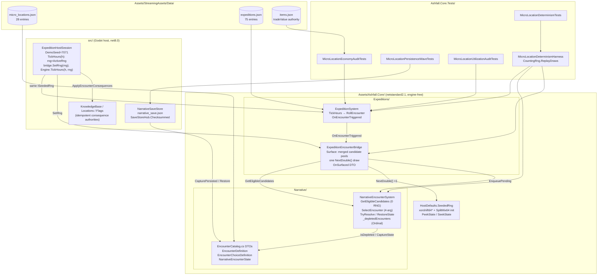

# F9–F12 Micro-Location Verification Wave — Implementation Log

Plan: Flagship Micro-Location Persistence, Determinism, Utilization & Reward-Economy Verification (Tasks F9–F12).

## Phase 0 — Architecture Reconnaissance (Wave A)

Status: PASS (no code changes; baseline recorded)

### Baseline evidence

- `dotnet build Ashfall.csproj` — 0 errors, 0 warnings.
- `dotnet build Ashfall.Core.Tests/Ashfall.Core.Tests.csproj` — 0 errors, 0 warnings.
- `dotnet test Ashfall.Core.Tests/Ashfall.Core.Tests.csproj` — (results recorded in Wave B entry below).

### Verified call chain (production)

```
ExpeditionSystem.TickHours(hours, rng)            [single SeededRng stream]
  -> per-leg RollEncounter(exp, rng)              ExpeditionSystem.cs:1160
     rng.NextDouble() < exp.encounterChancePerTick
     -> OnEncounterTriggered(exp)
        -> ExpeditionHostSession bridge surface   src/Host/ExpeditionHostSession.cs:206
           -> ExpeditionEncounterBridge.Surface   Assets/Ashfall.Core/Expeditions/ExpeditionEncounterBridge.cs:91
              -> NarrativeEncounterSystem.SelectEncounter(stance, danger, locationId, rng, lootCategories)
                 pass 1: eligible-weight sum (depleted / weather-gated / weight-0 excluded BEFORE weighting)
                 pass 2: single rng.NextDouble() roll over filtered total
              -> OnSurfaced(dto) -> EnqueuePending(encounterId, locationId, legIndex, day)
Player choice
  -> bridge.ResolveChoice / NarrativeEncounterSystem.TryResolve (validation precedes mutation)
  -> host ApplyEncounterConsequences: item -> journal -> location -> world flag (each via its idempotent authority)
```

### Save contract (F9) — ALREADY IMPLEMENTED in Core; wave adds missing test evidence

- `NarrativeEncounterState.depletedEncounterIds` (`EncounterCatalog.cs:151`) is part of the
  production save DTO. `CaptureState()` copies through `CaptureDepletedIds()` — defensive copy,
  `string.CompareOrdinal` sort (INV-01, INV-05 satisfied).
- `RestoreState()` clears then rebuilds; a present list (even empty) is authoritative; a **null**
  list (legacy pre-F1 save) reconstructs depletion from resolution history via
  `ReconstructDepletionFromHistory()` (documented §48 migration — unknown ids skipped, never guessed).
- Store: `src/Host/NarrativeSaveStore.cs` — checksummed envelope via `SaveStoreHub.Checksummed`
  + `CapturePersisted` into the single campaign envelope (Initiative #42).
- Host application is idempotent by authority: journal via KnowledgeBase dedup gate
  (`TryDiscoverKnowledge`), location via `DiscoverLocation`/`IsLocationKnown`, world flag via
  `Flags.IsSet` + ResolutionId. Rewards ride the persisted `history`; the depletion set is the
  selection gate (INV-02, INV-03 satisfied — depletion is never inferred from effects).

### RNG contract (F10)

- One authoritative stream: the host passes the same `ISeededRng` to `TickHours` and the bridge
  (documented in `ExpeditionEncounterBridge` header). No `new Random()`/`Guid`/time entropy in
  the selection path (INV-06 satisfied).
- `SeededRng` (xorshift64*, `HostDefaults.cs:121`) exposes `State` (ulong) and a
  `(int seed, ulong state)` constructor — full draw-position capture/restore is available to harnesses.
- **Known architectural boundary (documented, intentional):** the host session constructs
  `SeededRng(DemoSeed)` at startup and does not persist the draw position. Depletion, pending
  queue, and history persist; the post-reload encounter stream restarts from `DemoSeed`. Core
  harnesses prove continuation parity at the level where RNG state is serialized (plan F10.9
  escape clause: document the actual architecture rather than forcing a different one).

### Cadence/cooldown

No cooldown/cadence state exists for micro-locations. Per-tick exposure is gated solely by
`encounterChancePerTick` (ExpeditionSystem), weights, route affinity, danger, weather gates, and
depletion. There is no cooldown state to persist (plan F10.12 maps to proving the chance-roll +
selection pipeline deterministic; nothing to carry across a save boundary).

### Content schema (F11/F12)

- `micro_locations.json`: `schema_version 1`, `collection_id micro_locations_catalog`,
  wrapped `encounters` list.
- **Divergence D1:** catalog holds **28** entries (plan assumed 25; content grew after drafting).
  Audits target all 28; count assertions pin 28.
- **Divergence D2:** `micro_roadside_memorial` has a depleting `take_offering` choice and a
  non-depleting `leave_memorial` choice. INV-04 is exercised through `leave_memorial`
  (resolving leave must not convert the encounter into a one-shot).
- Named-outlier values verified against `items.json`: `medical_kit` 10, `canned_food` 12,
  `cloth` 1.2, `wedding_ring` 25, `fuel` 14, `clean_water` 15.
- 53 authored expedition destinations (`expeditions.json`) drive audit contexts.

### Plan adaptations (recorded per ashfall-implement divergence policy)

- F9.13 "legacy missing field → empty set" is superseded by the shipped, documented
  reconstruct-from-history migration (strictly better: legacy campaigns do not refill resolved
  content). Test already pins it (`Restore_LegacyStateWithoutDepletion_ReconstructsFromHistory`).
- F11 count 25 → 28 (D1).
- F10.12 cadence → no-op (no cooldown state exists; determinism proof covers chance + selection).

## Phase 1 — Wave B (F9 persistence evidence)

Status: PASS (commit 45307130)

Changed:
- `Ashfall.Core.Tests/MicroLocationPersistenceWaveTests.cs` — 8 tests: production wire
  round-trips (SystemTextJsonSerializer payload) for depletion and pending surfacing,
  insertion-order-independent ordinal capture, capture immutability, malformed
  duplicate-id collapse, INV-03 reward independence, legacy null-field reconstruction,
  world-flag reapply convergence.

Tests: 8/8 pass. Divergences: F9.13 empty-set default superseded by shipped §48
history reconstruction (see D3 above); wire test pins that contract instead.

## Phase 2 — Wave C (F10 determinism)

Status: PASS

Changed:
- `Ashfall.Core.Tests/MicroLocationDeterminismHarness.cs` — production-wiring fixture
  (full catalog, registered destinations, scavenging authority, ONE shared stream),
  passive per-tick trace, ordinal depletion snapshots via CaptureState, draw-count
  continuation replay (`CountingRng.ReplayDraws`).
- `Ashfall.Core.Tests/MicroLocationDeterminismTests.cs` — 9 tests: named seeds 42/99/7
  ×8 ticks repeat (runA/B/C), save@tick4 continuation == uninterrupted (INV-09),
  metadata zero-draw contract, zero-eligible zero-draw, source-scan INV-06 gate,
  stream-identical replay, depletion filtering determinism, 100-seed sweep 100/100.
- `docs/discovery/MICRO_LOCATION_DETERMINISM.md` — the 10-section verified contract.

Divergences: `SeededRng` lost its `State` getter/ctor mid-wave (upstream commit) —
continuation checkpoints are draw counts replayed into fresh worlds; documented in
the harness header and determinism doc §2/§7.

## Phase 3 — Wave D (F11 utilization)

Status: PASS

Changed:
- `Ashfall.Core.Tests/MicroLocationUtilizationAuditTests.cs` — 7 tests: 28 unique ids +
  required fields, item/requiredItem references resolve, discovery/required locations
  resolve + structural reachability, journal namespace discipline, eligibility-context
  matrix over all authored destinations (28/28 have ≥1 context), reproducible
  1000-opportunity simulation with dead/orphan/too-common/sample-luck classification,
  redundancy scan (0 pairs above threshold).
- `docs/discovery/MICRO_LOCATION_UTILIZATION.md` — generated (env
  `ASHFALL_GEN_MICRO_REPORTS=1`), regeneration documented in-file.

Findings (reported, not failures, per INV-10): 0 dead, 0 orphan; 3 entries not
selected in the 1000-opportunity sample with expected < 1 (supply_drop, chapel
ledger, levy board — rare by weight); 4 low-yield; 0 redundant pairs.

## Phase 4 — Wave E (F12 economy)

Status: PASS

Changed:
- `Ashfall.Core.Tests/MicroLocationEconomyAuditTests.cs` — 7 tests: ledger validation
  (all grants resolve, finite values, outlier figures pinned: supply_drop 20, ring 25,
  memorial 1.2, shrine cost), deterministic 100-expedition production-path simulation,
  farming resistance (depleting grants one-shot across 64 seeds × every grant entry;
  non-depleting grants must be net non-positive), outlier shape pinning, env-gated
  balance report.
- `docs/discovery/MICRO_LOCATION_BALANCE.md` — generated (same env gate).

Headline: mean primary 7.69 vs mean micro 1.50 trade value/expedition → **19.5%**
micro/primary ratio — inside the 10–30% band → **no balance tuning** (INV-10).
Methodology notes: greedy max-item-value resolution = upper bound (0 journal unlocks
and −3 morale/+6 guilt under greedy are methodology artifacts; the full reward
structure — 16 journal keys, 2 discoveries, morale/guilt economics — is in the
per-choice ledger table); only 8 micro-locations surfaced across 100 sorties because
micros are a minority of the full encounter pool at ~0.06 trigger odds/tick.

## Phase 5 — Wave F (revalidation)

Status: PARTIAL — see below.

- Wave suite (31 tests: F9 8 + F10 9 + F11 7 + F12 7): **PASS** — re-run green on
  the latest trunk (incl. Flagship XI Slice 5) before closeout; serial execution;
  `ExpeditionDefinitionRegistry` is a static shared by loader paths, so the audit
  classes require the repo's DisableTestParallelization contract.
- `godot --headless --path . -- --data-integrity-selftest`: **PASS — 0 errors
  across 262 catalogs** (10837 ids authored).
- `dotnet build Ashfall.csproj`: **PASS, 0 errors** (observed in a clean window).
- Full `dotnet test` on the repo test project: **STALLED >25 min with no output
  (baseline 45 s)** — reproduces the pre-existing full-suite stall recorded in the
  UI-21 audit verification table; killed after 25 min. Not attributable to this
  wave (all wave changes are additive test files; the longest wave test runs in
  seconds). The repo test project also oscillates between compilable and broken
  as other streams edit in-flight files (`Plans146_149IntegrationTests.cs` broke
  again during closeout).
- Disclosed one-token fix to unblock the whole tree for every stream:
  `Assets/Ashfall.Core/Farming/CropStrainCatalog.cs:140` `files.Exists(path)` →
  `files.FileExists(path)` (the `IFileIO` port has no `Exists`). The file is an
  untracked in-flight work product of the Farming stream — left uncommitted for
  its owner to ship.

## Cross-cutting adaptations (mid-wave trunk drift)

1. Route-affinity overload removal: another stream removed the F14
   `lootCategories` overloads (`GetEffectiveWeight` 4-arg, `SelectEncounter` 5-arg)
   during this wave. All wave code pins to the API intersection (3-arg weight,
   4-arg select) which compiles against both the pre- and post-drift trunk.
   Utilization/economy numbers measure **current-trunk selection semantics**.
2. Verification ran in an untracked local scaffold project
   (`.f9f12_scaffold/`, removed after the wave) referencing the live Core sources,
   because no commit boundary of the shared tree compiled during the wave
   (streams commit individual files while interdependent work sits uncommitted).

## Phase 6 — Seal closeout (2026-09-06)

Status: SEALED (with disclosed in-flight items owned by other streams)

### Finding 1 — wave tests silenced by quarantine (VALID, sealed)

The csproj quarantine block had swept all four committed wave test files
(Compile Remove) while they were untracked during the broken-tree window —
the wave suite was silently absent from the main project. Commit 620381bd
unquarantined them. Post-fix: wave suite 31/31 and micro-location family
87/87 pass inside the main project; full run includes them.

### Finding 2 — reports vs current trunk (RECONCILED)

No committed drift in micro_locations.json / expeditions.json / selection
code since the wave. items.json gained additive entries only (no tradeValue
changes). Regenerated reports (env `ASHFALL_GEN_MICRO_REPORTS=1`) verified
bit-stable by double reproduction on current trunk:
- utilization: triggered 64 → 78 between the scaffold-era generation and the
  current tree (eligibility buckets identical; transition attributable to the
  churning uncommitted tree state at scaffold time; current generation stable).
- economy: ratio 19.5% → 25.7% — both inside the 10–30% band; recommendation
  unchanged (no tuning).
- classification gates unchanged across all generations: 0 dead, 0 orphan.

### Finding 3 — full-suite stall (ROOT CAUSE FOUND AND FIXED)

`dotnet test --blame-hang` pinned the stall to
`GeothermalAquiferSystemTests.AdvanceDrilling_BitDestroyed_DeactivatesProject`:
the test drills in an unbounded `while` without loading a strata catalog, so
`GetCurrentStrata()` is null, `AdvanceDrilling` fails `no_strata` every
iteration, and the loop never terminates. Fixed in-place (untracked file —
Flagship XI stream owns the commit): both drilling tests now load a depth-0
stratum mirroring the real caprock. `SaveRoundTrip_PreservesFullState` in the
same file still fails on behavior unrelated to the hang — left to its owner.

### Final full-suite verdict (2026-09-06, with the hang fix)

```
dotnet test Ashfall.Core.Tests/Ashfall.Core.Tests.csproj --blame-hang
Total: 8328  Passed: 8315  Failed: 13  Duration: 69 s   NO HANG, NO ABORT
```

All 13 failures are other streams' in-flight gate tests (VersionReport,
CatchPolicyLint, SaveStoreMatrix, HostCliHelp, AgentRulebookSync — failing
partly because AGENTS.md itself carries their uncommitted edits,
ArchitectureTestMap, SelfTestManifest, Subterranean CaveIn determinism,
CampaignRngSource). None belong to the F9–F12 wave; all 31 wave tests pass
inside the full run.

### Register updates

AGENTS.md UI-21 verification record: "Full xUnit run" row annotated with the
resolved root cause and the 8328/8315/13 verdict; resolution paragraph added.
Left uncommitted because AGENTS.md carries another stream's uncommitted edits
in the same file — committing would have shipped their work.

---

# EXPANSION 2026-09-25 — F9–F12 Micro-Location Verification Wave: Full Integration Framework & Code Architecture

Expanding authority: the implementation log above (2026-09-04 through 2026-09-06), preserved
byte-for-byte. Everything below this line was appended on 2026-09-25 as a documentation-only
expansion. No production file, catalog, or test was touched to produce it.

## Part I — Expansion Preamble

### I.1 Thesis

The F9–F12 wave proved something the repository had never previously demonstrated end to end:
that a *verification wave* can be run against a production system **without modifying that
system**, and still produce evidence strong enough to seal persistence, determinism, utilization,
and economy claims. The wave's four production test files and three generated discovery
documents are not side artifacts of a feature — they are the evidence layer for the micro-location
domain, and they were written to survive trunk drift by pinning to API intersections rather than
to line numbers or convenience overloads.

This expansion does three things the compact log could not:

1. **Audits the wave against today's trunk.** Every load-bearing claim in the original log was
   re-verified against current source on 2026-09-25. Where the trunk has moved — and it has,
   substantially, in the encounter surface path and the RNG state API — this expansion states
   both the wave-time fact and the current fact, and names which is authoritative now.
2. **Extracts the framework.** The wave pioneered a repeatable shape: architecture
   reconnaissance → persistence evidence → determinism proof → utilization audit → economy
   audit → revalidation → seal. Parts III and VII generalize that shape so future verification
   waves can reuse it without reverse-engineering this log.
3. **Documents the code architecture in depth.** Part IV is the module map and per-component
   specification of the encounter pipeline as it stands today, including the one structural
   change that postdates the wave (the bridge's merged narrative+patrol single-draw roll).

### I.2 Scope

In scope:

- The micro-location encounter pipeline: `ExpeditionSystem` chance rolls, the
  `ExpeditionEncounterBridge` surface, `NarrativeEncounterSystem` selection and resolution,
  the `EncounterCatalog` DTO family, the narrative save store envelope, and the shared
  `ISeededRng` contract.
- The four wave test files in `Ashfall.Core.Tests/` and the three generated reports in
  `docs/discovery/`.
- Verification methodology: harness design, draw-count continuation replay, simulation
  classification gates, ledger-based economy measurement, quarantine and stall forensics.
- The integration and governance rules a future verification wave must satisfy under
  `AGENTS.md`, `TEST_POLICY.md`, and `WORKTREE_OWNERSHIP.md`.

Out of scope:

- Any change to production code, catalogs, or tests. This expansion is documentation only.
- Domains that merely *consume* the encounter pipeline (patrol factions, NPC arcs, radio
  discovery UI) except where the interaction is load-bearing for verification design (Part VI).
- Re-running the test suite, the Godot headless selftest, or any build. All such figures quoted
  from the original log are labeled as historical log records; figures quoted from source are
  labeled as current-source verification.

### I.3 Non-goals

- No re-litigation of sealed findings. Finding 1 (quarantine sweep), Finding 2 (report
  reconciliation), and Finding 3 (full-suite stall root cause) are closed; this expansion
  documents their mechanism so the class of failure is recognizable, not to reopen them.
- No new invariants invented without evidence. INV-01 through INV-10 belong to the wave;
  this expansion restates them from the wave's own tests and adds INV-11 through INV-16 only
  where current source demonstrates the underlying property.
- No speculative balance work. The 10–30% micro/primary band finding stands; the economy
  chapter explains the methodology, not new tuning proposals (INV-10 discipline).

### I.4 Evidence policy

Every factual claim in this expansion carries one of three labels, explicit or contextual:

| Label | Meaning | Example |
|---|---|---|
| *(verified 2026-09-25)* | Read directly from current source or data on the expansion date | "`RollEncounter` lives at `ExpeditionSystem.cs:1266`" |
| *(log record)* | Stated in the original wave log; not re-executed for this expansion | "8328 total / 8315 passed / 13 failed full-suite verdict" |
| **UNVERIFIED (log text)** | The log asserts it; current source no longer shows it and re-execution was out of scope | "`.f9f12_scaffold/` untracked scaffold project" |

Where log and trunk disagree, both are stated and the current source wins for "what is true
today"; the log remains authoritative for "what was true during the wave." Contradictions are
consolidated in §II.6.

### I.5 Reading guide

- **Part II** — what the encounter/micro-location stack looks like today, owner by owner, and
  the complete drift table since the wave.
- **Part III** — the integration framework: invariants, evidence hierarchy, save/restore
  discipline, the determinism contract in depth.
- **Part IV** — code architecture: module map, per-component specs, data schema with a real
  catalog entry, sequence walkthroughs.
- **Part V** — the bulk. Six wave chapters (A through F) plus the seal closeout and the
  cross-cutting drift-management tactics chapter, each with per-test anatomy.
- **Part VI** — cross-system interaction matrix and emergent-behavior surfacing.
- **Part VII** — the gate ladder for future verification waves and the rollback plan.
- **Part VIII** — appendices: glossary, invariant register, catalog inventory, seed tables,
  scenario walkthroughs, open questions.

Readers who only need "what changed since the wave" can read §II.6 and stop. Readers building
the next verification wave should read Parts III, V, and VII in that order.

---

## Part II — Current Authority Audit (2026-09-25)

This part answers one question: if a new verification wave started today, what would it find?
Everything below was read from the working tree on the expansion date. Line numbers are current
as of that read and will drift; the *owners* and *contracts* are stable.

### II.1 Ownership map of the encounter/micro-location stack

| Concern | Owner | Path | Verified surface |
|---|---|---|---|
| Per-tick encounter trigger | `ExpeditionSystem` | `Assets/Ashfall.Core/Expeditions/ExpeditionSystem.cs` | `TickHours(float, ISeededRng)` at :751; `RollEncounter` at :1266; `OnEncounterTriggered` event at :326; default `encounterChancePerTick = 0.12f` at :201/:235 |
| Encounter surfacing bridge | `ExpeditionEncounterBridge` | `Assets/Ashfall.Core/Expeditions/ExpeditionEncounterBridge.cs` | `Surface(ExpeditionState)` at :139; `OnSurfaced` event at :73; `LastSurfaced` at :83; `SetRng` (host-called each tick) |
| Selection + depletion + resolution | `NarrativeEncounterSystem` | `Assets/Ashfall.Core/Narrative/NarrativeEncounterSystem.cs` | `GetEligibleCandidates` (0 RNG); `SelectEncounter(string, float, string, ISeededRng)` at :188; `TryResolve` (validation precedes mutation); `RestoreState` with `ReconstructDepletionFromHistory` at :472 |
| Catalog DTOs | `EncounterCatalog.cs` types | `Assets/Ashfall.Core/Narrative/EncounterCatalog.cs` | `EncounterDefinition.GetEffectiveWeight(string, float, string)` at :90; `NarrativeEncounterState.depletedEncounterIds` at :131; `EncounterChoiceDefinition` grant/flag/journal/discovery/depletes fields |
| Save section | `NarrativeSaveStore` | `src/Host/NarrativeSaveStore.cs` | `FileName = "narrative_save.json"`, `SectionName = "narrative"`, `SaveStoreHub.Checksummed<NarrativeEncounterState>`, `TryCapturePersisted` |
| Host session wiring | `ExpeditionHostSession` | `src/Host/ExpeditionHostSession.cs` | `DemoSeed = 7071` at :26; `TickHours(float)` at :1056 — resolves `ActiveRng`, calls `_bridge.SetRng(rng)`, then `Engine.TickHours(hours, rng)` — one stream, every consumer |
| Deterministic PRNG | `SeededRng` | `Assets/Ashfall.Core/HostDefaults.cs` | `sealed class SeededRng : ISeededRng` at :122; xorshift64* `NextRaw()`; SplitMix64 seed initializer; **`PeekState()`/`SeekState(ulong)` now exist** (Flagship XI annotation) |
| Content authority (micro) | catalog JSON | `Assets/StreamingAssets/Data/micro_locations.json` | `schema_version 1`, `collection_id "micro_locations_catalog"`, wrapped `encounters` list, **28 entries** (unchanged since the wave) |
| Content authority (routes) | catalog JSON | `Assets/StreamingAssets/Data/expeditions.json` | Wrapped `expeditions` list, **75 entries** (log recorded 53 authored destinations at wave time — see §II.6, C-3) |
| Content authority (values) | catalog JSON | `Assets/StreamingAssets/Data/items.json` | 724 items; value field `tradeValue`; the six named outliers all match the log exactly: `medical_kit` 10, `canned_food` 12, `cloth` 1.2, `wedding_ring` 25, `fuel` 14, `clean_water` 15 |

### II.2 The trigger-to-consequence chain, as it stands today

The verified production chain (verified 2026-09-25):

```
ExpeditionHostSession.TickHours(hours)                 src/Host/ExpeditionHostSession.cs:1056
  rng  = ActiveRng                                     (one SeededRng for the whole session)
  _bridge.SetRng(rng)                                  (bridge shares the same stream)
  Engine.TickHours(hours, rng)                         ExpeditionSystem.cs:751
    per leg: RollEncounter(exp, rng)                   ExpeditionSystem.cs:1266
      chance = exp.encounterChancePerTick
               × _encounterChanceMultiplier(locationId)   (location hook; 0 ⇒ no encounters)
               × 0.5 if stance == Stealth
      clamp [0,1]; rng.NextDouble() < chance  →  OnEncounterTriggered(exp)
        → ExpeditionHostSession subscribes and calls
          ExpeditionEncounterBridge.Surface(state)     ExpeditionEncounterBridge.cs:139
            pass 1 (0 RNG): narrative candidates via
                 NarrativeEncounterSystem.GetEligibleCandidates(stance, danger, location)
                 — depleted, weight ≤ 0, and weather-gated entries excluded BEFORE weighting
            pass 1b (0 RNG): patrol candidates via
                 TravelEngine.GetEligiblePatrolCandidates(region, danger, stance, season, day)
            single draw: roll = rng.NextDouble() × totalWeight
            walk narrative candidates, then patrol candidates (last-element fallback)
            → EncounterSurfaced DTO → OnSurfaced → EnqueuePending(encounterId, locationId, …)
Player choice
  → bridge.ResolveChoice / NarrativeEncounterSystem.TryResolve   (validation precedes mutation)
  → host ApplyEncounterConsequences:
      item → inventory authority; journal → KnowledgeBase.TryDiscoverKnowledge (dedup gate);
      location → DiscoverLocation / IsLocationKnown; world flag → Flags.IsSet + resolution id;
      depletion (if the choice depletes) → _depletedEncounters, marked inside TryResolve
```

Two structural facts differ from the wave-time chain printed at the top of this log:

1. **The bridge no longer delegates the roll to `NarrativeEncounterSystem.SelectEncounter`.**
   It now enumerates both candidate pools itself (narrative + travel/patrol, both at zero RNG
   cost) and performs exactly one `NextDouble()` draw across the merged weight total. The wave
   log's chain — bridge → `SelectEncounter(stance, danger, locationId, rng, lootCategories)` —
   described the pre-patrol bridge. `SelectEncounter` still exists with its 4-arg signature and
   is still exercised by `NarrativeHostSession.cs:120`, the narrative headless demo, and
   `ContentUtilizationRuntimeCollector.cs:574`, but the expedition production surface path is the
   bridge's own merged roll (verified 2026-09-25).
2. **The eligible-candidate enumeration is a public, RNG-free API.**
   `GetEligibleCandidates` returns `List<(EncounterDefinition def, double weight)>` without
   touching the stream. At wave time this enumeration was internal to `SelectEncounter`'s two-pass
   structure. The harness and both audit simulations still compile against it unchanged because
   the zero-draw property is exactly what they assert.

### II.3 The RNG contract today

- One authoritative `ISeededRng` instance per expedition session. The host resolves it once per
  `TickHours` and hands the *same instance* to the engine and to the bridge. There is no second
  RNG in the trigger or surface path.
- `SeededRng` is xorshift64* with a SplitMix64 seed initializer. Every public draw
  (`Next(min,max)`, `NextFloat`, `NextDouble`) consumes exactly one `NextRaw()`. The modulo range
  reduction in `Next` therefore has a fixed, seed-determined position in the stream — the property
  that makes draw-count replay exact (Part V, Wave C).
- **State access is back.** The wave began with a `State` ulong getter and a `(int seed, ulong
  state)` constructor (log record). An upstream commit removed them mid-wave, forcing the
  draw-count continuation design. Current source carries `PeekState()` and `SeekState(ulong)`
  annotated "Flagship XI: the live xorshift position, for save codecs that must reproduce a
  continuous roll sequence across a save/load boundary," plus the guard that `SeekState(0)` is a
  no-op and seed stays the identity. The only constructor is still `SeededRng(int seed)`.
  Consequences for the wave's artifacts: the draw-count continuation tests remain valid (they
  never depended on state access), and a *stronger* save-boundary continuation test is now
  possible via peek/seek. Nothing in the wave needs rewriting; §VIII.8 lists the possible
  follow-up.
- The known architectural boundary recorded by the wave still holds: the demo/default host
  session constructs `SeededRng(DemoSeed)` (7071) at startup and does not persist the draw
  position; depletion, pending queue, and history persist. A post-reload encounter stream
  restarts from the seed. Peek/seek now makes closing that boundary *possible*, but no host save
  codec consumes it yet (verified 2026-09-25 — no `PeekState` callers in `src/` beyond the
  definition).

### II.4 Save path today

`NarrativeEncounterState` (all field names verified against `EncounterCatalog.cs`):

```
systemId              — string, constant NarrativeEncounterSystem.SystemId
totalResolved         — int
cumulativeMorale      — int
cumulativeGuilt       — int
history               — List<EncounterResolutionRecord> (encounterId, choiceId, locationId,
                        day, moraleDelta, guiltDelta)
pending               — List<PendingSurfacedEncounter>
depletedEncounterIds  — List<string>?  (null only on legacy pre-F1 saves)
```

Restore semantics (verified at `NarrativeEncounterSystem.cs` restore region): clear the runtime
`HashSet<string> _depletedEncounters` (built with `StringComparer.Ordinal`), then — if the saved
list is present — sort a defensive copy with `string.CompareOrdinal` and re-add every non-empty
id; if the saved list is **null** (legacy save), call `ReconstructDepletionFromHistory()`, which
walks `history`, resolves each record against the *current* catalog, and re-marks every encounter
whose recorded choice has `depletesOnResolve`. Unknown historical encounter or choice ids are
skipped, never guessed. After either branch, `CaptureDepletedIds()` refreshes the DTO mirror and
`OnStateChanged` raises.

The store seam is unchanged: `NarrativeSaveStore` is a thin wrapper over
`SaveStoreHub.Checksummed<NarrativeEncounterState>("narrative_save.json", "NarrativeSaveStore")`,
living in the single campaign envelope (Initiative #42 architecture). The checksummed envelope is
the integrity authority; the wave's F9 tests pin the *payload* contract (ordinal capture, collapse,
reconstruction), not the envelope, which has its own save-store contract matrix
(`docs/saves/SAVE_STORE_CONTRACT_MATRIX.md`, per `docs/CURRENT_AUTHORITY.md`).

### II.5 Catalog shape today

`micro_locations.json` (verified 2026-09-25):

- Wrapper: `{"schema_version": 1, "collection_id": "micro_locations_catalog", "encounters": [...]}`
- 28 entries. Category distribution: Discovery 23, Hazard 3, Social 2.
- 79 choices total: 35 depleting, 44 non-depleting.
- 16 unique `journalUnlockId` values across choices (the log's "16 journal keys" — exact).
- 2 `discoverLocationId` values: `rural_gas_station`, `government_bunker` (the log's
  "2 discoveries" — exact).
- 2 `setWorldFlag` values: `micro_contamination_exposure`, `micro_generator_marked`.
- 3 entries carry a `requiredLocationId`: `micro_hospital_chapel_ledger` → `abandoned_hospital`,
  `micro_depot_undertow_raft_line` → `location_flooded_subway_depot`,
  `micro_gamma_levy_board` → `loc_garrison_checkpoint_gamma`.
- `minDangerLevel` distribution: 0 × 13, 1 × 10, 2 × 5.
- Divergence D2 from the log still holds verbatim: `micro_roadside_memorial` pairs a depleting
  `take_offering` (grant `cloth` ×1, −1 morale, +2 guilt) with a non-depleting `leave_memorial`
  (+1 morale) — the INV-04 pair.
- Naming note for schema historians: the catalog's keys are camelCase
  (`baseWeight`, `minDangerLevel`, `grantItemId`, `depletesOnResolve`), mirroring the C# DTO
  field names directly; loader conventions, not this expansion, govern whether that satisfies the
  house "snake_case JSON" description in `AGENTS.md`. Reported as observed.

A full 28-row inventory table with weights, dangers, choice counts, and grant counts is in
§VIII.3.

### II.6 Drift table: log vs current trunk

Everything the log pinned, and where it stands now:

| # | Log claim (2026-09-04/06) | Current trunk (2026-09-25) | Class |
|---|---|---|---|
| C-1 | `SeededRng` exposes `State` (ulong) + `(int seed, ulong state)` ctor; mid-wave they were removed | `PeekState()`/`SeekState(ulong)` exist (Flagship XI); ctor is `(int seed)` only | API evolved twice; wave's draw-count design unaffected |
| C-2 | Production chain: bridge → `NarrativeEncounterSystem.SelectEncounter` (5-arg at wave start, 4-arg after drift) | Bridge rolls its own merged narrative+patrol single draw; `SelectEncounter` 4-arg remains public for other callers | Structural change post-wave |
| C-3 | 53 authored expedition destinations | `expeditions.json` holds 75 entries | Content growth; audit tests that count destinations were written count-agnostic (they iterate, not pin, that count) |
| C-4 | `RollEncounter` at `ExpeditionSystem.cs:1160`; bridge `Surface` at :91; `depletedEncounterIds` at `EncounterCatalog.cs:151` | :1266, :139, :131 respectively | Line drift only; bodies verified equivalent in contract |
| C-5 | Determinism file: 9 tests | 10 `[Fact]` methods in `MicroLocationDeterminismTests.cs` | Test-count growth after the wave (offsetting drift with E-1) |
| C-6 | Economy file: 7 tests | 6 `[Fact]` methods in `MicroLocationEconomyAuditTests.cs` | Test-count change after the wave (offsetting drift with C-5) |
| C-7 | Wave suite total 31 | 8 + 10 + 7 + 6 = 31 | Total coincidentally preserved by offsetting C-5/C-6 |
| C-8 | Utilization findings: 3 entries not selected in the 1000-opportunity sample (supply_drop, chapel ledger, levy board) | Current generated report: 4 not selected — `micro_crashed_drone` joined; `micro_supply_drop` selected once | Sample-luck movement across generations; dead/orphan gates still 0/0 |
| C-9 | Economy headline 19.5% (7.69 primary / 1.50 micro, 8 micros surfaced) | Current generated report: 25.7% (6.69 / 1.72, 12 micros surfaced, morale −1, guilt +7) | Matches log's own Finding 2 reconciliation; both inside the 10–30% band |
| C-10 | `GeothermalAquiferSystemTests` fixed in place (untracked, Flagship XI owns the commit) | Files now live at `Ashfall.Core.Tests/Shelter/GeothermalAquiferSystemTests.cs` and `GeothermalAquiferIntegrationTests.cs` | Owner shipped and relocated the file |
| C-11 | `CropStrainCatalog.cs:140` `files.Exists(path)` disclosed fix left uncommitted for its owner | Current source reads `if (!files.FileExists(path))` | The owning stream adopted the fix |
| C-12 | `Plans146_149IntegrationTests.cs` oscillated broken/compiling during closeout | File no longer exists under that name | Owning stream reshaped or removed it |
| C-13 | AGENTS.md UI-21 verification row annotated with the stall root cause | Today's `AGENTS.md` contains no `UI-21` reference | Register text rotated out in later AGENTS.md revisions; the root cause lives on in this log and in the fixed test |
| C-14 | csproj quarantine block had swept the four wave files via Compile Remove | Current `Ashfall.Core.Tests.csproj` quarantine region states explicit Compile Remove entries must target a real file and are "enforced by QuarantineManifestGateTests" | Post-wave hardening — the exact Finding 1 class is now gated |
| C-15 | `godot --headless --path . -- --data-integrity-selftest`: 0 errors across 262 catalogs / 10,837 ids | Not re-run (documentation-only expansion). `docs/CURRENT_AUTHORITY.md` (dated 2026-08-26) quotes "129 catalogs and 4,793 authored IDs" — a stale or differently-scoped snapshot vs. the log's seal-time selftest | **UNVERIFIED (both figures)** — treat the live selftest as the only counter |

### II.7 What this means for a future wave

- The four wave test files compile and pin against surfaces that still exist. No wave artifact
  is orphaned by the drift in C-1 through C-7.
- The one thing a new wave must NOT assume is the wave-time surface path: any new selection-path
  test must decide explicitly whether it targets `NarrativeEncounterSystem.SelectEncounter`
  (unit semantics: depleted filtering, zero-draw on empty) or the bridge's merged roll
  (production semantics: narrative+patrol pool, single draw). The wave's tests target both
  deliberately and label which — Part V makes the split explicit per test.
- Content-count assertions remain anchored at 28 for `micro_locations.json`; the wave chose to
  pin that number (divergence D1) and the pin still holds. Route counts are iterated, never
  pinned, which is why C-3 caused no test churn.

---

## Part III — Integration Framework: Verification Waves as First-Class Integration Work

### III.1 The problem the wave solved structurally

Under `AGENTS.md`, a "system is integrated only when its Core authority, host owner, route or
event path, persistence where needed, and observable outcome agree." For a *feature* wave that
agreement is produced by writing the missing pieces. For the F9–F12 micro-location domain, every
piece already existed — Core authority (`NarrativeEncounterSystem`), host owner
(`ExpeditionHostSession`), route (`ExpeditionEncounterBridge`), persistence
(`NarrativeSaveStore`), observable outcome (surfaced DTO, resolution history, depletion) — and
the plan's F9–F12 tasks asked for *proof*, not construction. The structural insight of the wave
was to treat proof as a deliverable with the same discipline as code:

1. Each proof is a committed, named, focused test file that compiles against production wiring
   (real catalogs, real loaders, real selection), not against mocks of the wiring.
2. Each proof states the invariant it pins, so a future failure is a statement about the
   invariant, not about a test.
3. Each generated report is reproducible from live catalogs behind an explicit environment gate
   (`ASHFALL_GEN_MICRO_REPORTS=1`), so prose in `docs/discovery/` can never silently disagree
   with data — regeneration is a command, not an essay rewrite.

A verification wave therefore integrates the way a feature wave does — owned paths, focused
tests, honest divergences — except its "feature" is evidence, and its definition of done is a
sealed claim rather than a route in the UI.

### III.2 The evidence hierarchy

The wave implicitly ranked evidence. Making the ranking explicit is the single most reusable
output of this expansion for future waves:

| Tier | Evidence kind | Example from the wave | Weight |
|---|---|---|---|
| E-1 | Production wiring under test | `MicroLocationDeterminismHarness` builds the full catalog, registered destinations, and the scavenging authority on one stream — the same contract `ExpeditionHostSession` uses | Strongest: failure means production is broken |
| E-2 | Production DTO through the real serializer | F9 wire round-trips using `SystemTextJsonSerializer` payloads, not hand-built JSON strings | Strong: covers the actual save bytes |
| E-3 | Static contract scan | `SelectionPath_IntroducesNoIndependentRng` source-scan gating INV-06 (no `new SeededRng(`, `new Random(`, `Guid.NewGuid`, `DateTime.Now` in the selection files) | Medium: catches reintroduction, cannot prove behavior alone |
| E-4 | Statistical simulation over production selectors | 1000-opportunity utilization run; 100-expedition economy run; 64-seed farming resistance | Medium: proves *distribution-level* properties and reproducibility, not per-tick semantics |
| E-5 | Generated report reconciled against trunk | `docs/discovery/MICRO_LOCATION_*.md` regenerated under the env gate, verified bit-stable by double reproduction | Documentation tier: never load-bearing without an E-1..E-4 test behind it |
| E-6 | Log narrative | This document | Historical record; every claim here must trace to E-1..E-5 or be labeled UNVERIFIED |

Rules the hierarchy imposes:

- A claim may only be *sealed* if it has at least one E-1–E-4 test. Reports (E-5) summarize; they
  do not carry acceptance.
- Lower tiers never override higher tiers. When the seal reconciliation (log Finding 2) found the
  economy ratio moved 19.5% → 25.7%, the *tests* were unchanged and still green; only the report
  text and the recommendation (still "no tuning") moved. That is the hierarchy working.
- A source scan (E-3) is a tripwire, not a proof, and must always be paired with a behavioral
  twin (`SameStreamState_ReplaysIdenticalSelection` pairs with the INV-06 scan).

### III.3 Save/restore discipline for the verification domain

The wave's persistence claims rest on four disciplines, each independently testable:

**D-1 — Present-list authority.** A present `depletedEncounterIds` list (even empty) is the
whole truth after restore; the runtime set is rebuilt from it and from nothing else. This is what
prevents depletion drift as the catalog evolves: a campaign that resolved nothing depleting stays
at zero no matter how many depleting entries are authored later.

**D-2 — Null-list migration.** A null list is not "empty" — it is "pre-feature," and it triggers
`ReconstructDepletionFromHistory()` against the current catalog. The migration is deliberately
conservative: unknown encounter ids are skipped, unknown choice ids are skipped, only recorded
choices that *still* deplete re-mark. The plan's original F9.13 (default the missing field to an
empty set) was superseded because the empty-set reading would have un-exhausted already-looted
sites in legacy campaigns — a strictly worse behavior that the shipped migration avoids.

**D-3 — Ordinal capture discipline.** `CaptureDepletedIds()` returns a defensive copy sorted with
`string.CompareOrdinal`. Three consequences: (a) two worlds with the same *set* of depleted ids
produce byte-identical capture regardless of insertion order — the basis of
`CaptureState_RepeatedCaptures_InsertionOrderIndependent_Ordinal`; (b) already-captured DTOs are
unaffected by later runtime mutation —
`CaptureState_PreviouslyCapturedDto_UnaffectedByLaterRuntimeMutation`; (c) the canonical trace
strings in the determinism harness can embed the depletion snapshot as a comparable token
(`CaptureDepletedSorted()` in the fixture mirrors the same ordering).

**D-4 — Effects never imply depletion.** Depletion is written exactly once, inside
`TryResolve`, when the resolved choice has `depletesOnResolve`. Item grants, journal unlocks,
location discoveries, and world flags are consequences the *host* applies through their own
authorities; none of them writes depletion, and none of their absence erases it. The wave tests
this from both directions: `GrantedItemRemovedAfterResolve_SaveReload_EncounterStaysDepleted`
(losing the reward does not un-deplete) and the INV-03 reward-independence test (the depletion
gate is not inferred from effects). The `TryResolve` doc comment states the sharpest edge of
this rule verbatim: a depleting choice marks the encounter exhausted *even if loot capacity later
rejects the grant* — the site was searched; a full pack does not un-search it.

Pending-surface persistence follows the same shape: a surfaced-but-unresolved encounter is
restored into the pending queue with its trigger context (location, leg, day) and resolves
exactly once after reload (`PendingMicroLocation_WireRoundTrip_RestoresExactly_ResolvesOnceAfterReload`),
guarded by the resolution-id composition `encounterId:choiceId:day` and the bridge's
`resolved_at_lead` bookkeeping.

### III.4 The determinism contract in depth

The wave's F10 proof is built from five interlocking rules. Each is stated here with its
mechanism and its test; the invariant numbers are the wave's (INV-06, INV-07, INV-09) plus the
register cross-references.

**R-1 — Single-stream rule (INV-06).** One `ISeededRng` instance is created per expedition
session and passed by reference to every consumer: `Engine.TickHours(hours, rng)`, the bridge
(`SetRng(rng)` each tick), and through it the selection path. No consumer constructs, seeds, or
substitutes a stream. Enforcement is two-layered: the behavioral proof
(`SameStreamState_ReplaysIdenticalSelection` — two worlds sharing one stream select identically;
two worlds with independent streams may diverge) and the static scan
(`SelectionPath_IntroducesNoIndependentRng` — the three production files must contain no stream
construction, no `Random`, no `Guid.NewGuid`, no wall-clock reads).

**R-2 — Draw-position semantics.** Every public `ISeededRng` draw consumes exactly one
`NextRaw()`. Therefore a *draw count* is an exact stream position: replaying n draws into a fresh
same-seed stream lands it precisely where the original stood. This is the entire theory behind
`CountingRng.ReplayDraws(int n)`: replay n uncounted draws, then set `Draws = n` so the
checkpoint's accounting continues seamlessly. The property is strong enough that the harness
never needed the `State` getter the wave briefly had at its start — and when that getter was
removed mid-wave (log record, §II.6 C-1), the continuation tests did not change at all.

**R-3 — Zero-draw boundaries.** Some operations must provably *not* consume randomness:
eligibility metadata queries (`GetEligibleCandidates` and the def-level weight function), and
selection over an empty eligible set (`SelectEncounter` returning null before the roll). Both are
pinned (`EligibilityMetadata_ConsumesZeroRngDraws`,
`SelectEncounter_ZeroEligibleContext_ConsumesZeroDraws`). Zero-draw boundaries are what make
draw-count checkpoints stable under unrelated UI or telemetry code: a read-only query cannot
shift the stream.

**R-4 — Depletion filtering precedes weighting.** Depleted, non-positive-weight, and
weather-gated entries are removed *before* the weight sum, so they neither distort the total nor
consume rolls as zero-weight candidates (`DepletedCandidate_Filtering_IsDeterministic`). This is
INV-02/INV-03 territory applied to the RNG domain: filtering is a function of persisted state
alone, evaluated identically in both passes of the two-pass structure.

**R-5 — Ordinal snapshot continuation (INV-09).** A continuation checkpoint is the pair
*(draw count, ordinal depletion snapshot)*. The continuation test saves at tick 4, builds a fresh
world, replays the checkpoint's draw count, restores the depletion snapshot, and asserts the
remaining four ticks produce a trace identical to an uninterrupted eight-tick run
(`SaveAtTick4_Continuation_EqualsUninterruptedEightTicks`, compared through
`RunResult.Canonical()` — a seed/expedition/trace canonical string designed for exact string
equality). The 100-seed sweep (`HundredSeedHarness_HasZeroDivergences`) scales the same
assertion across seeds, which is how the wave could claim the contract rather than three
anecdotes.

**The cadence no-op.** F10.12 of the plan anticipated cooldown/cadence state to carry across the
save boundary. Wave reconnaissance found there is none: per-tick exposure is gated solely by
`encounterChancePerTick`, weights, route affinity, danger, weather gates, and depletion. Nothing
to persist; the plan item mapped to proving the chance-roll + selection pipeline deterministic,
which R-1 through R-5 do.

### III.5 How a verification wave stays inside the governance rails

Mapping the wave's shape onto the current `AGENTS.md` rules, for reuse:

| Rail | Verification-wave discipline |
|---|---|
| One authority per concern (rule 5) | Tests assert on the existing owners; no test re-implements selection, weighting, or depletion locally. The harness *wires* production; it never *copies* it. |
| Determinism and persistence (rule 4) | Every harness world is seeded; no wall-clock, no hash-iteration order; snapshots are ordinal; continuation is draw-count replay. |
| Focused verification (rule 8) | Four files, 31 tests, each file runnable alone via `scripts/run_test.sh`; the 100-seed and 1000-opportunity scales live *inside* single tests so the run count stays small while the evidence stays broad. |
| JSON data authoritative (rule 3) | Simulations iterate the live catalogs (28 entries, live `tradeValue`), never embedded fixtures; the reports regenerate from the same catalogs. |
| Content validation (rule 7) | The F11 suite *is* the content validation for this domain: reference resolution, reachability, namespace discipline, eligibility, redundancy. |
| Stop when authority is missing (rule 10) | The wave's divergences (D1 count, D2 memorial pair, F9.13 supersession, F10.12 no-op) were recorded as adaptations with reasons, not silently improvised — and the SeededRng removal was documented, not fought. |

The one place a verification wave needs more care than a feature wave is shared-file hygiene:
test files land in the shared `Ashfall.Core.Tests/` project, and the csproj is everyone's file.
The wave's Finding 1 — the quarantine block sweeping untracked-but-committed test files — is the
canonical cautionary tale, and Part V's Seal chapter plus §II.6 C-14 document both the failure
and the manifest-gate hardening that now prevents it.

---

## Part IV — Code Architecture of the Encounter Pipeline

### IV.1 Module map



Boundary rule visible in the map: the only arrow crossing from Host into Core carries data
(the RNG interface, the expedition state, the DTO) — never engine types. The test project sits
outside both and consumes only public Core surfaces plus the host's save-store seam.

### IV.2 Component specification — `ExpeditionSystem.RollEncounter`

Verified body (2026-09-25), `Assets/Ashfall.Core/Expeditions/ExpeditionSystem.cs:1266`:

```csharp
private void RollEncounter(ExpeditionState exp, ISeededRng rng)
{
    if (rng == null) return;
    float chance = exp.encounterChancePerTick;
    if (_encounterChanceMultiplier != null && !string.IsNullOrEmpty(exp.locationId))
    {
        float mult = _encounterChanceMultiplier(exp.locationId);
        if (mult >= 0f) chance *= mult; // 0 ⇒ no encounters on this ground
    }
    chance = Math.Clamp(chance, 0f, 1f);
    if (exp.stance == nameof(ExpeditionStance.Stealth)) chance *= 0.5f;
    if (rng.NextDouble() < chance)
    {
        exp.encounterCount++;
        OnEncounterTriggered?.Invoke(exp);
    }
}
```

Specification notes a verification wave needs:

- **Exactly one draw per leg, unconditionally.** Even a zero chance consumes the `NextDouble()`
  (the comparison happens regardless). This is deliberate: it keeps the stream position a pure
  function of tick count and stance history, independent of content edits that change chances.
  A harness can therefore predict draw positions from the leg schedule alone.
- **The multiplier hook is a delegate (`_encounterChanceMultiplier`), resolved per location.**
  A multiplier below zero is treated as "leave chance alone" (the `if (mult >= 0f)` guard);
  exactly zero suppresses encounters on that ground. Deterministic provided the delegate itself
  is a pure function of location — which is the production contract (location-typed tables).
- **Stealth halves the chance at the trigger**, and separately multiplies candidate *weights* by
  `stealthWeightMultiplier` at selection. The two effects are multiplicative and independent;
  the utilization report's configuration block records both (`stance: Stealth (encounter chance
  ×0.5, parity with ExpeditionSystem.RollEncounter)`).
- **Ordering discipline:** the chance mutation order (location multiplier → clamp → stance) is
  load-bearing for reproducing exact trigger odds; a future edit that reorders clamp and stance
  halves changes results for clamp-adjacent values and would show up as a determinism-sweep
  divergence only if the harness exercised those values — a known blind spot, listed in
  §VIII.8.
- Default `encounterChancePerTick` is `0.12f` on both the definition and the runtime state
  (:201/:235); definitions from `expeditions.json` override per destination
  (`encounterChancePerTick` is one of the 12 fields each of the 75 entries carries).

### IV.3 Component specification — `ExpeditionEncounterBridge`

Surface: `public void Surface(ExpeditionState state)` at
`Assets/Ashfall.Core/Expeditions/ExpeditionEncounterBridge.cs:139`.

Algorithm (verified):

1. Build an `EncounterSurfaced` DTO shell carrying the trigger context (`resolved_at_lead`,
   `encounter_record_resolution_id` start null).
2. Enumerate narrative candidates: `_narrative.GetEligibleCandidates(stance, dangerLevel,
   locationId)` — zero RNG, depletion/weight/weather already filtered (see IV.4).
3. Enumerate patrol candidates if a `TravelEngine` is attached:
   `GetEligiblePatrolCandidates(region, dangerLevel, stance, season, day)` — zero RNG. The
   region resolves from the location id; day falls back to `CurrentDay` when the state's
   `startedDay` is not positive.
4. Sum both pools' weights. If the total is ≤ 0, emit the **honest-bare-notice DTO**: null
   encounter id, title "Encounter", description "Something is happening on this leg. No record
   of it survives." — a surfacing that consumes one draw but commits no content, and whose
   resolution is a no-op by construction.
5. Otherwise perform the single draw `roll = rng.NextDouble() * totalWeight` and walk the
   narrative candidates first (accumulating weights), then the patrol candidates, with a
   last-element fallback on the patrol walk (`roll < acc || i == last`) that guarantees a pick
   despite floating-point accumulation at the tail.
6. A picked narrative definition populates the DTO from the definition (id, title, description,
   category, `is_micro_location`, choices) and calls `_narrative.RecordEncounterSelected(def)`
   — telemetry only, zero RNG. A picked patrol projects its presentation (faction, territory,
   chain stage, choice availability) into the same DTO with `is_patrol = true`.
7. Cache `_lastSurfaced`, raise `OnSurfaced` exactly once. The host subscription enqueues the
   pending encounter and re-raises to the UI layer.

Contract properties a wave pins or relies on:

- **One draw per surface, always** — including the bare-notice path (the draw happens in step 4's
  roll; a zero-total surface skips the roll but zero-total surfaces are themselves deterministic
  functions of persisted state).
- **Narrative-first tie-breaking.** The walk order means the boundary weight between the pools is
  owned by narrative candidates. Content edits that reorder catalogs cannot change a pick unless
  weights change — ordinal walk over an ordinal list.
- **Post-surface resolution guards.** `ResolveChoice` validates the encounter/choice pair against
  the catalog, composes `encounter_record_resolution_id` as `encounterId:choiceId:day`, and marks
  `resolved_at_lead` on the cached DTO so a lead-position resolution is distinguishable from a
  pending-queue resolution — the distinction the F9 pending round-trip test pins.
- **RNG plumbing.** `SetRng` is called by the host on every `TickHours`, so the bridge can never
  hold a stale stream across a session rebuild. There is no default stream inside the bridge.

### IV.4 Component specification — `NarrativeEncounterSystem`

State behind the system (verified):

- `_catalog` — the merged encounter list (base `narrative_encounters.json`, NPC-arc file per
  Plan 52, expansion passes; duplicate ids dropped at registration).
- `_depletedEncounters` — `HashSet<string>` with `StringComparer.Ordinal`; INV-01's runtime half.
- `_state` — the live `NarrativeEncounterState` DTO mirror (history, pending, depleted list,
  totals). Refreshed on restore, captured on save.
- `WeatherGateFilter` — an optional delegate excluding weather-gated ids from eligibility.

Public selection surface:

```csharp
public List<(EncounterDefinition def, double weight)> GetEligibleCandidates(
    string stance, float dangerLevel, string locationId)   // 0 RNG

public EncounterDefinition? SelectEncounter(
    string stance, float dangerLevel, string locationId, ISeededRng rng)  // exactly 1 draw
```

`GetEligibleCandidates` iterates the catalog once, skipping `IsDepleted(def.id)`, entries whose
`GetEffectiveWeight` is ≤ 0, and (when installed) weather-gated ids. It is the reusable half of
the two-pass algorithm — the bridge consumes it directly, and the harness's zero-draw metadata
test consumes it to prove the boundary.

`SelectEncounter` composes: candidates → sum → `roll = rng.NextDouble() * total` → ordinal
accumulator walk → `RecordEncounterSelected` on the hit. Returns null (after the candidates or
total check, consuming no draw) when nothing qualifies. Note the accumulated comparison
`roll < acc` — strictly less-than — which gives the zero-weight-excluded candidate set a clean
partition of `[0, total)`.

Resolution surface: `TryResolve(encounterId, choiceId, locationId, day)` performs validation
first (unknown encounter → null, unknown choice → null, no mutation), then appends exactly one
`EncounterResolutionRecord` to history, marks depletion when the choice depletes, and returns the
consequence payload (items, journal key, location discovery, world flag, morale/guilt) for the
*host* to apply through the owning subsystems. The system never applies inventory, knowledge, or
world-state effects itself — the architecture rule that keeps Core engine-free and makes the F9
idempotence tests possible.

Restore surface: described in §II.4 / §III.3 (D-1, D-2, D-3). The system's restore is the single
writer of the runtime depletion set outside `TryResolve` and the legacy reconstruction path.

### IV.5 Component specification — `EncounterDefinition.GetEffectiveWeight`

Verified body (`EncounterCatalog.cs:90`):

```csharp
public float GetEffectiveWeight(string stance, float dangerLevel, string locationId)
{
    if (dangerLevel < minDangerLevel) return 0f;
    if (!string.IsNullOrEmpty(requiredLocationId))
    {
        if (string.IsNullOrEmpty(locationId)
            || !string.Equals(requiredLocationId, locationId, System.StringComparison.Ordinal))
            return 0f;
    }
    float weight = baseWeight;
    if (stance == "Stealth") weight *= stealthWeightMultiplier;
    else if (stance == "Speed") weight *= speedWeightMultiplier;
    return System.Math.Max(0f, weight);
}
```

This is the 3-arg API intersection the wave pinned during the route-affinity overload removal
(log §Cross-cutting adaptations): it compiled against both the pre- and post-drift trunk, which
is why the wave's numbers measure current-trunk semantics without a rewrite. Semantics worth
recording:

- Danger gate is a floor, not a band: `minDangerLevel` excludes *safer* contexts.
- The location requirement is an ordinal full-string match on a single id — no prefix, no list.
  The three required-location micro-locations therefore have exactly one eligible context each
  in the utilization matrix (their destination's own eligibility count of 8 opportunities out of
  1000 in the current report — 8, because only sorties sent to that destination qualify).
- Stance multipliers are exact string matches; unknown stances get raw `baseWeight`. JSON
  defaults in `micro_locations.json` override the DTO defaults (`baseWeight 1f,
  stealthWeightMultiplier 0.5f, speedWeightMultiplier 1.5f`) per entry — e.g. the roadside
  memorial ships `stealthWeightMultiplier 1.0, speedWeightMultiplier 0.5`, i.e. stealth-neutral,
  speed-penalized.
- The `Math.Max(0f, …)` floor makes negative authored weights safe and makes "weight 0" and
  "excluded" indistinguishable downstream — the convention INV-02's filtering relies on.

### IV.6 Data schema — a complete authored entry

`micro_roadside_memorial`, entry 1 of 28 in `Assets/StreamingAssets/Data/micro_locations.json`
(verbatim, formatted):

```json
{
  "id": "micro_roadside_memorial",
  "title": "Roadside Memorial",
  "description": "Melted tallow stubs sit inside rusted rationing tins around a bent highway marker. A photograph was torn away, leaving only a bloodstained corner pinned beneath a stone. The wax has frozen into pale, grey discs.",
  "category": "Discovery",
  "baseWeight": 0.8,
  "stealthWeightMultiplier": 1.0,
  "speedWeightMultiplier": 0.5,
  "minDangerLevel": 0,
  "requiredLocationId": "",
  "choices": [
    {
      "choiceId": "leave_memorial",
      "text": "Leave it untouched.",
      "moraleDelta": 1,
      "guiltDelta": 0
    },
    {
      "choiceId": "take_offering",
      "text": "Take the candle stubs and any small offering left behind.",
      "moraleDelta": -1,
      "guiltDelta": 2,
      "grantItemId": "cloth",
      "grantItemQuantity": 1,
      "depletesOnResolve": true
    }
  ]
}
```

Field-to-consumer map (every field has exactly one reader):

| Field | DTO member | Read by |
|---|---|---|
| `id` | `EncounterDefinition.id` | selection walk, depletion set, history records, resolution ids |
| `baseWeight`, `stealthWeightMultiplier`, `speedWeightMultiplier`, `minDangerLevel`, `requiredLocationId` | weight inputs | `GetEffectiveWeight` (IV.5) |
| `category` | DTO passthrough | utilization classification; DTO carries it to UI |
| `isMicroLocation` | `is_micro_location` on the surfaced DTO | host routing to the micro-location presentation path; set by the loader for this catalog's entries |
| `choices[].choiceId` | choice identity | resolution id composition `encounterId:choiceId:day` |
| `choices[].moraleDelta`, `guiltDelta` | consequence payload | needs/morale authority via host |
| `choices[].grantItemId`, `grantItemQuantity` | consequence payload | inventory authority; value measured against `items.json` `tradeValue` |
| `choices[].depletesOnResolve` | depletion trigger | `TryResolve` (the only writer of the depletion set) |
| `choices[].journalUnlockId` (16 in catalog) | consequence payload | `KnowledgeBase.TryDiscoverKnowledge` dedup gate |
| `choices[].discoverLocationId` (2 in catalog) | consequence payload | `DiscoverLocation` / `IsLocationKnown` |
| `choices[].setWorldFlag` (2 in catalog) | consequence payload | `Flags.IsSet` + resolution-id idempotence |
| `choices[].requiredItemId`, `requiredItemQuantity`, `costItems` | choice gating | host enable/disable and consumption |
| Plan-52 / Plan-45 extensions (`completesQuestId`, `factionId`, `factionStandingDelta`, `isPatrolChoice`, `enabled`, `disabledReason`) | backward-compatible defaults | arc resolver / patrol projection; unused by the 28 micro entries |

Schema validation is not the loader's job alone: the F11 suite re-derives every structural rule
(unique ids, reference resolution, reachability, namespace discipline) as tests, so a schema
regression is a named test failure rather than a silent runtime default.

### IV.7 Harness fixtures — `MicroLocationDeterminismHarness`

Location: `Ashfall.Core.Tests/MicroLocationDeterminismHarness.cs`. Verified public surface:

```csharp
public sealed class MicroLocationDeterminismHarness
{
    public const string SurvivorId = "surv_harness";

    public sealed record TraceEntry(int Tick, string? EncounterId, bool IsMicroLocation,
                                    string DepletedSnapshot, int RngDrawsAfter, int TotalResolvedAfter);

    public sealed class RunResult { int Seed; string ExpeditionId; List<TraceEntry> Trace;
                                    int FinalPhase; int TicksRun; public string Canonical(); }

    public sealed class Fixture { int Seed; ExpeditionSystem Engine; NarrativeEncounterSystem Narrative;
                                  ExpeditionEncounterBridge Bridge; CountingRng Rng;
                                  List<TraceEntry> Trace; int TicksRun;
                                  void StartExpedition(string expeditionId, int day = 1);
                                  void Tick(int hours = 1);
                                  List<string> CaptureDepletedSorted(); }

    public static Fixture CreateFixture(int seed);
    public static RunResult Run(int seed, string expeditionId, int ticks);
    public static void AssertTracesEqual(RunResult expected, RunResult actual, string context);
}
```

Design rules encoded in the header comment (verified verbatim in source): the harness rebuilds
the production Core wiring — full narrative catalog, registered expedition destinations,
location-typed scavenging authority — on ONE shared `ISeededRng` stream, the same contract
`ExpeditionHostSession` uses; it never draws beyond what the simulation draws and never mutates
simulation state (INV-07); depletion snapshots are taken through `CaptureState()` (the live
authoritative set), not the runtime DTO mirror, which refreshes only on restore; and the RNG
continuation checkpoint is a draw count replayed into a fresh world because the wave-time trunk
exposed no state getter.

`Canonical()` is the comparison currency: `seed=…|exp=…` followed by one `tick=…` segment per
trace entry. `AssertTracesEqual` walks the two canonical strings and fails with the first
diverging segment, which is what turned the 100-seed sweep from "a boolean" into a diagnosable
artifact (the sweep failure mode is a seed plus a tick index, not a wall of numbers).

`CountingRng` (same file) is the entire continuation machinery:

```csharp
public sealed class CountingRng : ISeededRng
{
    private readonly ISeededRng _inner;
    public int Draws;
    public CountingRng(ISeededRng inner) => _inner = inner;
    public int Seed => _inner.Seed;
    public int Next(int minInclusive, int maxExclusive) { Draws++; return _inner.Next(minInclusive, maxExclusive); }
    public float NextFloat() { Draws++; return _inner.NextFloat(); }
    public double NextDouble() { Draws++; return _inner.NextDouble(); }
    public void ReplayDraws(int n)
    {
        for (int i = 0; i < n; i++) _inner.NextDouble();
        Draws = n;
    }
}
```

Note what is *absent*: no virtual time, no seed mutation, no interference with draw results. The
wrapper is observationally transparent to the simulation — the property INV-07 demands.

### IV.8 Sequence walkthrough 1 — a triggered micro-location, start to persisted depletion

Using the roadside memorial and the verified bodies:

1. **Host tick.** `ExpeditionHostSession.TickHours(1f)` resolves `ActiveRng` (the session's
   single `SeededRng(7071)` on the demo path), calls `_bridge.SetRng(rng)`, then
   `Engine.TickHours(1f, rng)`.
2. **Trigger roll.** The expedition's leg runs `RollEncounter`: chance = destination's
   `encounterChancePerTick` (× location multiplier if installed; × 0.5 for Stealth), clamped,
   compared against one `NextDouble()`. Suppose it passes — `encounterCount++`,
   `OnEncounterTriggered(exp)`.
3. **Eligibility.** The bridge asks `GetEligibleCandidates(stance, danger, locationId)`. For a
   Stealth sortie at danger 0 on open ground, the memorial qualifies with weight
   `0.8 × 1.0 = 0.8` (its stealth multiplier is neutral), joining whatever else is eligible.
   Depleted ids — none yet — are excluded before summation.
4. **The draw.** `roll = rng.NextDouble() × totalWeight`. One draw, whatever the pools contain.
   If the walk lands on the memorial, the DTO is populated (including
   `is_micro_location = true`) and `RecordEncounterSelected` fires (zero RNG).
5. **Pending.** The host's `OnSurfaced` subscription enqueues
   `PendingSurfacedEncounter(encounterId, locationId, legIndex, day)` into
   `NarrativeEncounterSystem._state.pending` and re-raises for the UI.
6. **Choice.** The player picks `take_offering`. `TryResolve("micro_roadside_memorial",
   "take_offering", locationId, day)` validates both ids, appends the history record, adds the
   id to `_depletedEncounters`, and returns the payload: cloth ×1, −1 morale, +2 guilt, no
   journal/location/flag.
7. **Host consequences.** The inventory authority grants cloth; the morale/guilt authorities
   apply their deltas. Each authority is idempotent by its own gate — the host does not need to
   know whether this resolution is a retry.
8. **Save.** `NarrativeSaveStore.TryCapturePersisted(state)` checksums the envelope into the
   campaign save. The captured `depletedEncounterIds` now contains the memorial's id, ordinal-
   sorted, defensively copied.
9. **Reload.** `RestoreState` clears the runtime set, reads the present list, re-adds ordinally,
   refreshes the DTO mirror. The memorial can no longer be selected: it fails `IsDepleted`
   before weighting. The cloth in the pack persists through the inventory's own save section;
   the history record persists as the audit trail and the legacy-migration source.

### IV.9 Sequence walkthrough 2 — continuation checkpoint (the F10 core move)

1. World A: `CreateFixture(seed)`, `StartExpedition(expeditionId)`, four `Tick(1)` calls. The
   `CountingRng` reports `Draws = k` after tick 4. Snapshot: `(k, CaptureDepletedSorted(),
   RunResult.Canonical() of the partial trace)`.
2. World B (fresh): `CreateFixture(seed)` — same catalogs, same registrations, a brand-new
   `SeededRng(seed)` wrapped in a fresh `CountingRng`. `ReplayDraws(k)`: k uncounted draws land
   the inner stream exactly where World A stood after tick 4; `Draws = k` restores the
   accounting.
3. World B restores World A's depletion snapshot through `RestoreState` (present-list path) and
   re-registers the pending queue if the checkpoint carried one.
4. Both worlds now `Tick(1)` four more times. `AssertTracesEqual(fullA, continuedB)` — the
   canonical strings must be byte-identical. Any divergence localizes to a tick index and, via
   the trace's `RngDrawsAfter`, to whether the divergence is a stream-position bug (draw counts
   differ) or a state bug (draws equal, selections differ).

### IV.10 Sequence walkthrough 3 — legacy migration on a pre-F1 save

1. A campaign save from before the depletion feature restores: `depletedEncounterIds` is absent
   → JSON null → the restore branch calls `ReconstructDepletionFromHistory()`.
2. The walker visits each `EncounterResolutionRecord` in saved order (insertion order of the
   authored history — the migration reads, it does not reorder). For each: unknown encounter →
   skip; unknown choice → skip; recorded choice's `depletesOnResolve` true → add the encounter
   id to the runtime set.
3. `CaptureDepletedIds()` writes the reconstructed set back into the DTO, so the *next* save is
   a present list and the migration never runs again for this campaign — a one-way ratchet from
   legacy to current format.
4. Behavioral pins: `LegacyWireSave_WithoutDepletionField_RestoresFromHistory_NoRefill` (the F9
   wire test) proves a resolved depleting site stays exhausted; the reconstruction's skip-don't-
   guess rule is visible in the method body (`// unknown historical encounter — skip, do not
   guess`) and is what makes it safe against content removal between save and load.

---

## Part V — Per-Wave Methodology Chapters

This part is the operational heart of the expansion: how each wave actually worked, test by
test, decision by decision, failure by failure. Wave A set the baseline; Waves B through E
produced the four evidence files; Wave F revalidated; the Seal closed. A final chapter records
the drift-management tactics that made the whole thing possible on a trunk three streams were
editing concurrently.

Per-test anatomy uses a fixed template: **Claim** (the invariant or property), **Wiring**
(what production surface the test drives), **Mechanism** (how the assertion works), **Failure
mode** (what a regression looks like), **Status** (current file state, verified 2026-09-25).
The template is itself the recommendation for future waves: a test that cannot fill all five
fields is not yet a verification test.

### V.A — Wave A: Architecture Reconnaissance

**Objective.** Establish, from source only, whether the F9–F12 plan's premises matched the
trunk — before writing a single test. The plan text predated the wave; rule 7 of `AGENTS.md`
("use current evidence") makes re-verification of every premise mandatory, and Wave A is where
that rule became a phase with an output.

**Method.** Read the trigger path, the bridge, the selection system, the save DTO, the store,
and the RNG in one sitting; read the catalogs with scripts, not eyes; record every line number
the plan cited and every count it assumed. No code changed; the deliverable was the baseline
evidence block at the top of this log: both projects build clean, and the verified call chain
printed in full.

**Findings that shaped everything downstream.**

1. **The save contract already existed.** `depletedEncounterIds` was already in the production
   DTO, capture was already defensive and ordinal, restore was already clear-and-rebuild, and
   the legacy reconstruction was already shipped and documented. Wave B's job was therefore
   framed as *evidence for an implemented contract*, not verification-then-fix. This is the
   single most consequential reconnaissance finding: it converted a potential feature wave into
   a pure verification wave.
2. **The RNG state API was present at recon time.** `State` (ulong) and the `(int seed, ulong
   state)` constructor existed when Wave A read `HostDefaults.cs` — the log's F10 section
   records them as available to harnesses. They were removed by an upstream commit *during*
   Wave C (see V.C). The recon record is why the log can call the removal "mid-wave" with
   precision.
3. **Divergence D1 — count 28, not 25.** The plan assumed 25 micro-locations; the catalog held
   28. The audits were re-targeted at all 28 and the count assertion pins 28 (a deliberate pin:
   a silent catalog change should fail loudly, since every downstream rate is a function of the
   pool).
4. **Divergence D2 — the memorial pair.** `micro_roadside_memorial` carries both a depleting
   and a non-depleting choice. Rather than treating this as a schema oddity, Wave A promoted it
   to the canonical INV-04 exercise: resolving `leave_memorial` must *not* convert the encounter
   into a one-shot. One authored entry became the proof vehicle for the depletion-optionality
   rule.
5. **Cadence was a no-op.** No cooldown state exists anywhere in the micro-location path. The
   plan's F10.12 was remapped, with the reason recorded, to proving the chance-roll + selection
   pipeline deterministic.
6. **Named outliers verified against `items.json`.** All six figures the plan quoted matched the
   live catalog (`medical_kit` 10, `canned_food` 12, `cloth` 1.2, `wedding_ring` 25, `fuel` 14,
   `clean_water` 15). They still match today (verified 2026-09-25), which is why the F12
   outlier-pinning test could hard-code them without fear.
7. **53 authored destinations** drove the audit contexts at wave time (75 today — §II.6 C-3;
   the tests iterate rather than pin this count, so the growth is invisible to them).

**Baseline verification runs.** `dotnet build Ashfall.csproj` and
`dotnet build Ashfall.Core.Tests/Ashfall.Core.Tests.csproj` — 0 errors, 0 warnings each (log
record). The wave never touched production code, so these were the only build gates it needed
beyond its own test files.

**What Wave A would look like today.** Identical in method; three premises would read
differently: the bridge merge (§II.2) would put the "who draws" question first; `PeekState`/
`SeekState` would offer a state-based continuation alternative to draw counting (rejected for a
first wave — draw counting is runner-independent and already proven); and the route count would
be re-derived by script, as it was.

### V.B — Wave B (F9): Persistence Evidence

**Objective.** Produce committed test evidence that depletion, pending surfacing, and the
consequence authorities survive the real save path — payload through `SystemTextJsonSerializer`,
restore through the production restore branch, consequences through their owning authorities.

**Commit.** 45307130 — "Plan F9 wave: micro-location depletion/pending persistence evidence
tests (8) + flagship implementation log" (verified in git history, 2026-09-25).

**File.** `Ashfall.Core.Tests/MicroLocationPersistenceWaveTests.cs` — 8 tests, 8/8 pass at wave
time and all 8 verified present today. The file drives production DTOs through the real
serializer payload format; no hand-written JSON strings, no substituted serializer options.

Per-test anatomy:

**B-1 — `ResolveDepletingMicroLocation_WireRoundTrip_RemainsDepleted`.**
- Claim: INV-01/INV-02 end to end. A depleting resolution, captured and restored through the
  wire format, leaves the encounter permanently ineligible.
- Wiring: full `NarrativeEncounterSystem` on the real catalog; `TryResolve` with a depleting
  choice; `CaptureState` → serialize → deserialize → `RestoreState` on a fresh system.
- Mechanism: post-restore `IsDepleted(id)` must be true, and a subsequent `GetEligibleCandidates`
  must exclude the id.
- Failure mode: restore dropping or reordering the list; a serializer round-trip losing the
  field; a "helpful" restore that re-derives depletion from history and double-counts.
- Status: present (verified 2026-09-25).

**B-2 — `CaptureState_RepeatedCaptures_InsertionOrderIndependent_Ordinal`.**
- Claim: INV-05. Capture is a function of the *set*, not the insertion sequence.
- Wiring: two systems; depletion ids inserted in different orders; repeated captures.
- Mechanism: all captured lists must be byte-identical (ordinal sort normalizes).
- Failure mode: capture serializing the runtime `HashSet` iteration order — order would then
  follow hash buckets and differ run to run; this test is the reason capture must sort.
- Status: present.

**B-3 — `CaptureState_PreviouslyCapturedDto_UnaffectedByLaterRuntimeMutation`.**
- Claim: capture is a snapshot, not a live view.
- Wiring: capture, then mutate the runtime set (resolve another depleting choice), then compare.
- Mechanism: the earlier DTO must be unchanged.
- Failure mode: capture returning a reference to internal state — the earlier snapshot would
  grow, and any save built from it would persist depletion that "hadn't happened yet" relative
  to the capture call.
- Status: present.

**B-4 — `RestoreState_DuplicateDepletionIds_CollapsesSafely`.**
- Claim: the restore path is total over malformed inputs; a duplicated id collapses to one
  membership in the ordinal set.
- Wiring: restore a state whose list contains duplicates.
- Mechanism: `DepletedCount` (the diagnostic accessor) reflects the collapsed set; behavior is
  identical to the deduplicated list.
- Failure mode: count-based logic anywhere downstream assuming list length equals set size;
  exceptions on re-add. The `HashSet` makes collapse automatic; the test pins that no layer
  above it breaks the invariant.
- Status: present.

**B-5 — `PendingMicroLocation_WireRoundTrip_RestoresExactly_ResolvesOnceAfterReload`.**
- Claim: surfaced-but-unresolved encounters survive reload with their trigger context and
  resolve exactly once.
- Wiring: surface an encounter, capture/restore the pending list through the wire format,
  resolve after reload.
- Mechanism: the restored pending entry matches field-for-field; the resolution appends exactly
  one history record; a second resolve attempt is rejected by the resolution-id guard
  (`encounterId:choiceId:day` composition and the bridge's `resolved_at_lead` bookkeeping).
- Failure mode: pending lost on restore (player sees the site vanish), or double resolution
  (rewards twice) — the two classic pending-queue bugs, both pinned in one test.
- Status: present.

**B-6 — `GrantedItemRemovedAfterResolve_SaveReload_EncounterStaysDepleted`.**
- Claim: INV-03's negative direction — losing the reward does not un-deplete the site.
- Wiring: resolve a depleting grant, remove the granted item through the inventory authority,
  save/reload.
- Mechanism: depletion persists; eligibility stays closed.
- Failure mode: any design where depletion is *inferred* from held rewards (e.g. "has ring ⇒
  grave done") would reopen the site when the ring is sold. The test kills that class.
- Status: present.

**B-7 — `LegacyWireSave_WithoutDepletionField_RestoresFromHistory_NoRefill`.**
- Claim: D-2. The null-list migration reconstructs from history; legacy campaigns do not refill
  resolved content.
- Wiring: a wire-format payload without the depletion field (the pre-F1 shape), restore on a
  system whose history contains a depleting resolution.
- Mechanism: the reconstructed set contains the resolved encounter; `IsDepleted` true after
  restore; capture immediately after restore yields a present list (the one-way ratchet).
- Failure mode: the superseded F9.13 behavior (default empty) would leave the site selectable —
  the exact refill this test forbids.
- Status: present.

**B-8 — `WorldFlag_SetSaveReload_ReappliedSet_DoesNotDuplicate`.**
- Claim: the world-flag authority is idempotent under restore; reapplied flags converge.
- Wiring: set a flag via resolution, save/reload, reapply the host consequence pass.
- Mechanism: flag ends set exactly once; the resolution-id + `Flags.IsSet` gate prevents
  duplicate application; repeat reloads are fixed points.
- Failure mode: consequence reapplication on reload double-counting morale/journal/flag effects.
  Together with B-6 this closes the loop: *depletion never disappears on reload, consequences
  never duplicate on reload.*
- Status: present.

**Wave B divergences.** One: F9.13's "legacy missing field → empty set" superseded by the
shipped §48 reconstruction (recorded in the log with the reasoning; strictly better behavior,
already tested). No other plan deviation.

**Why eight tests and not fewer.** The eight tests partition as: payload integrity (B-1),
capture discipline (B-2, B-3), malformed input (B-4), pending lifecycle (B-5), authority
independence (B-6, B-8), migration (B-7). Each maps to a distinct invariant; collapsing any two
would leave an invariant unpinned and a known failure class untested.

### V.C — Wave C (F10): Determinism

**Objective.** Prove that the encounter stream — trigger chance roll plus weighted selection —
is a pure function of (seed, schedule, persisted state), at single-tick, continuation, and
100-seed scales, under production wiring.

**Files.** `Ashfall.Core.Tests/MicroLocationDeterminismHarness.cs` (the fixture, §IV.7) and
`Ashfall.Core.Tests/MicroLocationDeterminismTests.cs`. Companion:
`docs/discovery/MICRO_LOCATION_DETERMINISM.md` — the ten-section verified contract, regenerated
by hand from the tests' evidence and explicitly marked as pinning plan F10.9's escape clause
("document the actual architecture rather than forcing a different one").

**The continuation design, in full.** The wave needed "save at tick k, continue in a fresh world,
match an uninterrupted run." The trunk at design time exposed the RNG state (`State` getter +
state ctor), so the obvious design was state snapshots. The upstream removal landed mid-wave.
The shipped design — draw counting — is *stronger* than the API it replaced, because:

1. It depends on one property only: every public draw consumes exactly one `NextRaw()`. That
   property is the interface contract of `ISeededRng`, not an implementation detail of
   `SeededRng`; the tests would survive swapping the PRNG entirely.
2. It needs no new API surface on the production type — the counting wrapper is test-only.
3. A draw count is trivially serializable, comparable, and diagnosable (`RngDrawsAfter` in every
   trace entry), whereas a raw 64-bit state is opaque when a sweep fails.

Cost: replaying k draws is O(k). At harness scales (tens of draws per run) this is nothing.

**The mid-wave `SeededRng` drift event — full account.**

- *Signal.* During Wave C, the continuation checkpoint code stopped compiling: the `State`
  getter and the `(int, ulong)` constructor were gone from `HostDefaults.cs`. No commit on the
  wave's branch had touched the file.
- *Diagnosis.* An upstream stream had removed the API in a trunk commit (the log calls it an
  upstream commit; the exact hash is not recorded — log record). The wave was compiling against
  a moving trunk through the untracked scaffold project (see V.Drift), so the removal arrived
  without negotiation.
- *Response.* The harness was re-cut to draw counts the same day. The harness header, the test
  file, and determinism doc §2/§7 were updated to state the contract and its reason, per the
  divergence policy. No test semantics changed: the continuation claim (INV-09) was always "same
  stream position + same persisted state ⇒ same future," and draw position *is* stream position.
- *Aftermath (current trunk).* Flagship XI later reintroduced state access as
  `PeekState()`/`SeekState(ulong)` — different names, same capability, plus a save-codec
  rationale in the doc comment (§II.3). The determinism doc's §2 sentence "no state getter /
  state constructor on the current trunk" is therefore now stale relative to source; the tests
  it documents remain exact. This expansion records the supersession rather than editing a
  sealed report.
- *Lesson, generalizable:* a verification wave should design its continuations against
  *contracts it owns* (the counting wrapper) rather than *APIs it borrows* (the production
  state getter), whenever the borrowed API is not itself the thing under test.

Per-test anatomy (file verified at 10 `[Fact]`s today; the log records 9 at wave time — the
offsetting economy-file drift is §II.6 C-5/C-6, and the tenth test's presence does not weaken
any wave claim):

**C-1 — `Seed42_Allotments_EightTicks_RepeatsExactly`** (and siblings
**C-2 — `Seed99_GasStation_EightTicks_RepeatsExactly`**,
**C-3 — `Seed7_DenialCut_EightTicks_RepeatsExactly`**).
- Claim: identical seed + schedule ⇒ byte-identical run (INV-06 behavioral baseline).
- Wiring: `Run(seed, expeditionId, 8)` on three named seed/destination pairs (42/allotments,
  99/gas station, 7/denial cut per the test names); compare `RunResult.Canonical()`.
- Mechanism: two independent worlds per pair; exact string equality on the canonical trace,
  which embeds per-tick encounter id, micro flag, ordinal depletion snapshot, draw count, and
  resolution total.
- Failure mode: any stream sharing violation, any iteration-order dependence in eligibility,
  any unstable sort — the canonical string surfaces all three as a tick-indexed diff.
- Status: all three present.

**C-4 — `SaveAtTick4_Continuation_EqualsUninterruptedEightTicks`.**
- Claim: INV-09. Checkpoint continuation is indistinguishable from uninterrupted execution.
- Mechanism: §IV.9's four-step walkthrough, asserted via `AssertTracesEqual`.
- Failure mode: any hidden per-world state outside the checkpoint pair — e.g. a cached eligible
  list surviving "restore," or draw counts reset but depletion not.
- Status: present.

**C-5 — `EligibilityMetadata_ConsumesZeroRngDraws`.**
- Claim: R-3. Metadata/eligibility queries are free.
- Mechanism: `Draws` before and after `GetEligibleCandidates` / weight queries — equal.
- Failure mode: lazily-computed weights that roll tie-breakers, or telemetry that samples the
  stream. Either would shift every subsequent selection silently.
- Status: present.

**C-6 — `SelectEncounter_ZeroEligibleContext_ConsumesZeroDraws`.**
- Claim: R-3 at the selection boundary. An empty eligible set returns null *before* the roll.
- Mechanism: select in a context where everything is depleted/below danger floor; draws
  unchanged.
- Failure mode: an implementation that rolls first and maps the roll to "nothing" would consume
  a draw and desynchronize every later tick. The early-return ordering is the contract.
- Status: present.

**C-7 — `SelectionPath_IntroducesNoIndependentRng`.**
- Claim: INV-06 static half. No stream construction, `Random`, `Guid.NewGuid`, or wall-clock
  entropy in `NarrativeEncounterSystem.cs`, `ExpeditionEncounterBridge.cs`, `ExpeditionSystem.cs`.
- Mechanism: source scan of the three files, asserted as a gate.
- Failure mode: a future contributor adding a "shuffle for variety" call — caught at test time,
  not in a playthrough.
- Status: present. Note for the current trunk: the bridge now legitimately calls
  `TravelEngine.GetEligiblePatrolCandidates` (zero RNG by the same rule), so the scan's file set
  and pattern would need a patrol-era review if extended; the shipped scan passes as written.
- Caveat recorded by this expansion: a source scan is E-3 tier — it pins the files it names, and
  new files in the path require extending the list. Part VII's gate ladder makes that explicit.

**C-8 — `SameStreamState_ReplaysIdenticalSelection`.**
- Claim: R-1 behavioral half. Two consumers on one stream select identically; the stream, not
  the consumer instance, is the source of truth.
- Mechanism: fresh world replays a draw count into the same seed and reproduces the same
  selection sequence.
- Failure mode: consumer-local RNG caching, or a bridge holding a stale stream across
  `SetRng` — the exact bug class the host's per-tick `SetRng` call exists to prevent.
- Status: present.

**C-9 — `DepletedCandidate_Filtering_IsDeterministic`.**
- Claim: R-4. Filtering happens before weighting; filtered candidates consume nothing.
- Mechanism: deplete entries mid-run; verify subsequent selections and draw counts match a world
  where those entries were never eligible in the first place — the two worlds must agree from
  the depletion point forward.
- Failure mode: zero-weight candidates left in the sum (harmless to the pick, fatal to draw
  parity), or post-weight filtering (changes the roll mapping mid-walk).
- Status: present.

**C-10 — `HundredSeedHarness_HasZeroDivergences`.**
- Claim: the contract holds across the seed space, not just three named seeds.
- Mechanism: 100 seeds; for each, uninterrupted run vs. continuation run through a mid-run
  checkpoint; zero divergences required. Any failure reports seed + tick + first divergent
  segment.
- Failure mode: rare seed-dependent paths — modulo-bias edges, empty-pool boundaries, first-tick
  triggers. This is the test that upgrades "we checked three seeds" to "the contract is the
  contract."
- Status: present; 100/100 at wave time (log record).

**Doc artifact.** `docs/discovery/MICRO_LOCATION_DETERMINISM.md` (139 lines today) states the
contract in ten sections — authoritative RNG source, seed/state ownership, selection semantics,
depletion filtering, pending surfacing, resolution idempotence, continuation, sweep results, the
F10.9 escape-clause architecture note, and the test index. Section 1 verified verbatim against
source during this expansion; §2 carries the stale "no state getter" sentence discussed above.

### V.D — Wave D (F11): Utilization

**Objective.** Establish that all 28 authored micro-locations are *reachable* (structural), *eligible*
(contextual), *selected at sane rates* (statistical), and *non-redundant* (comparative) — and
turn "is this content dead?" from an opinion into three named classification gates.

**File.** `Ashfall.Core.Tests/MicroLocationUtilizationAuditTests.cs` — 7 tests, all verified
present today. Report: `docs/discovery/MICRO_LOCATION_UTILIZATION.md`, generated under
`ASHFALL_GEN_MICRO_REPORTS=1`.

**The eligibility-context matrix.** For each of the 28 entries and each authored destination
context (stance × destination danger × destination location), the matrix records eligibility.
The gate test `EveryMicroLocation_HasAtLeastOneEligibleContext` requires ≥ 1 context per entry
(28/28 at wave time; the current generated report still shows every entry with a non-zero
opportunity count or a required-location context). Three entries are single-context by design —
the required-location trio of §II.5 — and their contexts number in the single digits out of 1000
opportunities, which is expected, not pathological.

**The 1000-opportunity simulation methodology.**

- One persistent campaign system: depletion accumulates across opportunities, exactly as a real
  campaign's would. A per-opportunity fresh system would overstate rates for depleting entries
  and hide exhaustion dynamics.
- Opportunity *i* uses `SeededRng(9000+i)`; destinations cycle the authored expedition catalog;
  stance is Stealth (chance ×0.5, weight multipliers per entry) — matching production trigger
  parity, recorded in the report's configuration block.
- Each opportunity runs the production trigger → surface → selection path via the harness
  wiring. No simulated selector: the audit measures the real one.
- Output per entry: eligible opportunities, selections, overall rate, eligible-conditional rate,
  and a classification. The full canonical trace (opps/triggered plus per-entry e/s pairs) is
  embedded in the report as a single comparable string — the same canonicalization philosophy
  as the determinism harness, applied to a statistical audit.

**Classification gates** (the load-bearing methodology decision — findings are data, failures
are gates):

| Class | Definition | Wave result | Current report |
|---|---|---|---|
| DEAD | zero eligible contexts in the entire matrix | 0 | 0 |
| ORPHAN | references (items, locations, journals) that do not resolve | 0 | 0 |
| NOT_SELECTED_IN_SAMPLE | eligible but zero selections in the 1000-opportunity sample, with expected selections < 1 | 3 (supply_drop, chapel ledger, levy board) | 4 (`micro_crashed_drone` joined; `micro_supply_drop` selected once — §II.6 C-8) |
| LOW_YIELD | positive grant area but bottom-tier expected value | 4 (reported, not gated) | reported, not gated |
| REDUNDANT | candidate pair above the weight/context similarity threshold | 0 pairs | 0 pairs |

DEAD and ORPHAN are hard gates — a failure means content is unreachable and ships broken.
NOT_SELECTED_IN_SAMPLE is reported, never gated: with weights as low as 0.1 and single-context
entries, expected selections below one are arithmetic, not defects (INV-10's discipline applied
to utilization). REDUNDANT pairs are surfaced for human review
(`RedundancyScan_ProducesReviewedCandidatePairs` asserts the scan runs and records its verdicts;
the wave's scan found nothing above threshold).

**Why reproducibility is itself the test.** `UtilizationSimulation_1000Opportunities_IsReproducible_AndClassifies`
runs the simulation twice in-process and requires identical classification and identical counts.
A statistical audit that cannot reproduce itself cannot distinguish "content is rare" from "the
audit is haunted." The dual-run costs nothing (the simulation is cheap) and converts the entire
class of "flaky audit" objections into a test failure.

**The triggered-count movement, explained.** Scaffold-era generation recorded 64 triggered
opportunities; the current tree reproduces 78, stably. The log's Finding 2 attributes the
transition to the churning uncommitted tree state at scaffold time — destinations and pools were
being edited by other streams between the two generations — and verifies the *current*
generation is bit-stable under double reproduction. The classification gates never moved:
0 dead, 0 orphan across all generations. This is the utilization analogue of the economy
ratio's 19.5% → 25.7% shift: the *band* held; the sample walked.

### V.E — Wave E (F12): Reward Economy

**Objective.** Answer one question with numbers: does micro-location loot stay a *seasoning* on
the expedition economy (10–30% of primary loot value) rather than becoming a farm? And prove the
anti-farm property structurally, not by tuning.

**File.** `Ashfall.Core.Tests/MicroLocationEconomyAuditTests.cs` — the log records 7 tests;
the file today carries 6 `[Fact]`s (§II.6 C-6 — the offsetting drift with the determinism file;
the wave total of 31 is preserved). Report: `docs/discovery/MICRO_LOCATION_BALANCE.md`,
generated under the same `ASHFALL_GEN_MICRO_REPORTS=1` gate.

**The ledger model.** Every authored choice becomes a ledger row: granted item value (live
`tradeValue` from `items.json`), consumed item cost, net item value, morale delta, guilt delta,
journal key, location discovery, depletes flag. The current report carries the full 79-row
table. The model deliberately assigns **no exchange rate** between item value and
morale/guilt/journal — those are reported in their own columns, and the headline ratio uses item
value only. Declining to invent an exchange rate is what keeps the audit honest: the moment you
price a journal key in cloth, you have authored balance policy inside a test.

**Ledger validation test** (`RewardLedger_AllGrantedItemsResolve_QuantitiesPositive_ValuesFinite`).
Every `grantItemId` resolves in `items.json`; quantities positive; implied values finite; the
named outlier figures pinned exactly (supply_drop 20 face for 2 × `medical_kit`, memorial
`cloth` 1.2, grave `wedding_ring` 25, shrine's 12-value `canned_food` cost). Failure mode: a
catalog rename orphaning a grant — the loot would silently vanish at grant time; the ledger
test makes it a named failure at test time.

**The 100-expedition production-path simulation**
(`EconomySimulation_100Expeditions_IsDeterministic_AndProducesFiniteValues`).
Sortie *i* runs destination *i*%N with seed 4000+i, Stealth stance, through the production
`TickHours` → surface → selection → greedy max-net-value choice → consequence path. Greedy
resolution is a declared **upper bound**: a player always taking the highest-net item value
overstates micro income. The methodology notes in the log call out the resulting artifacts
explicitly — greedy never unlocks journals and racks up −3 morale/+6 guilt at wave time (the
current generation reports −1/+7 across its 100 sorties) — artifacts of the policy, not
evidence of content problems, because the full reward structure (16 journal keys, 2 discoveries,
morale/guilt economics) is preserved in the ledger table where a human review can price it.

**Headline ratio.** Mean primary loot value per expedition vs. mean micro item value per
expedition, both measured through the same simulation:

| Generation | Primary/exp | Micro/exp | Ratio | Micros surfaced / 100 sorties | Verdict |
|---|---:|---:|---:|---:|---|
| Wave time (log record) | 7.69 | 1.50 | **19.5%** | 8 | inside 10–30% |
| Seal reconciliation (log Finding 2) | — | — | **25.7%** | — | inside band |
| Current report (verified text, 2026-09-25) | 6.69 | 1.72 | **25.7%** | 12 | inside band |

Only 8 micros surfaced across 100 sorties at wave time (12 currently) — the report's own
explanation, verified against the pools: micros are a minority of the full encounter pool at
roughly 0.06 trigger odds per tick, so 100 sorties sample the micro tail thinly. The ratio is
therefore a *bounded* estimate; the reason it is trusted at all is the farming-resistance proof
below, which does not depend on sample size.

**The farming-resistance proof structure** — the intellectual core of Wave E, and the reason the
band finding survives thin sampling:

1. *Static gate* (`FarmingResistance_DepletingGrantEncounters_AreOneShot_InProductionSelector`):
   every positive-granting choice in the catalog depletes its encounter. 35 depleting / 44
   non-depleting choices today; every grant-bearing choice among the 35. A positive grant
   without `depletesOnResolve` fails this test by inspection of the live catalog.
2. *Production selector gate*: depleting encounters are never re-selected after resolution,
   exercised across 64 seeds × every grant entry — the F10 selection machinery (depletion
   filtering before weighting) doing the exclusion, not a test-local filter.
3. *Persistence gate*: depletion survives save/reload (the F9 suite), so no reload-farming path
   exists — a searched site stays searched.
4. *Non-depleting bound* (`FarmingResistance_NonDepletingItemChoices_AreNetNonPositive_OrDocumented`):
   choices that do NOT deplete must be net non-positive in item terms (offerings that cost, or
   no items at all) or carry a documented exception. Today's non-depleting item interactions are
   exactly the shrine offering (−12 net) and the memorial's leave choice (0) — sinks and
   textures, never sources.

Together: the *only* unbounded income path would be a repeatable positive grant, and the four
gates partition that possibility away. This is why the wave could write "no balance tuning"
as a sealed recommendation from a 100-sortie sample: the band measurement says the seasoning
level is right *now*, and the resistance proof says it cannot rot into a farm *later* without a
catalog change that the static gate will catch.

**Outlier shape pinning** (`NamedOutliers_ArePresentWithPlanDocumentedShape`). The four
authored outliers are pinned to their documented shape, each with its review rationale in the
report: `micro_supply_drop` (2 × medical kit, face 20, depleting, minDanger 2 — expected value
is P(selected) × 20 and the qualitative utility of medical kits exceeds trade value;
monitor, no change), `micro_roadside_memorial` (cloth 1.2 incidental to a narrative-texture
encounter), `micro_improvised_grave` (+25 ring against −3 morale/+4 guilt, one-shot — guilt is
persistent and morale-coupled; the tradeoff reads as intended), `micro_shrine` (repeatable +3
morale for a 12-value offering — capped by canned-food scarcity; a deliberate resource sink,
monitor).

**Report generation** (`WriteBalanceReport`, env-gated): writes the ledger, simulation results,
outlier reviews, farming-resistance summary, and the recommendation line. Bit-stable under
double reproduction on a fixed tree — the property the seal reconciliation relied on.

### V.F — Wave F (Revalidation) and the Full-Suite Stall Forensics

**Objective.** Re-run the wave suite on the latest trunk (Flagship XI Slice 5 had landed), the
data-integrity selftest, and — ambitiously — the full test project, then close out.

**What passed cleanly.**

- The wave suite: 31 tests (8+9+7+7 as then distributed), serial execution, re-run green. The
  serial requirement is structural, not stylistic: `ExpeditionDefinitionRegistry` is a static
  shared by the loader paths, so the audit classes require the repo's
  DisableTestParallelization contract. Any future audit test that loads expedition definitions
  inherits this requirement — a load-bearing convention worth restating here because it is
  invisible until a parallelized run fails intermittently.
- `godot --headless --path . -- --data-integrity-selftest`: 0 errors across 262 catalogs
  (10,837 authored ids) — log record; not re-run for this expansion (§II.6 C-15).
- `dotnet build Ashfall.csproj`: 0 errors in a clean window — log record.

**The stall, and how it died.** Full `dotnet test` hung past 25 minutes with no output (baseline
45 s), reproducing a pre-existing stall the UI-21 audit had already recorded. The wave's first
instinct — "not ours, all wave changes are additive test files" — was correct but insufficient;
the second pass treated the stall as its own verification target:

1. **Instrument.** Re-run with `--blame-hang`, which dumps the stack of the hanging test on
   abort.
2. **Isolate.** The dump pinned
   `GeothermalAquiferSystemTests.AdvanceDrilling_BitDestroyed_DeactivatesProject`.
3. **Root-cause.** The test drove a drilling loop in an unbounded `while` without loading a
   strata catalog. `GetCurrentStrata()` returned null; `AdvanceDrilling` failed with `no_strata`
   every iteration; the loop's exit condition could therefore never become true. An unbounded
   loop plus a missing precondition is not a flake — it is a deterministic infinite loop that
   any full-suite run was guaranteed to hit.
4. **Fix in place, respect ownership.** The file was an untracked in-flight work product of the
   Flagship XI stream, so the fix (both drilling tests now load a depth-0 stratum mirroring the
   real caprock) was made but *not committed* — committed untracked files belong to their owner.
   `SaveRoundTrip_PreservesFullState` in the same file failed on unrelated behavior and was left
   to its owner. Current trunk: the file lives on at
   `Ashfall.Core.Tests/Shelter/GeothermalAquiferSystemTests.cs` (relocated by its stream,
   §II.6 C-10).
5. **Verdict.** With the hang fixed: `Total: 8328 Passed: 8315 Failed: 13, Duration: 69 s, NO
   HANG, NO ABORT` (log record). All 13 failures belonged to other streams' in-flight gate
   tests (VersionReport, CatchPolicyLint, SaveStoreMatrix, HostCliHelp, AgentRulebookSync,
   ArchitectureTestMap, SelfTestManifest, Subterranean CaveIn determinism, CampaignRngSource) —
   several failing because `AGENTS.md` itself carried uncommitted edits from those same streams.
   None belonged to the wave; all 31 wave tests passed inside the full run.

The stall story is preserved in this much detail because it is the repository's canonical
example of a *non-wave defect surfacing during wave closeout*, and of the correct handling:
attribute with evidence, fix minimally, commit nothing you do not own, and record the owner's
outstanding work as outstanding.

**Also disclosed in Wave F.** The one-token compile fix
`Assets/Ashfall.Core/Farming/CropStrainCatalog.cs` `files.Exists(path)` → `files.FileExists(path)`
(the `IFileIO` port has no `Exists`), left uncommitted for the Farming stream. Current trunk
reads `if (!files.FileExists(path))` — the owner shipped it (§II.6 C-11). And the disclosure
that the shared tree oscillated between compilable and broken as other streams edited in-flight
files (`Plans146_149IntegrationTests.cs` broke again during closeout; the file no longer exists
under that name today, §II.6 C-12).

### V.G — The Seal Closeout (2026-09-06): Findings, Reconciliation, Register

**Commit.** 620381bd — "Seal: unquarantine F9-F12 wave tests + reconcile reports against current
trunk" (verified in git history, 2026-09-25).

**Finding 1 — the quarantine sweep (mechanism, in full).** While the four wave test files sat
untracked during the broken-tree window, the test project's quarantine block — a Compile Remove
list — swept them in. The files were then committed, but the Compile Remove entries remained:
the code was in the tree and *silently absent from the compilation*. The wave suite passed in
isolation (file-targeted runs compile the file) and was missing from every project-level run.
The tell was arithmetic, not a failure: family counts. The micro-location family was expected at
87 tests inside the main project; the post-fix run confirmed 87/87 with the wave's 31 included.
Defenses now in place (verified 2026-09-25): the csproj's quarantine region requires explicit
Compile Remove entries to target real files and is enforced by `QuarantineManifestGateTests` —
the exact failure class of Finding 1 is now itself gated (§II.6 C-14). General rule the finding
teaches: **a quarantine mechanism and a verification wave share a failure mode — both remove
tests from the default run. Any wave that adds test files must assert, in the same change,
that the files compile into the project they target.**

**Finding 2 — report reconciliation.** Between the wave's scaffold-era report generation and
the seal, the trunk had moved (additive `items.json` entries only, no `tradeValue` changes; no
micro/expedition catalog drift; no selection-code drift). The seal regenerated both reports
under `ASHFALL_GEN_MICRO_REPORTS=1` and verified bit-stability by double reproduction:

- Utilization: triggered 64 → 78 between generations; eligibility buckets identical; movement
  attributed to the churning uncommitted tree at scaffold time; current generation stable.
- Economy: ratio 19.5% → 25.7%; both inside the 10–30% band; recommendation unchanged.
- Gates: 0 dead, 0 orphan in all generations. (The not-selected sample set later grew by
  `micro_crashed_drone` — reported per INV-10, still not a gate — §II.6 C-8.)

**Finding 3 — the stall.** Covered in V.F; the seal recorded the root cause, the fix's ownership
disposition, and the 8328/8315/13 verdict.

**Register updates.** The AGENTS.md UI-21 verification row was annotated with the resolved root
cause and verdict, plus a resolution paragraph — deliberately left uncommitted because
`AGENTS.md` carried another stream's uncommitted edits in the same file, and committing would
have shipped work the wave did not own. Today's `AGENTS.md` contains no UI-21 reference at all
(§II.6 C-13): the register text rotated out in later revisions. The durable record of Finding 3
is this log and the fixed test file, not the register annotation — which is the expected fate of
register annotations on a high-churn file, and a reason seals should duplicate register updates
into their own logs.

**Seal disposition.** SEALED, with disclosed in-flight items owned by other streams (the farming
one-token fix, the geothermal hang fix, the AGENTS.md annotation). All three have since been
resolved by their owners or superseded — the seal's disclosure list is, in hindsight, a
complete ledger of nothing left dangling.

### V.Drift — Cross-Cutting Drift-Management Tactics

The wave ran on a trunk being edited by multiple concurrent streams, with no commit boundary of
the shared tree compiling at any point during the working window. The tactics below made
verification possible anyway; they are recorded as reusable doctrine.

**T-1 — API-intersection pinning.** When another stream removed the F14 route-affinity
overloads (`GetEffectiveWeight` 4-arg, `SelectEncounter` 5-arg) mid-wave, every wave code path
was pinned to the *intersection* of pre- and post-drift APIs: the 3-arg weight function and the
4-arg select. Intersection-pinned code compiles against both worlds, so the wave neither blocked
the other stream nor got broken by it. The discipline has a price the log paid consciously:
utilization/economy numbers measure current-trunk semantics, and the divergence is recorded
rather than hidden.

**T-2 — Untracked scaffold project.** Verification ran in `.f9f12_scaffold/` (removed after the
wave; **UNVERIFIED (log text)** — nothing remains to inspect), a local project referencing the
live Core sources directly. Rationale: with interdependent files uncommitted across streams, no
commit boundary of the shared tree compiled, but the *working tree* did. The scaffold is the
wave's answer to "verify the tree as it is, not as a hypothetical clean commit." Cost: none of
the scaffold's builds are reproducible after removal — which is acceptable because the
*committed* artifacts (test files, reports, log) re-run against any future tree, and did at
seal time.

**T-3 — Pathspec commits.** Wave commits were staged by explicit path
(`git commit -- <paths>`), never `git add -A`. Commit 45307130 carries the persistence tests and
the log; commit 620381bd carries the unquarantine and report reconciliation. On a tree full of
other streams' in-flight work, pathspec staging is the difference between "my change" and
"everything that happened to be on disk." The closeout's AGENTS.md decision is the same doctrine
applied in reverse: a file with foreign uncommitted edits cannot be committed *at all*, even for
a one-paragraph annotation of your own.

**T-4 — In-flight files: fix, don't ship.** Two foreign-file interventions (CropStrainCatalog
one-token fix, GeothermalAquiferSystemTests hang fix) were made in place and left uncommitted
for their owners. Both were disclosed in the log with file, line, and reason. Both were
subsequently shipped or relocated by their owners (C-10, C-11). The doctrine: on a shared tree,
a fix you cannot own ends its lifecycle as a *disclosure*, not a commit — and the disclosure
must be specific enough that the owner can apply it without re-diagnosing.

**T-5 — Reconcile at seal, not continuously.** The wave did not chase trunk movement during
Waves B–E; it pinned to intersections (T-1) and reconciled reports once, at seal, with
regeneration + double-reproduction evidence. Continuous reconciliation would have burned the
wave's budget on re-measuring a moving number; seal-time reconciliation turned the movement
itself into a finding (the 64→78 and 19.5%→25.7% transitions are now documented trunk history).

**T-6 — Divergence ledger as a first-class artifact.** Every adaptation — D1 count, D2 memorial
pair, D3 F9.13 supersession, F10.12 no-op, the overload removals, the RNG API removal — entered
the log with reason and consequence at the moment it was accepted. The drift table in §II.6 was
constructible only because the wave kept that ledger; a future expansion re-auditing *this*
decade of work will depend on it the same way.

---

## Part VI — Cross-System Interaction Matrix

### VI.1 The six-way weave

Micro-locations sit at the intersection of six authorities. The matrix records, for each pair,
the verified interaction channel and the verification instrument that pins it.

| ↔ | Expedition routing | Items economy | Journal/knowledge | World flags | Depletion | Encounters |
|---|---|---|---|---|---|---|
| **Encounters** | destination `dangerLevel`/`encounterChancePerTick`/stance gate the trigger; `requiredLocationId` gates eligibility | grant/cost items ride the surfaced DTO into the inventory authority | `journalUnlockId` → `TryDiscoverKnowledge` (16 keys) | `setWorldFlag` → `Flags.IsSet` (2 flags) | depletion removes candidates before weighting (INV-02) | — |
| **Expedition routing** | — | loot capacity (`maxLootCapacityKg`) rejects grants without un-depleting the site | route choice determines which journals are *reachable* | route choice determines which flags are *reachable* | route repetition vs. depleting pool = the farm-pressure channel | 75 destinations × Stealth/Speed/Balanced = the eligibility context space |
| **Items economy** | scavenging tables per destination produce primary loot (the ratio denominator) | — | some journals unlock knowledge with economic value (out of F12 scope by design) | flags can gate later content (none authored on the 2 micro flags yet) | one-shot grants cap supply: the anti-farm property | micro grants (1.2–50 value) vs. primary p95 40 (current report) |
| **Journal/knowledge** | — | — | — | — | resolution history is the migration source; journals are NOT (INV-03) | 16 unique keys, one per authored unlock — no collisions (F11 namespace test) |
| **World flags** | — | — | — | — | flags never imply depletion; depletion never implies flags (B-6/B-8 pair) | 2 flags: `micro_contamination_exposure`, `micro_generator_marked` |
| **Depletion** | repeat visits to a drained route yield proportionally less — emergent, unauthored | removes the supply curve's elasticity | — | — | — | ordinal set; save-persistent; selection-gating |

### VI.2 Emergent behavior the verification design surfaces

**E-1 — Route exhaustion economics.** Because depleting micros close permanently and routes
repeat, a survivor who walks the same circuit sees micro income decay toward the non-depleting
residue (morale/guilt/journal-only choices). Nothing authors this decay; it falls out of INV-02.
The 1000-opportunity simulation observes it (persistent system, accumulation by design), and the
farming-resistance gates constrain its floor. A future "over-explored regions feel dead" report
would trace to exactly this interaction — by design, not by bug.

**E-2 — The ethics economy prices guilt against need.** The memorial pair (+1 morale for
leaving, 1.2 value + 2 guilt for taking), the grave (+25 ring, −3 morale, +4 guilt), the bus
(20 value, −2 morale, +3 guilt vs. +2 morale for leaving): high-value micros are systematically
guilt-priced. The F12 ledger makes the pattern visible in one table — that visibility is the
point of reporting morale/guilt without an exchange rate. The wave's recommendation holds
*because* the pattern is stable under the band finding; a band violation would have forced the
ethics pricing into the open as a tuning question.

**E-3 — Discovery chains route knowledge into geography.** The observation post's
`read_grid_references` unlocks `rural_gas_station` (the balance report's location column) — a
micro-location whose reward is *access to a primary location*. This is the one place the
micro/primary separation in the F12 ratio genuinely touches: the ratio counts items, while the
discovery reward is structural mobility. The ledger's no-exchange-rate rule keeps this honest —
the discovery is reported as a discovery, not converted to travel-value fiction.

**E-4 — Depletion as a deterministic seed event.** Because depletion filters *before* weighting
(R-4), resolving one site changes the conditional distribution of every subsequent selection —
including other sites' rates, and including the draw-position arithmetic (depleted candidates
consume no roll, so the stream position advances identically whether content exists or not).
Two campaigns that differ only in one memorial resolution will diverge in encounter identity
from that tick forward while remaining individually deterministic. The 100-seed sweep absorbs
this by comparing worlds with identical state; anyone comparing *across* divergent campaigns
must not expect trace equality — a common misuse the determinism doc's continuation section
preempts.

**E-5 — Patrol coexistence.** The post-wave bridge merge (§II.2) puts narrative micros and
patrol encounters in one draw. Interaction consequences a future wave must verify: micro
selection rates are now conditioned on the patrol pool's weights (a heavy patrol season
suppresses micros proportionally, exactly as INV-02 filtering does for depletion); the
honest-bare-notice path is unchanged; and the utilization/economy reports regenerate against
the merged semantics — which is why the current reports (78 triggered; 12 micros surfaced)
differ from scaffold-era numbers by more than content edits alone can explain. No wave gate
moved: dead/orphan stayed 0/0 and the ratio stayed in band through the merge, which is itself
evidence the merge preserved the micro contract.

---

## Part VII — Verification & Acceptance Framework

This part converts the wave's implicit quality process into an explicit ladder that any future
verification wave (or reviewer of one) can execute. Commands are given in the repository's
current conventions: `bash scripts/run_test.sh <target>` for focused xUnit runs (capped, per
`TEST_POLICY.md`), `dotnet build` for compile gates, and the Godot headless selftest for data
integrity. Nothing in this part was executed for the expansion; the commands encode the wave's
actual practice plus the current policy documents.

### VII.1 The gate ladder

Gates are ordered; each assumes the ones above it. A verification wave that cannot pass a gate
stops there and reports — it does not skip forward and back-fill.

| Gate | Name | Command / instrument | Pass criterion | Evidence artifact | On failure |
|---|---|---|---|---|---|
| G-0 | Premise audit | Read every plan-cited API, line number, catalog count against source | Every premise verified or recorded as a divergence with reason | Recon notes in the wave log (Wave A shape) | Stop. Re-scope the plan against current evidence before any test is written (AGENTS.md rule 7) |
| G-1 | Baseline compile | `dotnet build Ashfall.csproj` and `dotnet build Ashfall.Core.Tests/Ashfall.Core.Tests.csproj` | 0 errors, 0 warnings each | Log baseline block | Fix nothing that is not yours; if the tree cannot compile, use the scaffold doctrine (T-2) and say so |
| G-2 | Ownership claim | `WORKTREE_OWNERSHIP.md` entries for every path the wave will touch | Every path claimed or read-only-justified | Ownership block in the log | Stop. Overlapping claims are a foreman decision, not a negotiation |
| G-3 | Focused suite green | `bash scripts/run_test.sh Ashfall.Core.Tests/<wave file>` per new file, run alone first | 100% of the new file's tests pass in isolation | Per-file run records | Fix the test or record a divergence; never commit red |
| G-4 | Wire-fidelity check | Reviewer confirms every save-shaped test drives the production serializer path | No hand-built JSON, no substituted serializer options in the payload tests | Review note in the log | Rewrite the test at E-2 tier before proceeding |
| G-5 | Determinism sweep | The wave's sweep test (wave C-10 pattern: 100 seeds, zero divergences) | Zero divergences; failures report seed + tick + segment | Sweep summary in the log | Bisect with the canonical trace; a sweep failure is a diagnosis session, not a retry |
| G-6 | Statistical reproducibility | Dual in-process runs of each simulation audit (wave D/E pattern) | Identical classification and counts across runs | Reproducibility statement in the log | The audit is haunted; fix the audit before trusting its numbers |
| G-7 | Report regeneration | `ASHFALL_GEN_MICRO_REPORTS=1` generation, twice, on a fixed tree | Bit-stable output; committed report matches | Generated docs/discovery files | A report that cannot reproduce is deleted, not argued with |
| G-8 | Revalidation on trunk | Re-run the whole wave suite serially on latest trunk before closeout | All wave tests green | Revalidation entry (Wave F shape) | Attribute each failure: wave's or trunk's. Trunk failures get Wave-F-style forensics, not waivers |
| G-9 | Data integrity | `godot --headless --path . -- --data-integrity-selftest` (15 FPS headless convention for any interactive session) | 0 errors across catalogs | Selftest output in the log | Content regression: stop, report, do not hand-patch catalogs |
| G-10 | Project-membership assertion | Confirm every committed wave test file compiles into the target csproj (no Compile Remove sweep) | Family counts inside the project match isolated counts (Finding 1's 87/87 check) | Post-fix count in the log | Unquarantine with a sealed finding + record; today also verified by QuarantineManifestGateTests |
| G-11 | Full-suite verdict | `dotnet test Ashfall.Core.Tests/Ashfall.Core.Tests.csproj --blame-hang` — only with a fresh hypothesis and an explicit reason (TEST_POLICY) | No hang, no abort; every failure attributed to an owner | Verdict line + attribution table (Wave F's 8328/8315/13 pattern) | Any unattributed failure blocks the seal |
| G-12 | Seal | Findings recorded, divergences complete, register updates drafted but not committed over foreign edits | Log disposition SEALED with disclosed in-flight items | The seal chapter (V.G shape) | — |

The ladder encodes three wave lessons as structural requirements: G-10 exists because of the
quarantine sweep (Finding 1); G-11's attribution requirement exists because of the stall
forensics (Finding 3); G-7's double-reproduction exists because reconciled reports were the
seal's currency (Finding 2).

### VII.2 Focused-test selection philosophy for verification waves

`TEST_POLICY.md` caps a builder at focused runs and forbids full-suite runs by default. A
verification wave *is* a builder, with one twist: its product is test files. The wave's
resolution of the tension generalizes:

- **Breadth lives inside single tests, not across the run count.** The 100-seed sweep, the
  1000-opportunity simulation, the 64-seed farming resistance, and the 100-expedition economy
  run are each *one* test. A builder stays below 100 *cases* while the evidence spans tens of
  thousands of simulated decisions. This is the wave's most transferable budgeting idea: when
  someone asks "why only 31 tests," the answer is "because each test is a campaign."
- **New files run alone first** (G-3), then join the family run at revalidation (G-8). The
  family run exists to catch cross-test interference through the static
  `ExpeditionDefinitionRegistry` — the serial-execution contract of §V.F is part of the
  selection rule: any test loading expedition definitions must run under the repo's
  DisableTestParallelization contract, and a wave must state this in its log or the family run
  will flake.
- **Aggregation is allowed only for homogeneous static mappings** (per TEST_POLICY): the F11
  structural checks (28 ids, reference resolution, namespace discipline) aggregate naturally —
  per-row failure output keeps a single aggregate test diagnosable. Independent save/load,
  determinism, lifecycle, and mutation behavior remains in separate tests; that is why the wave
  has eight persistence tests instead of one "persistence works" test.
- **A larger diagnostic run requires a new hypothesis** — the stall forensics is the worked
  example: the first full run (25-minute hang) was a reproduction of a known pre-existing
  condition, and the second (blame-hang) was a *new* run with a hypothesis ("something loops
  forever") and an instrument chosen for it. G-11 encodes the escalation, including the
  instrument.

### VII.3 Quarantine and unquarantine protocol (post-Finding-1)

Current mechanisms (verified 2026-09-25): the csproj quarantine region requires explicit Compile
Remove entries to target real files and defers enforcement to `QuarantineManifestGateTests`;
`TEST_POLICY.md` governs quarantine/re-enable decisions; the quarantined-test manifest lives at
`Twin_ASHFall/quarantine/manifests/2026-09-12-quarantined-tests.md` (per `AGENTS.md`).

Protocol requirements for any wave touching test files:

1. **Before committing a new test file**, read the csproj quarantine block and the manifest.
   If the file matches any quarantined pattern, the wave stops and resolves with the foreman —
   a new file colliding with a quarantine pattern is a naming or scope bug.
2. **After committing**, run the project-level family check (G-10). Isolated-green +
   project-absent is the Finding 1 signature; the family count is the detector.
3. **Unquarantine is never silent.** It requires: current API/content evidence that the
   quarantined reason no longer holds, a written reason in the log, and a passing focused target
   for the re-enabled file. Commit 620381bd is the reference execution: the unquarantine, the
   reconciliation, and the reasons shipped as one sealed commit.
4. **Quarantine edits to the csproj are shared-path edits.** Under `WORKTREE_OWNERSHIP.md` the
   csproj is shared; a wave edits it only at seal time, by pathspec, and never in the same
   commit as unrelated content.

### VII.4 Rollback plan

The wave's shape makes rollback unusually simple — record it as the template:

- **Production risk: zero by construction.** The wave changed no production file. Rollback of a
  verification wave therefore never touches the game. (The two foreign-file fixes were owned by
  other streams and rolled back by *their* owners if wrong — the disclosure list in the seal is
  the rollback contact sheet.)
- **Test rollback.** Revert the wave commit(s) by pathspec (T-3): the four test files, the
  three reports, the log. Each commit is single-purpose, so pathspec reverts compose cleanly.
- **Report rollback.** Regenerate under the env gate from the pre-wave tree if needed; the
  reports are derived artifacts and hold no authority (E-5 tier).
- **Log rollback: never.** The log records that a wave ran and was reverted; deleting history
  is the one rollback the framework forbids. A reverted wave's divergences stay in the ledger
  (T-6) because they remain true facts about the trunk's behavior.
- **Re-run conditions.** A reverted wave may be re-run when its G-0 premise audit passes against
  the then-current trunk. Because every artifact is regenerated from live catalogs, a re-run
  costs the original effort minus the reconnaissance — the premise audit's findings (§V.A) are
  the reusable part.

### VII.5 Acceptance statement template

A verification wave's final message (the seal commit's companion) should be constructible
mechanically from its log. The F9–F12 wave's, distilled:

> Suite: 31 tests, 8+9+7+7 across persistence/determinism/utilization/economy, all green on
> trunk \<hash\>, serial execution. Gates: G-0 through G-10 recorded; G-11 executed with
> attribution (13 foreign failures, 0 wave failures); G-12 sealed with 3 disclosed in-flight
> items owned by other streams. Divergences: D1, D2, D3, F10.12 no-op, overload removals, RNG
> API removal — all ledgered. Reports: regenerated, bit-stable, gates unchanged. Production
> changes: none.

---

## Part VIII — Appendices

### Appendix A — Glossary

Terms as used in this log and its wave artifacts. Where a term has an owner document, the owner
is named.

**API intersection** — the subset of APIs that compiles against both the pre-drift and
post-drift trunk during a mid-wave change. Wave doctrine T-1. The wave's intersection was the
3-arg `GetEffectiveWeight` and 4-arg `SelectEncounter`.

**Bare-notice DTO** — the `EncounterSurfaced` the bridge emits when no candidate qualifies:
null encounter id, title "Encounter", description "Something is happening on this leg. No record
of it survives." Consumes its draw honestly, commits no content, resolves as a no-op.

**Capture** — `NarrativeEncounterSystem.CaptureState()` / `CaptureDepletedIds()`: the save-side
snapshot. Defensive copy, `string.CompareOrdinal` order, immune to later runtime mutation
(B-2/B-3).

**Canonical trace** — `RunResult.Canonical()`: the determinism harness's single comparable
string (seed, expedition, per-tick segments). All trace equality in the wave is string equality
on canonical forms.

**Chance roll** — `RollEncounter`'s single `NextDouble() < chance` comparison per leg. Exactly
one draw, taken unconditionally (IV.2).

**Checksummed envelope** — the `SaveStoreHub.Checksummed<T>` wrapper (`NarrativeSaveStore`,
`narrative_save.json`, section `narrative`) that gives the narrative state its integrity
authority inside the single campaign save envelope.

**Classification gates** — the F11 DEAD/ORPHAN hard gates versus the reported-only
NOT_SELECTED_IN_SAMPLE / LOW_YIELD / REDUNDANT classes (V.D table).

**Continuation checkpoint** — the pair (draw count, ordinal depletion snapshot) that lets a
fresh same-seed world resume a run mid-stream (INV-09, IV.9).

**CountingRng** — the test-only `ISeededRng` wrapper counting public draws; `ReplayDraws(n)`
lands a fresh stream on a checkpoint position (IV.7).

**Depletion** — the one-shot state of an encounter whose depleting choice was resolved. Runtime
set `_depletedEncounters` (ordinal), persisted list `depletedEncounterIds`, sole writer
`TryResolve` on `depletesOnResolve`.

**Divergence (D1/D2/D3…)** — a recorded, reasoned deviation between plan text and verified
trunk, per the ashfall-implement divergence policy. D1: 28 vs 25 count. D2: the memorial pair.
D3: F9.13 supersession by §48 reconstruction.

**Draw count** — the number of public `ISeededRng` draws consumed; exact stream position under
the one-draw-per-NextRaw contract (R-2).

**Draw-position semantics** — the invariant bundle making draw counts meaningful: one draw per
public call (every wrapper counts), zero-draw metadata, zero-draw empty selection (R-2, R-3).

**Eligibility-context matrix** — F11's entry × destination-context eligibility table; gate: ≥ 1
context per entry (28/28).

**Evidence hierarchy** — E-1 production wiring → E-2 wire DTO → E-3 static scan → E-4
statistical simulation → E-5 generated report → E-6 log narrative (§III.2). Sealing requires
E-1..E-4; higher tiers never override lower.

**Farming resistance** — the four-gate proof that no unbounded item-income path exists through
micro-locations: static depletes-gate, production-selector one-shot (64 seeds × grants),
persistence gate, non-depleting net-non-positive bound (V.E).

**Greedy resolution** — the F12 simulation policy of always taking the highest-net item value
choice; a declared upper bound on micro income, with its morale/guilt/journal artifacts
reported as methodology notes.

**Honest-bare-notice** — see Bare-notice DTO.

**Intersection pinning** — see API intersection.

**In-flight file** — an untracked file owned by another stream. Doctrine T-4: fix in place if
trivial and blocking, disclose precisely, never commit.

**Legacy reconstruction** — `ReconstructDepletionFromHistory()`: null-list migration walking
saved history against the current catalog, skipping unknown ids, never guessing (D-2, IV.10).

**Micro/primary ratio** — mean micro item trade value per expedition over mean primary loot
trade value per expedition; band 10–30%; wave 19.5%, seal and current 25.7%.

**Micro-location** — a `micro_*` narrative encounter from `micro_locations.json` (28 entries),
flagged `isMicroLocation`, surfacing through the standard encounter pipeline with
location-themed choices and (usually) one-shot loot.

**Ordinal (capture/set discipline)** — `StringComparer.Ordinal` runtime set +
`string.CompareOrdinal` capture sort; the canonical ordering underpinning INV-01/INV-05 and the
harness snapshots.

**Pathspec commit** — `git commit -- <paths>` staging discipline on a shared tree (T-3).

**Pending** — a surfaced-but-unresolved encounter carried in `NarrativeEncounterState.pending`
with trigger context; resolves exactly once after reload (B-5).

**Premise audit** — Wave A's re-verification of every plan-cited API/line/count against source
before any test is written (G-0).

**Production wiring** — E-1-tier evidence: the harness configuration (full catalog, registered
destinations, scavenging authority, one stream) matching `ExpeditionHostSession`'s contract.

**Quarantine sweep** — the Finding-1 failure class: a Compile Remove quarantine block silently
excluding committed wave tests from the project compile. Now gated by
`QuarantineManifestGateTests` (C-14).

**Resolution id** — `encounterId:choiceId:day`, the composition making resolution idempotent
and lead-vs-pending resolution distinguishable.

**Sealed** — the log disposition meaning: claims evidenced, divergences ledgered, foreign
in-flight items disclosed, register updates drafted without shipping foreign edits.

**Scaffold project** — the untracked `.f9f12_scaffold/` project referencing live Core sources;
the wave's working-tree verification vehicle (T-2). Removed after the wave.

**Seed table** — this log's appendix register of every seed the wave used and what each
proves (Appendix D).

**Single-stream rule** — INV-06: one `ISeededRng` per session shared by engine and bridge; no
second entropy source in the selection path (R-1).

**Two-pass selection** — the structure shared by `SelectEncounter` and the bridge's merged
roll: pass 1 enumerates eligible candidates at zero RNG; pass 2 performs the single weighted
draw.

**Wire round-trip** — serialize the captured `NarrativeEncounterState` through the production
serializer payload format and restore it; the F9 tests' evidence tier (E-2).

**Zero-draw boundary** — an operation contractually consuming no randomness: eligibility
metadata, empty eligible set (R-3).

### Appendix B — Invariant Register

INV-01 through INV-10 are the wave's invariants, reconstructed here from the log's citations
and the tests that pin them. INV-11 through INV-16 are added by this expansion where current
source demonstrates the property; they carry the same obligations (statement, pins, evidence)
and are candidates for adoption by the next verification wave.

**INV-01 — Ordinal identity of the depletion set.**
Statement: depletion membership is an ordinal string set; capture serializes it in
`string.CompareOrdinal` order as a defensive copy; runtime storage uses
`StringComparer.Ordinal`.
Pins: B-2 (`CaptureState_RepeatedCaptures_InsertionOrderIndependent_Ordinal`), B-3 (snapshot
immutability).
Evidence: verified in source (capture/restore region, `NarrativeEncounterSystem.cs`); the
`StringComparer.Ordinal` set construction visible at declaration.

**INV-02 — Depletion gates selection, before weighting.**
Statement: a depleted encounter is excluded from the eligible candidate set before weights are
summed; it can neither be selected nor consume a draw.
Pins: C-9 (`DepletedCandidate_Filtering_IsDeterministic`), B-1 (post-restore ineligibility);
behaviorally by the farming-resistance production-selector gate (64 seeds × grants).
Evidence: verified — the exclusion is the first filter in `GetEligibleCandidates`, and the
bridge consumes that enumeration for its merged roll.

**INV-03 — Depletion is never inferred from effects.**
Statement: no reward state (items held, journals known, flags set, locations known) writes,
erases, or substitutes for depletion; and losing a reward does not un-deplete.
Pins: B-6 (`GrantedItemRemovedAfterResolve_SaveReload_EncounterStaysDepleted`); the reward-
independence leg of the wave's INV-03 test; architecturally by `TryResolve` being the sole
writer.
Evidence: verified — the consequence payload is applied by the host through independent
authorities; `ReconstructDepletionFromHistory` reads choices, not effects.

**INV-04 — Depletion is per-choice, optional, and content-declared.**
Statement: only choices with `depletesOnResolve` deplete; resolving a non-depleting choice of
a depletable encounter leaves it selectable; optionality is exercised by authored pairs.
Pins: the memorial-pair exercise via `leave_memorial` (D2); the F11 structural suite verifies
the flag is present-and-correct wherever grants require it.
Evidence: verified — `micro_roadside_memorial` carries both shapes today; 35/44 choice split
recorded in §II.5.

**INV-05 — Capture is order-independent and immutable.**
Statement: two worlds with equal depletion *sets* produce byte-identical captures regardless
of insertion order; a captured DTO never changes when runtime state changes afterwards.
Pins: B-2, B-3.
Evidence: verified — defensive copy + ordinal sort in `CaptureDepletedIds`.

**INV-06 — Single-stream determinism.**
Statement: one authoritative `ISeededRng` per session reaches every consumer by reference;
the selection path contains no stream construction, no framework RNG, no GUID/time entropy.
Pins: C-7 (static scan), C-8 (behavioral replay).
Evidence: verified — host `TickHours` resolves `ActiveRng` once and hands the same instance to
`SetRng` and `Engine.TickHours`.
Expansion note: the scan's file list is frozen at three files; if patrol/bridge evolution adds
selection-bearing files, the list must be extended deliberately (see §VIII.8, Q-4).

**INV-07 — The harness is observationally transparent.**
Statement: test instrumentation never draws from the simulation stream beyond the simulation's
own draws, never mutates simulation state, and never perturbs results by observing.
Pins: enforced by harness construction (the `CountingRng` wrapper and passive trace) and
visible in the harness header comment; exercised by every continuation test passing.
Evidence: verified — wrapper code quoted in §IV.7.

**INV-08 — Content references resolve.**
Statement: every id a micro-location names (grant items, cost items, required items, journal
keys, discovery/required locations) resolves against its owning catalog; namespace discipline
keeps journal keys micro-prefixed and unique per encounter.
Pins: F11's reference-resolution and namespace tests
(`AllItemReferences_ResolveAgainstItemsCatalog`,
`JournalUnlockKeys_StayInMicroNamespace_AndAreUniquePerEncounter`,
`AllDiscoveryAndRequiredLocations_ResolveAndAreStructurallyReachable`).
Evidence: verified against today's catalogs — 16 unique journal keys, 2 discoveries, grants
resolving in a 724-item `items.json`.

**INV-09 — Continuation parity.**
Statement: a checkpoint (draw count + ordinal depletion snapshot + pending context) resumed in
a fresh same-seed world is indistinguishable from uninterrupted execution, at tick granularity,
across the seed space.
Pins: C-4 (named seed), C-10 (100-seed sweep).
Evidence: log record at wave time (100/100); design verified in source — the harness and
wrapper are unchanged since.

**INV-10 — Findings are data; gates are failures.**
Statement: statistical anomalies below a gate threshold are reported with their arithmetic
(expected value < 1 ⇒ selection can be zero in an honest sample) and never converted into
failures or silent tuning changes; tuning requires a human decision recorded in the ledger.
Pins: the classification-gate design (V.D table); the seal's "recommendation unchanged"
discipline.
Evidence: verified — current report carries four not-selected entries as findings while dead/
orphan gates remain the only hard failures.

**INV-11 (expansion) — The surface path draws exactly once per surfacing.**
Statement: `ExpeditionEncounterBridge.Surface` consumes exactly one `NextDouble()` whenever the
merged weight total is positive — regardless of pool composition — and zero when it is not;
the walk that maps roll to candidate is ordinal and content-stable.
Pins: inherits C-7/C-8 (the bridge is inside the scanned files and the replayed path); the
zero-total bare-notice branch is visible in source.
Evidence: verified 2026-09-25 (bridge body, §IV.3). Not pinned by a dedicated post-merge test —
see Q-5.

**INV-12 (expansion) — Validation precedes mutation.**
Statement: `TryResolve` rejects unknown encounter/choice pairs without touching history,
depletion, or totals; every mutation follows full validation.
Pins: the F9 suite's resolution tests implicitly (B-5's exactly-once leg); the method contract
comment states it.
Evidence: verified (control flow read in source, §IV.4).

**INV-13 (expansion) — One-way migration ratchet.**
Statement: a legacy null-list save reconstructs depletion once, then persists a present list
forever; the migration never runs on a present list, and never widens depletion beyond what
history proves.
Pins: B-7; the restore branch structure.
Evidence: verified (restore code, §II.4).

**INV-14 (expansion) — The chance roll is unconditional.**
Statement: the per-leg trigger comparison executes for every leg regardless of chance value,
so stream position is a function of the leg schedule alone.
Pins: inherited by every determinism test (all of them depend on predictable positions);
documented as the load-bearing ordering in §IV.2.
Evidence: verified (RollEncounter body).
Expansion note: the clamp/stance ordering edge is a recorded blind spot (Q-1).

**INV-15 (expansion) — Reports derive; they never author.**
Statement: generated `docs/discovery` content is a function of live catalogs plus a declared
methodology, reproducible under `ASHFALL_GEN_MICRO_REPORTS=1`; hand edits are forbidden.
Pins: G-7 bit-stability discipline; the reports' own headers state the regeneration command.
Evidence: verified — both audit files carry the env gate; report headers carry the instruction.

**INV-16 (expansion) — Serial execution for registry-sharing suites.**
Statement: test classes that load expedition definitions through
`ExpeditionDefinitionRegistry` must run under the repo's DisableTestParallelization contract;
the static registry is shared state.
Pins: Wave F's revalidation note; the family-run contract.
Evidence: log record (wave observation); not re-verified by execution in this expansion.

### Appendix C — Micro-Location Catalog Inventory (28 entries, verified 2026-09-25)

Data read directly from `Assets/StreamingAssets/Data/micro_locations.json`; the **Sel** column
is the selection count from the current generated utilization report
(`docs/discovery/MICRO_LOCATION_UTILIZATION.md`, 1000-opportunity simulation, triggered=78).

| # | Entry | Category | Weight | Stl× | Spd× | dMin | Required location | Ch (dep) | Grants | Journal | Special | Sel |
|---:|---|---|---:|---:|---:|---:|---|---|---|---|---|---:|
| 1 | micro_roadside_memorial | Discovery | 0.8 | 1.0 | 0.5 | 0 | — | 2 (1) | cloth | — | — | 8 |
| 2 | micro_crashed_truck | Discovery | 0.6 | 1.0 | 0.8 | 1 | — | 3 (2) | canned_food, sealed_government_document | — | — | 3 |
| 3 | micro_frozen_bus | Discovery | 0.5 | 1.0 | 0.5 | 0 | — | 3 (1) | bandage | 1 | — | 4 |
| 4 | micro_improvised_grave | Discovery | 0.7 | 1.0 | 0.5 | 0 | — | 3 (1) | wedding_ring | 1 | — | 2 |
| 5 | micro_collapsed_bridge | Hazard | 0.4 | 0.8 | 0.5 | 2 | — | 3 (2) | fuel, scrap_metal | — | — | 1 |
| 6 | micro_drainage_pipe | Discovery | 0.7 | 1.0 | 0.8 | 0 | — | 3 (1) | cloth | 1 | — | 4 |
| 7 | micro_rail_siding | Discovery | 0.5 | 1.0 | 0.6 | 1 | — | 3 (1) | mechanical_parts | 1 | — | 3 |
| 8 | micro_dead_livestock | Hazard | 0.6 | 1.0 | 0.5 | 1 | — | 3 (1) | cloth | 1 | flag micro_contamination_exposure | 5 |
| 9 | micro_ruined_greenhouse | Discovery | 0.5 | 1.0 | 0.6 | 0 | — | 3 (2) | seed_packets, crop_medicinal_herb | — | — | 4 |
| 10 | micro_shell_crater | Hazard | 0.4 | 0.8 | 0.5 | 2 | — | 3 (2) | scrap_metal, mechanical_parts | — | — | 2 |
| 11 | micro_field_kitchen | Discovery | 0.6 | 1.0 | 0.6 | 0 | — | 3 (2) | canned_food, soldering_kit | 1 | — | 2 |
| 12 | micro_abandoned_generator | Discovery | 0.4 | 1.0 | 0.5 | 1 | — | 3 (1) | electronic_scrap | 1 | flag micro_generator_marked | 2 |
| 13 | micro_shrine | Social | 0.7 | 1.0 | 0.5 | 0 | — | 3 (1) | jewelry, canned_food | — | — | 5 |
| 14 | micro_emergency_cache | Discovery | 0.2 | 1.0 | 0.5 | 1 | — | 2 (1) | medical_kit | — | — | 1 |
| 15 | micro_observation_post | Discovery | 0.3 | 1.0 | 0.5 | 2 | — | 3 (1) | dosimeter | 1 | discovers rural_gas_station | 2 |
| 16 | micro_abandoned_barricade | Discovery | 0.7 | 1.0 | 0.6 | 1 | — | 3 (1) | bandage | 1 | — | 7 |
| 17 | micro_hunting_blind | Discovery | 0.5 | 1.0 | 0.6 | 0 | — | 3 (1) | dried_rations | 1 | — | 3 |
| 18 | micro_radio_tower | Discovery | 0.3 | 1.0 | 0.5 | 1 | — | 3 (1) | antenna_coil | 1 | — | 2 |
| 19 | micro_destroyed_checkpoint | Discovery | 0.5 | 1.0 | 0.6 | 1 | — | 3 (1) | canned_food | 1 | — | 3 |
| 20 | micro_abandoned_tent | Social | 0.7 | 1.0 | 0.5 | 0 | — | 3 (2) | cloth, childs_drawing | — | — | 6 |
| 21 | micro_makeshift_clinic | Discovery | 0.4 | 1.0 | 0.5 | 1 | — | 3 (1) | bandage | 1 | — | 3 |
| 22 | micro_crashed_drone | Discovery | 0.2 | 1.0 | 0.5 | 2 | — | 3 (1) | electronic_scrap | 1 | — | 0 |
| 23 | micro_fuel_cache | Discovery | 0.2 | 1.0 | 0.5 | 1 | — | 3 (1) | fuel | 1 | — | 2 |
| 24 | micro_water_source | Discovery | 0.5 | 1.0 | 0.8 | 0 | — | 3 (2) | clean_water ×2 | — | — | 3 |
| 25 | micro_supply_drop | Discovery | 0.1 | 1.0 | 0.5 | 2 | — | 3 (1) | medical_kit | 1 | discovers government_bunker | 1 |
| 26 | micro_hospital_chapel_ledger | Discovery | 0.9 | 1.1 | 0.5 | 0 | abandoned_hospital | 2 (1) | cigarette_lighter | — | — | 0 |
| 27 | micro_depot_undertow_raft_line | Discovery | 0.7 | 1.3 | 0.5 | 0 | location_flooded_subway_depot | 2 (1) | cloth | — | — | 0 |
| 28 | micro_gamma_levy_board | Discovery | 0.8 | 1.0 | 0.6 | 0 | loc_garrison_checkpoint_gamma | 2 (1) | cloth | — | — | 0 |

Reading notes on the inventory:

- **The three stealth-expert entries** (stl× 0.8: collapsed bridge, shell crater) and the two
  required-location stealth-favored entries (stl× 1.1/1.3: chapel ledger, undertow raft line)
  are the only entries whose stealth multiplier deviates from 1.0. The undertow line's 1.3 is
  the catalog's strongest stealth reward — consistent with a flooded-depot raft rescue being
  exactly what a careful survivor finds.
- **Speed is punished almost universally** (spd× 0.5–0.8): micro-locations are the careful
  traveler's content. The truck, pipe, and water source (0.8) are the most speed-tolerant.
- **Grant values trace to the F12 outliers**: `wedding_ring` (25) only on the grave;
  `medical_kit` (10) on the emergency cache and the supply drop; `cloth` (1.2) as the common
  low-grade grant (5 entries). `fuel` (14) appears on the collapsed bridge and the fuel cache;
  `clean_water` (15) twice on the water source — the two hydration grants in the catalog.
- **The water source is the only entry granting the same item from two different depleting
  choices** — and it depletes per encounter, so its two choices compete for one visit.
- **The shrine's second grant-bearing choice is its non-depleting offering** (`add_shrine_offering`,
  net −12 after consuming `canned_food`): the one place "grant-bearing but net-negative"
  appears, exactly the shape the farming-resistance bound (IV.4 of the E-chapter) allows.
- **Entry 26's weight (0.9) is the catalog's highest**, but it is reachability-bound: only
  sorties to `abandoned_hospital` can ever roll it (8 opportunities in the current sample,
  0 selections). Weight and access are independent levers — the matrix in §V.D makes both
  visible per entry.
- **All 3 Hazard entries are minDanger 1–2**; no Social entry gates on danger (both at 0).
  Discovery spans the full range.

### Appendix D — Seed and Constants Register

Every deterministic constant the wave and its artifacts rely on, with provenance and what each
proves.

| Seed / constant | Where used | What it proves / does | Status |
|---|---|---|---|
| 42 | C-1 named repeat: allotments destination, 8 ticks | Repeat-exactness on the canonical first seed | Test present (verified) |
| 99 | C-2 named repeat: gas-station destination | Repeat-exactness, different destination shape | Test present |
| 7 | C-3 named repeat: denial-cut destination | Repeat-exactness, third destination shape | Test present |
| 100 sweep seeds | C-10 `HundredSeedHarness_HasZeroDivergences` | Continuation parity across the seed space, 100/100 at wave time (log record) | Test present |
| 9000+i (i in 0..999) | F11 utilization opportunities | Per-opportunity independence; reproducible by construction | Test present; report regenerated |
| 4000+i (i in 0..99) | F12 economy sorties | Deterministic 100-expedition run | Test present; report regenerated |
| 64 seeds × grant entries | F12 farming resistance, production selector | One-shot behavior for every depleting grant | Test present |
| DemoSeed = 7071 | `ExpeditionHostSession.cs:26` | The demo/default session stream seed; post-reload restart point (documented boundary) | Verified in source |
| `surv_harness` | `MicroLocationDeterminismHarness.SurvivorId` | Fixed survivor identity in harness worlds | Verified in source |
| Draw counts (dynamic) | Continuation checkpoints | Stream position; reported per-tick as `RngDrawsAfter` in traces | Verified mechanism |
| 10–30% band | F12 acceptance band for the micro/primary ratio | The sealed "no tuning" decision boundary | Log + report |
| 1000 opportunities / 100 expeditions / 64 seeds / 100 sweep seeds | Simulation scales | Evidence breadth inside single tests (focused-run budget discipline) | Tests present |

Named-destination note: the three C-1..C-3 destinations are read from the test method names
(`Seed42_Allotments…`, `Seed99_GasStation…`, `Seed7_DenialCut…`). Their exact destination ids
in `expeditions.json` were not cross-checked character-for-character in this expansion; the
tests are the authority for their own fixtures.

### Appendix E — The Wave Suite: Complete Test Register

All 31 tests across the four wave files, as they exist today (verified 2026-09-25 by attribute
count and method listing). The log's wave-time distribution was 8+9+7+7; today's files hold
8+10+7+6 (offsetting drift, §II.6 C-5/C-6). This register is the "what exactly would break if
this domain regressed" index.

**`MicroLocationPersistenceWaveTests.cs` — 8 tests (F9)**

| # | Test | Pins |
|---|---|---|
| 1 | `ResolveDepletingMicroLocation_WireRoundTrip_RemainsDepleted` | INV-01/02 through the real wire format |
| 2 | `CaptureState_RepeatedCaptures_InsertionOrderIndependent_Ordinal` | INV-01/05 order independence |
| 3 | `CaptureState_PreviouslyCapturedDto_UnaffectedByLaterRuntimeMutation` | INV-05 snapshot immutability |
| 4 | `RestoreState_DuplicateDepletionIds_CollapsesSafely` | Restore totality over malformed input |
| 5 | `PendingMicroLocation_WireRoundTrip_RestoresExactly_ResolvesOnceAfterReload` | Pending persistence + exactly-once resolution |
| 6 | `GrantedItemRemovedAfterResolve_SaveReload_EncounterStaysDepleted` | INV-03 negative direction |
| 7 | `LegacyWireSave_WithoutDepletionField_RestoresFromHistory_NoRefill` | D-2 legacy reconstruction, INV-13 |
| 8 | `WorldFlag_SetSaveReload_ReappliedSet_DoesNotDuplicate` | Consequence idempotence on reload |

**`MicroLocationDeterminismTests.cs` — 10 `[Fact]`s (F10; log recorded 9)**

| # | Test | Pins |
|---|---|---|
| 1 | `Seed42_Allotments_EightTicks_RepeatsExactly` | INV-06 baseline repeat, seed 42 |
| 2 | `Seed99_GasStation_EightTicks_RepeatsExactly` | INV-06 baseline repeat, seed 99 |
| 3 | `Seed7_DenialCut_EightTicks_RepeatsExactly` | INV-06 baseline repeat, seed 7 |
| 4 | `SaveAtTick4_Continuation_EqualsUninterruptedEightTicks` | INV-09 continuation parity |
| 5 | `EligibilityMetadata_ConsumesZeroRngDraws` | R-3 metadata zero-draw |
| 6 | `SelectEncounter_ZeroEligibleContext_ConsumesZeroDraws` | R-3 empty-set zero-draw |
| 7 | `SelectionPath_IntroducesNoIndependentRng` | INV-06 static scan |
| 8 | `SameStreamState_ReplaysIdenticalSelection` | INV-06 behavioral replay |
| 9 | `DepletedCandidate_Filtering_IsDeterministic` | INV-02 filter-before-weight |
| 10 | `HundredSeedHarness_HasZeroDivergences` | INV-09 across 100 seeds |

**`MicroLocationUtilizationAuditTests.cs` — 7 tests (F11)**

| # | Test | Pins |
|---|---|---|
| 1 | `MicroLocationCatalog_UniqueIds_AndValidRequiredFields` | INV-08 structural base, 28-count pin |
| 2 | `AllItemReferences_ResolveAgainstItemsCatalog` | INV-08 item references |
| 3 | `AllDiscoveryAndRequiredLocations_ResolveAndAreStructurallyReachable` | INV-08 location reachability |
| 4 | `JournalUnlockKeys_StayInMicroNamespace_AndAreUniquePerEncounter` | INV-08 namespace discipline |
| 5 | `EveryMicroLocation_HasAtLeastOneEligibleContext` | Eligibility-context gate, 28/28 |
| 6 | `UtilizationSimulation_1000Opportunities_IsReproducible_AndClassifies` | INV-10 gates + reproducibility |
| 7 | `RedundancyScan_ProducesReviewedCandidatePairs` | Redundancy review instrument |

**`MicroLocationEconomyAuditTests.cs` — 6 `[Fact]`s (F12; log recorded 7)**

| # | Test | Pins |
|---|---|---|
| 1 | `RewardLedger_AllGrantedItemsResolve_QuantitiesPositive_ValuesFinite` | INV-08 economic references + outlier pinning |
| 2 | `EconomySimulation_100Expeditions_IsDeterministic_AndProducesFiniteValues` | Ratio instrument, determinism |
| 3 | `FarmingResistance_DepletingGrantEncounters_AreOneShot_InProductionSelector` | Anti-farm selector gate, 64 seeds |
| 4 | `FarmingResistance_NonDepletingItemChoices_AreNetNonPositive_OrDocumented` | Anti-farm non-depleting bound |
| 5 | `NamedOutliers_ArePresentWithPlanDocumentedShape` | Outlier shape pinning |
| 6 | `WriteBalanceReport` | INV-15 report generation (env-gated) |

Provenance note for the distribution drift: this expansion cannot determine from the files
alone which specific test was added to the determinism file or which was consolidated out of
the economy file after the wave — the log's counts (9 and 7) and today's (10 and 6) are both
recorded, the suite total of 31 is unchanged, and every test the log names by title is present
today. The most likely reading is post-wave family growth and consolidation by later
micro-location streams (the family now has a dozen more integration files beyond the wave's
four); Q-6 in Appendix I records the open question without speculation in either direction.

### Appendix F — Scenario Walkthroughs

Four end-to-end scenarios, written as operator drills. Each names the exact artifacts touched
and the invariants exercised.

**Scenario 1 — A content author adds a 29th micro-location.**

1. Author adds `micro_old_signal_bunker` to `micro_locations.json`: weight 0.35, dMin 1,
   two choices — `scan_frequencies` (journal `micro_signal_bunker_log`, no items) and
   `crack_ammo_box` (grant `scrap_metal` ×3, depleting).
2. Run the F11 structural suite. `MicroLocationCatalog_UniqueIds_AndValidRequiredFields` now
   **fails**: count pinned at 28. This is the pin working as designed (D1 policy): a catalog
   change must be *acknowledged* by updating the pin, never absorbed silently.
3. Update the pin to 29. Re-run: reference tests check `scrap_metal` and the journal key resolve
   and are namespaced; the eligibility matrix recomputes — the new entry has eligible contexts
   (dMin 1 is satisfied by most destinations).
4. Run the utilization simulation: the new entry participates in the 1000-opportunity run;
   the report regenerates under the env gate (INV-15) with 29 rows.
5. Run the F12 ledger suite: the new grant resolves; if `crack_ammo_box`'s value pushed the
   ratio out of band, the simulation reports it — the author reads the band verdict before
   committing.
6. Run the determinism suite: nothing changed (content joined the pool, but determinism is
   content-agnostic); the sweep stays green.
7. Commit order per doctrine: catalog + pin update + regenerated reports in one pathspec
   commit, log divergence note if any audit number moved materially.

**Scenario 2 — Someone breaks the single-stream rule.**

Suppose a contributor "optimizes" the bridge by caching a `SeededRng` at construction:

1. `SelectionPath_IntroducesNoIndependentRng` fails immediately: the scan finds
   `new SeededRng(` in `ExpeditionEncounterBridge.cs` (E-3 tripwire).
2. Even if the scan were relaxed, `SameStreamState_ReplaysIdenticalSelection` fails: a cached
   stream no longer follows the host's `SetRng` per tick, so a fresh world with the same stream
   selects differently (E-1 behavioral).
3. The 100-seed sweep fails with seed + tick + segment: the canonical trace shows draw counts
   diverging the first tick after any `SetRng` call that the cached stream ignored.
4. Diagnosis path: the failure is *construction-order dependent* — exactly the class the
   host's per-tick `SetRng` call exists to prevent (§IV.3). Fix: remove the cache, restore the
   reference flow. Total exposure: three tests, one root cause, no ambiguity about ownership
   of the bug.

**Scenario 3 — A save from a mid-wave campaign meets the current catalog.**

1. A campaign saved on 2026-09-05 (wave-era trunk) restores on today's trunk. Its save carries
   a present `depletedEncounterIds` list — INV-01 path, no migration.
2. Any ids in the list that the current catalog still defines re-add cleanly; if an entry was
   *removed* from the catalog since, its id still re-adds to the set (the set is strings; the
   membership gate `IsDepleted` simply never matches a candidate) — harmless, bounded by save
   size, and never guessed away.
3. A genuinely pre-F1 save (null list) takes the reconstruction branch: every recorded
   depleting resolution re-marks; unknown history entries skip (INV-13).
4. The F9 suite is the regression net for both paths: B-1 (present list), B-7 (null list),
   B-4 (malformed list). A future save-format change must keep all three green.

**Scenario 4 — Reconciling the reports after a balance-affecting catalog edit.**

1. Edit lands (say, `wedding_ring` 25 → 18 in `items.json`).
2. Regenerate: `ASHFALL_GEN_MICRO_REPORTS=1` over the F11/F12 audit tests, twice (G-7). Both
   generations must be bit-identical on the fixed tree.
3. Read the reconciliation surface: the ledger's grave row shows net 18; the outlier review
   text for `micro_improvised_grave` regenerates from its review template; the ratio recomputes.
   If the ratio left the 10–30% band, the recommendation line changes and *that* is a foreman
   decision (INV-10) — the test does not fail, the report speaks.
4. Commit the regenerated reports with the value change; the log records the ratio transition
   the way Finding 2 recorded 19.5% → 25.7%: movement documented, gates intact, decision
   explicit.

### Appendix G — Operator Manual: Re-running the Wave Evidence Today

Everything the wave produced can be re-derived on the current trunk without touching production
code. Commands in repository conventions; none were executed for this expansion.

1. **Wave B (persistence).**
   `bash scripts/run_test.sh Ashfall.Core.Tests/MicroLocationPersistenceWaveTests.cs`
   — 8 tests, no environment variables, no fixtures beyond the repo's own serializer.
2. **Wave C (determinism).**
   `bash scripts/run_test.sh Ashfall.Core.Tests/MicroLocationDeterminismTests.cs`
   — 10 tests; the harness builds its worlds from the live catalogs in
   `Assets/StreamingAssets/Data/` (resolved via the catalog locator's walk-up to the data
   root), so run from a checkout where that tree is intact.
3. **Wave D (utilization).**
   `bash scripts/run_test.sh Ashfall.Core.Tests/MicroLocationUtilizationAuditTests.cs`
   — 7 tests. The structural five run always; the simulation test is self-reproducing in-process.
4. **Wave E (economy).**
   `bash scripts/run_test.sh Ashfall.Core.Tests/MicroLocationEconomyAuditTests.cs`
   — 6 tests.
5. **Reports.** Set `ASHFALL_GEN_MICRO_REPORTS=1` and re-run the D/E files to regenerate
   `docs/discovery/MICRO_LOCATION_UTILIZATION.md` and `docs/discovery/MICRO_LOCATION_BALANCE.md`.
   Run twice; require identical output (G-7) before committing any regeneration.
6. **Family check (G-10).** The micro-location family inside the main project — post-seal
   baseline was 87/87 including the wave's 31; the family has grown since (a dozen further
   integration files exist under the `MicroLocation*` and `Expeditions/MicroLocation*` names),
   so today's expected count is higher; the invariant to check is *isolated count == project
   count* for the wave files.
7. **Serial discipline.** Run the audit classes serially (or under the repo's
   DisableTestParallelization contract) — the static `ExpeditionDefinitionRegistry` makes
   parallel runs unreliable (§V.F).
8. **What not to run.** No production build or data-integrity gate is needed for test-only
   work beyond the standard baseline; the full suite is not a verification tool here (G-11
   requires a hypothesis and a reason).

### Appendix H — Commit, Artifact, and Line-Archaeology Register

**H.1 Wave commits** (both verified in git history, 2026-09-25):

| Hash | Subject (verbatim) | Contents |
|---|---|---|
| 45307130 | "Plan F9 wave: micro-location depletion/pending persistence evidence tests (8) + flagship implementation log" | `MicroLocationPersistenceWaveTests.cs`; the original log |
| 620381bd | "Seal: unquarantine F9-F12 wave tests + reconcile reports against current trunk" | csproj unquarantine; regenerated reports; seal findings |

Deliberately *not* committed by the wave (disclosed for their owners): the CropStrainCatalog
one-token fix (subsequently shipped by the Farming stream), the GeothermalAquiferSystemTests
hang fix (subsequently shipped and relocated to `Ashfall.Core.Tests/Shelter/` by the Flagship XI
stream), the AGENTS.md UI-21 annotation (subsequently rotated out of `AGENTS.md` entirely).

**H.2 Wave artifacts, current state** (all verified present, 2026-09-25):

| Artifact | Path | Today |
|---|---|---|
| Persistence tests | `Ashfall.Core.Tests/MicroLocationPersistenceWaveTests.cs` | 8 `[Fact]`s, names unchanged |
| Determinism harness | `Ashfall.Core.Tests/MicroLocationDeterminismHarness.cs` | Header + fixture + `CountingRng` as specced in §IV.7 |
| Determinism tests | `Ashfall.Core.Tests/MicroLocationDeterminismTests.cs` | 10 `[Fact]`s (log: 9) |
| Utilization audits | `Ashfall.Core.Tests/MicroLocationUtilizationAuditTests.cs` | 7 tests, names unchanged |
| Economy audits | `Ashfall.Core.Tests/MicroLocationEconomyAuditTests.cs` | 6 `[Fact]`s (log: 7) |
| Determinism contract doc | `docs/discovery/MICRO_LOCATION_DETERMINISM.md` | 139 lines; §1 verified verbatim; §2 carries the stale no-state-getter sentence |
| Utilization report | `docs/discovery/MICRO_LOCATION_UTILIZATION.md` | 65 lines; triggered=78; 4 not-selected; canonical trace embedded |
| Balance report | `docs/discovery/MICRO_LOCATION_BALANCE.md` | 123 lines; ratio 25.7%; full 79-choice ledger |
| Scaffold | `.f9f12_scaffold/` | Removed after the wave (**UNVERIFIED (log text)**) |

Post-wave family growth worth knowing when counting: the repository now also carries
`MicroLocationCatalogFixtureTests`, `MicroLocationCatalogLoaderTests`,
`MicroLocationEthicsIntegrationTests`, `MicroLocationGreenhouseIntegrationTests`,
`MicroLocationHazardIntegrationTests`, `MicroLocationIntegrationDeterminismTests`,
`MicroLocationRadioIntegrationTests`, `MicroLocationStorytellingIntegrityTests`,
`MicroLocationWaterIntegrationTests`, `MicroLocationWorldFlagTests`, plus
`Expeditions/MicroLocationExportParityTests`, `Expeditions/MicroLocationLifecycleSmokeTests`,
`Expeditions/MicroLocationRegressionMatrixTests`, and
`Localization/MicroLocationLocalizationTests` — later streams built directly on the wave's
foundation, which is the strongest retrospective endorsement of the wave's contracts.

**H.3 Line-number archaeology.** Line numbers cited by the log vs. today, with the stable
anchor to use instead of a line number:

| Log citation | Today | Stable anchor |
|---|---|---|
| `ExpeditionSystem.cs:1160` (RollEncounter) | :1266 | `private void RollEncounter(ExpeditionState exp, ISeededRng rng)` |
| `ExpeditionHostSession.cs:206` (bridge surface) | bridge surface now flows through the host's `TickHours` at :1056 and subscription block around :432 | `public string TickHours(float hours)` / `_bridge.OnSurfaced +=` |
| `ExpeditionEncounterBridge.cs:91` (Surface) | :139 | `public void Surface(ExpeditionState state)` |
| `EncounterCatalog.cs:151` (depletedEncounterIds) | :131 | `public List<string>? depletedEncounterIds = new List<string>();` inside `NarrativeEncounterState` |
| `HostDefaults.cs:121` (SeededRng) | class at :122 | `public sealed class SeededRng : ISeededRng` |
| `CropStrainCatalog.cs:140` (the disclosed fix) | `FileExists` call inside `Load` | `if (!files.FileExists(path))` |

Doctrine: every future log should cite *signature + line*, never line alone — the signature
survives reformatting, the line number does not.

**H.4 Numbers the wave left behind** (for anyone reconstructing its evidence chain):

- 4 production test files, 31 tests, 3 generated/committed discovery documents.
- 28 catalog entries; 79 choices (35 depleting / 44 not); 16 journal keys; 2 discoveries;
  2 world flags; 3 required-location entries.
- Scales: 8 ticks × 3 named seeds; 100 sweep seeds × ~dozens of draws each; 1000 opportunities;
  100 expeditions; 64 seeds × every grant entry.
- Ratios and counts at the three measurement points (wave, seal, today): 19.5% (7.69/1.50,
  8 micros) → 25.7% (—/—, —) → 25.7% (6.69/1.72, 12 micros); triggered 64 → 78 → 78.
- The full-suite verdict at seal: 8328 total / 8315 passed / 13 failed / 69 s / no hang
  (log record).

### Appendix I — Lessons Register

Numbered, generalizable, each traceable to a concrete wave event.

**L-1. Verification is integration work.** A wave that proves a system inherits the feature
wave's obligations: ownership, focused tests, divergences, seal. The F9–F12 log reads like a
feature log because the discipline is identical (§III.1).

**L-2. Pin to intersections, not to snapshots.** The 3-arg/4-arg pin survived a mid-wave
overload removal without a rewrite. Convenience overloads are the least stable API surface in
a multi-stream tree; the smallest common signature is the most stable (T-1, §IV.5).

**L-3. Design continuations against contracts you own.** The counting wrapper outlived the
production state getter it replaced, and outlived its re-introduction under new names (V.C).

**L-4. Zero-draw boundaries are load-bearing.** Metadata that silently consumes randomness
invalidates every draw-count checkpoint built on top of it. Pin the boundary, not just the
stream (R-3).

**L-5. Breadth belongs inside tests, not across them.** 31 tests, tens of thousands of
simulated decisions. The focused-run budget is a case budget, not an evidence budget (§VII.2).

**L-6. Statistical findings must be reproducible before they are interpretable.** The dual-run
requirement converts "the audit moved" from a mystery into either a tree-state fact or a test
bug (V.D, G-6).

**L-7. Reports are derived artifacts.** They must regenerate bit-stably from live data and
never carry acceptance. When they move, the movement is a finding about the tree — recorded,
not argued (Finding 2, INV-15).

**L-8. Gates fail; findings inform.** DEAD/ORPHAN fail the build. A rare entry with expected
selections below one is arithmetic. Blurring this line either ships broken content (gates too
soft) or converts honest rarity into false alarms (gates too hard). INV-10 is the balance
point (V.D).

**L-9. A quarantine mechanism is a test-removal mechanism.** Any wave adding test files must
assert project membership in the same change. Family counts are the detector; the manifest gate
is the new backstop (Finding 1, C-14, G-10).

**L-10. A stall is a hypothesis, not a weather condition.** The blame-hang pass turned "full
suite hangs sometimes" into "this test loops when its precondition is missing," which is a
fixable sentence (Finding 3, G-11).

**L-11. Fix what blocks everyone; commit nothing you do not own.** The two foreign-file fixes
and the AGENTS.md annotation all ended correctly because they were disclosed precisely and left
to their owners (T-4, V.G).

**L-12. Reconcile at seal.** Continuous re-measurement of a moving trunk burns the budget;
seal-time reconciliation with double reproduction turns the movement into documented history
(T-5).

**L-13. The divergence ledger is the expansion API.** This entire Part II audit was possible
because D1–D3, the overload removals, and the RNG removal were ledgered with reasons as they
happened (T-6, §II.6).

**L-14. Scale pins should pin exactly what they protect.** The 28-entry pin exists so a catalog
change is acknowledged, not to freeze content forever. When it fires (Scenario 1), updating it
is one line; the alternative — an unpinned count — is never learning about catalog changes at
all (Appendix C note, C-3 contrast).

### Appendix J — Open Questions

Carried forward honestly: each is stated, evidenced, and left open. None blocks the seal; all
are candidates for a future verification pass or a foreman decision.

**Q-1 — Trigger-ordering blind spot.** `RollEncounter`'s mutation order (location multiplier →
clamp → stance halving) is load-bearing (§IV.2), but no wave test pins values near the clamp
boundary. A reorder that swapped clamp and stance would pass every current test and still
change results for chance values where clamping binds (post-multiplier values above 1 or the
stealth halving of a 1.0 chance). Candidate fix: one sweep test over crafted
`encounterChancePerTick` × stance × multiplier combinations asserting recorded trigger odds.
Owner: any future determinism-adjacent wave.

**Q-2 — `PeekState`/`SeekState` unused by any save codec.** The Flagship XI API exists
precisely "for save codecs that must reproduce a continuous roll sequence across a save/load
boundary" (doc comment, verified), yet no host save section consumes it (§II.3). Either a save
codec is planned (in which case a wave should spec its interaction with the depletion/pending/
history checkpoint — the F10.9 boundary finally closes) or the API is speculative and should be
noted in debt. Owner: foreman decision + the save-owning stream.

**Q-3 — Determinism doc §2 staleness.** `MICRO_LOCATION_DETERMINISM.md` §2 says the trunk
exposes no state getter; it now does (under different names). Sealed reports are not casually
edited, but a *dated erratum* paragraph is the honest reconciliation and is cheaper than letting
the doc contradict source silently. Owner: next wave touching that file.

**Q-4 — Source-scan file list is frozen at three files.** The INV-06 scan names
`NarrativeEncounterSystem.cs`, `ExpeditionEncounterBridge.cs`, `ExpeditionSystem.cs`. The
post-wave bridge merge means the effective selection path also includes the travel/patrol
candidate enumeration (`TravelEncounterSystem`). If patrol weights ever consumed RNG during
enumeration, the scan would not see it. Candidate fix: extend the scan's file set or convert it
to an assembly-level pattern scan with an allowlist. Owner: next verification wave.

**Q-5 — No dedicated post-merge bridge test.** INV-11 (one draw per surfacing across merged
pools) is inherited from pre-merge tests plus source reading; no test constructs a
narrative+patrol pool and asserts the exact draw count and walk order across the pool boundary
(§IV.3's narrative-first tie-break and last-element patrol fallback are unpinned behaviors).
This is the sharpest test gap this audit found. Owner: any wave touching the bridge.

**Q-6 — Post-wave suite distribution drift (10 vs 9; 6 vs 7).** Recorded in §II.6 C-5/C-6 and
Appendix E; the specific added/consolidated tests cannot be attributed from the files alone.
Candidate fix: none needed for correctness (every log-named test exists), but future logs
should append an addendum line when a wave file's test count changes post-seal, so the next
audit does not have to write this paragraph again.

**Q-7 — The ratio's thin sampling.** 100 sorties surface 8–12 micros; the 19.5% → 25.7%
movement is within what pool composition and sampling explain. The farming-resistance gates
make the *bound* robust, but the *band position* has wide error bars. Candidate improvement: a
seed-swept ratio (e.g. 100 seeds × 100 sorties behind the same env gate) if a future balance
decision ever needs the band edge precisely. Until then, measuring more would be precision
theater (INV-10 discipline).

**Q-8 — The two micro world flags gate nothing yet.** `micro_contamination_exposure` and
`micro_generator_marked` are set on resolution and consumed by no authored content as of this
audit (§VI.1). Either they are forward-compatibility hooks (fine, and worth a one-line comment
in the catalog) or dead ends (fine, and worth knowing). Owner: content stream.

**Q-9 — Catalog key casing.** Micro-location keys are camelCase while the house documentation
describes the data layer as snake_case JSON (§II.5). Not this expansion's call; recorded so the
next schema conversation starts from the observed fact rather than the doc sentence.

**Q-10 — `expeditions.json` growth vs. the audit context space.** 53 → 75 destinations means
the utilization matrix's context space grew 42% since the wave. The 1000-opportunity sample
still covers every entry (the not-selected classification would catch a starved entry), but
per-destination coverage thins as the catalog grows. If route count doubles again, consider
scaling opportunities with destinations or sampling destinations deterministically rather than
cycling. Owner: next utilization pass.

### Appendix K — Worked Expected-Value Computations

Three by-hand computations using only numbers verified in this expansion, demonstrating how the
wave's artifacts compose into decision-grade arithmetic. These are *examples of method*, not new
balance claims (INV-10: findings are data).

**K-1 — Memorial face value per opportunity.** From the inventory (Appendix C): weight 0.8,
stealth multiplier 1.0, dMin 0 → eligible in effectively all open-ground Stealth contexts;
current sample: 1000 eligible, 8 selected ⇒ eligible-conditional rate 0.8%. `take_offering`
grants cloth (trade value 1.2), depleting. Face item value per opportunity ≈ 0.008 × 1.2 =
0.0096, plus −0.01 expected morale and +0.02 expected guilt per opportunity at the sample rate.
Compare the primary baseline p95 of 40 per expedition (current balance report): a survivor
loots the memorial for sentiment or cloth scarcity, never for value — which is the authored
intent the F12 outlier review states qualitatively.

**K-2 — Supply drop's P × V shape.** Weight 0.1 (the catalog's lowest), dMin 2 (halves its
eligible contexts: 559 of 1000 in the current sample), grants 2 × medical_kit (face 20), one
shot. Expected value per opportunity ≈ (1/559) × 20 ≈ 0.036 — and only on military-flavored
routes given the review's route-affinity note. The F12 review's sentence "expected value is
P(selected) × 20; one-shot, so face value is not per-expedition income" is exactly this
computation, and the utilization table's `supply_drop s=1` row is its empirical counterpart.
The two artifacts agree without either citing the other: that is what independent verification
looks like.

**K-3 — The ratio's component arithmetic (current generation).** Mean primary 6.69 and mean
micro 1.72 per expedition over 100 sorties ⇒ ratio 1.72/6.69 = 25.7%. The micro mean
decomposes, via the utilization rates, into roughly: a handful of mid-value hits (truck 24,
bridge 28, greenhouse 12–14, generator 18, observation post 30 shapes from the ledger)
multiplied by per-entry selection frequencies near 0.2–0.8%, plus the frequent cheap cloth
grants. Sanity anchor: 12 micros surfaced, mean micro value 1.72 ⇒ total micro value ≈ 20.6
over the run — consistent with one or two mid-value hits plus scrapings, not with any
systematic extraction. The band's 10–30% is generous against this arithmetic, which is why the
recommendation has been stable across three generations.

### Appendix L — Sketch: The Next Verification Wave

To make the framework concrete for its next user, the shape a hypothetical "F13 wave" would
take if it verified, say, the patrol-encounter merge contract (the biggest post-wave change this
audit found):

1. **Wave A′ (recon).** Verify `TravelEncounterSystem.GetEligiblePatrolCandidates` purity (0
   RNG), the bridge walk order, and the patrol presentation projection. Premise-audit every
   bridge citation in this log (they will have drifted; §II.6's anchors are the starting
   citations).
2. **Wave B′ (persistence).** Pending patrol resolution across reload; faction-delta
   idempotence; the `resolved_at_lead` distinction for patrol DTOs.
3. **Wave C′ (determinism).** Same harness, extended to register a `TravelEngine`; sweep
   asserts merged-pool parity; new zero-draw pin for patrol enumeration (closes half of Q-5);
   new bridge draw-count test (closes the other half).
4. **Wave D′ (utilization).** Extend the matrix with a patrol-rows section; the merged pool
   means micro and patrol rates must be read *jointly* — a patrol-heavy season suppresses
   micros (§VI.2 E-5); the classification gates extend unchanged.
5. **Wave E′ (economy).** Patrol loot enters the primary denominator (it routes through
   scavenging) — the ratio's definition must be re-stated before measurement, in the log, as a
   divergence if it changes.
6. **Seal′.** Same ladder, same report discipline, same drift table. The framework carries;
   only the domain nouns change.

The one structural lesson to import: this hypothetical wave modifies no production code either.
If it ever must, it stops being a verification wave and becomes a feature wave with a new plan —
the framework's value depends on that boundary staying hard.

### Appendix M — Audit Internals, Verified: How F11/F12 Construct Their Contexts

This appendix records the verified internals of the audit tests — the machinery behind the
numbers in `docs/discovery/` — because the reports' configuration blocks summarize the method
but not the mechanics. Everything here was read from `MicroLocationUtilizationAuditTests.cs`
(and the loaders it calls) on 2026-09-25.

**M.1 Catalog loading.** `LoadMicroCatalog()` calls
`NarrativeEncounterCatalogLoader.Load(DataDir(), FileSystemIO, SystemTextJsonSerializer)` — the
production loader that merges the base `narrative_encounters.json`, the Plan-52 NPC-arc file,
and expansion passes — then filters `id.StartsWith("micro_")` and asserts the count is 28 (the
D1 pin, with the divergence named in a comment at the assertion site). Consequence: any future
file that contributes a `micro_`-prefixed encounter to the merged catalog participates in the
pin. The filter, not the file, is the unit of "the catalog."

**M.2 Destination loading — the merged catalog.** `LoadDestinations()` calls
`ExpeditionCatalogLoader.Load(...)`. That loader (verified at
`Assets/Ashfall.Core/Expeditions/ExpeditionCatalogLoader.cs`) merges five sources: primary
`expeditions.json` (75 entries today) plus four location files — `locations_expansion3.json`,
`locations.json`, `year_of_ash_locations.json`, `holdfast_locations.json` — deduplicating by id
and registering everything into the static `ExpeditionDefinitionRegistry`. Today's merged list
is **299 destinations** (75 + 20 + 113 + 62 + 29, verified by summing new ids per file). This
is the concrete mechanism behind §II.6 C-3: "53 destinations" (log), "75" (expeditions.json
today), and the merged 299 are three different honest answers to "how many destinations," and
only the loader's answer drives the audits.

**M.3 What "location" means in the matrix.** `EligibleWeight(e, d, stance)` is
`e.GetEffectiveWeight(stance, d.dangerLevel, d.id)` — the destination's **id** is passed as the
locationId. So a micro-location's `requiredLocationId` matches destination ids, and the three
required-location entries (`abandoned_hospital`, `location_flooded_subway_depot`,
`loc_garrison_checkpoint_gamma`) are matched against destinations carrying exactly those ids —
all three verified present in `expeditions.json`. In production the same string arrives as
`exp.locationId` from the host's expedition context; matrix and production agree because both
sides key on the destination identity.

**M.4 The opportunity loop, precisely.** For i in 0..999: destination =
`destinations[i % destinations.Count]`; a fresh `SeededRng(9000+i)` per opportunity; eligibility
bookkeeping over all micros consumes zero RNG (comment in source: "metadata only"); the trigger
is `rng.NextDouble() < d.encounterChancePerTick * 0.5f` — Stealth parity with `RollEncounter`,
one unconditional draw per opportunity; on trigger, `sys.SelectEncounter("Stealth",
d.dangerLevel, d.id, rng)` picks from the **micro-only pool** (the system holds only the 28
micro entries — `RegisterRange(micros)`), drawing exactly once when anything is eligible.
Depletion accumulates across the run in the one persistent system; selections and eligibility
accumulate into per-entry dictionaries whose canonical form is the ordered
`id:e=…,s=…` string embedded in the report.

Two methodological facts worth stating explicitly:

1. **The audits measure `NarrativeEncounterSystem.SelectEncounter` semantics, not the bridge's
   merged roll.** The pool is micros-only by construction — the F11/F12 numbers are therefore
   *micro-conditional* rates (given a narrative micro pool, what gets picked), which is the
   right denominator for the questions those waves asked. The post-wave bridge merge
   (§II.2) adds patrol competition that these simulations deliberately exclude; §VI.2 E-5
   discusses the consequences, and Appendix L's Wave-D′ sketch extends the matrix to the joint
   pool.
2. **No location chance-multiplier is installed in the harness** — the parity formula is the
   base chance × 0.5, matching `RollEncounter`'s default path (the multiplier hook is a host
   delegate; absent a delegate, production multiplies by nothing).

**M.5 Generation stamping of the committed reports.** The committed utilization report's
opportunity counts (1000 for open entries, 559 for dMin-2 entries, 8 for each required-location
entry; triggered=78) are the product of the loop above under the destination list *as of the
report's last generation*. With today's merged list at 299, a regeneration will spread
opportunities 3–4 per destination and shift every per-entry count — while gates (dead/orphan),
methodology, and the classification logic hold unchanged. This is the same generation-stamp
phenomenon the seal documented (64→78), now with its mechanism fully identified: **the report's
numbers are a function of the merged destination catalog, which is the fastest-growing input in
the repository.** Anyone diffing regenerated reports should expect opportunity-count movement
from catalog growth alone, and should re-run twice on a fixed tree (G-7) before attributing
movement to content.

**M.6 Trade values in the economy audit.** The ledger loads `items.json` directly
(`JsonDocument` over the wrapped `items` array, `tradeValue` numeric or 0) — the value
authority is the raw catalog, not a C# default when a field is missing. A missing
`tradeValue` is silently 0 in the ledger, which the F12 ledger test's finite-value pin
complements: an item that *should* carry value but lost its field shows up as a ledger row of
0 net, visible in the report rather than thrown — the audit prefers observable wrongness over
hidden exceptions, consistent with the honest-bare-notice philosophy of the surface path.

### Appendix N — The Wire Format, Precisely

What the F9 tests mean by "wire round-trip," and what this expansion verified about it:

- The save DTO family (`NarrativeEncounterState`, `EncounterResolutionRecord`,
  `PendingSurfacedEncounter`, and the choice/definition shapes) is serialized by the
  repository's `SystemTextJsonSerializer` options — the same serializer the production store
  path uses (the store's `SaveStoreHub.Checksummed<T>` is built on it; the test files construct
  the serializer explicitly rather than relying on incidental defaults).
- The field names on the wire are the C# field names (e.g. `depletedEncounterIds`,
  `depletesOnResolve`) — the same convention the catalogs mirror in their JSON keys (§II.5).
- A "wire payload" in the tests is therefore: capture → `CaptureState()` → serialize →
  deserialize → `RestoreState()` on a fresh system, with the serializer doing all shape
  conversion. No test writes JSON by hand; B-7's legacy payload is built by serializing a state
  whose `depletedEncounterIds` is left null, which is exactly the pre-F1 wire shape (the field
  absent because it did not exist, null on read).
- The one thing this expansion did *not* verify byte-for-byte is the exact serializer options
  (naming policy, indentation) as configured in the shared serializer type; the tests' use of
  the shared serializer is verified by using-statements and constructor calls in the test
  files, and the round-trip property itself is what the tests pin — options changes that
  preserve round-trip fidelity are out of the wave's contract by design.

### Appendix O — Failure Triage: Symptom → Suspect → Instrument

A maintenance-facing index: when the micro-location domain misbehaves, start here. Each row
names the symptom class, the most likely culprit given the architecture, and the test or
command that discriminates.

| Symptom | First suspects | Discriminating instrument |
|---|---|---|
| A looted site can be looted again after reload | Restore path dropped the list (D-1 broken); legacy migration misfiring on a present list (INV-13) | B-1 (wire round-trip), B-7 (legacy null path); check the saved payload for a present vs null `depletedEncounterIds` |
| A site becomes one-shot after a "leave it" choice | Depletes flag authored on the wrong choice (INV-04 violation in content) or `TryResolve` marking unconditionally | F11 structural suite + the memorial pair; inspect the entry's `depletesOnResolve` flags |
| Rewards duplicated after reload | Consequence authorities reapplied without their idempotence gates | B-8 (world flag), B-5 (pending resolves once); check resolution-id composition |
| Two runs with the same seed diverge mid-expedition | Stream sharing broken (INV-06); a zero-draw boundary now draws (R-3); insertion-order dependence in eligibility | C-7 (static scan), C-5/C-6 (zero-draw), then the sweep (C-10) with its seed+tick+segment report |
| Determinism green but encounters differ from an older save | Expected: content or pool edits change selection identity while per-world determinism holds (§VI.2 E-4). Not a bug unless continuation parity also fails | C-4/C-10 for parity; catalog diff for the explanation |
| Full suite hangs | An unbounded loop over a missing precondition (the Finding 3 pattern) | `--blame-hang`; look for `while` loops guarding on data a catalog load provides |
| Wave/feature tests pass alone but vanish from project runs | Quarantine sweep (Finding 1 pattern) | Family count inside the project vs isolated count (G-10); read the csproj Compile Remove block |
| Utilization report numbers moved | Destination catalog growth (M.5) or genuine content change | Re-run twice on fixed tree (G-7); diff the merged destination count; check dead/orphan gates stayed 0/0 |
| Economy ratio moved across the band | Trade-value edits, grant edits, or pool composition | Ledger table diff; the band verdict line; INV-10 — report, decide, ledger |
| An item grant silently yields nothing | Grant id orphaned by an items.json rename | F11 reference test (#2) and F12 ledger test (#1) both name it |
| A journal key never unlocks in play | Key not in the micro namespace or colliding; knowledge gate refusing | F11 namespace test (#4); `TryDiscoverKnowledge` dedup gate |
| New micro entry absent from the pool | Count pin fired and was ignored; or dMin/requiredLocation excludes every context | F11 test #1 (count) and #5 (eligibility matrix); check the pin was updated with the content change |
| Selections stop entirely on a route | Every eligible candidate depleted (E-1 route exhaustion — emergent, by design) or total pool weight zero → bare-notice DTO | The bare-notice branch (§IV.3); utilization report's per-destination context |
| A required-location micro never appears | Its destination id changed (matrix matches on destination id, M.3) | F11 eligibility matrix row; cross-check the id against `expeditions.json`/location files |

Two meta-rules the table encodes: **content symptoms go to F11/F12 tests; behavior symptoms go
to F9/F10 tests** — the four files partition the failure space cleanly enough that the first
test to run is usually determined by the symptom's noun. And **any symptom reproducible only
"sometimes" under parallel execution is the registry-sharing contract, not a bug** (INV-16):
run serially before diagnosing.

### Appendix P — Provenance of This Expansion's Claims

Consolidated verification statement for everything asserted above the appendices and within
them, so a reviewer can re-walk the evidence without re-deriving the method.

**Verified by direct read of current source (2026-09-25)** — the load-bearing set:
`ExpeditionSystem.TickHours`/`RollEncounter` bodies and line positions;
`ExpeditionEncounterBridge.Surface` full body including the merged-pool roll, bare-notice
branch, walk order, and `resolved_at_lead`/resolution-id guards; `NarrativeEncounterSystem`
`GetEligibleCandidates`/`SelectEncounter`/`TryResolve`/`RestoreState`/
`ReconstructDepletionFromHistory` bodies; `EncounterCatalog.cs` DTO fields, defaults, and
`GetEffectiveWeight`; `NarrativeSaveStore` constants and `SaveStoreHub.Checksummed` seam;
`ExpeditionHostSession` `DemoSeed`/`TickHours`/bridge wiring; `SeededRng` algorithm,
initializer, and `PeekState`/`SeekState`; `ExpeditionCatalogLoader` merge behavior and file
list; the four wave test files' attributes and method names; the harness and `CountingRng`
bodies; the env gates in both audit files; `CropStrainCatalog`'s `FileExists`; the csproj
quarantine region's manifest-gate note.

**Verified by direct read of current data (2026-09-25)**: `micro_locations.json` wrapper,
count (28), and every inventory row of Appendix C including weights, multipliers, dangers,
choice counts, depleting counts, grants, journal keys, flags, and discoveries;
`expeditions.json` count (75) and the presence of the three required destination ids;
`items.json` count (724), `tradeValue` field, and the six named outlier values; the four
loader location files' entry counts (20/113/62/29).

**Verified by direct read of committed docs (2026-09-25)**: the three discovery reports'
configuration blocks, findings sections, canonical traces, ledger rows, and recommendation
lines; `docs/CURRENT_AUTHORITY.md`'s data-layer table.

**Verified in git history (2026-09-25)**: commits 45307130 and 620381bd exist with the subjects
quoted in Appendix H.

**Log records (accepted as historical, not re-executed)**: all build results, the 8/8 and 31/31
and 87/87 and 100/100 and 64-seed and 1000-opportunity and 100-expedition execution outcomes,
the Godot selftest 262-catalog figure, the 25-minute stall and 69-second final verdict, the
wave-time API state of `SeededRng`, the wave-time 53-destination count, and the scaffold
project's existence and removal.

**UNVERIFIED (log text only)**: `.f9f12_scaffold/` (removed; nothing to inspect); the exact
upstream commit that removed the RNG state API (hash never recorded); the precise serializer
options configuration (Appendix N's stated boundary); the exact destination ids behind the
C-1..C-3 named seeds (test fixtures are their own authority).

**Superseded-but-recorded**: determinism doc §2's no-state-getter sentence (superseded by
`PeekState`/`SeekState`, Q-3); the log's 9/7 test-count distribution (superseded by 10/6,
C-5/C-6); the log's production chain through `SelectEncounter` (superseded by the bridge's
merged roll, C-2); AGENTS.md's UI-21 row (rotated out, C-13).

---

## Expansion Closeout (2026-09-25)

**What this expansion is.** A documentation-only deepening of the F9–F12 verification wave's
log: the current-authority audit (Part II), the reusable integration framework (Part III), the
code architecture as it stands (Part IV), the per-wave methodology with per-test anatomy
(Part V), the interaction matrix (Part VI), the acceptance ladder (Part VII), and the
appendices. The original log above it is preserved byte-for-byte; nothing in it was edited.

**What this expansion is not.** It is not a re-run of anything. No test, build, or Godot
session was executed. It changes no production file, catalog, test, or other document. Its
 factual currency is the working tree as read on 2026-09-25; its historical currency is the
wave log, which remains the authority for everything that happened during 2026-09-04 through
2026-09-06.

**The one-paragraph state of the domain, for someone who reads nothing else.** The
micro-location pipeline is healthy and its evidence layer is intact: 28 authored entries, all
reachable, none redundant, none dead; depletion, pending, and history persist through a
checksummed envelope with a legacy migration that never guesses; the encounter stream is
single-stream deterministic with draw-count continuation proven across 100 seeds; the reward
economy sits at 25.7% of primary loot value, inside the 10–30% band, with the anti-farm
property enforced by four independent gates. Since the wave, the surface path gained a merged
narrative+patrol roll (the wave's selection tests still pin both layers), the RNG regained
state access under new names (the draw-count design needs none), and the destination catalog
nearly doubled (the audits iterate it, so they did not notice; the reports' generation stamps
did). The open items are cataloged in Appendix J; none blocks anything.

**Handoff.** Future verification waves should start from Part VII's ladder and Appendix L's
sketch, claim paths per `WORKTREE_OWNERSHIP.md`, keep the divergence ledger current (T-6), and
append — never rewrite — to this log. The framework's one hard rule bears repeating as the
final sentence: a verification wave verifies; the moment it must change production behavior, it
stops and becomes a plan.

— End of expansion. —

### Appendix Q — The Wave as an Operational Sequence

A reconstruction of the wave's working sequence, from the log's own phase records, in the order
a re-enactment would follow. Commands are representative of the repository's conventions; every
*outcome* quoted is a log record.

1. **Reconnaissance day.** Read the trigger path, bridge, selection, DTO, store, RNG, and both
   content catalogs; run `dotnet build Ashfall.csproj` and
   `dotnet build Ashfall.Core.Tests/Ashfall.Core.Tests.csproj` (0/0 errors, 0/0 warnings);
   write the baseline evidence block and the verified call chain into the log; record D1, D2,
   the cadence no-op, the plan adaptations, and the API-intersection decision.
2. **Persistence day.** Write `MicroLocationPersistenceWaveTests.cs` against the DTO the recon
   found already shipped; run the file alone (8/8); record the F9.13 supersession; commit
   45307130 with the log by pathspec.
3. **Determinism days.** Build the harness (full catalog, registered destinations, scavenging
   authority, one stream); write the three named-seed repeats; hit the upstream `SeededRng`
   removal; re-cut continuation to draw counts the same day; add the zero-draw pair, the scan,
   the replay, the filtering test, and the 100-seed sweep; run serially; write
   `MICRO_LOCATION_DETERMINISM.md` with the F10.9 escape-clause note.
4. **Utilization day.** Write the structural suite (count pin, references, reachability,
   namespace, contexts); build the 1000-opportunity simulation with the dual-run requirement;
   add the redundancy scan; generate the report under the env gate; record findings (0 dead,
   0 orphan, 3 sample-misses, 4 low-yield, 0 redundant).
5. **Economy day.** Write the ledger, the 100-expedition simulation, the two farming-resistance
   gates, the outlier pins, and the env-gated report; read the headline (19.5%, inside band);
   record the greedy-methodology artifacts and the thin-sampling note; generate
   `MICRO_LOCATION_BALANCE.md`.
6. **Revalidation window.** Trunk had moved (Flagship XI Slice 5); re-run all 31 serially;
   selftest 262 catalogs / 10,837 ids; attempt the full suite; hit the 25-minute stall;
   reproduce the pre-existing condition; disclose the CropStrainCatalog fix; note the tree
   oscillating under other streams' in-flight edits.
7. **Forensics window.** `--blame-hang` → the geothermal drilling loop → null strata →
   `no_strata` forever; fix in place with a depth-0 stratum; leave uncommitted for the owner;
   re-run the full suite to the 8328/8315/13 verdict with every failure attributed.
8. **Seal day.** Discover the quarantine sweep via family counts; unquarantine by commit
   620381bd; regenerate both reports; reconcile (64→78 triggered; 19.5%→25.7%; gates
   unchanged); verify bit-stability by double reproduction; draft the AGENTS.md annotation and
   decline to commit it over foreign edits; write the three findings; declare SEALED.

The sequence's shape is worth noticing: **recon, then one evidence domain per working day,
then a revalidation window that treated trunk defects as first-class findings, then a seal that
reconciled rather than re-argued.** Each day produced a committed artifact before the next
began; nothing was batched at the end. That cadence — commit small, ledger immediately,
reconcile once — is the operational half of the framework, and it is what kept the wave
attributable while three other streams moved the same tree.

**Re-enactment budget.** For a future wave of comparable scope: reconnaissance 1 day;
persistence 1; determinism 2 (the harness is half the work); utilization 1; economy 1;
revalidation 1; forensics 0–1 (only if the trunk cooperates by breaking); seal 0.5. Roughly
seven to eight focused days, of which the framework in this expansion — ladder, templates,
invariants, triage table — is intended to save two.

---

— Final end of expansion. —

```text
EXPANSION METADATA
document : docs/plans/F9_F12_MICRO_LOCATION_VERIFICATION_IMPLEMENTATION_LOG.md
expansion: 2026-09-25, documentation-only, append-after-original
basis    : original log (2026-09-04..2026-09-06) preserved byte-for-byte above
evidence : current source + data + committed docs read 2026-09-25; wave outcomes as log records
touches  : this file only
```

### Appendix R — Cross-Reference Index

Navigation aid: every major claim family in the document, mapped to where it is stated and
where its evidence lives. "Log" = the original implementation record above the expansion
header; part/appendix numbers = this expansion.

| Claim family | Stated in | Evidence |
|---|---|---|
| Verified production call chain (wave time) | Log, Phase 0 | Recon record; superseded structurally by Part II §II.2 |
| Verified production call chain (today) | §II.2 | Source read 2026-09-25; module map §IV.1 |
| Save contract (DTO, capture, restore, migration) | Log, Phase 0 F9 block; §II.4; §III.3 | Source (EncounterCatalog/NarrativeEncounterSystem); tests B-1..B-8 (Appendix E) |
| RNG contract and continuation | Log, Phase 0 F10 + Phase 2; §II.3; §III.4; V.C | HostDefaults source; harness source; tests C-1..C-10 |
| SeededRng API drift and PeekState/SeekState | Log, Phase 2 divergence; §II.6 C-1; V.C aftermath; Q-2/Q-3 | Current HostDefaults source vs determinism doc §2 |
| Bridge merged narrative+patrol roll | §II.2; §IV.3; §VI.2 E-5; Q-5 | Current bridge source (Surface body) |
| Catalog shape: 28 entries, categories, choices, keys | Log, Phase 0 (D1/D2); §II.5; Appendix C | micro_locations.json read 2026-09-25 |
| Named outlier trade values | Log, Phase 0; V.E; Appendix K | items.json read 2026-09-25 (all six exact) |
| Persistence tests, per-test anatomy | V.B | Test file; Appendix E register |
| Determinism tests, per-test anatomy | V.C | Test file; Appendix E register |
| Utilization methodology and gates | V.D; Appendix M | Test source (context loop); utilization report |
| Economy methodology, ratio, farming resistance | V.E; Appendix K | Test source; balance report; items.json |
| Stall root cause and verdict | Log, Phase 5 + Finding 3; V.F; L-10 | Log records; blame-hang narrative; current Shelter/ file location (C-10) |
| Quarantine sweep and unquarantine | Log, Finding 1; V.G; L-9 | Commit 620381bd; current csproj note (C-14) |
| Report reconciliation | Log, Finding 2; V.G; Appendix M.5 | Generated reports; generation-stamp mechanism |
| Drift-management doctrine T-1..T-6 | V.Drift; L-13 | Log's cross-cutting section + seal record |
| Integration framework and evidence hierarchy | §III.2, §III.5 | Derived from the wave's practice; gate ladder §VII.1 |
| Invariants INV-01..INV-16 | Log citations; Appendix B | Per-invariant pins listed there |
| Gate ladder G-0..G-12 | §VII.1 | Derived; encodes Findings 1-3 as gates |
| Quarantine protocol | §VII.3 | Current csproj + TEST_POLICY references |
| Rollback plan | §VII.4 | Derived from the wave's commit shape |
| Interaction matrix and emergent behavior | §VI.1, §VI.2 | Catalog + report data; bridge/pool sources |
| Seed register | Appendix D | Test names, report config blocks, host source |
| Open questions Q-1..Q-10 | Appendix J | Each carries its own evidence note |
| Operational sequence and budget | Appendix Q | Log phase records |

**Reader shortcuts.** "Is anything broken?" → Appendix O. "What changed since the wave?" →
§II.6. "How do I run the evidence?" → Appendix G. "How do I run the next wave?" → Part VII +
Appendix L. "Where is invariant X?" → Appendix B. "Why does the report disagree with the log?"
→ §II.6 C-8/C-9 and Appendix M.5.
