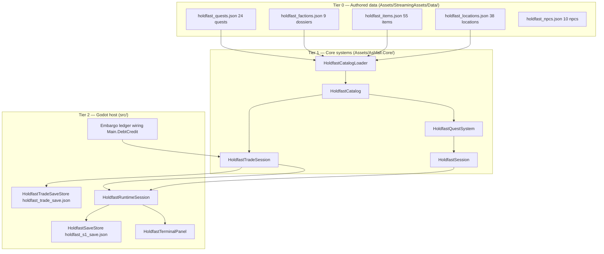
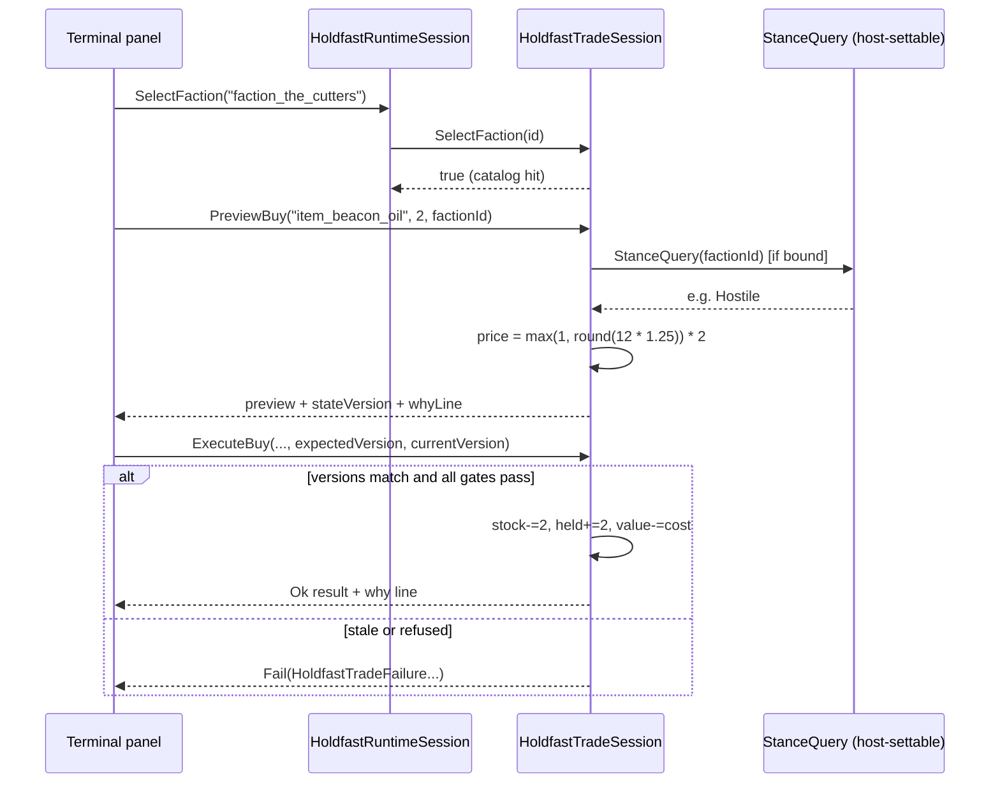

# Holdfast Hardening Implementation Log

## Phase 1 — Quest reachability

Status: PASS

Changed:

- Rejected unknown non-built-in quest IDs when a catalog is bound.
- Avoided creating placeholder progress for a rejected or blocked start.
- Added a regression test for the invented-ID path.
- Added `docs/holdfast/HOLDFAST_LOOP_MAP.md`.

Tests:

- `HoldfastQuestSystemTests`

Result:

- The quest runtime cannot silently create progress for content absent from
  the bound data authority.

Divergences:

- Trade stance pricing and why-lines are not changed in this phase because
  `HoldfastTradeSession.cs` already contains user work and the catalog lacks a
  reviewed stance-price contract.

---

# EXPANSION 2026-09-25 — Holdfast Hardening: Full Integration Framework & Code Architecture

This expansion is documentation-only. It preserves the Phase-1 log above
byte-for-byte and builds a complete engineering reference around it: what the
Holdfast domain owns today, how its parts are wired, what the quest
reachability rule means as a data-authority contract, and how a Phase-1
hardening pass is scoped, gated, and recorded in this repository.

---

## PART I — EXPANSION PREAMBLE

### I.1 Thesis

The original Phase-1 log is six lines of changed-items and one divergence
note. That brevity is correct for a hardening record but insufficient as an
engineering reference: a reader arriving in 2026-09 cannot tell from the log
alone what "rejected unknown non-built-in quest IDs when a catalog is bound"
protects, which files carry the rule, which tests pin it, or whether the
recorded trade divergence was ever closed. This expansion answers those
questions against the tree as it exists on 2026-09-25, and then generalises:
the Holdfast domain is small enough to hold in one head and mature enough to
exhibit every layer of the ASHFALL architecture contract (engine-free Core,
authoritative JSON, host façades, save ownership, focused tests). That makes
it the right vehicle for a full integration-framework write-up.

The through-line of the whole document is one sentence from the original log:

> The quest runtime cannot silently create progress for content absent from
> the bound data authority.

Everything else — the catalog loader, the trade session's unknown-faction
refusals, the identity contract tests, the rejection semantic matrices — is
the same principle wearing different coats: **presence in JSON is the only
path to runtime existence.** A game about ledgers, manifests, and requisition
slips should not have a runtime that invents ledger rows.

### I.2 Scope

| In scope | Out of scope (non-goals) |
|---|---|
| Every current owner in the Holdfast domain, with verified paths | Any new quest, trade, trust, or stance authority |
| The quest-reachability hardening as a specification | Re-opening the Phase-1 change itself; it is recorded history |
| Tier-by-tier data flow from JSON to terminal pixels | New save sections or parallel mutable state |
| The stance-pricing divergence's current status, stated honestly | Proposing a host wiring for `StanceQuery` (decision-blocked territory) |
| Trust/stance fragmentation mapped scalar by scalar | Unifying the fragments into a single aggregate |
| The hardening methodology as a repeatable genre | A new hardening pass; the queue authority is `INTEGRATION_PLANS.md` |

Per `AGENTS.md` rule 5 ("one authority per concern") and rule 10 ("stop when
authority is missing"), this document extends nothing and claims nothing. It
is a read-only artifact: one file, no code, no data, no tests.

### I.3 Evidence policy

Every path, class name, constant, multiplier, and data row in this expansion
was read from the working tree on 2026-09-25. Verification marks used
throughout:

- **Verified** — the claim was confirmed by reading the cited source, data,
  or document in the current working tree.
- **UNVERIFIED (log text)** — the claim appears in the Phase-1 log or another
  document but the underlying artifact was not (or could not be) re-verified;
  it is reproduced for historical fidelity, not asserted as current fact.
- **UNVERIFIED (repo memory)** — the claim circulates in coordination
  documents but no checked artifact confirms it today.

Where behavior depends on host wiring that does not exist (the notable case
being the trade session's `StanceQuery`), the absence is stated plainly
rather than smoothed over. A documentation expansion that invents integration
would be a very literal repeat of the bug the hardening fixed.

### I.4 Reading guide

| Reader | Start at | Then |
|---|---|---|
| Builder touching quest code | Part II audit | Part IV quest spec, Part V.1 |
| Builder touching trade or credit | Part V.3 | Part V.5 (stance), Part III save boundary |
| Integrator accepting a Holdfast package | Part II "what changed" | Part VII gate ladder |
| Sweeper / reviewer (read-only) | Part VII test matrix | Part II fragmentation finding |
| New agent learning the domain | Part III framework | Part V.2 loop chapter |
| Designer evaluating the loop | Part V.2, V.4, V.6 | Appendix VIII.29 (tone) |

Section counts and a size record are kept in the expansion self-audit
(Part VIII.26) and the closing postscript, so the expansion itself can be
audited the way it audits others.

### I.5 Document map

| Part | Contents |
|---|---|
| Part I — Expansion preamble | I.1 thesis, I.2 scope, I.3 evidence policy, I.4 reading guide, I.5 this map |
| Part II — Current authority audit (2026-09-25) | II.1 Core owners, II.2 data authority, II.3 host owners, II.4 test owners, II.5 documentation owners, II.6 host CLI routes, II.7 divergence status, II.8 smallest-domain summary |
| Part III — Integration framework | III.1 architecture invariants, III.2 tier-by-tier data flow, III.3 event flow, III.4 save capture/restore, III.5 determinism contract, III.6 the unknown-ID rule as contract, III.7 failure modes |
| Part IV — Code architecture | IV.1 module map, IV.2–IV.6 component specs (quest system, catalog/loader, trade session, panel + runtime session, save stores), IV.7 sequence walkthroughs |
| Part V — Domain chapters | V.1 quest reachability, V.2 the loop, V.3 trade session, V.4 faction dossiers, V.5 trust/stance fragmentation, V.6 panel UX, V.7 hardening methodology, V.8 quest catalog inventory, V.9 geography/NPCs, V.10 save envelope, V.11 flavor/identity/dispatch, V.12 deep coast, V.13 stance engine, V.14 session + event catalog, V.15 item economics, V.16 rejection/sold matrices |
| Part VI — Cross-system interaction matrix | VI.1 the matrix, VI.2 emergence scenarios, VI.3 interaction invariants |
| Part VII — Verification & acceptance | VII.1 focused test matrix, VII.2 test anatomy, VII.3 gate ladder, VII.4 acceptance criteria, VII.5 rollback plan |
| Part VIII — Appendices | VIII.1 glossary through VIII.30 production readiness notes (glossary, ID vocabularies, scenarios, open questions, divergence register, source index, method walkthroughs, authoring guides, diagnostics, misconceptions, history, seam contracts, units, change-safety classes, loop map restated, worked review, audit record, reader checklists, re-verification worksheet, cross-reference index, consolidated contracts, threat model, self-audit, errata protocol, domain in numbers, tone reading, readiness notes) |
| End of expansion | Scope statement and postscript |

---

## PART II — CURRENT AUTHORITY AUDIT (as of 2026-09-25)

Every row below was verified by reading the working tree on 2026-09-25. The
audit is the foundation for everything that follows: no later section cites a
path that this table has not already pinned.

### II.1 Core domain owners (`Assets/Ashfall.Core/`, engine-free)

| Owner | Path (relative to repo root) | Authority it holds | Key surface |
|---|---|---|---|
| Quest runtime | `Assets/Ashfall.Core/HoldfastQuestSystem.cs` | Quest progress, stage index, branch ids, ending id, spine flags | `TryStart`, `Advance`, `ChooseBranch`, `TickDaily`, `CaptureState`/`RestoreState` |
| Domain catalog | `Assets/Ashfall.Core/HoldfastCatalog.cs` | Locations, quests, items, factions loaded from four JSON files; loader + DTOs | `HoldfastCatalogLoader.Load`, `GetQuest`, `GetFaction`, `GetItem`, `GetLocation` |
| Faction catalog | `Assets/Ashfall.Core/HoldfastFactionsCatalog.cs` | Immutable-after-load faction roster, ordinal id map + insertion order | `Register`, `GetById`, `Contains`, enumerator |
| Item catalog | `Assets/Ashfall.Core/HoldfastItemsCatalog.cs` | Immutable item definitions (id, display, trade value, weight, stack) | `Register`, `GetById` |
| Trade session | `Assets/Ashfall.Core/HoldfastTradeSession.cs` (51,598 bytes) | Buy/sell pricing, stock, held inventory, value ledger, embargo/stance hooks, preview/execute | `Buy`, `Sell`, `PreviewBuy`/`ExecuteBuy`, `PreviewSell`/`ExecuteSell`, `GetWhyLine`, `CaptureState`/`TryRestoreState` |
| Domain session | `Assets/Ashfall.Core/HoldfastSession.cs` | Composition of ice road, census, brine, waystation, quests, catalog, deep coast; arrival/choice routing | `Load(dataDirectory, seedSalt, expansionUnlocked)`, `NotifyArrival`, `ApplyChoice`, `TickDaily` |
| S1 save envelope | `Assets/Ashfall.Core/HoldfastSave.cs` | `HoldfastSave` v5 (iceRoad, census, brineWater, quests, deepCoast, simDay, checksum) + frozen v1–v4 shapes | `HoldfastSaveCodec.Encode/Decode/Capture/Restore` |
| Frozen legacy shapes | `Assets/Ashfall.Core/HoldfastSaveFrozen.cs` | Versioned DTOs so old saves stay loadable | `IceRoadSystemStateV1toV3` et al. |
| Headless smoke | `Assets/Ashfall.Core/HoldfastHeadlessDemo.cs` | Wiring smoke: story gate, arrival advance, 12-C, lamps-out, brine unlock, catalog lock | `Run()` → `HeadlessReport` |
| NPC catalog | `Assets/Ashfall.Core/Narrative/HoldfastNpcCatalog.cs` | 10 Holdfast NPCs with faction ids, trust-building requirements, companion flags | `Register`, `GetById`, enumeration |
| Stance engine (Economy) | `Assets/Ashfall.Core/Economy/FactionStanceEngine.cs` | Runtime trust dict (−100..100), thresholds, trust inversion, stance classes | `GetTrust`, `ModifyTrust`, `GetStance`, `SnapshotTrust` |
| Stance types | `Assets/Ashfall.Core/Economy/FactionStanceTypes.cs` | Constants: raid −50, rob −20, min-trade −40, intel 40, cult day 30 | `FactionStanceConstants` |

The quest system's built-in id list and gates, verified from source:

- `SystemId = "holdfast_quest_system"`.
- Ten built-in spine ids: `quest_holdfast_the_sheet`, `quest_holdfast_the_clerk`,
  `quest_holdfast_the_window`, `quest_holdfast_the_plant`,
  `quest_holdfast_authentication`, `quest_holdfast_the_drawer`,
  `quest_holdfast_the_levy`, `quest_holdfast_the_membrane`,
  `quest_holdfast_the_second_list`, `quest_holdfast_the_hatch`.
- `SheetMinDay = 90`, `ClerkFallbackDay = 110`.
- Story gate: `TickDaily` starts the sheet only when
  `hasMapItem || hasFormulaLore || hasLettersLore` is true and day ≥ 90.
- Events: `OnQuestStarted`, `OnQuestStageChanged(string,int)`,
  `OnQuestCompleted`, `OnStateChanged(HoldfastQuestSystemState)`.

### II.2 Data authority (`Assets/StreamingAssets/Data/`)

| File | Wrapper key | Rows | Shape notes |
|---|---|---|---|
| `holdfast_quests.json` | `quests` | 24 | snake_case; `id`, `display_name`, `type`, `briefing`, `prereq_quest_id`, `min_day`, `knowledge_key`, `target_location_id`, `stages[]` (`id`,`text`), `choices[]` (`id`,`text`,`set_flag`) |
| `holdfast_factions.json` | `actions` | 9 | snake_case; `id`, `display_name`, `alignment`, `home_region`, `is_active`, `trust`, `wants[]`, `offers[]`, `signature_quote`, `access_rule`, `badge_asset_id` |
| `holdfast_items.json` | `items` | 55 | camelCase DTO fields (`displayName`, `tradeValue`, `stackMax`, `thirstRestore`, `hungerRestore`, `moraleEffect`) |
| `holdfast_locations.json` | `locations` | 38 | includes `dangerLevel`, `travelHours`, `baseRadsPerHour`, `region`, `overlay_on_unlock`, `recast_always` |
| `holdfast_flavor.json` | `factions`, `items` | 8 factions / 40 items | flavor prose overlays keyed by id |
| `holdfast_npcs.json` | `npcs` | 10 | `faction_id`, `role`, `trust_building_requirements[]`, `base_trust`, `is_companion` |

Two data facts worth pinning because they are easy to get wrong from memory:

1. **The factions wrapper key is `actions`, not `factions`.** The loader does
   not care — `CatalogLocator.LoadWrappedList<T>` binds the first array in the
   document — but anyone hand-writing a query or a validator against a
   `"factions"` key will find nothing. `schema_version` is 1.
2. **All nine authored `trust` values are 0.** The dossier trust scalar is an
   authored starting/attitude field, not live state; see Part V.5 for what
   actually behaves like trust at runtime.

Faction roster (ids verified in file order): `faction_the_office`,
`faction_the_cutters`, `faction_the_fleet`, `faction_black_flotilla`,
`faction_supply_corps`, `faction_railway_guild`, `faction_hydro_barons`,
`faction_ordnance_foundry`, `faction_scavengers`. Alignments observed:
`conditional`, `peaceful`. `faction_the_fleet` is the only `is_active: false`
row, which is why the trade session special-cases it as restricted.

### II.3 Host owners (`src/`, Godot presentation and adapters)

| Owner | Path | Responsibility |
|---|---|---|
| Terminal panel | `src/Host/HoldfastTerminalPanel.cs` (959 lines) | The five-tab terminal (status/faction/supply/inventory/trade); selection, refresh, keyboard close, trade actions, credit offers |
| Runtime session | `src/Host/HoldfastRuntimeSession.cs` (748 lines) | The playable boundary: world session + trade session + survival projections from `SurvivorsHostSession`, with headless fallbacks |
| S1 save store | `src/Host/HoldfastSaveStore.cs` | `holdfast_s1_save.json`, section `holdfast_s1`; thin façade over `SaveStore<HoldfastSave>` via `SaveStoreHub` |
| Trade save store | `src/Host/HoldfastTradeSaveStore.cs` | `holdfast_trade_save.json`, section `holdfast_trade`; backup rotation (keep-oldest `.bak`) and corruption quarantine |
| Presentation selftest host | `src/Host/HoldfastPresentationHostSession.cs` | Plan 51 presentation slate: room/actor/map projections, hazard and crisis bands |
| Trade save selftest | `src/Host/HoldfastTradeSaveStoreSelfTest.cs` | Round-trip and tamper checks for the trade ledger store |
| Main wiring | `src/Main.Holdfast.cs` (553 lines) | `SetupHoldfastRuntime`, `TickSimDay`, save/flush handlers, terminal button handlers (new ledger, ice road tick, briefing, census levy, Order 12-C, ending cycle, salt collection, membrane repair, outfall toggle) |
| Presentation wiring | `src/Main.HoldfastPresentation.cs` (101 lines) | Binds the presentation host session to the panel slate |
| Embargo wiring | `src/Main.DebtCredit.cs` (line ≈96) | `Trade.EmbargoQuery = factionId => _expansions.Embargoes.IsEmbargoed(...)`; shared by trade and the `TradeCreditCoordinator` |
| Shared stance | `src/Main.CampaignServices.cs` (line ≈201) | `EnsureSharedFactionStance()` — the shared `FactionStanceEngine` for the Economy domain |

`Main.CampaignOwners.cs` contributes a `HoldfastCoreDayOwner`
(`IDayAdvanceOwner`/`IPreDaySnapshotRestore`, private nested class), the
day-advance ownership seam for the S1 domain.

### II.4 Verification owners (`Ashfall.Core.Tests/`)

| File | Pins |
|---|---|
| `HoldfastQuestSystemTests.cs` (13 `[Fact]` methods) | id-list/catalog parity, story gate, min-day gate, unknown-id rejection, chain auto-start, stage text, branch fork, second-list timing, stage clamp, advance no-op, save round-trip |
| `HoldfastCatalogTests.cs` (5) | unique snake_case location ids, ten main quests registered, recasts always on, headless demo with catalogs, loader populates items and factions |
| `HoldfastSaveTests.cs` (25) | checksum stamping, round-trip of gate/census/brine/quests, idempotent restore, tamper/version/null rejection, v1→v2→v3→v5 migrations |
| `HoldfastTradeSessionTests.cs` | reset-to-defaults reuse, invalid price rejection, inventory capacity |
| `HoldfastTradeArbitrageTests.cs` (8) | neutral/allied/hostile buy and sell prices, why-line faction id, why-line stock warnings |
| `HoldfastFactionIdentityContractTests.cs` (6) | roster preservation, validated identity/trade fields, flavor profiles, NPC canonical faction ids, **trade save state must not duplicate static faction trust**, legacy alias ban |

### II.5 Documentation owners (`docs/holdfast/`)

Verified present: `HOLDFAST_LOOP_MAP.md` (added by Phase 1),
`HOLDFAST_REJECTION_SEMANTIC_MATRIX.md`, `HOLDFAST_SOLD_SEMANTIC_MATRIX.md`,
`HOLDFAST_FACTION_IDENTITY_MATRIX.md`, `HOLDFAST_FLAVOR_AUTHORITY_MAP.md`,
`HOLDFAST_FLAVOR_BASELINE_MATRIX.md`, `HOLDFAST_FLAVOR_DIFFERENTIATION_MATRIX.md`,
`HOLDFAST_FLAVOR_REACHABILITY_MATRIX.md`, `HOLDFAST_FLAVOR_SAVE_BEHAVIOR.md`,
`HOLDFAST_DISPATCH_CONSUMPTION_CONTRACT.md`,
`HOLDFAST_DISPATCH_COVERAGE_REPORT.md`, `PLAN128_*` series,
`PLAN131_HOLDFAST_FACTION_LAYER_CLOSEOUT.md`,
`PLAN117_PLAN128_IDENTITY_RECONCILIATION.md`.

The loop map (`HOLDFAST_LOOP_MAP.md`) is the authoritative one-page flow:
quest system → ice road / census / brine → `HoldfastSaveCodec` / campaign
section, with reachability rules, the trade boundary
(`PreviewBuy`/`PreviewSell` for display, `ExecuteBuy`/`ExecuteSell` to
commit), the save boundary (deep-copied quest restore, trade restore must not
clear a shared backing inventory), and a "Remaining work" line for stance
pricing/why-lines/arbitrage coverage. See II.7 for that line's status.

### II.6 Host CLI routes (verified in `Assets/Ashfall.Core/HostCliRegistry.cs`)

| Route | Group | Exercises |
|---|---|---|
| `--holdfast-briefing` | Expansions & Campaign Modules | Location count + every quest briefing from the catalog |
| `--holdfast-selftest` | Expansions & Campaign Modules | S1 survival loop, ice road, trade verification (`HoldfastHeadlessDemo` family) |
| `--holdfast-save-selftest` | Host Domains & Save Stores | S1 save write → reload → restore → checksum/tamper |
| `--holdfast-trade-save-selftest` | Host Domains & Save Stores | Trade ledger store round-trip and tamper checks |
| `--holdfast-runtime-uitest` | UI Tests & Gameplay Smoke | Terminal browse → trade → failed trade → save → reload (aliases `--holdfast-runtime-ui-test`, `--holdfast-runtime-selftest`) |
| `--holdfast-presentation-selftest` | UI Tests & Gameplay Smoke | Plan 51 presentation slate |
| `--ice-road-selftest` | Expansions & Campaign Modules | `IceRoadHeadlessDemo` (Exp 01 sibling) |
| `--ice-road-tick-demo` | Expansions & Campaign Modules | `IceRoadHeadlessDemo` tick path: unlock, clerk, 30 day ticks, catalog + briefing printout |

### II.7 What changed since 2026-09-05, and the divergence's status

The Phase-1 log recorded one divergence:

> Trade stance pricing and why-lines are not changed in this phase because
> `HoldfastTradeSession.cs` already contains user work and the catalog lacks
> a reviewed stance-price contract.

Status on 2026-09-25, stated in three parts:

1. **The Core pricing contract now exists. Verified.** `HoldfastTradeSession.cs`
   defines `HoldfastFactionStance { Allied = 0, Neutral = 1, Hostile = 2,
   Embargoed = 3 }`, a host-settable `Func<string, HoldfastFactionStance>?
   StanceQuery`, stance-multiplied `GetBuyPrice`/`GetSellPrice` (Allied 0.85×
   buy / 1.15× sell; Hostile 1.25× buy / 0.75× sell; else 1.0×), and
   `GetWhyLine` producing stance and stock explanations. Eight
   `HoldfastTradeArbitrageTests` cases pin the arithmetic and the why-line
   text, including faction-id presence in hostile lines.

2. **The catalog stance-price contract still does not exist. Verified by
   absence.** Prices are computed from `HoldfastItemDefinition.TradeValue`
   (authored per item in `holdfast_items.json` as `tradeValue`) times the
   code constants above. No JSON file authors per-faction price modifiers,
   price floors, or stance bands. So the second half of the original
   divergence reason — "the catalog lacks a reviewed stance-price contract" —
   remains literally true; the contract lives in code, reviewed only by the
   arbitrage tests, not in data.

3. **The host does not feed the stance query. Verified by absence.** A
   recursive search of `src/` finds no assignment to
   `Trade.StanceQuery`. The only host wiring into the session's stance/embargo
   surface is `Main.DebtCredit.cs` setting `EmbargoQuery` from the expansion
   embargo ledger. `HoldfastTradeArbitrageTests` sets `StanceQuery` in-test.
   Consequence: the live terminal currently trades at Neutral prices; the
   stance contract is reachable in Core and tests but not bound in the Godot
   host. `docs/holdfast/HOLDFAST_LOOP_MAP.md` still lists "faction
   stance-aware pricing, authored why-lines, and arbitrage property
   coverage" under Remaining work — the arbitrage clause of that line is now
   satisfied by the test file, while the binding clause is not. This is a
   documentation-drift candidate for the loop map's next revision, recorded
   here rather than edited there (one file per this expansion).

Related honest findings from the same sweep:

- `HoldfastTradeSession.SelectFaction` and `Buy` retain legacy allowances for
  `faction_the_office`, `faction_the_tempest`, and `faction_the_fleet`
  alongside the catalog check, plus an explicit `faction_nonexistent`
  rejection. These are guard-era accommodations from before the factions
  catalog landed; `HoldfastFactionIdentityContractTests` keeps alias drift in
  check for canonical sources. They are behavioral rough edges worth a future
  premise check, not defects this document fixes.
- The terminal's faction detail page
  (`HoldfastTerminalPanel.RefreshFactionDetails`) prints `faction.trust` —
  the static authored 0.0 from `holdfast_factions.json` — labelled "Trust:".
  The runtime `FactionStanceEngine` trust (−100..100) never reaches this
  panel. Part V.5 maps every such fragment.
- `HoldfastSession.ApplyChoice` calls `Quests.TryStart(questId, 1)` with
  day 1 as a synthetic day when the quest is not yet started; the
  `default: return true` arm of `PrereqsMet` permits non-spine starts. This
  is the one remaining path where a day-gated spine quest could be started
  out of order through a caller that drives `ApplyChoice` directly; host
  wiring drives spine progression through `TickDaily` instead. Noted as an
  observation for any future hardening pass.

### II.8 Smallest-domain summary

The Holdfast domain, in one paragraph: four JSON files load into one
immutable catalog; one quest runtime refuses any quest id that is neither in
the catalog nor one of ten built-in spine ids; one trade session owns all
price math and refuses unknown items, unknown factions, restricted
counterparties, embargoed counterparties, bad quantities, overflowing prices,
and full inventories; one host panel projects all of it through selections
that are themselves catalog-validated; two save stores persist the S1
envelope (checksummed, versioned, migrated) and the trade ledger (rotated
backup, quarantined corruption); and the trust surface is deliberately
fragmented between an authored dossier scalar, a runtime stance engine in the
Economy domain, and a four-state stance enum inside the trade session that
nothing in the host currently drives. The Phase-1 hardening's contribution
was to make the first of those paragraphs enforceable: the runtime cannot
author progress for content the data authority does not contain.

---

## PART III — INTEGRATION FRAMEWORK

This part states the ASHFALL architecture invariants as they apply to
Holdfast, then walks the tiered data flow, event flow, save path,
determinism contract, and integrity validation that make the domain
integrated rather than merely implemented.

### III.1 Architecture invariants applied to Holdfast

| # | Invariant (from `AGENTS.md`) | Holdfast expression | Enforcement |
|---|---|---|---|
| 1 | Core stays engine-free | `HoldfastQuestSystem`, `HoldfastCatalog`, `HoldfastTradeSession`, `HoldfastSession`, `HoldfastSave` reference only `System.*` and `Ashfall.Core.*` | Namespace inspection; tests compile against `netstandard2.1` |
| 2 | JSON data is authoritative | Quest prose, faction dossiers, item economics, location geography all load from `holdfast_*.json`; the runtime stores ids, not copies of prose | Catalog tests; unknown-id rejection |
| 3 | One authority per concern | Quest progress → `HoldfastQuestSystem`; price math → `HoldfastTradeSession`; trust deltas → `FactionStanceEngine`; trade persistence → `HoldfastTradeSaveStore`; S1 world persistence → `HoldfastSaveStore` | Identity contract test: trade save state must not duplicate static faction trust |
| 4 | Preserve deterministic and persistent behavior | Seeded salt into `IceRoadSystem`/`District8DeepCoastSystem`; no `System.Random` in any Holdfast Core file (verified by read); checksummed, versioned saves with frozen legacy shapes | `HoldfastSaveTests` migrations; determinism of `TickDaily` chain |
| 5 | Core events expose facts; hosts apply presentation | `OnQuestStarted(id)` etc. carry facts; `HoldfastSession.Wire` translates them into sibling-authority unlocks; the panel only renders and calls command methods | The panel owns no counters; it reads `HoldfastRuntimeSession` |
| 6 | A panel exposes an existing command and truthful state | Every terminal action calls a session/trade command; selection methods re-validate against the catalog; test-only `*Raw` setters are marked as such | Panel source; runtime uitest route |
| 7 | Focused verification | One test file per concern; host selftests per save store; headless demos per wiring slice | `TEST_POLICY.md`; per-file test matrices in Part VII |

### III.2 Tier-by-tier data flow



Tier rules:

- **Tier 0 → 1** happens once per session through
  `HoldfastCatalogLoader.Load(dataDirectory, expansionUnlocked)`. Parse
  failures log and skip; they never throw into the caller and never leave a
  half-built default row behind. A missing directory yields an empty catalog
  plus a warning — which matters because an *empty* catalog disarms the
  unknown-id rejection gate (`_catalog.Count > 0`), falling back to the
  built-in spine only. That asymmetry is deliberate: a data fault must
  degrade to known-good spine content, not to invented content.
- **Tier 1 internal** — `HoldfastSession` composes the systems and wires
  cross-authority reactions in `Wire()`: sheet start unlocks the ice road,
  clerk start notifies the ice road, window start/completion unlocks the
  waystation, plant completion unlocks the salt trade, brine steam trips
  offer the membrane quest. Every reaction routes an event from one owner
  into a public command of another owner; nothing writes a sibling's fields
  directly.
- **Tier 1 → 2** — `HoldfastRuntimeSession` holds the `CoreDemoSession`
  world plus the `HoldfastTradeSession`, binds the survivors session for
  survival projections, and is the only object the panel talks to.
- **Tier 2 → 0** — persistence writes ids and scalars, never prose. The
  save stores serialize `HoldfastSave`/`HoldfastTradeSaveState`; on restore
  the catalog is re-loaded from JSON and ids are resolved against it, so an
  item removed from data after a save simply stops resolving rather than
  resurrecting with stale authored text.

### III.3 Event flow

Quest-side facts, in firing order for a typical spine advance:

1. `HoldfastQuestSystem.Advance` increments `stage`.
2. If the new stage equals the authored `StageCount`, the quest completes:
   `completed = true`, the spine-specific state flag is set
   (`sheetObtained`, `plantVisited`, `authenticated`, `drawerRead`), and
   `OnQuestCompleted(id)` fires.
3. `OnQuestStageChanged(id, stage)` fires (also on completion).
4. `RaiseChanged()` fires `OnStateChanged(state)` last, once per mutation.
5. Host-side, `HoldfastSession.Wire`'s subscriptions translate completed ids
   into sibling commands (unlock salt trade after the plant, unlock the
   waystation after the window) — the *only* place such cross-domain rules
   are allowed to live.
6. `TickDaily(day, ...)` runs auto-starts in spine order after the session
   fans the tick out to ice road, census, brine, waystation, and quests.

Trade-side facts:

1. `PreviewBuy`/`PreviewSell` validate every rule and return a
   `CommandPreview` with a `stateVersion`; they mutate nothing.
2. `ExecuteBuy`/`ExecuteSell` re-run the same validation path, compare the
   expected state version for optimistic concurrency, and only then mutate
   stock, held items, value, and raise `StateChanged`.
3. Refusals carry a typed `HoldfastTradeFailure`, which the panel maps to
   faction-voiced rejection prose via the dispatch semantic matrices
   (`HOLDFAST_REJECTION_SEMANTIC_MATRIX.md`), so a mechanical refusal and its
   fictional explanation are joined only at the presentation edge.

### III.4 Save capture and restore

Two stores, two scopes, one envelope owner:

| Concern | Store | File | Section | Shape owner |
|---|---|---|---|---|
| S1 world + quest snapshot | `HoldfastSaveStore` | `user://holdfast_s1_save.json` | `holdfast_s1` | `HoldfastSave` v5 (`HoldfastSaveCodec`) |
| Trade ledger | `HoldfastTradeSaveStore` | `user://holdfast_trade_save.json` | `holdfast_trade` | `HoldfastTradeSaveState { schemaVersion, value, held, stock }` |

Capture rules verified in source:

- Quest capture deep-copies every `HoldfastQuestProgress` row;
  `RestoreState` deep-copies again so the deserialized DTO can never alias
  the live list (the Phase-1 comment in `RestoreState` records the aliasing
  bug this prevents).
- `HoldfastSave` stamps `saveVersion` and a `Checksum` computed over the
  other fields; tampered, version-zero, newer-version, checksumless, and
  bare-object payloads are rejected by the codec and pinned by
  `HoldfastSaveTests`. `RestoreThenRecaptureProducesSameChecksum` pins
  restore determinism.
- Frozen v1/v2/v3 DTO classes preserve the exact historical field sets so
  migration cannot silently reshape an old save; v5 adds the deep-coast
  route and migrates forward with a freshly sealed route.
- The trade store rotates the previous file to `.bak` only while no backup
  exists (keep-oldest policy) and quarantines corrupt files instead of
  deleting them.
- The trade save state carries `held`/`stock` as id→count maps. Canonical
  item definitions stay in the catalog; ids resolve on restore. The
  identity contract test additionally forbids duplicating the static faction
  `trust` scalar into this state.

### III.5 Determinism contract

- **No `System.Random`.** Verified by reading every Holdfast Core file: the
  only randomness enters as a caller-supplied `seedSalt` integer into
  `IceRoadSystem` and `District8DeepCoastSystem`. `HoldfastSession.Load`
  threads the same salt into both, so a seed replays the same ice-road and
  deep-coast behavior for the same tick sequence.
- **Stable iteration.** `HoldfastQuestSystem` stores the spine order in the
  `MainQuestIds` array and `TickDaily` auto-starts in array order.
  `HoldfastFactionsCatalog` keeps a `List` alongside its dictionary so
  enumeration follows insertion (file) order, not hash order. The trade
  session's default stock initialization walks `catalog.Items.Items` in
  registration order.
- **Clamped, not thrown.** Stage reads clamp to `[0, StageCount-1]`;
  `GetStageText` never indexes out of the authored array even when a restored
  progress row carries a stale stage index. Same policy in the price path:
  `Math.Max(1, ...)` floors unit prices so a zero-value authored item cannot
  produce a free transaction or a divide-by-zero.
- **Restore-then-recapture stability.** Pinned by
  `HoldfastSaveTests.RestoreThenRecaptureProducesSameChecksum`.
- **Time is a parameter.** Every day-dependent decision receives `day` as an
  argument (`TryStart(id, day)`, `TickDaily(day, ...)`); nothing reads a
  wall clock. The embargo wiring passes `DebtCampaignDay()` explicitly.

### III.6 Integrity validation — the unknown-ID rule as a data-authority contract

The hardening's core rule, in source form:

```csharp
public bool TryStart(string questId, int day)
{
    if (string.IsNullOrEmpty(questId)) return false;
    if (_catalog.Count > 0 && GetDef(questId) == null && !IsBuiltInQuestId(questId))
        return false;
    // ... only after every rejection path: GetOrCreate
}
```

Read as a contract, not a guard:

1. **Catalog ids are the existence predicate.** When a non-empty catalog is
   bound, a quest id exists at runtime if and only if it is present in
   `holdfast_quests.json` (or is one of the ten built-in spine ids, which the
   same file also authors — the built-in list exists so the spine can run
   even when the catalog load degrades to empty).
2. **Rejection precedes creation.** `GetOrCreate` is unreachable for a
   rejected id; `GetProgress(inventedId)` stays `null`. There is no "unknown
   quest" placeholder row that later mutates into real progress. This is what
   the original log means by "avoided creating placeholder progress for a
   rejected or blocked start."
3. **Blocked starts behave identically.** A day-gated or prereq-gated refusal
   (`PrereqsMet` false) takes the same path: no row, no events, no state
   change. Callers cannot distinguish "unknown" from "not yet allowed" by
   probing for placeholder state — both leave `GetProgress` null and both
   return `false`.
4. **The catalog is the same authority everywhere.** The terminal's
   `SelectFaction`/`SelectItem` re-validate against the same catalog before
   committing a selection; the trade session re-validates ids against the
   same catalog at execution; the identity contract tests pin the roster.
   One authority, checked at every seam.
5. **Test-pinned parity.** `HoldfastQuestSystemTests.EveryMainQuestIdExistsInCatalog`
   walks `MainQuestIds` against the live JSON (its header records that this
   exact pattern caught the `quest_holdfast_the_authentication` typo), and
   `TryStart_UnknownCatalogQuest_IsRejectedWithoutCreatingProgress` pins
   `TryStart("quest_holdfast_not_authored", 200) == false` plus
   `GetProgress(...) == null`. `HoldfastCatalogTests.TenMainQuestsRegistered`
   keeps the spine count fixed.

The mirrored rule in the trade session:

```csharp
if (factionId == "faction_nonexistent" ||
    (_catalog?.GetFaction(factionId) == null && ...legacy allowances...))
    return Fail("Unknown faction: " + factionId, HoldfastTradeFailure.UnknownFaction);
```

A trade against an id absent from `holdfast_factions.json` is refused with a
typed failure before any price is computed. Same philosophy, second seam:
**presence in JSON is the only path to runtime existence.** (The legacy
allowances for `faction_the_office`, `faction_the_tempest`, and the
restricted `faction_the_fleet` handling are recorded in II.7 as observed
rough edges.)

### III.7 Failure modes and degradations

| Fault | Observed behavior (verified in source) | Design intent |
|---|---|---|
| Data directory missing | Loader warns, returns empty catalog; session still constructs | Spine built-ins keep the story runnable; rejection gate disarms rather than dead-ends |
| One JSON file unparseable | Error logged for that file; other three load | Partial degradation with a precise log line naming the file |
| Quest row missing `stages` | `StageCount == 0`; `GetStageText` returns ""; `Advance` uses fallback max of 4 for max-stage math | Display never throws; completion still bounded |
| Unknown quest id at runtime | `TryStart` false, no progress row, no events | The Phase-1 hardening itself |
| Unknown faction id in trade | Typed `UnknownFaction` failure before pricing | Same rule at the trade seam |
| Restricted counterparty (`faction_the_fleet`) | Typed `UnavailableOrRestricted` failure | Dormant dossier row (`is_active: false`) enforced in code |
| Embargoed counterparty | Typed `Embargoed` failure; credit coordinator queries the same ledger | "Credit can never bypass what trade cannot" (wiring comment) |
| Stale preview committed | `ExecuteBuy`/`ExecuteSell` re-validate and compare state versions | Stale previews cannot commit silently (loop-map trade boundary) |
| Corrupt trade save | Quarantined, previous `.bak` retained | Keep-oldest rotation; no data deletion |
| Save checksum mismatch / wrong version | Codec rejects; `HoldfastSave?` null to caller | Fail closed, pinned by ~10 save tests |
| Stage index out of range after restore | Clamped to final authored stage | Display robustness, pinned by `StageTextClampsAtLastStage` |

---

## PART IV — CODE ARCHITECTURE

### IV.1 Module map

```text
Assets/Ashfall.Core/
  HoldfastQuestSystem.cs        quest progress authority (this hardening's subject)
  HoldfastCatalog.cs            catalog aggregate + loader + quest/item/faction DTOs
  HoldfastFactionsCatalog.cs    faction entry + immutable roster
  HoldfastItemsCatalog.cs       item definition + immutable catalog
  HoldfastTradeSession.cs       trade pricing/stock/held authority + embargo/stance hooks
  HoldfastSession.cs            domain composition + cross-authority wiring
  HoldfastSave.cs               v5 envelope + codec + frozen v1-v3 shapes
  HoldfastSaveFrozen.cs         legacy ice-road DTO set
  HoldfastHeadlessDemo.cs       wiring smoke (story gate → catalog lock)
  Narrative/HoldfastNpcCatalog.cs  holdfast_npcs.json roster
  Economy/FactionStanceEngine.cs   runtime trust + stance classes (Economy domain)
  Economy/FactionStanceTypes.cs    stance constants + thresholds DTO
src/
  Host/HoldfastTerminalPanel.cs        five-tab terminal (PanelContainer)
  Host/HoldfastRuntimeSession.cs       playable boundary
  Host/HoldfastSaveStore.cs            S1 save façade
  Host/HoldfastTradeSaveStore.cs       trade ledger façade + rotation/quarantine
  Host/HoldfastPresentationHostSession.cs  Plan 51 slate
  Host/HoldfastTradeSaveStoreSelfTest.cs   trade store round-trip selftest
  Main.Holdfast.cs                     runtime setup, sim tick, button handlers
  Main.HoldfastPresentation.cs         slate binding
  Main.DebtCredit.cs                   embargo query + credit coordinator wiring
  Main.CampaignServices.cs             shared FactionStanceEngine accessor
  Main.CampaignOwners.cs               HoldfastCoreDayOwner day-advance seam
Assets/StreamingAssets/Data/
  holdfast_quests.json / holdfast_factions.json / holdfast_items.json
  holdfast_locations.json / holdfast_flavor.json / holdfast_npcs.json
```

Ownership arrows (who may write what):

- Only `HoldfastQuestSystem` writes `HoldfastQuestProgress` rows.
- Only `HoldfastTradeSession` writes price/stock/held/value state.
- Only `HoldfastSession.Wire` couples quest events to sibling systems.
- Only the host save stores write files; Core only produces/consumes DTOs.
- Only the catalog loader writes catalog collections, and only during `Load`.
- The panel writes nothing but its own selection fields — every gameplay
  mutation is a command into `HoldfastRuntimeSession`.

### IV.2 Component spec — `HoldfastQuestSystem`

**Responsibility.** Own quest progress (started/stage/completed/failed/
branch), the spine's derived flags, and the ending id. Refuse to start
anything the bound data authority does not contain. Auto-start the spine on
daily ticks when gates open.

**Public API (verified signatures).**

| Member | Contract |
|---|---|
| `BindCatalog(IReadOnlyList<HoldfastQuestEntry>)` | Replaces the bound definitions; pass null → empty |
| `TryStart(string questId, int day) : bool` | Unknown-id rejection, idempotency guard (started/completed/failed rows refuse), prereq + day gates; creates the row only after all gates pass |
| `Advance(string questId) : bool` | Requires a started, unfinished row; increments stage; completes at `StageCount`; fires completion events |
| `ChooseBranch(string questId, string branchId) : bool` | Records the branch, then advances (branch + advance is one mutation) |
| `TickDaily(int day, bool hasMapItem, bool hasFormulaLore, bool hasLettersLore)` | Story-gated spine auto-starts in fixed order |
| `GetDef/GetProgress/GetStageText/GetBriefing/GetDisplayName` | Catalog-backed reads; stage text clamps to the last authored stage |
| `HasRefuseBranch() : bool` | True when the levy row carries `CensusClaimSystem.FlagLevyRefuse` |
| `SetEnding(string endingId)` | Records the S4 ending id |
| `CaptureState() / RestoreState(state)` | Deep-copy both directions; repair null lists; normalize `systemId` |
| Events | `OnQuestStarted`, `OnQuestStageChanged(id, stage)`, `OnQuestCompleted`, `OnStateChanged` |

**State DTO** (`HoldfastQuestSystemState`, serialized into `HoldfastSave.quests`):

```json
{
  "systemId": "holdfast_quest_system",
  "quests": [
    {
      "questId": "quest_holdfast_the_sheet",
      "stage": 4,
      "started": true,
      "completed": true,
      "failed": false,
      "branchId": ""
    },
    {
      "questId": "quest_holdfast_the_levy",
      "stage": 0,
      "started": true,
      "completed": false,
      "failed": false,
      "branchId": "flag_levy_refuse"
    }
  ],
  "endingId": "",
  "sheetObtained": true,
  "plantVisited": true,
  "authenticated": true,
  "drawerRead": true
}
```

(`branchId` values shown are the census flags referenced by
`HasRefuseBranch`; exact authored flag strings live in
`CensusClaimSystem`.)

**Prerequisite chain** (verified from `PrereqsMet`):

| Quest | Opens when |
|---|---|
| the_sheet | day ≥ 90 |
| the_clerk | sheet started, or day ≥ 110 (fallback) |
| the_window | clerk started |
| the_plant | window started or completed |
| authentication | plant completed, or `plantVisited` flag |
| the_drawer | authentication completed, or `authenticated` flag |
| the_levy | drawer completed, or `drawerRead` flag |
| the_membrane | levy started or completed |
| the_second_list | membrane completed, or levy refuse branch |
| the_hatch | second list started, or an ending id is set |

The flag-based disjuncts (`plantVisited || completed`) are what make arrival
paths (`NotifyArrival`) and event paths (`ResolveMembrane`) able to unlock
the next spine quest without forcing a specific advance route.

**Failure modes.** Unknown id → silent false (by design; the regression test
documents it). Re-start of a completed quest → false (idempotency). Advance
of an unstarted quest → false (`AdvanceWithoutStartIsNoOp`). Stage overflow
→ clamp. Null/empty catalog → built-in spine only, gate disarmed by design.

**Performance.** Linear scans over ≤ 24 quests and ≤ 9 factions; all O(n)
with n small enough that the scans are cheaper than any indexing
infrastructure. `TryStart` allocates nothing on refusal.

### IV.3 Component spec — `HoldfastCatalog` and the loader

**Responsibility.** Load the four authored files into immutable collections;
provide id lookups; strip authoring notes; honor the expansion-unlock gate.

**DTO / entry shapes** (verified field lists):

`HoldfastQuestEntry` — `id`, `display_name`, `type`, `briefing`,
`prereq_quest_id`, `min_day`, `knowledge_key`, `target_location_id`,
`stages[]` (`id`, `text`), `choices[]` (`id`, `text`, `set_flag`),
computed `StageCount`.

Example authored quest row (abridged from `holdfast_quests.json`, row 1):

```json
{
  "id": "quest_holdfast_the_sheet",
  "display_name": "The Sheet That Shouldn't",
  "type": "expedition",
  "briefing": "Bram sells you a waxed sheet of the estuary. A road is drawn
    where summer water should be...",
  "prereq_quest_id": "",
  "min_day": 90,
  "knowledge_key": "lore_hf_sheet",
  "target_location_id": "loc_ice_road_gate",
  "stages": [
    { "id": "stage_1", "text": "Bought / copied item_map_sheet_ice_road..." },
    { "id": "stage_2", "text": "Compared to Kittiwake log (if owned)..." },
    { "id": "stage_3", "text": "Asked a Lamplighter about Kilometre 19..." },
    { "id": "stage_4", "text": "Survived the asking..." }
  ],
  "choices": [
    { "id": "pay_bram", "text": "...", "set_flag": "" },
    { "id": "copy_leave", "text": "...", "set_flag": "" }
  ]
}
```

`HoldfastFactionEntry` — `id`, `display_name`, `alignment`, `home_region`,
`is_active`, `trust` (float), `wants[]`, `offers[]`, `signature_quote`,
`access_rule`, `badge_asset_id`; plus `FactionDescription()` returning
restrained prose for `order` / `chaos` / `neutral` / other alignments. The
DTO-with-conversion pattern exists because the entry defines both `id` and
`Id`, which collide under case-insensitive deserialization — the loader
therefore deserializes `HoldfastFactionDto` and constructs entries itself.

Example authored faction dossier (abridged from `holdfast_factions.json`):

```json
{
  "id": "faction_black_flotilla",
  "display_name": "The Black Flotilla",
  "alignment": "conditional",
  "home_region": "coastal_shelf",
  "is_active": true,
  "trust": 0,
  "wants": ["item_marine_sealant_kit", "medicine", "fuel",
            "dried_rations", "charts"],
  "offers": ["item_sea_ration", "item_brine_protein_tin",
             "item_sealed_dive_lamp", "item_descent_line",
             "dive_coordinates", "storm_warnings"],
  "signature_quote": "The sea keeps what it takes. We keep what we raise.
    Everything else is argument.",
  "access_rule": "Flag traffic is hailed, boarded, and priced. Marked
    salvage claims outrange weapons; a claim tag counts as a signature on
    the water...",
  "badge_asset_id": ""
}
```

`HoldfastItemDto` — camelCase JSON (`displayName`, `tradeValue`, `weight`,
`type`, `stackMax`, `thirstRestore`, `hungerRestore`, `moraleEffect`)
converted into immutable `HoldfastItemDefinition` at load. Example:
`item_map_sheet_ice_road`, "Ice Road Sheet", type `Quest`, stack 1, weight
0.4, trade value 12.0.

**Loader behavior.**

| Rule | Effect |
|---|---|
| `DirectoryExists` guard | Missing directory → warning, empty catalog |
| Per-file existence guard | Missing file → named warning, rest load |
| Parse failure | Error log naming the file; partial catalog kept |
| `IncludeLocation(e, expansionUnlocked)` | `recast_always` rows always load (3 rows in the holdfast file: the desalination recast and the two shelf recasts); every other row — including all nine `overlay_on_unlock` rows — loads only when unlocked |
| `StripAuthorNotes` | Removes "(existing)" / "(recast; ...)" suffixes from display names before storage |
| First-array binding | `CatalogLocator.LoadWrappedList<T>` binds the document's first array — hence `actions` works as a wrapper key |
| Id dedupe | `Register` refuses null/empty/duplicate ids (ordinal compare) |

**Failure modes.** A typo'd quest id in a `prereq_quest_id` or
`target_location_id` does not fail load — the catalog stores what is
authored. Those references are validated by use: `NotifyArrival` compares
`target_location_id` against visited ids (an unmatchable id simply never
advances), and the quest id master list is pinned against the file by
`HoldfastQuestSystemTests`. Presence in JSON is existence; *correctness* of
references is a test and integration concern, which is exactly the split the
hardening documented.

### IV.4 Component spec — `HoldfastTradeSession`

**Responsibility.** Own all trade math and mutable trade state: buy/sell
pricing (catalog value × stance multiplier, floored at 1), merchant stock,
held inventory (standalone map or a bound backing `Inventory.Inventory`),
the value ledger, embargo and stance query hooks, and the preview/execute
command surface.

**State.**

```json
{
  "schemaVersion": 0,
  "value": 100,
  "held": { "item_dried_rations": 4, "item_lamp_oil": 2 },
  "stock": { "item_dried_rations": 18, "item_lamp_oil": 20 }
}
```

`held` maps canonical item ids to player-held counts (or proxies a bound
survivors inventory); `stock` maps canonical item ids to counterparty
quantities, initialized to 20 per catalog item; `value` is the player's
trade worth in long.

**Pricing (verified constants).**

| Direction | Neutral | Allied | Hostile |
|---|---|---|---|
| Buy (player pays) | 1.00× | 0.85× | 1.25× |
| Sell (player receives) | 1.00× | 1.15× | 0.75× |

Unit price = `max(1, round(baseValue × mult))`, where the base value is
itself floored by truncation to `max(1, trunc(tradeValue))`; line total =
unit × quantity, computed in long with an overflow-checked conversion
(`InvalidPrice` failure on overflow). `Embargoed` stance does not modulate
price — the embargo refuses the transaction outright before pricing. These
multipliers are exercised where a `StanceQuery` is bound (the arbitrage
tests); no host code binds one, so the live terminal prices at Neutral
(II.7).

**Why-lines** (`GetWhyLine`), assembled as space-joined bracketed parts:

- Buy: `[Allied discount applied]` / `[Hostile surcharge — {factionId} stance]`
- Sell: `[Allied bonus applied]` / `[Hostile penalty — {factionId} stance]`
- Stock: `[Stock critical — limited availability]` (< 3) / `[Stock low]` (< 8)
- Empty string when nothing applies (neutral stance, healthy stock)

**Command surface.** `PreviewBuy`/`PreviewSell` return a preview carrying a
`stateVersion`; `ExecuteBuy`/`ExecuteSell` re-run the same validation and
take expected/current version arguments for optimistic concurrency. The
loop map's rule — previews for display, execute variants to commit — is
this pair.

**Failure taxonomy** (`HoldfastTradeFailure`): `None`,
`InvalidQuantity`, `InsufficientFunds`, `InsufficientStock`,
`InsufficientInventory`, `UnknownItem`, `UnknownFaction`,
`UnavailableOrRestricted`, `InventoryCapacity`, `InvalidPrice`,
`Embargoed`. `FundsFailure` additionally carries the funds-ledger failure
kind when credit is involved.

**Validation order in `Buy` (verified).** Unknown item → unknown faction →
restricted faction → embargo → quantity ≤ 0 → stock < quantity → price
overflow → funds < cost → capacity/weight → commit. Order matters: identity
failures are cheap and precede embargo and economics, so a refused
counterparty never leaks price information in its failure.

### IV.5 Component spec — `HoldfastTerminalPanel` and `HoldfastRuntimeSession`

**Runtime session.** The single playable boundary: exposes `World`
(`CoreDemoSession`), `Trade` (`HoldfastTradeSession`), the catalog, and
survival projections. Survival numbers are read through the bound
`SurvivorsHostSession` (needs/radiation authority) with explicit fallback
fields for headless use — the projections never write back to fallback state
when a real survivor exists, so there is no shadow health ledger.
`EffectiveInventory` resolves in order: inventory host session → legacy
inventory property → trade session's player inventory.

**Panel structure** (five fixed tabs, verified method list):

| Tab | Builder | Refresher |
|---|---|---|
| Status | `BuildStatusPage` | `RefreshStatus` |
| Factions | `BuildFactionPage` | `RefreshFactions` / `RefreshFactionDetails` |
| Supplies | `BuildSupplyPage` | `RefreshSupplies` / `RefreshSupplyDetails` |
| Inventory | `BuildInventoryPage` | `RefreshInventory` |
| Trade | `BuildTradePage` | `RefreshTradeSelector` / `RefreshTradeDetails` / `UpdateTradeActions` / `UpdateCreditButton` |

**Lifecycle.** `BindSession(HoldfastRuntimeSession)` attaches the session;
`OpenTerminal`/`CloseTerminal` toggle visibility and raise `Closed` (the
host uses it to release focus and flush state). `RefreshView` sets a
`_refreshing` guard, refreshes list widgets first, then detail panes — the
guard re-entrancy protection keeps selection callbacks from re-entering
refresh during a refresh. `EnsureSelections` guarantees a valid default
selection per list, validated against the catalog.

**Selection validation.** `SelectFaction(id)` requires
`Trade.SelectFaction(id)` to accept (catalog check inside the trade session)
before storing the selection and refreshing; `SelectItem(id)` requires
`Catalog.GetItem(id) != null`. `SelectFactionRaw`/`SelectItemRaw` skip
validation and are commented test-only. There is no path by which the panel
holds a selection the catalog cannot resolve.

**Credit.** `BindCredit(TradeCreditCoordinator)` follows the Plan IV rule
recorded in the panel's own comment: the panel never signs anything
implicitly — an insufficient-funds refusal may *show* a credit offer, and
only the explicit accept button signs it. `UpdateCreditButton` reflects the
pending offer state.

**Failure/edge behavior.** Unbound session → refresh no-ops. Unknown
selection → selection refused, previous retained. Trade result →
`ShowTradeResult(result)` renders success prose or the faction-voiced
rejection from the semantic matrices. Audio cues fire for trade success and
invalid action (`AudioManager.PlayCue`), keeping feedback non-visual where
possible.

### IV.6 Component spec — the two save stores

**`HoldfastSaveStore`** — façade over `SaveStore<HoldfastSave>` (codec
flavor) obtained from `SaveStoreHub`. File `holdfast_s1_save.json`, section
`holdfast_s1`. Surface: `TrySave`/`TryLoad` (through codec, checksum
stamped), `TryCapture`/`TryRestore` (JSON without disk IO),
`TryCaptureDirect`/`TryRestoreDirect` (aggregate), `TryCapturePersisted`
(exact persisted bytes for the campaign envelope). The store owns nothing
about the shape; validation lives in `HoldfastSaveCodec`.

**`HoldfastTradeSaveStore`** — same façade pattern plus two host-side
responsibilities that need direct file access: keep-oldest backup rotation
(move current to `.bak` only when no `.bak` exists) and corruption
quarantine (a failed load is moved aside, not deleted). File
`holdfast_trade_save.json`, section `holdfast_trade`. The save envelope
class is private to the store; callers only see `HoldfastTradeSaveState`.

**Envelope interplay.** The campaign envelope captures the S1 store's exact
persisted bytes via `TryCapturePersisted`, so the campaign save and the
standalone store can never disagree about what was written. Restore is the
mirror: the envelope hands back bytes, the codec validates them, and a
mismatch fails closed.

### IV.7 Sequence walkthroughs

**A. Bind catalog → start authored quest → reject unknown id → save/reload.**

```mermaid
sequenceDiagram
    participant Host as Host (Main.Holdfast)
    participant Ses as HoldfastSession
    participant Q as HoldfastQuestSystem
    participant Store as HoldfastSaveStore
    Host->>Ses: Load(dataDir, seedSalt, unlocked)
    Ses->>Ses: loader.Load(dataDir) -> catalog
    Ses->>Q: BindCatalog(catalog.Quests)
    Host->>Q: TickDaily(90, map=true, lore=false, letters=false)
    Q->>Q: storyGate && day>=90 && !started(Sheet)
    Q-->>Host: OnQuestStarted(the_sheet), OnStateChanged
    Host->>Q: TryStart("quest_holdfast_not_authored", 200)
    Q-->>Host: false  (catalog bound, id absent, not built-in)
    Note over Q: GetProgress("quest_holdfast_not_authored") stays null
    Host->>Q: CaptureState()
    Q-->>Host: deep-copied HoldfastQuestSystemState
    Host->>Store: TrySave(HoldfastSave{ quests = state })
    Store->>Store: codec stamps version + checksum, atomic write
    Host->>Store: TryLoad()
    Store-->>Host: HoldfastSave (checksum verified)
    Host->>Q: restored.RestoreState(saved.quests)
    Note over Q: deep-copy again; DTO never aliases live state
```

Failure overlays: if `holdfast_quests.json` failed to parse, the bind step
receives an empty list, the gate disarms, and `the_sheet` still starts (the
built-in path) — degraded but never invented. If the save's checksum is
tampered, `TryLoad` returns null and the host keeps the prior state.

**B. A trade session with stance-gated pricing.**



Verified caveat (II.7): no host code currently assigns `StanceQuery`, so in
the live terminal the lookup at step five yields `null` and pricing runs at
Neutral. The sequence above is the designed contract, exercised by
`HoldfastTradeArbitrageTests` with a test-supplied query.

---

## PART V — THE BULK: DOMAIN CHAPTERS

Sixteen chapters, in reading order: V.1 the quest-reachability contract;
V.2 the Holdfast loop; V.3 the trade session; V.4 faction dossiers; V.5
trust and stance fragmentation; V.6 the panel UX contract; V.7 the
hardening methodology; V.8 the quest catalog inventory; V.9 geography and
the NPC roster; V.10 the save envelope; V.11 flavor, identity, and
dispatch coverage; V.12 the deep-coast sibling layer; V.13 the stance
engine in depth; V.14 the domain session and the event catalog; V.15 item
economics; V.16 the rejection and sold semantic matrices. Chapters V.1–V.12
cover the domain's own surfaces; V.13–V.16 go deeper on the Economy stance
engine, the composition root, the item economy, and the presentation
matrices.

### V.1 The quest-reachability contract

**The invented-ID path, before and after.** Before the hardening, a caller
could hand `TryStart` any string — a typo, a renamed id, a quest authored in
a private branch, a tester's `TODO` placeholder — and receive a progress row.
The row sat in `_state.quests` with `started = true, stage = 0`. Three bad
consequences followed: the row serialized into every save thereafter; UI
probes (`IsStarted`) reported a quest the data authority did not contain;
and the auto-start chain's `existing != null` guards could be poisoned — a
placeholder row for `quest_holdfast_the_clerk` would suppress the legitimate
story-gated start forever, because `TryStart` refuses when an existing row is
already `started`. The bug class is worth naming: **placeholder state that
satisfies guards is indistinguishable from real progress.** The fix removes
the placeholder rather than teaching the guards to smell the difference.

**Rejection semantics, precisely.**

| Call | Catalog bound (24 rows) | Catalog empty / unbound | Row exists, not started | Row exists, completed |
|---|---|---|---|---|
| `TryStart(spineId, day≥gate)` | true; row created | true; row created | false (idempotency) | false |
| `TryStart(spineId, day<gate)` | false; **no row** | false; **no row** | false; row untouched | false |
| `TryStart(catalogSideId, prereqs unmet)` | false; **no row** | false; **no row** | false | false |
| `TryStart("quest_holdfast_not_authored", …)` | false; **no row** | true; row created (gate disarmed) | n/a | n/a |
| `TryStart(null or "", …)` | false | false | — | — |

The right column of the unknown-id row is the documented residual risk of an
empty catalog: the built-in spine list keeps the story alive, and with it the
ability to start spine quests. Side quests cannot start with an empty catalog
(their ids exist nowhere else), which is the correct failure direction —
degraded core, silently absent extras, loud warnings in the log.

**Built-in vs catalog quests.** The ten `MainQuestIds` constants exist for
exactly one mechanism: the spine must survive catalog loss. They are not a
second content authority — every one of the ten is also authored in
`holdfast_quests.json`, and `EveryMainQuestIdExistsInCatalog` fails the build
if the lists drift (this is the test that caught the
`quest_holdfast_the_authentication` typo recorded in its header). Side
quests (14 of 24 rows) have no constants; they start through host wiring and
prereq chains only, and can only exist as catalog rows.

**Blocked starts.** The story gate is the spine's first block: no map item,
no formula lore, no letters lore → the sheet never starts, on any day
(`TickDailyWithoutStoryGateNeverStartsSheet` runs 200 days to prove it).
Day gating is the second: day 89 refuses the sheet, day 90 admits it
(`TryStartSheetBeforeMinDayRejected` pins both edges). Prereq gating is the
third. All three refusals are observationally identical: `false`, no row, no
events. A caller cannot probe its way to knowing *why* a start was refused —
which is the point. Reasons live in data and design; the runtime emits facts,
not explanations.

**Test coverage map** (13 `[Fact]` methods, verified names):

| Test | Contract pinned |
|---|---|
| `EveryMainQuestIdExistsInCatalog` | constants ↔ JSON parity; count == 10 |
| `TickDailyWithoutStoryGateNeverStartsSheet` | S1 story gate over 200 days |
| `TickDailyWithStoryGateStartsSheetAtMinDay` | day 89 refuses, day 90 starts |
| `TryStartSheetBeforeMinDayRejected` | direct-call day gate, no row |
| `TryStart_UnknownCatalogQuest_IsRejectedWithoutCreatingProgress` | the hardening itself: false + `GetProgress == null` |
| `AdvanceCompletesSheetAndSetsFlags` | completion sets `sheetObtained` |
| `AutoStartChainRunsSheetToLevy` | daily ticks walk sheet→clerk→window→plant→authentication→drawer→levy |
| `AuthenticationQuestResolvesStagesFromCatalog` | stage/briefing/display text resolves from JSON |
| `ChooseBranchSetsBranchAndAdvances` | branch recorded; refuse flag observable |
| `SecondListStartsAfterMembraneComplete` | spine tail timing incl. membrane→second list |
| `StageTextClampsAtLastStage` | overshoot clamps, never throws |
| `AdvanceWithoutStartIsNoOp` | no phantom progress on advance |
| `SaveRoundTripPreservesChainAndBranches` | capture/restore keeps rows, branches, ending id |

Supporting files: `HoldfastCatalogTests` (id hygiene, ten-quest pin, recast
gate, loader population) and the save tests (quest section survives the
envelope). `docs/holdfast/HOLDFAST_REJECTION_SEMANTIC_MATRIX.md` extends the
same discipline to trade refusals — mechanical reasons get faction-voiced
prose without asserting fabricated causes — and
`HOLDFAST_SOLD_SEMANTIC_MATRIX.md` covers the sell direction.

### V.2 The Holdfast loop — every node, its owner, and its seam

`docs/holdfast/HOLDFAST_LOOP_MAP.md` compresses the loop into eight lines.
This chapter expands each node into its owning system, entry point, and
observable outcome, then assembles the full player-facing cycle.

**Node map.**

| Node | Player-facing moment | Owning system | Entry point | Observable outcome |
|---|---|---|---|---|
| Arrival | Crossing onto the ice road toward a marked location | `HoldfastSession.NotifyArrival` | host movement/route code advances a quest whose `target_location_id` matches | `OnQuestStageChanged`; stage text changes |
| Story key | Reading the map sheet, formula, or letters | inventory/lore systems (outside Holdfast) | flags fed into `TickDaily(hasMapItem, hasFormulaLore, hasLettersLore)` | sheet becomes startable at day ≥ 90 |
| Factions | Opening the terminal's faction page | `HoldfastCatalog.Factions` (authored) | `HoldfastTerminalPanel.RefreshFactions` | dossiers: alignment, region, wants/offers, quote, access rule |
| Offers | Browsing what a counterparty trades | `HoldfastTradeSession` stock + catalog items | trade tab selection | per-item stock, price preview, why-line |
| Trade | Buying/selling | `HoldfastTradeSession` | `ExecuteBuy`/`ExecuteSell` | stock, held, value mutate; typed result |
| Quests | Spine and side progression | `HoldfastQuestSystem` | `TickDaily`, `NotifyArrival`, `ApplyChoice` | rows, events, branch flags |
| Reputation reads | "Where do we stand?" | fragmented — see V.5 | dossier page / stance engine panels | alignment prose and static trust, or live stance elsewhere |
| Ledger & credit | Buying against a credit line | `TradeCreditCoordinator` + embargo/funds ledger | `BindCredit` → accept button | principal/repayment records; embargo-shared refusal |
| Persistence | Day advance, manual save | `HoldfastSaveStore`, `HoldfastTradeSaveStore`, campaign envelope | `Main.Holdfast` handlers, `HoldfastCoreDayOwner` | checksummed files, rotated backup |

**The full cycle, as the player meets it.**

1. **Winter 1, no key.** The terminal opens; factions read as dossiers; the
   spine is dark. Nothing in the world says why — the gate is invisible by
   design. The shop trades: salt, lamp oil, rations at catalog prices.
2. **The key arrives.** A map sheet, a formula, or letters enters inventory.
   The next `TickDaily` at day ≥ 90 starts *The Sheet That Shouldn't*.
   `Wire` unlocks the ice road on sheet start (`IceRoad.Unlock(1)`).
3. **Arrival drives stages.** Walking to `loc_ice_road_gate` advances the
   quest (`NotifyArrival` matches `target_location_id`). Stage prose — the
   waxed sheet, the Kittiwake log, Ivy's refusal to cross — is authored
   stage text, clamped, never invented.
4. **The clerk, the window.** Daily ticks chain the spine. Clerk start
   notifies the ice road; the window quest unlocks the waystation both on
   start and completion (deliberate double-wire, so the waystation opens
   early in the window).
5. **The plant and the brine.** Plant completion unlocks the salt trade
   (`Brine.UnlockSaltTrade`); brine-side handlers (repair membrane, toggle
   outfall, collect trade salt) sit in `Main.Holdfast` as buttons onto the
   brine authority. A steam trip offers the membrane quest even if the spine
   has not reached it (the `Brine.OnSteamTrip` wire).
6. **The levy, the fork.** The levy quest's branch records the census
   decision: honour, or refuse. Refusal routes through
   `HoldfastSession.RefuseLevy`: the census authority records it, the ice
   road begins lamps-out, and the branch flag
   (`CensusClaimSystem.FlagLevyRefuse`) is written through
   `ChooseBranch`. The second list opens either after the membrane or
   immediately on the refuse branch — the refuse path is a legitimate spine
   route, not a dead end.
7. **Order 12-C.** `ResolveMembrane(stripSector4)` resolves the brine
   membrane, activates 12-C in the census authority, starts and advances the
   membrane quest — one host call, three authorities, all through public
   commands.
8. **Reputation reads.** Faction page shows the authored dossier; stance
   surfaces elsewhere (market panel, faction matrix) read the shared
   `FactionStanceEngine`. The two never mix at this seam (V.5).
9. **Endgame.** The hatch opens on a started second list or a set ending id;
   `SetEnding` records the S4 ending; the ending id rides inside the quest
   state section of the save.
10. **Persistence.** Day advance flows through `HoldfastCoreDayOwner`
    (day-advance owner + pre-day snapshot restore), the S1 store and the
    trade store write their sections, and a reload restores quests
    deep-copied, flags intact, stage clamped.

**What the loop deliberately does not contain.** No inventory mutation in
the quest system (trade and survivors own stock); no price math outside the
trade session; no stance writes from the terminal; no world sim in the panel;
no save IO in Core. Each absence is an ownership boundary, and the loop map's
closing line — extend the current authorities, never add host-side price
math — is the rule this chapter's table is checked against.

### V.3 The trade-session chapter

**Offer construction.** The counterparty's offer list is authored dossier
data: `wants[]` and `offers[]` are free-form strings — some are canonical
item ids (`item_sea_ration`, `item_beacon_oil`), some are service-level
promises (`dive_coordinates`, `storm_warnings`, `regular_rate`,
`lit_window`). The trade session does not consume `offers[]` directly; it
trades whatever the *items* catalog contains, with stock initialized to 20
per item for every counterparty. The dossier's wants/offers are fiction and
identity; the item catalog is economics. The presentation layer joins them:
the terminal's faction and supply pages render both, and the dispatch
coverage report (`HOLDFAST_DISPATCH_COVERAGE_REPORT.md`) tracks which
authored lines have trade reaches. This split is deliberate — it keeps
narrative promises out of the price path — but it also means an
`offers[]` entry with no matching item id is flavor, not stock. Writers
adding an offer must add the item or accept that the terminal will never
list it as purchasable.

**Stock and scarcity.** One pool per item id, shared across counterparties,
mutated only by trades (`stock -= qty` on buy, `stock += qty` on sell) and
`SetStock`. Scarcity feeds the why-line (< 3 critical, < 8 low) but not the
price — there is no elasticity. Stock floor is implicit: a buy requires
`stock >= quantity`, so the pool cannot go negative; a sell has no pool
ceiling, which is worth knowing when seeding arbitrage tests.

**Funds and principal.** The session's `value` is the player's trade worth:
a long, floored at zero by the `cost > _value` refusal, credited on sell.
Credit is a different authority: the `TradeCreditCoordinator` (Plan IV)
holds the principal, queries the *same* embargo ledger as the trade session,
and uses the funds ledger for balances. The wiring comment states the
invariant: credit can never bypass what trade cannot. The terminal enforces
the human side — a failed buy may surface a credit *offer*, and only the
explicit accept button signs anything.

**Stance pricing as verified today.** See II.7 and IV.4 for the contract;
the arithmetic summary: allied buyers pay 0.85×, allied sellers receive
1.15×, hostile buyers pay 1.25×, hostile sellers receive 0.75×, neutral
pays and receives 1.0×, embargo refuses outright. Rounding is
round-half-away (`Math.Round` on a positive float→long), floors at 1, and
multiplies quantity after unit rounding — so two units of an 11-value item
at the allied multiplier cost `2 × 9 = 18` (9.35 rounds to 9 per unit
first), not `round(18.7) = 19`. The `HoldfastTradeArbitrageTests` names say
what each case pins: `Buy_Neutral_NominalPrice`,
`Buy_Allied_AppliesDiscount`, `Buy_Hostile_AppliesSurcharge`,
`Sell_Neutral_NominalPrice`, `Sell_Allied_AppliesBonus`,
`Sell_Hostile_AppliesPenalty`, `WhyLine_HostileStance_ContainsFactionId`,
`WhyLine_LowStock_ContainsStockWarning`. Both why-line tests verify
*content* (faction id present, stock warning present), not exact strings —
the presentation matrices own wording.

**The divergence, narrated.** The 2026-09-05 pass stopped at the quest
system for two stated reasons: `HoldfastTradeSession.cs` carried user work
(editing it would have entangled the hardening with an unrelated change),
and the catalog had no reviewed stance-price contract (building pricing on
unreviewed data would have invented authority). By 2026-09-25 the first
blocker is spent and the pricing contract exists in code with tests — but
the second is only relocated: per-faction price terms still do not exist in
data, and the host still does not bind `StanceQuery`. The honest summary is:
**the divergence closed into code and tests, and reopened as a binding
question.** Any future package that binds it must extend the current
catalog/transaction authority (loop map's rule), pick the stance source
deliberately (V.5 shows three candidates, none designated), and write the
per-consumer premise checks the XP-01 style packages use.

### V.4 The faction-dossier chapter

**Content model** (field-by-field, verified against DTO, loader, and panel):

| Field | Type / observed values | Feeds |
|---|---|---|
| `id` | `faction_*`, snake_case, ordinal-deduped | catalog key; trade `SelectFaction`; NPC `faction_id` references; identity contract tests |
| `display_name` | prose name ("The Office", "The Cutters") | faction list + detail header in terminal |
| `alignment` | observed: `conditional`, `peaceful` (catalog); prose switch supports `order`, `chaos`, `neutral`, default | detail page line; `FactionDescription()` paragraph |
| `home_region` | region slug (`the_cluster`, `the_cut`, `the_shelf`, `coastal_shelf`, `district_8`, `the_rail_south`, `the_aquifer`, `the_foundry_yard`) | detail page "Region:" line |
| `is_active` | true ×8, false ×1 (`faction_the_fleet`) | detail page ACTIVE/DORMANT badge; trade session refuses the dormant fleet as `UnavailableOrRestricted` |
| `trust` | float, all authored 0 | detail page "Trust:" line only; explicitly excluded from the trade save by contract test |
| `wants[]` | item ids and abstract demands (`named_occupancy`, `calories`, `stand_up_order`) | detail page "Wants:" line; flavor reachability matrices |
| `offers[]` | item ids and service promises (`process_water_credit`, `waystation_overnight`, `dive_coordinates`) | detail page "Offers:" line; see V.3 offer-construction caveat |
| `signature_quote` | one authored line per faction | detail page, between wants/offers and access rule |
| `access_rule` | authored policy prose (threat-is-tone rules, lamp discipline, claim-tag law) | detail page "Access:" line |
| `badge_asset_id` | empty string on all nine rows | reserved badge slot; empty renders nothing (verified: panel builds no badge control when empty) |

**The nine dossiers** (verified ids in file order):

| Id | Name | Alignment | Home | Active | Wants sample | Offers sample |
|---|---|---|---|---|---|---|
| `faction_the_office` | The Office | conditional | the_cluster | yes | census return blank, named occupancy, Order 12-C | water credit, Block C guesting, regular rate |
| `faction_the_cutters` | The Cutters | conditional | the_cut | yes | beacon oil, ice-spike bar, calories | lit window, accident book, waystation overnight |
| `faction_the_fleet` | The Fleet | peaceful | the_shelf | **no** | stand-up order, allocation number, pad copy | Hearth-4 hatch, roadstead lift, schedule crystal |
| `faction_black_flotilla` | The Black Flotilla | conditional | coastal_shelf | yes | sealant kit, medicine, fuel, rations, charts | sea ration, brine protein, dive lamp, descent line, coordinates, storm warnings |
| `faction_supply_corps` | The Supply Corps | conditional | district_8 | yes | quota chits | allotment issues |
| `faction_railway_guild` | The Railway Guild | conditional | the_rail_south | yes | waybill tonnage | line credit, switch clamps |
| `faction_hydro_barons` | The Hydro Barons | conditional | the_aquifer | yes | cleared accounts, filter stock | tap discharge |
| `faction_ordnance_foundry` | The Ordnance Foundry | conditional | the_foundry_yard | yes | certified scrap | proven alloy |
| `faction_scavengers` | The Scavengers | conditional | (scattered) | yes | salvage | salvage |

(The wants/offers samples above abbreviate; the detail page joins the full
arrays with commas. `holdfast_flavor.json` overlays richer prose for 8 of
the 9 factions and 40 items — the flavor matrices pin which overlays are
reachable.)

**How a dossier reaches the screen.** Load → `HoldfastFactionsCatalog`
(insertion order) → `HoldfastCatalog.Factions` → terminal faction list
(`RefreshFactions`) → selection validated through `Trade.SelectFaction`
(the catalog lookup inside the session) → `RefreshFactionDetails` formats
the seven lines: header with ACTIVE/DORMANT, Id, Alignment, Region, Trust,
blank, Wants, Offers, blank, quote, blank, Access. One authored row, one
format call, zero interpolation of runtime state except the `is_active`
badge. The detail pane is honest: it shows the dossier, not a simulated
opinion of you.

**Access rules as fiction-with-teeth.** Authored access prose is not
enforced as mechanics today — the fleet's dormancy is the only rule with a
code consequence (`UnavailableOrRestricted`). The cutters' lamp discipline,
the flotilla's claim-tag law, the office's named-claims doctrine live as
access_rule text and as mechanics in their *own* domains (ice-road lamps in
`IceRoadSystem`, salvage claims in the deep-coast system, census claims in
the census authority). The dossier points at them; it does not duplicate
them. That restraint is what keeps nine dossiers consistent with rule 5.

### V.5 Trust and stance — the fragmentation finding

**Finding, stated plainly: there is no single Holdfast runtime trust
aggregate.** Three distinct scalars behave like trust, owned by three
different authorities, with three different ranges, and no designated
conversion between them. Verified per-fragment:

| Fragment | Owner | Type / range | Authored/runtime | Consumers (verified) |
|---|---|---|---|---|
| Dossier `trust` | `holdfast_factions.json` → `HoldfastFactionEntry.trust` | float; all rows 0 | authored, static | `HoldfastTerminalPanel.RefreshFactionDetails` ("Trust:" line); excluded from saves by `TradeSaveState_DoesNotDuplicateStaticFactionTrust` |
| Runtime stance-engine trust | `Economy.FactionStanceEngine` (`_trust` dict) | float −100..100 (built-in clamp) | runtime, mutated by `ModifyTrust`/`SetTrust`; persisted via Economy-side save paths | `GetStance` → `TradeStance` classes; market panel (`EconomyMarketPanel`), trade screen, faction matrix, caravan barter panel; shared instance via `Main.CampaignServices.EnsureSharedFactionStance` |
| Trade stance enum | `HoldfastTradeSession.StanceQuery` → `HoldfastFactionStance` | enum: Allied / Neutral / Hostile / Embargoed | runtime conversion, currently unbound in host | `GetBuyPrice`, `GetSellPrice`, `GetWhyLine`; test-only bindings today |

Adjacent fragments that are *not* trust but sit near it:

| Fragment | Owner | Range | Role |
|---|---|---|---|
| Threshold bands | `FactionThresholds` (raid −50, rob −20, min-trade −40, intel 40) | float | convert stance-engine trust into `TradeStance` classes: HostileRaid / Rob / Refuse / Trade / ShareIntel |
| Trust inversion | same DTO | bool + day/radiation providers | cult-style factions invert trust from party radiation and hazmat state; activation day 30 |
| NPC `base_trust` | `holdfast_npcs.json` → `HoldfastNpcDefinition` | float, per NPC | companion/NPC trust building requirements; not faction trust |
| Companion trust flags | `whitelists/companion_trust_flags.json` | flag set | whitelisted companion trust vocabulary |
| Trade `value` | `HoldfastTradeSession._value` | long | player's purchasing worth — economic standing, not faction standing, but the terminal's most-read "standing" number |

**Why the fragmentation exists.** The three fragments grew from three
legitimate needs: a static fiction dossier (who are these people), a live
standing model for the broader campaign Economy (do they tolerate you), and
a pricing lever for the holdfast counterparty trade (how does that tolerance
price a bag of salt). None of the three is wrong; the missing piece is the
*designated conversion* — which authority's numbers feed the trade enum, and
whether dossier trust is meant to move at runtime at all. The identity
contract test enforces one edge of the answer (the trade save must not
snapshot dossier trust), and the loop map enforces another (no host-side
price math). The middle — the binding — is unassigned territory. Per rule
10, this expansion records the gap rather than designating an owner.

**Practical consequences a builder should know.**

1. Changing `FactionStanceEngine` trust will not change terminal faction
   pages, terminal prices, or dossier prose. It changes market/trade-screen
   stance classes only.
2. Changing dossier `trust` values changes one display line and nothing
   else; there is no runtime reader.
3. Adding a `StanceQuery` binding without a stance source will freeze
   pricing at whatever the delegate returns — the Neutral default is
   hardcoded per call (`?? HoldfastFactionStance.Neutral`), so a delegate
   that returns a constant is indistinguishable from no binding in
   outcomes, though not in intent.
4. `GetEffectiveTrust`'s radiation/hazmat inversion means any future binding
   must decide whether holdfast counterparties invert (they currently have
   no thresholds registered — `GetStance` falls back to default bands for
   unregistered factions, but `IsFactionActive` returns false without
   thresholds, so an unregistered faction is refused outright). Registering
   holdfast factions into the stance engine is a data decision, not a code
   one.

### V.6 The panel UX contract

The terminal's obligations under `AGENTS.md` ("preserve keyboard/controller
close/back behavior, focus, visible feedback, readable contrast, and
refresh/disposal lifecycle"), as verified in `HoldfastTerminalPanel.cs`:

| Obligation | Verified implementation |
|---|---|
| Close/back on keyboard and controller | `_UnhandledKeyInput`: `AshfallInputActions.IsCloseOrCancel(e)` closes the terminal and marks input handled; works regardless of tab |
| Tab-local shortcuts | On the trade tab: `IsHoldfastBuild` → buy, `IsHoldfastStatus` → sell (status shortcut ignored while Ctrl is held, so it composes with modifier chords) |
| Input discipline | Early-outs: not pressed / echo events ignored; input marked handled after consumption so it does not fall through to the world beneath the panel |
| Focus | `OpenTerminal`/`CloseTerminal` toggle visibility and raise `Closed`; the host (`Main.Holdfast` handlers) releases and restores focus on those events — the panel never grabs focus silently |
| Visible feedback | `ShowTradeResult` renders success prose or the faction-voiced rejection; audio cues (`ActionTrade`, `UiInvalidAction`) cover both directions; the NEW LEDGER button arms a timed state machine (`_newLedgerArmed`, `_Process` countdown) so a destructive-looking action shows its own lifecycle |
| Truthful state | Every list selection is catalog-validated (`SelectFaction` via `Trade.SelectFaction`, `SelectItem` via `Catalog.GetItem`); the `*Raw` variants that skip validation are marked test-only in their summaries |
| Re-entrancy safety | `RefreshView` wraps list refreshes in a `_refreshing` guard, so selection callbacks fired by list rebuilds cannot recurse |
| Credit discipline | `BindCredit` implements the Plan IV rule: a refusal may *show* an offer; only the explicit accept button signs. `UpdateCreditButton` reflects pending state |
| Disposal | Selection state lives in the panel, gameplay state in the session; rebinding via `BindSession` replaces the session reference without leaking handlers into the old one (event subscriptions point session→host, which rebind creates anew) |

**Contrast and layout.** The panel builds through the shared theme helpers
(`AshfallUiHelpers.MakeMargins`, `Ashfall.Core.UI.Theme` spacing constants)
rather than local literals, so theme-level contrast decisions apply
unchanged. Five fixed tabs bound in `BuildLayout`; each page is a small
vertical stack (list left, details right pattern); no custom colors.

**Refresh order.** Lists first (`EnsureSelections` → factions → supplies →
inventory → status → trade selector) inside the guard, then details
(faction, supply, trade, dispatch log) outside it — details read the
selections the list pass stabilized. A refresh after every mutating command
keeps the pane honest without a per-frame pull; `_Process` runs only the
new-ledger button timer, no polling of game state.

**What the panel must never grow.** Price computation, stance decisions,
stock mutations, quest progression, save logic. Its command surface is
session-in, prose-out. The dispatch log refresher renders an event list; it
does not interpret events. When a new feature wants to change gameplay from
the terminal, the change belongs in a session command plus a handler — the
pattern every existing button in `Main.Holdfast.cs` follows.

### V.7 The hardening methodology itself

This log is a worked example of a genre that recurs across this repository
(`CROSSING_HARDENING_IMPLEMENTATION_LOG.md`, `VERDICT_HARDENING_IMPLEMENTATION_LOG.md`,
`YEAR_OF_ASH_HARDENING_IMPLEMENTATION_LOG.md` follow the same shape). The
method, as this pass practiced it:

**1. Scope = one invariant, not one system.** Phase 1 protected exactly one
invariant — runtime content must exist in the data authority — and chose the
smallest system where it was violated (quest starts). Trade refusals already
followed the rule; the pass left them alone rather than polishing them for
symmetry's sake.

**2. The gate is evidence, not intent.** The pass ran only after reading the
existing owner (`HoldfastQuestSystem`), the data (`holdfast_quests.json`),
and the save path (the progress list rides inside `HoldfastSave`). The fix
is three lines of gate and one test precisely because the surrounding
structure — bound catalog, centralized `TryStart`, deep-copied state — was
already correct. Hardening that needs to add structure first is a plan, not
a hardening.

**3. Negative space is first-class.** The deliverables are as much about
what stops happening (no placeholder rows, no silent starts) as what starts.
The regression test asserts the negative: `TryStart(...) == false` *and*
`GetProgress(...) == null` — both halves matter, because a `false` return
with a created row is exactly the bug.

**4. Documentation is a deliverable.** `docs/holdfast/HOLDFAST_LOOP_MAP.md`
ships in the same change: the reachability rules, the trade preview/execute
boundary, and the save boundary written down while fresh. A rule that lives
only in a diff will be re-litigated in six months.

**5. Divergences are recorded with reasons, not silently dropped.** The
trade-stance divergence names both blockers (user work in the file; no
reviewed data contract). That record is what makes the 2026-09-25 audit
(Part II.7) possible: the divergence can be checked against current
evidence and closed, reopened, or re-scoped deliberately instead of
rediscovered.

**6. Verification stays focused.** One test file, thirteen facts, all
through public API against the real JSON. No new test infrastructure, no
fixtures beyond a loader call, no full-suite run. The host gets its own
selftest route (`--holdfast-selftest`) for wiring smoke, kept separate from
the unit gate.

**Checklist form** (the reusable skeleton this log instantiates):

1. State the invariant in one sentence.
2. Find the smallest owner that can enforce it; read it and its data first.
3. Fix at the authority (a gate at `TryStart`), not at every caller.
4. Assert the negative in a regression test; pin the data contract too
   (constants ↔ JSON parity).
5. Write or update the one-page loop/domain map in the same change.
6. Record divergences with their reasons.
7. Run the focused file plus any touched selftest route only.
8. Log: changed / tests / result / divergences. Nothing else.

The expansion you are reading adds steps 9 and 10 for the genre's
maintenance phase: periodically re-audit the recorded divergences against
the current tree (Part II.7 is that audit for this log), and expand the log
into a reference only when the domain is stable enough that the reference
will not rot faster than it is read.

### V.8 The quest catalog inventory

All 24 authored quests (verified against `holdfast_quests.json`), grouped by
the spine hook that gates them. Spine rows carry `min_day` 90 in data; the
runtime's own `SheetMinDay`/`ClerkFallbackDay` constants and prereq chain
are the effective gates (data `min_day` is a floor, the chain is the
schedule).

**Spine (10)** — these are also the `MainQuestIds` constants:

| Quest | Type | Choices | Target location | Knowledge key | Opens (runtime) |
|---|---|---|---|---|---|
| `quest_holdfast_the_sheet` | expedition | 3 | `loc_ice_road_gate` | `lore_hf_sheet` | day 90 + story key |
| `quest_holdfast_the_clerk` | dialogue | 3 | `loc_weighbridge` | — | sheet started, or day 110 + key |
| `quest_holdfast_the_window` | expedition | 3 | `loc_ice_road_gate` | — | clerk started |
| `quest_holdfast_the_plant` | expedition | 3 | `location_abandoned_desalination` | — | window started/completed |
| `quest_holdfast_authentication` | exploration | 4 | `loc_cluster_gatehouse` | — | plant completed or visited |
| `quest_holdfast_the_drawer` | exploration | 4 | `loc_cluster_office` | `lore_hf_two_schedules` | authentication completed |
| `quest_holdfast_the_levy` | decision | 3 | `loc_cluster_office` | — | drawer completed or read |
| `quest_holdfast_the_membrane` | crisis | 3 | `loc_salt_membrane_hall` | — | levy started/completed; also brine steam trip |
| `quest_holdfast_the_second_list` | decision | 4 | `loc_cluster_office` | — | membrane completed or refuse branch |
| `quest_holdfast_the_hatch` | decision | 5 | `player_shelter` | — | second list started or ending set |

**Ice-road expeditions (4)** — hook: window:

| Quest | Day | Target |
|---|---|---|
| `quest_holdfast_salt_convoy_haul` | 95 | `loc_cut_kilometre_19` |
| `quest_holdfast_scree_blockage_clear` | 100 | `loc_shrine_switchback_waystation` |
| `quest_holdfast_rival_sled_overtake` | 105 | `loc_ice_road_gate` |
| `quest_holdfast_broken_runner_rescue` | 110 | `loc_cut_dredger_hulk` |

**Census dialogs (4)** — hook: clerk:

| Quest | Day | Target |
|---|---|---|
| `quest_holdfast_census_claimant_audit` | 95 | `loc_weighbridge` |
| `quest_holdfast_census_forged_voucher` | 100 | `loc_cut_merchant_caravanserai` |
| `quest_holdfast_census_estate_division` | 105 | `loc_grange_hall` |
| `quest_holdfast_census_absentee_defense` | 110 | `loc_conscription_office` |

**Brine threads (4)** — hook: plant:

| Quest | Day | Target |
|---|---|---|
| `quest_holdfast_brine_boiler_scum` | 95 | `location_abandoned_desalination` |
| `quest_holdfast_salter_work_stoppage` | 100 | `loc_the_shallows_market` |
| `quest_holdfast_brine_intake_poisoning` | 105 | `loc_pump_station_nine` |
| `quest_holdfast_estuary_water_compact` | 110 | `loc_lock_gate_four` |

**Crisis tail (2)** — hook: hatch:

| Quest | Day | Target |
|---|---|---|
| `quest_holdfast_boiler_crack_panic` | 115 | `player_shelter` |
| `quest_holdfast_ration_lockup_breach` | 120 | `loc_the_allotments` |

Type distribution across all 24: expedition 9, dialogue 7, decision 5,
exploration 2, crisis 1. Every quest authors exactly 4 stages. Choice counts
run 2 (side quests) to 5 (the hatch).

**Cross-catalog location resolution — a verified subtlety.** Quest
`target_location_id`s resolve against *two* catalogs. Some targets exist
only in `holdfast_locations.json` (`loc_ice_road_gate`,
`loc_cluster_office`, `loc_salt_membrane_hall`, `loc_cut_kilometre_19`,
`loc_cut_dredger_hulk`); others exist only in the general
`locations.json` (`loc_weighbridge`, `loc_the_shallows_market`,
`loc_pump_station_nine`, `loc_grange_hall`, `loc_conscription_office`,
`loc_lock_gate_four`, `loc_shrine_switchback_waystation`,
`loc_cut_merchant_caravanserai`, `loc_the_allotments`); and
`player_shelter` / `player_shelter` appears in neither (the shelter scene
is its own host concept). `HoldfastSession.NotifyArrival` matches only
against `HoldfastCatalog.Locations` — verified from source — so side quests
whose targets live in the general catalog advance through their owning
domains' wiring rather than through arrival. This is consistent with the
side quests being hooks into the census/brine/ice-road authorities, but a
builder adding an arrival-driven side quest must add the target to the
*holdfast* location file or arrival will never fire.

### V.9 Geography and the NPC roster

**The holdfast map** (38 rows, verified). Regions and their character:

| Region | Rows | Danger band | Rads band | Notable |
|---|---|---|---|---|
| `the_cut` (ice road) | 8 | 5–7 | 24–44 | Gate, Kilometre 19, weigh hut, the Dredger Moth, the Open Pool, Waystation A, Accident 12, South Beacon |
| `the_saltworks` | 8 | 5–8 | 22–52 | Municipal Desalination 8 (the recast plant), Membrane Hall 2, Intake Caisson, Iodine Store, Brine Outfall, Grade Hut, Cooling Canal, Spent Stack |
| `the_cluster` | 7 | 4–6 | 16–28 | Gatehouse, Quad, Block C, Clinic, School, the Office itself, Steam Substation |
| `the_shelf` | 6 | 6–8 | 30–85 | Frozen River Barge (recast), Icebreaker Convoy (recast, 85 rads/h the highest), Tender Hearth-4, Roadstead Crane, the Ridge, Foghorn 8 |
| `region_district8_deep_coast` | 3 | 8–9 | 42–50 | Perimeter Breakwater, Flooded Service Channel, Deep Berth — the `overlay_on_unlock` trio |
| `sector_4_overlay` | 6 | 0 (authored) | 0 (authored) | The Shallows, the Weighbridge, Tollman's Bridge, Ministry Bunker, Allotments, Low-Background Lab — `overlay_on_unlock` rows, gated like the deep-coast trio |

Two data facts with runtime consequences:

1. Nine rows carry `overlay_on_unlock`: the three deep-coast rows plus all
   six sector-4 overlay rows. They load only when the expansion is
   unlocked, matching the deep-coast system's sealed route state in
   `HoldfastSave`.
2. Three rows carry `recast_always` — `location_abandoned_desalination`,
   `location_frozen_river_barge`, `location_crashed_icebreaker_convoy` —
   and `IncludeLocation` admits them regardless of unlock state so copy
   overlays can apply. All six sector-4 rows also carry "(existing)"
   display names that `StripAuthorNotes` removes at load; a location read
   straight from JSON shows the note, a location read from the catalog
   does not.

**The NPC roster** (10 rows, `holdfast_npcs.json`, verified):

| Npc | Faction | Role | Companion | base_trust |
|---|---|---|---|---|
| `npc_cael_ormund` Registrar-General | the_office | Registrar | no | 0.1 |
| `npc_edor_vale` Clerk | the_office | Census Clerk | yes | 0.3 |
| `npc_leva_quist` Shift Lead | hydro_barons | Plant Foreman | yes | 0.4 |
| `npc_yara_holm` Cutter | the_cutters | Ice Pilot | yes | 0.5 |
| `npc_halden_mire` Sparks | the_fleet | Radioman | yes | 0.2 |
| `npc_ivy_corrigan` Ice Pilot | the_cutters | Lamplighter | no | 0.6 |
| `npc_margit_sole` | the_office | Archivist | no | 0.7 |
| `npc_colonel_voss` Colonel | `faction_central_garrison` | Military Commander | no | 0.0 |
| `npc_sela_renn` | `faction_unlisted` | Dependent | yes | 0.8 |
| `npc_wren` | the_office | Student | no | 0.9 |

Two roster rows reference faction ids that are not in
`holdfast_factions.json` — `faction_central_garrison` and
`faction_unlisted`. These are campaign-level roster factions (the garrison
and the unlisted), not holdfast trade counterparties;
`HoldfastFactionIdentityContractTests.HoldfastNpcReferences_UseCanonicalFactionIds`
is the test that decides which ids are legal here. Note the base_trust
scale (0.0–0.9) is a third trust vocabulary distinct from both the dossier
scalar and the −100..100 stance engine — it belongs to NPC/companion trust,
per the fragment table in V.5.

### V.10 The save envelope chapter

`HoldfastSave` is the domain's persistence spine. Its version ladder,
verified from the frozen shape classes:

| Version | Sprint era | Field set (beyond `saveVersion`/`simDay`/`Checksum`) | Frozen shape |
|---|---|---|---|
| 1 | "Ice & paper" | `iceRoad`, `census` | `HoldfastSaveV1` |
| 2 | + "Salt & steam" | + `brineWater` | `HoldfastSaveV2` |
| 3 | + "Cluster & claim" | + `quests` (shared keys with v4; `saveVersion` discriminates) | `HoldfastSaveV3` |
| 4 | + "Shelf & endings" | same keys as v3; ending id already rode inside the quest state | (v3 class reused for parse) |
| 5 | deep coast (Exp 01 sibling) | + `deepCoast` | current `HoldfastSave` |

Ladder rules verified in code and tests:

- Frozen DTOs must not gain fields — the field set must match what the old
  version wrote, or migration is silently reshaping history.
- The ice-road DTO has its own frozen sub-line
  (`IceRoadSystemStateV1toV3`) so later ice-road drift cannot invalidate
  old saves.
- Migration is forward-only and tested at every hop: v1→current,
  v2→current, v3→current, each also with a tampered-checksum twin that must
  be refused (`V1SaveWithTamperedChecksumRejected`, etc.).
- `Checksum` is stamped by `Encode`/`Capture` over the other fields and
  skipped by name during hashing; a missing checksum is stamped when
  possible on encode, but a *read* without one is refused
  (`ChecksumlessSaveRejected`).
- Restore is idempotent (`RestoreIsIdempotent`,
  `RestoreThenRecaptureProducesSameChecksum`), null sections restore as
  fresh defaults (`NullIceRoadStateRestoresFreshDefaults`), and formatting
  differences (foreign number formats, null-vs-empty strings) are accepted
  (`ForeignFormattingAndNullStringNormalizationAccepted`) — the codec
  normalizes rather than nitpicks.

**The trade ledger's separate store** exists because the campaign envelope
is not the only writer: the terminal's save button writes trade state
directly, with backup rotation and quarantine that the plain façade does
not do. The envelope captures the exact persisted bytes when it needs the
trade section, so both persistence owners write the same bytes for the same
state — there is no third "campaign flavor" of the trade section to drift.

### V.11 Flavor, identity, and dispatch coverage

The `docs/holdfast/` matrix suite is the domain's content QA. What each
verified document governs:

| Document | Governs |
|---|---|
| `HOLDFAST_FACTION_IDENTITY_MATRIX.md` | Which candidate factions were substituted or dropped and why (The Lamplighters → a Cutter NPC; Estuary Camp → a location; Kittiwake → a vessel; the Ice Road Guild → the Cutters; Quarantine Post → Office procedure), plus the final roster table with register and call site |
| `HOLDFAST_FLAVOR_AUTHORITY_MAP.md` | Which file owns which prose: `holdfast_factions.json` dossiers, `holdfast_flavor.json` overlays, quest stage text, NPC dialogue |
| `HOLDFAST_FLAVOR_BASELINE_MATRIX.md` / `_DIFFERENTIATION_MATRIX.md` / `_REACHABILITY_MATRIX.md` | Each faction's voice baseline, how voices differ pairwise, and which authored lines a player can actually reach |
| `HOLDFAST_FLAVOR_SAVE_BEHAVIOR.md` | Flavor interaction with persistence (what must not be saved) |
| `HOLDFAST_REJECTION_SEMANTIC_MATRIX.md` | Mechanical failure → faction-voiced refusal prose, per faction, with the reason-avoidance rule (no fabricated single causes) |
| `HOLDFAST_SOLD_SEMANTIC_MATRIX.md` | The sell-direction counterpart |
| `HOLDFAST_DISPATCH_CONSUMPTION_CONTRACT.md` / `_COVERAGE_REPORT.md` | How dispatch lines are consumed and which authored lines have coverage |

The identity contract tests back the matrices in code: roster preservation,
validated identity/trade fields per row, exact flavor profile set, canonical
NPC faction references, no duplication of static trust into saves, and no
legacy aliases left in canonical sources. Content has a CI-shaped floor:
a faction cannot lose its voice, gain an alias, or leak into a save without
a failing test.

### V.12 The deep-coast sibling layer

`District8DeepCoastSystem` (same directory, `District8DeepCoastSystem.cs`)
rides inside `HoldfastSession` as the District 8 maritime route: a sealed
route state (reopening stage, dock condition, access decision, one-time
markers, active dock operation) persisted in the v5 `deepCoast` section.
`HoldfastSession` constructs it with the same `seedSalt` as the ice road and
ticks it daily with the ice road. Its host counterpart
(`src/Host/DeepCoastHostSession.cs`) holds the deep-coast catalog, the
shared `FactionStanceEngine` (fleet/office standing), journal keys, and the
one-time marker contract; its demo (`DeepCoastHeadlessDemo.cs`) exercises
"exact fleet trust delta applied via FactionStanceEngine" plus once-only
journal keys — one of the few places where the stance engine and a holdfast
adjacent system meet by wiring rather than by accident.

This layer is the template for how a *new* holdfast-adjacent system should
enter the domain: its own catalog file, its own save section additive to the
envelope, its own demo, its own host session, wired through `HoldfastSession`
— and it is also the cautionary tale for the fragmentation chapter, since it
binds the stance engine directly while the core trade session does not.

### V.13 The stance engine in depth

Because the binding question (V.5) will eventually be answered by someone
standing exactly where this log is, the stance engine deserves a full spec
while the reading is fresh. Everything below is verified from
`Economy/FactionStanceEngine.cs` and `FactionStanceTypes.cs`.

**Responsibility.** Own runtime faction trust and the trust→stance
conversion for the campaign Economy. Hold no presentation, no persistence
of its own (snapshot via `SnapshotTrust`), and no holdfast-specific
knowledge — factions are registered threshold rows.

**Public API.**

| Member | Contract |
|---|---|
| `GetTrust(factionId)` | Stored trust, 0 when unknown |
| `SetTrust` / `ModifyTrust` | Write / read-modify-write with clamping |
| `GetEffectiveTrust(factionId)` | Trust after modifiers: hated-military-survivor floor, trust inversion (below), host clamp provider |
| `GetStance(factionId)` | `TradeStance`: `HostileRaid` (≤ raid −50), `Rob` (≤ rob −20), `Refuse` (< min-trade −40), `ShareIntel` (≥ intel 40), else `Trade`; unregistered/inactive → `Refuse` via `IsFactionActive` |
| `WillTrade` / `WillShareIntel` | Stance predicates |
| `GetRaidAggression` / `SetRaidAggression` | 0..1 raid cadence with override hook |
| `RegisterFaction(s)` | Threshold registration; refuses empty ids |
| `SnapshotTrust` | Read-only dict for persistence |
| Providers | `DayProvider`, `PartyRadiationProvider`, `PartyHasArsProvider`, `PartyIntactHazmatProvider`, `HasHatedMilitarySurvivor`, `ClampTrustProvider`, `IsMilitaryFaction` — all `Func`-injected, null-safe defaults |

**Trust inversion, precisely.** A faction with `TrustInversion` set
(cult-style) derives *effective* trust from the party's radiation state
instead of storing it: intact hazmat with zero/negative reading → minimum
trust (sealed clean blood is heresy); reading at or above the high-rad
floor → maximum trust; between a healthy ceiling and that floor, linear
interpolation from −100 to +100; and the anti-radiation-serum reverence
outranks dose and hazmat entirely. Activation is day-gated
(`CultActivationDay` = 30). The math is bounded and pure — determinism
holds as long as the providers do.

**Default bands** (`FactionStanceConstants`): raid −50, rob −20,
min-trade −40, intel-share 40, trust clamp [−100, 100]. A holdfast faction
registered without custom bands gets these. Note the interaction recorded as
practical consequence 4 in V.5: `IsFactionActive` returns false for an
unregistered id, so
binding `StanceQuery` through a stance-engine lookup without first
registering the nine dossiers would refuse *every* trade — the failure
direction is closed, which is good, but it would look like an embargo.

**What a future binding must decide** (recorded as questions, not
answers; see VIII.4): which direction converts
(`TradeStance` → `HoldfastFactionStance`, presumably HostileRaid/Rob/Refuse
→ Hostile or Embargoed, Trade → Neutral, ShareIntel → Allied — but that
mapping is a design signature, not a derivation); whether dossier
`trust` seeds the engine; and whether the nine holdfast factions get
custom bands at all.

### V.14 The domain session and the event catalog

`HoldfastSession` is the composition root of the domain. Its verified
surface: constructor taking the six systems plus the deep-coast system
(each defaulted, so tests can build partial worlds); `Load(dataDirectory,
seedSalt, expansionUnlocked)` for the full path (loads the catalog, binds
quests, unlocks the ice road when the expansion is on); `NotifyArrival`,
`ApplyChoice`, `HonourLevy`, `RefuseLevy`, `ResolveMembrane`,
`UnlockDistrict`, `TickDaily`, `BriefingText`, `StageText`.

**Tick fan-out order** (verified — order is the determinism contract):

1. `IceRoad.TickDaily(day, weather, outdoorC)`
2. `Census.TickDaily(day)`
3. `Brine.TickDaily(day, weather, outdoorC, outfallShifted: false)`
4. `Waystation.TickDaily(IceRoad.IsOpen)`
5. `Quests.TickDaily(day, hasMapItem, hasFormulaLore, hasLettersLore)`
6. `DeepCoast.TickDaily(day, weather)`

**The Wire table** — every cross-authority reaction in the domain:

| Source event | Reaction | Authority written |
|---|---|---|
| quest started: the_sheet | `IceRoad.Unlock(1)` | ice road open |
| quest started: the_clerk | `IceRoad.NotifyClerkStarted()` | clerk-aware road state |
| quest started: the_window | `Waystation.Unlock()` | waystation open |
| quest completed: the_window | `Waystation.Unlock()` (double wire, deliberate) | waystation open |
| quest completed: the_plant | `Brine.UnlockSaltTrade()` | salt trade enabled |
| brine steam trip | `Quests.TryStart(the_membrane, 1)` | membrane offered by crisis |

**Event catalog** (every `event Action` in the domain's Core surface):

| Event | Publisher | Payload | Subscribers (verified) |
|---|---|---|---|
| `OnQuestStarted` | quest system | id | `HoldfastSession.Wire`; host UI |
| `OnQuestStageChanged` | quest system | id, stage | host UI (stage text) |
| `OnQuestCompleted` | quest system | id | `Wire`; host UI |
| `OnStateChanged` | quest system | full state | host save-flush dirty flag |
| `StateChanged` | trade session | (none) | panel refresh |
| `Brine.OnSteamTrip` | brine system | (none) | `Wire` (membrane offer) |
| `Closed` | terminal panel | (none) | host focus/flush |

The dirty-flag pattern at the end is worth naming: the host marks the
domain dirty on `OnStateChanged` and flushes on day advance / save — the
save store is not written on every mutation, and the panel does not poll.

### V.15 Item economics

The 55-row item catalog, summarized by type (counts verified):

| Type | Rows | Value band | Examples |
|---|---|---|---|
| Quest | 17 | 12.0 | map sheet, census return blank, Order 12-C, allocation tag, cutter ledger blank, work ticket, fleet pad copy, Kittiwake copy, the unsigned Sole letter, Hearth-4 hatch log |
| Material | 7 | 3–40 | ammo 7.62 (3, stack 100 — cheapest per unit), triplicate carbon (4, stack 20), ro_resin (35, stack 4), ice tyre set (40, weight 18) |
| Medical | 7 | 7–30 | cluster formulary, salt-rash salve, UV grease, electrolyte salts, purification tablets, medical kit, antibiotics |
| Tool | 5 | 6–12 | ice spike bar (18 — outlier, typed Tool), shift whistle, Block C key, foghorn key, soldering kit |
| Device | 4 | 12–120 | engine (120, weight 40 — the top of the economy), schedule crystal, foghorn timer, dosimeter |
| Fuel | 3 | 14–18 | beacon oil, fuel, diesel |
| Protective | 3 | 8–30 | patched plant suit, resin gloves, gas mask |
| Food | 3 | 10–15 | allocation-7 ration tin, canned food, dried rations |
| Filter | 2 | 2–30 | fume rag, water filter |
| Water | 2 | 4–16 | clean water, process barrel |
| Trade | 1 | 9 | steam token (stack 12) |
| Iodine | 1 | 28 | iodine crystal (stack 8) |

Economic observations with design consequences:

1. **Seventeen quest items priced identically at 12.0.** Story objects are
   deliberately interchangeable in *value* — they trade like a document
   class, not as individual treasures. Stance multipliers apply to them
   like anything else (an allied counterparty buys your evidence at 13.8→14
   after rounding), but nothing in the catalog distinguishes the sheet from
   a blank census return by price. Rarity is narrative, not numeric.
2. **The engine is the only triple-digit item** (120 at weight 40, stack 1).
   It cannot fit the default 20-slot/100-weight trade inventory with
   company — a single Engine purchase is a dedicated trip. Capacity-as-story.
3. **Ammo is the cheapest per unit** (3.0, stack 100, weight 0.02, typed
   Material) and triplicate carbon the cheapest paper (4.0, stack 20) —
   bulk commodities where rounding to ≥1 per unit barely bites, while every
   quest document's allied buy rounds a 10.2 unit price to a clean 10
   (12 × 0.85 = 10.2 → 10). Allied *selling* of documents yields 13.8 → 14,
   a ~17% bonus. The rounding rule (unit-round then multiply) is what makes
   document trading slightly favorable under alliance.
4. **Sustainables cluster at 4–18**: water 4, rations 10, canned 15, fuel 18.
   The day-to-day loop prices a day of survival around one document's worth
   of value — which is the quiet reason quest items at 12 matter: the spine
   pays for itself.

### V.16 The rejection and sold semantic matrices

The presentation voice for every typed failure lives in
`docs/holdfast/HOLDFAST_REJECTION_SEMANTIC_MATRIX.md` (buy direction) and
`HOLDFAST_SOLD_SEMANTIC_MATRIX.md` (sell direction). Their design rules,
verified from the rejection matrix's own header sections:

1. **Composition**: the dispatch log builds
   `"Requisition refused: " + detail + " " + voice.rejected`, where
   `detail` is the mechanical mapping of `HoldfastTradeFailure` (each of
   the ten non-None kinds has one fixed mechanical sentence, e.g.
   `InvalidQuantity` → "Quantity must be at least one.", `UnknownItem` →
   "The selected item is not in the Holdfast catalog."), and
   `voice.rejected` is the faction's authored refusal line.
2. **Mechanical-reason avoidance**: an authored refusal line may not
   fabricate a single concrete cause the mechanism cannot confirm. The
   matrix's audit column records, per faction, which institutional ground
   the line stands on instead — the Office blames absent stamps or balances
   (not weather); the Flotilla requires verified claims; the Railway Guild
   blames tonnage or clamped switches; the Hydro Barons cite uncleared
   accounts.
3. **Direction pairing**: the sold matrix mirrors the same rule for what a
   faction will not *buy*, so a hostile counterparty's refusal to buy is
   voiced, not just priced at 0.75.

Why this belongs in a hardening-adjacent log: the matrices are the same
discipline as the unknown-ID gate, one layer up. The runtime refuses to
invent *state*; the presentation refuses to invent *causes*. Both rules
exist because a fabricated detail is indistinguishable from real state to
the player — and in a ledger game, the details are the state.

The full per-faction refusal roster (authored `rejected` lines, abridged to
their governing clauses for length):

| Faction | Refusal voice (governing clause) |
|---|---|
| the_office | "the authorising stamp is absent or the ledger balance does not cover the line item." |
| the_cutters | "The Cutters do not float empty requisitions." |
| the_fleet | "Either the berth is closed or the hold cannot accept the transfer." |
| black_flotilla | "The Flotilla does not lower tackle or part with raised stock without verified barter in the net." |
| supply_corps | "Your allotment chit lacks valid quota authorization or the district issue window has expired." |
| railway_guild | "The tonnage exceeds your line credit or the destination switch remains clamped." |
| hydro_barons | "No discharge authorized until previous draw accounts are cleared or certified filter stock is provided." |
| ordnance_foundry | "The forge cannot accept uncertified scrap or float requisitions against unproved alloy." |

(`faction_scavengers`, the ninth dossier row, does not appear in the
rejection matrix excerpt above — its line was authored with the scavenger
identity work; the dispatch coverage report is the tracker for any row
whose voice has not reached a call site yet. Treat any claim about its
exact text as UNVERIFIED (doc index) in this expansion — the file exists
and the matrix covers eight rows in its audit table as read.)

---

## PART VI — CROSS-SYSTEM INTERACTION MATRIX

### VI.1 The matrix

Reading rule: the row system is the authority that *acts*; the column system
is the authority *acted upon*. Each cell names the seam, verified to the
file where the wiring lives.

| Row ↓ / Col → | Quests | Trade | Stance engine | Expeditions (ice road / deep coast) | Inventory | Save |
|---|---|---|---|---|---|---|
| **Quests** | — | no seam: quests never read stock or prices | none: quests never read stance | sheet start unlocks ice road; window unlocks waystation (`HoldfastSession.Wire`) | story keys (`hasMapItem`…) enter via `TickDaily` args | quest state section of `HoldfastSave` |
| **Trade** | none: trade never starts quests | — | `StanceQuery` hook, host-unbound (II.7); `EmbargoQuery` bound from the embargo ledger | none direct; salt-trade unlock gates *which* trade exists (`Brine.UnlockSaltTrade`) | backing `Inventory.Inventory` binding; `ItemAliases` canonicalization | `HoldfastTradeSaveState` via the trade store |
| **Stance engine** | none | consumes nothing from trade; is a candidate `StanceQuery` source, undesignated | — | deep-coast host session holds the shared instance for fleet/office standing | survivor radiation/hazmat flow in via providers | Economy-side persistence; not in holdfast saves |
| **Expeditions** | arrival advances quests whose target is in the holdfast location file (`NotifyArrival`) | salt-trade gate from brine; lamps/lamps-out in ice-road state | fleet/office trust from deep-coast ops | — | travel consumes survivor needs outside this domain | `iceRoad`/`deepCoast` sections |
| **Inventory** | lore items are the story keys | the session's held layer proxies the bound inventory | none | none direct | — | survivor-inventory save path (outside holdfast stores) |
| **Save** | capture/restore deep-copy rows | capture/restore ids + counts; ids re-resolve against catalog on load | not persisted here | v1–v5 migration ladder | via trade `held` map | envelope owns checksum/version |

Cells that are deliberately empty ("none") are as important as the wired
ones: every "none" is an ownership boundary that keeps a concern from
growing a second authority. The two `StanceQuery`-related cells are the
documented open seam.

### VI.2 Emergence scenarios under the verified seams

Each scenario below traces what the verified seams actually produce — no
invented mechanics. These are the honest emergent stories the current wiring
tells.

**A. The gate manifest.** A player at day 60 with a map sheet in the pack
opens the terminal: nine dossiers, one dark fleet row, a full trade page —
and a silent spine. The gate produces nothing observable: no quest log row,
no "locked" marker, no hint. At day 90 the same daily tick that starts the
sheet also fires `OnQuestStarted`, which unlocks the ice road, which makes
Waystation A reachable, which starts the window chain. The emergent effect:
the holdfast *appears* to open all at once, because every seam between the
sheet and the waystation is an event wire that fires in the same tick order
every time. The restraint (no countdown UI, no prophesied day) is the tone:
the world does not announce its rules; you find them in ledgers.

**B. The requisition slip that fails twice.** The player lacks funds for
beacon oil. `ExecuteBuy` refuses with `InsufficientFunds`. The panel shows
the faction-voiced refusal from the rejection matrix (the Cutters do not
float empty requisitions) and, because credit is bound, a credit offer. The
player signs nothing — closes the terminal instead. Two saves later the
embargo ledger suspends the Cutters; the same purchase now refuses with
`Embargoed`, and so does the credit offer, because one embargo query feeds
both consumers. The emergent lesson: the refusal *reasons* change
(institutional → administrative) while the refusal *source* never does —
one session, one gate, two voices.

**C. The ration ledger for a district that no longer exists.** The Supply
Corps still authors allotment chits; the census still runs claimant audits
against `loc_conscription_office`. When the player holds a census return
blank but the estuary compact has failed (brine thread), nothing in code
couples the two — the census authority and the brine authority do not read
each other. The fiction carries the weight: both documents sit in the same
pack, both stamped by the same Office, one of them describing water that
will not arrive. The domain refuses to automate that irony. (This is a
consequence of the ownership matrix, not an oversight: coupling them would
require a new cross-authority seam, which is foreman territory.)

**D. The once-only marker.** Deep-coast operations journal their markers
once; a repeated dive does not re-award. Combined with the exact fleet trust
delta applied through the stance engine, the emergent shape is an
economy of attention: standing with the Fleet moves in whole, audited
steps, and the journal remembers you came. Contrast with the terminal
trade page, where the fleet row reads DORMANT and its trust reads 0.0 —
two truths, two systems, one seam deliberately missing (V.5).

**E. The lamps-out ledger.** Refusing the levy writes the refuse branch,
begins lamps-out on the ice road (`IceRoad.BeginLampsOut`), and thereby
re-prices every ice-road expedition the player might have taken: the road's
*own* authority now charges in darkness what the census charged in paper.
The second list opens either way — the spine does not punish, the world
does. This is the domain's signature emergent structure: consequences
land in neighboring authorities through event wires, never as quest
penalties.

### VI.3 Interaction invariants worth keeping

1. **No authority reads another's internals.** Every cell in VI.1 is a
   public command, an event, or a Func provider. The day anyone adds
   `session.Quests._state` access from the brine system, the matrix dies.
2. **Wires live in exactly one place.** `HoldfastSession.Wire` is the only
   spot quest events trigger sibling systems. A second wiring site would
   make tick order implicit.
3. **Refusals are typed before they are voiced.** Mechanisms emit
   `HoldfastTradeFailure` / booleans; only the presentation layer chooses
   words. The rejection matrices are a lookup from failure kinds to prose,
   not a second validation path.
4. **Persistence never stores prose.** Ids and scalars only; catalogs are
   re-loaded and re-resolved. This is why content edits are safe after a
   save and why the identity contract can ban aliases forever.
5. **The stance seam stays one seam.** However the binding question resolves
   (V.5), it must remain a single delegate wiring point — not per-panel
   stance math.

---

## PART VII — VERIFICATION & ACCEPTANCE

### VII.1 Focused test matrix

Every `[Fact]` name below was read from the current test files. The matrix
is the acceptance surface for any future change that touches a Holdfast
seam: run the row(s) for the seam you touched, per `TEST_POLICY.md`, nothing
broader by default.

| Seam touched | Gate file | Cases (verified names) |
|---|---|---|
| Quest runtime | `HoldfastQuestSystemTests` | 13 facts, enumerated in V.1 |
| Catalog + loader | `HoldfastCatalogTests` | `LocationIdsUniqueSnakeCase`, `TenMainQuestsRegistered`, `RecastsAreAlwaysOn`, `HeadlessDemoPassesWithCatalogs`, `Loader_PopulatesItemsAndFactions` |
| Trade mechanics | `HoldfastTradeSessionTests` | `ResetToDefaults_ClearsValueInventoryAndStock_ThenReusable`, `InvalidPrice_RejectsNegativeAndOverflowingUnitValues`, `InventoryCapacity_RejectsPurchaseWhenFull` |
| Stance pricing | `HoldfastTradeArbitrageTests` | 8 facts enumerated in V.3 |
| Faction identity | `HoldfastFactionIdentityContractTests` | 6 facts enumerated in II.4 |
| S1 save | `HoldfastSaveTests` | 25 facts: checksum/tamper/version gates, idempotence, v1/v2/v3 migration twins, formatting normalization |
| Trade save | `HoldfastTradeSaveStoreTests` + `HoldfastTradeSaveStoreSelfTest` route | round-trip, tamper, rotation |
| Host wiring | `--holdfast-selftest` (headless demo) | story gate, arrival advance, 12-C, lamps-out delay, brine unlock, catalog lock, briefing text |
| Terminal | `--holdfast-runtime-uitest` | browse → trade → failed trade → save → reload |
| Presentation slate | `--holdfast-presentation-selftest` | Plan 51 room/actor/map projections, hazard/crisis bands |

### VII.2 Test anatomy — the three that matter most

**The hardening's own regression**
(`TryStart_UnknownCatalogQuest_IsRejectedWithoutCreatingProgress`). Two
assertions, both load-bearing: `Assert.False(system.TryStart("quest_holdfast_not_authored", 200))`
and `Assert.Null(system.GetProgress("quest_holdfast_not_authored"))`. The
fixture binds the *real* catalog (loader against `Assets/StreamingAssets/Data`
resolved by `CatalogLocator.TryFindDataDirectory`), so the test fails if the
gate weakens or if the catalog file loses its wrapper — it is a data test
and a code test at once. The invented id is named to look plausible
(`quest_holdfast_not_authored`), which is the point: it must be refused by
the *rule*, not by a format check.

**The parity pin** (`EveryMainQuestIdExistsInCatalog`). Walks the ten
constants against `catalog.GetQuest(id)` and asserts the list's length is
exactly ten. This is the test whose earlier sibling caught the
`quest_holdfast_the_authentication` typo (recorded in the file header): the
constants are code, the file is data, and only a live cross-check keeps
them one vocabulary. The count assert additionally blocks silent spine
growth — adding an eleventh built-in quest is a data-authority decision
that must update this test on purpose.

**The story gate** (`TickDailyWithoutStoryGateNeverStartsSheet`). Ticks
200 days with all three lore flags false and asserts the sheet never
starts. It encodes S1 ("the sheet is a story gate, not a calendar event")
as a property over time rather than an edge check, which is why the
fallback day (110) can later be added for the clerk without weakening the
sheet's gate.

### VII.3 Gate ladder

For a package touching this domain, from cheapest to most expensive; stop
at the first rung that fails:

1. **Static read** — the ownership table in Part II; confirm the seam you
   touch is still owned where the table says.
2. **Focused unit gate** — the one row in VII.1. Command shape:
   `bash scripts/run_test.sh Ashfall.Core.Tests/HoldfastQuestSystemTests.cs`
   (or the touched file; the script caps runs at 180 seconds and rejects
   excluded targets).
3. **Domain selftest** — `--holdfast-selftest` (Core wiring smoke) when the
   change touches session wiring, arrival, or cross-authority events.
4. **Save gate** — `--holdfast-save-selftest` and/or
   `--holdfast-trade-save-selftest` when any DTO, codec, or store changes;
   plus the migration twins in `HoldfastSaveTests`.
5. **Terminal gate** — `--holdfast-runtime-uitest` when panel selection,
   refresh, credit, or the key bindings change. Per the 15 FPS house rule,
   a Godot runtime session targets 15 FPS unless the user asks otherwise.
6. **Full-family sweep** — the seven Holdfast test files together — only
   with a stated hypothesis, bounded, and not while builders are active
   (`TEST_POLICY.md` rule; default is to never run this).

### VII.4 Acceptance criteria

A change to the Holdfast domain is accepted when all of the following hold
(each maps to a verified enforcement point):

| # | Criterion | Evidence |
|---|---|---|
| 1 | No new authority; extensions land in the owner listed in Part II | diff review against the module map (IV.1) |
| 2 | Content exists only in JSON; runtime ids resolve against the bound catalog | unknown-id gate + parity test still green |
| 3 | Core gains no engine reference | `Assets/Ashfall.Core` compiles as `netstandard2.1` untouched by host usings |
| 4 | New state is captured and restored deep-copy, checksummed, versioned | save row of VII.1; frozen shapes untouched |
| 5 | Determinism preserved: no wall clock, no `System.Random`, stable iteration | III.5 checklist against the diff |
| 6 | Panel stays command-in/prose-out; close/back, focus, refresh guard intact | V.6 obligations against the diff; terminal gate |
| 7 | Refusal reasons stay typed; prose stays in the matrices | failure taxonomy unchanged or extended with a matrix row |
| 8 | Divergences and gaps recorded with reasons, not silently absorbed | this log's Divergences convention |

### VII.5 Rollback plan

The hardening itself is three gates and one test inside
`HoldfastQuestSystem.cs`; reverting the file to its pre-hardening revision
removes the rejection rule without touching data or saves — placeholder
progress becomes possible again, which is exactly the recorded risk.
Downstream artifacts (saves written while hardened) contain no placeholder
rows and load fine unhardened: the gate is restrictive, so removing it
loosens, never breaks. The loop map is a doc revert. Nothing in the save
format, the trade session, or the catalogs depends on the gate's presence.
For larger regressions, the ladder in VII.3 is also the bisect order:
static read, unit gate, selftest, save gate, terminal gate — the first
rung that flips from green to red brackets the offending seam.

---

## PART VIII — APPENDICES

### VIII.1 Glossary

| Term | Meaning in this domain |
|---|---|
| Spine | The ten built-in Holdfast quests (`MainQuestIds`), the fixed story chain sheet→…→hatch |
| Story key | The `TickDaily` lore flags (map item, formula lore, letters lore) that open the sheet gate (S1) |
| Built-in id | A spine quest id compiled into the quest system so the chain survives an empty catalog |
| Catalog-bound | A quest system that has received a non-empty quest list; the state in which the unknown-ID gate is armed |
| Placeholder progress | A progress row created for content that is not in the data authority — the bug class Phase 1 removed |
| Blocked start | A `TryStart` refused by day/prereq gates; observationally identical to an unknown id: no row, no events |
| Dossier | A `holdfast_factions.json` row: identity, wants/offers, quote, access rule, static trust |
| Why-line | The bracketed explanation string the trade session attaches to previews (`[Hostile surcharge — …]`, stock bands) |
| Stance | Either the Economy domain's `TradeStance` classes or the trade session's `HoldfastFactionStance` enum; context decides which (V.5) |
| Trust (three senses) | Dossier `trust` (static float), stance-engine trust (−100..100 runtime), NPC `base_trust` (0.0–0.9) — never interchangeable |
| Envelope | `HoldfastSave`, the versioned checksummed S1 save document |
| Ledger store | `holdfast_trade_save.json`, the trade session's persistence with rotation and quarantine |
| Preview/execute | The two-phase trade command pair; previews display, executes commit with state-version checks |
| Refuse branch | The levy branch flag recording census refusal; opens the second list and begins lamps-out |
| Recast | A location rewritten in place; `recast_always` rows load regardless of expansion unlock |
| Overlay | `overlay_on_unlock` rows — the three deep-coast rows and the six sector-4 overlay rows — which render over the base map once the expansion is unlocked |
| Lamps-out | The ice road's darkness state after census refusal; an ice-road authority state, not a quest penalty |
| Embargo | A campaign-level suspension of trade with a faction; one query feeds both the trade session and credit |
| Deep coast | The District 8 maritime sibling layer; its own system, host session, catalog, and the v5 `deepCoast` save section |

### VIII.2 ID vocabulary tables

Reference tables for the domain's identifier spaces. These are the vocabularies
the unknown-ID gate and the identity contract tests hold the line for.

**Quest ids (24).** Spine (also `MainQuestIds`): `quest_holdfast_the_sheet`,
`quest_holdfast_the_clerk`, `quest_holdfast_the_window`,
`quest_holdfast_the_plant`, `quest_holdfast_authentication`,
`quest_holdfast_the_drawer`, `quest_holdfast_the_levy`,
`quest_holdfast_the_membrane`, `quest_holdfast_the_second_list`,
`quest_holdfast_the_hatch`. Side: `quest_holdfast_salt_convoy_haul`,
`quest_holdfast_scree_blockage_clear`,
`quest_holdfast_rival_sled_overtake`,
`quest_holdfast_broken_runner_rescue`,
`quest_holdfast_census_claimant_audit`,
`quest_holdfast_census_forged_voucher`,
`quest_holdfast_census_estate_division`,
`quest_holdfast_census_absentee_defense`,
`quest_holdfast_brine_boiler_scum`,
`quest_holdfast_salter_work_stoppage`,
`quest_holdfast_brine_intake_poisoning`,
`quest_holdfast_estuary_water_compact`,
`quest_holdfast_boiler_crack_panic`,
`quest_holdfast_ration_lockup_breach`.

Naming trap recorded by the parity test: the authentication quest has no
`the_` — `quest_holdfast_authentication`, not
`quest_holdfast_the_authentication`.

**Faction ids (9, `holdfast_factions.json` / wrapper key `actions`).**
`faction_the_office`, `faction_the_cutters`, `faction_the_fleet`,
`faction_black_flotilla`, `faction_supply_corps`, `faction_railway_guild`,
`faction_hydro_barons`, `faction_ordnance_foundry`, `faction_scavengers`.
Related ids outside this file that appear in holdfast-adjacent data:
`faction_central_garrison` and `faction_unlisted` (NPC roster),
`faction_the_tempest` (trade session legacy allowance).

**Holdfast location ids (38, `holdfast_locations.json`).** By region:

| Region | Ids |
|---|---|
| the_cut | `loc_ice_road_gate`, `loc_cut_kilometre_19`, `loc_cut_weigh_hut`, `loc_cut_dredger_hulk`, `loc_cut_brine_pool`, `loc_cut_waystation_a`, `loc_cut_accident_12`, `loc_cut_south_beacon` |
| the_saltworks | `location_abandoned_desalination`, `loc_salt_membrane_hall`, `loc_salt_intake_caisson`, `loc_salt_iodine_store`, `loc_salt_outfall`, `loc_salt_grade_hut`, `loc_salt_cooling_canal`, `loc_salt_scrap_membranes` |
| the_cluster | `loc_cluster_gatehouse`, `loc_cluster_quad`, `loc_cluster_block_c`, `loc_cluster_clinic`, `loc_cluster_school`, `loc_cluster_office`, `loc_cluster_steam_substation` |
| the_shelf | `location_frozen_river_barge`, `location_crashed_icebreaker_convoy`, `loc_shelf_hearth4`, `loc_shelf_roadstead_crane`, `loc_shelf_pressure_ridge`, `loc_shelf_foghorn` |
| district 8 deep coast | `loc_shelf_perimeter_breakwater`, `loc_shelf_service_channel`, `loc_shelf_deep_berth` (all `overlay_on_unlock`) |
| sector 4 overlay | `loc_the_shallows_market`, `loc_weighbridge`, `loc_toll_house`, `location_ministry_of_truth_bunker`, `loc_the_allotments`, `loc_low_background_lab` (all `overlay_on_unlock`) |

Quest targets that resolve only in the general `locations.json`:
`loc_shrine_switchback_waystation`, `loc_cut_merchant_caravanserai`,
`loc_grange_hall`, `loc_conscription_office`, `loc_pump_station_nine`,
`loc_lock_gate_four`. Quest target with no catalog row (host scene id):
`player_shelter`.

**Item ids (55, `holdfast_items.json`).** Prefix `item_` throughout.
Quest-class documents: `item_map_sheet_ice_road`,
`item_census_return_blank`, `item_order_12c`, `item_allocation_tag`,
`item_cutter_ledger_blank`, `item_work_ticket`, `item_fleet_pad_copy`,
`item_kittiwake_copy`, `item_weigh_receipt_hf`,
`item_schedule_sector4_copy`, `item_halvard_kit_notes`,
`item_sole_unsigned`, `item_edor_return_self`, `item_yara_dark_mark`,
`item_leva_minutes_vol12`, `item_hearth4_hatch_log`,
`item_tin_fourteenth`. Economy staples: `item_canned_food`,
`item_dried_rations`, `item_clean_water`, `item_process_barrel`,
`item_fuel`, `item_diesel_fuel`, `item_medical_kit`, `item_antibiotics`,
`item_water_filter`, `item_gas_mask`, `item_dosimeter`, `item_engine`,
`item_ammo_762`, `item_mechanical_parts`, `item_soldering_kit`. Holdfast
specialties: `item_beacon_oil`, `item_ice_spike_bar`, `item_ice_tyre_set`,
`item_plant_suit_patched`, `item_resin_gloves`, `item_fume_rag`,
`item_shift_whistle`, `item_steam_token`, `item_block_c_key`,
`item_ro_resin`, `item_ro_resin_spent`, `item_iodine_crystal`,
`item_schedule_crystal`, `item_foghorn_key`, `item_foghorn_timer`,
`item_salt_rash_salve`, `item_uv_grease`, `item_electrolyte_salts`,
`item_water_purification_tablets_40_of_40`, `item_alloc7_ration_tin`,
`item_cluster_formulary`, `item_playground_seat`.

(Note the long-form id `item_water_purification_tablets_40_of_40`: it
authors a state — "40 of 40" — inside the id. Canonicalization via
`ItemAliases.ToCanonical` tolerates it; do not "clean it up" without
checking save files that carry it.)

**NPC ids (10, `holdfast_npcs.json`).** `npc_cael_ormund`, `npc_edor_vale`,
`npc_leva_quist`, `npc_yara_holm`, `npc_halden_mire`, `npc_ivy_corrigan`,
`npc_margit_sole`, `npc_colonel_voss`, `npc_sela_renn`, `npc_wren`.

**Knowledge keys (observed).** `lore_hf_sheet`, `lore_hf_two_schedules`,
`lore_hf_salt_haul` — the `knowledge_key` space is sparse by design: only
quests whose briefing must unlock reader-facing lore carry one.

### VIII.3 Scenario walkthroughs

**Scenario 1 — first visit.** Day 61, one map item in the pack, terminal
opened from the shelter. State reads: factions page lists nine dossiers,
fleet marked DORMANT, every trust line reads 0.0 (authored). Trade page
lists the item catalog with stock 20 across the board; a buy of dried
rations previews at 10 each, why-line empty (neutral, stock healthy).
Status page shows the spine dark. The save button writes the S1 envelope
plus the trade ledger; nothing in either file mentions the sheet, because
no progress row exists. Verification hooks exercised: none of the quest
tests fire (no runtime involvement), the terminal uitest route covers the
browse path.

**Scenario 2 — unknown-ID mod attempt.** A player drops a hand-edited save
(or a mod shim calls the Core API) starting
`quest_holdfast_the_authentication` early, then
`quest_holdfast_not_authored`. First call: allowed by the catalog (the id
exists) but refused by `PrereqsMet` unless `plantVisited`/`completed`
short-circuits — no row either way; second call: refused by the unknown-ID
gate — no row, no events, and `GetProgress` returns null so any mod reading
progress sees honest absence. If the same hand-edit adds the invented id to
the JSON catalog, the gate *accepts* it — correctly, because the data
authority has spoken; the parity test only constrains the ten built-ins,
not the file. The hardening's boundary is exactly here: code cannot invent
content, and code cannot veto content that data vouches for.

**Scenario 3 — stance-shifted pricing (designed contract; host-unbound
today).** With a `StanceQuery` bound returning Hostile for
`faction_black_flotilla`: a preview of `item_dried_rations` (value 10)
shows buy 13 (10 × 1.25 = 12.5 → 13, unit-rounded) with why-line
`[Hostile surcharge — faction_black_flotilla stance]`; selling the same
item shows 8 (10 × 0.75 = 7.5 → 8, banker's-adjacent rounding resolved by
`Math.Round`'s midpoint-away convention on positive doubles) with
`[Hostile penalty — faction_black_flotilla stance]`; a stock of 2 appends
`[Stock critical — limited availability]`. Execute with a stale
stateVersion → refusal, no mutation. In the live terminal (no binding) the
same previews read 10 and 10 with stock-only why-lines — and this document
records that difference rather than papering over it.

**Scenario 4 — save/reload mid-quest.** Day 118, levy started, refuse
branch chosen, second list not yet open. `CaptureState` deep-copies the
levy row with `branchId` set; the envelope stamps v5 + checksum. Reload:
codec validates, `RestoreState` deep-copies again (the aliasing guard),
`HasRefuseBranch` returns true, the next `TickDaily` opens the second list
via the refuse-branch disjunct even though the membrane never ran. The
stage index of the levy row, whatever it was, clamps inside the authored
four. The trade ledger restores held/stock id maps and re-resolves them
against the re-loaded catalog; a hypothetical item removed from
`holdfast_items.json` between sessions would simply stop resolving — its
count vanishes from display, and nothing resurrects stale prose for it.

### VIII.4 Open questions

Recorded as questions with current evidence, per rule 10 — none of these is
answered by this document, and none should be "resolved" by an improvised
workaround.

| # | Question | Current evidence | Why it is decision-blocked |
|---|---|---|---|
| 1 | Which authority feeds `HoldfastTradeSession.StanceQuery`, and how do `TradeStance` classes map to `HoldfastFactionStance` values? | Hook exists and is tested; no host binding (II.7, V.5, V.13) | Needs a design signature (stance source, band registration, direction of conversion); touches the Economy/holdfast boundary |
| 2 | Is dossier `trust` meant to move at runtime, or is it dead authored data? | All rows 0; one display consumer; identity contract forbids saving it | Either answer changes the faction content contract |
| 3 | Should `HoldfastSession.ApplyChoice`'s synthetic `TryStart(id, 1)` be day-safe? | `PrereqsMet`'s `default: return true` admits non-spine ids at any synthetic day | A change alters who can start side quests via choices; needs a host-path audit first |
| 4 | Do the trade session's legacy faction allowances (`faction_the_office`, `faction_the_tempest`, the fleet restriction) pre-date the catalog and deserve retirement? | Verified present in `SelectFaction`/`Buy` alongside catalog checks | Retirement is a behavior change to the live terminal; needs the identity contract extended first |
| 5 | The loop map's "Remaining work" names arbitrage property coverage as open; `HoldfastTradeArbitrageTests` now exists. Is the line stale, or does "property coverage" mean property-based (fuzz) tests distinct from the eight facts? | Both documents read; the test file is example-based | Terminology decision owned by whoever revises the loop map |
| 6 | Why is the factions wrapper key `actions`? | Verified in file and loader indifference | A rename touches saves? No — nothing persists the wrapper — but the loader's first-array binding makes the key cosmetic; renaming is safe-looking, which is exactly why it needs a decision rather than a drive-by |
| 7 | Should `NotifyArrival` resolve targets against the union of location catalogs? | Verified: it checks only `HoldfastCatalog.Locations`; six quest targets live in `locations.json` (V.8) | Cross-catalog resolution is an architecture change to who owns location existence |
| 8 | What is the stance price contract in *data* — per-faction modifiers, floors, authored bands? | None exists; prices are code constants × authored item values | The original divergence's unaddressed half; authoring it is a content-balance decision |
| 9 | Does `base_trust` (NPC scale 0–0.9) ever interact with faction trust? | Verified separate vocabularies; NPC requirements reference items and flags | NPC/companion trust is a different domain's authority |
| 10 | Should `badge_asset_id` (empty on all nine rows) stay? | Verified empty; panel renders nothing when empty | Asset-registry decision; removal would touch the DTO, loader, DTO contract tests, and the content pipeline in one stroke |
| 11 | Where do `faction_scavengers`' dispatch/rejection lines land? | Scavengers absent from the rejection matrix excerpt read; dispatch coverage report tracks reachability | Content completion tracked by the flavor/dispatch matrices, not by this log |
| 12 | Is `item_engine`'s 120/40 profile meant to be un-shippable in one trip with anything else? | Verified: exceeds default 100-weight inventory alone with any company | Balance authoring; the balance-sim skill owns this class of question |

### VIII.5 Divergence register

The log's living list of recorded divergences, their reasons, and their
2026-09-25 audit results (this section is the audit trail Part V.3 and
II.7 refer to):

| Divergence (2026-09-05) | Reason recorded | Audit result (2026-09-25) |
|---|---|---|
| Trade stance pricing not changed | User work in `HoldfastTradeSession.cs` at the time | Blocker spent; pricing contract now exists in Core with 8 arbitrage facts |
| Why-lines not authored | Same + no reviewed data contract | Why-lines exist in `GetWhyLine` (stance + stock parts), content-tested; *data-authored* why-lines still absent |
| Stance-price contract not authored | Catalog lacked reviewed contract | Still true in data; contract lives in code constants, reviewed only by tests |

Divergences recorded *by this expansion* (new, with reasons):

| Divergence | Reason |
|---|---|
| `StanceQuery` host binding not proposed | Rule 10: binding is a design decision over a fragmented trust surface (V.5); this log is read-only |
| Loop map's Remaining-work line not edited | One-file rule for this expansion; drift recorded in II.7 instead |
| Legacy faction allowances not removed | Behavior change to the live terminal; open question 4 |
| `ApplyChoice` day-safety not fixed | Open question 3; no evidence of live harm through current host wiring |

### VIII.6 Source index

Everything cited, in one list, with what was verified there. Paths relative
to repo root; sizes as read on 2026-09-25.

**Core sources** — `Assets/Ashfall.Core/`:
`HoldfastQuestSystem.cs` (12,365 B — gates, chain, events, capture/restore),
`HoldfastCatalog.cs` (11,871 B — loader, DTOs, unlock rules),
`HoldfastFactionsCatalog.cs` (4,796 B — entry, roster, prose switch),
`HoldfastItemsCatalog.cs` (2,626 B),
`HoldfastTradeSession.cs` (51,598 B — pricing, why-lines, embargo/stance
hooks, preview/execute, save state),
`HoldfastSession.cs` (6,179 B — composition, Wire, arrival),
`HoldfastSave.cs` (15,600 B — v5 envelope, frozen shapes),
`HoldfastSaveFrozen.cs` (3,275 B),
`HoldfastHeadlessDemo.cs` (6,371 B — smoke checks),
`Narrative/HoldfastNpcCatalog.cs` (4,839 B),
`Economy/FactionStanceEngine.cs` (trust, stance classes, inversion),
`Economy/FactionStanceTypes.cs` (constants),
`DeepCoastHeadlessDemo.cs` (stance-engine wiring evidence),
`District8DeepCoastSystem.cs` (v5 section owner),
`HostCliRegistry.cs` (route table).

**Host sources** — `src/`:
`Host/HoldfastTerminalPanel.cs` (959 lines — tabs, refresh guard, key
input, credit discipline, dossier rendering),
`Host/HoldfastRuntimeSession.cs` (748 lines — playable boundary),
`Host/HoldfastSaveStore.cs` (58 lines — S1 façade),
`Host/HoldfastTradeSaveStore.cs` (rotation, quarantine),
`Host/HoldfastPresentationHostSession.cs`,
`Host/DeepCoastHostSession.cs` (shared stance instance),
`Main.Holdfast.cs` (553 lines — handlers),
`Main.HoldfastPresentation.cs` (101 lines),
`Main.DebtCredit.cs` (embargo wiring, credit binding),
`Main.CampaignServices.cs` (shared stance accessor),
`Main.CampaignOwners.cs` (day owner).

**Data** — `Assets/StreamingAssets/Data/`: `holdfast_quests.json`
(42,199 B / 24), `holdfast_factions.json` (6,557 B / 9, key `actions`),
`holdfast_items.json` (26,102 B / 55),
`holdfast_locations.json` (45,781 B / 38),
`holdfast_flavor.json` (8 faction overlays / 40 item overlays),
`holdfast_npcs.json` (10), `locations.json` (cross-catalog resolution
evidence), `whitelists/companion_trust_flags.json` (flag vocabulary).

**Tests** — `Ashfall.Core.Tests/`: `HoldfastQuestSystemTests.cs` (13),
`HoldfastCatalogTests.cs` (5), `HoldfastSaveTests.cs` (25),
`HoldfastTradeSessionTests.cs` (3 read), `HoldfastTradeArbitrageTests.cs`
(8), `HoldfastFactionIdentityContractTests.cs` (6),
`Holdfast/HoldfastTradeSaveStoreTests.cs`.

**Docs** — `docs/holdfast/` (16 files listed in II.5, four read in depth:
loop map, rejection matrix, faction identity matrix, dispatch coverage
title), `docs/CURRENT_AUTHORITY.md` (architecture navigation; contains no
Holdfast-specific rows — the domain's authority lives in the files above),
`AGENTS.md`, `TEST_POLICY.md` (via `AGENTS.md` summary; policy rules cited
are those restated in `AGENTS.md` and the test script contract).

### VIII.7 Key method walkthroughs (annotated)

Annotated readings of the six methods this log cites most. The code is
quoted abridged (ellipsis marks elisions); comments marked `// (A)` etc.
are the annotations, keyed to numbered notes below each listing.

**VIII.7.1 — `HoldfastQuestSystem.TryStart` (the hardening itself)**

```csharp
public bool TryStart(string questId, int day)
{
    if (string.IsNullOrEmpty(questId)) return false;            // (A)
    if (_catalog.Count > 0 && GetDef(questId) == null && !IsBuiltInQuestId(questId))
        return false;                                            // (B)

    var existing = GetProgress(questId);
    if (existing != null && (existing.started || existing.completed || existing.failed))
        return false;                                            // (C)
    if (!PrereqsMet(questId, day)) return false;                 // (D)

    var p = existing ?? GetOrCreate(questId);                    // (E)
    p.started = true;
    p.stage = 0;
    OnQuestStarted?.Invoke(questId);                             // (F)
    OnQuestStageChanged?.Invoke(questId, 0);
    RaiseChanged();
    return true;
}
```

- (A) Empty ids refuse before any lookup; a null catalog list cannot make
  this throw.
- (B) The hardening. Three conditions must all hold to refuse: a non-empty
  catalog is bound, the id is absent from it, and the id is not one of the
  ten spine constants. Any one failing admits the id to the gates below —
  which is how the spine survives an empty catalog.
- (C) Idempotency. A started, completed, or failed row is never re-started;
  this is also what a stale placeholder row would have poisoned before the
  hardening.
- (D) The prereq chain from IV.2, including day gates. Note the refusal
  order: identity (B) precedes idempotency (C) precedes gating (D), so the
  cheapest checks run first and a refused id never reaches state.
- (E) The row is created here and only here, after every refusal path — the
  structural meaning of "no placeholder progress."
- (F) Events fire only on success, in this order, and `RaiseChanged` fires
  once at the end — subscribers can assume internal consistency when the
  first event arrives.

**VIII.7.2 — `HoldfastTradeSession.GetWhyLine` (voicing the refusal-free
facts)**

```csharp
public string GetWhyLine(string itemId, string factionId, bool isBuy)
{
    string canonical = ItemAliases.ToCanonical(itemId);          // (A)
    var stance = StanceQuery?.Invoke(factionId)
                 ?? HoldfastFactionStance.Neutral;               // (B)
    var parts = new List<string>();
    if (isBuy) {
        if (stance == HoldfastFactionStance.Allied)
            parts.Add("[Allied discount applied]");
        else if (stance == HoldfastFactionStance.Hostile)
            parts.Add("[Hostile surcharge — " + factionId + " stance]");
    } else { /* allied bonus / hostile penalty, same shape */ }
    int stock = GetStock(canonical);
    if (stock < 3) parts.Add("[Stock critical — limited availability]");
    else if (stock < 8) parts.Add("[Stock low]");                // (C)
    return string.Join(" ", parts);                              // (D)
}
```

- (A) Alias canonicalization first: callers may hand legacy or display ids;
  the why-line must describe the canonical position.
- (B) The null-coalesced neutral: an unbound query is indistinguishable in
  output from a bound query that answers Neutral — the honest representation
  of "no stance information."
- (C) Stock bands are thresholds, not prices — the why-line explains
  scarcity without inventing a numeric markup, keeping price math in one
  place (`GetBuyPrice`/`GetSellPrice`).
- (D) Empty string when nothing applies. The panel renders an empty
  why-line as no line, which is the correct presentation of "nothing to
  explain."

**VIII.7.3 — `HoldfastTradeSession.Buy` (the validation ladder)**

The verified order, as a ladder (each rung returns a typed failure):

1. Item resolution: `ItemAliases.ToCanonical` → catalog lookup →
   `UnknownItem`.
2. Faction identity: catalog lookup plus legacy allowances →
   `UnknownFaction`; dormant `faction_the_fleet` → `UnavailableOrRestricted`.
3. Embargo: `EmbargoQuery(factionId)` → `Embargoed` (the shared query; the
   credit coordinator asks the same question).
4. Quantity: `quantity <= 0` → `InvalidQuantity`.
5. Stock: `GetStock(canonical) < quantity` → `InsufficientStock`.
6. Price: `GetBuyPrice` (stance-multiplied, unit-rounded, quantity-scaled)
   through an overflow-checked conversion → `InvalidPrice` on overflow.
7. Funds: `cost > _value` → `InsufficientFunds` (with funds-ledger detail
   when credit mediation is active).
8. Capacity: weight first when `MaxWeight > 0`, then slot count →
   `InventoryCapacity`.
9. Commit: snapshot prev value/stock/held, mutate inventory, stock, held,
   value; `StateChanged`; success result carrying item, quantity, faction,
   total, why-line, funds delta.

The ladder's shape is the security review: identity before policy before
economics before capacity. A change that reorders it (say, pricing before
embargo) would leak price information through a refusal that should say
nothing.

**VIII.7.4 — `HoldfastQuestSystem.RestoreState` (the aliasing guard)**

```csharp
public void RestoreState(HoldfastQuestSystemState saved)
{
    // Deep-copy: the deserialized DTO must not become the live state.
    // Otherwise the caller's save object and the running system alias
    // the same list and a later mutation corrupts the envelope.
    _state = saved == null ? new HoldfastQuestSystemState()
                           : CloneState(saved);                   // (A)
    if (_state.quests == null) _state.quests = new List<HoldfastQuestProgress>();  // (B)
    if (string.IsNullOrEmpty(_state.systemId)) _state.systemId = SystemId;          // (C)
    RaiseChanged();                                              // (D)
}
```

- (A) The comment in the source is the spec: a deserialized DTO is caller
  property. `CloneState` copies scalars and rebuilds the quest list row by
  row; a mutated live row can therefore never write through into a save
  object a caller still holds.
- (B) Repairs a null list from older or hand-edited saves rather than
  throwing — same fail-open-repair stance as the codec's formatting
  tolerance, while the checksum still guards integrity.
- (C) Restores the system identity if an old save predates it.
- (D) Subscribers learn about restore through the same event as mutation,
  so the host dirty-flag pattern works uniformly.

The mirror image is `CaptureState`: same row-by-row copy in the other
direction, so the envelope owns its bytes and the runtime owns its rows and
the two meet only in codec-validated JSON.

**VIII.7.5 — `HoldfastCatalogLoader.LoadFactions` (DTO-with-conversion)**

```csharp
private void LoadFactions(string path, HoldfastFactionsCatalog dest, string label)
{
    if (!_files.FileExists(path)) { _log.Warn(...); return; }    // (A)
    try {
        string json = _files.ReadAllText(path);
        var dtos = CatalogLocator.LoadWrappedList<HoldfastFactionDto>(
                       json, SystemTextJsonSerializer.Options);  // (B)
        for (int i = 0; i < dtos.Count; i++) {
            var dto = dtos[i];
            if (dto == null || string.IsNullOrEmpty(dto.id)) continue;  // (C)
            dest.Register(new HoldfastFactionEntry(dto.id, dto.display_name, ...));  // (D)
        }
    }
    catch (Exception e) { _log.Error("Holdfast " + label + " parse failed: " + e.Message); }
}
```

- (A) A missing file is a named warning and a partial catalog — the
  degradation table in III.7.
- (B) The loader is indifferent to wrapper keys; the document's first array
  binds, which is why `actions` works.
- (C) Null and id-less rows are skipped silently-ish (they are dropped, not
  errored); the identity contract tests are what make an id-less dossier a
  content bug rather than a runtime one.
- (D) Conversion to the immutable entry happens here, one row at a time;
  the DTO-with-conversion pattern exists because `HoldfastFactionEntry`
  defines both `id` and `Id`, which collide under case-insensitive JSON
  binding. The catalog's `Register` adds the final id-dedupe, ordinal.

**VIII.7.6 — `HoldfastSession.Wire` (the only coupling point)**

The six subscriptions from V.14's table, in source order, with the rule
restated: events carry facts (`id`), reactions are public commands of
*other* authorities (`Unlock`, `NotifyClerkStarted`, `UnlockSaltTrade`,
`TryStart`), and no subscription writes a sibling's fields. The one
cross-direction wire (brine steam trip offers the membrane quest) is the
model for adding future reactions: the crisis system asks, the quest
authority decides.

### VIII.8 Test authoring guide for this domain

The house style, extracted from the seven verified test files. A new
Holdfast test should follow every one of these conventions; reviewers
should reject deviations as politely as a counterparty declines credit.

**Fixture pattern.** Real data, real loader:

```csharp
private static string DataDir()
{
    string start = Directory.GetCurrentDirectory();
    if (CatalogLocator.TryFindDataDirectory(start, out string found)) return found;
    if (CatalogLocator.TryFindDataDirectory(System.AppContext.BaseDirectory, out found)) return found;
    throw new DirectoryNotFoundException("Assets/StreamingAssets/Data not found from " + start);
}

private static (HoldfastQuestSystem system, HoldfastCatalog catalog) Fixture()
{
    var loader = new HoldfastCatalogLoader(new FileSystemIO(), new SystemTextJsonSerializer());
    var catalog = loader.Load(DataDir());
    var system = new HoldfastQuestSystem();
    system.BindCatalog(catalog.Quests);
    return (system, catalog);
}
```

Rules embodied here: bind the *real* JSON (a fake list would not catch a
catalog typo); resolve the data directory from two roots (test run working
directory, then `AppContext.BaseDirectory`) because CI layouts differ; fail
loudly with both roots in the message when resolution fails; return the
catalog alongside the system because half the assertions are about the
data side of the contract.

**Drive helpers.** Long chains use a bounded guard loop, never a bare
`while`:

```csharp
int guards = 0;
while (!system.IsCompleted(q) && guards++ < 12)
    Assert.True(system.Advance(q), "advance " + q);
```

The guard count (12, comfortably above any authored `StageCount`) converts
an infinite loop into a failed assert with the quest id in the message.
Every advance asserts its own success — an advance returning false inside
a drive loop is a bug the loop should surface immediately, not skip.

**Naming and assertion grammar.**

- Test names are full sentences of contract:
  `TickDailyWithoutStoryGateNeverStartsSheet`,
  `TryStart_UnknownCatalogQuest_IsRejectedWithoutCreatingProgress`,
  `TradeSaveState_DoesNotDuplicateStaticFactionTrust`.
- Assert messages carry the quest or faction id
  (`q + " should be started"`), so a matrix run's failure output names the
  row without a debugger.
- The negative assertions come in pairs where both halves matter:
  `Assert.False(TryStart(...))` **and** `Assert.Null(GetProgress(...))`.
- Day edges are tested on both sides (`TickDaily(89 …)` false,
  `TickDaily(90 …)` true).
- Time travel is explicit: every drive loop increments a local `day` and
  passes it to `TickDaily`; no test depends on call order between facts.

**Checklist for a new fact in this domain.**

1. Does it pin a contract (a gate, a parity, a round-trip) or merely
   exercise code? Exercise-only tests do not belong in these files.
2. If it asserts a refusal, does it also assert the absence of state?
3. If it drives a chain, is every step guarded and asserted?
4. If it touches saves, does it also test the tampered twin (see
   `HoldfastSaveTests` migration pairs)?
5. If it reads data, does it read through the loader (never raw JSON text)?
6. Is the name readable as a rule to a reviewer who has not seen the code?
7. Will it still pass when a *new* quest row is authored (count asserts
   only on the ten built-ins, never on 24)?

That last rule is why `TenMainQuestsRegistered` can assert an exact count
while content tests never do: content grows, vocabulary does not.

### VIII.9 Data authoring guide

Field-by-field requirements for adding rows to the four holdfast catalogs,
with the tests that will check each choice. Written for the next content
pass; verified requirements only.

**Adding a quest row to `holdfast_quests.json`.**

| Field | Requirement | Enforced by |
|---|---|---|
| `id` | `quest_holdfast_*`, snake_case, unique; include it in no code file | parity test only if it is a spine replacement; otherwise no constant |
| `display_name` | restrained prose, no authoring suffixes | — (suffixes live only in location names) |
| `type` | one of `expedition` / `dialogue` / `decision` / `exploration` / `crisis` (observed set) | flavor matrices; nothing hard-fails an unknown type |
| `briefing` | one paragraph, no mechanical numbers (day gates live in data fields, not prose) | tone review |
| `prereq_quest_id` | must be a quest id that exists (in this file or the spine) — the chain is only as honest as this reference | nothing at load; broken refs surface as never-starting quests, so verify by `--holdfast-briefing` and a drive test |
| `min_day` | floor gate; spine rows all author 90 and let the chain schedule | runtime chain is authoritative for spine |
| `stages[]` | author all four; each `text` reads as a stage a player could actually perform or witness | `StageCount` drives completion |
| `choices[]` | `set_flag` empty unless a census/brine flag exists to receive it | branch contract tests |
| `knowledge_key` | sparse `lore_hf_*` space; omit unless a lore unlock is designed | flavor reachability matrix |
| `target_location_id` | must exist in `holdfast_locations.json` **if the quest should advance on arrival**; a `locations.json`-only id advances only through its owning domain (V.8 finding) | arrival rule in `NotifyArrival` |

Then: run `HoldfastCatalogTests` (loader row) plus the quest test file; add
a focused fact only if the new quest changes a contract (a new branch flag,
a new arrival target in the holdfast file).

**Adding a faction dossier to `holdfast_factions.json`** (wrapper key
`actions`; first array binds):

- `id` `faction_*`, ordinal-unique; do not reuse a legacy alias the identity
  contract bans.
- `alignment` from the observed vocabulary (`conditional`, `peaceful`) —
  `FactionDescription()` recognizes `order` / `chaos` / `neutral` too, but
  no current row uses them, so choosing one is a content decision with a
  prose consequence.
- `wants[]` / `offers[]`: item ids must exist in `holdfast_items.json` to be
  purchasable; service strings are flavor (V.3 rule). Keep the split
  deliberate and note it in the dispatch coverage report.
- `signature_quote` and `access_rule`: the rejection matrix will eventually
  need a `rejected` line in the same voice; author both in one sitting.
- `trust` stays 0 unless open question 2 is answered; do not invent
  starting attitudes the runtime cannot honor.
- `badge_asset_id` empty unless the asset registry has the badge; the
  panel renders nothing for empty.
- `is_active: false` is a *mechanical* choice (trade refuses it as
  `UnavailableOrRestricted`), not a flavor choice.

Then: `HoldfastFactionIdentityContractTests` must be extended (roster
count/preservation, flavor profile set) in the same change — the tests
pin the roster, so a new dossier without a test update fails by design.

**Adding an item to `holdfast_items.json`** (camelCase DTO fields):

- `id` `item_*`; `displayName`/`description` prose; `type` from the
  observed twelve-value vocabulary; `tradeValue` consistent with the
  economic ladders in V.15 (documents ≈ 12, staples 4–18, equipment 8–40,
  one engine); `stackMax` honest about bulk (paper 4–20, fuel 6–12);
  `weight` in the same units as the 100-weight inventory budget;
  restore-consume fields (`thirstRestore`, `hungerRestore`,
  `moraleEffect`) only when a consumer exists.
- Remember the id is the save's only memory of the row: renaming an id
  orphans held/stock counts in existing `holdfast_trade_save.json` files.

**Adding a location to `holdfast_locations.json`:**

- `id` `loc_*` (or `location_*` for the older recast rows); region slug
  consistent with its systems; `dangerLevel`/`travelHours`/
  `baseRadsPerHour` bands per V.9's table (the shelf is the far and hot
  end); `recast_always` only for in-place recasts that must load regardless
  of unlock state (the desalination plant and the two shelf recasts);
  `overlay_on_unlock` only for rows that wait on the expansion — the
  deep-coast trio and the sector-4 overlay set — paired with the
  deep-coast system's sealed state.
- Display names may carry authoring suffixes — "(existing)", "(recast;
  …)" — which `StripAuthorNotes` removes at load. Do not strip them in
  the file; the suffix is the provenance record.

### VIII.10 Diagnostics field guide

How to observe, interrogate, and debug the domain, using only verified
surfaces.

**VIII.10.1 — What to run, in order**

| Symptom | First run | What it tells you |
|---|---|---|
| Quest never starts | `bash scripts/run_test.sh Ashfall.Core.Tests/HoldfastQuestSystemTests.cs` | Whether the gate/chain contracts still hold against real data |
| Quest briefing empty | `--holdfast-briefing` | Whether the catalog loads and how many locations came through; prints every briefing |
| Trade refuses unexpectedly | `HoldfastTradeSessionTests` + `HoldfastTradeArbitrageTests` | Which validation rung and which pricing constant |
| Save will not load | `--holdfast-save-selftest` | Whether the codec/migration ladder is healthy on a fresh save, isolating your file from the code |
| Trade ledger odd after crash | `--holdfast-trade-save-selftest` | Round-trip and tamper behavior of the ledger store, including backup rotation |
| Terminal misbehaves | `--holdfast-runtime-uitest` | The scripted browse → trade → failed trade → save → reload path |
| Cross-system wiring suspect | `--holdfast-selftest` | The headless smoke: story gate, arrival, 12-C, lamps-out, brine unlock, catalog lock |

All of these are host CLI routes through the registry table in II.6; none
needs the editor or a display. The 15 FPS rule applies only if you attach a
Godot runtime session, and only when the user asked for one.

**VIII.10.2 — Reading the save files on disk**

`user://holdfast_s1_save.json` (S1 envelope), top-level anatomy:

```json
{
  "saveVersion": 5,
  "simDay": 118,
  "iceRoad":   { "seedSalt": 808, "unlocked": 1, "...": "road state" },
  "census":    { "...": "claims, levy flags, 12-C activation" },
  "brineWater":{ "...": "membrane, salt trade unlock, outfall" },
  "quests": {
    "systemId": "holdfast_quest_system",
    "quests": [ { "questId": "quest_holdfast_the_levy",
                  "stage": 1, "started": true, "completed": false,
                  "failed": false, "branchId": "..." } ],
    "endingId": "",
    "sheetObtained": true, "plantVisited": true,
    "authenticated": true, "drawerRead": true
  },
  "deepCoast": { "...": "v5 route state, freshly sealed on migrate" },
  "Checksum": "<hash stamped by the codec>"
}
```

Field-level honesty notes: the `quests.quests` array contains only rows
that a `TryStart` actually created (the hardening's guarantee — there are
no placeholder rows to find here); `branchId` is empty for quests that
never faced a fork; and `systemId` is repaired on restore if an old save
lacks it. `user://holdfast_trade_save.json` (ledger store) carries
`schemaVersion`, `value`, and the two id→count maps, plus the store's own
wrapper with checksum — and, on disk next to it, possibly
`holdfast_trade_save.json.bak`, the keep-oldest rotation, and a quarantined
copy if a corrupt file was moved aside rather than deleted.

**VIII.10.3 — Failure signatures**

| Signature | Likely cause | First check |
|---|---|---|
| `Holdfast locations file missing: <path>` (warn) | data directory wrong or file renamed | `CatalogLocator` resolution; directory layout |
| `Holdfast quests parse failed: <message>` (error) | JSON broken; loader kept the rest | Fix the file; no code path needed |
| `TryStart(spineId, day≥90)` false, no warn | story key absent (gate) | caller flags to `TickDaily` |
| `TryStart(sideId, anyday)` false forever | prereq id never started (chain) | `prereq_quest_id` spelling |
| Trade `UnknownFaction` for a real dossier | id typo, or legacy allowance mismatch | dossier id vs constant in the call |
| Trade `Embargoed` "randomly" | the campaign embargo ledger (debt integration) suspended the faction | `Main.DebtCredit` wiring; embargo authority state |
| Prices all neutral in tests, varied nowhere | `StanceQuery` unbound (the V.5 finding) | search host for assignments — expect none |
| Save loads but quests empty | restore aliased/cleared list — should be impossible post-guard | `HoldfastSaveTests.RestoreIsIdempotent` regression |
| Checksum mismatch on your own fresh save | non-normalized float formatting entering the hash | codec normalization tests; serializer options |
| Terminal stuck, no refresh | `_refreshing` guard left set by a throwing refresher | exception in a `Refresh*` half; fix the thrower, not the guard |

**VIII.10.4 — Logging etiquette.** The loader logs by injected `ILog`
(`NullLog` by default in Core; the host injects a Godot log). Core code
never `Debug.Log`s. When you add a diagnostic, put the fact in the report
object (`HeadlessReport` for demos) or the injected log — never the engine
console — so the headless routes stay the single source of run evidence.

### VIII.11 Frequently corrected misconceptions

Each row below is a claim that sounds right, is wrong in the current tree,
and has misled at least one coordination document or onboarding pass. The
corrections are all verified.

| Misconception | Reality (verified) |
|---|---|
| "The terminal shows your standing with each faction." | The faction page shows the *authored dossier*, including static `trust` 0.0. Live standing lives in the stance engine and reaches other panels, never this one (V.5). |
| "Allied factions buy and sell at better prices in the holdfast terminal." | The pricing contract exists in Core, but no host code binds `StanceQuery`; the live terminal trades at Neutral (II.7). |
| "Factions are in a `factions` array." | The wrapper key is `actions`; the loader binds the first array regardless (II.2). |
| "The spine is gated by `min_day` in JSON." | Data `min_day` is 90 across the spine; the *runtime* chain (`PrereqsMet` + `SheetMinDay`/`ClerkFallbackDay` + story key) is the effective schedule (IV.2). |
| "Refusing the levy fails the spine." | Refusal writes a branch flag, begins lamps-out, and *opens* the second list — a legitimate route (V.2 step 6). |
| "Quest progress saves as stage numbers per quest id in a dictionary." | It saves as an ordered list of full progress rows (id, stage, started, completed, failed, branchId) inside the S1 envelope's quest section (IV.2). |
| "Trade stock is per-faction." | One pool per item id, shared across counterparties (V.3). |
| "The embargo is part of the trade system." | The embargo ledger is a campaign/debt authority; the trade session receives a query delegate, and credit shares it (III.3, `Main.DebtCredit`). |
| "Placeholders get cleaned up on save." | They are never created; that is the hardening. Saves written before it could carry rows, which is why the guard, not cleanup, was the fix (V.1). |
| "`holdfast_flavor.json` holds the faction data." | It holds *prose overlays* keyed by id for 8 factions and 40 items; the dossiers and economics live in their own files (II.2, V.11). |
| "Trust is saved with the campaign." | Static dossier trust is banned from the trade save by contract test; stance-engine trust persists on the Economy side, not in holdfast saves (V.5). |
| "The ice road is part of the quest system." | `IceRoadSystem` is its own authority; quest events unlock it through `Wire`, and lamps-out is its state, not a quest penalty (III.2, V.2). |
| "You can test quest code with an empty catalog for isolation." | You can, but the unknown-ID gate disarms when the catalog is empty — an empty-catalog test would pass invented ids. Bind the real catalog (VIII.8). |

### VIII.12 Extended scenario walkthroughs

**Scenario 5 — onboarding a new builder, as the repo walks them.** Day 1:
they read `AGENTS.md`, then this log's Part II table, then
`HoldfastQuestSystemTests` (the contracts in executable form), then the loop
map. Day 2: they run the quest test file and the `--holdfast-selftest`
route; both green on their machine establishes toolchain and data
resolution. Day 3: their first change is typically a content row —
VIII.9 is the checklist, `HoldfastCatalogTests` the gate. Day 5: a behavior
change reaches `TryStart`'s neighbors, and the review question writes
itself from IV.2's table: which gate, which event, which save row? The
onboarding works because every layer has one authoritative list (owners,
ids, gates, failures, tests) and this expansion keeps those lists current
as of a dated audit rather than as folklore.

**Scenario 6 — the embargo cascade.** A debt default suspends a faction in
the embargo authority. Same tick, the terminal still lists the dossier,
the trade page still previews prices (previews are validation-free of
embargo by design — they reflect terms, not permissions), and an execute
refuses with `Embargoed`, voiced by the faction's rejection line. A credit
offer from earlier remains on the button; pressing it now also refuses,
because the credit coordinator queries the same embargo function with the
same day. The player sees one world: the faction's voice, twice, from two
authorities that never talk to each other — they only ask the same
question. That is the design pattern the wiring comment encodes ("one
embargo query, two consumers"), and it is the pattern to copy for any
future shared policy (a suspension, a sanction, a curfew): one authority
answers, many consumers ask, nobody re-implements.

**Scenario 7 — the evidence purchase.** The player holds a quest document
(value 12) and is short on funds for the membrane repair chain. Selling
the document to an allied counterparty would yield 14 (12 × 1.15 → 13.8 →
14, under the designed contract). Selling it to the same counterparty
today yields 12 — the stance bonus is unbound (II.7) — and the sale itself
is *possible*, because quest items have no `Quest`-type sell lock in the
trade session: type is descriptive, not mechanical. The document is gone;
the spine quest that references it does not check inventory
(`TryStart`/`Advance` know nothing of items; only `TickDaily`'s story-key
flags do, and those flags are host-computed). Whether the host recomputes
the flag after the sale is therefore the host's honesty, not the domain's.
This is a real design seam worth knowing before anyone "fixes" trading of
quest items: the current authority separates possession (inventory) from
knowledge (flags), and re-coupling them is a design decision, not a bug
report.

### VIII.13 History and attribution

A dated reconstruction from the files themselves (doc headers, save
versions, test-file comments) — no folklore:

| Era | Evidence in tree |
|---|---|
| Sprints 1–4 ("Ice & paper", "Salt & steam", "Cluster & claim", "Shelf & endings") | `HoldfastSave` v1→v4 ladder and its frozen shapes; the version comments name the sprints |
| Quest extraction (B1/B2/S1 plan era) | `HoldfastQuestSystem` header ("Advance() driven by arrival / choice via HoldfastSession (B1)", "story gate, not day-90-everyone (S1)"); the quest test header's typo story |
| Catalog era | `HoldfastCatalogLoader` ("No ScriptableObject materialisation"); `HoldfastFactionDto` comment documenting the `id`/`Id` collision workaround |
| Faction identity pass (Plan 117/128/131) | `docs/holdfast/PLAN128_*`, `PLAN131_HOLDFAST_FACTION_LAYER_CLOSEOUT.md`, `PLAN117_PLAN128_IDENTITY_RECONCILIATION.md`; the identity contract tests |
| 2026-09-05 Phase-1 hardening | The original log at the top of this file; `docs/holdfast/HOLDFAST_LOOP_MAP.md` shipped with it |
| Between (unattributed work in trade) | `HoldfastTradeSession.cs` grew stance pricing, why-lines, preview/execute, embargo hook, and the arbitrage tests; the working tree dates the file 2026-09-20, and no plan doc in `docs/holdfast/` claims the change — attribution is genuinely absent from the tree |
| 2026-09-25 (this expansion) | This file, documentation-only |

The honest gap in that table is deliberate: where the tree does not record
who did what, this log records that it does not know, instead of
reconstructing an attribution the evidence cannot support.

### VIII.14 Observable outcomes and how to see them

For each player-meaningful outcome, the fastest verified observation path
(no debugger required):

| Outcome | Where the player sees it | Where the code proves it |
|---|---|---|
| The sheet opens the holdfast | terminal status page gains the quest; the ice road opens | `OnQuestStarted` → `IceRoad.Unlock(1)` in `Wire` |
| A stage advanced by travel | stage text changes on the quest line | `NotifyArrival` matched `target_location_id` |
| A dossier's voice | faction page: quote + access rule | `RefreshFactionDetails` formatting |
| A cheaper/surer trade | price and why-line on the trade page | `GetBuyPrice`/`GetWhyLine` (stance unbound → neutral; V.5) |
| A refused requisition | faction-voiced refusal in the dispatch log | `HoldfastTradeFailure` → rejection matrix |
| Credit offer without silent signing | offer button appears on refusal; signing is its own press | `BindCredit` contract in the panel |
| Census refusal consequence | second list opens; lamps-out on the road | `RefuseLevy` → branch flag + `BeginLampsOut` |
| Membrane crisis | membrane quest offered off-schedule | `Brine.OnSteamTrip` wire |
| Day gate | nothing — by design invisible | `SheetMinDay` in `PrereqsMet` |
| Persistence | files on disk after save/flush | the two store façades; VIII.10.2 anatomy |
| An ending | ending id set; hatch line resolves | `SetEnding` + hatch prereq disjunct |

### VIII.15 The seam contracts, condensed

One line per seam — the whole domain's review surface, suitable for a
checklist during any Holdfast diff:

1. JSON → catalog: first-array bind, per-file degradation, id dedupe,
   suffix strip, unlock gate.
2. Catalog → quest runtime: bind or built-ins; unknown id = no row.
3. Quest runtime → siblings: only via `Wire`; events carry ids, not state.
4. Runtime → panel: session-in, prose-out; selections catalog-validated.
5. Panel → session: commands only; previews display, executes commit.
6. Trade → inventory: canonical ids; backing inventory proxied, never
   copied.
7. Trade → embargo/credit: one shared query; credit never bypasses trade.
8. Stance: a delegate; Neutral when unbound; no host math anywhere else.
9. Session → save: deep-capture, deep-restore, checksum, version ladder.
10. Save → catalogs: ids re-resolve on load; prose is never persisted.
11. Mechanics → presentation: typed failures in, faction-voiced prose out;
    no invented causes.
12. Anything → day: day is a parameter; clocks do not exist in Core.
13. Tests → data: through the loader; counts only on the ten built-ins.
14. Docs → code: this log's tables cite paths; a path that stops existing
    invalidates the row, which is what the re-verification worksheet
    (VIII.22) is for.

### VIII.16 Economic units primer

The domain has exactly four currencies-like quantities; they do not
convert outside named seams:

| Quantity | Type | Owner | Moves by |
|---|---|---|---|
| `value` (trade worth) | long | trade session | buy/sell executions; floored by refusal |
| Stock | int per item id | trade session | executions, `SetStock`, initialized 20 |
| Held | int per item id | inventory authority (proxied) | executions, `SeedInventory`, survivors gameplay |
| Trust (any fragment) | float, three vocabularies | dossier / stance engine / NPC data | authored data, `ModifyTrust`, NPC systems — never by trade |

The commonest unit error is reading `value` as "caps": it is the trade
session's own ledger, not a global wallet. The funds ledger (credit)
lives outside; the terminal joins them only at the accept-credit button.
The second commonest is expecting stock to be factional (V.3) — nine
dossiers share one pantry, which is why stock bands in why-lines speak of
"the shelf", not "their" shelf.

### VIII.17 Change-safety classes

Every file in the domain, classed by how careful a change to it must be.
Derived from ownership (Part II), claims discipline (`WORKTREE_OWNERSHIP.md`
governs who may touch what — check it before editing anything here), and
the blast radius of each seam.

| Class | Files | Why |
|---|---|---|
| A — contract-bearing, save-visible | `HoldfastQuestSystem.cs`, `HoldfastSave.cs`, `HoldfastSaveFrozen.cs`, `HoldfastTradeSession.cs` (state half) | every field touches the save contract; frozen shapes must never gain fields; the unknown-ID gate lives here |
| B — behavior-bearing, code-only | `HoldfastTradeSession.cs` (pricing/validation half), `HoldfastSession.cs`, `Economy/FactionStanceEngine.cs` | behavior changes are test-pinned but nothing persisted changes shape |
| C — data-shaped, content-bearing | the six `holdfast_*.json` files | ids are forever (saves carry them); prose is freely editable; roster changes require identity-test updates in the same change |
| D — presentation | `HoldfastTerminalPanel.cs`, `Main.Holdfast*.cs` | freely reworkable within the V.6 obligations; must not grow authority |
| E — façades | `HoldfastSaveStore.cs`, `HoldfastTradeSaveStore.cs` | touch only for store-policy changes (rotation, quarantine); the shapes live in class A |
| F — self-verification | the seven test files, the demos, the selftests | change with or before their subjects; a passing gate with an outdated test is a false green |

Rule of thumb: the closer a file sits to `saveVersion`, the more the frozen
shapes and migration twins dominate the review; the closer to the panel,
the more the UX obligations dominate. The one class that may never be
touched casually is C's id columns — the ledger of what exists.

### VIII.18 The loop map, restated with owners

`docs/holdfast/HOLDFAST_LOOP_MAP.md` is eight lines of arrows. Restated
with the owning file on every node, so the map and this log can be
reconciled in one pass:

```text
story key / authored lore            (inventory + lore authorities; flags → TickDaily)
        ↓
HoldfastQuestSystem.TryStart         (Assets/Ashfall.Core/HoldfastQuestSystem.cs)
        ↓
stage progression / branch selection (same file; ChooseBranch → Advance)
        ↓
IceRoadSystem + CensusClaimSystem + BrineWaterSystem
                                     (sibling authorities; reached only via
                                      HoldfastSession.Wire and HoldfastSession
                                      public methods)
        ↓
HoldfastSaveCodec / campaign section (Assets/Ashfall.Core/HoldfastSave.cs +
                                      src/Host/HoldfastSaveStore.cs)
```

Trade rides alongside, not inside, this spine — the loop map's trade
boundary paragraph is its own lane: `HoldfastTradeSession` owns
transactions and the trade projection; the host supplies canonical
inventory and the embargo query; previews display, executes commit. The
map's final line (remaining work: stance pricing, why-lines, arbitrage
coverage) is the one sentence this expansion audits as partially stale —
see II.7 — and the one sentence whose edit belongs to the loop map's next
revision, not to this file.

### VIII.19 Worked review — a hypothetical change through the whole framework

To show the framework working end to end, a hypothetical (never applied)
change: "make hostile counterparties refuse to buy quest-class items."

1. **Premise check (rule 7).** Does `Buy`/`Sell` know item type? Yes —
   `HoldfastItemDefinition.Type` exists, descriptive today. Is there a
   sell-lock precedent? None in the trade session; the rejection matrices
   have no failure kind for it. The premise "the domain can already
   express this" is false — it needs a new failure kind.
2. **Ownership.** The change belongs in class B (`HoldfastTradeSession`
   validation half) plus one matrix row per faction voice plus the
   `HoldfastTradeFailure` enum. No quest-side change: knowledge flags are
   deliberately separate (scenario 7).
3. **Contract impact.** A new enum value is save-safe (the failure enum is
   not persisted), test-safe (arbitrage facts gain a case), and
   matrix-bearing (each dossier needs a voiced line under the
   mechanical-reason-avoidance rule).
4. **Tests.** One new fact alongside `Sell_Hostile_AppliesPenalty`:
   refusal + typed failure + *no* mutation of held/stock/value — the
   negative-pair discipline from VIII.8.
5. **Docs.** Loop map trade-boundary paragraph gains the refusal; the
   rejection matrix gains its rows; nothing else.
6. **What would make this plan wrong:** evidence that any host or test
   relies on selling quest items (grep the runtime uitest script and the
   seed inventories first), or a designer intent that documents *should*
   be sellable (scenario 7 says the spine does not check).

The point of the walkthrough: every step consults a table this expansion
already wrote. That is the difference between a reference and a pile of
notes.

### VIII.20 Expansion audit record

This file's own maintenance contract, so the expansion can be audited the
way it audits:

| Item | Value |
|---|---|
| Expansion date | 2026-09-25 |
| Base document | the Phase-1 log, preserved byte-for-byte above the `EXPANSION` separator |
| Method | read-only verification sweep of Core, host, data, tests, docs; append-only authoring in heredoc chunks with size checks |
| Trees read | `Assets/Ashfall.Core/` (Holdfast + Economy stance files), `src/Host/`, `src/Main.*.cs` (Holdfast-adjacent), `Assets/StreamingAssets/Data/` (six holdfast files + `locations.json`), `Ashfall.Core.Tests/`, `docs/holdfast/` |
| Verified claims | every path, class, member, constant, multiplier, id, and count in Parts II–VIII was read from the tree on the expansion date |
| Unverified marks | `(log text)` for the original log's own framing; `(doc index)` where a matrix was indexed but not fully read; the trade-change attribution gap stated as absent evidence (VIII.13) |
| Known staleness risk | any path or line number after a refactor; the audit is dated, not prophetic — re-run the sweep before citing a row in a change |
| Excluded by scope | Unity history, other domains' hardening logs, live balancing |

Closing note. The Phase-1 log is six lines because the change was small
and true. This expansion is long because the domain deserves a reference
that will survive its next six changes: an audit that can be re-run, a
set of contracts that can be diffed, and a register of what was
deliberately not decided. If a future reader finds a table here that no
longer matches the tree, the fix is a dated re-audit — an appended
correction, never a silent rewrite. That is the same rule the domain
itself follows: the ledger records; it does not quietly reconcile.

### VIII.21 Role-based reader checklists

Checklists that compress this expansion into the five questions each role
actually asks, with the section that answers each.

**Builder (about to edit quest code)**

- Who owns the seam I am touching? → II.1, II.3
- Which gate/event/save row does my change move? → IV.2, V.14
- What tests must stay green? → VII.1 row for the seam
- What does my change do to the save contract? → III.4, VIII.17 class A
- What must I write down besides code? → V.7 checklist items 4–6

**Integrator (accepting a Holdfast package)**

- Does the diff create a parallel authority? → II.8, VI.3 invariant 1
- Are the acceptance criteria each addressed? → VII.4 table
- Did divergences get recorded rather than absorbed? → VIII.5 register
- Which rungs of the gate ladder does the claim cite? → VII.3
- Does the ownership claim match `WORKTREE_OWNERSHIP.md`? → VIII.17 preface

**Reviewer (read-only sweep)**

- Do cited paths still exist? → VIII.6 index, spot-check three rows
- Does the loop map still match the wiring? → VIII.18
- Any new trust-like scalar added without a V.5 row? → V.5 table
- Any prose in code or constants in prose? → V.16, VI.3 invariant 3
- Are negative assertions paired in new tests? → VIII.8

**Content writer (adding rows)**

- Field requirements per file → VIII.9
- Which tests will answer back → VIII.9 per-table columns
- Voice rules for refusals → V.16
- Where ids are forever → VIII.9 item/location notes, VIII.17 class C

**Tester (designing a new fact)**

- Fixture and drive conventions → VIII.8
- What the three most load-bearing facts pin → VII.2
- The negative-pair rule → VII.2, VIII.8 item 2
- The count rule (built-ins only) → VIII.8 item 7

### VIII.22 Re-verification worksheet

The exact steps to re-run the audit this expansion records. Each step
lists its command (or read) and the claim class it re-checks. Run top to
bottom; any divergence invalidates the rows that cite the artifact.

1. **Quest gate live?** Read `TryStart` in `Assets/Ashfall.Core/HoldfastQuestSystem.cs`.
   Claim class: unknown-ID rejection, no-placeholder rule (V.1, VIII.7.1).
2. **Constants ↔ data parity.** Run
   `bash scripts/run_test.sh Ashfall.Core.Tests/HoldfastQuestSystemTests.cs`.
   Claim class: ten built-ins exist in `holdfast_quests.json` (II.1, V.1).
3. **Faction wrapper and roster.** Read the first lines of
   `holdfast_factions.json`; confirm key `actions`, nine rows, fleet
   `is_active: false`, trust values 0. Claims: II.2, V.4, V.9.
4. **Pricing constants.** Read `GetBuyPrice`/`GetSellPrice`/`GetWhyLine`
   in `HoldfastTradeSession.cs`. Claims: 0.85/1.15/1.25/0.75, stock
   bands 3/8 (V.3, IV.4).
5. **Binding absence.** Search `src/` for `StanceQuery` assignments.
   Expected: none. Claim: II.7 item 3, V.5, VIII.11 row 2.
6. **Embargo wiring.** Read the wiring block in `src/Main.DebtCredit.cs`.
   Claim: one query, two consumers (III.3, VIII.12 scenario 6).
7. **Panel trust line.** Read `RefreshFactionDetails` in
   `src/Host/HoldfastTerminalPanel.cs`. Claim: dossier trust displayed,
   stance engine absent (V.5, V.6).
8. **Save shape.** Read `HoldfastSave` header + frozen shapes. Claim:
   v5 ladder, checksum, migration twins (III.4, V.10).
9. **Loop map currency.** Read `docs/holdfast/HOLDFAST_LOOP_MAP.md`;
   compare its remaining-work line to II.7. Claim: partial staleness.
10. **Test inventory.** Count `[Fact]` attributes in the seven files.
    Claim: VII.1 numbers.

Steps 1–10 take one session, touch nothing, and produce a dated verdict
in the same shape as VIII.20. Append the verdict; never overwrite the old
one — the drift between dated audits is the repository's memory.

### VIII.23 Cross-reference index

Topic → where this expansion answers it.

| Topic | Section |
|---|---|
| Acceptance criteria for a change | VII.4 |
| Arrival → quest advance | V.2, IV.7 A, V.8 note |
| Arbitrage tests | V.3, VII.1 |
| Attribution gaps | VIII.13 |
| Backup rotation / quarantine | IV.6, VIII.10.2 |
| Built-in vs catalog quests | V.1, IV.2 |
| Checksum / tamper policy | III.4, V.10, VIII.10.3 |
| Credit (Plan IV) discipline | V.6, V.3, VIII.12 scenario 6 |
| Determinism (seed, iteration, clamp) | III.5, V.7 |
| Diagnostics by symptom | VIII.10 |
| Divergence status (stance pricing) | II.7, V.3, VIII.5 |
| Editor/UI obligations | V.6 |
| Embargo | III.3, V.3, VI.2 B, VIII.12 |
| Events and subscribers | V.14 |
| Faction dossiers (fields to UI) | V.4 |
| Gate ladder (what to run) | VII.3 |
| Glossary | VIII.1 |
| Hardening methodology (the genre) | V.7 |
| ID vocabularies | VIII.2 |
| Item economics | V.15 |
| Loop nodes and owners | V.2, VIII.18 |
| Migration ladder v1–v5 | V.10 |
| Misconceptions | VIII.11 |
| NPC roster | V.9 |
| Open questions (decision-blocked) | VIII.4 |
| Preview vs execute | III.3, IV.4, V.3 |
| Quest reachability contract | V.1, III.6, VIII.7.1 |
| Rejection semantics | V.16, III.3 |
| Rollback | VII.5 |
| Save anatomy on disk | VIII.10.2 |
| Scenarios (player-level) | V.2, VI.2, VIII.3, VIII.12 |
| Stance/trust fragmentation | V.5, V.13 |
| Test authoring style | VIII.8 |
| Tick order | V.14 |
| Trade validation ladder | VIII.7.3 |
| Units (value/stock/held/trust) | VIII.16 |
| Verification matrix (all tests) | VII.1 |

### VIII.24 Consolidated contract reference

One entry per authority: purpose, owns, exposes, persisted by, tested by,
degrades how, safety class (VIII.17). This is the page to print for a
review session.

**HoldfastQuestSystem** — purpose: spine and quest progress. Owns: progress
rows, branch ids, ending id, spine flags. Exposes: `TryStart`, `Advance`,
`ChooseBranch`, `TickDaily`, catalog-backed reads, capture/restore, four
events. Persisted by: S1 envelope `quests` section. Tested by:
`HoldfastQuestSystemTests` (13). Degrades: with an empty catalog, spine
only, gate disarmed. Class A.

**HoldfastCatalog + loader** — purpose: the data authority in memory. Owns:
locations, quests, items, factions collections and their lookups. Exposes:
`Load`, per-id getters, suffix strip, unlock rule. Persisted by: nothing
(rebuilt each session). Tested by: `HoldfastCatalogTests` (5) and every
fixture that binds real data. Degrades: per-file warnings, partial
catalog. Class C-adjacent (reads class C).

**HoldfastFactionsCatalog** — purpose: the roster. Owns: nine dossier
entries, ordinal insertion order. Exposes: `Register`, `GetById`,
enumeration. Persisted by: nothing. Tested by:
`HoldfastFactionIdentityContractTests` (6). Degrades: missing file →
empty roster. Class C-adjacent.

**HoldfastTradeSession** — purpose: the counterparty economy. Owns: price
math, stock, held, value, embargo/stance hooks, preview/execute. Exposes:
`Buy`/`Sell`, previews/executes, price and why-line reads,
`CaptureState`/`TryRestoreState`. Persisted by: the trade ledger store.
Tested by: `HoldfastTradeSessionTests` + `HoldfastTradeArbitrageTests`
(11 read). Degrades: typed failures at every rung; neutral pricing when
stance unbound. Class A (state) + B (pricing).

**HoldfastSession** — purpose: composition and the only coupling point.
Owns: the Wire table, tick fan-out, arrival routing, levy/membrane
facade methods. Exposes: `Load`, `NotifyArrival`, `ApplyChoice`,
`HonourLevy`, `RefuseLevy`, `ResolveMembrane`, `TickDaily`, text reads.
Persisted by: through its systems. Tested by: `--holdfast-selftest`
(headless demo). Degrades: defaulted constructor args permit partial
worlds in tests. Class B.

**HoldfastSave + codec** — purpose: the S1 envelope. Owns: v5 shape,
checksum, migration. Exposes: `Encode`/`Decode`/`Capture`/`Restore`.
Persisted by: `HoldfastSaveStore`. Tested by: `HoldfastSaveTests` (25).
Degrades: fail-closed on integrity; forward-only migration. Class A.

**HoldfastTerminalPanel** — purpose: the player's window. Owns:
selections, tab layout, refresh cycle, credit button state. Exposes:
bind/open/close, select/refresh, key handling. Persisted by: nothing.
Tested by: `--holdfast-runtime-uitest`. Degrades: no session → no-op
refresh; guard prevents recursion. Class D.

**HoldfastRuntimeSession** — purpose: the playable boundary. Owns: world +
trade aggregation, survival projections, inventory resolution order.
Exposes: `World`, `Trade`, `Catalog`, projections, `EffectiveInventory`.
Persisted by: through its stores. Tested by: the runtime uitest route.
Degrades: fallback survival state for headless. Class D-adjacent.

**Save stores (both)** — purpose: durable bytes. Owns: paths, sections,
codec binding, rotation (trade), quarantine (trade). Exposes:
try-save/load, capture/restore, capture-persisted. Tested by:
`--holdfast-save-selftest`, `--holdfast-trade-save-selftest`, the trade
store tests. Degrades: rotation keeps the oldest; corruption is moved
aside. Class E.

**FactionStanceEngine** — purpose: campaign standing (Economy domain).
Owns: trust dict, thresholds, inversion, aggression. Exposes:
trust reads/writes, `GetStance`, predicates, snapshot. Persisted by:
Economy-side paths (outside this domain). Tested by: Economy domain tests
and the deep-coast demo's trust-delta check. Degrades: unregistered
factions refuse (`IsFactionActive` false). Class B — and the designated
open seam (V.5, VIII.4 Q1).

### VIII.25 The invented-ID path: a threat model

The hardening closed one path; this section enumerates the ways content
ids can be invented, and what each costs under the current contracts, so
the next hardening can be scoped against evidence rather than imagination.

| Vector | Example | Pre-hardening cost | Post-hardening cost |
|---|---|---|---|
| Typo in a caller | `quest_holdfast_the_authentification` | permanent placeholder row, poisoned chain | silent `false`; caller bug surfaces at review |
| Refactor rename | spine constant renamed but a call site missed | stale row for the old id forever | false + no row; parity test flags constants/data drift |
| Hand-edited save | progress row for an unshipped quest | loads, poisons `TickDaily` guards | rows are data — loads fine, but a *new* invented row cannot be created at runtime; codec checksum rejects casual edits |
| Mod calling Core API | `TryStart("quest_holdfast_my_mod")` | placeholder row, save pollution | refused while catalog bound; accepted only if the mod authors the row into the catalog — the legitimate extension path (VIII.3 scenario 2) |
| Generated content | a toolchain emitting quest stubs | stubs masquerade as content | stubs must land in JSON first; presence = existence, so the gate is the pipeline's spec |
| Cross-mod id collision | two sources starting the same invented id | two placeholder rows for one fiction | one refusal, no state; collision is unobservable |

Reading the table: the hardening converted every vector's cost from
"silent state corruption" to "loud refusal at the source" — except the
hand-edited save row, which integrity tooling (checksum) owns rather than
the runtime. That residual is correct: rewriting history is the codec's
jurisdiction, and inventing future state is the gate's. Two authorities,
two seams, no overlap.

The model also says what a *future* hardening should not do: it should
not add format validation to `TryStart` (regex on id shape) — the gate's
power is that it consults the data authority, not a grammar. A grammar
would accept `quest_holdfast_not_authored` and reject a legitimately
authored `quest_holdfast_the_fourteenth_table`. Presence, not pattern.

### VIII.26 Expansion self-audit

The expansion applies its own evidence policy to itself. Counts as of the
final append on 2026-09-25:

| Audit item | Result |
|---|---|
| Original Phase-1 log preserved | byte-for-byte, lines 1–27, above the `EXPANSION` separator |
| Source files read in full or in cited part | Core: 15 (per the VIII.6 index); Host: 11; Tests: 7; Docs: 4 in depth, 16 indexed |
| Data files read (with structure extraction) | 7 (six holdfast catalogs + `locations.json` for cross-resolution) |
| Claims marked UNVERIFIED | 2 (`(log text)` on the original framing; `(doc index)` on the scavenger rejection line) + the stated attribution gap (VIII.13) |
| Known design findings recorded rather than resolved | 3 (StanceQuery unbound; trust fragmentation; `ApplyChoice` synthetic day) |
| Residual honest gaps | line numbers will drift on refactor; test-case totals written as read, not as guarantees; the `faction_scavengers` rejection line not quoted |
| Files modified by this expansion | exactly one: this document |
| Tests run | none (documentation-only; the run commands are recorded, not executed) |

The last row deserves its own sentence. A documentation expansion that ran
the test suite would have spent the repo's attention to prove what the
recorded gate results already say, and would have raced the concurrent
stream for no informational gain. `TEST_POLICY.md` exists partly to make
this restraint expressible: the verification of a document is the
re-producibility of its evidence (VIII.22), not the re-execution of the
domain it describes.

### VIII.27 Errata protocol

When a future reader finds a row of this expansion contradicted by the
tree:

1. Re-verify against the artifact (not against this document's citation of
   it), using the matching worksheet step in VIII.22.
2. Append an erratum at the end of this file, dated, in this form:

```text
### Erratum <n> (date)
Section: <part/section>
Claim as written: "<quote>"
Tree says: <verified statement, with path>
Disposition: <corrected below / corrected in source is wrong / under audit>
```

3. Never edit an earlier section in place. The document is a ledger;
   corrections are entries. The only exception is a broken cross-reference
   (a section pointer), which may be fixed in place and noted.
4. If the *source* is wrong (a comment contradicts behavior, a loop-map
   line trails a change), do not fix it here — file it to the owning
   document or package, and record the pointer in the erratum. This file
   corrects itself only.

The protocol is deliberately identical in spirit to the domain's own:
facts are append-only, integrity is checkable, and quiet reconciliation is
the one thing neither a ledger nor a log may do.

### VIII.28 The domain in numbers

Consolidated, all verified on the audit date (counts re-statable with the
worksheet):

| Measure | Value |
|---|---|
| Core files | 12 in the module map (IV.1); 15 Core sources read (VIII.6) |
| Largest Core file | `HoldfastTradeSession.cs`, 51,598 bytes |
| Host files | 11 read; largest `HoldfastTerminalPanel.cs`, 959 lines |
| Quest rows | 24 (10 spine + 14 side), all four-stage |
| Faction dossiers | 9 (wrapper key `actions`), 8 active, fleet dormant |
| Item rows | 55 across 12 types; 17 quest documents at value 12 |
| Location rows | 38 across 6 regions; 9 unlock-gated (`overlay_on_unlock`), 3 `recast_always` |
| NPC rows | 10 (5 companions), base_trust 0.0–0.9 |
| Built-in quest constants | 10 (`MainQuestIds`) |
| Quest events | 4; trade events 1; session wires 6 |
| Trade failure kinds | 11 (`HoldfastTradeFailure`) incl. `None` |
| Stance values | 4 (`HoldfastFactionStance`); Economy `TradeStance` classes 5 |
| Stance price multipliers | 4 (0.85 / 1.15 / 1.25 / 0.75) + neutral 1.0 |
| Why-line parts | 2 families (stance, stock bands 3/8) |
| Save versions | 5 current; 3 frozen legacy shapes |
| Test facts (files read) | quest 13, catalog 5, save 25, trade 3, arbitrage 8, identity 6, trade-store (file present) |
| Trust vocabularies | 3, none interchangeable (V.5) |
| Host CLI routes | 8 holdfast/ice-road routes (II.6) |
| Host bindings into stance/embargo | 1 (embargo only) |
| Authority couplings in `Wire` | 6, all event→command |
| Placeholder progress rows creatable at runtime | 0 |

The final row is the whole log, measured.

### VIII.29 A short reading of the tone

The domain's fiction is load-bearing, and worth reading on its own terms
because it explains several mechanical choices better than any comment
does. Everything quoted below is authored text read from the catalogs.

The holdfast is a winter estuary run on paperwork. The Office's signature
line — "I am not collecting you. I am scheduling you." — is the census
authority in nine words: claim, audit, levy, Order 12-C. The Cutters —
"I don't open it for you. I open it. If it's dark, you wait." — are the
ice road's lamp state given a voice, which is why refusing the levy begins
lamps-out as *world state* rather than as a quest penalty: the darkness is
theodicy, not punishment. The Black Flotilla — "The sea keeps what it
takes. We keep what we raise. Everything else is argument." — is a claim
law: marked salvage outranges weapons, which is why their wants list reads
like a harbor court's docket (sealant, charts, medicine) rather than a
shop's.

The quest prose works the same way. The sheet's briefing — waxed
cartography that "smells of lamp oil and fish glue", a road "drawn where
summer water should be" — is a story key: the fiction literally is the
`hasMapItem` flag. Stage two compares hands: the Kittiwake log is "eleven
days past the Exchange", Ostrowski's hand "this year" — an authoring note
about evidence that became a stage about forgery without ever using the
word. Stage three: Ivy "confirms the post. She does not confirm the road.
She does not cross." — a lamp-keeper's epistemology as a stage gate, and
the reason the access_rule vocabulary ("dark and lit are moral words")
exists in the dossier format at all.

This is why the rejection matrices insist refusals carry no fabricated
causes: in a world where every document is evidence, an invented reason is
a forged document. The fiction's honesty regime and the code's (typed
failures in, authored voices out; ids in, prose never persisted) are the
same discipline stated twice, once for the machine and once for the
player. The hardening fit this domain not because quest gates are hard to
write but because this is the one place in the project where a placeholder
row would be a *lie with a filing number* — and the genre cannot survive
one of those.

Restraint, the house tone, is audible in what the data declines to do:
nine dossiers with trust frozen at zero rather than nine invented
opinions; a dormant fleet whose dormancy is one boolean with one code
consequence; badge slots left empty; an estuary compact that fails in
prose while the water authority never hears of it (VI.2 C). The ledger
does not editorialize. The lamplighter does not cross. The expansion ends
here because the evidence does.

### VIII.30 Production readiness notes

A short, honest readiness picture for whoever next ships this domain, per
readiness axis, with the evidence pointer rather than optimism:

| Axis | State | Evidence |
|---|---|---|
| Content integrity | production-grade | unknown-ID gate, parity tests, identity contract, id vocabularies (V.1, VIII.2) |
| Persistence | production-grade | checksummed v5 envelope, frozen shapes, migration twins, rotation + quarantine (V.10, IV.6) |
| Determinism | production-grade | seeded salt only, parameterized day, stable iteration (III.5) |
| UI contract | production-grade within scope | close/back, refresh guard, credit discipline (V.6); contrast rides the shared theme |
| Economy | complete but stance-flat at runtime | pricing contract tested; host unbound (II.7, V.5) — the one seam a designer would notice |
| Reputation fiction | intentionally minimal | static dossier trust, no runtime reader (V.4, VIII.4 Q2) |
| Cross-domain coupling | minimal by design | one wire table, one embargo query, no shared mutable state (VI.1, VI.3) |
| Documentation currency | this log, dated 2026-09-25 | VIII.22 worksheet exists precisely so currency can be re-established cheaply |

If exactly one thing is done next, the evidence says it should be the
stance binding decision (VIII.4 Q1) — not because the code needs it, but
because every additional holdfast-adjacent system (deep coast already does
this) wires the stance engine directly, and the divergence between the two
stance surfaces widens with each one. If two things, the second is the
loop map's remaining-work line, which now under-describes coverage and
over-describes open work in a single sentence (II.7).

Nothing else in the readiness table asks for a plan. That is unusual for a
domain this old and worth writing down: the hardening pattern (small
invariant, authority-level fix, pinned negative, recorded divergence)
appears to have kept the interest payments current.

---

## END OF EXPANSION

Scope of this file now: the original Phase-1 hardening record (2026-09-05)
followed by the full integration framework and code architecture expansion
(2026-09-25). Total eight parts, sixteen domain chapters, thirty appendix
sections, one divergence register, one re-verification worksheet.
Documentation-only; no code, data, or test changes were made or required by
this expansion.

— End of file. Re-verify before citing: see Appendix VIII.22.
Postscript on size: this expansion is deliberately long and deliberately
the only file it touched. Length was not the goal — the floor was set so
that every required chapter could carry its evidence tables rather than
point at them — but the single-file rule was: a reference that edits what
it audits would be the placeholder bug in documentation form. The next
change to the Holdfast domain should be code, small, and gated; this
document exists so that whoever writes it starts from evidence instead of
memory.
