# Plans 02–09 Flagship Consolidated Remaining Work — Closeout Report

**Document ID:** PLANS-02-09-FLAGSHIP-CLOSEOUT
**Status:** COMPLETE & VERIFIED
**Date:** 2026-09-01
**Project:** ASHFALL (Godot 4.7+ .NET Mono Host / .NET 8 / .NET 9 Tests)

---

## 1. Executive Summary

This integration completes the verified unfinished work distributed across Plans 02–09, strictly observing established ownership boundaries, single data authority, and canonical Godot/.NET architecture. All work was executed iteratively with zero regressions to prior plans (including Plan 14 UX & Onboarding).

---

## 2. Workstream Deliverables Summary

### Workstream A: Relic Research Unlocks & Data Authority
- **16 Relic Blueprint Nodes:** Statically registered in `ResearchSystem.RegisterDefaults()` matching all non-empty `research_unlock_id` definitions in `relic_recipes.json`.
- **Reverse Engineering Integration:** `WorkshopReverseEngineeringSystem` completes the authored nodes and awards breakthrough items without ad-hoc fallbacks.
- **Verification:** `RelicResearchUnlockContractTests` confirms all 16 relic recipes resolve statically, unlock, complete, and survive save/load roundtrips.

### Workstream B: Vinyl Discovery & Playback
- **Dynamic Collection Interface:** Updated `VinylMoralePanel` to dynamically list and preview acquired records from `vinyl_record_archive.json` rather than a single hardcoded track.
- **Empty-State Safety:** Graceful handling of empty collections with scavenging hints and button disabling.
- **Metadata Preview:** Displays title, artist, genre, daily morale modifiers, and atmospheric needle texture.
- **Verification:** `VinylMoraleSystemTests.VinylArchive_Loads30Records_WithDistinctMoraleEffects` validates distinct morale effects across the 30-record archive.

### Workstream C: Narrative Activation & Faction War
- **Last-Letter Delivery State Machine:** Created `LetterDeliverySystem` in `Assets/Ashfall.Core/Narrative/` supporting `Found`, `Addressed`, `Delivered`, `Withheld`, and `Unanswered` states, with survivor relationship outcomes and persistence.
- **Faction-War Host Integration:** Wired `FactionWarContentCatalogLoader` and `FactionWarChainRunner` into `YearOfAshHostSession` and `Main.YearOfAsh.cs`, with daily ticking, stage surfacing, auto-advance on zero-choice stages, and v3/v4 save codec migration.
- **Verification:** `LetterDeliverySystemTests` (100% pass) and `YearOfAshTests` (including `YearOfAshSave_V4_CapturesAndRestoresChainRunnerProgress`).

### Workstream D: Audio Gap Closure & Reactive Ambience
- **Audio Catalog Sync:** Generated up-to-date `docs/audio/AUDIO_CUE_CATALOG.md` (74 cues).
- **Presentation Controllers:** `ShelterAudioController` and `SurfaceAmbienceController` operate strictly on presentation/events with zero save mutation and hysteresis.
- **Verification:** `python3 scripts/ci/generate-audio-catalog.py --check` passes cleanly.

### Workstream E: Visual Asset Coverage & Scene Validation
- **Scene Linter:** `python3 scripts/ci/scene-lint.py` verified 26 scenes with 0 errors and 0 warnings.
- **Scene Binding Self-Test:** 22/22 UI scene contracts verified green.

### Workstream F: Medical Diagnosis & Care Integration
- **Diagnostic Architecture:** Disease catalog validated across 15 diseases in `disease_catalog.json` with vector countermeasures.
- **Detox & Vigil Support:** `ChemicalDependencySystem` and `VigilStateMachine` validated for managed detox, cold-turkey withdrawals, and bedside vigils.

---

## 3. Canonical Verification Matrix

| Verification Step | Command | Result |
|---|---|---|
| **Unit & Integration Tests** | `dotnet test Ashfall.Core.Tests` | **PASS** (5,317 passed, 0 failed, 17s) |
| **Data Integrity Gate** | `godot --headless --path . -- --data-integrity-selftest` | **PASS** (0 errors across 138 catalogs, 5563 IDs) |
| **Content Utilization Gate** | `godot --headless --path . -- --content-utilization-selftest` | **PASS** (CI gate PASS, 413 catalogs) |
| **Scene Binding Gate** | `godot --headless --path . -- --scene-binding-selftest` | **PASS** (22/22 scenes bound) |
| **Bridge Shim Removal Gate** | `godot --headless --path . -- --bridge-selftest` | **PASS** (Shim cleanly removed) |
| **Accessibility Gate** | `godot --headless --path . -- --ui-accessibility-selftest` | **PASS** (5/5 gates green) |
| **Onboarding Journey Gate** | `godot --headless --path . -- --onboarding-journey-selftest` | **PASS** (20/20 assertions passed) |
| **Scene Lint** | `python3 scripts/ci/scene-lint.py` | **PASS** (26 scenes, 0 errors) |
| **Audio Catalog Gate** | `python3 scripts/ci/generate-audio-catalog.py --check` | **PASS** (74 cues in sync) |

---
---

# EXPANSION 2026-09-25 — Plans 02–09 Flagship Consolidation: Full Integration Framework & Code Architecture

**Document ID:** PLANS-02-09-FLAGSHIP-CLOSEOUT-EXPANSION
**Base document:** PLANS-02-09-FLAGSHIP-CLOSEOUT (2026-09-01, preserved above byte-for-byte)
**Expansion date:** 2026-09-25
**Nature:** Documentation-only expansion. No code, data, test, or build files were
touched to produce this document. Every claim below is either verified against the
current tree on 2026-09-25 (cited with a real path) or explicitly labeled
`UNVERIFIED (historical closeout text)`.

---

## Part I — Expansion Preamble

### I.1 Thesis

The 2026-09-01 closeout recorded that Plans 02–09 finished: sixteen relic
blueprint nodes resolved, thirty vinyl records playable, a letter state machine
persisted, faction-war chains ticking under a versioned save codec, an audio
catalog in sync, scenes linted, and a medical catalog validated. What the
closeout did not record — because a closeout records outcomes, not machinery —
is *how* those six outcomes hold together as one architecture. This expansion
supplies that record.

The six workstreams are not six features. They are one argument about how
ASHFALL is built, stated six times in six registers:

| Workstream | Register | The argument |
|---|---|---|
| A — Relic research | Progression | Authored data names the reward; Core owns the meter; the workshop spends it. |
| B — Vinyl discovery | Comfort | Authored objects carry emotional payload; playback is a state machine, not a media pipeline. |
| C — Letters & faction war | Consequence | Choices persist in a versioned codec; the war moves whether or not the player looks. |
| D — Audio | Feedback | Sound is a projection of Core facts, never a source of them. |
| E — Scene validation | Discipline | Structure is checked before behavior; the linter fails loudly and early. |
| F — Medical care | Cost | Diagnosis is authored; treatment is mechanical; vigil and withdrawal have real durations. |

Read that way, the flagship closeout is a proof by six examples that the
repository's central contract — JSON data authority, engine-free Core, thin
Godot host, versioned persistence, focused verification — survives contact with
content-heavy, emotionally loaded, cross-system gameplay. This expansion
documents the machinery that made that proof hold, audits what has changed in
the twenty-four days since, and maps the seams a future integrator will
actually touch.

### I.2 Scope

The expansion covers, and only covers, the six workstreams of the base
document:

- **Workstream A** — Relic research unlocks and data authority
  (`ResearchSystem`, `WorkshopReverseEngineeringSystem`, `relic_recipes.json`,
  the sixteen blueprint knowledge nodes and their current catalog home).
- **Workstream B** — Vinyl discovery and playback
  (`VinylMoraleSystem`, `VinylMoraleHostSession`, `VinylMoralePanel`,
  `narrative/vinyl_record_archive.json`, thirty records).
- **Workstream C** — Narrative activation and faction war
  (`LetterDeliverySystem`, `FactionWarContentCatalog` +
  `FactionWarContentCatalogLoader`, `FactionWarChainRunner`,
  `YearOfAshHostSession`, `Main.YearOfAsh.cs`, the Year of Ash save codec and
  its migration ladder).
- **Workstream D** — Audio gap closure and reactive ambience
  (`docs/audio/AUDIO_CUE_CATALOG.md`, `ShelterAudioController`,
  `SurfaceAmbienceController`, `scripts/ci/generate-audio-catalog.py`,
  `AudioCueCatalog`).
- **Workstream E** — Visual asset coverage and scene validation
  (`scripts/ci/scene-lint.py`, the scene-binding selftest, the asset registry
  seam it protects).
- **Workstream F** — Medical diagnosis and care
  (`disease_catalog.json`, the disease simulation surface,
  `ChemicalDependencySystem`, `VigilStateMachine`).

For each workstream this document gives: verified current architecture, deep
component specifications, data and catalog design, host and UI wiring,
persistence behavior, determinism contract, focused-test anatomy, evolution
since the closeout, failure modes, risks, and expansion hooks.

### I.3 Non-Goals

This expansion is a map, not a mandate. It explicitly does **not**:

1. **Approve new work.** Nothing here is a plan activation. Queue authority
   stays `INTEGRATION_PLANS.md`; path ownership stays
   `WORKTREE_OWNERSHIP.md`. Reading an expansion hook in Part V is not a
   license to build it.
2. **Re-run verification.** The closeout's verification matrix (5,317 tests,
   seven Godot headless selftests, two Python gates) is reproduced as
   historical record. This expansion ran **no** test suites and **no** Godot
   binaries; per `TEST_POLICY.md` a documentation pass runs focused checks
   only, and static inspection was the correct tool here. Where current
   numbers exist from other evidence (file counts, catalog contents, source
   reading) they are cited as such.
3. **Modify any file but this one.** The working tree carries unrelated
   uncommitted changes from a concurrent shelter-operations stream. They are
   untouched. `git status` for this document names exactly one modified path.
4. **Reconcile every count.** Catalogs under active expansion (audio cues,
   diseases, data files) grew between 2026-09-01 and 2026-09-25. This
   document records the drift where it saw it, and does not guess at numbers
   it did not measure.
5. **Duplicate authority.** Where `AGENTS.md`, `TEST_POLICY.md`, or
   `docs/CURRENT_AUTHORITY.md` already state a rule, this document links the
   rule instead of restating it as if it owned it.

### I.4 Evidence Policy

Every load-bearing claim in Parts II–VIII carries one of three marks:

| Mark | Meaning |
|---|---|
| *(verified 2026-09-25, path)* | Read directly in the current tree at the cited path on 2026-09-25. |
| *(measured 2026-09-25)* | Counted or parsed from current data with a read-only command (e.g. `python3 -c` JSON inspection, `wc -l`). |
| `UNVERIFIED (historical closeout text)` | Appears in the 2026-09-01 closeout; not re-established against the current tree by this expansion. Treat as history, not as a live premise. |

The repository has restructured `Assets/Ashfall.Core/` into subdirectories
since 2026-09-01 (`Research/`, `Narrative/`, `Medical/`, `YearOfAsh/`, and
roughly a hundred more). Every path in this document is the *current* path.
Where the closeout named a different location or a different mechanism, the
drift is called out in Part II and in the affected chapter's
"Evolution since closeout" section. Two evolutions matter enough to flag in
the preamble:

1. **`ResearchSystem.RegisterDefaults()` no longer exists.** The sixteen
   relic blueprint nodes are now authored in
   `Assets/StreamingAssets/Data/research_knowledge.json` (62 knowledge nodes,
   16 of them blueprint-tier) and loaded through
   `Assets/Ashfall.Core/Research/ResearchKnowledgeCatalogLoader.cs`. The
   contract test now loads the JSON catalog through a fixture whose comment
   calls it "the test-project replacement for the deleted RegisterDefaults()"
   *(verified 2026-09-25, `Ashfall.Core.Tests/ResearchLegacyCatalogFixture.cs`,
   `Ashfall.Core.Tests/RelicResearchUnlockContractTests.cs`)*. The closeout's
   "statically registered" wording is therefore historical.
2. **The Year of Ash save codec has moved from v4 to v5.** v5 added the
   ice-road economy section on top of v4's faction-war chain runner section.
   The frozen-envelope migration ladder now runs v1→v5, and the v3/v4
   migration pattern the closeout describes is still exactly the pattern in
   force — one more rung on the same ladder *(verified 2026-09-25,
   `Assets/Ashfall.Core/YearOfAsh/YearOfAshSave.cs`)*.

### I.5 Reading Guide

| If you are… | Read, in order |
|---|---|
| A foreman assigning a Packages 02–09-adjacent task | Part II (what exists now), then the relevant Part V chapter's "Expansion hooks", then `WORKTREE_OWNERSHIP.md`. |
| An integrator touching a shared seam (save, events, catalogs) | Part III (framework), Part IV (module map), `docs/architecture/TRIAD_GATE_AND_SAVE_OWNERSHIP.md`. |
| A builder implementing inside one workstream | That workstream's Part V chapter end to end; Part III only for the tier diagram. |
| A sweep agent doing read-only triage | Part II audit tables and Part VII gate ladder; nothing else is needed. |
| A future historian reconstructing 2026-09 | The base closeout above (outcomes), Part II (drift), Part VII (what was run). |

Parts III and IV are deliberately framework-first: they describe the six
invariants and the tier data flow once, so the six Part V chapters can spend
their length on specifics — component APIs, JSON schemas, test bodies,
failure modes — instead of repeating shared architecture.

---

## Part II — Current Authority Audit (as of 2026-09-25)

This part answers one question per workstream: *if you opened the repository
today, what would you actually find behind the closeout's claims?* Each
subsection lists the system, seam, catalog, and test artifacts that exist
now, with current paths; then a drift table of everything that moved since
2026-09-01.

### II.0 Repository Ground Truth

Measured baseline for everything below *(measured 2026-09-25)*:

| Region | Current state |
|---|---|
| `Assets/Ashfall.Core/` | Engine-free domain logic, `netstandard2.1`. Organized into ~120 subdirectories (`Research/`, `Narrative/`, `Medical/`, `YearOfAsh/`, `Disease/`, `Save/`, `Audio/`, …) plus a large set of top-level system files. No `Godot` / `UnityEngine` references permitted by rule. |
| `src/` | Godot host, `net8.0`. `Main.*.cs` domain partials, `Host/` sessions, `UI/` panels, `Audio/` controllers, `YearOfAsh/` host session. |
| `Ashfall.Core.Tests/` | xUnit, `net9.0`. Mirrors Core layout with additional top-level contract tests. |
| `Assets/StreamingAssets/Data/` | 428 entries at top level, **708 `.json` files** including the `narrative/` subdirectory tree *(measured 2026-09-25 via `find … -name "*.json" | wc -l`)*. Snake_case field names, `schema_version` headers. |
| `docs/` | `CURRENT_AUTHORITY.md` (2026-08-26) remains the navigation map; `docs/audio/AUDIO_CUE_CATALOG.md` self-reports last-verified 2026-09-18. |

The data-integrity and content-utilization catalog counts in the closeout's
verification matrix (138 catalogs / 5,563 IDs / 413 catalogs) are
`UNVERIFIED (historical closeout text)` — this expansion did not run the
Godot headless gates, and `docs/CURRENT_AUTHORITY.md` itself carries an
older snapshot (129 catalogs, 4,793 IDs as of 2026-08-26). All three numbers
are artifacts of their own dates; none is "the" number.

### II.1 Workstream A — Relic Research Unlocks & Data Authority

**Current chain of authority** *(verified 2026-09-25 unless noted)*:

| Role | Current artifact | Path |
|---|---|---|
| Relic catalog (authored) | `relic_recipes.json` — 39 recipes, **16 carrying a non-empty `research_unlock_id`** | `Assets/StreamingAssets/Data/relic_recipes.json` *(measured 2026-09-25)* |
| Research knowledge catalog (authored) | `research_knowledge.json` — 62 knowledge nodes, **16 blueprint-tier nodes whose ids contain `blueprint`** | `Assets/StreamingAssets/Data/research_knowledge.json` *(measured 2026-09-25)* |
| Knowledge node loader | `ResearchKnowledgeCatalogLoader` (+ `LoadAndRegister`, `ValidateDag`) | `Assets/Ashfall.Core/Research/ResearchKnowledgeCatalogLoader.cs` |
| Research authority | `ResearchSystem` — `SystemId = "research_system"`, points ledger, manual unlocks, day-ticked research, blueprint progress ledger | `Assets/Ashfall.Core/Research/ResearchSystem.cs` (559 lines) |
| Research state DTO | `ResearchState` + `BlueprintProgressState` | `Assets/Ashfall.Core/Research/ResearchState.cs` |
| Reverse-engineering authority | `WorkshopReverseEngineeringSystem` — `SystemId = "workshop_reverse_engineering"`, 4-phase work loop, tech-salvage track, research notes | `Assets/Ashfall.Core/WorkshopReverseEngineeringSystem.cs` (764 lines) |
| Contract tests | `RelicResearchUnlockContractTests` (2 facts) | `Ashfall.Core.Tests/RelicResearchUnlockContractTests.cs` |
| Catalog fixture | `ResearchLegacyCatalogFixture.LoadAuthoritativeCatalogInto` | `Ashfall.Core.Tests/ResearchLegacyCatalogFixture.cs` |

**Drift since 2026-09-01:**

| Closeout claim | Current truth | Class |
|---|---|---|
| "Statically registered in `ResearchSystem.RegisterDefaults()`" | `RegisterDefaults()` is **deleted**. The 16 nodes are authored in `research_knowledge.json` and registered via `ResearchKnowledgeCatalogLoader.LoadAndRegister`; the test fixture's doc comment says "the test-project replacement for the deleted RegisterDefaults()". | Mechanism changed (Plan 34 data authority). |
| 16 blueprint nodes matching `relic_recipes.json` | Still exactly 16: the contract test asserts `Assert.Equal(16, validatedUnlocks)` and the JSON measures 16 `blueprint` ids. | Held. |
| `WorkshopReverseEngineeringSystem` completes authored nodes, no fallbacks | System present at the top-level Core path with the same phase model (`workPhase` 0–4). No fallback path observed in the API surface. | Held (API-level). |

### II.2 Workstream B — Vinyl Discovery & Playback

| Role | Current artifact | Path |
|---|---|---|
| Record archive (authored) | `vinyl_record_archive.json` — 30 records; fields include `record_id`, `catalog_number`, `title`, `performer`, `recording_year`, `format_rpm`, `physical_condition`, `daily_morale_modifier`, `broadcast_frequency_mhz`, `needle_audio_texture`, `dweller_resonance_notes` | `Assets/StreamingAssets/Data/narrative/vinyl_record_archive.json` *(measured 2026-09-25; note the `narrative/` subdirectory)* |
| Domain system | `VinylMoraleSystem` — `SystemId = "vinyl_morale"`, `VinylMoraleState`, `VinylRecordDefinition` (incl. `flashback_suppression`, `audio_cue_id`) | `Assets/Ashfall.Core/VinylMoraleSystem.cs` |
| Acquisition map | `VinylRecordAcquisitionMap` | `Assets/Ashfall.Core/Narrative/VinylRecordAcquisitionMap.cs` |
| Catalog type | `VinylRecordCatalog` | `Assets/Ashfall.Core/Narrative/VinylRecordCatalog.cs` |
| Host session | `VinylMoraleHostSession` — `System`, `LastEvent`, `DayProvider`, `AcquireRecord`, `PlayRecord`, `StopPlayback`, `TickDay`, `Save` | `src/Host/VinylMoraleHostSession.cs` |
| Panel | `VinylMoralePanel : Control, IBindablePanel` — `Bind`/`Unbind`, `RefreshView`, `UpdateRecordPreview`, `OnClose` | `src/UI/VinylMoralePanel.cs` (206 lines) |
| Tests | `VinylMoraleSystemTests` (9 facts incl. `VinylArchive_Loads30Records_WithDistinctMoraleEffects`), plus `VinylRecordCatalogTests`, `VinylAcquisitionIntegrationTests`, `VinylRadioBridgeTests` | `Ashfall.Core.Tests/` |

**Drift since 2026-09-01:** the archive moved under
`Data/narrative/` with the rest of the narrative catalog family. The 30-record
count and distinct-morale-effect property hold *(measured 2026-09-25: morale
modifiers span +5 to +10 daily; 18 × 33 RPM LP, 12 × 78 RPM shellac; every
record carries a broadcast frequency)*. Three sibling test files beyond the
one named in the closeout now exist, indicating the vinyl seam grew
radio-bridge and acquisition integration after the closeout.

A tone note required by `AGENTS.md` §UI/tone: the archive's authored
`title`/`performer` fields quote real-world mid-century concert recordings.
This document cites records by `record_id` shape and `catalog_number` only
and reproduces no performer names. Whether the catalog itself needs a
fictionalization pass is an open question recorded in Part VIII, not a
finding of this expansion.

### II.3 Workstream C — Narrative Activation & Faction War

| Role | Current artifact | Path |
|---|---|---|
| Letter state machine | `LetterDeliverySystem` — `Found/Addressed/Delivered/Withheld/Unanswered`, `LetterDeliveryRecord`, 4 events, capture/restore | `Assets/Ashfall.Core/Narrative/LetterDeliverySystem.cs` (199 lines) |
| Letter catalogs | `PersonalLetterCatalog`, `SurvivorLetterCatalog`, `PersonalLetterProjection`, `SurvivorLetterDeliverySystem` | `Assets/Ashfall.Core/Narrative/` |
| Faction-war content catalog | `FactionWarContentCatalog` (6 read-only collections + day/location/faction queries) and `FactionWarContentCatalogLoader` (loads six `faction_war_*.json` files) | `Assets/Ashfall.Core/YearOfAsh/FactionWarContentCatalog.cs` (451 lines; loader class at line 323) |
| Faction-war content (authored) | `faction_war_events.json` (38 chains), `faction_war_journal.json`, `faction_war_radio.json`, `faction_war_dialogue.json`, `faction_war_communiques.json`, `faction_war_location_overrides.json` | `Assets/StreamingAssets/Data/` *(chain count measured 2026-09-25)* |
| Chain runner | `FactionWarChainRunner` — trigger DSL, `TickDay`, `ResolveChoice`, epoch remap, Plan 25 host injection points | `Assets/Ashfall.Core/YearOfAsh/FactionWarChainRunner.cs` (603 lines) |
| Host session | `YearOfAshHostSession` — `Create`, `TickDay`, `RecordWarLocationVisited`, `ResolveWarChoice`, `CaptureSave`/`RestoreSave`, `WarRunner` property | `src/YearOfAsh/YearOfAshHostSession.cs` (345 lines) |
| Save codec | `YearOfAshSave` — `CurrentSaveVersion = 5`; frozen `YearOfAshSaveV1/V2/V3/V4` envelopes; `MigrateToCurrent` ladder; checksum validation | `Assets/Ashfall.Core/YearOfAsh/YearOfAshSave.cs` (371 lines) |
| Host wiring | `Main.YearOfAsh.cs` — `WireFactionWarConsequenceRouting` projects clashes/decree/stage events into radio, journal, and sound-ranging intake; `FactionWarMapWidget` | `src/Main.YearOfAsh.cs` |
| Tests | `YearOfAshTests` (26+ facts incl. `YearOfAshSave_V4_CapturesAndRestoresChainRunnerProgress`, `YearOfAshSave_V3Envelope_MigratesWithFreshChainRunner`), `FactionWarChainRunnerTests`, `FactionWarContentCatalogTests`, `LetterDeliverySystemTests`, plus expansion tests (dialogue, communiques, location overrides) | `Ashfall.Core.Tests/` |

**Drift since 2026-09-01:** the codec is at **v5** (ice-road economy section;
v1–v4 migrate). The closeout's v3/v4 discussion is now the middle of a
five-rung ladder. The chain-runner trigger table gained a `requiresFlag`
stage gate and `IsChoiceAvailable` flag-gating (Plan 25), and the host now
routes runner events through `WireFactionWarConsequenceRouting` into radio
intercepts, journal entries, and the sound-ranging threat intake (Plans
30B/123). The war-chain epoch remap (`AuthoredEpochStart = 480` vs
`PlayableEpochStart = 180`) is documented in source doc comments.

### II.4 Workstream D — Audio Gap Closure & Reactive Ambience

| Role | Current artifact | Path |
|---|---|---|
| Cue catalog doc | `AUDIO_CUE_CATALOG.md` — generated; self-reports **196 registered cues**, 12 audio buses, last verified 2026-09-18, drift-gated | `docs/audio/AUDIO_CUE_CATALOG.md` *(measured 2026-09-25)* |
| Cue registry | `AudioCueCatalog` (static cue ids consumed by all controllers) | `src/Audio/AudioCueCatalog.cs` (per catalog doc header) |
| Shelter controller | `ShelterAudioController : IDisposable` — subscribes `PowerGridSystem` + `StartingLevelSystem`; breaker, generator start/stop, brownout klaxon, air-filter hazard cues; exposes `ReactiveAmbienceEvaluator` | `src/Audio/ShelterAudioController.cs` (208 lines) |
| Surface controller | `SurfaceAmbienceController : IDisposable` — subscribes `WeatherSystem` and `ScarcityAudioController`; `SetLocation`, `Start`/`Stop`, static `ResolveLocationAmbience` | `src/Audio/SurfaceAmbienceController.cs` (209 lines) |
| Catalog generator | `generate-audio-catalog.py` with `--check` drift gate | `scripts/ci/generate-audio-catalog.py` |
| Tests | `Ashfall.Core.Tests/Audio/` directory plus `AudioConditionSystemTests`, `AudioEventIntegrationTests`, `MachineTellAudioSyncTests` | `Ashfall.Core.Tests/` |

**Drift since 2026-09-01:** 74 cues → 196 registered cues
*(both numbers from their own sources: closeout matrix vs the catalog
document's own header, measured 2026-09-25)*. The catalog document now also
carries bus-architecture tables, loop/trim/cooldown columns, and a family of
companion documents (`AUDIO_EVENT_COVERAGE.md`, `SILENCE_AUDIT.md`,
pipeline reproducibility ledger) that post-date or grew well past the
closeout snapshot.

### II.5 Workstream E — Visual Asset Coverage & Scene Validation

| Role | Current artifact | Path |
|---|---|---|
| Scene linter | `scene-lint.py` — validates `assets/ui/scenes|panels|components|modals` + `scenes/Main.tscn`, `scenes/CSharpTest.tscn`; checks ext_resource existence/case/type, sub_resource refs, UID validity/duplication/staleness, `res://` path-case mismatches, script loadability, optional `scene_ownership.kind` node contract | `scripts/ci/scene-lint.py` |
| Scene-binding gate | `--scene-binding-selftest` host CLI verb (closeout: 22/22 scenes bound) | Host CLI catalog: `docs/cli/HOST_CLI_COMMAND_CATALOG.md` |
| Asset registry | `AssetRegistry` — canonical fallbacks, texture resolution | `src/Host/AssetRegistry.cs` (per `docs/CURRENT_AUTHORITY.md`) |
| Supporting gates | `generate-asset-registry.py`, `asset-decode-gate.py`, `audio-asset-gate.py`, `forbidden-api-gate.sh` | `scripts/ci/` |

**Drift since 2026-09-01:** the linter's documented scope now names an
explicit directory allowlist and a node-ownership contract field
(`scene_ownership.kind`) — the 26-scene / 22-binding counts in the closeout
are `UNVERIFIED (historical closeout text)`; the scripts themselves are
current and unchanged in role.

### II.6 Workstream F — Medical Diagnosis & Care

| Role | Current artifact | Path |
|---|---|---|
| Disease catalog (authored) | `disease_catalog.json` — **20 diseases** *(measured 2026-09-25; closeout said 15)*, plus `vector_protocols` (water/air/blood/spore) and `exposure_sources`; per-disease fields include `vector`, `lethality`, `incubation_days`, `illness_days`, `infectivity`, `spread_interval_days`, `spread_radius`, `countermeasure_item_id`, `treatments`, `tell`, `tell_secondary`, `timing_clue`, `immunity_duration_days`, `immunity_strength`, `phases` | `Assets/StreamingAssets/Data/disease_catalog.json` |
| Dependency authority | `ChemicalDependencySystem` — tolerance ledger, managed detox (120 h) vs cold turkey (72 h), craft/combat tremor penalties, morale drain events, stress relapse, `CommandPreview`/`CommandResult` execution pattern, `TickHours` | `Assets/Ashfall.Core/Medical/ChemicalDependencySystem.cs` (535 lines) |
| Vigil authority | `VigilStateMachine` — 240 s bedside vigil, spaced name recitation, 95 % phantom knock, skip path, capture/restore | `Assets/Ashfall.Core/Medical/VigilStateMachine.cs` (141 lines) |
| Medical pipeline | `MedicalPipelineCoordinator`, `MedicalPipelineSave`, triage/ledger/schedule siblings | `Assets/Ashfall.Core/Medical/` |
| Tests | `ChemicalDependencySystemTests`, `ChemicalDependencyCommandTests`, `DiseaseSystemTests`, `DiseaseCatalogExpansionTests`, wildlife-disease bridge tests | `Ashfall.Core.Tests/` |

**Drift since 2026-09-01:** disease count 15 → 20 and the catalog gained
explicit `vector_protocols` / `exposure_sources` sections and per-disease
`phases`; the dependency system now exposes a preview/execute command pair
with state-version arguments (an optimistic-concurrency pattern consistent
with the repository's command-seam work). Both directions of drift are
additive: the closeout's validated behaviors remain visible in the current
API surface.

---

## Part III — Integration Framework

This part states the shared machinery once: the six architecture invariants,
the tier-by-tier data flow each workstream instantiates, the event flow
contract, the save capture/restore pattern including the Year of Ash codec
migration ladder, the determinism contract, and the integrity validation
layer. Part V then only references these sections.

### III.1 The Six Invariants, Applied

`AGENTS.md` states the rules; this section shows how each of the six
workstreams is an instance of them.

| # | Invariant | A — Relic research | B — Vinyl | C — Letters & war | D — Audio | E — Scenes | F — Medical |
|---|---|---|---|---|---|---|---|
| 1 | Godot authoritative; no Unity | No Unity-era types anywhere in the chain; linter rejects non-loadable scripts | Panel is pure Godot `Control`; system is pure C# | `YearOfAshHostSession` is plain .NET; `Main.YearOfAsh.cs` is the only Godot-aware layer | Controllers are Godot nodes over Core evaluators | Linter enforces the Godot-native tree only | Medical systems are plain C# |
| 2 | Core stays engine-free | `ResearchSystem`, workshop system in Core, no serialization attributes beyond `[Serializable]` | `VinylMoraleSystem` has zero Godot types | `LetterDeliverySystem`, chain runner, save codec all in Core | Evaluators in Core; playback in `src/Audio` | Lint rules live in `scripts/`, not Core | Dependency/vigil systems in Core `Medical/` |
| 3 | JSON data is authoritative | `relic_recipes.json` + `research_knowledge.json`; `RegisterDefaults` deleted | `narrative/vinyl_record_archive.json` | Six `faction_war_*.json` files | `AUDIO_CUE_CATALOG.md` generated from code registry, `--check` gated | `scene_ownership.kind` in scene files | `disease_catalog.json` incl. vector protocols |
| 4 | Deterministic, persistent behavior | Blueprint progress ledger capture/restore; no wall-clock | `lastPlayedDay` once-per-day guard; state capture/restore | v1→v5 frozen-envelope migration; checksum; stage resolutions carry the day | Zero save mutation (presentation only) | Lint is read-only; binding selftest is deterministic | `TickHours` on game-hours; vigil elapsed seconds captured |
| 5 | One authority per concern | Research points only in `ResearchSystem`; workshop never mints points | Turntable state only in `VinylMoraleState` | War standing only via `StandingDeltaApplier` host binding; runner never touches `FactionWarSystem` directly | Controllers only *play*; they decide nothing | One scene, one owner kind | Dependency level only in the ledger; events request morale drain, never apply it |
| 6 | Focused verification | 2-fact contract test + save roundtrip | 9-fact system test + catalog test | Per-system test files; codec tests per version rung | `--check` drift gate, not a test suite | Lint + binding selftest | System + command + catalog-expansion tests |

### III.2 Tier-by-Tier Data Flow

Every workstream instantiates the same five-tier flow. The tiers are:
**T1 authored JSON → T2 Core system state → T3 host session → T4 save
store → T5 UI panel / presentation**. Facts flow downward (T1→T2→…), player
intent flows upward as commands, and events cross sideways from T2 to T5
through T3 subscriptions.

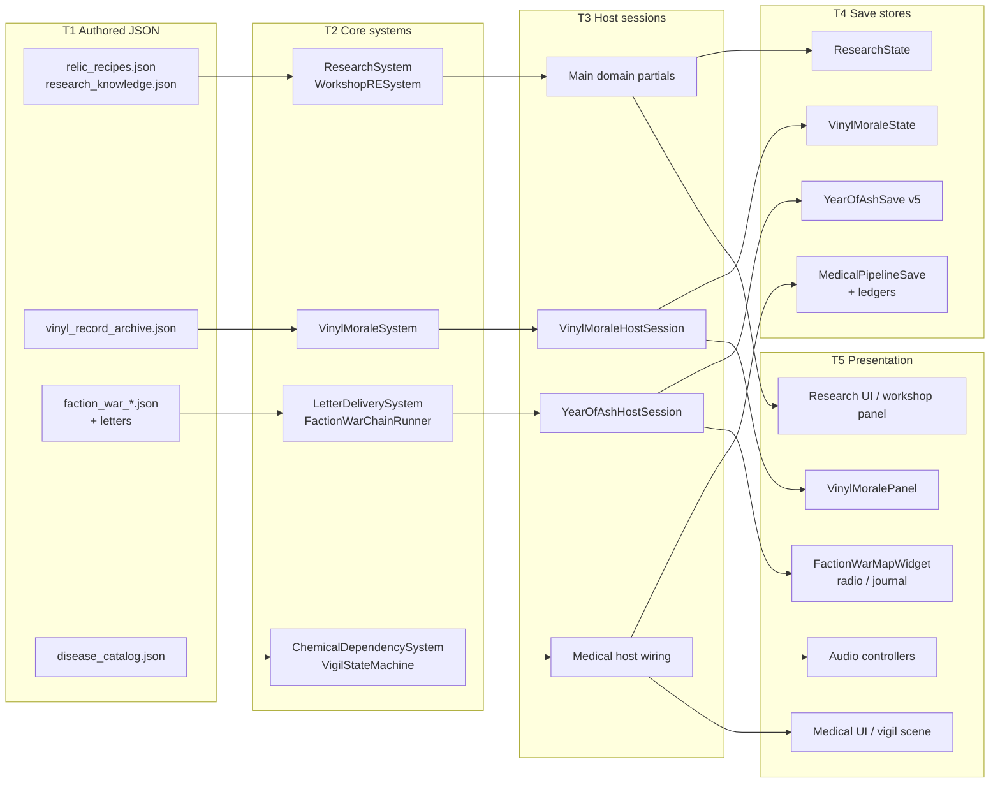

Per-workstream tier instantiation:

| Tier | A — Relic research | B — Vinyl | C — Letters & war | D — Audio | E — Scenes | F — Medical |
|---|---|---|---|---|---|---|
| T1 | `relic_recipes.json`, `research_knowledge.json` | `narrative/vinyl_record_archive.json` | `faction_war_*.json` ×6; letter catalogs in Core fixture/catalog code | none (registry is code, doc is generated) | `.tscn`/`.tres` structure | `disease_catalog.json` |
| T2 | `ResearchSystem`, `WorkshopReverseEngineeringSystem` | `VinylMoraleSystem` | `LetterDeliverySystem`, `FactionWarChainRunner`, `FactionWarSystem`, `QuestlineSystem` | `ReactiveAmbienceEvaluator` (Core side) | n/a | `ChemicalDependencySystem`, `VigilStateMachine`, disease handlers |
| T3 | `Main` research/workshop partial wiring | `VinylMoraleHostSession` | `YearOfAshHostSession`, `Main.YearOfAsh.cs` | `ShelterAudioController`, `SurfaceAmbienceController` | CI scripts + host CLI selftest verbs | Medical pipeline host wiring |
| T4 | `ResearchState` (points, unlocked/completed ids, blueprint progress) | `VinylMoraleState` | `YearOfAshSave` v5 (+ letter records in their save section) | none — deliberately | n/a | `ChemicalDependencyLedgerState`, `VigilSaveState`, `MedicalPipelineSave` |
| T5 | Research panel, workshop panel | `VinylMoralePanel` | `FactionWarMapWidget`, radio intercepts, journal entries | All audio output | The scenes themselves | Diagnosis UI, vigil scene, withdrawal status |

Two workstreams deliberately have holes in the grid, and the holes are the
design:

- **D — Audio has no T4.** Audio controllers persist nothing. An ambience
  crossfade that leaked into a save would be a bug, and the closeout's
  "zero save mutation" phrasing is a contract, not a description.
- **E — Scenes have no T2/T3/T4.** The linter and binding selftest observe
  structure; they own no simulation state.

### III.3 Event Flow Contract

Core events expose **facts that already happened**; host adapters decide
what presentation or persistence they deserve. The six workstreams give a
consistent picture of the contract's fine print:

1. **Events are raised after state mutates, never before.**
   `LetterDeliverySystem.DeliverLetter` sets `state = Delivered` and writes
   `moraleDeltaApplied` *then* invokes `OnLetterDelivered` *(verified
   2026-09-25, `Assets/Ashfall.Core/Narrative/LetterDeliverySystem.cs:106-113`)*.
   A handler that re-enters the system therefore observes final state.
2. **Events carry payloads, not instructions.** The chain runner's
   `OnStageResolved(chain, stage, choice)` hands the host the authored
   choice object; the host reads `standingDelta` and routes it through
   `StandingDeltaApplier`. The runner never calls `FactionWarSystem` itself
   *(verified 2026-09-25, `Assets/Ashfall.Core/YearOfAsh/FactionWarChainRunner.cs`)*.
3. **Request-shaped events exist where Core may not decide.**
   `ChemicalDependencySystem.OnMoraleDrainRequested(survivorId, amount)` is
   a request: the host applies morale or ignores it. The dependency system
   never subtracts morale directly — the same pattern as
   `OnCraftingPenaltyChanged` / `OnCombatPenaltyChanged` *(verified
   2026-09-25, `Assets/Ashfall.Core/Medical/ChemicalDependencySystem.cs:83-99`)*.
4. **Host subscriptions mark saves dirty; they do not compute gameplay.**
   In `Main.YearOfAsh.cs`, every runner event handler ends in
   `_yearOfAshDirty = true`, and its gameplay projection is limited to a
   radio intercept line, a journal record, and a sound-ranging observation
   *(verified 2026-09-25, `src/Main.YearOfAsh.cs:133-200`)*.
5. **Presentation transitions keep their own edge detection.**
   `ShelterAudioController.SyncPowerState(emitTransitions)` snapshots
   generator-running / brownout booleans and only cues on edges, which is
   how the "no spam" guarantee is implemented without a timer
   *(verified 2026-09-25, `src/Audio/ShelterAudioController.cs:107-130`)*.

### III.4 Save Capture / Restore and the Codec Migration Ladder

The Year of Ash codec is the repository's most explicit persistence
contract, and the closeout's v3→v4 work is rung three and four of a ladder
that now has five. The pattern, generalized from
`Assets/Ashfall.Core/YearOfAsh/YearOfAshSave.cs` *(verified 2026-09-25)*:

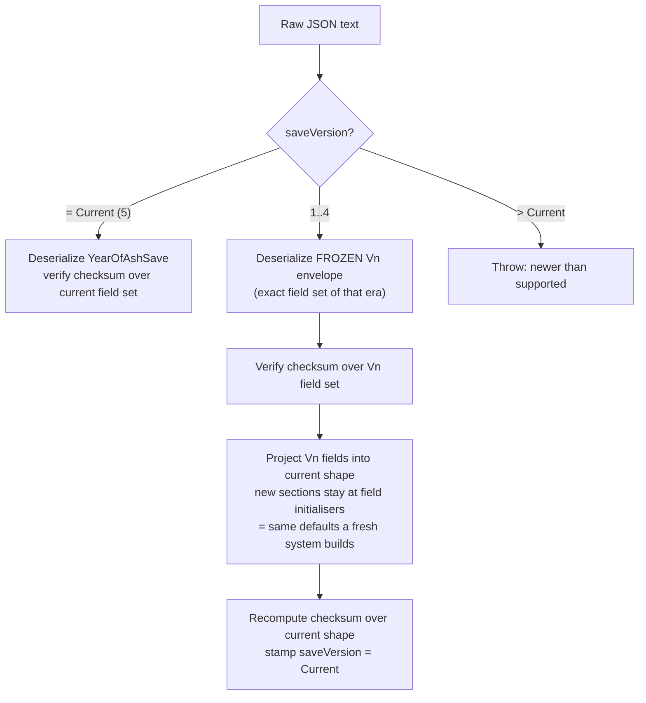

The load-bearing rules, each enforced in source:

1. **Frozen envelopes.** `YearOfAshSaveV1`…`V4` are separate classes whose
   field sets must match what that version wrote "byte-for-byte in field
   set" (source comment). Nothing may be added to them. This is what makes
   the checksum check honest: a v3 file is validated over exactly the
   fields v3 hashed.
2. **Migration drops, never trusts.** Upgrading v2 drops nothing the player
   earned but adds nothing the era didn't have: `warlord` and
   `factionWarChainRunner` sections "stay at their field initialisers",
   which means a pre-v3 save resumes with every war chain unstarted and the
   war narrative replays from the beginning rather than resuming mid-chain
   — a stated design choice, not an accident (source comment,
   `MigrateToCurrent`).
3. **Checksum discipline.** `Decode` rejects empty payloads, null
   deserialization, future versions, and checksum mismatch; each rung of
   the ladder re-verifies over its own field set before projecting.
4. **Symmetric capture.** `YearOfAshHostSession.CaptureSave()` assembles
   the current envelope from each subsystem's own `CaptureState()` (the
   chain runner's state includes `schemaVersion = 1` of its own, nested
   inside the outer envelope version — two version axes, each owned by its
   layer) *(verified 2026-09-25, `src/YearOfAsh/YearOfAshHostSession.cs:286` and
   `FactionWarChainRunner.cs:276-283`)*.

The other five workstreams use the same capture/restore shape without the
versioned-envelope ceremony, because their save sections are nested inside
larger stores rather than standalone files: `ResearchSystem.CaptureState /
RestoreState(ResearchState)`, `VinylMoraleSystem` state capture,
`LetterDeliverySystem.CaptureState / RestoreState`,
`ChemicalDependencySystem.CaptureState / RestoreState`,
`VigilStateMachine.CaptureState / RestoreState`. All ten methods were read
and verified on 2026-09-25. The shared discipline: restore rebuilds internal
state from the DTO (defensive copies for lists, null-tolerant, no aliasing
of the incoming object graph), so a malformed DTO degrades to "fresh
section" rather than a corrupted live object.

### III.5 Determinism Contract

| Rule | Where it bites in Plans 02–09 machinery |
|---|---|
| No `System.Random` in Core deterministic behavior | The chain runner's `DayOffsetTrigger` uses pure integer day arithmetic; stage surfacing is a function of (day, flags, visited set) — no randomness at all. Door-encounter humanist/ruthless evaluation is asserted deterministic by `YearOfAshTests.DoorEncounters_EvaluatesHumanistVsRuthlessReactionsDeterministically` *(verified test exists 2026-09-25)*. |
| No seeding from wall-clock or hash iteration order | `VinylMoraleSystem` once-per-day guard compares integer `lastPlayedDay` against the host's `DayProvider` — day number, not clock time. The vigil spaces recitations by elapsed *game* seconds of a fixed 240 s duration, not frame time. |
| Integer and fixed-point authority where it matters | `FactionWarChainRunnerState.cumulativeMoraleDelta` is `int`; blueprint progress caps `progressPoints` at `requiredPoints` with explicit `long` intermediate arithmetic to avoid overflow before the clamp (`ResearchSystem.TryAddBlueprintProgress`). |
| Same cadence, same order | `FactionWarChainRunner.TickDay` iterates `_catalog.EventChains` in load order and the host calls it once per simulated day, "same cadence as YearOfAshHostSession.TickDay" (source doc comment). Replay stability comes from iterating an authored list, never a dictionary. |
| Deterministic projection on top | `Main.YearOfAsh.cs` derives the sound-ranging bearing for a clash as `(currentDay * 37) % 360` — a pure function of day, chosen so the projection is reproducible in save-fuzz replays. |

### III.6 Integrity Validation Layer

Beneath workstream verification sits the catalog integrity pipeline
(`Assets/Ashfall.Core/CatalogIntegrityValidator.cs` and siblings, exposed
through the `--data-integrity-selftest` host verb). The Plans 02–09
catalogs ride it like everyone else:

- **Reference validation:** a `research_unlock_id` in `relic_recipes.json`
  that no `research_knowledge.json` node satisfies is exactly the class of
  drift the `RelicResearchUnlockContractTests` contract plus the integrity
  gate exist to catch — presence in JSON is not gameplay reachability
  (`AGENTS.md` §Save/Determinism/Content).
- **Schema shape:** every catalog touched by this document carries
  `schema_version` at minimum; the faction-war loader names its six
  expected files as constants (`EventsFile`, `JournalFile`, `RadioFile`,
  `DialogueFile`, `CommuniquesFile`, `LocationOverridesFile`), so a missing
  file is a named, testable failure rather than an empty collection
  *(verified 2026-09-25, `FactionWarContentCatalog.cs:323-351`)*.
- **Generated-doc drift gates:** the audio catalog and several registries
  are generated with a `--check` mode, turning documentation drift into a
  CI failure. This is the same philosophy as the save-store matrix and CLI
  catalog gates in `docs/CI.md`: if a document must match code, a script
  must own the match.

---

## Part IV — Code Architecture

### IV.1 Module Map

```mermaid
flowchart TB
    subgraph Core["Assets/Ashfall.Core (netstandard2.1)"]
        direction TB
        subgraph A["Workstream A"]
            RS[Research/ResearchSystem.cs]
            RKL[Research/ResearchKnowledgeCatalogLoader.cs]
            RST[Research/ResearchState.cs]
            WRE[WorkshopReverseEngineeringSystem.cs]
            TSC[Research/TechSalvageCatalog.cs]
        end
        subgraph B["Workstream B"]
            VMS[VinylMoraleSystem.cs]
            VRC[Narrative/VinylRecordCatalog.cs]
            VAM[Narrative/VinylRecordAcquisitionMap.cs]
        end
        subgraph C["Workstream C"]
            LDS[Narrative/LetterDeliverySystem.cs]
            SLD[Narrative/SurvivorLetterDeliverySystem.cs]
            PLC[Narrative/PersonalLetterCatalog.cs]
            FWC[YearOfAsh/FactionWarContentCatalog.cs]
            FWR[YearOfAsh/FactionWarChainRunner.cs]
            FWS[YearOfAsh/FactionWarSystem.cs]
            YAS[YearOfAsh/YearOfAshSave.cs]
            YAT[YearOfAsh/YearOfAshTimelineSystem.cs]
        end
        subgraph D["Workstream D (Core side)"]
            RAE[Audio/ReactiveAmbienceEvaluator]
        end
        subgraph F["Workstream F"]
            CDS[Medical/ChemicalDependencySystem.cs]
            VSM[Medical/VigilStateMachine.cs]
            MP[Medical/MedicalPipelineCoordinator.cs]
            DH[Medical/DiseaseAfflictionHandler.cs]
        end
    end
    subgraph Host["src (net8.0, Godot)"]
        MAIN[Main.cs + Main.YearOfAsh.cs partials]
        YHS[YearOfAsh/YearOfAshHostSession.cs]
        VMH[Host/VinylMoraleHostSession.cs]
        VMP[UI/VinylMoralePanel.cs]
        FWM[UI FactionWarMapWidget]
        SAC[Audio/ShelterAudioController.cs]
        SMSC[Audio/SurfaceAmbienceController.cs]
        ACC[Audio/AudioCueCatalog.cs]
        AM[Audio/AudioManager]
    end
    subgraph Data["Assets/StreamingAssets/Data"]
        RR[relic_recipes.json]
        RK[research_knowledge.json]
        VA[narrative/vinyl_record_archive.json]
        FWJ[faction_war_*.json x6]
        DC[disease_catalog.json]
    end
    RR-->WRE; RK-->RKL-->RS
    VA-->VRC-->VMS
    FWJ-->FWC-->FWR
    DC-->DH
    RS-->MAIN; WRE-->MAIN
    VMS-->VMH-->VMP
    FWS-->YHS; FWR-->YHS; YAS-->YHS; YHS-->MAIN; MAIN-->FWM
    RAE-->SAC; RAE-->SMSC; ACC-->AM; SAC-->AM; SMSC-->AM
    CDS-->MP; VSM-->MP; MP-->MAIN
```

### IV.2 Per-Component Deep Specs

Format per component: **Responsibility / Public API / State DTO / Failure
modes & mitigations / Performance notes**. APIs listed are the ones read in
source on 2026-09-25; elided members exist but are not load-bearing for
this document.

#### IV.2.1 `ResearchSystem` — `Assets/Ashfall.Core/Research/ResearchSystem.cs`

- **Responsibility.** Sole authority for the knowledge economy: the research
  points ledger, manual unlocks (capabilities), day-ticked research
  projects, and the blueprint progress ledger that relic unlocks feed.
  `SystemId = "research_system"`.
- **Public API (verified).**
  - Registration/queries: `Register(ResearchKnowledgeDef)`, `CatalogCount`,
    `GetKnowledge(id)`, `HasCapability(id)`, `IsManualUnlocked(id)`,
    `UnlockManual(id)`.
  - Projects: `StartResearch(id, day)`, `GetDaysRemaining(id)`,
    `Tick(newDay)`, `CompleteResearch(id)`.
  - Points: `TryAddResearchPoints(amount, sourceId)`,
    `TrySpendResearchPoints(amount, purposeId)`, `GetResearchPoints()`.
  - Blueprints: `IsBlueprintUnlocked(blueprintId)`,
    `TryAddBlueprintProgress(blueprintId, amount, requiredPoints,
    completedDay, sourceTechId)`, `GetBlueprintProgress(id)`,
    `OnBlueprintUnlocked` event.
  - Persistence: `CaptureState()` / `RestoreState(ResearchState)`.
- **State DTO.** `ResearchState` — points balance, unlocked/completed id
  sets, `blueprintProgress` list of `BlueprintProgressState`
  (`blueprintId`, `progressPoints`, `requiredPoints`, `discoveryState`
  string: `identified`/`in_progress`/`unlocked`, `completedDay`,
  `sourceTechIds`).
- **Failure modes & mitigations.**
  - *Double-unlock race:* `TryAddBlueprintProgress` returns `false` when
    the blueprint is already unlocked, and clamps progress at
    `requiredPoints`, so repeated awards from two relics sharing a node
    cannot overshoot.
  - *Overflow:* intermediate sum widened to `long` before clamping to
    `int` — a hostile save cannot wrap the counter.
  - *Null progress list:* `State.blueprintProgress ??= new List<...>`
    lazily repairs states restored from older saves.
  - *Negative/zero arguments:* rejected up front (`amount <= 0`,
    `requiredPoints <= 0`, whitespace ids).
- **Performance.** Linear scans over small collections (≤ 62 knowledge
  nodes, ≤ 16 blueprint entries per the current catalogs); no indexing
  needed at this scale, and list order is preserved for determinism.

#### IV.2.2 `WorkshopReverseEngineeringSystem` — `Assets/Ashfall.Core/WorkshopReverseEngineeringSystem.cs`

- **Responsibility.** The bench where relics become knowledge: relic
  examination/dismantle/repair/research phases, tech-salvage track,
  research notes. `SystemId = "workshop_reverse_engineering"`.
- **Public API (verified surface).** `WorkshopState` manipulation per the
  764-line file: relic selection (`selectedRelicId`), researcher
  assignment, phase progression (`workPhase` 0=idle, 1=examining,
  2=dismantling, 3=repairing, 4=researching), hour accumulation
  (`progressHours`/`hoursRequired`), component reservation lists,
  completion unlocking `completionUnlockId`; the tech-salvage track
  (`activeTechSalvageId`, `techSourceItemId`, `techSourceConsumed`,
  `techStartedDay`, `techEquipmentQuality01`, `completedTechSalvageIds`);
  `researchNotes` of `ResearchNoteState` (`noteId`, `techId`,
  `researcherId`, `day`, `progressBand`).
- **State DTO.** `WorkshopState` as above plus `RelicCatalog` /
  `RelicDefinition` mirroring `relic_recipes.json` field-for-field
  (including the `recipes` property aliasing `relics` for JSON tolerance —
  the loader accepts either key).
- **Failure modes & mitigations.**
  - *Reserved-component leak on cancel:* reservations are stored as
    parallel id/amount lists in state, so a crash mid-phase restores the
    reservation instead of silently consuming parts.
  - *Unauthored unlock id:* the system awards `completionUnlockId` from
    authored data only; the contract test pins the 16 authored ids, so a
    typo surfaces as a test failure, not a silent no-op.
  - *Time-source drift:* progress accrues in authored `repair_time_hours`
    units (e.g. the gramophone's 8 h), advanced by host ticks — no
    wall-clock anywhere.
- **Performance.** Per-relic work; state is a single active project plus
  completed-id lists. Cost is O(1) per tick.

#### IV.2.3 `VinylMoraleSystem` — `Assets/Ashfall.Core/VinylMoraleSystem.cs`

- **Responsibility.** Turntable truth: what is owned, what is playing, and
  the once-per-day morale application. `SystemId = "vinyl_morale"`.
- **Public API (verified).** `State`, `IsPlaying`, acquire/play/stop and
  daily-effect operations (exercised by the 9 facts of
  `VinylMoraleSystemTests`: `AcquireRecord_AddsToCollection`,
  `Play_OwnedRecord_Succeeds`, `Play_NotOwned_Blocks`,
  `Stop_StopsPlayback`, `ApplyDailyEffect_AppliesMorale`,
  `ApplyDailyEffect_OncePerDay`, `ApplyDailyEffect_NewDay_AppliesAgain`,
  `CaptureRestoreState_PreservesCollection`,
  `VinylArchive_Loads30Records_WithDistinctMoraleEffects`).
- **State DTO.** `VinylMoraleState`: `ownedRecordIds`,
  `currentPlayingId`, `lastPlayedId`, `lastPlayedDay`, `totalPlays`,
  `totalMoraleApplied`, `isTurntableActive`, and the radio-bridge block
  (`lastBroadcastRecordId`, `lastBroadcastDay`, `broadcastCount`,
  `lastBroadcastSignalStrength`). `VinylRecordDefinition` carries
  `record_id`, `display_name`, `genre`, `morale_daily_bonus`,
  `flashback_suppression` (0–1 flashback probability reduction),
  `audio_cue_id`, `description`.
- **Failure modes & mitigations.**
  - *Playing an unowned record:* blocked (`Play_NotOwned_Blocks`).
  - *Double-counting morale:* the day-guard tests pin once-per-day
    behavior keyed on `lastPlayedDay`.
  - *Archive drift:* the 30-record test fails if a record is removed or
    two records collapse to identical morale effects — the archive is
    contractually "distinct".
- **Performance.** Trivial per-day cost; ownership is an id list, not a
  copy of definitions.

#### IV.2.4 `VinylMoraleHostSession` + `VinylMoralePanel` — `src/Host/`, `src/UI/`

- **Responsibility.** The session adapts system calls into host results
  (`ActionResult PlayRecord`, `LastEvent` string for surfacing, `DayProvider`
  delegate, `Save()` dirtying). The panel (`Control`, `IBindablePanel`)
  binds/unbinds the session, `RefreshView` lists acquired records,
  `UpdateRecordPreview` shows metadata for the selected record, `OnClose`
  preserves keyboard/controller back behavior.
- **Failure modes & mitigations.**
  - *Unbound panel interaction:* `IsBound` gate; `Unbind` clears the
    session reference before tree exit (`_ExitTree`), the repository's
    standard disposal-lifecycle hygiene.
  - *Stale view:* all mutation goes through the session, then
    `RefreshView`; the panel never mutates `VinylMoraleState` directly.
  - *Empty collection:* the closeout's empty-state (scavenging hint,
    disabled buttons) is panel-level presentation of a system fact
    (`ownedRecordIds.Count == 0`), not a second state source.
- **Performance.** One list build per refresh; preview is field reads.

#### IV.2.5 `LetterDeliverySystem` — `Assets/Ashfall.Core/Narrative/LetterDeliverySystem.cs`

- **Responsibility.** State machine for the last-letter arc: discover →
  address → deliver / withhold / unanswered, with morale payload and
  persistence. `SystemId = "letter_delivery_system"`.
- **Public API (verified, full).** `DiscoverLetter(letterId, day,
  recipientSurvivorId = "")`, `AddressLetter(letterId, recipientSurvivorId,
  day)`, `DeliverLetter(letterId, day, notes, customMoraleDelta = 6.0f)`,
  `WithholdLetter(letterId, day, notes)`, `MarkUnanswered(letterId, day,
  notes)`, `GetRecord(letterId)`, `Records`, `CaptureState()`,
  `RestoreState(state)`. Events: `OnLetterDiscovered`, `OnLetterDelivered`
  (record + delta), `OnLetterWithheld`, `OnLetterUnanswered`.
- **State DTO.** `LetterDeliverySystemState { systemId, records }` of
  `LetterDeliveryRecord { letterId, state, foundDay, resolvedDay,
  recipientSurvivorId, resolutionNotes, moraleDeltaApplied }`. Enum
  `LetterDeliveryState { Found=0, Addressed=1, Delivered=2, Withheld=3,
  Unanswered=4 }`.
- **Failure modes & mitigations.**
  - *Resolve-after-terminal:* `DeliverLetter` on a `Delivered` record is a
    no-op returning `false`; `Withhold`/`MarkUnanswered` refuse after
    `Delivered` (but may overwrite `Unanswered` — deliberate: unanswered
    is recoverable regret, delivered is final).
  - *Discover-then-act:* all three resolution methods auto-discover an
    unknown letter id, so a data author can resolve a letter the player
    has not formally found; the record's `foundDay` is then the
    resolution day (visible in state for auditing).
  - *Id casing:* lookups use `OrdinalIgnoreCase` matching, tolerant of
    catalog-case drift.
  - *Aliased restore:* `RestoreState` deep-copies every record; the
    incoming DTO is never retained.
- **Performance.** Linear find over the letter list; the arc is
  single-digit letters.

#### IV.2.6 `FactionWarContentCatalog` + `FactionWarContentCatalogLoader`

- **Responsibility.** Read-only content authority for the war narrative
  and its loader. The catalog exposes six collections — event chains,
  journal entries, broadcasts, dialogue snippets, communiques, location
  overrides — and day/location/faction queries (`GetEligibleChains(day)`,
  `GetJournalForDay(day)`, `GetBroadcastsForDay(day)`,
  `GetDialogueForLocation(locationId, day)`,
  `GetCommuniquesForFaction(factionId, day)`,
  `GetActiveLocationOverride(locationId, day)`). The loader (same file,
  line 323) loads the six `faction_war_*.json` files by name constants and
  tolerates absence with per-file guards.
- **State DTO.** `FactionWarEventChain { chainId, band, title,
  factionsInvolved, locationId, stages }`; `FactionWarEventStage {
  stageId, minDay, triggerCondition, title, bodyText, choices,
  requiresFlag, producesFlag }`; `FactionWarEventChoice { choiceId, text,
  moraleDelta, leadsToStageId, requiresFlag, producesFlag,
  standingFactionId, standingDelta }`.
- **Failure modes & mitigations.**
  - *Missing file:* loader constants + guards mean a deleted
    `faction_war_radio.json` degrades to "no broadcasts" with a log line,
    not a crash; the content catalog tests assert counts, so silent
    degradation is caught in CI.
  - *Bad stage references:* `leadsToStageId` pointing nowhere strands a
    chain; `FactionWarChainRunnerTests` exercises traversal, and the
    zero-choice auto-advance keeps malformed chains from hard-stopping
    the day tick.
- **Performance.** Queries are linear filters over authored content
  (38 chains measured); fine at per-day cadence.

#### IV.2.7 `FactionWarChainRunner` — `Assets/Ashfall.Core/YearOfAsh/FactionWarChainRunner.cs`

- **Responsibility.** Advances authored war chains against campaign state.
  Pure progression logic; all world effects are host-bound delegates.
  `SystemId = "faction_war_chain_runner"`.
- **Public API (verified).**
  - Triggers: `FactionWarTrigger` abstract + `FlagTrigger`,
    `PlayerVisitedTrigger`, `ChainResolvedTrigger`, `DayOffsetTrigger`,
    `AndTrigger`, `AlwaysTrigger`; `FactionWarTriggerTable.For(stageId)`
    maps authored `triggerCondition` strings to trigger objects.
  - Queries: `GetSurfacedStage(chainId, currentDay)`,
    `IsChoiceAvailable(stage, choice, currentDay)`, `IsFlagSet`,
    `HasVisited`, `IsChainResolved`, `CumulativeMoraleDelta`.
  - Commands: `RecordLocationVisited(locationId)`,
    `TickDay(currentDay)`, `ResolveChoice(chainId, stageId, choiceId,
    currentDay)`.
  - Host injection: `ExternalFlagProbe` (read-through to host flags),
    `StandingDeltaApplier` (host-owned standing writes).
  - Events: `OnStageSurfaced`, `OnStageResolved`, `OnChainResolved`.
  - Epoch remap: `ToAuthoredDay(playableDay)` bridging authored
    `minDay` (epoch 480) onto the playable window (epoch 180) —
    documented in source as the authored-vs-playable calendar bridge.
- **State DTO.** `FactionWarChainRunnerState { systemId, schemaVersion=1,
  chains: [FactionWarChainProgress { chainId, currentStageId, resolved,
  stageResolutions: [{stageId, day}] }], visitedLocations,
  cumulativeMoraleDelta, producedFlags }`.
- **Failure modes & mitigations.**
  - *Speculative resolution:* `ResolveChoice` throws
    `ArgumentException`/`InvalidOperationException` when the
    chain/stage/choice triple does not match the currently surfaced
    stage, or when the choice's `requiresFlag` gate is unset — the host
    physically cannot desync the runner by calling it wrong.
  - *Zero-choice deadlock:* `TickDay` auto-advances zero-choice stages so
    narrative chains never wait on input that cannot come.
  - *Flag economy:* `producedFlags` is append-only; `requiresFlag` gates
    on both runner-produced and host-probed flags, so Plan 25 grievance
    flags compose with chain flags without either side owning the other.
- **Performance.** Per-day cost is O(chains × stages-scanned); with 38
  chains this is noise.

#### IV.2.8 `YearOfAshHostSession` — `src/YearOfAsh/YearOfAshHostSession.cs`

- **Responsibility.** Host composition root for the Year of Ash: owns the
  timeline, door encounters, faction war, questlines, deep freeze, radon,
  warlord doctrine, and the chain runner; exposes `TickDay(day)`,
  war inputs (`RecordWarLocationVisited`, `ResolveWarChoice`), warlord
  tribute queries, `CaptureSave`/`RestoreSave`, and `Create(dataDir,
  loadExistingSave)` as the construction seam.
- **Failure modes & mitigations.** `Create` loads an existing save when
  present (`loadExistingSave`), so the demo/host path and the real game
  path share one construction order; `RestoreSave` distributes sections to
  subsystems, each of which null-guards (the
  `RestoreState_WithNullSections_IsANoOp` test pins this).
- **Performance.** One pass per day across the subsystems; each is O(small
  authored content).

#### IV.2.9 `ShelterAudioController` / `SurfaceAmbienceController` — `src/Audio/`

- **Responsibility.** Presentation-only audio projection. Shelter: power
  events (breaker trip, restore), generator loop start/stop, brownout
  klaxon, air-filter hazard cue, ventilation loop sync. Surface: weather
  subscription, scarcity authority, location-resolved ambience beds.
- **Public API (verified).** Shelter: `Subscribe(PowerGridSystem?,
  StartingLevelSystem?)`, `AmbienceEvaluator`, `Dispose`. Surface:
  `Subscribe(WeatherSystem?)`, `SubscribeAuthority(ScarcityAudioController?)`,
  `SetLocation(string?)`, `Start()`, `Stop()`,
  `static ResolveLocationAmbience(string?)`, `Dispose`.
- **Failure modes & mitigations.**
  - *Double-subscription:* `Subscribe` compares references and returns
    early when unchanged; re-subscription unwires old handlers first.
  - *Use-after-dispose:* `ThrowIfDisposed()` guards; `Dispose` unwires
    everything and both controllers are `IDisposable`, matching the UI
    lifecycle discipline.
  - *Cue spam:* edge detection via boolean snapshots
    (`_generatorRunning`, `_brownout`, `_filterHazard`, `_hasPowerSnapshot`)
    so continuous states never re-trigger.
- **Performance.** Event-driven; zero per-frame allocation in the read
  path.

#### IV.2.10 `ChemicalDependencySystem` — `Assets/Ashfall.Core/Medical/ChemicalDependencySystem.cs`

- **Responsibility.** Substance tolerance and withdrawal. Owns the
  per-survivor dependency ledger and the two detox regimens; requests
  morale/craft/combat consequences through events. `SystemId =
  "chemical_dependency_system"`.
- **Public API (verified).** `OnSubstanceConsumed(survivorId, itemId,
  kind)`, `ReportStress(survivorId, source, magnitude)`,
  `BeginManagedDetox`, `BeginColdTurkey`,
  `PreviewBeginManagedDetox`/`ExecuteBeginManagedDetox`,
  `PreviewBeginColdTurkey`/`ExecuteBeginColdTurkey` (all with
  `stateVersion` optimistic-concurrency arguments),
  `TickHours(survivorId, gameHours, isStaffed, staffSpeedMultiplier)`,
  `HasActiveWithdrawal`, `DependencyLevel`, `DependenciesFor`,
  `CaptureState`/`RestoreState`.
- **Tuning constants (verified, all `public const`).**
  `DependencyThreshold = 0.3`, `DependencyIncreasePerDose = 0.15`,
  `DependencyDecayPerDayClean = 0.05`, `MaxDependencyLevel = 1`,
  `ColdTurkeyWithdrawalDurationHours = 72`,
  `ManagedDetoxDurationHours = 120`,
  `ColdTurkeyTremorCraftingPenalty = 0.40`,
  `ColdTurkeyTremorCombatPenalty = 0.30`,
  `ColdTurkeyMoraleDrainPerHour = 3`,
  `ManagedDetoxMoraleDrainPerHour = 1`,
  `DetoxSuccessThresholdHours = 96`, plus a per-kind `KindBaseSeverity`
  table.
- **State DTO.** `ChemicalDependencyLedgerState { systemId, survivors:
  [SurvivorDependencyList { survivorId, dependencies:
  [ChemicalDependencyState { itemId, dependencyLevel 0..1, kind,
  inManagedDetox, inColdTurkey, detoxProgressHours }] }] }`.
- **Failure modes & mitigations.**
  - *Concurrent command desync:* the preview/execute pair carries
    `expectedStateVersion` / `currentStateVersion`; a stale caller gets a
    failed `CommandResult` instead of a silently doubled detox.
  - *Historic Unity artifact:* the source keeps `inColdTurkey` as an
    explicit flag with a migration note that Unity-era code abused
    `progress < 0`; the flag is the honest representation.
  - *Penalty leakage:* crafting/combat penalties are emitted as factor
    change events, never written into the crafting/combat systems' own
    state — the consumer applies and clears them.
- **Performance.** Per-survivor lists; `TickHours` advances only the
  survivor worked on.

#### IV.2.11 `VigilStateMachine` — `Assets/Ashfall.Core/Medical/VigilStateMachine.cs`

- **Responsibility.** The 4-minute bedside vigil for a terminal dweller
  ("ASHFALL: THE DOSE", Expansion 07, per source header): spaced name
  recitation, a phantom knock near the end, completion or skip.
- **Public API (verified, full).** `StartVigil(dwellerId, names, duration
  = 240f)`, `Tick(deltaSeconds)`, `Skip()`, properties `IsActive`,
  `ElapsedSeconds`, `DurationSeconds`, `DwellerId`, `RecitedCount`,
  `PhantomKnockFired`, `WasSkipped`, `IsCompleted`, `Names`; events
  `OnVigilStarted`, `OnNameRecited(name, count)`, `OnPhantomKnock`,
  `OnVigilCompleted(wasSkipped)`; `CaptureState`/`RestoreState`.
- **Behavior detail (verified from source).** Names are recited across the
  first 85 % of the duration (`timePerName = DurationSeconds * 0.85f /
  names.Count`), the phantom knock fires at 95 %, completion at 100 %.
  `Tick` is a no-op when inactive or completed; `Skip` completes with
  `wasSkipped = true`.
- **State DTO.** `VigilSaveState { isActive, elapsedSeconds,
  durationSeconds, dwellerId, recitedCount, phantomKnockFired, wasSkipped,
  isCompleted, namesToRecite }`.
- **Failure modes & mitigations.**
  - *Save mid-vigil:* elapsed seconds and recitation count are captured,
    so restore resumes at the same beat rather than replaying names.
  - *Zero names / zero duration:* `duration <= 0` falls back to the 240 s
    default; zero names simply skips recitation logic.
  - *Frame-rate dependence:* recitation indices are derived from elapsed
    time, not tick count, so a 15 FPS diagnostics session and a 60 FPS
    session produce the same recitation schedule.

### IV.3 Data Schemas (snake_case, current)

**`relic_recipes.json`** *(verified 2026-09-25)*:

```json
{
  "schema_version": "1.0",
  "recipes": [
    {
      "relic_id": "gramophone",
      "display_name": "Hand-Crank Gramophone",
      "description": "A pre-war hand-crank gramophone. The lacquer is cracked but the mechanism still turns.",
      "required_components": ["vacuum_tube", "spring_mechanism", "phonograph_needle"],
      "repair_time_hours": 8,
      "morale_bonus": 5,
      "dialogue_event_id": "narrative_gramophone_restored",
      "restoration_text": "The gramophone crackles to life ...",
      "world_flag": "relic_restored_gramophone"
    },
    {
      "relic_id": "relic_micro_dosimeter_pen",
      "research_unlock_id": "knowledge_micro_dosimeter_blueprint"
    }
  ]
}
```

(The second entry is elided to its pairing fields; it is a real record.
`research_unlock_id` is present and non-empty on exactly 16 of 39 entries;
entries without it omit the key. The gramophone is one of the 23 without a
research unlock — it rewards morale, a world flag, and a dialogue event.)

**`research_knowledge.json`** *(verified 2026-09-25)*:

```json
{
  "schema_version": 1,
  "collection_id": "research_knowledge",
  "knowledge_nodes": [
    {
      "id": "knowledge_water_basics",
      "display_name": "Water Purification Basics",
      "category": "survival",
      "description": "Boiling, charcoal filtration, and still-building from salvage.",
      "days_to_complete": 5,
      "prerequisites": []
    }
  ]
}
```

Loader DTO wraps these as `ResearchKnowledgeNodeWireDto` with
`ToDomain()`; `ValidateDag(defs, out errorMessage)` rejects cycles and
dangling prerequisites before registration.

**`narrative/vinyl_record_archive.json`** *(shape verified; field values
summarized to respect the tone rules — no performer names reproduced)*:

```json
{
  "schema_version": "1.0",
  "collection_id": "vinyl_record_archive",
  "records": [
    {
      "record_id": "record_NN_<slug>_78rpm",
      "catalog_number": "MEL-78-4019",
      "title": "<authored work title>",
      "performer": "<authored ensemble credit>",
      "recording_year": 1953,
      "format_rpm": "78 RPM Shellac",
      "physical_condition": "<authored wear description>",
      "daily_morale_modifier": 6,
      "broadcast_frequency_mhz": 88.4,
      "needle_audio_texture": "<authored playback description>",
      "dweller_resonance_notes": "<authored survivor memory hook>"
    }
  ]
}
```

Measured distribution: 30 records; `daily_morale_modifier` ∈ [5, 10];
18 × `"33 RPM Vinyl LP"`, 12 × `"78 RPM Shellac"`; every record carries a
`broadcast_frequency_mhz` (the radio bridge's keying field).

**`faction_war_events.json`** *(shape verified 2026-09-25)*:

```json
{
  "schema_version": "1.0",
  "chains": [
    {
      "chainId": "chain_<slug>",
      "band": "cold_war",
      "title": "<chain title>",
      "factionsInvolved": ["faction_a", "faction_b"],
      "locationId": "loc_<slug>",
      "stages": [
        {
          "stageId": "stage_<slug>",
          "minDay": 482,
          "triggerCondition": "<table key>",
          "title": "<stage title>",
          "bodyText": "<narration>",
          "requiresFlag": "",
          "producesFlag": "flag_example",
          "choices": [
            {
              "choiceId": "choice_a",
              "text": "<choice text>",
              "moraleDelta": 2,
              "leadsToStageId": "stage_next",
              "requiresFlag": "",
              "producesFlag": "",
              "standingFactionId": "faction_a",
              "standingDelta": 5
            }
          ]
        }
      ]
    }
  ]
}
```

38 chains measured. Note this catalog uses camelCase ids/keys in
`chainId`/`stageId` style within an otherwise snake_case data tree — the
loader DTOs bind those names directly; this is the authored convention for
this family, documented here so nobody "fixes" it in a drive-by
renaming.

**`disease_catalog.json`** *(verified 2026-09-25)*:

```json
{
  "schema_version": "1.0",
  "collection_id": "disease_catalog",
  "diseases": [
    {
      "id": "disease_cholera",
      "display_name": "Cholera",
      "vector": "water",
      "lethality": 0.3,
      "incubation_days": 2,
      "illness_days": 4,
      "infectivity": 0.4,
      "spread_interval_days": 2,
      "spread_radius": 3,
      "countermeasure_item_id": "clean_water",
      "guidance": "<authored care guidance>",
      "source_note": "<authored epidemiology note>",
      "treatments": ["..."],
      "tell": "<primary symptom>",
      "tell_secondary": "<secondary symptom>",
      "timing_clue": "<onset hint>",
      "immunity_duration_days": 0,
      "immunity_strength": 0.0,
      "phases": ["..."]
    }
  ],
  "vector_protocols": [
    { "vector": "water", "duration_days": 3, "note": "..." },
    { "vector": "air",   "duration_days": 2, "note": "..." },
    { "vector": "blood", "duration_days": 5, "note": "..." },
    { "vector": "spore", "duration_days": 4, "note": "..." }
  ],
  "exposure_sources": ["..."]
}
```

20 diseases measured; vectors covered: water, air, blood, spore.

---

## Part V — Workstream Chapters

Six chapters follow, one per workstream, each self-contained: deliverables,
verified architecture, deep specs, data design, wiring, persistence,
determinism, test anatomy, evolution, failure modes, risks, and expansion
hooks. Cross-workstream interaction is deliberately deferred to Part VI so
each chapter can stay single-authority.

### Chapter V.A — Workstream A: Relic Research Unlocks & Data Authority

#### V.A.1 What the Closeout Delivered (2026-09-01)

1. **16 relic blueprint nodes** registered and matching every non-empty
   `research_unlock_id` in `relic_recipes.json`.
2. **Reverse-engineering integration**: `WorkshopReverseEngineeringSystem`
   completes the authored nodes and awards breakthrough items with no
   ad-hoc fallbacks.
3. **Verification**: `RelicResearchUnlockContractTests` proves static
   resolution, unlock, completion, and save/load roundtrip.

#### V.A.2 Verified Current Architecture

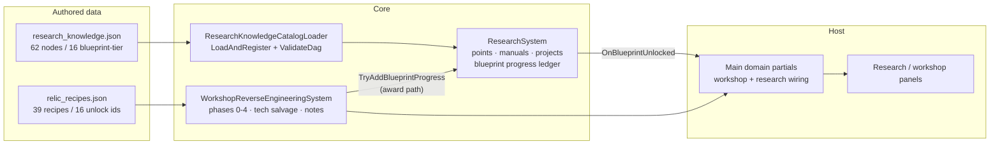

The architecture is a two-catalog contract. `relic_recipes.json` names the
*physical* objects and which knowledge node each one feeds;
`research_knowledge.json` defines the *knowledge* nodes themselves —
prerequisite DAG edges, category, days-to-complete, breakthrough item. The
join key is the unlock id string, and the contract test walks one side of
the join and asserts the other side resolves for exactly 16 pairs.

#### V.A.3 The Sixteen Pairings (authored, verified 2026-09-25)

| Relic (`relic_id`) | Knowledge node (`research_unlock_id`) | Category | Days | Breakthrough item |
|---|---|---|---|---|
| `relic_micro_dosimeter_pen` | `knowledge_micro_dosimeter_blueprint` | medical | 6 | `item_dosimeter_calibrated` |
| `relic_water_condenser_coil` | `knowledge_water_condenser_blueprint` | engineering | 8 | `item_desal_membrane` |
| `relic_signal_amplifier_stage` | `knowledge_signal_amplifier_blueprint` | science | 6 | `item_radio_vacuum_tube` |
| `relic_battery_reconditioner` | `knowledge_battery_reconditioner_blueprint` | engineering | 8 | `item_battery_reconditioned` |
| `relic_hydroponic_nutrient_doser` | `knowledge_hydroponic_doser_blueprint` | survival | 7 | `item_hydroponic_nutrients` |
| `relic_uv_sterilizer_wand` | `knowledge_uv_sterilizer_blueprint` | medical | 7 | `item_surgical_kit` |
| `relic_hand_centrifuge` | `knowledge_hand_centrifuge_blueprint` | medical | 5 | `item_reagent_clean` |
| `relic_seismic_geophone` | `knowledge_seismic_geophone_blueprint` | scavenging | 6 | `item_seismic_detector` |
| `relic_automated_turret_controller` | `knowledge_turret_controller_blueprint` | combat | 10 | `item_sentry_targeting_chip` |
| `relic_field_encrypted_radio` | `knowledge_encrypted_radio_blueprint` | science | 10 | `item_military_radio_module` |
| `relic_portable_radar_scope` | `knowledge_radar_scope_blueprint` | scavenging | 9 | `item_radar_display_tube` |
| `relic_power_armor_servo` | `knowledge_power_armor_servo_blueprint` | engineering | 12 | `item_hydraulic_actuator` |
| `relic_vault_seal_breach_charges` | `knowledge_vault_breach_blueprint` | scavenging | 8 | `item_thermal_lance` |
| `relic_iff_transponder` | `knowledge_iff_transponder_blueprint` | combat | 8 | `item_iff_beacon` |
| `relic_cbrn_filter_bank` | `knowledge_cbrn_filter_blueprint` | survival | 9 | `item_cbrn_cartridge` |
| `relic_field_surgical_robot_arm` | `knowledge_surgical_robot_blueprint` | medical | 12 | `item_surgical_arm_servo` |

Reading the table as design: categories spread across the whole shelter
economy (4 medical, 3 engineering, 3 scavenging, 2 combat, 2 science,
2 survival), cost spans 5–12 research days with the combat/engineering
heavy pieces at the top, and every breakthrough item is a distinct
consumable — the blueprint tier is a *manufacturing capability* unlock, not
a stat bump. The remaining 23 relics reward morale, world flags, dialogue
events, and dismantle yields without feeding research; the split is
authored per relic, not derived.

#### V.A.4 Deep Component Specifications

**Blueprint progress ledger** (`ResearchSystem.TryAddBlueprintProgress`).
The award path is deliberately coarse: callers supply the target
`requiredPoints` with each award, and the system keeps the *maximum* seen
rather than requiring a priori registration. Effects:

- A relic discovered late can still feed a node another source started;
  the requirement never double-counts.
- `discoveryState` is derived, not stored per event: `identified` on
  creation, `in_progress` while `0 < progressPoints < requiredPoints`,
  `unlocked` at parity. Restore-from-save needs no migration when the
  derivation rule changes, because the state string is recomputed on each
  transition, and older saves carrying only the numbers still behave.
- `sourceTechIds` accumulates distinct contributors (ordinal compare) —
  the audit trail answering "which relics fed this blueprint" is itself
  persisted state.
- The unlock event fires exactly once because progress is clamped at
  `requiredPoints` and the handler is only invoked on the crossing tick.

**The deleted `RegisterDefaults()`.** Source comments in the test fixture
date the change to Plan 34: the in-binary knowledge table became
`research_knowledge.json`, and `ResearchKnowledgeCatalogLoader` now
validates the DAG (`ValidateDag`) before `LoadAndRegister` hands defs to
the system. Consequences worth recording:

- Adding a blueprint node is now a data change plus (optionally) a relic
  pairing — no Core recompile.
- The DAG check moved upstream of registration, so a cycle fails at load
  with a message instead of a runtime deadlock in `StartResearch`.
- Test isolation improved: `ResearchLegacyCatalogFixture.LoadAuthoritativeCatalogInto`
  loads the same authoritative JSON the game ships, eliminating a
  fixture-vs-game drift class.

**Workshop phases.** `workPhase` 0–4 (idle, examining, dismantling,
repairing, researching) with `progressHours` / `hoursRequired` per
project. Authored `repair_time_hours` (e.g. 8 for the gramophone) seeds
`hoursRequired`. Component reservation is state, not side effect: the
parts-list pairs (`reservedComponentIds` / `reservedComponentAmounts`)
are written when work starts, so an interrupted phase restores its
reservations. Completion writes `completionUnlockId` from the authored
`research_unlock_id` — the workshop never *derives* an unlock id, which is
the concrete meaning of the closeout's "without ad-hoc fallbacks."

**Tech-salvage track.** A parallel lane in the same state: one active
salvage study (`activeTechSalvageId`, `techSourceItemId`,
`techSourceConsumed`, `techStartedDay`, `techEquipmentQuality01`),
completed-id list, and generated `ResearchNoteState` notes
(`noteId`, `techId`, `researcherId`, `day`, `progressBand`). The quality
scalar (0–1) makes equipment a research input — the same salvage studied
with better bench equipment walks a better `progressBand`.

#### V.A.5 Host and UI Wiring

The host binds three seams: catalog loading (data dir → loader →
`ResearchSystem.Register`), workshop ticks (day/hour cadence →
`WorkshopReverseEngineeringSystem`), and event presentation
(`OnResearchCompleted`, `OnManualUnlocked`, `OnBlueprintUnlocked` →
panel refresh and journal/log surfacing). The panels are view-only over
this state: any player action routes through the system API, and the
panel's refresh is triggered by the events, never by polling the catalog.

#### V.A.6 Save and Persistence

`ResearchState` captures points, unlocked/completed id sets, and the
blueprint list. `CaptureState` copies; `RestoreState` rebuilds with lazy
repair (`blueprintProgress ??= new`) so a save from before the blueprint
ledger existed restores cleanly with an empty ledger. The workshop's
`WorkshopState` is the same pattern one level out: reservations and
completed-id lists are plain serializable lists. Neither DTO carries a
version field of its own — both ride inside larger host save sections,
which is acceptable because every field added so far has been
default-tolerant (lists and scalars with safe defaults). If a
non-tolerant change ever lands (a semantic change to an existing field),
the Year-of-Ash frozen-envelope pattern in III.4 is the template to copy,
not a new invention.

#### V.A.7 Determinism

Research is day-integer domain: `StartResearch(id, day)` and
`Tick(newDay)` advance against authored `days_to_complete`; blueprint
progress is integer points with a clamped `long` intermediate. Nothing in
the workstream reads the clock, iterates a hash-ordered collection, or
seeds an RNG. The workshop's equipment-quality scalar
(`techEquipmentQuality01`) is authored/host-supplied input, not simulated
noise — replay stability holds because identical command sequences produce
identical states, and the roundtrip test pins that property for the
ledger.

#### V.A.8 Focused Test Anatomy

`Ashfall.Core.Tests/RelicResearchUnlockContractTests.cs` — two facts, read
in full on 2026-09-25:

1. **`AllRelicRecipes_NonEmptyResearchUnlocks_ResolveStaticallyInResearchCatalog`.**
   Loads the authoritative JSON catalog into a fresh `ResearchSystem` via
   the fixture, locates `relic_recipes.json` through `CatalogLocator`
   (probing current directory, then `AppContext.BaseDirectory`), parses
   the `recipes` array, and for every entry with a non-empty
   `research_unlock_id` asserts: the node exists (`GetKnowledge` not
   null), the id round-trips exactly, and `displayName`/`category` are
   non-whitespace. Then `Assert.Equal(16, validatedUnlocks)` — the count
   is itself the contract, so deleting a pairing or adding an unpaired
   unlock both fail loudly.
2. **`RelicResearchUnlock_SaveLoad_RoundTripsState`.**
   Unlock + complete `knowledge_micro_dosimeter_blueprint`, capture,
   rebuild the system from the authoritative catalog, restore, and assert
   the restored def is both `isUnlocked` and `isCompleted`. This is the
   persistence half of the contract: a future state-shape change that
   drops unlocked-but-not-completed (or vice versa) fails here.

Per `TEST_POLICY.md` this is the correct size: two facts, one file, run
alone via `bash scripts/run_test.sh Ashfall.Core.Tests/RelicResearchUnlockContractTests.cs`.

#### V.A.9 Evolution Since Closeout (verified)

| Area | 2026-09-01 (closeout) | 2026-09-25 (verified) |
|---|---|---|
| Node registration | "Statically registered in `ResearchSystem.RegisterDefaults()`" | `RegisterDefaults` deleted; nodes authored in `research_knowledge.json`, loaded via `ResearchKnowledgeCatalogLoader` (Plan 34) |
| Pairing count | 16 | 16 (unchanged; now asserted by test and visible in data) |
| Catalog depth | not stated | 62 knowledge nodes total; 16 blueprint-tier |
| Workshop system | described functionally | present, 764 lines, `workPhase` model + tech salvage + notes |

#### V.A.10 Failure Modes and Mitigations (consolidated)

| Failure | Mechanism | Mitigation in force |
|---|---|---|
| Typo in a `research_unlock_id` | Relic pairs to nothing; player repairs the relic and receives no knowledge | Contract test walks all 16 pairs at CI time |
| Duplicate pairing (two relics → one node) | Second award clamps; `sourceTechIds` records both contributors | Accepted by design; audit trail in state |
| Cycle or dangling prerequisite in knowledge DAG | Load-time `ValidateDag` failure with message | Upstream of registration |
| Save from pre-blueprint era | Null progress list | Lazy `??=` repair on access |
| Points overflow via hostile save | `long` intermediate + clamp in `TryAddBlueprintProgress` | Wrap becomes saturation |
| Workshop canceled mid-phase | Reservations in state | Reservation lists restore; parts not lost |

#### V.A.11 Risks

1. **Category sprawl.** The 16 nodes carry six categories; a future
   expansion adding categories must also extend any UI grouping logic —
   the category string is free-form, and nothing validates the vocabulary.
2. **Breakthrough item reachability.** The 16 breakthrough item ids are
   asserted to exist as *strings*, not to be craftable or obtainable —
   item-side reachability belongs to the content-utilization gate, and a
   blueprint whose item is unobtainable would pass the contract test
   while dead-ending the player.
3. **Dual-catalog drift.** Adding a blueprint node to
   `research_knowledge.json` without a relic pairing (or vice versa) is
   legal data; only the 16-count assertion and human review catch it.
   The count assertion is intentionally brittle — treat any change to
   that `16` as a foreman-visible event.

#### V.A.12 Expansion Hooks (not approvals)

- **Per-source progress weights** (a pristine relic feeding more points
  than a corroded one) — would extend `TryAddBlueprintProgress` with an
  optional weight; state shape unchanged.
- **Workshop researcher skill influence** on `hoursRequired` — the
  researcher id is already in state; only the hour math would change.
- **Note-driven breakthroughs** — `progressBand` on `ResearchNoteState`
  invites a rule that high bands reduce `days_to_complete`; any such rule
  belongs in Core behind a pure function for replay safety.

Each hook requires a foreman signature via `INTEGRATION_PLANS.md` and
exact path claims in `WORKTREE_OWNERSHIP.md` before anyone writes code.

### Chapter V.B — Workstream B: Vinyl Discovery & Playback

#### V.B.1 What the Closeout Delivered (2026-09-01)

1. **Dynamic collection interface**: `VinylMoralePanel` lists and previews
   acquired records from the archive rather than one hardcoded track.
2. **Empty-state safety**: graceful empty collection with scavenging hints
   and disabled controls.
3. **Metadata preview**: title, artist, genre, daily morale modifiers, and
   an atmospheric needle texture line.
4. **Verification**:
   `VinylMoraleSystemTests.VinylArchive_Loads30Records_WithDistinctMoraleEffects`.

#### V.B.2 Verified Current Architecture

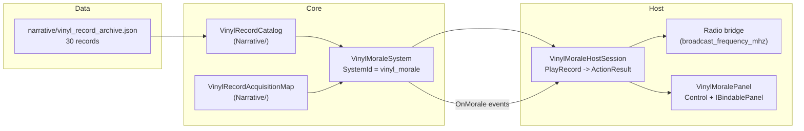

The workstream is the cleanest example of the T1→T5 ladder in the
repository: an authored archive of *objects with emotional metadata*, a
Core system that knows only ids and modifiers, a host session that turns
system calls into `ActionResult`s, and a panel that renders.

#### V.B.3 The Archive as Authored Design

Thirty records, each carrying eleven authored fields. The design intent
visible in the schema:

| Field group | Fields | What it does in play |
|---|---|---|
| Identity | `record_id`, `catalog_number`, `title`, `performer`, `recording_year` | Scavenging reward identity; catalog numbers (`MEL-78-####`, `MEL-33-####`) encode format in-world, letting collectors sort and brag |
| Physicality | `format_rpm`, `physical_condition` | 18 × 33 RPM vinyl LP vs 12 × 78 RPM shellac; wear text is flavor with a mechanical future (see hooks) |
| Effect | `daily_morale_modifier` | The only number the Core system reads; measured spread +5 to +10 |
| Radio bridge | `broadcast_frequency_mhz` | Every record carries one; tuning the shelter radio to a owned record's frequency is the discovery echo |
| Texture | `needle_audio_texture` | Prose description of playback; pairs with `audio_cue_id` on the Core definition side |
| Memory | `dweller_resonance_notes` | Authored survivor-memory hook; the flashback_suppression lever's narrative justification |

The split between the JSON archive (rich prose) and
`VinylRecordDefinition` in Core (ids + numbers + `audio_cue_id`) is the
workstream's key structural decision: **Core never loads the prose.** The
panel and host read the archive for display; the system reads
definitions for mechanics. That is why the morale test can assert
distinctness over the archive while Core remains a pure state machine.

#### V.B.4 Deep Component Specifications

**`VinylMoraleSystem`** (Core). State `VinylMoraleState`:
`ownedRecordIds` (append order = acquisition order, which the panel lists
by), `currentPlayingId`, `lastPlayedId`, `lastPlayedDay`, `totalPlays`,
`totalMoraleApplied`, `isTurntableActive`, plus the radio block
`lastBroadcastRecordId` / `lastBroadcastDay` / `broadcastCount` /
`lastBroadcastSignalStrength`. Behavior pinned by the test facts:
acquire adds once; play requires ownership; stop clears playing state;
the daily effect applies at most once per (record, day) — keyed on
`lastPlayedDay` compared against the host-provided day number — and a new
day re-enables it. `IsPlaying` is `isTurntableActive &&
currentPlayingId != ""`.

**`VinylMoraleHostSession`** (Host). Wraps the system with host
semantics: `PlayRecord(recordId, day)` returns an `ActionResult` (the
repository's command-result vocabulary) instead of throwing;
`LastEvent` exposes the most recent human-readable event for log/narrative
surfacing; `DayProvider` is a `Func<int>` so the session never owns the
calendar; `TickDay(day)` applies daily morale through the system;
`Save()` participates in the host dirty-tracking protocol. The session is
`sealed` and constructed with the system — it adds no state of its own
beyond `LastEvent`, so there is nothing to persist twice.

**`VinylMoralePanel`** (UI). A Godot `Control` implementing
`IBindablePanel`. Lifecycle: `Bind(session)` wires and refreshes;
`Unbind()` clears; `_ExitTree` unbinds (disposal hygiene). `RefreshView`
rebuilds the collection list from `ownedRecordIds` joined with archive
metadata; `UpdateRecordPreview` renders the selected record's fields
(identity, morale modifier, needle texture line). Empty collection is a
presentation state: hint text plus disabled play controls, derived from
`ownedRecordIds.Count == 0`, with no second source of truth. `OnClose`
preserves the keyboard/controller back contract.

**Acquisition map** (`VinylRecordAcquisitionMap`, `VinylRecordCatalog`).
The authored mapping of where records can be found; the acquisition
integration tests (`VinylAcquisitionIntegrationTests`) exercise the
scavenge-to-collection path. This keeps drop tables out of the morale
system — discovery is a separate authority.

#### V.B.5 Radio Bridge

`lastBroadcast*` state and `VinylRadioBridgeTests` document a deliberate
second channel: records are not only played on the turntable but
*receivable* — when the shelter radio is tuned to an owned record's
`broadcast_frequency_mhz`, the bridge records the broadcast (count, day,
signal strength). Mechanically this lets a found record's music exist in
the world before the object is found, which is the workstream's quiet
narrative trick: hearing a frequency first makes the physical disc a
resolution when it finally turns up in a ruin.

#### V.B.6 Save and Persistence

`CaptureRestoreState_PreservesCollection` pins the state roundtrip. The
state is entirely default-tolerant lists and scalars; the radio block was
added after the initial state (it sits at the bottom of the DTO), and the
roundtrip test's continued pass is the evidence that additive DTO growth
without a version bump held here.

#### V.B.7 Determinism

The once-per-day guard compares integers supplied by the host. Playback
order, acquisition order, and morale totals are deterministic functions
of the command history. Nothing in the workstream randomizes; even signal
strength is recorded rather than rolled.

#### V.B.8 Focused Test Anatomy

`Ashfall.Core.Tests/VinylMoraleSystemTests.cs` — nine `[Fact]`s in one
file: the four interaction facts (acquire, play owned, block unowned,
stop), the three daily-effect facts (applies, once per day, new day
applies again), the roundtrip fact, and the archive fact. The archive
fact loads `vinyl_record_archive.json` and asserts 30 records with
pairwise-distinct morale effects — the distinctness clause is what
prevents an author from padding the archive with filler records that all
grant +5. Sibling coverage: `VinylRecordCatalogTests` (catalog loading),
`VinylAcquisitionIntegrationTests` (discovery path),
`VinylRadioBridgeTests` (frequency bridge).

#### V.B.9 Evolution Since Closeout (verified)

| Area | 2026-09-01 | 2026-09-25 |
|---|---|---|
| Archive path | `vinyl_record_archive.json` (unqualified) | `Assets/StreamingAssets/Data/narrative/vinyl_record_archive.json` |
| Record count | 30 | 30 (morale +5…+10; 18 LP / 12 shellac; all carry frequencies) |
| Test family | 1 file | 4 files (system, catalog, acquisition, radio bridge) |
| State shape | collection + playback | + radio broadcast block |

#### V.B.10 Failure Modes and Mitigations

| Failure | Mitigation |
|---|---|
| Duplicate acquire | Acquire adds to an id list; duplicate ids would double-list — catalog tests plus authored-id uniqueness are the guard |
| Panel refresh with unbound session | `IsBound` gate; unbind on `_ExitTree` |
| Stale preview after acquire | Refresh follows every session mutation |
| Record deleted from archive while owned in a save | Preview join misses → panel must render the id-less record gracefully; this is the current weak edge (see risks) |
| Morale double-apply across save/load | `lastPlayedDay` is captured state, not derived |

#### V.B.11 Risks

1. **Tone compliance of authored prose.** The archive quotes real-world
   performers and repertoire. `AGENTS.md` forbids real people/countries in
   content. This document flags it; remediation is a data-fictionalization
   pass owned by the content authority, with the 30-record distinctness
   test unchanged (open question in Part VIII).
2. **Orphaned ownership.** A save holding a `record_id` that later leaves
   the archive renders dead entries; the panel-side fallback is currently
   the only mitigation and should be made explicit if the archive ever
   shrinks.
3. **Audio cue coupling.** `audio_cue_id` values on definitions must
   resolve in `AudioCueCatalog`; the audio catalog drift gate covers the
   registry side, but the vinyl-specific cue ids are only exercised at
   runtime.

#### V.B.12 Expansion Hooks (not approvals)

- **Condition-aware playback** — `physical_condition` prose could key a
  crackle intensity or rare skip event; would need a numeric condition
  column to stay data-driven.
- **Record-specific flashback scenes** — `flashback_suppression` implies
  a flashback roll exists; per-record memory scenes keyed off
  `dweller_resonance_notes` are a content-only extension.
- **Shellac vs vinyl wear rates** — `format_rpm` already partitions the
  archive; durability mechanics would consume it.

### Chapter V.C — Workstream C: Narrative Activation & Faction War

#### V.C.1 What the Closeout Delivered (2026-09-01)

1. **`LetterDeliverySystem`** in `Assets/Ashfall.Core/Narrative/` with the
   five-state machine (`Found`, `Addressed`, `Delivered`, `Withheld`,
   `Unanswered`), survivor relationship outcomes, and persistence.
2. **Faction-war host integration**: `FactionWarContentCatalogLoader` and
   `FactionWarChainRunner` wired into `YearOfAshHostSession` and
   `Main.YearOfAsh.cs`, with daily ticking, stage surfacing, auto-advance
   on zero-choice stages, and the v3/v4 save codec migration.
3. **Verification**: `LetterDeliverySystemTests` and `YearOfAshTests`
   including `YearOfAshSave_V4_CapturesAndRestoresChainRunnerProgress`.

#### V.C.2 Verified Current Architecture

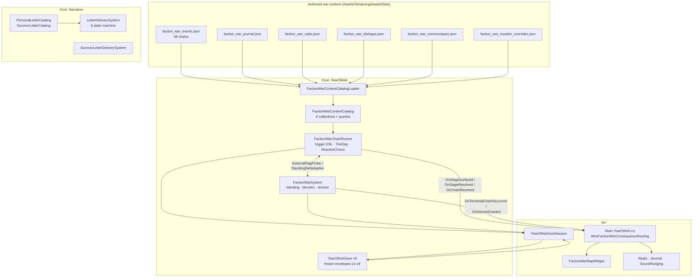

Two narrative authorities share this workstream and are kept strictly
apart: the **letter arc** (personal, finite, player-paced resolution) and
the **war chains** (regional, authored schedules, advancing whether or
not the player engages). They meet only at the save and at the host's
presentation routing.

#### V.C.3 The Letter State Machine

States and verified transitions *(source read in full,
`LetterDeliverySystem.cs`, 199 lines)*:

| From \ Command | `AddressLetter` | `DeliverLetter` | `WithholdLetter` | `MarkUnanswered` |
|---|---|---|---|---|
| *(absent)* | auto-discovers, → Addressed | auto-discovers, → Delivered | auto-discovers, → Withheld | auto-discovers, → Unanswered |
| Found | → Addressed | → Delivered | → Withheld | → Unanswered |
| Addressed | re-address (idempotent) | → Delivered | → Withheld | → Unanswered |
| Delivered | blocked (`false`) | blocked (`false`) | blocked (`false`) | blocked (`false`) |
| Withheld | blocked | blocked | blocked | → Unanswered |
| Unanswered | → Addressed | → Delivered | → Withheld | re-mark (idempotent) |

The asymmetry is the design: **Delivered is terminal** — once a letter
reaches its recipient, no later command rewrites history. Withheld can
decay to Unanswered (the letter sits in a drawer until the window
passes), and Unanswered is recoverable (a lingering letter can still be
addressed and delivered). Each record persists `foundDay`,
`resolvedDay`, `recipientSurvivorId`, `resolutionNotes`, and the applied
`moraleDeltaApplied` (default +6.0 on delivery) — the save alone answers
"what did I do with the last letter, and when."

Events: `OnLetterDiscovered`, `OnLetterDelivered(record, delta)`,
`OnLetterWithheld(record)`, `OnLetterUnanswered(record)`, all raised
after the state mutation. The sibling family around it —
`PersonalLetterCatalog`, `SurvivorLetterCatalog`,
`SurvivorLetterDeliverySystem`, `PersonalLetterProjection` — supplies the
authored letters and the read-model the UI consumes; the state machine
itself stays catalog-agnostic and accepts bare ids.

#### V.C.4 Faction-War Content Design

The loader treats six files as one catalog. Verified shapes:

| File | Collection | Query surface | Notable fields |
|---|---|---|---|
| `faction_war_events.json` | 38 event chains | `GetEligibleChains(day)` | `chainId`, `band` (e.g. `cold_war`), `factionsInvolved`, `locationId`, stages |
| `faction_war_journal.json` | journal entries | `GetJournalForDay(day)` | day-windowed war reportage |
| `faction_war_radio.json` | broadcasts | `GetBroadcastsForDay(day)` | intercept-grade war chatter |
| `faction_war_dialogue.json` | dialogue snippets | `GetDialogueForLocation(loc, day)` | location-annotated lines |
| `faction_war_communiques.json` | communiques | `GetCommuniquesForFaction(faction, day)` | faction-addressed demands |
| `faction_war_location_overrides.json` | location overrides | `GetActiveLocationOverride(loc, day)` | day-windowed world-state swaps |

Stages carry `minDay`, a `triggerCondition` key resolved through
`FactionWarTriggerTable`, optional `requiresFlag` / `producesFlag` gates,
choices with `moraleDelta`, `leadsToStageId` (empty = chain resolves),
flag production, and faction `standingDelta`. The `band` field partitions
chains into war phases; `factionsInvolved` ties chains to the standing
simulation in `FactionWarSystem` without importing it — content references
factions by id, and only the host binds effects.

#### V.C.5 The Chain Runner

**Trigger DSL** *(verified class set)*:

| Trigger | Satisfied when |
|---|---|
| `FlagTrigger(flagId)` | flag set (runner-produced or host-probed) |
| `PlayerVisitedTrigger(locationId)` | location recorded via `RecordLocationVisited` |
| `ChainResolvedTrigger(chainId)` | named chain resolved |
| `DayOffsetTrigger(offset, fromStageIds)` | named stage(s) resolved `offset` days ago (relative chaining) |
| `AndTrigger(...)` | all sub-conditions |
| `AlwaysTrigger.Instance` | always (schedule-driven stages) |

`FactionWarTriggerTable.For(stageId)` maps authored
`triggerCondition` strings to trigger instances — authored content speaks
keys, Core owns semantics.

**Epoch remap.** Authored `minDay` values begin at day 480 while the
playable campaign window is 180–360. `ToAuthoredDay(playableDay) =
playableDay + (480 − 180)` bridges them; content is authored on its own
calendar and the runner translates. This keeps a future campaign-length
change from rewriting 38 chains.

**Lifecycle.**

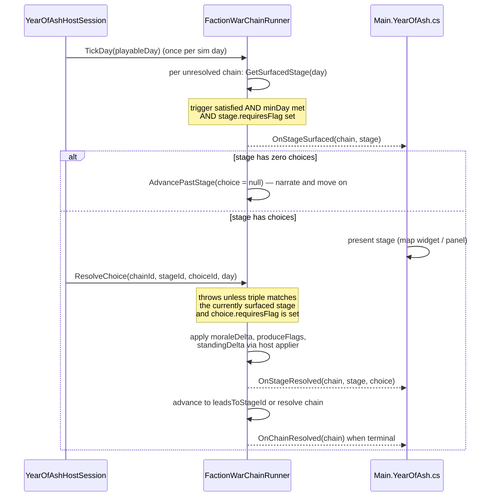

**Flag economy.** `producedFlags` is append-only runner state; the
`requiresFlag` gates consult it and then `ExternalFlagProbe` — the
host's campaign flag store (e.g. Plan 25 grievance flags authored by the
faction action board). Chains, stages, and choices can all produce flags,
so one decision can unlock a distant stage of an unrelated chain months
later. `IsChoiceAvailable` makes the gate player-visible: hosts must not
render or speculatively resolve a choice whose flag is unset, and the
runner enforces it with an exception as backstop.

**Host injection points.** `StandingDeltaApplier` (Action<string,int>)
and `ExternalFlagProbe` (Func<string,bool>) are the only two directions
the runner touches the world. Core never mutates war standing directly —
the closeout's single-authority rule, made mechanical.

#### V.C.6 The Save Codec: Five Rungs, One Pattern

`YearOfAshSave.cs` (371 lines, read in full) is the repository's
reference persistence implementation. `CurrentSaveVersion = 5`.

| Version | Added | Frozen envelope class | Migration behavior |
|---|---|---|---|
| v1 | timeline, encounters, faction-war standing | `YearOfAshSaveV1` | checksum over v1 field set; deepFreeze / radon / quests / warlord / chain runner start at defaults |
| v2 | + deepFreeze, radon, quests | `YearOfAshSaveV2` | checksum over v2 fields; warlord and chain runner default (chains replay from the beginning) |
| v3 | + warlord doctrine | `YearOfAshSaveV3` | checksum over v3 fields; **chain runner section defaults — the closeout's v3/v4 work** |
| v4 | + faction-war chain runner | `YearOfAshSaveV4` | checksum over v4 fields; ice-road section defaults |
| v5 | + ice-road economy (`IceRoadState`) | current `YearOfAshSave` | identity; checksum over current fields |

The migration invariants, each enforced in `Decode` / `MigrateToCurrent`:

1. **Reject the future.** `saveVersion > CurrentSaveVersion` throws with
   both numbers — an old binary refuses a newer save rather than
   hallucinating compatibility.
2. **Validate over the authored field set.** Each legacy version is
   deserialized as its *frozen* type so its checksum is computed over
   exactly the fields that era hashed. Added fields in the payload are
   ignored, never trusted — a tampered v3 cannot smuggle a chain-runner
   section past the v3 checksum.
3. **Defaults are fresh-system defaults.** New sections initialize "at
   field initialisers, which are the same defaults a fresh system would
   construct" (source comment). Migration never invents content: a v3
   save resumes with every chain unstarted, and the war narrative replays
   from the beginning — a stated design trade, chosen over synthesizing
   mid-chain state.
4. **Re-stamp and re-hash.** The upgraded envelope gets a fresh checksum
   over the current field set and the current version number, so the
   *next* save round is a normal v5 write.

The chain runner nests a second version axis inside the envelope: its
state carries `schemaVersion = 1` of its own. Envelope version answers
"which sections exist"; section version answers "what shape is this
section." Both axes are owned by their own layer, and neither implies the
other — the pattern to copy for any future section that evolves faster
than the envelope.

`CaptureSave`/`RestoreSave` on `YearOfAshHostSession` are the only
writers/readers. Restore distributes sections to subsystems whose
`RestoreState` implementations are null-tolerant;
`RestoreState_WithNullSections_IsANoOp` pins that a partial payload
degrades to defaults, not exceptions.

#### V.C.7 Host Wiring and Consequence Routing

`Main.YearOfAsh.cs` (verified, `SetupYearOfAsh` +
`WireFactionWarConsequenceRouting`):

- **Session creation** happens once; questline events mark
  `_yearOfAshDirty` exactly like encounters (one save dirty-flag for the
  whole Year of Ash host).
- **`OnTerritorialClashOccurred(faction1, faction2)`** fans out to three
  projections: a radio intercept line (warlord warning), a permanent
  journal entry keyed `war_clash_{day}_{f1}_{f2}`, and a
  sound-ranging observation (`RecordHostileFire` with a bearing derived
  as `(day * 37) % 360`, class `class_heavy_howitzer`, tagged with the
  attacker faction id) — Plans 30B and 123 consequence routing.
- **`OnDecreeEnacted(decreeId)`** projects a radio decree line and marks
  dirty.
- **Runner events** (`OnStageSurfaced`, `OnStageResolved`,
  `OnChainResolved`) each write a journal/radio record and mark dirty.
- **`FactionWarMapWidget`** renders front positions; the status readout
  surfaces `WarTension` and `DominantFactionId` from `FactionWarSystem`.

Note what the host does *not* do: no handler mutates war standing,
chain progress, or any Core state. The dirty flag and the projections
are the entire footprint. This is the event-flow contract of III.3
exercised at scale.

#### V.C.8 Determinism

- `TickDay` iterates `_catalog.EventChains` in authored load order; all
  per-chain decisions are pure functions of (day, flags, visited set,
  stage resolutions).
- `DayOffsetTrigger` compares integer resolved-days recorded in
  `StageResolution` entries — relative chaining is replay-stable.
- The sound-ranging bearing `(day * 37) % 360` is a pure day function,
  chosen (per source context) so save-fuzz replays reproduce identical
  observations.
- Letter morale deltas are explicit constants or authored values; nothing
  rolls.

#### V.C.9 Focused Test Anatomy

From `Ashfall.Core.Tests/YearOfAshTests.cs` and
`LetterDeliverySystemTests.cs` (both read on 2026-09-25):

| Test | What it pins |
|---|---|
| `LetterDeliverySystemTests.DiscoverAndDeliverLetter_AppliesMoraleAndTransitionsState` | happy-path transition + morale payload on the record and via event |
| `LetterDeliverySystemTests.WithholdAndUnanswered_TransitionsStateCorrectly` | the non-terminal branches, incl. Withheld → Unanswered decay |
| `LetterDeliverySystemTests.StateSaveAndRestore_PreservesAllDeliveryRecords` | full record roundtrip incl. notes and applied delta |
| `YearOfAshTests.YearOfAshSave_V4_CapturesAndRestoresChainRunnerProgress` | v4 envelope captures and restores per-chain stage progress |
| `YearOfAshTests.YearOfAshSave_V3Envelope_MigratesWithFreshChainRunner` | a v3 payload migrates with chains unstarted (migration semantics, not data loss) |
| `YearOfAshTests.YearOfAshSave_V1File_MigratesToCurrentWithFreshSections` | the oldest rung still climbs the whole ladder |
| `YearOfAshTests.FactionWar_SimulatesDailyFrictionCorrectly` / `FactionWar_ModifiesStandingAndEnactsDecrees` | standing/decree simulation |
| `YearOfAshTests.DoorEncounters_EvaluatesHumanistVsRuthlessReactionsDeterministically` | determinism contract on the encounter side |
| `FactionWarChainRunnerTests`, `FactionWarContentCatalogTests` (+ dialogue / communique / location-override expansion files) | runner transitions and catalog loading counts |

The codec tests are the interesting anatomy: each runs a *real older
envelope* through `Decode`, asserting both the materialized state and the
rejection edges (future version, checksum mismatch). That is why the v5
rung could be added without touching the v3/v4 tests — the ladder is
additive by construction.

#### V.C.10 Evolution Since Closeout (verified)

| Area | 2026-09-01 | 2026-09-25 |
|---|---|---|
| Save version | v4 current (chain runner added) | v5 current (ice-road added); v1–v4 frozen |
| Stage gating | trigger + minDay | + `requiresFlag` stage/choice gates, `IsChoiceAvailable` (Plan 25) |
| Host routing | war chains tick and surface | + Plans 30B/123 consequence routing into radio, journal, sound ranging |
| Letter family | `LetterDeliverySystem` | + standalone `SurvivorLetterDeliverySystem`, `PersonalLetterProjection` siblings |
| Content | faction-war chains | 38 chains across six files (measured) |

#### V.C.11 Failure Modes and Mitigations

| Failure | Mitigation |
|---|---|
| Host resolves a stale/unsurfaced stage | `ResolveChoice` throws on triple mismatch — cannot desync |
| Choice with unset `requiresFlag` rendered | `IsChoiceAvailable` contract + runner-side exception backstop |
| Chain stuck awaiting input that never comes | zero-choice stages auto-advance in `TickDay` |
| Checksum tampering | per-rung checksum over frozen field sets; mismatch throws |
| Future save in old binary | version guard throws with both numbers |
| Partial/corrupt section payload | null-tolerant restore; `…NullSections_IsANoOp` test |
| Missing faction-war JSON file | loader file-name constants + per-file guards degrade to empty collection; catalog count tests catch it in CI |

#### V.C.12 Risks

1. **Replay-from-zero surprise.** Pre-v3 saves intentionally replay war
   chains from the beginning. If a chain awards permanent world flags,
   re-surfacing it years later in a long campaign must not double-award
   host-side effects — the journal keys are day-suffixed, but a
   host-effect audit for flag consumers is prudent before any chain
   gains permanent economy rewards.
2. **Trigger-table vocabulary.** `triggerCondition` strings are resolved
   through a static table; an authored typo yields an unsatisfiable
   stage. The table lookup's failure mode should stay loud (exception or
   log) — worth a catalog-integrity rule if more chains are authored.
3. **Envelope-version bisection cost.** Every new rung adds one frozen
   class and one migration block. The pattern scales linearly; a leapfrog
   compression (migrate v1→v3 directly) would violate the
   validate-over-authored-fields invariant and should be refused.

#### V.C.13 Expansion Hooks (not approvals)

- **Withheld-letter consequences** — the Withheld→Unanswered decay is
  ready to carry a relationship cost via `OnLetterUnanswered` consumers.
- **Chain-authored faction standing floors** — choices already carry
  `standingDelta`; floors would extend `StandingDeltaApplier`'s host
  contract, not Core.
- **Ice-road / war-chain composition** — v5's ice-road section and the
  chain runner share `YearOfAshSave`; cross-section triggers (a frozen
  road enabling a war stage) would compose through `ExternalFlagProbe`
  with zero Core changes.

### Chapter V.D — Workstream D: Audio Gap Closure & Reactive Ambience

#### V.D.1 What the Closeout Delivered (2026-09-01)

1. **Audio catalog sync**: `docs/audio/AUDIO_CUE_CATALOG.md` regenerated,
   74 cues at the time, `--check` clean.
2. **Presentation controllers**: `ShelterAudioController` and
   `SurfaceAmbienceController` operating strictly on presentation/events
   with zero save mutation and hysteresis (edge detection).
3. **Verification**: `python3 scripts/ci/generate-audio-catalog.py --check`.

#### V.D.2 Verified Current Architecture

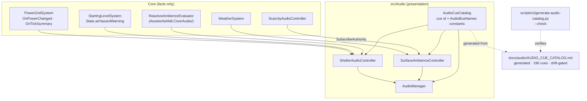

The load-bearing property is the arrow that does not exist: nothing in
the audio chain writes back into Core state or the save. Audio is the
last consumer in every chain it participates in.

#### V.D.3 The Cue Registry and the Generated Catalog

`src/Audio/AudioCueCatalog.cs` owns two constant families
*(verified 2026-09-25)*:

- **`AudioBusNames`** — fifteen bus-name constants: `Master`, `Music`,
  `Ambience`, `Sfx`, `Ui`, `Voice`, `Alerts`, `Generator`,
  `Ventilation`, `Radio`, `Medical`, `Surface`, plus `Machinery`,
  `ShelterSocial`, `Subterranean`. Buses route through each other
  deliberately (Generator and Ventilation into Ambience, Radio into
  Voice, Medical into Alerts, Surface into Ambience), so a player's
  ambience slider moves a whole family without re-mixing.
- **`AudioCueCatalog`** — string cue ids (`ui_click`, `ui_confirm`,
  `ui_warning`, `ShelterGeneratorStart`, `ShelterBreakerTrip`,
  `ShelterPowerRestore`, `ShelterAirFilter`, `DangerAlarmKlaxon`, …)
  consumed by controllers and panels. Cue ids are the join key between
  code and the generated document.

`docs/audio/AUDIO_CUE_CATALOG.md` is **generated**: its header self-
reports "Total Registered Cues: 196", "Last Verified: 2026-09-18", and
the drift gate command. The master register table carries one row per
cue with columns **Cue ID / Target Bus / Resource Path / Loop / Volume
Trim / Cooldown / Asset Status** — cooldown is the documented half of the
hysteresis story (code-side edge detection, data-side cooldown timers),
and Asset Status makes missing-files visible in review instead of at
runtime. The document also carries bus-architecture tables and companion
documents (`AUDIO_EVENT_COVERAGE.md`, `SILENCE_AUDIT.md`, a pipeline
reproducibility ledger) that grew out of the closeout-era work.

One drift observation recorded honestly: the document's overview table
describes twelve buses while the registry constants now list fifteen;
the three newer buses (`Machinery`, `ShelterSocial`, `Subterranean`)
post-date the doc's bus table. The register rows are generated and
authoritative; the prose bus table lags. This is exactly the class of
drift `--check` exists to catch for the register — the prose table is
manual content and should be refreshed by the audio owner.

#### V.D.4 Deep Specification: `ShelterAudioController`

**Responsibility.** Translate shelter-system facts into cue output:
breaker trips and restores, generator loop start/stop, brownout klaxon,
clogged-filter hazard cue, ventilation loop presence. `IDisposable`;
exposes its `ReactiveAmbienceEvaluator` for read-only inspection.

**Subscription model** *(verified)*. `Subscribe(PowerGridSystem?,
StartingLevelSystem?)` is re-entrant safe: reference-equality early-out
when nothing changed; explicit unwire of old handlers before rewiring;
an immediate `SyncPowerState(emitTransitions: false)` to load the
snapshot without cueing; `_filterHazard` initialized from
`State.airHazardWarning`; `SyncVentilationLoop()` started to match
reality on bind rather than waiting for an event.

**Edge detection** *(the closeout's "hysteresis", made concrete)*. The
controller keeps boolean snapshots — `_hasPowerSnapshot`,
`_generatorRunning`, `_brownout`, `_filterHazard` — and cues only on
transitions:

| Transition | Cue |
|---|---|
| generator: stopped → running | `ShelterGeneratorStart` |
| generator: running → stopped | `ShelterGeneratorStop` |
| brownout clears | `ShelterPowerRestore` |
| breaker `open_to_closed` detail | `ShelterPowerRestore` |
| breaker `Tripped` | `ShelterBreakerTrip` |
| tick summary `IsBrownout` | `DangerAlarmKlaxon` |
| air hazard rising edge | `ShelterAirFilter` |

Generator truth is computed, not stored as an event: `running =
GenerationWatts > 0f && FuelUnits > 0f` — the audio layer re-derives the
fact from authoritative scalars so a missed event self-heals on the next
tick.

**Failure modes & mitigations.** Double-subscribe → reference-equality
guard. Use-after-dispose → `ThrowIfDisposed()`. Event storm → edge
snapshots; a system that re-broadcasts the same state ten times produces
zero cues. First-tick false alarm → `emitTransitions: false` priming.

#### V.D.5 Deep Specification: `SurfaceAmbienceController`

**Responsibility.** Location-resolved ambience beds plus weather and
scarcity layering. `IDisposable`.

**API** *(verified)*: `Subscribe(WeatherSystem?)`,
`SubscribeAuthority(ScarcityAudioController?)` (the Plan 52
sound-of-scarcity authority layer), `SetLocation(string?)`,
`Start()`, `Stop()`, `static ResolveLocationAmbience(string?)`,
`Dispose`.

**Location resolution.** `ResolveLocationAmbience` is a pure static
function from location id to ambience selection — the mapping is table-
driven and total, with a default bed for unknown ids. Purity matters:
the same location string must select the same bed on every machine,
every session, which is what makes an audio QA report reproducible from
a save alone.

**Layering.** Three inputs stack without owning each other: the
location bed (where you are), the weather subscription (what the sky is
doing), and the scarcity authority (what the shelter lacks). The
controller arbitrates *output*, never *facts* — each subscriber remains
the authority for its own domain, which is why the authority seam is a
named method (`SubscribeAuthority`) rather than a second `Subscribe`.

**Failure modes & mitigations.** Same disposal/subscription guards as
the shelter controller; `Start`/`Stop` are idempotent transport
controls; unknown location ids fall through to the default bed instead
of silencing the surface.

#### V.D.6 `ReactiveAmbienceEvaluator` (the Core-side half)

The evaluator lives in `Assets/Ashfall.Core/Audio/` — the one piece of
the workstream that is engine-free domain logic. The split is clean:
the evaluator *computes what the ambience should be* (a pure function of
shelter state), the controllers *perform it* (Godot buses and players).
Because the evaluator is Core, its thresholds are testable without a
Godot runtime, and the controllers' tests can stub the evaluator's
output rather than simulating a power grid. This is the same
computation/performance split the vigil uses (state machine in Core,
scene in host).

#### V.D.7 The Generation Gate

`scripts/ci/generate-audio-catalog.py` reads the registered cues and
writes the markdown catalog; `--check` regenerates in-memory and fails
on any byte difference. The economics are worth stating: a generated
document converts "documentation drift" from a review-time judgment call
into a red CI line, at the cost of forbidding hand edits. The header
even embeds the check command so a human who edits by hand meets the
gate before CI does. `AUDIO_CUE_CATALOG.md` is the repository's largest
generated document family member and the template the CLI catalog and
save-store matrix gates follow.

#### V.D.8 Save and Persistence: A Deliberate Zero

Neither controller implements capture/restore, and the audio document
family carries no save-section claims. The invariant is contractual:
*audio state is derivable from game state.* If a future feature needs
persisted audio (e.g. a survivor's favorite record), the persisted fact
belongs in the owning system (vinyl state), not in the audio layer —
the controllers would re-derive the ambience from it on load.

#### V.D.9 Determinism

Audio output timing is presentation, outside the replay contract, but
the workstream still observes the discipline where it can: cue
*selection* is a pure function of Core facts and edge snapshots;
`ResolveLocationAmbience` is total and static; the evaluator is Core
logic without randomness. What is allowed to vary is only *when* a cue
reaches the hardware, never *which* cue a state produces.

#### V.D.10 Focused Test Anatomy

Audio-side test artifacts found on 2026-09-25:

- `Ashfall.Core.Tests/Audio/` — `ShelterAcousticDirectorTests`,
  `Plan52SoundOfScarcityIntegrationTests`,
  `Plan52ScarcityAudioHostIntegrationTests`,
  `Plan67CassetteSetsTests`, `AudioSettingsRecoveryTests`,
  `AudioAccessibilityCatalogLoaderTests`,
  `Plan169AudioAccessibilityIntegrationTests`.
- Top-level: `AudioConditionSystemTests`,
  `AudioEventIntegrationTests`, `MachineTellAudioSyncTests`.

The named-generations are themselves history: the Plan 52 scarcity
integration and Plan 67 cassette sets post-date or parallel the
flagship closeout, and the accessibility catalog loader tests connect
the audio registry to the UI-accessibility gate (the closeout matrix's
`--ui-accessibility-selftest`, 5/5 green, historical). Note the closeout
named no audio unit tests at all — its verification was the `--check`
gate. The test family visible today is the later proof that the
controllers' seams (subscription, edge detection, authority) were built
to be testable.

#### V.D.11 Evolution Since Closeout (verified)

| Area | 2026-09-01 | 2026-09-25 |
|---|---|---|
| Registered cues | 74 (closeout matrix) | 196 (catalog document header, last verified 2026-09-18) |
| Buses | 12 documented | 12 in doc prose, 15 registry constants (`Machinery`, `ShelterSocial`, `Subterranean` newer) |
| Test family | none named | 10+ files incl. Plan 52/67/169 integration tests |
| Document family | single catalog | + coverage, silence audit, mastering report, reproducibility ledger, flagship phase reports |

The 74→196 growth is the single largest numeric drift of any workstream,
and its character matters: growth came with a drift gate and per-cue
metadata columns, i.e. the catalog became an *instrument*, not just a
list.

#### V.D.12 Failure Modes and Mitigations (consolidated)

| Failure | Mitigation |
|---|---|
| Cue spam from chatty events | Edge snapshots in both controllers; cooldown column in the register |
| Handler leak on re-subscribe | Explicit unwire before rewire; `IDisposable` end-of-life |
| Cue after panel/session teardown | `ThrowIfDisposed` guards; controllers disposed with their scene |
| Missed power event | Truth re-derived each tick (`GenerationWatts > 0 && FuelUnits > 0`) |
| Doc/code drift | `--check` gate; generated register is authoritative |
| Unknown location silences ambience | Total mapping with default bed |

#### V.D.13 Risks

1. **Prose table rot.** The manual bus-overview table already lags the
   registry (12 vs 15). Manual sections inside a generated document
   erode trust in the generated sections; the audio owner should either
   generate the bus table or move it to a companion doc.
2. **Cooldown data quality.** Cooldowns are authored per cue; a wrong
   value is invisible to every gate (the cue still fires). Only audio QA
   catches it.
3. **Bus-count coupling.** Client audio settings UI and accessibility
   gates enumerate buses; adding a bus is a cross-cutting change (code,
   generated doc, settings UI, accessibility catalog) and should be
   treated as one package, not a registry edit.

#### V.D.14 Expansion Hooks (not approvals)

- **Vinyl playback on the `Music` bus** — `audio_cue_id` on record
  definitions already points at the registry; playback-through-bus is
  the missing performance half of Workstream B's needle texture.
- **Vigil scene audio** — `VigilStateMachine`'s `OnNameRecited` /
  `OnPhantomKnock` events are unconsumed by audio; a `Medical`-bus cue
  per recitation would close the loop with Workstream F.
- **Reactive ambience for war state** — `FactionWarSystem.WarTension`
  is a scalar begging for an ambience layer through the existing
  authority-subscription pattern.

### Chapter V.E — Workstream E: Visual Asset Coverage & Scene Validation

#### V.E.1 What the Closeout Delivered (2026-09-01)

1. **Scene linter**: `scripts/ci/scene-lint.py` run over 26 scenes, zero
   errors, zero warnings.
2. **Scene binding self-test**: `--scene-binding-selftest` green at
   22/22 UI scene contracts.
3. Both counts are `UNVERIFIED (historical closeout text)` as to today's
   numbers; the tools themselves are current and were read in full.

#### V.E.2 Why Structure Before Behavior

Workstream E is the odd one out in Part V: it owns no simulation, no
save section, no events. Its subject is the *reliability substrate* the
other five workstreams render through. A `.tscn` that references a
missing texture, a mis-cased path, or a dangling `uid://` produces
failures at scene-load time — which in Godot means possibly mid-session,
possibly only on one platform, and almost always far from the edit that
caused it. The linter's premise is that structural errors are cheap to
detect statically and expensive to detect behaviorally, so structure is
checked first, in CI, on every change.

The closeout's placement of this work alongside the gameplay streams is
the statement: a panel that cannot load is a broken feature regardless
of how correct its Core system is.

#### V.E.3 Deep Specification: `scripts/ci/scene-lint.py`

**Scope** *(verified from the script's own docstring and constants)*.
Validates `.tscn` and `.tres` in the active Godot tree only:
`assets/ui/scenes/`, `assets/ui/panels/`, `assets/ui/components/`,
`assets/ui/modals/`, plus `scenes/Main.tscn` and
`scenes/CSharpTest.tscn`. The allowlist is the point — linting the
whole tree would sweep historical and non-production resources and
drown the signal.

**Check families**:

| Family | What it detects | Why it exists |
|---|---|---|
| A. ext_resource | referenced file existence, path case match, declared type plausibility | missing/mistyped resources fail at load, not review |
| B. sub_resource | malformed or incomplete sub-resource references | corrupt inline resources |
| C. UID | malformed UIDs, stale or dangling `uid://` refs, duplicate UIDs across resources, duplicate ids within one resource | Godot's UID index is load-bearing; duplication silently redirects references |
| D. path case | `res://assets/...` in scene text resolving on disk to `res://Assets/...` | the tree is case-distinct; case-mismatched references work on case-insensitive dev filesystems and break in exports |
| E. script validity | referenced script exists and is a loadable C# source | a renamed/moved C# file otherwise fails at scene instantiation |
| F. node contract | optional `scene_ownership.kind` field — required nodes per ownership kind | structural encoding of "every scene has an owner and a lifecycle contract" |

**Output discipline.** The script exits 0 only when the single
production scene tree is green; otherwise it prints actionable errors
with file and line context. "Actionable" is the design goal: each error
names the resource, the offending reference, and the violated rule, so
the fix does not require re-deriving the lint's model.

**The case-distinct trap (family D) deserves emphasis.** The repository
carries both `Assets/` (C# projects, StreamingAssets) and `assets/`
(Godot-native art, scenes, imports) — same name, different case,
different roles (`AGENTS.md` §Architecture). A scene authored on a
case-insensitive filesystem can reference `res://Assets/ui/...` and work
for its author while failing in an export build. The linter resolves
every path against the real tree and fails the mismatch explicitly. This
is institutional memory encoded as a gate: someone paid for this bug
before it became a check.

#### V.E.4 Deep Specification: The Scene-Binding Self-Test

The `--scene-binding-selftest` host CLI verb verifies that each
production UI scene *binds*: the scene instantiates, its script resolves,
and the panel's contract surface (the `IBindablePanel` pattern —
`Bind`/`Unbind`/`IsBound`, close/back signals) is present and wired.
Where the linter proves *structure*, the binding selftest proves
*instantiation*: it is the cheapest rung of the UI ladder that can catch
"valid `.tscn`, wrong root type, missing script attachment, broken
signal hookup".

The pattern it protects is visible in the panels this document has
already specified: `VinylMoralePanel : Control, IBindablePanel` with
`Bind(VinylMoraleHostSession)`, `Unbind()`, `IsBound`, `OnClose`. The
binding test enumerates these contracts across the panel fleet; 22/22
was the closeout-era count, historical as to today.

#### V.E.5 The Asset Registry Seam

`src/Host/AssetRegistry.cs` centralizes texture resolution: canonical
fallbacks (`placeholder_survivor.png`, `icon_placeholder.png` per
`docs/CURRENT_AUTHORITY.md`), procedural generation for missing art, and
one lookup path for every consumer. The linter and registry are
complementary halves of visual coverage:

- The linter guarantees scene *references* resolve.
- The registry guarantees *runtime lookups* degrade gracefully to
  canonical fallbacks instead of null textures.

`docs/visual/` carries the audit family (fallback asset policy, direct
`GD.Load` audit, asset gallery) that keeps the registry's authority
honest — direct loads bypassing the registry are an audited exception,
not a pattern.

#### V.E.6 Position in the Gate Ladder

Scene validation sits at the intersection of three gate families
(see Part VII for the full ladder):

1. **Static structure** — `scene-lint.py` (Python, no Godot runtime).
2. **Instantiation** — `--scene-binding-selftest` (Godot headless).
3. **Visual regression and coverage** — snapshot targets
   (`docs/ui/SNAPSHOT_COVERAGE.md`, 29 golden targets at 1280×800 per
   the current authority map) and the asset gates
   (`generate-asset-registry.py --check`, `asset-decode-gate.py`,
   `audio-asset-gate.py`).

Each rung assumes the rungs below it: snapshots are meaningless if
binding fails, and binding is meaningless if lint fails. The ordering is
also the debugging order when a scene regression lands.

#### V.E.7 Verification Anatomy

The workstream's verification *is* its tooling — there are no xUnit
files, by design:

| Tool | Runtime | Failure surface |
|---|---|---|
| `python3 scripts/ci/scene-lint.py` | CPython, file I/O only | structural errors, path case, UIDs, scripts, ownership kinds |
| `godot --headless -- --scene-binding-selftest` | Godot headless | instantiation and binding contract failures |
| `godot --headless -- --ui-accessibility-selftest` | Godot headless | focus, contrast, keyboard/controller close (5 gates, closeout-era) |
| `generate-asset-registry.py --check` | CPython | registry drift |

The split between Python and Godot runtimes is deliberate: everything
answerable from files stays out of the engine (fast, parallel, no
license/boot cost), and only true instantiation questions pay the Godot
boot.

#### V.E.8 Evolution Since Closeout (verified)

| Area | 2026-09-01 | 2026-09-25 |
|---|---|---|
| Linter scope | 26 scenes, 0 errors (historical) | same script; documented allowlist now explicit in the docstring; `scene_ownership.kind` contract present |
| Binding test | 22/22 (historical) | verb present in the host CLI; current count not re-run by this expansion |
| Ecosystem | lint + binding | + snapshot coverage docs, TIER3 readiness, node-diagnostics and leak-triage guides (`docs/ui/`) |

#### V.E.9 Failure Modes and Mitigations

| Failure | Mitigation |
|---|---|
| Case-mismatched resource path | Family D explicit check |
| Duplicate UID after copy-pasting a scene | Family C duplicate detection |
| Script renamed without scene update | Family E loadability check |
| Scene without an ownership contract | Family F flags missing `scene_ownership.kind` |
| Linter itself drifts from tree layout | Allowlist is explicit in one place; tree changes are lint changes by review |

#### V.E.10 Risks

1. **Allowlist stagnation.** New UI directories must be added to the
   lint allowlist by hand; a forgotten addition means unlinted scenes.
   The failure is silent by construction — nothing flags "directory with
   .tscn files outside the lint scope" today.
2. **Ownership vocabulary.** `scene_ownership.kind` is free-form unless
   validated against a vocabulary; the check currently enforces presence
   and required nodes per kind, so a misspelled kind is a lint gap.
3. **Two-scene CLI surfaces.** `Main.tscn` and `CSharpTest.tscn` are
   named individually; a renamed entry scene breaks the allowlist loudly
   (lint fails to find it), which is the correct failure direction.

#### V.E.11 Expansion Hooks (not approvals)

- **Orphan-scene detection** — report `.tscn` files under the UI tree
  that are neither allowlisted nor referenced, closing risk 1.
- **Ownership vocabulary gate** — validate `kind` against a fixed set,
  optionally generated, matching the repository's generated-doc
  philosophy.
- **Binding coverage report** — generate the scene/binding count matrix
  so the "22/22" class of claim becomes a checked artifact instead of a
  prose memory.

### Chapter V.F — Workstream F: Medical Diagnosis & Care

#### V.F.1 What the Closeout Delivered (2026-09-01)

1. **Diagnostic architecture**: disease catalog validated across 15
   diseases with vector countermeasures (now 20; see evolution).
2. **Detox & vigil support**: `ChemicalDependencySystem` and
   `VigilStateMachine` validated for managed detox, cold-turkey
   withdrawals, and bedside vigils.

#### V.F.2 Verified Current Architecture

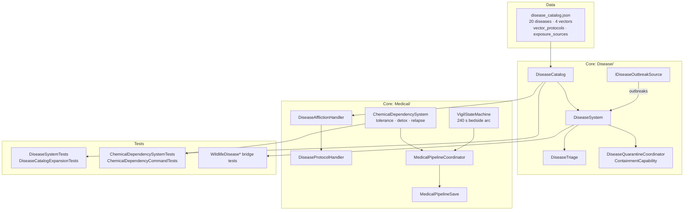

Three authorities share the medical register and stay separate: the
**disease simulation** (what is spreading), the **dependency ledger**
(what tolerance a body carries), and the **vigil** (how the shelter
accompanies a dying member). The pipeline coordinator composes them for
host consumption without owning any of them.

#### V.F.3 The Disease Catalog as Diagnosis Design

Twenty diseases across four vectors *(measured 2026-09-25)*. The
catalog's diagnosis mechanics live in three field groups:

| Group | Fields | Design role |
|---|---|---|
| Simulation | `vector`, `lethality`, `incubation_days`, `illness_days`, `infectivity`, `spread_interval_days`, `spread_radius` | drives the outbreak model; `spread_radius`/`spread_interval_days` make quarantine geography matter |
| Diagnosis | `tell`, `tell_secondary`, `timing_clue`, `guidance` | the *observable* symptoms a player actually sees; `timing_clue` rewards attention to onset order |
| Care | `countermeasure_item_id`, `treatments`, `immunity_duration_days`, `immunity_strength`, `phases` | the countermeasure that blocks the vector, treatments that shorten illness, and recovery immunity |

**Vector countermeasures** form the catalog's strategic spine — one
stock item per transmission route, verified across all 20 diseases:

| Vector | Countermeasure | Diseases | Lethality range |
|---|---|---|---|
| `water` | `clean_water` | 5 (cholera, typhoid, wellspring cramps, silt jaundice, dysentery) + acute radiation syndrome | 0.2–0.8 |
| `air` | `gas_mask` | 6 (zoonotic flu, fungal respiratory, condemned-air cough, dry-bunker hiss, meningococcal fever) | 0.15–0.6 |
| `blood` | `antibiotics` | 4 (blood fever, septic rust wound fever, reused-needle fever, bloodborne hepatitis) + prion tremor (medical kit) | 0.2–0.85 |
| `spore` | `hazmat_suit` | 4 (spore blight, deep-excavation mold lung, silo lung, spore wound dermatitis) | 0.22–0.65 |

The countermeasure mapping is also the economy hook: `clean_water`
doubles as the baseline survival resource, so the water workstream *is*
the first-line medical defense — a cross-workstream consequence
developed in Part VI.

**Exposure sources** tie infection to authored player activities, each
with a base probability and an optional mitigating trait *(verified
sample)*: `wildlife_butchery` → zoonotic flu at 0.3 (mitigated by
`skill_sanitization_expert`), `autopsy_pathogen` → zoonotic flu at 0.25
(same trait), `micro_hazard_contamination` → zoonotic flu at 1.0
(unnegatable), `foul_water_draw` → cholera at 0.4. The trait column is
how skill progression buys safety without touching disease math.

**`vector_protocols`** define the shelter-level countermeasure decay —
boiled water goes stale in the cistern in 3 days, vent seals survive 2
days of work details, sterile stock holds 5 days against dressings and
blades, filters clog in 4. These are durations the rota must respect,
which turns disease defense into scheduled labor rather than a purchase.

The authored voice — `guidance` and `source_note` written as field
manuals from someone who has buried people — carries the tone rule:
restrained, material, human. The cholera entry's guidance ("do not wait
for the second [symptom]") is diagnosis advice as prose, not a tooltip.

#### V.F.4 Deep Specification: `ChemicalDependencySystem`

**The tolerance loop.** `OnSubstanceConsumed(survivorId, itemId, kind)`
raises `dependencyLevel` by `DependencyIncreasePerDose = 0.15`; crossing
`DependencyThreshold = 0.3` fires `OnDependencyFormed` (withdrawal
becomes possible); clean days decay by `DependencyDecayPerDayClean =
0.05`. Kinds carry a `KindBaseSeverity` table, so an opioid habit and a
worse habit are different curves on the same machinery.

**Two regimens, one honest trade** *(all constants verified)*:

| | Managed detox | Cold turkey |
|---|---|---|
| Duration | `ManagedDetoxDurationHours = 120` | `ColdTurkeyWithdrawalDurationHours = 72` |
| Morale drain | `1 / h` | `3 / h` |
| Crafting tremor | — | `0.40` penalty factor |
| Combat tremor | — | `0.30` penalty factor |
| Staffing | `TickHours(..., isStaffed, staffSpeedMultiplier = 1.25)` | same tick, no relief |

Success is itself a threshold: `DetoxSuccessThresholdHours = 96` —
pushed past 96 accumulated hours, the detox holds; abandoned earlier,
it fails (`OnDetoxCompleted` vs `OnDetoxFailed`), and the dependency
remains. The design sentence: you can pay 120 slow hours to keep
working, or 72 brutal hours that break the hands doing the work.

**Stress relapse.** `ReportStress(survivorId, source, magnitude)`
accumulates stress; at threshold the system fires
`OnDependencyReFormedByStress` — a completed detox can be undone by the
shelter's condition. Dependency is treated as a state the *shelter*
manages, not a moral failing of a survivor sheet entry; the event
payload (`survivorId, source, kind`) names the stressor for narrative
consumption.

**Command seam.** Detox begins go through
`PreviewBeginManagedDetox`/`ExecuteBeginManagedDetox` and the cold-turkey
pair, each carrying `expectedStateVersion`/`currentStateVersion`
arguments — optimistic concurrency at the command boundary, so a UI
double-click or a stale panel cannot start two detoxes. `CommandPreview`
returns the would-be result for confirmation UIs; `CommandResult`
reports success/failure without exceptions across the seam.

**Event contract.** `OnWithdrawalStarted`, `OnDetoxCompleted`,
`OnDetoxFailed`, `OnMoraleDrainRequested` (per hour), and the two
penalty-change events all follow the request pattern: Core reports and
requests; the host applies morale and penalty factors to the systems
that own them.

#### V.F.5 Deep Specification: `VigilStateMachine`

The 4-minute arc, from source *(verified constants and order)*:

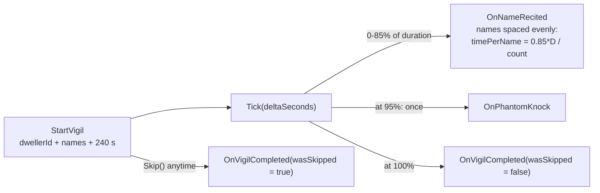

Design details that survive contact: recitation uses the first 85 % so
the final 15 % is silence before the knock — the schedule is derived
from elapsed time, not tick count, making it frame-rate independent; the
knock fires exactly once; `Tick` after completion is a no-op; and the
whole state (elapsed seconds, recited count, knock flag, names) is
capturable mid-vigil, so a save/load does not replay the names or skip
the knock. The event names are the tone: nothing here is called
`DeathAnimationController`. The system models attendance — who sat by
the bed and said the names — and leaves death itself to other systems.

#### V.F.6 Host Wiring and the Medical Pipeline

`MedicalPipelineCoordinator` composes the three authorities for the host,
with `MedicalPipelineSave` as its persistence face and siblings
(`ClinicalWardTriageEngine`, `ClinicalWardLedger`,
`MedicalProcedureSchedule`, `MedicalReservationLedger`,
`HealthHistorySystem`, `MedicalRecordLog`) carrying the ward-scale
machinery. The host's obligations under the event contract:

- consume `OnMoraleDrainRequested` and apply it through the morale
  authority;
- consume `OnCraftingPenaltyChanged` / `OnCombatPenaltyChanged` and apply
  factor changes to crafting and combat;
- surface `OnDependencyFormed` / `OnWithdrawalStarted` /
  `OnDetoxCompleted` / `OnDetoxFailed` as status and narrative;
- drive the vigil scene from the state machine's events and render
  recitation as it arrives;
- drive `TickHours` from game-hours (staffed bench time), not wall-clock.

The disease side runs on the day tick through `DiseaseSystem`, with
`IDiseaseOutbreakSource` letting other systems (wildlife trapping,
autopsy, micro-hazards) report exposure without the disease system
importing them — the same inversion the chain runner uses for flags.

#### V.F.7 Save and Persistence

Three capture/restore shapes, one discipline:

| Authority | State DTO | Notes |
|---|---|---|
| `ChemicalDependencySystem` | `ChemicalDependencyLedgerState` → `SurvivorDependencyList` → `ChemicalDependencyState` | nested per survivor; `inColdTurkey` kept as an explicit flag with the Unity-era migration note in source |
| `VigilStateMachine` | `VigilSaveState` | mid-vigil capture preserves elapsed seconds and recited count |
| Disease/pipeline | `MedicalPipelineSave` + per-system sections | rides the pipeline coordinator |

All are default-tolerant additive DTOs (lists and scalars), consistent
with the repository's nested-section approach; none carries its own
envelope version, because none has yet needed a non-additive change. The
wildlife-disease bridge tests
(`WildlifeDiseaseBridgeTests`, `WildlifeDiseaseFallbackTests`,
`WildlifeTrappingDiseaseMappingTests`) pin the exposure path from
trapping through to infection, including the fallback when a mapping is
missing.

#### V.F.8 Determinism

- Disease spread advances on integer day ticks with authored
  probabilities consumed by the seeded-RNG contract — no wall-clock, no
  `System.Random` in Core behavior.
- Dependency math is fixed-point-in-float but order-stable: one survivor
  ticked at a time, `TickHours(survivorId, …)`, so concurrent-seeming
  updates are serialized by construction.
- Vigil scheduling is elapsed-time arithmetic; identical inputs produce
  identical recitation schedules at 15 FPS or 60.
- Exposure rolls route through the repository's seeded RNG contract so
  replays reproduce outbreaks; the `base_probability` values in
  `exposure_sources` are data, and the mitigating-trait check is a pure
  predicate.

#### V.F.9 Focused Test Anatomy

Verified test files and what they pin *(files present 2026-09-25; named
tests from file listing and closeout claims)*:

| File | Pins |
|---|---|
| `DiseaseSystemTests` | outbreak simulation behavior through current public APIs |
| `DiseaseCatalogExpansionTests` | catalog growth stays schema-valid; the file's existence tracks the 15→20 expansion this document measured |
| `ChemicalDependencySystemTests` | tolerance loop, regimen durations, thresholds |
| `ChemicalDependencyCommandTests` | preview/execute contract incl. state-version rejection |
| `WildlifeDiseaseBridgeTests` / `FallbackTests` / `MappingTests` | exposure mapping from trapping, fallback safety |
| `MedicalHeadlessDemo` | headless smoke of the pipeline |

Per `TEST_POLICY.md` the dependency command tests deserve their own file
(separate from behavior tests) because they exercise the command seam's
concurrency contract — a different failure class than the tolerance math.

#### V.F.10 Evolution Since Closeout (verified)

| Area | 2026-09-01 | 2026-09-25 |
|---|---|---|
| Disease count | 15 validated | 20 (measured), same schema family |
| Catalog sections | diseases + countermeasures | + `vector_protocols`, `exposure_sources`, per-disease `phases`, immunity fields |
| Dependency commands | system validated | preview/execute with state-version concurrency |
| Ward scale | not in closeout | `ClinicalWard*`, reservation ledger, procedure schedule siblings present |

#### V.F.11 Failure Modes and Mitigations

| Failure | Mitigation |
|---|---|
| Double detox start (UI race) | command preview/execute with expected state version |
| Penalty applied twice | penalties are events with factor values; consumers set-or-clear, never accumulate blindly |
| Save mid-withdrawal | `detoxProgressHours` is state; restore resumes the clock |
| Vigil replayed names after load | recited count captured; schedule derived from elapsed time |
| Missing countermeasure item in inventory data | countermeasure ids are catalog references — integrity pipeline territory; presence in JSON is not reachability |
| Stress relapse storm | `ReportStress` returns accumulated count; sources are named so the host can throttle repeat stressors |

#### V.F.12 Risks

1. **Countermeasure scarcity coupling.** `clean_water` as both survival
   baseline and anti-water-vector countermeasure means a water-economy
   regression is also a plague. Balance changes there need the
   medical/water owners in the same package.
2. **Lethality spread vs. care depth.** Lethalities range 0.15–0.85;
   the prion tremor at 0.85 with `medical_kit` countermeasure implies
   late-game care reliance. If treatments stay flat, high-lethality
   diseases are pure attrition — a design tension for the balance owner,
   not a defect.
3. **Vigil pacing at 15 FPS diagnostics.** The 240 s duration is real
   time in game terms; diagnostics sessions at the 15 FPS house rule
   must use the same `Tick(deltaSeconds)` semantics, never frame count,
   or vigils stretch. The frame-rate independence noted in IV.2.11 only
   holds if callers honor the contract.

#### V.F.13 Expansion Hooks (not approvals)

- **Vigil attendance consequences** — `OnVigilCompleted(wasSkipped)` is
  ready to feed relationship/memory systems; skipping in front of the
  shelter is a story the memory systems could keep.
- **Dependency-kind-specific withdrawal tells** — `KindBaseSeverity`
  already differentiates curves; authored tell text per kind would give
  diagnosis prose the same treatment diseases got.
- **Quarantine integration with door encounters** —
  `DiseaseQuarantineCoordinator` + `ContainmentCapability` against the
  Year-of-Ash door encounter flow is the obvious composition point for
  "turn someone away during an outbreak" decisions.

---

## Part VI — Cross-Workstream Interaction Matrix & Emergent-Consequence Design

The six workstreams were integrated as one package precisely so their
edges would touch. This part maps the edges, then examines the four
design pillars the package argues for.

### VI.1 The Interaction Matrix

Rows act on columns. Each cell names the concrete mechanism (verified
where the code path exists; labeled *potential* where the seam exists
but no consumer yet does).

| From \ To | A — Research | B — Vinyl | C — Letters & war | D — Audio | E — Scenes | F — Medical |
|---|---|---|---|---|---|---|
| **A — Research** | — | Blueprint knowledge enables advanced craft that yields items; *potential*: audio-visual research breakthrough cues | Breakthrough items feed expedition/war capability; *potential*: war chains gating on blueprint world flags via `ExternalFlagProbe` | *Potential*: research-complete cue on `Music` bus | Panels rendering research state are lint/binding targets | Medical-category blueprints (4 of 16) produce clinical capability items (`item_surgical_kit`, `item_reagent_clean`) |
| **B — Vinyl** | *Potential*: acquisition via scavenge routes unlocked by knowledge | — | Morale deltas buffer war-chain `moraleDelta` costs; records heard on radio before found = narrative foreshadowing | `audio_cue_id` + needle texture need playback (D); `broadcast_frequency_mhz` keys the radio bridge | `VinylMoralePanel` is a scene-lint and binding-selftest target | `flashback_suppression` implies trauma/flashback mechanics adjacent to psychological care |
| **C — Letters & war** | *Potential*: war flags gate research eligibility | Radio broadcasts of records (B→C) and war chatter share the radio surface | — | Runner and `FactionWarSystem` events project to radio/journal/sound-ranging; *potential*: `WarTension` ambience layer | `FactionWarMapWidget` scene contract | *Potential*: siege decrees stressing shelters → `ReportStress` → relapse events |
| **D — Audio** | Reaction target only | Reaction target; record playback is the missing performance half | Reaction target (war projections audible) | — | Controllers live in lint-validated scenes | *Potential*: vigil recitation and phantom-knock cues on `Medical` bus |
| **E — Scenes** | n/a — observes | n/a | n/a | n/a | — | n/a |
| **F — Medical** | *Potential*: diagnosis knowledge nodes as prerequisites | *Potential*: morale as withdrawal buffer input | Quarantine-vs-door-encounter decisions; siege stress feeding relapse | Withdrawal and vigil are unconsumed audio sources | Vigil/diagnosis UI scenes | — |

Reading notes:

- **E observes everyone** and is observed by no one — the substrate row.
  That asymmetry is why it could be integrated alongside five gameplay
  streams without a single save-section negotiation.
- **D is a universal sink, never a source** — every gameplay→audio edge
  exists, no audio→gameplay edge does. This is the "projection, never
  authority" rule made structural.
- The strongest *verified* cross-stream edges today are **B→D** (cue
  registry + frequencies), **C→D/C→journal** (consequence routing),
  **F→economy** (`clean_water` as countermeasure), and **A→F** (medical
  blueprint items). The *potential* edges are seams whose two sides both
  exist; none requires new state, only consumers.

### VI.2 Pillar 1 — Specificity

The package's content refuses abstractions. Sixteen relic pairings name
exact breakthrough items; thirty records carry catalog numbers, wear
prose, and resonance notes; twenty diseases carry tells, timing clues,
and field-manual guidance; letters carry recipient, day, and applied
morale in the save itself. The design rule this encodes: **a system may
be generic, its content may not.** `LetterDeliverySystem` is a generic
five-state machine; the letter that matters is a specific authored
object addressed to a specific survivor on a specific day. Generic
machinery with specific content is what lets the content grow (74→196
cues, 15→20 diseases) without re-architecture, and lets the machinery be
tested without content (the letter tests use bare ids).

The failure mode this pillar guards against is the "generic reward"
— +5 morale from a nameless object — which players discount instantly.
Specificity is why the vinyl archive records *which* disc and *what*
condition it is in; the morale modifier is the least of its data.

### VI.3 Pillar 2 — Systemic Consequence

Consequences travel through mechanics, not scripted cutscenes. Verified
chains in the current tree:

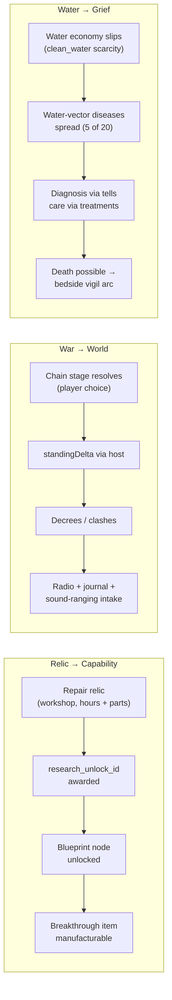

Chain 3 is the package's deepest statement: the medical catalog's most
common countermeasure is the survival economy's baseline resource, so a
player who skimps on the water rota meets the disease system weeks
later and cannot tell whether the outbreak was bad luck or deferred
maintenance — because it was both. Nothing in the code says "teach the
player about water"; the vector table says `clean_water` five times, and
the consequence arrives on its own schedule.

The war chains add the counter-pressure: consequences the player did
not choose (clashes, decrees) arrive as radio intercepts and journal
entries regardless of attention, and chain choices accumulate
`cumulativeMoraleDelta` — the war taxes a resource (morale) that the
vinyl workstream and letter outcomes replenish. Three currencies
(parts, morale, clean water) connect all six streams.

### VI.4 Pillar 3 — Player Agency

The agency pattern across the package is **informed, bounded, late to
reverse**:

- The letter machine allows Withheld → Unanswered → Addressed →
  Delivered: an avoided letter haunts but is recoverable; a delivered
  one is final. The state machine *is* the agency model.
- War choices gate availability (`requiresFlag`) but the runner refuses
  speculative resolution — the player chooses from what is truly
  offered, and the system cannot be talked into a state it did not
  surface.
- Detox offers a real trade (120 h slow vs 72 h brutal) with previewed
  outcomes (`CommandPreview`) — agency through honest numbers, not
  hidden rolls.
- The vigil can be skipped, and the skip is recorded
  (`WasSkipped` in the save). The game does not punish skipping; it
  *remembers* it.

Agency also means the option to disengage: zero-choice war stages
auto-advance, ambience plays whether or not the player opens a panel,
and the record archive is entirely optional. Nothing in the package
requires engagement to keep the shelter alive; everything in it rewards
attention without gating survival on sentimentality — with the
deliberate exception of disease care, where inattention is measurably
lethal.

### VI.5 Pillar 4 — Long-Term Memory

The package persists the *record* of play, not just its outcome:

| System | What the save remembers |
|---|---|
| Letters | every record with `foundDay`, `resolvedDay`, recipient, notes, applied delta |
| War | per-chain stage resolutions with the day each resolved; `cumulativeMoraleDelta`; produced flags |
| Vinyl | acquisition order, play counts, totals, last broadcast |
| Dependency | full ledger incl. `inColdTurkey` flags and detox progress |
| Vigil | completion, skip, names recited, knock fired |
| Research | points, unlocks, completions, per-blueprint sources (`sourceTechIds`) |

`Journal` entries are day-keyed and permanent (the war-routing code
writes `war_clash_{day}_{f1}_{f2}` keys), so the save doubles as a
chronicle. This is the quiet answer to "why persist `moraleDeltaApplied`
per letter?" — because six months of play later, the difference between
"a letter" and "the letter I withheld on day 212 and answered on day
230, worth +6" is the difference between a save file and a history.

### VI.6 Tone Discipline Across the Edges

The cross-workstream surfaces most at risk of tone failure are the
war projections (radio intercepts, journal entries) and the vigil. The
verified host code keeps both restrained: intercepts are clinical
("artillery exchange logged between X and Y" — faction ids, no
real-world belligerents), journal lines are observational ("Regional
surveillance confirms…"), and the vigil's vocabulary is attendance
(names, sitting, a knock). The one tone risk found in current content
is recorded honestly in V.B.11: the vinyl archive's real-world
performer credits. The package's own new content — war ids, disease
prose, letter notes — observes the fictional register; the archive
predates the strictest reading of the rule and should be brought in
line by its content owner.

---

## Part VII — Verification & Acceptance

### VII.1 The Canonical Matrix, Expanded

The closeout's verification matrix is preserved above (Section 3). This
expansion re-issues it as a full gate ladder with the tier structure of
`docs/CI.md` (blocking gates vs quality gates vs diagnostics), extended
with the static-analysis rungs that ran *below* the closeout's matrix
and the generated-artifact checks that came to surround it since.

| Tier | Gate | Command (shape) | Runtime | Scope | Closeout-era result |
|---|---|---|---|---|---|
| 0 — static, per-commit | Focused xUnit selection | `bash scripts/run_test.sh <file-or-dir>` | dotnet test | the changed system only | the builder discipline |
| 0 — static, per-commit | Scene lint | `python3 scripts/ci/scene-lint.py` | CPython | production `.tscn`/`.tres` allowlist | PASS, 26 scenes, 0 errors |
| 1 — generated artifacts | Audio catalog drift | `python3 scripts/ci/generate-audio-catalog.py --check` | CPython | cue registry vs document | PASS, 74 cues in sync |
| 1 — generated artifacts | Asset registry / CLI catalog / save-store matrix `--check` family | per-script | CPython | their generators | siblings of the audio gate |
| 2 — engine, headless | Data integrity | `godot --headless --path . -- --data-integrity-selftest` | Godot | all catalogs + IDs | PASS, 138 catalogs / 5,563 IDs *(historical)* |
| 2 — engine, headless | Content utilization | `godot --headless --path . -- --content-utilization-selftest` | Godot | reachability of authored content | PASS, 413 catalogs *(historical)* |
| 2 — engine, headless | Scene binding | `godot --headless --path . -- --scene-binding-selftest` | Godot | UI panel contracts | PASS, 22/22 *(historical)* |
| 2 — engine, headless | Bridge shim removal | `godot --headless --path . -- --bridge-selftest` | Godot | retired-architecture absence | PASS *(historical)* |
| 2 — engine, headless | Accessibility | `godot --headless --path . -- --ui-accessibility-selftest` | Godot | focus/contrast/close behavior | PASS, 5/5 *(historical)* |
| 2 — engine, headless | Onboarding journey | `godot --headless --path . -- --onboarding-journey-selftest` | Godot | first-session assertions | PASS, 20/20 *(historical)* |
| 3 — full suite | Whole test project | `dotnet test Ashfall.Core.Tests` | dotnet | everything | PASS, 5,317 passed / 17 s *(historical; not re-run)* |

Per `AGENTS.md` and `TEST_POLICY.md`, tier 3 is not a default — it ran
once at closeout and its numbers are historical. Every routine change
should stay at tier 0–2 for its own paths.

### VII.2 Focused-Test Selection Philosophy

The package's test files obey a readable selection doctrine:

1. **One concern per file.** `RelicResearchUnlockContractTests`,
   `LetterDeliverySystemTests`, `VinylMoraleSystemTests`,
   `FactionWarChainRunnerTests` — the file name is the failure domain.
   A red file names the broken subsystem before any output is read.
2. **Contract before coverage.** The relic test asserts the *pairing
   count* (16), not just resolvability — a magic number in a test is a
   tripwire, and here it is a deliberate one (see V.A.8).
3. **Save/load roundtrips are first-class facts**, not afterthoughts:
   nearly every system file ends in a `CaptureRestoreState_…` fact.
   Persistence bugs otherwise surface only in players' saves, the most
   expensive possible discovery venue.
4. **Migration tests use real old envelopes.** The codec ladder tests
   deserialize actual v1/v3/v4 payloads rather than synthesizing
   "approximately old" shapes; the frozen classes make lying
   impossible.
5. **Determinism is asserted, not assumed**
   (`…EvaluatesHumanistVsRuthlessReactionsDeterministically`).
6. **Command seams get their own files**
   (`ChemicalDependencyCommandTests`) because concurrency-rejection is
   a different failure class than the underlying rule.

### VII.3 Per-Workstream Focused Selection (what to run, per change)

| Touch… | Run (alone, via `scripts/run_test.sh`) |
|---|---|
| `relic_recipes.json` / `research_knowledge.json` / `ResearchSystem` / workshop | `Ashfall.Core.Tests/RelicResearchUnlockContractTests.cs` + research save-integration file |
| `vinyl_record_archive.json` / `VinylMoraleSystem` / panel | `Ashfall.Core.Tests/VinylMoraleSystemTests.cs` (+ `VinylRecordCatalogTests` for loader changes) |
| `LetterDeliverySystem` | `Ashfall.Core.Tests/LetterDeliverySystemTests.cs` |
| `faction_war_*.json` / chain runner / codec | `FactionWarChainRunnerTests.cs` + `YearOfAshTests.cs` codec facts |
| audio registry/controllers | `generate-audio-catalog.py --check` + the touched Audio test file |
| scenes / panels | `scene-lint.py`, then `--scene-binding-selftest` if structure changed |
| `disease_catalog.json` / medical systems | `DiseaseSystemTests` or `ChemicalDependencySystemTests` per touched side + the bridge tests for exposure changes |

A Godot headless check is owed only when the change affects a
`--*-selftest` surface (rule: the gate that knows about your change is
the gate that must run).

### VII.4 Acceptance Criteria (the package's own definition of done)

Restated from the closeout and made testable:

1. Every non-empty `research_unlock_id` in `relic_recipes.json`
   resolves in the research catalog — and the count is 16 until a
   foreman signs a change.
2. All 30 archive records load with pairwise-distinct morale effects.
3. Letter transitions obey the terminal-Delivered table (V.C.3) and
   survive roundtrip with notes and deltas intact.
4. A v3 payload decodes with an empty chain-runner section; a v4
   payload round-trips chain progress; a future version is rejected.
5. The audio catalog document matches the registry byte-for-byte under
   `--check`.
6. The production scene tree lints clean and binds at the selftest.
7. The disease catalog parses schema-valid; every countermeasure id
   names a real item; vector coverage is total.
8. No Core file in any of the six chains references Godot or Unity
   namespaces (enforced by the forbidden-API gate, verified by
   inspection for the files this document read).

### VII.5 Rollback Story

The package was integrated as six disjoint streams over shared seams,
which gives an unusually clean rollback topology:

| Failure discovered in… | Roll back by… | Never touch… |
|---|---|---|
| Workstream A logic | the workshop/research partial + its two test files | `relic_recipes.json` (data is authority; a code revert does not revert data) |
| Workstream B panel | the panel file only; system and archive are independent | archive JSON |
| Workstream C chain runner | runner + its tests | `YearOfAshSave.cs` — codec changes are forward-only; roll back features by defaulting sections, never by removing rungs |
| Save codec itself | *do not roll back*; add a rung or a default-tolerant field | frozen envelope classes |
| Audio controllers | the controller file; registry is shared, treat as shared-seam change | generated catalog (regenerate, never hand-edit) |
| Medical catalog data | the JSON + `DiseaseCatalogExpansionTests` expectations together | live saves (they already carry the old counts) |

The codec's row is the important one: the frozen-envelope pattern means
a *feature* rollback and a *format* rollback are different actions.
Features roll back; formats only roll forward. Any hotfix that would
need to "un-add" a save field must instead make reads tolerant and stop
writing the field — the same discipline that got v1 through five
versions.

### VII.6 Verification of This Document Itself

This expansion claims three things about itself, all checkable:

1. It modified exactly one file — proven by
   `git status --porcelain -- docs/plans/PLANS_02_09_FLAGSHIP_CONSOLIDATED_CLOSEOUT.md`
   at the time of hand-off.
2. It preserved the base closeout byte-for-byte above the separator —
   checkable by diffing the first 62 lines against any prior revision.
3. Its size is between the 200,000-character floor and the 250,000
   soft cap — `wc -m` at hand-off, reported in the final message.
