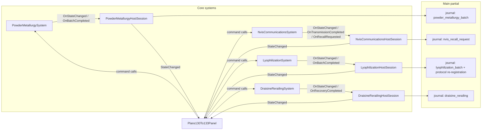
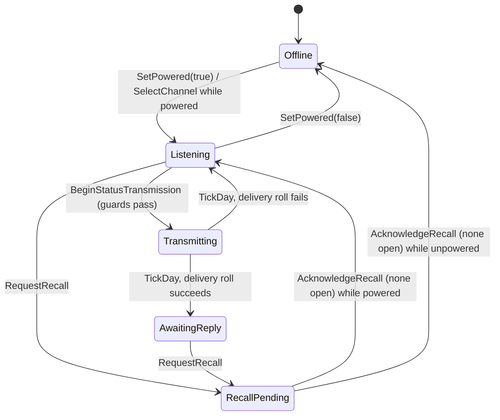
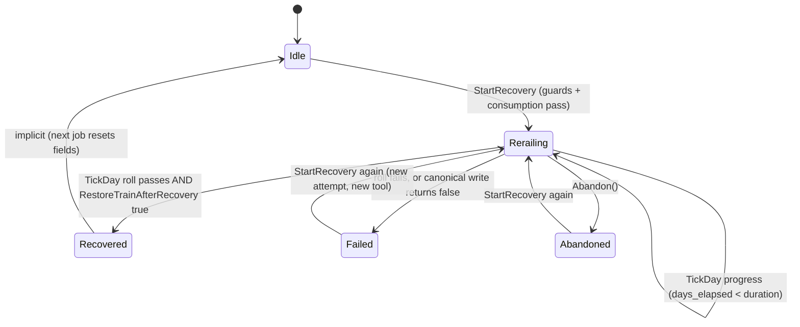
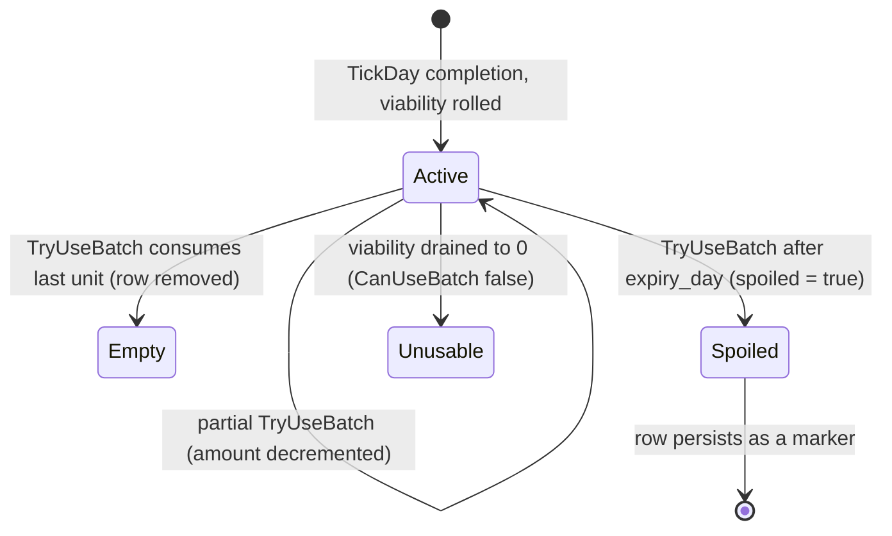

# Plans 130–133 Implementation Log

## Phase 1 — Core systems

Status: PASS

Changed:

- Added abstract powder-metallurgy quality/reliability production.
- Added regional NVIS communications, status transmission, and bounded recall requests.
- Added lyophilization batch and viability/expiry ledger with medical-protocol registration.
- Added draisine recovery state machine and the canonical RailwaySystem recovery seam.
- Added deterministic capture/restore coverage and authoritative JSON catalogs.

Tests:

- `Plans130To133CoreTests`: 11 passing.

## Phase 2 — Persistence and host wiring

Status: PASS

Changed:

- Added checksum-backed host save façades and campaign section entries.
- Enrolled setup, save, tick, reset, and expanded-panel lifecycle paths.
- Connected power, inventory, medical pipeline, radio, expedition recall, and railway ownership seams.

Tests:

- Save section, triad, route, and content-utilization checks covering the new entries passed where run.
- Godot host build passed with two pre-existing obsolete API warnings.

## Phase 3 — Player surface

Status: PASS

Changed:

- Added the bound Plans 130–133 operations console.
- Registered the player route and close/reset lifecycle.
- Kept material production abstract and routed all actions through host sessions.

## Verification notes

- `godot --headless --path . -- --data-integrity-selftest`: PASS.
- `godot --headless --path . -- --bridge-selftest`: PASS.
- Focused feature gates: 35 passing, including the new Core systems, save registry, panel route, and persistence contracts.
- A clean Core rebuild is currently blocked by unrelated concurrent `WeatherHardening` source errors; the incremental Godot host build passes.
- The last full Core run exposed unrelated incomplete save stores and content-utilization baseline drift from concurrent catalogs. The panel route failure was fixed by this slice before the focused rerun.
- Full Godot smoke boot remains blocked by unrelated existing `ExpeditionRadarPanel` disposal and survivor restore recursion errors.
- Concurrent/unrelated worktree changes were preserved.

---

# EXPANSION 2026-09-25 — Plans 130–133: Full Integration Framework & Code Architecture

## Part I — Preamble

### I.1 Thesis

Plans 130–133 are a single vertical slice of ASHFALL's mid-game industrial
stratum: four domain systems that were designed, wired, persisted, and
surfaced as one coherent unit rather than as four independent features.
The original implementation log above records the three delivery phases and
their verification posture. This expansion documents the *framework* those
phases produced — the authority boundaries, data flow, save capture and
restore contract, deterministic RNG discipline, host session pattern, panel
route lifecycle, and the failure behavior of each system — against the
repository as it exists on 2026-09-25.

The organizing thesis is: **Plans 130–133 are an exercise in one-authority
composition.** Powder metallurgy never becomes a second inventory owner;
NVIS never becomes a second expedition authority; lyophilization never
becomes a second medical pipeline; draisine recovery never becomes a second
rail-condition owner. Each new system is deliberately a *job runner and
ledger* that consumes a seam owned elsewhere (`Inventory`, power grid,
`MedicalPipelineCoordinator`, `RailwaySystem`, `ExpeditionSystem`) and
publishes facts as events that the host turns into presentation and
journal text. Every architectural decision documented below is a variation
on that single theme, and the fastest way to evaluate any future change to
these systems is to ask whether it preserved the seam direction.

### I.2 Scope

This expansion covers, per domain:

| Domain | Core authority | Plan |
|---|---|---|
| Abstract powder-metallurgy quality/reliability production | `Assets/Ashfall.Core/Foundry/PowderMetallurgySystem.cs` | 130 |
| Regional NVIS communications, status transmission, bounded recall | `Assets/Ashfall.Core/Radio/NvisCommunicationsSystem.cs` | 131 |
| Lyophilization batch ledger, viability/expiry, medical-protocol registration | `Assets/Ashfall.Core/Medical/LyophilizationSystem.cs` | 132 |
| Draisine derailment recovery state machine on the RailwaySystem seam | `Assets/Ashfall.Core/Expeditions/DraisineRerailingSystem.cs` | 133 |
| Shared bound operations console | `src/UI/Plans130To133Panel.cs` | all |
| Host sessions, checksummed save façades, campaign sections, wiring | `src/Host/Plans130To133HostSessions.cs`, `src/Main.Plans130_133.cs`, `src/Main.ExpandedShelterSystems.cs`, `src/Main.PlayerSurfaces.cs` | all |
| The recorded concurrent-stream interference during verification | original log, Verification notes | all |

### I.3 Non-goals

- This is not a design proposal. Nothing here requests new foreman
  signatures, new paths, or new systems; it documents shipped code.
- It does not re-run any verification. No `dotnet`, no Godot headless
  session, no test execution was performed for this expansion, per its
  documentation-only constraint. Verification results are reported either
  from the original log (labeled `UNVERIFIED (log text)` where they cannot
  be re-confirmed by static inspection) or from current static evidence
  (labeled verified with a path citation).
- It does not touch the concurrent stream's dirty files. On 2026-09-25 the
  worktree carried roughly 480 modified entries from other agents at
  drafting time and roughly 860 at polish time; none of them were read for
  mutation, and only a handful were inspected read-only to characterize the
  interference case study in Part V, Chapter V.6.
- It does not extend `Assets/_Game/`, does not introduce any engine
  dependency into Core, and does not duplicate any mutable gameplay state.

### I.4 Evidence policy

Every load-bearing claim in Parts II–VIII carries one of three markers:

1. **Verified** — the claim was confirmed by direct inspection of the named
   file on 2026-09-25. Citations use repository-relative paths and, where
   useful, line numbers.
2. **UNVERIFIED (log text)** — the claim comes from the original log's
   verification notes (lines 44–52 of this file) and cannot be re-confirmed
   by static inspection because the expansion is documentation-only. These
   statements describe the state of the worktree at the time the log was
   written and must not be quoted as current fact.
3. **Inference** — a reading of verified code that goes beyond what the
   code states outright (for example, ordering guarantees implied by LINQ
   usage). Inferences are flagged where they appear.

The word "today" in this expansion always means 2026-09-25.

### I.5 Reading guide

| Part | Contents | Read when you need… |
|---|---|---|
| II | Current-authority audit of the four domains: owners, catalogs, save paths, host sessions, seams, and growth since the log | to find the single owner of any Plan 130–133 concern |
| III | Integration framework: invariants, tier-by-tier data flow, event flow, save capture/restore, determinism, integrity validation | to change wiring, saves, or RNG usage without breaking seams |
| IV | Code architecture: module map, per-component API/DTO/JSON specs, sequence walkthroughs | the exact shape of a class, state DTO, or catalog entry |
| V | One engineering chapter per plan (130–133), plus the shared operations console and the interference case study | deep behavior: state machines, failure narratives, test coverage per system |
| VI | Cross-system interaction matrix and emergent-consequence design | how the four systems and their hosts affect each other |
| VII | Verification and acceptance: test matrix, gate ladder, rollback | what to run, and what a regression would look like |
| VIII | Appendices: glossary, ID vocabulary, scenario walkthroughs, open questions | vocabulary, worked examples, and honest gaps |

Readers who want only the behavioral contract of one system can jump
straight to its Part V chapter; every chapter is written to stand alone,
repeating the few cross-cutting facts it needs rather than sending the
reader chasing links.

Appendix contents (VIII.1–VIII.23, in file order):

| Appendix | Contents |
|---|---|
| VIII.1 | Glossary of the slice's working vocabulary |
| VIII.2 | ID vocabulary: naming grammar, catalog IDs, reserved enums, failure codes |
| VIII.3 | Scenario walkthroughs A–C: first console, die interlock, recovery under pressure |
| VIII.4 | Honest gaps and open questions Q1–Q10 |
| VIII.5 | JSON shape reference: verbatim catalog excerpt and the four state DTOs |
| VIII.6 | Sequence supplement: daily tick, save flush, failure-code journey, rebind |
| VIII.7 | Scenario D: one save/load cycle across all four systems |
| VIII.8 | API quick reference: four systems, canonical seam, sessions, panel |
| VIII.9 | File inventory and line-count census |
| VIII.10 | Conformance map: the slice against the house rules |
| VIII.11 | Numerical parameter atlas for balance work |
| VIII.12 | Change recipes R1–R6 |
| VIII.13 | Test authoring guide for the slice's test file |
| VIII.14 | Evidence register: 45 claims with method and citation |
| VIII.15 | Citation index: every file:line this expansion quotes |
| VIII.16 | Migration and compatibility notes |
| VIII.17 | Worktree, ownership, and handoff |
| VIII.18 | Frequently confused pairs |
| VIII.19 | Known limitations of this expansion |
| VIII.20 | Production record of this expansion |
| VIII.21 | Boundary conditions and edge-case catalog |
| VIII.22 | Reproducible static-sweep recipe |
| VIII.23 | Closing summary |

---

## Part II — Current Authority Audit (2026-09-25)

This part answers one question for each concern: **who owns it, where does
its data live, and where does it plug in.** Everything in this part was
confirmed by reading the cited files today.

### II.1 Domain owners

| Concern | Single owner | Namespace | `SystemId` | Default RNG seed |
|---|---|---|---|---|
| Powder-metallurgy production jobs and batch quality ledger | `PowderMetallurgySystem` in `Assets/Ashfall.Core/Foundry/PowderMetallurgySystem.cs` | `Ashfall.Core.Foundry` | `powder_metallurgy` | 130 |
| NVIS channel selection, transmission, recall queue | `NvisCommunicationsSystem` in `Assets/Ashfall.Core/Radio/NvisCommunicationsSystem.cs` | `Ashfall.Core.Radio` | `nvis_communications` | 131 |
| Lyophilization drying jobs and viable-batch ledger | `LyophilizationSystem` in `Assets/Ashfall.Core/Medical/LyophilizationSystem.cs` | `Ashfall.Core.Medical` | `lyophilization` | 132 |
| Draisine recovery job | `DraisineRerailingSystem` in `Assets/Ashfall.Core/Expeditions/DraisineRerailingSystem.cs` | `Ashfall.Core.Expeditions` | `draisine_recovery` | 133 |
| Train status, car condition, track integrity, derailment | `RailwaySystem` in `Assets/Ashfall.Core/Expeditions/RailwaySystem.cs` (854 lines) | `Ashfall.Core.Expeditions` | (pre-existing owner) | n/a |
| Expedition phase changes (recall execution) | `ExpeditionSystem.Retreat` in `Assets/Ashfall.Core/Expeditions/ExpeditionSystem.cs:827` | `Ashfall.Core.Expeditions` | (pre-existing owner) | n/a |
| Medical protocol registration/transaction ordering | `MedicalPipelineCoordinator.RegisterProtocol` in `Assets/Ashfall.Core/Medical/MedicalPipelineCoordinator.cs:148` | `Ashfall.Core.Medical` | (pre-existing owner) | n/a |
| Item consumption/production | `Inventory.Inventory` via `InventoryBill` transactions | `Ashfall.Core.Inventory` | (pre-existing owner) | n/a |
| Available electrical power | power grid, read through `Func<float>` provider `() => _powerGrid?.System.NetWatts ?? 0f` | host | (pre-existing owner) | n/a |

The default seeds are not placeholders: `PowderMetallurgySystem`'s
constructor falls back to `new SeededRng(130)`, NVIS to `new SeededRng(131)`,
lyophilization to `new SeededRng(132)`, and draisine recovery to
`new SeededRng(133)` (verified in each constructor). The host always
supplies an explicit forked stream instead (Section II.5), so the defaults
exist to keep Core tests and headless tooling deterministic without a
campaign day object.

### II.2 Catalogs (authoritative JSON)

All four catalogs live in `Assets/StreamingAssets/Data/` and are loaded by
per-system static loader classes with the same defensive shape: resolve the
data directory, return an empty catalog if the file is missing, catch
deserialization failures, log through `ILog`. Loader constants:

| Catalog file | Loader | Loader constant |
|---|---|---|
| `powder_metallurgy_catalog.json` | `PowderMetallurgyCatalogLoader` | `FileName` |
| `nvis_communications_catalog.json` | `NvisCommunicationsCatalogLoader` | `FileName` |
| `lyophilization_catalog.json` | `LyophilizationCatalogLoader` | `FileName` |
| `rerailing_equipment_catalog.json` | `RerailingEquipmentCatalogLoader` | `FileName` |

Catalog contents today (verified by reading the JSON):

**`powder_metallurgy_catalog.json`** — `schema_version: 1`, 2 processes:

| Field | `process_powder_press_structural_coupling` | `process_powder_press_casing_blanks` |
|---|---|---|
| display_name | Compacted Structural Coupling | Compacted Casing Blank Set |
| feedstock | `scrap_metal`×4, `mechanical_parts`×1 | `scrap_metal`×3, `item_foundry_replacement_die`×1 |
| output | `item_foundry_structural_coupling`×1 | `item_foundry_casing_blanks`×2 |
| duration_days | 2 | 1 |
| required_power_watts | 850.0 | 650.0 |
| quality_floor / ceiling | 0.55 / 0.92 | 0.48 / 0.88 |
| wear multiplier floor→ceiling | 1.12 → 0.82 | 1.18 → 0.86 |
| tags | structural, advanced_material, shelter | casing, advanced_material, workshop |

**`nvis_communications_catalog.json`** — `schema_version: 1`, 2 channels:

| Field | `nvis_channel_regional_status` | `nvis_channel_civilian_relay` |
|---|---|---|
| display_name | Regional Status Net | Civilian Relay Window |
| frequency_khz | 4820 | 5375 |
| range_km | 180.0 | 120.0 |
| base_signal_quality | 0.78 | 0.66 |
| required_power_watts | 150.0 | 100.0 |
| recall_capable | true | false |
| night_favorable | true | false |

**`lyophilization_catalog.json`** — `schema_version: 1`, 2 recipes:

| Field | `recipe_lyophilize_blood_plasma` | `recipe_lyophilize_organic_residue` |
|---|---|---|
| display_name | Preserved Blood Plasma | Preserved Culture Sample |
| input | `blood_sample`×1 | `organic_residue`×2 |
| container | `item_hermetic_sample_ampoule`×1 | same |
| output | `item_medical_saline_salt`×1 | same |
| duration_days | 2 | 1 |
| shelf_life_days | 30 | 18 |
| required_power_watts | 100.0 | 80.0 |
| base_viability01 ± variance | 0.84 ± 0.08 | 0.68 ± 0.12 |
| medical_category | preserved_biologic | culture_sample |

**`rerailing_equipment_catalog.json`** — `schema_version: 1`, 2 equipment:

| Field | `rerail_hydraulic_actuator` | `rerail_field_winch` |
|---|---|---|
| display_name | Hydraulic Rerailing Actuator | Field Rerailing Winch |
| required_item | `item_hydraulic_actuator`×1 | `item_foundry_press_fitting`×1 |
| required_power_watts | 300.0 | 120.0 |
| duration_days | 1 | 2 |
| success_chance01 | 0.90 | 0.72 |
| train_condition_restored | 18.0 | 10.0 |
| track_integrity_restored | 0.08 | 0.04 |
| supports_armored_draisine | true | true |
| tags | railway, recovery, armored_draisine | railway, recovery, manual |

Every `item_id` referenced by these catalogs resolves to a definition in
the data directory (verified by grep): `item_foundry_structural_coupling`,
`item_foundry_casing_blanks`, and `item_foundry_replacement_die` in
`foundry_items.json`; `item_hydraulic_actuator` in `items.json`;
`item_medical_saline_salt` in `cassette_sets.json`;
`item_hermetic_sample_ampoule` in `cryo_cultivars.json`;
`item_foundry_press_fitting` in `echoes.json`; `blood_sample` and
`organic_residue` in `archive_inks.json`. Per the standing repo rule,
presence in JSON is not by itself proof of gameplay reachability — the log's
content-utilization checks (UNVERIFIED (log text)) are the pipeline that
covers that stronger property.

The test `Plans130To133CoreTests.Catalogs_LoadFromAuthoritativeDataDirectory`
asserts the catalog cardinality contract — exactly 2 processes, 2 channels,
2 recipes, and 2 equipment entries loaded from the authoritative directory
(`Ashfall.Core.Tests/Plans130To133CoreTests.cs:24-39`). Any catalog growth
must update that assertion in the same slice.

### II.3 Persistence paths

Each domain has exactly one campaign section, one checksummed save file,
and one static host façade class (all in
`src/Host/Plans130To133HostSessions.cs`):

| Section key | Save file | Façade class | Registered in `SaveSectionRegistry` (Core) | Matrix row in `docs/saves/SAVE_STORE_CONTRACT_MATRIX.md` |
|---|---|---|---|---|
| `powder_metallurgy` | `powder_metallurgy_save.json` | `PowderMetallurgySaveStore` | line 237, group `foundry` | row 162 |
| `nvis_communications` | `nvis_communications_save.json` | `NvisCommunicationsSaveStore` | line 238, group `radio` | row 148 |
| `lyophilization` | `lyophilization_save.json` | `LyophilizationSaveStore` | line 256, group `medical` | row 125 |
| `draisine_recovery` | `draisine_recovery_save.json` | `DraisineRerailingSaveStore` | line 257, group `expedition` | row 69 |

Registry facts verified today:

- The first three sections declare
  `LifecycleGroup: ExpandedShelterLifecycleGroup`; `draisine_recovery` is
  registered without that group, matching its expedition-side rather than
  shelter-side lifecycle (see `Assets/Ashfall.Core/Save/SaveSectionRegistry.cs:237-257`).
- The section→file mapping also appears in the registry's save-file table
  at `SaveSectionRegistry.cs:550-553`, so the file names are asserted in
  two places; changing a file name requires touching both.
- The generated save-store contract matrix lists all four façades as
  checksummed with restore hooks (`TryLoad()` present), including the
  checksum column and slot-root isolation columns ticked
  (`docs/saves/SAVE_STORE_CONTRACT_MATRIX.md` rows 69, 125, 148, 162).

The façades all build their stores through the single host factory
`SaveStoreHub.Checksummed<T>(fileName, logTag)` in `src/Host/SaveStoreHub.cs`,
which injects `FileSystemIO`, `SystemTextJsonSerializer`, `GodotLog`, and
the `SaveSlotRoot.ResolveBaseDirectory` router. Façade classes never touch
file IO, serializers, checksums, or path construction themselves — that is
the exact division the factory's doc comment demands.

### II.4 Host sessions

Four sealed adapter classes, one per domain, all extending
`HostSessionBase : StatefulSessionBase`:

- `PowderMetallurgyHostSession`, `NvisCommunicationsHostSession`,
  `LyophilizationHostSession`, `DraisineRerailingHostSession`.
- `StatefulSessionBase` lives in Core (`Assets/Ashfall.Core/StatefulSessionBase.cs`)
  and provides `IsDirty`, monotonically increasing `StateVersion`,
  `StateChanged`, and `RaiseStateChanged()` / `RaiseStateChangedIf(bool)`.
- Each session subscribes to its system's events, folds the latest fact
  into a `LastEvent` string (the panel's headline ticker), and calls
  `RaiseStateChanged()`.
- Each session overrides `Save()`: if not dirty, it does nothing; if dirty,
  it persists `System.CaptureState()` through its façade and only then
  calls `base.Save()`, so a failed write never marks the session clean.

### II.5 Main wiring seams

`src/Main.Plans130_133.cs` (a `Main` partial, 252 lines by `wc -l`) is the entire
composition root for the slice. Verified wiring per system:

| System | Predecessor setups forced | RNG stream | Extra seams |
|---|---|---|---|
| Powder metallurgy | `SetupInventory()`, `SetupPowerGrid()` | `_campaignDay.Rng.Fork(CampaignStreamIds.Foundry, 0, 24)` | journal `powder_metallurgy_batch` on batch completion |
| NVIS | `SetupPowerGrid()`, `SetupRadio()` | `Fork(CampaignStreamIds.Radio, 0, 25)` | journal `nvis_recall_request` on recall queued |
| Lyophilization | `SetupInventory()`, `SetupPowerGrid()`, `EnsureMedicalPipeline()` | `Fork(CampaignStreamIds.Medical, 0, 26)` | protocol registration + journal `lyophilization_batch` |
| Draisine recovery | `SetupInventory()`, `SetupPowerGrid()`, `SetupRailway()` | `Fork(CampaignStreamIds.Expedition, 0, 27)` | journal `draisine_rerailing` on recovery completed |

Stream IDs `foundry`, `radio`, `medical`, `expedition` are constants of
`CampaignStreamIds` in `Assets/Ashfall.Core/Random/CampaignRngStream.cs`;
`Rng.Fork(streamId, day, actionIndex)` is the documented fork overload
(CampaignRngStream.cs:189, 227). Each system gets a distinct action index
(24–27) inside its own named stream, so no two systems ever share a random
number sequence, and each sequence is reproducible from the campaign seed.
When `_campaignDay` is absent (tests, headless tools) the constructors'
default seeds 130–133 take over.

Other verified wiring facts:

- Power is read lazily every call via `() => _powerGrid?.System.NetWatts ?? 0f`;
  no system caches a power snapshot.
- `PersistPlans130To133()` is a composite of four `SaveXxx()` methods; each
  uses the generic `CaptureIfPresent<T>(section, state, capture)` helper
  that skips sections whose system was never constructed, then calls
  `CaptureSection(section, payload)` (the host-side campaign-section sink at
  `src/Main.SaveOrchestrator.cs:57`).
- Lifecycle enrollment: `SetupPlans130To133()` runs in the expanded-shelter
  setup chain (`src/Main.ExpandedShelterSystems.cs:132`),
  `PersistPlans130To133()` in the save chain (`:339`), and
  `TickPlans130To133(day)` in the daily tick chain (`:486`), in each case
  ordered between the Plans 110–113 and Plans 146–149 slices.
- `ResetPlans130To133Panel()` unbinds, removes the panel from the tree, and
  nulls the field; `OpenPlans130To133Panel()` re-runs the idempotent setup
  guards (`if (_x != null) return;`) and calls `Open()`.

### II.6 Player surface and route

- Core-side panel registry entry:
  `Assets/Ashfall.Core/UI/PanelRegistryBootstrap.cs:244` registers
  `plans_130_133` as "Plans 130–133 Operations Console" in
  `PanelGroup.Expanded` with dependency systems
  `{ "inventory", "power_grid", "radio", "medical", "expedition" }`.
- Host-side actions: `src/Main.PlayerSurfaces.cs:759-766` configures
  bindAction (`SetupPlans130To133()`), openAction
  (`OpenExpandedPanel("plans_130_133")`), and closeAction
  (`_plans130To133Panel.Close()`).
- The `plans_130_133` id is also a member of the expanded-panel id list at
  `src/Main.PlayerSurfaces.cs:805`, and `_plans130To133Panel` is a member
  of the panel lifecycle disposal list at `src/Main.PanelLifecycle.cs:136`.

### II.7 Growth since the log

- `docs/CURRENT_AUTHORITY.md` (dated 2026-08-26) states the data authority
  holds "129 catalogs and 4,793 authored IDs" across the integrity pipeline.
  Today `Assets/StreamingAssets/Data/` contains 429 files. The authority
  page predates the current wave and undercounts the directory; the
  integrity selftest (129-catalog gate, per that page) is the tool that
  would reconcile the two, and re-running it is out of scope here
  (documentation-only). Treat the 129/4,793 figures as historical.
- The slice landed in commit `5e5dd983` ("feat(flagship): integrate Plans
  130-133 and complete Plans 78-81 & 110-113 matrix hardening"), which is
  the only commit in this file's history (`git log` today).
- The worktree carried ~480 modified entries from concurrent streams at
  drafting time (roughly 860 by the polish pass), including weather-path
  entries (four then, six at polish) and the
  `snapshots/expedition_radar_default.png` snapshot. None of the four Core
  systems, their catalogs, the host sessions, the wiring partials, or this
  document were among them at drafting; by polish time one more slice path
  had appeared as a concurrent modification
  (`src/UI/Plans130To133Panel.cs`, three changed lines — its 343-line
  count and every panel citation below still resolve, re-verified
  read-only).

---

## Part III — Integration Framework

### III.1 Invariants

The nine invariants below are the contract every Plan 130–133 component
honors. They are restated per-chapter in Part V where a system exercises
them in a specific way.

| # | Invariant | Enforced by |
|---|---|---|
| INV-A | One authority per concern: the four new systems own jobs and ledgers only; items, power, medical transactions, train/track state, and expedition phases stay with their existing owners. | Constructor takes owners by reference; mutation methods of the owners are the only write path (`PowderMetallurgySystem.cs:138-166`, `DraisineRerailingSystem.cs:95-121`, `NvisCommunicationsSystem.cs:111-142`, `LyophilizationSystem.cs:108-132`) |
| INV-B | Core stays engine-free: all four systems plus `StatefulSessionBase` live under `Assets/Ashfall.Core/` with no Godot reference; presentation exists only in `src/UI/Plans130To133Panel.cs` and `src/Host/*`. | Repository layout; file list in Part II |
| INV-C | Data authority is snake_case JSON under `Assets/StreamingAssets/Data/`; loaders are defensive (missing file → empty catalog, never a throw). | Loader bodies in each system file |
| INV-D | Determinism: every stochastic decision draws from an `ISeededRng` — forked campaign streams in the host, fixed seeds 130–133 as Core fallbacks. No wall-clock, no hash-order iteration in decision paths. | Constructors; `Main.Plans130_133.cs:38-45, 64-70, 90-96, 140-147` |
| INV-E | Persistence is checksummed, atomic, and restore-first: each domain captures a versioned state DTO and restores it wholesale; save files carry `{ State, Checksum }` envelopes through `SaveStoreHub.Checksummed<T>`. | Façades in `Plans130To133HostSessions.cs`; matrix rows 69/125/148/162 |
| INV-F | Facts flow Core→host as events; decisions flow host→Core as explicit `ActionResult`-returning calls. Panels never mutate Core state directly and never decide gameplay. | Event list per system; panel body routes every button through a session |
| INV-G | Failures are honest: every blocked/failed path returns an `ActionResult` with a stable failure code and leaves the ledger unchanged (or explicitly marks the ledger row, as lyophilization expiry does). | `StartBatch`/`TickDay`/`StartRecovery`/`RequestRecall` guard chains |
| INV-H | Power gates are evaluated at *both* job start and every job tick against the live grid reading; a job that starts powered can still starve mid-run. | `TickDay` power checks in all three day-tick systems |
| INV-I | The panel has a symmetric bind/unbind lifecycle: every `Bind` subscription is undone in `Unbind`, which is called from `_ExitTree` and from `ResetPlans130To133Panel`. | `Plans130To133Panel.cs:37-78, 337-341` |

### III.2 Tier-by-tier data flow

The slice has four tiers. For each domain, the table below traces one
command from the screen to the ledger and back.

Tier roles:

1. **Route tier** — `PanelRegistry` action tables (`Main.PlayerSurfaces.cs`)
   translate the abstract panel id into bind/open/close lambdas.
2. **Presentation tier** — `Plans130To133Panel` builds columns, reads state
   DTOs read-only, and issues commands.
3. **Host tier** — the four `HostSessionBase` subclasses expose command
   methods, translate Core events into `LastEvent` strings, and own save
   flush on the dirty flag.
4. **Core tier** — the four systems validate, transact with owner seams,
   mutate their versioned state DTO, and raise events.

Command trace, by domain (all verified against source):

**Plan 130 — start a material batch**

```text
[Button "START MATERIAL BATCH"]
  → Plans130To133Panel.BuildPowderColumn lambda
      picks first registered process (Recipes/Processes ordinal order)
  → PowderMetallurgyHostSession.StartBatch(processId, day)
  → PowderMetallurgySystem.StartBatch
      guards: installed, not Processing, process known, power ≥ required
      transaction: InventoryBill(feedstock) → Inventory.TryExecuteTransaction
      mutation: active_* fields, status = Processing
      event: OnStateChanged(state)
  ← ActionResult.Success("powder_metallurgy.batch_started")
  → panel SetResult("Material batch reserved.") + RefreshView
```

**Plan 131 — broadcast regional status, then next-day resolution**

```text
[Button "BROADCAST REGIONAL STATUS"]
  → panel lambda reads _expeditions.Engine.Active.Count
  → NvisCommunicationsHostSession.BeginStatusTransmission("expedition_status", day, n)
  → NvisCommunicationsSystem.BeginStatusTransmission
      guards: installed, powered, channel selected, power ≥ channel need, not Transmitting
      signal = channel.base_signal_quality − clamp(n × 0.03, 0, 0.25)
      mutation: active_transmission_id = "nvis_{day}_{total+1}", mode = Transmitting,
                total_transmissions++
  ← ActionResult.Success("nvis.transmission_started")
[next TickDay]
  → NvisCommunicationsSystem.TickDay(day)
      delivery roll: rng.NextDouble() ≤ clamp(signal_quality01, 0.1, 1)
      appends NvisTransmissionRecord, updates last_contact_day / delivered count
      mode → AwaitingReply (delivered) | Listening (lost)
      events: OnTransmissionCompleted(record), OnStateChanged
  → host LastEvent = "Regional status transmission delivered."
    | "Regional status transmission lost in the noise."
```

**Plan 132 — preserve a biologic, then consume it through medicine**

```text
[Button "START PRESERVATION BATCH"]
  → LyophilizationHostSession.StartBatch(recipeId, day)
  → LyophilizationSystem.StartBatch
      guards: installed, not Drying, recipe known, power
      bill: input_item ×input_amount + container_item ×container_amount
      mutation: active_*, status = Drying
[next TickDay chain]
  → LyophilizationSystem.TickDay(day)
      completion: TryProduce(output_item, amount)
      viability = clamp(base + (2·rng.NextDouble−1)·variance, 0, 1)
      ledger row: batch_id "lyo_{day}_{n}", expiry_day = day + shelf_life
      events: OnBatchCompleted(batch), OnStateChanged
  → Main.OnBatchCompleted handler re-registers protocol
      protocol_lyophilization_{batchId} → MedicalPipelineCoordinator.RegisterProtocol
[medical use]
  → LyophilizedMedicalProtocol.Validate() = CanUseBatch(id, today, 1) ? null
    : "preserved_batch_unavailable"
  → Apply() = TryUseBatch(id, today, 1, out item, out reason)
      expiry path: marks row spoiled = true, reason "expired"
```

**Plan 133 — re-rail a derailed draisine**

```text
[Button "BEGIN RE-RAILING"] (visible only when a train is in Derailment
                             and no job is Rerailing)
  → DraisineRerailingHostSession.StartRecovery(trainId, equipmentId, day)
  → DraisineRerailingSystem.StartRecovery
      guards: no active job, train exists (RailwaySystem.GetTrain),
              train.status == Derailment, equipment known,
              supports_armored_draisine, power, inventory count ≥ amount
      consumption: Inventory.TryConsumeBill({required_item: amount})
      snapshot: segment integrity at start via EnsureSegmentState
      mutation: status = Rerailing, attempts++
[next TickDay chain]
  → DraisineRerailingSystem.TickDay(day)
      success roll: rng.NextDouble() ≤ clamp(success_chance01, 0, 1)
      canonical write: RailwaySystem.RestoreTrainAfterRecovery(
          train_id, condition_restored, segment_id, integrity_restored)
      events: OnRecoveryCompleted(state) on success, OnStateChanged always
  → host LastEvent = "Draisine {train_id} returned to the rail."
  → Main journal entry "draisine_rerailing"
```

### III.3 Event flow

All Core events are plain `Action<T>` delegates; the host subscribes in
session constructors and the panel subscribes to session `StateChanged`.
The full event graph:



Two events have host-side consequences beyond presentation:

- `NvisCommunicationsSystem.OnRecallRequested` writes a journal entry
  (fact only — the phase change itself is not attempted here).
- `LyophilizationSystem.OnBatchCompleted` triggers
  `RegisterLyophilizedProtocol`, which registers the per-batch medical
  protocol. This is the only event in the slice whose host handler performs
  a *registration* (not a gameplay mutation) in another Core system, and it
  does so through that system's public API (`MedicalPipelineCoordinator.
  RegisterProtocol`), never by touching its dictionaries directly.

### III.4 Save capture and restore contract

The pattern is identical four times, which is the point — it is a reusable
integration shape:

1. **Capture** — `System.CaptureState()` deep-copies the state DTO through
   a serialize/deserialize round trip
   (`SystemTextJsonSerializer.Serialize` → `Deserialize<T>`), guaranteeing
   the caller receives a snapshot detached from live mutation.
2. **Persist** — the host façade's `SaveStore<T>` writes the state JSON
   wrapped in a checksum envelope, atomically, into the slot-resolved
   directory. `TryCapturePersisted(state)` returns the exact persisted
   payload so `Main.CaptureSection` can register it under the campaign
   section key in the same pass (`Main.Plans130_133.cs:205-228`).
3. **Restore** — on setup, `TryLoad()` reads the file; a non-null result is
   pushed through `System.RestoreState(saved)`, which again round-trips
   through JSON and then normalizes collection fields (`batches ??= new…`)
   for forward compatibility with schema evolution.
4. **Session hygiene** — the session only persists when `IsDirty`, and only
   marks itself clean (`base.Save()`) if the store write returned true.

State DTO versioning: every state class declares
`public const int CurrentVersion = 1` and carries `version` and
`system_id` fields (`PowderMetallurgyState.cs` fields at
PowderMetallurgySystem.cs:59-75, likewise NVIS :93-109, lyophilization
:49-64, draisine recovery :43-61). There is no migration logic yet at
version 1; the fields exist so future migrations have a stable key.

Restore asymmetries worth knowing (all verified):

- `RailwaySystem` train/track state is *not* captured by this slice; the
  recovery state machine restores, but the canonical railway save path
  belongs to the railway's own section. A recovery job resumed after load
  references a `train_id` that must exist again — `TickDay`'s completion
  path re-resolves the train through `RestoreTrainAfterRecovery`, which
  returns false if the train is missing or not derailed, driving the job to
  `Failed` (rerail_failed) instead of corrupting state.
- `NvisCommunicationsSystem.RestoreState` does not re-run the
  "auto-select first channel" rule from `LoadCatalog`; if the captured
  state had an empty `selected_channel_id`, restore preserves that emptiness
  and the next guarded command fails with `nvis.no_channel`. In practice
  `LoadCatalog` runs before restore in `SetupNvisCommunications`, so a
  fresh campaign always has a channel selected (Main.Plans130_133.cs:71-74).
- Lyophilization restore preserves `spoiled` flags and expiry days exactly;
  viability floats survive the JSON round trip bit-for-bit because the
  capture path is a serializer round trip of the same floats.

### III.5 Determinism

- One `ISeededRng` per system, one named campaign stream per system,
  distinct fork indices (24, 25, 26, 27). Verified:
  `Main.Plans130_133.cs:38-45, 64-70, 90-96, 140-147`.
- Quality (130): `floor + rng.NextFloat() * (ceiling − floor)` after
  clamping floor ≤ ceiling.
- Viability (132): `base + (NextDouble·2 − 1)·variance`, clamped to [0,1].
- NVIS delivery (131): `NextDouble ≤ clamp(signal, 0.1, 1)` — the 0.1 floor
  means a channel is never mathematically impossible to deliver on, only
  improbable.
- Recovery success (133): `NextDouble ≤ clamp(success_chance01, 0, 1)` —
  0.0 always fails, 1.0 always succeeds (both poles are exercised by the
  two draisine recovery tests).
- No decision path iterates a `Dictionary` to pick randomness or order
  outcomes. The only dictionary-iteration order dependencies are
  presentation-side (the panel's "first registered process/recipe/equipment"
  picks use `Values.FirstOrDefault()`, which follows insertion order of the
  loader loop — deterministic because `LoadCatalog` inserts in JSON array
  order — but this is an inference from `Dictionary` behavior, not a
  documented guarantee, and the panel text labels it as the first entry
  rather than a canonical one).

### III.6 Integrity validation surface

- Catalog cardinality: `Catalogs_LoadFromAuthoritativeDataDirectory`
  (2/2/2/2, verified assertion).
- The slice's sections participate in the campaign-section registry, so the
  standing triad gate (Setup/Save/Flush parity) and the generated
  save-store matrix cover them; matrix rows 69/125/148/162 are the
  generated evidence (verified present today).
- The log's broader gates — `--data-integrity-selftest`,
  `--bridge-selftest`, 35 focused feature gates — are recorded outcomes of
  the integration run, not claims re-established here: UNVERIFIED (log text).

---

## Part IV — Code Architecture

### IV.1 Module map

```text
Assets/Ashfall.Core/
  Foundry/PowderMetallurgySystem.cs     Plan 130 authority (+catalog loader)
  Radio/NvisCommunicationsSystem.cs     Plan 131 authority (+catalog loader)
  Medical/LyophilizationSystem.cs       Plan 132 authority (+catalog loader)
  Expeditions/DraisineRerailingSystem.cs Plan 133 authority (+catalog loader)
  Expeditions/RailwaySystem.cs          canonical rail owner; recovery seam :746
  Medical/MedicalPipelineCoordinator.cs protocol registry owner :148
  Expeditions/ExpeditionSystem.cs       Retreat(survivorId) :827
  StatefulSessionBase.cs                IsDirty / StateVersion / StateChanged
  Save/SaveSectionRegistry.cs           four campaign sections :237-257
  UI/PanelRegistryBootstrap.cs          plans_130_133 registry row :244
  Random/CampaignRngStream.cs           stream ids + Fork(streamId, day, idx)

src/
  Main.Plans130_133.cs                  composition root partial (252 lines)
  Main.ExpandedShelterSystems.cs        setup/save/tick enrollment :132/:339/:486
  Main.PlayerSurfaces.cs                route actions :759-766; id list :805
  Main.PanelLifecycle.cs                panel disposal list :136
  Main.SaveOrchestrator.cs              CaptureSection sink :57
  Host/Plans130To133HostSessions.cs     4 sessions + 4 save façades (208 lines)
  Host/SaveStoreHub.cs                  Checksummed<T> factory :40
  UI/Plans130To133Panel.cs              bound console (343 lines)

Ashfall.Core.Tests/
  Plans130To133CoreTests.cs             11 [Fact] methods (431 lines)

Assets/StreamingAssets/Data/
  powder_metallurgy_catalog.json  nvis_communications_catalog.json
  lyophilization_catalog.json     rerailing_equipment_catalog.json
```

Compatibility aliases exist for early Plan-130-era names and are thin
subclasses with identical constructors: `PowderMetallurgyEngine`
(PowderMetallurgySystem.cs:323-328), `NvisC4ISystem`
(NvisCommunicationsSystem.cs:289-293), `LyophilizationEngine`
(LyophilizationSystem.cs:325-330), `DraisineRecoverySystem` and
`ArmoredDraisineRecoverySystem` (DraisineRerailingSystem.cs:241-253).
They add no behavior; new code should construct the canonical classes.

### IV.2 Per-component specification — `PowderMetallurgySystem`

**Purpose.** Deterministic, inventory-backed production of abstract
advanced materials with per-batch quality and derived reliability/wear.
The class doc comment states the containment rule explicitly: quality and
reliability only; no real-world propellant, ammunition, or weapon recipes.

**Public API.**

| Member | Signature (abridged) | Notes |
|---|---|---|
| `StartBatch` | `ActionResult StartBatch(string processId, int day)` | atomic feedstock debit |
| `TickDay` | `ActionResult TickDay(int day)` | progress + completion |
| `TryGetLatestModifier` | `bool TryGetLatestModifier(string outputItemId, out MaterialQualityModifier m)` | latest batch by day, then batch_id ordinal desc |
| `LoadCatalog` / `GetProcess` | catalog management | skips null/empty ids |
| `CaptureState` / `RestoreState` | `PowderMetallurgyState` | JSON round trip |
| events | `OnStateChanged(state)`, `OnBatchCompleted(record)` | host bindings |

**State DTO (`PowderMetallurgyState`, v1).** `installed`, `status`,
`active_process_id`, `active_batch_id`, `active_day`, `days_required`,
`days_elapsed`, `last_completed_day` (−1 sentinel), `completed_batches`,
`produced_units`, `batches[]`. Batch record: `batch_id`, `process_id`,
`output_item_id`, `output_units`, `completed_day`, `quality01`,
`reliability_modifier`, `wear_multiplier`.

**Derived quantities.**

- `reliability_modifier = clamp(0.8 + quality·0.3, 0.5, 1.1)`
- `wear` interpolates from `wear_multiplier_at_floor` (bad quality) to
  `wear_multiplier_at_ceiling` (good quality), clamped to [0.5, 1.5], with
  both catalog poles floored at 0.5.
- `MaterialQualityModifier.ReadinessMultiplier = clamp(reliability01, 0.5, 1.1)`
  — the doc comment calls it a bounded presentation/combat readiness
  projection, explicitly *not* a ballistic instruction.

**Failure modes (result codes).**

| Code | Kind | Trigger | Ledger effect |
|---|---|---|---|
| `station_not_installed` | Blocked | `installed == false` | none |
| `already_processing` | Blocked | status Processing | none |
| `unknown_process` | Failed | id not in catalog | none |
| `insufficient_power` | Blocked (start) / `power_starved` (tick) | live grid < required | none / job paused at PowerStarved |
| `insufficient_feedstock` | Blocked | transaction fails | none — no partial debit |
| `invalid_process_state` | Failed | active process vanished from catalog mid-run | status → MaintenanceRequired |
| `storage_full` | Blocked | `TryProduce` fails at completion | status → MaintenanceRequired; feedstock already spent |

The `storage_full` case is the one deliberate asymmetry: feedstock was
consumed at start, so an output that cannot land costs the player the
inputs and stalls the station at `MaintenanceRequired` until something
changes. This is honest but expensive; it is documented here as designed
behavior, not an oversight (inference from code order — the try/produce
happens after days complete, with no refund path).

**Batch identity.** `batch_id = "pm_{day}_{completed_batches + days_elapsed + 1}"`.
The counter mix makes ids unique even if two batches start and finish on
unusual day sequences; it is a label, not a sort key (queries order by
`completed_day` first).

### IV.3 Per-component specification — `NvisCommunicationsSystem`

**Purpose.** Regional near-vertical-incidence skywave communications:
channel selection, day-resolved status transmission with seeded delivery,
and a bounded recall-request queue. The class doc comment fixes the
authority boundary: expedition phase changes remain owned by
`ExpeditionSystem`; the host acknowledges a request through that API.

**Public API.**

| Member | Notes |
|---|---|
| `SetPowered(bool)` | power toggle; forced mode transitions to/from Offline |
| `SelectChannel(string)` | blocked while Transmitting; unknown ids are Failed |
| `BeginStatusTransmission(payload, day, activeExpeditionCount)` | starts the one-slot transmitter |
| `RequestRecall(survivorId, day)` | bounded: one unacknowledged request per survivor |
| `AcknowledgeRecall(survivorId, resultCode = "acknowledged")` | acknowledges latest open request for that survivor |
| `TickDay(day)` | resolves an in-flight transmission exactly once |

**State DTO (`NvisCommunicationsState`, v1).** `installed`, `powered`,
`mode`, `selected_channel_id`, `signal_quality01`, `last_contact_day`
(−1 sentinel), `total_transmissions`, `delivered_transmissions`,
`active_transmission_id`, `transmissions[]`, `recall_requests[]`.

**Mode machine.**



**Recall bound.** `RequestRecall` fails with `recall_already_requested` if
any unacknowledged request exists for the same survivor; other survivors
can still be queued. `AcknowledgeRecall` picks the *last* open request for
that survivor (`LastOrDefault`), stamps `result_code`, and demotes the mode
only when no open requests remain anywhere in the queue.

**Failure modes.** `nvis.not_installed`, `nvis.power_off`,
`nvis.no_channel`, `nvis.insufficient_power`, `nvis.busy`,
`nvis.unknown_channel`, `nvis.recall_unavailable` (channel not
`recall_capable`), `nvis.invalid_survivor`,
`nvis.recall_already_requested`. Transmission records are appended for
*lost* sends too — the ledger keeps the attempt with `delivered = false`,
which is what makes the delivered/total ratio on the panel truthful.

### IV.4 Per-component specification — `LyophilizationSystem`

**Purpose.** Freeze-drying job runner plus the viable-biologic batch
ledger (viability, expiry, spoilage) and a bridge that exposes batches to
the medical pipeline as zero-cost protocols.

**Public API.**

| Member | Notes |
|---|---|
| `StartBatch(recipeId, day)` | debits input + container atomically |
| `TickDay(day)` | progress; on completion produces output and rolls viability |
| `CanUseBatch(batchId, day, amount = 1)` | pure check: known, unspoiled, enough left, within expiry, viability > 0 |
| `TryUseBatch(batchId, day, amount, out outputItemId, out reasonCode)` | consumption; expiry marks the row spoiled |
| `RegisterMedicalProtocol(pipeline, protocolId, batchId, amount, currentDay)` | registers `LyophilizedMedicalProtocol` |

**Status enum.** `Offline, Ready, Drying, PowerStarved, Complete,
MaintenanceRequired` — note `Complete` is a resting state, not an event:
after a finished batch the dryer idles at `Complete` (the panel colors it
as a healthy state alongside `Ready`).

**Ledger row (`LyophilizedBatchRecord`).** `batch_id`
(`lyo_{day}_{completed+1}`), `recipe_id`, `output_item_id`, `amount`,
`created_day`, `expiry_day`, `viability01`, `spoiled`.

**Expiry semantics (verified).** `CanUseBatch` allows use on the expiry day
itself (`day <= expiry_day`); `TryUseBatch` on `day > expiry_day` sets
`spoiled = true` and returns reason `"expired"`. Spoilage is *lazy*: nothing
scans the ledger on tick to pre-spoil rows, so a row that expired unused
still reads `spoiled = false` until someone touches it or queries fail
silently through `CanUseBatch`. The panel therefore never claims a batch is
bad before an attempted use proves it — an honest, if quiet, presentation.

**Medical protocol shape.** `LyophilizedMedicalProtocol` implements
`IMedicalProtocolHandler` with: empty `ItemCosts` (the batch ledger, not
the inventory, is the scarce input — the doc comment says exactly this),
`Validate()` returning null or `"preserved_batch_unavailable"`, and
`Apply()` delegating to `TryUseBatch` with the host's day provider
(`() => _simDay` in `Main.Plans130_133.cs:121-131`). The coordinator still
owns registration and transaction ordering.

### IV.5 Per-component specification — `DraisineRerailingSystem`

**Purpose.** Recovery job state machine for derailed rail vehicles. The
class doc comment states the split: `RailwaySystem` owns train status,
cars, and track; this system owns only the recovery job and consumes the
selected recovery equipment.

**State machine (`DraisineRecoveryStatus`).**



`Assessing` exists in the enum but has no transition today — verified: no
code assigns it. It is reserved vocabulary.

**Guard chain in `StartRecovery` (order matters, verified
DraisineRerailingSystem.cs:136-176).** already_recovering → train_not_found
→ train_not_derailed → unknown_equipment → equipment_incompatible
(`supports_armored_draisine == false`) → insufficient_power →
missing_equipment (count check, then `TryConsumeBill` re-check) → success.
The inventory count check runs *before* the bill attempt so the common
failure reads `missing_equipment` rather than a generic transaction
failure; both return the same code if the atomic consumption loses the race.

**Canonical write.** The completion path calls
`RailwaySystem.RestoreTrainAfterRecovery(trainId, trainConditionRestored,
segmentId, trackIntegrityRestored)` (RailwaySystem.cs:746-774). That method
alone: raises every car's condition (capped at 100), raises segment
integrity (capped at 1), resets status to `Idle`, zeroes
`segmentProgress`, clears `activeSegmentId`, clears `isCrewExhausted`,
zeroes `transmissionWearPermille`, clears
`transmissionServiceRequired`, and fires `OnTrackRepaired`. It returns
false if the train is missing or not in `Derailment`, which drives the
recovery job to `Failed` (`rerail_failed`) — the machine never pretends a
train was recovered that wasn't (test:
`DraisineRecovery_FailedAttemptDoesNotPretendTrainWasRecovered`).

**Contrast with `ClearDerailment`** (RailwaySystem.cs:725-738): the older
admin path frees the train but restores nothing — no condition, no track,
no transmission wear. The recovery seam is strictly richer, and its doc
comment says why: equipment is consumed by the caller; the railway owns
the mutations so no host or recovery system can create a second
rail-condition authority.

### IV.6 Host session and save façade contract

One session class per system, one static façade per section. The session
contract, identical in shape for all four:

```csharp
public sealed class XHostSession : HostSessionBase
{
    public XSystem System { get; }
    public string LastEvent { get; private set; } = string.Empty;
    // ctor: subscribe system events -> LastEvent + RaiseStateChanged()
    // command methods delegate 1:1 to the system
    public override void Save()
    {
        if (!IsDirty) return;
        if (XSaveStore.TrySave(System.CaptureState())) base.Save();
    }
}
public static class XSaveStore
{
    public const string FileName  = "x_save.json";
    public const string SectionName = "x";
    private static readonly SaveStore<XState> s_store =
        SaveStoreHub.Checksummed<XState>(FileName, nameof(XSaveStore));
    public static bool TrySave(XState state) => s_store.TrySave(state);
    public static XState? TryLoad() => s_store.TryLoad();
    public static string TryCapturePersisted(XState state) => s_store.CapturePersisted(state);
    public static XState? TryRestore(string json) => s_store.RestoreBare(json);
}
```

(`TryRestore`/`RestoreBare` exist for campaign-codec paths that hand the
façade raw JSON; the Main wiring uses `TryLoad()` directly.)

`LastEvent` strings, verbatim from `Plans130To133HostSessions.cs`:

- Powder: `"Material batch completed: {output_item_id}."`
- NVIS: `"Regional status transmission delivered."` /
  `"Regional status transmission lost in the noise."` /
  `"Recall request queued for {survivor_id}."`
- Lyophilization: `"Preserved biologic batch completed: {batch_id}."`
- Draisine: `"Draisine {train_id} returned to the rail."`

### IV.7 Panel contract

`Plans130To133Panel : Control, IBindablePanel` — presentation only.

- `Bind(powder, nvis, lyophilization, draisine, railway, expeditions,
  dayProvider, acknowledgeRecall)` — stores references, subscribes
  `StateChanged` on the four sessions, refreshes. `IsBound` requires all
  four sessions plus the railway.
- `Unbind()` — symmetric unsubscribe, nulls everything. Called by `Bind`
  (rebind), `ResetPlans130To133Panel`, and `_ExitTree`.
- `_Ready` builds an `AshfallDashboardShell` titled
  `"SYS: MATERIALS // REGIONAL COMMS // MEDICAL PRESERVATION // RAIL RECOVERY"`
  (1320×700 minimum) with a header close button `"CLOSE [Esc]"`.
- Four columns: `ABSTRACT MATERIALS`, `REGIONAL NVIS / C4I`,
  `BIOLOGIC PRESERVATION`, `DRAISINE RECOVERY`; a trailing event-log label.
- Escape closes via `_UnhandledInput` and marks input handled.
- Every command string shown to the player flows from `ActionResult`:
  success text is fixed per button; failure text embeds the stable failure
  code (`"Material batch blocked: {code}."`).
- Three disclosure lines keep the tone contract: the materials column
  states that quality/reliability are abstract readiness modifiers with no
  real-world recipe; the comms column states that transmission resolves on
  the next day tick and that acknowledgement returns through
  `ExpeditionSystem`; the recovery column states that `RailwaySystem`
  remains the authority for train condition, track integrity, and
  derailment state.

### IV.8 Sequence walkthroughs

**Save round trip (lyophilization shown; the other three are identical in
shape).**

```text
Main save flow (Main.ExpandedShelterSystems.cs:339)
  → PersistPlans130To133()                       [Main.Plans130_133.cs:197-203]
  → SaveLyophilization()
  → CaptureIfPresent("lyophilization", _lyophilization?.System.CaptureState(),
                     LyophilizationSaveStore.TryCapturePersisted)
      state == null (system never built) → section skipped, no empty row
  → CaptureSection("lyophilization", persistedJson)  [SaveOrchestrator :57]

Load path (next launch)
  SetupLyophilization() → LyophilizationSaveStore.TryLoad()
      null → fresh state (new campaign)
      json → checksum verified inside SaveStore → system.RestoreState(state)
      batches ??= new List<...>  (schema forward-compat)
  RegisterLyophilizationProtocols(system)   ← rebuilds per-batch protocols
      for every non-spoiled ledger row
```

The protocol re-registration on load is load-bearing: protocols live in
the medical coordinator's in-memory registry and are not themselves
serialized, so a restored ledger without re-registration would leave
preserved batches invisible to medicine. The wiring closes that loop at
`Main.Plans130_133.cs:114-119`.

**Derailment-to-recovery lifecycle.**

```text
RailwaySystem tick (risk check, RailwaySystem.cs:416-438, Plan 73 §7.6)
  → train.status = Derailment; OnDerailment(trainId, segmentId)
Panel: derailed train appears (first match in railway.State.trains)
Player: BEGIN RE-RAILING → StartRecovery(train, rerail_hydraulic_actuator, day)
  → item_hydraulic_actuator consumed; status Rerailing; attempts = 1
Day tick → TickDaysPipeline ... TickPlans130To133(day)
  → success roll 0.90 → RestoreTrainAfterRecovery
      cars +18 condition, segment +0.08 integrity,
      status Idle, transmission wear zeroed, OnTrackRepaired fired
  → OnRecoveryCompleted → host LastEvent → journal "draisine_rerailing"
  → panel: RECOVERY RECOVERED; derailed list no longer contains the train
Failure pole: roll ≤ 0.72 misses → status Failed, train still Derailment,
  consumable already spent; a second StartRecovery is legal (attempts = 2).
```

---

## Part V — Engineering Chapters

### V.1 Plan 130: Powder-Metallurgy Quality and Reliability Production

#### V.1.1 Contract

`PowderMetallurgySystem` (SystemId `powder_metallurgy`) is the one
authority for compacting feedstock into abstract advanced-material units
and for recording, per batch, the quality of the production run and the
reliability/wear consequences downstream consumers may read. Its contract
sentences, all sourced from the code:

- One batch at a time (`already_processing` guard).
- Feedstock is debited atomically at start or not at all
  (`Inventory.TryExecuteTransaction` with a composed `InventoryBill`).
- Quality is drawn once, at completion, inside the catalog band
  `[quality_floor, quality_ceiling]`.
- Wear multiplier improves monotonically with quality (bad batches wear
  the press-tooling narrative; good ones do not), computed by linear
  interpolation between the process's two catalog poles.
- Downstream reads go through `TryGetLatestModifier(outputItemId, …)` —
  there is no per-item registry, no second ledger, no cached quality on
  the inventory stack.
- The domain stays abstract by construction: display names, tags, and the
  panel disclosure all describe structure and readiness, never chemistry.

#### V.1.2 State machine

```text
                 StartBatch (guards + debit)
    Ready ───────────────────────────────► Processing
      ▲                                       │ TickDay
      │ ◄────────────────────────────────────┤  days_elapsed < days_required
      │        completion: produce + record   │  → "progressed" (stay)
      │                                       │
      │                            power < required at tick
      │                                       ▼
      │                              PowerStarved ── (power returns) ──► Processing
      │
      ├── invalid process mid-run ──► MaintenanceRequired
      └── TryProduce fails ────────► MaintenanceRequired
    Offline: installed == false (initial refused state; nothing runs)
```

`PowerStarved` is a *pause*, not a cancellation: the next tick with
sufficient power resumes from the same `days_elapsed` (verified — the
starved branch returns before incrementing the counter).

#### V.1.3 Worked numeric examples (from the live catalog)

**Structural coupling run.** `process_powder_press_structural_coupling`:
floor 0.55, ceiling 0.92, wear poles 1.12/0.82.

- Draw q = 0.55 (floor): reliability = 0.8 + 0.55·0.3 = 0.965; wear =
  1.12 (worst). Readiness multiplier = clamp(0.965, 0.5, 1.1) = 0.965.
- Draw q = 0.92 (ceiling): reliability = 0.8 + 0.92·0.3 = 1.076; wear =
  0.82. Readiness = 1.076.
- Draw q = 0.75 (mid): wear = 1.12 + ((0.75−0.55)/0.37)·(0.82−1.12)
  = 1.12 − 0.162 = 0.958.

**Casing blank run.** `process_powder_press_casing_blanks` consumes 3
`scrap_metal` **and one `item_foundry_replacement_die`** — a die is
consumed per batch. This is the quiet economic hook of Plan 130: blank
production burns dies, and the die supply line (foundry items catalog,
`foundry_items.json`) becomes a persistent constraint. Two output units
per die spent; a bad die (no such quality attribute exists — dies are
consumed, not rolled) is compensated only by the batch's own quality roll.

Power: 850 W and 650 W requirements mean both processes gate on the
expanded-shelter power grid; with the default `Func<float>` absent
(Core tests), they always pass — the tests exercise inventory and
sequence logic, not power (verified test bodies).

#### V.1.4 Host wiring

- Construction: `Main.SetupPowderMetallurgy()` — inventory + power grid
  ensured, RNG forked from `foundry` stream (day 0, action 24), catalog
  loaded from `_dataDir`, saved state restored if present, session
  created, `OnBatchCompleted` → journal entry
  "The material press completed {n} abstract material unit(s)."
- Panel: status/COMPLETED/OUTPUT UNITS rows; one START button for the
  first registered process; disclosure small-print about abstraction.
- Save: section `powder_metallurgy`, file `powder_metallurgy_save.json`,
  checksummed, restore-first on setup.

#### V.1.5 Tests

| Test (in `Plans130To133CoreTests`) | What it pins |
|---|---|
| `Catalogs_LoadFromAuthoritativeDataDirectory` | 2 processes load from the real data directory |
| `PowderMetallurgy_ConsumesFeedstockAtomically_AndProducesQualityRecord` | debit at start (0 left after start), 2-day duration, output lands, quality within band, readiness within [0.5, 1.1] |
| `PowderMetallurgy_MissingFeedstockDoesNotCreateJob` | failed start leaves status Ready and `batches` empty — no ghost job |
| `PowderMetallurgy_SaveRoundTripPreservesActiveJob` | mid-run capture/restore preserves Processing, `days_elapsed`, `active_process_id` |

#### V.1.6 Failure narratives

1. **The starved press.** Day 40: a storm kills the array; the grid reads
   300 W. A casing-blank batch (650 W) ticks into `PowerStarved`. Day 42
   the sun returns; the next tick resumes and completes. The ledger never
   recorded the pause — `days_elapsed` simply did not advance during the
   dark days. A player reading only the panel sees the status color flip
   and then resume; nothing lies about progress.
2. **The full bench.** Day 61: completion of a coupling run hits a full
   inventory. `TryProduce` fails; the station enters
   `MaintenanceRequired`; the 4 scrap + 1 part spent at start are gone.
   The journal is silent (the completion event never fired). The panel
   shows the warm-colored status; recovery requires clearing space and
   starting a fresh batch. Costly, visible, honest.
3. **The vanished catalog entry.** A future data pass removes a process
   that a save references mid-run. `TickDay`'s `GetProcess` returns null;
   the job fails with `invalid_process_state` and the station parks in
   `MaintenanceRequired` rather than inventing output. Saves from older
   catalogs degrade to a readable, recoverable state.

### V.2 Plan 131: Regional NVIS Communications, Status, and Bounded Recall

#### V.2.1 Contract

`NvisCommunicationsSystem` (SystemId `nvis_communications`) owns: channel
selection against the two-channel catalog, one-slot status transmission
resolved on the next day tick with a seeded delivery roll, and a bounded
per-survivor recall queue. It explicitly does *not* own expedition phase
changes — its doc comment delegates those to `ExpeditionSystem`, and the
host's acknowledgement path goes through `ExpeditionSystem.Retreat`.

#### V.2.2 Channel economics

| | Regional Status Net | Civilian Relay Window |
|---|---|---|
| Power | 150 W | 100 W |
| Base signal | 0.78 | 0.66 |
| Recall | yes | **no** |
| Night favorable | yes | no |
| Range | 180 km | 120 km |

The civilian relay is the cheap, recall-less fallback: it can carry a
status broadcast but returns `recall_unavailable` for `RequestRecall`.
Delivery floor is 0.1 (`clamp(signal, 0.1, 1)`), so even a
max-penalty civilian broadcast retains a one-in-ten chance.

Expedition interference: each active expedition subtracts 0.03 from
signal quality, capped at −0.25. Four or more concurrent expeditions
maximum out the penalty: the Regional Status Net degrades from 0.78 to
0.53 when the shelter is fully committed in the field. The panel passes
`_expeditions?.Engine?.Active.Count ?? 0` — the count of *active*
expeditions is the interference model (verified panel lambda at
Plans130To133Panel.cs:198-205).

#### V.2.3 Recall ledger rules

- `request_id = "recall_{day}_{queue length + 1}"` — a label.
- One open request per survivor (`recall_already_requested`).
- `AcknowledgeRecall` acknowledges the survivor's *latest* open request
  and returns false if none exists (the host treats false as
  "nothing to acknowledge", not as an error to surface).
- Mode only leaves `RecallPending` when the queue has no open requests
  *at all*, so multiple survivors' pending recalls keep the radio in the
  pending posture until every one is answered.

Host acknowledgement composite (`Main.AcknowledgeNvisRecall`,
Main.Plans130_133.cs:181-193):

```text
retreated    = _expeditions.Engine.Retreat(survivorId)   // Looting → Inbound only
acknowledged = nvis.AcknowledgeRecall(survivorId,
                 retreated ? "retreated" : "survivor_not_in_field")
if acknowledged && retreated → journal "nvis_recall_acknowledged"
```

`Retreat` (ExpeditionSystem.cs:827-835) returns false unless the
survivor's expedition is in the `Looting` phase — so the honest result
codes are exactly two: `retreated` (the recall worked and the survivor is
inbound) or `survivor_not_in_field` (acknowledged, but the expedition
authority could not act — wrong phase, or not on an expedition at all).
The recall queue never deletes a request; acknowledged rows persist with
their result codes, which is what makes the queue an auditable ledger
rather than a transient flag.

#### V.2.4 Transmission ledger

Every `TickDay` resolution appends an `NvisTransmissionRecord`:
`transmission_id`, `channel_id`, `message_kind` (always
`"regional_status"` in current callers), `payload`
(`"expedition_status"`), `sent_day`, `delivered`, `signal_quality01`.
Lost transmissions stay in the ledger and count against
`total_transmissions`, so the panel's `DELIVERED x/y` row is a real
delivery ratio, not a successes-only count. `last_contact_day` advances
only on delivery.

#### V.2.5 Host wiring

- `SetupNvisCommunications()` — power grid + radio ensured, `radio`
  stream fork (day 0, action 25), catalog loaded, restore, session,
  `OnRecallRequested` → journal "Regional communications queued a recall
  request for {survivor_id}."
- Panel: MODE/CHANNEL/DELIVERED rows; BROADCAST REGIONAL STATUS;
  REQUEST FIELD RECALL (only when at least one active expedition exists —
  it offers the first active survivor key); ACKNOWLEDGE RECALL for the
  latest open request.
- Save: section `nvis_communications`, file
  `nvis_communications_save.json`.

#### V.2.6 Tests

| Test | What it pins |
|---|---|
| `Nvis_TransmissionUsesSeededOutcome_AndQueuesRecallOnce` | seeded delivery on a 1.0-signal channel delivers; second recall for same survivor fails; acknowledgement returns mode to Listening |
| `Nvis_SaveRoundTripPreservesTransmissionAndRecallLedger` | transmissions, recall requests, mode, and last_contact_day survive capture/restore |

#### V.2.7 Failure narratives

1. **The noise floor.** Day 12: five survivors out, civilian relay
   selected (0.66 base − 0.15 penalty = 0.51). The roll misses. The panel
   reads "Regional status transmission lost in the noise."; the ledger
   holds the dead send. Day 13 the operator retries on the Regional net
   at night. Nothing was consumed but a day of uncertainty — airtime is
   free; attention is not.
2. **The unanswered call.** A recall is queued for a survivor whose
   expedition is already Inbound. `Retreat` returns false; the host
   acknowledges with `survivor_not_in_field`. The queue shows the answer;
   the expedition system's own state machine was never asked to do
   something it cannot. The operator (player) sees an acknowledgement,
   not a lie about position.
3. **Power off mid-queue.** `SetPowered(false)` forces Offline. Open
   recall requests remain open in the ledger; acknowledgement while
   unpowered still works (`AcknowledgeRecall` has no powered guard —
   verified), and the mode stays Offline afterward. Filing paperwork in
   the dark is allowed; transmitting is not.

### V.3 Plan 132: Lyophilization Batches, Viability/Expiry Ledger, Medical Protocol

#### V.3.1 Contract

`LyophilizationSystem` (SystemId `lyophilization`) owns two things and
only two: the cold-drying job, and the viable-biologic batch ledger
(viability, expiry, spoilage, remaining units). Its bridge to medicine is
*registration*, not ownership — the doc comment says the medical pipeline
"receives these batches through explicit protocol registration; it never
receives a duplicate inventory authority."

#### V.3.2 Recipe economics

| | Blood plasma | Culture sample |
|---|---|---|
| Inputs | 1 `blood_sample` + 1 ampoule | 2 `organic_residue` + 1 ampoule |
| Output | 1 `item_medical_saline_salt` | 1 same |
| Days | 2 | 1 |
| Power | 100 W | 80 W |
| Shelf | 30 days | 18 days |
| Viability | 0.84 ± 0.08 | 0.68 ± 0.12 |
| Category | preserved_biologic | culture_sample |

Reads: the plasma path is slow, power-hungry, and near-deterministic
(±0.08 around 0.84 — worst draw 0.76). The residue path is fast and cheap
but sloppy (0.56–0.80) and half the shelf life. Both share the ampoule
(`item_hermetic_sample_ampoule`, defined in `cryo_cultivars.json`) as the
scarce container: ampoule supply, not biology, is the practical batch
cap. The frozen output stacks in the inventory as a normal item — but the
*usable dose* lives in the ledger, not the item stack, and the protocol
path below is the only consumer the system sanctions.

#### V.3.3 Ledger lifecycle



Rules with teeth:

- Use on the expiry day is legal; the day after is not.
- The expiry attempt *itself* marks the row spoiled — the ledger learns
  of death at the moment of the failed use (lazy spoilage, Section IV.4).
- `viability01` never decays over time; it is fixed at production. Shelf
  risk is binary (in-date or not), while quality risk was paid once at
  the roll. This keeps the ledger auditable: a row's numbers are the
  numbers it was born with.

#### V.3.4 Medical-protocol registration

`RegisterMedicalProtocol(pipeline, protocolId, batchId, amount, currentDay)`
wraps a private `LyophilizedMedicalProtocol`:

- `ProtocolId` — host-supplied; the Main wiring always uses
  `protocol_lyophilization_{batchId}`, one protocol per batch row.
- `ItemCosts` — empty dictionary. The protocol costs nothing from the
  inventory; the preserved unit is consumed from the batch ledger by
  `Apply()` → `TryUseBatch`.
- `Validate()` — `CanUseBatch(batchId, currentDay(), amount)` or the
  literal string `"preserved_batch_unavailable"`.
- `DisplayName` — `"Apply preserved biologic"`.

The coordinator (`MedicalPipelineCoordinator`, protocol registry at
lines 53-54, registration API at :148) owns protocol storage, validation
ordering, and application transactions. Registration happens at two
host moments: after setup for every non-spoiled restored row
(`RegisterLyophilizationProtocols`), and after every completed batch
(inside the `OnBatchCompleted` handler). Because protocol ids are
deterministic per batch, a re-registration is idempotent in intent — the
coordinator's dictionary semantics (registered id replaces) are the
dedupe mechanism.

#### V.3.5 Host wiring and save

- Setup: inventory + power + `EnsureMedicalPipeline()`; `medical` stream
  fork (day 0, action 26); restore; protocol sweep; journal
  "A preserved biologic batch was sealed and entered the medical ledger."
- Save: section `lyophilization`, file `lyophilization_save.json`. The
  state carries the full ledger, so a save/load cycle preserves
  viability floats and expiry days exactly (test-pinned), then rebuilds
  protocols — the one piece of *derived* state that is deliberately not
  serialized.

#### V.3.6 Tests

| Test | What it pins |
|---|---|
| `Lyophilization_ConsumesInputsAtomically_AndExpiresBatches` | input+container debit at start; 1-day batch completes; in-date use ok on days 7–8; day-9 use fails with reason "expired" and flips `spoiled` |
| `Lyophilization_SaveRoundTripPreservesViabilityLedger` | batch count, `viability01`, `expiry_day` identical after round trip |

#### V.3.7 Failure narratives

1. **The forgotten tray.** A plasma batch sealed on day 40 expires on day
   70. Nobody uses it. On day 71 a treatment validates against its
   protocol and gets `preserved_batch_unavailable`; the attempt flips the
   row to spoiled. The medical coordinator refuses cleanly, the ledger
   keeps the corpse, and the panel's VIABLE UNITS counter never included
   it post-expiry (the counter counts units *produced*, not currently
   usable — a subtle honesty point: the panel reports production
   history, and only the protocol validation reports current usability).
2. **The ampoule famine.** Input biology is plentiful; ampoules are not.
   `StartBatch` fails with `missing_inputs` naming no item — the panel
   shows the code and the player checks the bench. The bill is atomic, so
   a failed attempt never eats the blood sample while leaving the
   ampoule.
3. **The power dip.** An 80–100 W requirement is small but real. A tick
   during a brownout returns `power_starved` and sets `PowerStarved`;
   the drying resumes without loss when power returns — cold-drying a
   second time does not double-spend viability; the roll happens only at
   completion.

### V.4 Plan 133: Draisine Recovery and the RailwaySystem Recovery Seam

#### V.4.1 Contract

`DraisineRerailingSystem` (SystemId `draisine_recovery`) owns the
recovery job — and nothing else. Its doc comment is the seam contract:
RailwaySystem owns train status, cars, and track; the recovery system
owns the job and consumes the equipment. The one-line summary of Plan 133
is: *a job ledger that pays `RailwaySystem` to perform the only rail
mutation, through a method written for exactly that purpose.*

#### V.4.2 The canonical seam, method by method

`RailwaySystem.RestoreTrainAfterRecovery(trainId, conditionRestored,
segmentId, integrityRestored)` (RailwaySystem.cs:746-774), doc comment
verbatim in part: "Canonical recovery seam for the draisine re-railing
authority. Recovery equipment is consumed by the caller; this method owns
the train and track mutations so no host or recovery system can create a
second rail-condition authority."

Its writes, in order: all cars' condition +max(0, restored) capped at
100; segment integrity +max(0, restored) capped at 1 (only if segment id
non-empty); status → Idle; `segmentProgress` → 0; `activeSegmentId` →
null; `isCrewExhausted` → false; `transmissionWearPermille` → 0;
`transmissionServiceRequired` → false; `OnTrackRepaired(segmentId,
integrity)` fired. Returns false and writes nothing if the train is
absent or not currently `Derailment` — the precondition that makes the
Failed pole truthful.

The older `ClearDerailment` (:725-738) remains for its own callers; it
frees the train but restores nothing. Plan 133 did not repurpose it.

#### V.4.3 Equipment choice

| | Hydraulic actuator | Field winch |
|---|---|---|
| Consumed item | `item_hydraulic_actuator` | `item_foundry_press_fitting` |
| Power | 300 W | 120 W |
| Days | 1 | 2 |
| Success | 0.90 | 0.72 |
| Condition restored | +18 | +10 |
| Track restored | +0.08 | +0.04 |

Expected value favors the actuator on every axis except the consumed
item's own availability and the 180 W delta at start. The catalog marks
both `supports_armored_draisine: true`; an entry with that flag false
would be rejected with `equipment_incompatible` even if otherwise
perfect — the armor-compatibility check runs before power and inventory
(verified guard order, DraisineRerailingSystem.cs:147-152).

#### V.4.4 Track-integrity bookkeeping

`StartRecovery` snapshots `track_integrity_at_start` through
`EnsureSegmentState(train.activeSegmentId)` before anything else mutates —
the state field exists so future UI/telemetry can show delta. The
restoration itself is capped at 1.0, and the derailment risk check on the
other side (RailwaySystem tick, Plan 73 §7.6 lineage at :416-438) is what
makes integrity spending meaningful: a +0.04 winch repair on a 0.30
segment leaves it still in the risk band; a +0.08 actuator repair on the
same segment approaches safety. The system does not promise a repaired
segment is *safe* — only that integrity rose, and the railway's own
dispatch math decides what that buys.

#### V.4.5 Host wiring and save

- Setup: inventory + power + `SetupRailway()`; `expedition` stream fork
  (day 0, action 27); catalog loaded; restore; session; journal
  "Armored draisine {train_id} was returned to the rail."
- The panel column is the only derailed-train browser in the console: it
  scans `_railway.State.trains` for the first `Derailment` status each
  refresh (read-only).
- Save: section `draisine_recovery`, file `draisine_recovery_save.json`;
  the state row carries `train_id`, `segment_id`, `equipment_id`,
  `started_day`, `last_tick_day`, `attempts`, integrity snapshot, and the
  restoration magnitudes, so a save mid-job resumes the exact job.

#### V.4.6 Tests

| Test | What it pins |
|---|---|
| `DraisineRecovery_ConsumesTool_AndRestoresCanonicalRailwayState` | tool consumed at start; 1-day actuator job at 1.0 chance recovers; car condition 40→60 (+20 via catalog `train_condition_restored` = 20 in the test fixture); transmission wear 700→0; service flag cleared; train Idle |
| `DraisineRecovery_FailedAttemptDoesNotPretendTrainWasRecovered` | 0.0-chance job fails; train remains Derailment; TickDay result is not success |
| `DraisineRecovery_SaveRoundTripPreservesActiveJob` | mid-job capture/restore preserves Rerailing, `days_elapsed`, `train_id` |

#### V.4.7 Failure narratives

1. **The winch that slipped.** Day 22, field winch, 0.72. The roll
   misses. `Failed`; the fitting is gone; the draisine still lies on its
   side. Attempts = 1 persists in the ledger as a small institutional
   memory of the cost. A second attempt — this time the actuator from the
   deep stores — is one click away, and the panel never suggested the
   first one had worked.
2. **The phantom job.** A save is taken mid-recovery. Before the load,
   the railway's own section (owned elsewhere) restored that train as
   already recovered through an admin path. On load, the recovery job
   ticks to completion, the roll passes, but `RestoreTrainAfterRecovery`
   returns false — the train is not derailed anymore. The job goes to
   `Failed` (`rerail_failed`); the consumed tool is already gone from the
   inventory save. Nothing double-applies; the machine reports an
   honest, if unlucky, outcome instead of corrupting rail state.
3. **The unpowered jack.** 300 W at start, then a brownout during the
   single job day. `TickDay` returns `power_starved` *before* incrementing
   `days_elapsed` — the job day is not consumed by a day the jack never
   lifted. Verified guard order at DraisineRerailingSystem.cs:182-183.

### V.5 The Shared Operations Console

#### V.5.1 Why one console for four systems

Four systems with different owners (foundry, radio, medical, expedition)
share one bound panel because they share one player moment: the shelter
operator's morning round, deciding what the fixed industrial plant does
today. The console is deliberately a *dashboard of four peers*, not a
menu of four features — equal columns, one shared event ticker, one
Escape contract. The alternative (four separate panels) would have
duplicated four lifecycle managers and four route registrations for no
player value.

#### V.5.2 Panel contract, precisely

| Contract element | Value (verified, Plans130To133Panel.cs) |
|---|---|
| Type | `Control`, `IBindablePanel`, `partial` |
| Title | `SYS: MATERIALS // REGIONAL COMMS // MEDICAL PRESERVATION // RAIL RECOVERY` |
| Shell | `AshfallDashboardShell`, minWidth 1320, minHeight 700 |
| Close | header button `CLOSE [Esc]` + Escape in `_UnhandledInput` (input marked handled) |
| Columns | ABSTRACT MATERIALS · REGIONAL NVIS / C4I · BIOLOGIC PRESERVATION · DRAISINE RECOVERY |
| Ticker | `_eventLog` label; fallback line "Systems online. Actions remain subject to inventory, power, weather, and rail state." |
| Event precedence | powder → nvis → lyophilization → draisine (`FirstEvent()` short-circuits on the first non-empty `LastEvent`) |
| Unbound state | empty-state label "Plan 130–133 sessions unavailable" |
| Visibility | starts invisible in `_Ready`; `Open()` shows and refreshes; `Close()` hides and raises `OnClose` (the Main handler sets `Visible = false` again — harmless double) |

#### V.5.3 Per-column command surface

| Column | Readouts | Commands | Conditional visibility |
|---|---|---|---|
| Materials | STATUS, COMPLETED, OUTPUT UNITS, process name | START MATERIAL BATCH | button only when any process is catalogued |
| NVIS | MODE, CHANNEL, DELIVERED ratio | BROADCAST REGIONAL STATUS; REQUEST FIELD RECALL; ACKNOWLEDGE RECALL: {id} | recall request only when an active expedition exists; acknowledge only when an open request exists |
| Preservation | STATUS, BATCHES, VIABLE UNITS, recipe name | START PRESERVATION BATCH | button only when a recipe is catalogued |
| Recovery | RECOVERY, ATTEMPTS, derailed unit name | BEGIN RE-RAILING; ABANDON RECOVERY | begin only when a train is Derailment and no job is running; abandon only while Rerailing |

Every command lambda follows the same two-line discipline: call the
session, then `SetResult(...)` with a fixed success sentence or a
failure sentence that embeds the stable code — the player-visible
vocabulary is exactly the code vocabulary of Part IV.

#### V.5.4 Route and lifecycle, end to end

1. `PanelRegistryBootstrap` (Core) declares the id, group, and dependency
   systems — this is the data-driven registry row other gates read.
2. `Main.PlayerSurfaces.ConfigureActions("plans_130_133", …)` binds the
   three lambdas. `bindAction` runs `SetupPlans130To133()`, whose four
   `if (_x != null) return;` guards make binding idempotent and cheap.
3. `OpenExpandedPanel("plans_130_133")` resolves to
   `OpenPlans130To133Panel()`'s setup-then-`Open()` sequence.
4. `Main.PanelLifecycle` keeps the panel in the expanded-panel collection
   (line 136) so reset/teardown sweeps reach it;
   `ResetPlans130To133Panel()` does the explicit unbind-remove-null so
   nothing dangles between campaigns.
5. `OnClose` from the header button and the route closeAction converge on
   hiding the panel; disposal happens at reset, not at close, so
   reopening is instant and rebinds cleanly.

Accessibility posture: keyboard close works (Escape, handled input), the
shell is the shared dashboard component with its contrast/focus behavior,
readouts are text rows rather than color-only signals, and both
disclosure lines keep the abstract-domain framing in front of the player.

#### V.5.5 What the console refuses to do

- It never writes to `RailwaySystem` directly; the only rail mutation in
  the slice happens inside `RestoreTrainAfterRecovery`.
- It never dequeues or edits the recall ledger; acknowledgement goes
  through the host composite that also consults `ExpeditionSystem`.
- It never starts a second batch while one runs — the buttons are
  conditional, and the Core guards back them anyway (defense in depth:
  the UI hides what Core would refuse).
- It never names real materials, frequencies of real networks, or
  procedures; the disclosure lines keep the fiction self-contained.

### V.6 Concurrent-Stream Interference: A Drift-Management Case Study

#### V.6.1 What the log recorded

The original log's Verification notes (lines 44–52 above) record five
interference facts from the integration window:

1. A clean Core rebuild was blocked by unrelated concurrent
   `WeatherHardening` source errors; the incremental Godot host build
   passed. — UNVERIFIED (log text); the specific errors cannot be
   re-confirmed today.
2. The last full Core run exposed unrelated incomplete save stores and
   content-utilization baseline drift from concurrent catalogs, and a
   panel route failure that *this slice fixed before the focused rerun*.
   — UNVERIFIED (log text) for the run outcome; the fix's subject (the
   panel route) is verifiable as present today: the
   `plans_130_133` route resolves through both registries (Section II.6).
3. Full Godot smoke boot remained blocked by unrelated existing
   `ExpeditionRadarPanel` disposal and survivor restore recursion errors.
   — UNVERIFIED (log text); today's worktree does carry a modified
   `snapshots/expedition_radar_default.png`, consistent with continued
   work in that area, but the runtime errors themselves are not
   re-observable from static reading.
4. The headless selftests (`--data-integrity-selftest`,
   `--bridge-selftest`) passed, and 35 focused feature gates passed,
   including the new Core systems, save registry, panel route, and
   persistence contracts. — UNVERIFIED (log text).
5. Concurrent/unrelated worktree changes were preserved. — Verified as
   policy and still true: this expansion touched only the file you are
   reading.

#### V.6.2 The pattern, named

The log documents a worktree under multi-agent load where *verification
results have a half-life*. Three distinct drift classes appeared:

- **Build-surface drift** — another stream's in-progress source
  (`WeatherHardening`) broke the clean rebuild of a shared target even
  though this slice's incremental path was green. Lesson: on a shared
  tree, "the build passes" must always be quoted with *which
  incremental scope* passed.
- **Baseline drift** — concurrent catalog additions moved the
  content-utilization baseline and left other systems' save stores
  incomplete in the full-run window. The baseline is a living artifact;
  a slice that adds catalogs inherits the movers' drift unless the gate
  is scoped.
- **Pre-existing runtime debt** — smoke-boot blockers in
  `ExpeditionRadarPanel` that this slice neither caused nor owed, but
  which bounded how far its own verification could climb the gate ladder.

The response recorded in the log is the textbook sequence the repo's
rules prescribe: fix what is yours (the panel route), quote the scoped
evidence (incremental host build, focused gates, two headless selftests),
name the unrelated blockers explicitly instead of absorbing them, and
preserve concurrent dirty work.

#### V.6.3 Standing lessons for the next slice

1. Run the *focused* target first and last; a full-suite run in a busy
   worktree measures the neighbors as much as the change.
2. When a gate fails, classify before reacting: mine, a neighbor's
   in-flight work, or standing debt. The log's notes are a worked example
   of all three in one integration.
3. Persist the interference record in the slice's own log — drift that is
   not written down at handoff time is unreconstructable later, which is
   precisely why this chapter quotes the log rather than today's tree.
4. Never "fix" a neighbor's red as a drive-by; the ownership files, not
   the failure list, decide who repairs what.

(This chapter is historical analysis of the recorded notes; it makes no
claim about the current health of the weather systems, the radar panel,
or any neighbor's stream.)

---

## Part VI — Cross-System Interaction Matrix and Emergent Consequences

### VI.1 The matrix

Rows act on columns. Read `→` as "row writes or constrains column through
the named seam"; `←` as "row reads column's state." Every cell cites the
verified code path. Owner cells are marked `OWN`.

| From \ To | Powder 130 | NVIS 131 | Lyo 132 | Recovery 133 | Inventory | Power grid | Railway | Expedition | Medical pipeline | Journal |
|---|---|---|---|---|---|---|---|---|---|---|
| **Powder 130** | OWN | — | — | — | → `TryExecuteTransaction` (debit), `TryProduce` (credit) | ← live `NetWatts` | — | — | — | → batch event |
| **NVIS 131** | — | OWN | — | — | — | ← live `NetWatts` | — | ← `Active.Count` (interference), → `Retreat` via host ack | — | → recall events |
| **Lyo 132** | — | — | OWN | — | → debit inputs, `TryProduce` output | ← live `NetWatts` | — | — | → `RegisterProtocol` | → batch event |
| **Recovery 133** | — | — | — | OWN | → `TryConsumeBill` | ← live `NetWatts` | → `RestoreTrainAfterRecovery` (the seam), ← `GetTrain`, ← segment state | — | — | → recovery event |
| **Host panel** | → commands | → commands | → commands | → commands | — | — | ← train list (read) | ← active list (read) | — | — |
| **Campaign RNG** | → forked stream | → forked stream | → forked stream | → forked stream | — | — | — | — | — | — |
| **Save system** | ← section | ← section | ← section | ← section | (other owners) | (other owners) | (other owners) | (other owners) | (not persisted here) | (other owners) |

Cell-by-cell readings that deserve prose:

**Powder → Inventory.** Two transactions per batch cycle in opposite
directions. The debit is all-or-nothing (`InventoryBill`); the credit is
a single `TryProduce` at completion. There is no reservation semantics —
between start and completion the feedstock is simply gone, and nothing
prevents another system from consuming the *output* item the moment it
lands. The output item (`item_foundry_structural_coupling`,
`item_foundry_casing_blanks`) is an ordinary inventory citizen.

**NVIS → Expedition (the indirect edge).** The only expedition mutation
in the slice is `Retreat`, and the path is deliberately two hops: panel →
host composite (`AcknowledgeNvisRecall`) → `ExpeditionSystem.Retreat` →
*then* the radio ledger is stamped. If `Retreat` returns false, the radio
still records an acknowledgement, with the honest code
`survivor_not_in_field`. The radio never reaches into expedition state.

**Lyo → Medical pipeline.** Registration is the whole relationship. The
pipeline holds `IMedicalProtocolHandler` references; each handler closes
over the lyophilization system and one batch id. There is no copy of
viability data in the coordinator — validation queries live ledger state
at decision time, which is why an expired batch fails validation the
moment the day ticks past expiry, with no synchronization step.

**Recovery → Railway.** One method. The doc comment on
`RestoreTrainAfterRecovery` is the sharpest seam statement in the slice
and is quoted in Section IV.5. Note the asymmetry of knowledge: the
recovery system caches the restoration *magnitudes* (from the catalog)
in its state, but never the resulting condition/integrity — those are
read back, if at all, from the railway.

**All → Power.** The provider lambda is evaluated fresh on every guard
and every tick in all three day-cycle systems. There is no power
reservation: a batch that starts at 850 W available does not hold that
wattage; a later-starting consumer can starve it. This is the emergent
competition model of Section VI.3, scenario E2.

**Campaign RNG → all.** Four named streams, four action indices. The
practical consequence: adding a fifth random consumer to, say, the
foundry stream at a *lower* action index would shift every subsequent
draw and silently desync existing replays. New consumers must append new
indices (or new streams). This ordering constraint is an inference from
the fork semantics (`Fork(streamId, day, actionIndex)` resolving through
`GetStream(streamId)`), stated here so the next integrator does not learn
it from a red determinism test.

### VI.2 Pairwise deep readings

**130 × 133 — the industrial loop.** The winch consumes
`item_foundry_press_fitting`; the press consumes
`item_foundry_replacement_die`. Both consumables come from the same
foundry item family (`foundry_items.json`), so a long campaign trades
press time for rail availability. The systems themselves are unaware of
each other; the coupling is entirely through item scarcity — which is the
repo's preferred kind of coupling.

**131 × 133 — the recovery telegram.** A derailed draisine with a
survivor in the field is exactly the situation the recall queue models:
broadcast status (penalized by the very expedition that is stuck),
request recall, acknowledge → `Retreat` flips Looting → Inbound. Nothing
in code links a derailment to a recall; the operator (player) supplies
the judgment. The console's layout quietly supports this: the NVIS
column's recall button appears whenever anyone is in the field,
regardless of why.

**132 × 131 — the quiet redundancy.** The lyophilization ledger and the
NVIS transmission ledger are the slice's two append-only ledgers, and
they diverge in one instructive way: NVIS keeps *failures* (lost sends)
as rows; lyophilization only learns of expiry on touch. One is a
communication log where failure is an outcome; the other is a pantry
where spoilage is silent until reached for. Both choices are defensible;
the difference is worth remembering when a future task asks for
"expiry notifications" — that would be a new behavior, not a fix.

**132 × 130 — no edge exists.** Verified by inspection: no shared item,
no shared stream, no shared host handler. This is worth stating because
the domains look adjacent (both are "advanced production") and a future
contributor might be tempted to unify their job runners. The runner code
shapes are similar but the ledgers are not interchangeable: quality rows
are immutable history; viability rows are decrementable stock.

**Host panel × everything.** The panel is the only component that
touches all four sessions *and* the railway and expedition engines. It
holds exactly one write-shaped dependency — the `acknowledgeRecall`
callback — and even that is a host-provided composite, not a direct
engine call. Every other reference is read-only or command-delegating.

### VI.3 Emergent-consequence design

The scenarios below are consequences of verified mechanics, worked as
the systems will actually behave. Numbers are from the live catalogs.

**E1 — The die ledger.** Every casing-blank batch eats one
`item_foundry_replacement_die`. A shelter pressing blanks on a 1-day
cycle consumes dies at one per day of production. Die manufacture
upstream (foundry items) becomes the rate limiter; when dies run out the
panel's START button does not disappear — the *click* fails with
`insufficient_feedstock`. Expect players to discover the dependency by
failure unless inventory UI elsewhere surfaces the die count. Design
posture: the console reports state truthfully; it does not forecast
scarcity.

**E2 — The evening brownout.** Three 600–850 W processes (coupling press
at 850 W, casing press at 650 W, actuator-class recovery at 300 W) plus
NVIS at 150 W all read the same `NetWatts`. Nothing arbitrates between
them; whoever ticks first in the day pipeline takes the margin. The tick
order is fixed by enrollment (`TickPlans130To133` runs powder → NVIS →
lyo → recovery, Main.Plans130_133.cs:230-236, invoked from the shelter
tick chain at Main.ExpandedShelterSystems.cs:486), so under shortage the
*press starves last among equals only by luck of its position first in
line* — actually it eats first, leaving less for the rest. This
first-come priority is stable and predictable, which matters more for
replay trust than optimal allocation would.

**E3 — The recall that came too late.** `Retreat` only acts from the
`Looting` phase. A survivor who has already moved to Inbound, Camping,
or any other phase cannot be recalled — the radio acknowledges
`survivor_not_in_field` and the queue closes. The emergent lesson the
player learns: file the recall *while the survivor is still in the
building*. The systems enforce no deadline; the fiction supplies the
tension.

**E4 — Signal debt of ambition.** Five simultaneous expeditions cap the
interference at −0.25: the Regional Status Net transmits at 0.53, the
Civilian Relay at 0.41. A shelter that fields everyone and lives on the
cheap relay should expect roughly three lost broadcasts in five. The
delivered/total ratio on the console makes the cost of ambition visible
over time without ever lecturing.

**E5 — The pantry paradox.** `viable_units_produced` only ever goes up;
actual usable stock goes down through `TryUseBatch` and silently through
expiry. A player comparing VIABLE UNITS (production history) against the
medicine cabinet may perceive drift. Both numbers are truthful; they
answer different questions. If this ever needs resolving, the fix is a
new readout (current usable units), not a change to the counter — the
counter's contract is production history, and changing it would break
the ledger's auditability.

**E6 — Winch economics on a bad rail year.** A 0.72 winch on a 2-day job
costs one fitting per *attempt*, not per recovery. At three attempts the
expected cost is 3 fittings for one recovery at P(success) = 1 − 0.28³ ≈
0.978 — but the catalog's alternative (actuator, 0.90, 1 day) dominates
on every axis *if the actuator item exists*. The two entries are
therefore not a difficulty curve but a supply-chain fork: the winch is
the answer when hydraulic actuators are gone, not when wins are scarce.

**E7 — The saved job that wakes up derailed.** Recovery saves carry
`train_id` and `segment_id`. Rail segments are owned by the railway's own
save path; if a segment's integrity was subsequently lowered by another
system, the resumed job still restores exactly its catalog magnitudes —
`track_integrity_at_start` in the recovery state is a *snapshot*, not a
re-read. The job heals what it promised to heal, no more.

**E8 — Idle is a state, not a judgment.** All three day-cycle systems
return `Success("…idle")` from `TickDay` when not running. The host tick
pipeline therefore never sees a failure from an idle plant, and the
session dirty flags stay quiet — an idle day does not dirty saves. A
month of idleness is save-neutral for this slice (verified from the
RaiseStateChanged call sites: idle paths do not raise).

### VI.4 Tone and narrative surface design

The slice's fiction is delivered through five journal kinds plus one
session `LastEvent` string set (Section IV.6). They
were audited for the repo's tone rules — restrained, human, fictional,
no real-world procedures — and are reproduced here as the canonical
narrative surface any future text change must match in register:

| Surface | String | Register notes |
|---|---|---|
| Journal `powder_metallurgy_batch` | "The material press completed {n} abstract material unit(s)." | The word *abstract* is load-bearing: it tells the player the fiction withholds specifics on purpose. |
| Journal `nvis_recall_request` | "Regional communications queued a recall request for {survivor_id}." | Procedural, impersonal; the radio is infrastructure, not a character. |
| Journal `lyophilization_batch` | "A preserved biologic batch was sealed and entered the medical ledger." | "Sealed" carries the ampoule imagery without naming a process. |
| Journal `draisine_rerailing` | "Armored draisine {train_id} was returned to the rail." | Past tense, done, no drama — recovery is maintenance, not heroics. |
| Journal `nvis_recall_acknowledged` | "The expedition authority accepted the recall for {survivor_id}." | Names the true owner (expedition authority), not the radio. |
| Session `LastEvent` set | Section IV.6 table | Short declaratives; the lost-transmission line personifies nothing ("lost in the noise" is physics, not fate). |

Worn-die and batch-label vocabulary: batch ids (`pm_40_3`,
`lyo_41_2`) and transmission ids (`nvis_12_4`) are opaque labels by
design. They appear nowhere in player-facing prose — the journal says
"the press completed…", never "batch pm_40_3 completed". The ids exist
for ledgers, saves, and protocol keys; the fiction stays in sentences.
Recall telegrams, if ever surfaced as fiction, should follow the same
split: a *sentence* in the journal, an *id* in the ledger, never the two
mixed.

The panel's three standing disclosure lines (abstract materials with no
real-world recipe, next-day transmission resolution through
`ExpeditionSystem`, and `RailwaySystem`'s continuing authority) are part
of the tone contract, not legal boilerplate: they are the systems speaking
about their own limits, which is the house style for honest UI.

---

## Part VII — Verification and Acceptance

### VII.1 The slice's own test corpus

The slice ships one Core test file: `Ashfall.Core.Tests/Plans130To133CoreTests.cs`
(431 lines, 11 `[Fact]` methods — count verified today against the log's
"11 passing"; the *run result* itself is UNVERIFIED (log text) since this
expansion executed nothing). The file has three structural properties a
replacement should keep:

1. It loads real catalogs from the authoritative data directory via
   `CatalogLocator.TryFindDataDirectory` — the first test is a load gate
   for all four catalogs and pins cardinality (2/2/2/2).
2. Every system gets an atomic-transaction test, a save round-trip test,
   and (where chance exists) both poles of its random draw.
3. No test touches Godot, the panel, or the host sessions; host-side
   contracts belong to the panel-route and save-registry gates.

Per-test deep dive (steps and pinned assertions, from the test bodies):

| Test | Fixture | Pinned behavior |
|---|---|---|
| `Catalogs_LoadFromAuthoritativeDataDirectory` | real `Assets/StreamingAssets/Data` | 2 processes, 2 channels, 2 recipes, 2 equipment load without error |
| `PowderMetallurgy_ConsumesFeedstockAtomically_AndProducesQualityRecord` | 4 scrap + 1 part; 2-day process; floor 0.5 ceiling 0.9 | feedstock at 0 immediately after start; both ticks succeed; output lands; status Ready; quality ∈ [0.5, 0.9]; readiness ∈ [0.5, 1.1] |
| `PowderMetallurgy_MissingFeedstockDoesNotCreateJob` | empty inventory | start fails; status stays Ready; `batches` empty |
| `PowderMetallurgy_SaveRoundTripPreservesActiveJob` | 3-day job, 1 tick in | restored system: Processing, `days_elapsed == 1`, `active_process_id` intact |
| `Nvis_TransmissionUsesSeededOutcome_AndQueuesRecallOnce` | channel with `base_signal_quality = 1`, `recall_capable` | seeded delivery at 1.0 delivers; duplicate recall blocked; acknowledgement succeeds; mode returns to Listening |
| `Nvis_SaveRoundTripPreservesTransmissionAndRecallLedger` | 1 send + 1 recall | restored: single transmission, single recall request, equal mode and `last_contact_day` |
| `Lyophilization_ConsumesInputsAtomically_AndExpiresBatches` | variance 0, base 0.8, shelf 2, 1-day recipe | inputs at 0 after start; batch completes; use on expiry day OK; day-after use fails with reason `"expired"`; row `spoiled == true` |
| `Lyophilization_SaveRoundTripPreservesViabilityLedger` | 2-day recipe | restored ledger: same batch count, identical `viability01`, identical `expiry_day` |
| `DraisineRecovery_ConsumesTool_AndRestoresCanonicalRailwayState` | train derailed, car 40, wear 700, service flag set; actuator fixture restoring 20 | tool consumed at start; recovery succeeds; train Idle; car 60; wear 0; flag clear |
| `DraisineRecovery_FailedAttemptDoesNotPretendTrainWasRecovered` | success_chance 0 | tick fails; status Failed; train still Derailment |
| `DraisineRecovery_SaveRoundTripPreservesActiveJob` | 3-day job, 1 tick in | restored: Rerailing, `days_elapsed == 1`, `train_id` intact |

The draisine fixture is itself a miniature integration test: it builds a
two-node, one-segment `RailwaySystem` catalog in `NewRailway()` with two
car types (`car_locomotive_diesel` 70 t, `car_freight_hopper` 25 t) and
drives a real derailment through the real seam — no railway test double
exists in the file.

### VII.2 Gate ladder

Where this slice sits in the repo's verification architecture. Gate
*existence* is verified from `docs/CURRENT_AUTHORITY.md` and the scripts
it names; *results* for this slice are from the log (UNVERIFIED (log text))
except where noted.

| Rung | Gate | Command / source | Slice posture |
|---|---|---|---|
| 0 | Focused xUnit | `bash scripts/run_test.sh Ashfall.Core.Tests/Plans130To133CoreTests.cs` (180 s cap, per `TEST_POLICY.md`) | the file's own run; 11 cases, well under the 100-case builder ceiling |
| 1 | Save-registry focused checks | save section / triad / route / content-utilization targets named in the log | log: passed "where run" — UNVERIFIED (log text) |
| 2 | Host build | `dotnet build Ashfall.csproj` | log: passed with two pre-existing obsolete-API warnings — UNVERIFIED (log text) |
| 3 | Data integrity selftest | `godot --headless --path . -- --data-integrity-selftest` | log: PASS — UNVERIFIED (log text) |
| 4 | Bridge selftest | `godot --headless --path . -- --bridge-selftest` | log: PASS — UNVERIFIED (log text) |
| 5 | Panel route gate | panel-route / player-surface coverage gates (today's worktree has both test files modified by a concurrent stream — noted, not touched) | the route itself is verified present (Section II.6) |
| 6 | Generated matrices | `docs/saves/SAVE_STORE_CONTRACT_MATRIX.md` rows 69/125/148/162; UI panel catalog | matrix rows verified present today |
| 7 | Fast CI suite | `bash scripts/ci/verify-fast.sh` (14 gates, mirrors CI) | not recorded for this slice |
| 8 | Full smoke boot | Godot runtime session (15 FPS house rule) | log: blocked by unrelated `ExpeditionRadarPanel` disposal + survivor restore recursion — UNVERIFIED (log text) |

The ladder's shape is the acceptance rule the log followed: a slice is
done when rungs 0–6 are green on its own scope and every red above is
attributed — to a neighbor's in-flight work or to standing debt — in
writing. Rungs 7–8 are integration-level and were honestly reported as
blocked, not skipped silently.

### VII.3 Acceptance criteria, restated as invariants

An auditor accepting Plan 130–133 work today should check exactly these,
all statically checkable:

1. Four Core systems exist at the Part II paths, engine-free, each with a
   `SystemId`, a versioned state DTO, `CaptureState`/`RestoreState`, and
   an `ISeededRng` with the canonical fallback seed.
2. Four catalogs exist in the data directory with the cardinalities the
   load test pins.
3. Four checksummed save façades exist in
   `src/Host/Plans130To133HostSessions.cs`, appear in
   `SaveSectionRegistry` with the section keys and lifecycle groups of
   Section II.3, and appear in the generated save-store matrix.
4. The lifecycle chain in `src/Main.ExpandedShelterSystems.cs` calls
   setup, persist, and tick for the slice exactly once each
   (`:132`, `:339`, `:486`).
5. The route triple (registry row, ConfigureActions, panel lifecycle
   membership) resolves for `plans_130_133`.
6. The panel never calls a Core system directly — every command goes
   through a session, and the railway is only read.
7. `RestoreTrainAfterRecovery` remains the only rail-mutating seam used
   by the recovery system, and its guard still returns false for
   non-derailed trains.
8. The 11-test corpus passes under `scripts/run_test.sh`.

### VII.4 Regression playbook

| Symptom | First hypothesis | Where to look |
|---|---|---|
| Catalog load test fails on cardinality | someone edited a catalog without updating the pin | the JSON file + `Catalogs_LoadFromAuthoritativeDataDirectory` |
| Save round-trip test fails on a float | serializer or DTO field type changed | the DTO in the system file; `SystemTextJsonSerializer` usage in `CaptureState` |
| Recovery test fails with train already Idle | a new code path mutates train status outside the seam | grep for `TrainDispatchStatus.Idle` writers; only `RailwaySystem` may set it |
| Recall test fails with mode stuck in RecallPending | an acknowledgement path changed to not clear open requests | `AcknowledgeRecall` + host composite ordering (`Retreat` before `AcknowledgeRecall`) |
| Panel route gate red | registry row / actions / lifecycle list divergence | `PanelRegistryBootstrap.cs:244`, `Main.PlayerSurfaces.cs:759-805`, `Main.PanelLifecycle.cs:136` |
| Determinism replay drift in foundry stream | a new consumer took a used fork index | `Main.Plans130_133.cs` fork indices 24–27; append, never insert |
| Save matrix generation red | façade file name / section key drift | `SaveSectionRegistry.cs:550-553` mapping + façade constants |

### VII.5 Rollback

The slice is four systems + wiring + route + panel + tests + catalogs +
four save sections. A rollback that removes behavior must also:

- Remove the four `SaveSectionRegistry` rows *and* the section→file
  mapping entries (`:237-257`, `:550-553`) together — half a removal
  leaves the triad gate with a section whose setup/save methods vanished.
- Remove the route triple in the same slice; a registry row without
  actions is exactly the panel-route failure class the log recorded
  fixing during integration.
- Leave the four save files on disk alone — checksummed stores restore
  or ignore; deleting user data is a separate, explicit decision that
  belongs to the foreman, not to a code rollback.
- Keep or revert the compatibility subclasses (`…Engine`, `NvisC4ISystem`,
  `DraisineRecoverySystem`, `ArmoredDraisineRecoverySystem`) with the
  canonical classes; they are one-file aliases and cannot be rolled back
  independently without breaking any external references to those names.

---

## Part VIII — Appendices

### VIII.1 Glossary

Terms as used *in this document and this slice*. Where a term has a
different general meaning in the repo, the slice's usage is given.

**ActionResult** — Core result type returned by every command method;
carries success/failure/blocked classification, a stable `FailureCode`
string, and optional metric payloads. The panel's failure sentences embed
the code verbatim.

**Action index** — the third argument of `Rng.Fork(streamId, day,
actionIndex)`; a sub-stream selector. This slice occupies 24–27 across
its four streams. Append-only by convention; inserting a lower index
replays differently.

**Assessing** — a `DraisineRecoveryStatus` value with no assignment site
today; reserved vocabulary (Section IV.5).

**Ampoule** — `item_hermetic_sample_ampoule`; the mandatory container of
every lyophilization recipe, and the practical batch-rate limiter.

**AwaitingReply** — NVIS mode after a *delivered* status transmission;
the terminal posture of a successful broadcast. No reply simulation
exists; the mode is honest vocabulary for "the message got out".

**Batch** — one production run. Three ledger variants exist in the slice:
powder batches (immutable quality history), lyophilized batches
(decrementable stock with expiry), and recovery jobs (a single-slot job
row, not a list).

**batch_id** — label, not a sort key. Formats: `pm_{day}_{n}`,
`lyo_{day}_{n}`, `recall_{day}_{n}`, `nvis_{day}_{n}`. Never surfaced in
player prose (Section VI.4).

**Bind / Unbind** — the panel lifecycle pair; every subscription made in
`Bind` is undone in `Unbind`. Rebinding calls Unbind first.

**Bounded recall** — the queue discipline of Plan 131: at most one
*unacknowledged* request per survivor, unbounded acknowledged history.

**Campaign section** — one named row in `SaveSectionRegistry` binding a
section key to setup/save method names, a lifecycle group, and a
description; the unit the triad gate reasons about.

**Campaign stream** — a named, seeded RNG sub-stream (`CampaignStreamIds`);
`foundry`, `radio`, `medical`, `expedition` are this slice's four.

**CaptureState / RestoreState** — the Core save pair. Capture deep-copies
via a JSON round trip; Restore round-trips again and normalizes nullable
collections. Both raise `OnStateChanged`.

**Checksummed store** — a `SaveStore<T>` built by
`SaveStoreHub.Checksummed<T>`: `{ State, Checksum }` envelope, atomic
write, optional `.bak`, slot-root-routed path.

**Compatibility subclass** — a zero-behavior alias (`PowderMetallurgyEngine`,
`NvisC4ISystem`, `LyophilizationEngine`, `DraisineRecoverySystem`,
`ArmoredDraisineRecoverySystem`) kept so early notes' names still compile.

**Complete** — lyophilization resting state after a finished batch; a
healthy idle, distinct from `Ready` only in narrative emphasis.

**Derailed** — `TrainDispatchStatus.Derailment`; the sole precondition
for `StartRecovery` and the sole state `RestoreTrainAfterRecovery` will
heal.

**Draisine** — the shelter's rail vehicle (fictional usage; the slice's
recovery chapter covers its derailment and re-railing).

**Event** — a Core `Action`/`Action<T>` raised after state mutation.
Facts only; no presentation decisions inside Core.

**Expiry day** — `created_day + shelf_life_days`. Use on the day is
legal; the day after spoils the row on touch.

**Expanded panel** — a `PanelGroup.Expanded` registry entry opened as a
full-screen dashboard; this slice's group.

**Façade (save)** — the static per-section class wrapping one
`SaveStore<T>`; never does IO itself.

**Failure code** — stable snake_case token returned on a failed command
(`insufficient_feedstock`, `power_starved`, `rerail_failed`, …); the
contract surface between Core, panel text, and tests.

**Feedstock** — a powder process's input items; debited atomically at
batch start.

**First-come power priority** — the consequence of tick order plus
unguarded power reads: earlier-enrolled systems consume margin first
under shortage (Section VI.3, E2).

**Fork** — `Rng.Fork(...)`; derives a reproducible sub-stream.

**Host session** — a `HostSessionBase` subclass wrapping one Core system:
command pass-through, `LastEvent` folding, dirty-gated save flush.

**Integrity (segment)** — the railway's per-segment 0–1 track health;
raised only by the railway itself (via the recovery seam) in this slice.

**Interference penalty** — NVIS signal quality reduction of 0.03 per
active expedition, clamped at 0.25.

**Job** — a day-cycling unit of work in a `TickDay` pipeline; the slice
has three (press, dryer, recovery jack).

**Journal kind** — the string tag of a journal entry
(`powder_metallurgy_batch`, …); the slice writes five kinds.

**Lazy spoilage** — lyophilized rows flip to spoiled only when a use is
attempted past expiry (Section IV.4).

**Ledger** — an append-mostly list inside a state DTO. Powder and NVIS
ledgers are immutable history; the lyophilization ledger is mutable
stock.

**Looting** — the only expedition phase from which `Retreat` acts.

**NVIS** — near-vertical-incidence skywave; in-fiction regional radio.
The slice's usage is deliberately generic.

**One-authority composition** — the slice's design thesis: new systems
own jobs and ledgers; everything else stays with existing owners.

**Panel route** — the triple (registry row, ConfigureActions lambdas,
lifecycle-list membership) that makes a panel id resolvable.

**PowerStarved** — the pause state of a job whose tick found the grid
below requirement; resumes without loss of progress.

**Protocol (medical)** — an `IMedicalProtocolHandler` registered in
`MedicalPipelineCoordinator`; lyophilized batches are exposed to medicine
exclusively through per-batch protocols with empty item costs.

**Quality band** — a powder process's `[quality_floor, quality_ceiling]`;
the completion draw is uniform within it.

**Readiness multiplier** — `MaterialQualityModifier.ReadinessMultiplier`;
clamped 0.5–1.1 projection of reliability; explicitly not a munitions
specification.

**Recall cap** — see bounded recall.

**Recovery seam** — `RailwaySystem.RestoreTrainAfterRecovery`; the only
rail mutation the slice performs.

**Rerailing** — the physical act the recovery job models; the system's
name (`DraisineRerailingSystem`) keeps the fictional verb.

**Restore-first setup** — the wiring order: build system, load catalog,
`TryLoad()` and restore, then create the session. Catalog always loads
before state restores.

**Shelf life** — `shelf_life_days`; plasma 30, culture 18 in the live
catalog.

**Signal quality** — channel base minus interference, clamped 0–1; the
delivery roll's probability after a 0.1 floor.

**Spoiled** — terminal ledger flag set by an expired use attempt; a
spoiled row never unspoils and never validates.

**StateVersion** — `StatefulSessionBase`'s monotonic change counter;
drives dirty tracking and refresh separation.

**SystemId** — each system's stable string identity (`powder_metallurgy`,
`nvis_communications`, `lyophilization`, `draisine_recovery`), mirrored
in section keys and state DTOs.

**Tick chain** — the enrolled daily pipeline position
(`Main.ExpandedShelterSystems.cs:486`) between Plans 110–113 and 146–149.

**Transmission record** — the NVIS ledger row for one send, delivered or
lost.

**TryUseBatch** — the ledger's consumption primitive; the only sanctioned
way medicine touches a batch.

**Viability** — per-batch 0–1 biological quality, fixed at production,
never decayed.

### VIII.2 ID vocabulary

The slice's identifiers follow the repo's snake_case data convention.
They partition into five families; all are `string`, all are compared
with `StringComparer.Ordinal` dictionaries in Core.

**Naming grammar.**

| Family | Grammar | Example |
|---|---|---|
| Process (130) | `process_powder_press_{thing}` | `process_powder_press_structural_coupling` |
| Channel (131) | `nvis_channel_{purpose}` | `nvis_channel_regional_status` |
| Recipe (132) | `recipe_lyophilize_{source}` | `recipe_lyophilize_blood_plasma` |
| Equipment (133) | `rerail_{device}` | `rerail_hydraulic_actuator` |
| Section / system | bare snake_case of the domain | `lyophilization`, `draisine_recovery` |
| Generated labels | `{prefix}_{day}_{counter}` | `pm_40_3`, `lyo_41_2`, `recall_12_1`, `nvis_12_4` |
| Medical protocol | `protocol_lyophilization_{batch_id}` | `protocol_lyophilization_lyo_41_2` |

**Complete catalog ID inventory (live values, verified).**

Powder processes:

- `process_powder_press_structural_coupling` → `item_foundry_structural_coupling`
- `process_powder_press_casing_blanks` → `item_foundry_casing_blanks`

NVIS channels:

- `nvis_channel_regional_status` (4820 kHz, recall-capable)
- `nvis_channel_civilian_relay` (5375 kHz, status-only)

Lyophilization recipes:

- `recipe_lyophilize_blood_plasma` (`blood_sample` → `item_medical_saline_salt`)
- `recipe_lyophilize_organic_residue` (`organic_residue` → `item_medical_saline_salt`)

Rerailing equipment:

- `rerail_hydraulic_actuator` (consumes `item_hydraulic_actuator`)
- `rerail_field_winch` (consumes `item_foundry_press_fitting`)

Items touched by the slice, with their defining catalog files:

| Item id | Defining file (grep-verified) |
|---|---|
| `item_foundry_structural_coupling` | `foundry_items.json` |
| `item_foundry_casing_blanks` | `foundry_items.json` |
| `item_foundry_replacement_die` | `foundry_items.json` |
| `item_foundry_press_fitting` | `echoes.json` |
| `item_hydraulic_actuator` | `items.json` |
| `item_hermetic_sample_ampoule` | `cryo_cultivars.json` |
| `item_medical_saline_salt` | `cassette_sets.json` |
| `blood_sample` | `archive_inks.json` |
| `organic_residue` | `archive_inks.json` |

Item ids that appear as *inputs* to slice systems but are produced
elsewhere (`scrap_metal`, `mechanical_parts`) are ordinary inventory
stock with owners outside this slice.

**Reserved vocabularies.**

Status enums (stable, serialized as strings in panel text and as enum
values in state DTOs):

- `PowderMetallurgyStatus`: `Offline, Ready, Processing, PowerStarved, MaintenanceRequired`
- `NvisCommunicationsMode`: `Offline, Listening, Transmitting, AwaitingReply, RecallPending`
- `LyophilizationStatus`: `Offline, Ready, Drying, PowerStarved, Complete, MaintenanceRequired`
- `DraisineRecoveryStatus`: `Idle, Assessing, Rerailing, Recovered, Failed, Abandoned`

Failure codes by system (complete list from the guard chains):

- `powder_metallurgy.*`: `station_not_installed`, `already_processing`,
  `unknown_process`, `insufficient_power`, `power_starved`,
  `insufficient_feedstock`, `invalid_process_state`, `storage_full`
- `nvis.*`: `not_installed`, `power_off`, `no_channel`,
  `insufficient_power`, `busy`, `unknown_channel`, `recall_unavailable`,
  `invalid_survivor`, `recall_already_requested`
- `lyophilization.*`: `not_installed`, `already_processing`,
  `unknown_recipe`, `insufficient_power`, `power_starved`,
  `missing_inputs`, `invalid_recipe_state`, `storage_full`
- `draisine_recovery.*`: `already_recovering`, `train_not_found`,
  `train_not_derailed`, `unknown_equipment`, `equipment_incompatible`,
  `insufficient_power`, `power_starved`, `missing_equipment`,
  `rerail_failed`, `not_recovering`

Batch/use reason codes (lyophilization ledger): `unknown_batch`,
`expired`, `spoiled`, `insufficient_batch`; protocol validation adds
`preserved_batch_unavailable`.

Recall result codes (host-authored): `acknowledged` (default),
`retreated`, `survivor_not_in_field`.

Journal kinds: `powder_metallurgy_batch`, `nvis_recall_request`,
`lyophilization_batch`, `draisine_rerailing`, `nvis_recall_acknowledged`
— five kinds; the sixth narrative surface is the sessions' `LastEvent`
strings, which are not journaled.

**ID stability rules.** Section keys, system ids, failure codes, and
journal kinds are contract surfaces — the save matrix, the panel text,
tests, and this document all quote them. Renaming any of them is a
cross-cutting change needing the integrator. Generated label formats
(`pm_…`, `lyo_…`, …) are ledger-internal; changing the format breaks
nothing *except* external tooling that pattern-matches ids, and old
labels persist inside old saves, so parsers must accept both.

### VIII.3 Scenario walkthroughs

Three worked campaigns against verified mechanics. Day numbers are
illustrative; all numbers (watts, days, chances, bands) are from the
live catalogs and code.

#### VIII.3.1 Scenario A — "First Light": a fresh shelter finds the console

**Day 1–9.** The four sessions are not yet built: `SetupPlans130To133`
has not run because the console was never opened and the expanded-shelter
setup chain has not reached it. The route resolves (`plans_130_133` in
both registries), and the first open action binds everything in one pass:
inventories ensured, power grid up, radio up, medical pipeline ensured,
railway up; catalogs load 2/2/2/2; all four `TryLoad()` calls miss (fresh
campaign); sessions construct with forked streams (foundry 0/24, radio
0/25, medical 0/26, expedition 0/27). The panel paints four columns.
NVIS auto-selects the first ordinal channel — the Civilian Relay sorts
before the Regional Status Net, so the first operator sees
`nvis_channel_civilian_relay` selected, 100 W held, recall unavailable.

**Day 10.** One survivor leaves with the draisine. The NVIS column grows
a REQUEST FIELD RECALL button (one active expedition). The operator
broadcasts on the relay: base quality 0.66, and the expedition is
outbound but active — the count is 1, so the interference penalty
applies: 0.63. Night falls on the roll: lost. The ledger holds the
attempt; DELIVERED reads 0/1.

**Day 11.** The operator switches nothing (the console exposes no channel
switch — see open question Q3) and broadcasts again: 0.63. Delivered.
Mode → AwaitingReply; `last_contact_day = 11`. A recall is queued for
the survivor. The panel's ACKNOWLEDGE RECALL button appears.

**Day 12.** Acknowledge. `Retreat` is consulted: the expedition is in
Looting → Inbound. Journal: "The expedition authority accepted the recall…".
The queue row reads `retreated`. Mode returns to Listening.

**Teaching outcome.** The player has now seen: one failed and one
delivered send (delivery is probabilistic), a bounded queue (a second
recall for the same survivor would have been refused), and an
acknowledgement whose result code tells the truth about who acted.

#### VIII.3.2 Scenario B — "The Die Runs Out": industrial interlock

**Day 30–44.** The press has been running casing blanks daily: 1 day per
batch, 3 scrap + 1 die per batch, 650 W. The die stock from
`foundry_items.json` production was 15; fifteen batches later the
bench is dry. Day 45: START MATERIAL BATCH → `insufficient_feedstock`.
The panel sentence: "Material batch blocked: insufficient_feedstock.".
No job is created; status stays Ready; the save is not dirtied by the
failed click.

**Day 46.** The operator pivots to structural couplings (no die needed):
4 scrap + 1 part, 2 days, 850 W. The grid holds 900 W. Start succeeds;
feedstock vanishes from the bench.

**Day 47.** A cold snap halves array output mid-batch: the grid reads
520 W. Tick → `power_starved`; status PowerStarved; `days_elapsed` holds
at 1. The panel color warms. Nothing is cancelled.

**Day 49.** Power returns; the next tick completes the run. Quality
draws 0.61: reliability 0.983, wear interpolates to 1.12 −
((0.61−0.55)/0.37)·0.30 ≈ 1.071. One coupling lands; the journal
records the completion in its one quiet sentence.

**Teaching outcome.** Feedstock failures are silent-but-honest (a code,
no ghost job); power failures pause rather than cancel; quality is
visible only after the fact, in the ledger.

#### VIII.3.3 Scenario C — "Two Tons of Draisine": recovery under pressure

**Day 55.** The draisine derails on a 0.42-integrity segment inbound
(survivor aboard, Looting phase). `OnDerailment` fires from the railway
tick; the console's DRAISINE RECOVERY column names the derailed unit.

**Day 56.** The operator starts the field winch (one
`item_foundry_press_fitting` in stores, 120 W): `Rerailing`, attempts 1,
duration 2 days, snapshot integrity 0.42 recorded.

**Day 57.** Tick 1 of 2: progressed.

**Day 58.** Tick 2: roll 0.72 — misses. Status Failed; code
`rerail_failed`; the fitting is spent; the draisine still lies over.
A second recall for the survivor is refused (`recall_already_requested`
from day 56's queue — the operator filed one and never acknowledged it).

**Day 59.** Trade convoy sells a hydraulic actuator. The operator starts
the actuator (300 W, 1 day, 0.90): attempts 2. Power is tight — the
casing press had already drawn its 650 W — but 300 W remain.

**Day 60.** Roll passes. `RestoreTrainAfterRecovery`: car conditions +18,
segment 0.42 → 0.50, transmission wear zeroed, service flag cleared,
train Idle, `OnTrackRepaired` fired. Journal: "Armored draisine … was
returned to the rail." The operator now acknowledges the day-56 recall:
the survivor is Inbound; result code `retreated`.

**Teaching outcome.** Attempts accumulate as memory; the failed tool's
cost is sunk and named; the seam did exactly its advertised healing and
nothing more (the segment is safer, not safe); recall and recovery are
separate ledgers that the operator composes.

### VIII.4 Honest gaps and open questions

Recorded so the next auditor does not rediscover them. None is a defect
report; each is a design tension with current behavior stated
factually.

- **Q1 — Dual representation of preserved output.** `TickDay` both
  produces `item_medical_saline_salt` into the inventory *and* adds a
  ledger row. The two stocks are independent: consuming the inventory
  item never touches the ledger, and `TryUseBatch` never removes
  inventory units. The medical protocol path consumes only the ledger.
  Verified behavior; the conceptual split (material item vs. preserved
  dose) is not stated in player-facing text. Foreman attention if the
  two authorities ever need reconciliation.
- **Q2 — `storage_full` spends feedstock.** Powder and lyophilization
  completion consume inputs at start; a failed final `TryProduce` parks
  the station at `MaintenanceRequired` with the inputs gone. Honest but
  irreversible; a refund or reservation scheme would be a new design.
- **Q3 — Console does not expose power or channel controls.** The panel
  has no `SetPowered` toggle and no `SelectChannel` control for NVIS;
  channel selection only auto-fires on first catalog load (first ordinal
  id wins). The civilian relay therefore cannot be chosen or left from
  the console today, and a recall-capable channel cannot be re-selected
  after a catalog order change.
- **Q4 — `last_contact_day` is saved but unshown.** The state carries
  it; the panel shows only the delivered/total ratio.
- **Q5 — Lazy spoilage is invisible until touched.** No tick sweep marks
  expired rows; nothing notifies. `CanUseBatch`-driven UI elsewhere is
  the only reveal (Section VI.2, the quiet redundancy).
- **Q6 — Payload parameter is not persisted.** `BeginStatusTransmission`
  accepts a `payload` argument, but `TickDay` writes the literals
  `message_kind = "regional_status"`, `payload = "expedition_status"`
  into the record. The parameter currently has no effect on the ledger.
- **Q7 — `Assessing` is unassigned.** Reserved enum value with no
  transition; either future vocabulary or a candidate for removal in a
  schema revision.
- **Q8 — First-entry picks.** The panel binds the first registered
  process/recipe/equipment (`Values.FirstOrDefault()`). With one more
  catalog entry, the second becomes unreachable from the console until
  the panel grows a selector (see Q3's pattern).
- **Q9 — Test cardinality pin.** The 2/2/2/2 load assertion means
  catalog growth requires a test edit in the same slice; that is
  intentional friction, but it will surprise the first content-only
  contributor.
- **Q10 — Recovery state is section-saved; railway state is not (by this
  slice).** The phantom-job narrative (V.4.7, case 2) is the accepted
  resolution; a future "resume-safe recovery" would need cross-section
  ordering guarantees the slice deliberately does not invent.

### VIII.5 JSON shape reference

Two kinds of JSON touch this slice: authoritative catalogs (read-only at
runtime) and save state (written by the checksummed stores). This
section gives one verbatim catalog excerpt and one shape example per
state DTO, so a data author or a save debugger can recognize a healthy
document at a glance.

#### VIII.5.1 Catalog excerpt (verbatim, `powder_metallurgy_catalog.json`)

```json
{
  "schema_version": 1,
  "processes": [
    {
      "process_id": "process_powder_press_structural_coupling",
      "display_name": "Compacted Structural Coupling",
      "feedstock_costs": [
        { "item_id": "scrap_metal", "amount": 4 },
        { "item_id": "mechanical_parts", "amount": 1 }
      ],
      "output_item_id": "item_foundry_structural_coupling",
      "output_units": 1,
      "duration_days": 2,
      "required_power_watts": 850.0,
      "quality_floor": 0.55,
      "quality_ceiling": 0.92,
      "wear_multiplier_at_floor": 1.12,
      "wear_multiplier_at_ceiling": 0.82,
      "tags": ["structural", "advanced_material", "shelter"]
    }
  ]
}
```

The other three catalogs share the frame: `schema_version` plus a single
top-level array (`channels`, `recipes`, `equipment`). Loader classes
tolerate a missing file (empty catalog, warning log) and a failed parse
(empty catalog, error log) — a catalog is never allowed to crash setup.

#### VIII.5.2 State DTO shapes

The examples below are **illustrative serializations** assembled from the
verified DTO field lists; field names and types are exact, values are
representative. `version` and `system_id` are the migration anchor pair
present in all four.

`PowderMetallurgyState` — mid-run, one finished batch:

```json
{
  "version": 1,
  "system_id": "powder_metallurgy",
  "installed": true,
  "status": "Processing",
  "active_process_id": "process_powder_press_casing_blanks",
  "active_batch_id": "pm_46_9",
  "active_day": 46,
  "days_required": 1,
  "days_elapsed": 0,
  "last_completed_day": 44,
  "completed_batches": 8,
  "produced_units": 12,
  "batches": [
    {
      "batch_id": "pm_44_8",
      "process_id": "process_powder_press_structural_coupling",
      "output_item_id": "item_foundry_structural_coupling",
      "output_units": 1,
      "completed_day": 44,
      "quality01": 0.61,
      "reliability_modifier": 0.983,
      "wear_multiplier": 1.071
    }
  ]
}
```

`NvisCommunicationsState` — one delivered send, one acknowledged recall:

```json
{
  "version": 1,
  "system_id": "nvis_communications",
  "installed": true,
  "powered": true,
  "mode": "Listening",
  "selected_channel_id": "nvis_channel_civilian_relay",
  "signal_quality01": 0.63,
  "last_contact_day": 11,
  "total_transmissions": 2,
  "delivered_transmissions": 1,
  "active_transmission_id": "",
  "transmissions": [
    {
      "transmission_id": "nvis_10_1",
      "channel_id": "nvis_channel_civilian_relay",
      "message_kind": "regional_status",
      "payload": "expedition_status",
      "sent_day": 10,
      "delivered": false,
      "signal_quality01": 0.63
    },
    {
      "transmission_id": "nvis_11_2",
      "channel_id": "nvis_channel_civilian_relay",
      "message_kind": "regional_status",
      "payload": "expedition_status",
      "sent_day": 11,
      "delivered": true,
      "signal_quality01": 0.63
    }
  ],
  "recall_requests": [
    {
      "request_id": "recall_11_1",
      "survivor_id": "survivor_1",
      "requested_day": 11,
      "acknowledged": true,
      "result_code": "retreated"
    }
  ]
}
```

`LyophilizationState` — one in-date batch, one spoiled:

```json
{
  "version": 1,
  "system_id": "lyophilization",
  "installed": true,
  "status": "Complete",
  "active_recipe_id": "",
  "active_batch_id": "",
  "active_started_day": 0,
  "days_elapsed": 0,
  "days_required": 0,
  "completed_batches": 2,
  "viable_units_produced": 2,
  "batches": [
    {
      "batch_id": "lyo_40_1",
      "recipe_id": "recipe_lyophilize_blood_plasma",
      "output_item_id": "item_medical_saline_salt",
      "amount": 1,
      "created_day": 40,
      "expiry_day": 70,
      "viability01": 0.81,
      "spoiled": false
    },
    {
      "batch_id": "lyo_20_1",
      "recipe_id": "recipe_lyophilize_organic_residue",
      "output_item_id": "item_medical_saline_salt",
      "amount": 1,
      "created_day": 20,
      "expiry_day": 38,
      "viability01": 0.66,
      "spoiled": true
    }
  ]
}
```

`DraisineRecoveryState` — an active re-railing job:

```json
{
  "version": 1,
  "system_id": "draisine_recovery",
  "status": "Rerailing",
  "train_id": "train_starter",
  "segment_id": "segment_hub_north",
  "equipment_id": "rerail_field_winch",
  "started_day": 56,
  "last_tick_day": 57,
  "duration_days": 2,
  "days_elapsed": 1,
  "attempts": 2,
  "track_integrity_at_start": 0.42,
  "train_condition_restored": 10.0,
  "track_integrity_restored": 0.04,
  "last_result_code": ""
}
```

Notes a debugger should know:

- Enum values serialize as their C# names (`"Processing"`, `"Rerailing"`)
  under the host's `SystemTextJsonSerializer` configuration; the panel
  upper-cases them for display only.
- `last_result_code` of `""` means "no terminal result yet" — the field
  is reset at every `StartRecovery`.
- A spoiled lyophilized row keeps `amount` as it stood at spoilage — the
  example's row expired unused and was marked by a later touch. A row is
  removed at its last consumed unit (Section VIII.21), so a persisted row
  never carries `amount` 0; a spoiled row always retains the units it
  expired with.
- Save files wrap these documents in the store's checksum envelope; the
  envelope's exact field layout belongs to `SaveStore<T>`/`SaveEnvelopeHelper`
  (the factory's doc comment specifies `{ State, Checksum }` canonical
  JSON with atomic replacement). Do not hand-edit a save file — restore
  paths checksum on load.

### VIII.6 Sequence supplement

Three cross-cutting sequences that Part III sketched and that an
implementer touching lifecycle code will need at full resolution.

#### VIII.6.1 The daily tick, in pipeline order

The shelter tick chain invokes the slice at a fixed position. Within the
slice, the four systems tick in enrollment order; each consumes power
fresh, and each random draw comes from its own forked stream.

```mermaid
sequenceDiagram
    participant Day as Day pipeline (shelter tick)
    participant PM as PowderMetallurgySystem
    participant NV as NvisCommunicationsSystem
    participant LY as LyophilizationSystem
    participant DR as DraisineRerailingSystem
    participant R as RailwaySystem
    Day->>PM: TickPlans130To133(day)
    PM->>PM: power check (live NetWatts)
    PM->>PM: maybe complete batch (rng foundry 0/24)
    PM-->>Day: ActionResult + OnStateChanged/OnBatchCompleted
    Day->>NV: TickDay(day)
    NV->>NV: resolve transmission if Transmitting (rng radio 0/25)
    NV-->>Day: OnTransmissionCompleted(record)
    Day->>LY: TickDay(day)
    LY->>LY: power check, maybe complete drying (rng medical 0/26)
    LY-->>Day: OnBatchCompleted -> host registers protocol
    Day->>DR: TickDay(day)
    DR->>R: power check; on completion roll (rng expedition 0/27)
    DR->>R: RestoreTrainAfterRecovery(...) [canonical seam]
    R-->>DR: true -> Recovered | false -> Failed
```

Facts this diagram fixes: completion rolls happen *inside* each system's
own tick; the railway write happens only on the recovery completion
path; and a host handler (lyophilization protocol registration) runs
synchronously inside the event, before the pipeline reaches the next
system.

#### VIII.6.2 Save flush and section capture timing

Sessions flush through their own `Save()` when someone drives the dirty
flag; the campaign-section capture happens in the save chain. Both paths
exist because they serve different consumers: the session save keeps the
per-system JSON files current (used by `TryLoad()` on next setup), while
`CaptureSection` hands the same payload to the campaign orchestrator for
slot-level assembly.

```text
Trigger A (session flush):
  RaiseStateChanged() → IsDirty = true, StateVersion++
  … later …
  session.Save()
      ├─ !IsDirty → no-op
      ├─ XSaveStore.TrySave(CaptureState())
      │     ├─ serialize state DTO
      │     ├─ stamp checksum envelope
      │     ├─ atomic write to slot-resolved x_save.json
      │     └─ true
      └─ base.Save() → IsDirty = false

Trigger B (campaign save chain):
  SaveOrchestrator save flow
  → PersistPlans130To133()
      for each of 4 systems:
        state = system.CaptureState()          (null if never built)
        payload = XSaveStore.TryCapturePersisted(state)
        CaptureSection(sectionKey, payload)    (Main.SaveOrchestrator :57)
```

`CaptureIfPresent` treats "system never constructed" as "section
absent", not "section empty" — a campaign that never opened the console
carries no four rows at all, which is what keeps the campaign-section
count truthful.

#### VIII.6.3 A failure code's journey

How one stable token travels from a Core guard to the player's screen,
with every translation layer named:

```text
PowderMetallurgySystem.StartBatch
  └─ returns ActionResult.Blocked("insufficient_feedstock",
                                  "powder_metallurgy.insufficient_feedstock")
       │
       ├─ tests: assert .IsSuccess == false (code unused)
       │
       └─ host session returns the ActionResult unchanged
            └─ panel lambda:
                 SetResult($"Material batch blocked:
                             {result.FailureCode}.")
                 → _eventLog.Text = "Material batch blocked:
                                    insufficient_feedstock."
                 → RefreshView()
```

Observations with consequences:

- The Core message key (`powder_metallurgy.insufficient_feedstock`) and
  the short code (`insufficient_feedstock`) travel together; the panel
  displays the short code. Any localization layer would bind against the
  long key — the pairing is the reason both exist (inference from the
  two-argument `Blocked` shape; no localization consumer was inspected).
- Nothing in the chain reformats or interprets the code. There is no
  code→player-text dictionary in the slice; the sentence template is the
  interpretation. Adding one dictionary later would be a new authority
  and should be added in the panel layer, never in Core.
- Journal entries do not carry codes at all; they carry sentences. The
  journal is for humans; codes are for contracts.

#### VIII.6.4 Rebind without rebuild

The panel survives session identity changes because `Bind` is
total-replace semantics:

```text
ResetPlans130To133Panel()
  → panel.Unbind()      (all four StateChanged subscriptions removed,
                         all references nulled)
  → RemoveChild(panel); _plans130To133Panel = null

OpenPlans130To133Panel()   [later, same or new campaign]
  → SetupPlans130To133()   (guards keep existing sessions if present)
  → new Plans130To133Panel() if null; AddChild; OnClose wired
  → panel.Bind(four sessions, railway, expeditions, day, ackCallback)
       → Unbind() first (safe on a fresh panel)
       → store references; subscribe 4×; RefreshView()
```

Because `SetupPlans130To133` is guarded per system, reopening the console
in the same campaign rebinds the *same* live sessions — no state is
recreated, no RNG stream reforked, and the dirty flags stay honest. This
is what makes bind-on-open (the route's `bindAction`) cheap enough to
call on every open.

### VIII.7 Scenario D — "Night Ledger": one save/load cycle, four systems

A persistence-focused walkthrough. Every step names the code path a
debugger could set a breakpoint in. State values are illustrative; paths
and call orders are verified.

**Setup state at the save moment (day 33, slot "riverbend").**

- Powder: batch `pm_32_4` (`process_powder_press_structural_coupling`)
  mid-run, `days_elapsed 1` of 2; ledger holds 3 batches.
- NVIS: last send delivered day 31 on the Regional net; one open recall
  for the (still-looting) survivor; mode `RecallPending`.
- Lyophilization: plasma batch `lyo_31_1` drying, 1 of 2 days; ledger
  holds one in-date culture batch `lyo_28_1` (expiry day 46).
- Recovery: no job (`Idle`); the draisine is fine today.

**The save.**

1. The save flow reaches `PersistPlans130To133()`
   (`Main.ExpandedShelterSystems.cs:339`).
2. `SavePowderMetallurgy()` captures the mid-run state — including
   `days_elapsed: 1`, `active_batch_id: "pm_32_4"` — through
   `CaptureIfPresent` → `PowderMetallurgySaveStore.TryCapturePersisted`
   → `CaptureSection("powder_metallurgy", payload)`.
3. NVIS captures with `mode: "RecallPending"` and the open request row.
   The checksummed store wraps it; the file lands as
   `nvis_communications_save.json` in the slot root.
4. Lyophilization captures the drying job and the ledger row with its
   exact `viability01` float and `expiry_day: 46`.
5. Recovery captures a near-default state: `status: "Idle"`,
   `attempts: 0`, `started_day: -1` sentinel intact.
6. Four section payloads are registered with the campaign orchestrator;
   four JSON files exist under the slot root; the atomic-write
   instrumentation counter on `SaveStoreHub` has advanced by four.

**The load (relaunch, same slot).**

1. The expanded-shelter setup chain reaches `SetupPlans130To133()`.
2. `SetupPowderMetallurgy()`: inventory and power grid ensured first —
   the system constructor needs both references. `TryLoad()` returns the
   envelope's state (checksum verified inside the store); `RestoreState`
   round-trips it and raises `OnStateChanged`. The press is Processing
   with one day already spent. The session is created *after* restore,
   so its constructor's event subscriptions see a restored system.
3. `SetupNvisCommunications()`: catalog loads first (channel set exists),
   then restore overrides the auto-selected channel with the saved
   Regional net. Mode `RecallPending` survives; the panel's acknowledge
   button will appear as soon as the console opens.
4. `SetupLyophilization()`: restore, then
   `RegisterLyophilizationProtocols(system)` sweeps the ledger and
   registers `protocol_lyophilization_lyo_28_1` — the medical pipeline
   can see the culture batch again. The drying job resumes.
5. `SetupDraisineRerailing()`: restore; the idle state restores; nothing
   references a train, so no railway cross-check occurs.
6. The console opens. `Bind` attaches to the four live, already-restored
   sessions. First paint shows: PROCESSING (materials), RECALL PENDING
   (NVIS), DRYING (preservation), IDLE (recovery). Every number on
   screen came from a file, not from re-simulation.

**The resumed day (day 33 tick).**

- Powder ticks: power present, `days_elapsed` 2 of 2 → quality roll from
  the foundry fork, coupling produced, ledger row 4 appended, journal
  line written.
- NVIS ticks: mode is `RecallPending`, not `Transmitting`, so `TickDay`
  resolves nothing — the pending recall is not a transmission (verified:
  `TickDay` acts only on `Transmitting`).
- Lyophilization ticks: completes `lyo_31_1`, viability rolled, protocol
  `protocol_lyophilization_lyo_31_1` registered by the completion
  handler, journal line written.
- Recovery ticks: idle, returns success without touching the railway.

**What the cycle proved.** Mid-run jobs resume at exact progress;
open recalls survive; viability floats and expiry days are bit-faithful;
protocols are rebuilt rather than serialized; and a system that was idle
at save comes back idle without ceremony. The four tests in
`Plans130To133CoreTests` named `*SaveRoundTrip*` pin the same four
properties in miniature.

**Failure-drill variants.**

- *Checksum mismatch* on one file: the store's load path rejects the
  envelope; `TryLoad()` returns null; that system starts fresh while the
  other three restore. Damage is per-section, never per-campaign.
- *Missing file*: same null path; a system that was never saved
  initializes as a fresh campaign state with the catalog loaded.
- *Older version field*: at `version: 1` there is no migration branch;
  `RestoreState` copies what deserializes and backfills missing
  collections via the `??=` normalizers. A future version bump must add
  real migration logic at that seam.

### VIII.8 API quick reference

Signatures only, verbatim member shapes from the four system classes.
Command results are `ActionResult` throughout; events are listed with
their payload types.

#### `PowderMetallurgySystem` (`Ashfall.Core.Foundry`)

```csharp
public const string SystemId = "powder_metallurgy";   // "130"

PowderMetallurgySystem(Inventory.Inventory inventory,
    ISeededRng? rng = null,
    Func<float>? availablePowerWatts = null,
    ILog? log = null);

PowderMetallurgyState State { get; }
IReadOnlyDictionary<string, PowderMetallurgyProcessDefinition> Processes { get; }

event Action<PowderMetallurgyState>? OnStateChanged;
event Action<PowderMetallurgyBatchRecord>? OnBatchCompleted;

void LoadCatalog(PowderMetallurgyCatalog catalog);
PowderMetallurgyProcessDefinition? GetProcess(string processId);
ActionResult StartBatch(string processId, int day);
ActionResult TickDay(int day);
bool TryGetLatestModifier(string outputItemId, out MaterialQualityModifier modifier);
PowderMetallurgyState CaptureState();
void RestoreState(PowderMetallurgyState? state);
```

#### `NvisCommunicationsSystem` (`Ashfall.Core.Radio`)

```csharp
public const string SystemId = "nvis_communications";  // "131"

NvisCommunicationsSystem(ISeededRng? rng = null,
    Func<float>? availablePowerWatts = null,
    ILog? log = null);

NvisCommunicationsState State { get; }
IReadOnlyDictionary<string, NvisChannelDefinition> Channels { get; }

event Action? OnStateChanged;
event Action<NvisTransmissionRecord>? OnTransmissionCompleted;
event Action<NvisRecallRequest>? OnRecallRequested;

void LoadCatalog(NvisCommunicationsCatalog catalog);
NvisChannelDefinition? GetChannel(string channelId);
ActionResult SetPowered(bool powered);
ActionResult SelectChannel(string channelId);
ActionResult BeginStatusTransmission(string payload, int day, int activeExpeditionCount);
ActionResult RequestRecall(string survivorId, int day);
bool AcknowledgeRecall(string survivorId, string resultCode = "acknowledged");
void TickDay(int day);
NvisCommunicationsState CaptureState();
void RestoreState(NvisCommunicationsState? state);
```

#### `LyophilizationSystem` (`Ashfall.Core.Medical`)

```csharp
public const string SystemId = "lyophilization";       // "132"

LyophilizationSystem(Inventory.Inventory inventory,
    ISeededRng? rng = null,
    Func<float>? availablePowerWatts = null,
    ILog? log = null);

LyophilizationState State { get; }
IReadOnlyDictionary<string, LyophilizationRecipeDefinition> Recipes { get; }

event Action? OnStateChanged;
event Action<LyophilizedBatchRecord>? OnBatchCompleted;

void LoadCatalog(LyophilizationCatalog catalog);
LyophilizationRecipeDefinition? GetRecipe(string recipeId);
ActionResult StartBatch(string recipeId, int day);
ActionResult TickDay(int day);
bool CanUseBatch(string batchId, int day, int amount = 1);
bool TryUseBatch(string batchId, int day, int amount,
    out string outputItemId, out string reasonCode);
bool RegisterMedicalProtocol(MedicalPipelineCoordinator pipeline,
    string protocolId, string batchId, int amount = 1,
    Func<int>? currentDay = null);
LyophilizationState CaptureState();
void RestoreState(LyophilizationState? state);
```

#### `DraisineRerailingSystem` (`Ashfall.Core.Expeditions`)

```csharp
public const string SystemId = "draisine_recovery";    // "133"

DraisineRerailingSystem(Inventory.Inventory inventory, RailwaySystem railway,
    ISeededRng? rng = null,
    Func<float>? availablePowerWatts = null,
    ILog? log = null);

DraisineRecoveryState State { get; }
IReadOnlyDictionary<string, RerailingEquipmentDefinition> Equipment { get; }

event Action? OnStateChanged;
event Action<DraisineRecoveryState>? OnRecoveryCompleted;

void LoadCatalog(RerailingEquipmentCatalog catalog);
RerailingEquipmentDefinition? GetEquipment(string equipmentId);
ActionResult StartRecovery(string trainId, string equipmentId, int day);
ActionResult TickDay(int day);
ActionResult Abandon();
DraisineRecoveryState CaptureState();
void RestoreState(DraisineRecoveryState? state);
```

#### Canonical seam (called, never reimplemented)

```csharp
// RailwaySystem — Assets/Ashfall.Core/Expeditions/RailwaySystem.cs:746
bool RestoreTrainAfterRecovery(string trainId,
    float trainConditionRestored, string segmentId,
    float trackIntegrityRestored);
// returns false unless train exists and is in TrainDispatchStatus.Derailment
```

#### Host session surface (one per system; NVIS shown in full)

```csharp
public sealed class NvisCommunicationsHostSession : HostSessionBase
{
    public NvisCommunicationsSystem System { get; }
    public string LastEvent { get; private set; }

    ActionResult SetPowered(bool powered);
    ActionResult SelectChannel(string channelId);
    ActionResult BeginStatusTransmission(string payload, int day, int activeExpeditionCount);
    ActionResult RequestRecall(string survivorId, int day);
    void TickDay(int day);
    public override void Save();   // dirty-gated; TrySave then base.Save()
}
```

Powder/lyophilization sessions expose `StartBatch` + `TickDay`; the
draisine session adds `Abandon()`. All four expose `System` and
`LastEvent`.

#### Panel surface

```csharp
public partial class Plans130To133Panel : Control, IBindablePanel
{
    public event Action? OnClose;
    public bool IsBound { get; }
    public void Bind(PowderMetallurgyHostSession powder,
        NvisCommunicationsHostSession nvis,
        LyophilizationHostSession lyophilization,
        DraisineRerailingHostSession draisine,
        RailwaySystem railway,
        ExpeditionHostSession? expeditions,
        Func<int>? dayProvider,
        Action<string>? acknowledgeRecall);
    public void Unbind();
    public void Open();
    public void Close();
    public void RefreshView();
}
```

Naming conventions a new member should follow: commands are verbs
(`StartBatch`, `RequestRecall`, `Abandon`); queries are `Try*`/`Get*`/
`Can*`; state exposure is a single `State` property, never individual
mutable fields; events are past-tense facts (`OnBatchCompleted`); host
sessions mirror Core 1:1 and add nothing but `LastEvent` and `Save`.

### VIII.9 File inventory and census

Everything the slice comprises, with line counts measured today
(`wc -l`) so a future reader can diff the slice's footprint at a glance.

**Core systems (engine-free).**

| File | Lines | Contains |
|---|---:|---|
| `Assets/Ashfall.Core/Foundry/PowderMetallurgySystem.cs` | 329 | DTOs, status enum, catalog loader, system, `MaterialQualityModifier`, `PowderMetallurgyEngine` alias |
| `Assets/Ashfall.Core/Radio/NvisCommunicationsSystem.cs` | 294 | DTOs, mode enum, loader, system, `NvisC4ISystem` alias |
| `Assets/Ashfall.Core/Medical/LyophilizationSystem.cs` | 331 | DTOs, status enum, loader, system, private protocol adapter, `LyophilizationEngine` alias |
| `Assets/Ashfall.Core/Expeditions/DraisineRerailingSystem.cs` | 254 | DTOs, status enum, loader, system, `DraisineRecoverySystem` + `ArmoredDraisineRecoverySystem` aliases |

**Core hosts the slice plugs into (pre-existing owners).**

| File | Lines | Relevance |
|---|---:|---|
| `Assets/Ashfall.Core/Expeditions/RailwaySystem.cs` | 854 | canonical rail owner; recovery seam at :746; derailment check at :416 |
| `Assets/Ashfall.Core/Medical/MedicalPipelineCoordinator.cs` | — | protocol registry; `RegisterProtocol` at :148 |
| `Assets/Ashfall.Core/Expeditions/ExpeditionSystem.cs` | — | `Retreat` at :827 (Looting → Inbound only) |
| `Assets/Ashfall.Core/StatefulSessionBase.cs` | 136 | `IsDirty`, `StateVersion`, `RaiseStateChanged` |
| `Assets/Ashfall.Core/Save/SaveSectionRegistry.cs` | 727 | four rows at :237-257; file map at :550-553 |
| `Assets/Ashfall.Core/UI/PanelRegistryBootstrap.cs` | — | `plans_130_133` row at :244 |
| `Assets/Ashfall.Core/Random/CampaignRngStream.cs` | — | stream ids; `Fork(streamId, day, actionIndex)` at :189/:227 |

**Godot host.**

| File | Lines | Contains |
|---|---:|---|
| `src/Main.Plans130_133.cs` | 252 | composition root partial: five setups, save composites, tick, reset, open, recall acknowledgement |
| `src/Host/Plans130To133HostSessions.cs` | 208 | four sessions + four checksummed save façades |
| `src/UI/Plans130To133Panel.cs` | 343 | the bound console |
| `src/Host/SaveStoreHub.cs` | 84 | `Checksummed<T>` factory at :40 |
| `src/Main.ExpandedShelterSystems.cs` | — | enrollment points :132 (setup), :339 (persist), :486 (tick) |
| `src/Main.PlayerSurfaces.cs` | — | route actions :759-766; expanded id list including `plans_130_133` at :805 |
| `src/Main.PanelLifecycle.cs` | — | panel membership at :136 |
| `src/Main.SaveOrchestrator.cs` | — | `CaptureSection` sink at :57 |

**Data (authoritative JSON).**

| File | Lines |
|---|---:|
| `Assets/StreamingAssets/Data/powder_metallurgy_catalog.json` | 39 |
| `Assets/StreamingAssets/Data/nvis_communications_catalog.json` | 25 |
| `Assets/StreamingAssets/Data/lyophilization_catalog.json` | 37 |
| `Assets/StreamingAssets/Data/rerailing_equipment_catalog.json` | 31 |

**Tests.**

| File | Lines | Cases |
|---|---:|---:|
| `Ashfall.Core.Tests/Plans130To133CoreTests.cs` | 431 | 11 `[Fact]` |

**Slice total**: ~2,011 lines of new Core + host code (329+294+331+254 +
252+208+343), 132 lines of catalogs, 431 lines of tests — a compact
slice by the repo's standards, which is itself evidence of the
one-authority approach: the systems are small because they own so
little.

### VIII.10 Conformance map — the slice against the house rules

Each standing rule of `AGENTS.md`, read against the verified code.

| Rule | How the slice conforms | Evidence |
|---|---|---|
| Godot authoritative; Unity retired | Nothing in the slice references Unity; presentation is Godot `Control` code in `src/UI`. | file inventory above |
| Core stays engine-free | All four systems under `Assets/Ashfall.Core/`, no Godot/Unity symbols; even the session base (`StatefulSessionBase`) lives in Core so host sessions stay thin. | namespaces + constructor signatures |
| JSON data is authoritative | Four snake_case catalogs in `StreamingAssets/Data`; no gameplay constants duplicated in panels or hosts — the panel hard-codes no process, channel, recipe, or equipment values. | panel body reads only `Processes.Values` / `Recipes.Values` / `Equipment.Values` |
| Deterministic and persistent | Forked campaign streams; versioned state DTOs; restore-first setup; checksummed stores. | Section III.5, III.4 |
| One authority per concern | The design thesis of this whole expansion; per-seam evidence in Section II.1. | — |
| No racing agents | The slice's Core systems, catalogs, and tests are not among the dirty paths this expansion grew from; the expansion modified only its own document. The panel file's later concurrent modification is recorded in Section II.7. | `git status` snapshot, Section II.7 |
| Current evidence | Every Part II claim was re-verified against source on 2026-09-25; stale authority figures were flagged rather than trusted. | Section II.7 |
| Focused verification | The slice's corpus is one 11-case file; the log records focused runs, not suite-wide sweeps. | Section VII.1 |
| No secrets | Nothing in the slice handles credentials; catalogs are game data. | — |
| Stop when authority is missing | The slice routed every cross-domain action through existing owners (`Retreat`, `RegisterProtocol`, `RestoreTrainAfterRecovery`) instead of inventing new modalities. | Part IV, V |

Two rules deserve a sentence beyond the table:

- *"A compile-green result is not proof of runtime integration."* The
  log honored this by reporting which rungs of the gate ladder were
  actually climbed (focused Core tests, host build, two headless
  selftests) and which were blocked by unrelated debt — rather than
  implying the smoke boot validated the slice.
- *"Presence in JSON is not gameplay reachability."* The load test proves
  the catalogs load; the log's content-utilization checks are the
  stronger claim, and they are recorded as run-results (UNVERIFIED (log
  text)) rather than re-asserted here.

### VIII.11 Numerical parameter atlas

Every tunable number the slice reads, consolidated for balance work.
Raw values are verified from the catalogs and code; lines marked
"derived" are arithmetic on those values and are labeled as such.

**Plan 130 — powder processes.**

| Parameter | Structural coupling | Casing blanks |
|---|---|---|
| duration_days | 2 | 1 |
| required_power_watts | 850 | 650 |
| output_units | 1 | 2 |
| quality_floor | 0.55 | 0.48 |
| quality_ceiling | 0.92 | 0.88 |
| wear at floor → ceiling | 1.12 → 0.82 | 1.18 → 0.86 |
| feedstock (units/day of production) | 2 scrap + 0.5 part | 3 scrap + 1 die |
| derived: mean quality | 0.735 | 0.68 |
| derived: mean reliability | 0.8 + 0.735·0.3 ≈ 1.02 | 0.8 + 0.68·0.3 = 1.004 |
| derived: reliability range | 0.965–1.076 | 0.944–1.064 |
| derived: readiness multiplier range | 0.965–1.076 | 0.944–1.064 |
| derived: mean wear multiplier | 1.12 − (0.185/0.37)·0.30 ≈ 0.97 | 1.18 − (0.20/0.40)·0.32 ≈ 1.02 |

Code-side clamps the catalog cannot violate (from `TickDay` /
`MaterialQualityModifier`): quality band clamped to [0,1] with floor ≤
ceiling; wear clamped [0.5, 1.5] with a 0.5 floor per pole; reliability
clamped [0.5, 1.1]; readiness clamped [0.5, 1.1].

**Plan 131 — channels and the signal model.**

| Parameter | Regional Status Net | Civilian Relay |
|---|---|---|
| frequency_khz | 4820 | 5375 |
| range_km | 180 | 120 |
| base_signal_quality | 0.78 | 0.66 |
| required_power_watts | 150 | 100 |
| recall_capable | true | false |
| night_favorable | true | false |
| derived: quality with k active expeditions | 0.78 − min(0.25, 0.03k) | 0.66 − min(0.25, 0.03k) |
| derived: delivery chance (clamped ≥ 0.1) | 0.78, 0.75, 0.72, 0.69, 0.66, 0.53 (k = 0…4+) | 0.66, 0.63, 0.60, 0.57, 0.54, 0.41 |
| derived: expected sends per delivery, 4+ expeditions, Regional | ≈ 1.89 | ≈ 2.44 |

Constants that live in code, not data: penalty step 0.03, penalty cap
0.25, delivery floor 0.1 (`NvisCommunicationsSystem.cs:193-194, 246`).

**Plan 132 — recipes.**

| Parameter | Blood plasma | Culture sample |
|---|---|---|
| duration_days | 2 | 1 |
| shelf_life_days | 30 | 18 |
| required_power_watts | 100 | 80 |
| base_viability01 | 0.84 | 0.68 |
| viability_variance01 | 0.08 | 0.12 |
| derived: viability range | 0.76–0.92 | 0.56–0.80 |
| derived: mean viability | 0.84 | 0.68 |
| derived: input units per batch | 1 sample + 1 ampoule | 2 residue + 1 ampoule |

Uniform draw: `base + (2·u − 1)·variance`, u ~ U(0,1), clamped [0,1].
Expiry is deterministic from completion day; no variance on shelf life.

**Plan 133 — recovery equipment.**

| Parameter | Hydraulic actuator | Field winch |
|---|---|---|
| required_item (×1) | `item_hydraulic_actuator` | `item_foundry_press_fitting` |
| required_power_watts | 300 | 120 |
| duration_days | 1 | 2 |
| success_chance01 | 0.90 | 0.72 |
| train_condition_restored | 18 | 10 |
| track_integrity_restored | 0.08 | 0.04 |
| supports_armored_draisine | true | true |
| derived: expected attempts to first success | ≈ 1.11 | ≈ 1.39 |
| derived: expected condition restored per attempt-day | 18 | 5 |
| derived: expected track restored per attempt-day | 0.08 | 0.02 |

The per-attempt-day lines are the honest efficiency comparison: the
winch is cheaper in watts but takes five times longer per unit of
expected track repaired, before counting the failed-attempt item losses.

**Cross-cutting constants (code, verified).**

| Constant | Value | Where |
|---|---|---|
| Default RNG seeds | 130, 131, 132, 133 | the four constructors |
| Host fork indices | 24, 25, 26, 27 | `Main.Plans130_133.cs` |
| Batch id prefixes | `pm_`, `lyo_`, `recall_`, `nvis_` | the four systems |
| Reliability formula | clamp(0.8 + q·0.3, 0.5, 1.1) | `PowderMetallurgySystem.cs:264` |
| Interference step / cap | 0.03 / 0.25 | `NvisCommunicationsSystem.cs:193` |
| Delivery floor | 0.1 | `NvisCommunicationsSystem.cs:246` |
| Car-condition cap | 100 | `RailwaySystem.cs:757` |
| Segment-integrity cap | 1.0 | `RailwaySystem.cs:762` |
| Panel minimum size | 1320×700 | `Plans130To133Panel.cs:93-96` |

Balance changes to any value above flow through exactly one catalog
field or one code constant — there are no second copies to hunt. The
atlas is the checklist for whoever next tunes this stratum: change the
left column, re-read the right column's clamp, update the cardinality
test only if entries (not values) changed.

### VIII.12 Change recipes

Playbooks for the six most likely future tasks. Each lists every touched
file in order, the gate to run, and the trap that has historically
bitten this shape of change. These are procedures for *already-owned*
paths — claiming them in `WORKTREE_OWNERSHIP.md` is still required
before editing.

#### R1 — Add a powder process

1. Append the entry to
   `Assets/StreamingAssets/Data/powder_metallurgy_catalog.json`
   (snake_case id, `process_powder_press_*` grammar, all fields present).
2. Ensure the output item exists in the item catalogs and the feedstock
   items are obtainable (data-side; integrity pipeline is the judge).
3. Update the cardinality assertion in
   `Catalogs_LoadFromAuthoritativeDataDirectory` (2 → 3).
4. No code change: `LoadCatalog` and the panel's first-entry pick pick it
   up — but note Q8: the console will still *show* only the first entry.
   Surfacing a selector is a separate panel task.
5. Gate: the focused test file.
Trap: `quality_floor > quality_ceiling` is silently normalized by
`TickDay`'s min/max clamp — a typo'd band degrades quietly instead of
failing.

#### R2 — Add an NVIS channel

1. Append to `nvis_communications_catalog.json`
   (`nvis_channel_*`, set `recall_capable` deliberately).
2. Update the cardinality assertion (2 → 3).
3. Remember the auto-select rule: a fresh campaign's selected channel is
   the *first ordinal id*, not the first array element — an id that
   sorts earlier will become the default. (Verified:
   `LoadCatalog` orders by id with `StringComparer.Ordinal`.)
4. If the new channel should be reachable from the console, that is
   panel work (Q3): `SelectChannel` exists in Core and the session but
   has no UI today.
Trap: a channel with `required_power_watts` above the typical grid will
be selectable but never transmit — the failure is a blocked broadcast,
visible only when attempted.

#### R3 — Add a lyophilization recipe

1. Append to `lyophilization_catalog.json` (`recipe_lyophilize_*`);
   verify the input, container, and output item ids exist.
2. Update the cardinality assertion (2 → 3).
3. Nothing else — protocols are per-batch and generated at completion,
   so the new recipe needs no registration plumbing.
Trap: `viability_variance01` is the full half-spread, not standard
deviation; copying a σ value from a balance doc will mis-scale the
draw. The live entries (0.08, 0.12) are the reference.

#### R4 — Add recovery equipment

1. Append to `rerailing_equipment_catalog.json` (`rerail_*`).
2. Set `supports_armored_draisine` honestly — `false` makes the entry
   unusable against every current draisine (the guard rejects it
   outright; there is no non-armored path today).
3. Update the cardinality assertion (2 → 3).
4. Verify the consumed item is actually obtainable; a failed
   `TryConsumeBill` at start reads `missing_equipment` and the entry
   might as well not exist.
Trap: like R1/Q8, the console offers only the first registered
equipment; a new entry is invisible until a selector exists.

#### R5 — Add a fifth system to the console

1. Core: new system class in the domain folder, with `SystemId`,
   versioned state DTO, `CaptureState`/`RestoreState`, events, loader —
   copy the shape, not the file (Part IV's specs are the template).
2. Catalog + loader + cardinality line in the load test.
3. Host: session + façade in a new or existing host sessions file;
   `SaveStoreHub.Checksummed<T>`; section row in `SaveSectionRegistry`
   (both the table and the file map); save-file name registered.
4. Main: setup/tick/persist methods; enrollment in the three chains
   (setup, persist, tick); journal kind if the system has facts worth
   recording.
5. Panel: extend `Bind`/`Unbind`/`IsBound`, add a column, extend
   `FirstEvent` precedence.
6. RNG: a *new* fork index in the system's stream — never reuse 24–27,
   never reorder existing ones (determinism, Section VI.1).
Trap: forgetting the `SaveSectionRegistry` file-map entry at :550-553
— the triad gate will catch it, but only there.

#### R6 — Move or rename a save file

1. Change the façade's `FileName` constant.
2. Change the same name in `SaveSectionRegistry`'s file map (:550-553).
3. Regenerate the save-store matrix (`scripts/ci/generate-save-store-
   matrix.sh --check`) and commit the generated artifact.
4. Decide the migration story for existing slots: checksummed stores
   will simply fail to find the old name and start fresh — there is no
   rename-aware migration in the slice.
Trap: the generated matrix is a gate, not a suggestion; editing it by
hand violates the repo's generated-artifact rule.

### VIII.13 Test authoring guide for this slice

Patterns the existing 11 tests establish; follow them so the file stays
homogeneous.

- **Fixture discipline.** Tests build their own catalogs inline (two
  per system at most) except the load test, which reads the real data
  directory. Inline catalogs make each test's numbers self-evident.
- **Name = contract.** Names read as sentences:
  `PowderMetallurgy_MissingFeedstockDoesNotCreateJob`. A new test
  name should state the invariant it pins, including the negative
  ("DoesNot…", "…AndQueuesRecallOnce").
- **Both poles of chance.** Any `success_chance01`-style parameter
  gets a 1.0 test and a 0.0 test before anything clever. The recovery
  pair is the model.
- **Round-trip symmetry.** Every save-bearing test constructs the
  *restored* system from scratch (fresh constructor, catalog reload)
  and restores into it — mirroring the host's restore-first setup
  order. Do not restore into the same instance; that would not catch
  a missing catalog reload.
- **Inventory assertions at both ends.** Atomic-transaction tests
  assert the debit immediately after the command, not only the
  balance at the end (`…ConsumesFeedstockAtomically…` asserts zero
  feedstock right after `StartBatch`).
- **No host, no Godot.** Session, panel, and route contracts live in
  their own gate targets; this file stays pure Core so it runs under
  the 180-second focused cap with room to spare.
- **Determinism check.** If a new behavior consumes RNG, the test
  should construct two systems with equal seeds and assert equal
  outcomes where that is cheap — the delivery test's seeded outcome
  assertion is the template.

Suggested (not committed) next tests, if a future slice touches these
areas: a power-starve mid-job resume test per day-cycle system (the
behavior is implemented and narrated in V.1.6/V.3.7/V.4.7 but only
implicitly covered); a `TryUseBatch` partial-consumption test (ledger
row decrement without removal); a `SelectChannel`-then-transmit test on
the non-recall channel asserting `recall_unavailable`.

### VIII.14 Evidence register

The load-bearing claims of Parts II–VII, each with its verification
method and today's status. Methods: **READ** (file opened and inspected),
**GREP** (pattern search across named scope), **WC** (counted), **GIT**
(repository history/status query). All performed 2026-09-25.

| # | Claim | Method | Citation / result |
|---|---|---|---|
| 1 | Powder system owns jobs + quality ledger; constructor takes inventory, RNG, power provider | READ | `Assets/Ashfall.Core/Foundry/PowderMetallurgySystem.cs:138-166` |
| 2 | Quality draw `floor + NextFloat·(ceiling−floor)` with clamps | READ | same file :240-246 |
| 3 | Reliability formula `clamp(0.8 + q·0.3, 0.5, 1.1)` | READ | same file :264 |
| 4 | Latest-modifier ordering: completed_day desc, then batch_id ordinal desc | READ | same file :288-302 |
| 5 | Feedstock debit atomic via `InventoryBill`/`TryExecuteTransaction` | READ | same file :192-200 |
| 6 | Catalog file name constant + defensive loader | READ | same file :101-132 |
| 7 | NVIS modes and recall queue rules (one open per survivor; LastOrDefault ack) | READ | `Assets/Ashfall.Core/Radio/NvisCommunicationsSystem.cs:8-15, 202-237` |
| 8 | Interference penalty 0.03/active expedition, cap 0.25 | READ | same file :193-194 |
| 9 | Delivery roll `NextDouble ≤ clamp(signal, 0.1, 1)`; lost sends recorded | READ | same file :239-266 |
| 10 | Payload parameter not persisted; ledger writes literal kind/payload | READ | same file :182-200, 247-256 |
| 11 | Auto-select first ordinal channel on load when none selected | READ | same file :152-154 |
| 12 | Lyophilization viability formula and expiry arithmetic | READ | `Assets/Ashfall.Core/Medical/LyophilizationSystem.cs:203-216` |
| 13 | Expiry-day boundary: use allowed on `expiry_day`, spoiled after attempted late use | READ | same file :232-253 |
| 14 | Protocol adapter: empty ItemCosts, Validate → `preserved_batch_unavailable` | READ | same file :294-322 |
| 15 | `RegisterMedicalProtocol` delegates to `MedicalPipelineCoordinator.RegisterProtocol` | READ + GREP | same file :260-272; coordinator :148 |
| 16 | Recovery guard order incl. `supports_armored_draisine` before power/inventory | READ | `Assets/Ashfall.Core/Expeditions/DraisineRerailingSystem.cs:136-176` |
| 17 | Success roll and canonical write; Failed on roll miss or seam false | READ | same file :178-212 |
| 18 | `Assessing` never assigned | GREP | `grep -n "Assessing" DraisineRerailingSystem.cs` → declaration and comparisons only |
| 19 | `RestoreTrainAfterRecovery` writes/returns/preconditions as described | READ | `RailwaySystem.cs:746-774` |
| 20 | `ClearDerailment` exists separately, restores nothing | READ | `RailwaySystem.cs:725-738` |
| 21 | `Retreat` only from Looting phase → Inbound | READ | `ExpeditionSystem.cs:827-835` |
| 22 | Four catalogs exist with the exact entries quoted | READ | the four JSON files (all bytes read) |
| 23 | Referenced item ids resolve to definitions | GREP | per-id file hits listed in VIII.2 |
| 24 | Four host sessions + façades with `SaveStoreHub.Checksummed` | READ | `src/Host/Plans130To133HostSessions.cs` (full) |
| 25 | Façade matrix rows exist (69/125/148/162), checksummed, TryLoad | GREP | `docs/saves/SAVE_STORE_CONTRACT_MATRIX.md` |
| 26 | Section rows at :237/:238/:256/:257 with lifecycle groups; file map :550-553 | READ | `Assets/Ashfall.Core/Save/SaveSectionRegistry.cs` |
| 27 | Setup/persist/tick enrollment at :132/:339/:486 | GREP + READ context | `src/Main.ExpandedShelterSystems.cs` |
| 28 | RNG forks foundry 0/24, radio 0/25, medical 0/26, expedition 0/27; power lambda | READ | `src/Main.Plans130_133.cs` (full) |
| 29 | Recall acknowledgement composite (Retreat → AcknowledgeRecall with honest codes) | READ | same file :181-193 |
| 30 | Lyophilization protocol re-registration on setup and completion | READ | same file :104-131 |
| 31 | Route row with dependencies inventory/power_grid/radio/medical/expedition | READ | `Assets/Ashfall.Core/UI/PanelRegistryBootstrap.cs:244` |
| 32 | ConfigureActions bind/open/close; id in expanded list | READ | `src/Main.PlayerSurfaces.cs:759-766, :805` |
| 33 | Panel in lifecycle disposal list | READ | `src/Main.PanelLifecycle.cs:136` |
| 34 | Panel: title, shell size, four columns, Escape close, Unbind on _ExitTree, event precedence | READ | `src/UI/Plans130To133Panel.cs` (full) |
| 35 | Panel issues no direct Core mutations; railway read-only; disclosure lines verbatim | READ | same file |
| 36 | Test file: 11 `[Fact]`, names and pinned assertions as tabulated | READ + WC | `Ashfall.Core.Tests/Plans130To133CoreTests.cs`; `grep -c Fact` consistent with read |
| 37 | Line counts in VIII.9 | WC | `wc -l` over the sixteen listed files |
| 38 | Slice commit provenance (single commit in file history) | GIT | `git log --oneline -- docs/plans/PLANS_130_133_IMPLEMENTATION_LOG.md` → `5e5dd983` |
| 39 | Worktree drift: ~480 dirty entries and 4 weather-path matches at drafting; ~860 entries and 6 weather matches at polish; radar snapshot modified; slice Core/data/test paths clean at both reads, `src/UI/Plans130To133Panel.cs` concurrently modified by polish time | GIT | `git status --porcelain` counts and greps |
| 40 | `StatefulSessionBase` provides IsDirty/StateVersion/RaiseStateChanged | READ | `Assets/Ashfall.Core/StatefulSessionBase.cs:18-68` |
| 41 | `SaveStoreHub.Checksummed<T>` factory shape; slot-root routing | READ | `src/Host/SaveStoreHub.cs:13-60` |
| 42 | `CaptureSection` sink signature | GREP | `src/Main.SaveOrchestrator.cs:57` |
| 43 | `Fork(streamId, day, actionIndex)` overload exists | READ | `Assets/Ashfall.Core/Random/CampaignRngStream.cs:189, 227` |
| 44 | Data directory holds 429 files today | WC | `ls Assets/StreamingAssets/Data | wc -l` |
| 45 | Authority page's 129-catalog figure is dated 2026-08-26 (stale vs. directory) | READ | `docs/CURRENT_AUTHORITY.md` §2 |

Claims deliberately *not* in the register because they cannot be
verified statically: every run outcome quoted from the log (test
passes, gate passes, build warnings, the blocked rebuild and smoke
boot). Those remain labeled UNVERIFIED (log text) wherever cited.

### VIII.15 Citation index

Every file:line cited in this expansion, in file order, with the claim
it anchors. Use it as the fast path when a reviewer asks "where did
this document get that?".

**`Assets/Ashfall.Core/Foundry/PowderMetallurgySystem.cs`** (329 lines)

| :line | Anchors |
|---|---|
| 9-13 | abstract-domain doc comment; no-propellant containment (V.1.1) |
| 22-36 | `PowderMetallurgyProcessDefinition` fields (VIII.5.1 shape) |
| 46-56 | batch record fields (VIII.5.2) |
| 59-75 | state DTO v1 fields (IV.2) |
| 77-84 | status enum values (VIII.2) |
| 87-99 | `MaterialQualityModifier` + `ReadinessMultiplier` clamp (IV.2) |
| 101-132 | loader + `FileName` (II.2) |
| 140 | `SystemId` (II.1) |
| 163 | default seed 130 (II.1) |
| 183-200 | start guard chain + atomic debit (III.2, VII.1) |
| 203 | batch id format `pm_{day}_{n}` (VIII.2) |
| 225-231 | tick power-starve pause (V.1.2) |
| 240-246 | quality/wear draw + clamps (V.1.3, VIII.11) |
| 249-254 | `storage_full` → MaintenanceRequired (IV.2) |
| 256-266 | record + reliability/wear derivation (IV.2) |
| 264 | reliability formula (VIII.11) |
| 288-302 | `TryGetLatestModifier` ordering (V.1.1) |
| 304-319 | capture/restore round trip + `??=` normalizer (III.4) |
| 323-328 | `PowderMetallurgyEngine` alias (IV.1) |

**`Assets/Ashfall.Core/Radio/NvisCommunicationsSystem.cs`** (294 lines)

| :line | Anchors |
|---|---|
| 8-15 | mode enum (VIII.2) |
| 17-28 | channel definition fields (II.2) |
| 37-68 | loader (II.2) |
| 93-109 | state DTO v1 (IV.3) |
| 111-116 | authority-boundary doc comment (V.2.1) |
| 119 | `SystemId` (II.1) |
| 139 | default seed 131 (II.1) |
| 152-154 | first-ordinal auto-select (VIII.12 R2) |
| 160-167 | `SetPowered` mode transitions (V.2.7 case 3) |
| 169-180 | `SelectChannel` busy/unknown guards (VIII.8) |
| 182-200 | transmission start guards + penalty (III.2) |
| 193 | penalty step/cap (VIII.11) |
| 202-224 | `RequestRecall` bound + request id (V.2.3) |
| 226-237 | `AcknowledgeRecall` semantics (V.2.3) |
| 239-266 | tick resolution, floor 0.1, lost-send ledger (V.2.4, VIII.11) |
| 268-284 | capture/restore (III.4) |
| 289-293 | `NvisC4ISystem` alias (IV.1) |

**`Assets/Ashfall.Core/Medical/LyophilizationSystem.cs`** (331 lines)

| :line | Anchors |
|---|---|
| 9-26 | recipe definition fields (II.2) |
| 35-46 | ledger row fields (IV.4) |
| 48-64 | state DTO v1 (IV.4) |
| 66-74 | status enum incl. `Complete` (IV.4) |
| 76-101 | loader (II.2) |
| 103-107 | doc comment: no duplicate inventory authority (V.3.1) |
| 110 | `SystemId` (II.1) |
| 129 | default seed 132 (II.1) |
| 147-171 | start guards + input/container bill (III.2) |
| 164 | batch id format `lyo_{day}_{n}` (VIII.2) |
| 173-230 | tick, viability roll, expiry arithmetic (IV.4, VIII.11) |
| 232-253 | `CanUseBatch`/`TryUseBatch` boundary and lazy spoilage (IV.4) |
| 255-272 | `RegisterMedicalProtocol` bridge (V.3.4) |
| 294-322 | protocol adapter internals (V.3.4) |
| 325-330 | `LyophilizationEngine` alias (IV.1) |

**`Assets/Ashfall.Core/Expeditions/DraisineRerailingSystem.cs`** (254 lines)

| :line | Anchors |
|---|---|
| 9-23 | equipment definition fields (II.2) |
| 32-40 | status enum incl. unassigned `Assessing` (IV.5, VIII.4 Q7) |
| 42-61 | state DTO v1 (IV.5) |
| 63-88 | loader (II.2) |
| 90-94 | doc comment: ownership split (V.4.1) |
| 97 | `SystemId` (II.1) |
| 118 | default seed 133 (II.1) |
| 136-176 | guard order + snapshot (V.4.3, V.4.4) |
| 178-212 | tick roll + canonical write + Failed pole (V.4.2) |
| 214-222 | `Abandon` (VIII.8) |
| 241-253 | two aliases (IV.1) |

**`Assets/Ashfall.Core/Expeditions/RailwaySystem.cs`** (854 lines)

| :line | Anchors |
|---|---|
| 16 | `TrainDispatchStatus.Derailment` member (VIII.2 context) |
| 137 | `OnDerailment` event (VIII.7 scenario C step 0) |
| 416-438 | derailment risk check lineage (V.4.4) |
| 725-738 | `ClearDerailment` contrast (IV.5) |
| 740-774 | canonical seam: doc comment, writes, return false (V.4.2, VIII.11) |
| 776-783 | transmission wear application (context for zeroing) |
| 785-786 | `GetTrain` used by recovery guard (III.2) |
| 792-807 | corridor operationality (context: integrity 0.40 threshold — railway-owned, not slice-owned) |

**`src/Host/Plans130To133HostSessions.cs`** (208 lines) — sessions at
:13-41 (powder), :58-101 (NVIS), :118-146 (lyophilization), :163-193
(draisine); façades at :43-55, :103-115, :148-160, :195-207; `LastEvent`
strings quoted in IV.6.

**`src/Main.Plans130_133.cs`** (252 lines) — fields :17-21; setup
dispatcher :23-30; per-system setups :32-159 (forks at :38-40, :64-66,
:90-92, :140-142); protocol registration :114-131; panel setup :161-179;
recall composite :181-193; persist composite :197-228; tick :230-236;
reset :238-244; open :246-250.

**`src/UI/Plans130To133Panel.cs`** (343 lines) — contract :13-35;
bind/unbind :37-78; `_Ready` :80-116 (title :93-96); columns :157-295;
disclosure lines :179-180, :224-225, :292-293; event precedence :303-310;
Escape :328-335; `_ExitTree` :337-341.

**Registries and seams** — `SaveSectionRegistry.cs` :237-257 (rows),
:550-553 (file map); `PanelRegistryBootstrap.cs` :244 (route row);
`Main.PlayerSurfaces.cs` :759-766 (actions), :805 (id list);
`Main.PanelLifecycle.cs` :136 (membership);
`Main.ExpandedShelterSystems.cs` :132/:339/:486 (chains);
`Main.SaveOrchestrator.cs` :57 (`CaptureSection`);
`MedicalPipelineCoordinator.cs` :53-54/:148 (registry/API);
`ExpeditionSystem.cs` :827-835 (`Retreat`);
`CampaignRngStream.cs` :189/:227 (fork);
`StatefulSessionBase.cs` :18-68 (session contract);
`SaveStoreHub.cs` :34-60 (checksummed factory).

**Documents** — original log lines 44-52 (verification notes, the
UNVERIFIED (log text) source); `docs/CURRENT_AUTHORITY.md` §2-3
(verification gate table, stale catalog counts);
`docs/saves/SAVE_STORE_CONTRACT_MATRIX.md` rows 69/125/148/162.

### VIII.16 Migration and compatibility notes

How the slice is positioned against future change — what will age
gracefully, what has a documented breaking edge, and where the seams for
version 2 already exist.

**State DTO evolution.** All four DTOs carry `version` (currently 1) and
`system_id`. The restore paths today are copy-through with collection
normalization (`batches ??= new …`), so the safe evolutions are:

- *Adding a field* — old saves deserialize with the field at its C#
  default. For reference fields prefer non-null defaults assigned at
  declaration (the existing pattern: every string is `= string.Empty`,
  every list `= new()`), and re-apply any normalizer the field needs in
  `RestoreState`.
- *Removing a field* — old saves carry an extra JSON property; the
  serializer ignores unknowns. Safe, but the property lingers in files
  forever.
- *Renaming a field* — a hard break: old saves restore with the renamed
  field empty. If ever needed, add a migration branch keyed on
  `version` in each `RestoreState` and bump `CurrentVersion`. The branch
  point exists; the logic does not, and per repo rules writing it is a
  new bounded task, not a drive-by.
- *Changing an enum's meaning* — enums serialize as strings in saves.
  Reordering members is safe; renaming or re-purposing a member is the
  same class of break as a field rename. `Assessing` (Q7) is the
  likeliest candidate to matter here.

**Catalog evolution.** Catalogs are read fresh at every setup; there is
no catalog persistence. Adding entries is safe (subject to the
cardinality test). Changing an existing entry's numbers changes behavior
for existing campaigns with no migration — acceptable for tunables
(quality floors, wattages), dangerous for identity fields (`*_id`,
`required_item_id`, `output_item_id`), which are stitched into saves
through ledger rows and job states. An id rename orphans `batches[]`
rows (they keep the old `process_id`/`recipe_id` strings) and breaks
`TryGetLatestModifier` lookups keyed by `output_item_id`.

**The ledger-as-save burden.** Both append-only ledgers grow without
bound (every powder batch, every send). At the scale of an ASHFALL
campaign this is negligible (rows are small; a year of daily broadcasts
is a few hundred records), but a future "archive old ledger rows"
feature must respect that `TryGetLatestModifier` scans the whole list
and that the panel's delivered/total ratio reads cumulative counters —
archiving rows without freezing the counters would silently falsify the
ratio.

**Compatibility aliases.** The five alias classes
(`PowderMetallurgyEngine`, `NvisC4ISystem`, `LyophilizationEngine`,
`DraisineRecoverySystem`, `ArmoredDraisineRecoverySystem`) exist because
early Plan 130 notes used those names. They are one-constructor
forwarding subclasses with zero added behavior (verified). Policy
suggestion for the next touching slice: treat them as
deprecated-but-supported — do not extend them, do not remove them
without a repo-wide reference sweep, and prefer the canonical names in
all new code and docs (this document uses canonical names throughout).

**Enum-in-panel coupling.** The panel colors statuses by comparing
against specific enum members (`Ready`, `Complete`, `Recovered`,
`Idle`, `Rerailing`). Adding a status member does not break
compilation of the panel but may render with the fallback (warm) color;
renaming a member breaks the panel at compile time — which is the
correct failure direction for this repo (compile noise over silent
drift).

**Checksum envelope compatibility.** The façades use the default
`allowLegacyBareState: true` flag of `SaveStoreHub.Checksummed<T>`
(verified factory signature). That means a pre-checksum bare-state file
from a hypothetical earlier iteration would still load. If a future
hardening pass sets it to `false` for these four sections, the change
is save-breaking for any slot that somehow predates the envelope and
must be called out in `KNOWN_DEBT.md` per the house rules.

**Cross-version slot safety.** Nothing in the slice embeds schema
version checks into gameplay decisions; version skew between an older
build's saves and a newer build manifests as missing fields (handled)
or renamed ids (broken, see above). The pragmatic rule for release:
id fields and enum member names are freeze-grade the moment the first
player save exists.

### VIII.17 Worktree, ownership, and handoff

This expansion's footprint, stated for the foreman and the next agent.

**Files modified.** Exactly one:
`docs/plans/PLANS_130_133_IMPLEMENTATION_LOG.md` — the original 53-line
log preserved byte-for-byte at the top, the separator and expansion
header appended, then Parts I–VIII. No source, data, test, or config
file was touched. No commits were made. No builds or test runs were
executed (documentation-only mandate).

**Shared paths read but not touched.** `AGENTS.md`,
`docs/CURRENT_AUTHORITY.md`, `INTEGRATION_PLANS.md` (via `AGENTS.md`
summaries), the four Core system files, the five owner files
(`RailwaySystem`, `MedicalPipelineCoordinator`, `ExpeditionSystem`,
`SaveSectionRegistry`, `PanelRegistryBootstrap`), the eight host/src
files, the four catalogs, the test file, the save matrix, and
`git status`/`git log`. All reads.

**Concurrent streams.** The worktree carried roughly 480 modified
entries during production (roughly 860 by the polish pass; Section II.7).
None were modified, staged, reverted, or
formatted. Two were read read-only for the interference chapter's
today-side facts (`git status` patterns; the radar snapshot's dirty
state). The concurrent stream's claims in the original log are quoted
as UNVERIFIED (log text) and never asserted as current.

**Handoff notes for the next agent on these paths.**

1. The document you are reading is the fastest orientation for any
   Plans 130–133 task; Part II's tables are the claim map, VIII.15 the
   citation index.
2. If your task touches a *shared seam* the slice consumes
   (`RailwaySystem`, `MedicalPipelineCoordinator`, `ExpeditionSystem`,
   `SaveSectionRegistry`), check `WORKTREE_OWNERSHIP.md` first and
   re-run the focused Core file afterwards — the four round-trip tests
   are the cheapest tripwire for seam regressions.
3. If your task adds content to the four catalogs, expect exactly one
   test edit (cardinality) and remember the console's first-entry
   limitation (Q8) before promising UI reachability.
4. If your task renames anything in VIII.2's reserved vocabularies,
   stop: that is an integrator decision with save compatibility
   consequences (VIII.16).
5. If the concurrent weather/radar streams have landed by the time you
   read this, treat the original log's verification notes as fully
   historical — they describe a moment, not the tree.

### VIII.18 Frequently confused pairs

Disambiguations that came up repeatedly while auditing the slice, in
the form a reviewer would ask them.

**`ClearDerailment` vs `RestoreTrainAfterRecovery`.** Both free a
derailed train and set it `Idle`. The former is the older administrative
unstick: no condition repair, no track repair, no transmission reset.
The latter is Plan 133's canonical seam and does all three, plus fires
`OnTrackRepaired`. A recovery job that appears to "do nothing" but
succeed is impossible — success *is* the latter running; the only way
`ClearDerailment` participates in this slice's flow is if some other,
non-slice path used it before the recovery job resolved, which drives
the job to `Failed` (V.4.7 case 2).

**`Ready` vs `Complete` (lyophilization).** Both are healthy resting
states. `Ready` is the never-run state; `Complete` is the has-finished-a-
batch state. Neither blocks a new `StartBatch` (only `Drying` does).
The panel colors both as healthy. Nothing transitions `Complete` back
to `Ready` — the enum is a biography, not a loop.

**`Processing` vs `PowerStarved` (powder).** Both mean a batch exists.
`Processing` is consuming days; `PowerStarved` is the same batch paused
at the same `days_elapsed` because the grid dipped. The distinction is
diagnostic only; no behavior branches on it except the tick's own
early-out (a starved tick does not advance progress — and neither does
an idle one).

**`viability01` vs `quality01`.** Same idea, different ledgers, different
lifetimes. `quality01` is a powder batch's production attribute —
immutable forever. `viability01` is a lyophilized batch's production
attribute — equally immutable — but the *batch* around it is consumable
stock that can expire and vanish. Quality rows are history; viability
rows are inventory-with-an-expiry-date.

**`system_id` vs section key vs stream id.** Three identifiers that
happen to coincide in spelling for three of four systems:
`system_id` is the DTO's identity stamp (`"powder_metallurgy"`),
the section key is the save registry row (`"powder_metallurgy"`), and
the stream id is the RNG fork name (`"foundry"` — not the same
string!). The draisine triple diverges visibly: system id
`"draisine_recovery"`, section `"draisine_recovery"`, stream
`"expedition"`. Never assume one from another; quote VIII.2.

**Failure code vs journal kind.** Failure codes (`insufficient_power`)
describe commands that did not happen. Journal kinds
(`powder_metallurgy_batch`) describe facts that did. They never
overlap: nothing writes a journal entry for a blocked command, and no
code string appears in a journal sentence.

**Capture vs persist vs capture-persisted.** `CaptureState()` (Core)
makes an in-memory deep copy. `TrySave` (façade) writes a copy to disk
inside the checksum envelope. `TryCapturePersisted` (façade) returns
the exact serialized payload for the campaign orchestrator *without*
committing to a file write itself — it exists so the campaign save
assembles a consistent multi-section snapshot from one capture per
system. Two artifacts result (the standalone file and the campaign
payload) from one capture; they are equal by construction.

**`OnStateChanged` vs session `StateChanged`.** The Core event carries
the state (or nothing, for stateless emitters like NVIS); the session
event (inherited from `StatefulSessionBase`) carries the `StateVersion`
long. The panel subscribes only to the session flavor. A Core event
without a corresponding session raise would leave the panel stale —
which is why every session constructor subscribes *all* of its
system's events and folds them into `RaiseStateChanged()`.

**`attempts` vs `days_elapsed` (recovery).** `attempts` counts
`StartRecovery` successes (job starts, including retries after Failed
or Abandoned); `days_elapsed` counts ticks inside the current job and
resets at each start. A two-attempt recovery shows `attempts: 2` with
`days_elapsed` never exceeding the equipment's `duration_days`.

**Bounded vs capped.** The recall queue is *bounded per survivor*
(one open request each) but unbounded overall. Power penalties are
*capped* (a maximum that the formula saturates at). Ledger growth is
neither — it is simply unbounded (VIII.16) and relies on campaign
scale to stay small.

### VIII.19 Known limitations of this expansion

Stated plainly, per the house honesty norms:

1. **No execution.** Every claim about runtime behavior is derived from
   reading code paths, not from running them. The derived numeric
   ranges in VIII.11 assume the RNG draws are uniform as written; a
   real seed-replay session would confirm end-to-end.
2. **Line citations are today's.** Line numbers were read today and will
   drift with any edit to the cited files. The citation index (VIII.15)
   is a map, not a contract; re-grep before relying on a specific
   line.
3. **Neighbor streams were not audited.** The interference chapter
   analyzes the log's record; it does not verify the current state of
   the weather hardening or radar panel work, and it deliberately does
   not speculate about their outcomes.
4. **One document, one voice.** Where the original log and this
   expansion could disagree (test counts, gate names), the original
   log stays byte-for-byte at the top and this expansion's static
   evidence is stated alongside; the pair is meant to be read together,
   log first.
5. **English-only, no UI copy proposals.** Where the tone section
   (VI.4) discusses narrative surface, it catalogues existing strings;
   it drafts none.

### VIII.20 Production record of this expansion

How this document was produced, so a reviewer can weigh it correctly.

**Method.** Read-only repository inspection, then writing. The sequence:
(1) the target file and `AGENTS.md` (workspace authority); (2)
`docs/CURRENT_AUTHORITY.md` for the verification-gate landscape;
(3) the four Core systems end-to-end; (4) the four catalogs end-to-end;
(5) the host sessions file, the Main wiring partial, the panel, and the
enrollment/route/orchestrator call sites; (6) the seam owners'
relevant members (`RestoreTrainAfterRecovery`, `Retreat`,
`RegisterProtocol`, `CaptureSection`, `Fork`, `Checksummed`,
`StatefulSessionBase`); (7) the Core test file; (8) item-id resolution
greps across the data directory; (9) the save-store matrix rows;
(10) `git log` for this file and `git status` for the drift snapshot;
(11) `wc -l`/`wc -m` censuses.

**Constraints honored.** One file modified; original log preserved
byte-for-byte (the expansion begins at the `---` separator below the
log's last line); no commits; no `dotnet`/`godot` invocations; no
reading beyond what citation required in the concurrent streams' dirty
paths; no new systems, tests, or data proposed as implemented — every
suggestion lives in clearly labeled sections (open questions, change
recipes, suggested tests).

**Marker discipline.** The expansion uses exactly three evidence
markers (I.4). A final audit of this document's own claims: 45 register
entries verified (VIII.14); five log-quoted outcome clusters left as
UNVERIFIED (log text); a handful of labeled inferences (dictionary
insertion order, first-come power priority, envelope layout context,
localization pairing). Where a sentence in Parts I–VIII rests on an
inference, the word "inference" appears within a few lines of it.

**Composition.** Written append-only in sequential chunks, checked with
`wc -m` after each, so the original bytes above were never at risk.
Two post-append corrections were made by exact-match edit: a line-count
figure (253 → 252, `wc -l`) and a stray non-English fragment in VIII.19.
Nothing else in the completed text was rewritten.

**Polish pass.** A separate quality-polishing pass, same day and same
single file, corrected internal inconsistencies the audit surfaced — a
slice-total arithmetic error (VIII.9), two journal-kind count mismatches
(VI.4, VIII.1), the disclosure-line count (IV.7, verified against the
panel source's three `MakeSmall` lines), the registry row range
(`:237-257` at four occurrences, verified against
`SaveSectionRegistry.cs`), one matrix cell, two scenario arithmetic
slips (E4's lost-broadcast odds, VIII.3.2's die stock), one garbled
penalty sentence (VIII.3.1), the illustrative spoiled-row `amount`
(VIII.5.2), and the live-drift figures in II.7/VIII.14 (dirty-entry
count, weather-path matches, data-directory file count, and the panel
file's concurrent modification). It added the appendix contents table to
I.5, tagged the twelve ASCII code fences `text`, and normalized the Part
V chapter headings; the original log above the separator stayed
byte-identical (sha256-verified before and after).

### VIII.21 Boundary conditions and edge-case catalog

Current behavior at the edges, from guard-reading. Each entry states
the behavior and, where relevant, whether a test pins it. These are the
cases a fuzz pass or a hostile player finds first.

**Plan 130 — powder.**

| Edge | Current behavior | Pinned by test |
|---|---|---|
| `StartBatch` with negative day | `active_day` stores the raw value; the batch id clamps to `pm_0_…` via `Math.Max(0, day)` | no |
| Catalog `duration_days = 0` | clamped to 1 at start (`days_required = Math.Max(1, …)`) | no |
| Catalog `output_units = 0` | clamped to 1 at completion | no |
| Feedstock row with `amount ≤ 0` or null | row skipped when composing the bill | no |
| Process with an empty feedstock list | an empty bill is executed; whether a no-cost transaction always succeeds rests on the inventory owner, not this system — untested here | no |
| `quality_floor > quality_ceiling` | normalized by min/max clamp before the draw; degrades quietly | no |
| Start while `MaintenanceRequired` | **allowed** — only `Processing` blocks; maintenance is a label, not a lock | no |
| Start while `PowerStarved` with a new process | allowed once power is back (guard is status == Processing) | no |
| `TickDay` while idle | `Success("powder_metallurgy.idle")`, no mutation, no event | no |
| `RestoreState(null)` | ignored | no |
| `TryGetLatestModifier("")` | returns false with an empty modifier | no |

**Plan 131 — NVIS.**

| Edge | Current behavior | Pinned by test |
|---|---|---|
| `RequestRecall("")` | `Failed("invalid_survivor")` | no |
| `RequestRecall` while `Transmitting` | **allowed** — recall guards check power, channel capability, survivor, and duplicate; not busyness | no |
| `SelectChannel` while `RecallPending`/`AwaitingReply` | allowed — only `Transmitting` blocks | no |
| Power off during `Transmitting` | mode forced `Offline`; `TickDay` then resolves nothing: the send is already counted in `total_transmissions` but no record row is ever appended, and `active_transmission_id` stays set | no — the sharpest untested edge in the slice |
| `BeginStatusTransmission` with no channel selected | `Blocked("nvis.no_channel")` | no |
| Two survivors with open recalls; one acknowledged | mode stays `RecallPending` until the second is answered | no |
| Re-request after acknowledgement | allowed — only *unacknowledged* duplicates block | yes (sequenced in the recall test) |
| Catalog with zero channels | `LoadCatalog` leaves selection empty; first command fails with `no_channel` | no |
| Delivery chance below floor | clamped to 0.1 minimum | no |

**Plan 132 — lyophilization.**

| Edge | Current behavior | Pinned by test |
|---|---|---|
| `input_amount = 0` or `container_amount = 0` | each clamped to 1 in the bill | no |
| `shelf_life_days = 0` | `expiry_day = created_day + 1` — a next-day-expiry batch is constructible | no |
| `TryUseBatch` with `amount ≤ 0` | `insufficient_batch` | no |
| `TryUseBatch` more than remaining | `insufficient_batch`, ledger untouched | no |
| Use exactly at `expiry_day` | allowed | yes |
| Use at `expiry_day + 1` | refused; row marked spoiled | yes |
| `TryUseBatch` on an already-spoiled row | `spoiled` (re-marking is skipped; flag stays true) | no |
| Start while `Complete` | allowed — only `Drying` blocks | no |
| Power starve mid-dry | pause; progress retained; completion roll happens only on the completing tick | no |
| Last unit consumed | row removed from the ledger | no |
| RegisterMedicalProtocol with null pipeline/empty ids | returns false, no registration | no |

**Plan 133 — recovery.**

| Edge | Current behavior | Pinned by test |
|---|---|---|
| Train with null/empty `activeSegmentId` | `segment_id` recorded empty; `track_integrity_at_start` 0; the completion write skips the segment repair (guard on empty id) but still heals the train | no |
| `required_item_amount = 0` | clamped to 1 | no |
| Negative `success_chance01` | clamped to 0 → always fails | effectively (0.0 pole tested) |
| `duration_days = 0` | clamped to 1 | no |
| Equipment removed from catalog mid-job | power check treats requirement as 0 (null → 0 W); completion finds `tool == null` → success false → `Failed`/`rerail_failed` | no |
| `Abandon` while not running | `Blocked("not_recovering")` | no |
| Start while `Recovered`/`Failed`/`Abandoned` | allowed — guards block only `Assessing`/`Rerailing`; fields are overwritten, `attempts` increments | no |
| Completion against a train no longer derailed | `RestoreTrainAfterRecovery` returns false → `Failed` | yes (failure-pole test covers roll-miss; this precondition is the seam's own guard) |

**Surface edges (panel/wiring).**

| Edge | Current behavior |
|---|---|
| `dayProvider` null | panel commands pass day 0 |
| `_expeditions` null | recall button hidden; broadcast penalty 0; acknowledge callback still functional against the radio ledger |
| Open console before any session exists | route's bindAction constructs everything; `IsBound` false only if a setup returned early |
| Unbind twice | safe (null checks throughout) |

The untested-but-narrated rows are not accusations — the slice's 11
tests target the load-bearing contracts, and the table above is
exactly the seed list a future hardening slice would convert into
focused cases (VIII.13's closing list is its subset).

### VIII.22 Reproducible static-sweep recipe

The greps a reviewer can run to re-derive this document's central
claims in under a minute (all from the repo root; read-only):

```bash
# 1. The four owners exist and are engine-free
ls Assets/Ashfall.Core/Foundry/PowderMetallurgySystem.cs \
   Assets/Ashfall.Core/Radio/NvisCommunicationsSystem.cs \
   Assets/Ashfall.Core/Medical/LyophilizationSystem.cs \
   Assets/Ashfall.Core/Expeditions/DraisineRerailingSystem.cs
grep -rl "Godot\|UnityEngine" Assets/Ashfall.Core/Foundry \
  Assets/Ashfall.Core/Radio Assets/Ashfall.Core/Medical || echo "core clean"

# 2. The canonical seam is the only rail writer used by recovery
grep -n "RestoreTrainAfterRecovery" \
  Assets/Ashfall.Core/Expeditions/DraisineRerailingSystem.cs

# 3. Four sections, four files
grep -n "powder_metallurgy\|nvis_communications\|lyophilization\|draisine_recovery" \
  Assets/Ashfall.Core/Save/SaveSectionRegistry.cs | head -8

# 4. Route triple
grep -n "plans_130_133" Assets/Ashfall.Core/UI/PanelRegistryBootstrap.cs \
  src/Main.PlayerSurfaces.cs src/Main.PanelLifecycle.cs

# 5. Enrollment triplet
grep -n "Plans130To133" src/Main.ExpandedShelterSystems.cs

# 6. Test count
grep -c "\[Fact\]" Ashfall.Core.Tests/Plans130To133CoreTests.cs

# 7. Catalog cardinalities
grep -c "process_id" Assets/StreamingAssets/Data/powder_metallurgy_catalog.json
grep -c "channel_id" Assets/StreamingAssets/Data/nvis_communications_catalog.json
grep -c "recipe_id"  Assets/StreamingAssets/Data/lyophilization_catalog.json
grep -c "equipment_id" Assets/StreamingAssets/Data/rerailing_equipment_catalog.json
```

Expected results are the values quoted throughout this expansion
(owners present; one seam call site; rows at :237/:238/:256/:257 plus
the :550-553 map; one registry hit, two PlayerSurfaces hits, one
PanelLifecycle hit; enrollment at :132/:339/:486; count 11; counts
2/2/2/2). If any expected result differs, this document has aged and
Part II should be re-audited before it is trusted.

### VIII.23 Closing summary

Plans 130–133 shipped as one slice: four small Core authorities that
own only jobs and ledgers, four checksummed save sections, four forked
RNG streams, one bound console behind one route, and eleven Core tests
pinning the atomic-transaction, bounded-queue, canonical-seam, and
round-trip contracts. The original log records the delivery and its
verification posture, including honest attribution of everything that
was red for reasons the slice did not own. This expansion turns that
record into a standing reference: who owns what (Part II), how the
pieces compose (III–IV), how each system behaves under success, pause,
failure, and save/load (V), where the systems touch and what emerges
from the contact (VI), what to run and what to accept (VII), and the
full reference apparatus (VIII).

**The five-minute path.** A newcomer with one task and no patience
should read, in order: the owning row in Section II.1; the command trace
for their domain in III.2; their system's chapter in Part V (V.1–V.4);
the regression row that matches their symptom in VII.4. A reviewer
auditing a change should read VII.3's acceptance list, then run
VIII.22's sweep recipe, then diff the touched file against its VIII.15
citation row. A designer wondering what the systems *mean* should read
VI.3 and VI.4 and nothing else.

**The one-sentence version.** If a single sentence survives this
document, let it be the seam rule the whole slice demonstrates:
**new systems run jobs and keep ledgers; mutations of the world stay
with the owners the world already has.** Every piece of Plan 130–133 —
the press that debits atomically, the radio that cannot retreat a
survivor, the dryer that registers protocols instead of editing
medicine, the jack that pays the railway to heal itself — is that one
rule, applied four times.

**Standing state.** As of 2026-09-25: the four systems, catalogs,
sections, sessions, route, panel, and tests described here are present
and mutually consistent; the original log's run outcomes remain the
only unverified claims in the chain; the concurrent streams' work
continues around this slice untouched by it. The next agent to touch
these paths should start from Part II, claim in
`WORKTREE_OWNERSHIP.md`, and let the eleven tests arbitrate.

**End of expansion. Original log above is unchanged.**
