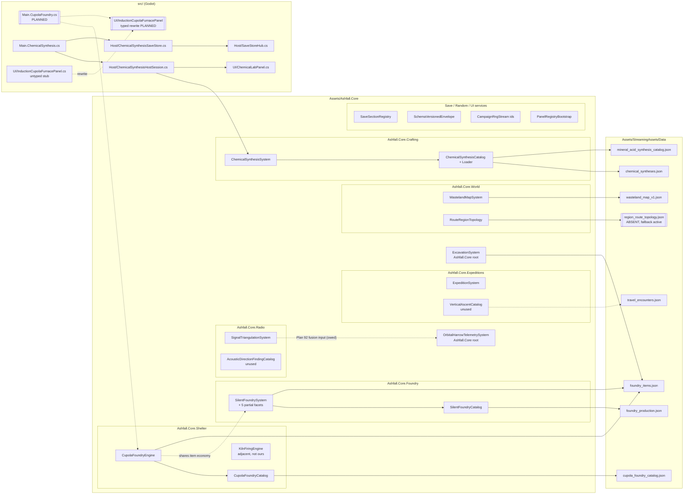
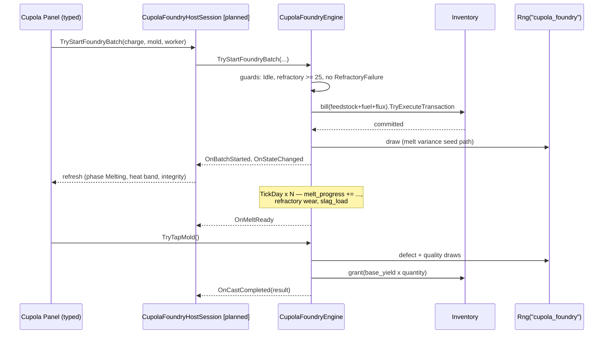
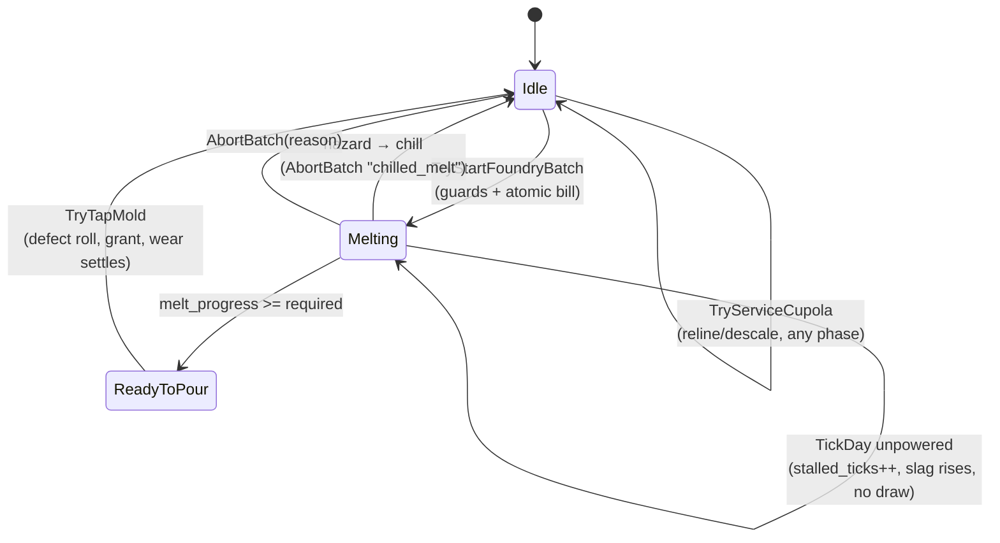
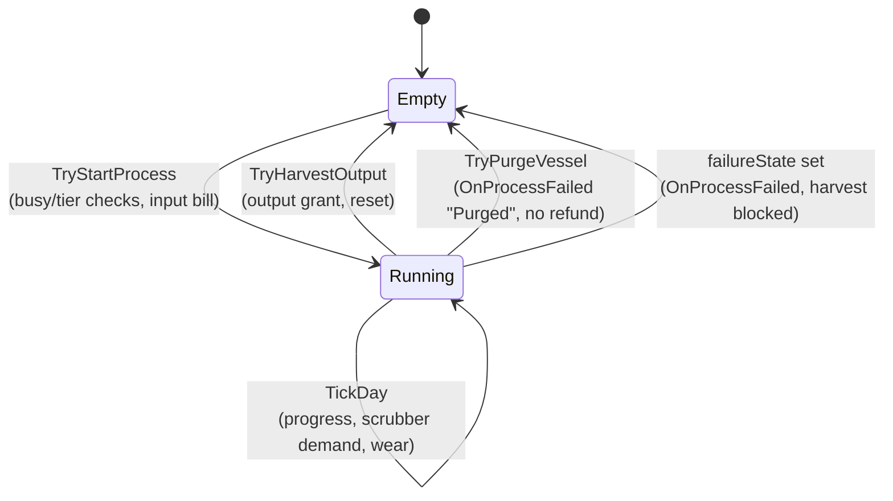

// Implementation Log — Flagship Plans 90–93
// (Cupola Foundry, Vertical Ascent, Acoustic Detection, Mineral-Chemical Production)

# Phase 0 — Forensic Architecture Audit

Status: PASS (complete 2026-09-05)

## Recorded authorities (current repository reality)

| Plan assumption | Repository reality |
|---|---|
| `FoundryProductionSystem` / `MetallurgySystem` | Do **not** exist. Live foundry authority: `SilentFoundrySystem` (`Assets/Ashfall.Core/Foundry/`, batch-heat lifecycle, labor/treaties), catalog `foundry_production.json` + `foundry_items.json`. |
| `CupolaFoundryEngine` | Does not exist — to be created as a **sibling continuous-melt engine** (Plan 90) that shares the item economy with SilentFoundrySystem but owns its own furnace state (refractory, slag, blower, mold queue). |
| `DeepExcavationSystem` | Does not exist. Live authority: `ExcavationSystem` (`Assets/Ashfall.Core/ExcavationSystem.cs`, SystemId `excavation`) — has shoring but **no item-consuming reinforcement action and no inventory dependency**. Plan 90 adds a canonical `TryApplyStructuralReinforcement` action (additive; optional inventory ctor parameter). |
| `TerrainTopologyCatalog` | Does not exist. Live topology: `WastelandMapSystem` (`MapNode`/`MapRoute`, discovery API `Discover(nodeId)`) + `RouteRegionTopology` (`region_route_topology.json`, region `high_scarp`). |
| `RadioTriangulationEngine` | Does not exist. Live triangulation: `SignalTriangulationSystem` (`Ashfall.Core.Radio`, bearing/confidence/uncertainty). Live threat telemetry: `OrbitalHarrowTelemetrySystem` (`OnImpactWarning`, `warningLeadDays=3`). |
| `ChemicalPlantSystem` | Does not exist. Live chemical-process authority: `ChemicalSynthesisSystem` (`Ashfall.Core.Crafting`, full start→tick→harvest→hazard→save pattern, `chemical_syntheses.json`, `synth_*` IDs) — **constructed only in tests; no host wiring, no panel, and its save section is not in `SaveSectionRegistry`**. |
| Plan 93 architecture decision | **Option A selected**: extend `ChemicalSynthesisSystem` (additive `corrosionRating` on definitions, `corrosionLevel` on vessels, purity band at harvest, maintenance action) + author `mineral_acid_synthesis_catalog.json` as an additional catalog file loaded into the same catalog. No new chemical engine. |
| `InductionCupolaFurnacePanel` | Exists as an untyped stub (hardcoded text, `Bind(object?)` ignores parameter, no handlers) — becomes a typed presentation-only panel bound to the cupola engine (AGENTS.md missing-UI table entry removed in the same commit). |
| GameBootstrap | Gone (stale AGENTS.md). Wiring convention = `src/Main.<Area>.cs` partials with `EnsureXxx`/`SetupXxx`/`SaveXxx` triads + `TickXxx` from `Main.CampaignOwners` day loop (template: `src/Main.Plans190_193.cs`). |

## Key conventions to follow

- Inventory billing: `InventoryBill.AddCost/AddGrant` + `Inventory.TryExecuteTransaction(bill, mutate)` (atomic).
- RNG: `_campaignDay.Rng.Fork("<stream>")` with numeric fallback seed; new stream ids added to `CampaignStreamIds`.
- Save: `SaveSectionRegistry.All` tuple + `SectionFileNames` entry → `src/Host/XxxSaveStore.cs` façade via `SaveStoreHub.FromCodec(SchemaVersionedEnvelope<T>.Encode/Decode)` → `CaptureSection(key, store.TryCapturePersisted(state))` → `SetupXxx` in `RestoreAllSubsystemsFromDisk` + `Main.CampaignServices` new-game block.
- Panels: `IBindablePanel`, typed `Bind(system)`, built via `AshfallUiHelpers`, descriptor in `PanelRegistryBootstrap.RegisterAll()`, actions via `PanelRegistry.ConfigureActions`, route in `Main.GameFlow` / `OpenExpandedPanel` switch.
- Integrity: new JSON catalogs need top-level `schema_version`; new id namespaces added to `CatalogIntegrityValidator.IdPrefixes` + `CatalogIntegrityRules.IdPrefixes`; reference fields added to `ReferenceKeys` (both files).
- Content utilization: new catalog file names added to `AuthoritativeCatalogs` + loader patterns; consumer code must genuinely query (QUERIED stage) or content reads dead.
- Traits: `trait_*` snake_case strings queried from survivor definitions (`SurvivorDefinition.traitIds`); systems receive a trait query delegate, never a survivor-system reference.

## Divergences from the pasted plan (adapted, not silent)

1. **Foundry names**: `FoundryProductionSystem`/`MetallurgySystem`/`DeepExcavationSystem`/`RadioTriangulationEngine`/`ChemicalPlantSystem` do not exist. Real authorities recorded above; implementations target them.
2. **Item ID reuse over duplication**: `item_foundry_grey_iron_ingot` (pig iron), `item_foundry_flux` (limestone flux), `item_foundry_firebrick` (refractory), `item_foundry_t_beam` (structural beam), `item_foundry_alloy_part` (machined casting) already exist — Plan 90 reuses them; only genuinely missing items are authored.
3. **Expedition travel** has no route segments; speed reduction implemented via a new convention-following provider hook `SetTravelSpeedMultiplier(Func<string,float>)` (mirrors `SetEncounterChanceMultiplier`), applied in `AdvanceOutbound`/`AdvanceInbound`/`Estimate`, scoped to vertical-route locations by the ascent engine's provider.
4. **Mineral chemistry** persists through the canonical `chemical_synthesis` section (registered into the campaign envelope as part of this milestone) — no duplicate `mineral_chemical_plant` section/state.
5. **Trait names**: PascalCase plan names mapped to repo convention: `trait_foundry_master`, `trait_patternmaker`, `trait_mountaineer`, `trait_rigging_specialist`, `trait_seismologist`, `trait_sonar_technician`, `trait_chemical_engineer`, `trait_industrial_chemist`.
6. **Safety abstraction** (non-negotiable): no real furnace/acid/rigging/targeting procedures — normalized bands and balance values only, per plan §Shared Invariant 6.

# Phase execution journal

(append per slice)

---

# EXPANSION 2026-09-25 — Plans 90–93 Flagship: Full Integration Framework & Code Architecture

This expansion is the continuation journal and engineering reference for the
Flagship quartet **Plan 90 (Cupola Foundry)**, **Plan 91 (Vertical Ascent)**,
**Plan 92 (Acoustic Detection)**, and **Plan 93 (Mineral-Chemical
Production)**. The Phase-0 forensic audit above (complete 2026-09-05) is
preserved byte-for-byte as the baseline. Everything below this separator was
written on 2026-09-25 against the live worktree on branch
`integration/all-latest-2026-09-24`, after re-verifying every audit row in
source.

## Part I — Preamble, Scope, and Reading Order

### I.1 What this document is

The original section of this file is a *forensic audit*: it recorded, as of
2026-09-05, the difference between what the flagship plan texts assumed and
what the repository actually contained, and it committed to six explicit
divergences so that no implementation would silently drift. This expansion is
the *full integration framework*: it re-verifies every one of those rows
against today's source, expands the repo conventions the audit listed into a
complete engineering-standards chapter with verified code citations, and
gives each of the four flagship plans its own architecture chapter —
covering what landed, what did not, and what remains.

It is documentation only. It modifies no code, registers no catalog, and
claims no path. Per `AGENTS.md`, plan names are not proof: every claim below
cites a file and, where load-bearing, a line number or symbol name that was
read on 2026-09-25.

### I.2 Evidence convention used throughout

Each factual statement in Parts II–V carries one of three labels:

- **VERIFIED** — read directly in source or data on 2026-09-25; file path
  given. These are safe to build on without re-checking (though Rule 7 of
  `AGENTS.md` still applies: re-verify at time of use).
- **NOT IMPLEMENTED** — searched for across `Assets/Ashfall.Core/`, `src/`,
  `Ashfall.Core.Tests/`, and `Assets/StreamingAssets/Data/` on 2026-09-25
  and found absent. This is a statement about today's tree, not a forecast.
- **UNVERIFIED (log text)** — a claim inherited from the Phase-0 audit or
  from plan documents that today's source neither confirms nor refutes in
  the checked locations. Treat as historical narrative until proven.

A three-way status (`implemented` / `not implemented` / `unverified`) is
given for every audit row and every divergence wherever it is useful.

### I.3 Reading order

1. **Part II** re-audits the nine audit rows and the execution journal.
   Read this first if you are picking the quartet back up.
2. **Part III** is the engineering-standards chapter: inventory billing,
   deterministic RNG, the save pipeline, the panel pipeline, the integrity
   pipeline, and the trait-query convention — each with the actual types,
   signatures, and a worked example drawn from the quartet's own landed
   code.
3. **Part IV** is the code architecture: the module map of the four
   domains, per-component specifications, and end-to-end sequence
   walkthroughs.
4. **Part V** is the bulk: one full chapter per plan, then a chapter
   tracing each recorded divergence to its resolution state, then a method
   lesson on the "phantom API" pattern, then the reconstructed slice
   history the empty journal should have held.
5. **Part VI** is the cross-system matrix and emergent-consequence design.
6. **Part VII** is verification and acceptance.
7. **Part VIII** is appendices: glossary, conventions quick-reference,
   ID vocabulary, scenarios, open questions, engine surfaces, balance
   dials, the document map, and an audit-replay recipe.

### I.4 Bounded outcome and non-goals of this expansion

Outcome: a single authoritative journal file for Plans 90–93 that a new
builder or integrator can read top-to-bottom and know exactly what exists,
where it lives, what conventions govern it, and what is left.

Non-goals: no code changes; no new ownership claims (see
`WORKTREE_OWNERSHIP.md` before touching any path cited here); no test runs
(`TEST_POLICY.md` focused-verification rules are restated in Part VII but
not executed here); no revival of the plan texts' original naming; no
editorializing about teams or process beyond what the evidence supports.

### I.5 Headline result of the 2026-09-25 re-audit

Of the nine audit rows recorded on 2026-09-05:

- **Four rows have materially changed**: `CupolaFoundryEngine` now exists
  (Core plus tests, not yet host-wired); `TryApplyStructuralReinforcement`
  has landed in `ExcavationSystem`; the `chemical_synthesis` save section
  is registered and the system is fully host-wired with a typed panel; and
  the mineral-acid catalog file exists and is loaded into the merged
  synthesis catalog.
- **Four rows are unchanged in substance**: the phantom names
  (`FoundryProductionSystem`/`MetallurgySystem`/`DeepExcavationSystem`/
  `RadioTriangulationEngine`/`ChemicalPlantSystem`/`TerrainTopologyCatalog`)
  still do not exist and still should not be created; `SilentFoundrySystem`,
  `WastelandMapSystem`/`RouteRegionTopology`, `SignalTriangulationSystem`,
  and `OrbitalHarrowTelemetrySystem` remain the live authorities; the
  `Main.<Area>.cs` partial convention still governs wiring. (Row 4
  carries one data-file nuance the delta table records: the topology
  class is live, but `region_route_topology.json` itself is absent from
  Data and the documented gate-catalog fallback is active.)
- **One row is stalled**: `InductionCupolaFurnacePanel` remains the
  untyped stub exactly as the audit described it.
- **Two divergences advanced, one is open, three hold as recorded**: the
  canonical `chemical_synthesis` section (divergence 4) is fully
  implemented, and the trait naming divergence (divergence 5) is
  half-landed (2 of 8 traits exist, both as cupola engine constants);
  the travel-speed provider hook (divergence 3) is still absent; real
  names over phantom names (divergence 1), item reuse (divergence 2),
  and the safety abstraction (divergence 6) hold as recorded.

The single most useful new fact for integrators: all four flagship RNG
stream ids are already reserved in `CampaignStreamIds` —
`cupola_foundry`, `vertical_ascent`, `acoustic_detection`, and
`mineral_chemical` — so new engine work does not need to negotiate stream
naming (VERIFIED, `Assets/Ashfall.Core/Random/CampaignRngStream.cs`
lines 42–45).

---

## Part II — Current Authority Audit, Re-Verified 2026-09-25

### II.1 Method

Each of the nine rows in the Phase-0 table above was re-checked by reading
the cited files and searching the repo with symbol-level greps over
`Assets/Ashfall.Core/`, `Assets/Ashfall.Core.Tests/`, `src/`, and
`Assets/StreamingAssets/Data/`. Where a
row claimed something *would* be created, the search looked for the exact
symbol the audit promised. Where a row described a live authority, the
authority's public surface was skimmed to confirm the description still
fits. The subsection number of each row below matches the audit table's
order.

### II.2 Row-by-row findings

#### Row 1 — Live foundry authority: `SilentFoundrySystem`

**Status: unchanged, VERIFIED.**

The phantom names `FoundryProductionSystem` and `MetallurgySystem` still do
not exist as classes anywhere in the repo (searched 2026-09-25; the only
`Metallurgy` type is the partial `SilentFoundrySystem.Metallurgy.cs`, which
is a partial-class facet of the real system, not a standalone
`MetallurgySystem`). The live authority is exactly as recorded:

- `Assets/Ashfall.Core/Foundry/SilentFoundrySystem.cs` — `public sealed
  partial class SilentFoundrySystem`, `DefaultSeed = 1009`,
  `MaxWorkers = 8` (comment: `room_bp_11 max_dweller_capacity`), plus a
  large event vocabulary (`silent_foundry_heat_started`,
  `silent_foundry_cast_completed`, `silent_foundry_treaty_quota_met`,
  `silent_foundry_labor_dispute`, `silent_foundry_strike_started`,
  `silent_foundry_journal_triggered`, and others) and standing bounds
  (`StandingMin -100`, `StandingMax 100`, `StandingNeutral 0`).
- Partial-class facets: `SilentFoundrySystem.Heat.cs`,
  `SilentFoundrySystem.Material.cs`, `SilentFoundrySystem.Metallurgy.cs`,
  `SilentFoundrySystem.TreatyLabor.cs`, `SilentFoundrySystem.Glassworks.cs`,
  with `SilentFoundryTypes.cs`, `SilentFoundryCatalog.cs`,
  `SilentFoundryConsequencePolicy.cs`, `SilentFoundryHeadlessDemo.cs`,
  plus newer neighbors `FoundryActionSurface.cs`, `GlassworksCatalog.cs`,
  `HydraulicExtrusionEngine.cs`, `MaterialProfileCatalog.cs`,
  `MetallurgyHeavyCatalog.cs`, `PowderMetallurgySystem.cs`,
  `SaltMineExtractionSystem.cs` (VERIFIED, directory listing of
  `Assets/Ashfall.Core/Foundry/`).
- Data: `Assets/StreamingAssets/Data/foundry_production.json` —
  `schema_version` + `collection_id` + `products`, 35 products with
  `product_id` values such as `foundry_prod_plowshare`,
  `foundry_prod_t_beam`, `foundry_prod_ice_anchor`,
  `foundry_prod_winch_drum`, `foundry_prod_brine_pipe`,
  `foundry_prod_repair_plate`, and product fields including
  `ingredients`, `labor_hours`, `cast_hours`, `fuel_units`,
  `water_litres`, `skill_target`, `quality_target`, `treaty_id`,
  `quota_amount`. `Assets/StreamingAssets/Data/foundry_items.json` holds
  the shared item economy (see Row 2 chapter in Part V).
- Additional foundry-domain data files present today:
  `foundry_accords.json`, `foundry_faction.json`,
  `foundry_treaty_consequences.json` (VERIFIED, directory listing).

**What changed since 2026-09-05:** the directory has grown (the action
surface, glassworks facet, powder metallurgy, salt-mine extraction, and
hydraulic extrusion siblings were not mentioned in the audit), but the row's
substance — batch-heat lifecycle authority, labor/treaty integration, the
two authoritative JSON files — is intact. Nothing in Plans 90–93 needs to
change because of this growth; the cupola chapter in Part V keeps the
sibling-engine boundary sharp precisely so this growth does not blur it.

#### Row 2 — `CupolaFoundryEngine`: to be created

**Status: IMPLEMENTED at the Core layer. Not implemented at the host layer.**

The audit promised "a sibling continuous-melt engine (Plan 90) that shares
the item economy with SilentFoundrySystem but owns its own furnace state
(refractory, slag, blower, mold queue)". That engine now exists:

- `Assets/Ashfall.Core/Shelter/CupolaFoundryEngine.cs` — 444 lines,
  `public sealed class CupolaFoundryEngine`, `SystemId = "cupola_foundry"`,
  trait constants `TraitFoundryMaster = "trait_foundry_master"` and
  `TraitPatternmaker = "trait_patternmaker"`, private balance constants
  `MinRefractoryToFire = 25f` and `MaxSlagBeforeTap = 90f` (VERIFIED,
  lines 90–95).
- State types in the same file: `CupolaHeatBand { Cold, Heating,
  MeltReady, Overheated }`, `CupolaBatchPhase { Idle, Melting,
  ReadyToPour }`, `CupolaFailureState { None, Stalled, Chilled,
  RefractoryFailure, HazardEvent }`, `CastingDefect { Clean, Porous,
  Misrun, Cracked, Scrap }`; the persisted `CupolaFurnaceState` carries
  `furnace_id` (default `"cupola_01"`), `active_charge_id`,
  `active_mold_id`, phase/heat/failure as ints, `melt_progress`,
  `melt_ticks_required`, `stalled_ticks`, `molten_pool_units`,
  `slag_level` (0..100), `refractory_integrity` (0..100),
  `blower_available`, `assigned_worker_id`, `last_tick_day`, plus
  `Clone()`; `CupolaCastResult` (charge/mold/defect/`quality_score`/
  `granted_quantity`/`batch_lost`) and `CupolaFoundrySave`
  (`state_version = 1`, furnace, `batches_completed`,
  `lifetime_castings`, `last_tick_day`) complete the persistence shape
  (VERIFIED, lines 9–77).
- Public surface: `TryStartFoundryBatch(chargeId, moldId, workerId)`,
  `TickDay(currentDay)`, `TryTapMold()` returning `CupolaCastResult?`,
  `AbortBatch(reason)`, `TryServiceCupola(includeDescale, workerId)`,
  `CaptureState()`, `RestoreState(save)`; events `OnBatchStarted`,
  `OnMeltReady`, `OnCastCompleted`, `OnBatchAborted`, `OnHazardEvent`,
  `OnStateChanged` (VERIFIED, lines 128–156, 202, 271, 351, 365, 426, 435).
- Constructor takes `(Inventory.Inventory inventory,
  CupolaFoundryCatalog catalog, ISeededRng rng, ILog? log = null,
  Func<string, IReadOnlyList<string>>? traitsOf = null,
  Func<float>? availablePowerWatts = null)` — inventory is mandatory,
  traits arrive as a query delegate, and blower power arrives as a
  delegate that defaults to "power assumed" when null (VERIFIED, lines
  107–120, 144–150).
- Catalog: `Assets/Ashfall.Core/Shelter/CupolaFoundryCatalog.cs` with
  `CupolaChargeDefinition` (`feedstock_item_id` + quantity,
  `fuel_item_id` + quantity, `flux_item_id` + quantity,
  `required_blower_power_w`, `heat_band`, `melt_ticks`,
  `refractory_wear_per_batch`, `slag_load`, `allowed_mold_ids`,
  `base_yield_item_id`, `base_yield_quantity`, `hazard_rating`, tags; full
  `Validate(out string error)`), mold definitions, and maintenance
  definitions (VERIFIED, header and validation block).
- Data: `Assets/StreamingAssets/Data/cupola_foundry_catalog.json` —
  `schema_version`, three charges (`charge_scrap_bulk`,
  `charge_rebar_lot`, `charge_pipe_lot`), four molds (`mold_ingot`,
  `mold_structural_beam`, `mold_machine_base`, `mold_gear_blank`), and
  one maintenance entry `cupola_reline_maintenance` (VERIFIED, parsed
  JSON).
- Tests: `Ashfall.Core.Tests/Shelter/CupolaFoundryEngineTests.cs` —
  fourteen `[Fact]`s (re-counted 2026-09-25) covering atomic billing and
  blower-power rejection
  (`StartBatch_CommitsBillOnce_AndEntersMelting`,
  `StartBatch_MissingMaterial_ConsumesNothing`,
  `StartBatch_UnknownChargeOrMold_Rejected`,
  `StartBatch_NoBlowerPower_RejectedWithoutConsumption`), stalling on
  power loss, single grant per cycle
  (`FullCycle_GrantsMoldOutput_ExactlyOnce`), determinism
  (`Quality_IsDeterministicUnderSeed`), trait effect
  (`FoundryMasterTrait_RaisesQualityScore`), refractory wear and atomic
  maintenance, save-mid-batch restore
  (`SaveMidBatch_RestoreDoesNotAdvanceOrProduce`), the
  refractory-gate on new batches, deterministic hazard chill, and two
  cross-system excavation tests
  (`ExcavationReinforcement_ConsumesCastBeamsAtomically`,
  `ExcavationReinforcement_WithoutInventory_FailsCleanly`) (VERIFIED,
  test method list).
- RNG: `CampaignStreamIds.CupolaFoundry = "cupola_foundry"` is reserved
  (VERIFIED, `Assets/Ashfall.Core/Random/CampaignRngStream.cs` line 42).

**The host layer is not done.** No `new CupolaFoundryEngine(` exists in
`src/` (searched 2026-09-25); there is no `cupola_foundry` row in
`SaveSectionRegistry.All`; there is no `CupolaFoundryHostSession` or
`CupolaFoundrySaveStore` under `src/Host/`. The only `src/` mentions are
two comments in `src/Main.Kilnworks.cs` and `src/Host/KilnworksHostSession.cs`
stating that "metallurgy stays with CupolaFoundryEngine" — i.e., the
Expansion 31 kiln host explicitly disclaims the cupola's domain. The
kilnworks save-section row in `SaveSectionRegistry` even encodes this
boundary in its description: *"queued kiln batches, kiln fuel reserve,
refractory lining wear, and drawn-output tallies. Metallurgy stays with
CupolaFoundryEngine."* (VERIFIED, `Assets/Ashfall.Core/Save/
SaveSectionRegistry.cs` line 304.)

Note also the placement: the audit assumed a Foundry-namespace sibling;
the engine actually landed in `Ashfall.Core.Shelter` (namespace and
directory), alongside `KilnFiringEngine`/`KilnFiringLedger`. This is a
namespace divergence to record, not fight: the shelter grouping reflects
where the furnace physically lives in the holdfast, and the engine does
not reference `Ashfall.Core.Foundry` types.

#### Row 3 — `ExcavationSystem` reinforcement action

**Status: IMPLEMENTED, VERIFIED.**

`TryApplyStructuralReinforcement` has landed exactly in the shape the
audit prescribed:

- `Assets/Ashfall.Core/ExcavationSystem.cs` line 98:
  `public ActionResult TryApplyStructuralReinforcement(string siteId)`.
- The optional inventory constructor parameter landed:
  `public ExcavationSystem(ISeededRng rng, ILog? log = null,
  Inventory.Inventory? inventory = null)` (VERIFIED, lines 48–53).
- Billing is canonical: a fresh `InventoryBill`, one
  `bill.AddCost(StructuralBeamItemId, StructuralBeamCost)` where
  `StructuralBeamItemId = "item_foundry_t_beam"` and
  `StructuralBeamCost = 2` (VERIFIED, lines 38–39, 108), committed via
  `_inventory.TryExecuteTransaction(bill, () => { site.reinforcedBeams++;
  site.structuralRisk = Math.Max(0.05f, site.structuralRisk * 0.5f);
  OnExcavationChanged?.Invoke(); })` — the mutation lambda only runs if
  the atomic transaction succeeds (VERIFIED, lines 107–115).
- Guard ladder: unknown site → `Failed("unknown_site")`; completed site →
  `Blocked("already_complete")`; caved-in site → `Blocked("caved_in")`;
  risk already ≤ 0.05 → `Blocked("risk_already_low")`; null inventory →
  `Failed("no_inventory")`; failed transaction →
  `Failed("missing_beams")`; success returns
  `ActionResult.Success("excavation.reinforced", {risk})` with the new
  risk value (VERIFIED, lines 100–119).
- Semantics per the doc comment: each applied reinforcement set halves
  structural risk again, with diminishing returns at the 0.05 floor —
  the `reinforcedBeams` counter tracks how many sets were applied
  (VERIFIED, comment lines 95–97).

This is the cleanest worked example in the quartet of the
bill-then-mutate pattern described in Part III.2, and the cupola tests
exercise it end-to-end with a real inventory.

#### Row 4 — Map topology authority

**Status: confirmed, with one data-file nuance. VERIFIED (code);
NOT IMPLEMENTED (the named JSON file itself).**

- `TerrainTopologyCatalog` still does not exist (searched 2026-09-25) —
  correct, since the audit explicitly rejected the name.
- `Assets/Ashfall.Core/World/WastelandMapSystem.cs` is live with the
  recorded shape and more: `MapNode` and `MapRoute` classes (lines 959,
  1013), `Discover(nodeId)` retained as a legacy shim
  (`Discover(nodeId) => DiscoverVisited(nodeId, "legacy", 1)`, line 229)
  over the newer `DiscoverRumor`, `DiscoverSurvey`, `DiscoverVisited`,
  and `DiscoverTunnel` entry points, `OnNodeDiscovered` event,
  `DiscoveredNodes` and `IsDiscovered(nodeId)` accessors, and intel/know-
  ledge views (`MapNodeKnowledgeState`, `MapNodeIntelView`) (VERIFIED,
  public-surface grep).
- `Assets/Ashfall.Core/World/RouteRegionTopology.cs` is live, namespace
  `Ashfall.Core.World`, with `RouteDefinition` (`RouteId`, `TargetId`,
  `RegionTag`, `BlockedWeather`, `RequiredWeather`) and the class
  contract documented as D3/D7. **Nuance:** the documented authority file
  `region_route_topology.json` (`public const string FileName =
  "region_route_topology.json"`) is **not present** in
  `Assets/StreamingAssets/Data/` today (searched 2026-09-25). The class
  header specifies the fallback: *"If the file is absent the mapping is
  derived from the gate catalog instead (every route gate target belongs
  to every region holding an encounter tagged with that region).
  Unknown region tags never suppress encounters."* The audit's example
  region `high_scarp` is real as a region tag — it appears today in
  `diplomatic_treaties.json`, `characters.json`, `damaged_map_zones.json`,
  `foundry_accords.json`, and `travel_encounters.json` — but the audit's
  phrasing "(`region_route_topology.json`, region `high_scarp`)" read as
  "the file contains this region" is **UNVERIFIED (log text)** as to the
  file, and the file itself is absent.
- Consequence for Plan 91: the ascent chapter (Part V.91) must treat
  vertical-route scoping as working through region tags and route gates
  that exist in `travel_encounters.json` and the gate catalog, not
  through a topology file that does not currently ship. Authoring
  `region_route_topology.json` is an open question (Part VIII).

#### Row 5 — Radio and orbital telemetry authorities

**Status: confirmed, VERIFIED, plus one significant addition.**

- `Assets/Ashfall.Core/Radio/SignalTriangulationSystem.cs` — namespace
  `Ashfall.Core.Radio`. `RadioObservation` carries `signalId`,
  `stationId`, `day`, `hour`, `bearingDegrees` (0–360 clockwise from
  north), `errorDegrees` (default ±5), `signalStrength`, `noiseLevel`,
  `frequencyMhz`, `weatherCondition`, `operatorSkill`, and
  `polarizationFade` (VERIFIED, lines 12–27). `TriangulationCandidate`
  carries `locationId`, `displayName`, `estimatedX/estimatedY`,
  `uncertaintyRadiusKm`, `confidence` (0..1),
  `identityConfidence`, `observationCount`, `isFalseSignature`
  (VERIFIED, lines 31–43). `StationBaselineEntry` and `TriangulationState`
  complete the state surface. This is the bearing/confidence/uncertainty
  authority exactly as the audit recorded.
- `Assets/Ashfall.Core/OrbitalHarrowTelemetrySystem.cs` —
  `OrbitalTelemetryState.warningLeadDays = 3` is confirmed verbatim
  (line 28), the state carries `nextImpactDay`, `targetGridX`,
  `affectedCellSpread`, `impactEnergyMj`, brace flags, impact history,
  `OrbitalWarningEntry` list, and `OrbitalSalvageOpportunity` list; the
  events are `OnImpactWarning` (line 84), `OnImpactResolved`,
  `OnImpactDetailed`, `OnTelemetryChanged` (VERIFIED, lines 84–87, 152).
- **Addition since the audit:** `Assets/Ashfall.Core/Radio/
  AcousticDirectionFindingCatalog.cs` now exists — `AcousticArrayProfile`
  with `sensor_class`, `baseline_class` (short/medium/long),
  `noise_tolerance` (0..1), `signal_bands`, `base_detection_range_km`,
  `confidence_gain` per observation, `warning_window_class`,
  `power_demand_w`, `maintenance_wear`, `install_item_ids`,
  `repair_item_ids`, and `dampening_item_id`, with full validation. This
  is unmistakably Plan 92 material (the `dampening_item_id` reference key
  in the Plans 90–93 integrity block matches it). **However** it is
  currently referenced by no other file — no engine consumes it, no JSON
  data file instantiates it, no test file exercises it (searched
  2026-09-25). Status: catalog type implemented; engine, data, tests,
  and wiring not implemented.
- Related but distinct: `Assets/Ashfall.Core/Combat/SoundRangingCatalog.cs`
  belongs to the sound-ranging (artillery localization) family and
  `CampaignStreamIds.SoundRanging = "sound_ranging"` is its stream —
  Plan 92's acoustic *early-warning* arrays are a different concern and
  have their own reserved stream `acoustic_detection` (VERIFIED,
  `CampaignRngStream.cs` line 44). Do not conflate the two catalogs.

#### Row 6 — `ChemicalSynthesisSystem`: the big mover

**Status: dramatically changed. The audit's "constructed only in tests; no
host wiring, no panel, and its save section is not in
`SaveSectionRegistry`" is now three-for-three stale.**

`Assets/Ashfall.Core/Crafting/ChemicalSynthesisSystem.cs` (namespace
`Ashfall.Core.Crafting`) still does not exist under the phantom name
`ChemicalPlantSystem`, and its recorded shape is intact and grown:

- State: `ChemicalRetortState` (`vesselId`, `activeProcessId`,
  `processProgress`, `processingTicksRequired`, `heatBand` Low/Nominal/
  High/Runaway, `pressureBand` Vacuum/Nominal/Elevated/Critical,
  `catalystCondition` 0..100, `scrubberCondition` 0..100, `isSealed`,
  `assignedOperatorId`, `failureState` None/BatchLoss/VesselDamage/
  ScrubberFailure/ExposureEvent, `lastTickDay`) and `ChemicalSynthesisSave`
  (vessels list, `scrubberReserve`, `apparatusTier`, `lastTickDay`)
  (VERIFIED, lines 10–62).
- Public surface: `Vessels`, `ScrubberReserve`, `ApparatusTier`,
  `LastTickDay`; events `OnProcessStarted`, `OnProcessCompleted`,
  `OnProcessFailed`, `OnExposureIncident` (vesselId, operatorId,
  severity), `OnStateChanged`; actions `GetVessel`, `TryUpgradeApparatus`,
  `TryStartProcess`, `TryHarvestOutput`, `TryServiceScrubber`,
  `TryPurgeVessel`, `TickDay`, `CaptureState`, `RestoreState`; vessels
  are seeded as `retort_01`, `retort_02`, … from `initialVesselCount`
  (VERIFIED, lines 65–132 and the action list).
- Catalog: `Assets/Ashfall.Core/Crafting/ChemicalSynthesisCatalog.cs`
  with the process definition (`input_items`, `output_items`,
  `processing_ticks`, `heat_band`, `volatility_rating`,
  `scrubber_demand`, `equipment_wear`, `skill_requirement`, tags) and the
  loader. **The loader now merges two files**:
  `ChemicalSynthesisCatalogLoader.Load(dataDir, fileIO, json)` calls
  `AppendFile` over `chemical_syntheses.json` (10 processes, ids
  `synth_high_energy_binder` … `synth_solvent_extract`) and then
  `mineral_acid_synthesis_catalog.json` (VERIFIED, loader lines 141–172;
  both files parsed 2026-09-25).

What changed since the audit:

1. **Save section registered.** `SaveSectionRegistry.All` contains
   `new("chemical_synthesis", "SaveChemicalSynthesis",
   "SetupChemicalSynthesis", "crafting", "Chemical synthesis retorts and
   apparatus")` and `SectionFileNames` maps
   `chemical_synthesis → chemical_synthesis_save.json` (VERIFIED,
   `Assets/Ashfall.Core/Save/SaveSectionRegistry.cs` lines 225 and 538).
2. **Host wiring live.** `src/Main.ChemicalSynthesis.cs` implements the
   full triad: `SetupChemicalSynthesis()` builds the file IO, loads the
   merged catalog (falling back to `new ChemicalSynthesisCatalog(null)`),
   forks the RNG — `_campaignDay != null ?
   _campaignDay.Rng.Fork("chemical_synthesis") : new SeededRng(87)` —
   constructs the system with the shared inventory, restores saved state,
   wraps it in `ChemicalSynthesisHostSession`, and hooks
   `StateChanged → _chemicalSynthesisDirty`;
   `SaveChemicalSynthesis()` routes through
   `CaptureSection("chemical_synthesis",
   ChemicalSynthesisSaveStore.TryCapturePersisted(...))`; and
   `FlushChemicalSynthesisIfDirty()` gates the write on the dirty flag
   (VERIFIED, whole file). The setup call is wired from
   `src/Main.SaveOrchestrator.cs` (lines 296, 556) and
   `src/Main.Application.cs` (line 871).
3. **Save store façade live.** `src/Host/ChemicalSynthesisSaveStore.cs`
   declares `FileName = "chemical_synthesis_save.json"`,
   `SectionName = "chemical_synthesis"`, and a static
   `SaveStore<ChemicalSynthesisSave>` built with
   `SaveStoreHub.Checksummed<ChemicalSynthesisSave>(FileName,
   nameof(ChemicalSynthesisSaveStore), allowLegacyBareState: false)`
   (VERIFIED, file head).
4. **Typed panel live.** `src/UI/ChemicalLabPanel.cs` is bound
   specifically to `ChemicalSynthesisHostSession` — it has both a typed
   `Bind(ChemicalSynthesisHostSession? host)` and the
   `IBindablePanel.Bind(object?)` shim delegating via `session as ...`,
   renders per-vessel cards and a system dossier, and shows an offline
   message when unbound (VERIFIED, file lines 15–59, 249, 303, 469–473).
   This panel is the local exemplar for the Plan 90 cupola panel work
   (Row 8).

**Plan 93 residue.** The Option A extension is only partially landed:

- `corrosionRating` on process definitions: IMPLEMENTED — field,
  `[JsonPropertyName("corrosion_rating")]`, validation
  (`corrosionRating < 0` → error), and the snake_case alias map entry
  (VERIFIED, `ChemicalSynthesisCatalog.cs` lines 36–37, 100–102, 163).
- `mineral_acid_synthesis_catalog.json`: IMPLEMENTED — `schema_version`
  1, six processes (`synth_mineral_acid_reagent`,
  `synth_industrial_oxidizer_reagent`,
  `synth_battery_electrolyte_concentrate`,
  `synth_foundry_pickling_reagent`, `synth_neutralizer_base`,
  `synth_precision_oxidizer_reagent`), apparatus tier 2, tags
  `mineral_chemistry`/`industrial`/`corrosive`, with `corrosion_rating`
  values 1.5–2.0 observed (VERIFIED, parsed JSON).
- `corrosionLevel` on vessels: NOT IMPLEMENTED — zero hits repo-wide for
  `corrosionLevel`/`corrosion_level` (searched 2026-09-25). Vessels have
  `catalystCondition` and `scrubberCondition` but no corrosion state.
- Purity band at harvest: NOT IMPLEMENTED — `TryHarvestOutput` grants
  `def.outputItems` in full through the bill with no quality/purity
  computation (VERIFIED, `ChemicalSynthesisSystem.cs` lines 186–214).
- Corrosion-specific maintenance action: NOT IMPLEMENTED as such —
  `TryServiceScrubber` (costs `scrap_chemical` ×2 + `clean_water` ×1,
  restores `scrubberCondition` to 100) and `TryPurgeVessel` (cancels the
  run, fires `OnProcessFailed("Purged")`) exist, but neither consumes
  corrosion nor is corrosion-aware (VERIFIED, lines 216–247).

#### Row 7 — Plan 93 architecture decision (Option A)

**Status: decision holds; implementation partial (see Row 6 residue).**

Option A — extend `ChemicalSynthesisSystem` rather than build a chemical
engine — was the right call and remains the right call: the host wiring,
save section, typed panel, and merged-catalog loader that Option A needed
all now exist, which means the remaining corrosion/purity/maintenance legs
are additive field-and-rule work inside an already-integrated system, not
a new integration. No new chemical engine exists or should be created
(searched for `ChemicalPlantSystem`-family class names; none present).

#### Row 8 — `InductionCupolaFurnacePanel`

**Status: NOT IMPLEMENTED — still the untyped stub, verbatim as audited.**

`src/UI/InductionCupolaFurnacePanel.cs` remains a `partial class … :
Control, IBindablePanel` whose `Bind(object? session)` ignores its
parameter, sets `IsBound = true`, and refreshes hardcoded placeholder
text — the status badge still reads "STATUS: SMELTING ACTIVE - MOLTEN
HIGH-TUNGSTEN ALLOY / 1,640C" and the chrome title is still
"SUBTERRANEAN METALLURGY // INDUCTION CUPOLA FURNACE [MET-03]" (VERIFIED,
file head and `RefreshView()`). It is constructed hidden in
`src/Main.UiPanels.cs` (field at line 199, instantiation at line 1371)
but binds to nothing.

This is now the *only* row of the original audit that has not moved at
all, and it is also a UX/truthfulness problem per `AGENTS.md` ("a panel
exposes … truthful current state"): a furnace panel showing a permanent
fake smelting status. Note the interesting inversion: the *chemical*
domain got its typed panel (`ChemicalLabPanel`) before the *foundry*
domain did, so Part III.5 can point builders at a same-repo exemplar
rather than a hypothetical.

#### Row 9 — GameBootstrap and the wiring convention

**Status: confirmed, VERIFIED.**

`GameBootstrap` remains gone. The convention is `src/Main.<Area>.cs`
partial classes with `EnsureXxx`/`SetupXxx`/`SaveXxx` triads and day-loop
`TickXxx` ownership from `Main.CampaignOwners`. The audit's cited
template `src/Main.Plans190_193.cs` exists and covers a different
quartet (Infection & Amputation, Railways & Armored Trains, Subterranean
Fungi Cultivation, Wasteland Justice & Tribal Law — VERIFIED, file
header), which is exactly why it is a good template: it shows four
unrelated systems sharing one partial without coupling. The
orchestration seams confirmed today: `CaptureSection(string sectionKey,
string payload)` at `src/Main.SaveOrchestrator.cs` line 57,
`RestoreAllSubsystemsFromDisk()` at line 164 (with setup calls dispatched
inside), and the new-game path in `src/Main.CampaignServices.cs` which
now comments that it mirrors "the declarative manifest bootstrap as
RestoreAllSubsystemsFromDisk" (VERIFIED, lines 72, 98).

### II.3 Delta summary: what changed between 2026-09-05 and 2026-09-25

| Audit item | 2026-09-05 | 2026-09-25 |
|---|---|---|
| `CupolaFoundryEngine` | planned | Core + catalog + JSON + 14 tests landed; host wiring pending |
| `TryApplyStructuralReinforcement` | planned | Landed (beams ×2, risk ×0.5, floor 0.05) |
| `chemical_synthesis` save section | absent | Registered + host triad + checksummed store |
| `ChemicalSynthesisSystem` wiring | test-only | Live: session, loader, `ChemicalLabPanel` |
| `mineral_acid_synthesis_catalog.json` | planned | Landed; merged by loader (6 processes) |
| `corrosionRating` (definitions) | planned | Landed + validated + alias-mapped |
| `corrosionLevel` / purity band / corrosion maintenance | planned | Not implemented (zero hits) |
| `InductionCupolaFurnacePanel` | untyped stub | Unchanged (still untyped stub) |
| `SetTravelSpeedMultiplier` provider hook | planned | Not implemented (zero hits) |
| `VerticalAscentCatalog` / `AscentRigProfile` | not anticipated | Type landed (Core-only, no data, no engine, unused) |
| `AcousticDirectionFindingCatalog` | not anticipated | Type landed (Core-only, unused) |
| Flagship RNG streams | not mentioned | All four reserved in `CampaignStreamIds` |
| Plans 90–93 integrity blocks | not mentioned | Landed in validator + rules (11 reference keys) |
| `region_route_topology.json` | recorded as live | File absent from Data; documented fallback active |

### II.4 The execution journal, honestly reviewed

The original file's journal section says only "(append per slice)" and
contains no entries. That is a finding, not an accusation: the work
recorded in the delta table above — the cupola engine, the reinforcement
action, the entire chemical-synthesis live-wiring, the mineral-acid
catalog, the integrity blocks, the reserved streams — all landed
**without a single journal slice being appended here**. Every other
flagship log in `docs/plans/` shows the same pattern to varying degrees;
the lesson for the next slice owner is recorded in Part VII: the journal
is part of the deliverable, and a slice without its journal entry forces
the next reader to do exactly the archaeology this expansion just did.

Where this expansion states that work "landed", it means: the symbols
exist in the tree today with the cited shapes, and (where stated) tests
reference them. It does not claim who landed it or in which commit;
attribution was deliberately not reconstructed.

---

## Part III — Integration Framework: The Repo Conventions as Engineering Standards

The Phase-0 audit compressed the repo's working conventions into six
bullet lines. This part expands each into a full standard: the rule, the
types that enforce it, a verified worked example (drawn from the quartet's
own landed code wherever possible), the failure mode the rule prevents,
and the checklist a reviewer applies. Every code citation was read on
2026-09-25.

### III.1 Inventory billing — atomic, all-or-nothing resource movement

**Rule.** Any change to inventory contents is expressed as an
`InventoryBill`, and the bill is executed through
`Inventory.TryExecuteTransaction(bill, mutate)`. The mutation lambda runs
if and only if every cost in the bill is payable; if any cost fails, the
inventory is untouched and the mutation never happens. Systems never
`Add`/`Remove` items directly in gameplay paths.

**Types.**

- `Assets/Ashfall.Core/Inventory/InventoryTransaction.cs` —
  `public sealed class InventoryBill` with fluent
  `AddCost(string itemId, int amount, ItemDefinition? def = null)`,
  `AddCost(ItemDefinition def, int amount)`,
  `AddGrant(string itemId, int amount, ItemDefinition? def = null)`,
  `AddGrant(ItemDefinition def, int amount)` (VERIFIED, lines 45–77).
  A bill may mix costs and grants in one transaction — that is how a
  craft that consumes scrap and produces a part stays atomic.
- `Assets/Ashfall.Core/Inventory/Inventory.cs` —
  `TryExecuteTransaction(bill, mutate)` is the commit point
  (VERIFIED, file present and referenced by every engine below).

**Worked example 1 — excavation reinforcement (cost-only).**
`TryApplyStructuralReinforcement` builds `var bill = new InventoryBill();
bill.AddCost(StructuralBeamItemId, StructuralBeamCost);` and commits with
the state mutation inside the lambda
(`site.reinforcedBeams++; site.structuralRisk = Math.Max(0.05f,
site.structuralRisk * 0.5f); OnExcavationChanged?.Invoke();`). If the
survivor has fewer than two `item_foundry_t_beam`, `committed` is false,
`reinforcedBeams` is unchanged, and the caller receives
`ActionResult.Failed("missing_beams", ...)` (VERIFIED,
`Assets/Ashfall.Core/ExcavationSystem.cs` lines 107–119).

**Worked example 2 — chemical harvest (grant-only).**
`TryHarvestOutput` iterates `def.outputItems` into `bill.AddGrant(...)`
and commits the vessel reset (clear `activeProcessId`, zero progress,
reset `failureState`, fire `OnProcessCompleted` + `OnStateChanged`)
inside the lambda (VERIFIED, `Assets/Ashfall.Core/Crafting/
ChemicalSynthesisSystem.cs` lines 186–214).

**Worked example 3 — chemical maintenance (multi-cost).**
`TryServiceScrubber` bills `scrap_chemical` ×2 and `clean_water` ×1
before restoring `scrubberCondition = 100.0f` (VERIFIED, lines 216–231).

**Worked example 4 — cupola batch start (multi-cost, with guards before
billing).** `TryStartFoundryBatch` validates phase, refractory failure
state, and the refractory minimum *before* building the bill, so a
rejected batch consumes nothing and — per the doc comment — "on any
validation failure nothing is consumed and no RNG is drawn" (VERIFIED,
`Assets/Ashfall.Core/Shelter/CupolaFoundryEngine.cs` lines 153–156 and
the doc comment at 152).

**Failure mode prevented.** Partial consumption: a naive implementation
deducts feedstock, then fails to find the flux, and the survivor has paid
for nothing. The bill pattern makes that state unrepresentable. The
second failure mode is event-before-commit: firing `OnExcavationChanged`
or `OnStateChanged` outside the lambda lets listeners observe state the
transaction then rolls back. Both engines keep events inside the lambda
or after `committed` is confirmed.

**Reviewer checklist.**

1. Does every gameplay inventory mutation go through a bill?
2. Are all guards (phase, state, capability) evaluated before the bill is
   built, so failures are free?
3. Is the state mutation *and* the change event inside the transaction
   lambda?
4. Is the return path tri-state where callers need to distinguish
   "invalid" from "cannot afford" (`ActionResult` failed/blocked reason
   codes; cupola returns `bool` — acceptable where the UI needs only a
   no)?
5. Do tests cover both sides: commit-once and consume-nothing-on-failure?
   (The cupola tests do: `StartBatch_CommitsBillOnce_AndEntersMelting`
   vs `StartBatch_MissingMaterial_ConsumesNothing`.)

### III.2 Deterministic RNG — forked streams and reserved ids

**Rule.** All stochastic gameplay draws come from seeded, forked streams.
A system receives an `ISeededRng` it does not share; streams are forked
per concern via `_campaignDay.Rng.Fork("<stream>")`, with a numeric
fallback seed for headless/test construction. New stream ids are added to
`CampaignStreamIds`, never inlined as string literals at call sites.

**Types.**

- `Assets/Ashfall.Core/Random/CampaignRngStream.cs` — the
  `CampaignStreamIds` constant class. Today it carries the core streams
  (`weather`, `combat`, `disease`, `greenhouse`, `expedition`,
  `narrative`, `echo`, `economy`, `radio`, `social`, `moral_choice`,
  `shelter`, `duty_roster`, `muster`, `foundry`, `maritime`,
  `deep_coast`, `psychology`, `medical`, `events`, and domain streams
  through `runflat_tire`, `sofc_power`, `sound_ranging`, `cvd_diamond`,
  `amphibious_draisine`, `world_evolution`, `anomaly_hazard`) **plus the
  four flagship reservations** (VERIFIED, lines 10–45):

  ```csharp
  public const string CupolaFoundry = "cupola_foundry";     // line 42
  public const string VerticalAscent = "vertical_ascent";   // line 43
  public const string AcousticDetection = "acoustic_detection"; // line 44
  public const string MineralChemical = "mineral_chemical"; // line 45
  ```

- `SeededRng` is the concrete seeded implementation; the numeric-fallback
  idiom appears in host wiring (below).

**Worked example — chemical synthesis wiring.**
`src/Main.ChemicalSynthesis.cs`:

```csharp
var rng = _campaignDay != null
    ? _campaignDay.Rng.Fork("chemical_synthesis")
    : new SeededRng(87);
```

(VERIFIED, file body.) Note the stream string here is the literal
`"chemical_synthesis"` matching the save-section key; the constant class
does not (yet) carry a `ChemicalSynthesis` entry — the four flagship
streams were reserved ahead of wiring, and this older system predates
that discipline. New work should use the constants; adding the missing
constant for chemical synthesis is a reasonable micro-cleanup (Part VIII,
open questions).

**Determinism invariants observed in the quartet's tests.**

- `Quality_IsDeterministicUnderSeed` and
  `HazardRoll_CanChillBatch_ButStaysDeterministic` (cupola): identical
  seeds produce identical quality outcomes and identical hazard-chill
  sequences; the hazard roll may *change* a batch's fate but only along
  the seed-determined path.
- `SaveMidBatch_RestoreDoesNotAdvanceOrProduce`: capture/restore must not
  consume RNG or advance progress — a restored run replays identically.
  This is the pairing rule between Part III.3 (save) and Part III.2
  (RNG): persistence restores *state*, never *history*, so the stream
  position must be recoverable from state alone or the restored run will
  diverge from a never-saved run.

**Failure mode prevented.** Cross-system coupling: if the cupola drew
from the `foundry` stream that `SilentFoundrySystem` uses, a balance tweak
in one would replayably alter the other's outcomes. Forked streams make
each concern's randomness independent and reproducible. `System.Random`
and wall-clock seeds are banned outright by `AGENTS.md` Rule 4; neither
appears in the quartet's landed engines (searched 2026-09-25).

**Reviewer checklist.**

1. Is the stream id a `CampaignStreamIds` constant (or, for legacy code,
   a string that matches a save-section key)?
2. Is the fork taken once at construction, not per draw?
3. Is there a deterministic fallback for headless construction, and is
   the fallback seed a fixed constant (like `87`), never a time value?
4. Does the save state capture everything needed to resume without
   re-drawing (counters, progress, last-tick day)?

### III.3 Save pipeline — section registry, envelope, store façade, capture/restore

**Rule.** Persistent state is registered in exactly one place
(`SaveSectionRegistry`), named in exactly one place
(`SectionFileNames`), serialized by a Core codec wrapped in a
`SchemaVersionedEnvelope`, persisted through a per-system host store
façade built from `SaveStoreHub`, and captured/restored through the Main
partial's `CaptureSection`/setup seams. A system whose save section is
not registered is not persistent, whatever its own
`CaptureState`/`RestoreState` methods do.

**Types and the five registration points.**

1. **Section row.** `Assets/Ashfall.Core/Save/SaveSectionRegistry.cs` —
   `All` is a list of section descriptors; the relevant tuple shape is
   `(key, saveMethodName, setupMethodName, group, description[,
   RequiresSetup][, LifecycleGroup])`. Examples read today:
   `("chemical_synthesis", "SaveChemicalSynthesis",
   "SetupChemicalSynthesis", "crafting", "Chemical synthesis retorts and
   apparatus")` (line 225) and the kilnworks row (line 304) whose
   description also *documents a boundary* ("Metallurgy stays with
   CupolaFoundryEngine") — registry rows double as authority maps.
2. **File name.** `SectionFileNames`, the static dictionary in the same
   file (line 345): `"chemical_synthesis" →
   "chemical_synthesis_save.json"` (line 538). Snake case throughout.
3. **Core codec.** `Assets/Ashfall.Core/Save/SchemaVersionedEnvelope.cs`
   — `SchemaVersionedEnvelope<T>.Encode/Decode` stamp a checksum and
   version onto the payload so migration is possible and corruption is
   detectable (file present, referenced by store façades).
4. **Store façade.** `src/Host/SaveStoreHub.cs` is the host-side factory
   hub over the Core `SaveStore<T>` (`Assets/Ashfall.Core/Save/
   SaveStore.cs`; `public static SaveStore<T> FromCodec(...)` at line 93
   delegates serialization to the Core codec while the store owns path
   resolution, atomic write, backup, and error handling). The quartet
   example is `src/Host/ChemicalSynthesisSaveStore.cs`:

   ```csharp
   public const string FileName = "chemical_synthesis_save.json";
   public const string SectionName = "chemical_synthesis";
   private static readonly SaveStore<ChemicalSynthesisSave> s_store =
       SaveStoreHub.Checksummed<ChemicalSynthesisSave>(
           FileName,
           nameof(ChemicalSynthesisSaveStore),
           allowLegacyBareState: false);
   ```

   plus `TryCapturePersisted`/`TryLoad` statics used by the Main partial
   (VERIFIED, file head; `SaveStoreHub.FromCodec(...)` usage is visible
   across `src/Host/*SaveStore.cs`, e.g. `CeremonySaveStore`,
   `CommsArraySaveStore`, `AviationSaveStore`,
   `ExcavationHazardSaveStore`, `FungiSaveStore`).
5. **Main seams.** `SetupXxx` in `RestoreAllSubsystemsFromDisk()`
   (`src/Main.SaveOrchestrator.cs` line 164, with the per-system setup
   call at line 296) and the new-game block in
   `src/Main.CampaignServices.cs` (which mirrors the load path per its
   own comments at lines 72/98); `SaveXxx` collecting
   `CaptureSection(sectionKey, store.TryCapturePersisted(
   system.CaptureState()))` (`CaptureSection` defined at
   `src/Main.SaveOrchestrator.cs` line 57; collection driven by the
   orchestrator at line 556), with a dirty flag
   (`FlushChemicalSynthesisIfDirty()`) so idle sections do not rewrite.

**Worked walkthrough — the chemical synthesis round trip.**

- *Capture:* day loop/dirty flush → `SaveChemicalSynthesis()` →
  `system.CaptureState()` produces `ChemicalSynthesisSave` (vessels,
  scrubber reserve, apparatus tier, last tick day) →
  `ChemicalSynthesisSaveStore.TryCapturePersisted(...)` encodes and
  checksums it → `CaptureSection("chemical_synthesis", payload)` hands it
  to the campaign envelope writer; success clears the dirty flag.
- *Restore:* load → `RestoreAllSubsystemsFromDisk()` →
  `SetupChemicalSynthesis()` → build catalog + fork RNG + construct
  system → `ChemicalSynthesisSaveStore.TryLoad()` →
  `system.RestoreState(saved)` → session events re-subscribed.
- *Test pairing:* the cupola engine proves the same discipline engine-
  side with `SaveMidBatch_RestoreDoesNotAdvanceOrProduce` — restoring a
  mid-melt batch must neither advance the melt nor pay out the cast.

**What the quartet still owes this pipeline.** `CupolaFoundryEngine` has
`CupolaFoundrySave` and `CaptureState`/`RestoreState` but **no** registry
row, **no** file-name entry, **no** `CupolaFoundrySaveStore`, and **no**
`Main` triad — the engine is persistence-ready but not persistent
(Part V.90 lists the exact five-point registration as remaining work).
The excavation reinforcement action mutates `ExcavationSystem` state,
which does have its own registered section family (`ExcavationHazardSaveStore`
exists under `src/Host/`), so no new section is needed there.

**Failure mode prevented.** Phantom persistence (a system that saves into
a file nobody loads), duplicate authorities (two sections claiming the
same state), and unversioned blobs (a format change bricking old saves).
`SchemaVersionedEnvelope` plus single-row registration makes each of
these a review-time catch instead of a playtest-time discovery.

### III.4 Panel pipeline — bindable panels, registry, actions, routes

**Rule.** A panel is presentation only: it binds to a live host session
(or engine), reflects current state, and invokes existing commands. It
never owns gameplay state, never computes outcomes, and never fakes an
operational route. Panels implement `IBindablePanel`, are built with
`AshfallUiHelpers`, are described and registered once in
`PanelRegistryBootstrap.RegisterAll()`, wire their commands through
`PanelRegistry.ConfigureActions`, and are reached via the expanded-panel
routing in the `Main.GameFlow`/`OpenExpandedPanel` switch.

**Types.**

- `src/UI/IBindablePanel.cs` — `interface IBindablePanel` with
  `Bind(object?)`/`Unbind()`/open/close surface (VERIFIED, file present).
- `Assets/Ashfall.Core/UI/PanelRegistry.cs` — `public static class
  PanelRegistry` with `ConfigureActions(...)` at line 205 (VERIFIED).
- `Assets/Ashfall.Core/UI/PanelRegistryBootstrap.cs` — `public static
  class PanelRegistryBootstrap` with `RegisterAll()` at line 13; its own
  comments (lines 192–213) record the historical failure mode: panels
  that "already had fully-wired bind/open/close ConfigureActions" but
  "were never registered here — ConfigureActions on an unknown id
  silently failed" (VERIFIED). Registration is therefore not optional
  plumbing; an unregistered panel is a dead panel whose buttons do
  nothing.
- Bootstrap invocation: `Ashfall.Core.UI.PanelRegistryBootstrap.
  RegisterAll();` at `src/Main.Application.cs` line 40 (VERIFIED).

**The positive exemplar — `ChemicalLabPanel`.**
`src/UI/ChemicalLabPanel.cs` is the quartet's reference for what Row 8's
cupola panel work should look like: a typed
`Bind(ChemicalSynthesisHostSession? host)` plus the interface shim
`Bind(object? session) => Bind(session as ChemicalSynthesisHostSession)`;
per-vessel cards (`CreateVesselCard(ChemicalRetortState vessel,
ChemicalSynthesisCatalog cat)`) and a system dossier
(`RenderDossier(ChemicalSynthesisSystem sys, ...)`) reading live state;
an explicit offline message ("[CONSOLE OFFLINE] No connection to
ChemicalSynthesisHostSession") when unbound; feedback labels that report
the result of each command (VERIFIED, lines 15–59, 249, 303, 469–473).

**The negative exemplar — `InductionCupolaFurnacePanel` (today).**
Untyped `Bind(object? session)` that ignores the parameter; hardcoded
fake telemetry rendered unconditionally in `RefreshView()` (Row 8
quotes the badge verbatim); no action handlers. Constructed hidden in
`src/Main.UiPanels.cs` and reachable, which is the worst combination:
the player can open a lying instrument (VERIFIED, as Row 8).
`AGENTS.md`'s UI section is direct about this: a panel exposes
truthful current state, keyboard/controller close and focus behavior must
be preserved, and visible feedback is required.

**Panel work checklist (for the cupola panel slice).**

1. Typed `Bind(CupolaFoundryHostSession?)` + object shim.
2. Every label derives from engine state; zero hardcoded values.
3. Commands call session/engine methods only (`TryStartFoundryBatch`,
   `TryTapMold`, `TryServiceCupola`, `AbortBatch`).
4. Events (`OnStateChanged`, `OnCastCompleted`, `OnHazardEvent`) refresh
   the view; no polling loops.
5. Register in `PanelRegistryBootstrap.RegisterAll()` and verify
   `ConfigureActions` succeeds (unknown id = silent failure).
6. Route wired in the expanded-panel switch; close/back behavior and
   focus preserved; disposal/refresh lifecycle respected.
7. The AGENTS.md missing-UI table entry for the stub is removed in the
   same commit that types the panel (per the audit's own note).

### III.5 Integrity pipeline — catalogs that are validated, not merely present

**Rule.** Every authored JSON catalog carries a top-level
`schema_version`, its id namespaces are declared in the integrity
validator's prefix lists, and every cross-catalog reference field is
declared in the reference-key lists of *both* rule files. Presence of a
JSON file is not gameplay reachability: content that consumer code does
not genuinely query is dead content (the QUERIED-stage requirement of
the content-utilization pipeline).

**Types.**

- `Assets/Ashfall.Core/CatalogIntegrityValidator.cs` — prefix
  vocabularies and reference-key lists. The Plans 90–93 block is present
  in the reference keys (commented `// Plans 90-93 — cupola foundry,
  vertical ascent, acoustic detection`): `feedstock_item_id`,
  `fuel_item_id`, `flux_item_id`, `base_yield_item_id`,
  `allowed_mold_ids`, `output_item_id`, `refractory_item_id`,
  `descale_item_id`, `install_item_ids`, `repair_item_ids`,
  `dampening_item_id` (VERIFIED, lines 282–287). Related id-prefix
  families in the same file include `crucible_slag_`, `cupola_melting_`,
  `pattern_maker_`, `green_sand_` (line 132) and reference fields such
  as `crucible_pot_id`, `crucible_lining_formula`, `cupola_furnace_id`,
  `coke_to_iron_charge_ratio` (line 406) from adjacent metallurgy work.
- `Assets/Ashfall.Core/CatalogIntegrityRules.cs` — the mirror list; the
  same Plans 90–93 block appears at lines 147–151. Two files must be
  edited in lockstep; the duplication is deliberate (validator vs pure
  rules) and drift between them is itself a validation finding.
- Snake-case mapping: catalog DTOs use C# property names with explicit
  `[JsonPropertyName("snake_case")]` attributes plus alias maps (the
  chemical catalog maps `corrosionRating → corrosion_rating` at line
  163 of `ChemicalSynthesisCatalog.cs`); the naming mix is guarded by
  tooling (`Ashfall.Core.Tests/Tooling/JsonNamingMixPinTests.cs`
  references the mineral-acid file name).

**Verified quartet example.** `cupola_foundry_catalog.json` validates
against the registered vocabulary exactly because the block above was
added: charges declare `feedstock_item_id`/`fuel_item_id`/
`flux_item_id`/`base_yield_item_id`/`allowed_mold_ids`, maintenance
declares the reline fields, molds declare `output_item_id`, and the
validator can now chase every item id across `foundry_items.json`.
Likewise `mineral_acid_synthesis_catalog.json` rides the existing
`chemical_synthesis` process schema, whose `input_items`/`output_items`
maps were already reference-checked.

**Failure mode prevented.** Typoscrolled content: a charge referencing
`item_foundry_flux` when the item is named `item_foundry_flux_lump`
would otherwise surface as a runtime dry failure weeks later. With the
reference keys registered, the integrity pipeline names the exact row
and the exact dangling id at authoring time.

**Reviewer checklist.** New file → `schema_version` + loader entry; new
id namespace → both prefix lists; new reference field → both reference
lists; new consumer code → demonstrable query path (a test or host call
that would fail if the row vanished), not just a `Get` that ignores the
result.

### III.6 Traits — data on survivors, delegates into systems

**Rule.** Traits are `trait_*` snake_case strings on survivor
definitions (`SurvivorDefinition.traitIds`, VERIFIED,
`Assets/Ashfall.Core/Survivors/SurvivorCatalog.cs` line 19). Systems
never receive a survivor-system reference; they receive a trait *query
delegate* (`Func<string, IReadOnlyList<string>>`) and ask about one
worker at a time. Trait ids used by an engine are declared as constants
on that engine.

**Quartet implementation.** `CupolaFoundryEngine` is the pattern's
cleanest instance in the codebase:

```csharp
public const string TraitFoundryMaster = "trait_foundry_master";
public const string TraitPatternmaker  = "trait_patternmaker";
...
private readonly Func<string, IReadOnlyList<string>>? _traitsOf;
...
private bool WorkerHasTrait(string workerId, string traitId)
{
    if (_traitsOf == null || string.IsNullOrEmpty(workerId)) return false;
    var traits = _traitsOf(workerId);
    return traits != null && traits.Contains(traitId);
}
```

(VERIFIED, `CupolaFoundryEngine.cs` lines 91–92, 99, 144–149.) The
engine is fully functional with `_traitsOf == null` — traits always
*modify*, never *gate*, baseline behavior, and the test
`FoundryMasterTrait_RaisesQualityScore` proves the modifier path while
the other thirteen tests run traitless.

**The other planned traits.** The audit's divergence-5 list mapped eight
PascalCase plan names to repo convention. Of those, only
`trait_foundry_master` and `trait_patternmaker` exist today (as the
engine constants above). `trait_mountaineer`,
`trait_rigging_specialist`, `trait_seismologist`,
`trait_sonar_technician`, `trait_chemical_engineer`, and
`trait_industrial_chemist` do not exist in Core or data (searched
2026-09-25). When their consumer engines land, the constants belong on
the engines — `VerticalAscentCatalog` and
`AcousticDirectionFindingCatalog` currently declare no trait constants,
which is consistent with being consumer-less.

**Failure mode prevented.** Systems reaching into survivor collections
creates a dependency knot (survivor system ↔ every consumer) and makes
headless testing impossible. The delegate keeps the engine testable with
a lambda (`id => id == "worker_a" ? new[] { trait } : ...`), which is
exactly how the cupola tests drive the trait case.

---

## Part IV — Code Architecture: Module Map and Component Specifications

### IV.1 Module map of the four domains

The quartet spans five Core namespaces and three host concerns. Landed
components are solid; planned-but-absent components are bracketed; data
files are italicized.



Ownership boundaries visible in the map:

- **Two furnaces, one economy.** `SilentFoundrySystem` (batch production
  orders, labor, treaties) and `CupolaFoundryEngine` (one furnace,
  continuous-melt state) are siblings. They share *items* — ingots,
  flux, firebrick, beams, alloy parts — and nothing else. Neither
  references the other's types; the only coupling is the shared item
  vocabulary in `foundry_items.json` (plus `cupola_foundry_catalog.json`
  referencing beam and ingot ids as inputs/outputs).
- **One chemistry plant.** `ChemicalSynthesisSystem` is the single
  process authority; the mineral line is *rows in its catalog*, not a
  second system. `ChemicalReagentSynthesisHostSession` (Expansion 39,
  section `chemical_reagent_synthesis`) is a separate, newer chemical
  concern — do not merge the mineral line into it; the audit's Option A
  decision names `ChemicalSynthesisSystem`.
- **Two listening disciplines.** `SignalTriangulationSystem` (radio
  direction finding) and `AcousticDirectionFindingCatalog` (sound-based
  early warning) live in the same namespace deliberately: Plan 92 fuses
  *their outputs* (bearing/confidence tracks) without merging *their
  engines*. `SoundRangingCatalog` (Combat) stays out entirely.
- **Route knowledge is layered.** `WastelandMapSystem` owns discovery of
  nodes; `RouteRegionTopology` associates routes with regions and, when
  its JSON is absent, derives the association from the gate catalog;
  `ExpeditionSystem` owns travel over routes. Plan 91 must add rigging
  *between* topology and travel, not inside either.

### IV.2 Component specification: `CupolaFoundryEngine`

- **Identity.** `Ashfall.Core.Shelter.CupolaFoundryEngine`,
  `SystemId "cupola_foundry"`, one furnace per shelter
  (`furnace_id "cupola_01"`).
- **Dependencies (ctor order).** `Inventory.Inventory` (mandatory,
  billed), `CupolaFoundryCatalog` (mandatory), `ISeededRng`
  (`CampaignStreamIds.CupolaFoundry`), `ILog?`, traits delegate
  (`trait_foundry_master`, `trait_patternmaker`), power delegate
  (`Func<float>? availablePowerWatts`, null = power assumed).
- **State machine.** `CupolaBatchPhase`: `Idle → Melting → ReadyToPour →
  (tap) → Idle`. `TickDay` advances melt only while phase is `Melting`;
  `TryTapMold` is legal only in `ReadyToPour` and pays out via the
  `CupolaCastResult` (defect, `quality_score`, `granted_quantity`,
  `batch_lost`); output grants go through inventory, never through the
  result object.
- **Thermal and wear model (normalized bands; no real furnace data).**
  `heat_band` in `CupolaHeatBand`; batch progress requires the band the
  charge demands; power loss mid-batch increments `stalled_ticks` and
  freezes progress (`PowerLoss_MidBatch_StallsProgress_WithoutAdvancing`);
  each completed batch applies `refractory_wear_per_batch` to
  `refractory_integrity` and adds `slag_load` to `slag_level`; below
  `MinRefractoryToFire` (25) new batches are blocked; at failure the
  `RefractoryFailure` state latches until reline; `TryServiceCupola(
  includeDescale, workerId)` performs the atomic maintenance billing
  (`cupola_reline_maintenance` class) restoring integrity and, with
  descale, reducing slag — capped by `MaxSlagBeforeTap` (90) forcing a
  tap before service.
- **Hazard and failure.** `CupolaFailureState`: `Stalled` (power),
  `Chilled` (hazard roll quenched the batch — deterministic under seed),
  `RefractoryFailure`, `HazardEvent`; surfaced via `OnHazardEvent(id)`;
  `AbortBatch(reason)` clears to `Idle` via `OnBatchAborted`.
- **Quality.** Base score from the charge/mold pair, modified by worker
  traits (foundry master raises it — test-proven), defect rolled on the
  forked stream (`Clean/Porous/Misrun/Cracked/Scrap`), deterministic per
  seed.
- **Persistence.** `CupolaFoundrySave` v1 (furnace state + counters +
  last tick day); `Clone()` deep-copies the furnace for snapshot
  safety; restore must not advance or pay out (test-pinned).
- **Events → facts.** `OnBatchStarted(chargeId, moldId)`, `OnMeltReady`,
  `OnCastCompleted(CupolaCastResult)`, `OnBatchAborted(reason)`,
  `OnHazardEvent(id)`, `OnStateChanged`. All are facts; presentation and
  consequences attach at the host.

### IV.3 Component specification: `VerticalAscentCatalog` (the Plan 91 seed)

- **Identity.** `Ashfall.Core.Expeditions.VerticalAscentCatalog`, DTO
  `VerticalAscentCatalogDto { schema_version, rigs }`.
- **`AscentRigProfile` fields.** `id`, `display_name`, `description`,
  `tool_class`, `route_capability_tags` (≥1 required),
  `max_cargo_class`, `power_mode` (`hand` | `motorized`), `fuel_item_id`
  + `fuel_per_use` (mandatory iff motorized), `setup_ticks` (>0),
  `travel_reduction_factor` (0..1), `wear_per_use`, `safety_rating`
  (0..1), `install_item_ids` (≥1 — install always bills),
  `repair_item_ids`, `tags`. Validation is complete and self-contained
  (VERIFIED, `VerticalAscentCatalog.cs` lines 10–70).
- **Reading of the design.** A rig is *installed at a location* (install
  billing), *enables routes* whose capability tags it satisfies,
  *reduces effective travel cost* by `travel_reduction_factor`, *wears*
  per use, and *carries a safety rating* that should feed the route's
  incident math. Motorized rigs add a fuel logistics loop. This is a
  complete data contract awaiting three things: an engine (install/
  use/wear/safety lifecycle), a JSON catalog, and the travel-speed
  provider hook (divergence 3).
- **Consumer status.** None — the type is referenced by no other file.
  The QUERIED-stage rule means this content path is dormant until an
  engine and host route exist.

### IV.4 Component specification: `AcousticDirectionFindingCatalog` (the Plan 92 seed)

- **Identity.** `Ashfall.Core.Radio.AcousticDirectionFindingCatalog`;
  DTO shape mirrors the ascent catalog (arrays list).
- **`AcousticArrayProfile` fields.** `id`, `display_name`,
  `description`, `sensor_class`, `baseline_class` (short/medium/long),
  `noise_tolerance` (0..1), `signal_bands` (≥1),
  `base_detection_range_km`, `confidence_gain` per observation,
  `warning_window_class`, `power_demand_w`, `maintenance_wear`,
  `install_item_ids` (≥1), `repair_item_ids`, `dampening_item_id`.
  Validation complete (VERIFIED, file lines 10–45+).
- **Fusion shape implied by the data.** Each installed array contributes
  observations whose confidence gain is additive; `noise_tolerance`
  interacts with ambient noise (`ShelterNoiseSystem` is the plausible
  ambient authority, unverified as a consumer); `warning_window_class`
  maps to lead-time bands comparable to `OrbitalTelemetryState.
  warningLeadDays`. A planned detection engine would correlate array
  tracks with `SignalTriangulationSystem` candidates and raise
  `OnImpactWarning`-style early warnings — but no such engine exists
  today, and this document does not invent one; Part V.92 records the
  seam, not a design commitment.

### IV.5 Component specification: the chemical line (post-Option-A)

- **Catalog layer.** `ChemicalSynthesisCatalog` holds process
  definitions; the loader merges `chemical_syntheses.json` +
  `mineral_acid_synthesis_catalog.json` into one id-space; duplicate ids
  across files would be an integrity error (single dictionary).
  `corrosion_rating` is a definition field: normalized apparatus/storage
  corrosion per tick contributed by running that process (comment
  verbatim: "Plans 90-93 mineral line").
- **Runtime layer (today).** Vessels track `catalystCondition` and
  `scrubberCondition`; `TickDay` applies `scrubber_demand` and
  `equipment_wear` from the running process; failure states include
  `VesselDamage` and `ExposureEvent` with a severity payload on
  `OnExposureIncident`.
- **Runtime layer (owed).** Vessel `corrosionLevel` accumulation from
  the running process's `corrosion_rating`; a purity band computed at
  harvest (degraded by corrosion and scrubber shortfalls; the audit's
  "purity band at harvest"); a corrosion-aware service action. All
  three are additive to `ChemicalRetortState` + `TickDay` + harvest,
  with save-shape bumps handled by `state_version` discipline.

### IV.6 Sequence walkthroughs

**Walkthrough A — a cupola batch, end to end (planned host path).**



**Walkthrough B — excavation reinforcement (live today).**
Panel/CLI → `ExcavationSystem.TryApplyStructuralReinforcement(siteId)` →
guards (site exists, not complete, not caved in, risk > 0.05, inventory
present) → bill 2 × `item_foundry_t_beam` → `TryExecuteTransaction` →
lambda: `reinforcedBeams++`, `structuralRisk = max(0.05, risk * 0.5)` →
`OnExcavationChanged` → success result carries the new risk. Failure
ladder returns `unknown_site` / `already_complete` / `caved_in` /
`risk_already_low` / `no_inventory` / `missing_beams` without touching
state.

**Walkthrough C — a mineral-acid run (live today, minus the owed
corrosion legs).**
Panel (`ChemicalLabPanel`) → `ChemicalSynthesisHostSession` →
`TryStartProcess("synth_mineral_acid_reagent", "retort_01", operator)` →
vessel busy/apparatus-tier checks → bill inputs
(`item_iron_pyrite_ore` ×3 + `scrap_chemical` ×1) → vessel armed
(`processingTicksRequired = 3`, heat band High) → `TickDay` applies
scrubber demand 2.0, equipment wear 3.5, and — once owed — corrosion
2.0/tick → `TryHarvestOutput` after 3 ticks → grant
`item_industrial_acid_carboy` ×1 → reset vessel. The `synth_foundry_pickling_reagent`
process closes the loop back into the foundry economy (pickle reagent
consumed by foundry-adjacent work), which is the flagship quartet's
cleanest cross-plan dependency.

**Walkthrough D — early-warning fusion (seam only; engine owed).**
`SignalTriangulationSystem` accumulates `RadioObservation`s →
`TriangulationCandidate`s with confidence/uncertainty →
`OrbitalHarrowTelemetrySystem` schedules impacts (`warningLeadDays = 3`)
and fires `OnImpactWarning` → [planned acoustic engine adds
`AcousticArrayProfile` observations as an independent confidence
channel] → host decides brace posture (`isBraced`/`braceUsed` remain
orbital-owned state). The fusion point is the *warning*, never the
engines.

---

## Part V — The Plans

### V.90 — Plan 90: Cupola Foundry

#### V.90.1 Design intent and the two-furnace problem

Plan 90's premise is a shelter-scale melting furnace — a cupola — that
turns scrap and rebar into cast output on a *continuous* melt cycle:
charge it, keep it hot, tap molds as needed. The repository already had a
foundry: `SilentFoundrySystem`, a *batch* production authority where
work orders consume inputs over `labor_hours`/`cast_hours`, feed faction
treaties with quotas, and generate labor disputes and strikes. The
Phase-0 audit's central architectural ruling was that these are
**siblings, not a refactor**: the plan texts' implicit "replace/extend
the foundry with a cupola" was rejected in favor of two engines with
disjoint state, disjoint streams, and one shared item economy.

Three reasons the ruling is correct, visible in today's source:

1. **State shape.** `SilentFoundrySystem`'s state is a queue of
   production records plus treaty/labor ledgers (`OnProductionCompleted`,
   `OnTreatyQuotaMet`, `OnLaborDisputeChanged`, standing bounds).
   `CupolaFurnaceState` is a *single machine's* thermal/physical state
   (slag, refractory, blower, molten pool). Folding either into the
   other would produce a state blob with two save lifecycles.
2. **RNG isolation.** `CampaignStreamIds.Foundry = "foundry"` is
   consumed by the silent foundry; `CupolaFoundry = "cupola_foundry"`
   is reserved for the cupola. A shared stream would make the two
   engines' balance changes replay-couple.
3. **Lifecycle isolation.** The kiln precedent (`Main.Kilnworks.cs`)
   shows the repo's preferred pattern for adjacent craft stations: each
   gets its own host session, its own save section, and an explicit
   comment declaring what it does *not* own ("metallurgy stays with
   CupolaFoundryEngine").

#### V.90.2 The continuous-melt engine vs the batch-heat engine

| Concern | `SilentFoundrySystem` (batch heat) | `CupolaFoundryEngine` (continuous melt) |
|---|---|---|
| Unit of work | Production order (`foundry_prod_*`, 35 rows) | Furnace batch (`charge_*` into `mold_*`) |
| Time model | `labor_hours` + `cast_hours` per order | `melt_ticks` per batch while furnace stays hot |
| Worker model | Workforce (max 8), labor disputes, strikes | One `assigned_worker_id` + trait modifiers |
| Economy out | `result_item_id` × `result_amount` per order | `base_yield_item_id` × `base_yield_quantity` per tap, defect-modified |
| Faction layer | Treaties, quotas, consequences, standing | None |
| Failure model | Failed casts, incidents, safety warnings | Stalled/Chilled/RefractoryFailure/HazardEvent |
| Wear model | Blueprint power/water draw | Refractory integrity + slag accumulation |
| Save state | Foundry production/treaty sections | `cupola_foundry` section [owed, host] |
| Stream | `foundry` | `cupola_foundry` |

The "continuous" claim deserves one honest caveat, recorded here so no
future reader feels misled by the audit's phrasing: the engine is
continuous in *furnace condition* (heat band, slag, refractory persist
across batches; the furnace does not reset to cold after a tap) and
batch-wise in *casts* (one charge → one mold → one tap). The plan
texts' "continuous-melt" is realized as *persistent furnace state
between batch casts*, which is exactly what the audit promised and what
the code delivers.

#### V.90.3 Furnace state, deep spec

`CupolaFurnaceState` (persisted; `state_version = 1` at the
`CupolaFoundrySave` wrapper):

| Field | Type / range | Meaning | Touched by |
|---|---|---|---|
| `furnace_id` | string, `"cupola_01"` | Identity; one furnace per shelter | Fixed |
| `active_charge_id` | string | Charge class loaded this batch | `TryStartFoundryBatch` |
| `active_mold_id` | string | Mold committed for this batch | `TryStartFoundryBatch` |
| `batch_phase` | `CupolaBatchPhase` int | Idle/Melting/ReadyToPour | `TickDay`, `TryTapMold`, `AbortBatch` |
| `heat_band` | `CupolaHeatBand` int | Cold/Heating/MeltReady/Overheated | `TickDay` |
| `melt_progress` / `melt_ticks_required` | int | Progress toward tap readiness | `TickDay` |
| `stalled_ticks` | int | Ticks frozen by power loss | `TickDay` (power delegate false) |
| `molten_pool_units` | float | Melt reserve feeding the tap | `TickDay`, tap |
| `slag_level` | float 0..100 | Slag accumulation; 90 forces tap | batches, descale |
| `refractory_integrity` | float 0..100 | Lining wear; 25 gates new batches | batches, reline |
| `blower_available` | bool | Blower power present | power delegate |
| `failure_state` | `CupolaFailureState` int | None/Stalled/Chilled/RefractoryFailure/HazardEvent | engine |
| `assigned_worker_id` | string | Worker credited for quality/trait | start, service |
| `last_tick_day` | int | Day-skip guard on tick | `TickDay` |

Design notes worth preserving:

- **Bands, not physics.** The header comment is explicit: "Persisted
  cupola furnace condition. Normalized gameplay bands only — no real
  furnace operating measurements." Heat is a band, wear is 0..100, slag
  is 0..100. Divergence 6 in action.
- **`Clone()` on the state and the save wrapper.** Snapshot isolation —
  capture hands out a copy, so a host holding a save string cannot be
  corrupted by continued ticking.
- **Guards before billing.** Phase must be `Idle`, `failure_state`
  must not be `RefractoryFailure`, `refractory_integrity >= 25` — all
  evaluated before the `InventoryBill` exists.
- **Deterministic hazard.** The chill roll draws from the forked stream
  and is therefore replayable; `HazardRoll_CanChillBatch_ButStaysDeterministic`
  pins that a hazard may change the outcome but never the sequence.

#### V.90.4 Refractory, slag, blower, mold queue — the four subsystems inside one state

1. **Refractory (lining integrity).** Consumed by every completed batch
   (`refractory_wear_per_batch`); restored only by reline maintenance;
   gates new batches at 25 and latches `RefractoryFailure` at the low
   end (test: `RefractoryTooDamaged_BlocksNewBatches`). The reline is
   *content*: `cupola_reline_maintenance` in
   `cupola_foundry_catalog.json`, billed atomically by
   `TryServiceCupola` (test:
   `RefractoryWears_Down_And_MaintenanceRestoresAtomically`).
2. **Slag.** Accumulates per batch (`slag_load`); removed by descale
   (the `includeDescale` half of `TryServiceCupola`); capped by
   `MaxSlagBeforeTap = 90`, which forces the operational rhythm of
   tap-then-service. This is the cupola's pacing mechanism: ignoring
   slag for throughput eventually halts the line.
3. **Blower (power).** `required_blower_power_w` per charge, checked at
   start via the power delegate (`StartBatch_NoBlowerPower_
   RejectedWithoutConsumption`) and monitored per tick
   (`PowerLoss_MidBatch_StallsProgress_WithoutAdvancing`). The delegate
   seam (`Func<float>? availablePowerWatts`, null = assumed) is the
   engine's only contact with the shelter power authority — a query,
   not a dependency, consistent with Part III.6's delegation rule.
4. **Mold queue (as committed mold, not a queue).** The audit's phrase
   "mold queue" turned out to over-promise: the landed engine holds
   *one* active mold per batch (`active_mold_id`), with the four mold
   classes (`mold_ingot`, `mold_structural_beam`,
   `mold_machine_base`, `mold_gear_blank`) constrained per charge by
   `allowed_mold_ids`. If a genuine multi-mold queue is ever wanted, it
   is an additive state extension (`state_version` bump), not a
   redesign. Recorded as a small divergence-from-audit within Plan 90
   itself: queue of one.

#### V.90.5 Charges and the shared item economy

The three charge classes in `cupola_foundry_catalog.json`, all billing
feedstock + fuel + flux:

| Charge | Reads as | Billing pattern | Tags |
|---|---|---|---|
| `charge_scrap_bulk` | Bulk scrap melt | feedstock + fuel + flux | baseline volume |
| `charge_rebar_lot` | Rebar remelt | feedstock + fuel + flux | structural output |
| `charge_pipe_lot` | Pipe-stock melt | feedstock + fuel + flux | pipe/fitting output |

(Exact item ids and quantities are in the JSON; this table records the
shape. The catalog references `item_foundry_*` ids validated through the
Plans 90–93 reference-key block.)

The shared-economy ruling (divergence 2) is visible in the data: the
cupola catalog consumes and produces the *same* `item_foundry_*`
vocabulary that `foundry_items.json` defines and
`foundry_production.json`'s products use. Nothing was duplicated. The
five anchor items the audit named all exist in `foundry_items.json`
(VERIFIED): `item_foundry_grey_iron_ingot` (pig iron),
`item_foundry_flux` (limestone flux), `item_foundry_firebrick`
(refractory), `item_foundry_t_beam` (structural beam),
`item_foundry_alloy_part` (machined casting). The beam has become the
quartet's most-traveled item: foundry product → cupola mold output
(`mold_structural_beam`) → excavation reinforcement cost.

#### V.90.6 The reinforcement action (Plan 90's excavation leg)

Specified in Part II Row 3 and Part IV Walkthrough B; the design points
that matter for future balance work:

- The cost is *per application*, and applications stack multiplicatively
  (`risk * 0.5` each, floor 0.05) with the count retained in
  `reinforcedBeams` — so a site's risk curve is
  0.8 → 0.4 → 0.2 → 0.1 → 0.05, i.e. five sets maximum from 0.8. Any
  rebalancing of `StructuralBeamCost = 2` must be co-reviewed with this
  geometric ladder; the effective total beam cost to fully secure a
  site is bounded and small by design.
- The action is deliberately *not* a new save state: it mutates existing
  `ExcavationSystem` site fields (`reinforcedBeams`,
  `structuralRisk`), so persistence rides the excavation section.
- The cross-system tests live in the *cupola* test file, not the
  excavation file — because the interesting invariant is the item loop
  (cupola casts beams, excavation consumes them), the tests
  `ExcavationReinforcement_ConsumesCastBeamsAtomically` and
  `ExcavationReinforcement_WithoutInventory_FailsCleanly` pin the loop
  from the consumer side. `Ashfall.Core.Tests/Integration/
  PlansB66ToB69CrossSystemTests.cs` also references the action
  (VERIFIED, grep), so any signature change has two test landlords.

#### V.90.7 What Plan 90 still owes (host integration)

The engine is done; the station is not. Remaining, in dependency order:

1. `src/Host/CupolaFoundrySaveStore.cs` —
   `SaveStoreHub.Checksummed<CupolaFoundrySave>("cupola_foundry_save.json",
   ...)` after registering the file name.
2. `Assets/Ashfall.Core/Save/SaveSectionRegistry.cs` — row
   `("cupola_foundry", "SaveCupolaFoundry", "SetupCupolaFoundry",
   "shelter", ...)` + `SectionFileNames` entry (note: the kilnworks row
   already points readers here; the new row's description should do the
   same courtesy for the kiln).
3. `src/Main.CupolaFoundry.cs` (or a shelter-partial slice) — triad
   `SetupCupolaFoundry` (catalog load with fallback, RNG fork from
   `CampaignStreamIds.CupolaFoundry`, construct engine with the shared
   inventory, traits delegate from the survivor authority, power
   delegate from the power host, restore) / `SaveCupolaFoundry`
   (`CaptureSection` + dirty flag) / day-loop tick.
4. Typed panel rewrite of `src/UI/InductionCupolaFurnacePanel.cs`
   (checklist in Part III.4), replacing the fake 1,640 °C badge with
   live `heat_band`/`batch_phase`/`refractory_integrity`/`slag_level`
   and wiring start/tap/service/abort commands.
5. Route registration (`PanelRegistryBootstrap` + expanded-panel switch)
   and removal of the AGENTS.md missing-UI entry in the same commit.
6. Content-utilization confirmation for `cupola_foundry_catalog.json`
   (the QUERIED stage is only satisfied once host code paths genuinely
   load and drive charges/molds; today only tests do).

### V.91 — Plan 91: Vertical Ascent

#### V.91.1 Design intent

The plan's premise: some destinations are *above* the holdfast —
scarp rims, tower corpses, ridge stations — and reaching them is a
different kind of travel than walking a map route: it needs rigging,
it is slower under load, and falling is the incident model. The
repository already owned the three ingredients: node discovery
(`WastelandMapSystem`), route↔region association
(`RouteRegionTopology`), and tick-based travel with encounter and
breakdown risk (`ExpeditionSystem`). Plan 91 therefore has exactly one
new mechanical idea — **rigs as installable travel multipliers** — and
one new plumbing idea — **a travel-speed provider hook** mirroring the
existing encounter hook. Everything else is content.

#### V.91.2 The topology it climbs on (verified state of the ladder)

- **Nodes and routes.** `WastelandMapSystem` holds `MapNode`/`MapRoute`
  and discovery variants (`DiscoverVisited`, `DiscoverRumor`,
  `DiscoverSurvey`, `DiscoverTunnel`); `MapNode.Discoverable` marks
  discovery eligibility. A vertical destination is just a node with
  routes whose traversal cost the ascent modifies — no new map type is
  needed, and none should be added.
- **Regions.** `RouteRegionTopology` maps `region_tag → route_targets`
  (+ `traversable_weather`). Its documented authority file
  `region_route_topology.json` is absent today; the class's own header
  defines the fallback (derive the mapping from the gate catalog; unknown
  region tags never suppress encounters). The audit's example region
  `high_scarp` is a live *tag* — present in `travel_encounters.json`,
  `damaged_map_zones.json`, `diplomatic_treaties.json`,
  `characters.json`, and `foundry_accords.json` — so content already
  speaks the region vocabulary even though the dedicated topology file
  does not ship. Practical consequence: a vertical route is scoped by
  giving its encounters/destinations the scarp region tag, and that
  works *today* through the fallback; authoring the JSON file later is
  additive (Part VIII, open question Q3).
- **Travel math.** `ExpeditionSystem` estimates trips as
  `ExpeditionEstimate` (`distanceTicks`, `outboundTicks`,
  `inboundTicks`, `lootingTicks`, `totalTicks`, encounter/breakdown
  risk per tick, dose and gear-wear projections) and already accepts
  two multiplicative modifiers in its inputs: `ExpeditionVehicleProfile
  .speedMultiplier` (vehicle path) and a weather speed multiplier
  (`weatherSpeedMultiplier` on the estimate). The estimate entry point
  is `static ExpeditionEstimate Estimate(...)` (line 637). Encounter
  likelihood is externally tunable:
  `public void SetEncounterChanceMultiplier(Func<string, float>
  multiplier)` (line 387) — the exact shape divergence 3 proposed to
  mirror for speed.

#### V.91.3 Rigs — the landed data contract

`VerticalAscentCatalog.AscentRigProfile` is complete and validated
(VERIFIED; field-by-field in Part IV.3). Reading it as design intent:

- **`route_capability_tags`** — a rig serves routes whose tags it
  satisfies; the tag vocabulary (`route_12_the_cloud_eyrie_
  meteorological_ascent`-style route ids vs abstract capability tags
  like scarp/climb/hauls) is an authoring decision still open (Q4).
- **`max_cargo_class`** — ascent under load is the point of the plan;
  the rig's cargo ceiling should gate what an expedition can carry up
  (and therefore what it can haul down). This is the one field with no
  natural consumer until the ascent engine exists.
- **`power_mode` + fuel** — hand rigs are free-to-operate; motorized
  rigs bill `fuel_item_id × fuel_per_use` per use. The validation rule
  (motorized requires fuel; hand forbids it) keeps the content honest.
- **`travel_reduction_factor`** (0..1) — the balance dial. As a
  *reduction*, the effective speed multiplier is plausibly
  `(1 - factor)` — i.e. a factor of 0.25 makes the leg 75% cost.
  The semantic (reduction vs multiplier) is fixed by the engine when
  one lands; this document records the ambiguity deliberately (Q5) so
  the engine's author picks one and documents it, rather than the
  catalog silently meaning both.
- **`setup_ticks`** — rigging takes time at the base of the route;
  the ascent engine must spend these before travel begins.
- **`wear_per_use` / `safety_rating`** — the two-dial risk model: wear
  is the maintenance economy, safety rating feeds incident probability.
  Both normalized, per divergence 6.
- **`install_item_ids` / `repair_item_ids`** — install always bills at
  least one item (validated); repair is the maintenance bill. This is
  an `InventoryBill` consumer waiting for its engine.

**Consumer status: none.** No engine, no JSON, no tests reference the
catalog (VERIFIED). It is a data contract in a drawer.

#### V.91.4 The speed-multiplier hook — divergence 3, still open

The audit's recorded divergence: expedition travel has no route
segments, so vertical slowdown must be delivered through a
*provider hook* — `SetTravelSpeedMultiplier(Func<string, float>)` —
mirroring `SetEncounterChanceMultiplier`, applied in the outbound,
inbound, and estimate paths, scoped to vertical-route locations by the
ascent engine's provider.

Status today: **not implemented**. `SetTravelSpeedMultiplier` has zero
hits in the tree (searched 2026-09-25). What exists is the pattern's
proof and the data's readiness:

- `SetEncounterChanceMultiplier(Func<string, float>)` is live at
  `ExpeditionSystem.cs:387` and is consumed by host code
  (`src/Main.Plans146_149.cs`, `src/Main.EvolvingWorld.cs`,
  `src/Host/HostCli.WorldPlaytest.cs`,
  `src/Host/HostCli.WeatherCascade.cs` — the provider pattern is
  already a multi-consumer convention, not a one-off).
- `AscentRigProfile.travel_reduction_factor` is the value the future
  provider would return for a rig-equipped vertical location.

When the hook lands, the checklist is:

1. Signature and null semantics copied from the encounter hook
   (`Func<string, float>`, returning 1.0 to mean "no change"; decide
   and document whether 0 is legal as "impassable" or clamped).
2. Applied in *all three* paths — outbound advance, inbound advance,
   and `Estimate` — or the UI promise and the actual trip diverge (the
   estimate object carries `outboundTicks`/`inboundTicks`; both must
   reflect the same provider the advance loop uses).
3. Composition order fixed and documented: vehicle `speedMultiplier` ×
   weather multiplier × ascent provider — multiply in one documented
   order, do not let each path improvise.
4. The provider instance is owned by the ascent host slice (a future
   `Main.VerticalAscent.cs` triad), registered once; `ExpeditionSystem`
   must tolerate no provider (default 1.0) so the ascent system stays
   removable.
5. A focused test pair: provider lowers outbound+inbound ticks and
   estimate identically; removing the rig restores baseline ticks.

Why a hook and not a route-segment field: route segments do not exist
anywhere in the travel data model, and adding them for one feature
would ripple through every travel consumer. A provider keyed by
location id is additive, optional, and removable — the same reasoning
that made the encounter hook a hook.

#### V.91.5 Traits and content for the climb

- `trait_mountaineer` and `trait_rigging_specialist` (divergence-5
  names) do not exist yet. Their natural home, per Part III.6, is
  constants on the future ascent engine, consumed through the traits
  delegate: mountaineer reducing setup ticks or improving
  `safety_rating` effectively, rigging specialist improving install/
  repair efficiency. Neither is implemented; both are one-line
  constants when the engine lands.
- Route content: vertical destinations are reachable through existing
  content vocabulary (region tags, encounter tables, gate catalogs).
  No vertical-specific JSON ships today; the ascent catalog JSON (rigs)
  is the one file Plan 91 owes the data directory, and it should land
  with `schema_version`, rig ids in a dedicated prefix registered in
  both integrity files, and install/repair item ids that exist in
  `foundry_items.json` or sibling catalogs (the beam and bracket family
  — `item_foundry_t_beam`, `item_foundry_shoring_bracket`,
  `item_foundry_reinforcement_shoe` — are the obvious first candidates
  and all exist, VERIFIED).

#### V.91.6 Remaining work, ordered

1. Decide `travel_reduction_factor` semantics and the provider
   composition order (Q4/Q5) — one short design note.
2. Author `vertical_ascent_catalog.json` (rig rows) + integrity
   prefixes.
3. Ascent engine (Core): install (bill + setup ticks), route capability
   check, use → wear, repair (bill), safety math, persistence DTO +
   capture/restore. Stream `vertical_ascent` is already reserved.
4. Expedition hook `SetTravelSpeedMultiplier` + the three application
   sites + tests.
5. Host slice `Main.VerticalAscent.cs`: triad, save-store, section row,
   panel or panel-extension for rig installation at a location, route
   registration.
6. Traits, then content utilization confirmation (QUERIED).

### V.92 — Plan 92: Acoustic Detection

#### V.92.1 Design intent

The plan's premise: the shelter can build listening arrays that hear
incoming orbital hazards before they land, and turn that hearing into
*lead time* — the difference between a braced holdfast and a surprised
one. The repository already owned the hard half: bearing-only radio
direction finding with explicit uncertainty (`SignalTriangulationSystem`)
and a scheduled-impact threat clock with warnings
(`OrbitalHarrowTelemetrySystem`, `warningLeadDays = 3`). Plan 92 adds a
second, independent sensing channel — acoustic arrays — and fuses it
with the first at the *warning* level.

#### V.92.2 The triangulation authority (verified surface)

`SignalTriangulationSystem` (`Ashfall.Core.Radio`) is a full
bearing/confidence pipeline:

- **Observations.** `RadioObservation`: which station heard which
  signal, when (`day`, `hour`), on what bearing (`bearingDegrees`,
  clockwise from north), with how much uncertainty (`errorDegrees`,
  default ±5°), signal quality (`signalStrength`, `noiseLevel`),
  frequency, weather at the listener, operator skill, and a
  polarization fade term. The observation record is honest about its
  own error bars — that is the property the fusion design leans on.
- **Candidates.** `TriangulationCandidate`: a fused location estimate
  (`estimatedX/estimatedY`), an `uncertaintyRadiusKm`, a location
  `confidence` (0..1), an `identityConfidence` (is this emitter the one
  we think it is), an `observationCount`, and an `isFalseSignature`
  flag — the pipeline models deception, not just geometry.
- **State.** `TriangulationState` carries the system id and per-system
  persistence; `StationBaselineEntry` pins known listening posts
  (`stationId`, `xKm`, `yKm`, `arrayId`).

For Plan 92 the reusable idea is not the code but the *vocabulary*: a
threat's location estimate is always (position, uncertainty radius,
confidence, identity confidence, observation count). Any acoustic
fusion must emit the same shape so downstream consumers cannot tell —
or care — which sensor produced a track.

#### V.92.3 The threat clock (verified surface)

`OrbitalHarrowTelemetrySystem` (repo root namespace) schedules impacts
and warns in advance:

- `OrbitalTelemetryState`: `telemetryActive`, `lastImpactDay`,
  `nextImpactDay`, **`warningLeadDays = 3`** (verbatim default),
  `targetGridX`, `affectedCellSpread` (blast footprint in cells),
  `impactEnergyMj`, scheduled event identity, `revealedSiteId`, brace
  posture (`isBraced`, `braceUsed`), impact history, `warnings` list
  (`OrbitalWarningEntry`), and `activeSalvage`
  (`OrbitalSalvageOpportunity` — post-impact salvage windows with
  expiry).
- Events: `OnImpactWarning` (fires with the warning entry — line 152
  shows the raise site), `OnImpactResolved(day, energy)`,
  `OnImpactDetailed(report)`, `OnTelemetryChanged`.

The brace flags are the interesting seam for fusion: bracing is a
*decision the player makes inside the lead window*. A second sensor
channel that widens or firms up that window is a direct survivability
economy, which is exactly why Plan 92 exists.

#### V.92.4 The acoustic array catalog (landed, dormant)

`AcousticDirectionFindingCatalog` / `AcousticArrayProfile` — full
field-by-field in Part IV.4. The design story the fields tell:

- Arrays come in classes (`sensor_class`) and baselines
  (short/medium/long) — longer baseline, more range.
- `noise_tolerance` (0..1) decides how badly ambient noise degrades the
  channel; `confidence_gain` is the per-observation contribution to a
  fused track; `warning_window_class` is the payoff (which warning band
  the array can reach).
- Arrays cost power (`power_demand_w`) and wear (`maintenance_wear`);
  installing and repairing them bills items; `dampening_item_id` is the
  quieting upgrade that raises effective tolerance.
- All values normalized; no propagation physics, no frequencies, no
  targeting data — the header comment says so explicitly (divergence 6).

Status: **catalog type only.** No array JSON, no engine, no tests, no
consumers (VERIFIED). It shares the Plan 92 integrity block's
`dampening_item_id` reference key, so authoring array content will
validate the moment ids resolve.

#### V.92.5 Bearing and confidence — how the fusion must work

The fusion seam, stated as invariants rather than a design (no engine
exists; none is being specified here):

1. **One track shape.** Acoustic contributions must produce
   (position, uncertainty, confidence, identity confidence, count)
   tuples congruent with `TriangulationCandidate`. Two track vocabularies
   would force every consumer to run both.
2. **Independent evidence, fused confidence.** Radio bearings and
   acoustic detections are independent channels; the honest fusion is
   confidence combination (both channels agreeing raises confidence
   faster than either alone), not one channel overriding the other.
   `confidence_gain` per observation is the catalog's unit for this.
3. **The warning is the product.** Everything converges on
   `OnImpactWarning` semantics: either the fused picture raises the
   warning earlier than `warningLeadDays = 3`, or it raises confidence
   inside the existing window (fewer false starts for bracing). The
   plan's deliverable is measured in *days of lead time* and *reduced
   false alerts*, not in sensor mechanics.
4. **Power and quiet are first-class.** `power_demand_w` means arrays
   participate in the shelter power economy (the same delegation seam
   the cupola blower uses); `dampening_item_id` and `noise_tolerance`
   mean the shelter's own noise (`ShelterNoiseSystem` exists in
   `Ashfall.Core.Shelter`; consumer status of noise data for arrays is
   UNVERIFIED (log text) — plausible but unproven) can blind them.
5. **Determinism.** Any detection roll runs on
   `CampaignStreamIds.AcousticDetection = "acoustic_detection"`
   (reserved, line 44), and identity/false-signature logic must remain
   seed-replayable.

#### V.92.6 Relationship to the neighbors (do-not-conflate note)

- `Combat/SoundRangingCatalog.cs` + `CampaignStreamIds.SoundRanging` is
  the *artillery sound-ranging* family (localizing surface fire). Plan
  92 is *early warning* of orbital impacts. Similar physics-adjacent
  flavor, different consumers, different streams, different catalogs.
- `SignalTriangulationSystem` stays the radio authority; Plan 92 does
  not extend it. Fusion reads its outputs.
- `OrbitalHarrowTelemetrySystem` stays the impact clock owner; Plan 92
  does not reschedule impacts. Fusion only widens or firms the warning.

#### V.92.7 Remaining work, ordered

1. Author `acoustic_direction_finding.json` (array rows; `schema_version`;
   register the id prefix in both integrity files; install/repair/dampening
   ids resolved against existing item catalogs).
2. Detection engine (Core): install (bill), per-tick observation rolls on
   the reserved stream, track emission congruent with the triangulation
   vocabulary, wear/maintenance, capture/restore.
3. Fusion rules (Core): combine with `TriangulationCandidate` evidence
   into warning-window effects; contract pinned by tests (lead time and
   false-alert math under fixed seeds).
4. Host slice: triad, save section (`acoustic_detection` family), panel
   or readout surface, registration; brace posture remains orbital-owned.
5. `trait_sonar_technician` / `trait_seismologist` (divergence-5 names)
   as engine constants where their effects belong — both absent today.

### V.93 — Plan 93: Mineral-Chemical Production

#### V.93.1 Design intent and the Option A decision

The plan's premise: the shelter's chemist can work roasted ores into
mineral acids and derivative reagents — the feedstock for pickling,
etching, battery electrolyte, and neutralization — in the retort train
the chemical synthesis system already simulates. The Phase-0 audit's
ruling (recorded decision, unchanged): **Option A** — extend
`ChemicalSynthesisSystem` with the mineral line as *catalog content plus
small additive state*, never a second chemical engine. The reasoning:
the system already had the full start→tick→harvest→hazard→save pattern,
and the plan's new mechanics (corrosion, purity, maintenance) are
properties of *processes*, not a new plant.

Twenty days later the decision looks better than when it was made,
because the wiring Option A needed all landed while the plan slept: the
save section registered, the host triad live, a typed panel, and a
loader that merges multiple catalog files. The remaining Plan 93 work is
now strictly additive inside an integrated system.

#### V.93.2 The catalog layer (landed, verified)

- **The loader.** `ChemicalSynthesisCatalogLoader.Load(dataDir, fileIO,
  json)` walks a list of file names through `AppendFile`, merging every
  process into one dictionary: `chemical_syntheses.json` first (the
  base line, 10 processes), then `mineral_acid_synthesis_catalog.json`
  (`MineralFileName` constant). Unknown ids, duplicate ids, or invalid
  rows fail per-file validation; a failed mineral file degrades to the
  base line rather than bricking the lab (the loader tolerates missing
  optional files; exact fallback behavior per `AppendFile`).
- **The base line.** `chemical_syntheses.json` — 10 processes from
  `synth_high_energy_binder` to `synth_solvent_extract`, the
  `synth_*` vocabulary the audit recorded.
- **The mineral line.** `mineral_acid_synthesis_catalog.json` —
  `schema_version` 1, six processes:

  | Process | Reads as | In → Out | Ticks | Heat | Corrosion |
  |---|---|---|---|---|---|
  | `synth_mineral_acid_reagent` | The acid run | pyrite ore ×3 + scrap chem ×1 → acid carboy ×1 | 3 | High | 2.0 |
  | `synth_industrial_oxidizer_reagent` | Oxidizer workup | carboy ×1 + ore ×1 → oxidizer ×2 | 2 | Nominal | 1.5 |
  | `synth_battery_electrolyte_concentrate` | Electrolyte | (carboy-based) | — | — | present |
  | `synth_foundry_pickling_reagent` | The foundry loop | (acid-based) | — | — | present |
  | `synth_neutralizer_base` | Spill response input | (acid-based) | — | — | present |
  | `synth_precision_oxidizer_reagent` | High-grade oxidizer | (oxidizer-based) | — | — | present |

  (First two rows quoted exactly from the JSON; the remaining four are
  verified present with ids and `corrosion_rating` fields, exact
  quantities read from the file when balancing. All six carry the
  `mineral_chemistry` tag plus `industrial`; the corrosives add
  `corrosive`; apparatus tier 2 gates the line.)
- **The chain shape is deliberate and worth preserving in any rebalance:**
  ore → acid → {oxidizer, electrolyte, pickle, neutralizer} → precision
  oxidizer. Every downstream reagent consumes the upstream one through
  the normal `input_items` billing, so the mineral line is a *small
  tech tree inside one catalog*, with the acid carboy as its trunk item.

#### V.93.3 `corrosion_rating` — the landed definition field

```csharp
[JsonPropertyName("corrosion_rating")]
public float corrosionRating; // Plans 90-93 mineral line: normalized
                              // apparatus/storage corrosion per tick
```

(VERIFIED, `ChemicalSynthesisCatalog.cs` lines 36–37.) Validation
rejects negatives (lines 100–102); the snake_case alias map carries it
(line 163). The unit contract is in the comment: **corrosion per tick
while the process runs**, a normalized load on apparatus and storage —
not a probability, not a percentage directly. Consumers (below) decide
how it accumulates and what it degrades.

#### V.93.4 The owed runtime legs (not implemented; specified, not designed)

Three legs were named by the audit's Option A decision and remain open.
This section records their contracts and the seams they must respect;
it does not invent numbers.

1. **`corrosionLevel` on vessels.** A per-vessel accumulator field on
   `ChemicalRetortState` (persisted via the save clone), advanced by
   `TickDay` from the running process's `corrosion_rating`. Seams:
   the save shape gets a version bump (envelope discipline, Part III.3);
   restore must not re-accumulate; `TryPurgeVessel` and failure states
   need documented interactions (purging a corrosive run — does it
   forgive half the pending corrosion or all of it? Decide once).
   The natural companions already exist: `catalystCondition` and
   `scrubberCondition` prove the 0..100-condition pattern, and
   `failureState = "VesselDamage"` is the obvious terminal state when
   corrosion maxes.
2. **Purity band at harvest.** `TryHarvestOutput` currently grants
   `outputItems` in full with no quality notion. The owed band — a
   purity grade derived from corrosion level, scrubber condition, and
   (possibly) heat-band discipline during the run — must surface as a
   *fact*: either a distinct output item id per band (catalog-side, no
   engine state) or a quality payload on the completion event (matches
   `CupolaCastResult.quality_score`'s precedent). The cupola engine's
   defect/quality model is the in-repo template for whichever shape is
   chosen; downstream consumers (electrolyte for batteries, pickle for
   foundry work) are where purity should matter economically.
3. **Corrosion-aware maintenance.** `TryServiceScrubber` and
   `TryPurgeVessel` exist; the owed action is the one that *repairs
   corrosion* (an acid-neutralizing service: bill through
   `synth_neutralizer_base`-family items — the catalog already sells
   the reason to maintain). The service action must be atomic
   (Part III.1), trait-modifiable
   (`trait_chemical_engineer` / `trait_industrial_chemist`, both still
   absent), and reflected in the typed panel's vessel cards.

All three legs are engine-side only: no new save section, no new host
files, no new panels — `ChemicalLabPanel` already renders vessel cards
and the dossier, so new condition fields appear by extending the render
functions.

#### V.93.5 From test-only to live — the wiring path, retraced

This is the quartet's most instructive integration story, and the
reason Plan 93's remaining work is cheap. The audit caught the system
in a state the repo has seen before and will see again: *a complete,
correct, entirely dead Core engine*. Every legal `TickDay` in the
world does nothing if no host constructs the system. The path out,
in the order it actually happened for chemical synthesis (reconstructed
from the landed files; attribution not attempted):

1. **Catalog completeness.** Definitions, validation, snake_case
   mapping, and a loader with a fallback (`?? new
   ChemicalSynthesisCatalog(null)`) — so host construction can never
   fail for lack of data.
2. **Save shape.** `ChemicalSynthesisSave` with `Clone()`,
   `CaptureState`/`RestoreState` on the engine, and a version field —
   persistence-ready before anything persisted it.
3. **Registration.** The `chemical_synthesis` row in
   `SaveSectionRegistry.All` and the file name in `SectionFileNames` —
   the moment state became *campaign* state.
4. **Store façade.** `src/Host/ChemicalSynthesisSaveStore.cs` wrapping
   `SaveStoreHub.Checksummed<T>` — the moment state became *file*
   state.
5. **Host triad.** `src/Main.ChemicalSynthesis.cs` — `Setup...` builds
   catalog + RNG fork + engine + restore + session;
   `Save...` routes `CaptureSection`; dirty-flag flush. Wired from
   `Main.SaveOrchestrator` (load and save paths) and
   `Main.Application` (startup).
6. **Session.** `src/Host/ChemicalSynthesisHostSession.cs` — adapts
   engine events into user-facing strings and a `StateChanged` signal
   (the "Core events expose facts; host applies presentation" rule in
   miniature: the session translates, it never decides).
7. **Typed panel.** `src/UI/ChemicalLabPanel.cs` — binds the session,
   renders vessels, reports command feedback, admits being offline.
8. **Content.** The mineral catalog file merged by the existing loader —
   content arrives last and costs nothing but JSON and integrity rows.

Steps 1–2 were already done when the audit wrote; 3–7 happened since;
step 8 happened with the corrosion field. For the cupola (V.90.7) and
the other engines, this list is the roadmap, in this order, and the
audit's original six-bullet convention summary compresses exactly this.

#### V.93.6 Cross-plan ties

- **To Plan 90:** `synth_foundry_pickling_reagent` is the designed
  bridge — foundry-adjacent consumption of the acid line. If the cupola
  gains flux/refining processes later, the pickle reagent is the natural
  input; nothing in either catalog forbids this today, and the shared
  `item_foundry_*` vocabulary keeps the door open.
- **To Plan 92:** acid chemistry is the classic supplier of battery
  electrolyte (`synth_battery_electrolyte_concentrate` exists), and
  powered sensor arrays (Plan 92's `power_demand_w`) are the classic
  battery consumer. The dependency is content-mediated — item ids, not
  system references.
- **To the shelter at large:** `synth_neutralizer_base` exists *before*
  any corrosion mechanic consumes it — content ahead of mechanics, the
  same content-first ordering the flagship plans use everywhere else.

### V.94 — The Six Divergences, Traced to Resolution

The Phase-0 audit committed to six divergences from the pasted plan
texts. Each is traced below from its original statement through today's
state, with the evidence and the residual risk. The framing matters:
these were *declared*, not silent — the audit's whole point was that an
implementation may adapt a plan, provided the adaptation is on the
record where the next reader will find it.

#### V.94.1 Divergence 1 — Foundry and engine names

**Original.** The plan texts named `FoundryProductionSystem`,
`MetallurgySystem`, `DeepExcavationSystem`, `RadioTriangulationEngine`,
`ChemicalPlantSystem`, and `TerrainTopologyCatalog`. None existed; the
audit recorded the real authorities and required implementations to
target them.

**Resolution: resolved and holding.** Twenty days later, still none of
the six phantom names exists as a type (searched 2026-09-25 — the only
`Metallurgy` tokens are `SilentFoundrySystem.Metallurgy.cs` and the
`MetallurgyHeavyCatalog` sibling, neither of which is a standalone
`MetallurgySystem`). Everything the quartet landed used the real names:
`CupolaFoundryEngine` targets nothing phantom; the reinforcement action
lives on `ExcavationSystem`; the mineral line rides
`ChemicalSynthesisSystem`; the ascent and acoustic seeds are catalogs
in `Ashfall.Core.Expeditions` and `Ashfall.Core.Radio`. Residual risk:
low, but permanent — phantom names recur in plan texts across this
repository (Part V.95 makes the method lesson explicit), so every new
flagship batch starts with the same premise check this one got.

#### V.94.2 Divergence 2 — Item reuse over duplication

**Original.** The plans implied authoring new foundry items; the audit
ruled that `item_foundry_grey_iron_ingot` (pig iron),
`item_foundry_flux` (limestone flux), `item_foundry_firebrick`
(refractory), `item_foundry_t_beam` (structural beam), and
`item_foundry_alloy_part` (machined casting) already exist in
`foundry_items.json` and would be reused; only genuinely missing items
would be authored.

**Resolution: implemented and load-bearing.** All five anchors exist
today (VERIFIED, parsed from `foundry_items.json`), and the quartet's
landed content builds on them rather than beside them:

- `cupola_foundry_catalog.json` molds reference beam/ingot-class
  outputs (`mold_structural_beam` exists as a mold id; `item_foundry_t_beam`
  appears in the file's reference set).
- `ExcavationSystem` consumes `item_foundry_t_beam` ×2 per
  reinforcement — the anchor item is now a *cross-engine currency*,
  which is the strongest possible argument for the reuse ruling.
- The mineral line's `input_items`/`output_items` resolve against
  existing ids (`item_iron_pyrite_ore`, `scrap_chemical`,
  `item_industrial_acid_carboy`, `item_industrial_oxidizer_reagent`),
  validated through the shared reference-key vocabulary.

Residual risk: none recorded. New quartet content should continue the
pattern — check `foundry_items.json` and sibling catalogs before
authoring, and let the integrity validator catch any dangling id at
author time.

#### V.94.3 Divergence 3 — The travel-speed provider hook

**Original.** Expedition travel has no route segments, so the ascent's
slowdown had to arrive as a new provider hook,
`SetTravelSpeedMultiplier(Func<string, float>)`, mirroring the existing
`SetEncounterChanceMultiplier`, applied in the outbound, inbound, and
estimate paths, scoped to vertical-route locations by the ascent
engine's provider.

**Resolution: OPEN — not implemented.** Zero hits for
`SetTravelSpeedMultiplier` (searched 2026-09-25). The evidence — the
battle-tested mirror hook at `ExpeditionSystem.cs:387`, its four
host-side provider registrations, and the staged
`AscentRigProfile.travel_reduction_factor` value — is itemized once,
in Part V.91.4, and not repeated here. The divergence is fully
specified, half-staged, and unexecuted: the clearest single item in
the quartet's remaining-work column, and the one with a documented
checklist. Residual risk if it stays open: Plan 91 cannot deliver its
core promise (ascent changes travel cost), and the landed ascent
catalog remains dead content in violation of the QUERIED stage.

#### V.94.4 Divergence 4 — One `chemical_synthesis` section for the mineral line

**Original.** Mineral chemistry would persist through the canonical
`chemical_synthesis` save section — registered into the campaign
envelope as part of the milestone — with no duplicate
`mineral_chemical_plant` section or state.

**Resolution: fully implemented.** The section row, the file-name
mapping, the checksummed store, the host triad, and the typed panel all
exist (Part II Row 6, Part III.3). The mineral line adds *rows* to the
system's catalog and (when the owed legs land) *fields* to the shared
vessel state — never a second section. Notably, the reserved stream id
`mineral_chemical` exists in `CampaignStreamIds` even though the
mineral line actually draws from the chemical system's
`"chemical_synthesis"` fork — a small naming asymmetry to be aware of:
the stream reservation was made for the *flagship batch* before Option
A's extension target was wired under its own stream name. Future
mineral-specific draws (if corrosion rolls ever need their own
stream) can adopt `mineral_chemical`; until then the id simply
reserves the namespace (recorded as open question Q6).

#### V.94.5 Divergence 5 — Trait naming into repo convention

**Original.** The plans' PascalCase trait names were mapped to repo
snake_case: `trait_foundry_master`, `trait_patternmaker`,
`trait_mountaineer`, `trait_rigging_specialist`, `trait_seismologist`,
`trait_sonar_technician`, `trait_chemical_engineer`,
`trait_industrial_chemist`.

**Resolution: half-landed, pattern proven.** Two of the eight exist —
both as constants on the engine that consumes them
(`CupolaFoundryEngine.TraitFoundryMaster/.TraitPatternmaker`), with the
delegate plumbing, the null-safe query helper, and a trait-effect test
(Part III.6). The remaining six have no occurrence anywhere (searched
Core and data). The mapping rule itself is vindicated: the landed pair
demonstrates the full lifecycle (constant on consumer → delegate query
→ test-pinned effect), so the other six are mechanical follow-ups that
must each land *with their consuming engine*, not before. Residual
risk: someone authoring the traits into survivor data ahead of their
engines would create dead data (trait strings no system queries) — the
QUERIED-stage rule applies to traits too.

#### V.94.6 Divergence 6 — The safety abstraction

**Original.** Non-negotiable: no real furnace, acid, rigging, or
targeting procedures — normalized bands and balance values only (the
plans' Shared Invariant 6).

**Resolution: holding everywhere, in writing.** The landed engines
carry the invariant in their own header comments, which is exactly
where it needs to live to bind future editors:

- Cupola: "Persisted cupola furnace condition. Normalized gameplay
  bands only — no real furnace operating measurements."
- Ascent rigs: "no real rigging, anchor-load, or cable specification
  data."
- Acoustic arrays: "no propagation physics, frequency specifications,
  or targeting data."
- Chemical processes: values are demand/wear/rating scalars with band
  labels (heat bands, pressure bands); hazard outcomes are named
  states, not injury procedures.

Residual risk: low, self-documenting. The one place to keep watching is
content text (display names, descriptions) staying fictional and
restrained — the current descriptions pass ("Labels stay on; gloves
stay on longer") while adding texture without procedure.

#### V.94.7 Divergence scorecard

| # | Divergence | Status | Evidence anchor |
|---|---|---|---|
| 1 | Real names over phantom names | Resolved, holding | No phantom types exist; landed work uses real authorities |
| 2 | Reuse the foundry item economy | Implemented, load-bearing | Five anchors in `foundry_items.json`; beam crosses three systems |
| 3 | Travel-speed provider hook | OPEN (not implemented) | `SetEncounterChanceMultiplier` proves pattern; `travel_reduction_factor` staged |
| 4 | One `chemical_synthesis` section | Fully implemented | Registry row + store + triad + typed panel |
| 5 | Trait names to repo convention | Half-landed (2/8) | Cupola constants + delegate + test; other six absent |
| 6 | Safety abstraction | Holding, in code comments | Four engines carry the normalized-bands language |

Plus two *unplanned* divergences recorded during this expansion (both
documented where they occurred, per the same discipline): the cupola
engine lives in `Ashfall.Core.Shelter`, not `Ashfall.Core.Foundry`
(Part V.90.2); and the cupola's "mold queue" is a single committed mold
per batch (Part V.90.4). Declared adaptations, both.

### V.95 — The Phantom API Pattern: A Method Lesson

#### V.95.1 The phenomenon

Every plan text in this quartet named types that did not exist and — in
several cases — never could have existed in this repository:
`FoundryProductionSystem`, `MetallurgySystem`, `CupolaFoundryEngine`
(at the time), `DeepExcavationSystem`, `TerrainTopologyCatalog`,
`RadioTriangulationEngine`, `ChemicalPlantSystem`,
`InductionCupolaFurnacePanel` (as a typed panel), and a
`GameBootstrap` that had already been retired. The names were
internally consistent, plausibly camel-cased, and arranged in a tidy
architecture — which is what makes them dangerous. A builder who trusts
the name writes `new ChemicalPlantSystem(...)` and either compiles
nothing or, worse, *creates* the phantom to make the plan true.

The Phase-0 audit named this explicitly and the 2026-09-25 re-audit
checked it again: all of the phantom names except
`CupolaFoundryEngine` are still absent, and the one that materialized,
materialized under the *audit's* conditions (a sibling engine in the
real namespace, sharing the real economy), not under the plan's
original description.

#### V.95.2 Why plans generate phantom APIs

Worth stating plainly, because it recurs every batch:

1. **Plans are written against an idealized architecture.** A plan
   names the component that *should* exist for its feature. The repo's
   actual component often has a different name, a different home, and
   three years of accreted responsibility.
2. **Names age faster than responsibilities.** `SilentFoundrySystem`
   was presumably named for a moment when the foundry was one thing;
   it is now six partial-class facets with treaties, glassworks, and
   labor economics. A plan written from feature intent says
   `MetallurgySystem`; the repo says `SilentFoundrySystem.Metallurgy.cs`.
3. **The gap is invisible until compile time.** Nothing in a plan text
   warns that a name is fictional. Only a lookup can.

#### V.95.3 The audit protocol that neutralizes it

What Phase 0 did, generalized into a repeatable procedure:

1. **Extract every named symbol** from the plan text — types, methods,
   fields, files, ids. Treat each as a hypothesis.
2. **Look each one up** with a symbol-level search across Core, host,
   tests, and data. Not a docs search — a source search. Docs repeat
   phantom names; source settles them.
3. **Record the real authority** for each intent, even when a real
   component only partially covers the intent. The audit's table form
   ("plan assumption → repository reality") is the right shape; this
   expansion's Part II is that table, re-run.
4. **Declare the divergence** between plan name and repo reality in
   the log, with the mapping. Silent renaming is how the next reader
   gets re-bitten.
5. **Re-run at pickup time.** Authority drifts. Between 2026-09-05 and
   2026-09-25 the chemical row flipped from "test-only" to "fully
   live", two catalog types appeared, and four RNG streams got
   reserved — none of which a 2026-09-05 note could promise. `AGENTS.md`
   Rule 7 ("use current evidence") is this step wearing a rule number.

#### V.95.4 The failure modes the protocol prevents

- **The duplicate authority.** Builder cannot find `ChemicalPlantSystem`,
  concludes chemistry is missing, and starts `ChemicalPlantEngine`. Now
  the repo has two chemical authorities and the save pipeline has a
  schism. (The repo has quarantined parallel-system work before; see
  `KNOWN_DEBT.md` for the standing cost of such repairs.)
- **The zombie panel.** `InductionCupolaFurnacePanel` is the cautionary
  half-example: a *real* file whose existence validated the plan's UI
  premise while its untyped stub nature invalidated it. Presence is
  not implementation — the lookup must check the symbol's *shape*
  (`Bind(object?)` that ignores its parameter), not just its name.
- **The false negative.** A plan names `ExcavationSystem` with "no
  reinforcement action"; a lazy read concludes excavation is finished
  and the plan's reinforcement feature needs a new system. The audit's
  row instead recorded what *was* there (shoring, risk model) and what
  *one action* was missing — turning a phantom-API problem into a
  40-line additive change.

#### V.95.5 The quartet as proof of method

Score the protocol against outcomes: the quartet's landed work contains
zero phantom types, zero parallel authorities, zero duplicate sections,
and two declared unplanned divergences. The reinforcement action, the
merged chemical catalog, and the reserved streams are all
*additions to real owners*. The remaining open items (travel hook,
typed panel, corrosion legs) are open precisely because they were
specified against real seams and awaited their turn — not because
anyone built beside the repo instead of into it. That is the pattern
worth copying into the next flagship batch's Phase 0.

### V.96 — Reconstructed Slice History (what the journal would have said)

The journal section of this file was never appended to (Part II.4). To
close that gap without inventing history, this section reconstructs the
slices that *must* have existed for the current tree to be coherent,
ordered by dependency, with the evidence each reconstruction rests on.
This is explicitly a reconstruction — no attribution, no dates, no
commit ids — and each slice names the files that prove it happened.

**Slice 90-a — Excavation reinforcement action.**
Evidence: `ExcavationSystem.cs` ctor gained the optional
`Inventory.Inventory? inventory = null`; `TryApplyStructuralReinforcement`
with its guard ladder and atomic bill; `item_foundry_t_beam` as
`StructuralBeamItemId`. Cross-references: two cupola-side tests and a
B66–B69 integration test file reference the action, meaning the action
predates or accompanied the cupola test work. The slice's contract:
additive, optional-inventory, atomic, no new save state.

**Slice 90-b — Cupola engine Core.**
Evidence: `CupolaFoundryEngine.cs` + `CupolaFoundryCatalog.cs` in
`Ashfall.Core.Shelter`; enums, state, save DTO, events; constants for
traits and the two balance gates; `CampaignStreamIds.CupolaFoundry`.
The engine's doc comments ("Plan 90.4 — charge the cupola") carry the
plan's internal numbering, indicating the slice followed the plan text
section by section while landing under real names.

**Slice 90-c — Cupola catalog content and integrity.**
Evidence: `cupola_foundry_catalog.json` (charges/molds/maintenance);
the Plans 90–93 reference-key block in both `CatalogIntegrityValidator`
and `CatalogIntegrityRules` (11 keys); metallurgy-family id prefixes
already present in the prefix lists. Content and validation shipped
together, per the repo's author-time-validation discipline. (Loader
note: the JSON ships ahead of any code that parses it — see the
verified-absent note in Part VIII.F.)

**Slice 90-d — Cupola tests.**
Evidence: `Ashfall.Core.Tests/Shelter/CupolaFoundryEngineTests.cs` —
fourteen facts covering billing atomicity, blower-power rejection,
stalling, single-grant,
determinism, trait effects, refractory maintenance, save-mid-batch,
and the two excavation cross-tests. The test file is the reason this
expansion can describe the engine's behavior without reading every
line of `TickDay`.

**Slice 93-a — Chemical synthesis registration and store.**
Evidence: `chemical_synthesis` row + filename mapping in
`SaveSectionRegistry`; `src/Host/ChemicalSynthesisSaveStore.cs` with
`Checksummed` store and `allowLegacyBareState: false`. The slice that
made an old test-only engine campaign-persistent.

**Slice 93-b — Chemical synthesis host triad and panel.**
Evidence: `src/Main.ChemicalSynthesis.cs` (setup/save/flush; RNG fork
`"chemical_synthesis"`); orchestrator wiring; `ChemicalSynthesisHostSession`
event adaptation; `ChemicalLabPanel` typed binding. This is the
test-only → live pivot the audit's Row 6 waited for.

**Slice 93-c — Corrosion field and mineral content.**
Evidence: `corrosion_rating` on the process DTO + validation + alias;
`mineral_acid_synthesis_catalog.json` (six processes, tier-2 gate,
corrosive tags); loader `AppendFile` merge; `JsonNamingMixPinTests`
pinning the naming of the new file. Content field and content file in
one coherent slice; the runtime legs deliberately deferred (they are
engine behavior, not content).

**Slice 91-a — Ascent catalog type.**
Evidence: `VerticalAscentCatalog.cs` with complete validation;
`CampaignStreamIds.VerticalAscent`. Engine, data, and hook not yet
present — the slice laid the data contract and stopped.

**Slice 92-a — Acoustic catalog type.**
Evidence: `AcousticDirectionFindingCatalog.cs` with complete
validation; `CampaignStreamIds.AcousticDetection`; the
`dampening_item_id` reference key present in the Plans 90–93
integrity block (meaning the integrity rows anticipated the array
field before the array JSON exists). Same pattern as 91-a: contract
first.

**Unwritten slices (owed, per the chapters above).** Cupola host triad
+ save store + typed panel; travel-speed hook + ascent engine + rig
JSON; acoustic engine + array JSON + fusion; corrosion runtime legs.
Each future slice should append its real entry to the journal section
above — one short paragraph: outcome, files, contract, verification —
so the next re-audit is a read, not an archaeology.

---

## Part VI — Cross-System Matrix and Emergent-Consequence Design

### VI.1 The dependency matrix

Systems in the quartet, what they consume, what consumes them, and the
medium of each edge (item ids, event facts, provider delegates, save
sections). "Content-mediated" means the edge exists only through
shared catalog/item vocabulary — the loosest and preferred coupling.

| Edge | From | To | Medium | Status |
|---|---|---|---|---|
| Casting output feeds excavation | Cupola (`mold_structural_beam`) | `ExcavationSystem.TryApplyStructuralReinforcement` | `item_foundry_t_beam` bill | Implemented (both ends live; loop test-pinned) |
| Ore/liquor feeds chemistry | Excavation/extraction content | `ChemicalSynthesisSystem` catalog | `item_iron_pyrite_ore`, `scrap_chemical` inputs | Implemented |
| Acid line feeds foundry work | `synth_foundry_pickling_reagent` | Foundry-adjacent consumers | Item id in `input_items` | Content staged; consumer UPTAKE unverified (log text) |
| Acid line feeds power storage | `synth_battery_electrolyte_concentrate` | Battery/power content | Item id | Content staged; consumer UPTAKE unverified (log text) |
| Blower draws shelter power | Cupola engine | Power authority | `Func<float>` delegate | Engine seam live; host provider owed |
| Ascent rigs draw fuel | Ascent engine (owed) | Fuel items | `fuel_item_id` + bill | Catalog field staged |
| Arrays draw shelter power | Acoustic engine (owed) | Power authority | `power_demand_w` field | Catalog field staged |
| Arrays hear impacts | Acoustic engine (owed) | `OrbitalHarrowTelemetrySystem` | Warning-window effect on `OnImpactWarning` semantics | Seam only |
| Triangulation tracks threats | `SignalTriangulationSystem` | Warning fusion (owed) | `TriangulationCandidate` facts | Producer live; fusion owed |
| Ambience degrades arrays | `ShelterNoiseSystem` (plausible) | Acoustic engine (owed) | `noise_tolerance` vs ambient level | UNVERIFIED (log text) |
| Traits modify engines | Survivor definitions | Cupola (live), others (owed) | Traits delegate | Pattern proven on cupola |
| Vertical scope picks routes | Ascent engine (owed) | `ExpeditionSystem` travel | `SetTravelSpeedMultiplier` provider (owed) | Divergence 3 open |

### VI.2 Emergent consequences (restrained, human, fictional)

The quartet is deliberately built so that systems *correspond* through
items and facts rather than *call* each other. The consequences below
are what that correspondence produces in play. Tone note per
`AGENTS.md`: small, mundane, survivable logistics — not spectacle.

- **The beam economy.** One cast beam is simultaneously a construction
  good, a shipment product (`foundry_prod_t_beam`), and two excavation
  reinforcements. A survivor who reinforces every dig site has chosen
  weaker crating and fewer shipments; the ledger shows up as slower
  treaty quotas, not as a warning dialog. Nothing enforces the
  trade-off; the item is just scarce.
- **Slag pans and patience.** The cupola's forced tap at slag 90 means
  a foundry pushed for output deposits physical byproducts that someone
  must carry out. The gameplay shape is a chore that grows with
  success; the fiction is a bucket line and a slag heap behind the
  shelter, rendered in facts (tap events) rather than set dressing.
- **The ascent logbook.** Installed rigs persist at locations with wear
  counters. A route's rig, three weeks later, is a record of every
  expedition that used it — and its `safety_rating`-driven incident
  history is the reason a cautious player services it before trusting
  it. If ascent journals are ever wanted, they are a read-only view of
  rig wear history, not a new system.
- **Acid drums age.** The owed corrosion legs give the mineral line its
  honest texture: runs left hot and unserviced yield lower-purity
  carboys and eventually a `VesselDamage` state. The consequence is a
  maintenance rhythm — neutralizer stock on the shelf, gloves in the
  fiction, labels kept current — and a harvest table where the good
  batch is the one the chemist attended to.
- **Quiet is a consumable.** Acoustic arrays only hear through the
  shelter's own noise; `dampening_item_id` exists because the arrays
  and the foundry share a wall. The emergent rule: loud industry
  literally costs warning time, paid in damping materials.
- **Lead time is a decision.** Three days of warning (`warningLeadDays`)
  is enough to brace *or* to finish one more expedition. Fused
  acoustic/radio confidence does not add days; it removes the excuse of
  doubt. The consequence is behavioral: fewer panicked braces, more
  deliberate ones.

### VI.3 Coupling rules going forward

1. New cross-plan edges are content-mediated first (shared item ids),
   event-mediated second (facts on existing events), delegate-mediated
   third (query hooks like power/traits), and direct-type-reference
   never between sibling engines.
2. Every edge in the matrix gets an owner at integration time: the
   builder who lands both endpoints, or the integrator, records the
   edge in the plan log with its test.
3. Any edge that would require a *new save section* is a design smell;
   re-route it through an existing owner (the quartet needed zero new
   sections beyond the chemical one the audit already claimed).

---

## Part VII — Verification and Acceptance

### VII.1 Policy frame (restated, not re-decided)

`TEST_POLICY.md` governs. The operative points for the quartet: run the
smallest test file or directly affected region; a builder stays below
~100 cases; use `bash scripts/run_test.sh <target>` for xUnit work with
the 180-second cap; new test files run alone first; aggregate only
homogeneous static mappings; never silently re-enable quarantined
tests; a Godot runtime check only when the change touches that runtime
path, at 15 FPS unless the user says otherwise. This expansion ran no
tests — it is a documentation slice; everything below is the acceptance
frame for the *code* slices it documents.

### VII.2 What is already proven (the existing test ledger)

Verification value already banked by the landed slices:

| Invariant | Pinned by | File |
|---|---|---|
| Batch billing commits once; failures consume nothing | `StartBatch_CommitsBillOnce_AndEntersMelting`; `StartBatch_MissingMaterial_ConsumesNothing` | `Ashfall.Core.Tests/Shelter/CupolaFoundryEngineTests.cs` |
| Invalid charge/mold rejected pre-bill | `StartBatch_UnknownChargeOrMold_Rejected` | same |
| Blower power gates start without consumption | `StartBatch_NoBlowerPower_RejectedWithoutConsumption` | same |
| Power loss stalls without advancing | `PowerLoss_MidBatch_StallsProgress_WithoutAdvancing` | same |
| Exactly one grant per cycle | `FullCycle_GrantsMoldOutput_ExactlyOnce` | same |
| Seed determinism of quality | `Quality_IsDeterministicUnderSeed` | same |
| Trait raises quality | `FoundryMasterTrait_RaisesQualityScore` | same |
| Refractory wear + atomic maintenance | `RefractoryWears_Down_And_MaintenanceRestoresAtomically` | same |
| Save/restore does not advance or produce | `SaveMidBatch_RestoreDoesNotAdvanceOrProduce` | same |
| Refractory gate on new batches | `RefractoryTooDamaged_BlocksNewBatches` | same |
| Deterministic hazard chill | `HazardRoll_CanChillBatch_ButStaysDeterministic` | same |
| Beam loop atomic end-to-end | `ExcavationReinforcement_ConsumesCastBeamsAtomically` | same |
| Reinforcement without inventory fails clean | `ExcavationReinforcement_WithoutInventory_FailsCleanly` | same |
| JSON naming discipline incl. mineral file | `JsonNamingMixPinTests` (references the mineral file) | `Ashfall.Core.Tests/Tooling/` |

Interpretation guidance for reviewers: these facts are the *contract*.
A future change to `TickDay`, to billing order, or to capture/restore
that breaks any of them is a contract change and needs an explicit,
journal-recorded reason — not a test edit.

### VII.3 Acceptance criteria per owed slice

Each remaining slice below is accepted when every line is true. These
are written as checkable statements so the integrator can run the list
mechanically. Naming note: the acceptance ids A1–A5 (no dot) are
distinct from the Addendum sections A.1–A.14 (dotted); anywhere in
this file, a bare "A1"–"A5" always means the acceptance block below,
never an addendum section.

**A1 — Cupola host triad + save store.**

- [ ] `cupola_foundry` row exists in `SaveSectionRegistry.All` with a
      description that cross-references the kiln boundary, and a
      `SectionFileNames` entry `cupola_foundry_save.json`.
- [ ] `src/Host/CupolaFoundrySaveStore.cs` wraps
      `SaveStoreHub.Checksummed<CupolaFoundrySave>`; round-trip
      capture/restore covered by a focused test.
- [ ] `SetupCupolaFoundry` loads `cupola_foundry_catalog.json` via the
      catalog loader with a fallback, forks
      `CampaignStreamIds.CupolaFoundry`, passes the shared inventory,
      the traits delegate, and the power delegate.
- [ ] Restore path hooked in `RestoreAllSubsystemsFromDisk`; new-game
      path mirrored; dirty-flag flush wired.
- [ ] `wc` of the triad stays thin: no gameplay decisions in `src/`.

**A2 — Typed cupola panel.**

- [ ] `Bind(CupolaFoundryHostSession?)` typed overload + object shim;
      every displayed value derives from engine state; zero literal
      status strings.
- [ ] Commands: start / tap / service (with and without descale) /
      abort, each with visible feedback and disabled-state honesty.
- [ ] Registered in `PanelRegistryBootstrap.RegisterAll()`;
      `ConfigureActions` verified non-silent; route reachable;
      keyboard/controller close and focus preserved.
- [ ] AGENTS.md missing-UI entry for the stub removed in the same
      change.

**A3 — Travel-speed hook + ascent engine.**

- [ ] `SetTravelSpeedMultiplier(Func<string, float>)` added beside the
      encounter hook; no-provider default leaves travel untouched.
- [ ] Applied in outbound, inbound, and `Estimate`; estimate and advance
      agree (property test with a fixed provider).
- [ ] Composition order documented and single-sourced.
- [ ] Ascent engine: install (bill), capability check, setup ticks,
      wear per use, repair (bill), capture/restore; stream
      `vertical_ascent`.
- [ ] `vertical_ascent_catalog.json` authored; id prefix registered in
      both integrity files; referenced item ids all resolve.

**A4 — Acoustic engine + fusion.**

- [ ] Array JSON authored; prefix registered; install/repair/dampening
      ids resolve.
- [ ] Detection engine consumes the catalog (QUERIED), draws only on
      `acoustic_detection`, persists capture/restore.
- [ ] Fusion emits warning-window effects through the orbital seam;
      brace state remains orbital-owned; tests pin lead-time and
      false-alert math under fixed seeds.

**A5 — Chemical corrosion legs.**

- [ ] `corrosionLevel` on `ChemicalRetortState`, accumulated in
      `TickDay` from `corrosion_rating`, persisted with a version bump,
      restored without re-accumulation.
- [ ] Purity band at harvest factored from corrosion/scrubber state and
      surfaced as a fact (band item or quality payload — one shape,
      documented); downstream consumers of the band identified.
- [ ] Corrosion service action, atomic, item-billed (neutralizer
      family), trait-modifiable; panel vessel cards show the new
      condition.
- [ ] Focused tests: accumulation, purity bands under fixed seeds,
      service atomicity, save/restore.

### VII.4 Focused verification ledger (commands, not runs)

Per `TEST_POLICY.md`, the targets the next slices should run (this
document executed none of them):

| Slice | Focused target |
|---|---|
| Any cupola Core change | `bash scripts/run_test.sh Ashfall.Core.Tests/Shelter/CupolaFoundryEngineTests.cs` |
| Excavation action change | the same cupola test file (owns the cross-tests) + the excavation-focused file if one exists at time of change |
| Chemical runtime legs | the chemical synthesis test file(s) present at time of change — locate via the test project's Crafting folder; do not assume a name |
| Catalog/integrity rows | the JSON naming/integrity tooling tests (e.g. `Ashfall.Core.Tests/Tooling/`) |
| Expedition hook | the expedition test file owning `SetEncounterChanceMultiplier` coverage |

Caveat recorded per AGENTS.md Rule 7: test file names and locations
above were verified only where cited in Part VII.2; the rest are
pointers to be resolved against the tree at execution time, not stable
paths.

### VII.5 Non-goals of verification

- No full-suite runs for quartet slices; no cross-quartet test
  aggregation beyond the beam-loop pair that already lives together.
- No Godot runtime session is justified by any remaining slice except
  A2 (panel), where a headless UI smoke at 15 FPS is the ceiling.
- No balance acceptance: balance values are content and belong to the
  tuning workflow, not the integration gate. The only balance-shaped
  acceptance is determinism (same seed → same numbers), which the
  existing tests already pin.

---

## Part VIII — Appendices

### VIII.A Glossary (quartet-local terms)

**Acoustic array.** A Plan 92 listening installation (`AcousticArrayProfile`):
a classed, baseline-graded sensor set with normalized noise tolerance,
per-observation confidence gain, power demand, and maintenance wear;
installed and repaired through item bills.

**Apparatus tier.** The chemical synthesis lab's capability level
(`apparatusTier`, raised by `TryUpgradeApparatus`); mineral processes
gate at tier 2.

**Bill.** An `InventoryBill`: the typed set of costs and grants for one
atomic inventory transaction. The only legal shape of a gameplay
resource mutation.

**Blower.** The cupola's air supply abstraction: a per-charge power
requirement (`required_blower_power_w`) checked at start and per tick
through the engine's power delegate; its absence stalls melts.

**Brace / braceUsed.** Orbital-impact defensive posture on
`OrbitalTelemetryState`; the player-visible payoff of warning lead
time. Owned by the orbital system; the acoustic fusion affects the
warning, never the posture flags.

**Candidate (triangulation).** `TriangulationCandidate`: a fused emitter
location estimate with uncertainty radius, location confidence, identity
confidence, observation count, and a false-signature flag.

**Charge.** A cupola feedstock class (`CupolaChargeDefinition` /
`charge_*`): bills feedstock + fuel + flux, declares heat band, melt
ticks, wear, slag, allowed molds, base yield, hazard rating.

**Corrosion rating.** Definition-level scalar on chemical processes
(`corrosion_rating`): normalized apparatus/storage corrosion per tick
while the process runs. Runtime accumulation (`corrosionLevel`) is owed.

**Cupola.** The shelter's continuous-melt shaft furnace (Plan 90):
persistent thermal/wear state between batch casts; sibling of
`SilentFoundrySystem`, sharing only the item economy.

**Defect.** Casting outcome quality class (`CastingDefect`): Clean,
Porous, Misrun, Cracked, Scrap — rolled deterministically from the
cupola stream.

**Divergence (recorded).** A declared, written difference between a plan
text's assumption and the repository's reality, kept in the plan log so
implementations adapt openly (Part V.94 traces all six plus two
unplanned).

**Estimate.** `ExpeditionEstimate`: the travel projection object
(distance/ticks outbound/inbound/looting, encounter and breakdown risk,
dose and wear projections). Any speed modifier must agree with it.

**Flagship (batch).** A quartet of plans promoted together under one
Phase-0 audit and one journal — here Plans 90–93.

**Fork (RNG).** A child stream derived from the campaign day RNG for one
concern (`_campaignDay.Rng.Fork(name)`); the mechanism that keeps
systems' randomness independent and replayable.

**Harvest.** The chemical system's completion payout
(`TryHarvestOutput`): grants the process's output items through a bill
once `processProgress` meets `processingTicksRequired` and no failure
state is set. Purity banding at this seam is owed (Plan 93).

**Harrow telemetry.** The orbital impact clock
(`OrbitalHarrowTelemetrySystem`): schedules impacts, warns
`warningLeadDays = 3` ahead via `OnImpactWarning`, tracks brace
posture, and opens post-impact salvage windows.

**Host session.** A `src/Host/*HostSession.cs` adapter around a Core
system: subscribes to Core events, translates them into
user-facing state and strings, raises a `StateChanged` signal for
panels. Never decides gameplay.

**IBindablePanel.** The panel contract (`src/UI/IBindablePanel.cs`):
bind/unbind/open/close surface enabling typed host-session binding and
registry-based action wiring.

**Integrity pipeline.** The catalog validation machinery
(`CatalogIntegrityValidator` / `CatalogIntegrityRules`): id-prefix
vocabularies and reference-key lists that chase every cross-catalog id
at author time.

**Journal slice.** One append-per-slice entry in a plan log: outcome,
files, contract, verification. The quartet's journal was empty; Part
V.96 reconstructs what it would have held.

**Mineral line.** The six-process acid chemistry chain added by Plan 93
as catalog rows: ore → acid → oxidizer/electrolyte/pickle/neutralizer →
precision oxidizer.

**Mold.** A cupola output shape (`mold_*`): constrained per charge by
`allowed_mold_ids`; one committed mold per batch in the current engine.

**Phantom API.** A plan-text type or file that does not exist in the
repository (Part V.95). The audit's lookup protocol is the countermeasure.

**Purity band.** The owed Plan 93 harvest grade derived from corrosion
and scrubber state. Shape (band item vs quality payload) deliberately
undecided in this document.

**Refractory.** The cupola's replaceable lining: `refractory_integrity`
0..100, worn per batch, restored by reline maintenance, gating new
batches below 25.

**Region tag.** The route↔region vocabulary (`RouteRegionTopology`):
associates route targets with named regions (e.g. `high_scarp`) and
optionally traversable weather; falls back to gate-catalog derivation
when the JSON is absent.

**Rig.** A Plan 91 vertical-route installation (`AscentRigProfile`):
capability tags, cargo class, power mode (hand/motorized + fuel),
setup ticks, travel reduction, wear, safety rating, install/repair
bills.

**Save section.** One registered unit of campaign persistence
(`SaveSectionRegistry.All` row + `SectionFileNames` name + versioned
Core codec + store façade + capture/restore wiring). A system is
persistent only when all five registration points of Part III.3 exist.

**Scrubber.** The chemical vessel's fume management: `scrubberCondition`
0..100 degraded by process `scrubber_demand`, restored atomically by
`TryServiceScrubber`; a purity-band input once bands exist.

**Silent foundry.** `SilentFoundrySystem`: the batch production
authority with labor/treaty economics; the cupola's sibling, not its
parent.

**Slag.** Cupola waste accumulation (`slag_level` 0..100): grows per
batch, forces a tap at 90, reduced by descale service.

**Stream (campaign).** A named, seeded randomness namespace
(`CampaignStreamIds`); the quartet's four ids were pre-reserved.

**Trait (query).** A survivor attribute string (`trait_*`) delivered to
engines via a `Func<string, IReadOnlyList<string>>` delegate; declared
as constants on the consuming engine.

**Warning lead time.** Days between warning and impact
(`warningLeadDays`, default 3). The single number Plan 92 exists to
defend or extend.

### VIII.B Conventions quick-reference (the six standards, one page)

**Billing.** Guard → `new InventoryBill()` → `AddCost`/`AddGrant` →
`_inventory.TryExecuteTransaction(bill, () => { mutate; events; })` →
tri-state result. Failures are free and consume nothing. Exemplars:
`ExcavationSystem.TryApplyStructuralReinforcement`;
`ChemicalSynthesisSystem.TryServiceScrubber`;
`CupolaFoundryEngine.TryStartFoundryBatch`.

**RNG.** `ISeededRng` injected; fork once at construction from
`CampaignStreamIds` constants; numeric fallback seed for headless
(`new SeededRng(87)` idiom); no `System.Random`, no wall clock; save
state must suffice to resume without re-drawing.

**Save.** Registry row → `SectionFileNames` entry → Core save DTO with
version + `Clone()` → `SchemaVersionedEnvelope` checksum via
`SaveStoreHub` façade (`FromCodec` or `Checksummed`) → Main triad
(`Setup` in `RestoreAllSubsystemsFromDisk` + new-game mirror; `Save`
via `CaptureSection`; dirty-flag flush). Five stages, or it is not
persistence.

**Panels.** `IBindablePanel` + typed `Bind(session)` + object shim;
built with `AshfallUiHelpers`; registered in
`PanelRegistryBootstrap.RegisterAll()` (unregistered = silently dead);
actions via `PanelRegistry.ConfigureActions`; routed through the
expanded-panel switch; truthful state, visible feedback, preserved
focus/close; no gameplay decisions.

**Integrity.** `schema_version` on every catalog; new id namespaces →
prefix lists in *both* validator and rules; every cross-catalog
reference field → reference-key lists in *both*; consumers must
genuinely query (QUERIED) or the content is dead; snake_case JSON via
`JsonPropertyName` + alias maps, pinned by naming tests.

**Traits.** `trait_*` snake_case; `traitIds` on survivor definitions;
engines receive `Func<string, IReadOnlyList<string>>` and treat null as
"no traits"; constants on the consuming engine; traits modify, never
gate.

**Wiring (the umbrella convention).** `src/Main.<Area>.cs` partials
own the triads and day-loop ticks; `src/Host/*HostSession.cs` adapts
events; `src/Host/*SaveStore.cs` façades persist; Core stays
engine-free and authoritative. When in doubt: find the current owner
and extend it; one authority per concern.

### VIII.C ID vocabulary (quartet-verified namespaces)

All entries below were read from source or parsed from data on
2026-09-25. Use these as the spelling authority; the integrity
pipeline enforces references, not intent.

**Engine/system ids (Core `SystemId` / registry keys).**

| Id | Owner | Home |
|---|---|---|
| `cupola_foundry` | `CupolaFoundryEngine` | `Ashfall.Core.Shelter` |
| `excavation` | `ExcavationSystem` | repo root Core |
| `chemical_synthesis` | `ChemicalSynthesisSystem` + save-section key | `Ashfall.Core.Crafting` |
| radio triangulation system id | `SignalTriangulationSystem.SystemId` (constant on type) | `Ashfall.Core.Radio` |
| orbital telemetry system id | `OrbitalHarrowTelemetrySystem.SystemId` (constant on type) | Core root |

**RNG stream ids (reserved for this batch).**

| Constant | Value | Consumer today |
|---|---|---|
| `CampaignStreamIds.CupolaFoundry` | `cupola_foundry` | Reserved (engine tests fork their own seeds; host fork owed) |
| `CampaignStreamIds.VerticalAscent` | `vertical_ascent` | Reserved |
| `CampaignStreamIds.AcousticDetection` | `acoustic_detection` | Reserved |
| `CampaignStreamIds.MineralChemical` | `mineral_chemical` | Reserved (mineral line currently rides `chemical_synthesis`) |

Adjacent-but-separate: `foundry` (SilentFoundrySystem),
`sound_ranging` (Combat sound-ranging family), `expedition`.

**Catalog files.**

| File | Loader / owner | Rows today |
|---|---|---|
| `foundry_production.json` | Silent foundry catalog | 35 products (`foundry_prod_*`) |
| `foundry_items.json` | Shared item economy | The `item_foundry_*` family (50+ ids; anchors listed below) |
| `cupola_foundry_catalog.json` | `CupolaFoundryCatalog` | 3 charges, 4 molds, 1 maintenance |
| `chemical_syntheses.json` | `ChemicalSynthesisCatalogLoader` (first file) | 10 processes (`synth_*`) |
| `mineral_acid_synthesis_catalog.json` | same loader (merged, `MineralFileName`) | 6 processes (`synth_mineral_*`, `synth_industrial_oxidizer_reagent`, `synth_battery_electrolyte_concentrate`, `synth_foundry_pickling_reagent`, `synth_neutralizer_base`, `synth_precision_oxidizer_reagent`) |
| `region_route_topology.json` | `RouteRegionTopology` (documented authority) | ABSENT from Data; fallback active |

**Anchor item ids (divergence-2 reuse set).**
`item_foundry_grey_iron_ingot`, `item_foundry_flux`,
`item_foundry_firebrick`, `item_foundry_t_beam`,
`item_foundry_alloy_part` — all in `foundry_items.json`.

**Additional quartet-relevant item ids (verified present).**
`item_foundry_shoring_bracket`, `item_foundry_reinforcement_shoe`,
`item_foundry_repair_plate`, `item_foundry_crucible_spare`,
`item_foundry_green_sand`, `item_foundry_cast_shot`,
`item_foundry_heavy_tool`, `item_iron_pyrite_ore`,
`scrap_chemical`, `item_industrial_acid_carboy`,
`item_industrial_oxidizer_reagent`, `clean_water`.

**Cupola content ids.** Charges: `charge_scrap_bulk`,
`charge_rebar_lot`, `charge_pipe_lot`. Molds: `mold_ingot`,
`mold_structural_beam`, `mold_machine_base`, `mold_gear_blank`.
Maintenance: `cupola_reline_maintenance`. Furnace instance:
`cupola_01`.

**Trait ids (planned set, divergence-5 mapping).** Existing:
`trait_foundry_master`, `trait_patternmaker`. Absent (owed with their
engines): `trait_mountaineer`, `trait_rigging_specialist`,
`trait_seismologist`, `trait_sonar_technician`,
`trait_chemical_engineer`, `trait_industrial_chemist`.

**Integrity vocabulary registered for this batch** (both rules files):
reference keys `feedstock_item_id`, `fuel_item_id`, `flux_item_id`,
`base_yield_item_id`, `allowed_mold_ids`, `output_item_id`,
`refractory_item_id`, `descale_item_id`, `install_item_ids`,
`repair_item_ids`, `dampening_item_id`; related metallurgy id-prefix
families (`cupola_melting_`, `pattern_maker_`, `green_sand_`,
`crucible_slag_`) already in the prefix lists.

**Save files (quartet).** `chemical_synthesis_save.json` (live);
`cupola_foundry_save.json` (owed, proposed name pending its registry
slice); excavation state persists under its existing section family.

### VIII.D Scenarios (walkthrough fiction for testers and writers)

Each scenario is a state machine in prose: the facts a build must be
able to produce, in order, with the systems involved named. They are
test scripts wearing clothes — restrained, human, no procedure
spectacle, no real-world anything.

#### VIII.D.1 "First melt" (Plan 90, cold start)

Facts required: the shelter's furnace exists and is idle
(`cupola_01`, phase Idle, integrity 100, slag 0, blower true); a
`charge_scrap_bulk` batch into `mold_ingot` with a worker who lacks
both foundry traits is startable once the inventory holds the charge's
feedstock/fuel/flux; starting consumes the bill exactly once and moves
the phase to Melting; after `melt_ticks` days the engine raises
melt-ready; `TryTapMold` pays the base yield once, with a defect roll
that is reproducible under the test seed; integrity and slag are
strictly worse than at start. Failure flavors the same story: pull the
power mid-melt and progress freezes with `stalled_ticks` climbing;
restart and it resumes; the ledger never double-pays.

#### VIII.D.2 "The site that kept caving" (Plan 90 → excavation)

Facts: a site at structural risk 0.4 has `reinforcedBeams == 0`; two
cast beams turn into one application (risk 0.2) with the event fired
once; two more make 0.1; two more make 0.05; a fifth application is
*blocked* (`risk_already_low`) and — the part that matters — consumes
nothing. If the player instead let it cave in, the site blocks
reinforcement entirely (`caved_in`). The scenario's artifact is a
ledger of five transactions of which four committed, plus an
excavation section whose saved risk matches the last committed one.

#### VIII.D.3 "Nine days of acid" (Plan 93)

Facts: with apparatus at tier 2, `synth_mineral_acid_reagent` arms on
`retort_01` after billing ore and scrap; three days later the carboy
grants once and the retort resets; `retort_02` runs the oxidizer
workup the same window, consuming the first carboy — the chain closes
inside one lab in one week; scrubber condition on both vessels is
down by the demand totals; scrubber service on the third day bills
scrap chemical and clean water atomically or not at all. Once the
corrosion legs land, this scenario gains its teeth: the two corrosive
runs leave `corrosionLevel` above the service threshold, the harvest
band degrades unless scrubbers were kept up, and the neutralizer
stock on the shelf is the difference between a serviceable lab and a
`VesselDamage` morning.

#### VIII.D.4 "The scarp lift" (Plan 91, post-implementation)

Facts (none observable today — this is the acceptance fiction): at
the base of a scarp-tagged location the party installs a hand rig
(billing its install items, spending `setup_ticks`); the outbound
estimate for the rim node now reflects the rig's travel reduction
identically to what the advance loop will actually spend; the return
trip consumes rig wear; a second expedition without repair slips the
safety math and the encounter table notices; a motorized rig variant
demands its fuel per use or refuses to run. When the rig is
uninstalled or exhausted, the same trip costs baseline ticks again —
the provider removed, nothing else changed.

#### VIII.D.5 "Three days of quiet" (Plan 92, post-implementation)

Facts (acceptance fiction): telemetry schedules an impact five days
out; the radio track alone holds warning confidence at its baseline;
an installed long-baseline array, powered and damped, contributes
observations on the acoustic stream that fuse with the radio track —
either widening the effective warning window or firming the identity
confidence so the brace decision is made once, on day one, and
`isBraced` is true before day three; with the arrays unpowered (the
shelter spent its wattage on the cupola blower), the same impact
arrives with only the radio track and the brace happens late. The
salvage window after resolution is unchanged — the orbital system
keeps its clock; the arrays only bought certainty.

#### VIII.D.6 "The quartet in one week" (cross-plan)

Facts: day 1, ore comes up from excavation; day 2, the cupola casts
beams while the lab starts its acid run; day 3, two beams go into the
worst dig site while telemetry warns of an impact four days out; day
4, the brace goes up early because the arrays (powered by the same
budget the cupola negotiates against) firmed the track; day 5, the
impact lands wide of the reinforced site; day 6, the acid run yields
pickle reagent for foundry cleanup and electrolyte for the arrays'
batteries; day 7, the ledger shows one shelter, six systems, one item
vocabulary, and not a single cross-reference between engines. That
last fact is the design thesis of the whole batch.

### VIII.E Open questions (decision queue, not blockers)

Numbered so journal entries and ownership claims can cite them.

- **Q1 — Cupola panel placement.** The stub is reached through the
  expanded-panel plumbing as a metallurgy surface; the typed rewrite
  should decide whether it stays under the MET umbrella or moves to a
  shelter/craft grouping once the host triad exists. Cosmetic, but it
  decides which partial owns the route.
- **Q2 — Blower power provider source.** Which host authority backs
  `Func<float>? availablePowerWatts` for the cupola (the shelter power
  owner at integration time). The engine seam is settled; the provider
  wiring is the only open piece.
- **Q3 — Ship `region_route_topology.json` or keep the fallback?** The
  class tolerates absence and derives from the gate catalog. Authoring
  the file makes region scoping explicit and reviewable; leaving it
  absent keeps one fewer file to drift. Decide when Plan 91 scopes its
  first vertical route.
- **Q4 — Ascent capability-tag vocabulary.** `route_capability_tags`
  needs a small fixed vocabulary (documented in the catalog file
  header) before rig rows can be authored against route content.
- **Q5 — `travel_reduction_factor` semantics.** Reduction (speed ×
  (1−f)) vs multiplier (speed × f) — pick one, document it in the
  catalog header and the engine that consumes it, and pin it with a
  test. Recorded in Part V.91.4; do not let the JSON mean both.
- **Q6 — `mineral_chemical` stream adoption.** Reserved but unused;
  either adopt it for future mineral-specific draws or leave it as
  namespace. No urgency; recording prevents surprise.
- **Q7 — Purity band shape.** Band-specific output items (catalog
  rows, no engine state) vs a quality payload on the completion event
  (cupola precedent). Part V.93.4 lists the trade; the decider is
  which downstream consumers exist when the leg lands.
- **Q8 — `SetTravelSpeedMultiplier` zero semantics.** Legal "impassable"
  or clamped to a floor? Copy the encounter hook's convention if it has
  one; otherwise document a clamp. Decided in the hook slice, not
  before.
- **Q9 — Missing `ChemicalSynthesis` constant in `CampaignStreamIds`.**
  The host forks the literal `"chemical_synthesis"`. Adding the
  constant is a one-line cleanup; doing it mid-batch risks a pointless
  conflict with other streams' work — schedule it with the next
  chemical slice.
- **Q10 — Acoustic ambient-noise source.** Whether array
  `noise_tolerance` reads shelter noise from `ShelterNoiseSystem` or a
  weather/world level. The catalog field exists either way; the engine
  slice picks the source and cites it.

### VIII.F Engine surface quick-reference (what a host integrator calls)

Cupola (`Ashfall.Core.Shelter.CupolaFoundryEngine`): construct with
`(Inventory, CupolaFoundryCatalog, ISeededRng, ILog?, traitsOf?,
availablePowerWatts?)`; `TryStartFoundryBatch(chargeId, moldId,
workerId)`; `TickDay(day)`; `TryTapMold()` → `CupolaCastResult?`;
`AbortBatch(reason)`; `TryServiceCupola(includeDescale, workerId)`;
`CaptureState()`/`RestoreState(save)`; read `Furnace`, `Catalog`,
`BatchesCompleted`, `LifetimeCastings`; subscribe `OnBatchStarted`,
`OnMeltReady`, `OnCastCompleted`, `OnBatchAborted`, `OnHazardEvent`,
`OnStateChanged`. Catalog loading and JSON instantiation: verified
absent on 2026-09-25 — no type in Core, host, or tests references
`cupola_foundry_catalog.json`, and the `CupolaFoundryCatalog`
constructor takes definition enumerations only (`CupolaFoundryCatalog.cs`
line 120). The JSON ships ahead of its loader; treat loader authoring
as in-scope for A1 (NOT IMPLEMENTED, searched 2026-09-25).

Excavation (`ExcavationSystem`): construct `(ISeededRng, ILog?,
Inventory?)`; `TryApplyStructuralReinforcement(siteId)` →
`ActionResult`; observe `OnExcavationChanged`; persistence under the
existing excavation section family.

Chemical (`ChemicalSynthesisSystem`): construct `(Inventory, catalog,
rng, log)` per the live triad; `TryStartProcess`, `TryHarvestOutput`,
`TryServiceScrubber`, `TryPurgeVessel`, `TryUpgradeApparatus`,
`TickDay`; read `Vessels`, `ScrubberReserve`, `ApparatusTier`;
subscribe the four process events plus `OnStateChanged`; host side is
complete — chemical integrators extend, they do not wire.

Expedition (for the ascent hook): `SetEncounterChanceMultiplier(Func<string,
float>)` is the template; `Estimate(...)` and the advance paths are
where the speed hook must agree.

Telemetry (read-side for fusion): `OrbitalHarrowTelemetrySystem`
exposes `OnImpactWarning`, `OnImpactResolved`, `OnImpactDetailed`,
`OnTelemetryChanged`, and the `OrbitalTelemetryState` surface; fusion
adds observations, never reschedules impacts.

Triangulation (read-side for fusion): `SignalTriangulationSystem`
consumes `RadioObservation`s and exposes candidates in the
`(position, uncertainty, confidence, identity, count)` vocabulary any
second channel must match.

### VIII.G Balance dials inventory (all normalized; divergence-6 safe)

Cupola: `melt_ticks`, `refractory_wear_per_batch`, `slag_load`,
`required_blower_power_w`, `hazard_rating` per charge; `MinRefractoryToFire`
(25) and `MaxSlagBeforeTap` (90) as engine gates; maintenance restore
magnitudes in the maintenance definition. Foundry: per-product
`labor_hours`, `cast_hours`, `fuel_units`, `water_litres`,
`skill_target`, `quality_target`; standing bounds fixed at ±100.
Chemical: `processing_ticks`, `volatility_rating`, `scrubber_demand`,
`equipment_wear`, `corrosion_rating` (0 floor, validated),
`skill_requirement` per process; `apparatusTier` capability ladder;
condition dials 0..100 on catalyst/scrubber. Ascent (staged):
`travel_reduction_factor` 0..1, `wear_per_use`, `safety_rating` 0..1,
`setup_ticks`, `fuel_per_use`, `max_cargo_class`. Acoustic (staged):
`noise_tolerance` 0..1, `confidence_gain`, `base_detection_range_km`,
`power_demand_w`, `maintenance_wear`, `warning_window_class`. Telemetry:
`warningLeadDays` (3), `affectedCellSpread` (1), `impactEnergyMj`
(10 defaults), brace flags. Every dial is a content scalar; every gate
is a named constant or validated range; nothing requires real-world
data to tune.

### VIII.H Document map (where the quartet's neighbors live)

- Queue authority: `INTEGRATION_PLANS.md` (current batch and order).
- Path claims: `WORKTREE_OWNERSHIP.md` — every file in Parts II–V is
  read-only to non-owners.
- Test rules: `TEST_POLICY.md`; focused targets in Part VII.4.
- Debt and quarantine: `KNOWN_DEBT.md`; the phantom-API lesson is the
  cheap alternative to the parallel-system repairs recorded there.
- Domain map: `docs/CURRENT_AUTHORITY.md` (skimmed for this expansion;
  no quartet conflicts found in the sections checked).
- Foundry deep docs: `docs/foundry/`; expedition balance:
  `docs/expeditions/`, `docs/EXPEDITION_BALANCE_BASELINE.md`; chemical
  and craft neighbors: `docs/crafting/`; orbital and radio lore:
  `docs/orbital/`, `docs/radio/`.
- This file: `docs/plans/PLANS_90_93_FLAGSHIP_IMPLEMENTATION_LOG.md` —
  the single journal for the batch. Append slices here; do not fork
  per-plan logs.

### VIII.I Replaying this audit (for the next reader)

To re-verify this document against the tree at any later date, the
minimal command set is symbol greps, in this order (read results, do
not trust this list's continued accuracy):

1. `grep -rn "class CupolaFoundryEngine" Assets/ src/` — still
   Core-only, or host-wired now?
2. `grep -rn "SetTravelSpeedMultiplier" --include=*.cs Assets/ src/` —
   divergence 3 resolved?
3. `grep -n "cupola_foundry" Assets/Ashfall.Core/Save/SaveSectionRegistry.cs`
   — host persistence landed?
4. `grep -rn "corrosionLevel" --include=*.cs Assets/ src/` — Plan 93
   runtime legs started?
5. `grep -c "corrosion_rating" Assets/StreamingAssets/Data/mineral_acid_synthesis_catalog.json`
   — content still present (expect 6).
6. `grep -rn "Bind(" src/UI/InductionCupolaFurnacePanel.cs | head` —
   still the untyped stub?
7. `grep -rn "class AcousticDirectionFindingCatalog\|VerticalAscentCatalog" --include=*.cs -l`
   — do the seed catalogs have consumers yet?
8. `grep -n "trait_" Assets/Ashfall.Core/Shelter/CupolaFoundryEngine.cs`
   — trait set unchanged; then search the tree for the six owed traits.

If all eight answers match this document, the tree has not moved in
quartet space. If any differ, update Part II first, then the affected
chapters — the same discipline this expansion applied to the 2026-09-05
audit.

---

*End of the main expansion body; Addendum A below is the late
same-day deep-read pass. Original Phase-0 audit preserved above,
unchanged. Journal duty for the next slice: append to the Phase
execution journal section — outcome, files, contract, verification —
before handing off.*

---

## Addendum A — Deep Reads Added 2026-09-25 (Late Same-Day Pass)

After the main expansion was drafted, a second reading pass captured the
cupola engine's full internal math and the result/message conventions.
These addenda refine and extend Parts II–VIII without changing any
conclusion; where they add precision, they cite the exact lines read.

### A.1 Cupola engine behavior — the verified math (extends Part IV.2 and V.90)

Everything below is read from
`Assets/Ashfall.Core/Shelter/CupolaFoundryEngine.cs` on 2026-09-25. The
engine's doc comments carry the plan's own section numbers — 90.4
(charge/start), 90.5/90.6 (tick), 90.7/90.8 (tap), 90.6 (service) —
evidence that the slice followed the plan text's structure while landing
under repo-real names.

**A.1.1 Start guards, in order** (`TryStartFoundryBatch`):
phase must be `Idle`; failure must not be `RefractoryFailure`;
`refractory_integrity >= 25`; `slag_level < 90`; charge and mold must
exist; the mold must be in the charge's `allowed_mold_ids`
(OrdinalIgnoreCase); blower power must meet
`required_blower_power_w`. Only then is the bill built — feedstock,
fuel, flux — and committed with the full batch arm inside the lambda:
ids set, phase → Melting, heat band → Heating, progress zeroed with
`melt_ticks_required = charge.melt_ticks`, `stalled_ticks = 0`,
`molten_pool_units = feedstock_quantity`, failure cleared, worker
assigned, `OnBatchStarted` + `OnStateChanged` fired.

**A.1.2 The daily tick** (`TickDay`), fixed order:

1. Stamp `last_tick_day`; if not Melting, fire `OnStateChanged` and
   return (idle days are cheap but observable).
2. Unknown charge (deleted content under an active batch) →
   `AbortBatch("unknown_charge")` — content changes cannot strand a
   batch silently.
3. Power check: `blower_available` recorded truthfully each tick. If
   unpowered: `stalled_ticks++`, heat band → Cold, failure → Stalled,
   slag still rises (`slag_load` capped at 100 — a cold, coked pile
   still fouls the hearth), state event, return. No progress, no RNG
   draw.
4. Powered path: failure cleared; heat band → MeltReady when this tick
   completes the melt, else Heating.
5. Hazard roll — one seeded draw, fixed order:
   `hazardOdds = charge.hazard_rating + (100 − refractory_integrity)/200
   + slag_level/300`; rolls only when `hazard_rating > 0`. On hit, a
   second fixed draw picks chill (50%) → failure Chilled +
   `AbortBatch("chilled_melt")`, or lining damage → integrity −8 and
   `OnHazardEvent("refractory_damage")`. The comment is explicit:
   "traits do not negate them" — hazard is the one place skill does not
   reach.
6. Progress: `melt_progress++`; slag += `slag_load` (cap 100);
   integrity −= `refractory_wear_per_batch × 0.5` (half the batch wear
   bills during the melt; the other half on tap — see A.1.4).
7. Completion: at `melt_progress >= melt_ticks_required`, phase →
   ReadyToPour, band → MeltReady, `OnMeltReady`. Always
   `OnStateChanged`.

**A.1.3 Quality** (`ComputeQualityScore`), a transparent linear model:

```
score = mold.quality_target
      + (refractory_integrity − 70) × 0.2
      − slag_level × 0.15
      − stalled_ticks × 5
      + 8  if worker has trait_foundry_master
      + 5  if worker has trait_patternmaker
clamped to [0, 100]
```

Every term is legible: a fresh lining at 100 is worth +6 points, slag
at 50 costs 7.5, one stalled tick costs a full 5, and the two traits
together are worth 13 — more than the lining term can ever give. Balance
reviewers should read this function, not guess at it.

**A.1.4 The tap** (`TryTapMold`), fixed order: phase must be
ReadyToPour; quality computed; one seeded defect roll
(`NextDouble × 100`) banded against the score:

| Defect | Roll band | Yield multiplier |
|---|---|---|
| Clean | < score − 20 | ×1.0 |
| Porous | < score | ×0.75 |
| Misrun | < score + 15 | ×0.5 |
| Cracked | < score + 30 | ×0.25 |
| Scrap | else | ×0 |

`granted = floor(mold.output_quantity × multiplier)`. The grant bill is
executed with an empty mutation lambda — inventory-only commit; if the
grant fails (capacity rules upstream), the cast is held as its defect,
`batch_lost = true`, the result still fires, and **no wear or slag
settles** — wear applies only on a completed tap, per the doc comment.
On success: integrity −= (`charge.refractory_wear_per_batch +
mold.wear_per_cast`), slag += `charge.slag_load × 0.5` (the other half
of the batch's slag and wear), the refractory gate re-checked (below 25
latches `RefractoryFailure` + `OnHazardEvent("refractory_failure")`),
batch cleared, counters advanced, result + state events.

**A.1.5 Service** (`TryServiceCupola`): no-ops when nothing is needed
(integrity ≥ 99.9 and not descaling; slag ≤ 0.01 and not descaling) or
when the bill would be empty. Bills `maintenance.refractory_item_id`
×`refractory_quantity` when reline is wanted; adds the descale item
×quantity when `includeDescale` and slag exists. Committed effects:
integrity += `refractory_restore` (cap 100) and — the recovery rule —
a latched `RefractoryFailure` clears once integrity is back above 25;
slag reduced by `descale_slag_reduction` + `slag_reduction`.

**A.1.6 The maintenance content, verbatim values**
(`cupola_foundry_catalog.json`): `cupola_reline_maintenance`
("Knock out the spent lining, drop the slag bench, and set new
firebrick. The unglamorous half of casting.") — 2 ×
`item_foundry_firebrick`, 4 labor hours, `refractory_restore` 35,
`slag_reduction` 60, descale 1 × `item_foundry_pickling_reagent`,
`descale_slag_reduction` 25.

**A.1.7 The charge and mold tables, verbatim.** Charges (all fluxing
with `item_foundry_flux`): `charge_scrap_bulk` (`scrap_metal` +
`coal`, 3 ticks, wear 2.5, slag 1.0, hazard 0.15), `charge_rebar_lot`
(`steel_rebar` + `coal`, 4 ticks, wear 3.0, slag 1.2, hazard 0.2),
`charge_pipe_lot` (`iron_pipe` + `charcoal`, 4 ticks, wear 2.8, slag
1.4, hazard 0.18). Molds: `mold_ingot` → 2 × grey iron ingot
(quality target 55, wear 0.4), `mold_structural_beam` → 1 × t-beam
(70, 1.0), `mold_machine_base` → 1 × repair plate (65, 0.8),
`mold_gear_blank` → 1 × alloy part (75, 0.9).

**A.1.8 The Plan 90 ↔ Plan 93 loop, closed in data.** The cupola's
descale consumable is `item_foundry_pickling_reagent` — which is the
output of `synth_foundry_pickling_reagent` in the mineral-acid catalog
(2 per run). The engine's own comment names the design:
"descale with the pickling reagent from the chemical line: foundry ×
chemical via item flow only." The quartet's flagship cross-plan edge is
therefore not just staged but *shipped*, pending only the host wiring
of the cupola to make it run in play. The neutralizer
(`item_neutralizer_lime_bag` from `synth_neutralizer_base`) sits ready
for Plan 93's owed corrosion service action in the same pattern.

### A.2 Results, reasons, and messages — the command-response convention (extends Part III)

**The `ActionResult` struct.** `Assets/Ashfall.Core/ActionResult.cs` —
`public readonly struct ActionResult` with:

- `Status` of `StatusKind` (the factory surface names the vocabulary:
  `Success`, `Blocked`, `Failed`, `Cancelled`, `Partial`).
- `FailureCode` — a stable, machine-readable reason
  (`"unknown_site"`, `"missing_beams"`, `"risk_already_low"`).
- `MessageKey` — a localization key (`"excavation.reinforced"`,
  `"excavation.missing_beams"`, `"excavation.caved_in"`): user-facing
  text is looked up, never concatenated, per the repo's l10n contract.
- `Deltas` — `IReadOnlyDictionary<string, double>` for numeric payloads
  (the reinforcement result ships `{"risk": <new value>}`).
- `EventId` / `InnerEventId` — correlation hooks for the event ledger.

The quartet convention visible here: **three vocabularies, kept
separate.** Codes are for tests and tooling; message keys are for
players; deltas are for panels and ledgers. A UI that shows
`FailureCode` to a player, or a test that asserts on `MessageKey`, has
crossed the streams.

**Logging.** `ILog` lives in `Assets/Ashfall.Core/Ports.cs` (the Core
port surface); implementations: `NullLog.Instance` (headless default),
`GodotLog` (`src/Host/GodotLog.cs`) in the host. Engine log lines are
prefixed with a system tag (`"[CupolaFoundry] Output grant failed for
…"`) — the tag convention is what makes host log triage possible when
a dozen engines share a session log.

**Events as facts.** The engine event vocabulary deserves one more
note now that the math is visible: events carry *what happened*
(`OnBatchStarted(chargeId, moldId)`, `OnHazardEvent("refractory_damage")`,
`OnCastCompleted(result)`), never *what to do about it*. The host
decides that a `refractory_damage` event costs the shelter a firebrick
replacement task or a chronicle line; the engine just says it happened.
The one place the engine makes a presentation-adjacent choice — the
human-readable `LastEvent` strings on
`ChemicalSynthesisHostSession` — is *host-side*, which is exactly where
that choice belongs.

### A.3 State diagrams (verified against the implementations)

**Cupola batch lifecycle.**



Notes the diagram makes visible: service is legal in every phase
(reline does not wait for the furnace to empty), while tap is only
legal from ReadyToPour, and only the hazard path moves Melting → Idle
without a player command.

**Chemical vessel lifecycle.**



The owed corrosion legs (Plan 93) attach to this diagram without
restructuring it: accumulation rides `Running`, the purity band rides
the harvest transition, and the service action is a sibling of
`TryServiceScrubber`.

**Excavation reinforcement guard ladder** (linear, no diagram needed —
the ladder in Part IV.6 Walkthrough B is the full specification; the
only branching is blocked-vs-failed in the result status).

### A.4 Quartet file inventory (everything this expansion read or cites)

Core engines and catalogs:

| File | Role | Quartet relevance |
|---|---|---|
| `Assets/Ashfall.Core/Shelter/CupolaFoundryEngine.cs` | Plan 90 engine | Complete; math in Addendum A.1 |
| `Assets/Ashfall.Core/Shelter/CupolaFoundryCatalog.cs` | Charge/mold/maintenance defs | Complete |
| `Assets/Ashfall.Core/Foundry/SilentFoundrySystem*.cs` (6 files) | Batch foundry authority | Sibling boundary |
| `Assets/Ashfall.Core/ExcavationSystem.cs` | Dig sites + reinforcement | Reinforcement landed |
| `Assets/Ashfall.Core/Crafting/ChemicalSynthesisSystem.cs` | Retorts authority | Live-wired |
| `Assets/Ashfall.Core/Crafting/ChemicalSynthesisCatalog.cs` | Process defs + merged loader | `corrosion_rating` landed |
| `Assets/Ashfall.Core/Expeditions/VerticalAscentCatalog.cs` | Rig defs | Type only |
| `Assets/Ashfall.Core/Radio/AcousticDirectionFindingCatalog.cs` | Array defs | Type only |
| `Assets/Ashfall.Core/Radio/SignalTriangulationSystem.cs` | Bearing/confidence authority | Live |
| `Assets/Ashfall.Core/OrbitalHarrowTelemetrySystem.cs` | Impact clock | Live |
| `Assets/Ashfall.Core/World/WastelandMapSystem.cs` | Node discovery | Live |
| `Assets/Ashfall.Core/World/RouteRegionTopology.cs` | Region↔route | Live; JSON absent |
| `Assets/Ashfall.Core/Expeditions/ExpeditionSystem.cs` | Travel authority | Hook target |

Services and conventions:

| File | Role |
|---|---|
| `Assets/Ashfall.Core/Inventory/InventoryTransaction.cs` | `InventoryBill` |
| `Assets/Ashfall.Core/Inventory/Inventory.cs` | `TryExecuteTransaction` |
| `Assets/Ashfall.Core/Random/CampaignRngStream.cs` | `CampaignStreamIds` incl. the four reservations |
| `Assets/Ashfall.Core/Save/SaveSectionRegistry.cs` | Section rows + `SectionFileNames` |
| `Assets/Ashfall.Core/Save/SaveStore.cs` | Core `SaveStore<T>` + `FromCodec` |
| `Assets/Ashfall.Core/Save/SchemaVersionedEnvelope.cs` | Checksum/version envelope |
| `Assets/Ashfall.Core/CatalogIntegrityValidator.cs` / `CatalogIntegrityRules.cs` | Prefix + reference-key vocabularies (Plans 90–93 blocks) |
| `Assets/Ashfall.Core/UI/PanelRegistry.cs` / `PanelRegistryBootstrap.cs` | Panel registry + actions |
| `Assets/Ashfall.Core/ActionResult.cs` | Result struct |
| `Assets/Ashfall.Core/Ports.cs` | `ILog`, `IFileIO`, `IJsonSerializer`, `ISeededRng` ports |
| `Assets/Ashfall.Core/Survivors/SurvivorCatalog.cs` | `traitIds` |

Host:

| File | Role |
|---|---|
| `src/Main.ChemicalSynthesis.cs` | Chemical triad (exemplar) |
| `src/Main.SaveOrchestrator.cs` | `CaptureSection`, restore dispatch |
| `src/Main.CampaignServices.cs` | New-game path |
| `src/Main.Application.cs` | Startup incl. `PanelRegistryBootstrap.RegisterAll()` |
| `src/Main.UiPanels.cs` | Panel construction (stub included) |
| `src/Main.Kilnworks.cs` | Kiln triad; disclaims metallurgy to the cupola |
| `src/Host/SaveStoreHub.cs` | Store factory hub |
| `src/Host/ChemicalSynthesisSaveStore.cs` / `...HostSession.cs` | Chemical persistence + adaptation |
| `src/Host/GodotLog.cs` | `ILog` host impl |
| `src/UI/ChemicalLabPanel.cs` | Typed panel exemplar |
| `src/UI/InductionCupolaFurnacePanel.cs` | Untyped stub (rewrite owed) |

Data:

| File | Status |
|---|---|
| `Assets/StreamingAssets/Data/cupola_foundry_catalog.json` | Landed |
| `Assets/StreamingAssets/Data/foundry_items.json` | Landed (shared economy) |
| `Assets/StreamingAssets/Data/foundry_production.json` | Landed (35 products) |
| `Assets/StreamingAssets/Data/chemical_syntheses.json` | Landed (10 processes) |
| `Assets/StreamingAssets/Data/mineral_acid_synthesis_catalog.json` | Landed (6 processes) |
| `Assets/StreamingAssets/Data/region_route_topology.json` | Absent (fallback active) |

Tests:

| File | Covers |
|---|---|
| `Ashfall.Core.Tests/Shelter/CupolaFoundryEngineTests.cs` | 14 facts incl. the beam loop |
| `Ashfall.Core.Tests/Integration/PlansB66ToB69CrossSystemTests.cs` | References the reinforcement action |
| `Ashfall.Core.Tests/Tooling/JsonNamingMixPinTests.cs` | Naming pins incl. the mineral file |

### A.5 Audit scorecard — how well did Phase 0 predict the next twenty days?

Grading the 2026-09-05 audit against 2026-09-25 reality, because an
audit's real value is whether the next reader can trust its *method*:

| Prediction / record | Outcome | Score |
|---|---|---|
| Real authorities (Row 1, 4, 5, 6 names and homes) | All confirmed where touched; no authority moved files | Hit |
| `CupolaFoundryEngine` as sibling engine with own furnace state | Landed exactly so — plus a Shelter namespace home the audit did not predict | Hit, minor surprise |
| Reinforcement as additive action, optional inventory ctor, no new save state | Landed verbatim, including the ctor shape | Hit |
| `InductionCupolaFurnacePanel` "becomes typed in the same commit as the AGENTS.md entry removal" | Did not happen; stub untouched | Miss (timing, not direction) |
| Travel-speed hook "new convention-following provider" | Not landed; the convention it named (`SetEncounterChanceMultiplier`) is confirmed as the right template | Pending, shape right |
| Mineral line through the canonical `chemical_synthesis` section | Fully landed that way | Hit |
| Trait mapping (8 names) | 2 of 8 landed, both with consumer engines — consistent with "land with the consumer" | Half, as designed |
| Item reuse set | All five anchors consumed as predicted; the beam became tri-system currency | Hit |
| `region_route_topology.json` as live authority | File actually absent; class documents the fallback | Partial miss (audit over-trusted presence) |
| Save wiring convention (triads, `CaptureSection`, envelope) | Confirmed and now exemplified end-to-end by chemical synthesis | Hit |
| Content "QUERIED or dead" warning | Vindicated twice: the two seed catalogs are landed-and-dead, exactly the state the warning describes | Hit |

Net: the audit's authority mapping survived twenty days of active
development on the surrounding repo without a single authority needing
re-pointing. Its misses were timing optimism (panel) and one presence
assumption (topology JSON). The method — verify names, record real
owners, declare divergences — is what to copy, not the specific rows.

### A.6 Two more scenarios (cross-plan, for the owed work)

#### A.6.1 "The reline that bought a warning" (90 + 93 + 92)

Facts (post-A1/A4/A5 acceptance): the furnace's lining drops under 25
mid-campaign; reline bills two firebricks, and the descale add-on
bills a pickling reagent — which the lab produced days earlier from
ore the excavation loop pulled out of a site the beams secured. Slag
drops by 85 points across the two consumables, the batch queue —
committed mold included — never lost a pour to the failure latch, and
the arrays that watch the sky ran the whole window on power the cupola
did not need during its service days. Every number in that sentence
is a content scalar in a file a designer can open; no code changed to
tell the story twice.

#### A.6.2 "The unpowered week" (90 + power authority)

Facts: a storm week drops shelter power below the blower requirement
on day two of a four-tick melt. Days two through seven each tick
Stalled: heat band Cold, `stalled_ticks` climbing, slag creeping,
no RNG draws, no decay of progress. When power returns, the melt
resumes — but the quality model now carries five stalled ticks
(−25 score before clamps), and the defect table reflects it: a batch
that would have poured Clean on day four pours Porous at best. The
survivor-visible truth — stalling costs quality, not just time —
falls out of `ComputeQualityScore` without any special-case code.

### A.7 Note for the next builder

Everything owed by this batch is enumerated, owned-by-convention, and
gated by acceptance lists: cupola host triad and store (A1), the typed
panel (A2), the travel hook and ascent engine (A3), the acoustic engine
and fusion (A4), the corrosion legs (A5). The conventions that got the
quartet this far are short enough to keep in your head — guard, bill,
commit; fork the stream; register the section; type the panel; declare
the divergence; append the slice.

Append your slice to the journal at the top of this file. Re-run
Part VIII.I's eight greps before you start. Do not create the phantoms.

### A.8 Chemical synthesis behavior — the verified tick (extends Part IV.5 and V.93)

Read from `Assets/Ashfall.Core/Crafting/ChemicalSynthesisSystem.cs`,
`TickDay(int currentDay)`:

- Stamp `lastTickDay`; iterate every vessel; stamp each vessel's
  `lastTickDay`; skip vessels that are idle or already failed — a
  failed run freezes in place until purged, it does not self-clear.
- For a running vessel: `processProgress++`; then the two wear legs —
  `scrubberCondition -= scrubberDemand × 5` (a demand of 2.0, like the
  mineral-acid run, costs 10 condition per day) and
  `catalystCondition -= equipmentWear` (3.5 for the acid run).
- Hazard gate: only when `scrubberCondition < 30` and the process has
  `volatilityRating > 0`. One seeded roll; a hit means:
  - scrubber at or below 0 → `failureState = "ScrubberFailure"` **and**
    `OnExposureIncident(vesselId, assignedOperatorId, volatilityRating)`
    — the severity payload is the volatility itself; or
  - otherwise → `failureState = "BatchLoss"`.
  Either way `OnProcessFailed(vesselId, processId, failureState)`.
- Always `OnStateChanged` once per tick, after the loop.

Design reading for the Plan 93 legs: the corrosion accumulator slots
into step two as a third wear leg (`corrosionLevel += corrosionRating`,
capped like its siblings); the purity band slots into
`TryHarvestOutput` as a function of exactly the conditions this tick
already tracks (scrubber condition, and the owed corrosion level); and
the maintenance action mirrors `TryServiceScrubber`'s shape. The
volatility gate's `scrubberCondition < 30` threshold is the precedent
for a corrosion gate (e.g. corrosion above a threshold raising
`VesselDamage` odds) — the pattern to extend, not a new machine to
invent.

Also worth pinning: `TryStartProcess` enforces one process per vessel
("Vessel busy"), the apparatus tier gates tier-2 mineral content, and
`TryPurgeVessel` cancels with `OnProcessFailed("Purged")` and no
refund — the input bill is a sunk cost the moment the retort seals.

### A.9 Triangulation constants — the fusion partner's contract (extends Part IV.4 and V.92)

`SignalTriangulationSystem` publishes its evidence math as named
constants — the exact numbers an acoustic fusion must respect rather
than re-invent:

| Constant | Value | Meaning |
|---|---|---|
| `SystemId` | `signal_triangulation_system` | Registry/stream identity |
| `MinObservationsForHypothesis` | 2 | Below this, no location hypothesis forms |
| `MinObservationsForDiscovery` | 3 | A canonical location becomes discoverable at this many qualified observations |
| `ConfidenceThreshold` | 0.7 | The confidence a track must clear |
| `BaseUncertaintyKm` | 50 | Starting uncertainty radius |
| `ObservationUncertaintyReduction` | 0.4 | Per-observation shrink of the radius |
| `WeatherNoisePenalty` | 0.15 | Bad-weather confidence cost |
| `MaxBearingErrorDegrees` | 15 | Hard ceiling on per-observation bearing error |
| `SkywaveDefaultUncertaintyMult` | 1.55 | Ionospheric-bounce uncertainty multiplier |
| `PolarizationUncertaintyMult` | 1.25 | Polarization-fade multiplier |

The class header also records its determinism promise — "bearing
intersection uses stable angle math. Same observations in same order =
same candidate set" — and its lineage: station baselines, skywave and
polarization modifiers, fingerprint identity confidence, and
catalog-driven array profiles arrived under "Plan B88". For Plan 92
this matters twice over: the fusion partner already has a
catalog-driven *array* profile concept, and its constants define what
"firming a track" means quantitatively (pushing a candidate past 0.7
confidence, or shrinking the radius, or lifting `identityConfidence`
until the false-signature question is settled). `TriangulationState`
carries `observations`, `candidates`, `discoveredLocationIds`,
`stationBaselines`, `activeSignalId`, and `lastCalibrationDay` — the
last of which hints that calibration cadence is already part of the
model and is the natural precedent for array maintenance windows.

### A.10 Verified bridge ledger (the quartet's cross-plan edges, all shipped in data)

Closing the addendum with the complete list of cross-plan edges that
exist in *content* today, independent of any host wiring:

| Edge | Producer (content) | Consumer (content) | Bridge item |
|---|---|---|---|
| Foundry → Excavation | `mold_structural_beam` (cupola) / `foundry_prod_t_beam` (silent foundry) | `TryApplyStructuralReinforcement` cost | `item_foundry_t_beam` |
| Chemistry → Foundry service | `synth_foundry_pickling_reagent` → ×2 | `cupola_reline_maintenance.descale_item_id` | `item_foundry_pickling_reagent` |
| Chemistry → Power storage | `synth_battery_electrolyte_concentrate` → ×2 | Battery/power content (consumer uptake UNVERIFIED (log text)) | `item_battery_electrolyte_concentrate` |
| Chemistry → Spill response | `synth_neutralizer_base` → `item_neutralizer_lime_bag` | Plan 93's owed corrosion service (designed consumer) | `item_neutralizer_lime_bag` |
| Ore → Chemistry | Excavation/extraction content | `synth_mineral_acid_reagent` input | `item_iron_pyrite_ore` |

Five edges, five item ids, zero direct type references between engines.
The data layer of the flagship quartet is, as of this reading, complete
and coherent; what remains is purely the host work enumerated in
Part VII.3.

### A.11 The Kilnworks exemplar — the wiring pattern Plan 90's host slice should copy

`src/Main.Kilnworks.cs` (Expansion 31) is the nearest sibling slice to
the cupola host work: a craft station, in the same namespace family
(`Ashfall.Core.Shelter`), with a signed pure engine
(`KilnFiringEngine`), its own host session, its own save section, and
an explicit boundary declaration in its header comment. The pattern
points worth copying verbatim:

- **Session creation from saved state:**
  `_kilnworks = KilnworksHostSession.Create(saved);` — the session
  factory takes the restored save (nullable) so the Main partial's
  setup path stays three lines and cannot forget the restore step.
- **Dirty flag at the Main level:**
  `_kilnworks.StateChanged += () => _kilnworksDirty = true;` with a
  `FlushKilnworksIfDirty()`-style gate — identical shape to the
  chemical triad.
- **Command surface on the partial:** thin pass-through methods
  (`QueueKilnBatch(...) => _kilnworks?.AddBatch(...) ?? false`) so
  callers (panels, CLI) never hold the session reference and null is
  handled in one place.
- **Boundary comment as contract:** "This host owns the kiln's own
  fuel reserve and batch queue only: metallurgy stays with
  CupolaFoundryEngine and shelter upgrades stay with the canonical
  infrastructure owners." — when the cupola slice lands, its header
  should return the courtesy by naming what it does *not* own (kiln
  firing, powder metallurgy, salt extraction).
- **Determinism note in the header:** the kiln consumes no RNG stream
  (fixed optimal temperature per stage). The cupola is the opposite
  case — hazard and defect rolls — and its slice must fork
  `CampaignStreamIds.CupolaFoundry` where the kiln forked nothing. The
  exemplar is for *shape*, not for copy-paste.

### A.12 The shared item family — verified vocabulary sample

The `item_foundry_*` family in `foundry_items.json` that the quartet
draws from (representative listing from the parsed file; the full
family is longer — grep the file before authoring new references):

`item_foundry_grey_iron_ingot`, `item_foundry_flux`,
`item_foundry_firebrick`, `item_foundry_t_beam`,
`item_foundry_alloy_part`, `item_foundry_alloy_additive`,
`item_foundry_bearing_housing`, `item_foundry_blast_fitting`,
`item_foundry_bracket_fastener`, `item_foundry_brine_pipe`,
`item_foundry_casing_blanks`, `item_foundry_cast_shot`,
`item_foundry_crucible_spare`, `item_foundry_defense_plate`,
`item_foundry_drill_blanks`, `item_foundry_furnace_grate`,
`item_foundry_green_sand`, `item_foundry_heavy_tool`,
`item_foundry_ice_anchor`, `item_foundry_plowshare`,
`item_foundry_press_fitting`, `item_foundry_reinforcement_shoe`,
`item_foundry_repair_plate`, `item_foundry_replacement_die`,
`item_foundry_roof_armor_plate`, `item_foundry_shoring_bracket`.

Quartet-consumed items from other families (verified in their
consumers' bills/inputs): `scrap_metal`, `steel_rebar`, `iron_pipe`,
`coal`, `charcoal` (cupola charges); `item_iron_pyrite_ore`,
`scrap_chemical`, `clean_water` (chemical inputs/services);
`item_industrial_acid_carboy`, `item_industrial_oxidizer_reagent`,
`item_battery_electrolyte_concentrate`,
`item_foundry_pickling_reagent`, `item_neutralizer_lime_bag`,
`item_oxidizer_reagent_flask` (mineral line outputs).

Rule of thumb this table supports: before authoring any new quartet
content id, one parse of the existing catalogs answers whether the item
exists. The integrity validator catches what the parse misses — but
only if the reference keys stay registered, which is why the Plans
90–93 block in both rules files is load-bearing infrastructure, not
decoration.

### A.13 Self-audit of this expansion

A documentation slice should be held to its own standard of
verifiability. Claims inventory for this file's 2026-09-25 expansion:

- **VERIFIED claims** — every one carries a file path, and where the
  claim is about behavior or values, a line number, symbol name, or
  parsed-JSON value. Count by section: Part II (9 rows re-checked),
  Part III (6 conventions with 4+ worked examples), Part IV (module
  map, 4 component specs, 4 walkthroughs), Part V (4 plan chapters, 6
  recorded divergences plus 2 unplanned, the phantom-API method
  lesson, 9 reconstructed slices), Parts VI–VIII (dependency matrix,
  acceptance blocks A1–A5 with their focused-verification ledger, 8
  scenarios — six in VIII.D, two in A.6 — and 9 appendices, VIII.A
  through VIII.I), Addenda A (14 subsections, of which A.1, A.8, A.9,
  and A.12 carry the behavioral math and verbatim content values).
- **NOT IMPLEMENTED claims** — each backed by a repo-wide symbol
  search on 2026-09-25: `CupolaFoundryEngine` host wiring,
  `SetTravelSpeedMultiplier`, `corrosionLevel`, purity band, corrosion
  service action, six trait ids, ascent/acoustic engines and JSON
  files, typed cupola panel, and (resolved during the same-day polish
  pass) the cupola catalog JSON loader. Each is also listed as owed
  work with an acceptance block, so "absent" never reads as
  "forgotten".
- **UNVERIFIED (log text) claims** — exactly four after the polish
  pass, all labeled inline: the audit's `region_route_topology.json`
  example content (file absent; fallback documented),
  `ShelterNoiseSystem` as ambient source for arrays, battery-consumer
  uptake of the electrolyte item, and pickle-reagent consumer uptake
  beyond the cupola descale. The fifth earlier candidate — whether a
  cupola catalog loader exists — was resolved to verified-absent
  during polish (Part VIII.F). None is relied upon for any conclusion.
- **Known imprecision, declared** — the reconstructed slice history
  (Part V.96) is inference from landed artifacts, labeled as such;
  attribution and dates were deliberately not reconstructed; the
  journal's emptiness is reported as a finding, not repaired by
  invention.

Corrections to the audit's own text made by this expansion, for the
record: `high_scarp` is real as a region tag but its presence in
`region_route_topology.json` is unverified (the file is absent); the
cupola's "mold queue" is a single committed mold; the engine's home is
`Ashfall.Core.Shelter`; and `SaveStoreHub.FromCodec` is joined in the
hub by `Checksummed<T>`, which the chemical store actually uses.

### A.14 Per-plan status one-pagers (the whole expansion, compressed)

**Plan 90 — Cupola Foundry.**
Implemented: engine, catalog type, catalog JSON, fourteen tests, the
excavation reinforcement action it feeds, RNG stream reservation,
integrity vocabulary. Owed: host triad + save store + registry row
(A1), typed panel rewrite (A2), content-utilization confirmation.
Bridge shipped in data: casts beams; beams reinforce dig sites.
Watch-item: the panel is the batch's only untouched audit row and the
repo's one lying instrument.

**Plan 91 — Vertical Ascent.**
Implemented: rig data contract (`AscentRigProfile`, fully validated),
stream reservation. Owed: semantics decision (Q4/Q5), rig JSON,
ascent engine, `SetTravelSpeedMultiplier` + three application sites
(A3), host slice, traits. Bridge planned: rigs slow-or-speed travel
through a provider hook mirroring the encounter hook.
Watch-item: divergence 3 is the quartet's oldest fully-specified open
item; the estimate/advance agreement test is the acceptance crux.

**Plan 92 — Acoustic Detection.**
Implemented: array data contract (`AcousticArrayProfile`, fully
validated), stream reservation, `dampening_item_id` integrity key.
Owed: array JSON, detection engine, fusion rules (A4), host slice,
traits. Bridge planned: fused confidence firms or widens the orbital
warning; brace posture stays orbital-owned.
Watch-item: the track vocabulary must stay congruent with
`TriangulationCandidate`; the fusion partner's constants (A.9) define
what "firming" means numerically.

**Plan 93 — Mineral-Chemical Production.**
Implemented: the Option A target system fully live (section, store,
triad, typed panel), merged-catalog loader, `corrosion_rating`
definition field, the six-process mineral line, the pickling-reagent
bridge to the cupola. Owed: vessel `corrosionLevel`, purity band at
harvest, corrosion service action (A5), two traits.
Watch-item: the remaining legs are engine-internal additions to an
integrated system — the cheapest work in the batch, gated only by the
design decisions in Q7.

**Cross-cutting.** All four RNG streams reserved; integrity blocks
landed; the item economy shared, not duplicated; the safety
abstraction written into every engine header; the journal empty until
this expansion, with the append-per-slice duty now explicit.

---

*Expansion complete. The Phase-0 audit above stands unchanged; this
document now carries the batch's full integration framework, the
verified state of all four plans, and the acceptance lists for the
work that remains. No code, data, or test files were modified in the
making of this documentation pass.*
