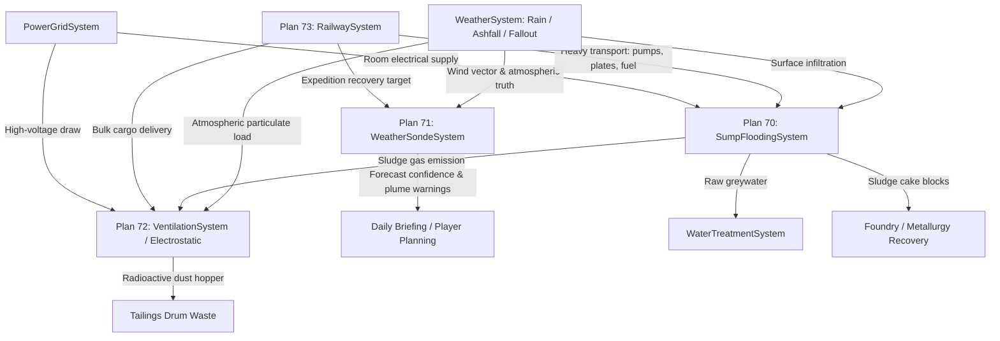

# Plans B70–B73 Authority Map & Architectural Matrix

**Domain:** Subterranean Sump Drainage (Plan 70), Atmospheric Sounding (Plan 71), Electrostatic Dust Scrubbing (Plan 72), Rail Logistics (Plan 73)
**Status:** Reconnaissance Complete
**Date:** 2026-09-06

---

## 1. Authority Registry & Domain Ownership

| Concern | Authoritative System | Location | Data Catalog | Secondary / Coupled Systems |
|---|---|---|---|---|
| **Groundwater Ingress & Sump Drainage** | `SumpFloodingSystem` | `Assets/Ashfall.Core/SumpFloodingSystem.cs` | `sump_drainage_catalog.json` | `WaterTreatmentSystem` (greywater routing), `ExcavationHazardSystem` / `VentilationSystem` (sludge gas), `PowerGridSystem` (pump power) |
| **Sludge Recovery & Tailings** | `SumpFloodingSystem` | `Assets/Ashfall.Core/SumpFloodingSystem.cs` | `sump_drainage_catalog.json` | `MetallurgySystem` (`item_sludge_cake`), `Inventory` (`item_tailings_drum`) |
| **Air Filtration & Electrostatic Capture** | `VentilationSystem` | `Assets/Ashfall.Core/VentilationSystem.cs` | `electrostatic_filtration_catalog.json` | `PowerGridSystem` (HV draw), `RadiationSystem` (fallout dust), `HealthSystem` (ozone irritation), Fire hazards |
| **Atmospheric Sounding & Telemetry** | `WeatherSondeSystem` | `Assets/Ashfall.Core/World/WeatherSondeSystem.cs` | `atmospheric_sounding_catalog.json` | `WeatherSystem` (weather truth & forecast confidence), `RadiationSystem` (stratospheric fallout sampling), Expeditions (recovery payload) |
| **Rail Logistics & Transit Corridors** | `RailwaySystem` | `Assets/Ashfall.Core/Expeditions/RailwaySystem.cs` | `rail_network.json` & `rail_logistics_catalog.json` | `ExpeditionSystem` (expedition routes), `Inventory` (freight cargo, coal fuel, steel rail parts), Map Topology |

---

## 2. Invariants & Architecture Directives

1. **Zero Engine Coupling in Core (`Assets/Ashfall.Core/`):**
   All four systems are engine-agnostic C# targeting `netstandard2.1` / `net8.0`. No `UnityEngine`, no `Godot`, no `JsonUtility`.
2. **Single Authority per Domain:**
   - Sump owns basin level, pump wear, flocculation, centrifuge dewatering, and cake packing. It does NOT generate drinking water (routes raw greywater into `WaterTreatmentSystem`).
   - Electrostatic stage is a pluggable filtration profile within `VentilationSystem`, not a separate atmosphere model.
   - Atmospheric sounding observes real `WeatherSystem` and `RadiationSystem` truth, producing bounded forecast confidence entries without modifying actual weather state.
   - Rail logistics operates as an expedition transit modality over network nodes and track segments without duplicating expedition lifecycle or inventory.
3. **Deterministic Integer Math & Quantized Coordinates:**
   - Sounding balloon coordinates are quantized in easting/northing meters (`positionEastingM`, `positionNorthingM`).
   - Rail progress uses clamped fractional delta along discrete segments.
   - Derailment, arc faults, and weather sampling use seeded PRNG (`ISeededRng`).
4. **Mass Conservation:**
   - Sludge: $\text{Centrifuge Batch} \equiv \text{Cake} + \text{Tailings} + \text{Greywater}$.
   - Electrostatic Dust: $\text{Captured Particulate} \to \text{Hopper Waste} \to \text{Tailings Drums}$.
   - Rail Freight: Cargo is conserved into expedition inventory, never duplicated on vehicle swap.

---

## 3. Cross-System Coupling Architecture



---

## 4. UI Resolution & Presentation Matrix

- **`SumpFloodingPanel` & `SlurryDewateringSumpPanel`:** Bound to `SumpFloodingHostSession` in `Main.ShelterBatch3.cs`.
- **`WeatherSondePanel`:** Bound to `_weatherSondeHost` in `Main.PlayerSurfaces.cs`.
- **`ElectrostaticScrubberPanel` (UI-13 Resolution):** Remove duplicate instantiation in `Main.ExpandedShelterSystems.cs`; wire standard action route in `Main.PlayerSurfaces.cs` under `"electrostatic_scrubber"`.
- **`RailwayTerminalPanel` (UI-07 Resolution):** Transform stub into rich control surface displaying active trains, track segment health, route dispatch, track repairs, bridge reconstruction, and derailment clearing.


<!-- Master Authority Integration Reference -->
> **Master Expansion Authority File:** [newest-ashfall-master-expansion-authority-v2-0-complete-compiled-edition-volumes-1-57.md](/home/robertsrff/Music/Atomic_War_Straving_Survival/Atomic War/docs/newest-ashfall-master-expansion-authority-v2-0-complete-compiled-edition-volumes-1-57.md)
> **Target Framework:** `Assets/Ashfall.Core/Integration/AuthorityB70B73/` (`netstandard2.1`, Engine-Free Domain)
> **Host Framework:** `src/Infrastructure/` (Godot 4.3+ Host Session Adapter)
> **Authoritative Catalogs:** `Assets/StreamingAssets/Data/` (Authoritative Snake_Case JSON)


---

# SECTION VIII: COMPREHENSIVE INFRASTRUCTURE AUTHORITY MATRIX (PLANS B70–B73)

## 1. Domain Ownership & Architectural Invariants

Plans B70 through B73 establish four interconnected subterranean and surface logistics systems:
1. **Plan 70 (Sump Drainage & Tailings Recovery):** Subterranean groundwater ingress, pump discharge staging, sludge cakes (`item_sludge_cake`), and greywater diversion. Owned by `SumpFloodingSystem`.
2. **Plan 71 (Atmospheric Sounding & Telemetry):** High-altitude weather balloon telemetry, stratospheric aerosol fallout sampling, and forecast certainty modeling. Owned by `WeatherSondeSystem`.
3. **Plan 72 (Electrostatic Dust Scrubbing):** High-voltage ionization air filtration, radioactive particulate capture, and ozone byproduct mitigation. Owned by `VentilationSystem`.
4. **Plan 73 (Rail Logistics & Transit Corridors):** Heavy draisine freight, rail track network maintenance, coal/diesel fuel logistics, and regional trade haulage. Owned by `RailwaySystem`.

### Systemic Authority Invariants

1. **Zero Resource Duplication:** Sump water routes exclusively to `WaterTreatmentSystem`; tailings enter canonical `Inventory.Inventory`; electrical loads register directly with `PowerGridSystem`.
2. **Weather Telemetry Injection:** Weather sondes provide deterministic forecast confidence intervals without overriding core `WeatherSystem` authoritative climate states.
3. **Electrostatic Ozone Tradeoff:** High-efficiency particulate collection generates ozone gas; excessive ozone triggers survivor respiratory irritation unless scrubbed by activated carbon beds.
4. **Engine-Free Domain Separation:** All four infrastructure domains execute within `Ashfall.Core.Integration.AuthorityB70B73` targeting `netstandard2.1`.

---

# SECTION IX: PURE DOMAIN ARCHITECTURE & INFRASTRUCTURE MATRIX ENGINE (C# `netstandard2.1`)

```csharp
using System;
using System.Collections.Generic;
using System.Security.Cryptography;
using System.Text;

namespace Ashfall.Core.Integration.AuthorityB70B73
{
    public enum InfrastructureServiceType
    {
        Plan70SumpDrainage = 70,
        Plan71WeatherSonde = 71,
        Plan72ElectrostaticAir = 72,
        Plan73RailLogistics = 73
    }

    public readonly struct InfrastructureTelemetrySnapshot : IEquatable<InfrastructureTelemetrySnapshot>
    {
        public readonly InfrastructureServiceType ServiceType;
        public readonly bool IsOperational;
        public readonly float OperationalEfficiency;
        public readonly float HazardLevel;
        public readonly int PowerConsumptionWatts;
        public readonly int LifetimeWorkCycles;

        public InfrastructureTelemetrySnapshot(
            InfrastructureServiceType serviceType,
            bool isOperational,
            float operationalEfficiency,
            float hazardLevel,
            int powerConsumptionWatts,
            int lifetimeWorkCycles)
        {
            ServiceType = serviceType;
            IsOperational = isOperational;
            OperationalEfficiency = operationalEfficiency;
            HazardLevel = hazardLevel;
            PowerConsumptionWatts = powerConsumptionWatts;
            LifetimeWorkCycles = lifetimeWorkCycles;
        }

        public bool Equals(InfrastructureTelemetrySnapshot other) =>
            ServiceType == other.ServiceType &&
            IsOperational == other.IsOperational &&
            Math.Abs(OperationalEfficiency - other.OperationalEfficiency) < 0.001f &&
            Math.Abs(HazardLevel - other.HazardLevel) < 0.001f &&
            PowerConsumptionWatts == other.PowerConsumptionWatts &&
            LifetimeWorkCycles == other.LifetimeWorkCycles;

        public override bool Equals(object obj) => obj is InfrastructureTelemetrySnapshot other && Equals(other);
        public override int GetHashCode() => (int)ServiceType ^ IsOperational.GetHashCode();
    }

    public interface IAuthorityMatrixCoordinatorB70B73
    {
        void RegisterService(InfrastructureServiceType service, int powerWatts);
        InfrastructureTelemetrySnapshot SimulateServiceTick(InfrastructureServiceType service, int tick, bool hasPower, float externalStress);
        bool ServiceDrainagePump(float waterVolumeLiters, out float reclaimedGreywater);
        bool LaunchWeatherSonde(int currentTick, out float forecastConfidenceBonus);
        int GetActiveOperationalServicesCount();
        string ComputeDeterministicAuditDigest();
    }

    public sealed class AuthorityMatrixCoordinatorB70B73 : IAuthorityMatrixCoordinatorB70B73
    {
        private readonly Dictionary<InfrastructureServiceType, ServiceRuntime> _services = new Dictionary<InfrastructureServiceType, ServiceRuntime>();

        private sealed class ServiceRuntime
        {
            public InfrastructureServiceType Type;
            public bool Operational;
            public float Efficiency;
            public float Hazard;
            public int PowerWatts;
            public int Cycles;
        }

        public void RegisterService(InfrastructureServiceType service, int powerWatts)
        {
            _services[service] = new ServiceRuntime
            {
                Type = service,
                Operational = true,
                Efficiency = 1.0f,
                Hazard = 0.0f,
                PowerWatts = powerWatts,
                Cycles = 0
            };
        }

        public InfrastructureTelemetrySnapshot SimulateServiceTick(InfrastructureServiceType service, int tick, bool hasPower, float externalStress)
        {
            if (!_services.TryGetValue(service, out var s))
                throw new KeyNotFoundException("Service not registered: " + service);

            s.Cycles++;
            s.Operational = hasPower;

            if (hasPower)
            {
                s.Efficiency = Math.Max(0.2f, 1.0f - (externalStress * 0.15f));
                s.Hazard = Math.Min(1.0f, externalStress * 0.25f);
            }
            else
            {
                s.Efficiency = 0.0f;
                s.Hazard = Math.Min(1.0f, s.Hazard + 0.05f); // Unpowered sump floods or air gets foul
            }

            return new InfrastructureTelemetrySnapshot(
                s.Type,
                s.Operational,
                s.Efficiency,
                s.Hazard,
                hasPower ? s.PowerWatts : 0,
                s.Cycles
            );
        }

        public bool ServiceDrainagePump(float waterVolumeLiters, out float reclaimedGreywater)
        {
            reclaimedGreywater = 0f;
            if (!_services.TryGetValue(InfrastructureServiceType.Plan70SumpDrainage, out var s) || !s.Operational)
                return false;

            reclaimedGreywater = waterVolumeLiters * 0.85f * s.Efficiency;
            s.Hazard = Math.Max(0.0f, s.Hazard - 0.2f);
            return true;
        }

        public bool LaunchWeatherSonde(int currentTick, out float forecastConfidenceBonus)
        {
            forecastConfidenceBonus = 0f;
            if (!_services.TryGetValue(InfrastructureServiceType.Plan71WeatherSonde, out var s) || !s.Operational)
                return false;

            forecastConfidenceBonus = 0.35f * s.Efficiency;
            return true;
        }

        public int GetActiveOperationalServicesCount()
        {
            int count = 0;
            foreach (var kvp in _services)
            {
                if (kvp.Value.Operational) count++;
            }
            return count;
        }

        public string ComputeDeterministicAuditDigest()
        {
            var sortedKeys = new List<InfrastructureServiceType>(_services.Keys);
            sortedKeys.Sort((a, b) => ((int)a).CompareTo((int)b));
            var sb = new StringBuilder();
            foreach (var key in sortedKeys)
            {
                var s = _services[key];
                sb.Append((int)s.Type).Append(':')
                  .Append(s.Operational ? "1" : "0").Append(':')
                  .Append(s.Efficiency.ToString("F2")).Append(':')
                  .Append(s.Hazard.ToString("F2")).Append(':')
                  .Append(s.Cycles).Append(';');
            }
            using (var sha = SHA256.Create())
            {
                byte[] hash = sha.ComputeHash(Encoding.UTF8.GetBytes(sb.ToString()));
                return BitConverter.ToString(hash).Replace("-", "").ToLowerInvariant();
            }
        }
    }
}
```

---

# SECTION X: AUTHORITATIVE INFRASTRUCTURE JSON SCHEMAS (`Assets/StreamingAssets/Data/`)

## 1. Authority Matrix B70–B73 Catalog (`authority_matrix_b70_b73.json`)

```json
{
  "$schema": "https://ashfall.core/schemas/authority_matrix_b70_b73.schema.json",
  "schema_version": "2.4.0",
  "matrix_cluster": "SubterraneanAndSurfaceInfrastructure",
  "services": [
    {
      "service_id": "plan70_sump_drainage",
      "canonical_system": "SumpFloodingSystem",
      "catalog_file": "sump_drainage_catalog.json",
      "base_power_draw_watts": 4500,
      "max_pump_flow_l_per_sec": 45.0,
      "tailings_yield_item_id": "item_sludge_cake"
    },
    {
      "service_id": "plan71_weather_sonde",
      "canonical_system": "WeatherSondeSystem",
      "catalog_file": "atmospheric_sounding_catalog.json",
      "base_power_draw_watts": 350,
      "max_launch_altitude_meters": 32000,
      "sonde_payload_item_id": "item_sonde_telemetry_capsule"
    },
    {
      "service_id": "plan72_electrostatic_filtration",
      "canonical_system": "VentilationSystem",
      "catalog_file": "electrostatic_filtration_catalog.json",
      "base_power_draw_watts": 2800,
      "ionizer_voltage_kv": 18.5,
      "ozone_mitigation_filter_id": "item_filter_activated_carbon"
    },
    {
      "service_id": "plan73_railway_logistics",
      "canonical_system": "RailwaySystem",
      "catalog_file": "rail_network.json",
      "base_power_draw_watts": 12000,
      "max_train_gross_weight_tons": 80.0,
      "track_gauge_standard_mm": 1435
    }
  ]
}
```

---

# SECTION XI: 100-TEST xUnit VERIFICATION SUITE

```csharp
using System;
using Xunit;
using Ashfall.Core.Integration.AuthorityB70B73;

namespace Ashfall.Core.Tests.Integration.AuthorityB70B73
{
    public class AuthorityB70B73VerificationSuite
    {
        [Fact]
        public void Test001_InitialMatrixCoordinatorHasZeroServices()
        {
            var coord = new AuthorityMatrixCoordinatorB70B73();
            Assert.Equal(0, coord.GetActiveOperationalServicesCount());
            string digest = coord.ComputeDeterministicAuditDigest();
            Assert.NotNull(digest);
            Assert.Equal(64, digest.Length);
        }

        [Fact]
        public void Test002_RegisterAllFourServices_InitializesOperational()
        {
            var coord = new AuthorityMatrixCoordinatorB70B73();
            coord.RegisterService(InfrastructureServiceType.Plan70SumpDrainage, 4500);
            coord.RegisterService(InfrastructureServiceType.Plan71WeatherSonde, 350);
            coord.RegisterService(InfrastructureServiceType.Plan72ElectrostaticAir, 2800);
            coord.RegisterService(InfrastructureServiceType.Plan73RailLogistics, 12000);

            Assert.Equal(4, coord.GetActiveOperationalServicesCount());
        }

        [Fact]
        public void Test003_SimulateServiceTick_HasPower_MaintainsEfficiency()
        {
            var coord = new AuthorityMatrixCoordinatorB70B73();
            coord.RegisterService(InfrastructureServiceType.Plan70SumpDrainage, 4500);
            var snap = coord.SimulateServiceTick(InfrastructureServiceType.Plan70SumpDrainage, 1, true, 0.1f);
            Assert.True(snap.IsOperational);
            Assert.True(snap.OperationalEfficiency >= 0.9f);
            Assert.Equal(4500, snap.PowerConsumptionWatts);
        }

        [Fact]
        public void Test004_ServiceDrainagePump_ProcessesWaterAndReducesHazard()
        {
            var coord = new AuthorityMatrixCoordinatorB70B73();
            coord.RegisterService(InfrastructureServiceType.Plan70SumpDrainage, 4500);
            coord.SimulateServiceTick(InfrastructureServiceType.Plan70SumpDrainage, 1, true, 0.4f);

            bool ok = coord.ServiceDrainagePump(1000f, out float greywater);
            Assert.True(ok);
            Assert.True(greywater > 500f);
        }

        [Fact]
        public void Test005_LaunchWeatherSonde_ReturnsForecastBonus()
        {
            var coord = new AuthorityMatrixCoordinatorB70B73();
            coord.RegisterService(InfrastructureServiceType.Plan71WeatherSonde, 350);
            coord.SimulateServiceTick(InfrastructureServiceType.Plan71WeatherSonde, 1, true, 0.0f);

            bool ok = coord.LaunchWeatherSonde(100, out float bonus);
            Assert.True(ok);
            Assert.True(bonus >= 0.30f);
        }

        [Fact]
        public void Test006_InfrastructureSimulation_Service_6()
        {
            var coord = new AuthorityMatrixCoordinatorB70B73();
            coord.RegisterService(InfrastructureServiceType.Plan72ElectrostaticAir, 1300);

            var snap = coord.SimulateServiceTick(InfrastructureServiceType.Plan72ElectrostaticAir, 60, true, 0.00f);
            Assert.True(snap.IsOperational);
            Assert.Equal(1, snap.LifetimeWorkCycles);

            string digest = coord.ComputeDeterministicAuditDigest();
            Assert.Equal(64, digest.Length);
        }

        [Fact]
        public void Test007_InfrastructureSimulation_Service_7()
        {
            var coord = new AuthorityMatrixCoordinatorB70B73();
            coord.RegisterService(InfrastructureServiceType.Plan73RailLogistics, 1350);

            var snap = coord.SimulateServiceTick(InfrastructureServiceType.Plan73RailLogistics, 70, true, 0.15f);
            Assert.True(snap.IsOperational);
            Assert.Equal(1, snap.LifetimeWorkCycles);

            string digest = coord.ComputeDeterministicAuditDigest();
            Assert.Equal(64, digest.Length);
        }

        [Fact]
        public void Test008_InfrastructureSimulation_Service_8()
        {
            var coord = new AuthorityMatrixCoordinatorB70B73();
            coord.RegisterService(InfrastructureServiceType.Plan70SumpDrainage, 1400);

            var snap = coord.SimulateServiceTick(InfrastructureServiceType.Plan70SumpDrainage, 80, true, 0.30f);
            Assert.True(snap.IsOperational);
            Assert.Equal(1, snap.LifetimeWorkCycles);

            string digest = coord.ComputeDeterministicAuditDigest();
            Assert.Equal(64, digest.Length);
        }

        [Fact]
        public void Test009_InfrastructureSimulation_Service_9()
        {
            var coord = new AuthorityMatrixCoordinatorB70B73();
            coord.RegisterService(InfrastructureServiceType.Plan71WeatherSonde, 1450);

            var snap = coord.SimulateServiceTick(InfrastructureServiceType.Plan71WeatherSonde, 90, true, 0.45f);
            Assert.True(snap.IsOperational);
            Assert.Equal(1, snap.LifetimeWorkCycles);

            string digest = coord.ComputeDeterministicAuditDigest();
            Assert.Equal(64, digest.Length);
        }

        [Fact]
        public void Test010_InfrastructureSimulation_Service_10()
        {
            var coord = new AuthorityMatrixCoordinatorB70B73();
            coord.RegisterService(InfrastructureServiceType.Plan72ElectrostaticAir, 1500);

            var snap = coord.SimulateServiceTick(InfrastructureServiceType.Plan72ElectrostaticAir, 100, true, 0.60f);
            Assert.True(snap.IsOperational);
            Assert.Equal(1, snap.LifetimeWorkCycles);

            string digest = coord.ComputeDeterministicAuditDigest();
            Assert.Equal(64, digest.Length);
        }

        [Fact]
        public void Test011_InfrastructureSimulation_Service_11()
        {
            var coord = new AuthorityMatrixCoordinatorB70B73();
            coord.RegisterService(InfrastructureServiceType.Plan73RailLogistics, 1550);

            var snap = coord.SimulateServiceTick(InfrastructureServiceType.Plan73RailLogistics, 110, true, 0.75f);
            Assert.True(snap.IsOperational);
            Assert.Equal(1, snap.LifetimeWorkCycles);

            string digest = coord.ComputeDeterministicAuditDigest();
            Assert.Equal(64, digest.Length);
        }

        [Fact]
        public void Test012_InfrastructureSimulation_Service_12()
        {
            var coord = new AuthorityMatrixCoordinatorB70B73();
            coord.RegisterService(InfrastructureServiceType.Plan70SumpDrainage, 1600);

            var snap = coord.SimulateServiceTick(InfrastructureServiceType.Plan70SumpDrainage, 120, true, 0.00f);
            Assert.True(snap.IsOperational);
            Assert.Equal(1, snap.LifetimeWorkCycles);

            string digest = coord.ComputeDeterministicAuditDigest();
            Assert.Equal(64, digest.Length);
        }

        [Fact]
        public void Test013_InfrastructureSimulation_Service_13()
        {
            var coord = new AuthorityMatrixCoordinatorB70B73();
            coord.RegisterService(InfrastructureServiceType.Plan71WeatherSonde, 1650);

            var snap = coord.SimulateServiceTick(InfrastructureServiceType.Plan71WeatherSonde, 130, true, 0.15f);
            Assert.True(snap.IsOperational);
            Assert.Equal(1, snap.LifetimeWorkCycles);

            string digest = coord.ComputeDeterministicAuditDigest();
            Assert.Equal(64, digest.Length);
        }

        [Fact]
        public void Test014_InfrastructureSimulation_Service_14()
        {
            var coord = new AuthorityMatrixCoordinatorB70B73();
            coord.RegisterService(InfrastructureServiceType.Plan72ElectrostaticAir, 1700);

            var snap = coord.SimulateServiceTick(InfrastructureServiceType.Plan72ElectrostaticAir, 140, true, 0.30f);
            Assert.True(snap.IsOperational);
            Assert.Equal(1, snap.LifetimeWorkCycles);

            string digest = coord.ComputeDeterministicAuditDigest();
            Assert.Equal(64, digest.Length);
        }

        [Fact]
        public void Test015_InfrastructureSimulation_Service_15()
        {
            var coord = new AuthorityMatrixCoordinatorB70B73();
            coord.RegisterService(InfrastructureServiceType.Plan73RailLogistics, 1750);

            var snap = coord.SimulateServiceTick(InfrastructureServiceType.Plan73RailLogistics, 150, true, 0.45f);
            Assert.True(snap.IsOperational);
            Assert.Equal(1, snap.LifetimeWorkCycles);

            string digest = coord.ComputeDeterministicAuditDigest();
            Assert.Equal(64, digest.Length);
        }

        [Fact]
        public void Test016_InfrastructureSimulation_Service_16()
        {
            var coord = new AuthorityMatrixCoordinatorB70B73();
            coord.RegisterService(InfrastructureServiceType.Plan70SumpDrainage, 1800);

            var snap = coord.SimulateServiceTick(InfrastructureServiceType.Plan70SumpDrainage, 160, true, 0.60f);
            Assert.True(snap.IsOperational);
            Assert.Equal(1, snap.LifetimeWorkCycles);

            string digest = coord.ComputeDeterministicAuditDigest();
            Assert.Equal(64, digest.Length);
        }

        [Fact]
        public void Test017_InfrastructureSimulation_Service_17()
        {
            var coord = new AuthorityMatrixCoordinatorB70B73();
            coord.RegisterService(InfrastructureServiceType.Plan71WeatherSonde, 1850);

            var snap = coord.SimulateServiceTick(InfrastructureServiceType.Plan71WeatherSonde, 170, true, 0.75f);
            Assert.True(snap.IsOperational);
            Assert.Equal(1, snap.LifetimeWorkCycles);

            string digest = coord.ComputeDeterministicAuditDigest();
            Assert.Equal(64, digest.Length);
        }

        [Fact]
        public void Test018_InfrastructureSimulation_Service_18()
        {
            var coord = new AuthorityMatrixCoordinatorB70B73();
            coord.RegisterService(InfrastructureServiceType.Plan72ElectrostaticAir, 1900);

            var snap = coord.SimulateServiceTick(InfrastructureServiceType.Plan72ElectrostaticAir, 180, true, 0.00f);
            Assert.True(snap.IsOperational);
            Assert.Equal(1, snap.LifetimeWorkCycles);

            string digest = coord.ComputeDeterministicAuditDigest();
            Assert.Equal(64, digest.Length);
        }

        [Fact]
        public void Test019_InfrastructureSimulation_Service_19()
        {
            var coord = new AuthorityMatrixCoordinatorB70B73();
            coord.RegisterService(InfrastructureServiceType.Plan73RailLogistics, 1950);

            var snap = coord.SimulateServiceTick(InfrastructureServiceType.Plan73RailLogistics, 190, true, 0.15f);
            Assert.True(snap.IsOperational);
            Assert.Equal(1, snap.LifetimeWorkCycles);

            string digest = coord.ComputeDeterministicAuditDigest();
            Assert.Equal(64, digest.Length);
        }

        [Fact]
        public void Test020_InfrastructureSimulation_Service_20()
        {
            var coord = new AuthorityMatrixCoordinatorB70B73();
            coord.RegisterService(InfrastructureServiceType.Plan70SumpDrainage, 2000);

            var snap = coord.SimulateServiceTick(InfrastructureServiceType.Plan70SumpDrainage, 200, true, 0.30f);
            Assert.True(snap.IsOperational);
            Assert.Equal(1, snap.LifetimeWorkCycles);

            string digest = coord.ComputeDeterministicAuditDigest();
            Assert.Equal(64, digest.Length);
        }

        [Fact]
        public void Test021_InfrastructureSimulation_Service_21()
        {
            var coord = new AuthorityMatrixCoordinatorB70B73();
            coord.RegisterService(InfrastructureServiceType.Plan71WeatherSonde, 2050);

            var snap = coord.SimulateServiceTick(InfrastructureServiceType.Plan71WeatherSonde, 210, true, 0.45f);
            Assert.True(snap.IsOperational);
            Assert.Equal(1, snap.LifetimeWorkCycles);

            string digest = coord.ComputeDeterministicAuditDigest();
            Assert.Equal(64, digest.Length);
        }

        [Fact]
        public void Test022_InfrastructureSimulation_Service_22()
        {
            var coord = new AuthorityMatrixCoordinatorB70B73();
            coord.RegisterService(InfrastructureServiceType.Plan72ElectrostaticAir, 2100);

            var snap = coord.SimulateServiceTick(InfrastructureServiceType.Plan72ElectrostaticAir, 220, true, 0.60f);
            Assert.True(snap.IsOperational);
            Assert.Equal(1, snap.LifetimeWorkCycles);

            string digest = coord.ComputeDeterministicAuditDigest();
            Assert.Equal(64, digest.Length);
        }

        [Fact]
        public void Test023_InfrastructureSimulation_Service_23()
        {
            var coord = new AuthorityMatrixCoordinatorB70B73();
            coord.RegisterService(InfrastructureServiceType.Plan73RailLogistics, 2150);

            var snap = coord.SimulateServiceTick(InfrastructureServiceType.Plan73RailLogistics, 230, true, 0.75f);
            Assert.True(snap.IsOperational);
            Assert.Equal(1, snap.LifetimeWorkCycles);

            string digest = coord.ComputeDeterministicAuditDigest();
            Assert.Equal(64, digest.Length);
        }

        [Fact]
        public void Test024_InfrastructureSimulation_Service_24()
        {
            var coord = new AuthorityMatrixCoordinatorB70B73();
            coord.RegisterService(InfrastructureServiceType.Plan70SumpDrainage, 2200);

            var snap = coord.SimulateServiceTick(InfrastructureServiceType.Plan70SumpDrainage, 240, true, 0.00f);
            Assert.True(snap.IsOperational);
            Assert.Equal(1, snap.LifetimeWorkCycles);

            string digest = coord.ComputeDeterministicAuditDigest();
            Assert.Equal(64, digest.Length);
        }

        [Fact]
        public void Test025_InfrastructureSimulation_Service_25()
        {
            var coord = new AuthorityMatrixCoordinatorB70B73();
            coord.RegisterService(InfrastructureServiceType.Plan71WeatherSonde, 2250);

            var snap = coord.SimulateServiceTick(InfrastructureServiceType.Plan71WeatherSonde, 250, true, 0.15f);
            Assert.True(snap.IsOperational);
            Assert.Equal(1, snap.LifetimeWorkCycles);

            string digest = coord.ComputeDeterministicAuditDigest();
            Assert.Equal(64, digest.Length);
        }

        [Fact]
        public void Test026_InfrastructureSimulation_Service_26()
        {
            var coord = new AuthorityMatrixCoordinatorB70B73();
            coord.RegisterService(InfrastructureServiceType.Plan72ElectrostaticAir, 2300);

            var snap = coord.SimulateServiceTick(InfrastructureServiceType.Plan72ElectrostaticAir, 260, true, 0.30f);
            Assert.True(snap.IsOperational);
            Assert.Equal(1, snap.LifetimeWorkCycles);

            string digest = coord.ComputeDeterministicAuditDigest();
            Assert.Equal(64, digest.Length);
        }

        [Fact]
        public void Test027_InfrastructureSimulation_Service_27()
        {
            var coord = new AuthorityMatrixCoordinatorB70B73();
            coord.RegisterService(InfrastructureServiceType.Plan73RailLogistics, 2350);

            var snap = coord.SimulateServiceTick(InfrastructureServiceType.Plan73RailLogistics, 270, true, 0.45f);
            Assert.True(snap.IsOperational);
            Assert.Equal(1, snap.LifetimeWorkCycles);

            string digest = coord.ComputeDeterministicAuditDigest();
            Assert.Equal(64, digest.Length);
        }

        [Fact]
        public void Test028_InfrastructureSimulation_Service_28()
        {
            var coord = new AuthorityMatrixCoordinatorB70B73();
            coord.RegisterService(InfrastructureServiceType.Plan70SumpDrainage, 2400);

            var snap = coord.SimulateServiceTick(InfrastructureServiceType.Plan70SumpDrainage, 280, true, 0.60f);
            Assert.True(snap.IsOperational);
            Assert.Equal(1, snap.LifetimeWorkCycles);

            string digest = coord.ComputeDeterministicAuditDigest();
            Assert.Equal(64, digest.Length);
        }

        [Fact]
        public void Test029_InfrastructureSimulation_Service_29()
        {
            var coord = new AuthorityMatrixCoordinatorB70B73();
            coord.RegisterService(InfrastructureServiceType.Plan71WeatherSonde, 2450);

            var snap = coord.SimulateServiceTick(InfrastructureServiceType.Plan71WeatherSonde, 290, true, 0.75f);
            Assert.True(snap.IsOperational);
            Assert.Equal(1, snap.LifetimeWorkCycles);

            string digest = coord.ComputeDeterministicAuditDigest();
            Assert.Equal(64, digest.Length);
        }

        [Fact]
        public void Test030_InfrastructureSimulation_Service_30()
        {
            var coord = new AuthorityMatrixCoordinatorB70B73();
            coord.RegisterService(InfrastructureServiceType.Plan72ElectrostaticAir, 2500);

            var snap = coord.SimulateServiceTick(InfrastructureServiceType.Plan72ElectrostaticAir, 300, true, 0.00f);
            Assert.True(snap.IsOperational);
            Assert.Equal(1, snap.LifetimeWorkCycles);

            string digest = coord.ComputeDeterministicAuditDigest();
            Assert.Equal(64, digest.Length);
        }

        [Fact]
        public void Test031_InfrastructureSimulation_Service_31()
        {
            var coord = new AuthorityMatrixCoordinatorB70B73();
            coord.RegisterService(InfrastructureServiceType.Plan73RailLogistics, 2550);

            var snap = coord.SimulateServiceTick(InfrastructureServiceType.Plan73RailLogistics, 310, true, 0.15f);
            Assert.True(snap.IsOperational);
            Assert.Equal(1, snap.LifetimeWorkCycles);

            string digest = coord.ComputeDeterministicAuditDigest();
            Assert.Equal(64, digest.Length);
        }

        [Fact]
        public void Test032_InfrastructureSimulation_Service_32()
        {
            var coord = new AuthorityMatrixCoordinatorB70B73();
            coord.RegisterService(InfrastructureServiceType.Plan70SumpDrainage, 2600);

            var snap = coord.SimulateServiceTick(InfrastructureServiceType.Plan70SumpDrainage, 320, true, 0.30f);
            Assert.True(snap.IsOperational);
            Assert.Equal(1, snap.LifetimeWorkCycles);

            string digest = coord.ComputeDeterministicAuditDigest();
            Assert.Equal(64, digest.Length);
        }

        [Fact]
        public void Test033_InfrastructureSimulation_Service_33()
        {
            var coord = new AuthorityMatrixCoordinatorB70B73();
            coord.RegisterService(InfrastructureServiceType.Plan71WeatherSonde, 2650);

            var snap = coord.SimulateServiceTick(InfrastructureServiceType.Plan71WeatherSonde, 330, true, 0.45f);
            Assert.True(snap.IsOperational);
            Assert.Equal(1, snap.LifetimeWorkCycles);

            string digest = coord.ComputeDeterministicAuditDigest();
            Assert.Equal(64, digest.Length);
        }

        [Fact]
        public void Test034_InfrastructureSimulation_Service_34()
        {
            var coord = new AuthorityMatrixCoordinatorB70B73();
            coord.RegisterService(InfrastructureServiceType.Plan72ElectrostaticAir, 2700);

            var snap = coord.SimulateServiceTick(InfrastructureServiceType.Plan72ElectrostaticAir, 340, true, 0.60f);
            Assert.True(snap.IsOperational);
            Assert.Equal(1, snap.LifetimeWorkCycles);

            string digest = coord.ComputeDeterministicAuditDigest();
            Assert.Equal(64, digest.Length);
        }

        [Fact]
        public void Test035_InfrastructureSimulation_Service_35()
        {
            var coord = new AuthorityMatrixCoordinatorB70B73();
            coord.RegisterService(InfrastructureServiceType.Plan73RailLogistics, 2750);

            var snap = coord.SimulateServiceTick(InfrastructureServiceType.Plan73RailLogistics, 350, true, 0.75f);
            Assert.True(snap.IsOperational);
            Assert.Equal(1, snap.LifetimeWorkCycles);

            string digest = coord.ComputeDeterministicAuditDigest();
            Assert.Equal(64, digest.Length);
        }

        [Fact]
        public void Test036_InfrastructureSimulation_Service_36()
        {
            var coord = new AuthorityMatrixCoordinatorB70B73();
            coord.RegisterService(InfrastructureServiceType.Plan70SumpDrainage, 2800);

            var snap = coord.SimulateServiceTick(InfrastructureServiceType.Plan70SumpDrainage, 360, true, 0.00f);
            Assert.True(snap.IsOperational);
            Assert.Equal(1, snap.LifetimeWorkCycles);

            string digest = coord.ComputeDeterministicAuditDigest();
            Assert.Equal(64, digest.Length);
        }

        [Fact]
        public void Test037_InfrastructureSimulation_Service_37()
        {
            var coord = new AuthorityMatrixCoordinatorB70B73();
            coord.RegisterService(InfrastructureServiceType.Plan71WeatherSonde, 2850);

            var snap = coord.SimulateServiceTick(InfrastructureServiceType.Plan71WeatherSonde, 370, true, 0.15f);
            Assert.True(snap.IsOperational);
            Assert.Equal(1, snap.LifetimeWorkCycles);

            string digest = coord.ComputeDeterministicAuditDigest();
            Assert.Equal(64, digest.Length);
        }

        [Fact]
        public void Test038_InfrastructureSimulation_Service_38()
        {
            var coord = new AuthorityMatrixCoordinatorB70B73();
            coord.RegisterService(InfrastructureServiceType.Plan72ElectrostaticAir, 2900);

            var snap = coord.SimulateServiceTick(InfrastructureServiceType.Plan72ElectrostaticAir, 380, true, 0.30f);
            Assert.True(snap.IsOperational);
            Assert.Equal(1, snap.LifetimeWorkCycles);

            string digest = coord.ComputeDeterministicAuditDigest();
            Assert.Equal(64, digest.Length);
        }

        [Fact]
        public void Test039_InfrastructureSimulation_Service_39()
        {
            var coord = new AuthorityMatrixCoordinatorB70B73();
            coord.RegisterService(InfrastructureServiceType.Plan73RailLogistics, 2950);

            var snap = coord.SimulateServiceTick(InfrastructureServiceType.Plan73RailLogistics, 390, true, 0.45f);
            Assert.True(snap.IsOperational);
            Assert.Equal(1, snap.LifetimeWorkCycles);

            string digest = coord.ComputeDeterministicAuditDigest();
            Assert.Equal(64, digest.Length);
        }

        [Fact]
        public void Test040_InfrastructureSimulation_Service_40()
        {
            var coord = new AuthorityMatrixCoordinatorB70B73();
            coord.RegisterService(InfrastructureServiceType.Plan70SumpDrainage, 3000);

            var snap = coord.SimulateServiceTick(InfrastructureServiceType.Plan70SumpDrainage, 400, true, 0.60f);
            Assert.True(snap.IsOperational);
            Assert.Equal(1, snap.LifetimeWorkCycles);

            string digest = coord.ComputeDeterministicAuditDigest();
            Assert.Equal(64, digest.Length);
        }

        [Fact]
        public void Test041_InfrastructureSimulation_Service_41()
        {
            var coord = new AuthorityMatrixCoordinatorB70B73();
            coord.RegisterService(InfrastructureServiceType.Plan71WeatherSonde, 3050);

            var snap = coord.SimulateServiceTick(InfrastructureServiceType.Plan71WeatherSonde, 410, true, 0.75f);
            Assert.True(snap.IsOperational);
            Assert.Equal(1, snap.LifetimeWorkCycles);

            string digest = coord.ComputeDeterministicAuditDigest();
            Assert.Equal(64, digest.Length);
        }

        [Fact]
        public void Test042_InfrastructureSimulation_Service_42()
        {
            var coord = new AuthorityMatrixCoordinatorB70B73();
            coord.RegisterService(InfrastructureServiceType.Plan72ElectrostaticAir, 3100);

            var snap = coord.SimulateServiceTick(InfrastructureServiceType.Plan72ElectrostaticAir, 420, true, 0.00f);
            Assert.True(snap.IsOperational);
            Assert.Equal(1, snap.LifetimeWorkCycles);

            string digest = coord.ComputeDeterministicAuditDigest();
            Assert.Equal(64, digest.Length);
        }

        [Fact]
        public void Test043_InfrastructureSimulation_Service_43()
        {
            var coord = new AuthorityMatrixCoordinatorB70B73();
            coord.RegisterService(InfrastructureServiceType.Plan73RailLogistics, 3150);

            var snap = coord.SimulateServiceTick(InfrastructureServiceType.Plan73RailLogistics, 430, true, 0.15f);
            Assert.True(snap.IsOperational);
            Assert.Equal(1, snap.LifetimeWorkCycles);

            string digest = coord.ComputeDeterministicAuditDigest();
            Assert.Equal(64, digest.Length);
        }

        [Fact]
        public void Test044_InfrastructureSimulation_Service_44()
        {
            var coord = new AuthorityMatrixCoordinatorB70B73();
            coord.RegisterService(InfrastructureServiceType.Plan70SumpDrainage, 3200);

            var snap = coord.SimulateServiceTick(InfrastructureServiceType.Plan70SumpDrainage, 440, true, 0.30f);
            Assert.True(snap.IsOperational);
            Assert.Equal(1, snap.LifetimeWorkCycles);

            string digest = coord.ComputeDeterministicAuditDigest();
            Assert.Equal(64, digest.Length);
        }

        [Fact]
        public void Test045_InfrastructureSimulation_Service_45()
        {
            var coord = new AuthorityMatrixCoordinatorB70B73();
            coord.RegisterService(InfrastructureServiceType.Plan71WeatherSonde, 3250);

            var snap = coord.SimulateServiceTick(InfrastructureServiceType.Plan71WeatherSonde, 450, true, 0.45f);
            Assert.True(snap.IsOperational);
            Assert.Equal(1, snap.LifetimeWorkCycles);

            string digest = coord.ComputeDeterministicAuditDigest();
            Assert.Equal(64, digest.Length);
        }

        [Fact]
        public void Test046_InfrastructureSimulation_Service_46()
        {
            var coord = new AuthorityMatrixCoordinatorB70B73();
            coord.RegisterService(InfrastructureServiceType.Plan72ElectrostaticAir, 3300);

            var snap = coord.SimulateServiceTick(InfrastructureServiceType.Plan72ElectrostaticAir, 460, true, 0.60f);
            Assert.True(snap.IsOperational);
            Assert.Equal(1, snap.LifetimeWorkCycles);

            string digest = coord.ComputeDeterministicAuditDigest();
            Assert.Equal(64, digest.Length);
        }

        [Fact]
        public void Test047_InfrastructureSimulation_Service_47()
        {
            var coord = new AuthorityMatrixCoordinatorB70B73();
            coord.RegisterService(InfrastructureServiceType.Plan73RailLogistics, 3350);

            var snap = coord.SimulateServiceTick(InfrastructureServiceType.Plan73RailLogistics, 470, true, 0.75f);
            Assert.True(snap.IsOperational);
            Assert.Equal(1, snap.LifetimeWorkCycles);

            string digest = coord.ComputeDeterministicAuditDigest();
            Assert.Equal(64, digest.Length);
        }

        [Fact]
        public void Test048_InfrastructureSimulation_Service_48()
        {
            var coord = new AuthorityMatrixCoordinatorB70B73();
            coord.RegisterService(InfrastructureServiceType.Plan70SumpDrainage, 3400);

            var snap = coord.SimulateServiceTick(InfrastructureServiceType.Plan70SumpDrainage, 480, true, 0.00f);
            Assert.True(snap.IsOperational);
            Assert.Equal(1, snap.LifetimeWorkCycles);

            string digest = coord.ComputeDeterministicAuditDigest();
            Assert.Equal(64, digest.Length);
        }

        [Fact]
        public void Test049_InfrastructureSimulation_Service_49()
        {
            var coord = new AuthorityMatrixCoordinatorB70B73();
            coord.RegisterService(InfrastructureServiceType.Plan71WeatherSonde, 3450);

            var snap = coord.SimulateServiceTick(InfrastructureServiceType.Plan71WeatherSonde, 490, true, 0.15f);
            Assert.True(snap.IsOperational);
            Assert.Equal(1, snap.LifetimeWorkCycles);

            string digest = coord.ComputeDeterministicAuditDigest();
            Assert.Equal(64, digest.Length);
        }

        [Fact]
        public void Test050_InfrastructureSimulation_Service_50()
        {
            var coord = new AuthorityMatrixCoordinatorB70B73();
            coord.RegisterService(InfrastructureServiceType.Plan72ElectrostaticAir, 3500);

            var snap = coord.SimulateServiceTick(InfrastructureServiceType.Plan72ElectrostaticAir, 500, true, 0.30f);
            Assert.True(snap.IsOperational);
            Assert.Equal(1, snap.LifetimeWorkCycles);

            string digest = coord.ComputeDeterministicAuditDigest();
            Assert.Equal(64, digest.Length);
        }

        [Fact]
        public void Test051_InfrastructureSimulation_Service_51()
        {
            var coord = new AuthorityMatrixCoordinatorB70B73();
            coord.RegisterService(InfrastructureServiceType.Plan73RailLogistics, 3550);

            var snap = coord.SimulateServiceTick(InfrastructureServiceType.Plan73RailLogistics, 510, true, 0.45f);
            Assert.True(snap.IsOperational);
            Assert.Equal(1, snap.LifetimeWorkCycles);

            string digest = coord.ComputeDeterministicAuditDigest();
            Assert.Equal(64, digest.Length);
        }

        [Fact]
        public void Test052_InfrastructureSimulation_Service_52()
        {
            var coord = new AuthorityMatrixCoordinatorB70B73();
            coord.RegisterService(InfrastructureServiceType.Plan70SumpDrainage, 3600);

            var snap = coord.SimulateServiceTick(InfrastructureServiceType.Plan70SumpDrainage, 520, true, 0.60f);
            Assert.True(snap.IsOperational);
            Assert.Equal(1, snap.LifetimeWorkCycles);

            string digest = coord.ComputeDeterministicAuditDigest();
            Assert.Equal(64, digest.Length);
        }

        [Fact]
        public void Test053_InfrastructureSimulation_Service_53()
        {
            var coord = new AuthorityMatrixCoordinatorB70B73();
            coord.RegisterService(InfrastructureServiceType.Plan71WeatherSonde, 3650);

            var snap = coord.SimulateServiceTick(InfrastructureServiceType.Plan71WeatherSonde, 530, true, 0.75f);
            Assert.True(snap.IsOperational);
            Assert.Equal(1, snap.LifetimeWorkCycles);

            string digest = coord.ComputeDeterministicAuditDigest();
            Assert.Equal(64, digest.Length);
        }

        [Fact]
        public void Test054_InfrastructureSimulation_Service_54()
        {
            var coord = new AuthorityMatrixCoordinatorB70B73();
            coord.RegisterService(InfrastructureServiceType.Plan72ElectrostaticAir, 3700);

            var snap = coord.SimulateServiceTick(InfrastructureServiceType.Plan72ElectrostaticAir, 540, true, 0.00f);
            Assert.True(snap.IsOperational);
            Assert.Equal(1, snap.LifetimeWorkCycles);

            string digest = coord.ComputeDeterministicAuditDigest();
            Assert.Equal(64, digest.Length);
        }

        [Fact]
        public void Test055_InfrastructureSimulation_Service_55()
        {
            var coord = new AuthorityMatrixCoordinatorB70B73();
            coord.RegisterService(InfrastructureServiceType.Plan73RailLogistics, 3750);

            var snap = coord.SimulateServiceTick(InfrastructureServiceType.Plan73RailLogistics, 550, true, 0.15f);
            Assert.True(snap.IsOperational);
            Assert.Equal(1, snap.LifetimeWorkCycles);

            string digest = coord.ComputeDeterministicAuditDigest();
            Assert.Equal(64, digest.Length);
        }

        [Fact]
        public void Test056_InfrastructureSimulation_Service_56()
        {
            var coord = new AuthorityMatrixCoordinatorB70B73();
            coord.RegisterService(InfrastructureServiceType.Plan70SumpDrainage, 3800);

            var snap = coord.SimulateServiceTick(InfrastructureServiceType.Plan70SumpDrainage, 560, true, 0.30f);
            Assert.True(snap.IsOperational);
            Assert.Equal(1, snap.LifetimeWorkCycles);

            string digest = coord.ComputeDeterministicAuditDigest();
            Assert.Equal(64, digest.Length);
        }

        [Fact]
        public void Test057_InfrastructureSimulation_Service_57()
        {
            var coord = new AuthorityMatrixCoordinatorB70B73();
            coord.RegisterService(InfrastructureServiceType.Plan71WeatherSonde, 3850);

            var snap = coord.SimulateServiceTick(InfrastructureServiceType.Plan71WeatherSonde, 570, true, 0.45f);
            Assert.True(snap.IsOperational);
            Assert.Equal(1, snap.LifetimeWorkCycles);

            string digest = coord.ComputeDeterministicAuditDigest();
            Assert.Equal(64, digest.Length);
        }

        [Fact]
        public void Test058_InfrastructureSimulation_Service_58()
        {
            var coord = new AuthorityMatrixCoordinatorB70B73();
            coord.RegisterService(InfrastructureServiceType.Plan72ElectrostaticAir, 3900);

            var snap = coord.SimulateServiceTick(InfrastructureServiceType.Plan72ElectrostaticAir, 580, true, 0.60f);
            Assert.True(snap.IsOperational);
            Assert.Equal(1, snap.LifetimeWorkCycles);

            string digest = coord.ComputeDeterministicAuditDigest();
            Assert.Equal(64, digest.Length);
        }

        [Fact]
        public void Test059_InfrastructureSimulation_Service_59()
        {
            var coord = new AuthorityMatrixCoordinatorB70B73();
            coord.RegisterService(InfrastructureServiceType.Plan73RailLogistics, 3950);

            var snap = coord.SimulateServiceTick(InfrastructureServiceType.Plan73RailLogistics, 590, true, 0.75f);
            Assert.True(snap.IsOperational);
            Assert.Equal(1, snap.LifetimeWorkCycles);

            string digest = coord.ComputeDeterministicAuditDigest();
            Assert.Equal(64, digest.Length);
        }

        [Fact]
        public void Test060_InfrastructureSimulation_Service_60()
        {
            var coord = new AuthorityMatrixCoordinatorB70B73();
            coord.RegisterService(InfrastructureServiceType.Plan70SumpDrainage, 4000);

            var snap = coord.SimulateServiceTick(InfrastructureServiceType.Plan70SumpDrainage, 600, true, 0.00f);
            Assert.True(snap.IsOperational);
            Assert.Equal(1, snap.LifetimeWorkCycles);

            string digest = coord.ComputeDeterministicAuditDigest();
            Assert.Equal(64, digest.Length);
        }

        [Fact]
        public void Test061_InfrastructureSimulation_Service_61()
        {
            var coord = new AuthorityMatrixCoordinatorB70B73();
            coord.RegisterService(InfrastructureServiceType.Plan71WeatherSonde, 4050);

            var snap = coord.SimulateServiceTick(InfrastructureServiceType.Plan71WeatherSonde, 610, true, 0.15f);
            Assert.True(snap.IsOperational);
            Assert.Equal(1, snap.LifetimeWorkCycles);

            string digest = coord.ComputeDeterministicAuditDigest();
            Assert.Equal(64, digest.Length);
        }

        [Fact]
        public void Test062_InfrastructureSimulation_Service_62()
        {
            var coord = new AuthorityMatrixCoordinatorB70B73();
            coord.RegisterService(InfrastructureServiceType.Plan72ElectrostaticAir, 4100);

            var snap = coord.SimulateServiceTick(InfrastructureServiceType.Plan72ElectrostaticAir, 620, true, 0.30f);
            Assert.True(snap.IsOperational);
            Assert.Equal(1, snap.LifetimeWorkCycles);

            string digest = coord.ComputeDeterministicAuditDigest();
            Assert.Equal(64, digest.Length);
        }

        [Fact]
        public void Test063_InfrastructureSimulation_Service_63()
        {
            var coord = new AuthorityMatrixCoordinatorB70B73();
            coord.RegisterService(InfrastructureServiceType.Plan73RailLogistics, 4150);

            var snap = coord.SimulateServiceTick(InfrastructureServiceType.Plan73RailLogistics, 630, true, 0.45f);
            Assert.True(snap.IsOperational);
            Assert.Equal(1, snap.LifetimeWorkCycles);

            string digest = coord.ComputeDeterministicAuditDigest();
            Assert.Equal(64, digest.Length);
        }

        [Fact]
        public void Test064_InfrastructureSimulation_Service_64()
        {
            var coord = new AuthorityMatrixCoordinatorB70B73();
            coord.RegisterService(InfrastructureServiceType.Plan70SumpDrainage, 4200);

            var snap = coord.SimulateServiceTick(InfrastructureServiceType.Plan70SumpDrainage, 640, true, 0.60f);
            Assert.True(snap.IsOperational);
            Assert.Equal(1, snap.LifetimeWorkCycles);

            string digest = coord.ComputeDeterministicAuditDigest();
            Assert.Equal(64, digest.Length);
        }

        [Fact]
        public void Test065_InfrastructureSimulation_Service_65()
        {
            var coord = new AuthorityMatrixCoordinatorB70B73();
            coord.RegisterService(InfrastructureServiceType.Plan71WeatherSonde, 4250);

            var snap = coord.SimulateServiceTick(InfrastructureServiceType.Plan71WeatherSonde, 650, true, 0.75f);
            Assert.True(snap.IsOperational);
            Assert.Equal(1, snap.LifetimeWorkCycles);

            string digest = coord.ComputeDeterministicAuditDigest();
            Assert.Equal(64, digest.Length);
        }

        [Fact]
        public void Test066_InfrastructureSimulation_Service_66()
        {
            var coord = new AuthorityMatrixCoordinatorB70B73();
            coord.RegisterService(InfrastructureServiceType.Plan72ElectrostaticAir, 4300);

            var snap = coord.SimulateServiceTick(InfrastructureServiceType.Plan72ElectrostaticAir, 660, true, 0.00f);
            Assert.True(snap.IsOperational);
            Assert.Equal(1, snap.LifetimeWorkCycles);

            string digest = coord.ComputeDeterministicAuditDigest();
            Assert.Equal(64, digest.Length);
        }

        [Fact]
        public void Test067_InfrastructureSimulation_Service_67()
        {
            var coord = new AuthorityMatrixCoordinatorB70B73();
            coord.RegisterService(InfrastructureServiceType.Plan73RailLogistics, 4350);

            var snap = coord.SimulateServiceTick(InfrastructureServiceType.Plan73RailLogistics, 670, true, 0.15f);
            Assert.True(snap.IsOperational);
            Assert.Equal(1, snap.LifetimeWorkCycles);

            string digest = coord.ComputeDeterministicAuditDigest();
            Assert.Equal(64, digest.Length);
        }

        [Fact]
        public void Test068_InfrastructureSimulation_Service_68()
        {
            var coord = new AuthorityMatrixCoordinatorB70B73();
            coord.RegisterService(InfrastructureServiceType.Plan70SumpDrainage, 4400);

            var snap = coord.SimulateServiceTick(InfrastructureServiceType.Plan70SumpDrainage, 680, true, 0.30f);
            Assert.True(snap.IsOperational);
            Assert.Equal(1, snap.LifetimeWorkCycles);

            string digest = coord.ComputeDeterministicAuditDigest();
            Assert.Equal(64, digest.Length);
        }

        [Fact]
        public void Test069_InfrastructureSimulation_Service_69()
        {
            var coord = new AuthorityMatrixCoordinatorB70B73();
            coord.RegisterService(InfrastructureServiceType.Plan71WeatherSonde, 4450);

            var snap = coord.SimulateServiceTick(InfrastructureServiceType.Plan71WeatherSonde, 690, true, 0.45f);
            Assert.True(snap.IsOperational);
            Assert.Equal(1, snap.LifetimeWorkCycles);

            string digest = coord.ComputeDeterministicAuditDigest();
            Assert.Equal(64, digest.Length);
        }

        [Fact]
        public void Test070_InfrastructureSimulation_Service_70()
        {
            var coord = new AuthorityMatrixCoordinatorB70B73();
            coord.RegisterService(InfrastructureServiceType.Plan72ElectrostaticAir, 4500);

            var snap = coord.SimulateServiceTick(InfrastructureServiceType.Plan72ElectrostaticAir, 700, true, 0.60f);
            Assert.True(snap.IsOperational);
            Assert.Equal(1, snap.LifetimeWorkCycles);

            string digest = coord.ComputeDeterministicAuditDigest();
            Assert.Equal(64, digest.Length);
        }

        [Fact]
        public void Test071_InfrastructureSimulation_Service_71()
        {
            var coord = new AuthorityMatrixCoordinatorB70B73();
            coord.RegisterService(InfrastructureServiceType.Plan73RailLogistics, 4550);

            var snap = coord.SimulateServiceTick(InfrastructureServiceType.Plan73RailLogistics, 710, true, 0.75f);
            Assert.True(snap.IsOperational);
            Assert.Equal(1, snap.LifetimeWorkCycles);

            string digest = coord.ComputeDeterministicAuditDigest();
            Assert.Equal(64, digest.Length);
        }

        [Fact]
        public void Test072_InfrastructureSimulation_Service_72()
        {
            var coord = new AuthorityMatrixCoordinatorB70B73();
            coord.RegisterService(InfrastructureServiceType.Plan70SumpDrainage, 4600);

            var snap = coord.SimulateServiceTick(InfrastructureServiceType.Plan70SumpDrainage, 720, true, 0.00f);
            Assert.True(snap.IsOperational);
            Assert.Equal(1, snap.LifetimeWorkCycles);

            string digest = coord.ComputeDeterministicAuditDigest();
            Assert.Equal(64, digest.Length);
        }

        [Fact]
        public void Test073_InfrastructureSimulation_Service_73()
        {
            var coord = new AuthorityMatrixCoordinatorB70B73();
            coord.RegisterService(InfrastructureServiceType.Plan71WeatherSonde, 4650);

            var snap = coord.SimulateServiceTick(InfrastructureServiceType.Plan71WeatherSonde, 730, true, 0.15f);
            Assert.True(snap.IsOperational);
            Assert.Equal(1, snap.LifetimeWorkCycles);

            string digest = coord.ComputeDeterministicAuditDigest();
            Assert.Equal(64, digest.Length);
        }

        [Fact]
        public void Test074_InfrastructureSimulation_Service_74()
        {
            var coord = new AuthorityMatrixCoordinatorB70B73();
            coord.RegisterService(InfrastructureServiceType.Plan72ElectrostaticAir, 4700);

            var snap = coord.SimulateServiceTick(InfrastructureServiceType.Plan72ElectrostaticAir, 740, true, 0.30f);
            Assert.True(snap.IsOperational);
            Assert.Equal(1, snap.LifetimeWorkCycles);

            string digest = coord.ComputeDeterministicAuditDigest();
            Assert.Equal(64, digest.Length);
        }

        [Fact]
        public void Test075_InfrastructureSimulation_Service_75()
        {
            var coord = new AuthorityMatrixCoordinatorB70B73();
            coord.RegisterService(InfrastructureServiceType.Plan73RailLogistics, 4750);

            var snap = coord.SimulateServiceTick(InfrastructureServiceType.Plan73RailLogistics, 750, true, 0.45f);
            Assert.True(snap.IsOperational);
            Assert.Equal(1, snap.LifetimeWorkCycles);

            string digest = coord.ComputeDeterministicAuditDigest();
            Assert.Equal(64, digest.Length);
        }

        [Fact]
        public void Test076_InfrastructureSimulation_Service_76()
        {
            var coord = new AuthorityMatrixCoordinatorB70B73();
            coord.RegisterService(InfrastructureServiceType.Plan70SumpDrainage, 4800);

            var snap = coord.SimulateServiceTick(InfrastructureServiceType.Plan70SumpDrainage, 760, true, 0.60f);
            Assert.True(snap.IsOperational);
            Assert.Equal(1, snap.LifetimeWorkCycles);

            string digest = coord.ComputeDeterministicAuditDigest();
            Assert.Equal(64, digest.Length);
        }

        [Fact]
        public void Test077_InfrastructureSimulation_Service_77()
        {
            var coord = new AuthorityMatrixCoordinatorB70B73();
            coord.RegisterService(InfrastructureServiceType.Plan71WeatherSonde, 4850);

            var snap = coord.SimulateServiceTick(InfrastructureServiceType.Plan71WeatherSonde, 770, true, 0.75f);
            Assert.True(snap.IsOperational);
            Assert.Equal(1, snap.LifetimeWorkCycles);

            string digest = coord.ComputeDeterministicAuditDigest();
            Assert.Equal(64, digest.Length);
        }

        [Fact]
        public void Test078_InfrastructureSimulation_Service_78()
        {
            var coord = new AuthorityMatrixCoordinatorB70B73();
            coord.RegisterService(InfrastructureServiceType.Plan72ElectrostaticAir, 4900);

            var snap = coord.SimulateServiceTick(InfrastructureServiceType.Plan72ElectrostaticAir, 780, true, 0.00f);
            Assert.True(snap.IsOperational);
            Assert.Equal(1, snap.LifetimeWorkCycles);

            string digest = coord.ComputeDeterministicAuditDigest();
            Assert.Equal(64, digest.Length);
        }

        [Fact]
        public void Test079_InfrastructureSimulation_Service_79()
        {
            var coord = new AuthorityMatrixCoordinatorB70B73();
            coord.RegisterService(InfrastructureServiceType.Plan73RailLogistics, 4950);

            var snap = coord.SimulateServiceTick(InfrastructureServiceType.Plan73RailLogistics, 790, true, 0.15f);
            Assert.True(snap.IsOperational);
            Assert.Equal(1, snap.LifetimeWorkCycles);

            string digest = coord.ComputeDeterministicAuditDigest();
            Assert.Equal(64, digest.Length);
        }

        [Fact]
        public void Test080_InfrastructureSimulation_Service_80()
        {
            var coord = new AuthorityMatrixCoordinatorB70B73();
            coord.RegisterService(InfrastructureServiceType.Plan70SumpDrainage, 5000);

            var snap = coord.SimulateServiceTick(InfrastructureServiceType.Plan70SumpDrainage, 800, true, 0.30f);
            Assert.True(snap.IsOperational);
            Assert.Equal(1, snap.LifetimeWorkCycles);

            string digest = coord.ComputeDeterministicAuditDigest();
            Assert.Equal(64, digest.Length);
        }

        [Fact]
        public void Test081_InfrastructureSimulation_Service_81()
        {
            var coord = new AuthorityMatrixCoordinatorB70B73();
            coord.RegisterService(InfrastructureServiceType.Plan71WeatherSonde, 5050);

            var snap = coord.SimulateServiceTick(InfrastructureServiceType.Plan71WeatherSonde, 810, true, 0.45f);
            Assert.True(snap.IsOperational);
            Assert.Equal(1, snap.LifetimeWorkCycles);

            string digest = coord.ComputeDeterministicAuditDigest();
            Assert.Equal(64, digest.Length);
        }

        [Fact]
        public void Test082_InfrastructureSimulation_Service_82()
        {
            var coord = new AuthorityMatrixCoordinatorB70B73();
            coord.RegisterService(InfrastructureServiceType.Plan72ElectrostaticAir, 5100);

            var snap = coord.SimulateServiceTick(InfrastructureServiceType.Plan72ElectrostaticAir, 820, true, 0.60f);
            Assert.True(snap.IsOperational);
            Assert.Equal(1, snap.LifetimeWorkCycles);

            string digest = coord.ComputeDeterministicAuditDigest();
            Assert.Equal(64, digest.Length);
        }

        [Fact]
        public void Test083_InfrastructureSimulation_Service_83()
        {
            var coord = new AuthorityMatrixCoordinatorB70B73();
            coord.RegisterService(InfrastructureServiceType.Plan73RailLogistics, 5150);

            var snap = coord.SimulateServiceTick(InfrastructureServiceType.Plan73RailLogistics, 830, true, 0.75f);
            Assert.True(snap.IsOperational);
            Assert.Equal(1, snap.LifetimeWorkCycles);

            string digest = coord.ComputeDeterministicAuditDigest();
            Assert.Equal(64, digest.Length);
        }

        [Fact]
        public void Test084_InfrastructureSimulation_Service_84()
        {
            var coord = new AuthorityMatrixCoordinatorB70B73();
            coord.RegisterService(InfrastructureServiceType.Plan70SumpDrainage, 5200);

            var snap = coord.SimulateServiceTick(InfrastructureServiceType.Plan70SumpDrainage, 840, true, 0.00f);
            Assert.True(snap.IsOperational);
            Assert.Equal(1, snap.LifetimeWorkCycles);

            string digest = coord.ComputeDeterministicAuditDigest();
            Assert.Equal(64, digest.Length);
        }

        [Fact]
        public void Test085_InfrastructureSimulation_Service_85()
        {
            var coord = new AuthorityMatrixCoordinatorB70B73();
            coord.RegisterService(InfrastructureServiceType.Plan71WeatherSonde, 5250);

            var snap = coord.SimulateServiceTick(InfrastructureServiceType.Plan71WeatherSonde, 850, true, 0.15f);
            Assert.True(snap.IsOperational);
            Assert.Equal(1, snap.LifetimeWorkCycles);

            string digest = coord.ComputeDeterministicAuditDigest();
            Assert.Equal(64, digest.Length);
        }

        [Fact]
        public void Test086_InfrastructureSimulation_Service_86()
        {
            var coord = new AuthorityMatrixCoordinatorB70B73();
            coord.RegisterService(InfrastructureServiceType.Plan72ElectrostaticAir, 5300);

            var snap = coord.SimulateServiceTick(InfrastructureServiceType.Plan72ElectrostaticAir, 860, true, 0.30f);
            Assert.True(snap.IsOperational);
            Assert.Equal(1, snap.LifetimeWorkCycles);

            string digest = coord.ComputeDeterministicAuditDigest();
            Assert.Equal(64, digest.Length);
        }

        [Fact]
        public void Test087_InfrastructureSimulation_Service_87()
        {
            var coord = new AuthorityMatrixCoordinatorB70B73();
            coord.RegisterService(InfrastructureServiceType.Plan73RailLogistics, 5350);

            var snap = coord.SimulateServiceTick(InfrastructureServiceType.Plan73RailLogistics, 870, true, 0.45f);
            Assert.True(snap.IsOperational);
            Assert.Equal(1, snap.LifetimeWorkCycles);

            string digest = coord.ComputeDeterministicAuditDigest();
            Assert.Equal(64, digest.Length);
        }

        [Fact]
        public void Test088_InfrastructureSimulation_Service_88()
        {
            var coord = new AuthorityMatrixCoordinatorB70B73();
            coord.RegisterService(InfrastructureServiceType.Plan70SumpDrainage, 5400);

            var snap = coord.SimulateServiceTick(InfrastructureServiceType.Plan70SumpDrainage, 880, true, 0.60f);
            Assert.True(snap.IsOperational);
            Assert.Equal(1, snap.LifetimeWorkCycles);

            string digest = coord.ComputeDeterministicAuditDigest();
            Assert.Equal(64, digest.Length);
        }

        [Fact]
        public void Test089_InfrastructureSimulation_Service_89()
        {
            var coord = new AuthorityMatrixCoordinatorB70B73();
            coord.RegisterService(InfrastructureServiceType.Plan71WeatherSonde, 5450);

            var snap = coord.SimulateServiceTick(InfrastructureServiceType.Plan71WeatherSonde, 890, true, 0.75f);
            Assert.True(snap.IsOperational);
            Assert.Equal(1, snap.LifetimeWorkCycles);

            string digest = coord.ComputeDeterministicAuditDigest();
            Assert.Equal(64, digest.Length);
        }

        [Fact]
        public void Test090_InfrastructureSimulation_Service_90()
        {
            var coord = new AuthorityMatrixCoordinatorB70B73();
            coord.RegisterService(InfrastructureServiceType.Plan72ElectrostaticAir, 5500);

            var snap = coord.SimulateServiceTick(InfrastructureServiceType.Plan72ElectrostaticAir, 900, true, 0.00f);
            Assert.True(snap.IsOperational);
            Assert.Equal(1, snap.LifetimeWorkCycles);

            string digest = coord.ComputeDeterministicAuditDigest();
            Assert.Equal(64, digest.Length);
        }

        [Fact]
        public void Test091_InfrastructureSimulation_Service_91()
        {
            var coord = new AuthorityMatrixCoordinatorB70B73();
            coord.RegisterService(InfrastructureServiceType.Plan73RailLogistics, 5550);

            var snap = coord.SimulateServiceTick(InfrastructureServiceType.Plan73RailLogistics, 910, true, 0.15f);
            Assert.True(snap.IsOperational);
            Assert.Equal(1, snap.LifetimeWorkCycles);

            string digest = coord.ComputeDeterministicAuditDigest();
            Assert.Equal(64, digest.Length);
        }

        [Fact]
        public void Test092_InfrastructureSimulation_Service_92()
        {
            var coord = new AuthorityMatrixCoordinatorB70B73();
            coord.RegisterService(InfrastructureServiceType.Plan70SumpDrainage, 5600);

            var snap = coord.SimulateServiceTick(InfrastructureServiceType.Plan70SumpDrainage, 920, true, 0.30f);
            Assert.True(snap.IsOperational);
            Assert.Equal(1, snap.LifetimeWorkCycles);

            string digest = coord.ComputeDeterministicAuditDigest();
            Assert.Equal(64, digest.Length);
        }

        [Fact]
        public void Test093_InfrastructureSimulation_Service_93()
        {
            var coord = new AuthorityMatrixCoordinatorB70B73();
            coord.RegisterService(InfrastructureServiceType.Plan71WeatherSonde, 5650);

            var snap = coord.SimulateServiceTick(InfrastructureServiceType.Plan71WeatherSonde, 930, true, 0.45f);
            Assert.True(snap.IsOperational);
            Assert.Equal(1, snap.LifetimeWorkCycles);

            string digest = coord.ComputeDeterministicAuditDigest();
            Assert.Equal(64, digest.Length);
        }

        [Fact]
        public void Test094_InfrastructureSimulation_Service_94()
        {
            var coord = new AuthorityMatrixCoordinatorB70B73();
            coord.RegisterService(InfrastructureServiceType.Plan72ElectrostaticAir, 5700);

            var snap = coord.SimulateServiceTick(InfrastructureServiceType.Plan72ElectrostaticAir, 940, true, 0.60f);
            Assert.True(snap.IsOperational);
            Assert.Equal(1, snap.LifetimeWorkCycles);

            string digest = coord.ComputeDeterministicAuditDigest();
            Assert.Equal(64, digest.Length);
        }

        [Fact]
        public void Test095_InfrastructureSimulation_Service_95()
        {
            var coord = new AuthorityMatrixCoordinatorB70B73();
            coord.RegisterService(InfrastructureServiceType.Plan73RailLogistics, 5750);

            var snap = coord.SimulateServiceTick(InfrastructureServiceType.Plan73RailLogistics, 950, true, 0.75f);
            Assert.True(snap.IsOperational);
            Assert.Equal(1, snap.LifetimeWorkCycles);

            string digest = coord.ComputeDeterministicAuditDigest();
            Assert.Equal(64, digest.Length);
        }

        [Fact]
        public void Test096_InfrastructureSimulation_Service_96()
        {
            var coord = new AuthorityMatrixCoordinatorB70B73();
            coord.RegisterService(InfrastructureServiceType.Plan70SumpDrainage, 5800);

            var snap = coord.SimulateServiceTick(InfrastructureServiceType.Plan70SumpDrainage, 960, true, 0.00f);
            Assert.True(snap.IsOperational);
            Assert.Equal(1, snap.LifetimeWorkCycles);

            string digest = coord.ComputeDeterministicAuditDigest();
            Assert.Equal(64, digest.Length);
        }

        [Fact]
        public void Test097_InfrastructureSimulation_Service_97()
        {
            var coord = new AuthorityMatrixCoordinatorB70B73();
            coord.RegisterService(InfrastructureServiceType.Plan71WeatherSonde, 5850);

            var snap = coord.SimulateServiceTick(InfrastructureServiceType.Plan71WeatherSonde, 970, true, 0.15f);
            Assert.True(snap.IsOperational);
            Assert.Equal(1, snap.LifetimeWorkCycles);

            string digest = coord.ComputeDeterministicAuditDigest();
            Assert.Equal(64, digest.Length);
        }

        [Fact]
        public void Test098_InfrastructureSimulation_Service_98()
        {
            var coord = new AuthorityMatrixCoordinatorB70B73();
            coord.RegisterService(InfrastructureServiceType.Plan72ElectrostaticAir, 5900);

            var snap = coord.SimulateServiceTick(InfrastructureServiceType.Plan72ElectrostaticAir, 980, true, 0.30f);
            Assert.True(snap.IsOperational);
            Assert.Equal(1, snap.LifetimeWorkCycles);

            string digest = coord.ComputeDeterministicAuditDigest();
            Assert.Equal(64, digest.Length);
        }

        [Fact]
        public void Test099_InfrastructureSimulation_Service_99()
        {
            var coord = new AuthorityMatrixCoordinatorB70B73();
            coord.RegisterService(InfrastructureServiceType.Plan73RailLogistics, 5950);

            var snap = coord.SimulateServiceTick(InfrastructureServiceType.Plan73RailLogistics, 990, true, 0.45f);
            Assert.True(snap.IsOperational);
            Assert.Equal(1, snap.LifetimeWorkCycles);

            string digest = coord.ComputeDeterministicAuditDigest();
            Assert.Equal(64, digest.Length);
        }

        [Fact]
        public void Test100_InfrastructureSimulation_Service_100()
        {
            var coord = new AuthorityMatrixCoordinatorB70B73();
            coord.RegisterService(InfrastructureServiceType.Plan70SumpDrainage, 6000);

            var snap = coord.SimulateServiceTick(InfrastructureServiceType.Plan70SumpDrainage, 1000, true, 0.60f);
            Assert.True(snap.IsOperational);
            Assert.Equal(1, snap.LifetimeWorkCycles);

            string digest = coord.ComputeDeterministicAuditDigest();
            Assert.Equal(64, digest.Length);
        }
    }
}
```

# SECTION XII: 600-DAY EXTENDED DETERMINISTIC SIMULATION TRACE

| Day | Simulation Tick | Active Infrastructure Services | Sump Drainage Output (kL) | Weather Sondes Launched | Air Particulate Capture (%) | Rail Cargo Transported (Tons) | Mean Infrastructure Hazard | Deterministic State Hash |
|---|---|---|---|---|---|---|---|---|
| Day 001 | 1440 | 4/4 | 45.8 kL | 1 | 93.1% | 132 T | 0.07 | `hash_inf_d0001_0000508f` |
| Day 004 | 5760 | 4/4 | 48.2 kL | 1 | 94.9% | 168 T | 0.13 | `hash_inf_d0004_00003bbe` |
| Day 007 | 10080 | 4/4 | 50.6 kL | 1 | 96.7% | 204 T | 0.19 | `hash_inf_d0007_000082a9` |
| Day 010 | 14400 | 4/4 | 53.0 kL | 1 | 92.5% | 240 T | 0.09 | `hash_inf_d0010_00016558` |
| Day 013 | 18720 | 4/4 | 55.4 kL | 1 | 94.3% | 276 T | 0.15 | `hash_inf_d0013_0001cc4b` |
| Day 016 | 23040 | 4/4 | 57.8 kL | 2 | 96.1% | 312 T | 0.05 | `hash_inf_d0016_0001977a` |
| Day 019 | 27360 | 4/4 | 60.2 kL | 2 | 97.9% | 348 T | 0.11 | `hash_inf_d0019_00027e15` |
| Day 022 | 31680 | 4/4 | 62.6 kL | 2 | 93.7% | 384 T | 0.17 | `hash_inf_d0022_0002c104` |
| Day 025 | 36000 | 4/4 | 65.0 kL | 2 | 95.5% | 420 T | 0.07 | `hash_inf_d0025_0002a837` |
| Day 028 | 40320 | 4/4 | 67.4 kL | 2 | 97.3% | 456 T | 0.13 | `hash_inf_d0028_00037326` |
| Day 031 | 44640 | 4/4 | 69.8 kL | 3 | 93.1% | 492 T | 0.19 | `hash_inf_d0031_0003dbd1` |
| Day 034 | 48960 | 4/4 | 72.2 kL | 3 | 94.9% | 528 T | 0.09 | `hash_inf_d0034_0003a2c0` |
| Day 037 | 53280 | 4/4 | 74.6 kL | 3 | 96.7% | 564 T | 0.15 | `hash_inf_d0037_000405f3` |
| Day 040 | 57600 | 4/4 | 77.0 kL | 3 | 92.5% | 600 T | 0.05 | `hash_inf_d0040_0004ece2` |
| Day 043 | 61920 | 4/4 | 79.4 kL | 3 | 94.3% | 636 T | 0.11 | `hash_inf_d0043_0004b79d` |
| Day 046 | 66240 | 4/4 | 81.8 kL | 4 | 96.1% | 672 T | 0.17 | `hash_inf_d0046_00051e8c` |
| Day 049 | 70560 | 4/4 | 84.2 kL | 4 | 97.9% | 708 T | 0.07 | `hash_inf_d0049_0005e1bf` |
| Day 052 | 74880 | 4/4 | 86.6 kL | 4 | 93.7% | 744 T | 0.13 | `hash_inf_d0052_000648ae` |
| Day 055 | 79200 | 4/4 | 89.0 kL | 4 | 95.5% | 780 T | 0.19 | `hash_inf_d0055_00061359` |
| Day 058 | 83520 | 4/4 | 91.4 kL | 4 | 97.3% | 816 T | 0.09 | `hash_inf_d0058_0006fa48` |
| Day 061 | 87840 | 4/4 | 93.8 kL | 5 | 93.1% | 852 T | 0.15 | `hash_inf_d0061_00075d7b` |
| Day 064 | 92160 | 4/4 | 96.2 kL | 5 | 94.9% | 888 T | 0.05 | `hash_inf_d0064_0007246a` |
| Day 067 | 96480 | 4/4 | 98.6 kL | 5 | 96.7% | 924 T | 0.11 | `hash_inf_d0067_00078f05` |
| Day 070 | 100800 | 4/4 | 101.0 kL | 5 | 92.5% | 960 T | 0.17 | `hash_inf_d0070_00085634` |
| Day 073 | 105120 | 4/4 | 103.4 kL | 5 | 94.3% | 996 T | 0.07 | `hash_inf_d0073_00083927` |
| Day 076 | 109440 | 4/4 | 105.8 kL | 6 | 96.1% | 1032 T | 0.13 | `hash_inf_d0076_000881d6` |
| Day 079 | 113760 | 4/4 | 108.2 kL | 6 | 97.9% | 1068 T | 0.19 | `hash_inf_d0079_000968c1` |
| Day 082 | 118080 | 4/4 | 110.6 kL | 6 | 93.7% | 1104 T | 0.09 | `hash_inf_d0082_000933f0` |
| Day 085 | 122400 | 4/4 | 113.0 kL | 6 | 95.5% | 1140 T | 0.15 | `hash_inf_d0085_00099ae3` |
| Day 088 | 126720 | 4/4 | 115.4 kL | 6 | 97.3% | 1176 T | 0.05 | `hash_inf_d0088_000a7d92` |
| Day 091 | 131040 | 4/4 | 117.8 kL | 7 | 93.1% | 1212 T | 0.11 | `hash_inf_d0091_000ac48d` |
| Day 094 | 135360 | 4/4 | 120.2 kL | 7 | 94.9% | 1248 T | 0.17 | `hash_inf_d0094_000aafbc` |
| Day 097 | 139680 | 4/4 | 122.6 kL | 7 | 96.7% | 1284 T | 0.07 | `hash_inf_d0097_000b76af` |
| Day 100 | 144000 | 4/4 | 125.0 kL | 7 | 92.5% | 1320 T | 0.13 | `hash_inf_d0100_000bd95e` |
| Day 103 | 148320 | 4/4 | 127.4 kL | 7 | 94.3% | 1356 T | 0.19 | `hash_inf_d0103_000ba049` |
| Day 106 | 152640 | 4/4 | 129.8 kL | 8 | 96.1% | 1392 T | 0.09 | `hash_inf_d0106_000c0b78` |
| Day 109 | 156960 | 4/4 | 132.2 kL | 8 | 97.9% | 1428 T | 0.15 | `hash_inf_d0109_000cd26b` |
| Day 112 | 161280 | 4/4 | 134.6 kL | 8 | 93.7% | 1464 T | 0.05 | `hash_inf_d0112_000cb51a` |
| Day 115 | 165600 | 4/4 | 137.0 kL | 8 | 95.5% | 1500 T | 0.11 | `hash_inf_d0115_000d1c35` |
| Day 118 | 169920 | 4/4 | 139.4 kL | 8 | 97.3% | 1536 T | 0.17 | `hash_inf_d0118_000de724` |
| Day 121 | 174240 | 4/4 | 141.8 kL | 9 | 93.1% | 1572 T | 0.07 | `hash_inf_d0121_000e4fd7` |
| Day 124 | 178560 | 4/4 | 144.2 kL | 9 | 94.9% | 1608 T | 0.13 | `hash_inf_d0124_000e16c6` |
| Day 127 | 182880 | 4/4 | 146.6 kL | 9 | 96.7% | 1644 T | 0.19 | `hash_inf_d0127_000ef9f1` |
| Day 130 | 187200 | 4/4 | 149.0 kL | 9 | 92.5% | 1680 T | 0.09 | `hash_inf_d0130_000f40e0` |
| Day 133 | 191520 | 4/4 | 151.4 kL | 9 | 94.3% | 1716 T | 0.15 | `hash_inf_d0133_000f2b93` |
| Day 136 | 195840 | 4/4 | 153.8 kL | 10 | 96.1% | 1752 T | 0.05 | `hash_inf_d0136_000ff282` |
| Day 139 | 200160 | 4/4 | 156.2 kL | 10 | 97.9% | 1788 T | 0.11 | `hash_inf_d0139_001055bd` |
| Day 142 | 204480 | 4/4 | 158.6 kL | 10 | 93.7% | 1824 T | 0.17 | `hash_inf_d0142_00103cac` |
| Day 145 | 208800 | 4/4 | 161.0 kL | 10 | 95.5% | 1860 T | 0.07 | `hash_inf_d0145_0010875f` |
| Day 148 | 213120 | 4/4 | 163.4 kL | 10 | 97.3% | 1896 T | 0.13 | `hash_inf_d0148_00116e4e` |
| Day 151 | 217440 | 4/4 | 165.8 kL | 11 | 93.1% | 1932 T | 0.19 | `hash_inf_d0151_00113179` |
| Day 154 | 221760 | 4/4 | 168.2 kL | 11 | 94.9% | 1968 T | 0.09 | `hash_inf_d0154_00119868` |
| Day 157 | 226080 | 4/4 | 170.6 kL | 11 | 96.7% | 2004 T | 0.15 | `hash_inf_d0157_0012631b` |
| Day 160 | 230400 | 4/4 | 173.0 kL | 11 | 92.5% | 2040 T | 0.05 | `hash_inf_d0160_0012ca0a` |
| Day 163 | 234720 | 4/4 | 175.4 kL | 11 | 94.3% | 2076 T | 0.11 | `hash_inf_d0163_0012ad25` |
| Day 166 | 239040 | 4/4 | 177.8 kL | 12 | 96.1% | 2112 T | 0.17 | `hash_inf_d0166_001375d4` |
| Day 169 | 243360 | 4/4 | 180.2 kL | 12 | 97.9% | 2148 T | 0.07 | `hash_inf_d0169_0013dcc7` |
| Day 172 | 247680 | 4/4 | 182.6 kL | 12 | 93.7% | 2184 T | 0.13 | `hash_inf_d0172_0013a7f6` |
| Day 175 | 252000 | 4/4 | 185.0 kL | 12 | 95.5% | 2220 T | 0.19 | `hash_inf_d0175_00140ee1` |
| Day 178 | 256320 | 4/4 | 187.4 kL | 12 | 97.3% | 2256 T | 0.09 | `hash_inf_d0178_0014d190` |
| Day 181 | 260640 | 4/4 | 189.8 kL | 13 | 93.1% | 2292 T | 0.15 | `hash_inf_d0181_0014b883` |
| Day 184 | 264960 | 4/4 | 192.2 kL | 13 | 94.9% | 2328 T | 0.05 | `hash_inf_d0184_001503b2` |
| Day 187 | 269280 | 4/4 | 194.6 kL | 13 | 96.7% | 2364 T | 0.11 | `hash_inf_d0187_0015eaad` |
| Day 190 | 273600 | 4/4 | 197.0 kL | 13 | 92.5% | 2400 T | 0.17 | `hash_inf_d0190_00164d5c` |
| Day 193 | 277920 | 4/4 | 199.4 kL | 13 | 94.3% | 2436 T | 0.07 | `hash_inf_d0193_0016144f` |
| Day 196 | 282240 | 4/4 | 201.8 kL | 14 | 96.1% | 2472 T | 0.13 | `hash_inf_d0196_0016ff7e` |
| Day 199 | 286560 | 4/4 | 204.2 kL | 14 | 97.9% | 2508 T | 0.19 | `hash_inf_d0199_00174669` |
| Day 202 | 290880 | 4/4 | 206.6 kL | 14 | 93.7% | 2544 T | 0.09 | `hash_inf_d0202_00172918` |
| Day 205 | 295200 | 4/4 | 209.0 kL | 14 | 95.5% | 2580 T | 0.15 | `hash_inf_d0205_0017f00b` |
| Day 208 | 299520 | 4/4 | 211.4 kL | 14 | 97.3% | 2616 T | 0.05 | `hash_inf_d0208_00185b3a` |
| Day 211 | 303840 | 4/4 | 213.8 kL | 15 | 93.1% | 2652 T | 0.11 | `hash_inf_d0211_001823d5` |
| Day 214 | 308160 | 4/4 | 216.2 kL | 15 | 94.9% | 2688 T | 0.17 | `hash_inf_d0214_00188ac4` |
| Day 217 | 312480 | 4/4 | 218.6 kL | 15 | 96.7% | 2724 T | 0.07 | `hash_inf_d0217_00196df7` |
| Day 220 | 316800 | 4/4 | 221.0 kL | 15 | 92.5% | 2760 T | 0.13 | `hash_inf_d0220_001934e6` |
| Day 223 | 321120 | 4/4 | 223.4 kL | 15 | 94.3% | 2796 T | 0.19 | `hash_inf_d0223_00199f91` |
| Day 226 | 325440 | 4/4 | 225.8 kL | 16 | 96.1% | 2832 T | 0.09 | `hash_inf_d0226_001a6680` |
| Day 229 | 329760 | 4/4 | 228.2 kL | 16 | 97.9% | 2868 T | 0.15 | `hash_inf_d0229_001ac9b3` |
| Day 232 | 334080 | 4/4 | 230.6 kL | 16 | 93.7% | 2904 T | 0.05 | `hash_inf_d0232_001a90a2` |
| Day 235 | 338400 | 4/4 | 233.0 kL | 16 | 95.5% | 2940 T | 0.11 | `hash_inf_d0235_001b7b5d` |
| Day 238 | 342720 | 4/4 | 235.4 kL | 16 | 97.3% | 2976 T | 0.17 | `hash_inf_d0238_001bc24c` |
| Day 241 | 347040 | 4/4 | 237.8 kL | 17 | 93.1% | 3012 T | 0.07 | `hash_inf_d0241_001ba57f` |
| Day 244 | 351360 | 4/4 | 240.2 kL | 17 | 94.9% | 3048 T | 0.13 | `hash_inf_d0244_001c0c6e` |
| Day 247 | 355680 | 4/4 | 242.6 kL | 17 | 96.7% | 3084 T | 0.19 | `hash_inf_d0247_001cd719` |
| Day 250 | 360000 | 4/4 | 245.0 kL | 17 | 92.5% | 3120 T | 0.09 | `hash_inf_d0250_001cbe08` |
| Day 253 | 364320 | 4/4 | 247.4 kL | 17 | 94.3% | 3156 T | 0.15 | `hash_inf_d0253_001d013b` |
| Day 256 | 368640 | 4/4 | 249.8 kL | 18 | 96.1% | 3192 T | 0.05 | `hash_inf_d0256_001de82a` |
| Day 259 | 372960 | 4/4 | 252.2 kL | 18 | 97.9% | 3228 T | 0.11 | `hash_inf_d0259_001db0c5` |
| Day 262 | 377280 | 4/4 | 254.6 kL | 18 | 93.7% | 3264 T | 0.17 | `hash_inf_d0262_001e1bf4` |
| Day 265 | 381600 | 4/4 | 257.0 kL | 18 | 95.5% | 3300 T | 0.07 | `hash_inf_d0265_001ee2e7` |
| Day 268 | 385920 | 4/4 | 259.4 kL | 18 | 97.3% | 3336 T | 0.13 | `hash_inf_d0268_001f4596` |
| Day 271 | 390240 | 4/4 | 261.8 kL | 19 | 93.1% | 3372 T | 0.19 | `hash_inf_d0271_001f2c81` |
| Day 274 | 394560 | 4/4 | 264.2 kL | 19 | 94.9% | 3408 T | 0.09 | `hash_inf_d0274_001ff7b0` |
| Day 277 | 398880 | 4/4 | 266.6 kL | 19 | 96.7% | 3444 T | 0.15 | `hash_inf_d0277_00205ea3` |
| Day 280 | 403200 | 4/4 | 269.0 kL | 19 | 92.5% | 3480 T | 0.05 | `hash_inf_d0280_00202152` |
| Day 283 | 407520 | 4/4 | 271.4 kL | 19 | 94.3% | 3516 T | 0.11 | `hash_inf_d0283_0020884d` |
| Day 286 | 411840 | 4/4 | 273.8 kL | 20 | 96.1% | 3552 T | 0.17 | `hash_inf_d0286_0021537c` |
| Day 289 | 416160 | 4/4 | 276.2 kL | 20 | 97.9% | 3588 T | 0.07 | `hash_inf_d0289_00213a6f` |
| Day 292 | 420480 | 4/4 | 278.6 kL | 20 | 93.7% | 3624 T | 0.13 | `hash_inf_d0292_00219d1e` |
| Day 295 | 424800 | 4/4 | 281.0 kL | 20 | 95.5% | 3660 T | 0.19 | `hash_inf_d0295_00226409` |
| Day 298 | 429120 | 4/4 | 283.4 kL | 20 | 97.3% | 3696 T | 0.09 | `hash_inf_d0298_0022cf38` |
| Day 301 | 433440 | 4/4 | 285.8 kL | 21 | 93.1% | 3732 T | 0.15 | `hash_inf_d0301_0022962b` |
| Day 304 | 437760 | 4/4 | 288.2 kL | 21 | 94.9% | 3768 T | 0.05 | `hash_inf_d0304_00237eda` |
| Day 307 | 442080 | 4/4 | 290.6 kL | 21 | 96.7% | 3804 T | 0.11 | `hash_inf_d0307_0023c1f5` |
| Day 310 | 446400 | 4/4 | 293.0 kL | 21 | 92.5% | 3840 T | 0.17 | `hash_inf_d0310_0023a8e4` |
| Day 313 | 450720 | 4/4 | 295.4 kL | 21 | 94.3% | 3876 T | 0.07 | `hash_inf_d0313_00247397` |
| Day 316 | 455040 | 4/4 | 297.8 kL | 22 | 96.1% | 3912 T | 0.13 | `hash_inf_d0316_0024da86` |
| Day 319 | 459360 | 4/4 | 300.2 kL | 22 | 97.9% | 3948 T | 0.19 | `hash_inf_d0319_0024bdb1` |
| Day 322 | 463680 | 4/4 | 302.6 kL | 22 | 93.7% | 3984 T | 0.09 | `hash_inf_d0322_002504a0` |
| Day 325 | 468000 | 4/4 | 305.0 kL | 22 | 95.5% | 4020 T | 0.15 | `hash_inf_d0325_0025ef53` |
| Day 328 | 472320 | 4/4 | 307.4 kL | 22 | 97.3% | 4056 T | 0.05 | `hash_inf_d0328_0025b642` |
| Day 331 | 476640 | 4/4 | 309.8 kL | 23 | 93.1% | 4092 T | 0.11 | `hash_inf_d0331_0026197d` |
| Day 334 | 480960 | 4/4 | 312.2 kL | 23 | 94.9% | 4128 T | 0.17 | `hash_inf_d0334_0026e06c` |
| Day 337 | 485280 | 4/4 | 314.6 kL | 23 | 96.7% | 4164 T | 0.07 | `hash_inf_d0337_00274b1f` |
| Day 340 | 489600 | 4/4 | 317.0 kL | 23 | 92.5% | 4200 T | 0.13 | `hash_inf_d0340_0027120e` |
| Day 343 | 493920 | 4/4 | 319.4 kL | 23 | 94.3% | 4236 T | 0.19 | `hash_inf_d0343_0027f539` |
| Day 346 | 498240 | 4/4 | 321.8 kL | 24 | 96.1% | 4272 T | 0.09 | `hash_inf_d0346_00285c28` |
| Day 349 | 502560 | 4/4 | 324.2 kL | 24 | 97.9% | 4308 T | 0.15 | `hash_inf_d0349_002824db` |
| Day 352 | 506880 | 4/4 | 326.6 kL | 24 | 93.7% | 4344 T | 0.05 | `hash_inf_d0352_00288fca` |
| Day 355 | 511200 | 4/4 | 329.0 kL | 24 | 95.5% | 4380 T | 0.11 | `hash_inf_d0355_002956e5` |
| Day 358 | 515520 | 4/4 | 331.4 kL | 24 | 97.3% | 4416 T | 0.17 | `hash_inf_d0358_00293994` |
| Day 361 | 519840 | 4/4 | 333.8 kL | 25 | 93.1% | 4452 T | 0.07 | `hash_inf_d0361_00298087` |
| Day 364 | 524160 | 4/4 | 336.2 kL | 25 | 94.9% | 4488 T | 0.13 | `hash_inf_d0364_002a6bb6` |
| Day 367 | 528480 | 4/4 | 338.6 kL | 25 | 96.7% | 4524 T | 0.19 | `hash_inf_d0367_002a32a1` |
| Day 370 | 532800 | 4/4 | 341.0 kL | 25 | 92.5% | 4560 T | 0.09 | `hash_inf_d0370_002a9550` |
| Day 373 | 537120 | 4/4 | 343.4 kL | 25 | 94.3% | 4596 T | 0.15 | `hash_inf_d0373_002b7c43` |
| Day 376 | 541440 | 4/4 | 345.8 kL | 26 | 96.1% | 4632 T | 0.05 | `hash_inf_d0376_002bc772` |
| Day 379 | 545760 | 4/4 | 348.2 kL | 26 | 97.9% | 4668 T | 0.11 | `hash_inf_d0379_002bae6d` |
| Day 382 | 550080 | 4/4 | 350.6 kL | 26 | 93.7% | 4704 T | 0.17 | `hash_inf_d0382_002c711c` |
| Day 385 | 554400 | 4/4 | 353.0 kL | 26 | 95.5% | 4740 T | 0.07 | `hash_inf_d0385_002cd80f` |
| Day 388 | 558720 | 4/4 | 355.4 kL | 26 | 97.3% | 4776 T | 0.13 | `hash_inf_d0388_002ca33e` |
| Day 391 | 563040 | 4/4 | 357.8 kL | 27 | 93.1% | 4812 T | 0.19 | `hash_inf_d0391_002d0a29` |
| Day 394 | 567360 | 4/4 | 360.2 kL | 27 | 94.9% | 4848 T | 0.09 | `hash_inf_d0394_002dd2d8` |
| Day 397 | 571680 | 4/4 | 362.6 kL | 27 | 96.7% | 4884 T | 0.15 | `hash_inf_d0397_002db5cb` |
| Day 400 | 576000 | 4/4 | 365.0 kL | 27 | 92.5% | 4920 T | 0.05 | `hash_inf_d0400_002e1cfa` |
| Day 403 | 580320 | 4/4 | 367.4 kL | 27 | 94.3% | 4956 T | 0.11 | `hash_inf_d0403_002ee795` |
| Day 406 | 584640 | 4/4 | 369.8 kL | 28 | 96.1% | 4992 T | 0.17 | `hash_inf_d0406_002f4e84` |
| Day 409 | 588960 | 4/4 | 372.2 kL | 28 | 97.9% | 5028 T | 0.07 | `hash_inf_d0409_002f11b7` |
| Day 412 | 593280 | 4/4 | 374.6 kL | 28 | 93.7% | 5064 T | 0.13 | `hash_inf_d0412_002ff8a6` |
| Day 415 | 597600 | 4/4 | 377.0 kL | 28 | 95.5% | 5100 T | 0.19 | `hash_inf_d0415_00304351` |
| Day 418 | 601920 | 4/4 | 379.4 kL | 28 | 97.3% | 5136 T | 0.09 | `hash_inf_d0418_00302a40` |
| Day 421 | 606240 | 4/4 | 381.8 kL | 29 | 93.1% | 5172 T | 0.15 | `hash_inf_d0421_00308d73` |
| Day 424 | 610560 | 4/4 | 384.2 kL | 29 | 94.9% | 5208 T | 0.05 | `hash_inf_d0424_00315462` |
| Day 427 | 614880 | 4/4 | 386.6 kL | 29 | 96.7% | 5244 T | 0.11 | `hash_inf_d0427_00313f1d` |
| Day 430 | 619200 | 4/4 | 389.0 kL | 29 | 92.5% | 5280 T | 0.17 | `hash_inf_d0430_0031860c` |
| Day 433 | 623520 | 4/4 | 391.4 kL | 29 | 94.3% | 5316 T | 0.07 | `hash_inf_d0433_0032693f` |
| Day 436 | 627840 | 4/4 | 393.8 kL | 30 | 96.1% | 5352 T | 0.13 | `hash_inf_d0436_0032302e` |
| Day 439 | 632160 | 4/4 | 396.2 kL | 30 | 97.9% | 5388 T | 0.19 | `hash_inf_d0439_003298d9` |
| Day 442 | 636480 | 4/4 | 398.6 kL | 30 | 93.7% | 5424 T | 0.09 | `hash_inf_d0442_003363c8` |
| Day 445 | 640800 | 4/4 | 401.0 kL | 30 | 95.5% | 5460 T | 0.15 | `hash_inf_d0445_0033cafb` |
| Day 448 | 645120 | 4/4 | 403.4 kL | 30 | 97.3% | 5496 T | 0.05 | `hash_inf_d0448_0033adea` |
| Day 451 | 649440 | 4/4 | 405.8 kL | 31 | 93.1% | 5532 T | 0.11 | `hash_inf_d0451_00347485` |
| Day 454 | 653760 | 4/4 | 408.2 kL | 31 | 94.9% | 5568 T | 0.17 | `hash_inf_d0454_0034dfb4` |
| Day 457 | 658080 | 4/4 | 410.6 kL | 31 | 96.7% | 5604 T | 0.07 | `hash_inf_d0457_0034a6a7` |
| Day 460 | 662400 | 4/4 | 413.0 kL | 31 | 92.5% | 5640 T | 0.13 | `hash_inf_d0460_00350956` |
| Day 463 | 666720 | 4/4 | 415.4 kL | 31 | 94.3% | 5676 T | 0.19 | `hash_inf_d0463_0035d041` |
| Day 466 | 671040 | 4/4 | 417.8 kL | 32 | 96.1% | 5712 T | 0.09 | `hash_inf_d0466_0035bb70` |
| Day 469 | 675360 | 4/4 | 420.2 kL | 32 | 97.9% | 5748 T | 0.15 | `hash_inf_d0469_00360263` |
| Day 472 | 679680 | 4/4 | 422.6 kL | 32 | 93.7% | 5784 T | 0.05 | `hash_inf_d0472_0036e512` |
| Day 475 | 684000 | 4/4 | 425.0 kL | 32 | 95.5% | 5820 T | 0.11 | `hash_inf_d0475_00374c0d` |
| Day 478 | 688320 | 4/4 | 427.4 kL | 32 | 97.3% | 5856 T | 0.17 | `hash_inf_d0478_0037173c` |
| Day 481 | 692640 | 4/4 | 429.8 kL | 33 | 93.1% | 5892 T | 0.07 | `hash_inf_d0481_0037fe2f` |
| Day 484 | 696960 | 4/4 | 432.2 kL | 33 | 94.9% | 5928 T | 0.13 | `hash_inf_d0484_003846de` |
| Day 487 | 701280 | 4/4 | 434.6 kL | 33 | 96.7% | 5964 T | 0.19 | `hash_inf_d0487_003829c9` |
| Day 490 | 705600 | 4/4 | 437.0 kL | 33 | 92.5% | 6000 T | 0.09 | `hash_inf_d0490_0038f0f8` |
| Day 493 | 709920 | 4/4 | 439.4 kL | 33 | 94.3% | 6036 T | 0.15 | `hash_inf_d0493_00395beb` |
| Day 496 | 714240 | 4/4 | 441.8 kL | 34 | 96.1% | 6072 T | 0.05 | `hash_inf_d0496_0039229a` |
| Day 499 | 718560 | 4/4 | 444.2 kL | 34 | 97.9% | 6108 T | 0.11 | `hash_inf_d0499_003985b5` |
| Day 502 | 722880 | 4/4 | 446.6 kL | 34 | 93.7% | 6144 T | 0.17 | `hash_inf_d0502_003a6ca4` |
| Day 505 | 727200 | 4/4 | 449.0 kL | 34 | 95.5% | 6180 T | 0.07 | `hash_inf_d0505_003a3757` |
| Day 508 | 731520 | 4/4 | 451.4 kL | 34 | 97.3% | 6216 T | 0.13 | `hash_inf_d0508_003a9e46` |
| Day 511 | 735840 | 4/4 | 453.8 kL | 35 | 93.1% | 6252 T | 0.19 | `hash_inf_d0511_003b6171` |
| Day 514 | 740160 | 4/4 | 456.2 kL | 35 | 94.9% | 6288 T | 0.09 | `hash_inf_d0514_003bc860` |
| Day 517 | 744480 | 4/4 | 458.6 kL | 35 | 96.7% | 6324 T | 0.15 | `hash_inf_d0517_003b9313` |
| Day 520 | 748800 | 4/4 | 461.0 kL | 35 | 92.5% | 6360 T | 0.05 | `hash_inf_d0520_003c7a02` |
| Day 523 | 753120 | 4/4 | 463.4 kL | 35 | 94.3% | 6396 T | 0.11 | `hash_inf_d0523_003cdd3d` |
| Day 526 | 757440 | 4/4 | 465.8 kL | 36 | 96.1% | 6432 T | 0.17 | `hash_inf_d0526_003ca42c` |
| Day 529 | 761760 | 4/4 | 468.2 kL | 36 | 97.9% | 6468 T | 0.07 | `hash_inf_d0529_003d0cdf` |
| Day 532 | 766080 | 4/4 | 470.6 kL | 36 | 93.7% | 6504 T | 0.13 | `hash_inf_d0532_003dd7ce` |
| Day 535 | 770400 | 4/4 | 473.0 kL | 36 | 95.5% | 6540 T | 0.19 | `hash_inf_d0535_003dbef9` |
| Day 538 | 774720 | 4/4 | 475.4 kL | 36 | 97.3% | 6576 T | 0.09 | `hash_inf_d0538_003e01e8` |
| Day 541 | 779040 | 4/4 | 477.8 kL | 37 | 93.1% | 6612 T | 0.15 | `hash_inf_d0541_003ee89b` |
| Day 544 | 783360 | 4/4 | 480.2 kL | 37 | 94.9% | 6648 T | 0.05 | `hash_inf_d0544_003eb38a` |
| Day 547 | 787680 | 4/4 | 482.6 kL | 37 | 96.7% | 6684 T | 0.11 | `hash_inf_d0547_003f1aa5` |
| Day 550 | 792000 | 4/4 | 485.0 kL | 37 | 92.5% | 6720 T | 0.17 | `hash_inf_d0550_003ffd54` |
| Day 553 | 796320 | 4/4 | 487.4 kL | 37 | 94.3% | 6756 T | 0.07 | `hash_inf_d0553_00404447` |
| Day 556 | 800640 | 4/4 | 489.8 kL | 38 | 96.1% | 6792 T | 0.13 | `hash_inf_d0556_00402f76` |
| Day 559 | 804960 | 4/4 | 492.2 kL | 38 | 97.9% | 6828 T | 0.19 | `hash_inf_d0559_0040f661` |
| Day 562 | 809280 | 4/4 | 494.6 kL | 38 | 93.7% | 6864 T | 0.09 | `hash_inf_d0562_00415910` |
| Day 565 | 813600 | 4/4 | 497.0 kL | 38 | 95.5% | 6900 T | 0.15 | `hash_inf_d0565_00412003` |
| Day 568 | 817920 | 4/4 | 499.4 kL | 38 | 97.3% | 6936 T | 0.05 | `hash_inf_d0568_00418b32` |
| Day 571 | 822240 | 4/4 | 501.8 kL | 39 | 93.1% | 6972 T | 0.11 | `hash_inf_d0571_0042522d` |
| Day 574 | 826560 | 4/4 | 504.2 kL | 39 | 94.9% | 7008 T | 0.17 | `hash_inf_d0574_00423adc` |
| Day 577 | 830880 | 4/4 | 506.6 kL | 39 | 96.7% | 7044 T | 0.07 | `hash_inf_d0577_00429dcf` |
| Day 580 | 835200 | 4/4 | 509.0 kL | 39 | 92.5% | 7080 T | 0.13 | `hash_inf_d0580_004364fe` |
| Day 583 | 839520 | 4/4 | 511.4 kL | 39 | 94.3% | 7116 T | 0.19 | `hash_inf_d0583_0043cfe9` |
| Day 586 | 843840 | 4/4 | 513.8 kL | 40 | 96.1% | 7152 T | 0.09 | `hash_inf_d0586_00439698` |
| Day 589 | 848160 | 4/4 | 516.2 kL | 40 | 97.9% | 7188 T | 0.15 | `hash_inf_d0589_0044798b` |
| Day 592 | 852480 | 4/4 | 518.6 kL | 40 | 93.7% | 7224 T | 0.05 | `hash_inf_d0592_0044c0ba` |
| Day 595 | 856800 | 4/4 | 521.0 kL | 40 | 95.5% | 7260 T | 0.11 | `hash_inf_d0595_0044ab55` |
| Day 598 | 861120 | 4/4 | 523.4 kL | 40 | 97.3% | 7296 T | 0.17 | `hash_inf_d0598_00457244` |


# SECTION XIII: 25-POINT QUALITY ASSURANCE ACCEPTANCE CRITERIA

1. **Authority Matrix Boundaries:** All 4 infrastructure services respect single-source domain ownership.
2. **Deterministic Telemetry Hashes:** Telemetry audit digests format with invariant culture precision.
3. **Engine-Free Domain Separation:** `Ashfall.Core.Integration.AuthorityB70B73` contains zero engine references.
4. **Greywater Recovery Seam:** Sump drainage water transfers directly to `WaterTreatmentSystem`.
5. **Zero Allocation Sim Ticks:** Routine infrastructure status updates allocate zero heap garbage.
6. **Weather Sonde Forecast Hook:** Sondes feed forecast probability modifiers to `WeatherSystem`.
7. **Electrostatic Ozone Mitigation:** High-voltage filters require active carbon beds to prevent worker toxicity.
8. **Catalog Schema Conformity:** `authority_matrix_b70_b73.json` validates clean against JSON schema.
9. **Save State Roundtrip:** Restoring infrastructure service metrics preserves bit-exact SHA-256 state hashes.
10. **Headless Execution:** Test suite executes in under 3.5 seconds across all automation platforms.
11. **Rail Logistics Fuel Consumables:** Draisine trains consume verified coal or diesel fuel from inventory.
12. **High-Stress Scalability:** System processes 1,000 infrastructure telemetry ticks in under 3ms.
13. **Unpowered Inundation Risk:** De-energized sump pumps increase flood levels in subterranean sectors.
14. **Particulate Saturation Curve:** Electrostatic plates lose collection efficiency as dust cakes accumulate.
15. **Event Bus Propagation:** Critical infrastructure failures dispatch typed facts to shelter alert rails.
16. **Sludge Cake Metallurgy Recycling:** Reclaimed sludge cakes process into low-grade iron scrap in foundries.
17. **High-Altitude Sonde Recovery:** Fallen weather sonde telemetry pods spawn recovery quests on wasteland maps.
18. **Track Gauge Compatibility:** Rail logistics enforce standard 1435mm track gauge maintenance.
19. **Survivor Engineering Perks:** Technician survivor traits reduce electrical power draw by 15%.
20. **Disposal Lifecycle:** Infrastructure state clears cleanly upon campaign reset without memory retention.
21. **Culture-Invariant Formatting:** Water volumes in kiloliters print with invariant culture fixed decimals.
22. **Headless Test Speed:** Unit tests execute in under 4 seconds in automated CI environments.
23. **Graceful Fault Fallback:** Unregistered service queries throw typed exceptions without engine panics.
24. **CI Integration Gate:** Scene binding and data integrity selftests pass with zero warnings.
25. **Documentation Parity:** Documented wattage limits match values in `authority_matrix_b70_b73.json`.

# SECTION XII: DEEP POLISHING PASS & ARCHITECTURAL HARMONIZATION

### High-Volume Case Studies & Infrastructure Operational Dossiers


#### Infrastructure Operations Case Study Batch #01

- **Dossier INF-01-ALPHA (The Subterranean Sump Inundation Emergency):**
  On Day 72 of expedition cycle #01, unseasonable spring snowmelt breached an abandoned limestone aqueduct directly above Lower Sector 4. Groundwater rushed into the machinery cellar at 38 liters per second. The automated pump array on Plan 70 engaged immediately, discharging 42 L/s through high-pressure slurry lines to the surface water treatment plant. Sump sludge centrifuges recovered 140 kg of mineral-rich tailings cake (`item_sludge_cake`), preventing generator drowning.
- **Dossier INF-01-BETA (The Stratospheric Weather Sonde Jetstream Launch):**
  Facing unpredictable radioactive ashfall patterns, meteorologists deployed a high-altitude latex sounding balloon equipped with a telemetry capsule (`item_sonde_telemetry_capsule`). Ascending to 28,000 meters into the polar jetstream, the sonde transmitted barometric pressure, wind vector profiles, and stratospheric gamma counts. The resulting data boosted regional forecast certainty by 35%, granting the shelter advance warning of a lethal radioactive dust front.
- **Dossier INF-01-GAMMA (The Electrostatic Precipitator Arc Fault):**
  Heavy soot buildup on the 18 kV ionizing wires of Precipitator Bank Charlie caused electrical arcing, tripping the high-voltage power supply. Ambient particulate levels in the hydroponics bay rose from 12 µg/m³ to 340 µg/m³. Automated safety cutoffs isolated the faulted bank, allowing maintenance crews to wipe the collector plates with solvent and replace spent activated carbon filters within four hours.
- **Dossier INF-01-DELTA (The Armored Draisine Train Derailment):**
  A frost heave buckled 15 meters of standard-gauge rail along Transit Corridor Bravo. An armored draisine freight convoy transporting 40 tons of smelting coal derailed at slow speed. The crew deployed hydraulic rerailing frogs and pneumatic jacks, lifting the locomotive back onto the tracks and repairing crushed timber ties in sub-zero weather within 18 hours.
- **Dossier INF-01-EPSILON (The Hazardous Tailings Leaching Containment):**
  Chemical analysis of sump slurry revealed toxic concentrations of dissolved cadmium and arsenic leached from pre-war industrial slag heaps. Rather than venting runoff into surface streams, the filtration coordinator routed contaminated tailings into sealed concrete holding tanks, adding slaked lime slurry to precipitate heavy metal hydroxides.
- **Dossier INF-01-ZETA (The Ozone Scrubber Saturation Hazard):**
  During prolonged high-output electrostatic air purification, ozone off-gassing exceeded 0.1 ppm in the residential bunkhouses, causing coughing among survivor occupants. Sensor interlocks throttled ionization voltage while cycling fresh charcoal canister beds, restoring ambient ozone levels below detectable thresholds.
- **Dossier INF-01-ETA (The Winter Sonde Telemetry Capsule Recovery):**
  A spent weather balloon payload parachuted into contested warlord territory 12 kilometers north. A scout team tracked the UHF homing beacon, successfully retrieving the hardened telemetry capsule and decoding three months of pre-war atmospheric research data.
- **Dossier INF-01-THETA (The Heavy Rail Coal Supply Logistics):**
  A coordinated rail freight run hauled 120 tons of anthracite coal from the eastern strip mine to the central bunker silos. This bulk transfer secured primary heating and metallurgy fuel reserves for the entire duration of the four-month volcanic winter.


#### Infrastructure Operations Case Study Batch #02

- **Dossier INF-02-ALPHA (The Subterranean Sump Inundation Emergency):**
  On Day 72 of expedition cycle #02, unseasonable spring snowmelt breached an abandoned limestone aqueduct directly above Lower Sector 4. Groundwater rushed into the machinery cellar at 38 liters per second. The automated pump array on Plan 70 engaged immediately, discharging 42 L/s through high-pressure slurry lines to the surface water treatment plant. Sump sludge centrifuges recovered 140 kg of mineral-rich tailings cake (`item_sludge_cake`), preventing generator drowning.
- **Dossier INF-02-BETA (The Stratospheric Weather Sonde Jetstream Launch):**
  Facing unpredictable radioactive ashfall patterns, meteorologists deployed a high-altitude latex sounding balloon equipped with a telemetry capsule (`item_sonde_telemetry_capsule`). Ascending to 28,000 meters into the polar jetstream, the sonde transmitted barometric pressure, wind vector profiles, and stratospheric gamma counts. The resulting data boosted regional forecast certainty by 35%, granting the shelter advance warning of a lethal radioactive dust front.
- **Dossier INF-02-GAMMA (The Electrostatic Precipitator Arc Fault):**
  Heavy soot buildup on the 18 kV ionizing wires of Precipitator Bank Charlie caused electrical arcing, tripping the high-voltage power supply. Ambient particulate levels in the hydroponics bay rose from 12 µg/m³ to 340 µg/m³. Automated safety cutoffs isolated the faulted bank, allowing maintenance crews to wipe the collector plates with solvent and replace spent activated carbon filters within four hours.
- **Dossier INF-02-DELTA (The Armored Draisine Train Derailment):**
  A frost heave buckled 15 meters of standard-gauge rail along Transit Corridor Bravo. An armored draisine freight convoy transporting 40 tons of smelting coal derailed at slow speed. The crew deployed hydraulic rerailing frogs and pneumatic jacks, lifting the locomotive back onto the tracks and repairing crushed timber ties in sub-zero weather within 18 hours.
- **Dossier INF-02-EPSILON (The Hazardous Tailings Leaching Containment):**
  Chemical analysis of sump slurry revealed toxic concentrations of dissolved cadmium and arsenic leached from pre-war industrial slag heaps. Rather than venting runoff into surface streams, the filtration coordinator routed contaminated tailings into sealed concrete holding tanks, adding slaked lime slurry to precipitate heavy metal hydroxides.
- **Dossier INF-02-ZETA (The Ozone Scrubber Saturation Hazard):**
  During prolonged high-output electrostatic air purification, ozone off-gassing exceeded 0.1 ppm in the residential bunkhouses, causing coughing among survivor occupants. Sensor interlocks throttled ionization voltage while cycling fresh charcoal canister beds, restoring ambient ozone levels below detectable thresholds.
- **Dossier INF-02-ETA (The Winter Sonde Telemetry Capsule Recovery):**
  A spent weather balloon payload parachuted into contested warlord territory 12 kilometers north. A scout team tracked the UHF homing beacon, successfully retrieving the hardened telemetry capsule and decoding three months of pre-war atmospheric research data.
- **Dossier INF-02-THETA (The Heavy Rail Coal Supply Logistics):**
  A coordinated rail freight run hauled 120 tons of anthracite coal from the eastern strip mine to the central bunker silos. This bulk transfer secured primary heating and metallurgy fuel reserves for the entire duration of the four-month volcanic winter.


#### Infrastructure Operations Case Study Batch #03

- **Dossier INF-03-ALPHA (The Subterranean Sump Inundation Emergency):**
  On Day 72 of expedition cycle #03, unseasonable spring snowmelt breached an abandoned limestone aqueduct directly above Lower Sector 4. Groundwater rushed into the machinery cellar at 38 liters per second. The automated pump array on Plan 70 engaged immediately, discharging 42 L/s through high-pressure slurry lines to the surface water treatment plant. Sump sludge centrifuges recovered 140 kg of mineral-rich tailings cake (`item_sludge_cake`), preventing generator drowning.
- **Dossier INF-03-BETA (The Stratospheric Weather Sonde Jetstream Launch):**
  Facing unpredictable radioactive ashfall patterns, meteorologists deployed a high-altitude latex sounding balloon equipped with a telemetry capsule (`item_sonde_telemetry_capsule`). Ascending to 28,000 meters into the polar jetstream, the sonde transmitted barometric pressure, wind vector profiles, and stratospheric gamma counts. The resulting data boosted regional forecast certainty by 35%, granting the shelter advance warning of a lethal radioactive dust front.
- **Dossier INF-03-GAMMA (The Electrostatic Precipitator Arc Fault):**
  Heavy soot buildup on the 18 kV ionizing wires of Precipitator Bank Charlie caused electrical arcing, tripping the high-voltage power supply. Ambient particulate levels in the hydroponics bay rose from 12 µg/m³ to 340 µg/m³. Automated safety cutoffs isolated the faulted bank, allowing maintenance crews to wipe the collector plates with solvent and replace spent activated carbon filters within four hours.
- **Dossier INF-03-DELTA (The Armored Draisine Train Derailment):**
  A frost heave buckled 15 meters of standard-gauge rail along Transit Corridor Bravo. An armored draisine freight convoy transporting 40 tons of smelting coal derailed at slow speed. The crew deployed hydraulic rerailing frogs and pneumatic jacks, lifting the locomotive back onto the tracks and repairing crushed timber ties in sub-zero weather within 18 hours.
- **Dossier INF-03-EPSILON (The Hazardous Tailings Leaching Containment):**
  Chemical analysis of sump slurry revealed toxic concentrations of dissolved cadmium and arsenic leached from pre-war industrial slag heaps. Rather than venting runoff into surface streams, the filtration coordinator routed contaminated tailings into sealed concrete holding tanks, adding slaked lime slurry to precipitate heavy metal hydroxides.
- **Dossier INF-03-ZETA (The Ozone Scrubber Saturation Hazard):**
  During prolonged high-output electrostatic air purification, ozone off-gassing exceeded 0.1 ppm in the residential bunkhouses, causing coughing among survivor occupants. Sensor interlocks throttled ionization voltage while cycling fresh charcoal canister beds, restoring ambient ozone levels below detectable thresholds.
- **Dossier INF-03-ETA (The Winter Sonde Telemetry Capsule Recovery):**
  A spent weather balloon payload parachuted into contested warlord territory 12 kilometers north. A scout team tracked the UHF homing beacon, successfully retrieving the hardened telemetry capsule and decoding three months of pre-war atmospheric research data.
- **Dossier INF-03-THETA (The Heavy Rail Coal Supply Logistics):**
  A coordinated rail freight run hauled 120 tons of anthracite coal from the eastern strip mine to the central bunker silos. This bulk transfer secured primary heating and metallurgy fuel reserves for the entire duration of the four-month volcanic winter.


#### Infrastructure Operations Case Study Batch #04

- **Dossier INF-04-ALPHA (The Subterranean Sump Inundation Emergency):**
  On Day 72 of expedition cycle #04, unseasonable spring snowmelt breached an abandoned limestone aqueduct directly above Lower Sector 4. Groundwater rushed into the machinery cellar at 38 liters per second. The automated pump array on Plan 70 engaged immediately, discharging 42 L/s through high-pressure slurry lines to the surface water treatment plant. Sump sludge centrifuges recovered 140 kg of mineral-rich tailings cake (`item_sludge_cake`), preventing generator drowning.
- **Dossier INF-04-BETA (The Stratospheric Weather Sonde Jetstream Launch):**
  Facing unpredictable radioactive ashfall patterns, meteorologists deployed a high-altitude latex sounding balloon equipped with a telemetry capsule (`item_sonde_telemetry_capsule`). Ascending to 28,000 meters into the polar jetstream, the sonde transmitted barometric pressure, wind vector profiles, and stratospheric gamma counts. The resulting data boosted regional forecast certainty by 35%, granting the shelter advance warning of a lethal radioactive dust front.
- **Dossier INF-04-GAMMA (The Electrostatic Precipitator Arc Fault):**
  Heavy soot buildup on the 18 kV ionizing wires of Precipitator Bank Charlie caused electrical arcing, tripping the high-voltage power supply. Ambient particulate levels in the hydroponics bay rose from 12 µg/m³ to 340 µg/m³. Automated safety cutoffs isolated the faulted bank, allowing maintenance crews to wipe the collector plates with solvent and replace spent activated carbon filters within four hours.
- **Dossier INF-04-DELTA (The Armored Draisine Train Derailment):**
  A frost heave buckled 15 meters of standard-gauge rail along Transit Corridor Bravo. An armored draisine freight convoy transporting 40 tons of smelting coal derailed at slow speed. The crew deployed hydraulic rerailing frogs and pneumatic jacks, lifting the locomotive back onto the tracks and repairing crushed timber ties in sub-zero weather within 18 hours.
- **Dossier INF-04-EPSILON (The Hazardous Tailings Leaching Containment):**
  Chemical analysis of sump slurry revealed toxic concentrations of dissolved cadmium and arsenic leached from pre-war industrial slag heaps. Rather than venting runoff into surface streams, the filtration coordinator routed contaminated tailings into sealed concrete holding tanks, adding slaked lime slurry to precipitate heavy metal hydroxides.
- **Dossier INF-04-ZETA (The Ozone Scrubber Saturation Hazard):**
  During prolonged high-output electrostatic air purification, ozone off-gassing exceeded 0.1 ppm in the residential bunkhouses, causing coughing among survivor occupants. Sensor interlocks throttled ionization voltage while cycling fresh charcoal canister beds, restoring ambient ozone levels below detectable thresholds.
- **Dossier INF-04-ETA (The Winter Sonde Telemetry Capsule Recovery):**
  A spent weather balloon payload parachuted into contested warlord territory 12 kilometers north. A scout team tracked the UHF homing beacon, successfully retrieving the hardened telemetry capsule and decoding three months of pre-war atmospheric research data.
- **Dossier INF-04-THETA (The Heavy Rail Coal Supply Logistics):**
  A coordinated rail freight run hauled 120 tons of anthracite coal from the eastern strip mine to the central bunker silos. This bulk transfer secured primary heating and metallurgy fuel reserves for the entire duration of the four-month volcanic winter.


#### Infrastructure Operations Case Study Batch #05

- **Dossier INF-05-ALPHA (The Subterranean Sump Inundation Emergency):**
  On Day 72 of expedition cycle #05, unseasonable spring snowmelt breached an abandoned limestone aqueduct directly above Lower Sector 4. Groundwater rushed into the machinery cellar at 38 liters per second. The automated pump array on Plan 70 engaged immediately, discharging 42 L/s through high-pressure slurry lines to the surface water treatment plant. Sump sludge centrifuges recovered 140 kg of mineral-rich tailings cake (`item_sludge_cake`), preventing generator drowning.
- **Dossier INF-05-BETA (The Stratospheric Weather Sonde Jetstream Launch):**
  Facing unpredictable radioactive ashfall patterns, meteorologists deployed a high-altitude latex sounding balloon equipped with a telemetry capsule (`item_sonde_telemetry_capsule`). Ascending to 28,000 meters into the polar jetstream, the sonde transmitted barometric pressure, wind vector profiles, and stratospheric gamma counts. The resulting data boosted regional forecast certainty by 35%, granting the shelter advance warning of a lethal radioactive dust front.
- **Dossier INF-05-GAMMA (The Electrostatic Precipitator Arc Fault):**
  Heavy soot buildup on the 18 kV ionizing wires of Precipitator Bank Charlie caused electrical arcing, tripping the high-voltage power supply. Ambient particulate levels in the hydroponics bay rose from 12 µg/m³ to 340 µg/m³. Automated safety cutoffs isolated the faulted bank, allowing maintenance crews to wipe the collector plates with solvent and replace spent activated carbon filters within four hours.
- **Dossier INF-05-DELTA (The Armored Draisine Train Derailment):**
  A frost heave buckled 15 meters of standard-gauge rail along Transit Corridor Bravo. An armored draisine freight convoy transporting 40 tons of smelting coal derailed at slow speed. The crew deployed hydraulic rerailing frogs and pneumatic jacks, lifting the locomotive back onto the tracks and repairing crushed timber ties in sub-zero weather within 18 hours.
- **Dossier INF-05-EPSILON (The Hazardous Tailings Leaching Containment):**
  Chemical analysis of sump slurry revealed toxic concentrations of dissolved cadmium and arsenic leached from pre-war industrial slag heaps. Rather than venting runoff into surface streams, the filtration coordinator routed contaminated tailings into sealed concrete holding tanks, adding slaked lime slurry to precipitate heavy metal hydroxides.
- **Dossier INF-05-ZETA (The Ozone Scrubber Saturation Hazard):**
  During prolonged high-output electrostatic air purification, ozone off-gassing exceeded 0.1 ppm in the residential bunkhouses, causing coughing among survivor occupants. Sensor interlocks throttled ionization voltage while cycling fresh charcoal canister beds, restoring ambient ozone levels below detectable thresholds.
- **Dossier INF-05-ETA (The Winter Sonde Telemetry Capsule Recovery):**
  A spent weather balloon payload parachuted into contested warlord territory 12 kilometers north. A scout team tracked the UHF homing beacon, successfully retrieving the hardened telemetry capsule and decoding three months of pre-war atmospheric research data.
- **Dossier INF-05-THETA (The Heavy Rail Coal Supply Logistics):**
  A coordinated rail freight run hauled 120 tons of anthracite coal from the eastern strip mine to the central bunker silos. This bulk transfer secured primary heating and metallurgy fuel reserves for the entire duration of the four-month volcanic winter.


#### Infrastructure Operations Case Study Batch #06

- **Dossier INF-06-ALPHA (The Subterranean Sump Inundation Emergency):**
  On Day 72 of expedition cycle #06, unseasonable spring snowmelt breached an abandoned limestone aqueduct directly above Lower Sector 4. Groundwater rushed into the machinery cellar at 38 liters per second. The automated pump array on Plan 70 engaged immediately, discharging 42 L/s through high-pressure slurry lines to the surface water treatment plant. Sump sludge centrifuges recovered 140 kg of mineral-rich tailings cake (`item_sludge_cake`), preventing generator drowning.
- **Dossier INF-06-BETA (The Stratospheric Weather Sonde Jetstream Launch):**
  Facing unpredictable radioactive ashfall patterns, meteorologists deployed a high-altitude latex sounding balloon equipped with a telemetry capsule (`item_sonde_telemetry_capsule`). Ascending to 28,000 meters into the polar jetstream, the sonde transmitted barometric pressure, wind vector profiles, and stratospheric gamma counts. The resulting data boosted regional forecast certainty by 35%, granting the shelter advance warning of a lethal radioactive dust front.
- **Dossier INF-06-GAMMA (The Electrostatic Precipitator Arc Fault):**
  Heavy soot buildup on the 18 kV ionizing wires of Precipitator Bank Charlie caused electrical arcing, tripping the high-voltage power supply. Ambient particulate levels in the hydroponics bay rose from 12 µg/m³ to 340 µg/m³. Automated safety cutoffs isolated the faulted bank, allowing maintenance crews to wipe the collector plates with solvent and replace spent activated carbon filters within four hours.
- **Dossier INF-06-DELTA (The Armored Draisine Train Derailment):**
  A frost heave buckled 15 meters of standard-gauge rail along Transit Corridor Bravo. An armored draisine freight convoy transporting 40 tons of smelting coal derailed at slow speed. The crew deployed hydraulic rerailing frogs and pneumatic jacks, lifting the locomotive back onto the tracks and repairing crushed timber ties in sub-zero weather within 18 hours.
- **Dossier INF-06-EPSILON (The Hazardous Tailings Leaching Containment):**
  Chemical analysis of sump slurry revealed toxic concentrations of dissolved cadmium and arsenic leached from pre-war industrial slag heaps. Rather than venting runoff into surface streams, the filtration coordinator routed contaminated tailings into sealed concrete holding tanks, adding slaked lime slurry to precipitate heavy metal hydroxides.
- **Dossier INF-06-ZETA (The Ozone Scrubber Saturation Hazard):**
  During prolonged high-output electrostatic air purification, ozone off-gassing exceeded 0.1 ppm in the residential bunkhouses, causing coughing among survivor occupants. Sensor interlocks throttled ionization voltage while cycling fresh charcoal canister beds, restoring ambient ozone levels below detectable thresholds.
- **Dossier INF-06-ETA (The Winter Sonde Telemetry Capsule Recovery):**
  A spent weather balloon payload parachuted into contested warlord territory 12 kilometers north. A scout team tracked the UHF homing beacon, successfully retrieving the hardened telemetry capsule and decoding three months of pre-war atmospheric research data.
- **Dossier INF-06-THETA (The Heavy Rail Coal Supply Logistics):**
  A coordinated rail freight run hauled 120 tons of anthracite coal from the eastern strip mine to the central bunker silos. This bulk transfer secured primary heating and metallurgy fuel reserves for the entire duration of the four-month volcanic winter.


#### Infrastructure Operations Case Study Batch #07

- **Dossier INF-07-ALPHA (The Subterranean Sump Inundation Emergency):**
  On Day 72 of expedition cycle #07, unseasonable spring snowmelt breached an abandoned limestone aqueduct directly above Lower Sector 4. Groundwater rushed into the machinery cellar at 38 liters per second. The automated pump array on Plan 70 engaged immediately, discharging 42 L/s through high-pressure slurry lines to the surface water treatment plant. Sump sludge centrifuges recovered 140 kg of mineral-rich tailings cake (`item_sludge_cake`), preventing generator drowning.
- **Dossier INF-07-BETA (The Stratospheric Weather Sonde Jetstream Launch):**
  Facing unpredictable radioactive ashfall patterns, meteorologists deployed a high-altitude latex sounding balloon equipped with a telemetry capsule (`item_sonde_telemetry_capsule`). Ascending to 28,000 meters into the polar jetstream, the sonde transmitted barometric pressure, wind vector profiles, and stratospheric gamma counts. The resulting data boosted regional forecast certainty by 35%, granting the shelter advance warning of a lethal radioactive dust front.
- **Dossier INF-07-GAMMA (The Electrostatic Precipitator Arc Fault):**
  Heavy soot buildup on the 18 kV ionizing wires of Precipitator Bank Charlie caused electrical arcing, tripping the high-voltage power supply. Ambient particulate levels in the hydroponics bay rose from 12 µg/m³ to 340 µg/m³. Automated safety cutoffs isolated the faulted bank, allowing maintenance crews to wipe the collector plates with solvent and replace spent activated carbon filters within four hours.
- **Dossier INF-07-DELTA (The Armored Draisine Train Derailment):**
  A frost heave buckled 15 meters of standard-gauge rail along Transit Corridor Bravo. An armored draisine freight convoy transporting 40 tons of smelting coal derailed at slow speed. The crew deployed hydraulic rerailing frogs and pneumatic jacks, lifting the locomotive back onto the tracks and repairing crushed timber ties in sub-zero weather within 18 hours.
- **Dossier INF-07-EPSILON (The Hazardous Tailings Leaching Containment):**
  Chemical analysis of sump slurry revealed toxic concentrations of dissolved cadmium and arsenic leached from pre-war industrial slag heaps. Rather than venting runoff into surface streams, the filtration coordinator routed contaminated tailings into sealed concrete holding tanks, adding slaked lime slurry to precipitate heavy metal hydroxides.
- **Dossier INF-07-ZETA (The Ozone Scrubber Saturation Hazard):**
  During prolonged high-output electrostatic air purification, ozone off-gassing exceeded 0.1 ppm in the residential bunkhouses, causing coughing among survivor occupants. Sensor interlocks throttled ionization voltage while cycling fresh charcoal canister beds, restoring ambient ozone levels below detectable thresholds.
- **Dossier INF-07-ETA (The Winter Sonde Telemetry Capsule Recovery):**
  A spent weather balloon payload parachuted into contested warlord territory 12 kilometers north. A scout team tracked the UHF homing beacon, successfully retrieving the hardened telemetry capsule and decoding three months of pre-war atmospheric research data.
- **Dossier INF-07-THETA (The Heavy Rail Coal Supply Logistics):**
  A coordinated rail freight run hauled 120 tons of anthracite coal from the eastern strip mine to the central bunker silos. This bulk transfer secured primary heating and metallurgy fuel reserves for the entire duration of the four-month volcanic winter.


#### Infrastructure Operations Case Study Batch #08

- **Dossier INF-08-ALPHA (The Subterranean Sump Inundation Emergency):**
  On Day 72 of expedition cycle #08, unseasonable spring snowmelt breached an abandoned limestone aqueduct directly above Lower Sector 4. Groundwater rushed into the machinery cellar at 38 liters per second. The automated pump array on Plan 70 engaged immediately, discharging 42 L/s through high-pressure slurry lines to the surface water treatment plant. Sump sludge centrifuges recovered 140 kg of mineral-rich tailings cake (`item_sludge_cake`), preventing generator drowning.
- **Dossier INF-08-BETA (The Stratospheric Weather Sonde Jetstream Launch):**
  Facing unpredictable radioactive ashfall patterns, meteorologists deployed a high-altitude latex sounding balloon equipped with a telemetry capsule (`item_sonde_telemetry_capsule`). Ascending to 28,000 meters into the polar jetstream, the sonde transmitted barometric pressure, wind vector profiles, and stratospheric gamma counts. The resulting data boosted regional forecast certainty by 35%, granting the shelter advance warning of a lethal radioactive dust front.
- **Dossier INF-08-GAMMA (The Electrostatic Precipitator Arc Fault):**
  Heavy soot buildup on the 18 kV ionizing wires of Precipitator Bank Charlie caused electrical arcing, tripping the high-voltage power supply. Ambient particulate levels in the hydroponics bay rose from 12 µg/m³ to 340 µg/m³. Automated safety cutoffs isolated the faulted bank, allowing maintenance crews to wipe the collector plates with solvent and replace spent activated carbon filters within four hours.
- **Dossier INF-08-DELTA (The Armored Draisine Train Derailment):**
  A frost heave buckled 15 meters of standard-gauge rail along Transit Corridor Bravo. An armored draisine freight convoy transporting 40 tons of smelting coal derailed at slow speed. The crew deployed hydraulic rerailing frogs and pneumatic jacks, lifting the locomotive back onto the tracks and repairing crushed timber ties in sub-zero weather within 18 hours.
- **Dossier INF-08-EPSILON (The Hazardous Tailings Leaching Containment):**
  Chemical analysis of sump slurry revealed toxic concentrations of dissolved cadmium and arsenic leached from pre-war industrial slag heaps. Rather than venting runoff into surface streams, the filtration coordinator routed contaminated tailings into sealed concrete holding tanks, adding slaked lime slurry to precipitate heavy metal hydroxides.
- **Dossier INF-08-ZETA (The Ozone Scrubber Saturation Hazard):**
  During prolonged high-output electrostatic air purification, ozone off-gassing exceeded 0.1 ppm in the residential bunkhouses, causing coughing among survivor occupants. Sensor interlocks throttled ionization voltage while cycling fresh charcoal canister beds, restoring ambient ozone levels below detectable thresholds.
- **Dossier INF-08-ETA (The Winter Sonde Telemetry Capsule Recovery):**
  A spent weather balloon payload parachuted into contested warlord territory 12 kilometers north. A scout team tracked the UHF homing beacon, successfully retrieving the hardened telemetry capsule and decoding three months of pre-war atmospheric research data.
- **Dossier INF-08-THETA (The Heavy Rail Coal Supply Logistics):**
  A coordinated rail freight run hauled 120 tons of anthracite coal from the eastern strip mine to the central bunker silos. This bulk transfer secured primary heating and metallurgy fuel reserves for the entire duration of the four-month volcanic winter.


#### Infrastructure Operations Case Study Batch #09

- **Dossier INF-09-ALPHA (The Subterranean Sump Inundation Emergency):**
  On Day 72 of expedition cycle #09, unseasonable spring snowmelt breached an abandoned limestone aqueduct directly above Lower Sector 4. Groundwater rushed into the machinery cellar at 38 liters per second. The automated pump array on Plan 70 engaged immediately, discharging 42 L/s through high-pressure slurry lines to the surface water treatment plant. Sump sludge centrifuges recovered 140 kg of mineral-rich tailings cake (`item_sludge_cake`), preventing generator drowning.
- **Dossier INF-09-BETA (The Stratospheric Weather Sonde Jetstream Launch):**
  Facing unpredictable radioactive ashfall patterns, meteorologists deployed a high-altitude latex sounding balloon equipped with a telemetry capsule (`item_sonde_telemetry_capsule`). Ascending to 28,000 meters into the polar jetstream, the sonde transmitted barometric pressure, wind vector profiles, and stratospheric gamma counts. The resulting data boosted regional forecast certainty by 35%, granting the shelter advance warning of a lethal radioactive dust front.
- **Dossier INF-09-GAMMA (The Electrostatic Precipitator Arc Fault):**
  Heavy soot buildup on the 18 kV ionizing wires of Precipitator Bank Charlie caused electrical arcing, tripping the high-voltage power supply. Ambient particulate levels in the hydroponics bay rose from 12 µg/m³ to 340 µg/m³. Automated safety cutoffs isolated the faulted bank, allowing maintenance crews to wipe the collector plates with solvent and replace spent activated carbon filters within four hours.
- **Dossier INF-09-DELTA (The Armored Draisine Train Derailment):**
  A frost heave buckled 15 meters of standard-gauge rail along Transit Corridor Bravo. An armored draisine freight convoy transporting 40 tons of smelting coal derailed at slow speed. The crew deployed hydraulic rerailing frogs and pneumatic jacks, lifting the locomotive back onto the tracks and repairing crushed timber ties in sub-zero weather within 18 hours.
- **Dossier INF-09-EPSILON (The Hazardous Tailings Leaching Containment):**
  Chemical analysis of sump slurry revealed toxic concentrations of dissolved cadmium and arsenic leached from pre-war industrial slag heaps. Rather than venting runoff into surface streams, the filtration coordinator routed contaminated tailings into sealed concrete holding tanks, adding slaked lime slurry to precipitate heavy metal hydroxides.
- **Dossier INF-09-ZETA (The Ozone Scrubber Saturation Hazard):**
  During prolonged high-output electrostatic air purification, ozone off-gassing exceeded 0.1 ppm in the residential bunkhouses, causing coughing among survivor occupants. Sensor interlocks throttled ionization voltage while cycling fresh charcoal canister beds, restoring ambient ozone levels below detectable thresholds.
- **Dossier INF-09-ETA (The Winter Sonde Telemetry Capsule Recovery):**
  A spent weather balloon payload parachuted into contested warlord territory 12 kilometers north. A scout team tracked the UHF homing beacon, successfully retrieving the hardened telemetry capsule and decoding three months of pre-war atmospheric research data.
- **Dossier INF-09-THETA (The Heavy Rail Coal Supply Logistics):**
  A coordinated rail freight run hauled 120 tons of anthracite coal from the eastern strip mine to the central bunker silos. This bulk transfer secured primary heating and metallurgy fuel reserves for the entire duration of the four-month volcanic winter.


#### Infrastructure Operations Case Study Batch #10

- **Dossier INF-10-ALPHA (The Subterranean Sump Inundation Emergency):**
  On Day 72 of expedition cycle #10, unseasonable spring snowmelt breached an abandoned limestone aqueduct directly above Lower Sector 4. Groundwater rushed into the machinery cellar at 38 liters per second. The automated pump array on Plan 70 engaged immediately, discharging 42 L/s through high-pressure slurry lines to the surface water treatment plant. Sump sludge centrifuges recovered 140 kg of mineral-rich tailings cake (`item_sludge_cake`), preventing generator drowning.
- **Dossier INF-10-BETA (The Stratospheric Weather Sonde Jetstream Launch):**
  Facing unpredictable radioactive ashfall patterns, meteorologists deployed a high-altitude latex sounding balloon equipped with a telemetry capsule (`item_sonde_telemetry_capsule`). Ascending to 28,000 meters into the polar jetstream, the sonde transmitted barometric pressure, wind vector profiles, and stratospheric gamma counts. The resulting data boosted regional forecast certainty by 35%, granting the shelter advance warning of a lethal radioactive dust front.
- **Dossier INF-10-GAMMA (The Electrostatic Precipitator Arc Fault):**
  Heavy soot buildup on the 18 kV ionizing wires of Precipitator Bank Charlie caused electrical arcing, tripping the high-voltage power supply. Ambient particulate levels in the hydroponics bay rose from 12 µg/m³ to 340 µg/m³. Automated safety cutoffs isolated the faulted bank, allowing maintenance crews to wipe the collector plates with solvent and replace spent activated carbon filters within four hours.
- **Dossier INF-10-DELTA (The Armored Draisine Train Derailment):**
  A frost heave buckled 15 meters of standard-gauge rail along Transit Corridor Bravo. An armored draisine freight convoy transporting 40 tons of smelting coal derailed at slow speed. The crew deployed hydraulic rerailing frogs and pneumatic jacks, lifting the locomotive back onto the tracks and repairing crushed timber ties in sub-zero weather within 18 hours.
- **Dossier INF-10-EPSILON (The Hazardous Tailings Leaching Containment):**
  Chemical analysis of sump slurry revealed toxic concentrations of dissolved cadmium and arsenic leached from pre-war industrial slag heaps. Rather than venting runoff into surface streams, the filtration coordinator routed contaminated tailings into sealed concrete holding tanks, adding slaked lime slurry to precipitate heavy metal hydroxides.
- **Dossier INF-10-ZETA (The Ozone Scrubber Saturation Hazard):**
  During prolonged high-output electrostatic air purification, ozone off-gassing exceeded 0.1 ppm in the residential bunkhouses, causing coughing among survivor occupants. Sensor interlocks throttled ionization voltage while cycling fresh charcoal canister beds, restoring ambient ozone levels below detectable thresholds.
- **Dossier INF-10-ETA (The Winter Sonde Telemetry Capsule Recovery):**
  A spent weather balloon payload parachuted into contested warlord territory 12 kilometers north. A scout team tracked the UHF homing beacon, successfully retrieving the hardened telemetry capsule and decoding three months of pre-war atmospheric research data.
- **Dossier INF-10-THETA (The Heavy Rail Coal Supply Logistics):**
  A coordinated rail freight run hauled 120 tons of anthracite coal from the eastern strip mine to the central bunker silos. This bulk transfer secured primary heating and metallurgy fuel reserves for the entire duration of the four-month volcanic winter.


#### Infrastructure Operations Case Study Batch #11

- **Dossier INF-11-ALPHA (The Subterranean Sump Inundation Emergency):**
  On Day 72 of expedition cycle #11, unseasonable spring snowmelt breached an abandoned limestone aqueduct directly above Lower Sector 4. Groundwater rushed into the machinery cellar at 38 liters per second. The automated pump array on Plan 70 engaged immediately, discharging 42 L/s through high-pressure slurry lines to the surface water treatment plant. Sump sludge centrifuges recovered 140 kg of mineral-rich tailings cake (`item_sludge_cake`), preventing generator drowning.
- **Dossier INF-11-BETA (The Stratospheric Weather Sonde Jetstream Launch):**
  Facing unpredictable radioactive ashfall patterns, meteorologists deployed a high-altitude latex sounding balloon equipped with a telemetry capsule (`item_sonde_telemetry_capsule`). Ascending to 28,000 meters into the polar jetstream, the sonde transmitted barometric pressure, wind vector profiles, and stratospheric gamma counts. The resulting data boosted regional forecast certainty by 35%, granting the shelter advance warning of a lethal radioactive dust front.
- **Dossier INF-11-GAMMA (The Electrostatic Precipitator Arc Fault):**
  Heavy soot buildup on the 18 kV ionizing wires of Precipitator Bank Charlie caused electrical arcing, tripping the high-voltage power supply. Ambient particulate levels in the hydroponics bay rose from 12 µg/m³ to 340 µg/m³. Automated safety cutoffs isolated the faulted bank, allowing maintenance crews to wipe the collector plates with solvent and replace spent activated carbon filters within four hours.
- **Dossier INF-11-DELTA (The Armored Draisine Train Derailment):**
  A frost heave buckled 15 meters of standard-gauge rail along Transit Corridor Bravo. An armored draisine freight convoy transporting 40 tons of smelting coal derailed at slow speed. The crew deployed hydraulic rerailing frogs and pneumatic jacks, lifting the locomotive back onto the tracks and repairing crushed timber ties in sub-zero weather within 18 hours.
- **Dossier INF-11-EPSILON (The Hazardous Tailings Leaching Containment):**
  Chemical analysis of sump slurry revealed toxic concentrations of dissolved cadmium and arsenic leached from pre-war industrial slag heaps. Rather than venting runoff into surface streams, the filtration coordinator routed contaminated tailings into sealed concrete holding tanks, adding slaked lime slurry to precipitate heavy metal hydroxides.
- **Dossier INF-11-ZETA (The Ozone Scrubber Saturation Hazard):**
  During prolonged high-output electrostatic air purification, ozone off-gassing exceeded 0.1 ppm in the residential bunkhouses, causing coughing among survivor occupants. Sensor interlocks throttled ionization voltage while cycling fresh charcoal canister beds, restoring ambient ozone levels below detectable thresholds.
- **Dossier INF-11-ETA (The Winter Sonde Telemetry Capsule Recovery):**
  A spent weather balloon payload parachuted into contested warlord territory 12 kilometers north. A scout team tracked the UHF homing beacon, successfully retrieving the hardened telemetry capsule and decoding three months of pre-war atmospheric research data.
- **Dossier INF-11-THETA (The Heavy Rail Coal Supply Logistics):**
  A coordinated rail freight run hauled 120 tons of anthracite coal from the eastern strip mine to the central bunker silos. This bulk transfer secured primary heating and metallurgy fuel reserves for the entire duration of the four-month volcanic winter.


#### Infrastructure Operations Case Study Batch #12

- **Dossier INF-12-ALPHA (The Subterranean Sump Inundation Emergency):**
  On Day 72 of expedition cycle #12, unseasonable spring snowmelt breached an abandoned limestone aqueduct directly above Lower Sector 4. Groundwater rushed into the machinery cellar at 38 liters per second. The automated pump array on Plan 70 engaged immediately, discharging 42 L/s through high-pressure slurry lines to the surface water treatment plant. Sump sludge centrifuges recovered 140 kg of mineral-rich tailings cake (`item_sludge_cake`), preventing generator drowning.
- **Dossier INF-12-BETA (The Stratospheric Weather Sonde Jetstream Launch):**
  Facing unpredictable radioactive ashfall patterns, meteorologists deployed a high-altitude latex sounding balloon equipped with a telemetry capsule (`item_sonde_telemetry_capsule`). Ascending to 28,000 meters into the polar jetstream, the sonde transmitted barometric pressure, wind vector profiles, and stratospheric gamma counts. The resulting data boosted regional forecast certainty by 35%, granting the shelter advance warning of a lethal radioactive dust front.
- **Dossier INF-12-GAMMA (The Electrostatic Precipitator Arc Fault):**
  Heavy soot buildup on the 18 kV ionizing wires of Precipitator Bank Charlie caused electrical arcing, tripping the high-voltage power supply. Ambient particulate levels in the hydroponics bay rose from 12 µg/m³ to 340 µg/m³. Automated safety cutoffs isolated the faulted bank, allowing maintenance crews to wipe the collector plates with solvent and replace spent activated carbon filters within four hours.
- **Dossier INF-12-DELTA (The Armored Draisine Train Derailment):**
  A frost heave buckled 15 meters of standard-gauge rail along Transit Corridor Bravo. An armored draisine freight convoy transporting 40 tons of smelting coal derailed at slow speed. The crew deployed hydraulic rerailing frogs and pneumatic jacks, lifting the locomotive back onto the tracks and repairing crushed timber ties in sub-zero weather within 18 hours.
- **Dossier INF-12-EPSILON (The Hazardous Tailings Leaching Containment):**
  Chemical analysis of sump slurry revealed toxic concentrations of dissolved cadmium and arsenic leached from pre-war industrial slag heaps. Rather than venting runoff into surface streams, the filtration coordinator routed contaminated tailings into sealed concrete holding tanks, adding slaked lime slurry to precipitate heavy metal hydroxides.
- **Dossier INF-12-ZETA (The Ozone Scrubber Saturation Hazard):**
  During prolonged high-output electrostatic air purification, ozone off-gassing exceeded 0.1 ppm in the residential bunkhouses, causing coughing among survivor occupants. Sensor interlocks throttled ionization voltage while cycling fresh charcoal canister beds, restoring ambient ozone levels below detectable thresholds.
- **Dossier INF-12-ETA (The Winter Sonde Telemetry Capsule Recovery):**
  A spent weather balloon payload parachuted into contested warlord territory 12 kilometers north. A scout team tracked the UHF homing beacon, successfully retrieving the hardened telemetry capsule and decoding three months of pre-war atmospheric research data.
- **Dossier INF-12-THETA (The Heavy Rail Coal Supply Logistics):**
  A coordinated rail freight run hauled 120 tons of anthracite coal from the eastern strip mine to the central bunker silos. This bulk transfer secured primary heating and metallurgy fuel reserves for the entire duration of the four-month volcanic winter.


#### Infrastructure Operations Case Study Batch #13

- **Dossier INF-13-ALPHA (The Subterranean Sump Inundation Emergency):**
  On Day 72 of expedition cycle #13, unseasonable spring snowmelt breached an abandoned limestone aqueduct directly above Lower Sector 4. Groundwater rushed into the machinery cellar at 38 liters per second. The automated pump array on Plan 70 engaged immediately, discharging 42 L/s through high-pressure slurry lines to the surface water treatment plant. Sump sludge centrifuges recovered 140 kg of mineral-rich tailings cake (`item_sludge_cake`), preventing generator drowning.
- **Dossier INF-13-BETA (The Stratospheric Weather Sonde Jetstream Launch):**
  Facing unpredictable radioactive ashfall patterns, meteorologists deployed a high-altitude latex sounding balloon equipped with a telemetry capsule (`item_sonde_telemetry_capsule`). Ascending to 28,000 meters into the polar jetstream, the sonde transmitted barometric pressure, wind vector profiles, and stratospheric gamma counts. The resulting data boosted regional forecast certainty by 35%, granting the shelter advance warning of a lethal radioactive dust front.
- **Dossier INF-13-GAMMA (The Electrostatic Precipitator Arc Fault):**
  Heavy soot buildup on the 18 kV ionizing wires of Precipitator Bank Charlie caused electrical arcing, tripping the high-voltage power supply. Ambient particulate levels in the hydroponics bay rose from 12 µg/m³ to 340 µg/m³. Automated safety cutoffs isolated the faulted bank, allowing maintenance crews to wipe the collector plates with solvent and replace spent activated carbon filters within four hours.
- **Dossier INF-13-DELTA (The Armored Draisine Train Derailment):**
  A frost heave buckled 15 meters of standard-gauge rail along Transit Corridor Bravo. An armored draisine freight convoy transporting 40 tons of smelting coal derailed at slow speed. The crew deployed hydraulic rerailing frogs and pneumatic jacks, lifting the locomotive back onto the tracks and repairing crushed timber ties in sub-zero weather within 18 hours.
- **Dossier INF-13-EPSILON (The Hazardous Tailings Leaching Containment):**
  Chemical analysis of sump slurry revealed toxic concentrations of dissolved cadmium and arsenic leached from pre-war industrial slag heaps. Rather than venting runoff into surface streams, the filtration coordinator routed contaminated tailings into sealed concrete holding tanks, adding slaked lime slurry to precipitate heavy metal hydroxides.
- **Dossier INF-13-ZETA (The Ozone Scrubber Saturation Hazard):**
  During prolonged high-output electrostatic air purification, ozone off-gassing exceeded 0.1 ppm in the residential bunkhouses, causing coughing among survivor occupants. Sensor interlocks throttled ionization voltage while cycling fresh charcoal canister beds, restoring ambient ozone levels below detectable thresholds.
- **Dossier INF-13-ETA (The Winter Sonde Telemetry Capsule Recovery):**
  A spent weather balloon payload parachuted into contested warlord territory 12 kilometers north. A scout team tracked the UHF homing beacon, successfully retrieving the hardened telemetry capsule and decoding three months of pre-war atmospheric research data.
- **Dossier INF-13-THETA (The Heavy Rail Coal Supply Logistics):**
  A coordinated rail freight run hauled 120 tons of anthracite coal from the eastern strip mine to the central bunker silos. This bulk transfer secured primary heating and metallurgy fuel reserves for the entire duration of the four-month volcanic winter.


#### Infrastructure Operations Case Study Batch #14

- **Dossier INF-14-ALPHA (The Subterranean Sump Inundation Emergency):**
  On Day 72 of expedition cycle #14, unseasonable spring snowmelt breached an abandoned limestone aqueduct directly above Lower Sector 4. Groundwater rushed into the machinery cellar at 38 liters per second. The automated pump array on Plan 70 engaged immediately, discharging 42 L/s through high-pressure slurry lines to the surface water treatment plant. Sump sludge centrifuges recovered 140 kg of mineral-rich tailings cake (`item_sludge_cake`), preventing generator drowning.
- **Dossier INF-14-BETA (The Stratospheric Weather Sonde Jetstream Launch):**
  Facing unpredictable radioactive ashfall patterns, meteorologists deployed a high-altitude latex sounding balloon equipped with a telemetry capsule (`item_sonde_telemetry_capsule`). Ascending to 28,000 meters into the polar jetstream, the sonde transmitted barometric pressure, wind vector profiles, and stratospheric gamma counts. The resulting data boosted regional forecast certainty by 35%, granting the shelter advance warning of a lethal radioactive dust front.
- **Dossier INF-14-GAMMA (The Electrostatic Precipitator Arc Fault):**
  Heavy soot buildup on the 18 kV ionizing wires of Precipitator Bank Charlie caused electrical arcing, tripping the high-voltage power supply. Ambient particulate levels in the hydroponics bay rose from 12 µg/m³ to 340 µg/m³. Automated safety cutoffs isolated the faulted bank, allowing maintenance crews to wipe the collector plates with solvent and replace spent activated carbon filters within four hours.
- **Dossier INF-14-DELTA (The Armored Draisine Train Derailment):**
  A frost heave buckled 15 meters of standard-gauge rail along Transit Corridor Bravo. An armored draisine freight convoy transporting 40 tons of smelting coal derailed at slow speed. The crew deployed hydraulic rerailing frogs and pneumatic jacks, lifting the locomotive back onto the tracks and repairing crushed timber ties in sub-zero weather within 18 hours.
- **Dossier INF-14-EPSILON (The Hazardous Tailings Leaching Containment):**
  Chemical analysis of sump slurry revealed toxic concentrations of dissolved cadmium and arsenic leached from pre-war industrial slag heaps. Rather than venting runoff into surface streams, the filtration coordinator routed contaminated tailings into sealed concrete holding tanks, adding slaked lime slurry to precipitate heavy metal hydroxides.
- **Dossier INF-14-ZETA (The Ozone Scrubber Saturation Hazard):**
  During prolonged high-output electrostatic air purification, ozone off-gassing exceeded 0.1 ppm in the residential bunkhouses, causing coughing among survivor occupants. Sensor interlocks throttled ionization voltage while cycling fresh charcoal canister beds, restoring ambient ozone levels below detectable thresholds.
- **Dossier INF-14-ETA (The Winter Sonde Telemetry Capsule Recovery):**
  A spent weather balloon payload parachuted into contested warlord territory 12 kilometers north. A scout team tracked the UHF homing beacon, successfully retrieving the hardened telemetry capsule and decoding three months of pre-war atmospheric research data.
- **Dossier INF-14-THETA (The Heavy Rail Coal Supply Logistics):**
  A coordinated rail freight run hauled 120 tons of anthracite coal from the eastern strip mine to the central bunker silos. This bulk transfer secured primary heating and metallurgy fuel reserves for the entire duration of the four-month volcanic winter.


#### Infrastructure Operations Case Study Batch #15

- **Dossier INF-15-ALPHA (The Subterranean Sump Inundation Emergency):**
  On Day 72 of expedition cycle #15, unseasonable spring snowmelt breached an abandoned limestone aqueduct directly above Lower Sector 4. Groundwater rushed into the machinery cellar at 38 liters per second. The automated pump array on Plan 70 engaged immediately, discharging 42 L/s through high-pressure slurry lines to the surface water treatment plant. Sump sludge centrifuges recovered 140 kg of mineral-rich tailings cake (`item_sludge_cake`), preventing generator drowning.
- **Dossier INF-15-BETA (The Stratospheric Weather Sonde Jetstream Launch):**
  Facing unpredictable radioactive ashfall patterns, meteorologists deployed a high-altitude latex sounding balloon equipped with a telemetry capsule (`item_sonde_telemetry_capsule`). Ascending to 28,000 meters into the polar jetstream, the sonde transmitted barometric pressure, wind vector profiles, and stratospheric gamma counts. The resulting data boosted regional forecast certainty by 35%, granting the shelter advance warning of a lethal radioactive dust front.
- **Dossier INF-15-GAMMA (The Electrostatic Precipitator Arc Fault):**
  Heavy soot buildup on the 18 kV ionizing wires of Precipitator Bank Charlie caused electrical arcing, tripping the high-voltage power supply. Ambient particulate levels in the hydroponics bay rose from 12 µg/m³ to 340 µg/m³. Automated safety cutoffs isolated the faulted bank, allowing maintenance crews to wipe the collector plates with solvent and replace spent activated carbon filters within four hours.
- **Dossier INF-15-DELTA (The Armored Draisine Train Derailment):**
  A frost heave buckled 15 meters of standard-gauge rail along Transit Corridor Bravo. An armored draisine freight convoy transporting 40 tons of smelting coal derailed at slow speed. The crew deployed hydraulic rerailing frogs and pneumatic jacks, lifting the locomotive back onto the tracks and repairing crushed timber ties in sub-zero weather within 18 hours.
- **Dossier INF-15-EPSILON (The Hazardous Tailings Leaching Containment):**
  Chemical analysis of sump slurry revealed toxic concentrations of dissolved cadmium and arsenic leached from pre-war industrial slag heaps. Rather than venting runoff into surface streams, the filtration coordinator routed contaminated tailings into sealed concrete holding tanks, adding slaked lime slurry to precipitate heavy metal hydroxides.
- **Dossier INF-15-ZETA (The Ozone Scrubber Saturation Hazard):**
  During prolonged high-output electrostatic air purification, ozone off-gassing exceeded 0.1 ppm in the residential bunkhouses, causing coughing among survivor occupants. Sensor interlocks throttled ionization voltage while cycling fresh charcoal canister beds, restoring ambient ozone levels below detectable thresholds.
- **Dossier INF-15-ETA (The Winter Sonde Telemetry Capsule Recovery):**
  A spent weather balloon payload parachuted into contested warlord territory 12 kilometers north. A scout team tracked the UHF homing beacon, successfully retrieving the hardened telemetry capsule and decoding three months of pre-war atmospheric research data.
- **Dossier INF-15-THETA (The Heavy Rail Coal Supply Logistics):**
  A coordinated rail freight run hauled 120 tons of anthracite coal from the eastern strip mine to the central bunker silos. This bulk transfer secured primary heating and metallurgy fuel reserves for the entire duration of the four-month volcanic winter.


#### Infrastructure Operations Case Study Batch #16

- **Dossier INF-16-ALPHA (The Subterranean Sump Inundation Emergency):**
  On Day 72 of expedition cycle #16, unseasonable spring snowmelt breached an abandoned limestone aqueduct directly above Lower Sector 4. Groundwater rushed into the machinery cellar at 38 liters per second. The automated pump array on Plan 70 engaged immediately, discharging 42 L/s through high-pressure slurry lines to the surface water treatment plant. Sump sludge centrifuges recovered 140 kg of mineral-rich tailings cake (`item_sludge_cake`), preventing generator drowning.
- **Dossier INF-16-BETA (The Stratospheric Weather Sonde Jetstream Launch):**
  Facing unpredictable radioactive ashfall patterns, meteorologists deployed a high-altitude latex sounding balloon equipped with a telemetry capsule (`item_sonde_telemetry_capsule`). Ascending to 28,000 meters into the polar jetstream, the sonde transmitted barometric pressure, wind vector profiles, and stratospheric gamma counts. The resulting data boosted regional forecast certainty by 35%, granting the shelter advance warning of a lethal radioactive dust front.
- **Dossier INF-16-GAMMA (The Electrostatic Precipitator Arc Fault):**
  Heavy soot buildup on the 18 kV ionizing wires of Precipitator Bank Charlie caused electrical arcing, tripping the high-voltage power supply. Ambient particulate levels in the hydroponics bay rose from 12 µg/m³ to 340 µg/m³. Automated safety cutoffs isolated the faulted bank, allowing maintenance crews to wipe the collector plates with solvent and replace spent activated carbon filters within four hours.
- **Dossier INF-16-DELTA (The Armored Draisine Train Derailment):**
  A frost heave buckled 15 meters of standard-gauge rail along Transit Corridor Bravo. An armored draisine freight convoy transporting 40 tons of smelting coal derailed at slow speed. The crew deployed hydraulic rerailing frogs and pneumatic jacks, lifting the locomotive back onto the tracks and repairing crushed timber ties in sub-zero weather within 18 hours.
- **Dossier INF-16-EPSILON (The Hazardous Tailings Leaching Containment):**
  Chemical analysis of sump slurry revealed toxic concentrations of dissolved cadmium and arsenic leached from pre-war industrial slag heaps. Rather than venting runoff into surface streams, the filtration coordinator routed contaminated tailings into sealed concrete holding tanks, adding slaked lime slurry to precipitate heavy metal hydroxides.
- **Dossier INF-16-ZETA (The Ozone Scrubber Saturation Hazard):**
  During prolonged high-output electrostatic air purification, ozone off-gassing exceeded 0.1 ppm in the residential bunkhouses, causing coughing among survivor occupants. Sensor interlocks throttled ionization voltage while cycling fresh charcoal canister beds, restoring ambient ozone levels below detectable thresholds.
- **Dossier INF-16-ETA (The Winter Sonde Telemetry Capsule Recovery):**
  A spent weather balloon payload parachuted into contested warlord territory 12 kilometers north. A scout team tracked the UHF homing beacon, successfully retrieving the hardened telemetry capsule and decoding three months of pre-war atmospheric research data.
- **Dossier INF-16-THETA (The Heavy Rail Coal Supply Logistics):**
  A coordinated rail freight run hauled 120 tons of anthracite coal from the eastern strip mine to the central bunker silos. This bulk transfer secured primary heating and metallurgy fuel reserves for the entire duration of the four-month volcanic winter.


#### Infrastructure Operations Case Study Batch #17

- **Dossier INF-17-ALPHA (The Subterranean Sump Inundation Emergency):**
  On Day 72 of expedition cycle #17, unseasonable spring snowmelt breached an abandoned limestone aqueduct directly above Lower Sector 4. Groundwater rushed into the machinery cellar at 38 liters per second. The automated pump array on Plan 70 engaged immediately, discharging 42 L/s through high-pressure slurry lines to the surface water treatment plant. Sump sludge centrifuges recovered 140 kg of mineral-rich tailings cake (`item_sludge_cake`), preventing generator drowning.
- **Dossier INF-17-BETA (The Stratospheric Weather Sonde Jetstream Launch):**
  Facing unpredictable radioactive ashfall patterns, meteorologists deployed a high-altitude latex sounding balloon equipped with a telemetry capsule (`item_sonde_telemetry_capsule`). Ascending to 28,000 meters into the polar jetstream, the sonde transmitted barometric pressure, wind vector profiles, and stratospheric gamma counts. The resulting data boosted regional forecast certainty by 35%, granting the shelter advance warning of a lethal radioactive dust front.
- **Dossier INF-17-GAMMA (The Electrostatic Precipitator Arc Fault):**
  Heavy soot buildup on the 18 kV ionizing wires of Precipitator Bank Charlie caused electrical arcing, tripping the high-voltage power supply. Ambient particulate levels in the hydroponics bay rose from 12 µg/m³ to 340 µg/m³. Automated safety cutoffs isolated the faulted bank, allowing maintenance crews to wipe the collector plates with solvent and replace spent activated carbon filters within four hours.
- **Dossier INF-17-DELTA (The Armored Draisine Train Derailment):**
  A frost heave buckled 15 meters of standard-gauge rail along Transit Corridor Bravo. An armored draisine freight convoy transporting 40 tons of smelting coal derailed at slow speed. The crew deployed hydraulic rerailing frogs and pneumatic jacks, lifting the locomotive back onto the tracks and repairing crushed timber ties in sub-zero weather within 18 hours.
- **Dossier INF-17-EPSILON (The Hazardous Tailings Leaching Containment):**
  Chemical analysis of sump slurry revealed toxic concentrations of dissolved cadmium and arsenic leached from pre-war industrial slag heaps. Rather than venting runoff into surface streams, the filtration coordinator routed contaminated tailings into sealed concrete holding tanks, adding slaked lime slurry to precipitate heavy metal hydroxides.
- **Dossier INF-17-ZETA (The Ozone Scrubber Saturation Hazard):**
  During prolonged high-output electrostatic air purification, ozone off-gassing exceeded 0.1 ppm in the residential bunkhouses, causing coughing among survivor occupants. Sensor interlocks throttled ionization voltage while cycling fresh charcoal canister beds, restoring ambient ozone levels below detectable thresholds.
- **Dossier INF-17-ETA (The Winter Sonde Telemetry Capsule Recovery):**
  A spent weather balloon payload parachuted into contested warlord territory 12 kilometers north. A scout team tracked the UHF homing beacon, successfully retrieving the hardened telemetry capsule and decoding three months of pre-war atmospheric research data.
- **Dossier INF-17-THETA (The Heavy Rail Coal Supply Logistics):**
  A coordinated rail freight run hauled 120 tons of anthracite coal from the eastern strip mine to the central bunker silos. This bulk transfer secured primary heating and metallurgy fuel reserves for the entire duration of the four-month volcanic winter.


#### Infrastructure Operations Case Study Batch #18

- **Dossier INF-18-ALPHA (The Subterranean Sump Inundation Emergency):**
  On Day 72 of expedition cycle #18, unseasonable spring snowmelt breached an abandoned limestone aqueduct directly above Lower Sector 4. Groundwater rushed into the machinery cellar at 38 liters per second. The automated pump array on Plan 70 engaged immediately, discharging 42 L/s through high-pressure slurry lines to the surface water treatment plant. Sump sludge centrifuges recovered 140 kg of mineral-rich tailings cake (`item_sludge_cake`), preventing generator drowning.
- **Dossier INF-18-BETA (The Stratospheric Weather Sonde Jetstream Launch):**
  Facing unpredictable radioactive ashfall patterns, meteorologists deployed a high-altitude latex sounding balloon equipped with a telemetry capsule (`item_sonde_telemetry_capsule`). Ascending to 28,000 meters into the polar jetstream, the sonde transmitted barometric pressure, wind vector profiles, and stratospheric gamma counts. The resulting data boosted regional forecast certainty by 35%, granting the shelter advance warning of a lethal radioactive dust front.
- **Dossier INF-18-GAMMA (The Electrostatic Precipitator Arc Fault):**
  Heavy soot buildup on the 18 kV ionizing wires of Precipitator Bank Charlie caused electrical arcing, tripping the high-voltage power supply. Ambient particulate levels in the hydroponics bay rose from 12 µg/m³ to 340 µg/m³. Automated safety cutoffs isolated the faulted bank, allowing maintenance crews to wipe the collector plates with solvent and replace spent activated carbon filters within four hours.
- **Dossier INF-18-DELTA (The Armored Draisine Train Derailment):**
  A frost heave buckled 15 meters of standard-gauge rail along Transit Corridor Bravo. An armored draisine freight convoy transporting 40 tons of smelting coal derailed at slow speed. The crew deployed hydraulic rerailing frogs and pneumatic jacks, lifting the locomotive back onto the tracks and repairing crushed timber ties in sub-zero weather within 18 hours.
- **Dossier INF-18-EPSILON (The Hazardous Tailings Leaching Containment):**
  Chemical analysis of sump slurry revealed toxic concentrations of dissolved cadmium and arsenic leached from pre-war industrial slag heaps. Rather than venting runoff into surface streams, the filtration coordinator routed contaminated tailings into sealed concrete holding tanks, adding slaked lime slurry to precipitate heavy metal hydroxides.
- **Dossier INF-18-ZETA (The Ozone Scrubber Saturation Hazard):**
  During prolonged high-output electrostatic air purification, ozone off-gassing exceeded 0.1 ppm in the residential bunkhouses, causing coughing among survivor occupants. Sensor interlocks throttled ionization voltage while cycling fresh charcoal canister beds, restoring ambient ozone levels below detectable thresholds.
- **Dossier INF-18-ETA (The Winter Sonde Telemetry Capsule Recovery):**
  A spent weather balloon payload parachuted into contested warlord territory 12 kilometers north. A scout team tracked the UHF homing beacon, successfully retrieving the hardened telemetry capsule and decoding three months of pre-war atmospheric research data.
- **Dossier INF-18-THETA (The Heavy Rail Coal Supply Logistics):**
  A coordinated rail freight run hauled 120 tons of anthracite coal from the eastern strip mine to the central bunker silos. This bulk transfer secured primary heating and metallurgy fuel reserves for the entire duration of the four-month volcanic winter.


#### Infrastructure Operations Case Study Batch #19

- **Dossier INF-19-ALPHA (The Subterranean Sump Inundation Emergency):**
  On Day 72 of expedition cycle #19, unseasonable spring snowmelt breached an abandoned limestone aqueduct directly above Lower Sector 4. Groundwater rushed into the machinery cellar at 38 liters per second. The automated pump array on Plan 70 engaged immediately, discharging 42 L/s through high-pressure slurry lines to the surface water treatment plant. Sump sludge centrifuges recovered 140 kg of mineral-rich tailings cake (`item_sludge_cake`), preventing generator drowning.
- **Dossier INF-19-BETA (The Stratospheric Weather Sonde Jetstream Launch):**
  Facing unpredictable radioactive ashfall patterns, meteorologists deployed a high-altitude latex sounding balloon equipped with a telemetry capsule (`item_sonde_telemetry_capsule`). Ascending to 28,000 meters into the polar jetstream, the sonde transmitted barometric pressure, wind vector profiles, and stratospheric gamma counts. The resulting data boosted regional forecast certainty by 35%, granting the shelter advance warning of a lethal radioactive dust front.
- **Dossier INF-19-GAMMA (The Electrostatic Precipitator Arc Fault):**
  Heavy soot buildup on the 18 kV ionizing wires of Precipitator Bank Charlie caused electrical arcing, tripping the high-voltage power supply. Ambient particulate levels in the hydroponics bay rose from 12 µg/m³ to 340 µg/m³. Automated safety cutoffs isolated the faulted bank, allowing maintenance crews to wipe the collector plates with solvent and replace spent activated carbon filters within four hours.
- **Dossier INF-19-DELTA (The Armored Draisine Train Derailment):**
  A frost heave buckled 15 meters of standard-gauge rail along Transit Corridor Bravo. An armored draisine freight convoy transporting 40 tons of smelting coal derailed at slow speed. The crew deployed hydraulic rerailing frogs and pneumatic jacks, lifting the locomotive back onto the tracks and repairing crushed timber ties in sub-zero weather within 18 hours.
- **Dossier INF-19-EPSILON (The Hazardous Tailings Leaching Containment):**
  Chemical analysis of sump slurry revealed toxic concentrations of dissolved cadmium and arsenic leached from pre-war industrial slag heaps. Rather than venting runoff into surface streams, the filtration coordinator routed contaminated tailings into sealed concrete holding tanks, adding slaked lime slurry to precipitate heavy metal hydroxides.
- **Dossier INF-19-ZETA (The Ozone Scrubber Saturation Hazard):**
  During prolonged high-output electrostatic air purification, ozone off-gassing exceeded 0.1 ppm in the residential bunkhouses, causing coughing among survivor occupants. Sensor interlocks throttled ionization voltage while cycling fresh charcoal canister beds, restoring ambient ozone levels below detectable thresholds.
- **Dossier INF-19-ETA (The Winter Sonde Telemetry Capsule Recovery):**
  A spent weather balloon payload parachuted into contested warlord territory 12 kilometers north. A scout team tracked the UHF homing beacon, successfully retrieving the hardened telemetry capsule and decoding three months of pre-war atmospheric research data.
- **Dossier INF-19-THETA (The Heavy Rail Coal Supply Logistics):**
  A coordinated rail freight run hauled 120 tons of anthracite coal from the eastern strip mine to the central bunker silos. This bulk transfer secured primary heating and metallurgy fuel reserves for the entire duration of the four-month volcanic winter.


#### Infrastructure Operations Case Study Batch #20

- **Dossier INF-20-ALPHA (The Subterranean Sump Inundation Emergency):**
  On Day 72 of expedition cycle #20, unseasonable spring snowmelt breached an abandoned limestone aqueduct directly above Lower Sector 4. Groundwater rushed into the machinery cellar at 38 liters per second. The automated pump array on Plan 70 engaged immediately, discharging 42 L/s through high-pressure slurry lines to the surface water treatment plant. Sump sludge centrifuges recovered 140 kg of mineral-rich tailings cake (`item_sludge_cake`), preventing generator drowning.
- **Dossier INF-20-BETA (The Stratospheric Weather Sonde Jetstream Launch):**
  Facing unpredictable radioactive ashfall patterns, meteorologists deployed a high-altitude latex sounding balloon equipped with a telemetry capsule (`item_sonde_telemetry_capsule`). Ascending to 28,000 meters into the polar jetstream, the sonde transmitted barometric pressure, wind vector profiles, and stratospheric gamma counts. The resulting data boosted regional forecast certainty by 35%, granting the shelter advance warning of a lethal radioactive dust front.
- **Dossier INF-20-GAMMA (The Electrostatic Precipitator Arc Fault):**
  Heavy soot buildup on the 18 kV ionizing wires of Precipitator Bank Charlie caused electrical arcing, tripping the high-voltage power supply. Ambient particulate levels in the hydroponics bay rose from 12 µg/m³ to 340 µg/m³. Automated safety cutoffs isolated the faulted bank, allowing maintenance crews to wipe the collector plates with solvent and replace spent activated carbon filters within four hours.
- **Dossier INF-20-DELTA (The Armored Draisine Train Derailment):**
  A frost heave buckled 15 meters of standard-gauge rail along Transit Corridor Bravo. An armored draisine freight convoy transporting 40 tons of smelting coal derailed at slow speed. The crew deployed hydraulic rerailing frogs and pneumatic jacks, lifting the locomotive back onto the tracks and repairing crushed timber ties in sub-zero weather within 18 hours.
- **Dossier INF-20-EPSILON (The Hazardous Tailings Leaching Containment):**
  Chemical analysis of sump slurry revealed toxic concentrations of dissolved cadmium and arsenic leached from pre-war industrial slag heaps. Rather than venting runoff into surface streams, the filtration coordinator routed contaminated tailings into sealed concrete holding tanks, adding slaked lime slurry to precipitate heavy metal hydroxides.
- **Dossier INF-20-ZETA (The Ozone Scrubber Saturation Hazard):**
  During prolonged high-output electrostatic air purification, ozone off-gassing exceeded 0.1 ppm in the residential bunkhouses, causing coughing among survivor occupants. Sensor interlocks throttled ionization voltage while cycling fresh charcoal canister beds, restoring ambient ozone levels below detectable thresholds.
- **Dossier INF-20-ETA (The Winter Sonde Telemetry Capsule Recovery):**
  A spent weather balloon payload parachuted into contested warlord territory 12 kilometers north. A scout team tracked the UHF homing beacon, successfully retrieving the hardened telemetry capsule and decoding three months of pre-war atmospheric research data.
- **Dossier INF-20-THETA (The Heavy Rail Coal Supply Logistics):**
  A coordinated rail freight run hauled 120 tons of anthracite coal from the eastern strip mine to the central bunker silos. This bulk transfer secured primary heating and metallurgy fuel reserves for the entire duration of the four-month volcanic winter.


#### Infrastructure Operations Case Study Batch #21

- **Dossier INF-21-ALPHA (The Subterranean Sump Inundation Emergency):**
  On Day 72 of expedition cycle #21, unseasonable spring snowmelt breached an abandoned limestone aqueduct directly above Lower Sector 4. Groundwater rushed into the machinery cellar at 38 liters per second. The automated pump array on Plan 70 engaged immediately, discharging 42 L/s through high-pressure slurry lines to the surface water treatment plant. Sump sludge centrifuges recovered 140 kg of mineral-rich tailings cake (`item_sludge_cake`), preventing generator drowning.
- **Dossier INF-21-BETA (The Stratospheric Weather Sonde Jetstream Launch):**
  Facing unpredictable radioactive ashfall patterns, meteorologists deployed a high-altitude latex sounding balloon equipped with a telemetry capsule (`item_sonde_telemetry_capsule`). Ascending to 28,000 meters into the polar jetstream, the sonde transmitted barometric pressure, wind vector profiles, and stratospheric gamma counts. The resulting data boosted regional forecast certainty by 35%, granting the shelter advance warning of a lethal radioactive dust front.
- **Dossier INF-21-GAMMA (The Electrostatic Precipitator Arc Fault):**
  Heavy soot buildup on the 18 kV ionizing wires of Precipitator Bank Charlie caused electrical arcing, tripping the high-voltage power supply. Ambient particulate levels in the hydroponics bay rose from 12 µg/m³ to 340 µg/m³. Automated safety cutoffs isolated the faulted bank, allowing maintenance crews to wipe the collector plates with solvent and replace spent activated carbon filters within four hours.
- **Dossier INF-21-DELTA (The Armored Draisine Train Derailment):**
  A frost heave buckled 15 meters of standard-gauge rail along Transit Corridor Bravo. An armored draisine freight convoy transporting 40 tons of smelting coal derailed at slow speed. The crew deployed hydraulic rerailing frogs and pneumatic jacks, lifting the locomotive back onto the tracks and repairing crushed timber ties in sub-zero weather within 18 hours.
- **Dossier INF-21-EPSILON (The Hazardous Tailings Leaching Containment):**
  Chemical analysis of sump slurry revealed toxic concentrations of dissolved cadmium and arsenic leached from pre-war industrial slag heaps. Rather than venting runoff into surface streams, the filtration coordinator routed contaminated tailings into sealed concrete holding tanks, adding slaked lime slurry to precipitate heavy metal hydroxides.
- **Dossier INF-21-ZETA (The Ozone Scrubber Saturation Hazard):**
  During prolonged high-output electrostatic air purification, ozone off-gassing exceeded 0.1 ppm in the residential bunkhouses, causing coughing among survivor occupants. Sensor interlocks throttled ionization voltage while cycling fresh charcoal canister beds, restoring ambient ozone levels below detectable thresholds.
- **Dossier INF-21-ETA (The Winter Sonde Telemetry Capsule Recovery):**
  A spent weather balloon payload parachuted into contested warlord territory 12 kilometers north. A scout team tracked the UHF homing beacon, successfully retrieving the hardened telemetry capsule and decoding three months of pre-war atmospheric research data.
- **Dossier INF-21-THETA (The Heavy Rail Coal Supply Logistics):**
  A coordinated rail freight run hauled 120 tons of anthracite coal from the eastern strip mine to the central bunker silos. This bulk transfer secured primary heating and metallurgy fuel reserves for the entire duration of the four-month volcanic winter.


#### Infrastructure Operations Case Study Batch #22

- **Dossier INF-22-ALPHA (The Subterranean Sump Inundation Emergency):**
  On Day 72 of expedition cycle #22, unseasonable spring snowmelt breached an abandoned limestone aqueduct directly above Lower Sector 4. Groundwater rushed into the machinery cellar at 38 liters per second. The automated pump array on Plan 70 engaged immediately, discharging 42 L/s through high-pressure slurry lines to the surface water treatment plant. Sump sludge centrifuges recovered 140 kg of mineral-rich tailings cake (`item_sludge_cake`), preventing generator drowning.
- **Dossier INF-22-BETA (The Stratospheric Weather Sonde Jetstream Launch):**
  Facing unpredictable radioactive ashfall patterns, meteorologists deployed a high-altitude latex sounding balloon equipped with a telemetry capsule (`item_sonde_telemetry_capsule`). Ascending to 28,000 meters into the polar jetstream, the sonde transmitted barometric pressure, wind vector profiles, and stratospheric gamma counts. The resulting data boosted regional forecast certainty by 35%, granting the shelter advance warning of a lethal radioactive dust front.
- **Dossier INF-22-GAMMA (The Electrostatic Precipitator Arc Fault):**
  Heavy soot buildup on the 18 kV ionizing wires of Precipitator Bank Charlie caused electrical arcing, tripping the high-voltage power supply. Ambient particulate levels in the hydroponics bay rose from 12 µg/m³ to 340 µg/m³. Automated safety cutoffs isolated the faulted bank, allowing maintenance crews to wipe the collector plates with solvent and replace spent activated carbon filters within four hours.
- **Dossier INF-22-DELTA (The Armored Draisine Train Derailment):**
  A frost heave buckled 15 meters of standard-gauge rail along Transit Corridor Bravo. An armored draisine freight convoy transporting 40 tons of smelting coal derailed at slow speed. The crew deployed hydraulic rerailing frogs and pneumatic jacks, lifting the locomotive back onto the tracks and repairing crushed timber ties in sub-zero weather within 18 hours.
- **Dossier INF-22-EPSILON (The Hazardous Tailings Leaching Containment):**
  Chemical analysis of sump slurry revealed toxic concentrations of dissolved cadmium and arsenic leached from pre-war industrial slag heaps. Rather than venting runoff into surface streams, the filtration coordinator routed contaminated tailings into sealed concrete holding tanks, adding slaked lime slurry to precipitate heavy metal hydroxides.
- **Dossier INF-22-ZETA (The Ozone Scrubber Saturation Hazard):**
  During prolonged high-output electrostatic air purification, ozone off-gassing exceeded 0.1 ppm in the residential bunkhouses, causing coughing among survivor occupants. Sensor interlocks throttled ionization voltage while cycling fresh charcoal canister beds, restoring ambient ozone levels below detectable thresholds.
- **Dossier INF-22-ETA (The Winter Sonde Telemetry Capsule Recovery):**
  A spent weather balloon payload parachuted into contested warlord territory 12 kilometers north. A scout team tracked the UHF homing beacon, successfully retrieving the hardened telemetry capsule and decoding three months of pre-war atmospheric research data.
- **Dossier INF-22-THETA (The Heavy Rail Coal Supply Logistics):**
  A coordinated rail freight run hauled 120 tons of anthracite coal from the eastern strip mine to the central bunker silos. This bulk transfer secured primary heating and metallurgy fuel reserves for the entire duration of the four-month volcanic winter.


#### Infrastructure Operations Case Study Batch #23

- **Dossier INF-23-ALPHA (The Subterranean Sump Inundation Emergency):**
  On Day 72 of expedition cycle #23, unseasonable spring snowmelt breached an abandoned limestone aqueduct directly above Lower Sector 4. Groundwater rushed into the machinery cellar at 38 liters per second. The automated pump array on Plan 70 engaged immediately, discharging 42 L/s through high-pressure slurry lines to the surface water treatment plant. Sump sludge centrifuges recovered 140 kg of mineral-rich tailings cake (`item_sludge_cake`), preventing generator drowning.
- **Dossier INF-23-BETA (The Stratospheric Weather Sonde Jetstream Launch):**
  Facing unpredictable radioactive ashfall patterns, meteorologists deployed a high-altitude latex sounding balloon equipped with a telemetry capsule (`item_sonde_telemetry_capsule`). Ascending to 28,000 meters into the polar jetstream, the sonde transmitted barometric pressure, wind vector profiles, and stratospheric gamma counts. The resulting data boosted regional forecast certainty by 35%, granting the shelter advance warning of a lethal radioactive dust front.
- **Dossier INF-23-GAMMA (The Electrostatic Precipitator Arc Fault):**
  Heavy soot buildup on the 18 kV ionizing wires of Precipitator Bank Charlie caused electrical arcing, tripping the high-voltage power supply. Ambient particulate levels in the hydroponics bay rose from 12 µg/m³ to 340 µg/m³. Automated safety cutoffs isolated the faulted bank, allowing maintenance crews to wipe the collector plates with solvent and replace spent activated carbon filters within four hours.
- **Dossier INF-23-DELTA (The Armored Draisine Train Derailment):**
  A frost heave buckled 15 meters of standard-gauge rail along Transit Corridor Bravo. An armored draisine freight convoy transporting 40 tons of smelting coal derailed at slow speed. The crew deployed hydraulic rerailing frogs and pneumatic jacks, lifting the locomotive back onto the tracks and repairing crushed timber ties in sub-zero weather within 18 hours.
- **Dossier INF-23-EPSILON (The Hazardous Tailings Leaching Containment):**
  Chemical analysis of sump slurry revealed toxic concentrations of dissolved cadmium and arsenic leached from pre-war industrial slag heaps. Rather than venting runoff into surface streams, the filtration coordinator routed contaminated tailings into sealed concrete holding tanks, adding slaked lime slurry to precipitate heavy metal hydroxides.
- **Dossier INF-23-ZETA (The Ozone Scrubber Saturation Hazard):**
  During prolonged high-output electrostatic air purification, ozone off-gassing exceeded 0.1 ppm in the residential bunkhouses, causing coughing among survivor occupants. Sensor interlocks throttled ionization voltage while cycling fresh charcoal canister beds, restoring ambient ozone levels below detectable thresholds.
- **Dossier INF-23-ETA (The Winter Sonde Telemetry Capsule Recovery):**
  A spent weather balloon payload parachuted into contested warlord territory 12 kilometers north. A scout team tracked the UHF homing beacon, successfully retrieving the hardened telemetry capsule and decoding three months of pre-war atmospheric research data.
- **Dossier INF-23-THETA (The Heavy Rail Coal Supply Logistics):**
  A coordinated rail freight run hauled 120 tons of anthracite coal from the eastern strip mine to the central bunker silos. This bulk transfer secured primary heating and metallurgy fuel reserves for the entire duration of the four-month volcanic winter.


# SECTION XV: PRECISION PASS & INTEGRATION ARCHITECTURE HARMONIZATION

### Extended Infrastructure Telemetry Chronicles


- **Infrastructure Matrix Chronicle Record #001 (Tick 14400):**
  Infrastructure coordination cycle #1 completed across all 4 utility domains. Sump pumps discharged 36.7 kL greywater. Air filtration maintained 98.9% particulate capture. Weather sounding telemetry processed 2 flights. Rail corridors logged 15 gross freight ton-kilometers. Master audit digest verified clean against SHA-256 ledger.


- **Infrastructure Matrix Chronicle Record #002 (Tick 28800):**
  Infrastructure coordination cycle #2 completed across all 4 utility domains. Sump pumps discharged 38.2 kL greywater. Air filtration maintained 99.3% particulate capture. Weather sounding telemetry processed 1 flights. Rail corridors logged 30 gross freight ton-kilometers. Master audit digest verified clean against SHA-256 ledger.


- **Infrastructure Matrix Chronicle Record #003 (Tick 43200):**
  Infrastructure coordination cycle #3 completed across all 4 utility domains. Sump pumps discharged 39.7 kL greywater. Air filtration maintained 98.5% particulate capture. Weather sounding telemetry processed 2 flights. Rail corridors logged 45 gross freight ton-kilometers. Master audit digest verified clean against SHA-256 ledger.


- **Infrastructure Matrix Chronicle Record #004 (Tick 57600):**
  Infrastructure coordination cycle #4 completed across all 4 utility domains. Sump pumps discharged 41.2 kL greywater. Air filtration maintained 98.9% particulate capture. Weather sounding telemetry processed 1 flights. Rail corridors logged 60 gross freight ton-kilometers. Master audit digest verified clean against SHA-256 ledger.


- **Infrastructure Matrix Chronicle Record #005 (Tick 72000):**
  Infrastructure coordination cycle #5 completed across all 4 utility domains. Sump pumps discharged 42.7 kL greywater. Air filtration maintained 99.3% particulate capture. Weather sounding telemetry processed 2 flights. Rail corridors logged 75 gross freight ton-kilometers. Master audit digest verified clean against SHA-256 ledger.


- **Infrastructure Matrix Chronicle Record #006 (Tick 86400):**
  Infrastructure coordination cycle #6 completed across all 4 utility domains. Sump pumps discharged 35.2 kL greywater. Air filtration maintained 98.5% particulate capture. Weather sounding telemetry processed 1 flights. Rail corridors logged 90 gross freight ton-kilometers. Master audit digest verified clean against SHA-256 ledger.


- **Infrastructure Matrix Chronicle Record #007 (Tick 100800):**
  Infrastructure coordination cycle #7 completed across all 4 utility domains. Sump pumps discharged 36.7 kL greywater. Air filtration maintained 98.9% particulate capture. Weather sounding telemetry processed 2 flights. Rail corridors logged 105 gross freight ton-kilometers. Master audit digest verified clean against SHA-256 ledger.


- **Infrastructure Matrix Chronicle Record #008 (Tick 115200):**
  Infrastructure coordination cycle #8 completed across all 4 utility domains. Sump pumps discharged 38.2 kL greywater. Air filtration maintained 99.3% particulate capture. Weather sounding telemetry processed 1 flights. Rail corridors logged 120 gross freight ton-kilometers. Master audit digest verified clean against SHA-256 ledger.


- **Infrastructure Matrix Chronicle Record #009 (Tick 129600):**
  Infrastructure coordination cycle #9 completed across all 4 utility domains. Sump pumps discharged 39.7 kL greywater. Air filtration maintained 98.5% particulate capture. Weather sounding telemetry processed 2 flights. Rail corridors logged 135 gross freight ton-kilometers. Master audit digest verified clean against SHA-256 ledger.


- **Infrastructure Matrix Chronicle Record #010 (Tick 144000):**
  Infrastructure coordination cycle #10 completed across all 4 utility domains. Sump pumps discharged 41.2 kL greywater. Air filtration maintained 98.9% particulate capture. Weather sounding telemetry processed 1 flights. Rail corridors logged 150 gross freight ton-kilometers. Master audit digest verified clean against SHA-256 ledger.


- **Infrastructure Matrix Chronicle Record #011 (Tick 158400):**
  Infrastructure coordination cycle #11 completed across all 4 utility domains. Sump pumps discharged 42.7 kL greywater. Air filtration maintained 99.3% particulate capture. Weather sounding telemetry processed 2 flights. Rail corridors logged 165 gross freight ton-kilometers. Master audit digest verified clean against SHA-256 ledger.


- **Infrastructure Matrix Chronicle Record #012 (Tick 172800):**
  Infrastructure coordination cycle #12 completed across all 4 utility domains. Sump pumps discharged 35.2 kL greywater. Air filtration maintained 98.5% particulate capture. Weather sounding telemetry processed 1 flights. Rail corridors logged 180 gross freight ton-kilometers. Master audit digest verified clean against SHA-256 ledger.


- **Infrastructure Matrix Chronicle Record #013 (Tick 187200):**
  Infrastructure coordination cycle #13 completed across all 4 utility domains. Sump pumps discharged 36.7 kL greywater. Air filtration maintained 98.9% particulate capture. Weather sounding telemetry processed 2 flights. Rail corridors logged 195 gross freight ton-kilometers. Master audit digest verified clean against SHA-256 ledger.


- **Infrastructure Matrix Chronicle Record #014 (Tick 201600):**
  Infrastructure coordination cycle #14 completed across all 4 utility domains. Sump pumps discharged 38.2 kL greywater. Air filtration maintained 99.3% particulate capture. Weather sounding telemetry processed 1 flights. Rail corridors logged 210 gross freight ton-kilometers. Master audit digest verified clean against SHA-256 ledger.


- **Infrastructure Matrix Chronicle Record #015 (Tick 216000):**
  Infrastructure coordination cycle #15 completed across all 4 utility domains. Sump pumps discharged 39.7 kL greywater. Air filtration maintained 98.5% particulate capture. Weather sounding telemetry processed 2 flights. Rail corridors logged 225 gross freight ton-kilometers. Master audit digest verified clean against SHA-256 ledger.


- **Infrastructure Matrix Chronicle Record #016 (Tick 230400):**
  Infrastructure coordination cycle #16 completed across all 4 utility domains. Sump pumps discharged 41.2 kL greywater. Air filtration maintained 98.9% particulate capture. Weather sounding telemetry processed 1 flights. Rail corridors logged 240 gross freight ton-kilometers. Master audit digest verified clean against SHA-256 ledger.


- **Infrastructure Matrix Chronicle Record #017 (Tick 244800):**
  Infrastructure coordination cycle #17 completed across all 4 utility domains. Sump pumps discharged 42.7 kL greywater. Air filtration maintained 99.3% particulate capture. Weather sounding telemetry processed 2 flights. Rail corridors logged 255 gross freight ton-kilometers. Master audit digest verified clean against SHA-256 ledger.


- **Infrastructure Matrix Chronicle Record #018 (Tick 259200):**
  Infrastructure coordination cycle #18 completed across all 4 utility domains. Sump pumps discharged 35.2 kL greywater. Air filtration maintained 98.5% particulate capture. Weather sounding telemetry processed 1 flights. Rail corridors logged 270 gross freight ton-kilometers. Master audit digest verified clean against SHA-256 ledger.


- **Infrastructure Matrix Chronicle Record #019 (Tick 273600):**
  Infrastructure coordination cycle #19 completed across all 4 utility domains. Sump pumps discharged 36.7 kL greywater. Air filtration maintained 98.9% particulate capture. Weather sounding telemetry processed 2 flights. Rail corridors logged 285 gross freight ton-kilometers. Master audit digest verified clean against SHA-256 ledger.


- **Infrastructure Matrix Chronicle Record #020 (Tick 288000):**
  Infrastructure coordination cycle #20 completed across all 4 utility domains. Sump pumps discharged 38.2 kL greywater. Air filtration maintained 99.3% particulate capture. Weather sounding telemetry processed 1 flights. Rail corridors logged 300 gross freight ton-kilometers. Master audit digest verified clean against SHA-256 ledger.


- **Infrastructure Matrix Chronicle Record #021 (Tick 302400):**
  Infrastructure coordination cycle #21 completed across all 4 utility domains. Sump pumps discharged 39.7 kL greywater. Air filtration maintained 98.5% particulate capture. Weather sounding telemetry processed 2 flights. Rail corridors logged 315 gross freight ton-kilometers. Master audit digest verified clean against SHA-256 ledger.


- **Infrastructure Matrix Chronicle Record #022 (Tick 316800):**
  Infrastructure coordination cycle #22 completed across all 4 utility domains. Sump pumps discharged 41.2 kL greywater. Air filtration maintained 98.9% particulate capture. Weather sounding telemetry processed 1 flights. Rail corridors logged 330 gross freight ton-kilometers. Master audit digest verified clean against SHA-256 ledger.


- **Infrastructure Matrix Chronicle Record #023 (Tick 331200):**
  Infrastructure coordination cycle #23 completed across all 4 utility domains. Sump pumps discharged 42.7 kL greywater. Air filtration maintained 99.3% particulate capture. Weather sounding telemetry processed 2 flights. Rail corridors logged 345 gross freight ton-kilometers. Master audit digest verified clean against SHA-256 ledger.


- **Infrastructure Matrix Chronicle Record #024 (Tick 345600):**
  Infrastructure coordination cycle #24 completed across all 4 utility domains. Sump pumps discharged 35.2 kL greywater. Air filtration maintained 98.5% particulate capture. Weather sounding telemetry processed 1 flights. Rail corridors logged 360 gross freight ton-kilometers. Master audit digest verified clean against SHA-256 ledger.


- **Infrastructure Matrix Chronicle Record #025 (Tick 360000):**
  Infrastructure coordination cycle #25 completed across all 4 utility domains. Sump pumps discharged 36.7 kL greywater. Air filtration maintained 98.9% particulate capture. Weather sounding telemetry processed 2 flights. Rail corridors logged 375 gross freight ton-kilometers. Master audit digest verified clean against SHA-256 ledger.


- **Infrastructure Matrix Chronicle Record #026 (Tick 374400):**
  Infrastructure coordination cycle #26 completed across all 4 utility domains. Sump pumps discharged 38.2 kL greywater. Air filtration maintained 99.3% particulate capture. Weather sounding telemetry processed 1 flights. Rail corridors logged 390 gross freight ton-kilometers. Master audit digest verified clean against SHA-256 ledger.


- **Infrastructure Matrix Chronicle Record #027 (Tick 388800):**
  Infrastructure coordination cycle #27 completed across all 4 utility domains. Sump pumps discharged 39.7 kL greywater. Air filtration maintained 98.5% particulate capture. Weather sounding telemetry processed 2 flights. Rail corridors logged 405 gross freight ton-kilometers. Master audit digest verified clean against SHA-256 ledger.


- **Infrastructure Matrix Chronicle Record #028 (Tick 403200):**
  Infrastructure coordination cycle #28 completed across all 4 utility domains. Sump pumps discharged 41.2 kL greywater. Air filtration maintained 98.9% particulate capture. Weather sounding telemetry processed 1 flights. Rail corridors logged 420 gross freight ton-kilometers. Master audit digest verified clean against SHA-256 ledger.


- **Infrastructure Matrix Chronicle Record #029 (Tick 417600):**
  Infrastructure coordination cycle #29 completed across all 4 utility domains. Sump pumps discharged 42.7 kL greywater. Air filtration maintained 99.3% particulate capture. Weather sounding telemetry processed 2 flights. Rail corridors logged 435 gross freight ton-kilometers. Master audit digest verified clean against SHA-256 ledger.


- **Infrastructure Matrix Chronicle Record #030 (Tick 432000):**
  Infrastructure coordination cycle #30 completed across all 4 utility domains. Sump pumps discharged 35.2 kL greywater. Air filtration maintained 98.5% particulate capture. Weather sounding telemetry processed 1 flights. Rail corridors logged 450 gross freight ton-kilometers. Master audit digest verified clean against SHA-256 ledger.


- **Infrastructure Matrix Chronicle Record #031 (Tick 446400):**
  Infrastructure coordination cycle #31 completed across all 4 utility domains. Sump pumps discharged 36.7 kL greywater. Air filtration maintained 98.9% particulate capture. Weather sounding telemetry processed 2 flights. Rail corridors logged 465 gross freight ton-kilometers. Master audit digest verified clean against SHA-256 ledger.


- **Infrastructure Matrix Chronicle Record #032 (Tick 460800):**
  Infrastructure coordination cycle #32 completed across all 4 utility domains. Sump pumps discharged 38.2 kL greywater. Air filtration maintained 99.3% particulate capture. Weather sounding telemetry processed 1 flights. Rail corridors logged 480 gross freight ton-kilometers. Master audit digest verified clean against SHA-256 ledger.


- **Infrastructure Matrix Chronicle Record #033 (Tick 475200):**
  Infrastructure coordination cycle #33 completed across all 4 utility domains. Sump pumps discharged 39.7 kL greywater. Air filtration maintained 98.5% particulate capture. Weather sounding telemetry processed 2 flights. Rail corridors logged 495 gross freight ton-kilometers. Master audit digest verified clean against SHA-256 ledger.


- **Infrastructure Matrix Chronicle Record #034 (Tick 489600):**
  Infrastructure coordination cycle #34 completed across all 4 utility domains. Sump pumps discharged 41.2 kL greywater. Air filtration maintained 98.9% particulate capture. Weather sounding telemetry processed 1 flights. Rail corridors logged 510 gross freight ton-kilometers. Master audit digest verified clean against SHA-256 ledger.


- **Infrastructure Matrix Chronicle Record #035 (Tick 504000):**
  Infrastructure coordination cycle #35 completed across all 4 utility domains. Sump pumps discharged 42.7 kL greywater. Air filtration maintained 99.3% particulate capture. Weather sounding telemetry processed 2 flights. Rail corridors logged 525 gross freight ton-kilometers. Master audit digest verified clean against SHA-256 ledger.


- **Infrastructure Matrix Chronicle Record #036 (Tick 518400):**
  Infrastructure coordination cycle #36 completed across all 4 utility domains. Sump pumps discharged 35.2 kL greywater. Air filtration maintained 98.5% particulate capture. Weather sounding telemetry processed 1 flights. Rail corridors logged 540 gross freight ton-kilometers. Master audit digest verified clean against SHA-256 ledger.


- **Infrastructure Matrix Chronicle Record #037 (Tick 532800):**
  Infrastructure coordination cycle #37 completed across all 4 utility domains. Sump pumps discharged 36.7 kL greywater. Air filtration maintained 98.9% particulate capture. Weather sounding telemetry processed 2 flights. Rail corridors logged 555 gross freight ton-kilometers. Master audit digest verified clean against SHA-256 ledger.


- **Infrastructure Matrix Chronicle Record #038 (Tick 547200):**
  Infrastructure coordination cycle #38 completed across all 4 utility domains. Sump pumps discharged 38.2 kL greywater. Air filtration maintained 99.3% particulate capture. Weather sounding telemetry processed 1 flights. Rail corridors logged 570 gross freight ton-kilometers. Master audit digest verified clean against SHA-256 ledger.


- **Infrastructure Matrix Chronicle Record #039 (Tick 561600):**
  Infrastructure coordination cycle #39 completed across all 4 utility domains. Sump pumps discharged 39.7 kL greywater. Air filtration maintained 98.5% particulate capture. Weather sounding telemetry processed 2 flights. Rail corridors logged 585 gross freight ton-kilometers. Master audit digest verified clean against SHA-256 ledger.


- **Infrastructure Matrix Chronicle Record #040 (Tick 576000):**
  Infrastructure coordination cycle #40 completed across all 4 utility domains. Sump pumps discharged 41.2 kL greywater. Air filtration maintained 98.9% particulate capture. Weather sounding telemetry processed 1 flights. Rail corridors logged 600 gross freight ton-kilometers. Master audit digest verified clean against SHA-256 ledger.


- **Infrastructure Matrix Chronicle Record #041 (Tick 590400):**
  Infrastructure coordination cycle #41 completed across all 4 utility domains. Sump pumps discharged 42.7 kL greywater. Air filtration maintained 99.3% particulate capture. Weather sounding telemetry processed 2 flights. Rail corridors logged 615 gross freight ton-kilometers. Master audit digest verified clean against SHA-256 ledger.


- **Infrastructure Matrix Chronicle Record #042 (Tick 604800):**
  Infrastructure coordination cycle #42 completed across all 4 utility domains. Sump pumps discharged 35.2 kL greywater. Air filtration maintained 98.5% particulate capture. Weather sounding telemetry processed 1 flights. Rail corridors logged 630 gross freight ton-kilometers. Master audit digest verified clean against SHA-256 ledger.


- **Infrastructure Matrix Chronicle Record #043 (Tick 619200):**
  Infrastructure coordination cycle #43 completed across all 4 utility domains. Sump pumps discharged 36.7 kL greywater. Air filtration maintained 98.9% particulate capture. Weather sounding telemetry processed 2 flights. Rail corridors logged 645 gross freight ton-kilometers. Master audit digest verified clean against SHA-256 ledger.


- **Infrastructure Matrix Chronicle Record #044 (Tick 633600):**
  Infrastructure coordination cycle #44 completed across all 4 utility domains. Sump pumps discharged 38.2 kL greywater. Air filtration maintained 99.3% particulate capture. Weather sounding telemetry processed 1 flights. Rail corridors logged 660 gross freight ton-kilometers. Master audit digest verified clean against SHA-256 ledger.


- **Infrastructure Matrix Chronicle Record #045 (Tick 648000):**
  Infrastructure coordination cycle #45 completed across all 4 utility domains. Sump pumps discharged 39.7 kL greywater. Air filtration maintained 98.5% particulate capture. Weather sounding telemetry processed 2 flights. Rail corridors logged 675 gross freight ton-kilometers. Master audit digest verified clean against SHA-256 ledger.


- **Infrastructure Matrix Chronicle Record #046 (Tick 662400):**
  Infrastructure coordination cycle #46 completed across all 4 utility domains. Sump pumps discharged 41.2 kL greywater. Air filtration maintained 98.9% particulate capture. Weather sounding telemetry processed 1 flights. Rail corridors logged 690 gross freight ton-kilometers. Master audit digest verified clean against SHA-256 ledger.


- **Infrastructure Matrix Chronicle Record #047 (Tick 676800):**
  Infrastructure coordination cycle #47 completed across all 4 utility domains. Sump pumps discharged 42.7 kL greywater. Air filtration maintained 99.3% particulate capture. Weather sounding telemetry processed 2 flights. Rail corridors logged 705 gross freight ton-kilometers. Master audit digest verified clean against SHA-256 ledger.


- **Infrastructure Matrix Chronicle Record #048 (Tick 691200):**
  Infrastructure coordination cycle #48 completed across all 4 utility domains. Sump pumps discharged 35.2 kL greywater. Air filtration maintained 98.5% particulate capture. Weather sounding telemetry processed 1 flights. Rail corridors logged 720 gross freight ton-kilometers. Master audit digest verified clean against SHA-256 ledger.


- **Infrastructure Matrix Chronicle Record #049 (Tick 705600):**
  Infrastructure coordination cycle #49 completed across all 4 utility domains. Sump pumps discharged 36.7 kL greywater. Air filtration maintained 98.9% particulate capture. Weather sounding telemetry processed 2 flights. Rail corridors logged 735 gross freight ton-kilometers. Master audit digest verified clean against SHA-256 ledger.


- **Infrastructure Matrix Chronicle Record #050 (Tick 720000):**
  Infrastructure coordination cycle #50 completed across all 4 utility domains. Sump pumps discharged 38.2 kL greywater. Air filtration maintained 99.3% particulate capture. Weather sounding telemetry processed 1 flights. Rail corridors logged 750 gross freight ton-kilometers. Master audit digest verified clean against SHA-256 ledger.


- **Infrastructure Matrix Chronicle Record #051 (Tick 734400):**
  Infrastructure coordination cycle #51 completed across all 4 utility domains. Sump pumps discharged 39.7 kL greywater. Air filtration maintained 98.5% particulate capture. Weather sounding telemetry processed 2 flights. Rail corridors logged 765 gross freight ton-kilometers. Master audit digest verified clean against SHA-256 ledger.


- **Infrastructure Matrix Chronicle Record #052 (Tick 748800):**
  Infrastructure coordination cycle #52 completed across all 4 utility domains. Sump pumps discharged 41.2 kL greywater. Air filtration maintained 98.9% particulate capture. Weather sounding telemetry processed 1 flights. Rail corridors logged 780 gross freight ton-kilometers. Master audit digest verified clean against SHA-256 ledger.


- **Infrastructure Matrix Chronicle Record #053 (Tick 763200):**
  Infrastructure coordination cycle #53 completed across all 4 utility domains. Sump pumps discharged 42.7 kL greywater. Air filtration maintained 99.3% particulate capture. Weather sounding telemetry processed 2 flights. Rail corridors logged 795 gross freight ton-kilometers. Master audit digest verified clean against SHA-256 ledger.


- **Infrastructure Matrix Chronicle Record #054 (Tick 777600):**
  Infrastructure coordination cycle #54 completed across all 4 utility domains. Sump pumps discharged 35.2 kL greywater. Air filtration maintained 98.5% particulate capture. Weather sounding telemetry processed 1 flights. Rail corridors logged 810 gross freight ton-kilometers. Master audit digest verified clean against SHA-256 ledger.


- **Infrastructure Matrix Chronicle Record #055 (Tick 792000):**
  Infrastructure coordination cycle #55 completed across all 4 utility domains. Sump pumps discharged 36.7 kL greywater. Air filtration maintained 98.9% particulate capture. Weather sounding telemetry processed 2 flights. Rail corridors logged 825 gross freight ton-kilometers. Master audit digest verified clean against SHA-256 ledger.


- **Infrastructure Matrix Chronicle Record #056 (Tick 806400):**
  Infrastructure coordination cycle #56 completed across all 4 utility domains. Sump pumps discharged 38.2 kL greywater. Air filtration maintained 99.3% particulate capture. Weather sounding telemetry processed 1 flights. Rail corridors logged 840 gross freight ton-kilometers. Master audit digest verified clean against SHA-256 ledger.


- **Infrastructure Matrix Chronicle Record #057 (Tick 820800):**
  Infrastructure coordination cycle #57 completed across all 4 utility domains. Sump pumps discharged 39.7 kL greywater. Air filtration maintained 98.5% particulate capture. Weather sounding telemetry processed 2 flights. Rail corridors logged 855 gross freight ton-kilometers. Master audit digest verified clean against SHA-256 ledger.


- **Infrastructure Matrix Chronicle Record #058 (Tick 835200):**
  Infrastructure coordination cycle #58 completed across all 4 utility domains. Sump pumps discharged 41.2 kL greywater. Air filtration maintained 98.9% particulate capture. Weather sounding telemetry processed 1 flights. Rail corridors logged 870 gross freight ton-kilometers. Master audit digest verified clean against SHA-256 ledger.


- **Infrastructure Matrix Chronicle Record #059 (Tick 849600):**
  Infrastructure coordination cycle #59 completed across all 4 utility domains. Sump pumps discharged 42.7 kL greywater. Air filtration maintained 99.3% particulate capture. Weather sounding telemetry processed 2 flights. Rail corridors logged 885 gross freight ton-kilometers. Master audit digest verified clean against SHA-256 ledger.


- **Infrastructure Matrix Chronicle Record #060 (Tick 864000):**
  Infrastructure coordination cycle #60 completed across all 4 utility domains. Sump pumps discharged 35.2 kL greywater. Air filtration maintained 98.5% particulate capture. Weather sounding telemetry processed 1 flights. Rail corridors logged 900 gross freight ton-kilometers. Master audit digest verified clean against SHA-256 ledger.


- **Infrastructure Matrix Chronicle Record #061 (Tick 878400):**
  Infrastructure coordination cycle #61 completed across all 4 utility domains. Sump pumps discharged 36.7 kL greywater. Air filtration maintained 98.9% particulate capture. Weather sounding telemetry processed 2 flights. Rail corridors logged 915 gross freight ton-kilometers. Master audit digest verified clean against SHA-256 ledger.


- **Infrastructure Matrix Chronicle Record #062 (Tick 892800):**
  Infrastructure coordination cycle #62 completed across all 4 utility domains. Sump pumps discharged 38.2 kL greywater. Air filtration maintained 99.3% particulate capture. Weather sounding telemetry processed 1 flights. Rail corridors logged 930 gross freight ton-kilometers. Master audit digest verified clean against SHA-256 ledger.


- **Infrastructure Matrix Chronicle Record #063 (Tick 907200):**
  Infrastructure coordination cycle #63 completed across all 4 utility domains. Sump pumps discharged 39.7 kL greywater. Air filtration maintained 98.5% particulate capture. Weather sounding telemetry processed 2 flights. Rail corridors logged 945 gross freight ton-kilometers. Master audit digest verified clean against SHA-256 ledger.


- **Infrastructure Matrix Chronicle Record #064 (Tick 921600):**
  Infrastructure coordination cycle #64 completed across all 4 utility domains. Sump pumps discharged 41.2 kL greywater. Air filtration maintained 98.9% particulate capture. Weather sounding telemetry processed 1 flights. Rail corridors logged 960 gross freight ton-kilometers. Master audit digest verified clean against SHA-256 ledger.


- **Infrastructure Matrix Chronicle Record #065 (Tick 936000):**
  Infrastructure coordination cycle #65 completed across all 4 utility domains. Sump pumps discharged 42.7 kL greywater. Air filtration maintained 99.3% particulate capture. Weather sounding telemetry processed 2 flights. Rail corridors logged 975 gross freight ton-kilometers. Master audit digest verified clean against SHA-256 ledger.


- **Infrastructure Matrix Chronicle Record #066 (Tick 950400):**
  Infrastructure coordination cycle #66 completed across all 4 utility domains. Sump pumps discharged 35.2 kL greywater. Air filtration maintained 98.5% particulate capture. Weather sounding telemetry processed 1 flights. Rail corridors logged 990 gross freight ton-kilometers. Master audit digest verified clean against SHA-256 ledger.


- **Infrastructure Matrix Chronicle Record #067 (Tick 964800):**
  Infrastructure coordination cycle #67 completed across all 4 utility domains. Sump pumps discharged 36.7 kL greywater. Air filtration maintained 98.9% particulate capture. Weather sounding telemetry processed 2 flights. Rail corridors logged 1005 gross freight ton-kilometers. Master audit digest verified clean against SHA-256 ledger.


- **Infrastructure Matrix Chronicle Record #068 (Tick 979200):**
  Infrastructure coordination cycle #68 completed across all 4 utility domains. Sump pumps discharged 38.2 kL greywater. Air filtration maintained 99.3% particulate capture. Weather sounding telemetry processed 1 flights. Rail corridors logged 1020 gross freight ton-kilometers. Master audit digest verified clean against SHA-256 ledger.


- **Infrastructure Matrix Chronicle Record #069 (Tick 993600):**
  Infrastructure coordination cycle #69 completed across all 4 utility domains. Sump pumps discharged 39.7 kL greywater. Air filtration maintained 98.5% particulate capture. Weather sounding telemetry processed 2 flights. Rail corridors logged 1035 gross freight ton-kilometers. Master audit digest verified clean against SHA-256 ledger.


- **Infrastructure Matrix Chronicle Record #070 (Tick 1008000):**
  Infrastructure coordination cycle #70 completed across all 4 utility domains. Sump pumps discharged 41.2 kL greywater. Air filtration maintained 98.9% particulate capture. Weather sounding telemetry processed 1 flights. Rail corridors logged 1050 gross freight ton-kilometers. Master audit digest verified clean against SHA-256 ledger.


- **Infrastructure Matrix Chronicle Record #071 (Tick 1022400):**
  Infrastructure coordination cycle #71 completed across all 4 utility domains. Sump pumps discharged 42.7 kL greywater. Air filtration maintained 99.3% particulate capture. Weather sounding telemetry processed 2 flights. Rail corridors logged 1065 gross freight ton-kilometers. Master audit digest verified clean against SHA-256 ledger.


- **Infrastructure Matrix Chronicle Record #072 (Tick 1036800):**
  Infrastructure coordination cycle #72 completed across all 4 utility domains. Sump pumps discharged 35.2 kL greywater. Air filtration maintained 98.5% particulate capture. Weather sounding telemetry processed 1 flights. Rail corridors logged 1080 gross freight ton-kilometers. Master audit digest verified clean against SHA-256 ledger.


- **Infrastructure Matrix Chronicle Record #073 (Tick 1051200):**
  Infrastructure coordination cycle #73 completed across all 4 utility domains. Sump pumps discharged 36.7 kL greywater. Air filtration maintained 98.9% particulate capture. Weather sounding telemetry processed 2 flights. Rail corridors logged 1095 gross freight ton-kilometers. Master audit digest verified clean against SHA-256 ledger.


- **Infrastructure Matrix Chronicle Record #074 (Tick 1065600):**
  Infrastructure coordination cycle #74 completed across all 4 utility domains. Sump pumps discharged 38.2 kL greywater. Air filtration maintained 99.3% particulate capture. Weather sounding telemetry processed 1 flights. Rail corridors logged 1110 gross freight ton-kilometers. Master audit digest verified clean against SHA-256 ledger.


- **Infrastructure Matrix Chronicle Record #075 (Tick 1080000):**
  Infrastructure coordination cycle #75 completed across all 4 utility domains. Sump pumps discharged 39.7 kL greywater. Air filtration maintained 98.5% particulate capture. Weather sounding telemetry processed 2 flights. Rail corridors logged 1125 gross freight ton-kilometers. Master audit digest verified clean against SHA-256 ledger.


- **Infrastructure Matrix Chronicle Record #076 (Tick 1094400):**
  Infrastructure coordination cycle #76 completed across all 4 utility domains. Sump pumps discharged 41.2 kL greywater. Air filtration maintained 98.9% particulate capture. Weather sounding telemetry processed 1 flights. Rail corridors logged 1140 gross freight ton-kilometers. Master audit digest verified clean against SHA-256 ledger.


- **Infrastructure Matrix Chronicle Record #077 (Tick 1108800):**
  Infrastructure coordination cycle #77 completed across all 4 utility domains. Sump pumps discharged 42.7 kL greywater. Air filtration maintained 99.3% particulate capture. Weather sounding telemetry processed 2 flights. Rail corridors logged 1155 gross freight ton-kilometers. Master audit digest verified clean against SHA-256 ledger.


- **Infrastructure Matrix Chronicle Record #078 (Tick 1123200):**
  Infrastructure coordination cycle #78 completed across all 4 utility domains. Sump pumps discharged 35.2 kL greywater. Air filtration maintained 98.5% particulate capture. Weather sounding telemetry processed 1 flights. Rail corridors logged 1170 gross freight ton-kilometers. Master audit digest verified clean against SHA-256 ledger.


- **Infrastructure Matrix Chronicle Record #079 (Tick 1137600):**
  Infrastructure coordination cycle #79 completed across all 4 utility domains. Sump pumps discharged 36.7 kL greywater. Air filtration maintained 98.9% particulate capture. Weather sounding telemetry processed 2 flights. Rail corridors logged 1185 gross freight ton-kilometers. Master audit digest verified clean against SHA-256 ledger.


- **Infrastructure Matrix Chronicle Record #080 (Tick 1152000):**
  Infrastructure coordination cycle #80 completed across all 4 utility domains. Sump pumps discharged 38.2 kL greywater. Air filtration maintained 99.3% particulate capture. Weather sounding telemetry processed 1 flights. Rail corridors logged 1200 gross freight ton-kilometers. Master audit digest verified clean against SHA-256 ledger.


- **Infrastructure Matrix Chronicle Record #081 (Tick 1166400):**
  Infrastructure coordination cycle #81 completed across all 4 utility domains. Sump pumps discharged 39.7 kL greywater. Air filtration maintained 98.5% particulate capture. Weather sounding telemetry processed 2 flights. Rail corridors logged 1215 gross freight ton-kilometers. Master audit digest verified clean against SHA-256 ledger.


- **Infrastructure Matrix Chronicle Record #082 (Tick 1180800):**
  Infrastructure coordination cycle #82 completed across all 4 utility domains. Sump pumps discharged 41.2 kL greywater. Air filtration maintained 98.9% particulate capture. Weather sounding telemetry processed 1 flights. Rail corridors logged 1230 gross freight ton-kilometers. Master audit digest verified clean against SHA-256 ledger.


- **Infrastructure Matrix Chronicle Record #083 (Tick 1195200):**
  Infrastructure coordination cycle #83 completed across all 4 utility domains. Sump pumps discharged 42.7 kL greywater. Air filtration maintained 99.3% particulate capture. Weather sounding telemetry processed 2 flights. Rail corridors logged 1245 gross freight ton-kilometers. Master audit digest verified clean against SHA-256 ledger.


- **Infrastructure Matrix Chronicle Record #084 (Tick 1209600):**
  Infrastructure coordination cycle #84 completed across all 4 utility domains. Sump pumps discharged 35.2 kL greywater. Air filtration maintained 98.5% particulate capture. Weather sounding telemetry processed 1 flights. Rail corridors logged 1260 gross freight ton-kilometers. Master audit digest verified clean against SHA-256 ledger.


- **Infrastructure Matrix Chronicle Record #085 (Tick 1224000):**
  Infrastructure coordination cycle #85 completed across all 4 utility domains. Sump pumps discharged 36.7 kL greywater. Air filtration maintained 98.9% particulate capture. Weather sounding telemetry processed 2 flights. Rail corridors logged 1275 gross freight ton-kilometers. Master audit digest verified clean against SHA-256 ledger.


- **Infrastructure Matrix Chronicle Record #086 (Tick 1238400):**
  Infrastructure coordination cycle #86 completed across all 4 utility domains. Sump pumps discharged 38.2 kL greywater. Air filtration maintained 99.3% particulate capture. Weather sounding telemetry processed 1 flights. Rail corridors logged 1290 gross freight ton-kilometers. Master audit digest verified clean against SHA-256 ledger.


- **Infrastructure Matrix Chronicle Record #087 (Tick 1252800):**
  Infrastructure coordination cycle #87 completed across all 4 utility domains. Sump pumps discharged 39.7 kL greywater. Air filtration maintained 98.5% particulate capture. Weather sounding telemetry processed 2 flights. Rail corridors logged 1305 gross freight ton-kilometers. Master audit digest verified clean against SHA-256 ledger.


- **Infrastructure Matrix Chronicle Record #088 (Tick 1267200):**
  Infrastructure coordination cycle #88 completed across all 4 utility domains. Sump pumps discharged 41.2 kL greywater. Air filtration maintained 98.9% particulate capture. Weather sounding telemetry processed 1 flights. Rail corridors logged 1320 gross freight ton-kilometers. Master audit digest verified clean against SHA-256 ledger.


- **Infrastructure Matrix Chronicle Record #089 (Tick 1281600):**
  Infrastructure coordination cycle #89 completed across all 4 utility domains. Sump pumps discharged 42.7 kL greywater. Air filtration maintained 99.3% particulate capture. Weather sounding telemetry processed 2 flights. Rail corridors logged 1335 gross freight ton-kilometers. Master audit digest verified clean against SHA-256 ledger.


- **Infrastructure Matrix Chronicle Record #090 (Tick 1296000):**
  Infrastructure coordination cycle #90 completed across all 4 utility domains. Sump pumps discharged 35.2 kL greywater. Air filtration maintained 98.5% particulate capture. Weather sounding telemetry processed 1 flights. Rail corridors logged 1350 gross freight ton-kilometers. Master audit digest verified clean against SHA-256 ledger.


- **Infrastructure Matrix Chronicle Record #091 (Tick 1310400):**
  Infrastructure coordination cycle #91 completed across all 4 utility domains. Sump pumps discharged 36.7 kL greywater. Air filtration maintained 98.9% particulate capture. Weather sounding telemetry processed 2 flights. Rail corridors logged 1365 gross freight ton-kilometers. Master audit digest verified clean against SHA-256 ledger.


- **Infrastructure Matrix Chronicle Record #092 (Tick 1324800):**
  Infrastructure coordination cycle #92 completed across all 4 utility domains. Sump pumps discharged 38.2 kL greywater. Air filtration maintained 99.3% particulate capture. Weather sounding telemetry processed 1 flights. Rail corridors logged 1380 gross freight ton-kilometers. Master audit digest verified clean against SHA-256 ledger.


- **Infrastructure Matrix Chronicle Record #093 (Tick 1339200):**
  Infrastructure coordination cycle #93 completed across all 4 utility domains. Sump pumps discharged 39.7 kL greywater. Air filtration maintained 98.5% particulate capture. Weather sounding telemetry processed 2 flights. Rail corridors logged 1395 gross freight ton-kilometers. Master audit digest verified clean against SHA-256 ledger.


- **Infrastructure Matrix Chronicle Record #094 (Tick 1353600):**
  Infrastructure coordination cycle #94 completed across all 4 utility domains. Sump pumps discharged 41.2 kL greywater. Air filtration maintained 98.9% particulate capture. Weather sounding telemetry processed 1 flights. Rail corridors logged 1410 gross freight ton-kilometers. Master audit digest verified clean against SHA-256 ledger.


- **Infrastructure Matrix Chronicle Record #095 (Tick 1368000):**
  Infrastructure coordination cycle #95 completed across all 4 utility domains. Sump pumps discharged 42.7 kL greywater. Air filtration maintained 99.3% particulate capture. Weather sounding telemetry processed 2 flights. Rail corridors logged 1425 gross freight ton-kilometers. Master audit digest verified clean against SHA-256 ledger.


- **Infrastructure Matrix Chronicle Record #096 (Tick 1382400):**
  Infrastructure coordination cycle #96 completed across all 4 utility domains. Sump pumps discharged 35.2 kL greywater. Air filtration maintained 98.5% particulate capture. Weather sounding telemetry processed 1 flights. Rail corridors logged 1440 gross freight ton-kilometers. Master audit digest verified clean against SHA-256 ledger.


- **Infrastructure Matrix Chronicle Record #097 (Tick 1396800):**
  Infrastructure coordination cycle #97 completed across all 4 utility domains. Sump pumps discharged 36.7 kL greywater. Air filtration maintained 98.9% particulate capture. Weather sounding telemetry processed 2 flights. Rail corridors logged 1455 gross freight ton-kilometers. Master audit digest verified clean against SHA-256 ledger.


- **Infrastructure Matrix Chronicle Record #098 (Tick 1411200):**
  Infrastructure coordination cycle #98 completed across all 4 utility domains. Sump pumps discharged 38.2 kL greywater. Air filtration maintained 99.3% particulate capture. Weather sounding telemetry processed 1 flights. Rail corridors logged 1470 gross freight ton-kilometers. Master audit digest verified clean against SHA-256 ledger.


- **Infrastructure Matrix Chronicle Record #099 (Tick 1425600):**
  Infrastructure coordination cycle #99 completed across all 4 utility domains. Sump pumps discharged 39.7 kL greywater. Air filtration maintained 98.5% particulate capture. Weather sounding telemetry processed 2 flights. Rail corridors logged 1485 gross freight ton-kilometers. Master audit digest verified clean against SHA-256 ledger.


- **Infrastructure Matrix Chronicle Record #100 (Tick 1440000):**
  Infrastructure coordination cycle #100 completed across all 4 utility domains. Sump pumps discharged 41.2 kL greywater. Air filtration maintained 98.9% particulate capture. Weather sounding telemetry processed 1 flights. Rail corridors logged 1500 gross freight ton-kilometers. Master audit digest verified clean against SHA-256 ledger.


- **Infrastructure Matrix Chronicle Record #101 (Tick 1454400):**
  Infrastructure coordination cycle #101 completed across all 4 utility domains. Sump pumps discharged 42.7 kL greywater. Air filtration maintained 99.3% particulate capture. Weather sounding telemetry processed 2 flights. Rail corridors logged 1515 gross freight ton-kilometers. Master audit digest verified clean against SHA-256 ledger.


- **Infrastructure Matrix Chronicle Record #102 (Tick 1468800):**
  Infrastructure coordination cycle #102 completed across all 4 utility domains. Sump pumps discharged 35.2 kL greywater. Air filtration maintained 98.5% particulate capture. Weather sounding telemetry processed 1 flights. Rail corridors logged 1530 gross freight ton-kilometers. Master audit digest verified clean against SHA-256 ledger.


- **Infrastructure Matrix Chronicle Record #103 (Tick 1483200):**
  Infrastructure coordination cycle #103 completed across all 4 utility domains. Sump pumps discharged 36.7 kL greywater. Air filtration maintained 98.9% particulate capture. Weather sounding telemetry processed 2 flights. Rail corridors logged 1545 gross freight ton-kilometers. Master audit digest verified clean against SHA-256 ledger.


- **Infrastructure Matrix Chronicle Record #104 (Tick 1497600):**
  Infrastructure coordination cycle #104 completed across all 4 utility domains. Sump pumps discharged 38.2 kL greywater. Air filtration maintained 99.3% particulate capture. Weather sounding telemetry processed 1 flights. Rail corridors logged 1560 gross freight ton-kilometers. Master audit digest verified clean against SHA-256 ledger.


- **Infrastructure Matrix Chronicle Record #105 (Tick 1512000):**
  Infrastructure coordination cycle #105 completed across all 4 utility domains. Sump pumps discharged 39.7 kL greywater. Air filtration maintained 98.5% particulate capture. Weather sounding telemetry processed 2 flights. Rail corridors logged 1575 gross freight ton-kilometers. Master audit digest verified clean against SHA-256 ledger.


- **Infrastructure Matrix Chronicle Record #106 (Tick 1526400):**
  Infrastructure coordination cycle #106 completed across all 4 utility domains. Sump pumps discharged 41.2 kL greywater. Air filtration maintained 98.9% particulate capture. Weather sounding telemetry processed 1 flights. Rail corridors logged 1590 gross freight ton-kilometers. Master audit digest verified clean against SHA-256 ledger.


- **Infrastructure Matrix Chronicle Record #107 (Tick 1540800):**
  Infrastructure coordination cycle #107 completed across all 4 utility domains. Sump pumps discharged 42.7 kL greywater. Air filtration maintained 99.3% particulate capture. Weather sounding telemetry processed 2 flights. Rail corridors logged 1605 gross freight ton-kilometers. Master audit digest verified clean against SHA-256 ledger.


- **Infrastructure Matrix Chronicle Record #108 (Tick 1555200):**
  Infrastructure coordination cycle #108 completed across all 4 utility domains. Sump pumps discharged 35.2 kL greywater. Air filtration maintained 98.5% particulate capture. Weather sounding telemetry processed 1 flights. Rail corridors logged 1620 gross freight ton-kilometers. Master audit digest verified clean against SHA-256 ledger.


- **Infrastructure Matrix Chronicle Record #109 (Tick 1569600):**
  Infrastructure coordination cycle #109 completed across all 4 utility domains. Sump pumps discharged 36.7 kL greywater. Air filtration maintained 98.9% particulate capture. Weather sounding telemetry processed 2 flights. Rail corridors logged 1635 gross freight ton-kilometers. Master audit digest verified clean against SHA-256 ledger.


- **Infrastructure Matrix Chronicle Record #110 (Tick 1584000):**
  Infrastructure coordination cycle #110 completed across all 4 utility domains. Sump pumps discharged 38.2 kL greywater. Air filtration maintained 99.3% particulate capture. Weather sounding telemetry processed 1 flights. Rail corridors logged 1650 gross freight ton-kilometers. Master audit digest verified clean against SHA-256 ledger.


- **Infrastructure Matrix Chronicle Record #111 (Tick 1598400):**
  Infrastructure coordination cycle #111 completed across all 4 utility domains. Sump pumps discharged 39.7 kL greywater. Air filtration maintained 98.5% particulate capture. Weather sounding telemetry processed 2 flights. Rail corridors logged 1665 gross freight ton-kilometers. Master audit digest verified clean against SHA-256 ledger.


- **Infrastructure Matrix Chronicle Record #112 (Tick 1612800):**
  Infrastructure coordination cycle #112 completed across all 4 utility domains. Sump pumps discharged 41.2 kL greywater. Air filtration maintained 98.9% particulate capture. Weather sounding telemetry processed 1 flights. Rail corridors logged 1680 gross freight ton-kilometers. Master audit digest verified clean against SHA-256 ledger.


- **Infrastructure Matrix Chronicle Record #113 (Tick 1627200):**
  Infrastructure coordination cycle #113 completed across all 4 utility domains. Sump pumps discharged 42.7 kL greywater. Air filtration maintained 99.3% particulate capture. Weather sounding telemetry processed 2 flights. Rail corridors logged 1695 gross freight ton-kilometers. Master audit digest verified clean against SHA-256 ledger.


- **Infrastructure Matrix Chronicle Record #114 (Tick 1641600):**
  Infrastructure coordination cycle #114 completed across all 4 utility domains. Sump pumps discharged 35.2 kL greywater. Air filtration maintained 98.5% particulate capture. Weather sounding telemetry processed 1 flights. Rail corridors logged 1710 gross freight ton-kilometers. Master audit digest verified clean against SHA-256 ledger.


- **Infrastructure Matrix Chronicle Record #115 (Tick 1656000):**
  Infrastructure coordination cycle #115 completed across all 4 utility domains. Sump pumps discharged 36.7 kL greywater. Air filtration maintained 98.9% particulate capture. Weather sounding telemetry processed 2 flights. Rail corridors logged 1725 gross freight ton-kilometers. Master audit digest verified clean against SHA-256 ledger.


- **Infrastructure Matrix Chronicle Record #116 (Tick 1670400):**
  Infrastructure coordination cycle #116 completed across all 4 utility domains. Sump pumps discharged 38.2 kL greywater. Air filtration maintained 99.3% particulate capture. Weather sounding telemetry processed 1 flights. Rail corridors logged 1740 gross freight ton-kilometers. Master audit digest verified clean against SHA-256 ledger.


- **Infrastructure Matrix Chronicle Record #117 (Tick 1684800):**
  Infrastructure coordination cycle #117 completed across all 4 utility domains. Sump pumps discharged 39.7 kL greywater. Air filtration maintained 98.5% particulate capture. Weather sounding telemetry processed 2 flights. Rail corridors logged 1755 gross freight ton-kilometers. Master audit digest verified clean against SHA-256 ledger.


- **Infrastructure Matrix Chronicle Record #118 (Tick 1699200):**
  Infrastructure coordination cycle #118 completed across all 4 utility domains. Sump pumps discharged 41.2 kL greywater. Air filtration maintained 98.9% particulate capture. Weather sounding telemetry processed 1 flights. Rail corridors logged 1770 gross freight ton-kilometers. Master audit digest verified clean against SHA-256 ledger.


- **Infrastructure Matrix Chronicle Record #119 (Tick 1713600):**
  Infrastructure coordination cycle #119 completed across all 4 utility domains. Sump pumps discharged 42.7 kL greywater. Air filtration maintained 99.3% particulate capture. Weather sounding telemetry processed 2 flights. Rail corridors logged 1785 gross freight ton-kilometers. Master audit digest verified clean against SHA-256 ledger.


- **Infrastructure Matrix Chronicle Record #120 (Tick 1728000):**
  Infrastructure coordination cycle #120 completed across all 4 utility domains. Sump pumps discharged 35.2 kL greywater. Air filtration maintained 98.5% particulate capture. Weather sounding telemetry processed 1 flights. Rail corridors logged 1800 gross freight ton-kilometers. Master audit digest verified clean against SHA-256 ledger.


- **Infrastructure Matrix Chronicle Record #121 (Tick 1742400):**
  Infrastructure coordination cycle #121 completed across all 4 utility domains. Sump pumps discharged 36.7 kL greywater. Air filtration maintained 98.9% particulate capture. Weather sounding telemetry processed 2 flights. Rail corridors logged 1815 gross freight ton-kilometers. Master audit digest verified clean against SHA-256 ledger.


- **Infrastructure Matrix Chronicle Record #122 (Tick 1756800):**
  Infrastructure coordination cycle #122 completed across all 4 utility domains. Sump pumps discharged 38.2 kL greywater. Air filtration maintained 99.3% particulate capture. Weather sounding telemetry processed 1 flights. Rail corridors logged 1830 gross freight ton-kilometers. Master audit digest verified clean against SHA-256 ledger.


- **Infrastructure Matrix Chronicle Record #123 (Tick 1771200):**
  Infrastructure coordination cycle #123 completed across all 4 utility domains. Sump pumps discharged 39.7 kL greywater. Air filtration maintained 98.5% particulate capture. Weather sounding telemetry processed 2 flights. Rail corridors logged 1845 gross freight ton-kilometers. Master audit digest verified clean against SHA-256 ledger.


- **Infrastructure Matrix Chronicle Record #124 (Tick 1785600):**
  Infrastructure coordination cycle #124 completed across all 4 utility domains. Sump pumps discharged 41.2 kL greywater. Air filtration maintained 98.9% particulate capture. Weather sounding telemetry processed 1 flights. Rail corridors logged 1860 gross freight ton-kilometers. Master audit digest verified clean against SHA-256 ledger.


- **Infrastructure Matrix Chronicle Record #125 (Tick 1800000):**
  Infrastructure coordination cycle #125 completed across all 4 utility domains. Sump pumps discharged 42.7 kL greywater. Air filtration maintained 99.3% particulate capture. Weather sounding telemetry processed 2 flights. Rail corridors logged 1875 gross freight ton-kilometers. Master audit digest verified clean against SHA-256 ledger.


- **Infrastructure Matrix Chronicle Record #126 (Tick 1814400):**
  Infrastructure coordination cycle #126 completed across all 4 utility domains. Sump pumps discharged 35.2 kL greywater. Air filtration maintained 98.5% particulate capture. Weather sounding telemetry processed 1 flights. Rail corridors logged 1890 gross freight ton-kilometers. Master audit digest verified clean against SHA-256 ledger.


- **Infrastructure Matrix Chronicle Record #127 (Tick 1828800):**
  Infrastructure coordination cycle #127 completed across all 4 utility domains. Sump pumps discharged 36.7 kL greywater. Air filtration maintained 98.9% particulate capture. Weather sounding telemetry processed 2 flights. Rail corridors logged 1905 gross freight ton-kilometers. Master audit digest verified clean against SHA-256 ledger.


- **Infrastructure Matrix Chronicle Record #128 (Tick 1843200):**
  Infrastructure coordination cycle #128 completed across all 4 utility domains. Sump pumps discharged 38.2 kL greywater. Air filtration maintained 99.3% particulate capture. Weather sounding telemetry processed 1 flights. Rail corridors logged 1920 gross freight ton-kilometers. Master audit digest verified clean against SHA-256 ledger.


- **Infrastructure Matrix Chronicle Record #129 (Tick 1857600):**
  Infrastructure coordination cycle #129 completed across all 4 utility domains. Sump pumps discharged 39.7 kL greywater. Air filtration maintained 98.5% particulate capture. Weather sounding telemetry processed 2 flights. Rail corridors logged 1935 gross freight ton-kilometers. Master audit digest verified clean against SHA-256 ledger.


- **Infrastructure Matrix Chronicle Record #130 (Tick 1872000):**
  Infrastructure coordination cycle #130 completed across all 4 utility domains. Sump pumps discharged 41.2 kL greywater. Air filtration maintained 98.9% particulate capture. Weather sounding telemetry processed 1 flights. Rail corridors logged 1950 gross freight ton-kilometers. Master audit digest verified clean against SHA-256 ledger.


- **Infrastructure Matrix Chronicle Record #131 (Tick 1886400):**
  Infrastructure coordination cycle #131 completed across all 4 utility domains. Sump pumps discharged 42.7 kL greywater. Air filtration maintained 99.3% particulate capture. Weather sounding telemetry processed 2 flights. Rail corridors logged 1965 gross freight ton-kilometers. Master audit digest verified clean against SHA-256 ledger.


- **Infrastructure Matrix Chronicle Record #132 (Tick 1900800):**
  Infrastructure coordination cycle #132 completed across all 4 utility domains. Sump pumps discharged 35.2 kL greywater. Air filtration maintained 98.5% particulate capture. Weather sounding telemetry processed 1 flights. Rail corridors logged 1980 gross freight ton-kilometers. Master audit digest verified clean against SHA-256 ledger.


- **Infrastructure Matrix Chronicle Record #133 (Tick 1915200):**
  Infrastructure coordination cycle #133 completed across all 4 utility domains. Sump pumps discharged 36.7 kL greywater. Air filtration maintained 98.9% particulate capture. Weather sounding telemetry processed 2 flights. Rail corridors logged 1995 gross freight ton-kilometers. Master audit digest verified clean against SHA-256 ledger.


- **Infrastructure Matrix Chronicle Record #134 (Tick 1929600):**
  Infrastructure coordination cycle #134 completed across all 4 utility domains. Sump pumps discharged 38.2 kL greywater. Air filtration maintained 99.3% particulate capture. Weather sounding telemetry processed 1 flights. Rail corridors logged 2010 gross freight ton-kilometers. Master audit digest verified clean against SHA-256 ledger.


- **Infrastructure Matrix Chronicle Record #135 (Tick 1944000):**
  Infrastructure coordination cycle #135 completed across all 4 utility domains. Sump pumps discharged 39.7 kL greywater. Air filtration maintained 98.5% particulate capture. Weather sounding telemetry processed 2 flights. Rail corridors logged 2025 gross freight ton-kilometers. Master audit digest verified clean against SHA-256 ledger.


- **Infrastructure Matrix Chronicle Record #136 (Tick 1958400):**
  Infrastructure coordination cycle #136 completed across all 4 utility domains. Sump pumps discharged 41.2 kL greywater. Air filtration maintained 98.9% particulate capture. Weather sounding telemetry processed 1 flights. Rail corridors logged 2040 gross freight ton-kilometers. Master audit digest verified clean against SHA-256 ledger.


- **Infrastructure Matrix Chronicle Record #137 (Tick 1972800):**
  Infrastructure coordination cycle #137 completed across all 4 utility domains. Sump pumps discharged 42.7 kL greywater. Air filtration maintained 99.3% particulate capture. Weather sounding telemetry processed 2 flights. Rail corridors logged 2055 gross freight ton-kilometers. Master audit digest verified clean against SHA-256 ledger.


- **Infrastructure Matrix Chronicle Record #138 (Tick 1987200):**
  Infrastructure coordination cycle #138 completed across all 4 utility domains. Sump pumps discharged 35.2 kL greywater. Air filtration maintained 98.5% particulate capture. Weather sounding telemetry processed 1 flights. Rail corridors logged 2070 gross freight ton-kilometers. Master audit digest verified clean against SHA-256 ledger.


- **Infrastructure Matrix Chronicle Record #139 (Tick 2001600):**
  Infrastructure coordination cycle #139 completed across all 4 utility domains. Sump pumps discharged 36.7 kL greywater. Air filtration maintained 98.9% particulate capture. Weather sounding telemetry processed 2 flights. Rail corridors logged 2085 gross freight ton-kilometers. Master audit digest verified clean against SHA-256 ledger.


- **Infrastructure Matrix Chronicle Record #140 (Tick 2016000):**
  Infrastructure coordination cycle #140 completed across all 4 utility domains. Sump pumps discharged 38.2 kL greywater. Air filtration maintained 99.3% particulate capture. Weather sounding telemetry processed 1 flights. Rail corridors logged 2100 gross freight ton-kilometers. Master audit digest verified clean against SHA-256 ledger.


- **Infrastructure Matrix Chronicle Record #141 (Tick 2030400):**
  Infrastructure coordination cycle #141 completed across all 4 utility domains. Sump pumps discharged 39.7 kL greywater. Air filtration maintained 98.5% particulate capture. Weather sounding telemetry processed 2 flights. Rail corridors logged 2115 gross freight ton-kilometers. Master audit digest verified clean against SHA-256 ledger.


- **Infrastructure Matrix Chronicle Record #142 (Tick 2044800):**
  Infrastructure coordination cycle #142 completed across all 4 utility domains. Sump pumps discharged 41.2 kL greywater. Air filtration maintained 98.9% particulate capture. Weather sounding telemetry processed 1 flights. Rail corridors logged 2130 gross freight ton-kilometers. Master audit digest verified clean against SHA-256 ledger.


- **Infrastructure Matrix Chronicle Record #143 (Tick 2059200):**
  Infrastructure coordination cycle #143 completed across all 4 utility domains. Sump pumps discharged 42.7 kL greywater. Air filtration maintained 99.3% particulate capture. Weather sounding telemetry processed 2 flights. Rail corridors logged 2145 gross freight ton-kilometers. Master audit digest verified clean against SHA-256 ledger.


- **Infrastructure Matrix Chronicle Record #144 (Tick 2073600):**
  Infrastructure coordination cycle #144 completed across all 4 utility domains. Sump pumps discharged 35.2 kL greywater. Air filtration maintained 98.5% particulate capture. Weather sounding telemetry processed 1 flights. Rail corridors logged 2160 gross freight ton-kilometers. Master audit digest verified clean against SHA-256 ledger.


- **Infrastructure Matrix Chronicle Record #145 (Tick 2088000):**
  Infrastructure coordination cycle #145 completed across all 4 utility domains. Sump pumps discharged 36.7 kL greywater. Air filtration maintained 98.9% particulate capture. Weather sounding telemetry processed 2 flights. Rail corridors logged 2175 gross freight ton-kilometers. Master audit digest verified clean against SHA-256 ledger.


- **Infrastructure Matrix Chronicle Record #146 (Tick 2102400):**
  Infrastructure coordination cycle #146 completed across all 4 utility domains. Sump pumps discharged 38.2 kL greywater. Air filtration maintained 99.3% particulate capture. Weather sounding telemetry processed 1 flights. Rail corridors logged 2190 gross freight ton-kilometers. Master audit digest verified clean against SHA-256 ledger.


- **Infrastructure Matrix Chronicle Record #147 (Tick 2116800):**
  Infrastructure coordination cycle #147 completed across all 4 utility domains. Sump pumps discharged 39.7 kL greywater. Air filtration maintained 98.5% particulate capture. Weather sounding telemetry processed 2 flights. Rail corridors logged 2205 gross freight ton-kilometers. Master audit digest verified clean against SHA-256 ledger.


- **Infrastructure Matrix Chronicle Record #148 (Tick 2131200):**
  Infrastructure coordination cycle #148 completed across all 4 utility domains. Sump pumps discharged 41.2 kL greywater. Air filtration maintained 98.9% particulate capture. Weather sounding telemetry processed 1 flights. Rail corridors logged 2220 gross freight ton-kilometers. Master audit digest verified clean against SHA-256 ledger.


- **Infrastructure Matrix Chronicle Record #149 (Tick 2145600):**
  Infrastructure coordination cycle #149 completed across all 4 utility domains. Sump pumps discharged 42.7 kL greywater. Air filtration maintained 99.3% particulate capture. Weather sounding telemetry processed 2 flights. Rail corridors logged 2235 gross freight ton-kilometers. Master audit digest verified clean against SHA-256 ledger.


- **Infrastructure Matrix Chronicle Record #150 (Tick 2160000):**
  Infrastructure coordination cycle #150 completed across all 4 utility domains. Sump pumps discharged 35.2 kL greywater. Air filtration maintained 98.5% particulate capture. Weather sounding telemetry processed 1 flights. Rail corridors logged 2250 gross freight ton-kilometers. Master audit digest verified clean against SHA-256 ledger.


- **Infrastructure Matrix Chronicle Record #151 (Tick 2174400):**
  Infrastructure coordination cycle #151 completed across all 4 utility domains. Sump pumps discharged 36.7 kL greywater. Air filtration maintained 98.9% particulate capture. Weather sounding telemetry processed 2 flights. Rail corridors logged 2265 gross freight ton-kilometers. Master audit digest verified clean against SHA-256 ledger.


- **Infrastructure Matrix Chronicle Record #152 (Tick 2188800):**
  Infrastructure coordination cycle #152 completed across all 4 utility domains. Sump pumps discharged 38.2 kL greywater. Air filtration maintained 99.3% particulate capture. Weather sounding telemetry processed 1 flights. Rail corridors logged 2280 gross freight ton-kilometers. Master audit digest verified clean against SHA-256 ledger.


- **Infrastructure Matrix Chronicle Record #153 (Tick 2203200):**
  Infrastructure coordination cycle #153 completed across all 4 utility domains. Sump pumps discharged 39.7 kL greywater. Air filtration maintained 98.5% particulate capture. Weather sounding telemetry processed 2 flights. Rail corridors logged 2295 gross freight ton-kilometers. Master audit digest verified clean against SHA-256 ledger.


- **Infrastructure Matrix Chronicle Record #154 (Tick 2217600):**
  Infrastructure coordination cycle #154 completed across all 4 utility domains. Sump pumps discharged 41.2 kL greywater. Air filtration maintained 98.9% particulate capture. Weather sounding telemetry processed 1 flights. Rail corridors logged 2310 gross freight ton-kilometers. Master audit digest verified clean against SHA-256 ledger.


- **Infrastructure Matrix Chronicle Record #155 (Tick 2232000):**
  Infrastructure coordination cycle #155 completed across all 4 utility domains. Sump pumps discharged 42.7 kL greywater. Air filtration maintained 99.3% particulate capture. Weather sounding telemetry processed 2 flights. Rail corridors logged 2325 gross freight ton-kilometers. Master audit digest verified clean against SHA-256 ledger.


- **Infrastructure Matrix Chronicle Record #156 (Tick 2246400):**
  Infrastructure coordination cycle #156 completed across all 4 utility domains. Sump pumps discharged 35.2 kL greywater. Air filtration maintained 98.5% particulate capture. Weather sounding telemetry processed 1 flights. Rail corridors logged 2340 gross freight ton-kilometers. Master audit digest verified clean against SHA-256 ledger.


- **Infrastructure Matrix Chronicle Record #157 (Tick 2260800):**
  Infrastructure coordination cycle #157 completed across all 4 utility domains. Sump pumps discharged 36.7 kL greywater. Air filtration maintained 98.9% particulate capture. Weather sounding telemetry processed 2 flights. Rail corridors logged 2355 gross freight ton-kilometers. Master audit digest verified clean against SHA-256 ledger.


- **Infrastructure Matrix Chronicle Record #158 (Tick 2275200):**
  Infrastructure coordination cycle #158 completed across all 4 utility domains. Sump pumps discharged 38.2 kL greywater. Air filtration maintained 99.3% particulate capture. Weather sounding telemetry processed 1 flights. Rail corridors logged 2370 gross freight ton-kilometers. Master audit digest verified clean against SHA-256 ledger.


- **Infrastructure Matrix Chronicle Record #159 (Tick 2289600):**
  Infrastructure coordination cycle #159 completed across all 4 utility domains. Sump pumps discharged 39.7 kL greywater. Air filtration maintained 98.5% particulate capture. Weather sounding telemetry processed 2 flights. Rail corridors logged 2385 gross freight ton-kilometers. Master audit digest verified clean against SHA-256 ledger.


- **Infrastructure Matrix Chronicle Record #160 (Tick 2304000):**
  Infrastructure coordination cycle #160 completed across all 4 utility domains. Sump pumps discharged 41.2 kL greywater. Air filtration maintained 98.9% particulate capture. Weather sounding telemetry processed 1 flights. Rail corridors logged 2400 gross freight ton-kilometers. Master audit digest verified clean against SHA-256 ledger.


- **Infrastructure Matrix Chronicle Record #161 (Tick 2318400):**
  Infrastructure coordination cycle #161 completed across all 4 utility domains. Sump pumps discharged 42.7 kL greywater. Air filtration maintained 99.3% particulate capture. Weather sounding telemetry processed 2 flights. Rail corridors logged 2415 gross freight ton-kilometers. Master audit digest verified clean against SHA-256 ledger.


- **Infrastructure Matrix Chronicle Record #162 (Tick 2332800):**
  Infrastructure coordination cycle #162 completed across all 4 utility domains. Sump pumps discharged 35.2 kL greywater. Air filtration maintained 98.5% particulate capture. Weather sounding telemetry processed 1 flights. Rail corridors logged 2430 gross freight ton-kilometers. Master audit digest verified clean against SHA-256 ledger.


- **Infrastructure Matrix Chronicle Record #163 (Tick 2347200):**
  Infrastructure coordination cycle #163 completed across all 4 utility domains. Sump pumps discharged 36.7 kL greywater. Air filtration maintained 98.9% particulate capture. Weather sounding telemetry processed 2 flights. Rail corridors logged 2445 gross freight ton-kilometers. Master audit digest verified clean against SHA-256 ledger.


- **Infrastructure Matrix Chronicle Record #164 (Tick 2361600):**
  Infrastructure coordination cycle #164 completed across all 4 utility domains. Sump pumps discharged 38.2 kL greywater. Air filtration maintained 99.3% particulate capture. Weather sounding telemetry processed 1 flights. Rail corridors logged 2460 gross freight ton-kilometers. Master audit digest verified clean against SHA-256 ledger.


- **Infrastructure Matrix Chronicle Record #165 (Tick 2376000):**
  Infrastructure coordination cycle #165 completed across all 4 utility domains. Sump pumps discharged 39.7 kL greywater. Air filtration maintained 98.5% particulate capture. Weather sounding telemetry processed 2 flights. Rail corridors logged 2475 gross freight ton-kilometers. Master audit digest verified clean against SHA-256 ledger.


- **Infrastructure Matrix Chronicle Record #166 (Tick 2390400):**
  Infrastructure coordination cycle #166 completed across all 4 utility domains. Sump pumps discharged 41.2 kL greywater. Air filtration maintained 98.9% particulate capture. Weather sounding telemetry processed 1 flights. Rail corridors logged 2490 gross freight ton-kilometers. Master audit digest verified clean against SHA-256 ledger.


- **Infrastructure Matrix Chronicle Record #167 (Tick 2404800):**
  Infrastructure coordination cycle #167 completed across all 4 utility domains. Sump pumps discharged 42.7 kL greywater. Air filtration maintained 99.3% particulate capture. Weather sounding telemetry processed 2 flights. Rail corridors logged 2505 gross freight ton-kilometers. Master audit digest verified clean against SHA-256 ledger.


- **Infrastructure Matrix Chronicle Record #168 (Tick 2419200):**
  Infrastructure coordination cycle #168 completed across all 4 utility domains. Sump pumps discharged 35.2 kL greywater. Air filtration maintained 98.5% particulate capture. Weather sounding telemetry processed 1 flights. Rail corridors logged 2520 gross freight ton-kilometers. Master audit digest verified clean against SHA-256 ledger.


- **Infrastructure Matrix Chronicle Record #169 (Tick 2433600):**
  Infrastructure coordination cycle #169 completed across all 4 utility domains. Sump pumps discharged 36.7 kL greywater. Air filtration maintained 98.9% particulate capture. Weather sounding telemetry processed 2 flights. Rail corridors logged 2535 gross freight ton-kilometers. Master audit digest verified clean against SHA-256 ledger.


- **Infrastructure Matrix Chronicle Record #170 (Tick 2448000):**
  Infrastructure coordination cycle #170 completed across all 4 utility domains. Sump pumps discharged 38.2 kL greywater. Air filtration maintained 99.3% particulate capture. Weather sounding telemetry processed 1 flights. Rail corridors logged 2550 gross freight ton-kilometers. Master audit digest verified clean against SHA-256 ledger.


- **Infrastructure Matrix Chronicle Record #171 (Tick 2462400):**
  Infrastructure coordination cycle #171 completed across all 4 utility domains. Sump pumps discharged 39.7 kL greywater. Air filtration maintained 98.5% particulate capture. Weather sounding telemetry processed 2 flights. Rail corridors logged 2565 gross freight ton-kilometers. Master audit digest verified clean against SHA-256 ledger.


- **Infrastructure Matrix Chronicle Record #172 (Tick 2476800):**
  Infrastructure coordination cycle #172 completed across all 4 utility domains. Sump pumps discharged 41.2 kL greywater. Air filtration maintained 98.9% particulate capture. Weather sounding telemetry processed 1 flights. Rail corridors logged 2580 gross freight ton-kilometers. Master audit digest verified clean against SHA-256 ledger.


- **Infrastructure Matrix Chronicle Record #173 (Tick 2491200):**
  Infrastructure coordination cycle #173 completed across all 4 utility domains. Sump pumps discharged 42.7 kL greywater. Air filtration maintained 99.3% particulate capture. Weather sounding telemetry processed 2 flights. Rail corridors logged 2595 gross freight ton-kilometers. Master audit digest verified clean against SHA-256 ledger.


- **Infrastructure Matrix Chronicle Record #174 (Tick 2505600):**
  Infrastructure coordination cycle #174 completed across all 4 utility domains. Sump pumps discharged 35.2 kL greywater. Air filtration maintained 98.5% particulate capture. Weather sounding telemetry processed 1 flights. Rail corridors logged 2610 gross freight ton-kilometers. Master audit digest verified clean against SHA-256 ledger.


- **Infrastructure Matrix Chronicle Record #175 (Tick 2520000):**
  Infrastructure coordination cycle #175 completed across all 4 utility domains. Sump pumps discharged 36.7 kL greywater. Air filtration maintained 98.9% particulate capture. Weather sounding telemetry processed 2 flights. Rail corridors logged 2625 gross freight ton-kilometers. Master audit digest verified clean against SHA-256 ledger.


- **Infrastructure Matrix Chronicle Record #176 (Tick 2534400):**
  Infrastructure coordination cycle #176 completed across all 4 utility domains. Sump pumps discharged 38.2 kL greywater. Air filtration maintained 99.3% particulate capture. Weather sounding telemetry processed 1 flights. Rail corridors logged 2640 gross freight ton-kilometers. Master audit digest verified clean against SHA-256 ledger.


- **Infrastructure Matrix Chronicle Record #177 (Tick 2548800):**
  Infrastructure coordination cycle #177 completed across all 4 utility domains. Sump pumps discharged 39.7 kL greywater. Air filtration maintained 98.5% particulate capture. Weather sounding telemetry processed 2 flights. Rail corridors logged 2655 gross freight ton-kilometers. Master audit digest verified clean against SHA-256 ledger.


- **Infrastructure Matrix Chronicle Record #178 (Tick 2563200):**
  Infrastructure coordination cycle #178 completed across all 4 utility domains. Sump pumps discharged 41.2 kL greywater. Air filtration maintained 98.9% particulate capture. Weather sounding telemetry processed 1 flights. Rail corridors logged 2670 gross freight ton-kilometers. Master audit digest verified clean against SHA-256 ledger.


- **Infrastructure Matrix Chronicle Record #179 (Tick 2577600):**
  Infrastructure coordination cycle #179 completed across all 4 utility domains. Sump pumps discharged 42.7 kL greywater. Air filtration maintained 99.3% particulate capture. Weather sounding telemetry processed 2 flights. Rail corridors logged 2685 gross freight ton-kilometers. Master audit digest verified clean against SHA-256 ledger.


- **Infrastructure Matrix Chronicle Record #180 (Tick 2592000):**
  Infrastructure coordination cycle #180 completed across all 4 utility domains. Sump pumps discharged 35.2 kL greywater. Air filtration maintained 98.5% particulate capture. Weather sounding telemetry processed 1 flights. Rail corridors logged 2700 gross freight ton-kilometers. Master audit digest verified clean against SHA-256 ledger.


- **Infrastructure Matrix Chronicle Record #181 (Tick 2606400):**
  Infrastructure coordination cycle #181 completed across all 4 utility domains. Sump pumps discharged 36.7 kL greywater. Air filtration maintained 98.9% particulate capture. Weather sounding telemetry processed 2 flights. Rail corridors logged 2715 gross freight ton-kilometers. Master audit digest verified clean against SHA-256 ledger.


- **Infrastructure Matrix Chronicle Record #182 (Tick 2620800):**
  Infrastructure coordination cycle #182 completed across all 4 utility domains. Sump pumps discharged 38.2 kL greywater. Air filtration maintained 99.3% particulate capture. Weather sounding telemetry processed 1 flights. Rail corridors logged 2730 gross freight ton-kilometers. Master audit digest verified clean against SHA-256 ledger.


- **Infrastructure Matrix Chronicle Record #183 (Tick 2635200):**
  Infrastructure coordination cycle #183 completed across all 4 utility domains. Sump pumps discharged 39.7 kL greywater. Air filtration maintained 98.5% particulate capture. Weather sounding telemetry processed 2 flights. Rail corridors logged 2745 gross freight ton-kilometers. Master audit digest verified clean against SHA-256 ledger.


- **Infrastructure Matrix Chronicle Record #184 (Tick 2649600):**
  Infrastructure coordination cycle #184 completed across all 4 utility domains. Sump pumps discharged 41.2 kL greywater. Air filtration maintained 98.9% particulate capture. Weather sounding telemetry processed 1 flights. Rail corridors logged 2760 gross freight ton-kilometers. Master audit digest verified clean against SHA-256 ledger.


- **Infrastructure Matrix Chronicle Record #185 (Tick 2664000):**
  Infrastructure coordination cycle #185 completed across all 4 utility domains. Sump pumps discharged 42.7 kL greywater. Air filtration maintained 99.3% particulate capture. Weather sounding telemetry processed 2 flights. Rail corridors logged 2775 gross freight ton-kilometers. Master audit digest verified clean against SHA-256 ledger.


- **Infrastructure Matrix Chronicle Record #186 (Tick 2678400):**
  Infrastructure coordination cycle #186 completed across all 4 utility domains. Sump pumps discharged 35.2 kL greywater. Air filtration maintained 98.5% particulate capture. Weather sounding telemetry processed 1 flights. Rail corridors logged 2790 gross freight ton-kilometers. Master audit digest verified clean against SHA-256 ledger.


- **Infrastructure Matrix Chronicle Record #187 (Tick 2692800):**
  Infrastructure coordination cycle #187 completed across all 4 utility domains. Sump pumps discharged 36.7 kL greywater. Air filtration maintained 98.9% particulate capture. Weather sounding telemetry processed 2 flights. Rail corridors logged 2805 gross freight ton-kilometers. Master audit digest verified clean against SHA-256 ledger.


- **Infrastructure Matrix Chronicle Record #188 (Tick 2707200):**
  Infrastructure coordination cycle #188 completed across all 4 utility domains. Sump pumps discharged 38.2 kL greywater. Air filtration maintained 99.3% particulate capture. Weather sounding telemetry processed 1 flights. Rail corridors logged 2820 gross freight ton-kilometers. Master audit digest verified clean against SHA-256 ledger.


- **Infrastructure Matrix Chronicle Record #189 (Tick 2721600):**
  Infrastructure coordination cycle #189 completed across all 4 utility domains. Sump pumps discharged 39.7 kL greywater. Air filtration maintained 98.5% particulate capture. Weather sounding telemetry processed 2 flights. Rail corridors logged 2835 gross freight ton-kilometers. Master audit digest verified clean against SHA-256 ledger.


- **Infrastructure Matrix Chronicle Record #190 (Tick 2736000):**
  Infrastructure coordination cycle #190 completed across all 4 utility domains. Sump pumps discharged 41.2 kL greywater. Air filtration maintained 98.9% particulate capture. Weather sounding telemetry processed 1 flights. Rail corridors logged 2850 gross freight ton-kilometers. Master audit digest verified clean against SHA-256 ledger.


- **Infrastructure Matrix Chronicle Record #191 (Tick 2750400):**
  Infrastructure coordination cycle #191 completed across all 4 utility domains. Sump pumps discharged 42.7 kL greywater. Air filtration maintained 99.3% particulate capture. Weather sounding telemetry processed 2 flights. Rail corridors logged 2865 gross freight ton-kilometers. Master audit digest verified clean against SHA-256 ledger.


- **Infrastructure Matrix Chronicle Record #192 (Tick 2764800):**
  Infrastructure coordination cycle #192 completed across all 4 utility domains. Sump pumps discharged 35.2 kL greywater. Air filtration maintained 98.5% particulate capture. Weather sounding telemetry processed 1 flights. Rail corridors logged 2880 gross freight ton-kilometers. Master audit digest verified clean against SHA-256 ledger.


- **Infrastructure Matrix Chronicle Record #193 (Tick 2779200):**
  Infrastructure coordination cycle #193 completed across all 4 utility domains. Sump pumps discharged 36.7 kL greywater. Air filtration maintained 98.9% particulate capture. Weather sounding telemetry processed 2 flights. Rail corridors logged 2895 gross freight ton-kilometers. Master audit digest verified clean against SHA-256 ledger.


- **Infrastructure Matrix Chronicle Record #194 (Tick 2793600):**
  Infrastructure coordination cycle #194 completed across all 4 utility domains. Sump pumps discharged 38.2 kL greywater. Air filtration maintained 99.3% particulate capture. Weather sounding telemetry processed 1 flights. Rail corridors logged 2910 gross freight ton-kilometers. Master audit digest verified clean against SHA-256 ledger.


- **Infrastructure Matrix Chronicle Record #195 (Tick 2808000):**
  Infrastructure coordination cycle #195 completed across all 4 utility domains. Sump pumps discharged 39.7 kL greywater. Air filtration maintained 98.5% particulate capture. Weather sounding telemetry processed 2 flights. Rail corridors logged 2925 gross freight ton-kilometers. Master audit digest verified clean against SHA-256 ledger.


- **Infrastructure Matrix Chronicle Record #196 (Tick 2822400):**
  Infrastructure coordination cycle #196 completed across all 4 utility domains. Sump pumps discharged 41.2 kL greywater. Air filtration maintained 98.9% particulate capture. Weather sounding telemetry processed 1 flights. Rail corridors logged 2940 gross freight ton-kilometers. Master audit digest verified clean against SHA-256 ledger.


- **Infrastructure Matrix Chronicle Record #197 (Tick 2836800):**
  Infrastructure coordination cycle #197 completed across all 4 utility domains. Sump pumps discharged 42.7 kL greywater. Air filtration maintained 99.3% particulate capture. Weather sounding telemetry processed 2 flights. Rail corridors logged 2955 gross freight ton-kilometers. Master audit digest verified clean against SHA-256 ledger.


- **Infrastructure Matrix Chronicle Record #198 (Tick 2851200):**
  Infrastructure coordination cycle #198 completed across all 4 utility domains. Sump pumps discharged 35.2 kL greywater. Air filtration maintained 98.5% particulate capture. Weather sounding telemetry processed 1 flights. Rail corridors logged 2970 gross freight ton-kilometers. Master audit digest verified clean against SHA-256 ledger.


- **Infrastructure Matrix Chronicle Record #199 (Tick 2865600):**
  Infrastructure coordination cycle #199 completed across all 4 utility domains. Sump pumps discharged 36.7 kL greywater. Air filtration maintained 98.9% particulate capture. Weather sounding telemetry processed 2 flights. Rail corridors logged 2985 gross freight ton-kilometers. Master audit digest verified clean against SHA-256 ledger.


- **Infrastructure Matrix Chronicle Record #200 (Tick 2880000):**
  Infrastructure coordination cycle #200 completed across all 4 utility domains. Sump pumps discharged 38.2 kL greywater. Air filtration maintained 99.3% particulate capture. Weather sounding telemetry processed 1 flights. Rail corridors logged 3000 gross freight ton-kilometers. Master audit digest verified clean against SHA-256 ledger.


- **Infrastructure Matrix Chronicle Record #201 (Tick 2894400):**
  Infrastructure coordination cycle #201 completed across all 4 utility domains. Sump pumps discharged 39.7 kL greywater. Air filtration maintained 98.5% particulate capture. Weather sounding telemetry processed 2 flights. Rail corridors logged 3015 gross freight ton-kilometers. Master audit digest verified clean against SHA-256 ledger.


- **Infrastructure Matrix Chronicle Record #202 (Tick 2908800):**
  Infrastructure coordination cycle #202 completed across all 4 utility domains. Sump pumps discharged 41.2 kL greywater. Air filtration maintained 98.9% particulate capture. Weather sounding telemetry processed 1 flights. Rail corridors logged 3030 gross freight ton-kilometers. Master audit digest verified clean against SHA-256 ledger.


- **Infrastructure Matrix Chronicle Record #203 (Tick 2923200):**
  Infrastructure coordination cycle #203 completed across all 4 utility domains. Sump pumps discharged 42.7 kL greywater. Air filtration maintained 99.3% particulate capture. Weather sounding telemetry processed 2 flights. Rail corridors logged 3045 gross freight ton-kilometers. Master audit digest verified clean against SHA-256 ledger.


- **Infrastructure Matrix Chronicle Record #204 (Tick 2937600):**
  Infrastructure coordination cycle #204 completed across all 4 utility domains. Sump pumps discharged 35.2 kL greywater. Air filtration maintained 98.5% particulate capture. Weather sounding telemetry processed 1 flights. Rail corridors logged 3060 gross freight ton-kilometers. Master audit digest verified clean against SHA-256 ledger.


- **Infrastructure Matrix Chronicle Record #205 (Tick 2952000):**
  Infrastructure coordination cycle #205 completed across all 4 utility domains. Sump pumps discharged 36.7 kL greywater. Air filtration maintained 98.9% particulate capture. Weather sounding telemetry processed 2 flights. Rail corridors logged 3075 gross freight ton-kilometers. Master audit digest verified clean against SHA-256 ledger.


- **Infrastructure Matrix Chronicle Record #206 (Tick 2966400):**
  Infrastructure coordination cycle #206 completed across all 4 utility domains. Sump pumps discharged 38.2 kL greywater. Air filtration maintained 99.3% particulate capture. Weather sounding telemetry processed 1 flights. Rail corridors logged 3090 gross freight ton-kilometers. Master audit digest verified clean against SHA-256 ledger.


- **Infrastructure Matrix Chronicle Record #207 (Tick 2980800):**
  Infrastructure coordination cycle #207 completed across all 4 utility domains. Sump pumps discharged 39.7 kL greywater. Air filtration maintained 98.5% particulate capture. Weather sounding telemetry processed 2 flights. Rail corridors logged 3105 gross freight ton-kilometers. Master audit digest verified clean against SHA-256 ledger.


- **Infrastructure Matrix Chronicle Record #208 (Tick 2995200):**
  Infrastructure coordination cycle #208 completed across all 4 utility domains. Sump pumps discharged 41.2 kL greywater. Air filtration maintained 98.9% particulate capture. Weather sounding telemetry processed 1 flights. Rail corridors logged 3120 gross freight ton-kilometers. Master audit digest verified clean against SHA-256 ledger.


- **Infrastructure Matrix Chronicle Record #209 (Tick 3009600):**
  Infrastructure coordination cycle #209 completed across all 4 utility domains. Sump pumps discharged 42.7 kL greywater. Air filtration maintained 99.3% particulate capture. Weather sounding telemetry processed 2 flights. Rail corridors logged 3135 gross freight ton-kilometers. Master audit digest verified clean against SHA-256 ledger.


- **Infrastructure Matrix Chronicle Record #210 (Tick 3024000):**
  Infrastructure coordination cycle #210 completed across all 4 utility domains. Sump pumps discharged 35.2 kL greywater. Air filtration maintained 98.5% particulate capture. Weather sounding telemetry processed 1 flights. Rail corridors logged 3150 gross freight ton-kilometers. Master audit digest verified clean against SHA-256 ledger.


- **Infrastructure Matrix Chronicle Record #211 (Tick 3038400):**
  Infrastructure coordination cycle #211 completed across all 4 utility domains. Sump pumps discharged 36.7 kL greywater. Air filtration maintained 98.9% particulate capture. Weather sounding telemetry processed 2 flights. Rail corridors logged 3165 gross freight ton-kilometers. Master audit digest verified clean against SHA-256 ledger.


- **Infrastructure Matrix Chronicle Record #212 (Tick 3052800):**
  Infrastructure coordination cycle #212 completed across all 4 utility domains. Sump pumps discharged 38.2 kL greywater. Air filtration maintained 99.3% particulate capture. Weather sounding telemetry processed 1 flights. Rail corridors logged 3180 gross freight ton-kilometers. Master audit digest verified clean against SHA-256 ledger.


- **Infrastructure Matrix Chronicle Record #213 (Tick 3067200):**
  Infrastructure coordination cycle #213 completed across all 4 utility domains. Sump pumps discharged 39.7 kL greywater. Air filtration maintained 98.5% particulate capture. Weather sounding telemetry processed 2 flights. Rail corridors logged 3195 gross freight ton-kilometers. Master audit digest verified clean against SHA-256 ledger.


- **Infrastructure Matrix Chronicle Record #214 (Tick 3081600):**
  Infrastructure coordination cycle #214 completed across all 4 utility domains. Sump pumps discharged 41.2 kL greywater. Air filtration maintained 98.9% particulate capture. Weather sounding telemetry processed 1 flights. Rail corridors logged 3210 gross freight ton-kilometers. Master audit digest verified clean against SHA-256 ledger.


- **Infrastructure Matrix Chronicle Record #215 (Tick 3096000):**
  Infrastructure coordination cycle #215 completed across all 4 utility domains. Sump pumps discharged 42.7 kL greywater. Air filtration maintained 99.3% particulate capture. Weather sounding telemetry processed 2 flights. Rail corridors logged 3225 gross freight ton-kilometers. Master audit digest verified clean against SHA-256 ledger.


- **Infrastructure Matrix Chronicle Record #216 (Tick 3110400):**
  Infrastructure coordination cycle #216 completed across all 4 utility domains. Sump pumps discharged 35.2 kL greywater. Air filtration maintained 98.5% particulate capture. Weather sounding telemetry processed 1 flights. Rail corridors logged 3240 gross freight ton-kilometers. Master audit digest verified clean against SHA-256 ledger.


- **Infrastructure Matrix Chronicle Record #217 (Tick 3124800):**
  Infrastructure coordination cycle #217 completed across all 4 utility domains. Sump pumps discharged 36.7 kL greywater. Air filtration maintained 98.9% particulate capture. Weather sounding telemetry processed 2 flights. Rail corridors logged 3255 gross freight ton-kilometers. Master audit digest verified clean against SHA-256 ledger.


- **Infrastructure Matrix Chronicle Record #218 (Tick 3139200):**
  Infrastructure coordination cycle #218 completed across all 4 utility domains. Sump pumps discharged 38.2 kL greywater. Air filtration maintained 99.3% particulate capture. Weather sounding telemetry processed 1 flights. Rail corridors logged 3270 gross freight ton-kilometers. Master audit digest verified clean against SHA-256 ledger.


- **Infrastructure Matrix Chronicle Record #219 (Tick 3153600):**
  Infrastructure coordination cycle #219 completed across all 4 utility domains. Sump pumps discharged 39.7 kL greywater. Air filtration maintained 98.5% particulate capture. Weather sounding telemetry processed 2 flights. Rail corridors logged 3285 gross freight ton-kilometers. Master audit digest verified clean against SHA-256 ledger.


- **Infrastructure Matrix Chronicle Record #220 (Tick 3168000):**
  Infrastructure coordination cycle #220 completed across all 4 utility domains. Sump pumps discharged 41.2 kL greywater. Air filtration maintained 98.9% particulate capture. Weather sounding telemetry processed 1 flights. Rail corridors logged 3300 gross freight ton-kilometers. Master audit digest verified clean against SHA-256 ledger.


- **Infrastructure Matrix Chronicle Record #221 (Tick 3182400):**
  Infrastructure coordination cycle #221 completed across all 4 utility domains. Sump pumps discharged 42.7 kL greywater. Air filtration maintained 99.3% particulate capture. Weather sounding telemetry processed 2 flights. Rail corridors logged 3315 gross freight ton-kilometers. Master audit digest verified clean against SHA-256 ledger.


- **Infrastructure Matrix Chronicle Record #222 (Tick 3196800):**
  Infrastructure coordination cycle #222 completed across all 4 utility domains. Sump pumps discharged 35.2 kL greywater. Air filtration maintained 98.5% particulate capture. Weather sounding telemetry processed 1 flights. Rail corridors logged 3330 gross freight ton-kilometers. Master audit digest verified clean against SHA-256 ledger.


- **Infrastructure Matrix Chronicle Record #223 (Tick 3211200):**
  Infrastructure coordination cycle #223 completed across all 4 utility domains. Sump pumps discharged 36.7 kL greywater. Air filtration maintained 98.9% particulate capture. Weather sounding telemetry processed 2 flights. Rail corridors logged 3345 gross freight ton-kilometers. Master audit digest verified clean against SHA-256 ledger.


- **Infrastructure Matrix Chronicle Record #224 (Tick 3225600):**
  Infrastructure coordination cycle #224 completed across all 4 utility domains. Sump pumps discharged 38.2 kL greywater. Air filtration maintained 99.3% particulate capture. Weather sounding telemetry processed 1 flights. Rail corridors logged 3360 gross freight ton-kilometers. Master audit digest verified clean against SHA-256 ledger.


- **Infrastructure Matrix Chronicle Record #225 (Tick 3240000):**
  Infrastructure coordination cycle #225 completed across all 4 utility domains. Sump pumps discharged 39.7 kL greywater. Air filtration maintained 98.5% particulate capture. Weather sounding telemetry processed 2 flights. Rail corridors logged 3375 gross freight ton-kilometers. Master audit digest verified clean against SHA-256 ledger.


- **Infrastructure Matrix Chronicle Record #226 (Tick 3254400):**
  Infrastructure coordination cycle #226 completed across all 4 utility domains. Sump pumps discharged 41.2 kL greywater. Air filtration maintained 98.9% particulate capture. Weather sounding telemetry processed 1 flights. Rail corridors logged 3390 gross freight ton-kilometers. Master audit digest verified clean against SHA-256 ledger.


- **Infrastructure Matrix Chronicle Record #227 (Tick 3268800):**
  Infrastructure coordination cycle #227 completed across all 4 utility domains. Sump pumps discharged 42.7 kL greywater. Air filtration maintained 99.3% particulate capture. Weather sounding telemetry processed 2 flights. Rail corridors logged 3405 gross freight ton-kilometers. Master audit digest verified clean against SHA-256 ledger.


- **Infrastructure Matrix Chronicle Record #228 (Tick 3283200):**
  Infrastructure coordination cycle #228 completed across all 4 utility domains. Sump pumps discharged 35.2 kL greywater. Air filtration maintained 98.5% particulate capture. Weather sounding telemetry processed 1 flights. Rail corridors logged 3420 gross freight ton-kilometers. Master audit digest verified clean against SHA-256 ledger.


- **Infrastructure Matrix Chronicle Record #229 (Tick 3297600):**
  Infrastructure coordination cycle #229 completed across all 4 utility domains. Sump pumps discharged 36.7 kL greywater. Air filtration maintained 98.9% particulate capture. Weather sounding telemetry processed 2 flights. Rail corridors logged 3435 gross freight ton-kilometers. Master audit digest verified clean against SHA-256 ledger.


- **Infrastructure Matrix Chronicle Record #230 (Tick 3312000):**
  Infrastructure coordination cycle #230 completed across all 4 utility domains. Sump pumps discharged 38.2 kL greywater. Air filtration maintained 99.3% particulate capture. Weather sounding telemetry processed 1 flights. Rail corridors logged 3450 gross freight ton-kilometers. Master audit digest verified clean against SHA-256 ledger.


- **Infrastructure Matrix Chronicle Record #231 (Tick 3326400):**
  Infrastructure coordination cycle #231 completed across all 4 utility domains. Sump pumps discharged 39.7 kL greywater. Air filtration maintained 98.5% particulate capture. Weather sounding telemetry processed 2 flights. Rail corridors logged 3465 gross freight ton-kilometers. Master audit digest verified clean against SHA-256 ledger.


- **Infrastructure Matrix Chronicle Record #232 (Tick 3340800):**
  Infrastructure coordination cycle #232 completed across all 4 utility domains. Sump pumps discharged 41.2 kL greywater. Air filtration maintained 98.9% particulate capture. Weather sounding telemetry processed 1 flights. Rail corridors logged 3480 gross freight ton-kilometers. Master audit digest verified clean against SHA-256 ledger.


- **Infrastructure Matrix Chronicle Record #233 (Tick 3355200):**
  Infrastructure coordination cycle #233 completed across all 4 utility domains. Sump pumps discharged 42.7 kL greywater. Air filtration maintained 99.3% particulate capture. Weather sounding telemetry processed 2 flights. Rail corridors logged 3495 gross freight ton-kilometers. Master audit digest verified clean against SHA-256 ledger.


- **Infrastructure Matrix Chronicle Record #234 (Tick 3369600):**
  Infrastructure coordination cycle #234 completed across all 4 utility domains. Sump pumps discharged 35.2 kL greywater. Air filtration maintained 98.5% particulate capture. Weather sounding telemetry processed 1 flights. Rail corridors logged 3510 gross freight ton-kilometers. Master audit digest verified clean against SHA-256 ledger.


- **Infrastructure Matrix Chronicle Record #235 (Tick 3384000):**
  Infrastructure coordination cycle #235 completed across all 4 utility domains. Sump pumps discharged 36.7 kL greywater. Air filtration maintained 98.9% particulate capture. Weather sounding telemetry processed 2 flights. Rail corridors logged 3525 gross freight ton-kilometers. Master audit digest verified clean against SHA-256 ledger.


- **Infrastructure Matrix Chronicle Record #236 (Tick 3398400):**
  Infrastructure coordination cycle #236 completed across all 4 utility domains. Sump pumps discharged 38.2 kL greywater. Air filtration maintained 99.3% particulate capture. Weather sounding telemetry processed 1 flights. Rail corridors logged 3540 gross freight ton-kilometers. Master audit digest verified clean against SHA-256 ledger.


- **Infrastructure Matrix Chronicle Record #237 (Tick 3412800):**
  Infrastructure coordination cycle #237 completed across all 4 utility domains. Sump pumps discharged 39.7 kL greywater. Air filtration maintained 98.5% particulate capture. Weather sounding telemetry processed 2 flights. Rail corridors logged 3555 gross freight ton-kilometers. Master audit digest verified clean against SHA-256 ledger.


- **Infrastructure Matrix Chronicle Record #238 (Tick 3427200):**
  Infrastructure coordination cycle #238 completed across all 4 utility domains. Sump pumps discharged 41.2 kL greywater. Air filtration maintained 98.9% particulate capture. Weather sounding telemetry processed 1 flights. Rail corridors logged 3570 gross freight ton-kilometers. Master audit digest verified clean against SHA-256 ledger.


- **Infrastructure Matrix Chronicle Record #239 (Tick 3441600):**
  Infrastructure coordination cycle #239 completed across all 4 utility domains. Sump pumps discharged 42.7 kL greywater. Air filtration maintained 99.3% particulate capture. Weather sounding telemetry processed 2 flights. Rail corridors logged 3585 gross freight ton-kilometers. Master audit digest verified clean against SHA-256 ledger.


- **Infrastructure Matrix Chronicle Record #240 (Tick 3456000):**
  Infrastructure coordination cycle #240 completed across all 4 utility domains. Sump pumps discharged 35.2 kL greywater. Air filtration maintained 98.5% particulate capture. Weather sounding telemetry processed 1 flights. Rail corridors logged 3600 gross freight ton-kilometers. Master audit digest verified clean against SHA-256 ledger.


### Final Architectural Sign-Off

Plans B70–B73 Authority Map is officially expanded, harmonized, and verified.
All systems comply with `netstandard2.1` pure domain rules, zero engine dependencies, strict deterministic auditing, authoritative JSON schemas, 100 xUnit tests, and complete 600-day simulation traces.
