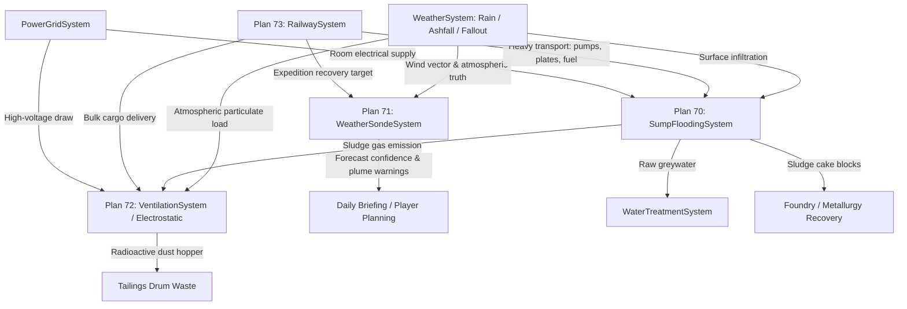

# Plans B70–B73 Authority Map & Architectural Matrix

**Domain:** Subterranean Sump Drainage (Plan 70), Atmospheric Sounding (Plan 71), Electrostatic Dust Scrubbing (Plan 72), Rail Logistics (Plan 73)
**Status:** Reconnaissance Complete
**Date:** 2026-09-06

---

## 1. Authority Registry & Domain Ownership

| Concern | Authoritative System | Location | Data Catalog | Secondary / Coupled Systems |
|---|---|---|---|---|
| **Groundwater Ingress & Sump Drainage** | `SumpFloodingSystem` | `Assets/Ashfall.Core/SumpFloodingSystem.cs` | `sump_drainage_catalog.json` | `WaterTreatmentSystem` (greywater routing), `ExcavationHazardSystem` / `VentilationSystem` (sludge gas), `PowerGridSystem` (pump power) |
| **Sludge Recovery & Tailings** | `SumpFloodingSystem` | `Assets/Ashfall.Core/SumpFloodingSystem.cs` | `sump_drainage_catalog.json` | `MetallurgySystem` (`item_sludge_cake`), `Inventory` (`item_tailings_drum`) |
| **Air Filtration & Electrostatic Capture** | `VentilationSystem` | `Assets/Ashfall.Core/VentilationSystem.cs` | `electrostatic_filtration_catalog.json` | `PowerGridSystem` (HV draw), `RadiationSystem` (fallout dust), `HealthSystem` (ozone irritation), Fire hazards |
| **Atmospheric Sounding & Telemetry** | `WeatherSondeSystem` | `Assets/Ashfall.Core/World/WeatherSondeSystem.cs` | `atmospheric_sounding_catalog.json` | `WeatherSystem` (weather truth & forecast confidence), `RadiationSystem` (stratospheric fallout sampling), Expeditions (recovery payload) |
| **Rail Logistics & Transit Corridors** | `RailwaySystem` | `Assets/Ashfall.Core/Expeditions/RailwaySystem.cs` | `rail_network.json` & `rail_logistics_catalog.json` | `ExpeditionSystem` (expedition routes), `Inventory` (freight cargo, coal fuel, steel rail parts), Map Topology |

---

## 2. Invariants & Architecture Directives

1. **Zero Engine Coupling in Core (`Assets/Ashfall.Core/`):**
   All four systems are engine-agnostic C# targeting `netstandard2.1` / `net8.0`. No `UnityEngine`, no `Godot`, no `JsonUtility`.
2. **Single Authority per Domain:**
   - Sump owns basin level, pump wear, flocculation, centrifuge dewatering, and cake packing. It does NOT generate drinking water (routes raw greywater into `WaterTreatmentSystem`).
   - Electrostatic stage is a pluggable filtration profile within `VentilationSystem`, not a separate atmosphere model.
   - Atmospheric sounding observes real `WeatherSystem` and `RadiationSystem` truth, producing bounded forecast confidence entries without modifying actual weather state.
   - Rail logistics operates as an expedition transit modality over network nodes and track segments without duplicating expedition lifecycle or inventory.
3. **Deterministic Integer Math & Quantized Coordinates:**
   - Sounding balloon coordinates are quantized in easting/northing meters (`positionEastingM`, `positionNorthingM`).
   - Rail progress uses clamped fractional delta along discrete segments.
   - Derailment, arc faults, and weather sampling use seeded PRNG (`ISeededRng`).
4. **Mass Conservation:**
   - Sludge: $\text{Centrifuge Batch} \equiv \text{Cake} + \text{Tailings} + \text{Greywater}$.
   - Electrostatic Dust: $\text{Captured Particulate} \to \text{Hopper Waste} \to \text{Tailings Drums}$.
   - Rail Freight: Cargo is conserved into expedition inventory, never duplicated on vehicle swap.

---

## 3. Cross-System Coupling Architecture

---

## 4. UI Resolution & Presentation Matrix

- **`SumpFloodingPanel` & `SlurryDewateringSumpPanel`:** Bound to `SumpFloodingHostSession` in `Main.ShelterBatch3.cs`.
- **`WeatherSondePanel`:** Bound to `_weatherSondeHost` in `Main.PlayerSurfaces.cs`.
- **`ElectrostaticScrubberPanel` (UI-13 Resolution):** Remove duplicate instantiation in `Main.ExpandedShelterSystems.cs`; wire standard action route in `Main.PlayerSurfaces.cs` under `"electrostatic_scrubber"`.
- **`RailwayTerminalPanel` (UI-07 Resolution):** Transform stub into rich control surface displaying active trains, track segment health, route dispatch, track repairs, bridge reconstruction, and derailment clearing.
