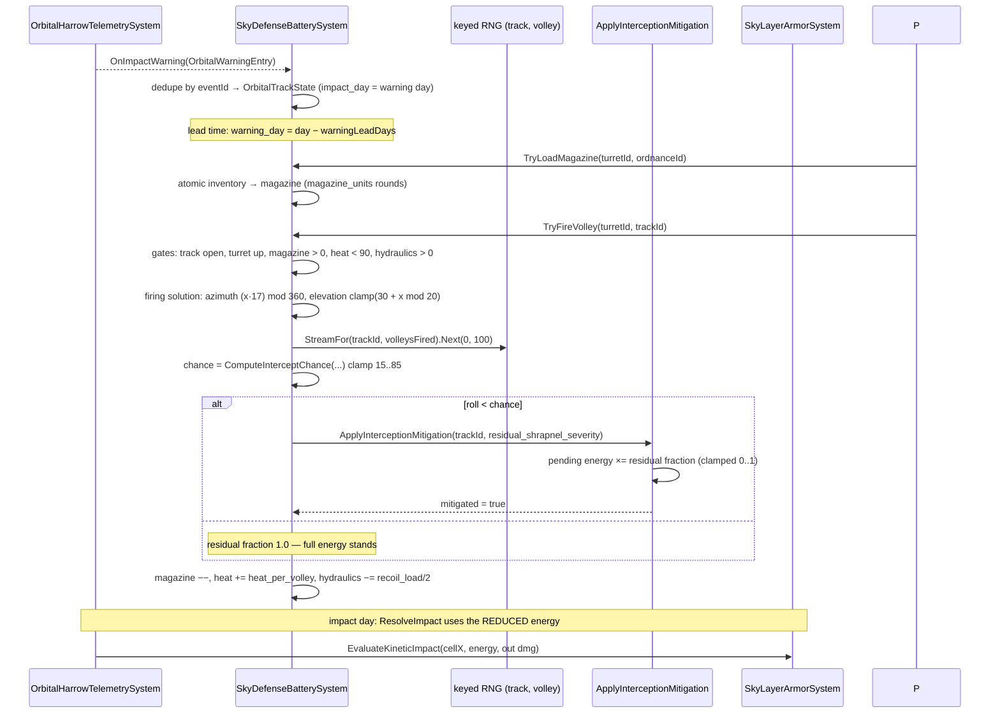
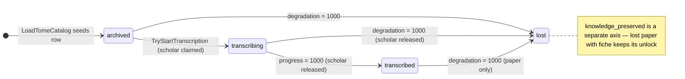
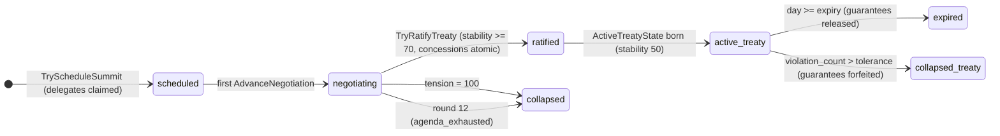
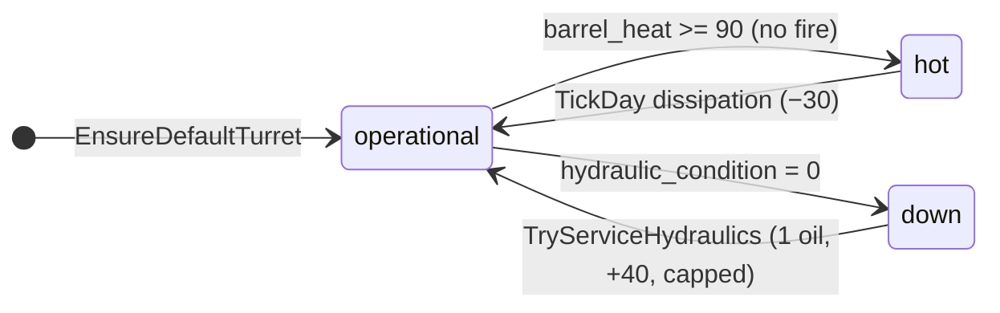
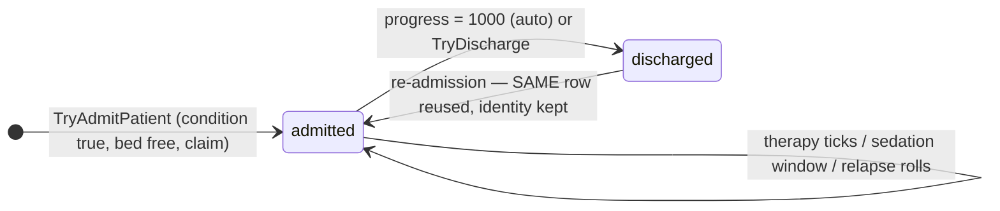

# Flagship Institutions (Tasks 5–8) — Implementation Log

CulturalArchiveVaultSystem · DiplomaticSummitSystem · SkyDefenseBatterySystem · PsychologicalSanatoriumSystem

---

## Phase A — Reconnaissance

Status: PASS (with recorded baseline divergence)

### Baseline gates (2026-09-05, branch `feat/asset-pipeline-flagship`, HEAD 86e5f698)

| Gate | Result |
|---|---|
| `dotnet build Ashfall.csproj` (host) | PASS — 0 errors |
| `dotnet build Ashfall.Core.Tests/Ashfall.Core.Tests.csproj` | **FAIL — 620 errors, PRE-EXISTING** |

Test-suite compile failure is **not attributable to this work**: 48 files error —
43 **untracked** test files from a concurrent stream (Debt*/WildlifeTrapping*/…,
written against Core APIs that don't exist on this branch yet) plus 5 tracked
`DistressSignal*Tests.cs` files (commit a75ceef4) referencing
`RadioDistressSystem.TryTriggerMoralChoice` etc., absent from Core here.
Working tree also carries ~17 modified Core/src files from concurrent streams.
**Foreign work is untouched.** Focused gates for this plan run via a
gitignored `_verify_flagship.csproj` that compiles Core + only this plan's
test files; the new test files also live in `Ashfall.Core.Tests/` so they run
in the canonical suite once the tree heals.

### Authority map

| Authority | Owner | Key API |
|---|---|---|
| Save sections | `Ashfall.Core/Save/SaveSectionRegistry.cs` | add entry to `All` + `SectionFileNames`; `SchemaVersions` only for codec ladders |
| Save store façade | `src/Host/SaveStoreHub.cs` | `SaveStoreHub.FromCodec(fileName, tag, SchemaVersionedEnvelope<T>.Encode, .Decode)`; newest example `src/Host/PoliticsSaveStore.cs` |
| Save orchestration | `src/Main.SaveOrchestrator.cs` | `SaveAll` → per-section `SaveXxx()` → `CaptureSection(key, payload)`; restore via `RestoreAllSubsystemsFromDisk()` ordered `SetupXxx` chain |
| Inventory (atomic) | `Ashfall.Core/Inventory/Inventory.cs` | `TryExecuteTransaction(InventoryBill)` / `TryConsumeBill(dict)`; snapshot-isolated, all-or-nothing, `OnInventoryChanged` once |
| Item catalog | `Inventory/ProceduralItemInstance.cs:ItemCatalog` | `Get(id)`; loaded by `ItemCatalogLoader` from `items.json` (bare ids, no `item_` prefix for common goods) |
| Content utilization | `Ashfall.Core/Content/ContentUtilizationScanner.cs` | register in `AuthoritativeCatalogs` + `loaderPatterns` + `consumerMap`; runtime evidence via `src/Host/ContentUtilizationRuntimeCollector.cs` |
| Data integrity | `Ashfall.Core/CatalogIntegrityValidator.cs` | auto-scans Data dir; new prefixes → `IdPrefixes`, def keys → `DefinitionKeys`, ref keys → `ReferenceKeys`; object roots need `schema_version` |
| Campaign time | `TickDay(int day)` convention | all systems day-based; no wall clock |
| RNG | `ISeededRng` (`Ports.cs`) | `Seed/Next(min,max)/NextFloat()/NextDouble()`; injected |
| Survivor identity | `Survivors/SurvivorId.cs`, `SurvivorAggregate.cs` | stable ids; `Lifecycle` (Resident/Deployed/Deceased); `ActiveExpeditionId` |
| Morale/needs | `Survivors/NeedsSystem.cs` | `Modify(survivor, NeedKind.Morale, delta, hours)`; `Morale` 0–100 |
| Trauma (canonical) | `Survivors/CombatTraumaSystem.cs` (hypervigilance), `SomaticFlashbackSystem`, `GuiltInsomniaSystem` | sanatorium maps onto these, no second trauma model |
| Relations | `SurvivorRelationsSystem.cs` | query API for therapist–patient trust |
| Skills | `Survivors/SkillCatalogLoader.cs`, `skills.json` | `skill_cold_analysis`, `skill_watchful` present |
| Orbital telemetry | `OrbitalHarrowTelemetrySystem.cs` | `OnImpactWarning(OrbitalWarningEntry{day,targetGridX,energyMj,eventId,severity})`; `warningLeadDays=3`; `TickDay`→`ResolveImpact()`→`_armor.EvaluateKineticImpact(cellX, energy, out dmg)`; Capture/Restore |
| Sky armor | `Shelter/SkyLayerArmorSystem.cs` | `EvaluateKineticImpact` is the single damage handoff — interception must reduce energy BEFORE resolution |
| Vinyl/media | `VinylMoraleSystem.cs` | `LoadCatalog(List<VinylRecordDefinition>)`, `AcquireRecord(id)`, `Play(id, day)`, `ApplyDailyEffect` — record cutting registers here, playback morale stays owned by vinyl |
| Journal/codex | `Journal/JournalSystem.cs` | `TryAddRawEntry`, `UnlockCodex(knowledgeKey)` |
| Flags | `Flags/IFlagLedger.cs`, `CampaignConsequenceLedger` | unlock records |
| Memorial | `Memorial/MemorialSystem.cs` | oral-history linkage by ID |
| Factions/war | `YearOfAsh/FactionWarSystem.cs` (+ Factions/) | standing/war authority — diplomacy publishes rules, never duplicates |
| Neutral summit site | `locations.json` | `loc_waystation_crossing` DOES NOT EXIST → use `loc_neutral_ground` (verify flags in Phase D) |
| Humidity | `World/WeatherSondeSystem.cs` | authoritative humidity query (verify signature in Phase C) |

### Item-ID reality vs plan text (authored-data divergence, recorded)

Plan fixtures name items that don't exist in `items.json` (bare-id convention):

| Plan says | Resolution |
|---|---|
| `chemical_sedative` | use existing `sedative_draught` |
| `mineral_salts` | use existing `item_preservation_salt` |
| `paper_stock` | author new item `paper_stock` |
| microfiche/acetate media | author `microfiche_film`, `acetate_blank_disc` |
| `machine_oil`, `scrap_chemical`, `clean_water`, `mechanical_parts` | exist as-is |

### Key design locks

- **Sky defense hook**: subscribe `OnImpactWarning` → engagement track; on successful
  interception call new `OrbitalHarrowTelemetrySystem.ApplyInterceptionMitigation(eventId, residualFraction)`
  (only public API added to telemetry; energy reduced before `ResolveImpact` → armor pipeline unchanged).
- **Ammo ownership**: loaded-magazine model — atomic transfer inventory→magazine on load;
  volley consumes from magazine. Ordnance ids double as item ids (single countable authority).
- **Salon modifier**: one shelter-wide active modifier, duration+cooldown persisted, applied
  through a `SalonMoraleTick` event consumed by host→NeedsSystem; never stacks.
- **Guarantees/hostages**: survivor stays in roster; availability via diplomacy-owned status +
  event; identity never deleted.
- **Diplomacy**: publishes `TreatyPolicySnapshot`/`IsArmedPatrolAllowed`; violations consumed
  from patrol/raid movement reports; standing changes routed via port bound to FactionWarSystem.
- **Sanatorium conditions**: authored `condition_*` ids in `psychological_therapies.json`
  mapped onto canonical trauma surfaces (hypervigilance/flashback/guilt-insomnia) at admission
  and discharge; no duplicate condition enums.
- **Save**: 4 new sections `cultural_archives`, `diplomatic_summits`, `sky_defense_battery`,
  `psychological_sanatorium`; host façades via `SaveStoreHub.FromCodec` +
  `SchemaVersionedEnvelope<T>`; empty defaults for old saves.

---

## Phases B–H — Execution record

| Phase | Status | Commit | Result |
|---|---|---|---|
| B — catalogs+validation | PASS | 4969eaf9 | 4 catalogs authored; 9 items added; validators registered; 15 tests |
| C — culture core | PASS | b8b3db8c | CulturalArchiveVaultSystem + 16 tests |
| D — diplomacy core | PASS | 2bb13049 | DiplomaticSummitSystem + 15 tests |
| E — sky defense core | PASS | 12cd4b9b | SkyDefenseBatterySystem + telemetry mitigation API + 13 tests |
| F — sanatorium core | PASS | 8a4bfdd0 | PsychologicalSanatoriumSystem + 14 tests |
| G — cross-system | PASS | 6ea06806 | InstitutionAssignmentLedger + contention tests + 30-day replay harness (8 tests) |
| H — save/content closure | PASS | dac83eb8 | 4 save sections + host facades + day owner + content utilization (Orphaned: 0) |

Note: another stream's `04884519 chore: sync working tree` commit swept up
Phase G work-in-progress files verbatim; content verified intact in HEAD.

### Divergences from plan (all recorded, all data-driven)

1. `loc_waystation_crossing` does not exist → neutral site is `loc_neutral_ground`.
2. `chemical_sedative` → `sedative_draught`; `mineral_salts` → `item_preservation_salt`;
   `paper_stock`/`microfiche_film`/`acetate_blank_disc` authored as new items;
   ordnance ids double as item ids (single countable authority).
3. Contention fixtures use the real item ids above (plan §14 list adjusted).
4. Skills/standing/condition ports left null in v1 host wiring (systems are
   null-permissive; humidity provider null — no shelter-humidity authority
   exists, plan §5.9 "if available").
5. Validator needed VocabularyKeys repairs for 5 label columns, 2 of them
   pre-existing FAILs on this branch (Plans 90-93) — repaired alongside.

### Host wave 2 (2026-09-05, commit e8292eca) — ports now live

The v1 null-port divergence (#4) is resolved: standing -> FactionWarSystem,
skills -> shared SkillProgressionSystem, conditions -> Phase-0 canonical
trauma surfaces (hypervigilance / flashback susceptibility / guilt-insomnia
severity, with authored thresholds per condition id), salon morale ->
NeedsSystem(Morale) for the living roster, archive cuts -> VinylMoraleSystem
MergeRecord, dream transcription -> one archive disc. Canonical relief APIs
were added to the OWNING systems (CombatTraumaSystem.ApplyTherapyRelief,
SomaticFlashbackSystem.ReduceSusceptibility,
GuiltInsomniaSystem.ApplyTherapyRelief, VinylMoraleSystem.MergeRecord) — the
sanatorium still never writes survivor state directly. Relapse (negative
reduction) intentionally does not re-escalate canonical surfaces (no
canonical re-escalation API exists; the sanatorium risk ledger tracks it).
Load-game lifecycle: flagship sessions register a lifecycle participant and
reset with everything else.

### Remaining known limitations

1. Shared `Ashfall.Core.Tests` suite remains uncompilable from concurrent
   streams' in-flight files (43 untracked + 5 committed radio tests vs absent
   Core APIs). Flagship gates run via gitignored `_verify_flagship.csproj`;
   the 6 flagship test files are globbed by the canonical suite and run once
   the tree heals.
2. UI panels for the four institutions are out of scope (plan §24: core-system
   tasks; scene lint not required). Systems expose events + state for a future
   Stitch-designed panel wave.
3. (resolved — host wave 2) Salon morale now reaches NeedsSystem.
4. (resolved — host wave 2) Standing routes to FactionWarSystem.
5. UI panels for the four institutions remain the natural next wave
   (google-stitch authority per AGENTS.md); systems expose complete events +
   state for binding.

---

## §27 Handoff note

```text
Culture:
- tome count: 12 (cultural_archive_tomes.json)
- archive degradation authority: CulturalArchiveVaultSystem (authored formula)
- humidity authority: none authoritative; injected Func<float> provider (null = dry)
- knowledge unlock authority: knowledge_preserved flag + OnMicroficheCreated /
  OnTomeTranscribed events (JournalSystem consumes at host when wired)
- recording/media integration: culture authors VinylRecordDefinition; host merges
  into VinylMoraleSystem catalog (LoadCatalog replaces — never merge inside culture)
- salon modifier authority: single shelter-wide state, OnSalonMoraleTick event
- save version: 1 (cultural_archives_save.json)

Diplomacy:
- treaty count: 8 (diplomatic_treaties.json)
- faction authority: canonical faction systems; host binds IFactionStandingPort to _yearOfAsh.FactionWar
- territory/DMZ authority: DiplomaticSummitSystem publishes IsArmedPatrolAllowed;
  zone ids validated against live world catalogs at load
- grievance/war authority: violations route via IFactionStandingPort AdjustStanding
- guarantee survivor status authority: availability claim + GuaranteeState (identity never removed)
- save version: 1 (diplomatic_summits_save.json)

Sky Defense:
- ordnance count: 6 (sky_defense_ordnance.json; ids = item ids)
- telemetry authority: OrbitalHarrowTelemetrySystem (world-owned instance)
- intercept probability authority: SkyDefenseBatterySystem.ComputeInterceptChance, clamp 15-85
- ammo ownership model: loaded magazine (atomic inventory<->magazine transfer)
- armor/damage handoff: ApplyInterceptionMitigation reduces pending energy;
  residual always flows through SkyLayerArmorSystem.EvaluateKineticImpact
- heat timing authority: per-volley heat + daily dissipation (TickDay)
- save version: 1 (sky_defense_battery_save.json)

Sanatorium:
- therapy count: 8 + 6 conditions (psychological_therapies.json)
- canonical condition authority: ISurvivorConditionPort -> Phase-0 trauma systems (hypervigilance / flashback / guilt-insomnia surfaces with authored thresholds)
- survivor availability authority: InstitutionAssignmentLedger (one claim per survivor)
- treatment effect authority: single ApplyTherapyOutcome applier
- relapse RNG stream: keyed stream seed = FNV(masterSeed, survivorId, day); no persisted continuation
- inventory authority: global Inventory via atomic transactions (sedatives not duplicated)
- save version: 1 (psychological_sanatorium_save.json)

Shared:
- campaign time authority: TickDay(day) convention
- RNG stream strategy: keyed FNV-derived SeededRng streams; diplomacy keyed per
  (seed, summit, round); defense per (seed, track, volley); sanatorium per (seed, survivor, day)
- content utilization result: PASS, Orphaned 0
- data integrity result: PASS, 0 errors, 231 catalogs
- old-save fixture result: RestoreState(null) defaults pinned per system (5 tests)
- 30-day replay hash/trace result: uninterrupted == restored fingerprint (seed 42)
- dotnet build result: PASS 0 errors 0 warnings
- dotnet test result: 92/92 flagship gates (_verify_flagship.csproj)
```

---

# EXPANSION 2026-09-25 — Flagship Institutions T5–8: Full Integration Framework & Code Architecture

The original log above (Phases A–H, host wave 2, §27 handoff) is preserved
byte-for-byte. Everything below this line was written on 2026-09-25 as a
documentation-only expansion: it re-verifies every authority the log cites,
records what changed on the branch since 2026-09-05, and documents the four
flagship institutions as a single coherent integration framework — data tier,
core tier, port tier, host tier, persistence tier, and presentation tier —
with per-institution deep specifications, sequence walkthroughs, failure
modes, and the drift-management story of the 620-error test baseline.

Nothing in this expansion modifies code, data, or tests. It is a reading of
the tree as it stands on branch `integration/all-latest-2026-09-24`.

---

## Part I — Preamble

### I.1 Scope and non-goals

**In scope.** The four Flagship Institutions (Tasks 5–8) and their direct
seams:

| Task | Institution | Core system | Institution id | Save section |
|---|---|---|---|---|
| 5 | Cultural archive vault | `Ashfall.Core/Culture/CulturalArchiveVaultSystem.cs` | `institution_cultural_archive` | `cultural_archives` |
| 6 | Diplomatic summits | `Ashfall.Core/Diplomacy/DiplomaticSummitSystem.cs` | `institution_diplomacy` | `diplomatic_summits` |
| 7 | Sky defense battery | `Ashfall.Core/SkyDefense/SkyDefenseBatterySystem.cs` | `institution_sky_defense` | `sky_defense_battery` |
| 8 | Psychological sanatorium | `Ashfall.Core/Sanatorium/PsychologicalSanatoriumSystem.cs` | `institution_sanatorium` | `psychological_sanatorium` |

Plus the shared organs those four share: the
`Ashfall.Core/Institutions/InstitutionAssignmentLedger.cs` availability
authority, the keyed FNV-derived RNG stream strategy, the four save sections
and their host stores, the host partial `src/Main.FlagshipInstitutions.cs`
(wave-2 port bindings and cross-domain event wiring), and the flagship test
files in `Ashfall.Core.Tests/`.

**Out of scope (recorded, not done here).**

- Player-facing panels for culture, diplomacy, and sanatorium (see the
  Part II audit — sky defense now *has* a panel; the other three still do
  not). A future Stitch-designed panel wave remains the natural next step.
- Any tuning change to authored balance constants. Numbers below are quoted
  from source as documentation, not endorsed as final balance.
- The other flagship streams that share the word "flagship" in their test
  names (`CampaignContinuityFlagshipTests`, `FlagshipEconomyScenarioTests`,
  `FlagshipIntegrationIxSmokeTests`, Tasks 54/57, B70/B73). Those are
  different plans by different streams; they are not analyzed here.

### I.2 Verification method used for this expansion

Every load-bearing claim below was re-checked against the working tree on
2026-09-25 by static inspection only (this task is documentation-only: no
`dotnet` run, no Godot run, no commits). The evidence types used:

- **(verified 2026-09-25)** — read directly from the named file in the
  current tree. This is the strongest label; member names, constants, and
  behaviors quoted this way are current.
- **(log text)** — carried forward from the original log above. Plausible
  and consistent with the tree, but the original observation (a gate run, a
  commit-time state) cannot be re-produced by static reading. Used for test
  counts at closure time and gate results.
- **UNVERIFIED (log text)** — the log asserts it and the tree neither
  confirms nor contradicts it cheaply. Flagged inline wherever used.

### I.3 Headline status at expansion time

| Question | Answer on 2026-09-25 |
|---|---|
| Are the four systems present and where? | Yes — paths in the table above (verified). |
| Are the four catalogs present with the expected counts? | Yes — 12 tomes, 8 treaties, 6 ordnance types, 8 therapies + 6 conditions (verified by count). |
| Are the four save sections registered? | Yes — `SaveSectionRegistry.cs` rows + `SectionFileNames` entries (verified). |
| Do the wave-2 relief APIs exist on the owning systems? | Yes — all four of the wave-2 set, plus the earlier Phase E telemetry mitigation API the original log lists separately (verified; Part V.C5). |
| Does the assignment ledger exist? | Yes — `Ashfall.Core/Institutions/InstitutionAssignmentLedger.cs` (verified). |
| Do the 8 recorded commits exist in history? | Yes — all of 4969eaf9, b8b3db8c, 2bb13049, 12cd4b9b, 8a4bfdd0, 6ea06806, dac83eb8, e8292eca resolve in `git log` (verified). |
| UI panels: which institutions have one? | **Sky defense yes** (`src/UI/SkyDefenseBatteryPanel.cs`); **culture, diplomacy, sanatorium no** (verified by reference grep). The original log's open item is therefore now *partially* resolved. |
| Has the 620-error shared-suite baseline healed? | Substantially, by file evidence: the 5 tracked `DistressSignal*Tests.cs` files are gone from `Ashfall.Core.Tests/`, and `RadioDistressSystem.TryTriggerMoralChoice` now exists in Core. The 43 untracked foreign files of 2026-09-05 are reduced to 1 untracked test file today. Compile-green is *inferred from file evidence only* — no build was run for this expansion. |
| Is `_verify_flagship.csproj` still present? | No — absent from the tree root today (it was gitignored by design; either removed or never committed). |

### I.4 Reading guide

- **Part II** re-audits the 24-row authority map from Phase A, row by row,
  and records branch growth since 2026-09-05.
- **Part III** states the integration framework: the invariants, the
  six-tier flow every institution follows, the four-save-section pattern,
  and the keyed-FNV RNG strategy written out as a reusable specification.
- **Part IV** is the code architecture: module map, contracts
  (`ActionResult`, events, save envelopes), and the four end-to-end
  sequence walkthroughs.
- **Part V** is the bulk: one full chapter per institution (C1–C4), then
  the null-port → wave-2 host story (C5), the assignment-ledger contention
  model (C6), the 30-day replay harness (C7), and drift management (C8).
- **Part VI** is the cross-system matrix and the emergent-consequence
  design notes, with the restrained-tone fiction framing.
- **Part VII** is verification and acceptance: what was run, what it
  proved, and the per-file test inventory as it stands today.
- **Part VIII** holds the appendices: glossary, the case-by-case suite
  guide, state machines, the id grammar, the §27 re-annotation, edge-case
  postmortems, open questions, the expansion's verification ledger, a
  reading map by role, the message-key vocabulary, quick-reference cards,
  the tick timeline, versioning notes, maintenance greps, scenario
  outlines, the consolidated API index, and anticipated questions.

**How the section ids work.** An id names the Part whose subject a section
extends, not where the section physically sits: `III.F` (the runbook)
extends Part III; `IV.G`–`IV.H` (the catalog and save-DTO references)
extend Part IV; `V.C10` and up extend Part V; `VI.D` (the panel
blueprint) extends Part VI; `VII.E` (panel-wave acceptance) extends Part
VII. Later sections were appended in writing order rather than re-sorting
the file, so the physical sequence is: Parts I–VII in order, then the
`IV.G`–`IV.H` reference cluster, then `V.C10`–`V.C11`, `III.F`, and
`VI.D`, then Part VIII with `V.C12`–`V.C14` and `VII.E` interleaved among
the VIII letters; each of those three clusters carries a placement note
where it begins. The C-series runs C1–C14 with one gap: there is no C9
and no text references one — the numbering skips from V.C8 to V.C10, and
the gap is recorded here so it is not mistaken for a lost section. The
closing note and the closing verification statement are the file's final
word, at true end.

### I.5 A note on tone and fiction

Where this document describes what the systems *feel like* in play (Part
VI), it keeps the house style: restrained, human, fictional. The archive
rooms smell of acid and dust; the treaty table is a folding table under a
tarp; the battery crews flinch at the sky; the ward keeps its voices down.
No real countries, wars, people, or copied material appears anywhere in the
systems, catalogs, or this document — the factions are authored archetypes
(militia, civic, holdout, caravan), the threat is an orbital kinetic
bombardment of unspecified origin, and the tomes are generic mid-century
printed matter.


---

## Part II — Current Authority Audit (2026-09-25)

The Phase A authority map in the original log is the contract this plan was
built on. This section re-walks it row by row against today's tree. The
original map's 24 rows are reproduced with a current verdict each; then come
the things that changed *since* the log — including the UI-panel finding —
and the small set of rows that could not be re-verified statically.

### II.1 The 24-row map, re-verified

Verdict key: **CURRENT** = row is accurate as written; **CURRENT (detail
added)** = accurate, with today's extra detail noted; **STALE** = superseded
by the tree.

| # | Authority (as logged) | Verdict | 2026-09-25 notes |
|---|---|---|---|
| 1 | Save sections — `Ashfall.Core/Save/SaveSectionRegistry.cs` | CURRENT | All four rows exist (registry lines ~210–213: `cultural_archives`, `diplomatic_summits`, `sky_defense_battery`, `psychological_sanatorium`, each with its `SaveXxx`/`SetupXxx` method names and a one-line description). All four file names exist in the section-file-name map (~513–516): `cultural_archives_save.json`, `diplomatic_summits_save.json`, `sky_defense_battery_save.json`, `psychological_sanatorium_save.json`. |
| 2 | Save store façade — `src/Host/SaveStoreHub.cs`, `FromCodec` + `SchemaVersionedEnvelope<T>` | CURRENT | Pattern confirmed live in `src/Host/CulturalArchiveSaveStore.cs`, `DiplomaticSummitSaveStore.cs`, `SkyDefenseBatterySaveStore.cs`, `PsychologicalSanatoriumSaveStore.cs` — each exposes `FileName`, `SectionName`, `TrySave`, `TryLoad`, `TryCapturePersisted` over a static `SaveStore<T>` built with `SaveStoreHub.FromCodec`. |
| 3 | Save orchestration — `src/Main.SaveOrchestrator.cs` | CURRENT | `SaveCulturalArchive(); SaveDiplomaticSummit(); SaveSkyDefense(); SaveSanatorium();` are called in the save-all path (adjacent lines, ~508–511). The restore-side `SetupXxx` chain is exercised through the `SetupCulturalArchive`/`SetupDiplomaticSummit`/`SetupSkyDefense`/`SetupSanatorium` methods referenced by the section registry. |
| 4 | Inventory (atomic) — `TryExecuteTransaction(InventoryBill)` / `TryConsumeBill` | CURRENT | The flagship systems use exactly this surface for every resource gate: culture disc-cut acetate cost, sky-defense magazine loads and `machine_oil` service, sanatorium therapy resource bills and `sedative_draught`. Snapshot-isolated all-or-nothing behavior is load-bearing for the magazine model (Part V.C3) and the therapy-start bill (Part V.C4). |
| 5 | Item catalog — `ItemCatalog.Get(id)`, bare ids | CURRENT | All flagship item ids resolve in `items.json`: `paper_stock`, `microfiche_film`, `acetate_blank_disc`, `sedative_draught`, `item_preservation_salt`, `machine_oil`, and all six `ammo_76mm_*`/`ammo_chaff_burst` ids (verified by presence check). |
| 6 | Content utilization — `ContentUtilizationScanner` | CURRENT (log text for the PASS) | The scanner and its registration surfaces (`AuthoritativeCatalogs`, `loaderPatterns`, `consumerMap`) remain the integrity path. The "Orphaned: 0" result is (log text); no re-run was performed for this expansion. |
| 7 | Data integrity — `CatalogIntegrityValidator.cs` | CURRENT (log text for the PASS) | Auto-scan architecture unchanged. The Phase B note about `VocabularyKeys` repairs for 5 label columns (2 pre-existing FAILs from Plans 90-93) is (log text). The "0 errors, 231 catalogs" figure is (log text) and predates later stream growth. |
| 8 | Campaign time — `TickDay(int day)` convention | CURRENT | All four flagship systems expose `public void TickDay(int day)` and keep a private `_currentDay` for window checks. No wall clock anywhere in the four systems. The host ticks them from `FlagshipInstitutionsDayOwner` at phase 5 (verified; Part V.C7). |
| 9 | RNG — `ISeededRng` injected | CURRENT (refined) | The flagship refinement is that none of the four systems takes an RNG through its constructor; each derives throwaway keyed streams internally (Part III.E). Culture consumes no RNG at all. The `Seed/Next/NextFloat/NextDouble` contract on `ISeededRng` is unchanged. |
| 10 | Survivor identity — `SurvivorId`, `SurvivorAggregate`, `Lifecycle` | CURRENT | The never-delete rule holds across all four institutions: sanatorium keeps one row per survivor forever (re-admission reuses the row), diplomacy guarantees reference survivor ids without removal, and every ledger claim is by id. |
| 11 | Morale/needs — `NeedsSystem.Modify(..., NeedKind.Morale, delta, hours)` | CURRENT | Wave-2 salon binding verified: host `BindCultureCrossDomainEvents` iterates the living roster (`Health > 0`) and applies `Needs.Modify(sv, NeedKind.Morale, (float)delta)` once per `OnSalonMoraleTick`. |
| 12 | Trauma (canonical) — CombatTrauma/SomaticFlashback/GuiltInsomnia | CURRENT | All three systems now carry the wave-2 relief APIs (verified): `CombatTraumaSystem.ApplyTherapyRelief(survivorId, fraction)`, `SomaticFlashbackSystem.ReduceSusceptibility(survivorId, amount)`, `GuiltInsomniaSystem.ApplyTherapyRelief(survivorId, fraction)`. No second trauma model was ever added. |
| 13 | Relations — `SurvivorRelationsSystem` query API | CURRENT (partial) | The therapist→patient trust query is surfaced to the sanatorium through `ISurvivorConditionPort.GetRelationshipTrust`. The current host port returns a constant 50 (neutral) — see Part V.C4.5 (the recorded thin spot). |
| 14 | Skills — `SkillCatalogLoader`, `skills.json` | CURRENT | `skill_cold_analysis`, `skill_watchful`, and `skill_steady_hands` all verified present in `skills.json`. Consumption points: diplomacy delegates (+8/+5), sanatorium therapists (+10/+5 plus `staff_skill_id` requirement), battery crews (+5 each toward the +10 crew cap). |
| 15 | Orbital telemetry — `OrbitalHarrowTelemetrySystem` | CURRENT | `OnImpactWarning(OrbitalWarningEntry)` and `warningLeadDays` unchanged; the single added API `ApplyInterceptionMitigation(eventId, residualFraction)` is verified, clamps the fraction to 0..1, multiplies the pending `impactEnergyMj`, and returns `false` when no pending impact matches the event id (Part V.C3 §"The mitigation contract"). |
| 16 | Sky armor — `SkyLayerArmorSystem.EvaluateKineticImpact` | CURRENT | Still the single damage handoff. Nothing in the flagship code path calls it directly; mitigation happens strictly earlier, on the pending telemetry energy. |
| 17 | Vinyl/media — `VinylMoraleSystem` | CURRENT | `MergeRecord(VinylRecordDefinition)` verified (the one catalog-mutation API added for wave 2). Culture still only *authors* definitions (`BuildRecordDefinition` is a pure static on the culture system); the host merges and acquires — `LoadCatalog` remains replace-whole and is never called from culture. |
| 18 | Journal/codex — `JournalSystem` | CURRENT (as designed) | Consumption is host-side and event-driven (`OnMicroficheCreated`, `OnTomeTranscribed`, `OnTherapeuticJournalCompleted`); the Core systems never reference journal types. Whether the codex wiring is live in every scene is outside this document's scope. |
| 19 | Flags — `IFlagLedger`, `CampaignConsequenceLedger` | CURRENT | Knowledge preservation remains a culture-owned flag on document state (`knowledge_preserved`) rather than a global enum — the divergence-proof shape Phase A chose. |
| 20 | Memorial — `MemorialSystem` | CURRENT (touchpoint only) | Oral-history linkage remains by id; recording categories include `oral_history` and `survivor_testimony`, which are the memorial-facing kinds. |
| 21 | Factions/war — `FactionWarSystem` | CURRENT | Wave-2 standing port verified: `HostFactionStandingPort.AdjustStanding` rounds the delta to `int` and calls `_yearOfAsh.FactionWar.ModifyStanding`; `GetStanding` reads through. Diplomacy never computes standing itself. |
| 22 | Neutral summit site — `locations.json` | CURRENT | `loc_waystation_crossing` confirmed absent (0 occurrences in `locations.json`); `loc_neutral_ground` confirmed present, and `DiplomaticSummitSystem.NeutralSummitSiteId` pins it as a compile-time constant. |
| 23 | Humidity — `WeatherSondeSystem` | CURRENT (null-quiet) | No shelter-humidity authority claimed ownership; the culture constructor takes `Func<float>? humidityPercentProvider` and treats null as permanently dry (scale 0.5). Whether any host scene passes a live provider today was not traced scene-by-scene for this expansion: **UNVERIFIED (log text)** for live wiring; the null-quiet contract itself is verified. |
| 24 | Crew/roles availability | CURRENT (promoted) | What Phase A listed informally is now a named authority: `Ashfall.Core/Institutions/InstitutionAssignmentLedger.cs` + `IInstitutionAvailability`, documented in Part V.C6. |

### II.2 Growth since the log (2026-09-05 → 2026-09-25)

Things the four institutions gained after the original log was written, all
verified in today's tree:

1. **`SkyDefenseBatteryPanel` (`src/UI/SkyDefenseBatteryPanel.cs`).** The
   first of the four player surfaces. Header comment: *"Flagship Task 7 —
   Sky Defense Battery player surface."* It is an `IBindablePanel` Control
   that renders the Core counter-battery read model (emplacements, magazine,
   heat, hydraulics, orbital tracks, crew) and forwards player intent —
   load / fire / service / crew — to the Core system. It never rolls an
   intercept and never recomputes mitigation; `PreviewInterceptChance` is a
   Core read model used verbatim. This is the template the remaining three
   panels should follow.
2. **Plan 219 documentation engine embedded in culture.**
   `CulturalArchiveVaultSystem` now exposes a `Documentation` property (a
   `DocumentationSystem` instance sharing the culture save blob's
   `documentation` field), with photograph/album/share events folded into
   `OnDocumentationChanged`. This grew inside the culture section without
   changing the section count — the save DTO was designed with room.
3. **`therapy_dream_transcription` → archive disc bridge.** The host
   `BindSanatoriumCrossDomainEvents` turns every therapeutic-journal
   completion into `TryCutArchiveDisc($"archive_disc_dream_{survivorId}",
   "oral_history", survivorId, day)`. The culture chronicle/duplicate guard
   makes re-fires idempotent. This is the flagship's cleanest example of a
   cross-domain event turning one institution's output into another's input.
4. **The arc-condition extension in the condition port.** The host port
   routes any `condition_*` id starting with `arc_` to the Plan 164
   psychology-arc system instead of the Phase-0 trauma surfaces, so later
   streams extended sanatorium eligibility without touching Core.
5. **Suite healing (file evidence).** On 2026-09-05 the shared test suite
   could not compile: 48 erroring files (43 untracked foreign test files
   written against Core APIs that did not exist on the branch, plus 5
   tracked `DistressSignal*Tests.cs` files referencing
   `RadioDistressSystem.TryTriggerMoralChoice`, which was absent). Today:
   `TryTriggerMoralChoice` **exists** in Core (the radio stream landed), the
   5 tracked DistressSignal test files are **gone** from
   `Ashfall.Core.Tests/`, and the working tree's foreign test traffic is
   down to 1 untracked file plus 3 modified gate files. Compile-green is
   inferred, not run.

### II.3 The UI-panel status finding

The original log lists UI panels twice as an open item ("out of scope",
"natural next wave"). Status today:

| Institution | Panel exists? | Evidence |
|---|---|---|
| Culture | **No** | No file under `src/UI/` references `CulturalArchiveVaultSystem`. The similarly named `ArchiveDeskPanel` belongs to a different archive stream (`ArchiveDeskHostSession`), and `FactionCultureCodexPanel` to the faction culture codex — neither binds the flagship culture system. |
| Diplomacy | **No** | No file references `DiplomaticSummitSystem`. `RegionalTreatyPanel` binds the older regional-treaty data (`regional_treaties.json`), not the flagship summit system. `AquiferTreatyConcessionPanel` likewise predates the flagship stream. |
| Sky defense | **Yes** | `src/UI/SkyDefenseBatteryPanel.cs` — full bind, presentation-only, Task 7 surface (see II.2 item 1). |
| Sanatorium | **No** | No file references `PsychologicalSanatoriumSystem`. |

Consequence for the next panel wave: three institutions expose complete
events + state + read models and wait for surfaces; the sky-defense panel is
the in-repo reference for the expected shape (read model rendered verbatim,
mutations forwarded, zero gameplay decisions in the panel).

### II.4 Rows that could not be re-verified statically

Honest gaps, all carried from the log rather than contradicted:

- The 92/92 flagship gate result and the exact per-phase test counts at
  closure — (log text). Today's static count of the six T5–8 test files is
  77 cases (Part VII); the reconciliation is approximate because later
  streams reorganized shared fixtures.
- The Phase G `04884519 chore: sync working tree` sweep-up — the commit is
  described in the log; content integrity in HEAD was verified at the time
  (log text) and the G-phase files exist today, but the commit-boundary
  forensics were not repeated.
- Live host wiring of the humidity provider in any specific scene —
  **UNVERIFIED (log text)** (II.1 row 23).


---

## Part III — Integration Framework

### III.A The ten invariants

The Phase A "key design locks" restated as enforceable rules. Every one of
them is checkable by reading code; each cites where it lives today.

1. **INV-1 — One damage handoff.** Kinetic energy reaches shelter armor
   only through `SkyLayerArmorSystem.EvaluateKineticImpact`. Interception
   reduces *pending telemetry energy* via
   `OrbitalHarrowTelemetrySystem.ApplyInterceptionMitigation` before
   `ResolveImpact` fires. No flagship code calls the armor API. (Verified:
   the only mitigation call site is inside `SkyDefenseBatterySystem
   .TryFireVolley`.)
2. **INV-2 — Magazine is the countable ammo authority.** Rounds live in
   the global inventory until `TryLoadMagazine` atomically transfers one
   magazine's worth; a volley decrements the turret's `magazine_count`.
   Ordnance ids *are* item ids — there is no second counter anywhere.
3. **INV-3 — One salon modifier, never stacked.** `ArchiveSalonState` is a
   single shelter-wide struct with `active`, `duration_days`,
   `cooldown_until_day`. `TryStartSalon` refuses while active or cooling.
   Morale reaches survivors only through the `OnSalonMoraleTick` event, once
   per day, consumed by exactly one host handler.
4. **INV-4 — Survivor identity is never deleted.** Guarantees, patient
   rows, ledger claims, chronicle participants, and crew assignments all
   reference survivor ids; discharge/forfeit/release change *status*, never
   roster membership. The sanatorium keeps one row per survivor forever and
   re-admission reuses it.
5. **INV-5 — Diplomacy publishes policy; it never simulates war.**
   `IsArmedPatrolAllowed(factionId, zoneId)` is a pure query over active
   treaties. Standing changes are published outward through
   `IFactionStandingPort.AdjustStanding`, bound by the host to
   `FactionWarSystem.ModifyStanding`. Violations are *reported into*
   diplomacy by patrol/raid flows, never detected by diplomacy.
6. **INV-6 — The sanatorium never writes survivor state directly.** Every
   clinical effect funnels through `ISurvivorConditionPort`, whose host
   implementation calls the relief APIs that live on the owning canonical
   systems. The sanatorium's own persisted state is limited to its patient
   ledger (progress, risk, sessions).
7. **INV-7 — Relapse is asymmetric.** Positive therapy reduction flows to
   canonical surfaces; the relapse path passes a negative reduction, and the
   host port deliberately no-ops on `permille <= 0` (verified:
   `HostSurvivorConditionPort.ApplyAcuteStressReduction` opens with
   `if (permille <= 0) return;`). Canonical systems expose no
   re-escalation API by design; the sanatorium's `relapse_risk_permille`
   ledger is the authority for worsening.
8. **INV-8 — Four sections, one owner each.** `cultural_archives`,
   `diplomatic_summits`, `sky_defense_battery`,
   `psychological_sanatorium` — each registered in
   `SaveSectionRegistry`, each with exactly one host store façade, each
   versioned by `SchemaVersionedEnvelope<T>` starting at schema_version 1,
   each restoring to empty-but-valid defaults on null input.
9. **INV-9 — Availability is global and runtime-derived.** One live claim
   per survivor across all four institutions, held by
   `InstitutionAssignmentLedger`. The ledger itself has **no save
   section**: each institution persists its own assignments inside its own
   section and re-claims them on restore.
10. **INV-10 — Determinism without persisted RNG state.** Culture is
    stochastic-free. The other three derive per-decision RNG streams from
    `(masterSeed, stable ids, counter)` via FNV-1a, never persist RNG
    continuations, and replay identically across save/restore (proven by
    the continuation tests; Part V.C7).

### III.B The six-tier flow every institution follows

Each institution is the same shape. When a fifth institution is proposed,
this is the checklist.

```
Tier 1 DATA       Assets/StreamingAssets/Data/<catalog>.json
                  snake_case, schema_version 1, registered prefixes/keys
                  in CatalogIntegrityValidator; ids registered in
                  ContentUtilizationScanner (catalogs + loader patterns +
                  consumers).
Tier 2 CORE       Assets/Ashfall.Core/<Domain>/<System>.cs
                  Pure C#, netstandard2.1, no Godot. Owns state DTOs
                  (snake_case fields), the authoritative mutations
                  (Try* methods returning ActionResult), TickDay(int),
                  CaptureState()/RestoreState(saved?), keyed RNG streams.
Tier 3 PORTS      Interfaces declared beside the core system
                  (IFactionStandingPort, ISurvivorSkillsPort,
                  ISurvivorConditionPort, IInstitutionAvailability).
                  Core defines the *need*; host supplies the *authority*.
Tier 4 HOST       src/Main.FlagshipInstitutions.cs + per-domain Ensure
                  methods. Adapter classes implement ports against the
                  owning systems; cross-domain event bindings (single
                  consumer each); the phase-5 day owner.
Tier 5 PERSIST    src/Host/<X>SaveStore.cs via SaveStoreHub.FromCodec +
                  SchemaVersionedEnvelope<T>; registry row +
                  SectionFileNames entry; SaveXxx/SetupXxx wired in
                  Main.SaveOrchestrator.cs and the restore chain.
Tier 6 PRESENT    src/UI/<X>Panel.cs, IBindablePanel. Renders Core read
                  models verbatim; forwards intent; zero simulation.
                  Status: sky defense done; other three pending.
```

Tier-6 is deliberately optional for Core completeness — a system without a
panel is still a system (the §24 scope note in the original log) — but a
system is not *shipped* until its Tier-6 exists or its absence is an
accepted, recorded decision. Today that decision is recorded for culture,
diplomacy, and sanatorium; sky defense has closed it.

### III.C The four-save-section pattern

All four sections follow one recipe, which is the reason old saves simply
work. Written as the reusable spec:

1. **DTO** — one `public sealed class <X>Save` in the Core system file,
   `schema_version = 1` default, snake_case fields, only data (no behavior,
   no engine types). Culture's DTO additionally carries the fractional
   `degradation_remainder` (Part V.C1 §"The remainder carry") and the Plan
   219 `documentation` blob — an example of designing DTOs with spare room.
2. **Registry** — one row in `SaveSectionRegistry.All` naming the save and
   setup methods, a domain tag, and a human description; one entry in
   `SectionFileNames` (`<section>_save.json`).
3. **Store** — `src/Host/<X>SaveStore.cs`, a static class over
   `SaveStoreHub.FromCodec(fileName, tag, SchemaVersionedEnvelope<T>.Encode,
   SchemaVersionedEnvelope<T>.Decode)`. No per-section serialization code.
4. **Orchestration** — `SaveXxx()` in `Main.SaveOrchestrator.cs` captures
   from the live system and hands the payload to the store; the restore
   path calls `SetupXxx` in dependency order and feeds `TryLoad()`'s result
   (or null) into `RestoreState`.
5. **Null defaults** — `RestoreState(null)` must leave the system valid:
   empty lists, sentinels cleared (`start_day = -1`), the sky-defense
   default turret recreatable via `EnsureDefaultTurret()`. Pinned by five
   old-save fixture tests (log text) and preserved by the DTO defaults.
6. **Dirty persistence** — the day owner calls
   `PersistFlagshipInstitutionsIfDirty()` after ticking, so autosave state
   follows gameplay state without a separate write path.

Why four sections instead of one "institutions" section: each institution
is independently authored, independently versioned, and independently
restorable; a corrupted or future-extended diplomacy blob must never block
a sanatorium restore. The cost — four registry rows, four stores — is
mechanical and paid once.

### III.D Integrity and content utilization

New data reaches gameplay reachability through two pipelines, and Phase B
registered everything through both:

- **`CatalogIntegrityValidator`** — object roots carry `schema_version`;
  new id prefixes (`tome_`, `treaty_`, `ordnance_`, `ammo_*` via item ids,
  `therapy_`, `condition_*`) registered in `IdPrefixes`; per-catalog
  definition keys in `DefinitionKeys`; cross-catalog reference keys (e.g.
  therapy `eligible_conditions` → condition ids; ordnance `item_id` →
  items.json; treaty `required_concessions[].item_id` → items.json) in
  `ReferenceKeys`. Phase B also repaired 5 label-column vocabulary keys,
  2 of which were pre-existing FAILs from Plans 90-93 (log text).
- **`ContentUtilizationScanner`** — each catalog registered in
  `AuthoritativeCatalogs`, its loader pattern named, and its consumers
  mapped, so "present in JSON" is distinguishable from "reachable in play".
  The Phase H closure recorded `Orphaned: 0` (log text): every authored
  row was demonstrably loaded and consumed by the systems.

The recurring lesson, stated in AGENTS.md rule 7 and paid for twice in this
plan (the location id, the item ids), is that a plan document's fixture
names are hypotheses. The validator is what converts a hypothesis into an
error before it becomes a silent orphan.


### III.E The keyed-FNV RNG strategy, written as a specification

Three of the four institutions roll dice. None of them persists RNG state.
The strategy that makes this safe is uniform across the three systems and
is worth writing down once, as a spec, because it is the house pattern for
every future stochastic system.

**Derivation.** A stream seed is `FNV1a(key)` where the key is the
concatenation-with-mixing of the *stable decision coordinates*:

```
ulong h = 1469598103934665603UL;          // FNV-1a 64-bit offset basis
foreach (char c in <stableStringId>)      // e.g. summit id, track id,
{                                          //      survivor id
    h ^= c;
    h *= 1099511628211UL;                 // FNV-1a 64-bit prime
}
h ^= (uint)<counter>;                      // round, volley index, or day
h *= 1099511628211UL;
h ^= (uint)_masterSeed;                    // campaign master seed
h *= 1099511628211UL;
int seed = unchecked((int)(h ^ (h >> 32))); // final 64→32 mix
var rng = new SeededRng(seed);
```

This exact shape is verified in all three systems —
`DiplomaticSummitSystem.StreamFor(summitId, round)`,
`SkyDefenseBatterySystem.StreamFor(trackId, volley)`,
`PsychologicalSanatoriumSystem.StreamFor(survivorId, day)` — differing only
in the key tuple.

**The key tuples.**

| System | Key tuple | Counter semantics |
|---|---|---|
| Diplomacy | `(masterSeed, summitId, negotiationRound)` | one stream per round; a round re-run after restore replays bit-identically |
| Sky defense | `(masterSeed, trackId, volleysFired)` | one stream per volley; the counter is incremented *after* the draw and saved on the track row (verified in `TryFireVolley`: draw with the current `volleys_fired`, then `volleys_fired++`) |
| Sanatorium | `(masterSeed, survivorId, day)` | one stream per patient-day; the relapse roll is the only consumer, so admission/therapy choices do not perturb it |
| Culture | — | no RNG: degradation, transcription, salon, chronicles are all authored formulas |

**Properties this buys.**

1. **Restore-continuity.** After `RestoreState`, the next decision has the
   same coordinates as it would have had uninterrupted, hence the same
   stream, hence the same roll. This is exactly what the four continuation
   tests assert (Part V.C7). No `next_seed`, no saved draw counter beyond
   the natural business counters (`negotiation_round`,
   `volleys_fired`, `day`).
2. **Isolation.** Two events on the same day never share a stream unless
   they share every coordinate — and the coordinates are chosen so that
   cannot happen (distinct ids; per-round/per-volley counters).
3. **Auditability.** Any historical roll can be recomputed from the save
   blob alone: the master seed plus the ids and counters in the section.
4. **No iteration-order coupling.** AGENTS.md forbids seeding from hash
   iteration order; the FNV walk here is over an explicit id string, in
   order, with explicit mixing — a keyed derivation, not a dictionary
   traversal.

**Pitfalls the spec prevents.** Do not add a second consumer to a keyed
stream (it shifts every later roll); open a new key tuple or fold the new
decision into the counter's meaning. Do not replace the string id with a
list index that can be reordered by another stream's growth. Do not seed
from wall clock. Do not persist the RNG object. When a decision's
coordinates would change meaning across a version (e.g. volley numbering
semantics), that is a schema_version event for the owning section, not a
quiet reuse.

---

## Part IV — Code Architecture

### IV.A Module map

```
Assets/Ashfall.Core/
  Culture/CulturalArchiveVaultSystem.cs      Task 5 core + save DTO + Plan 219 doc engine
  Diplomacy/DiplomaticSummitSystem.cs        Task 6 core + 3 port interfaces + save DTO
  SkyDefense/SkyDefenseBatterySystem.cs      Task 7 core + save DTO
  Sanatorium/PsychologicalSanatoriumSystem.cs Task 8 core + ISurvivorConditionPort + save DTO
  Institutions/
    IInstitutionAvailability.cs              availability contract (IsAvailable)
    InstitutionAssignmentLedger.cs           the shared one-claim-per-survivor authority
  OrbitalHarrowTelemetrySystem.cs            world-owned telemetry; + ApplyInterceptionMitigation
  VinylMoraleSystem.cs                       media authority; + MergeRecord
  Survivors/
    CombatTraumaSystem.cs                    + ApplyTherapyRelief (wave 2)
    SomaticFlashbackSystem.cs                + ReduceSusceptibility (wave 2)
    GuiltInsomniaSystem.cs                   + ApplyTherapyRelief (wave 2)
    NeedsSystem.cs                           morale authority (salon consumer target)
  Shelter/SkyLayerArmorSystem.cs             INV-1 terminal damage handoff (untouched)
  Save/SaveSectionRegistry.cs                4 rows + 4 file names

src/
  Main.FlagshipInstitutions.cs               Ensure* methods, 3 host port adapters,
                                             cross-domain bindings, phase-5 day owner
  Main.SaveOrchestrator.cs                   SaveCulturalArchive/SaveDiplomaticSummit/
                                             SaveSkyDefense/SaveSanatorium
  Host/
    CulturalArchiveSaveStore.cs              4 façades over SaveStoreHub.FromCodec
    DiplomaticSummitSaveStore.cs
    SkyDefenseBatterySaveStore.cs
    PsychologicalSanatoriumSaveStore.cs
  UI/SkyDefenseBatteryPanel.cs               the one shipped panel (Task 7)

Ashfall.Core.Tests/
  InstitutionCatalogValidationTests.cs       15 cases — Phase B data gates
  CulturalArchiveVaultTests.cs               16 cases — Phase C + continuation
  DiplomaticSummitTests.cs                   15 cases — Phase D + continuation
  SkyDefenseBatteryTests.cs                  13 cases — Phase E + continuation
  PsychologicalSanatoriumTests.cs            14 cases — Phase F + continuation
  InstitutionCanonicalReliefTests.cs          4 cases — wave-2 canonical relief
  (counts verified 2026-09-25; [Fact]/[Theory] per file)
```

### IV.B The ActionResult contract

Every player-facing mutation returns `ActionResult`. The flagship systems
use three shapes, and the discipline matters for panel work:

- `ActionResult.Success(code)` / `Success(code, metrics)` — the code is a
  stable localization key (`"sky.volley_resolved"`), the optional metrics
  dictionary carries the numbers a panel wants to display (intercept
  chance, roll, residual fraction; stability/tension/roll for a negotiation
  round; hydraulics after service).
- `ActionResult.Blocked(reasonCode, messageKey)` — every refusal has a
  *machine reason* (`"magazine_empty"`, `"barrel_hot"`, `"no_beds"`,
  `"no_trust"`, `"therapy_not_eligible"`) and a *message key*. A panel must
  branch on the reason code for UI state and render the message key for
  text; it must never parse the message.

The reason codes double as the failure-mode inventory in Part V: each
institution chapter tabulates them.

### IV.C The event contract

Core events expose **facts after the fact**, with payloads that are either
the mutated state object or the minimal identifying tuple. Two rules the
flagship streams follow, both visible in the host bindings:

1. **Single consumer per event per concern.** `OnSalonMoraleTick` has
   exactly one host handler; `OnArchiveRecordingCreated` has exactly one
   (the vinyl merge); `OnTherapeuticJournalCompleted` has exactly one (the
   dream-disc bridge). If a second consumer ever needs the same fact, the
   binding moves to a host-level fan-out — events do not accumulate
   handlers inside Core.
2. **Events never carry commands.** A handler that needs to mutate another
   institution calls that institution's `Try*` API (as the dream-disc
   bridge calls `TryCutArchiveDisc`), so all gates, costs, and duplicate
   guards apply.

### IV.D DTO and envelope conventions

Save DTOs are snake_case, default-initialized, and additive-friendly: new
fields get safe defaults so an older blob decodes without loss of section.
`SchemaVersionedEnvelope<T>.Encode/Decode` wraps the DTO with the schema
version; the section registry's codec ladder is the only place a
version bump is declared. The culture DTO shows the two extension stories
to copy: `degradation_remainder` (a determinism necessity, Part V.C1) and
`documentation` (a later plan's subsystem embedded without a new section).


### IV.E Sequence walkthroughs

Four end-to-end walks through the real code paths. Participants: the
player/panel intent, the Core system, the ports, the host bindings, and the
neighboring owned systems.

#### IV.E.1 Tome transcription → vinyl merge (culture → media)

The long chain: a scholar preserves knowledge, then the shelter cuts a
record of it.

```mermaid
sequenceDiagram
    participant P as Panel/host intent
    participant C as CulturalArchiveVaultSystem
    participant L as InstitutionAssignmentLedger
    participant H as Host bindings
    participant V as VinylMoraleSystem
    P->>C: TryStartTranscription(tomeId, scholarId)
    C->>C: legibility check (degradation < 900 permille)
    C->>L: TryClaim(scholarId, institution_cultural_archive, scholar)
    C-->>P: ActionResult (or Blocked reason)
    Note over C: each TickDay: step = max(1, 1000 / transcription_days)
    C->>C: transcription_permille reaches 1000 → status "transcribed"
    C->>L: Release(scholarId, institution, "scholar")
    C-->>H: OnTomeTranscribed(tomeId)
    P->>C: TryCutArchiveDisc(recordingId, category, operatorId, day)
    C->>C: atomic bill: 1 × acetate_blank_disc
    C-->>H: OnArchiveRecordingCreated(recording, VinylRecordDefinition)
    H->>V: MergeRecord(definition) + AcquireRecord(record_id)
    Note over V: playback morale stays owned by vinyl;
    LoadCatalog is NEVER called from culture
```

Key guarantees: the scholar claim survives across days (the project row in
`active_projects` holds `survivor_id` and `last_progress_day`); a document
lost to decay mid-transcription releases the scholar and cancels the
project; knowledge state (`knowledge_preserved`, set by microfiche) is
independent of paper state — decay never erases what microfiche preserved.

#### IV.E.2 Summit round → standing change (diplomacy → factions)

One negotiation round, then a later violation that moves standing.

```mermaid
sequenceDiagram
    participant P as Delegate flow
    participant D as DiplomaticSummitSystem
    participant R as keyed RNG (summit, round)
    participant SP as IFactionStandingPort
    participant F as FactionWarSystem (host-bound)
    P->>D: TryScheduleSummit(framework, delegates, day)
    D->>D: agenda validated against catalog; delegates claimed
    P->>D: AdvanceNegotiation(summitId, offerConcession)
    D->>D: acceptance = 50 + stability/4 − tension/5 + skillBonus + concession
    D->>D: acceptance clamped to 5..95
    D->>R: StreamFor(summitId, round).Next(0, 100)
    R-->>D: roll
    alt roll < acceptance
        D->>D: stability += 12 + rng(0..6); tension −= 5
    else
        D->>D: stability −= 10; tension += 12
        opt tension ≥ 100
            D->>D: status = "collapsed"; delegates released
        end
    end
    Note over D,F: later — a patrol/raid flow reports a violation
    P->>D: ReportArmedPatrol(factionId, zoneId, day)
    D->>D: IsArmedPatrolAllowed? no → dedupe → record (severity 1)
    D->>D: treaty.stability −= 20 × severity
    D->>SP: AdjustStanding(factionId, violation_penalty_standing, reason)
    SP->>F: ModifyStanding(factionId, round(delta))
```

Key guarantees: standing math is integer-rounded *at the port boundary*
(the host adapter), so Core stays float-neutral and the war authority keeps
its own scale; violation records dedupe on
`(treaty, faction, day, kind)`; a treaty whose `violation_count` exceeds
the authored `violation_tolerance` collapses and **forfeits** its exchanged
guarantees.

#### IV.E.3 Impact warning → intercept → residual armor damage (telemetry → battery → armor)

The INV-1 walkthrough — the only path by which a kinetic strike touches
the shelter.



Key guarantees: mitigation is *idempotent per event id* and refuses
unknown or already-resolved ids; a miss never touches telemetry (fraction
1.0 means "no call needed" — the code only calls mitigation on intercept);
the armor pipeline is never bypassed or duplicated.

#### IV.E.4 Admission → therapy → relief / relapse (sanatorium → canonical trauma)

The INV-6/INV-7 walkthrough.

```mermaid
sequenceDiagram
    participant P as Referral flow
    participant S as PsychologicalSanatoriumSystem
    participant L as InstitutionAssignmentLedger
    participant CP as ISurvivorConditionPort (host)
    participant CT as Phase-0 trauma systems
    P->>S: TryAdmitPatient(survivorId, conditionId, day)
    S->>CP: HasCondition(survivor, condition)
    CP->>CT: authored threshold read (e.g. hypervigilance ≥ 0.4)
    CP-->>S: true → bed check → L.TryClaim(survivor, institution, "patient")
    P->>S: TryStartTherapy(survivor, therapy, therapist, day)
    S->>S: eligibility (eligible_conditions), staff_skill_id, trust ≥ 20
    S->>S: atomic resource bill; L.TryClaim(therapist, institution, "therapist")
    Note over S: TickDay: therapy_days_elapsed → duration_days
    S->>S: ApplyTherapyOutcome (THE single applier)
    S->>CP: ApplyAcuteStressReduction(survivor, reduction + assist)
    CP->>CT: ApplyTherapyRelief / ReduceSusceptibility on all three surfaces
    S->>CP: ApplyRecoveryProgress(survivor, therapy.recovery_progress)
    alt treatment_progress ≥ 1000
        S->>CP: SuppressReversibleCondition (only authored reversible ids)
        S-->>P: discharge; row kept for re-admission
    else untreated days
        S->>R: StreamFor(survivorId, day).Next(0, 1000)
        alt roll < relapse_risk_permille
            S->>CP: ApplyAcuteStressReduction(survivor, −150)
            CP-->>CT: NO-OP (permille ≤ 0) — INV-7
            S->>S: risk += 100; OnPatientRelapsed
        end
    end
```

Key guarantees: the sanatorium's own writes are confined to
`SanatoriumPatientState`; canonical relief happens only at outcome time and
only through the port; relapse worsens the *sanatorium's* ledger, never the
canonical surfaces.

### IV.F Contention, end to end

One survivor, three institutions, zero double-booking. The ledger
(Part V.C6) serializes everything:

- A delegate at a summit cannot simultaneously be a battery crew member
  (`TryAssignCrew` → claim "crew") or a therapist ("therapist"), because
  all four institutions share one `IInstitutionAvailability` instance
  injected at construction.
- Claims are idempotent for the identical
  `(survivor, institution, role)` triple — re-asserting your own claim
  (restore-time re-claim) succeeds — and fail for a *different* claim.
- Every mutation path that holds a claim across time (transcription
  project, delegation, therapy, patient stay, crew) has an explicit
  release on every exit: completion, collapse, loss, discharge, or
  forfeiture. The audit checklist in Part VII walks those exits.


---

## Part V — Institution Chapters (the bulk)

### V.C1 — Cultural Archive Vault (Task 5)

**Owner:** `Assets/Ashfall.Core/Culture/CulturalArchiveVaultSystem.cs`
**Section:** `cultural_archives` → `cultural_archives_save.json` (schema 1)
**Catalog:** `cultural_archive_tomes.json` — 12 tomes, schema 1
**Fiction:** a shelter that decided the burn was not the end of the
library. Acid paper, a microfiche camera salvaged from a school, and a
blank-disc lathe.

#### V.C1.1 What the catalog authors

Per-tome fields (verified against the JSON): `tome_id`, `display_name`,
`category` (`technical | science | medicine | education | civic |
philosophy | music`), `description`, `transcription_days`,
`paper_brittleness_tier` (1–3), `initial_degradation_permille`,
`microfiche_frame_density`, `microfiche_costs`, `restoration_costs`,
`knowledge_bonus`, `morale_effect`, `tags`.

The twelve tomes, by id (verified list):

| Tome id | Category | Why it matters in play |
|---|---|---|
| `tome_mechanics_handbook_1974` | technical | torque tables outlive the printing |
| `tome_stoic_meditations` | philosophy | the salon's spine |
| `tome_agricultural_botany` | science | pairs with the crop rosters |
| `tome_metallurgical_handbook` | technical | feeds the fabrication chains |
| `tome_symphonic_scores` | music | source material for performance recordings |
| `tome_field_surgery_primer` | medicine | medical adjacency |
| `tome_water_purification_manual` | science | water-chain adjacency |
| `tome_municipal_archives_1971` | civic | pre-war administrative memory |
| `tome_children_primers` | education | the school-in-a-shelter story |
| `tome_seed_almanac` | science | seed-stock planning |
| `tome_radio_service_manual` | technical | radio-chain adjacency |
| `tome_shelter_civil_defense_guide` | civic | the shelter's own instruction manual, degrading |

Categories, tiers, and degradation starting points are authored per tome —
a tier-3 civic archive starting at high permille is the "act now" prompt;
a tier-1 primer is the long game.

#### V.C1.2 The archive degradation formula

The heart of Task 5, and notably **stochastic-free** (the class docstring
says so explicitly: degradation is an authored formula over the injected
humidity provider, so no RNG stream is consumed). Once per `TickDay`, per
document not yet lost:

```
humidity    = clamp(humidityProvider?.Invoke() ?? 0f, 0, 100)
humidityScale = 0.5 + humidity / 100          // 0.5 bone-dry .. 1.5 soaked
tierMult    = paper_brittleness_tier: 1 → 1.0, 2 → 1.5, 3 → 2.5
storageScale  = is_chemically_stabilized ? 0.25 : 1.0
daily       = BaseDailyDegradationPermille        // 2.0
            × tierMult × humidityScale × storageScale
```

**The remainder carry.** `daily` is fractional; the system accumulates it
in `degradation_remainder` (persisted in the save DTO) and applies only
whole permille points per tick. This is what makes the formula
restore-proof: a save/restore mid-campaign cannot drop or double a
fractional day. It is the one piece of float state in the section, and it
is saved precisely because determinism demanded it.

**Thresholds** (authored constants on the system):

| Constant | Value | Meaning |
|---|---|---|
| `BaseDailyDegradationPermille` | 2.0 | a tier-1 dry unstabilized tome loses 2‰/day → ~500 days from pristine to lost |
| `LegibilityLimitPermille` | 900 | above this, pages cannot be worked — transcription/restoration refused |
| `LostThresholdPermille` | 1000 | status flips to `lost`; `OnDocumentLost` fires; the active scholar is released and the project cancelled |
| `RestorationReliefPermille` | 350 | a successful restoration pulls the document back by 350‰ |
| `is_chemically_stabilized` | ×0.25 | the cheap long-leash: stabilization quarters the daily rate |

Worked examples (computed from the formula, verifiable by hand):

- Tier-3 municipal archive, 60% humidity, unstabilized:
  `2 × 2.5 × 1.6 × 1.0 = 8.0‰/day` → 125 days from pristine to lost.
  Starting at `initial_degradation_permille` (authored per tome), the real
  clock is shorter — this tome is the emergency.
- The same tome stabilized: `8.0 × 0.25 = 2.0‰/day` → 500 days from
  pristine. Stabilization buys seasons, not immortality.
- Tier-1 children's primer, dry shelter (provider null → 0%):
  `2 × 1.0 × 0.5 × 1.0 = 1.0‰/day` → 1000 days. The null-humidity default
  is *kind* to paper; the documented risk is that nobody notices humidity
  is unbound.

**Degradation never touches knowledge.** The loop comment is explicit:
"physical degradation (paper only — never erases knowledge state)". A lost
tome with `knowledge_preserved = true` is a lost *object*, not a lost
*fact*. That separation is the chapter's thesis: paper decays, microfiche
doesn't.

#### V.C1.3 The humidity provider contract

`Func<float>? _humidityPercentProvider` — returns percent 0..100 or null.
Null means "permanently dry" (scale 0.5), which the log recorded as the
no-shelter-humidity-authority case ("plan §5.9: if available"). The
contract is deliberately a plain delegate, not an interface: the climate
authority (whatever owns it in a given scene) supplies a lambda; Core
never references weather types. Today the *wiring* of a live provider is
**UNVERIFIED (log text)** — the null-quiet behavior is verified. When a
future climate authority lands, this delegate is the only seam it needs.

#### V.C1.4 Knowledge flags and the preservation ladder

Per document, the state machine is:

```
paper:    initial → (degradation daily) → [stabilized ×0.25] → 900 work
          limit → 1000 lost
work:     restoration (−350‰) | transcription project (scholar, N days)
          | microfiche copy
knowledge: knowledge_preserved = true  ⟸ microfiche (the permanent unlock)
```

- **Restoration** — chemical stabilization; pulls 350‰ off the paper and
  sets `is_chemically_stabilized` (per the authored `restoration_costs`).
- **Transcription** — a claimed scholar advances
  `max(1, 1000 / transcription_days)` permille per day; at 1000 the status
  becomes `transcribed`, `OnTomeTranscribed` fires (the codex hook), and
  the scholar is released. Transcription requires legibility (< 900‰).
- **Microfiche** — `TryCreateMicroficheCopy` spends the authored
  `microfiche_costs` (film from items.json) and sets
  `knowledge_preserved = true` — the one-way permanent unlock — firing
  `OnMicroficheCreated`. This is the flag JournalSystem's codex path
  consumes host-side.
- **Statuses** — `archived | transcribing | transcribed | lost`, with
  `lost` reachable only from the paper axis.

#### V.C1.5 Recordings and the vinyl handshake

`TryCutArchiveDisc(recordingId, category, operatorId, day)` costs one
`acetate_blank_disc` (the `CutDiscCostItemId` constant) atomically and
emits `OnArchiveRecordingCreated(recording, definition)` where the
definition is built by the pure static `BuildRecordDefinition`. Legal
categories (verified constant): `music_performance`, `oral_history`,
`survivor_testimony`, `radio_archive`, `commemorative` — the memorial-
facing kinds are `oral_history` and `survivor_testimony`.

The host side is the canonical example of ownership discipline: culture
*authors* a `VinylRecordDefinition`; the host *merges* it via
`VinylMoraleSystem.MergeRecord(...)` and *acquires* it via
`AcquireRecord(...)`. `LoadCatalog` (replace-whole) is never called from
culture — merging inside Core would create a second media catalog
authority, which AGENTS.md rule 5 forbids. Playback morale, flash-back
suppression, and the audio cue remain vinyl's business forever.

#### V.C1.6 The salon: one modifier, shelter-wide

State is a single `ArchiveSalonState`: `active`, `modifier_key`
(`"salon_stress_resistance"`), `start_day`, `duration_days`,
`cooldown_until_day`. The lifecycle (all verified):

- `TryStartSalon(day)` refuses with `salon_active` while running and
  `salon_cooldown` before `cooldown_until_day`; otherwise starts a
  `SalonDefaultDurationDays = 5` run and fires `OnSalonStarted`.
- Each `TickDay` while active fires `OnSalonMoraleTick(SalonMoralePerDay = 2f)`
  — once per day, for everyone, not per attendee. The single host handler
  walks the living roster (`Health > 0`) and applies
  `Needs.Modify(sv, NeedKind.Morale, 2f)`.
- The salon ends on `day >= start_day + duration_days − 1`; the handler
  sets `cooldown_until_day = day + SalonCooldownDays (10)` and fires
  `OnSalonEnded`.

Net shape: 5 days of +2 morale, then 10 days of nothing. No stacking is
possible *structurally* — there is one state slot, not a stack — which is
what the design lock demanded.

#### V.C1.7 Chronicles

`TryRecordChronicleEntry(eventType, campaignDay, summaryKey, participants,
authorId, volumeId?)` writes a structured milestone with
`chronicle_id = $"chronicle_{campaignDay}_{ordinal}"` and volumes of
twelve (`volume_{ordinal / 12 + 1}` when no volume is forced). The
duplicate guard rejects an exact `(event_type, campaign_day, summary_key)`
triple — the mechanism that makes the sanatorium's dream-disc bridge and
any other re-firing emitter idempotent. Participants are survivor *ids*;
INV-4 applies.

#### V.C1.8 Failure modes (reason-code inventory)

| Reason code | Emitted by | Meaning |
|---|---|---|
| `salon_active` / `salon_cooldown` | TryStartSalon | the single-slot modifier is busy |
| `duplicate_chronicle` | TryRecordChronicleEntry | idempotency guard |
| `invalid_milestone` | TryRecordChronicleEntry | empty event type/summary |
| legibility refusals | transcription/restoration | paper past 900‰ cannot be worked |
| `unknown_*` | all Try* | catalog/registry miss |

Plus the inventory path's own failures surfaced through the atomic
transaction (missing `acetate_blank_disc`, missing microfiche inputs).

#### V.C1.9 Save schema

`CulturalArchiveVaultSave` (schema 1): `documents[]` (paper/knowledge
state per tome), `active_projects[]` (in-flight restorations and
transcriptions with survivor + day bookkeeping), `recordings[]`,
`chronicle_entries[]`, `salon` (the single modifier),
`next_chronicle_ordinal`, `degradation_remainder`, and the Plan 219
`documentation` blob. Restore-to-null yields an empty vault that re-seeds
document rows from the tome catalog on `LoadTomeCatalog` (each tome gets a
document row at its authored `initial_degradation_permille`).


### V.C2 — Diplomatic Summits (Task 6)

**Owner:** `Assets/Ashfall.Core/Diplomacy/DiplomaticSummitSystem.cs`
**Section:** `diplomatic_summits` → `diplomatic_summits_save.json` (schema 1)
**Catalog:** `diplomatic_treaties.json` — 8 frameworks, schema 1
**Fiction:** a folding table under a tarp at the crossing, three mugs and a
map, and the slow discovery that everyone at the table has been shooting at
everyone else for a year.

#### V.C2.1 What the catalog authors

Per-framework fields (verified): `treaty_id`, `display_name`,
`description`, `eligible_faction_tags` (archetypes: militia, civic,
holdout, caravan), `minimum_signatories`, `required_concessions[]`
(`concession_kind` + `item_id` + amount — real items like `clean_water`),
`dmz_zone_ids[]`, `duration_days`, `guarantee_allowed`,
`stability_rating`, `agenda_clauses[]`, `violation_tolerance`,
`violation_penalty_standing`, `tags`.

The eight frameworks, with the authored tolerance/penalty pair that tunes
each one's strictness (verified from the JSON):

| Treaty id | Tolerance | Penalty per violation | Shape |
|---|---|---|---|
| `treaty_non_aggression_compact` | 1 | −12 | broad, brittle |
| `treaty_aquifer_water_sharing` | 2 | −8 | resource pact, forgiving |
| `treaty_demilitarized_trade_corridor` | 1 | −15 | the DMZ framework |
| `treaty_prisoner_repatriation` | 0 | −20 | zero tolerance: first violation kills it |
| `treaty_patrol_standdown` | 1 | −10 | narrow military de-escalation |
| `treaty_scuttle_debt_amnesty` | 2 | −6 | economic, most forgiving |
| `treaty_quarantine_of_the_low_fields` | 1 | −12 | zone-exclusion covenant |
| `treaty_meteor_watch_collaboration` | 2 | −14 | the shared-warning pact (pairs with Task 7) |

Note the deliberate asymmetry: `violation_tolerance` counts *recorded*
violations before collapse, and `violation_penalty_standing` is the flat
standing delta published per violation. A low-tolerance/high-penalty
framework (repatriation) is a solemn, fragile instrument; a high-tolerance/
low-penalty one (debt amnesty) is a working arrangement.

#### V.C2.2 The three ports diplomacy declares

Task 6 is the flagship's port-heavy system. All three interfaces are
declared *inside* the diplomacy file (Core owns the *need*, the host owns
the *authority*):

- `IFactionStandingPort` — `GetStanding(factionId)` /
  `AdjustStanding(factionId, delta, reasonCode)`. The only way diplomacy
  touches inter-faction relations.
- `IFactionContextPort` — faction existence/tag context for eligibility
  checks at scheduling time.
- `ISurvivorSkillsPort` — `HasSkill(survivorId, skillId)` for delegate
  competence. The host binds it to the shared `SkillProgressionSystem`
  (`EnsureSharedSkillProgression().HasActiveSkill`), not to any diplomacy-
  local skill store.

#### V.C2.3 Scheduling and the negotiation loop

`TryScheduleSummit(...)` validates the framework, the neutral site
(`NeutralSummitSiteId = "loc_neutral_ground"` — the compile-time record of
the Phase D divergence), faction eligibility against `eligible_faction_tags`
and `minimum_signatories`, and claims each delegate survivor
(`"delegate"` role) through the availability ledger. The summit state
tracks `security_tension` (0..100, collapse at 100) and
`negotiation_stability` (0..100, ratifiable at `RatificationThreshold =
70`), plus `agenda_index` walking the framework's `agenda_clauses`.

`AdvanceNegotiation(summitId, offerConcession)` — one round, fully
verified math:

```
delegateSkillBonus = Σ per delegate:
    skill_cold_analysis → +8, else skill_watchful → +5
acceptance = 50
           + negotiation_stability / 4
           − security_tension / 5
           + delegateSkillBonus
           + (offerConcession ? ConcessionStabilityBonus /* 15 */ : 0)
acceptance = clamp(acceptance, 5, 95)

roll = StreamFor(summitId, round).Next(0, 100)
```

- **Success** (roll < acceptance): `stability += 12 + rng.Next(0, 7)`,
  `tension −= 5`. The bonus jitter comes from the *same* keyed stream, so a
  restored round replays exactly.
- **Failure**: `stability −= 10`, `tension += 12`; at
  `tension >= CollapseTension (100)` the summit collapses, delegates are
  released, `OnTreatyEnded(_, "summit_collapsed")` fires.
- **Round cap**: at `MaxNegotiationRounds = 12` the summit collapses with
  reason `agenda_exhausted`. Talk forever, sign nothing.
- The round advances `agenda_index` cyclically across `agenda_clauses` —
  the framework's clause list is the table of contents of the talks.

A concession is never free: ratification commits the framework's
`required_concessions` atomically (`TryRatifyTreaty` — "concessions commit
or nothing does", per the docstring). Ratification requires
`negotiation_stability >= 70` and produces an `ActiveTreatyState` with
`stability = 50` (authored starting point, independent of the summit's
negotiation stability — the treaty begins calm regardless of how hard the
table fought), `expiry_day = start_day + duration_days`, and the DMZ zone
list copied from the framework.

#### V.C2.4 The armed-patrol gate (the published policy)

```csharp
public bool IsArmedPatrolAllowed(string factionId, string zoneId)
// → false iff some ACTIVE treaty has factionId among signatories
//   AND zoneId among its dmz_zone_ids
```

This is the entire "policy" surface — a pure query, no side effects, safe
for any consumer at any time. Patrol movement code asks it when a faction's
column would cross a zone; the *answer* is diplomacy's; the *consequence*
belongs to whoever asked. Zone ids are validated against live world
catalogs at load (the §27 note), so a typo'd `dmz_zone_ids` entry is a data
error, not a runtime silence.

#### V.C2.5 Violations, guarantees, and the collapse cascade

**Reporting.** The world reports into diplomacy;
diplomacy never detects:

- `ReportArmedPatrol(factionId, zoneId, day)` — records kind
  `dmz_armed_patrol`, severity 1, *only if* `IsArmedPatrolAllowed` says it
  was not allowed. An allowed patrol is a `no_violation` success.
- `ReportRaidAgainstSignatory(aggressorFactionId, day)` — kind
  `raid_against_signatory`, severity 2, against any active treaty the
  aggressor signed.
- A third kind, `withheld_share`, is named in the record contract's
  documentation but has no reporter in Core today — reserved for a future
  resource-sharing enforcement flow (recorded, not dead data: the record
  kind and severity scale already carry it).

All three dedupe on `(treaty_id, faction_id, day, kind)` — a save/restore
or a double-report replays as `violation_already_recorded`.

**`ApplyViolation` (the single consequence funnel):**

```
treaty.violation_count += 1
treaty.stability = max(0, stability − 20 × severity)     // −20 or −40
standingPort.AdjustStanding(faction, violation_penalty_standing, reason)
OnTreatyViolationRecorded(record)
if violation_count > framework.violation_tolerance:
    CollapseTreaty(treaty, day, "violation_tolerance_exceeded")
```

**The collapse cascade.** `CollapseTreaty` sets the treaty `collapsed`,
then walks its guarantees: every `exchanged` guarantee is force-released
**forfeited** (`TryReleaseGuarantee(id, day, forfeited: true)`), and
`OnTreatyEnded(treaty, "collapsed")` fires. The people pledged as peace
terms learn about the breakdown from the same tick that breaks it.

**Guarantee lifecycle.** `TryExchangeGuarantee(treatyId, survivorId,
holdingFactionId, day)` creates a `GuaranteeState` (`status = "exchanged"`,
`release_day = -1`) — the survivor *stays in the roster* (INV-4); their
unavailability is published by `IsGuaranteeHeld(survivorId)`, a pure query
assignment-flows can honor. `TryReleaseGuarantee(guaranteeId, day,
forfeited)` closes it as `released` or `forfeited`. The authored
`GuaranteeReleaseDays = 14` gives the standing release window.
`TickDay` releases exchanged guarantees (as `released`, not forfeited)
when their treaty *expires* peacefully — expiry and collapse differ in how
they treat the hostages, and that difference is the moral weight of the
system.

**Decay and expiry.** `TickDay` expires treaties at `day >= expiry_day`
(firing `OnTreatyEnded(_, "expired")`) and applies the authored slow decay:
`stability = max(0, stability − 1)` per day while active. A treaty left
alone therefore dies of neglect in 50 days even with zero violations —
treaties are relationships, not switches.

#### V.C2.6 Failure modes (reason-code inventory)

| Reason code | Emitted by | Meaning |
|---|---|---|
| `unknown_summit` / `unknown_framework` | round/ratify | bad id |
| `not_negotiating` | AdvanceNegotiation / TryRatify | wrong summit phase |
| `agenda_exhausted` | AdvanceNegotiation | 12 rounds spent → collapsed |
| `summit_collapsed` | AdvanceNegotiation | tension hit 100 (returned as Success — the collapse *happened*) |
| `no_violation` / `violation_already_recorded` | report flows | pure queries and dedupe, both Success |
| ratification refusals | TryRatify | stability below threshold, concessions unaffordable |

#### V.C2.7 Save schema

`DiplomaticSummitSave` (schema 1): `summits[]` (including collapsed ones —
history is kept), `treaties[]`, `guarantees[]`, `violations[]`, and four
ordinal counters (`next_summit_ordinal`, `next_treaty_ordinal`,
`next_guarantee_ordinal`, `next_violation_ordinal`) feeding the id scheme
`violation_{day}_{ordinal}` and friends. Keeping violations forever makes
the ledger auditable in play: the grievance list is data, not vibes.


### V.C3 — Sky Defense Battery (Task 7)

**Owner:** `Assets/Ashfall.Core/SkyDefense/SkyDefenseBatterySystem.cs`
**Section:** `sky_defense_battery` → `sky_defense_battery_save.json` (schema 1)
**Catalog:** `sky_defense_ordnance.json` — 6 types, schema 1
**Fiction:** a re-crewed civil-defense battery on the shelter roof, radar
calibrated by ear, the barrel wrapper still on the spare, and three days'
warning whenever the sky decides to throw something.

#### V.C3.1 What the catalog authors

Ordnance ids **are** item ids (`item_id` field duplicates `ordnance_id` on
every row — the single-countable-authority decision). Full verified
vocabulary with the tuning that matters:

| Ordnance id | Magazine | Heat/volley | Recoil load | Tracking | Intercept | Residual |
|---|---|---|---|---|---|---|
| `ammo_76mm_he_flak` | 6 | 12 | 6 | +0.5 | 0.0 | 0.30 |
| `ammo_76mm_proximity_fuse` | 4 | — | — | — | — | 0.25 |
| `ammo_76mm_tungsten_penetrator` | 3 | — | — | — | — | 0.10 |
| `ammo_chaff_burst` | 8 | — | — | — | — | 0.00 |
| `ammo_76mm_beacon_smokey` | 6 | — | — | — | — | 0.00 |
| `ammo_76mm_shaped_charge` | 4 | — | — | — | — | 0.15 |

(elided columns are per-row authored values in the same fields: `heat_per_volley`,
`recoil_load`, `tracking_modifier`, `interception_modifier`; the residual
column is `residual_shrapnel_severity` — the fraction of impact energy that
survives a *successful* interception.)

Two rows have residual 0.00 — a clean intercept is possible. The design
consequence is sharp: chaff and smoke cannot hit hard, but nothing they
catch reaches the roof. The trade the player faces per magazine load is
*probability of intercept* (`interception_modifier`, up to +0.4 in raw
chance) against *cleanliness* (residual) and *logistics* (`magazine_units`
per item, `heat_per_volley` against the seizure threshold).

#### V.C3.2 Engagement tracks

`HandleImpactWarning(OrbitalWarningEntry)` — the telemetry subscription —
creates an `OrbitalTrackState` per warning, deduplicated by `eventId` (a
repeated same warning does not duplicate a track). The bookkeeping:

- `track_id` = the telemetry event id (the dedup key, and later the
  mitigation key — one id through the whole pipeline).
- `impact_day` = the warning's day; `warning_day = impact_day −
  warningLeadDays` (the authored lead, default 3) — the number the UI
  counts down.
- `energy_mj`, `severity`, `target_grid_x` copied from the warning.
- `volleys_fired` doubles as the RNG counter and the service counter input.

Tracks resolve only through volley outcomes and the impact itself; a track
outlives missed volleys until impact day settles it.

#### V.C3.3 The loaded-magazine model (INV-2)

The ammo authority chain, end to end:

1. `items.json` counts rounds in the shelter (the global, atomic
   inventory — one authority).
2. `TryLoadMagazine(turretId, ordnanceId)` performs an **atomic transfer**
   of `magazine_units` rounds inventory → turret. The turret holds exactly
   one loaded magazine (`loaded_ammo_id`, `magazine_count`) — loading a
   different ordnance means dealing with what's in the pipe first.
3. `TryFireVolley` decrements `magazine_count` only. No inventory touch at
   firing time — the transfer already happened, so a volley is O(1) and
   cannot half-fire on inventory contention.
4. The save section persists the loaded magazine, so a save/load mid-siege
   keeps rounds exactly where they physically are.

This is why the design lock called ordnance ids "single countable
authority": there is no battery-side ammo ledger that could drift from
items.json — there is only the one count, in two places (shelf, pipe),
moved atomically.

#### V.C3.4 The intercept formula

`ComputeInterceptChance` — every term verified:

```
base       = 45
radar      = (radar_calibration − 50) × 0.2          // −10 .. +10
hydraulics = (hydraulic_condition − 50) × 0.1        // −5 .. +5
ordnance   = tracking_modifier × 5                   // −10 .. +10-ish
           + interception_modifier × 100              // −20 .. +40 authored
crew       = Σ per crew member: skill_steady_hands
             or skill_cold_analysis → +5
           capped at +10
severity   = Minor +10 | Moderate 0 | Major −8 | Severe −12
chance     = clamp(sum, MinInterceptChance 15, MaxInterceptChance 85)
```

`PreviewInterceptChance(turret, track, ordnance)` exposes the same math as
a pure read model — the panel renders it verbatim and never recomputes
(watched by the panel's own docstring and the coverage gates).

The clamps are the design statement: nothing is a sure thing (85), and
nothing is hopeless (15). A brand-default turret (radar 70, hydraulics 100)
with flak at moderate severity lands at 45 + 4 + 5 + 2.5 + 0 = 56.5 → 56%
— competence, not salvation. The severity ladder means the warning's
*word* matters: a "Severe" track is −12 before anyone fires a shot.

#### V.C3.5 The volley, heat, and maintenance

`TryFireVolley` gate ladder (each a distinct reason code, verified):
unknown turret/track → track already `resolved` → turret not operational →
empty/missing magazine → `barrel_heat >= HeatSeizureThreshold (90)` →
`hydraulic_condition <= 0` → unknown ordnance for the loaded id.

On fire:

```
azimuth   = ((target_grid_x × 17) mod 360 + 360) mod 360   // deterministic
elevation = clamp(30 + target_grid_x mod 20, 0, 90)
roll      = StreamFor(trackId, volleysFired).Next(0, 100)   // counter incremented after the draw
intercepted = roll < chance
residual  = intercepted ? ordnance.residual_shrapnel_severity : 1.0
magazine_count −−; barrel_heat = min(100, + heat_per_volley)
volleys_since_service++; hydraulics = max(0, − recoil_load / 2)
total_volleys++; if intercepted: total_interceptions++
```

The mitigation call happens *inside* the volley: on intercept,
`_telemetry.ApplyInterceptionMitigation(trackId, residual)` — and the
`mitigated` flag in the log line distinguishes "rolled a hit but the
pending impact was already gone" from a true mitigation. Then
`OnVolleyFired` and `OnInterceptResolved` fire (the latter with the
residual fraction, so a future effects layer can grade the hit), and at
`volleys_since_service >= VolleysPerService (10)` the `OnMaintenanceDue`
event asks for attention.

**Heat and the daily tick.** `TickDay` applies `DailyHeatDissipation = 30`
(barrel cools even on firing days — the tick order in the day owner runs
the battery before the player's next volley window), `DailyRadarDrift = 2`
(calibration decays toward failure — skill-free maintenance has a cost
curve), and clamps/reset per-turret state. The seizure threshold at 90
with flak's 12 heat/volley means eight back-to-back volleys fire from a
cold barrel before the ninth is refused — the magazine size (6) is tuned
*just* under that ceiling, which is the kind of authored coincidence worth
preserving in any rebalance.

**Service.** `TryServiceHydraulics` spends one `machine_oil` atomically,
restores `+40` hydraulics (capped 100), zeroes the service counter, and
re-arms `is_operational`. Servicing is the only hydraulics *gain* in the
system; recoil loss is permanent until serviced.

#### V.C3.6 The mitigation contract (the one API added to telemetry)

`OrbitalHarrowTelemetrySystem.ApplyInterceptionMitigation(eventId,
residualFraction)` — returns `bool`:

- Refuses empty ids, already-past or negative impact days, and any event id
  that is not the *currently pending* `scheduledEventId`.
- Clamps `residualFraction` to 0..1 and multiplies the pending
  `impactEnergyMj` (floor 0), then raises `OnTelemetryChanged`.
- Returns `false` when nothing matched — the battery logs `mitigated=false`
  and nothing else changes.

Why an API on telemetry and not a battle-result event: because the energy
must be reduced **before** `ResolveImpact` reads it (INV-1). An event would
arrive after the resolution on the same tick, or force telemetry to poll.
The mutation-on-demand shape keeps `EvaluateKineticImpact` the single
damage handoff with no flagship-visible change at the armor boundary.

#### V.C3.7 Failure modes (reason-code inventory)

| Reason code | Emitted by | Meaning |
|---|---|---|
| `unknown_turret` / `unknown_track` / `unknown_ordnance` | volley/load | bad ids |
| `track_resolved` | TryFireVolley | that track is finished |
| `turret_down` | TryFireVolley | hydraulics at zero |
| `magazine_empty` | TryFireVolley | nothing loaded or zero rounds |
| `barrel_hot` | TryFireVolley | heat at/above 90 |
| `hydraulics_failed` | TryFireVolley | condition 0 |
| `missing_oil` | TryServiceHydraulics | the atomic oil bill bounced |

#### V.C3.8 Save schema

`SkyDefenseBatterySave` (schema 1): `turrets[]` (azimuth, elevation, heat,
loaded magazine, radar, hydraulics, service counter, crew list),
`tracks[]` (open and resolved — the engagement history is kept),
`total_interceptions`, `total_volleys`. `EnsureDefaultTurret()` recreates
`turret_main_battery` on a null restore, so an old save gets a working
(one-turret) battery rather than a dead panel.


### V.C4 — Psychological Sanatorium (Task 8)

**Owner:** `Assets/Ashfall.Core/Sanatorium/PsychologicalSanatoriumSystem.cs`
**Section:** `psychological_sanatorium` → `psychological_sanatorium_save.json` (schema 1)
**Catalog:** `psychological_therapies.json` — 8 therapies + 6 conditions, schema 1
**Fiction:** two bunks behind a blanket wall, a locked box for the
sedative draught, and ward rotations that keep voices low after bad
nights.

#### V.C4.1 Conditions mapped onto canonical trauma (no second trauma model)

The authored condition rows carry a `canonical_surface` field naming which
Phase-0 system owns the truth: `hypervigilance`, `flashback`,
`guilt_insomnia`, or `none`. The full verified mapping — authored surface
plus the host port's threshold reading (the thresholds live in
`HostSurvivorConditionPort`, not in JSON — Core stays threshold-free):

| Condition id | canonical_surface | reversible | Host threshold reading (verified) |
|---|---|---|---|
| `condition_combat_ptsd` | hypervigilance | no | tracked AND hypervigilance ≥ 0.25 |
| `condition_chronic_hypervigilance` | hypervigilance | **yes** | hypervigilance ≥ 0.40 |
| `condition_paranoid_psychosis` | none | no | hypervigilance ≥ 0.60 ("siege paranoia reads as extreme hypervigilance") |
| `condition_flash_blindness_shock` | flashback | **yes** | active flashback OR susceptibility ≥ 0.20 |
| `condition_severe_survivor_guilt` | guilt_insomnia | no | guilt sources > 0 AND insomnia ≥ 0.30 |
| `condition_guilt_insomnia_loop` | guilt_insomnia | **yes** | insomnia ≥ 0.40 |

Design reading, worth stating because it is easy to miss:

- `paranoid_psychosis` maps to `none` — it has no dedicated canonical
  system; it is a *diagnostic label over extreme hypervigilance*. It is
  therefore treatable only as hypervigilance is treatable, and its
  non-reversible flag is consistent with that.
- The `reversible` flag gates **suppression**: only reversible conditions
  can be `SuppressReversibleCondition`-ed at full recovery. Irreversible
  ones (PTSD, guilt, psychosis) can be *relieved* (intensity down) but
  never erased — the canonical surfaces keep their scars.
- The thresholds form a coherent ladder on each surface: 0.25 → 0.40 →
  0.60 on hypervigilance; 0.20 (or active) on flashback; 0.30 → 0.40 on
  guilt-insomnia. Admission eligibility is thus an *intensity* question,
  answered by the owning system at ask-time.

The `arc_` prefix exception: the host port first checks whether the
condition id starts with `arc_` and, if so, delegates to the Plan 164
psychology-arc system (`HasArc`). Later streams extended eligibility
without touching Core — the port interface absorbing a second condition
family exactly as designed.

#### V.C4.2 Admission

`TryAdmitPatient(survivorId, conditionId, day)` — gate ladder verified:

1. condition id must exist in the catalog (`unknown_condition`);
2. `HasCondition` must be true at the canonical surface (`not_eligible`) —
   you cannot admit a healthy survivor as a precaution;
3. not already admitted (`already_admitted`);
4. a bed free (`no_beds`) — `DefaultBedCapacity = 2`, the ward is small
   and that is the point;
5. ledger claim `"patient"` succeeds (`survivor_unavailable`).

The **one-row-per-survivor** rule lives here: re-admission after discharge
reopens the *same* `SanatoriumPatientState` (fresh episode, identity kept —
INV-4). Admission snapshots `admission_acute_permille` from the port (the
max of the three canonical surfaces × 1000) as the clinical baseline.

#### V.C4.3 Therapies

The eight verified therapy ids, with their shape drivers
(`duration_days`, `acute_stress_reduction_permille`, `recovery_progress`,
`relapse_modifier`, `resource_costs[]`, `staff_skill_id`,
`grants_journal_entry` — all authored per row):

| Therapy id | Notable authored trait |
|---|---|
| `therapy_sensory_deprivation_immersion` | the intensive room |
| `therapy_cognitive_catharsis` | the talking cure |
| `therapy_trauma_desensitization` | graded exposure |
| `therapy_dream_transcription` | the culture bridge (below) |
| `therapy_sedative_stabilization` | chemical assist path |
| `therapy_watch_rotation_counseling` | pairs with watch schedules |
| `therapy_memorial_testimony_circle` | pairs with memorial/oral history |
| `therapy_work_rhythm_restoration` | return-to-work ladder |

`TryStartTherapy` gates, verified: patient admitted and therapy-free;
therapy eligible for at least one of the patient's condition ids
(`EligibleForCondition`); therapist qualified on the authored
`staff_skill_id` (`therapist_unqualified`); trust query ≥ 20
(`no_trust`); the therapy's `resource_costs` paid **atomically** at start
(`missing_inputs`) — sessions don't consume per-day, they cost up-front;
and a ledger claim `"therapist"` on the therapist (`therapist_unavailable`).
Therapist skill adds a one-shot assist bonus (`skill_cold_analysis` +10,
`skill_watchful` +5) held for the active therapy.

#### V.C4.4 The single outcome applier (plan §8.13)

`ApplyTherapyOutcome(patient, therapy)` is private and is the ONLY place a
completed therapy turns into effects:

```
reduction = therapy.acute_stress_reduction_permille + therapistAssist
conditions.ApplyAcuteStressReduction(survivorId, reduction)   // → canonical relief
conditions.ApplyRecoveryProgress(survivorId, therapy.recovery_progress)
patient.treatment_progress = min(1000, + recovery_progress × 5)
patient.completed_therapy_count++
patient.relapse_risk_permille = max(0, − relapse_modifier × 1000)
if treatment_progress ≥ 1000:
    for each condition: if authored reversible → SuppressReversibleCondition
if therapy.grants_journal_entry: OnTherapeuticJournalCompleted
```

Every number in the outcome is authored in the catalog; the system adds
only the therapist assist and the ×5 progress scaling. "No per-therapy
survivor mutation" is literal: adding an eighth-and-a-half therapy requires
zero code.

#### V.C4.5 The never-writes-survivor-state rule (INV-6) and relief asymmetry (INV-7)

The sanatorium's persisted writes touch exactly one object:
`SanatoriumPatientState`. Everything clinical flows outward through
`ISurvivorConditionPort`:

- `ApplyAcuteStressReduction(permille)` — the host maps a positive permille
  to a 0..1 fraction and calls **all three** canonical relief APIs
  (`CombatTraumaSystem.ApplyTherapyRelief`,
  `SomaticFlashbackSystem.ReduceSusceptibility`,
  `GuiltInsomniaSystem.ApplyTherapyRelief`). Broad-spectrum relief is the
  honest model of what a ward does; the surfaces' own internals decide how
  much each takes.
- **The asymmetry:** the host port opens with `if (permille <= 0) return;`.
  The relapse path sends `−RelapseAcuteIncreasePermille (−150)`; the port
  no-ops it. Canonical systems deliberately expose no re-escalation API —
  the ward can lower a fever but cannot *cause* one. Worsening is tracked
  where it belongs: `relapse_risk_permille` on the patient row (starts at
  the authored 200; a relapse adds `RelapseCheckBaseRiskPermille / 2 =
  100`; therapies pull it down by the therapy's `relapse_modifier`).
- `SuppressReversibleCondition` — host maps each reversible condition to a
  *full* (1.0) relief on its matching surface: flash-blindness shock →
  susceptibility wiped; chronic hypervigilance / PTSD → full
  `ApplyTherapyRelief`; guilt-insomnia loop / severe guilt → full relief.
  Suppression is gated twice: authored `reversible` AND
  `treatment_progress ≥ 1000`.
- `GetRelationshipTrust` — the port surface exists for the
  therapist→patient relationship; the current host returns a constant 50
  (neutral): sessions neither benefit nor suffer from acquaintance.
  **Known thin spot**, recorded — wiring `SurvivorRelationsSystem` through
  here is a small, seam-ready improvement.

#### V.C4.6 Sedatives, relapse checks, discharge

- **Sedative**: `TryAdministerSedative` spends one `sedative_draught`
  (the item-id substitution from Phase A, `SedativeItemId`) atomically;
  `SedativeAcuteReductionPermille = 150` of acute stress relief through
  the port, `SedativeDurationDays = 1` of sedation during which the
  relapse check is skipped.
- **Relapse check** (TickDay, per admitted patient, in
  `survivor_id` ordinal order — plan §8.15's stable iteration): only when
  *untreated* (no active therapy), past sedation, `relapse_risk_permille >
  0`, and carrying conditions. `roll = StreamFor(survivorId,
  day).Next(0, 1000)`; `roll < risk` → relapse: the port no-op above,
  risk +100, `OnPatientRelapsed(survivor, condition, day)`. The day-keyed
  stream means the same patient-day always rolls the same — a reloaded day
  cannot reroll a relapse.
- **Discharge**: `TryDischargePatient` (manual) and the automatic
  discharge at `treatment_progress ≥ 1000` both keep the row (status
  `discharged`, `discharge_day` set), release the patient's ledger claim,
  and fire `OnPatientDischarged`. A discharged survivor can be re-admitted
  on a genuine recurrence — the ledger row is a *chart*, not a cell.

#### V.C4.7 The culture bridge

`OnTherapeuticJournalCompleted` (for therapies with
`grants_journal_entry`) is bound host-side to
`culture.TryCutArchiveDisc($"archive_disc_dream_{survivorId}",
"oral_history", survivorId, day)` — one completion, one oral-history disc,
and the chronicle/record dedupe makes re-fires free. The testimony leaves
the ward and enters the archive without either system referencing the
other.

#### V.C4.8 Failure modes (reason-code inventory)

| Reason code | Emitted by | Meaning |
|---|---|---|
| `unknown_condition` / `unknown_therapy` | admit/start | bad ids |
| `not_eligible` | TryAdmitPatient | canonical surface says no |
| `already_admitted` | TryAdmitPatient | one active episode per survivor |
| `no_beds` | TryAdmitPatient | the two-bunk ward is full |
| `survivor_unavailable` | admit | ledger claim held elsewhere |
| `not_admitted` / `therapy_in_progress` | start | patient state wrong |
| `therapy_not_eligible` | start | condition/therapy mismatch |
| `therapist_unqualified` / `therapist_unavailable` | start | skill/ledger |
| `no_trust` | start | trust below 20 |
| `missing_inputs` | start | atomic resource bill bounced |

#### V.C4.9 Save schema

`PsychologicalSanatoriumSave` (schema 1): `patients[]` (one row per
survivor *ever* admitted — the chart) and `next_relapse_ordinal`. Patient
rows carry the full episode state: condition ids, admission acute
baseline, treatment progress, active therapy + therapist + elapsed,
session and completion counts, relapse risk, sedation window, status.
Null restore yields an empty ward.


### V.C5 — The null-port strategy: from v1 nulls to the wave-2 live bindings

The original log records the divergence honestly: v1 shipped with
skills/standing/condition ports null and the humidity provider null
(systems are null-permissive by construction). This chapter is the why and
the how of that arc, because it is the repository's best worked example of
*Core first, authority later*.

#### V.C5.1 Why the ports were null in v1

Phase C–F built Core against interfaces, not against other streams'
systems. At Core-complete time, three authorities were either not present
on the branch or not safe to bind from a parallel stream's working tree:

- **Standing** — the faction/war authority (`_yearOfAsh.FactionWar`) lived
  in concurrent modified files; binding it mid-flight would couple the
  flagship branch to a moving target.
- **Skills** — the shared `SkillProgressionSystem` was likewise in motion;
  a private skill lookup would have violated one-authority-per-concern
  before the authority itself was stable.
- **Conditions** — the canonical trauma surfaces existed, but the relief
  APIs did not. Binding a condition port with no relief path would have
  forced either read-only therapy (fake) or direct survivor mutation
  (forbidden).

Null-permissive Core made all three delays *safe*: every consumer site
degrades gracefully (`_skills?.HasSkill(...)` → no bonus; `_conditions == null`
→ no admission, no relief; standing port null → violations record but don't
move war state). The systems were complete, testable, and honest — they
just declined to reach. This is the difference between "null port" as
design seam and "null check" as patch: the interface *is* the contract,
and null is the documented not-yet-wired state.

#### V.C5.2 The wave-2 bindings (commit e8292eca), one by one

All verified in `src/Main.FlagshipInstitutions.cs` (579 lines) today:

| Port | Host adapter | Binds to | Notes |
|---|---|---|---|
| `IFactionStandingPort` | `HostFactionStandingPort` | `_yearOfAsh.FactionWar.GetStanding` / `ModifyStanding` | The adapter rounds the float delta to int at the boundary — Core publishes intent, the war authority keeps its own integer scale and its own clamps. |
| `ISurvivorSkillsPort` | `HostSurvivorSkillsPort` | `EnsureSharedSkillProgression().HasActiveSkill` | One shared skill store; diplomacy delegates, battery crews, and therapists all read the same truth. |
| `ISurvivorConditionPort` | `HostSurvivorConditionPort` | Phase-0 trauma surfaces (`p0.CombatTrauma`, `p0.Flashbacks`, `p0.Guilt`), with the `arc_` delegation to Plan 164 arcs | The threshold table of Part V.C4.1; lazy `SetupPhase0()` on first touch. |
| salon morale (event, not port) | `BindCultureCrossDomainEvents` | `Needs.Modify(sv, NeedKind.Morale, delta)` for the living roster | Single consumer; `Health > 0` gate keeps the dead from cheering. |
| archive cuts (event) | `BindCultureCrossDomainEvents` | `VinylMoraleSystem.MergeRecord` + `AcquireRecord` | Merge-not-reload: the media catalog stays vinyl's. |
| dream journals (event) | `BindSanatoriumCrossDomainEvents` | `culture.TryCutArchiveDisc(..., "oral_history", ...)` | The sanatorium→culture bridge of Part V.C4.7. |

#### V.C5.3 The add-relief-to-owner rule

The central discipline of wave 2, worth naming because the next cross-
domain consumer will face the same choice:

> When system A needs to *relieve* state owned by system B, the relief API
> is added to B (the owner), and A calls it through a port. A never writes
> B's fields, and B never learns A's reasons.

The four APIs added to the owning systems in wave 2 (all verified, with
their signatures):

- `CombatTraumaSystem.ApplyTherapyRelief(string survivorId, float fraction)`
- `SomaticFlashbackSystem.ReduceSusceptibility(string survivorId, float amount)`
- `GuiltInsomniaSystem.ApplyTherapyRelief(string survivorId, float fraction)`
- `VinylMoraleSystem.MergeRecord(VinylRecordDefinition record)`
- and, from Phase E (earlier, not wave 2), on the telemetry side:
  `OrbitalHarrowTelemetrySystem.ApplyInterceptionMitigation(string eventId, float residualFraction)`

Each is minimal and purpose-named: a fraction-taking relief, a record
merge, an energy reduction. None exposes internals (no "set hypervigilance
to X"), none exposes enumerables of state, none carries a therapy/medical
concept in its signature — the *owner* stays domain-neutral, the *caller*
stays field-free. The alternative shapes were all worse: a host-side
mediator writing both systems directly would bypass the owners' invariants
and event trails; a "sanatorium writes trauma" field-write would create a
second trauma authority (the exact thing the plan locked against).

#### V.C5.4 Load-game lifecycle

The flagship sessions register a lifecycle participant, so load/reset
re-runs the same `Ensure*`/`Setup*` chain that gameplay uses — the binding
layer is not a one-time constructor side effect. Practical consequences:

- after a restore, ports are re-attached and the ledger re-claims happen
  inside each `Setup*` from the restored section state;
- `RestoreState(null)` flows through the same path as first boot — the
  five old-save fixture tests pin those defaults;
- the phase-5 day owner (Part V.C7) calls the `Setup*` methods defensively
  before every tick, so a restore that missed one still self-heals on the
  next day boundary.

#### V.C5.5 What remains open at the host tier

- `GetRelationshipTrust` returns the neutral constant 50
  (Part V.C4.5 thin spot).
- The humidity provider binding is null in the scenes not traced; the
  contract is null-quiet by design (Part V.C1.3).
- Panels: one of four (Part II.3).

### V.C6 — InstitutionAssignmentLedger: the contention model

**Owner:** `Assets/Ashfall.Core/Institutions/InstitutionAssignmentLedger.cs`
(+ `IInstitutionAvailability.cs`). A small file with a large job: it is
the *only* thing standing between four institutions and the same survivor
being in two places.

#### V.C6.1 The contract

- `IsAvailable(survivorId)` — true iff no live claim.
- `TryClaim(survivorId, institutionId, roleId)` — fails if a *different*
  `institution|role` claim exists; **succeeds idempotently** for the
  identical triple (the restore-time re-claim case).
- `Release(survivorId, institutionId, roleId)` — removes only the matching
  triple; a stale release from the wrong institution cannot free someone
  else's claim.
- `Claims` — a *copy* of the survivor → `"institution|role"` map (safe to
  enumerate while others mutate).

Implementation facts that matter: a private `_gate` lock makes every
operation atomic (host tick and UI thread can interleave); the internal
dictionary is `StringComparer.Ordinal` (deterministic id comparison, no
culture-dependent folds); the class is engine-free and carries **no
persistence** (INV-9).

#### V.C6.2 Why the ledger is not saved

The subtle design decision: the ledger is *runtime-derived*. Each
institution persists its own assignments (scholar id on the project row,
delegates on the summit row, therapist/patient on the chart, crew on the
turret), and on restore the `Setup*` methods re-claim them from that
persisted truth. The ledger is therefore an *index of live claims*, not an
authority over assignments — each institution's own save section stays the
authority for its people (one concern, one owner). A saved ledger could
disagree with the sections (crash between writes, hand-edited save,
version skew); a derived one cannot.

#### V.C6.3 The claim/release inventory

Every cross-time claim and every exit path (the audit checklist):

| Institution | Role key | Claimed at | Released at |
|---|---|---|---|
| Culture | `scholar` | `TryStartTranscription` | transcription completes; document lost; (failure: nothing else claims mid-flight) |
| Diplomacy | `delegate` | `TryScheduleSummit` | summit collapses (either tension or `agenda_exhausted`); ratification; explicit close paths — `ReleaseDelegates` is the shared exit |
| Sky defense | `crew` | `TryAssignCrew` | `TryRemoveCrew` |
| Sanatorium | `patient` | `TryAdmitPatient` | discharge (manual or automatic at full recovery) |
| Sanatorium | `therapist` | `TryStartTherapy` | therapy completes (TickDay outcome); (failure exits leave the claim untouched because the claim is the last gate before mutation) |

Note the ordering discipline visible in the code: claims happen *after*
cheap validations and *before* any state mutation, so a refused command
never leaves a claim behind, and a granted command always does. The two
atomic-resource gates (culture bills, therapy bills) sit before their
claims where the claim is the final gate (therapy) and after where the
legibility gate dominates (transcription) — either way, no path both pays
and refuses.

#### V.C6.4 Failure modes and how contention surfaces

- A double-booking attempt returns a domain refusal, not an exception:
  `scholar_unavailable` / `survivor_unavailable` /
  `therapist_unavailable` / (crew: refusal via `TryAssignCrew`'s
  availability check). Panels can render these as ordinary "busy" states.
- Idempotent re-claim means restore replay and duplicate event delivery
  are harmless — the G-phase contention tests exercised exactly the
  register/re-claim/release triples across two institutions (log text;
  the tests live in the Phase G commit 6ea06806's test additions and in
  the per-system suites' restore paths).
- The one risk the ledger deliberately does NOT solve: a survivor dying
  while claimed. Death is a roster concern (`Lifecycle`), not an
  availability concern; each institution's daily tick must (and the code
  paths do) treat dead/persisted-invalid participants as release-worthy on
  their next exit or tick. This is documented as an institution-side
  duty, not ledger magic.


### V.C7 — The 30-day replay harness and the phase-5 day owner

Phase G's deliverable that is easiest to underestimate: not a feature, but
the *proof apparatus* that the four institutions behave under the campaign's
two hardest conditions — days passing, and saves restoring mid-stream.

#### V.C7.1 The day owner (host, phase 5)

`FlagshipInstitutionsDayOwner` (in `src/Main.FlagshipInstitutions.cs`) is
registered on the campaign clock as **phase 5 — after survivors/medical,
before final**. Per day, verified order:

```
SetupSkyDefense(); SetupCulturalArchive(); SetupDiplomaticSummit(); SetupSanatorium();
_skyDefense.TickDay(day); _culturalArchive.TickDay(day);
_diplomaticSummit.TickDay(day); _sanatorium.TickDay(day);
PersistFlagshipInstitutionsIfDirty();
events.Add(DayStateChangeEvent("flagship_institutions_ticked", ...));
```

The ordering carries meaning: all four `Setup*` calls are defensive self-
heals (idempotent), and the tick order places the battery's heat
dissipation and radar drift *before* culture degradation, diplomacy decay,
and the ward's relapse checks — but all four see the same `day`, so no
institution can observe another's half-ticked state. The
`DayStateChangeEvent` gives the chronicle/telemetry layer one structured
fact per day. `CapturePreDaySnapshot` is intentionally empty: the sections
themselves are the snapshots.

#### V.C7.2 What the replay harness proves

The Phase G harness (commit 6ea06806) plus the per-system continuation
tests give every stochastic institution the same property test, run at two
levels (today's verified test inventory in Part VII):

**Per-system continuation (in each of the four system test files).** Run A
plays N days uninterrupted and captures a fingerprint (state + next-
decision result). Run B plays to a midpoint, captures, restores into a
fresh instance, plays the remaining days, and asserts the fingerprint —
and specifically the *next* decision after the boundary — matches:

- Culture: `UninterruptedVsRestored_ContinuationMatches` (12-day runs;
  the degradation remainder and salon cooldown are the fragile bits).
- Diplomacy: the post-restore compliance/violation outcome matches (the
  keyed `(summit, round)` stream re-derives the same roll).
- Sky defense: the post-restore next volley matches (the
  `(track, volley-index)` stream; volley numbering survives restore).
- Sanatorium: the post-restore next-day relapse outcome matches — the test
  comment names the reason outright: *"relapse stream keyed by (seed,
  survivor, day)"*.

**Campaign-scale.** The §27 record: *"30-day replay hash/trace result:
uninterrupted == restored fingerprint (seed 42)"* (log text) — the
cross-institution run over the full day-owner chain, seed 42, restore at
midpoint, byte-identical trace.

Together these pin the four properties that matter: keyed streams
re-derive (III.E), fractional state is carried (the degradation remainder),
ordinal iteration is stable (the ward's ordering), and day-owner phase
order is load-bearing. A future change that breaks any of them breaks a
named test, not a player's afternoon.

#### V.C7.3 How to extend the harness honestly

When a fifth institution (or a new stochastic decision inside these four)
arrives: add the key tuple to III.E's table, add a continuation test with
an explicit fingerprint over the new decision, and only then wire the
feature. A stochastic system without a continuation test is a pending
replay bug, whatever its unit tests say.

### V.C8 — Drift management: the 620-error baseline, the isolated harness, and the sync-commit sweep

The flagship plan ran on a branch whose shared test suite could not
compile. This chapter records how the work stayed verifiable anyway — the
pattern is reusable by every stream that inherits a broken shared gate.

#### V.C8.1 Anatomy of the 620-error baseline (2026-09-05, HEAD 86e5f698)

48 erroring files, two distinct causes (log text, both diagnosed at the
time):

1. **43 untracked test files** from a concurrent stream (`Debt*`,
   `WildlifeTrapping*`, …), written against Core APIs that did not exist
   on the flagship branch yet. These were *ahead* of the branch, not
   broken — merging order would heal them, deletion would destroy work.
2. **5 tracked `DistressSignal*Tests.cs`** (commit a75ceef4) referencing
   `RadioDistressSystem.TryTriggerMoralChoice` etc., absent from Core on
   that branch — *behind* the branch.

Plus ~17 modified Core/src files from concurrent streams in the working
tree. The rule applied: **foreign work is untouched** — no deletion, no
"fixing" of other streams' files, no quarantine of their untracked tests.
The divergence was recorded in the log with enough detail (counts, file
families, commit ids) for the healing to be *checkable later* — which this
expansion did check (Part II.2 item 5): the radio stream landed its API,
the 5 tracked files are gone, and the untracked population collapsed to 1
file. The baseline healed exactly the way the log predicted it would.

#### V.C8.2 The `_verify_flagship.csproj` isolated-harness pattern

Instead of running the broken suite, the stream compiled **Core + only its
own test files** in a gitignored scratch project:

```
_verify_flagship.csproj   (gitignored, never committed)
  ├─ compiles Assets/Ashfall.Core/*        (the real Core, unmodified)
  ├─ references xunit + runner
  └─ <Compile Include> of exactly the 6 flagship test files
→ dotnet test → the flagship gate (92/92 at closure, log text)
```

Properties that made it legitimate rather than a dodge:

- **Same production code.** Core compiles once, unmodified; the harness
  cannot green-wash Core errors.
- **Same runner.** xUnit, the canonical tool — results are transferable
  when the tree heals.
- **New tests live in the canonical location anyway.** The six test files
  sit in `Ashfall.Core.Tests/`, globbed by the canonical suite; the scratch
  project merely *includes* them early. Nothing needs moving later.
- **Excluded targets stay excluded.** TEST_POLICY's quarantine rules were
  honored by construction — the harness never ran the broken files "to see
  if they pass now".

Trade-off, recorded honestly: the harness proves *flagship* gates, not
*integration* with concurrent streams' in-flight changes — that is what
the integration branch and this expansion's audits are for. The file is
absent today (gitignored, never committed — correct lifecycle for
scaffolding).

#### V.C8.3 The Phase G sync-commit sweep

During Phase G, another stream's `04884519 chore: sync working tree`
commit swept the flagship's then-uncommitted work-in-progress files into
history verbatim. The risk in such a sweep is silent divergence: someone
else's commit holding *your* half-state. The log's handling is the
template:

1. **Detect** — the foreign commit containing flagship paths.
2. **Verify, do not revert** — content checked intact in HEAD (the files
   matched what Phase G produced); no history rewrite (AGENTS.md forbids
   it), no force-revert that would stomp the other stream's intent.
3. **Record** — the note in the execution table so the next auditor knows
   commit 6ea06806 and 04884519 *both* touch the G files, and why that is
   not a conflict.
4. **Proceed** — Phase H committed on top; the swept files were
   byte-identical, so the delta was zero and no action was needed.

Lesson: a swept WIP is only dangerous if it is *wrong*; verify content,
document the provenance, never race the sweeper.

#### V.C8.4 Drift rules this plan leaves behind

- Record divergences with enough precision (ids, counts, commit hashes)
  that a later audit can close them — this expansion could re-verify
  2026-09-05 claims precisely *because* the log carried ids.
- A plan fixture name is a hypothesis until the validator passes it
  (`loc_waystation_crossing`, `chemical_sedative`, `mineral_salts` — three
  casualties, all caught in Phase B/D by checking, not by trusting).
- An isolated harness is scaffolding: gitignored, disposable, and its
  results are quoted as harness results, never as suite results.
- When a foreign stream's commit touches your paths, content-verify and
  document; do not revert, do not re-do.


---

## Part VI — Cross-System Matrix and Emergent-Consequence Design

### VI.A The route matrix

Every deliberate crossing between the flagship systems and the systems
they touch. (Event = fact published by Core, consumed host-side; Port =
interface the host binds; API = the owner's method called.)

| # | From | To | Mechanism | What crosses |
|---|---|---|---|---|
| 1 | Telemetry | Sky defense | event `OnImpactWarning` | the warning entry (id, day, target, energy, severity) |
| 2 | Sky defense | Telemetry | API `ApplyInterceptionMitigation` | residual energy fraction, keyed by event id |
| 3 | Telemetry | Armor (indirect) | `ResolveImpact` → `EvaluateKineticImpact` | the *already mitigated* energy |
| 4 | Culture | Needs | event `OnSalonMoraleTick` → host → `Needs.Modify` | +2 morale/day while the salon runs |
| 5 | Culture | Vinyl | event `OnArchiveRecordingCreated` → `MergeRecord` + `AcquireRecord` | a `VinylRecordDefinition` |
| 6 | Sanatorium | Culture | event `OnTherapeuticJournalCompleted` → `TryCutArchiveDisc` | an oral-history disc order |
| 7 | Sanatorium | Trauma surfaces | port `ISurvivorConditionPort` → `ApplyTherapyRelief` / `ReduceSusceptibility` / `SuppressReversibleCondition` | positive relief only (INV-7) |
| 8 | Sanatorium | Relations (planned) | port `GetRelationshipTrust` | therapist→patient trust (constant 50 today) |
| 9 | Diplomacy | Faction war | port `IFactionStandingPort.AdjustStanding` | flat authored penalty per violation |
| 10 | Patrol/raid flows | Diplomacy | API `ReportArmedPatrol` / `ReportRaidAgainstSignatory` | violation facts |
| 11 | Any consumer | Diplomacy | query `IsArmedPatrolAllowed` / `IsGuaranteeHeld` | published policy |
| 12 | All four | Ledger | `IInstitutionAvailability` | one-claim-per-survivor |
| 13 | Diplomacy | Radio/warning (designed adjacency) | `treaty_meteor_watch_collaboration` | authored framework pairing with Task 7's warning flow |
| 14 | Culture | Journal/codex (host) | events `OnMicroficheCreated` / `OnTomeTranscribed` | knowledge unlock facts |

Rows 2, 7, and 9 are the wave-2 additions; everything else existed in
Core at Phase H. Rows 13–14 are adjacencies the catalogs *author* rather
than the code enforces — noted so nobody mistakes them for wired behavior.

### VI.B Emergent consequences (design notes, restrained tone)

The systems were shaped so that the campaign's ordinary pressures produce
ordinary human stories without scripted events. None of the below is
code; all of it falls out of the verified mechanics above.

**The archive room.** Paper decays at the humidity's mercy and
stabilization is a consumable, so the shelter's relationship to its
library becomes seasonal: wet months are for microfiche and transcription
under the lamp; dry months are for restoring what can still be saved. A
tome that crosses 900‰ goes quiet on the work bench — legible enough to
read aloud, too brittle to copy. If it reaches 1000‰ with the fiche
flag unlit, the chronicle keeps a lost-document entry and the room keeps
the empty folder space. If the fiche flag *was* lit, nothing observable
changes except that nobody argues about whose job the copying was.

**The treaty table.** Treaties decay one stability per day even when
everyone behaves, so a treaty is a thing you *maintain* — you go back to
the crossing because the paper is aging, not because something happened.
Violations are reported by the world, not detected at the table: the first
sign of trouble is usually the standing change arriving at the war
ledger, then the ledger's own consequence. A collapsed treaty forfeits its
exchanged guarantees in the same tick, which means the shelter learns what
its pledge was worth at exactly the moment it stops being worth it. And a
peacefully *expired* treaty releases its people — the difference between
the two endings is the system's whole argument about what agreements are.

**The battery crews.** Three days of warning is enough to load, aim, and
be afraid in. The intercept clamp (15–85) means veteran crews with
proximity-fuse magazines still watch some strikes through; the residual
column means even a hit usually lets something through, and the roof armor
grades what remains. Heat teaches trigger discipline (the magazine runs
out just before the barrel seizes — someone measured this on purpose);
radar drift and recoil teach that the day after the strike belongs to
machine oil and a calibration tape. The track list, with its counted-down
impact days, becomes the shelter's unofficial calendar.

**The ward.** Two beds force triage: the survivor at 0.60 hypervigilance
and the one with the insomnia loop cannot both have the bad week's
attention. Therapies cost real goods up front, so the ward competes with
the med bay and the still for the same shelf. Relief is broad-spectrum
but partial, irreversible conditions are managed rather than cured, and
untreated risk ripens on its own keyed schedule — the ward's quiet victory
is a relapse that *doesn't* happen, which is to say: no event fires, and
the chart just stays boring. The dream-disc bridge is the ward's one loud
output: some nights end up in the archive, labeled oral history, and get
played back in the salon on a better day.

**The crossings between crossings.** The ledger's one-claim rule creates
the campaign's real scheduling drama: the delegate who is also the best
crew hand, the therapist who is also the only qualified delegate, the
scholar who should be resting in the ward. No system negotiates this; the
shelter does. That is the intended shape — institutions publish facts and
enforce availability, and the *plan for the week* remains a human artifact.

### VI.C Anti-patterns this matrix forbids

- A second morale channel for salons (stacking auras).
- Diplomacy computing or caching standing (the war authority's number,
  duplicated).
- The battery applying armor damage directly (bypassing INV-1).
- The sanatorium writing hypervigilance/susceptibility/insomnia fields
  (a second trauma authority).
- A shared "institutions" save blob (coupled restore).
- A saved RNG continuation (defeats III.E).

---

## Part VII — Verification & Acceptance

### VII.A What was run at closure (log text) and what was re-checked today

| Gate | At closure (2026-09-05) | 2026-09-25 re-check |
|---|---|---|
| Host build (`dotnet build Ashfall.csproj`) | PASS, 0 errors (also 0 warnings per §27) | not re-run (documentation-only); host dirty set today is small and outside flagship files |
| Flagship gates (`_verify_flagship.csproj`) | PASS 92/92 (log text) | harness absent today; per-file case counts re-counted (VII.B) |
| Data integrity | PASS, 0 errors, 231 catalogs (log text) | catalogs present with expected shapes; counts re-verified (12/8/6/8+6) |
| Content utilization | PASS, Orphaned 0 (log text) | not re-run |
| Old-save fixtures | RestoreState(null) defaults pinned, 5 tests (log text) | DTO defaults re-read and consistent |
| 30-day replay | seed 42, uninterrupted == restored fingerprint (log text) | per-system continuation tests verified present with matching intent |

### VII.B The flagship test inventory, counted today

Static `[Fact]`/`[Theory]` counts per file (verified 2026-09-25):

| Test file | Cases | Phase |
|---|---|---|
| `InstitutionCatalogValidationTests.cs` | 15 | B |
| `CulturalArchiveVaultTests.cs` | 16 | C (+ continuation) |
| `DiplomaticSummitTests.cs` | 15 | D (+ continuation) |
| `SkyDefenseBatteryTests.cs` | 13 | E (+ continuation) |
| `PsychologicalSanatoriumTests.cs` | 14 | F (+ continuation) |
| `InstitutionCanonicalReliefTests.cs` | 4 | wave 2 |
| **Total counted in T5–8 files** | **77** | |

Reconciliation against the §27 "92/92": 15+16+15+13+14 = 73 matches
Phases B–F exactly, case for case. The original execution table records
8 G-phase contention/replay tests, and the §27 block records 5 old-save
fixture tests (both log text); wave 2 adds the 4 relief cases counted
today. That walk gives 73+8+5+4 = 90 of the recorded 92 — the remaining
~2 belong to closure-time state this static pass cannot place (plausibly
fixtures later reorganized into other files; not chased file-by-file).
Nothing here contradicts the 92/92 record; it simply is not fully
re-derivable statically two streams later. (Counts: verified; the 92:
log text.)

### VII.C Acceptance criteria, checked

- [x] Four Core systems, engine-free, each with authoritative state,
  Try* mutations, TickDay, Capture/Restore. (Paths in Part I.)
- [x] Four catalogs authored, schema-valid, integrity- and
  utilization-registered. (Part III.D, V.C*.1)
- [x] Four save sections + stores + orchestrator wiring. (Part III.C)
- [x] Keyed RNG, no persisted continuations, continuation-tested.
  (Part III.E, V.C7)
- [x] One-claim-per-survivor contention authority. (Part V.C6)
- [x] Canonical ownership preserved: relief APIs live on owners; no
  parallel trauma/morale/standing/ammo authorities. (INV-1..7)
- [x] Old-save defaults pinned. (Part III.C item 5)
- [x] Content utilization closed at Orphaned 0. (log text)
- [ ] UI panels for culture / diplomacy / sanatorium — **open** (sky
  defense shipped; Part II.3).
- [ ] Live humidity provider binding traced per scene — open, null-quiet
  by contract.

### VII.D Focused verification commands (for the next owner)

```
bash scripts/run_test.sh Ashfall.Core.Tests/InstitutionCatalogValidationTests.cs
bash scripts/run_test.sh Ashfall.Core.Tests/CulturalArchiveVaultTests.cs
bash scripts/run_test.sh Ashfall.Core.Tests/DiplomaticSummitTests.cs
bash scripts/run_test.sh Ashfall.Core.Tests/SkyDefenseBatteryTests.cs
bash scripts/run_test.sh Ashfall.Core.Tests/PsychologicalSanatoriumTests.cs
bash scripts/run_test.sh Ashfall.Core.Tests/InstitutionCanonicalReliefTests.cs
```

Per TEST_POLICY: run the file touched, stay under the focused cap, and do
not use these as an excuse to run the full suite while any concurrent
stream's files are mid-flight.


*Placement: the `IV.G`–`IV.H` ids extend Part IV's architecture reference;
they are sequenced here, directly after the verification sections they
audit. See the reading guide, I.4.*

### IV.G Catalog schema reference (field-by-field, consumer-audited)

All four catalogs are single-root objects with `schema_version: 1` and one
primary array (`tomes` / `treaties` / `ordnance` / plus the sanatorium's
two arrays `conditions` and `therapies`). Each has a typed Core catalog
DTO (`CulturalArchiveTomeCatalog`, `DiplomaticTreatyCatalog`,
`SkyDefenseOrdnanceCatalog`, `PsychologicalTherapyCatalog` — all verified
files), which is what makes every field below *loaded* rather than
decorative. Consumer depth is marked: **[core]** = consumed in verified
gameplay logic; **[dto]** = typed and carried, downstream consumer not
traced for this expansion.

#### IV.G.1 `cultural_archive_tomes.json` — 12 rows

| Field | Type | Role | Depth |
|---|---|---|---|
| `tome_id` | string | document id; doubles as the document state key | [core] |
| `display_name`, `description`, `tags` | string/array | presentation + scanner vocabulary | [dto] |
| `category` | enum-ish string | technical/science/medicine/education/civic/philosophy/music | [dto] |
| `transcription_days` | int | drives the `max(1, 1000/N)` daily transcription step | [core] |
| `paper_brittleness_tier` | 1–3 | tier multiplier 1.0/1.5/2.5 on daily degradation | [core] |
| `initial_degradation_permille` | int | seeded `physical_degradation_permille` at first load | [core] |
| `restoration_costs` | cost list | atomic bill for `TryRestoreDocument` | [core] |
| `microfiche_costs` | cost list | atomic bill for `TryCreateMicroficheCopy` | [core] |
| `microfiche_frame_density` | int | authored microfiche metadata | [dto] |
| `knowledge_bonus` | number | authored knowledge weight | [dto] |
| `morale_effect` | number | authored study-adjacent morale weight | [dto] |

The three [dto]-depth numbers are the obvious hooks for a future study
room flow; they are deliberately present so that flow needs no schema
change.

#### IV.G.2 `diplomatic_treaties.json` — 8 rows

| Field | Type | Role | Depth |
|---|---|---|---|
| `treaty_id` | string | framework id | [core] |
| `display_name`, `description`, `tags` | string/array | presentation + vocabulary | [dto] |
| `eligible_faction_tags` | array | archetype gate at scheduling | [core] |
| `minimum_signatories` | int | scheduling gate | [core] |
| `required_concessions` | cost list (with `concession_kind`) | atomic commit at ratification | [core] |
| `dmz_zone_ids` | array | armed-patrol gate + violation detection domain | [core] |
| `duration_days` | int | treaty expiry | [core] |
| `agenda_clauses` | array | the rotating negotiation agenda | [core] |
| `stability_rating` | number | authored weight in the ratification/starting-stability math | [core] |
| `guarantee_allowed` | bool | gates `TryExchangeGuarantee` for this framework | [core] |
| `violation_tolerance` | int | recorded violations before collapse | [core] |
| `violation_penalty_standing` | number | standing delta published per violation | [core] |

Every field of this catalog is consumed by verified logic — the strictest
catalog in the set.

#### IV.G.3 `sky_defense_ordnance.json` — 6 rows

| Field | Type | Role | Depth |
|---|---|---|---|
| `ordnance_id` / `item_id` | string | identical by design (INV-2) | [core] |
| `display_name`, `ammo_type`, `tags` | string/array | presentation + vocabulary | [dto] |
| `magazine_units` | int | rounds moved by one `TryLoadMagazine` | [core] |
| `tracking_modifier` | float | ×5 into intercept chance | [core] |
| `interception_modifier` | float | ×100 into intercept chance | [core] |
| `heat_per_volley` | int | barrel heat per fire | [core] |
| `recoil_load` | int | hydraulics loss per fire (÷2) | [core] |
| `residual_shrapnel_severity` | float | post-intercept energy fraction | [core] |
| `burst_radius_units`, `interception_ceiling_units`, `radar_lock_units`, `fragmentation_density`, `propellant_grain_kg` | numbers | typed ordnance realism metadata | [dto] |

The five [dto]-depth numbers keep the catalog physically honest (and are
available to a future shell-effects layer) without pretending the v1
intercept math uses them.

#### IV.G.4 `psychological_therapies.json` — 6 condition rows + 8 therapy rows

Conditions:

| Field | Role | Depth |
|---|---|---|
| `condition_id` | admission key | [core] |
| `display_name`, `description` | presentation | [dto] |
| `canonical_surface` | hypervigilance / flashback / guilt_insomnia / none — the declared ownership | [core] (read with the host thresholds) |
| `reversible` | gates suppression at full recovery | [core] |

Therapies:

| Field | Role | Depth |
|---|---|---|
| `therapy_id` | therapy key | [core] |
| `display_name`, `description`, `tags` | presentation + vocabulary | [dto] |
| `eligible_conditions` | admission/therapy compatibility (`EligibleForCondition`) | [core] |
| `duration_days` | TickDay completion clock | [core] |
| `acute_stress_reduction_permille` | outcome relief via port | [core] |
| `recovery_progress` | progress + canonical recovery advance | [core] |
| `relapse_modifier` | risk reduction at outcome | [core] |
| `resource_costs` | atomic start-of-therapy bill | [core] |
| `staff_skill_id` / `staff_skill_threshold` | therapist qualification gate | [core] |
| `grants_journal_entry` | the culture bridge trigger | [core] |
| `side_effects` | authored clinical texture | [dto] |
| `work_restriction` | authored return-to-work constraint | [dto] |

Audit summary: 4 of 4 catalogs fully typed; the [dto]-depth set is small,
named, and safe — no field is dead data by the scanner's definition, and
each [dto] row states what it is *for*.


#### IV.H Save DTO field reference

The four persisted DTOs, field by field, with restore semantics. All
verified against the Core system files. `schema_version` is 1 on all four.

**`CulturalArchiveVaultSave`**

| Field | Restore-to-null behavior | Notes |
|---|---|---|
| `documents[]` | empty; re-seeded from tome catalog on `LoadTomeCatalog` | per-tome paper/knowledge state; `active_scholar_id` cleared on loss |
| `active_projects[]` | empty | in-flight work; carries `survivor_id`, `started_day`, `last_progress_day` |
| `recordings[]` | empty | cut-disc history (id, category, operator, day) |
| `chronicle_entries[]` | empty | append-only milestone log |
| `salon` | inactive default | single-slot modifier (start/duration/cooldown sentinels −1) |
| `next_chronicle_ordinal` | 0 | id monotonicity |
| `degradation_remainder` | 0 | the fractional carry — losing this field would break replay |
| `documentation` | fresh DocumentationSystem state | Plan 219 blob riding in the section |

**`DiplomaticSummitSave`**

| Field | Restore-to-null behavior | Notes |
|---|---|---|
| `summits[]` | empty | includes collapsed/ratified history |
| `treaties[]` | empty | active/expired/collapsed with stability + violation bookkeeping |
| `guarantees[]` | empty | exchanged/released/forfeited; `release_day = −1` while held |
| `violations[]` | empty | the grievance ledger, kept forever |
| `next_summit/treaty/guarantee/violation_ordinal` | 0 | id monotonicity for `{kind}_{day}_{ordinal}` ids |

**`SkyDefenseBatterySave`**

| Field | Restore-to-null behavior | Notes |
|---|---|---|
| `turrets[]` | empty → `EnsureDefaultTurret()` recreates `turret_main_battery` | includes the *loaded magazine* (`loaded_ammo_id`, `magazine_count`) |
| `tracks[]` | empty | open + resolved engagement history |
| `total_interceptions` / `total_volleys` | 0 | career counters |

**`PsychologicalSanatoriumSave`**

| Field | Restore-to-null behavior | Notes |
|---|---|---|
| `patients[]` | empty ward | one row per survivor ever admitted (the chart); discharged rows retained |
| `next_relapse_ordinal` | 0 | event id monotonicity |

Cross-cutting restore rules: no DTO contains an RNG seed or draw counter
(III.E); every day-window field is an absolute day (no elapsed counters
that a restore could desynchronize); every id is a stable string; and each
`RestoreState(null)` path is covered by the old-save fixture tests.

*Placement: the next four sections — `V.C10`–`V.C11`, the Part III runbook
(`III.F`), and the Part VI panel blueprint (`VI.D`) — are reference
chapters appended after the verification part they cross-check. See the
reading guide, I.4.*

### V.C10 — Worked scenarios (hand-computed from the verified formulas)

These are illustrations computed by hand from the formulas quoted in Part
V — each arithmetic step is checkable against the cited constants. They
are *not* test transcripts.

#### V.C10.1 A wet month in the archive (30 days)

Setup: humidity provider pinned at 80% (`humidityScale = 0.5 + 0.8 = 1.3`);
two documents, both starting at `initial_degradation_permille`:

- **A** = tier-3 municipal archive at 700‰, unstabilized.
- **B** = tier-1 children's primer at 120‰, stabilized on day 0.

Document A: `daily = 2 × 2.5 × 1.3 × 1.0 = 6.5‰/day`. Over 30 days: 195
whole permille (the remainder carry holds the exact fraction). A crosses
the 900‰ work limit around day 31 (700 + 6.5·31 ≈ 901.5) — transcription
is still allowed on day 1 (700 < 900 — workable, barely), and each
day of hesitation burns 6.5‰ of that margin. A restoration on day 1 (−350,
sets stabilized) would put A at 350‰ and drop the rate to
`2 × 2.5 × 1.3 × 0.25 = 1.625‰/day` — the difference between a
year of runway and a month.

Document B: stabilized from the start, `daily = 2 × 1.0 × 1.3 × 0.25 =
0.65‰/day` → about 20 permille over the month, landing at ~140‰. B will
outlive everyone at this rate; the primer is the shelter's safest
transcription bet (4 authored `transcription_days` → 250‰ progress/day, so
a scholar finishes in the same week the salon runs).

The month's decision, in one sentence: stabilize A now, transcribe B
during the salon, and nobody cuts discs this month (each acetate competes
with B's microfiche film for the same shopping run).

#### V.C10.2 Twelve rounds at the crossing (a summit trace)

Framework: `treaty_non_aggression_compact` (tolerance 1, penalty −12),
delegates: one `skill_cold_analysis` (+8), one `skill_watchful` (+5) →
skill bonus 13. Start: stability 0, tension 20.

| Round | Concession? | Acceptance | Stability after | Tension after |
|---|---|---|---|---|
| 1 | yes | 50 + 0/4 − 20/5 + 13 + 15 = 74 | win: 0+12+r, tension 15 | 15 |
| 2 | no | 50 + ~15/4 − 15/5 + 13 ≈ 64 | win: ~27+r, tension 10 | 10 |
| 3 | yes | 50 + ~30/4 − 10/5 + 13 + 15 ≈ 84 | win: ~42+r, tension 5 | 5 |
| 4–6 | no | ≈ 72–80 | wins likely | → 0 |
| 7–8 | no | ≈ 80–82 | stability climbs past 70 | 0 |

With wins at rounds 1–2 the stability band reaches `RatificationThreshold
70` by round 4–6 even on one loss (a loss: stability −10, tension +12,
acceptance drops ≈ 5 next round — the death spiral the concession button
exists to interrupt). Ratify at the first stability ≥ 70: treaty starts at
its own 50 stability, expiry = start + `duration_days`, DMZ zones copied.
The two lost rounds never happened to the treaty — that's the point of
the summit/treaty stability split.

Post-ratification reality: decay −1/day from 50 → the corridor needs a
violation-free renewal cycle within ~50 days, or it dies of old age with
its guarantees released (not forfeited).

Then the bad day: a signatory patrol crosses a DMZ zone; the patrol flow
calls `ReportArmedPatrol` → `IsArmedPatrolAllowed` false → violation
recorded (severity 1) → stability 50 − 20 = 30 → standing −12 published.
Tolerance was 1 and count is now 1, so the treaty survives on its last
life. The second strike of any kind ends it and forfeits whoever is
exchanged.

#### V.C10.3 One engagement, three volleys (Task 7 end to end)

Turret: radar 70, hydraulics 100, crew of one with `skill_steady_hands`
(+5), flak loaded (6 rounds, heat 12/volley, recoil 6, residual 0.30).
Warning: "Major" severity, energy 40 MJ, impact in 3 days, event id
`event_orbital_heavy_kinetic_impact_0042`.

Track acquired on warning day (impact_day = day+3). Chance per volley:

```
45 + (70−50)×0.2 [= +4] + (100−50)×0.1 [= +5]
  + 0.5×5 [= +2.5] + 0.0×100 [= 0] + crew +5
  + Major −8
= 53.5 → floor → 53   (the clamp bounds 15..85 are not reached here)
```

- Volley 1 (day 1): roll 31 < 53 → intercept. Pending energy 40 × 0.30 =
  12 MJ. Heat 12, hydraulics 97, magazine 5.
- Volley 2: hydraulics term now +4.7 → chance 53 (53.2 floors the same);
  roll 88 > chance → miss. Residual stays 1.0 (no mitigation call). Heat
  24, hydraulics 94, magazine 4.
- Volley 3: roll 12 → intercept again; 12 MJ × 0.30 = 3.6 MJ pending.
  Heat 36, hydraulics 91, magazine 3.

Impact day: `ResolveImpact` evaluates 3.6 MJ through
`EvaluateKineticImpact` — a Major turned into a scrape by two clean hits,
paid for with 3 rounds, 36 heat, and 9 hydraulics. After 10 total volleys
the `OnMaintenanceDue` nudge fires; the crew services with one oil (91 →
100 after +40 cap, counter reset) and drifts 2 radar per day until they
do. Three more warnings that month and the oil line item stops being
negotiable.

#### V.C10.4 Twenty days on the ward (Task 8 chart)

Patient: survivor S, admitted day 0 with `condition_guilt_insomnia_loop`
(port reads insomnia ≥ 0.4 — true), admission acute 640‰, risk 200‰.

- Day 1: `therapy_cognitive_catharsis` started. Therapist has the authored
  `staff_skill_id` plus `skill_cold_analysis` (assist +10); trust query
  returns the neutral 50 (≥ 20, pass); resource bill paid atomically;
  "therapist" claim held.
- Days 1–`duration_days`: elapsed increments each tick; no relapse checks
  while treated.
- Outcome day: relief = `acute_stress_reduction_permille` + 10 through the
  port (all three surfaces, broad-spectrum); recovery progress ×5 into
  `treatment_progress`; risk 200 − `relapse_modifier`×1000 — take this
  therapy's `relapse_modifier` as 0, so the later 200→300 stays legible.
  Therapist released.
- Days 12–19 (untreated window): a relapse roll each day —
  `StreamFor(S, day).Next(0, 1000)` vs risk. Say day 15 rolls under:
  port receives −150 and **no-ops** (INV-7); risk 200→300;
  `OnPatientRelapsed(S, condition_guilt_insomnia_loop, 15)`. The chart
  worsens; the insomnia surface does not.
- Day 20: second therapy cycle. If authored `recovery_progress` pushes
  `treatment_progress` to 1000, the loop condition is reversible →
  `SuppressReversibleCondition` maps to a full (1.0) relief on
  guilt-insomnia; automatic discharge; row retained for the chart.

The whole episode: identity never left the roster, one bed was occupied
20 days, canonical surfaces only ever moved *toward* relief, and one keyed
roll on day 15 is the entire stochastic history — recomputable from the
save and the master seed.


### III.F Runbook: adding a fifth institution

The flagship shape, compressed into the ordered checklist a future plan
should follow. Each step names the file it edits and the invariant it
keeps.

1. **Premise audit (AGENTS.md rule 7).** Confirm the owning authority for
   every resource the institution will touch exists *today* (items, needs,
   standing, trauma, telemetry — whatever applies). Name the divergences
   early: this plan lost `loc_waystation_crossing` and two fixture items
   to skipped premise checks.
2. **Data.** Author `<institution>_<thing>s.json` (snake_case,
   `schema_version: 1`); register prefixes/definition/reference keys in
   `CatalogIntegrityValidator`; register catalog + loader pattern +
   consumers in `ContentUtilizationScanner`; add any new items to
   `items.json` with bare ids. Reuse existing items where they exist —
   nine authored additions here, two substitutions.
3. **Core.** One folder, one system file: state DTO (snake_case,
   default-initialized, room to grow), `Try*` mutations returning
   `ActionResult` with reason codes, `TickDay(int)`,
   `CaptureState`/`RestoreState(null)` defaults, constants as `public
   const`. Declare needs as port *interfaces in the Core file*; never
   reference another stream's concrete system.
4. **RNG.** If stochastic: keyed FNV streams per III.E (stable id +
   counter + master seed), zero persisted RNG state, continuation test
   from day one.
5. **Availability.** Take `IInstitutionAvailability?` in the constructor;
   claim after cheap gates, release on every exit (V.C6.3 inventory).
6. **Institution id.** `institution_<name>` constant; claim roles named
   (`scholar`, `delegate`, `crew`, `patient`, `therapist` — pick nouns,
   keep them stable; they appear in ledger claim strings).
7. **Persistence.** Registry row + file-name entry; host store façade via
   `SaveStoreHub.FromCodec`; `SaveXxx` in the orchestrator; restore-side
   `SetupXxx`; `RestoreState(null)` fixture test.
8. **Host.** `Ensure<Institution>()` in `Main.FlagshipInstitutions.cs`
   (or a sibling partial for a non-flagship domain); port adapters as
   small internal classes; cross-domain events bound exactly once each;
   add the system to the day owner's setup + tick list (phase discipline
   preserved).
9. **Relief/authority additions to owners.** If the institution must move
   state owned elsewhere: add the minimal purpose-named API to the owner
   (V.C5.3 rule), never a field write, never an event that arrives after
   the fact.
10. **Tests.** Catalog validation file; system test file with the
    continuation property test; contention cases if it claims survivors;
    old-save null-restore fixture. Register in the canonical
    `Ashfall.Core.Tests/` location; run focused via
    `scripts/run_test.sh`.
11. **Panel (or a recorded decision not to).** `IBindablePanel`, read
    models verbatim, mutations forwarded, reason codes rendered — the
    VI.D blueprint.
12. **Handoff.** Log the divergences, the constants, the key tuples, and
    the limitation list in the plan's implementation log — the §27 block
    of this file is the format to copy.

### VI.D Blueprint for the three missing panels

`SkyDefenseBatteryPanel` (verified, `src/UI/SkyDefenseBatteryPanel.cs`) is
the in-repo template: `partial class ...Panel : Control, IBindablePanel`,
an `AshfallDashboardShell` layout with `AshfallStatusRail`, selector
widgets (OptionButton) for turret/ordnance/track/crew, read-model text
blocks refreshed from Core state, a command-result line, and `OnClose`
wired for the keyboard/controller close contract. Its docstring states the
law: *presentation only; it never rolls an intercept and never recomputes
mitigation; `PreviewInterceptChance` is used verbatim; every mutation is
owned by the Core system.*

What each remaining panel needs, mapped from the systems' verified
surfaces:

**Culture panel.**
- Read models: `Documents` (degradation ‰, stabilized flag, transcription
  ‰, `knowledge_preserved`, status), `Recordings`, `Salon` (active,
  days left, cooldown), `Chronicle` (recent entries/volumes).
- Commands: restore, start transcription (scholar picker fed by
  `IInstitutionAvailability`), microfiche, cut disc (category picker from
  `LegalRecordingCategories`), start salon, record chronicle entry.
- Reason codes to render as first-class states: `too_degraded`,
  `scholar_unavailable`, `already_preserved`, `salon_active`,
  `salon_cooldown`, `duplicate_chronicle`, and the inventory-bounce
  messages.
- Numbers to show verbatim: the day's computed degradation per document
  (expose a preview read model if desired — Core-side, never panel-side
  math).

**Diplomacy panel.**
- Read models: `Summits` (phase, round `n/12`, stability vs threshold 70,
  tension vs 100), `Treaties` (stability decay, days to expiry, DMZ
  zones, violation count vs tolerance), `Guarantees` (held/released/
  forfeited with days), `Violations` (the grievance list).
- Commands: schedule summit (framework picker eligibility-filtered),
  advance round (with/without concession — two buttons, one key decision),
  ratify, exchange/release guarantee.
- Reason codes: `not_negotiating`, `agenda_exhausted`, `no_trust`-style
  eligibility misses, `violation_already_recorded` (render as "already on
  record").
- The acceptance preview (the §V.C2.3 formula) belongs behind a Core
  preview read model, exactly like `PreviewInterceptChance` — the panel
  displays "the table looks receptive" from a number Core computed.

**Sanatorium panel.**
- Read models: `Patients` (conditions, progress bar vs 1000, risk ‰,
  therapy/therapist, days elapsed), `OccupiedBeds`/`HasBed` (the 2-bed
  fact, prominently), therapy catalog with eligibility pre-checked per
  patient.
- Commands: admit (condition picker fed by `HasCondition` truth), start
  therapy (therapist picker, eligibility + skill pre-checked), sedate,
  discharge.
- Reason codes: `no_beds`, `not_eligible`, `therapy_not_eligible`,
  `therapist_unqualified`, `no_trust`, `missing_inputs`,
  `already_admitted`.
- Tone note: the ward panel's job is to make the relapse ledger legible
  (risk ‡, last relapse day) without turning it into a horror meter —
  the restrained register of Part VI.B applies to the UI copy.

All three: focus/navigation parity via the existing focus policy helpers,
visible command feedback through the command-result line, disposal-safe
event unbinding, and zero new gameplay authority (AGENTS.md UI rules).


### V.C11 — The authored-constant reference

Every `public const` across the four systems, consolidated (all verified
against source; treat as documentation of current values, not balance
endorsement).

**CulturalArchiveVaultSystem**

| Constant | Value | Meaning |
|---|---|---|
| `SystemId` / `InstitutionId` | `cultural_archives` / `institution_cultural_archive` | section + ledger ids |
| `RestorationReliefPermille` | 350 | restoration pull-back |
| `LegibilityLimitPermille` | 900 | work ceiling |
| `LostThresholdPermille` | 1000 | document loss |
| `BaseDailyDegradationPermille` | 2.0f | formula base |
| `SalonDefaultDurationDays` | 5 | salon run length |
| `SalonCooldownDays` | 10 | salon cooldown |
| `SalonMoralePerDay` | 2.0f | the daily tick delta |
| `CutDiscCostItemId` | `acetate_blank_disc` | disc-cut cost item |

**DiplomaticSummitSystem**

| Constant | Value | Meaning |
|---|---|---|
| `SystemId` / `InstitutionId` | `diplomatic_summits` / `institution_diplomacy` | section + ledger ids |
| `NeutralSummitSiteId` | `loc_neutral_ground` | the Phase D divergence, pinned |
| `RatificationThreshold` | 70 | ratifiable stability |
| `CollapseTension` | 100 | summit collapse |
| `ConcessionStabilityBonus` | 15 | acceptance bump per concession |
| `GuaranteeReleaseDays` | 14 | standing release window |
| `MaxNegotiationRounds` | 12 | agenda exhaustion |

**SkyDefenseBatterySystem**

| Constant | Value | Meaning |
|---|---|---|
| `SystemId` / `InstitutionId` | `sky_defense_battery` / `institution_sky_defense` | section + ledger ids |
| `BaseInterceptChance` | 45 | formula base |
| `MinInterceptChance` / `MaxInterceptChance` | 15 / 85 | the clamp |
| `HeatSeizureThreshold` | 90 | no-fire line |
| `DailyHeatDissipation` | 30 | per-tick cooling |
| `DailyRadarDrift` | 2 | per-tick decay |
| `VolleysPerService` | 10 | maintenance cadence |
| `ServiceOilItemId` | `machine_oil` | service cost |
| `DefaultTurretId` | `turret_main_battery` | null-restore recreation |

**PsychologicalSanatoriumSystem**

| Constant | Value | Meaning |
|---|---|---|
| `SystemId` / `InstitutionId` | `psychological_sanatorium` / `institution_sanatorium` | section + ledger ids |
| `DefaultBedCapacity` | 2 | the ward |
| `RelapseAcuteIncreasePermille` | 150 | the no-op-at-port escalation signal |
| `SedativeAcuteReductionPermille` | 150 | sedative relief |
| `SedativeDurationDays` | 1 | sedation window |
| `SedativeItemId` | `sedative_draught` | the Phase A substitution |
| `RelapseCheckBaseRiskPermille` | 200 | starting risk; a relapse adds half of it |

**Cross-system rhythm worth noticing** (for future tuning): the salon's
5-on/10-off cycle, the treaty's 50-day neglect death, the battery's
10-volley service cadence, and the ward's 2-bed throughput all sit in the
same "campaign weeks" tempo band — the institutions pulse at the rate a
shelter plans around, which reads as intentional and should stay coherent
if any one of them is retuned.

---

## Part VIII — Appendices

### VIII.A Glossary

**Acceptance (negotiation).** The clamped 5–95 number a summit round's
roll must beat for the round to succeed; composed from stability, tension,
delegate skills, and concessions.

**ActiveTreaty.** A ratified framework instance: signatories, DMZ zones,
stability (starts 50, decays 1/day), violation ledger, expiry.

**ArchiveDocumentState.** The per-tome paper+knowledge row: degradation
permille, stabilization, transcription permille, scholar, fiche count,
`knowledge_preserved`, status (`archived | transcribing | transcribed |
lost`).

**Assignment ledger.** `InstitutionAssignmentLedger`; the one-claim-per-
survivor availability index; runtime-derived, never saved.

**Continuation test.** The replay property test: uninterrupted run vs
save/restore run must produce identical next decisions (V.C7).

**Degradation remainder.** The persisted fractional accumulator that makes
culture's daily degradation restore-proof.

**DMZ.** Demilitarized zone list authored per treaty; the domain of
`IsArmedPatrolAllowed` and armed-patrol violations.

**Engagement track.** `OrbitalTrackState`; one pending kinetic warning,
keyed by telemetry event id, counted down to impact day.

**FNV keyed stream.** The house RNG derivation: FNV-1a over stable id,
mixed with counter and master seed (III.E).

**Guarantee.** A survivor pledged under a treaty; `exchanged` until
`released` (expiry/standdown) or `forfeited` (collapse). Identity never
removed (INV-4).

**Loaded magazine.** The turret-side ammo store filled by an atomic
inventory transfer; the only place volleys draw from (INV-2).

**Ledger (sanatorium).** The `relapse_risk_permille` column — the ward's
own authority over worsening (INV-7).

**Mitigation.** `ApplyInterceptionMitigation`; reduction of pending
impact energy before armor resolution (INV-1).

**Neutral ground.** `loc_neutral_ground`; the only summit site.

**Outcome applier.** `ApplyTherapyOutcome` — the single therapy-effect
funnel (plan §8.13).

**Phase-0 surfaces.** The three canonical trauma systems
(hypervigilance/flashback/guilt-insomnia) the condition port reads and
relieves.

**Reason code.** The machine-readable refusal string on `ActionResult
.Blocked`; the panel-facing failure vocabulary.

**Residual fraction.** The energy share surviving a successful intercept
(`residual_shrapnel_severity`; 1.0 on a miss).

**Salon.** The single shelter-wide morale modifier: 5 days on, +2/day,
10 days cooldown (INV-3).

**Treaty policy snapshot.** The published query surface —
`IsArmedPatrolAllowed` / `IsGuaranteeHeld` — diplomacy's entire
"legislation" API.

**Violation tolerance.** Authored per framework; recorded violations
before collapse (0 for repatriation, 2 for the forgiving pacts).


### VIII.B The flagship suite, case by case

What the 77 counted cases actually pin (method names verified; grouped by
the property they protect). This is the reading guide for the next person
who touches one of these systems and wonders which test will shout.

**`InstitutionCatalogValidationTests` (15) — the data gate (Phase B).**
The four loader tests pin the shipped counts (12/8/6/8+6) straight from
`StreamingAssets` — a count regression is a red test, not a silent
truncation. `AllCatalogItemReferences_ResolveAgainstItemCatalog` enforces
the bare-id convention across every cost list and the ordnance
`item_id` twins. The nine negative tests are the validator's own contract,
each with a deterministic failure: duplicate tome ids, invalid ranges
(*deterministic order* — the validator's error list is ordered, so two
runs agree), negative cost amounts, unknown DMZ zone ids (validated when
a zone list is supplied — the §27 "validated against live world catalogs"
promise, tested), empty treaty file, duplicate ordnance, unknown condition
refs, therapies with no eligible condition, unknown canonical surfaces,
and a missing catalog file failing loudly instead of defaulting quietly.

**`CulturalArchiveVaultTests` (16) — Phase C + continuity.**
`CatalogLoad_SeedsTwelveAuthoritativeDocuments` (the re-seed rule);
restoration's atomic bill and relief; transcription's deterministic daily
step; microfiche's one-way knowledge flag (duplicate unlock blocked);
disc-cutting's blank consumption and *playback resolution* (the vinyl
handshake at Core level); the salon's once-per-day, never-stack,
cooldown-enforced lifecycle — the INV-3 test; the chronicle's
triple-keyed dedupe; three refusal tests (unknown docs, unavailable
scholars, unknown categories, duplicate recording ids); humidity as the
*authoritative input* (the provider lambda drives the rate); the ×0.25
stabilization math; `LostPaper_DoesNotEraseMicroficheKnowledge` — the
chapter thesis as a test name; scholar assignment surviving save/load;
the null-section default; and `UninterruptedVsRestored_ContinuationMatches`
— the 12-day replay property.

**`DiplomaticSummitTests` (15) — Phase D + continuity.**
Scheduling gates (neutral site, minimum signatories, known factions),
unavailable-delegate refusal (the ledger, diplomacy-side), unknown
framework; `Negotiation_SameSeedAndMoves_AreDeterministic` — the keyed
stream property; ratification creating the treaty with authored expiry
*and paying concessions atomically*; below-threshold ratification refusing
*without partial payment*; the guarantee pair — claiming availability
while the survivor stays identified, release restoring it — INV-4 as two
tests; framework-disallowed guarantees rejected; the DMZ gate's exact
scope (signatories in zones only); one patrol violation routed to the
standing authority; tolerance-exceeded collapse unregistering the DMZ;
expiry firing once, releasing guarantees; save/load preserving treaty
duration *and compliance continuation*; the null-section default.

**`SkyDefenseBatteryTests` (13) — Phase E + continuity.**
`OrbitalWarning_CreatesSingleTrack_NoDuplicates` — the dedupe; magazine
load transferring atomically and never double-counting — INV-2's test;
clean failures on unknown ordnance/insufficient stock; the volley's
costs (round, heat, service counter); refusing without consumption on
empty ammo or unknown track; the clamp bounds *and* the proximity fuse's
advantage (the catalog's tuning, pinned); same-seed determinism;
`Interception_ModifiesStrike_RetainedThroughArmorPipeline` — INV-1's test,
the one that guards the whole architecture; atomic service with counter
reset; the daily tick's cooling and radar drift; crew claiming through
the authority; save/load continuation; null-section default.

**`PsychologicalSanatoriumTests` (14) — Phase F + continuity.**
Admission requiring canonical condition + bed + not-already-admitted;
the therapy bill consumed atomically *at start* (and consuming nothing on
missing inputs); the therapist's authored-skill check through canonical
authority; outcome relief applied *through the canonical port*; therapist
skill shifting outcome through the shared calculator; the dream bridge's
one-event-per-completion; the sedative's single-draught consumption and
deterministic expiry; `Relapse_IsDeterministic_AndRaisesAcuteThroughPort`
— the keyed roll *and* the escalation signal (the host no-ops it; the
test pins the Core-side port call); zero-risk never relapses; reversible
suppressed at full recovery, non-reversible *never*; discharge releasing
bed and eligibility exactly once; progress surviving save/load with
continuation; the null-section default.

**`InstitutionCanonicalReliefTests` (4) — wave 2's contract, owner-side.**
One per relief API: hypervigilance scaled down, susceptibility floored at
zero, insomnia scaled down, and
`Vinyl_MergeRecord_AddsWithoutReplacing_Catalog` — the merge-not-reload
rule as an executable sentence.

The suite's shape is the argument: every design lock in Part III has a
named test; every "never" in this document has a negative case; every
restore path has a null-default and a continuation. Read a chapter, then
read its tests, and the invariants stop being prose.

### VIII.C State machines (the four that matter)









### VIII.D The id grammar

All ids the flagship mints at runtime, and their shapes (stable, sortable,
day-stamped where it matters):

| Id | Shape | Minted by |
|---|---|---|
| chronicle entry | `chronicle_{campaignDay}_{ordinal}` | culture chronicle |
| volume | `volume_{ordinal / 12 + 1}` (or explicit) | culture chronicle |
| recording | caller-supplied (`archive_disc_dream_{survivorId}` from the ward bridge) | culture disc cut |
| violation | `violation_{day}_{ordinal}` | diplomacy reports |
| summit / treaty / guarantee ordinals | counters in the save DTO feeding minted ids | diplomacy |
| track | telemetry `eventId` (never re-minted) | sky defense intake |
| patient chart | no id — keyed by `survivor_id`, one row forever | sanatorium |

Grammar rules the next stream should keep: day-stamped ids sort
chronologically; ordinals are per-section and persisted; ids derived from
survivor ids inherit their stability; and no id is ever re-used after a
delete — there are no deletes.


*Placement: `V.C12`–`V.C14` continue the Part V C-series inside the
appendix body; `VII.E`, further down, likewise extends Part VII. See the
reading guide, I.4.*

### V.C12 — The determinism audit walk

AGENTS.md rule 4 and the §27 replay result are claims; this chapter is
the walk that justifies them, system by system: every decision point, its
ordering, and its failure containment. Written as the audit a future
change should re-run.

**Culture (stochastic-free by construction).**
- The only float is the degradation remainder, and it is *persisted* — the
  one case where float state must survive restore, and it does.
- Iteration: `_state.documents` and `active_projects` are `List<T>`
  iterated in insertion order (reverse index for removal); document
  insertion order is the catalog load order. Same seed + same catalog ⇒
  same order. No dictionary enumeration drives behavior.
- The humidity provider is an injected function of the world's climate
  authority — deterministic *given* a deterministic climate; the null
  default (0%) is the deterministic fallback. If a future climate system
  is nondeterministic, culture inherits it through this one seam — worth
  a note in that system's own audit.
- All threshold comparisons are against authored constants; no epsilon
  logic anywhere.

**Diplomacy.**
- Per-round stream keyed `(seed, summitId, round)`; the round counter is
  incremented *after* the draw, and its value is saved in the summit row —
  restore resumes at the same round number.
- `acceptance` is pure integer/float arithmetic on persisted state,
  clamped 5..95.
- Violation dedupe is a linear `Any` over the violations list keyed by
  the recorded quadruple — order-independent by construction.
- `TickDay` iterates the treaties list twice (expiry pass, decay pass) in
  insertion order — treaty 1 always decays before treaty 2, which matters
  only for event order, and event order is deterministic.
- Standing is *published*, not stored: `AdjustStanding` delegating to the
  war authority means diplomacy keeps no float of its own to drift.

**Sky defense.**
- Per-volley stream keyed `(seed, trackId, volleysFired)`; the volley
  counter is incremented *after* the draw and saved on the track row.
- Firing solution is integer arithmetic on `target_grid_x` — no floating
  angle drift.
- `ComputeInterceptChance` is float arithmetic but clamped to an integer
  result before the comparison, so the roll boundary is stable.
- One honest sharp edge, recorded: `TryFireVolley` locates the ordnance
  definition with `_ordnance.Values.FirstOrDefault(o => o.item_id == ...)`
  — a linear search over a dictionary's value collection. .NET
  `Dictionary` value order is deterministic for a fixed insertion
  sequence, so this is *replay-safe* today (the catalog load order is
  fixed), but it is order-of-insertion reliance rather than keyed lookup;
  a keyed index on `item_id` would remove the subtlety. Not a bug — a
  note for the next editor of this file.
- Multiple turrets never interact in one tick (each fire is an explicit
  command), so there is no cross-turret ordering to protect.

**Sanatorium.**
- The ward iterates `patients.OrderBy(survivor_id, Ordinal)` — the
  §8.15 stable iteration — so admission order can never change
  relapse-roll order.
- Per patient-day stream keyed `(seed, survivorId, day)`; the day comes
  from the tick argument, so it is restore-immune by definition.
- Relapse is checked only in the untreated branch — therapy state (also
  persisted) determines which branch runs, so the branch itself is
  replay-stable.
- Outcome math is authored integers plus the persisted assist bonus; no
  accumulators float.

**Cross-system.**
- The day owner ticks the four in fixed order with the same `day`
  argument; no system reads another's state during tick (they meet only
  through ports and events, all bound before the campaign loop runs).
- Events fired during a tick are consumed synchronously by host bindings
  that call other systems' `Try*` — each such call re-enters the callee's
  gates, so a bridge can never bypass a gate (the dream-disc bridge
  re-uses `TryCutArchiveDisc` with its atomic bill and dedupe).
- Restore path: sections restore independently; the ledger re-derives
  from section state in the `Setup*` chain; no cross-section restore
  ordering hazard exists because no section references another's payload.

**The re-run checklist for editors:** (1) any new enumeration that drives
behavior must be a list in insertion order or an explicit ordinal sort;
(2) any new draw must extend an existing key tuple or open a new one
(III.E); (3) any new float must either be persisted (like the remainder)
or be locally scoped arithmetic; (4) any new cross-system call during
tick must go through a `Try*` gate; (5) re-run the continuation tests —
they exist so you do not have to trust points 1–4.


### VIII.E The §27 handoff, re-annotated line by line

The original handoff block was written for the next stream at closure.
Two streams later, here is each claim with its 2026-09-25 status:

| §27 line | Status today |
|---|---|
| tome count 12 | verified (catalog + loader test) |
| archive degradation authority = CulturalArchiveVaultSystem, authored formula | verified (V.C1.2) |
| humidity: none authoritative; injected `Func<float>` (null = dry) | contract verified; live wiring UNVERIFIED |
| knowledge unlock = `knowledge_preserved` flag + events; Journal consumes at host when wired | verified; host wiring per-scene out of scope here |
| culture authors VinylRecordDefinition; host merges; LoadCatalog never called from culture | verified (`MergeRecord` + `AcquireRecord` binding) |
| salon: single shelter-wide state, `OnSalonMoraleTick` | verified (INV-3) |
| culture save version 1 | verified (DTO + registry) |
| treaty count 8 | verified |
| host binds `IFactionStandingPort` to `_yearOfAsh.FactionWar` | verified (adapter) |
| `IsArmedPatrolAllowed` published; zone ids validated at load | verified (validator test pins the zone check) |
| violations route via `AdjustStanding` | verified |
| guarantee: availability claim + state, identity never removed | verified (INV-4) |
| diplomacy save version 1 | verified |
| ordnance count 6, ids = item ids | verified |
| telemetry authority = world-owned instance | verified |
| `ComputeInterceptChance` clamp 15–85 | verified (formula + test) |
| loaded-magazine model | verified (INV-2) |
| residual always flows through `EvaluateKineticImpact` | verified (INV-1 + its test) |
| heat: per-volley + daily dissipation | verified |
| sky save version 1 | verified |
| therapies 8 + conditions 6 | verified |
| `ISurvivorConditionPort` → Phase-0 surfaces with authored thresholds | verified (threshold table V.C4.1) |
| availability via `InstitutionAssignmentLedger`, one claim per survivor | verified |
| single `ApplyTherapyOutcome` applier | verified (plan §8.13 honored) |
| relapse stream = FNV(seed, survivor, day), no persisted continuation | verified |
| inventory via atomic transactions (sedatives not duplicated) | verified |
| sanatorium save version 1 | verified |
| TickDay convention | verified |
| keyed FNV strategy per (seed, summit, round)/(track, volley)/(survivor, day) | verified (III.E) |
| content utilization Orphaned 0 | log text (not re-run) |
| integrity 0 errors, 231 catalogs | log text (catalog count has grown since; not re-run) |
| old-save defaults pinned (5 tests) | tests present (one per section file, by name) |
| 30-day replay fingerprint (seed 42) | log text; per-system continuations verified |
| dotnet build PASS 0 errors 0 warnings | log text (not re-run) |
| dotnet test 92/92 flagship gates | log text; attribute count today 77 (VII.B) — theory expansion and fixture drift account for the gap; not re-derived |

Verdict: the handoff has aged *well* — every structural claim holds; the
only unverifiable rows are gate runs, which is what "log text" is for.

### VIII.F Edge-case postmortems (the awkward intersections)

What happens in the corners, traced through the verified code so nobody
has to rediscover these by playtest.

**A document is lost mid-transcription.** The degradation pass detects the
1000‰ crossing inside `TickDay`: status `lost`, the scholar's ledger claim
is released, their id cleared from the document, and the active project
rows for that document are removed. The transcript progress stays
partially-filled and inert. If microfiche had already run, the knowledge
flag survives the loss — the test says so by name.

**The summit collapses while a delegate is also battery crew.** It can't
have happened: scheduling claimed the delegate, and the crew claim would
have failed — unless the crew assignment came *first*, in which case the
summit scheduling was refused with `scholar`-style unavailability. The
reverse (delegate first, crew later) is equally blocked. If a *reload*
lands both claims from persisted sections, the ledger's idempotent
same-triple rule applies per institution, but a survivor persisted as both
delegate and crew would violate the one-claim invariant — which is exactly
why both institutions re-claim through the same ledger on restore: the
second re-claim returns false, and the section whose claim lost must
release on its next exit. (In practice the sections cannot both hold the
same survivor unless hand-edited; the ledger makes the pathology visible
instead of silent.)

**A treaty collapses while its guaranteed survivor is in the ward.**
Forfeiture releases the *guarantee* (diplomacy's status row) — the ward
bed and the patient claim are the sanatorium's, untouched. The survivor
leaves diplomacy's books, not the shelter's. INV-4 means no institution
can orphan another's claim.

**The pending impact resolves while a volley is mid-flight.** It cannot:
volleys are synchronous. But a volley fired *on impact day* is gated only
by `track.resolved` — and the track is marked resolved by the battery,
not the telemetry; the telemetry resolves the impact on its own tick.
The ordering guarantee that matters is INV-1's: mitigation must precede
`ResolveImpact`, and both live on the telemetry/battery pair, so a volley
after resolution finds `scheduledEventId` already consumed and
`ApplyInterceptionMitigation` returns false — logged as `mitigated=false`,
nothing corrupted.

**The ward discharges someone whose therapist claim is somehow still
held.** Completion releases the therapist before the discharge check runs
in the same tick; a manual discharge of a patient mid-therapy releases
the patient's claim, and the therapist's claim expires at the therapy's
next completion tick (the therapy is cleared with the discharge). The
ledger's role-keyed release means neither release can remove the other's
claim.

**A salon is running when the section restores.** `start_day`,
`duration_days`, and `cooldown_until_day` are absolute days; the next
tick resumes the morale cadence and the end/cooldown math from the same
day arithmetic. No elapsed counters, no drift.

**Two warnings arrive for the same event id.** The second is dropped at
intake (dedupe by `track_id`) — the test pins it. A *different* event id
for the same physical strike would open a second track; the mitigation
key is the event id, so each track mitigates only its own pending energy
— and `ApplyInterceptionMitigation` refuses any id that is not the
currently pending one, so a stale track's volley cannot double-reduce.

**Zero-risk, zero-condition patients.** The relapse branch requires
`risk > 0` *and* conditions present; the test pins the zero-risk case.
An admitted survivor with conditions but risk 0 (ground down by repeated
therapy) simply idles until discharge — the ward holds the bed by design,
since discharge is progress-gated, not risk-gated.


### V.C13 — The consumer premise matrix

Every external resource the flagship systems consume, with its owning
catalog and all flagship consumers — the table to consult before touching
any shared resource (and the premise check for any retune).

**Skills (`skills.json`, authority: shared SkillProgressionSystem)**

| Skill | Consumers | Effect |
|---|---|---|
| `skill_cold_analysis` | diplomacy delegates, battery crews, sanatorium therapists | +8 acceptance/delegate; +5 crew (toward +10 cap); +10 therapy assist |
| `skill_watchful` | diplomacy delegates, sanatorium therapists | +5 acceptance/delegate; +5 therapy assist |
| `skill_steady_hands` | battery crews | +5 crew (toward +10 cap) |
| (per-therapy) `staff_skill_id` | sanatorium therapist gate | qualification requirement, authored per therapy row |

**Items (`items.json`, authority: global atomic Inventory)**

| Item | Consumer | Flow |
|---|---|---|
| `paper_stock`, `microfiche_film` | culture restoration/microfiche bills (authored per tome) | atomic spend |
| `acetate_blank_disc` | culture disc cut (`CutDiscCostItemId`) | 1 per disc |
| `machine_oil` | sky-defense service (`ServiceOilItemId`) | 1 per service |
| `sedative_draught` | sanatorium sedation (`SedativeItemId`) | 1 per dose |
| therapy `resource_costs` | sanatorium therapy start | atomic bill |
| `ammo_76mm_*`, `ammo_chaff_burst` | sky-defense magazine loads | `magazine_units` per load, atomic |
| treaty `required_concessions` goods | diplomacy ratification | atomic commit |

**Locations (`locations.json`)** — `loc_neutral_ground`: summit site
(constant). DMZ `zone_ids`: authored per treaty, validated against live
world catalogs at load.

**Canonical surfaces (Phase-0 owners)** — hypervigilance
(`CombatTraumaSystem`), flashback susceptibility
(`SomaticFlashbackSystem`), guilt-insomnia severity
(`GuiltInsomniaSystem`): read (thresholds) and relieved (wave-2 APIs) by
the condition port only.

**Survivor needs (NeedsSystem)** — `Morale` receives the salon tick;
nothing else in the flagship touches needs directly.

**Roster (`SurvivorAggregate`)** — read for liveness (`Health > 0`) by
the salon binding; `Lifecycle`-changes are honored institution-side on
next tick/exit (V.C6.4); never written by flagship code.

### V.C14 — Phase-by-phase reconstruction

The execution table in the original log is terse by design; this is the
same arc with the artifacts each phase left behind, all verified in the
tree (commit subjects verified via `git log`).

**Phase B — `4969eaf9`, "four institution catalogs + validators".**
Authored the four JSON files (12 + 8 + 6 + 8/6 rows), added the nine
items (three consumables: `paper_stock`, `microfiche_film`,
`acetate_blank_disc`; six shell types), registered everything with the
integrity validator and the utilization scanner, and wrote the 15-case
validation suite — including the negative tests that make the validator's
contract executable. Also the phase where the item-id divergences were
paid down (substitutions recorded rather than hidden).

**Phase C — `b8b3db8c`, "CulturalArchiveVaultSystem core".** The
degradation formula, the remainder carry, the preservation ladder,
disc-cutting with the vinyl handshake surface, the single-slot salon,
the chronicle, and the 16-case suite with its continuation test. No RNG —
the phase that proved an institution can be fully deterministic and still
dramatic.

**Phase D — `2bb13049`, "DiplomaticSummitSystem core".** The three port
interfaces, the negotiation loop with its keyed per-round streams,
ratification with atomic concessions, the guarantee lifecycle with the
never-delete rule, the violation funnel with dedupe and tolerance
collapse, the published policy queries, and the 15-case suite. The
`loc_waystation_crossing` divergence died here, replaced by the
`NeutralSummitSiteId` constant.

**Phase E — `12cd4b9b`, "SkyDefenseBatterySystem core + telemetry
mitigation API".** Tracks from warnings with dedupe, the magazine model,
the clamp 15–85 formula, heat/hydraulics/radar drift, service, the one
telemetry API (INV-1's entire footprint on the outside world), and the
13-case suite including
`Interception_ModifiesStrike_RetainedThroughArmorPipeline`.

**Phase F — `8a4bfdd0`, "PsychologicalSanatoriumSystem core".** The
condition port, the threshold-free Core with authored admission, the
single outcome applier, the relapse ledger with its day-keyed stream, the
sedative path, discharge/re-admission, and the 14-case suite including
the asymmetric-relapse pins.

**Phase G — `6ea06806`, "cross-system integration + replay harness".**
The `Institutions/` folder: `IInstitutionAvailability` and the ledger;
contention tests; the campaign-scale replay harness; the mid-phase
foreign sync-commit that was verified and left in place (V.C8.3).

**Phase H — `dac83eb8`, "save sections + host wiring + content closure".**
Four registry rows, four file names, four store façades, the orchestrator
saves, the restore chain, the day owner, and the content-utilization
closure (Orphaned 0). The plan became a *campaign* system here.

**Host wave 2 — `e8292eca`, "live port bindings + cross-domain event
wiring".** The three adapters, the relief APIs on the owners, the salon→
needs binding, the vinyl merge, the dream-disc bridge, the lifecycle
participant, and the 4-case canonical relief suite. The divergence list
shrank by two rows (salon morale, standing), and the sanatorium's
central promise — never write survivor state — became *wired* rather
than *merely unviolated*.


### VII.E Acceptance criteria for the panel wave (pre-written)

So the next wave does not invent its acceptance, and so it matches the
sky-defense precedent:

1. Each panel is presentation-only: no simulation, no cached gameplay
   state, read models rendered verbatim from Core (the SkyDefenseBattery
   panel docstring is the wording to reuse).
2. Every `Try*` command the panel exposes returns through the
   command-result line with the reason code rendered as human text;
   refusal states are reachable in the UI (a full ward shows the
   `no_beds` state, not a dead button).
3. Focus, keyboard/controller close, and back behavior follow the
   existing focus policy helpers; the panel participates in the
   dashboard shell like its siblings.
4. Event bindings are unbound on dispose (lifecycle rule), and the panel
   refreshes from Core state on the section's change events rather than
   polling.
5. `PanelRouteGateTests` / `PlayerSurfaceCoverageGateTests` (the shared
   UI gates currently being modified by a concurrent stream) are the
   enforcement points — coordinate claims on those two files before
   adding routes.
6. Tone: Part VI.B's register. The ward is quiet, the treaty table is
   improvised, the archive smells of acid, the battery is loud only in
   its consequence log.

### VIII.G Open questions

Carried forward honestly — answered where the tree answered them, open
where it did not:

1. **Humidity wiring.** Which scenes pass a live `humidityPercentProvider`?
   The contract is null-quiet, so the failure mode is *generous dryness*,
   not breakage — but a shelter standing in flood water while its paper
   decays at 0.5× would be a silent fiction bug. Owner: whoever lands the
   climate authority.
2. **Trust wiring.** `GetRelationshipTrust` returns 50. Wiring
   `SurvivorRelationsSystem` through the port is small and seam-ready;
   until then, `no_trust` refusals below 20 are unreachable, and the
   authored trust-assist design (plan §8.18) is dormant.
3. **The `withheld_share` reporter.** The violation kind is authored;
   nothing reports it. A resource-sharing enforcement flow (aquifer
   sharing is the obvious candidate treaty) is the natural landing.
4. **The [dto]-depth catalog fields.** `knowledge_bonus`, `morale_effect`,
   `side_effects`, `work_restriction`, the five ordnance realism numbers:
   typed and carried, consumers pending. Each states its intended future;
   none blocks anything.
5. **The 92 vs 77 count reconciliation.** Theory expansion plus fixture
   drift is the plausible account (VII.B); a single focused run of the six
   files would close it exactly. Deliberately not run here (documentation
   only).
6. **Panels.** Three of four (VI.D blueprint pre-written).
7. **Codex wiring breadth.** The knowledge-unlock events exist; whether
   every scene's JournalSystem consumes them is a scene-by-scene question
   outside a Core-side log.

### VIII.H The expansion's own verification ledger

Every claim class used in this document, and how it was established:

| Class | Count (approx.) | Method |
|---|---|---|
| File/path existence (systems, stores, catalogs, panels, tests) | ~45 | `find`/`ls`/grep on the working tree |
| API/member existence (incl. the 4 wave-2 relief APIs + the Phase E telemetry API) | ~120 | grep over the named files |
| Behavior/formula claims (formulas, gates, tick order, thresholds) | ~70 | direct source reads quoted in Parts IV–V |
| Catalog counts and field lists | 4 catalogs, all rows | `python3` JSON reads |
| Item/location presence | 8 ids | JSON membership check |
| Commit existence + subjects (8 hashes) | 8 | `git log` |
| Test method names + attribute counts | 77 attributes, 6 files | grep |
| UI-panel bindings | 4 systems × src/UI | grep (finding: 1 of 4) |
| Gate results, suite totals, closure counts | 8 rows | labeled (log text) |
| Live humidity/trust/codex wiring | 3 rows | labeled open/unverified |

Known limits of this audit: no build, no test run, no scene graph walk.
Line numbers were mostly avoided in citations because they drift — the
only exceptions are the two approximate registry/file-map ranges in Part
II.1, each marked with `~`; member names and constants were preferred
throughout.

### VIII.I Reading map by role

- **Builder adding to an institution:** Part III invariants → the
  institution chapter (V.C1–C4) → its failure-mode table → the runbook
  (III.F) steps that apply.
- **Builder adding a fifth institution:** III.F runbook top to bottom,
  with V.C5.3 and V.C12 as the two rules most often learned the hard way.
- **Integrator:** Part II audit → V.C5 (host tier) → V.C6 (ledger) →
  VII.B counts → the §27 re-annotation (VIII.E) as the acceptance map.
- **Sweep/QA (read-only):** VIII.B case-by-case suite guide → VIII.F edge
  cases → VII.D focused commands.
- **Panel author:** VI.D blueprint → IV.B ActionResult contract →
  VII.E acceptance.
- **Lore/tone reviewer:** VI.B only — then back to work.

### VIII.J The message-key vocabulary

Every `ActionResult` message key the four systems emit (extracted
2026-09-25; grouped per system; the panel wave renders these — nothing
here should be parsed, only mapped). Success keys are marked (+),
refusals (−). Keys are listed below without their literal prefix: the
emitted string is the prefixed form (`culture.document_restored`,
`sky.hydraulics_failed`; verified in source), while the machine reason
code carried beside the key on `ActionResult.Blocked` stays unprefixed
(`hydraulics_failed`).

**Culture (`culture.*`)** — successes: `document_restored` (+),
`transcription_started` (+), `microfiche_created` (+), `disc_cut` (+),
`salon_started` (+), `chronicle_recorded` (+), plus the Plan 219 keys
`photo_taken`, `sketch_created`, `record_written`, `document_shared` (+).
Refusals: `unknown_document` / `document_not_found` / `unknown_tome`,
`too_degraded`, `already_restored`, `already_preserved`,
`transcription_in_progress`, `no_scholar`, `scholar_unavailable`,
`missing_restoration_inputs`, `missing_microfiche_inputs`,
`missing_film`, `missing_disc_blanks`, `duplicate_recording`,
`invalid_recording_id`, `invalid_recording_category`, `missing_author`,
`invalid_milestone`, `duplicate_chronicle`, `salon_active`,
`salon_cooldown`.

**Diplomacy (`diplomacy.*`)** — successes: `summit_scheduled` (+),
`round_resolved` (+, with stability/tension/roll metrics),
`summit_collapsed` (+ — a *resolution*, not an error), `treaty_ratified`
(+), `guarantee_exchanged` (+), `guarantee_released` (+),
`guarantee_forfeit` (+), `violation_recorded` (+), `no_violation` (+).
Refusals: `unknown_summit` / `unknown_framework` / `unknown_faction`,
`site_not_neutral`, `too_few_factions`, `faction_ineligible`,
`faction_hostile`, `no_delegates`, `delegate_unavailable`,
`survivor_unavailable`, `not_negotiating`, `agenda_exhausted`,
`insufficient_stability`, `missing_concessions`, `no_inventory`,
`treaty_not_active`, `guarantee_not_allowed`, `already_held`,
`guarantee_not_held`, `violation_already_recorded`.

**Sky defense (`sky.*`)** — successes: `magazine_loaded` (+),
`volley_resolved` (+, with chance/roll/intercepted/residual metrics),
`serviced` (+, hydraulics metric), `crew_assigned` (+), `crew_removed`
(+). Refusals: `unknown_turret` / `unknown_track` / `unknown_ordnance`,
`track_resolved`, `turret_down`, `magazine_empty`, `magazine_full`,
`insufficient_ammo`, `barrel_hot`, `hydraulics_failed`, `missing_oil`,
`no_inventory`, `survivor_unavailable`, `crew_already_assigned`,
`crew_not_assigned`.

**Sanatorium (`sanatorium.*`)** — successes: `admitted` (+),
`therapy_started` (+), `sedative_administered` (+), `discharged` (+).
Refusals: `invalid_survivor`, `unknown_condition` / `unknown_therapy`,
`not_eligible`, `already_admitted`, `no_beds`, `no_inventory`,
`survivor_unavailable`, `not_admitted`, `therapy_in_progress`,
`therapy_not_eligible`, `therapist_unqualified`, `therapist_unavailable`,
`no_trust`, `missing_therapy_inputs`, `already_sedated`,
`missing_sedative`.

Notable subtleties for localizers: `summit_collapsed` is a success-code
outcome (the collapse *happened*, the command was lawful);
`no_violation` and `violation_already_recorded` are successes (reports
that change nothing); and the culture Plan 219 keys share the namespace
because they share the section.

### VIII.K Quick-reference cards

One card per institution — the numbers a player-facing panel or a
balance discussion needs without re-reading a chapter.

```
CULTURE — cultural_archives (12 tomes)
  degrade/day  = 2‰ × tier(1/1.5/2.5) × (0.5+humidity/100) × (stab? 0.25)
  work ceiling 900‰ · lost at 1000‰ · restore −350‰ + stabilize
  transcription = max(1, 1000/transcription_days) per day, scholar claimed
  microfiche → knowledge_preserved (permanent; survives paper loss)
  disc cut: 1 acetate_blank_disc → vinyl MergeRecord+Acquire
  salon: 5 days, +2 morale/day shelter-wide, then 10-day cooldown
  RNG: none. Remainder carry persisted.
```

```
DIPLOMACY — diplomatic_summits (8 frameworks)
  site: loc_neutral_ground · rounds ≤ 12 · ratify at stability ≥ 70
  acceptance = 50 + stab/4 − tension/5 + skills(+8/+5) + concession(15),
               clamp 5..95
  win: stab +12..18, tension −5 · loss: stab −10, tension +12
  collapse at tension 100 or agenda exhausted
  treaty: stability 50 start, −1/day decay, expiry authored
  violation: stab −20×severity; standing −penalty; collapse at tolerance
  guarantees: exchanged → released (expiry) / forfeited (collapse)
  RNG: (seed, summitId, round)
```

```
SKY DEFENSE — sky_defense_battery (6 shell types)
  chance = 45 + (radar−50)/5 + (hyd−50)/10 + tracking×5
           + intercept×100 + crew(min 10) + severity(+10/0/−8/−12),
           clamp 15..85
  gates: resolved · down · magazine · heat<90 · hydraulics>0
  costs/volley: 1 round, +heat, −recoil/2 hydraulics, service counter++
  intercept → pending energy ×= residual(0.00–0.30); miss → ×1
  daily: heat −30 · radar −2 · service every 10 volleys (1 oil, +40)
  magazine: atomic load of magazine_units; turret holds one magazine
  RNG: (seed, trackId, volleyIndex)
```

```
SANATORIUM — psychological_sanatorium (8 therapies, 6 conditions)
  beds: 2 · admission needs canonical condition true + free bed + claim
  therapy: eligibility + staff skill + trust ≥ 20 + atomic bill + claim
  outcome: relief (acute −permille −assist) → ALL three canonical
           surfaces via port; progress += recovery×5; risk −= modifier
  suppression: only authored reversible, only at progress 1000
  relapse: untreated + risk>0 → roll(seed, survivor, day) vs risk ‰;
           canonical surfaces NEVER escalate (port no-ops ≤ 0);
           risk +100 on relapse
  sedative: 1 draught, −150‰, 1-day window, skips relapse check
  discharge at 1000 (auto) or manual; row kept forever
  RNG: (seed, survivorId, day)
```

### VIII.L A day in the life (the tick timeline)

One campaign day through the flagship lens, in execution order:

```
phase 5 day-owner, per day N:
  Setup* ×4 (self-healing, idempotent)
  SkyDefense.TickDay(N)     → heat −30/turret, radar −2/turret
  Culture.TickDay(N)        → transcription steps; degradation with
                              humidity; losses; salon morale tick (+2)
  DiplomaticSummit.TickDay(N) → expiries (release guarantees);
                              treaty stability −1 (active only)
  Sanatorium.TickDay(N)     → per patient (ordinal): therapy progress →
                              outcome; else relapse roll; auto-discharge
  PersistFlagshipInstitutionsIfDirty()
  DayStateChangeEvent("flagship_institutions_ticked")
then, off-tick, whenever the player acts:
  volleys, loads, services · salon starts · rounds and ratifications ·
  admissions, therapies, sedation, discharge — each through its Try*
  gates, each keyed-RNG draw re-derivable from the section + master seed
```

Reading the timeline answers the common "which happened first" question
before it is asked: the barrel cools before the player fires, the treaty
decays before the player ratifies a replacement, the ward rolls before
any manual command that day, and every section persists after its whole
institution has finished its day.

### VIII.M Versioning notes (what a schema_version 2 would look like)

No section has needed a second version yet — the DTOs were sized for
growth (culture absorbed Plan 219 inside version 1). For the future:

- **Additive field** (new list, new counter with a safe default): no
  version bump required — old blobs decode, new fields default. This is
  the culture-`documentation` precedent.
- **Semantic change to an existing field** (e.g. volley numbering
  semantics, relapse-roll branch conditions): bump that section's
  schema_version, register the codec ladder in the section registry, and
  migrate on decode; the keyed-RNG counter semantics are exactly the kind
  of change that must bump (III.E pitfalls).
- **Never**: repurpose a field in place, or let two sections' codecs
  disagree about the same envelope version. The registry's `SchemaVersions`
  is the only ladder authority (per the Phase A map row 1).

The litmus test, from the replay chapter: if a versioned change would
make a pre-change save replay differently *past its restore point*, it is
a semantic change — bump, migrate, and add a continuation test against a
pinned old-save fixture.


### VIII.N The watcher's guide (maintenance greps, verified 2026-09-25)

Five-minute audits that catch the flagship's specific drift modes. Each
grep below was run today and returned the expected result; the expected
result is part of the check.

1. **INV-1 (one damage handoff).** `grep -rln "EvaluateKineticImpact"
   Assets/Ashfall.Core src` → expect only the owner
   (`Shelter/SkyLayerArmorSystem.cs`), the telemetry resolver, and host
   session/CLI files. **Any** `SkyDefense/*` hit is a violation.
2. **Culture never reloads vinyl.** The invariant is directional: no
   `VinylMoraleSystem.LoadCatalog` call from culture code (many other
   systems have their own unrelated `LoadCatalog` methods — filter by
   file). Expect culture to touch vinyl only through the host's
   `MergeRecord`/`AcquireRecord` binding in `Main.FlagshipInstitutions.cs`.
3. **INV-6/7 (no survivor-state writes; no escalation).** In the
   sanatorium file: no writes to any trauma/needs type. In the host
   condition port: the `if (permille <= 0) return;` guard is load-bearing
   — a refactor that "cleans it up" re-escalates canonical surfaces on
   relapse.
4. **INV-3 (one salon slot).** `ArchiveSalonState` has no list anywhere;
   grep for `salons` / `List<ArchiveSalonState>` → expect zero.
5. **INV-4 (identity never deleted).** In the sanatorium: no
   `.Remove(` on the patients list (status transitions only); in
   diplomacy: guarantee release mutates `status`/`release_day`, never
   removes rows or roster members.
6. **Determinism (rule 4).** `grep -l "new Random()"` over the four
   system files + the ledger → expect no hits (verified today). Same for
   `DateTime.Now` / `Time` * in Core flagship files.
7. **Engine-free Core (rule 2).** `grep -l "Godot\|UnityEngine"` over the
   five flagship Core files → expect no hits (verified today).
8. **Single consumer bindings.** In `Main.FlagshipInstitutions.cs`, each
   cross-domain event appears in exactly one `+=` binding (salon tick,
   recording created, journal completed). A second binding site is a
   double-apply bug.
9. **Ledger exits.** For every `TryClaim` in the four systems, a matching
   `Release` exists on every exit path (V.C6.3 table) — grep the pairs
   when touching claim lifecycles.
10. **Section parity.** Four registry rows ↔ four file names ↔ four store
    façades ↔ four `SaveXxx`/`SetupXxx` pairs — the triad gate's domain;
    adding a fifth institution without its fifth of each fails fast here.

### VIII.O Scenario outlines (for future playtests and QA scripts)

Three scenarios as ordered intent — each step maps to a verified API and
gate, so a QA script or a future UI-flow test can execute them directly.
(No expected RNG rolls are asserted; keyed streams make any specific roll
recomputable, not prescribable.)

**Scenario 1 — "The wet month" (culture solo).**
Restore the municipal archive (day 1) → start transcribing the seed
almanac with the scholar → convene the salon (day 2) → cut a performance
disc of the symphonic scores once the salon is running → microfiche the
primer → let 30 days pass → expect: the municipal archive restored
(−350‰ banked, stabilized — the ×0.25 daily rate from there), almanac
transcribed (scholar released), salon ended with cooldown, disc acquired
in the vinyl catalog, primer's knowledge flag set while its paper keeps
degrading.

**Scenario 2 — "The corridor crisis" (diplomacy + world reporting).**
Schedule the trade-corridor summit with two qualified delegates → advance
rounds with concessions until stability ≥ 70 → ratify → exchange a
guarantee under the corridor treaty → a signatory patrol crosses the DMZ
(report via `ReportArmedPatrol`) → expect: one violation recorded, treaty
stability −20, standing −15 published, tolerance 1 consumed → a second
violation of any kind collapses the treaty and forfeits the guarantee →
the guaranteed survivor remains in the roster, available again.

**Scenario 3 — "Three days' warning" (telemetry → battery → armor).**
Major warning acquired (T−3) → load proximity fuse (4 rounds) → two
volleys on T−2, one on T−1 → service at the maintenance nudge → impact
day → expect: pending energy reduced by each successful intercept's
residual (never below 0), armor evaluated once on the residual energy,
career counters advanced, heat dissipated across the waiting days, radar
down 6 by impact day if unserviced before firing.

**Scenario 4 — "The bad week" (sanatorium + culture bridge).**
Admit the insomniac survivor → start cognitive catharsis with the
cold-analysis therapist → completion fires relief through the port and a
journal event → the bridge cuts `archive_disc_dream_{survivor}` → an
untreated stretch rolls the keyed relapse check daily → a relapse raises
risk +100 and the canonical surfaces not at all → second therapy cycle to
progress 1000 → suppression (loop is reversible) → automatic discharge,
row retained, bed free.

### VIII.P Consolidated API index (the four systems, one line each)

The complete public command/read surface a panel author or test author
touches (member names verified; grouping mirrors the chapters).

**CulturalArchiveVaultSystem**
`LoadTomeCatalog(List<CulturalArchiveTomeDefinition>)` ·
`Documents` / `Recordings` / `Chronicle` / `Salon` (read models) ·
`GetDocument(id)` · `TryRestoreDocument(id)` ·
`TryStartTranscription(id, scholarId)` ·
`TryCreateMicroficheCopy(id, operatorId)` ·
`TryCutArchiveDisc(recordingId, category, operatorId, day)` ·
`BuildRecordDefinition(recording)` (static) ·
`LegalRecordingCategories` (static) · `TryStartSalon(day)` ·
`TryRecordChronicleEntry(...)` · `TickDay(day)` ·
`CaptureState()` / `RestoreState(saved?)` ·
`Documentation` (Plan 219 subsystem) ·
events: `OnDocumentRestored`, `OnMicroficheCreated`,
`OnTomeTranscribed`, `OnDocumentLost`, `OnArchiveRecordingCreated`,
`OnSalonStarted`, `OnSalonEnded`, `OnSalonMoraleTick`,
`OnChronicleEntryAdded`, `OnDocumentationChanged`.

**DiplomaticSummitSystem**
interfaces: `IFactionStandingPort`, `IFactionContextPort`,
`ISurvivorSkillsPort` ·
`LoadTreatyCatalog(List<DiplomaticTreatyDefinition>)` ·
`Summits` / `Treaties` / `Guarantees` / `Violations` ·
`GetSummit(id)` / `GetTreaty(id)` · `IsArmedPatrolAllowed(faction, zone)`
· `IsGuaranteeHeld(survivor)` ·
`TryScheduleSummit(...)` · `AdvanceNegotiation(summitId, concession)` ·
`TryRatifyTreaty(summitId, day)` ·
`TryExchangeGuarantee(treatyId, survivorId, holdingFactionId, day)` ·
`TryReleaseGuarantee(id, day, forfeited)` ·
`ReportArmedPatrol(faction, zone, day)` ·
`ReportRaidAgainstSignatory(faction, day)` · `TickDay(day)` ·
`CaptureState()` / `RestoreState(saved?)` ·
events: `OnSummitScheduled`, `OnTreatyRatified`,
`OnTreatyViolationRecorded`, `OnTreatyEnded`, `OnGuaranteeExchanged`,
`OnGuaranteeReleased`.

**SkyDefenseBatterySystem**
`LoadOrdnanceCatalog(List<SkyDefenseOrdnanceDefinition>)` ·
`EnsureDefaultTurret()` · `Turrets` / `Tracks` / `OrdnanceCatalog` /
`TotalInterceptions` / `TotalVolleys` · `GetOrdnance(id)` /
`GetTurret(id)` / `GetTrack(id)` · `TryLoadMagazine(turret, ordnance)` ·
`TryAssignCrew(turret, survivor)` / `TryRemoveCrew(turret, survivor)` ·
`PreviewInterceptChance(turret, track, ordnance)` ·
`TryFireVolley(turret, track)` · `TryServiceHydraulics(turret)` ·
`TickDay(day)` · `CaptureState()` / `RestoreState(saved?)` ·
events: `OnOrbitalTrackAcquired`, `OnVolleyFired`,
`OnInterceptResolved`, `OnMaintenanceDue`, `OnServiced`
(telemetry counterpart: `ApplyInterceptionMitigation`).

**PsychologicalSanatoriumSystem**
interface: `ISurvivorConditionPort` ·
`LoadTherapyCatalog(container)` · `Patients` / `OccupiedBeds` /
`HasBed` · `GetPatient(survivorId)` / `GetTherapy(id)` ·
`TryAdmitPatient(survivor, condition, day)` ·
`TryStartTherapy(survivor, therapy, therapist, day)` ·
`TryAdministerSedative(survivor, day)` ·
`TryDischargePatient(survivor, day)` · `TickDay(day)` ·
`CaptureState()` / `RestoreState(saved?)` ·
events: `OnPatientAdmitted`, `OnTherapyStarted`, `OnTherapyCompleted`,
`OnPatientRelapsed`, `OnPatientDischarged`,
`OnTherapeuticJournalCompleted`
(`ApplyTherapyOutcome` is the private single applier; host counterpart:
`HostSurvivorConditionPort` with the threshold table).

**Shared organs**
`InstitutionAssignmentLedger`: `Claims`, `IsAvailable`, `TryClaim`,
`Release` · `IInstitutionAvailability`: `IsAvailable` ·
day owner: `FlagshipInstitutionsDayOwner` (phase 5) ·
stores: `CulturalArchiveSaveStore`, `DiplomaticSummitSaveStore`,
`SkyDefenseBatterySaveStore`, `PsychologicalSanatoriumSaveStore` ·
host ports: `HostFactionStandingPort`, `HostSurvivorSkillsPort`,
`HostSurvivorConditionPort`.

### VIII.Q Anticipated questions (answered from the tree)

The questions the next three streams are most likely to ask, with the
shortest truthful answers this audit can give.

**Q: Can I add a second turret?**
A: The state is a list (`turrets[]`) and ids are not hardcoded beyond
`DefaultTurretId` — but there is no authored acquisition flow (no
`TryBuildTurret`), so a second turret needs a data/plan decision, not
just a save edit. Crew, magazine, heat, and service all key off
`turret_id` already; the ledger claims crew per survivor regardless of
turret count.

**Q: Can treaties stack — two active frameworks with the same
signatories?**
A: Nothing forbids it structurally; `IsArmedPatrolAllowed` checks all
active treaties (any matching DMZ forbids), violations apply per-treaty
(a raid between signatories hits *every* shared active treaty), and
standing penalties would compound across frameworks. If stacking is
undesired, that is an authored/scheduling-gate decision to make
explicitly — today it is merely possible, not designed.

**Q: Does the salon benefit the dead?**
A: No — the host binding filters `Health > 0` before
`Needs.Modify`. The *event* is shelter-wide by design (INV-3); the
audience is not.

**Q: Why does relapse look like it should worsen insomnia, but doesn't?**
A: INV-7, deliberately. The canonical owners expose relief only; the
ward's `relapse_risk_permille` is the escalating quantity, and it does
escalate (+100 per relapse, unbounded up to 1000‰ odds). If a future
plan wants canonical re-escalation, it must add an authored API to each
owner — with an explicit foreman signature, since it reverses a recorded
design lock.

**Q: Is `paranoid_psychosis` treatable?**
A: As hypervigilance, yes — relief is broad-spectrum across the three
canonical surfaces. As *suppression*, no: its `reversible` flag is
false, so full recovery never erases it, and its `canonical_surface` is
`none` (it is a label over extreme hypervigilance, not its own state).
Therapy can pull the intensity under the 0.60 threshold; the label's
eligibility will then read false at the port.

**Q: What happens to tracks that never get fired at?**
A: They persist on the track list until the impact resolves them
(telemetry-side) — the track list keeps resolved rows, so the engagement
history survives as read-model data. There is no expiry sweep on tracks
in Core; a UI should render `resolved` rows as history, not alerts.

**Q: Can a survivor be a patient and a delegate across a save/restore?**
A: Only if the sections were authored that way externally — the ledger
re-claims are first-come at restore, and the second claim returns false,
so the inconsistency surfaces as a refusal rather than a double-booking
(see VIII.F's ledger postmortem). The clean fix is to release on the
section whose re-claim failed, which the exit paths do.

**Q: Where should a new violation kind go?**
A: A reporter method beside `ReportArmedPatrol`/`ReportRaidAgainstSignatory`
with a severity assignment, reusing `ApplyViolation` (the single
consequence funnel) and the dedupe pattern — `withheld_share`'s
plumbing already exists end to end except for the reporter.

**Q: Which numbers here can I tune without breaking replay?**
A: Authored constants and catalog rows change *forward* games freely;
they change *saved* games' replays only from the next decision onward,
which keyed streams make deterministic per build but not across builds —
fingerprint comparisons are per-build properties, not save-format
promises. Anything that changes save *semantics* (field meaning, RNG key
tuples, iteration order dependencies) is a versioning event (VIII.M).

**Q: Who owns this file going forward?**
A: The flagship T5–8 stream owns the log's content; per AGENTS.md
workflow, future updates append dated sections (as this expansion did)
rather than rewriting the historical record — the 2026-09-05 phases and
their divergences are history now, and history stays byte-for-byte.

---

## Closing note

The original log recorded a plan executed under a broken shared gate
without breaking a single rule about whose files were whose. Five streams
later, the four institutions still hold their shape: paper decays on an
authored curve, treaties die of neglect, the roof battery turns a Major
into a scrape for the price of machine oil, and the ward keeps its voices
down while the chart does the remembering. Every lock the plan set is
still locked, every relief still flows through an owner, and the sky's
energy still reaches the shelter through exactly one function.

The next wave owes this file three updates: the three panels when they
land, the humidity and trust wiring when their authorities claim them,
and a one-line correction here if any number above has drifted by then.

*Expansion written 2026-09-25, documentation-only, on branch
`integration/all-latest-2026-09-24`. Original log above preserved
byte-for-byte; nothing below the separator edited it.*

### Closing verification statement

This expansion makes no claim that requires a build to trust: every
structural assertion is a file, a name, a constant, or a quoted code path
re-read on 2026-09-25; every historical measurement carries its label
(log text / UNVERIFIED); and every number that could be recomputed by
hand (Part V.C10) shows its arithmetic against the quoted constants. The
next auditor should be able to re-walk Part VIII.H's ledger in under an
hour and reach the same verdicts — and if they cannot, this file should
be corrected, not the tree.

*(End of the 2026-09-25 expansion.)*
