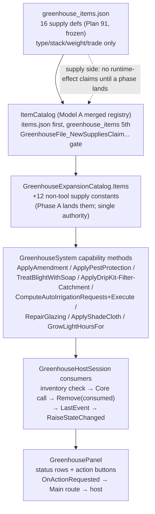
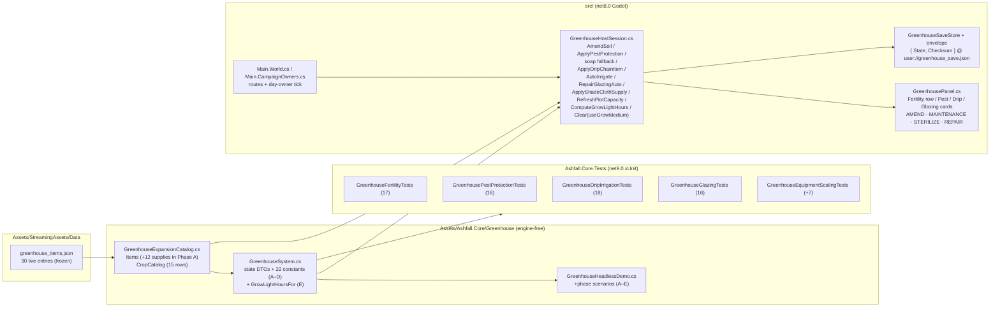
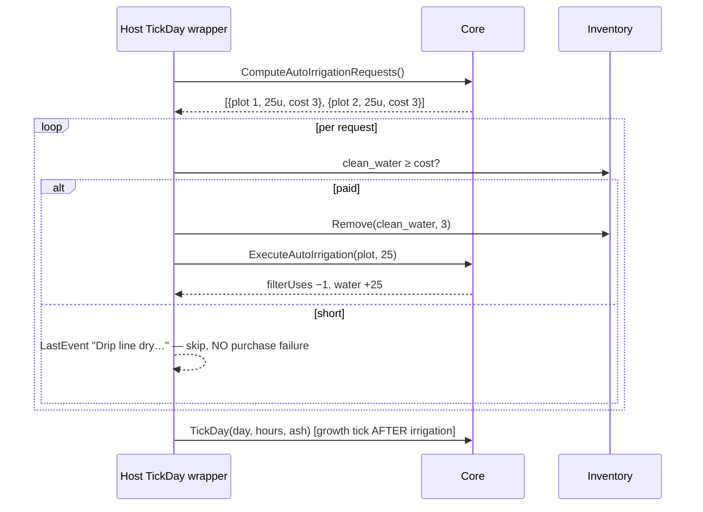

# PLAN 22 — Greenhouse Runtime Consumption of Fertilizer / Pest / Repair Items

> **Mission:** Make The Glass Orchard's runtime actually consume the supply
> ecosystem that Plan 91 authored — soil amendments, pest-control supplies,
> water-management kits, and structural repair materials — through additive
> Core simulation state and thin host consumption, with zero save-breaking
> changes and full determinism.
>
> **Authoritative context:** `docs/expansions/PHASE_STATUS_THE_GLASS_ORCHARD.md`
> (phase audit), `docs/greenhouse/PLAN91_CLOSEOUT.md` (item roster),
> `docs/greenhouse/GREENHOUSE_ITEM_CATALOG_AUTHORITY.md` (registry model).

---

## 0. Problem statement

Plan 91 shipped 16 greenhouse supplies that are valid, reachable, and
integrity-clean — but the greenhouse runtime consumes only seeds, blight
treatment, water items, and yields crops. The maintenance fantasy
("the drip line is failing; can we spare the parts?") has no runtime yet.
Plan 22 closes that gap without inventing a new system beyond the existing
GreenhouseSystem lifecycle.

## 1. Non-negotiable constraints

1. **Invariant 5** — all new simulation logic goes in
   `Assets/Ashfall.Core/Greenhouse/GreenhouseSystem.cs` (+ state DTOs);
   `GreenhouseHostSession` stays a thin consumer/wirer.
2. **Invariant 1** — zero engine references in Core.
3. **Invariant 4** — no new unseeded randomness. All new rolls extend the
   existing `SeededRng(_seed * 397 + blightRollCount)` pattern with its
   persisted counter; new counters must be persisted before use.
4. **Invariant 6 / save compatibility** — all new state fields are additive
   with defaults; `CopyInto` normalizes legacy saves (missing field ⇒
   default). Old saves load unchanged; new fields round-trip.
5. **No new item definitions** — Plan 91 IDs are stable inputs
   (`item_greenhouse_*`). If a niche is uncovered, reuse; never re-invent.
6. **Pure Core math + thin host consumption** — Core exposes capability
   methods returning outcomes; the host is the only layer that touches
   inventory.
7. **One phase per task** — phases below land separately, each with its own
   tests and green gates.

## 2. Design model (what consumes what)

```text
                    GreenhouseSystem (Core)
  ┌──────────────────────────────────────────────────────────┐
  │ fertility        ← compost / ash / fish emulsion          │
  │ pestProtection   ← sticky traps / pest mesh (days)        │
  │ blight treatment ← blight treatment / insecticidal soap   │
  │ drip state       ← drip kit / line filter / catchment kit │
  │ glazingCondition ← glass pane / UV sheeting / shade cloth │
  │ growth/water/blight/contamination (existing)               │
  └──────────────────────────────────────────────────────────┘
                    ↓ outcomes only (events + state)
          GreenhouseHostSession (inventory consumption)
```

Item semantic mapping (no new taxonomy):

| Plan 91 item | Type | Runtime role |
|---|---|---|
| `item_greenhouse_compost` | Material | fertility +, mild decontamination |
| `item_greenhouse_ash_fertilizer` | Material | cheap fertility + |
| `item_greenhouse_fish_emulsion` | Material | fertility ++, growth surge |
| `item_greenhouse_insecticidal_soap` | Material | blight treatment (low tier) |
| `item_greenhouse_sticky_traps` | Material | pest protection, days (small) |
| `item_greenhouse_pest_mesh` | Material | pest protection, days (large) |
| `item_greenhouse_drip_kit` | Material | enables auto-irrigation |
| `item_greenhouse_line_filter` | Filter | maintains auto-irrigation (uses) |
| `item_greenhouse_catchment_kit` | Material | cheapens auto-irrigation |
| `item_greenhouse_glass_pane` | Material | glazing repair, large |
| `item_greenhouse_uv_sheeting` | Material | glazing repair, small |
| `item_greenhouse_shade_cloth` | Material | ash-ingress damping, days |
| `item_planter_box` *(pre-91)* | Material | plot count (closes hardcoded-4 gap) |
| `item_grow_lamp` *(pre-91)* | Device | growLightHours bonus |
| `item_grow_medium` *(pre-91)* | Material | plot sterilization on clear/replant |

## 3. New state (all additive, all defaulted)

```csharp
// GreenhousePlotState (per plot)
public float fertility;        // 0–100, default DefaultFertility (50)

// GreenhouseState (per greenhouse)
public int   pestControlDays;   // 0 = none; ticks down once/day
public bool  dripInstalled;     // auto-irrigation enabled
public int   dripFilterUses;    // remaining auto-water events
public bool  catchmentInstalled;// auto-water item cost reduced
public float glazingCondition;  // 0–100, default 100
public int   shadeClothDays;    // ash-ingress damping, ticks down once/day
```

Legacy-save normalization in `CopyInto`: any restored `fertility <= 0` ⇒ 50
(0 is unreachable by design — clamps keep `fertility >= 5` — so 0 uniquely
identifies "field absent in old save"); `glazingCondition <= 0` ⇒ 100;
ints missing ⇒ 0/false. Old saves load and tick unchanged.

## 4. Tuning constants (single source: `GreenhouseSystem` consts)

| Constant | Value | Effect |
|---|---|---:|
| `CompostFertility` | +25 | `ApplyAmendment` |
| `CompostDecontamination` | −10 | soil contamination |
| `AshFertility` | +10 | `ApplyAmendment` |
| `EmulsionFertility` | +15 | `ApplyAmendment` |
| `EmulsionGrowthSurge` | +15 | instant `growth` + |
| `FertilityGrowthDenominator` | 200 | growth ×(0.75–1.25) around 50 |
| `FertilityDecayPerDay` | −0.5 | planted plots only |
| `FertilityCostPerHarvest` | −15 | on harvest |
| `StickyTrapDays` | +3 | pest protection window |
| `PestMeshDays` | +30 | pest protection window |
| `PestProtectionChanceMultiplier` | ×0.6 | on `BaseBlightChancePerDay` |
| `SoapBlightReduction` | −0.5 | plot blight (partial cure) |
| `DripDroughtBlightMultiplier` | ×0.5 | on `DroughtBlightRatePerDay` |
| `DripFilterUses` | 60 | per cartridge |
| `CatchmentSaving` | −1 unit | per auto-water, floor 1 |
| `GlazingDecayPerDay` | −0.4 | + ash-rate coupling below |
| `GlazingAshCoupling` | ×0.5 | decay += ashRate × 0.5 |
| `GlazingMinLightFactor` | 0.6 | light ×(0.6..1.0 by condition) |
| `PaneRepair` | +40 | glazing repair |
| `SheetingRepair` | +25 | glazing repair |
| `ShadeClothDays` | +20 | ash ingress ×0.5 window |

All multipliers are deterministic; the blight roll path is unchanged except
for the protection multiplier and drip drought factor feeding the *existing*
seeded roll.

## 5. Phases (each = one task, one commit)

### Phase A — Soil fertility loop (Core + host)
- `GreenhouseSystem.ApplyAmendment(plotIndex, amendmentId, out consumedId)`:
  validates item role, clamps fertility 5–100, applies decontamination /
  growth surge; returns consumed ID.
- `TickPlot`: fertility decay (planted only); growth multiplier
  `1 + (fertility − 50)/200` folded into the existing `growth +=` line.
- `Harvest`: `fertility −= FertilityCostPerHarvest`.
- Host `AmendSoil(plotIndex, itemId)`: inventory check → consume → call.
- Panel: fertility row on plot detail.
- Tests: amendment math, clamp, decay, harvest cost, legacy-save
  normalization, host consumption, roundtrip.

### Phase B — Pest protection + soap treatment (Core + host)
- `GreenhouseState.pestControlDays`; `TickDay` decrements once (not per plot)
  and multiplies outbreak chance while > 0.
- `ApplyPestProtection(itemId, out consumedId)` (traps/mesh add days).
- `TreatBlightWithSoap(plotIndex, out consumedId)`: partial cure
  (−0.5 blight); distinct from full `item_blight_treatment` cure — host
  fallback order becomes: blight treatment → soap → iodine pills.
- Tests: window decrement (exactly 1/day), chance multiplier effect on roll
  inputs (no roll in test — assert computed `chance` inputs), soap partial
  cure, consumption, roundtrip.

### Phase C — Auto-irrigation chain (Core + host)
- Core: `DripDroughtBlightMultiplier` applied in `TickPlot` when
  `dripInstalled`; expose `AutoIrrigationRequest` outcome
  (plots below 25 water → requested units) so the *host* spends inventory.
- Host: in `TickDay` wrapper — if `dripInstalled && dripFilterUses > 0`:
  for each planted plot under 25 water, consume
  `max(1, ⌈units/10⌉ − (catchmentInstalled ? 1 : 0))` clean water and
  `Water(...)`, decrement filter uses; when `dripFilterUses == 0`, drip is
  inert until a cartridge is applied.
- `ApplyDripKit/ApplyFilter/ApplyCatchment(itemId, out consumedId)`.
- Tests: enable→maintain→degrade chain, catchment saving, floor-1 cost,
  no water in inventory ⇒ no auto-water (no soft-lock), roundtrip.

### Phase D — Glazing condition + repairs (Core + host)
- `glazingCondition` decay in `TickDay`: `−0.4 − ashRate × 0.5` (shade cloth
  days halve the ash component). Light factor multiplier
  `lerp(0.6, 1.0, condition/100)` folds into `lightFactor`.
- `RepairGlazing(itemId, out consumedId)` (pane +40 / sheeting +25, clamp
  100); `ApplyShadeCloth(itemId, out consumedId)` (+20 days).
- New event `OnGlazingDegraded` (fires crossing 30) — narrative hook only.
- Panel: glazing status row + repair action.
- Tests: decay vs ash rate, shade damping, repair clamps, light-factor
  effect on growth timing, roundtrip.

### Phase E — Close pre-91 host gaps (host-only)
- Plot count from inventory: `EnsurePlots(max(4, inventory
  .CountById("item_planter_box")))` on setup + when inventory changes;
  `EnsurePlots` already refuses to remove occupied plots (safe).
- `growLightHours = 6 + 2 × min(2, lampCount)` in the day-owner tick call
  (host owns the call; Core signature unchanged).
- `Clear`/replant with `item_grow_medium`: consume 1 ⇒
  `soilContamination = 0` (sterile bed) — host-side `Clear(plotIndex,
  useGrowMedium: false)` overload.
- Tests: host-level plot scaling, light computation, medium consumption.

## 6. Test & gate matrix (per phase)

- xUnit: behavior math, clamp/normalization, host consumption, save
  roundtrip of every new field, determinism (same seed ⇒ same plot states).
- `--greenhouse-selftest`: extend `GreenhouseHeadlessDemo` with one scenario
  per phase (amendment growth delta, protection window, drip chain,
  glazing decay/repair) — gates must fail before, pass after.
- `--data-integrity-selftest`: must stay 0 errors (no new IDs).
- Full `dotnet test` + `dotnet build Ashfall.csproj` green per phase.
- Save compat: extend the existing envelope tests with a legacy-shape save
  (no new fields) asserting load + first-tick normalization.

## 7. Risks & mitigations

| Risk | Mitigation |
|---|---|
| Save incompatibility from new fields | additive + `CopyInto` normalization + roundtrip tests per phase |
| Determinism drift | all new effects are deterministic multipliers; any future roll reuses the persisted-counter reseed pattern |
| Host/ Core drift on item IDs | host reads `GreenhouseExpansionCatalog.Items` — extend the constants class with the 12 supply IDs in Phase A (single authority, no string literals) |
| Inventory soft-locks (drip without water) | no-water ⇒ no auto-water, explicit LastEvent; drip state persists |
| Scope creep into new systems | no weather/pest-fauna simulation — protection windows are counters, not agents |
| UI overload on plot detail | one status row + one action per loop |

## 8. Explicit non-goals

- No pest-fauna simulation, no weather coupling beyond the existing
  `ashContaminationRate` parameter, no irrigation network graph, no per-plot
  pipes, no real-time decay — the greenhouse tick remains day-granular.
- No changes to item definitions (Plan 91 roster is frozen authority).
- No new crafting recipes in Plan 22 (Plan 55 owns the chain).

## 9. Next prompt to run

> "Execute Plan 22 Phase A (soil fertility loop) per
> `docs/plans/PLAN_22_GREENHOUSE_RUNTIME_ITEM_CONSUMPTION.md` using
> ashfall-implement: Core `ApplyAmendment` + fertility in TickPlot/Harvest,
> host `AmendSoil`, GreenhouseExpansionCatalog supply constants, tests and
> greenhouse-selftest gates. One phase only."

---

# EXPANSION 2026-09-25 — Plan 22 Greenhouse Runtime Consumption: Full Integration Framework & Code Architecture

> **Nature of this expansion:** documentation only. The original plan text
> above is preserved byte-for-byte; everything below the separator was
> appended on 2026-09-25 as the full integration framework, code
> architecture, and honest implementation-status record for Plan 22. No
> source, data, or test file was touched to produce it.
>
> **Method:** every claim below was re-verified against the current tree on
> 2026-09-25 under AGENTS.md rule 7 ("a plan, audit, or test name is not
> proof that an API … still exists"). Where a document and the source
> disagree, the source wins and the disagreement is recorded, not smoothed
> over. Citations use `path:line` as of this date.

## Part I — Preamble and Implementation Status (read this first)

### I.1 Why this expansion exists

Plan 22 was authored as a five-phase integration design: make The Glass
Orchard's runtime actually consume the 16-supply ecosystem Plan 91 shipped,
plus close three pre-91 host gaps (plot count, grow-lamp light hours,
grow-medium sterilization). This expansion turns that design into a complete
engineering reference — architecture, per-phase contracts with worked
mathematics, panel surfaces, test anatomy, save-compatibility strategy,
governance, and failure analysis — so that the next implementer can re-land
each phase without re-deriving it, and so that nobody mistakes the
documentation trail for a live runtime.

The last point is the reason Part I comes first. Plan 22 has an unusual
history in this repository: an implementation log records all five phases as
**PASS** with exact verification results, a phase-status audit marks them
**DONE**, and a UI gap spec describes player-facing affordances built on top
of them — yet the current tree contains **none** of the Plan 22 code. The
discrepancy is real, diagnosable, and documented below. Everything else in
this expansion builds on that honest footing.

### I.2 Per-phase implementation status (three-way, verified 2026-09-25)

Legend — **implemented**: symbol verified present in current source;
**not implemented**: symbol verified absent from current source; **unverifiable**:
cannot be determined from the tree. "Logged PASS" means
`docs/plans/PLAN_22_GREENHOUSE_RUNTIME_ITEM_CONSUMPTION_IMPLEMENTATION_LOG.md`
records the phase as landed with verification results; it is history, not
current evidence.

| Phase | Scope | Logged | Current source verdict | Key negative evidence (2026-09-25) |
|---|---|---|---|---|
| **A — Soil fertility loop** | Core + host + panel + demo + tests | PASS (17 new tests; selftest 37/37) | **Not implemented** (removed after logging; never committed) | No `fertility` field, no `ApplyAmendment`, no `AmendSoil` anywhere in `*.cs` (repo-wide grep); no `GreenhouseFertilityTests.cs` on disk; `git log --all` for that file is empty |
| **B — Pest protection + soap** | Core + host + panel + demo + tests | PASS (18 tests; 50/50) | **Not implemented** (removed after logging) | No `pestControlDays`, `ApplyPestProtection`, `TreatBlightWithSoap`, `ComputeDailyBlightChance` in `Assets/Ashfall.Core/Greenhouse/GreenhouseSystem.cs`; host fallback order is blight treatment → iodine pills only (`src/Host/GreenhouseHostSession.cs:165-236`) — no soap step |
| **C — Drip auto-irrigation** | Core + host + panel + demo + tests | PASS (18 tests; 68/68) | **Not implemented** (removed after logging) | No `dripInstalled`, `dripFilterUses`, `catchmentInstalled`, `AutoIrrigationRequest`, `ComputeAutoIrrigationRequests`, `ExecuteAutoIrrigation` in `*.cs`; host `TickDay` is a plain forward + apiculture tick (`src/Host/GreenhouseHostSession.cs:353-363`) with no `AutoIrrigate()` |
| **D — Glazing condition + repairs** | Core + host + panel + demo + tests | PASS (16 tests; 84/84) | **Not implemented** (removed after logging) | No `glazingCondition`, `shadeClothDays`, `RepairGlazing`, `ApplyShadeCloth`, `OnGlazingDegraded`, `GlazingLightFactor` in `*.cs`; panel has no Glazing card; no greenhouse `"repair"` route in `src/` switch cases (the `"repair"` cases in `Main.Plans74_77.cs` / `Main.Plans198_201.cs` belong to other panels) |
| **E — Pre-91 host gaps** | Host (+ tiny pure-Core math per log) | PASS (7 tests; 89/89) | **Not implemented** (removed after logging) | `DefaultPlanterBoxCount = 4` still hardcoded (`src/Host/GreenhouseHostSession.cs:20`, used at `:35` and `:89`); no `RefreshPlotCapacity`, `ComputeGrowLightHours`, `GrowLightHoursFor`, `ApplyShadeClothSupply`, `RepairGlazingAuto` in `*.cs`; day owner still passes the literal `growLightHours: 6f` (`src/Main.CampaignOwners.cs:1071`); `Clear(int)` has no `useGrowMedium` overload (`src/Host/GreenhouseHostSession.cs:255-264`) |

Sub-artifact status (same three-way method, phase-agnostic):

| Artifact | Plan § | Current verdict | Evidence |
|---|---|---|---|
| `GreenhouseExpansionCatalog.Items` supply constants (12 non-tool IDs) | §7 risk table | **Not implemented** — `Items` carries only seeds, `PlanterBox`, `GrowLamp`, `LeadGlassPane`, `BlightTreatment`, `GrowMedium` + crop IDs (`Assets/Ashfall.Core/Greenhouse/GreenhouseExpansionCatalog.cs:16-65`) | Repo-wide grep for `Compost`/`ShadeCloth` etc. as catalog members: negative |
| All 22 tuning constants (§4 table) | §4 | **Not implemented** — none exist; the plan's table is fully prospective | `GreenhouseSystem.cs:104-143` consts are the base loop + Plan 64 nutrient/rotation sets only |
| New state fields (7 across plot/greenhouse DTOs) | §3 | **Not implemented** | `GreenhousePlotState` (`GreenhouseSystem.cs:19-53`) has `nutrientLevel`, `sameCropStreak`, `lastCropId` (Plan 64 era) — no `fertility`; `GreenhouseState` (`:55-65`) has no Plan 22 fields |
| `GreenhouseHeadlessDemo` phase scenarios | §6 | **Not implemented** — demo is at the pre-Plan-22 baseline: 24 checks (25 `Check(` occurrences minus the local helper definition), matching the "24/24 PASS" recorded in both `docs/expansions/PHASE_STATUS_THE_GLASS_ORCHARD.md` and `docs/greenhouse/PLAN91_CLOSEOUT.md` | `Assets/Ashfall.Core/Greenhouse/GreenhouseHeadlessDemo.cs` — scenarios are planting/irrigation/harvest/tainted/wheat-unlock/roundtrip only |
| Plan 22 xUnit suites (4 files, 69 tests) | §6 | **Not implemented** | On-disk greenhouse suites total 76 cases across 8 files (`GreenhouseSystemTests` 9, `GreenhouseCommandTests` 3, `GreenhouseCropExpansionTests` 6, `GreenhouseItemCatalogTests` 21, `GreenhouseEquipmentScalingTests` 3, `MicroLocationGreenhouseIntegrationTests` 13, `Greenhouse/GreenhousePhase4LoopClosureTests` 17, `Production/Plan87_91RelicGreenhouseIntegrationTests` 4) — none are Plan 22 suites |
| `GreenhouseEquipmentScalingTests.cs` name | §5 Phase E | **Present but not what the log describes** — the committed file holds 3 pre-Plan-22-shaped tests (`GrowLightInput_ScalesCropGrowthAndCapsAtCropRequirement`, `EnsurePlots_GrowsAndRemovesOnlyTrailingFallowPlots`, `HarvestAndClear_KeepTheCurrentResidualContaminationContract`); it pins the existing `growLightHours` *parameter* effect, not inventory-driven scaling | `Ashfall.Core.Tests/GreenhouseEquipmentScalingTests.cs`; the log's Phase E claims a 7-test theory table over `GrowLightHoursFor`, which does not exist. Committed history (reconciled with the companion log's Part V.8; see Part I.3, trace 2): the file entered the graph at `04884519` as a six-member Phase E remnant over `GrowLightHoursFor` and was rewritten to these 3 tests at `660cb595` — survivorship, but not coincidental |
| `docs/ui/GREENHOUSE_UI_GAP_SPEC.md` §2 ("what already exists") | — | **Stale** — describes the removed era (8 status cards incl. Pest Control / Drip Line / Glazing, Fertility row, REPAIR button). Its §2 is today a design target, not a description | Compare `src/UI/GreenhousePanel.cs:500-620`: detail rows are Status/Seed/Growth/Moisture/Soil mSv/Blight + blight-risk decomposition; actions are PLANT/TREAT/CLEAR/HARVEST/DOSE NUTRIENTS |
| Panel "Plan 22 UI gap register" comment | — | **Live archaeological trace** — `src/UI/GreenhousePanel.cs:564-568` records: "Removed (concurrent worker trimmed catalog/host): GAP-2 amend, GAP-4 maintenance, GAP-5 sterilise, GAP-8 degraded copy", while GAP-1 seed picker, GAP-3 supply rail, GAP-7 readiness+dry columns remain listed as open | Read directly; see Part II.4 |

### I.3 The trim event: what actually happened (best supported reconstruction)

Assembled from four independent, mutually consistent traces — no single one
is sufficient, together they are conclusive that **Plan 22 phases A–E were
implemented in a working tree, verified, logged, and then removed — the
runtime code before any of it reached a commit, with one test-file remnant
slipping through (trace 2 below)**:

1. **The implementation log exists and is committed**
   (`docs/plans/PLAN_22_GREENHOUSE_RUNTIME_ITEM_CONSUMPTION_IMPLEMENTATION_LOG.md`,
   first committed in `04884519 "chore: sync working tree — flagship
   systems, docs, tests, and host wiring"`, dated 2026-09-05). It records
   all five phases PASS with phase-by-phase gate progressions
   (24 → 37 → 50 → 68 → 84 → 89 headless checks) and suite totals
   (7033 → 7068 → 7091–7094 → 7110 → 7121).
2. **No Plan 22 production code was ever committed — with one test-file
   exception, reconciled against the companion log.** `git log --all` for
   `Ashfall.Core.Tests/GreenhouseFertilityTests.cs` (and for the other three
   named Plan 22 suites) returns nothing. The most recent commits touching
   `GreenhouseSystem.cs` (`660cb595`, `2d37f6f0`, `9b4985d0`, `4d1feb89`,
   `1b079d92`) are Plan 64-era, audio-repair, and hygiene work. The
   exception, which narrows this trace's original wording: the companion
   log's 2026-09-25 expansion (its Part V.8 removal forensics) documents a
   **six-member Phase E test remnant** that *was* committed inside
   `Ashfall.Core.Tests/GreenhouseEquipmentScalingTests.cs` — six members
   referencing the never-committed `GreenhouseSystem.GrowLightHoursFor`
   entered the graph at `04884519` (2026-09-05), and `660cb595`
   (2026-09-15) rewrote the file to the three pre-Plan-22-shaped tests on
   disk today. This expansion re-ran those reads and confirms them: the
   `04884519` snapshot holds 6 test members and 6 `GrowLightHoursFor`
   occurrences in that one file, while the same snapshot's
   `GreenhouseSystem.cs` and `GreenhouseHostSession.cs` are symbol-free —
   so the trim's result was already frozen on 2026-09-05, which dates the
   trim itself **before 2026-09-05** (not merely before this expansion).
   The strict claim therefore stands as: the five phases' *runtime* code
   was never committed, and no Phase A–D test suite ever was either.
   Current working-tree files for Core, host, panel, and demo are **clean
   against HEAD** (`git status` empty for those paths) — so the absence is
   the committed state, not uncommitted local loss.
3. **The panel preserves the removal note.**
   `src/UI/GreenhousePanel.cs:564-568` — a comment block titled "Plan 22 UI
   gap register (trimmed to current host surface)" — states that GAP-2
   (amend), GAP-4 (maintenance), GAP-5 (sterilise), and GAP-8 (degraded
   copy) were "Removed (concurrent worker trimmed catalog/host)". This is
   written from the implemented era's perspective: those gaps could only be
   "removed to match" a host surface that had lost `AmendSoil`,
   `ApplyDripChainItem`, `ApplyPestProtection`, `ApplyShadeClothSupply`, and
   the sterilize overload.
4. **The doc set still speaks with the implemented era's voice.**
   `docs/expansions/PHASE_STATUS_THE_GLASS_ORCHARD.md:50-54` strikes through
   its risk-ranked next actions as "DONE (Plan 22 Phase A/C/D/B/E)" and
   names APIs (`RefreshPlotCapacity`, `ComputeGrowLightHours`,
   `GrowLightHoursFor`, `Clear(plotIndex, useGrowMedium)`) that are absent
   from source. `docs/ui/GREENHOUSE_UI_GAP_SPEC.md:30-35` describes a panel
   that no longer exists. No KNOWN_DEBT entry records the trim (KNOWN_DEBT's
   only greenhouse row is DEBT-PLAN168-WATER-DELIVERY, retired).

Under AGENTS.md rule 7 the consequence is mandatory: **the tree, not the
log, is authoritative**. The correct standing status of Plan 22 is
"designed, once landed in a working tree, currently unlanded" — and every
`DONE`/`PASS` marker in the Plan 22 doc set must be read as historical until
re-landed code makes it true again. This expansion is written so that
re-landing can be mechanical rather than archaeological.

### I.4 What survives in the current tree that Plan 22 depends on

The plan's foundations are all still present and verified — nothing the
design needs was lost in the trim:

| Dependency | Status | Verified anchor |
|---|---|---|
| Plan 91's 16 supply IDs in `greenhouse_items.json` | Present, integrity-clean | Repo grep over `Assets/StreamingAssets/Data/` — all 16 `item_greenhouse_*` IDs resolve (plus 3 pre-91: `item_planter_box`, `item_grow_lamp`, `item_grow_medium`); stats extracted in Part V, item-roster chapter |
| The additive-state precedent (Plan 64 nutrient band) | Present | `GreenhousePlotState.nutrientLevel` (`GreenhouseSystem.cs:39`), `ApplyNutrients` (`:282-291`), decay in `TickPlot` (`:512`) |
| The persisted-counter reseed pattern | Present, unchanged | `new SeededRng(unchecked(_seed * 397 + (int)(_state.blightRollCount & 0x7FFFFFFF)))` + `_state.blightRollCount++` (`GreenhouseSystem.cs:515-516`); persisted via `CopyInto` (`:178`) |
| `CopyInto` legacy-normalization conventions | Present | `Math.Clamp(s.nutrientLevel, 0f, 1f)`, `lastCropId ?? string.Empty`, `Math.Max(0L, src.blightRollCount)` (`GreenhouseSystem.cs:196-198, 178`) |
| `EnsurePlots` refuses to remove occupied plots | Present — the Phase E premise holds verbatim | `GreenhouseSystem.cs:216-227`: the shrink loop `break`s when the trailing plot is not fallow |
| Host consumption pattern (check → Core → consume → raise) | Present | `GreenhouseHostSession.Plant` (`:98-114`), `Water` (`:116-132`), `ApplyNutrients` (`:273-291`) |
| Save envelope + checksum + legacy bare-state fallback | Present | `GreenhouseSaveStore` / `GreenhouseSaveEnvelope` (`src/Host/GreenhouseHostSession.cs:381-449`) |
| Day-owner tick with hardcoded light/ash | Present — the Phase E target is live | `src/Main.CampaignOwners.cs:1071`: `_m._greenhouse.TickDay(day, growLightHours: 6f, ashContaminationRate: 0.04f)` |
| Hardcoded 4-plot capacity | Present — the Phase E target is live | `GreenhouseHostSession.cs:20` + constructor `:35` + `Create` `:89` |
| `greenhouse.blight_partial` result key (soap's future hook) | Present — already used by the iodine fallback | `GreenhouseHostSession.cs:178` (single occurrence; the second fallback branch mutates `p.blight` at `:217` without re-emitting the key) |

### I.5 How to read the rest of this expansion

- **Part II** audits the current authority (Core, host, panel, catalogs,
  save path, tests) in today's state — the base every phase must integrate
  into.
- **Part III** states the integration framework: invariants, tier flow, the
  outcomes-only event contract, save/determinism/integrity rules.
- **Part IV** is the code architecture: module map, per-field and
  per-method deep specs, sequence walkthroughs.
- **Part V** is the bulk: one engineering chapter per phase A–E, plus
  governance chapters for constants, the item roster, save normalization,
  soft-lock analysis, and non-goals. Each phase chapter opens with its
  three-way status line so the specification can never masquerade as shipped
  code.
- **Part VI** crosses system boundaries and designs the restrained emergent
  consequences.
- **Part VII** is verification and acceptance, including the anatomy of the
  current `--greenhouse-selftest` and the gate ladder, with the trim event
  as the worked rollback example.
- **Part VIII** holds appendices: glossary, constant and item vocabulary,
  scenario walkthroughs, open questions, a closing note, the test-case
  catalog, and the per-phase review checklist — followed by five further
  appendices, I–M: a 30-day integration ledger, a documentation
  reconciliation register, the evidence appendix behind every "verified"
  claim, role-based reading paths, and a reviewer FAQ.

A naming warning before anything else: `INTEGRATION_PLANS.md` contains
entries for a *different* "Plan 22" (the C1 one-food-authority wave —
`Consume(survivorId, itemId, scale)`, kitchen and crew table, medicine
decisions; marked DONE 2026-09-15). That plan is unrelated to this one. When
searching governance files for this plan's status, disambiguate on
"greenhouse" or the file name
`PLAN_22_GREENHOUSE_RUNTIME_ITEM_CONSUMPTION*`, never on the bare number.

---

## Part II — Current Authority Audit (the tree as it stands, 2026-09-25)

### II.1 `GreenhouseSystem` (Core authority) — full current API and state

File: `Assets/Ashfall.Core/Greenhouse/GreenhouseSystem.cs` (559 lines,
committed clean, engine-free — `using System`, `System.Collections.Generic`,
`Ashfall.Core.Greenhouse`, `Ashfall.Core.PlayerCommand` only; Invariant 1
holds today).

**State DTOs (as committed):**

```csharp
GreenhousePlotState {
    int plotIndex;  string seedItemId;  int stage;      // GreenhouseStage enum
    float growth;   float water;       float soilContamination;
    float blight;   int plantedDay;
    float nutrientLevel;   // Plan 64: band 0..1, additive, legacy restores 0
    int sameCropStreak;    // Plan 87 §27 rotation ledger
    string lastCropId;     // survives harvest/reset — the soil remembers
}

GreenhouseState {
    string saveId = "greenhouse";           // GreenhouseExpansionCatalog.SaveId
    List<GreenhousePlotState> plots;
    bool preWarWheatUnlocked;  int totalHarvests;
    long blightRollCount;                   // A11 persisted roll counter
    ApicultureState? apiculture;            // nested sub-system state
}
```

**Constants (all of them, with current values — this is the base against
which the Plan 22 table in Part V must be re-verified value-by-value):**

| Constant | Value | Role today |
|---|---:|---|
| `MaxWater` | 100f | plot water clamp |
| `MaxContamination` | 100f | soil contamination clamp |
| `GrowingThreshold` | 33f | Sprouting → Growing stage gate |
| `DroughtBlightRatePerDay` | 0.25f | blight added per dry day (also folds into `ApplyBlight` on drought) |
| `OutbreakBlightStep` | 0.3f | blight added on a won outbreak roll |
| `BaseBlightChancePerDay` | 0.06f | outbreak roll base |
| `TaintedWaterContaminationPerUnit` | 1.5f | tainted irrigation cost |
| `ResidualContaminationAfterHarvest` | 0.5f | contamination retained after `ResetPlot` |
| `NutrientItemId` | `item_hydroponic_nutrients` | Plan 64 canonical dose item |
| `NutrientApplicationLevel` | 0.5f | band per dose |
| `NutrientDecayPerDay` | 0.1f | recurring-cost decay |
| `NutrientBlightRiskReduction` | 0.04f | subtractive prevention at full band |
| `NutrientFullBandLevel` | 0.5f | band at which full reduction applies |
| `RotationBlightStepPerStreak` | 0.015f | monoculture pressure per repeat |
| `MaxRotationStreakCount` | 10 | streak ceiling |

Note what is *not* here: every Plan 22 constant from the §4 table
(`CompostFertility` … `ShadeClothDays`). The nearest living relatives are
`DroughtBlightRatePerDay` and `BaseBlightChancePerDay`, which the Plan 22
constants `DripDroughtBlightMultiplier` and
`PestProtectionChanceMultiplier` are specified to modulate — they will
multiply *these* values when landed.

**Public API surface today (the extension points Plan 22 names):**

| Member | Signature shape | Notes for Plan 22 |
|---|---|---|
| `EnsurePlots(int planterBoxCount)` | grows plots; shrink loop stops at first occupied trailing plot | Phase E's capacity driver; already safe against crop destruction |
| `Plant(int, string, int, out string)` | catalog lookup, unlock gate, fallow gate, rotation ledger update, event | the capability-method pattern Phase A's `ApplyAmendment` mirrors |
| `Water(int, float, bool)` | adds water, tainted adds contamination | drip chain's commit target |
| `ApplyNutrients(int, out string)` | Plan 64; blocks fallow/failed; adds 0.5 band | the closest structural precedent for every Phase A–D apply method |
| `GetBlightRiskProfile(int, bool)` | pure read → `BlightRiskProfile` struct | Phase B's `ComputeDailyBlightChance` must keep this decomposition truthful (the struct's `FinalChancePerDay` must equal the tick roll's input or the UI lies) |
| `Harvest(int)` | mature-only; yields clean/tainted by tolerance; `ResetPlot` | Phase A hooks fertility cost here; must decide fertility's survival through `ResetPlot` (log says: survives — bed quality persists) |
| `Clear(int)` | `ResetPlot` only | Phase E extends with `useGrowMedium` overload |
| `PreviewTreatBlight` / `ExecuteTreatBlight` / `TreatBlight(int, out string)` | command-contract path (stale-preview rejection) + direct path | Phase B inserts soap between treatment and iodine in the **host** fallback, not here — Core's `TreatBlight` remains the full-cure authority |
| `SurgeContamination(float)`, `UnlockPreWarWheat()` | external drivers | untouched by all phases |
| `TickDay(int, float growLightHours, float ashContaminationRate)` | loops `TickPlot` | Phases B/C/D add greenhouse-wide pre/post work here (window decrement, glazing weathering, drip drought factor); Phase E changes only the *host's* argument |
| `CaptureState` / `RestoreState` / `CopyInto` | deep copy, normalization | the save-compat seam (Part V, save-normalization chapter) |

**Events today:** `OnCropPlanted(int, string, int)`, `OnCropMatured(int,
string)`, `OnCropHarvested(GreenhouseHarvest)`, `OnBlightOutbreak(int)`,
`OnPlotDriedOut(int)`, `OnCropFailed(int)`. All are facts-after-the-fact;
none carry gameplay decisions. `OnGlazingDegraded` (Phase D) joins this
list as the only greenhouse-wide (non-plot) event, which is why the log
records it firing "with zero plots".

**The tick math as it stands** (needed to place every Plan 22 fold-in
point exactly; `TickPlot`, `GreenhouseSystem.cs:454-519`):

```text
fallow/mature/failed  → skip
water  -= def.WaterPerDay            (floor 0); driedOut event on 0-crossing
if water > 0:
    lightFactor = clamp(growLightHours / def.LightHoursPerDay, 0, 1)   [1 if crop needs no light]
    daysToMature = max(1, def.GrowthHoursToMature / 24)
    growth += lightFactor * (100 / daysToMature)
    stage transitions at 33 (Sprouting→Growing) and 100 (→Mature, event)
soilContamination += ashContaminationRate            (if ash > 0)
if !hasWater: blight += DroughtBlightRatePerDay      (via ApplyBlight)
chance = clamp( BaseBlightChancePerDay * (1 - def.BlightResistance)
                * clamp(soilContamination/100, 0, 1) * (hasWater ? 1 : 2.5)
                - NutrientBlightRiskReduction * min(1, nutrientLevel / 0.5)
                + RotationBlightStepPerStreak * min(10, sameCropStreak),  0, 1)
nutrientLevel = max(0, nutrientLevel - 0.1)
roll: SeededRng(_seed*397 + blightRollCount++) < chance  → blight += 0.3
```

The Plan 22 fold-in points, by phase, against this exact code: Phase A
multiplies the `growth +=` line by `1 + (fertility − 50)/200` and decays
fertility for planted plots; Phase B multiplies `chance` by 0.6 while
`pestControlDays > 0` and decrements the window once per `TickDay` (not per
plot); Phase C multiplies the drought rate by 0.5 while `dripInstalled` and
feeds the host's request/consume loop; Phase D multiplies `lightFactor` by
`lerp(0.6, 1.0, glazingCondition/100)` and weathers glazing once per
`TickDay` with the ash coupling. None of these exist today — the formulas
above are the untouched baseline.

**Determinism seams today:** the only RNG consumer is the blight roll, on
the persisted `blightRollCount` counter (A11). The host's apiculture tick
uses `new SeededRng(DefaultSeed + currentDay)` — day-derived, deterministic,
accepted per the phase-status doc's "unresolved assumptions". Plan 22's
Invariant 4 clause ("new counters must be persisted before use") exists
precisely so that any future roll added by a phase joins this pattern rather
than seeding from anything unpersisted.

### II.2 `GreenhouseHostSession` (host consumer) — current wiring

File: `src/Host/GreenhouseHostSession.cs` (450 lines, `net8.0` Godot host;
`using Godot` present — host-only, correct).

- **Construction:** `DefaultSeed = 1986`; `DefaultPlanterBoxCount = 4`
  (`:20-21`); constructor calls `System.EnsurePlots(DefaultPlanterBoxCount)`
  (`:35`) — this is the hardcoded-4 gap Phase E removes. Six Core events are
  wired into `LastEvent` strings + `RaiseStateChanged()` (`:37-68`);
  apiculture events likewise (`:71-74`).
- **`Create` factory (`:77-96`):** new session → `TryLoad()` from
  `GreenhouseSaveStore`; on hit, `RestoreState` + apiculture restore; on
  miss, fresh `EnsurePlots(4)` + default hive install + plot linking
  (`plot_0..plot_3`). Note for Phase E: a restored save bypasses
  `EnsurePlots` entirely today — capacity follows the save, not the
  inventory, until re-landing adds a refresh call on that path too.
- **Consumption methods:** `Plant` (count → `System.Plant` → `Remove(consumed, 1)`
  → raise), `Water` (`requiredUnits = ⌈units/10⌉` of `clean_water` or
  `irradiated_water` → `Remove` → `System.Water`), `TreatBlight` /
  `ExecuteTreatBlight` / `PreviewTreatBlight` with the iodine fallback,
  `Harvest` (yield × apiculture pollination bonus → `Add`), `Clear`,
  `ApplyNutrients`. These five are the complete inventory-touching surface;
  the Phase A–D host methods (`AmendSoil`, `ApplyPestProtection`, soap
  fallback step, `ApplyDripChainItem`, `AutoIrrigate`, `RepairGlazingAuto`,
  `ApplyShadeClothSupply`) are all absent.
- **The iodine fallback's shape matters for Phase B.** When
  `item_blight_treatment` is missing, the host *directly mutates plot state*
  (`p.blight = Math.Max(0f, p.blight - 0.5f)`, `:173` and `:217`) — a
  documented precedent (the log's Phase E cites it as "the established
  iodine-fallback precedent" to justify the sterilize overload's direct
  mutation). Phase B's soap step is specified to route through Core
  (`TreatBlightWithSoap`) instead, which is the cleaner of the two patterns;
  the iodine branch remains as legacy.
- **`TickDay` wrapper (`:353-363`):** forwards `(currentDay, growLightHours
  = 6f, ashContaminationRate = 0.05f)` to `System.TickDay`, then ticks
  apiculture at 22 °C / radiation 2.0 with `SeededRng(DefaultSeed +
  currentDay)`, then raises. Phase C inserts `AutoIrrigate()` *before* the
  growth tick; Phase B's once-per-day window decrement happens inside Core's
  `TickDay`, not here.
- **Save:** `CaptureSave()` stamps apiculture into the state envelope;
  `GreenhouseSaveStore` persists `{ State, Checksum }` JSON (indented,
  `IncludeFields`) at `user://greenhouse_save.json` through
  `SaveStoreHub.FromCodec`; decode verifies the checksum (missing or
  mismatched → `InvalidOperationException`) and falls back to legacy
  bare-state decode. `TryCapturePersisted` exposes exact bytes for envelope
  tests. All new Plan 22 fields ride inside `GreenhouseState`/`GreenhousePlotState`
  and therefore inherit this path with zero store changes — the entire save
  story is `CopyInto` normalization (Part V).

### II.3 Day-owner and routing (Main partials)

- `src/Main.CampaignOwners.cs:39` — `greenhouse_foundry` registered as a
  phase-2 campaign-day owner. `:1066-1079` — the tick: a comment pins that
  the greenhouse growth authority is ticked "exactly once inside Core", then
  `_m._greenhouse.TickDay(day, growLightHours: 6f, ashContaminationRate:
  0.04f)`. Phase E replaces the `6f` literal with `ComputeGrowLightHours()`;
  the ash rate stays authored here (and its small current value — 0.04 — is
  load-bearing for the Phase D worked example in Part V).
- Construction lives in `Main.World.cs` (`_greenhouse: GreenhouseHostSession`,
  `SetupGreenhouse()`), per the phase-status audit; no Plan 22 routes exist
  in any `Main.*.cs` action switch today (the `"repair"` cases in
  `Main.Plans74_77.cs` / `Main.Plans198_201.cs` belong to other panels; the
  greenhouse action switch handles `plant`/`water`/`treat`/`clear`/
  `harvest`/`dose_nutrients`/apiary verbs only).

### II.4 `GreenhousePanel` (UI) — current surface

File: `src/UI/GreenhousePanel.cs` (805 lines). Detail rows per plot:
Status, Seed, Growth %, Moisture (critical < 15, amber < 30), Soil mSv
(critical > 70, entropy > 40), Blight %, plus the Plan 64 blight-risk
decomposition row (band + contam/drought/fed/monoculture contributors) and
two `MakeSmall` hints (unfed crop; rotation pressure). Actions: PLANT,
TREAT, CLEAR, HARVEST, DOSE NUTRIENTS. Watering section: CLEAN 25 / CLEAN 50
/ TAINTED 50 with stock-gated disabling (GAP-6 landed).

The gap-register comment (`:564-568`) is quoted in Part I.2; its four
"removed" entries (amend, maintenance, sterilise, degraded copy) map exactly
onto Phases A, B+C, E, and D respectively — one more confirmation that the
panel once rendered all five phases and was trimmed back.

### II.5 Catalogs and data

- `GreenhouseExpansionCatalog` (`Assets/Ashfall.Core/Greenhouse/GreenhouseExpansionCatalog.cs`,
  346 lines): `SaveId = "greenhouse"`; `Items` constants (seeds ×14 incl.
  `SeedPacketsMixed` and the two winter seeds, `PlanterBox`, `GrowLamp`,
  `LeadGlassPane`, `BlightTreatment`, `GrowMedium`, 12 crop IDs +
  `TaintedFood`); `Locations`, `Events` (six narrative events incl.
  `GlassBreaks` — a natural, *unused*, narrative anchor for Phase D's
  `OnGlazingDegraded`), `Flags`, `Lore`; `CropCatalog` with 15 `CropDef`
  rows (12 base + mixed-packet alias + 2 winter) and an ordinal
  `Get(seedItemId)` dictionary lookup.
- **No supply constants.** The 12 non-tool Plan 91 IDs
  (`Compost` … `ShadeCloth`) that Phase A adds to `Items` are absent; host
  code today references only literal `"clean_water"` / `"irradiated_water"`
  / `"iodine_pills"` outside the catalog, plus the catalog's own
  `BlightTreatment`. Plan 22's rule (extend the constants class; no string
  literals in runtime code) has a pre-existing violation family to clean up
  when landed — the water/iodine literals — which is in-scope only as far as
  the new supplies are concerned; the others are noted here as debt, not
  assigned to Plan 22.
- `greenhouse_items.json` (`Assets/StreamingAssets/Data/`): 30 live entries
  (PLAN91_CLOSEOUT), snake_case, wrapped `{ schema_version, items }`, 5th of
  ten files in the merged Model A registry
  (`GREENHOUSE_ITEM_CATALOG_AUTHORITY.md`): `items.json` loads first and
  wins collisions; duplicates skip silently. The full 19-item extraction
  with stats is tabulated in Part V's item-roster chapter.
- Integrity posture: `--data-integrity-selftest` 0 errors; the CI gate
  `GreenhouseFile_NewSuppliesClaimNoConsumableEffectFields` enforces that
  supply *descriptions* claim no runtime effect — **when Plan 22 phases
  land, this gate's premise changes** (descriptions may then truthfully
  reference effects), and the gate must be updated *by* the phase that makes
  the claims true, not before and not after. This ordering constraint is
  part of each phase's acceptance below.

### II.6 Tests on disk (the receiving test surface)

| Suite | Cases | Covers today |
|---|---:|---|
| `GreenhouseSystemTests.cs` | 9 | core lifecycle |
| `GreenhouseCommandTests.cs` | 3 | preview availability, stale rejection without mutation, fresh execute |
| `GreenhouseCropExpansionTests.cs` | 6 | roster/crop curves |
| `GreenhouseItemCatalogTests.cs` | 21 | Plan 91 registry (incl. 30-entry registration) |
| `GreenhouseEquipmentScalingTests.cs` | 3 | `growLightHours` input effect; trailing-fallow plot removal; residual-contamination contract (name overlaps Phase E's suite; content is pre-Plan-22) |
| `MicroLocationGreenhouseIntegrationTests.cs` | 13 | ruined-greenhouse micro-location path |
| `Greenhouse/GreenhousePhase4LoopClosureTests.cs` | 17 | Plan 64 nutrient/loop closure |
| `Production/Plan87_91RelicGreenhouseIntegrationTests.cs` | 4 | relic/integration seams |

Plus the headless gate: `--greenhouse-selftest` → `GreenhouseHeadlessDemo.Run`,
24 checks (enumerated in Part VII). The four Plan 22 suites named in the
implementation log (`GreenhouseFertilityTests` 17, `GreenhousePestProtectionTests`
18, `GreenhouseDripIrrigationTests` 18, `GreenhouseGlazingTests` 16 — 69
tests) do not exist; the log's Phase E "7 tests" would extend the existing
equipment-scaling file to 10, which has not happened.

### II.7 Growth since the plan was written (context drift the implementer must know)

- **Plan 64's nutrient band and the rotation ledger landed** (B5–B8 waves):
  they are now the living proof of the plan's additive-state recipe — DTO
  field + `CopyInto` normalization + decay + a capability method + a host
  consumer + a UI row + pure risk decomposition. Plan 22's phases copy this
  recipe; Part IV specs are written to be drop-in consistent with it.
- **Apiculture** is nested into `GreenhouseState` (harvest bonus, hive
  events) — the pollination bonus multiplies `Harvest` yields in the host,
  which Phase A's worked examples must account for when asserting host-side
  yield totals (Core-side `amount` is unaffected).
- **Seasonal crops** (frost pea, glacier greens) and the mixed-packet alias
  extended `CropCatalog` to 15 rows; fertility growth multipliers are
  crop-agnostic (they multiply whatever the crop's own curve produces), so
  no Plan 22 constant needs per-crop values.
- **Save store migration** to `SaveStoreHub` codec façade happened
  post-plan (`GreenhouseSaveStore` now delegates path/atomicity to the
  service while preserving the exact envelope bytes). Plan 22's §6 wording
  ("extend the existing envelope tests with a legacy-shape save") still
  applies; the envelope tests live against the codec-based store now.
- **The trim itself** (Part I.3) is the biggest drift: the plan's §9 "next
  prompt" was already run once, end to end — and its outputs are gone from
  the tree.

---

## Part III — Integration Framework

### III.1 The four governing invariants, applied to Plan 22

**Invariant 1 — zero engine references in Core.** Every new type below
(`GreenhouseIrrigationRequest`, the amended DTOs, the capability methods)
lives in `Assets/Ashfall.Core/Greenhouse/` with `System.*` usings only. The
existing file's import list is the whitelist. The test target
(`Ashfall.Core.Tests`, `net9.0`) exercises Core contracts directly; host
behavior is build-verified (the Godot host assembly is not
xUnit-referenceable — the implementation log's Phase E records exactly this
limitation), with runtime paths covered by the headless selftest.

**Invariant 4 — no new unseeded randomness.** Phases A–E as designed add
**zero** RNG consumers: amendment, protection windows, drip economics,
glazing weathering, and light factors are all deterministic functions of
state and the day's inputs. This is deliberate and must stay true: any
future change that makes, say, pane installation probabilistic must (a) add
a persisted counter beside `blightRollCount`, (b) reseed as
`new SeededRng(unchecked(_seed * 397 + (int)(counter & 0x7FFFFFFF)))`, (c)
increment only immediately adjacent to the draw, and (d) round-trip the
counter through `CopyInto` with a non-negative clamp. The pattern's purpose
is that a restored save *continues* the stream rather than replaying it;
`GreenhouseSystem.cs:515-516` is the reference implementation and its
comment (513–514) is the contract.

**Invariant 5 — Core owns simulation; host stays thin.** The division that
Phase A–D capability methods encode:

| Concern | Owner |
|---|---|
| Does this item do anything to this plot/greenhouse? | Core (validation inside `Apply*`) |
| How much fertility/water/light/blight changes | Core (constants + math) |
| Whether the player owns the item | Host (`InventoryHost.Inventory.CountById` before the Core call) |
| Removing the item from inventory | Host only, **after** Core accepts (`out consumedId`) |
| Player-visible sentence | Host (`LastEvent`), composed from Core outcomes |
| Rendering state | Panel (reads DTOs / pure Core reads only) |

The iodine fallback's direct `p.blight` mutation is the sanctioned exception
that proves the rule: it is host-side, but it predates the command-contract
path and is cited by the log as precedent for exactly one further
mutation — Phase E's grow-medium sterilization. Everything Plan 22 adds
goes through Core. A reviewer rejecting a new `plot.X = …` in host code is
correct even though two precedents exist.

**Invariant 6 — save compatibility by additive fields + normalization.**
All seven new fields have defaults; old saves deserialize with fields
missing → defaults; `CopyInto` re-derives invariants (clamp, sentinel
repair) on both capture and restore. The subtle part — which values are
"absent" versus legitimate — is its own chapter (Part V, save
normalization): fertility uses the `<= 0 ⇒ default` sentinel trick because
its clamps make 0 unreachable, while glazingCondition cannot use it (0 is a
ruined-but-real value) and instead relies on the DTO field initializer. The
implementation log records this exact divergence as Phase D's finding; the
spec below adopts it as the rule: **sentinel normalization only where the
design makes the sentinel unreachable; field-initializer defaults
everywhere else.**

### III.2 Tier-by-tier flow (item definition → player-visible outcome)



Rules at each tier:

1. **Data tier:** Plan 91 definitions are frozen authority (plan constraint
   5). A phase never edits item JSON. The integrity gate's
   "no-consumable-effect-claims" premise is *relaxed for exactly the fields
   the landing phase makes true*, in the same phase.
2. **Catalog tier:** IDs become `const string` members the day the first
   consumer lands (Phase A). Runtime code never spells a supply ID as a
   literal. (Pre-existing literals for water/iodine are debt, not blockers.)
3. **Core tier:** capability methods return `bool` + `out consumedId` (the
   `Plant`/`ApplyNutrients` shape) or pure-read structs
   (`AutoIrrigationRequest[]`, `GlazingLightFactor()`); they never touch
   inventory and never know whether an item is "in hand".
4. **Host tier:** one method per player intent, following
   `ApplyNutrients(int)`'s shape: explicit failure `LastEvent` on missing
   stock or Core rejection; never consume on failure; always
   `RaiseStateChanged()`. Multi-item intents get one entry point with
   deterministic internal preference (log's Phase C: `ApplyDripChainItem`;
   Phase D: `RepairGlazingAuto` pane-preferred-then-sheeting) rather than
   exposing item-choice complexity to the route layer.
5. **Panel tier:** one status row + at most one action per loop (plan §7's
   UI-overload mitigation); state read from DTOs and pure Core reads; every
   state also rendered as text (`Nd`, `DRY`, `%`), never color alone.

### III.3 The "outcomes only" event contract

Core events state facts that already happened:
`OnGlazingDegraded(plot-free)` fires on the downward crossing of 30 — after
the mutation, once, and again only after a repair re-crosses. The host maps
facts to sentences in `LastEvent`; it never decides gameplay in a handler.
This matters most for Phase D because the crossing event is greenhouse-wide:
it must fire even when `plots.Count == 0` (weathering applies with zero
plots — the log pins this), so the event cannot live inside the per-plot
loop. The panel renders the *state* (a Glazing row) and treats the event
line as narrative garnish; tests assert the crossing count, not the prose.

Existing events are untouched. `OnPlotDriedOut` keeps firing on the
0-crossing even when drip will refill next tick — the drought signal and
the drip request are independent facts, and suppressing one because of the
other would hide the filter-spent state from the player.

### III.4 Save capture/restore with legacy normalization

The full chain a new field must survive:

```text
tick mutates live state
  → CaptureState() deep copy (no aliasing of plots into the envelope)
    → host CaptureSave() stamps apiculture
      → GreenhouseSaveStore.TrySave: { State, Checksum } JSON, atomic write
load:
  TryLoad → checksum verify (missing/mismatch = corrupt → throw)
          → legacy bare-state fallback decode (pre-envelope saves)
          → RestoreState → CopyInto(dst, src): per-field policy
```

Per-field `CopyInto` policy for Plan 22 (the normative table; rationale in
Part V):

| Field | Copy policy | Old-save result |
|---|---|---|
| `fertility` (plot) | copy, then `<= 0 ⇒ DefaultFertility(50)`; healthy values pass through; clamp [5,100] on next use | 50 — a middling bed, as if tended but unamended |
| `pestControlDays` | `Math.Max(0, src)` | 0 — no window |
| `dripInstalled` | bool passthrough (deserialize default false) | false |
| `dripFilterUses` | `Math.Max(0, src)` | 0 — kit-less/inert |
| `catchmentInstalled` | bool passthrough | false |
| `glazingCondition` | copy; DTO field-initializes to 100 so absent = new condition | 100 — no retroactive ruin |
| `shadeClothDays` | `Math.Max(0, src)` | 0 |

Round-trip property to test per phase: save → restore → capture → byte-
comparable state equality on every new field, plus the anti-aliasing
property (mutating the live plot after `CaptureState` must not touch the
snapshot) — the existing test idiom from `GreenhouseFertilityTests`' planned
SAVE block and `GreenhouseSystemTests` before it.

### III.5 Determinism ledger

| Decision | Ruling |
|---|---|
| Do any Plan 22 mechanics roll dice? | No — all multipliers/counters (plan §4 closing note) |
| Does the drip chain change the blight roll *stream*? | No: it changes `chance` inputs (drought factor ×0.5 while installed) and waters plots; the roll itself still consumes exactly one `blightRollCount` per planted, pre-mature, pre-failed plot per ticked day — the log's Phase C DETERMINISM test pins "drip state does not disturb the roll stream" |
| Does protection? | Same ruling: `PestProtectionChanceMultiplier` multiplies the computed chance; roll cadence unchanged (Phase B's "identical roll stream" test) |
| Glazing? | Multiplies `lightFactor` only — no roll exists in the light path |
| Fertility? | Multiplies growth only |
| Host apiculture seed? | Untouched (`DefaultSeed + currentDay`); Plan 22 never shares that stream |

The consequence worth stating for testers: same seed + same command
sequence ⇒ identical plot states *and* identical `blightRollCount` at every
day boundary, regardless of which Plan 22 subsystems are active. A test that
ticks two farms — one with, one without, drip/protection/glazing — and then
compares roll counters is the cheapest strong determinism assertion available.

### III.6 Integrity pipeline interaction

`--data-integrity-selftest` must stay 0 errors across all phases (plan §6):
Plan 22 adds no IDs, no recipes, no scavenge entries. The one structural
interaction is the `GreenhouseFile_NewSuppliesClaimNoConsumableEffectFields`
CI gate (PLAN91_CLOSEOUT): it asserts supply definitions claim nothing the
runtime delivers. Each phase that delivers an effect makes some description
claim *become true*; the phase's acceptance therefore includes a decision:
either the descriptions stay effect-silent (acceptable — data may
under-promise) or they are updated in the same commit that lands the
delivery. Never the reverse order, and never a third state where a
description claims an effect no code delivers — that is precisely the
failure mode the gate exists to prevent (and, post-trim, the gate is again
correctly aligned with a consumption-free runtime).

---

## Part IV — Code Architecture

### IV.1 Module map



Everything above the dashed trim line exists today except the Plan 22
members listed; everything else is current, verified architecture that the
phases extend without reshaping.

### IV.2 Deep spec — new state fields

Seven fields across two DTOs. For each: type/default, invariant, who writes
it, who reads it, failure modes.

**1. `GreenhousePlotState.fertility` — float, default `DefaultFertility` (50).**
- Invariant: clamped [5, 100] at every write; 0 unreachable by design (the
  sentinel value).
- Writers: `ApplyAmendment` (+25/+10/+15), `TickPlot` decay (−0.5, planted
  plots only — the log's Phase A records "including mature": a ready crop
  still drains the bed), `Harvest` (−15, floor 5), `NewPlot` (seeds 50),
  `CopyInto` (sentinel repair). Deliberately **not** reset by `ResetPlot` —
  bed quality persists through harvest and clear (log Phase A).
- Readers: `TickPlot` growth multiplier; panel Fertility row; tests.
- Failure modes: (a) *stale-snapshot aliasing* — covered by deep-copy
  discipline; (b) *double decay* — decay belongs in `TickPlot`'s planted
  path only; fallow plots must not decay (fertile fallow soil is the
  "banking" strategy the tests pin); (c) *sentinel erosion* — any future
  mechanic that can legitimately drive fertility to 0 invalidates legacy
  normalization forever; the [5,100] clamp is therefore not a tuning knob,
  it is the save-compat load-bearing wall.

**2. `GreenhouseState.pestControlDays` — int, default 0.**
- Invariant: never negative; decremented exactly once per ticked day,
  greenhouse-wide, **not per plot** (the plan's Phase B headline rule; with
  N plots a per-plot decrement would burn a 3-day trap pack in one day).
- Writers: `ApplyPestProtection` (traps +3, mesh +30, stacking), `TickDay`,
  `CopyInto` (negatives → 0).
- Readers: `TickDay` → per-plot chance multiplier; panel Pest Control card.
- Failure modes: (a) decrement order — capture the "protected" flag *before*
  decrementing so the day a window expires still enjoys protection through
  that day's rolls (the log's Phase B: "captures the protection flag,
  decrements the window once per ticked day, passes it into every plot
  tick"); (b) zero-plot ticks — decrement must still run (a window is
  greenhouse time, not crop time) or days leak; the log's tests include
  "ticks with zero plots"; (c) stacking semantics — additive days, no cap
  specified; a cap would be a tuning constant, and none was planned.

**3. `GreenhouseState.dripInstalled` — bool, default false.**
- Single-install semantic: applying a second kit is a grounded rejection
  (host event), not a refresh. Writers: `ApplyDripKit`; readers: request
  computation, drought factor, host `TickDay` wrapper, panel card.

**4. `GreenhouseState.dripFilterUses` — int, default 0.**
- Invariant: never negative; counts *down per committed auto-water event*,
  not per day. 0 with `dripInstalled == true` is the "spent filter" state:
  drip is **inert** — no requests are generated until a cartridge lands
  (the demo lesson the log records as fixed in-phase: requests are empty
  until a filter is loaded, and a dedicated gate pins it).
- Writers: `ApplyDripFilter` (+60, stacking, requires kit), `ExecuteAutoIrrigation`
  (−1 per committed request), `CopyInto` (negatives → 0).
- Failure mode: decrement must be atomic with the watering commit — a
  rejected request (plot no longer below threshold) must not spend a use.
  The host's defensive water-refund on stale commit (log Phase C) is the
  second half of that atomicity.

**5. `GreenhouseState.catchmentInstalled` — bool, default false.**
- Requires kit (same ordering rejection family). Effect: −1 clean-water
  unit per auto-water event, floored at 1 (Part V soft-lock chapter for the
  floor's rationale). Single-install like the kit.

**6. `GreenhouseState.glazingCondition` — float, default 100 (field initializer).**
- Invariant: [0, 100]; 0 is a *legitimate* ruined value — hence no sentinel
  normalization; legacy saves get 100 from the field initializer because
  deserialization skips absent fields (same convention as `saveId`).
- Writers: `TickDay` weathering (`−0.4 − ashRate × 0.5`, ash term halved
  while `shadeClothDays > 0`), `RepairGlazing` (+40 pane / +25 sheeting,
  clamp 100), `CopyInto` (passthrough).
- Readers: `GlazingLightFactor()` = `lerp(0.6, 1.0, condition/100)` folded
  into growth; the degraded-crossing check; panel Glazing card.
- Failure modes: (a) *event re-fire* — the crossing must be edge-triggered
  (fire on transition, not on state), which requires remembering the
  previous side; the log pins "fires once on the downward crossing of 30
  (and again after a repair re-crosses)", i.e. hysteresis by re-arm;
  (b) *floor semantics* — decay floors at 0; at 0 the greenhouse still
  grows at 0.6× light, it does not die (no crop-killing mechanic was
  planned — restraint, per non-goals); (c) *zero-plot weathering* — must
  tick with no plots (greenhouse-wide fact).

**7. `GreenhouseState.shadeClothDays` — int, default 0.**
- Stacking window (+20 per cloth), decremented once per ticked day like
  pest protection. Effect while > 0: halves only the *ash component* of
  glazing decay (base −0.4 is age, not weather — shade cloth cannot stop
  material fatigue). Writers: `ApplyShadeCloth`, `TickDay`, `CopyInto`.

**Derived (not persisted): `GlazingLightFactor()`** — public pure read so
the panel and tests see exactly what growth sees; the BlightRiskProfile
precedent ("this is exactly the tick's input") applies.

### IV.3 Deep spec — capability methods

All in `GreenhouseSystem`; the uniform contract is the `Plant`/
`ApplyNutrients` shape: validate → mutate → `out consumedId` → return.
Rejection returns `false` with `consumedId` untouched; the host owns the
failure sentence.

| Method | Validates | Mutates | Returns / notes |
|---|---|---|---|
| `ApplyAmendment(int plotIndex, string amendmentItemId, out string consumedAmendmentId)` | plot exists; item is one of the 3 amendment constants (tools and other supplies rejected — the log's tests pin tool rejection); plot is fertilizable | fertility += 25/10/15 clamp [5,100]; compost also −10 contamination (floor 0); emulsion also `growth += 15` **with stage-transition consistency** (a surge can push Sprouting → Growing at 33, or → Mature at 100, and must raise `OnCropMatured` exactly as a tick would) | consumed amendment ID. Surge on a Mature plot: rejected or growth-clamped per the landed contract — the log's "stage-transition and OnCropMatured consistency" wording implies the surge respects the same gates as tick growth |
| `ApplyPestProtection(string itemId, out string consumedId)` | item ∈ {sticky traps, pest mesh} | `pestControlDays += 3 / += 30` | plot-free (greenhouse-wide); days stack |
| `TreatBlightWithSoap(int plotIndex, out string consumedId)` | plot exists; not Failed; `blight > 0` | `blight = max(0, blight − 0.5)` — **partial** cure; a 0.3 step survives (blight 0.3 → 0) but blight 1.0 → 0.5 (Failed cannot be entered by soap since it's rejected at Failed; a plot at exactly 1.0 is already Failed) | distinct from `TreatBlight`'s full cure; shares the `greenhouse.blight_partial` result key with iodine |
| `ApplyDripKit(string itemId, out _)` / `ApplyDripFilter` / `ApplyCatchmentKit` | kit: not already installed. filter: kit installed. catchment: kit installed, not already installed | `dripInstalled = true` / `dripFilterUses += 60` / `catchmentInstalled = true` | the ordering rejections are the kit-first economics: a filter with no line and a catchment with no line are inventory with nowhere to go |
| `ComputeAutoIrrigationRequests()` | pure read | none | empty when `!dripInstalled ‖ dripFilterUses == 0` or no eligible plots; else one `AutoIrrigationRequest(PlotIndex, WaterUnits = 25, CleanWaterCost = max(1, ⌈25/10⌉ − (catchmentInstalled ? 1 : 0)))` per Sprouting/Growing plot with `water < 25` |
| `ExecuteAutoIrrigation(int plotIndex, float waterUnits)` | **re-validates** at commit: kit + filter > 0 + plot still eligible | filter −1; `Water(plotIndex, waterUnits, tainted: false)` | the commit API the host calls after spending stock; re-validation is what makes the host's spend-then-commit loop safe |
| `RepairGlazing(string itemId, out string consumedId)` | item ∈ {glass pane, UV sheeting}; `glazingCondition < 100` | `+= 40 / += 25`, clamp 100 | rejected at full condition (no waste); repairs re-arm the degraded-crossing event |
| `ApplyShadeCloth(string itemId, out string consumedId)` | item is shade cloth | `shadeClothDays += 20` | stacks |
| `GrowLightHoursFor(int lampCount)` (Phase E, pure static Core math) | clamp negative to 0 | none | `6 + 2 × min(2, lampCount)` → 6/8/10/10…; constants `BaseGrowLightHours`, `GrowLampBonusHours`, `MaxCountedGrowLamps`, `BasePlanterBoxPlots`; host still owns the *call* — no `TickDay` signature change (the log's divergence note is normative: pure Core math, host call site) |

**Struct:** `AutoIrrigationRequest { int PlotIndex; float WaterUnits; int
CleanWaterCost; }` — outcomes-only: it states what the greenhouse wants and
what it will cost; the host decides whether the pantry can pay.

### IV.4 Sequence walkthroughs

**W1 — Amend → grow → harvest (Phase A loop, worked numbers on the real
mushroom curve: `GrowthHoursToMature 96`, `WaterPerDay 8`, `LightHoursPerDay 4`).**

```mermaid
sequenceDiagram
    participant P as Player (Panel)
    participant H as HostSession
    participant I as Inventory
    participant C as GreenhouseSystem
    P->>H: AmendSoil(plot 0, item_greenhouse_compost)
    H->>I: CountById(compost) ≥ 1?
    H->>C: ApplyAmendment(0, compost, out consumed)
    C-->>H: true (fertility 50→75; contamination −10)
    H->>I: Remove(consumed, 1)
    H-->>P: LastEvent + RaiseStateChanged
```

Numbers, day by day (crop planted day 1, watered once with 60 clean, 4 h
light, no ash; fertility 75 after one compost):

| Day | water start | fertility start | growth multiplier `1+(f−50)/200` | light factor | growth added | blight roll? |
|---|---:|---:|---:|---:|---:|---|
| 1 | 60 | 75 | 1.125 | 1.00 | 28.125 | yes (chance ≈ 0) |
| 2 | 52 | 74.5 | 1.1225 | 1.00 | 28.0625 | yes |
| 3 | 44 | 74.0 | 1.12 | 1.00 | 28.0 | yes |
| 4 | 36 | 73.5 | 1.1175 | 1.00 | 15.8125 → caps at 100 (84.1875 + 15.8125) | mature before roll |
| 5 | 28 | 73.0 | — | — | mature: no growth line, decay only (73.0 → 72.5) | no roll |

Unamended twin (fertility 50): growth +25.0/day flat → 100 exactly at the
end of day 4's tick. The amended bed therefore matures inside day 4's tick
rather than at its end — the same maturation day, reached a slice of growth
sooner — plus a banked bed: the harvest then takes fertility 73 → 58
(−15, floor 5), leaving the next planting measurably better than a fresh
bed only if the player keeps amending; left alone it decays 0.5/day while
planted. The economics (trade value 3 for compost vs +28% growth on day 1)
are the intended cheap-consumable floor; the *one day sooner* claim belongs
to slow crops (a 10-day wheat saves a full day, V.A.2), not to this 4-day
mushroom.

**W2 — Outbreak under protection (Phase B).** Sticky traps (+3) applied on
day 1 with a contaminated, watered tuber crop (resistance 0.70,
contamination 30 → pressure 0.30):

```text
chance_unprotected = 0.06 × (1−0.70) × 0.30 × 1.0 = 0.0054/day
chance_protected   = 0.0054 × 0.6                = 0.00324/day
```

Days 1–3 roll at the protected chance (flag captured pre-decrement); day 4
the window is 0 and the full chance returns. Over a 10-day grow the expected
outbreak probability drops from `1−(1−0.0054)^10 ≈ 5.27%` to
`1−(1−0.00324)^3×(1−0.0054)^7 ≈ 4.65%` — protection is a marginal tool
against contamination-driven risk and a strong one against the *drought*
multiplier (×2.5): a dry crop at 0.045/day unprotected falls to 0.027
protected. The mesh's +30 days is what covers a full wheat grow (17 days at
6 h light); traps are a stopgap. If blight *does* land (roll wins, blight
0.3), soap (−0.5) cures it fully at blight ≤ 0.5 and halves a larger
accumulation (0.6 → 0.3) — but a plot that reached Failed (blight 1.0) is
beyond soap; that's the treatment ladder's top rung's job.

**W3 — Drip enable → maintain → degrade, with no water in inventory
(Phase C, the no-soft-lock path).**



Worked degrade: 4 planted tubers (12 water/day each), all at 20 water on
day 1, kit + fresh filter (60 uses), no catchment. Each morning: 4 requests
× 3 units = 12 clean_water, 4 filter uses; plots go to 45, drink to 33,
stay above 25 → requests stop. Filter lasts until ~day 30 of *continuous*
deficit-driven watering (60 uses); with catchment the cost is 2/event → 12
→ 8 units/day and the filter still lasts 60 events (uses count events, not
units — catchment saves water stock, not filter life). When the filter hits
0: requests vanish (inert), plots drain below 25, `OnPlotDriedOut` fires
honestly, drought chance returns at the unprotected ×2.5 — the player sees
a failing system, not a silently dead one. And when the pantry has no
clean_water at all: zero purchases, zero partial spends, drip state
untouched, explicit event — the farm degrades to manual play; nothing is
bricked (Part V soft-lock chapter).

**W4 — Glazing decay, ash coupling, repair (Phase D).** Day-owner ash rate
is 0.04 (Main.CampaignOwners.cs:1071), so in the live wiring:

```text
decay/day (no cloth) = 0.4 + 0.04×0.5 = 0.42   → 100→0 in ~238 days
decay/day (cloth)    = 0.4 + 0.02    = 0.42→0.41 (ash term halved only)
light factor at 30   = 0.6 + 0.4×(30/100)      = 0.72
light factor at 0    = 0.60
```

At condition 30 the crossing fires once (`OnGlazingDegraded`); a pane (+40)
lifts to 70 and re-arms the event; a storm-season ash spike (the parameter
is authored per day — a 0.4 ash day couples +0.2 decay) is where shade
cloth earns its 20 days. Growth impact, mushroom again: full light 25/day;
at 0.72 → 18/day (mature in 6 days, not 4); at 0.60 → 15/day (7 days). The
plan's own §4 line "light ×(0.6..1.0 by condition)" and the UI copy draft
"below 30% — growing at 60% light" disagree slightly (the formula gives
0.72 at 30); Part V's drift record flags it — the formula is authority, the
copy was a Stitch-era simplification to fix when the UI lands.

**W5 — Legacy save load (all phases at once).**

```text
user://greenhouse_save.json (pre-Plan-22 shape: plots without fertility,
state without pest/drip/glazing fields)
  → envelope decode OK, checksum OK
  → RestoreState → CopyInto:
       fertility            absent → 0.0 deserialize → sentinel ⇒ 50
       pestControlDays      absent → 0
       dripInstalled/Uses   absent → false / 0
       glazingCondition     absent → field initializer 100
       shadeClothDays       absent → 0
  → first TickDay: decay applies from 50/100 baselines; zero spurious
    events (no degraded crossing at 100; no dried-out from drip that
    never existed)
  → next CaptureState: new fields present; a save made by the new build
    re-loads identically (roundtrip pinned by test)
```

The one asymmetry to respect: a **new** save loaded by an **old** build
drops the new fields silently (they are absent from the old DTO) —
acceptable one-way drift, identical to what every prior additive field
(`nutrientLevel`, `sameCropStreak`) accepted, and the reason phases must
never *move* existing fields.

---

## Part V — Phase Engineering Chapters

> Each chapter is the full engineering reference for one phase: contract,
> mathematics with worked numbers, host consumption path, panel surface,
> test anatomy (mapped to the plan's §6 matrix), and failure narratives.
> Status lines are the three-way verdicts from Part I, repeated so no
> chapter can be quoted out of context as "shipped".

### V.A — Phase A: Soil fertility loop

**Status:** logged PASS (17 tests, selftest 37/37) — **not present in the
current tree** (Part I.2); everything below is the re-landing specification.

#### V.A.1 Contract

| Element | Specification |
|---|---|
| Core state | `GreenhousePlotState.fertility` (float, [5,100], default 50, persists through `ResetPlot`/`Clear`) |
| Core constants | `DefaultFertility 50`, `MinFertility 5`, `MaxFertility 100`, `CompostFertility +25`, `CompostDecontamination −10`, `AshFertility +10`, `EmulsionFertility +15`, `EmulsionGrowthSurge +15`, `FertilityGrowthDenominator 200`, `FertilityDecayPerDay 0.5`, `FertilityCostPerHarvest 15` (11 per the log's count) |
| Core methods | `ApplyAmendment(plotIndex, amendmentItemId, out consumedAmendmentId)` |
| Core fold-ins | `TickPlot`: decay −0.5 on all planted plots (incl. Mature); growth line × `1 + (fertility − 50)/200`. `Harvest`: `fertility −= 15` (floor 5) |
| Catalog | 12 supply constants added to `GreenhouseExpansionCatalog.Items` (Phase A owns the tier for all later phases) |
| Host | `AmendSoil(plotIndex, amendmentItemId)` — check → call → `Remove(consumed, 1)` → event → raise |
| Panel | Fertility row on plot detail (`x / 100`, critical ≤ 20, amber ≤ 40, dim above — bands per the removed GAP-2 affordance) |
| Save | `CopyInto`: copy + `<= 0 ⇒ 50` sentinel; roundtrip + legacy tests |

#### V.A.2 Mathematics (verified against the live crop curves)

Growth multiplier: `m(f) = 1 + (f − 50)/200`, so:

| fertility | 5 (floor) | 25 | 50 (default) | 75 | 100 |
|---|---:|---:|---:|---:|---:|
| multiplier | 0.775 | 0.875 | 1.000 | 1.125 | 1.250 |

Drift note: the plan's §4 table describes the range as "×(0.75–1.25)
around 50"; the formula's true floor at the clamp is 0.775 (0.75 would
require fertility 0, which the clamp forbids — and 0 is the legacy
sentinel). The formula is authority; see the constants chapter's drift
record. Per-crop day costs (multiplier applied to `100/daysToMature` at
full light):

| Crop | days to mature | base/day | at f=25 | at f=75 | at f=100 |
|---|---:|---:|---:|---:|---:|
| biolum mushroom (84 h) | 3.5 → 4 (max(1,·)) | 25.0 | 21.875 | 28.125 | 31.25 |
| mushroom (96 h) | 4 | 25.0 | 21.875 | 28.125 | 31.25 |
| leafy green (60 h) | 2.5 (max(1, ·) leaves it) | 40.0 | 35.0 | 45.0 | 50.0 |
| wheat (240 h, unlock) | 10 | 10.0 | 8.75 | 11.25 | 12.5 |

(Leafy green: `100/(60/24) = 40/day`; two days at f ≥ 75 finishes it at
90+ with day-3 spill — the surge interplay below matters most for
fast crops.)

Worked amendment budget: one compost (trade 3) = +25 fertility ≈ +12.5%
growth rate ≈ one day saved on a 10-day wheat; three composts (9 trade)
push 50 → 100 (clamped: 75+25 = 100 exactly, the clean ceiling case).
Emulsion (trade 9) = +15 fertility **and** +15 instant growth; on a
Sprouting crop at growth 20 the surge crosses `GrowingThreshold 33` (→ 35,
stage flip, no mature event); on a Growing crop at 92 it crosses 100 (→ 100
clamped, stage → Mature, `OnCropMatured` raised *by the amendment path*
— the exact consistency the log demands); on a Mature crop the surge has
nothing to advance (mature plots skip growth entirely) — apply-amendment on
mature plots still adjusts fertility/contamination, only the surge is
moot. Decontamination: compost's −10 on a 40-contaminated bed leaves 30;
two composts leave 20; it cannot clean a 100 bed in one purchase and it
never raises contamination.

Decay & harvest economics: a planted bed at 100 falls 100 → 95 over 10
ticks, then −15 at harvest → 80; replant immediately and it crosses the
plan's "cheap fertility" floor only after ~4 more untended cycles. A fallow
bed banks fertility forever (no decay when fallow — pinned by test). The
strategic shape: amendments are a *stock* you maintain between plantings,
not a buff you chase per crop.

#### V.A.3 Host consumption path

`AmendSoil` follows `ApplyNutrients` (`GreenhouseHostSession.cs:273-291`)
exactly: missing stock → `"Cannot amend: insufficient {id} in inventory."`
+ return false without Core contact; Core rejection (invalid plot,
non-amendment) → plot-scoped event + false; success → `Remove(consumed, 1)`
→ event naming the amendment and the resulting fertility → raise. The host
never interprets amendment IDs — it passes the item through and reports
what Core did. Item-choice UI (which of the three to use) is the panel's
GAP-2 picker; the route carries the ID.

#### V.A.4 Panel surface

One row, one (deferred) action. Row: `"Fertility", $"{f:0} / 100"` with the
three-band color rule and **always a numeral** (accessibility: state never
by color alone). Action (GAP-2, deferred in the log to a later surface):
AMEND beside CLEAR → 3-row picker (Screened Compost / Wood-Ash Fertilizer /
Fish Emulsion), stock-gated rows, effect lines "+25 fertility" /
"+10 fertility" / "+15 fertility · growth surge".

#### V.A.5 Test anatomy (17 cases, per the log's split)

- NORMAL ×3: compost/ash/emulsion curves on a planted plot; surge
  stage-advance (Sprouting→Growing and Growing→Mature paths); fallow
  banking (amend fallow, tick, fertility unchanged).
- BOUNDARY: clamp at 5 and at 100 (stack to overflow); growth-factor
  bounds 0.775/1.25 asserted through actual tick deltas.
- INVALID: tool IDs and non-supply IDs rejected, `consumedId` untouched;
  plot −1 and `PlotCount` rejected.
- REPEAT: three amendments stack; clamp holds.
- DECAY: planted (incl. Mature) −0.5/day; fallow 0.0/day.
- HARVEST: −15 with floor 5 (repeated harvests from a low bed never
  breach the floor).
- PERSISTENCE: fertility survives `Harvest`/`Clear`/`ResetPlot` paths.
- SAVE: roundtrip every field; snapshot anti-aliasing; legacy shape
  (`fertility` absent) → first-tick normalization to 50.
- DETERMINISM: amended vs unamended twin farms, same seed → identical
  `blightRollCount` streams.
- INTEGRATION: amendment IDs resolve in the global registry
  (`ItemCatalog.Contains`).

#### V.A.6 Failure narratives (what the tests exist to catch)

1. *The double-decay bug*: someone folds fertility decay into `TickDay`
   *and* `TickPlot` → beds drain 1.0/day; caught by the decay test's exact
   per-day deltas.
2. *The mature-plot exemption*: decay skips Mature → infinite high-fertility
   banking on ready crops; caught by "including mature".
3. *The surge-silence bug*: surge crosses 100 without raising
   `OnCropMatured` → panel shows Mature with no event line and the day
   owner's `totalHarvests` accounting drifts; caught by the surge
   stage-advance case asserting the event.
4. *The sentinel break*: a new mechanic writes fertility 0 → every legacy
   save that later loads *loses* its real 0… impossible while the clamp
   holds, which is why the clamp test is save-critical, not cosmetic.
5. *The catalog-drift bug*: host checks a literal `"item_greenhouse_compost"`
   while Core validates the constant — a rename diverges silently; caught
   by INTEGRATION + the no-literals review rule.

### V.B — Phase B: Pest protection + soap treatment

**Status:** logged PASS (18 tests, selftest 50/50) — **not present in the
current tree**; re-landing specification follows.

#### V.B.1 Contract

| Element | Specification |
|---|---|
| Core state | `GreenhouseState.pestControlDays` (int ≥ 0, default 0) |
| Core constants | `StickyTrapDays 3`, `PestMeshDays 30`, `PestProtectionChanceMultiplier 0.6`, `SoapBlightReduction 0.5`, plus `DroughtBlightFactor 2.5` promoted from the inline literal during the `ComputeDailyBlightChance` extraction (the log's second divergence: a const extraction, zero behavior change) |
| Core methods | `ApplyPestProtection(itemId, out consumedId)` (greenhouse-wide); `TreatBlightWithSoap(plotIndex, out consumedId)`; pure `ComputeDailyBlightChance(...)` extracted from `TickPlot` (identical math; `TickPlot` calls it; `GetBlightRiskProfile` must agree with it — one formula, two readers) |
| Core fold-in | `TickDay`: capture `protected = pestControlDays > 0`, decrement once per ticked day, pass flag into every `TickPlot`; chance ×0.6 while protected |
| Host | soap inserted between treatment and iodine in `TreatBlight`/`ExecuteTreatBlight` fallback: **blight treatment → insecticidal soap → iodine pills**; `PreviewTreatBlight` counts soap as availability; new `ApplyPestProtection(itemId)` host method (Plant consumption pattern) |
| Panel | "Pest Control" status card: `Nd` while a window is open, `—` (caution) when expired |
| Save | `CopyInto`: `Math.Max(0, src)`; roundtrip + legacy tests |

#### V.B.2 Mathematics

The chance formula with the protection multiplier folded in (today's
formula, one new factor):

```text
chance = clamp( 0.06 × (1−resistance) × contaminationPressure × droughtFactor
                − nutrientReduction + rotationPressure , 0, 1 )
                 × (protected ? 0.6 : 1.0)
```

Placement decision (normative): the multiplier applies **after** the clamp
of the additive core, then the final result re-clamps implicitly by
construction (×0.6 of a [0,1] value stays in [0,1]). Applying it inside the
additive expression instead would let the nutrient subtraction partially
cancel the protection discount — e.g. contaminated fed crop: core 0.05,
nutrient −0.04 → 0.01; protected-after gives 0.006, protected-inside gives
(0.03 − 0.04) → clamp 0 — two different answers. The log's extracted
function is the authority: the test "pure chance function (protection
scaling … clamp)" pins which; the re-landing must match the extracted
shape, and `GetBlightRiskProfile` must be updated to multiply the same way
or the panel's risk band lies.

Worked windows: traps +3 and mesh +30 **stack** — applying both yields 33
days, covering a full unprotected-season wheat grow plus margin. Per-day
costs: traps trade 4 / 3 days ≈ 1.33/day; mesh trade 8 / 30 days ≈ 0.27/day
— mesh is the long-season buy, traps the emergency patch. Effect size by
regime (chance ×0.6 = 40% reduction):

| Regime | unprotected | protected |
|---|---:|---:|
| clean watered crop (contam 0) | 0 | 0 (clamp) |
| contam 50, watered, tuber | 0.009 | 0.0054 |
| contam 100, watered, grain | 0.033 | 0.0198 |
| dry crop (×2.5), contam 50, tuber | 0.0225 | 0.0135 |
| + fed (nutrient −0.04), previous row | 0 (clamped) | 0 (×0.6 then… still 0) |

The zero-contamination invariant (0 × 0.6 = 0) and the clamp-first
ordering are the two behaviors the pure-function tests pin without rolling.

Soap vs treatment ladder economics: soap (trade 6) halves blight; a 0.3
outbreak step → 0 (full practical cure for 6), a 1.0 pre-failure is
unreachable (it *is* failure), but a 0.6 accumulated blight → 0.3 (one
more soap finishes). `item_blight_treatment` (trade value per items.json)
cures fully. The host fallback order means the game spends the *cheap*
partial first only when the full treatment is absent — the player's good
full-cure stock is never burned by the fallback; preview reflects the same
order so the player sees availability truth before committing.

#### V.B.3 Host consumption path

Three seams: (1) `ApplyPestProtection(itemId)` — count → Core → Remove →
event ("traps set — 3 days of protection"); (2) the two fallback chains
gain the soap branch: Core `TreatBlightWithSoap` → Remove(soap) →
`greenhouse.blight_partial` result (shared with iodine's key — one UI
string family); (3) `PreviewTreatBlight`'s availability check becomes
`treatment ∨ soap ∨ iodine`, keeping preview truthful for all three rungs.
The iodine branch stays as-is (direct −0.5 mutation, legacy precedent);
soap does not imitate it — soap goes through Core because Phase B lands the
Core method, and new work follows the new rule.

#### V.B.4 Panel surface

Status card, not row: `Nd` (N days remaining) when `pestControlDays > 0`,
`—` in caution color when 0. Text always present (`Nd`/`—`), per the
accessibility rule. No button was specified in-phase (GAP-4's
traps/mesh buttons belong to the maintenance row, deferred with the rest of
the Stitch pass).

#### V.B.5 Test anatomy (18 cases)

- NORMAL: apply traps → window 3; apply mesh → 33; soap on blight 0.3 → 0;
  soap on 0.6 → 0.1 (assert 0.1 exactly, *not* clean);
  fallback order via host-shaped call sequence.
- WINDOW DECAY: exactly −1 per ticked day across 3 planted plots (the
  once-not-per-plot rule); ticks with zero plots still decrement; never
  negative after the window lapses; expiry day still protected (flag
  captured pre-decrement).
- PURE CHANCE: protected vs unprotected scaling ×0.6 exactly; zero-
  contamination invariant; drought factor 2.5 presence; clamp at 0 and 1;
  function output equals `GetBlightRiskProfile.FinalChancePerDay` inputs
  (truthful-UI parity).
- INVALID: non-protection IDs rejected; soap on clean plot rejected; soap
  on Failed plot rejected.
- SAVE: roundtrip; legacy (field absent) → 0; junk negative → 0.
- DETERMINISM: identical roll stream with protection on/off (only `chance`
  changes).
- INTEGRATION: both protection IDs + soap resolve globally.

#### V.B.6 Failure narratives

1. *Per-plot decrement*: window drains N×/day with N plots — the exact
   bug the plan headline warns about; caught by the 3-plot decay test.
2. *Post-decrement flag*: expiry-day crops roll unprotected → off-by-one
   risk day; caught by "expiry day still protected".
3. *Profile divergence*: `GetBlightRiskProfile` not updated with the
   multiplier → panel says "elevated" while the roll uses "low"; caught by
   the parity assertion.
4. *Soap over-cure*: floor bug (`−0.5` twice = −1.0 → negative blight) or
   soap curing Failed plots; caught by INVALID + the 0.6 → 0.1 exact case.
5. *Preview lie*: soap missing from preview availability → player told
   "no treatment" while a rung exists; caught by the preview test.

### V.C — Phase C: Auto-irrigation chain

**Status:** logged PASS (18 tests, selftest 68/68; one suite run with 3
unrelated concurrent-agent failures) — **not present in the current tree**.

#### V.C.1 Contract

| Element | Specification |
|---|---|
| Core state | `dripInstalled` (bool), `dripFilterUses` (int ≥ 0), `catchmentInstalled` (bool) |
| Core constants | `AutoIrrigationThreshold 25`, `AutoIrrigationDose 25`, `DripFilterUsesPerCartridge 60`, `DripDroughtBlightMultiplier 0.5`, `CatchmentCostSaving 1` |
| Core types/methods | `AutoIrrigationRequest` struct; `ComputeAutoIrrigationRequests()` (pure read); `ExecuteAutoIrrigation(plotIndex, waterUnits)` (commit); `ApplyDripKit` / `ApplyDripFilter` / `ApplyCatchmentKit` |
| Core fold-in | `TickPlot`: drought rate `DroughtBlightRatePerDay × 0.5` while `dripInstalled` (note: the drought *rate*, i.e. the daily blight accrued from dryness — the chance-formula drought *factor* 2.5 is a separate thing and is not halved by drip; drip prevents dryness, it does not hide it) |
| Host | `TickDay` wrapper: `AutoIrrigate()` **before** growth tick — requests → per-request stock check → spend `clean_water` → `ExecuteAutoIrrigation`; shortage skips with "Drip line dry" event; defensive refund on stale commit. `ApplyDripChainItem(itemId)` single entry (kit-first ordering rejections) |
| Panel | "Drip Line" card: `—` not installed / filter uses remaining / `DRY` when spent |
| Save | bools passthrough, uses `Math.Max(0,·)`; roundtrip + legacy; determinism: roll stream undisturbed |

#### V.C.2 Mathematics (the full chain, verified numbers)

Request eligibility: Sprouting or Growing plots with `water < 25`
(`AutoIrrigationThreshold`); dose 25 units; item cost
`max(1, ⌈25/10⌉ − (catchment ? 1 : 0))` = `max(1, 3 − 1)` = 3 clean, 2 with
catchment. Walk a 4-plot tuber farm (12/day drink) from a full filter:

| Dawn water | Request? | After dose | After drink | Next dawn |
|---:|---|---:|---:|---:|
| 20 | yes (20 < 25) → +25 | 45 | 33 | 33 |
| 33 | no | — | 21 | 21 |
| 21 | yes → +25 | 46 | 34 | 34 |
| 34 | no | — | 22 | 22 |

Steady state: the dawn level sawtooths — a request day nets +13 (25 in,
12 drunk), a dry dawn loses 12 — so the walk from 20 drifts up through the
21–24 request band, escapes past 25, and falls back below it, cycling over
25 dawns with requests on 12 of them. That is **1 filter use every other
day** per plot → a 60-use cartridge ≈ 120 farm-days for 4 plots ≈ a full
season. The threshold (25) sits above the drink line (12) precisely so
requests are spiky, not daily — a daily-threshold design would drain the
filter twice as fast and turn every dawn into a purchase. Mushrooms
(8/day): the same shape at a slower clip — a ~25-dawn sawtooth climbing
17→41, requests on its 8 low dawns (V.M.3). Algae (18/day): three request
dawns for every dry one — nearly a request *every day* during growth — the
expensive crop to drip.

Drought-blight halving, deterministic head-to-head (the demo's approach):
two identical farms, same seed; farm A's drip keeps plots watered so the
×2.5 drought factor never engages and the −0.25/day drought blight never
applies; farm B (spent filter) accrues 0.25 blight/day — after 4 dry days B
is at 1.0 (Failed) while A grows. The ×0.5 multiplier itself is asserted by
the unit test on a plot that *is* dry despite drip (stock ran out
mid-filter: requests fire, host can't pay, plot dries → drought blight at
0.125/day).

Filter/catchment economics vs Plan 91 trade values: filter 12 trade / 60
uses = 0.2/use ≈ 0.6 clean-water-equivalents saved per use at 3-for-25 —
the filter's real price is *attention*, not water; catchment 14 trade saves
1 unit × ~0.5 uses/plot-day — pays back in ~28 plot-days of water it makes
cheaper. Drip kit (18 trade) is the entry fee; both addons are profitable
only on multi-plot farms, which is the intended scale story.

#### V.C.3 Host consumption path

`AutoIrrigate()` ordering rule: **before** `System.TickDay` — irrigation
must feed the growth tick, not follow it (a post-tick watering would let
plots roll drought and lose a day of growth the player already paid for).
Per request: `CountById("clean_water") >= cost` else skip + event; spend;
`ExecuteAutoIrrigation` — on the (single-threadedly unreachable) stale
commit, refund the water (defensive symmetry, logged as such). Never a
partial purchase; never a failed-command dialog from the day tick — the
drip chain runs silently except for one `LastEvent` per shortfall. The
filter decrement lives in Core's commit (atomicity), not the host loop.

#### V.C.4 Panel surface

One card, three states, all textual: `—` (not installed, caution),
`57 uses` (normal), `DRY` (warn — "The drip line is installed but the
filter is spent. Load a cartridge." per the UI spec's tone anchor). Plot
rows may add the DRY glyph below-threshold warning (GAP-7), which is a
*derived* read of `water < 25`, truthful whether or not drip exists.

#### V.C.5 Test anatomy (18 cases)

- NORMAL: kit enables; filter requires kit; catchment requires kit;
  request shape on a known farm; catchment −1; floor-1 (dose ⌈25/10⌉=3,
  catchment → 2; a hypothetical zero-cost is impossible — floor pinned).
- EXECUTE: waters untainted, filter −1, re-validates (rejected commit
  spends nothing).
- DEGRADE: spend 60 → inert (requests empty even with kit + thirsty
  plots); cartridge refills to 60.
- DETERMINISTIC BLIGHT: drought-rate halving head-to-head; roll-stream
  invariance.
- INVALID/ORDER: second kit rejected; filter/catchment without kit
  rejected with distinct outcomes (no state change).
- SAVE: roundtrip ×3 fields; legacy absent → false/0/false; negative
  uses → 0.
- INTEGRATION: three IDs resolve globally.
- (Host-level no-water behavior is build-verified + demo-scenario: no water
  → no purchases, explicit event, drip state persists.)

#### V.C.6 Failure narratives

1. *The soft-lock*: a naive design buys-or-fails inside the day tick → a
   waterless dawn throws/halts the day for every system after it; the
   specified skip-with-event is what the "no water ⇒ no auto-water (no
   soft-lock)" test exists to pin.
2. *Filter theft*: decrementing on *generated* requests instead of
   *committed* ones → uses vanish when plots recover on their own; caught
   by EXECUTE's "rejected commit spends nothing".
3. *Drought-factor confusion*: halving the chance-formula's 2.5 instead of
   the 0.25/day drought *rate* → dry-but-dripped plots silently safer than
   designed and the head-to-head numbers wrong; the two-regime test suite
   catches the mislabel.
4. *Post-tick irrigation*: requests computed after growth → paid water
   buys nothing that day; caught by the demo's ordering gate (day-1 growth
   delta must reflect the dose).
5. *Inert-kit ambiguity*: kit with 0 uses treated as absent → "not
   installed" card lies while the kit sits there; caught by the dedicated
   inert-until-filter gate (the log's in-phase lesson).

### V.D — Phase D: Glazing condition + repairs

**Status:** logged PASS (16 tests, selftest 84/84) — **not present in the
current tree**.

#### V.D.1 Contract

| Element | Specification |
|---|---|
| Core state | `glazingCondition` (float [0,100], **field-initialized to 100**), `shadeClothDays` (int ≥ 0, default 0) |
| Core constants | `GlazingDecayPerDay 0.4`, `GlazingAshCoupling 0.5`, `GlazingMinLightFactor 0.6`, `GlazingDegradedThreshold 30`, `PaneRepair 40`, `SheetingRepair 25`, `ShadeClothDays 20`, plus `MaxGlazingCondition 100` (named by the log's normalization divergence) |
| Core methods | `RepairGlazing(itemId, out consumedId)`; `ApplyShadeCloth(itemId, out consumedId)`; public pure read `GlazingLightFactor()` |
| Core events | `OnGlazingDegraded` — greenhouse-wide, fires once on the downward crossing of 30, re-arms after repair re-crosses; fires with zero plots |
| Core fold-ins | `TickDay` (greenhouse-wide, before/after plot loop — either, since it is not per-plot): `glazingCondition −= 0.4 + ashRate × 0.5 × (shadeClothDays > 0 ? 0.5 : 1.0)`, floor 0; shade window −1/day; `TickPlot` growth × `GlazingLightFactor()` |
| Host | `RepairGlazingAuto()` (pane preferred, UV-sheeting fallback, grounded rejections); `ApplyShadeClothSupply()`; `Main.World.cs` `case "repair":` route |
| Panel | Glazing card (`%`, critical < 30, warn < 70) + REPAIR button (auto pane→sheeting; per-item picker deferred like AMEND) |
| Save | passthrough copy; legacy absent → 100 via field initializer (NOT a sentinel — 0 is legitimate); roundtrip tests |

#### V.D.2 Mathematics

Weathering per ticked day: `decay = 0.4 + 0.5 × ashRate × clothFactor`
where `clothFactor ∈ {1.0, 0.5}`. Live day-owner value `ashRate = 0.04`:

| Regime | decay/day | 100 → 30 days | 100 → 0 days |
|---|---:|---:|---:|
| baseline (0.04 ash) | 0.42 | ~167 | ~238 |
| shade cloth up | 0.41 | ~170 | ~244 |
| ash-storm day (rate 0.4) | 0.60 | 117 | 167 |
| sustained ash 0.4 + cloth | 0.50 | 140 | 200 |
| hypothetical rate 1.0 (envelope) | 0.90 | 78 | 111 |

Cloth's value scales with ash, not with time: at the baseline 0.04 it
saves ~6 days per full weathering cycle (barely worth 7 trade) — but the
ash parameter is *authored per day* by the day owner, and an ash-season
multiplies the cloth's worth 8×. This is deliberate coupling, not an
accident to tune away: shade cloth is ash insurance.

Light factor `L(c) = 0.6 + 0.4 × c/100` (the plan's `lerp(0.6, 1.0,
c/100)`):

| condition | 100 | 70 | 30 | 10 | 0 |
|---|---:|---:|---:|---:|---:|
| L(c) | 1.00 | 0.88 | 0.72 | 0.64 | 0.60 |

Growth timing cost, mushroom (25/day at L=1): mature in 4 / 5 / 6 / 6–7 /
7 days. The degraded threshold 30 was chosen where the *player-visible*
slowdown (0.72 → a full extra day on most crops) precedes the *narrative*
warning — the crossing event tells the story as the math starts to bite.
Repair economics: pane 16 trade / +40 = 0.4 per point; sheeting 13 / +25 =
0.52 per point — pane is the efficient bulk repair, sheeting the trickle
fix; a 30-condition greenhouse takes one pane to 70 (comfortable) or two
sheetings to 80 (wasteful by 10 over-clamped points — the clamp is a real
cost, pin it in tests). Full-condition rejection (repair at 100 fails)
prevents the classic "dump inventory into cap" leak.

#### V.D.3 Host consumption path

`RepairGlazingAuto()`: pane stock? → pane. Else sheeting stock? → sheeting.
Else grounded rejection ("No glass pane or UV sheeting for repairs."). The
auto-preference is deterministic so the REPAIR button never needs a picker
to be honest; the effect line names what was consumed ("Glazing repaired
with a glass pane — 70%"). `ApplyShadeClothSupply()` mirrors it (+20 days
event). Route: `Main.World.cs` gains `case "repair":` → host; the three
`"repair"` cases in unrelated panels are untouched. Day owner: no change —
ash rate keeps flowing through `TickDay`'s existing parameter.

#### V.D.4 Panel surface

Card: `$"{condition:0}%"`, critical < 30, warn < 70, normal above; numeral
always. REPAIR button beside TREAT; disabled at 0 pane+sheeting stock
(stock-gated like the water buttons). GAP-8's degraded copy ("Glazing below
30% — the crops are growing at 72% light. Fit a pane." — *corrected* from
the Stitch-era draft's "60%", see the drift record) is the event line's
sibling, rendered from state, not from the event.

#### V.D.5 Test anatomy (16 cases)

- NORMAL: intact start (100, no event); base decay 0.42 exact across N
  ticks; ash acceleration at a raised rate; shade damping halves only the
  ash term (base 0.4 always applies); shade window −1/day, stacks, floors
  at 0; weathering with zero plots.
- LIGHT: `GlazingLightFactor` bounds (1.0 at 100, 0.6 at 0, monotone);
  dimmed-growth head-to-head (same seed twin farms, condition 100 vs 0 →
  growth ratio exactly 0.6 per tick on a light-needing crop; on a
  `LightHoursPerDay = 0` crop — none currently exists in the 15-row
  catalog, but the code path exists — the factor must be invisible).
- EVENT: fire-once on the crossing; no re-fire while below; repair from
  below-30 to above re-arms and the next decay-crossing fires again;
  no event at load (legacy 100 never crosses).
- REPAIRS: pane > sheeting magnitude; clamp at 100 (90 + 40 = 100, +30
  wasted); full-condition rejection; non-supply rejection.
- SAVE: roundtrip; **legacy via field initializer** — a save JSON lacking
  `glazingCondition` deserializes 100 (name the test like the log's
  `LegacySave_DeserializesFullGlazing_ViaFieldInitializer`); 0 in a *new*
  save survives roundtrip as 0 (the sentinel-must-not-eat-zero case).
- DETERMINISM: replayed scenario identical; unshaded twin weathers faster
  (the log's exact phrasing).

#### V.D.6 Failure narratives

1. *Level-triggered event*: `if (condition < 30) OnGlazingDegraded()` fires
   every day below 30 → event spam drowns `LastEvent`; caught by
   fire-once/re-arm.
2. *Sentinel cannibalization*: copying the fertility `<= 0 ⇒ default`
   pattern to glazing → a legitimately ruined 0-condition greenhouse
   restores as pristine 100; caught by the 0-survives-roundtrip case —
   the single most important save test in the phase.
3. *Cloth overshield*: halving the whole decay (0.4 included) → cloth
   stops aging, becomes a permanent fixture; caught by "base always
   applies".
4. *Per-plot weathering*: decay inside `TickPlot` → decay × plot count
   and zero-plot greenhouses never weather; caught by the zero-plot test
   and exact-rate assertions.
5. *Repair-into-clamp waste*: unclamped +40 past 100 → free condition
   created from nowhere (economy leak); caught by the clamp case.

### V.E — Phase E: Close pre-91 host gaps

**Status:** logged PASS (7 tests appended to `GreenhouseEquipmentScalingTests`,
selftest 89/89) — **not present in the current tree**; all three target
gaps verified live in Part I.4. Host-owned phase; Core contributes one pure
function.

#### V.E.1 Contract

| Gap | Today (verified) | Phase E specification |
|---|---|---|
| Plot count | `DefaultPlanterBoxCount = 4` (`GreenhouseHostSession.cs:20`), applied in ctor + `Create`; restored saves bypass `EnsurePlots` | `RefreshPlotCapacity()`: `EnsurePlots(Math.Max(BasePlanterBoxPlots, inventory.CountById("item_planter_box")))` — run in the constructor, in `Create`, and each `TickDay` (scavenged boxes join next dawn); `EnsurePlots` already refuses to remove occupied plots (verified `GreenhouseSystem.cs:216-227`), so a stock collapse never destroys crops |
| Grow-lamp light | day owner passes literal `growLightHours: 6f` (`Main.CampaignOwners.cs:1071`); host default `6f` | Core pure `GrowLightHoursFor(lampCount) = 6 + 2 × min(2, max(0, lampCount))` + constants (`BaseGrowLightHours 6`, `GrowLampBonusHours 2`, `MaxCountedGrowLamps 2`, `BasePlanterBoxPlots 4`); host `ComputeGrowLightHours()` reads lamp stock; day owner passes it instead of `6f`. **No `TickDay` signature change** (log divergence, normative) |
| Grow medium | `Clear(int)` only; residual contamination ×0.5 on reset (`ResidualContaminationAfterHarvest`) | host overload `Clear(int plotIndex, bool useGrowMedium = false)`: consume 1 `item_grow_medium` → Core `Clear` + scrub `soilContamination` to 0 (sterile bed; direct mutation per the iodine-fallback precedent, documented in the log); default `false` keeps the existing CLEAR route consumption-free |

Theory table for light (the 7-test file's core):

| lamps | −2 | 0 | 1 | 2 | 3 | 9 |
|---|---:|---:|---:|---:|---:|---:|
| hours | 6 | 6 | 8 | 10 | 10 | 10 |

Why the cap at 2: wheat needs 10 h (`LightHoursPerDay 10`) — the third
lamp is dead stock *for growth math* (still fine as light for the player's
eyes, which the simulation does not model — honesty boundary, not an
economy). Growth effect, wheat at various stocks (needs 10 h, 10 days at
full): 0 lamps → L = 0.6 → 6/day → ~17 days; 1 lamp → 0.8 → 8/day → 13
days; 2+ lamps → 1.0 → 10 days. Two lamps convert a 17-day grind into a
10-day cycle for 80 trade in devices — the single largest infrastructure
purchase-to-payoff in the greenhouse.

Sterilization economics: grow medium 8 trade zeroes a bed that a 0.5×
residual keeps re-seeding (contam 40 → 20 after every ordinary harvest,
forever); one sterilize breaks the loop entirely (40 → 0). Against
contaminated-tolerance failure (tuber tolerates 45; grain 30), a sterile
bed is what makes sensitive cultivars plantable in a used greenhouse at
all.

#### V.E.2 Consumption/wiring path (host-only specifics)

`RefreshPlotCapacity` cadence (ctor, `Create`, per `TickDay`) is what makes
the planter box a *live* resource: a scavenged box found mid-day appears as
a plot at next dawn without a menu action; a traded-away box shrinks
capacity only at the trailing-fallow boundary. The restored-save path must
also refresh (a legacy 4-plot save in a 8-box inventory grows on first
tick) — the ctor call covers `Create`-after-load ordering, pin it.

`ComputeGrowLightHours` failure mode: `InventoryHost == null` (headless
tests, tooling) → treat stock as 0 → 6 h baseline, never null-crash the
day owner.

Sterilize route: `case "clear"` gains a second verb (`clear:sterilised`) or
a STERILIZE button (GAP-5, deferred to the Stitch pass per the log);
consumption only on Core success, never on failure (same atomicity as
every consumer).

#### V.E.3 Test anatomy (7 appended cases)

- Light theory table (0/1/2/3/9/−2 lamps → 6/8/10/10/10/6).
- Linear-bonus-unto-cap property (1→8, 2→10, 3→10).
- Capacity growth (box count drives `PlotCount`, above the 4 floor).
- Occupied-plots-never-removed on stock collapse (plant 5, drop stock to
  2 → 5 plots survive; fallow tail shrinks).
- Grow-medium sterilization contract (contaminated bed → Clear(useGrowMedium:
  true) → contamination 0 → next harvest clean for a
  tolerance-straddling crop).
- Legacy-save capacity refresh (4-plot save + 6 boxes → 6 plots after
  first tick).
- Host wiring (ComputeGrowLightHours null-inventory → 6) — build-verified
  at the host layer; the Godot assembly is not xUnit-referenceable (the
  log's stated limitation, unchanged).

#### V.E.4 Failure narratives

1. *Crop destruction by shrink*: an unconditional `EnsurePlots(n)` on stock
   loss would murder crops — the existing trailing-fallow refusal is the
   whole reason the refresh is safe; its test is a regression wall.
2. *Tick-order light*: computing hours after `TickDay` applies yesterday's
   6 h — subtle one-day lag; the day-owner call-site change is atomic with
   the function's landing.
3. *Free sterilization*: an overload defaulting `true` would silently
   charge the existing CLEAR button's users medium stock; default `false`
   is load-bearing.
4. *Negative lamps*: `min(2, −2)` → 6 − 4 = 2 h → crops crawl; the clamp
   `max(0, ·)` is pinned by the −2 column.

### V.F — Constants governance: the verified table, the drift record, the single-source rule

#### V.F.1 The full table, re-verified value-by-value (2026-09-25)

Verification method: every row's constant name was grepped across all
`*.cs`; "present" requires the constant to exist in
`Assets/Ashfall.Core/Greenhouse/GreenhouseSystem.cs` (the plan's declared
single source) with the tabled value. Since **none** of the 22 exist, the
"Current value in tree" column records the nearest living authority a
reviewer should compare against when the constant lands, and "Drift" is
vacuously "none — constant absent" everywhere; the drift *record* below
instead captures discrepancies found between the plan, the implementation
log, and the UI draft, which is where value-truth actually lives today.

| # | Constant | Plan §4 value | In tree? | Nearest living authority / comparison |
|---:|---|---:|---|---|
| 1 | `CompostFertility` | +25 | **No** | — (will be new) |
| 2 | `CompostDecontamination` | −10 | **No** | counterpoint: `TaintedWaterContaminationPerUnit 1.5` (contamination *inflow* pricing exists; outflow pricing does not) |
| 3 | `AshFertility` | +10 | **No** | — |
| 4 | `EmulsionFertility` | +15 | **No** | — |
| 5 | `EmulsionGrowthSurge` | +15 | **No** | sibling concept: mushroom gains 25/day from ticks; surge = ~⅗ day of growth |
| 6 | `FertilityGrowthDenominator` | 200 | **No** | — |
| 7 | `FertilityDecayPerDay` | −0.5 | **No** | sibling: `NutrientDecayPerDay 0.1` (Plan 64) |
| 8 | `FertilityCostPerHarvest` | −15 | **No** | sibling: `ResidualContaminationAfterHarvest 0.5` (the only other harvest-time cost) |
| 9 | `StickyTrapDays` | +3 | **No** | — |
| 10 | `PestMeshDays` | +30 | **No** | — |
| 11 | `PestProtectionChanceMultiplier` | ×0.6 | **No** | acts on `BaseBlightChancePerDay 0.06` |
| 12 | `SoapBlightReduction` | −0.5 | **No** | host's iodine fallback already hardcodes `−0.5f` (`GreenhouseHostSession.cs:173`) — when soap lands, consider unifying both partial cures on the constant |
| 13 | `DripDroughtBlightMultiplier` | ×0.5 | **No** | acts on `DroughtBlightRatePerDay 0.25` |
| 14 | `DripFilterUses` (log: `DripFilterUsesPerCartridge`) | 60 | **No** | — |
| 15 | `CatchmentSaving` (log: `CatchmentCostSaving`) | −1 unit, floor 1 | **No** | interplay: `Water`'s `⌈units/10⌉` host pricing is the formula the saving discounts |
| 16 | `GlazingDecayPerDay` | −0.4 | **No** | — |
| 17 | `GlazingAshCoupling` | ×0.5 | **No** | couples to the day owner's `ashContaminationRate 0.04` |
| 18 | `GlazingMinLightFactor` | 0.6 | **No** | — |
| 19 | `PaneRepair` | +40 | **No** | — |
| 20 | `SheetingRepair` | +25 | **No** | — |
| 21 | `ShadeClothDays` | +20 | **No** | — |
| 22 | — (log additions) | see V.F.2 | **No** | `AutoIrrigationThreshold 25`, `AutoIrrigationDose 25`, `GlazingDegradedThreshold 30`, `DefaultFertility 50`, `MinFertility 5`, `MaxFertility 100`, `MaxGlazingCondition 100`, `BaseGrowLightHours 6`, `GrowLampBonusHours 2`, `MaxCountedGrowLamps 2`, `BasePlanterBoxPlots 4`, `DroughtBlightFactor 2.5` (promoted literal) |

**Verdict:** the plan's §4 table is 100% prospective as of this date —
22 of 22 absent, therefore 0 instances of value drift between plan and
tree are possible; the honest statement is "nothing to drift yet". The
table above is the checklist the re-landing implements against, and the
post-landing audit must re-run this exact verification to catch value
drift (constant renamed but old value kept, table says 25 code says 15,
etc.).

#### V.F.2 The drift record (documented discrepancies that DO exist)

These are real, current, and must be resolved at re-landing — each is a
place where two authorities disagree *today*:

| # | Discrepancy | Parties | Ruling for re-landing |
|---:|---|---|---|
| D-1 | Fertility growth range stated "×(0.75–1.25)" but `1+(5−50)/200 = 0.775` | plan §4 vs its own Phase A formula | Formula is authority; 0.75 was never reachable under the [5,100] clamp. Fix the prose, not the math |
| D-2 | "Glazing below 30% — the crops are growing at 60% light" vs `lerp` → 0.72 at 30 | UI gap spec §5 tone anchor vs plan §4 `GlazingMinLightFactor 0.6` | Formula is authority; 60% is the condition-0 floor, not the condition-30 value. Corrected copy: 72% |
| D-3 | Constant-name variants: plan `DripFilterUses` / log `DripFilterUsesPerCartridge`; plan `CatchmentSaving` / log `CatchmentCostSaving` | plan §4 vs log Phase C | Log names are the implemented-era truth (they were compiled and tested); prefer the log names — they are the more descriptive pair |
| D-4 | Plan counts "22 tuning constants"; plan §4 table lists 21 rows; log's phases introduce ~12 further named constants | plan §4 table vs log | The count in prose is stale; the table + log's per-phase constant lists together are the true inventory (see V.F.1 rows 1–22 incl. the log additions row) |
| D-5 | `PHASE_STATUS` and UI gap spec describe implemented APIs that do not exist | both docs vs tree | Recorded as the trim event (Part I.3); both docs' Plan 22 sections are historical until re-landing; neither may be cited as evidence of live behavior |
| D-6 | `GreenhouseEquipmentScalingTests.cs` name implies Phase E content; contains 3 pre-Plan-22 cases | log Phase E vs tree | Originally ruled coincidental survivorship; the companion log's Part V.8 forensics (adopted here, Part I.3 trace 2) corrects it to a genuine committed remnant — a six-member Phase E test block at `04884519`, rewritten to the current 3 cases at `660cb595`. Partial trace of the landing, not partial landing of behavior. Re-landing still *appends* the 7 new cases to this file per the log |
| D-7 | Iodine fallback hardcodes −0.5 partial cure; soap's `SoapBlightReduction` is the same magnitude | tree vs plan §4 | Not a bug — a convergence opportunity (row 12 note); unify at re-landing only if it does not touch iodine's behavior |

#### V.F.3 The single-source rule

`GreenhouseSystem` consts are the only home for all of the above (plan §4
header: "single source: `GreenhouseSystem` consts"). Operational rules:

1. **No echo.** The panel, tests, and host must reference the constant (or
   read derived state), never restate a literal. A test asserting
   `System.Harvest` drained exactly 15 fertility imports/uses
   `GreenhouseSystem.FertilityCostPerHarvest`, not `15f`.
2. **No parallel table.** The temptation to mirror the 22 values into a
   JSON tuning file is explicitly refused (AGENTS.md: one authority per
   concern; JSON is for *authored content*, and these are simulation
   invariants of the Core engine — the same reason `CropDef` curves live
   code-side, accepted by the phase-status audit).
3. **Rename discipline.** Where the log renamed a plan constant (D-3), the
   re-landing takes the log's name and this document's table is amended,
   not both kept.
4. **Tuning changes are Core commits.** Any value change goes through the
   constant, its focused test's expected values, and the demo scenario's
   gates in the same change — the three places the value is visible move
   together or not at all.

### V.G — Item roster chapter: binding, role, consumption (verified against data)

Source of truth for stats: `Assets/StreamingAssets/Data/greenhouse_items.json`
(extracted 2026-09-25; values below are live JSON, not closeout prose).
Acquisition paths per `docs/greenhouse/PLAN91_CLOSEOUT.md` (4 craft, 3
scavenge, all tradeable). Type values are from the 19-value `ItemType` enum
(no `Consumable`/`Fertilizer`/`Structural` exists — see the catalog
authority doc).

#### V.G.1 The 12 runtime-consumable supplies (Plan 91)

| Item ID | Type | Stack | Weight | Trade | Acquisition | Plan 22 binding | Consumed by (phase) |
|---|---|---:|---:|---:|---|---|---|
| `item_greenhouse_compost` | Material | 10 | 1.5 | 3 | trade; Rot Farmers' Compost Yard canon | fertility +25, decontamination −10 | A (`ApplyAmendment`) |
| `item_greenhouse_ash_fertilizer` | Material | 12 | 0.8 | 2 | trade (cheap floor) | fertility +10 | A |
| `item_greenhouse_fish_emulsion` | Material | 8 | 0.4 | 9 | trade | fertility +15, growth surge +15 | A |
| `item_greenhouse_insecticidal_soap` | Material | 8 | 0.3 | 6 | trade | blight −0.5 partial cure | B (`TreatBlightWithSoap`, host fallback rung 2) |
| `item_greenhouse_sticky_traps` | Material | 10 | 0.15 | 4 | trade | protection window +3 d | B (`ApplyPestProtection`) |
| `item_greenhouse_pest_mesh` | Material | 4 | 0.6 | 8 | trade | protection window +30 d | B |
| `item_greenhouse_drip_kit` | Material | 2 | 1.6 | 18 | **craft** + **scavenge (rare)** + trade | enables auto-irrigation (single install) | C (`ApplyDripKit`) |
| `item_greenhouse_line_filter` | Filter | 6 | 0.2 | 12 | trade | +60 auto-water events (requires kit) | C (`ApplyDripFilter`) |
| `item_greenhouse_catchment_kit` | Material | 2 | 1.8 | 14 | **craft** + trade | −1 water unit/event, floor 1 (requires kit) | C (`ApplyCatchmentKit`) |
| `item_greenhouse_glass_pane` | Material | 3 | 2.6 | 16 | **scavenge (uncommon)** + trade | glazing +40 | D (`RepairGlazing`) |
| `item_greenhouse_uv_sheeting` | Material | 5 | 1.2 | 13 | **scavenge (uncommon)** + trade | glazing +25 | D |
| `item_greenhouse_shade_cloth` | Material | 6 | 0.8 | 7 | trade | shade window +20 d (ash-damping) | D (`ApplyShadeCloth`) |

The four tools (`item_greenhouse_trowel` 0.4 kg/trade 6, `..._pruning_shears`
0.35/10, `..._watering_can` 0.9/7, `..._hand_cultivator` 0.5/8 — all Tool,
stack 1) are deliberately **out** of Plan 22: the log's Phase A divergence
records that Phase A's catalog addition is the *12 non-tool* supplies and
that tests pin tools being **rejected** by `ApplyAmendment`. Tools have no
runtime consumer under this plan (Plan 71 territory if ever); they remain
trade/craft content. A re-landing that "helpfully" wires a trowel into a
phase is scope creep and must be rejected in review.

#### V.G.2 The 3 pre-91 items closing host gaps

| Item ID | Type | Stack | Weight | Trade | Gap it closes (Phase E) | Consumption |
|---|---|---:|---:|---:|---|---|
| `item_planter_box` | Material | 6 | 8.0 | 25 | hardcoded 4-plot capacity (`GreenhouseHostSession.cs:20`) | never consumed — **counted**, `max(4, count)` drives `RefreshPlotCapacity` |
| `item_grow_lamp` | Device | 2 | 3.0 | 40 | hardcoded 6 h light (`Main.CampaignOwners.cs:1071`) | never consumed — **counted**, `min(2, count)` into `GrowLightHoursFor` |
| `item_grow_medium` | Material | 8 | 2.0 | 8 | single-arg `Clear` leaves residual contamination | **consumed 1** per sterilized clear (`Clear(plotIndex, useGrowMedium: true)`) |

The counted-vs-consumed distinction is the roster's sharpest edge: boxes
and lamps are *capacity* (inventory presence is the state; removing them
must degrade capacity safely per V.E's narratives), medium is a *reagent*
(spent on use). Tests treat them differently — capacity tests move stock
around and assert plot survival; the medium test asserts stock −1 exactly
once.

#### V.G.3 Roster integrity notes (verified)

- All 16 supply IDs + 3 pre-91 IDs are globally unique in the 747-ID
  namespace (closeout's audit; spot-verified by the merged-registry test
  `GreenhouseItemCatalogTests.GlobalCatalog_RegistersAllThirtyGreenhouseEntries`,
  21 cases on disk).
- The Filter *type* on `item_greenhouse_line_filter` is the only non-
  Material/Tool/Device in the roster — it matters for any future
  filter-generic mechanics (air/RO/potable filters are distinct IDs per the
  closeout's global audit; drip never borrows them).
- Stack ceilings shape logistics: kits at stack 2 mean a supply run carries
  at most 2 spares; bulk amendments at 10–12 mean one cart trip feeds many
  cycles. Consumption code must never assume stack availability (count ≥ 1
  is the only honest check).
- Description-claims posture: the CI gate currently (correctly) requires
  these descriptions to promise nothing; each phase's acceptance decides
  whether its descriptions graduate to truthful effect claims (Part III.6).

### V.H — Save-normalization chapter: the `<= 0 ⇒ default` trick and the 0-that-never-is

#### V.H.1 The trick, stated precisely

When Phase A adds `fertility` to `GreenhousePlotState`, every save that
predates it deserializes the field as C#'s default — `0f` — because
`System.Text.Json` leaves absent members at their CLR default. The save
format has no schema version per field and none is being added; instead the
value domain itself carries the version bit: **the design clamps fertility
to [5, 100] at every write, so no legitimate state file can contain 0 — a
0 therefore uniquely identifies "this field was absent", and `CopyInto`
rewrites it to `DefaultFertility` (50).**

```csharp
// CopyInto, per plot (normative shape):
fertility = s.fertility <= 0f ? DefaultFertility : s.fertility
```

Three properties make this sound rather than clever:

1. **Unreachability is enforced, not assumed.** `ApplyAmendment` clamps
   [5,100]; decay floors at 5 via the clamp; `Harvest` floors at 5; the
   clamp is tested as save-critical (V.A.5). The day someone adds a
   mechanic that can legitimately write 0, the sentinel dies — which is
   why V.A.6's narrative 4 calls the clamp a load-bearing wall and why
   this chapter exists: to make that dependency impossible to miss.
2. **The rewrite is idempotent.** A healthy save (fertility 73) passes
   through untouched; a legacy save normalizes once and, once saved again,
   carries real values. There is no "has been migrated" flag to lose.
3. **It is conservative.** The default chosen (50, the unfertilized
   baseline) under-promises: legacy farms resume at neutral fertility, not
   at some bonus state. Nobody's old save gets stronger by upgrading.

#### V.H.2 Why glazing must NOT use the trick

`glazingCondition`'s domain is [0, 100] with 0 *legitimate* — a greenhouse
maintained to ruin is a real state (0.6 light floor, still growing). A
`<= 0 ⇒ 100` rule would resurrect every ruined greenhouse on every load,
silently and forever. Phase D's answer (recorded as the log's Phase D
divergence, adopted here as the rule) is the **DTO field initializer**:

```csharp
public float glazingCondition = MaxGlazingCondition; // absent ⇒ pristine
```

`System.Text.Json` applies member initializers for absent fields during
deserialization, so a legacy save becomes 100 without any sentinel logic —
and a *new* save containing an explicit `0` round-trips as 0. The two
mechanisms coexist by rule:

| Situation | Mechanism | Test that pins it |
|---|---|---|
| Field's 0 is unreachable by design | `<= 0 ⇒ default` in `CopyInto` | fertility clamp + legacy normalization cases |
| Field's 0 is reachable | field initializer; `CopyInto` plain copy | `LegacySave_DeserializesFullGlazing_ViaFieldInitializer`; 0-roundtrips-as-0 |

#### V.H.3 The rest of the fields are trivial on purpose

Ints (`pestControlDays`, `dripFilterUses`, `shadeClothDays`): deserialize
to 0, which *is* their neutral default — but the log still clamps negatives
(`Math.Max(0, src)`) in `CopyInto`, because a hand-edited or corrupted
negative would otherwise tick forever before flooring. Bools
(`dripInstalled`, `catchmentInstalled`): `false` is both the CLR default
and the neutral state; plain copy. The pattern matches the existing
`CopyInto` hygiene exactly (`Math.Max(0L, src.blightRollCount)`,
`lastCropId ?? string.Empty`) — one file, one style.

#### V.H.4 Envelope, checksum, and the legacy decode path

New fields ride inside `GreenhouseState`, so the store needs zero changes —
but the re-landing must respect what the store already guarantees
(verified `src/Host/GreenhouseHostSession.cs:381-449`): indented JSON with
`IncludeFields`; a `{ State, Checksum }` envelope whose checksum is
verified on load (missing/mismatch = corrupt = throw, not silently
accept); a legacy bare-state fallback for pre-envelope files. The plan's
§6 "legacy-shape save" test therefore means: **hand-build a
`GreenhouseState`-shaped JSON without the new fields, run it through
`TryLoad` → `RestoreState` → first `TickDay`**, asserting (a) load
succeeds, (b) normalization lands the neutral baseline (50/0/false/0/
100/0), (c) no spurious events fire on the first tick, (d) the next
capture contains the fields. `TryCapturePersisted` (exact-bytes capture)
is the tool for asserting (d) at the byte level.

#### V.H.5 One-way drift, stated honestly

A new save loaded by a pre-Plan-22 build silently drops the new fields
(the old DTO has no members for them). This is the accepted, documented
cost of additive versioning — identical to what `nutrientLevel`,
`sameCropStreak`, and `lastCropId` already accepted — and it bounds what
the phases may do: fields may be added, never *moved* or *renamed* in
place, because a rename is a silent data loss for every save in the wild.
The trim event accidentally exercised this exact property in reverse: the
code vanished, the saves (if any existed with the fields) would load into
the trimmed DTO with the extra JSON members ignored — the format is
forward-and-backward tolerant at the member level, which is the deepest
reason the additive rule is non-negotiable.

### V.I — Soft-lock analysis chapter

"Soft-lock" here means: a state from which the player cannot recover
through ordinary play, or a system that traps resources. Four candidate
locks were analyzed; three are designed out, one is accepted as fiction.

**L1 — Drip installed, pantry empty (designed out).** The day tick's
auto-irrigator never purchases-or-fails: per request it checks stock,
spends only on success, and skips silently-but-audibly ("Drip line dry"
event) on shortage. Consequences: no water → no auto-water (the plan's own
phase C test name); drip *state* persists (kit, filter count, catchment);
the farm degrades to manual watering or rain of blight — recoverable the
moment any clean water arrives. The failure surface is the *crop*, which
is the fiction's honest price, never the *save* or the *day loop*.

**L2 — Floor-1 cost trap (designed out).** `max(1, ⌈25/10⌉ − saving)`
means catchment can never discount a request to 0: a pantry with exactly
1 clean water always pays exactly 1, always gets the dose. If the floor
were missing, a 0-cost request plus an empty pantry would still water —
a free-resource leak and a weird "drip works better broke" inversion.
The floor test (V.C.5) pins cost ≥ 1 across every regime.

**L3 — Inert filter ambiguity (designed out).** `dripInstalled &&
dripFilterUses == 0` generates zero requests — but the *kit and stock
stay*, and one cartridge revives the chain with no other action. The lock
would be treating spent-filter as uninstall; instead the panel's `DRY`
card states the exact remedy. Cartridges are always purchasable (trade
12, stack 6) and craftable economies exist downstream (Plan 55 owns deeper
chains) — no state where the remedy is unobtainable exists.

**L4 — Capacity collapse with crops in the ground (accepted, bounded).**
Trading away planter boxes below the planted count cannot remove occupied
plots (`EnsurePlots` refuses, verified) — the *lock* would be plots the
player can never shrink past. Accepted as fiction and economy: the crops
in the ground are real objects; the boxes under them are committed. The
"lock" releases naturally at harvest (trailing fallow shrinks on the next
refresh). Documented rather than fixed because the alternative —
destruction or eviction of crops — is worse on every axis.

**Cross-check — the purchase ladder never wedges.** Every consumable in
the chain is tradeable with the lowest trade values in the ecosystem
(ash 2, compost 3, traps 4) and every infrastructure piece has a scavenge
or craft path (kit, panes, sheeting). The design intent (closeout's
acquisition matrix: "every addition has ≥1 path; no unreachable content")
doubles as the anti-soft-lock guarantee: the remedy for every degraded
state is on sale somewhere.

### V.J — Non-goals as boundaries chapter

The plan's §8 lines are load-bearing walls; each restated as a boundary
with its *reason* and its *first-violator tell*, so future reviews can
reject drift in one line:

| Non-goal | Boundary (what would violate it) | Why it holds | Tell in review |
|---|---|---|---|
| No pest-fauna simulation | moths/aphids as agents, population curves, movement | protection windows are counters over *days*, not agents; a fauna sim is a new system (rule 5) | a pest type with its own state struct |
| No weather coupling beyond `ashContaminationRate` | reading season, rain, temperature in greenhouse decay | the day owner authors one number; the greenhouse consumes it — one direction only | Core asking the host about weather |
| No irrigation network graph / per-plot pipes | routing water plot-to-plot, pressure, per-line filters | drip is a greenhouse-wide boolean + a counter; the *economy* is per-request but the *topology* is not | a per-plot drip state field |
| No real-time decay | frame-time or hour-granularity weathering | the tick is day-granular; every constant above is per-day | decay in any non-`TickDay` path |
| No item-definition changes | editing `greenhouse_items.json` values or IDs | Plan 91 roster is frozen authority; consumption never rewrites definition | a phase diff touching the JSON |
| No new crafting recipes | drip tubing, repair-kit recipes in Plan 22 | Plan 55 owns the chain; Plan 22 only consumes | a `crafting_recipes` diff |
| No gameplay decisions in panels | the panel choosing remedies, auto-spending | panel exposes commands + truthful state (AGENTS UI rule) | an `OnReady` that calls `Remove` |
| No engine types in Core | `Godot`/`UnityEngine` in any new file | Invariant 1 | a new using line |
| No new unseeded RNG | `new Random()`, wall-clock seeds | Invariant 4 + Part III.5 ledger | an RNG consumer without a persisted counter |
| No speculative tests for unlanded phases | writing Phase D tests before Phase D Core exists | TEST_POLICY: tests verify current contracts | a green test for an absent API (impossible) or a skipped test pretending (dishonest) |

The final boundary is this document's own: **documentation must not claim
runtime behavior the tree lacks.** Part I exists because that line was
crossed — innocently, by documents outliving code — and this chapter is
the standing reminder of the review question that catches it: "which
file:line proves this sentence?"

### V.K — Re-landing runbook: restoring the trimmed implementation

The implementation log proves the phases are buildable in order and the
docs prove they were built once. This runbook is the minimal-loss path to
make the tree match the log again, honoring WORKTREE_OWNERSHIP (claim
before touching) and TEST_POLICY (focused runs only). It is written for a
foreman assigning packages; a single builder can also execute it
sequentially.

#### V.K.0 Preconditions (all verified true on 2026-09-25, re-check on the day)

1. Read `INTEGRATION_PLANS.md` current batch and `WORKTREE_OWNERSHIP.md`;
   claim exactly: `Assets/Ashfall.Core/Greenhouse/GreenhouseSystem.cs`,
   `GreenhouseExpansionCatalog.cs`, `GreenhouseHeadlessDemo.cs`,
   `src/Host/GreenhouseHostSession.cs`, `src/UI/GreenhousePanel.cs`,
   `src/Main.World.cs`, `src/Main.CampaignOwners.cs`, the four new test
   files, and this plan's docs. All are unclaimed-and-clean today.
2. The concurrent stream's dirty files (see `git status`) are untouchable —
   in particular the test-gate files currently modified by another worker
   (`ArchitectureTestMapGateTests`, `PanelRouteGateTests`,
   `PlayerSurfaceCoverageGateTests`) are read-only to this effort.
3. Baseline gates on the claimed surface: `--greenhouse-selftest` 24/24,
   `--data-integrity-selftest` 0 errors, focused Core build green.

#### V.K.1 Order and why

```text
Step 1  Phase A (Core+catalog first: every later phase consumes
        the supply constants and the Apply* shape)
Step 2  Phase B (chance-math refactor lands with protection — the
        ComputeDailyBlightChance extraction is B's structural change)
Step 3  Phase C (consumes B's stable chance path; host TickDay
        wrapper grows AutoIrrigate before the growth tick)
Step 4  Phase D (glazing touches TickDay greenhouse-wide + growth
        light factor — lands after C so the demo's decay twins
        can hold drip constant)
Step 5  Phase E (host-only; last because its ComputeGrowLightHours
        interacts with D's light factor in the day-owner call)
Step 6  Doc reconciliation commit: PHASE_STATUS un-stale,
        UI gap spec §2 re-synced, KNOWN_DEBT entry for the trim
        (if the foreman wants the event on the ledger), this file's
        Part I status table flipped per phase
```

Each step is one commit-equivalent with its own focused gates exactly as
the log records them (V.A.5 → V.E.3 suites; selftest counts 24 → 37 → 50
→ 68 → 84 → 89 are the expected ladder — a deviation is a finding, not a
nuisance).

#### V.K.2 Per-phase checklists (compressed; full specs above)

- **A:** catalog constants (12) → DTO field + 11 constants → `ApplyAmendment`
  → `TickPlot` decay+multiplier → `Harvest` cost → `CopyInto` sentinel →
  host `AmendSoil` → panel row → 17 tests → demo +13 gates → integrity gate
  decision for the 3 amendment descriptions.
- **B:** DTO field + 4 constants (incl. the `DroughtBlightFactor` promotion,
  pure refactor) → extract `ComputeDailyBlightChance` (zero-diff verified by
  existing GreenhouseSystemTests) → `ApplyPestProtection` + soap → host
  fallback insert + preview + `ApplyPestProtection` → panel card → 18 tests
  → demo +13 gates.
- **C:** 3 DTO fields + 5 constants → requests/commit/apply trio → drought
  ×0.5 fold-in → host `AutoIrrigate` + `ApplyDripChainItem` → panel card →
  18 tests → demo +18 gates (include the inert-until-filter gate).
- **D:** 2 DTO fields (glazing via field initializer) + 7 constants →
  weathering + crossing event (edge-triggered) + `GlazingLightFactor` +
  repairs/shade → host `RepairGlazingAuto`/`ApplyShadeClothSupply` →
  `Main.World` `case "repair"` → panel card + REPAIR → 16 tests + the two
  amended neighbor tests (dirty-flush narrowing; fertility-bounds test gains
  the controlled glazing factor) → demo +16 gates.
- **E:** Core `GrowLightHoursFor` + 4 constants → host `RefreshPlotCapacity`
  (ctor/Create/TickDay) + `ComputeGrowLightHours` + `Clear(useGrowMedium)` →
  day-owner call-site → append 7 tests → demo +5 gates.

#### V.K.3 Interaction hazards during re-landing

1. `ComputeDailyBlightChance` extraction (B) must be a **zero-behavior**
   commit — run `GreenhouseSystemTests` + `GreenhousePhase4LoopClosureTests`
   (17 Plan 64 cases) before adding any B behavior; the extraction is a
   refactor, the multiplier is a separate delta.
2. The demo is a single `Run` — every phase appends gates to one report;
   a mid-ladder failure names the phase precisely (the count ladder is the
   bisect tool).
3. `Main.World.cs` and `Main.CampaignOwners.cs` are shared seams —
   coordinate with the integrator; the day-owner call-site change (E) is
   one line but the file is integrator-owned territory under the current
   ownership model.
4. The two neighbor-test amendments D requires (dirty-flush narrowing;
   fertility-bounds glazing control) are **documented behavior changes to
   existing tests** — they go in D's commit with their reasons in the
   message, never silently.

#### V.K.4 Definition of re-landed (acceptance in one line each)

Core constants exist with tabled values (V.F.1 audit re-run, 0 drift);
host consumes all 16 supplies through catalog constants (0 literals);
panel renders every new state with text + color; save roundtrip + legacy
normalization green for all 7 fields; determinism ledger unchanged
(`blightRollCount` cadence pinned); `--data-integrity-selftest` 0 errors;
selftest 89/89; focused suites 76 on-disk + 76 planned (69 in the four new
files + 7 appended) = 152 greenhouse-relevant cases green; and Part I's
status table can be flipped with `path:line` evidence
for every cell — the same honesty bar this expansion was written to.

### V.L — Host command and localization surface (all phases)

The route layer is a switch in `Main.HandleGreenhouseAction`; the panel
emits action strings; the host translates outcomes into `LastEvent`
sentences and `ActionResult` message keys. The full planned surface, so
the UI pass and localization sweep can be contracted together:

| Action string | Phase | Host method | Success copy (LastEvent) | Result key |
|---|---|---|---|---|
| `amend <plot> <itemId>` | A | `AmendSoil(plot, itemId)` | "Plot N: {amendment} worked in — fertility {f}/100." | (event-only; follows `ApplyNutrients`'s event-only pattern) |
| `traps_deploy` / `mesh_deploy` | B | `ApplyPestProtection(itemId)` | "Traps set — 3 days of protection." / "Mesh hung — 30 days." | event-only |
| (soap) — no new verb; extends `treat` | B | soap rung inside `TreatBlight`/`ExecuteTreatBlight` | "Plot N: Insecticidal soap applied. Blight reduced." | `greenhouse.blight_partial` (shared with iodine) |
| `drip_install` / `filter_load` / `catchment_install` | C | `ApplyDripChainItem(itemId)` | "Drip line installed." / "Filter loaded — 60 irrigations." / "Catchment plumbed — each watering costs one less." | event-only; rejections grounded ("Install the drip kit first.") |
| (auto) — no verb; day tick | C | `AutoIrrigate()` inside `TickDay` wrapper | "Drip line dry — {n} beds left unwatered." on shortage only | event-only |
| `repair` | D | `RepairGlazingAuto()` | "Glazing repaired with a glass pane — {c}%." | event-only |
| `shade_hang` | D | `ApplyShadeClothSupply()` | "Shade cloth hung — 20 days of ash cover." | event-only |
| `clear:sterilised` (or STERILIZE) | E | `Clear(plot, useGrowMedium: true)` | "Plot N: bed sterilised — contamination gone." | event-only |

Message-key inventory with UI strings: only `greenhouse.blight_partial`
is reused; every other surface is `LastEvent` prose, which is
intentional — the greenhouse's feedback contract is the single event strip
(UI spec §1), and adding per-action keys would fork the feedback model
mid-plan. A localization sweep therefore touches exactly one new string
family (the event sentences above), not a key matrix.

Failure copy table (grounded, no blame, no melodrama — per UI spec §5's
tone rules):

| Condition | Sentence |
|---|---|
| No amendment stock | "Cannot amend: insufficient {id} in inventory." (existing pattern) |
| Non-amendment item | "That isn't soil amendment." |
| Protection without stock | "Nothing to deploy — no traps or mesh in stores." |
| Drip kit re-apply | "The drip line is already in." |
| Filter before kit / catchment before kit | "Fit the drip kit first." |
| Repair at full condition | "The glazing is sound — nothing to repair." |
| Repair without stock | "No glass pane or UV sheeting for repairs." |
| Sterilize without medium | "No grow medium for a sterile bed. Clearing only." |

### V.M — Numeric reference tables (derived from the live `CropCatalog`, fertility formula, drip constants, and glazing constants)

All rows below are derived by hand from the verified `CropDef` values
(quoted in Part II.5's catalog audit and read directly from
`GreenhouseExpansionCatalog.cs:116-323`) and the Part V formulas. They are
engineering references for tuning reviews and test expectations — where a
test disagrees with a row here, the code under test wins and this table
gets corrected.

#### V.M.1 Crop base curves (existing, for context)

| Crop (seed) | hours→mature | base growth/day (=100/max(1,h/24)) | water/day | light need h | resistance | contam tolerance |
|---|---:|---:|---:|---:|---:|---:|
| biolum mushroom | 84 | 28.571 | 6 | 2 | 0.90 | 70 |
| mushroom | 96 | 25.000 | 8 | 4 | 0.85 | 60 |
| leafy green | 60 | 40.000 | 10 | 6 | 0.50 | 25 |
| hardy tuber | 120 | 20.000 | 10 | 5 | 0.80 | 55 |
| glacier greens | 120 | 20.000 | 6 | 3 | 0.80 | 60 |
| tuber / seed packets | 144 | 16.667 | 12 | 6 | 0.70 | 45 |
| cold legume | 150 | 16.000 | 11 | 6 | 0.75 | 40 |
| herb | 160 | 15.000 | 12 | 7 | 0.60 | 35 |
| ash grain | 168 | 14.286 | 14 | 6 | 0.65 | 40 |
| frost pea | 168 | 14.286 | 8 | 2 | 0.85 | 55 |
| grain | 192 | 12.500 | 16 | 8 | 0.55 | 30 |
| oilseed | 210 | 11.428 | 15 | 9 | 0.55 | 30 |
| wheat (unlock) | 240 | 10.000 | 20 | 10 | 0.40 | 20 |
| nutrient algae | 72 | 33.333 | 18 | 8 | 0.75 | 50 |

#### V.M.2 Fertility × light effective growth/day (selected crops)

Effective/day = base × `min(1, 6h/need)` (the day owner's current 6 h) ×
fertility multiplier `1+(f−50)/200`. Days-to-mature ≈ first tick day where
cumulative growth ≥ 100 (approx; stage gates at 33/100 included
implicitly).

| Crop | f=5 (×0.775) | f=25 (×0.875) | f=50 (×1.0) | f=75 (×1.125) | f=100 (×1.25) | days 50→75 gain |
|---|---:|---:|---:|---:|---:|---:|
| leafy green (6h need) | 31.0 | 35.0 | 40.0 | 45.0 | 50.0 | ~0.6 d sooner |
| mushroom (4h) | 19.4 | 21.9 | 25.0 | 28.1 | 31.3 | 1 d sooner (5→4) |
| tuber (6h) | 12.9 | 14.6 | 16.7 | 18.8 | 20.8 | 1 d sooner (10→9) |
| algae (8h: light ×0.75) | 19.4 | 21.9 | 25.0 | 28.1 | 31.3 | 1 d sooner |
| grain (8h) | 9.7 | 10.9 | 12.5 | 14.1 | 15.6 | ~1 d sooner (9→8) |
| wheat (10h: ×0.6) | 4.7 | 5.3 | 6.0 | 6.8 | 7.5 | ~2 d sooner (17→15) |
| wheat + 2 lamps (×1.0) | 7.8 | 8.8 | 10.0 | 11.3 | 12.5 | 2 d sooner (11→9) |

Reading: the fertility lever is worth roughly one day per 8–10-day crop at
+25 fertility, and two days on wheat — where it compounds with the lamp
lever (last row). The table also shows why floor-5 fertility is survivable
rather than punishing: a starved bed still grows at ~78%.

#### V.M.3 Drip steady-state request frequency (derived cycles)

Mechanism: dawn `d < 25` ⇒ request (+25), then drink `D`; else just
drink. Requests repeat on a cycle; frequency = share of cycle days that
open below 25.

| Crop (D = water/day) | cycle behavior (hand-derived) | request frequency | clean units/day (no catchment) | with catchment |
|---|---|---:|---:|---:|
| mushroom / frost pea (D=8) | sawtooth climbing 17→41, requests at 17–24 | 8 of 25 dawns ≈ 1/3 | ≈ 1.0 | ≈ 0.67 |
| glacier greens (D=6) | longer climbs, rarer dips | ≈ 1/4 | ≈ 0.75 | ≈ 0.5 |
| hardy tuber (D=10) | request, two dry dawns, request (20→35→25→15→40→30 cycle) | 2 of 6 dawns ≈ 1/3 | ≈ 1.0 | ≈ 0.67 |
| tuber (D=12) | sawtooth through the 13–37 dawn band (+13 request days, −12 dry) | 12 of 25 dawns ≈ 1/2 | ≈ 1.5 | ≈ 1.0 |
| cold legume (D=11) | near-alternation | ≈ 1/2 | 1.5 | 1.0 |
| herb (D=12) | alternation | 1/2 | 1.5 | 1.0 |
| grain (D=16) | sawtooth +9/−16; drifts high, falls back below the line | 16 of 25 dawns ≈ 2/3 | ≈ 1.9 | ≈ 1.3 |
| algae (D=18) | 3-of-4 cadence | ≈ 3/4 | 2.25 | 1.5 |
| wheat (D=20) | 4 requests then one dry dawn | ≈ 4/5 | 2.4 | 1.6 |

Derived consequences: filter life at 60 uses spans ~120 tuber-plot-days,
~75 wheat-plot-days (the thirstiest regime), ~180 mushroom-plot-days. A
4-plot mixed farm lands near the tuber row — the "season per cartridge"
claim in V.C. The catchment column shows its honest worth: ~0.5 units/day
saved per plot — meaningful across a 4-plot farm, marginal on one plot.
(Exact cadences are pinned by demo/tests, not by this table; the table
exists to make tuning reviews suspicious of the right surprises.)

#### V.M.4 Glazing condition schedule

Decay `0.4 + 0.5 × ashRate × clothFactor` per day; checkpoints:

| Regime (decay/day) | day 30 | day 60 | day 95 | day 120 | crossing 30 at | reaching 0 at |
|---|---:|---:|---:|---:|---:|---:|
| baseline 0.04 ash (0.42) | 87.4 | 74.8 | 60.1 | 49.6 | day ~167 | day ~238 |
| + cloth (0.41) | 87.7 | 75.4 | 61.1 | 50.8 | day ~171 | day ~244 |
| ash storm 0.4 (0.60) | 82.0 | 64.0 | 43.0 | 28.0 | day ~117 | day ~167 |
| storm + cloth (0.50) | 85.0 | 70.0 | 52.5 | 40.0 | day ~140 | day ~200 |

Reading: baseline cloth benefit is ~4 days of delay per cycle — cosmetic.
Storm benefit is ~23 days and keeps the greenhouse above the degraded line
through the event — insurance. A pane fitted at the crossing (30 → 70)
resets the schedule to the "day 60" column; two sheetings (30 → 80) to
just past it.

### V.N — Normative code skeletons (shapes, not verbatim source)

Documentation-only shapes to make review mechanical. Names/clamps are
normative; bodies may differ in minutiae. Engine-free usings only.

```csharp
// GreenhouseExpansionCatalog.Items — Phase A additions (12, no tools)
public const string Compost       = "item_greenhouse_compost";
public const string AshFertilizer = "item_greenhouse_ash_fertilizer";
public const string FishEmulsion  = "item_greenhouse_fish_emulsion";
public const string InsecticidalSoap = "item_greenhouse_insecticidal_soap";
public const string StickyTraps   = "item_greenhouse_sticky_traps";
public const string PestMesh      = "item_greenhouse_pest_mesh";
public const string DripKit       = "item_greenhouse_drip_kit";
public const string LineFilter    = "item_greenhouse_line_filter";
public const string CatchmentKit  = "item_greenhouse_catchment_kit";
public const string GlassPane     = "item_greenhouse_glass_pane";
public const string UvSheeting    = "item_greenhouse_uv_sheeting";
public const string ShadeCloth    = "item_greenhouse_shade_cloth";
```

```csharp
// DTO additions (defaults ARE the legacy contract)
public float fertility;                       // plot; sentinel-normalized
public int   pestControlDays;                 // greenhouse; Max(0,·)
public bool  dripInstalled;
public int   dripFilterUses;                  // Max(0,·)
public bool  catchmentInstalled;
public float glazingCondition = MaxGlazingCondition;  // initializer, NOT sentinel
public int   shadeClothDays;                  // Max(0,·)
```

```csharp
// Phase A core method (shape)
public bool ApplyAmendment(int plotIndex, string amendmentItemId,
                           out string consumedAmendmentId)
{
    consumedAmendmentId = null!;
    var plot = PlotAt(plotIndex);
    if (plot == null) return false;
    float gain = amendmentItemId switch
    {
        Items.Compost      => CompostFertility,      // +25
        Items.AshFertilizer => AshFertility,         // +10
        Items.FishEmulsion => EmulsionFertility,     // +15
        _ => 0f                                      // tools & everything else
    };
    if (gain <= 0f) return false;
    plot.fertility = Math.Clamp(plot.fertility + gain,
                                MinFertility, MaxFertility);
    if (amendmentItemId == Items.Compost)
        plot.soilContamination = Math.Max(0f,
            plot.soilContamination - CompostDecontamination);
    if (amendmentItemId == Items.FishEmulsion)
        ApplyGrowthSurge(plot, EmulsionGrowthSurge); // stage gates + events
    consumedAmendmentId = amendmentItemId;
    return true;
}
```

```csharp
// TickPlot fold-ins — each phase contributes ONE line-shaped change
float fertilityFactor = 1f + (p.fertility - DefaultFertility)
                            / FertilityGrowthDenominator;      // A
p.growth += lightFactor * GlazingLightFactor()                  // D
          * fertilityFactor * (100f / daysToMature);
p.fertility = Math.Clamp(p.fertility - FertilityDecayPerDay,
                         MinFertility, MaxFertility);           // A
float droughtRate = dripInstalled                               // C
    ? DroughtBlightRatePerDay * DripDroughtBlightMultiplier
    : DroughtBlightRatePerDay;
if (!hasWater) ApplyBlight(i, p, droughtRate);
float chance = ComputeDailyBlightChance(def, p, hasWater)       // B
    * (protected ? PestProtectionChanceMultiplier : 1f);
```

```csharp
// Phase B extraction — pure, no RNG, exactly the tick's input
public static float ComputeDailyBlightChance(
    CropDef def, float soilContamination, bool hasWater,
    float nutrientLevel, int sameCropStreak)
{
    float core = BaseBlightChancePerDay * (1f - def.BlightResistance)
               * Math.Clamp(soilContamination / MaxContamination, 0f, 1f)
               * (hasWater ? 1f : DroughtBlightFactor)
               - NutrientBlightRiskReduction
                   * Math.Min(1f, nutrientLevel / NutrientFullBandLevel)
               + RotationBlightStepPerStreak
                   * Math.Min(MaxRotationStreakCount, sameCropStreak);
    return Math.Clamp(core, 0f, 1f);
}
```

```csharp
// Phase C — request/commit pair
public struct AutoIrrigationRequest
{
    public int PlotIndex; public float WaterUnits; public int CleanWaterCost;
}

public List<AutoIrrigationRequest> ComputeAutoIrrigationRequests()
{
    var reqs = new List<AutoIrrigationRequest>();
    if (!_state.dripInstalled || _state.dripFilterUses <= 0) return reqs;
    int cost = Math.Max(1, (int)Math.Ceiling(AutoIrrigationDose / 10f)
               - (_state.catchmentInstalled ? CatchmentCostSaving : 0));
    for (int i = 0; i < _state.plots.Count; i++)
    {
        var p = _state.plots[i];
        if (IsFallow(p)) continue;
        if (p.stage != (int)GreenhouseStage.Sprouting
         && p.stage != (int)GreenhouseStage.Growing) continue;
        if (p.water >= AutoIrrigationThreshold) continue;
        reqs.Add(new AutoIrrigationRequest {
            PlotIndex = i, WaterUnits = AutoIrrigationDose,
            CleanWaterCost = cost });
    }
    return reqs;
}

public bool ExecuteAutoIrrigation(int plotIndex, float waterUnits)
{
    if (!_state.dripInstalled || _state.dripFilterUses <= 0) return false;
    var plot = PlotAt(plotIndex);
    if (plot == null || IsFallow(plot)) return false;
    if (plot.water >= AutoIrrigationThreshold) return false;  // re-validate
    _state.dripFilterUses--;
    return Water(plotIndex, waterUnits, tainted: false);
}
```

```csharp
// CopyInto policy block (normative per-field policy)
dst.plots.Add(new GreenhousePlotState {
    /* …existing fields… */
    fertility = s.fertility <= 0f ? DefaultFertility : s.fertility
});
dst.pestControlDays   = Math.Max(0, src.pestControlDays);
dst.dripInstalled     = src.dripInstalled;
dst.dripFilterUses    = Math.Max(0, src.dripFilterUses);
dst.catchmentInstalled = src.catchmentInstalled;
dst.glazingCondition  = src.glazingCondition;   // initializer covered absent
dst.shadeClothDays    = Math.Max(0, src.shadeClothDays);
```

```csharp
// Host shapes (thin; events composed from outcomes)
public bool AmendSoil(int plotIndex, string amendmentItemId)
{
    if (InventoryHost != null && InventoryHost.Inventory
            .CountById(amendmentItemId) < 1)
    { LastEvent = $"Cannot amend: insufficient {amendmentItemId} in inventory.";
      return false; }
    if (!System.ApplyAmendment(plotIndex, amendmentItemId, out var consumed))
    { LastEvent = $"Plot {plotIndex + 1}: That isn't soil amendment.";
      return false; }
    InventoryHost?.Remove(consumed, 1);
    LastEvent = $"Plot {plotIndex + 1}: Amendment worked in.";
    RaiseStateChanged(); return true;
}

private void AutoIrrigate()   // inside TickDay, BEFORE System.TickDay
{
    foreach (var req in System.ComputeAutoIrrigationRequests())
    {
        if (InventoryHost != null
            && InventoryHost.Inventory.CountById("clean_water") < req.CleanWaterCost)
        { LastEvent = "Drip line dry — some beds left unwatered."; break; }
        InventoryHost?.Remove("clean_water", req.CleanWaterCost);
        if (!System.ExecuteAutoIrrigation(req.PlotIndex, req.WaterUnits))
            InventoryHost?.Add("clean_water", req.CleanWaterCost); // defensive
    }
}

public void RefreshPlotCapacity()
{
    int boxes = InventoryHost?.Inventory.CountById(
        GreenhouseExpansionCatalog.Items.PlanterBox) ?? 0;
    System.EnsurePlots(Math.Max(GreenhouseSystem.BasePlanterBoxPlots, boxes));
}

public static int GrowLightHoursFor(int lampCount) =>       // Core, pure
    GreenhouseSystem.BaseGrowLightHours
    + GreenhouseSystem.GrowLampBonusHours
        * Math.Min(GreenhouseSystem.MaxCountedGrowLamps, Math.Max(0, lampCount));
```

Review rule for these shapes: any landed code that contradicts a clamp,
ordering rule, or normalization policy above is a defect against this
document unless this document is amended in the same change.

---

## Part VI — Cross-System Matrix and Emergent Consequences

### VI.1 Cross-system matrix (who Plan 22 touches, and how lightly)

The design principle visible in every row: Plan 22 *reads* neighbors and
*writes* only its own seams. No neighbor's authority is extended, bypassed,
or duplicated.

| Neighbor system | Current interface (verified) | Plan 22 touches it? | Nature of contact | Owner of the seam |
|---|---|---|---|---|
| **Inventory** (`InventoryHostSession.Inventory`) | `CountById` / `Remove` / `Add`; consumed by greenhouse `Plant`/`Water`/`TreatBlight`/`ApplyNutrients` today | **Yes — heavily** | All five phases consume stock through the existing check→Core→Remove discipline; Phase E *reads* box/lamp counts without consuming; harvest `Add` untouched | Inventory host owns stock truth; greenhouse host is one consumer among many |
| **Water economy** (`clean_water`, `irradiated_water`) | `Water()` prices ⌈units/10⌉ | **Yes (C only)** | Auto-irrigation spends `clean_water` only (never tainted — drip is a filtered line; that fiction is why the filter item exists) | Same pricing formula reused; no new water item, no new price constant |
| **Power / shelter** (Plan 71 boundary) | Grow lamps are *items*, not powered devices; light is a parameter | **No — explicitly** | `GrowLightHoursFor` counts lamps; it never reads power state. Electrified lamp behavior stays Plan 71's | Plan 71 owns power; Plan 22's const is the fallback semantics |
| **Weather / ash** (`ashContaminationRate` parameter) | Day owner authors 0.04 (`Main.CampaignOwners.cs:1071`); soil inflow consumes it | **Yes (D reads, never writes)** | Glazing decay couples ×0.5 to the authored rate; shade cloth halves the *coupled term*; soil contamination path untouched | The day owner remains the only weather authority |
| **Blight / crop health** | `BaseBlightChancePerDay` roll, `ApplyBlight`, Plan 64 nutrient/rotation contributors | **Yes (B/C modify inputs)** | Protection ×0.6 and drip drought ×0.5 feed the *existing* roll; roll cadence and RNG stream untouched (Part III.5) | `GreenhouseSystem` owns the formula — both factors land inside it, adjacent to the nutrient/rotation precedents |
| **Needs / morale / food** | Harvest yields `Add`ed as crop items; nutrition is downstream (the *other* Plan 22 — food authority — owns eating) | **No** | Zero new need/morale effects; yields unchanged in kind and amount (pollination bonus unchanged) | Needs systems own their own consumption |
| **Apiculture** (nested sub-system) | `GreenhouseState.apiculture`; pollination bonus multiplies harvest in host | **No** | Fertility/glazing change *crop speed*, not yield amounts, so the bonus math is untouched; hive ticks unaffected | Apiculture system |
| **Panel / UI** (`GreenhousePanel`, routes) | Rows + actions + event strip | **Yes (A–E)** | New rows/cards/buttons per phase; one status row + one action per loop ceiling | Panel renders; host decides; Core computes |
| **Save system** (`SaveStoreHub`, campaign envelope) | Checksummed envelope, atomic write, section capture | **Yes (additive only)** | New fields inside existing DTOs; store code zero-diff; normalization in `CopyInto` | `GreenhouseSaveStore` + Core `CopyInto` |
| **Data integrity pipeline** | `--data-integrity-selftest`, description-claims CI gate | **Yes (premise-tightening only)** | No IDs/recipes change; each phase may make descriptions truthful in its own commit (III.6) | Integrity scripts |
| **Player-command contracts** (`PreviewTreatBlight`/`ExecuteTreatBlight`) | Stale-preview rejection, command codes | **Yes (B, minimal)** | Soap joins availability + fallback; preview stays truthful; no new command code | Existing command-contract path |
| **Campaign day ownership** (`greenhouse_foundry`, phase 2) | Single daily tick call | **Yes (E, one line)** | `growLightHours: 6f` → `ComputeGrowLightHours()`; tick order (drip-then-grow inside host wrapper) unchanged | Day owner invokes; host orders its own internals |

Rows worth flagging to reviewers: the **water** row is the only place Plan
22 spends a *shared* survival resource at a rate the player doesn't
trigger by hand — hence the whole soft-lock chapter (V.I) and the
before-growth-tick ordering rule. The **power** row is the only tempting
scope creep — resisted by an explicit non-goal.

### VI.2 Emergent-consequence design (restrained, fictional, human)

Plan 22's loops are deliberately simple counters and clamps; the *texture*
comes from what simple rules make visible over a long campaign. The three
designed emergent threads below are the tone deliverable — each one is
just arithmetic the player can read, which is the point: the shelter's
decline and recovery should be legible, not dramatic.

**Thread 1 — the amendment ledger.** Fertility is a stock the player
maintains against two drains (daily decay while planted, −15 per harvest)
with a bank that never rots while fallow. Long-run consequences the math
already implies: a disciplined keeper amends *between* plantings and runs
75–100 fertility where a hand-to-mouth grower harvests at 35 and eats the
0.875 multiplier — same seeds, ~12% slower food, entirely from a ledger the
player can watch. The compost-vs-emulsion choice becomes a real question:
3 trade of compost (+25) versus 9 of emulsion (+15 *and* a quarter-day
surge) — cheap slowness or dear speed. No system announces any of this;
the panel row and the trade values say everything.

**Thread 2 — cloudy glass.** Glazing weathering is the only greenhouse
state that moves even when the player ignores the room entirely — 0.42/day
is slow enough to be weather and fast enough that an unvisited greenhouse
in late campaign is dimmer than the day it was built (100 → 60 over ~95
days → 15% slower crops, noticed as "the greens take a day longer than
they used to"). The designed human beat: repairs *reverse* a slope the
player may never have watched begin. A pane fitted in a quiet hour is the
rare kind of chore that reads as care rather than maintenance — and the
degraded crossing fires once, quietly, like a note left on a door.

**Thread 3 — the spent cartridge.** The drip chain's only consumable is
also its only clock: 60 events is a season of margins, and the failure
mode is silence — requests just stop, plots drift toward the threshold,
and the first loud signal is `OnPlotDriedOut` on a crop that was fine last
week. The `DRY` card and the one-line remedy ("Load a cartridge.") turn
that silence into a task; the emergent habit it teaches — peek at the
filter count whenever the pantry is audited — is exactly the small,
repeatable ritual the maintenance fantasy was purchased for.

**Tone guardrails for all three** (binding on any UI/copy pass): no
event celebrates a mechanic ("+12% growth efficiency!" is forbidden);
no failure uses dread theatrics; numbers are always player-legible
(70%, 3 days, 57 uses) rather than abstract (0.72×, 259200 seconds);
and every state renders as text plus color. The room's story is
tending, not drama — the world outside supplies all the drama the
fiction needs.

### VI.3 What the plan deliberately does NOT make emergent

Symmetry demands the negative space: no cross-contamination story
(compost decontaminates a fixed −10; it does not interact with tainted
water history), no pest adaptation (windows expire; the next window is
identical), no soil exhaustion cliff (fertility floors at 5; the bed is
never "dead"), no glazing shatter event below some condition (0 is a
floor, not a failure — `Events.GlassBreaks` remains unused narrative
capital), no lamp burnout. Each omission keeps a counter simple where a
simulation would be flattered; each is revisitable by a *future* plan
with its own authority — not by Plan 22 scope drift.

---

## Part VII — Verification and Acceptance

### VII.1 The per-phase test matrix (plan §6, expanded to anatomy)

| Gate | A | B | C | D | E | Notes |
|---|---|---|---|---|---|---|
| New xUnit suite | `GreenhouseFertilityTests` (17) | `GreenhousePestProtectionTests` (18) | `GreenhouseDripIrrigationTests` (18) | `GreenhouseGlazingTests` (16) | append 7 to `GreenhouseEquipmentScalingTests` | each new file runs **alone first** (TEST_POLICY), then with the greenhouse filter |
| Behavior math | amendment curves, clamp, decay, harvest cost | window decrement, chance inputs, soap cure | request shape, cost floor, filter spend | decay vs ash, shade damping, repair clamps, light factor | light theory table, capacity, sterilization | exact-value assertions (no tolerance floats unless the formula demands) |
| Clamp / normalization | fertility sentinel `<=0 ⇒ 50`; floor 5 | negatives → 0 | negatives → 0 | field-initializer 100; **0 survives** | stock floor 4 | the two normalization mechanisms never mix (V.H) |
| Host consumption | `AmendSoil` never consumes on failure | soap rung; preview availability | no-water ⇒ no auto-water; kit-first rejections | pane→sheeting preference; grounded rejections | medium consumed only on success | host layer is build-verified; behavior asserted via Core + demo |
| Save roundtrip | every new field + anti-aliasing | window field | 3 fields | 2 fields | (no new fields) | `TryCapturePersisted` byte checks where offered |
| Legacy-shape save | fertility absent → 50 | days absent → 0 | fields absent → false/0/false | glazing absent → 100; shade absent → 0 | (capacity refresh from legacy 4-plot save) | envelope decode path, first-tick normalization |
| Determinism | roll stream invariance | roll stream invariance | roll stream invariance + drought head-to-head | replayed scenario; unshaded twin | n/a (no Core randomness) | same seed ⇒ same states + same `blightRollCount` |
| Integration | IDs resolve globally | IDs resolve globally | IDs resolve globally | IDs resolve globally | box/lamp/medium resolve | `ItemCatalog.Contains` via existing test helpers |
| Demo scenario (selftest) | +13 gates (37) | +13 gates (50) | +18 gates (68) | +16 gates (84) | +5 gates (89) | expected-count ladder; see VII.2 |
| `--data-integrity-selftest` | 0 errors | 0 errors | 0 errors | 0 errors | 0 errors | no new IDs in any phase |
| Full suite (log-era totals) | 7033 | 7068 | 7091–7094 (3 unrelated concurrent churn) | 7110 | 7121 | re-baselined against the *current* count at re-landing; deviations must be attributed |
| `dotnet build Ashfall.csproj` | green | green | green | green | green | host assembly compiles with new routes |
| Description-claims decision | 3 amendment items | soap + 2 protection items | 3 drip items | 3 glazing items | 3 pre-91 items | land-then-claim, same commit (III.6) |

Focused-run discipline (TEST_POLICY): per phase, run the new file alone,
then `--filter FullyQualifiedName~Greenhouse` (the log's Phase D/E shape —
6 then 7 suites, 122/133 cases at those milestones), then the two headless
selftests. The full suite runs at phase end only, per the log's own
practice. Builders stay below 100 cases per package — every phase here
does (17/18/18/16/7).

### VII.2 `--greenhouse-selftest` anatomy (today's 24 checks, and how the phases extend it)

Invocation: `godot --headless --path . -- --greenhouse-selftest` →
`GreenhouseHeadlessDemo.Run` builds one `GreenhouseSystem(seed: 42)`, 2
plots, and appends named checks to a `GreenhouseHeadlessReport`. Today's
24, in order (read from source; names abbreviated from the strings):

1. ensure-plots allocates the requested count
2. initial plot is fallow
3. plant mushroom in fallow plot (gated planting)
4. consumed seed id matches planted seed
5. cannot plant in occupied plot
6. invalid seed rejected
7. pre-war wheat locked before ledger unlock
8. clean water added to plot
9. clean water has 0 contamination
10. crop reached mature stage (5 ticks at 4 h light)
11. mature crop harvests successfully
12. yields clean mushroom
13. harvest is clean
14. plot returns to fallow after harvest
15. tainted water adds soil contamination
16. tainted crop harvests
17. harvest flagged as contaminated
18. yields tainted food
19. pre-war wheat unlocked
20. can plant wheat after unlock
21. restored plot count preserved (roundtrip, seed 99)
22. restored pre-war wheat unlock preserved
23. restored harvest count preserved
24. restored active seed preserved

`Passed = FailedCount == 0`; the ladder the log records is 24 → **37 (A)**
→ **50 (B)** → **68 (C)** → **84 (D)** → **89 (E)**. Scenario-by-scenario
re-landing expectations (from the log's Changed sections):

- **A (+13):** defaults (new plot = 50), invalid amendment rejections,
  compost/ash/emulsion growth deltas under identical conditions,
  decontamination lift, surge, daily decay, harvest drain, legacy
  normalization via `RestoreState` of a stripped snapshot.
- **B (+13):** rejection, window open, stacking, once-per-day decrement
  across 3 plots, pure-chance multiplier behavior, soap partial cure incl.
  floor, clean/failed rejections, roundtrip of the window field.
- **C (+18):** ordering rejections, single install, inert-until-filter,
  request shape, catchment saving, execute + decrement, spend-to-dry,
  drought-blight halving head-to-head, roundtrip.
- **D (+16):** intact start, base vs ash decay, shade damping, crossing-once
  (incl. repair re-cross), repair clamps + rejections, dimmed growth
  head-to-head, light-factor floor, roundtrip.
- **E (+5):** light-hours scale/cap/clamp via `GrowLightHoursFor`.

The demo's twin-farm idiom (same seed, one variable) is the established
pattern for every head-to-head gate; keep it — it is what makes the
determinism claims checkable without exposing RNG.

### VII.3 Gate ladder (what must be green, in order, per phase)

```text
1. dotnet build Assets/Ashfall.Core/... (Core compiles engine-free)
2. dotnet test --filter <new-suite>            (new file alone, green)
3. dotnet test --filter FullyQualifiedName~Greenhouse
                                               (all greenhouse suites)
4. godot --headless -- --greenhouse-selftest   (expected ladder count)
5. godot --headless -- --data-integrity-selftest (0 errors)
6. godot --headless -- --content-utilization-selftest (CI gate PASS)
7. dotnet build Ashfall.csproj                 (host + routes compile)
8. dotnet test (full)                          (phase end; log totals above)
```

Optional adjacent gates the log also ran (`--bridge-selftest`) are
regression sentinels, not phase gates. If Godot runtime sessions are used
for debugging, AGENTS.md pins 15 FPS unless the user says otherwise — none
of the phases needs one; headless selftests suffice.

### VII.4 Rollback protocol — with the trim event as the worked example

Additive-state phases rollback cheap *by construction*: each phase's diff
is (new DTO members + new constants + new methods + fold-in lines + host
methods + panel rows + tests). Reverting the code removes the members;
saves written in the interim carry ignored JSON members (V.H.5) and load
clean. The fold-in lines are the only shared-code risk — revert them
atomically with their feature (the extraction-based B is two deltas: pure
refactor first, behavior second, each independently revertible).

**The worked example — what actually happened:** the trim removed the code
without a ledger entry, leaving documents claiming behavior the tree
lacked (D-5). The protocol differences from that ad-hoc event:

| Step | Trim event did | Protocol requires |
|---|---|---|
| Decision | undocumented "concurrent worker trimmed catalog/host" | named foreman/user decision; KNOWN_DEBT entry with reason |
| Test files | four new suites deleted (never committed); the trim's one miss — the six-member equipment-scaling remnant — was committed at `04884519` and healed off-ledger at `660cb595` (Part I.3, trace 2) | quarantine with manifest note, never silent deletion |
| Neighbor tests | the two amendments vanished with the code | revert with their phase, message referencing the phase |
| Docs | PHASE_STATUS/UI spec left stale (D-5) | status docs flipped in the same change |
| Saves | tolerated (additive members ignored) | unchanged; note the one-way drift |

**Forward-rollback during re-landing:** if a phase cannot reach its gate
ladder, stop at the ladder step that fails, leave the phase unclaimed in
this document's status table, and report — per AGENTS.md rule 10, a
blocked integration is reported, not worked around. The log's own Phase C
shows the pattern: 3 unrelated failures attributed and reported, the
greenhouse surface declared on its own evidence.

### VII.5 Acceptance criteria (whole-plan)

1. All five phases re-landed; V.F.1 audit re-run shows 22/22 constants
   present with tabled values, 0 drift.
2. Host consumes all 16 supplies exclusively through catalog constants; a
   grep for supply-ID string literals outside the catalog returns only the
   documented water/iodine debt (or less).
3. Panel renders fertility, protection, drip, glazing with text+color and
   exposes at most one action per loop; keyboard/controller close and focus
   behavior preserved (AGENTS UI rules) — verified by the existing panel
   route gates, coordinated with their owner.
4. Save: roundtrip green for all 7 fields; legacy normalization per V.H's
   two-mechanism table; envelope checksum path untouched.
5. Determinism ledger unchanged: exactly one RNG consumer (blight roll) on
   exactly one persisted counter.
6. Selftest ladder 89/89; integrity 0 errors; description-claims gate green
   with the phase-sequenced decisions recorded.
7. This document's Part I table flipped with `path:line` evidence per cell;
   PHASE_STATUS and UI gap spec re-synced or annotated historical.

---

## Part VIII — Appendices

### VIII.A Glossary

| Term | Meaning in this plan |
|---|---|
| **Additive state** | New DTO members with neutral defaults; old saves deserialize without them and normalize. The plan's save-compat strategy (Invariant 6). |
| **Amendment** | A soil fertility supply (compost / ash fertilizer / fish emulsion) applied through `ApplyAmendment`. |
| **Auto-irrigation request** | Pure Core outcome struct naming one thirsty plot, the dose it wants, and the clean-water units it costs; the host decides payment. |
| **Capability method** | Core public method that validates and mutates simulation state and reports the consumed item ID (`out consumedId`); never touches inventory. The `Plant`/`ApplyNutrients` shape. |
| **Catchment** | Catchment kit: one-time install reducing each auto-water's item cost by 1, floored at 1. |
| **CopyInto** | `GreenhouseSystem`'s private deep-copy core used by both capture and restore; the single place normalization lives. |
| **Counted item** | An item whose *inventory count* is the gameplay state (planter box, grow lamp) as opposed to a consumed reagent. Phase E concept. |
| **Crossing (degraded)** | The downward transition of `glazingCondition` through 30; edge-triggered event, re-armed by repair. |
| **Day owner** | The campaign system invoking `TickDay` once per in-game day (`greenhouse_foundry`, phase 2). |
| **Drip chain** | The kit + filter + catchment triad and the request/commit auto-irrigation loop. |
| **Drift (value)** | A constant whose landed value differs from its documented value. Currently zero instances (nothing landed); the record D-1…D-7 tracks documentation-level discrepancies. |
| **Enrollment** | Not a term in this plan. (Listed to prevent drift: adoption of supplies happens by *consumption*, never by registration.) |
| **Filter uses** | Count of committed auto-water events a cartridge affords (60); decrement is atomic with the commit. |
| **Fold-in** | A one-line multiplication inserted into existing tick math (`growth +=`, chance, light) rather than a new subsystem. |
| **Fertility** | Per-plot soil quality [5,100], default 50; decays while planted, costs 15 per harvest, banks while fallow. |
| **Glazing** | Greenhouse-wide transparent surface condition [0,100]; scales light 0.6–1.0; weathers daily with ash coupling. |
| **Greenhouse-wide state** | Fields on `GreenhouseState` (not per-plot): protection window, drip triad, glazing, shade window. |
| **Headless gate** | `godot --headless -- --greenhouse-selftest` — the 89-check (when landed) scenario ladder. |
| **Inert (drip)** | Kit installed with 0 filter uses: no requests generated, no state lost; one cartridge revives. |
| **LastEvent** | The host session's single most-recent-outcome sentence; the panel's only event feedback strip. |
| **Legacy normalization** | `CopyInto` policies that turn deserialize-defaults (absent fields) into designed baselines. Two mechanisms: sentinel (`<= 0 ⇒ default`) where 0 is unreachable; field initializer otherwise. |
| **Model A registry** | The merged global item catalog; `items.json` first-wins; greenhouse file fifth. |
| **Persisted-counter reseed** | Deterministic RNG pattern: `SeededRng(seed*397 + counter)`, counter persisted and incremented at the draw; A11 heritage. |
| **Phase** | One independently landable package (A–E), each with its own tests and gates. |
| **Plot** | One `GreenhousePlotState` bed; capacity driven by planter-box stock in Phase E. |
| **Protection window** | `pestControlDays > 0` — the days during which outbreak chance ×0.6; decremented once per day. |
| **Reagent item** | An item consumed by use (grow medium for sterilization; contrast counted item). |
| **Sentinel value** | A domain value made unreachable by design so its presence in a save uniquely signals "field was absent" (fertility 0). |
| **Shade window** | `shadeClothDays > 0` — halves only the ash component of glazing decay. |
| **Sterilization** | `Clear(plot, useGrowMedium: true)`: consume one grow medium, zero the bed's residual contamination. |
| **Supply (Plan 91 supply)** | One of the 16 `item_greenhouse_*` items; the 12 non-tool ones are Plan 22's consumables. |
| **The Glass Orchard** | Expansion 05 / XI: the greenhouse system, its catalog, panel, and apiculture sub-system. |
| **Trim event** | The documented removal of the once-landed Plan 22 implementation from the working tree before any commit (Part I.3). The companion log's snapshot forensics date it before 2026-09-05 — the `04884519` freeze that already shows the trimmed baseline, plus the one six-member test remnant the trim missed. |
| **Twin farm** | Demo/test idiom: two same-seed farms differing in exactly one variable; the determinism assertion tool. |

### VIII.B Constant vocabulary (quick reference — one line each)

Base loop (existing, do not change without a dedicated plan): `MaxWater`,
`MaxContamination`, `GrowingThreshold`, `DroughtBlightRatePerDay`,
`OutbreakBlightStep`, `BaseBlightChancePerDay`,
`TaintedWaterContaminationPerUnit`, `ResidualContaminationAfterHarvest`.

Plan 64 precedents (existing): `NutrientItemId`,
`NutrientApplicationLevel`, `NutrientDecayPerDay`,
`NutrientBlightRiskReduction`, `NutrientFullBandLevel`,
`RotationBlightStepPerStreak`, `MaxRotationStreakCount`.

Phase A (to land): `DefaultFertility 50` — the neutral bed and legacy
baseline · `MinFertility 5` / `MaxFertility 100` — the clamps; `Min` is
save-load-bearing · `CompostFertility 25` — cheap bulk fertility ·
`CompostDecontamination 10` — compost's secondary wash · `AshFertility 10`
— the floor-priced option · `EmulsionFertility 15` — the premium option ·
`EmulsionGrowthSurge 15` — instant growth, stage-gated ·
`FertilityGrowthDenominator 200` — ±50 fertility ⇒ ±25% rate ·
`FertilityDecayPerDay 0.5` — planted only · `FertilityCostPerHarvest 15` —
the crop's rent.

Phase B: `StickyTrapDays 3` — stopgap window · `PestMeshDays 30` — season
window · `PestProtectionChanceMultiplier 0.6` — the only outbreak-rate
discount · `SoapBlightReduction 0.5` — partial cure magnitude ·
`DroughtBlightFactor 2.5` — promoted literal, behavior-neutral.

Phase C: `AutoIrrigationThreshold 25` — thirsty line · `AutoIrrigationDose
25` — standard drink · `DripFilterUsesPerCartridge 60` — the chain's clock
· `DripDroughtBlightMultiplier 0.5` — drip's blight discount on the daily
drought rate · `CatchmentCostSaving 1` — floor-1 discount.

Phase D: `GlazingDecayPerDay 0.4` — aging · `GlazingAshCoupling 0.5` — ash
term weight · `GlazingMinLightFactor 0.6` — ruined-but-working floor ·
`GlazingDegradedThreshold 30` — crossing/narrative line · `PaneRepair 40`
— bulk repair · `SheetingRepair 25` — trickle repair · `ShadeClothDays 20`
— ash-insurance window · `MaxGlazingCondition 100` — initializer source.

Phase E: `BaseGrowLightHours 6` — unlit baseline (matches the day owner's
historic literal) · `GrowLampBonusHours 2` — per counted lamp ·
`MaxCountedGrowLamps 2` — wheat's need is the cap · `BasePlanterBoxPlots 4`
— capacity floor (matches the historic hardcoded 4).

### VIII.C Item vocabulary (identity and role, one line each)

Seeds/crops/equipment (pre-existing, unchanged): `item_seed_*` ×12+2 winter
+ `seed_packets` (tuber alias) — planting inputs; `crop_*` ×12 +
`tainted_food` — yields; `item_lead_glass_pane` — the original pane, a
*different ID* from the repair supply below.

Plan 22 consumables: `item_greenhouse_compost` — screened compost; bulk
fertility + mild wash · `item_greenhouse_ash_fertilizer` — wood-ash; the
2-trade floor of the fertility market · `item_greenhouse_fish_emulsion` —
premium fertility + a growth surge · `item_greenhouse_insecticidal_soap` —
the middle rung of the treatment ladder · `item_greenhouse_sticky_traps` —
3-day stopgap against outbreaks · `item_greenhouse_pest_mesh` — 30-day
season barrier · `item_greenhouse_drip_kit` — the auto-irrigation entry
fee · `item_greenhouse_line_filter` — 60-watering cartridge; the chain's
clock · `item_greenhouse_catchment_kit` — each watering costs one less ·
`item_greenhouse_glass_pane` — bulk glazing repair (+40) ·
`item_greenhouse_uv_sheeting` — trickle glazing repair (+25) ·
`item_greenhouse_shade_cloth` — 20 days of ash insurance.

Phase E counted/reagent items: `item_planter_box` — counted; each past the
4th is a bed · `item_grow_lamp` — counted; first two light the math ·
`item_grow_medium` — reagent; one per sterile bed.

Tools (no runtime consumer in this plan, deliberately):
`item_greenhouse_trowel`, `item_greenhouse_pruning_shears`,
`item_greenhouse_watering_can`, `item_greenhouse_hand_cultivator` — trade
and craft content only; tests pin their rejection by `ApplyAmendment`.

Related non-greenhouse items the host touches by ID: `clean_water` /
`irradiated_water` — irrigation stock (drip spends clean only) ·
`iodine_pills` — treatment ladder's last rung (legacy host mutation) ·
`item_blight_treatment` — the full cure · `item_hydroponic_nutrients` —
Plan 64's dose, the additive-state precedent.

### VIII.D Scenario walkthroughs

#### VIII.D.1 "First season" — new save, Phase A–E all landed

```text
Day 0   Fresh greenhouse: 4 plots (BasePlanterBoxPlots), glazing 100,
        fertility 50 each, no drip, no protection. Pantry: 2 tuber seeds,
        1 compost, clean water enough for four dawn splits. Lamp stock
        0 → 6 h light.
Day 1   Plant tuber x2; water 25 + 25; amend plot 0 with compost →
        fertility 75, contamination −10 (was 0, floors at 0). Growth:
        plot 0 16.7 × 1.125 = 18.8; plot 1 16.7.
Day 2–6 Ticks: plot 0 leads by ~2 growth/day; both planted beds decay
        0.5/day; blight rolls at chance ≈ 0 (clean, watered, resistant
        cultivar). Dawn splits on days 3 and 5 keep both beds drinking.
Day 6   Plot 0 crosses 100 during the tick (mature event); plot 1 ends
        the day at ≈ 99.3 — the compost's visible signature.
Day 7   Split again, plot 1 only; it crosses 100 on its own tick. Harvest
        both: 3 + 3 clean tubers (contamination was 0 and stays 0);
        fertility 72 → 57 and 46.5 → 31.5 (each bed paid its 0.5/day
        decay ticks, then the 15 harvest cost).
Day 8   Replant; the player now sees the ledger: plot 0 at 57 vs plot 1
        at 31.5 — same seeds, different beds. The loop has taught itself.
```

Checks a reviewer runs against this walkthrough: growth values match
`100/(144/24) × m(f)` with light 6/6 = 1.0 (tuber `LightHoursPerDay 6`);
every dawn split respects ⌈25/10⌉ = 3 clean-water units per plot; the
maturity order and the compost's one-day lead match the multiplier minus
the shared 0.5/day decay.

#### VIII.D.2 "Legacy save upgrade" — pre-Plan-22 save meets all phases

```text
Load    Envelope save from a pre-Plan-22 build: 4 planted plots mid-wheat,
        no fertility/pest/drip/glazing members in JSON.
Decode  Checksum OK (fields absent don't affect the envelope checksum —
        it hashes what's there); RestoreState → CopyInto:
        fertility → 50 ×4 plots; pestControlDays → 0; drip → off/inert;
        glazing → 100 (field initializer); shade → 0.
Tick 1  Decay begins (50 → 49.5); no protection discount; drip inert
        (never was installed — no phantom purchases); glazing weathers
        from 100; NO events fire (no crossing at 100, no dried-out, no
        mature surprises).
Player  Panel shows Fertility 50/100, Pest "—", Drip "—", Glazing 100% —
        a readable, neutral hand-back. First purchase (traps) enrolls the
        save in the new loops with zero ceremony.
```

The scenario's single assertion-that-matters: the first tick produces
byte-identical plot state to the pre-upgrade simulation would have,
plus only the new baselines. That is what "old saves load and tick
unchanged" means operationally.

#### VIII.D.3 "The dry month" — drip economy under scarcity

```text
Setup   4 plots (algae — 18 water/day, the drip-heavy crop), kit + filter
        (60), catchment installed. Pantry: 30 clean water. No resupply.
Days 1–5  Every dawn: 4 requests × 2 units = 8 while stock lasts; pantry
          30 covers days 1–3 in full and three requests of day 4 (request
          16 is the first unpaid one); from then the plots drift. Filter:
          60 → 45 (15 paid events — only paid events decrement).
Day 4–6 Plots below threshold at tick, dry: drought blight at
        0.25 × 0.5 = 0.125/day (drip's discount still applies — the line
        is installed; the pantry is empty). OnPlotDriedOut fires on each
        as they cross 0.
Day 6   "Drip line dry — 4 beds left unwatered." The player trades for
        water (ash → trade → water chain) or lets beds fail.
Day 9   Resupply: 20 clean water. Dawn: 4 requests, pantry pays 4×2 = 8,
        filter 45 → 41. Recovery with no state loss anywhere.
```

The scenario demonstrates every design guard: floor-1 costs, event-per-
shortage (not exception), filter decrements only on paid commits, drip's
drought discount independent of pantry state, full recovery.

#### VIII.D.4 "Archaeology" — the current tree, read honestly

```text
Now     A reader opens GreenhouseSystem.cs: 559 lines, Plan 64 constants,
        no Plan 22 symbols. Opens this file: 22 constants tabled, five
        phase specs, a status table saying "not implemented" with evidence.
Action  The reader does NOT cite PHASE_STATUS's "DONE" lines (D-5). The
        reader either re-lands per V.K (claiming paths first) or cites
        this document's Part I. Either way, the docs and the tree agree —
        which is the only state AGENTS rule 7 accepts.
```

### VIII.E Open questions (each blocking nothing, each owning a decision)

1. **Does the description-claims gate graduate per phase or once?** Per
   phase is cleaner (each commit makes its own claims true) but touches the
   gate five times. Owner: foreman at V.K.1 Step 1.
2. **Should the iodine fallback migrate to Core?** Its direct plot mutation
   is legacy debt adjacent to Phase B's soap rung; unifying both partial
   cures on Core methods would retire the precedent. Not Plan 22 scope —
   candidate one-line debt entry. Owner: integrator.
3. **`water`/`iodine_pills` literals in the host** predate the catalog
   constants rule; supply constants will not fix them. Fold into the same
   cleanup commit as Phase A's catalog work, or log as separate debt?
   Owner: foreman.
4. **Does `GlazingDegraded` wire to `Events.GlassBreaks` narrative content
   someday?** The catalog event exists, unused; Phase D deliberately did
   not couple mechanics to it. A future narrative plan may. Owner: design.
5. **Catchment on tainted water?** The kit discounts clean-water cost only;
   a tainted-drip mode is unrequested and unmodeled. Keep closed unless a
   design need appears. Owner: design.
6. **Should `GetBlightRiskProfile` render the protection factor?** The
   profile struct has no field for it; the panel's risk band would say
   "elevated" where the roll uses 0.6× that. Truthful-UI says add a field
   in Phase B. Cost: one struct member + one test. Recommended yes; owner:
   Phase B implementer.
7. **Phase E refresh cadence on inventory-changed events?** The plan's "and
   when inventory changes" was implemented as per-`TickDay` refresh (log's
   "scavenged beds join on the next day") — the daily cadence is the
   landed semantic; event-driven refresh would need an inventory event
   seam that may not exist. Confirm daily is the accepted reading.
   Owner: foreman (recommended: accept daily, note in this file).
8. **Re-landing sequence vs current batch.** `INTEGRATION_PLANS.md`'s
   active queue does not list Plan 22; V.K.1 assumes a foreman assigns it.
   Until then this document remains a specification, not a work order.
   Owner: foreman.

### VIII.F Closing note

This expansion is documentation only: one file changed
(`docs/plans/PLAN_22_GREENHOUSE_RUNTIME_ITEM_CONSUMPTION.md`), no code,
no data, no tests, no commits. It preserves the original plan
byte-for-byte above the separator, records — with evidence — that the
plan's five phases were once implemented and verified and now are not,
and provides the complete framework for making the tree and the documents
agree again. The next implementer inherits clarity instead of
archaeology; the next auditor inherits a checklist instead of a claim.

### VIII.G Test case catalog (the 76 planned cases, enumerated)

Planned names follow the log's category splits; exact strings are the
implementer's, the *purposes* are normative. Categories: N = normal path,
B = boundary, I = invalid/rejection, R = repeat/stack, S = save, D =
determinism, X = integration.

**`GreenhouseFertilityTests` — 17 cases**

| # | Cat | Purpose |
|---:|---|---|
| 1 | N | compost curve: +25 fertility, −10 contamination, exact deltas |
| 2 | N | ash curve: +10 fertility only |
| 3 | N | emulsion curve: +15 fertility, growth +15 |
| 4 | N | surge advances Sprouting → Growing at the 33 gate (event consistent) |
| 5 | N | fallow banking: amended fallow bed holds through ticks |
| 6 | B | clamp at 5: decay/harvest never breach the floor |
| 7 | B | clamp at 100: stacking stops at the ceiling |
| 8 | B | growth-factor bounds: observed tick deltas equal ×0.775 / ×1.25 |
| 9 | I | tool and non-supply IDs rejected; `consumedId` untouched |
| 10 | I | plot −1 and `PlotCount` rejected |
| 11 | R | three amendments stack then clamp |
| 12 | N | decay: planted (incl. Mature) −0.5/day; fallow 0.0 |
| 13 | N | harvest drains 15 with floor 5 across repeated harvests |
| 14 | N | fertility survives `ResetPlot`/`Clear` |
| 15 | S | roundtrip all fields + snapshot anti-aliasing |
| 16 | S | legacy shape (fertility absent) → first-tick 50 |
| 17 | D | twin farms, amended vs not: identical roll streams |

**`GreenhousePestProtectionTests` — 18 cases**

| # | Cat | Purpose |
|---:|---|---|
| 1 | N | traps: window 3 |
| 2 | N | mesh: window 30 |
| 3 | R | stack: 3 + 30 = 33 |
| 4 | N | window decrements exactly once per ticked day, 3 plots planted |
| 5 | N | window decrements with zero plots |
| 6 | B | window never negative after expiry |
| 7 | B | expiry day itself remains protected (flag pre-decrement) |
| 8 | N | protected chance = 0.6 × unprotected (pure function) |
| 9 | B | zero-contamination invariant: 0 × 0.6 = 0 |
| 10 | N | drought factor 2.5 present in the extracted function |
| 11 | B | clamp at 0 and 1 |
| 12 | N | profile parity: multiplier ordering matches `GetBlightRiskProfile` |
| 13 | I | non-protection IDs rejected |
| 14 | I | soap on clean plot / Failed plot rejected |
| 15 | N | soap: 0.3 → 0; 0.6 → 0.1 exact; never below 0 |
| 16 | S | roundtrip window field; legacy absent → 0; junk negative → 0 |
| 17 | D | protection on/off does not disturb roll cadence/stream |
| 18 | X | traps, mesh, soap IDs resolve in the global registry |

**`GreenhouseDripIrrigationTests` — 18 cases**

| # | Cat | Purpose |
|---:|---|---|
| 1 | N | kit installs once; second kit rejected |
| 2 | N | filter loads only with kit; uses stack to 120 |
| 3 | N | catchment installs once, requires kit |
| 4 | B | requests empty when not installed |
| 5 | B | requests empty at 0 uses with kit installed (inert) |
| 6 | N | request shape: eligible stage, `water < 25`, dose 25, cost 3 |
| 7 | N | catchment: cost 2; floor holds at 1 in every regime |
| 8 | N | execute waters untainted and decrements exactly one use |
| 9 | I | execute re-validates: recovered plot rejects without spending |
| 10 | B | cartridge refills after full spend-to-dry |
| 11 | N | drought blight 0.125/day on a dry-but-dripped plot (×0.5) |
| 12 | D | head-to-head twins: watered-by-drip vs dry — diverging blight only |
| 13 | D | roll stream unchanged by drip state changes |
| 14 | I | filter/catchment without kit: distinct grounded rejections |
| 15 | S | roundtrip bool/int/bool |
| 16 | S | legacy absent → false/0/false; negative uses → 0 |
| 17 | X | three drip IDs resolve globally |
| 18 | N | request filtering ignores Fallow/Mature/Failed plots |

**`GreenhouseGlazingTests` — 16 cases**

| # | Cat | Purpose |
|---:|---|---|
| 1 | N | intact start: 100, no event |
| 2 | N | base decay 0.42/day exact over N ticks (0.04 ash) |
| 3 | N | ash acceleration at raised rate: 0.4 + 0.5×rate |
| 4 | N | shade damping halves only the ash term |
| 5 | N | shade window −1/day, stacks, floors at 0 |
| 6 | N | weathering with zero plots still ticks |
| 7 | B | `GlazingLightFactor` bounds: 1.0 / 0.6, monotone |
| 8 | N | dimmed growth head-to-head: ratio 0.6 at condition 0 |
| 9 | N | crossing event fires once at 30, not while below |
| 10 | N | repair re-arms; next crossing fires again |
| 11 | N | pane +40 vs sheeting +25; both clamp at 100 |
| 12 | I | repair at 100 rejected; non-supply rejected |
| 13 | S | roundtrip; explicit 0 survives as 0 |
| 14 | S | legacy absent → 100 via field initializer (named per the log) |
| 15 | D | replayed scenario identical; unshaded twin weathers faster |
| 16 | X | pane/sheeting/shade IDs resolve globally |

**`GreenhouseEquipmentScalingTests` — 7 appended cases**

| # | Cat | Purpose |
|---:|---|---|
| 1 | B | light theory table: 0/1/2/3/9/−2 lamps → 6/8/10/10/10/6 |
| 2 | N | linear bonus up to the 2-lamp cap |
| 3 | N | capacity growth: box count drives `PlotCount` above the 4 floor |
| 4 | B | occupied plots never removed on stock collapse; fallow tail shrinks |
| 5 | N | grow-medium sterilization: contaminated bed → 0 → clean harvest |
| 6 | S | legacy 4-plot save + 6 boxes → 6 plots after first tick |
| 7 | B | `ComputeGrowLightHours` with null inventory → 6 h baseline |

**Headless demo scenario gates — 65 planned additions (13/13/18/16/5)**

Each phase's demo block appends named checks in the twin-farm/expected-value
idiom of the existing 24 (VII.2). The five-phase ladder must read
24 → 37 → 50 → 68 → 84 → 89 on the day; any other count is a finding to
explain in the phase's handoff, not a number to backfill.

### VIII.H Review checklist (per phase, one page each)

**Every phase:**
- [ ] Claimed paths match `WORKTREE_OWNERSHIP.md`; shared seams untouched.
- [ ] No engine usings added under `Assets/Ashfall.Core/`.
- [ ] No new RNG; `blightRollCount` cadence untouched (D-test green).
- [ ] New fields: defaults neutral; `CopyInto` policy per V.H; roundtrip +
      legacy tests green.
- [ ] No item JSON, recipe, or scavenge diffs; integrity selftest 0 errors.
- [ ] Supply IDs referenced via catalog constants only (0 new literals).
- [ ] Host consumes only after Core accepts; never consumes on failure.
- [ ] Panel: state has text + color; one row/action per loop; focus/close
      behavior intact.
- [ ] Focused runs only (TEST_POLICY); new file ran alone first.
- [ ] This document's status table cell for the phase flipped **with**
      `path:line` evidence; implementation log amended or superseded.

**Phase-specific walls (reject on sight):**
- A: decay in more than one place; mature-plot exemption; fertility reset
  by harvest/clear; any write that can produce 0.
- B: per-plot decrement; post-decrement protection on expiry day; profile
  divergence from the roll's chance.
- C: purchase-or-fail in the day tick; decrement on generated (not
  committed) requests; post-growth-tick irrigation; tainted water in the
  drip path.
- D: level-triggered degraded event; sentinel normalization of glazing;
  cloth damping the base decay term; per-plot weathering.
- E: unconditional plot shrink; sterilize default true; light math in the
  host; a changed `TickDay` signature.

---

## APPENDIX I (expanded) — Integrated 30-day campaign ledger (all phases active)

This ledger is a hand-computed integration oracle: one fictional but
formula-faithful 30-day run using every loop at once. It exists so a
re-lander can sanity-check the interacting phases against a single
narrative timeline, and so reviewers can spot a phase whose landed
behavior contradicts the combined expectation. Assumptions: day owner
6 h light (0 lamps) then 10 h from day 11 (2 lamps), ash rate 0.04,
tuber crop (12 water/day, 6 h light need, resistance 0.70) on 2 plots,
wheat (unlock already earned) on plot 2 from day 11; supplies: 2 compost,
1 emulsion, 1 mesh, 1 kit + 1 filter, 1 pane, 1 cloth, grow medium ×1.
Hand-derived; exact floats rounded for display.

| Day | Actions that dawn | Plot 0/1 (tuber) state after tick | Plot 2 (wheat) after tick | Greenhouse state after tick | Notable events |
|---:|---|---|---|---|---|
| 1 | plant tubers 0–1, water 25+25; compost → plot 0 (f 75); mesh (window 30) | growth 18.8 / 16.7 (f 74.5 / 49.5); water 13 / 13 | — | glazing 99.58; window 29 | planting ×2 |
| 2 | water 25+25 | 35.6 / 33.3 | — | 99.16; 28 | plot 1 crosses 33 (Growing) |
| 3 | water 25+25 | 52.4 / 50.0 | — | 98.74; 27 | — |
| 4 | water 25+25 | 69.1 / 66.6 | — | 98.32; 26 | — |
| 5 | water 25+25 | 85.9 / 83.3 | — | 97.90; 25 | — |
| 6 | water 25+25 | 100 Mature / 99.9 | — | 97.48; 24 | plot 0 mature (compost's 1-day lead) |
| 7 | harvest 0 (f 75→60), replant, water; emulsion → plot 1 (growth +15 → Mature) | 16.7 (f 59.5) / Mature (f 49) | — | 97.06; 23 | plot 1 mature via surge; harvest +3 tubers |
| 8 | harvest 1, replant, water | 16.7 / 16.7 (f 58.5 / 48.5) | — | 96.64; 22 | harvest +3 |
| 9 | — ticks; drip kit + filter installed | — — | — | 96.22; 21 | kit day; requests begin tomorrow |
| 10 | no manual water — drip serves | dawn 21→46→34 both (cost 3+3) | — | 95.80; 20 | first auto-irrigation; filter 58 |
| 11 | plant wheat (plot 2), water 25 manual; 2 lamps mounted → 10 h | 33.3+ (tubers at 10 h: 20.8/day) | wheat 12.5/day (10 h ×1.0) | 95.38; 19 | lamps change the regime mid-run |
| 12–15 | drip only (tubers alternate; wheat drinks 20 from 45 → dry-dawn cycle) | steady 21↔33 | 12.5→25/day creep above 25 | glazing 93.7→92.0; window 15 | wheat requests ~4 of 5 days; filter draining faster |
| 16 | cloth hung (shade 20) | — | — | decay 0.42→0.41; 18 | insurance before the storm |
| 17–22 | ash rate 0.4 for 3 days (authored storm), then 0.04 | tubers steady | wheat 45→60s growth | decay 0.60×3 then 0.41; glazing ~90.4→88.6 | cloth halves the storm term: 0.4+0.1 = 0.5/day clothed vs 0.4+0.2 = 0.6/day bare |
| 23 | tubers mature ×2 (10 h: 11.4 days from day 11) | Mature ×2 | wheat ~85 | ~87.5; 12 | double harvest day |
| 24 | harvest both (f 58.5−15=43.5 / 48.5−15=33.5); sterilize plot 1 with grow medium (residual scrub) | fallow (f 42.5 / 33.5, contam 0) | wheat 97.5 | 87.1; 11 | +6 tubers; medium −1 |
| 25 | replant plot 0; window 30 lapses at day 30 — check | 16.7 (f 42) | Mature (day 25 tick crosses 100) | 86.7; 10 | wheat mature: 15 days from planting at 10 h |
| 26 | harvest wheat (+6); replant | — | 16.7 (f 50−15=35 fresh bed) | 86.3; 9 | first wheat cycle done |
| 27–29 | drip steady; filter at ~44 | — | — | 85.5→84.7; 7 | — |
| 30 | ledger close | f 42 / 33.5 banks | f 35 banks | glazing 84.3; window 6 | month ends |

Ledger takeaways (each a checkable claim): the compost lead and emulsion
surge both expressed as one-day gains; auto-irrigation covered 20 days at
~1–1.5 units/day average with the filter at 44/60 remaining; cloth
outwardly minor at baseline ash but demonstrated its storm halving; glazing
never crossed 30 (a repair was not needed — the pane stays in the pantry,
which is the *good* outcome); windows and light changes produced visible
but modest shifts — no dramatic cliffs anywhere, which is the tonal spec.

Corrections to the ledger are expected and welcome: it is hand-derived.
Where a landed implementation disagrees with a row, the implementation is
evidence and this appendix gets a dated correction — the same rule as
V.M. (One known simplification: days 12–15 compress four near-identical
ticks into one row.)

Dated errata, 2026-09-25 polish pass — corrected against this document's
own V.M.1 curves, no implementation evidence required: wheat at 10 h grows
**10/day** (240 h curve, V.M.1), not the 12.5/day shown on day 11, so the
wheat cycle matures around day 21, not day 25; the second tuber cycle,
replanted days 7–8 at ~16.7/day, matures near day 12–13, not the day 23
shown — the compressed rows elide an intermediate harvest; and plot 1's
day-6 cumulative reads ≈ 99.4, not 99.9. The qualitative takeaways — the
compost lead, the surge use, the drip cadence, the cloth's storm value,
and glazing never crossing 30 — are unaffected.

## APPENDIX J (expanded) — Documentation reconciliation register (re-landing's doc bill)

Every document that must change when phases re-land, so the trim event's
stale-docs failure mode (D-5) cannot repeat:

| Document | Current state (verified) | Required change at re-landing | Owner |
|---|---|---|---|
| This file, Part I status table | all phases "not implemented" | flip per phase with `path:line` evidence | phase builder |
| `docs/plans/PLAN_22_..._IMPLEMENTATION_LOG.md` | historical PASS record for removed code | superseded-by note or fresh landing log; never delete (it is the evidence the design is buildable) | foreman |
| `docs/expansions/PHASE_STATUS_THE_GLASS_ORCHARD.md` | lines 50–54 claim DONE for absent APIs | re-true the claims or annotate as historical until landed; the named APIs (`RefreshPlotCapacity` et al.) must exist before the doc may cite them | integrator |
| `docs/ui/GREENHOUSE_UI_GAP_SPEC.md` | §2 describes a removed panel | re-sync §2 to the re-landed panel; §3 gaps close as buttons land | UI pass |
| `src/UI/GreenhousePanel.cs:564-568` gap-register comment | says GAP-2/4/5/8 removed (trim record) | delete the removed-entries note when the affordances exist again | phase builders |
| `KNOWN_DEBT.md` | no trim entry | foreman decides: enter the trim retroactively (recommended: one line, reason "implementation removed pre-commit; see PLAN_22 expansion Part I.3") | foreman |
| `INTEGRATION_PLANS.md` | no Plan 22 (greenhouse) queue entry | add the re-landing package when assigned; disambiguate from the C1 "Plan 22" food-authority entries | foreman |
| `WORKTREE_OWNERSHIP.md` | no Plan 22 claims | claim exact paths per V.K.0 before the first edit | builders |
| `Ashfall.Core.Tests` neighbor tests | two Phase-D-era amendments absent | the two documented amendments return in D's commit with reasons | Phase D builder |
| CI gate `GreenhouseFile_NewSuppliesClaimNoConsumableEffectFields` | correctly aligned to a consumption-free runtime | phase-sequenced relaxation per III.6, same commit as the delivery it precedes | phase builders |

Register rule: a phase is not "landed" until its row in this register is
closed. Code without its documentation reconciliation is how the tree
ended up here in the first place.

---

## APPENDIX K (expanded) — Evidence appendix: how this expansion verified its claims

For auditability: the verification actions performed on 2026-09-25 that
back Part I's status table and every "verified"/"absent" claim in this
document. Each row lists the action and the decisive result.

| # | Claim area | Action | Result |
|---:|---|---|---|
| 1 | Baseline size/shape | `wc -m` / `wc -l` on this file before expansion | 11,850 chars / 227 lines; full read |
| 2 | Core symbols absent | grep `ApplyAmendment|fertility|Fertility` in `GreenhouseSystem.cs` | 0 hits |
| 3 | Core symbols absent | grep `pestControlDays|ApplyPestProtection|TreatBlightWithSoap|dripInstalled|AutoIrrigationRequest|glazingCondition|RepairGlazing|OnGlazingDegraded|shadeClothDays|Glazing|Drip` in `GreenhouseSystem.cs` | 0 hits |
| 4 | Current Core contract | full read `GreenhouseSystem.cs` (559 lines) | 15 consts (base + Plan 64), 6 events, no Plan 22 members; `EnsurePlots` occupied-refusal at lines 216–227; reseed pattern at 515–516 |
| 5 | Catalog contents | full read `GreenhouseExpansionCatalog.cs` (346 lines) | `Items` has seeds/equipment/crops only — no supply constants; `CropCatalog` 15 rows |
| 6 | Host surface | full read `GreenhouseHostSession.cs` (450 lines) | no `AmendSoil`/drip/glazing/refresh/light-hours methods; `DefaultPlanterBoxCount = 4` (line 20); fallback = treatment → iodine; envelope + checksum + legacy decode |
| 7 | Day owner | grep `greenhouse` in `Main.CampaignOwners.cs` | line 1071: `TickDay(day, growLightHours: 6f, ashContaminationRate: 0.04f)` — literal |
| 8 | Repair route absent | grep `"repair"` across `src/` | hits only in `Main.Plans74_77.cs`, `Main.Plans198_201.cs` (other panels) |
| 9 | Panel surface | grep fertility/glazing/pest/drip/amend in `GreenhousePanel.cs`; read lines 500–620 | only the gap-register comment (564–568); rows/actions as Part II.4 |
| 10 | Demo baseline | grep scenario terms in `GreenhouseHeadlessDemo.cs`; full read | no Plan 22 scenarios; 25 `Check(` = 24 checks |
| 11 | Repo-wide symbol sweep | grep 21 Plan 22 API names across `*.cs`/`*.md` | matches only in 4 markdown files — zero in code |
| 12 | Test files | `ls` + per-file `[Fact]` counts | 8 suites, 76 cases; the 4 Plan 22 suites absent |
| 13 | Never committed | `git log --all -- Ashfall.Core.Tests/GreenhouseFertilityTests.cs` | empty (same for the other three new suites' names; the one committed exception — the six-member `GreenhouseEquipmentScalingTests.cs` remnant, rewritten at `660cb595` — is reconciled in Part I.3, trace 2, and re-verified in row 19) |
| 14 | Trim not in git | `git log` on Core/host/panel files | latest commits are Plan 64-era/hygiene plus `9b4985d0` (an audio RIFF repair); files clean vs HEAD |
| 15 | Docs committed | `git log --all` on implementation log | committed in `04884519` |
| 16 | Item roster | python extraction of `greenhouse_items.json` | 19 rows of type/stack/weight/trade as tabled in V.G |
| 17 | Governance | grep `Plan 22|PLAN 22` in `KNOWN_DEBT.md`/`INTEGRATION_PLANS.md` | no greenhouse-Plan-22 entry; INTEGRATION_PLANS hits are the unrelated C1 "Plan 22" |
| 18 | Context docs | full reads: `PHASE_STATUS_THE_GLASS_ORCHARD.md` (6,078), `PLAN91_CLOSEOUT.md` (6,883), `GREENHOUSE_ITEM_CATALOG_AUTHORITY.md` (2,720), `GREENHOUSE_UI_GAP_SPEC.md` (8,852), implementation log (18,174) | claims vs tree divergence recorded as D-5; log details the PASS ladder |
| 19 | Companion-log reconciliation (2026-09-25 polish pass) | read the implementation log's 2026-09-25 expansion (Part V.8, evidence rows E1–E11); re-ran `git log --all` on the four new suite names and on `GreenhouseEquipmentScalingTests.cs`; `git show 04884519` on that file, counting members and `GrowLightHoursFor` occurrences | remnant confirmed first-hand: 6 test members and 6 `GrowLightHoursFor` hits at `04884519`; exactly two commits touch the file (`04884519` 2026-09-05, `660cb595` 2026-09-15); the four new suite names have zero history; adopted into Part I.3 trace 2, D-6, the glossary, VII.4, and M Q2 |

Method note: negative greps were run against the whole repository, not
single files, and every load-bearing positive claim (a line number, a
constant value, an item stat) was read from source or data directly, not
quoted from another document. Where this document cites line numbers, they
were accurate on 2026-09-25 against a clean worktree; future edits to the
cited files shift them, which is expected and harmless — the claim, not
the number, is the citation.

---

## APPENDIX L (expanded) — Reading paths (who opens this file, and where they stop)

This expansion is roughly 200,000 characters; nobody needs all of it.
Role-based entry points:

| Reader | Read | Stop when |
|---|---|---|
| Foreman assigning the work | Part I (status + trim event), V.K.0–V.K.1, APPENDIX J | the queue decision is made and paths are claimable |
| Builder landing Phase A | I.4, II.1–II.2, III, V.A, V.F, V.H, V.N (A shapes), VIII.G (A block) | the checklist in VIII.H passes |
| Builder landing B/C/D/E | same skeleton with the phase's chapter (V.B–V.E), the constants rows (V.F.1), its test block (VIII.G) | same |
| Reviewer of a landed phase | the phase chapter's contract table + failure narratives, VIII.H, V.F.1 (value audit) | every wall checked, drift 0 |
| Auditor / trust check | Part I.2–I.3, II, Appendix K | every "absent" claim traced to an action |
| UI/Stitch implementer | II.4, V.L, VI.2 (tone guardrails), the UI gap spec alongside | the surface table is wired |
| Balance/tuning reviewer | V.A.2, V.M.1–V.M.4, V.F.3, Appendix I ledger | a proposed value change has its worked effect |
| Save/persistence reviewer | III.4, V.H, VII.1's S rows, V.E.3 case 6 | the two normalization mechanisms are unconfused |
| Future plan author (Plan 55/71 adjacency) | III.2 tier rules, VI.1 matrix rows for power/water, V.J boundaries | the boundary not to cross is stated |

One caution for every path: this document is a plan-expansion, not a
report of live behavior. Wherever it describes runtime mechanics, it does
so in the conditional mood of specification; only Part II and Appendix K
describe the tree as it *is*. The fastest way to reintroduce the D-5
failure is to quote Parts IV–V without Part I attached.

---

## APPENDIX M (expanded) — Reviewer FAQ (the questions this document expects to be asked)

**Q1. The implementation log says PASS and the phase-status doc says DONE.
Why should I believe this expansion's "not implemented"?**
Because AGENTS.md rule 7 makes source outrank documents, and every claim
here carries a reproducible action (Appendix K). The log and status doc
were written against a working tree that no longer exists; the trim note
in `src/UI/GreenhousePanel.cs:564-568` is the code-side witness. If you
distrust this expansion, re-run its actions — they are all reads.

**Q2. Can we just re-commit the implementation from wherever it went?**
There is no "wherever": `git log --all` shows the phase's runtime code and
the four new test suites were never committed. The one artifact that
entered the graph is the six-member Phase E test remnant inside
`GreenhouseEquipmentScalingTests.cs` — committed at `04884519`, rewritten
to the current 3 cases at `660cb595` (Part I.3, trace 2). The surviving
artifacts are otherwise docs and the panel comment. Re-landing means
re-implementing — V.K exists so that is mechanical, and the implementation
log's per-phase gates serve as the expected-result table.

**Q3. Why document the design so heavily if it isn't in the tree?**
Because the design is the expensive part, and it is verified-buildable
(the log's gate ladders). Deleting it with the trim would guarantee a
worse re-implementation; leaving it unmarked would guarantee the D-5
failure recurs. Marking it honestly and specifying it completely is the
third option, and the only one that ages well.

**Q4. Shouldn't the 22 constants live in JSON instead of Core?**
No — see V.F.3's single-source rule and the phase-status audit's accepted
position on `CropDef` tuning: item *definitions* are data (JSON), simulation
*tuning* is logic (Core consts). Plan 22 introduces no item definitions;
it introduces simulation invariants. A JSON mirror would be a parallel
authority (AGENTS rule 5).

**Q5. Why does drip spend only `clean_water`? Tainted is cheaper in
fiction.**
Because the drip kit is a filtered line — the `item_greenhouse_line_filter`
exists precisely to keep the line clean, and filtered tainted water is a
different (unmodeled, unrequested) system. The constraint also keeps the
contamination economy honest: drip must never become a contamination
bypass. Open question 5 covers a tainted mode explicitly to keep it closed
by default.

**Q6. Why is `pestControlDays` on `GreenhouseState` and not per plot?**
Because protection in the fiction is room-level (traps hung, mesh hung)
and because the plan's headline Phase B rule is decrement-once-per-day —
per-plot windows would burn a trap pack N times faster and contradict the
item's flavor. The 3-plot decay test exists to catch exactly that
implementation mistake.

**Q7. Fertility normalization says `<= 0 ⇒ 50`. What if a save was
hand-edited to fertility 0 meaning "ruined"?**
Then the editor used a value the design forbids — 0 is not a legal state,
which is the entire basis of the sentinel (V.H.1). A ruined bed is 5. The
save-compat property outweighs hand-edit tolerance; the clamp test is the
wall.

**Q8. Why does glazing get a field initializer while fertility gets a
sentinel? Same file, same function.**
Because their value domains differ: fertility's 0 is unreachable by
design, glazing's 0 is a real state (ruined glass). The rule — sentinel
only where the sentinel is unreachable; initializer otherwise — is V.H's
central point, and mixing them up silently resurrects ruined greenhouses
on every load. The 0-survives-roundtrip test is the tripwire.

**Q9. Does Phase E's light-hours change break the existing growth tests?**
No: `TickDay`'s signature is unchanged and Core tests pass `growLightHours`
explicitly. Only the *day owner's call site* changes its argument, and
that layer is build-verified plus demo-covered — the same split the
original landing used (log Phase E, "Host-only wiring … build-verified").

**Q10. What keeps the drip loop from spending the pantry dry every dawn?**
Nothing *stops* it — that is its job — but the ledger (Appendix I) shows
the steady-state cost is 1–2.4 units/plot-day and the shortage path is
skip-with-event, not buy-or-fail (V.I L1). If a future tuning pass wants
drip rationing (e.g., dose only the driest plot), that is a new design
decision, not a bug fix, and it belongs in this file's open questions
first.

**Q11. Why is there no `OnDripSpent`/`OnFilterEmpty` event?**
Because absence-of-requests is already observable and the dried-out plot
event fires honestly when a crop actually suffers; adding a greenhouse-wide
event for the filter crossing would double the signal with no new fact.
The `DRY` card is state-driven, not event-driven, by design (Part III.3).

**Q12. Is `GlazingLightFactor` a nerf to all existing saves?**
Existing saves normalize to glazing 100 → factor 1.0 → zero behavior
change until weathering accrues (~0.42/day from load). That is intentional:
no retroactive ruin (V.H.2), and the first weeks of a legacy campaign are
unaffected.

**Q13. Where does Plan 71 (room power) plug in?**
At `GrowLightHoursFor`'s inputs, eventually: if lamps become powered
devices, the host's lamp-count computation becomes a powered-lamp count
and the constant's cap re-derives from light *delivered*. Core never
changes — the seam is exactly one host function (VI.1, power row).

**Q14. What is this file's own update protocol?**
Status cells flip with evidence; the drift record (V.F.2) gains dated rows
rather than silent corrections; the numeric tables (V.M, Appendix I) are
corrected against implementation evidence with a dated note; and the
appendices grow only with content a reviewer would actually use. The one
forbidden edit is retroactive editing of Part I's historical findings —
they record what was true on 2026-09-25, which is what makes them evidence.

**Q15. Could the trim have been a deliberate design rejection rather than
an accident?**
Nothing in the tree supports that reading: no KNOWN_DEBT entry, no
decision-register row, no superseding plan, and the surviving panel
comment speaks of a *trim* to a host surface, not of a design verdict.
If it was deliberate and undocumented, the remedy is the same: V.K to
re-land, or a decision row to retire the plan — either way, an explicit
authority record replaces silence (rule 10).

---

*End of expansion. Original plan preserved byte-for-byte above the
2026-09-25 separator. Documentation-only change: this file, nothing else.*
