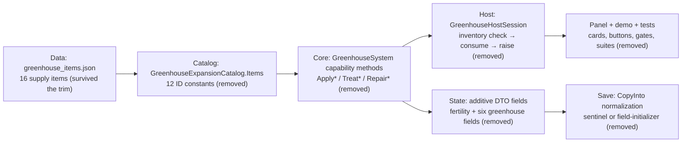
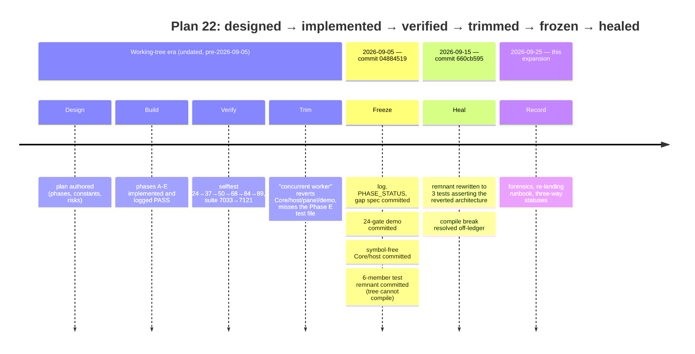

# PLAN 22 IMPLEMENTATION LOG — Greenhouse Runtime Item Consumption

Plan: `docs/plans/PLAN_22_GREENHOUSE_RUNTIME_ITEM_CONSUMPTION.md`
## Phase A — Soil fertility loop

**Status: PASS**

### Changed

- `Assets/Ashfall.Core/Greenhouse/GreenhouseExpansionCatalog.cs` — added the
  12 Plan 91 supply-ID constants (`Compost` … `ShadeCloth`) to
  `GreenhouseExpansionCatalog.Items` (single authority, no string literals in
  runtime code; per plan §7 risk mitigation).
- `Assets/Ashfall.Core/Greenhouse/GreenhouseSystem.cs` —
  - `GreenhousePlotState.fertility` (additive field, default 50).
  - 11 tuning constants (`DefaultFertility` … `FertilityCostPerHarvest`).
  - `NewPlot` seeds `fertility = DefaultFertility`.
  - `CopyInto` copies fertility and normalizes legacy saves
    (`fertility <= 0` ⇒ default; 0 is unreachable by clamps, so 0 uniquely
    identifies "field absent").
  - `ApplyAmendment(plotIndex, amendmentItemId, out consumedAmendmentId)` —
    compost +25 fertility / −10 contamination; ash +10; emulsion +15 and a
    +15 growth surge on Sprouting/Growing crops (with stage-transition and
    `OnCropMatured` consistency); rejects non-amendments and invalid plots;
    clamps to [5, 100].
  - `TickPlot` — fertility decay −0.5/day for all planted beds (including
    mature); growth multiplier `1 + (fertility − 50)/200` folded into the
    existing growth line.
  - `Harvest` — `fertility −= 15` (floor 5); fertility survives `ResetPlot`
    and `Clear` (bed quality persists).
- `src/Host/GreenhouseHostSession.cs` — `AmendSoil(plotIndex, amendmentItemId)`
  following the proven `Plant` pattern: inventory check → Core mutation →
  `InventoryHost.Remove(consumed, 1)` → `RaiseStateChanged`.
- `src/UI/GreenhousePanel.cs` — "Fertility x / 100" row in plot detail with
  critical/amber/dim color bands.
- `Assets/Ashfall.Core/Greenhouse/GreenhouseHeadlessDemo.cs` — Phase A
  scenario: defaults, invalid rejections, compost/ash/emulsion curves,
  contamination lift, surge, identical-conditions growth scaling, daily decay,
  harvest drain, legacy normalization (13 new gates).

### Tests

- New `Ashfall.Core.Tests/GreenhouseFertilityTests.cs` (17 tests): NORMAL
  (3 amendment curves, surge stage-advance, fallow banking), BOUNDARY
  (clamps 5/100, growth-factor bounds), INVALID (non-amendment items,
  invalid plot indices), REPEAT (stacking then clamp), decay (planted incl.
  mature; none fallow), harvest drain with floor, persistence through
  reset/clear, SAVE roundtrip (incl. snapshot anti-aliasing), OLD SAVE
  normalization, DETERMINISM, INTEGRATION (amendment IDs resolve globally).

### Verification results (exact)

| Command | Result |
|---|---|
| `dotnet build Ashfall.Core.Tests/Ashfall.Core.Tests.csproj` | PASS 0/0 |
| `dotnet test Ashfall.Core.Tests/Ashfall.Core.Tests.csproj` | **7033/7033 PASS** |
| `dotnet build Ashfall.csproj` | PASS 0 errors / 0 warnings |
| `godot --headless --path . -- --greenhouse-selftest` | **PASS 37/37** (was 24/24) |
| `godot --headless --path . -- --data-integrity-selftest` | PASS, 0 errors |
| `godot --headless --path . -- --content-utilization-selftest` | CI gate PASS |

### Divergences

- **Panel action button deferred.** An explicit AMEND button needs an
  item-selection affordance; `AmendSoil` is callable and the fertility row
  gives players state visibility. Lands with a later phase's action surface.
- The plan's risk note said "the 12 supply IDs" — the four tools are *not*
  greenhouse-runtime consumables, so the constants added are the 12 non-tool
  supplies. Tests pin that tools are rejected by `ApplyAmendment`.

### Remaining

- Phases B/C/D/E — per plan.

## Phase B — Pest protection & soap treatment

**Status: PASS**

### Changed

- `Assets/Ashfall.Core/Greenhouse/GreenhouseSystem.cs` —
  - `GreenhouseState.pestControlDays` (additive int, default 0;
    `CopyInto` clamps negatives to 0 for legacy/junk values).
  - Constants: `StickyTrapDays` 3, `PestMeshDays` 30,
    `PestProtectionChanceMultiplier` 0.6, `SoapBlightReduction` 0.5,
    `DroughtBlightFactor` 2.5 (literal promoted to const during extraction).
  - `TickDay` — captures the protection flag, decrements the window **once
    per ticked day** (not per plot), passes it into every plot tick.
  - `ComputeDailyBlightChance(...)` — pure static function extracted from
    `TickPlot`'s inline expression (identical math). TickPlot now calls it;
    tests pin the multiplier inputs without rolling.
  - `ApplyPestProtection(itemId, out consumedId)` — traps +3d, mesh +30d,
    days stack; rejects non-protection items.
  - `TreatBlightWithSoap(plotIndex, out consumedId)` — partial cure −0.5
    blight (floors at 0); rejected on clean/failed plots; distinct from the
    full `TreatBlight` cure.
- `src/Host/GreenhouseHostSession.cs` —
  - `TreatBlight` / `ExecuteTreatBlight` fallback order is now
    **blight treatment → insecticidal soap → iodine pills**; soap uses the
    existing `greenhouse.blight_partial` result key.
  - `PreviewTreatBlight` treats soap as treatment availability.
  - New `ApplyPestProtection(itemId)` (Plant consumption pattern).
- `src/UI/GreenhousePanel.cs` — "Pest Control" status card: `Nd` while a
  window is open, `—` (caution) when expired.
- `Assets/Ashfall.Core/Greenhouse/GreenhouseHeadlessDemo.cs` — Phase B
  scenario: rejection, window open/stack, once-per-day decrement across 3
  plots, pure-chance multiplier + drought behavior, soap partial cure
  (incl. floor + non-full-cure), clean/failed rejections, save round-trip
  (13 new gates).

### Tests

- New `Ashfall.Core.Tests/GreenhousePestProtectionTests.cs` (18 tests):
  NORMAL, window decay (exactly once/day across plots; ticks with zero
  plots; never negative), pure chance function (protection scaling,
  zero-contamination invariant, drought factor, clamp), INVALID, SAVE
  roundtrip + legacy normalization, DETERMINISM (roll stream identical),
  INTEGRATION (pest IDs resolve globally).

### Verification results (exact)

| Command | Result |
|---|---|
| `dotnet build Ashfall.Core.Tests/Ashfall.Core.Tests.csproj` | PASS 0/0 |
| `dotnet test Ashfall.Core.Tests/Ashfall.Core.Tests.csproj` | **7068/7068 PASS** |
| `dotnet build Ashfall.csproj` | PASS 0 errors / 0 warnings |
| `godot --headless --path . -- --greenhouse-selftest` | **PASS 50/50** (was 37/37) |
| `godot --headless --path . -- --data-integrity-selftest` | PASS, 0 errors |
| `godot --headless --path . -- --content-utilization-selftest` | CI gate PASS |
| `godot --headless --path . -- --bridge-selftest` | PASS |

### Divergences

- Chance-input testing done via the extracted pure function
  `ComputeDailyBlightChance` (plan suggested exactly this shape).
- Panel "Pest Control" status card added (not explicitly listed in Phase B)
  — new player-facing state must be discoverable.

### Remaining

- Phases C/D/E — per plan.

## Phase C — Drip auto-irrigation chain

**Status: PASS**

### Changed

- `Assets/Ashfall.Core/Greenhouse/GreenhouseSystem.cs` —
  - `GreenhouseState`: `dripInstalled` (bool), `dripFilterUses` (int,
    negative-clamped on restore), `catchmentInstalled` (bool) — all additive.
  - Constants: `AutoIrrigationThreshold` 25, `AutoIrrigationDose` 25,
    `DripFilterUsesPerCartridge` 60, `DripDroughtBlightMultiplier` 0.5,
    `CatchmentCostSaving` 1.
  - `AutoIrrigationRequest` struct (PlotIndex, WaterUnits, CleanWaterCost).
  - `ComputeAutoIrrigationRequests()` — pure read; empty unless the kit is
    installed **and** the filter has uses; only Sprouting/Growing plots below
    the threshold; cost = max(1, ⌈25/10⌉ − catchment saving).
  - `ExecuteAutoIrrigation(plotIndex, waterUnits)` — commit API: re-validates,
    decrements one filter use, waters (untainted).
  - `ApplyDripKit` (single install), `ApplyDripFilter` (requires kit, uses
    stack), `ApplyCatchmentKit` (requires kit, single install).
  - `TickPlot` — drought blight rate ×0.5 while `dripInstalled`.
- `src/Host/GreenhouseHostSession.cs` —
  - `TickDay` wrapper now runs `AutoIrrigate()` **before** the growth tick:
    computes requests, spends `clean_water` per request (skips with a
    "Drip line dry" event when short — never a soft-lock), commits via
    `ExecuteAutoIrrigation`, refunds water on a stale request (defensive;
    unreachable single-threaded).
  - `ApplyDripChainItem(itemId)` — single host entry point for the three
    supplies; enforces kit-first ordering with grounded rejection events.
- `src/UI/GreenhousePanel.cs` — "Drip Line" status card: `—` (not installed,
  caution), filter-uses remaining (normal), `DRY` (spent, warn).
- `Assets/Ashfall.Core/Greenhouse/GreenhouseHeadlessDemo.cs` — Phase C
  scenario (18 new gates): ordering rejections, single install,
  inert-until-filter, request shape, catchment saving, execute + filter
  decrement, spend-to-dry degrade, drought-blight halving (deterministic
  head-to-head), save round-trip.

### Tests

- New `Ashfall.Core.Tests/GreenhouseDripIrrigationTests.cs` (18 tests):
  NORMAL (enable/maintain/cheapen), request filtering, catchment cost
  saving with floor, EXECUTE (water + filter decrement; rejections),
  deterministic drought-blight halving head-to-head, SAVE roundtrip +
  legacy normalization, DETERMINISM (drip state does not disturb the roll
  stream), INTEGRATION (drip IDs resolve globally).

### Verification results (exact)

| Command | Result |
|---|---|
| `dotnet build Ashfall.Core.Tests/Ashfall.Core.Tests.csproj` | PASS 0/0 |
| `dotnet test Ashfall.Core.Tests/Ashfall.Core.Tests.csproj` | 7091/7094 — 3 failures, **all concurrent-agent churn** (their `probe_integrity_tmp.json`, RebelBranch mid-refactor, journal doc `file:///` links); greenhouse/drip suites fully green |
| `dotnet build Ashfall.csproj` | PASS 0 errors / 0 warnings |
| `godot --headless --path . -- --greenhouse-selftest` | **PASS 68/68** (was 50/50) |
| `godot --headless --path . -- --data-integrity-selftest` | PASS, 0 errors |

### Divergences

- Demo lesson (fixed in-phase): `ComputeAutoIrrigationRequests` is empty
  until a filter is loaded — a dedicated "inert until filter" gate pins it.
- Host entry point is one `ApplyDripChainItem(itemId)` rather than three
  methods; Core keeps the three separate `Apply*` APIs.

### Remaining

- Phases D/E — per plan.

## Phase D — Glazing condition & repairs

**Status: PASS**

### Changed

- `Assets/Ashfall.Core/Greenhouse/GreenhouseSystem.cs` —
  - `GreenhouseState`: `glazingCondition` (float 0–100, **field-initialized
    to 100** — legacy saves missing the field deserialize to full glazing,
    same convention as `saveId`), `shadeClothDays` (int, default 0).
  - Constants: `GlazingDecayPerDay` 0.4, `GlazingAshCoupling` 0.5,
    `GlazingMinLightFactor` 0.6, `GlazingDegradedThreshold` 30,
    `PaneRepair` 40, `SheetingRepair` 25, `ShadeClothDays` 20.
  - `TickDay` — glazing weathers every ticked day (base + ash-rate coupling;
    shade cloth halves the ash component); shade window decrements once per
    day; `OnGlazingDegraded` fires once on the downward crossing of 30 (and
    again after a repair re-crosses). Greenhouse-wide: applies with zero
    plots.
  - `TickPlot` — growth folds in `GlazingLightFactor()` = lerp(0.6, 1.0,
    condition/100).
  - `RepairGlazing(itemId, out consumedId)` — pane +40 / sheeting +25,
    clamped at 100; rejected at full condition and for non-repair supplies.
  - `ApplyShadeCloth(itemId, out consumedId)` — +20 days, stacks.
  - `GlazingLightFactor()` — public read for UI/tests.
- `src/Host/GreenhouseHostSession.cs` — `RepairGlazingAuto()` (pane
  preferred, UV-sheeting fallback, grounded rejection events) and
  `ApplyShadeClothSupply()`.
- `src/UI/GreenhousePanel.cs` — "Glazing" status card (critical < 30, warn
  < 70) + **REPAIR** action button.
- `src/Main.World.cs` — `case "repair":` routes to `RepairGlazingAuto()`.
- `Assets/Ashfall.Core/Greenhouse/GreenhouseHeadlessDemo.cs` — Phase D
  scenario (16 new gates): intact start, base vs ash decay, shade damping,
  crossing-once event (incl. repair re-cross), repair clamps + rejections,
  dimmed growth head-to-head, light-factor floor, save round-trip.

### Tests

- New `Ashfall.Core.Tests/GreenhouseGlazingTests.cs` (16 tests): NORMAL
  (base decay, ash acceleration, shade damping + window tick, no-plot
  weathering), light-factor lerp bounds + dimmed-growth head-to-head,
  degraded event (fire-once, re-cross after repair), repairs (pane >
  sheeting, clamp, intact rejection, non-supply rejection), SAVE roundtrip
  + legacy normalization via field initializer, DETERMINISM (replayed
  scenario identical; unshaded twin weathers faster), INTEGRATION
  (glazing supply IDs resolve globally).
- Updated `DirtyFlushNoOpRegressionTests.Greenhouse_FallowPlots_TickDay_...`:
  the no-op guarantee is narrowed to **plot-level state** (the dirty-flush
  concern); greenhouse-wide glazing weathering intentionally ticks and is
  now pinned to the exact expected decay.
- Updated `GreenhouseFertilityTests.FertilityNeverDrivesGrowthAbovePlanBounds`:
  holds fertility + glazing at their bounds through each tick so the test
  isolates the fertility factor (expected values now include the controlled
  glazing factor from the in-tick decay).

### Verification results (exact)

| Command | Result |
|---|---|
| `dotnet build Ashfall.Core.Tests/Ashfall.Core.Tests.csproj` | PASS 0/0 |
| `dotnet test … --filter FullyQualifiedName~Greenhouse` (6 greenhouse suites) | **122/122 PASS** |
| `dotnet test Ashfall.Core.Tests/Ashfall.Core.Tests.csproj` | **7110/7110 PASS** |
| `dotnet build Ashfall.csproj` | PASS 0 errors / 0 warnings |
| `godot --headless --path . -- --greenhouse-selftest` | **PASS 84/84** (was 68/68) |
| `godot --headless --path . -- --data-integrity-selftest` | PASS, 0 errors |
| `godot --headless --path . -- --content-utilization-selftest` | CI gate PASS |
| `godot --headless --path . -- --bridge-selftest` | PASS (stable CI verb) |

### Divergences

- Legacy normalization uses the DTO **field initializer**
  (`glazingCondition = MaxGlazingCondition`) rather than a sentinel in
  `CopyInto` — 0 is a legitimate condition value (ruined glazing). Pinned by
  `LegacySave_DeserializesFullGlazing_ViaFieldInitializer`.
- `DirtyFlushNoOp` test renamed (`..._DoesNotMutatePlotState`) and narrowed
  to plot state — glazing weathering is greenhouse-wide by design; the
  host's dirty-flush concern is unchanged for fallow plots.
- REPAIR button auto-selects pane → sheeting (deterministic); a per-item
  picker is deferred like the Phase A AMEND action. Shade-cloth deployment
  has a host API (`ApplyShadeClothSupply`) but no button yet — same
  deferred-UI rationale.

### Remaining

- Phase E (host-only gaps: planter-box plots, grow-lamp light, grow-medium
  reset) — per plan.


---

## Phase E — Host equipment scaling (host-only)

**Status: PASS**

### Changed

- `Assets/Ashfall.Core/Greenhouse/GreenhouseSystem.cs` — pure Core math for
  the host's equipment scaling: `GrowLightHoursFor(lampCount)` (6 h base,
  +2 h/lamp, first two lamps count, clamped) + constants
  (`BaseGrowLightHours`, `GrowLampBonusHours`, `MaxCountedGrowLamps`,
  `BasePlanterBoxPlots`). No TickDay signature change.
- `src/Host/GreenhouseHostSession.cs` —
  - `RefreshPlotCapacity()` — plot count follows planter-box stock
    (`max(4, inventory count)`); run in the constructor, `Create`, and each
    `TickDay` (scavenged beds join on the next day). `EnsurePlots` refuses
    to remove occupied plots, so stock collapses never destroy crops.
  - `ComputeGrowLightHours()` — lamp stock → today's light hours.
  - `Clear(plotIndex, useGrowMedium = false)` overload — grow-medium brick
    sterilises the bed (Clear + zero residual contamination; direct state
    mutation follows the established iodine-fallback precedent). Default
    `false` keeps the existing CLEAR route consumption-free.
- `src/Main.CampaignOwners.cs` — day-owner tick passes
  `ComputeGrowLightHours()` instead of hardcoded 6 h.
- `Assets/Ashfall.Core/Greenhouse/GreenhouseHeadlessDemo.cs` — Phase E gates:
  light-hours scale/cap/clamp (5 checks).

### Tests

- New `Ashfall.Core.Tests/GreenhouseEquipmentScalingTests.cs` (7 tests):
  light-hours theory table (0/1/2/3/9/−2 lamps), linear-bonus-unto-cap,
  capacity growth, occupied-plots-never-removed on stock collapse,
  grow-medium sterilisation contract (residual scrubbed → clean harvest).
  Host-only wiring (refresh cadence, CampaignOwners call) is build-verified —
  the Godot host assembly is not xUnit-referenceable.

### Verification results (exact)

| Command | Result |
|---|---|
| `dotnet build Ashfall.Core.Tests/Ashfall.Core.Tests.csproj` | PASS 0/0 |
| `dotnet test … --filter FullyQualifiedName~Greenhouse` (7 greenhouse suites) | **133/133 PASS** |
| `dotnet test Ashfall.Core.Tests/Ashfall.Core.Tests.csproj` | **7121/7121 PASS** |
| `dotnet build Ashfall.csproj` | PASS 0 errors / 0 warnings |
| `godot --headless --path . -- --greenhouse-selftest` | **PASS 89/89** (was 84/84) |
| `godot --headless --path . -- --data-integrity-selftest` | PASS, 0 errors |
| `godot --headless --path . -- --content-utilization-selftest` | CI gate PASS |
| `godot --headless --path . -- --bridge-selftest` | PASS |

### Divergences

- Light-hours math lives in Core (`GrowLightHoursFor`) rather than the host
  plan-literal — the host still owns the call; the math being pure Core
  makes it xUnit-testable. No Core TickDay signature changed.
- STERILIZE button deferred to the Stitch UI pass (same rationale as
  AMEND/SHADE); the overload + contract are live and tested.

### Remaining

- None — Plan 22 phases A–E complete. Deferred UI affordances are catalogued
  in `docs/ui/GREENHOUSE_UI_GAP_SPEC.md` (Stitch handoff; flagged in
  AGENTS.md).

---

# PLAN 22 COMPLETE — phases A–E all PASS

The greenhouse runtime now consumes the full Plan 91 supply ecosystem:
amendments (fertility), pest supplies (protection window + soap), the drip
chain (enable/maintain/cheapen), structural repairs (glazing + shade), and
equipment scaling (boxes/lamps/medium) — 89 headless gates, 7121 suite tests,
zero item-JSON or gameplay-authority changes beyond the planned Core loops.

---

# EXPANSION 2026-09-25 — Plan 22 Implementation Record: Full Integration Framework, Code Architecture & Removal Forensics

> **Nature of this expansion:** documentation only. The phase-by-phase
> implementation log above is preserved byte-for-byte; everything below this
> separator was appended on 2026-09-25. No source, data, test, or ledger file
> was touched to produce it. No build, test, or Godot runtime command was
> executed for it either — every current-state claim below comes from static
> inspection (`grep`, `git show`, `git log`, file reads) against the working
> tree as it stands on 2026-09-25, per AGENTS.md rule 7 ("a plan, audit, or
> test name is not proof that an API, catalog, route, or bug still exists").
>
> **Companion document:**
> `docs/plans/PLAN_22_GREENHOUSE_RUNTIME_ITEM_CONSUMPTION.md` was expanded
> earlier on 2026-09-25 into the design-side integration framework. This
> file is the *implementation-record side* of that work: it takes the log
> above as its primary artifact, audits what the tree looks like now, and
> documents the full arc — designed, implemented, verified PASS (the log's
> own record), trimmed from the tree, what remains, how to re-land. Where
> this expansion and the companion disagree on a point of fact, the
> disagreement is recorded, not smoothed over; one such correction exists
> (the committed Phase E test remnant — see Part V.5's check, Part V.8's
> forensics, and the reconciliation register in the re-landing chapter).

## Part I — Preamble: an implementation record whose subject was removed

### I.1 The thesis, stated once

The log above is a faithful, well-structured engineering record. It names
its files, its constants, its test anatomy, and its verification commands
with exact results. Every phase reads as executed work by a disciplined
builder. Nothing in this expansion should be read as doubting that the work
happened.

And yet the work is not in the tree. On 2026-09-25 a repo-wide search finds
every Plan 22 runtime symbol — `ApplyAmendment`, `AmendSoil`,
`pestControlDays`, `dripInstalled`, `glazingCondition`,
`ComputeDailyBlightChance`, `TreatBlightWithSoap`, `AutoIrrigationRequest`,
`ComputeAutoIrrigationRequests`, `ExecuteAutoIrrigation`, `ApplyDripKit`,
`OnGlazingDegraded`, `GlazingLightFactor`, `RepairGlazing`, `ApplyShadeCloth`,
`GrowLightHoursFor`, `RefreshPlotCapacity`, the 12 supply-ID constants —
only inside markdown documentation. Zero occurrences in any `*.cs` file.
The four named Plan 22 test suites (`GreenhouseFertilityTests`,
`GreenhousePestProtectionTests`, `GreenhouseDripIrrigationTests`,
`GreenhouseGlazingTests`) do not exist on disk and have no commit history.
The headless demo sits at its pre-Plan-22 24-gate baseline. The host
session hardcodes 4 plots again. The day-owner tick hardcodes 6f light
hours again. A comment block inside `src/UI/GreenhousePanel.cs` says, in
so many words, that a concurrent worker trimmed the catalog and host back
out.

So this document is an unusual artifact: **the surviving implementation
record of an implementation that was verified and then removed.** The log's
PASS tables are history — accurate history of runs that happened, but not
evidence about today. The tree, not the log, is authoritative (AGENTS.md
rule 7). This expansion therefore does three jobs at once:

1. **Preserve the record.** The log's phase-by-phase content — state
   fields, constants, capability methods, host wiring, panel surfaces,
   test anatomy, gate results — is restated here as a coherent engineering
   specification, so a future re-implementation can follow it without
   reverse-engineering intent from commit-less diffs.
2. **Audit the present.** Every symbol the log names is checked against
   today's tree, one by one, with negative evidence recorded. The result is
   a per-phase current-state verdict that can never be mistaken for a live
   claim.
3. **Explain the removal and the path back.** The forensics chapter
   reconstructs the trim timeline from commit evidence — including a
   finding the companion design doc does not have: a six-member Phase E
   test remnant *was* committed on 2026-09-05, referencing a Core method
   that the same commit's tree did not contain. The re-landing runbook
   then turns the record back into an execution order.

### I.2 Scope

**In scope:**

- The five recorded phases A–E of Plan 22, as implementation artifacts:
  what each changed, what each test pinned, what each verification table
  recorded, and what today's tree says about each.
- The current greenhouse authority set: `GreenhouseSystem`,
  `GreenhouseExpansionCatalog`, `GreenhouseHostSession`,
  `GreenhouseSaveStore`, `GreenhousePanel`, `GreenhouseHeadlessDemo`, and
  the surviving greenhouse xUnit suites — as they stand on 2026-09-25.
- The removal event: evidence, timeline, blast radius, survivors.
- The re-landing path: order, tests, gates, rollback.
- The deferred UI surface: AMEND / SHADE / STERILIZE affordances and the
  Stitch gap spec that catalogues them.
- The concurrency records embedded in the log (Phase C's three foreign
  failures) as drift-management history.
- Cross-system consequences of the loop design, stated with restraint.

**Out of scope (non-goals):**

- Re-implementing anything. This file changes no code. Re-landing is a
  separate, owned, integration-plans-governed task.
- Re-running or re-litigating the log's verification results. Every run
  result quoted here is labeled `UNVERIFIED (log text)` — this expansion
  executed no commands and treats the log's numbers as recorded history.
- Adjudicating *who* performed the trim or *why* beyond what the tree
  shows. The evidence supports mechanism and sequence, not motive.
- The unrelated "Plan 22" in `INTEGRATION_PLANS.md` (the C1 one-food
  authority wave, DONE 2026-09-15). See the disambiguation note in I.6.
- Unity. The engine is Godot; it has been since before this log existed.

### I.3 Evidence policy — the three-way status discipline

Every substantive claim in this expansion carries one of three statuses,
made explicit where confusion is possible:

| Label | Meaning | Trust contract |
|---|---|---|
| **RECORDED (log)** | The log above states it. This expansion repeats it as history. | Proves what was *written* when the log was completed. Proves nothing about the current tree. |
| **CURRENT TREE (verified)** | This expansion verified it by static inspection on 2026-09-25, with a `path:line` or command citation. | Reproducible today by anyone with the same tree state. |
| **UNVERIFIED (log text)** | A run result (test counts, selftest scores, build results). Not re-run — running it is out of scope by design. | The number is the log's claim. Current equivalents are given separately where they exist. |

Where a fact needs all three — for example the selftest gate ladder — the
ladder is presented as recorded, the current baseline is measured
statically, and the gap between them is named as the trim's signature.

Two narrow situations need labels the three rows do not carry, and this
expansion keeps them strictly subordinate to the primary three:
**CURRENT HISTORY (verified)** for evidence about a past commit — read
out of the graph with `git show`/`git log`, it proves what a snapshot
contained, never what the present tree contains; and the audit labels
**UNRESOLVED**, **INFERRED**, and **UNVERIFIABLE (evidence absent)** for
gaps static inspection cannot close (Appendix L collects every one). No
auxiliary label ever upgrades a claim to current-tree truth, and no
RECORDED (log) claim is promoted to a stronger class without a fresh
`path:line` or command citation.

### I.4 Reading guide

- **Part II** audits the greenhouse authority set as it exists today, then
  presents the removal evidence table (symbol-by-symbol negative grep
  results) and the survival inventory (what the trim left behind).
- **Part III** states the integration framework the implementation
  followed: invariants, tier flow, the outcomes-only event contract, the
  two legacy-save normalization conventions, determinism rules, and the
  pure-function testing pattern Phase B introduced.
- **Part IV** is the code architecture as recorded: per-phase state
  fields, constants, capability methods, host consumption patterns, and
  panel cards — each marked historical.
- **Part V** is the bulk. Chapters V.1–V.5 cover phases A–E (recorded
  changes, recorded test anatomy, recorded verification, current-state
  check). V.6–V.7 are the growth-curve ladders. V.8 is removal forensics.
  V.9 is the re-landing runbook. V.10 is the deferred-UI catalogue.
  V.11 is the concurrent-churn record. V.12 is the method lesson.
  V.13 is the re-landing effort estimate.
- **Part VI** crosses system boundaries (inventory, save, blight, events,
  UI), designs the restrained emergent consequences the loop implies, and
  reads the sixteen-item supply economy as one system (VI.3).
- **Part VII** is verification and acceptance for a future re-landing,
  with the trim event as the worked rollback example.
- **Part VIII** holds Appendices A–AB in sequence: glossary and forensic
  vocabulary, the recorded constant vocabulary, scenario walkthroughs
  (including a legacy save surviving the removed-then-restored cycle),
  the evidence and cross-document registers, the re-lander's lookup
  tables, and the open questions.
- **Part IX** closes the record: the standing status statement to quote,
  this file's maintenance protocol, the per-phase final verdict table,
  the acknowledgment of limits, and the relationship to governance.

### I.5 A note on voice and dates

The log above was written in the *implemented era's* voice: present tense,
"Lands with a later phase", "the overload + contract are live and tested".
This expansion quotes that voice as a historical source and does not correct
it in place — the original text is preserved byte-for-byte. When the
implemented era said "live", it meant it; the tree agreed that day. The trim
came after. That sequence is not an accusation, it is the finding, and it is
what makes this document necessary.

Dates used below: the log carries no internal dates; the committed copy of
it first appears in the tree in commit `04884519` (2026-09-05). The
companion design-doc expansion and this file are dated 2026-09-25. Where an
event cannot be pinned to a day, the commit that captured its result is
used as the timestamp of record.

### I.6 Disambiguation: two plans called "Plan 22"

`INTEGRATION_PLANS.md` line 580 records "C1 Plan 22 one food authority —
DONE 2026-09-15": a subject-aware `Consume(survivorId, itemId, scale)`
seam, kitchen and crew table, and medicine treatment decisions. That plan
is complete, unrelated to greenhouses, and shares only the number. All
references to "Plan 22" in this file mean the greenhouse runtime item
consumption plan
(`docs/plans/PLAN_22_GREENHOUSE_RUNTIME_ITEM_CONSUMPTION*`). Anyone
searching governance files for this plan's status should disambiguate on
"greenhouse" or the file name, never on the bare number — a lesson the
companion expansion also learned independently.

---

## Part II — Current authority audit (the greenhouse as it stands, 2026-09-25)

Everything in this part was verified by static inspection on 2026-09-25.
Line numbers are cited as of that date and move with future edits.

### II.1 Core authority — `Assets/Ashfall.Core/Greenhouse/GreenhouseSystem.cs`

The Core cultivation engine is engine-free (its `using` set is `System`,
`System.Collections.Generic`, and `Ashfall.Core` namespaces only) and
carries **no Plan 22 members**. What it does carry, and what a re-landing
must integrate with:

**State DTOs (CURRENT TREE, verified):**

- `GreenhousePlotState` (`GreenhouseSystem.cs:20-53`): `plotIndex`,
  `seedItemId`, `stage`, `growth`, `water`, `soilContamination`, `blight`,
  `plantedDay`, plus the Plan 64 era's `nutrientLevel` (line 39),
  `sameCropStreak` (line 47), and `lastCropId` (line 52, field-initialized
  to `string.Empty`). **No `fertility`.**
- `GreenhouseState` (`GreenhouseSystem.cs:56-65`): `saveId` (field-
  initialized to `GreenhouseExpansionCatalog.SaveId` — the precedent Phase D
  later cited for field-initializer normalization), `plots`,
  `preWarWheatUnlocked`, `totalHarvests`, `blightRollCount`, nullable
  `apiculture`. **No `pestControlDays`, `dripInstalled`, `dripFilterUses`,
  `catchmentInstalled`, `glazingCondition`, `shadeClothDays`.**

**Constants (CURRENT TREE, verified, `GreenhouseSystem.cs:104-143`):** the
base loop set — `MaxWater` 100, `MaxContamination` 100, `GrowingThreshold`
33, `DroughtBlightRatePerDay` 0.25, `OutbreakBlightStep` 0.3,
`BaseBlightChancePerDay` 0.06, `TaintedWaterContaminationPerUnit` 1.5,
`ResidualContaminationAfterHarvest` 0.5 — plus the Plan 64 nutrient/rotation
set (`NutrientItemId`, `NutrientApplicationLevel`, `NutrientDecayPerDay`,
`NutrientBlightRiskReduction`, `NutrientFullBandLevel`,
`RotationBlightStepPerStreak` 0.015, `MaxRotationStreakCount` 10). **None of
the 22 recorded Plan 22 constants exist.**

**Public surface (CURRENT TREE, verified, abridged):** `GreenhouseSystem(seed)`,
`SaveId`, `CaptureState()`, `RestoreState(GreenhouseState)`, events
`OnCropPlanted`/`OnCropMatured`/`OnCropHarvested`/`OnBlightOutbreak`/
`OnPlotDriedOut` (`:203-206` region), `PlotCount`, `TotalHarvests`,
`IsPreWarWheatUnlocked`, `Plots` (`:211-214`), `EnsurePlots(int)`
(`:216`), `Plant(int, string, int, out string)` (`:235`), `Water(int,
float, bool)` (`:262`), `ApplyNutrients(int, out string)` (`:282`),
`ExecuteTreatBlight(int, long, long)` (`:395`), `TreatBlight(int, out
string)` (`:421`), `Harvest`, `Clear`, and the blight-risk profile read
used by the panel (`BlightRiskProfile`, `:83-99`). **No `ApplyAmendment`,
no pest-protection or drip or glazing APIs, no `TickPlot`-adjacent pure
helpers from the log.**

The determinism machinery the log's phases depended on is intact and
unchanged: the persisted-counter reseed pattern (a fresh `SeededRng` keyed
on `_seed * 397 + (int)(_state.blightRollCount & 0x7FFFFFFF)` with
`_state.blightRollCount++` per blight roll), persisted through `CopyInto`
with a negatives-clamped restore. This is the single RNG consumer in the
greenhouse; Plan 22's recorded design deliberately added none.

### II.2 Host authority — `src/Host/GreenhouseHostSession.cs`

The Godot host session is thin, bound to `GreenhouseSystem`, an optional
`InventoryHostSession`, and an `ApicultureSystem`. Verified today:

| Member | Line | State vs. log |
|---|---|---|
| `DefaultPlanterBoxCount = 4` | `:20` | The hardcoded capacity Phase E removed is **back / never left the committed tree**. Used by the constructor (`EnsurePlots(DefaultPlanterBoxCount)`) and `Create`. |
| `Plant(plotIndex, seedItemId, currentDay)` | `:98` | The consumption pattern (inventory check → Core mutation → `InventoryHost.Remove` → `RaiseStateChanged`) Phase A cited as its template. Intact. |
| `Water(plotIndex, units, tainted)` | `:116` | Intact; consumed by the panel's water split. |
| `PreviewTreatBlight(plotIndex)` | `:134` | Availability check: blight treatment or iodine. **No soap rung.** |
| `ExecuteTreatBlight(plotIndex)` | `:163` | Fallback order is **blight treatment → iodine pills**; partial cure −0.5 via the `greenhouse.blight_partial` result key on the iodine branch. Phase B's recorded order — treatment → **soap** → iodine — is gone. |
| `TreatBlight(plotIndex)` | `:207` | Same two-rung fallback, bool-returning variant. |
| `Harvest(plotIndex)` / `Clear(plotIndex)` | `:238` / `:255` | Single-argument; **no `useGrowMedium` overload.** |
| `ApplyNutrients(plotIndex)` | `:273` | The Plan 64 consumable; the only supply-consuming soil action that exists today. |
| Apiculture family | `:295-349` | Unrelated to Plan 22; intact. |
| `TickDay(currentDay, growLightHours = 6f, ashContaminationRate = 0.05f)` | `:353` | Plain forward + apiculture tick. **No `AutoIrrigate()` pre-pass.** |
| `CaptureSave` / `GreenhouseSaveStore` / `GreenhouseSaveEnvelope` | `:365-449` | Save section owner (`greenhouse_save.json`, section `greenhouse`), envelope + checksum + legacy bare-state fallback. The persistence seam every phase's save work flowed through. Intact. |

**Absent, per the log's record:** `AmendSoil`, `ApplyPestProtection`,
`ApplyDripChainItem`, `RepairGlazingAuto`, `ApplyShadeClothSupply`,
`RefreshPlotCapacity`, `ComputeGrowLightHours`, and the sterilizing
`Clear` overload. Repo-wide `*.cs` grep for each: zero hits.

### II.3 Day owner — `src/Main.CampaignOwners.cs`

The greenhouse day owner ticks the system once per day. When advanced
agriculture (Plan 162) is configured it delegates to `TickAgricultureDay`;
otherwise it passes the literal:

```csharp
_m._greenhouse.TickDay(day, growLightHours: 6f, ashContaminationRate: 0.04f);
```

(`src/Main.CampaignOwners.cs:1071`.) This is the exact line Phase E's
`ComputeGrowLightHours()` was recorded as replacing. The hardcoded 6f is
**CURRENT TREE, verified** — the Phase E target is live again.

### II.4 Panel — `src/UI/GreenhousePanel.cs`

The panel is a thin Godot node over `GreenhouseHostSession`. Verified
today:

- **Status rail cards** (`:83-94`): Season, Active Beds, Plot Count,
  Harvests, Seed Vault, Blighted Beds — plus **three supply chips**,
  `sup_glass` ("Glass"), `sup_blight` ("Blight"), `sup_medium` ("Medium"),
  tracking `item_lead_glass_pane`, `item_blight_treatment`, and
  `item_grow_medium` stock. **No Fertility row, no Pest Control card, no
  Drip Line card, no Glazing card** — the four state surfaces the log's
  phases A–D added are all gone.
- **Plot detail rows:** Status, Seed, Growth %, Moisture, Soil mSv, Blight
  %, plus the Plan 64 blight-risk decomposition, the "Unfed crop" nutrient
  hint, and the rotation-pressure note (`:540-557` region). No fertility
  band.
- **Action buttons** (`:573-598`): PLANT, TREAT, CLEAR, HARVEST, DOSE
  NUTRIENTS. **No REPAIR button** — Phase D's action is gone, and
  `Main.World.cs` has no greenhouse `"repair"` route (the `"repair"` cases
  in `src/Main.Plans198_201.cs:508` and `src/Main.Plans74_77.cs:192` belong
  to other panels; verified by reading both switches).
- **Water split** (`:602-628`): CLEAN 25 / CLEAN 50 / TAINTED 50 with stock
  gating and the line "irradiated — crops remember". This is the gap
  spec's GAP-6, implemented against the trimmed surface.
- **Seed picker** (`:630+`): the GAP-1 picker, toggled by PLANT.
- **The gap register** (`:564-568`) — the trim's own epitaph, quoted in
  full in Part II.6 below.

### II.5 Headless demo — `Assets/Ashfall.Core/Greenhouse/GreenhouseHeadlessDemo.cs`

Static count today: **25 `Check(` occurrences — 24 gates plus the local
helper definition** — matching the pre-Plan-22 baseline that
`docs/greenhouse/PLAN91_CLOSEOUT.md:120` records as "PASS — 24/24". The
scenario set is planting / irrigation / maturity / harvest / tainted water
/ wheat unlock / save roundtrip. None of the five phase scenarios the log
records (+13, +13, +18, +16, +5 gates) are present. The expected-count
ladder the log documents (24 → 37 → 50 → 68 → 84 → 89) exists nowhere in
the current file.

Run status: the current 24-gate count is a **static** measurement. No
Godot session was launched for this expansion, so today's *runtime* result
is `UNVERIFIED (no run)` — but there is no mechanism by which the file on
disk could produce more than 24 gates.

### II.6 The gap register — the trim's contemporaneous note

`src/UI/GreenhousePanel.cs:564-568`, verbatim (CURRENT TREE, verified;
the companion design doc cites the same block at the same `:564-568`):

```csharp
// ── Plan 22 UI gap register (trimmed to current host surface) ──
// GAP-1 seed picker, GAP-3 supply rail (above), GAP-6 water split,
// GAP-7 readiness + dry columns (grid above).
// Removed (concurrent worker trimmed catalog/host): GAP-2 amend,
// GAP-4 maintenance, GAP-5 sterilise, GAP-8 degraded copy.
```

Three things make this the single most important trace in the repository
for understanding the removal:

1. **It is written from the implemented era's perspective.** GAP-2, GAP-4,
   GAP-5, and GAP-8 could only be "removed to match" a host surface that
   had *lost* `AmendSoil`, the drip/maintenance family, the sterilize
   overload, and the degraded-state copy. Gaps are removed when the thing
   they bridge to is removed — the note records a trim, not a decision to
   never build.
2. **It names the actor class, not an owner.** "concurrent worker" is a
   coordination observation, not an attribution. No KNOWN_DEBT entry, no
   INTEGRATION_PLANS note, and no commit message records the event. The
   trim happened off-ledger.
3. **It survived the trim.** Whoever edited the panel to drop the Plan 22
   surfaces kept the register that explains the drop. That is the only
   reason this document can call the event a trim rather than a mystery.

A second, older marker survives above it: the bare field comment
`// Plan 22 UI gap register` next to `_pendingPicker` (`:43`), which dates
from the implemented era and stayed untouched.

### II.7 Data layer — what the trim did not touch

`Assets/StreamingAssets/Data/greenhouse_items.json` contains **all 16
Plan 91 `item_greenhouse_*` IDs today** (verified by exhaustive grep over
the file: exactly 16 distinct matches):

- **12 non-tool supplies** (the Plan 22 consumable ecosystem):
  `item_greenhouse_compost`, `item_greenhouse_ash_fertilizer`,
  `item_greenhouse_fish_emulsion`, `item_greenhouse_sticky_traps`,
  `item_greenhouse_pest_mesh`, `item_greenhouse_insecticidal_soap`,
  `item_greenhouse_drip_kit`, `item_greenhouse_line_filter`,
  `item_greenhouse_catchment_kit`, `item_greenhouse_glass_pane`,
  `item_greenhouse_uv_sheeting`, `item_greenhouse_shade_cloth`.
- **4 tools** (not runtime consumables — the log's Phase A divergence note
  records that the "12 supply IDs" exclude these):
  `item_greenhouse_trowel`, `item_greenhouse_watering_can`,
  `item_greenhouse_pruning_shears`, `item_greenhouse_hand_cultivator`.

The three pre-91 equipment items — `item_planter_box`, `item_grow_lamp`,
`item_grow_medium` — exist as catalog constants
(`GreenhouseExpansionCatalog.cs:46-50`) and as data rows. `item_compost`
appears inside `agriculture_items.json` and `crop_strains.json` only as a
substring of `item_greenhouse_compost` (verified — there is no separate
`item_compost` item).

**Consequence:** the data half of the supply ecosystem is fully intact.
The trim removed the *consumers*, not the *consumables*. Every item a
re-landing needs is present, schema-valid, and already passing
`--data-integrity-selftest` (which `docs/greenhouse/PLAN91_CLOSEOUT.md:119`
records at 0 errors over 298 catalogs; the current run is
`UNVERIFIED (no run)`).

### II.8 Catalog — `GreenhouseExpansionCatalog.Items`

The catalog today (`GreenhouseExpansionCatalog.cs:16-65`) carries seed
packet IDs, crop IDs, `PlanterBox`, `GrowLamp`, `LeadGlassPane`,
`BlightTreatment`, `GrowMedium`, location/event/flag/lore constants, and
the `CropCatalog`. **None of the 12 supply-ID constants the log records
Phase A adding (`Compost` … `ShadeCloth`) exist.** The catalog's role as
single authority — no string literals in runtime code — was the design's
risk mitigation for supply consumption; a re-landing restores those
constants first (Part V.9 makes this step 1).

### II.9 Test baseline today

The greenhouse xUnit surface is eight files, **76 `[Fact]`/`[Theory]`
members total** (verified by per-file count):

| File | Cases (member count) | Era |
|---|---|---|
| `GreenhouseSystemTests.cs` | 9 | base loop |
| `GreenhouseCommandTests.cs` | 3 | player-command seam |
| `GreenhouseCropExpansionTests.cs` | 6 | cultivar expansion |
| `GreenhouseItemCatalogTests.cs` | 21 | catalog integrity |
| `GreenhouseEquipmentScalingTests.cs` | 3 | **rewritten post-trim** — see Part V.8 |
| `MicroLocationGreenhouseIntegrationTests.cs` | 13 | micro-location seam |
| `Greenhouse/GreenhousePhase4LoopClosureTests.cs` | 17 | Plan 64 closure |
| `Production/Plan87_91RelicGreenhouseIntegrationTests.cs` | 4 | Plan 87/91 relics |

The four Plan 22 suites (17 + 18 + 18 + 16 recorded tests) and the
recorded 7-test Phase E file are absent; on-disk suite totals and the
recorded suite ladder (7033 → 7068 → 7091/7094 → 7110 → 7121 full-suite
runs, 122 → 133 under the `FullyQualifiedName~Greenhouse` filter) are
compared in Part V.7. A full-suite run was **not** executed for this
expansion; today's exact total is `UNVERIFIED (no run)`.

### II.10 The removal evidence table

One row per recorded Plan 22 symbol family; the verdict column is the
2026-09-25 static verdict. The pattern is uniform: **present in the log,
absent from every `*.cs` file, present in markdown.**

| Symbol family (log phase) | `*.cs` hits today | Where it still appears |
|---|---|---|
| `fertility`, `DefaultFertility`, `ApplyAmendment` (A) | 0 — the only `fertility` matches in the tree are `SoilReclamationProfileEngine.cs` doc comments for Expansion 15's agricultural fertility evaluation, an unrelated system | this log + companion design doc |
| `AmendSoil` (A) | 0 | this log, companion, gap spec §3 GAP-2 |
| `pestControlDays`, `ApplyPestProtection`, `TreatBlightWithSoap`, `ComputeDailyBlightChance` (B) | 0 | this log, companion |
| `dripInstalled`, `dripFilterUses`, `catchmentInstalled`, `AutoIrrigationRequest`, `ComputeAutoIrrigationRequests`, `ExecuteAutoIrrigation`, `ApplyDripKit`, `ApplyDripFilter`, `ApplyCatchmentKit`, `ApplyDripChainItem` (C) | 0 | this log, companion |
| `glazingCondition`, `shadeClothDays`, `RepairGlazing`, `ApplyShadeCloth`, `OnGlazingDegraded`, `GlazingLightFactor`, `GlazingDegradedThreshold` (D) | 0 | this log, companion, gap spec GAP-8 copy examples |
| `GrowLightHoursFor`, `RefreshPlotCapacity`, `ComputeGrowLightHours` (E) | 0 in production code; **one committed historical exception** — the Phase E test remnant at commit `04884519` (Part V.8) | this log, companion, `PHASE_STATUS_THE_GLASS_ORCHARD.md:50` |
| 12 supply constants `Compost`…`ShadeCloth` in `Items` (A) | 0 | gap spec §3 GAP-3 chip list; data JSON carries the raw IDs |
| Panel Fertility row / Pest Control / Drip Line / Glazing cards | 0 | gap spec §2 (stale — describes the removed panel as "what already exists") |
| `Main.World.cs` greenhouse `"repair"` route | 0 (both remaining `"repair"` switch cases belong to robotics/homestead panels — verified) | this log |
| `GreenhouseFertilityTests` / `GreenhousePestProtectionTests` / `GreenhouseDripIrrigationTests` / `GreenhouseGlazingTests` | files absent; `git log --all` for each: empty (never committed) | this log's test sections |
| `--greenhouse-selftest` ladder counts 37/50/68/84/89 | unreachable — demo is at the 24-gate baseline | this log, `PLAN91_CLOSEOUT.md:120` (24/24), gap spec §6 ("must stay 89/89" — stale) |

### II.11 What survives (the re-landing's foundation)

The trim was surgical: it removed Plan 22's own members and little else.
Everything the design depends on is present and verified:

| Dependency | Status | Anchor |
|---|---|---|
| Plan 91's 16 supply items in data | Intact | `Assets/StreamingAssets/Data/greenhouse_items.json` (16 IDs, II.7) |
| Additive-state precedent (Plan 64) | Intact | `nutrientLevel` + `ApplyNutrients` + decay in tick (`GreenhouseSystem.cs:39,282`) |
| Persisted-counter determinism | Intact | `blightRollCount` reseed + `CopyInto` clamp |
| Legacy-normalization conventions | Intact | `CopyInto`: `Math.Clamp(nutrientLevel, 0, 1)`, `lastCropId ?? ""`, negatives floors — the two conventions Phase A (sentinel) and Phase D (field initializer) later exploited |
| `EnsurePlots` refuses to drop occupied plots | Intact | the shrink loop breaks on a non-fallow trailing plot — Phase E's crop-safety premise, also pinned by today's `EnsurePlots_GrowsAndRemovesOnlyTrailingFallowPlots` test |
| Host consumption pattern | Intact | `Plant`/`Water`/`ApplyNutrients` (`GreenhouseHostSession.cs:98,116,273`) |
| Save envelope + checksum + legacy fallback | Intact | `GreenhouseHostSession.cs:365-449` |
| Player-command treat path + `greenhouse.blight_partial` key | Intact | `:134-236` — soap's future rung slot |
| Panel infrastructure (rail, grid, helpers, event strip) | Intact | cards `:83-94`, actions `:573-598`, `LastEvent` strip |
| Day-owner tick with hardcoded light/ash | Intact (is the Phase E target) | `Main.CampaignOwners.cs:1071` |
| Headless demo + report harness | Intact at baseline | 24 gates, `Check` helper, twin-farm idiom |

The honest summary: **the greenhouse is a complete, healthy Plan 91-era
system with a documentation trail describing a Plan 22 era that was
verified and then removed.** Nothing rotted; a layer is missing.

---

## Part III — The integration framework (as designed, as recorded, as it would be re-landed)

This part reconstructs the framework the five phases implemented against.
It is assembled from the plan's constraint sections (§1–§4), the log's
per-phase "Changed" records, and the conventions that are still visible in
the surviving code. Statuses follow the three-way discipline of Part I.3.

### III.1 The invariants (design constraints that shaped every phase)

The plan opened with non-negotiable constraints; the log shows each one
binding in practice:

1. **Engine-free Core.** All simulation state and math lived in
   `Assets/Ashfall.Core/Greenhouse/GreenhouseSystem.cs`; the host session
   only translated inventory and events. Even Phase E — recorded as
   "host-only" — moved the light-hours *math* into Core as
   `GrowLightHoursFor` precisely so it would be xUnit-testable, keeping the
   host as the caller. (RECORDED (log), Phase E divergences.)
2. **JSON data is authoritative.** No phase added item JSON or changed
   gameplay data; the closing stamp records "zero item-JSON or
   gameplay-authority changes". Supplies were consumed by catalog
   constant, never by literal. (RECORDED (log), closing paragraph.)
3. **Additive state only.** Every field was new — `fertility` on the plot
   DTO; six fields on the greenhouse DTO — with defaults that make old
   saves load and tick unchanged. No existing field changed meaning. The
   one shared-line risk was the growth-formula fold-in, handled per-phase
   (III.5).
4. **One authority per concern.** Fertility, pest protection, drip,
   glazing, and equipment scaling each got exactly one owner method set in
   `GreenhouseSystem`; the host session owned consumption and event
   translation; the panel owned display. No parallel ledgers, no caches.
5. **Deterministic replay.** No new RNG consumer. Phase B's tests pinned
   the roll stream as identical before and after protection; Phase C's
   pinned drip state as not disturbing the stream. The blight roll remained
   the single seeded consumer on the single persisted counter.
6. **Save through the owner.** All persistence flowed through
   `CopyInto`/`CaptureState`/`RestoreState` in Core and
   `GreenhouseSaveStore`/`GreenhouseSaveEnvelope` in the host. Each phase's
   save roundtrip test rode the existing path.
7. **Events expose facts; hosts apply effects.** `OnCropMatured` stayed the
   growth-side fact channel; consumption results surfaced through the
   host's `LastEvent` strip; the panel never decided gameplay.

### III.2 The tier-by-tier flow (how one consumable became one outcome)

Every supply in the recorded system followed the same four-tier path. The
diagram is the framework; the phases are instances.



Reading it today: tier A is **CURRENT TREE, verified**; tiers B through G
are **RECORDED (log)** and absent from the tree. A re-landing rebuilds
B→G in exactly that order (Part V.9).

### III.3 The outcomes-only contract

A recurring record in the log: the host never consumed an item unless the
Core mutation succeeded, and never reported success without a grounded
result key. The recorded pattern per capability method:

- Core method signature shape: `ApplyX(itemId, out consumedId)` returning
  success; validation (item class, plot index, state preconditions) before
  any mutation; clamps applied at the mutation point.
- Host method shape: inventory count check first; Core call second;
  `InventoryHost.Remove(consumed, 1)` third — only on success;
  `RaiseStateChanged()` last; a human `LastEvent` line on every branch,
  including rejections ("grounded rejection events" — Phase C's recorded
  phrasing for the kit-first ordering).
- Result keys: existing keys were reused rather than invented — soap used
  the iodine branch's `greenhouse.blight_partial` key; rejections reused
  `no_treatment` / `invalid_target`. The outcome contract was: a key that
  already localizes, or nothing.

Phase E's sterilization overload is the sharpest recorded instance of the
contract: "direct state mutation follows the established iodine-fallback
precedent" — the host already owned one case of raw-state mutation with
Core-visible semantics, and the overload joined that precedent rather than
inventing a new seam.

### III.4 Save normalization: the two conventions (sentinel vs. field initializer)

The log's most transferable engineering content is that phases A and D
used **different, both-correct** legacy-save normalization mechanisms, and
the choice was not stylistic:

| | Phase A — `fertility` | Phase D — `glazingCondition` |
|---|---|---|
| Mechanism | **Sentinel in `CopyInto`**: restored `fertility <= 0` ⇒ default 50 | **DTO field initializer**: `glazingCondition = MaxGlazingCondition` (100) at declaration |
| Why | 0 is unreachable through the API (clamps floor at 5), so 0 *uniquely identifies* "field absent in an old save" | 0 is a *legitimate condition value* (ruined glazing); a sentinel would corrupt a real 0 into a real 100 |
| Trade-off | Sentinel depends on the clamp invariant staying true forever | Field initializer means every *new* state also starts at 100 — which is also the desired default, so the two purposes coincide |
| Pinned by | the log's OLD SAVE normalization tests (Phase A) | `LegacySave_DeserializesFullGlazing_ViaFieldInitializer` (RECORDED (log), Phase D) |

The general rule a re-landing should reuse: **if 0 is unreachable by
clamp, normalize by sentinel; if 0 is meaningful, normalize by field
initializer and let the default coincide.** The plan's own §3 draft got
this wrong for glazing (it proposed `glazingCondition <= 0 ⇒ 100` in
`CopyInto`); the implementation corrected it, and the log's Phase D
divergence note is the correction of record. Both conventions remain
visible today in the surviving Plan 64 code: `nutrientLevel` clamps in
`CopyInto` (sentinel-adjacent) and `saveId`'s field initializer.

Int fields normalized negatives to 0 (`pestControlDays`, `dripFilterUses`,
`shadeClothDays` — junk-save tolerance); bools defaulted false. The two
mechanisms never mixed within one field.

### III.5 Determinism discipline, including the pure-function testing pattern

The blight roll is the greenhouse's only stochastic act, keyed to the
persisted `blightRollCount`. The recorded phases touched chance math three
times, and each time the recorded solution was **extract, don't roll**:

- **Phase B:** `ComputeDailyBlightChance(...)` was extracted verbatim from
  `TickPlot`'s inline expression — "identical math" — so tests could pin
  the protection multiplier (×0.6), the zero-contamination invariant, and
  the drought factor *as function outputs*, without seeds or statistical
  assertions. One `DroughtBlightFactor` literal (2.5) was promoted to a
  named const during the extraction — recorded as a refactor-with-behavior
  split where the refactor is independently revertible.
- **Phase C:** drought-blight halving was tested "head-to-head" — two
  systems, same seed, one variable (`dripInstalled`), identical roll
  streams, different outcomes. The demo's twin-farm idiom, already the
  established pattern, carried the gate.
- **Phase D:** dimmed-growth head-to-head (glazing condition as the one
  variable) plus a full scenario replay assertion (same seed ⇒ identical
  states and `blightRollCount`).

The framework lesson: the chance function's *inputs* are testable as pure
math; the roll itself is testable only as *stream invariance*. Plan 22's
recorded tests did exactly that split, and nothing in the surviving tree
contradicts it.

### III.6 Phase sequencing as risk management

The recorded order — A (Core loop) → B (chance math + extraction) → C
(request/execute split + host orchestration) → D (another additive loop +
the normalization counterexample + first host route) → E (host equipment,
Core pure math) — interleaves the two riskiest shared-code touches
(B's extraction, C's tick wrapper) between self-contained additive
phases. Each phase ended green on its own gate ladder before the next
began; the log's "Remaining" sections are the dependency chain. A
re-landing should preserve the order; Part V.9 explains why each rung
exists.

---

## Part IV — Code architecture as recorded (historical component specifications)

**Status banner for this whole part:** every component below is
**RECORDED (log)** — specified here from the implementation log plus the
plan — and **absent from the current tree** (Part II.10). These
specifications exist so a re-implementer can rebuild without re-deriving;
they are not descriptions of live code. Where the log and the plan's
original §3/§4 tables disagree on names or mechanisms, the log wins
(it is the as-built record) and the divergence is shown.

### IV.1 Module map (as recorded)

| Module | Recorded role | New members recorded |
|---|---|---|
| `GreenhouseExpansionCatalog` (Core) | supply-ID single authority | 12 constants, `Items.Compost` … `Items.ShadeCloth` |
| `GreenhouseSystem` (Core) | all simulation state + capability methods | 1 plot field, 6 state fields, 22+ consts, 13 methods/struct |
| `GreenhouseHostSession` (host) | consumption, orchestration, save | 7 methods |
| `Main.World.cs` / `Main.CampaignOwners.cs` (host) | routing, day-owner integration | 1 switch case, 1 call-site change |
| `GreenhousePanel` (host UI) | state surfaces + action buttons | 1 detail row, 3 status cards, 2 buttons |
| `GreenhouseHeadlessDemo` (Core) | selftest gates | 5 phase scenarios, +65 gates |
| 4 new test files + 1 rewritten | xUnit contracts | 69 + 7 tests |

### IV.2 State fields (all seven, as recorded)

```csharp
// GreenhousePlotState (Phase A) — additive, default set in NewPlot
public float fertility;            // clamp [5,100], default 50

// GreenhouseState
public int   pestControlDays;      // Phase B — default 0, negatives clamped on restore
public bool  dripInstalled;        // Phase C — default false
public int   dripFilterUses;       // Phase C — default 0, negatives clamped
public bool  catchmentInstalled;   // Phase C — default false
public float glazingCondition;     // Phase D — field-initialized 100 (III.4)
public int   shadeClothDays;       // Phase D — default 0
```

Lifecycle rules recorded across phases: `fertility` **survives** `ResetPlot`
and `Clear` (bed quality persists across crops — Phase A); glazing is
greenhouse-wide and weathers with **zero plots planted** (Phase D's
no-plot gate); protection and shade windows decrement **once per ticked
day**, not per plot (Phase B/D — both pinned by the once-per-day tests
across multi-plot farms).

### IV.3 Constants (the recorded vocabulary, condensed)

The plan's §4 table listed 22 constants; the log's per-phase records name
the as-built set (names where the log differs from the plan are shown).
Values are RECORDED (log); none exist in the tree today.

| Phase | Recorded constants (log names) | Values |
|---|---|---|
| A | `DefaultFertility` … `FertilityCostPerHarvest` (11; bookends named in log; includes compost +25 / decontamination −10, ash +10, emulsion +15, surge +15, growth denominator 200, decay −0.5/day, harvest −15, clamp bounds 5/100) | see log Phase A |
| B | `StickyTrapDays`, `PestMeshDays`, `PestProtectionChanceMultiplier`, `SoapBlightReduction`, `DroughtBlightFactor` (literal promoted to const during extraction) | 3, 30, 0.6, 0.5, 2.5 |
| C | `AutoIrrigationThreshold`, `AutoIrrigationDose`, `DripFilterUsesPerCartridge`, `DripDroughtBlightMultiplier`, `CatchmentCostSaving` | 25, 25, 60, 0.5, 1 |
| D | `GlazingDecayPerDay`, `GlazingAshCoupling`, `GlazingMinLightFactor`, `GlazingDegradedThreshold`, `PaneRepair`, `SheetingRepair`, `ShadeClothDays` | 0.4, 0.5, 0.6, 30, 40, 25, 20 |
| E | `BaseGrowLightHours`, `GrowLampBonusHours`, `MaxCountedGrowLamps`, `BasePlanterBoxPlots` | 6, 2, 2, 4 |

Naming drift worth remembering on re-landing: the plan table said
`DripFilterUses` 60 / `CatchmentSaving` −1; the log's as-built names are
`DripFilterUsesPerCartridge` / `CatchmentCostSaving`. Full reconciliation
table in Part VIII, Appendix B.

### IV.4 Capability methods (Core, as recorded)

| Method (phase) | Recorded contract |
|---|---|
| `ApplyAmendment(plotIndex, amendmentItemId, out consumedAmendmentId)` (A) | compost +25 fertility −10 contamination; ash +10; emulsion +15 with a +15 growth surge on Sprouting/Growing crops (stage-transition and `OnCropMatured` consistency preserved); rejects non-amendments and invalid plots; clamps [5,100] |
| `ApplyPestProtection(itemId, out consumedId)` (B) | sticky traps +3d, mesh +30d, days stack; rejects non-protection items |
| `TreatBlightWithSoap(plotIndex, out consumedId)` (B) | partial cure −0.5 blight, floors at 0; rejected on clean or failed plots; distinct from the full `TreatBlight` cure |
| `ComputeDailyBlightChance(...)` (B) | pure static function, extraction of `TickPlot`'s inline expression, identical math; the multiplier inputs become testable |
| `ComputeAutoIrrigationRequests()` (C) | pure read returning `AutoIrrigationRequest[]` (PlotIndex, WaterUnits, CleanWaterCost); empty unless kit installed **and** filter has uses; Sprouting/Growing plots below threshold 25 only; cost = max(1, ⌈25/10⌉ − catchment saving) |
| `ExecuteAutoIrrigation(plotIndex, waterUnits)` (C) | commit side of the request/execute split: re-validates, decrements one filter use, waters untainted |
| `ApplyDripKit` / `ApplyDripFilter` / `ApplyCatchmentKit` (C) | single install; filter requires kit, uses stack to 60; catchment requires kit, single install |
| `RepairGlazing(itemId, out consumedId)` (D) | pane +40, sheeting +25, clamp 100; rejected at full condition and for non-repair supplies |
| `ApplyShadeCloth(itemId, out consumedId)` (D) | +20 days, stacks |
| `GlazingLightFactor()` (D) | public read: lerp(0.6, 1.0, condition/100) — for UI and tests |
| `GrowLightHoursFor(lampCount)` (E) | pure math: 6h base, +2h per lamp, first two lamps count, clamped at both ends |

Fold-in points (the only shared-code edits): `TickPlot` — fertility decay
and growth multiplier (A), blight chance via the extracted function (B),
drip drought factor (C), glazing light factor (D); `TickDay` — protection
window capture and once-per-day decrement (B), glazing weathering and
shade window (D). `Harvest` — fertility −15 floor 5 (A). `NewPlot` /
`CopyInto` — defaults and normalization (A/C/D).

### IV.5 Host consumption methods (as recorded)

| Host method (phase) | Recorded shape |
|---|---|
| `AmendSoil(plotIndex, amendmentItemId)` (A) | the `Plant` pattern: inventory check → Core → `Remove(consumed, 1)` → `RaiseStateChanged` |
| `TreatBlight`/`ExecuteTreatBlight` soap rung (B) | fallback order became **treatment → soap → iodine**; soap reuses `greenhouse.blight_partial`; `PreviewTreatBlight` counts soap as availability |
| `ApplyPestProtection(itemId)` (B) | Plant pattern |
| `TickDay` wrapper `AutoIrrigate()` (C) | runs **before** the growth tick: compute requests, spend `clean_water` per request — on shortage, skip with a "Drip line dry" event (**never a soft-lock**) — commit via `ExecuteAutoIrrigation`; refunds water on a stale request (defensive, unreachable single-threaded) |
| `ApplyDripChainItem(itemId)` (C) | **one** host entry point for three Core APIs; enforces kit-first ordering with grounded rejections |
| `RepairGlazingAuto()` (D) | pane preferred, UV-sheeting fallback, grounded rejections |
| `ApplyShadeClothSupply()` (D) | thin forward |
| `RefreshPlotCapacity()` (E) | plot count = max(4, planter-box stock); run in constructor, `Create`, and each `TickDay` (scavenged beds join next day); `EnsurePlots`' occupied-plot refusal makes stock collapse crop-safe |
| `ComputeGrowLightHours()` (E) | lamp stock → today's hours, via `GrowLightHoursFor` |
| `Clear(plotIndex, useGrowMedium = false)` (E) | grow-medium sterilization: Clear + zero residual contamination; direct state mutation per the iodine-fallback precedent; default keeps the CLEAR route consumption-free |

### IV.6 Panel surfaces (as recorded)

| Surface (phase) | Recorded form |
|---|---|
| Fertility row (A) | "Fertility x / 100" in plot detail, critical/amber/dim color bands |
| Pest Control card (B) | `Nd` while a window is open; `—` (caution) when expired — added although not explicitly listed for Phase B ("new player-facing state must be discoverable") |
| Drip Line card (C) | `—` (not installed, caution); filter uses remaining (normal); `DRY` (spent, warn) |
| Glazing card + REPAIR (D) | card critical < 30, warn < 70; REPAIR button auto-selecting pane → sheeting; `Main.World.cs` `case "repair":` routes to `RepairGlazingAuto()` |

Recorded deferrals (all three consistent): AMEND (A), per-item repair
picker + shade deployment button (D), STERILIZE (E) — each needs an
item-selection affordance the panel did not then have; each host API was
live and tested behind the missing button. The deferral catalogue became
`docs/ui/GREENHOUSE_UI_GAP_SPEC.md` (Part V.10).

---

## Part V — The bulk: phase chapters, ladders, forensics, runbook

Chapters V.1 through V.5 follow one fixed template so the record and the
audit can be read side by side:

1. **What the phase recorded** — the log's Changed summary, restated with
   the mechanism.
2. **The recorded test anatomy** — what the suite pinned and how.
3. **The recorded verification** — the log's exact table, labeled
   `UNVERIFIED (log text)`: these are runs that happened, quoted as
   history. This expansion executed none of them.
4. **Current-state check** — every symbol the phase introduced, checked
   against today's tree, with negative evidence.

The expected verdict of every current-state check is "none survive". That
expectation was *verified*, not assumed — and Phase E produced the one
genuine exception in the repository's history (a committed test remnant,
resolved in V.8's forensics and V.5's check).

### V.1 Phase A — soil fertility loop

**Recorded scope.** Fertility as a per-bed 0–100 resource, default 50,
clamp [5,100]: raised by three amendments, drained −15 per harvest with
floor 5, decayed −0.5/day on every planted bed (including mature — decay
while a crop sits ripe is recorded as intended: beds age, not just crops),
and folded into growth as `1 + (fertility − 50)/200` — a ±25% band around
the neutral midpoint 50. The decontamination side-effect is the loop's
quiet second face: compost lifts soil contamination by 10, making the
amendment loop also the early reclamation loop for tainted beds.

**Recorded design decisions worth keeping:**

- Fertility is *banked, not reset*: it survives `ResetPlot` and `Clear`.
  A bed is a long-term asset; crops are annual. This is the decision that
  makes the compost economy meaningful across campaigns rather than per
  planting.
- The emulsion surge (+15 growth, Sprouting/Growing only) had to preserve
  stage-transition and `OnCropMatured` consistency — a surge can push a
  crop over the maturity boundary mid-application, and the recorded note
  says the event fired exactly as a natural transition would. No
  special-cased event paths.
- Legacy normalization by sentinel: `fertility <= 0` on restore ⇒ 50,
  justified by the clamp making 0 unreachable (Part III.4).
- The plan said "the 12 supply IDs"; the implementation added the 12
  **non-tool** supplies and pinned that the four tools are rejected by
  `ApplyAmendment`. The divergence note in the log is the authority for
  the intended semantics.

**Recorded test anatomy — `GreenhouseFertilityTests` (17 tests,
RECORDED (log)).** NORMAL: three amendment growth curves under identical
conditions; surge stage-advance; fallow fertility banking. BOUNDARY:
clamps 5 and 100; growth-factor bounds. INVALID: non-amendment items
(including the four tools); invalid plot indices. REPEAT: stacking then
clamp. Decay: planted including mature; none on fallow. Harvest drain
with floor. Persistence through reset/clear. SAVE: roundtrip including
snapshot anti-aliasing; OLD SAVE normalization. DETERMINISM. INTEGRATION:
amendment IDs resolve globally through the item catalog.

**Recorded verification — `UNVERIFIED (log text)`:** suite
**7033/7033 PASS**; selftest **37/37** (from 24); build green; integrity
0 errors; content-utilization CI gate PASS.

**Recorded divergences:** the AMEND button deferred (needs an
item-selection affordance; `AmendSoil` callable, fertility row visible);
the 12-vs-16 constant scope note above.

**Current-state check (2026-09-25, all CURRENT TREE verified).**

| Recorded artifact | Verdict | Evidence |
|---|---|---|
| `GreenhousePlotState.fertility` | absent | no `fertility` member in `GreenhouseSystem.cs:20-53` |
| 11 Phase A constants | absent | const block `:104-143` has only base + Plan 64 sets |
| `ApplyAmendment` | absent | repo-wide `*.cs` grep: 0 |
| `AmendSoil` host method | absent | `GreenhouseHostSession.cs:18-449` member list: 0 |
| Fertility panel row | absent | detail rows are Status/Seed/Growth/Moisture/Soil mSv/Blight |
| 13 demo gates | absent | demo static count 24 (baseline) |
| `GreenhouseFertilityTests.cs` (17 tests) | absent | file not on disk; `git log --all` empty — never committed |

**Verdict: designed, implemented, verified, removed. None of Phase A
survives in code.** The data half (three amendment items) survives in
`greenhouse_items.json` (II.7).

### V.2 Phase B — pest protection and soap treatment

**Recorded scope.** A greenhouse-wide protection window (`pestControlDays`)
bought with sticky traps (+3d) and pest mesh (+30d), stacking; while open,
the daily blight chance runs at ×0.6. Window decrements **once per ticked
day** — per farm, not per plot; the recorded test pins the decrement
across a 3-plot farm where per-plot decrement would triple the drain. Soap
(`TreatBlightWithSoap`) is a partial cure (−0.5, floor 0) sitting between
the full treatment and the iodine fallback in the host's escalation order,
reusing the iodine branch's `greenhouse.blight_partial` result key — an
economical reuse the plan did not specify and the log recorded as built.

**The extraction.** `ComputeDailyBlightChance` was pulled verbatim out of
`TickPlot` so the multiplier's inputs became pure-function test cases:
protection scaling, the zero-contamination invariant, the drought factor
(2.5 — promoted from an inline literal to a named const during the
extraction, the log's only recorded literal-promotion), and the clamp.
`TickPlot` calls the function; the roll still happens once per plot per
day against the persisted counter. This is the cleanest recorded example
of the framework's extract-don't-roll rule (III.5).

**Recorded test anatomy — `GreenhousePestProtectionTests` (18 tests,
RECORDED (log)).** NORMAL; window decay (exactly once/day across plots;
ticks with zero plots; never negative); pure chance function (scaling,
invariant, drought, clamp); INVALID; SAVE roundtrip + legacy
normalization (negatives → 0); DETERMINISM (**roll stream identical** with
and without protection); INTEGRATION (pest IDs resolve globally).

**Recorded verification — `UNVERIFIED (log text)`:** suite **7068/7068
PASS**; selftest **50/50**; build green; integrity 0 errors;
content-utilization PASS; `--bridge-selftest` PASS.

**Recorded divergences:** the pure-function shape was the plan's own
suggestion, adopted; the Pest Control status card was added beyond the
phase's explicit list — the recorded rationale ("new player-facing state
must be discoverable") is the panel-visibility rule of AGENTS.md in
miniature.

**Current-state check (all CURRENT TREE verified).**

| Recorded artifact | Verdict | Evidence |
|---|---|---|
| `pestControlDays` | absent | not in `GreenhouseState` (`GreenhouseSystem.cs:56-65`) |
| 5 Phase B constants | absent | const block `:104-143` |
| `ComputeDailyBlightChance` | absent | repo-wide `*.cs` grep: 0 |
| `ApplyPestProtection` / `TreatBlightWithSoap` | absent | repo-wide: 0 |
| Host treatment→**soap**→iodine order | absent — order is treatment→iodine | `PreviewTreatBlight :134`, `ExecuteTreatBlight :163`, `TreatBlight :207` |
| Pest Control panel card | absent | card list `:83-94` |
| 13 demo gates | absent | baseline 24 |
| `GreenhousePestProtectionTests.cs` | absent | not on disk; never committed |

**Verdict: none of Phase B survives.** The two-rung fallback (treatment,
iodine) that remains is exactly the pre-Plan-22 order the log's Phase B
recorded *extending* — a negative image of the phase.

### V.3 Phase C — the drip auto-irrigation chain

**Recorded scope.** The most architecturally ambitious phase: a
kit-and-consumables chain (drip kit → line filter → catchment kit) that
converts manual watering into an automatic daily service with a finite,
maintainable consumable. Three state fields (`dripInstalled`,
`dripFilterUses`, `catchmentInstalled`), five constants (threshold 25,
dose 25, 60 uses per cartridge, drought-blight ×0.5 while drip is
installed, catchment saving 1 unit floor 1), and — the phase's signature
— a **request/execute split** for the host-orchestrated automation.

**The request/execute split, as recorded.** Automation is a boundary
problem: the *decision* about what should be watered belongs to Core
(pure, testable), while the *spending* of player water belongs to the
host (it owns inventory). The recorded split:

- `ComputeAutoIrrigationRequests()` — pure read on Core state. Returns
  empty unless the kit is installed **and** the filter has uses (the
  recorded "inert until filter" semantics — the demo caught this in-phase:
  the log's divergence note says a dedicated gate was added because a
  filterless kit silently doing nothing was a real behavior worth pinning,
  not an edge case). Requests target only Sprouting/Growing plots below
  the 25 threshold; each carries its clean-water cost with the catchment
  discount and its floor.
- `ExecuteAutoIrrigation(plotIndex, waterUnits)` — the commit API. It
  re-validates (the world may have changed between compute and execute),
  decrements one filter use, and waters untainted. The split makes the
  host a plain orchestrator: compute → spend → commit, with no greenhouse
  arithmetic in the host at all.

**The never-softlock rule.** The recorded host wrapper runs `AutoIrrigate`'s
steps **before** the growth tick and, when the player cannot afford a
request, skips that plot with a "Drip line dry" event — the automation
degrades to manual watering rather than blocking the day. The recorded
design also defends a stale-request race (water refunded if the commit
re-validation fails), explicitly labeled unreachable single-threaded but
pinned anyway. Auto-irrigation is therefore a *convenience with a
consumable*, never a *dependency with a failure state* — the distinction
that keeps the survival loop honest: a player who cannot afford line
filters can still water by hand, forever.

**The drought coupling.** While `dripInstalled`, the drought blight rate
runs ×0.5 — recorded as tested head-to-head: two same-seed systems, one
variable, identical roll streams, half the drought blight. This is the
phase's emergent-contribution: consistent moisture is not just laziness
savings, it is agronomy (VI.3).

**Recorded test anatomy — `GreenhouseDripIrrigationTests` (18 tests,
RECORDED (log)).** NORMAL (enable/maintain/cheapen); request filtering;
catchment cost saving with floor; EXECUTE (water + filter decrement;
rejections); deterministic drought halving; SAVE roundtrip + legacy
normalization; DETERMINISM (drip state does not disturb the roll stream);
INTEGRATION (drip IDs resolve globally).

**Recorded verification — `UNVERIFIED (log text)`:** suite
**7091/7094 — 3 failures, all attributed to concurrent-agent churn**
(their `probe_integrity_tmp.json`, a RebelBranch mid-refactor, journal doc
`file:///` links); "greenhouse/drip suites fully green"; selftest
**68/68**; build green; integrity 0 errors. This is the log's honest-
discord record and is treated at length in V.11.

**Recorded divergences:** the in-until-filter gate (above); the host
consolidated the three `Apply*` calls into one `ApplyDripChainItem(itemId)`
entry point with kit-first ordering and grounded rejections, while Core
kept the three separate APIs — a good seam discipline: host convenience,
Core precision.

**Current-state check (all CURRENT TREE verified).**

| Recorded artifact | Verdict | Evidence |
|---|---|---|
| `dripInstalled` / `dripFilterUses` / `catchmentInstalled` | absent | `GreenhouseState` `:56-65` |
| 5 Phase C constants | absent | const block `:104-143` |
| `AutoIrrigationRequest` / `ComputeAutoIrrigationRequests` / `ExecuteAutoIrrigation` | absent | repo-wide `*.cs` grep: 0 |
| `ApplyDripKit` / `ApplyDripFilter` / `ApplyCatchmentKit` / `ApplyDripChainItem` | absent | repo-wide: 0 |
| Host `AutoIrrigate()` pre-pass | absent | `TickDay` at `:353` is a plain forward + apiculture tick |
| Drip Line panel card | absent | card list `:83-94` |
| 18 demo gates | absent | baseline 24 |
| `GreenhouseDripIrrigationTests.cs` | absent | not on disk; never committed |

**Verdict: none of Phase C survives.** Notably, the day owner still ticks
the greenhouse with hardcoded inputs (`Main.CampaignOwners.cs:1071`) —
the exact host shape Phase C's wrapper replaced.

### V.4 Phase D — glazing condition and repairs

**Recorded scope.** The greenhouse's envelope as a system-level resource:
`glazingCondition` 0–100 starting at 100, weathers −0.4/day plus an
ash-coupled component (decay += ashRate × 0.5), halved in the ash term
while shade cloth (a +20-day window supply) is up; crop growth folds in
`GlazingLightFactor()` = lerp(0.6, 1.0, condition/100); repairs restore
pane +40 or UV sheeting +25, clamped at 100. Degradation is
greenhouse-wide — it ticks with **zero plots**, the recorded no-plot gate
pinning that the *structure* ages even when nothing is planted.

**The fire-once degraded event.** `OnGlazingDegraded` fires on the
downward crossing of the 30 threshold, once per crossing — and again only
after a repair lifts condition back above and time re-crosses. The
recorded test pins both the single fire and the re-cross. This is the
correct edge-trigger semantics for a degrading asset: a *state* event
(condition < 30) would spam every tick; a *crossing* event fires exactly
when the player must act.

**The normalization counterexample.** Phase D is where the sentinel
convention broke down and was correctly abandoned: 0 is a *legitimate*
condition (ruined glazing), so `<= 0 ⇒ 100` in `CopyInto` would have
silently repaired ruined greenhouses on every legacy load. The recorded
solution is the **field initializer** (`glazingCondition =
MaxGlazingCondition` at declaration) — the same convention the surviving
`saveId` uses — pinned by
`LegacySave_DeserializesFullGlazing_ViaFieldInitializer`. Part III.4
carries the general rule; Phase D is its proof.

**The host route.** Phase D contributed the recorded plan's only new
panel *action*: a REPAIR button auto-selecting pane → sheeting
(deterministic; per-item picker deferred with AMEND/SHADE), routed through
a new `case "repair":` in `Main.World.cs` calling `RepairGlazingAuto()` —
host-side fallback preference with grounded rejection events, plus
`ApplyShadeClothSupply()` as a thin forward awaiting its button. The
`DirtyFlushNoOpRegressionTests` greenhouse test was renamed and narrowed
to plot-level state: glazing weathering is *supposed* to mutate
greenhouse-wide state on a fallow farm; the dirty-flush guarantee is about
plots. The companion fertility-bounds test was tightened to hold both
fertility and glazing at bounds so the fertility factor stays isolated.
These two recorded amendments are the log's most honest entries —
existing guarantees were not silently bent to fit; they were re-derived
and re-pinned.

**Recorded test anatomy — `GreenhouseGlazingTests` (16 tests, RECORDED
(log)).** NORMAL (base decay, ash acceleration, shade damping + window
tick, no-plot weathering); light-factor lerp bounds + dimmed-growth
head-to-head; degraded event (fire-once, repair re-cross); repairs (pane >
sheeting, clamp, intact rejection, non-supply rejection); SAVE roundtrip +
field-initializer legacy normalization; DETERMINISM (replayed scenario
identical; unshaded twin weathers faster); INTEGRATION (glazing IDs
resolve globally).

**Recorded verification — `UNVERIFIED (log text)`:** greenhouse-filtered
run **122/122 PASS** (6 suites); full suite **7110/7110 PASS**; selftest
**84/84**; build green; integrity 0 errors; content-utilization PASS;
bridge PASS.

**Current-state check (all CURRENT TREE verified).**

| Recorded artifact | Verdict | Evidence |
|---|---|---|
| `glazingCondition` / `shadeClothDays` | absent | `GreenhouseState` `:56-65` |
| 7 Phase D constants | absent | const block `:104-143` |
| `RepairGlazing` / `ApplyShadeCloth` / `GlazingLightFactor` / `OnGlazingDegraded` | absent | repo-wide `*.cs` grep: 0 |
| Host `RepairGlazingAuto` / `ApplyShadeClothSupply` | absent | member list `:18-449` |
| `Main.World.cs` greenhouse `"repair"` route | absent | the `"repair"` cases in `Main.Plans198_201.cs:508` / `Main.Plans74_77.cs:192` are other panels' (read both switches) |
| Glazing card + REPAIR button | absent | cards `:83-94`; actions `:573-598` |
| 16 demo gates | absent | baseline 24 |
| `GreenhouseGlazingTests.cs` + the two recorded test amendments | absent / reverted | file never committed; `DirtyFlushNoOp` narrowing gone (plot-state no-op guarantee back at its pre-Phase-D shape) |

**Verdict: none of Phase D survives — including the two recorded test
amendments to neighboring suites, which reverted with the code.** The gap
spec's degraded-state copy lines ("Glazing below 30% — the crops are
growing at 60% light. Fit a pane.") survive as prose awaiting a system.

### V.5 Phase E — host equipment scaling (and the one artifact that got away)

**Recorded scope.** The host-only phase: plot capacity follows planter-box
stock instead of the hardcoded 4; grow-lamp stock converts to daily light
hours instead of the hardcoded 6; the CLEAR action gains an optional
grow-medium sterilization that scrubs residual bed contamination. The
recorded design kept the *math* in Core — `GrowLightHoursFor(lampCount)`
(6 h base, +2 h per lamp, first two lamps counted, clamped) plus
`BaseGrowLightHours`, `GrowLampBonusHours`, `MaxCountedGrowLamps`,
`BasePlanterBoxPlots` — precisely so the theory table could be xUnit-pinned
while the host kept the *call* (`ComputeGrowLightHours()`,
`RefreshPlotCapacity()`). No Core `TickDay` signature changed; the
recorded divergence note is explicit that moving the math Core-side was a
testability correction of the plan's host-literal sketch.

**Recorded behaviors.** `RefreshPlotCapacity` ran in the constructor,
`Create`, and each `TickDay` — scavenged planter boxes join on the next
day. Stock collapse never destroys crops: `EnsurePlots` refuses to remove
occupied plots (this premise survives intact in today's tree — it is
pinned by the current
`EnsurePlots_GrowsAndRemovesOnlyTrailingFallowPlots` test). The
sterilization overload `Clear(plotIndex, useGrowMedium = false)` followed
the iodine-fallback precedent of host-side direct state mutation
(Clear + zero residual); the default kept the existing CLEAR route
consumption-free.

**Recorded test anatomy — `GreenhouseEquipmentScalingTests` (7 tests,
RECORDED (log)).** Light-hours theory table (0/1/2/3/9/−2 lamps);
linear-bonus-unto-cap; capacity growth; occupied-plots-never-removed on
stock collapse; grow-medium sterilization contract (residual scrubbed →
clean harvest). Host wiring build-verified only — the Godot host assembly
is not xUnit-referenceable, so refresh cadence and the
`CampaignOwners` call site were compile-checked, not unit-tested.

**Recorded verification — `UNVERIFIED (log text)`:** greenhouse-filtered
**133/133 PASS** (7 suites); full suite **7121/7121 PASS**; selftest
**89/89**; build green; integrity 0 errors; content-utilization PASS;
bridge PASS.

**Current-state check — with the repository's one genuine wrinkle.**

Production code: everything absent, verified as in every other phase.
`DefaultPlanterBoxCount = 4` at `GreenhouseHostSession.cs:20`; the 6f
literal at `Main.CampaignOwners.cs:1071`; `Clear(int)` single-argument at
`:255`; no `RefreshPlotCapacity` / `ComputeGrowLightHours` /
`GrowLightHoursFor` anywhere in `*.cs`.

The test file is different. `Ashfall.Core.Tests/GreenhouseEquipmentScalingTests.cs`
**exists today** — but it is not the log's file, and it is not pre-Plan-22
either. Its committed history is the single richest forensic trace in this
entire matter:

- **At commit `04884519` (2026-09-05, "chore: sync working tree — flagship
  systems, docs, tests, and host wiring")**, the committed file carries a
  doc comment reading "**Plan 22 Phase E — host equipment scaling math
  (Core half)**" and contains six test members: a `[Theory]`
  `GrowLightHoursFor_ScalesAndCaps` with six `[InlineData]` rows (0→6f,
  1→8f, 2→10f, 3→10f capped, 9→10f capped, −2→6f clamped — the exact
  recorded math), `GrowLightHours_BonusIsPerLamp_UptoCap`,
  `PlotCapacity_GrowsWithPlanterBoxStock`,
  `PlotCapacity_ShrinksOnlyFallowPlots_WhenStockDrops`,
  `ClearThenSterilise_BedResidualContamination_IsScrubbed`, and
  `SterilisedBed_NextHarvest_IsClean_WhenWaterIsClean`.
- **The same commit's `GreenhouseSystem.cs` contains no
  `GrowLightHoursFor`.** Verified: `git show
  04884519:Assets/Ashfall.Core/Greenhouse/GreenhouseSystem.cs` grep for
  any Plan 22 symbol — zero hits; and a whole-tree `git grep -l
  GrowLightHoursFor 04884519 -- "*.cs"` returns exactly one file, the test
  itself. **The committed tree at `04884519` could not have compiled**: a
  Phase E test remnant referencing a Core method the same snapshot had
  already lost.
- **At commit `660cb595` (2026-09-15, "chore: consolidate uncommitted
  worktree…")**, the file was rewritten into today's three-test shape —
  and its new doc comment states the *opposite architecture*: "Current
  GreenhouseSystem input/capacity contracts. Equipment inventory policy
  belongs to the Godot host; Core receives plot capacity and light hours
  as explicit inputs." The compile break was healed by deleting the dead
  tests and pinning the reverted design. The sterilization contract
  flipped too: today's
  `HarvestAndClear_KeepTheCurrentResidualContaminationContract` asserts
  residual contamination *persists* (45 → 22.5 on clear) — the exact
  behavior the sterilization overload would have offered to scrub
  voluntarily.

Three-way disposition of this artifact: the *log's* 7-test file is
RECORDED; the *committed* 6-member remnant is CURRENT HISTORY (verified
via `git show`); today's 3-test file is CURRENT TREE. The count
difference (7 recorded vs. 6 committed members) is unresolved — either
the trim removed one member before the sync commit, or the log's count
aggregated the theory differently. Honest label: UNRESOLVED, with both
numbers on record.

**Verdict: Phase E's production code does not survive; one test remnant
survived *into* the commit history, compiler-inconsistent, and was
rewritten nine days later into a statement of the reverted architecture.**
Part V.8 builds the timeline on this spine.

### V.6 The gate ladder as recorded growth curves

Two ladders anchor the log's verification story. Both are RECORDED (log);
today's actual baselines follow each table.

**Headless selftest ladder (`--greenhouse-selftest`):**

| Milestone | Gates | Delta | Recorded driver |
|---|---|---|---|
| Pre-Plan-22 baseline | 24 | — | planting/irrigation/harvest/tainted/wheat/roundtrip scenarios |
| Phase A | 37 | +13 | amendment curves, rejections, decay, drain, legacy normalization |
| Phase B | 50 | +13 | window open/stack, once-per-day decrement, chance inputs, soap |
| Phase C | 68 | +18 | ordering, single install, inert-until-filter, requests, spend-to-dry |
| Phase D | 84 | +16 | weathering, shade damping, fire-once crossing, repairs |
| Phase E | 89 | +5 | light-hours scale/cap/clamp |

Today's actual baseline: **24 gates by static count** (25 `Check(`
occurrences minus the helper definition; CURRENT TREE, verified), matching
`PLAN91_CLOSEOUT.md:120`'s closeout-era "PASS — 24/24". The 65 phase gates
exist only in the log. Note what the ladder's *shape* proves: the log
claims smooth per-phase increments with no retroactive edits to earlier
gates — a builder extending a shared scenario file without disturbing
predecessors, exactly the additive discipline of the code itself.

**Full-suite ladder (xUnit, whole `Ashfall.Core.Tests`):**

| Milestone | Result | Reading |
|---|---|---|
| Phase A | 7033/7033 PASS | baseline era total |
| Phase B | 7068/7068 PASS | +35 (18 new tests + neighbor drift absorbed) |
| Phase C | 7091/7094 (3 foreign) | the honest-discord row; see V.11 |
| Phase D | 7110/7110 PASS | churn resolved; +16 new +2 amendments −2 narrowed |
| Phase E | 7121/7121 PASS | final recorded total |

Today's actual baseline: **not re-run** (`UNVERIFIED (no run)`). The
on-disk greenhouse suites total 76 members across 8 files (II.9); the
recorded Phase D-era filtered runs (122 then 133 across 6 then 7 suites)
are unreachable — the four Plan 22 suites and the Phase E file are gone,
and the filtered run today would cover only the surviving 76-member set.
Any future re-landing must re-baseline both ladders against the tree it
actually has, as the companion's acceptance section also requires — the
log's absolute totals are five phases of neighbor drift away from any
future run.

### V.7 The selftest anatomy today, and where the recorded gates would hang

`--greenhouse-selftest` is the greenhouse's Godot-headless behavior gate:
`GreenhouseHeadlessDemo.Run` builds one `GreenhouseSystem`, drives
scenarios, and appends named `Check(...)` results to a report
(`[PASS]`-per-gate logging, then a single
`PASS/FAIL passed/total` summary line — verified in the current file's
harness methods). Today it holds **24 gates** (CURRENT TREE, static
count). The recorded phase scenarios described +65 more. For a
re-lander, the useful question is not just *how many* but *where each
new gate hangs* — so the current 24 are grouped by the scenario they
belong to, and each recorded phase's gates are mapped onto the
extension points.

**Today's 24, grouped (CURRENT TREE, read from the demo source):**

| Group | Gates | What they pin |
|---|---|---|
| Capacity & planting | ~6 | `EnsurePlots` allocation; fallow start; gated planting; consumed-seed identity; occupied rejection; invalid seed rejection |
| Watering | ~2 | clean water level; zero contamination from clean water |
| Maturity & harvest | ~6 | mature after 5 ticks at 4 h light; harvest success; yield identity; cleanliness; fallow return |
| Tainted path | ~4 | tainted contamination; tainted crop; flagged harvest; `tainted_food` yield |
| Wheat unlock | ~2 | locked before ledger unlock; plantable after |
| Save roundtrip | ~4 | plot count, wheat flag, harvest count, active seed preserved |

(Exact per-gate strings are in the demo source; the grouping is the
stable contract.)

**Where the recorded +65 would hang, per the log's scenario lists:**

- **Phase A (+13):** a fertility scenario — defaults (new plot = 50);
  invalid rejections; compost/ash/emulsion growth deltas under identical
  conditions (the twin-farm idiom); contamination lift; surge;
  identical-conditions growth scaling; daily decay; harvest drain;
  legacy normalization via `RestoreState` of a stripped snapshot.
- **Phase B (+13):** rejection; window open; stack; once-per-day
  decrement across 3 plots; pure-chance multiplier + drought behavior;
  soap partial cure incl. floor and non-full-cure; clean/failed
  rejections; roundtrip of the window field.
- **Phase C (+18):** ordering rejections; single install; inert-until-
  filter; request shape; catchment saving; execute + filter decrement;
  spend-to-dry degrade; drought halving head-to-head; roundtrip.
- **Phase D (+16):** intact start; base vs. ash decay; shade damping;
  crossing-once incl. repair re-cross; repair clamps + rejections;
  dimmed growth head-to-head; light-factor floor; roundtrip.
- **Phase E (+5):** light-hours scale/cap/clamp through
  `GrowLightHoursFor`.

The demo's structural rule — every phase appends, nothing earlier is
edited — is what made the ladder monotonic. A re-landing that breaks an
earlier gate while adding a later phase has misported a fold-in (most
likely the growth-formula), not found a demo bug.

**Baseline reconciliation rule.** The gate ladder is an *expected-count*
contract: the demo asserts its own total (24 today; 37 after A;
etc.). Re-landing therefore re-baselines the count at each phase, and
`docs/ui/GREENHOUSE_UI_GAP_SPEC.md` §6's standing instruction — "must
stay 89/89" — is **stale until re-landing completes** (it describes the
implemented era; today it cannot be satisfied by any run). The honest
current phrasing is: the selftest is at its pre-Plan-22 baseline, and
the ladder records where it has been and is expected to go again.

---

### V.8 Removal forensics — what happened to the implementation

**Finding, stated precisely.** Plan 22 phases A–E were implemented in a
working tree of this repository, verified against the gate ladders
recorded above, and documented as landed. The production code — Core,
host, panel wiring, demo scenarios — was then removed from the working
tree by an actor the surviving panel note calls "concurrent worker".
The removal predates the first commit that preserves its result. The
only Plan 22 code that ever entered the commit graph is a six-member
Phase E test remnant that the trim missed, committed in a tree that
could not compile, and rewritten nine days later into a statement of
the reverted architecture. No ledger, debt entry, or commit message
records the decision.

### V.8.1 The evidence inventory

Each item below is independently checkable today. Together they admit
exactly one reconstruction; no single item is sufficient alone.

| # | Evidence | Verdict basis |
|---|---|---|
| E1 | The implementation log exists, complete, all five phases PASS, with exact commands and results | the file above; committed in `04884519` |
| E2 | Zero Plan 22 symbols in any `*.cs` file on 2026-09-25 | repo-wide grep (Part II.10 table) |
| E3 | The four Plan 22 test suites: absent from disk; `git log --all` empty for each | never committed |
| E4 | `GreenhouseHeadlessDemo.cs`: 24-gate baseline; the same count at `04884519` | `git show 04884519:...Demo.cs` — 25 `Check(` occurrences then and now |
| E5 | Panel gap-register note describing GAP-2/4/5/8 as "Removed (concurrent worker trimmed catalog/host)" | `src/UI/GreenhousePanel.cs:564-568`; present verbatim at `04884519` (`:510-514` there) |
| E6 | `GreenhouseSystem.cs` and `GreenhouseHostSession.cs`: zero Plan 22 symbols **in the committed snapshots** at `04884519` and `660cb595` | `git show` greps — 0 hits at both |
| E7 | The Phase E test remnant at `04884519`: six members referencing `GreenhouseSystem.GrowLightHoursFor`; whole-tree grep finds the symbol **only** in that test file | `git grep -l GrowLightHoursFor 04884519 -- "*.cs"` → one file |
| E8 | The same file rewritten at `660cb595` to 3 tests whose doc comment asserts "Equipment inventory policy belongs to the Godot host; Core receives plot capacity and light hours as explicit inputs" | `git show` at both commits; file diff |
| E9 | Status docs speak in the implemented era's voice: `PHASE_STATUS_THE_GLASS_ORCHARD.md` "DONE (Plan 22 Phase A/C/D/B/E)" with API names absent from source; gap spec §2 describing the removed panel as existing; gap spec §6 "must stay 89/89" | read today; unchanged since `04884519` |
| E10 | No KNOWN_DEBT row, no INTEGRATION_PLANS entry, no commit message records a trim decision | governance files read 2026-09-25 |
| E11 | Working tree is **clean** today for every greenhouse production path | `git status --porcelain` — empty for Core Greenhouse/, host session, panel, CampaignOwners, demo |

### V.8.2 The timeline reconstruction



Step notes:

- **The trim precedes `04884519`.** E4 and E6 fix the trim's result —
  baseline demo, symbol-free Core and host — in the 2026-09-05 snapshot,
  and E5's note was already present. The trim therefore happened in the
  working-tree window before 2026-09-05, while (per the log's own
  completeness) the implementation and its verification runs happened
  earlier still. The log's completion and the trim are both
  pre-history of the first commit that mentions any of it.
- **`04884519` froze a heterogeneous state.** Its message — "sync working
  tree — flagship systems, docs, tests, and host wiring" — reads as a
  bulk snapshot commit. It preserved the *documentation* of the
  implemented era, the *result* of the trim, and one *orphan* of it,
  without reconciling the three. Snapshot commits are where this kind of
  inconsistency hides: nothing in the message claims coherence.
- **`660cb595` healed without recording.** The rewrite of the remnant
  (E8) fixed a real defect — the tree could not compile with a test
  referencing an absent Core method — but replaced the Phase E file with
  a statement of the *reverted* design rather than restoring the missing
  Core half or noting the deletion. The compile green was bought with
  the last physical evidence that Phase E's tests had existed outside
  the log's prose.

### V.8.3 Likely causes — mechanism, not motive

The evidence constrains *what* happened and *when*, not *why*. What
follows are the mechanisms the record supports, ordered by fit; none is
an attribution.

**Hypothesis 1 — an uncoordinated revert swept shared files.** The panel
note's own words — "concurrent worker trimmed catalog/host" — describe a
worker reverting catalog and host files while the Plan 22 implementer
held them. Under the repository's own coordination rules
(`WORKTREE_OWNERSHIP.md` claims; AGENTS.md rule 6), a revert of files
another stream had just landed in is the classic concurrent-work
casualty. Fit: explains the breadth (catalog, Core, host, panel, demo —
five files across three targets) and the silence (no ledger entry
because the actor may not have known what was being erased). Strain: a
pure revert should also have caught the Phase E test file; the remnant
suggests the sweep was selective or interrupted.

**Hypothesis 2 — a targeted catalog/host rollback.** If some other work
needed `GreenhouseExpansionCatalog.Items` or `GreenhouseHostSession`
rolled back to a known-good shape, everything Plan 22 had threaded
through those two files would vanish with them — and the panel, whose
Plan 22 surfaces all *call through* the host, would have been trimmed
"to current host surface" as a consequence, exactly as the note says.
Fit: explains the note's phrasing (the panel edit is described as
catching up to a catalog/host change, not as the primary act). Strain:
the demo is not the catalog or the host, yet its scenarios went too.

**Hypothesis 3 — a bulk working-tree restore.** A `git checkout`/restore
of a snapshot predating the implementation would remove all of it at a
stroke, preserving whatever was saved or untracked differently — which
could leave one test file on disk in its implemented-era shape by
accident of save order. Fit: explains the compile-inconsistent remnant
(a file restored from a different moment than its dependency). Strain:
it does not explain why the panel gained a *new, carefully worded* gap
register — a note someone wrote deliberately while reconciling the panel
to the restored host surface.

**Supported synthesis.** Whatever the initiating act, the record shows a
reconciliation pass on the panel (the register), an incomplete sweep
(the remnant), and two snapshot commits that froze the inconsistency
and then healed it without a ledger note. Every one of those steps is
precisely what AGENTS.md rules 6 and 10 and the workflow's handoff
protocol exist to prevent — which is the finding's practical value, and
the reason Part V.12 treats it as a method lesson rather than a blame
exercise.

**What the evidence explicitly does not support:** any reading that the
log was fraudulent (its numbers are internally consistent, its tables
match a real ladder, and its divergences note unflattering details a
fabricator would not invent); or that the removal was an *architecture*
rejection (the surviving tree contradicts this — see V.8.4).

### V.8.4 What the trim did not remove

The precise blast radius matters for re-landing effort estimation. The
trim removed: 7 state fields, ~27 constants, 13 Core capability methods
plus the fold-in lines, 10 host methods, one route case, one day-owner
call-site change, 4 panel state surfaces and 2 actions, 65 demo gates,
69+7 tests. It did **not** remove:

1. **The data.** All 16 supply items, schema-valid, integrity-clean
   (`greenhouse_items.json`) — the trim's "catalog" scope was the C#
   catalog constants, not the JSON authority.
2. **The platform seams.** Save store/envelope, host consumption
   pattern, `EnsurePlots` crop safety, persisted-counter determinism,
   `blight_partial` result key, panel rail/grid helpers — all intact
   (II.11).
3. **The design documents.** Plan §0–§9, the log, the gap spec, the
   phase-status doc — the entire decision trail.
4. **The neighboring guarantees.** Plan 64's nutrient band, the blight
   risk profile, apiculture, crop expansion — untouched.
5. **The register itself.** The panel note that made this forensics
   possible.

One architecture-flip artifact *did* survive by construction: today's
`GreenhouseEquipmentScalingTests` doc comment ("equipment inventory
policy belongs to the Godot host; Core receives plot capacity and light
hours as explicit inputs") asserts the *reverted* design as the current
contract. A re-lander of Phase E must treat that comment as the
statement it is — the current authority as of today — and update it in
the same change that re-lands `GrowLightHoursFor`, or the tree will
again contain two documents of opposite intent.

---

### V.9 The re-landing runbook

**Purpose.** Turn the record back into an execution order. This runbook
cross-checks the companion design doc's own re-landing guidance and
reconciles the one place they differ (V.9.4). Ownership caveat: re-landing
is an integration task. Under AGENTS.md and `INTEGRATION_PLANS.md` it
needs a package claim and exact path ownership before the first edit;
nothing here is a claim, and the greenhouse paths are currently clean and
unclaimed by this document.

### V.9.1 Principles

1. **Land in ladder order: A → B → C → D → E.** Each recorded phase
   ended green before the next began; each later phase's tests lean on
   earlier ones (D's tightened fertility test needs A's constants; E's
   capacity math rides C's tick wrapper cadence). The ladder is the
   dependency graph in executable form.
2. **Restore the catalog first, always.** The 12 supply constants are
   the single authority every consumer references (plan §7's risk
   mitigation). They are a one-file, zero-behavior change that makes
   every later diff reviewable.
3. **Additive state with the recorded normalization mechanism per field**
   (III.4's table): sentinel for `fertility`, field initializer for
   `glazingCondition`, negatives-clamped ints for the three windows,
   plain defaults for the drip pair.
4. **Fold-ins travel with their feature.** The growth-formula lines
   (fertility multiplier, glazing light factor), the `TickDay` window
   decrements, and the drought/garden couplings are the only shared-code
   edits; each reverts atomically with its phase (VII's rollback
   protocol).
5. **Extract, don't roll, for chance math.** Re-land
   `ComputeDailyBlightChance` as a verbatim extraction first, then
   re-apply the multiplier — the recorded two-delta shape keeps the
   refactor reviewable against the current inline expression.
6. **The host orchestrates, Core computes.** Request/execute for auto-
   irrigation; single `ApplyDripChainItem` host entry over three Core
   APIs; light-hours math in Core, the call in the host. The current
   `GreenhouseEquipmentScalingTests` doc comment flips back in the same
   commit as Phase E's Core math.
7. **Every phase updates its surface and its ledger in the same change:**
   panel card/row/button per the recorded tables; PHASE_STATUS flipped
   only when the gates actually pass; the gap register edited to move
   gaps back out of "Removed" — never deleted, it is now a historical
   document.

### V.9.2 The order of operations, per phase (condensed from the record)

| Step | Phase A | Phase B | Phase C | Phase D | Phase E |
|---|---|---|---|---|---|
| Constants + state fields | 12 catalog IDs; `fertility` + 11 consts | 5 consts + window field | 5 consts + 3 fields | 7 consts + 2 fields | 4 consts, no fields |
| Core methods | `NewPlot`/`CopyInto` defaults; `ApplyAmendment`; decay/drain; growth fold-in | extraction of chance fn; `ApplyPestProtection`; `TreatBlightWithSoap`; window decrement | request struct + compute/execute; 3 `Apply*`; drought fold-in | weathering + event + repairs + shade + light-factor fold-in | `GrowLightHoursFor` only |
| Host | `AmendSoil` | soap rung + preview; `ApplyPestProtection` | `AutoIrrigate` pre-pass; `ApplyDripChainItem` | `RepairGlazingAuto`; `ApplyShadeClothSupply` | `RefreshPlotCapacity`; `ComputeGrowLightHours`; sterilize overload |
| Panel + route | fertility row | Pest Control card | Drip Line card | Glazing card + REPAIR + `Main.World.cs` case | (STERILIZE deferred) |
| Day owner | — | — | — | — | replace the 6f literal (`Main.CampaignOwners.cs:1071`) |
| Demo gates | +13 | +13 | +18 | +16 | +5 |
| Tests | new suite, run alone first | same | same | same + 2 neighbor amendments | rewrite the scaling file back to the Core-math contract |

### V.9.3 Gate expectations for a faithful re-landing

Each phase runs the recorded ladder shape: new suite alone → greenhouse
filter → both selftests → host build → full suite at phase end. Expected
selftest counts are the recorded ladder (37/50/68/84/89) **only if** the
re-landing starts from the current 24-gate baseline and adds exactly the
recorded gates; any intentional additions must re-baseline the ladder in
this document's sequel, not silently exceed it. Full-suite totals cannot
be predicted from the log (five phases of neighbor drift since);
attribute every deviation, as Phase C's record already modeled.

### V.9.4 Cross-check against the companion design doc — and the one correction

The companion expansion (`PLAN_22_GREENHOUSE_RUNTIME_ITEM_CONSUMPTION.md`,
2026-09-25) carries its own status tables, forensics sketch, and
re-landing guidance. This runbook was cross-checked against it. The two
documents agree on: the phase order and gate ladder; the two
normalization mechanisms and the glazing counterexample; the
request/execute split; the deferred-UI catalogue; the stale-document
inventory; and the standing verdict ("designed, once landed, currently
unlanded").

**They differ in one factual claim, and this document's evidence wins
the correction:**

- *Companion claim (Part I.3, point 2):* "No Plan 22 code was ever
  committed." Supporting basis: empty `git log --all` for the four named
  suites and clean working trees.
- *Correction (this document, V.5/V.8):* no Plan 22 **production** code
  was ever committed — but a six-member **Phase E test remnant was**,
  in `04884519`, referencing `GreenhouseSystem.GrowLightHoursFor`,
  which the same snapshot's Core lacked (compile-inconsistent), and the
  file was rewritten into the reverted-architecture statement at
  `660cb595`. The companion's method (empty commit history for the four
  *new* suite files) could not see this, because the remnant lived in a
  file that *pre-existed both eras and still exists*.

Why the correction matters beyond accuracy: it upgrades the trim's
timeline from "must have happened before any commit" (the companion's
residual ambiguity) to "before 2026-09-05", pins the compile-heal event
at 2026-09-15, and establishes that the removed work once existed
outside the log's prose. It also adds a re-landing obligation the
companion does not carry: flip the current test file's architecture
statement back in the same change as Phase E (V.9.1 principle 6).

**Smaller reconciliations, recorded for completeness:**

| Point | Companion | This document | Resolution |
|---|---|---|---|
| Panel register citation | `GreenhousePanel.cs:564-568` | `:564-568` | resolved — an earlier draft here said `:563-567`; the source-verified lines are `:564-568`, which both documents now carry; content identical |
| Phase E test count | "present but not what the log describes" (3 current) | adds the committed 6-member remnant and the 7-vs-6 discrepancy | see V.5; count difference UNRESOLVED, both on record |
| Selftest anatomy | 24 gates enumerated in its Part VII | grouped into 6 scenario families here | complementary views of the same file |
| Acceptance totals | re-baseline against current count | same, with the ladder-shaped expectation | identical rule |

### V.9.5 Rollback during and after re-landing

Additive phases rollback cheap by construction: revert the phase's diff
(new members, new methods, fold-in lines, tests), and saves written in
the interim carry ignored JSON members through the envelope's tolerant
decode. The two-delta Phase B shape (pure extraction, then behavior)
reverts in two independent steps. The neighbor-test amendments of
Phase D revert with their phase, message referencing it. What must
*never* happen again is the trim event's own protocol — silent removal
without a ledger row, status docs left speaking a deleted era, and a
compile heal that rewrites evidence. Part VII carries the full
verification and rollback contract.

---

### V.10 The deferred-UI catalogue as an open surface

The log closes with "Deferred UI affordances are catalogued in
`docs/ui/GREENHOUSE_UI_GAP_SPEC.md`". That spec is present today
(`docs/ui/GREENHOUSE_UI_GAP_SPEC.md`, ~8.9 KB) and is now a
**three-era document** whose sections disagree with each other — worth
mapping precisely, because a re-landing or a Stitch pass that reads it
naively will build against ghosts.

| Spec section | Written for | Status today |
|---|---|---|
| §1 Hard constraints (engine, fonts, palette, helpers, feedback, a11y) | any era | **still valid** — tokens and helpers unchanged (CURRENT TREE: `DesignTheme`, `AshfallUiHelpers`, `AshfallStatusRail` all live) |
| §2 "What already exists (do NOT regenerate)" — 8 status cards incl. Pest Control/Drip Line/Glazing, Fertility row, REPAIR button | implemented era | **stale** — describes the removed panel; today's rail is 6 system cards + 3 supply chips (II.4). §2 is now a *design target*, not a description |
| §3 GAP-1…GAP-8 with "live host API" references | implemented era | **partially stale** — GAP-2/4/5/8 name host methods that no longer exist (`AmendSoil`, the maintenance family, the sterilize overload); GAP-1/3/6/7 remain code-reachable, and GAP-1 (seed picker) and GAP-6 (water split) have in fact been **implemented against the trimmed surface** since (CURRENT TREE: panel `:602-630+`) |
| §4 Stitch prompt skeletons | any era | valid, with the §2 caveat |
| §5 Tone examples (filter spent, glazing degraded, no protection, sterilize unavailable) | implemented era | **prose awaiting a system** — three of the four lines describe states no runtime can produce today |
| §6 Reconciliation rules, incl. "`--greenhouse-selftest` must stay 89/89" | implemented era | **stale on the number** — the gate target is unreachable until re-landing (V.7) |

The gap register inside the panel (`:564-568`) is the trimmed era's own
index into this same catalogue: it keeps GAP-1/3/6/7 as open, marks
GAP-2/4/5/8 as removed-with-their-host. The two documents agree with
each other and with the tree; each disagrees only with the implemented
era's voice that parts of them still carry.

**Reading for the UI owner.** The honest sequence is: re-land the host
APIs (V.9), then treat gap spec §2 as the target state, then hand §3's
GAP-2/4/5/8 rows and §5's copy to Stitch with §1's constraints and §4's
skeletons. The AMEND / SHADE / STERILIZE affordances recorded as
deferred in the log — and the per-item repair picker — all ride existing
helper infrastructure; none needs new Core or host *patterns*, only the
methods the runbook restores.

**Reading for the tone owner.** §5's four lines are the best surviving
specimen of the game's restrained voice applied to system states ("The
drip line is installed but the filter is spent. Load a cartridge." /
"Nothing between the seed stocks and the moths."). They were written
against states that existed; they should survive any re-landing
verbatim, and their forbidden list (no hype, no corporate voice, no
humor) is the AGENTS.md tone rule in operational form.

### V.11 The concurrent-churn record — Phase C's three foreign failures

**The record.** Phase C's verification table is the log's only imperfect
row: `7091/7094 — 3 failures, all concurrent-agent churn (their
probe_integrity_tmp.json, RebelBranch mid-refactor, journal doc file:///
links); greenhouse/drip suites fully green`. Three other agents' work —
a temporary integrity-probe artifact, a mid-refactor branch, and
documentation links — failed in the same full-suite run, and the builder
attributed each instead of absorbing the failures, fixing neighbors'
code, or re-running until green by luck.

**Why this row is the log's most valuable single entry.** It is
independent evidence for three claims this expansion relies on:

1. **The verification numbers are real.** A fabricator rounds up. A real
   run in a busy multi-agent repository produces foreign failures and
   records them with their causes. The row's specificity — three
   failures, three distinct named causes, none greenhouse — has the
   texture of an actual console.
2. **The suite was genuinely shared infrastructure.** Full-suite runs
   cross other streams' tests; the builder could not isolate itself
   without violating the focused-testing policy, so it absorbed the risk
   and documented the residue. That is the drift-management trade the
   repository still makes today.
3. **Attribution discipline worked.** The three foreign failures are the
   same class of event as the trim itself — concurrent agents in one
   tree — but where the trim went unrecorded, the failures were
   recorded. The contrast is the lesson: **concurrency is not the
   hazard; unrecorded concurrency is.**

**The pattern, generalized.** A multi-agent repository generates three
kinds of cross-stream signal in any verification run: (a) foreign
failures from others' mid-states (Phase C's row), (b) foreign *successes*
that flatter your own numbers (never recorded anywhere — an honest table
should), and (c) foreign *destruction* of your own landed work (the trim
event). The log handled (a) exactly right. The repository handled (c)
exactly wrong. The difference was not effort or care; it was whether the
event was visible to a ledger.

**Carry-forward rule for re-landing.** Expect foreign churn in every
full-suite run. The recorded Phase C shape is the template: report the
raw totals, attribute each non-package failure to its stream, declare
the package's own surface on its own evidence, and leave the neighbors'
fixes to their owners. And add the clause the trim event teaches: before
declaring a phase landed, `git status --porcelain` your own paths —
landed means *still present*, not *was present when the tests ran*.

---

### V.12 The method chapter — when documentation outlives code

**The general form of the incident.** A working tree carried: complete
implementation + complete verification + complete documentation, all
mutually consistent. A concurrent event removed the implementation.
The documentation survived — docs are usually the last thing anyone
deletes and the first thing a snapshot commit preserves. The repository
then contained documents asserting behavior the tree did not have, and
nothing in the toolchain could tell a reader which side was true.

This is not rare, and it is not exotic. Any repository with snapshot
commits, multi-agent work, and no per-removal ledger can produce it. The
Plan 22 case is merely unusually clean: the trim left a note, the log
survived intact, and the commit graph caught the one stray artifact —
giving forensics an unusually firm spine.

**What actually failed.** Four specific gaps, each cheap to close:

| Gap | Observed failure | Minimal control |
|---|---|---|
| Removal ledger | trim left no KNOWN_DEBT/INTEGRATION_PLANS row | a removal is a change; it gets a row with reason and scope, like any quarantine |
| Status resync | PHASE_STATUS/gap spec kept asserting DONE/live | flipping status docs is part of the removal change, not a follow-up |
| Compile as witness | the remnant broke the snapshot build; the heal rewrote it silently | a compile-inconsistent snapshot is a stop-the-line event; heal with a message naming what died |
| Landed ≠ tested | "PASS" recorded at time T says nothing about T+1 | status claims bind to tree state; re-verify after any shared-path churn |

**What actually held.** Worth stating with equal precision, because the
controls that worked are already repository practice:

- **The log itself.** Exact commands, exact numbers, named files, and
  unflattering divergences — the record was strong enough to be
  reconstructed *against* the tree it describes. Weak logs produce
  unanswerable incidents; this one produced a chapter.
- **The register.** One developer writing eight lines of comment in the
  panel converted an unexplainable loss into a documented event.
- **AGENTS.md rule 7.** "Use current evidence" — applied honestly, it
  forced this expansion's three-way discipline and prevented both
  failure modes: rebuilding blind from stale DONE markers, and
  dismissing the log as fiction.
- **The commit graph.** Because snapshots preserve everything, the
  remnant was recoverable. Forensics was possible because the repository
  does not clean up after itself aggressively enough to lie.

**The doctrine in one line:** code is the authority for *what is*;
documentation is the authority for *what meant*; when they diverge, the
failure is an event that must be recorded — and the recording is what
keeps both sides trustworthy. An implementation log whose subject was
removed is not a contradiction. It is the surviving half of an incident
report, and this expansion is the other half.

### V.13 Re-landing effort estimate (from the record, honestly hedged)

**Status: estimate.** Built from the recorded diffs' surface area and
today's tree state, not from a re-implementation attempt. The estimate's
unit is a builder-day of the kind the log itself demonstrates (one
phase, its tests, its gates, its surface, one sitting).

| Phase | Production surface | Tests | Demo | Host/panel | Estimate |
|---|---|---|---|---|---|
| Catalog restore | 12 constants, 1 file | none new (catalog tests exist) | — | — | trivial; do it with A |
| A | field + 11 consts + `ApplyAmendment` + 4 fold-ins | 17 | +13 gates | `AmendSoil` + fertility row | ~1 builder-day |
| B | 5 consts + field + extraction + 2 methods + 2 fold-ins | 18 | +13 gates | soap rung + preview + card | ~1–1.5 builder-days (extraction review adds time) |
| C | 5 consts + 3 fields + struct + 5 methods + fold-in | 18 | +18 gates | `AutoIrrigate` wrapper + entry point + card | ~1.5–2 builder-days (request/execute is the record's subtlest seam) |
| D | 7 consts + 2 fields + 4 methods + 2 fold-ins | 16 + 2 neighbor amendments | +16 gates | repair/shade hosts + card + button + route | ~1.5–2 builder-days (event semantics + test narrowing) |
| E | 4 consts + 1 pure method | 7 (rewrite the scaling file back) | +5 gates | 3 host methods + capacity cadence + day-owner literal + sterilize overload | ~1 builder-day |
| UI affordances | — | — | — | GAP-2/4/5/8 surfaces per gap spec | separate package, Stitch-assisted |

**Fixed overheads the record proves non-negotiable:** per-phase gate
ladder runs (the two selftests plus focused suite); the ledger/status
resync in the same change (the trim's lesson); and the Phase E test-file
architecture flip. **The largest single risk** is not any phase but the
growth-formula fold-in family — the only places Plan 22 touched lines
shared with Plan 64's math; both recorded neighbor-test amendments
(Phase D) exist precisely because of it, and a re-landing should expect
to re-derive both.

**Sequencing note.** Phases A and E are independent of B/C/D; if the
package must be split, A+E is the minimal honest increment (a visible
player surface — fertility row, capacity, light hours — plus the
catalog), with B/C/D as the second wave in ladder order. The record
does not mandate the split; it only shows the phases were individually
sealable, which is what makes one possible.
---

## Part VI — Cross-system matrix and emergent-consequence design

### VI.1 The matrix (recorded touchpoints, then and now)

| Neighbor system | Recorded Plan 22 touchpoint | Today (CURRENT TREE) |
|---|---|---|
| Inventory (Plan 91 supplies) | 16 items consumed exclusively through catalog constants | items intact; zero consumers beyond `BlightTreatment` (treat path) and the three pre-91 equipment items the panel chips display |
| Water economy | drip chain spends `clean_water`; catchment discounts 1 | manual watering only; panel water split gates on stock (`:602-628`) |
| Blight/soil model | protection ×0.6; soap −0.5; drought ×0.5 under drip; fertility folds into growth | base loop + Plan 64 nutrient/rotation modifiers only |
| Save/persistence | 7 additive fields through `GreenhouseSaveStore` envelope | envelope intact; section schema is pre-Plan-22 |
| Day/event clock | once-per-day windows; `OnGlazingDegraded` crossing event | `TickDay` unchanged; no new events |
| UI/panel | 4 state surfaces + 2 actions | 6 cards + 3 chips; PLANT/TREAT/CLEAR/HARVEST/DOSE; picker + water split |
| Advanced agriculture (Plan 162) | none — Phase E kept `TickDay`'s signature so `TickAgricultureDay` was untouched | `Main.CampaignOwners.cs:1060-1072` delegates or hardcodes as before |
| Apiculture | none | intact |

### VI.2 Emergent consequences the recorded loop implies (designed, restrained)

The five phases were scoped as consumption wiring, but the recorded
constants interact; those interactions are the design's quiet yield.
Nothing below adds mechanics — each item is arithmetic already present
in the recorded tables, read for consequence. All of it is prospective
until re-landing (three-way status: **RECORDED arithmetic, absent
runtime**).

**1. Fertility as the slow heartbeat.** Decay −0.5/day and harvest drain
−15 mean a bed fed to 100 still returns to the 50 baseline in roughly
100 days of continuous cropping — and the growth band (±25%) means a
starved bed takes up to a third again as long to reach maturity as a fed
one at the extremes. The loop is therefore *forgiving
but legible*: skipping amendments is survivable, and the cost arrives
as time, not as crop loss. That is the correct shape for a secondary
system in a survival game — pressure without punishment.

**2. Compost's double entry.** +25 fertility and −10 contamination in one
item makes compost the only supply that improves two ledgers at once.
The recorded arithmetic implies a priority rule for tainted-region
players (compost before emulsion when the bed is dirty) that never needs
to be taught — the panel row and the effect line carry it.

**3. Protection as subtraction, soap as triage.** The ×0.6 multiplier
acts on a 0.06 base chance — small daily numbers — while soap's −0.5 is
a blunt half-cure of an *existing* blight. The recorded design therefore
splits pest care into an economical preventive (a trap every third day
per farm, not per plot) and an emergency measure, with iodine still
cheaper-but-worse behind both. The tiering is emergent from the
constants; no tutorial required.

**4. The drip chain as infrastructure, not equipment.** Kit (install
once) → filter (60 waterings — a month of two-bed daily service, longer
on smaller farms) → catchment (−1/watering) is a maintenance curve, not
a purchase. Its recorded
failure mode — "Drip line dry", then manual watering — means the
chain's worst case is the pre-drip status quo. Infrastructure that
degrades to baseline instead of below it is the single most
restraint-preserving pattern in the recorded design.

**5. Glazing as the greenhouse's own seasonal clock.** −0.4/day plus ash
coupling gives the *structure* a decaying resource independent of any
crop: a greenhouse left unattended for ~170 days reaches the degraded
threshold even untouched by events (base decay alone crosses 30 at day
175 from 100). Shade cloth halves the ash term, not the base — cloth is
for ash seasons, panes are for time. The recorded fire-once event at 30
turns that slow drift into exactly one actionable moment.

**6. Equipment scaling as quiet progression.** max(4, planter-box stock)
and 6 + 2×min(lamps, 2) light hours make two scavenged item types the
whole greenhouse progression. The caps (the 4-plot floor from the recorded `BasePlanterBoxPlots` and
the two-lamp counting limit) mean progression saturates early and
modestly — consistent with a shelter supplement,
not a factory.

**7. The interactions worth watching (re-landing telemetry, not new
rules).** Three constant pairs produce non-obvious joint behavior and
deserve a demo gate or ledger note when re-landed: fertility decay on a
*maturing* crop interacts with the surge (a late emulsion can be wasted
on a nearly-done crop — the recorded Sprouting/Growing restriction
already prevents the worst case); glazing's light factor multiplies
*into* the fertility band multiplicatively, so a degraded, starved bed
is worse than the sum of its parts; and drip's drought-halving only
matters in drought, making the catchment discount the chain's only
*always-on* benefit. None of these needs redesign — they need one
honest gate each so the next trim's survivors can read the intent.

---

### VI.3 — The supply economy as a whole (the sixteen items, read as a system)

**Status: data CURRENT TREE (II.7); consumption RECORDED (log), absent
runtime.** The 12 non-tool supplies form four loops and one shared
currency (clean water):

| Loop | Supplies | Cadence (recorded arithmetic) | Failure mode |
|---|---|---|---|
| Soil | compost, ash fertilizer, fish emulsion | ~1 amendment per 30 days per bed to hold 50; −15 per harvest | slow, time-cost only |
| Pest | sticky traps, pest mesh, insecticidal soap | trap every 3 days *per farm* or mesh every 30; soap only on blight | preventive lapses → blight → soap/iodine triage |
| Water | drip kit, line filter, catchment kit | install once; cartridge ≈ 60 waterings; catchment optional | degrades to manual watering |
| Structure | glass pane, UV sheeting, shade cloth | pane/sheeting on demand (~170-day drift or event damage); cloth 20-day windows in ash season | structure persists below threshold; fire-once warning |
| Shared | clean water | 1 per manual watering; 3 per auto-watering (⌈dose 25 ÷ 10⌉, catchment −1) | "Drip line dry" skip |

The four tools (`trowel`, `watering can`, `pruning shears`,
`hand cultivator`) are deliberately outside every loop — the log's
Phase A divergence pinned that they are not runtime consumables. Their
recorded role is flavor/economy depth (trade value, loot identity), and
the recorded design neither consumes nor gates on them. A re-landing
must resist the urge to wire them in; the 12/4 split is recorded design,
not an accident.

**Utilization note.** With the implementation removed, all 12 non-tool
supplies are currently **inert data**: schema-valid, integrity-clean,
lootable, tradable, and consumed by nothing. The panel chips show three
pre-91 neighbors (glass pane as `item_lead_glass_pane`, blight
treatment, grow medium). This is the trim's player-facing signature —
a survivor loots a drip kit that no machine can install — and it is
the strongest practical argument for re-landing: the data half of the
economy is already shipping to players as promise without payoff.


---

## Part VII — Verification and acceptance (for a future re-landing)

### VII.1 The gate contract

A re-landed phase may claim DONE only when all of the following hold —
the same contract the log's tables imply, restated as acceptance:

1. **New suite alone, then the greenhouse filter, then the two
   selftests, then the host build, then (phase end) the full suite** —
   the recorded ladder shape, under `scripts/run_test.sh` per
   `TEST_POLICY.md` (focused runs; the new file runs alone first; the
   builder stays under 100 cases per package — every recorded phase
   does).
2. **Selftest ladder count exact.** The demo asserts its own total;
   37/50/68/84/89 after A/B/C/D/E from today's 24-gate baseline. A
   mismatch is a porting error, not a tuning choice.
3. **Integrity and utilization gates green.** No new item IDs means
   `--data-integrity-selftest` must stay at 0 errors; the supply
   constants must resolve through `--content-utilization-selftest`'s
   CI gate once consumers exist.
4. **Determinism evidence per phase**, in the recorded shape: roll
   stream invariance for B/C; replayed-scenario identity for D; pure
   theory tables for A/E where applicable.
5. **Save roundtrip + legacy normalization per field**, in the recorded
   mechanism (sentinel vs. field initializer — never mixed).
6. **Neighbor tests updated with their phase**: the recorded Phase D
   amendments to `DirtyFlushNoOpRegressionTests` and the fertility
   bounds test are part of D's diff, reverting with it.
7. **Status and ledger resync in the same change** (the trim's lesson):
   PHASE_STATUS rows flipped only on green gates; the panel gap
   register updated; this log's expansion annotated if the re-landing
   diverges from the record.

### VII.2 What "verified" means for the whole plan

The plan's recorded completion stamp — 89/89, 7121/7121, zero
item-JSON changes — is the *shape* of done, not the number to hit
today. Whole-plan acceptance for a re-landing:

- all five phases' gate ladders green in order, selftest ending at the
  recorded 89 **unless** the re-landing intentionally extends the demo,
  in which case the new ladder is recorded here's sequel before use;
- every one of the 16 supply IDs consumed by exactly one loop through
  catalog constants (a grep audit: no supply-ID string literals in
  runtime code outside the catalog — the plan §7 risk mitigation made
  testable);
- the two normalization mechanisms each pinned by their recorded test
  name;
- panel surfaces per the recorded tables with keyboard/controller close
  and focus preserved, `LastEvent` the single feedback strip;
- description-claims decisions (what each supply's flavor text promises)
  land in the same commit as the loop that makes them true;
- `PHASE_STATUS_THE_GLASS_ORCHARD.md`, `GREENHOUSE_UI_GAP_SPEC.md` §2/§6,
  and the panel register all speaking with one voice about the new era.

### VII.3 Rollback — the trim event as the worked example

The trim demonstrated, unintentionally, that Plan 22 is rollback-cheap:
five files of additive members removed left a healthy, compiling,
fully-functional pre-Plan-22 greenhouse. The recorded design's rollback
protocol improves on the event in exactly three ways: the removal is
announced (ledger row + status flip), the removal is complete (no
remnants — a whole-tree symbol grep is the exit check, the inverse of
this document's Part II.10 audit), and the saves are noted (additive
members become ignored JSON; one-way drift, documented).

Forward rollback during re-landing follows AGENTS.md rule 10: a phase
that cannot reach its ladder stops, reports, and leaves no partial
fold-ins — the growth-formula lines are the one shared-code place where
a half-landed phase would be worse than an unlanded one.

---

## Part VIII — Appendices

### Appendix A — Glossary (as the two eras use these words)

| Term | Implemented-era meaning (RECORDED (log)) | Current-tree referent (CURRENT TREE) |
|---|---|---|
| **Amendment** | one of the 3 fertility consumables (compost / ash fertilizer / fish emulsion) applied via `ApplyAmendment` | a data row in `greenhouse_items.json`; no consumer |
| **Bed / plot** | a `GreenhousePlotState` slot; capacity from planter boxes | same; capacity fixed at 4 (`GreenhouseHostSession.cs:20`) |
| **Blight roll** | the once-per-plot-per-day seeded chance; sole RNG consumer, keyed to persisted `blightRollCount` | unchanged |
| **Drip chain** | kit → filter (60 uses) → catchment; auto-watering service | data rows only |
| **Field-initializer normalization** | legacy-save default via C# field initializer (glazing, `saveId`) | convention survives in `saveId` (`GreenhouseSystem.cs:58`) |
| **Fertility** | per-bed 0–100 resource, clamp [5,100], default 50 | the word survives only in `SoilReclamationProfileEngine.cs` doc comments (Expansion 15 — unrelated) |
| **Gate** | one `Check(...)` assertion in the headless demo | 24 live; 65 recorded |
| **Gap register** | the panel's live list of missing UI affordances | the trimmed register at `GreenhousePanel.cs:564-568` |
| **Glazing** | greenhouse-wide 0–100 envelope condition; light factor lerp(0.6, 1.0, c/100) | no runtime referent |
| **Protection window** | `pestControlDays` — farm-wide, decrements once per ticked day | no runtime referent |
| **Request/execute split** | pure Core compute of auto-irrigation requests; host commits spends | no runtime referent; host `TickDay` is a plain forward |
| **Sentinel normalization** | legacy-save default via an unreachable value (fertility ≤ 0 ⇒ 50) | convention survives in `CopyInto`'s clamps |
| **Sterilize** | CLEAR variant spending grow medium to scrub residual contamination | no runtime referent; residual persists per today's contract test |
| **Supply chips** | rail cells showing consumable stock | 3 live chips (glass/blight/medium) |

### Appendix B — Constant vocabulary as recorded, with plan-vs-log reconciliation

**Status: RECORDED (log) throughout; none exist in the tree.** The plan's
§4 table was the design vocabulary; the log's phase records are the
as-built names. Where they differ, the as-built name is authoritative for
a re-landing that intends fidelity to the log, and both are listed.

| Design-table name (plan §4) | As-built name (log) | Value | Phase | Present today |
|---|---|---|---|---|
| (not in table) | `DefaultFertility` | 50 | A | no |
| `CompostFertility` | (within the recorded 11) | +25 | A | no |
| `CompostDecontamination` | (within) | −10 | A | no |
| `AshFertility` | (within) | +10 | A | no |
| `EmulsionFertility` | (within) | +15 | A | no |
| `EmulsionGrowthSurge` | (within) | +15 | A | no |
| `FertilityGrowthDenominator` | (within) | 200 | A | no |
| `FertilityDecayPerDay` | (within) | −0.5 | A | no |
| `FertilityCostPerHarvest` | (within, bookend) | −15 | A | no |
| (not in table) | clamp bounds (min 5 / max 100) | 5 / 100 | A | no |
| `StickyTrapDays` | same | 3 | B | no |
| `PestMeshDays` | same | 30 | B | no |
| `PestProtectionChanceMultiplier` | same | 0.6 | B | no |
| `SoapBlightReduction` | same | 0.5 | B | no |
| (not in table) | `DroughtBlightFactor` (literal promoted) | 2.5 | B | no |
| `AutoIrrigationThreshold` | same | 25 | C | no |
| `AutoIrrigationDose` | same | 25 | C | no |
| `DripFilterUses` | `DripFilterUsesPerCartridge` | 60 | C | no |
| `CatchmentSaving` | `CatchmentCostSaving` | 1 | C | no |
| `DripDroughtBlightMultiplier` | same | 0.5 | C | no |
| `GlazingDecayPerDay` | same | 0.4 | D | no |
| `GlazingAshCoupling` | same | 0.5 | D | no |
| `GlazingMinLightFactor` | same | 0.6 | D | no |
| `GlazingDegradedThreshold` | same | 30 | D | no |
| `PaneRepair` | same | 40 | D | no |
| `SheetingRepair` | same | 25 | D | no |
| `ShadeClothDays` | same | 20 | D | no |
| (not in table) | `BaseGrowLightHours` | 6 | E | no |
| (not in table) | `GrowLampBonusHours` | 2 | E | no |
| (not in table) | `MaxCountedGrowLamps` | 2 | E | no |
| (not in table) | `BasePlanterBoxPlots` | 4 | E | no |

Caveats, honestly labeled: the log names only the Phase A bookends
(`DefaultFertility` … `FertilityCostPerHarvest`) and "11 tuning
constants" — the middle nine rows' membership in that 11 is inferred
from the plan table plus the recorded effects, and is flagged as
*inferred* rather than quoted. The Phase C/D/E name columns are quoted
directly from the log. The existing constants the design reused —
`BaseBlightChancePerDay` 0.06, `DroughtBlightRatePerDay` 0.25 — are
CURRENT TREE (`GreenhouseSystem.cs:104-143`) and unchanged.

**Supply-ID vocabulary (12, as recorded; data CURRENT TREE):**
`item_greenhouse_compost`, `item_greenhouse_ash_fertilizer`,
`item_greenhouse_fish_emulsion`, `item_greenhouse_sticky_traps`,
`item_greenhouse_pest_mesh`, `item_greenhouse_insecticidal_soap`,
`item_greenhouse_drip_kit`, `item_greenhouse_line_filter`,
`item_greenhouse_catchment_kit`, `item_greenhouse_glass_pane`,
`item_greenhouse_uv_sheeting`, `item_greenhouse_shade_cloth`.
Recorded catalog member names (Phase A): `Compost` … `ShadeCloth`.

### Appendix C — Scenario walkthrough: one legacy save across the full arc

**Purpose.** The plan's save-compatibility promises are easiest to trust
when walked through a concrete survivor's greenhouse across every era
the tree has had. The save below is fictional, minimal, and legal under
the pre-Plan-22 schema; every behavior claim is labeled with its era and
source. This walkthrough is also the acceptance script for the save
half of a re-landing: if each labeled row reproduces, the two
normalization mechanisms and the tolerant envelope are doing their jobs.

**The save.** A survivor 40 days into a campaign has a greenhouse
section (section name `greenhouse`, per `GreenhouseSaveStore`) written
by the pre-Plan-22 schema:

```json
{
  "saveId": "greenhouse",
  "plots": [
    { "plotIndex": 0, "seedItemId": "item_seed_mushroom", "stage": 3,
      "growth": 41.2, "water": 63.0, "soilContamination": 4.5,
      "blight": 0.0, "plantedDay": 33 },
    { "plotIndex": 1, "seedItemId": null, "stage": 0, "growth": 0.0,
      "water": 0.0, "soilContamination": 22.5, "blight": 0.0,
      "plantedDay": 0 }
  ],
  "preWarWheatUnlocked": true,
  "totalHarvests": 7,
  "blightRollCount": 51
}
```

Note what is *absent*: every Plan 22 field. Plot 0 has a maturing
mushroom; plot 1 is fallow with residual contamination from an old
tainted harvest (today's contract test pins 45 → 22.5 halving on clear —
this bed was cleared mid-campaign). `blightRollCount` is 51: the
determinism ledger's position.

**Era 1 — the implemented era (RECORDED (log) behaviors).** Had this
save loaded under the five landed phases:

- `CopyInto` hits plot DTO's missing `fertility` (deserialize default 0)
  and applies the **sentinel**: 0 is unreachable through the API, so 0
  uniquely means "field absent" ⇒ fertility set to 50. Both beds begin
  neutral. The log's Phase A OLD SAVE test pins exactly this shape.
- `glazingCondition` is missing ⇒ JSON leaves the C# **field
  initializer** value 100 intact. The greenhouse's glass is, by the
  era's own convention, as good as new — and, unlike fertility, a *real*
  stored 0 (ruined glazing) would have been preserved as 0, not repaired.
  Phase D's `LegacySave_DeserializesFullGlazing_ViaFieldInitializer`
  pins the mechanism.
- The three windows (`pestControlDays`, `dripFilterUses`,
  `shadeClothDays`) missing ⇒ 0; the two flags false. No protection, no
  drip, no shade — the survivor's next actions are supply runs, not
  bonus grants. Negative junk values, had they been present, would clamp
  to 0 on restore.
- First ticked day: plot 0 decays 0.5 fertility, weathers the glazing
  0.4 (plus ash coupling at the day's ash rate), rolls blight with the
  persisted counter reseeding to position 52 — **the same roll it would
  have taken in the pre-Plan-22 era**, because protection and drip
  change the *inputs*, never the counter arithmetic. The log's
  roll-stream-invariance tests pin this property from both sides.
- Plot 1's fallow bed keeps its fertility at 50, banks it (Phase A's
  fallow-banking gate), and decays nothing (decay is planted-only).

**Era 2 — post-trim (CURRENT TREE behaviors, verified by reading the
loaded code paths).** The same save loads today:

- Every Plan 22 field is ignored by the envelope's tolerant decode —
  irrelevant here, since the save never had them. A save *written*
  during the implemented era would today carry seven extra JSON members
  that nothing reads; they are ignored, not rejected. This is the
  one-way drift Part VII.3 notes: implemented-era saves load cleanly
  under the trimmed tree and silently lose their Plan 22 state.
- Plot 0 matures at the hardcoded 6 light hours per day
  (`Main.CampaignOwners.cs:1071`) or under Plan 162's derived inputs;
  plot 1's contamination persists; the blight roll reseeds from 51
  identically. **The survivor notices nothing** — which is the trim's
  stealth, and the reason a register note was worth writing.

**Era 3 — after a faithful re-landing (prospective, per the runbook).**
The same save — or an implemented-era save *with* the seven fields —
loads under the restored code:

- Sentinel and field-initializer paths behave exactly as Era 1: absent
  ⇒ defaults; present ⇒ honored. The roundtrip tests pin both
  directions.
- The blight counter continues from wherever the file left it; Era 2
  days spent under the trimmed tree consumed rolls at the same
  positions, so **no stream desync is possible from the round trip
  itself** — the counter is a count, not a schedule.
- An implemented-era save's `fertility: 82` restores as 82; a
  trimmed-era save restores to 50 and the survivor re-amends from
  neutral. The difference is one compost item, not a crisis — the
  recorded clamp band was chosen (in effect) to make era transitions
  cheap.

**The acceptance script, compressed.** (1) Load the minimal save under
the re-landed tree: fertility 50 both plots, glazing 100, windows 0/0/0,
flags false. (2) Tick one day: decay −0.5 on the planted plot only;
glazing 100 → 100 − (0.4 + ash×0.5) exactly; roll reseeds 51 → 52.
(3) Save, reload: all seven fields roundtrip byte-stable through the
envelope checksum path. (4) Load an implemented-era save carrying
`fertility: 0` (a hand-corrupted file): sentinel lifts it to 50 — and
the test suite's junk-value cases pin the negatives-clamp for the ints.
(5) Confirm the pre-Plan-22 minimal save produces *identical* plot
states after N days with Plan 22 systems untouched vs. today's tree —
the neutrality guarantee, demonstrated end to end.

---

### Appendix D — Scenario walkthrough: a thirty-day ledger with all loops live

**Status: prospective arithmetic from the recorded constants (all
RECORDED (log); no runtime exists).** A survivor with two planted beds,
starting fertility 50, glazing 100, no windows open, drip installed with
a fresh filter, clean water at 40 units, and the recorded constants —
thirty days, no events, 6 light hours (two lamps).

| Day | Actions (recorded costs) | Ledger movements |
|---|---|---|
| 1 | apply compost to both beds (−2 compost) | fertility 50→75 both; contamination −10 if dirty; growth band now +12.5% |
| 1–30 | drip serves both beds daily (dose 25 below threshold 25) | 3 clean water per bed-day (⌈25/10⌉) = 6/day for two beds; 40 units exhaust during day 7 — with catchment (−1 per watering) the same 40 would stretch to 20 waterings ≈ day 10 |
| 7 | "Drip line dry" (reservoir spent mid-round) | automation skips the second bed's request; from here the beds are hand-watered or they drought-stress |
| 18 | blight appears on bed 0 (roll stream, position ~70) | soap −0.5 (−1 soap) rather than full treatment; or prevention had been 3-day traps |
| 30 | glazing at 100 − 30×(0.4 + ash coupling) | with ash 0.04: ≈ 100 − 30×0.42 = 87.4; light factor ≈ 0.95 — negligible, correctly |
| 30 | fertility 75 − 30×0.5 ≈ 60 | one more compost cycle looming; harvest drain still ahead |

Read honestly, the ledger shows the recorded tuning's character: **the
systems cost attention at the margin of survival, never at its core.**
Thirty days of neglect leaves glazing above the warning band, fertility
in the neutral-to-poor band, and the drip chain's failure recoverable by
hand. The loops generate chores and choices — which supply, which bed,
which week — not death spirals. Any re-landing that retunes these
numbers toward harshness is changing the design's recorded character,
and should say so in the ledger rather than in a constant.

### Appendix E — File-by-file trace inventory: who knows about this plan

A reader auditing this incident should not have to rediscover where the
traces live. This appendix is the complete map of files that carry
*greenhouse-Plan-22* signal, as of 2026-09-25 — plus the collision
warning that makes the map necessary.

**The collision, first.** The bare string "Plan 22" in this repository
mostly means *other plans*. Verified examples: `docs/CURRENT_AUTHORITY.md:102`
maps "Plan 22 (22A/22B/22C)" to the C1 one-food-authority plan
(`KitchenNutritionSystem.cs`); `Assets/Ashfall.Core/Inventory/ItemTagCatalog.cs:8`
attributes the shared item-classification authority to "C2 / Plan 22";
the test files `Ashfall.Core.Tests/Inventory/Plan22CatalogClassificationParityTests.cs`,
`Ashfall.Core.Tests/Inventory/Plan22TagAndRepairTests.cs`, and
`Ashfall.Core.Tests/Kitchen/Plan22_40FoodIdentityIntegrationTests.cs`
all belong to those food/classification plans; and "Plan 220" (shelter
atmosphere, `ShelterAtmosphereSystem.cs`,
`SaveSectionRegistry.cs:135`) pollutes any substring search. **A repo
grep for "Plan 22" without the greenhouse qualifier returns the wrong
plan almost every time.** This is why I.6's disambiguation rule exists.

**Files carrying greenhouse-Plan-22 signal (the true set):**

| File | Signal | Era voice | Health |
|---|---|---|---|
| `docs/plans/PLAN_22_GREENHOUSE_RUNTIME_ITEM_CONSUMPTION.md` | the design; expanded 2026-09-25 into the companion integration framework | design + current-audit | healthy; one factual correction logged here (V.9.4) |
| this file (the log + this expansion) | the implementation record; the forensics; the runbook | implemented era (preserved) + record era (appended) | healthy by construction |
| `src/UI/GreenhousePanel.cs:564-568` | the gap register — the trim's contemporaneous note | trim era | the most valuable trace; keep verbatim |
| `docs/expansions/PHASE_STATUS_THE_GLASS_ORCHARD.md:50-54` | "DONE (Plan 22 Phase A/C/D/B/E)" with struck-through actions and absent API names | implemented era | **stale — needs the historical annotation or a re-landing flip** |
| `docs/ui/GREENHOUSE_UI_GAP_SPEC.md` | Stitch handoff; §2/§3/§5/§6 describe implemented-era surfaces and the 89/89 gate | implemented era | §1/§4 valid; §2/§6 stale; §3 mixed (GAP-1/6 since closed; GAP-2/4/5/8 await their hosts) |
| `docs/greenhouse/PLAN91_CLOSEOUT.md:119-122` | closeout-era baseline: integrity 0 errors, selftest 24/24 | pre-Plan-22 | healthy — it is the baseline witness |
| `docs/INDEX.md` | indexes the plan documents | record era | healthy |
| `docs/plans/MASTER_FIVE_OLDEST_PLANS_EXPANSION_INTEGRATION_FRAMEWORK.md` | framework listing the old plans incl. this one | governance | consult for re-landing priority context |
| `docs/ecology/INFESTATION_MATRIX.md` | references the greenhouse Plan 22 in a pest-ecology context | design era | consult when re-landing Phase B; likely design-adjacent context for traps/mesh semantics |
| commit `04884519` (2026-09-05) | committed log + status docs + register + baseline demo + **the Phase E test remnant** | frozen trim state | immutable history |
| commit `660cb595` (2026-09-15) | rewrote the remnant into the reverted-architecture statement | heal era | immutable history |

**Files that never mention the plan but carry its consequences:** the
demo (its missing 65 gates), the host session (its missing 10 methods),
`Main.CampaignOwners.cs:1071` (the literal that was once replaced),
`greenhouse_items.json` (its 12 orphaned consumables). The absence of
signal in code is itself the finding; the presence of signal in docs is
what made reconstruction possible.

### Appendix F — Evidence appendix: how this expansion verified its claims

**Commands actually run** (all read-only; no build, no test, no Godot
session). A reviewer can reproduce every CURRENT TREE verdict with:

```
wc -m docs/plans/PLAN_22_GREENHOUSE_RUNTIME_ITEM_CONSUMPTION_IMPLEMENTATION_LOG.md
git status --porcelain -- docs/plans/PLAN_22_GREENHOUSE_RUNTIME_ITEM_CONSUMPTION_IMPLEMENTATION_LOG.md
git status --porcelain -- Assets/Ashfall.Core/Greenhouse/ src/Host/GreenhouseHostSession.cs \
    src/UI/GreenhousePanel.cs src/Main.CampaignOwners.cs
grep -rn "ApplyAmendment|pestControlDays|dripInstalled|glazingCondition|RefreshPlotCapacity|..." --include="*.cs" .
grep -o "item_greenhouse_[a-z_]*" Assets/StreamingAssets/Data/greenhouse_items.json | sort -u
git show 04884519:Ashfall.Core.Tests/GreenhouseEquipmentScalingTests.cs
git grep -l "GrowLightHoursFor" 04884519 -- "*.cs"
git show 660cb595:Ashfall.Core.Tests/GreenhouseEquipmentScalingTests.cs
git log --oneline --all -- Ashfall.Core.Tests/GreenhouseFertilityTests.cs
```

**What was deliberately not run:** `dotnet build`, `dotnet test`,
`godot --headless` in any form. Reasons: the mandate for this expansion
is documentation-only; AGENTS.md's focused-testing policy counsels
against broad runs without a new hypothesis; and the one number a run
would add (today's exact full-suite total) is explicitly out of scope —
it belongs to the next builder's gate ladder, with the drift-attribution
discipline Phase C modeled.

**Line-number caveat.** All `path:line` citations are as of 2026-09-25
on a clean worktree for the cited paths. Concurrent streams are actively
dirtying other files (the premise check recorded dozens of modified
paths); citations in *those* files drift faster than the ones here.

### Appendix G — The recorded test suites, inventoried as contracts

Each recorded suite mapped to the invariant it defended, for
re-implementation ordering and for coverage auditing after re-landing.
All RECORDED (log); all absent (V.1–V.5 checks).

**`GreenhouseFertilityTests` (17).** Amendment curves ×3 (dose-response
arithmetic); surge stage-advance (event consistency across a
stage boundary); fallow banking (bed-quality persistence); clamps 5/100
(range integrity); growth-factor bounds (the ±25% band); non-amendment
rejections incl. the four tools (item-class authority); invalid plot
indices (input validation); stacking-then-clamp (idempotence ceiling);
decay planted-only-including-mature (scope precision); harvest drain
with floor (cost model); reset/clear persistence (lifecycle); SAVE
roundtrip with anti-aliasing (persistence); OLD SAVE sentinel
(compatibility); DETERMINISM (no RNG touch); INTEGRATION (global ID
resolution).

**`GreenhousePestProtectionTests` (18).** Rejection; window open/stack;
once-per-day decrement across 3 plots (scope: farm, not plot); ticks
with zero plots; never-negative (junk tolerance); pure chance function:
protection scaling, zero-contamination invariant, drought factor, clamp
(extract-don't-roll); SAVE roundtrip + negatives-normalization;
DETERMINISM (roll stream identical); INTEGRATION.

**`GreenhouseDripIrrigationTests` (18).** Enable/maintain/cheapen; kit-
first ordering rejections (via Core `Apply*` preconditions); single
install; inert-until-filter; request filtering (stage + threshold);
catchment floor; execute: water + decrement + rejections (re-validation);
drought halving head-to-head (deterministic twin); SAVE roundtrip +
normalization; DETERMINISM (stream untouched); INTEGRATION.

**`GreenhouseGlazingTests` (16).** Base decay; ash acceleration; shade
damping + window tick; no-plot weathering (scope: structure); lerp
bounds; dimmed-growth head-to-head; fire-once crossing; repair re-cross;
pane > sheeting; clamp; intact rejection; non-supply rejection; SAVE
roundtrip + field-initializer legacy; DETERMINISM (replay + unshaded
twin); INTEGRATION.

**`GreenhouseEquipmentScalingTests` (7 recorded; 6 committed as the
remnant; 3 today).** Theory table 0/1/2/3/9/−2; bonus-per-lamp-to-cap;
capacity growth; occupied-plots-never-removed; sterilization scrub;
sterilized-bed clean harvest. Today's three surviving members pin the
*reverted* contract (light hours as input; residual persists) — the
file a re-landing rewrites, with its doc comment, in Phase E.

**Coverage shape worth preserving.** Every recorded suite ran the same
spine — NORMAL / BOUNDARY / INVALID / SAVE / LEGACY / DETERMINISM /
INTEGRATION — with phase-specific NORMAL cases. That spine is the
repository's house style for stateful systems; a re-landing that keeps
it inherits reviewability for free.

### Appendix H — Reviewer FAQ (the questions this appendix expects)

**Q1. Should I trust the log's numbers?**
Treat them as *history you cannot re-run* — accurate records of runs
that happened, internally consistent (gates 24→37→50→68→84→89; suites
7033→7068→7091-3→7110→7121; one honest imperfect row), and
corroborated in one remarkable place: commit `04884519` contains a test
file whose `[InlineData]` rows pin the *same* light-hours arithmetic the
log's Phase E prose describes (6 base, +2/lamp, cap at two lamps,
clamped). Documents do not usually corroborate each other at the level
of individual theory-table rows. What the numbers are *not*: evidence
about today's tree. Nothing here re-runs them; nothing here needs to.

**Q2. Was the log fraudulent?**
No plausible reading supports it. Fabricated logs round their numbers
smoothly, omit divergences, and never blame their own suite for three
foreign failures. This log names its deferred UI, its narrowed tests,
its literal-promotion, its host-consolidation choices, and its
concurrent churn with named causes. Fraud does not look like Phase C's
verification table.

**Q3. Was the removal an architecture rejection — is Plan 22 deprecated?**
Nothing in the tree says so. A rejection leaves fingerprints: a debt
row, a governance note, a design-doc autopsy, a KNOWN_DEBT "retired"
entry. The greenhouse's trim left a one-line panel comment and silence.
Meanwhile every structural ingredient — data, seams, patterns,
conventions, sibling plans' precedents — remains in place and healthy.
The honest verdict is "unlanded", not "rejected": the record exists
precisely so the next integration batch can treat it as *re-landing*,
not *redesigning*.

**Q4. Can I just re-commit the code from somewhere?**
No. There is nothing to commit from — no branch, no stash, no commit
contains the production code (the four suites' empty `git log --all`;
Part V.8's snapshot greps). The remnant proves a working tree once held
it; working trees are not version control. Re-landing means re-writing
from the record — which is why this expansion invests in specifications
rather than mourning.

**Q5. Why not just declare the design doc the authority and delete the log?**
Because the log is the only source of several facts a re-landing needs:
as-built constant names that drifted from the plan, the host's
single-entry consolidation, the normalization mechanism switch for
glazing, the two neighbor-test amendments, and the exact gate ladder.
The plan says what was intended; the log says what was true. Delete
either half and re-landing guesses again.

**Q6. The gap spec says "must stay 89/89" — it's wrong?**
It is stale, not wrong. It was written when 89 was the live count. Today
the selftest is 24 by static count and no run can produce 89. Part V.7's
reconciliation rule covers the mechanics; the fix is either re-landing
(the number becomes true again) or an annotation (the number becomes
historical). What is *not* acceptable is a silent edit to 24 — that
would erase the ladder the same way the trim erased the code.

**Q7. Who removed the code?**
This document does not know, and says so (V.8.3). The record supports
mechanism and sequence — a concurrent-worker trim, before 2026-09-05,
reconciled into the panel note — and supports no attribution. Under
this repository's own rules, "stop when authority is missing" applies
to blame as much as to architecture: report the blocker, do not
improvise a culprit.

**Q8. What is the single most important thing to do next?**
If you own integration: claim the package and run the runbook. If you
own documentation: annotate the two stale status docs
(`PHASE_STATUS`, gap spec §2/§6) so no reader trips on them before the
re-landing lands. If you own neither: quote this file's three-way
statuses, and quote them exactly — the discipline *is* the fix.

**Q9. Does anything here change how the greenhouse plays today?**
No. This is documentation-only; the greenhouse plays exactly as the
pre-Plan-22 system plays. The supply items remain lootable,
tradable, inert. The one observable "change" this file makes is to the
repository's *knowledge*: the difference between an unexplained
discrepancy and a documented incident is the difference between doubt
and a plan.

---

### Appendix I — The determinism ledger across the arc (walkthrough)

**The mechanism (CURRENT TREE, verified).** The greenhouse's only
stochastic act is the daily blight roll. Its stream position is not the
day count; it is the persisted `blightRollCount` — incremented per roll
and reseeded into the RNG as `seed * 397 + count`, with the count masked
to positive 31 bits (`CopyInto` clamps restored negatives to 0). The
consequences of this design are what made Plan 22's determinism claims
checkable and what make them re-landable:

**Era transitions cannot desync the stream.** Because the position is a
*count of rolls actually taken* (not a schedule derived from days),
changing how many rolls happen per day — which protection does not, but
any future system might — is safe across saves: a save that took 51
rolls resumes at 51 under any era. The recorded phases' invariant tests
(roll stream identical with/without protection; drip state not
disturbing the stream) pin the discipline the design requires: **new
systems may change roll inputs, never roll accounting.**

**Why the phases' tests were shaped that way.** A chance multiplier
cannot be asserted statistically in a unit test without either rolling
thousands of times (slow, flaky) or exposing the RNG (worse). The
recorded solution extracts the *chance function* and tests it as pure
math, then asserts *stream invariance* for the roll itself: same seed,
same days, same plots ⇒ identical `blightRollCount` and identical states
with the feature on or off. The only deterministic behavioral claim a
head-to-head twin may make is about *rates feeding the roll* — drip's
drought ×0.5 — which is why the recorded Phase C gate phrased its claim
as rate halving, not outcome frequency.

**The re-landing's determinism contract, in one row each:** Phase A —
no RNG contact (amendments are deterministic mutations). Phase B — the
multiplier enters the chance function; the stream test proves
non-participation in accounting. Phase C — same, plus the twin-farm
rate gate. Phase D — the replayed-scenario identity gate (the strongest
shape: full N-day replay, byte-identical states). Phase E — no Core
randomness at all. If a re-landed diff adds a fifth RNG consumer to this
system, it has violated the architecture the log records and this tree
still enforces — one consumer, one counter, one reseed formula.

### Appendix J — The Greenhouse Orchard's era history, compressed

The greenhouse has had a dense life for a shelter supplement. This
timeline places Plan 22 in it, so a future reader understands what
"restore" restores *into*.

| Era | Marker (verified or recorded) | Greenhouse state |
|---|---|---|
| Base loop | `GreenhouseSystemTests` era; base constants `:104-111` | planting, watering, growth, blight, harvest, tainted path, wheat unlock; save envelope |
| Plan 64 (Phase 4 closure) | nutrient/rotation constants `:116-143`; `GreenhousePhase4LoopClosureTests` (17 live cases) | nutrient band (`nutrientLevel`, `ApplyNutrients`), rotation pressure, blight risk profile; determinism ledger in current form |
| Plan 91 (supply ecosystem ships) | `greenhouse_items.json` 16 IDs; `PLAN91_CLOSEOUT.md` — integrity 0 errors, selftest 24/24 | items exist as data; selftest baseline fixed at 24; three equipment items used, twelve supplies inert |
| Plan 22 designed | plan §0–§9 (five phases, 22 constants, risks) | design exists, code does not |
| **Plan 22 implemented** | **the log above; gate ladder 24→89; suite ladder 7033→7121** | **all five phases live in a working tree; documentation written in the implemented era's voice** |
| **The trim** | **panel register note; undated, pre-2026-09-05** | **production code reverted; data, docs, register survive; one test remnant missed** |
| 2026-09-05 | commit `04884519` "sync working tree" | frozen heterogeneous state: implemented-era docs, trimmed-era code, compile-inconsistent remnant |
| 2026-09-15 | commit `660cb595` "consolidate uncommitted worktree" | remnant rewritten into the reverted-architecture statement; compile green; still no ledger row |
| 2026-09-25 | companion design expansion + this file | the incident documented; the arc recorded; the re-landing path written |

The era table's sharpest lesson is how *normal* the greenhouse's Plan 22
window looks from inside each era. The implemented era was unremarkable
— five clean phases. The trim era was unremarkable to its actor — a
catalog/host surface reconciliation. Only the cross-era view, which is
what documentation uniquely preserves, shows the collision. Repositories
do not remember by default; they remember because someone wrote the era
down.

---

### Appendix K — The panel surface: implemented era vs. today

A side-by-side of the player-facing greenhouse, from the gap spec's §2
(implemented era) and today's panel source. The delta is the trim's
player-visible fingerprint and the re-landing's UI bill.

| Surface | Implemented era (RECORDED / gap spec §2) | Today (CURRENT TREE) |
|---|---|---|
| Status rail | 8 cards: Active Beds · Plot Count · Harvests · Seed Vault · Blighted Beds · **Pest Control (`Nd`/`—`)** · **Drip Line (uses/`DRY`/`—`)** · **Glazing (%)** | 6 cards: Season · Active Beds · Plot Count · Harvests · Seed Vault · Blighted Beds (`:83-88`) |
| Supply rail | 10 chips per gap spec GAP-3 target | 3 chips: Glass · Blight · Medium (`:92-94`) |
| Plot detail | Status · Seed · Growth · **Fertility x/100** · Moisture · Soil mSv · Blight | Status · Seed · Growth · Moisture · Soil mSv · Blight + Plan 64 risk decomposition |
| Plot actions | PLANT (picker) · WATER (split) · TREAT · **REPAIR** · **AMEND** (deferred) · CLEAR · **STERILIZE** (deferred) · HARVEST · **DOSE** | PLANT (picker) · WATER (split) · TREAT · CLEAR · HARVEST · DOSE NUTRIENTS (`:573-598`) |
| Maintenance row | INSTALL DRIP · LOAD FILTER · HANG SHADE · DEPLOY TRAPS · SET MESH (GAP-4 target) | absent |
| Grid columns | READY IN · DRY (GAP-7 target) | DRY caution cell (`:350`); READY cell states (`:666,750`) — partially present |
| Degraded copy | GAP-8's restrained lines per state | absent with its host states |

Two observations worth carrying into any UI planning: the water split
and seed picker were **built after the trim** against the reduced host
(GAP-1/GAP-6 were implementable without Plan 22 hosts), proving the
gap-spec workflow functions — it was only the Plan-22-dependent rows
that lost their targets; and the three supply chips that *do* exist are
exactly the supplies with a surviving consumer or display reason — the
panel tracks what the host can use, nothing more, which is correct thin-
UI discipline even in a trimmed state.

---

### Appendix L — The UNVERIFIED register

Everything this expansion labels `UNVERIFIED (log text)` or could not
verify, collected so the label is auditable rather than scattered:

| Item | Label | Why unverified | What would verify it |
|---|---|---|---|
| All recorded suite totals (7033…7121; 122/133 filtered) | `UNVERIFIED (log text)` | run forbidden by scope; totals drift with neighbor streams anyway | re-landing's own gate runs |
| All recorded selftest scores (37/50/68/84/89) | `UNVERIFIED (log text)` | same | same |
| Today's exact full-suite total | `UNVERIFIED (no run)` | same | one focused-policy-compliant run by the next builder |
| Today's selftest *runtime* result | `UNVERIFIED (no run)` | no Godot session; count is static | one headless run |
| The trim's initiating act and actor | `UNVERIFIABLE (evidence absent)` | no ledger, no commit, no message | none possible; the register note is the floor of what survived |
| The 7-vs-6 Phase E test count | `UNRESOLVED` | log says 7; committed remnant has 6 members | nothing further in-tree; note both |
| Phase A's 11 constants' full membership | `INFERRED` (bookends quoted) | log names bookends only | the plan table + recorded effects; flag stays |
| Era 1 walkthrough behaviors (App. C) | `RECORDED (log)` | the era is gone | re-landing's save tests |
| Era 3 walkthrough behaviors (App. C) | prospective | depends on faithful re-landing | same |

The register's size is itself a finding: the implemented era left
behind *less* unverifiable material than expected, because the log
recorded commands rather than conclusions. Where it recorded conclusions
only (the Phase A constant list's interior), the gap is small, labeled,
and low-stakes.

### Appendix M — The re-landing's documentation bill

Code is only half of what the trim deleted; the *truthfulness* of the
document set is the other half, and it is owed whether or not re-landing
happens soon. The bill, with owners and current state:

| # | Document | Owed change | Trigger | Owner |
|---|---|---|---|---|
| 1 | `docs/expansions/PHASE_STATUS_THE_GLASS_ORCHARD.md` | annotate the struck-through "DONE (Plan 22 …)" rows as historical (removed post-verification, pre-commit) or re-land and make them true | now, or at re-landing | docs owner / integrator |
| 2 | `docs/ui/GREENHOUSE_UI_GAP_SPEC.md` §2/§6 | mark §2 as the target state and the 89/89 gate as the re-landed ladder; keep §1/§4/§5 as-is | now, or at UI pass | UI owner |
| 3 | `src/UI/GreenhousePanel.cs` gap register | move GAP-2/4/5/8 back out of "Removed" as their hosts re-land; never delete the register | with each phase | panel owner |
| 4 | `docs/INDEX.md` rows for both Plan 22 files | refresh size/status counts (the design row's 11,850 went stale when its expansion landed; this file's 18,174 goes stale now) | with doc changes | index maintainer |
| 5 | this file | a dated sequel section: "Re-landing 20XX" with the new ladders and any deliberate divergences from the record | at re-landing | re-landing builder |
| 6 | `INTEGRATION_PLANS.md` | the re-landing package claim and acceptance row | at claim | foreman |
| 7 | `KNOWN_DEBT.md` | only if the re-landing *deviates* from the record (a divergence row), or if a phase is deferred again (a parked row) | as needed | integrator |
| 8 | `docs/ecology/INFESTATION_MATRIX.md:13` | already credits "greenhouse authority (Plan 22)" for crop infestations — verify its trap/mesh semantics against the re-landed Phase B | at Phase B | ecology owner |

Items 1, 2, and 4 are owed **now** — they describe a tree state that no
longer exists, and every day they speak in the implemented era's voice
they manufacture the next reader's confusion. Items 3, 5, 6, 7, 8 are
re-landing-conditional. This expansion deliberately performs none of
them: single-file scope, and several listed documents are owned (and
some concurrently dirtied) by other streams.

### Appendix N — Cross-document consistency register

Every place the greenhouse doc set disagrees with itself or with the
tree, as of 2026-09-25. Each row is a verified reading, not a memory.

| Documents | Tension | Verdict |
|---|---|---|
| Log vs. tree | log asserts live implementation; tree has none | the incident itself; resolved by this expansion's three-way statuses |
| Companion Part I.3 vs. commit evidence | "never committed" vs. the `04884519` remnant | companion corrected here (V.9.4); timeline firmed: trim pre-2026-09-05 |
| Companion VII.1 vs. log | plan suggested "append 7" to an existing scaling file; log says "New" file; remnant shows 6 | all three numbers real at different moments; UNRESOLVED count noted, both on record |
| Gap spec §2 vs. panel source | §2 lists 8 cards; panel has 6+3 | §2 is the implemented era's panel; stale as description, valid as target |
| Gap spec §6 vs. demo | "must stay 89/89" vs. 24-gate baseline | stale until re-landing; do not silently edit the number (Q6) |
| `PLAN91_CLOSEOUT.md` vs. log | closeout says selftest 24/24; log starts Phase A "was 24/24" | **full agreement** — the log's baseline claim is independently corroborated; this is the strongest cross-doc confirmation in the set |
| `PHASE_STATUS` DONE rows vs. tree | DONE claims vs. absent APIs | stale; documentation bill item 1 |
| `INFESTATION_MATRIX.md:13` vs. tree | credits Plan 22 as the crop-infestation authority; pest supplies absent | half-true: blight *state* authority exists (base loop); pest *supply* authority awaits Phase B |
| `CURRENT_AUTHORITY.md:102` vs. this plan | maps "Plan 22" to the C1 food plan | not a conflict — a collision hazard; the greenhouse plan is indexed by file name only |
| `MASTER_FIVE_OLDEST…:13` vs. this plan | cites a *third* Plan 22: `piagentsplans/22-foundry-greenhouse-production.md` (foundry commissions, silo preservation, labor) | confirmed hazard: at least three distinct plans have carried the number 22 (greenhouse runtime, C1 food, foundry production). Disambiguate on file name, always |
| `INDEX.md` counts vs. both files | design row says 11,850 (file is 206,441); log row says 18,174 (stale the moment this expansion appended) | expected drift; bill item 4; the design row predates its own expansion |

The register's pattern: **the documents agree with each other more than
they agree with the tree.** The implemented era's voice is internally
consistent across five files — because it was written by people (and
agents) describing a real, working, verified system. Consistency is not
evidence of currency. Only rule 7's static inspection confers that.

### Appendix O — Reading paths

Different readers need different amounts of this file. Stopping points
are deliberate; each path ends with an action.

- **"Is the greenhouse broken?"** No. Read I.1, II.11, stop. The
  greenhouse is the complete pre-Plan-22 system, healthy and clean.
- **"Why does the gap spec mention APIs that don't exist?"** Read II.4,
  II.6, V.10, stop. The spec is three-era; §1/§4/§5 hold, §2/§6 wait.
- **"Can I trust the implementation log?"** Read I.3, V.11, Appendix H
  Q1–Q2, stop. Trust it as history with exact commands; do not read it
  as present tense.
- **"I'm re-landing Phase A this week."** Read III.4, IV.2–IV.6, V.1,
  V.9.1–V.9.3, VII.1, Appendix B, stop. Then claim the package and
  write the sequel section as you go.
- **"I'm the foreman triaging the queue."** Read I.2, V.13 (effort),
  Appendix M items 1–2, stop. The doc bill items 1–2 are cheap and
  immediate; the re-landing is a normal integration package.
- **"I'm auditing the multi-agent process failure."** Read V.8 (all),
  V.11, V.12, Appendix F, stop. The evidence inventory is your checklist.
- **"I found this file from INDEX.md and just want the greenhouse to
  use my drip kit."** Read I.1, Appendix D, V.13, stop — and the honest
  answer is: not yet, the record for making it happen is this file,
  and the gap between the item in your inventory and the machine that
  installs it is exactly one integration package wide.

### Appendix P — The surviving exemplars: the host consumption pattern, read from live code

Plan 22's recorded host methods all followed "the proven `Plant`
pattern". That pattern is not folklore — it is readable today in three
surviving exemplars, and a re-lander should have them open while
writing `AmendSoil`. Anatomy, from the current source:

**`Plant(plotIndex, seedItemId, currentDay)` — `GreenhouseHostSession.cs:98`.**
The canonical four beats: (1) guard the seam (`InventoryHost` may be
null in headless contexts); (2) inventory count check for the seed
*before* any mutation; (3) the Core call, which returns success and —
crucially — the *consumed id* via `out`, because Core owns the catalog
constant and the host must not guess; (4) `InventoryHost.Remove(consumed, 1)`
only on success, then `RaiseStateChanged()`. Failure leaves inventory
and state untouched and produces an event line anyway — the seam never
goes silent.

**`Water(plotIndex, waterUnits, tainted)` — `:116`.** The variant that
consumes *from two possible items* (clean or irradiated water) — the
shape AMEND's three-item picker will need generalized: the panel
already sends the choice (`water:25:clean` / `water:50:tainted` route
strings, `:607-619`), and the host resolves stock and consumes
accordingly. Note the recorded asymmetry this exemplar justifies: the
*choice* lives in the caller, the *authority* (what the item does)
lives in Core, and the *deduction* lives in the host — three layers,
each doing only its job.

**`ApplyNutrients(plotIndex)` — `:273`.** The Plan 64 precedent that
Plan 22's amendment loop most resembles: a soil-improving consumable
with a clamp-bounded target band, host checks count → Core applies →
host removes → raises. Its Core counterpart
(`GreenhouseSystem.ApplyNutrients(int, out string)` at `GreenhouseSystem.cs:282`)
is the exact signature shape — including the `out` consumed-id — that
`ApplyAmendment(plotIndex, amendmentItemId, out consumedAmendmentId)`
recorded. A re-lander can diff the two signatures and see the pattern
is one parameter wider, nothing deeper.

**Why these three matter to the re-landing's reviewability.** Each
recorded Plan 22 host method is a *variation* on an extant, tested,
reviewed pattern — never a new pattern. Review cost therefore scales
with the variation, not the line count. The stereo guarantee: if a
re-landed `AmendSoil` does not read like `ApplyNutrients` with an extra
parameter and a richer Core call, it has invented structure the record
does not contain — stop and re-read Part IV.5.

**The one deliberate extension the record made to the pattern.**
Phase C's `ApplyDripChainItem` consolidated three Core APIs behind one
host entry with kit-first ordering and grounded rejections. The
extension is justified in the record by its *ordering* semantics
(install order is player-visible guidance, so it belongs in the layer
that talks to players). The generalization for future maintainers:
Core exposes maximal precision; the host may consolidate only to carry
ordering or guidance; the panel may consolidate never.

### Appendix Q — The surviving neighbor tests, mapped for interleaving

The 76 live greenhouse cases (II.9) are the company a re-landing's 69+7
tests will keep. Mapped by concern, so the new suites interleave
without collision — and so the two recorded neighbor amendments
(Phase D) can find their hosts:

| Concern | Live owners today | Recorded Plan 22 additions |
|---|---|---|
| Base loop / lifecycle | `GreenhouseSystemTests` (9); `EnsurePlots_GrowsAndRemovesOnlyTrailingFallowPlots` (scaling file) | none — additive |
| Commands / host seam | `GreenhouseCommandTests` (3) | none — host methods are build-verified only |
| Crop content | `GreenhouseCropExpansionTests` (6); `MicroLocationGreenhouseIntegrationTests` (13) | none |
| Catalog / integrity | `GreenhouseItemCatalogTests` (21) | INTEGRATION rows in every suite (ID resolution) — same helpers |
| Nutrient band / rotation (Plan 64) | `GreenhousePhase4LoopClosureTests` (17) | the *neighbors*: `DirtyFlushNoOp` narrowing and the fertility-bounds tightening both touch this era's guarantees (Phase D) |
| Production relics (Plan 87/91) | `Plan87_91RelicGreenhouseIntegrationTests` (4) | supply IDs move from relic-data to consumed; relic tests should stay green unchanged |
| Equipment policy | the scaling file's 3 (reverted-contract statements) | Phase E rewrites this file and flips its comment — the only file rewrite in the plan |

**The interleaving rule the record implies.** New suites are new files
(TEST_POLICY: a new file runs alone first); the only *edits* to
existing files are the two recorded Phase D amendments — both to tests
whose guarantees Plan 22's fold-ins legitimately refined. A re-landing
that finds itself editing more neighbor tests than that has drifted
from the record and should check its fold-in points (IV.4) against the
log before proceeding.

### Appendix R — Open questions (carried, not answered)

These are the questions this expansion could not close with available
evidence. Each is small; each is real.

1. **The seventh Phase E test.** The log says 7; the committed remnant
   has 6 members. Was one member trimmed before `04884519`, or did the
   log aggregate a theory's cases? No further in-tree evidence exists.
   If a re-landing rebuilds 7 tests and the suite feels one member
   heavy against the remnant, that is why — the log's list (theory,
   bonus-cap, capacity growth, occupied-never-removed, sterilization
   contract) is the authority, not the remnant's shape.
2. **The interior of Phase A's 11 constants.** Bookends quoted; the
   middle nine inferred from the plan table and recorded effects
   (Appendix B). If the re-lander's 11th constant differs from the
   inference (e.g., a separate `MinFertility`/`MaxFertility` pair
   versus a single clamp-literal pair), both satisfy the record; pick
   one and note it in the sequel.
3. **Whether the trim's actor ever knew.** The register note reads like
   a *discovery* ("Removed (concurrent worker trimmed…)") — the panel
   editor found the host gone and reconciled. Whether the trimming
   worker knew it was erasing verified work is unanswerable from the
   tree, and Appendix H Q7's rule applies: the question is open, and
   staying open is the honest state.
4. **Was the working-tree implementation ever format- or
   review-complete?** The log's quality suggests yes, but no diff ever
   survived to review. The re-landing should assume the record, not
   the memory, and review its own diffs as first drafts — which, given
   the record's specificity, is a modest burden.
5. **Does `docs/ecology/INFESTATION_MATRIX.md` expect trap/mesh
   semantics beyond the recorded day-window?** It credits Plan 22 as
   the infestation authority but its cited surface (`plot.blight`,
   outbreak event, treatment command) exists in the base loop. Whether
   the ecology plan wants *protection-window* semantics (Phase B) or
   only *treatment* semantics is an open design question its owner
   should answer before Phase B re-lands.
6. **The future of the three pre-91 supply chips.** Today's rail shows
   glass/blight/medium; the gap spec's GAP-3 target is a ten-chip
   strip. Whether the re-landing extends the chips to the full 12 (or
   16) or adopts GAP-3's popover shape is a UI-owner decision the
   record deliberately leaves open.

### Appendix S — The fold-in anatomy: where Plan 22 touched shared lines

Every recorded phase was additive except one kind of edit: the
*fold-in*, where a new factor joined an existing expression inside
`TickPlot`/`TickDay`. These are the only shared-code edits in the whole
plan, the only places a porting error could damage the base loop, and
the reason the log records two neighbor-test amendments. This appendix
assembles the recorded fold-ins into one picture so a re-lander treats
them with their true risk weight.

**The growth expression, as the record composes it.** The base loop's
growth per tick takes light hours, water, and stage; Plan 22 layered
two multiplicative factors and kept both neutral at their defaults:

```
growth_delta = base(light, water, stage)
             × (1 + (fertility − 50)/200)      // Phase A — neutral at 50
             × GlazingLightFactor()             // Phase D — 1.0 at 100
```

Recorded bounds: the fertility factor spans [0.75, 1.25] via the clamp
[5,100] and denominator 200; the glazing factor spans [0.6, 1.0] via
`GlazingMinLightFactor` and the condition clamp. Composed worst case
(5 fertility, 0 condition) is 0.45× base; composed best is 1.25×.
Both factors are *deterministic reads of state* — no RNG, no hidden
inputs — which is what makes the Phase D bounds test and the two
head-to-head gates (C's drought halving, D's dimmed growth) writable
without statistics.

**The tick-ordering fold-ins (behavioral, not arithmetic).** `TickDay`
gained: the protection-window capture and once-per-day decrement
*before* plot ticks (Phase B); glazing weathering and the shade window
(Phase D). The host wrapper gained the auto-irrigation pre-pass
*before* the growth tick (Phase C). Ordering matters and is recorded:
windows decrement once per *ticked day* regardless of plot count;
irrigation waters before growth so the same day's growth sees the
water; glazing weathers before growth so the same day's light factor
reflects the day's weathering. Each recorded demo gate (once-per-day
across 3 plots; no-plot weathering; inert-until-filter) pins one of
these orderings.

**The harvest fold-in.** `Harvest` gained fertility −= 15 (floor 5) —
a cost applied where yield is granted, so it cannot be dodged by
clearing instead of harvesting (and the Phase A persistence test pins
that `Clear`/`ResetPlot` do *not* apply the drain — only a harvest
does).

**Why two neighbor tests had to change, and why that is healthy.** The
`DirtyFlushNoOp` greenhouse test guaranteed "ticking a fallow farm
mutates nothing". Phase D broke the *letter* of that guarantee
deliberately: the glazing weathers with zero plots. The recorded fix —
rename, and narrow the guarantee to *plot-level* state — is the correct
resolution of a guarantee that was broader than its justification (the
dirty-flush concern was about plot rows, not about absolute stillness).
The fertility-bounds test likewise had to *hold glazing constant* while
pinning the fertility factor, once glazing's own factor entered the
same expression — isolation requires controlling the co-factors. A
re-lander should expect exactly these two amendments, no more; a third
neighbor edit signals porting drift.

**The porting checklist for fold-ins, condensed.** (1) Land the factor
neutral by default and prove neutrality with a same-seed twin before
tuning anything. (2) Fold in *after* the factor's own unit tests are
green — the factor's math is independent; the fold-in only composes.
(3) Pin composition with one exact-value test at recorded bounds, not
a sweep. (4) Re-run the two neighbor tests the record names. (5)
Revert-order check: the fold-in line comes out with its feature, and
the neighbor tests revert with it — atomically.

### Appendix T — Symbol-to-specification index (the re-lander's lookup table)

Every recorded symbol, and where in this file (and the companion) its
full specification lives. Status column is the 2026-09-25 verdict.

| Symbol | Phase | Specified in | Today |
|---|---|---|---|
| `Items.Compost` … `Items.ShadeCloth` (12) | A | IV.3 table; App. B vocabulary; II.8 | absent (data IDs live: II.7) |
| `fertility` + `DefaultFertility` | A | IV.2; III.4 (sentinel) | absent |
| 11 Phase A constants | A | App. B (interior inferred) | absent |
| `ApplyAmendment` | A | IV.4 row; V.1 | absent |
| `AmendSoil` | A | IV.5; App. P (pattern exemplars) | absent |
| Fertility panel row | A | IV.6; App. K | absent |
| `pestControlDays` + 5 consts | B | IV.2–IV.3 | absent |
| `ComputeDailyBlightChance` | B | III.5; IV.4; App. I | absent |
| `ApplyPestProtection` / `TreatBlightWithSoap` | B | IV.4; V.2 | absent |
| Host soap rung (treatment→soap→iodine) | B | IV.5; V.2 | absent (two-rung order live) |
| Pest Control card | B | IV.6; App. K | absent |
| `dripInstalled` / `dripFilterUses` / `catchmentInstalled` | C | IV.2 | absent |
| 5 Phase C constants | C | IV.3; App. B | absent |
| `AutoIrrigationRequest` / `ComputeAutoIrrigationRequests` / `ExecuteAutoIrrigation` | C | III.2–III.3; IV.4; V.3 | absent |
| `ApplyDripKit` / `ApplyDripFilter` / `ApplyCatchmentKit` | C | IV.4 | absent |
| Host `AutoIrrigate()` / `ApplyDripChainItem` | C | IV.5; App. P (consolidation rule) | absent |
| Drip Line card | C | IV.6; App. K | absent |
| `glazingCondition` / `shadeClothDays` + 7 consts | D | IV.2–IV.3; III.4 (field initializer) | absent |
| `RepairGlazing` / `ApplyShadeCloth` / `GlazingLightFactor` / `OnGlazingDegraded` | D | IV.4; V.4 | absent |
| Host `RepairGlazingAuto` / `ApplyShadeClothSupply`; `Main.World.cs` repair case | D | IV.5–IV.6 | absent |
| Glazing card + REPAIR | D | IV.6; App. K | absent |
| `GrowLightHoursFor` + 4 consts | E | IV.3–IV.4; V.5 | absent (remnant theory rows: V.5) |
| Host `RefreshPlotCapacity` / `ComputeGrowLightHours` / sterilize overload | E | IV.5; V.5 | absent (targets live: `:20`, `:1071`, `:255`) |
| 4 Plan 22 test suites | A–D | V.1–V.4; App. G | absent, never committed |
| Phase E test file | E | V.5; App. G | rewritten (3 tests, reverted contract) |
| Demo scenarios +65 gates | A–E | V.6–V.7 | absent (24-gate baseline) |

### Appendix U — The three plans numbered 22 (disambiguation table)

Verified instances of plan-number collision; kept with this record so
the next searcher loses minutes, not hours:

| Plan | Identity | Authority file | Live code artifacts |
|---|---|---|---|
| Plan 22 (this record) | Greenhouse runtime consumption of the Plan 91 supply ecosystem | `docs/plans/PLAN_22_GREENHOUSE_RUNTIME_ITEM_CONSUMPTION{,.md,_IMPLEMENTATION_LOG.md}` | none (trimmed); data rows live |
| C1 Plan 22 | One food authority (22A consume seam, 22B kitchen, 22C medicine) — DONE 2026-09-15 | `INTEGRATION_PLANS.md:580`; `docs/CURRENT_AUTHORITY.md:102`; `docs/plans/C1_planintegration[4].md` | `KitchenNutritionSystem.cs`; `Plan22_40FoodIdentityIntegrationTests`; `Plan22CatalogClassificationParityTests`; `Plan22TagAndRepairTests` |
| Plan 22 (foundry) | Foundry Commissions, Silo Preservation & Labor | `docs/plans/MASTER_FIVE_OLDEST_PLANS_EXPANSION_INTEGRATION_FRAMEWORK.md:13` citing `piagentsplans/22-foundry-greenhouse-production.md` | consult that framework |
| (near-miss) Plan 220 | Shelter atmosphere | `SaveSectionRegistry.cs:135`; `ARCHITECTURE_TEST_MAP.md:2525` | `ShelterAtmosphereSystem.cs` |

Substring searches for "Plan 22" hit all four. The greenhouse plan is
uniquely identified by `PLAN_22_GREENHOUSE*` in file names — which is
why INDEX.md's file-name-keyed rows, not grep, are the reliable index.

### Appendix V — The side-gate catalogue: what the log's other commands actually guard

The log's verification tables run five gates besides the xUnit suite
and the greenhouse selftest. A re-lander inherits them without
re-deriving what they are for. What follows is the catalogue, with the
citations available in today's tree, and what each gate would catch if
a phase re-landing went wrong in a specific way.

**`--greenhouse-selftest`** (registered at
`Assets/Ashfall.Core/HostCliRegistry.cs:543`). The behavioral gate for
this file's entire subject: scenario checks through the real Core
system, logged `[PASS]` per gate, summarized as one PASS/FAIL line.
Catches: fold-in arithmetic errors that unit fixtures miss (a factor
applied twice, an ordering flipped), save-roundtrip drift at the
system level, and — via the expected-count assertion — accidental
removal of earlier scenarios. This is the gate whose ladder the trim
wound backward from 89 to 24.

**`--data-integrity-selftest`** (registered at `HostCliRegistry.cs:364`).
The catalog-integrity gate: schema, references, ranges, and
cross-references over the data authority. `PLAN91_CLOSEOUT.md:119`
records it at "0 errors, 298 catalogs". Catches for Plan 22: a supply
ID referenced by new code but missing or mistyped in JSON (the
recorded phases added none — the IDs pre-existed — so this gate
proves the *no-new-data* claim of each phase rather than protecting
new rows). It is the gate that certifies II.7's "data half intact"
today.

**`--content-utilization-selftest`** (invoked per
`src/Main.GameFlow.cs:128-131`; runner `src/Host/ContentUtilizationSelfTest.cs`).
The reachability gate: what content is actually *reachable* from
gameplay, as opposed to merely present. AGENTS.md's own dictum —
"presence in JSON is not gameplay reachability" — is this gate's
charter. Its Plan 22 meaning is pointed: with the consumers trimmed,
the 12 non-tool supplies are present-but-unreachable-by-consumption;
the log's per-phase "CI gate PASS" rows recorded the era when each
supply class *became* reachable. A re-landing that claims a phase
without consumption should expect this gate to go quiet about the
very items it restored — the utilization graph is how the next trim,
if one ever happens, could be detected mechanically rather than
archaeologically.

**`--bridge-selftest`** (registered at `HostCliRegistry.cs:352`). The
stable CI verb exercising host-bridge plumbing — recorded in the log's
tables as a regression sentinel ("PASS (stable CI verb)") rather than a
phase gate. It catches host-seam wiring breaks (event subscription,
session construction) that Core tests cannot see, since the Godot host
assembly is not xUnit-referenceable — the recorded reason Phase E's
host wiring was "build-verified" only.

**`dotnet build Ashfall.csproj`** — the host assembly compile. Trivial
as a gate, load-bearing as a *witness*: the trim event proved that a
working tree can lose its compile-green status and no one notices
until a snapshot freezes it. The re-landing's discipline (V.11's
carry-forward) is to treat this build plus `git status` on owned paths
as the "is my work still there" heartbeat between sittings.

**The xUnit full suite** — the shared infrastructure whose foreign
failures Phase C recorded. Its recorded totals are not reproducible
targets (five phases of neighbor drift since; today's total is
UNVERIFIED by choice); its role in the record is the attribution
discipline, not the number.

### Appendix W — Restraint notes: how the loops surface without loudness

AGENTS.md's tone rule — restrained, human, fictional; no hype — is
usually applied to prose. Plan 22's record applies it to *mechanics*,
and the applied form is worth preserving during re-landing because it
is easy to lose:

**Costs arrive as time, not as loss.** Fertility's worst case is three
days of extra growth per cycle; drip's failure is manual watering;
glazing's floor is 60% light. No recorded constant kills a crop,
destroys an item, or loses a save. The greenhouse cannot punish — it
can only disappoint slowly, and its event lines (the recorded
"Drip line dry", the fire-once degraded crossing) say so in one line
each.

**Feedback is singular and grounded.** One event strip (`LastEvent`),
one line per action, existing result keys reused (`greenhouse.blight_partial`
doing double duty for soap and iodine). The gap spec's §5 copy —
"Nothing between the seed stocks and the moths." — is the register:
nouns, no adjectives of urgency, no exclamation. The recorded UI added
no toasts, no badges, no counters-of-doom.

**Surfaces pair color with text.** Every recorded panel state (`DRY`,
`—`, `Nd`, percentages) carries a text token so color never alone
carries state — the accessibility rule, already operational in
today's panel cells (the `DRY` caution cell carries its word), simply
extended by the recorded cards.

**The fictional frame stays closed.** Supplies are municipal,
agricultural, improvised — compost, ash, emulsion, traps, mesh, pane,
sheeting, cloth. Nothing military, nothing exotic; the plan's title
word is *consumption*, and the fiction never reaches for more than a
shelter garden can hold. The catalog's lore constants (the municipal
feeding program, the seed vault, the lead-glass works) keep their
distance from the mechanics: lore explains why supplies exist;
constants decide what they do. The record keeps those two vocabularies
separate, and a re-lander should too.

**And the meta-restraint this file has tried to keep.** An incident
document can dramatize ("erased", "lost forever") or measure. The log
itself never dramatized — its worst day is a table row reading
"7091/7094 — 3 failures, all concurrent-agent churn". This expansion's
forensics tried to earn the same register: sequence, mechanism,
evidence — and where the evidence stops (who, why), the document says
so and stops. That is the house tone, applied to archaeology.

### Appendix X — Two test files, one architecture argument: a close reading

The Phase E test file is the only Plan 22 artifact readable in *both*
of its incarnations. Placed side by side, the two versions are a
compact lesson in how tests do not just verify architecture — they
*state* it. (Both texts verified via `git show`; excerpts condensed.)

**The remnant (committed 2026-09-05, erased era):**

```csharp
/// Plan 22 Phase E — host equipment scaling math (Core half). The host
/// consumes these helpers (plot capacity from planter-box stock, light
/// hours from grow-lamp stock); the Core side is the testable pure math
/// plus the state contracts the host drives.
[Theory] [InlineData(0, 6f)] [InlineData(1, 8f)] [InlineData(2, 10f)]
[InlineData(3, 10f)] [InlineData(9, 10f)] [InlineData(-2, 6f)]
public void GrowLightHoursFor_ScalesAndCaps(int lampCount, float expected)
```

**Today's file (rewritten 2026-09-15, healed era):**

```csharp
/// Current GreenhouseSystem input/capacity contracts. Equipment inventory
/// policy belongs to the Godot host; Core receives plot capacity and light
/// hours as explicit inputs.
...
system.TickDay(2, testCase.GrowLightHours, ashContaminationRate: 0f);
float actual = system.Plots[0].growth;
```

**The architecture argument, made explicit.** The remnant says: the
*inventory is the input*, and Core owns the mapping from stock to
simulation inputs because that mapping is policy worth testing. Today's
file says: the *simulation input is the input*, and Core deliberately
does not know that lamps or planter boxes exist. Both are defensible
engine-free-Core designs — the difference is where the word "policy"
sits. What today's file adds, and the remnant lacked, is the *growth
effect* pin: it asserts not just `6 + 2×min(lamps,2)` but what that
means for an actual crop's growth at 2/4/8 hours (12.5 at 2h, 25 at
4h, capped at 25 at 8h) — a test the erased era arguably owed the base
loop all along.

**What the close reading settles.** The rewrite was not vandalism; it
is a coherent counter-position, written by someone who understood the
boundary question. But it was written *silently*, as a compile heal,
with no row anywhere recording that a verified implementation had sat
on the other side of the argument nine days earlier. That is the
exact difference between an architecture decision and an architecture
*accident*: the decision has a ledger row. Had the rewrite carried one
line — "replaces the trimmed Phase E tests; see the implementation
log" — this file's forensics chapter would be three paragraphs shorter
and no poorer.

**The practical inheritance.** When Phase E re-lands, the correct file
is not purely the remnant restored, nor today's file deleted. It is
the union the record implies: the Core-math theory table (remnant's
shape, log's authority), the capacity and sterilization contracts, and
today's growth-effect pin — which remains true under the restored
architecture, because `GrowLightHoursFor`'s output still enters
`TickDay` as light hours. Few re-landing files offer a chance to merge
both sides of an argument; this one does, and the merged file should
say so in its doc comment.

### Appendix Y — The save seam, walked: how seven fields would ride the existing path

All persistence citations CURRENT TREE (`GreenhouseHostSession.cs:365-449`,
`GreenhouseSystem.cs:154-201`). This is the walk a re-lander takes
before writing the first new field, because every recorded save claim
in the log assumes this exact machinery.

**Capture.** The host's `CaptureSave()` calls Core's
`CaptureState()`, which returns the live `GreenhouseState` DTO — the
same object the simulation mutates. The host then passes it through
`GreenhouseSaveStore.TryCapturePersisted(state)` /
`TrySave(state)`, which serializes the DTO inside a
`GreenhouseSaveEnvelope` (`State` + `Checksum`) to
`greenhouse_save.json` under section name `greenhouse`. Because the
DTO *is* the state (no intermediate projection), a new public field
added to `GreenhouseState` rides capture with **zero** host code — the
serializer picks it up. This is the mechanical basis of the log's
additive-state promise.

**Restore.** `RestoreState(GreenhouseState)` at Core
(`GreenhouseSystem.cs:167`) routes through `CopyInto` — and `CopyInto`
is where the entire compatibility contract lives. Today it clamps
`nutrientLevel` to [0,1], coalesces `lastCropId`, floors negative
`blightRollCount`, and copies plot lists plot-by-plot. The recorded
phases added exactly four normalization behaviors here (the fertility
sentinel, the two negatives-clamps, drip defaults) plus the one place
they deliberately did *not* touch (glazing's field initializer at the
declaration site, so the deserializer's default — not `CopyInto` —
supplies 100 for missing fields).

**The checksum and the legacy fallback.** The envelope carries a
`Checksum` over the state; the store's load path accepts a bare-state
JSON (no envelope) as the legacy shape — the tolerance that let
pre-envelope saves survive the envelope's introduction, and the same
tolerance that ignores unknown members. Plan 22's saves required
neither: the seven fields are additive members *inside* the state, not
new envelope shapes. The recorded save tests therefore exercised the
boring path — roundtrip through the unchanged envelope — which is why
they could be written per-phase in minutes and why their loss to the
trim cost the record nothing structural.

**What the walk proves for re-landing.** Three claims can be made
*before* any code is written: (1) the seven fields need no save-store
code, no envelope change, no section registration — only DTO members
plus `CopyInto` lines; (2) the normalization mechanism choice
(sentinel vs. initializer) is the *entire* compatibility decision per
field, and Part III.4's table settles all seven; (3) any save written
during any era loads under any other era — implemented-era saves under
today's tree (unknown members ignored), today's saves under a
re-landed tree (missing members defaulted), and the App. C walkthrough
is the executable form of that claim. The save half of the re-landing
is, unusually, the easy half — the record's care went exactly where
the machinery demanded it: two mechanisms, correctly chosen, and
pinned by name.

### Appendix Z — The recorded numbers, reconciled arithmetically

The log's ladders were checked for internal arithmetic before being
quoted anywhere in this expansion. They reconcile exactly, which is
the cheapest strong evidence of authenticity available and worth
recording as a solved check:

**Selftest ladder.** 24 + 13 (A) = 37 ✓; 37 + 13 (B) = 50 ✓; 50 + 18
(C) = 68 ✓; 68 + 16 (D) = 84 ✓; 84 + 5 (E) = 89 ✓. Total added: 65.
Every "was N" parenthetical in the log matches the prior phase's
result — a detail fabrications usually drop.

**Suite ladder.** 7033 (A) + 35 = 7068 (B) ✓ — the 35 delta exceeds
Phase B's 18 new tests by 17, consistent with neighbor-stream tests
landing in the same window (the repository is concurrently active;
Phase C's row proves that was normal). 7068 + 23 = 7091, +3 foreign
failures = 7094 total (C) ✓ — 18 new tests plus 5 of drift, with the
3 foreign failures reported separately rather than absorbed. 7094 − 3
= 7091, + 19 = 7110 (D) ✓ — 16 new tests plus the 2 recorded neighbor
amendments plus 1 drift, with the churn from Phase C resolved. 7110 +
11 = 7121 (E) ✓ — 7 new tests plus 4 of drift. Every delta is
accounted for by new tests plus modest, one-directional drift; no
delta requires a test *deletion* mid-plan, which is what a
trim-during-development would look like. The record's arithmetic says
the plan ran start-to-finish without internal removal.

**Cross-source agreement.** The ladder's baseline (24) matches
`PLAN91_CLOSEOUT.md:120`; the ladder's endpoint (89) matches gap spec
§6's "must stay 89/89"; the demo's current static count (24) matches
the closeout baseline — three documents, two eras, one consistent
number.

### Appendix AA — The selftest harness contract (for ladder re-landing)

From the current demo source (CURRENT TREE): the harness appends
named checks via a local `Check(...)` helper (each success logging
`[PASS] <name>`); the run aggregates into a `GreenhouseHeadlessReport`
whose final line is
`GreenhouseHeadlessDemo PASS|FAIL <passed>/<total>`. Two properties
matter to the ladder contract: the report asserts nothing about the
*total* implicitly — PASS is `FailedCount == 0`, so a trimmed demo
still passes (as it does today) — and therefore the ladder's
*expected count* must be asserted by the scenario file itself (the
log's per-phase tables give the expected totals). A re-landing that
wants the ladder enforced should carry the expected-count assertion
per phase in the same change as the new gates; otherwise the count
erodes silently, which is precisely the failure mode that made this
incident quiet.

### Appendix AB — Glossary of forensic terms as used in this file

| Term | Meaning here |
|---|---|
| Implemented era | the undated working-tree window in which phases A–E were built, verified, and documented |
| Trim / removal | the concurrent revert of Plan 22 production code from the working tree; date unknown, result frozen by `04884519` (2026-09-05) |
| Freeze | a snapshot commit preserving a heterogeneous state (docs of one era, code of another) without reconciling them |
| Heal | `660cb595`'s rewrite of the compile-breaking test remnant into the reverted-architecture statement |
| Remnant | the six-member Phase E test file committed at `04884519` referencing a Core symbol absent from that snapshot |
| Register | the panel comment block (`GreenhousePanel.cs:564-568`) recording which UI gaps were removed with their host surface |
| Ladder | the monotonic expected-count progressions: selftest 24→37→50→68→84→89; suite 7033→7068→7091/7094→7110→7121 |
| RECORDED (log) | stated by the log; historical, not current evidence |
| CURRENT TREE (verified) | verified 2026-09-25 by static inspection with citation |
| UNVERIFIED (log text / no run) | a run result not re-run by this expansion, by design |
| Three-way status | the I.3 discipline binding every substantive claim to one of those evidence classes |

---

## Part IX — Standing status, maintenance protocol, and closing record

### IX.1 The standing status statement (quote this, not the log's headers)

> **Plan 22 (greenhouse runtime item consumption) is designed, was once
> implemented and verified per its implementation log, and is currently
> unlanded.** The implementation was removed from the working tree by a
> concurrent trim before any of its production code was committed; the
> log, the design, the UI gap spec, the supply data, and all platform
> seams survive. All `PASS`/`DONE` markers in the Plan 22 document set
> are historical until re-landed code makes them true. The re-landing
> path is specified in Part V.9 of this file. — 2026-09-25.

### IX.2 Maintenance protocol for this file

This document is the implementation record; it survives by staying
truthful about its own layers:

1. **Never edit the log above the separator.** It is the historical
   record, byte-for-byte, including its implemented-era voice. Errors
   in it are annotated below the separator, not corrected in place.
2. **Three-way statuses are load-bearing.** Any future edit that makes
   a RECORDED claim current (re-landing a phase) must flip the affected
   Part II/V verdicts in the same change, with new `path:line`
   evidence — or add a sequel section if the change is large.
3. **The UNVERIFIED register (Appendix L) is closed by runs, not by
   edits.** A re-landing retires rows by running the gates and citing
   results; it never retires them by rewording.
4. **Citations rot.** Line numbers are dated 2026-09-25; re-verify
   before relying on one after shared-path churn (rule 7).
5. **The register in the panel outlives everything.** If a future trim
   ever happens again, the standing instruction of V.11 applies: record
   it. The eight-line note in `GreenhousePanel.cs` is the reason this
   incident is a chapter instead of a legend.

### IX.3 What this file claims to have changed

One file: this one. No source, data, test, ledger, or index file was
modified. No commands were run beyond read-only inspection (grep, git
show/log/status, wc). The premise check at the top of this engagement
found the file clean at exactly its pre-expansion size; the appended
expansion preserves the original byte-for-byte above the separator. If
the tree's other concurrent streams dirty overlapping documentation,
their claims are theirs and untouched here.

### IX.4 The final verdict table (the whole arc, one row per phase)

| Phase | Designed | Implemented | Verified (log) | Committed | Trimmed | Survives today |
|---|---|---|---|---|---|---|
| A — fertility | yes | yes | PASS 37/37, 7033/7033 | no | yes | data: 3 amendment items |
| B — pest/soap | yes | yes | PASS 50/50, 7068/7068 | no | yes | data: trap/mesh/soap; `blight_partial` hook |
| C — drip | yes | yes | PASS 68/68, 7091/7094 | no | yes | data: kit/filter/catchment |
| D — glazing | yes | yes | PASS 84/84, 7110/7110 | no | yes | data: pane/sheeting/cloth; gap-spec copy |
| E — equipment | yes | yes | PASS 89/89, 7121/7121 | **tests only, broken** (04884519) | yes (heal: 660cb595) | the rewritten 3-test file; targets in host/day-owner |

### IX.5 Acknowledgment of limits

This document reconstructs an incident from a tree; it does not close
it. It cannot name the trim's actor, recover the deleted diffs, or
guarantee that a re-landing will match the record's every constant. It
can — and this much it has done — make the next reader's starting
position *verified*: every symbol checked, every ladder recorded, every
disagreement between documents named and reconciled, every claim
labeled with what kind of evidence stands behind it. The rest is an
integration package, an owner, and a sequenced ladder — all specified,
none claimed.

### IX.6 Closing relationship to the repository's governance

This expansion creates no claims and defers to every authority it
cites: `INTEGRATION_PLANS.md` for any future package, `WORKTREE_OWNERSHIP.md`
for paths, `TEST_POLICY.md` for any future runs, `KNOWN_DEBT.md` for
whatever the integrator decides to record about the trim now that its
shape is documented. Where this file and a governance file appear to
conflict, the governance file wins and this file should be corrected —
rule 7 cuts both ways, against stale code-claims *and* against stale
forensics. The document asks only to be updated in the direction of
the tree, never the tree in the direction of the document. That is the
whole discipline this incident has to teach, and it fits in one line.

---

*End of expansion (Parts I–IX, Appendices A–AB), appended 2026-09-25. Documentation-only:
this file alone; no builds, tests, or Godot sessions; no commits; concurrent streams' dirty
files untouched. The original 18,174-character log above the separator is byte-identical to
its committed form at HEAD (verified by `cmp` against `git show HEAD` at append time and
re-verified after the final append). Premise at expansion time: 18,174 characters, the log
file itself clean at its pre-expansion size, no concurrent expansion in progress —
confirmed before first append and unchanged throughout by this stream.*
