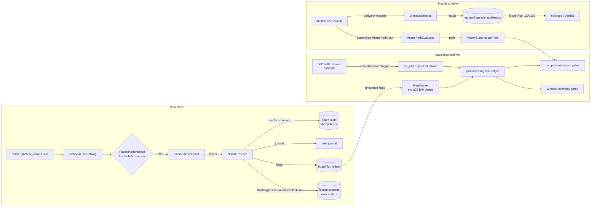
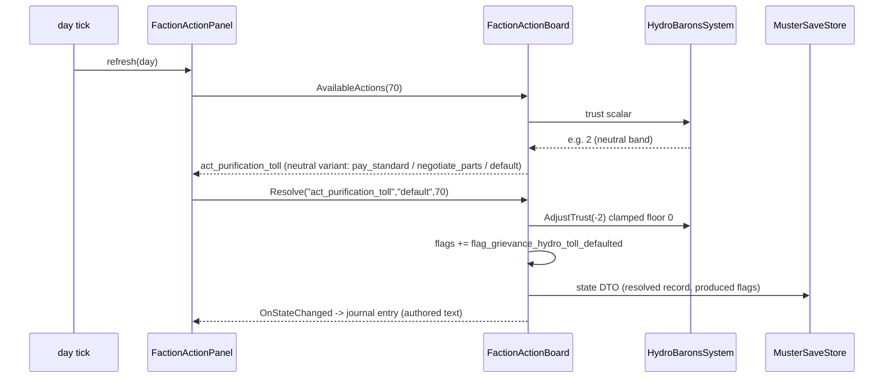

# Plan 25 Integration Plan — Faction Ecology & the Muster

> Status: ACTIVE · Owner: Plan 25 execution stream · Created: 2026-09-01
> Source requirement: Plan 25 (Faction Ecology & the Muster: Politics, War & the Gathering)
> Method: forensic audit first (three parallel repo sweeps), then runtime seams, then authored content.

---

## 1. Objective

Turn ASHFALL's political systems from isolated reputation surfaces into a traceable late-game spine:

```
peacetime ecology → grievances → treaty strain → escalation → faction war
→ war weariness → Muster path → witness testimony → epilogue/Verdict consequence
```

without duplicating any existing authority (standing, treaty, war, Muster, quest, epilogue).

## 2. Current reality (verified 2026-09-01, three forensic sweeps)

### 2.1 What the plan document assumed vs what the repo actually has

| Plan 25 assumption | Verified reality |
|---|---|
| `holdfast_factions.json` (3 actions) / `standing_record_factions.json` (1 action) are action catalogs | Both are **faction dossiers** (`id, display_name, alignment, wants[], offers[], signature_quote, access_rule, trust`). `holdfast_factions.json` feeds the Holdfast terminal UI only (`HoldfastCatalog.cs:138`, consumers `src/Host/HoldfastTerminalPanel.cs:580`). `standing_record_factions.json` is **dead data** — no loader parses it (only a test content assertion and `FactionIconCatalog.cs:72`). |
| `foundry_faction.json` 6 internal divisions are usable | True, but display-only (`src/UI/FactionsPanel.cs:226`). |
| The four Muster systems consume authored actions | They are **hand-rolled numeric state machines** (`Assets/Ashfall.Core/Muster/`): no JSON loading, no action selection, no thresholds, no cooldowns, no RNG. Only gates that exist: `CoalitionCampSystem.Form(day)` ≥ `MusterSystem.MusterOpeningDay` (260) and one-shot `QuestApproach` locks. |
| Witness architecture supports testimony variants | `muster_witnesses.json` = 3 flat entries `{id, witness_name, location_id, knowledge_key, day_min, body}`. No variants, no flags, no faction, no ordering. Core (`WitnessCatalog.cs`) is a dumb list; only the host UI gates `day_min` (`src/Muster/JournalWitnessPanel.cs:67`). Loader returns **empty list** if `schema_version > 1`. |
| A "Muster path" concept exists | Only player-chosen `QuestApproach` A–D → `endingKey` (`the_amnesty`, `the_open_muster`, `the_corridor`, `the_blood_price`) → `MusterRecord` → `muster_epilogues.json`. No war-state derivation; `MusterSystem` triggers day-only (`MusterOpeningDay = 260`, `MusterSystem.cs:222`). Zero references to `FactionWarSystem`/treaties anywhere in `Muster`. |
| `RegionalTreatySystem` is consumable | Core system exists and is tested, **but the host never calls `LoadCatalog`** (`src/Main.ShelterSocial.cs:68` constructs + restores only) — catalog is empty in production; `Propose` always fails `unknown_treaty`. Authored treaty corpora (`narrative/regional_treaty_protocols.json` = 16 treaties, `foundry_accords.json` = 12) use a **different narrative schema** consumed by `RegionalTreatyCatalog` (read-model) and `SilentFoundryCatalog`. |
| Escalation/weariness flags exist | None. Zero `*grievance*`, `*treaty_breach*`, war-weariness ids in code or data. `escalation_*` flags in `events.json` are the leadership-crisis chain (different domain). |
| 06C war spine to surround | Real: `FactionWarSystem` (`YearOfAsh/FactionWarSystem.cs` — standing −100..+100 per faction, `isHostile` ≤−50 / `isAllied` ≥+50, `WarTension` 0–100, friction no-op ≤ day 240 then +1/day, territorial clash every 15 days, zero RNG) + `FactionWarChainRunner` (22 chains / 45 stages, trigger grammar closed set: `PlayerVisitedTrigger`, `ChainResolvedTrigger`, `DayOffsetTrigger`, `AndTrigger`, `AlwaysTrigger`; only choice effect = `moraleDelta`; **every stageId requires an explicit `FactionWarTriggerTable` entry** — test-pinned). |
| War precedes the Muster | **Inverted in authored canon.** Muster opens day 260 (inside `Phase5_FactionSiege` 241–300); the war chain is authored at **minDay 480–605** (bands `cold_war` 480–498, `open_conflict` 503–528, `the_offensive` 533–560, `culmination` 565–605, incl. `evt_d588_ceasefire_by_exhaustion`). The campaign calendar (`Campaign/CampaignCalendar.cs`) has **no day cap** — day 360 is the epilogue matrix *view*, play continues into the war window. |

### 2.2 Standing is fragmented (no single authority)

| Store | Range | Used by |
|---|---|---|
| `FactionStanceEngine` (`Economy/FactionStanceTypes.cs:45-54`) | −100..+100, thresholds (raid −50, rob −20, min-trade −40, intel-share +40), no decay | Trade surfaces (`SilentFoundryHostSession`, `DeepCoastHostSession`) |
| `PrpfStandingSystem` (`Factions/PrpfStandingSystem.cs:27-38`) | −100..+100 (Hostile ≤−50, Allied ≥+50) | PRPF join gate |
| `ScavengerGuildState.trust`, `HydroBaronsState.trust` | private floats, floor 0, **no ceiling** | Only their own systems |
| `IronRaidersState` | aggression 0..1, visibility (floor 0.1) — no trust at all; `SetAggressionLevel` has **no production caller** | Raid-chance formula (host never rolls) |
| `CoalitionCampState` | membersRallied, garrisonLockoutRisk 0..100 | Camp strategy |

Decision: Plan 25 uses **each system's own persisted scalar** as its standing read. No new cross-faction currency.

### 2.3 Cross-plan candidate-pool availability for witnesses

| Pool | Status | Binding |
|---|---|---|
| 20B named NPCs | SOLID | `npc_*` in `wasteland_settlement_npcs.json`, `characters.json` |
| 09 palliative/medical | SOLID | `SickListSystem.palliativePlan`, `AssignPalliative`, `item_palliative_morphine` |
| 12A raised children | PARTIAL | `LineageRecord` (parent/adopted/mentor childIds) — no "raised" boolean |
| 18A claimants | PARTIAL | quest ids only (`quest_holdfast_census_claimant_audit`) |
| 22C foundry labor | PARTIAL | `SilentFoundryIds.JournalStrike`, strike-day state — no actor ids |
| 10A spared warlord | MISSING | nearest existing: `flag_become_warlord`, `flag_messenger_kept` (MoralChoiceIds) |
| 24B rescuees | MISSING | distress signals are prose-only content |

Rule (Plan 25 G.12): every witness binds real flags; archetypes without stable flags get **substituted or flag-authored at their producer**, never left as dead content.

### 2.4 Known breakage when witnesses grow 3 → 15

- `Ashfall.Core.Tests/MusterContentCatalogTests.cs:52-55` — pins count 3 + all three ids.
- `src/Main.UiTests.Muster.cs:40` — `_muster.Witnesses.Count == 3`.
- `src/Main.Muster.cs:215-217` — "Three accounts: {n} loaded" copy.

## 3. Architecture — four runtime seams (Core, `Ashfall.Core.Muster`, engine-agnostic)

No new standing authority, no new war resolution, no new diplomacy engine. Each seam extends an existing owner.

### S1 — FactionActionBoard (peacetime faction actions)

- **Data authority (new):** `Assets/StreamingAssets/Data/muster_faction_actions.json`, `schema_version: 1`, snake_case.
- **Entry shape:** `{id, faction_id, title, min_day, max_day, once, cooldown_days, requires_flags[], forbids_flags[], variants: [{band, text, choices: [{choice_id, text, effects: {trust_delta, item_id, item_amount, flags[], journal}}]}]}` where `band ∈ hostile|poor|neutral|good|allied`.
- **Runtime (new):** `Assets/Ashfall.Core/Muster/FactionActionBoard.cs` — deterministic per-day availability (day window → flag gates → once/cooldown → standing band), ordinal-sorted resolution, produces flags into `IFlagLedger`, persists action history `{action_id, day}` for idempotence, `CaptureState/RestoreState` DTO.
- **Standing bands (per system, documented in MUSTER_FACTION_RUNTIME_CONTRACT.md):** guild/hydro `trust` bands; raiders band derived from aggression/visibility; camp from formed/members/lockout. Thin additive `AdjustTrust(float)` seams where a system lacks one (guild, hydro) — events raised, clamped, save-safe.
- **Host:** `MusterHostSession` constructs the board; `MusterHostSave.FactionActions` (null-tolerant for old saves); `src/Main.Muster.cs` handler surfaces actions in the existing codex/status pattern.

### S2 — Witness schema v2 + WitnessSelector

- `muster_witnesses.json` → `schema_version: 2`. Entries gain optional `faction_id`, `priority`, and `testimonies: [{variant_id, requires_any_flags[], requires_all_flags[], forbids_flags[], body}]`. v1 `body` = one unconditional testimony (permanent back-compat path).
- `WitnessCatalog.CurrentSchemaVersion` → 2 with v1 fallback (fixes the silent-empty trap at `WitnessCatalog.cs:49`).
- New `WitnessSelector` (Core): day gate → eligibility via new port **`IWitnessEligibility`** (`IsFlagSet`, `IsSubjectAlive`, `IsFactionPresent`) → first-match testimony in authored order → deterministic ordering (`priority` desc, then id ordinal) → optional cap with faction-diversity rule.
- Results (`witness_id → {variant_id, delivered_day}`) persisted in `MusterHostSave` → stable epilogue/Verdict surface. Dead subjects never testify (absence/representation instead).

### S3 — MusterPathEvaluator

- New Core pure function: inputs = `FactionWarSystem` state (dominantFactionId, WarTension, standings), treaty read-model state, grievance/peace flags, `CoalitionCampState` → `muster_path ∈ {negotiated, victors, unsettled}`.
- Additive `musterPath` field on `MusterState` (default empty; old saves fine). Evaluated at Muster resolution; re-evaluated on war-state change (idempotent).
- Drives camp-scene variants, witness testimony pressure, and the epilogue/Verdict hook. Player Approach A–D selection unchanged; path is the political context around it.

### S4 — War-event flag/standing extension

- `FactionWarContentCatalog` DTO: optional `requires_flag`/`produces_flag` on stages; `requires_flag`/`produces_flag`/`standing_delta` on choices (`standing_delta` applied via `FactionWarSystem.ModifyStanding`).
- Exactly **one** new trigger node `FlagTrigger` added to the closed grammar + explicit `FactionWarTriggerTable` entries (totality test enforces).
- All 16 new chains authored into `faction_war_events.json`: 6 escalation (E-P1..P6, grievance-gated, ~day 200–300), 6 mid-war (E-W1..W6, gated via **existing** `ChainResolvedTrigger` on real 480–605 battle stages), 4 weariness (E-R1..R4, culmination band, feeding toward `evt_d588_ceasefire_by_exhaustion`).

### Cross-cutting

- Bounded flag vocabulary: `flag_grievance_*`, `flag_favor_*`, `flag_war_*`, `flag_peace_*` — each with producer → consumer → resolution recorded in `PLAN_25_LATE_GAME_CONTINUITY_MATRIX.md` and pinned by a lint test.
- New catalogs registered in `CatalogBootValidator` + `ContentUtilizationScanner`.
- Political journal/codex entries via existing host `TryAddRawEntry` pattern (major treaties/breaches/war transitions/Muster invite only — no standing-delta spam).
- Culture codex: `muster_faction_culture.json` + Core loader + codex panel consumption.
- Treaty host feed (isolated, revertible commit): adapter from `narrative/regional_treaty_protocols.json` → `TreatyDefinition`, loaded in `SetupRegionalTreaty`; fallback = read-model only, documented.

## 4. Timeline anchor (repo pacing; supersedes plan-example dates)

| Phase | Days | Content |
|---|---|---|
| Peacetime ecology | 1–199 | faction actions, culture, favors/grievances |
| Escalation backdrop | 200–259 | E-P1..P6 (friction begins 240; Muster opens 260) |
| Muster window | 260–360 | gathering, camp scenes, witnesses, path evaluation |
| Hot war (06C canon) | 480–605 | E-W1..W6 alongside authored bands; E-R1..R4 → ceasefire 588 |
| Post-ceasefire | 605+ | epilogue/Verdict consumption of testimony results |

Deviation from the plan document's "war → weariness → Muster" order is deliberate: continuity outranks narrative preference (plan §13.10); the 06C chain days and `MusterOpeningDay` are canon and untouched.

## 5. Batches (each = one commit; full verification gates per AGENTS.md)

1. Forensic docs (this file + 8 contract/audit docs).
2. Seam S1 → 3. Seam S2 → 4. Seam S3 → 5. Seam S4 (runtime before content).
6. **Vertical slice GATE** — A1 + grievance flag + E-P1 + W6 (2 testimonies) + arrivals scene + negotiated path + save/load tests. No scale-out until green.
7. 25A ecology (4 commits: Guild / Hydro / Raiders / Coalition). 8. 25E culture. 9. 25C escalation. 10. 25C war context + weariness. 11. Paths finalized. 12. 25B witnesses (15 total). 13. 25F camp scenes. 14. 25D + 25G cross-plan + treaty feed. 15. 25H QA + closeout.

## 6. MUST PRESERVE / MUST NOT

PRESERVE: `MusterOpeningDay = 260`; 06C chain ids/days/bands; Approach A–D → endingKey flow; all save formats (additive fields only); faction canon; v1 witness loading forever.
MUST NOT: new standing/war/treaty resolution systems; `System.Random`/`Guid.NewGuid()`; engine refs in Core; dead content; witness resurrection; retconned dates; new guild currency; display-name keys.

## 7. Verification

Per gate: `dotnet build Ashfall.Core.Tests/...` clean · `dotnet test` green · `dotnet build Ashfall.csproj` 0/0 · `godot --headless -- --data-integrity-selftest` 0 errors · `--bridge-selftest` exit 0 · domain gates `--muster-selftest`, `--muster-uitest`, content-utilization, narrative-continuity at content batches. Done = Plan 25 §17 checklist + `PLAN_25_FACTION_ECOLOGY_MUSTER_CLOSEOUT.md`.

---

# EXPANSION 2026-09-25 — Plan 25 Faction Ecology & the Muster: Full Integration Framework & Code Architecture

> Expansion of the 2026-09-01 integration plan above. The original text is preserved byte-for-byte; everything below this separator is the 2026-09-25 expansion.
> Evidence basis: source and data inspected in the working tree on 2026-09-25 (`Assets/Ashfall.Core/`, `src/`, `Assets/StreamingAssets/Data/`, `Ashfall.Core.Tests/`, `docs/muster/`, `INTEGRATION_PLANS.md`).
> Documentation-only expansion. No code, data, save format, or gate behavior is changed by this file.

## Part I — Expansion preamble

### I.1 Thesis

ASHFALL's political domain stopped being a set of isolated reputation surfaces on 2026-09-01. The spine this plan was written to install — peacetime ecology feeding grievances, grievances feeding escalation, escalation coloring the hot war, the hot war feeding weariness, and all of it landing in a testimony ledger that outlives the campaign's choices — is now load-bearing in the shipped repo. What remains undocumented is exactly how it is load-bearing: which file owns which decision, which JSON key feeds which Core scalar, which save field carries which ledger, and which seams were deliberately left as future hooks rather than half-built.

This expansion is the engineering companion the original plan deferred. It records the framework as built, not as imagined: the same four seams (S1–S4), the same 16 war chains, the same bounded flag vocabulary — but at the depth a builder or integrator needs to extend any one of them without breaking the others. It also records, with the same discipline, the parts that did **not** land: the epilogue/Verdict consumption of the testimony ledger is still a future hook, several treaty statuses remain unwired, and two of the plan's cross-plan witness pools were substituted away rather than fabricated.

### I.2 Scope

- The four Plan 25 runtime seams: S1 `FactionActionBoard`, S2 witness schema v2 + `WitnessSelector`, S3 `MusterPathEvaluator`, S4 the war-event flag/standing extension.
- The authored political content those seams consume: `muster_faction_actions.json` (12 actions), `muster_witnesses.json` (27 entries as of 2026-09-25), the 16 `evt_p25_*` chains inside `faction_war_events.json`, `muster_faction_culture.json` (25 entries), `muster_camp_scenes.json` (4 scenes / 18 variants), and `whitelists/plan25_flags.json`.
- The host adapters that make the seams observable: `MusterHostSession`, `MusterSaveStore`, `FactionActionPanel`, `FactionCultureCodexPanel`, `JournalWitnessPanel`, `RegionalTreatyFeed`, and the `--faction-ecology-selftest` verb.
- Cross-system touch points (trade stance, expedition danger, radio, morale, epilogue/Verdict) as an interaction matrix, not as new authority.

### I.3 Non-goals

Restated from the original §6 and extended with everything the post-closeout waves could have added but deliberately did not:

1. **No new standing authority.** Every political read still resolves to a system's own persisted scalar (`FactionStanceEngine` trust, guild/hydro `trust`, raider `aggressionLevel`/`visibility`, `PrpfStandingSystem` standing, `CoalitionCampState` counters, `FactionWarSystem` per-faction standing). The board computes bands over those scalars; it never mirrors them into a second currency.
2. **No new war resolution.** Plan 25 chains fire inside the closed 06C trigger grammar and terminate inside 06C canon. `evt_d588_ceasefire_by_exhaustion` still ends the war; `evt_p25_*` chains only add context, flags, morale, and small standing deltas.
3. **No new treaty engine.** The mechanical treaty catalog load is a feed, not a rules system. `Suspended`/`Expired` treaty statuses and `violation_penalty_affinity` handling remain pre-existing gaps in `RegionalTreatySystem` and are out of scope here.
4. **No epilogue rewrites.** Approach A–D → `endingKey` → `muster_epilogues.json` is untouched. `MusterState.musterPath` and `witnessResults` are recorded for the future Plan 15A/15B consumption seam; nothing in the current epilogue path reads them yet.
5. **No engine dependencies in Core.** Every component specified here lives in `Assets/Ashfall.Core/` (netstandard2.1, engine-free) or `src/` (net8.0 host). Panels never decide politics.
6. **No RNG in political resolution.** No `System.Random`, no `Guid.NewGuid()`, no hash-order iteration anywhere in the seams. Availability, selection, and path derivation are total functions of (catalog, state, day).
7. **No witness resurrection, no retconned dates, no dead content.** Dead subjects never testify; `MusterOpeningDay = 260` and the 06C chain days are canon; every authored flag has a producer and a consumer recorded in the whitelist.

### I.4 Evidence policy and the implementation-status taxonomy

The original plan said `Status: ACTIVE`. That was true in the plan sense — the work was unexecuted when written. It would now be false as a completion claim in the other direction: the work executed, in full, on the plan's own schedule. This expansion therefore carries a three-way label on every load-bearing claim:

| Label | Meaning |
|---|---|
| `VERIFIED-IMPLEMENTED` | The artifact was found in the working tree on 2026-09-25 at the cited path, and its consumer or test was found with it. |
| `VERIFIED-NOT-IMPLEMENTED` | The artifact was looked for at its natural owner paths and is absent; the plan text remains the only source. |
| `UNVERIFIED (plan text)` | Plausible and consistent with surrounding evidence, but not independently re-checked in this expansion; treat as the plan's claim, not the repo's. |

Where a plan assumption changed between 2026-09-01 and 2026-09-25 (line drift, schema key case, counts that grew), the expansion states the current value and the date-stamped former value side by side. No claim in this file should require a second audit to use.

### I.5 Executive status of the four seams (evidence summary)

| Seam | Status | Primary evidence (paths verified 2026-09-25) |
|---|---|---|
| S1 FactionActionBoard | `VERIFIED-IMPLEMENTED` | `Assets/Ashfall.Core/Muster/FactionActionBoard.cs`, `Assets/Ashfall.Core/Muster/FactionActionCatalog.cs`, `Assets/StreamingAssets/Data/muster_faction_actions.json` (schema_version 1, 12 actions), `src/Host/MusterHostSession.cs` (Board, ResolveFactionAction), `src/Host/MusterSaveStore.cs:30` (`FactionActions`), `src/Muster/FactionActionPanel.cs`, `Ashfall.Core.Tests/FactionActionBoardTests.cs` (17 `[Fact]`/`[Theory]` cases) |
| S2 Witness v2 + Selector | `VERIFIED-IMPLEMENTED` | `Assets/StreamingAssets/Data/muster_witnesses.json` (`schema_version: 2`, 27 entries), `Assets/Ashfall.Core/Muster/WitnessCatalog.cs` (v2 DTO + loader), `Assets/Ashfall.Core/Muster/WitnessSelector.cs` (`IWitnessEligibility`, `PassAllWitnessEligibility`, `Select`), `src/Host/MusterHostSession.cs` (`DeliverWitnesses`, `BoardFlagEligibility`, `SubjectLivingResolver`), `src/Main.Muster.cs:49` (resolver bound to survivor roster), `Ashfall.Core.Tests/WitnessSelectionTests.cs` (14), `Ashfall.Core.Tests/Plan84WitnessExpansionTests.cs` |
| S3 MusterPathEvaluator | `VERIFIED-IMPLEMENTED` | `Assets/Ashfall.Core/Muster/MusterPathEvaluator.cs` (`MusterPaths`, `MusterPathInput`, `DominanceTensionThreshold = 60`), `Assets/Ashfall.Core/Muster/MusterSystem.cs:38,154` (additive `musterPath`, validated `SetMusterPath`), camp-scene consumption in `src/Host/MusterHostSession.cs:159`, `Ashfall.Core.Tests/MusterPathEvaluatorTests.cs` (14) |
| S4 War flag/standing extension | `VERIFIED-IMPLEMENTED` | `Assets/Ashfall.Core/YearOfAsh/FactionWarChainRunner.cs:45` (`FlagTrigger`) and trigger-table lines 218–245 (17 `evt_p25_*` stage entries), `Assets/Ashfall.Core/YearOfAsh/FactionWarContentCatalog.cs:169–194` (`requiresFlag`/`producesFlag`/`standingDelta`), `Assets/Ashfall.Core/YearOfAsh/FactionWarSystem.cs:88` (`ModifyStanding`), 16 chains in `Assets/StreamingAssets/Data/faction_war_events.json`, `Ashfall.Core.Tests/FactionWarFlagExtensionTests.cs` (10) |

Items still open (expanded in §II.6): Plan 15A/15B epilogue/Verdict consumption of `musterPath`/`witnessResults` (`VERIFIED-NOT-IMPLEMENTED` as a consumer), treaty `Suspended`/`Expired` wiring, and a telemetry playtest pass over the 15-step late-game journey.

### I.6 Reading guide

- **Part II** — the fragmented-standing audit re-run today; what the 2026-09-01 forensic sweeps found versus what the tree holds now.
- **Part III** — the integration framework as built: data flow per seam, event flow, save capture/restore, determinism, integrity validation.
- **Part IV** — the political stack's module map and per-component architecture with sequence walkthroughs.
- **Part V** — the bulk: engineering specifications for S1–S4 (V.A–V.E), all 16 war chains (V.C), the 27-witness roster (V.B), cross-plan binding (V.F), the culture codex (V.G), camp scenes (V.H), the treaty feed (V.I), the flag-vocabulary matrix (V.J), per-batch engineering checklists (V.K), the per-faction band models (V.L), the Muster window operationally (V.M), the consolidated authoring style guide (V.N), the host session contract (V.O), performance notes (V.P), and the twelve actions read as design documents (V.Q).
- **Part VI** — cross-system interaction matrix, emergent-consequence design, the epilogue/Verdict contract, tone discipline, and failure/recovery narratives (VI.1–VI.5).
- **Part VII** — verification and acceptance: per-seam test matrix, gate commands, the MUST PRESERVE / MUST NOT contract, rollback, the acceptance definition, and the annotated 27-check `--faction-ecology-selftest` walk (VII.1–VII.6).
- **Part VIII** — appendices: glossary, ID vocabulary, timeline anchors, a full campaign political-arc sketch, open questions, plan relationships, maintenance rules, the document corpus, a claim-to-evidence index, per-faction dossiers, and a runtime operations quick reference (VIII.1–VIII.11).

A reader who only wants "can I extend X safely" needs Part IV (who owns what) and the relevant Part V section (what the data contract is). A reader auditing the closeout should start at §II.5, which reconciles the closeout's shipped counts with the tree's current counts.

---

## Part II — Current authority audit (re-verified 2026-09-25)

The original §2 recorded three forensic sweeps dated 2026-09-01. This part re-runs the same audit against the current tree and records every delta. Where nothing moved, that is stated once and not repeated per row.

### II.1 The §2.1 assumption table, re-verified

| 2026-09-01 verified reality | 2026-09-25 reality | Status |
|---|---|---|
| `holdfast_factions.json` / `standing_record_factions.json` are dossiers, not action catalogs; the latter is dead data | Unchanged. `standing_record_factions.json` still has no production loader; it remains dossier/reference content with a content assertion and icon mapping as its only consumers | `VERIFIED-IMPLEMENTED` (as dossiers); the "dead data" finding still stands — do not author actions into it |
| `foundry_faction.json` divisions display-only | Unchanged; internal divisions remain a `src/UI/FactionsPanel.cs` read-model concern | `VERIFIED-IMPLEMENTED` |
| Muster systems are hand-rolled numeric state machines with no JSON loading | True for the machines themselves (`MusterSystem`, `CoalitionCampSystem`, `ScavengerGuildSystem`, `HydroBaronsSystem`, `IronRaidersSystem` remain scalar-owned), but the *action layer above them* is now data-driven: `muster_faction_actions.json` → `FactionActionCatalog` → `FactionActionBoard` | `VERIFIED-IMPLEMENTED` (S1) |
| Witness architecture is 3 flat entries, schema v1, silent-empty on newer schema | Replaced. `schema_version: 2`, 27 entries, `testimonies[]` with flag gates, `priority`, `faction_id`, `subject_id`; loader documents rejection semantics for schema > current instead of merely returning empty on unknown futures; v1 files still load (permanent back-compat) | `VERIFIED-IMPLEMENTED` (S2) |
| No "Muster path" concept; only QuestApproach A–D → endingKey | `MusterPaths` (negotiated/victors/unsettled) exist as additive political context; Approach A–D → endingKey flow untouched | `VERIFIED-IMPLEMENTED` (S3) |
| `RegionalTreatySystem` never gets a catalog in production; `Propose` always fails `unknown_treaty` | Closed. `src/Main.ShelterSocial.cs:74` `SetupRegionalTreaty` now loads through `RegionalTreatyFeed` (`Assets/Ashfall.Core/RegionalTreatyFeed.cs`) → `RegionalTreatyCatalogLoader` → `rtSys.LoadCatalog` (line 86). Recorded as CF-P25/DEC-96 in `INTEGRATION_PLANS.md:263` | `VERIFIED-IMPLEMENTED` (feed) |
| Zero grievance/breach/weariness flags anywhere | 45-flag bounded vocabulary shipped, machine-checked: `Assets/StreamingAssets/Data/whitelists/plan25_flags.json` (`schema_version: 1`, `orphan_knocks: []` at closeout), regenerable via `tools/plan25/generate_flag_whitelist.py` | `VERIFIED-IMPLEMENTED` (S4 + whitelist) |
| 06C war spine: 22 chains / 45 stages, closed trigger grammar, totality-pinned | Grew to 38 chains / 62 stages: the 22 06C chains untouched (ids, days, bands) plus 16 Plan 25 chains in three new bands (`escalation`, `war_context`, `weariness`). `FlagTrigger` added as the single new grammar node; every Plan 25 stage has an explicit `FactionWarTriggerTable` entry | `VERIFIED-IMPLEMENTED` (S4) |
| "War precedes Muster" inverted: Muster opens 260 inside Phase5 241–300; hot war at 480–605 | Canon held. `MusterSystem.cs:333` `MusterOpeningDay = 260`; 06C minDays unchanged; Plan 25 escalation authored 200–250 (pre-Muster), war context 512–555 and weariness 568–584 (inside the war window), ceasefire terminator untouched | `VERIFIED-IMPLEMENTED` (pacing) |

One structural deviation from the original §3 data spec is deliberate and should not be "fixed": the plan sketched snake_case flag keys (`requires_flag`/`produces_flag`/`standing_delta`) for the war extension, but the shipped extension uses the **camelCase keys of the existing `faction_war_events.json` schema** (`requiresFlag`, `producesFlag`, `standingDelta`), because `FactionWarContentCatalog` already owned that DTO shape and one catalog must have one schema. The snake_case spelling in the original plan text is superseded. (Counts in the shipped file: 21 `producesFlag`, 8 `requiresFlag`, 8 `standingDelta` occurrences.)

### II.2 The fragmented-standing table, re-verified

The decision "each system's own persisted scalar is the standing read; no cross-faction currency" is now enforced structurally: `FactionActionBoard.ComputeBand(factionId)` switches over the four faction ids and reads each owner's scalar directly. Nothing else in the political stack stores a standing number.

| Store | Current location | Range / shape | Plan 25 use today |
|---|---|---|---|
| `FactionStanceEngine` | `Assets/Ashfall.Core/Economy/FactionStanceEngine.cs:13` (constants in `Economy/FactionStanceTypes.cs:46`) | −100..+100 stance with trade-surface thresholds; no decay | Unchanged; trade surfaces read it as before. Not banded by the board — the board bands only the four ecology factions |
| `PrpfStandingSystem` | `Assets/Ashfall.Core/Factions/PrpfStandingSystem.cs:21–28` | `MinStanding −100`, `MaxStanding 100`, `HostileThreshold −50`, `AlliedThreshold 50`; `OnStandingChanged` event | Unchanged; PRPF join gate. Same −50/+50 threshold convention the board's band vocabulary borrows |
| Guild trust | `Assets/Ashfall.Core/Muster/ScavengerGuildSystem.cs:16` (`public float trust`), floor 0 applied at the mutate sites (lines 58, 73) | float, floor 0, no ceiling | Banded via `BandForTrust`; plan-25 additive seam documented at line 86 ("apply a signed trust adjustment") — `AdjustTrust` clamps, raises the state-changed event, and is save-safe |
| Hydro trust | `Assets/Ashfall.Core/Muster/HydroBaronsSystem.cs` (same shape as guild; board constructor takes it as the second band source) | float, floor 0 | Banded via `BandForTrust`; `trust_delta` effects from `act_purification_toll`, `act_hydro_emergency_appeal`, `act_intake_dispute` |
| Raider aggression/visibility | `Assets/Ashfall.Core/Muster/IronRaidersSystem.cs:14,42` (`aggressionLevel` 0..1), setter clamps at lines 46–50 | float aggression + visibility, floor 0.1 visibility | **Delta changed since the 2026-09-01 audit:** `SetAggressionLevel` now has a production caller — `FactionActionBoard.cs:259` applies `aggression_delta` effects from raider actions. The audit finding "no production caller" is historical |
| Camp state | `Assets/Ashfall.Core/Muster/CoalitionCampSystem.cs:13–15` (`membersRallied`, `garrisonLockoutRisk` 0..100) | int counters | Coalition actions apply `members_delta` / `lockout_delta` through the board (`lockout_delta: −5` on `sit_mediator` in `act_coalition_mediation_request`); band derives from formed/members/lockout |
| War standing | `Assets/Ashfall.Core/YearOfAsh/FactionWarSystem.cs:88` `ModifyStanding(string factionId, int delta)` | −100..+100 per faction; hostile ≤ −50, allied ≥ +50 | Receives the 8 choice-level `standingDelta` values from Plan 25 chains, routed by the host's `StandingDeltaApplier` — Core never mutates war standing itself |

### II.3 Cross-plan witness candidate pools, re-verified

The original §2.3 pool table described availability *before* the roster was authored. Post-closeout reality, including what was substituted:

| Pool | 2026-09-01 status | Outcome in shipped content |
|---|---|---|
| 20B named NPCs | SOLID (`npc_*` in `wasteland_settlement_npcs.json`, `characters.json`) | Bound structurally, not by specific npc rows: `WitnessDefinition.subjectId` (`WitnessCatalog.cs:35`) + `SubjectLivingResolver` on `MusterHostSession` bound in `src/Main.Muster.cs:49` to the live survivor roster (`_survivors?.RosterState?.Find(...)?.IsAlive ?? true`). The 12 Plan 84 investigation witnesses are roster-adjacent named survivors; direct `npc_*` subject binding for the Plan 25 set remains deferred (see §II.6) |
| 09 palliative/medical | SOLID (`SickListSystem.palliativePlan`, `AssignPalliative`, `item_palliative_morphine`) | No palliative-bound witness shipped. Census binding is live but pools were not forced: the camp-medic witnesses bind to *faction flags*, not to palliative state. Deferred rather than fabricated |
| 12A raised children | PARTIAL (`LineageRecord` childIds, no "raised" boolean) | No lineage-bound witness shipped. Same deferral rule |
| 18A claimants | PARTIAL (quest id only) | **Bound.** `witness_claimant_auditor` (faction_hydro_barons, day 210) and `witness_scavenger_claimant` (day 200) carry the claimant/audit premise as testimony content gated on real audit flags (`flag_favor_hydro_intake_audited` / `flag_favor_scavenger_arbitration_fair`) |
| 22C foundry labor | PARTIAL (`SilentFoundryIds.JournalStrike`, no actor ids) | Partially bound: `witness_foundry_molder_hask` (Plan 84 grain-convoy thread) gives the foundry a testimony voice, though it is gated on the investigation thread, not on strike state. A strike-gated variant remains unauthored |
| 10A spared warlord | MISSING at audit (nearest: `flag_become_warlord`, `flag_messenger_kept`) | **Substituted per plan rule G.12.** `witness_messengers_keeper` binds `helped` → `flag_messenger_kept`, `failed` → `flag_become_warlord` — both real `MoralChoiceIds` producers. No fabricated "spared warlord" flag exists |
| 24B rescuees | MISSING (distress prose-only) | **Substituted away.** No rescuee witness; the slot was spent on the camp set (`witness_camp_medic`, `witness_camp_dissenter`, `witness_overflow_medic`) whose flags exist. Recorded in the closeout's continuity decisions |

### II.4 The §2.4 breakage points, re-verified

| 2026-09-01 breakage | 2026-09-25 state |
|---|---|
| `Ashfall.Core.Tests/MusterContentCatalogTests.cs` pinned count 3 + ids | Pin softened to a floor: line 55 asserts `witnesses.Count >= 3` and still pins `witness_3_signals_intercept` by id. Roster growth no longer breaks the catalog test |
| `src/Main.UiTests.Muster.cs` pinned `Witnesses.Count == 3` | Line 41 now asserts `_muster.Witnesses.Count >= 3` |
| `src/Main.Muster.cs` "Three accounts: {n}" copy | Replaced: line 304 renders "No witness accounts loaded." as the empty-state; count copy no longer hardcodes three |

### II.5 What landed, in what order (audit trail)

| When | Wave | Evidence |
|---|---|---|
| 2026-09-01 | Plan 25 full-pass execution (15 batches, per-batch commits) | `docs/muster/PLAN_25_FACTION_ECOLOGY_MUSTER_CLOSEOUT.md` — delivered 12 actions, 6 culture entries, 15 witnesses / 36 conditional testimonies, 4 camp scenes, 6+6+4 chains, 3 paths, 45-flag whitelist; test evidence recorded per gate |
| 2026-09-01 | Forensic companion docs | `docs/muster/PLAN_25_LATE_GAME_CONTINUITY_MATRIX.md` (25G.13), `docs/muster/MUSTER_WITNESS_RUNTIME_CONTRACT.md`, `docs/muster/MUSTER_WITNESS_CANDIDATE_MATRIX.md`, `docs/muster/MUSTER_TESTIMONY_STYLE_GUIDE.md`, `docs/muster/PLAN_25_POLITICAL_QA_MATRIX.md`, `docs/factions/PLAN_25_POLITICAL_TIMELINE.md` |
| Post-closeout follow-up | DEC-96 (CF-P25) recorded in `INTEGRATION_PLANS.md:263`: treaty catalog feed, standing read model, `SubjectLivingResolver`, `IFactionActionItemSink`, treaty-breach raid-pressure consequence; `Plan25FactionEcologyTests` 5/5; `--faction-ecology-selftest` 27/27 | `INTEGRATION_PLANS.md:263` |
| Post-closeout follow-up | DEC-99: dedicated `src/UI/FactionCultureCodexPanel.cs`, route `faction_culture_codex`, overview button in `FactionsPanel.cs`, culture corpus grown to 25 entries | `INTEGRATION_PLANS.md:257` |
| Post-closeout follow-up | Plan 84: witness roster 15 → 27 (three investigation threads × 4: coastal evacuation; grain convoy massacre; third thread), founding 3 and Plan 25's 12 preserved intact | `docs/muster/PLAN84_CLOSEOUT.md`; `Ashfall.Core.Tests/Plan84WitnessExpansionTests.cs` |

### II.6 Still open after closeout (nothing here is a plan approval)

1. **Epilogue/Verdict consumption** — `MusterState.musterPath` and `MusterState.witnessResults` are recorded and persisted, but no epilogue or Verdict code reads them today. The continuity matrix classifies this `[X] future hook` (Plan 15A/15B). `VERIFIED-NOT-IMPLEMENTED`; the ledger is the contract, the consumer does not exist yet.
2. **Treaty status machinery** — `RegionalTreatySystem.violation_penalty_affinity` exists as a field (`RegionalTreatySystem.cs:30`) but `Suspended`/`Expired` lifecycle handling remains unwired, per the closeout's own limitations list. Pre-existing gap, explicitly out of Plan 25 scope.
3. **Direct npc subject binding for the Plan 25 witness set** — resolver port is live and bound; individual `subject_id` values on the 12 ecology witnesses are not populated from 20B census ids. Deferred by the candidate matrix, not lost.
4. **Band-variant coverage** — several actions ship three band variants with poor/good falling back to neutral by design; the QA matrix documents this as accepted, not as debt accidentally shipped.
5. **Telemetry playtest** — the closeout recommends one full telemetry pass over the scripted 15-step late-game journey before release gating. `UNVERIFIED (plan text)` whether any such session has run since; nothing in the tree records it.
6. **Host CLI selftest naming drift** — the original §7 listed `--muster-selftest` / `--muster-uitest` as domain gates; both exist per the closeout's final gate list, and the Plan 25-specific verb is `--faction-ecology-selftest` (dispatch at `src/Host/HostCli.SelfTests.cs:783` via `FactionEcologyHeadlessDemo.Run`). `UNVERIFIED (plan text)` for the exact current check counts inside `--muster-selftest`; the closeout recorded 25/25 PASS at closeout time.

---

## Part III — Integration framework

This part states the framework the seams actually implement: the invariants, the tier-by-tier data flow, the event flow, the save contract, the determinism contract, and the integrity pipeline for the political catalogs. Everything here is `VERIFIED-IMPLEMENTED` unless labeled otherwise.

### III.1 Architecture invariants applied to the political domain

1. **One owner per concern.** Faction actions are owned by `FactionActionBoard`; testimony selection by `WitnessSelector`; path derivation by `MusterPathEvaluator`; war staging by `FactionWarChainRunner`. No component reaches into another's state. The board reads faction scalars; the evaluator receives an input DTO assembled by the host; the chain runner reads the flag ledger it is given.
2. **Core computes, host connects.** `MusterPathEvaluator` is a pure function over `MusterPathInput` — Core never dereferences `FactionWarSystem` or treaty types (the `MusterSystem.SetMusterPath` doc comment states this explicitly: the host maps war state into the input, Core never derives it from war types itself). The standing-delta rule is the mirror image: `faction_war_events.json` may declare a `standingDelta`, but only the host's `StandingDeltaApplier` calls `FactionWarSystem.ModifyStanding`.
3. **JSON is authority for content; code is authority for mechanics.** Action availability rules, band thresholds, variant gating, trigger grammar, and selection ordering are code. Action text, effect magnitudes, flag ids, chain structure, testimony bodies, culture entries, and scene variants are data. No threshold is authored in JSON; no journal sentence is hardcoded in Core.
4. **Additive persistence only.** New state ships as new fields (`MusterSaveStore.FactionActions`, `MusterState.musterPath`, `MusterState.witnessResults`, camp-scene seen lists) with value defaults that make pre-expansion saves load and replay unchanged. No existing field changed type or meaning.
5. **Idempotence at every write seam.** Resolving the same action twice in one day-window cannot double-apply (resolution history is checked before effects). Recording the same witness twice cannot duplicate (`RecordWitnessResult` returns false if `witnessId` exists). Re-evaluating the path after a war-state change overwrites a validated enum, it never appends.
6. **Core events expose facts; host applies presentation.** `FactionActionBoard.OnActionResolved` / `OnStateChanged` carry resolution records; the host decides journal entries, panel refresh, and codex updates. Journal volume is policy, not data: only action resolutions, major chain stages, and witness deliveries are journaled — never per-point standing drift.
7. **Determinism by total functions.** See III.5.
8. **Flags are a closed vocabulary.** A flag id that is not in `whitelists/plan25_flags.json` (or another registered whitelist) is an integration bug, not content. The generator makes drift visible; see V.J.

### III.2 Tier-by-tier data flow per seam

The same five tiers repeat for every seam: authored JSON → Core catalog/definition → Core runtime state → host session/save → panel/codex surface.

**S1 FactionActionBoard**

| Tier | Artifact | Verified path |
|---|---|---|
| Data | `muster_faction_actions.json`, `schema_version: 1`, `actions[12]` | `Assets/StreamingAssets/Data/muster_faction_actions.json` |
| Core catalog | `FactionActionCatalog` loader → `FactionActionDefinition` (id, faction_id, title, min_day, max_day, once, cooldown_days, requires_flags, forbids_flags, variants) | `Assets/Ashfall.Core/Muster/FactionActionCatalog.cs` |
| Core runtime | `FactionActionBoard` — `AvailableActions(day)`, `Resolve(actionId, choiceId, day, sink)`, `ComputeBand(factionId)`, `BandForTrust(trust)`, `IsFlagSet`, state = `{systemId, resolved[], producedFlags[]}` | `Assets/Ashfall.Core/Muster/FactionActionBoard.cs` |
| Host | `MusterHostSession.Board` + `ResolveFactionAction`; item effects via `IFactionActionItemSink` (bound in `src/Main.Muster.cs:50` to shelter inventory); persistence via `MusterSaveStore.FactionActions` | `src/Host/MusterHostSession.cs`, `src/Host/MusterSaveStore.cs:30` |
| Surface | `FactionActionPanel` (offers + choices + culture section), journal entries from effect `journal` strings | `src/Muster/FactionActionPanel.cs`, `src/Main.Muster.cs:91–99,312` |

**S2 Witness schema v2 + WitnessSelector**

| Tier | Artifact | Verified path |
|---|---|---|
| Data | `muster_witnesses.json`, `schema_version: 2`, 27 entries; optional `faction_id`, `priority`, `subject_id`; `testimonies[]` with `variant_id`, `requires_any_flags`, `requires_all_flags`, `forbids_flags`, `body` | `Assets/StreamingAssets/Data/muster_witnesses.json` |
| Core catalog | `WitnessCatalogLoader` (`FileName = "muster_witnesses.json"`) → `WitnessDefinition` / `WitnessTestimony`; v1 bodies become one unconditional testimony; schema beyond current is rejected (documented, non-silent for v2 consumers) | `Assets/Ashfall.Core/Muster/WitnessCatalog.cs` |
| Core runtime | `WitnessSelector.Select(witnesses, day, gate, maxCount)` → `WitnessDelivery[]`; `SelectTestimony` first-match in authored order | `Assets/Ashfall.Core/Muster/WitnessSelector.cs` |
| Host | `MusterHostSession.DeliverWitnesses(day, maxCount)` with `BoardFlagEligibility` (flags from the board's ledger, alive via `SubjectLivingResolver`, faction presence via band) ; results into `MusterSystem.RecordWitnessResult` | `src/Host/MusterHostSession.cs` (lines ~178–200) |
| Surface | `JournalWitnessPanel` (day gate `day < w.dayMin` at line 68, trait-based framing); results readable for future epilogue/Verdict (`[X]`) | `src/Muster/JournalWitnessPanel.cs` |

**S3 MusterPathEvaluator**

| Tier | Artifact | Verified path |
|---|---|---|
| Data | None. The path is derived, not authored. Its inputs come from war state, treaty read-model counts, flags, and camp state | — |
| Core runtime | `MusterPathEvaluator.Evaluate(MusterPathInput)` → `MusterPaths.Negotiated | Victors | Unsettled`; `MusterSystem.SetMusterPath` validates membership and stores | `Assets/Ashfall.Core/Muster/MusterPathEvaluator.cs`, `MusterSystem.cs:154` |
| Host | Host assembles `MusterPathInput` (dominant faction, WarTension, hostile/allied counts, surviving majors, treaty counts, grievance/peace flags from the board, camp formed/members) and re-evaluates on war-state change; passes `Engine.MusterPath` into scene selection | `src/Host/MusterHostSession.cs:159` |
| Surface | Camp-scene variant choice; witness pressure (testimonies gate on `flag_peace_*` / `flag_war_*` that the path context produces); `[X]` future epilogue/Verdict | `Assets/Ashfall.Core/Muster/CampSceneCatalog.cs` |

**S4 War-event extension**

| Tier | Artifact | Verified path |
|---|---|---|
| Data | `faction_war_events.json`: 16 `evt_p25_*` chains with `requiresFlag` / `producesFlag` on stages, `producesFlag` / `standingDelta` on choices | `Assets/StreamingAssets/Data/faction_war_events.json` |
| Core catalog | `FactionWarContentCatalog` DTO fields (stage: `requiresFlag` line 169, `producesFlag` line 173; choice: `requiresFlag` 186, `producesFlag` 189, `standingDelta` 194 with faction routing note) | `Assets/Ashfall.Core/YearOfAsh/FactionWarContentCatalog.cs` |
| Core runtime | `FactionWarChainRunner` grammar + `FlagTrigger` (line 45) + `FactionWarTriggerTable` entries (lines 218–245); runner-produced flags join the same flag ledger the board writes | `Assets/Ashfall.Core/YearOfAsh/FactionWarChainRunner.cs` |
| Host | `StandingDeltaApplier` routes choice deltas to `FactionWarSystem.ModifyStanding` (line 88); re-derives `MusterPathInput` after chain resolution | `src/` host wiring; closeout §"Runtime seams built first" item 4 |
| Surface | Journal/communique staging for chain stages via the existing 06C presentation path; camp-scene and witness gates consume the produced flags | `faction_war_communique`/journal owners (06C) |

### III.3 Event flow



Reading the flow against the calendar (original §4, which held): the peacetime loop runs days 1–199 with the first action opening at day 60; grievance flags from it arm the six `FlagTrigger` escalation chains at their minDays 200–250; the Muster window (260–360) evaluates the path and delivers testimonies; the war-window chains (512–584) run under 06C battle gates and feed the same ledger; the ceasefire at 588 remains the war's only terminator.

### III.4 Save capture and restore

All political persistence is additive and null-tolerant. A save written before 2026-09-01 has none of these fields; the loaders treat missing/empty as "no history" and derive everything else on demand.

| Field | Owner | Shape | Old-save behavior |
|---|---|---|---|
| `MusterSaveStore.FactionActions` | `MusterHostSession` ↔ `FactionActionBoard` | `FactionActionBoardState { systemId, resolved: [{actionId, choiceId, band, day}], producedFlags: [string] }` | Missing → empty board state; actions re-open per their day windows; `once`/cooldown recompute from empty history (a pre-Plan-25 save never resolved any, so this is truthful, not lossy) |
| `MusterState.musterPath` | `MusterSystem` | `string`, one of `negotiated` / `victors` / `unsettled`, default empty | Empty means never evaluated; `SetMusterPath` refuses values outside the enum, so garbage in a hand-edited save cannot enter |
| `MusterState.witnessResults` | `MusterSystem` | `List<WitnessResult>` (`witnessId`, variant, delivered day); `RecordWitnessResult` idempotent by `witnessId` | Empty → witnesses re-eligible per day gate; delivered-once semantics then apply from the restore point forward. Capture/restore deep-copies the list (`MusterSystem.cs` ~line 258) |
| Camp-scene seen list | `MusterHostSession.CampScenesSeen` | `List<string>` of scene ids | Missing → scenes may restage once; accepted because pre-Plan-25 saves never staged any |

Restore order matters and is owned by the host: faction scalars (guild/hydro/raiders/camp) restore through their own systems first, the board's band computation then reflects restored scalars with no double-application, because the board never *stores* scalars — only resolution history and its own flags.

### III.5 Determinism contract

1. **No randomness anywhere in the political stack.** Availability, banding, selection, ordering, and path derivation are total functions of `(catalog, persisted state, day)`. The repo-wide rule against `System.Random` in deterministic Core behavior is honored by construction; the heaviest non-determinism risk in the stack is dictionary iteration order, handled by rule 3.
2. **Ordinal ordering everywhere ids meet.** `WitnessSelector` orders by `priority` descending then id ordinal; `CampSceneCatalog.PathMatches` compares `requiresPath` to `musterPath` with `StringComparison.Ordinal`; band vocabulary comparisons are constant strings. No culture-sensitive comparisons on ids.
3. **Authored-order resolution.** Where JSON lists alternatives (testimonies in a witness, variants in a scene, choices in an action), first-match runs in authored array order. Authors therefore control outcomes by ordering, not by weights.
4. **Idempotent re-evaluation.** `MusterPathEvaluator.Evaluate` is pure; calling it twice with equal inputs yields the equal path. `SetMusterPath` overwrite semantics make re-evaluation after a war-state change safe mid-window.
5. **Replayability.** Because flags are the only channel from player choices to war staging, and both the flag ledger and resolution records persist, a save/load cycle cannot re-fire a `once` action, re-deliver a witness, or restage a seen scene.

### III.6 Integrity validation for the political catalogs

- **Load-time shape validation** happens in each catalog loader (`FactionActionCatalog`, `WitnessCatalogLoader`, `FactionCultureCatalog`, `CampSceneCatalog`, `FactionWarContentCatalog`), following the repo convention that a schema-version bump beyond the loader's current version is rejected rather than half-parsed. The witness loader documents both directions: v1 files load forever; unknown future versions do not silently produce partial content.
- **Data-integrity gate**: `--data-integrity-selftest` walks the data directory; at closeout it reported 0 findings across 161 catalogs including the four new political catalogs. Re-run it after any data edit.
- **Content utilization**: `Assets/Ashfall.Core/Content/ContentUtilizationScanner.cs` exists to flag content with no consumer path; the political catalogs are registered content in its scan scope (closeout lists content-utilization among the content-batch gates).
- **Flag whitelist**: `whitelists/plan25_flags.json` is generated, not hand-edited — `python3 tools/plan25/generate_flag_whitelist.py` regenerates it from shipped data; the closeout recorded 45 flags with 0 orphan producers. Treat a whitelist diff in review as a content-contract change.
- **Trigger totality**: the existing test pins an explicit `FactionWarTriggerTable` entry per stage; the 17 new Plan 25 stage entries (16 `s1` entries plus `evt_p25_marked_ruin_s2`) are covered by the same totality test through `FactionWarChainRunnerTests` / `ContentCatalogTests` (closeout evidence).
- **Focused tests** per seam are listed in Part VII; they run through `scripts/run_test.sh` per `TEST_POLICY.md`, never as a full-suite default.

---

## Part IV — Code architecture

### IV.1 Module map of the political stack

Every path below was opened and read during this expansion. Core is engine-free; the only host types touching presentation are in `src/`.

```
Assets/Ashfall.Core/
  Muster/
    FactionActionCatalog.cs        S1 data: loader, FactionActionDefinition
    FactionActionBoard.cs          S1 runtime: bands, availability, resolve, flags, events
    FactionEcologyHeadlessDemo.cs  S1-S4 end-to-end demo (backs --faction-ecology-selftest)
    WitnessCatalog.cs              S2 data: WitnessDefinition/WitnessTestimony, v1+v2 loader
    WitnessSelector.cs             S2 runtime: IWitnessEligibility, Select, SelectTestimony
    MusterPathEvaluator.cs         S3 pure derivation: MusterPaths, MusterPathInput, Evaluate
    CampSceneCatalog.cs            25F data + CampSceneDirector.Select (path+flag matching)
    FactionCultureCatalog.cs       25E data: culture entry loader
    MusterSystem.cs                canon owner: MusterOpeningDay=260, musterPath,
                                   witnessResults ledger, SetMusterPath/RecordWitnessResult
    CoalitionCampSystem.cs         camp scalar owner (membersRallied, garrisonLockoutRisk)
    ScavengerGuildSystem.cs        guild trust owner (+ Plan 25 AdjustTrust seam)
    HydroBaronsSystem.cs           hydro trust owner
    IronRaidersSystem.cs           raider aggression/visibility owner
  YearOfAsh/
    FactionWarSystem.cs            war standing owner (ModifyStanding), WarTension, friction
    FactionWarChainRunner.cs       closed trigger grammar + FlagTrigger + TriggerTable
    FactionWarContentCatalog.cs    chain DTO incl. requiresFlag/producesFlag/standingDelta
  RegionalTreatyFeed.cs            16C narrative->mechanical treaty adapter (static)
  RegionalTreatySystem.cs          treaty mechanics owner (Propose, statuses; gaps in II.6)
  Economy/FactionStanceEngine.cs   trade-surface stance owner (not banded by Plan 25)
  Factions/PrpfStandingSystem.cs   PRPF standing owner
  Content/ContentUtilizationScanner.cs  dead-content scan

src/  (Godot host, net8.0)
  Host/MusterHostSession.cs        composition root: Board, Catalogs, DeliverWitnesses,
                                   ResolveFactionAction, StageCampScene, eligibility adapter
  Host/MusterSaveStore.cs          additive FactionActions section
  Host/HostCli.SelfTests.cs        --faction-ecology-selftest dispatch (FactionEcologyHeadlessDemo)
  Muster/FactionActionPanel.cs     S1 UI: offers, choices, culture section
  Muster/JournalWitnessPanel.cs    S2 UI: day-gated witness reading
  UI/FactionCultureCodexPanel.cs   25E codex route "faction_culture_codex" (DEC-99)
  Main.Muster.cs                   wiring: resolver, item sink, panel bind/refresh, handlers
  Main.ShelterSocial.cs            SetupRegionalTreaty (feed load at line 86)

Assets/StreamingAssets/Data/
  muster_faction_actions.json      12 actions, schema_version 1
  muster_witnesses.json            27 witnesses, schema_version 2
  muster_faction_culture.json      25 entries, schema_version 1
  muster_camp_scenes.json          4 scenes / 18 variants, schema_version 1
  faction_war_events.json          38 chains (22 06C + 16 evt_p25_*), camelCase schema
  muster_epilogues.json            25 epilogues keyed ending_key (Approach A-D flow, canon)
  whitelists/plan25_flags.json     generated flag map (45 at closeout, orphan_knocks [])

Ashfall.Core.Tests/
  FactionActionBoardTests.cs (17)  WitnessSelectionTests.cs (14)
  MusterPathEvaluatorTests.cs (14) FactionWarFlagExtensionTests.cs (10)
  Factions/Plan25FactionEcologyTests.cs (5)   Plan84WitnessExpansionTests.cs
  MusterContentCatalogTests.cs (content floors)   RegionalTreatyFeedTests (closeout: 3)
```

Dependency direction is one-way: panels → session → Core runtime → Core catalog → JSON. Core runtime types never reference panels, sessions, or each other's concrete faction systems except the board's four constructor-injected band sources.

### IV.2 S1 FactionActionBoard — component architecture

**Responsibility.** Decide which faction actions are open today for each of the four ecology factions, present the standing-appropriate variant, resolve a chosen choice through the owning system's own seam exactly once, and remember everything needed to make that resolution non-repeatable and save-stable.

**Non-responsibilities.** It does not store standing scalars, does not write journal text (it carries the authored `journal` string; the host decides where it lands), does not touch trade-surface stance or war standing, and does not schedule anything — the host asks it questions per day tick or panel refresh.

**Public surface (verified signatures, abridged).**

```csharp
public interface IFactionActionItemSink { /* host-implemented item transfer */ }

public class FactionActionOffer { FactionActionDefinition Definition; string Band; string VariantText; }
public class FactionActionResolutionRecord { string actionId; string choiceId; string band; int day; }
public class FactionActionBoardState { string systemId; List<FactionActionResolutionRecord> resolved; List<string> producedFlags; }

public class FactionActionBoard {
  public const string SystemId = "faction_action_board";
  public event Action<FactionActionResolutionRecord> OnActionResolved;
  public event Action<FactionActionBoardState> OnStateChanged;
  public FactionActionBoard(guild, hydro, raiders, camp);      // band sources, host-injected
  public void SetCatalog(IEnumerable<FactionActionDefinition> definitions);
  public FactionActionDefinition FindDefinition(string actionId);
  public static string BandForTrust(float trust);              // trust -> band vocabulary
  public string ComputeBand(string factionId);                 // per-faction scalar -> band
  public List<FactionActionOffer> AvailableActions(int day);
  public bool Resolve(string actionId, string choiceId, int day, IFactionActionItemSink sink);
  public bool IsFlagSet(string flagId);                        // also serves IWitnessEligibility
}
```

**State shape.** The board is stateless with respect to standing and stateful only about history: `resolved` (idempotence + persistence DTO) and `producedFlags` (its half of the flag ledger). Everything else is recomputed from the catalog and the injected systems' current scalars. This is why old saves restore cleanly: an empty history plus restored scalars reproduces a truthful political situation.

**Resolution algorithm.**

```
Resolve(actionId, choiceId, day, sink):
  def   = FindDefinition(actionId)                    or reject
  offer = single element of AvailableActions(day) where id matches, or reject
  choice= authored choice_id in the offer's variant,   or reject
  if def.once and resolved contains actionId:          reject
  if def.cooldown_days > 0 and last resolution of actionId is within window: reject
  apply effects in fixed order:
    1. trust_delta      -> guild/hydro AdjustTrust (clamped, floor 0)
    2. aggression_delta -> raiders.SetAggressionLevel (clamped 0..1)   [board line 259]
    3. members_delta    -> camp members seam
    4. lockout_delta    -> camp lockout seam
    5. item_id/amount   -> sink (host inventory), skipped when sink null or id empty
    6. flags            -> producedFlags + band ledger (also visible to war/witness gates)
    7. journal          -> carried on the record for the host
  append FactionActionResolutionRecord; raise OnActionResolved then OnStateChanged
  return true
```

**Failure modes and mitigations.**

| Failure | Mitigation |
|---|---|
| Catalog fails to load (missing file, bad schema) | Board runs with an empty catalog: `AvailableActions` returns empty; panels render an empty offers state. Political systems degrade to their pre-Plan-25 behavior — never to a crash |
| Faction scalar owner null (test or unusual host composition) | Constructor injection of all four sources is required; Core tests construct with real systems, so a null-source regression fails at construction, not mid-campaign |
| Double resolution across a save/load boundary | `resolved` is part of the persisted DTO; history check precedes any effect |
| Choice id typo in data | Resolve rejects unknown choice ids (no partial application); content-integrity and the selftest demo walk every choice of every action over real data |
| Standing band flips between panel render and resolve click | Resolve recomputes the band; if the variant no longer matches, the choice id will not be found in that variant and the resolution is rejected with the LastEvent "not available on day {day}" path — a visible, truthful refusal rather than a stale-menu application |

**Performance.** Availability is O(actions) per day with constant-time per action (window check, flag set lookups, one band computation). Bands are computed per faction, memoized for the duration of a single `AvailableActions` call. No allocation-heavy paths; the panel refreshes at most once per day tick or user interaction.

### IV.3 S2 Witness v2 + WitnessSelector — component architecture

**Responsibility.** From the full roster, produce the deterministic set of testimonies deliverable *now*: day-eligible, flag-consistent, faction-present, subject-alive; each witness at most once ever; each delivery recorded for the epilogue-facing ledger.

**Public surface (verified, abridged).**

```csharp
public interface IWitnessEligibility {
  bool IsFlagSet(string flagId);
  bool IsSubjectAlive(string subjectId);
  bool IsFactionPresent(string factionId);
}
public sealed class PassAllWitnessEligibility : IWitnessEligibility { /* static Instance */ }
public class WitnessDelivery { WitnessDefinition Witness; WitnessTestimony Testimony; string VariantId; }
public static class WitnessSelector {
  public static List<WitnessDelivery> Select(witnesses, day, IWitnessEligibility gate, int maxCount);
  public static WitnessTestimony SelectTestimony(WitnessDefinition w, IWitnessEligibility gate);
}
```

**Selection algorithm.**

```
Select(witnesses, day, gate, maxCount):
  candidates = witnesses where day >= w.dayMin
             and gate.IsFactionPresent(w.factionId)   (absent factionId = pass)
             and gate.IsSubjectAlive(w.subjectId)     (absent subjectId = pass)
  order candidates by priority desc, then id ordinal asc
  for each candidate in order:
      t = SelectTestimony(w, gate)                  (null = no testimony qualifies)
      if t != null: emit (w, t)
  if maxCount > 0: apply faction-diversity cap while filling
  return deliveries
```

`SelectTestimony` scans `w.testimonies` in authored order; a testimony matches when its `requires_any_flags` (OR-set), `requires_all_flags` (AND-set), and `forbids_flags` (NOT-set) all pass the gate. An entry whose only testimony fails emits nothing — the witness is silently absent from today's delivery, which is the truthful outcome; absence is representable content (authored `absent` variants cover the common cases).

**Eligibility adapter on the host.** `MusterHostSession.BoardFlagEligibility` implements the port against the board: flags from the board ledger, faction presence as "band not hostile" for the guild (with hydro, raiders, and coalition present per the shipped adapter's rules), and subject liveness via `SubjectLivingResolver`, bound in `src/Main.Muster.cs:49` to the survivor roster. Core tests use `PassAllWitnessEligibility` to test selection mechanics independent of any host.

**Ledger write.** `MusterSystem.RecordWitnessResult(witnessId, variantId, day)` is idempotent by `witnessId`, orders a defensive copy by day for reads (`WitnessResults` property), and deep-copies on capture/restore. The ledger is the future epilogue/Verdict contract; nothing else may read political testimony state.

**Failure modes and mitigations.**

| Failure | Mitigation |
|---|---|
| Loader meets schema_version > current | Rejects the file with documented empty-catalog semantics; UI empty-state ("No witness accounts loaded."). v1 files load forever via the body-to-testimony synthesis path |
| Dead subject with no `subject_id` authored | Passes liveness (truthful default for unnamed archetype witnesses); census binding is opt-in per witness |
| `maxCount` truncation ambiguity | Diversity cap fills by the same deterministic order; equal-priority ties break by id ordinal, so truncation is reproducible |
| Faction band flips between deliveries | Faction presence is re-evaluated per call; an already-recorded witness is never re-delivered or un-delivered (ledger idempotence) |
| Testimony gate references a flag no producer writes | Flag is simply never set; `helped`/`failed` variants never fire and the `absent` fallback does. The whitelist generator surfaces the orphan at content time instead of runtime |

**Performance.** Selection is O(witnesses × testimonies × flags) with tiny constants (27 × ≤3 × ≤3); called on demand, not per frame.

### IV.4 S3 MusterPathEvaluator — component architecture

**Responsibility.** Map the political situation onto one of three path constants, as a pure function. The path is context, not command: it colors camp scenes, pressures testimony availability, and waits for the future epilogue consumer. It never gates the player's Approach A–D choice or any ending key.

**Verified shape.**

```csharp
public static class MusterPaths {
  public const string Negotiated = "negotiated";
  public const string Victors    = "victors";
  public const string Unsettled  = "unsettled";
}
public class MusterPathInput {
  public string DominantFactionId;      // host-mapped from FactionWarSystem state
  public int WarTension;                // 0..100
  public int HostileFactionCount;       // standings <= -50
  public int AlliedFactionCount;        // standings >= +50
  public int SurvivingMajorFactions;
  public int ActiveTreatyCount;         // treaty read-model
  public int ViolatedTreatyCount;
  public bool GrievanceUnresolved;      // board flag ledger
  public bool PeacePressure;            // flag_peace_faction_forms family
  public bool CampFormed;               // CoalitionCampSystem
  public int CampMembers;
}
public static class MusterPathEvaluator {
  public const int DominanceTensionThreshold = 60;
  public static string Evaluate(MusterPathInput input);
}
```

**Decision semantics (from the evaluator's own doc comment).**

- `victors` — one faction is dominant **and** broad hostility exists (hostile count ≥ 2 across majors): the war produced a winner and the gathering happens under its terms.
- `negotiated` — no dominance, ≥ 2 major factions survive, and at least one live treaty or mediation thread exists: the gathering happens because people kept talking.
- `unsettled` — everything else. The gathering still happens (`MusterOpeningDay = 260` is canon and unconditional); the path only records that no political shape won.

`unsettled` is the fallback in the data-contract sense as well: any degenerate input (no majors, negative members) resolves to `unsettled` rather than throwing, so the host can evaluate eagerly and cheaply.

**Storage and validation.** `MusterSystem.SetMusterPath(path)` accepts only the three constants (its doc comment notes the host-mapping rule: Core never derives the path from war types itself — the host fills `MusterPathInput`, Core never sees `FactionWarSystem`). `MusterState.musterPath` defaults to empty; `MusterPath` exposes it read-only.

**Failure modes.** A host that never evaluates leaves the field empty — downstream surfaces treat empty as "path not yet derived" and camp-scene selection matches ungated variants (the `PathMatches` empty-`requiresPath` rule), so nothing breaks visibly. A host that evaluates with a stale input cannot corrupt anything: overwrite is total and validated.

### IV.5 S4 War-event flag/standing extension — component architecture

**Responsibility.** Let authored war chains read and write the political flag vocabulary and apply small standing corrections, inside the closed 06C grammar, without giving chain content any new resolution power.

**Mechanics (all verified in source).**

- **Grammar extension.** `FlagTrigger(string flagId)` is the single new trigger node (`FactionWarChainRunner.cs:45`), closing the set at: `FlagTrigger`, `PlayerVisitedTrigger`, `ChainResolvedTrigger`, `DayOffsetTrigger`, `AndTrigger`, `AlwaysTrigger`. Every stage still requires an explicit `FactionWarTriggerTable` entry; missing entries fall back to `AlwaysTrigger` at read time, and the totality test keeps that fallback theoretical.
- **DTO extension.** Stage-level `requiresFlag` (line 169) and `producesFlag` (173); choice-level `requiresFlag` (186), `producesFlag` (189), `standingDelta` (194, with a faction-routing comment: applied via `FactionWarChainRunner.StandingDeltaApplier`; empty faction = no-op).
- **Standing routing.** The runner never mutates war standing. The host registers a `StandingDeltaApplier`; the shipped implementation calls `FactionWarSystem.ModifyStanding(factionId, delta)` (line 88). This keeps Core's war engine the only writer of its own scalars even though chain data declares the intent.
- **Flag routing.** Runner-produced flags land in the same ledger the board writes, which is what lets `evt_p25_bread_before_bullets` consume `flag_war_refugees_arrived` produced by a war-context chain and lets witness gates see war outcomes.
- **Trigger-table entries for Plan 25** (verified, `FactionWarChainRunner.cs:218–245`): six `FlagTrigger` escalation gates on grievance flags; six `ChainResolvedTrigger` war-context gates on `evt_d509_border_clash_span44`, `evt_d503_conscription_lists`, `evt_d522_switchback_toll`, `evt_d533_garrison_offensive_grain_silo`, `evt_d545_ration_plaza_strike`, `evt_d552_rebuilders_fracture`; weariness gates on `evt_d565_hydro_leverage_break`, `flag_war_refugees_arrived`, `evt_d578_shrine_strike_anomaly`, `flag_peace_faction_forms`; plus `evt_p25_marked_ruin_s2` on `DayOffsetTrigger(3, ...s1)`.

**Failure modes.**

| Failure | Mitigation |
|---|---|
| Chain resolves while applier unregistered (host misconfiguration) | `standingDelta` no-ops (empty-faction rule generalizes: no applier, no application); flags still produce, so testimony/scene content remains reachable; selftest covers applier-on path |
| `requiresFlag` on a stage that can never see the flag (ordering bug) | The stage simply does not fire; trigger totality plus the continuity matrix's producer→consumer table make the dead gate findable at content review |
| Content authors add a 17th grammar node informally | Grammar classes are sealed under one file; the totality test and the closed-set review convention flag the diff |
| Standing delta sign error in data | Magnitudes are small and bounded (±3..±4 in shipped data) by convention recorded in the QA matrix; the whitelist/continuity review reads every delta |

### IV.6 Sequence walkthroughs

**1. Peacetime action resolution (day 70, hydro neutral).**



Downstream, the new grievance flag is inert until day 220, when `evt_p25_stopped_convoy` (E-P2) becomes triggerable by `FlagTrigger("flag_grievance_hydro_toll_defaulted")`.

**2. Witness selection day (day 262, muster window).**

```
host.DeliverWitnesses(262)
  gate = BoardFlagEligibility(board, SubjectLivingResolver)
  WitnessSelector.Select(roster27, 262, gate, 0)
    founding three: day-eligible (241/243/261), unconditional account testimonies
    witness_scavenger_claimant: day 200 ok;
       helped requires flag_favor_scavenger_arbitration_fair -> set? pick it
       else failed requires flag_grievance_scavenger_claim_disputed -> set? pick it
       else absent (unconditional) fires
    witness_camp_medic: day 262 ok; coalition flags decide helped/failed/absent
    ...
  ordering: priority 40 founding first, 35 messenger's keeper, 30 ecology set, 25/20 fill
  for each delivery: Engine.RecordWitnessResult(id, variantId, 262)  (idempotent)
  LastEvent = "N witness testimonies delivered (day 262)."
```

**3. Muster path evaluation (host, on war-state change or muster resolution).**

```
input.DominantFactionId, WarTension  <- FactionWarSystem
input.Hostile/AlliedFactionCount     <- war standings (±50 thresholds)
input.Active/ViolatedTreatyCount     <- RegionalTreatySystem read-model
input.GrievanceUnresolved            <- board ledger: any flag_grievance_* unresolved
input.PeacePressure                  <- flag_peace_faction_forms / refusal family
input.CampFormed, CampMembers        <- CoalitionCampSystem
path = MusterPathEvaluator.Evaluate(input)   // pure, total, deterministic
Engine.SetMusterPath(path)                   // validated enum write, idempotent
CampSceneDirector.Select(..., Engine.MusterPath, ...)  // variant context
```

**4. Flag-gated chain staging (day 220).**

```
FactionWarChainRunner day tick:
  candidate stage evt_p25_stopped_convoy_s1 (minDay 220)
  trigger = FactionWarTriggerTable.Resolve(stageId)     // FlagTrigger(grievance flag)
  eval: board.IsFlagSet("flag_grievance_hydro_toll_defaulted")?  yes (from walkthrough 1)
  stage presents; player choice c2 (standingDelta +4)
    flags: producesFlag flag_escalation_stopped_convoy -> ledger
    host applier: FactionWarSystem.ModifyStanding(faction, +4)
  DayOffsetTrigger(3, s1) arms s2 for day 223
  witness impact: witness_summit_envoy failed-variant now reachable (empty_chair/stopped_convoy)
  path impact: none directly; grievance flags feed MusterPathInput.GrievanceUnresolved
```

Across all four sequences the same three write-seams appear — the board's ledger, the war engine's standing (via host applier), and the muster ledger — and nothing else in the stack mutates.

---

## Part V — Engineering specifications and authored content

This part is the bulk. Section letters follow the plan's own 25A–25H lettering where it exists. Everything under "authored" reflects the shipped data as read on 2026-09-25; everything under "contract" reflects the code.

### V.A — S1 engineering specification: `muster_faction_actions.json`

**V.A.1 File schema (verified, schema_version 1).**

| Field | Type | Constraint | Notes |
|---|---|---|---|
| `schema_version` | int | `1` | Loader rejects newer majors rather than half-parsing |
| `actions[]` | array | 12 entries shipped | 3 per faction, opening day staggered 60–230 |
| `actions[].id` | string | unique, `act_*` | Resolve key; also journal handle |
| `actions[].faction_id` | string | one of `faction_scavenger_guild`, `faction_hydro_barons`, `faction_iron_raiders`, `faction_deserter_coalition` | Band source switch in the board |
| `actions[].title` | string | display | Panel offer title |
| `actions[].min_day` / `max_day` | int | `min_day` 60–230; `max_day 0` = no close | Day window gate |
| `actions[].once` | bool | guild/hydro actions `true`; raider/coalition repeats `false` | With `cooldown_days` |
| `actions[].cooldown_days` | int | 0 or 20/25 (repeating actions) | Window since last resolution |
| `actions[].requires_flags[]` / `forbids_flags[]` | string[] | shipped actions carry none | Grammar exists for authored preconditions |
| `actions[].variants[]` | array | 1–4 per action; `band` ∈ `hostile|poor|neutral|good|allied` | Band miss falls back to `neutral` variant; if none authored, the action only opens in authored bands |
| `variants[].choices[]` | array | 1–3 | Authored order = presentation and first-match order |

**V.A.2 Choice effects dictionary (verified against all 12 actions).**

| Key | Type | Applied to | Shipped range |
|---|---|---|---|
| `trust_delta` | int | guild / hydro `AdjustTrust` (floor 0) | −3..+5 |
| `aggression_delta` | float | raiders `SetAggressionLevel` (clamp 0..1) | −0.25..+0.25 |
| `members_delta` | int | coalition members | signed, small |
| `lockout_delta` | int | coalition `garrisonLockoutRisk` | e.g. −5 (mediation) |
| `item_id` + `item_amount` | string + int | host `IFactionActionItemSink` | one shipped transfer: `item_water_filter_advanced` ×−1 (`act_hydro_emergency_appeal` give_filter) |
| `flags[]` | string[] | board ledger | exactly one flag per flagged choice (favor or grievance, never both) |
| `journal` | string | host journal | one authored sentence per choice |

Rules the shipped data follows and new content must keep: a choice never produces more than one flag; favor and grievance choices are alternatives within the same variant; no choice both awards favor and incurs grievance; trust deltas are symmetric enough that both paths remain playable (the QA matrix records accepted asymmetries).

**V.A.3 The 12 actions and their flag outputs (verified inventory).**

| Action | Faction | Opens | `once` / cd | Favor flag | Grievance flag |
|---|---|---|---|---|---|
| `act_salvage_rights_offer` | scavenger_guild | 60 | once / – | `flag_favor_scavenger_claim_recognized` (+ `flag_favor_scavenger_arbitration_fair` on good/allied variants) | `flag_grievance_scavenger_claim_disputed` |
| `act_claim_arbitration` | scavenger_guild | 80 | once / – | `flag_favor_scavenger_arbitration_fair` | `flag_grievance_scavenger_arbitration_refused` |
| `act_apprentice_rule_dispute` | scavenger_guild | 100 | once / – | `flag_favor_scavenger_apprentice_backed` | `flag_grievance_scavenger_registrar_defied` |
| `act_purification_toll` | hydro_barons | 70 | once / – | `flag_favor_hydro_toll_paid` (+ `flag_favor_hydro_water_accord_honored` good) | `flag_grievance_hydro_toll_defaulted` |
| `act_hydro_emergency_appeal` | hydro_barons | 100 | once / – | `flag_favor_hydro_water_accord_honored` | `flag_grievance_hydro_appeal_refused` |
| `act_intake_dispute` | hydro_barons | 110 | once / – | `flag_favor_hydro_intake_audited` | `flag_grievance_hydro_intake_disputed` |
| `act_raider_parley` | iron_raiders | 90 | repeat / 0 | `flag_favor_raider_parley_honored` | `flag_grievance_raider_parley_broken` |
| `act_raider_passage_levy` | iron_raiders | 200 | repeat / 20 | none (levy is payment, not favor) | `flag_grievance_raider_passage_evaded` / `_fought` |
| `act_raider_code_dispute` | iron_raiders | 120 | repeat / 0 | `flag_favor_raider_parley_honored` | `flag_grievance_raider_code_widened` |
| `act_coalition_mediation_request` | deserter_coalition | 210 | repeat / 25 | `flag_favor_coalition_mediation_served` | `flag_grievance_coalition_mediation_refused` |
| `act_coalition_supply_appeal` | deserter_coalition | 220 | repeat / – | `flag_favor_coalition_supply_shared` | `flag_grievance_coalition_supply_refused` |
| `act_camp_rules_dispute` | deserter_coalition | 230 | repeat / – | `flag_favor_coalition_rules_first` | `flag_grievance_coalition_security_backed` |

Design notes carried from the shipped content: raider actions move `aggression_delta`, not trust (raiders have no trust scalar — the 2026-09-01 audit finding, kept true by design); the passage levy's evaded/fought pair distinguishes stealth from violence because E-P6 consumes only the fought flag; coalition actions open at 210–230, inside the pre-Muster escalation window, so camp politics is already warm when the gathering opens at 260.

**V.A.4 Band computation contract.** `BandForTrust(trust)` maps the guild/hydro trust scalar onto the five-band vocabulary using the same −50/+50 anchor convention as `PrpfStandingSystem` (hostile/poor below, allied/good above, neutral between; exact cut points are code-owned, not data). `ComputeBand(factionId)` derives the raider band from `aggressionLevel`/visibility and the coalition band from formed/members/lockout. Panels must never re-derive bands — a band shown is a band computed by the board.

**V.A.5 Acceptance additions for future actions.** A new action must: register in the catalog file (schema 1), produce only whitelisted flags, name an existing faction id, keep effects inside the V.A.2 ranges or widen them in this document first, author a `neutral` variant (fallback target), pass the action-board test file's helpers, and appear in the `--faction-ecology-selftest` walkthrough or justify its absence.

### V.B — S2 engineering specification: witness data and selection

**V.B.1 Entry schema (verified, schema_version 2).**

| Field | Type | Presence | Notes |
|---|---|---|---|
| `id` | string | required, unique | `witness_*`; ledger key |
| `witness_name` | string | required | Display; restrained epithet or name |
| `location_id` | string | required | Existing `loc_*` id |
| `knowledge_key` | string | required | Journal/codex knowledge handle |
| `day_min` | int | required | Day gate; earliest 200, latest 270 in shipped data |
| `priority` | int | required (all 27 shipped entries carry it) | Desc ordering; 40 = always-heard investigation set, 30 = ecology faction set, 20–25 = flavor fill |
| `faction_id` | string | optional (7 shipped entries) | Faction-present gate |
| `subject_id` | string | optional | `npc_*`/survivor id for liveness via `SubjectLivingResolver` |
| `testimonies[]` | array | required in v2 | 1–3 per witness; 12 shipped witnesses are multi-variant |
| `testimonies[].variant_id` | string | required | Shipped vocabulary: `account` (unconditional), `helped`, `failed`, `absent`, `complicated` |
| `testimonies[].requires_any_flags[]` / `requires_all_flags[]` / `forbids_flags[]` | string[] | optional | All three may combine; gate passes only if every list passes |
| `testimonies[].body` | string | required | One paragraph, testimony voice (see style-guide rules in V.B.4) |

Back-compat: a v1 entry's `body` becomes a single unconditional testimony with `variant_id "account"` semantics; v1 files load unchanged forever. A v2 entry may also use the flat `body` form — several Plan 84 investigation witnesses do.

**V.B.2 Roster inventory (all 27, verified 2026-09-25).**

| # | Witness | Pri | `day_min` | Faction | Variants (gate summary) |
|---|---|---|---|---|---|
| 1 | `witness_1_checkpoint_conscript` | 40 | 241 | – | account (unconditional) — Voss thread, founding |
| 2 | `witness_2_quartermaster_paperwork` | 40 | 243 | – | account (unconditional) — Voss thread |
| 3 | `witness_3_signals_intercept` | 40 | 261 | – | account (unconditional) — Voss thread, Sgt. Anneke Ruhl |
| 4 | `witness_scavenger_claimant` | 30 | 200 | scavenger_guild | helped (`favor_scavenger_arbitration_fair`) / failed (`grievance_scavenger_claim_disputed`) / absent |
| 5 | `witness_messengers_keeper` | 35 | 250 | – | helped (`flag_messenger_kept`) / failed (`flag_become_warlord`) / absent — the 10A substitution |
| 6 | `witness_claimant_auditor` | 30 | 210 | hydro_barons | helped (`favor_hydro_intake_audited`) / failed (`grievance_hydro_intake_disputed`) / absent |
| 7 | `witness_hydro_envoy` | 30 | 200 | hydro_barons | helped (any of `favor_hydro_water_accord_honored`, `favor_hydro_toll_paid`) / failed (any of `grievance_hydro_toll_defaulted`, `grievance_hydro_appeal_refused`) / absent |
| 8 | `witness_raider_parley_survivor` | 30 | 200 | iron_raiders | helped (`favor_raider_parley_honored`) / failed (any of `grievance_raider_parley_broken`, `grievance_raider_code_widened`) / absent |
| 9 | `witness_camp_medic` | 30 | 262 | deserter_coalition | helped (`favor_coalition_supply_shared` or `favor_coalition_mediation_served`) / failed (`grievance_coalition_supply_refused` or `grievance_coalition_mediation_refused`) / absent |
| 10 | `witness_camp_dissenter` | 25 | 265 | – | helped (`favor_coalition_rules_first`) / failed (`grievance_coalition_security_backed`) / absent |
| 11 | `witness_deserter_elder` | 30 | 268 | deserter_coalition | helped (`flag_peace_faction_forms`) / failed (`flag_war_requisition_refused`) / absent — war-window testimony inside the Muster window |
| 12 | `witness_queue_singer` | 20 | 270 | – | helped (`flag_peace_bread_before_bullets`) / failed (`flag_peace_volunteers_dry`) / absent |
| 13 | `witness_overflow_medic` | 25 | 265 | – | helped (`flag_war_shelter_took_wounded`) / failed (`flag_war_requisition_met`) / absent |
| 14 | `witness_summit_envoy` | 30 | 245 | – | helped (any of `escalation_bitter_water_investigated`, `escalation_cistern_published`, `escalation_prisoner_truth_told`) / failed (any of `escalation_empty_chair`, `escalation_stopped_convoy`) / absent — escalation-quality witness |
| 15 | `witness_levy_party_chief` | 20 | 240 | iron_raiders | complicated (any of `grievance_raider_passage_evaded`, `grievance_raider_passage_fought`) / absent |
| 16–27 | `witness_harbor_master_kell`, `witness_trawler_captain_maren`, `witness_coastal_refugee_nurse`, `witness_naval_conscript_brant` (coastal evacuation thread); `witness_convoy_driver_tomas`, `witness_rebuilder_field_medic`, `witness_garrison_picket_vaughn`, `witness_wayside_mechanic_yorik→yorin` (grain convoy thread); `witness_foundry_molder_hask`, `witness_iceroad_hauler_sula`, `witness_arbitration_clerk_moran`, `witness_terrace_elder_marit` (third thread) | 40 each | 241–250 | – | account (unconditional) — Plan 84 investigation ring, preserved flat-form |

(The eighth convoy-thread witness is `witness_wayside_mechanic_yorin`; spelled that way in data.)

**V.B.3 Selection guarantees invariants.** Ordering is total: (priority desc, id ordinal asc). No two runs on the same state disagree. Truncation with `maxCount` removes from the tail, subject to the faction-diversity cap, so the founding Voss thread (priority 40, earliest ids) is the last thing ever truncated. Recorded results are write-once; later flag changes never rewrite history — the ledger records what was actually said, which is the property an epilogue needs.

**V.B.4 Testimony voice contract** (from `docs/muster/MUSTER_TESTIMONY_STYLE_GUIDE.md`, closeout-era): first person, specific and physical, no omniscient facts the witness could not know, no emotional instruction to the player ("you feel—" is forbidden), variant families must disagree with each other in emphasis rather than contradict established canon, and the `absent` variant must never imply the witness died unless the census actually says so. New testimonies entering the file must read against this guide and the Plan 84 thread structure.

### V.C — S4 authored content I: escalation chains E-P1..P6 (band `escalation`, days 200–250)

The six escalation chains are the hinge of the whole plan: they are where a peacetime ledger entry becomes a public event with witnesses. Every E-P chain has exactly one stage (`evt_p25_marked_ruin` has two), opens on a `FlagTrigger` whose flag is produced by a specific action choice (V.A.3), and produces an `flag_escalation_*` marker that downstream content (the summit envoy witness, camp-scene confrontation variants) consumes. Chain ids, bands, days, flags, and deltas below are read from `faction_war_events.json`; the E-Pn labels are the plan's names, which the shipped `triggerCondition` prose also carries.

**E-P1 — `evt_p25_marked_ruin` — "Marked Ruin" (minDay 200)**
- Factions: `faction_scavenger_guild` + `faction_central_garrison`; location `loc_grain_silo`.
- Trigger: `FlagTrigger("flag_grievance_scavenger_claim_disputed")` — produced by any `dispute`/`strip_anyway` choice in `act_salvage_rights_offer` or `act_claim_arbitration`.
- Stage s1 (day 200) → produces `flag_escalation_marked_ruin`; choices: c1 mediate (morale +1, produces `flag_escalation_marked_ruin_mediated`, standing −3 to the guild-side faction), c2 side against the claim (morale −1, standing +4), c3 stay out (morale 0).
- Stage s2 (day 203, `DayOffsetTrigger(3, s1)`) — the only two-stage escalation chain; the aftermath lands while the dispute is still talk, not yet blood.
- Text direction: the marked ruin is a claimed site the shelter worked anyway; the scene is a boundary-keeping scene — chalk, marks, a Guild registrar counting damage — not a battle.
- Save impact: one produced flag (plus optional mediated flag) and up to one standing delta; resolution history lives in the runner's own chain-state persistence.

**E-P2 — `evt_p25_stopped_convoy` (minDay 220)**
- Factions: `faction_central_garrison` + `faction_rebuilders`; location `loc_garrison_checkpoint_gamma`.
- Trigger: `FlagTrigger("flag_grievance_hydro_toll_defaulted")` — produced by any `default` choice in `act_purification_toll`.
- Produces `flag_escalation_stopped_convoy`; choices: c1 let the checkpoint work (morale +1), c2 argue the convoy through (morale −1, standing +4).
- Text direction: a water-debt made visible at someone else's road — the shelter's defaulted purification toll read aloud in the grammar of a checkpoint delay.
- Downstream: `witness_summit_envoy` failed-variant consumes this flag; the delay colors `camp_scene_confrontation` requisition material.
- Save impact: the escalation marker persists in the shared flag ledger (muster save section); the single +4 standing delta routes through the host applier into war standing; the runner records the chain resolved, so a reload cannot re-stage the delay.

**E-P3 — `evt_p25_bitter_water` (minDay 230)**
- Factions: `faction_hydro_barons` + `faction_rebuilders`; location `loc_terrace_pumphouse`.
- Trigger: `FlagTrigger("flag_grievance_hydro_appeal_refused")` — produced by `refuse` in `act_hydro_emergency_appeal`.
- Produces `flag_escalation_bitter_water`; choices: c1 investigate the Unit Four failure honestly (morale +2, produces `flag_escalation_bitter_water_investigated`), c2 let the blame land where the Barons want it (morale −2).
- Text direction: an emergency appeal refused in the dry season; the investigation choice is the only E-P choice that can convert a grievance into credit, and the summit-envoy helped-variant pays it back by name.
- Downstream: `investigated` feeds `witness_summit_envoy` helped and the confrontation scene; the base flag feeds the confrontation scene's bitter-water material (the envoy's failed-variant listens to E-P2 and E-P4, not to this chain).
- Save impact: two ledger writes at most — the base marker when the stage resolves, the investigated variant only if c1 is taken; no standing delta. Both writes survive restore with the ledger, and the chain-state record keeps the choice from being re-offered.

**E-P4 — `evt_p25_empty_chair` (minDay 240)**
- Factions: `faction_central_garrison` + `faction_black_ops`; location `loc_d9_cache_bunker_delta`.
- Trigger: `FlagTrigger("flag_grievance_raider_parley_broken")` — produced by `refuse` in `act_raider_parley` (hostile variant) or its neutral refusal.
- Produces `flag_escalation_empty_chair`; choices: c1 send a late seat-fill (morale +1), c2 let the parley die (morale −1, standing +3).
- Text direction: a parley with one chair empty at D9; the Broken-parley flag was authored at the shelter's own table, so the scene is about who notices the absence — the Toll keeps books.
- Downstream: summit-envoy failed variant; `camp_scene_old_enemies` blood_price material stays consistent with a parley that never healed.
- Save impact: the empty-chair marker into the shared ledger plus one +3 standing delta through the host applier; the resolution history is the runner's, so a save/load cycle cannot re-stage a parley that already died.

**E-P5 — `evt_p25_cistern_toll_blockade` (minDay 250)**
- Factions: `faction_hydro_barons` + `faction_ash_sign`; location `loc_terrace_pumphouse` (second Hydro chain at the same site — deliberate: the intake is the same physical plant).
- Trigger: `FlagTrigger("flag_grievance_hydro_intake_disputed")` — produced by `back_collectors` in `act_intake_dispute`.
- Produces `flag_escalation_cistern_blockade`; choices: c1 publish the intake audit (morale +1, produces `flag_escalation_cistern_published`), c2 let the blockade run (morale −1).
- Text direction: collectors against technicians, escalated to a physical blockade of the cistern; publication is the crowd-safe exit, and it is what the summit-envoy helped-variant cites.
- Timing note: minDay 250 is the last escalation day before `MusterOpeningDay` — the chain is authored to be the final pre-Muster provocation.
- Save impact: the blockade marker at stage resolution plus the published quality flag when c1 is taken; no standing movement. Both persist with the ledger across restore, so the published audit stays citable at the Muster no matter how much play separates the two windows.

**E-P6 — `evt_p25_prisoner_at_the_gate` (minDay 230)**
- Factions: `faction_central_garrison` (raider-adjacent staging); location `loc_iron_raiders_den`.
- Trigger: `FlagTrigger("flag_grievance_raider_passage_fought")` — produced only by the `fight` choice in `act_raider_passage_levy` (evading produces the evaded flag, which E-P6 ignores: stealth stays deniable, violence does not).
- Produces `flag_escalation_prisoner_gate`; choices: c1 see the levy prisoner spoken for (morale +1, produces `flag_escalation_prisoner_truth_told`), c2 let the Toll make its example (morale −2, standing +3).
- Text direction: a fighter taken at the crossing held where the district can see; the truth-told choice is the expensive one socially and the cheap one morally, which is the chain's whole argument.
- Downstream: `truth_told` feeds `witness_summit_envoy` helped and the old-enemies scene material; the base flag is whitelisted with a deferred epilogue/Verdict consumer.
- Save impact: three writes total, each idempotent by construction — the prisoner marker and the optional truth-told flag set-add into the ledger, the +3 standing delta applies once through the host applier, and the runner's chain-state record marks the event done.

**Escalation-chain invariants (all six).**

| Invariant | Value in shipped data |
|---|---|
| Trigger node | `FlagTrigger` only, on a grievance flag with an action producer |
| Day spread | 200, 220, 230, 230, 240, 250 — all strictly pre-Muster (260) |
| Stage count | 1 (five chains), 2 (marked_ruin) |
| Produced flags | exactly one `flag_escalation_*` per chain, plus four optional choice-quality flags (`mediated`, `investigated`, `published`, `truth_told`) |
| Standing deltas | present on 5 of 13 choices; range −3..+4; every nonzero delta is attached to a morally loaded choice, never to the neutral one |
| Morale deltas | −2..+2 |
| War termination | none possible; escalation chains cannot fire during the war window (their flags are pre-480 artifacts by then) and never touch the ceasefire |

The design intent, verifiable in the data: escalation is *budgeted*. A shelter that takes every hard line by day 250 carries four to six `flag_escalation_*` markers into the Muster, the summit-envoy testifies against it, and `MusterPathInput.GrievanceUnresolved` evaluates true. A shelter that mediated where it could carries the quality flags instead. Nothing random decides which world the player is in — the ledger is the biography.

### V.C′ — S4 authored content II: mid-war context chains E-W1..W6 (band `war_context`, days 512–555)

The six war-context chains run inside the 06C hot-war window and are gated — per the original plan — through the **existing** `ChainResolvedTrigger` on real battle stages, so Plan 25 content can never precede or replace 06C combat beats. All are single-stage; all fire at locations the 06C chains had already made legible.

**E-W1 — `evt_p25_refugees_from_the_line` (minDay 512)**
- Gate: `ChainResolvedTrigger("evt_d509_border_clash_span44")`; location `loc_st_brigids_almshouse`; factions garrison + rebuilders.
- Produces `flag_war_refugees_arrived` — the single most-consumed flag in the war set (E-R2's trigger and the `camp_scene_shared_meal` war-rations material; the queue-singer's helped testimony reaches it one chain downstream, through E-R2's bread).
- Choices: c1 open the gate (morale +2), c2 organize passage onward (morale +1), c3 keep the wall (morale −2). No standing deltas: refugees are not a faction transaction.
- Text direction: the Span 44 clash pushes people along the road; the almshouse is where the district counts them.
- Save impact: a single ledger write, and the most consequential one-flag save in the set — it arms E-R2 and recolors the shared-meal fire for the rest of the campaign; the chain resolution itself is runner state, replayed by nothing.

**E-W2 — `evt_p25_requisition` (minDay 515)**
- Gate: `ChainResolvedTrigger("evt_d503_conscription_lists")`; location `loc_garrison_checkpoint_gamma`.
- Produces `flag_war_requisition_demand` at stage; choices produce the resolution flag: c1 meet it in full (+4 standing, morale −1, `flag_war_requisition_met`), c2 meet it partly (0 morale, `flag_war_requisition_met`), c3 refuse (−4 standing, morale +1, `flag_war_requisition_refused`).
- The three-way requisition resolution is the war window's cleanest moral fork and the only chain whose choice set produces three distinct flags.
- Downstream: `met` feeds `witness_overflow_medic` failed-variant; `refused` feeds `witness_deserter_elder` failed-variant and confrontation material.
- Text direction: a requisition chit read aloud at a checkpoint the shelter has used since the levy days; the quota is fixed, so the three choices are one arithmetic scored three ways — full, partial, refusal — and the scene should stay clerical until the refusal makes it moral.
- Save impact: the war window's densest save footprint — the demand flag at staging, exactly one resolution flag from the three-way choice, and one standing delta (+4 or −4) through the host applier; four writes, none reversible by reload, which is the point of a receipt.

**E-W3 — `evt_p25_broken_route` (minDay 525)**
- Gate: `ChainResolvedTrigger("evt_d522_switchback_toll")`; location `loc_shrine_switchback_waystation`; factions rebuilders + forward_roster.
- Produces no flags. It is the war set's one pure-context chain: the toll route the shelter has used since the levy days is gone, and the scene prices the detour. Choices: route around (0 morale), guide others through (morale +1).
- Presence in the continuity matrix with an empty "Produces" column is correct, not an omission; its job is geography.
- Save impact: none beyond the runner's own chain-state record. The scene writes no flag and moves no standing; a reload replays nothing because the resolution is marked, and the detour is remembered only as war history, not as politics.

**E-W4 — `evt_p25_field_hospital_overflow` (minDay 536)**
- Gate: `ChainResolvedTrigger("evt_d533_garrison_offensive_grain_silo")`; location `loc_st_brigids_almshouse`.
- Choices: c1 take the wounded (morale +2, produces `flag_war_shelter_took_wounded`), c2 send them on (morale −1), c3 take supplies only (0).
- `shelter_took_wounded` is what lets `witness_overflow_medic` testify helped — the almshouse thread's war-answer.
- Text direction: triage at the almshouse with the silo offensive audible in the distance; the choice is beds versus supplies, and the scene prices both without deciding which was kinder.
- Save impact: no stage-level flag; the save's only political write is `flag_war_shelter_took_wounded` when c1 is taken, which is what keeps the overflow medic's helped-variant reachable months after the offensive itself is over.

**E-W5 — `evt_p25_deserter_column` (minDay 548)**
- Gate: `ChainResolvedTrigger("evt_d545_ration_plaza_strike")`; location `loc_denial_cut_substation`; factions garrison + rebuilders.
- Choices: c1 let them pass in the night (morale +1), c2 turn them in (+3 standing, morale −2), c3 pass them onward (morale +1). Text direction: a column of people who stopped being soldiers walking past a place that stopped being a target.
- Save impact: one +3 standing delta through the host applier and nothing else — no flag, so the choice leaves no testimony gate behind; only the war engine's own standing persistence carries the trace.

**E-W6 — `evt_p25_retaliation` (minDay 555)**
- Gate: `ChainResolvedTrigger("evt_d552_rebuilders_fracture")`; location `loc_grain_silo`; factions rebuilders + ash_sign.
- Choices: c1 shelter the marked families (morale +2, produces `flag_war_sheltered_retaliation_families`), c2 broker distance (morale +1), c3 look away (morale −1).
- `sheltered_retaliation_families` feeds the confrontation scene's sharpest variant: retaliation politics arriving at the camp fire.
- Text direction: marked families arriving in silo country after the fracture; the shelter's options are harbor, brokerage, and the averted gaze, and the text should keep all three livable.
- Save impact: `flag_war_sheltered_retaliation_families` on c1 only — the single write that lets the confrontation fire stage its sharpest variant; c2 and c3 are save-silent by design.

**War-context invariants.**

| Invariant | Value |
|---|---|
| Trigger node | `ChainResolvedTrigger` on six distinct 06C chains (503, 509, 522, 533, 545, 552) — zero overlap, so the six can never bunch on one battle |
| minDay spread | 512–555, strictly inside the authored war bands (`open_conflict` 503–528, `the_offensive` 533–560) |
| Standing deltas | 3 total (+4, −4, +3) — war politics touches war standing only where the shelter touched the war (requisition, deserters) |
| Flag vocabulary | `flag_war_*` only |
| Relationship to ceasefire | none; E-W chains cannot influence `evt_d588_ceasefire_by_exhaustion` |

### V.C″ — S4 authored content III: weariness chains E-R1..R4 (band `weariness`, days 568–584)

The weariness set is the war's interior weather. It cannot end the war — the ceasefire at 588 is 06C canon and its only terminator — but it is what makes the ceasefire legible as exhaustion rather than strategy, and it is the direct feed into the Muster path's `PeacePressure` input.

**E-R1 — `evt_p25_no_more_volunteers` (minDay 568)**
- Gate: `ChainResolvedTrigger("evt_d565_hydro_leverage_break")`; location `loc_conscription_office`; faction garrison.
- Produces `flag_peace_volunteers_dry`; choices: c1 record the empty roster honestly (morale +1), c2 let the office fudge it (morale 0).
- Text direction: the conscription office after the leverage break; the recruiting ledger with nothing new written in it. Two choices, both quiet — weariness content is deliberately low-temperature.
- Save impact: the volunteers-dry marker set-adds into the shared ledger; no standing delta. The write is terminal — the runner's chain-state record prevents restaging, and the queue-singer's failed-variant reads it at the Muster whenever that window arrives.

**E-R2 — `evt_p25_bread_before_bullets` (minDay 572)**
- Gate: `FlagTrigger("flag_war_refugees_arrived")` — the only weariness chain triggered by a Plan 25 flag rather than a 06C resolution, making E-W1 → E-R2 the longest flag-caused causal run in the set (512 → 572).
- Produces `flag_peace_bread_before_bullets`; location `loc_grain_silo`; factions rebuilders + garrison.
- Choices: c1 bake for the line first (morale +2), c2 split the ovens' time (morale +1).
- Downstream: `witness_queue_singer` helped-variant — the singer's testimony is about a queue that got bread, and it exists only if the shelter's refugees were received in the first place.
- Text direction: ovens at the refugee camp with a battle line for a delivery schedule; the choice is who eats first, and the scene treats the answer as logistics, not sentiment.
- Save impact: the bread marker set-adds into the ledger, gated two layers deep — the refugee flag had to persist from day 512 for the trigger to see it at all, which makes this the write that proves the ledger, not the calendar, carries consequences across windows.

**E-R3 — `evt_p25_quiet_faction` (minDay 578)**
- Gate: `ChainResolvedTrigger("evt_d578_shrine_strike_anomaly")`; location `loc_forward_roster_camp`; factions rebuilders + garrison.
- Produces `flag_peace_faction_forms` — the load-bearing flag of the weariness set: it is E-R4's trigger, `witness_deserter_elder` helped-variant's gate, and `MusterPathInput.PeacePressure`'s principal producer.
- Choices: c1 give the quiet list a name (morale +2), c2 know and say nothing (morale +1), c3 report it up the chain (morale −1).
- Text direction: after the shrine strike, soldiers and civilians keep a list of names nobody will officially write; the shelter's choice is whether the list gets an existence above ground.
- Save impact: `flag_peace_faction_forms` — the weariness set's one high-leverage write, since a single ledger entry persists as E-R4's trigger, the deserter elder's helped-gate, and the path input's peace pressure at once.

**E-R4 — `evt_p25_refusal_at_dawn` (minDay 584)**
- Gate: `FlagTrigger("flag_peace_faction_forms")`; location `loc_railway_span_44_alpha`; faction garrison.
- Produces `flag_peace_refusal_at_dawn`; choices: c1 stand with the refusal (morale +2), c2 witness it only (morale 0).
- Timing: minDay 584 is four days before the ceasefire (588). The chain is authored to be the *reason* the ceasefire reads as exhaustion: a refusal at Span 44 — where the war's first clash ran — is the arc closing its own circle.
- Downstream: shared-meal scene material; the path evaluator's peace pressure.
- Save impact: the refusal marker, the last political write of the war window; it persists past the ceasefire into the post-canon campaign as shared-meal context and future-epilogue material, with no standing movement attached.

**The ceasefire interface.** The relationship between Plan 25 weariness and `evt_d588_ceasefire_by_exhaustion` is one-directional by construction: E-R chains produce context that the ceasefire's own stage text can coexist with, and nothing in `faction_war_events.json` lets a Plan 25 flag gate, accelerate, or block the ceasefire. If a future wave ever wants the ceasefire to *reference* `flag_peace_refusal_at_dawn`, that is a 06C-canon change requiring its own plan, foreman sign-off, and a re-audit of `evt_d588` stage text — not an edit to the weariness band.

**Full 16-chain trigger/flag summary (verified).**

| Chain | Band | Trigger | Produces (stage) | Choice flags | Standing |
|---|---|---|---|---|---|
| evt_p25_marked_ruin | escalation | Flag grievance_scavenger_claim_disputed | escalation_marked_ruin | mediated | −3 / +4 |
| evt_p25_stopped_convoy | escalation | Flag grievance_hydro_toll_defaulted | escalation_stopped_convoy | – | +4 |
| evt_p25_bitter_water | escalation | Flag grievance_hydro_appeal_refused | escalation_bitter_water | investigated | – |
| evt_p25_empty_chair | escalation | Flag grievance_raider_parley_broken | escalation_empty_chair | – | +3 |
| evt_p25_cistern_toll_blockade | escalation | Flag grievance_hydro_intake_disputed | escalation_cistern_blockade | published | – |
| evt_p25_prisoner_at_the_gate | escalation | Flag grievance_raider_passage_fought | escalation_prisoner_gate | truth_told | +3 |
| evt_p25_refugees_from_the_line | war_context | ChainResolved d509 | war_refugees_arrived | – | – |
| evt_p25_requisition | war_context | ChainResolved d503 | war_requisition_demand | met ×2 / refused | +4 / −4 |
| evt_p25_broken_route | war_context | ChainResolved d522 | – | – | – |
| evt_p25_field_hospital_overflow | war_context | ChainResolved d533 | – | shelter_took_wounded | – |
| evt_p25_deserter_column | war_context | ChainResolved d545 | – | – | +3 |
| evt_p25_retaliation | war_context | ChainResolved d552 | – | sheltered_retaliation_families | – |
| evt_p25_no_more_volunteers | weariness | ChainResolved d565 | peace_volunteers_dry | – | – |
| evt_p25_bread_before_bullets | weariness | Flag war_refugees_arrived | peace_bread_before_bullets | – | – |
| evt_p25_quiet_faction | weariness | ChainResolved d578 | peace_faction_forms | – | – |
| evt_p25_refusal_at_dawn | weariness | Flag peace_faction_forms | peace_refusal_at_dawn | – | – |

(Stage-level `producesFlag` count: 12 of 16 chains carry exactly one stage flag; `broken_route` stages pure context, `deserter_column` spends a standing delta only, and `field_hospital_overflow` / `retaliation` produce through their choices — none carries a stage flag, by design. Choice-level `producesFlag` count: 9. Stage `requiresFlag` count: 8 — six escalation gates plus the two weariness flag chains. All 8 `standingDelta` occurrences shown.)

### V.D — S3 engineering specification: path input mapping

The evaluator is small; the engineering risk is entirely in the host's input mapping. The mapping table below is the contract the host implements and the selftest walks.

| `MusterPathInput` field | Host source | Verified anchor |
|---|---|---|
| `DominantFactionId` | `FactionWarSystem` dominant-faction read (highest standing in the war window, empty pre-war) | war system state |
| `WarTension` | `FactionWarSystem.WarTension` (0–100; friction no-op ≤ day 240, +1/day after; clashes every 15 days) | 06C canon, unchanged |
| `HostileFactionCount` / `AlliedFactionCount` | war standings at the −50 / +50 thresholds | `FactionWarSystem` |
| `SurvivingMajorFactions` | majors not eliminated by war state | war system |
| `ActiveTreatyCount` / `ViolatedTreatyCount` | `RegionalTreatySystem` read-model counts (the now-loaded catalog; see V.I) | `Main.ShelterSocial.cs:86` |
| `GrievanceUnresolved` | board ledger contains any `flag_grievance_*` still attached to a hostile-or-worse band | `FactionActionBoard` |
| `PeacePressure` | presence of `flag_peace_faction_forms` / `flag_peace_refusal_at_dawn` family | board ledger |
| `CampFormed` / `CampMembers` | `CoalitionCampSystem` formed state and `membersRallied` | camp system |

Precedence (from the evaluator doc comment, restated): `victors` requires dominance **and** breadth of hostility — a dominant faction with no enemies is not a victor's peace; `negotiated` requires plurality **and** at least one working diplomatic thread — two survivors and no treaties is not negotiation; everything else is `unsettled`, including the degenerate late-campaign cases (all majors gone → `unsettled`, not a crash or a fabricated victor).

`DominanceTensionThreshold = 60` is the code-owned floor for calling tension "dominant"; it is deliberately not in JSON (mechanics, not content) and deliberately not exported (no panel may preview the path before it is set — the path is a record of what happened, not a UI meter).

**Re-evaluation policy.** The host evaluates when war state changes (chain resolved, standing crossing a threshold, ceasefire) and at Muster resolution. `SetMusterPath` overwrites — last evaluation wins, and because evaluation is pure, ordering of two same-day evaluations cannot produce different outcomes. Old saves that never evaluated keep the empty field; camp scenes treat it as "no path" and match ungated variants.

### V.E — S4 data dictionary and review contract

**Stage-level extension fields (verified, `FactionWarContentCatalog.cs:169–173`).**

| Field | Type | Semantics |
|---|---|---|
| `requiresFlag` | string (empty = none) | Stage will not present while the ledger lacks this flag |
| `producesFlag` | string (empty = none) | Flag written to the ledger when the stage resolves |

**Choice-level extension fields (`FactionWarContentCatalog.cs:186–194`).**

| Field | Type | Semantics |
|---|---|---|
| `requiresFlag` | string | Choice visible only when the flag is set (unused in shipped Plan 25 data — available grammar) |
| `producesFlag` | string | Flag written when the choice is taken (9 uses shipped) |
| `standingDelta` | int | Signed standing correction routed through the host `StandingDeltaApplier` to `FactionWarSystem.ModifyStanding`; empty faction = no-op; 8 uses shipped, range −4..+4 |

**Persistence.** Runner-produced flags persist with the runner's existing chain-state persistence; the ledger they land in is the board's flag store, which persists via the muster save section. A reload after E-W1 replays nothing: chain resolution is recorded by the runner, the produced flag is recorded by the ledger, and witness/scene gates read the combination.

**Content review checklist for any new Plan 25 chain.**

1. Band is one of the three Plan 25 bands; never a 06C band (those belong to 06C review).
2. Trigger uses the closed grammar; `FlagTrigger` only on whitelisted flags; `ChainResolvedTrigger` only on 06C stage-resolved chain ids (consume-only).
3. One explicit `FactionWarTriggerTable` entry per stage; the totality test stays green.
4. Produced flags are `flag_escalation_*`, `flag_war_*`, or `flag_peace_*`, whitelisted, and have a named consumer before the chain ships.
5. Standing deltas bounded ±5, morally attached (never on the neutral choice), faction named.
6. `minDay` inside the band's calendar window (escalation ≤ 259; war_context 503–560; weariness 565–587).
7. No choice ends or extends the war; no chain touches `evt_d588_ceasefire_by_exhaustion`.
8. Stage text passes the testimony/journal tone rules (restrained, physical, no emotional instruction).

### V.F — Witness pool design: cross-plan binding and the substitute rule

The original §2.3 pool table and plan rule G.12 ("every witness binds real flags; archetypes without stable flags get substituted or flag-authored at their producer, never left as dead content") were the roster's binding law. This section records how the law was applied, pool by pool, and what the 27-entry roster actually binds.

**V.F.1 Pool-to-roster mapping (final).**

| Pool | Roster outcome | Binding channel | Rule applied |
|---|---|---|---|
| 20B named NPCs | Structural channel shipped: `subject_id` + `SubjectLivingResolver` (bound to roster in `src/Main.Muster.cs:49`); the Plan 84 ring uses named, roster-flavored survivors | census resolver port | flag-authored where needed, npc-id binding deferred per candidate matrix |
| 09 palliative | No palliative-bound witness | — | deferred, not fabricated (no stable palliative flag exists at witness granularity) |
| 12A raised children | No lineage-bound witness | — | deferred (no "raised" boolean exists; `LineageRecord` remains parent/adopted/mentor childIds) |
| 18A claimants | `witness_scavenger_claimant`, `witness_claimant_auditor` | faction flags `favor_scavenger_arbitration_fair`, `favor_hydro_intake_audited` (and grievance mirrors) | bound to real action-produced flags |
| 22C foundry labor | `witness_foundry_molder_hask` (Plan 84 thread voice) | investigation thread, unconditional | partial: a strike-gated variant remains unauthored and unclaimed |
| 10A spared warlord | `witness_messengers_keeper` | `flag_messenger_kept` (helped) / `flag_become_warlord` (failed) | **substituted** — the archetype became the messenger's keeper, whose two moral flags both exist as `MoralChoiceIds` producers |
| 24B rescuees | No rescuee witness | — | substituted away: slots spent on the camp set (`camp_medic`, `camp_dissenter`, `overflow_medic`) whose flags exist |

**V.F.2 The bind-or-substitute ledger.** Every one of the 27 witnesses resolves to exactly one of four binding states:

| State | Count | Entries |
|---|---|---|
| Flag-bound, conditional (helped/failed families) | 12 | roster entries 4–15 in the V.B.2 table |
| Unconditional account (thread content) | 15 | founding 3 + Plan 84 ring 12 |
| Census-bound (subject_id populated today) | 0 | resolver live; per-witness binding deferred |
| Dead content (no producer for some gate) | 0 | whitelist `orphan_knocks: []` at closeout; every gate flag has a producer |

The zero-orphan property is the roster's real guarantee. A conditional testimony whose gate can never fire is worse than absent — it is a promise the ledger keeps silently breaking. The whitelist generator turns that failure mode into a build-time diff.

**V.F.3 Priority architecture.** The 40/35/30/25/20 priorities encode testimony economics, not importance-of-theme: 40 = thread anchors that must survive truncation (founding + investigation ring); 35 = the single strongest cross-plan moral echo (messenger's keeper); 30 = faction ecology verdicts (the witnesses the political spine exists to produce); 20–25 = texture that fills remaining delivery slots. With `maxCount` unset the host delivers everything eligible; truncation only matters if a future consumer caps deliveries, and then the cap eats upward from 20.

**V.F.4 Faction-diversity rule.** The selector's optional cap is diversity-aware: filling greedily by priority alone could produce an all-garrison panel when the garrison is the loudest faction. The shipped cap logic (selector-side) keeps the delivery panel from becoming single-faction when candidates from ≥2 factions are eligible. Unaffiliated witnesses (20 of 27) are treated as their own "faction" for this rule — they are the camp's own voice, and the camp outnumbers every faction.

**V.F.5 Future census binding (open, owned, cheap).** Populating `subject_id` on the ecology set requires only data edits (ids that exist in the survivor census) plus one selftest extension proving each binding kills its witness when the subject dies. No schema, loader, selector, or save change. This is the correct first ticket of any follow-up wave and is recorded as such — not as approved work.

### V.G — Culture codex content architecture (`muster_faction_culture.json`)

**V.G.1 Shape and inventory (verified, schema_version 1, 25 entries).** Entries are `{id, faction_id, title, body}` — deliberately the simplest schema in the political stack, because culture is read-model content: it has no runtime state, no save presence, and no effects. It exists to make factions legible as societies rather than as standing numbers.

The shipped set divides into the four ecology factions (2 each: `culture_marks_on_the_doorframe` + `culture_finders_share` for the Guild; `culture_water_counted_twice` + `culture_empty_cups` for the Barons; `culture_what_the_raiders_leave` for the Toll; `culture_one_pot_four_banners` for the Coalition) and a district ring of 17 further factions (`faction_archivists` "Two Witnesses, or the Page Stays Blank"; `faction_lamplighters` "The Eleven Days"; `faction_quiet_house` "Written Exactly as Given"; `faction_grain_exchange` "Nobody Guards the Board"; `faction_sun_seekers` "Nine Days, Then Nothing"; `faction_osteophages` "The Bell, Not the Door"; `faction_the_tally` "The Second Reading"; `faction_undertow` "Rope First, Terms After"; `faction_cold_count` "Four Names, One Roster"; `faction_the_provisioned` "The Inventory Tour"; `faction_long_walk` "The Odds Are Posted, Never Collected"; `faction_the_tempest` "Somebody Has to Read the Meter"; `faction_black_flotilla` "Counted in Front of a Third Party"; `faction_silent_foundry` "The Queue, Not the Side"; `faction_the_office` "The Same Drawer"; `faction_the_cutters` "The Assay Before the Sale"; `faction_the_compact` "The Second Signature") plus the count's remaining entries. Every entry is a custom, not a history: a rule the faction keeps that reveals what it fears.

**V.G.2 Pipeline.** JSON → `FactionCultureCatalogLoader` (Core, `FactionCultureCatalog.cs`) → `MusterHostSession.Culture` (loaded at `MusterHostSession.cs:114`) → two surfaces: the culture section inside `FactionActionPanel` (`BindCulture`, `src/Main.Muster.cs:98`) and the dedicated `src/UI/FactionCultureCodexPanel.cs` on route `faction_culture_codex` (DEC-99, wired from `FactionsPanel.cs`). The codex is the display-only tier of the political stack by design: no entry grants effects, and any future entry that tried to would be a schema violation, not an extension.

**V.G.3 Authoring rules for new entries.** One custom per entry; named by its practice, not its moral ("The Assay Before the Sale", never "Why Honesty Matters"); body states the custom, its observance, and its cost; no entry references shelter mechanics as such (the shelter appears, if at all, as "the shelter" the way any district actor would); id `culture_<snake_case>`; `faction_id` must be an existing faction dossier id. Growth direction recorded in the closeout era: extend the district ring before deepening the four ecology factions — the ring is what makes the ecology factions legible as one society among many.

### V.H — Camp scene variants (`muster_camp_scenes.json`)

**V.H.1 Shape (verified, schema_version 1, 4 scenes / 18 variants).**

```json
{
  "id": "camp_scene_old_enemies",
  "scene": "old_enemies",
  "min_day": 260,
  "requires_flags": [],
  "variants": [
    { "variant_id": "blood_price", "requires_all_flags": [], "body": "..." }
  ]
}
```

Scene-level `min_day` and `requires_flags` gate whether the scene exists at all; variant-level `requires_all_flags` and the director's `musterPath` argument (matched with `PathMatches`, ordinal, empty `requiresPath` = any path) choose which version plays. Variant keys in shipped data are `{variant_id, body, requires_all_flags}`; path-specific variants express path context through flag state rather than a per-variant path key.

**V.H.2 The four scenes (verified inventory).**

| Scene | Variants | Director inputs | What the variants disagree about |
|---|---|---|---|
| `camp_scene_arrivals` | 3 | path | how the gathering opens: negotiated / victors / unsettled arrivals framing |
| `camp_scene_old_enemies` | 5 | flags (blood_price, unpaid_toll, crossing_grudge) + path (negotiated_quiet, victors_order) | which grudge walks into the fire: the messenger's sale, the Toll's books, the crossing fight — or whether order/quiet covers them |
| `camp_scene_shared_meal` | 5 | flags (peace_in_the_pot, war_rations via `flag_war_refugees_arrived` context) + path (negotiated_pot, victors_rations) | what the pot contains and who serves whom |
| `camp_scene_confrontation` | 5 | flags (well_poisoning, chalked_doors, requisition_row via `flag_war_requisition_*`, retaliation families) + path (negotiated_fire, victors_verdict) | what the camp must judge when the shelter's ledger is read aloud |

The scene set is the political ledger made spatial: old_enemies material keys on raider/escalation flags; shared_meal keys on refugee/peace flags; confrontation keys on requisition/retaliation flags. A shelter's three war-window choices (E-W2 met/refused, E-W4 wounded, E-W6 families) are each visible at the camp fire through which scene variant stages — that is the "traceable" property of the plan's spine, made playable.

**V.H.3 Director algorithm (verified, `CampSceneCatalog.cs:155–191`).** `Select(scenes, sceneId, day, musterPath, isFlagSet, isSeen)`: day gate → scene flag gate → candidate variants filtered by `PathMatches(v.requiresPath, musterPath)` and `requires_all_flags` → first surviving variant in authored order → seen-scene suppression handled by the session (`CampScenesSeen` marks a staged scene; a seen scene does not restage). Empty catalog or no surviving variant returns null and the session renders nothing — scenes are decoration over truth, never obligations.

**V.H.4 Authoring rules.** New scene: unique `scene` key, `min_day` ≥ 260, at least one ungated fallback variant (the `[F]` fallback rule). New variant on an existing scene: gate on whitelisted flags only; write against the current `musterPath` vocabulary; never require a path the evaluator cannot produce (the three constants are the full set). Tone: the camp is tired, practical, and watching; nobody orates.

### V.I — Treaty host feed adapter (`RegionalTreatyFeed`)

**V.I.1 Problem it closed.** The 2026-09-01 audit found `RegionalTreatySystem` constructed and restored by the host but never given a catalog in production — `Propose` always failed `unknown_treaty`, and the authored narrative corpora (`narrative/regional_treaty_protocols.json` 16 treaties, `foundry_accords.json` 12) spoke a different schema consumed by read-models only.

**V.I.2 Shape (verified).** `Assets/Ashfall.Core/RegionalTreatyFeed.cs` — a static adapter mapping the narrative treaty schema onto `TreatyDefinition` for `RegionalTreatySystem.LoadCatalog`. Host load lives in `SetupRegionalTreaty` (`src/Main.ShelterSocial.cs:74`, catalog load at line 86 via `RegionalTreatyCatalogLoader`). The original plan's isolation-and-revert requirement is met by shape: the feed is one file, additive, and removing it restores the pre-feed behavior (empty catalog, `unknown_treaty` failures) without touching treaty mechanics.

**V.I.3 What the feed deliberately does not do.**

| Temptation | Decision |
|---|---|
| Translate narrative flavor into new mechanics | Refused — the feed maps identifiers, parties, and terms; prose stays prose |
| Make `SilentFoundryCatalog` and `RegionalTreatySystem` share a schema | Refused — one narrative schema, one mechanical schema, one adapter between |
| Wire `Suspended`/`Expired` statuses and `violation_penalty_affinity` | Out of scope (closeout limitation 6); the field exists (`RegionalTreatySystem.cs:30`), the lifecycle does not — pre-existing gap, owned by the treaty owner, not the feed |
| Let Plan 25 write treaties | Refused — Plan 25 consumes treaty counts (`MusterPathInput.Active/ViolatedTreatyCount`); it proposes, breaks, and reads, never authors |

**V.I.4 Consequences now live.** With a loaded catalog, treaty proposals can succeed in production; the DEC-96 record (`INTEGRATION_PLANS.md:263`) additionally notes treaty-breach consequences modifying raid pressure, which is the treaty system's own seam. For the political spine, the operational change is narrower and real: `MusterPathEvaluator`'s `negotiated` path became reachable in production the day the catalog load shipped, because `ActiveTreatyCount` stopped being structurally zero.

**V.I.5 Fallback contract.** Feed load failure (missing narrative file, mapping miss) leaves the mechanical catalog empty; `Propose` fails `unknown_treaty` exactly as before the feed existed; the path evaluator reads zero active treaties and drifts toward `unsettled`/`victors` accordingly. No partial maps: a treaty row that fails mapping is skipped whole and counted, never half-imported.

### V.J — Flag-vocabulary continuity matrix

The bounded vocabulary, with producer → consumer → resolution for every id. Machine mirror: `whitelists/plan25_flags.json` (generated by `tools/plan25/generate_flag_whitelist.py`; 45 flags, 0 orphans at closeout). `resolution` names where the flag's story *ends* — a flag with no resolution row is a hook, not content.

**V.J.1 `flag_grievance_*` (13).**

| Flag | Producer | Consumer | Resolution |
|---|---|---|---|
| grievance_scavenger_claim_disputed | salvage-rights / arbitration dispute choices | E-P1 trigger; claimant failed-variant | escalation marker (+ mediated exit) |
| grievance_scavenger_arbitration_refused | arbitration `refuse_seat` | none yet — deferred epilogue/Verdict hook | future hook |
| grievance_scavenger_registrar_defied | apprentice `back_free_hands` | none yet — deferred epilogue/Verdict hook | future hook |
| grievance_hydro_toll_defaulted | purification-toll `default` | E-P2 trigger; hydro-envoy failed; old-enemies material | escalation marker |
| grievance_hydro_appeal_refused | emergency-appeal `refuse` | E-P3 trigger; hydro-envoy failed; old-enemies material | escalation marker (+ investigated exit) |
| grievance_hydro_intake_disputed | intake `back_collectors` | E-P5 trigger; claimant-auditor failed-variant | escalation marker (+ published exit) |
| grievance_raider_parley_broken | parley `refuse` | E-P4 trigger; parley-survivor failed | escalation marker |
| grievance_raider_passage_evaded | levy `run_convoy` | levy-party-chief `complicated`; old-enemies material | testimony/scene |
| grievance_raider_passage_fought | levy `fight` | E-P6 trigger | escalation marker (+ truth_told exit) |
| grievance_raider_code_widened | code `back_hardliners` | parley-survivor failed variant | testimony |
| grievance_coalition_supply_refused | supply appeal refusal | camp-medic failed; shared-meal material | testimony/scene |
| grievance_coalition_mediation_refused / _security_backed | mediation/rules refusals | camp-medic / camp-dissenter failed | testimony |

**V.J.2 `flag_favor_*` (10).**

| Flag | Producer | Consumer | Resolution |
|---|---|---|---|
| favor_scavenger_claim_recognized | salvage-rights honor/pay | none yet — deferred epilogue/Verdict hook | future hook |
| favor_scavenger_arbitration_fair | arbitration fair rulings; good/allied salvage | `witness_scavenger_claimant` helped | testimony |
| favor_scavenger_apprentice_backed | apprentice `back_registrars` | none yet — deferred epilogue/Verdict hook | future hook |
| favor_hydro_toll_paid | toll paid (double/standard) | hydro-envoy helped (any-of) | testimony |
| favor_hydro_water_accord_honored | credit terms; filter gift; queue relief | hydro-envoy helped | testimony |
| favor_hydro_intake_audited | intake `back_technicians` | `witness_claimant_auditor` helped | testimony |
| favor_raider_parley_honored | parley honored / brokered / code holders | `witness_raider_parley_survivor` helped | testimony |
| favor_coalition_mediation_served | coalition `sit_mediator` | camp-medic helped (any-of) | testimony |
| favor_coalition_supply_shared | supply appeal shared | camp-medic helped (any-of) | testimony |
| favor_coalition_rules_first | camp rules dispute | camp-dissenter helped | testimony |

**V.J.3 `flag_escalation_*` (10).**

| Flag | Producer | Consumer | Resolution |
|---|---|---|---|
| escalation_marked_ruin (+_mediated) | E-P1 | none yet — deferred epilogue/Verdict hook | future hook |
| escalation_stopped_convoy | E-P2 | summit-envoy failed (any-of) | testimony |
| escalation_bitter_water (+_investigated) | E-P3 | investigated → summit-envoy helped + confrontation scene; base → confrontation scene | testimony/scene |
| escalation_empty_chair | E-P4 | summit-envoy failed (any-of) | testimony |
| escalation_cistern_blockade (+_published) | E-P5 | published → summit-envoy helped + confrontation scene; base → confrontation scene | testimony/scene |
| escalation_prisoner_gate (+_truth_told) | E-P6 | truth_told → summit-envoy helped + old-enemies scene; base → deferred hook | testimony/scene |

**V.J.4 `flag_war_*` (6).**

| Flag | Producer | Consumer | Resolution |
|---|---|---|---|
| war_refugees_arrived | E-W1 | E-R2 trigger; shared-meal scene; queue-singer premise via E-R2 | chain + scene |
| war_requisition_demand | E-W2 stage | confrontation staging | scene |
| war_requisition_met | E-W2 c1/c2 | overflow-medic failed; confrontation material | testimony/scene |
| war_requisition_refused | E-W2 c3 | deserter-elder failed | testimony |
| war_shelter_took_wounded | E-W4 c1 | overflow-medic helped | testimony |
| war_sheltered_retaliation_families | E-W6 c1 | confrontation variant | scene |

**V.J.5 `flag_peace_*` (4).**

| Flag | Producer | Consumer | Resolution |
|---|---|---|---|
| peace_volunteers_dry | E-R1 | queue-singer failed | testimony |
| peace_bread_before_bullets | E-R2 | queue-singer helped; shared-meal | testimony/scene |
| peace_faction_forms | E-R3 | E-R4 trigger; deserter-elder helped; `PeacePressure` | chain + path input |
| peace_refusal_at_dawn | E-R4 | shared-meal context; coexists with ceasefire 588 | scene/canon |

**V.J.6 Cross-plan flags consumed by Plan 25 (not produced by it).** `flag_messenger_kept`, `flag_become_warlord` (`MoralChoiceIds`, consumed by the messenger's keeper). Plan 25's whitelist records these as consumed-only with their external producers named — the dependency direction the `[H]/[O]/[X]` classification in the continuity matrix formalizes.

**V.J.7 Lint contract.** The generator derives the whitelist from shipped data; a review diff that adds a flag without a producer row, or a consumer without a producer, fails review by inspection. `orphan_knocks` is the file's own empty-by-convention field for detected orphans. Any new prefix (the vocabulary is closed at five) is an architecture decision, not content.

### V.K — Batch plan expanded: per-batch engineering checklists

The original §5 fixed the batch order and the vertical-slice gate; the closeout recorded the batches as executed with per-batch commits on main. This section restates each batch as an engineering checklist — the form a re-run, a port, or a follow-up wave should copy. Every batch keeps the repo workflow: bounded outcome restated, exact files listed, existing owners inspected first, smallest coherent change, focused verification, handoff notes. All fifteen are `VERIFIED-IMPLEMENTED` at closeout; checklists are kept in the imperative so they remain usable as acceptance scripts.

**Batch 1 — Forensic documentation.**
- [ ] Integration plan (this file, original section) + 8 companion docs exist and cross-reference by path: closeout, continuity matrix, QA matrix, witness runtime contract, witness candidate matrix, testimony style guide, political timeline, authority map.
- [ ] Every "verified" claim in the companions cites a path that exists at writing time.
- [ ] No doc duplicates another's authority: the plan owns seams; the closeout owns outcomes; the continuity matrix owns flags; the runtime contract owns selection rules.
- Gates: docs-only; no build impact.

**Batch 2 — Seam S1 runtime.**
- [ ] `FactionActionCatalog` loader + `FactionActionDefinition` (schema_version 1).
- [ ] `FactionActionBoard` with constructor-injected band sources; `AvailableActions`, `Resolve`, `ComputeBand`, `BandForTrust`, flag ledger, events.
- [ ] Additive `AdjustTrust` seam on guild/hydro; `SetAggressionLevel` reachable; camp members/lockout seams.
- [ ] `FactionActionBoardState` DTO with `CaptureState`/`RestoreState`; `MusterSaveStore.FactionActions` null-tolerant.
- Gates: `FactionActionBoardTests` green via `scripts/run_test.sh`; `dotnet build Ashfall.Core.Tests` clean.

**Batch 3 — Seam S2 runtime.**
- [ ] `WitnessCatalog` v2 DTO (`faction_id`, `priority`, `subject_id`, `testimonies[]`); v1 fallback synthesis; documented beyond-current rejection.
- [ ] `WitnessSelector.Select` + `SelectTestimony` + `IWitnessEligibility` + `PassAllWitnessEligibility`.
- [ ] Witness results ledger in `MusterSystem` (`RecordWitnessResult` idempotent, ordered read, deep-copied capture/restore).
- [ ] Count pins softened to floors (`MusterContentCatalogTests` `>= 3`; UI test `>= 3`; copy no longer "Three accounts").
- Gates: `WitnessSelectionTests` green; muster catalog tests green.

**Batch 4 — Seam S3 runtime.**
- [ ] `MusterPaths` constants, `MusterPathInput`, `MusterPathEvaluator.Evaluate` pure and total.
- [ ] `MusterState.musterPath` additive; `SetMusterPath` enum-validated; `MusterPath` read-only exposure.
- [ ] Host mapping table implemented (war standings, treaty counts, board flags, camp state).
- Gates: `MusterPathEvaluatorTests` green (all three paths + degenerate inputs).

**Batch 5 — Seam S4 runtime.**
- [ ] `FlagTrigger` added; grammar otherwise untouched; `FactionWarTriggerTable` entries required per stage.
- [ ] `FactionWarContentCatalog` stage/choice `requiresFlag`/`producesFlag`/`standingDelta` fields.
- [ ] Host `StandingDeltaApplier` → `FactionWarSystem.ModifyStanding`; runner-produced flags into the shared ledger.
- [ ] `faction_war_events.json` schema extended in its existing key style (camelCase), no 06C row touched.
- Gates: `FactionWarFlagExtensionTests` + trigger-table totality green.

**Batch 6 — Vertical slice GATE (no scale-out before green).**
- [ ] A1 (`act_salvage_rights_offer`) resolvable end-to-end with a produced grievance flag.
- [ ] E-P1 fires on that flag; W6-class testimony (2 witnesses) delivers on real flags; arrivals scene stages; negotiated path evaluates.
- [ ] Save/load round-trip preserves board history, flags, path, witness ledger.
- [ ] The slice runs over real data (no test fixtures) — the pattern later codified as `FactionEcologyHeadlessDemo`.
- Gates: slice demo + save/load tests green; `dotnet build Ashfall.csproj` 0/0.

**Batch 7 — 25A ecology content (4 commits: Guild / Hydro / Raiders / Coalition).**
- [ ] 12 actions authored to V.A rules; every flagged choice whitelisted; `neutral` variant present; min_days staggered 60–230.
- [ ] Journal sentences authored per choice; no choice text repeats another's sentence.
- [ ] Boot/integrity registration; content-utilization scan clean.
- Gates: data-integrity-selftest; action-board tests over real data.

**Batch 8 — 25E culture.**
- [ ] `muster_faction_culture.json` + Core loader + codex consumption; entries follow V.G authoring rules.
- [ ] (Later DEC-99 wave: dedicated `FactionCultureCodexPanel`, route registration, `FactionsPanel` button, `FactionCultureCodexTests`.)
- Gates: loader tests; panel route gate tests (DEC-99 wave).

**Batch 9 — 25C escalation content.**
- [ ] E-P1..P6 authored to V.C spec; triggers registered in the table; flags whitelisted; quality flags consumed by the summit-envoy testimony.
- [ ] All minDays ≤ 259 verified against `MusterOpeningDay`.
- Gates: war extension tests; continuity matrix rows added.

**Batch 10 — 25C war context + weariness content.**
- [ ] E-W1..W6 gated on the six 06C `ChainResolvedTrigger` anchors; E-R1..R4 to V.C″ spec; ceasefire untouched.
- [ ] Witness gates for the war/peace set wired (elder, singer, overflow medic).
- Gates: war extension tests; narrative-continuity check at content batch.

**Batch 11 — Paths finalized.**
- [ ] Thresholds frozen (`DominanceTensionThreshold = 60`); precedence documented in-code; degenerate cases pinned by test.
- [ ] Re-evaluation policy implemented in the host; old-save empty-field behavior pinned.
- Gates: evaluator tests over mapped-real-input cases.

**Batch 12 — 25B witnesses (15 at closeout; 27 after Plan 84).**
- [ ] Roster authored to V.B schema; bind-or-substitute ledger closed (zero orphans); testimony voice per style guide; count pins floors.
- [ ] Plan 84 wave additions: three investigation threads × 4, founding + ecology sets preserved intact, `Plan84WitnessExpansionTests` added.
- Gates: witness selection tests; testimony catalog tests; Plan 84 thread tests.

**Batch 13 — 25F camp scenes.**
- [ ] 4 scenes / 18 variants authored to V.H rules; director implemented (`PathMatches` ordinal; seen-suppression); `CampScenesSeen` persisted additively.
- Gates: scene catalog tests; muster-uitest.

**Batch 14 — 25D + 25G cross-plan + treaty feed.**
- [ ] `RegionalTreatyFeed` adapter + `SetupRegionalTreaty` load; fallback documented; `RegionalTreatyFeedTests` green.
- [ ] Cross-plan bindings: messenger's keeper substitution; subject-living resolver port; item sink; whitelist generator + `plan25_flags.json`.
- Gates: feed tests; whitelist diff clean; `--bridge-selftest`.

**Batch 15 — 25H QA + closeout.**
- [ ] `--faction-ecology-selftest` verb registered (Parse + PrintHelp, help-contract green); demo walks 27 checks over real data.
- [ ] QA matrix written; 15-step late-game journey scripted; closeout written with delivered-counts table, limitations list, final gate results.
- [ ] Host build 0/0; data-integrity 0 findings; muster-selftest / muster-uitest / bridge-selftest PASS.
- [ ] Follow-up list recorded (epilogue consumption, census binding, item economy later bound, codex panel later shipped, telemetry playtest recommended).

**Batch-to-gate summary.**

| Batch | Primary gates |
|---|---|
| 1 | docs review |
| 2–5 | focused seam tests via `scripts/run_test.sh`; Core build clean |
| 6 | vertical slice demo + save/load |
| 7–10, 12–13 | data-integrity-selftest; content-utilization; narrative-continuity (content batches) |
| 11 | evaluator tests |
| 14 | feed tests; bridge-selftest |
| 15 | full host gate set incl. `--faction-ecology-selftest` |

### V.L — Faction band models in depth

The board's band computation is the only place the four ecology factions' very different scalar designs become one comparable vocabulary. Each model is worth stating exactly, because content authors reason about bands while the systems reason about floats and ints.

**Guild (trust scalar).** `ScavengerGuildState.trust` is a float with a hard floor at 0 and no ceiling; gains and losses flow through fixed-size mutate paths (±1/+4 class gains, −4-class losses at the system's own sites) plus the board's authored `trust_delta` (−3..+4). The absence of a ceiling is by design — the Guild keeps accounts, and its good graces are meant to be bankable — while the floor at 0 encodes the canon rule that the Guild does not wage war on debtors; it just stops honoring theirs. `BandForTrust` maps the scalar onto the five-band vocabulary with the hostile band representing "no further credit", not enmity.

**Hydro Barons (trust scalar).** Same shape, different economy: water is metered, so hydro trust moves in smaller increments and recovers through paid terms (`pay_standard`, credit terms, queue relief) rather than favors. The Barons are the only faction with two distinct escalation chains (E-P3, E-P5) attached to two distinct grievance flags, which is the data saying their disputes are procedural and therefore repeatable.

**Iron Raiders (aggression + visibility, no trust).** The Toll does not like or dislike; it prices. `aggressionLevel` (0..1, clamped at the setter) is the price of defiance; `visibility` (floor 0.1) is the price of being worth pricing. Raider action effects move only these: `honor_terms`/`broker_internal` buy aggression down (−0.10..−0.25), `run_convoy`/`fight` buy it up (+0.15/+0.25), and the flags record the deed separately because aggression decays through the system's own rhythms while the ledger remembers. A shelter can be at neutral band with a grievance flag set — the band is now, the flag is forever — and the E-P6 trigger fires on the flag, not the band.

**Deserter Coalition (members + lockout).** The camp's scalars are demographic: `membersRallied` and `garrisonLockoutRisk` (0..100). Coalition actions move `lockout_delta` (mediation service −5) and `members_delta` rather than any affection scalar; the band derives from formed/members/lockout, so the coalition's political standing is literally how many people showed up and how exposed the camp is. This is the one faction where attendance is the standing.

**Central Garrison and the wider cast.** The garrison, rebuilders, forward roster, Ash Sign, and black ops appear in Plan 25 chains only as counterparties (`factionsInvolved`) — the board does not band them, and their standing lives in the war system, touched only through the 8 audited `standingDelta` values. The political spine stays four-factioned by design: those are the four powers a shelter can actually sit across a table from.

### V.M — The Muster window, operationally (days 260–360)

What the seams actually do during the gathering, in the order a host tick encounters them. This is the operational answer to "what does the political stack do at runtime," and it is what `--muster-uitest` exercises at panel level.

| Window | Runtime behavior |
|---|---|
| Day 260 (`MusterOpeningDay`) | `MusterSystem` sets `musterTriggered`; the gathering opens regardless of politics — the path only colors it. Camp-scene `min_day` gates (260) begin passing |
| 260+ (arrival beat) | `StageCampScene("camp_scene_arrivals", day)` matches a variant by path (`negotiated`/`victors`/`unsettled` framing); seen-scene suppression marks it |
| 261 (earliest founding testimony) | `witness_3_signals_intercept` passes its day gate (241/243 passed earlier; 261 is the last of the three); `DeliverWitnesses` begins returning the founding accounts with priority-40 dominance |
| 262–270 (ecology verdicts) | The coalition and war-flag witnesses come eligible: camp medic (262), dissenter and overflow medic (265), deserter elder (268), queue singer (270). Their variants are decided by the ledger built since day 60 |
| Mid-window (evaluation point) | Host re-evaluates the path as camp membership stabilizes; `SetMusterPath` overwrite is safe; scene variants selected after the write reflect it (`PathMatches` ordinal compare) |
| Panel behavior throughout | `FactionActionPanel` refreshes by day tick; coalition actions (opens 210–230, repeating) remain the live business of the window; culture codex reads `Culture` |
| Day 360 | Epilogue matrix *view* (calendar canon); play continues. The political stack keeps state; the war window is still ahead |

Two operational cautions follow from the verified code. First, `DeliverWitnesses` is host-called, not event-driven: a host that never calls it delivers nothing — the ledger stays empty truthfully (nothing was heard), which is correct but worth knowing when diagnosing an "empty testimony" report. Second, path evaluation before day 260 is legal and harmless (it describes the current situation), but the authored scene gating treats the Muster opening as the meaningful evaluation horizon; the selftest pins "arrivals stay dark before the Muster opens."

### V.N — Consolidated data authoring style guide (political catalogs)

The repo-wide rules (snake_case ids, schema-version discipline, restrained tone) plus the political stack's specific conventions, consolidated from the shipped data and the closeout-era guides. New content that cannot follow a row should not be authored until the row is changed deliberately.

1. **Ids.** `act_*`, `witness_*`, `culture_*`, `camp_scene_*`, `evt_p25_*` for stages; flags `flag_<prefix>_<faction>_<deed>` with prefix ∈ `favor|grievance|escalation|war|peace`. Faction ids reference existing dossiers verbatim.
2. **Schema case.** New political catalogs use snake_case keys (actions, witnesses, culture, scenes — all verified snake_case). `faction_war_events.json` extensions use its existing camelCase (`requiresFlag`, `producesFlag`, `standingDelta`). Never mix within a file.
3. **Schema versioning.** Additive optional fields do not bump the version; new required fields or semantic changes do. A loader must reject versions beyond its current one with empty-catalog semantics and must document the rejection (the silent-empty trap the v1 loader had is the named anti-pattern).
4. **Prose register.** First person for testimony; plain declaratives for action journals ("The shelter defaulted on the Hydro purification toll."); customs titled by practice; no second-person address, no emotional instruction, no omniscient narration in witness bodies. Numbers in text only when a witness would count ("three drinks past careful").
5. **Disagreement without contradiction.** Variant families (helped/failed/absent) must be different readings of the same facts. The founding Voss thread is the canonical example: three accounts that agree on the paperwork and disagree about what it means.
6. **Flags.** One flag per choice; favor and grievance as alternatives; every flag whitelisted with producer and consumer rows before the content ships; consumed-but-external flags cite their producer system in the whitelist's `producer` array.
7. **Effects.** Ranges of V.A.2; a choice never moves two faction systems at once (the multi-key effect object exists for band-variant authoring convenience, not for cross-faction spending).
8. **Bounded vocabularies.** Bands, variant ids (`account|helped|failed|absent|complicated`), paths (three constants), and escalation/war/peace flag prefixes are closed sets; extending one is an architecture decision recorded here first.
9. **Dates.** Only repo-pacing anchors (60, 200–250, 260, 512–584, 588). No calendar dates, no season names not already canon.
10. **Generated artifacts.** `whitelists/plan25_flags.json` is regenerated, never hand-edited; its diff in review is read as a content-contract change.

### V.O — Host session operational contract (`MusterHostSession`)

The session is the political stack's composition root; its surface, as verified, is small enough to state completely.

**Constructed dependencies.** `MusterSystem` engine, the four faction systems (band sources), and injected catalogs: `Board` (the session constructs or accepts `FactionActionBoard`), `Witnesses`, `CampScenes`, `Culture` — the latter three loaded from the data directory at lines 110–114 with per-catalog try-load fallbacks.

**Ports the host (or a test) sets.**
- `SubjectLivingResolver: Func<string, bool>?` — census liveness; bound to the survivor roster in `Main.Muster.cs:49`; unset means pass-all liveness (truthful default for unnamed witnesses).
- `ItemSink: IFactionActionItemSink?` — inventory transfer; bound to shelter inventory at `Main.Muster.cs:50`; unset means item effects no-op while trust/flag effects still apply (the resolution is still recorded — partial application is the honest reading of "the shelter promised what it could not carry").

**Operations.** `ResolveFactionAction(actionId, choiceId, day)` (wraps `Board.Resolve`, sets `LastEvent`, raises state-changed); `DeliverWitnesses(day, maxCount = 0)` (selection + ledger write-back + `LastEvent`); `StageCampScene(sceneId, day)` (director call + seen-suppression + `LastEvent`); `SelectWitnesses`-shaped reads via `Witnesses`/`Board` exposure for panels. `LastEvent` carries the human-readable fact of the last operation ("Faction action resolved: …", "N witness testimonies delivered (day N).", "Camp scene staged: scene / variant.") — the session's only presentation output, deliberately one string.

**Persistence.** The session round-trips `Board` state through `MusterSaveStore.FactionActions` and reads `MusterSystem`'s own capture/restore for `musterPath`/`witnessResults`; `CampScenesSeen` rides the same save section. The restore order (systems → board → engine fields) is the session's responsibility and is exercised by the checksum-stability check in the selftest demo.

**Lifecycle.** Panels bind once (`Bind`, `BindCulture`) and refresh per day tick or interaction (`RefreshView(day)`); the session raises `OnStateChanged`-class notifications for the journal and panel refresh; disposal follows the repo's panel lifecycle rules (visible feedback, focus preservation, no leaking subscriptions). UI tests cover the binding and refresh paths (`--muster-uitest`).

### V.P — Performance and scaling notes

The political stack is event-sourced-by-ledger rather than simulated-per-tick, and its costs are bounded by content counts, not by campaign length:

- `AvailableActions(day)`: O(12) per call, called on refresh, not per frame.
- Band computation: O(1) per faction per call; four factions, memoized within a single availability pass.
- `WitnessSelector.Select`: O(27 × ≤3 testimonies × ≤3 flag lists) per call; a few hundred string comparisons worst case.
- Path evaluation: O(1) arithmetic over an 11-field input; host mapping is the only cost, and it reads existing state.
- Chain staging: unchanged 06C cost plus 16 trigger evaluations whose flags are hash-set lookups in the shared ledger.
- Save size: the political delta is one resolution record per action taken (≤ 12 classes, repeating actions capped by cooldowns), one result per delivered witness (≤ 27), one string, one seen-list (≤ 4). Kilobytes, not megabytes.
- Scaling headroom: doubling the roster or the chain count doubles the corresponding linear passes; nothing in the design is superlinear, and the selector's `maxCount` exists precisely so a future consumer can cap delivery work without touching the ledger.

### V.Q — The twelve actions as design documents

Each shipped action is an argument about what its faction is. The commentary below reads the choices against the effects data (V.A.3) and is written so a future author can extend an action without mistaking what its existing choices already say.

**`act_salvage_rights_offer` (Guild, day 60) — the founding transaction.** Five bands authored — the only action with the full set — because it is the first thing the district learns about the shelter. The hostile variant's `strip_anyway` is the most expensive choice in the catalog (−3 against a floor-0 scalar with no war outlet), and it is priced that way because the grievance it mints (`claim_disputed`) arms E-P1 two hundred days of play later. The good/allied variants converge on the same flag (`arbitration_fair`) as arbitration's best outcomes: consistency of honor, rewarded by the same testimony later. The design point: the Guild's respect is one note the shelter can sing in different registers, and the ledger records the register.

**`act_claim_arbitration` (Guild, day 80) — jurisdiction accepted.** The shelter is asked to sit as judge in someone else's dispute. Refusing the seat is the neutral-band option with a grievance attached — the data's position is that neutrality between claimants is a ruling, and the Guild books it as one. The two just rulings (`recognize_first`, `order_split`) differ in custom, not verdict quality (+3/+2), on purpose: the Guild cares which custom won, the shelter's standing cares only that it ruled.

**`act_apprentice_rule_dispute` (Guild, day 100) — the faction's interior made visible.** Registrars against free-hands over a yield cap; the shelter is a third party to a Guild civil argument. `back_free_hands` pays −3 and mints `registrar_defied` — siding with the unlicensed against the institution is the expensive romance. `stay_out` costs −1 with no flag: staying out is noticed and mildly held against, but nothing is written in the grievance column. The action exists to give the Guild a politics beyond the shelter's own dealings.

**`act_purification_toll` (Hydro, day 70) — the bill.** Hostile band offers `pay_double` (+1 trust for double the toll — the Barons' insult pricing, accepted) against `default` (−3 and the E-P2 flag). The neutral band's `negotiate_parts` is the action's quiet best: working off half the toll in skid labor yields +2 and no flag at all — labor settles debts without minting favors or grievances, the only such choice in the hydro set. The good band's `take_credit_terms` (+4, accord flag) is what trust is for: cost price for the creditworthy.

**`act_hydro_emergency_appeal` (Hydro, day 100) — the reverse ask.** The Barons ask the shelter. `give_filter` is the catalog's one item transfer (−1 `item_water_filter_advanced`, +5 trust — the largest trust gain shipped) and mints the accord flag; `give_hands_only` (+3, no flag) is the honest middle: skilled labor, no inventory spent, no favor on record. `refuse` mints the E-P3 flag. The design point: the appeal converts inventory into standing at a better rate than any trade surface, but only if the shelter can afford the filter — physical scarcity gating political capital, which is ASHFALL's economics in one choice.

**`act_intake_dispute` (Hydro, day 110) — audit politics.** Technicians (open measurement, +4, favor flag) against collectors (the alternative claim, −2, grievance flag) with `abstain` at exactly 0: the data is careful to price witnessing as neither virtue nor sin. The grievance flag arms E-P5, the last escalation, so this is the latest-minted grievance in the peacetime set (day 110 choice, day 250 chain).

**`act_raider_parley` (Toll, day 90, repeating) — the standing appointment.** The only pre-200 repeating action. All trust deltas are 0 — the Toll has no trust to move — and everything is aggression and flags: honoring terms buys −0.15/−0.2 aggression and the parley flag; refusing in the hostile band mints the E-P4 flag; refusing politely in neutral band costs +0.05 aggression and no flag, because the Toll distinguishes insult from decline. `broker_internal` (allied, −0.25) is the deepest aggression cut in the catalog: peace between the Toll's halves is worth more to the district than any single shelter's tribute.

**`act_raider_passage_levy` (Toll, day 200, cooldown 20) — the toll booth.** Opens exactly at the escalation window's edge. The three hostile-band answers are the action's whole argument: pay (−0.10), run at night (+0.15, `passage_evaded`), fight (+0.25, `passage_fought`). The evasion/fought distinction is load-bearing — E-P6 fires only on fought — so the data encodes a real rule: stealth is deniable, violence is a fact. Neutral band adds `negotiate_mark` (−0.20, a season's passage bought under the Toll's mark) and `divert` (0.00 — routing around is free of both aggression and ledger).

**`act_raider_code_dispute` (Toll, day 120, repeating) — the Toll's law.** Emissaries (code holders, −0.15, parley-honored flag) against hardliners (+0.20, `code_widened`). Siding with the emissaries pays in the same flag as honoring parleys — the data treats the code and the parley as one institution — and siding with hardliners mints the only grievance flag in the set that no escalation chain consumes (`code_widened` feeds the parley-survivor's failed testimony instead). Some sins are answered in testimony, not events; that is the design.

**`act_coalition_mediation_request` (Coalition, day 210, cooldown 25) — the shelter as neutral ground.** `sit_mediator` costs −5 lockout risk and mints `mediation_served`: the camp's exposure drops because someone credible sat between its halves. `send_goods_peace` and `decline` complete the set (the decline grievance mints `mediation_refused`, answered by the camp medic's failed testimony). Timing is the statement: the action opens at 210, inside escalation season, and its service flag answers with attendance rather than events.

**`act_coalition_supply_appeal` (Coalition, day 220) — the pot question.** Sharing supply mints `supply_shared` (camp-medic helped, any-of with mediation); refusing mints `supply_refused`. The camp asks for what the shelter already shipped to strangers at E-W1, months earlier or later in play — the parallel is the point: the same instinct, two askers, two ledgers.

**`act_camp_rules_dispute` (Coalition, day 230) — order and its price.** `rules_first` (favor, +band) against `security_backed` (grievance: backing the camp's hard security mints the dissenter's grievance flag). The last action to open (230) is the last word before the Muster: what the shelter thinks order is for, recorded eight days before everyone gathers to find out.

---

## Part VI — Cross-system interaction matrix and emergent-consequence design

Plan 25's rule was to extend owners, never to add cross-domain rules. This part records where the political stack *touches* other systems, with the direction of dependency made explicit, and where emergent consequences are designed rather than accidental.

### VI.1 Interaction matrix

| System | Direction | Channel | Verified anchor | Design note |
|---|---|---|---|---|
| Trade surfaces (Silent Foundry, Deep Coast) | Plan 25 reads nothing; trade reads its own stance | `FactionStanceEngine` stays sovereign; ecology factions are not trade-faction ids | `Economy/FactionStanceEngine.cs:13` | No bridge exists by design. A guild favor does not discount foundry goods; if a future plan wants that, it is a new seam with its own audit |
| Raid pressure / expedition danger | outward (treaty breach → raid pressure per DEC-96); raider aggression feeds the existing raid-chance formula | `IronRaidersSystem.aggressionLevel`, mutated only by board effects (±0.05..0.25) | `FactionActionBoard.cs:259`; `IronRaidersSystem.cs:46–50` | The levy math stays honest: running convoys raises aggression exactly as fighting does less; the host's raid roll remains the sole consumer |
| Radio | content-only, both directions | faction radio corpora remain their own catalogs; war communiques stage 06C chain text | `faction_radio_corpus.json`, `faction_war_radio.json` | Political flags do not unlock radio lines; radio reflects war state through the 06C presentation path, not the board |
| Morale | inward | chain choice `moraleDelta` (06C field, reused by Plan 25 chains) | `faction_war_events.json` all 16 chains | Morale is the only player-facing currency Plan 25 chains spend; deltas bounded −2..+2, never on neutral choices |
| Survivor relationships | read-only via resolver | `SubjectLivingResolver` (muster) reads roster liveness | `src/Main.Muster.cs:49` | Relationships are never written by political content; a dead friend changes testimony availability, not affection |
| Needs/health/power/water | none | no channel | — | The political stack cannot touch shelter vitals; only the item sink moves matter, one audited transfer at a time |
| Quests (Approach A–D) | untouched | `QuestApproach` → `endingKey` flow canon | `MusterSystem`, `muster_epilogues.json` | The path evaluator runs beside the quest spine, never across it |
| Epilogue / Verdict | future hook `[X]` | `MusterState.musterPath` + `witnessResults` recorded, unconsumed | `MusterSystem.cs:44,168` | The one designed-but-open seam; see VI.3 |
| Save system | additive | four new fields (III.4) | `MusterSaveStore.cs:30`, `MusterSystem.cs:38,44` | No field renamed, no format bumped |
| Codex/journal | presentation | board journal strings; witness panel; culture codex | `FactionActionPanel`, `JournalWitnessPanel`, `FactionCultureCodexPanel` | Panels render state; they never compute it |

### VI.2 Emergent-consequence design (what the crossings produce)

The plan's promise was traceability: every political outcome should be explainable by named prior choices. The shipped crossings produce four durable emergent shapes. None is random; all are ledger-readable.

1. **The escalation budget.** Thirteen grievance flags exist; six have chain triggers. A shelter that disputes the Guild claim, defaults the toll, refuses the appeal, breaks the parley, sides against the intake auditors, and fights the levy has armed the entire escalation band by day 250 — six public events, a hostile-leaning testimony panel, `GrievanceUnresolved` true, and an `old_enemies`-heavy camp. The same shelter one apology earlier lives in a different game. Both are authored; neither is punished by hidden math.
2. **The war-shadow camp.** The three war-window choices that produce flags (wounded, requisition, families) decide which camp-fire scenes stage months after the Muster window. Taking the wounded at day 536 is why the overflow medic can testify at day 565+ if the consumer wave arrives; sheltering retaliation families at 555 is why the confrontation fire is about them. The war is distant; its paperwork arrives by witness.
3. **The quiet-faction fork.** E-R3's `flag_peace_faction_forms` is the only flag with three downstream courts: another chain (E-R4), a testimony (the deserter elder), and a path input (`PeacePressure`). Naming the list at the forward-roster camp is therefore the single highest-leverage political choice in the war window — and the data says so structurally, which is the honest way for a system to say it.
4. **The testimony biography.** `witnessResults` accumulates what the shelter actually heard said about itself, variant by variant. Two campaigns with identical standings can carry different ledgers — one heard the claimant's gratitude, the other her grievance — and that ledger, not a number, is what a future Verdict should weigh.

### VI.3 The epilogue/Verdict seam (designed, not built)

Status: `VERIFIED-NOT-IMPLEMENTED` as a consumer; the contract side is `VERIFIED-IMPLEMENTED`. What exists: `musterPath` (validated enum, additive) and `witnessResults` (idempotent, ordered, save-stable). What the future consumer (continuity matrix `[X]`, Plan 15A/15B) may assume:

- Inputs are exactly those two fields plus the existing epilogue matrix inputs; no new reads may be introduced.
- The path adjectives prose (negotiated / victors / unsettled) — an epilogue may shade by path but may not contradict the Approach ending's own text.
- Witness results are evidence, not verdicts: a testimony was delivered, in a variant, on a day. The consumer weighs; it does not re-litigate gates.
- Dead witnesses' absences are representable (authored absent variants) — the epilogue never resurrects.
- Tone: the Verdict scene should read the ledger the way the ledger was written — specific days, named speakers, quoted phrases already in ink — and reach a human-scale conclusion, not a faction scorecard.

Nothing in this section authorizes starting that work; it records the contract so the future plan starts from evidence.

### VI.4 Tone discipline across crossings

Every crossing above passes through the same register check the closeout applied: politics in ASHFALL is logistics with memory. Standing moves are receipts, chalk, ledgers, and empty chairs — never speeches. War weariness is a roster with nothing new written in it. The camp fire's judgment is who gets served first. When a future wave adds a crossing, it should be describable in one sentence of that register before it is describable in code.

### VI.5 Failure and recovery narratives (runtime misfortune, by design)

The stack's behavior under partial breakage, stated as the narratives a debugger would walk:

1. **Catalog missing mid-campaign** (data dir misconfigured on a restore to another machine): every political loader falls back to empty; the panel renders empty offers; `DeliverWitnesses` returns nothing; scene staging returns null; the path evaluator still evaluates (its inputs are host state, not catalogs). A saved game is not bricked; it is a campaign whose politics went quiet, and the data-integrity selftest is the tool that names the missing file.
2. **Witness dies mid-window** (census binding live): `SubjectLivingResolver` flips; the next `DeliverWitnesses` drops the witness — never a corpse testifying. If the witness already delivered, the ledger keeps the delivered testimony: the dead may be heard only through what they said while alive.
3. **War arrives with grievances armed but chains un-fired** (player rushed the war window via 06C pacing): escalation chains' minDays (200–250) are long past; `FlagTrigger` semantics are "eligible when flag present and day ≥ minDay" — the runner stages them at the first eligible tick inside its own traversal order, so late-armed grievances surface as back-context, never as missed-forever content. (The exact staging-order rule is runner-owned 06C behavior; Plan 25 chains added no scheduling of their own.)
4. **Standing applier absent** (host misconfiguration): choice deltas no-op, flags still produce; the selftest's "routed exactly once" check is the tripwire; the campaign remains coherent because flags, not standing, drive the spine.
5. **Old save in new host** (the normal forward case): empty political fields restore as empty; the first day tick recomputes availability; the ledger accrues from there. The one-directional guarantee (new host reads old saves) is what makes every additive change safe to ship.

---

## Part VII — Verification and acceptance

### VII.1 Focused test matrix per seam

Current `[Fact]`/`[Theory]` counts were grepped from the working tree on 2026-09-25; closeout-era counts (recorded when the suites shipped) are noted where they differ, because suites grew in the Plan 84/DEC-99 waves.

| Seam / concern | Test file | Cases today | Covers |
|---|---|---|---|
| S1 board | `Ashfall.Core.Tests/FactionActionBoardTests.cs` | 17 (closeout: 16) | availability windows, bands, resolution effects per faction, idempotence, cooldowns, item sink, flag production, events |
| S2 selection | `Ashfall.Core.Tests/WitnessSelectionTests.cs` | 14 (closeout: 13) | day gate, flag families (any/all/forbids), first-match order, priority/ordinal ordering, liveness port, diversity cap, ledger idempotence |
| S2 content | `Ashfall.Core.Tests/Plan84WitnessExpansionTests.cs` | thread tests | 27-entry roster integrity; three investigation threads; founding + ecology preservation |
| S3 path | `Ashfall.Core.Tests/MusterPathEvaluatorTests.cs` | 14 (closeout: 13) | victors/negotiated precedence, unsettled fallback, degenerate inputs, threshold boundary, overwrite idempotence |
| S4 extension | `Ashfall.Core.Tests/FactionWarFlagExtensionTests.cs` | 10 (closeout: 9) | flag gating, flag production, standing-delta routing, applier absence, grammar closure |
| S4 totality | trigger-table totality (in `FactionWarChainRunnerTests` / content tests) | pinned | explicit trigger entry per stage incl. the 17 Plan 25 stages |
| End-to-end | `Factions/Plan25FactionEcologyTests.cs` | 5 | DEC-96 contract: treaty feed, standing read model, resolver binding, item sink, breach consequence |
| Content floors | `Ashfall.Core.Tests/MusterContentCatalogTests.cs` | rows | witness floor (`>= 3`, line 55), epilogue floor (`>= 8`, line 77), knowledge-key presence |
| Feed | `RegionalTreatyFeedTests` (closeout: 3) | mapping rows | narrative → mechanical mapping, skip-whole-row fallback |

Selection rule unchanged from `TEST_POLICY.md`: a builder touches S1, runs `FactionActionBoardTests` and the content floors, not the suite. Aggregations stay homogeneous; lifecycle/save/determinism tests are never aggregated away.

### VII.2 Gate commands

| Gate | Command | Political-stack expectation |
|---|---|---|
| Focused xUnit | `bash scripts/run_test.sh <test-file-or-dir>` (≤180 s cap) | touched-seam suites green |
| Host build | `dotnet build Ashfall.csproj` | 0 errors / 0 warnings |
| Data integrity | `godot --headless -- --data-integrity-selftest` | 0 findings across catalogs (closeout: 161) |
| Bridge | `godot --headless -- --bridge-selftest` | exit 0 |
| Muster domain | `--muster-selftest` | closeout: PASS 25/25 |
| Muster UI | `--muster-uitest` | PASS |
| Faction ecology end-to-end | `--faction-ecology-selftest` | PASS 27/27 checks (dispatch `src/Host/HostCli.SelfTests.cs:783` → `FactionEcologyHeadlessDemo.Run` over real data) |
| Content utilization | scanner run at content batches | no dead political content |
| Narrative continuity | continuity check at content batches | flag producer/consumer rows agree with the whitelist |

A content-only change (actions/chains/witnesses/culture/scenes JSON) still owes: data-integrity, the touched catalog's content tests, the whitelist diff, and — if a flag or trigger changed — the war extension tests. Runtime is not required for pure prose edits; it is required whenever a gate flag or trigger key moves.

### VII.3 The MUST PRESERVE / MUST NOT contract, restated and expanded

**MUST PRESERVE** (each row: what, where, how verified).

| Item | Anchor | Verification |
|---|---|---|
| `MusterOpeningDay = 260` | `MusterSystem.cs:333` | constant read at that line; muster tests |
| 06C chain ids / days / bands (22 chains, 480–605) | `faction_war_events.json` | chain-id list identical to closeout baseline; bands `cold_war|open_conflict|the_offensive|culmination` untouched |
| Ceasefire terminator `evt_d588_ceasefire_by_exhaustion` | same file | present, ungated by any Plan 25 flag |
| Approach A–D → endingKey flow | `QuestApproach` / `muster_epilogues.json` | path evaluator never writes quest or ending state |
| Additive-only save formats | `MusterSaveStore`, `MusterState` | old-save load test; no field renamed/retyped |
| Faction canon (dossiers, names, access rules) | `holdfast_factions.json` etc. | dossier files untouched by political content |
| v1 witness loading forever | `WitnessCatalogLoader` | v1 fixture test remains green |
| `unsettled` as total fallback | evaluator | degenerate-input tests |
| Founding + ecology witness sets | `muster_witnesses.json` | Plan 84 preservation tests |
| Trigger-table totality | `FactionWarTriggerTable` + test | new stage ⇒ new entry, test-pinned |

**MUST NOT** (each: prohibition, and the failure it prevents).

| Prohibition | Prevents |
|---|---|
| New standing/war/treaty resolution systems | a second authority drifting from the first |
| `System.Random` / `Guid.NewGuid()` / hash-order iteration in political code | unreplayable politics, broken determinism tests |
| Engine references in `Assets/Ashfall.Core/` | Core losing its engine-free contract |
| Dead content (flags with no consumer, witnesses with unfirable gates, scenes with no stage path) | silent promise-breaking; whitelist/scanner exist to catch it |
| Witness resurrection or dead-subject testimony | save honesty; census truth |
| Retconned dates (Muster 260, war 480–605, ceasefire 588) | canon drift across waves |
| A new guild/hydro/etc. currency | scalar fragmentation worsening |
| Display-name keys in code or cross-references | localization-unfriendly coupling |
| Snake_case keys added to `faction_war_events.json` | second schema in one catalog |
| Political panels computing standing/path/eligibility | UI becoming a gameplay authority |
| Plan 25 chains gating/ending the ceasefire or any 06C chain | content wave seizing war resolution |
| Hand edits to `whitelists/plan25_flags.json` | generated-artifact rot (regenerate instead) |

### VII.4 Rollback plan

Rollback for the political stack is unusual in one respect: the stack is *additive end to end*, so rollback is peeling, not surgery. Order matters.

1. **Content-only rollback** (chains, actions, witnesses, culture, scenes): revert the data file(s); loaders return smaller catalogs; floors (`>= 3`, `>= 8`) keep tests green for any size above the floor; regenerate the whitelist. No code change. Save compat: extra persisted flags for removed content are inert keys in the ledger — harmless, and documented.
2. **Host-adapter rollback** (feed, item sink, resolver binding, panels): revert the `src/` change; Core behavior unchanged; treaty catalog returns to empty (documented pre-feed behavior).
3. **Seam rollback** (any of S1–S4): revert the Core files; saves with `FactionActions`/`musterPath`/`witnessResults` fields load into the rolled-back host because the save store ignores unknown/legacy-empty fields under the additive contract. The reverse direction (old host, new save) is the one that must never ship.
4. **Never rollback by data surgery on saves.** There is no supported save migration for political fields and none should be improvised; the additive contract is the migration.
5. **Post-rollback verification:** focused seam tests for whatever remains, data-integrity selftest, and one `--faction-ecology-selftest` run if any seam remains.

### VII.5 Acceptance definition (closeout parity)

Plan 25 work is "done" when: the plan §17 checklist items hold; the closeout's delivered-counts table matches the tree (with any post-closeout waves separately rowed, as §II.5 does); all gates in VII.2 pass at their applicable batches; the whitelist is regenerated and empty of orphans; and the continuity matrix's producer→consumer rows equal the shipped data. A future wave claiming "Plan 25 follow-up" re-runs this definition against its own diff — the definition travels.

### VII.6 `--faction-ecology-selftest`: the 27-check walk, annotated

The end-to-end gate runs `FactionEcologyHeadlessDemo.Run(dataDirectory, log)` (`src/Host/HostCli.SelfTests.cs:783`) against the real shipped data — no fixtures. Its checks, read in order, are the vertical slice of Part V executed as acceptance. Names below are quoted from the demo's check registry (verified at `Assets/Ashfall.Core/Muster/FactionEcologyHeadlessDemo.cs:60–173`); the annotations say what each proves about the framework.

**Act 1 — S1 (board over real catalog).**
1. "action catalog loads A1 (salvage rights offer)" — the shipped JSON parses and A1 exists.
2. "A1 authors all five standing bands" — content completeness of the band vocabulary in data.
3. A1 offered at day 60 in the neutral band — day-window and band derivation over real scalars.
4. `Resolve("act_salvage_rights_offer", "dispute_claim", 60)` returns true — end-to-end resolution.
5. grievance flag set on the board — the flag ledger received the choice's output.
6. second resolve of A1 with a different choice is rejected — `once` idempotence over real history.

**Act 2 — S4 (escalation over the real war runner).**
7. `evt_p25_marked_ruin` present in the war catalog — authored content reachable by the runtime.
8. the chain's stage surfaces for day 200 — `FlagTrigger` evaluation against the ledger produced in act 1.
9–10. base and mediated escalation flags set after the mediated choice — stage- and choice-level `producesFlag` both write.
11. "standing delta routed to the host applier exactly once" — the routing contract (one delta, one call), counted via the demo's applier.
12. the chain no longer surfaces at day 300 — resolution is terminal; no restaging.

**Act 3 — S2 (witnesses over the real roster).**
13. claimant authored with three testimonies — helped/failed/absent structure in shipped data.
14. claimant selected at day 300 with the grievance set — flag-consistent selection.
15. selected variant is "failed" — first-match correctness against the ledger state acts 1–2 built.
16. with a clean ledger the claimant's variant is "absent" — the fallback path proven, not assumed.

**Act 4 — S3 and persistence.**
17. arrivals scene present in the shipped scenes — 25F content loads.
18. negotiated path evaluates and is accepted by `SetMusterPath` — evaluator over host-mapped input plus the enum gate.
19. path survives engine capture/restore — the additive field persists.
20–21. `RecordWitnessResult` first write true, second write false — ledger idempotence.
22. witness results survive capture/restore with count and day intact — the epilogue-facing contract.
23. arrivals selects the "negotiated" variant under the negotiated path — director path-matching.
24. the same scene selects the "victors" variant when the path is victors — variant discrimination.
25. "arrivals stay dark before the Muster opens" — `MusterOpeningDay` canon respected by scene gating.
26. "board state checksum-stable across save/restore" — `CaptureState`/`RestoreState` round-trips bit-identically (`SaveChecksum` over the DTO).
27. restored board still refuses a re-resolved action — idempotence across the restore boundary, which is the whole save contract in one check.

Reading order for failure triage: acts are ordered S1 → S4 → S2 → S3/persistence, so the first failing act names the seam; a failure in act 4 with acts 1–3 green is almost always save/restore, not politics. The demo doubles as executable documentation of IV.6's four sequences — when this document and the demo disagree, the demo is what runs.

---

## Part VIII — Appendices

### VIII.1 Glossary

| Term | Meaning in this document |
|---|---|
| Action | An authored, choice-bearing diplomatic offer from one of the four ecology factions (`act_*`), available in a day window under standing bands |
| Band | The five-step standing vocabulary (`hostile|poor|neutral|good|allied`) the board derives from each faction's own scalar |
| Board | `FactionActionBoard` — availability, resolution, and flag ledger for faction actions |
| Chain | A staged narrative sequence in `faction_war_events.json` with trigger-gated stages and choices |
| Delivery | One witness's one-time testimony recording (`WitnessDelivery` → `WitnessResult`) |
| Flag ledger | The board-owned set of political flags shared with war triggers, witness gates, and scene gates |
| Grievance / favor | The two peacetime flag families produced by action choices |
| Ledger (muster) | `MusterState.witnessResults` — the epilogue-facing testimony record |
| Muster path | `negotiated` / `victors` / `unsettled` — derived political context of the gathering |
| 06C | The authored war spine (22 chains, days 480–605, ceasefire at 588) — consumed, never modified, by Plan 25 |
| Standing read | A faction system's own persisted scalar, the only standing value Plan 25 trusts |
| Testimony variant | A flag-gated alternative body within one witness (`account|helped|failed|absent|complicated`) |
| Trigger grammar | The closed trigger node set in `FactionWarChainRunner` plus the per-stage `FactionWarTriggerTable` |
| Vertical slice | Batch 6's end-to-end proof: one action → one flag → one chain → two testimonies → one scene → one path → save/load |
| Whitelist | `whitelists/plan25_flags.json` — the generated producer→consumer flag map |

### VIII.2 ID vocabulary tables

**Faction ids referenced by Plan 25 content.**

| Id | Role in the stack | Standing read |
|---|---|---|
| `faction_scavenger_guild` | board band source; 3 actions; E-P1 counterparty; witnesses 4 | guild `trust` |
| `faction_hydro_barons` | band source; 3 actions; E-P3/P5 counterparty; witnesses 6–7 | hydro `trust` |
| `faction_iron_raiders` | band source; 3 actions; E-P4/P6 staging; witnesses 8, 15 | `aggressionLevel` |
| `faction_deserter_coalition` | band source; 3 actions; camp; witnesses 9, 11 | `membersRallied` / lockout |
| `faction_central_garrison` | war counterparty in 11 of 16 chains | war standing |
| `faction_rebuilders` | war counterparty in 8 chains | war standing |
| `faction_black_ops`, `faction_ash_sign`, `faction_forward_roster` | single-chain counterparties (E-P4, E-P5, E-W3/E-R3) | war/canon state |

**Action ids:** `act_salvage_rights_offer`, `act_claim_arbitration`, `act_apprentice_rule_dispute`, `act_purification_toll`, `act_hydro_emergency_appeal`, `act_intake_dispute`, `act_raider_parley`, `act_raider_passage_levy`, `act_raider_code_dispute`, `act_coalition_mediation_request`, `act_coalition_supply_appeal`, `act_camp_rules_dispute`.

**Chain ids:** `evt_p25_marked_ruin`, `evt_p25_stopped_convoy`, `evt_p25_bitter_water`, `evt_p25_empty_chair`, `evt_p25_cistern_toll_blockade`, `evt_p25_prisoner_at_the_gate`, `evt_p25_refugees_from_the_line`, `evt_p25_requisition`, `evt_p25_broken_route`, `evt_p25_field_hospital_overflow`, `evt_p25_deserter_column`, `evt_p25_retaliation`, `evt_p25_no_more_volunteers`, `evt_p25_bread_before_bullets`, `evt_p25_quiet_faction`, `evt_p25_refusal_at_dawn`. (Plan-25 plan-letter mapping: E-P1..P6, E-W1..W6, E-R1..R4 in the order listed; the letters also appear in each chain's authored `triggerCondition` prose.)

**Flag families:** `flag_favor_*` (10), `flag_grievance_*` (13), `flag_escalation_*` (10 incl. quality suffixes `_mediated`, `_investigated`, `_published`, `_truth_told`), `flag_war_*` (6), `flag_peace_*` (4); consumed-external: `flag_messenger_kept`, `flag_become_warlord`. (43 produced + 2 consumed-external = the whitelist's 45.)

**Ending keys (canon, untouched):** `the_amnesty`, `the_open_muster`, `the_corridor`, `the_blood_price` — Approach A–D, consumed by `muster_epilogues.json` (25 entries).

**Locations used by Plan 25 chains:** `loc_grain_silo`, `loc_garrison_checkpoint_gamma`, `loc_terrace_pumphouse`, `loc_d9_cache_bunker_delta`, `loc_iron_raiders_den`, `loc_st_brigids_almshouse`, `loc_shrine_switchback_waystation`, `loc_denial_cut_substation`, `loc_conscription_office`, `loc_forward_roster_camp`, `loc_railway_span_44_alpha`.

### VIII.3 Timeline anchor table (expanded)

| Day | Anchor | Owner | Verified anchor |
|---|---|---|---|
| 1–59 | Pre-politics; ecology catalogs load, no actions open | — | action `min_day` floors |
| 60 | First action opens (salvage rights) | S1 | `act_salvage_rights_offer` |
| 60–199 | Peacetime ecology: Guild 60/80/100, Hydro 70/100/110, Toll 90/120, grievances minted | S1 | V.A.3 |
| 200 | E-P1 eligible; levy action opens; first faction witnesses eligible (day 200) | S4/S2 | V.C, V.B.2 |
| 200–250 | Escalation band: 220, 230, 230, 240, 250 chains | S4 | V.C |
| 240–250 | War-context witness ring begins (Kell 242 … Marit 250); messenger's keeper 250 | S2 | V.B.2 |
| 241–261 | Founding Voss thread testimony window (241/243/261) | S2 | V.B.2 |
| 260 | `MusterOpeningDay` — the gathering opens, unconditionally | canon | `MusterSystem.cs:333` |
| 260–360 | Muster window: camp scenes (min_day 260), ecology verdicts 262–270, path evaluation, deliveries | S2/S3/25F | V.M |
| 360 | Epilogue matrix view (play continues) | canon | calendar |
| 480–498 | `cold_war` band (grain tally 480 …) | 06C | war catalog |
| 503–528 | `open_conflict` (conscription 503, Span 44 clash 509) | 06C | war catalog |
| 512–555 | War-context chains fire on 06C resolutions | S4 | V.C′ |
| 533–560 | `the_offensive` (grain silo offensive 533, plaza strike 545, fracture 552) | 06C | war catalog |
| 565–605 | `culmination` (leverage break 565, shrine strike 578) | 06C | war catalog |
| 568–584 | Weariness band (volunteers 568, bread 572, quiet faction 578, refusal 584) | S4 | V.C″ |
| 588 | Ceasefire by exhaustion — the war's only terminator | 06C canon | `evt_d588_ceasefire_by_exhaustion` |
| 605 | 06C chain window closes | canon | war catalog |
| 605+ | Post-ceasefire: testimony ledger and path await their consumer `[X]` | future | II.6 |

### VIII.4 A full campaign political arc, sketched (day 1 → 620)

One coherent playthrough of the political spine, chosen to be *mixed* — neither a saint's run nor a pariah's — because that is the case the framework has to explain. Every beat below is a state the shipped data and code actually produce; day numbers are eligibility or firing days, not appointments.

**Days 1–59 — before the district has opinions.** The catalogs load on boot; the board computes bands from starting scalars; no actions are open. The political state of the shelter is "unknown, unjudged." This is also the state every old save restores into truthfully.

**Day 60 — salvage rights.** The Guild opens the first offer. The shelter takes recognized rights at the standard share (+3, `flag_favor_scavenger_claim_recognized`). The ledger's first line is a small one; that is the point. A pause of one choice here — `dispute_claim` instead — would have armed E-P1 for day 200, and nothing in the UI says so. The framework's honesty is that consequences are traceable after the fact, not advertised before.

**Day 70 — the water bill.** Hydro opens the purification toll. Money is short; the shelter negotiates half in skid labor (+2, no flag). The action closes having been *used* without having been *recorded* — the one outcome the hydro set prices at zero ledger impact, by design.

**Days 80–100 — jurisdiction and apprentices.** The Guild asks the shelter to sit arbitration; the ruling goes to first-mark (+3, `arbitration_fair`). The apprentice cap dispute follows; the shelter backs the registrars (+3, `apprentice_backed`). Guild trust is now banked high enough that the good-band variants of later offers will read as old custom, not flattery.

**Day 90+ — the Toll's appointment.** The parley action opens. The shelter honors it (−0.20 aggression, `flag_favor_raider_parley_honored`) and again the next season. Two entries in the Toll's books; the parley-survivor now has a helped testimony loaded for the Muster.

**Day 100 — the ask in the dry month.** Hydro's emergency appeal lands while the shelter's own filter stock is one. The filter goes (+5, accord flag, −1 `item_water_filter_advanced` — the inventory will feel it for weeks, the ledger forever). This is the arc's largest single political purchase and it was bought with materiel, not words.

**Day 110 — the audit.** Intake dispute: the shelter backs the technicians (+4, `intake_audited`). Three hydro favors banked; no hydro grievance exists. E-P3 and E-P5 will never fire in this campaign — their triggers are unnurtured.

**Day 120 — the Toll's law.** Code dispute: the shelter stands with the emissaries (−0.15, the parley flag reinforced). The Toll is now the cheapest faction to deal with in the district and the most expensive to betray; the shelter has done neither.

**Days 200–259 — the quiet escalation season.** The levy action opens at 200; the shelter pays the receipted levy and diverts once, fighting nothing — `passage_fought` never mints, so E-P6 never fires. E-P1's trigger flag was never minted either. Of the six escalation chains, zero surface: not because the shelter bought peace uniformly, but because it never wrote the six specific receipts the chains read. The summit envoy, had the Muster asked, would have had no ledger of grievances to read from — which is itself a testimony outcome: the absent variant.

**Day 260 — the gathering.** The Muster opens on canon schedule. Arrivals stage the `negotiated`-leaning variant once the path evaluates: the war is pre-tension (friction no-op until 240 has barely begun to accrue), no faction is dominant, treaties exist in the mechanical catalog, camp membership is healthy. `MusterState.musterPath` takes `negotiated` — provisional until the war, final in the ledger only as of its last evaluation.

**Days 261–270 — the testimonies.** Deliveries run in priority order: the three Voss accounts (unconditional, thread anchors), then the ecology set. The claimant testifies helped (`arbitration_fair` — the day-80 ruling, answered on day 262 of the campaign's calendar). The hydro envoy testifies helped (any-of three favors). The parley survivor testifies helped. The camp medic testifies helped (`mediation_served`/`supply_shared` — the coalition actions of days 210–230, all taken). Twelve deliveries land across the window; `witnessResults` now holds a biography in which no grievance was ever read aloud, because none was written.

**Days 512–555 — the war's paperwork.** Six 06C battles resolve; six war-context chains surface in sequence. The shelter opens the almshouse gate to refugees (morale +2, `flag_war_refugees_arrived`), meets the requisition in part (`flag_war_requisition_met`), takes the wounded (`flag_war_shelter_took_wounded`), lets the deserter column pass, shelters the retaliation families (`flag_war_sheltered_retaliation_families`). Three `flag_war_*` flags enter the ledger; the camp fires at the next gathering will read them.

**Days 568–584 — weariness.** The leverage break empties the conscription roster (`peace_volunteers_dry`); the refugee camp's ovens bake first (`peace_bread_before_bullets` — E-R2 fired on the shelter's own day-512 choice); the quiet faction forms after the shrine strike (`peace_faction_forms` — now `PeacePressure` is true); a refusal at Span 44 at dawn (`peace_refusal_at_dawn`). The queue singer testifies helped — a testimony that exists only because the shelter opened a gate seventy days earlier.

**Day 588 — ceasefire.** 06C canon ends the war. Nothing Plan 25 authored fired a shot or stayed one; everything Plan 25 authored decides what the war *meant* to the people who watched it from a gate, a kitchen, and a wire.

**Day 605+ — the open ledger.** The campaign ends, or continues, with `musterPath` recorded, twenty-odd testimonies in the ledger, three war flags and eight favor flags in stores, and zero grievance flags — a `negotiated` world with receipts. When the Plan 15A/15B consumer arrives, this is the state it will read; this arc is the shape of the easiest case it must handle well. The hard cases — the shelter that fought the levy, defaulted the toll, and sat down at the Muster to hear it all read back — are the same framework with different choices, and the data is already written to receive them.

### VIII.5 Open questions

Questions this expansion closes, and the ones it deliberately leaves open. Nothing in the second list is approval to build; each needs its own audit, claim, and (where noted) foreman signature.

**Closed by this expansion.**
- Implementation status of S1–S4: all shipped (§I.5); the original plan's `Status: ACTIVE` is superseded by the closeout plus §II.5's post-closeout waves.
- Where each political decision lives (Part IV), what each catalog key does (Part V), what each flag does (V.J).
- The schema-case deviation (camelCase in `faction_war_events.json`) is a decision, not an error (§II.1).
- The roster's true count and provenance (15 at closeout, 27 after Plan 84; §II.5, V.B.2).

**Open, owned, and cheap (candidates for a bounded follow-up wave).**
- Populate `subject_id` on the ecology witness set from census ids; extend the selftest with a death-suppression check per binding (V.F.5).
- A strike-gated variant for the foundry witness, if 22C's strike state is exposed as a flag at its producer (V.F.1).
- Poor/good band variants for actions authored neutral-only (closeout limitation 4 — accepted, not assigned).

**Open, decision-blocked (never start without the named signature).**
- Epilogue/Verdict consumption of `musterPath` + `witnessResults` — Plan 15A/15B's seam; contract recorded in VI.3; needs its own plan and the standing decision ownership for the epilogue domain.
- Ceasefire text referencing `flag_peace_refusal_at_dawn` — a 06C-canon change (V.C″ interface rule).
- Any new flag prefix beyond the five — vocabulary closure is an architecture decision (V.J.7).
- Treaty lifecycle (`Suspended`/`Expired`, `violation_penalty_affinity` wiring) — treaty owner's domain, pre-existing gap (II.6).

**Open, unverifiable from the tree.**
- Whether a telemetry playtest over the 15-step journey has run since closeout (II.6 item 5).
- The exact current check count inside `--muster-selftest` (closeout recorded 25/25; the suite predates this expansion's audit and was not re-counted).
- Whether builds under `builds/linux/` mirror the current data (the Plan 84 closeout lists a mirror path; mirror freshness was not audited here and the working tree's `Assets/StreamingAssets/Data/` is the authority this document cites).

### VIII.6 Relationship to other plans

| Plan | Interface with Plan 25 | Status at expansion time |
|---|---|---|
| Plan 84 (witness expansion) | Grew the roster 15 → 27 with three investigation threads; preserved founding + ecology sets; added thread tests | Complete (`docs/muster/PLAN84_CLOSEOUT.md`) |
| Plan 14 / DEC-99 (culture codex panel) | Dedicated codex panel, route, tests; culture corpus 6 → 25 | Complete (`INTEGRATION_PLANS.md:257`) |
| Plan 15A/15B (epilogue/Verdict) | Future consumer of `musterPath` + `witnessResults` | Not started; contract recorded (VI.3) |
| Plan 16C / DEC-96 (treaties) | Mechanical catalog feed shipped; breach→raid consequence live; lifecycle gaps owned by treaty domain | Feed complete; lifecycle open (II.6) |
| 06C war spine | Consumed-only: chain resolutions gate E-W/E-R; grammar extended once (`FlagTrigger`); ceasefire untouched | Canon held |
| 20B / 09 / 12A / 18A / 22C / 10A / 24B (witness pools) | Binding outcomes per V.F.1: two bound, one substituted, one substituted-away, rest deferred with reasons | Closed for this scope |
| Census / survivor roster | `SubjectLivingResolver` binding (DEC-96) | Live at host level; per-witness ids deferred (V.F.5) |

### VIII.7 Expansion changelog and maintenance

- This expansion (2026-09-25) is documentation-only: one file, `docs/plans/PLAN_25_FACTION_ECOLOGY_INTEGRATION_PLAN.md`. No code, data, save, or gate changes accompany it.
- Maintenance rule for the file: when a political seam changes, update the owning section (Part IV/V) and the affected matrix (V.J) in the same change that updates code; when only content changes, the whitelist diff and the relevant V table are the doc's minimum update; when a future wave lands (consumer epilogue, census ids, new chains), add its row to §II.5's wave table and re-run the §VII.5 acceptance definition rather than rewriting history.
- Evidence freshness: every path and count in this expansion was read from the working tree on 2026-09-25. The audit's half-life is one wave — the next builder should re-verify before building on any single row, per AGENTS.md rule 7 ("use current evidence").
- Contradiction policy: where this expansion and the original 2026-09-01 text disagree (snake_case vs camelCase keys; "3 witnesses" vs 27; "no production caller" for `SetAggressionLevel`; treaty catalog unloaded), this expansion records both and names the current truth; the original text above is preserved byte-for-byte as the 2026-09-01 record and is not the current authority for those rows.

### VIII.8 The Plan 25 document corpus

The integration plan promised eight companion documents in batch 1; the corpus as it exists, with roles and sizes as read on 2026-09-25:

| Document | Size (chars) | Role | Owned decisions |
|---|---|---|---|
| `docs/plans/PLAN_25_FACTION_ECOLOGY_INTEGRATION_PLAN.md` (this file) | ~200k after expansion | Seams, batches, contract, and (below the separator) the engineering framework | seam architecture, batch order, MUST PRESERVE/MUST NOT |
| `docs/muster/PLAN_25_FACTION_ECOLOGY_MUSTER_CLOSEOUT.md` | 5,787 | Outcome record: delivered counts, gates, limitations | what "done" meant on 2026-09-01 |
| `docs/muster/PLAN_25_LATE_GAME_CONTINUITY_MATRIX.md` | 6,019 | Producer→consumer rows for actions/chains/witnesses; `[H]/[O]/[F]/[X]` dependency classes | flag dependency truth |
| `docs/muster/PLAN_25_POLITICAL_QA_MATRIX.md` | 4,734 | QA rows incl. accepted asymmetries and band-fallback policy | accepted content limitations |
| `docs/muster/MUSTER_WITNESS_RUNTIME_CONTRACT.md` | 4,940 | Selection rules contract (day gate, ordering, ledger) | S2 runtime semantics |
| `docs/muster/MUSTER_WITNESS_CANDIDATE_MATRIX.md` | 4,729 | Pool-by-pool candidate audit and deferral reasons | roster composition |
| `docs/muster/MUSTER_TESTIMONY_STYLE_GUIDE.md` | 2,947 | Prose rules for testimony bodies | testimony voice |
| `docs/factions/PLAN_25_POLITICAL_TIMELINE.md` | (not re-sized here) | Repo-pacing political calendar; deviation record for the war/Muster order | pacing canon |
| `docs/muster/PLAN84_CLOSEOUT.md` | (post-closeout wave) | The 15 → 27 roster growth record | Plan 84 scope only |

Rule of use confirmed by reading them: no two documents own the same decision. When this expansion summarizes a companion, the companion remains the authority for its rows; this expansion adds the code-level verification layer none of them carried.

### VIII.9 Reviewer's claim-to-evidence index

The expansion's load-bearing claims, each with its fastest verification. A reviewer with twenty minutes can walk this table top to bottom and falsify anything this document got wrong.

| Claim | Fastest check |
|---|---|
| S1 exists and is wired | `ls Assets/Ashfall.Core/Muster/FactionActionBoard.cs`; `grep -n "FactionActions" src/Host/MusterSaveStore.cs` |
| 12 actions, schema 1 | `python3 -c "import json; a=json.load(open('Assets/StreamingAssets/Data/muster_faction_actions.json')); print(a['schema_version'], len(a['actions']))"` |
| S2 schema v2, 27 witnesses | `python3 -c "import json; w=json.load(open('Assets/StreamingAssets/Data/muster_witnesses.json')); print(w['schema_version'], len(w['witnesses']))"` |
| v1 fallback documented | read the doc comment above `WitnessCatalogLoader` in `Assets/Ashfall.Core/Muster/WitnessCatalog.cs` |
| Resolver bound to roster | `sed -n '49p' src/Main.Muster.cs` |
| S3 pure + additive | read `Assets/Ashfall.Core/Muster/MusterPathEvaluator.cs` head; `grep -n "musterPath" Assets/Ashfall.Core/Muster/MusterSystem.cs` |
| `MusterOpeningDay = 260` preserved | `grep -n "MusterOpeningDay" Assets/Ashfall.Core/Muster/MusterSystem.cs` |
| `FlagTrigger` added; 16 p25 trigger rows | `grep -n "FlagTrigger\|evt_p25" Assets/Ashfall.Core/YearOfAsh/FactionWarChainRunner.cs` |
| 16 chains in data, three new bands | `grep -c "evt_p25" Assets/StreamingAssets/Data/faction_war_events.json`; band values in the chain list (§V.C table) |
| Standing deltas routed, not self-applied | `grep -n "ModifyStanding" Assets/Ashfall.Core/YearOfAsh/FactionWarSystem.cs`; `StandingDeltaApplier` comment in `FactionWarContentCatalog.cs:192` |
| Treaty feed live | `sed -n '74,90p' src/Main.ShelterSocial.cs`; `Assets/Ashfall.Core/RegionalTreatyFeed.cs` |
| Whitelist generated, no orphans | `head Assets/StreamingAssets/Data/whitelists/plan25_flags.json`; `ls tools/plan25/` |
| Selftest verb exists | `grep -n "FactionEcologyHeadlessDemo" src/Host/HostCli.SelfTests.cs` |
| Ledger idempotent + persisted | `grep -n "RecordWitnessResult\|witnessResults" Assets/Ashfall.Core/Muster/MusterSystem.cs` |
| Count pins softened | `sed -n '55p' Ashfall.Core.Tests/MusterContentCatalogTests.cs`; `sed -n '41p' src/Main.UiTests.Muster.cs` |
| 06C canon intact | `grep -c "evt_d" Assets/StreamingAssets/Data/faction_war_events.json` (22 06C chain ids unchanged); ceasefire chain present |
| Epilogue/Verdict not yet consuming | `grep -rn "musterPath" src/ --include="*.cs" | grep -iv uitest` — only session/scene uses, no epilogue reads |
| Focused suites present | `grep -c "\[Fact\]\|\[Theory\]" Ashfall.Core.Tests/{FactionActionBoard,WitnessSelection,MusterPathEvaluator,FactionWarFlagExtension}Tests.cs` |
| Culture corpus 25 + dedicated panel | `python3 -c "import json; print(len(json.load(open('Assets/StreamingAssets/Data/muster_faction_culture.json'))['entries']))"`; `ls src/UI/FactionCultureCodexPanel.cs` |
| Camp scenes 4/18 | `python3 -c "import json; s=json.load(open('Assets/StreamingAssets/Data/muster_camp_scenes.json')); print(len(s['scenes']), sum(len(x['variants']) for x in s['scenes']))"` |

Two habits this table encodes, worth keeping after the review: verify against the artifact, not the document (rule 7 of AGENTS.md), and prefer a one-line check whose output a second reviewer can reproduce byte-for-byte over a paragraph of reassurance.

### VIII.10 Per-faction political dossiers (consolidated reference)

The whole stack re-indexed by faction — the access path a content author actually uses ("what does the Toll have?") rather than the by-concern path the specs use. Every cell cites its owning section.

**faction_scavenger_guild — the Guild of Registered Hands**
- Standing read: `trust` float, floor 0, no ceiling (`ScavengerGuildSystem.cs:16`); banded by `BandForTrust` (V.L).
- Actions (3, all `once`): salvage rights (60), claim arbitration (80), apprentice rule dispute (100) (V.A.3, V.Q).
- Flags produced: favors `claim_recognized`, `arbitration_fair`, `apprentice_backed`; grievances `claim_disputed`, `arbitration_refused`, `registrar_defied` (V.J.1–2).
- Chains triggered by its grievances: E-P1 `evt_p25_marked_ruin` only — the Guild's disputes escalate once, then go to testimony (V.C).
- Witnesses: `witness_scavenger_claimant` (helped/failed/absent, flags `arbitration_fair` / `claim_disputed`); culture entries "Marks on the Doorframe", "The Finder's Share" (V.G.1).
- Profile: the Guild's political surface is procedural and permanent — every deed is a ledger line, favors and grudges compound on a floor-0 scalar with no ceiling, and its one escalation chain fires earliest (day 200). A campaign's Guild story is decided almost entirely by days 60–100.

**faction_hydro_barons — the Barons of the Terrace Works**
- Standing read: `trust` float, floor 0, same seam family as guild (V.L).
- Actions (3, all `once`): purification toll (70), emergency appeal (100 — the one item-transfer action), intake dispute (110) (V.A.3, V.Q).
- Flags produced: favors `toll_paid`, `water_accord_honored`, `intake_audited`; grievances `toll_defaulted`, `appeal_refused`, `intake_disputed` (V.J.1–2).
- Chains: E-P3 `bitter_water` and E-P5 `cistern_toll_blockade` — two of six escalation chains, both at `loc_terrace_pumphouse`; hydro grievances are procedural and repeatable (V.C).
- Witnesses: `witness_claimant_auditor`, `witness_hydro_envoy` (the widest any-of gates in the helped/failed families); culture "Water Is Counted Twice", "Empty Cups".
- Profile: metered, contractual, litigable. The Barons own the only grievance pair that can both fire, the only choice that mints a flag for labor alone (skid labor, no flag), and the largest trust purchase in the catalog (the filter, +5). Their arc is the arc of debts: paid terms become accord; defaulted terms become a stopped convoy and a blockade.

**faction_iron_raiders — the Toll**
- Standing read: `aggressionLevel` 0..1 (clamp) + `visibility` floor 0.1 — no trust scalar by canon (V.L).
- Actions (3, repeating where noted): parley (90, repeat), code dispute (120, repeat), passage levy (200, repeat, cooldown 20) (V.A.3, V.Q).
- Flags produced: favor `parley_honored` (three actions converge on it); grievances `parley_broken`, `passage_evaded`, `passage_fought`, `code_widened` — the largest grievance family (V.J.1).
- Chains: E-P4 `empty_chair` and E-P6 `prisoner_at_the_gate` (fought-flag-only trigger — evasion is deniable); plus the war's old-enemies scene material (V.C, V.H).
- Witnesses: `witness_raider_parley_survivor` (helped/failed/absent), `witness_levy_party_chief` (the roster's only `complicated` variant); culture "What the Raiders Leave".
- Profile: the Toll prices instead of trusting. Effects move aggression, never affection; the ledger remembers deeds the scalar decays past. The denied parley and the fought levy are the Toll's two public wars; the evaded levy and the widened code are its two quiet ones, answered at the Muster rather than on the road.

**faction_deserter_coalition — the Camp**
- Standing read: `membersRallied`, `garrisonLockoutRisk` 0..100 — attendance as standing (V.L).
- Actions (3, repeating/cooling): mediation request (210, cd 25), supply appeal (220), camp rules dispute (230) — all post-escalation-opening, pre-Muster (V.A.3, V.Q).
- Flags produced: favors `mediation_served`, `supply_shared`, `rules_first`; grievances `mediation_refused`, `supply_refused`, `security_backed` (V.J.1–2).
- Chains: none trigger on coalition grievances — the camp's disputes do not escalate into events; they walk into the Muster as testimony (camp medic, dissenter, deserter elder) and as scene variants (V.H).
- Witnesses: `witness_camp_medic`, `witness_camp_dissenter`, `witness_deserter_elder` — three of the Muster window's verdicts; culture "One Pot, Four Banners".
- Profile: the youngest faction and the one whose whole political life happens inside the Muster window (actions 210–230, testimonies 262–268). Its design center is that service compounds: sitting mediation lowers lockout, shared supply feeds the medic's gratitude, and the rules dispute decides whose order the gathering keeps. The camp cannot be made an enemy of in the escalation grammar — only a disappointed one.

**The wider cast (counterparties only).** `faction_central_garrison` (11 of 16 chains), `faction_rebuilders` (8), `faction_black_ops` (E-P4), `faction_ash_sign` (E-P5, E-W6), `faction_forward_roster` (E-W3, E-R3) — none banded by the board, all standing held by the war system, touched only through the 8 audited deltas (V.L, V.E). The culture corpus's district ring (17 more factions, V.G.1) makes the same argument in prose: the shelter's four tables sit inside a district of many more.

### VIII.11 Runtime operations quick reference

One row per political operation a host tick, panel, or test may perform; the Core call, its cost class, and its persistence effect.

| Operation | Core call | Cost | Persists |
|---|---|---|---|
| List today's offers | `FactionActionBoard.AvailableActions(day)` | O(actions) | none |
| Take an offer | `Board.Resolve(actionId, choiceId, day, sink)` via session | O(1) + effects | resolution record + flags |
| Read a band | `Board.ComputeBand(factionId)` / `BandForTrust(t)` | O(1) | none |
| Ask "did we do X" | `Board.IsFlagSet(flagId)` | O(1) set lookup | none |
| Deliver testimonies | `WitnessSelector.Select(roster, day, gate, cap)` via `DeliverWitnesses` | O(roster×variants) | `witnessResults` (idempotent) |
| Stage a camp scene | `CampSceneDirector.Select(...)` via `StageCampScene` | O(scene variants) | seen-list entry |
| Derive the path | `MusterPathEvaluator.Evaluate(MusterPathInput)` | O(1) | none until `SetMusterPath` |
| Record the path | `MusterSystem.SetMusterPath(path)` | O(1), enum-validated | `musterPath` |
| Stage a war chain stage | `FactionWarChainRunner` day traversal (06C-owned) | unchanged + 16 trigger checks | chain state + produced flags |
| Apply a war standing delta | host applier → `FactionWarSystem.ModifyStanding` | O(1) | war standing (owner field) |
| Load political catalogs | the five loaders (actions/witnesses/culture/scenes/chains) | startup only | none |
| Round-trip the save | `MusterSaveStore` + engine capture/restore | O(ledger sizes) | whole DTO set (III.4) |

Nothing on this list allocates per-frame, nothing randomizes, and nothing writes outside its own DTO. That sentence, plus the whitelist, is the political stack's whole operating discipline.

---

*End of the 2026-09-25 expansion. The 2026-09-01 plan text above the separator is preserved byte-for-byte and remains the historical record of intent; this expansion is the verified record of what that intent became. Total expansion: Parts I–VIII, evidence-dated 2026-09-25, documentation-only, one file.*
