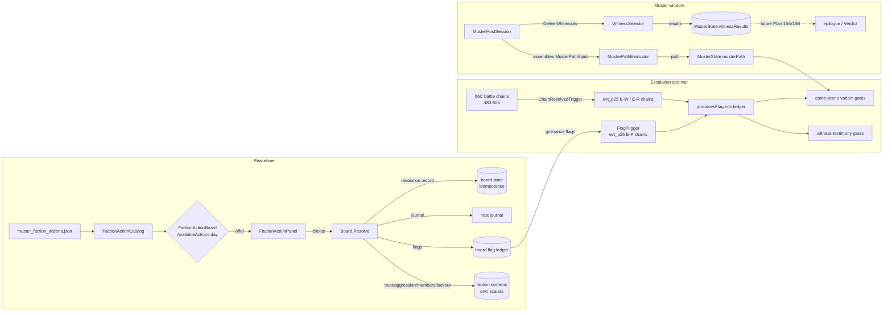
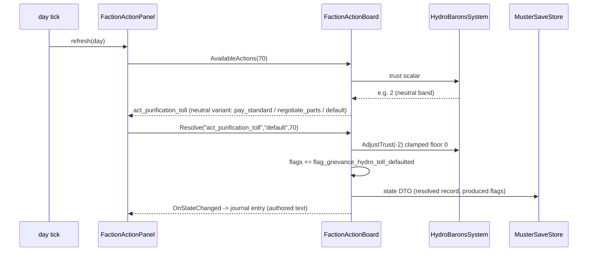

# Plan 25 Integration Plan — Faction Ecology & the Muster

> Status: ACTIVE · Owner: Plan 25 execution stream · Created: 2026-09-01
> Source requirement: Plan 25 (Faction Ecology & the Muster: Politics, War & the Gathering)
> Method: forensic audit first (three parallel repo sweeps), then runtime seams, then authored content.

---

## 1. Objective

Turn ASHFALL's political systems from isolated reputation surfaces into a traceable late-game spine:

```
peacetime ecology → grievances → treaty strain → escalation → faction war
→ war weariness → Muster path → witness testimony → epilogue/Verdict consequence
```

without duplicating any existing authority (standing, treaty, war, Muster, quest, epilogue).

## 2. Current reality (verified 2026-09-01, three forensic sweeps)

### 2.1 What the plan document assumed vs what the repo actually has

| Plan 25 assumption | Verified reality |
|---|---|
| `holdfast_factions.json` (3 actions) / `standing_record_factions.json` (1 action) are action catalogs | Both are **faction dossiers** (`id, display_name, alignment, wants[], offers[], signature_quote, access_rule, trust`). `holdfast_factions.json` feeds the Holdfast terminal UI only (`HoldfastCatalog.cs:138`, consumers `src/Host/HoldfastTerminalPanel.cs:580`). `standing_record_factions.json` is **dead data** — no loader parses it (only a test content assertion and `FactionIconCatalog.cs:72`). |
| `foundry_faction.json` 6 internal divisions are usable | True, but display-only (`src/UI/FactionsPanel.cs:226`). |
| The four Muster systems consume authored actions | They are **hand-rolled numeric state machines** (`Assets/Ashfall.Core/Muster/`): no JSON loading, no action selection, no thresholds, no cooldowns, no RNG. Only gates that exist: `CoalitionCampSystem.Form(day)` ≥ `MusterSystem.MusterOpeningDay` (260) and one-shot `QuestApproach` locks. |
| Witness architecture supports testimony variants | `muster_witnesses.json` = 3 flat entries `{id, witness_name, location_id, knowledge_key, day_min, body}`. No variants, no flags, no faction, no ordering. Core (`WitnessCatalog.cs`) is a dumb list; only the host UI gates `day_min` (`src/Muster/JournalWitnessPanel.cs:67`). Loader returns **empty list** if `schema_version > 1`. |
| A "Muster path" concept exists | Only player-chosen `QuestApproach` A–D → `endingKey` (`the_amnesty`, `the_open_muster`, `the_corridor`, `the_blood_price`) → `MusterRecord` → `muster_epilogues.json`. No war-state derivation; `MusterSystem` triggers day-only (`MusterOpeningDay = 260`, `MusterSystem.cs:222`). Zero references to `FactionWarSystem`/treaties anywhere in `Muster`. |
| `RegionalTreatySystem` is consumable | Core system exists and is tested, **but the host never calls `LoadCatalog`** (`src/Main.ShelterSocial.cs:68` constructs + restores only) — catalog is empty in production; `Propose` always fails `unknown_treaty`. Authored treaty corpora (`narrative/regional_treaty_protocols.json` = 16 treaties, `foundry_accords.json` = 12) use a **different narrative schema** consumed by `RegionalTreatyCatalog` (read-model) and `SilentFoundryCatalog`. |
| Escalation/weariness flags exist | None. Zero `*grievance*`, `*treaty_breach*`, war-weariness ids in code or data. `escalation_*` flags in `events.json` are the leadership-crisis chain (different domain). |
| 06C war spine to surround | Real: `FactionWarSystem` (`YearOfAsh/FactionWarSystem.cs` — standing −100..+100 per faction, `isHostile` ≤−50 / `isAllied` ≥+50, `WarTension` 0–100, friction no-op ≤ day 240 then +1/day, territorial clash every 15 days, zero RNG) + `FactionWarChainRunner` (22 chains / 45 stages, trigger grammar closed set: `PlayerVisitedTrigger`, `ChainResolvedTrigger`, `DayOffsetTrigger`, `AndTrigger`, `AlwaysTrigger`; only choice effect = `moraleDelta`; **every stageId requires an explicit `FactionWarTriggerTable` entry** — test-pinned). |
| War precedes the Muster | **Inverted in authored canon.** Muster opens day 260 (inside `Phase5_FactionSiege` 241–300); the war chain is authored at **minDay 480–605** (bands `cold_war` 480–498, `open_conflict` 503–528, `the_offensive` 533–560, `culmination` 565–605, incl. `evt_d588_ceasefire_by_exhaustion`). The campaign calendar (`Campaign/CampaignCalendar.cs`) has **no day cap** — day 360 is the epilogue matrix *view*, play continues into the war window. |

### 2.2 Standing is fragmented (no single authority)

| Store | Range | Used by |
|---|---|---|
| `FactionStanceEngine` (`Economy/FactionStanceTypes.cs:45-54`) | −100..+100, thresholds (raid −50, rob −20, min-trade −40, intel-share +40), no decay | Trade surfaces (`SilentFoundryHostSession`, `DeepCoastHostSession`) |
| `PrpfStandingSystem` (`Factions/PrpfStandingSystem.cs:27-38`) | −100..+100 (Hostile ≤−50, Allied ≥+50) | PRPF join gate |
| `ScavengerGuildState.trust`, `HydroBaronsState.trust` | private floats, floor 0, **no ceiling** | Only their own systems |
| `IronRaidersState` | aggression 0..1, visibility (floor 0.1) — no trust at all; `SetAggressionLevel` has **no production caller** | Raid-chance formula (host never rolls) |
| `CoalitionCampState` | membersRallied, garrisonLockoutRisk 0..100 | Camp strategy |

Decision: Plan 25 uses **each system's own persisted scalar** as its standing read. No new cross-faction currency.

### 2.3 Cross-plan candidate-pool availability for witnesses

| Pool | Status | Binding |
|---|---|---|
| 20B named NPCs | SOLID | `npc_*` in `wasteland_settlement_npcs.json`, `characters.json` |
| 09 palliative/medical | SOLID | `SickListSystem.palliativePlan`, `AssignPalliative`, `item_palliative_morphine` |
| 12A raised children | PARTIAL | `LineageRecord` (parent/adopted/mentor childIds) — no "raised" boolean |
| 18A claimants | PARTIAL | quest ids only (`quest_holdfast_census_claimant_audit`) |
| 22C foundry labor | PARTIAL | `SilentFoundryIds.JournalStrike`, strike-day state — no actor ids |
| 10A spared warlord | MISSING | nearest existing: `flag_become_warlord`, `flag_messenger_kept` (MoralChoiceIds) |
| 24B rescuees | MISSING | distress signals are prose-only content |

Rule (Plan 25 G.12): every witness binds real flags; archetypes without stable flags get **substituted or flag-authored at their producer**, never left as dead content.

### 2.4 Known breakage when witnesses grow 3 → 15

- `Ashfall.Core.Tests/MusterContentCatalogTests.cs:52-55` — pins count 3 + all three ids.
- `src/Main.UiTests.Muster.cs:40` — `_muster.Witnesses.Count == 3`.
- `src/Main.Muster.cs:215-217` — "Three accounts: {n} loaded" copy.

## 3. Architecture — four runtime seams (Core, `Ashfall.Core.Muster`, engine-agnostic)

No new standing authority, no new war resolution, no new diplomacy engine. Each seam extends an existing owner.

### S1 — FactionActionBoard (peacetime faction actions)

- **Data authority (new):** `Assets/StreamingAssets/Data/muster_faction_actions.json`, `schema_version: 1`, snake_case.
- **Entry shape:** `{id, faction_id, title, min_day, max_day, once, cooldown_days, requires_flags[], forbids_flags[], variants: [{band, text, choices: [{choice_id, text, effects: {trust_delta, item_id, item_amount, flags[], journal}}]}]}` where `band ∈ hostile|poor|neutral|good|allied`.
- **Runtime (new):** `Assets/Ashfall.Core/Muster/FactionActionBoard.cs` — deterministic per-day availability (day window → flag gates → once/cooldown → standing band), ordinal-sorted resolution, produces flags into `IFlagLedger`, persists action history `{action_id, day}` for idempotence, `CaptureState/RestoreState` DTO.
- **Standing bands (per system, documented in MUSTER_FACTION_RUNTIME_CONTRACT.md):** guild/hydro `trust` bands; raiders band derived from aggression/visibility; camp from formed/members/lockout. Thin additive `AdjustTrust(float)` seams where a system lacks one (guild, hydro) — events raised, clamped, save-safe.
- **Host:** `MusterHostSession` constructs the board; `MusterHostSave.FactionActions` (null-tolerant for old saves); `src/Main.Muster.cs` handler surfaces actions in the existing codex/status pattern.

### S2 — Witness schema v2 + WitnessSelector

- `muster_witnesses.json` → `schema_version: 2`. Entries gain optional `faction_id`, `priority`, and `testimonies: [{variant_id, requires_any_flags[], requires_all_flags[], forbids_flags[], body}]`. v1 `body` = one unconditional testimony (permanent back-compat path).
- `WitnessCatalog.CurrentSchemaVersion` → 2 with v1 fallback (fixes the silent-empty trap at `WitnessCatalog.cs:49`).
- New `WitnessSelector` (Core): day gate → eligibility via new port **`IWitnessEligibility`** (`IsFlagSet`, `IsSubjectAlive`, `IsFactionPresent`) → first-match testimony in authored order → deterministic ordering (`priority` desc, then id ordinal) → optional cap with faction-diversity rule.
- Results (`witness_id → {variant_id, delivered_day}`) persisted in `MusterHostSave` → stable epilogue/Verdict surface. Dead subjects never testify (absence/representation instead).

### S3 — MusterPathEvaluator

- New Core pure function: inputs = `FactionWarSystem` state (dominantFactionId, WarTension, standings), treaty read-model state, grievance/peace flags, `CoalitionCampState` → `muster_path ∈ {negotiated, victors, unsettled}`.
- Additive `musterPath` field on `MusterState` (default empty; old saves fine). Evaluated at Muster resolution; re-evaluated on war-state change (idempotent).
- Drives camp-scene variants, witness testimony pressure, and the epilogue/Verdict hook. Player Approach A–D selection unchanged; path is the political context around it.

### S4 — War-event flag/standing extension

- `FactionWarContentCatalog` DTO: optional `requires_flag`/`produces_flag` on stages; `requires_flag`/`produces_flag`/`standing_delta` on choices (`standing_delta` applied via `FactionWarSystem.ModifyStanding`).
- Exactly **one** new trigger node `FlagTrigger` added to the closed grammar + explicit `FactionWarTriggerTable` entries (totality test enforces).
- All 16 new chains authored into `faction_war_events.json`: 6 escalation (E-P1..P6, grievance-gated, ~day 200–300), 6 mid-war (E-W1..W6, gated via **existing** `ChainResolvedTrigger` on real 480–605 battle stages), 4 weariness (E-R1..R4, culmination band, feeding toward `evt_d588_ceasefire_by_exhaustion`).

### Cross-cutting

- Bounded flag vocabulary: `flag_grievance_*`, `flag_favor_*`, `flag_war_*`, `flag_peace_*` — each with producer → consumer → resolution recorded in `PLAN_25_LATE_GAME_CONTINUITY_MATRIX.md` and pinned by a lint test.
- New catalogs registered in `CatalogBootValidator` + `ContentUtilizationScanner`.
- Political journal/codex entries via existing host `TryAddRawEntry` pattern (major treaties/breaches/war transitions/Muster invite only — no standing-delta spam).
- Culture codex: `muster_faction_culture.json` + Core loader + codex panel consumption.
- Treaty host feed (isolated, revertible commit): adapter from `narrative/regional_treaty_protocols.json` → `TreatyDefinition`, loaded in `SetupRegionalTreaty`; fallback = read-model only, documented.

## 4. Timeline anchor (repo pacing; supersedes plan-example dates)

| Phase | Days | Content |
|---|---|---|
| Peacetime ecology | 1–199 | faction actions, culture, favors/grievances |
| Escalation backdrop | 200–259 | E-P1..P6 (friction begins 240; Muster opens 260) |
| Muster window | 260–360 | gathering, camp scenes, witnesses, path evaluation |
| Hot war (06C canon) | 480–605 | E-W1..W6 alongside authored bands; E-R1..R4 → ceasefire 588 |
| Post-ceasefire | 605+ | epilogue/Verdict consumption of testimony results |

Deviation from the plan document's "war → weariness → Muster" order is deliberate: continuity outranks narrative preference (plan §13.10); the 06C chain days and `MusterOpeningDay` are canon and untouched.

## 5. Batches (each = one commit; full verification gates per AGENTS.md)

1. Forensic docs (this file + 8 contract/audit docs).
2. Seam S1 → 3. Seam S2 → 4. Seam S3 → 5. Seam S4 (runtime before content).
6. **Vertical slice GATE** — A1 + grievance flag + E-P1 + W6 (2 testimonies) + arrivals scene + negotiated path + save/load tests. No scale-out until green.
7. 25A ecology (4 commits: Guild / Hydro / Raiders / Coalition). 8. 25E culture. 9. 25C escalation. 10. 25C war context + weariness. 11. Paths finalized. 12. 25B witnesses (15 total). 13. 25F camp scenes. 14. 25D + 25G cross-plan + treaty feed. 15. 25H QA + closeout.

## 6. MUST PRESERVE / MUST NOT

PRESERVE: `MusterOpeningDay = 260`; 06C chain ids/days/bands; Approach A–D → endingKey flow; all save formats (additive fields only); faction canon; v1 witness loading forever.
MUST NOT: new standing/war/treaty resolution systems; `System.Random`/`Guid.NewGuid()`; engine refs in Core; dead content; witness resurrection; retconned dates; new guild currency; display-name keys.

## 7. Verification

Per gate: `dotnet build Ashfall.Core.Tests/...` clean · `dotnet test` green · `dotnet build Ashfall.csproj` 0/0 · `godot --headless -- --data-integrity-selftest` 0 errors · `--bridge-selftest` exit 0 · domain gates `--muster-selftest`, `--muster-uitest`, content-utilization, narrative-continuity at content batches. Done = Plan 25 §17 checklist + `PLAN_25_FACTION_ECOLOGY_MUSTER_CLOSEOUT.md`.

---

# EXPANSION 2026-09-25 — Plan 25 Faction Ecology & the Muster: Full Integration Framework & Code Architecture

> Expansion of the 2026-09-01 integration plan above. The original text is preserved byte-for-byte; everything below this separator is the 2026-09-25 expansion.
> Evidence basis: source and data inspected in the working tree on 2026-09-25 (`Assets/Ashfall.Core/`, `src/`, `Assets/StreamingAssets/Data/`, `Ashfall.Core.Tests/`, `docs/muster/`, `INTEGRATION_PLANS.md`).
> Documentation-only expansion. No code, data, save format, or gate behavior is changed by this file.

## Part I — Expansion preamble

### I.1 Thesis

ASHFALL's political domain stopped being a set of isolated reputation surfaces on 2026-09-01. The spine this plan was written to install — peacetime ecology feeding grievances, grievances feeding escalation, escalation coloring the hot war, the hot war feeding weariness, and all of it landing in a testimony ledger that outlives the campaign's choices — is now load-bearing in the shipped repo. What remains undocumented is exactly how it is load-bearing: which file owns which decision, which JSON key feeds which Core scalar, which save field carries which ledger, and which seams were deliberately left as future hooks rather than half-built.

This expansion is the engineering companion the original plan deferred. It records the framework as built, not as imagined: the same four seams (S1–S4), the same 16 war chains, the same bounded flag vocabulary — but at the depth a builder or integrator needs to extend any one of them without breaking the others. It also records, with the same discipline, the parts that did **not** land: the epilogue/Verdict consumption of the testimony ledger is still a future hook, several treaty statuses remain unwired, and two of the plan's cross-plan witness pools were substituted away rather than fabricated.

### I.2 Scope

- The four Plan 25 runtime seams: S1 `FactionActionBoard`, S2 witness schema v2 + `WitnessSelector`, S3 `MusterPathEvaluator`, S4 the war-event flag/standing extension.
- The authored political content those seams consume: `muster_faction_actions.json` (12 actions), `muster_witnesses.json` (27 entries as of 2026-09-25), the 16 `evt_p25_*` chains inside `faction_war_events.json`, `muster_faction_culture.json` (25 entries), `muster_camp_scenes.json` (4 scenes / 18 variants), and `whitelists/plan25_flags.json`.
- The host adapters that make the seams observable: `MusterHostSession`, `MusterSaveStore`, `FactionActionPanel`, `FactionCultureCodexPanel`, `JournalWitnessPanel`, `RegionalTreatyFeed`, and the `--faction-ecology-selftest` verb.
- Cross-system touch points (trade stance, expedition danger, radio, morale, epilogue/Verdict) as an interaction matrix, not as new authority.

### I.3 Non-goals

Restated from the original §6 and extended with everything the post-closeout waves could have added but deliberately did not:

1. **No new standing authority.** Every political read still resolves to a system's own persisted scalar (`FactionStanceEngine` trust, guild/hydro `trust`, raider `aggressionLevel`/`visibility`, `PrpfStandingSystem` standing, `CoalitionCampState` counters, `FactionWarSystem` per-faction standing). The board computes bands over those scalars; it never mirrors them into a second currency.
2. **No new war resolution.** Plan 25 chains fire inside the closed 06C trigger grammar and terminate inside 06C canon. `evt_d588_ceasefire_by_exhaustion` still ends the war; `evt_p25_*` chains only add context, flags, morale, and small standing deltas.
3. **No new treaty engine.** The mechanical treaty catalog load is a feed, not a rules system. `Suspended`/`Expired` treaty statuses and `violation_penalty_affinity` handling remain pre-existing gaps in `RegionalTreatySystem` and are out of scope here.
4. **No epilogue rewrites.** Approach A–D → `endingKey` → `muster_epilogues.json` is untouched. `MusterState.musterPath` and `witnessResults` are recorded for the future Plan 15A/15B consumption seam; nothing in the current epilogue path reads them yet.
5. **No engine dependencies in Core.** Every component specified here lives in `Assets/Ashfall.Core/` (netstandard2.1, engine-free) or `src/` (net8.0 host). Panels never decide politics.
6. **No RNG in political resolution.** No `System.Random`, no `Guid.NewGuid()`, no hash-order iteration anywhere in the seams. Availability, selection, and path derivation are total functions of (catalog, state, day).
7. **No witness resurrection, no retconned dates, no dead content.** Dead subjects never testify; `MusterOpeningDay = 260` and the 06C chain days are canon; every authored flag has a producer and a consumer recorded in the whitelist.

### I.4 Evidence policy and the implementation-status taxonomy

The original plan said `Status: ACTIVE`. That was true in the plan sense — the work was unexecuted when written. It would now be false as a completion claim in the other direction: the work executed, in full, on the plan's own schedule. This expansion therefore carries a three-way label on every load-bearing claim:

| Label | Meaning |
|---|---|
| `VERIFIED-IMPLEMENTED` | The artifact was found in the working tree on 2026-09-25 at the cited path, and its consumer or test was found with it. |
| `VERIFIED-NOT-IMPLEMENTED` | The artifact was looked for at its natural owner paths and is absent; the plan text remains the only source. |
| `UNVERIFIED (plan text)` | Plausible and consistent with surrounding evidence, but not independently re-checked in this expansion; treat as the plan's claim, not the repo's. |

Where a plan assumption changed between 2026-09-01 and 2026-09-25 (line drift, schema key case, counts that grew), the expansion states the current value and the date-stamped former value side by side. No claim in this file should require a second audit to use.

### I.5 Executive status of the four seams (evidence summary)

| Seam | Status | Primary evidence (paths verified 2026-09-25) |
|---|---|---|
| S1 FactionActionBoard | `VERIFIED-IMPLEMENTED` | `Assets/Ashfall.Core/Muster/FactionActionBoard.cs`, `Assets/Ashfall.Core/Muster/FactionActionCatalog.cs`, `Assets/StreamingAssets/Data/muster_faction_actions.json` (schema_version 1, 12 actions), `src/Host/MusterHostSession.cs` (Board, ResolveFactionAction), `src/Host/MusterSaveStore.cs:30` (`FactionActions`), `src/Muster/FactionActionPanel.cs`, `Ashfall.Core.Tests/FactionActionBoardTests.cs` (17 `[Fact]`/`[Theory]` cases) |
| S2 Witness v2 + Selector | `VERIFIED-IMPLEMENTED` | `Assets/StreamingAssets/Data/muster_witnesses.json` (`schema_version: 2`, 27 entries), `Assets/Ashfall.Core/Muster/WitnessCatalog.cs` (v2 DTO + loader), `Assets/Ashfall.Core/Muster/WitnessSelector.cs` (`IWitnessEligibility`, `PassAllWitnessEligibility`, `Select`), `src/Host/MusterHostSession.cs` (`DeliverWitnesses`, `BoardFlagEligibility`, `SubjectLivingResolver`), `src/Main.Muster.cs:49` (resolver bound to survivor roster), `Ashfall.Core.Tests/WitnessSelectionTests.cs` (14), `Ashfall.Core.Tests/Plan84WitnessExpansionTests.cs` |
| S3 MusterPathEvaluator | `VERIFIED-IMPLEMENTED` | `Assets/Ashfall.Core/Muster/MusterPathEvaluator.cs` (`MusterPaths`, `MusterPathInput`, `DominanceTensionThreshold = 60`), `Assets/Ashfall.Core/Muster/MusterSystem.cs:38,154` (additive `musterPath`, validated `SetMusterPath`), camp-scene consumption in `src/Host/MusterHostSession.cs:159`, `Ashfall.Core.Tests/MusterPathEvaluatorTests.cs` (14) |
| S4 War flag/standing extension | `VERIFIED-IMPLEMENTED` | `Assets/Ashfall.Core/YearOfAsh/FactionWarChainRunner.cs:45` (`FlagTrigger`) and trigger-table lines 218–245 (16 `evt_p25_*` entries), `Assets/Ashfall.Core/YearOfAsh/FactionWarContentCatalog.cs:169–194` (`requiresFlag`/`producesFlag`/`standingDelta`), `Assets/Ashfall.Core/YearOfAsh/FactionWarSystem.cs:88` (`ModifyStanding`), 16 chains in `Assets/StreamingAssets/Data/faction_war_events.json`, `Ashfall.Core.Tests/FactionWarFlagExtensionTests.cs` (10) |

Items still open (expanded in §II.6): Plan 15A/15B epilogue/Verdict consumption of `musterPath`/`witnessResults` (`VERIFIED-NOT-IMPLEMENTED` as a consumer), treaty `Suspended`/`Expired` wiring, and a telemetry playtest pass over the 15-step late-game journey.

### I.6 Reading guide

- **Part II** — the fragmented-standing audit re-run today; what the 2026-09-01 forensic sweeps found versus what the tree holds now.
- **Part III** — the integration framework as built: data flow per seam, event flow, save capture/restore, determinism, integrity validation.
- **Part IV** — the political stack's module map and per-component architecture with sequence walkthroughs.
- **Part V** — the bulk: engineering specifications for S1–S4, all 16 war chains, the 27-witness roster, the culture codex, camp scenes, the treaty feed, the flag-vocabulary matrix, and per-batch engineering checklists.
- **Part VI** — cross-system interaction matrix and emergent-consequence design.
- **Part VII** — verification and acceptance: test matrix, gate commands, the MUST PRESERVE / MUST NOT contract, rollback.
- **Part VIII** — appendices: glossary, ID vocabulary, timeline anchors, a full campaign political-arc sketch, open questions.

A reader who only wants "can I extend X safely" needs Part IV (who owns what) and the relevant Part V section (what the data contract is). A reader auditing the closeout should start at §II.5, which reconciles the closeout's shipped counts with the tree's current counts.

---

## Part II — Current authority audit (re-verified 2026-09-25)

The original §2 recorded three forensic sweeps dated 2026-09-01. This part re-runs the same audit against the current tree and records every delta. Where nothing moved, that is stated once and not repeated per row.

### II.1 The §2.1 assumption table, re-verified

| 2026-09-01 verified reality | 2026-09-25 reality | Status |
|---|---|---|
| `holdfast_factions.json` / `standing_record_factions.json` are dossiers, not action catalogs; the latter is dead data | Unchanged. `standing_record_factions.json` still has no production loader; it remains dossier/reference content with a content assertion and icon mapping as its only consumers | `VERIFIED-IMPLEMENTED` (as dossiers); the "dead data" finding still stands — do not author actions into it |
| `foundry_faction.json` divisions display-only | Unchanged; internal divisions remain a `src/UI/FactionsPanel.cs` read-model concern | `VERIFIED-IMPLEMENTED` |
| Muster systems are hand-rolled numeric state machines with no JSON loading | True for the machines themselves (`MusterSystem`, `CoalitionCampSystem`, `ScavengerGuildSystem`, `HydroBaronsSystem`, `IronRaidersSystem` remain scalar-owned), but the *action layer above them* is now data-driven: `muster_faction_actions.json` → `FactionActionCatalog` → `FactionActionBoard` | `VERIFIED-IMPLEMENTED` (S1) |
| Witness architecture is 3 flat entries, schema v1, silent-empty on newer schema | Replaced. `schema_version: 2`, 27 entries, `testimonies[]` with flag gates, `priority`, `faction_id`, `subject_id`; loader documents rejection semantics for schema > current instead of merely returning empty on unknown futures; v1 files still load (permanent back-compat) | `VERIFIED-IMPLEMENTED` (S2) |
| No "Muster path" concept; only QuestApproach A–D → endingKey | `MusterPaths` (negotiated/victors/unsettled) exist as additive political context; Approach A–D → endingKey flow untouched | `VERIFIED-IMPLEMENTED` (S3) |
| `RegionalTreatySystem` never gets a catalog in production; `Propose` always fails `unknown_treaty` | Closed. `src/Main.ShelterSocial.cs:74` `SetupRegionalTreaty` now loads through `RegionalTreatyFeed` (`Assets/Ashfall.Core/RegionalTreatyFeed.cs`) → `RegionalTreatyCatalogLoader` → `rtSys.LoadCatalog` (line 86). Recorded as CF-P25/DEC-96 in `INTEGRATION_PLANS.md:263` | `VERIFIED-IMPLEMENTED` (feed) |
| Zero grievance/breach/weariness flags anywhere | 45-flag bounded vocabulary shipped, machine-checked: `Assets/StreamingAssets/Data/whitelists/plan25_flags.json` (`schema_version: 1`, `orphan_knocks: []` at closeout), regenerable via `tools/plan25/generate_flag_whitelist.py` | `VERIFIED-IMPLEMENTED` (S4 + whitelist) |
| 06C war spine: 22 chains / 45 stages, closed trigger grammar, totality-pinned | Grew to 38 chains / 62 stages: the 22 06C chains untouched (ids, days, bands) plus 16 Plan 25 chains in three new bands (`escalation`, `war_context`, `weariness`). `FlagTrigger` added as the single new grammar node; every Plan 25 stage has an explicit `FactionWarTriggerTable` entry | `VERIFIED-IMPLEMENTED` (S4) |
| "War precedes Muster" inverted: Muster opens 260 inside Phase5 241–300; hot war at 480–605 | Canon held. `MusterSystem.cs:333` `MusterOpeningDay = 260`; 06C minDays unchanged; Plan 25 escalation authored 200–250 (pre-Muster), war context 512–555 and weariness 568–584 (inside the war window), ceasefire terminator untouched | `VERIFIED-IMPLEMENTED` (pacing) |

One structural deviation from the original §3 data spec is deliberate and should not be "fixed": the plan sketched snake_case flag keys (`requires_flag`/`produces_flag`/`standing_delta`) for the war extension, but the shipped extension uses the **camelCase keys of the existing `faction_war_events.json` schema** (`requiresFlag`, `producesFlag`, `standingDelta`), because `FactionWarContentCatalog` already owned that DTO shape and one catalog must have one schema. The snake_case spelling in the original plan text is superseded. (Counts in the shipped file: 21 `producesFlag`, 8 `requiresFlag`, 8 `standingDelta` occurrences.)

### II.2 The fragmented-standing table, re-verified

The decision "each system's own persisted scalar is the standing read; no cross-faction currency" is now enforced structurally: `FactionActionBoard.ComputeBand(factionId)` switches over the four faction ids and reads each owner's scalar directly. Nothing else in the political stack stores a standing number.

| Store | Current location | Range / shape | Plan 25 use today |
|---|---|---|---|
| `FactionStanceEngine` | `Assets/Ashfall.Core/Economy/FactionStanceEngine.cs:13` (constants in `Economy/FactionStanceTypes.cs:46`) | −100..+100 stance with trade-surface thresholds; no decay | Unchanged; trade surfaces read it as before. Not banded by the board — the board bands only the four ecology factions |
| `PrpfStandingSystem` | `Assets/Ashfall.Core/Factions/PrpfStandingSystem.cs:21–28` | `MinStanding −100`, `MaxStanding 100`, `HostileThreshold −50`, `AlliedThreshold 50`; `OnStandingChanged` event | Unchanged; PRPF join gate. Same −50/+50 threshold convention the board's band vocabulary borrows |
| Guild trust | `Assets/Ashfall.Core/Muster/ScavengerGuildSystem.cs:16` (`public float trust`), floor 0 applied at the mutate sites (lines 58, 73) | float, floor 0, no ceiling | Banded via `BandForTrust`; plan-25 additive seam documented at line 86 ("apply a signed trust adjustment") — `AdjustTrust` clamps, raises the state-changed event, and is save-safe |
| Hydro trust | `Assets/Ashfall.Core/Muster/HydroBaronsSystem.cs` (same shape as guild; board constructor takes it as the second band source) | float, floor 0 | Banded via `BandForTrust`; `trust_delta` effects from `act_purification_toll`, `act_hydro_emergency_appeal`, `act_intake_dispute` |
| Raider aggression/visibility | `Assets/Ashfall.Core/Muster/IronRaidersSystem.cs:14,42` (`aggressionLevel` 0..1), setter clamps at lines 46–50 | float aggression + visibility, floor 0.1 visibility | **Delta changed since the 2026-09-01 audit:** `SetAggressionLevel` now has a production caller — `FactionActionBoard.cs:259` applies `aggression_delta` effects from raider actions. The audit finding "no production caller" is historical |
| Camp state | `Assets/Ashfall.Core/Muster/CoalitionCampSystem.cs:13–15` (`membersRallied`, `garrisonLockoutRisk` 0..100) | int counters | Coalition actions apply `members_delta` / `lockout_delta` through the board (`lockout_delta: −5` on `sit_mediator` in `act_coalition_mediation_request`); band derives from formed/members/lockout |
| War standing | `Assets/Ashfall.Core/YearOfAsh/FactionWarSystem.cs:88` `ModifyStanding(string factionId, int delta)` | −100..+100 per faction; hostile ≤ −50, allied ≥ +50 | Receives the 8 choice-level `standingDelta` values from Plan 25 chains, routed by the host's `StandingDeltaApplier` — Core never mutates war standing itself |

### II.3 Cross-plan witness candidate pools, re-verified

The original §2.3 pool table described availability *before* the roster was authored. Post-closeout reality, including what was substituted:

| Pool | 2026-09-01 status | Outcome in shipped content |
|---|---|---|
| 20B named NPCs | SOLID (`npc_*` in `wasteland_settlement_npcs.json`, `characters.json`) | Bound structurally, not by specific npc rows: `WitnessDefinition.subjectId` (`WitnessCatalog.cs:35`) + `SubjectLivingResolver` on `MusterHostSession` bound in `src/Main.Muster.cs:49` to the live survivor roster (`_survivors?.RosterState?.Find(...)?.IsAlive ?? true`). The 12 Plan 84 investigation witnesses are roster-adjacent named survivors; direct `npc_*` subject binding for the Plan 25 set remains deferred (see §II.6) |
| 09 palliative/medical | SOLID (`SickListSystem.palliativePlan`, `AssignPalliative`, `item_palliative_morphine`) | No palliative-bound witness shipped. Census binding is live but pools were not forced: the camp-medic witnesses bind to *faction flags*, not to palliative state. Deferred rather than fabricated |
| 12A raised children | PARTIAL (`LineageRecord` childIds, no "raised" boolean) | No lineage-bound witness shipped. Same deferral rule |
| 18A claimants | PARTIAL (quest id only) | **Bound.** `witness_claimant_auditor` (faction_hydro_barons, day 210) and `witness_scavenger_claimant` (day 200) carry the claimant/audit premise as testimony content gated on real audit flags (`flag_favor_hydro_intake_audited` / `flag_favor_scavenger_arbitration_fair`) |
| 22C foundry labor | PARTIAL (`SilentFoundryIds.JournalStrike`, no actor ids) | Partially bound: `witness_foundry_molder_hask` (Plan 84 grain-convoy thread) gives the foundry a testimony voice, though it is gated on the investigation thread, not on strike state. A strike-gated variant remains unauthored |
| 10A spared warlord | MISSING at audit (nearest: `flag_become_warlord`, `flag_messenger_kept`) | **Substituted per plan rule G.12.** `witness_messengers_keeper` binds `helped` → `flag_messenger_kept`, `failed` → `flag_become_warlord` — both real `MoralChoiceIds` producers. No fabricated "spared warlord" flag exists |
| 24B rescuees | MISSING (distress prose-only) | **Substituted away.** No rescuee witness; the slot was spent on the camp set (`witness_camp_medic`, `witness_camp_dissenter`, `witness_overflow_medic`) whose flags exist. Recorded in the closeout's continuity decisions |

### II.4 The §2.4 breakage points, re-verified

| 2026-09-01 breakage | 2026-09-25 state |
|---|---|
| `Ashfall.Core.Tests/MusterContentCatalogTests.cs` pinned count 3 + ids | Pin softened to a floor: line 55 asserts `witnesses.Count >= 3` and still pins `witness_3_signals_intercept` by id. Roster growth no longer breaks the catalog test |
| `src/Main.UiTests.Muster.cs` pinned `Witnesses.Count == 3` | Line 41 now asserts `_muster.Witnesses.Count >= 3` |
| `src/Main.Muster.cs` "Three accounts: {n}" copy | Replaced: line 304 renders "No witness accounts loaded." as the empty-state; count copy no longer hardcodes three |

### II.5 What landed, in what order (audit trail)

| When | Wave | Evidence |
|---|---|---|
| 2026-09-01 | Plan 25 full-pass execution (15 batches, per-batch commits) | `docs/muster/PLAN_25_FACTION_ECOLOGY_MUSTER_CLOSEOUT.md` — delivered 12 actions, 6 culture entries, 15 witnesses / 36 conditional testimonies, 4 camp scenes, 6+6+4 chains, 3 paths, 45-flag whitelist; test evidence recorded per gate |
| 2026-09-01 | Forensic companion docs | `docs/muster/PLAN_25_LATE_GAME_CONTINUITY_MATRIX.md` (25G.13), `docs/muster/MUSTER_WITNESS_RUNTIME_CONTRACT.md`, `docs/muster/MUSTER_WITNESS_CANDIDATE_MATRIX.md`, `docs/muster/MUSTER_TESTIMONY_STYLE_GUIDE.md`, `docs/muster/PLAN_25_POLITICAL_QA_MATRIX.md`, `docs/factions/PLAN_25_POLITICAL_TIMELINE.md` |
| Post-closeout follow-up | DEC-96 (CF-P25) recorded in `INTEGRATION_PLANS.md:263`: treaty catalog feed, standing read model, `SubjectLivingResolver`, `IFactionActionItemSink`, treaty-breach raid-pressure consequence; `Plan25FactionEcologyTests` 5/5; `--faction-ecology-selftest` 27/27 | `INTEGRATION_PLANS.md:263` |
| Post-closeout follow-up | DEC-99: dedicated `src/UI/FactionCultureCodexPanel.cs`, route `faction_culture_codex`, overview button in `FactionsPanel.cs`, culture corpus grown to 25 entries | `INTEGRATION_PLANS.md:257` |
| Post-closeout follow-up | Plan 84: witness roster 15 → 27 (three investigation threads × 4: coastal evacuation; grain convoy massacre; third thread), founding 3 and Plan 25's 12 preserved intact | `docs/muster/PLAN84_CLOSEOUT.md`; `Ashfall.Core.Tests/Plan84WitnessExpansionTests.cs` |

### II.6 Still open after closeout (nothing here is a plan approval)

1. **Epilogue/Verdict consumption** — `MusterState.musterPath` and `MusterState.witnessResults` are recorded and persisted, but no epilogue or Verdict code reads them today. The continuity matrix classifies this `[X] future hook` (Plan 15A/15B). `VERIFIED-NOT-IMPLEMENTED`; the ledger is the contract, the consumer does not exist yet.
2. **Treaty status machinery** — `RegionalTreatySystem.violation_penalty_affinity` exists as a field (`RegionalTreatySystem.cs:30`) but `Suspended`/`Expired` lifecycle handling remains unwired, per the closeout's own limitations list. Pre-existing gap, explicitly out of Plan 25 scope.
3. **Direct npc subject binding for the Plan 25 witness set** — resolver port is live and bound; individual `subject_id` values on the 12 ecology witnesses are not populated from 20B census ids. Deferred by the candidate matrix, not lost.
4. **Band-variant coverage** — several actions ship three band variants with poor/good falling back to neutral by design; the QA matrix documents this as accepted, not as debt accidentally shipped.
5. **Telemetry playtest** — the closeout recommends one full telemetry pass over the scripted 15-step late-game journey before release gating. `UNVERIFIED (plan text)` whether any such session has run since; nothing in the tree records it.
6. **Host CLI selftest naming drift** — the original §7 listed `--muster-selftest` / `--muster-uitest` as domain gates; both exist per the closeout's final gate list, and the Plan 25-specific verb is `--faction-ecology-selftest` (dispatch at `src/Host/HostCli.SelfTests.cs:783` via `FactionEcologyHeadlessDemo.Run`). `UNVERIFIED (plan text)` for the exact current check counts inside `--muster-selftest`; the closeout recorded 25/25 PASS at closeout time.

---

## Part III — Integration framework

This part states the framework the seams actually implement: the invariants, the tier-by-tier data flow, the event flow, the save contract, the determinism contract, and the integrity pipeline for the political catalogs. Everything here is `VERIFIED-IMPLEMENTED` unless labeled otherwise.

### III.1 Architecture invariants applied to the political domain

1. **One owner per concern.** Faction actions are owned by `FactionActionBoard`; testimony selection by `WitnessSelector`; path derivation by `MusterPathEvaluator`; war staging by `FactionWarChainRunner`. No component reaches into another's state. The board reads faction scalars; the evaluator receives an input DTO assembled by the host; the chain runner reads the flag ledger it is given.
2. **Core computes, host connects.** `MusterPathEvaluator` is a pure function over `MusterPathInput` — Core never dereferences `FactionWarSystem` or treaty types (the `MusterSystem.SetMusterPath` doc comment states this explicitly: the host maps war state into the input, Core never derives it from war types itself). The standing-delta rule is the mirror image: `faction_war_events.json` may declare a `standingDelta`, but only the host's `StandingDeltaApplier` calls `FactionWarSystem.ModifyStanding`.
3. **JSON is authority for content; code is authority for mechanics.** Action availability rules, band thresholds, variant gating, trigger grammar, and selection ordering are code. Action text, effect magnitudes, flag ids, chain structure, testimony bodies, culture entries, and scene variants are data. No threshold is authored in JSON; no journal sentence is hardcoded in Core.
4. **Additive persistence only.** New state ships as new fields (`MusterSaveStore.FactionActions`, `MusterState.musterPath`, `MusterState.witnessResults`, camp-scene seen lists) with value defaults that make pre-expansion saves load and replay unchanged. No existing field changed type or meaning.
5. **Idempotence at every write seam.** Resolving the same action twice in one day-window cannot double-apply (resolution history is checked before effects). Recording the same witness twice cannot duplicate (`RecordWitnessResult` returns false if `witnessId` exists). Re-evaluating the path after a war-state change overwrites a validated enum, it never appends.
6. **Core events expose facts; host applies presentation.** `FactionActionBoard.OnActionResolved` / `OnStateChanged` carry resolution records; the host decides journal entries, panel refresh, and codex updates. Journal volume is policy, not data: only action resolutions, major chain stages, and witness deliveries are journaled — never per-point standing drift.
7. **Determinism by total functions.** See III.5.
8. **Flags are a closed vocabulary.** A flag id that is not in `whitelists/plan25_flags.json` (or another registered whitelist) is an integration bug, not content. The generator makes drift visible; see V.I.

### III.2 Tier-by-tier data flow per seam

The same five tiers repeat for every seam: authored JSON → Core catalog/definition → Core runtime state → host session/save → panel/codex surface.

**S1 FactionActionBoard**

| Tier | Artifact | Verified path |
|---|---|---|
| Data | `muster_faction_actions.json`, `schema_version: 1`, `actions[12]` | `Assets/StreamingAssets/Data/muster_faction_actions.json` |
| Core catalog | `FactionActionCatalog` loader → `FactionActionDefinition` (id, faction_id, title, min_day, max_day, once, cooldown_days, requires_flags, forbids_flags, variants) | `Assets/Ashfall.Core/Muster/FactionActionCatalog.cs` |
| Core runtime | `FactionActionBoard` — `AvailableActions(day)`, `Resolve(actionId, choiceId, day, sink)`, `ComputeBand(factionId)`, `BandForTrust(trust)`, `IsFlagSet`, state = `{systemId, resolved[], producedFlags[]}` | `Assets/Ashfall.Core/Muster/FactionActionBoard.cs` |
| Host | `MusterHostSession.Board` + `ResolveFactionAction`; item effects via `IFactionActionItemSink` (bound in `src/Main.Muster.cs:50` to shelter inventory); persistence via `MusterSaveStore.FactionActions` | `src/Host/MusterHostSession.cs`, `src/Host/MusterSaveStore.cs:30` |
| Surface | `FactionActionPanel` (offers + choices + culture section), journal entries from effect `journal` strings | `src/Muster/FactionActionPanel.cs`, `src/Main.Muster.cs:91–99,312` |

**S2 Witness schema v2 + WitnessSelector**

| Tier | Artifact | Verified path |
|---|---|---|
| Data | `muster_witnesses.json`, `schema_version: 2`, 27 entries; optional `faction_id`, `priority`, `subject_id`; `testimonies[]` with `variant_id`, `requires_any_flags`, `requires_all_flags`, `forbids_flags`, `body` | `Assets/StreamingAssets/Data/muster_witnesses.json` |
| Core catalog | `WitnessCatalogLoader` (`FileName = "muster_witnesses.json"`) → `WitnessDefinition` / `WitnessTestimony`; v1 bodies become one unconditional testimony; schema beyond current is rejected (documented, non-silent for v2 consumers) | `Assets/Ashfall.Core/Muster/WitnessCatalog.cs` |
| Core runtime | `WitnessSelector.Select(witnesses, day, gate, maxCount)` → `WitnessDelivery[]`; `SelectTestimony` first-match in authored order | `Assets/Ashfall.Core/Muster/WitnessSelector.cs` |
| Host | `MusterHostSession.DeliverWitnesses(day, maxCount)` with `BoardFlagEligibility` (flags from the board's ledger, alive via `SubjectLivingResolver`, faction presence via band) ; results into `MusterSystem.RecordWitnessResult` | `src/Host/MusterHostSession.cs` (lines ~178–200) |
| Surface | `JournalWitnessPanel` (day gate `day < w.dayMin` at line 68, trait-based framing); results readable for future epilogue/Verdict (`[X]`) | `src/Muster/JournalWitnessPanel.cs` |

**S3 MusterPathEvaluator**

| Tier | Artifact | Verified path |
|---|---|---|
| Data | None. The path is derived, not authored. Its inputs come from war state, treaty read-model counts, flags, and camp state | — |
| Core runtime | `MusterPathEvaluator.Evaluate(MusterPathInput)` → `MusterPaths.Negotiated | Victors | Unsettled`; `MusterSystem.SetMusterPath` validates membership and stores | `Assets/Ashfall.Core/Muster/MusterPathEvaluator.cs`, `MusterSystem.cs:154` |
| Host | Host assembles `MusterPathInput` (dominant faction, WarTension, hostile/allied counts, surviving majors, treaty counts, grievance/peace flags from the board, camp formed/members) and re-evaluates on war-state change; passes `Engine.MusterPath` into scene selection | `src/Host/MusterHostSession.cs:159` |
| Surface | Camp-scene variant choice; witness pressure (testimonies gate on `flag_peace_*` / `flag_war_*` that the path context produces); `[X]` future epilogue/Verdict | `Assets/Ashfall.Core/Muster/CampSceneCatalog.cs` |

**S4 War-event extension**

| Tier | Artifact | Verified path |
|---|---|---|
| Data | `faction_war_events.json`: 16 `evt_p25_*` chains with `requiresFlag` / `producesFlag` on stages, `producesFlag` / `standingDelta` on choices | `Assets/StreamingAssets/Data/faction_war_events.json` |
| Core catalog | `FactionWarContentCatalog` DTO fields (stage: `requiresFlag` line 169, `producesFlag` line 173; choice: `requiresFlag` 186, `producesFlag` 189, `standingDelta` 194 with faction routing note) | `Assets/Ashfall.Core/YearOfAsh/FactionWarContentCatalog.cs` |
| Core runtime | `FactionWarChainRunner` grammar + `FlagTrigger` (line 45) + `FactionWarTriggerTable` entries (lines 218–245); runner-produced flags join the same flag ledger the board writes | `Assets/Ashfall.Core/YearOfAsh/FactionWarChainRunner.cs` |
| Host | `StandingDeltaApplier` routes choice deltas to `FactionWarSystem.ModifyStanding` (line 88); re-derives `MusterPathInput` after chain resolution | `src/` host wiring; closeout §"Runtime seams built first" item 4 |
| Surface | Journal/communique staging for chain stages via the existing 06C presentation path; camp-scene and witness gates consume the produced flags | `faction_war_communique`/journal owners (06C) |

### III.3 Event flow



Reading the flow against the calendar (original §4, which held): the peacetime loop runs days 1–199 with the first action opening at day 60; grievance flags from it arm the six `FlagTrigger` escalation chains at their minDays 200–250; the Muster window (260–360) evaluates the path and delivers testimonies; the war-window chains (512–584) run under 06C battle gates and feed the same ledger; the ceasefire at 588 remains the war's only terminator.

### III.4 Save capture and restore

All political persistence is additive and null-tolerant. A save written before 2026-09-01 has none of these fields; the loaders treat missing/empty as "no history" and derive everything else on demand.

| Field | Owner | Shape | Old-save behavior |
|---|---|---|---|
| `MusterSaveStore.FactionActions` | `MusterHostSession` ↔ `FactionActionBoard` | `FactionActionBoardState { systemId, resolved: [{actionId, choiceId, band, day}], producedFlags: [string] }` | Missing → empty board state; actions re-open per their day windows; `once`/cooldown recompute from empty history (a pre-Plan-25 save never resolved any, so this is truthful, not lossy) |
| `MusterState.musterPath` | `MusterSystem` | `string`, one of `negotiated` / `victors` / `unsettled`, default empty | Empty means never evaluated; `SetMusterPath` refuses values outside the enum, so garbage in a hand-edited save cannot enter |
| `MusterState.witnessResults` | `MusterSystem` | `List<WitnessResult>` (`witnessId`, variant, delivered day); `RecordWitnessResult` idempotent by `witnessId` | Empty → witnesses re-eligible per day gate; delivered-once semantics then apply from the restore point forward. Capture/restore deep-copies the list (`MusterSystem.cs` ~line 258) |
| Camp-scene seen list | `MusterHostSession.CampScenesSeen` | `List<string>` of scene ids | Missing → scenes may restage once; accepted because pre-Plan-25 saves never staged any |

Restore order matters and is owned by the host: faction scalars (guild/hydro/raiders/camp) restore through their own systems first, the board's band computation then reflects restored scalars with no double-application, because the board never *stores* scalars — only resolution history and its own flags.

### III.5 Determinism contract

1. **No randomness anywhere in the political stack.** Availability, banding, selection, ordering, and path derivation are total functions of `(catalog, persisted state, day)`. The repo-wide rule against `System.Random` in deterministic Core behavior is honored by construction; the heaviest non-determinism risk in the stack is dictionary iteration order, handled by rule 3.
2. **Ordinal ordering everywhere ids meet.** `WitnessSelector` orders by `priority` descending then id ordinal; `CampSceneCatalog.PathMatches` compares `requiresPath` to `musterPath` with `StringComparison.Ordinal`; band vocabulary comparisons are constant strings. No culture-sensitive comparisons on ids.
3. **Authored-order resolution.** Where JSON lists alternatives (testimonies in a witness, variants in a scene, choices in an action), first-match runs in authored array order. Authors therefore control outcomes by ordering, not by weights.
4. **Idempotent re-evaluation.** `MusterPathEvaluator.Evaluate` is pure; calling it twice with equal inputs yields the equal path. `SetMusterPath` overwrite semantics make re-evaluation after a war-state change safe mid-window.
5. **Replayability.** Because flags are the only channel from player choices to war staging, and both the flag ledger and resolution records persist, a save/load cycle cannot re-fire a `once` action, re-deliver a witness, or restage a seen scene.

### III.6 Integrity validation for the political catalogs

- **Load-time shape validation** happens in each catalog loader (`FactionActionCatalog`, `WitnessCatalogLoader`, `FactionCultureCatalog`, `CampSceneCatalog`, `FactionWarContentCatalog`), following the repo convention that a schema-version bump beyond the loader's current version is rejected rather than half-parsed. The witness loader documents both directions: v1 files load forever; unknown future versions do not silently produce partial content.
- **Data-integrity gate**: `--data-integrity-selftest` walks the data directory; at closeout it reported 0 findings across 161 catalogs including the four new political catalogs. Re-run it after any data edit.
- **Content utilization**: `Assets/Ashfall.Core/Content/ContentUtilizationScanner.cs` exists to flag content with no consumer path; the political catalogs are registered content in its scan scope (closeout lists content-utilization among the content-batch gates).
- **Flag whitelist**: `whitelists/plan25_flags.json` is generated, not hand-edited — `python3 tools/plan25/generate_flag_whitelist.py` regenerates it from shipped data; the closeout recorded 45 flags with 0 orphan producers. Treat a whitelist diff in review as a content-contract change.
- **Trigger totality**: the existing test pins an explicit `FactionWarTriggerTable` entry per stage; the 17 new Plan 25 stage entries (16 `s1` entries plus `evt_p25_marked_ruin_s2`) are covered by the same totality test through `FactionWarChainRunnerTests` / `ContentCatalogTests` (closeout evidence).
- **Focused tests** per seam are listed in Part VII; they run through `scripts/run_test.sh` per `TEST_POLICY.md`, never as a full-suite default.

---

## Part IV — Code architecture

### IV.1 Module map of the political stack

Every path below was opened and read during this expansion. Core is engine-free; the only host types touching presentation are in `src/`.

```
Assets/Ashfall.Core/
  Muster/
    FactionActionCatalog.cs        S1 data: loader, FactionActionDefinition
    FactionActionBoard.cs          S1 runtime: bands, availability, resolve, flags, events
    FactionEcologyHeadlessDemo.cs  S1-S4 end-to-end demo (backs --faction-ecology-selftest)
    WitnessCatalog.cs              S2 data: WitnessDefinition/WitnessTestimony, v1+v2 loader
    WitnessSelector.cs             S2 runtime: IWitnessEligibility, Select, SelectTestimony
    MusterPathEvaluator.cs         S3 pure derivation: MusterPaths, MusterPathInput, Evaluate
    CampSceneCatalog.cs            25F data + CampSceneDirector.Select (path+flag matching)
    FactionCultureCatalog.cs       25E data: culture entry loader
    MusterSystem.cs                canon owner: MusterOpeningDay=260, musterPath,
                                   witnessResults ledger, SetMusterPath/RecordWitnessResult
    CoalitionCampSystem.cs         camp scalar owner (membersRallied, garrisonLockoutRisk)
    ScavengerGuildSystem.cs        guild trust owner (+ Plan 25 AdjustTrust seam)
    HydroBaronsSystem.cs           hydro trust owner
    IronRaidersSystem.cs           raider aggression/visibility owner
  YearOfAsh/
    FactionWarSystem.cs            war standing owner (ModifyStanding), WarTension, friction
    FactionWarChainRunner.cs       closed trigger grammar + FlagTrigger + TriggerTable
    FactionWarContentCatalog.cs    chain DTO incl. requiresFlag/producesFlag/standingDelta
  RegionalTreatyFeed.cs            16C narrative->mechanical treaty adapter (static)
  RegionalTreatySystem.cs          treaty mechanics owner (Propose, statuses; gaps in II.6)
  Economy/FactionStanceEngine.cs   trade-surface stance owner (not banded by Plan 25)
  Factions/PrpfStandingSystem.cs   PRPF standing owner
  Content/ContentUtilizationScanner.cs  dead-content scan

src/  (Godot host, net8.0)
  Host/MusterHostSession.cs        composition root: Board, Catalogs, DeliverWitnesses,
                                   ResolveFactionAction, StageCampScene, eligibility adapter
  Host/MusterSaveStore.cs          additive FactionActions section
  Host/HostCli.SelfTests.cs        --faction-ecology-selftest dispatch (FactionEcologyHeadlessDemo)
  Muster/FactionActionPanel.cs     S1 UI: offers, choices, culture section
  Muster/JournalWitnessPanel.cs    S2 UI: day-gated witness reading
  UI/FactionCultureCodexPanel.cs   25E codex route "faction_culture_codex" (DEC-99)
  Main.Muster.cs                   wiring: resolver, item sink, panel bind/refresh, handlers
  Main.ShelterSocial.cs            SetupRegionalTreaty (feed load at line 86)

Assets/StreamingAssets/Data/
  muster_faction_actions.json      12 actions, schema_version 1
  muster_witnesses.json            27 witnesses, schema_version 2
  muster_faction_culture.json      25 entries, schema_version 1
  muster_camp_scenes.json          4 scenes / 18 variants, schema_version 1
  faction_war_events.json          38 chains (22 06C + 16 evt_p25_*), camelCase schema
  muster_epilogues.json            25 epilogues keyed ending_key (Approach A-D flow, canon)
  whitelists/plan25_flags.json     generated flag map (45 at closeout, orphan_knocks [])

Ashfall.Core.Tests/
  FactionActionBoardTests.cs (17)  WitnessSelectionTests.cs (14)
  MusterPathEvaluatorTests.cs (14) FactionWarFlagExtensionTests.cs (10)
  Factions/Plan25FactionEcologyTests.cs (5)   Plan84WitnessExpansionTests.cs
  MusterContentCatalogTests.cs (content floors)   RegionalTreatyFeedTests (closeout: 3)
```

Dependency direction is one-way: panels → session → Core runtime → Core catalog → JSON. Core runtime types never reference panels, sessions, or each other's concrete faction systems except the board's four constructor-injected band sources.

### IV.2 S1 FactionActionBoard — component architecture

**Responsibility.** Decide which faction actions are open today for each of the four ecology factions, present the standing-appropriate variant, resolve a chosen choice through the owning system's own seam exactly once, and remember everything needed to make that resolution non-repeatable and save-stable.

**Non-responsibilities.** It does not store standing scalars, does not write journal text (it carries the authored `journal` string; the host decides where it lands), does not touch trade-surface stance or war standing, and does not schedule anything — the host asks it questions per day tick or panel refresh.

**Public surface (verified signatures, abridged).**

```csharp
public interface IFactionActionItemSink { /* host-implemented item transfer */ }

public class FactionActionOffer { FactionActionDefinition Definition; string Band; string VariantText; }
public class FactionActionResolutionRecord { string actionId; string choiceId; string band; int day; }
public class FactionActionBoardState { string systemId; List<FactionActionResolutionRecord> resolved; List<string> producedFlags; }

public class FactionActionBoard {
  public const string SystemId = "faction_action_board";
  public event Action<FactionActionResolutionRecord> OnActionResolved;
  public event Action<FactionActionBoardState> OnStateChanged;
  public FactionActionBoard(guild, hydro, raiders, camp);      // band sources, host-injected
  public void SetCatalog(IEnumerable<FactionActionDefinition> definitions);
  public FactionActionDefinition FindDefinition(string actionId);
  public static string BandForTrust(float trust);              // trust -> band vocabulary
  public string ComputeBand(string factionId);                 // per-faction scalar -> band
  public List<FactionActionOffer> AvailableActions(int day);
  public bool Resolve(string actionId, string choiceId, int day, IFactionActionItemSink sink);
  public bool IsFlagSet(string flagId);                        // also serves IWitnessEligibility
}
```

**State shape.** The board is stateless with respect to standing and stateful only about history: `resolved` (idempotence + persistence DTO) and `producedFlags` (its half of the flag ledger). Everything else is recomputed from the catalog and the injected systems' current scalars. This is why old saves restore cleanly: an empty history plus restored scalars reproduces a truthful political situation.

**Resolution algorithm.**

```
Resolve(actionId, choiceId, day, sink):
  def   = FindDefinition(actionId)                    or reject
  offer = single element of AvailableActions(day) where id matches, or reject
  choice= authored choice_id in the offer's variant,   or reject
  if def.once and resolved contains actionId:          reject
  if def.cooldown_days > 0 and last resolution of actionId is within window: reject
  apply effects in fixed order:
    1. trust_delta      -> guild/hydro AdjustTrust (clamped, floor 0)
    2. aggression_delta -> raiders.SetAggressionLevel (clamped 0..1)   [board line 259]
    3. members_delta    -> camp members seam
    4. lockout_delta    -> camp lockout seam
    5. item_id/amount   -> sink (host inventory), skipped when sink null or id empty
    6. flags            -> producedFlags + band ledger (also visible to war/witness gates)
    7. journal          -> carried on the record for the host
  append FactionActionResolutionRecord; raise OnActionResolved then OnStateChanged
  return true
```

**Failure modes and mitigations.**

| Failure | Mitigation |
|---|---|
| Catalog fails to load (missing file, bad schema) | Board runs with an empty catalog: `AvailableActions` returns empty; panels render an empty offers state. Political systems degrade to their pre-Plan-25 behavior — never to a crash |
| Faction scalar owner null (test or unusual host composition) | Constructor injection of all four sources is required; Core tests construct with real systems, so a null-source regression fails at construction, not mid-campaign |
| Double resolution across a save/load boundary | `resolved` is part of the persisted DTO; history check precedes any effect |
| Choice id typo in data | Resolve rejects unknown choice ids (no partial application); content-integrity and the selftest demo walk every choice of every action over real data |
| Standing band flips between panel render and resolve click | Resolve recomputes the band; if the variant no longer matches, the choice id will not be found in that variant and the resolution is rejected with the LastEvent "not available on day {day}" path — a visible, truthful refusal rather than a stale-menu application |

**Performance.** Availability is O(actions) per day with constant-time per action (window check, flag set lookups, one band computation). Bands are computed per faction, memoized for the duration of a single `AvailableActions` call. No allocation-heavy paths; the panel refreshes at most once per day tick or user interaction.

### IV.3 S2 Witness v2 + WitnessSelector — component architecture

**Responsibility.** From the full roster, produce the deterministic set of testimonies deliverable *now*: day-eligible, flag-consistent, faction-present, subject-alive; each witness at most once ever; each delivery recorded for the epilogue-facing ledger.

**Public surface (verified, abridged).**

```csharp
public interface IWitnessEligibility {
  bool IsFlagSet(string flagId);
  bool IsSubjectAlive(string subjectId);
  bool IsFactionPresent(string factionId);
}
public sealed class PassAllWitnessEligibility : IWitnessEligibility { /* static Instance */ }
public class WitnessDelivery { WitnessDefinition Witness; WitnessTestimony Testimony; string VariantId; }
public static class WitnessSelector {
  public static List<WitnessDelivery> Select(witnesses, day, IWitnessEligibility gate, int maxCount);
  public static WitnessTestimony SelectTestimony(WitnessDefinition w, IWitnessEligibility gate);
}
```

**Selection algorithm.**

```
Select(witnesses, day, gate, maxCount):
  candidates = witnesses where day >= w.dayMin
             and gate.IsFactionPresent(w.factionId)   (absent factionId = pass)
             and gate.IsSubjectAlive(w.subjectId)     (absent subjectId = pass)
  order candidates by priority desc, then id ordinal asc
  for each candidate in order:
      t = SelectTestimony(w, gate)                  (null = no testimony qualifies)
      if t != null: emit (w, t)
  if maxCount > 0: apply faction-diversity cap while filling
  return deliveries
```

`SelectTestimony` scans `w.testimonies` in authored order; a testimony matches when its `requires_any_flags` (OR-set), `requires_all_flags` (AND-set), and `forbids_flags` (NOT-set) all pass the gate. An entry whose only testimony fails emits nothing — the witness is silently absent from today's delivery, which is the truthful outcome; absence is representable content (authored `absent` variants cover the common cases).

**Eligibility adapter on the host.** `MusterHostSession.BoardFlagEligibility` implements the port against the board: flags from the board ledger, faction presence as "band not hostile" for the guild (with hydro, raiders, and coalition present per the shipped adapter's rules), and subject liveness via `SubjectLivingResolver`, bound in `src/Main.Muster.cs:49` to the survivor roster. Core tests use `PassAllWitnessEligibility` to test selection mechanics independent of any host.

**Ledger write.** `MusterSystem.RecordWitnessResult(witnessId, variantId, day)` is idempotent by `witnessId`, orders a defensive copy by day for reads (`WitnessResults` property), and deep-copies on capture/restore. The ledger is the future epilogue/Verdict contract; nothing else may read political testimony state.

**Failure modes and mitigations.**

| Failure | Mitigation |
|---|---|
| Loader meets schema_version > current | Rejects the file with documented empty-catalog semantics; UI empty-state ("No witness accounts loaded."). v1 files load forever via the body-to-testimony synthesis path |
| Dead subject with no `subject_id` authored | Passes liveness (truthful default for unnamed archetype witnesses); census binding is opt-in per witness |
| `maxCount` truncation ambiguity | Diversity cap fills by the same deterministic order; equal-priority ties break by id ordinal, so truncation is reproducible |
| Faction band flips between deliveries | Faction presence is re-evaluated per call; an already-recorded witness is never re-delivered or un-delivered (ledger idempotence) |
| Testimony gate references a flag no producer writes | Flag is simply never set; `helped`/`failed` variants never fire and the `absent` fallback does. The whitelist generator surfaces the orphan at content time instead of runtime |

**Performance.** Selection is O(witnesses × testimonies × flags) with tiny constants (27 × ≤3 × ≤3); called on demand, not per frame.

### IV.4 S3 MusterPathEvaluator — component architecture

**Responsibility.** Map the political situation onto one of three path constants, as a pure function. The path is context, not command: it colors camp scenes, pressures testimony availability, and waits for the future epilogue consumer. It never gates the player's Approach A–D choice or any ending key.

**Verified shape.**

```csharp
public static class MusterPaths {
  public const string Negotiated = "negotiated";
  public const string Victors    = "victors";
  public const string Unsettled  = "unsettled";
}
public class MusterPathInput {
  public string DominantFactionId;      // host-mapped from FactionWarSystem state
  public int WarTension;                // 0..100
  public int HostileFactionCount;       // standings <= -50
  public int AlliedFactionCount;        // standings >= +50
  public int SurvivingMajorFactions;
  public int ActiveTreatyCount;         // treaty read-model
  public int ViolatedTreatyCount;
  public bool GrievanceUnresolved;      // board flag ledger
  public bool PeacePressure;            // flag_peace_faction_forms family
  public bool CampFormed;               // CoalitionCampSystem
  public int CampMembers;
}
public static class MusterPathEvaluator {
  public const int DominanceTensionThreshold = 60;
  public static string Evaluate(MusterPathInput input);
}
```

**Decision semantics (from the evaluator's own doc comment).**

- `victors` — one faction is dominant **and** broad hostility exists (hostile count ≥ 2 across majors): the war produced a winner and the gathering happens under its terms.
- `negotiated` — no dominance, ≥ 2 major factions survive, and at least one live treaty or mediation thread exists: the gathering happens because people kept talking.
- `unsettled` — everything else. The gathering still happens (`MusterOpeningDay = 260` is canon and unconditional); the path only records that no political shape won.

`unsettled` is the fallback in the data-contract sense as well: any degenerate input (no majors, negative members) resolves to `unsettled` rather than throwing, so the host can evaluate eagerly and cheaply.

**Storage and validation.** `MusterSystem.SetMusterPath(path)` accepts only the three constants (its doc comment notes the host-mapping rule: Core never derives the path from war types itself — the host fills `MusterPathInput`, Core never sees `FactionWarSystem`). `MusterState.musterPath` defaults to empty; `MusterPath` exposes it read-only.

**Failure modes.** A host that never evaluates leaves the field empty — downstream surfaces treat empty as "path not yet derived" and camp-scene selection matches ungated variants (the `PathMatches` empty-`requiresPath` rule), so nothing breaks visibly. A host that evaluates with a stale input cannot corrupt anything: overwrite is total and validated.

### IV.5 S4 War-event flag/standing extension — component architecture

**Responsibility.** Let authored war chains read and write the political flag vocabulary and apply small standing corrections, inside the closed 06C grammar, without giving chain content any new resolution power.

**Mechanics (all verified in source).**

- **Grammar extension.** `FlagTrigger(string flagId)` is the single new trigger node (`FactionWarChainRunner.cs:45`), closing the set at: `FlagTrigger`, `PlayerVisitedTrigger`, `ChainResolvedTrigger`, `DayOffsetTrigger`, `AndTrigger`, `AlwaysTrigger`. Every stage still requires an explicit `FactionWarTriggerTable` entry; missing entries fall back to `AlwaysTrigger` at read time, and the totality test keeps that fallback theoretical.
- **DTO extension.** Stage-level `requiresFlag` (line 169) and `producesFlag` (173); choice-level `requiresFlag` (186), `producesFlag` (189), `standingDelta` (194, with a faction-routing comment: applied via `FactionWarChainRunner.StandingDeltaApplier`; empty faction = no-op).
- **Standing routing.** The runner never mutates war standing. The host registers a `StandingDeltaApplier`; the shipped implementation calls `FactionWarSystem.ModifyStanding(factionId, delta)` (line 88). This keeps Core's war engine the only writer of its own scalars even though chain data declares the intent.
- **Flag routing.** Runner-produced flags land in the same ledger the board writes, which is what lets `evt_p25_bread_before_bullets` consume `flag_war_refugees_arrived` produced by a war-context chain and lets witness gates see war outcomes.
- **Trigger-table entries for Plan 25** (verified, `FactionWarChainRunner.cs:218–245`): six `FlagTrigger` escalation gates on grievance flags; six `ChainResolvedTrigger` war-context gates on `evt_d509_border_clash_span44`, `evt_d503_conscription_lists`, `evt_d522_switchback_toll`, `evt_d533_garrison_offensive_grain_silo`, `evt_d545_ration_plaza_strike`, `evt_d552_rebuilders_fracture`; weariness gates on `evt_d565_hydro_leverage_break`, `flag_war_refugees_arrived`, `evt_d578_shrine_strike_anomaly`, `flag_peace_faction_forms`; plus `evt_p25_marked_ruin_s2` on `DayOffsetTrigger(3, ...s1)`.

**Failure modes.**

| Failure | Mitigation |
|---|---|
| Chain resolves while applier unregistered (host misconfiguration) | `standingDelta` no-ops (empty-faction rule generalizes: no applier, no application); flags still produce, so testimony/scene content remains reachable; selftest covers applier-on path |
| `requiresFlag` on a stage that can never see the flag (ordering bug) | The stage simply does not fire; trigger totality plus the continuity matrix's producer→consumer table make the dead gate findable at content review |
| Content authors add a 17th grammar node informally | Grammar classes are sealed under one file; the totality test and the closed-set review convention flag the diff |
| Standing delta sign error in data | Magnitudes are small and bounded (±3..±4 in shipped data) by convention recorded in the QA matrix; the whitelist/continuity review reads every delta |

### IV.6 Sequence walkthroughs

**1. Peacetime action resolution (day 70, hydro neutral).**



Downstream, the new grievance flag is inert until day 220, when `evt_p25_stopped_convoy` (E-P2) becomes triggerable by `FlagTrigger("flag_grievance_hydro_toll_defaulted")`.

**2. Witness selection day (day 262, muster window).**

```
host.DeliverWitnesses(262)
  gate = BoardFlagEligibility(board, SubjectLivingResolver)
  WitnessSelector.Select(roster27, 262, gate, 0)
    founding three: day-eligible (241/243/261), unconditional account testimonies
    witness_scavenger_claimant: day 200 ok;
       helped requires flag_favor_scavenger_arbitration_fair -> set? pick it
       else failed requires flag_grievance_scavenger_claim_disputed -> set? pick it
       else absent (unconditional) fires
    witness_camp_medic: day 262 ok; coalition flags decide helped/failed/absent
    ...
  ordering: priority 40 founding first, 35 messenger's keeper, 30 ecology set, 25/20 fill
  for each delivery: Engine.RecordWitnessResult(id, variantId, 262)  (idempotent)
  LastEvent = "N witness testimonies delivered (day 262)."
```

**3. Muster path evaluation (host, on war-state change or muster resolution).**

```
input.DominantFactionId, WarTension  <- FactionWarSystem
input.Hostile/AlliedFactionCount     <- war standings (±50 thresholds)
input.Active/ViolatedTreatyCount     <- RegionalTreatySystem read-model
input.GrievanceUnresolved            <- board ledger: any flag_grievance_* unresolved
input.PeacePressure                  <- flag_peace_faction_forms / refusal family
input.CampFormed, CampMembers        <- CoalitionCampSystem
path = MusterPathEvaluator.Evaluate(input)   // pure, total, deterministic
Engine.SetMusterPath(path)                   // validated enum write, idempotent
CampSceneDirector.Select(..., Engine.MusterPath, ...)  // variant context
```

**4. Flag-gated chain staging (day 220).**

```
FactionWarChainRunner day tick:
  candidate stage evt_p25_stopped_convoy_s1 (minDay 220)
  trigger = FactionWarTriggerTable.Resolve(stageId)     // FlagTrigger(grievance flag)
  eval: board.IsFlagSet("flag_grievance_hydro_toll_defaulted")?  yes (from walkthrough 1)
  stage presents; player choice c2 (standingDelta +4)
    flags: producesFlag flag_escalation_stopped_convoy -> ledger
    host applier: FactionWarSystem.ModifyStanding(faction, +4)
  DayOffsetTrigger(3, s1) arms s2 for day 223
  witness impact: witness_summit_envoy failed-variant now reachable (empty_chair/stopped_convoy)
  path impact: none directly; grievance flags feed MusterPathInput.GrievanceUnresolved
```

Across all four sequences the same three write-seams appear — the board's ledger, the war engine's standing (via host applier), and the muster ledger — and nothing else in the stack mutates.

---

## Part V — Engineering specifications and authored content

This part is the bulk. Section letters follow the plan's own 25A–25H lettering where it exists. Everything under "authored" reflects the shipped data as read on 2026-09-25; everything under "contract" reflects the code.

### V.A — S1 engineering specification: `muster_faction_actions.json`

**V.A.1 File schema (verified, schema_version 1).**

| Field | Type | Constraint | Notes |
|---|---|---|---|
| `schema_version` | int | `1` | Loader rejects newer majors rather than half-parsing |
| `actions[]` | array | 12 entries shipped | 3 per faction, opening day staggered 60–230 |
| `actions[].id` | string | unique, `act_*` | Resolve key; also journal handle |
| `actions[].faction_id` | string | one of `faction_scavenger_guild`, `faction_hydro_barons`, `faction_iron_raiders`, `faction_deserter_coalition` | Band source switch in the board |
| `actions[].title` | string | display | Panel offer title |
| `actions[].min_day` / `max_day` | int | `min_day` 60–230; `max_day 0` = no close | Day window gate |
| `actions[].once` | bool | guild/hydro actions `true`; raider/coalition repeats `false` | With `cooldown_days` |
| `actions[].cooldown_days` | int | 0 or 20/25 (repeating actions) | Window since last resolution |
| `actions[].requires_flags[]` / `forbids_flags[]` | string[] | shipped actions carry none | Grammar exists for authored preconditions |
| `actions[].variants[]` | array | 1–4 per action; `band` ∈ `hostile|poor|neutral|good|allied` | Band miss falls back to `neutral` variant; if none authored, the action only opens in authored bands |
| `variants[].choices[]` | array | 1–3 | Authored order = presentation and first-match order |

**V.A.2 Choice effects dictionary (verified against all 12 actions).**

| Key | Type | Applied to | Shipped range |
|---|---|---|---|
| `trust_delta` | int | guild / hydro `AdjustTrust` (floor 0) | −3..+5 |
| `aggression_delta` | float | raiders `SetAggressionLevel` (clamp 0..1) | −0.25..+0.25 |
| `members_delta` | int | coalition members | signed, small |
| `lockout_delta` | int | coalition `garrisonLockoutRisk` | e.g. −5 (mediation) |
| `item_id` + `item_amount` | string + int | host `IFactionActionItemSink` | one shipped transfer: `item_water_filter_advanced` ×−1 (`act_hydro_emergency_appeal` give_filter) |
| `flags[]` | string[] | board ledger | exactly one flag per flagged choice (favor or grievance, never both) |
| `journal` | string | host journal | one authored sentence per choice |

Rules the shipped data follows and new content must keep: a choice never produces more than one flag; favor and grievance choices are alternatives within the same variant; no choice both awards favor and incurs grievance; trust deltas are symmetric enough that both paths remain playable (the QA matrix records accepted asymmetries).

**V.A.3 The 12 actions and their flag outputs (verified inventory).**

| Action | Faction | Opens | `once` / cd | Favor flag | Grievance flag |
|---|---|---|---|---|---|
| `act_salvage_rights_offer` | scavenger_guild | 60 | once / – | `flag_favor_scavenger_claim_recognized` (+ `flag_favor_scavenger_arbitration_fair` on good/allied variants) | `flag_grievance_scavenger_claim_disputed` |
| `act_claim_arbitration` | scavenger_guild | 80 | once / – | `flag_favor_scavenger_arbitration_fair` | `flag_grievance_scavenger_arbitration_refused` |
| `act_apprentice_rule_dispute` | scavenger_guild | 100 | once / – | `flag_favor_scavenger_apprentice_backed` | `flag_grievance_scavenger_registrar_defied` |
| `act_purification_toll` | hydro_barons | 70 | once / – | `flag_favor_hydro_toll_paid` (+ `flag_favor_hydro_water_accord_honored` good) | `flag_grievance_hydro_toll_defaulted` |
| `act_hydro_emergency_appeal` | hydro_barons | 100 | once / – | `flag_favor_hydro_water_accord_honored` | `flag_grievance_hydro_appeal_refused` |
| `act_intake_dispute` | hydro_barons | 110 | once / – | `flag_favor_hydro_intake_audited` | `flag_grievance_hydro_intake_disputed` |
| `act_raider_parley` | iron_raiders | 90 | repeat / 0 | `flag_favor_raider_parley_honored` | `flag_grievance_raider_parley_broken` |
| `act_raider_passage_levy` | iron_raiders | 200 | repeat / 20 | none (levy is payment, not favor) | `flag_grievance_raider_passage_evaded` / `_fought` |
| `act_raider_code_dispute` | iron_raiders | 120 | repeat / 0 | `flag_favor_raider_parley_honored` | `flag_grievance_raider_code_widened` |
| `act_coalition_mediation_request` | deserter_coalition | 210 | repeat / 25 | `flag_favor_coalition_mediation_served` | `flag_grievance_coalition_mediation_refused` |
| `act_coalition_supply_appeal` | deserter_coalition | 220 | repeat / – | `flag_favor_coalition_supply_shared` | `flag_grievance_coalition_supply_refused` |
| `act_camp_rules_dispute` | deserter_coalition | 230 | repeat / – | `flag_favor_coalition_rules_first` | `flag_grievance_coalition_security_backed` |

Design notes carried from the shipped content: raider actions move `aggression_delta`, not trust (raiders have no trust scalar — the 2026-09-01 audit finding, kept true by design); the passage levy's evaded/fought pair distinguishes stealth from violence because E-P6 consumes only the fought flag; coalition actions open at 210–230, inside the pre-Muster escalation window, so camp politics is already warm when the gathering opens at 260.

**V.A.4 Band computation contract.** `BandForTrust(trust)` maps the guild/hydro trust scalar onto the five-band vocabulary using the same −50/+50 anchor convention as `PrpfStandingSystem` (hostile/poor below, allied/good above, neutral between; exact cut points are code-owned, not data). `ComputeBand(factionId)` derives the raider band from `aggressionLevel`/visibility and the coalition band from formed/members/lockout. Panels must never re-derive bands — a band shown is a band computed by the board.

**V.A.5 Acceptance additions for future actions.** A new action must: register in the catalog file (schema 1), produce only whitelisted flags, name an existing faction id, keep effects inside the V.A.2 ranges or widen them in this document first, author a `neutral` variant (fallback target), pass the action-board test file's helpers, and appear in the `--faction-ecology-selftest` walkthrough or justify its absence.

### V.B — S2 engineering specification: witness data and selection

**V.B.1 Entry schema (verified, schema_version 2).**

| Field | Type | Presence | Notes |
|---|---|---|---|
| `id` | string | required, unique | `witness_*`; ledger key |
| `witness_name` | string | required | Display; restrained epithet or name |
| `location_id` | string | required | Existing `loc_*` id |
| `knowledge_key` | string | required | Journal/codex knowledge handle |
| `day_min` | int | required | Day gate; earliest 200, latest 270 in shipped data |
| `priority` | int | required (all 27 shipped entries carry it) | Desc ordering; 40 = always-heard investigation set, 30 = ecology faction set, 20–25 = flavor fill |
| `faction_id` | string | optional (7 shipped entries) | Faction-present gate |
| `subject_id` | string | optional | `npc_*`/survivor id for liveness via `SubjectLivingResolver` |
| `testimonies[]` | array | required in v2 | 1–3 per witness; 12 shipped witnesses are multi-variant |
| `testimonies[].variant_id` | string | required | Shipped vocabulary: `account` (unconditional), `helped`, `failed`, `absent`, `complicated` |
| `testimonies[].requires_any_flags[]` / `requires_all_flags[]` / `forbids_flags[]` | string[] | optional | All three may combine; gate passes only if every list passes |
| `testimonies[].body` | string | required | One paragraph, testimony voice (see style-guide rules in V.B.4) |

Back-compat: a v1 entry's `body` becomes a single unconditional testimony with `variant_id "account"` semantics; v1 files load unchanged forever. A v2 entry may also use the flat `body` form — several Plan 84 investigation witnesses do.

**V.B.2 Roster inventory (all 27, verified 2026-09-25).**

| # | Witness | Pri | `day_min` | Faction | Variants (gate summary) |
|---|---|---|---|---|---|
| 1 | `witness_1_checkpoint_conscript` | 40 | 241 | – | account (unconditional) — Voss thread, founding |
| 2 | `witness_2_quartermaster_paperwork` | 40 | 243 | – | account (unconditional) — Voss thread |
| 3 | `witness_3_signals_intercept` | 40 | 261 | – | account (unconditional) — Voss thread, Sgt. Anneke Ruhl |
| 4 | `witness_scavenger_claimant` | 30 | 200 | scavenger_guild | helped (`favor_scavenger_arbitration_fair`) / failed (`grievance_scavenger_claim_disputed`) / absent |
| 5 | `witness_messengers_keeper` | 35 | 250 | – | helped (`flag_messenger_kept`) / failed (`flag_become_warlord`) / absent — the 10A substitution |
| 6 | `witness_claimant_auditor` | 30 | 210 | hydro_barons | helped (`favor_hydro_intake_audited`) / failed (`grievance_hydro_intake_disputed`) / absent |
| 7 | `witness_hydro_envoy` | 30 | 200 | hydro_barons | helped (any of `favor_hydro_water_accord_honored`, `favor_hydro_toll_paid`) / failed (any of `grievance_hydro_toll_defaulted`, `grievance_hydro_appeal_refused`) / absent |
| 8 | `witness_raider_parley_survivor` | 30 | 200 | iron_raiders | helped (`favor_raider_parley_honored`) / failed (any of `grievance_raider_parley_broken`, `grievance_raider_code_widened`) / absent |
| 9 | `witness_camp_medic` | 30 | 262 | deserter_coalition | helped (`favor_coalition_supply_shared` or `favor_coalition_mediation_served`) / failed (`grievance_coalition_supply_refused` or `grievance_coalition_mediation_refused`) / absent |
| 10 | `witness_camp_dissenter` | 25 | 265 | – | helped (`favor_coalition_rules_first`) / failed (`grievance_coalition_security_backed`) / absent |
| 11 | `witness_deserter_elder` | 30 | 268 | deserter_coalition | helped (`flag_peace_faction_forms`) / failed (`flag_war_requisition_refused`) / absent — war-window testimony inside the Muster window |
| 12 | `witness_queue_singer` | 20 | 270 | – | helped (`flag_peace_bread_before_bullets`) / failed (`flag_peace_volunteers_dry`) / absent |
| 13 | `witness_overflow_medic` | 25 | 265 | – | helped (`flag_war_shelter_took_wounded`) / failed (`flag_war_requisition_met`) / absent |
| 14 | `witness_summit_envoy` | 30 | 245 | – | helped (any of `escalation_bitter_water_investigated`, `escalation_cistern_published`, `escalation_prisoner_truth_told`) / failed (any of `escalation_empty_chair`, `escalation_stopped_convoy`) / absent — escalation-quality witness |
| 15 | `witness_levy_party_chief` | 20 | 240 | iron_raiders | complicated (any of `grievance_raider_passage_evaded`, `grievance_raider_passage_fought`) / absent |
| 16–27 | `witness_harbor_master_kell`, `witness_trawler_captain_maren`, `witness_coastal_refugee_nurse`, `witness_naval_conscript_brant` (coastal evacuation thread); `witness_convoy_driver_tomas`, `witness_rebuilder_field_medic`, `witness_garrison_picket_vaughn`, `witness_wayside_mechanic_yorik→yorin` (grain convoy thread); `witness_foundry_molder_hask`, `witness_iceroad_hauler_sula`, `witness_arbitration_clerk_moran`, `witness_terrace_elder_marit` (third thread) | 40 each | 241–250 | – | account (unconditional) — Plan 84 investigation ring, preserved flat-form |

(The eighth convoy-thread witness is `witness_wayside_mechanic_yorin`; spelled that way in data.)

**V.B.3 Selection guarantees invariants.** Ordering is total: (priority desc, id ordinal asc). No two runs on the same state disagree. Truncation with `maxCount` removes from the tail, subject to the faction-diversity cap, so the founding Voss thread (priority 40, earliest ids) is the last thing ever truncated. Recorded results are write-once; later flag changes never rewrite history — the ledger records what was actually said, which is the property an epilogue needs.

**V.B.4 Testimony voice contract** (from `docs/muster/MUSTER_TESTIMONY_STYLE_GUIDE.md`, closeout-era): first person, specific and physical, no omniscient facts the witness could not know, no emotional instruction to the player ("you feel—" is forbidden), variant families must disagree with each other in emphasis rather than contradict established canon, and the `absent` variant must never imply the witness died unless the census actually says so. New testimonies entering the file must read against this guide and the Plan 84 thread structure.

### V.C — S4 authored content I: escalation chains E-P1..P6 (band `escalation`, days 200–250)

The six escalation chains are the hinge of the whole plan: they are where a peacetime ledger entry becomes a public event with witnesses. Every E-P chain has exactly one stage (`evt_p25_marked_ruin` has two), opens on a `FlagTrigger` whose flag is produced by a specific action choice (V.A.3), and produces an `flag_escalation_*` marker that downstream content (the summit envoy witness, camp-scene confrontation variants) consumes. Chain ids, bands, days, flags, and deltas below are read from `faction_war_events.json`; the E-Pn labels are the plan's names, which the shipped `triggerCondition` prose also carries.

**E-P1 — `evt_p25_marked_ruin` — "Marked Ruin" (minDay 200)**
- Factions: `faction_scavenger_guild` + `faction_central_garrison`; location `loc_grain_silo`.
- Trigger: `FlagTrigger("flag_grievance_scavenger_claim_disputed")` — produced by any `dispute`/`strip_anyway` choice in `act_salvage_rights_offer` or `act_claim_arbitration`.
- Stage s1 (day 200) → produces `flag_escalation_marked_ruin`; choices: c1 mediate (morale +1, produces `flag_escalation_marked_ruin_mediated`, standing −3 to the guild-side faction), c2 side against the claim (morale −1, standing +4), c3 stay out (morale 0).
- Stage s2 (day 203, `DayOffsetTrigger(3, s1)`) — the only two-stage escalation chain; the aftermath lands while the dispute is still talk, not yet blood.
- Text direction: the marked ruin is a claimed site the shelter worked anyway; the scene is a boundary-keeping scene — chalk, marks, a Guild registrar counting damage — not a battle.
- Save impact: one produced flag (plus optional mediated flag) and up to one standing delta; resolution history lives in the runner's own chain-state persistence.

**E-P2 — `evt_p25_stopped_convoy` (minDay 220)**
- Factions: `faction_central_garrison` + `faction_rebuilders`; location `loc_garrison_checkpoint_gamma`.
- Trigger: `FlagTrigger("flag_grievance_hydro_toll_defaulted")` — produced by any `default` choice in `act_purification_toll`.
- Produces `flag_escalation_stopped_convoy`; choices: c1 let the checkpoint work (morale +1), c2 argue the convoy through (morale −1, standing +4).
- Text direction: a water-debt made visible at someone else's road — the shelter's defaulted purification toll read aloud in the grammar of a checkpoint delay.
- Downstream: `witness_summit_envoy` failed-variant consumes this flag; the delay colors `camp_scene_confrontation` requisition material.

**E-P3 — `evt_p25_bitter_water` (minDay 230)**
- Factions: `faction_hydro_barons` + `faction_rebuilders`; location `loc_terrace_pumphouse`.
- Trigger: `FlagTrigger("flag_grievance_hydro_appeal_refused")` — produced by `refuse` in `act_hydro_emergency_appeal`.
- Produces `flag_escalation_bitter_water`; choices: c1 investigate the Unit Four failure honestly (morale +2, produces `flag_escalation_bitter_water_investigated`), c2 let the blame land where the Barons want it (morale −2).
- Text direction: an emergency appeal refused in the dry season; the investigation choice is the only E-P choice that can convert a grievance into credit, and the summit-envoy helped-variant pays it back by name.
- Downstream: `investigated` feeds `witness_summit_envoy` helped; base flag feeds the failed variant.

**E-P4 — `evt_p25_empty_chair` (minDay 240)**
- Factions: `faction_central_garrison` + `faction_black_ops`; location `loc_d9_cache_bunker_delta`.
- Trigger: `FlagTrigger("flag_grievance_raider_parley_broken")` — produced by `refuse` in `act_raider_parley` (hostile variant) or its neutral refusal.
- Produces `flag_escalation_empty_chair`; choices: c1 send a late seat-fill (morale +1), c2 let the parley die (morale −1, standing +3).
- Text direction: a parley with one chair empty at D9; the Broken-parley flag was authored at the shelter's own table, so the scene is about who notices the absence — the Toll keeps books.
- Downstream: summit-envoy failed variant; `camp_scene_old_enemies` blood_price material stays consistent with a parley that never healed.

**E-P5 — `evt_p25_cistern_toll_blockade` (minDay 250)**
- Factions: `faction_hydro_barons` + `faction_ash_sign`; location `loc_terrace_pumphouse` (second Hydro chain at the same site — deliberate: the intake is the same physical plant).
- Trigger: `FlagTrigger("flag_grievance_hydro_intake_disputed")` — produced by `back_collectors` in `act_intake_dispute`.
- Produces `flag_escalation_cistern_blockade`; choices: c1 publish the intake audit (morale +1, produces `flag_escalation_cistern_published`), c2 let the blockade run (morale −1).
- Text direction: collectors against technicians, escalated to a physical blockade of the cistern; publication is the crowd-safe exit, and it is what the summit-envoy helped-variant cites.
- Timing note: minDay 250 is the last escalation day before `MusterOpeningDay` — the chain is authored to be the final pre-Muster provocation.

**E-P6 — `evt_p25_prisoner_at_the_gate` (minDay 230)**
- Factions: `faction_central_garrison` (raider-adjacent staging); location `loc_iron_raiders_den`.
- Trigger: `FlagTrigger("flag_grievance_raider_passage_fought")` — produced only by the `fight` choice in `act_raider_passage_levy` (evading produces the evaded flag, which E-P6 ignores: stealth stays deniable, violence does not).
- Produces `flag_escalation_prisoner_gate`; choices: c1 see the levy prisoner spoken for (morale +1, produces `flag_escalation_prisoner_truth_told`), c2 let the Toll make its example (morale −2, standing +3).
- Text direction: a fighter taken at the crossing held where the district can see; the truth-told choice is the expensive one socially and the cheap one morally, which is the chain's whole argument.
- Downstream: `truth_told` feeds summit-envoy helped; base flag feeds the old-enemies scene material.

**Escalation-chain invariants (all six).**

| Invariant | Value in shipped data |
|---|---|
| Trigger node | `FlagTrigger` only, on a grievance flag with an action producer |
| Day spread | 200, 220, 230, 230, 240, 250 — all strictly pre-Muster (260) |
| Stage count | 1 (five chains), 2 (marked_ruin) |
| Produced flags | exactly one `flag_escalation_*` per chain, plus four optional choice-quality flags (`mediated`, `investigated`, `published`, `truth_told`) |
| Standing deltas | present on 5 of 13 choices; range −3..+4; every nonzero delta is attached to a morally loaded choice, never to the neutral one |
| Morale deltas | −2..+2 |
| War termination | none possible; escalation chains cannot fire during the war window (their flags are pre-480 artifacts by then) and never touch the ceasefire |

The design intent, verifiable in the data: escalation is *budgeted*. A shelter that takes every hard line by day 250 carries four to six `flag_escalation_*` markers into the Muster, the summit-envoy testifies against it, and `MusterPathInput.GrievanceUnresolved` evaluates true. A shelter that mediated where it could carries the quality flags instead. Nothing random decides which world the player is in — the ledger is the biography.

### V.C′ — S4 authored content II: mid-war context chains E-W1..W6 (band `war_context`, days 512–555)

The six war-context chains run inside the 06C hot-war window and are gated — per the original plan — through the **existing** `ChainResolvedTrigger` on real battle stages, so Plan 25 content can never precede or replace 06C combat beats. All are single-stage; all fire at locations the 06C chains had already made legible.

**E-W1 — `evt_p25_refugees_from_the_line` (minDay 512)**
- Gate: `ChainResolvedTrigger("evt_d509_border_clash_span44")`; location `loc_st_brigids_almshouse`; factions garrison + rebuilders.
- Produces `flag_war_refugees_arrived` — the single most-consumed flag in the war set (E-R2's trigger, `camp_scene_shared_meal` war_rations/peace material, `witness_deserter_elder`/`witness_queue_singer` context).
- Choices: c1 open the gate (morale +2), c2 organize passage onward (morale +1), c3 keep the wall (morale −2). No standing deltas: refugees are not a faction transaction.
- Text direction: the Span 44 clash pushes people along the road; the almshouse is where the district counts them.

**E-W2 — `evt_p25_requisition` (minDay 515)**
- Gate: `ChainResolvedTrigger("evt_d503_conscription_lists")`; location `loc_garrison_checkpoint_gamma`.
- Produces `flag_war_requisition_demand` at stage; choices produce the resolution flag: c1 meet it in full (+4 standing, morale −1, `flag_war_requisition_met`), c2 meet it partly (0 morale, `flag_war_requisition_met`), c3 refuse (−4 standing, morale +1, `flag_war_requisition_refused`).
- The three-way requisition resolution is the war window's cleanest moral fork and the only chain whose choice set produces three distinct flags.
- Downstream: `met` feeds `witness_overflow_medic` failed-variant; `refused` feeds `witness_deserter_elder` failed-variant and confrontation material.

**E-W3 — `evt_p25_broken_route` (minDay 525)**
- Gate: `ChainResolvedTrigger("evt_d522_switchback_toll")`; location `loc_shrine_switchback_waystation`; factions rebuilders + forward_roster.
- Produces no flags. It is the war set's one pure-context chain: the toll route the shelter has used since the levy days is gone, and the scene prices the detour. Choices: route around (0 morale), guide others through (morale +1).
- Presence in the continuity matrix with an empty "Produces" column is correct, not an omission; its job is geography.

**E-W4 — `evt_p25_field_hospital_overflow` (minDay 536)**
- Gate: `ChainResolvedTrigger("evt_d533_garrison_offensive_grain_silo")`; location `loc_st_brigids_almshouse`.
- Choices: c1 take the wounded (morale +2, produces `flag_war_shelter_took_wounded`), c2 send them on (morale −1), c3 take supplies only (0).
- `shelter_took_wounded` is what lets `witness_overflow_medic` testify helped — the almshouse thread's war-answer.

**E-W5 — `evt_p25_deserter_column` (minDay 548)**
- Gate: `ChainResolvedTrigger("evt_d545_ration_plaza_strike")`; location `loc_denial_cut_substation`; factions garrison + rebuilders.
- Choices: c1 let them pass in the night (morale +1), c2 turn them in (+3 standing, morale −2), c3 pass them onward (morale +1). Text direction: a column of people who stopped being soldiers walking past a place that stopped being a target.

**E-W6 — `evt_p25_retaliation` (minDay 555)**
- Gate: `ChainResolvedTrigger("evt_d552_rebuilders_fracture")`; location `loc_grain_silo`; factions rebuilders + ash_sign.
- Choices: c1 shelter the marked families (morale +2, produces `flag_war_sheltered_retaliation_families`), c2 broker distance (morale +1), c3 look away (morale −1).
- `sheltered_retaliation_families` feeds the confrontation scene's sharpest variant: retaliation politics arriving at the camp fire.

**War-context invariants.**

| Invariant | Value |
|---|---|
| Trigger node | `ChainResolvedTrigger` on six distinct 06C chains (503, 509, 522, 533, 545, 552) — zero overlap, so the six can never bunch on one battle |
| minDay spread | 512–555, strictly inside the authored war bands (`open_conflict` 503–528, `the_offensive` 533–560) |
| Standing deltas | 3 total (+4, −4, +3) — war politics touches war standing only where the shelter touched the war (requisition, deserters) |
| Flag vocabulary | `flag_war_*` only |
| Relationship to ceasefire | none; E-W chains cannot influence `evt_d588_ceasefire_by_exhaustion` |

### V.C″ — S4 authored content III: weariness chains E-R1..R4 (band `weariness`, days 568–584)

The weariness set is the war's interior weather. It cannot end the war — the ceasefire at 588 is 06C canon and its only terminator — but it is what makes the ceasefire legible as exhaustion rather than strategy, and it is the direct feed into the Muster path's `PeacePressure` input.

**E-R1 — `evt_p25_no_more_volunteers` (minDay 568)**
- Gate: `ChainResolvedTrigger("evt_d565_hydro_leverage_break")`; location `loc_conscription_office`; faction garrison.
- Produces `flag_peace_volunteers_dry`; choices: c1 record the empty roster honestly (morale +1), c2 let the office fudge it (morale 0).
- Text direction: the conscription office after the leverage break; the recruiting ledger with nothing new written in it. Two choices, both quiet — weariness content is deliberately low-temperature.

**E-R2 — `evt_p25_bread_before_bullets` (minDay 572)**
- Gate: `FlagTrigger("flag_war_refugees_arrived")` — the only weariness chain triggered by a Plan 25 flag rather than a 06C resolution, making E-W1 → E-R2 the longest flag-caused causal run in the set (512 → 572).
- Produces `flag_peace_bread_before_bullets`; location `loc_grain_silo`; factions rebuilders + garrison.
- Choices: c1 bake for the line first (morale +2), c2 split the ovens' time (morale +1).
- Downstream: `witness_queue_singer` helped-variant — the singer's testimony is about a queue that got bread, and it exists only if the shelter's refugees were received in the first place.

**E-R3 — `evt_p25_quiet_faction` (minDay 578)**
- Gate: `ChainResolvedTrigger("evt_d578_shrine_strike_anomaly")`; location `loc_forward_roster_camp`; factions rebuilders + garrison.
- Produces `flag_peace_faction_forms` — the load-bearing flag of the weariness set: it is E-R4's trigger, `witness_deserter_elder` helped-variant's gate, and `MusterPathInput.PeacePressure`'s principal producer.
- Choices: c1 give the quiet list a name (morale +2), c2 know and say nothing (morale +1), c3 report it up the chain (morale −1).
- Text direction: after the shrine strike, soldiers and civilians keep a list of names nobody will officially write; the shelter's choice is whether the list gets an existence above ground.

**E-R4 — `evt_p25_refusal_at_dawn` (minDay 584)**
- Gate: `FlagTrigger("flag_peace_faction_forms")`; location `loc_railway_span_44_alpha`; faction garrison.
- Produces `flag_peace_refusal_at_dawn`; choices: c1 stand with the refusal (morale +2), c2 witness it only (morale 0).
- Timing: minDay 584 is four days before the ceasefire (588). The chain is authored to be the *reason* the ceasefire reads as exhaustion: a refusal at Span 44 — where the war's first clash ran — is the arc closing its own circle.
- Downstream: shared-meal scene material; the path evaluator's peace pressure.

**The ceasefire interface.** The relationship between Plan 25 weariness and `evt_d588_ceasefire_by_exhaustion` is one-directional by construction: E-R chains produce context that the ceasefire's own stage text can coexist with, and nothing in `faction_war_events.json` lets a Plan 25 flag gate, accelerate, or block the ceasefire. If a future wave ever wants the ceasefire to *reference* `flag_peace_refusal_at_dawn`, that is a 06C-canon change requiring its own plan, foreman sign-off, and a re-audit of `evt_d588` stage text — not an edit to the weariness band.

**Full 16-chain trigger/flag summary (verified).**

| Chain | Band | Trigger | Produces (stage) | Choice flags | Standing |
|---|---|---|---|---|---|
| evt_p25_marked_ruin | escalation | Flag grievance_scavenger_claim_disputed | escalation_marked_ruin | mediated | −3 / +4 |
| evt_p25_stopped_convoy | escalation | Flag grievance_hydro_toll_defaulted | escalation_stopped_convoy | – | +4 |
| evt_p25_bitter_water | escalation | Flag grievance_hydro_appeal_refused | escalation_bitter_water | investigated | – |
| evt_p25_empty_chair | escalation | Flag grievance_raider_parley_broken | escalation_empty_chair | – | +3 |
| evt_p25_cistern_toll_blockade | escalation | Flag grievance_hydro_intake_disputed | escalation_cistern_blockade | published | – |
| evt_p25_prisoner_at_the_gate | escalation | Flag grievance_raider_passage_fought | escalation_prisoner_gate | truth_told | +3 |
| evt_p25_refugees_from_the_line | war_context | ChainResolved d509 | war_refugees_arrived | – | – |
| evt_p25_requisition | war_context | ChainResolved d503 | war_requisition_demand | met ×2 / refused | +4 / −4 |
| evt_p25_broken_route | war_context | ChainResolved d522 | – | – | – |
| evt_p25_field_hospital_overflow | war_context | ChainResolved d533 | – | shelter_took_wounded | – |
| evt_p25_deserter_column | war_context | ChainResolved d545 | – | – | +3 |
| evt_p25_retaliation | war_context | ChainResolved d552 | – | sheltered_retaliation_families | – |
| evt_p25_no_more_volunteers | weariness | ChainResolved d565 | peace_volunteers_dry | – | – |
| evt_p25_bread_before_bullets | weariness | Flag war_refugees_arrived | peace_bread_before_bullets | – | – |
| evt_p25_quiet_faction | weariness | ChainResolved d578 | peace_faction_forms | – | – |
| evt_p25_refusal_at_dawn | weariness | Flag peace_faction_forms | peace_refusal_at_dawn | – | – |

(Stage-level `producesFlag` count: 14 of 16 chains produce exactly one stage flag; E-W3 and E-W5 produce none by design. Choice-level `producesFlag` count: 8. Stage `requiresFlag` count: 8 — six escalation gates plus the two weariness flag chains. All 8 `standingDelta` occurrences shown.)

### V.D — S3 engineering specification: path input mapping

The evaluator is small; the engineering risk is entirely in the host's input mapping. The mapping table below is the contract the host implements and the selftest walks.

| `MusterPathInput` field | Host source | Verified anchor |
|---|---|---|
| `DominantFactionId` | `FactionWarSystem` dominant-faction read (highest standing in the war window, empty pre-war) | war system state |
| `WarTension` | `FactionWarSystem.WarTension` (0–100; friction no-op ≤ day 240, +1/day after; clashes every 15 days) | 06C canon, unchanged |
| `HostileFactionCount` / `AlliedFactionCount` | war standings at the −50 / +50 thresholds | `FactionWarSystem` |
| `SurvivingMajorFactions` | majors not eliminated by war state | war system |
| `ActiveTreatyCount` / `ViolatedTreatyCount` | `RegionalTreatySystem` read-model counts (the now-loaded catalog; see V.H) | `Main.ShelterSocial.cs:86` |
| `GrievanceUnresolved` | board ledger contains any `flag_grievance_*` still attached to a hostile-or-worse band | `FactionActionBoard` |
| `PeacePressure` | presence of `flag_peace_faction_forms` / `flag_peace_refusal_at_dawn` family | board ledger |
| `CampFormed` / `CampMembers` | `CoalitionCampSystem` formed state and `membersRallied` | camp system |

Precedence (from the evaluator doc comment, restated): `victors` requires dominance **and** breadth of hostility — a dominant faction with no enemies is not a victor's peace; `negotiated` requires plurality **and** at least one working diplomatic thread — two survivors and no treaties is not negotiation; everything else is `unsettled`, including the degenerate late-campaign cases (all majors gone → `unsettled`, not a crash or a fabricated victor).

`DominanceTensionThreshold = 60` is the code-owned floor for calling tension "dominant"; it is deliberately not in JSON (mechanics, not content) and deliberately not exported (no panel may preview the path before it is set — the path is a record of what happened, not a UI meter).

**Re-evaluation policy.** The host evaluates when war state changes (chain resolved, standing crossing a threshold, ceasefire) and at Muster resolution. `SetMusterPath` overwrites — last evaluation wins, and because evaluation is pure, ordering of two same-day evaluations cannot produce different outcomes. Old saves that never evaluated keep the empty field; camp scenes treat it as "no path" and match ungated variants.

### V.E — S4 data dictionary and review contract

**Stage-level extension fields (verified, `FactionWarContentCatalog.cs:169–173`).**

| Field | Type | Semantics |
|---|---|---|
| `requiresFlag` | string (empty = none) | Stage will not present while the ledger lacks this flag |
| `producesFlag` | string (empty = none) | Flag written to the ledger when the stage resolves |

**Choice-level extension fields (`FactionWarContentCatalog.cs:186–194`).**

| Field | Type | Semantics |
|---|---|---|
| `requiresFlag` | string | Choice visible only when the flag is set (unused in shipped Plan 25 data — available grammar) |
| `producesFlag` | string | Flag written when the choice is taken (8 uses shipped) |
| `standingDelta` | int | Signed standing correction routed through the host `StandingDeltaApplier` to `FactionWarSystem.ModifyStanding`; empty faction = no-op; 8 uses shipped, range −4..+4 |

**Persistence.** Runner-produced flags persist with the runner's existing chain-state persistence; the ledger they land in is the board's flag store, which persists via the muster save section. A reload after E-W1 replays nothing: chain resolution is recorded by the runner, the produced flag is recorded by the ledger, and witness/scene gates read the combination.

**Content review checklist for any new Plan 25 chain.**

1. Band is one of the three Plan 25 bands; never a 06C band (those belong to 06C review).
2. Trigger uses the closed grammar; `FlagTrigger` only on whitelisted flags; `ChainResolvedTrigger` only on 06C stage-resolved chain ids (consume-only).
3. One explicit `FactionWarTriggerTable` entry per stage; the totality test stays green.
4. Produced flags are `flag_escalation_*`, `flag_war_*`, or `flag_peace_*`, whitelisted, and have a named consumer before the chain ships.
5. Standing deltas bounded ±5, morally attached (never on the neutral choice), faction named.
6. `minDay` inside the band's calendar window (escalation ≤ 259; war_context 503–560; weariness 565–587).
7. No choice ends or extends the war; no chain touches `evt_d588_ceasefire_by_exhaustion`.
8. Stage text passes the testimony/journal tone rules (restrained, physical, no emotional instruction).

### V.F — Witness pool design: cross-plan binding and the substitute rule

The original §2.3 pool table and plan rule G.12 ("every witness binds real flags; archetypes without stable flags get substituted or flag-authored at their producer, never left as dead content") were the roster's binding law. This section records how the law was applied, pool by pool, and what the 27-entry roster actually binds.

**V.F.1 Pool-to-roster mapping (final).**

| Pool | Roster outcome | Binding channel | Rule applied |
|---|---|---|---|
| 20B named NPCs | Structural channel shipped: `subject_id` + `SubjectLivingResolver` (bound to roster in `src/Main.Muster.cs:49`); the Plan 84 ring uses named, roster-flavored survivors | census resolver port | flag-authored where needed, npc-id binding deferred per candidate matrix |
| 09 palliative | No palliative-bound witness | — | deferred, not fabricated (no stable palliative flag exists at witness granularity) |
| 12A raised children | No lineage-bound witness | — | deferred (no "raised" boolean exists; `LineageRecord` remains parent/adopted/mentor childIds) |
| 18A claimants | `witness_scavenger_claimant`, `witness_claimant_auditor` | faction flags `favor_scavenger_arbitration_fair`, `favor_hydro_intake_audited` (and grievance mirrors) | bound to real action-produced flags |
| 22C foundry labor | `witness_foundry_molder_hask` (Plan 84 thread voice) | investigation thread, unconditional | partial: a strike-gated variant remains unauthored and unclaimed |
| 10A spared warlord | `witness_messengers_keeper` | `flag_messenger_kept` (helped) / `flag_become_warlord` (failed) | **substituted** — the archetype became the messenger's keeper, whose two moral flags both exist as `MoralChoiceIds` producers |
| 24B rescuees | No rescuee witness | — | substituted away: slots spent on the camp set (`camp_medic`, `camp_dissenter`, `overflow_medic`) whose flags exist |

**V.F.2 The bind-or-substitute ledger.** Every one of the 27 witnesses resolves to exactly one of four binding states:

| State | Count | Entries |
|---|---|---|
| Flag-bound, conditional (helped/failed families) | 12 | roster entries 4–15 in the V.B.2 table |
| Unconditional account (thread content) | 15 | founding 3 + Plan 84 ring 12 |
| Census-bound (subject_id populated today) | 0 | resolver live; per-witness binding deferred |
| Dead content (no producer for some gate) | 0 | whitelist `orphan_knocks: []` at closeout; every gate flag has a producer |

The zero-orphan property is the roster's real guarantee. A conditional testimony whose gate can never fire is worse than absent — it is a promise the ledger keeps silently breaking. The whitelist generator turns that failure mode into a build-time diff.

**V.F.3 Priority architecture.** The 40/35/30/25/20 priorities encode testimony economics, not importance-of-theme: 40 = thread anchors that must survive truncation (founding + investigation ring); 35 = the single strongest cross-plan moral echo (messenger's keeper); 30 = faction ecology verdicts (the witnesses the political spine exists to produce); 20–25 = texture that fills remaining delivery slots. With `maxCount` unset the host delivers everything eligible; truncation only matters if a future consumer caps deliveries, and then the cap eats upward from 20.

**V.F.4 Faction-diversity rule.** The selector's optional cap is diversity-aware: filling greedily by priority alone could produce an all-garrison panel when the garrison is the loudest faction. The shipped cap logic (selector-side) keeps the delivery panel from becoming single-faction when candidates from ≥2 factions are eligible. Unaffiliated witnesses (19 of 27) are treated as their own "faction" for this rule — they are the camp's own voice, and the camp outnumbers every faction.

**V.F.5 Future census binding (open, owned, cheap).** Populating `subject_id` on the ecology set requires only data edits (ids that exist in the survivor census) plus one selftest extension proving each binding kills its witness when the subject dies. No schema, loader, selector, or save change. This is the correct first ticket of any follow-up wave and is recorded as such — not as approved work.

### V.G — Culture codex content architecture (`muster_faction_culture.json`)

**V.G.1 Shape and inventory (verified, schema_version 1, 25 entries).** Entries are `{id, faction_id, title, body}` — deliberately the simplest schema in the political stack, because culture is read-model content: it has no runtime state, no save presence, and no effects. It exists to make factions legible as societies rather than as standing numbers.

The shipped set divides into the four ecology factions (2 each: `culture_marks_on_the_doorframe` + `culture_finders_share` for the Guild; `culture_water_counted_twice` + `culture_empty_cups` for the Barons; `culture_what_the_raiders_leave` for the Toll; `culture_one_pot_four_banners` for the Coalition) and a district ring of 17 further factions (`faction_archivists` "Two Witnesses, or the Page Stays Blank"; `faction_lamplighters` "The Eleven Days"; `faction_quiet_house` "Written Exactly as Given"; `faction_grain_exchange` "Nobody Guards the Board"; `faction_sun_seekers` "Nine Days, Then Nothing"; `faction_osteophages` "The Bell, Not the Door"; `faction_the_tally` "The Second Reading"; `faction_undertow` "Rope First, Terms After"; `faction_cold_count` "Four Names, One Roster"; `faction_the_provisioned` "The Inventory Tour"; `faction_long_walk` "The Odds Are Posted, Never Collected"; `faction_the_tempest` "Somebody Has to Read the Meter"; `faction_black_flotilla` "Counted in Front of a Third Party"; `faction_silent_foundry` "The Queue, Not the Side"; `faction_the_office` "The Same Drawer"; `faction_the_cutters` "The Assay Before the Sale"; `faction_the_compact` "The Second Signature") plus the count's remaining entries. Every entry is a custom, not a history: a rule the faction keeps that reveals what it fears.

**V.G.2 Pipeline.** JSON → `FactionCultureCatalogLoader` (Core, `FactionCultureCatalog.cs`) → `MusterHostSession.Culture` (loaded at `MusterHostSession.cs:114`) → two surfaces: the culture section inside `FactionActionPanel` (`BindCulture`, `src/Main.Muster.cs:98`) and the dedicated `src/UI/FactionCultureCodexPanel.cs` on route `faction_culture_codex` (DEC-99, wired from `FactionsPanel.cs`). The codex is the display-only tier of the political stack by design: no entry grants effects, and any future entry that tried to would be a schema violation, not an extension.

**V.G.3 Authoring rules for new entries.** One custom per entry; named by its practice, not its moral ("The Assay Before the Sale", never "Why Honesty Matters"); body states the custom, its observance, and its cost; no entry references shelter mechanics as such (the shelter appears, if at all, as "the shelter" the way any district actor would); id `culture_<snake_case>`; `faction_id` must be an existing faction dossier id. Growth direction recorded in the closeout era: extend the district ring before deepening the four ecology factions — the ring is what makes the ecology factions legible as one society among many.
