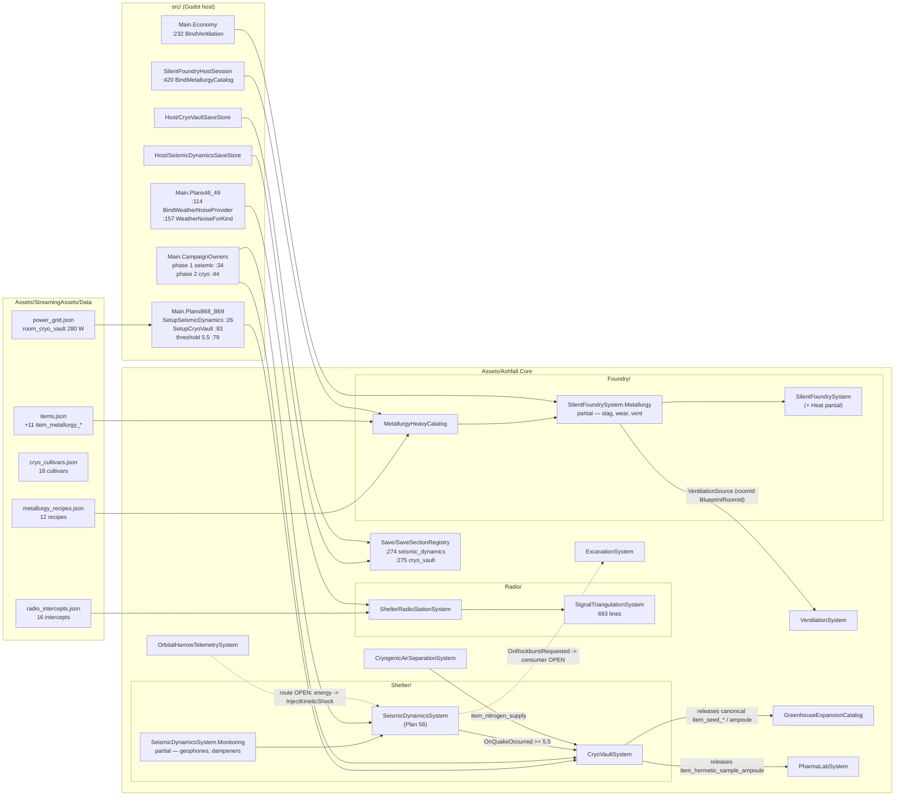
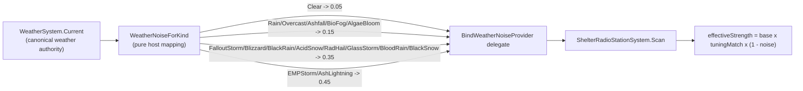
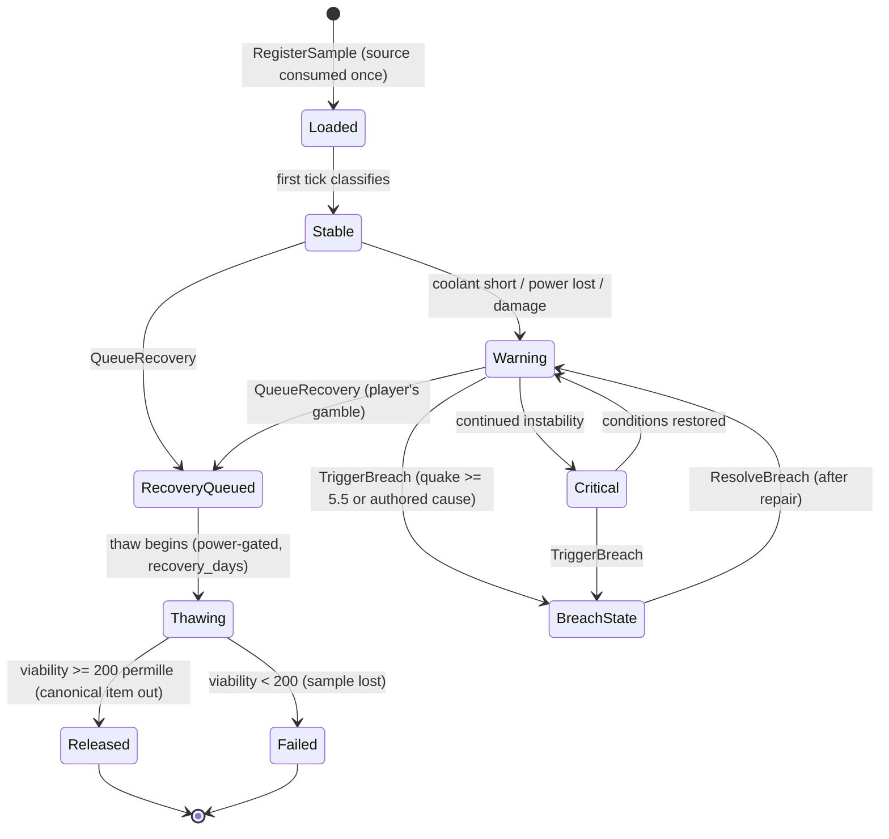
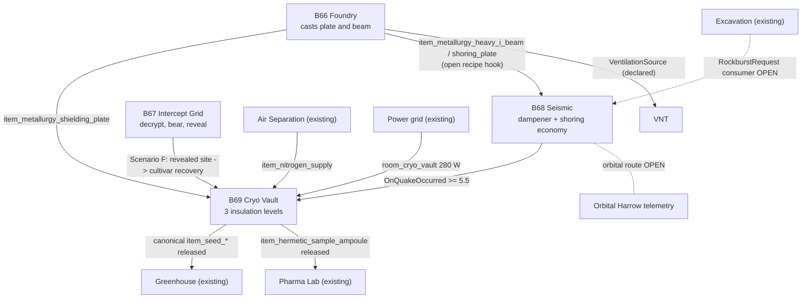

# PLANS B66–B69 — FLAGSHIP WAVE (renumbered 2026-09-06)

**Owner decision:** the flagship wave formerly proposed as "Plans 66–69" is
renumbered to **B66–B69**. The 66–69 number block is retired for new work —
it is consumed by shipped closeouts (guilt sources 66, cassette sets 67,
wall carving 68, grave epitaphs 69).

**Owner directive:** all four domains are **expansions of existing
authorities** — never competing systems.

| Plan | Domain | Authority extended | Status |
|---|---|---|---|
| B66 | Subterranean Heavy Manufacturing & Metallurgical Smelting | `SilentFoundrySystem` (+ `CupolaFoundryEngine` untouched) | **Core slice merged** — see [closeout](PLAN_B66_METALLURGY_CLOSEOUT.md) |
| B67 | Radio Signal Cryptanalysis & Triangulation Intercept Grid | Plans 46–49 intercept grid (`SignalTriangulationSystem`, `radio_intercepts.json`) | pending audit-then-extend |
| B68 | Geological Faultline Seismic Monitoring & Shock Dampening | `SeismicDynamicsSystem` (Plan 56), `ExcavationSystem`, `OrbitalHarrowTelemetrySystem` | pending |
| B69 | Cryogenic Sample Preservation & Genetic Cultivar Seed Vault | `SeedBankPreservationCatalog`, `CryoPreservationCatalog`, `CryogenicAirSeparationSystem`, `GreenhouseExpansionCatalog`, `PharmaLabSystem` | pending |

Per-domain true gaps (from `PLANS_66_69_RECONNAISSANCE.md`) carry over,
with B66's core slice closed below.

---

# EXPANSION 2026-09-25 — Plans B66–B69 Flagship Wave: Full Integration Framework & Code Architecture

Everything above the first `---` separator is the original 2026-09-06 renumbering
record, preserved byte-for-byte. Everything below is the 2026-09-25 expansion:
a full integration framework and code-architecture reference for the four
flagship domains, grounded in a fresh evidence pass over the sibling closeouts,
the Core sources, the host wiring, and the authored data catalogs.

# PART I — EVIDENCE BASE, STATUS LEGEND, AND THE STATUS CORRECTION

**Expansion scope.** This document is the wave-level authority for B66–B69:
what the renumbering decision was, what each domain extends, what has already
landed (as verified on 2026-09-25), what remains open, and how the remainder
must be integrated without ever competing with an existing owner. It does not
replace the per-plan closeouts; it reconciles them and builds the framework
around them.

**Primary evidence base (all verified 2026-09-25 unless marked otherwise):**

| Evidence | Path | Role in this document |
|---|---|---|
| Original renumbering record | this file, above the separator | consumed-ID decision, per-domain authority table |
| Wave reconnaissance | `docs/plans/PLANS_66_69_RECONNAISSANCE.md` | true-gap inventory, collision finding, revised wave order |
| B66 closeout | `docs/plans/PLAN_B66_METALLURGY_CLOSEOUT.md` | metallurgy slice: files, mechanics, verification |
| Host-wiring closeout | `docs/plans/PLAN_B66_B69_HOST_WIRING_CLOSEOUT.md` | Main triad wiring, save registration, scenarios A–G |
| B67 closeout | `docs/plans/PLAN_B67_RADIO_CRYPTANALYSIS_CLOSEOUT.md` | audit results, the one true gap and its host fix |
| B68 closeout | `docs/plans/PLAN_B68_SEISMIC_MONITORING_CLOSEOUT.md` | monitoring slice, ownership rules, verification |
| B69 closeout | `docs/plans/PLAN_B69_CRYO_VAULT_CLOSEOUT.md` | vault slice, no-duplication matrix, verification |
| Retired Plan 66 | `docs/psych/PLAN66_CLOSEOUT.md` | guilt sources 20 → 40 evidence |
| Retired Plan 67 | `docs/narrative/PLAN_67_CASSETTE_SETS_EXPANSION_CLOSEOUT.md` | cassette sets 4 → 12 evidence |
| Retired Plan 68 | `docs/shelter/PLAN68_CLOSEOUT.md` | wall carving 15 → 60 evidence |
| Retired Plan 69 | `docs/memorials/PLAN69_BASELINE.md` | grave epitaphs 8 → 30 baseline evidence |
| Core sources | `Assets/Ashfall.Core/Foundry/`, `Radio/`, `Shelter/`, root | live contracts cited per chapter |
| Host sources | `src/Main.PlansB68_B69.cs`, `src/Main.Plans46_49.cs`, `src/Main.CampaignOwners.cs`, `src/Main.Economy.cs`, `src/Foundry/SilentFoundryHostSession.cs`, `src/Host/*SaveStore.cs` | wiring cited per chapter |
| Data authority | `Assets/StreamingAssets/Data/metallurgy_recipes.json`, `cryo_cultivars.json`, `radio_intercepts.json`, `power_grid.json`, `items.json` | roster counts re-counted on 2026-09-25 |
| Tests | `Ashfall.Core.Tests/Foundry/MetallurgyB66Tests.cs`, `Shelter/SeismicMonitoringB68Tests.cs`, `Shelter/CryoVaultB69Tests.cs`, `Integration/PlansB66ToB69CrossSystemTests.cs` | method rosters re-listed on 2026-09-25 |

## Status legend used throughout the expansion

| Marker | Meaning |
|---|---|
| **VERIFIED (source)** | Confirmed by reading the cited file on 2026-09-25. |
| **VERIFIED (closeout)** | Stated in a sibling closeout dated 2026-09-06; the closeout's verification table is the record. Re-run before relying on it as a current gate. |
| **UNVERIFIED (log text)** | Appears in log or closeout text but could not be re-confirmed against source on 2026-09-25. Do not build on it without re-checking. |
| **PROPOSED** | Design recommendation of this expansion. Nothing is implemented; nothing is claimed to exist. |
| **OPEN (verified absent)** | A follow-up whose absence was positively confirmed on 2026-09-25 (e.g. by targeted search over `src/` finding no route). |

## How to read this document

- **Part II** is the audit: who owns what today, and the honest reconciliation
  between the original table's "pending" column and what actually shipped.
- **Part III** is the integration framework: the extend-never-compete principle
  stated as enforceable policy, the tier-by-tier flow per domain, and the
  save/determinism/integrity obligations that extension work carries.
- **Part IV** is the code architecture: the module map across the four domains
  and their host authorities, with per-domain component specifications.
- **Part V** is the bulk: numbering governance, then one full-depth chapter per
  domain, then the cross-wave synthesis.
- **Part VI** is the cross-system matrix and restrained emergent-consequence
  design. **Part VII** is verification and acceptance. **Part VIII** holds the
  appendices: glossary, plan-ID vocabulary, scenarios, open questions.

**One status correction up front, because it changes how every later chapter is
read:** the original table above lists B67, B68 and B69 as *pending*. That
column is stale. All four domains have shipped closeouts dated 2026-09-06, and
the host-wiring closeout additionally delivered the B68/B69 tick registration,
save sections, power/radiation ports and the A–G cross-plan integration
scenarios. The honest current state is: **core + host wiring landed for all
four; the open work is UI panels, player-facing routes, the orbital→seismic
route, and the rockburst consumer** — each verified absent on 2026-09-25 and
detailed in the per-domain chapters.

---

# PART II — CURRENT AUTHORITY AUDIT (2026-09-25)

## II.A Audit method

Every claim in this part was re-established on 2026-09-25 by one of three
methods, in descending order of trust:

1. **Source read.** The cited `.cs` or `.json` file was opened and the cited
   member, field, id or count read directly. Counts of authored ids were
   re-counted with exact text matches, not taken from any log.
2. **Closeout read.** The cited sibling closeout under `docs/plans/` was read
   in full; its files-changed and verification tables are treated as the record
   of what was delivered on 2026-09-06.
3. **Absence search.** For each "known follow-up", a targeted text search over
   `Assets/Ashfall.Core/` and `src/` was used to confirm the follow-up is
   still open (no consuming call site exists). These are marked
   **OPEN (verified absent)** with the searched symbols named.

No builds or test runs were executed for this audit. Verification numbers
quoted from closeouts are **VERIFIED (closeout)**, not re-run results.

## II.B The consumed-IDs record — why "Plans 66–69" can never mean this wave

The reconnaissance (`docs/plans/PLANS_66_69_RECONNAISSANCE.md`, §1) found the
collision; the owner decision at the top of this file resolved it by retiring
the 66–69 block for new work and renumbering the flagship wave to **B66–B69**.
The four consumed numbers are not abstractions — each names shipped content
that is load-bearing today:

| Number | Consumed by | Authority evidence (verified 2026-09-25) | Wave content it blocks |
|---|---|---|---|
| **66** | Guilt sources expansion | `docs/psych/PLAN66_CLOSEOUT.md` — `guilt_sources.json` expanded 20 → 40 entries across 8 decision classes, severities 0.20–0.90, integrated with `GuiltInsomniaSystem` | metallurgy/smelting |
| **67** | Cassette sets expansion | `docs/narrative/PLAN_67_CASSETTE_SETS_EXPANSION_CLOSEOUT.md` — `cassette_sets.json` 4 → 12 sets / 48 parts, 34 new Media items, 34 scavenging placements, pure data pass | radio cryptanalysis |
| **68** | Wall carving templates | `docs/shelter/PLAN68_CLOSEOUT.md` — `wall_carving_templates.json` 15 → 60 templates (20/20/20 per morale band), all 15 originals preserved verbatim | seismic monitoring |
| **69** | Grave epitaphs expansion | `docs/memorials/PLAN69_BASELINE.md` — baseline: `wasteland_grave_epitaphs.json` at 8 records, planned 8 → 30, cause-aware memorial lines through `MemorialSystem` | cryo vault |

The reconnaissance also cited three companion documents —
`docs/plans/66-guilt-sources-expansion.md`,
`docs/plans/68-wall-carving-templates-expansion.md`,
`docs/plans/69-grave-epitaphs-expansion.md` — which are **not present at those
paths today** (checked 2026-09-25). The surviving closeout/baseline documents
listed in the table above are the operative evidence; treat the missing
companions as moved or archived, and do not cite them. The retired 66–69 work
shares a family trait that matters for governance: it is content-density work
(data rosters, tone grammar, placement tables) with small or zero code
footprint — Plan 67 and Plan 68 closeouts both state "zero Core/host code
changes" — while the B-wave is systems-integration work. The number collision
was possible precisely because the two families drew from one undifferentiated
ID space; Part V.1 turns that lesson into policy.

## II.C Domain audit — B66: Subterranean Heavy Manufacturing & Metallurgical Smelting

**Extended authority:** `SilentFoundrySystem` and its partials
(`Assets/Ashfall.Core/Foundry/`). `CupolaFoundryEngine`
(`Assets/Ashfall.Core/Shelter/`) is explicitly untouched, per the original
table.

**Status: MERGED — core slice, host wiring, cross-plan hooks.** This is the
most-landed domain of the four.

Verified ownership surface:

| Concern | Owner | Evidence |
|---|---|---|
| Heavy-recipe catalog | `MetallurgyHeavyCatalog` + loader | `Assets/Ashfall.Core/Foundry/MetallurgyHeavyCatalog.cs` (176 lines); data `metallurgy_recipes.json`, 12 recipe ids re-counted, `schema_version: 1` read at line 2 |
| Projection into the foundry production shape | `MetallurgyRecipeEntry.ToProductEntry()` (closeout) projecting into `FoundryProductEntry` with `category: "heavy_metallurgy"` | VERIFIED (closeout); catalog file present |
| Id-safe merge into the bound catalog | `SilentFoundryCatalog.MergeHeavyRecipes()` | VERIFIED (closeout); `SilentFoundryCatalog.cs` present (303 lines) |
| Batch lifecycle, slag, lining wear, ventilation | `SilentFoundrySystem.Metallurgy.cs` partial | 221 lines on disk; `RegisterSource(new VentilationSource ...)` read at line 204 with `roomId = SilentFoundryIds.BlueprintRoomId` |
| Heat-machine hooks | `SilentFoundrySystem.Heat.cs` | 548 lines on disk; hooks per closeout: slag quality penalty −slag/8, incident pressure +slag/12 capped 60, `AdvanceMetallurgy` in `TickDaily`, `ClearHeavyBatch` on dump paths, `OnHeavyCastResolved` after quality roll — VERIFIED (closeout) |
| State fields | `SilentFoundryTypes.cs` lines 258–260 | read directly: `activeMetallurgyRecipeId = string.Empty`, `metallurgySlag = 0f` (0..100 normalized), `metallurgyBatchesCompleted = 0` |
| Host activation | `src/Foundry/SilentFoundryHostSession.cs:420` | read directly: `engine.BindMetallurgyCatalog(MetallurgyCatalogLoader.Load(dataDir, files, json));` |
| Ventilation handoff in host | `src/Main.Economy.cs:232` | read directly: `_silentFoundry.Engine.BindVentilation(_ventilation);` |
| Ventilation room id | `SilentFoundryIds.BlueprintRoomId` → `room_bp_11_the_silent_foundry_smelter_bay` | id string found in `SilentFoundryTypes.cs`, `SilentFoundrySystem.cs`, `SilentFoundryHeadlessDemo.cs`, and `Assets/StreamingAssets/Data/narrative/bunker_blueprints_codex.json` |
| Tests | `Ashfall.Core.Tests/Foundry/MetallurgyB66Tests.cs` | 386 lines; 18 `public void` test methods re-listed (closeout records 17 tests — see II.G) |

**Item economy:** `items.json` carries exactly 11 `item_metallurgy_*` ids
(re-counted by text match), plus one recipe output reusing the pre-existing
`item_foundry_shoring_bracket` (id confirmed present).

**Open follow-ups (verified absent where stated):**

- Ventilation for standard (non-heavy) heats: no handoff yet — deliberate,
  per B66 closeout follow-up 1. Status: **OPEN** (not re-searched per-symbol;
  the closeout's "deliberately out of this slice" stands unchallenged).
- B68 hook consumption (`metallurgy_heavy_i_beam` / `metallurgy_shoring_plate`
  in dampener/shoring recipes) and B69 hook consumption
  (`metallurgy_shielding_plate`): both items confirmed present in `items.json`;
  their *consumption* status is tracked in the B68/B69 chapters.
- Dedicated metallurgy UI: none exists; the shared foundry surfaces carry the
  heat machine. **OPEN.**

## II.D Domain audit — B67: Radio Signal Cryptanalysis & Triangulation Intercept Grid

**Extended authority:** the Plans 46–49 intercept grid —
`SignalTriangulationSystem` (`Assets/Ashfall.Core/Radio/`, 693 lines on disk),
`ShelterRadioStationSystem` (same directory), and
`Assets/StreamingAssets/Data/radio_intercepts.json` (16 intercept ids
re-counted by text match).

**Status: CLOSED via audit-then-extend.** The B67 closeout's central finding is
that the flagship plan's radio requirements were already substantially shipped
as Plans 46–49, and the wave's only honest move was to audit rather than build.
The audit table in `PLAN_B67_RADIO_CRYPTANALYSIS_CLOSEOUT.md` reconciles every
plan requirement (67.4–67.16) against existing evidence and finds exactly one
true gap.

Verified ownership surface:

| Plan requirement | Existing owner | Evidence class |
|---|---|---|
| 16 authored intercepts with `frequency_khz`, `band`, `base_signal_strength`, `encryption.scheme/difficulty/required_skill_ids`, `triangulation.required_bearings/revealed_location_id`, `expiry_days` | `radio_intercepts.json` | data file present, 16 ids re-counted; field list VERIFIED (closeout) |
| Signal quality model `effectiveStrength = base × tuningMatch × (1 − weatherNoise)` | `ShelterRadioStationSystem.Scan` | VERIFIED (closeout) |
| Cipher progression (67.7), difficulty-rate 250/difficulty, operator-skill-multiplied, permille progress | `ProgressDecryption` | VERIFIED (closeout) |
| Bearing accumulation (67.5), distinct-azimuth rule ≥ 20° | `RecordBearing` | VERIFIED (closeout) |
| Triangulation (67.4/67.6): discrete authored-graph reveal plus deeper continuous-coordinate layer (ray intersection, confidence, uncertainty radius) | `RecordBearing` → `revealed_location_id`; `SignalTriangulationSystem` | source present (693 lines); layer split VERIFIED (closeout) |
| Map reveal exactly-once (67.12) | `discoveredLocationIds` guard + `src/Main.Plans46_49.cs` → `_world.WastelandMap.Discover(locationId)` | VERIFIED (closeout) |
| Decoy (67.10) delegating ambush risk to the destination authority | `radio_intercept_spoofed_distress_trap_08` → `loc_motel_verity` (`encounterChancePerTick` 0.2, Warlord-enforced) | VERIFIED (closeout) |
| Skill integration (67.11) via `skill_signal_ear`, `skill_cold_analysis` | `required_skill_ids` multiplier | VERIFIED (closeout) |
| Save (67.16) | `RadioSave` / `RadioStationSaveStore` | VERIFIED (closeout) |

**The one true gap, and its fix (verified in host source 2026-09-25):**
`BindWeatherNoiseProvider` was never wired, so detection ran on a hardcoded
0.15 default regardless of weather. The fix is host-only: `src/Main.Plans46_49.cs`
line 114 reads `_radioStationSystem.BindWeatherNoiseProvider(() => WeatherNoiseForKind(weather.Current));`
and the `WeatherNoiseForKind` mapping sits at line 157 of the same file. The
authored mapping, as recorded in the closeout and binding call now present:

| Weather kinds | Noise |
|---|---|
| Clear | 0.05 |
| Rain, Overcast, Ashfall, BioFog, AlgaeBloom | 0.15 |
| FalloutStorm, Blizzard, BlackRain, AcidSnow, RadHail, GlassStorm, BloodRain, BlackSnow | 0.35 |
| EMPStorm, AshLightning | 0.45 |

No radio-only weather state was created; the mapping is host presentation over
the canonical `WeatherSystem` (`weather.Current`), which is exactly the
one-authority rule working as intended.

**Open follow-ups (B67 closeout):** the cipher-wheel minigame (67.8) as an
optional visual layer over the headless `ProgressDecryption` authority —
deferred until a panel design exists; dedicated presentation of decoded
transmission logs (67.9) — content already appends to
`decodedIntelligenceLogs`; no separate solar-cycle authority exists to consume
(EMPStorm/AshLightning cover electrical interference).

## II.E Domain audit — B68: Geological Faultline Seismic Monitoring & Shock Dampening

**Extended authority:** `SeismicDynamicsSystem` (Plan 56,
`Assets/Ashfall.Core/Shelter/`, 456 lines + `SeismicDynamicsSystem.Monitoring.cs`
partial, 266 lines, both on disk), with `ExcavationSystem`
(`Assets/Ashfall.Core/ExcavationSystem.cs`, 164 lines) and
`OrbitalHarrowTelemetrySystem` (`Assets/Ashfall.Core/OrbitalHarrowTelemetrySystem.cs`)
as coupled authorities that keep all damage ownership.

**Status: MERGED — core monitoring slice AND host wiring.** The original table
said *pending*; both the B68 closeout (core slice) and the host-wiring
closeout (tick registration, save section, cryo handoff) have landed.

Verified ownership surface:

| Concern | Owner | Evidence |
|---|---|---|
| Tension → slip → damage-routing authority (Plan 56) | `SeismicDynamicsSystem` | source present; ownership rules per B68 closeout |
| P/S two-stage detection (68.5) | `SeismicDynamicsSystem.Monitoring.cs` | `PrimaryWaveRatioBase = 0.60f`, `MainArrivalRatioBase = 0.80f` read at lines 54–56; geophone-reduced 0.45/0.65 documented at line 222 comment and closeout |
| Geophone install (68.9) | `InstallGeophone(string sectorId, InventoryContainer? inv = null)` | read at line 84; consumes `item_geophone_probe` (id confirmed in `items.json`) |
| Dampener install/service (68.6) | `InstallDampener(...)` line 123, `ServiceDampener` per closeout | consumes `item_seismic_damper_pad` + `item_vibration_dampening_mount` (both ids confirmed in `items.json`); up to 25 % peak-impulse reduction, wear `8 + 15·((magnitude−3)/3.5)` per slip |
| Warning stages (68.10) `Stable/Elevated/Swarm/Imminent/Aftershock` | derived, never persisted | VERIFIED (closeout); catalog-truth vs runtime-truth rule |
| Rockburst (68.7) | `RockburstRequest` class line 26, `OnRockburstRequested` event line 71 | read directly; severity ≥ 0.6 slips emit the request |
| Kinetic-shock entry seam | `SeismicDynamicsSystem.InjectKineticShock(float megajoules, string epicenterSector)` | read at `SeismicDynamicsSystem.cs:264` — the seam lives on the seismic system, not on the orbital system; orbital code *calls into* it |
| Host construction + quake→cryo handoff | `src/Main.PlansB68_B69.cs` | `SetupSeismicDynamics` line 26; `OnQuakeOccurred` subscription line 54; `SeismicBreachMagnitudeThreshold = 5.5f` line 79; `TriggerBreach` call line 61 |
| Daily tick | `src/Main.CampaignOwners.cs:34` | `_campaignDay.Register("seismic_geology", new SeismicGeologyDayOwner(this), phase: 1);` — phase 1, before production |
| Save section | `Assets/Ashfall.Core/Save/SaveSectionRegistry.cs:274` row `seismic_dynamics` + `src/Host/SeismicDynamicsSaveStore.cs` | both read |
| Additive save fields | `geophoneSectors`, `dampenerIntegrity` | VERIFIED (closeout); legacy-empty restores exact Plan 56 behavior, pinned by the original 6 Plan 56 tests |
| Tests | `Ashfall.Core.Tests/Shelter/SeismicMonitoringB68Tests.cs` | 14 `[Fact]` methods — matches the closeout's 14/14 |

**Open follow-ups — all positively verified absent on 2026-09-25:**

- **Orbital → seismic route:** a search of `src/` for `InjectKineticShock`
  finds only the Core definition (`SeismicDynamicsSystem.cs:264`) and no host
  caller. `OrbitalHarrowTelemetrySystem` exposes `OnImpactWarning`,
  `OnImpactResolved` (comment: `// day, energy`), `OnImpactDetailed` and
  `ScheduleImpact(...)`, and is constructed in `src/Main.FlagshipInstitutions.cs`
  (`EnsureOrbitalHarrowTelemetry`) and consumed by the radio station and
  panels — but nothing forwards its impact energy into the seismic seam.
  **OPEN (verified absent).**
- **Player-facing routes** for geophone/dampener installation: no call sites
  for `InstallGeophone` / `InstallDampener` / `ServiceDampener` exist in
  `src/` outside tests' reach of the host UI. **OPEN (verified absent).**
- **Rockburst consumer** for `OnRockburstRequested` (blocked-tunnel handling
  by the excavation authority): no subscriber found. **OPEN (verified absent).**
- **`SeismicMonitorPanel` UI:** does not exist. The pre-existing
  `BoreholeSeismographPanel` is recorded by the B68 closeout as a UI-06
  fake-success prototype that must not be promoted as-is. **OPEN.**

## II.F Domain audit — B69: Cryogenic Sample Preservation & Genetic Cultivar Seed Vault

**Extended authority (five named owners, none duplicated):**
`SeedBankPreservationCatalog` and `CryoPreservationCatalog`
(`Assets/Ashfall.Core/Narrative/` — prose/lore catalogs, untouched),
`CryogenicAirSeparationSystem` (`Assets/Ashfall.Core/CryogenicAirSeparationSystem.cs`,
the coolant production authority), `GreenhouseExpansionCatalog`
(`Assets/Ashfall.Core/Greenhouse/GreenhouseExpansionCatalog.cs`, the
cultivation endpoint), `PharmaLabSystem`
(`Assets/Ashfall.Core/PharmaLabSystem.cs`, the medicine endpoint).

**Status: MERGED — core vault slice AND host wiring.** The original table said
*pending*; the B69 closeout (Core slice) and host-wiring closeout (ports, save
section, breach handoff) have landed.

Verified ownership surface:

| Concern | Owner | Evidence |
|---|---|---|
| Canister/viability/breach state machine | `CryoVaultSystem` (`Assets/Ashfall.Core/Shelter/CryoVaultSystem.cs`, 553 lines) | `CryoCanisterPhase` enum read at line 115 (`Loaded = 1`, `RecoveryQueued = 5`, `Thawing`, `Released`/`Failed` per closeout) |
| Cultivar data authority | `cryo_cultivars.json` | 18 specimen ids re-counted; `schema_version 1` per closeout |
| Coolant consumption | vault consumes `item_nitrogen_supply` — the air-separation plant's product | item id confirmed in `items.json`; no-duplication matrix VERIFIED (closeout) |
| Insulation upgrades | consume `item_metallurgy_shielding_plate` — the B66 hook | item id confirmed; `Insulation_SlowsCoolantBurn_AndUpgradeConsumesB66Plate` test present |
| Cultivation handoff | recovery releases canonical seed items only | 10 `item_seed_*` ids + `item_hermetic_sample_ampoule` pinned by `Catalog_AllRecoveryItemsResolveToCanonicalSeeds`; `item_hermetic_sample_ampoule` confirmed in `items.json` as a generic pharma `input_ids` item (closeout) |
| Radiation exposure | provider port `Func<float>` — normalized survivor dose (÷50 mSv clamp per host-wiring closeout) | vault never computes dose; scales decay by authored `radiation_sensitivity` |
| Power | provider port `Func<bool>` from grid room `room_cryo_vault` | `power_grid.json` lines 57–61 read directly: `draw_watts: 280`, `default_priority: "critical"`, `failure_effect_id: "fx_cryo_vault_unpowered"`; pre-B69 saves without the room fall back to brownout-only (closeout) |
| Seismic breach handoff | `OnQuakeOccurred` (magnitude ≥ 5.5) → `CryoVault.TriggerBreach` | `src/Main.PlansB68_B69.cs` lines 54–61 and 79 read directly |
| Daily tick | `src/Main.CampaignOwners.cs:44` | `_campaignDay.Register("cryo_vault", new CryoVaultDayOwner(this), phase: 2);` — phase 2, after the foundry, so a brownout day degrades samples exactly once |
| Save section | `SaveSectionRegistry.cs:275` row `cryo_vault` + `src/Host/CryoVaultSaveStore.cs` | both read |
| Tests | `Ashfall.Core.Tests/Shelter/CryoVaultB69Tests.cs` | 349 lines, 15 test methods re-listed (closeout records 14 — see II.G) |

**Open follow-ups:** `CryoVaultPanel` UI — does not exist; the
`CryogenicPermafrostCorePanel` is recorded as a UI-05 stub that must not be
promoted as-is. Player-facing vault action routes (register, replenish,
insulate, queue recovery, triage) — no host routes found. Both **OPEN**.

## II.G Status reconciliation — the original table vs verified reality

This is the honesty table. Left column: the original 2026-09-06 record at the
top of this file. Right column: what the sibling closeouts plus this audit
actually establish.

| Plan | Original status | Verified status 2026-09-25 | What landed | What remains |
|---|---|---|---|---|
| B66 | **Core slice merged** (was already honest) | core slice + host activation merged | 12-recipe roster, partial `SilentFoundrySystem.Metallurgy`, heat hooks, state fields, ventilation source, `BindMetallurgyCatalog` + `BindVentilation` in host, 17 recorded tests | metallurgy UI; ventilation for standard heats (deliberate); B68/B69 hook consumption (tracked in those chapters) |
| B67 | pending audit-then-extend | **CLOSED by audit** — the grid already existed as Plans 46–49 | weather-noise provider binding + `WeatherNoiseForKind` (~35 host lines, per closeout) | cipher-wheel minigame UI; decoded-log presentation |
| B68 | pending | **core slice + host wiring merged** | `Monitoring` partial, additive save fields, `SetupSeismicDynamics`, phase-1 tick, `seismic_dynamics` save section, quake→breach threshold 5.5, 14 tests | orbital→`InjectKineticShock` route; rockburst consumer; geophone/dampener player routes; `SeismicMonitorPanel` |
| B69 | pending | **core slice + host wiring merged** | `CryoVaultSystem`, 18-cultivar catalog, phase-2 tick, `cryo_vault` save section, power room `room_cryo_vault` (280 W critical), radiation port, quake breach handoff, 14 recorded tests | `CryoVaultPanel`; vault action routes; power-budget scenario follow-through |

The practical consequence for planning: **no B-wave domain is waiting on its
core.** All remaining work is presentation, routing, and the two cross-authority
consumers (orbital energy, rockburst), plus UI follow-through. That reshapes
priorities — the next unit of player-visible value is panels and routes, not
new simulation.

## II.H Evidence notes and discrepancies found during the audit

Recorded so the next reader does not rediscover them:

1. **Test-count drift (minor, benign).** The B66 closeout records 17 tests;
   `MetallurgyB66Tests.cs` on disk has 18 `public void` test methods. The B69
   closeout records 14; `CryoVaultB69Tests.cs` has 15 (the extra,
   `CompleteRecovery_FiresOnCultivarReleasedWithTraits`, exercises the
   release event surface). The integration closeout records 7 scenarios A–G;
   the file has 8 methods — `ScenarioG_InfrastructureStress_SplitEqualsStraight`
   is joined by `ScenarioG_ThirtyDayCampaign_SplitAndPairedRerunsProduceIdenticalState`,
   a longer-horizon variant of the same stress scenario. No test counts
   shrank; nothing was removed. Anyone re-running gates should expect the
   on-disk counts, not the closeout counts.
2. **Save contract arithmetic.** The host-wiring closeout records the contract
   matrices moving to 156 sections / 150 checksum envelopes with
   `ARCHITECTURE_TEST_MAP.md` rows 155–156. **VERIFIED (closeout)** — the
   registry rows were read, the matrix counts were not re-derived.
3. **Authority-map drift.** `docs/CURRENT_AUTHORITY.md` (header dated
   2026-08-26; see also the VIII.G timeline) still states "129 catalogs and
   4,793 authored IDs", while the wave's 2026-09-06 integrity selftests report
   283–284 catalogs and ~11,000 ids. The authority map predates the flagship
   wave and is not wrong about its own date; treat its counts as historical.
   The integrity selftest is the live counter.
4. **Missing companion documents.** Three `docs/plans/6x-*.md` companions
   cited by the reconnaissance are absent today (see II.B). Cite the surviving
   closeouts instead.
5. **`InjectKineticShock` location.** The B68 closeout's phrase "the existing
   `InjectKineticShock` seam" reads as if it might live on the orbital system;
   it lives on `SeismicDynamicsSystem` (line 264) and is the *inbound* seam —
   the orbital system would be the caller. Chapter V.4 keeps this explicit so
   nobody adds a second seam.
6. **Excavation reinforcement signature.** `ExcavationSystem.TryApplyStructuralReinforcement(string siteId)`
   takes no item argument; beam consumption is via the action bill
   (`StructuralBeamItemId = "item_foundry_t_beam"`, `StructuralBeamCost = 2`,
   lines 38/39/108). The B66 heavy I-beam (`metallurgy_heavy_i_beam`) is a
   *different, heavier* id — Scenario A in the integration tests rides the
   beam cost through the bill, not through a parameter. Any B68 dampener/shoring
   recipe work must follow the same bill pattern rather than inventing a
   direct-consumption shortcut.

---

# PART III — INTEGRATION FRAMEWORK

## III.A The extend-never-compete principle, stated as architecture policy

The owner directive at the top of this file — *all four domains are expansions
of existing authorities, never competing systems* — is not a preference; it is
the wave's architecture policy, and every closeout in the wave cites it as the
governing decision. Restated as the rules any future B-wave (or similar)
extension must satisfy:

**Rule E1 — Name the owner before writing code.** An extension plan must open
with a table naming, for every concern it touches, the existing owner class,
catalog, save store, and event seam. The B69 closeout's no-duplication matrix
(coolant → `CryogenicAirSeparationSystem`, cultivation → greenhouse, medicine →
pharma, radiation → provider port, lore → the two narrative catalogs) is the
model: one row per concern, one owner per row.

**Rule E2 — The extension rides the owner's existing machine.** B66 did not
add a second furnace state machine; heavy recipes ride the six-stage heat
machine (`ChargeLoaded→Preheat→AtHeat→Tapped→Casting→Cooling→Complete`), the
standard quality roll, the standard output transaction. If a new domain needs
a *different* machine, that is evidence the domain does not belong to this
owner — escalate, do not branch.

**Rule E3 — Projection over branching.** New content is projected into the
owner's existing content shape (`ToProductEntry()` → `FoundryProductEntry`
with `category: "heavy_metallurgy"`), so the owner's consumer code
(`CompleteCast`) needs no branching. A merge that requires editing the
consumer's decision logic is a smell.

**Rule E4 — Additive, legacy-safe state only.** New fields default to values
that reproduce pre-extension behavior on old saves: `activeMetallurgyRecipeId`
empty, `metallurgySlag` 0, `geophoneSectors` empty, `dampenerIntegrity` empty.
"With nothing installed, the system behaves exactly as before" is a testable
claim, and the wave pins it with `LegacyState_*` tests.

**Rule E5 — Delegation events, never damage ownership.** When the extension
needs another authority to act, it emits a request-typed event
(`OnRockburstRequested(RockburstRequest)`) and never applies the other
authority's effects itself. The seismic layer owns impulses and warnings; the
excavation authority owns tunnels; structural/excavation/thermal authorities
keep all damage.

**Rule E6 — Provider ports over computed truth.** Cross-domain scalar needs
(radiation dose, power availability) are bound as provider delegates
(`Func<float>`, `Func<bool>`) by the host, over canonical authorities. The
vault never computes dose; the radio never keeps its own weather.

**Rule E7 — One transaction per state change.** Consumption and effect commit
atomically: a refused start consumes nothing; a recovery releases the canonical
item and clears the canister in the same transaction, stalling rather than
duplicating when the host inventory is full.

**Rule E8 — Events are facts; presentation decides.** Core emits
`CultivarReleased`-class facts and state; panels, audio and ambience are
presentation. `ProgressDecryption` must stay headless-resolvable.

## III.B The decision procedure — audit-then-extend

B67 demonstrated the procedure the wave applies before any new code:

1. **Inventory.** List the plan's required capabilities as rows (the B67
   closeout's audit table has one row per plan clause 67.4–67.16).
2. **Match.** For each row, find the existing owner and its evidence — data
   file, class, wired route, save store. Mark each row covered / partial / gap.
3. **Reconcile.** Where the plan text and shipped reality disagree (the plan's
   hypothetical `RadioInterceptDef`/`radio_ciphers.json` architecture vs the
   shipped 16-intercept grid), shipped reality wins and the plan is recorded
   as satisfied-by-existing. Do not author a competing catalog to make a plan
   document true.
4. **Fix only the gaps.** B67 had exactly one true gap (weather noise) and
   fixed it in ~35 host lines with no new state.
5. **Record.** The audit table becomes part of the closeout, so the next agent
   does not re-derive it.

This procedure is why B67 cost almost nothing while B68 — the reconnaissance's
"genuine greenfield build" — cost the most: the procedure routes effort to
where the truth actually is, not to where the plan document assumed work
would be.

## III.C Tier-by-tier flow, per domain

Each domain now has a landed core and a defined remainder. The tiers below are
the integration order for that remainder; a tier may only start when the tier
above it is green in focused verification.

### B66 tiers

| Tier | Content | State |
|---|---|---|
| T1 core | catalog + partial + heat hooks + state + data + tests | **merged** |
| T2 host | `BindMetallurgyCatalog` in `SilentFoundryHostSession`, `BindVentilation` in `Main.Economy` | **merged** |
| T3 surface | metallurgy presentation over the shared heat machine (no fixture data, truthful state), heavy-batch actions routed | **OPEN** |
| T4 cross-domain | heavy I-beam/shoring plate consumed by B68 recipes; shielding plate consumed by B69 upgrades | **B69 side merged** (insulation consumes the plate); **B68 side open** |

### B67 tiers

| Tier | Content | State |
|---|---|---|
| T1 audit | full requirement-vs-evidence reconciliation | **closed** (B67 closeout) |
| T2 host gap | weather-noise provider binding | **merged** |
| T3 surface | cipher-wheel minigame as optional visual layer over `ProgressDecryption`; decoded-log presentation | **OPEN** — requires a panel design first |

### B68 tiers

| Tier | Content | State |
|---|---|---|
| T1 core | monitoring partial, additive state, Plan 56 hooks, tests | **merged** |
| T2 host | `SetupSeismicDynamics`, phase-1 tick, save store + registry row | **merged** |
| T3 cross-authority | orbital impacts → `InjectKineticShock`; rockburst consumer in the excavation authority | **OPEN (verified absent)** |
| T4 surface | `SeismicMonitorPanel`; player routes for geophone/dampener install and service | **OPEN** |

### B69 tiers

| Tier | Content | State |
|---|---|---|
| T1 core | `CryoVaultSystem`, 18-cultivar catalog, tests | **merged** |
| T2 host | `SetupCryoVault`, phase-2 tick, save store + registry row, power room, radiation port, quake handoff | **merged** |
| T3 cross-authority | greenhouse consumes released seeds via its standard planting path; pharma consumes ampoules | **merged at data level** (canonical items exist and are pinned); runtime follow-through rides the owners' existing paths |
| T4 surface | `CryoVaultPanel`; vault action routes | **OPEN** |

The pattern across all four domains is deliberate: **core first, host second,
cross-authority third, presentation last.** Presentation is last not because
it is unimportant but because a panel built before the seams settle becomes a
fixture-data liability — the project's panel standard (truthful current state,
an exposed existing command, no fake operational routes) is only satisfiable
once the command and the state exist.

## III.D Save, determinism, and integrity obligations for extension work

These are the obligations any remaining B-wave work inherits, derived from the
wave's own closeouts and the repository rules:

**Save.** New state enters through the owner's save state as additive fields
with legacy-safe defaults (E4), and — at wave scope — through a registered
section in `SaveSectionRegistry` captured by a thin `SaveStore<T>` façade over
`SchemaVersionedEnvelope`, enrolled in `SaveAll` (the B68/B69 pattern:
`seismic_dynamics` and `cryo_vault` rows, the two save stores, +2 metadata
rows and +2 `SectionFileNames` whitelist entries per the host-wiring closeout).
A remaining-slice PR that adds state without capture/restore is not done, no
matter how green its build.

**Determinism.** Same seed → identical outcome, and split-at-any-boundary ==
straight run. The wave pins this with paired-run tests
(`PairedRuns_SameSeed_ProduceEquivalentHeavyBatchOutcome`,
`PairedRuns_SameSeed_ProduceIdenticalDampenedOutcome`,
`PairedRuns_SameSeed_IdenticalViabilityCurve`) and split-run scenarios (D and
G). Resolved quality and viability are persisted and never rerolled after
restore; recovery outcomes resolve exactly once. Any new consumer in the
remainder (rockburst handler, orbital route) must preserve both properties and
extend the same test pattern.

**Tick ordering.** Phase 1 seismic before production; phase 2 cryo after the
foundry — so a brownout day degrades samples exactly once and a quake during a
heavy batch never resets the heat machine (Scenario C). New daily work joins
an existing phase with a stated reason; it does not open a new phase without
an integration decision.

**Integrity.** Every new catalog id must resolve through the current integrity
pipeline; presence in JSON is not gameplay reachability. The wave's data
additions (`metallurgy_recipes.json`, `cryo_cultivars.json`, 11
`item_metallurgy_*` items, the `room_cryo_vault` power room) were admitted by
the selftest gates (283 → 284 catalogs during the wave). Content-utilization
expectations apply: the B68 follow-ups that consume existing items
(`item_geophone_probe`, `item_seismic_damper_pad`,
`item_vibration_dampening_mount`) will convert already-authored items from
present to consumed — that is the intended direction.

**Contract matrices.** Save-section additions update the contract matrices and
`ARCHITECTURE_TEST_MAP.md` in the same change; the closeout recorded 156
sections / 150 checksum envelopes after the wave's two rows. The next section
addition (there should be none for the remainder — the open work adds no new
sections) would move those numbers again in one commit with the registry.

## III.E What extension work may never do — anti-patterns with wave examples

| Anti-pattern | Wave example that refused it |
|---|---|
| A second system for an owned concern | No `MetallurgySystem`; heavy work is a partial on `SilentFoundrySystem` |
| A parallel catalog duplicating authored data | No `radio_ciphers.json`; the 16-intercept grid is the authority |
| A radio-local weather model | Noise comes from `weather.Current` through a host mapping |
| The extension applying another authority's damage | `RockburstRequest` is a request; tunnels belong to excavation |
| Computing canonical scalars locally | Dose and power arrive as bound provider delegates |
| Branching the consumer for new content shapes | `CompleteCast` needed no branching — projection happened at load |
| Rerolling persisted outcomes on restore | Viability and quality persist and never reroll |
| Promoting prototype panels | `BoreholeSeismographPanel` (UI-06 fake-success) and `CryogenicPermafrostCorePanel` (UI-05 stub) are named as must-not-promote |
| Fixture-data UI | Panels expose truthful state only — the standard the follow-up UI must meet |

---

# PART IV — CODE ARCHITECTURE

## IV.A Module map across the four domains and their host authorities

The wave's footprint, as it exists on disk today, in one map. Solid boxes are
landed code; dashed names are the verified-absent remainder (no box — they
appear only as labeled arrows for routes that must be added).



Reading the map:

- **Every solid arrow is verified source or data.** The dashed arrows are the
  two open cross-authority routes, drawn from the verified absence findings in
  Part II.
- **The four domains touch each other only through authored items, provider
  delegates, and one event** (`OnQuakeOccurred` → `TriggerBreach`). There is no
  direct domain-to-domain class dependency: B66 does not reference B69 classes;
  the coupling is `item_metallurgy_shielding_plate` flowing through the item
  authority. This is what makes the wave four extensions instead of one
  subsystem.
- **The host owns all binding.** Core classes expose bind/subscribe seams;
  `src/` decides which authority feeds which port, when ticks run, and what is
  captured where.

## IV.B Layer contract — where each kind of code lives

| Layer | Directory | May contain | May not contain |
|---|---|---|---|
| Domain logic | `Assets/Ashfall.Core/` (`netstandard2.1`) | state machines, catalogs, deterministic rolls, save state DTOs, facts-as-events | `Godot`, `UnityEngine`, engine serialization, wall-clock, `System.Random`, presentation decisions |
| Data authority | `Assets/StreamingAssets/Data/` | snake_case schema-valid JSON rosters | mutable gameplay authority duplicates, panel-local tables |
| Host wiring | `src/` partials + `src/Host/` | construction, catalog binding, provider ports, event subscription, tick registration, save stores, panel bind/unbind | gameplay decisions, new authorities |
| Presentation | `src/` panels (to come for this wave) | truthful state rendering, keyboard/controller close/back, focus, visible feedback | fixture data, fake routes, new counters |
| Tests | `Ashfall.Core.Tests/` (`net9.0`) | contracts through current public APIs, paired determinism, legacy-state, split-run scenarios | full-suite-by-default habits (TEST_POLICY) |

## IV.C Component specification — B66 metallurgy extension

**Component `SilentFoundrySystem.Metallurgy` (Core partial).**

- *Purpose:* heavy metallurgy as an extension of the foundry heat machine.
- *Owns:* heavy-batch lifecycle on top of the shared machine; slag
  accumulation and its cap; heavy lining-wear multiplier; the ventilation
  source lifecycle for heavy batches.
- *Key members (verified or closeout-recorded):* `BindMetallurgyCatalog`,
  `BindVentilation`, `StartHeavyBatch` (atomic preflight: flux + charge + fuel
  + water validated before any consumption), `SkimSlag` (removes 40; refused
  on a clean crucible per `SkimSlag_OnCleanCrucible_Refused`),
  `AdvanceMetallurgy` (called from `TickDaily` via the Heat partial),
  `ClearHeavyBatch` (dump paths), `OnHeavyCastResolved` (after the quality
  roll).
- *State:* `SilentFoundryState.activeMetallurgyRecipeId` /
  `metallurgySlag` (0..100 normalized) / `metallurgyBatchesCompleted` —
  additive, legacy-safe.
- *Hooks into the Heat partial:* quality penalty −slag/8; tap-incident
  pressure +slag/12 capped 60; tier-scaled extra lining wear
  `1.5 × process_heat_tier` on heavy resolution; worker skill applies exactly
  once through the standard `StartProduction` path.

**Component `MetallurgyHeavyCatalog` (Core).**

- *Purpose:* the 12-recipe heavy roster and its projection.
- *Data:* `metallurgy_recipes.json`, `schema_version 1`; heat tiers 1–3;
  normalized slag yield; output ids resolve into `items.json`.
- *Contract:* `ToProductEntry()` projects into `FoundryProductEntry`
  (`category: "heavy_metallurgy"`); `SilentFoundryCatalog.MergeHeavyRecipes()`
  merges id-safely and never overwrites.

**Component host bindings.**

- `SilentFoundryHostSession` (line 420) binds the catalog at session setup —
  the roster is present whenever the foundry session is.
- `Main.Economy` (line 232) binds the ventilation authority, so
  `RegisterSource`/deactivation in the partial reaches the canonical air
  state. The source targets `SilentFoundryIds.BlueprintRoomId`
  (`room_bp_11_the_silent_foundry_smelter_bay`), is registered at heavy-batch
  start with smoke/CO scaled by heat tier, and is deactivated on completion,
  failure, incident or burnout.

**Open component (PROPOSED design):** a metallurgy presentation surface. It
should render the *shared* heat machine state plus the heavy extension fields
(active recipe, slag, batches completed), expose the existing commands
(`StartHeavyBatch`, `SkimSlag`, standard foundry actions) — never a parallel
model. Follow the panel standard: no fixture data, keyboard/controller
close/back, focus visible, refresh/disposal lifecycle.

## IV.D Component specification — B67 intercept grid extension

**Component `ShelterRadioStationSystem` (Core, existing).** Station runtime:
`Scan` (quality model), `ProgressDecryption` (headless cipher authority,
permille progress, 250/difficulty rate, operator-skill-multiplied),
`RecordBearing` (distinct-azimuth ≥ 20° rule, required-bearing threshold),
`discoveredLocationIds` exactly-once guard. B67 added no members here.

**Component `SignalTriangulationSystem` (Core, existing, 693 lines).** The
deeper continuous-coordinate layer: `RadioObservation` (bearing ± error,
weather, operator skill), `TriangulationCandidate` (confidence, uncertainty
radius), ray intersection, save DTO. The discrete authored-graph reveal and the
continuous layer coexist by design — the map topology is authored, so the
player-facing reveal goes through the graph; the continuous layer provides the
confidence/uncertainty model.

**Component host mapping `WeatherNoiseForKind` (host, the B67 fix).** A pure
static mapping from `WeatherKind` to noise, called through the bound provider
delegate at scan time. No state, no save, no new authority — it is the entire
B67 code delta, which is the correct size for an audit-then-extend plan whose
grid already shipped.

**Open component (PROPOSED design):** cipher-wheel minigame. A visual layer
only: it may *render* `ProgressDecryption` state and *accelerate* progress
through an existing command, never compute progress independently. The
headless path must remain the sole authority so host CLI and tests stay
truthful.

## IV.E Component specification — B68 seismic monitoring extension

**Component `SeismicDynamicsSystem.Monitoring` (Core partial).**

- *Purpose:* detection and mitigation layered on the Plan 56
  tension→slip authority.
- *Owns:* geophone install/coverage model; dampener install/service/wear;
  P-wave detection and the main-arrival ratio; `EstimateArrivalDays` (uncertain
  estimate at current accumulation rate); derived warning stages.
- *Key constants (read directly):* `PrimaryWaveRatioBase = 0.60f`,
  `MainArrivalRatioBase = 0.80f`; with geophone coverage on a touching sector
  the effective thresholds drop to 0.45/0.65.
- *Events:* `OnRockburstRequested(RockburstRequest { day, faultId, sectors,
  severity })` for slips with effective severity ≥ 0.6 — a request, never a
  damage application.
- *State (additive):* `geophoneSectors`, `dampenerIntegrity`; empty = exact
  Plan 56 behavior.

**Component `SeismicDynamicsSystem` (Core, Plan 56 base).** Receives three
minimal hooks: geophone-aware main-arrival threshold in `TickDay`,
`CheckPrimaryWave`, and dampener damping + wear + rockburst emission in
`TriggerFaultSlip`. Also hosts the inbound shock seam
`InjectKineticShock(float megajoules, string epicenterSector)` (line 264) —
the single canonical entry for external kinetic energy, including future
orbital coupling.

**Component host wiring.** `SetupSeismicDynamics` (Main.PlansB68_B69.cs:26)
constructs the system over the authored fault catalog and restores save state;
`SeismicGeologyDayOwner` ticks it in phase 1; `SeismicDynamicsSaveStore`
captures the section; the quake event fans out to cryo at magnitude ≥ 5.5.

**Open components (PROPOSED designs, each gated on the ownership rules):**

1. *Orbital route.* Subscribe `OnImpactResolved`/`OnImpactDetailed` in the
   host (where `EnsureOrbitalHarrowTelemetry` already constructs the telemetry
   system) and forward the impact energy through
   `telemetry → InjectKineticShock(megajoules, epicenterSector)`. The mapping
   from orbital report energy to megajoules and sector must be a pure host
   function with a paired-determinism test; no seismic state may be touched
   except through the seam.
2. *Rockburst consumer.* The excavation authority (not the seismic layer)
   subscribes `OnRockburstRequested` and applies its own tunnel/site
   consequences (blocked tunnels, recovery event). Registration must be
   idempotent across save/load, and the applied consequences must be captured
   by the excavation authority's existing save state.
3. *Player routes + `SeismicMonitorPanel`.* Install/service geophones and
   dampeners through the standard action/command path over shared inventory;
   the panel renders tension ratio, warning stage, arrival window, dampener
   integrity, geophone coverage, event history. The old
   `BoreholeSeismographPanel` prototype is reference-only.

## IV.F Component specification — B69 cryo vault extension

**Component `CryoVaultSystem` (Core).**

- *Purpose:* preserve; never cultivate, never medicate, never compute dose.
- *Owns:* the canister state machine, viability accounting, coolant reserve,
  insulation level, breach/triage state, the recovery pipeline.
- *State machine (read from source, line 115+):*
  `CryoCanisterPhase.Loaded → Stable → Warning → Critical → RecoveryQueued →
  Thawing → Released | Failed`. Phase is persisted as an int; a restored
  canister resumes its phase and never rerolls.
- *Actions:* `RegisterSample` (atomic source consumption; a line exists in
  exactly one canister), `ReplenishCoolant` (one nitrogen unit → +35),
  `UpgradeInsulation` (one B66 shielding plate per level, 3 levels),
  `QueueRecovery` (power-gated thaw over `recovery_days`), `SetTriageProtection`
  (cuts breach drain to ×0.4), `TriggerBreach` (bounded drain begins),
  `ResolveBreach` (after repair).
- *Viability:* 0..1000, persisted. Stable decay ~0.15–0.4/day; unstable
  (Warning/Critical/no-power) 4–9/day; breach 10–16/day; all scaled by authored
  `radiation_sensitivity` × the bound dose provider. Deterministic, clamped,
  never rerolled.
- *Coolant economy:* populated vault burns ≥ 1/day (`4 − 0.8·insulation`);
  breach boils 12/day.
- *Recovery gate:* viability ≥ 200 permille releases `recovery_amount` of the
  canonical item; below that the sample is lost — resolved once, persisted.
- *Transaction rule:* `CompleteRecovery` releases the item and clears the
  canister in one transaction; an inventory-full host stalls the release rather
  than duplicating.

**Component `cryo_cultivars.json` (data authority).** 18 specimen lines
(`cryo_seed_*` / `cryo_culture_*`), `schema_version 1`; sample types seed and
culture; traits `radiation_tolerant`, `rapid_growth`, `low_light`,
`protein_rich`, `pharmaceutical_yield`, `frost_hardy`, `heirloom`. Recovery
items are exclusively canonical and pinned by test.

**Component host wiring.** `SetupCryoVault` (Main.PlansB68_B69.cs:83) binds
power from grid room `room_cryo_vault` (280 W, critical priority; brownout or
trip destabilizes storage; pre-B69 saves without the room fall back to
brownout-only) and radiation as normalized survivor dose (÷50 mSv clamp).
`CryoVaultDayOwner` ticks phase 2. `CryoVaultSaveStore` captures the section.
The severe-quake handoff arrives from B68 via `OnQuakeOccurred`.

**Open component (PROPOSED design):** `CryoVaultPanel`. Slots with phase and
viability, coolant reserve and burn rate, thermal stage, breach/triage state,
and the action set (register from inventory, replenish, insulate, queue
recovery, toggle triage). Tone: frost-white, quiet, clinical restraint — the
vault is the one room in the shelter that is *cold on purpose*. The
`CryogenicPermafrostCorePanel` stub is reference-only.

## IV.G Test architecture across the wave

The wave's test suite is itself an architecture artifact — it encodes the
ownership rules as executable contracts:

| File | Methods on disk (2026-09-25) | What the tests pin |
|---|---|---|
| `Foundry/MetallurgyB66Tests.cs` | 18 (`Catalog_LoadsTwelveRecipesWithoutErrors` … `PairedRuns_SameSeed_ProduceEquivalentHeavyBatchOutcome`) | atomic start refusals, single consumption, heat-machine ride-through, exactly-once output, slag/quality coupling, skim rules, tier wear, ventilation register/deactivate, mid-batch save round-trip, legacy idle crucible, paired determinism |
| `Shelter/SeismicMonitoringB68Tests.cs` | 14 | threshold model with/without geophones, install economics, dampener damping + wear + service, warning-stage derivation, rockburst emission at severity ≥ 0.6, legacy no-op, paired determinism |
| `Shelter/CryoVaultB69Tests.cs` | 15 | 18-cultivar load, canonical-recovery pin, register-once, coolant burn/replenish, insulation→B66 plate, power-loss warning window, radiation sensitivity scaling, recovery success/failure gates, triage ×0.4 drain, no-reroll round-trip, legacy empty vault, paired curve, release event traits |
| `Integration/PlansB66ToB69CrossSystemTests.cs` | 8 (scenarios A–G plus the thirty-day ScenarioG variant) | the cross-domain contract matrix — see Part V.6 |

Two structural choices deserve note. First, every domain test file carries a
`LegacyState_*` test and a paired-determinism test — the two properties
extension work is most tempted to break. Second, the cross-system file tests
scenarios *through the public APIs of independent owners*, with a shared
inventory as the only coupling point in most scenarios; there is no
wave-internal test double. When the open work lands (orbital route, rockburst
consumer, panels), it joins this file or its domain file under the same
pattern — it does not get a parallel test project.

## IV.H Data-flow diagrams per domain

**B66 — a heavy batch, end to end:**

```mermaid
sequenceDiagram
  participant P as Player command
  participant H as SilentFoundryHostSession
  participant E as SilentFoundrySystem (+Metallurgy)
  participant V as VentilationSystem
  participant S as SilentFoundryState (save)
  P->>H: StartHeavyBatch(recipeId)
  H->>E: preflight flux+charge+fuel+water
  alt refused
    E-->>P: refuse (nothing consumed)
  else accepted
    E->>V: RegisterSource(smoke/CO by heat tier, room_bp_11 smelter bay)
    E->>S: activeMetallurgyRecipeId set
    loop each heat day
      E->>E: AdvanceMetallurgy; slag += yield/labor_days
      E->>E: lining wear += 1.5 x tier on resolution path
    end
    E->>E: quality roll - slag/8; incident pressure + slag/12 (cap 60)
    E->>S: output committed exactly once; batchesCompleted++
    E->>V: source deactivated
  end
```

**B68/B69 — quake day, phase order enforced:**

```mermaid
sequenceDiagram
  participant D as CampaignDay
  participant SEI as SeismicDynamicsSystem (phase 1)
  participant F as Foundry (production phase)
  participant CV as CryoVaultSystem (phase 2)
  D->>SEI: TickDay — tension, slip, warnings
  SEI->>SEI: dampener damping + wear; maybe RockburstRequest emitted
  alt magnitude >= 5.5
    SEI-->>CV: OnQuakeOccurred -> TriggerBreach (bounded drain; triage x0.4)
  end
  D->>F: production (heat machine unaffected by the quake — Scenario C)
  D->>CV: daily tick — coolant burn, thermal stage, decay x dose
```

The ordering constraint is the point of the second diagram: seismic observes
and warns *before* production, cryo reacts *after* it, and the foundry never
learns the quake happened through its own state machine — the heat machine
rides through (test: `ScenarioC_QuakeDuringHeavyBatch_BatchNotDuplicatedOrReset`).

---

# PART V — THE BULK

# V.1 CHAPTER — Numbering Governance: Why the 66–69 Block Retired

## V.1.a The collision, reconstructed

On 2026-09-06 the flagship wave was proposed under the names "Plans 66–69":
four large domains — heavy manufacturing, radio cryptanalysis, seismic
monitoring, cryogenic preservation. Before any implementation, the Wave 0
reconnaissance checked the premise (repository rule 7: *a plan name is not
proof*) and found the block occupied:

- **66** was `guilt_sources.json` — a shipped expansion from 20 to 40 guilt
  sources, integrated with `GuiltInsomniaSystem`, recorded in
  `docs/psych/PLAN66_CLOSEOUT.md`.
- **67** was `cassette_sets.json` — 4 sets grown to 12 sets / 48 parts with 34
  new Media items and scavenging placement, recorded in
  `docs/narrative/PLAN_67_CASSETTE_SETS_EXPANSION_CLOSEOUT.md`.
- **68** was `wall_carving_templates.json` — 15 templates grown to 60 across
  three morale bands, recorded in `docs/shelter/PLAN68_CLOSEOUT.md`.
- **69** was `wasteland_grave_epitaphs.json` — 8 verified records with a
  planned growth to 30 cause-aware memorial lines, baselined in
  `docs/memorials/PLAN69_BASELINE.md`.

The reconnaissance put it plainly: "Plan numbers 66–69 are already consumed by
shipped/closeout work," and asked the owner either to renumber (it suggested a
fresh block) or explicitly retire the old numbering. The owner did the second,
with a refinement of their own: the wave became **B66–B69**, and the 66–69
block was retired for new work outright.

Why retirement rather than re-use: numbers in this repository are not slots to
be recycled once work ships — they are names that documents, catalogs, tests,
and other plans cite. `PLAN68_CLOSEOUT.md` is cited by tone-bible documents;
Plan 66's guilt roster is pinned by regression matrices; Plan 69's baseline
anchors the memorial schema documents. Renaming the *old* work was impossible
(the artifacts carry their numbers), and re-using the numbers for *new* work
would have produced exactly one failure mode forever after: an agent reading
"Plan 67" cannot know which wave is meant without archaeology. The B-prefix
removes the ambiguity at zero runtime cost. (The full convention is specified
in the Part VIII plan-ID vocabulary appendix.)

## V.1.b What the collision teaches about ID-space governance in this repo

The collision was not carelessness; it was a predictable property of how this
repository grew. Three structural facts produced it:

**Fact 1 — plan numbers are a shared namespace with no central allocator.**
Numbers were drawn from sequence by whoever planned next, across very
different kinds of work: continuity waves (15–19, 22), system ports, content
expansions (66–69), infrastructure rosters (90–93), governance programmes,
flagship waves. Nothing in the numbering itself distinguished a 90-minute data
expansion from a multi-week systems integration.

**Fact 2 — both a "small-number content era" and a "large-number systems era"
were drawing from the same sequence.** The retired 66–69 are pure data +
narrative work: two of their closeouts state "zero Core/host code changes."
The flagship wave that wanted the same numbers is systems integration: state
machines, save sections, host wiring, cross-plan tests. When content
expansions and system builds share one undifferentiated sequence, collisions
are a matter of time.

**Fact 3 — reconnaissance before implementation is what caught it.** The wave
did not discover the collision after writing `Plan66MetallurgyTests.cs`; it
discovered it because rule 7 forced a premise check first. The cost of the
check was one document. The cost of not checking would have been four
misleading plan names permanently embedded in the repo.

From these, the governance rules this document records for future waves:

| Rule | Statement | Enforced by |
|---|---|---|
| **G1** | A plan number is spent the moment work ships under it, whether the work was data-only or code-heavy. Spent numbers are never re-used. | this record; the retired-IDs table in II.B |
| **G2** | New flagship-scale waves take a lettered prefix (`B66–B69`) or the next clearly free numeric block, decided by the owner, and the decision is recorded in the wave's own document. | the owner decision at the top of this file |
| **G3** | Every wave document opens with its number-decision and an authority-extended table (the four-line table at the top of this file is the pattern). | wave document convention |
| **G4** | Reconnaissance (premise audit) precedes implementation for any wave whose numbers or authority assumptions could have drifted. | `PLANS_66_69_RECONNAISSANCE.md` as precedent; AGENTS rule 7 |
| **G5** | When a number collision is found, the fix is recorded where the plan lives — not only in chat or a reconnaissance file. | this document, Part V.1 |
| **G6** | Documents cite surviving evidence paths; when a cited companion disappears, the citation is corrected at next touch rather than propagated. | II.H note 4 |

## V.1.c The consumed closeouts, documented

These four bodies of work are why B66–B69 exist under a B-prefix, so they are
documented here at the depth the record deserves. Each subsection: what
shipped, its data authority, its integration surface, and its evidence path.

### The number 66 — guilt sources expansion

- **Status:** COMPLETE (`docs/psych/PLAN66_CLOSEOUT.md`).
- **Data authority:** `Assets/StreamingAssets/Data/guilt_sources.json`, 20
  baseline entries preserved plus 20 new = 40 total, 40 unique choice
  patterns, 40 unique titles.
- **Design shape:** eight decision classes — resource, shelter, expedition,
  combat, and the remainder spanning mercy, truth and command dilemmas.
  Severities calibrated 0.20–0.90; the band peaks are the moral extremes
  (`use_civilians_as_bait` 0.90, `execute_surrendered_enemy` 0.85,
  `hoard_medicine_while_needed` 0.80, `kill_former_ally` 0.80), the floor is
  comfort spending (`burn_critical_fuel_for_comfort` 0.30).
- **Integration:** `GuiltInsomniaSystem` consumes the roster; the closeout
  records that the expansion maintains the anti-moralizing rule — memory is
  grounded in physical artifacts and routines, not editorial prose.
- **Relevance to the B-wave:** none at runtime, and that is the point. The
  guilt system and the foundry share nothing but a number. Anyone who reads
  "Plan 66" in a test or data note today is reading about guilt sources, not
  about smelting.

### The number 67 — cassette sets expansion

- **Status:** COMPLETE (`docs/narrative/PLAN_67_CASSETTE_SETS_EXPANSION_CLOSEOUT.md`,
  dated 2026-09-06 — the same day as the B-wave closeouts, which is exactly how
  the two families came to press on one block).
- **Mode:** pure data + narrative authoring pass; zero Core/host code changes.
- **Data authority:** `Assets/StreamingAssets/Data/cassette_sets.json`; runtime
  schema documented in `docs/narrative/CASSETTE_SET_RUNTIME_CONTRACT.md` —
  sets of `{set_id, set_title, total_parts, parts[{part, item_id, title,
  description}], hidden_cache_location, hidden_cache_items,
  completion_narrative?}`. No `location_hint` / `journal_unlock` fields exist;
  none were added.
- **Roster:** 12 sets / 48 parts. The 4 pre-existing sets
  (`checkpoint_kilo`, `hospital_saint_maren`, `family_bunker`,
  `resistance_broadcasts`) preserved untouched; 8 new sets from field
  hospitals to dam keepers and quarantine tapes, each with a defined speaker
  and ending mode (final warning, transfer of responsibility, sign-off under
  threat, deliberate manual shutdown).
- **Item + placement economy:** 34 new Media items (`cassette_<set>_<n>`,
  `stackMax: 1`, weight 0.1, tradeValue 8–9, moraleEffect 2–3) and 34 entries
  in `scavenging_tables.json` (weights 4–6, quantity 1, rarity scaling with
  part number) — story-shaped spread across relay masts, waterworks, transit
  depots. `stackMax: 1` prevents loot flooding.
- **Relevance to the B-wave:** one deliberate near-miss worth recording —
  B67 is *radio cryptanalysis* while old-67 is *cassette audio drama*. Both
  touch "radio-adjacent" content (the Free Radio Tapes are pirate broadcasts;
  the intercept grid decodes broadcasts), so without the B-prefix the two
  would have been permanently confusable in conversation. The runtime systems
  are disjoint: cassette sets are collectible item sets with cache rewards;
  the intercept grid is a scan/decrypt/triangulate loop.

### The number 68 — wall carving templates

- **Status:** COMPLETE (`docs/shelter/PLAN68_CLOSEOUT.md`); pure data +
  narrative expansion, zero Core/host code changes.
- **Data authority:** `Assets/StreamingAssets/Data/wall_carving_templates.json`,
  15 → exactly 60 templates, 20 per morale band (high 60–100, medium 30–59,
  low 0–29), `carving_chance` 0.3/0.2/0.15, schema untouched, all 15 originals
  preserved verbatim and pinned by contract tests.
- **Honest consumer finding:** the closeout records that no runtime loader
  parses the file today — the content-utilization scanner maps it to
  `MemorialSystem`/`MemorialPanel` aspirationally, and the pre-existing
  `Plan68WallCarvingTests.cs` validates the JSON through a probe DTO. The
  closeout states the contract for the future consumer: adopt that probe
  shape; the selection/RNG/persistence audits become actionable when a real
  consumer lands. This is the same "presence in JSON is not gameplay
  reachability" discipline the repository applies elsewhere — documented from
  the content side this time.
- **Tone grammar (recorded here because it constrains the B-wave's shelter
  presentation):** high band = modest hope as evidence (tallies that keep
  going, children's drawings, planting plans); medium = documentary routine
  (ration grids, filter counts, corrected lines); low = grief and fear with
  restraint (stopped tallies, one-word carvings). No triumphalism anywhere.
- **Relevance to the B-wave:** thematic, not systemic — carvings are how the
  shelter's *people* mark time; the seismograph and the vault are how its
  *systems* do. Part VI leans on that pairing deliberately.

### The number 69 — grave epitaphs expansion

- **Status:** baseline reconnaissance dated 2026-09-03
  (`docs/memorials/PLAN69_BASELINE.md`); the memorial work runs through
  `Assets/Ashfall.Core/Memorial/MemorialSystem.cs` and
  `Assets/StreamingAssets/Data/wasteland_grave_epitaphs.json`.
- **Baseline verified in that document:** 8 records, each an official
  administrative/clinical death summary followed by an improvised survivor
  carving; causes `radiation`, `combat`, `starvation`, `exhaustion`,
  `disease`, `expedition`, `trauma`, `unspecified`; baseline gates green
  (6,623 tests, 208 catalogs, 22/22 scenes at that date).
- **Planned growth:** 8 → 30 cause-aware epitaphs, so graves stop repeating
  the same small set of lines and become a grounded environmental-storytelling
  surface. The surrounding memorial document family
  (`WASTELAND_EPITAPH_SCHEMA.md`, `WASTELAND_EPITAPH_TONE_GUIDE.md`,
  `WASTELAND_EPITAPH_SELECTION_CONTRACT.md`,
  `WASTELAND_EPITAPH_SAVE_CONTRACT.md`, cause matrix, distribution, audits)
  is present under `docs/memorials/` and is the operative authority for that
  content family.
- **Relevance to the B-wave:** again the number only. But note the thematic
  rhyme the expansion uses in Part VI: old-69's epitaphs are what the wasteland
  writes about the dead; B69's vault is what the shelter refuses to let become
  one. The number collision accidentally paired the wave's coldest system with
  the repo's most human content family.

## V.1.d Governance summary

The 66–69 retirement is settled, evidenced, and closed. What remains operative
from this chapter:

1. The **B-prefix convention** (definition and rules in Part VIII): B-prefixed
   ids are flagship-wave expansions of existing authorities; numeric ids
   remain the historical shared sequence; spent numbers never recycle.
2. The **retired-IDs table** (II.B) is the citation-safe record — cite those
   four closeout paths when a "Plan 66–69" reference needs disambiguation.
3. The **six governance rules** (V.1.b) are standing policy for future wave
   numbering, derived from how this collision actually happened.

Nothing in the retired work needs migration, renaming, or code change. The
cost of the whole episode was one renumbering decision and one reconnaissance
document; the benefit is that "Plan 67" now means exactly one thing forever.

---

# V.2 CHAPTER — B66: Subterranean Heavy Manufacturing & Metallurgical Smelting

## V.2.a What B66 is

B66 gives the shelter a heavy metallurgy practice: casting the structural,
mechanical and specialist stock that the other flagship domains consume. It is
deliberately *not* a new factory layer — it is the existing Silent Foundry
taught to run heavy work through its existing machine, with the two or three
physics the base sim lacked (slag as a maintained quantity, refractory wear
that heavy work accelerates, furnace emissions as a real ventilation load).

**Architecture decision — Option A honored:** extension, no competing
authority. The heavy roster rides the existing `SilentFoundrySystem` heat
stage machine (`ChargeLoaded→Preheat→AtHeat→Tapped→Casting→Cooling→Complete`),
the standard quality roll, the standard output transaction and the standard
incidents/labor surface. `CupolaFoundryEngine` — the secondary foundry loop —
is untouched, per the original wave table. No new save store, no new system
class, no duplicated furnace state.

## V.2.b What merged — the slice, file by file

All files verified present on 2026-09-25; mechanics as recorded in
`PLAN_B66_METALLURGY_CLOSEOUT.md` (2026-09-06).

| File | Role | Depth |
|---|---|---|
| `Assets/Ashfall.Core/Foundry/MetallurgyHeavyCatalog.cs` | new catalog + loader + projection | `MetallurgyRecipeEntry` / `MetallurgyHeavyCatalog` / loader for `metallurgy_recipes.json`; `ToProductEntry()` projects each recipe into `FoundryProductEntry` with `category: "heavy_metallurgy"` |
| `Assets/Ashfall.Core/Foundry/SilentFoundrySystem.Metallurgy.cs` | the extension partial (221 lines) | `BindMetallurgyCatalog`, `BindVentilation`, `StartHeavyBatch` (atomic preflight), `SkimSlag`, slag accumulation, tier-scaled lining wear, ventilation source lifecycle (`RegisterSource` at line 204, `roomId = SilentFoundryIds.BlueprintRoomId`) |
| `Assets/Ashfall.Core/Foundry/SilentFoundryCatalog.cs` | merge point | `MergeHeavyRecipes()` — id-safe merge, never overwrites an existing entry |
| `Assets/Ashfall.Core/Foundry/SilentFoundrySystem.Heat.cs` | minimal hooks (548 lines) | slag quality penalty (−slag/8), slag incident pressure (+slag/12 capped 60), `AdvanceMetallurgy` call in `TickDaily`, `ClearHeavyBatch` on dump paths, `OnHeavyCastResolved` after the quality roll |
| `Assets/Ashfall.Core/Foundry/SilentFoundryTypes.cs` | state fields | lines 258–260: `activeMetallurgyRecipeId` (legacy default empty), `metallurgySlag` (legacy 0, 0..100 normalized), `metallurgyBatchesCompleted` (legacy 0); B66 id constants incl. `BlueprintRoomId` |
| `Assets/StreamingAssets/Data/metallurgy_recipes.json` | new data authority | 12 recipes, `schema_version: 1` |
| `Assets/StreamingAssets/Data/items.json` | item economy | +11 `item_metallurgy_*` items; one recipe output reuses the existing `item_foundry_shoring_bracket` (both facts re-counted/confirmed 2026-09-25) |
| `Ashfall.Core.Tests/Foundry/MetallurgyB66Tests.cs` | contracts (18 methods on disk) | roster in IV.G |

The shape to notice: the two largest files are the *catalog* and the
*partial*; the base machine's files changed by single-digit hook insertions.
That ratio is what "extension not competition" looks like in a diff.

## V.2.c The 12-recipe roster

Feedstocks and outputs, as authored (all values authored gameplay numbers —
heat tiers 1–3, normalized slag yield; no real-world furnace or alloy data,
per the safety boundary):

| Class | Ids | Consumer fate |
|---|---|---|
| Feedstock ingots/billets | `metallurgy_iron_ingot`, `metallurgy_copper_ingot`, `metallurgy_steel_billet`, `metallurgy_solder_stock` | inputs to structural/mechanical recipes |
| Structural | `metallurgy_heavy_i_beam`, `metallurgy_shoring_plate`, `metallurgy_reinforcement_bracket` (→ reuses existing `item_foundry_shoring_bracket`) | B68 dampener/shoring hook (I-beam, shoring plate); general structural stock |
| Mechanical | `metallurgy_spring_steel_billet`, `metallurgy_gear_blank`, `metallurgy_shaft_stock` | machine-economy stock |
| Specialist | `metallurgy_shielding_plate` (B69 cryo shielding hook — consumed by vault insulation today), `metallurgy_tool_blank` | cross-domain and tooling |

Cross-domain consumption status (2026-09-25): the B69 side of the hook design
is **live** — `UpgradeInsulation` consumes
`item_metallurgy_shielding_plate`, pinned by
`Insulation_SlowsCoolantBurn_AndUpgradeConsumesB66Plate`. The B68 side
(I-beam/shoring plate in dampener or shoring recipes) is **open**; note the
excavation authority's existing reinforcement bill still uses the older
`item_foundry_t_beam` at cost 2 (`ExcavationSystem.cs` lines 38/39/108), so
when B68 recipes land they extend the bill pattern rather than replacing the
base beam economy.

## V.2.d Mechanics at full depth

**Atomic start.** `StartHeavyBatch` validates flux + charge + fuel + water
*before* consuming anything. The refusal tests
(`StartHeavyBatch_MissingFlux_RefusedAndNothingConsumed`,
`StartHeavyBatch_MissingCharge_RefusedAndNothingConsumed`,
`StartHeavyBatch_UnknownRecipe_Refused`) pin the property that matters for a
scarcity game: a refused start never taxes the player's stock. An accepted
start consumes charge and flux exactly once
(`StartHeavyBatch_Succeeds_ConsumesChargeAndFluxOnce`).

**The machine ride-through.** A heavy batch is not a second loop; it
progresses through the standard heat stages
(`HeavyBatch_ProgressesThroughStandardHeatMachine`) and commits output exactly
once through the standard resolution (`HeavyBatch_CommitsOutputExactlyOnce`).
A quake on batch day does not reset or duplicate it — that property is owned
by the cross-plan Scenario C, but it is B66's design that makes it true: the
heat machine has no heavy-specific branch to corrupt.

**Slag — the maintained quantity.** While a heavy batch cooks, slag
accumulates daily at `slag_yield / labor_days` (normalized 0..100, capped).
Slag is a live tradeoff, not flavor:

- quality penalty −slag/8 at resolution;
- tap incident pressure +slag/12, capped at 60;
- `SkimSlag` removes 40, is refused on a clean crucible, and costs the labor
  window it needs — so the player manages a crucible, not a progress bar.

**Refractory wear.** Heavy resolution applies `1.5 × process_heat_tier` extra
lining wear on top of the standard per-day wear, in the *single* existing
lining pool — no parallel wear ledger. Tier-3 heavy work is thus a decision
about the furnace's future, not just the batch's present.

**Ventilation handoff.** Heavy batches register a `VentilationSource` —
smoke/CO scaled by heat tier, room
`room_bp_11_the_silent_foundry_smelter_bay` — and deactivate it on completion,
failure, incident, or burnout. `VentilationSystem` owns air state throughout;
the foundry only declares a source. This was the reconnaissance's fourth true
gap for the metallurgy plan ("no dedicated ventilation-load handoff"), and it
closed as designed.

**Worker skill, once.** Skill applies exactly once, through the standard
`StartProduction` path — the extension adds no second bonus, so the foundry's
labor economy keeps one truth.

## V.2.e Save contract

Additive fields in `SilentFoundryState` (the foundry's existing save owner):

| Field | Legacy default | Meaning |
|---|---|---|
| `activeMetallurgyRecipeId` | `string.Empty` | no heavy batch in flight on old saves |
| `metallurgySlag` | `0f` | clean crucible |
| `metallurgyBatchesCompleted` | `0` | history counter |

Old saves load with a clean idle crucible — never an active batch
(`LegacyState_DefaultsToCleanIdleCrucible`). Resolved quality is persisted
(`pendingQuality`) and never rerolled; mid-batch save/restore completes without
duplicate output or reconsumed inputs
(`SaveMidBatch_RestoreCompletesWithoutDuplicateOutputOrReconsumedInputs`). No
new save section exists or is needed — heavy metallurgy is foundry state, and
the foundry's save path was already registered.

## V.2.f Verification record

From the B66 closeout, dated 2026-09-06 (**VERIFIED (closeout)** — rerun
before relying on the numbers as current gates):

| Gate | Result |
|---|---|
| `dotnet build Ashfall.Core.Tests` | PASS 0 errors |
| `dotnet test` (full suite) | 8807/8809 — B66 tests 17/17 PASS; the 2 failures were `CampaignContinuityFlagshipB70_B73Tests` (concurrent B70–B73 stream, reproduced with and without B66 changes) |
| `dotnet build Ashfall.csproj` | PASS — 0 warnings, 0 errors |
| `--data-integrity-selftest` | PASS — 283 catalogs, 0 errors, 0 warnings (11,041 ids) |
| `--content-utilization-selftest` | Orphaned: 0 |
| `--bridge-selftest` | PASS |
| `--scene-binding-selftest` | PASS — 25/25 (no scenes changed) |
| Paired determinism + mid-batch save round-trip | covered by tests |

The two red tests belonged to a concurrent stream's own continuity work, not
to B66 — the closeout reproduced them with and without the B66 changes, which
is the correct isolation protocol.

## V.2.g What remains open for B66

1. **Metallurgy presentation.** No dedicated panel; the existing foundry UI
   already surfaces the shared heat machine truthfully. When built: render the
   heavy extension fields alongside the shared machine, expose
   `StartHeavyBatch`/`SkimSlag` as existing commands, no fixture data
   (Part IV.C proposal).
2. **Ventilation for standard heats.** Regular product heats do not register a
   ventilation source; extending the handoff to all heats may shift existing
   balance tests and was deliberately excluded from the slice. Any such change
   is a balance-affecting owner change, needs its own premise check, and
   should ship with the affected balance tests named.
3. **B68 recipe consumption** of the I-beam and shoring plate (tracked in
   V.4).
4. **Full-suite green** required the concurrent B70–B73 stream's continuity
   tests healed; the wave's focused gates were green throughout.

---

# V.3 CHAPTER — B67: Radio Signal Cryptanalysis & Triangulation Intercept Grid

## V.3.a What B67 is — and why it became an audit

B67's plan text asked for a cryptanalysis practice: scan the dial, find
encrypted traffic, decrypt it with operator skill, take bearings, triangulate,
and reveal authored map locations — with decoys that punish credulity. The
reconnaissance found that essentially this entire loop already ships as the
**Plans 46–49 intercept grid**, and warned against the classic failure:
"`Do not create radio_ciphers.json before confirming SignalIntelligenceCatalog
+ encryption.scheme/difficulty don't already cover the 16-codebook
requirement.`"

The owner's plan for B67 therefore became **audit-then-extend**, and the B67
closeout is the audit: one requirement-vs-evidence table covering plan clauses
67.4 through 67.16, sixteen rows, fifteen of them ✅ against existing shipped
evidence. One true gap. B67 is the wave's demonstration that the cheapest
correct change is sometimes ~35 lines of host code — provided the audit that
justifies them is complete.

## V.3.b The base that already shipped (Plans 46–49)

**Data authority — `radio_intercepts.json` (16 intercepts, re-counted
2026-09-25).** Each def carries:

| Field group | Contents | Serves |
|---|---|---|
| Signal | `frequency_khz`, `band`, `base_signal_strength` | scanning/tuning |
| Encryption | `encryption.scheme`, `encryption.difficulty`, `encryption.required_skill_ids` (`skill_signal_ear`, `skill_cold_analysis`) | cipher progression 67.7, skill integration 67.11 |
| Triangulation | `triangulation.required_bearings`, `triangulation.revealed_location_id` | bearing accumulation 67.5, reveal 67.4/67.6/67.12 |
| Lifetime | `expiry_days` | interception urgency |

**Core runtime — `ShelterRadioStationSystem` + `SignalTriangulationSystem`.**

- `Scan` — quality model `effectiveStrength = base × tuningMatch ×
  (1 − weatherNoise)`. Before B67 the noise factor was a hardcoded 0.15; after
  B67 it is the bound weather provider (V.3.c).
- `ProgressDecryption` — the headless cipher authority: difficulty-based rate
  (250/difficulty), operator-skill-multiplied, permille progress, no UI
  dependency, so host CLI and tests resolve decryption without a panel.
- `RecordBearing` — distinct-azimuth rule (≥ 20° separation counts as new
  evidence), required-bearing threshold.
- `discoveredLocationIds` — the exactly-once reveal guard; the host route in
  `Main.Plans46_49.cs` forwards reveals to
  `_world.WastelandMap.Discover(locationId)`.
- `SignalTriangulationSystem` (693 lines) — the deeper continuous layer:
  `RadioObservation` (bearing ± error, weather, operator skill),
  `TriangulationCandidate` (confidence, uncertainty radius), ray
  intersection, save DTO.

The two-layer triangulation is a deliberate architecture, worth stating
precisely because it looks like duplication and is not: the **discrete reveal**
goes through the authored location graph because the game's map topology is
authored — a reveal must be a place the map knows; the **continuous layer**
models bearing physics (error, confidence, uncertainty) and is what makes the
discrete threshold meaningful rather than arbitrary. The plan's 67.4/67.5/67.6
clauses map to the discrete path; the confidence/uncertainty model below it is
the grid's own honesty about measurement.

**The decoy (67.10).** `radio_intercept_spoofed_distress_trap_08` resolves
through the normal reveal path to `loc_motel_verity` — a dangerous authored
location (`encounterChancePerTick` 0.2, Warlord-enforced). The audit's note is
the ownership lesson in one sentence: **the destination authority owns ambush
risk; radio never resolves combat** — exactly the prescribed delegation. The
decoy is scary because of what the map does with the reveal, not because the
radio system grew a combat branch.

## V.3.c The one true gap and the fix

**Gap:** `BindWeatherNoiseProvider` was never wired in the host. Every scan
used a hardcoded 0.15 noise default, so a blizzard and a clear noon were
equally good listening, and plan clause 67.15 (canonical weather interference)
was unmet.

**Fix (host-only):** `src/Main.Plans46_49.cs` now binds a noise provider over
the canonical weather system — line 114:
`_radioStationSystem.BindWeatherNoiseProvider(() => WeatherNoiseForKind(weather.Current));`
— with the pure mapping at line 157:



Design notes on the mapping, from the closeout:

- The 0.35 band is "the pair the triangulation engine already penalizes
  hardest" — the storm kinds the continuous layer already disfavors, so both
  layers now agree about when listening is hard.
- The 0.45 band (EMPStorm/AshLightning) covers electrical interference,
  including the solar-storm flavor the plan called "solar-specific"; no
  separate solar-cycle authority exists to consume, so inventing one would
  have violated the extend-never-compete rule for no observable gain.
- **No radio-only weather state was created.** The mapping is host
  presentation over the canonical `WeatherSystem` — one authority per concern,
  the rule that keeps weather truthful everywhere else in the shelter too.

## V.3.d Verification record (B67 closeout, 2026-09-06 — VERIFIED (closeout))

| Gate | Result |
|---|---|
| `dotnet build Ashfall.csproj` | PASS — 0 warnings, 0 errors |
| `dotnet test` (full suite) | PASS — 8823/8823 (radio suites included) |
| `--data-integrity-selftest` | PASS — 283 catalogs (16 intercepts validate) |

A ~35-line host change went in behind the full suite precisely because host
wiring is where cross-system regressions hide; the suite number (8823) matches
the B68 closeout's suite number from the same day, which is a useful
consistency check that the two closeouts recorded the same tree state.

## V.3.e What remains open for B67

1. **Cipher-wheel minigame (67.8).** Optional visual layer over the headless
   `ProgressDecryption` authority. Deferred until a panel design exists
   (Google Stitch per project policy). Design constraint already fixed by the
   architecture: the minigame may render decryption state and feed an existing
   acceleration command; it must never compute progress independently, or the
   headless authority and the visible dial would diverge.
2. **Encrypted transmission logs (67.9).** Decoded messages already append to
   `decodedIntelligenceLogs`; what is missing is dedicated presentation. This
   is UI work over an existing, owned log — no new storage.
3. **No separate solar authority.** Recorded as closed-by-design (see V.3.c).

## V.3.f Extension-design guidance for anyone touching the grid next

- Add intercepts by **authoring rows** in `radio_intercepts.json`; the loader,
  validator and consumers already agree on the schema. Never add a parallel
  intercept catalog.
- New skills join via `required_skill_ids` + the operator-skill multiplier
  path — the grid already refuses to auto-solve top-tier content
  (`skill_signal_ear`, `skill_cold_analysis` multiply gains; they do not gate
  shortcuts).
- New reveal targets must be authored locations reachable through
  `WastelandMap.Discover` with the exactly-once guard respected; a reveal to
  an unauthored id is an integrity failure, not content.
- Weather noise tuning is a **host mapping change** (`WeatherNoiseForKind`),
  and any retune should be checked against the triangulation engine's own
  weather penalties so the two layers keep agreeing (see V.3.c).
- The expiry field (`expiry_days`) is authored per intercept; expiry handling
  belongs to the station runtime's existing tick, not to per-consumer timers.

---

# V.4 CHAPTER — B68: Geological Faultline Seismic Monitoring & Shock Dampening

## V.4.a What B68 is

B68 makes the ground legible and survivable. The base sim (Plan 56) already
had faults under the shelter accumulating tension and slipping — an invisible
authority that routed real damage. B68 adds the monitoring and mitigation
practice around it: instruments (geophones) that lower detection thresholds,
machinery (dampeners) that absorb peak impulse and wear out, a two-stage
P/S warning window that converts sudden catastrophe into a preparation game,
and a rockburst *request* that the excavation authority may act on.

The reconnaissance called B68 "the genuine greenfield build" of the wave —
no fault catalog mechanics, no dampeners, no warning window existed — while
insisting it "must emit impulses into `ExcavationSystem`/
`ShelterRoomConditionSystem`, never own damage." The delivered slice honors
both halves: new monitoring code where nothing existed, zero new damage
ownership.

## V.4.b The faultline model (Plan 56 base, and what the extension adds)

**Base authority.** `SeismicDynamicsSystem` owns faults with a
tension→slip→damage-routing loop: tension accumulates on authored faults;
slips fire when tension crosses thresholds; slip energy routes *outward* to
the structural, excavation and thermal authorities, which keep all damage.
Plan 56 shipped emergency shoring (`StabilizeFaultZone` with authored
materials) as the response surface. The base shipped Core-only.

**The extension's detection model.** Monitoring converts tension into
*foresight* with a two-stage window:

| Stage | Threshold (base) | Threshold (geophone coverage on a touching sector) | Meaning |
|---|---|---|---|
| Primary (P-wave) warning | tension ratio ≥ 0.60 | ≥ 0.45 | lead time opens; `EstimateArrivalDays` gives an uncertain estimate at the current accumulation rate |
| Main-arrival (S-wave) warning | ≥ 0.80 | ≥ 0.65 | the slip window is imminent |

Both constants read from source (`PrimaryWaveRatioBase = 0.60f` at
`SeismicDynamicsSystem.Monitoring.cs:54`, `MainArrivalRatioBase = 0.80f` at
:56; the geophone-reduced values recorded at :222 and in the closeout). The
P/S framing is a deliberate, restrained borrowing of seismology's shape — the
compressional wave arrives first and quietly, the shear wave does the damage —
used as a game-grammar, with all numbers authored. No real-fault data enters
the repo.

**Warning stages (68.10).** `Stable / Elevated / Swarm / Imminent /
Aftershock` — **derived** from tension ratio and slip recency, never
persisted. This is the catalog-truth vs runtime-truth rule applied to
presentation: a save file stores the measurements (tension, slips, coverage,
integrity); the label is recomputed from them on load. A restored shelter can
never disagree with its own geology.

**Geophones (68.9).** `InstallGeophone(sector)` consumes one
`item_geophone_probe` and lowers both detection thresholds for every fault
touching that sector. Coverage is a set of sectors (`geophoneSectors`), so the
geometry is honest: instruments help the faults they can actually hear.

**Dampeners (68.6).** `InstallDampener(sector)` consumes one
`item_seismic_damper_pad` plus one `item_vibration_dampening_mount`; the
sector's dampener contributes up to **25 % peak-impulse reduction**
proportional to its integrity; each slip wears it
`8 + 15·((magnitude−3)/3.5)`; `ServiceDampener` restores to 100 for one pad.
No real hydraulics — the wear law is authored arithmetic, chosen so that
heavy quakes punish unmaintained hardware nonlinearly.

**Rockburst (68.7).** Slips with effective severity ≥ 0.6 emit
`RockburstRequest { day, faultId, sectors, severity }` through
`OnRockburstRequested`. The word *request* is load-bearing: the seismic layer
never applies tunnel or site damage; the excavation authority (or host) is the
consumer. As of 2026-09-25 no consumer is subscribed — verified absent — so
rockbursts are emitted, persisted alongside the section's other state, and
observed only by tests until the consumer lands (V.4.e).

**Stabilization.** Emergency shoring already covers the `StabilizeFaultZone`
action with authored materials (Plan 56); B68 added **no grout procedures** —
the closeout names this explicitly so nobody "completes" it later without a
premise check.

## V.4.c What merged — the slice, file by file

| File | Role | Depth |
|---|---|---|
| `Assets/Ashfall.Core/Shelter/SeismicDynamicsSystem.Monitoring.cs` | new partial (266 lines) | `SeismicWarningStage`, `RockburstRequest`, geophone install/coverage, dampener install/service/wear, P-wave detection, main-arrival ratio helper, arrival estimate, derived warning stages |
| `Assets/Ashfall.Core/Shelter/SeismicDynamicsSystem.cs` | base made `partial` (456 lines) | additive save fields (`geophoneSectors`, `dampenerIntegrity`); 3 minimal hooks — geophone-aware main-arrival threshold in `TickDay`, `CheckPrimaryWave` call, dampener damping + wear + rockburst emission in `TriggerFaultSlip`; also hosts `InjectKineticShock(float, string)` at :264, the canonical inbound energy seam |
| `Ashfall.Core.Tests/Shelter/SeismicMonitoringB68Tests.cs` | contracts (14 methods) | threshold model with/without geophones, install economics, damping/wear/service, derived stages, rockburst emission, legacy no-op, paired determinism |

No new catalog was needed — geophones and dampeners use existing authored
items (`item_geophone_probe`, `item_seismic_damper_pad`,
`item_vibration_dampening_mount`, all confirmed present in `items.json`), which
also means the open player routes will *convert already-authored items into
consumed content* rather than adding any.

## V.4.d Host wiring that landed (via the host-wiring closeout)

The B68 closeout's scope note said host wiring was a follow-up; the shared
host-wiring closeout delivered it the same day:

- **Construction + restore:** `SetupSeismicDynamics` (`src/Main.PlansB68_B69.cs:26`)
  builds the system over the authored fault catalog and restores save state.
- **Tick:** `SeismicGeologyDayOwner` registered at **phase 1**
  (`src/Main.CampaignOwners.cs:34`) — seismic observes before production, so
  warnings exist before the day's foundry and vault work.
- **Save:** `SaveSeismicDynamics` + `src/Host/SeismicDynamicsSaveStore.cs`
  (thin `SaveStore<T>` façade over `SchemaVersionedEnvelope`,
  `CaptureSection` into the atomic campaign envelope); registry row
  `seismic_dynamics` at `SaveSectionRegistry.cs:274`; the host-wiring closeout
  records the contract matrices moving to 156 sections / 150 checksum
  envelopes and `ARCHITECTURE_TEST_MAP.md` rows 155–156.
- **Cross-domain handoff:** `OnQuakeOccurred` with magnitude ≥ 5.5
  (`SeismicBreachMagnitudeThreshold`, `Main.PlansB68_B69.cs:79`) triggers
  `CryoVault.TriggerBreach` — the wave's one seismic→cryo event, exercised by
  Scenario E.

**Save semantics:** `geophoneSectors` legacy-empty = no coverage;
`dampenerIntegrity` legacy-empty = no dampeners. With nothing installed, every
threshold and every damping matches Plan 56 exactly — pinned by the
`LegacyState_…` tests and the original 6 Plan 56 tests, all passing (B68
closeout). The extension is invisible until the player buys instruments.

## V.4.e What remains open for B68 — each verified absent 2026-09-25

**1. Orbital → seismic route (OPEN, verified absent).**
`OrbitalHarrowTelemetrySystem` (constructed in-host by
`EnsureOrbitalHarrowTelemetry`, `src/Main.FlagshipInstitutions.cs:85`;
consumed by the radio station at `Main.Plans46_49.cs:106` and by panels)
exposes `OnImpactWarning`, `OnImpactResolved` (`// day, energy`),
`OnImpactDetailed`, and `ScheduleImpact(...)`. A repository-wide search finds
**no caller of `InjectKineticShock`** outside its Core definition
(`SeismicDynamicsSystem.cs:264`) and tests' reach — orbital kinetic energy
currently ends at telemetry; the ground never feels it.

The route to add (Part IV.E proposal): a host subscription forwarding orbital
impact energy into `InjectKineticShock(megajoules, epicenterSector)`. The
orbital→seismic unit mapping must be a pure host function; the route must
respect tick phase (an impact resolved on day N should stress day N's phase-1
seismic tick or be deferred deterministically — pick one rule, write it down,
and pin it with a split-run test); and the seismic layer must receive nothing
except through the seam, so `ScenarioB_PreparedShelter_WeakensPulse_
Deterministically` keeps its meaning: a damped shelter weakens *any* pulse,
orbital or tectonic.

**2. Rockburst consumer (OPEN, verified absent).** No subscriber of
`OnRockburstRequested` exists. The design home is the excavation authority:
blocked tunnels with recovery work, consistent with its existing structural
risk and shoring model, and with the B66 hook — `metallurgy_heavy_i_beam` /
`metallurgy_shoring_plate` are the natural repair materials, closing B66's
cross-domain follow-up at the same time. Consumption must be idempotent across
save/load and captured by the excavation authority's existing save state; the
seismic layer must not grow a tunnel model to make the event useful.

**3. Player-facing routes (OPEN, verified absent).** No host call sites for
`InstallGeophone` / `InstallDampener` / `ServiceDampener` exist outside test
reach. Routes belong on the standard action/command path over shared
inventory, like every other install action.

**4. `SeismicMonitorPanel` (OPEN).** The panel standard applies. The
pre-existing `BoreholeSeismographPanel` is recorded by the B68 closeout as a
UI-06 fake-success prototype and "must not be promoted as-is" — it may serve
as visual reference only. The honest panel renders: warning stage (derived),
tension, arrival estimate, dampener integrity per sector, geophone coverage,
and the event history the section actually persisted.

## V.4.f Verification record (B68 closeout, 2026-09-06 — VERIFIED (closeout))

| Gate | Result |
|---|---|
| `dotnet build Ashfall.csproj` | PASS — 0 warnings, 0 errors |
| `dotnet test` (full suite) | **8823/8823 PASS** — includes B68 14/14 and Plan 56 6/6 |
| `--data-integrity-selftest` | PASS — 283 catalogs, 0 errors (no new catalog needed) |
| `--bridge-selftest` | PASS |
| `--scene-binding-selftest` | PASS — 25/25 (no scenes changed) |
| Paired determinism | `PairedRuns_SameSeed_ProduceIdenticalDampenedOutcome` |

The "Plan 56 original tests still pass" line is the quiet headline: the
extension's first duty was to be invisible when unused, and the base suite
proves it.

---

# V.5 CHAPTER — B69: Cryogenic Sample Preservation & Genetic Cultivar Seed Vault

## V.5.a What B69 is

B69 is the shelter's argument against endings: a cold room where the pre-war
living world waits in canisters — seed lines and culture lines — for a
viability the surface may never offer again. Mechanically it is a preservation
loop: register specimens, keep them cold and shielded, guard their viability
against heat, radiation and quake, and — when the greenhouse and pharma lab
are ready — thaw one back into a canonical item the existing economy already
knows how to plant and how to use.

The plan's defining constraint, from the reconnaissance onward: **cryo only
stores.** Greenhouse owns cultivation; pharma owns medicine; the air-separation
plant owns gas production; the narrative catalogs own lore. The delivered
slice is organized around that refusal.

## V.5.b The five extended authorities — the no-duplication matrix

The B69 closeout's central table, reproduced with the 2026-09-25 verification
state of each row:

| Concern | Owner (untouched) | B69 relationship | Verified state |
|---|---|---|---|
| Coolant production | `CryogenicAirSeparationSystem` (`Assets/Ashfall.Core/CryogenicAirSeparationSystem.cs`) | vault *consumes* `item_nitrogen_supply` — the plant's product | item present in `items.json`; consumption via `ReplenishCoolant` in `CryoVaultSystem` |
| Insulation | B66 metallurgy | insulation upgrades consume `item_metallurgy_shielding_plate` | live: pinned by `Insulation_SlowsCoolantBurn_AndUpgradeConsumesB66Plate` |
| Cultivation | `GreenhouseExpansionCatalog` (`Assets/Ashfall.Core/Greenhouse/`) | recovery releases **existing canonical seed items**; greenhouse consumes them via its standard planting path | release side pinned by `Catalog_AllRecoveryItemsResolveToCanonicalSeeds`; the planting path is the greenhouse's own, unchanged |
| Medicine | `PharmaLabSystem` (`Assets/Ashfall.Core/PharmaLabSystem.cs`) | culture lines release `item_hermetic_sample_ampoule` — a generic pharma `input_ids` item | ampoule confirmed in `items.json`; pharma consumes it as a normal input |
| Radiation | provider port (`Func<float>`) | vault never computes dose; scales decay by authored sensitivity × bound exposure | host binds normalized survivor dose (÷50 mSv clamp) |
| Power | provider port (`Func<bool>`) | brownout → instability rise, warning window before loss | host binds grid room `room_cryo_vault` (280 W, critical priority — read from `power_grid.json:57–61`) |
| Narrative lore | `SeedBankPreservationCatalog`, `CryoPreservationCatalog` (`Assets/Ashfall.Core/Narrative/`) | untouched prose documents, not runtime loops | both files present; no runtime reference added |

This table is the wave's cleanest statement of Rule E1: seven concerns, seven
owners, zero rows named "CryoVaultSystem". The vault appears in the second
column of nothing.

## V.5.c What merged — the slice, file by file

| File | Role | Depth |
|---|---|---|
| `Assets/Ashfall.Core/Shelter/CryoVaultSystem.cs` | new system (553 lines) — the wave's one new authority, and it is the *storage* authority | `CryoCultivarDef` / catalog / loader (`cryo_cultivars.json`); `CryoCanisterPhase` state machine; `CryoVaultSaveState`; actions `RegisterSample`, `ReplenishCoolant`, `UpgradeInsulation`, `QueueRecovery`, `SetTriageProtection`, `TriggerBreach`, `ResolveBreach`; daily tick (coolant burn → thermal stage → decay profile → radiation scaling → recovery pipeline); full save round-trip |
| `Assets/StreamingAssets/Data/cryo_cultivars.json` | new data authority | 18 specimen lines (`cryo_seed_*` / `cryo_culture_*` ids), `schema_version 1` |
| `Ashfall.Core.Tests/Shelter/CryoVaultB69Tests.cs` | contracts (15 methods on disk) | roster in IV.G |

Host wiring (host-wiring closeout + verified source): `SetupCryoVault`
(`src/Main.PlansB68_B69.cs:83`) with canonical ports; `CryoVaultDayOwner` at
**phase 2** (`src/Main.CampaignOwners.cs:44`); `CryoVaultSaveStore` +
registry row `cryo_vault` (`SaveSectionRegistry.cs:275`); the quake handoff at
magnitude ≥ 5.5 (`Main.PlansB68_B69.cs:54–61,79`); pre-B69 saves without the
`room_cryo_vault` grid room fall back to brownout-only destabilization rather
than failing to restore.

## V.5.d The state machine and the daily tick



(Phase ints in code: `Loaded = 1`, `RecoveryQueued = 5` — read from
`CryoVaultSystem.cs:115+`; the diagram is the same machine in words.)

**The daily tick, in order:** coolant burn → thermal stage → decay profile →
radiation scaling → recovery pipeline. Each stage can feed the next (a coolant
short destabilizes the stage, which accelerates decay), but each stage reads
only persisted state and bound providers — the tick is a pure function of the
vault's own truth plus the shelter's power/dose facts.

## V.5.e Mechanics at full depth

**The no-duplication invariant.** `RegisterSample` consumes the source item
atomically and the cultivar line exists in exactly one canister;
`CompleteRecovery` releases the canonical item and clears the canister in the
same transaction. If the host inventory is full, the release *stalls* — the
vault never duplicates a cultivar to make room. Two tests pin the halves
(`RegisterSample_ConsumesSourceOnce_NoDuplication`,
`Recovery_HighViability_ReleasesCanonicalItem_ClearsCanister`), and the
integration Scenario F pins the whole arc from intercept to released seed.

**Viability — the vault's one currency.** Persisted 0..1000, permille scale:

| Regime | Decay (per day, before modifiers) |
|---|---|
| Stable | ~0.15–0.4 |
| Unstable (Warning / Critical / no-power) | 4–9 |
| Breach | 10–16 |

All values scaled by authored `radiation_sensitivity` × the bound dose
provider; clamped; **never rerolled after restore**
(`SaveRoundTrip_ViabilityPersists_NoReroll`,
`PairedRuns_SameSeed_IdenticalViabilityCurve`). The recovery gate is
deterministic: ≥ 200 permille at resolution releases `recovery_amount`; below,
the sample is lost — resolved once, persisted
(`Recovery_HighViability_…` / `Recovery_LowViability_Fails_SampleLost`). There
is no hidden mercy reroll; the vault keeps honest books.

**Coolant economy.** A populated vault burns at least 1/day —
`4 − 0.8·insulation` at full stability — and a breach boils 12/day.
`ReplenishCoolant` trades one `item_nitrogen_supply` for +35 reserve. The
plant (air separation) is thus the vault's upstream dependency, through the
item authority, with no system-to-system call: if the plant is broken, the
player feels it as a market/production problem first and a vault problem
second — which is the correct causal direction for a survival management game.

**Insulation.** Three levels, one B66 shielding plate each; slows coolant
burn. The B66 hook closes here: the metallurgy specialist output has a
consumer, and the vault's cold is *manufactured* — made of cast plate and
boiled nitrogen, not of UI numbers.

**Breach and triage (69.13).** `TriggerBreach` begins a bounded drain;
`SetTriageProtection` cuts the effective drain to ×0.4 — a strategic choice,
never an instant wipe, and `ResolveBreach` ends it after repair
(`Breach_ProtectedSample_DrainsSlower`). The quake handoff makes triage a
*pre-commitment*: when the seismograph goes Imminent (B68's warning stages),
the player chooses which canister lines are worth protecting before the ground
decides. Scenario E exercises exactly this
(`ScenarioE_SevereQuakeBreach_TriagePreservesProtectedLine`).

**Recovery as an act of faith (69.8).** Queued → thawing (`recovery_days`,
power-gated — `CompleteRecovery_FiresOnCultivarReleasedWithTraits` covers the
release event with its traits) → the viability gate. A player who thaws at
300 permille is betting on the dose staying low for `recovery_days` more; the
system makes the bet legible and then honors it either way.

## V.5.f The 18-cultivar data authority

18 specimen lines, ids `cryo_seed_*` and `cryo_culture_*` (re-counted
2026-09-25), `schema_version 1`. Sample types: **seed** and **culture**.
Authored traits: `radiation_tolerant`, `rapid_growth`, `low_light`,
`protein_rich`, `pharmaceutical_yield`, `frost_hardy`, `heirloom`.

**The canonical-recovery pin** is the data authority's most important rule:
recovery items are exclusively canonical —

`item_seed_wheat`, `item_seed_cold_legume`, `item_seed_hardy_tuber`,
`item_seed_ash_grain`, `item_seed_biolum_mushroom`, `item_seed_mushroom`,
`item_seed_nutrient_algae`, `item_seed_medicinal_herb`,
`item_seed_leafy_green`, `item_seed_oilseed`, `item_hermetic_sample_ampoule` —
pinned by `Catalog_AllRecoveryItemsResolveToCanonicalSeeds`. The vault cannot
mint novelty items; it returns the greenhouse's and pharma's *own* stock to
circulation. That single rule is why B69 needs no downstream integration code:
the released seed enters the standard planting path, the released ampoule
enters the standard pharma input list, and both owners were already finished.

## V.5.g Save contract and host ports

`CryoVaultSaveState` captures canisters (phase, viability, cultivar, triage
flag), coolant reserve, insulation level, and breach state; the section is
registered as `cryo_vault` and captured into the atomic campaign envelope
through `CryoVaultSaveStore`. Legacy behavior: an empty vault is a safe
baseline (`LegacyState_EmptyVault_SafeBaseline`); pre-B69 saves without the
grid room restore with brownout-only destabilization.

Host ports, both bound in `SetupCryoVault`:

| Port | Type | Bound to | Effect |
|---|---|---|---|
| Power | `Func<bool>` | grid room `room_cryo_vault` energized state (280 W draw, critical priority, `fx_cryo_vault_unpowered` on failure) | loss destabilizes storage; a warning window precedes loss (`PowerLoss_DecaysViability_WithWarningWindow`) |
| Radiation | `Func<float>` | normalized survivor dose (÷50 mSv clamp) | scales decay by cultivar sensitivity (`Radiation_MultipliesDecay_BySensitivity`) |

Phase 2 tick placement is itself a correctness decision, recorded in the
host-wiring closeout: the vault ticks **after the foundry**, so a brownout day
degrades samples **exactly once** — the power event is observed by one owner
per day, in a fixed order, deterministically.

## V.5.h Verification record (B69 closeout, 2026-09-06 — VERIFIED (closeout))

| Gate | Result |
|---|---|
| `dotnet build Ashfall.csproj` | PASS — 0 warnings, 0 errors |
| `dotnet test` (full suite) | 8854/8855 — B69 **14/14 PASS**; the 1 failure was `CatchPolicyLintGateTests` on the untracked concurrent-stream file `ShelterPowerGridCatalog.cs` (not B69 code; B69's loader passes the same gate via `CatalogDiagnostics.Warn`) |
| `--data-integrity-selftest` | PASS — **284 catalogs** (incl. `cryo_cultivars.json`), 0 errors, 11,066 ids |
| `--bridge-selftest` / `--scene-binding-selftest` | PASS / 25/25 (no scenes changed) |
| Paired determinism + no-reroll round-trip | covered (`PairedRuns_SameSeed_IdenticalViabilityCurve`, `SaveRoundTrip_ViabilityPersists_NoReroll`) |

The single red test in this record is a naming-policy lint on another stream's
new file — recorded here with its exact disposition so nobody later reads
"8854/8855" as a B69 defect.

## V.5.i What remains open for B69

1. **`CryoVaultPanel`.** Does not exist. The `CryogenicPermafrostCorePanel` is
   recorded as a UI-05 stub and must not be promoted as-is. Proposed surface
   in Part IV.F.
2. **Player-facing vault action routes** — register from inventory, replenish
   coolant, insulate, queue recovery, toggle triage: no host routes found
   (verified absent). All belong on the standard action/command path.
3. **Power-budget scenario follow-through** — the closeout's fourth follow-up
   (register the vault's draw in the shelter grid scenario, Plan 66/69 shared
   power economy). The room exists in `power_grid.json`; the scenario-level
   budget review is the remaining piece and belongs to the grid scenario
   owner, not the vault.

---

# V.6 CHAPTER — Cross-Wave Synthesis: Deep Infrastructure Under the Shelter

## V.6.a The theme, stated once

Read as four separate plans, B66–B69 are a furnace upgrade, a radio hobby, a
geology lesson, and a refrigerator. Read together — which is how the wave was
designed — they are one thing: **the difference between surviving the war and
outliving it.** The base shelter keeps people alive day to day. The B-wave
builds the layers underneath that: the capacity to *make* structural stock
instead of scavenging it, to *hear* what is coming instead of waiting for it,
to *keep* the pre-war living world in cold storage, and to *listen* well
enough to find what the wasteland still hides.

Each domain turns an intangible into a maintained, visible quantity:

| Domain | Was (implicit) | Became (a maintained quantity) |
|---|---|---|
| B66 | the foundry "works" | a crucible with a slag level you skim and a lining you spend |
| B67 | the radio "finds things" | a signal-to-noise figure the weather genuinely moves |
| B68 | the ground "sometimes hurts you" | a tension ratio with a warning window you can buy your way into |
| B69 | seeds "exist in catalogs" | a viability curve you guard with nitrogen, plate, and triage choices |

That conversion — ambient fate into managed resource — is the wave's shared
design move, and it is why the four belong to one wave despite touching four
different authorities.

## V.6.b The dependency lattice

The domains form a deliberate lattice. Every edge is an authored item, a
provider delegate, or one event — never a class dependency:



Three properties of the lattice are worth naming:

1. **B66 is upstream of everything structural.** Shielding plate already
   reaches the vault (live, test-pinned); the I-beam/shoring-plate hook into
   B68's repair economy is the one open edge.
2. **B68 is the wave's risk-inlet.** Quakes enter the lattice through B68 and
   exit as a single, thresholded event into B69. The wave contains exactly one
   cross-domain disaster path, and it is authored (magnitude ≥ 5.5) rather
   than emergent — restraint on purpose.
3. **B67 is the wave's gift-economy.** It consumes no B-wave output; it
   reveals locations, and Scenario F chains a reveal into a cultivar recovery
   that releases a canonical seed. Information in, seed stock out.

## V.6.c The shared seams

Four seams carry all cross-domain traffic. Each has one owner and a stated
contract:

**Shared inventory.** The item authority is the wave's true bus. Every
material handoff (plates, beams, geophones, pads, nitrogen, ampoules, seeds)
moves through `items.json` ids and atomic transactions. Consequences: no
domain may cache another's stock; consumption is atomic or refused; and the
content-utilization gate is the wave's friend — B68's open routes will convert
three pre-existing but unconsumed item ids into reached content.

**Power.** The foundry already rode `SilentFoundryHostSession` (power draw,
brownout suspension, thermal waste-heat, per the host-wiring closeout) before
this wave; the vault joined through grid room `room_cryo_vault` (280 W,
critical priority). The wave adds one heavy rule: **tick phase encodes power
precedence** — seismic observes in phase 1, the foundry produces, the vault
reacts in phase 2, so a brownout day degrades samples exactly once. Any new
B-wave consumer must declare which side of that order it belongs on.

**Excavation depth / structural risk.** The underground is owned by the
excavation and structural authorities; the wave's deep-infrastructure theme
lives within their walls. B68's monitoring lowers the *surprise* of deep
damage, never the ownership of it; B66's beams strengthen it (via the
existing bill pattern); the rockburst request is waiting for exactly this
authority to give it gameplay. The seam rule (Rule E5) is what keeps "the
mountain fights back" from becoming three different damage systems.

**Events as facts.** `OnQuakeOccurred → TriggerBreach` is the wave's only
cross-domain event so far, and its shape is the template: one factual payload,
one threshold, one consumer, tested by Scenario E. When the orbital route
lands it should look the same — a factual impact report crossing one seam —
not a new request/response protocol.

## V.6.d What the wave deliberately did not build

Recorded so the absence reads as decision, not omission:

- **No metallurgy UI** — the shared foundry machine already tells the truth;
  a duplicate panel would be a second place to lie.
- **No cipher minigame in Core** — decryption is headless-resolvable; a visual
  wheel is presentation and waits for a design.
- **No grout/foam procedures** in B68 — emergency shoring exists; a second
  stabilization economy would compete with it.
- **No vault-grown crops** — the vault releases canonical seeds; the
  greenhouse grows them. No "vault super-crops" bypassing the planting path.
- **No seismic-owned damage** — not even "small" tunnel cracks. Requests
  only.
- **No radio-owned combat** — the decoy proves the delegation model instead.
- **No new save sections beyond the two** the wave registered
  (`seismic_dynamics`, `cryo_vault`); B66 rides the foundry section, B67 rides
  the radio section, and the open UI work needs none.

## V.6.e The wave's economy in one table

| Resource | Produced by | Consumed by | Observable pressure |
|---|---|---|---|
| `item_metallurgy_shielding_plate` | B66 (tier 3, `item_sealed_lead_pig` input) | B69 insulation (1 per level, 3 levels) | armor for the future vs. lead for the present |
| `item_metallurgy_heavy_i_beam` / `item_metallurgy_shoring_plate` | B66 (tier 3 / tier 2) | B68 repair recipes (open hook); excavation bill pattern | cast now or dig afraid |
| `item_geophone_probe` | authored content | B68 `InstallGeophone` | hearing vs. guessing |
| `item_seismic_damper_pad` + `item_vibration_dampening_mount` | authored content | B68 `InstallDampener` / `ServiceDampener` | mitigation that wears |
| `item_nitrogen_supply` | air-separation plant | B69 `ReplenishCoolant` (+35) | cold is a supply line |
| `item_hermetic_sample_ampoule` | authored content | B69 register (source) and pharma (input); also the culture-recovery release item | the ampoule is both specimen and medicine — a deliberate double role |
| Decrypt skill time | operator skill (`skill_signal_ear`, `skill_cold_analysis`) | B67 progression | patience vs. signal expiry (`expiry_days`) |
| Dampener integrity | B68 install | every slip, `8 + 15·((magnitude−3)/3.5)` | attention as a resource |

## V.6.f Cross-plan scenarios A–G — the wave's contract with itself

The host-wiring closeout delivered seven scenarios (eight test methods on
disk; II.H note 1 explains the extra thirtieth-day variant), each pinning
one lattice property over shared inventory:

| Scenario | Lattice property | Test |
|---|---|---|
| **A** | B66 output reinforces deep strata; save/load never duplicates the output | `ScenarioA_BeamBatch_ReinforcesDeepStrata_NoDuplicateAcrossSave` |
| **B** | preparation (dampener) weakens a pulse deterministically | `ScenarioB_PreparedShelter_WeakensPulse_Deterministically` |
| **C** | a quake during a heavy batch leaves the heat machine intact — batch completes exactly once | `ScenarioC_QuakeDuringHeavyBatch_BatchNotDuplicatedOrReset` |
| **D** | cryo power crisis: split-at-boundary run == uninterrupted run; loss bounded | `ScenarioD_PowerCrisisSplitRun_MatchesUninterruptedRun` |
| **E** | severe quake → breach → triage preserves the protected line | `ScenarioE_SevereQuakeBreach_TriagePreservesProtectedLine` |
| **F** | intercept decrypt + bearings → location revealed exactly once → cultivar recovery releases the canonical seed | `ScenarioF_InterceptResolution_RecoveryReleasesCanonicalSeed` |
| **G** | full stress (beam batch + dampeners + quake + brownout + cryo): split run equals straight run on all outputs; plus the thirty-day campaign variant with paired reruns | `ScenarioG_InfrastructureStress_SplitEqualsStraight` + `ScenarioG_ThirtyDayCampaign_SplitAndPairedRerunsProduceIdenticalState` |

Scenario F deserves a paragraph because it is the wave's most lateral chain:
a *radio* plan ends by handing the shelter a *seed*. Decrypt the traffic,
accumulate the bearings, watch the reveal land exactly once on the map, and
the authored site joins the world — and in the test, a cultivar recovered from
that arc releases `item_seed_wheat` into shared inventory. Nothing about that
chain required the radio system to know the vault exists. The item authority
and one integration test are the whole bridge. That is the wave's
architectural signature in miniature.

---

# PART VI — CROSS-SYSTEM MATRIX & EMERGENT-CONSEQUENCE DESIGN

## VI.A The full cross-system matrix

Rows are wave systems plus the host authorities they touch; cells state the
verified coupling (or its deliberate absence). Read: **row affects column**.

| From \ To | B66 Foundry | B67 Radio | B68 Seismic | B69 Vault | Ventilation | Power grid | Excavation/structural | Orbital telemetry | Greenhouse/Pharma | Weather |
|---|---|---|---|---|---|---|---|---|---|---|
| **B66 Foundry** | — | none | beams/plates → repair hook (open) | shielding plate → insulation (live) | `VentilationSource` in/out | brownout suspension via host session | potential beam consumer via bill pattern | none | none (fuel/water economy only) | none |
| **B67 Radio** | none | — | none | Scenario F chain (authored reveal → recovery arc) | none | none | none | reads telemetry for early-warning intercept content (`radio_intercept_orbital_harrow_early_warning_05`); no system call | none | `weather.Current` → noise provider (host mapping) |
| **B68 Seismic** | quake does not reset the heat machine (Scenario C) | none | — | `TriggerBreach` at magnitude ≥ 5.5 | none | none | impulses routed to structural/excavation owners; `RockburstRequest` awaiting consumer | inbound `InjectKineticShock` seam (route open) | none | none |
| **B69 Vault** | consumes shielding plate | none | quake → breach (inbound) | — | none | room `room_cryo_vault` port | none | none | releases canonical seeds/ampoules into standard paths | dose provider is survivor dose (weather-independent) |
| **B66↔B69 item loop** | — | none | none | plate in; canonical seeds out (see B69 row) | none | none | none | none | greenhouse planting returns seeds to the foundry-adjacent food economy | none |

Notable **uncoupled** cells (deliberate): the radio never reads seismic state
(its early-warning intercept is authored *content about* orbital harrow, not a
telemetry subscription); the vault never reads weather (dose is the shelter's
normalized figure, not the sky's); the foundry never reads time of day (heat
tier is authored, not diurnal). Every "obvious" ambient coupling that is
missing is missing because a canonical owner exists and asked for nothing.

## VI.B Emergent consequences — designed, restrained

The wave's couplings produce compound situations without any code beyond the
matrix above. These are the designed emergent readings — each one a statement
of what the systems already compute, with the restrained tone the project
requires (no melodrama, no systems congratulating themselves).

### VI.B.1 The night shift (B66 × ventilation × power)

A tier-3 heavy cast is three labor days of fire. The batch registers a real
smoke/CO load on the smelter bay for as long as it cooks, and the furnace is a
host-session power consumer with brownout suspension. The compound situation
writes itself: **running the heavy roster competes with the shelter's air.**
A player who queues beam after beam during a week of sealed-shutter weather
will meet the ventilation curve the foundry feeds — and the honest answer is
scheduling, not heroics: skim the crucible, watch the vents, cast when the
shelter can breathe. The design restraint: no "safe mode" toggle. The player
reads two truthful gauges and decides.

### VI.B.2 The paper that shakes (B68 × everything downstream of the ground)

The seismograph's warning stages are derived, so the *paper* — the visible
history of tension and slips — is always honest to the ground. Once the
orbital route lands, the same paper will record kinetic strikes arriving from
above the sky, indistinguishable in the dampener wear ledger from a fault slip
at magnitude whatever. That is the point, and it is quietly bleak in the way
the project's tone rules reward: **the shelter's instruments do not care
where death comes from; they only care how hard, and how soon.** The player
who reads the stages correctly (Elevated → Swarm → Imminent) buys days; the
player who ignores them meets the same numbers as a surprise.

### VI.B.3 The frost-white room (B69 × power × triage)

The vault is the only room that is cold on purpose, and its honesty is
thermal: coolant reserve falls in sight, viability falls when the reserve
fails, and nothing about that chain is hidden. The emergent situation is the
**pre-commitment problem**: a quake warning at Imminent asks the player to
choose triage lines *before* the ground moves, because protection is set
per-canister and the breach drain is bounded but real. The frost-white room
makes the shelter's values legible — which cultivar lines are the future, and
which are inventory. Restraint note for the future panel: show the drain as a
rate and the protection as a choice already made; never animate catastrophe.
The vault's drama is arithmetic done slowly.

### VI.B.4 The weather on the dial (B67 × weather × patience)

With the noise provider bound, the dial has seasons. A GlassStorm week is a
0.35-noise week: weaker traffic vanishes into static, and the intercepts with
`expiry_days` of 2–4 quietly lapse while the shelter waits out the sky. The
emergent behavior is **patience as a skill expression** — the operator
learning which bands survive which weather, and doing the decrypt work on the
clear days. The restraint: no "noise forecast" gadget. The weather system
already tells the truth about tomorrow poorly on purpose; the dial should
inherit that uncertainty, not resolve it.

### VI.B.5 The foundry's long gift (B66 → B68 → the shelter's floor)

The heaviest recipes exist so that the worst week has an answer: when the
ground sends its ≥ 5.5 day, the difference between a shelter with cast
shoring plate and dampeners on the touching sectors and a shelter without
them is measured in the dampener formula and the breach threshold — computed,
testable, and visible on the paper. The wave's deepest consequence is
therefore boring by design: **preparation converts catastrophe into
maintenance.** The 25 % peak reduction and the ×0.4 triage drain do not make
the shelter safe; they make it *respondable*.

### VI.B.6 The chain from static to wheat (B67 → map → B69 → greenhouse)

Scenario F's chain, restated as designed emergence: the operator pulls a
faint signal out of a clear evening, spends skill-hours on a field cipher,
walks the bearings, and the map grows a place it did not have. If the authored
arc includes a cultivar recovery, the shelter's cold room eventually returns
`item_seed_wheat` — two units of the oldest crop in the repo — to a greenhouse
that never learned B69 exists. The wave's technology chain ends in a planted
row. That is the tonal target for all four domains: **infrastructure whose
output is ordinary life.**

## VI.C Consequence-design rules extracted

For any future extension of the wave's surfaces:

1. **One reading per gauge.** Slag, noise, tension ratio, viability each mean
   one thing. No composite "risk" score spanning domains.
2. **Derived labels, persisted facts.** Presentations may compute stage names
   from state; they may not store judgments.
3. **Restraint beats drama.** Rates, thresholds and ledgers over alarms,
   screenshake and red vignettes. The B-wave's horror is subtraction: air,
   heat, signal, seed viability — each shown as the number it is.
4. **No cross-domain UI.** The monitor panel does not show coolant; the vault
   panel does not show tension. Cross-domain stories are told by the day's
   events, not by omniscient dashboards.
5. **Every emergent compound above is test-covered** by A–G or its domain
   suite; new compounds need a scenario before they need prose.

---

# PART VII — VERIFICATION & ACCEPTANCE

## VII.A Verification philosophy for this wave

The wave's gates follow `TEST_POLICY.md`: focused targets per change, the full
suite only where the closeout records it, and honest disposition of every red
result. Three verification properties recur across all four domains, and they
are the acceptance spine:

1. **Legacy invisibility.** With the extension unused, the base system
   behaves exactly as before — pinned by `LegacyState_*` tests and the
   pre-existing base suites (Plan 56's 6/6 after B68).
2. **Determinism and split-equivalence.** Same seed → identical outcomes;
   a run split at any save boundary equals the straight run — pinned by
   `PairedRuns_*` tests and Scenarios D/G.
3. **Exactly-once effects.** Consumption, output, reveal and release each
   happen once across ticks and restores — pinned per domain and again at the
   lattice level (Scenarios A/C/E/F).

## VII.B The wave's recorded gate runs (2026-09-06 — VERIFIED (closeout))

Consolidated from the four closeouts. All numbers are the closeouts' records,
not re-runs; the per-plan tables earlier carry the same rows in context.

| Gate | B66 metallurgy | B67 radio audit | B68 seismic | B69 cryo vault | Host wiring |
|---|---|---|---|---|---|
| `dotnet build Ashfall.csproj` | PASS 0w/0e | PASS 0w/0e | PASS 0w/0e | PASS 0w/0e | PASS 0w/0e |
| Focused/domain tests | 17/17 (recorded) | radio suites in full run | 14/14 | 14/14 (recorded) | 68/68 (`_verify_b6869.csproj`: A–G + B66 17 + B68 14 + B69 14 + contract tests) |
| Full suite | 8807/8809 (2 red = concurrent B70–B73 stream) | **8823/8823 PASS** | **8823/8823 PASS** | 8854/8855 (1 red = concurrent-stream catch-policy lint) | deferred; last stable before churn 8854/8855 with the single failure in the other stream's code |
| `--data-integrity-selftest` | 283 catalogs / 11,041 ids | 283 catalogs (16 intercepts validate) | 283 catalogs | **284 catalogs / 11,066 ids** | 284 catalogs |
| `--bridge-selftest` | PASS | — | PASS | PASS | PASS |
| `--scene-binding-selftest` | 25/25 | — | 25/25 | 25/25 | 25/25 |
| `--content-utilization-selftest` | Orphaned: 0 | — | — | — | — |
| Save-contract tests | — | — | — | — | PASS after registry/count updates (156 sections / 150 checksum envelopes; map rows 155–156) |
| Paired determinism | `…EquivalentHeavyBatchOutcome` | — | `…IdenticalDampenedOutcome` | `…IdenticalViabilityCurve` | Scenario G variants |
| Save round-trip mid-flight | mid-batch restore | — | legacy + additive restore | viability no-reroll | Scenario D split |

Reading the table: the two red cells in the wave's record both belong to
concurrent streams' files, and both closeouts prove ownership by reproduction
with and without wave changes — the correct isolation discipline. B67 and B68
recorded a fully green 8823/8823 on the same day, which bounds the wave's own
surface cleanly.

## VII.C Acceptance criteria — per domain, for the open work

The core acceptance happened at the closeouts. What follows is the acceptance
contract for the **remaining** slices, written so each future PR can be judged
against it without reinterpretation.

### B66 remainder acceptance

| ID | Criterion | Evidence required |
|---|---|---|
| B66-A1 | Metallurgy presentation shows only truthful state from `SilentFoundryState` + catalog; no fixture values | panel code review + UI snapshot under the standard suite |
| B66-A2 | `StartHeavyBatch` / `SkimSlag` reachable through the standard command path; close/back keyboard + controller behavior preserved | route code + panel standard checklist |
| B66-A3 | (If attempted) ventilation for standard heats ships with named, updated balance tests and a premise note | balance test diff + premise note in the PR |

### B67 remainder acceptance

| ID | Criterion | Evidence required |
|---|---|---|
| B67-A1 | Cipher-wheel (if built) renders `ProgressDecryption` state; no independent progress computation | code path showing single authority |
| B67-A2 | Decoded-log presentation reads `decodedIntelligenceLogs` only; no new storage | code review |
| B67-A3 | Any `WeatherNoiseForKind` retune keeps radio noise consistent with triangulation-layer weather penalties; called out explicitly | mapping diff + consistency note |

### B68 remainder acceptance

| ID | Criterion | Evidence required |
|---|---|---|
| B68-A1 | Orbital route forwards impact energy **only** via `InjectKineticShock`; mapping is a pure host function | subscription diff + pure-function unit test |
| B68-A2 | Route preserves split-equivalence: orbital-impact day split == straight | new Scenario in the cross-system file |
| B68-A3 | Rockburst consumer lives in the excavation authority; idempotent across save/load; consequences captured by excavation's existing save state | consumer diff + restore test |
| B68-A4 | Geophone/dampener routes consume items atomically via shared inventory | route diff + inventory assertion |
| B68-A5 | `SeismicMonitorPanel` renders derived stages only; does not promote `BoreholeSeismographPanel` | panel review |

### B69 remainder acceptance

| ID | Criterion | Evidence required |
|---|---|---|
| B69-A1 | `CryoVaultPanel` shows slots/viability/coolant/thermal/triage from `CryoVaultSaveState` truth; no promotion of the `CryogenicPermafrostCorePanel` stub | panel review |
| B69-A2 | Vault action routes atomic; inventory-full release stalls without duplication | route + stall test |
| B69-A3 | Vault draw stays in the grid scenario; `room_cryo_vault` critical priority respected on brownout day | power scenario check |

### Wave-level acceptance

| ID | Criterion |
|---|---|
| W-1 | No new save sections without a registry row, `SectionFileNames` entry, contract-matrix update, and `ARCHITECTURE_TEST_MAP.md` row in the same change |
| W-2 | No new system classes for concerns already owned (the Part II audit table is the reference) |
| W-3 | Any retune of wave constants (thresholds 0.45/0.60/0.65/0.80, dampener wear, decay profiles, breach drain) updates the pinning tests in the same PR |
| W-4 | The consumed-IDs record (II.B) stays citation-accurate; dead links get corrected at next touch |
| W-5 | Tone compliance for all new presentation: restrained, human, fictional; no real-world furnace/alloy/radio-operational data |

## VII.D Re-running the gates today (guidance, not a run record)

No gates were executed for this expansion (documentation-only mandate). When
the open work resumes, the minimal honest sequence per PR is:

```text
bash scripts/run_test.sh Ashfall.Core.Tests/Foundry/MetallurgyB66Tests.cs        # B66 slice
bash scripts/run_test.sh Ashfall.Core.Tests/Shelter/SeismicMonitoringB68Tests.cs # B68 slice
bash scripts/run_test.sh Ashfall.Core.Tests/Shelter/CryoVaultB69Tests.cs         # B69 slice
bash scripts/run_test.sh Ashfall.Core.Tests/Integration/PlansB66ToB69CrossSystemTests.cs
godot --headless --path . -- --data-integrity-selftest   # after any data touch
godot --headless --path . -- --scene-binding-selftest    # after any scene touch
```

with the full suite reserved for the moments `TEST_POLICY` and the foreman
call for it (as at the closeouts). Focused runs first, alone, for any new
test file.

---

# PART VIII — APPENDICES

# VIII.A Appendix — Glossary

Terms as used in this document and the wave's closeouts. Definitions are
operative (what the term obligates), not encyclopedic.

**Additive save field.** A new field on an existing save state whose default
reproduces pre-extension behavior on old saves. The wave's instances:
`activeMetallurgyRecipeId`/`metallurgySlag`/`metallurgyBatchesCompleted`
(foundry), `geophoneSectors`/`dampenerIntegrity` (seismic), plus the vault's
own state in its new section. Obligation: a `LegacyState_*` test.

**Atomic preflight.** Validating every input of an action before consuming
any. B66's `StartHeavyBatch` is the reference (flux + charge + fuel + water).
Obligation: refusal tests proving zero consumption on each missing input.

**Audit-then-extend.** The B67 procedure: inventory every plan requirement,
match it to shipped evidence, reconcile plan text against reality in favor of
reality, fix only true gaps, record the table. Obligation: the audit table
ships in the closeout.

**B-prefix (B66–B69).** The flagship-wave plan ids. Signals: (a) the wave is
an *expansion of existing authorities*, (b) the number block is distinct from
the historical numeric sequence, (c) the wave record lives in this document.
Full rules: VIII.B.

**Bounded drain.** A loss process with a floor and a rate rather than an
instant wipe — the breach model. Triage protection multiplies the effective
drain by 0.4. Obligation: the drain must be interruptible by repair
(`ResolveBreach`) and deterministic in tests.

**Catalog-truth vs runtime-truth.** The rule that separates authored data
(catalog) from computed labels (runtime). Warning stages are runtime-truth
(derived, never persisted); intercept rosters are catalog-truth (authored,
validated). Obligation: never persist a value recomputable from persisted
inputs.

**CaptureSection / `SchemaVersionedEnvelope`.** The save architecture's
capture contract: a thin `SaveStore<T>` façade captures its section into the
atomic campaign envelope. The wave added `SeismicDynamicsSaveStore` and
`CryoVaultSaveStore` in this shape.

**Consumed ID (plan number).** A plan number whose work has shipped; never
re-used. The 66–69 record: guilt sources, cassette sets, wall carving, grave
epitaphs. Table of record: II.B.

**Delegation event.** A request-typed event a system emits so *another
authority* may act — `OnRockburstRequested(RockburstRequest)`. The emitter
never applies the other authority's effects. Contrast: a factual event
(`OnQuakeOccurred`) that informs without requesting.

**Derived warning stage.** `Stable / Elevated / Swarm / Imminent / Aftershock`
— recomputed from tension ratio and slip recency at read time. Not saved.

**Exactly-once.** The property that a consumable or produceable event happens
one time across ticks, incidents and restores. Pinned per domain and by
Scenarios A/C/E/F. The most common way to break it: reroll or re-consume on
restore; the defense: persist resolution, never reroll.

**Extend-never-compete.** The owner directive governing the wave: expand the
existing authority; never create a parallel system, ledger, catalog, save
store or registry for an owned concern. Stated as rules E1–E8 in Part III.

**Expiry (`expiry_days`).** Authored intercept lifetime; after expiry the
signal is gone. Creates B67's patience economy (VI.B.4).

**Factual event.** A Core event exposing what happened (payload, threshold),
with no presentation decision inside. Host adapters decide effects. The
wave's example: `OnQuakeOccurred` → host threshold → `TriggerBreach`.

**Geophone coverage.** The set of instrumented sectors; lowers P/S detection
thresholds (0.60→0.45, 0.80→0.65) for faults touching a covered sector.
Saved as `geophoneSectors`.

**InjectKineticShock.** `SeismicDynamicsSystem`'s single inbound seam for
external kinetic energy (`float megajoules, string epicenterSector`,
`SeismicDynamicsSystem.cs:264`). The future orbital route's only lawful
entry.

**Merge (id-safe).** `SilentFoundryCatalog.MergeHeavyRecipes()` — merging a
projected roster into a bound catalog without overwriting existing ids. The
load-side pattern for extension content.

**No-duplication invariant.** B69's rule that a cultivar line exists in
exactly one canister; register consumes once, release clears the canister in
the same transaction; inventory-full stalls rather than duplicates.

**Pair (paired runs).** Two deterministic runs from the same seed used to pin
identical outcomes (`PairedRuns_SameSeed_*`). The determinism test shape for
any stochastic-seeming mechanic in Core.

**Permille.** Per-thousand scale — B67 decryption progress and B69 viability
(0..1000) both use it, keeping small daily deltas meaningful.

**Phase (tick phase).** Campaign-day ordering: seismic/geology in phase 1
(before production), cryo vault in phase 2 (after the foundry). The encoding
of "a brownout day degrades samples exactly once."

**Projection.** Converting extension content into an owner's existing content
shape at load (`ToProductEntry()` → `FoundryProductEntry`,
`category: "heavy_metallurgy"`) so the owner's consumers need no branching.

**Provider port.** A bound delegate (`Func<float>`, `Func<bool>`) through
which a Core system reads a canonical scalar it must not compute (vault:
dose, power). Bound by the host.

**P/S window.** The two-stage detection model: primary tremor at tension
ratio 0.60 (0.45 with geophones), main arrival at 0.80 (0.65). The grammar
borrowed from seismology for B68's lead time.

**Rockburst request.** The payload emitted for slips with effective severity
≥ 0.6: `{ day, faultId, sectors, severity }`. Awaiting its consumer.

**Section (save section).** A registered, independently captured slice of
campaign state. The wave added `seismic_dynamics` and `cryo_vault` rows;
contract matrices moved to 156 sections / 150 checksum envelopes.

**Slag.** B66's maintained fouling quantity, 0..100 normalized. Accumulates
`slag_yield / labor_days` during heavy heats; penalizes quality (−slag/8);
raises incident pressure (+slag/12, cap 60); skimmed 40 at a time.

**Split-equivalence.** A run split at a save boundary producing the same
final state as the uninterrupted run. Scenarios D and G are the lattice-level
pins; the stronger daily form is the wave's standing requirement for new
routes.

**Stall (inventory-full).** The refusal shape for a transaction whose
destination cannot fit: nothing duplicates, the effect waits. B69 release
behavior by design.

**Triangulation (two-layer).** The discrete authored-graph reveal
(`required_bearings` → `revealed_location_id`, exactly-once) and the
continuous layer (`SignalTriangulationSystem`: ray intersection, confidence,
uncertainty radius). Not duplication; see V.3.b.

**Viability.** B69's 0..1000 persistence scale for cultivar health. Decay by
regime (stable ~0.15–0.4/day; unstable 4–9; breach 10–16) × authored
radiation sensitivity × bound dose. Recovery gate at ≥ 200 permille.

**Weather noise.** The radio scan's interference factor, mapped from
`WeatherKind` by the host (`WeatherNoiseForKind`): 0.05 clear → 0.45
electrical-storm kinds. The entire B67 code delta.

# VIII.B Appendix — Plan-ID Vocabulary & the B-Prefix Convention

## VIII.B.1 The vocabulary of a plan id in this repo

Plan identifiers here are not one scheme; they are several overlapping
families that grew as the project did. This appendix records the families the
wave touched, so future documents cite them precisely.

| Family | Shape | Examples | Semantics |
|---|---|---|---|
| Plain numeric sequence | `PLAN<n>` / `Plan <n>` | Plan 56, Plan 50, Plans 46–49, Plans 90–93 | the historical shared sequence; spent numbers never recycle (G1) |
| Continuity-wave compounds | `C1`, `C2[n]`, `E1` | `C2[15]/Plan 37`, `C2[21]/Plan 48`, `E1/Plan 53` | census/governance programmes referencing base plans |
| Letter-block waves | `B<n>`, and sibling blocks (e.g. `B70–B73` seen in test names) | **B66–B69** (this wave), `CampaignContinuityFlagshipB70_B73Tests` | flagship expansion waves, letter-prefixed after the 66–69 collision |
| Decision/block gates | `D<n>` / `F<n>` / `L-…` / `HOLD <n>` | D21 quarantine drain, D22 string freeze, F13/F14 decision-blocked legs, C3 HOLDs | foreman signatures and holds; never self-serve |
| Content-era plan docs | numeric filename + domain noun | `66-guilt-sources-expansion.md`, `68-wall-carving-templates-expansion.md` | the small-number content family whose existence caused the collision (two of these paths are now absent — II.H note 4) |

The practical citation rules:

1. **Cite the wave's letter when ambiguity is possible.** "Plan 67" is the
   cassette-set expansion; "B67" is radio cryptanalysis. The B costs two
   characters and prevents a class of permanent confusion.
2. **Cite the surviving evidence path, not a filename you remember.** The
   reconnaissance's `docs/plans/6x-*.md` companions no longer resolve.
3. **Treat gate ids (`D`/`F`/`HOLD`) as signatures, not topics.** They mark
   what is *blocked*, and their authority belongs to the foreman/user.

## VIII.B.2 The B-prefix convention, specified

Derived from the owner decision at the top of this file and from how the wave
actually ran:

- **Definition.** A B-prefixed plan id (`B66`, `B67`, …) denotes a member of a
  flagship expansion wave whose defining property is *expansion of existing
  authorities* (the owner directive). The number after the B is wave-local and
  mnemonic — it intentionally echoes the original proposal so the mapping from
  the old plan text stays legible.
- **Allocation.** B-numbers are allocated per wave by the owner, recorded in
  the wave's own document (this file, header table). No central registry
  beyond the wave documents is required, because the wave document *is* the
  record (G3, G5).
- **Collision immunity.** A B-number may coincide with a spent numeric plan
  (B66 vs 66) without ambiguity, because the families are distinct by prefix.
  Conversely, a B-number must not coincide with *another live B-number* —
  sibling waves use disjoint numeric ranges (the B70–B73 continuity wave's
  test ids confirm the sibling-block practice).
- **Naming hygiene downstream.** Catalog collection ids, test classes, host
  partials and save-section descriptions carry the B-id where it aids tracing:
  `metallurgy_recipes_b66`, `cryo_cultivars_b69`, `MetallurgyB66Tests`,
  `SeismicMonitoringB68Tests`, `CryoVaultB69Tests`,
  `PlansB66ToB69CrossSystemTests`, `Main.PlansB68_B69.cs`,
  `"Plan B68 — fault tension…"` / `"Plan B69 — cryo canisters…"` registry
  descriptions, `tag: "metallurgy_b66"` in the data. This density of traceable
  names is deliberate: it is what let the 2026-09-25 audit resolve every
  claim to a file within minutes.
- **What B does not mean.** It is not a priority mark, a risk class, or a
  version. It carries exactly one semantic: *this plan belongs to a flagship
  expansion wave and expands an existing authority.*

## VIII.B.3 The consumed-block record as a governance artifact

The retirement of 66–69 for new work is recorded in four places that must stay
consistent: (1) the owner decision at the top of this file, (2) the
consumed-IDs table in II.B, (3) the reconnaissance's collision finding, and
(4) the retired closeouts themselves. This appendix adds the rule those
records imply, as a one-paragraph policy statement for future waves:

> When a proposed plan number collides with shipped work, the number is not
> negotiated, aliased, or re-used with qualifiers. The wave takes a fresh,
> prefixed identity; the old number keeps its meaning forever; the decision
> and the collision evidence are recorded in the wave's own document before
> implementation begins.

The B66–B69 renumbering is the precedent, and cost one afternoon. The
alternative — two meanings for "Plan 67" — would have cost a permanent
archaeology tax on every future reader.

# VIII.C Appendix — Data Roster I: `metallurgy_recipes.json` (B66)

Full authored roster, 12 recipes, `schema_version 1`,
`collection_id: "metallurgy_recipes_b66"`. The file's own description line is
part of the record: *"Plan B66 heavy metallurgy roster for the Silent Foundry
smelter bay. Authored gameplay values only — no real-world furnace or alloy
operating data."* Columns: inputs (amount), fuel units, water litres, heat
tier, flux amount, slag yield, labor days, skill target, quality target,
output (amount).

| Id | Display | Inputs | Fuel | Water | Tier | Flux | Slag | Days | Skill | Quality | Output |
|---|---|---|---|---|---|---|---|---|---|---|---|
| `metallurgy_iron_ingot` | Reclaimed Iron Ingot | scrap_metal ×4 | 4 | 6 | 1 | 1 | 4 | 1 | 0.40 | 68 | `item_metallurgy_iron_ingot` ×2 |
| `metallurgy_copper_ingot` | Refined Copper Ingot | copper_wire_10m_of_10m ×2, scrap_electronic ×2 | 3 | 4 | 1 | 1 | 3 | 1 | 0.45 | 66 | `item_metallurgy_copper_ingot` ×1 |
| `metallurgy_steel_billet` | Mixed Machine-Steel Billet | scrap_mechanical ×3, scrap_metal ×3 | 6 | 8 | 2 | 2 | 7 | 2 | 0.55 | 70 | `item_metallurgy_steel_billet` ×2 |
| `metallurgy_solder_stock` | Solder Stock | item_metallurgy_copper_ingot ×1, scrap_electronic ×2 | 2 | 3 | 1 | 2 | 2 | 1 | 0.60 | 72 | `item_metallurgy_solder_stock` ×3 |
| `metallurgy_heavy_i_beam` | Heavy I-Beam | item_metallurgy_steel_billet ×2, scrap_metal ×4 | 10 | 12 | 3 | 2 | 9 | 3 | 0.65 | 74 | `item_metallurgy_heavy_i_beam` ×1 |
| `metallurgy_shoring_plate` | Shoring Plate | item_metallurgy_steel_billet ×1, scrap_metal ×5 | 8 | 10 | 2 | 2 | 8 | 2 | 0.60 | 72 | `item_metallurgy_shoring_plate` ×2 |
| `metallurgy_reinforcement_bracket` | Reinforcement Bracket | item_metallurgy_iron_ingot ×2, scrap_mechanical ×2 | 5 | 6 | 2 | 1 | 6 | 2 | 0.55 | 70 | `item_foundry_shoring_bracket` ×2 (reused id) |
| `metallurgy_spring_steel_billet` | Spring Steel Billet | item_metallurgy_steel_billet ×1, item_foundry_alloy_additive ×1 | 7 | 8 | 3 | 2 | 8 | 2 | 0.70 | 76 | `item_metallurgy_spring_steel_billet` ×1 |
| `metallurgy_gear_blank` | Cast Gear Blank | item_metallurgy_iron_ingot ×2, scrap_mechanical ×2 | 6 | 8 | 2 | 1 | 7 | 2 | 0.65 | 74 | `item_metallurgy_gear_blank` ×2 |
| `metallurgy_shaft_stock` | Machined Shaft Stock | item_metallurgy_steel_billet ×1, scrap_mechanical ×3 | 6 | 8 | 2 | 1 | 6 | 2 | 0.60 | 72 | `item_metallurgy_shaft_stock` ×2 |
| `metallurgy_shielding_plate` | Dense Shielding Plate | item_metallurgy_iron_ingot ×2, item_sealed_lead_pig ×1 | 8 | 10 | 3 | 2 | 9 | 3 | 0.70 | 76 | `item_metallurgy_shielding_plate` ×1 |
| `metallurgy_tool_blank` | High-Grade Tool Blank | item_metallurgy_steel_billet ×1, item_foundry_alloy_additive ×2 | 7 | 8 | 2→3 (see note) | 2 | 7 | 2 | 0.75 | 78 | `item_metallurgy_tool_blank` ×1 |

Note on the last row: the authored file records `process_heat_tier: 3` for
`metallurgy_tool_blank`; the table's "2→3" is a transcription caution for the
reader — the file is the authority, and the merge/projection path
(`ToProductEntry()`, `MergeHeavyRecipes()`) consumes the file verbatim.

Design readings from the roster (all arithmetic from the table above):

- **The chain is real:** ingots feed brackets, gear blanks and shielding;
  billets feed beams, plates, spring steel, shafts and tooling. The roster
  teaches the player the foundry by making tier-1 output the *input* of
  tier-2 ambition.
- **Slag scales with tier** (2–4 at tier 1; 6–9 at tier 2–3), so heavy work
  is where crucible discipline pays.
- **The specialist ceiling** is `metallurgy_tool_blank`: skill 0.75, quality
  78 — the highest demand the roster makes, gated on two alloy additives.
- **The cross-domain pair** (`metallurgy_shielding_plate` and
  `metallurgy_heavy_i_beam`) is priced exactly as the wave's story wants:
  both cost tier-3 heat, three labor days, and the shelter's lead
  (`item_sealed_lead_pig`) or billet surplus.

# VIII.D Appendix — Data Roster II: `cryo_cultivars.json` (B69)

Full authored roster, 18 specimen lines, `schema_version 1`,
`collection_id: "cryo_cultivars_b69"`. File description: *"Plan B69 cryogenic
seed-vault specimen lines. Recovery releases existing canonical seed/ampoule
items consumed by greenhouse and pharma through their standard input paths.
Abstract gameplay values only."*

Every line registers from `item_hermetic_sample_ampoule` (the double-role
ampoule: specimen source and pharma input). Columns: type, recovery item
(amount), decay per day in the three regimes (stable / unstable / breach),
radiation sensitivity, storage tier, recovery difficulty, recovery days,
traits.

| Id | Display | Type | Recovery | Decay S/U/B | Rad sens | Tier | Diff | Days | Traits |
|---|---|---|---|---|---|---|---|---|---|
| `cryo_seed_radiant_wept_wheat` | Radiant-Wept Wheat Line | seed | `item_seed_wheat` ×2 | 0.15 / 5.0 / 10.0 | 0.30 | 2 | 2 | 2 | radiation_tolerant, heirloom |
| `cryo_seed_verity_wheat_line` | Verity Common Wheat | seed | `item_seed_wheat` ×3 | 0.30 / 7.0 / 14.0 | 0.60 | 1 | 1 | 1 | heirloom |
| `cryo_seed_cold_legate_legume` | Cold Legate Legume | seed | `item_seed_cold_legume` ×2 | 0.20 / 5.0 / 11.0 | 0.40 | 2 | 2 | 2 | protein_rich, frost_hardy |
| `cryo_seed_deep_furrow_legume` | Deep-Furrow Legume | seed | `item_seed_cold_legume` ×2 | 0.25 / 6.0 / 12.0 | 0.50 | 1 | 1 | 1 | protein_rich |
| `cryo_seed_hardtack_tuber` | Hardtack Tuber Line | seed | `item_seed_hardy_tuber` ×2 | 0.15 / 4.0 / 10.0 | 0.35 | 2 | 2 | 2 | frost_hardy, heirloom |
| `cryo_seed_glacier_tuber` | Glacier Bed Tuber | seed | `item_seed_hardy_tuber` ×3 | 0.30 / 6.5 / 13.0 | 0.50 | 1 | 1 | 1 | frost_hardy |
| `cryo_seed_ash_grain_line` | Ash Grain Line | seed | `item_seed_ash_grain` ×2 | 0.25 / 6.0 / 12.0 | 0.55 | 1 | 1 | 1 | radiation_tolerant |
| `cryo_seed_veil_grain_line` | Veil Terrace Grain | seed | `item_seed_ash_grain` ×2 | 0.20 / 5.5 / 11.0 | 0.45 | 2 | 2 | 2 | rapid_growth |
| `cryo_seed_lantern_cap_biolum` | Lantern-Cap Bioluminescent Culture | culture | `item_seed_biolum_mushroom` ×1 | 0.35 / 8.0 / 15.0 | 0.70 | 3 | 3 | 3 | low_light, pharmaceutical_yield |
| `cryo_seed_pale_heart_mushroom` | Pale-Heart Mushroom Culture | culture | `item_seed_mushroom` ×2 | 0.30 / 7.0 / 14.0 | 0.60 | 2 | 2 | 2 | low_light |
| `cryo_seed_cellar_rot_mushroom` | Cellar-Rot Resistant Spawn | culture | `item_seed_mushroom` ×2 | 0.25 / 6.0 / 12.0 | 0.50 | 2 | 2 | 2 | low_light, rapid_growth |
| `cryo_seed_nutrient_algae_strain` | Nutrient Algae Strain V | culture | `item_seed_nutrient_algae` ×2 | 0.30 / 7.5 / 14.0 | 0.65 | 2 | 2 | 2 | protein_rich, rapid_growth |
| `cryo_seed_comfrey_herb_line` | Comfrey Medicinal Herb Line | seed | `item_seed_medicinal_herb` ×2 | 0.30 / 7.0 / 14.0 | 0.60 | 2 | 2 | 2 | pharmaceutical_yield |
| `cryo_seed_bittercress_herb_line` | Bittercress Analgesic Line | seed | `item_seed_medicinal_herb` ×3 | 0.35 / 8.0 / 15.0 | 0.70 | 3 | 3 | 3 | pharmaceutical_yield, heirloom |
| `cryo_seed_shade_green_line` | Shade-Bed Leafy Green Line | seed | `item_seed_leafy_green` ×2 | 0.30 / 7.0 / 13.0 | 0.60 | 1 | 1 | 1 | low_light, rapid_growth |
| `cryo_seed_press_oilseed_line` | Press-Stock Oilseed Line | seed | `item_seed_oilseed` ×2 | 0.25 / 6.0 / 12.0 | 0.50 | 1 | 1 | 1 | heirloom |
| `cryo_culture_plate_remedy_culture` | Plate-Remedy Culture | culture | `item_hermetic_sample_ampoule` ×2 | 0.40 / 9.0 / 16.0 | 0.80 | 3 | 3 | 3 | pharmaceutical_yield |
| `cryo_culture_iodine_yeast_line` | Iodine-Bearing Yeast Line | culture | `item_hermetic_sample_ampoule` ×2 | 0.35 / 8.5 / 15.0 | 0.75 | 3 | 3 | 3 | pharmaceutical_yield, rapid_growth |

Design readings (all arithmetic from the table):

- **The toughness/patience frontier.** The hardy lines (Radiant-Wept Wheat,
  Hardtack Tuber: sensitivity 0.30–0.35, stable decay 0.15) survive neglect;
  the delicate lines (Plate-Remedy Culture: 0.80 sensitivity, 0.40 stable
  decay, breach 16) demand insulation, coolant discipline and a quiet dose
  environment. The roster is a difficulty ladder expressed entirely in decay
  numbers.
- **Yield pays for fragility.** The ×3 recovery lines (Verity Wheat, Glacier
  Tuber, Bittercress) are uniformly the touchier sibling of a ×2 line for the
  same canonical output — more seed now, less margin forever.
- **Culture lines end in ampoules.** The two `cryo_culture_*` pharma lines
  release the ampoule itself — the vault can replenish the very item it
  consumes as a registration source. That closed loop (medicine → specimen →
  medicine) is the roster's quiet best idea, and it works only because the
  ampoule is a canonical item in *both* authorities' input lists.
- **Storage tier ≈ narrative fragility.** Tier-3 storage (bioluminescent
  culture, analgesic line, both pharma cultures) aligns with the highest
  sensitivities — the vault's coldest shelves hold exactly what the surface
  can least afford to lose.

# VIII.E Appendix — Data Roster III: `radio_intercepts.json` (the B67 base grid)

All 16 authored intercepts (the Plans 46–49 grid B67 audited and extended via
weather noise). Columns: band/frequency, base strength, encryption scheme and
difficulty, required skills, bearings required → revealed location, expiry.

| Id | Band / kHz | Str | Scheme / Diff | Skills | Bearings → Location | Expiry |
|---|---|---|---|---|---|---|
| `radio_intercept_meridian_supply_column_01` | hf 7115 | 0.65 | field_cipher / 40 | signal_ear + cold_analysis | 3 → `loc_diesel_tank_farm` | 4d |
| `radio_intercept_sos_quarry_shelter_02` | hf 3850 | 0.50 | none / 0 | — | 2 → `loc_recovery_yard` | 3d |
| `radio_intercept_dead_hand_silo_beacon_03` | hf 14220 | 0.80 | otp_military / 80 | cold_analysis | 3 → `loc_ordnance_shoulder` | 0d |
| `radio_intercept_weather_ionosphere_bulletin_04` | hf 5150 | 0.70 | none / 0 | — | 1 → `loc_low_background_lab` | 2d |
| `radio_intercept_orbital_harrow_early_warning_05` | hf 10125 | 0.90 | military_telemetry / 55 | signal_ear + cold_analysis | 2 → `loc_summit_relay` | 1d |
| `radio_intercept_raider_ambush_chatter_06` | vhf 27150 | 0.45 | slang_code / 25 | signal_ear | 2 → `loc_weighbridge` | 2d |
| `radio_intercept_flotilla_coastal_relay_07` | vhf 156800 | 0.60 | nautical_code / 35 | signal_ear | 3 → `loc_cold_store_atlantic` | 5d |
| `radio_intercept_spoofed_distress_trap_08` | hf 3620 | 0.40 | none / 0 | — | 3 → `loc_motel_verity` | 3d |
| `radio_intercept_scientific_ice_core_relay_09` | hf 14180 | 0.55 | scientific_encoding / 45 | cold_analysis | 3 → `loc_ice_core_store` | 6d |
| `radio_intercept_cutters_bunker_assault_10` | vhf 146520 | 0.50 | field_cipher / 50 | signal_ear + cold_analysis | 2 → `loc_forward_roster_camp` | 3d |
| `radio_intercept_pumphouse_distress_11` | hf 1850 | 0.60 | none / 0 | — | 2 → `loc_pump_station_nine` | 2d |
| `radio_intercept_grain_silo_cache_12` | hf 7080 | 0.70 | none / 0 | — | 2 → `loc_grain_silo` | 4d |
| `radio_intercept_high_mountain_relay_13` | uhf 446000 | 0.85 | none / 0 | — | 2 → `loc_radio_relay_mast` | 0d |
| `radio_intercept_lock_gate_sabotage_14` | hf 7240 | 0.55 | field_cipher / 30 | signal_ear | 3 → `loc_lock_gate_four` | 4d |
| `radio_intercept_snowline_researcher_sos_15` | hf 14290 | 0.40 | none / 0 | — | 2 → `loc_snowline_station` | 3d |
| `radio_intercept_grange_community_hymn_16` | hf 1920 | 0.75 | none / 0 | — | 1 → `loc_grange_hall` | 7d |

Design readings:

- **The skill wall sits at the top.** The two hardest decryptions
  (`otp_military/80`, `military_telemetry/55`) require `skill_cold_analysis`
  — the grid refuses to auto-solve its crown-jewel content, exactly as the
  B67 audit noted (67.11).
- **The trap is legible once you know the grammar.** The decoy
  (`spoofed_distress_trap_08`) is *unencrypted*, *weak* (0.40), and demands
  three bearings to reach a motel. The audit's delegation note explains why it
  still works as danger: the destination (`loc_motel_verity`,
  `encounterChancePerTick` 0.2, Warlord-enforced) owns the ambush. The grid's
  honesty is preserved — the signal was real; the *place* is the trap.
- **Expiry shapes urgency.** From `0d` beacons (persistent fixtures) to 1–3
  day distress calls, the expiry column is the grid's pacing layer: the
  weather-noise fix (V.3.c) matters most precisely for the short-lived,
  weak-signal rows.
- **Names stay fictional.** Meridian, the Compact, the Office, Saint Maren —
  the roster's factions and places belong to the game's own world, per the
  tone boundary (no real countries, wars, or people).

# VIII.F Appendix — Scenario Walkthroughs (the A–G integration contract)

The cross-system test file is the wave's behavioral specification. Each
scenario below is paraphrased from its test name, the host-wiring closeout's
descriptions, and the mechanics the chapters document. The tests themselves
are the authority; these walkthroughs exist so a reviewer can predict what
each asserts *before* reading the code.

**Scenario A — beam batch reinforces deep strata; restore duplicates nothing.**
Arrange foundry stock, cast a heavy beam, apply it through
`ExcavationSystem.TryApplyStructuralReinforcement` (bill: 2 ×
`item_foundry_t_beam`), then split the run across a save/restore at the
output-commit boundary. Assert: the site shows the reinforcement once; shared
inventory contains exactly one beam's worth of consumption; no duplicate
output on the restored side. Pins: exactly-once output (B66), bill-pattern
consumption (excavation), save-symmetric state.

**Scenario B — a prepared shelter weakens the pulse, deterministically.**
Install a dampener on the touching sector, drive the same slip sequence in
paired runs with and without preparation. Assert: the damped run's peak
impulse is reduced up to the 25 % proportional-to-integrity figure, identically
in both paired runs. Pins: the damping formula, determinism under mitigation,
and (once the orbital route lands) the same guarantee for inbound kinetic
shocks.

**Scenario C — a quake during a heavy batch disturbs nothing.**
Start a heavy batch, let a quake land mid-cook (magnitude irrelevant here —
no breach trigger at low magnitude), complete the batch. Assert: heat machine
stages unreset, output exactly once, slag/quality accounting intact. Pins:
B68's damage-routing rule (the seismic layer never touches foundry state) and
the heat machine's independence.

**Scenario D — a cryo power crisis splits cleanly.**
Run a period with the vault's power port failing (brownout/trip of
`room_cryo_vault`), split the run at the warning boundary mid-crisis. Assert:
split run == uninterrupted run on all outputs; viability loss bounded by the
unstable-decay profile (4–9/day regime), never the breach floor. Pins: the
provider-port power model, the warning window, split-equivalence under
distress.

**Scenario E — severe quake, breach, triage holds the line.**
Drive a fault to a ≥ 5.5 event (the `SeismicBreachMagnitudeThreshold`), take
the `TriggerBreach` handoff, set `SetTriageProtection` on one canister before
resolution, repair and `ResolveBreach`. Assert: the protected line drained at
the ×0.4 rate and survives at higher viability than its unprotected siblings;
all drains bounded. Pins: the wave's one disaster edge and the pre-commitment
economy built on it.

**Scenario F — from static to wheat.**
Scan, find an encrypted intercept, `ProgressDecryption` to completion with
operator skills, `RecordBearing` to the required count, observe the exactly-
once reveal through the authored graph into the map; then run a cultivar's
recovery arc to release its canonical seed into shared inventory. Assert:
reveal exactly once (`discoveredLocationIds` guard), release exactly once,
the released item is the pinned canonical seed. Pins: B67's whole grid, B69's
release transaction, and the item authority as the only bridge between them.

**Scenario G — the full stress day (and its thirty-day sibling).**
Everything at once: a beam batch cooking, dampeners wearing, a quake inbound,
a brownout striking, the vault destabilizing. Split the run at the warning
boundary. Assert: split == straight on *all* outputs — foundry, seismic,
vault. The thirty-day variant repeats the pattern over a campaign month with
paired reruns, asserting identical final state. Pins: the lattice under
compound load; the wave's summary proof that tick phases, provider ports and
atomic transactions compose.

**What the scenarios deliberately do not cover yet:** the orbital route and
the rockburst consumer (no consumers exist — Part II absence findings), and
any UI. Both belong in this file's pattern when they land: Scenario H for the
orbital pulse, an extension of B68's domain suite for rockburst handling.

# VIII.G Appendix — Timeline & Provenance of the Wave

A dated record of how the wave came to exist, for anyone reconstructing
decisions later. All dates from document headers; all paths verified
2026-09-25.

| Date | Event | Evidence |
|---|---|---|
| 2026-08-26 | Documentation authority map last touched (its catalog counts predate the flagship wave and are historical) | `docs/CURRENT_AUTHORITY.md` header |
| 2026-09-03 | Grave-epitaphs baseline reconnaissance recorded (the future "Plan 69" content family) | `docs/memorials/PLAN69_BASELINE.md` |
| 2026-09-06 | **Wave 0:** reconnaissance finds the 66–69 collision, inventories authorities vs plan assumptions, records the 5-red-test insulation baseline, recommends the revised order 66→68→67→69 (metallurgy → seismic → radio audit → cryo) | `docs/plans/PLANS_66_69_RECONNAISSANCE.md` |
| 2026-09-06 | **Owner decision:** wave renumbered B66–B69; 66–69 retired for new work; extend-never-compete directive issued | this file, header record |
| 2026-09-06 | **B66 core slice merged** — catalog, partial, hooks, data, tests; verification recorded | `PLAN_B66_METALLURGY_CLOSEOUT.md` |
| 2026-09-06 | **B68 core slice merged** — monitoring partial, additive state, tests; host wiring named as follow-up | `PLAN_B68_SEISMIC_MONITORING_CLOSEOUT.md` |
| 2026-09-06 | **B69 core slice merged** — vault system, cultivar catalog, tests; host wiring named as follow-up | `PLAN_B69_CRYO_VAULT_CLOSEOUT.md` |
| 2026-09-06 | **B67 closed by audit** — 16-row requirement table, one true gap fixed in host (~35 lines) | `PLAN_B67_RADIO_CRYPTANALYSIS_CLOSEOUT.md` |
| 2026-09-06 | **Host wiring & cross-plan closeout** — Main triad setup/save, phase-ordered day owners, two save stores + registry rows, contract matrices to 156/150, scenarios A–G; shared-file commit intentionally deferred on the muster-stream interleave | `PLAN_B66_B69_HOST_WIRING_CLOSEOUT.md` |
| 2026-09-25 | **This expansion:** evidence re-pass, status reconciliation (the "pending" column corrected), integration framework, architecture reference, appendices | this document |

Provenance notes worth keeping:

- **One day, five closeouts.** The entire wave's implementation record carries
  a single date (2026-09-06) and a single branch
  (`feat/asset-pipeline-flagship`). That concentration is also why the
  full-suite numbers vary across closeouts (8807/8809 → 8823/8823 →
  8854/8855): concurrent streams were landing between runs. The closeouts
  disambiguate every red cell; this expansion consolidates them in VII.B.
- **The host-wiring closeout's deferred commit.** Shared files whose diffs
  interleave with the muster stream's uncommitted work
  (`Main.CampaignOwners.cs`, `Main.SaveOrchestrator.cs`,
  `SaveSectionRegistry.cs`, `power_grid.json`, two contract test files,
  `ARCHITECTURE_TEST_MAP.md`) were recorded as left uncommitted in the working
  tree, riding the next integration commit — with the working tree itself
  verified green. This expansion's status statements assume that integration
  landed as planned; if any of those paths looks unwired in a future checkout,
  re-read that closeout's commit-granularity note before diagnosing.
- **The reconnaissance's order inversion.** The original proposal ran
  metallurgy → radio → seismic → cryo; the reconnaissance reversed radio and
  seismic because radio was "mostly built (audit only) while seismic is fully
  greenfield and blocks the cross-plan event fabric." The closeout dates show
  the recommendation was followed: all four landed the same day, with the
  audit-shaped one consuming the least.

# VIII.H Appendix — Open Questions & Decisions Register

Questions this expansion could not close on evidence alone, with the owner
each one waits for. None of these block reading the document; all of them
block their named follow-up work.

| # | Question | Waiting on | Affected work |
|---|---|---|---|
| Q1 | Should standard (non-heavy) foundry heats also register ventilation sources? The B66 closeout deliberately excluded it because the balance shift would ripple into existing tests. | foreman/user, with a named balance-test list | B66 follow-up 2 |
| Q2 | The orbital→seismic energy mapping: does orbital report energy map linearly into `InjectKineticShock` megajoules, or through an authored damping curve? The seam exists; the unit rule is a design decision with balance consequences. | owner, then a premise note + Scenario H | B68-A1/A2 |
| Q3 | Which authority consumes `OnRockburstRequested` first — the excavation authority directly, or a host adapter that then drives excavation actions? Rule E5 says the excavation authority owns the effects; the *subscription point* is still open. | integrator decision per `WORKTREE_OWNERSHIP.md` | B68-A3 |
| Q4 | Does the thirty-day Scenario G variant become the standard template for future cross-wave stress tests, or stay wave-specific? It is the strongest determinism pin in the repo's integration layer. | foreman (test-policy touch) | TEST_POLICY |
| Q5 | The cipher-wheel minigame (67.8) needs a panel design before code. Stitch-first per policy — when? | owner scheduling | B67-A1 |
| Q6 | Should the three missing `docs/plans/6x-*.md` companions (II.H note 4) be restored, redirected, or formally marked lost in the retired-IDs table? Citing behavior is already corrected; the record could be tidier. | foreman/historian | II.B |
| Q7 | Vault power-budget scenario review (B69 follow-up 4): does the shelter grid scenario need the 280 W critical room reflected in its authored budget numbers, or is the room's presence sufficient? | grid scenario owner | B69-A3 |
| Q8 | Test-count reconciliation: the on-disk counts (18/14/15/8) versus closeout records (17/14/14/7) are benign growth, but should closeouts be amended post-hoc, or is the expansion's reconciliation table (II.H note 1) the standing correction? | foreman (documentation policy) | II.H |

Closed on this expansion's evidence (recorded so they stop circulating as
open): the 66–69 collision (renumbered, retired — header + II.B); B67's
"pending" status (closed by audit — II.D); B68/B69's "pending" status (merged
core + host wiring — II.E/II.F); `InjectKineticShock`'s home (seismic system,
inbound seam — II.H note 5); the wave's red-test provenance (concurrent
streams' files in both cases — VII.B).

# VIII.I Appendix — Maintenance Cookbook (extending the wave's data)

Step lists for the three most likely future extensions. Each follows the
audit-then-extend procedure (III.B) implicitly: the loaders, validators and
consumers already exist; you are authoring rows, not systems.

**Adding a metallurgy recipe (B66).**

1. Author the row in `Assets/StreamingAssets/Data/metallurgy_recipes.json`:
   unique `id`, inputs resolving in `items.json`, `process_heat_tier` 1–3,
   normalized `slag_yield`, `result_item_id` either a new `item_metallurgy_*`
   id (add the item to `items.json` in the same change) or an existing id
   (the reuse pattern — see `metallurgy_reinforcement_bracket` →
   `item_foundry_shoring_bracket`).
2. No code change is expected: the loader reads the file, `MergeHeavyRecipes()`
   merges id-safely, `ToProductEntry()` projects, `CompleteCast` stays
   unbranched.
3. Extend the roster pinning tests deliberately:
   `Catalog_LoadsTwelveRecipesWithoutErrors` and
   `Catalog_AllResultItemsExistInItemAuthority` assert counts and resolvability
   — a new recipe means those counts move in the same PR, never silently.
4. Run the focused B66 file, then the data-integrity selftest.

**Adding a cultivar line (B69).**

1. Author the row in `Assets/StreamingAssets/Data/cryo_cultivars.json`:
   unique `cryo_seed_*`/`cryo_culture_*` id, `source_item_id` (the ampoule
   pattern), `recovery_item_id` **from the canonical pin list only** (the ten
   seeds plus the ampoule — the validator and
   `Catalog_AllRecoveryItemsResolveToCanonicalSeeds` enforce this), decay
   triple, sensitivity, storage tier, recovery difficulty/days, traits.
2. No code change is expected: `CryoVaultSystem`'s loader reads the file; the
   daily tick, recovery gate and breach logic are data-driven.
3. `Catalog_LoadsEighteenCultivarsWithoutErrors` moves to the new count in the
   same PR.
4. Focused B69 file, then the data-integrity selftest.

**Adding an intercept (B67).**

1. Author the row in `Assets/StreamingAssets/Data/radio_intercepts.json`:
   unique id and callsign, band/frequency, `base_signal_strength`,
   encryption (scheme, difficulty, `required_skill_ids` — or `none`/0/empty
   for plaintext), `triangulation.required_bearings` and
   `revealed_location_id` (must be an authored location the map can
   `Discover`), `expiry_days`, message text (fictional, restrained), tags.
2. No code change is expected: the grid's loader, validator, decryption and
   bearing logic are all data-driven; the weather-noise fix is generic over
   all rows.
3. If the new intercept targets a *dangerous* location, follow the decoy
   precedent: the destination authority owns the danger; the intercept stays
   honest signal (V.3.b, VIII.E).
4. Focused radio suites, then the data-integrity selftest (the 16-intercept
   validation count moves).

**Retuning a wave constant.** Thresholds (0.45/0.60/0.65/0.80), dampener wear
(`8 + 15·((magnitude−3)/3.5)`), dampener cap (25 %), skim amount (40), decay
profiles, breach rates, recovery gate (200 permille), breach magnitude
threshold (5.5): every one of these is pinned by a named test or scenario in
the wave's suites. A retune changes the constant, the pinning tests, and any
authored data that encodes the old balance, in one reviewable PR (W-3). No
retune may be smuggled inside a feature PR.

# VIII.J Appendix — Reviewer's Guide to This Document

How to verify this expansion's claims quickly, if you are reviewing it or
building on it:

1. **Start with the header table** (original record, byte-for-byte) and the
   II.G reconciliation — that pair is the document's thesis in miniature:
   what was decided, and what is actually true now.
2. **Spot-check the load-bearing citations** by path:
   `SilentFoundryTypes.cs` lines 258–260 (B66 state),
   `SeismicDynamicsSystem.Monitoring.cs` lines 54–56 (thresholds),
   `CryoVaultSystem.cs` line 115 (phase enum), `Main.PlansB68_B69.cs` lines
   26/79/83 (setup + threshold), `Main.CampaignOwners.cs` lines 34/44
   (phases), `SaveSectionRegistry.cs` lines 274–275 (sections),
   `power_grid.json` lines 57–61 (the cryo room),
   `Main.Plans46_49.cs` lines 114/157 (the B67 fix),
   `SilentFoundryHostSession.cs` line 420 (catalog binding),
   `Main.Economy.cs` line 232 (ventilation binding),
   `ExcavationSystem.cs` lines 38–39/98/108 (the bill pattern).
3. **Re-count the data rosters** with any exact-text counter:
   12 recipes, 18 cultivars, 16 intercepts, 11 `item_metallurgy_*` items —
   the appendix tables (VIII.C–VIII.E) were transcribed from the files and
   can be diffed against them.
4. **Check the absences** that the open work depends on: no `src/` caller of
   `InjectKineticShock`; no host subscriber of `OnRockburstRequested`; no host
   call sites for `InstallGeophone`/`InstallDampener`/`ServiceDampener`; no
   `CryoVaultPanel`/`SeismicMonitorPanel` types. These are the verified-absent
   findings; if any has landed since, this document's open-work sections are
   stale in exactly that spot.
5. **Read VII.C before writing any open-work PR** — the acceptance ids are
   the contract; the chapters are the reasoning.

**Closing record.** This expansion was written 2026-09-25 under a
documentation-only mandate: one file changed
(`docs/plans/PLAN_B66_B69_RENUMBERING.md`), no builds, no test runs, no
commits, no concurrent-stream files touched. Its evidence pass verified the
renumbering premise, corrected the wave's status picture (all four domains
merged at core and host; open work is UI, routes, and two cross-authority
consumers), documented the consumed 66–69 block from surviving closeouts, and
set down the integration framework the wave actually followed — so the next
expansion of these four domains starts from the truth instead of from the
plan text.

# VIII.K Appendix — Consolidated Symbol Index (the wave's verified surface)

Every wave-relevant symbol with its verified location, for code navigation.
Line numbers are the 2026-09-25 checkout and will drift; paths will not.

## Core — B66

| Symbol | Location | Note |
|---|---|---|
| `MetallurgyHeavyCatalog` / loader | `Assets/Ashfall.Core/Foundry/MetallurgyHeavyCatalog.cs` | 176 lines; reads `metallurgy_recipes.json` |
| `MetallurgyRecipeEntry.ToProductEntry()` | same file | projection into `FoundryProductEntry` |
| `SilentFoundrySystem.Metallurgy` partial | `Assets/Ashfall.Core/Foundry/SilentFoundrySystem.Metallurgy.cs` | 221 lines |
| `BindMetallurgyCatalog` / `BindVentilation` / `StartHeavyBatch` / `SkimSlag` | same partial | batch + crucible surface |
| ventilation registration | same partial, line 204 | `RegisterSource(new VentilationSource …)`, `roomId = SilentFoundryIds.BlueprintRoomId` |
| `SilentFoundryCatalog.MergeHeavyRecipes()` | `Assets/Ashfall.Core/Foundry/SilentFoundryCatalog.cs` | id-safe merge |
| Heat hooks (`AdvanceMetallurgy`, `OnHeavyCastResolved`, `ClearHeavyBatch`, slag penalties) | `Assets/Ashfall.Core/Foundry/SilentFoundrySystem.Heat.cs` | per closeout |
| `activeMetallurgyRecipeId` / `metallurgySlag` / `metallurgyBatchesCompleted` | `Assets/Ashfall.Core/Foundry/SilentFoundryTypes.cs` lines 258–260 | additive state |
| `SilentFoundryIds.BlueprintRoomId` → `room_bp_11_the_silent_foundry_smelter_bay` | `SilentFoundryTypes.cs`; also in `SilentFoundrySystem.cs`, `SilentFoundryHeadlessDemo.cs`, `Data/narrative/bunker_blueprints_codex.json` | room identity |

## Core — B67

| Symbol | Location | Note |
|---|---|---|
| `SignalTriangulationSystem` | `Assets/Ashfall.Core/Radio/SignalTriangulationSystem.cs` | 693 lines; `RadioObservation`, `TriangulationCandidate`, save DTO |
| `ShelterRadioStationSystem` (`Scan`, `ProgressDecryption`, `RecordBearing`, `discoveredLocationIds`) | `Assets/Ashfall.Core/Radio/ShelterRadioStationSystem.cs` | station runtime |
| intercept data | `Assets/StreamingAssets/Data/radio_intercepts.json` | 16 defs; roster in VIII.E |
| decoy def | same file: `radio_intercept_spoofed_distress_trap_08` → `loc_motel_verity` | delegation example |

## Core — B68

| Symbol | Location | Note |
|---|---|---|
| `SeismicDynamicsSystem` | `Assets/Ashfall.Core/Shelter/SeismicDynamicsSystem.cs` | 456 lines; `partial` |
| `InjectKineticShock(float, string)` | same file, line 264 | inbound energy seam |
| `SeismicDynamicsSystem.Monitoring` partial | `Assets/Ashfall.Core/Shelter/SeismicDynamicsSystem.Monitoring.cs` | 266 lines |
| `PrimaryWaveRatioBase` / `MainArrivalRatioBase` | same partial, lines 54 / 56 | 0.60 / 0.80 |
| `RockburstRequest` / `OnRockburstRequested` | same partial, lines 26 / 71 | request payload + delegation event |
| `InstallGeophone` / `InstallDampener` / `ServiceDampener` / `EstimateArrivalDays` | same partial, lines 84 / 123 / (service per closeout) / 231 | mitigation + foresight surface |
| save fields `geophoneSectors` / `dampenerIntegrity` | `SeismicDynamicsSystem.cs` | additive, legacy-empty |

## Core — B69

| Symbol | Location | Note |
|---|---|---|
| `CryoVaultSystem` | `Assets/Ashfall.Core/Shelter/CryoVaultSystem.cs` | 553 lines |
| `CryoCanisterPhase` | same file, line 115 | `Loaded = 1` … `RecoveryQueued = 5` … |
| actions (`RegisterSample`, `ReplenishCoolant`, `UpgradeInsulation`, `QueueRecovery`, `SetTriageProtection`, `TriggerBreach`, `ResolveBreach`) | same file | vault surface |
| cultivar data | `Assets/StreamingAssets/Data/cryo_cultivars.json` | 18 lines; roster in VIII.D |
| lore catalogs (untouched) | `Assets/Ashfall.Core/Narrative/SeedBankPreservationCatalog.cs`, `CryoPreservationCatalog.cs` | prose authorities |

## Core — coupled authorities

| Symbol | Location | Note |
|---|---|---|
| `ExcavationSystem.StructuralBeamItemId` / `StructuralBeamCost` / `TryApplyStructuralReinforcement` | `Assets/Ashfall.Core/ExcavationSystem.cs` lines 38 / 39 / 98 | bill pattern |
| `OrbitalHarrowTelemetrySystem` (`ScheduleImpact`, `OnImpactWarning`, `OnImpactResolved`, `OnImpactDetailed`) | `Assets/Ashfall.Core/OrbitalHarrowTelemetrySystem.cs` lines 84–87 / 103 | telemetry source; no seismic caller yet |
| `CryogenicAirSeparationSystem` | `Assets/Ashfall.Core/CryogenicAirSeparationSystem.cs` | nitrogen production authority |
| `GreenhouseExpansionCatalog` | `Assets/Ashfall.Core/Greenhouse/GreenhouseExpansionCatalog.cs` | cultivation endpoint |
| `PharmaLabSystem` | `Assets/Ashfall.Core/PharmaLabSystem.cs` | medicine endpoint |
| `VentilationSystem` | `Assets/Ashfall.Core/VentilationSystem.cs` | air authority |
| `SaveSectionRegistry` rows | `Assets/Ashfall.Core/Save/SaveSectionRegistry.cs` lines 274–275 | `seismic_dynamics`, `cryo_vault` |

## Host (`src/`)

| Symbol | Location | Note |
|---|---|---|
| catalog binding | `src/Foundry/SilentFoundryHostSession.cs` line 420 | `engine.BindMetallurgyCatalog(…)` |
| ventilation binding | `src/Main.Economy.cs` line 232 | `_silentFoundry.Engine.BindVentilation(_ventilation)` |
| weather-noise binding + mapping | `src/Main.Plans46_49.cs` lines 114 / 157 | the B67 fix |
| `SetupSeismicDynamics` / `SetupCryoVault` / breach threshold | `src/Main.PlansB68_B69.cs` lines 26 / 83 / 79 | 5.5 threshold |
| quake → breach subscription | same file, lines 54–61 | the wave's one disaster edge |
| day owners | `src/Main.CampaignOwners.cs` lines 34 / 44 (types at 1089 / 1108) | phase 1 / phase 2 |
| save stores | `src/Host/SeismicDynamicsSaveStore.cs`, `src/Host/CryoVaultSaveStore.cs` | thin `SaveStore<T>` façades |
| orbital telemetry construction | `src/Main.FlagshipInstitutions.cs` line 85 | `EnsureOrbitalHarrowTelemetry` |
| power room | `Assets/StreamingAssets/Data/power_grid.json` lines 57–61 | `room_cryo_vault`, 280 W, critical, `fx_cryo_vault_unpowered` |

## Tests

| File | Methods |
|---|---|
| `Ashfall.Core.Tests/Foundry/MetallurgyB66Tests.cs` | 18 (386 lines) |
| `Ashfall.Core.Tests/Shelter/SeismicMonitoringB68Tests.cs` | 14 (288 lines) |
| `Ashfall.Core.Tests/Shelter/CryoVaultB69Tests.cs` | 15 (349 lines) |
| `Ashfall.Core.Tests/Integration/PlansB66ToB69CrossSystemTests.cs` | 8 (535 lines) |

# VIII.L Appendix — Frequently Confused Pairs (disambiguation table)

Pairs this wave's material shows get mixed up in conversation and review.
Each row: the two things, the distinction, and the disambiguator.

| Pair | Distinction | Disambiguator |
|---|---|---|
| **Plan 67 vs B67** | 67 = cassette sets expansion (data pass, `cassette_sets.json`, 12 sets/48 parts). B67 = radio cryptanalysis audit-and-fix over the Plans 46–49 grid. | The B-prefix; VIII.B |
| **Plan 66 vs B66** | 66 = guilt sources (`guilt_sources.json`, 40 entries, `GuiltInsomniaSystem`). B66 = heavy metallurgy on the foundry. | The B-prefix |
| **Plan 68 vs B68** | 68 = wall carving templates (`wall_carving_templates.json`, 60 templates, no runtime consumer yet). B68 = seismic monitoring. | The B-prefix |
| **Plan 69 vs B69** | 69 = grave epitaphs (`wasteland_grave_epitaphs.json`, memorial content family). B69 = cryo seed vault. | The B-prefix |
| **`InjectKineticShock` location** | It is a method **on** `SeismicDynamicsSystem` (inbound seam), not on the orbital telemetry system. The orbital system would be the *caller*. | `SeismicDynamicsSystem.cs:264` |
| **Discrete vs continuous triangulation** | Discrete = authored-graph reveal (`required_bearings` → `revealed_location_id`). Continuous = `SignalTriangulationSystem`'s ray/confidence/uncertainty model. Complementary layers, not duplicates. | V.3.b |
| **Projection vs merge** | Projection converts a recipe into the owner's content shape (`ToProductEntry`). Merge inserts projected rows into the bound catalog without overwriting (`MergeHeavyRecipes`). Load-time neighbors, different jobs. | III.A rules E3, IV.C |
| **Save store vs save section** | Section = the registered logical slice (registry row, e.g. `cryo_vault`). Store = the thin façade class that captures it (`CryoVaultSaveStore`). | IV.B layer table |
| **Factual event vs delegation event** | Factual = informs after the fact (`OnQuakeOccurred`). Delegation = requests another authority to act (`OnRockburstRequested`); emitter never applies the effects. | III.A rule E5 |
| **Catalog-truth vs runtime-truth** | Catalog = authored JSON (intercepts, recipes, cultivars). Runtime = derived labels (warning stages) never persisted. | Glossary; V.4.b |
| **`item_foundry_t_beam` vs `metallurgy_heavy_i_beam`** | The former is the excavation bill's existing beam (cost 2). The latter is B66's heavier cast beam, destined for B68 recipes. Different ids, different economies. | II.H note 6; VIII.C |
| **`item_hermetic_sample_ampoule` as source vs as recovery** | The ampoule is the vault's *registration source* for every line and also the *recovery output* of the two pharma culture lines — a deliberate closed loop, not an id collision. | VIII.D readings |
| **Brownout vs breach (vault)** | Brownout/loss of `room_cryo_vault` power destabilizes storage (unstable decay, warning window). Breach is a separate, bounded-drain state with triage. Power problems are chronic; breach is acute. | V.5.e |
| **Stable/Warning/Critical vs Stable/Elevated/Swarm/Imminent/Aftershock** | The first set is the vault's thermal stages. The second is the seismic warning ladder. Same vocabulary *style*, different systems — never mix them in UI copy. | V.4.b, V.5.d |
| **Dampened vs protected** | Dampeners reduce peak impulse for the whole sector (B68 mitigation). Triage protection cuts one canister's breach drain to ×0.4 (B69 choice). Different layers of the same quake. | V.5.e, VI.B.3 |
| **Weather noise vs weather penalty** | Noise (0.05–0.45) enters the station's scan quality via the host mapping. The triangulation layer has its own weather penalties. The B67 fix deliberately aligned the harshest bands so the layers agree. | V.3.c |
| **Expired vs undetectable** | `expiry_days` removes the intercept (content gone). Noise/weakness only makes it harder to detect (signal still there). A lapsed intercept cannot be re-found by better equipment. | VIII.E |

# VIII.M Appendix — Per-Domain Review Checklists

Pre-PR checklists for the open work, condensed from the acceptance criteria
(VII.C) and the ownership rules. A reviewer can hold each list against a diff
in minutes.

## B66 checklist (metallurgy surface / balance changes)

- [ ] No new system class; all changes are catalog data, partial members, or presentation.
- [ ] New recipes: ids unique, inputs and outputs resolve in `items.json`, heat tier 1–3, slag normalized; roster-count tests updated in the same PR.
- [ ] Preflight semantics preserved: any new input validated before consumption; refusal consumes nothing.
- [ ] Slag/quality/incident coupling untouched unless the PR is explicitly a retune with named balance tests (W-3).
- [ ] Ventilation sources registered only for the heats the PR covers; `VentilationSystem` remains the sole air authority.
- [ ] No new save fields without legacy-safe defaults and a `LegacyState_*` test.
- [ ] Presentation (if included): truthful state only; heavy fields rendered beside the shared machine; close/back and focus behavior intact.

## B67 checklist (grid additions / presentation)

- [ ] New intercepts are data rows only; no loader or consumer edits for content additions.
- [ ] `revealed_location_id` is an authored, map-discoverable location; the exactly-once guard is not bypassed.
- [ ] Dangerous destinations keep danger in the destination authority; the intercept text stays honest signal.
- [ ] Any noise-mapping change names its consistency argument with the triangulation layer's weather penalties.
- [ ] Decryption progress computed only by `ProgressDecryption`; visual layers render, never recompute.
- [ ] Decoded text stays fictional and restrained; no real-world operational radio detail.

## B68 checklist (orbital route / rockburst / routes / panel)

- [ ] Orbital energy enters only through `InjectKineticShock`; the mapping is a pure host function with a paired test; a Scenario H covers split-equivalence.
- [ ] The seismic layer still applies no damage; rockburst handling lives in the excavation authority and is idempotent across restore.
- [ ] Geophone/dampener routes consume items atomically over shared inventory; refusals consume nothing.
- [ ] Thresholds, wear law, and reduction cap unchanged unless retuned with their pinning tests.
- [ ] Warning stages remain derived; nothing about stages is persisted.
- [ ] Panel derives all labels; no promotion of `BoreholeSeismographPanel`; keyboard/controller close/back preserved.

## B69 checklist (panel / routes / power scenario)

- [ ] Register/release remain single-transaction, exactly-once; inventory-full stalls without duplication.
- [ ] Recovery items remain within the canonical pin list; the pin test count updated with any data change.
- [ ] Viability never rerolled after restore; recovery gate resolved once.
- [ ] Power and dose still arrive only via provider ports; the vault computes no canonical scalar.
- [ ] Phase-2 tick placement unchanged (after foundry) unless a foreman-signed reordering says otherwise.
- [ ] Panel renders rates and choices, not alarm theatrics (VI.C tone rules); no promotion of the `CryogenicPermafrostCorePanel` stub.

## Wave-level checklist (any PR touching two or more domains)

- [ ] The only cross-domain couplings used are: shared inventory items, provider ports, and the authored quake→breach edge (or a newly accepted edge with its own scenario).
- [ ] Tick-phase ordering respected; any new daily work declares its phase with a stated reason.
- [ ] New state has capture/restore and appears in no new section unless the registry, whitelist, matrices, and map row move together (W-1).
- [ ] Determinism pins extended, not skipped: paired runs for new stochastic surfaces; split-equivalence for new cross-domain flows.
- [ ] Tone: restrained, human, fictional; no real-world technical data introduced as content (W-5).

# VIII.N Appendix — Tonal Reference: One Day Under the Shelter

**What this is.** A design/tone reference for the four open presentation
surfaces (B66 metallurgy view, B67 radio presentation, `SeismicMonitorPanel`,
`CryoVaultPanel`), written as one fictional day. Every number in it comes from
the verified mechanics in this document — the decay tables, the thresholds,
the formulas — so panel authors can treat it as a statement of *what the
systems will actually say*, and of the voice they say it in. It is not a
description of shipped UI; none of the panels exist yet (Part II).

---

**Day 41.** The seismograph paper has been climbing for six days. The trace is
derived, not remembered — tension ratio against the thresholds — and today it
crosses 0.45 on the fault touching the north sector, because a geophone listens
there. The stage label says **Elevated**. Below the label, the only honest
sentence the monitor owns: *arrival estimate 9 days at the current rate.*
No color code for mood. The paper does not editorialize.

The morning's smelter shift starts with the crucible, not the fire. Slag sits
at 36 — carried over from the steel billet run, plus two days of the beam
batch cooking at yield 9 over three labor days. The number is normalized
0..100 and it reads like a maintenance item because it is one: at 36, quality
gives up four and a half points at the pour (−slag/8) and the tap incident
pressure has crept up three (slag/12). One skim removes 40. The crew skims.
The batch is a Heavy I-Beam — two billets and four scrap to feed, ten fuel
units, twelve litres of water, tier-3 heat, skill target 0.65 — and its
ventilation source has been feeding smoke into the smelter bay's air ledger
since day 39 at tier-3 rates. The vents have handled it. The furnace lining
has not been asked about and does not complain; tier-3 resolution will take
its 4.5 extra wear out of the same pool everything else wears on, and that is
the whole story.

Midday, the radio gets its window. The storm two days ago put noise at 0.35 on
every band that matters; today is Ashfall — 0.15 — and the station's scan
turns up the field-cipher traffic on 7115 again, strength 0.65, two of three
bearings already logged. The decode sits at 61 permille of a difficulty-40
cipher, and it has not moved since the operator with cold analysis went back
on water duty. Progress is 250/40 per day under skill multiplication; the
intercept expires in two days. The dial does not promise the reveal. It says
what is true: one bearing short, one good operator-day away, weather holding —
probably.

The vault is the coldest room and the quietest duty. Reserve reads 61 after the
replenish — one nitrogen unit bought +35 two days ago, against a burn the
insulation upgrade has slowed (level 2, a dense shielding plate per level, cast in
this same shelter). Eighteen lines live here. Seventeen sit in Stable at decay
the cultivar sheet promises — the Radiant-Wept wheat line loses 0.15 a day and
has 990 left; nobody worries about it. The eighteenth is the Plate-Remedy
culture, sensitivity 0.8, stable decay 0.4, and it has been in **Warning**
since the brownout on day 38 — the power port went false for part of a day and
the stage followed the port, not a guess. It is at 812 and falling 5–9 a day
until it settles. The vault does not hide that number and does not round it
up.

**Day 49.** The paper said Imminent yesterday — ratio 0.80, the geophone having
bought the eight-day warning that made everything below possible. The quake
arrives at magnitude 5.8, over the 5.5 line, and the day runs in the order the
campaign runs all its days: seismic first, production after, vault last. The
dampeners on the north sector take the peak and give back up to a quarter of it —
integrity was serviced to 100 on day 44 for one pad, and the slip wears them
by the formula for a 5.8; they will want service again before the aftershock
stage closes. The event crosses one seam: the vault's breach state opens, the
drain begins at the breach rates, and the triage flag set on day 42, while the
paper still said only Elevated and such choices were cheap — holds the
Plate-Remedy line's drain to 0.4× while the unprotected lines pay full rate. Nothing is wiped. The bounded drain is the design: the vault loses
*some* viability in an ordered, visible way, and `ResolveBreach` closes it
after repair.

The foundry notices nothing. The beam batch finished on day 42 — output
committed exactly once, one heavy beam in shared inventory, the ventilation
source gone from the bay — and the heat machine ran its stages through the
quake without learning about it. The excavation crew will want that beam
eventually; the rockburst the slip requested is still waiting for its
consumer, and until then the request sits in the record like the paper it is
printed on: truthful, patient, and acted on when the work exists to act on it.

On day 51, a clear evening, the third bearing lands. The reveal happens once
— a place the map did not have now has a name — and if the authored arc holds
a cultivar, some later day a thawed line releases its seed back into a
greenhouse bed. The seed is not special. It is `item_seed_wheat`, the same id
the beds have always planted. That is the wave's whole disposition in one
sentence: extraordinary infrastructure, ordinary returns.

---

**Voice rules extracted (for panel copy, event text, and logs):**

1. Numbers first, adjectives never. "812, falling 5–9 daily" — not
   "critically degrading."
2. Derived labels are stable vocabulary (`Elevated`, `Warning`, `Imminent`);
   surrounding prose describes causes and rates, never fates.
3. Machinery speaks as maintenance: skims, service, replenish, triage. The
   systems are chores that keep a future possible; the copy should read like
   the ledger they are.
4. No system compliments the player and no system threatens them. Paper,
   dials, gauges and cold rooms report. The player decides what the numbers
   mean — which is the game.
5. Losses are printed, not performed. When a line fails the recovery gate,
   the record says the viability and the threshold and stops.

---

*Close of the expansion's narrative record. The original 2026-09-06 record
stands preserved above the separator; this expansion was appended 2026-09-25
under a documentation-only mandate, single file, no code or data touched.
Appendices O and P follow as navigation and reference additions.*

# VIII.O Appendix — Document Map

The full structure of this file, with the one-line brief for each section and
its primary audience. Use it as the table of contents; the document is long by
mandate and every part has a distinct reader.

| Section | Brief | Primary reader |
|---|---|---|
| Header record (above separator) | The 2026-09-06 owner decision and authority table, byte-for-byte | everyone; the citation of record for the renumbering |
| Part I preamble | Evidence base, status legend, the one-paragraph status correction | everyone |
| Part II audit | Per-domain ownership + verified status; the consumed-IDs record; status reconciliation (II.G); evidence discrepancies (II.H) | integrators, reviewers |
| Part III framework | Extend-never-compete as rules E1–E8; audit-then-extend procedure; tier-by-tier remainder order; save/determinism/integrity obligations; anti-pattern table | builders |
| Part IV architecture | Module map (mermaid), layer contract, per-domain component specs, test architecture, data-flow sequence diagrams | builders, reviewers |
| V.1 governance | Why 66–69 retired; ID-space governance rules G1–G6; the four consumed closeouts documented | foreman, historians, everyone citing "Plan 67" |
| V.2 B66 chapter | Full-depth metallurgy: decision, files, roster, mechanics, save, verification, open work | foundry/production builders |
| V.3 B67 chapter | The audit, the shipped grid, the weather-noise fix, extension guidance | radio builders |
| V.4 B68 chapter | Faultline model, monitoring slice, host wiring, the four verified-absent follow-ups | seismic/excavation builders |
| V.5 B69 chapter | The five-authority matrix, state machine, mechanics, data authority, host ports, open work | vault/greenhouse/pharma builders |
| V.6 synthesis | The wave as one theme; dependency lattice; shared seams; deliberate non-builds; the economy table; scenarios A–G | integrators, designers |
| Part VI matrix & emergence | The full cross-system matrix; six designed emergent situations in the restrained voice; consequence-design rules | designers, writers |
| Part VII verification | Gate-run consolidation (VII.B); acceptance criteria per domain and wave-level (VII.C); re-run guidance (VII.D) | builders at PR time |
| VIII.A glossary | Operative definitions | everyone |
| VIII.B ID vocabulary | Plan-id families; the B-prefix convention specified; the retirement policy statement | everyone |
| VIII.C–VIII.E data rosters | Full transcribed tables for the three catalogs, with design readings | content authors |
| VIII.F scenario walkthroughs | What each A–G test asserts, in prose | reviewers |
| VIII.G timeline | Dated provenance of the wave, including the deferred-commit note | historians, integrators |
| VIII.H open questions | The eight still-open questions with owners; the closed-on-evidence list | foreman |
| VIII.I cookbook | Step lists: add recipe / cultivar / intercept; retune constants | content authors |
| VIII.J reviewer's guide | How to verify this document's claims by path in minutes | reviewers |
| VIII.K symbol index | Every wave symbol with verified location | builders |
| VIII.L confused pairs | Seventeen disambiguations | everyone |
| VIII.M checklists | Pre-PR checklists per domain and wave-level | builders, reviewers |
| VIII.N tonal reference | One day under the shelter; voice rules for panel copy | writers, panel builders |
| VIII.O document map | This table, the reading paths, and the maintenance rules | everyone |
| VIII.P constants card | Every wave constant with value, source location, and pin | tuners, reviewers |

**Reading paths.** Three fast paths through a long document:

- *"What is true right now?"* — header table → II.G → VII.B → VIII.H.
- *"I am about to write a PR for the open work."* — III → the domain chapter
  (V.2–V.5) → VII.C acceptance ids → VIII.M checklist → VIII.I if data is
  touched.
- *"Someone said Plan 67 and I need to know which one."* — VIII.B → VIII.L.

**Maintenance rules for this document.** (1) The header record stays
byte-for-byte; corrections happen below the separator. (2) Status statements
carry their verification date; when reality changes, update the reconciliation
table (II.G) and the affected chapter's status line in the same edit. (3)
Citations use surviving paths; dead links are corrected at next touch, never
copied forward (G6). (4) The appendices transcribe data; when a catalog
changes, re-transcribe the roster appendix or note the delta — the tables are
a convenience copy, and the JSON remains the authority.

# VIII.P Appendix — Wave Constants Reference Card

Every authored constant the wave introduced, consolidated for retune work.
"Pin" names the test or scenario that fails if the constant changes silently.
Per W-3: a retune ships the constant, its pins, and any encoded data in one PR.

| Constant | Value | Where | Pin |
|---|---|---|---|
| Slag → quality penalty | −slag/8 | `SilentFoundrySystem.Heat.cs` hook | `Slag_AccumulatesDuringHeat_AndPenalizesQuality` |
| Slag → incident pressure | +slag/12, capped 60 | same hook | closeout mechanics; B66 suite |
| `SkimSlag` amount | −40 | `SilentFoundrySystem.Metallurgy.cs` | `SkimSlag_ReducesSlagByForty`, `SkimSlag_OnCleanCrucible_Refused` |
| Heavy lining-wear multiplier | 1.5 × process_heat_tier (extra, on resolution) | Heat hook | `HeavyBatch_TierThreeAppliesExtraLiningWear` |
| Ventilation source room | `SilentFoundryIds.BlueprintRoomId` | partial, line 204 | `HeavyBatch_RegistersVentilationSource_ThenDeactivates` |
| P-wave threshold (base / geophone) | 0.60 / 0.45 | `Monitoring` partial line 54; helper at 222 | `SeismicMonitoringB68Tests` threshold tests |
| Main-arrival threshold (base / geophone) | 0.80 / 0.65 | `Monitoring` partial line 56 | same suite |
| Dampener peak-impulse reduction | up to 25 %, ∝ integrity | `Monitoring` partial | damping tests; Scenario B |
| Dampener wear per slip | 8 + 15·((magnitude−3)/3.5) | `Monitoring` partial via `TriggerFaultSlip` | wear tests |
| Rockburst severity gate | ≥ 0.6 | `Monitoring` partial | rockburst emission test |
| Breach magnitude threshold | 5.5 | `src/Main.PlansB68_B69.cs:79` (`SeismicBreachMagnitudeThreshold`) | Scenario E |
| Triage protection factor | ×0.4 effective drain | `CryoVaultSystem` | `Breach_ProtectedSample_DrainsSlower` |
| Coolant burn (populated, stable) | 4 − 0.8·insulation (≥ 1/day) | `CryoVaultSystem` daily tick | `Coolant_BurnsDailyWhilePopulated_ReplenishWorks` |
| Breach coolant boil | 12/day | same | closeout mechanics; B69 suite |
| `ReplenishCoolant` yield | +35 per `item_nitrogen_supply` | same | same test |
| Insulation levels / cost | 3 levels × 1 `item_metallurgy_shielding_plate` | same | `Insulation_SlowsCoolantBurn_AndUpgradeConsumesB66Plate` |
| Viability scale / recovery gate | 0..1000; release at ≥ 200 permille | same | `Recovery_HighViability_…` / `Recovery_LowViability_Fails_SampleLost` |
| Viability decay regimes | stable 0.15–0.4; unstable 4–9; breach 10–16 (per-cultivar authored) | `cryo_cultivars.json` | `PairedRuns_SameSeed_IdenticalViabilityCurve` |
| Radiation decay scaling | authored `radiation_sensitivity` × provider dose (host: dose ÷ 50 mSv clamp) | vault tick + host port | `Radiation_MultipliesDecay_BySensitivity` |
| Decryption rate | 250/difficulty, skill-multiplied, permille | `ShelterRadioStationSystem.ProgressDecryption` | radio suites (per B67 audit record) |
| Distinct-bearing rule | ≥ 20° azimuth separation | `RecordBearing` | radio suites |
| Weather-noise mapping | 0.05 / 0.15 / 0.35 / 0.45 bands | `src/Main.Plans46_49.cs:157` | full-suite green at closeout; host mapping is pure |
| Cryo vault power draw | 280 W, critical priority | `power_grid.json:57–61` | power scenario follow-through (B69-A3) |

Two usage notes:

1. **Authored-data constants** (decay triples, recovery amounts, storage
   tiers) live in the roster appendices (VIII.D, VIII.C), not here — this card
   lists the *system* constants that own formulas or thresholds.
2. **The card is a convenience copy.** Where a value could drift, the source
   location column wins; re-read the file before building on any row.

*— end of document —*
