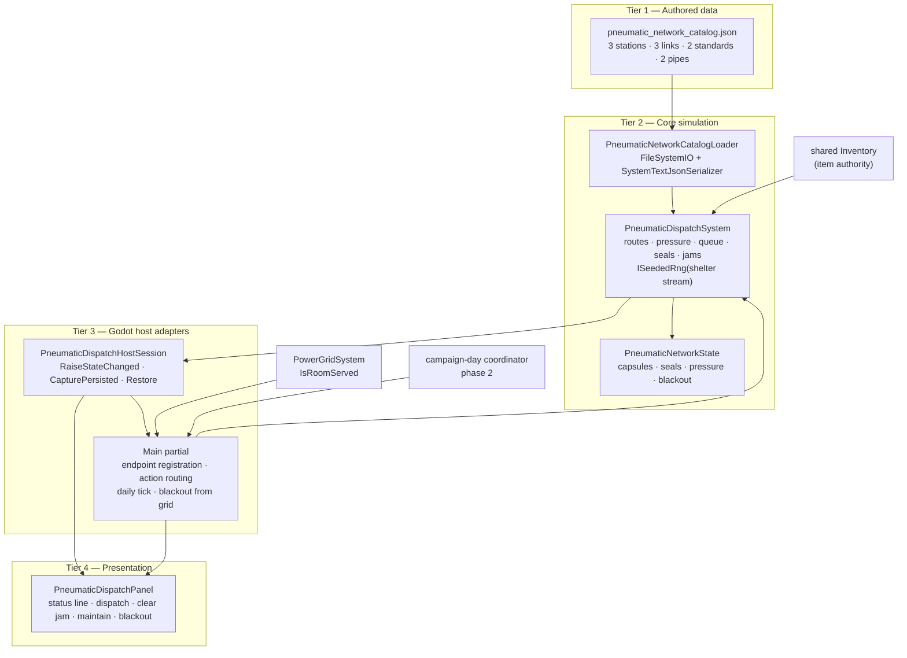
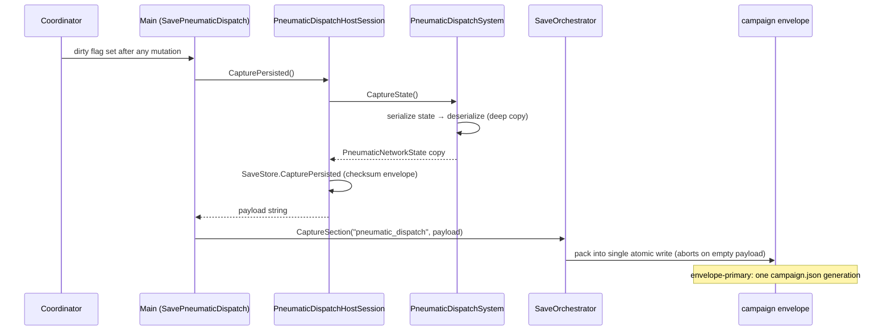
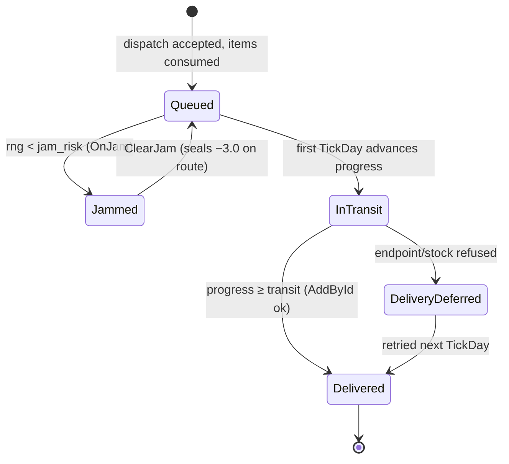
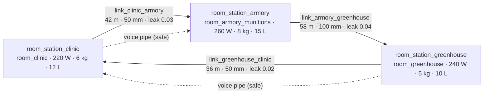

# Plan B77 — Pneumatic dispatch closeout

Status: implemented in the current Godot host.

## Delivered

- `PneumaticDispatchSystem` owns station/link catalogs, route selection, pressure, capsule queues, cargo conservation, seals, jams, blackout behavior and voice-pipe availability.
- `pneumatic_network_catalog.json` is the authoritative network catalog.
- `PneumaticDispatchHostSession` registers room endpoints against the canonical inventory authority.
- `pneumatic_dispatch` is persisted in the campaign envelope and participates in the daily coordinator.
- `PneumaticDispatchPanel` exposes dispatch, jam clearing, link maintenance and blackout state.

## Verification

- `Plans74To77SystemsTests.PneumaticDispatch_PreservesCargoAndBlocksDuringBlackout`
- Core and Godot host builds pass.
- Data-integrity and content-utilization gates pass.

Known limitation: the first host projection maps room terminals onto the existing shared inventory because no per-room inventory authority exists. Cargo is still removed and delivered through the Core endpoint contract without a duplicate warehouse.

---

# EXPANSION 2026-09-25 — Plan B77 Pneumatic Dispatch: Full Integration Framework & Code Architecture

## Part I — Preamble

### I.1 Purpose of this expansion

This document is the closeout record for **Plan B77 — pneumatic dispatch**, expanded
into a full integration framework and code-architecture reference. The short
closeout above is preserved byte-for-byte as it was accepted; everything after
the separator is the 2026-09-25 expansion. The expansion exists because the
pneumatic tube network is one of the few logistics systems in ASHFALL whose
correctness depends on an *invariant that crosses three assemblies* — cargo must
leave one endpoint exactly when it enters the Core capsule queue, and must appear
at the destination endpoint exactly once, days later, through a save/reload, a
possible jam, and a possible blackout. A one-page closeout cannot carry that
contract. This expansion can.

The document serves four audiences:

1. **Builders** extending the tube network (new stations, new failure modes,
   per-room inventory work) need the exact current API, state model, and the
   seams they must extend rather than bypass.
2. **Integrators** evaluating cross-system changes (power allocation, save
   envelope, daily coordinator ordering) need the dependency map and the
   ordering rationale recorded where they can find it.
3. **Sweep agents** need per-claim citations so a premise can be re-verified in
   minutes; every behavioral statement in this expansion is grounded in a file
   and, where useful, a line range as of 2026-09-25.
4. **Design review** needs the failure-model economics (jam risk, seal decay,
   maintenance yield) written out as numbers, because those numbers *are* the
   design; a table of formulas is the restrained way to show what the tubes feel
   like to a player.

### I.2 Scope

**In scope** — everything that participates in moving a capsule from one room
terminal to another:

- `Assets/Ashfall.Core/Shelter/PneumaticDispatchSystem.cs` — the Core authority
  (catalog binding, route selection, pressure, capsule queues, seals, jams,
  blackout gating, voice-pipe availability, capture/restore).
- `Assets/StreamingAssets/Data/pneumatic_network_catalog.json` — the
  authoritative network catalog (3 stations, 3 links, 2 capsule standards,
  2 voice pipes).
- `src/Host/Plans74To77HostSessions.cs` — `PneumaticDispatchHostSession` and
  `PneumaticDispatchSaveStore`.
- `src/Main.Plans74_77.cs` — endpoint registration, action routing, the daily
  tick, blackout derivation from the power grid, and the
  `PneumaticDispatchDayOwner` coordinator adapter.
- `src/Main.CampaignOwners.cs` — coordinator registration of the
  `pneumatic_dispatch` owner at phase 2.
- `src/UI/Plans74To77Panels.cs` — `PneumaticDispatchPanel` (B77 dashboard).
- `src/Main.SaveOrchestrator.cs` and
  `Assets/Ashfall.Core/Save/SaveSectionRegistry.cs` — how the
  `pneumatic_dispatch` section enters the campaign envelope.
- The narrative-adjacent catalogs under
  `Assets/StreamingAssets/Data/narrative/` (carrier capsule logs, diverter
  audits, blower vacuum reports, cylinder leather assays) and their loader
  `Assets/Ashfall.Core/Narrative/PneumaticTubeDispatchCatalog.cs`, documented as
  the *flavor* boundary of the same fictional technology.
- Verification assets: `Ashfall.Core.Tests/Plans74To77SystemsTests.cs`,
  `Ashfall.Core.Tests/PneumaticTubeDispatchCatalogTests.cs`, and Gate 20 of
  `src/Host/PanelBindLifecycleSelfTest.cs`.
- Boundary systems that a reader must not confuse with the tubes: the ice road,
  waystations, draisine rerailing, rail grinding, caravans, and the radio/NVIS
  stack (Part V, chapter 9).

**Out of scope** — the fluid logistics network (Plan 179 territory), industry
automation (Plan 45), the segment-decay generalization (Plan 119 territory),
per-room inventory authority (named as the known limitation and treated as a
design record, not a plan), and any proposal to add stations that do not exist
in the current catalog.

### I.3 Method and evidence discipline

The expansion was written under the repository's standing rule that *a plan or
test name is not proof an API still exists*. Every load-bearing claim below was
re-verified in source on 2026-09-25:

| Claim class | Verified against |
|---|---|
| Core API, state model, formulas | `Assets/Ashfall.Core/Shelter/PneumaticDispatchSystem.cs` (read in full) |
| Host adapter and save store | `src/Host/Plans74To77HostSessions.cs` (read in full) |
| Registration, tick, action routing | `src/Main.Plans74_77.cs` (read in full) |
| Coordinator registration | `src/Main.CampaignOwners.cs` (registration block, phase 2) |
| Panel UX | `src/UI/Plans74To77Panels.cs` (B77 panel, read in full) |
| Catalog contents | `Assets/StreamingAssets/Data/pneumatic_network_catalog.json` (read in full) |
| Save registry entry | `Assets/Ashfall.Core/Save/SaveSectionRegistry.cs` lines 279, 569 |
| Envelope capture semantics | `src/Main.SaveOrchestrator.cs` (`CaptureSection`) |
| Core unit test | `Ashfall.Core.Tests/Plans74To77SystemsTests.cs` lines 183–249 |
| Narrative catalog tests | `Ashfall.Core.Tests/PneumaticTubeDispatchCatalogTests.cs` (all 5 facts) |
| Host selftest | `src/Host/PanelBindLifecycleSelfTest.cs` Gate 20 (lines 1286–1314) |
| Content-utilization mapping | `Assets/Ashfall.Core/Content/ContentUtilizationScanner.cs` lines 134–137, 532, 837, 1200 |
| RNG stream identity | `Assets/Ashfall.Core/Random/CampaignRngStream.cs` (`CampaignStreamIds.Shelter = "shelter"`) |
| Power-grid served query | `Assets/Ashfall.Core/Shelter/PowerGridSystem.cs` line 925 (`IsRoomServed`) |
| Narrative entry counts | The four narrative JSON files (8/8/7/7 entries, read via JSON parse) |

Where this document describes behavior that the author could verify only as
*absence* (something the code does not do), the statement says so explicitly and
is grounded in the cited code path. No claim in this document depends on a
quarantined test, a retired Unity structure, or a document whose premise has not
been re-checked. The one historical proposal that touches this system —
`docs/plans/EXPANSION_PROGRAM_WAVE14_2026-09-21/PLAN-PNEUMATIC-DISPATCH-TRUTH-180.md`
— is described with its own status (`PROPOSED — foreman claim required`) and is
not treated as acceptance evidence for anything.

### I.4 Reading map

| If you need… | Read |
|---|---|
| The 60-second contract | Part II, §II.1 (authority table) |
| To register a new station | Part III §III.4 tier flow, then Part V chapter 6 |
| To predict where a capsule will go | Part V chapter 1 (topology + worked BFS examples) |
| To reason about delay or loss | Part V chapters 2–4 (pressure, capsule, failure) |
| To save/restore safely | Part III §III.6 and Part IV walkthrough 5 |
| The per-room inventory question | Part V chapter 6 (design record) |
| Every catalog row explained | Part V chapter 7 |
| What the panel may promise | Part V chapter 8 (UX contract) |
| What is *not* the tube network | Part V chapter 9 (sibling boundary) |
| Focused test selection | Part VII |

### I.5 Non-goals of the expansion itself

This is a documentation change only. It adds no code, no JSON, no tests, and no
ownership claims. It does not modify `INTEGRATION_PLANS.md`,
`WORKTREE_OWNERSHIP.md`, or any ledger. Where it records proposed future work it
marks the work as proposed; nothing here authorizes a builder to start.

---

## Part II — Current Authority Audit (2026-09-25)

### II.1 One authority per concern — who owns what

| Concern | Current owner | Path | Notes |
|---|---|---|---|
| Network topology, routing, transit, seals, jams, blackout gating, voice-pipe availability | `PneumaticDispatchSystem` | `Assets/Ashfall.Core/Shelter/PneumaticDispatchSystem.cs` | Engine-free Core; `namespace Ashfall.Core.Shelter`; `SystemId = "pneumatic_dispatch"` |
| Authored network catalog | `pneumatic_network_catalog.json` | `Assets/StreamingAssets/Data/pneumatic_network_catalog.json` | Loaded only through `PneumaticNetworkCatalogLoader` |
| Catalog load + validation | `PneumaticNetworkCatalogLoader.Load` + `PneumaticDispatchSystem.LoadCatalog` | same Core file | Loader throws `InvalidOperationException` on malformed JSON; `LoadCatalog` silently drops invalid rows (see §IV.2) |
| Godot lifetime, action routing, endpoint registration | `PneumaticDispatchHostSession` + `Main` partial | `src/Host/Plans74To77HostSessions.cs`; `src/Main.Plans74_77.cs` | Thin adapter; no gameplay decisions |
| Item authority at both endpoints | Shared `Inventory` | `_inventory.Inventory` projected at three station IDs | The known limitation; see Part V chapter 6 |
| Persistence | `PneumaticDispatchSaveStore` → campaign envelope section `pneumatic_dispatch` | `src/Host/Plans74To77HostSessions.cs` lines 364–372; `SaveSectionRegistry.cs` line 279 | Checksummed store; single envelope write |
| Daily advance | `PneumaticDispatchDayOwner` at coordinator phase 2 | `src/Main.Plans74_77.cs` lines 419–430; `src/Main.CampaignOwners.cs` line 41 | Emits `pneumatic_dispatch_ticked` day event |
| Blackout truth | Power grid allocation via `IsRoomServed("room_foundry") \|\| IsRoomServed("room_workshop")` | `src/Main.Plans74_77.cs` lines 150–163; `PowerGridSystem.cs` line 925 | The grid overwrites the panel toggle every day (C2[6] 23A) |
| Presentation | `PneumaticDispatchPanel` | `src/UI/Plans74To77Panels.cs` lines 302–385 | Shell title `B77 // PNEUMATIC DISPATCH`, 920×650 |
| Deterministic randomness | Shelter RNG stream | `_campaignDay.Rng.GetStream(CampaignStreamIds.Shelter).Rng` | `CampaignStreamIds.Shelter = "shelter"` |
| Narrative flavor of the same technology | `PneumaticTubeDispatchCatalog` | `Assets/Ashfall.Core/Narrative/PneumaticTubeDispatchCatalog.cs` + 4 JSONs | Read-only prose/log catalogs; no simulation role |

No parallel capsule ledger, no second warehouse, no panel-side pressure math
exists in the current tree. The panel reads only `System.Snapshot()`; the host
session holds no gameplay counters of its own.

### II.2 The Core authority in one view

`PneumaticDispatchSystem` (627 lines including the catalog loader) is a sealed
class with:

- **Immutable-after-load tables**: `_stations`, `_links`, `_standards`
  (ordinal dictionaries) and `_voicePipes` (list), filled only by `LoadCatalog`.
- **Mutable runtime state** in a single `PneumaticNetworkState` object: the
  capsule list, per-link seal condition, diverter positions (persisted but
  currently unused by the algorithm — see §IV.3), pressure differential, blower
  condition, aggregate seal efficiency, blackout flag, the monotonic
  `NextSequence`, the `LastProcessedDay` guard, and delivered memo IDs.
- **Injected determinism**: an `ISeededRng` (constructed with the shelter
  stream) and an optional `ILog` (host passes `GodotLog`; Core defaults to
  `NullLog.Instance`).
- **Registered endpoints**: station ID → `Inventory.Inventory`, supplied by the
  host. The Core never constructs an inventory.
- **Four events**: `OnCapsuleDispatched`, `OnCapsuleArrived`, `OnJam`,
  `OnMemoDelivered` (all `Action<…>`; none are subscribed to anywhere in the
  current host — they are facts exposed for future adapters, and the panel
  instead refreshes via the session's `StateChanged` event).

`IsPowered` is derived, not stored: `!Blackout && BlowerConditionPct > 0`.

### II.3 The network catalog as authored

`pneumatic_network_catalog.json`, `schema_version 1`, contains:

| Section | Count | Rows |
|---|---|---|
| `stations` | 3 | `room_station_clinic` (room_clinic, 220 W, 6 kg, 12 L), `room_station_armory` (room_armory_munitions, 260 W, 8 kg, 15 L), `room_station_greenhouse` (room_greenhouse, 240 W, 5 kg, 10 L) |
| `links` | 3 | clinic→armory (42 m, 50 mm, leakage 0.03), armory→greenhouse (58 m, 100 mm, 0.04), greenhouse→clinic (36 m, 50 mm, 0.02) — all `base_seal_condition` 100 |
| `capsule_standards` | 2 | `capsule_50mm` (50 mm, 30 km/h), `capsule_100mm` (100 mm, 24 km/h) |
| `voice_pipes` | 2 | clinic↔armory (blackout_safe), greenhouse↔clinic (blackout_safe) |

Schema notes verified against the C# bindings:

- Every row carries a redundant `id` key alongside the bound key
  (`station_id` / `link_id` / `standard_id`). The loader binds through
  `JsonPropertyName` to the named property; the extra `id` is tolerated, unused
  input. The capsule-standard rows use `id` values `part_capsule_50mm` /
  `part_capsule_100mm`, which are *not* the routing keys — routing uses
  `standard_id`.
- All `blower_id` values are empty strings; the field is persisted and
  validated only as "may be blank", and no blower entity exists anywhere else.
  The physical blower story lives in the narrative `rootes_blower_vacuum_reports.json`
  catalog, not in the simulation.
- Links are **directed**. The three authored links form a directed ring
  clinic→armory→greenhouse→clinic, which is why every station can reach every
  other station in one or two hops (Part V chapter 1).
- The three `room_id` values (`room_clinic`, `room_armory_munitions`,
  `room_greenhouse`) are the host's projection keys: the blackout tick asks the
  power grid about *foundry/workshop* rooms, not these — an asymmetry recorded
  in §II.7 and Part VI.

### II.4 Save section entry

`SaveSectionRegistry.cs` line 279 registers the section as:

```csharp
new("pneumatic_dispatch", "SavePneumaticDispatch", "SetupPneumaticDispatch",
    "infrastructure",
    "Plan B77 — pneumatic stations, capsule routing, seals, jams, and blackout-safe dispatch")
```

The triad (`SavePneumaticDispatch`, `SetupPneumaticDispatch`, flush-during-save)
is exactly the method pair that exists in `src/Main.Plans74_77.cs`, which is
what the triad-drift gate checks. Line 569 maps the section key to its
per-file legacy name `pneumatic_dispatch_save.json`; under the envelope-primary
orchestrator the payload is captured in memory by
`Main.SaveOrchestrator.CaptureSection` and packed into the single atomic
`campaign.json` write. An empty capture aborts the whole save rather than
allowing a stale generation to be re-written.

### II.5 Coordinator participation

`Main.CampaignOwners.cs` line 41:
`_campaignDay.Register("pneumatic_dispatch", new PneumaticDispatchDayOwner(this), phase: 2)`.
Phase 2 is the production/infrastructure phase; within a phase the coordinator
ticks owners in alphabetical order by owner id (`CampaignDayCoordinator.Register`
sorts by phase, then ordinal id, for deterministic reproducibility), and
`aeroponics` sorts before `pneumatic_dispatch`. The
owner's `TickDay` calls `Main.TickPneumaticDispatch(day)` and appends a
`DayStateChangeEvent("pneumatic_dispatch_ticked", "pneumatic_dispatch", null,
null, day)` to the day's event list. `CapturePreDaySnapshot` is a deliberate
no-op: capsule state is captured only through the save-section path, not
through the pre-day snapshot mechanism.

### II.6 Verification assets as they exist today

| Asset | Kind | What it actually asserts |
|---|---|---|
| `Plans74To77SystemsTests.PneumaticDispatch_PreservesCargoAndBlocksDuringBlackout` | xUnit fact | Two-station, one-link network built in code; dispatch consumes exactly 1 of 2 source items; blackout dispatch fails with `blower_unpowered` and consumes nothing; after un-blackout and `TickDay(1)` the destination holds 1 and the source holds 1 |
| `PneumaticTubeDispatchCatalogTests` (5 facts) | xUnit facts | 30 narrative entries across 4 batches (8 carrier, 8 diverter, 7 blower, 7 cylinder) load; per-batch field integrity |
| PanelBindLifecycleSelfTest Gate 20 | Godot headless host gate | The B77 panel's CAPSULE and LINK inputs exist by placeholder text; pressing `CLEAR JAM` and `MAINTAIN LINK` emits `("clear_jam", <text>)` and `("maintain", <text>)` |
| Content-utilization gate | Data gate | `pneumatic_network_catalog.json` is mapped to `PneumaticNetworkCatalogLoader` / `PneumaticDispatchSystem` in three scanner tables |
| Data-integrity gate | Data gate | Catalog parses and validates through the standard pipeline (129-catalog pass recorded in `docs/CURRENT_AUTHORITY.md`) |

### II.7 Status of the known limitation

The original closeout's limitation stands, unmodified, as of 2026-09-25: all
three endpoints in `SetupPneumaticDispatch` are registered against the same
`_inventory.Inventory` instance. Consequences that follow from the code today:

- `Dispatch` consumes from the shared pool, not from "the clinic's shelf";
  `Deliver` adds to the same pool. Conservation holds globally and is provable
  (Part V chapter 3), but there is no per-room stock to be wrong about.
- A capsule "in transit" is the *only* representation of cargo being
  unreachable: while a capsule is queued or jammed its items exist nowhere in
  any inventory. This is what makes the conservation test meaningful and also
  what would make a future per-room authority a migration, not an addition.
- Because all endpoints share one inventory, a dispatch from clinic to armory
  can "succeed" even when the only copy of the item is conceptually in the
  armory. The system conserves; it cannot localize. That is the honest boundary
  of the current design and the reason the limitation is documented rather than
  patched.

No per-room inventory authority exists elsewhere in the tree
(`Ashfall.Core.Inventory` has a single `Inventory` store class; room-scoped
power exists via `IsRoomPowered`/`IsRoomServed`, but room-scoped stock does
not). Any work here is a new claim requiring foreman sign-off.

### II.8 Related documents and their status

- `docs/plans/EXPANSION_PROGRAM_WAVE14_2026-09-21/PLAN-PNEUMATIC-DISPATCH-TRUTH-180.md`
  — Wave 14 gap-sealing proposal (network model from built state, per-segment
  transit, throughput queues, jam-with-repair, in-transit save exactness).
  Status in-file: `PROPOSED — foreman claim required`. Parts of its concern are
  already delivered by B77 (transit time scales with length, queue is visible,
  save round-trips capsules); parts are not (station throughput caps, repair
  item consumption, diverter logic). It is a proposal, not a debt entry, and
  this closeout neither executes nor retires it.
- `PLAN-PNEUMATIC-DISPATCH-TRUTH-180_APPENDIX-A_SCAFFOLD.md` — generated
  scaffold paired with Plan 179; explicitly created without production files.
- `docs/CURRENT_AUTHORITY.md` — the navigation map this document sits under;
  it has no pneumatic-specific row, which is one reason this closeout carries
  the full domain record.
- `KNOWN_DEBT.md` — no pneumatic dispatch entry is recorded there as of this
  writing; the known limitation lives in this closeout, which is the Plan B77
  authority.

---

## Part III — Integration Framework

### III.1 The invariants

These are the properties that make the tube network *the* tube network. Any
change — new station, new failure mode, new save field — must preserve all of
them or be rejected. Each invariant carries its enforcement point and its proof
obligation (Part V chapter 3 expands the cargo one).

| ID | Invariant | Enforced by | Verified by |
|---|---|---|---|
| INV-1 | **Cargo conservation.** Items consumed at dispatch reappear at the destination endpoint exactly once, or remain in the capsule (queued/jammed) forever. They are never created, duplicated, or silently destroyed. | Consume-before-enqueue (`Dispatch`), add-once-then-flag (`Deliver`), `Delivered` flag makes delivery idempotent | `PneumaticDispatch_PreservesCargoAndBlocksDuringBlackout` |
| INV-2 | **No unpowered transit.** Dispatch is refused while `!IsPowered`; capsule progress only advances inside a non-blackout, non-zero-power `TickDay`. | `blower_unpowered` guard; early return in `TickDay` | Same test, blackout leg |
| INV-3 | **Determinism.** Identical (state, catalog, inputs, shelter-stream RNG position) produces identical queues, routes, jam rolls, and delivery days. No wall-clock, no hash-order dependence on result paths. | `ISeededRng` only; unique shortest paths in the authored ring; ordinal comparers | Seeded construction in tests (`SeededRng(77)`); save round-trip through `RestoreState` |
| INV-4 | **Single authority per concern.** Core owns routing/transit; inventory owns items; power grid owns blackout; panel owns nothing. | Endpoint contract; `SetBlackout` overwritten daily from the grid; panel is read-only over `Snapshot()` | C2[6] 23A comment in `TickPneumaticDispatch`; panel code review |
| INV-5 | **Save exactness.** A captured network restores as the same network: same capsule fields, same seal values, same sequence counters; a restored mid-transit capsule neither teleports nor duplicates. | `CaptureState`/`RestoreState` deep-copy via JSON; `NormalizeState` clamps restored values into legal ranges | Restore path in `PneumaticDispatchHostSession.Restore`; `NormalizeState` code |
| INV-6 | **Day idempotence.** `TickDay` processes a given day at most once (`LastProcessedDay` guard), so coordinator retries or owner re-registration cannot double-advance capsules. | `if (day <= _state.LastProcessedDay) return;` | Code inspection; relied on by the daily owner |
| INV-7 | **Catalog integrity.** Only well-formed rows enter the tables: stations need positive capacity, links need two known stations and positive length, standards need positive diameter and speed, pipes need two station IDs. A link's seal is seeded from `base_seal_condition` clamped to [0, 100]. | `LoadCatalog` row filters | Loader unit behavior; data-integrity gate upstream |
| INV-8 | **Tone and material truth.** The network is brass tube, felt gasket, wax seal, blower — restrained, fictional, pre-war institutional. No electronics fantasy: when power dies, voice pipes (air, diaphragm, no electronics) still work and cargo does not. | Catalog content; panel copy (`"Voice pipes remain available during blackout; cargo does not."`) | Catalog review; narrative catalogs |
| INV-9 | **Endpoint honesty.** A station without a registered endpoint can appear in routes on paper but can never source or receive cargo: `Dispatch` requires both endpoints, `Deliver` leaves the capsule queued if the destination endpoint is missing. | `_endpoints` dictionary guards | `unknown_endpoint` failure code; `Deliver` null-check |
| INV-10 | **Fail-closed capture.** A save that cannot capture the pneumatic section aborts the entire envelope write; a half-saved tube network is never presented as a coherent snapshot. | `Main.SaveOrchestrator.CaptureSection` empty-payload rule | Orchestrator code |

### III.2 The tier-by-tier flow

The system is a four-tier pipeline. Each tier consumes only the tier below it
and is consumed only by the tier above it; nothing skips a tier.



**Tier 1 → Tier 2 (binding).** The host session's `Create` calls the loader
with the host data directory. A missing file yields `null` and `LoadCatalog`
returns immediately, leaving an empty network — dispatch will fail with
`unknown_endpoint`/`no_route`, which is the correct fail-closed posture for a
missing data file. Malformed JSON throws, surfacing as a startup failure rather
than a silently empty network.

**Tier 2 → Tier 3 (projection).** The Core exposes state; the session wraps
mutations in success-only raises (`Dispatch` directly; `ClearJam`/`Maintain`
through the base's `HandleActionResult`) or unconditional raises (`TickDay`,
`SetBlackout`) so presentation refreshes even when a day
advances nothing visible. The session adds zero rules.

**Tier 3 → Tier 4 (presentation).** The panel binds to the session's
`StateChanged` event, re-renders one status line from `Snapshot()`, and forwards
button presses as `(action, param)` strings through `OnActionRequested` to
`Main.HandlePneumaticDispatchAction`. The panel never mutates the system
directly; `Main` is the only caller of the session's mutating methods.

**Cross-tier authorities.** The shared `Inventory` and `PowerGridSystem` sit
outside the pipeline and are *consumed by* Tiers 2 and 3 respectively. This
asymmetry is deliberate: the tubes ask the warehouse for goods and the grid for
electricity; neither ever asks the tubes for truth about anything else.

### III.3 Event flow

Runtime events, in the order they can occur across one capsule's life:

| # | Event | Producer | Current consumers |
|---|---|---|---|
| 1 | Panel button press → `OnActionRequested("dispatch", "src\|dst\|item\|amount")` | `PneumaticDispatchPanel` | `Main.HandlePneumaticDispatchAction` |
| 2 | `Session.Dispatch` → Core `Dispatch` | session | Core validation chain (§IV.2) |
| 3a | `OnCapsuleDispatched(capsule)` | Core | none subscribed (fact exposed) |
| 3b | `OnJam(capsule)` | Core, when the jam roll fires | none subscribed |
| 4 | `RaiseStateChanged()` | session, on success | panel `RefreshView` (via `Bind` subscription); `Main` sets `_pneumaticDispatchDirty` |
| 5 | Coordinator phase 2 → `PneumaticDispatchDayOwner.TickDay` | coordinator | `Main.TickPneumaticDispatch` |
| 6 | `SetBlackout(!serviced)` + `TickDay(day, power)` | Main | Core state machine |
| 7a | `OnCapsuleArrived(capsule)` | Core, on delivery | none subscribed |
| 7b | `OnMemoDelivered(memoId)` | Core, on memo delivery | none subscribed |
| 8 | `RaiseStateChanged()` → dirty → `CaptureSection("pneumatic_dispatch", …)` | session/Main | save orchestrator |
| 9 | `DayStateChangeEvent("pneumatic_dispatch_ticked", …)` | day owner | day event list |

The unsubscriptions in row 3/7 are worth stating plainly: the Core exposes
per-capsule facts, and the current host deliberately ignores them in favor of
coarse `StateChanged` refreshes. That keeps one refresh channel (cheap, monotonic
`StateVersion`) at the cost of event granularity. An adapter that later wants
"play a brass clunk when a capsule lands" should subscribe to
`OnCapsuleArrived` in a presenter — not add a poller to the panel.

### III.4 The four integration seams a builder may touch

1. **Catalog seam (data).** Add stations/links/pipes by editing
   `pneumatic_network_catalog.json` only. The loader and `LoadCatalog` accept
   new rows without code changes, provided INV-7's row rules hold and every new
   station gets a `RegisterEndpoint` call (otherwise the station routes on
   paper but cannot move cargo — INV-9).
2. **Host registration seam.** `SetupPneumaticDispatch` is where a station ID
   becomes a live endpoint. Today it registers three fixed IDs against the
   shared inventory. Any new station requires a matching registration line;
   the triad gate requires the setup method name to stay.
3. **Coordinator seam.** The daily tick is owned by the registered day owner.
   Do not add a second daily driver (a second `TickDay` caller would fight the
   `LastProcessedDay` guard and produce order-dependent state).
4. **Save seam.** New persisted fields go on `PneumaticNetworkState` with a
   default that old saves normalize correctly (`NormalizeState` runs after
   every restore; null collections are rebuilt; numeric fields are clamped).
   `CapturePersisted`/`TryLoad` need no change — the checksummed store
   serializes the whole state object.

Anything else — a second queue, a panel-side pressure estimate, a jam ledger in
the session — is a parallel authority and is out of bounds under AGENTS.md
rule 5.

### III.5 Determinism contract

- **RNG.** The system receives the shelter stream (`CampaignStreamIds.Shelter
  = "shelter"`), shared with other shelter systems, advanced in host
  construction order. Jam rolls are the system's only randomness consumer:
  exactly one `NextDouble()` per dispatch, taken after all validation. A
  failed validation consumes no randomness — replay stability does not depend
  on rejected inputs.
- **Ordering.** Queue order is a total order (delivered last; priority
  descending; `QueueSequence` ascending, and `NextSequence` is monotonic), so
  `SortQueue` is stable in effect regardless of `List.Sort` stability: no two
  capsules share a sequence number.
- **Routing.** BFS yields hop-shortest routes. In the authored directed ring
  every ordered pair has a *unique* shortest path, so the result cannot depend
  on dictionary iteration order. A future catalog that creates a tie must
  either accept insertion-order dependence (currently benign in practice for
  .NET dictionaries without removals, but not guaranteed by contract) or add an
  explicit tie-breaker; flagging that requirement here is cheaper than
  discovering it in a replay diff.
- **Time.** All temporal behavior is day-indexed (`DispatchDay`,
  `DeliveryDay`, `LastProcessedDay`) plus accumulated `ProgressHours`; there is
  no real-time component anywhere in the Core file.

### III.6 Save capture/restore flow



On load, the flow reverses: `PneumaticDispatchSaveStore.TryLoad()` returns the
checksummed state or `null` (fresh game), the system constructor adopts it, and
`NormalizeState` repairs legacy or adversarial values:

- missing collections rebuilt (`Capsules`, `LinkSealCondition`,
  `DiverterPositions`, `DeliveredMemoIds`);
- `NextSequence` floored at 1; capsule `Amount` floored at 0;
  `ProgressHours` floored at 0; `TransitHours` floored at 0.01;
- every seal clamped to [0, 100]; `BlowerConditionPct` clamped to [0, 100].

`LinkSealCondition` entries for links no longer in the catalog are retained
(harmless), and new links receive their `base_seal_condition` on the next
`LoadCatalog` — order matters: the host session constructs the system with
saved state *first*, then loads the catalog, which is why restored seals
survive and new links initialize correctly.

### III.7 Integrity and gates

- The catalog participates in the standing data-integrity gate (129-catalog
  pass) and the content-utilization gate, which maps the file to its two
  consumers in three separate scanner tables — deleting or renaming the file
  fails CI, and an orphaned row class would fail utilization coverage.
- The triad-drift gate holds `pneumatic_dispatch` to the
  Setup/Save/Flush parity discipline via the registry names recorded in §II.4.
- Focused test selection follows `TEST_POLICY.md`: the Core contract test and
  the narrative catalog tests run through `scripts/run_test.sh` on the single
  test files; the panel gate runs only inside a Godot headless selftest
  session (Part VII).

---

## Part IV — Code Architecture

### IV.1 Module map

| Module | Assembly | Kind | Responsibility | Must never |
|---|---|---|---|---|
| `PneumaticDispatchSystem` | `Ashfall.Core` (Shelter) | Core authority | Routing, transit, pressure, seals, jams, blackout gating, voice-pipe query, capture/restore | Reference Godot; own items; read the clock |
| `PneumaticNetworkCatalogLoader` | `Ashfall.Core` (Shelter) | Loader | File → `PneumaticNetworkCatalog` | Validate semantics (that is `LoadCatalog`'s job) |
| `PneumaticStationDefinition` / `PneumaticLinkDefinition` / `PneumaticCapsuleStandardDefinition` / `PneumaticVoicePipeDefinition` / `PneumaticNetworkCatalog` | `Ashfall.Core` | Data DTOs | JSON binding of authored rows | Carry runtime state |
| `PneumaticCapsuleState` / `PneumaticNetworkState` | `Ashfall.Core` | State DTOs | Persisted runtime state | Contain behavior beyond data |
| `PneumaticEndpoint` / `PneumaticDispatchResult` / `PneumaticNetworkSnapshot` | `Ashfall.Core` | Contract types | The seam to the host | Leak inventory internals |
| `PneumaticDispatchHostSession` | Godot host | Adapter | Lifetime, dirty tracking, capture/restore plumbing | Add rules, cache gameplay state |
| `PneumaticDispatchSaveStore` | Godot host | Store | Checksummed persistence identity | Hold mutable state (it holds only the `SaveStore`) |
| `Main` partial (Plans 74–77) | Godot host | Composition root | Endpoint registration, action routing, daily tick, blackout derivation | Duplicate Core math |
| `PneumaticDispatchPanel` | Godot host | UI | Status line, six fields, four actions | Decide anything |
| `PneumaticTubeDispatchCatalog` + narrative JSONs | `Ashfall.Core` (Narrative) + data | Flavor | Historical logs/prose of the same technology | Feed the simulation |

### IV.2 Data definitions (authored rows)

All four definition classes are `[Serializable]`, sealed, and bound to
snake_case JSON via `JsonPropertyName`. Defaults below are the C# property
initializers — they matter because a JSON row that *omits* a field silently
takes the default, not an error.

**`PneumaticStationDefinition`** — one room terminal.

| JSON key | C# | Default | Meaning / validation |
|---|---|---|---|
| `station_id` | `StationId` | `""` | Routing key; blank → row dropped |
| `room_id` | `RoomId` | `""` | Projection key for hosts; not used by Core routing |
| `blower_id` | `BlowerId` | `""` | Free-form label; blank allowed; no entity behind it |
| `power_demand_watts` | `PowerDemandWatts` | `250` | Informational today (see §VI.2); not subtracted by Core |
| `max_cargo_mass_kg` | `MaxCargoMassKg` | `5` | ≤ 0 → row dropped |
| `max_cargo_volume_litres` | `MaxCargoVolumeLitres` | `10` | ≤ 0 → row dropped |

Example row as authored:

```json
{
  "id": "room_station_clinic",
  "station_id": "room_station_clinic",
  "room_id": "room_clinic",
  "blower_id": "",
  "power_demand_watts": 220,
  "max_cargo_mass_kg": 6,
  "max_cargo_volume_litres": 12
}
```

**`PneumaticLinkDefinition`** — one directed tube segment.

| JSON key | C# | Default | Meaning / validation |
|---|---|---|---|
| `link_id` | `LinkId` | `""` | Routing edge key; blank → row dropped |
| `from_station_id` / `to_station_id` | `FromStationId` / `ToStationId` | `""` | Both must exist in the station table, else row dropped |
| `length_m` | `LengthM` | `10` | ≤ 0 → row dropped; drives transit hours and seal damage spread |
| `capsule_standard` | `CapsuleStandard` | `"capsule_50mm"` | Names the capsule the link physically accepts; used for speed |
| `base_leakage` | `BaseLeakage` | `0` | Persisted, currently *unconsumed* by any formula (see §IV.5) |
| `base_seal_condition` | `BaseSealCondition` | `100` | Seeds runtime seal state on first load, clamped to [0, 100] |

**`PneumaticCapsuleStandardDefinition`** — one capsule format.

| JSON key | C# | Default | Meaning / validation |
|---|---|---|---|
| `standard_id` | `StandardId` | `""` | Routing key referenced by links; blank or non-positive diameter/speed → row dropped |
| `diameter_mm` | `DiameterMm` | `50` | Physical caliber; informational in formulas |
| `base_speed_kmh` | `BaseSpeedKmh` | `30` | Nominal speed under full pressure and perfect seals |

**`PneumaticVoicePipeDefinition`** — one speaking-tube run.

| JSON key | C# | Default | Meaning |
|---|---|---|---|
| `from_station_id` / `to_station_id` | both | `""` | Blank → row dropped; matching is direction-agnostic at query time |
| `blackout_safe` | `BlackoutSafe` | `true` | Only blackout-safe pipes answer during a blackout |

**Catalog container.** `PneumaticNetworkCatalog` holds `schema_version` plus
the four lists. `schema_version` is parsed and persisted but not branched on —
version 1 is the only version.

### IV.3 Runtime state (`PneumaticNetworkState`)

The single mutable object, field by field:

| Field | Type | Initial | Role |
|---|---|---|---|
| `SystemId` | `string` | `"pneumatic_dispatch"` | Section identity in saves |
| `Capsules` | `List<PneumaticCapsuleState>` | empty | Every capsule ever dispatched this campaign that has not been pruned (none are pruned; delivered capsules stay with `Delivered = true`) |
| `LinkSealCondition` | `Dictionary<string,float>` (ordinal) | empty | Per-link seal wear, 0–100; seeded from catalog on first load |
| `DiverterPositions` | `Dictionary<string,string>` (ordinal) | empty | Persisted for future diverter routing; **no current reader or writer** in the algorithm — an intentional dormant field, not a second truth |
| `PressureDifferentialKpa` | `float` | `0` | Recomputed each `TickDay`; nominal 80 kPa × power |
| `BlowerConditionPct` | `float` | `100` | Shared blower wear; **no decay path today** — nothing lowers it, only `Maintain` raises it; jam risk reads it |
| `SealEfficiency` | `float` | `1` | Aggregate mean of all link seals / 100, recomputed in `DamageSeals`; presentation-only |
| `Blackout` | `bool` | `false` | Set by host from grid allocation each day |
| `NextSequence` | `int` | `1` | Monotonic capsule numbering; also the queue tie-breaker |
| `LastProcessedDay` | `int` | `-1` | Day idempotence guard (INV-6) |
| `DeliveredMemoIds` | `List<string>` | empty | De-dup set for memo capsules; makes memo delivery idempotent |

`PneumaticCapsuleState` — one shipment:

| Field | Meaning |
|---|---|
| `CapsuleId` | `capsule_{DispatchDay}_{QueueSequence}` — unique, human-readable, panel-addressable |
| `SourceStationId` / `DestinationStationId` | Endpoint station IDs as dispatched |
| `ItemId` | Canonical item id, or `memo:{memoId}` for a memo capsule |
| `Amount` | Item count carried (memo capsules force 1) |
| `CargoMassKg` / `CargoVolumeLitres` | Declared cargo metrics, validated against the *source station's* limits |
| `DistanceM` | Total planned route length, frozen at dispatch |
| `ProgressHours` / `TransitHours` | Accumulated vs required transit work |
| `Priority` | `Normal(0) / High(1) / Emergency(2)` — queue order only, never speed |
| `QueueSequence` | Dispatch order stamp |
| `Jammed` / `JamResolutionApplied` | Jam lifecycle flags |
| `Delivered` / `DeliveryDay` | Delivery completion; `-1` until delivered |
| `DispatchDay` | Day index at dispatch |

### IV.4 The `Dispatch` contract, clause by clause

Signature (host-facing overload drops `pressure01`):

```csharp
public PneumaticDispatchResult Dispatch(
    string sourceStationId, string destinationStationId,
    string itemId, int amount,
    float cargoMassKg, float cargoVolumeLitres,
    PneumaticDispatchPriority priority, int day,
    float pressure01 = 1f)
```

Validation chain, in evaluation order — the first failure returns and consumes
no randomness and no items:

| # | Guard | Failure code | Notes |
|---|---|---|---|
| 1 | `!IsPowered` | `blower_unpowered` | Blackout or a dead blower blocks *new* dispatch; queued capsules are separately frozen by `TickDay` |
| 2 | source endpoint missing **or** destination endpoint not registered | `unknown_endpoint` | INV-9: both ends must be live inventory projections |
| 3 | blank `itemId` or `amount <= 0` | `invalid_cargo` | Host maps its own parse failures to the same key |
| 4 | BFS route empty | `no_route` | Also fires for source == destination (BFS short-circuits to an empty edge list) — self-dispatch is refused, not free |
| 5 | source station or first link's capsule standard missing | `invalid_route_data` | Defensive; unreachable with a validated catalog |
| 6 | `cargoMassKg > station.MaxCargoMassKg` or volume over limit | `cargo_limit` | Limits are the *source station's* only; the destination's limits are not re-checked by design (the source's tube mouth is the physical constraint) |
| 7 | `!source.Inventory.TryConsume(itemId, amount)` | `missing_cargo` | The point of no return: after this, the items exist only as the capsule |

Success path: compute distance and worst seal along the route, compute speed and
transit hours, build the capsule, roll the jam, append, sort, raise
`OnCapsuleDispatched`. The result carries `CapsuleId` and `TransitHours`.

**Transit-time math** (verified against source):

```
seal_route   = min over route links of (LinkSealCondition / 100)
pressure_mod = 0.45 + pressure01 * 0.55          // 0.45× at vacuum, 1.00× at full
seal_mod     = clamp(0.55 + seal_route * 0.45, 0.1, 1.0)
speed_kmh    = standard.BaseSpeedKmh * pressure_mod * seal_mod
transit_h    = max(0.01, distance_m / 1000 / max(0.1, speed_kmh))
```

**Jam roll** (one `NextDouble()` per dispatch):

```
jam_risk = clamp( 0.01
                + (1 - seal_route) * 0.12
                + (cargoMassKg / station.MaxCargoMassKg) * 0.06
                + (1 - BlowerConditionPct / 100) * 0.08
              , 0, 0.5)
jammed = rng.NextDouble() < jam_risk
```

### IV.5 Fields that are persisted but not yet consumed

Truthfulness requires naming the dormant surface so no one mistakes it for
wiring:

- `DiverterPositions` — no reader/writer in the algorithm. Routing is pure BFS;
  junctions do not steer capsules yet.
- `base_leakage` — parsed, stored on the link definition, never read by a
  formula. Seal condition is the operative wear model.
- `power_demand_watts` — never subtracted by Core or host. The network's power
  story is currently binary via grid room-service, not watt-level allocation
  (Part VI §VI.2).
- `Priority` beyond ordering — a `High`/`Emergency` capsule moves through the
  same tubes at the same speed; it only overtakes in the queue.
- `OnJam` consumers — the event fires; nobody listens yet.

Each dormant field is a documented extension point, not dead weight: they are
persisted so that activating them later does not break old saves.

### IV.6 The remaining Core operations

**`ClearJam(capsuleId)` → `ActionResult`.**
Unknown capsule → `Failed("unknown_capsule", "pneumatic.unknown_capsule")`.
Not jammed → `Blocked("not_jammed", "pneumatic.not_jammed")`. Otherwise: clear
`Jammed`, set `JamResolutionApplied`, and `DamageSeals(3f)` along the capsule's
route — opening a stuck tube costs the gaskets. There is deliberately **no**
material cost, no survivor requirement, and no duration: clearing is a decision,
not a project (contrast with draisine rerailing, Part V chapter 9).

**`Maintain(linkId, amount, day)` → `ActionResult`.**
Unknown link → `Failed("unknown_link", "pneumatic.unknown_link")`. Otherwise:
`LinkSealCondition[linkId] += amount` (clamped 0–100) and
`BlowerConditionPct += amount * 0.5` (clamped 0–100). One action services both
the tube gasket and, at half rate, the shared blower — the fiction is that
servicing a run includes packing its couplings and greasing the blower that
serves it. The host calls it with `amount = 10f`, so one panel press is +10
seal and +5 blower. `day` is accepted but unused (kept for signature stability
and future wear-on-maintenance bookkeeping).

**`SetBlackout(bool)` / `TickDay(day, powerAvailability01)`.**
`SetBlackout` flips the flag and, when blacking out, forces
`PressureDifferentialKpa` to 0; recovery leaves pressure for the next
`TickDay` to recompute. `TickDay` is the only place pressure is recomputed:

```
if day <= LastProcessedDay: return          // INV-6
LastProcessedDay = day
pressure = Blackout ? 0 : 80 * clamp(power, 0, 1)
if Blackout or power <= 0: return            // frozen network: no progress
SortQueue()
for each capsule not Delivered and not Jammed:
    ProgressHours += 24 * power
    if ProgressHours + 0.0001 >= TransitHours: Deliver(capsule, day)
```

Two subtleties worth their ink:

1. **Power scales progress, not just gates it.** A brownout day at
   `power = 0.5` advances every capsule by 12 hours, not zero. The network
   slogs on at reduced pressure — consistent with `pressure_mod` reaching only
   0.45 at zero power yet `TickDay` hard-stopping at `power <= 0`: a *grid
   allocation* of zero means the blowers stop, while fractional power means
   they turn slowly.
2. **Delivery is day-granular.** Because `TickDay` runs once per day from the
   coordinator, transit hours effectively quantize to "next daily tick after
   completion" (or the same day's tick if dispatch happened earlier the same
   day). Authored route times are minutes, not days — every capsule in the
   current catalog completes transit within one tick of full power. The
   hour-level machinery is honest infrastructure for longer future runs, and
   `TransitHours` is what a restore must reproduce exactly (INV-5).

**`Deliver(capsule, day)`** (private). Missing destination endpoint → return
without delivery; the capsule keeps its progress and retries next tick —
cargo is never destroyed by an absent endpoint. Memo capsules (item id
prefixed `memo:`) append the memo to `DeliveredMemoIds` if new, fire
`OnMemoDelivered`, and mark delivered. Item capsules require
`destination.Inventory.AddById(itemId, amount)` to succeed; failure leaves the
capsule queued (progress already at/over transit time, so it retries first
thing next tick). On success: `Delivered = true`, `DeliveryDay = day`,
`DamageSeals(0.5f)` — every delivery scours the route's gaskets a little —
and `OnCapsuleArrived`.

**`DamageSeals(capsule, amount)`** (private). Recomputes the route
*from the current catalog* at damage time, subtracts `amount` from each link
(floor 0), then recomputes `SealEfficiency` as the mean of all link seals over
100. Two consequences: a catalog change mid-transit redirects wear to the new
route; and a route that no longer exists applies no wear (and delivery
equally cannot proceed if the endpoint vanished — but note `Deliver` checks
the endpoint, not the route; a capsule with a vanished *route* still delivers,
because delivery is endpoint-based while wear is route-based. Both behaviors
are recorded here so a future catalog-migration task knows the exact seams).

**`VoicePipeAvailable(from, to)`**. Powered and not in blackout → `true`
unconditionally — with electricity, the network intercom is the tubes' least
interesting feature. Otherwise: scan pipes for a `blackout_safe` pipe matching
the pair in **either direction**, with both stations present in the station
table. Note the asymmetry with `Snapshot().VoicePipesAvailable`, which merely
reports `_voicePipes.Count > 0` — a coarse "the shelter has voice pipes at
all" bit for the status line, not a per-pair answer.

**`QueueMemo(capsuleId, memoId)`**. Retargets an existing capsule's `ItemId`
to `memo:{memoId}` with `Amount = 1`. This is the "send a note instead of the
cargo" path; it rewrites a queued capsule rather than dispatching a new one,
so it inherits the capsule's route and priority. (No current host caller —
it exists for narrative adapters.)

**`Snapshot()`**. Counts `QueueCount` (all undelivered, including jammed) and
`InTransitCount` (undelivered with `ProgressHours > 0`), and reports pressure,
blower, aggregate seal efficiency, blackout, and the coarse voice-pipe bit.
This is the panel's entire read model.

### IV.7 Failure-mode matrix (Core)

| Failure | Trigger | Observable | Recovery |
|---|---|---|---|
| Dispatch refused, network dead | blackout or `BlowerConditionPct <= 0` | `blower_unpowered` | Restore room service or maintain blower |
| Dispatch refused, endpoint absent | station never registered | `unknown_endpoint` | Register endpoint in `SetupPneumaticDispatch` |
| Dispatch refused, no path | disconnected/directed-unreachable graph, or source == destination | `no_route` | Add links; pick a different destination |
| Dispatch refused, oversized | mass/volume over source station limit | `cargo_limit` | Split shipment |
| Dispatch refused, stock missing | source inventory lacks `amount` | `missing_cargo` | Acquire items |
| Capsule jammed en route | jam roll fires at dispatch | `Jammed = true`, `OnJam`, queue stalls for that capsule | `ClearJam` (+3 seal damage) |
| Delivery deferred | destination endpoint missing, or `AddById` refused | capsule stays queued at full progress | Restore endpoint / destination inventory capacity |
| Seal exhaustion | cumulative wear drives a link to 0 | `seal_mod` bottoms out at 0.55 (the coded 0.1 clamp never binds) → ≈ 1.8× slowdown contribution; jam risk rises by up to 0.12 | `Maintain` the link |
| Blower exhaustion | `BlowerConditionPct` → 0 | `IsPowered` false — full dispatch lockout | `Maintain` any link (raises blower at half rate) |
| Malformed catalog JSON | parse error at load | `InvalidOperationException` from loader | Fix data; startup fails loudly |
| Catalog missing | file absent | empty tables; dispatch fails `unknown_endpoint` | Restore file; fail-closed |

### IV.8 Host adapter deep spec

`PneumaticDispatchHostSession : HostSessionBase` (which inherits
`StatefulSessionBase`: monotonic `StateVersion`, `IsDirty`, `StateChanged`,
`RaiseStateChanged`/`RaiseStateChangedIf`, `ClearDirty`). The session is
constructed only through `Create(dataDir, rng)`:

1. `PneumaticDispatchSaveStore.TryLoad()` → saved state or `null`;
2. `new PneumaticDispatchSystem(rng, state, new GodotLog())`;
3. `LoadCatalog(PneumaticNetworkCatalogLoader.Load(dataDir, FileSystemIO,
   SystemTextJsonSerializer))`.

Method-by-method discipline:

| Method | Raises `StateChanged` | Why |
|---|---|---|
| `Dispatch` | on success only | A refused dispatch changed nothing |
| `ClearJam`, `Maintain` | on success only, through `HandleActionResult` | A success mutated state and is news; refusals (`unknown_capsule`, `not_jammed`, `unknown_link`) changed nothing and raise nothing | See correction note below |
| `SetBlackout` | always | Grid state projection is itself news |
| `TickDay` | always | A day with zero visible change still advances `LastProcessedDay` |
| `RegisterEndpoint` | never | Composition-time wiring |
| `Restore` | never; `ClearDirty()` | Restore *is* the state |

**Correction note (accuracy over tidiness):** `ClearJam` and `Maintain` in the
session are not raw passthroughs: both route their `ActionResult` through the
base's `HandleActionResult` (`Assets/Ashfall.Core/StatefulSessionBase.cs` lines
75–82), which calls `RaiseStateChanged()` on success or partial success and
stays silent on failures and blocks. A successful CLEAR JAM or MAINTAIN LINK
therefore refreshes the panel through the `Bind` subscription *and* sets the
dirty flag inside the same handler call, so
`Main.HandlePneumaticDispatchAction`'s trailing
`if (_pneumaticDispatchDirty) SavePneumaticDispatch()` persists it in the same
frame. Refusals raise nothing; the status label still repaints on them because
`Main` explicitly calls `_pneumaticDispatchPanel?.RefreshView()` after every
action. (An earlier draft of this expansion recorded the opposite — raise-free
passthroughs — as a correction; the source says otherwise, and this note
supersedes it. Recorded at length so a builder does not "fix" it in either
wrong direction.)

`CapturePersisted()` returns
`PneumaticDispatchSaveStore.TryCapturePersisted(System.CaptureState())` — the
checksummed envelope payload string. `Restore(state)` assigns through
`RestoreState` (deep copy + normalize) and clears dirty.

**`PneumaticDispatchSaveStore`** (lines 364–372): `FileName =
"pneumatic_dispatch_save.json"`, `SectionName = "pneumatic_dispatch"`, built
from `SaveStoreHub.Checksummed<PneumaticNetworkState>(…)`. It exposes exactly
`TryLoad` and `TryCapturePersisted`; there is no per-section write path — the
envelope owns the disk.

### IV.9 Composition-root deep spec (`Main` partial)

`SetupPneumaticDispatch` (lines 90–106):

- idempotence guard (`if (_pneumaticDispatch != null) return;`);
- ensures campaign day + inventory exist;
- RNG: `_campaignDay.Rng.GetStream(CampaignStreamIds.Shelter).Rng`;
- `Create(_dataDir, rng)`;
- registers the three authored stations, **all against `_inventory.Inventory`**,
  with the source comment stating the intent: inventory remains the canonical
  warehouse authority; the network owns only routing/capsule state;
- subscribes `StateChanged → _pneumaticDispatchDirty = true`.

`TickPneumaticDispatch` (lines 150–163): derives `serviced` from the grid —
`IsRoomServed("room_foundry") || IsRoomServed("room_workshop")`, with a null
grid counting as serviced — calls `SetBlackout(!serviced)` **every day** (the
C2[6] 23A comment: this overwrites the legacy manual toggle, removing the
private authority), then `TickDay(day, serviced ? 1f : 0f)`, then saves on
dirty.

`HandlePneumaticDispatchAction` (lines 345–391):

| Action | Parse | Call | Success key | Failure keys |
|---|---|---|---|---|
| `dispatch` | split `\|` ×4, `int` amount | `Dispatch(src, dst, item, amount, 0.5f, 1f, Normal, day)` | `pneumatic.dispatched.{CapsuleId}` | `pneumatic.invalid_cargo`, `pneumatic.dispatch_failed` |
| `clear_jam` | raw param | `ClearJam(param)` | Core's `pneumatic.jam_cleared` | Core's `unknown_capsule` / `not_jammed` |
| `maintain` | raw param, amount `10f` | `Maintain(param, 10f, day)` | `pneumatic.maintained` | `pneumatic.unknown_link` |
| `blackout` | recompute `serviced` | `SetBlackout(!serviced)` | `pneumatic.grid_served` / `pneumatic.grid_blackout` | — |
| default | — | — | — | `pneumatic.unknown_action` |

Note the two hardcoded cargo metrics (`0.5f` kg, `1f` L) and the fixed
`Normal` priority in the host path: the panel has no fields for them. They sit
safely under the smallest station's limits (5 kg / 10 L), so every panel
dispatch is legal mass-wise. A future priority/mass UI extends this action
string — one place, one format.

`PneumaticDispatchDayOwner` (lines 419–430): `CapturePreDaySnapshot` no-op;
`TickDay` delegates and appends `DayStateChangeEvent("pneumatic_dispatch_ticked",
"pneumatic_dispatch", null, null, day)`.

### IV.10 Panel deep spec

Covered in full UX terms in Part V chapter 8; architecturally: a
`Plans74To77PanelBase` subclass with `IBindablePanel` binding to the session,
one `AshfallDashboardShell("B77 // PNEUMATIC DISPATCH", 920, 650)`, one status
label, six `LineEdit` rows, four buttons emitting `OnActionRequested`, a footer
tone line, Escape-to-close via the base's `_UnhandledInput`, and a refresh
method that formats `Snapshot()` into a single line:

```
NETWORK // PRESSURIZED // PRESSURE 80.0 kPa // SEALS 0.98 //
QUEUE 2 // IN TRANSIT 1 // VOICE AVAILABLE
```

### IV.11 Sequence walkthrough 1 — dispatch to delivery (happy path)

Scenario: clinic sends 2 morphine to the greenhouse on day 40, network
pressurized, all seals near 100.

```mermaid
sequenceDiagram
    participant P as Panel
    participant M as Main
    participant S as Session
    participant C as Core System
    participant I as Inventory (shared)
    participant D as Coordinator (phase 2)
    P->>M: OnActionRequested("dispatch", "room_station_clinic|room_station_greenhouse|item_morphine|2")
    M->>M: parse 4 parts, day = clock day (40)
    M->>S: Dispatch(clinic, greenhouse, item_morphine, 2, 0.5, 1.0, Normal, 40)
    S->>C: Dispatch(...)
    C->>C: IsPowered? yes · endpoints? yes · cargo fields? ok
    C->>C: BFS: clinic→armory→greenhouse (2 links, 100 m)
    C->>C: limits ok (0.5 ≤ 6 kg, 1.0 ≤ 12 L)
    C->>I: TryConsume(item_morphine, 2) → true
    C->>C: seal_route ≈ 1.0 → speed 30 km/h → transit ≈ 0.0033 h
    C->>C: jam roll (risk ≈ 0.01) → not jammed
    C->>C: capsule_40_7 queued, SortQueue, OnCapsuleDispatched
    C-->>S: Success, capsule_40_7
    S-->>M: result
    M->>M: status = pneumatic.dispatched.capsule_40_7
    M->>P: RefreshView() → QUEUE 1
    D-->>M: day 40 tick (phase 2)
    M->>M: serviced = grid serves foundry/workshop
    M->>S: SetBlackout(false) ; TickDay(40, 1.0)
    S->>C: TickDay
    C->>C: pressure = 80 kPa ; progress += 24 h ≥ transit
    C->>I: AddById(item_morphine, 2) → true
    C->>C: Delivered, DeliveryDay=40, seals −0.5, OnCapsuleArrived
```

Worked numbers: distance 42 + 58 = 100 m; speed
`30 × 1.0 × 1.0 = 30 km/h`; hours `0.1 km / 30 = 0.0033 h`. The capsule
therefore completes on the *first* tick after dispatch — which is the same
day's coordinator tick if the panel action happened before phase 2, else the
next day. Delay between "sent" and "arrived" is thus 0–1 days for any current
route; the tube network's drama lives in jams and blackouts, not in distance.

### IV.12 Sequence walkthrough 2 — jam formation and clearing

Day 61: armory ships 8 kg of scrap to the greenhouse over the worn 100 mm link.



Jam risk for this run: seal at 70/100 → `(1−0.7)×0.12 = 0.036`; mass ratio
`8/8 = 1.0 → 0.06`; blower at 80% → `0.2×0.08 = 0.016`; base `0.01`.
Total `0.122` — one jam in eight such shipments. After clearing (seals drop to
67 on the route links), a repeat shipment rolls `0.1256`. The model makes
**heavy loads through worn tubes** the dangerous case, which is the design
speaking: the cheap path is small, frequent capsules.

Clearing is instant and free in materials, but three points are easy to miss:

1. The capsule keeps its `ProgressHours`. A jam near the end of a long run
   resumes where it stopped; clearing never resets transit.
2. `JamResolutionApplied` is set and persisted — evidence that a human opened
   the tube — but no current system reads it. It is the natural hook for a
   future chronicle entry ("day 61: greenhouse run cleared by hand").
3. A jammed capsule still counts in `QueueCount` (it is undelivered) but its
   `ProgressHours` stops advancing; if never cleared it occupies the queue
   forever — a soft leak that is bounded by player attention today and would
   become a real economy question under any future auto-dispatch.

### IV.13 Sequence walkthrough 3 — blackout onset and recovery

```mermaid
sequenceDiagram
    participant G as PowerGrid allocation
    participant M as TickPneumaticDispatch
    participant S as Session
    participant C as Core
    G-->>M: day 90: foundry + workshop both shed (deficit)
    M->>S: SetBlackout(true)
    S->>C: Blackout = true, pressure forced 0
    M->>S: TickDay(90, 0)
    S->>C: LastProcessedDay=90; pressure 0; return (frozen)
    Note over C: queue intact · jammed stay jammed · in-transit frozen mid-tube
    G-->>M: day 91: foundry served again
    M->>S: SetBlackout(false)
    M->>S: TickDay(91, 1.0)
    S->>C: pressure recomputed 80 kPa; all capsules +24 h; deliveries fire
```

Behavioral notes:

- **Dispatch during blackout** fails `blower_unpowered`; the queue itself is
  untouched. The network is a pressure vessel story: no blow, no go, but
  nothing spoils.
- **The panel's TOGGLE BLACKOUT is not an authority.** Pressing it recomputes
  grid service truthfully at that moment, but the next daily tick overwrites
  the flag from the grid again. The button is a *query with effects*, not a
  switch — the C2[6] 23A comment in source says this in code, and it is worth
  saying in prose because the button label invites the wrong mental model.
- **Recovery is same-tick.** There is no spin-up delay: the first served day
  recomputes 80 kPa and moves every capsule a full 24 hours. If narrative
  wants a "blowers winding up" beat, the seam is `TickDay`'s power argument,
  not a new timer.

### IV.14 Sequence walkthrough 4 — link maintenance

Day 77: `pneumatic_link_armory_greenhouse` seal is at 52 after heavy use.

| Step | Actor | Effect |
|---|---|---|
| 1 | Panel: type link id, press MAINTAIN LINK | `OnActionRequested("maintain", "pneumatic_link_armory_greenhouse")` |
| 2 | Main | `Maintain(link, 10f, 77)` |
| 3 | Core | seal 52 → 62; blower +5 (say 80 → 85) |
| 4 | Core result | `Success("pneumatic.maintained")` |
| 5 | Main | status key set; panel refreshed; no immediate save unless already dirty |
| 6 | Next day tick | dirty set by any mutation path → section captured with the new seals |

Economics: each press is +10 seal. The route's slowdown contribution from this
link falls as `0.45 × (seal/100)` rises toward 1, and its jam contribution
falls by `0.12 × Δ(seal fraction)` — maintaining from 52 to 62 trims ~1.2
percentage points off every future dispatch's jam risk through that route and
shortens worst-case transit. Maintenance is also the **only** blower recovery
path (+5 per press against the +0.08-per-1%-wear jam pressure), which makes
the otherwise odd "maintaining a link greases the blower" rule load-bearing:
without it the blower can only decay toward permanent lockout.

### IV.15 Sequence walkthrough 5 — save and reload mid-transit

```mermaid
sequenceDiagram
    participant A as Day 44 (evening)
    participant E as Envelope write
    participant B as Day 45+ (after load)
    A->>A: capsule_44_3 in transit (Progress 10.2/12 h)
    A->>E: CaptureSection("pneumatic_dispatch", payload)
    Note over E: capsule fields verbatim · seals verbatim · NextSequence verbatim
    E-->>B: load: TryLoad → RestoreState → NormalizeState
    B->>B: capsule resumes: same 10.2/12 h, same route, same id
    B->>B: next TickDay(45): progress completes; delivered once
```

Why nothing duplicates: cargo is absent from all inventories between dispatch
and delivery (it exists *only* as capsule fields), and delivery is guarded by
the `Delivered` flag plus `AddById` success. Why nothing teleports: progress is
a plain float restored verbatim, clamped only from below. Why the id survives:
`NextSequence` is restored, so post-load dispatches never collide with
pre-load ids. The restore-order detail from §III.6 bears repeating as the one
trap: **state is adopted before the catalog loads**; reversing that order in a
refactor would silently reset every restored seal to `base_seal_condition`.

---

## Part V — The System in Depth

### V.1 Chapter 1 — Network topology and route selection

#### V.1.1 What the network physically is

Three brass-and-felt room terminals joined by three soldered tube runs in a
directed ring:



The ring is small enough to hold in one glance and complete enough that every
ordered pair of stations is connected: one hop clockwise for neighbors, two
hops for the "far side". The authored graph has exactly three properties that
the rest of the design leans on:

1. **Directedness.** Each link is one-way. Air pushes a capsule from `from`
   to `to`; nothing in the model pushes back. The return path around the ring
   is *longer and different*, which gives the topology an asymmetry the queue
   and seal systems inherit.
2. **Unique shortest paths.** For every ordered pair there is exactly one
   hop-minimal route. BFS therefore cannot be spoiled by tie-breaking ambiguity
   — the determinism argument in §III.5 rests on this fact.
3. **Mixed calibers.** The 58 m armory→greenhouse run is 100 mm (24 km/h
   capsules), the other two are 50 mm (30 km/h). The speed the *first* link
   declares decides the whole journey (§V.1.3), which is a simplification with
   teeth — see the worked example for clinic→greenhouse.

#### V.1.2 The station table

| Station ID | Room | Blower ref | Power demand (W) | Max cargo mass (kg) | Max cargo volume (L) | Route role |
|---|---|---|---|---|---|---|
| `room_station_clinic` | `room_clinic` | *(blank)* | 220 | 6 | 12 | Medical sourcing; midpoint of both 2-hop routes |
| `room_station_armory` | `room_armory_munitions` | *(blank)* | 260 | 8 | 15 | Heaviest capacity; the only 100 mm-class origin |
| `room_station_greenhouse` | `room_greenhouse` | *(blank)* | 240 | 5 | 10 | Lightest limits; produce and seed traffic |

The station record is the *loading gauge*: its mass/volume caps bound what may
enter the tubes at that mouth, and nothing else. The `room_id` is the host's
projection key — meaningful to people and to the blackout derivation's room
vocabulary, even though the current blackout check asks about the foundry and
workshop rooms (the blower bus) rather than the terminal rooms (§VI.2).
`power_demand_watts` is authored per station (220/260/240) but is not yet
subtracted by any allocation; it is the honest ledger of what full
watt-allocation *would* draw (Part VI §VI.2), and it is deliberately included
in saves so activation needs no data migration.

#### V.1.3 The link table and the first-link caliber rule

| Link ID | From → To | Length (m) | Capsule standard | Base speed | Base leakage | Base seal |
|---|---|---|---|---|---|---|
| `pneumatic_link_clinic_armory` | clinic → armory | 42 | `capsule_50mm` | 30 km/h | 0.03 | 100 |
| `pneumatic_link_armory_greenhouse` | armory → greenhouse | 58 | `capsule_100mm` | 24 km/h | 0.04 | 100 |
| `pneumatic_link_greenhouse_clinic` | greenhouse → clinic | 36 | `capsule_50mm` | 30 km/h | 0.02 | 100 |

The dispatch code reads the capsule standard **from the first link of the
route only** (`route[0]`) and applies that standard's speed to the entire
journey. Physically this is the fiction that the loading station's capsule
format rides the whole way — a 50 mm carrier never re-sleeves mid-flight, and
the 100 mm run simply has the clearance to accept it. Consequences worth
spelling out:

- clinic→greenhouse (clinic 50 mm first) runs at 30 km/h for 100 m.
- armory→clinic (armory 100 mm first) would run at 24 km/h for its whole
  route — the fast segment never gets to matter because the slow standard
  leaves first.
- If a future catalog ever puts a 100 mm-only run immediately after a 50 mm
  mouth, the capsule "shrinks" in fiction only; the math remains well-defined.
  The data rule to preserve: **the first link's standard must exist** or
  dispatch fails `invalid_route_data`.

#### V.1.4 The route-selection algorithm

`FindRoute` is a textbook breadth-first search over the *directed* link table,
reconstructed here exactly:

```
FindRoute(source, destination):
    if source == destination: return []                    # empty ⇒ later "no_route"
    frontier ← queue of stations, seeded with source
    previousStation[source] ← ""                           # BFS parent map (stations)
    previousLink[to] ← link id used to enter `to`          # BFS parent map (edges)
    while frontier not empty:
        current ← dequeue
        for each (linkId, link) in _links:                 # dictionary order
            if link.from != current: continue
            if link.to already visited: continue
            record parent + edge for link.to
            if link.to == destination:
                walk parents back to source, collect edges, reverse
                return edge list                           # FIRST shortest path wins
            enqueue link.to
    return []
```

Properties that matter to gameplay:

- **Hop-minimal, not length-minimal.** BFS minimizes the number of tubes
  traversed. In the authored ring the two coincide; in a future graph with a
  short 2-hop path and a long 1-hop express, BFS picks the 1-hop route even if
  it is slower in metres. If metre-minimality is ever wanted, that is a
  deliberate algorithm change (Dijkstra with length weights) — not a bug fix.
- **Early exit.** The search returns the moment the destination is discovered,
  so it never explores the rest of the ring.
- **Unreachable destinations** (directed disconnection) exhaust the frontier
  and return `[]`, which `Dispatch` reports as `no_route`. A capsule is never
  created for an unroutable pair, and no items are consumed — the rejection is
  pre-conservation.
- **Self-dispatch is refused.** `source == destination` short-circuits to an
  empty edge list and therefore fails `no_route`. The tube network does not
  send a capsule to the room it is in; that is a warehouse operation, and the
  warehouse is a different authority.
- **Order sensitivity is currently unreachable.** Iterating `_links` in
  dictionary order could in principle pick among equal-hop routes; the authored
  ring offers none (§V.1.1). Any catalog edit that introduces a parallel
  equal-hop route imports dictionary-order dependence into replay — the
  catalog review checklist should treat that as a determinism review trigger,
  not leave it to code inspection.

#### V.1.5 Worked example 1 — clinic → greenhouse (two hops)

Dispatch at day 40, full power, all seals at 100, cargo 0.5 kg / 1.0 L:

1. **Endpoints**: both registered — pass.
2. **BFS**: frontier `{clinic}`. Examine clinic's outgoing links: only
   `link_clinic_armory` (armory unvisited) → record armory via that link;
   armory ≠ greenhouse, enqueue. Expand armory: `link_armory_greenhouse` →
   greenhouse discovered **via** `link_armory_greenhouse`; destination hit.
   Route = `[link_clinic_armory, link_armory_greenhouse]`.
3. **Distance**: 42 + 58 = 100 m. **Worst seal**: min(100, 100)/100 = 1.0.
4. **Speed**: standard from first link = `capsule_50mm` = 30 km/h;
   pressure modifier at `pressure01 = 1` is 1.00; seal modifier
   `0.55 + 0.45 = 1.00` → 30 km/h.
5. **Transit**: `0.1 km / 30 km/h = 0.00333 h` — floored well above the 0.01 h
   minimum? No: 0.00333 is *below* 0.01, so the floor applies and
   `TransitHours = 0.01`. (The floor exists so a restored capsule can never be
   "already complete" at zero progress; it also means ultra-short runs all take
   one tick.)
6. **Jam roll**: base 0.01 + seal 0 + mass `(0.5/6)×0.06 ≈ 0.005` + blower 0
   → risk ≈ 0.015.
7. **Queue**: `capsule_40_{NextSequence++}`, priority Normal, sorted; the
   capsule rides behind any Emergency capsule ahead of it.

Delivery, one tick later: greenhouse `AddById(item, 2)`; both route links
take 0.5 wear (100 → 99.5); `DeliveryDay = 40`.

#### V.1.6 Worked example 2 — the long way that is the only way

greenhouse → armory has no direct link (the ring runs greenhouse→clinic and
clinic→armory). BFS still finds it in two hops: greenhouse → clinic → armory,
36 + 42 = 78 m. Note what the player sees versus what the math sees: the
panel's `QUEUE` count does not distinguish a 1-hop from a 2-hop shipment; the
only surfacing of route length is indirect — transit hours (usually invisible
at current distances) and the number of links that take wear on delivery (two
links wear for this run, one for a neighbor run). Route cost is thus a *seal
economy* question more than a clock question, which is the right emphasis for
a system whose clock times are minutes.

#### V.1.7 Worked example 3 — degraded seals reshape the same route

Same clinic → greenhouse run after the armory link has worn to 30/100:

- seal modifier: `0.55 + 0.30×0.45 = 0.685` → speed `30 × 0.685 = 20.55 km/h`
  (floor 0.01 h still applies here, but the direction is right: wear slows).
- jam risk gains `(1 − 0.30) × 0.12 = 0.084` — 8.4 %, up from ~1.5 %.
- A 100 mm standard at 24 km/h on the same worn route: `24 × 0.685 =
  16.44 km/h`.

The design intent readable through the numbers: seals are the *reliability*
axis (jam risk) more than the *speed* axis at current distances, and
maintenance (§IV.14) buys back reliability at +10 per press.

#### V.1.8 Topology extension rules

When proposing catalog edits, the following checklist keeps the graph honest
(its premises all trace to code already cited):

- Every new station needs a `RegisterEndpoint` call or it cannot move cargo
  (INV-9).
- Keep the graph **strongly connected** unless isolation is the design: BFS
  is directed, and a one-way spur is a one-way trip for cargo.
- Avoid equal-hop parallel routes without deciding the tie-break question
  (§V.1.4).
- A station with `max_cargo_mass_kg ≤ 0` silently vanishes at load (INV-7) —
  capacity fields are mandatory in practice even though JSON allows omitting
  them (defaults 5/10 apply only to *missing* keys, not invalid ones).
- Link ids are permanent save keys (`LinkSealCondition` is keyed by them);
  renaming a link orphans its wear history onto a fresh 100.

### V.2 Chapter 2 — Pressure: generation, consumption, and recharge economics

#### V.2.1 What pressure is in this model

`PressureDifferentialKpa` is the network's working state variable — the
number the panel prints (`PRESSURE 80.0 kPa`) and the physical cause behind
every speed the capsule math produces. It is not simulated as a gas: there is
no volume, no temperature, no per-link pressure drop. It is a single
shelter-wide scalar with three regimes:

| Regime | Pressure | Set by | Player-visible meaning |
|---|---|---|---|
| Nominal | `80 × power` kPa (80.0 at full power) | `TickDay` recompute | Full rated speed |
| Brownout | `80 × power`, `0 < power < 1` | same | Reduced speed; progress still accrues at `24 × power` h/day |
| Blackout / dead blower | `0` | `TickDay` under blackout, or forced by `SetBlackout(true)` | No dispatch, no progress, queue frozen intact |

`NominalPressureDifferentialKpa = 80f` is a `const` on the system class — one
of the few tunables that lives in code rather than JSON. It is the highest
leverage number in the pressure chapter: every speed the player experiences is
`base_speed × (0.45 + (pressure/80) × 0.55) × seal_mod`.

#### V.2.2 Generation

Pressure is *derived daily*, never accumulated. Each `TickDay`:

1. computes `power = clamp(powerAvailability01, 0, 1)` — the host passes the
   grid-service verdict as exactly `1f` or `0f` today (§IV.9), so fractional
   regimes are a Core capability awaiting a host that can measure them;
2. sets `PressureDifferentialKpa = Blackout ? 0 : 80 × power`;
3. exits entirely (no capsule progress) if `Blackout || power <= 0`.

There is no spin-up inertia, no tank, no residual pressure: the instant the
daily tick sees service restored, the network is at its full computed
differential. The design cost of that simplicity is that "pressure" cannot
tell a story by itself — it can only reflect the grid's story. The design win
is that it can never disagree with the grid, which is exactly INV-4.

#### V.2.3 Consumption — where pressure actually goes

Pressure is consumed *implicitly*, through the speed modifier that every
dispatch computes:

```
pressure_mod = 0.45 + pressure01 × 0.55
```

Read as an economics table (speed as a fraction of nominal):

| Power available | pressure_mod | Effective speed | Delay character |
|---|---|---|---|
| 100 % | 1.00 | 100 % | Same-day / next-tick delivery |
| 75 % | 0.8625 | 86.25 % | Barely perceptible at current distances |
| 50 % | 0.725 | 72.5 % | The "slogging" regime |
| 25 % | 0.5875 | 58.75 % | Heavy drag |
| 0 % (grid) | 0.45 (unreachable — `TickDay` returns) | 0 | Frozen |

The 0.45 floor encodes the fiction honestly: even a nearly-dead blower leaves
*some* differential, but the daily tick refuses to move capsules at zero
allocated power — allocation-zero means the machines are stopped, not
straining. Note also that dispatch validation checks `IsPowered`
(blackout flag + blower alive) but **not** the pressure scalar itself; a
capsule dispatched at power 0.25 rides at the slow speed, and the
`pressure01` argument defaults to 1.0 for any caller that does not measure it
(the host does not). At today's authored distances every one of these regimes
still delivers within one daily tick — the pressure chapter is future-proofing
made real by longer routes, and its numbers are already final in code.

#### V.2.4 The blower as the real scarcity

`BlowerConditionPct` (0–100, restored saves clamped) is the pressure chapter's
actual economy, because it is the only *irreversible-by-neglect* quantity:

- It has **no decay path** in the current code — nothing decreases it. The
  only movement is `Maintain`'s `+amount × 0.5`.
- It gates everything: `IsPowered` requires it above zero, and its wear feeds
  jam risk linearly at `0.08 × (1 − pct/100)` — a dead-at-zero blower would
  also, were it not already a lockout, have added +8 points of jam risk.
- The narrative catalogs (Rootes blower vacuum reports, cylinder leather
  assays) describe exactly this failure surface — lobed-rotor timing backlash,
  leather cup wear — as history; the simulation keeps only the scalar.

The economics therefore resolve to: **maintenance actions are the fuel**.
Each MAINTAIN LINK press buys +5 blower alongside its +10 seal. A shelter that
never maintains runs at constant blower health today (no decay), which is a
known softness of the model recorded here rather than hidden; the moment any
future plan adds blower wear, the +0.5 coupling rate becomes the balance knob
and this chapter's tables are the baseline it must be tuned against.

#### V.2.5 Recharge and recovery

Recovery from any pressure state is automatic at the next served daily tick
(§IV.13): there is nothing to refill, restart, or prime. The only recoveries
that require a decision are the two degradations that outlast the grid —
worn seals (MAINTAIN LINK) and, hypothetically, a drained blower (same
button). The panel surfaces the whole state in one line, and the restrained
reading a player is meant to take is: *the tubes are healthy or they are not;
the power decides whether they run; my hands decide whether they stay good.*

#### V.2.6 Pressure interaction checklist

- `SetBlackout(true)` forces pressure to 0 immediately (not waiting for the
  tick), so a same-frame `Snapshot()` after the host's daily blackout verdict
  never prints a stale non-zero pressure.
- `SetBlackout(false)` does **not** restore pressure; the next `TickDay`
  does. A host that toggled recovery without ticking would print 0.0 kPa on a
  powered network — the asymmetry is intentional and documented so it is not
  "fixed" into a second authority.
- `CaptureState` persists whatever the last computed pressure was; a save
  taken between a blackout verdict and the day tick restores with pressure 0
  and heals at the next tick. No special-case code is needed or wanted.

### V.3 Chapter 3 — Capsules: queue semantics, conservation, seals

#### V.3.1 The capsule as the unit of truth

A `PneumaticCapsuleState` is not a message about cargo; between dispatch and
delivery it **is** the cargo. This is the single most important sentence in
the capsule chapter, and everything in it follows: the source's inventory
was decremented at dispatch, no inventory holds the items, and the capsule's
`ItemId`/`Amount` fields are the only representation in the world. Lose the
capsule, lose the items; duplicate it, duplicate the items. The conservation
invariant (INV-1) is therefore not a policy — it is an ontology.

#### V.3.2 Queue semantics

All capsules live in one list — there is no per-station queue, no per-link
queue. "Queue" is an ordering over capsules, materialized by `SortQueue`:

```
SortQueue comparison:
    1. Delivered capsules sink below undelivered.
    2. Higher Priority (Emergency 2 > High 1 > Normal 0) first.
    3. Lower QueueSequence (earlier dispatch) first.
```

Because `QueueSequence` is assigned from the monotonic `NextSequence`, no two
capsules ever tie, and the ordering is total — the queue's order is a fact
about history, not about sort stability. What the order *does*:

- **Nothing mechanical.** Progress advances for every undelivered, unjammed
  capsule simultaneously; a capsule "ahead" of another in the queue does not
  consume tube capacity first. Priority is currently an ordering-of-record
  (what a future capacity model or chronicle reader would see), not a speed
  or slot advantage.
- Something observable. `Snapshot()` derives `QueueCount`/`InTransitCount`
  from this list, and the panel prints both; a shelter operator reading
  `QUEUE 4 // IN TRANSIT 1` is reading the authoritative backlog.
- Something persistent. The list (including delivered capsules, which are
  never pruned) is the save payload — an archive as much as a queue. A
  decades-long campaign accumulates delivered capsule records the way a real
  tube ledger would; if that ever becomes a save-size concern, pruning is a
  deliberate save-format decision, not a loop to slip into `TickDay`.

Jammed capsules sit in the queue with progress frozen; they keep their place
and their identity, and `ClearJam` addresses them by `CapsuleId`
(`capsule_{day}_{sequence}` — the id the dispatch success key printed).

#### V.3.3 Memo capsules

`QueueMemo` retargets an existing capsule to carry `memo:{memoId}` instead of
items. Delivery takes the memo branch: the id is appended to
`DeliveredMemoIds` if absent (delivery is idempotent — a restored duplicate
cannot double-fire `OnMemoDelivered`), the event fires, the capsule completes.
Memos never touch an inventory, which is why they remain available as a
concept even under the shared-inventory limitation: a note has no warehouse
presence to model. The natural future caller is a narrative adapter that
needs a paper to arrive *tomorrow* rather than instantly — the machinery is
already save-safe.

#### V.3.4 Conservation as an invariant with proof obligations

**INV-1 (restated precisely).** For every item id `X` and the shared
inventory `I`, with `C_q` the multiset of items in undelivered capsules:

> `count(I, X) + |{c ∈ C_q : c.ItemId = X}| summed over Amount` is invariant
> under the whole system, except for exactly two legitimate transitions:
> `Dispatch` (moves `amount` from `I` into a new capsule) and `Deliver`
> (moves a capsule's `amount` back into `I`).

Proof obligations — each names the code that must be audited if the invariant
is ever suspected:

| # | Obligation | Code point | Failure it prevents |
|---|---|---|---|
| O1 | Consume happens **once**, after all other validation | `Dispatch` clause 7 | Phantom creation on rejected dispatch (the blackout test asserts exactly this: failed dispatch leaves source count unchanged) |
| O2 | Enqueue happens immediately after consume, same synchronous call | end of `Dispatch` | A window where items exist nowhere |
| O3 | Delivery adds **once** and only on `AddById` success, then flags `Delivered` | `Deliver` | Duplication via retry; loss via failed `AddById` without retry (the current code returns and retries — obligation is that the flag is set *only* after success) |
| O4 | The `Delivered` flag is sticky and serialized | state DTO + `NormalizeState` passthrough | Post-restore re-delivery |
| O5 | Jam/clear mutates no quantity fields | `ClearJam` touches only flags + seals | "Clearing" as a minting or burning event |
| O6 | Restore preserves `Amount` (floored at 0 only) | `NormalizeState` | Save rounding as destruction |
| O7 | Memo retarget (`QueueMemo`) is allowed to discard cargo quantity — it overwrites `ItemId` | `QueueMemo` | **Known, deliberate exception:** retargeting a cargo capsule to a memo abandons its item payload as a bookkeeping change. The current host never calls it on cargo capsules; any future caller must honor that contract or extend it explicitly |

O7 is the one blemish and is recorded rather than buried: conservation is
airtight for the dispatch/deliver lifecycle and explicitly *not* guaranteed
across a memo retarget. The proof obligation for the future is one sentence:
either guarantee `QueueMemo` is only ever invoked on memo-class capsules, or
make it refund the old payload.

#### V.3.5 Seals — the wear surface of the whole chapter

Seal condition per link (0–100, seeded from `base_seal_condition`, restored
clamped) is touched by exactly four forces:

| Force | Direction | Magnitude | Where |
|---|---|---|---|
| Catalog seeding | init | `base_seal_condition` (all 100 today) | `LoadCatalog` |
| Delivery wear | − | `0.5` per delivered capsule per link on its route | `Deliver → DamageSeals` |
| Jam-clearing wear | − | `3.0` per cleared capsule per link on its route | `ClearJam` |
| Maintenance | + | `+10` host action | `Maintain` |

Aggregate `SealEfficiency` (mean over all links / 100) is recomputed inside
`DamageSeals` only — meaning it can go stale upward: maintenance lowers no
other link, but `Maintain` does not recompute the mean either, so the panel's
SEALS figure moves only on deliveries and clearings. At two-decimal display
precision and three links, the staleness is cosmetic; it is documented because
"why didn't SEALS rise?" is otherwise a mystery a builder would burn an hour
on.

Wear economics at authored values: every delivery costs the route's links
half a point, so a busy clinic→armory shuttle ages its single 42 m link 0.5
per run while a clinic→greenhouse run ages two; the ring's three links share
wear broadly because routes overlap. From
100 to the 30-in-the-worked-example took (in fiction) weeks of traffic; the
system has no ambient decay today, so seal state is a *ledger of use*, which
makes it readable — the wear *is* the history of what you shipped.

### V.4 Chapter 4 — Failure: jams, blackout, degradation, maintenance

#### V.4.1 The failure philosophy of the tubes

The network fails in exactly three ways — a capsule sticks, the blowers
stop, or the gaskets rot — and every one of them is *legible*: the panel or
the queue tells you which, and every failure has a hand-scale response. There
are no hidden dice beyond the single jam roll at dispatch, no silent loss, no
partial delivery. A capsule that arrives late (jammed once, cleared, delivered
a day late) is the system's complete dramatic range, and it is enough: the
brass tubes are not a combat system; they are a promise that mostly keeps
itself.

#### V.4.2 Jams — causes, model, costs

**When a jam is decided.** At dispatch, after the items are consumed, one roll:

```
jam_risk = clamp(0.01 + (1 − seal_route)×0.12
                      + (cargoMass / stationMax)×0.06
                      + (1 − blowerPct/100)×0.08, 0, 0.5)
```

The four terms, read as design statements:

| Term | Weight | Statement |
|---|---|---|
| Base | 0.01 | Even perfect tubes jam once in a hundred shipments — the world is material |
| Worst-route seal | up to 0.12 | The route's *worst* gasket sets the risk, not the average — a single neglected run poisons the whole journey |
| Load fraction | up to 0.06 | A full-load capsule at the heaviest station adds 6 points; ship half-loads and halve the term |
| Blower wear | up to 0.08 | A struggling blower surges and starves the line — the shared-machine story |

Clamped at 0.5: the tubes never become a coin flip. And the roll happens
*after* conservation clause O1 — a jammed dispatch has already consumed its
items into the capsule; a jam is cargo stuck in a tube, never cargo lost.

**What a jam does.** The capsule is created with `Jammed = true` and progress
frozen; `OnJam` fires (no subscribers today). It occupies the queue. Nothing
else degrades — a jam is an event on the capsule, not on the links.

**Clearing.** `ClearJam(capsuleId)` is instant, free of materials, and costs
`3.0` seal on every link of the route — opening a tube to push a capsule
through roughs up its joints. Three press-equivalents of future maintenance
per jam, in other words: the true price of a jam is paid at the next MAINTAIN
LINK. `JamResolutionApplied` marks the capsule for the record.

**Jam ledger worked example.** A shelter running 20 shipments at average
risk 3 % expects ~0.6 jams; each jam costs 3 seal-route points spread over 1–2
links plus one player action. Over a season, jam handling is a few percent of
maintenance income — a tax on neglect, not a catastrophe. If a future plan
wants jams to matter more, the honest knobs are the weights and the clearing
cost, in that order.

#### V.4.3 Blackout behavior

Covered as flow in §IV.13; the economics here. Blackout is binary from the
host's perspective (both blower-bus rooms served, or not) and has exactly
three effects: dispatch refuses (`blower_unpowered`), progress halts, pressure
reads 0. It has, deliberately, **no** effect on: queue integrity, seal state,
jam state, memo idempotence, or save correctness — a blackout is a pause, and
the network resumes as it paused. The voice-pipe exception (comms survive
blackout) is chapter 5's subject.

The subtle blackout consequence worth pricing: a blackout day is also a
*queue day*. Deliveries that would have happened slide one day; anything the
player scheduled around tube arrival (a crafted item's component arriving at
the armory, say) slips by exactly one day per blackout day, predictably. The
system never loses the cargo; it moves the calendar.

#### V.4.4 Link degradation and the maintenance trade

Seal forces were tabled in §V.3.5. The trade a player actually faces:

| Policy | Seal trajectory | Jam character | Cost |
|---|---|---|---|
| Never maintain | 100 → worn by deliveries/clearings only (slow; no ambient decay) | Rising slowly with use | Free, then rising risk |
| Maintain on symptom | Steps of +10 after the panel's SEALS figure or a jam draws attention | Bursts of risk between fixes | One action per symptom |
| Maintain on schedule | Steady high 90s | Base-rate only | Action income spent regardless of need |

Because wear is use-driven, the trade collapses to a single readable rule:
**traffic causes wear; wear causes jams; jams cause worse wear; one button
reverses all of it.** The absent fifth force — ambient age — is the
difference between this model and the rail systems (Part V chapter 9), and it
is the right difference: tubes indoors do not rust like a permanent way
outdoors.

Blower health shares the button at half rate and has no decay today
(§V.2.4); the maintenance chapter's economics are therefore currently
one-sided by implementation, and this document records that as the baseline
contract any wear-adding plan inherits.

#### V.4.5 Failure interactions (the matrix within the matrix)

| Combination | Outcome |
|---|---|
| Jam + blackout | Capsule stays jammed through the blackout; clearing it during blackout is *possible* (ClearJam checks nothing about power) — a hand-crank fix while the blowers are dead is legal and useful, because the capsule resumes transit the moment power returns |
| Jam + jam (same capsule twice) | Impossible in current code: `Dispatch` rolls once per capsule; a cleared capsule never re-rolls |
| Blackout + dispatch attempt | Refused pre-conservation; no queue mutation |
| Worn seal + heavy cargo | Multiplicative-ish jam exposure (seal term + load term stack); the intended heavy-traffic tax |
| Dead endpoint + delivery attempt | Capsule waits at full progress; delivers instantly on endpoint restoration (§IV.6) |
| Catalog link removed while capsule in transit | Route recomputed for wear at delivery; if unroutable, `DamageSeals` no-ops; delivery itself still succeeds to the endpoint (§IV.6 route-vs-endpoint asymmetry) |

### V.5 Chapter 5 — Voice pipes: the low-tech channel

#### V.5.1 What they are

Voice pipes are speaking tubes — brass runs with a diaphragm mouth at each
end, no electronics, no power, no spectrum. The catalog authors two:

| Pipe | Pair | Blackout-safe |
|---|---|---|
| (unnamed; ordered pair) | clinic ↔ armory | true |
| (unnamed; ordered pair) | greenhouse ↔ clinic | true |

Both authored pipes are blackout-safe, which is the only mode that
distinguishes them; a `blackout_safe: false` pipe would be an assisted run —
servo- or amplifier-driven — and no such fiction is needed today: the flag is
data room for a future assisted pipe, and speaking tubes are exactly the
technology that keeps working when everything else does not.

#### V.5.2 Availability rules, exactly as coded

`VoicePipeAvailable(from, to)`:

1. If the network is powered (`!Blackout && blower alive`) → **true**,
   unconditionally — even for pairs with no authored pipe. The rule's fiction:
   when the shelter is live you have better ways to shout; the query's real
   role is the outage case.
2. Otherwise, scan authored pipes for one marked `blackout_safe` matching the
   pair in **either direction**, provided both stations exist in the station
   table → true.
3. Else false.

Two documented asymmetries:

- **Direction-insensitive matching.** Authored direction is irrelevant;
   a clinic→armory pipe answers an armory→clinic query. Speech does not need
   the blower, and the model agrees.
- **Coarse snapshot bit.** `Snapshot().VoicePipesAvailable` is just
   `_voicePipes.Count > 0` — the panel prints `VOICE AVAILABLE/DOWN` as a
   statement about the shelter, not the pair. The per-pair query is the
   precise instrument; the snapshot bit is the dashboard lamp.

#### V.5.3 What voice pipes are *for*

In the current build the pipes are a truth with one consumer: the panel's
status line and the footer copy — "Voice pipes remain available during
blackout; cargo does not." That sentence is the design: **when the grid dies,
coordination survives and logistics does not.** The tube network thereby
participates in ASHFALL's larger comms hierarchy without any code coupling:

| Channel layer | Technology | Survives blackout | Authority |
|---|---|---|---|
| Room-to-room | voice pipes (this chapter) | yes | `PneumaticDispatchSystem` |
| Shelter radio / broadcast stack | `Assets/Ashfall.Core/Radio/*` (tuner, stations, programs, propagation) | per-radio-system rules | Radio systems |
| Long-range | `NvisCommunicationsSystem` (`nvis_communications`; recall-capable, night-favorable ionospheric messaging) | per its own power/state | NVIS system |
| Physical written word | memo capsules (§V.3.3) | no (they ride the cargo tubes) | this system |

The radio and NVIS rows are named as *boundaries*: their internal rules are
their own closeouts' business. What this system guarantees them is only the
negative space — it never asks the radio whether to dispatch, and it never
pretends a pipe is a broadcast. The relation is tonal: a shelter that has
lost the grid still has a brass pipe to the clinic and an ionospheric burst
scheduled for midnight, and neither will carry a canister of morphine.

#### V.5.4 Extension surface

The voice-pipe table accepts new pairs with zero code; the availability query
scales; the one missing piece for richer fiction is a *listener* — an event
or query tying pipe use to survivor presence (someone must be at both
mouths). That is a proposal-shaped idea, recorded as such and closed with the
standing rule: it needs a foreman signature and a premise audit, not a
clever afternoon.

### V.6 Chapter 6 — Endpoints and the inventory contract: a design record

#### V.6.1 The endpoint contract

`PneumaticEndpoint` is two fields: a station id and an
`Inventory.Inventory`. The Core's entire claim on the warehouse is three
methods, all standard inventory API:

| Call | Direction | Meaning |
|---|---|---|
| `source.Inventory.TryConsume(itemId, amount)` | Core reads | "Take these items out now, or refuse." Atomic; refusal aborts dispatch pre-capsule |
| `destination.Inventory.AddById(itemId, amount)` | Core writes | "Put these items here." Failure leaves the capsule queued to retry |
| (test surface) `CountById(itemId)` | tests read | Conservation assertions |

Nothing else crosses the seam: the Core cannot list inventories, cannot move
items station-to-station directly, cannot hold a reservation, and cannot know
that all three endpoints currently point at the same object. The contract is
deliberately warehouse-shaped rather than room-shaped, and that is the hinge
of this chapter.

#### V.6.2 Why there is no duplicate warehouse

The known limitation, restated as the decision it actually was:

> The first host projection maps room terminals onto the existing shared
> inventory because no per-room inventory authority exists. Cargo is still
> removed and delivered through the Core endpoint contract without a duplicate
> warehouse.

The negative clause is the design. The alternatives at implementation time
were, in substance:

1. **Give each endpoint its own `Inventory` instance** — instantly produces a
   *second* item authority beside the canonical one: crafting, trading, and
   every panel would read one pool while the tubes wrote another. That is
   precisely AGENTS.md rule 5's forbidden parallel ledger, and worse, it would
   have been mutable state with no save owner.
2. **Add a room dimension to the canonical inventory** — a schema migration of
   the single most-contended class in the Core, in a plan whose scope was one
   logistics system. The blast radius (every consumer of `Inventory`) belongs
   to a dedicated plan with its own audit, not to B77.
3. **Project all terminals onto the one authority and say so** — conservation
   provable, no new authority, no schema churn, and the limitation written
   down. Chosen.

Option 3's cost is *locality*, not correctness: the shelter cannot reason
about "what is in the clinic" because the model does not represent that
proposition. Everything else — conservation, save exactness, jam and blackout
behavior — survives intact, which is what the verification test actually
demonstrates.

#### V.6.3 What the shared projection changes, concretely

A short list of observable behaviors that follow from the projection, each
traceable to code already cited:

- Dispatch validity reflects *global* stock. `missing_cargo` means "the
  shelter has none", not "the clinic's shelf is empty".
- Delivery is invisible at room scale. The greenhouse "receiving" morphine
  changes the same pool the dispatch drew from; the capsule record
  (`SourceStationId → DestinationStationId`, `DeliveryDay`) is the only
  room-level trace that anything moved.
- The capsule is the room-scale truth (§V.3.1) — which retroactively makes
  the delivered-capsule archive a feature: it is the shipping ledger that the
  inventory cannot provide.
- In-transit unavailability is real and strong: while a capsule rides, its
  items are in *no* inventory, so no consumer anywhere can spend them. Under
  per-room authorities that guarantee would have to be re-derived (a room
  could show stock that is "packed" but not yet gone); here it falls out of
  the ontology.

#### V.6.4 What a per-room authority would change — the migration sketch

This is a design record, not a plan; nothing here authorizes work. If a
future programme introduces room-scoped stock, the tube network's honest
position is that it was built for exactly that seam:

**Already compatible.** The endpoint contract (`TryConsume`/`AddById` at
named stations) is the per-room API in miniature; `RegisterEndpoint` is
already per-station; the station DTO already carries `room_id`; nothing in
Core knows the endpoints share a pool.

**Would need decisions.**

1. **Save migration** — where does per-room stock live? A new save section
   with a capture/restore path under a new owner (AGENTS.md rule 4), with the
   canonical pool either derived or partitioned once, deterministically.
2. **Mid-transit semantics** — under partitioned stock, "in transit" must
   keep its strong unavailability; the capsule already guarantees it.
3. **Capacity semantics** — station `max_cargo_*` limits gain a sibling
   question (does the *destination* mouth bound receipt?) the current code
   deliberately does not ask (§IV.4 clause 6).
4. **Panel honesty** — the dispatch UI would need destination-side stock
   visibility; today's panel correctly promises nothing about rooms.
5. **Test consequences** — the conservation test's two-inventory shape is
   already per-room; it would survive the migration verbatim, which is the
   strongest evidence the seam was drawn in the right place.

**Would not change.** Routing, pressure, jams, seals, blackout, voice pipes,
the coordinator slot, the envelope section — every chapter of this document
except this one is orthogonal to the warehouse's internal partitioning.

### V.7 Chapter 7 — The catalog, row by row

#### V.7.1 File identity

`Assets/StreamingAssets/Data/pneumatic_network_catalog.json`,
`schema_version: 1`, 4 top-level collections, loaded by
`PneumaticNetworkCatalogLoader` (file name constant `"pneumatic_network_catalog.json"`),
validated by `LoadCatalog`. It is registered in the content-utilization
scanner's tables against `PneumaticNetworkCatalogLoader` and
`PneumaticDispatchSystem`, and in the flagship Plans 74–77 utilization sets —
the gates that keep it from being orphaned or silently renamed.

#### V.7.2 Stations (3)

**`room_station_clinic`** — the medical terminal. Room `room_clinic`; 220 W
authored demand; 6 kg / 12 L loading gauge. The clinic's caps are the middle
pair: heavier than the greenhouse (it ships equipment, not just seeds), lighter
than the armory. It is the graph's pivot — the midpoint of both two-hop routes
and an endpoint of two voice pipes.

**`room_station_armory`** — the munitions terminal. Room
`room_armory_munitions`; 260 W; the largest gauge at 8 kg / 15 L. The only
station whose outgoing link is 100 mm. In fiction this is the line built for
heavier stores; in math it is the station where the load-fraction jam term can
be fully expressed (`mass/8` against the biggest denominator, but also the
biggest loads).

**`room_station_greenhouse`** — the growing terminal. Room `room_greenhouse`;
240 W; the tightest gauge at 5 kg / 10 L. The natural *destination* for food
and seed traffic and the natural *source* of produce; its tight caps are the
soft pressure that keeps greenhouse shipments small and frequent — which, per
§V.4.2, is exactly the low-jam pattern.

#### V.7.3 Links (3)

**`pneumatic_link_clinic_armory`** — clinic → armory, 42 m, `capsule_50mm`,
leakage 0.03, seal 100. The spine of medical-to-munitions traffic and the
first leg of clinic→greenhouse. 50 mm class: fast (30 km/h nominal).

**`pneumatic_link_armory_greenhouse`** — armory → greenhouse, 58 m,
`capsule_100mm`, leakage 0.04, seal 100. The longest run and the only
100 mm one (24 km/h nominal): the slow trunk. Every clinic→greenhouse
shipment rides it as its second leg at a speed set by the *first* leg's
standard (§V.1.3).

**`pneumatic_link_greenhouse_clinic`** — greenhouse → clinic, 36 m,
`capsule_50mm`, leakage 0.02, seal 100. The shortest, cleanest run —
produce to the medics. Its low authored leakage (0.02) is currently inert
data (§IV.5) but reads as the newest, tightest line.

All three: `base_seal_condition` 100 — a fresh network. Runtime seals then
diverge per link as the ledger of use (§V.3.5).

#### V.7.4 Capsule standards (2)

**`capsule_50mm`** — 50 mm felt-ringed carrier, 30 km/h nominal. The
workhorse; first-link standard on two of three links.

**`capsule_100mm`** — 100 mm carrier, 24 km/h nominal. The trunk format;
first-link standard only from the armory.

The narrative catalogs give the same objects their material history:
`pneumatic_carrier_capsule_logs.json` records felt-seal wear in the field
(e.g. entry `pneumatic_carrier_felt_seal_ring_abrasion` — carrier
`DISPATCH_CARRIER_UNIT_042`, 75 mm, felt wear 3.8 mm, blow-by dropping transit
from 14 m/s to 6 m/s). The simulation's seal/speed model is that history
made mechanical.

#### V.7.5 Voice pipes (2)

**clinic ↔ armory** (`blackout_safe: true`) — command axis: the clinic can
tell the armory what it needs even dark.
**greenhouse ↔ clinic** (`blackout_safe: true`) — grower-to-medic axis.

No armory ↔ greenhouse pipe: the two far stations cannot speak directly in a
blackout — they route words through the clinic exactly as capsules route
through the ring. Whether that asymmetry is read as authentic plumbing or a
future content slot, it is *authored*, and this chapter records it as such.

#### V.7.6 Schema discipline notes

- The redundant `id` key on every row (§II.3) is tolerated, unbound input —
  keep writing it (consistency with sibling catalogs) or stop writing it
  everywhere at once; do not mix.
- Omitted numeric fields take C# defaults, not errors; the data-integrity
  pipeline plus `LoadCatalog`'s row rules are the actual validity boundary.
- Adding a fourth station is a two-file change by current code: a catalog row
  and a `RegisterEndpoint` line — the panel fields are free-text, so no third
  file owes an edit. Chapter 8 covers what the panel does and
  does not promise.

### V.8 Chapter 8 — The panel: full UX contract

#### V.8.1 Identity and lifecycle

- Class `PneumaticDispatchPanel : Plans74To77PanelBase, IBindablePanel`,
  `src/UI/Plans74To77Panels.cs` lines 302–385.
- Shell: `AshfallDashboardShell("B77 // PNEUMATIC DISPATCH", 920, 650)`, full-rect
  anchors, hidden at construction (`Visible = false` in `_Ready`).
- Instantiated once by `Main.UiPanels.cs` (lines 1111–1114): `OnClose` hides,
  `OnActionRequested` wires to `Main.HandlePneumaticDispatchAction`, then
  `AddChild`.
- Binding: `Bind(session)` subscribes `RefreshView` to the session's
  `StateChanged` (unsubscribing any prior host first); `Unbind` reverses it.
  `IsBound` reports state.
- Close/back: the base class handles Escape in `_UnhandledInput` (hide +
  mark input handled) and every shell has a CLOSE button — keyboard parity is
  inherited, not re-implemented.

#### V.8.2 The read model

One status label, refreshed from `Snapshot()` on every bind, state change, and
open. Format (verified from `RefreshView`):

```
NETWORK // {BLACKOUT | PRESSURIZED} // PRESSURE {kPa:0.0} // SEALS {0.00}
// QUEUE {n} // IN TRANSIT {n} // VOICE {AVAILABLE | DOWN}
```

Construction-time placeholder is `NETWORK // OFFLINE` (pre-bind state). What
each token promises:

| Token | Source | Promise |
|---|---|---|
| `BLACKOUT / PRESSURIZED` | `Snapshot.Blackout` | The grid-derived verdict, as of the last tick or toggle |
| `PRESSURE` | `PressureDifferentialKpa` | Working differential; 0.0 under blackout |
| `SEALS` | `SealEfficiency` | Aggregate mean; moves on deliveries/clearings only (§V.3.5 staleness) |
| `QUEUE` | `QueueCount` | All undelivered capsules, jammed included |
| `IN TRANSIT` | `InTransitCount` | Undelivered with progress > 0 (excludes never-started and jammed-at-zero) |
| `VOICE` | coarse pipe bit | Shelter has pipes; not a per-pair answer (§V.5.2) |

The refresh channel is coarse by design: any mutation re-renders the whole
line. There is no per-capsule list UI — the capsule ledger is data, not yet
presentation, and the panel promises only what it prints.

#### V.8.3 Fields

| Label | Placeholder | Prefilled text | Consumed by |
|---|---|---|---|
| FROM | `source station` | `room_station_clinic` | dispatch param part 1 |
| TO | `destination station` | `room_station_armory` | dispatch param part 2 |
| CARGO | `canonical item id` | `item_pneumatic_capsule_50mm` | dispatch param part 3 |
| COUNT | `amount` | `1` | dispatch param part 4 (int, invariant culture) |
| CAPSULE | `capsule id for jam clear` | *(none)* | clear_jam param |
| LINK | `link id for maintenance` | `pneumatic_link_clinic_armory` | maintain param |

Free-text station/item entry against canonical IDs: the panel is an operator's
console, not a browser. Bad IDs surface as failure keys in the status label —
`pneumatic.dispatch_failed` with the Core's `FailureCode` routed into the
`ActionResult` code — honest, if spartan. The prefilled values double as
living documentation of the ID vocabulary, and the placeholders name what to
type (`Field(placeholder, value)` in the base class; Gate 20 addresses the
two maintenance rows by placeholder, §V.8.6).

#### V.8.4 Actions

| Button | Emits | Host behavior | Status-label outcomes |
|---|---|---|---|
| DISPATCH NORMAL | `("dispatch", "FROM\|TO\|CARGO\|COUNT")` | parse; `Dispatch(..., 0.5 kg, 1.0 L, Normal, day)` | `pneumatic.dispatched.capsule_{day}_{seq}` or `pneumatic.invalid_cargo` / `pneumatic.dispatch_failed` |
| CLEAR JAM | `("clear_jam", CAPSULE)` | `ClearJam` | `pneumatic.jam_cleared` / `pneumatic.unknown_capsule` / `pneumatic.not_jammed` |
| MAINTAIN LINK | `("maintain", LINK)` | `Maintain(link, 10, day)` | `pneumatic.maintained` / `pneumatic.unknown_link` |
| TOGGLE BLACKOUT | `("blackout", "")` | recompute grid service; `SetBlackout(!serviced)` | `pneumatic.grid_served` / `pneumatic.grid_blackout` |

Three contract notes:

1. **DISPATCH NORMAL's name is a promise.** Priority is fixed `Normal`; mass
   and volume are fixed at 0.5 kg / 1.0 L. There is no EMERGENCY button; a
   future one extends the same action string (§IV.9).
2. **TOGGLE BLACKOUT is a re-projection**, not a switch: it reports and
   applies the grid's current verdict, and the next daily tick re-applies the
   same truth regardless (§IV.13). The label is legacy; the behavior is
   correct.
3. **Refresh after action is explicit.** Successful mutations raise through
   `HandleActionResult` (§IV.8 correction note), but refusals raise nothing —
   `Main`'s explicit `RefreshView()` after every action is what repaints the
   status label on the failure paths, and the panel's accuracy after those two
   buttons depends on that call chain.

#### V.8.5 Tone

The footer label — `Voice pipes remain available during blackout; cargo does
not.` — is the panel's only editorial sentence, and it teaches the system's
central rule in nine words. Everything else on the surface is state or
action. The dashboard aesthetic (mono labels, `B77 //` shell title, uppercase
actions) matches the sibling B74–B76 panels; nothing in the surface simulates
physics the Core does not model, and nothing editorializes beyond the
restrained institutional register the project requires.

#### V.8.6 Automated coverage of the UX contract

Gate 20 of `PanelBindLifecycleSelfTest` (headless host session) pins the two
maintenance rows: it constructs the panel, finds the LineEdits by placeholder
(`capsule id for jam clear`, `link id for maintenance`), types
`capsule_probe` / `link_probe`, presses every button named `CLEAR JAM` or
`MAINTAIN LINK`, and requires the emitted actions to be exactly
`("clear_jam", "capsule_probe")` and `("maintain", "link_probe")`. Renaming a
placeholder or changing the param format fails a host gate — the UX contract
above is enforced where it matters, and left free where it does not.

### V.9 Chapter 9 — Sibling-transit boundary

The tube network shares the shelter's world with several larger-scale transit
and communication systems. This chapter draws the boundary precisely, because
confusion between them produces the worst kind of plan: one that re-implements
a smaller system inside a bigger one.

| Sibling | Authority (paths verified) | Scale & model | Boundary with B77 |
|---|---|---|---|
| **Ice Road** (`Assets/Ashfall.Core/IceRoadSystem.cs`, `ice_road_system`) | Seasonal gate on District 8 travel: ice thickness, open/close windows (0.28 m to open; 11–20-day windows), accident counters, beacon/lamp state | Calendar-with-teeth over a *regional* route; survival gate, not freight | No shared state, IDs, or events with the tubes. "The ice road is open" moves survivors between regions; it never moves an item between rooms |
| **Waystations** (`Assets/Ashfall.Core/WaystationSystem.cs`, `waystation_system`; network companion state) | Forward camp at Waystation A: bunks, stove, filter health, watch rotations; optional Plan 56 multi-node network | Fixed forward outposts on the regional map | The tubes are in-shelter plumbing; waystations are destinations away from it. No capsule ever travels to `loc_cut_waystation_a` |
| **Draisine recovery** (`Assets/Ashfall.Core/Expeditions/DraisineRerailingSystem.cs`) | Derailment recovery projects: equipment catalog with required items, power, multi-day duration, success chance, condition restoration | Expedition-scale projects with *failure states and abandonment* | The tube network's jam-clear is instant and free precisely because its scale is a room, not a corridor. Any "repair project" feel imported from here would be the wrong physics at the wrong scale |
| **Rail grinding** (`Assets/Ashfall.Core/Expeditions/RailGrindingEngine.cs`) | Corridor reprofiling jobs: km targets, passes, roughness curves | Industrial maintenance over kilometres of permanent way | B77's seal maintenance is the *domestic* cousin: +10 per press at room scale. The two models coexist because their length units differ by three orders of magnitude |
| **Caravan / regional trade** (`Assets/Ashfall.Core/Economy/CaravanCatalogLoader.cs`, `RegionalSupplyRouter.cs`) | Market and supply routing across the region | Economy-scale goods movement, merchant restock ledgers | Caravans bring goods *to the warehouse*; the tubes distribute them *within* the shelter. The warehouse is the shared seam — and under the shared-inventory projection (chapter 6), that seam is the same pool |
| **Radio / NVIS stack** (`Assets/Ashfall.Core/Radio/*`, `nvis_communications`) | Broadcast, distress, triangulation, ionospheric messaging | Information at range; its own power and schedule rules | §V.5.3's hierarchy: pipes carry voices room-to-room in a blackout; radio carries voices to the world. No code coupling; tonal and hierarchical relation only |

Boundary rules this closeout asks future plans to honor:

1. **No cross-scale reuse of failure models.** Jam (room scale), derailment
   (corridor scale), and ice accident (regional scale) are deliberately three
   different systems. Unifying them is a research project, not a refactor.
2. **The warehouse is the only meeting point.** Every transit sibling either
   ends at the canonical inventory (caravans) or never touches it (tubes'
   endpoints are projections of it). New transit systems should pick one of
   those two postures consciously.
3. **Information is not cargo.** Voice pipes, radio, NVIS, and memo capsules
   form a coherent comms hierarchy *because* none of them borrows another's
   mechanics.

---

## Part VI — Cross-System Matrix and Emergent Consequences

### VI.1 The master matrix

How the pneumatic dispatch system touches each neighboring authority, and
what each touch means mechanically:

| System | Direction of coupling | Mechanism | What breaks if the neighbor changes | What breaks if the tubes change |
|---|---|---|---|---|
| **Power grid** | grid → tubes (one-way, daily) | `TickPneumaticDispatch` reads `IsRoomServed("room_foundry") \|\| IsRoomServed("room_workshop")` → `SetBlackout`; `TickDay(day, 1 or 0)` | Tubes freeze/restore with allocation; any rename of the two blower-bus rooms silently re-powers (null-grid default is *serviced*) | Nothing — tubes are a pure consumer of the verdict |
| **Inventory** | tubes ↔ inventory (the endpoint contract) | `TryConsume` at dispatch, `AddById` at delivery, shared instance across all three endpoints | Conservation semantics (INV-1) continue but the projection question (§V.6) reopens | Nothing — inventory is unaware of capsules |
| **Campaign day coordinator** | coordinator → tubes (phase 2 slot) | `PneumaticDispatchDayOwner` registration; `pneumatic_dispatch_ticked` event | No tick = no transit; a second tick source would fight `LastProcessedDay` | Day-event stream loses one row; phase ordering unaffected |
| **Save envelope** | tubes → envelope (section `pneumatic_dispatch`) | `CapturePersisted` payload into the atomic `campaign.json` write; checksummed store identity | Restores fall back to fresh state silently — a data-loss class the envelope's abort rule otherwise prevents | Envelope gains/loses one section key; registry triad must follow |
| **Station panels / status label** | tubes → presentation | `HandlePneumaticDispatchAction` writes message keys to `_statusLabel`; panel subscribes `StateChanged` | Nothing structural — panels degrade gracefully | Nothing — keys are strings |
| **Crafting / production** | none (indirect via inventory) | No direct references either way | — | Tube outages delay *materials arriving at rooms*, which is a player-scheduling effect only under per-room stock (§V.6) |
| **Radio / NVIS stack** | none (tonal hierarchy, §V.5.3) | No shared identifiers or events | — | — |
| **Narrative catalogs** | tubes ∥ narrative (same fiction, no code coupling) | `PneumaticTubeDispatchCatalog` loads 30 historical entries | — | Narrative remains true regardless of simulation changes |
| **Content-utilization / integrity gates** | gates over tubes | Scanner tables map the catalog to its two consumers | Deleting the file or its consumers fails CI | Adding orphan row classes would fail utilization coverage |
| **Host selftests** | selftest → panel | Gate 20 input-routing assertions | Placeholder or action-format drift fails the gate | — |

### VI.2 Power and blackout — the deepest coupling

The C2[6]/Plan 23A decision recorded in `TickPneumaticDispatch` deserves its
own section because it resolved a real design conflict: the panel's original
TOGGLE BLACKOUT was a *private authority* — a switch that let the tube network
claim an outage the grid might not agree with. The fix made the grid the sole
truth, overwriting the flag every day.

Semantics in force:

- **The blower bus is the foundry/workshop bus.** The tubes are served if
  *either* room is served — a deliberate `||` that models one mechanical
  service line with two feeds, not two independent consumers.
- **`IsRoomServed`, not `IsRoomPowered`.** The grid's allocation-aware query
  (`PowerGridSystem.cs` line 925) distinguishes "room load actually served
  under priority allocation" from "room nominally powered"; a brownout that
  still serves the bus keeps the network pressurised. The doc-comment on that
  method is the authority for the distinction.
- **Null-grid means serviced.** With `_powerGrid == null` the tick treats the
  network as served (Core tests, CLI harnesses, and any composition without a
  grid run the tubes unimpeded). Fail-open here is intentional: determinism
  tests must not require a grid.
- **Order within the day.** The blackout verdict is applied *inside* the tube
  owner's tick, i.e. after the phase-1 grid owner has already resolved the
  day's allocation — the tubes read a finished verdict, never a mid-flight
  one. The phase comment in `Main.CampaignOwners.cs` ("ORC output is published
  before the grid owner resolves the day's load, while chamber and tube
  milestones run in the production phase") is the scheduling authority.
- **The authored `power_demand_watts` (220/260/240) is not yet consumed.**
  The grid does not see the tubes as a load. Activating that field would be a
  grid-allocation change with triad-wide consequences; the data is already
  saved so activation needs no migration (§IV.5).

Failure audit for this coupling: if a future grid refactor renames the
foundry/workshop room ids, the `||` expression silently degrades to "always
serviced" (grid returns false for unknown rooms) — the tubes would never
blackout again and *no test would fail*, because the blackout test drives the
Core directly. The focused regression for that refactor is a host-level
assertion that `TickPneumaticDispatch` still references the same room ids;
this paragraph exists so the refactorer knows to write it.

### VI.3 Inventory — the projection coupling

§V.6 is the full design record; this section records the *cross-system*
consequences only:

- Every inventory-consuming system (crafting, cooking, trading, equipping)
  shares the pool the tubes draw from. A capsule in transit makes items
  unavailable to *all* of them simultaneously — the strongest form of
  "committed cargo" available in the current architecture.
- Save-section independence: the tube section stores capsule payloads, the
  inventory section stores stock; the two never encode the same item twice,
  which is what makes the conservation invariant checkable from saves alone:
  sum both sections, compare against the pre-save sum.
- The relayed-delivery pattern (§IV.6's deferred delivery) is the only
  coupling mode where the tubes wait on inventory health; any future
  inventory change that can make `AddById` fail durably (weight limits,
  spoilage) converts the current one-tick retry into a visible queue stall —
  the panel would show `IN TRANSIT` stuck at full progress, which is the
  designed tell.

### VI.4 Daily coordinator — ordering and the shape of a day

Within phase 2 the tube owner runs after `aeroponics` and after the cryo
vault: the coordinator ticks same-phase owners in alphabetical order by owner
id (`CampaignDayCoordinator.Register` sorts by phase, then ordinal id), and
`cryo_vault` < `pneumatic_dispatch` ordinally. The registration sequence in
`Main.CampaignOwners.cs` documents intent but does not set the order. The
practical consequences of that slot:

- A capsule dispatched *earlier in the same day* (panel action before the day
  advance) delivers on that day's own tick when transit permits; dispatched
  *after* the advance, it delivers on the next. The system's "arrival day"
  is therefore a function of action timing within the day — deterministic
  given the same player sequence, which is all the determinism contract
  requires.
- The tubes see the same day's power verdict (phase 1 resolved) and the same
  day's grid-driven blackout; they never see a stale day.
- `pneumatic_dispatch_ticked` joins the day's event list, giving chronicle
  and debug tooling one row per day — the cheap, uniform observability every
  coordinator participant gets for free.

### VI.5 Save envelope — the section in its container

- The section payload is the checksummed serialization of the *entire*
  `PneumaticNetworkState`, including delivered capsule history — the shipping
  ledger grows with play and rides in the envelope (§V.3.2's archive note).
- The envelope's abort-on-empty rule (INV-10) means a pneumatic capture
  failure cancels the whole save: the player is told rather than silently
  losing in-transit cargo. This is the correct asymmetry for a system whose
  failure mode is invisible item loss.
- Section key, store file name, registry triad, and scanner mappings are four
  separate registries that must agree; they are tabulated in §II.1/§II.4 and
  enforced by the triad and utilization gates respectively.

### VI.6 Emergent-consequence design (restrained)

These vignettes describe what the verified mechanics produce in play. None of
them is a promised feature; all of them follow from the cited math.

**The late capsule.** Day 52: the medics dispatch a backup capsule of
gauze to the armory. The jam roll — worn seal, heavy load — sticks it forty
centimetres from the junction. The clinic's status line reads `QUEUE 1` for
two days; someone finally opens the access collar (CLEAR JAM; the route's
seals take their 3 points), and the capsule thuds into the hopper on day 54's
tick. Nobody coded a story. The ledger shows `DispatchDay 52`,
`DeliveryDay 54`, `JamResolutionApplied true`, and the gasket wear that made
it all true.

**Blackout arithmetic.** A three-day grid deficit freezes the ring. Nothing
spoils, nothing moves; voice pipes carry the ward's requests to the armory,
and the answer travels back as speech — *no* on the sedatives until the
blowers turn. The system's refusal to model spoilage is what makes the pause
clean; the voice-pipe rule is what makes the pause dramatic.

**The maintenance habit.** A shelter that runs heavy armory shipments learns
— through jam frequency, not through a tutorial — that full 8 kg loads through
a mid-90s seal risk ~8 % jams while 4 kg loads through a maintained 100 seal
risk ~4 %. The behavior the numbers teach (small, frequent, through-kept
tubes) is exactly the institutional habit the fiction wants: the facility was
built to be maintained.

**The ledger as history.** Because delivered capsules are never pruned, an
old save's capsule list reads as the shelter's circulatory record: the
early desperate seed shuttles from the greenhouse, the lean war months where
every capsule is a memo, the fat reconstruction era of 8 kg armory runs. The
panel shows a count; the save shows a chronicle.

**Tone check.** Brass tubes, wool-felt gaskets, wax-sealed memo carriers, a
blower with a 120 Hz voice — the narrative catalogs supply the material
vocabulary and the simulation supplies the arithmetic, and neither ever
reaches for electronics the shelter cannot have or wars the world must not
have. The tubes stay what they are: plumbing that mostly keeps its promises.

---

## Part VII — Verification and Acceptance

### VII.1 The verification inventory

Every automated check that currently watches this system, with its exact
target and its failure meaning:

| # | Check | Kind | Target | Failure means |
|---|---|---|---|---|
| 1 | `Plans74To77SystemsTests.PneumaticDispatch_PreservesCargoAndBlocksDuringBlackout` | xUnit fact (Core contract) | `Ashfall.Core.Tests` | Conservation, blackout gating, or delivery broken |
| 2 | `PneumaticTubeDispatchCatalogTests` — 5 facts | xUnit facts (data integrity) | narrative catalogs | Entry counts or per-batch field integrity broken |
| 3 | Data-integrity gate | CI data gate | all 129 catalogs | Catalog schema/reference violation |
| 4 | Content-utilization gate | CI data gate | scanner tables | Catalog orphaned from its consumers |
| 5 | Triad-drift gate | CI structural gate | `SaveSectionRegistry` ↔ `Main` methods | Setup/Save/Flush parity broken for `pneumatic_dispatch` |
| 6 | Save-store contract matrix (`scripts/ci/generate-save-store-matrix.sh --check`) | CI generated matrix | all 268 save store classes (`docs/saves/SAVE_STORE_CONTRACT_MATRIX.md`, generated 2026-09-24) | `PneumaticDispatchSaveStore` deviates from the checksummed-store contract |
| 7 | PanelBindLifecycleSelfTest Gate 20 | Godot headless host gate | B77 panel input routing | Panel placeholder or action-format drift |
| 8 | Core + host builds | build | `Ashfall.csproj` chain | Compile break |

The original closeout's verification claims map onto rows 1, 8, 3, 4 — all
re-confirmed as existing and named-correctly on 2026-09-25.

### VII.2 The contract test, transcribed and annotated

`Plans74To77SystemsTests.PneumaticDispatch_PreservesCargoAndBlocksDuringBlackout`
(lines 183–249) is the system's entire behavioral specification in executable
form. It is short enough to state completely, and worth stating, because every
future change should be judged against what it does and does not see.

**Fixture** (lines 186–230):

- Two independent inventories: `source` seeded with 2 ×
  `item_pneumatic_capsule_50mm`, `destination` empty. Note the test aliases
  `InventoryStore = Ashfall.Core.Inventory.Inventory` — the shared store class
  under two names.
- A network built in code, deliberately *not* from the authored catalog:
  stations `station_a`/`station_b` (5 kg / 5 L each), one link `link_ab`
  (10 m, `capsule_50mm`, seal 100), one standard. The isolation is the point:
  the contract must hold for any valid network, not just the shipped one.
- `new PneumaticDispatchSystem(new SeededRng(77))` — deterministic seed; the
  jam roll is therefore fixed for this fixture (and does not fire).
- Endpoints registered for both stations — the two-inventory shape that
  chapter 6 notes would survive a per-room migration verbatim.

**Act 1 — dispatch succeeds and conserves** (lines 232–236): dispatch 1 unit,
0.5 kg, 1.0 L, Normal, day 1. Assert success; assert source now holds 1. The
consume-once clause (O1) and the queue-not-inventory ontology (§V.3.1) in two
assertions.

**Act 2 — blackout blocks, pre-conservation** (lines 238–243): `SetBlackout(true)`;
second dispatch asserts `Success == false` and `FailureCode == "blower_unpowered"`;
source still holds 1. This is INV-2 and O1 together: refusal costs nothing.

**Act 3 — recovery delivers exactly once** (lines 245–248): `SetBlackout(false)`;
`TickDay(1)`; assert destination holds 1 and source holds 1. INV-1 end-to-end:
2 seeded = 1 in source + 1 delivered.

**What the test does not cover** (and where the rest of this document carries
the weight): route selection beyond one link; priority ordering; jam/clear
paths; seal wear arithmetic; memo capsules; restore mid-transit; the
coordinator and host adapters; panel behavior beyond Gate 20. Per
`TEST_POLICY.md` those remain covered by static inspection plus the host
gates; any plan that changes one of those areas owns its focused test first.

### VII.3 The narrative catalog tests, enumerated

`PneumaticTubeDispatchCatalogTests` (122 lines, five facts):

1. `PneumaticTubeDispatchCatalog_LoadsAll30EntriesAcross4Batches` — pins the
   exact batch counts (8 carrier, 8 diverter, 7 blower, 7 cylinder; total 30)
   and, implicitly, the loader's wrapped-list parsing.
2. `PneumaticTubeDispatchCatalog_Carrier_Integrity` — every carrier entry:
   non-blank id/serial/timestamp, positive diameter, non-negative wear/velocity.
3. `…_Diverter_Integrity` — non-blank ids, positive switching time, tube diameter.
4. `…_Blower_Integrity` — positive vacuum differential and flow.
5. `…_Cylinder_Integrity` — positive operating pressure and bore.

These guard the *flavor* layer. Their coupling to the simulation is zero by
design; their coupling to the fiction is total.

### VII.4 Gate 20, precisely

Covered as UX contract enforcement in §V.8.6. Verification-relevant summary:
it is the only automated check on panel behavior, it is host-side (requires a
Godot headless session), and it pins placeholder text, button labels, and the
`(action, id)` parameter format for the two maintenance actions. The dispatch
and blackout buttons are exercised manually (the manual playthrough checklist
in `docs/qa/` is the standing instrument for that tier).

### VII.5 Focused commands

Per `TEST_POLICY.md` and `scripts/run_test.sh` (180-second cap, excluded
targets rejected):

```
# Core contract (row 1) — the B77 acceptance test:
bash scripts/run_test.sh Ashfall.Core.Tests/Plans74To77SystemsTests.cs

# Narrative catalog integrity (row 2):
bash scripts/run_test.sh Ashfall.Core.Tests/PneumaticTubeDispatchCatalogTests.cs

# Builds:
dotnet build Ashfall.csproj

# Data gates (rows 3-4), where a change touched catalog or scanner tables:
godot --headless --path . -- --data-integrity-selftest

# Host gate (row 7), only when panel wiring changed:
godot --headless --path . -- --panel-bind-lifecycle-selftest
```

Any Godot runtime session for this system runs at 15 FPS unless the user
explicitly requests otherwise (AGENTS.md). No Unity tooling, ever.

### VII.6 Acceptance criteria — then and now

The original closeout accepted B77 on five delivered claims and one known
limitation. Each is restated with its
2026-09-25 evidence status:

| Original acceptance claim | Expanded criterion | Status |
|---|---|---|
| `PneumaticDispatchSystem` owns station/link catalogs, routing, pressure, queues, conservation, seals, jams, blackout, voice pipes | Single Core authority, no parallel ledger; API verified §II.2, §IV.2–IV.7 | Confirmed in source |
| `pneumatic_network_catalog.json` authoritative | Loader → `LoadCatalog` is the only ingestion path; gates map file to consumers | Confirmed (§II.3, §V.7.1) |
| Host session registers endpoints against the canonical inventory authority | Three registrations onto `_inventory.Inventory`; no duplicate warehouse | Confirmed (§IV.9, §V.6) |
| `pneumatic_dispatch` persisted in the campaign envelope, participates in the daily coordinator | Registry entry, checksummed store, phase-2 owner, day event | Confirmed (§II.4, §II.5) |
| Panel exposes dispatch, jam clearing, link maintenance, blackout state | Four actions + read model verified; Gate 20 pins the maintenance pair | Confirmed (§V.8) |
| Known limitation: shared-inventory projection | Documented as a design record with migration sketch | Restated (§V.6), unchanged |

### VII.7 Regression matrix for future changes

The change-types a builder might attempt, and the minimum verification each
must drag with it:

| Change | Focused tests | Structural gates on watch | Extra evidence required |
|---|---|---|---|
| Catalog row edit (station/link/pipe) | Row 1 (still green) | 3, 4 | Endpoint registration for any new station; route/determinism review per §V.1.8 |
| `PneumaticNetworkState` field added | Row 1 + a restore round-trip | 5, 6 | `NormalizeState` default for old saves |
| Routing algorithm change | Row 1 + route-focused new test (new file runs alone first) | 3 | Worked-example diff against §V.1.5–V.1.7 |
| Jam economics change | Row 1 + jam-focused new test | — | The §V.4.2 tables re-derived; design sign-off (economy) |
| Blackout derivation change (grid) | Row 1 unchanged; host-level room-id assertion (see §VI.2) | 5 | Grid allocation review; C2[6] 23A premise re-check |
| Panel field/action change | Gate 20 (row 7) | — | Manual playthrough pass for dispatch flow |
| Save envelope change | Row 1 + save round-trip | 5, 6 | Envelope abort-path manual check |
| Coordinator phase move | Row 1 | 5 | Day-ordering audit of `Main.CampaignOwners.cs` comments |

### VII.8 Verification anti-goals

- **No full-suite runs by default.** The system's whole automated contract is
  two small files plus gates; anything broader needs a named hypothesis.
- **No speculative tests.** A test for dormant fields (`DiverterPositions`,
  `base_leakage`, `QueueMemo`) would assert machinery nobody consumes; it
  would pass forever and prove nothing. The dormant surface is documented
  instead (§IV.5).
- **No Godot runtime session for Core math.** The Core contract is xUnit-
  reachable; the headless budget belongs to gates 7 and panel QA.
- **Never re-enable a quarantined target to make a pneumatic change green.**
  Quarantine decisions follow `TEST_POLICY.md` with written cause.

---

## Part VIII — Appendices

### Appendix A — Glossary

Terms as this document and the code use them. Where a term has a household
meaning and a system meaning, the system meaning is authoritative here.

| Term | Definition |
|---|---|
| **Acknowledge (jam)** | The two-flag jam lifecycle: `Jammed` marks the condition, `JamResolutionApplied` records the human act of clearing. Neither affects quantities (O5) |
| **Aggregate seal efficiency** | `SealEfficiency` — mean of all links' seal condition over 100; presentation aggregate, recomputed only inside `DamageSeals` (§V.3.5) |
| **Blacker-than-blackout** | Colloquialism *not used by the code*; recorded here to retire it. There is no state below blackout; a blackout plus a dead blower is the same `blower_unpowered` refusal |
| **Blower** | The shared pressure source, modeled only as `BlowerConditionPct` (0–100). Referenced by stations' blank `blower_id`; narrated by the Rootes blower reports |
| **Blower bus** | The foundry/workshop service line whose grid service decides the network's blackout (§VI.2) |
| **Capsule** | A `PneumaticCapsuleState` — the sole representation of its cargo between dispatch and delivery (§V.3.1) |
| **Capsule id** | `capsule_{DispatchDay}_{QueueSequence}`; unique via the monotonic sequence; the player-addressable handle for CLEAR JAM |
| **Capsule standard** | A `PneumaticCapsuleStandardDefinition` — caliber and nominal speed; chosen per-dispatch by the route's first link |
| **Cargo metrics** | `CargoMassKg` / `CargoVolumeLitres` — declared at dispatch, bounded by the *source* station's gauge, carried for the journey, unconsumed thereafter |
| **Conservation (INV-1)** | Items consumed at dispatch reappear at the destination exactly once or persist in capsules; provable from saves alone (§VI.3) |
| **Coordinator (campaign-day)** | The phase-ordered daily tick registry; the tubes hold the `pneumatic_dispatch` slot in phase 2 |
| **Day idempotence (INV-6)** | `LastProcessedDay` guarantees each day advances the network at most once regardless of caller |
| **Delivery day** | `DeliveryDay` — the day index of the successful `Deliver`; `-1` until then |
| **Dispatch** | The validated, consume-then-enqueue transaction; the only entry of cargo into the network |
| **Endpoint** | A station id bound to an `Inventory.Inventory` by the host; the entire warehouse seam (§V.6.1) |
| **Envelope (campaign)** | The single atomic save generation; section payloads captured in memory, one write, abort-on-empty |
| **First-link caliber rule** | The route's speed derives from `route[0].CapsuleStandard` alone (§V.1.3) |
| **Frozen network** | Blackout or zero-power regime: no dispatch, no progress, no state decay |
| **Jam** | A dispatch-time roll outcome that freezes one capsule until cleared; capsule-scoped, not link-scoped |
| **Jam risk** | The clamped probability (0–0.5) from base, worst-route seal, load fraction, and blower wear terms (§V.4.2) |
| **Link** | A directed tube segment; the routing edge and the wear unit |
| **Loading gauge** | A station's `max_cargo_mass_kg` / `max_cargo_volume_litres` — the dispatch-time bound on shipments entering there |
| **Maintenance** | `Maintain(linkId, amount, day)` — +`amount` seal on the link, +`amount × 0.5` blower |
| **Memo capsule** | A capsule retargeted by `QueueMemo` to carry `memo:{memoId}`; inventory-free delivery; idempotent via `DeliveredMemoIds` |
| **Pressure differential** | `PressureDifferentialKpa` — shelter-wide working scalar, nominal 80 kPa × power; recomputed per tick |
| **Pressure modifier** | `0.45 + pressure01 × 0.55` — the speed multiplier derived from available power |
| **Projection** | Host-side wiring of an authored station to a live authority (inventory for cargo, grid verdict for blackout); never a copy of state |
| **Ring (the)** | The authored directed topology clinic→armory→greenhouse→clinic; strongly connected, unique shortest paths |
| **Route** | The hop-minimal directed link list from BFS; unique per ordered pair in the authored ring |
| **Seal** | Per-link gasket condition 0–100; the reliability axis (jam term) and mild speed axis (§V.3.5) |
| **Seal modifier** | `clamp(0.55 + seal_route × 0.45, 0.1, 1.0)`; with seal condition in [0, 100] the term spans 0.55–1.00, so dead gaskets slow but never stop the tubes (the coded 0.1 clamp never binds) |
| **Shelter stream** | The `"shelter"` campaign RNG stream; the network's only randomness source |
| **Snapshot** | `PneumaticNetworkSnapshot` — the panel's complete read model |
| **Station** | A room terminal; loading gauge + room projection key; routing node |
| **Tick (daily)** | `TickDay(day, power)` — pressure recompute + uniform progress advance + deliveries |
| **Transit hours** | `TransitHours` — required work computed at dispatch; `ProgressHours` accrues at `24 × power` per tick |
| **Voice pipe** | An authored blackout-safe speaking tube between two stations; direction-insensitive matching (§V.5.2) |
| **Voice-pipe bit** | `Snapshot.VoicePipesAvailable` — coarse shelter-level lamp (`count > 0`), distinct from the per-pair query |

### Appendix B — ID vocabulary

Every identifier the system owns or answers to. Canonical spellings; these
strings are save keys, route keys, or gate fixtures and must not be renamed
casually (§V.1.8's orphaning note applies to every persisted one).

**B.1 Data identifiers (catalog)**

| ID | Kind | Persisted? | Notes |
|---|---|---|---|
| `room_station_clinic` | station id | yes (capsules, endpoints) | Medical terminal |
| `room_station_armory` | station id | yes | Munitions terminal |
| `room_station_greenhouse` | station id | yes | Growing terminal |
| `pneumatic_link_clinic_armory` | link id | yes (seal key) | 42 m, 50 mm |
| `pneumatic_link_armory_greenhouse` | link id | yes (seal key) | 58 m, 100 mm |
| `pneumatic_link_greenhouse_clinic` | link id | yes (seal key) | 36 m, 50 mm |
| `capsule_50mm` | standard id | via links | 30 km/h nominal |
| `capsule_100mm` | standard id | via links | 24 km/h nominal |
| `part_capsule_50mm` / `part_capsule_100mm` | row `id` values | no | Unbound extras (§II.3) |

**B.2 Room identifiers referenced by the host**

| ID | Use |
|---|---|
| `room_clinic`, `room_armory_munitions`, `room_greenhouse` | Station `room_id`s (projection vocabulary) |
| `room_foundry`, `room_workshop` | The blower-bus rooms consulted for the daily blackout verdict — renaming these silently re-powers the network (§VI.2) |

**B.3 Runtime identifier formats**

| Format | Example | Producer |
|---|---|---|
| `capsule_{day}_{seq}` | `capsule_40_7` | `Dispatch` |
| `memo:{memoId}` | `memo:requisition_114` | `QueueMemo` consumers |

**B.4 System, section, and stream identities**

| ID | Where |
|---|---|
| `pneumatic_dispatch` | `SystemId`; coordinator registration key; save-section key |
| `pneumatic_dispatch_save.json` | Store file name (legacy per-file identity under the envelope) |
| `pneumatic_dispatch_ticked` | Day event type emitted each tick |
| `pneumatic_network_catalog.json` | Loader constant `FileName` |
| `shelter` | `CampaignStreamIds.Shelter` — the RNG stream name |

**B.5 Failure and message keys**

| Key | Source | Surface |
|---|---|---|
| `blower_unpowered` | Core dispatch guard | `PneumaticDispatchResult.FailureCode`; contract test |
| `unknown_endpoint` | Core | FailureCode |
| `invalid_cargo` | Core + host parse | FailureCode / `pneumatic.invalid_cargo` |
| `no_route` | Core | FailureCode |
| `invalid_route_data` | Core | FailureCode |
| `cargo_limit` | Core | FailureCode |
| `missing_cargo` | Core | FailureCode |
| `unknown_capsule` / `not_jammed` / `jam_cleared` | Core ActionResult | status label via localized keys |
| `unknown_link` / `maintained` | Core ActionResult | status label |
| `pneumatic.dispatched.{capsuleId}` | host success | status label |
| `pneumatic.dispatch_failed` | host failure funnel | status label |
| `pneumatic.invalid_cargo` | host parse failure | status label |
| `pneumatic.unknown_action` | host default case | status label |
| `pneumatic.grid_served` / `pneumatic.grid_blackout` | host blackout re-projection | status label |

**B.6 Narrative catalog identifiers (flavor layer, 30 entries)**

Carrier capsule logs (8): `pneumatic_carrier_felt_seal_ring_abrasion`,
`pneumatic_carrier_vulcanized_fiber_body_split`,
`pneumatic_carrier_rotary_selector_contact_band`,
`pneumatic_carrier_lead_pellet_sample_overweight_jam`,
`pneumatic_carrier_leather_skirt_oil_desiccation`,
`pneumatic_carrier_intercom_whistle_air_signal`,
`pneumatic_carrier_magnetic_reed_sensor_tracker`,
`pneumatic_carrier_corrugated_rubber_impact_buffer`.

Diverter audits (8): `pneumatic_diverter_rotary_switch_flap_misalignment`,
`pneumatic_diverter_pneumatic_piston_actuator_stiction`,
`pneumatic_diverter_vacuum_bypass_air_knife_blowoff`,
`pneumatic_diverter_three_way_y_branch_junction_jam`,
`pneumatic_diverter_optical_infrared_beam_trigger_soot`,
`pneumatic_diverter_interlock_mechanical_toggle_latch`,
`pneumatic_diverter_cushion_air_bleed_dashpot_vent`,
`pneumatic_diverter_soundproof_acoustic_baffle_box`.

Rootes blower reports (7): `rootes_blower_lobed_rotor_timing_gear_backlash`,
`rootes_blower_suction_vacuum_slip_leakage`,
`rootes_blower_water_cooled_jacket_calcification`,
`rootes_blower_pressure_relief_weighted_deadweight_valve`,
`rootes_blower_labyrinth_shaft_seal_oil_mist_draw`,
`rootes_blower_belt_drive_multiple_v_belt_slip`,
`rootes_blower_silencing_muffler_resonator_chamber`.

Cylinder leather assays (7): `pneumatic_cylinder_oak_tanned_cup_leather_curl`,
`pneumatic_cylinder_cast_iron_honed_bore_score`,
`pneumatic_cylinder_cushion_spear_deceleration_bind`,
`pneumatic_cylinder_castor_oil_graphite_cup_dressing`,
`pneumatic_cylinder_tie_rod_differential_thermal_stretch`,
`pneumatic_cylinder_bronze_rod_wiper_grit_exclusion`,
`pneumatic_cylinder_quick_exhaust_valve_diaphragm_tear`.

Several of these document exactly the failure surfaces the simulation
abstracts — the overweight-lead-pellet jam beside the load-fraction jam term;
the felt-ring abrasion beside seal wear; the blower slip leakage beside
`BlowerConditionPct`. The correspondences are tonal, not mechanical, and both
layers are better for it.

### Appendix C — API reference (verified public surface)

Signatures transcribed from source on 2026-09-25. "Callers" lists the
production call sites; "—" means no current production caller.

#### C.1 `PneumaticDispatchSystem`

| Member | Signature / shape | Semantics | Callers |
|---|---|---|---|
| `SystemId` | `const string` = `"pneumatic_dispatch"` | Section/system identity | store, registry |
| `NominalPressureDifferentialKpa` | `const float` = `80f` | Full-service pressure | `TickDay` |
| ctor | `(ISeededRng rng, PneumaticNetworkState? state = null, ILog? log = null)` | Adopts saved state or fresh; `NormalizeState` | host `Create`; tests |
| `State` | `PneumaticNetworkState` | Live state reference | panel (via host), tests |
| `Stations` / `Links` | `IReadOnlyDictionary<string, …>` | Loaded catalogs | inspection, tests |
| `Capsules` | `IReadOnlyList<PneumaticCapsuleState>` | The queue/ledger | host, tests |
| `IsPowered` | `bool` (derived) | `!Blackout && BlowerConditionPct > 0` | `Dispatch` |
| `OnCapsuleDispatched` / `OnCapsuleArrived` / `OnJam` | `event Action<PneumaticCapsuleState>?` | Lifecycle facts | — |
| `OnMemoDelivered` | `event Action<string>?` | Memo fact | — |
| `LoadCatalog` | `void (PneumaticNetworkCatalog?)` | Replace tables; seed seals; null → no-op | host `Create` |
| `RegisterEndpoint` | `void (string stationId, Inventory.Inventory inventory)` | Bind a station to a warehouse | host `SetupPneumaticDispatch`; tests |
| `Dispatch` | `PneumaticDispatchResult (string src, string dst, string itemId, int amount, float massKg, float volumeL, PneumaticDispatchPriority priority, int day, float pressure01 = 1f)` | The §IV.4 contract | host, tests |
| `ClearJam` | `ActionResult (string capsuleId)` | §IV.6 | host |
| `Maintain` | `ActionResult (string linkId, float amount, int day)` | §IV.6 | host |
| `SetBlackout` | `void (bool blackout)` | §IV.6, §VI.2 | host (daily + action) |
| `VoicePipeAvailable` | `bool (string from, string to)` | §V.5.2 | — |
| `QueueMemo` | `bool (string capsuleId, string memoId)` | §V.3.3 | — |
| `TickDay` | `void (int day, float powerAvailability01 = 1f)` | §IV.6 | host daily |
| `Snapshot` | `PneumaticNetworkSnapshot ()` | Read model | panel via host |
| `CaptureState` / `RestoreState` | `PneumaticNetworkState ()` / `void (PneumaticNetworkState?)` | Deep-copy capture; normalize-adopt restore | host |

#### C.2 Supporting Core types

| Type | Members of record |
|---|---|
| `PneumaticDispatchPriority` | `Normal = 0, High = 1, Emergency = 2` |
| `PneumaticEndpoint` | `string StationId`; `Inventory.Inventory Inventory` (non-null, ctor-enforced) |
| `PneumaticDispatchResult` | `bool Success; string CapsuleId; string FailureCode; float TransitHours` |
| `PneumaticNetworkSnapshot` | `PressureDifferentialKpa, BlowerConditionPct, SealEfficiency, Blackout, QueueCount, InTransitCount, VoicePipesAvailable` |
| `PneumaticNetworkCatalogLoader` | `const string FileName`; `static PneumaticNetworkCatalog? Load(string dataDir, IFileIO, IJsonSerializer)` — null on missing file, wraps parse errors |
| Definition DTOs | §IV.2 field tables |
| State DTOs | §IV.3 field tables |

#### C.3 `PneumaticDispatchHostSession` (Godot host)

| Member | Shape | Notes |
|---|---|---|
| `System` | `PneumaticDispatchSystem` | Exposed for panel read model |
| `Create` | `static (string dataDir, ISeededRng rng)` | §IV.8 construction order |
| `RegisterEndpoint` | `(string stationId, Inventory inventory)` | Passthrough, no raise |
| `Dispatch` | result `(src, dst, item, amount, massKg, volumeL, priority, day)` | Raises on success |
**`ClearJam` / `Maintain` | `ActionResult (…)` | Success-only raise via `HandleActionResult` (§IV.8 note) |
| `SetBlackout` / `TickDay` | `void (…)` | Always raise |
| `CapturePersisted` | `string ()` | Checksummed envelope payload |
| `Restore` | `void (PneumaticNetworkState)` | Restore + `ClearDirty` |
| Inherited | `StateChanged`, `StateVersion`, `RaiseStateChanged(If)`, `ClearDirty`, `IsDirty` | `StatefulSessionBase` |

#### C.4 `PneumaticDispatchSaveStore`

| Member | Shape |
|---|---|
| `FileName` | `const string` = `"pneumatic_dispatch_save.json"` |
| `SectionName` | `const string` = `"pneumatic_dispatch"` |
| `Store` | `SaveStore<PneumaticNetworkState>` via `SaveStoreHub.Checksummed` |
| `TryLoad` | `PneumaticNetworkState? ()` |
| `TryCapturePersisted` | `string (PneumaticNetworkState)` |

#### C.5 `PneumaticDispatchPanel`

| Member | Shape | Notes |
|---|---|---|
| `OnActionRequested` | `event Action<string, string>?` | `(action, param)` to `Main` |
| `OnClose` | `event Action?` | Shell CLOSE + `Close()` |
| `Bind` / `Unbind` / `IsBound` | `IBindablePanel` contract | Session subscription |
| `_Ready` | builds shell, fields, buttons, footer | Hidden on construction |
| `RefreshView` | formats `Snapshot()` | Idempotent re-render |
| `Open` / `Close` | visibility + events | |
| Inherited | Escape handling (`_UnhandledInput`), mono label/field/button helpers | `Plans74To77PanelBase` |

#### C.6 Composition surface (`Main` partial)

| Member | Shape |
|---|---|
| `SetupPneumaticDispatch` | idempotent setup + 3 endpoint registrations + dirty hook |
| `HandlePneumaticDispatchAction` | `(string action, string param)` router |
| `TickPneumaticDispatch` | `(int day)` — grid verdict + tick + save-on-dirty |
| `SavePneumaticDispatch` | capture into section, clear dirty |
| `PneumaticDispatchDayOwner` | `IDayAdvanceOwner` adapter (nested private class) |

### Appendix D — Formula and constant reference

The complete arithmetic of the system, consolidated for review. Every line is
traceable to §IV.4/§IV.6; nothing here is new math.

**Constants**

| Constant | Value | Home |
|---|---|---|
| `NominalPressureDifferentialKpa` | 80 | Core const |
| Tick progress per full-power day | 24 h | `TickDay` |
| Delivery epsilon | +0.0001 h slack | `TickDay` comparison |
| Transit floor | 0.01 h | `Dispatch` / `NormalizeState` |
| Delivery seal wear | 0.5 / route link | `Deliver` |
| Jam-clear seal wear | 3.0 / route link | `ClearJam` |
| Host maintenance amount | 10 (→ +10 seal, +5 blower) | `Main` action |
| Blower coupling rate | 0.5 × amount | `Maintain` |
| Panel cargo metrics | 0.5 kg, 1.0 L, Normal | `Main` dispatch action |

**Derived quantities**

```
IsPowered            = !Blackout && BlowerConditionPct > 0
pressure_regime      = Blackout ? 0 : 80 * clamp(power01, 0, 1)
pressure_mod(p)      = 0.45 + clamp(p,0,1) * 0.55
seal_route(route)    = min(link seals)/100
seal_mod(s)          = clamp(0.55 + s * 0.45, 0.1, 1.0)
speed(route, p)      = standard(first link).BaseSpeedKmh * pressure_mod(p) * seal_mod(s)
transit(route, p)    = max(0.01, Σ length_m / 1000 / max(0.1, speed))
jam_risk(s, m, b)    = clamp(0.01 + (1-s)*0.12 + (m/stationMax)*0.06 + (1-b/100)*0.08, 0, 0.5)
seal_efficiency      = mean(all link seals) / 100
queue_count          = count(!Delivered)
in_transit_count     = count(!Delivered && ProgressHours > 0)
```

**Worked reference values** (for regression eyeballing):

| Scenario | Inputs | Result |
|---|---|---|
| Fresh ring, full power, clinic→greenhouse | seals 100, 0.5 kg | transit floored to 0.01 h; risk ≈ 0.015 |
| Same, armory→clinic (100 mm first) | seals 100, 8 kg | speed 24 km/h; risk ≈ 0.01 + (8/8)×0.06 = 0.07 |
| Worn trunk (seal 30), 8 kg, blower 80 | any route through the 100 mm link | risk ≈ 0.01 + 0.084 + 0.06 + 0.016 = 0.17 |
| Two maintenance presses on a 52-seal link | amount 10 ×2 | seal 72; blower +10 |
| One jam + clear on a 2-link route | — | −3.0 per link; ledger note persists |

### Appendix E — Scenarios

Deterministic walkthroughs over the authored catalog. Each scenario names the
state it assumes, the exact calls, and the expected observations, so it can be
replayed by hand against the code or converted into a focused test by any
future plan that owns one. All assume full power unless stated.

#### E.1 — "First shuttle" (fresh network, happy path)

Setup: fresh state; seals 100 across the ring; blower 100.
Shelter stock: 3 × `item_pneumatic_capsule_50mm`.

| Step | Call | Expected |
|---|---|---|
| 1 | `Dispatch(clinic, armory, item_pneumatic_capsule_50mm, 2, 0.5, 1.0, Normal, day 1)` | Success; capsule `capsule_1_1`; stock 3 → 1; `QUEUE 1` |
| 2 | day-1 coordinator tick | serviced (grid null or bus served); pressure 80; progress 0.01 h ≥ transit; delivery: armory pool +2; seals −0.5 on the 42 m link; `DeliveryDay = 1` |
| 3 | `Snapshot()` | `QUEUE 0`, `IN TRANSIT 0`, delivered capsule remains in the ledger |
| 4 | save → load | restored state identical; ledger keeps `capsule_1_1` |

Notes: the whole arc fits inside day 1 when the panel action precedes the day
advance; jam risk was ≈ 1.5 % and the seeded roll decides.

#### E.2 — "The overweight request" (limit rejection)

Setup: as E.1; greenhouse gauge 5 kg / 10 L.

- `Dispatch(greenhouse, clinic, item_heavy_scrap, 1, 6.0, 2.0, Normal, d)` →
  `FailureCode = "cargo_limit"`; stock unchanged; no capsule; no RNG consumed.
- Retry at 4.5 kg → passes the gauge; rolls normally.

Design note: the armory (8 kg) is the only mouth that can ship the heaviest
classes — the gauges are the quiet routing policy.

#### E.3 — "Blackout week"

Setup: mid-campaign; queue holds two undelivered capsules (one in transit at
progress 3 h, one jammed at 0 h); seals 88/91/95.

| Day | Grid verdict | Calls | Observations |
|---|---|---|---|
| 30 | foundry shed, workshop shed | `SetBlackout(true)`, `TickDay(30, 0)` | pressure forced 0; queue untouched; a panel dispatch attempt → `blower_unpowered`; voice query clinic↔armory → true |
| 31–32 | same | same shape | identical freeze; no decay anywhere |
| 33 | foundry served | `SetBlackout(false)`, `TickDay(33, 1)` | pressure 80; both capsules +24 h; the 3 h capsule (transit 0.01 h) delivers; seals 88→87.5 on its route |

Net: three lost days, zero lost items, one late capsule — the full dramatic
range, exactly as designed.

#### E.4 — "The jam season" (economics in miniature)

Setup: blower 85; `pneumatic_link_armory_greenhouse` seal worn to 70 by heavy
use; the shelter runs ten 8 kg armory→greenhouse shipments.

- Per-shipment risk: `0.01 + 0.30×0.12 + 1.0×0.06 + 0.15×0.08 = 0.118 ≈ 0.12`.
- Expected jams ≈ 1.2; each jam: capsule frozen, CLEAR JAM pressed (−3 seal on
  the 58 m link), and a claim on the operator's attention.
- After the season: link seal ≈ 70 − (deliveries 10×0.5) − (clears ~1.2×3) ≈
  61; the operator who then presses MAINTAIN LINK twice (+20 seal, +10
  blower to 95) buys the risk back from ≈ 13 % to ≈ 10 % per run.

The season demonstrates the intended loop: traffic → wear → jams → hands.

#### E.5 — "Mid-transit save" (INV-5 replay)

| Step | State |
|---|---|
| Day 40, before tick | dispatch clinic→greenhouse (2-hop); capsule `capsule_40_4`; transit floored 0.01 h |
| Same frame, before any tick | `CapturePersisted()` → envelope payload (progress 0, `LastProcessedDay` whatever preceded) |
| Process exit; load days later | `TryLoad` → `RestoreState` → normalize: capsule intact, seals intact, `NextSequence = 5` intact |
| Day 40 tick (or 41 if the save carried a processed day) | delivery fires exactly once; `DeliveryDay` stamped with the ticking day |

The subtle case the scenario exists for: if the save was captured *after* the
day-40 tick, `LastProcessedDay = 40` and a post-load tick for day 40 is
ignored (INV-6) — delivery waits for day 41, correctly.

#### E.6 — "Memo in the dark"

Setup: blackout; a memo-class capsule queued clinic→armory.

- While blacked out: no progress. `VoicePipeAvailable(clinic, armory)` → true —
  the ward *tells* the armory the requisition is coming.
- Power returns; next tick: the memo delivers; `DeliveredMemoIds` gains the id;
  a second, duplicated memo capsule with the same id (restored save anomaly)
  delivers *silently without re-firing* the event — idempotence by list, as
  built.

#### E.7 — "Route wear audit" (the ledger reading exercise)

After months of use, seals read 97 / 62 / 88 (clinic→armory /
armory→greenhouse / greenhouse→clinic). The save alone answers: which lane did
the shelter actually use? The 62 on the trunk — every clinic→greenhouse and
armory→greenhouse run wore it 0.5 (plus one clear's 3.0), while the two
50 mm legs drifted only slightly. `SEALS` on the panel shows the mean
(0.823…, printed as 0.82)
recomputed at the last delivery. This is the chapter 6 point in miniature:
the capsule ledger is the room-level history the shared inventory cannot keep.

### Appendix F — Integration recipes

Step-by-step recipes for the four sanctioned seams (§III.4). Each recipe ends
with its verification bill; anything a recipe does not list is not needed and
should be treated with suspicion if a reviewer asks for it.

#### F.1 — Add a station (illustrative: a workshop terminal)

*Marked illustrative: no such row is authored today; the recipe shows the
exact touch-points, not a proposal.*

1. **Catalog row** — append to `stations`:
   `"station_id": "room_station_workshop"`, `"room_id": "room_workshop"`,
   gauge + demand chosen within the existing value vocabulary.
2. **Link rows** — at least one in and one out (directed!), with lengths in
   the 36–58 m band and a `capsule_standard` that exists.
3. **Registration** — one line in `SetupPneumaticDispatch`:
   `_pneumaticDispatch.RegisterEndpoint("room_station_workshop", _inventory.Inventory);`
4. **Routing review** — confirm no equal-hop parallel route was created
   (§V.1.4 determinism note); confirm the graph stays strongly connected.
5. **Verification bill** — data-integrity + utilization gates; the Core
   contract test untouched and green; a manual dispatch panel round-trip.

#### F.2 — Extend the panel (e.g., an EMERGENCY DISPATCH button)

1. Extend the dispatch action string (priority position), keeping the current
   4-part prefix stable for backward compatibility of Gate 20-adjacent
   expectations.
2. Extend `HandlePneumaticDispatchAction` to parse and pass the priority.
3. Panel copy: the restrained-register label; no new authority.
4. Verification bill: Gate 20 untouched if maintenance rows unchanged; manual
   playthrough for the new button; status-key review (§IV.9 table).

#### F.3 — Persist a new state field

1. Add the field with a legal default on `PneumaticNetworkState` (or the
   capsule DTO).
2. Teach `NormalizeState` its recovery clamp.
3. Write the restore round-trip focused test (new file runs alone first).
4. Verification bill: triad + save-store matrix gates; contract test.

#### F.4 — Wire a presenter to Core events (e.g., arrival audio)

1. Subscribe `OnCapsuleArrived` in a *presenter* (not the panel's `_Ready`
   logic; not the session).
2. Filter by `Delivered`/`DeliveryDay` if the presenter only wants fresh
   arrivals (events fire on restore-time deliveries too).
3. No new polling; no new state.
4. Verification bill: manual; the event has no test fixture today — if the
   feature matters, its focused test belongs to the presenter's plan.

### Appendix G — Known non-behaviors

Things the system deliberately does *not* do, each verified by reading the
cited path. Recorded so absence is never mistaken for an oversight to "fix",
nor for a bug to work around in a panel.

| # | Non-behavior | Where its absence is real |
|---|---|---|
| G1 | No host CLI verb: `HostCliRegistry.cs` contains no pneumatic route; the system is reachable only through the panel, the day owner, and Core tests | grep of `Assets/Ashfall.Core/HostCliRegistry.cs`, `src/Host/*` (2026-09-25) |
| G2 | No event subscribers: all four Core events have zero production subscribers | `src/` grep; refresh is `StateChanged`-driven |
| G3 | No blower decay: nothing lowers `BlowerConditionPct`; only `Maintain` raises it | Core source; §V.2.4 |
| G4 | No ambient link decay: seals move only on delivery, clearing, and maintenance | Core source; §V.3.5 |
| G5 | No capacity/throughput limit: the queue is unbounded; priority orders but never throttles | `TickDay` advances all capsules uniformly |
| G6 | No per-room stock: the shared-inventory projection (§V.6) | `SetupPneumaticDispatch` |
| G7 | No destination-gauge check: only the source station's limits gate dispatch | `Dispatch` clause 6 |
| G8 | No self-dispatch: source == destination fails `no_route` | `FindRoute` short-circuit |
| G9 | No mid-route jams: the roll happens at dispatch only; transit itself never fails | `Dispatch` / `TickDay` |
| G10 | No diverter logic: `DiverterPositions` is persisted but unread | §IV.5 |
| G11 | No pruning of delivered capsules: the ledger grows monotonically | `TickDay`/`Deliver` |
| G12 | No pressure recompute outside `TickDay`: recovery without a tick prints 0.0 kPa | `SetBlackout` asymmetry (§V.2.6) |
| G13 | No localization of route tie-breaks: unique shortest paths are a property of the authored ring, not of the algorithm | §V.1.4 |
| G14 | No per-pair VOICE lamp on the panel: the status bit is shelter-coarse | §V.5.2 |

### Appendix H — Day in the life: one annotated tick

A fully annotated pass of one campaign day through every layer, with the
exact methods and the exact state transitions. Day 88; grid healthy; queue
holds one in-transit capsule (10.2 h accrued of a 12 h long-run transit, per
§IV.6's hour-level machinery) and one jammed capsule from day 87.

| # | Layer | What runs | State before → after |
|---|---|---|---|
| 1 | Coordinator | phase-1 owners run (power grid resolves the day's allocation; `IsRoomServed` becomes answerable for day 88) | grid allocation fixed for the day |
| 2 | Coordinator | phase 2 reaches `pneumatic_dispatch` (same-phase owners tick in alphabetical owner-id order; `aeroponics` and `cryo_vault` sort before it) | — |
| 3 | Day owner | `PneumaticDispatchDayOwner.TickDay(88, events)` → `Main.TickPneumaticDispatch(88)` | — |
| 4 | Main | idempotence: `SetupPneumaticDispatch()` returns immediately (already composed) | — |
| 5 | Main | `serviced = grid.IsRoomServed("room_foundry") \|\| grid.IsRoomServed("room_workshop")` → true | verdict fixed |
| 6 | Session | `SetBlackout(false)` → unconditional `RaiseStateChanged()` (panel re-renders; `StateVersion`++) | `Blackout false` (already false; raise is unconditional by design) |
| 7 | Session | `TickDay(88, 1f)` → unconditional raise | — |
| 8 | Core | `88 <= LastProcessedDay(87)`? No → proceed; `LastProcessedDay = 88` | day guard consumed |
| 9 | Core | pressure = `80 × 1.0 = 80.0` | pressure 80.0 (was 80.0) |
| 10 | Core | `SortQueue` — delivered sink, priority, sequence | order total, unchanged today |
| 11 | Core | capsule A (in transit, 10.2 h of 12 h): `ProgressHours += 24`; epsilon check passes → `Deliver` | armory pool grows by its cargo; its route seals −0.5; `DeliveryDay = 88`; `SealEfficiency` recomputed; `OnCapsuleArrived` (unheard) |
| 12 | Core | capsule B (jammed): skipped — progress frozen | unchanged |
| 13 | Session | `RaiseStateChanged()` | `_pneumaticDispatchDirty = true` |
| 14 | Main | day event appended: `pneumatic_dispatch_ticked` | day chronicle row |
| 15 | Main | `SavePneumaticDispatch()` on dirty: `CapturePersisted()` → `CaptureSection("pneumatic_dispatch", payload)` | dirty cleared; payload staged |
| 16 | Envelope | at `SaveAll`: all section payloads packed into the single atomic generation | day 88 durable |
| 17 | Panel | next `StateChanged`/open re-renders: `NETWORK // PRESSURIZED // PRESSURE 80.0 kPa // SEALS {new mean} // QUEUE 1 // IN TRANSIT 0 // VOICE AVAILABLE` | truthful |

Two details worth pausing on: step 6's unconditional raise means a healthy day
still refreshes the panel once (cheap, monotonic); and step 11's delivery is
the only moment the inventory section and the pneumatic section could ever
disagree — which is why both are captured in the same envelope generation.

### Appendix I — Reading the code: file-by-file orientation

Line ranges as of 2026-09-25; use them as landmarks, not as a contract.

| File | Landmarks |
|---|---|
| `Assets/Ashfall.Core/Shelter/PneumaticDispatchSystem.cs` (627 lines) | 9–14 priority enum · 16–110 definition DTOs + catalog · 112–150 state DTOs · 152–181 endpoint/result/snapshot · 183–215 class header, constants, ctor · 223–226 events · 228–267 `LoadCatalog` · 269–273 `RegisterEndpoint` · 275–373 `Dispatch` (guards 287–326, consume 322, math 328–340, capsule 341–355, jam 357–365) · 375–386 `ClearJam` · 388–395 `Maintain` · 397–401 `SetBlackout` · 403–416 `VoicePipeAvailable` · 418–425 `QueueMemo` · 427–447 `TickDay` · 449–470 `Snapshot` · 472–486 capture/restore · 488–511 `Deliver` · 513–547 `FindRoute` · 549–562 seal helpers · 564–581 lookup/sort · 583–599 `NormalizeState` · 602–626 loader |
| `src/Host/Plans74To77HostSessions.cs` | 259–332 session (Create 269–278, RegisterEndpoint 280, Dispatch 283, ClearJam/Maintain 306–310, SetBlackout/TickDay 312–322, capture/restore 324–331) · 364–372 save store |
| `src/Main.Plans74_77.cs` | 18/22 fields · 90–106 setup + registrations · 129–134 save · 150–163 tick + grid verdict · 345–391 action router · 419–430 day owner |
| `src/Main.CampaignOwners.cs` | line 41 registration (phase 2), with the Plans B74–B77 ordering comment above it |
| `src/UI/Plans74To77Panels.cs` | 13–49 base class (Escape, helpers) · 302–385 B77 panel (shell 335, fields 343–348, buttons 353–361, footer 363, refresh 367–376) |
| `src/Main.UiPanels.cs` | 153 field · 1111–1114 construction + wiring |
| `src/Main.SaveOrchestrator.cs` | `CaptureSection` (~57–80): empty-payload abort rule; envelope-primary notes |
| `Assets/Ashfall.Core/Save/SaveSectionRegistry.cs` | 279 section entry · 569 file mapping |
| `Assets/StreamingAssets/Data/pneumatic_network_catalog.json` | whole file, 4 collections |
| `Assets/StreamingAssets/Data/narrative/*.json` | 4 files, 30 entries (§B.6) |
| `Ashfall.Core.Tests/Plans74To77SystemsTests.cs` | 183–249 the contract test |
| `Ashfall.Core.Tests/PneumaticTubeDispatchCatalogTests.cs` | 24–33 counts · 38+ integrity facts |
| `src/Host/PanelBindLifecycleSelfTest.cs` | 1286–1314 Gate 20 |
| `Assets/Ashfall.Core/Shelter/PowerGridSystem.cs` | 925 `IsRoomServed` (allocation semantics in the doc-comment above) |
| `Assets/Ashfall.Core/Random/CampaignRngStream.cs` | 21 `Shelter = "shelter"` |

### Appendix J — Open questions

Recorded so the next plan inherits decisions, not surprises. None of these is
a commitment; each needs a premise audit and a foreman signature per AGENTS.md
before any work starts.

| # | Question | Why it is open | Where it would land |
|---|---|---|---|
| Q1 | Should `power_demand_watts` join grid allocation? | Requires grid-side load registration and a determinism pass; data already saved | Grid plan + §VI.2 |
| Q2 | Should the blower decay with use? | Balance economy: §V.2.4's one-sided maintenance trade is currently the baseline contract | A maintenance/decay plan (Plan 119 territory) |
| Q3 | Should jams be link-scoped events rather than capsule-scoped rolls? | The Wave-14 proposal's model differs from the shipped one; unifying is a design decision, not a bug fix | `TRUTH-180` disposition |
| Q4 | What reads `DiverterPositions`? | Dormant since birth; activate or retire deliberately | §IV.5, §G10 |
| Q5 | Should delivered capsules prune? | Save-size vs ledger value (§V.3.2, §VI.6); needs a save-format decision | Save plan |
| Q6 | Per-room inventory authority | The standing limitation; §V.6.4 sketches the migration surface | A dedicated programme with foreman sign-off |
| Q7 | Should dispatch expose priority/mass UI? | Host hardcodes (§IV.9); UX scope vs operator-console honesty | Panel plan (§F.2 recipe) |
| Q8 | Route tie-breaking under future catalogs | §V.1.4/§V.1.8 determinism review trigger | Catalog review checklist |
| Q9 | Is a voice-pipe presence model wanted (a survivor must man the tube)? | §V.5.4; fiction gain vs survivor-roster coupling | Narrative/comms plan |
| Q10 | Should `Maintain` consume materials or time? | Currently free and instant; contrast with rerailing (§V.9); economy decision | Economy/maintenance plan |
| Q11 | Should `ClearJam` be blocked by blackout? | Currently allowed (§V.4.5); the hand-crank reading is intentional but undocumented in fiction surfaces | Tone review, cheap |
| Q12 | Chronicle consumption of `JamResolutionApplied` and `pneumatic_dispatch_ticked` | Facts are emitted and persisted; no reader exists (§G2 applies to events only) | Chronicle plan |

### Appendix K — Reviewer's checklist

A compact audit script for anyone reviewing a change that touches this
system. Every line is checkable in minutes against Part II's citations.

1. **Authority** — Does the change route every mutation through
   `PneumaticDispatchSystem`? No new counter, cache, ledger, or panel-side
   math? (AGENTS.md rules 2, 5)
2. **Data** — Do catalog edits stay schema-valid, keep the graph strongly
   connected, and avoid equal-hop ties? Is every new station registered?
3. **Conservation** — Trace one item end-to-end: consumed once at `Dispatch`
   clause 7, delivered once in `Deliver`, `Delivered` flag set only after
   `AddById` success. If the change touches those lines, O1–O7 re-audited?
4. **Determinism** — Any new randomness through `ISeededRng` only? Any new
   iteration-order dependence on result paths? Any wall-clock or `Guid`?
5. **Save** — New fields defaulted and normalized? Capture/restore round-trip
   in the change's focused test? Triad names intact?
6. **Coordinator** — Still exactly one daily driver? Phase and event row
   unchanged or consciously changed?
7. **Blackout coupling** — If grid code changed, does the foundry/workshop
   room-id assertion exist (§VI.2's paragraph)?
8. **Panel** — Read model still `Snapshot()`-only? Escape-close intact?
   Maintenance rows still Gate-20-compatible? Status keys from §B.5?
9. **Tone** — Any copy added? Restrained, human, fictional, no real-world
   references?
10. **Verification** — Focused commands only (§VII.5); no full-suite runs; no
    quarantined targets re-enabled; new tests alone first.

### Appendix L — Historical record and document register

#### L.1 How B77 sits in the plan lineage

| Document | Kind | Relationship to this system |
|---|---|---|
| Plan B77 (this file, closeout head) | Accepted closeout | The acceptance record; preserved byte-for-byte above |
| `EXPANSION_PROGRAM_WAVE14_2026-09-21/PLAN-PNEUMATIC-DISPATCH-TRUTH-180.md` | PROPOSED gap-sealing plan (foreman claim required) | Predates the current implementation's full wiring in some respects and postdates the Core file (it cites "628 lines; unaddressed — Wave 13 audit"). Its five packages (PDT-180A–E) overlap delivered behavior: transit-time scaling (180B) is delivered by the length/speed math; visible queues (180C) by `Snapshot()`; jam + conservation (180D) by the §V.4.2 model and INV-1; in-transit save exactness (180E) by §IV.15. Station throughput caps and repair-item consumption are **not** delivered and remain that proposal's subject. Its premise audit is its own; this closeout neither executes nor retires it |
| `PLAN-PNEUMATIC-DISPATCH-TRUTH-180_APPENDIX-A_SCAFFOLD.md` | Generated scaffold | Paired with Plan 179's scaffold; created without production files; no authority over code |
| `docs/CURRENT_AUTHORITY.md` | Navigation map | No pneumatic row; this closeout is the domain record |
| `KNOWN_DEBT.md` | Debt register | No pneumatic entry at writing time; the shared-inventory limitation lives here (§II.7) |
| `INTEGRATION_PLANS.md` / `WORKTREE_OWNERSHIP.md` | Live batch/claim ledgers | No active pneumatic claim at writing time; any new work claims exact paths there first |

#### L.2 Verification lineage of this expansion

The expansion itself was produced under the documentation-only rules: one file
touched, no builds, no test runs, no commits. Its factual claims were
established by reading the fifteen source/data locations tabulated in §I.3
plus the narrative JSON enumeration in §B.6. Where behavior is *absent*
(non-behaviors, appendix G), the evidence is the grep or read that would have
found it, named in the table. Anything this document reports second-hand
(a gate's pass status, a catalog count from `docs/CURRENT_AUTHORITY.md`) is
labeled as reported rather than re-executed — the one number of that kind is
the 129-catalog integrity pass, cited from the authority map.

#### L.3 Change register for this file

| Date | Change | Author role |
|---|---|---|
| (pre-2026-09-25) | Original closeout (19 lines, 1,098 chars) accepted | Plan B77 integrator |
| 2026-09-25 | Expansion appended: Parts I–VIII per the structure contract; original preserved byte-for-byte | Documentation expansion agent (read-only elsewhere) |

### Appendix M — An extended campaign, told through the tubes

A restrained play-chronicle over roughly thirty days, using only the verified
mechanics. It is documentation of what the system *produces*, written the way
the shelter's own log might read; every number in it can be re-derived from
Part V's tables. It is not a feature request, a quest, or content — it is the
behavioral surface rendered as prose, which is the honest way to show what a
logistics system is for.

**Days 1–4 — commissioning.** The ring is new: every seal 100, blower 100,
pressure 80.0 on the panel's first render after bind. The first dispatch is
seeds, greenhouse to clinic — 0.5 kg, well under the tightest gauge — and the
ledger gains `capsule_1_1`; the shortest tube in the shelter takes its first
half-point of wear. Arrival is same-day (the action preceded phase 2). The
clinic's first return shipment rides the long way through the armory, and the
58 m trunk takes its first half-point too. QUEUE flickers between 0 and 1;
the tubes are learning the shelter's pulse.

**Days 5–11 — the seed shuttle routine.** A pattern sets: small, frequent
greenhouse runs. The math approves — at 100-seal and light loads the risk is
base-rate plus a whisker of load, about 1.5 %, and the trunk link (58 m, the
one the clinic→greenhouse route shares) accumulates wear at 0.5 per run:
3.5 points over the week. Nobody
maintains anything yet. `SEALS` on the panel drifts from 1.00 toward 0.99 and
the number is honest: the mean over three links, recomputed only when a
delivery scours a route.

**Day 12 — the first jam.** An 8 kg scrap run out of the armory — the gauge
allows it, the math charges for it: risk ≈ 7 %. The roll fires. The capsule
freezes mid-run, the queue shows `QUEUE 1` that refuses to resolve, and
someone reads the CLEAR JAM field's placeholder for the first time. Clearing
costs the route 3.0 seal — the trunk is now the worst gasket in the shelter —
and `JamResolutionApplied` takes its place in the ledger. The shipment lands a
day late. The log reads better than any tutorial could.

**Days 13–19 — maintenance becomes a habit.** Two MAINTAIN LINK presses on the
trunk (+20 seal) and, almost as an afterthought, the blower takes +10 across
the same two presses. The operator's rule of thumb, learned from jam
frequency rather than from any manual: *keep the long tube above ninety.*
Voice-pipe queries stay boring all week — powered shelters find the pipes
uninteresting, which is the design.

**Days 20–22 — the deficit.** Grid allocation sours; the foundry *or* the
workshop, then both, fall off the served list. The daily verdict flips the
network to blackout; pressure prints 0.0; a dispatch attempt earns
`blower_unpowered` and costs nothing. The ward and the armory keep talking —
the clinic↔armory pipe is blackout-safe by authorship — and the requisition
that cannot travel as cargo travels as speech. On day 23 the foundry returns,
pressure recomputes to 80.0 at the tick, and the frozen queue empties itself:
two capsules, both late by exactly the length of the deficit, both intact.
Nothing spoiled. Nothing was lost. Three days moved.

**Days 24–29 — heavy traffic and its tax.** Reconstruction appetite: the
armory runs full-gauge shipments. At seal 92 the risk per 8 kg run is ≈ 8 %,
and one jam in twelve starts costing 3.0 more seal each. The trunk slides: 92 →
88.5 → 84.5 by day 29. The operator re-derives the old rule with feeling —
half-loads through kept tubes — and the ledger records the whole argument:
per-capsule mass, per-link wear, one `JamResolutionApplied` flag per argument
lost.

**Day 30 — the audit.** `Snapshot()` says `QUEUE 0 // IN TRANSIT 0`; the save
says otherwise in the useful direction: thirty days of delivered capsules,
every mass, every delay, every hand-opened tube. The inventory shows only the
sum of arrivals; the capsule ledger shows the circulatory history that produced
it. The shelter's tubes have a record. The record is the point: a logistics
system that keeps its promises quietly, explains itself when it doesn't, and
leaves a paper trail in brass.

### Appendix N — Wave-14 proposal crosswalk

The only forward-looking document that names this system is the Wave-14
proposal (§II.8). Because stale proposals are how duplicate work starts, this
crosswalk states, package by package, what the shipped implementation already
does — with the section of this document that carries the evidence — and what
genuinely remains proposal-shaped. Status vocabulary: **delivered** (shipped
and verified in source), **partial** (some of the package's concern shipped),
**open** (nothing shipped; still the proposal's to claim).

| Package | Proposal's concern | Status | Evidence / gap |
|---|---|---|---|
| PDT-180A — network model, station/segment table, named dispatch endpoints | Stations and links as authored data; endpoints named | **Delivered** | Catalog + `LoadCatalog` + `RegisterEndpoint` (§II.3, §IV.2, §V.6.1); endpoints are inventory projections rather than a new "built state" source — that architectural choice is the recorded limitation (§V.6) |
| PDT-180B — transit time per segment length, no instant delivery | Time scales with length | **Delivered** (with a caveat) | The length/speed/seal/pressure math (§IV.4, §V.1.5); caveat: at authored distances the 0.01 h floor quantizes everything to one tick, so "no instant delivery" currently means "next daily tick", not "hours matter" |
| PDT-180C — station throughput per hour; queued capsules wait visibly | Capacity limits | **Open** | No throughput model exists (§G5); the queue is visible (`QUEUE`/`IN TRANSIT`) but unthrottled. Any capacity plan inherits §V.3.2's queue semantics |
| PDT-180D — failed segment jams queued capsules with discoverable state and repair path | Segment-scoped failure + repair consumption | **Partial** | Jams exist with a discoverable state and a clear path (§V.4.2), but they are capsule-scoped dispatch rolls, not segment-scoped failures; clearing consumes no materials (§Q10, §V.9 boundary note vs. rerailing). Diverter-scoped junction jams are the narrative catalogs' subject only |
| PDT-180E — in-transit save round-trip with position/time exact; payload counts balance | Save exactness | **Delivered** | §IV.15; INV-5/INV-6; `NormalizeState` clamps; the contract test's conservation legs |

Reading of the crosswalk: the proposal's *risk* lines — free logistics and
payload duplication — were answered by transit time and the conservation
invariant; its *capacity* ambition was not attempted, and the proposal remains
the authority for whether it should be. Nothing here executes it.

### Appendix O — Data dictionary: the persisted section

The `pneumatic_dispatch` envelope payload is the checksummed serialization of
`PneumaticNetworkState` through `SystemTextJsonSerializer`
(`Assets/Ashfall.Core/HostDefaults.cs`, `IncludeFields = true`), so public
fields persist under their C# field names. The table gives the authoritative
field contract; restore behavior is what `NormalizeState` does to it.

| Field | Type | Default (fresh) | Restore behavior |
|---|---|---|---|
| `SystemId` | string | `"pneumatic_dispatch"` | Round-trips; identity only |
| `Capsules` | list of capsule objects | `[]` | Rebuilt if null; per-capsule `Amount ≥ 0`, `ProgressHours ≥ 0`, `TransitHours ≥ 0.01` enforced; all other fields verbatim (ids, day stamps, flags) |
| `LinkSealCondition` | map linkId → float | `{}` (seeded per link at catalog load: clamp of `base_seal_condition`) | Entries clamped to [0, 100]; unknown keys retained harmlessly; keys absent for *new* links are seeded by the next `LoadCatalog` |
| `DiverterPositions` | map string → string | `{}` | Rebuilt if null; otherwise verbatim (dormant field, §IV.5) |
| `PressureDifferentialKpa` | float | `0` | Verbatim; recomputed at the next tick regardless |
| `BlowerConditionPct` | float | `100` | Clamped [0, 100] |
| `SealEfficiency` | float | `1` | Verbatim; recomputed at the next `DamageSeals` |
| `Blackout` | bool | `false` | Verbatim; then overwritten by the host's daily grid verdict (§VI.2) |
| `NextSequence` | int | `1` | Floored at 1 |
| `LastProcessedDay` | int | `-1` | Verbatim; powers INV-6 across loads |
| `DeliveredMemoIds` | list of string | `[]` | Rebuilt if null; drives memo idempotence |

Capsule object fields (serialized inline):

| Field | Type | Restore clamp |
|---|---|---|
| `CapsuleId`, `SourceStationId`, `DestinationStationId`, `ItemId` | string | verbatim |
| `Amount` | int | floored at 0 |
| `CargoMassKg`, `CargoVolumeLitres`, `DistanceM` | float | verbatim (`Cargo*` floored at 0 at dispatch time only) |
| `ProgressHours` | float | floored at 0 |
| `TransitHours` | float | floored at 0.01 |
| `Priority` | enum (int) | verbatim |
| `QueueSequence` | int | verbatim |
| `Jammed`, `JamResolutionApplied`, `Delivered` | bool | verbatim |
| `DispatchDay` | int | verbatim |
| `DeliveryDay` | int | verbatim (`-1` until delivered) |

Notes for anyone diffing a save generation: envelope payload ordering follows
the serializer, not this table; the section's meaning is defined by this table
plus `NormalizeState`, and both are cited from source. The per-file name
`pneumatic_dispatch_save.json` persists only as the store's identity (§II.4);
envelope-primary saves never write it separately.

### Appendix P — Handoff record (documentation-only change)

| Item | Value |
|---|---|
| Change | This file only: original closeout preserved byte-for-byte; expansion appended |
| Out of scope, untouched | All code, JSON, tests, ledgers (`INTEGRATION_PLANS.md`, `WORKTREE_OWNERSHIP.md`, `KNOWN_DEBT.md`, `TEST_POLICY.md`), all other docs |
| Commands run | `wc -m`, `git status --porcelain` on this file, read-only greps/reads listed in §I.3; no builds, no test executions, no Godot sessions |
| Contract documented | Core: `Ashfall.Core.Shelter.PneumaticDispatchSystem` + DTOs + loader; Host: session/store/Main/panel; Save: section `pneumatic_dispatch` in the checksummed envelope; Coordinator: phase-2 day owner; Data: `pneumatic_network_catalog.json` |
| Known limitations recorded | Shared-inventory endpoint projection (§V.6); dormant surface (§IV.5, appendix G); proposal overlap (§II.8, appendix N) |
| Follow-up owners | Any follow-up claims exact paths in `WORKTREE_OWNERSHIP.md` and re-runs the §VII.5 focused commands |
| Update policy for this document | Behavioral changes to the system must update the affected sections' evidence dates and re-verify the cited line landmarks (appendix I); treat §I.3's table as the re-verification checklist |

### Appendix Q — Worked catalog-load trace

What actually happens when the host session binds the authored catalog, step
by step through `PneumaticNetworkCatalogLoader.Load` and
`PneumaticDispatchSystem.LoadCatalog`. This is the trace to re-execute
mentally whenever the data file changes.

**Stage 0 — file IO.** `Load(dataDir, FileSystemIO, SystemTextJsonSerializer)`
combines `dataDir` with the constant file name, returns `null` if absent,
else deserializes; parse failures wrap as `InvalidOperationException` with the
file name in the message. Result: a `PneumaticNetworkCatalog` with 3 stations,
3 links, 2 standards, 2 pipes.

**Stage 1 — stations.** Each row is admitted only if `StationId` is non-blank
and both capacity fields are positive. All three authored rows pass. The
`_stations` table now maps:

```
room_station_clinic    → 220 W · 6 kg · 12 L · room_clinic
room_station_armory    → 260 W · 8 kg · 15 L · room_armory_munitions
room_station_greenhouse→ 240 W · 5 kg · 10 L · room_greenhouse
```

(`blower_id` is carried as `""` everywhere — admitted, unused.)

**Stage 2 — links.** Each row needs a non-blank id, *both* endpoint stations
already in the table, and positive length. All three pass. Additionally, for
each admitted link whose id is not yet in `LinkSealCondition`, the runtime
seal is seeded: `clamp(base_seal_condition, 0, 100)`. On a fresh state that
seeds all three at 100; on a restored state, saved seals win and the catalog
value is ignored — the load order invariant of §III.6. The `_links` table now
maps the three directed edges with their lengths, standards, and leakage
values.

**Stage 3 — standards.** Both rows pass (non-blank id, positive diameter and
speed). Note again: the table keys are `capsule_50mm` and `capsule_100mm`;
the JSON `id` extras (`part_capsule_*`) do not survive into any table.

**Stage 4 — pipes.** Both rows pass (non-blank endpoints); appended to the
pipe list in file order. No table, no keying — order is stable because the
list is append-only.

**Stage 5 — what did not happen.** No endpoint exists yet (registration is
the host's next move); no pressure was computed (that is the first tick's
job); `NextSequence`, `LastProcessedDay`, and the delivered ledger are
exactly as the adopted state left them (fresh: 1, −1, empty).

**Failure shapes at this stage**, for reference: a station row with
`max_cargo_mass_kg: 0` would vanish silently, and the first dispatch naming
it would fail `unknown_endpoint` — the "invisible row" failure mode that the
data-integrity gate exists to catch upstream of runtime.

### Appendix R — Queue ordering, worked

`SortQueue`'s comparator (delivered last; priority descending; sequence
ascending) is easiest to trust through an example. Dispatch history:

| # | Capsule | Day | Priority | Sequence | State |
|---|---|---|---|---|---|
| 1 | `capsule_40_1` | 40 | Normal | 1 | delivered day 40 |
| 2 | `capsule_41_2` | 41 | Normal | 2 | jammed, cleared, in transit (progress 12 h) |
| 3 | `capsule_41_3` | 41 | Emergency | 3 | in transit |
| 4 | `capsule_42_4` | 42 | High | 4 | in transit |
| 5 | `capsule_42_5` | 42 | Normal | 5 | queued (progress 0) |
| 6 | `capsule_42_6` | 42 | Emergency | 6 | jammed, **not** cleared |

Sorted queue after day 42's tick (delivered sink; priority descending;
sequence ascending — the Emergency tie resolves by sequence, so `capsule_41_3`
outranks the later `capsule_42_6`):

```
1. capsule_41_3  (Emergency, in transit)
2. capsule_42_6  (Emergency, jammed — ranks by priority, freezes on progress)
3. capsule_42_4  (High)
4. capsule_41_2  (Normal, progress > 0)
5. capsule_42_5  (Normal, never started)
6. capsule_40_1  (delivered — sinks)
```

Read the ordering for what it is: an auditable record (the priority a
dispatcher claimed, the order they claimed it in), not a service schedule —
progress advances for every unjammed capsule simultaneously regardless of
position (§V.3.2). `QueueCount` here is 5; `InTransitCount` is 3 (the
in-transit capsules at positions 1, 3, and 4 have progress; position 2 is
frozen by its jam, not by its rank, and position 5 has never started). The
cleared capsule (`capsule_41_2`, position 4) demonstrates §IV.12's point: a jam
near a journey's end resumes, it does not restart.

### Appendix S — Operator-error catalog

Every wrong thing a player can type or press in the panel, and exactly what
comes back. All keys per §B.5; all outcomes observed through the status
label, with the network state unchanged in every row.

| Mistake | Route | Observable outcome |
|---|---|---|
| Typo'd station (`room_station_clinic_`) in FROM or TO | dispatch | `pneumatic.dispatch_failed` (Core `unknown_endpoint`) — never a half-created capsule |
| FROM == TO | dispatch | `pneumatic.dispatch_failed` (`no_route`) — §G8 |
| Count `0`, negative, or non-numeric | dispatch | `pneumatic.invalid_cargo` (host parse guard) |
| Item id that exists in neither catalog nor stock | dispatch | `pneumatic.dispatch_failed` (`missing_cargo` if the id is simply absent from stock; `invalid_cargo` only for blank id) |
| Legit id, oversized declared load | (not reachable from the panel — host hardcodes 0.5 kg/1 L; would need a future UI) | would be `cargo_limit` |
| Capsule id typo in CLEAR JAM | clear_jam | `pneumatic.unknown_capsule` |
| Correct id, capsule not jammed | clear_jam | `pneumatic.not_jammed` |
| Link id typo in MAINTAIN LINK | maintain | `pneumatic.unknown_link` — note maintenance is link-keyed, so the wear goes nowhere |
| TOGGLE BLACKOUT during a healthy grid day | blackout | `pneumatic.grid_served`; next day's tick re-derives the same verdict |
| TOGGLE BLACKOUT during a deficit day | blackout | `pneumatic.grid_blackout`; queue freezes; pipes stay up |

The pattern across the table: every mistake fails closed, names itself, and
touches nothing — the pre-conservation discipline of §IV.4 applied to the
human layer.

### Appendix T — Determinism audit notes

The repository's determinism contract (seeded RNG, no wall-clock, no
hash-order results) audited against this system, risk by risk, with verdicts.
Any future change can re-run this list in minutes.

| # | Risk | Where it would live | Verdict |
|---|---|---|---|
| T1 | Wall-clock time in logic | — | **Clean.** No `DateTime`, `Time`, or tick counters anywhere in the Core file; all time is day indices and accumulated hours (§III.5) |
| T2 | `System.Random` or ambient RNG | ctor | **Clean.** Single `ISeededRng` injected; host injects the shelter stream |
| T3 | Randomness consumed on failed validation | `Dispatch` | **Clean.** The jam roll is the only consumer and sits after all guards; rejected dispatches consume nothing (§IV.4) |
| T4 | Hash-order-dependent results | `FindRoute` | **Clean by topology.** Iteration order is consumed but cannot change results while shortest paths are unique (§V.1.4); a catalog that breaks uniqueness reopens this (§V.1.8; open question Q8 is the tied one) |
| T5 | Floating-point non-associativity across builds | speed/wear math | **Accepted.** Straight-line float math in fixed order; no reductions over unordered collections except `DamageSeals`' mean, which sums dictionary values — order-dependent in the last ulp and stable in practice; recorded rather than silently assumed |
| T6 | Save round-trip drift | capture/restore | **Clean.** Deep copy is serialize→deserialize of the same payload the envelope persists; what is restored is what is saved, byte-semantically (§III.6) |
| T7 | Restore order sensitivity | host `Create` | **Documented trap.** State before catalog; reversing resets seals (§III.6, §IV.15) |
| T8 | Coordinator double-tick | `TickDay` | **Clean.** `LastProcessedDay` guard (INV-6) |
| T9 | Sort instability | `SortQueue` | **Clean.** Total order via unique sequences; `List.Sort` instability cannot matter (§V.3.2) |
| T10 | Godot-frame dependence | host | **Clean.** The host calls the Core once per day from the coordinator; no `_Process` polling exists for this system |

The one carried asterisk is T5 — recorded as accepted rather than hidden,
with the mean-over-dictionary-values site named, so that if a deterministic-
replay diff ever shows a last-digit seal discrepancy, the suspect list starts
and ends there.

### Appendix U — Complete route reference (authored ring)

All six ordered station pairs under nominal conditions (full power, seals at
their reference values, 0.5 kg cargo). Transit hours shown both raw and as
shipped (with the 0.01 h floor); jam risk at reference seals 100 and blower
100 unless the row says otherwise. These are the numbers every future catalog
or formula change should be diffed against.

| From | To | Hops | Route | Distance | First-link standard | Nominal speed | Transit (raw) | Transit (shipped) | Jam risk @ all-100 |
|---|---|---|---|---|---|---|---|---|---|
| clinic | armory | 1 | clinic→armory | 42 m | 50 mm | 30 km/h | 0.0014 h | 0.01 h (floor) | ≈ 0.015 |
| armory | clinic | 2 | armory→greenhouse→clinic | 94 m | 100 mm | 24 km/h | 0.0039 h | 0.01 h (floor) | ≈ 0.07 (full 8 kg load) |
| armory | greenhouse | 1 | armory→greenhouse | 58 m | 100 mm | 24 km/h | 0.0024 h | 0.01 h (floor) | ≈ 0.07 (full 8 kg load) |
| greenhouse | armory | 2 | greenhouse→clinic→armory | 78 m | 50 mm | 30 km/h | 0.0026 h | 0.01 h (floor) | ≈ 0.07 (full 5 kg load) |
| greenhouse | clinic | 1 | greenhouse→clinic | 36 m | 50 mm | 30 km/h | 0.0012 h | 0.01 h (floor) | ≈ 0.016 |
| clinic | greenhouse | 2 | clinic→armory→greenhouse | 100 m | 50 mm | 30 km/h | 0.0033 h | 0.01 h (floor) | ≈ 0.015 (0.5 kg); ≈ 0.07 (full 6 kg) |

Every row delivers on the first tick after dispatch (or the same day's tick if
dispatch preceded phase 2). The reference table's practical reading:

- **All that distinguishes lanes today is the wear they distribute** (1-link
  lanes wear one tube; 2-link lanes wear two) and the jam-risk term they can
  express (armory-origin full loads carry the largest load term; the
  greenhouse's tight gauge caps its own).
- **The 100 mm trunk never sets a speed for journeys it merely carries** — the
  first-link caliber rule (§V.1.3) means only armory-origin runs travel at
  24 km/h nominal, and at current floors even that never costs a day.
- **If any future change lengthens runs, widens the gauge spread, or removes
  the floor, this table is the baseline**: recompute it, diff it, and record
  the delta here.

Degradation quick factors (multiply nominal speed by):

| Worst-route seal | 100 % pressure | 50 % pressure |
|---|---|---|
| 100 | 1.000 | 0.725 |
| 75 | 0.888 | 0.644 |
| 50 | 0.775 | 0.562 |
| 25 | 0.663 | 0.481 |
| 0 | 0.550 | 0.399 |

### Appendix V — Operator quick-reference

The one-screen version of everything above, for whoever stands in front of
the panel.

```
ASHFALL PLAN B77 — PNEUMATIC DISPATCH — QUICK REFERENCE

RUNS ON            grid serving room_foundry OR room_workshop (checked daily)
PRESSURE           80 kPa nominal; scales with power; 0 and frozen in blackout
DISPATCH           needs power, both endpoints, stocked item, within
                   FROM-station gauge, and a route (self-dispatch: refused)
ARRIVAL            next daily tick after transit completes; jams/blackouts
                   add days, never remove items
JAMS               rolled at dispatch (worn seals, heavy loads, tired blower);
                   CLEAR JAM by capsule id; opening the tube costs 3 gasket
SEALS              wear 0.5 per delivery per route link, 3.0 per jam-clear;
                   MAINTAIN LINK +10 (also +5 blower); no ambient decay
BLACKOUT           dispatch refuses; queue freezes intact; nothing spoils;
                   voice pipes (clinic↔armory, greenhouse↔clinic) stay up
VOICE              powered: always "available"; dark: only blackout-safe pairs
STATE LINE         NETWORK · PRESSURE · SEALS · QUEUE · IN TRANSIT · VOICE
LEDGER             delivered capsules are kept forever — the tubes' history
                   is in the save, not on the shelves (one shared warehouse)
GOLDEN RULE        small loads, often, through kept tubes
```


### Appendix W — Annotated table of contents

For a document of this length, the index is part of the contract: each entry
below states what its section establishes, so a reader can land on the right
paragraph in one hop. Section numbers are stable identifiers — cite them.

**Head matter**

- *Original closeout (preserved)* — the accepted Plan B77 record; byte-for-byte, unmodified.
- *Expansion header* — date, title, and the provenance split (separator line).

**Part I — Preamble**

- I.1 Purpose — the four audiences and why a closeout was not enough.
- I.2 Scope — every in-scope path named; the explicit out-of-scope list.
- I.3 Method and evidence discipline — the fifteen verified locations; what "verified" means here.
- I.4 Reading map — task-to-section routing for the four audiences.
- I.5 Non-goals of the expansion — documentation-only guarantees.

**Part II — Current authority audit**

- II.1 Owners — the one-authority-per-concern table (Core, catalog, host, save, coordinator, blackout, panel, RNG, flavor).
- II.2 The Core authority — tables, state, injection, events, derived `IsPowered`.
- II.3 The network catalog as authored — counts, rows, schema quirks (redundant `id`, directed links, blank blowers).
- II.4 Save section entry — the registry line, triad names, envelope mechanics.
- II.5 Coordinator participation — phase-2 slot, ordering, day event.
- II.6 Verification assets — what each automated check actually asserts today.
- II.7 The known limitation's status — shared-inventory projection, consequences, absence of any per-room authority.
- II.8 Related documents — TRUTH-180's proposal status; where the limitation is (and is not) recorded.

**Part III — Integration framework**

- III.1 Invariants INV-1…INV-10 — the change-gate contract with enforcement and verification columns.
- III.2 Tier-by-tier flow — the mermaid pipeline and each tier boundary's rules.
- III.3 Event flow — the nine-step runtime event table; the deliberate non-subscriptions.
- III.4 The four integration seams — catalog, registration, coordinator, save; the forbidden alternatives.
- III.5 Determinism contract — RNG, ordering, routing, time.
- III.6 Save capture/restore flow — the sequence diagram and `NormalizeState` repairs; the load-order trap.
- III.7 Integrity and gates — which gates watch the data, the triad, and the tests.

**Part IV — Code architecture**

- IV.1 Module map — ten modules, responsibilities, prohibitions.
- IV.2 Data definitions — all four DTOs field-by-field with defaults and validation; authored example row.
- IV.3 Runtime state — `PneumaticNetworkState` and `PneumaticCapsuleState` field tables.
- IV.4 The `Dispatch` contract — the seven-guard validation chain, transit math, jam roll.
- IV.5 Persisted-but-unconsumed fields — the dormant surface, honestly named.
- IV.6 Remaining Core operations — `ClearJam`, `Maintain`, `SetBlackout`/`TickDay` subtleties, `Deliver`, `DamageSeals` asymmetry, voice pipes, `QueueMemo`, `Snapshot`.
- IV.7 Failure-mode matrix — eleven failure shapes with observable and recovery.
- IV.8 Host adapter deep spec — construction order, per-method raise discipline, the correction note on jam/maintain passthroughs.
- IV.9 Composition root deep spec — setup, tick with the C2[6] 23A rationale, the action table with hardcoded metrics.
- IV.10 Panel deep spec — the status line format.
- IV.11–IV.15 Sequence walkthroughs — happy path with worked numbers; jam lifecycle; blackout onset/recovery; maintenance economics; save/reload mid-transit.

**Part V — The system in depth**

- V.1 Topology and routing — physical picture; station/link tables; the BFS algorithm verbatim with properties; three worked examples; extension rules.
- V.2 Pressure — regimes; generation; the consumption economics table; blower as the real scarcity; recharge; interaction checklist.
- V.3 Capsules — the ontology; queue semantics; memo capsules; INV-1 with proof obligations O1–O7 (including the `QueueMemo` exception); seal forces table.
- V.4 Failure — philosophy; the jam model's four terms as design statements; blackout economics; the maintenance trade; the interaction matrix.
- V.5 Voice pipes — authored pairs; the exact availability rules with both asymmetries; the comms hierarchy; extension surface.
- V.6 Endpoints and inventory — the three-call contract; why no duplicate warehouse (the decision record); what the projection changes concretely; the per-room migration sketch.
- V.7 The catalog, row by row — every station, link, standard, and pipe described with its design intent.
- V.8 The panel — identity, read model promises, fields, actions with the three contract notes, tone, Gate-20 enforcement.
- V.9 Sibling-transit boundary — the six-system table and three boundary rules.

**Part VI — Cross-system matrix and emergent consequences**

- VI.1 Master matrix — ten couplings, both breakage directions.
- VI.2 Power and blackout — the C2[6] 23A decision, semantics, failure audit for room renames.
- VI.3 Inventory — projection consequences; the save-level conservation check.
- VI.4 Daily coordinator — the day's shape around the tube slot.
- VI.5 Save envelope — the section in its container.
- VI.6 Emergent-consequence design — five restrained vignettes (the late capsule; blackout arithmetic; the maintenance habit; the ledger as history; tone check).

**Part VII — Verification and acceptance**

- VII.1 The verification inventory — eight checks with failure meanings.
- VII.2 The contract test transcribed — fixture, three acts, and the honest not-covered list.
- VII.3 The narrative catalog tests enumerated.
- VII.4 Gate 20, precisely.
- VII.5 Focused commands — the exact §TEST_POLICY-compliant invocations.
- VII.6 Acceptance criteria, then and now — the original claims re-evidenced.
- VII.7 Regression matrix — change type to required verification.
- VII.8 Verification anti-goals — what must never be run or asserted here.

**Part VIII — Appendices**

- A Glossary — thirty-eight terms, system meanings authoritative.
- B ID vocabulary — data ids, room ids, runtime formats, system/section/stream identities, message keys, all thirty narrative entry ids.
- C API reference — every public member of the Core system, supporting types, host session, store, panel, and composition surface, with callers.
- D Formula and constant reference — the consolidated arithmetic plus worked reference values.
- E Scenarios — seven deterministic walkthroughs (first shuttle; limit rejection; blackout week; jam season; mid-transit save; memo in the dark; route-wear audit).
- F Integration recipes — add a station; extend the panel; persist a field; wire a presenter — each with its verification bill.
- G Known non-behaviors — fourteen deliberate absences, each with its evidence site.
- H Day in the life — one annotated tick across all seventeen steps.
- I Reading the code — file-by-file line-range landmarks.
- J Open questions — twelve, each with why it is open and where it would land.
- K Reviewer's checklist — the ten-point audit script.
- L Historical record and document register — plan lineage; verification lineage; change register.
- M Extended campaign — thirty days told through the tubes, every number re-derivable from Part V.
- N Wave-14 crosswalk — PDT-180A–E against delivered reality.
- O Data dictionary — the persisted section and capsule fields with restore behavior.
- P Handoff record — the documentation-only change's own contract.
- Q Worked catalog-load trace — loader and `LoadCatalog` stage by stage.
- R Queue ordering, worked — a six-capsule sort with counts decoded.
- S Operator-error catalog — every panel mistake and its exact outcome.
- T Determinism audit notes — ten risks with verdicts and the one carried asterisk.
- U Complete route reference — all six lanes with transit and jam baselines; degradation quick factors.
- V Operator quick-reference — the one-screen card.
- W This index.
- Document end — the update policy and the closing sentence.

---

## Document end

Expansion of `PLAN_B77_PNEUMATIC_DISPATCH_CLOSEOUT.md` completed 2026-09-25
under the repository's documentation-only rules. The closeout head above the
separator is the accepted Plan B77 record, unmodified. The expansion is
evidence-dated to 2026-09-25; behavior that changes after that date invalidates
the affected citations and owes this file an update. The tubes keep their
promises; so should the document that describes them.
