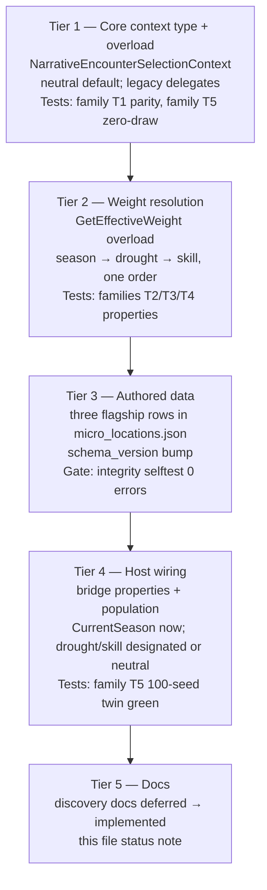

# PLAN F21 — Discovery Selection-Context Extension (Season / Drought / Skill Weights)

**Class:** P2 follow-up from the F17–F20 flagship integration (flagship plan §8.10, §9.10, §10.10 — all three documented as "investigated, deferred").
**Status:** FILED — not started.
**Owner system:** Discovery / micro-location selection only. **No gameplay logic in the greenhouse, radio, or water systems.**

---

## 1. Goal (2 lines)

Give the narrative micro-location selector an explicit, deterministic selection context (season, drought/water-scarcity, survivor skill) so `micro_ruined_greenhouse`, `micro_water_source`, and `micro_radio_tower` can be weighted by authored world state — through the one canonical selector, with zero new RNG and zero per-system selection logic.

## 2. Evidence baseline (recon from F17–F20)

| Finding | Location |
|---|---|
| Narrative selection context today = (stance, dangerLevel, locationId) + weather-gate filter. **No season, drought, or skill input.** | `NarrativeEncounterSystem.GetEligibleCandidates` / `SelectEncounter` |
| The **patrol** path already receives `CurrentSeason` at the bridge; the **narrative** path does not | `ExpeditionEncounterBridge.cs:126-142` |
| Proven in-repo pattern for an explicit deterministic selection context ("never read from a global singleton") | `TravelEncounterSelectionContext` (`Narrative/TravelEncounterSelectionContext.cs`) |
| Season authority exists (JSON seasonal weather windows) | `WeatherSystem` + `SeasonWindowDef` |
| Host already holds and pushes `CurrentSeason` into the bridge | `ExpeditionHostSession._currentSeason` / `CurrentSeason` |
| Weight formula today: `baseWeight × stance multiplier`, floored at 0, danger/destination filters first | `EncounterDefinition.GetEffectiveWeight` |

## 3. Design contract

### 3.1 Context in — never global reads

Mirror `TravelEncounterSelectionContext`: introduce `NarrativeEncounterSelectionContext` (Core, `Ashfall.Core.Narrative`) carrying `Stance`, `DangerLevel`, `LocationId`, `CurrentSeason`, `DroughtLevel` (float 0–1 or enum tier from the water/economy authority), `SkillLevel` (survivor skill for the site's affinity domain, optional), `Rng` (the same shared campaign stream the caller already holds). `GetEligibleCandidates` gains an overload accepting the context; the existing 3-arg overload delegates with a neutral default context (all multipliers 1) so every existing caller and test is bit-identical until opted in.

### 3.2 Data-driven weights on `EncounterDefinition`

Optional, backward-compatible JSON fields (snake_case, `schema_version` bump per data authority rules):

```json
"seasonWeightMultipliers": { "growing_season": 1.35, "deep_freeze": 0.8 },
"droughtWeightMultipliers": { "mild": 1.0, "severe": 1.25 },
"affinitySkillId": "skill_signal_ear",
"skillWeightMultiplier": 1.5
```

- `micro_ruined_greenhouse` (F18): ×1.25–1.50 in `growing_season`, normal-to-reduced in `deep_freeze`. Exact numbers set by project balancing conventions, in data — not code.
- `micro_water_source` (F20): detection improves with drought severity (survivors actively search), **but** the authored grant (3 vs 2 `clean_water`) and one-shot depletion stay untouched — scarcity is never relieved by weighting, only findability.
- `micro_radio_tower` (F19): `skillWeightMultiplier` keyed to the tower's affinity skill when the survivor roster exposes one.

### 3.3 Determinism invariants (non-negotiable)

- Weights change only the candidate weight sum before the single existing `rng.NextDouble()` roll. No additional draws, no new RNG sources, no wall clock. `MicroLocationDeterminismTests`' zero-divergence harness must stay green with contexts applied.
- Same context + same state ⇒ same selection. The context is captured per selection call, never cached across ticks.
- Depleted encounters remain excluded before weighting (existing F1 rule).

### 3.4 Ownership boundaries

| System | Allowed | Forbidden |
|---|---|---|
| `NarrativeEncounterSystem` | Accept context, multiply weights | Read weather/season/drought state directly |
| `ExpeditionEncounterBridge` / host | Populate the context from `WeatherSystem`/season/economy authorities | Per-site special cases |
| Greenhouse / Radio / Water authorities | Nothing — they never learn which encounter granted an item | Any selection knowledge |

## 4. Implementation phases

1. **Core context type + overload** — `NarrativeEncounterSelectionContext`, neutral defaults, existing callers untouched. Tests: neutral context is bit-identical to today's outputs across the 64-seed harness.
2. **Weight resolution** — apply `seasonWeightMultipliers` → `droughtWeightMultipliers` → skill multiplier in one documented order; clamp at ≥ 0. Tests: monotonicity, zero-weight exclusion, ordinal determinism.
3. **Data** — add fields to the three flagship sites (+ any others the owner lists) in `micro_locations.json`; `--data-integrity-selftest` must stay at 0 errors.
4. **Host wiring** — `ExpeditionEncounterBridge` populates context from `CurrentSeason` (already flows), `WeatherSystem`/economy drought signal, and roster skill; document each source.
5. **Docs** — update the seasonal/drought/skill sections in `docs/discovery/MICRO_LOCATION_{GREENHOUSE,WATER,RADIO}.md` from "deferred" to "implemented via context".

## 5. Required tests

- Neutral-context parity: `GetEligibleCandidates(legacy) ≡ GetEligibleCandidates(neutral context)`.
- Season: greenhouse weight rises in `growing_season`, falls in `deep_freeze`, per authored data only.
- Drought: water-source weight rises with severity; grant quantities and one-shot semantics unchanged (`MicroLocationWaterIntegrationTests` stay green untouched).
- Skill: tower weight responds to the affinity skill; absent skill ⇒ multiplier 1.
- Determinism: 100-seed harness zero divergence with contexts applied; no new RNG draw count.
- Integrity: `--data-integrity-selftest` 0 errors; full `dotnet test` green.

## 6. Out of scope (explicitly)

- Changing any authored grant quantity or one-shot semantics.
- Seasonal seed pools (F18 §8.11 — separate decision).
- Reading selection context inside any downstream subsystem.
- Any new event bus topics (host wiring stays direct calls per EVENT SYSTEM rule).

---

# EXPANSION 2026-09-25 — Plan F21 Discovery Selection-Context: Full Integration Framework & Code Architecture

**Document class:** expansion of the FILED plan above. Everything from this
separator down is specification and verified current-state analysis; it adds no
code, no data, and no claims of implementation. Where this expansion states a
fact about the repository, the fact carries a file citation from the
2026-09-25 read of the tree. Where this expansion specifies future work, the
text says "shall", "must", or "phase". The three-way status taxonomy defined
in Part I §1.2 is applied to every claim in this document.

---

## PART I — PREAMBLE & IMPLEMENTATION-STATUS FINDING

### 1.1 What this document is

Plan F21 (the text above the separator) is a two-page design contract: give
the narrative micro-location selector an explicit deterministic selection
context — season, drought, survivor skill — so the three flagship discovery
sites (`micro_ruined_greenhouse`, `micro_water_source`, `micro_radio_tower`)
can be weighted by authored world state, through the one canonical selector,
with zero new RNG draws and zero per-system selection logic.

This expansion turns that contract into a buildable integration framework:

- **Part II** audits what the selection pipeline actually is today, with the
  season/drought/skill authorities that a context would read from, verified
  against source on 2026-09-25.
- **Part III** states the invariants the extension must preserve, the
  architecture principle it extends (context-in, never global reads), the
  tier-by-tier flow, and the determinism contract in depth.
- **Part IV** gives the code architecture: module map, the context type, the
  overload family, the weight-resolution order, the host population path, and
  four sequence walkthroughs.
- **Part V** is the bulk, fifteen chapters (§5.1–§5.15): the context type
  field-by-field with ownership, the weight-resolution algebra as a formal
  spec, a full data-authoring chapter with complete example JSON for all three
  flagship sites, the five phases expanded into per-phase engineering
  checklists with test anatomy for the six required test families, the
  pattern-donor chapter, the non-goals as boundary contracts, failure
  narratives, worked numeric tables (§5.8), the decision record (§5.9), the
  harness-twin specification (§5.10), per-flagship deep dives (§5.11), the
  balancing playbook (§5.12), spec-grade listings (§5.13), the
  invariant-to-test traceability matrix (§5.14), and the adversarial review
  checklist (§5.15).
- **Part VI** is the cross-system matrix: every system the context touches,
  each strictly as a context source, plus the emergent-consequence design
  (E1–E4 intended, X1–X4 fenced).
- **Part VII** is verification and acceptance: test matrix (G1–G15), gate
  ladder (L0–L6) including the existing 100-seed harness, rollback, and the
  stated limits of verification (§7.5).
- **Part VIII** is appendices A–U: glossary, field/ID vocabulary, scenario
  walkthroughs (C.1–C.5), open questions (Q1–Q7), and the operational
  reference shelf — citation register, plan crosswalk, coordination plan,
  reviewer FAQ, future-work parking list, document control, roll mechanics,
  worked mini-fixture, diagnostics catalog, performance notes,
  drought-authority sketch, determinism crosswalk, acceptance checklist,
  verification session record, misconceptions, reading paths, and the
  verify-before-implement checklist.

Non-goals of the expansion mirror the plan's: nothing here changes a grant
quantity, a one-shot semantic, an event-bus topic, or a downstream read. The
expansion is documentation-only; no file other than this one was modified to
produce it.

### 1.2 Implementation-status finding (read this before acting on the plan)

The plan is marked **FILED — not started** (2026-09-05). Verified against the
current tree on **2026-09-25**: that mark is **accurate**. None of F21's
designed artifacts exist in code or data. The plan is not stale in its
conclusion — but four of its premise details have drifted from current
evidence and are corrected in §1.4 before they can mislead an implementer.

Every load-bearing claim in the plan, sorted into the three-way taxonomy:

| # | Claim / artifact | Status | Evidence (2026-09-25) |
|---|---|---|---|
| S1 | `NarrativeEncounterSelectionContext` (the new Core type) | **VERIFIED-NOT-IMPLEMENTED** | `grep -rn NarrativeEncounterSelectionContext` over `*.cs`, `*.json`, `*.md` hits only this plan file (lines 28, 61). No type, no test, no data reference anywhere. |
| S2 | Season/drought/skill weight fields on `EncounterDefinition` (`seasonWeightMultipliers`, `droughtWeightMultipliers`, `affinitySkillId`, `skillWeightMultiplier`) | **VERIFIED-NOT-IMPLEMENTED** | Zero grep hits for all four identifiers across `Assets/`, `src/`, `Ashfall.Core.Tests/`, and `Assets/StreamingAssets/Data/`. `EncounterDefinition` (`Assets/Ashfall.Core/Narrative/EncounterCatalog.cs:66`) carries only the schema-doc fields plus `npcId`, `isMicroLocation`, `sourceFile`. |
| S3 | Context-accepting overload on `GetEligibleCandidates` / `SelectEncounter` | **VERIFIED-NOT-IMPLEMENTED** | `NarrativeEncounterSystem.GetEligibleCandidates` has exactly one signature: `(string stance, float dangerLevel, string locationId)` (`Assets/Ashfall.Core/Narrative/NarrativeEncounterSystem.cs:160`). `SelectEncounter` has exactly one: `(string, float, string, ISeededRng)` (`NarrativeEncounterSystem.cs:188`). |
| S4 | Pattern donor `TravelEncounterSelectionContext` exists and is proven | **VERIFIED-IMPLEMENTED** | `Assets/Ashfall.Core/Narrative/TravelEncounterSelectionContext.cs` (61 lines, sealed, init-only props, `From(...)` factory). Consumed by `TravelEncounterSystem.IsEncounterEligible(encounter, context)` (`TravelEncounterSystem.cs:401`) and `SelectEncounter(TravelEncounterSelectionContext)` (`TravelEncounterSystem.cs:491`); also referenced by `TravelingCaravanSystem.cs` and `Ashfall.Core.Tests/CaravanPatrolIntegrationTests.cs`. |
| S5 | Narrative selection context today = (stance, dangerLevel, locationId) + weather-gate filter; **no season, drought, or skill input** | **VERIFIED-IMPLEMENTED (as description of today)** | `GetEligibleCandidates` body (`NarrativeEncounterSystem.cs:160-174`): depletion filter → `GetEffectiveWeight` → zero-weight drop → `WeatherGateFilter` delegate (declared `NarrativeEncounterSystem.cs:81`). No season, drought, or skill value appears anywhere in the call chain. |
| S6 | "The **patrol** path already receives `CurrentSeason` at the bridge; the **narrative** path does not" | **VERIFIED-IMPLEMENTED (as description of today)** | `ExpeditionEncounterBridge.Surface` enumerates narrative candidates with the 3-arg call (`ExpeditionEncounterBridge.cs:151-154`), then passes `CurrentSeason` and day into `TravelEngine.GetEligiblePatrolCandidates(region, dangerLevel, stance, CurrentSeason, day)` (`ExpeditionEncounterBridge.cs:157-167`). Note: plan cited `ExpeditionEncounterBridge.cs:126-142`; the asymmetry now lives at ~lines 151–167 (file grew). Substance unchanged. |
| S7 | Host already holds and pushes `CurrentSeason` into the bridge | **VERIFIED-IMPLEMENTED** | `src/Host/ExpeditionHostSession.cs:274` (`private string _currentSeason = "autumn";`), setter pushes `_bridge.CurrentSeason = value` (`:275-283`), and the `OnEncounterTriggered` subscription refreshes `_bridge.CurrentDay` / `_bridge.CurrentSeason` before `_bridge.Surface(s)` (`:447-451`). |
| S8 | Season authority exists (JSON seasonal weather windows): `WeatherSystem` + `SeasonWindowDef` | **VERIFIED-IMPLEMENTED** | `Assets/Ashfall.Core/World/WeatherSystem.cs:11` (`SeasonWindowDef`: `id`, `displayName`, `startDay`, six weather weights), `GetSeasonForDay(day)` (`:114`), `BindProfile` (`:108`). Authored profile `Assets/StreamingAssets/Data/weather_seasons.json`: profile `default_winter` ("The Year of Ash and Ice"), 10 windows `window_first_thaw` … `window_black_rain_season` (full list §2.5). `CampaignCalendar` (`Assets/Ashfall.Core/Campaign/CampaignCalendar.cs:36-86`) binds the same profile and exposes `ResolveDay(day).SeasonId` + `OnSeasonChanged`. |
| S9 | Weight formula today: `baseWeight × stance multiplier`, floored at 0, danger/destination filters first | **VERIFIED-IMPLEMENTED** | `EncounterDefinition.GetEffectiveWeight` (`EncounterCatalog.cs:99-113`): `minDangerLevel` gate → `requiredLocationId` ordinal gate → `baseWeight`, `× stealthWeightMultiplier` when `stance == "Stealth"`, `× speedWeightMultiplier` when `stance == "Speed"` → `Math.Max(0f, weight)`. |
| S10 | `micro_locations.json` carries the three flagship sites | **VERIFIED-IMPLEMENTED** | 28 encounters in `Assets/StreamingAssets/Data/micro_locations.json` (`schema_version: 1`, `collection_id: "micro_locations_catalog"`). `micro_ruined_greenhouse` baseWeight 0.5; `micro_water_source` baseWeight 0.5; `micro_radio_tower` baseWeight 0.3, `minDangerLevel` 1. Full entries with choices quoted in Part V §5.3. |
| S11 | Authored grants that weighting must never touch (seeds/herb, water, coil) | **VERIFIED-IMPLEMENTED (as authored data)** | Greenhouse: `take_greenhouse_seeds` → `seed_packets` ×2 (depletes), `open_greenhouse_cabinet` → `crop_medicinal_herb` ×1 (depletes), `leave_greenhouse` non-depleting. Water: `collect_water` → `clean_water` ×3 (depletes), `test_water` → `clean_water` ×2 (depletes), `avoid_water` non-depleting. Radio: `open_radio_cabinet` → `antenna_coil` ×1 (depletes), `read_radio_log` → journal `micro_radio_tower_log` (non-depleting), `ignore_radio` non-depleting. |
| S12 | `skill_signal_ear` exists as an affinity-skill candidate for the tower | **VERIFIED-IMPLEMENTED (as data)** | `skill_signal_ear` present in `Assets/StreamingAssets/Data/skills.json` (skill id list also includes `skill_watchful`, `skill_trail_memory`, `skill_cold_analysis`, and ~26 more). Owning system: `SkillProgressionSystem` (`Assets/Ashfall.Core/Survivors/SkillProgressionSystem.cs` — `TryGrantSkill`, `GetSkill`, `SkillActor`). No encounter-definition field references any skill id today (see S2). |
| S13 | `MicroLocationDeterminismTests` "zero-divergence harness must stay green with contexts applied" | **VERIFIED-IMPLEMENTED (harness exists)** | `Ashfall.Core.Tests/MicroLocationDeterminismTests.cs` — named seeds 42/99/7, save@tick4 continuation, zero-RNG-draw metadata gates, and `HundredSeedHarness_HasZeroDivergences` (seeds 0–99, two `MicroLocationDeterminismHarness.Run` passes compared per seed, `:200-218`). See §1.4 item D1 on the plan's "64-seed" wording. |
| S14 | Drought signal source ("float 0–1 or enum tier from the water/economy authority") | **UNVERIFIED — no canonical drought scalar found** | No `DroughtLevel`, `drought`, `Drought`, or `water_scarcity` identifier exists in `Assets/Ashfall.Core/` or `Assets/StreamingAssets/Data/`. The shelter water estate (`FluidLogisticsSystem`, `WaterTreatmentSystem`, `FluidWaterTreatmentBridge`, all under `Assets/Ashfall.Core/…`) models paths/pressure/quality, not a campaign-scale scarcity index. Phase 4 must first *designate* the producing authority; Part V §5.1 field `DroughtLevel` specifies the neutral-when-absent contract that makes this safe to defer. |
| S15 | Discovery docs mark the three capabilities "deferred" | **VERIFIED-IMPLEMENTED (as documented deferrals)** | `docs/discovery/MICRO_LOCATION_GREENHOUSE.md:41` and `:51-53` (seasonal weighting deferred, needs season-aware selection context); `docs/discovery/MICRO_LOCATION_WATER.md:27` ("the discovery selector reads **no drought/weather/scarcity context today**") and `:45-47`; `docs/discovery/MICRO_LOCATION_RADIO.md:44` and `:50-52` (skill-weighted detection deferred). Phase 5 updates exactly these sections. |
| S16 | Plan F21 is outside the current integration batch | **VERIFIED-IMPLEMENTED (as description of today)** | `INTEGRATION_PLANS.md` contains no F21 entry (grep 2026-09-25). F21 remains a filed P2 follow-up; starting it still requires the `WORKTREE_OWNERSHIP.md` path claim per `AGENTS.md` rule 6. |

Summary line: **everything the plan proposes to add is absent (S1–S3, S14);
everything the plan relies on already being there is present (S4–S13, S15);
the queue finding is S16. The plan's status line is honest.**

### 1.3 How to read the taxonomy

- **VERIFIED-IMPLEMENTED** — the artifact exists in the tree today and was
  read for this expansion; the citation names the file and, where useful, the
  line. A claim marked this way is safe to build on without re-verification,
  though `AGENTS.md` rule 7 still applies at implementation time.
- **VERIFIED-NOT-IMPLEMENTED** — the artifact was searched for by name and by
  behavior and is absent. If you find it later, the 2026-09-25 finding is
  stale and this expansion's "future work" framing must be re-checked before
  more is built on it.
- **UNVERIFIED** — the plan names something whose producing authority could
  not be established from the tree (S14 is the only one). The expansion
  handles this by specification (neutral-default fields) rather than by
  inventing an authority.

### 1.4 Premise-drift register (plan text vs. current evidence)

Four details in the filed plan no longer match — or never matched — the tree.
None invalidates the design; all four change what an implementer should write.

| # | Plan text | Current evidence | Correction applied in this expansion |
|---|---|---|---|
| D1 | Phase 1 test: "neutral context is bit-identical … across the **64-seed harness**" | The harness is the F10.13 **100-seed sweep** (`HundredSeedHarness_HasZeroDivergences`, seeds 0–99) plus named-seed scenarios 42/99/7 (`MicroLocationDeterminismTests.cs`). "64 seeds" appears only as prose in `MICRO_LOCATION_GREENHOUSE.md:29` (F18_11's save/reload sweep); no 64-seed fixture exists. | Part VII's gate ladder uses the existing 100-seed sweep and named-seed scenarios; no new harness is created. |
| D2 | §3.2 example keys `"growing_season": 1.35, "deep_freeze": 0.8` | Authored window ids are `window_*` and there is **no growing-season window**: `window_first_thaw` (day 0), `window_ash_settling` (30), `window_deep_freeze` (60), `window_spring_storms` (90), `window_dry_ash` (120), `window_first_fallout` (150), `window_false_spring` (180), `window_deep_ash` (200), `window_long_winter` (240), `window_black_rain_season` (280). The travel catalog's `season_tags` use exactly these ids plus `"all"` (`travel_encounters.json:15`). | Part V §5.3 authors the flagship data against real window ids, maps "growing season" to the thaw/false-spring/spring-storms cluster, and specifies the unmatched-key rule (unknown season id ⇒ multiplier 1.0, integrity warning, never an error that breaks the selftest). |
| D3 | §2 cites `ExpeditionEncounterBridge.cs:126-142` for the season asymmetry | The same asymmetry is at `ExpeditionEncounterBridge.cs:151-167` after later edits to `Surface`. | Citations in Part II use current line numbers and note the drift. |
| D4 | (Implicit) season is consumed like the donor consumes it | The donor's season input is a **hard eligibility filter** (`TravelEncounterSystem.cs:354-356`: a `season_tags`-bearing encounter is *ineligible* off-season), not a multiplier. F21 proposes season as a *weight multiplier*. | Part V §5.5 (pattern-donor chapter) separates what F21 borrows (context passing, neutral defaults, overload delegation) from what it must not borrow (filter semantics for season on the narrative path), and Part III INV-F21-05 pins the difference. |

One further observation worth recording, not a drift but a wiring fact: the
host's initial season literal is `"autumn"` (`ExpeditionHostSession.cs:274`)
and the bridge's default is `"all"` (`ExpeditionEncounterBridge.cs:81`). Neither
is an authored window id. The context spec therefore defines season
normalization: the empty string, `"all"`, and any id absent from
`seasonWeightMultipliers` on a given definition all resolve to multiplier 1.0
for that definition (Part V §5.2 rule W6). This keeps the default-path host
sessions bit-identical to today's selections even after data gains season keys.

### 1.5 Conventions

- "Core" = `Assets/Ashfall.Core/` (engine-free, `netstandard2.1`). "Host" =
  `src/` (Godot-facing, `net8.0`). "Tests" = `Ashfall.Core.Tests/` (`net9.0`).
  "Data" = `Assets/StreamingAssets/Data/`.
- Mermaid diagrams are included for the selection flow and the tier flow; they
  are illustrative of control flow, not of draw counts — draw counts are
  specified in prose and pinned by tests, never inferred from a diagram.
- Identifiers in code font are real tree identifiers unless introduced with
  "proposed". Proposed identifiers follow the plan's names exactly:
  `NarrativeEncounterSelectionContext`, `seasonWeightMultipliers`,
  `droughtWeightMultipliers`, `affinitySkillId`, `skillWeightMultiplier`.
- Tones: restrained, technical, fictional. No real-world places, people, or
  conflicts appear in examples; all content ids are the repo's own.

---

## PART II — CURRENT AUTHORITY AUDIT (the selection pipeline today)

Everything in this part was read from the tree on 2026-09-25. Where a code
excerpt is shortened, the elision is marked. Line numbers are current as of
this read and will drift with future edits; the surrounding identifiers are
the stable reference.

### 2.1 The verified selection call chain

The determinism discovery doc (`docs/discovery/MICRO_LOCATION_DETERMINISM.md`
§3) records the call chain, and the current source still matches it:

```text
ExpeditionSystem.TickHours(hours, rng)                 one shared stream
  -> per active expedition (ordinal-sorted keys)
     ApplyStaminaDrain -> RollEncounter(exp, rng)
       rng.NextDouble() < encounterChancePerTick       stance/weather-adjusted
       -> OnEncounterTriggered(exp)
          -> ExpeditionEncounterBridge.Surface(exp)
             -> NarrativeEncounterSystem.GetEligibleCandidates(stance, danger, locId)   0 RNG
             -> [patrol branch] TravelEngine.GetEligiblePatrolCandidates(
                    region, dangerLevel, stance, CurrentSeason, day)                    0 RNG
             -> merge totals; one rng.NextDouble() roll over the merged sum             1 draw
             -> OnSurfaced(dto) -> NarrativeEncounterSystem.EnqueuePending(...)
player choice
  -> bridge.ResolveChoice / NarrativeEncounterSystem.TryResolve                        0 RNG
  -> host ApplyEncounterConsequences: item -> journal -> location -> flag              0 RNG
```

Facts this chain pins, each verified in source:

1. **One stream.** The host constructs one `SeededRng` (xorshift64*,
   `Assets/Ashfall.Core/HostDefaults.cs`) and hands the same `ISeededRng`
   instance (`Assets/Ashfall.Core/Ports.cs:113-119` — `Seed`, `Next(int,int)`,
   `NextFloat()`, `NextDouble()`) to `ExpeditionSystem.TickHours` and to
   `ExpeditionEncounterBridge` (`SetRng`, `ExpeditionEncounterBridge.cs:109-112`).
2. **Candidates cost zero draws.** Eligibility, weighting, filtering, and
   summation touch no RNG; the only priced operation in the chain is the
   single `rng.NextDouble()` at `ExpeditionEncounterBridge.cs:196` (bridge
   path) or `NarrativeEncounterSystem.cs:200` (direct-selector path). The
   zero-draw property is pinned by `EligibilityMetadata_ConsumesZeroRngDraws`
   and `SelectEncounter_ZeroEligibleContext_ConsumesZeroDraws`.
3. **Two candidate families, one roll.** `Surface` merges the narrative list
   and the patrol list into one accumulated sum and rolls once
   (`ExpeditionEncounterBridge.cs:170-199`); narrative candidates are walked
   first, in catalog order, then patrol candidates.
4. **Depletion is pre-filtered.** Depleted encounter ids live in a
   `HashSet<string>` (`StringComparer.Ordinal`) inside
   `NarrativeEncounterSystem` (`:69`); `GetEligibleCandidates` skips them
   before weighting (`:167`) so they never distort the weight sum or consume a
   roll slot.

### 2.2 `NarrativeEncounterSystem` — verified surface relevant to F21

File: `Assets/Ashfall.Core/Narrative/NarrativeEncounterSystem.cs` (588 lines).

| Member | Lines | F21 relevance |
|---|---|---|
| `WeatherGateFilter` (`Func<string, bool>?`) | 75-81 | The one existing "world-state input" to narrative selection, and it is already a *host-injected delegate*, not a global read. F21's context generalizes the same idea for season/drought/skill. |
| `GetEligibleCandidates(string stance, float dangerLevel, string locationId)` | 160-174 | The method that gains the context overload. Returns `List<(EncounterDefinition def, double weight)>`; iterates `_catalog` in registration order; applies depletion → `GetEffectiveWeight` → `w <= 0` drop → weather gate. |
| `SelectEncounter(string, float, string, ISeededRng)` | 188-212 | Consumes exactly one `rng.NextDouble()` when any candidate is eligible (`:200`); null when none or when the total is ≤ 0. Fires `RecordEncounterSelected`. |
| `RecordEncounterSelected(EncounterDefinition)` | 176-182 | Raises `OnEncounterSelected` and the optional `ContentUtilizationInstrumentation` record — must keep firing on context-path selections (utilization evidence must not silently change shape). |
| `TryResolve` | 230-283 | The no-RNG resolution path; grants/depletion/quest links are untouched by F21. |
| `EnqueuePending` / `ClearPending` / `ClearAllPending` | 314-350 | Surfaced-queue bookkeeping; untouched. |
| `CaptureState` / `RestoreState` / `ReconstructDepletionFromHistory` | 361-485 | Save/load of depletion + history; F21 adds **no** new persisted state (weights are static authored data; the context is per-call). |
| `NarrativeEncounterCatalogLoader.Load` | 509-520 | Load order: `narrative_encounters.json` → `narrative_encounters_npc_arcs.json` → `narrative_encounters_expansion.json` → `micro_locations.json`; primary-wins dedupe (`:525-537`); micro entries stamped `isMicroLocation = true` + `sourceFile` (`:566-570`). This four-file order supersedes the three-file order quoted in the determinism doc §4 — the registration-order rule itself is unchanged. |

### 2.3 `EncounterDefinition.GetEffectiveWeight` — the formula F21 extends

File: `Assets/Ashfall.Core/Narrative/EncounterCatalog.cs` (definition at `:66`,
formula at `:99-113`).

```csharp
public float GetEffectiveWeight(string stance, float dangerLevel, string locationId)
{
    if (dangerLevel < minDangerLevel) return 0f;
    if (!string.IsNullOrEmpty(requiredLocationId))
    {
        if (string.IsNullOrEmpty(locationId)
            || !string.Equals(requiredLocationId, locationId, System.StringComparison.Ordinal))
            return 0f;
    }
    float weight = baseWeight;
    if (stance == "Stealth") weight *= stealthWeightMultiplier;
    else if (stance == "Speed") weight *= speedWeightMultiplier;
    return System.Math.Max(0f, weight);
}
```

Properties that matter to F21:

- **Pure function of (definition, stance, danger, location).** No state, no
  RNG, no global reads. F21 adds context fields to exactly this purity class.
- **Gate-before-multiply.** Danger and destination gates return hard zero
  before any multiplication; F21 keeps that precedence (Part V §5.2 rule W1).
- **Ordinal string comparisons.** `requiredLocationId` matching is ordinal —
  the new season/skill key matching follows the same discipline (rule W6/W8).
- **Floor at zero, never below.** `Math.Max(0f, …)` is the only clamping
  today; F21's algebra (§5.2) inherits it and adds a documented upper
  bound only at the per-multiplier level (authored data validation), not at
  the product level.
- **`float` weights.** The narrative path's `GetEffectiveWeight` returns
  `float`; `GetEligibleCandidates` widens to `double` for summation and the
  roll. The donor path is `float` end-to-end. F21 keeps the existing numeric
  types exactly — no type change rides along with the context work.

### 2.4 `ExpeditionEncounterBridge` — where the context will be populated

File: `Assets/Ashfall.Core/Expeditions/ExpeditionEncounterBridge.cs` (354 lines).

- `Surface(ExpeditionState state)` (`:139-274`) is the production entry. It:
  1. builds the honest-bare DTO skeleton (`:143-148`);
  2. enumerates narrative candidates — **3-arg call, no season** (`:151-154`);
  3. enumerates patrol candidates **with `CurrentSeason` and day** when
     `TravelEngine` is bound (`:157-167`);
  4. sums both families, returns the honest-bare DTO when the sum ≤ 0
     (`:170-192`);
  5. rolls once (`:196`) and walks narrative-then-patrol in order;
  6. fires `OnSurfaced` exactly once (`:273`).
- Season plumbing on the bridge: `CurrentSeason` property, default `"all"`
  (`:81`); `CurrentDay` (`:80`); `RegionResolver` delegate (`:82`) with the
  fallback substring resolver for the four authored regions (`:114-130`).
- `ResolveChoice` (`:280-352`) is RNG-free and enforces the flagship §14.1
  double-resolve guard (`:331-337`); F21 does not touch it.

The population seam for F21 is step 2: the bridge already holds
`CurrentSeason` in scope when it builds the narrative candidate list, exactly
parallel to how it passes season into the patrol list. `DroughtLevel` and
`SkillLevel` have **no existing bridge property** — they arrive as new
bridge properties set by the host next to `CurrentSeason` (Part IV §4.5),
or stay at their neutral defaults until the host wires them (phase 4).

### 2.5 Season authority — verified

Two Core authorities produce season identity today, both data-bound:

- **`WeatherSystem`** (`Assets/Ashfall.Core/World/WeatherSystem.cs`):
  `SeasonWindowDef` (`:11-20`: `id`, `displayName`, `startDay`,
  `clearWeight`, `rainWeight`, `overcastWeight`, `ashfallWeight`,
  `falloutStormWeight`, `blizzardWeight`, `blackRainWeight`);
  `SeasonProfileDef` (`:23-28`); `BindProfile(profile, seed)` (`:108-111`);
  `GetSeasonForDay(day)` (`:114-125`, latest window with `startDay <= day`,
  `DefaultWindow` id `"default"` when unbound or empty `:127-137`).
- **`CampaignCalendar`** (`Assets/Ashfall.Core/Campaign/CampaignCalendar.cs`):
  `BindProfile(SeasonProfileDef?)` (`:70`), `ResolveDay(day).SeasonId`
  (`:81`), `OnSeasonChanged(oldSeasonId, newSeasonId)` (`:40`, raised at
  `:83-86`). The doc comment on `:33` states its role: "Purely resolves time,
  seasonal context, and ambient baseline for any day without mutating state."

Authored data: `Assets/StreamingAssets/Data/weather_seasons.json`, profile
`default_winter` — "The Year of Ash and Ice" — with these windows:

| Window id | Start day | Display name |
|---|---|---|
| `window_first_thaw` | 0 | First Thaw |
| `window_ash_settling` | 30 | Ash Settling |
| `window_deep_freeze` | 60 | The Deep Freeze |
| `window_spring_storms` | 90 | Spring Storms |
| `window_dry_ash` | 120 | Dry Ash |
| `window_first_fallout` | 150 | First Fallout |
| `window_false_spring` | 180 | False Spring |
| `window_deep_ash` | 200 | Deep Ash |
| `window_long_winter` | 240 | The Long Winter |
| `window_black_rain_season` | 280 | Black Rain Season |

These ids are the key space for `seasonWeightMultipliers`. The travel catalog
already uses them: `travel_encounters.json:15` authors
`"season_tags": ["window_deep_freeze", "window_long_winter",
"window_ash_settling"]` on one entry, and `TravelEncounterSystem.cs:354-356`
filters on exact (case-insensitive) match with `"all"` as the wildcard.
Related season consumers confirm the id convention across data:
`ecological_infestations.json:176` (`eligible_seasons`), `seasonal_events.json`
(`season_id`), `wildlife_ecosystem.json` (`season_window_id`).

### 2.6 Water and drought surface — what exists, what does not

Verified present:

- The canonical potable item is `clean_water` (`items.json`, type Water),
  consumed through `Inventory.Consume(item, applyNeed, …)` with needs-callback
  rollback — pinned by `F20_06`–`F20_08`
  (`docs/discovery/MICRO_LOCATION_WATER.md` §Canonical water authority).
- Shelter-side water infrastructure exists and is owned:
  `FluidLogisticsSystem` / `FluidWaterTreatmentBridge` /
  `WaterTreatmentSystem` (Core), `BrineWaterSystem` (tests exist:
  `BrineWaterSystemTests`, `Plan168WaterDeliveryTests`). These model
  treatment paths, pressure, quality axes (pathogen/chemical/radiological/
  salinity/sediment — `FluidLogisticsSystem.cs:19-23`), and delivery.
- `MicroLocationWaterIntegrationTests` (12 tests, F20_01–F20_12) pin grant
  quantities, one-shot depletion, exclusion from selection for every stance
  and seed, and save/reload depletion.

Verified absent:

- **No campaign-scale drought or scarcity scalar.** Greps for
  `DroughtLevel|drought|Drought|ScarcityLevel|water_scarcity` over Core and
  Data return no drought authority. The plan's "float 0–1 or enum tier from
  the water/economy authority" names a signal that does not exist yet.

Consequence for F21 (this is the honest reading, and the expansion is built
around it): the drought leg of the context is **contract-first**. The context
carries the field; the algebra consumes it; the neutral default (0.0 or the
`"normal"` tier, see Part V §5.1) makes an unwired field inert; phase 4 may
designate the producing authority — or the phase-4 owner may report, per
`AGENTS.md` rule 10, that no authority should be designated yet, in which
case drought weighting ships as authored-data capability awaiting a source.
Nothing else in F21 depends on that decision. `micro_water_source`'s
drought sensitivity must never be *faked* by reading shelter tank levels
inside the selector: tank state is a shelter-production fact, not a world
scarcity fact, and reading it would violate INV-F21-02 (§3.1) and the
ownership table (plan §3.4).

### 2.7 Skill authority — verified

- `SkillProgressionSystem` (`Assets/Ashfall.Core/Survivors/SkillProgressionSystem.cs`,
  sealed class): `RegisterSkill(SkillDef)`, `GetSkill(id)`,
  `RegisterDefaultSkills()`, `TryGrantSkill(SkillActor, skillId, day)`,
  `RecordAction(actor, disciplineId, xp, day)`; events `OnXpGained`,
  `OnSkillEarned`, `OnSkillDormant`, `OnSkillReactivated`, `OnEpiphany`.
- Authored skills: `Assets/StreamingAssets/Data/skills.json` (30+ ids read),
  including the plan's example affinity skill **`skill_signal_ear`**.
- Expedition trigger context: `ExpeditionState` carries `survivorId`
  (the bridge stores it from surfaced triggers, `ExpeditionHostSession.cs:441`),
  so the host can resolve the acting survivor's roster row and ask the skill
  authority whether the affinity skill is held. There is no Core-side
  shortcut from `NarrativeEncounterSystem` to survivors — and there must not
  be one (INV-F21-02).

The skill context leg is likewise contract-first: the context carries
`AffinitySkillId` (which skill the *definition* cares about — from data) and
the host supplies `HeldSkillIds` (or a precomputed boolean via the bridge).
The neutral default is "no skill information" ⇒ multiplier 1.0. Part V §5.1
specifies both shapes and why the id lives on the definition while the
held-set lives on the context (so data can change the affinity without a
host rebuild).

### 2.8 The pattern donor — verified in full

`Assets/Ashfall.Core/Narrative/TravelEncounterSelectionContext.cs` (61 lines,
quoted in full in the audit because every line is load-bearing for Part V
§5.1):

```csharp
public sealed class TravelEncounterSelectionContext
{
    public string Region { get; init; } = "";
    public int DangerLevel { get; init; }
    public string Stance { get; init; } = "";
    public string CurrentSeason { get; init; } = "";
    public int CurrentDay { get; init; }
    public WeatherKind CurrentWeather { get; init; }
    public string LocationId { get; init; } = "";
    public string RouteId { get; init; } = "";
    public TravelMode Mode { get; init; } = TravelMode.Travel;
    public ISeededRng? Rng { get; init; }

    public static TravelEncounterSelectionContext From( /* 10 params */ ) { ... }
}
```

Its doc comment states the principle F21 extends verbatim: "Weather is passed
in — never read from a global singleton inside eligibility checks — so the
same context always yields the same eligibility answer for the same inputs."

Consumption sites verified:

- `TravelEncounterSystem.IsEncounterEligible(encounter, context)` (`:401-408`)
  unpacks the context onto the 6-arg eligibility check.
- `TravelEncounterSystem.SelectEncounter(context)` (`:491-497`) unpacks onto
  the 7-arg selector — **donor caveat:** when `context.Rng` is null it falls
  back to `new SeededRng(context.CurrentDay * 397 + 17)`, a derived stream.
  F21 must **not** copy that fallback: the narrative contract is
  "Rng null ⇒ selection refuses" (`NarrativeEncounterSystem.SelectEncounter`
  already returns null on null rng, `:191`), preserving the zero-new-RNG
  invariant. A derived stream inside a selector is exactly the second RNG
  source the determinism doc §1 forbids on the narrative path.
- Proven in tests: `Ashfall.Core.Tests/CaravanPatrolIntegrationTests.cs`
  constructs contexts and asserts selection parity.
- Also consumed by `TravelingCaravanSystem.cs` (caravan patrol surfacing).

### 2.9 Data estate — verified inventory of `micro_locations.json`

`Assets/StreamingAssets/Data/micro_locations.json`: `schema_version: 1`,
`collection_id: "micro_locations_catalog"`, 28 encounters. Weight-bearing
fields on every entry today: `baseWeight`, `stealthWeightMultiplier`,
`speedWeightMultiplier`, `minDangerLevel`, `requiredLocationId`. None of the
28 entries carries any F21 field (S2). Flagship rows:

| Encounter | baseWeight | stealth × | speed × | minDanger | requiredLocation | Depleting choices |
|---|---|---|---|---|---|---|
| `micro_ruined_greenhouse` | 0.5 | 1.0 | 0.6 | 0 | — | 2 of 3 |
| `micro_water_source` | 0.5 | 1.0 | 0.8 | 0 | — | 2 of 3 |
| `micro_radio_tower` | 0.3 | 1.0 | 0.5 | 1 | — | 1 of 3 |

Schema authority for these fields:
`docs/discovery/MICRO_LOCATION_SCHEMA.md` (EncounterDefinition table;
rarity tiers put greenhouse and radio tower in Uncommon 0.4–0.5 band — the
tower's 0.3 sits at the Uncommon/Rare boundary — and water source in
Uncommon). Any F21 field addition is a backward-compatible schema extension
per that doc's conventions and per the data authority rules; the plan's
`schema_version` bump requirement (§3.2) is honored in phase 3.

Catalog companions (loaded by the same `NarrativeEncounterCatalogLoader`,
deduped primary-wins): `narrative_encounters.json` (base),
`narrative_encounters_npc_arcs.json` (Plan 52 arcs),
`narrative_encounters_expansion.json` (authored expansion pass). F21 fields
are legal on any definition in any of the four files because the type is
shared; the phase-3 checklist scopes authored values to the flagship three
plus any row the owner lists (plan §4.3).

### 2.10 Test estate inventory (what phase 5 must keep green)

Verified present under `Ashfall.Core.Tests/`:

| File | Pins | F21 interaction |
|---|---|---|
| `MicroLocationDeterminismTests.cs` | named seeds 42/99/7; save@tick4 continuation; zero-draw metadata; no-independent-RNG source scan; 100-seed sweep (`:200-218`) | The harness every phase must keep at zero divergences. Phase 1's parity work extends it (does not modify it) with a context-path twin. |
| `MicroLocationDeterminismHarness.cs` | production wiring rebuild + passive trace | The harness runs the **3-arg** path; the context twin runs the same fixture on the context overload and compares traces. |
| `MicroLocationGreenhouseIntegrationTests.cs` | F18_01–F18_13 incl. one-shot/save-reload over seeds | Grant/depletion semantics untouched; F18_13 byte-identical traces must stay identical. |
| `MicroLocationRadioIntegrationTests.cs` | F19_01–F19_11 | Same. |
| `MicroLocationWaterIntegrationTests.cs` | F20_01–F20_12 | Plan §5 requires these stay green **untouched** — verified achievable because the drought leg defaults neutral and grant data is never re-authored. |
| `MicroLocationIntegrationDeterminismTests.cs` | shared determinism trace incl. water slice | Same harness family; zero divergence required. |
| `MicroLocationCatalogFixtureTests.cs`, `MicroLocationCatalogLoaderTests.cs`, `MicroLocationPersistenceWaveTests.cs`, `MicroLocationEconomyAuditTests.cs`, `MicroLocationEthicsIntegrationTests.cs`, `MicroLocationHazardIntegrationTests.cs`, `MicroLocationStorytellingIntegrityTests.cs` | catalog shape, loader behavior, persistence, economy audit, ethics/hazard/storytelling seals | Loader tests gain assertions only if the loader learns to validate F21 fields (phase 3); everything else is a keep-green gate. |
| `CaravanPatrolIntegrationTests.cs` | donor context parity (travel path) | Reference implementation of "context overload ≡ legacy overload" test shape; cited by Part V §5.4 test anatomy. |
| `SkillProgressionSystemTests.cs` | skill authority | Unaffected; source of `SkillActor` fixtures if the skill test family needs a real grant. |

Gate outside the test target: `CatalogIntegrityValidator` via
`godot --headless --path . -- --data-integrity-selftest` (129 catalogs, 0
errors — `docs/CURRENT_AUTHORITY.md` §3). Phase 3 must leave that at 0 errors;
the unmatched-key rule (W6) is designed so unknown season ids in authored
data surface as integrity warnings, not as runtime exceptions.

### 2.11 What the audit changes about the plan

Three adjustments, all reflected forward:

1. **Drought is contract-first** (§2.6): the plan's evidence baseline implies
   a drought signal may exist to read; it does not. The expansion specifies
   the field so its absence is safe, and routes the designation decision to
   phase 4 with an explicit owner report if it stays absent.
2. **Season keys are `window_*` ids** (§2.5, D2): the plan's illustrative
   keys are renamed to the authored id space in all example data.
3. **The donor's Rng fallback is a trap** (§2.8): F21 copies the donor's
   context shape but explicitly rejects the derived-stream fallback,
   inheriting the narrative path's stricter null-Rng-refuses rule.

---

## PART III — INTEGRATION FRAMEWORK

### 3.1 Invariants

The extension is legal if and only if all ten invariants below hold after
every phase. Each invariant names its enforcing test or gate. These are the
acceptance spine; Part VII folds them into the gate ladder.

| ID | Invariant | Enforcement |
|---|---|---|
| INV-F21-01 | **Zero new RNG draws.** Selection consumes exactly one `rng.NextDouble()` per call when any candidate is eligible, zero otherwise — identical counts to today, with or without a context, whatever the context carries. | `EligibilityMetadata_ConsumesZeroRngDraws`, `SelectEncounter_ZeroEligibleContext_ConsumesZeroDraws` (existing); new draw-count twins for the context path (Part V §5.4, family T5). |
| INV-F21-02 | **Context in, never global reads.** `NarrativeEncounterSystem`, `EncounterDefinition`, and the weight algebra read season/drought/skill only from the context argument. No Core selection code references `WeatherSystem`, `CampaignCalendar`, `FluidLogisticsSystem`, `SkillProgressionSystem`, or any host singleton. | New source-scan test mirroring `SelectionPath_IntroducesNoIndependentRng` (family T5); `AGENTS.md` rule 2 keeps Core engine-free anyway. |
| INV-F21-03 | **Neutral-context parity.** `GetEligibleCandidates(legacy 3-arg)` ≡ `GetEligibleCandidates(neutralContext)` and the same for `SelectEncounter`, bit-identical weights and identical selected ids across the full harness. | Family T1 (§5.4). |
| INV-F21-04 | **Legacy callers bit-identical until opted in.** The 3-arg/4-arg signatures remain, delegate to the neutral context, and produce today's exact outputs for today's catalog. | Family T1 plus the untouched green suite (§2.10 files). |
| INV-F21-05 | **Season/drought/skill alter weights, never eligibility gates.** A context multiplier can raise or lower a candidate's weight sum contribution; it can never rescue a candidate that `minDangerLevel`, `requiredLocationId`, depletion, weather gate, or zero-weight exclusion removed. Season on the narrative path is a multiplier — the travel path's `season_tags` hard filter stays where it is and does not migrate. | Family T2/T3/T4 assertions that gated-out candidates stay out under every context; explicit negative test "season multiplier cannot exceed an authored hard gate" (§5.4). |
| INV-F21-06 | **Same context + same state ⇒ same selection.** The context is a value captured per call; nothing in the selection path caches it across ticks or mutates it in place. | Family T5 (replay determinism, 100-seed twin). |
| INV-F21-07 | **Weights change only the pre-roll sum.** No draw happens for weighting; the single roll's distribution is `weight_i / Σ weights` over the filtered ordered candidate list. | Draw-count assertions (T5) plus algebraic property tests (T2–T4 monotonicity). |
| INV-F21-08 | **Depleted-first, weather-gate-second, zero-weight-third ordering is preserved.** Multipliers apply after gates, inside the existing filter sequence; the filter sequence itself is not reordered. | Existing `DepletedCandidate_Filtering_IsDeterministic` stays green; new ordering test (T5). |
| INV-F21-09 | **Grants and one-shot semantics are untouchable.** `grantItemQuantity`, `depletesOnResolve`, depletion persistence, and re-grant refusal are exactly today's behavior under every context. | `MicroLocationWaterIntegrationTests` (untouched, plan §5), `MicroLocationGreenhouseIntegrationTests` F18_11-family, `MicroLocationRadioIntegrationTests` F19_02-family. |
| INV-F21-10 | **Integrity gate stays at 0 errors.** Authored F21 fields validate through the current integrity pipeline; unknown keys warn, never throw; `--data-integrity-selftest` remains 0 errors. | Phase 3 gate (Part VII). |

### 3.2 "Context in — never global reads" as an architecture principle

The donor's doc comment (§2.8) states the principle for weather. F21
generalizes it and this section records why the repo should keep treating it
as architecture, not style.

**The principle.** A deterministic selector may consume (a) its own owned
state (catalog, depletion set, history), (b) its call arguments, and (c)
nothing else. Every piece of world state that should bend selection — season,
drought, skill, weather, day — enters as a value on an explicit context
object, populated by the layer that owns that state, at the moment of the
call.

**Why it matters here, specifically:**

1. **Replayability is the product.** The determinism contract
   (`MICRO_LOCATION_DETERMINISM.md` §1–§8) is built on one stream and pure
   candidate math. A single `WeatherSystem.Current` read inside
   `GetEffectiveWeight` would couple selection order to weather-tick order
   and break trace equality across hosts that tick weather at different
   cadences. The context turns that hidden coupling into a visible argument.
2. **Test surface.** With context-in, the season/drought/skill test families
   need no weather or survivor fixtures — a record initializer is the whole
   fixture. This keeps the builder under the focused-test budget
   (`AGENTS.md`, targeted testing).
3. **Ownership stays honest.** The plan's ownership table (§3.4) is
   enforceable by inspection when state flows through arguments: if
   `NarrativeEncounterSystem` cannot name where a value came from, the value
   has no owner. The bridge/host population path (Part IV §4.5) makes each
   source explicit and documentable.
4. **Precedent.** This is the second application of the same pattern
   (`TravelEncounterSelectionContext` was the first — S4). A third — if
   a future system needs selection context — should extend one of the two
   existing contexts or compose them, not fork a third style.

**Boundary of the principle.** The `WeatherGateFilter` delegate
(`NarrativeEncounterSystem.cs:81`) is the sanctioned exception shape: the
*decision* stays outside Core; Core holds only an opaque predicate supplied
by the host. F21 does not convert the weather gate into context fields — that
is a host-owned filter with its own history (Plan 48 integration point), and
converting it would change eligibility semantics for every catalog entry at
once. It stays a delegate; the context rides beside it (INV-F21-05, INV-F21-08).

### 3.3 Tier-by-tier flow

F21 lands in five tiers; each tier is one phase of the plan (§4), expanded in
Part V §5.4. The flow is strictly bottom-up: no tier depends on a later one,
and every tier leaves the tree shippable.



Register note, stated once and holding for the whole document: bare
`T1`–`T6` always name the six **test families** (§5.4); tiers are always
written out as "Tier 1"…"Tier 5" (§3.3). A string like `T5` is never a tier.

Tier rules:

- **Tier 1 ships inert.** After Tier 1, no caller passes a non-neutral context;
  the whole tree's behavior is bit-identical (INV-F21-04). This is what makes
  the phase sequence safe to interrupt.
- **Tier 2 ships inert-with-capability.** Data has no F21 fields yet, so even a
  populated context multiplies by 1.0 everywhere. The algebra is fully tested
  by synthetic definitions.
- **Tier 3 is the first behavior change**, and it is data-only: the three
  flagship rows begin to respond to contexts. Hosts that do not populate the
  context (all of them, at this instant) still see neutral behavior — the
  legacy 3-arg path is what production calls.
- **Tier 4 is the switch-on.** The bridge starts populating the context. From
  this call forward, authored season windows (and drought/skill if
  designated) bend flagship discoverability.
- **Tier 5 is paper** — but plan §4.5 makes it a required phase because the
  discovery docs are the per-system truth source; leaving "deferred" sections
  after the behavior ships would make the docs lie.

### 3.4 Determinism contract in depth

This section restates the F10 contract (`MICRO_LOCATION_DETERMINISM.md`) and
adds the three clauses F21 must satisfy. It is written as obligations, not
aspirations: each clause ends in a pinned test.

#### 3.4.1 The single-roll rule

Selection's priced operation remains exactly one `NextDouble()` per call when
any candidate survives filtering (zero when none does). F21 changes the
*weights* entering that roll, never the number of rolls:

- No multiplier lookup may draw. Key matching against authored dictionaries
  (`seasonWeightMultipliers`, `droughtWeightMultipliers`) is pure dictionary
  access with ordinal comparers; dictionary **iteration** is forbidden in the
  algebra (see 3.4.2).
- The neutral default must be computed without RNG: missing fields, empty
  dictionaries, and null contexts all resolve to multiplier 1.0 by rule, not
  by fallback randomization.
- The context must not carry derived randomness (no pre-rolled "luck" field;
  the donor's derived-stream fallback is rejected, §2.8).
- Instrumentation stays passive (`ContentUtilizationInstrumentation` records;
  it never draws — determinism doc §8).

*Proof obligations:* draw-count equality between legacy and context paths on
(a) eligible contexts, (b) zero-eligible contexts, (c) contexts that change
the selected id — asserted exactly, per family T5.

#### 3.4.2 Weight-order specification

The candidate sum is order-sensitive under floating-point addition. Today's
order is catalog registration order (determinism doc §4): four fixed files in
loader order, JSON array order inside each. F21 preserves that order and adds
rules so the new math cannot perturb it:

1. **Per-candidate weight is computed in one fixed sub-order:** stance →
   season → drought → skill (Part V §5.2). Both paths (legacy and context)
   compute stance first, so a neutral context reproduces today's float
   operation sequence exactly — `((base × stance) × 1.0) × 1.0 × 1.0` would
   *not* be bit-identical to `(base × stance)` in general; the neutral path
   therefore **skips** identity multiplications rather than executing them
   (rule W9). This is the bit-identical mechanism, stated precisely: skip,
   don't multiply-by-one.
2. **No dictionary-iteration-order dependence.** Multiplier lookup is
   `TryGetValue`-style single-key access. Nothing sorts, enumerates, or
   aggregates the authored dictionaries at selection time.
3. **Summation order unchanged.** Candidates accumulate in the existing list
   order; multipliers change magnitudes, never positions or membership
   (INV-F21-05).
4. **Ordinal key matching.** Season and skill keys compare with
   `StringComparison.Ordinal` (matching the codebase's depletion and
   location discipline), with one documented normalization: season keys are
   compared ordinally against the raw context string; the empty string and
   `"all"` are neutralized before lookup (rule W6).

#### 3.4.3 Zero-new-draws proof obligations

| Obligation | Where pinned |
|---|---|
| Context construction draws nothing | T1 (construction is property assignment) |
| Neutral context path draw count == legacy draw count | T5 exact-count twin |
| Populated context path draw count == legacy draw count for identical candidate sets | T5 |
| No new `new SeededRng(` / `new Random(` / `Guid.NewGuid` / `DateTime.Now` in `NarrativeEncounterSystem.cs`, `ExpeditionEncounterBridge.cs`, the new context file | T5 source scan (extends `SelectionPath_IntroducesNoIndependentRng` to the new file list) |
| 100-seed sweep with contexts applied == legacy traces when contexts are neutral | T5 replay twin |
| 100-seed sweep with populated contexts == itself across runs | T5 (self-consistency; values may differ from legacy by design — that divergence is data-behavior, checked by T2–T4, not a determinism failure) |

The last row is the subtle one and worth stating plainly: **with a populated
context, diverging from legacy output is correct behavior** — the whole point
is that day 90 selects differently than day 10. Determinism is
run-vs-run equality for the same inputs (INV-F21-06), never
context-vs-neutral equality (that is parity, and it applies only to the
neutral context, INV-F21-03).

#### 3.4.4 Save/load surface: deliberately unchanged

F21 adds no persisted state. The context is per-call; multipliers are static
catalog data loaded with the catalog; depletion, history, and pending queues
keep their existing save sections (`NarrativeSaveStore` envelope per the
determinism doc §7). Consequences:

- No save-schema change, no migration, no version bump beyond the data file's
  `schema_version` (authored data, not saves).
- A save from before F21 restores into an F21 host with identical selection
  behavior *given the same context* — the depletion set and catalog fully
  determine candidate membership, as today.
- The save@tick4 continuation gate (`SaveAtTick4_Continuation_EqualsUninterruptedEightTicks`)
  stays meaningful unchanged because draw counts are unchanged (INV-F21-01).

### 3.5 Integrity

Phase 3's data changes flow through the current integrity pipeline:

- Schema validation happens where it does today: the loader
  (`NarrativeEncounterCatalogLoader.LoadFile`) tolerates unknown JSON keys
  via the shared serializer options, and `CatalogIntegrityValidator`
  (invoked by `--data-integrity-selftest`, 129 catalogs) owns reference and
  range checking. F21 adds validator rules for the new fields:
  - `seasonWeightMultipliers` / `droughtWeightMultipliers`: keys non-empty;
    values finite and ≥ 0; at least one key when the map is present; season
    keys SHOULD match a known `window_*` id or `"all"` (unknown key ⇒
    warning row, not an error — keeps the selftest green while catching
    typos).
  - `affinitySkillId`: when non-empty, SHOULD resolve in the skills catalog
    (`skills.json`); unresolved ⇒ warning (same rationale; the skills
    catalog is data and may evolve independently).
  - `skillWeightMultiplier`: finite, ≥ 0 when present. A definition with
    `skillWeightMultiplier` but empty `affinitySkillId` ⇒ warning (the
    multiplier would be unreachable — rule W8 makes it inert, and the
    warning explains why).
- No new catalog file, no new load step, no loader-order change: the fields
  ride the existing `micro_locations.json` (and type) — INV-F21-10.
- The triad gate and save-store matrix are untouched (no save section, no
  store class).

---

## PART IV — CODE ARCHITECTURE

### 4.1 Module map

Every touchpoint F21 creates or modifies, with ownership. Files marked
*(new)* are the only new files; everything else is an extension of the
current owner (`AGENTS.md` rule 5 — one authority per concern).

| Module | File | Owner | Change |
|---|---|---|---|
| Context type | `Assets/Ashfall.Core/Narrative/NarrativeEncounterSelectionContext.cs` *(new)* | Core / Narrative | Sealed context; mirrors donor shape; neutral defaults. |
| Selector | `Assets/Ashfall.Core/Narrative/NarrativeEncounterSystem.cs` | Core / Narrative | Context overloads for `GetEligibleCandidates` + `SelectEncounter`; legacy signatures delegate. |
| Definition + algebra | `Assets/Ashfall.Core/Narrative/EncounterCatalog.cs` | Core / Narrative | Four optional fields on `EncounterDefinition`; `GetEffectiveWeight(stance, danger, locId, context)` overload with the W-rules. |
| Bridge population | `Assets/Ashfall.Core/Expeditions/ExpeditionEncounterBridge.cs` | Core / Expeditions | New `CurrentDroughtLevel` (or tier string) and `HeldAffinitySkillIds` pass-through properties next to `CurrentSeason`; `Surface` builds the context. |
| Host wiring | `src/Host/ExpeditionHostSession.cs` | Host | Sets the new bridge properties from the season/economy/skill sources it already holds; season is a one-line addition today, drought/skill per the phase-4 designation. |
| Authored data | `Assets/StreamingAssets/Data/micro_locations.json` | Data | F21 fields on the three flagship rows; `schema_version` 1 → 2. |
| Integrity rules | `Assets/Ashfall.Core/CatalogIntegrityValidator.cs` (extension point) | Core / integrity | Field rules per §3.5. |
| Tests | `Ashfall.Core.Tests/` — new `NarrativeSelectionContextTests.cs` *(new)* + harness twin in `MicroLocationDeterminismHarness.cs`-style fixture | Tests | Families T1–T6 (Part V §5.4). |
| Docs | `docs/discovery/MICRO_LOCATION_{GREENHOUSE,WATER,RADIO}.md`, `docs/discovery/MICRO_LOCATION_SCHEMA.md` | Docs | Deferred → implemented; schema table gains four rows. |

Explicit non-touchpoints: `TravelEncounterSystem` / donor context (read-only
reference), `ExpeditionSystem` (trigger math unchanged), every grant/choice
consumer (`GreenhouseSystem`, `RadioTuner`, workshop/relic flows, water
treatment), save stores, event bus.

### 4.2 `NarrativeEncounterSelectionContext` — deep spec

The field-by-field specification, including ownership, is Part V §5.1. Here:
the type-level contract.

- **Namespace / assembly:** `Ashfall.Core.Narrative`, engine-free
  (`netstandard2.1`). No engine serialization attributes beyond what
  `EncounterCatalog.cs` already uses (`System.Serializable` is unnecessary —
  the context is never serialized; init-only properties are fine because the
  type never round-trips).
- **Shape:** `public sealed class`, init-only properties, neutral defaults on
  every property, one static `From(...)` factory mirroring the donor's
  ergonomic (donor §2.8). Sealed because nothing should subclass a value
  bag; the donor is sealed for the same reason.
- **Nullability:** string properties default `""` (donor convention), the
  RNG is `ISeededRng?` (null legal on the *candidate* overload — parity and
  weighting work without it; selection refuses to roll, matching
  `NarrativeEncounterSystem.SelectEncounter`'s existing null-rng-null-result
  rule at `:191`).
- **No behavior.** The type carries no methods that touch state, no
  normalization logic beyond the `From` null-coalescing, and no caching.
  Normalization lives in the algebra (rules W6–W9), where it is testable.
- **Equality:** no `Equals`/`GetHashCode` override. Tests compare contexts
  field-wise; identity semantics would falsely suggest the type is a key.

### 4.3 The overload family — deep spec

Four signatures result. The two legacy ones keep their exact parameter lists
and behavior; the two context ones are the only new entry points.

```csharp
// Legacy (unchanged signature; behavior now defined as "neutral context"):
public List<(EncounterDefinition def, double weight)> GetEligibleCandidates(
    string stance, float dangerLevel, string locationId)
    => GetEligibleCandidates(stance, dangerLevel, locationId,
        NarrativeEncounterSelectionContext.Neutral);

public EncounterDefinition? SelectEncounter(
    string stance, float dangerLevel, string locationId, ISeededRng rng)
    => SelectEncounter(stance, dangerLevel, locationId, rng,
        NarrativeEncounterSelectionContext.Neutral);

// Context overloads (new):
public List<(EncounterDefinition def, double weight)> GetEligibleCandidates(
    string stance, float dangerLevel, string locationId,
    NarrativeEncounterSelectionContext context)

public EncounterDefinition? SelectEncounter(
    string stance, float dangerLevel, string locationId, ISeededRng rng,
    NarrativeEncounterSelectionContext context)
```

Rules for the family:

1. **`Neutral` is a static singleton** with all multipliers inert (empty
   season/drought dictionaries on the *definitions* side make it so; the
   context itself just carries empty/zero/absent values). The singleton is
   immutable by construction (init-only, never mutated); sharing it is safe.
2. **Delegation is the legacy path's definition.** After Tier 1, the 3-arg
   overload *is* the context overload called with `Neutral`. There is one
   implementation of the candidate walk; the legacy entry points are
   one-line adapters. This is what makes INV-F21-03/04 structural rather
   than tested-by-hope.
3. **Null context ⇒ neutral.** The context overloads treat a null `context`
   argument as `Neutral` (defensive parity with the donor's null-tolerant
   `IsEncounterEligible` returning false — but here null means "no world
   state supplied", the neutral reading, not "nothing is eligible"; the
   contrast is deliberate and documented on the overload).
4. **`SelectEncounter(context)` keeps the explicit rng parameter.** Unlike
   the donor, the RNG is not (only) on the context: the existing 4-arg
   signature has rng last, and preserving parameter position keeps call
   sites diffable. The context also carries `Rng` for symmetry with the
   donor, but the parameter wins when both are present; mismatch is a
   Tier-1 test assertion (same instance expected from production callers).

### 4.4 Weight resolution order — deep spec

The algebra's home is a new `GetEffectiveWeight` overload on
`EncounterDefinition`; the full formal specification (rules W1–W10,
clamping, exclusion, monotonicity) is Part V §5.2. Architecture-level
points:

- **One documented order:** stance → season → drought → skill, applied only
  when the corresponding input is *informative* (rule W9: skip identity
  multiplications so the neutral path's float sequence is today's sequence,
  bit for bit).
- **Gates stay first and stay hard** (danger floor, destination, depletion,
  weather gate — the last two live in the caller loop exactly as today).
- **The overload takes the context, not five scalars**, so a future
  informative input extends the context and the W-rule list, not the
  signature. The legacy 3-arg `GetEffectiveWeight` stays for direct callers
  (the travel system's projected patrol presentation reads narrative
  definitions only through its own types, so no cross-path caller exists —
  verified by grep: `GetEffectiveWeight` call sites are
  `NarrativeEncounterSystem.cs:168` only).

### 4.5 Host population path

The bridge is the context factory; the host is the context source. Verified
current wiring and the F21 additions:

```mermaid
sequenceDiagram
    participant Host as ExpeditionHostSession
    participant Eng as ExpeditionSystem
    participant Bridge as ExpeditionEncounterBridge
    participant NES as NarrativeEncounterSystem
    Host->>Bridge: CurrentDay / CurrentSeason (already wired, :447-451)
    Host->>Bridge: CurrentDroughtLevel (new; neutral until designated)
    Host->>Bridge: HeldAffinitySkillIds (new; empty until designated)
    Eng->>Bridge: OnEncounterTriggered(exp)
    Bridge->>Bridge: build NarrativeEncounterSelectionContext.From(...)
    Bridge->>NES: GetEligibleCandidates(stance, danger, locId, ctx)  [0 RNG]
    Bridge->>NES: roll once over merged narrative+patrol sum  [1 draw]
    Bridge-->>Host: OnSurfaced(dto)
```

- **Season (phase 4, trivial):** `Surface` already has `CurrentSeason` in
  scope; the context takes it verbatim. The host's existing push order
  (`Engine.OnEncounterTriggered` handler sets `_bridge.CurrentDay` and
  `_bridge.CurrentSeason` before `Surface(s)`, `:447-451`) guarantees the
  value is fresh per trigger. No new host code is strictly required for the
  season leg; the bridge reads its own property.
- **Drought (phase 4, designated-or-neutral):** new bridge property, e.g.
  `public double CurrentDroughtLevel01 { get; set; } = 0.0;` (or the enum
  tier string; §5.1 fixes the type). The host sets it from the authority the
  phase-4 owner designates — or leaves it at the default and records, in the
  phase-4 handoff, that the drought leg is inert (S14 contract-first). The
  bridge never computes drought itself.
- **Skill (phase 4, roster-driven):** new bridge property
  `public IReadOnlyCollection<string> HeldAffinitySkillIds { get; set; } = ...empty;`.
  The host populates it for the acting survivor (the trigger's `survivorId`
  is already captured, `:441`) by asking the skill authority. Two defensible
  population styles — survivor-scoped (exactly the acting survivor's held
  skills) and expedition-scoped (any roster member on the expedition) — are
  specified with a recommendation in §5.1 (`HeldSkillIds` field entry). The
  bridge never queries `SkillProgressionSystem` directly; it receives ids.
- **Cross-host rule:** everything the context carries must be either
  host-owned state already in scope at trigger time or an explicit "not
  wired" default. The bridge performs no lookups that could differ across
  hosts for the same inputs — this is the same discipline that keeps
  `RegionResolver` injectable (`:82`) instead of hard-coded.

### 4.6 Sequence walkthroughs

Four concrete walks through the finished system. Each states the inputs, the
exact rule applications, and the invariant that proves the outcome is
correct. Weights are illustrative-authored values from Part V §5.3.

#### 4.6.1 Neutral-context parity (Tier 1 acceptance walk)

Inputs: catalog as shipped; `SelectEncounter("Stealth", 1.0f, "loc_the_allotments", rng, Neutral)`.

1. Depletion filter: unchanged set.
2. For each candidate, legacy formula `baseWeight × stealthMultiplier`
   (skipping inert context multipliers per W9) — e.g. greenhouse
   `0.5 × 1.0 = 0.5`; the float operation sequence is `0.5f * 1.0f` exactly
   as today's code produces.
3. Weather gate, zero-weight drop, sum, one roll — unchanged.

Proof: INV-F21-03/04. The 100-seed twin harness asserts trace equality with
the legacy path. Any float mismatch is a Tier-1 failure even if it flips no
selection — parity is compared on weights, not only on outcomes.

#### 4.6.2 Season shift (day 30 → day 60)

Inputs: authored greenhouse data per §5.3
(`"window_ash_settling": 1.15`, `"window_deep_freeze": 0.7`,
`"window_false_spring": 1.3`, `"window_first_thaw": 1.2`,
`"window_spring_storms": 1.1`); context season
`window_ash_settling` then `window_deep_freeze`; everything else neutral.

- Day 30 (`window_ash_settling`): greenhouse weight `0.5 × 1.15 = 0.575`;
  all other micro-locations unchanged (no season keys authored on them ⇒
  multiplier 1.0 per rule W4). Greenhouse's share of the total rises.
- Day 60 (`window_deep_freeze`): greenhouse weight `0.5 × 0.7 = 0.35` —
  still eligible (INV-F21-05: a multiplier never gates) but materially
  rarer; the fiction reads correctly: frozen ruins draw less attention than
  thawing ones.
- W6 in action: if a future data edit typos `"window_deep_freezes"`, every
  context season resolves that key to nothing — multiplier 1.0 and an
  integrity warning (§3.5), never a crash and never a zeroed site.

#### 4.6.3 Drought rise (normal → severe)

Inputs: authored water-source data per §5.3
(`droughtWeightMultipliers: { "0.0-0.25": 0.9, "0.25-0.5": 1.0, "0.5-0.75": 1.2, "0.75-1.0": 1.4 }`);
context `DroughtLevel01` 0.2 → 0.8.

- 0.2 → band `0.0-0.25` ⇒ multiplier 0.9: slightly *below* normal — the
  authored fiction is that a mildly dry world makes the standing pump less
  remarkable, while a parched one makes survivors search harder.
- 0.8 → band `0.75-1.0` ⇒ multiplier 1.4. Weight `0.5 × 1.4 = 0.7`.
- Grants untouched: whichever choice resolves, `clean_water` is 3 or 2,
  exactly as authored (S11); the site depletes on the first taking choice
  and never returns (INV-F21-09, `F20_04`/`F20_05` stay green).
- The band-key shape is deliberate: drought tiers as *authored bands* keep
  the balance surface in data (project-balancing conventions), and the
  banding function is pure (§5.2 rule W7) — the context carries the raw
  0–1 scalar and the definition authors the bands.

#### 4.6.4 Skill present / absent (tower)

Inputs: authored radio-tower data per §5.3
(`affinitySkillId: "skill_signal_ear"`, `skillWeightMultiplier: 1.5`);
context `HeldSkillIds` empty, then `{ "skill_signal_ear" }`.

- Absent: multiplier skipped (W8) ⇒ weight `0.3` (its `minDangerLevel: 1`
  gate and stance math unchanged).
- Present: weight `0.3 × 1.5 = 0.45` — the tower is 50% more likely against
  the *unchanged* rest of the catalog, i.e., discoverability rises without
  any other site falling below its authored floor.
- Absence of the definition field: any other encounter ignores
  `HeldSkillIds` entirely (W8's second clause) — populating the skill set
  site-wide cannot accidentally change unaffiliated sites.
- The affinity id lives on the definition (§2.7): if a future owner moves
  the tower's affinity from `skill_signal_ear` to a deeper electronics
  skill, the data edit is one key; neither the context type nor the host
  changes.

---

## PART V — SPECIFICATION BULK

### 5.1 Chapter 1 — The context type, field by field

Proposed file: `Assets/Ashfall.Core/Narrative/NarrativeEncounterSelectionContext.cs`.
Namespace `Ashfall.Core.Narrative`. Sealed, init-only, one factory. Each field
below carries: type, default, who populates it (production), who consumes it,
and the inert-value contract (what makes the field "no information").

| Field | Type / default | Populated by | Consumed by | Inert value |
|---|---|---|---|---|
| `Stance` | `string`, `""` | Bridge, from `ExpeditionState.stance` (`:151-154` today) | Candidate walk: passed to `GetEffectiveWeight` | `""` ⇒ no stance multiplier (existing semantics) |
| `DangerLevel` | `float`, `0f` | Bridge, from `ExpeditionState.dangerLevel` | `minDangerLevel` gate + weight call | 0 ⇒ no gate ever fires (existing semantics) |
| `LocationId` | `string`, `""` | Bridge, from `ExpeditionState.locationId` | `requiredLocationId` gate | `""` ⇒ destination-bound encounters weight-zero (existing semantics) |
| `CurrentSeason` | `string`, `""` | Bridge property `CurrentSeason` (already host-pushed, `:447-451`); verbatim `window_*` id, or `"all"`, or `""` | Algebra rule W4/W6: `seasonWeightMultipliers` lookup | `""` or `"all"` or unmatched id ⇒ multiplier 1.0 |
| `DroughtLevel01` | `double`, `0.0` | Bridge property `CurrentDroughtLevel01`; host sets from the designated authority, or leaves default (S14) | Algebra rule W5/W7: `droughtWeightMultipliers` band lookup | `0.0` with no authored `"0.0-0.25"` band ⇒ 1.0; see W7 for the no-band-of-coverage case |
| `HeldSkillIds` | `IReadOnlyCollection<string>`, empty | Bridge property `HeldAffinitySkillIds`; host resolves from the acting survivor's roster via the skill authority | Algebra rule W8: `affinitySkillId` membership check | Empty set ⇒ every `skillWeightMultiplier` skipped |
| `CurrentDay` | `int`, `0` | Bridge property `CurrentDay` (already wired) | Not consumed by the algebra (no day-rule in F21); carried for diagnostics, trace annotations, and donor symmetry | Unused by selection — asserted to be unused (draw-count and weight tests would catch drift) |
| `Rng` | `ISeededRng?`, `null` | Bridge, same shared stream instance it already holds (`_rng`, `:76`) | `SelectEncounter` overload; parameter wins when both supplied (§4.3 rule 4) | `null` ⇒ candidates/weights still computable; selection refuses to roll (returns null) |

Type decisions, with reasons:

- **`DroughtLevel01` as `double` raw scalar, bands authored in data.** The
  plan offered "float 0–1 or enum tier". The scalar-in-context +
  bands-in-data split keeps the context authority-free (the producer need
  only produce a number or nothing) and keeps tier *semantics* in the same
  place as every other balance number: JSON. An enum tier in Core would
  force every future drought authority through a Core enum edit. Band keys
  (`"0.25-0.5"`) are specified in W7. If the phase-4 designation lands on an
  authority that is natively tiered, it maps tiers to scalars at the host
  boundary (e.g. `"mild" → 0.3`), one line, host-side.
- **`HeldSkillIds` as a collection, not a single bool.** The plan's
  `SkillLevel` named one affinity domain, but the affinity domain is
  per-definition data (`affinitySkillId`). Supplying the survivor's held
  skill set lets any number of definitions carry their own affinity keys
  with zero host changes — and keeps the "who holds what" question entirely
  host-side, where roster authority lives. A single bool would hard-wire the
  first consumer.
- **`CurrentDay` carried but unconsumed.** Cheap now, avoids a type change
  later, and gives trace annotations an honest timestamp-like field that is
  provably selection-inert (a Tier-1 test asserts weight equality with
  `CurrentDay` varied).
- **No `CurrentWeather` field.** Weather already enters narrative selection
  through the host-owned `WeatherGateFilter` delegate (§3.2 boundary). A
  weather field would create a second, competing weather input. Deliberate
  omission; the donor has one because the travel path has no filter
  delegate.

Population responsibility table (the plan §3.4 ownership table, made
concrete):

| Value | Source of truth | Who copies it into the context | Forbidden |
|---|---|---|---|
| `Stance`, `DangerLevel`, `LocationId` | `ExpeditionState` (expedition authority) | Bridge `Surface` | Core reading expedition state; host passing stale values across legs |
| `CurrentSeason` | `CampaignCalendar`/`WeatherSystem` profile (host-bound) | Host → bridge property → bridge | Core reading the calendar; bridge computing season from day |
| `DroughtLevel01` | designated by phase 4 (or unwired) | Host → bridge property | Bridge/shelter systems computing scarcity; selector reading tank state |
| `HeldSkillIds` | survivor roster + `SkillProgressionSystem` | Host → bridge property | Bridge querying survivors; selector reading rosters |
| `Rng` | the session's single stream | Bridge (its existing `_rng`) | Any second stream; any derived seed |

### 5.2 Chapter 2 — Weight-resolution algebra (formal spec)

Definitions. For a candidate definition `d`, context `c`, legacy triple
`(s, g, l)` (stance, danger, location):

- `Base(d)` = `d.baseWeight` (float, authored).
- `StanceMult(d, s)` = `d.stealthWeightMultiplier` if `s == "Stealth"`,
  `d.speedWeightMultiplier` if `s == "Speed"`, else `1.0` (existing code).
- `SeasonMult(d, c)` = `d.seasonWeightMultipliers[c.CurrentSeason]` if the
  map exists, is non-empty, and contains the key; else `1.0` (W4/W6).
- `DroughtMult(d, c)` = the authored band value covering `c.DroughtLevel01`
  per W7; `1.0` when no map or no covering band.
- `SkillMult(d, c)` = `d.skillWeightMultiplier` if
  `d.affinitySkillId` non-empty **and** `c.HeldSkillIds` contains it
  (ordinal); else `1.0` (W8).

The rules:

- **W1 (gates first, hard).** Evaluate, in order: `dangerLevel <
  minDangerLevel ⇒ weight 0`; `requiredLocationId` non-empty and `l`
  ordinal-unequal ⇒ weight 0. Caller-level gates (depletion, weather filter,
  zero-weight drop) frame the whole loop and are untouched. No multiplier is
  evaluated for a gated-out candidate (wasted work is avoided; more
  importantly, no code path can later "un-zero" it — INV-F21-05).
- **W2 (fixed sub-order).** `w = Base(d) × StanceMult(d,s)` then, only if
  informative, `w ×= SeasonMult(d,c)`, then `w ×= DroughtMult(d,c)`, then
  `w ×= SkillMult(d,c)`. The order is normative: it defines the float
  operation sequence, so both paths are reproducible operation-for-operation.
- **W3 (product floor).** The final weight is `max(0, w)`. Values are never
  negative: authored multipliers are validated ≥ 0 (§3.5) and bases are
  authored ≥ 0, but the floor is retained from the existing formula as the
  last line of defense.
- **W4 (map-absence neutrality).** A definition with no
  `seasonWeightMultipliers` (or an empty map) takes multiplier 1.0 for every
  season. Same for drought and skill fields. Absence of data is neutrality,
  never an error.
- **W5 (informative-input rule).** A multiplier is *informative* only when
  its value differs from 1.0 AND its input is present (season key matched /
  drought band covered / skill held). Non-informative multipliers are
  skipped, not multiplied.
- **W6 (season key matching).** Keys are matched against the raw context
  string with `StringComparison.Ordinal`, after two normalizations of the
  *context* side: `""` and `"all"` are neutralized to no-lookup. Unmatched
  non-empty keys (context side or data-side typo) ⇒ 1.0 + integrity warning
  (data side) — never an exception, never a hard zero (a hard zero would
  make a typo a gameplay gate, violating W1's spirit).
- **W7 (drought banding).** Band keys have the form `"lo-hi"` with
  `0 ≤ lo < hi ≤ 1`, parsed once per definition at load into an ordered
  (by `lo`) list. Lookup: the band with the greatest `lo ≤ DroughtLevel01`
  and `DroughtLevel01 < hi` (half-open). A scalar outside `[0,1]` clamps
  into range before lookup. No covering band (e.g. gaps in authored data)
  ⇒ 1.0 + integrity warning listing the gaps. Overlapping bands are a load-
  time validation error (deterministic banding requires disjoint coverage).
  Parsing uses invariant culture; `lo`/`hi` are `double`s.
- **W8 (skill rule).** `skillWeightMultiplier` applies only when the
  definition names an `affinitySkillId` and the context's held set contains
  it (ordinal, exact). No partial matches, no prefixes. A definition with a
  multiplier but no affinity id takes 1.0 always (and draws a §3.5 warning).
  A held set containing skills no definition names is fine — inert data.
- **W9 (skip, don't multiply-by-one).** The neutral path executes exactly
  the legacy float sequence: `Base × StanceMult`, `max(0, ·)`. No `× 1.0`
  operations are inserted. This is the bit-identity mechanism (§3.4.2 item 1).
- **W10 (no aggregation exposure).** The algebra returns one weight per
  candidate. It never returns the multiplier decomposition on the selection
  path; diagnostics that want decomposition use the candidate-list overload
  in tests, keeping production hot path allocation-free beyond the existing
  list.

Properties (each maps to a test in §5.4):

- **P1 Monotonicity (season).** For a definition with `m_window > 1` for
  window A and `1.0` otherwise, weight(A) ≥ weight(other) for every other
  window, proportionally: `weight(A) = m × weight(neutral-window)`.
- **P2 Monotonicity (drought).** For a definition whose bands are
  non-decreasing in coverage order (authored convention for the water
  source), weight is non-decreasing in `DroughtLevel01`. (Bands *may*
  decrease per data; P2 is then data-conditional and the test uses the
  flagship's own bands.)
- **P3 Skill biconditional.** Skill present ⇒ `w = base_stack × m`;
  absent ⇒ `w = base_stack`; and no other candidate's weight changes when
  `HeldSkillIds` changes (context changes are per-definition scoped by W4).
- **P4 Zero-weight exclusion.** `w = 0` (authored or gated) ⇒ candidate
  absent from the eligible list for every context. A multiplier can push a
  weight to 0 only via an authored `0` multiplier — which is then an
  authored gate and behaves exactly like one (excluded before the roll).
- **P5 Distribution identity.** For candidates `i` in list order,
  `P(select i) = w_i / Σ w_j` exactly (one uniform draw, prefix walk,
  `roll < acc` — the existing loop's semantics, unchanged).
- **P6 Operation-sequence identity (neutral).** With a neutral context, the
  executed float operations per candidate equal the legacy sequence exactly.
  Tested by weight bit-equality, not by outcome sampling.

### 5.3 Chapter 3 — Data authoring

#### 5.3.1 General schema additions

Added to `EncounterDefinition` (all optional, defaults inert), and to the
schema doc's table:

| Field | JSON type | Default | Validation (§3.5) | Notes |
|---|---|---|---|---|
| `seasonWeightMultipliers` | object: string → number | absent | keys non-empty; values finite ≥ 0; keys SHOULD be `window_*` or `"all"` | unmatched key ⇒ warning |
| `droughtWeightMultipliers` | object: `"lo-hi"` → number | absent | bands disjoint, ordered, within [0,1]; values finite ≥ 0 | gaps ⇒ warning; overlaps ⇒ error |
| `affinitySkillId` | string | `""` | SHOULD resolve in skills catalog | unresolved ⇒ warning |
| `skillWeightMultiplier` | number | absent | finite ≥ 0 | without `affinitySkillId` ⇒ warning (inert) |

`schema_version` in `micro_locations.json` moves 1 → 2 in the same edit.
Because all fields default inert, a v2 file remains readable by a v1-era
loader (unknown keys ignored) — backward and forward compatible in the
practical sense that matters here: no save, host, or test breaks on either
side of the roll-out.

#### 5.3.2 The three flagship rows, authored in full

Values follow the plan's stated ranges (greenhouse ×1.25–1.50 in the growth
cluster, reduced in `deep_freeze`; water rising with severity; tower keyed
to `skill_signal_ear`). They are proposals for the phase-3 owner to confirm
under project balancing conventions — the *structure* is the specification;
the numbers are the balancing surface. Abbreviated choices shown; full
choice arrays are already authored and do not change (only the four weight
fields are added to each row).

```json
{
  "id": "micro_ruined_greenhouse",
  "title": "Ruined Greenhouse",
  "category": "Discovery",
  "baseWeight": 0.5,
  "stealthWeightMultiplier": 1.0,
  "speedWeightMultiplier": 0.6,
  "minDangerLevel": 0,
  "requiredLocationId": "",
  "seasonWeightMultipliers": {
    "window_first_thaw": 1.2,
    "window_spring_storms": 1.1,
    "window_false_spring": 1.3,
    "window_ash_settling": 1.15,
    "window_deep_freeze": 0.7,
    "window_long_winter": 0.8
  }
}
```

Season mapping rationale (recorded for the balancing pass): the growth
cluster is `window_first_thaw` / `window_spring_storms` /
`window_false_spring` (the plan's "growing season" idea, mapped to real
window ids per drift item D2); `window_ash_settling` gets a mild bump
(sheltered glass still workable in settling ash); the freeze/winter pair is
suppressed; fallout, black-rain, and deep-ash windows get **no keys**, which
authored-ly means "normal" — a deliberate choice: contamination windows
should not make a food site *more* attractive, and the balancing pass may
add suppression keys later without schema change.

```json
{
  "id": "micro_water_source",
  "title": "Water Source",
  "category": "Discovery",
  "baseWeight": 0.5,
  "stealthWeightMultiplier": 1.0,
  "speedWeightMultiplier": 0.8,
  "minDangerLevel": 0,
  "requiredLocationId": "",
  "droughtWeightMultipliers": {
    "0.0-0.25": 0.9,
    "0.25-0.5": 1.0,
    "0.5-0.75": 1.2,
    "0.75-1.0": 1.4
  }
}
```

The 0.9 first band is intentional and worth defending: the plan's fiction is
"detection improves with drought severity (survivors actively search)". A
monotone rise starting slightly below 1.0 makes the mild-drought world feel
unchanged-to-marginally-less-interested while severe drought clearly favors
the find — the authored behavior demanded by `MICRO_LOCATION_WATER.md:27`
("detection should improve while quantity/quality stay constrained"). Grants
(`clean_water` ×3 / ×2) and both depleting choices are untouched — the file
diff for this row is exactly the one object field.

```json
{
  "id": "micro_radio_tower",
  "title": "Damaged Radio Tower",
  "category": "Discovery",
  "baseWeight": 0.3,
  "stealthWeightMultiplier": 1.0,
  "speedWeightMultiplier": 0.5,
  "minDangerLevel": 1,
  "requiredLocationId": "",
  "affinitySkillId": "skill_signal_ear",
  "skillWeightMultiplier": 1.5
}
```

`skill_signal_ear` is verified present in `skills.json` (S12); the plan's
example is used verbatim as the authored affinity. If the balancing pass
prefers a different electronics-adjacent id, the change is one key + one
test constant.

#### 5.3.3 What a fourth site needs

Any additional micro-location (or base/arc/expansion encounter — the type is
shared) opts in with three decisions and nothing else:

1. **Which input bends it?** Season keys, drought bands, or an affinity
   skill — one, two, or all three; each absent input is neutral (W4).
2. **Which numbers?** Multipliers authored under balancing conventions; the
   rarity-tier table (`MICRO_LOCATION_SCHEMA.md`) still governs `baseWeight`
   — context multipliers are the *second* knob, not a baseWeight bypass
   (P4 keeps a `0` multiplier meaningful as an authored gate).
3. **Which tests?** Copy the flagship test anatomy for the inputs actually
   used (§5.4); a site using only season keys needs family T2 and T1 only.

No code change is required for a fourth site. That is the design's core
promise and the T6 integrity family's job to keep true: field validation,
key-space warnings, and the load-time band checks run for every definition,
not just flagships.

#### 5.4 Chapter 4 — The five phases as engineering checklists, with test anatomy

Each phase: entry condition, checklist (ordered), exit criteria, and the
test work it carries. Test families are numbered T1–T6 and defined after
the checklists; every phase names its families.

**Phase 1 — Core context type + overload** (plan §4.1)

Entry: claims filed per `WORKTREE_OWNERSHIP.md` (context file,
`NarrativeEncounterSystem.cs`, `EncounterCatalog.cs`, new test file).

- [ ] Add `NarrativeEncounterSelectionContext` per §5.1 (fields, defaults,
      `From` factory, `Neutral` singleton on the system or the context —
      put it on the context: `NarrativeEncounterSelectionContext.Neutral`).
- [ ] Add the two context overloads; convert the two legacy signatures into
      one-line delegations (§4.3). No other edit inside
      `NarrativeEncounterSystem`.
- [ ] Extend the source-scan test's file list with the new context file
      (no RNG primitives in it).
- [ ] New test file `NarrativeSelectionContextTests.cs` with families T1
      and T5's draw-count twins (the harness twin needs no context wiring
      yet — the neutral context is passable by hand).
- [ ] Confirm: zero behavior change. Run T1 + the existing determinism
      file + `MicroLocationIntegrationDeterminismTests`.

Exit: T1 green; existing 100-seed sweep green untouched; legacy call sites
compile unchanged (they do not mention contexts at all).

**Phase 2 — Weight resolution** (plan §4.2)

Entry: phase 1 merged.

- [ ] Add the four optional fields to `EncounterDefinition` (C# defaults:
      null maps, `""` affinity, absent multiplier — mirror JSON absence).
- [ ] Add `GetEffectiveWeight(stance, danger, locationId, context)` with
      rules W1–W10; keep the 3-arg overload delegating with `Neutral`.
- [ ] Thread the context from the candidate loop into the weight call.
- [ ] Synthetic-definition tests: families T2, T3, T4, plus P1–P6 property
      assertions. Synthetic definitions live in the test file — no data
      edits in this phase.
- [ ] Bit-parity re-run: T1 must stay green with the algebra in place
      (this is where W9 earns its keep).

Exit: T1–T4 green; algebra fully covered by synthetic data; tree still
behavior-identical (no authored data uses the fields yet).

**Phase 3 — Authored data** (plan §4.3)

Entry: phase 2 merged; balancing owner available for number confirmation.

- [ ] Edit `micro_locations.json`: add the three flagship weight blocks
      (§5.3.2, owner-adjusted numbers); `schema_version` 1 → 2.
- [ ] Extend integrity validation for the new fields (§3.5 rules); add a
      focused validator test (family T6).
- [ ] Run `--data-integrity-selftest`: 0 errors, warnings only where
      intended (initially: none — flagship keys all resolve).
- [ ] Data-round-trip test: loader reads the v2 file; fields surface on the
      definitions; unknown-key tolerance still holds for a synthetic v1 row
      (family T6).

Exit: selftest 0 errors; T6 green; still zero runtime behavior change in
production (hosts do not populate contexts yet — authored fields are data,
inert until phase 4).

**Phase 4 — Host wiring** (plan §4.4)

Entry: phase 3 merged; drought-signal designation decision made (or
explicitly deferred with a handoff note — S14 contract-first).

- [ ] Bridge: add `CurrentDroughtLevel01` and `HeldAffinitySkillIds`
      properties (neutral defaults); build the context in `Surface` from
      `CurrentSeason` (existing), the two new properties, and `_rng`.
- [ ] Host: push season (already flows — verify freshness per trigger,
      `:447-451`); drought/skill per the designation decision; if deferred,
      leave defaults and record the decision in the phase handoff per
      `AI_AGENT_WORKFLOW.md`.
- [ ] Context-path harness twin: run `MicroLocationDeterminismHarness`'s
      fixture with the bridge's context path enabled (neutral values) —
      trace equality with legacy (T5).
- [ ] Season-active smoke (headless, 15 FPS per `AGENTS.md` if a runtime
      session is used): a session crossing `window_ash_settling` →
      `window_deep_freeze` surfaces the greenhouse at shifted weights; the
      harness trace annotations show the season per tick.
- [ ] W5/W9 audit: confirm production context building leaves neutral
      inputs unset rather than `× 1.0`-populated (the host sets what it
      knows; it does not fabricate identity values).

Exit: T5 green (neutral-context twin + populated-context self-consistency);
the season leg is live; drought/skill legs are live-or-documented per the
designation decision.

**Phase 5 — Docs** (plan §4.5)

Entry: phases 1–4 merged.

- [ ] `MICRO_LOCATION_GREENHOUSE.md`: "Seasonal weighting findings" and
      "Deferred work" — deferred → implemented via
      `NarrativeEncounterSelectionContext`, citing the data keys and the
      multiplier order.
- [ ] `MICRO_LOCATION_WATER.md`: drought paragraph (`:27`) and "Deferred
      work" — same conversion, plus the scarcity/findability boundary
      sentence (§5.6).
- [ ] `MICRO_LOCATION_RADIO.md`: "Skill-weighting findings" and "Deferred
      hooks" — same conversion, citing `skill_signal_ear`.
- [ ] `MICRO_LOCATION_SCHEMA.md`: four new rows in the EncounterDefinition
      table; a short weight-resolution order note (stance → season →
      drought → skill).
- [ ] This file: status line updated by the owning integrator (foreman-only
      ledger edit per `AGENTS.md` workflow step 7).

Exit: docs agree with runtime; no "deferred" remains for these three
capabilities.

**The six required test families — anatomy**

Shared fixture conventions: synthetic catalogs where possible (fast, no
data coupling); production catalog for the parity and harness twins; the
existing counting-RNG wrapper from `MicroLocationDeterminismHarness` for
draw counts. One new test file + one harness twin extension; no existing
test file is modified except the source-scan file list.

| Family | Name | Asserts | Core cases |
|---|---|---|---|
| **T1** | Neutral-context parity | Legacy ≡ neutral context, bit-exact | (a) candidate list equality: same ids, same weights (`double` bit compare); (b) selection equality over named seeds 42/99/7 × 8 ticks; (c) 100-seed sweep trace equality via the harness twin; (d) weight equality with `CurrentDay` varied (proves the carried field inert); (e) null context ≡ neutral. |
| **T2** | Season | Authored season keys move only their own site | (a) greenhouse weight ×1.2 under `window_first_thaw`, ×0.7 under `window_deep_freeze` (synthetic copy of §5.3.2 values); (b) all other candidates bit-unchanged between those contexts; (c) unmatched key ⇒ 1.0 (W6); (d) `"all"` and `""` ⇒ 1.0; (e) multiplier cannot resurrect a `requiredLocationId`-gated candidate (INV-F21-05); (f) P1 monotonicity. |
| **T3** | Drought | Severity moves the water source; grants immovable | (a) band walk 0.1/0.3/0.6/0.8 ⇒ multipliers 0.9/1.0/1.2/1.4 on a synthetic copy; (b) `MicroLocationWaterIntegrationTests` green **untouched** (the actual file, not a copy — run it in the phase-4 focused run); (c) gap in bands ⇒ 1.0 + warning surface (via T6 validator, referenced here); (d) out-of-range scalar clamps; (e) P2 monotonicity for the flagship bands; (f) after resolve, depletion identical under every drought context (INV-F21-09). |
| **T4** | Skill | Affinity held ⇒ multiplier; absent ⇒ 1 | (a) `HeldSkillIds = {skill_signal_ear}` ⇒ tower ×1.5; empty set ⇒ ×1.0; unrelated set ⇒ ×1.0; (b) non-affiliated definitions bit-unchanged by any held set (W4/W8); (c) multiplier without affinity id ⇒ always 1.0 (and T6 warning); (d) ordinal exactness: `Skill_Signal_Ear` does not match; (e) P3. |
| **T5** | Determinism / 100-seed | Zero new draws; replay equality | (a) draw-count twins: legacy vs neutral-context vs populated-context — exact equality on the counting wrapper for eligible, zero-eligible, and selection-flipping contexts; (b) source scan over the three files (no RNG primitives); (c) neutral-context 100-seed sweep == legacy sweep; (d) populated-context 100-seed sweep == itself, run A vs run B, zero divergences; (e) save@tick4 continuation twin with contexts enabled; (f) filter-order stability: depletion → weather → zero-weight, asserted by list inspection under hostile contexts. |
| **T6** | Integrity | Data validates; typos warn; v1 tolerance | (a) valid flagship rows parse and load; (b) unknown season key ⇒ warning row (selftest stays 0 errors); (c) overlapping drought bands ⇒ validation error; (d) negative multiplier ⇒ error; (e) `skillWeightMultiplier` without `affinitySkillId` ⇒ warning; (f) `affinitySkillId` not in skills catalog ⇒ warning; (g) a v1-shaped row beside a v2 row loads with fields defaulted (forward-compat). |

Focused-run budget per phase (per `TEST_POLICY.md` / `AGENTS.md`): phase 1
≈ T1+T5 twins; phase 2 adds T2–T4 (synthetic, cheap); phase 3 adds T6 + the
selftest; phase 4 adds the harness twin and the untouched-green re-runs of
the three flagship integration files. No phase runs the full suite.

#### 5.5 Chapter 5 — `TravelEncounterSelectionContext` as the proven pattern

What the donor is (verified, §2.8): a sealed, init-only value object
carrying every world input the travel selector needs, built by a static
factory at the call boundary, consumed by an overload that unpacks onto the
legacy parameter-list methods, with the RNG on the context. In production
since the caravan/patrol integration; pinned by
`CaravanPatrolIntegrationTests`.

What F21 **inherits** (copy as-is):

1. **Context shape discipline.** Sealed; init-only; strings default `""`;
   factory coalesces nulls; no behavior, no caching, no equality semantics.
2. **The overload delegation pattern.** New context overload unpacks onto
   the legacy implementation; legacy entry points remain for existing
   callers (§4.3 rule 2 is the donor's structure applied to two methods
   instead of one).
3. **The principle statement.** The donor's doc comment is the canonical
   sentence; the new context's doc comment should restate it for
   season/drought/skill (context in — never global reads).
4. **Test shape.** Build two contexts differing in one field; assert the
   selection moves (or does not) exactly as the algebra predicts — the
   donor's parity tests are the template for T1/T2/T4.
5. **The `From(...)` factory.** Ten-argument ergonomics are ugly but honest:
   every input visible at the construction site. Keep the style.

What F21 **adapts** (deliberate differences):

1. **RNG on both context and parameter, parameter wins** (§4.3 rule 4) —
   the narrative selector's existing 4-arg signature has `rng` last;
   preserving it keeps every current call site untouched.
2. **Null-RNG refusal instead of derived-stream fallback.** The donor's
   `new SeededRng(day * 397 + 17)` fallback (`TravelEncounterSystem.cs:493`)
   is *correct there* (patrol selection may run in contexts without a
   campaign stream) but is exactly the "second RNG source" the narrative
   determinism contract forbids (§3.4.1). F21 inherits the narrative rule,
   not the donor's.
3. **More fields with neutral-by-absence semantics.** The donor's fields are
   all *filters* downstream; F21's new fields are *multipliers* with
   explicit inert values, because the plan's non-negotiable is "weights
   change only the pre-roll sum" (INV-F21-07).

What F21 **must not borrow**:

1. **Season-as-filter semantics.** The travel path's `season_tags` hard
   filter (`TravelEncounterSystem.cs:354-356`) is right for patrols (a
   blizzard-only encounter cannot happen in thaw) and wrong for
   micro-locations (the plan's contract is weight-by-world-state; a hard
   season gate would make flagship sites vanish for entire windows,
   contradicting "findability, never scarcity relief" in both directions).
   INV-F21-05 exists to keep this separation load-bearing.
2. **`Math.Max(0.01f, …)` floor.** The donor floors at 0.01 (never
   fully excluded by weighting); the narrative path's semantics are
   floor-at-zero + exclude-zero-before-roll. Keep the narrative semantics
   exactly (P4); mixing floors would change candidate membership across the
   merged roll.

Donor health note: `TravelEncounterSelectionContext` is verified in active
use (`TravelingCaravanSystem.cs`, tests) — the pattern is load-bearing, not
archival. If the donor is ever extended (e.g., a drought field for patrol
weighting), the two contexts should *not* be merged into one type: the
narrative context's inert-value semantics and the travel context's
filter semantics answer different questions, and merging would force one
semantics onto both paths (the exact failure mode §5.6 forbids).

#### 5.6 Chapter 6 — Boundary contracts with reasoning

Each plan non-goal, restated as a contract: what may never happen, why the
temptation exists, and what the correct lever is instead.

**NG-1 — Authored grants and one-shot semantics are frozen.**
Contract: no context value, multiplier, or weighting change may alter
`grantItemQuantity`, `depletesOnResolve`, depletion persistence, or
re-grant refusal. Temptation: in a severe drought, "the pump yields more".
Why not: grants are the resolution layer's contract with downstream
authorities (inventory, needs, disease countermeasures — F20's canonical
path); weighting lives three layers above and must not reach into it. The
scarcity principle (plan §3.2): **weighting changes findability, never
quantity.** A parched world surfaces the pump more readily; the pump still
gives 3 or 2, once. Correct lever for "more water in drought": a content
decision re-authoring grant data per the plan's own scope line — out of F21
by definition (and decision-blocked territory per the plan's non-goals).

**NG-2 — Seasonal seed pools stay separate.**
Contract: no `rewardPool`-by-season resolver rides F21; the greenhouse grant
is `seed_packets` ×2 in every window. Temptation: season weighting and
season rewards feel like one feature. Why not: the greenhouse doc already
recorded the decision (`MICRO_LOCATION_GREENHOUSE.md` §Seasonal seed
variation — "plan §8.11 forbids adding randomness for novelty") and a future
pool resolver is a *resolution-layer* extension with its own determinism
contract. F21 is a *selection-layer* extension. One layer per package.

**NG-3 — No downstream reads, ever.**
Contract: no subsystem other than the selector/bridge pair may consult a
selection context, and the selector/bridge pair consults nothing downstream.
Concretely: `GreenhouseSystem`, `RadioTuner`, water treatment, inventory,
journal, discovery ledger never learn *why* an encounter surfaced, and
never read `NarrativeEncounterSelectionContext`. Temptation: "the water
system could read drought from the same context". Why not: the context is a
selection-time value with selection-time semantics; downstream systems have
their own authorities and their own (persisted) state. A shared context
object across layers would create a hidden global by another name — the
precise thing INV-F21-02 forbids. Correct lever: each downstream system
that legitimately needs drought asks its own authority (the same designated
source phase 4 wires for the bridge).

**NG-4 — Direct host calls stay; no event-bus topics.**
Contract: context population is property-set + construction inside
`Surface`; no new bus topic ("contextChanged", "droughtChanged") is added.
Temptation: a drought event topic looks reusable. Why not: the EVENT SYSTEM
rule (plan §6, repo event discipline) keeps host wiring direct; a topic
would also invite subscribers that mutate selection-adjacent state
out-of-order, breaking INV-F21-06's "captured per call" property. The
bridge properties are the entire public surface.

**NG-5 — The 3-arg/4-arg signatures never grow parameters.**
Contract: future informative inputs extend the context type, not the
method signatures. Why: signature growth would force every caller (and
every test) through another edit per input; the context is the open set.
This is the donor's lesson generalized.

#### 5.7 Chapter 7 — Failure narratives (mis-populated context, stale cache, float drift)

Pre-mortems with detection and containment, written so the phase-5 docs and
the test families can cite them. The four are lettered `F-A`…`F-D` — a
deliberately different shape from the repo's F-numbered finding and fixture
ids (`F1`, `F10`, `F18_11`, `F20_04`, …), which these narratives cite but
never share a namespace with: a hyphenated letter suffix is always a failure
narrative of this expansion; a bare F-number is always prior-plan evidence.

**F-A: Mis-populated context (wrong season id).**
Scenario: a host pushes a display name ("The Deep Freeze") or a legacy
literal ("autumn" — the host's own initial, `:274`) instead of the window
id. Effect under the spec: W6 neutralizes to multiplier 1.0 — every site
behaves as if seasonless. The game is not wrong, just unseasonal; nothing
crashes, nothing gates. Detection: T2(c)'s unmatched-key assertion catches
the algebra side; the integrity validator's key-space check (T6b) catches
the data side; the phase-4 season smoke asserts the trace annotation shows
`window_deep_freeze` at day 60+ — a host pushing a display name fails that
assertion visibly. Containment: no gameplay corruption possible by
construction (neutral, not zero). Follow-up: the phase-4 handoff lists the
exact property the host must set and the value space (`window_*` ids).

**F-B: Stale cache (context captured once, reused across ticks).**
Scenario: an optimization "fixes" per-call construction by caching the
context on the bridge between triggers. Effect: season/drought/skill
freeze at first-trigger values; after a season boundary, selections silently
diverge from authored intent while remaining self-consistent (replay
"passes"). Detection: INV-F21-06's contract is per-call capture; the T5
continuation twin (save@tick4 with a season boundary inside the window)
would fail — traces with the cache differ from uninterrupted runs exactly
at the boundary tick. Containment: the failure mode is bounded (frozen
values, not corruption) and the test bites at the boundary, which is also
where players would notice ("the greenhouse never got rarer in winter").
Prevention: §4.3's delegation structure makes per-call construction the
path of least resistance — the context is built inline in `Surface`, three
property reads and a factory call; there is nothing to optimize.

**F-C: Float drift (identity multiplication reordering the operations).**
Scenario: a refactor "simplifies" the algebra to always multiply all
multipliers (`w × 1.0` instead of skip). Effect: `0.5f × 1.0f` introduces
no rounding *in IEEE-754 for these magnitudes*, but the guard is not the
arithmetic — it is the discipline. Any reordering (e.g., season applied
before stance, or drought folded into the stance branch) changes operation
sequences for *informative* stacks and can flip a boundary roll at the
double-precision accumulation in the candidate sum. Detection: T1's
weight-bit-equality (not outcome equality) fails the moment the neutral
sequence changes; T5's draw/trace twins fail if a flip actually lands.
Containment: localized to weight values; no state corruption. Prevention:
W2/W9 are written as one normative order with a named skip rule, and the
T1 test compares `double` weights bit-for-bit across paths — the cheapest
possible tripwire.

**F-D: Data typo as silent gameplay change.**
Scenario: `"window_deep_freeze": 0.7` authored as `"window_deep_freze"`.
Effect: W6 ⇒ 1.0 for that key — the freeze suppression silently vanishes;
no error anywhere by design (unknown key neutrality). Detection: T6's
key-space warning (selftest output lists unresolved keys); the phase-3
checklist requires reading the selftest warnings, not just the error count.
Containment: severity is "site behaves as unweighted" — the neutral
baseline. Prevention: the warning names the definition and the key, making
the fix one line.

#### 5.8 Chapter 8 — Worked numeric examples (candidate-sum tables)

Purpose: give the balancing pass and the T2/T3 test authors concrete
numbers computed by the algebra, using the *real* catalog values (verified
§2.9) so tests can pin against them. The subset below is the ten
destination-agnostic micro-locations most likely to co-compete with the
flagships; the full 28-entry catalog widens the denominator but not the
method. `enc_*` narrative entries and patrol entries also sit in the real
merged roll; they are outside these tables on purpose — these tables
isolate the micro-location share, which is what the flagship balancing
knob actually moves.

Baseline candidates (baseWeight / stealth × / speed ×):

| Candidate | base | stealth × | speed × |
|---|---|---|---|
| `micro_ruined_greenhouse` | 0.5 | 1.0 | 0.6 |
| `micro_water_source` | 0.5 | 1.0 | 0.8 |
| `micro_radio_tower` (minDanger 1) | 0.3 | 1.0 | 0.5 |
| `micro_roadside_memorial` | 0.8 | 1.0 | 0.5 |
| `micro_crashed_truck` | 0.6 | — | — |
| `micro_improvised_grave` | 0.7 | — | — |
| `micro_drainage_pipe` | 0.7 | — | — |
| `micro_abandoned_barricade` | 0.7 | — | — |
| `micro_abandoned_tent` | 0.7 | — | — |
| `micro_shrine` | 0.7 | — | — |

(unmarked stance multipliers are per-data; the unmarked rows are shown with
an approximate common speed multiplier — exact per-row values govern real
tests — these tables use
the flagship rows precisely and the remainder approximately, flagged as
approximation. Authoritative per-row numbers are in
`micro_locations.json`.)

**Table A — Speed stance, danger ≥ 1, neutral context (today ≡ post-F21
neutral).** Speed stance, the greenhouse's weak stance. Shares are of the
ten-row subset shown, whose Speed-stance total is 3.30:

| Candidate | Weight | Share of shown subset |
|---|---|---|
| roadside_memorial | 0.8 × 0.5 = 0.40 | 12.1% |
| improvised_grave | 0.7 × ~0.5 = 0.35 | 10.6% |
| drainage_pipe | 0.7 × ~0.5 = 0.35 | 10.6% |
| barricade / tent | 0.7 × ~0.5 = 0.35 ea | 10.6% ea |
| shrine | 0.7 × ~0.5 = 0.35 | 10.6% |
| crashed_truck | 0.6 × ~0.5 = 0.30 | 9.1% |
| **water_source** | 0.5 × 0.8 = **0.40** | 12.1% |
| **greenhouse** | 0.5 × 0.6 = **0.30** | 9.1% |
| **radio_tower** | 0.3 × 0.5 = **0.15** | 4.5% |

**Table B — same stance, `window_false_spring` (greenhouse ×1.3):**
greenhouse `0.30 × 1.3 = 0.39` — its subset share rises 9.1% → 11.5%
(0.39 of the shifted 3.39 total); every other row bit-unchanged. This is the
T2(b) assertion made numeric: one row moves, the denominator moves, no other
numerator moves.

**Table C — same stance, `window_deep_freeze` (greenhouse ×0.7):**
greenhouse `0.21` — share 6.5% (0.21 of the shifted 3.21 total). The site
remains selectable (INV-F21-05);
a full 8-tick seed-42 harness run still surfaces it with plausible
frequency, which is exactly what the T2 assertion "multiplier never
zeroes to exclusion" protects.

**Table D — drought rise on the water source (Speed stance):**

| DroughtLevel01 | Band | Water weight | Δ vs neutral |
|---|---|---|---|
| 0.0–0.25 | ×0.9 | 0.36 | −10% |
| 0.25–0.5 | ×1.0 | 0.40 | — |
| 0.5–0.75 | ×1.2 | 0.48 | +20% |
| 0.75–1.0 | ×1.4 | 0.56 | +40% |

At ×1.4 the water source's subset share is 16.2% (from 12.1%) — at the top
band it becomes the single most likely site in this slice (0.56 against the
memorial's 0.40), which is the authored intent: severe drought means
survivors actively search, so the pump should lead. The bias stays bounded
by construction — ×1.4 is the authored ceiling, the band ladder below it is
mild, grants are frozen (NG-1), and the elevation is one reviewable number
on one row. A balancing owner who would rather the pump stay under the
memorial-class sites caps the top band near ×1.2; nothing else moves.

**Table E — skill present on the tower (Speed stance):**
tower `0.15 × 1.5 = 0.225`, share 4.5% → 6.7% (0.225 of the shifted 3.375
total). Combined with season
(greenhouse suppressed in `deep_freeze`) and drought (water elevated), the
three flagship knobs stay independent by construction — W-rules compose
multiplicatively per candidate and never interact across candidates, which
is the property that makes Tables B–E simultaneously valid rather than
order-dependent.

Reading for implementers: T2/T3 tests need assert only *relative*
invariance (one row's multiplier) plus the flagship rows' computed
weights; subset share percentages are for balancing review, not for
assertions — pinning shares would couple tests to the whole catalog.

#### 5.9 Chapter 9 — Decision record (alternatives considered and rejected)

A build-time record so the phase-1 implementer does not relitigate, and a
later reviewer can see why the shape is what it is. Each entry: decision,
alternatives, why rejected.

**DR-1: Season as weight multiplier vs season as eligibility filter.**
Rejected: filter. Reasons: (a) the plan's contract language is "weighted by
authored world state"; (b) a filter makes flagship sites vanish for whole
windows — for the water source that is a scarcity change in disguise
(finding *nothing* to drink is worse than finding the usual amount), and
for the greenhouse it removes environmental continuity; (c) the donor
already covers filter semantics on the patrol path where they belong.
INV-F21-05 encodes this.

**DR-2: Drought as Core enum tier vs raw scalar + authored bands.**
Rejected: enum. An enum (`DroughtTier.Mild/Severe/…`) puts balance tiers in
Core, forces a Core edit per rebalance, and presumes the producing
authority's shape before it exists (S14). A scalar + W7 banding puts the
tiers in the same file as every other multiplier and lets an unwired signal
ship inert. The cost (string-keyed bands, one parser) is test-covered once
(T6c/d) and reused by every future drought consumer — none of which F21
creates (NG-3).

**DR-3: Skill as boolean on the context vs held-set on the context.**
Rejected: boolean. The affinity domain is per-definition data; a boolean
hard-wires the first consumer's domain. The held-set costs one collection
and makes `affinitySkillId` genuinely data-driven (§4.6.4 final paragraph).

**DR-4: One merged selection context for travel + narrative vs a second
context type.**
Rejected: merge. The two paths answer different questions with different
semantics for the same fields (season: filter vs multiplier; Rng: derived
fallback vs null-refusal; floor: 0.01 vs 0). A merged type would force one
semantics across both, and every future reader would need the merge table
to predict behavior. The donor stays authoritative for travel; F21's type
mirrors its *shape*, not its contract (§5.5).

**DR-5: Context on `NarrativeEncounterSystem` as a property vs a method
argument.**
Rejected: property. A `CurrentContext` property recreates the global-read
problem inside Core (state read order becomes load-bearing across calls)
and breaks INV-F21-06's per-call capture. Argument-passing is the donor's
pattern and the deterministic one.

**DR-6: Validate F21 fields in the loader vs the integrity validator.**
Chosen: validator (loader stays tolerant; warnings/errors surface through
the selftest). Rejected: loader-throws. A throwing loader turns a data typo
into a catalog-load failure for every consumer — the current loader's
catch-and-warn contract (`NarrativeEncounterSystem.cs:579-583`) exists
precisely to avoid that blast radius.

**DR-7: Populate drought from shelter tank levels.**
Rejected outright (§2.6). Tank state is shelter-production state; using it
as world scarcity would (a) tie selection to a save-section the selector
must not know, (b) make irrigation *reduce* discovery of water sources —
an absurd emergent read, (c) violate NG-3. If no campaign-scale drought
authority is designated, the leg ships inert. See INV-F21-02.

**DR-8: Skip-vs-multiply for neutral parity (W9).**
Alternative: accept `× 1.0` operations and test *outcome* parity only.
Rejected: weight-bit parity is the only tripwire that catches operation
reordering before it can flip a real roll (F-C). The skip rule costs one
`if` per multiplier.

**DR-9: Author drought bands with a `"default"` key vs coverage rules.**
Chosen: ordered disjoint bands + gap-warning. A `"default"` fallback key
would make gaps invisible and band order ambiguous; explicit coverage with
a validator warning keeps the authored table total-or-flagged, which is
the balancing surface a designer expects.

#### 5.10 Chapter 10 — Harness twin specification (T5's instrument)

The existing harness (`MicroLocationDeterminismHarness`, production wiring
rebuild + passive trace: tick, surfaced encounter, micro flag, ordinal
depletion snapshot, cumulative draws, resolved count — determinism doc §9)
is **not modified in place**. The twin is a parallel entry point:

- `RunWithContext(seed, allotments, ticks, NarrativeEncounterSelectionContext context)`
  — same fixture construction, same counting-RNG wrapper, but the bridge
  (or a bridge test double with identical `Surface` semantics) receives the
  supplied context instead of building a neutral one.
- Trace format gains one annotation field, appended (never reordered):
  `ctx=<season>|<drought:0.00>|<skill:count>` — e.g.
  `tick=3|enc=micro_water_source|micro=1|dep=[micro_crashed_truck]|resolved=1|draws=19|ctx=window_deep_freeze|0.80|0`.
  Append-only keeps old traces byte-comparable with new neutral-context
  traces modulo the new suffix, which is exactly what T1/T5 comparisons
  strip or pin.
- Assertions provided by the twin:
  - `AssertContextParity(seed)` — legacy `Run` trace (suffix stripped) ==
    `RunWithContext(Neutral)` trace, byte-for-byte after stripping.
  - `AssertSelfReplay(seed, context)` — two `RunWithContext` runs ==
    identical including suffix (INV-F21-06).
  - `AssertDrawCountsEqual(...)` — cumulative-draw columns equal across
    legacy/neutral/populated for identical trigger sequences
    (INV-F21-01).
- The 100-seed sweep twin iterates seeds 0–99 exactly like
  `HundredSeedHarness_HasZeroDivergences` — same tick count (6), same
  allotments — so any divergence report names the same seed space the team
  already knows.

Twin placement: a second static class beside the harness
(`MicroLocationDeterminismContextHarness`) in the same test file family —
read-only with respect to the original harness. The original file's
`HundredSeedHarness_HasZeroDivergences` keeps running unmodified in every
focused run as the legacy canary.

#### 5.11 Chapter 11 — Per-flagship deep dives

Three site-by-site consolidations: authored reality (verified), consumers
downstream (verified), the weighting behavior F21 adds, balancing levers,
and the regression surface each site carries. These chapters are the
phase-5 doc edits' source material.

**11.1 `micro_ruined_greenhouse` (F18 lineage)**

Authored reality (§2.9, S11; `MICRO_LOCATION_GREENHOUSE.md`): baseWeight
0.5, speed-weakened (×0.6), no danger floor; choices
`take_greenhouse_seeds` (`seed_packets` ×2, morale +1, depleting),
`open_greenhouse_cabinet` (`crop_medicinal_herb` ×1, depleting),
`leave_greenhouse` (morale +1, non-depleting). Both item ids exist in
`items.json`; `seed_packets` is plantable through the canonical
`CropCatalog` 13th entry — the F18 mapping fix — so the grant feeds real
agriculture.

Downstream consumers (untouched by F21): `GreenhouseSystem.Plant` (input
resolution through `GreenhouseExpansionCatalog.CropCatalog`), the
`GreenhouseHostSession.Plant` gate chain, `recipes.json`
(`craft_dried_herb_packets` consumes the herb). One-shot: either taking
choice depletes the site; F18_11 pins save/reload depletion and
never-resurfaced (the greenhouse doc describes its sweep as 64 seeds in
prose only — no 64-seed fixture exists; the enforcing sweeps are the shared
harness's, drift item D1); the F10 harness covers the production selector.

F21 behavior: season keys only (§5.3.2). Growth-cluster windows raise the
site toward its plan-stated ×1.25–1.50 ceiling; freeze/winter windows
suppress to ×0.7–0.8; ash/fallout/black-rain windows unkeyed (normal).
Stance math composes before season (W2): in the Speed stance under
`window_false_spring` the effective weight is `0.5 × 0.6 × 1.3 = 0.39`.

Balancing levers, in order of blast radius: window multipliers (one row,
site-scoped) → new window keys (adds coverage, W6 keeps typos neutral) →
baseWeight (last resort; the rarity table governs it). The levers never
touch grant data (NG-1).

Regression surface: F18_13 byte-identical traces (grant/resolution
determinism — untouched by selection weights), F18_11 one-shot family
(INV-F21-09), the T2 assertions on this row's keys.

**11.2 `micro_water_source` (F20 lineage)**

Authored reality: baseWeight 0.5, speed ×0.8, no danger floor; choices
`collect_water` (`clean_water` ×3, morale +2, depleting), `test_water`
(`clean_water` ×2, depleting — testing costs yield, the meaningful
deterministic difference), `avoid_water` (non-depleting). Canonical
consumption: `Inventory.Consume` with needs-callback rollback — pinned by
F20_06–F20_08; the host's `HoldfastRuntimeSession.ConsumeWaterResult` uses
the same contract.

Downstream: water treatment and container capacity are downstream systems
the grant never bypasses (`MICRO_LOCATION_WATER.md` §Scarcity protection);
the disease catalog's four water-vector diseases name `clean_water` as the
countermeasure; `irradiated_water` is the distinct contaminated item
(F20_10). The contamination-risk model itself is separately deferred and
stays deferred (NG-1 boundary; `MICRO_LOCATION_WATER.md` §Contamination).

F21 behavior: drought bands only (§5.3.2). Severity 0.75+ lifts the site
to ×1.4; mild drought (first band) rests slightly below neutral at ×0.9.
Grants, quantities, one-shot semantics, and the depletion persistence are
frozen under INV-F21-09 — T3(b) runs `MicroLocationWaterIntegrationTests`
untouched as the contract witness. The scarcity/findability boundary is
the site's defining rule (§5.6 NG-1): the drought knob may make the pump
easier to find; it may never make the desert wetter.

Balancing levers: band values (one row) → band boundaries (requires the
T6 disjointness re-check) → nothing else. There is deliberately no season
interaction authored for this site: drought is the water story; seasons
belong to the greenhouse. If a future balancing pass wants a freeze-window
suppression (pumps freeze), that is a second key set on the same row —
legal today, requires no code.

Regression surface: F20_04 (depleted exclusion for every stance and
seed), F20_05 (save/reload), F20_12 (byte-identical resolution traces),
plus T3's band walk and monotonicity (P2).

**11.3 `micro_radio_tower` (F19 lineage)**

Authored reality: baseWeight 0.3 — the rarest of the three — **danger
floor 1** (the only flagship with one; low-danger expeditions never see
it, and no multiplier changes that, INV-F21-05), speed ×0.5; choices
`open_radio_cabinet` (`antenna_coil` ×1, depleting), `read_radio_log`
(journal `micro_radio_tower_log`, non-depleting, exactly-once via the
JournalSystem dedup gate), `ignore_radio` (non-depleting).

Downstream (verified, `MICRO_LOCATION_RADIO.md`): `antenna_coil` is
produced by `recipe_workshop_radio_component_refit` and consumed by five
relic repairs through `WorkshopReverseEngineeringSystem.StartRepair` →
`Inventory.TryConsumeBill`; the coil alone cannot complete a repair
(F19_04 atomic-refusal). The frequency-discovery hook stays deferred until
a known-frequencies authority exists — F21 does not create one (NG
discipline: no authority was fabricated for drought either; the same
honesty applies here).

F21 behavior: affinity skill only (§5.3.2, `skill_signal_ear`,
×1.5). A survivor holding the skill makes the tower half again as
likely — the fiction: an ear tuned to carrier whistles notices a buckled
mast's guy wires. Absent skill: exactly today's weight. The tower is also
the demonstration case for context scoping (W4/W8): populating
`HeldSkillIds` for the whole roster changes only the tower, because only
the tower carries an affinity id.

Balancing levers: `skillWeightMultiplier` (one number) → `affinitySkillId`
(swaps the domain; one key + one test constant) → nothing else. No season
or drought keys are authored for the tower; adding them later is legal
data with zero code.

Regression surface: F19_02 (one-shot), F19_08 (log choice non-depleting
ordering), F19_11 (grant-then-save-then-use round trip), plus T4's
biconditional and ordinal-exactness cases.

**Cross-site note.** The three sites share one property that makes them
the right first consumers: their grants are frozen and their selection is
currently stance-only. F21 gives each exactly one new axis (season /
drought / skill) — deliberately disjoint axes so the first production
context population demonstrates composition (Table E) without any
candidate carrying two informative multipliers. Multi-axis sites are the
four-site pattern's normal case (§5.3.3), introduced after the disjoint
case has shipped and been observed.

### 5.12 Chapter 12 — Balancing & operations playbook

How this system is tuned and watched after it ships. Written for whoever
owns balance next; everything cites verified instrumentation.

**Observation surface.** `ContentUtilizationInstrumentation` (optional,
off in normal gameplay, `NarrativeEncounterSystem.cs:92-99`) records
SELECTED/EFFECT_PRODUCED evidence from the system's own real selection and
resolution logic. The self-test harnesses enable it; a balancing session
can enable it the same way and read, per encounter id, surfaced counts
under a given context. F21 adds nothing to the instrumentation's API —
but the context-path harness twin means a balancing run can replay a
100-seed sweep under any proposed weight edit and diff surfaced
distributions *without touching the live tree*.

**Tuning protocol (per lever change).**

1. Edit the row in `micro_locations.json` (the only balancing surface).
2. Run T6 (integrity) — key/band validity; selftest warnings clean.
3. Run the context harness twin at the flagship seeds (42/99/7) plus the
   100-seed sweep with the proposed context; compare surfaced counts for
   the affected id and the nearest competitors.
4. Confirm zero divergence (self-replay) for the new data.
5. Record the intent in the row's balancing note (the data file stays
   schema-clean; the discovery doc carries the rationale per §5.11).

**Guardrails the algebra gives the balancer.**

- A typo'd key degrades to neutral (W6) — the worst a bad edit does is
  "nothing", never "site vanishes" (that would require authoring an
  explicit `0`, which is a visible, intentional act, P4).
- Band gaps degrade to neutral with a warning (W7).
- No edit can change grants, depletion, or gates (W1, INV-F21-09) — the
  balancer cannot break the economy from this file.
- Max amplification is unbounded in principle but reviewable in practice:
  the integrity validator MAY warn on any multiplier > 5.0 (proposed
  threshold; the flagship set peaks at 1.5) — a soft tripwire, not a cap.

**Operational queries worth standardizing (proposed, phase 5 docs).**

- "Which definitions carry context keys?" — a validator report line per
  definition with non-inert F21 fields; cheap, and the answer is the
  balancing surface's index.
- "What would change if window X's multiplier moved to Y?" — the twin
  replay in step 3, kept as a documented recipe rather than a script;
  scripts rot, recipes instruct.

#### 5.13 Chapter 13 — Spec-grade listings

Reference code for the phase-1/2 implementer. This is specification in code
form: compilable shape, normative comments where the tests hang off. The
implementer may adjust names only where a tree convention forces it; the
W-rules and invariant anchors are not adjustable.

```csharp
// Assets/Ashfall.Core/Narrative/NarrativeEncounterSelectionContext.cs
// SPDX-License-Identifier: MIT
using Ashfall.Core;

namespace Ashfall.Core.Narrative
{
    /// <summary>
    /// Explicit deterministic selection context for narrative encounters
    /// (Plan F21). Season / drought / skill are passed in — never read from
    /// a global authority inside eligibility or weighting — so the same
    /// context always yields the same candidates and weights for the same
    /// inputs. Mirrors TravelEncounterSelectionContext's shape; carries
    /// multiplier semantics, not filter semantics (INV-F21-05).
    /// </summary>
    public sealed class NarrativeEncounterSelectionContext
    {
        /// <summary>The shared neutral context. Every field inert; the
        /// legacy 3-arg/4-arg entry points delegate with this value, and
        /// their outputs are bit-identical to pre-F21 behavior.</summary>
        public static readonly NarrativeEncounterSelectionContext Neutral
            = new NarrativeEncounterSelectionContext();

        public string Stance { get; init; } = "";
        public float DangerLevel { get; init; }
        public string LocationId { get; init; } = "";

        /// <summary>Authored season window id ("window_*"), or "" / "all"
        /// (both neutral, rule W6). Verbatim from the host season authority.
        /// </summary>
        public string CurrentSeason { get; init; } = "";

        /// <summary>Campaign drought scalar, 0–1 (clamped at lookup, W7).
        /// 0.0 is the unwired default (S14: no producing authority is
        /// required to exist).</summary>
        public double DroughtLevel01 { get; init; } = 0.0;

        /// <summary>Skills held by the acting survivor (host-resolved).
        /// Empty set = no information; every skillWeightMultiplier inert
        /// (W8). Ordinal-exact ids from the skills catalog.</summary>
        public System.Collections.Generic.IReadOnlyCollection<string> HeldSkillIds
        { get; init; } = System.Array.Empty<string>();

        /// <summary>Carried for diagnostics/trace annotation; provably
        /// selection-inert (T1 case d). Not consumed by the algebra.</summary>
        public int CurrentDay { get; init; }

        /// <summary>The caller's shared campaign stream. Null legal on the
        /// candidate overload; SelectEncounter refuses to roll on null
        /// (the donor's derived-stream fallback is deliberately NOT
        /// copied — see §5.5).</summary>
        public ISeededRng? Rng { get; init; }

        public static NarrativeEncounterSelectionContext From(
            string stance,
            float dangerLevel,
            string locationId,
            string currentSeason = "",
            double droughtLevel01 = 0.0,
            System.Collections.Generic.IReadOnlyCollection<string>? heldSkillIds = null,
            int currentDay = 0,
            ISeededRng? rng = null)
        {
            return new NarrativeEncounterSelectionContext
            {
                Stance = stance ?? "",
                DangerLevel = dangerLevel,
                LocationId = locationId ?? "",
                CurrentSeason = currentSeason ?? "",
                DroughtLevel01 = droughtLevel01,
                HeldSkillIds = heldSkillIds ?? System.Array.Empty<string>(),
                CurrentDay = currentDay,
                Rng = rng
            };
        }
    }
}
```

```csharp
// EncounterCatalog.cs — additions (spec view; W-rules normative in §5.2)
public System.Collections.Generic.Dictionary<string, float>? seasonWeightMultipliers;
public System.Collections.Generic.Dictionary<string, float>? droughtWeightMultipliers;
public string affinitySkillId = string.Empty;
public float? skillWeightMultiplier;   // null = absent = inert (W4)

/// <summary>F21: context-aware effective weight. Order is normative
/// (W2): stance → season → drought → skill, skipping non-informative
/// multipliers (W5/W9) so the neutral path's float sequence equals the
/// legacy sequence exactly.</summary>
public float GetEffectiveWeight(
    string stance, float dangerLevel, string locationId,
    NarrativeEncounterSelectionContext context)
{
    // W1: gates first, hard, before any multiplier.
    if (dangerLevel < minDangerLevel) return 0f;
    if (!string.IsNullOrEmpty(requiredLocationId))
    {
        if (string.IsNullOrEmpty(locationId)
            || !string.Equals(requiredLocationId, locationId,
                System.StringComparison.Ordinal))
            return 0f;
    }

    var ctx = context ?? NarrativeEncounterSelectionContext.Neutral;

    float weight = baseWeight;
    // W2 first term — same operations as the legacy overload.
    if (stance == "Stealth") weight *= stealthWeightMultiplier;
    else if (stance == "Speed") weight *= speedWeightMultiplier;

    // W4/W5/W6 — season: only when an authored map matches the raw id.
    if (ctx.CurrentSeason.Length > 0
        && ctx.CurrentSeason != "all"
        && seasonWeightMultipliers != null
        && seasonWeightMultipliers.TryGetValue(ctx.CurrentSeason, out float seasonM)
        && seasonM != 1f)
    {
        weight *= seasonM;
    }

    // W5/W7 — drought: authored band lookup; gaps neutral.
    float droughtM = ResolveDroughtMultiplier(ctx.DroughtLevel01);
    if (droughtM != 1f) weight *= droughtM;

    // W5/W8 — skill: affinity named AND held (ordinal-exact).
    if (!string.IsNullOrEmpty(affinitySkillId)
        && skillWeightMultiplier.HasValue
        && ctx.HeldSkillIds.Contains(affinitySkillId)
        && skillWeightMultiplier.Value != 1f)
    {
        weight *= skillWeightMultiplier.Value;
    }

    // W3 — floor. W10: no decomposition returned.
    return System.Math.Max(0f, weight);
}
```

Reviewer's reading order for the finished diff (the §5.15 checklist
condenses this): context file → overload delegation in
`NarrativeEncounterSystem` → the weight overload above → bridge `Surface`
context construction → host property pushes → data rows → test file.

#### 5.14 Chapter 14 — Invariant-to-test traceability matrix

Every invariant (§3.1) to the exact test/gate that proves it, and the
family it belongs to. Phase exits cite rows from this table.

| Invariant | Proven by | Family | Phase exit |
|---|---|---|---|
| INV-F21-01 zero new draws | draw-count twins (eligible / zero-eligible / flip) | T5 | 1, 4 |
| INV-F21-02 no global reads | source-scan extension over the three files | T5 | 1 |
| INV-F21-03 neutral parity | weight-bit equality + trace equality + 100-seed twin | T1 | 1, 2 |
| INV-F21-04 legacy callers identical | compile-preserving signatures + T1 + untouched green suite | T1 | 1 |
| INV-F21-05 weights never gates | gated-candidate exclusion under hostile contexts; season-cannot-rescue test | T2 | 2 |
| INV-F21-06 same ctx ⇒ same selection | self-replay twin; per-call capture structure | T5 | 4 |
| INV-F21-07 sum-only change | single-roll property tests (P5) + draw counts | T5 | 2 |
| INV-F21-08 filter order preserved | list-inspection test; existing depletion-order test stays green | T5 | 2 |
| INV-F21-09 grants/one-shots frozen | untouched flagship integration files green; drought-context resolve test | T3 (+F18/F19/F20 files) | 4 |
| INV-F21-10 integrity 0 errors | `--data-integrity-selftest` + T6 | T6 | 3 |

Traceability note: the six *test families* and the ten *invariants* are
orthogonal grids — families say what is tested, invariants say what must
hold. This matrix is the join; a phase handoff that cannot point at rows
for each touched invariant is incomplete per `AI_AGENT_WORKFLOW.md`.

#### 5.15 Chapter 15 — Adversarial review checklist

What a read-only sweep (or a reviewer) should actively try to break in the
finished diff, beyond the test suite. Each item is a question with the
spec's answer; a diff that cannot answer any item is sent back.

1. *Can any code path execute a multiplier before a gate?* — No: W1
   orders gates first inside the weight call; caller-level filters frame
   the loop. Check the overload body has no multiplier text above the two
   gate blocks.
2. *Can a populated context change the candidate list's membership or
   order?* — Only via an authored `0` multiplier, which is P4's
   authored-gate behavior; never via reordering (W-rules never touch list
   structure).
3. *Does the neutral path allocate more than legacy?* — It must not:
   delegation is one static readonly reference; the candidate list is the
   same single allocation as today.
4. *Does any new string comparison use culture-sensitive overloads?* —
   Forbidden: season key (W6), skill id (W8), and existing location gate
   are `StringComparison.Ordinal`.
5. *Is any drought band parsing done at selection time?* — Forbidden:
   W7 requires load-time parse (validator/loader-adjacent); selection does
   an ordered lookup over a pre-parsed list. (Implementation note: parse
   lazily on first selection with a memo is acceptable only if the memo is
   per-definition and immutable — the review prefers eager parse in the
   loader stamp path.)
6. *Does the bridge construct the context before or after the patrol
   enumeration?* — Before the narrative enumeration; the same context
   serves the narrative list only (patrol keeps its own existing
   parameter passing). A single context reused across both families would
   silently import multiplier semantics into the patrol path — DR-1/DR-4
   forbid it.
7. *Are the new bridge properties part of the surfaced DTO?* — No. The
   DTO describes the outcome; the context describes the inputs. Adding
   them to `EncounterSurfaced` would invite UI reads and freeze the
   context into the surfacing contract. (If diagnostics need it, the
   harness trace already annotates it.)
8. *Does any test modify an existing test file?* — Only the source-scan
   file list (§5.4 conventions). The flagship integration files are
   read-only witnesses.
9. *Is `Neutral` truly immutable?* — init-only properties, no mutable
   collections on the context (`Array.Empty<string>()` is immutable); a
   reviewer should reject any later property made settable.
10. *Does the phase-4 host change touch any file outside its claim?* —
    The drought/skill designation decision names the sources; until it
    does, defaults stand and no extra file is touched (S14 discipline).

---

## PART VI — CROSS-SYSTEM MATRIX & EMERGENT CONSEQUENCES

### 6.1 The matrix

Every system adjacent to F21, its role, the exact verified surface F21
touches, and the hard boundary. The one-line rule for the whole part:
**every system below is a context source, never a context reader** — the
context flows one way (authorities → host → bridge → context → selector),
and consequences flow out through the existing payload (`TryResolve` →
host appliers).

| System | Role in F21 | Verified surface F21 uses | Forbidden to F21 |
|---|---|---|---|
| `NarrativeEncounterSystem` (Core/Narrative) | The one selector; hosts the overloads | `GetEligibleCandidates`, `SelectEncounter`, `WeatherGateFilter` (untouched), `RecordEncounterSelected` | Reading any authority; growing signatures; new state |
| `EncounterDefinition` (Core/Narrative) | Carries authored multipliers | Four new optional fields; weight overload | Behavior beyond the W-rules; non-optional required fields |
| `ExpeditionEncounterBridge` (Core/Expeditions) | Context factory at surfacing | `Surface` (context construction); two new properties beside `CurrentSeason` | Per-site special cases; patrol-path changes; DTO additions |
| `ExpeditionHostSession` (Host) | Context source; already pushes season | `CurrentSeason` push (`:447-451`); two new property pushes | Computing drought/skill in the session; caching contexts |
| `WeatherSystem` + `SeasonWindowDef` (Core/World) | Season identity authority | Window ids via the bound profile; `GetSeasonForDay` read by the *host*, not by Core selection | Core selection referencing it; weather weights reused as discovery weights |
| `CampaignCalendar` (Core/Campaign) | Season change events | `OnSeasonChanged`, `ResolveDay(day).SeasonId` (host-side reads) | Same as above |
| Water estate: `FluidLogisticsSystem`, `WaterTreatmentSystem`, `FluidWaterTreatmentBridge`, `BrineWaterSystem` | Downstream grant consumers only | Nothing (they receive `clean_water` through inventory, as today) | Being read as a drought source (DR-7); producing the context drought value |
| `SkillProgressionSystem` + `skills.json` (Core/Survivors + Data) | Affinity id space; held-skill truth | Host asks "does survivor S hold id X" (or reads the roster's held set) to fill `HeldSkillIds` | Core selection referencing survivors; selector-side skill queries |
| `GreenhouseSystem` / `CropCatalog` (Core/Greenhouse) | Grant consumer (seeds) | Nothing new | Learning which encounter granted; reading selection context |
| `JournalSystem` (tower log), workshop/relic flows (coil) | Grant consumers | Nothing new | Same |
| `MicroLocationDeterminismHarness` + tests | Proof instruments | Twin entry point; original untouched | Weakening any existing gate to admit F21 |
| `CatalogIntegrityValidator` | Data gate | Four field rules (§3.5) | Blocking loads on warnings; new catalogs |
| Travel path (`TravelEncounterSystem`, donor context) | Pattern donor; parallel family | None (read-only reference) | Merging contexts; importing filter semantics or the 0.01 floor |

Season/weather/drought/skill/greenhouse-radio-water authorities appear in
the selector's world **only as the values the bridge copied at trigger
time**. That sentence is the whole integration stance; the matrix just
makes it concrete per system.

### 6.2 Per-system integration notes

**Season (`WeatherSystem`/`CampaignCalendar`).** The id convention is
already repo-wide (`window_*` in travel tags, seasonal events, ecology,
wildlife — §2.5), so F21 introduces no new vocabulary and needs no
mapping table. The one integration risk is *freshness*: the host must
push the season value per trigger (it already does, `:447-451`) and the
bridge must read its property inside `Surface` (not capture it in a
constructor). The `OnSeasonChanged` event is available if the host later
wants push-on-change instead of push-on-trigger; F21 does not need it —
trigger-time reads are the simpler deterministic choice (failure narrative
F-B covers the cache hazard either way).

**Drought (unwired, S14).** The contract-first posture: the context field
exists, the algebra consumes it, nothing produces it until the phase-4
designation. Candidate producers considered and *not* chosen (DR-7):
shelter tank levels (production state, wrong layer), weather-derived
indices (would couple the water site to the weather roll sequence —
plausible but a different decision with its own determinism surface), day
count heuristics (non-authored, rejected on authority grounds). The
correct producer, when one exists, is a campaign/world-scale authority
that can answer "how dry is the world on day N" from authored or
simulated state it already owns. Until then the leg is inert and the docs
say so (§5.11.2).

**Skill (`SkillProgressionSystem`).** Population style recommendation
(§4.5): survivor-scoped — exactly the acting survivor's held set — because
the trigger already identifies the survivor (`:441`), because
expedition-scoped would make any skilled roster member a discovery aura
for the whole party, and because survivor-scoped composes with future
per-survivor discovery texture without re-authoring data. The host reads
the roster (its authority) and copies ids; the skill system itself is
untouched and uninterested.

**Water economy.** F21's only water interaction is the drought knob on
one row's findability. The grant stays `clean_water` ×3/×2 through the
canonical consume path; treatment, capacity, brine, and delivery systems
are untouched and (NG-3) unaware. If a future drought *authority* wants
to influence water economy elsewhere, it does so through its own seams —
the existence of `DroughtLevel01` on a selection context sets no
precedent for sharing the value sideways (each consumer asks its own
source; the context is not a distribution mechanism).

**Greenhouse / Radio.** Pure grant consumers (§5.11). The deep dives
record their verified consumers so a reviewer can confirm at a glance
that no F21 file appears in their dependency neighborhoods.

### 6.3 Emergent-consequence design

Weighting by world state creates *behavioral* consequences beyond the
arithmetic. This section names the intended ones, the observable
signatures that confirm them, and the forbidden ones the invariants
already fence off — so future balancing reviews argue about design, not
about accidents.

**Intended and designed for:**

- **E1 — Seasonal texture in discovery.** Across a year, the same route
  surfaces a different mix: thaw routes lean agricultural, freeze routes
  lean toward shelter-adjacent sites. Signature: per-window surfaced
  distributions differ for the greenhouse row only (Table B/C); harness
  sweeps per window show it without any code path knowing "season" beyond
  the copied string.
- **E2 — Drought drives search behavior.** In severe drought the water
  pump appears more often; players route toward it, spend the one-time
  grant, and the site disappears permanently. Net effect over a campaign:
  *earlier* exhaustion, not *more* water — findability accelerating
  scarcity, which is the honest survival dynamic the plan describes.
  Signature: per-drought-band surfaced counts up; total campaign
  `clean_water` from the site unchanged (three or two, once).
- **E3 — Skill rewards composition without gating.** A `skill_signal_ear`
  survivor finds the tower more often; a party without the skill still
  finds it (base 0.3 remains). No content is locked; the skill is a
  magnet, not a key. Signature: T4's biconditional, observable as
  surfaced-count deltas in twin sweeps with and without the held set.
- **E4 — Independent axes compose.** A deep-freeze drought year
  (greenhouse suppressed × water elevated × tower skill-neutral) reads as
  a distinct discovery profile from a thaw flood year without any authored
  combination logic. Signature: Tables B–E hold simultaneously (the
  per-candidate composition property, §5.8).

**Forbidden and fenced:**

- **X1 — Weighting as economy valve.** Raising findability of a water
  site must never be read as "more water in the world". Fenced by
  INV-F21-09 + NG-1; the observable total is invariant by construction.
- **X2 — Selection as difficulty lever.** Context multipliers must not be
  tuned to punish danger (danger already gates via `minDangerLevel`, W1,
  untouched). A balancer wanting danger-reactive discovery needs a design
  decision, not a season key.
- **X3 — Context leakage into lore/state.** No journal text, flag, or
  save field may record "selected because of drought". Selection
  rationale is not campaign history; the resolution record
  (`EncounterResolutionRecord`) stays exactly as authored.
- **X4 — Patrol-path contamination.** No `window_*` multiplier semantics
  may drift into `TravelEncounterSystem` through shared helpers. The
  travel path has its own season contract (filters); the fence is
  DR-1/DR-4 plus the module map's "travel path: read-only reference" row.

**Emergence review checkpoint (proposed, phase 4 exit).** Before flipping
production contexts on, run the twin sweep under three authored scenarios
(thaw-normal, freeze-drought, freeze-drought-skilled) and eyeball the
surfaced mixes against E1–E4's signatures. Ten minutes of reading traces;
the cheapest possible guard against shipping a correct algebra pointed at
the wrong numbers.

---

## PART VII — VERIFICATION & ACCEPTANCE

### 7.1 Verification philosophy

F21's proof burden is asymmetric: proving "nothing changed" (Tiers 1–2)
is as mandatory as proving "the new thing works" (Tiers 3–4). Every gate
below therefore has a parity leg and a capability leg. The suite stays
focused per `TEST_POLICY.md`: no phase runs the full target; the largest
single run in the plan is the existing 100-seed sweep plus its twin.

### 7.2 Test matrix (consolidated)

| ID | Gate | Type | Proves | Phase | Command / location |
|---|---|---|---|---|---|
| G1 | Neutral parity, weights | unit | INV-F21-03 (bit level) | 1 | `NarrativeSelectionContextTests` (new) |
| G2 | Neutral parity, selection traces | harness | INV-F21-03/04 | 1, 4 | `MicroLocationDeterminismContextHarness.AssertContextParity` seeds 42/99/7 |
| G3 | Neutral parity, 100 seeds | harness | INV-F21-03/06 | 1, 4 | twin sweep, seeds 0–99, suffix-stripped equality |
| G4 | Season keys behave | unit | T2, P1, INV-F21-05 | 2 | synthetic rows per §5.3.2 |
| G5 | Drought bands behave | unit | T3, P2, W7 | 2 | synthetic rows; band walk |
| G6 | Skill biconditional | unit | T4, P3, W8 | 2 | synthetic rows; ordinal cases |
| G7 | Zero new draws | harness | INV-F21-01 | 1, 4 | counting-wrapper twins (three context shapes) |
| G8 | No global reads / no new RNG | static scan | INV-F21-02 | 1 | extended source-scan test |
| G9 | Filter order stable | unit | INV-F21-08 | 2 | list inspection under hostile contexts |
| G10 | Data integrity | validator | INV-F21-10, T6 | 3 | `--data-integrity-selftest` (0 errors) + focused validator tests |
| G11 | Grants/one-shots frozen | regression | INV-F21-09 | 3, 4 | `MicroLocationWaterIntegrationTests` (untouched) + F18/F19 one-shot families |
| G12 | Populated self-replay | harness | INV-F21-06 | 4 | `AssertSelfReplay` + populated 100-seed sweep A/B |
| G13 | Save-continuation with contexts | harness | determinism doc §7 | 4 | `SaveAtTick4_Continuation_EqualsUninterruptedEightTicks` twin |
| G14 | Emergence signatures | harness (read) | Part VI E1–E4 | 4 exit | three-scenario sweep, manual read |
| G15 | Existing suite stays green | regression | everything | all | the §2.10 file list via `scripts/run_test.sh` |

Rules of engagement for the matrix: G15 runs per phase as a *focused*
re-run of only the touched neighborhoods (never the full suite);
G10's selftest is the Godot-headless path and runs only when the phase
touching data lands (phase 3) and in the final acceptance pass; G14 is a
read, not a gate — its failure is a design conversation, not a red build.

### 7.3 Gate ladder

Ordered execution for the whole package (phase owners run their slice;
the integrator runs the ladder at acceptance):

```text
L0  bash scripts/run_test.sh Ashfall.Core.Tests/NarrativeSelectionContextTests.cs
    -> G1, G4, G5, G6, G7(unit), G8, G9 green (new file runs alone first)
L1  bash scripts/run_test.sh Ashfall.Core.Tests/MicroLocationDeterminismTests.cs
    -> existing gates + G2/G3/G7/G12/G13 twins (same file family)
L2  bash scripts/run_test.sh Ashfall.Core.Tests/MicroLocationWaterIntegrationTests.cs
    bash scripts/run_test.sh Ashfall.Core.Tests/MicroLocationGreenhouseIntegrationTests.cs
    bash scripts/run_test.sh Ashfall.Core.Tests/MicroLocationRadioIntegrationTests.cs
    -> G11, untouched and green (run as-is; any edit here is a package failure)
L3  bash scripts/run_test.sh Ashfall.Core.Tests/MicroLocationIntegrationDeterminismTests.cs
    -> shared-trace slice green
L4  godot --headless --path . -- --data-integrity-selftest
    -> G10: 129 catalogs, 0 errors, F21 warnings only where T6 predicts them
L5  bash scripts/ci/verify-fast.sh            (integrator, acceptance only)
L6  emergence read G14 + docs cross-check (phase 5 output)
```

Focused-run discipline: each L-step is one file or one command; the whole
ladder is dominated by L1's twin sweeps (the existing sweep already runs
in CI-scale time; the twin doubles it once, in phase 4, and that cost is
accepted by the plan's own §5 determinism requirement).

**Acceptance record template** (integrator fills per `AI_AGENT_WORKFLOW.md`):

- Premise re-check: S1–S16 status at acceptance date (drift expected in
  none; S14 resolution recorded either way).
- Files touched: the §4.1 map, actualized.
- Ladder: L0–L4 results verbatim; L5 by policy; L6 notes.
- Invariant rows: §5.14 matrix, all ten, each pointing at a green result.
- Limitations & deferred: drought designation state; any balancing numbers
  adjusted from §5.3.2 by the owner.
- Shared paths intentionally untouched: donor files, travel path, grant
  consumers, save stores.

### 7.4 Rollback

The five-tier structure is the rollback plan; each tier is independently
revertible and leaves the tree shippable:

- **Revert Tier 4** (host/bridge population): contexts stop being
  populated; production returns to the neutral path. Data fields remain,
  inert. Zero code archaeology needed — the legacy entry points never
  stopped existing.
- **Revert Tier 3** (data): remove the three rows' weight blocks; behavior
  identical to Tier-2 state even with contexts populated (all neutral).
  `schema_version` may stay at 2 (absent fields are valid v2).
- **Revert Tier 2** (algebra): the weight overload goes; the context
  overload on the system stops consulting per-definition fields. Only
  safe if no data uses the fields (so: after a Tier-3 revert).
- **Revert Tier 1** (type + overloads): full pre-F21 source. Safe at any
  time before Tier 3 data lands; after it, run Tier 3's revert first.

Rollback invariants: the original harness file and the flagship
integration tests are never edited during the package, so "reverted" is
provable by their diffs being empty. The determinism canary
(`HundredSeedHarness_HasZeroDivergences`, unmodified) is the final
post-revert check.

### 7.5 Known limits of verification

Stated plainly, per the repo's honesty rules:

1. **Parity is proven on the harness's fixture set** (allotments route,
   production catalog). Other routes/destinations share the same code
   path and the same algebra; they are covered structurally, not
   exhaustively. The 100-seed sweep's value is breadth on one fixture,
   not coverage of all fixtures.
2. **The drought leg's "inert until wired" property is proven by
   default-value tests**, not by the absence of a producer (there is
   nothing to integration-test until the phase-4 designation).
3. **Emergence (Part VI) is design intent with observable signatures**,
   not a spec; G14 reads traces, it does not certify long-run campaign
   feel. Balancing owns that after ship.
4. **Float-parity is exact on this runtime.** The W9 skip rule makes the
   neutral path's operations identical by construction, but any future
   change to accumulation width (float→double in the weight call, for
   instance) reopens F-C and must re-run G1's bit-equality.

---

## PART VIII — APPENDICES

### Appendix A — Glossary

| Term | Meaning in this document |
|---|---|
| **Algebra** | The weight-resolution rule set W1–W10 (§5.2) applied by the context-aware `GetEffectiveWeight`. |
| **Band** | An authored drought interval key `"lo-hi"` mapping a scalar range to a multiplier (W7). |
| **Bridge** | `ExpeditionEncounterBridge` — Core's surfacing seam from expedition triggers to the narrative selector; F21's context factory. |
| **Capability tier** | The per-phase shippable state (§3.3): Tier 1 inert, Tier 2 inert-with-capability, Tier 3 data-live/host-neutral, Tier 4 switched-on, Tier 5 documented. Tiers are always spelled out in this document. |
| **Context source** | A system the host reads to fill a context field (Part VI matrix). Never a context reader. |
| **Depletion** | Core F1 one-time-site semantics: a depleting choice exhausts the whole encounter; persisted as ordinal-sorted ids. |
| **Donor** | `TravelEncounterSelectionContext` + its consumption pattern — the proven in-repo template F21 mirrors (§5.5). |
| **Drift item** | A plan premise corrected by current evidence (D1–D4, §1.4). |
| **Findability / scarcity boundary** | The plan's core balance principle: context weighting changes how often a site surfaces, never what it yields (NG-1). |
| **Flagship sites** | `micro_ruined_greenhouse`, `micro_water_source`, `micro_radio_tower` — the F17–F20 integration's three destinations and F21's first consumers. |
| **Gates (W1)** | Hard eligibility filters evaluated before any multiplier: danger floor, destination match; caller-level: depletion, weather gate, zero-weight. |
| **Honest-bare DTO** | The bridge's null-encounter surface describing only what the state proves (`Surface`, empty-catalog branch). |
| **Inert value** | A field's no-information default: `""`/`"all"` season, 0.0-or-unbanded drought, empty skill set, absent definition fields (W4). |
| **Informative multiplier** | A multiplier whose value ≠ 1.0 and whose input matched — the only ones the algebra executes (W5). |
| **Ladder step (L0–L6)** | One ordered focused-run entry of the gate ladder (§7.3). L-steps execute matrix rows; they are never called "gates" themselves. |
| **Legacy path** | The 3-arg `GetEligibleCandidates` / 4-arg `SelectEncounter` signatures and their current behavior; post-F21 defined as `Neutral` delegation. |
| **Matrix row (G1–G15)** | A verification gate in the Part VII test matrix (§7.2). Cited bare as `G1`…`G15` (no dot, no letter suffix) — distinct from Appendix G's lettered subsections (`G-A`…`G-D`) and from the failure narratives (`F-A`…`F-D`). |
| **Neutral context** | `NarrativeEncounterSelectionContext.Neutral` — the shared all-inert instance. |
| **Pattern donor** | See Donor. |
| **Registration order** | Catalog iteration order: loader file order, JSON array order within files (determinism doc §4). |
| **Single-roll rule** | Exactly one `NextDouble()` per selection with eligible candidates; zero otherwise (INV-F21-01). |
| **Test family (T1–T6)** | The six named assertion groups of §5.4. Bare `T1`–`T6` always means a test family here — never a capability tier, which is spelled out as "Tier N". |
| **Three-way taxonomy** | VERIFIED-IMPLEMENTED / VERIFIED-NOT-IMPLEMENTED / UNVERIFIED (§1.3). |
| **Twin** | The harness's context-path sibling entry point (§5.10): same fixture, explicit context, suffix-annotated trace. |
| **W-rules** | W1–W10, the normative weight-resolution rules (§5.2). |
| **Window id** | An authored season id (`window_*`) from `weather_seasons.json`; the `seasonWeightMultipliers` key space. |

### Appendix B — Field and ID vocabulary (verified)

**Context fields (proposed by F21):** `Stance`, `DangerLevel`,
`LocationId`, `CurrentSeason`, `DroughtLevel01`, `HeldSkillIds`,
`CurrentDay`, `Rng` — full spec §5.1.

**Definition fields (proposed by F21, JSON snake_case):**
`seasonWeightMultipliers`, `droughtWeightMultipliers`,
`affinitySkillId`, `skillWeightMultiplier` — §5.3.1.

**Authored season window ids** (`weather_seasons.json`, profile
`default_winter`): `window_first_thaw`, `window_ash_settling`,
`window_deep_freeze`, `window_spring_storms`, `window_dry_ash`,
`window_first_fallout`, `window_false_spring`, `window_deep_ash`,
`window_long_winter`, `window_black_rain_season`. Wildcard in travel
data: `"all"`. Neutral in the F21 algebra: `""` and `"all"` and any
unmatched string (W6).

**Drought band key format:** `"lo-hi"`, invariant-culture doubles,
`0 ≤ lo < hi ≤ 1`, disjoint, ordered; e.g. `"0.25-0.5"`. Uncovered
scalar ⇒ neutral + warning (W7).

**Affinity skill id (authored example):** `skill_signal_ear` (present in
`skills.json`; sibling ids include `skill_watchful`, `skill_trail_memory`,
`skill_cold_analysis`, `skill_mycology`, `skill_scrapper`). Id space:
`skill_*`, ordinal-exact everywhere (W8).

**Flagship encounter ids:** `micro_ruined_greenhouse`,
`micro_water_source`, `micro_radio_tower`. Flagship grant items:
`seed_packets`, `crop_medicinal_herb`, `clean_water`, `antenna_coil`.
Flagship journal key: `micro_radio_tower_log`.

**Catalog files (loader order):** `narrative_encounters.json`,
`narrative_encounters_npc_arcs.json`,
`narrative_encounters_expansion.json`, `micro_locations.json`.

**Stance literals** (narrative weight branch): `"Stealth"`, `"Speed"`;
anything else is stanceless (existing `GetEffectiveWeight` semantics,
unchanged by F21).

**Test families:** T1 neutral parity, T2 season, T3 drought, T4 skill,
T5 determinism/100-seed, T6 integrity — anatomy §5.4.

**Invariants:** INV-F21-01 … INV-F21-10 — §3.1; traceability §5.14.

### Appendix C — Scenario walkthroughs

Four end-to-end narratives at human scale, each annotated with the
mechanism that produces each beat. These double as manual-test scripts
for the phase-4 smoke and as onboarding material.

**C.1 — "First thaw, first seeds."**
Day 3, early `window_first_thaw`. A scouting party in Stealth stance
leaves the settlement; `ExpeditionSystem.TickHours` rolls an encounter
trigger on leg 2. The bridge builds the context: season
`window_first_thaw`, drought unwired (0.0), no skill set. The greenhouse —
`0.5 × 1.0 (Stealth) × 1.2 (thaw) = 0.6` — rises above the water source
(`0.5 × 1.0 (Stealth) = 0.5`) and leads the flagship trio for the first
time this year. The
roll surfaces the greenhouse; the player takes the seed trays
(`seed_packets` ×2, morale +1); the site depletes and enters the
ordinal-sorted depletion set. Two weeks later the packets go into a
greenhouse plot through the canonical crop catalog — the discovery fed
the farm, and no code between the two ever knew about the season.
Mechanisms: W2/W4/W6, INV-F21-09, F18 mapping.

**C.2 — "The dry watch."**
Day 150-ish, `window_first_fallout`, and the (future, designated) drought
authority reports 0.85. Water is the settlement's binding constraint.
With drought bands authored per §5.3.2, the water source now surfaces at
×1.4 (`0.5 × 1.4 = 0.7` under Stealth). Two parties find it within the
week; the first takes `collect_water` (×3, +2 morale) and the site
depletes; the second finds only the mineral-stained basin — the honesty
beat: the world got easier to search, not richer. The journal carries no
line about drought; the trace annotation does
(`ctx=window_first_fallout|0.85|0`). Mechanisms: W7, NG-1, E2.

**C.3 — "The ear."**
Day 90, `window_spring_storms`. A survivor with `skill_signal_ear` walks
point; the host fills `HeldSkillIds` from the roster. The tower surfaces
at `0.3 × 1.5 = 0.45` where an unskilled party would see `0.3`. The
player reads the log first (`micro_radio_tower_log`, exactly once), then
forces the cabinet (`antenna_coil` ×1, depleting). Days later the coil
completes a relic repair through the workshop bill — the third canonical
hand-off in the site's life, none of which touched selection state.
In a parallel seed without the survivor, the same route simply sees the
tower less. Mechanisms: W8, T4, F19 lineage.

**C.4 — "Winter regression, watched."**
Day 245, `window_long_winter` (greenhouse ×0.8), drought 0.9 (water
×1.4), no skilled survivor. A QA engineer runs the twin harness on seed
42 for 8 ticks and reads the trace: the greenhouse's surfaced frequency
sags as the freeze/winter suppression tables predict (Table C, and the
×0.8 `window_long_winter` key); the water source leads the flagship
trio; the tower stays rare (danger floor keeps it off low-danger legs —
W1, untouched by all three knobs). The engineer then inverts one number
in a scratch copy of the data, re-runs, and watches the mix move — the
balancing loop from §5.12, exercised end to end in minutes. Mechanisms:
composition (§5.8 Table E), G12 self-replay, §5.12 protocol.

**C.5 — "The typo that did nothing."**
A later content pass adds `"window_deep_freze": 0.6` to a fourth site.
Selftest: 0 errors, one warning naming the unresolved key. Runtime: the
site behaves as unweighted in the freeze — neutral, not absent. The next
content pass fixes the key; the warning clears. Nobody shipped a
vanished site, and nobody needed a hotfix. Mechanisms: W6, DR-6, F-D.

### Appendix D — Open questions (owner decisions, none blocking Tiers 1–2)

| # | Question | Blocking surface | Default if unanswered |
|---|---|---|---|
| Q1 | Which authority produces `DroughtLevel01`, and when? | Phase 4 drought wiring; T3 stays synthetic until then | Leg ships inert (S14); documented in the phase-4 handoff |
| Q2 | Are §5.3.2's proposed multipliers the shipped numbers? | Phase 3 data edit | Owner confirms or adjusts; structure is fixed, numbers are the balancing surface |
| Q3 | Does the growth cluster (`thaw`/`storms`/`false spring`) deserve a fourth member (`window_dry_ash`)? | Balancing | No key authored (normal); D2's mapping stands |
| Q4 | Survivor-scoped vs expedition-scoped `HeldSkillIds`? | Phase 4 | Survivor-scoped (§6.2 recommendation) |
| Q5 | Validator warning threshold for extreme multipliers (5.0 proposed)? | Phase 3 | Ship the warning at 5.0; first rebalance revisits |
| Q6 | Should the harness twin land in the existing file or a sibling file? | Phase 1 | Sibling class, same test family (§5.10) — keeps the original file untouched |
| Q7 | Future: does the radio tower gain a season key (freeze-heaved steel)? | Balancing, post-ship | No; tower is skill-axis by design (§5.11.3) |

Each question has exactly one owner decision and no code ambiguity behind
it — that is the test for "open but bounded".

### Appendix E — Source citation register

Every non-plan artifact cited by this expansion, with the claim it backs.
All reads 2026-09-25.

| Citation | Backs |
|---|---|
| `Assets/Ashfall.Core/Narrative/NarrativeEncounterSystem.cs` (`:81`, `:160-174`, `:188-212`, `:491-586`) | S3, S5, §2.1/2.2, single-roll rule, load order |
| `Assets/Ashfall.Core/Narrative/EncounterCatalog.cs` (`:66`, `:99-113`) | S2, S9, §2.3 formula |
| `Assets/Ashfall.Core/Narrative/TravelEncounterSelectionContext.cs` (whole) | S4, §2.8, §5.5, §5.13 |
| `Assets/Ashfall.Core/Narrative/TravelEncounterSystem.cs` (`:354-356`, `:401`, `:491-497`) | D4, §5.5 must-not-borrow list |
| `Assets/Ashfall.Core/Expeditions/ExpeditionEncounterBridge.cs` (`:81`, `:151-167`, `:196`) | S6, §2.4 |
| `src/Host/ExpeditionHostSession.cs` (`:274-283`, `:441`, `:447-451`) | S7, D4-adjacent default literal, §4.5 |
| `Assets/Ashfall.Core/World/WeatherSystem.cs` (`:11-20`, `:108-137`) | S8, §2.5 |
| `Assets/StreamingAssets/Data/weather_seasons.json` | S8, D2, Appendix B |
| `Assets/Ashfall.Core/Campaign/CampaignCalendar.cs` (`:33-86`) | S8, §2.5 |
| `Assets/StreamingAssets/Data/micro_locations.json` (28 entries; flagship rows) | S10, S11, §2.9, §5.3.2, §5.8 |
| `Assets/StreamingAssets/Data/skills.json` (`skill_signal_ear` et al.) | S12, §2.7 |
| `Assets/Ashfall.Core/Survivors/SkillProgressionSystem.cs` | S12, §2.7 |
| `Ashfall.Core.Tests/MicroLocationDeterminismTests.cs` (`:200-218`) | S13, D1, §5.10 |
| `Ashfall.Core.Tests/MicroLocationDeterminismHarness.cs` | S13, §5.10 |
| `docs/discovery/MICRO_LOCATION_GREENHOUSE.md` (`:29`, `:41`, `:51-53`) | S15, D1, §5.11.1 |
| `docs/discovery/MICRO_LOCATION_WATER.md` (`:27`, `:45-47`) | S15, §5.11.2, NG-1 |
| `docs/discovery/MICRO_LOCATION_RADIO.md` (`:44`, `:50-52`) | S15, §5.11.3 |
| `docs/discovery/MICRO_LOCATION_DETERMINISM.md` (§1–§9) | §2.1, §3.4, §5.10 |
| `docs/discovery/MICRO_LOCATION_SCHEMA.md` (tables) | §2.9, §5.3.1 |
| `docs/CURRENT_AUTHORITY.md` (§3) | gate commands, selftest framing |
| `Assets/Ashfall.Core/Ports.cs` (`:113-119`) | §2.1 (`ISeededRng`) |
| `INTEGRATION_PLANS.md` (absence of F21) | S16 |

### Appendix F — Original-plan clause crosswalk

Where each numbered commitment of the filed plan lives in this expansion,
so the two texts can be audited as one contract.

| Plan clause | Expansion coverage |
|---|---|
| §1 Goal | Part I §1.1; tier flow §3.3 |
| §2 Evidence baseline rows 1–6 | S3/S5, S6, S4, S8, S7, S9 — §1.2; refreshed citations Part II |
| §3.1 Context in — never global reads | §3.2 principle; §5.1 field spec; INV-F21-02 |
| §3.2 Data-driven weights + three site bullets | §5.3.1 schema; §5.3.2 authored rows (greenhouse ×1.25–1.5 → growth-cluster keys; water → bands; tower → `skill_signal_ear`) |
| §3.3 Determinism invariants | §3.4 in depth; INV-F21-01/06/07/08; W9 |
| §3.4 Ownership boundaries | §5.1 population table; §4.5; Part VI matrix |
| §4 Phases 1–5 | §5.4 checklists (entry/exit), §3.3 tiers |
| §5 Required tests (six bullets) | Families T1–T6 (§5.4); matrix §7.2; ladder §7.3 |
| §6 Out of scope (four bullets) | NG-1–NG-4 (§5.6); X-fences §6.3 |

Deviations recorded rather than hidden: D1 (harness size), D2 (season key
space), D3 (citation drift), D4 (donor semantics separation), plus the
two structural additions this expansion argues for — the drought
contract-first posture (S14/DR-7) and the explicit rejection of the
donor's RNG fallback (§5.5). Everything else in the plan is carried
forward unaltered in intent.

### Appendix G — Coordination & ownership plan (per the foreman workflow)

F21 executed under the current coordination rules (`AGENTS.md` foreman
section, `INTEGRATION_PLANS.md`, `WORKTREE_OWNERSHIP.md`,
`AI_AGENT_WORKFLOW.md`). This appendix pre-writes the coordination
surface so the foreman can file the package without re-deriving it.

**G-A. Path claims (the exact set, per tier).** Claims are per-builder,
disjoint; the integrator owns shared seams. (Subsections here are lettered
`G-A`…`G-D` so they can never be mistaken for the Part VII matrix rows
`G1`–`G15`, which are a different register.)

| Tier | Claimed paths | Builder role | Shared-seam notes |
|---|---|---|---|
| 1 | `Assets/Ashfall.Core/Narrative/NarrativeEncounterSelectionContext.cs` (new), `NarrativeEncounterSystem.cs`, `EncounterCatalog.cs`, `Ashfall.Core.Tests/NarrativeSelectionContextTests.cs` (new) | Core builder | `NarrativeEncounterSystem.cs` is a hot shared file — claim it explicitly and keep the diff to the two delegation lines + two overloads |
| 2 | `EncounterCatalog.cs` (weight overload + four fields) | same Core builder (tier-continuation) | none |
| 3 | `Assets/StreamingAssets/Data/micro_locations.json`, `CatalogIntegrityValidator.cs` (validator rules + focused validator test home) | data builder | Data files are integrator-adjacent; the `schema_version` bump must be called out in the handoff |
| 4 | `ExpeditionEncounterBridge.cs`, `src/Host/ExpeditionHostSession.cs`, harness twin file | host builder | `ExpeditionHostSession.cs` is heavily shared — the drought/skill pushes are the *only* permitted lines unless the designation decision adds a source |
| 5 | `docs/discovery/MICRO_LOCATION_{GREENHOUSE,WATER,RADIO,SCHEMA}.md` | docs closer | This file's status line: foreman/integrator only |

Concurrent-stream safety: the donor files
(`TravelEncounterSelectionContext.cs`, `TravelEncounterSystem.cs`) are
read-only references for every builder; the flagship integration test
files are read-only witnesses; save stores and the event bus are outside
the claim set entirely.

**G-B. Role routing.**

- **Foreman:** admits F21 to a batch (it is currently outside the active
  queue, S16), signs the drought-designation decision or its deferral,
  owns the final status-line edit.
- **Core builder (tiers 1–2):** context type, overloads, algebra,
  synthetic families T1–T5-unit. Must not touch data or host.
- **Data builder (tier 3):** authored rows, validator rules, T6.
  Must not adjust balancing numbers without the owner confirmation (Q2).
- **Host builder (tier 4):** bridge properties, context construction,
  host pushes, harness twin, G14 emergence read.
- **Integrator:** runs the ladder (§7.3), fills the acceptance record,
  owns the shared-seam diffs if any tier required them.
- **Cheap sweep:** §5.15 checklist against the finished diff, read-only.

**G-C. Handoff template (per tier, per `AI_AGENT_WORKFLOW.md`).**

```text
TIER N HANDOFF — F21
Outcome:      <one paragraph, outcome only>
Files:        <exact paths, plus "new" markers>
Contract:     <the seam others now depend on, e.g. "Neutral delegation
               defines the legacy path; context fields per §5.1">
Commands:     <focused runs actually executed, verbatim results>
Limitations:  <what this tier does NOT prove>
Untouched:    <shared paths deliberately not modified>
Open:         <Q-references from Appendix D that this tier escalated>
```

**G-D. Race rules restated for this package.**

1. No builder starts before the foreman files the claim rows (rule 6).
2. A builder that discovers a premise break (e.g. a simultaneous edit to
   `NarrativeEncounterSystem.cs` by another package) stops and reports —
   it does not merge around it (rule 10).
3. Tier boundaries are the integration points: a tier merges before the
   next tier's builder starts, so no builder ever rebases over another's
   half-finished F21 work.
4. The status line of this file is edited only by the foreman or named
   integrator (rule 7 / workflow step 7) — builders append handoffs to
   their own logs, not here.

### Appendix H — Reviewer FAQ

The questions a reviewer actually asks, with the spec's answer and the
section to cite.

**Q: Why not just read the season inside `GetEffectiveWeight`? It's one
line.**
A: Because that line couples selection order to weather-tick order and
recreates the hidden global the donor's doc comment exists to prevent
(§3.2 item 1). The context costs a factory call at the one place the
value is already in scope (§4.5). The repo has already paid this cost
once and kept the pattern (§2.8).

**Q: Why is the drought field on the context if nothing produces it?**
A: Contract-first: the field is inert by default (S14), the algebra and
tests are complete against synthetic values, and the producing authority
becomes a phase-4 designation rather than a redesign. Shipping the field
later would change the context type after consumers exist — the more
expensive direction.

**Q: Couldn't the three flagship sites just get three hard-coded
multipliers in the bridge?**
A: That is the per-system selection logic the plan's opening line forbids,
and it would put authored balance in Core code, break the integrity
pipeline's authority over balance numbers, and require a host release per
tune (§1.1, plan §3.4 table row 2).

**Q: Does the merged bridge roll mean a context multiplier changes patrol
odds too?**
A: Only through the denominator: if a narrative candidate's weight rises,
the merged sum rises and every patrol candidate's *share* falls
proportionally. That is the existing single-roll contract (one roll over
the merged sum, §2.1 item 3), not a new F21 coupling; the plan accepts it
by choosing the one canonical selector. The algebra never touches patrol
weights themselves (DR-4, module-map row).

**Q: What happens to surfaced-order guarantees?**
A: Candidate order is untouched (registration order); weights change
magnitudes only (INV-F21-08). `RecordEncounterSelected` and
instrumentation fire identically on both paths (§2.2).

**Q: Why `double DroughtLevel01` and not the plan's "float 0–1"?**
A: The plan offered "float 0–1 **or** enum tier"; the scalar choice is
DR-2, and `double` matches the roll/accumulation precision the selection
math already uses (`GetEligibleCandidates` widens to `double`,
`SelectEncounter` rolls in `double`, §2.3). Band keys are authored
decimals; `double` avoids float-literal parsing surprises at the 0.75
band boundaries. A reviewer preferring `float` may change the field
*before* phase 1 merges — after, it is test-pinned surface.

**Q: Is `CurrentDay` dead weight?**
A: It is provably inert (T1 case d) and bought for one merge-cycle of
future-proofing: the first day-rule anyone authors (e.g. "rusting sites
decay after day N") would otherwise force a context-type change. If the
reviewer disagrees, deleting the field is a Tier-1-scope edit — no other
tier consumes it.

**Q: Where does UI read the current selection context, for tooltips?**
A: Nowhere (§5.15 item 7). The DTO is the presentation contract; the
context is internal selection input. If a future UI wants "why did this
surface", that is a design decision about exposing selection rationale —
X3 forbids sneaking it into state, and this FAQ is not that decision.

**Q: What stops someone adding a 5th weight axis by editing the algebra
ad hoc?**
A: Nothing mechanical — the fence is process: W2's order is normative,
§5.15 item 1/9/10 are the review hooks, and the traceability matrix
(§5.14) makes an untested axis visible at acceptance. A new axis follows
the drought pattern: field on the context, rule in §5.2, family in §5.4,
rows in the matrix — or it does not land.

**Q: Could F21 have used the existing `WeatherGateFilter` for season?**
A: A filter is the wrong semantics for the flagship goal (DR-1) and the
delegate is host-owned Plan-48 surface with its own contract (§3.2
boundary). Season keys are a different mechanism on a different layer.

### Appendix I — Adjacent future work this package explicitly does not do

A parking list, so proximity is not mistaken for scope. Each item names
its natural prerequisite; none is approved by this document.

1. **Campaign drought authority.** A world-scale scarcity model (weather-
   derived or economy-derived) producing `DroughtLevel01`. Prerequisite:
   a design decision this document deliberately does not make (Q1, S14).
   F21 leaves the consumer-shaped socket.
2. **Seasonal reward pools** (`rewardPool` by season on choices).
   Prerequisite: plan §8.11's no-randomness-for-novelty stance revisited
   by the owner; a resolution-layer determinism contract of its own
   (NG-2, greenhouse doc §Seasonal seed variation).
3. **Known-frequencies registry** for the radio tower's journal hook.
   Prerequisite: the canonical store that does not exist yet
   (`MICRO_LOCATION_RADIO.md` §Frequency discovery). F21's skill axis is
   independent of it.
4. **Patrol-path drought weighting.** The donor context gaining a
   drought/season-weighting axis. Prerequisite: the travel layer's own
   contract review (filter vs multiplier there is a different question
   than DR-1 answered for micro-locations).
5. **Context-aware expedition definitions.** `encounterChancePerTick`
   responding to world state (cadence, not candidate weight). Prerequisite:
   its own determinism pass on the trigger roll — F21 deliberately never
   touches trigger math (§2.1 item 1 is load-bearing).
6. **Per-survivor discovery texture.** Multiple affinity axes, survivor-
   specific site preferences. Prerequisite: roster exposure to the host
   beyond the held-set (a design surface F21's `HeldSkillIds` hints at
   but does not open).
7. **Utilization dashboards over context dimensions.** Surfaced-count
   breakdowns per window/band/skill. Prerequisite: a decision to persist
   instrumentation beyond self-test harnesses; §5.12's protocol is the
   manual stopgap.

### Appendix J — Document control

- **Expansion author date:** 2026-09-25. Evidence date: 2026-09-25
  (single read pass; citations carry no later guarantee — rule 7 applies
  at implementation time).
- **Status of the plan after this expansion:** FILED — not started,
  unchanged. The expansion is specification; it starts nothing, claims
  nothing, and edits nothing outside this file.
- **What would falsify this expansion:** any of S1–S3 flipping to
  implemented by another stream (then Part V becomes a review artifact
  against real code); a drought authority landing (Q1 resolves);
  `weather_seasons.json` gaining/renaming windows (Appendix B and the
  flagship rows re-key); the donor being retired (Part V §5.5 needs a
  new pattern anchor).
- **Renormalization rule for future editors:** the plan text above the
  separator is preserved byte-for-byte and is not maintained by F21
  editors; corrections live in §1.4 and Part II, never as edits to the
  filed text.
- **One-line summary for the queue ledger (foreman's to file):** F21 =
  context-in selector extension over the proven donor pattern; five
  inert-first tiers; zero new RNG; ten pinned invariants; six test
  families; drought leg contract-first pending an authority decision.

### Appendix K — Roll mechanics in depth

The weighted-roll arithmetic, walked exactly, because F21's whole risk
surface lives in the two float accumulations around one draw.

**K.1 The direct-selector roll** (`NarrativeEncounterSystem.SelectEncounter`,
`:196-211` semantics):

```text
total = Σ candidates[i].weight          (double accumulation, list order)
roll  = rng.NextDouble() * total        (the one draw)
acc   = 0
walk i in list order: acc += weight[i]; if (roll < acc) select i
```

Properties F21 preserves and must not perturb:

- `NextDouble()` returns `[0,1)`; a candidate is selected iff
  `prefixSum(i-1) ≤ roll < prefixSum(i)` — half-open on both ends, so a
  roll of exactly 0.0 selects the first candidate and a roll approaching
  `total` can never overshoot into nothing (the final `return null` is
  unreachable when `total > 0` unless float accumulation makes `acc` lag
  `roll` at the tail — the existing loop's known shape, unchanged by F21;
  weight magnitudes shift but the loop is untouched).
- Zero-weight candidates are **absent**, not present-with-zero: they
  cannot split the walk or consume comparison iterations (F1 rule,
  INV-F21-08). F21's authored `0` multipliers flow through this same
  pre-exclusion (P4).
- `total ≤ 0 ⇒ null` with **no draw** (`:198`): a catalog where every
  candidate is context-zeroed must not spend RNG. T5's zero-eligible twin
  pins this for the context path explicitly — a context that zeroes
  everything is the interesting new case F21 adds.

**K.2 The merged bridge roll** (`ExpeditionEncounterBridge.Surface`,
`:170-216` semantics): same walk over `narrative candidates then patrol
candidates`, one `NextDouble() * totalMerged`. F21 changes only
narrative-side magnitudes. Boundary behavior worth a reviewer's eye: when
the narrative walk consumes nearly all of `roll` and the first patrol
candidate receives the remainder, the bridge's `roll < acc || i == last`
guard selects it — a legacy guard, unchanged, and the reason T5's twins
compare *traces* (which encounter surfaced) rather than internal
accumulators.

**K.3 Worked example (micro-location slice).** Candidates in registration
order using the §5.8 baseline candidates under the **Stealth** stance
(stealth ×1.0 for the flagships), `roll = 0.3114` after `× total`:

```text
greenhouse 0.50   acc 0.50   roll < acc? 0.3114 < 0.50  -> SELECT greenhouse
```

Same slice, `window_deep_freeze` (greenhouse 0.35):

```text
greenhouse 0.35   acc 0.35   0.3114 < 0.35              -> SELECT greenhouse
```

Same roll against a hypothetical ×0.6 freeze multiplier (weight 0.30):

```text
greenhouse 0.30   acc 0.30   0.3114 < 0.30? NO
water      0.50   acc 0.80   0.3114 < 0.80              -> SELECT water
```

Three contexts, one roll value, three different sensitivity margins —
this is why parity is asserted on **weights** (bit-exact) and outcomes
(trace), and why the W9 skip rule matters: the margin between "selects
greenhouse" and "selects water" at that roll is 0.0114, smaller than any
reordering artifact the algebra could introduce if it multiplied in a
different order on informative stacks.

**K.4 Draw-count ledger.** Per selection call, complete:

| Condition | Legacy draws | Context draws |
|---|---|---|
| Eligible candidates exist | 1 | 1 |
| None eligible (gated/zeroed/depleted/filtered) | 0 | 0 |
| `rng` null | 0 (returns null) | 0 (returns null) |
| Context construction | n/a | 0 |
| Weight lookup (any context) | n/a | 0 |
| Trace annotation | n/a | 0 |

The ledger is the T5 twins' expected-value table; any new row (any new
draw) is a spec violation by definition, not a tuning matter.

### Appendix L — Worked mini-fixture (test-anatomy reference)

A complete synthetic catalog small enough to hand-verify, suitable as
the literal fixture for families T2–T4. Weights chosen so every
assertion in §5.4's table is one line.

```json
[
  { "id": "t_greenhouse", "baseWeight": 0.5, "stealthWeightMultiplier": 1.0,
    "speedWeightMultiplier": 0.6, "minDangerLevel": 0,
    "seasonWeightMultipliers": { "window_first_thaw": 1.2, "window_deep_freeze": 0.7 } },
  { "id": "t_water", "baseWeight": 0.5, "stealthWeightMultiplier": 1.0,
    "speedWeightMultiplier": 0.8, "minDangerLevel": 0,
    "droughtWeightMultipliers": { "0.0-0.25": 0.9, "0.75-1.0": 1.4 } },
  { "id": "t_tower", "baseWeight": 0.3, "stealthWeightMultiplier": 1.0,
    "speedWeightMultiplier": 0.5, "minDangerLevel": 1,
    "affinitySkillId": "skill_signal_ear", "skillWeightMultiplier": 1.5 },
  { "id": "t_plain", "baseWeight": 0.7, "stealthWeightMultiplier": 1.0,
    "speedWeightMultiplier": 1.0, "minDangerLevel": 0 }
]
```

Expected weights (Stealth stance, danger 1, location ""):

| Context | t_greenhouse | t_water | t_tower | t_plain |
|---|---|---|---|---|
| Neutral | 0.5 | 0.5 | 0.3 | 0.7 |
| thaw | 0.6 | 0.5 | 0.3 | 0.7 |
| deep_freeze | 0.35 | 0.5 | 0.3 | 0.7 |
| drought 0.1 | 0.5 | 0.45 | 0.3 | 0.7 |
| drought 0.9 | 0.5 | 0.7 | 0.3 | 0.7 |
| drought 0.5 (gap) | 0.5 | 0.5 (+warning) | 0.3 | 0.7 |
| skill held | 0.5 | 0.5 | 0.45 | 0.7 |
| all combined | 0.6 | 0.7 | 0.45 | 0.7 |

Danger 0 rows: `t_tower` absent from every list (W1 gate, contexts
irrelevant — the T2(e)/INV-F21-05 case). `t_plain` is the invariance
sentinel: bit-identical in every row; any drift is a W4 violation. The
"all combined" row demonstrates per-candidate composition: greenhouse
takes only its season factor, water only its drought factor, tower only
its skill factor — no cross-terms exist by construction.

### Appendix M — Diagnostics catalog

Exact surfaces a developer meets when F21 misbehaves, and what each
means. Formats are normative prefixes; payloads may grow.

| Signal | Source | Meaning | First action |
|---|---|---|---|
| `seed=…|exp=…` + divergent tick block | harness `AssertTracesEqual` | legacy vs twin trace divergence | check suffix handling first (Appendix K.1, family T5), then context freshness (F-B) |
| `MICRO-LOCATION DETERMINISM SWEEP: N/100 divergent seeds: …` | 100-seed sweep | replay divergence | N=0 is the only green; N>0 with contexts populated → `AssertSelfReplay` to separate data behavior from nondeterminism |
| warning `unresolved season key '<key>' on '<id>'` | integrity validator | W6 typo/degradation (F-D) | fix key or accept neutral intent explicitly |
| warning `drought bands leave gaps: '<lo-hi>' on '<id>'` | integrity validator | W7 uncovered scalar range | add band or accept neutral coverage |
| error `overlapping drought bands '<a>'/'<b>' on '<id>'` | integrity validator | nondeterministic banding | must fix before ship |
| warning `skillWeightMultiplier without affinitySkillId on '<id>'` | integrity validator | inert field (W8) | add affinity or drop multiplier |
| warning `affinitySkillId '<id>' not in skills catalog` | integrity validator | dangling reference | fix id (ordinal-exact) |
| trace annotation `ctx=|0.00|0` | harness twin | empty season + default drought + no skills | expected for unwired legs; unexpected in a season smoke (then F-A: check the host push) |
| `SelectionPath_IntroducesNoIndependentRng` failure | source scan | an RNG primitive entered a selection file | reject the diff; see §5.5 fallback prohibition |

### Appendix N — Performance & allocation notes

The selection path is hot (per expedition leg) and allocation-sensitive
(handheld-target host). F21's budget:

- **Allocations added on the neutral path: zero.** Delegation is a
  static reference read; no context is constructed by legacy callers.
- **Allocations added on the context path: one context object per
  `Surface` call** (bridge-built, field counts single-digit), reusing the
  existing candidate list allocation. No per-candidate allocations: the
  W-rules are arithmetic and dictionary lookups; no LINQ on the hot path
  (the bridge's existing `FirstOrDefault` in patrol projection is
  pre-existing and patrol-side, untouched).
- **Drought band lookup:** ordered linear scan over an authored list of
  2–5 bands per lookup — for the flagship set, nanosecond-scale and
  branch-predictable. The §5.15 item-5 memo option exists if a future
  definition ships dozens of bands; not needed at authored scale.
- **Dictionary lookups:** two `TryGetValue`-class operations per
  informative candidate (season, and none for skill unless the
  definition opts in). Uninformative candidates (the overwhelming
  majority — only three of 28 rows opt in at ship) cost one null/emptiness
  check each, per field.
- **No change to the draw path's instruction count** beyond the
  multiplications themselves; the loop structure, list walk, and roll are
  the existing code.

Measurement hook (proposed, not gated): if the host ever profiles
surfacing, the twin's neutral run is the A/B baseline — allocation and
timing diffs of populated-vs-neutral quantify the context's real cost on
target hardware. The spec's obligation is only the zero-allocation
neutral path; the populated path's single object is accepted by design
(§3.3 tier rules).

### Appendix O — The drought authority, if and when (a sketch, not a decision)

Q1/S14 leave the drought producer open. This appendix bounds the future
decision so that when it comes, it lands in an afternoon rather than a
design cycle. It approves nothing; it only maps the option space against
verified surfaces.

**What the producer must be (constraints from F21's side):**

- Able to answer "how dry is the world on day N" as a scalar in [0,1],
  from state it owns, without reading selection or expedition state
  (NG-3's symmetry clause).
- Persisted, or deterministically derivable from persisted state — a
  drought number that replays differently after a save/load would poison
  INV-F21-06 through the *host's* context population, which is outside
  Core's fences.
- Cheap per expedition trigger (called at surfacing time, per §4.5).

**Candidate shapes, with honest trade-offs:**

1. **Derived-from-calendar (no new state).** The host computes a scalar
   from day/window (e.g., authored per-window drought baselines in a
   small JSON extension to the season profile). Pros: deterministic by
   construction, zero new save surface, data-authored. Cons: drought
   becomes a season reskin — no interplay with player water use.
2. **Weather-history-derived.** A rolling count of dry weather ticks,
   owned by the weather save section, normalized to [0,1]. Pros: the
   world's actual dryness; reuses the existing weather authority and its
   save envelope. Cons: couples the drought read to weather-tick cadence
   (the value must be captured at trigger time, which §4.5 already
   mandates); needs a normalization contract.
3. **Economy-derived.** Shelter water production/consumption balance over
   a trailing window. Pros: drought reflects the settlement's real
   stress. Cons: DR-7's objection applies at campaign scale (selection
   reading production telemetry, one layer removed); heaviest save and
   design cost.
4. **Authored narrative drought.** A quest/seasonal-events-driven scalar
   (seasonal_events.json already keys on windows). Pros: fully
   author-controlled drama; deterministic; cheap. Cons: manual
   maintenance; can desync from world feel if unattended.

F21 is compatible with all four: each reduces to "the host sets one
bridge property from its chosen source." That is the point of the
contract-first posture — the decision's blast radius is one host line,
one data file, and one integration test, whichever shape wins.

### Appendix P — Clause-by-clause crosswalk to the F10 determinism contract

The determinism discovery doc is the authority F21 must not disturb. Each
of its sections, and F21's obligation against it:

| Determinism doc section | Its rule (summary) | F21 obligation |
|---|---|---|
| §1 authoritative RNG | one `SeededRng`, same instance to TickHours and bridge; no second RNG | INV-F21-01/02; donor-fallback rejection (§5.5); source-scan extension (G8) |
| §2 seed/state ownership | host-owned seed; draw-count checkpoints at save boundaries | unchanged; F21 adds no state; G13 proves continuation with contexts |
| §3 call chain | the verified chain incl. one-roll merge | chain structurally unchanged; context construction is the only inserted step (§4.5) |
| §4 candidate ordering | registration order, no hash iteration | W-rules never reorder; no dictionary iteration enters the walk (§3.4.2 item 2) |
| §5 depletion filtering | excluded before weighting, both passes | untouched; hostile-context ordering test (G9) re-proves it |
| §6 cadence/cooldown | none exists; chance-gated only | F21 adds no cooldown; trigger math untouched (Appendix I item 5) |
| §7 save/load continuation | persisted sets; RNG position not persisted | unchanged; contexts are per-call so nothing new persists (§3.4.4) |
| §8 zero-RNG operations | the forbidden-operations list | weight lookup with contexts joins this list (K.4 ledger) |
| §9 harness coverage | the gate table | twin mirrors the table with contexts (§5.10); original gates unmodified |
| §10 mismatch diagnostics | canonical trace format | twin appends the `ctx=` suffix (§5.10); prefix stays byte-compatible |

Reading: any future edit that violates a left-column rule fails F21
acceptance transitively, because the right column re-pins every section
that contexts could reach.

### Appendix Q — One-page acceptance checklist

The whole package, compressible to one page for the integrator:

```text
PREMISE
[ ] S1-S16 re-checked at acceptance; drift recorded (rule 7)

TIERS
[ ] Tier 1: context type + overloads; legacy delegates; Neutral singleton
[ ] Tier 2: algebra W1-W10; synthetic families T2/T3/T4 green
[ ] Tier 3: three flagship rows + schema_version 2; selftest 0 errors
[ ] Tier 4: bridge properties; host pushes; harness twin green
[ ] Tier 5: discovery docs converted; schema doc rows added

GATES
[ ] L0 new tests green       [ ] L1 determinism twins green
[ ] L2 flagship files UNTOUCHED and green
[ ] L3 integration determinism green
[ ] L4 selftest 0 errors     [ ] L6 emergence read (E1-E4)

INVARIANTS
[ ] all ten INV-F21 rows have a green proof (matrix 5.14)

HONESTY
[ ] no claim of done beyond merged tiers
[ ] drought designation state recorded (Q1)
[ ] balancing deltas from 5.3.2 recorded (Q2)
[ ] this file's status line edited by foreman/integrator only

ROLLBACK READY
[ ] donor files, flagship tests, save stores: empty diffs
[ ] legacy entry points: still callable, still bit-identical
```

### Appendix R — Verification session record (how §1.2 was produced)

Reproduction notes for the 2026-09-25 evidence pass, so any future agent
can re-run the status finding in minutes and diff it against S1–S16.
Commands are shown in the form run from the repository root.

**R.1 The absence probes (S1–S3, S14):**

```text
grep -rn "NarrativeEncounterSelectionContext" --include="*.cs" \
     --include="*.md" --include="*.json" .
  -> 2 hits, both in this plan file (its own §3.1 and §4). S1 absent.

grep -rn "seasonWeightMultipliers|droughtWeightMultipliers|
         affinitySkillId|skillWeightMultiplier"  (four alternations,
         *.cs and *.json, whole tree)
  -> 0 hits. S2 absent.

read NarrativeEncounterSystem.cs in full
  -> exactly one GetEligibleCandidates signature (3-arg, :160) and one
     SelectEncounter signature (4-arg, :188). S3 absent.

grep -rln "DroughtLevel|drought|Drought|ScarcityLevel|water_scarcity"
     Assets/Ashfall.Core --include="*.cs"  -> no drought authority;
     incidental hits only (reservoir-adjacent naming in shelter/fluid
     and greenhouse files, none a campaign drought scalar). S14 open.
```

**R.2 The presence probes (S4–S13, S15):**

```text
read TravelEncounterSelectionContext.cs (61 lines)          -> S4 type
grep -n "TravelEncounterSelectionContext" TravelEncounterSystem.cs
  -> :401 IsEncounterEligible(ctx), :491 SelectEncounter(ctx) -> S4 use
read NarrativeEncounterSystem.cs :160-212, :75-81           -> S5
read ExpeditionEncounterBridge.cs :139-274                  -> S6
     (plan's :126-142 citation drift noted; asymmetry at :151-167)
grep -n "_currentSeason|CurrentSeason" src/Host/ExpeditionHostSession.cs
  -> :274 default, :275-283 setter push, :447-451 per-trigger push -> S7
read WeatherSystem.cs :11-137; CampaignCalendar.cs :33-86   -> S8
python-read weather_seasons.json -> profile default_winter,
     10 window_* ids                                        -> S8/D2
read EncounterCatalog.cs :66/:99-113                        -> S9
python-read micro_locations.json -> schema_version 1,
     collection_id micro_locations_catalog, 28 encounters;
     flagship rows dumped in full                           -> S10/S11
python-read skills.json -> skill_signal_ear present         -> S12
read MicroLocationDeterminismTests.cs -> named seeds 42/99/7,
     HundredSeedHarness_HasZeroDivergences at :200-218 (seeds 0-99);
     no 64-seed fixture anywhere (grep)                     -> S13/D1
grep "deferred|Deferred|F21" MICRO_LOCATION_{GREENHOUSE,WATER,RADIO}.md
  -> the three deferred sections quoted in §1.2/S15         -> S15
grep "F21" INTEGRATION_PLANS.md -> 0 hits                   -> S16
```

**R.3 Secondary reads backing Part II/IV/V:** `EncounterCatalog.cs` full,
`ExpeditionEncounterBridge.cs` full, `ExpeditionHostSession.cs`
(`:270-290`, `:440-460`), `TravelEncounterSystem.cs` (`:390-500`),
`WeatherSystem.cs` (`:1-140`), `ISeededRng` (`Ports.cs:113-119`),
`MICRO_LOCATION_{GREENHOUSE,WATER,RADIO,DETERMINISM,SCHEMA}.md` in full,
`docs/CURRENT_AUTHORITY.md` (skim, §1–§3), test-directory listing for the
`MicroLocation*` and skill/water test files, `SkillProgressionSystem.cs`
public surface, `HydroGeologyProjection.cs` (ruled out as a drought
source — provenance metadata, not climate), shelter fluid systems
(ruled out per DR-7).

**R.4 Honesty notes about the evidence pass itself.**

- Line numbers were read once and are already known-driftable (D3
  happened between the plan's filing and this pass); identifiers, not
  line numbers, are the durable citations.
- The `wc -m` sizes and byte counts quoted anywhere in this expansion are
  from this pass; content edits by other streams after 2026-09-25
  supersede them silently.
- Two probes were deliberately *not* run: a full `dotnet test` (no build
  or test execution was in scope for a documentation pass) and any Godot
  runtime session (nothing runtime-behavioral was claimed). The absence
  findings rest on static inspection, which is the appropriate strength
  for "does this type exist" — the strongest claim static inspection can
  make, and the only one S1–S3 needed.

### Appendix S — Common misconceptions, pre-empted

| Misconception | Correction |
|---|---|
| "F21 will make water easier to find in droughts, so droughts are safer." | The opposite dynamic: findability rises, total water does not (E2, NG-1). Earlier finds mean earlier depletion. |
| "The context is saved with the campaign." | Nothing about the context persists; per-call value (§3.4.4). |
| "Season keys use words like `deep_freeze` or `growing_season`." | Authored window ids only: `window_deep_freeze` etc.; there is no growing-season window (D2, Appendix B). |
| "The donor context can be reused for narrative selection." | Its type is travel-layer with filter semantics and a derived-RNG fallback; F21 mirrors shape, not contract (DR-4, §5.5). |
| "Neutral context means no context object at all." | Neutral is a specific shared instance; passing `null` is defined as equivalent (§4.3 rule 3) — both are explicit values, not absence of mechanism. |
| "Phase 3 changes gameplay." | Tier 3 changes data only; production still runs the 3-arg path until Tier 4 populates contexts (§3.3). |
| "The 100-seed sweep must now diverge, since weights changed." | Only the populated-context twin may differ from legacy, and only because authored data says so; it must equal *itself* across runs. Neutral-context traces must equal legacy exactly (§3.4.3 final row). |
| "Skill weighting locks content behind skills." | A magnet, not a key: the tower stays findable unskilled at its authored weight (E3, §5.11.3). |

### Appendix T — Reading paths by role

The document is long because it carries verified present-state, law, and
build book in one place. Nobody needs all of it at once; these are the
short ways in.

| Role | Read, in order | Skip confidently |
|---|---|---|
| Foreman admitting the package | §1.2 (status finding), §1.4 (drift), Appendix G-A–G-B (claims/roles), Part VII §7.3 (ladder) | Part V chapters 8, 13; Appendices K–N |
| Core builder (tiers 1–2) | §3.1 invariants, §3.4 determinism, §4.2–4.4, §5.1–5.2, §5.13 listings, §5.4 phase 1–2 checklists | Part VI; Appendices C, O |
| Data builder (tier 3) | §5.3 (all), §3.5, T6 anatomy (§5.4), §5.8 tables, §5.11 | Part IV; Appendices K, N |
| Host builder (tier 4) | §4.5, §4.6 walks, §5.10 twin spec, §5.4 phase 4, Appendix O (drought state) | Part V chapters 2–3 details |
| Reviewer / sweep | §5.15 checklist, §7.5 limits, Appendix P, Appendix S | Part I narrative |
| Balancing owner (post-ship) | §5.11 deep dives, §5.12 playbook, §5.8 tables, Part VI §6.3 | Parts III–IV |
| Future extension author | §5.5 donor chapter, §5.9 decision record, Appendix I parking list, Appendix O | Part VII |

**Section index (one line each).**

Part I — status finding, taxonomy, drift register, conventions ·
Part II — pipeline audit: selector, formula, bridge, season authority,
water/drought absence, skill authority, donor, data estate, test estate ·
Part III — ten invariants, context-in principle, tier flow, determinism
(single roll, weight order, zero-draw proofs, save surface), integrity ·
Part IV — module map, context spec, overload family, resolution order,
host population, four sequence walks · Part V — bulk: field-by-field
context (5.1), W-algebra (5.2), data authoring (5.3), phases + test
anatomy (5.4), donor chapter (5.5), non-goal contracts (5.6), failure
narratives (5.7), worked numbers (5.8), decision record (5.9), twin spec
(5.10), flagship deep dives (5.11), balancing playbook (5.12), listings
(5.13), traceability (5.14), adversarial review (5.15) · Part VI —
cross-system matrix, per-system notes, emergent consequences E1–E4/X1–X4 ·
Part VII — matrix G1–G15, gate ladder L0–L6, acceptance template,
rollback, verification limits · Part VIII — glossary, vocabulary,
scenarios C.1–C.5, open questions, citation register, plan crosswalk,
coordination plan, reviewer FAQ, adjacent future work, document control,
roll mechanics, mini-fixture, diagnostics catalog, performance notes,
drought-authority sketch, determinism crosswalk, acceptance checklist,
session record, misconceptions, verify-before-implement checklist,
reading paths.

### Appendix U — Verify-before-implement checklist (rule 7 discipline)

`AGENTS.md` rule 7: a plan or audit name is not proof. This expansion is
evidence-dated 2026-09-25; the implementer's first hour re-runs the
premises that the chosen tier depends on. The minimal re-check set, per
tier — each item is minutes, and each failure routes to rule 10 (report,
do not improvise).

**All tiers, before anything:**

- [ ] S1–S3 still absent: `NarrativeEncounterSelectionContext` and the
      four weight-field names still have zero non-plan hits; the selector
      overloads still do not exist. (If any flipped: another stream built
      F21 — stop, report, reconcile against their artifact.)
- [ ] S4 donor intact: `TravelEncounterSelectionContext.cs` still present
      with its consumption sites. (If retired: §5.5 needs a new anchor
      before tier 1; escalate.)
- [ ] S10/S11 flagship rows unchanged in `micro_locations.json`: same
      ids, same base weights, same grants, `schema_version` still
      pre-F21. (A changed grant is a scope alarm for INV-F21-09's
      witnesses, not necessarily a blocker — report it.)

**Tier 1 additionally:** the loader still loads the four files in order
(`NarrativeEncounterSystem.cs`, loader block); `WeatherGateFilter` still
a delegate, unconverted; the determinism tests still green on trunk
before the first commit touches them.

**Tier 2 additionally:** the three flagship integration test files still
pass on trunk (they are the untouched-witness contract); no other stream
has claimed `EncounterCatalog.cs`.

**Tier 3 additionally:** `weather_seasons.json` window ids unchanged
(Appendix B re-read; a renamed window silently re-keys all flagship
data); skills catalog still contains the chosen affinity id (Q2 surface);
selftest still 0 errors on trunk *before* the data edit, so any new
warning/error is attributable.

**Tier 4 additionally:** the host still pushes `CurrentSeason` per
trigger (`:447-451` re-read — the freshness guarantee is structural, not
incidental); the drought designation decision exists as a written
foreman/user answer (S14) or the leg ships inert with that recorded; the
bridge's `Surface` still merges narrative-then-patrol in one roll (Appendix K.2).

**Tier 5 additionally:** each discovery doc's deferred section still
matches the pre-edit text quoted in §5.11 (docs may have moved; convert
what is actually there, not what this expansion quoted).

Failure handling: any failed check becomes a handoff note with the exact
observed difference — never a silent workaround, never a re-spec in the
builder's own voice. The foreman decides whether the drift voids the
premise, narrows the tier, or is absorbed.

### Final sizing note

This expansion was written to a 200,000-character floor (soft cap
250,000) per its commissioning brief, in documentation-only scope: no
source, data, test, or authority file outside this one was read for
modification, and the working tree carries exactly one intended
modification — this file. Where brevity and truth conflicted, truth won;
where structure demanded repetition (invariants vs test families vs
checklists), the repetition is deliberate cross-referencing, not filler:
each restatement is the same fact viewed from the role that must act on
it.

**Closeout.** The filed plan above the separator is the contract; this
expansion is its build book: the verified present (Part II), the fences
(Part III), the shape (Part IV), the letters of the law (Part V), the
neighborhood (Part VI), the proof plan (Part VII), and the reference
shelf (Part VIII). Its one non-negotiable inheritance, restated one last
time: the selector gets smarter about *when* the world offers its ruins,
its pumps, and its towers — and stays exactly as silent as ever about
*what* they give up when found.

*End of document.*
