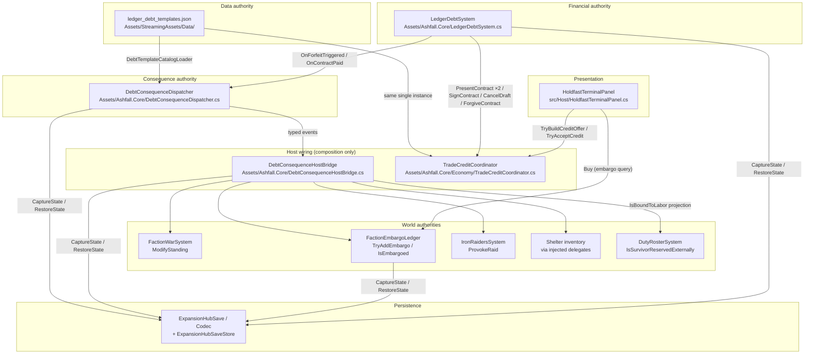
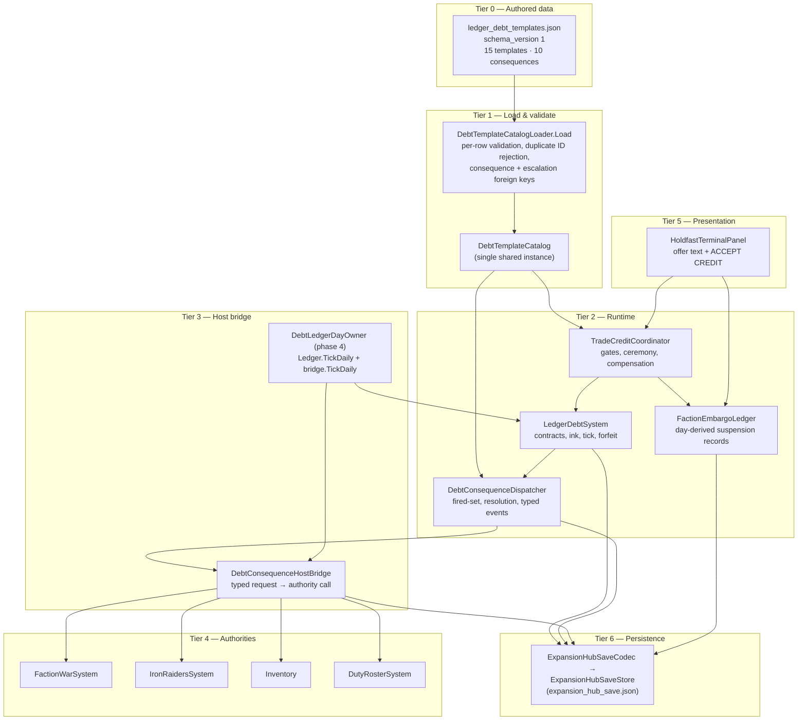
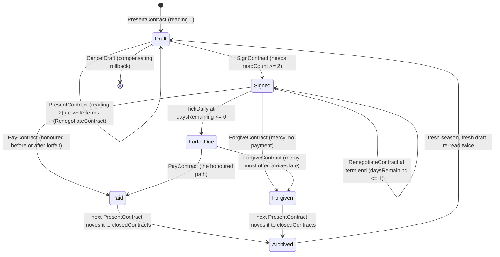
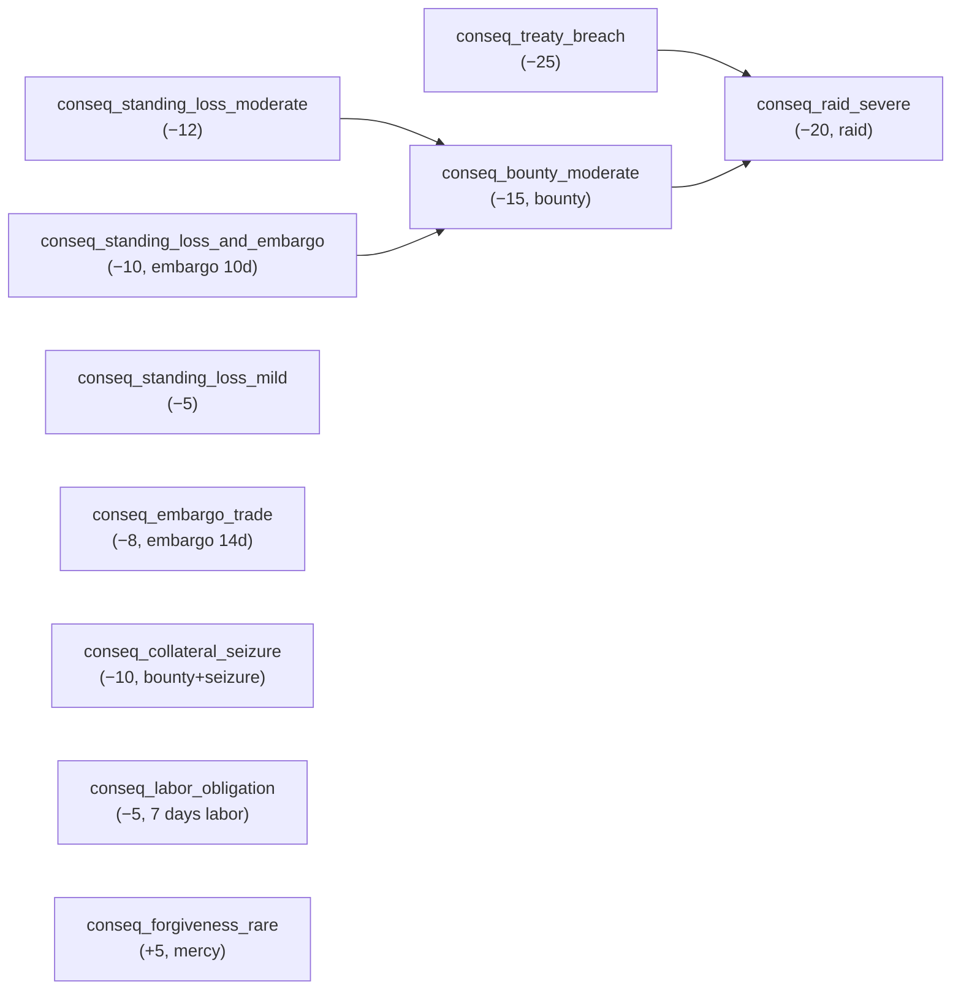
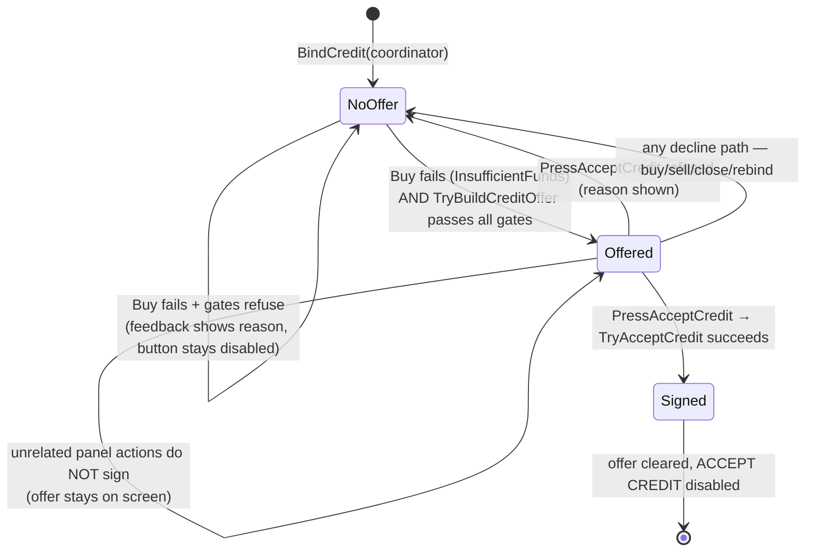

# Plan IV — Ledger Debt Consequences, Trade Credit & Headless Integration — Implementation Log

**Plan:** ASHFALL Flagship Integration Plan IV (F1/F2/F3)
**Status:** IMPLEMENTED — debt-focused gates pass; the wrapper expansion selftest is blocked by missing imported Godot assets in this checkout.
**Verification date:** 2026-09-06

## Authority map

```text
ledger construction:       src/Host/ExpansionHostSession.cs
template catalog:           DebtTemplateCatalogLoader
campaign day:               _core.Clock.Day
save owner:                 ExpansionHubSave / ExpansionHubSaveCodec
dispatcher lifetime:        ExpansionHostSession + Main lifecycle
standing authority:         FactionWarSystem.ModifyStanding
embargo authority:          FactionEmbargoLedger
raid authority:             IronRaidersSystem.ProvokeRaid
inventory authority:        injected inventory mutation delegates
labor persistence:          DebtConsequenceBridgeState (bounded endDay records)
trade credit entry:         HoldfastTradeSession.Buy → HoldfastTerminalPanel
```

The ledger is ticked by the dedicated phase-4 debt day owner. The older narrative day owner no longer ticks the same ledger, preventing accelerated defaults and duplicate dispatch attempts.

## F1 — Host consequence wiring

`ExpansionHostSession` owns one loaded catalog and one `DebtConsequenceDispatcher`. `Main` composes `DebtConsequenceHostBridge` once, restores its state before daily simulation, and detaches it on quit, reset, and session disposal. Recomposition clears the bridge/coordinator references and does not leave subscriptions attached to the old ledger.

The dispatcher persists fired identities in `DebtDispatcherState` using `debtor@signedDay:consequenceId`. The bridge uses consequence-aware source IDs for embargo and labor records, so escalation stages cannot collide. Default side effects route through the canonical faction, embargo, raid, inventory, and bounded labor authorities. Every authored nonzero standing delta is emitted, including deltas attached to embargo, bounty, collateral, labor, raid, and forgiveness effects. `forgiveness` calls `LedgerDebtSystem.ForgiveContract`, so it clears debt without consuming repayment resources.

Failed credit transactions now call `LedgerDebtSystem.CancelDraft`; an unsigned draft cannot remain after principal transfer or signature failure.

## F2 — Trade credit

`TradeCreditCoordinator` exposes an ephemeral `CreditOffer` projection of a catalog template. It deterministically matches principal items, canonicalizes aliases, and gates offers by:

- canonical hostile standing threshold;
- unresolved same-creditor debt;
- active embargo;
- principal relevance;
- authored template active/day-window fields.

Acceptance revalidates the offer, performs the ledger’s two-reading ceremony, transfers principal through the inventory authority, signs at the current campaign day, and compensates or cancels the draft if either side fails. The Holdfast terminal presents creditor, principal, quantity, term, rate, repayment estimate, forfeit, consequence summary, and explicit debt wording. Only `ACCEPT CREDIT` signs; decline and other terminal actions leave ledger and inventory unchanged.

Reachable authored trade-credit contexts include:

| Context | Creditor | Template | Principal |
|---|---|---|---|
| food/rations | `faction_supply_corps` | `debt_supply_corps_rations` | `canned_food × 8` |
| fuel | `faction_railway_guild` | `debt_railway_guild_fuel` | `diesel_fuel × 10` |
| medical | `faction_supply_corps` | `debt_supply_corps_medical` | `medical_kit × 3` |

## F3 — Headless closure

`LedgerDebtHeadlessDemo` loads the live catalog and verifies:

- 15 templates and 10 consequences;
- template and escalation foreign keys;
- acyclic escalation graph;
- two-reading/signing ceremony;
- authored standing, collateral, embargo, bounty/raid, and forgiveness behavior;
- dispatcher fired-state JSON roundtrip with zero redispatches.

The demo is registered through `ExpansionMasterSession` and the dedicated CLI route reports **57/57 PASS**.

## Current verification

```text
focused debt tests        43 passed, 0 failed
full xUnit suite           8490 passed, 0 failed, 0 skipped
dotnet build Ashfall.csproj        0 warnings, 0 errors
--ledger-debt-selftest    PASS 57/57
--data-integrity-selftest PASS; 269 catalogs, 0 errors, 0 warnings
--content-utilization-selftest PASS; 552 catalogs, 0 orphaned
```

`--expansion-selftest` was also attempted. In this checkout it aborts while the Godot host is initializing because imported font/audio/texture resources are absent and the `user://logs` file cannot be opened; this occurs before the debt result is available. The dedicated debt selftest remains green and does not depend on those imported presentation assets.

## Scope notes

- The production trade surface is the Holdfast terminal because the older `TradeScreenPresenter`/`CaravanAtomicTrader` path has no host execution sink or funds model.
- The current duty roster has five fixed wall-chart roles, so debt labor remains a persisted, bounded obligation bridge rather than a fabricated permanent roster role.
- Embargo records are creditor-wide; finer `trade_offers` versus credit-only scopes remain future work.
- Late-payment embargo lifting and standing restoration remain outside this milestone’s existing `HandlePaid` behavior.

---

# EXPANSION 2026-09-25 — Plan IV Ledger Debt & Trade Credit: Full Integration Framework & Code Architecture

**Document kind:** Expansion of the 2026-09-06 implementation log above. Everything above the
separator is preserved byte-for-byte from the original log and remains the record of what was
built on 2026-09-06. Everything below is the 2026-09-25 documentation expansion: a re-audit of
the same system against current source, followed by the full integration framework, code
architecture, and acceptance reference.

**Expansion author role:** documentation-only agent (read-only sweep outside this one file).

**Evidence policy:** every claim below was checked against current source on 2026-09-25 unless
explicitly marked `UNVERIFIED (log text)` — meaning the claim exists only in the original log
and could not be re-verified without running a build or a Godot session, which this
documentation-only pass does not do.

---

## Part I — Expansion preamble

### I.1 Thesis

Plan IV made debt *load-bearing*. Before it, `LedgerDebtSystem` was a self-contained ledger
with two loyal readers (a demo and a dev panel): a contract could default and nothing in the
world changed. Plan IV wired that moment of default into the campaign's real authorities —
faction standing, trade embargoes, raider raids, the shared shelter inventory, and a bounded
labor bridge — and gave the ledger a second, player-facing entrance: the trade-credit offer
that appears, explicitly and only explicitly, when a Holdfast purchase fails for lack of funds.

The result is a closed consequence loop with one financial truth and many political surfaces:

```text
                    catalog (ledger_debt_templates.json)
                     templates → consequences → escalations
                                   │
        ┌──────────────────────────┼──────────────────────────┐
        ▼                          ▼                          ▼
  LedgerDebtSystem        DebtConsequenceDispatcher    TradeCreditCoordinator
  (financial truth:        (translates forfeit into      (turns insufficient-funds
   ink, terms, forfeit)     typed consequence requests)   refusal into an explicit offer)
        │                          │                          │
        └────────────┬─────────────┘                          │
                     ▼                                        │
          DebtConsequenceHostBridge                           │
          (routes typed requests into live authorities)       │
                     │                                        │
     ┌────────┬──────┼────────┬──────────┐                    │
     ▼        ▼      ▼        ▼          ▼                    ▼
  FactionWar Embargo Raiders  Inventory  Labor      HoldfastTradeSession.Buy
  System     Ledger  System   delegates  bridge      (insufficient funds → offer)
```

Everything in this expansion is an elaboration of one discipline: **the ledger owns debt, the
authorities own everything else, and the bridge owns only the wiring between them.**

### I.2 Scope of this expansion

In scope:

- Re-verification of the original log's authority map, row by row, against source as of
  2026-09-25, with every drift since 2026-09-06 named (test counts, save envelope version,
  catalog file counts).
- The debt-domain ownership lattice: which system is the single authority for ledger state,
  standing, embargo, raids, inventory mutation, labor reservation, and persistence.
- Tier-by-tier data flow, event flow, save capture/restore discipline, and the determinism
  contract (fired-identity idempotence, deterministic principal matching, day-derived windows).
- Per-component architecture specs with public API surfaces, state shapes, failure modes, and
  performance notes; sequence walkthroughs for signing, defaulting, forgiving, compensating
  failure, and save/reload.
- Full-depth chapters for F1 (consequence wiring), F2 (trade credit), F3 (headless closure),
  the authored catalog audit (15 templates / 10 consequences, verified unchanged), the scope
  notes, and the trade-surface decision record.
- Cross-system interaction matrix and the emergent-consequence design intent.
- Verification and acceptance reference: the focused debt test matrix as it stands today, the
  gate ladder, acceptance criteria, and a rollback plan.

Out of scope (non-goals):

- **No second ledger.** Nothing here proposes a parallel debt store, cache, or mirror.
  `LedgerDebtSystem` plus `ExpansionHubSaveCodec` remain the only financial truth and its only
  persistence.
- **No second standing authority.** `FactionWarSystem.ModifyStanding` stays the only writer of
  faction standing; the dispatcher emits a *request*, the system clamps and persists.
- **No second embargo authority.** `FactionEmbargoLedger` owns embargo records end to end;
  trade surfaces and the credit coordinator only ever *query* `IsEmbargoed`.
- **No new gameplay.** This is documentation. No code, data, or test changes were made.
- **No full-suite runs.** Per `TEST_POLICY.md` this pass runs nothing; numbers from the
  original log that require a run to re-confirm are labeled `UNVERIFIED (log text)`.

### I.3 Evidence policy and vocabulary

Two evidence grades are used throughout:

| Grade | Meaning |
|---|---|
| *(verified 2026-09-25)* | The claim was checked against current source in this checkout on 2026-09-25. Paths are given. |
| `UNVERIFIED (log text)` | The claim appears only in the 2026-09-06 log. It was true then by the log's own record; this pass did not re-run the gates needed to confirm it today. |

Where today's source contradicts the log, both statements are given and the current one is
identified as authoritative. The known deltas found during this audit are consolidated in
Part II.4.

### I.4 Reading guide

| If you need… | Read |
|---|---|
| The original milestone record | The unmodified log above the separator. |
| What owns what today | Part II (authority audit and ownership lattice). |
| How data, events, saves, and determinism flow | Part III (integration framework). |
| Component specs and sequence walkthroughs | Part IV (code architecture). |
| Every consequence authority and its contract | Part V.1 (F1 deep chapter). |
| The credit offer lifecycle and the signing ceremony | Part V.2 (F2 deep chapter). |
| What the 57 selftest checks prove | Part V.3 (F3 anatomy). |
| Every authored template and consequence | Part V.4 (catalog audit). |
| Why labor is a bridge, embargo is creditor-wide, and late-payment lifting is future work | Part V.5 (scope deep dives). |
| Why the Holdfast terminal is the trade surface | Part V.6 (decision record). |
| Debt's interactions with every neighbouring system | Part VI. |
| Test matrix, gates, acceptance, rollback | Part VII. |
| Glossary, ID grammar, walkthroughs, open questions | Part VIII. |
| Per-authority contract sheets, the decision digest, and log-claim traceability | Part VIII, Appendices M–O. |

---

## Part II — Current authority audit (as of 2026-09-25)

### II.1 The log's authority map, re-verified row by row

The original log opened with an eleven-row authority map. Each row was re-checked against
current source. Result: **all eleven rows still hold**, with more precise paths and a few
notable additions.

| # | Concern (log row) | Current authority (verified 2026-09-25) | Verdict |
|---|---|---|---|
| 1 | ledger construction | `src/Host/ExpansionHostSession.cs` — `ExpansionHostSession` ctor news `LedgerDebtSystem` (line 71); the `Create` factory loads the catalog and constructs exactly one `DebtConsequenceDispatcher` (lines 197–208) | holds |
| 2 | template catalog | `Assets/Ashfall.Core/DebtTemplateCatalog.cs` — `DebtTemplateCatalogLoader.Load(dataDirectory, IFileIO, IJsonSerializer)`; file name constant `ledger_debt_templates.json`; `CurrentSchemaVersion = 1` | holds |
| 3 | campaign day | `_core.Clock.Day` via `Main.DebtCredit.DebtCampaignDay()` (`src/Main.DebtCredit.cs` line 29), falling back to `_simDay` (the read-only campaign-calendar projection, `src/Main.cs` line 56) before the coordinator exists | holds |
| 4 | save owner | `Assets/Ashfall.Core/ExpansionHubSave.cs` (`ExpansionHubSave` envelope + `ExpansionHubSaveCodec`) and `src/Host/ExpansionHubSaveStore.cs` (`SaveStore<ExpansionHubSave>` façade, `expansion_hub_save.json` under `user://`) | holds — envelope now at version 6 (see II.4) |
| 5 | dispatcher lifetime | `ExpansionHostSession` owns construction and shutdown (`ShutdownDebtIntegration`, `Dispose`); `Main` composes/detaches the bridge (`src/Main.DebtCredit.cs`, `src/Main.Lifecycle.cs`, `src/Main.UiHandlers.cs`) | holds |
| 6 | standing authority | `Assets/Ashfall.Core/YearOfAsh/FactionWarSystem.cs` — `ModifyStanding(string factionId, int delta)` clamps to [-100, 100], derives `isHostile` at standing ≤ -50 and `isAllied` at ≥ 50, canonicalizes IDs through `Assets/Ashfall.Core/Factions/FactionStandingIdResolver.cs` | holds |
| 7 | embargo authority | `Assets/Ashfall.Core/FactionEmbargoLedger.cs` — `TryAddEmbargo` (sourceId-idempotent), `IsEmbargoed(factionId, day)` with window `[startDay, endDay)`, `ActiveEmbargoes(day)`, day-derived expiry | holds |
| 8 | raid authority | `Assets/Ashfall.Core/Muster/IronRaidersSystem.cs` — `ProvokeRaid()` → `ExecuteRaid()` increments `raidsThisSeason` and raises `OnRaidExecuted`; `Activate()` flips `isActive` | holds |
| 9 | inventory authority | injected delegates: `TryRemoveShelterItems`/`CountShelterItem`/`GrantPrincipal`/`RevokePrincipal` in `src/Main.DebtCredit.cs`, all routing through `_inventory.Inventory` with `ItemAliases.ToCanonical` | holds |
| 10 | labor persistence | `Assets/Ashfall.Core/DebtConsequenceHostBridge.cs` — `DebtConsequenceBridgeState.laborObligations` (list of `DebtLaborObligationRecord`, each `endDay`-bounded) | holds |
| 11 | trade credit entry | `Assets/Ashfall.Core/HoldfastTradeSession.cs` — `Buy(...)` returns `HoldfastTradeFailure.InsufficientFunds` (line 626) after the embargo query (line 612); `src/Host/HoldfastTerminalPanel.cs` catches that failure and calls `TradeCreditCoordinator.TryBuildCreditOffer` (lines 191–203) | holds |

Additions the log's map did not list but which the debt domain now depends on:

| Concern | Authority (verified 2026-09-25) |
|---|---|
| Daily tick registration (phase 4, owner id `debt_ledger`) | `src/Main.CampaignOwners.cs` line 77: `_campaignDay.Register("debt_ledger", new DebtLedgerDayOwner(this), phase: 4)` |
| Labor ↔ duty-roster reservation seam | `Assets/Ashfall.Core/DutyRoster/DutyRosterSystem.cs` line 253: `Func<string, bool>? IsSurvivorReservedExternally`, assigned by `Main.DebtCredit.EnsureDebtConsequenceIntegration` to `_debtBridge.IsBoundToLabor` |
| Item alias canonicalization | `Assets/Ashfall.Core/Inventory/ItemAliases.cs` — `ToCanonical(string?)`; includes a dedicated debt-principal alias block (`item_fuel` → `fuel`, `item_medical_kit` → `medical_kit`, `item_diesel_fuel` → `diesel_fuel`, `item_dried_rations` → `dried_rations`, `item_water_filter` → `water_filter`, `item_water_purification_tablets_40_of_40` → same, `item_mechanical_parts` → `mechanical_parts`, `item_engine` → `engine`, `item_ammo_762` → `ammo_762`, `item_soldering_kit` → `soldering_kit`, `item_dosimeter` → `dosimeter`) |
| Faction ID canonicalization | `Assets/Ashfall.Core/Factions/FactionStandingIdResolver.cs` — lore/patrol aliases → systems IDs (e.g. `garrison` → `faction_central_garrison`), preventing duplicate standing records |
| Headless CLI route | `src/Host/HostCli.cs` line 379 (`--ledger-debt-selftest` → `HostCliAction.LedgerDebtSelfTest`) and `src/Host/HostCli.SelfTests.cs` line 710 (`RunLedgerDebtSelfTest` → `LedgerDebtHeadlessDemo.Run(null, new GodotLog())`) |
| Master-suite registration | `Assets/Ashfall.Core/ExpansionMasterSession.cs` line 183: `("Ledger Debt", LedgerDebtHeadlessDemo.Run(dataDirectory, log))` inside the expansion master suite (12 suite entries today) |

### II.2 The debt-domain ownership lattice

One authority per concern. The lattice below is the definitive answer to "who owns what" in
the debt domain; every arrow into an authority is a request or a query, never a parallel write.



Lattice rules that hold across all of it:

1. **The catalog is loaded once.** `ExpansionHostSession.Create` loads
   `session.DebtCatalog` a single time and hands the *same instance* to the dispatcher; `Main`
   hands the same instance to the coordinator (`_expansions.DebtCatalog!`). Two catalog
   instances in one session would be a Plan IV regression.
2. **One dispatcher per live ledger.** The comment at `ExpansionHostSession.cs` lines 205–207
   states it and the guard (`if (session.DebtDispatcher == null)`) enforces it: the ctor path
   used by tests deliberately skips dispatcher construction because a dispatcher with no
   authorities subscribed is inert by design.
3. **The bridge subscribes exactly once.** `DebtConsequenceHostBridge.Attach` is guarded by
   `_attached`; `Detach` is idempotent; recomposition is safe (verified by the test
   `Bridge_TeardownAndRebuild_DoesNotLeakSubscriptions`).
4. **The coordinator never writes the ledger directly.** Signing goes through
   `PresentContract`/`SignContract`; rollback goes through `CancelDraft`; mercy goes through
   `ForgiveContract`. There is no field-level mutation of contract state anywhere in
   `TradeCreditCoordinator`.
5. **Panels never decide.** `HoldfastTerminalPanel` shows the projection and calls
   `PressAcceptCredit`, which delegates to the coordinator. All gating logic lives in Core.

### II.3 Ownership boundaries in one table

| Concern | Writes owned by | Reads owned by | Never written by |
|---|---|---|---|
| Contract ink, terms, forfeit, forgiveness | `LedgerDebtSystem` (present/sign/cancel/pay/forgive/renegotiate/tamper) | dispatcher, coordinator, terminal text, `LedgerLine()` dev output | panels, bridge |
| Fired-consequence identity set | `DebtConsequenceDispatcher` (capture/restore) | `HasFired` diagnostics | bridge, panels |
| Standing | `FactionWarSystem.ModifyStanding` (clamped, resolver-canonicalized) | coordinator gate (`GetStanding`), patrol systems | dispatcher (emits only), bridge (applies only) |
| Embargo records | `FactionEmbargoLedger.TryAddEmbargo` | `IsEmbargoed` (trade session `EmbargoQuery`, coordinator gate, previews) | bridge (requests only), panels |
| Raids | `IronRaidersSystem.ProvokeRaid`/`ExecuteRaid` | `EvaluateRaidChance`, `RaidsThisSeason` diagnostics | bridge (provokes only) |
| Shelter inventory | `_inventory.Inventory` through the four `Main.DebtCredit` delegates | `CountShelterItem` for seizure shortfall checks | coordinator/bridge directly |
| Labor reservation | bridge's `DebtConsequenceBridgeState` list (add in handler, release in `TickDaily`) | `IsBoundToLabor`, duty roster refusal | dispatcher, ledger |
| Debt persistence | `ExpansionHubSaveCodec` via `CaptureSave`/`RestoreSave` | save stores, `--expansion-hub-save-selftest` | any component saving its own file |

### II.4 What moved or grew since 2026-09-06 (log-vs-current deltas)

The repository has grown for three weeks since the log was written. These are the deltas this
audit found. Where numbers differ, the 2026-09-06 value is history and the 2026-09-25 value is
current.

| Topic | Log (2026-09-06) | Current (verified 2026-09-25) | Assessment |
|---|---|---|---|
| Focused debt tests | "43 passed, 0 failed" | 68 `[Fact]` methods across the three debt test files: `LedgerDebtSystemTests.cs` 22, `TradeCreditCoordinatorTests.cs` 22, `DebtConsequenceIntegrationTests.cs` 24; plus 2 debt-section facts inside `ExpansionHubSaveV5Tests.cs` (`DebtSections_RoundTripThroughTheEnvelope`, `V4Save_MigratesForward_WithEmptyDebtState`) | grew; enumerated in Part VII.1 |
| Full xUnit suite | "8490 passed, 0 failed, 0 skipped" | `UNVERIFIED (log text)` — a full-suite run is barred by `TEST_POLICY.md` for a documentation-only pass and was not executed | historical record stands |
| Save envelope version | debt-consequence integration introduced the v5 sections (`debtDispatcher`, `embargoes`, `debtBridge`) | `ExpansionHubSave.CurrentSaveVersion = 6`: v6 added `SaltMineState` beside the foundry *after* Plan IV; the three v5 debt fields are unchanged in name and shape, and v5→v6 migration preserves them (`debtDispatcher = v5.debtDispatcher ?? new …`, etc.) | superseded envelope number, same debt shape |
| Catalog counts (data integrity) | "--data-integrity-selftest PASS; 269 catalogs, 0 errors, 0 warnings" | `UNVERIFIED (log text)` for the gate result; a file census today counts 424 top-level `*.json` files under `Assets/StreamingAssets/Data/` (the gate's own catalog-count methodology may differ from a raw file count) | grew; live gate not re-run |
| Content utilization | "552 catalogs, 0 orphaned" | `UNVERIFIED (log text)` | historical record stands |
| Debt catalog contents | 15 templates, 10 consequences | exactly 15 templates and 10 consequences in `ledger_debt_templates.json`, `schema_version` 1 — unchanged, verified by file read and by the demo's own count checks | unchanged |
| Debt day ownership | "the older narrative day owner no longer ticks the same ledger" | still true for *automated* ticking: the only day-owner call is `DebtLedgerDayOwner.TickDay` (phase 4). Nuance found: the expansions dev panel keeps a manual diagnostic button `OnLedgerTickClicked` (`src/Main.ExpansionHub.cs` line 265) that calls `Ledger.TickDaily(day)` on click. It is an operator diagnostic, not a registered day owner, but it means a dev-panel click can age every contract one day outside the campaign tick | log statement holds with a documented nuance |
| Ledger credit template table | three reachable contexts (rations, fuel, medical) | verified — and the catalog additionally offers fuel credit from a second creditor (`debt_supply_corps_fuel`, `fuel × 6`), so `fuel` is reachable from Supply Corps as well as the Railway Guild; the coordinator's deterministic first-match order decides which is offered per creditor query | expanded detail |
| Holdfast trade session | "no funds model" on the retired path; Holdfast is production | `HoldfastTradeSession` now carries a full funds/chit model (`CanCreditValue`, `TryCreditValue`, `FundsLedger` integration, `PreviewBuy`/`ExecuteBuy` command path) — growth inside the *production* surface, which strengthens the original decision (see Part V.6) | decision reinforced |
| Trade-credit offer UI | field list only | verified field list in `BuildCreditOfferText` — full text contract documented in Part V.2.5 | unchanged, now documented |

No row of the original authority map was found to be stale. No debt-domain file was renamed
or deleted since 2026-09-06; all eleven log paths still resolve.

### II.5 The lifecycle composition map (who builds what, in order)

```text
Campaign boot / reset
  Main.Lifecycle "expansions" participant (saveSectionKey: expansion_hub)
    onReset:
      _debtBridge?.Detach()          ← bridge subscriptions die first
      _debtBridge = null; _tradeCredit = null
      _expansions.DutyRoster.IsSurvivorReservedExternally = null
      _expansions.ShutdownDebtIntegration()   ← dispatcher Detach + null
      _expansions?.Dispose()                  ← session teardown double-covers

Expansion session construction (SetupExpansions → ExpansionHostSession.Create)
  ctor:      Ledger = new LedgerDebtSystem(); Embargoes = new FactionEmbargoLedger()
  Create():  DebtCatalog = DebtTemplateCatalogLoader.Load(...)
             DebtDispatcher = new DebtConsequenceDispatcher(Ledger, DebtCatalog)  [once]
  Main:      EnsureDebtConsequenceIntegration()   ← BEFORE RestoreSave
             _expansions.RestoreSave(save, _debtBridge)

First EnsureDebtConsequenceIntegration (Main.DebtCredit.cs)
  guards: _debtBridge != null || _debtIntegrationBuilding → rebind terminal only
  requires: _expansions != null && DebtDispatcher != null
  composes: SetupYearOfAsh / SetupMuster / SetupInventory / SetupHoldfastRuntime
            dispatcher.SetDayProvider(DebtCampaignDay)
            new DebtConsequenceHostBridge(dispatcher, FactionWar, Embargoes,
                DebtCampaignDay, GodotLog, ironRaiders, tryRemoveItems, countItem,
                selectLaborSurvivor)
            DutyRoster.IsSurvivorReservedExternally = bridge.IsBoundToLabor
            Trade.EmbargoQuery = Embargoes.IsEmbargoed            ← one query, two consumers
            new TradeCreditCoordinator(Ledger, DebtCatalog, Embargoes,
                DebtCampaignDay, GrantPrincipal, DebtDebtorId,
                factionWar, revokeItems, GodotLog)
  finally:  _debtIntegrationBuilding = false;  _holdfastTerminal?.BindCredit(_tradeCredit)

Quit (Main.UiHandlers.OnExitGameClicked)
  SaveAll() → ShutdownDebtConsequenceIntegration() → Quit
```

The debtor identity on the host is `DebtDebtorId` = `_holdfastRuntime?.PlayerSurvivorId`
falling back to `"survivor_dr_sarah_chen"` — the player survivor signs shelter credit. The
bridge's `selectLaborSurvivor` delegate returns the same id, so bonded labor binds the signer.

### II.6 What the audit did *not* find

For the record, these were checked and are **not** present:

- No second debt ledger, embargo list, or fired-set anywhere in `src/` or `Assets/Ashfall.Core/`
  outside the owners named above.
- No `System.Random` in any debt-domain file (`DebtConsequenceDispatcher`,
  `DebtConsequenceHostBridge`, `TradeCreditCoordinator`, `LedgerDebtSystem`,
  `DebtTemplateCatalog`, `LedgerDebtHeadlessDemo` — all verified by read).
- No Godot/Unity reference in any Core debt file; `DebtConsequenceHostBridge` takes an
  `ILog` port and `Ashfall.Core.Muster`/`YearOfAsh` types only.
- No save path that bypasses `ExpansionHubSaveCodec` — the store is a codec-flavour
  `SaveStore` and the only capture/restore call sites are `Main.ExpansionHub` and the
  `ExpansionHostSession` wrappers.

---

## Part III — Integration framework

### III.1 Architecture invariants applied to the debt domain

The repo-wide architecture rules (`AGENTS.md`) specialize into seven concrete invariants for
this domain. Each is stated with the mechanism that enforces it, because an invariant without
an enforcement site is a wish.

| # | Invariant | Enforcement site (verified 2026-09-25) |
|---|---|---|
| A1 | Core owns every debt rule; the host owns only composition and presentation | `DebtConsequenceDispatcher`, `DebtConsequenceHostBridge`, `TradeCreditCoordinator`, `LedgerDebtSystem`, `DebtTemplateCatalog` are all in `Assets/Ashfall.Core/` and reference no engine API; `src/Main.DebtCredit.cs` contains only delegates and wiring |
| A2 | JSON data is authoritative | offer terms come from `DebtTemplate` fields, never UI strings (`CreditOffer` copies catalog fields verbatim; `TradeCreditCoordinator` doc comment: "terms are never copied from UI strings") |
| A3 | One authority per concern | Part II.2 lattice; e.g. embargo writes only via `TryAddEmbargo`, and the terminal's trade session and the credit coordinator share one `EmbargoQuery` delegate |
| A4 | Deterministic, restorable behavior | fired-identity set (`DebtDispatcherState`), day-derived embargo windows, ordinal string comparisons in `CancelDraft`, no RNG anywhere in the domain |
| A5 | Events expose facts; adapters apply effects | dispatcher events carry the consequence + contract payload (`OnEmbargoRequestedDetailed` etc.); the bridge translates; nothing in Core opens a panel |
| A6 | Persistence through the save-section owner | `debtDispatcher`/`embargoes`/`debtBridge` sections ride the `expansion_hub` envelope; nothing writes its own file |
| A7 | Recomposition safety | `Detach` on dispatcher and bridge; `_attached` guard; lifecycle `onReset` ordering (bridge → dispatcher → session); reentrancy guard `_debtIntegrationBuilding` |

Invariant A5 deserves one elaboration because it is the domain's shape in miniature: the
dispatcher raises **both** a legacy event and a "Detailed" variant for embargo, bounty,
collateral, and labor (e.g. `OnEmbargoRequested(scope, days, contract)` and
`OnEmbargoRequestedDetailed(consequence, scope, days, contract)`). The legacy events keep the
original consumers alive; the bridge subscribes only to the Detailed variants because the
extra `consequence` argument is what makes the consequence-aware source ID — and therefore
collision-free escalation — possible.

### III.2 Tier-by-tier data flow



Tier discipline notes:

- **T1 fails soft but loudly.** Loader errors never throw; they accumulate in
  `catalog.Errors`, and `ExpansionHostSession.Create` logs each one. A catalog with errors
  still yields a `DebtCatalog` object, but the dispatcher is **not** constructed when errors
  exist (`if/else` at `ExpansionHostSession.cs` lines 198–208), so a broken catalog disables
  consequences rather than dispatching half-validated data.
- **T2 has no host types.** The coordinator's inventory access is `Func<string, int, bool>`
  and `Action<string, int>` delegates; the day is `Func<int>`. The whole tier is unit-testable
  with fakes, which is exactly what `TradeCreditCoordinatorTests` does.
- **T3 is the only tier allowed to know both worlds.** The bridge takes Core authorities and
  host-supplied delegates in the same constructor. It is in Core (engine-free) but it is
  *host-shaped*: it exists to be composed by `Main`, and the tests compose it the same way.
- **T5 signs nothing by itself.** The panel's only mutating path is `PressAcceptCredit`, and
  even that returns the coordinator's result rather than synthesizing state.

### III.3 Event flow, end to end

The full event chain for one defaulting contract, with the producing and consuming side of
each hop:

| Hop | Producer event | Consumer | Effect |
|---|---|---|---|
| 1 | `LedgerDebtSystem.TickDaily` decrements `daysRemaining` to 0 → sets `forfeited = true`, raises `OnForfeitTriggered(contract)` | dispatcher `HandleForfeit` | resolves `templateId` → template → `consequenceId` → consequence record |
| 2 | dispatcher computes `ConsequenceIdentity(contract, consequenceId)` | dispatcher fired-set | duplicate → return (no dispatch) |
| 3 | dispatcher raises `OnConsequenceDispatched(consequence, contract)` | bridge `HandleConsequenceDispatched` | `DispatchedCount++`, structured log line with `dispatchId` |
| 4 | dispatcher raises `OnStandingPenalty(consequence, faction, contract)` when `standingDelta != 0` | bridge `HandleStandingPenalty` | `FactionWarSystem.ModifyStanding(faction, delta)` (clamped), `StandingApplications++` |
| 5 | effect switch: `embargo` / `standing_loss_and_embargo` raise `OnEmbargoRequested` + `OnEmbargoRequestedDetailed` | bridge `HandleEmbargoRequested` | `Embargoes.TryAddEmbargo(creditor, scope, today, duration, sourceId)`; `EmbargoApplications++` on success |
| 6 | `bounty` / `raid` / `bounty_and_seizure` raise `OnBountyRequested` + detailed | bridge `HandleBountyRequested` | activate raiders if needed, `ProvokeRaid()`; `BountyApplications++` |
| 7 | `collateral_seizure` / `bounty_and_seizure` → `TryDispatchSeizure` raises `OnCollateralSeizure` + detailed | bridge `HandleCollateralSeizure` | count check → all-or-nothing `TryRemoveItems`; `SeizureApplications++` |
| 8 | `labor_obligation` raises `OnLaborObligation` + detailed | bridge `HandleLaborObligation` | sourceId dedupe, add `DebtLaborObligationRecord`, `OnLaborObligationCreated` + `OnStateChanged` |
| 9 | `forgiveness` calls `_ledger.ForgiveContract(debtorId, day)` directly | ledger | `forgiven = true`, `OnContractForgiven`, no payment moved |
| 10 | dispatcher follows `escalationId` chain recursively | itself | each escalation stage gets its own fired-set key before dispatch |
| 11 | bridge `OnStateChanged` | `Main` lambda | `_debtBridgeDirty = true`, `_expansionHubDirty = true` → hub save flushes on next diagnostics tick/close/quit |
| 12 | `LedgerDebtSystem.OnStateChanged(state)` | `ExpansionHostSession` ctor lambda | `RaiseStateChanged()` → same dirty path |

Two hops are deliberately *absent*: paying a contract (`HandlePaid` is an intentional no-op
with a `// Future:` comment) and the embargo-expiry moment (there is no event; the window is
re-derived from the day every time `IsEmbargoed` is queried). The absence is the design: no
ticking means restore cannot drift expiry (Part III.5).

### III.4 Save capture/restore discipline

Three debt-domain state objects ride the `ExpansionHubSave` envelope, and each has a precise
capture/restore contract.

**The envelope fields (verified 2026-09-25, `Assets/Ashfall.Core/ExpansionHubSave.cs`):**

```json
{
  "saveVersion": 6,
  "simDay": 41,
  "ledger": {
    "systemId": "ledger_debt_system",
    "contracts": [
      {
        "debtorId": "survivor_dr_sarah_chen",
        "creditorId": "faction_supply_corps",
        "templateId": "debt_supply_corps_rations",
        "principal": 8.0,
        "termDays": 20,
        "rate": 0.15,
        "forfeit": "eight tins of sealed rations from the shelter stores",
        "readCount": 2,
        "signed": true,
        "signedDay": 40,
        "daysRemaining": 7,
        "paid": false,
        "forfeited": false,
        "forgiven": false,
        "forgivenDay": -1
      }
    ],
    "closedContracts": [],
    "ledgerTampered": false
  },
  "debtDispatcher": {
    "firedConsequences": [
      "npc_wyn_sabler@40:conseq_standing_loss_mild"
    ]
  },
  "embargoes": [
    {
      "factionId": "faction_supply_corps",
      "scope": "creditor_faction",
      "startDay": 60,
      "endDay": 74,
      "sourceId": "debt:npc_wyn_sabler@40:conseq_embargo_trade/embargo"
    }
  ],
  "debtBridge": {
    "laborObligations": [
      {
        "sourceId": "debt:npc_ivo_fenn@55:conseq_labor_obligation/labor",
        "creditorFactionId": "faction_railway_guild",
        "survivorId": "survivor_dr_sarah_chen",
        "laborDays": 7,
        "startDay": 62,
        "endDay": 69,
        "released": false
      }
    ]
  },
  "Checksum": "<codec-stamped integrity hash>"
}
```

(The `embargoes` and `debtBridge` blocks are shown as arrays because their serializable state
classes `FactionEmbargoLedgerState` and `DebtConsequenceBridgeState` are list wrappers; the
envelope fields hold those state objects. `Checksum` is stamped by the codec; the JSON above
is illustrative of shape, with real field names verified in the C# classes.)

**Capture order (host → envelope):**

1. `Main.ExpansionHub.SaveExpansionHub` calls `EnsureDebtConsequenceIntegration()` first —
   a save must never capture from an uncomposed bridge.
2. `bridgeState = _debtBridge.CaptureState()` — a defensive deep copy (each record is
   re-allocated field by field; `CaptureState` never hands out the live list).
3. `_expansions.CaptureSave(day, bridgeState)` → `ExpansionHubSaveCodec.Capture(...)`,
   which pulls `Ledger.CaptureState()`, `DebtDispatcher.CaptureState()`,
   `Embargoes.CaptureState()` from session-owned systems and stores the bridge copy.
4. After a successful `CaptureSection("expansion_hub", ...)`, all three dirty flags clear
   (`_expansionHubDirty`, `_foundryDirty`, `_debtBridgeDirty`).
5. v6 merge: if the silent-foundry session owns a SaltMine system, its state is merged into
   `save.saltMine` before write — post-Plan IV growth sharing the same envelope.

**Restore order (envelope → host), verified at `src/Main.ExpansionHub.cs` lines 66–79:**

1. `SetupExpansions()` constructs the session (ledger, catalog, dispatcher).
2. `EnsureDebtConsequenceIntegration()` composes the bridge and coordinator **before** the
   restore, so the v5 debt sections land in live, subscribed objects. This is the
   restore-before-simulation rule from the original log, still enforced at the only restore
   call site.
3. `_expansions.RestoreSave(save, _debtBridge)` → `ExpansionHubSaveCodec.Restore(...)`:
   `Ledger.RestoreState` (defensive copy, list normalization),
   `DebtDispatcher.RestoreState(save.debtDispatcher)` (clear + refill, dropping null/empty
   keys), `Embargoes.RestoreState`, `bridge.RestoreState(save.debtBridge)` — each guarded by
   null checks so a v4-or-older save normalizes to empty debt state rather than throwing.
4. Both dirty flags are reset immediately after restore (restore raises the same
   state-changed events that capture-clearing would; the host suppresses the spurious dirty).

**Old-save tolerance, verified in the codec:** frozen shape classes exist for v1 through v5
(`ExpansionHubSaveV1/V2/V3/V4/V5`), each validated against its own checksum; migration fills
missing debt sections with safe defaults:

```csharp
debtDispatcher = v5.debtDispatcher ?? new DebtDispatcherState(),
embargoes      = v5.embargoes      ?? new FactionEmbargoLedgerState(),
debtBridge     = v5.debtBridge     ?? new DebtConsequenceBridgeState(),
```

and the decode-side normalizer repeats the pattern (`if (save.debtDispatcher == null) …`),
so an envelope that predates a given section restores to "nothing fired, nothing embargoed,
nobody bound" — the correct empty state. Both behaviours are pinned by
`ExpansionHubSaveV5Tests` (`V4Save_MigratesForward_WithEmptyDebtState`,
`DebtSections_RoundTripThroughTheEnvelope`).

### III.5 Determinism contract

The debt domain is deterministic by construction. The contract has four clauses:

**D1 — Fired-identity idempotence.** A consequence side effect is identified by

```text
ConsequenceIdentity(contract, consequenceId)
  = debtorId + "@" + signedDay + ":" + consequenceId
```

(e.g. `npc_wyn_sabler@40:conseq_standing_loss_mild`). The set of fired keys is captured with
every save and restored before the next tick, so a side effect committed before the save can
never be committed again after restore. There are no counters, no RNG, no wall-clock inputs —
the key is a pure function of persisted data. One subtlety is deliberate: the key uses the
contract *instance's* signed day, so a second season's debt from the same template (new
draft, new signed day) produces a fresh identity and can default again. The test
`ConsequenceIdentity_IsStable_AndSplitsContractInstances` pins both properties.

**D2 — Deterministic matching.** `TryBuildCreditOffer` scans `_catalog.Templates` in authored
file order and takes the first eligible match for (creditor, canonical principal). Same
catalog, same gates, same result — no hashing, no dictionary-order dependence (the catalog
lookups are linear scans over lists, `GetTemplate`/`GetConsequence`).

**D3 — Day-derived windows.** Embargo expiry is never ticked; `IsEmbargoed` compares the
current day against `[startDay, endDay)` stored at add time. Labor release likewise compares
`day < r.endDay` in `TickDaily`. Restoring a save cannot shift a window because nothing
counts down.

**D4 — Ordinal string discipline.** `CancelDraft` compares creditor and template ids with
`StringComparison.Ordinal`; `ItemAliases` matches with `OrdinalIgnoreCase` at the *alias*
boundary only, canonicalizing to the exact catalog id before any comparison downstream. The
fired-set itself uses exact strings produced by the static identity function.

Where a replay must reproduce a session: `ExpansionHostSession.DefaultSeed = 1117` seeds the
demo paths; the debt domain itself consumes no seed at all, which is stronger than seeding —
it has no randomness to reproduce.

### III.6 Integrity validation of debt catalogs

Validation happens at three layers, each with a different failure philosophy:

| Layer | Mechanism | Failure philosophy |
|---|---|---|
| Load (T1) | `DebtTemplateCatalogLoader` per-row checks: null rows, missing/duplicate ids, missing `creditorId`/`principalItemId`/`forfeitDescription`/`consequenceId`, `principalQuantity ≤ 0`, `termDays ≤ 0`, `rate < 0`, `minDay < 0`, `maxDay < 0`, `maxDay < minDay`; consequence rows: missing/duplicate id, missing `trigger`/`effectType`; cross-refs: every template `consequenceId` resolves, every `escalationId` resolves | accumulate all errors, refuse to arm the dispatcher if any exist |
| Demo (F3) | `LedgerDebtHeadlessDemo` re-checks foreign keys with per-reference diagnostics and walks the escalation graph with a visited set to prove acyclicity | hard check failure = exit code non-zero |
| Host session | `ExpansionHostSession.Create` logs every `catalog.Errors` entry under `[ExpansionHostSession] debt catalog:` and skips dispatcher construction | consequences disabled, rest of the hub still boots |

Schema-version discipline: `file.schema_version > DebtTemplateCatalog.CurrentSchemaVersion`
(= 1) aborts the load with a named error; a *lower* version loads, because the loader's
defaults (`active = true`, `minDay = 0`, `maxDay = 0`) are the pre-Plan-IV shape — old
catalogs stay valid, which is the same backward-compatibility posture as the save envelope.

What validation deliberately does *not* check (and why): it does not verify that
`principalItemId` exists in the item catalog, that `targetFactionId` resolves in the faction
roster, or that `collateralItemId` is a real item. Those are cross-catalog references owned by
the broader integrity pipeline (`CatalogIntegrityValidator`, the data-integrity selftest);
duplicating them per-catalog would create a second authority for cross-catalog truth. The demo
*observes* the consequences of a bad ID at runtime (dispatch drops it, log line explains)
rather than re-validating it.

---

## Part IV — Code architecture

### IV.1 Module map

| Module | Path (verified 2026-09-25) | Lines | Tier | One-line role |
|---|---|---|---|---|
| `LedgerDebtSystem` (+ `DebtContract`, `LedgerDebtSystemState`) | `Assets/Ashfall.Core/LedgerDebtSystem.cs` | 370 | T2 | financial truth: drafts, two-reading ceremony, ink freeze, tick, forfeit, pay, forgive, renegotiate, tamper |
| `DebtConsequenceDispatcher` (+ `DebtDispatcherState`) | `Assets/Ashfall.Core/DebtConsequenceDispatcher.cs` | 316 | T2 | translates forfeit/paid events into catalog-driven typed consequence requests, once each |
| `DebtConsequenceHostBridge` (+ `DebtConsequenceBridgeState`, `DebtLaborObligationRecord`) | `Assets/Ashfall.Core/DebtConsequenceHostBridge.cs` | 327 | T3 | routes typed requests into the live world authorities; owns bounded labor records |
| `TradeCreditCoordinator` (+ `CreditOffer`, `CreditOfferResult`, `CreditAcceptResult`) | `Assets/Ashfall.Core/Economy/TradeCreditCoordinator.cs` | 276 | T2 | insufficient-funds refusal → gated offer → compensated signing transaction |
| `DebtTemplate` / `DebtConsequence` / `DebtTemplateCatalog` / `DebtTemplateCatalogLoader` | `Assets/Ashfall.Core/DebtTemplateCatalog.cs` | 190 | T1 | catalog DTOs, load, validate |
| `LedgerDebtHeadlessDemo` (+ `LedgerDebtHeadlessReport`) | `Assets/Ashfall.Core/LedgerDebtHeadlessDemo.cs` | 336 | demo | 57-check integration oracle |
| `FactionEmbargoLedger` (+ record/state) | `Assets/Ashfall.Core/FactionEmbargoLedger.cs` | 149 | T4 | canonical embargo records, day-derived |
| `IronRaidersSystem` | `Assets/Ashfall.Core/Muster/IronRaidersSystem.cs` | 110 | T4 | raid authority the bounty consequence provokes |
| `ExpansionHostSession` | `src/Host/ExpansionHostSession.cs` | 500 | host | owns ledger/catalog/dispatcher/embargoes; capture/restore wrappers |
| `Main.DebtCredit` partial | `src/Main.DebtCredit.cs` | 166 | host | bridge + coordinator composition, inventory delegates, `DebtLedgerDayOwner` |
| `Main.ExpansionHub` partial | `src/Main.ExpansionHub.cs` | — | host | restore-before-simulation, `SaveExpansionHub`, dev ledger buttons |
| `HoldfastTerminalPanel` | `src/Host/HoldfastTerminalPanel.cs` | 959 | host | production trade surface; offer display; `ACCEPT CREDIT` |
| `ExpansionHubSave` / codec | `Assets/Ashfall.Core/ExpansionHubSave.cs` | 507 | T6 | envelope, frozen version shapes, migration, checksum |
| `ExpansionHubSaveStore` | `src/Host/ExpansionHubSaveStore.cs` | 60 | T6 | codec-flavour `SaveStore` façade, `user://expansion_hub_save.json` |
| `HostCli` / `HostCli.SelfTests` | `src/Host/HostCli.cs`, `src/Host/HostCli.SelfTests.cs` | — | host | `--ledger-debt-selftest` route and runner |

### IV.2 `DebtConsequenceDispatcher` — deep spec

**Responsibility.** Subscribe to `LedgerDebtSystem.OnForfeitTriggered`, resolve the authored
consequence for the contract's template, and raise typed requests exactly once per
(contract instance, consequence) pair — following escalation chains — with no knowledge of
who fulfils them.

**Public API surface (verified 2026-09-25):**

```text
ctor(ledger: LedgerDebtSystem, catalog: DebtTemplateCatalog)   // subscribes to ledger events
ConnectStandingSystem(modifyStanding: Func<string, int, bool>) // legacy standing path (host uses the bridge instead)
SetDayProvider(dayProvider: Func<int>)                          // day stamp for forgiveness
Detach()                                                        // unsubscribe ledger + standing
HasFired(identityKey): bool                                     // diagnostics
static ConsequenceIdentity(contract, consequenceId): string     // the D1 identity function
ResetFired()                                                    // testing only
CaptureState(): DebtDispatcherState                             // { firedConsequences: List<string> }
RestoreState(saved: DebtDispatcherState?)                       // clear + refill, null/empty tolerant
events: OnConsequenceDispatched, OnStandingPenalty,
        OnEmbargoRequested, OnBountyRequested, OnCollateralSeizure, OnLaborObligation,          // legacy
        OnEmbargoRequestedDetailed, OnBountyRequestedDetailed,
        OnCollateralSeizureDetailed, OnLaborObligationDetailed                                   // consequence-aware
```

**State shape.** The entire persistent state is one list of identity strings. Everything else
is derived at dispatch time from the catalog:

```json
{ "firedConsequences": ["npc_wyn_sabler@40:conseq_standing_loss_mild"] }
```

**Dispatch algorithm.** `HandleForfeit` → `ResolveConsequenceId` (template lookup by
`contract.templateId`; null when the contract is ad-hoc or the template is gone) → catalog
`GetConsequence` → identity check → `DispatchConsequence`. `DispatchConsequence` then:

1. resolves the target faction: `consequence.targetFactionId` if authored, else
   `contract.creditorId` (the "the creditor is the injured party" default);
2. emits the authored `standingDelta` *outside* the effect switch whenever it is nonzero —
   this ordering is why embargo, bounty, collateral, labor, raid, and forgiveness effects can
   all carry reputation changes without each case re-implementing them;
3. runs the effect switch (Part V.1.8 enumerates all ten `effectType` values the dispatcher
   recognises — nine of them authored today — and what each raises);
4. recurses into `consequence.escalationId` if present, giving the escalation stage its own
   fired-set key *before* dispatching it (so the recursion itself is idempotent and a diamond
   — two consequences escalating into the same stage — fires the shared stage once).

**Failure modes and mitigations.**

| Failure | Behavior | Mitigation |
|---|---|---|
| contract has no resolvable `templateId` | `ResolveConsequenceId` returns null → no dispatch, no side effects | ad-hoc debts are consequence-free by design; the forfeit still exists as a named good |
| consequence id missing from catalog | return before firing | loader cross-ref would have caught it; a hot-swapped catalog cannot half-fire |
| same identity already fired | return before any event | D1 idempotence; persisted |
| escalation target missing | chain silently ends at the broken link | loader cross-ref error at load time |
| `forgiveness` with no day provider | falls back to `contract.signedDay` for `forgivenDay` | day stamp is metadata, not gating |
| exception inside a consumer | events are plain multicast delegates — an exception propagates to the tick caller | consumers are Core-owned and defensive (null checks, clamping); no consumer throws on bad data in current source |

**Performance.** All lookups are linear scans over ≤ 10 consequences / ≤ 15 templates; the
fired-set is a `HashSet<string>`. A defaulting day does O(consequences + escalation depth)
work — single-digit microseconds at current catalog size. `CaptureState` copies one small
list.

### IV.3 `DebtConsequenceHostBridge` — deep spec

**Responsibility.** Turn the dispatcher's typed requests into mutations on canonical
authorities, coordinate the injected host delegates, and own the persisted bounded-labor
records. The class doc states the discipline: *"The bridge coordinates; it never substitutes
for the authorities."*

**Constructor dependencies (all verified):**

```text
ctor(dispatcher, factionWar: FactionWarSystem, embargoes: FactionEmbargoLedger,
     currentDay: Func<int>, log: ILog? = null,
     ironRaiders: IronRaidersSystem? = null,
     tryRemoveItems: Func<string, int, bool>? = null,
     countItem: Func<string, int>? = null,
     selectLaborSurvivor: Func<string>? = null)
```

Nullability is the failure-mode map: `ironRaiders` null → bounty requests are dropped with a
warn (`"DebtBounty dropped: raid authority unavailable (host invariant failure)."`);
`tryRemoveItems` null → seizures dropped the same way. Standing and embargo authorities are
*required* ( ArgumentNullException) because a bridge that cannot apply standing or embargoes
should not exist.

**Diagnostics counters** (public read-only, for logs and tests): `DispatchedCount`,
`StandingApplications`, `EmbargoApplications`, `BountyApplications`,
`SeizureApplications`.

**Source-ID grammar** (defense-in-depth dedupe, shared by embargo and labor records):

```text
consequence-aware:  debt:{debtorId}@{signedDay}:{consequenceId}/{kind}    kind ∈ { embargo, labor }
legacy:             debt:{debtorId}@{signedDay}:{kind}                    (kept for callers without a consequence payload)
```

Example: `debt:npc_ivo_fenn@55:conseq_labor_obligation/labor`. The dispatcher's fired-set
already prevents a repeat; the sourceId means the *ledger-side* dedupe (embargo) and the
*bridge-side* dedupe (labor) would each independently block a redispatch even if the fired-set
were lost. Two layers, both deterministic, both persisted.

**Tick and projection.** `TickDaily(day)` releases obligations whose `endDay ≤ day`
(mark `released = true`, raise `OnLaborObligationReleased`); idempotent because a released
record is skipped. `IsBoundToLabor(survivorId)` is the read projection the duty roster
consumes — the roster never recomputes or stores labor state.

**Capture/restore.** Deep-copies the record list; restore drops null records and records
without a `sourceId` (they could never dedupe) and raises `OnStateChanged` either way so
projections refresh.

### IV.4 `TradeCreditCoordinator` — deep spec

Covered at full transaction depth in Part V.2; the architectural facts:

- **Ephemeral projections.** `CreditOffer` is a sealed immutable view constructed from a
  `DebtTemplate` + optional `DebtConsequence`. It is never stored by the coordinator; the
  terminal holds at most one as `_pendingCreditOffer` and clears it on any acceptance,
  rejection, rebind, or unrelated action.
- **Result taxonomies.** `CreditOfferResult.Reason` and `CreditAcceptResult.Reason` are the
  complete failure vocabulary: `credit_no_matching_template`, `credit_hostile_standing`,
  `credit_existing_debt`, `credit_embargoed`, `credit_template_inactive`,
  `credit_stale_offer`, `credit_sign_failed`, `credit_principal_transfer_failed`,
  `credit_unknown` (fallback). Tests assert the exact strings.
- **`HasUnpaidDebtFromCreditor`** is the same-creditor gate's predicate: any contract with
  `signed && !paid && !forgiven` for that creditor. Paid and forgiven ink never block.
- **The transaction order is grant → sign, compensating both ways.** Sign fails → revoke the
  grant, cancel the draft. Grant fails → cancel the draft. Either way the player ends with
  neither goods nor debt; the doc comment's phrasing is "the player never owes debt without
  goods, and never holds goods without debt."

### IV.5 `LedgerDebtSystem` — deep spec

The pre-Plan-IV financial authority, extended by Plan IV only where the domain demanded it
(`creditorId`/`templateId` provenance fields, `forgiven`/`forgivenDay`, `CancelDraft`,
archive-on-settle). Everything else is the original NOBODY'S CHARTER §5.3 design: a debt is a
document, read twice, forfeit named up front, no amortisation, no credit score, no compounding
beyond the single `rate` field.

**Contract lifecycle (state machine, all transitions verified):**



**Gates inside the ledger itself** (not the coordinator's): `PresentContract` refuses a new
draft over open ink (`signed && !paid && !forgiven`) and over an unresolved forfeit
(`forfeited && !paid`); `SignContract` refuses without two readings or over existing ink;
`RenegotiateContract` on signed ink is term-end-only (`daysRemaining <= 1`) and refuses when
`paid || forfeited`; contested renegotiation of signed ink requires the injected
`freshStanding` callback to return true (§5.3 "requires a FRESH Standing if contested") —
the gate lives in Core "so no host can bypass it" (class comment, verified).
`StandingFreshDays = 3` is the freshness constant the host composes with
`CrossingArbitrationSystem`.

**Money is flat.** `TotalOwed = principal × (1 + rate)` — never compounded, zero once paid or
forgiven. `principal` is a float but the coordinator always feeds it
`template.principalQuantity` (an item count); the ledger's "principal" in shelter credit is
goods-denominated, and the forfeit string is the same goods, named in prose.

**The one-strike rule.** `TamperLedger` is a single-shot flag, persisted with the ledger —
crossing something out of the debt ledger is a once-per-playthrough act with narrative
consequences downstream of this domain.

### IV.6 `FactionEmbargoLedger` and `IronRaidersSystem` — authority notes

`FactionEmbargoLedger`: 149 lines, one job. `TryAddEmbargo(factionId, scope, startDay,
durationDays, sourceId)` refuses empty factions and non-positive durations, dedupes on
`sourceId` (returns false, mutates nothing), appends a record with `endDay = startDay +
durationDays`. `IsEmbargoed(factionId, day)` is a half-open window test (`day >= startDay &&
day < endDay`) — the end day itself is already open again. `ActiveEmbargoes(day)` supports
UI listing. No ticking, no timers, no events for expiry. Capture/restore are deep copies with
null-record and empty-faction filtering.

`IronRaidersSystem`: the bounty consequence's strike arm. `ProvokeRaid()` is a thin alias for
`ExecuteRaid()` — increment `raidsThisSeason`, raise `OnRaidExecuted`. The bridge activates an
inactive system first (`if (!_ironRaiders.State.isActive) _ironRaiders.Activate()`).
`EvaluateRaidChance` (aggression × 0.6 + visibility × 0.25, clamped) governs the raiders'
*own* opportunistic schedule and is deliberately untouched by debt; a debt bounty is a
deterministic strike, not a probability bump — the separation keeps debt consequences
replayable. Restore clamps `aggressionLevel` to [0,1] and `shelterVisibility` to ≥ 0.1.

### IV.7 Sequence walkthroughs

**W1 — A debt signing day (the happy credit path).**

```mermaid
sequenceDiagram
    participant P as Player (terminal)
    participant HT as HoldfastTerminalPanel
    participant TS as HoldfastTradeSession
    participant TC as TradeCreditCoordinator
    participant LD as LedgerDebtSystem
    participant INV as Shelter inventory

    P->>HT: select 8 × canned_food, PressBuy
    HT->>TS: Buy("canned_food", 8, "faction_supply_corps")
    TS->>TS: embargo query → open; funds check → short
    TS-->>HT: Fail("Insufficient funds.", InsufficientFunds)
    HT->>TC: TryBuildCreditOffer("faction_supply_corps", "canned_food")
    TC->>TC: canonicalize "canned_food"; scan catalog;<br/>five gates pass
    TC-->>HT: Eligible(CreditOffer{debt_supply_corps_rations})
    HT->>P: BuildCreditOfferText (all terms + debt wording)
    P->>HT: PressAcceptCredit (the only signing action)
    HT->>TC: TryAcceptCredit("debt_supply_corps_rations", "faction_supply_corps")
    TC->>TC: re-run all five gates → still pass
    TC->>LD: PresentContract(...) — first reading
    TC->>LD: PresentContract(...) — second reading
    TC->>INV: GrantPrincipal("canned_food", 8)
    INV-->>TC: true
    TC->>LD: SignContract(debtor, day=41)
    LD-->>TC: true (terms frozen at ink)
    TC-->>HT: Ok(debtor)
    HT->>P: "CREDIT SIGNED · 8 × Canned Food received. Repay within 20 days…"
```

Points of interest: the two `PresentContract` calls are the ledger's *two-reading ceremony* —
the second would be refused by the ledger itself if the debtor already had open ink, so the
ceremony doubles as a per-creditor exposure check at the ink layer. Signing at day 41 freezes
`daysRemaining = 20`; the forfeit string is the template's `forfeitDescription`, verbatim.

**W2 — A default day with escalation.**

Day 61 (20 days after signing at 41): `DebtLedgerDayOwner.TickDay` runs
`Ledger.TickDaily(61)`; `daysRemaining` reaches 0; the contract flips `forfeited = true`;
`OnForfeitTriggered` fires. The dispatcher resolves
`debt_supply_corps_rations → conseq_standing_loss_mild`, computes identity
`survivor_dr_sarah_chen@41:conseq_standing_loss_mild`, finds it unfired, and dispatches:

- `standingDelta = -5 ≠ 0` → `OnStandingPenalty` → bridge →
  `FactionWarSystem.ModifyStanding("faction_supply_corps", -5)` (resolver canonicalizes the
  faction id; standing clamped if it would leave [-100, 100]).
- effect `standing_loss` adds nothing further (the delta already moved).
- `escalationId` empty → chain ends.

Contrast the same day for `debt_railway_guild_transport` (the engine credit, signed day 100,
term 45): at expiry the dispatcher resolves `conseq_bounty_moderate` — standing −15 to the
Railway Guild, embargo/bounty switch case `bounty` raises the bounty events, the bridge
provokes a raid (`raidsThisSeason++`) — and then follows `escalationId` to
`conseq_raid_severe`: a *second* bounty event (second `ProvokeRaid`) and −20 standing,
identity-keyed as `…@100:conseq_raid_severe`. Two raids, two standing hits, one forfeit —
each stage independently idempotent. This is the exact scenario the demo's check
"bounty request emitted with its raid escalation (got 2)" proves.

**W3 — A forgiveness.**

A contract backed by `conseq_forgiveness_rare` defaults. The dispatcher's switch case
`forgiveness` calls `_ledger.ForgiveContract(debtorId, day)` with the day from the provider
(fallback `signedDay`). The ledger sets `forgiven = true`, clears `forfeited`, stamps
`forgivenDay`, raises `OnContractForgiven`. The authored `standingDelta` on the mercy
consequence is **+5** — emitted through the same outside-the-switch path, so mercy *improves*
standing. No inventory delegate fires; no payment moved; `TotalOwed` drops to zero. The
record stays open (not archived) until a future `PresentContract` archives it, so the ink
remains readable: the shelter owes nothing, and the ledger remembers why.

**W4 — A failed-then-compensated credit transfer.**

Two distinct compensation paths, both reachable:

1. *Grant fails* (inventory add refused — e.g. the item definition is unknown *and*
   `AddById` refuses): after two successful readings, `GrantPrincipal` returns false →
   `_ledger.CancelDraft(debtor, creditor, templateId)` removes the unsigned draft (ordinal
   creditor/template match protects an unrelated draft) → `credit_principal_transfer_failed`.
   The player has nothing, owes nothing.
2. *Sign fails* (only reachable if ink appeared between the readings and the sign — e.g.
   another system signed a contract for the same debtor in the same frame): grant succeeded →
   `SignContract` returns false → `_revokeItems(principal, qty)` takes the goods back →
   `CancelDraft` → `credit_sign_failed`. Again: nothing kept, nothing owed.

The stale-offer path is the third recovery: if the gates refuse at acceptance (embargo landed
while the offer was on screen; another contract signed meanwhile), the coordinator returns
`credit_stale_offer` *before any reading* — no draft, no goods, and the terminal clears
`_pendingCreditOffer`.

**W5 — A save/reload cycle.**

Day 74. A Supply Corps embargo (start 60, end 74) lapsed at today's window check, and a labor
obligation (start 62, end 69) released days earlier — the save lands just past both window
edges, where day-derivation is easiest to trust. `SaveAll` → `SaveExpansionHub`:
`EnsureDebtConsequenceIntegration` (already
composed — early-return rebinds the terminal), `bridge.CaptureState()` deep-copies the labor
record, `CaptureSave` assembles the envelope (ledger + fired-set + embargo + bridge), the
store writes `user://expansion_hub_save.json` with a codec checksum, dirty flags clear.
Game quits. Later: `SetupExpansions` builds a fresh session; `EnsureDebtConsequenceIntegration`
composes bridge and coordinator *before* restore; `RestoreSave` pours the four sections into
the live objects; both dirty flags are suppressed. Day 74 ticks again on load: `IsEmbargoed`
is already false (half-open window, day-derived — no drift possible); the released-flag on
labor records re-derives identically; and if a forfeit were somehow re-evaluated against a
restored contract, the fired-set returns without dispatching — the exact property the demo's
"restored fired-state prevents redispatch" check proves with a JSON roundtrip and 30 forced
ticks.

---

## Part V — The bulk: full-depth chapters

### V.1 F1 — Host consequence wiring at full depth

F1's problem statement: a forfeit is a *ledger* fact, but its costs live in five different
world systems with five different owners. F1 builds exactly one translation layer (the
dispatcher) and exactly one routing layer (the bridge), then wires them into `Main`'s
composition with restore-before-simulation and total teardown discipline. This chapter walks
every consequence authority, the escalation model, and the idempotence structure.

#### V.1.1 The consequence payload

Everything F1 does is driven by the authored `DebtConsequence` record
(`Assets/Ashfall.Core/DebtTemplateCatalog.cs`):

```text
id                  string   consequence identity (e.g. conseq_bounty_moderate)
trigger             string   authored trigger; loader requires non-empty (current catalog uses "default"/"escalation")
effectType          string   which switch case dispatches (9 values, see V.1.8)
targetFactionId     string   explicit target; empty → contract.creditorId
standingDelta       int      applied outside the switch whenever != 0
embargoScope        string   scope string passed to the embargo ledger ("creditor_faction")
embargoDurationDays int      > 0 required for the embargo event to fire
bountyLevel         string   authored severity ("low"/"moderate"/"severe"); carried, not gated on
collateralItemId    string   explicit seizure item; empty → template principal fallback
laborDays           int      > 0 required for the labor event to fire
escalationId        string   next consequence in the chain; empty = terminal
displayName         string   human label ("Debt Collector's Mark")
description         string   the player-facing consequence summary shown on credit offers
```

Design observation worth recording: `bountyLevel` is authored and carried but the dispatcher
does not branch on it — severity is expressed by *which consequence a template links to*
(`low` for the seizure path, `moderate` for the collector's mark, `severe` on the raid stage),
not by a numeric multiplier. One knob fewer; the escalation graph carries the gradation.

#### V.1.2 Standing — contract, source, and failure narrative

**Authority.** `FactionWarSystem.ModifyStanding(factionId, delta)`,
`Assets/Ashfall.Core/YearOfAsh/FactionWarSystem.cs`. It canonicalizes the id through
`FactionStandingIdResolver.ToSystemsId`, creates the record at 0 if unseen, adds the delta,
clamps to [-100, 100], re-derives `isHostile` (≤ −50) and `isAllied` (≥ 50), raises
`OnFactionStandingChanged`.

**Contract.** The dispatcher raises `OnStandingPenalty(consequence, factionId, contract)` for
*every authored nonzero delta*, before and regardless of the effect switch. The bridge applies
it verbatim — it does not re-judge the delta, flip signs, or soften it. `standingDelta == 0`
or an empty resolved faction → no event, no call. The delta applied is the one authored on
the consequence that *fired* — an escalated stage applies its own delta
(`conseq_raid_severe`'s −20), never a re-resolution from the base template (dispatcher doc
comment, verified).

**Source-ID scheme.** Standing has no record-level source identity: the standing system
stores one number per faction, not a ledger of deltas. Uniqueness is therefore delegated
entirely to the dispatcher's fired-set — which is sufficient because standing is *additive and
clamped*, not an idempotent record. A double-applied −5 would be a correctness bug; the
fired-set is the only layer that can prevent it, and it is persisted with the save.

**Failure narrative.** Faction id garbage (e.g. a typo in `targetFactionId`): the resolver
canonicalizes unknown ids to themselves; `ModifyStanding` silently *creates* a standing
record for the unknown faction — a phantom faction row rather than a lost penalty. The
authored-catalog discipline (creditor ids come from templates, whose `creditorId` values match
faction catalogs) is what keeps this theoretical. The negative-delta direction cannot be lost
silently: `StandingApplications` on the bridge and the `DebtStandingPenalty` log line give
the sweep a counter and a trail.

#### V.1.3 Embargo — contract, source, and failure narrative

**Authority.** `FactionEmbargoLedger.TryAddEmbargo`, Part IV.6. The bridge resolves the
target as `contract.creditorId` (not `consequence.targetFactionId` — an embargo always lands
on the party you traded with, verified `HandleEmbargoRequested`), requires
`durationDays > 0`, builds the consequence-aware sourceId, and calls `TryAddEmbargo`. Success
increments `EmbargoApplications` and logs faction/scope/days/source.

**Source-ID scheme.** `debt:{debtor}@{day}:{consequenceId}/embargo`. The embargo ledger
refuses a second record with the same sourceId — so even if the fired-set were wiped by a bad
restore, the embargo could not stack; and a *different* consequence's embargo (different
consequenceId in the key) legitimately coexists.

**Scoping.** The scope string is authored (`"creditor_faction"` in the current catalog) and
stored on the record, but the current query `IsEmbargoed(factionId, day)` matches on faction
only — every scope is de facto creditor-wide. The scope field exists so finer-grained queries
can be added without a record migration. Deep dive in Part V.5.2.

**Failure narrative.** Duration authored as 0 → the event never fires (guard at the
dispatcher: `!IsNullOrEmpty(embargoScope)` plus `durationDays <= 0` at the bridge) — an
authored "suspend trade forever" is impossible; embargo is constitutionally bounded. A faction
with an existing *unrelated* embargo (war, quest): records coexist; the player sees one
suspension either way, but the ledger keeps their provenance distinct so one lifting (future
work) would not lift both.

#### V.1.4 Bounty / raid — contract, source, and failure narrative

**Authority.** `IronRaidersSystem.ProvokeRaid` → `ExecuteRaid` (Part IV.6). The bridge
activates the system if dormant and provokes exactly once per event.

**Contract.** Effect types `bounty`, `raid`, and `bounty_and_seizure` all raise the bounty
events with the resolved target faction. `raid` and `bounty` are behaviourally identical at
this layer — the *difference* is authored position: `bounty` consequences are terminal or
mid-chain stages, while `conseq_raid_severe` is the terminal stage of the enforcement chains.
The gradation is: collectors may visit (bounty) → enforcers arrive (raid).

**Source-ID scheme.** No raid-record dedupe exists — a raid is a counter increment, not a
record. Uniqueness is again the fired-set's job, and the bridge's doc comment says so
explicitly: "the dispatcher's persisted fired-set guarantees this request is unique per
consequence, so provoking the raiders here cannot double-schedule after a reload."

**Failure narrative.** `_ironRaiders == null` → warn + drop (`BountyApplications` unchanged).
This is the one consequence whose failure is *silent to the player* by design: no raid
happens, the debt forfeit still stands, and the log names the host invariant failure. A
hypothetical double-provoke (fired-set loss + missing embargo-style dedupe) would increment
`raidsThisSeason` twice — the diagnostic that would expose it is the demo's "bounty request
emitted with its raid escalation" count check.

#### V.1.5 Collateral — contract, source, and failure narrative

**Authority.** The shelter inventory, accessed only through the host-injected delegates
(`countItem`, `tryRemoveItems` in the bridge; `GrantPrincipal`/`RevokePrincipal` in the
coordinator). All four canonicalize through `ItemAliases.ToCanonical` before touching
`_inventory.Inventory`.

**Contract.** `TryDispatchSeizure` resolves what to take: the consequence's authored
`collateralItemId` (quantity fixed at 1) or — when the field is empty, which the current
catalog does for `conseq_collateral_seizure` — the *template's pledged principal at the lent
quantity*: "the pledged good is what the creditor lends; authored consequences leave the
field empty to mean exactly that" (dispatcher comment). Quantity ≤ 0 aborts. The bridge's
seizure handler is all-or-nothing: count first; if `available < quantity`, nothing is removed
and a structured warn records the shortfall — "the creditor's collectors leave empty-handed —
the debt forfeit stays named."

**Source-ID scheme.** Seizures have no ledger record; idempotence is the fired-set. The
all-or-nothing count check adds a second safety: a half-executed seizure is impossible, so a
redispatch that got past the fired-set would seize a second full set — visible, but never
partial.

**Failure narrative.** Inventory delegate missing → warn + drop. Shortfall → nothing seized,
shortfall logged, and — importantly — the *debt is not cleared by the failed seizure*: the
forfeit stays due, the honour path (pay the named good back) remains open. Seizure is a
consequence of default, not a settlement of it.

#### V.1.6 Labor — contract, source, and failure narrative

**Authority.** The bridge itself, via `DebtConsequenceBridgeState` — deliberately *not* the
duty roster. The roster's five fixed wall-chart roles (NightWatch, Mess, HatchOpener,
IntakeSleeper, Expedition — `DutyRosterIds`, verified at
`Assets/Ashfall.Core/DutyRoster/DutyRosterSystem.cs` lines 177–181) are assignment slots, not
obligations; fabricating a sixth "debt" role would have made defaulting *create* shelter
capacity structure. Instead the bridge keeps a persisted record and the roster gets one
read-only reservation callback. Full boundary analysis in Part V.5.1.

**Contract.** `laborDays > 0` and a resolved faction required. The handler dedupes on
sourceId, then records: `creditorFactionId`, `survivorId` (from `selectLaborSurvivor` — the
host binds it to the debtor/signer), `laborDays`, `startDay = today`, `endDay = startDay +
laborDays`, `released = false`. `TickDaily` releases at `endDay`; `IsBoundToLabor` projects
the bound state. Events: `OnLaborObligationCreated` / `OnLaborObligationReleased` /
`OnStateChanged`.

**Source-ID scheme.** `debt:{debtor}@{day}:{consequenceId}/labor` — and the bridge *also*
linear-scans its own list for the sourceId before adding: "one obligation per consequence,
defended here as well as in the dispatcher" (field doc, verified).

**Failure narrative.** `selectLaborSurvivor` unbound → `survivorId` empty string — the
obligation exists, binds nobody, and still expires on schedule (a record that ages out is
always safe). Restore with a null/missing sourceId record → dropped at restore, because a
record that cannot dedupe is a future duplicate. The current catalog contains
`conseq_labor_obligation` but *no template references it* — labor is catalog-reachable,
template-unreachable today (see Part V.4.3), so the live failure surface is exercised by
tests, not yet by authored content.

#### V.1.7 Forgiveness — contract and the mercy exception

Forgiveness is the one consequence the dispatcher executes *itself*, without an event:
`_ledger.ForgiveContract(contract.debtorId, day)`. The comment explains the category error it
avoids: "Mercy is a ledger mutation, not a presentation event." Routing mercy through the
bridge would have made the bridge a second ledger writer. The authored +5 standing delta still
moves through the standard standing path, so a forgiving creditor becomes *slightly more*
trusted. The fired-set guards the authored "this does not happen twice" rule. `HandlePaid`,
the paid-counterpart hook, is an intentional no-op stub — paying clears the forfeit in the
ledger and nothing else owes a world reaction today.

#### V.1.8 The effect-type switch, case by case

All ten `effectType` values the dispatcher recognises — nine of them authored in the current
catalog — with the exact behaviour verified in
`DispatchConsequence`:

| effectType | Switch-case behaviour | Standing path | Authored users (current catalog) |
|---|---|---|---|
| `standing_loss` | no extra effect | yes (the delta *is* the effect) | conseq_standing_loss_mild, conseq_standing_loss_moderate |
| `embargo` | embargo events (scope + duration required) | yes | conseq_embargo_trade |
| `bounty` | bounty events (target required) | yes | conseq_bounty_moderate |
| `collateral_seizure` | `TryDispatchSeizure` | yes | — (current catalog uses `bounty_and_seizure`) |
| `labor_obligation` | labor events (target + laborDays > 0 required) | yes | conseq_labor_obligation |
| `standing_loss_and_embargo` | embargo events (same guards as `embargo`) | yes | conseq_standing_loss_and_embargo |
| `bounty_and_seizure` | bounty events **and** `TryDispatchSeizure` | yes | conseq_collateral_seizure |
| `raid` | bounty events (raid gradation is authored chain position) | yes | conseq_raid_severe |
| `treaty_breach` | **no extra effect** — standing delta only | yes | conseq_treaty_breach |
| `forgiveness` | direct `LedgerDebtSystem.ForgiveContract` call | yes (+delta) | conseq_forgiveness_rare (fixture/demo only today) |

Two honest limitations to record: `treaty_breach` is standing-only today — a treaty system
does not yet consume a breach fact, so the authored "the treaty itself is at risk" lives in
prose, not mechanics; and the switch's default is silence — an unrecognised `effectType`
dispatches its standing delta (outside the switch) and nothing else, which makes adding a new
effect type backward-safe (old dispatcher + new catalog degrades to a reputation-only
consequence rather than throwing).

#### V.1.9 The escalation graph model

**What the graph is.** Each `DebtConsequence` may name one `escalationId`. Edges therefore
form a functional graph (out-degree ≤ 1) over the ten consequence nodes. The current authored
graph (verified from `ledger_debt_templates.json`):



**Properties and their enforcement.**

- *Acyclicity.* A cycle would recurse forever inside `DispatchConsequence`. The loader
  rejects a dangling `escalationId` at load; the demo walks every node with a visited set and
  fails the check "escalation graph has no cycles" on any revisit. Runtime recursion is safe
  because dispatch adds the escalation's fired-key *before* recursing — even a hand-edited
  catalog that slipped both static checks would terminate on the fired-set.
- *Collision-free identities.* Every stage keys as `debtor@signedDay:consequenceId`, so a
  two-stage chain produces two distinct identities. This is the log's "escalation stages
  cannot collide" claim, made precise: the consequenceId segment is what disambiguates, and
  it is why the bridge subscribes to the *Detailed* events (the legacy events do not carry
  the consequence, so their source IDs would collide across stages).
- *Amplification math.* A template linked to `conseq_bounty_moderate` costs, on default:
  −15 then −20 standing (−35 total), two raids. A template on
  `conseq_standing_loss_and_embargo`: −10 standing, a 10-day embargo, then the bounty chain
  (−15, raid, −20) — −45 standing plus a market closure. The deepest pure-standing total is
  the foundry-tools chain (`conseq_standing_loss_moderate` → bounty → raid): −47. The mild
  path (`conseq_standing_loss_mild`) is one −5 and stops.
- *The forfeiture-pays-for-attention rule.* Mercy (+5) and mild displeasure (−5) are
  terminal; everything punitive either stops early or escalates toward the raid. The graph's
  shape encodes creditor temperament: the Scavengers (seizure) do not escalate; the Guild and
  Foundry (bounty-linked templates) do.

#### V.1.10 Dispatcher idempotence — proof structure

The property: **for any contract instance and consequence, the side effects are committed at
most once over any sequence of ticks, saves, restores, and session rebuilds.**

The argument, as implemented:

1. *Identity is well-defined.* `ConsequenceIdentity` is a pure static function of
   `(debtorId, signedDay, consequenceId)` — no counters, no RNG, no environment. Two
   processes given the same persisted contract compute the same key.
2. *Check-and-set is single-threaded.* `HandleForfeit` checks membership then adds, inside
   one synchronous call on the tick thread; there is no await point between check and add,
   so no interleaving can double-fire within a process.
3. *The set survives the process.* `CaptureState` copies the set into the envelope's
   `debtDispatcher` section; `RestoreState` clears and refills. A save taken after a dispatch
   therefore always contains the key of the dispatch it postdates.
4. *Restore precedes evaluation.* The composition rule (restore before simulation, Part III.4)
   means no tick can observe a half-restored set.
5. *Ledger-side dedupe is bounded too.* A forfeit event itself can only fire once per
   contract: `TickDaily` skips contracts with `paid || forfeited || forgiven`, and
   `forfeited` persists. So the *source* events are one-shot per contract instance
   regardless of the fired-set — the set guards against re-evaluation of restored state and
   against the escalation-diamond double-add.
6. *Downstream layers are independently idempotent where records exist.* Embargo: sourceId
   dedupe. Labor: sourceId dedupe. Standing and raids (numeric, no records) rely on 1–5 and
   are the two layers whose double-fire would be invisible as data — which is exactly why
   the demo's roundtrip check counts `OnConsequenceDispatched` after restore.

The test layer pins each link: `FiredStateRoundtripPreventsRedispatch` (dispatcher),
`ConsequenceIdentity_IsStable_AndSplitsContractInstances` (identity),
`Bridge_EmbargoDoesNotDuplicateAfterRestore` / `Bridge_LaborObligation_DoesNotDuplicateForSameConsequence`
(record layers), `Bridge_StandingAppliedExactlyOnce_WithClamping` (numeric layer).

### V.2 F2 — Trade credit at full depth

F2's problem statement: the shelter's money is goods and barter value; when a Holdfast
purchase fails for lack of funds, the pre-Plan-IV answer was a dead end. F2 turns that exact
moment into a *choice*, offered in prose, signed in ink, and governed end to end by the
catalog — while making it structurally impossible to sign debt implicitly.

#### V.2.1 The offer projection lifecycle



Rules the lifecycle encodes (all verified in `HoldfastTerminalPanel`):

- The offer is **ephemeral**: one reference (`_pendingCreditOffer`), cleared on acceptance
  (either outcome), on `BindCredit` rebind, and on any non-accepting action path that refreshes
  the offer state. It is never persisted; a save/reload clears it, and re-requesting requires
  another failed purchase — which will re-run every gate against current world state.
- **Only `PressAcceptCredit` signs.** The class doc: "an insufficient-funds refusal may SHOW
  an offer, and only PressAcceptCredit signs it." Buying, selling, closing the terminal,
  changing selection — none reach the coordinator's accept path.
- The `ACCEPT CREDIT` button is disabled unless an offer is pending
  (`UpdateCreditButton`), so the signing affordance cannot even be presented without a live
  offer.

#### V.2.2 The five gates

`EvaluateGates` runs in a fixed order and returns the first failing reason. Order matters for
diagnostics (the *first* rejection is what the terminal shows) and for tests, which assert
exact reason strings at exact boundaries.

| # | Gate | Predicate (verified) | Failure reason | Edge semantics |
|---|---|---|---|---|
| 1 | hostile standing | `_factionWar.GetStanding(creditorId) <= FactionWarSystem.HostileStandingThreshold` (−50) | `credit_hostile_standing` | exactly at −50 refused; −49 eligible (test `HostileStanding_BlocksOffer_ExactlyAtThreshold`). Gate skipped if no faction war system is bound (coordinator tolerates `factionWar: null`) |
| 2 | same-creditor exposure | `HasUnpaidDebtFromCreditor(creditorId)`: any contract with `creditorId == c && signed && !paid && !forgiven` | `credit_existing_debt` | one unresolved exposure per creditor. Paid, forgiven, unsigned-draft, and *other-creditor* debt never block (tests `PaidDebt_DoesNotBlockFutureCredit`, `ForgivenDebt_DoesNotBlockFutureCredit`, `DifferentCreditorDebt_DoesNotBlockOffer`) |
| 3 | embargo | `_embargoes.IsEmbargoed(creditorId, currentDay)` | `credit_embargoed` | a debt embargo and a trade embargo are the same records; credit cannot bypass what trade cannot (one shared `EmbargoQuery` at composition) |
| 4 | principal relevance | `ItemAliases.ToCanonical(template.principalItemId) == canonicalRequestedItem` | `credit_no_matching_template` | no medical debt over a rifle (doc comment); aliases canonicalized both sides |
| 5 | template active/window | `template.active && day >= minDay && (maxDay <= 0 || day <= maxDay)` | `credit_template_inactive` | `maxDay == 0` means unbounded; missing legacy fields default to active/unbounded (`DebtTemplate` field initializers) |

Plus two *lookup* outcomes distinct from gate failures: no template for (creditor, item) at
all → `credit_no_matching_template`; a template matched but some gate refused → the first
gate's reason (computed by `FirstGateRejection`, which re-walks candidates in catalog order).
The distinction exists "for diagnostics and tests" (code comment) and is what lets a player
learn *why* — the terminal prints the reason.

Acceptance revalidation (`TryAcceptCredit`) re-runs the identical `EvaluateGates` on the
named template; any failure maps to `credit_stale_offer` — a single, honest reason that says
"the world changed while you read the terms," regardless of which gate moved.

#### V.2.3 Alias canonicalization

`ItemAliases.ToCanonical` (`Assets/Ashfall.Core/Inventory/ItemAliases.cs`) is the single
normalization point between terminal trade ids (often `item_`-prefixed), legacy names, and
catalog canonical ids. The debt-principal block (verified) maps every principal in the
catalog:

| Alias in | Canonical out | Serving template |
|---|---|---|
| `item_fuel` | `fuel` | debt_supply_corps_fuel |
| `item_medical_kit` | `medical_kit` | debt_supply_corps_medical |
| `item_diesel_fuel` | `diesel_fuel` | debt_railway_guild_fuel |
| `item_dried_rations` | `dried_rations` | debt_scavengers_food |
| `item_antibiotics` | `antibiotics` | debt_scavengers_medicine |
| `item_water_filter` | `water_filter` | debt_hydro_barons_filter |
| `item_water_purification_tablets_40_of_40` | `water_purification_tablets_40_of_40` | debt_hydro_barons_purification |
| `item_mechanical_parts` | `mechanical_parts` | debt_railway_guild_parts |
| `item_engine` | `engine` | debt_railway_guild_transport |
| `item_ammo_762` | `ammo_762` | debt_ordnance_foundry_ammo |
| `item_soldering_kit` | `soldering_kit` | debt_ordnance_foundry_tools |
| `item_dosimeter` | `dosimeter` | debt_scavengers_equipment |

`canned_food` and `clean_water` need no debt-specific entry (`item_canned_food` →
`canned_food` and `item_purified_water`/`item_clean_water` → `clean_water` already existed).
Alias matching is `OrdinalIgnoreCase` at this boundary only; everything downstream compares
canonical ids exactly. The coordinator canonicalizes *both* sides of the relevance
comparison, and the host's inventory delegates canonicalize again at the inventory boundary —
three cheap calls that make one honest guarantee: the goods offered, seized, granted, and
revoked are always the same canonical item.

#### V.2.4 The two-reading ceremony as a transaction protocol

Acceptance is a saga with exactly one committed end state and two compensations. Written as
a protocol (verified against `TryAcceptCredit`):

```text
TRANSACTION TryAcceptCredit(templateId, creditorId):

  R0  lookup template by templateId                       — fail: credit_no_matching_template
      (template.creditorId != creditorId)
  R1  revalidate all five gates                           — fail: credit_stale_offer
      (nothing has been mutated yet)

  -- the ink: ledger's two-reading ceremony --
  R2  PresentContract(debtor, principalQty, termDays, rate, forfeit, creditor, templateId)
      first reading  — fail: credit_sign_failed (no draft survives: nothing to cancel)
  R3  PresentContract(same args) — second reading         — fail: credit_sign_failed
      (a lone one-reading draft may exist here; see note)

  -- disbursement and signature, compensating order --
  R4  GrantPrincipal(principalItemId, principalQuantity)  — fail:
        CancelDraft(debtor, creditor, templateId)
        → credit_principal_transfer_failed   [player has nothing, owes nothing]
  R5  SignContract(debtor, currentDay)                    — fail:
        RevokePrincipal(principalItemId, principalQuantity)
        CancelDraft(debtor, creditor, templateId)
        → credit_sign_failed                 [goods returned, draft torn up]

  COMMIT: contract signed (terms frozen, daysRemaining = termDays),
          principal in the shelter stores, CreditContractSigned logged.
```

Note on R2/R3: each `PresentContract` both *creates-or-updates the draft* and counts one
reading. If R2 succeeds and R3 fails (only possible if the debtor acquired open ink between
the two readings), an unsigned one-reading draft remains — harmless by ledger rules (it can
never sign; `SignContract` demands two readings; `PayContract` demands signed), and
`CancelDraft` on any later failed transaction with matching creditor/template clears it. The
log's guarantee "an unsigned draft cannot remain after principal transfer or signature
failure" holds for the transfer/signature failures the coordinator itself handles (R4/R5),
which are the only ones under its control.

Why the ceremony exists at the ledger layer rather than as a coordinator detail: the ceremony
is the NOBODY'S CHARTER fiction — Dessa reads the terms aloud twice; after the second reading
there is only the ink. Any future credit surface (a faction-broker panel, a narrative event)
must go through the same rite, because the *ledger* refuses one-reading signatures. The gate
lives in Core, so no host can bypass it — the same doctrine as the fresh-standing gate on
contested renegotiation.

`CancelDraft` itself is a guarded operation: it refuses to tear up signed ink (only drafts),
and an explicitly passed creditor/template must match ordinally — so two different failed
transactions can never cancel each other's drafts.

#### V.2.5 The terminal presentation contract

`BuildCreditOfferText` (`src/Host/HoldfastTerminalPanel.cs`, verified) renders the offer.
The full displayed contract, field by field:

| Line | Source field | Example (rations template) |
|---|---|---|
| header | literal | `INSUFFICIENT FUNDS — THE COUNTERPARTY OFFERS CREDIT` |
| Creditor | `offer.CreditorDisplayName` + `offer.CreditorId` | `Supply Corps Ration Credit`'s creditor → `faction_supply_corps` pair |
| Receive now | `PrincipalQuantity × PrincipalItemId` | `8 x canned_food` |
| Repay within | `TermDays` | `20 days` |
| Rate | `Rate` (invariant culture `P0`) + computed `PrincipalQuantity × (1 + rate)` | `15% (total owed if unpaid to term: 9.2)` |
| Forfeit if unpaid | `ForfeitDescription` | `eight tins of sealed rations from the shelter stores` |
| Default | `ConsequenceSummary` (the linked consequence's authored `description`) | `The creditor notes the default. Standing drops — not catastrophically, but the ledger remembers.` |
| debt wording | literal | `This is debt. Press ACCEPT CREDIT to sign (the terms are read twice, then ink). Any other action declines.` |

Accessibility posture, stated in the method doc and honored in the string: every material
term is on screen in plain text; nothing is behind hover; colour is never the only cue; the
acceptance step is a separate explicit action. The post-signing feedback names the outcome in
the same restrained register (`CREDIT SIGNED · 8 × Canned Food received. Repay within 20 days
(rate 15%). If unpaid: eight tins of sealed rations from the shelter stores.`) and the refusal
feedback pairs the taxonomy reason with the material fact (`CREDIT REFUSED · credit_embargoed.
No goods moved, no ink.`).

`DisplayNameOf` resolves the canonical item through the trade catalog so the signed-feedback
line shows a display name while the ink keeps the canonical id — presentation decorates;
it never re-authors terms.

#### V.2.6 The authored trade-credit contexts, expanded

The log's three-row table, re-verified and completed. "Reachable" means: a Holdfast
buy-failure for (creditor, item) finds this template through the coordinator's matching.

| Trade context | Creditor query | Template matched | Principal | Term / rate | Default consequence (chain) |
|---|---|---|---|---|---|
| rations / food | `faction_supply_corps` | `debt_supply_corps_rations` | `canned_food × 8` | 20 d / 15% | conseq_standing_loss_mild (terminal, −5) |
| fuel (Supply Corps) | `faction_supply_corps` | `debt_supply_corps_fuel` | `fuel × 6` | 25 d / 20% | conseq_standing_loss_mild (terminal, −5) |
| medical | `faction_supply_corps` | `debt_supply_corps_medical` | `medical_kit × 3` | 15 d / 10% | conseq_standing_loss_mild (terminal, −5) |
| water | `faction_hydro_barons` | `debt_hydro_barons_water` | `clean_water × 12` | 18 d / 25% | conseq_embargo_trade (−8, embargo 14 d) |
| water filter | `faction_hydro_barons` | `debt_hydro_barons_filter` | `water_filter × 2` | 30 d / 30% | conseq_embargo_trade |
| purification | `faction_hydro_barons` | `debt_hydro_barons_purification` | `water_purification_tablets_40_of_40 × 2` | 22 d / 20% | conseq_embargo_trade |
| diesel | `faction_railway_guild` | `debt_railway_guild_fuel` | `diesel_fuel × 10` | 28 d / 18% | conseq_standing_loss_and_embargo → conseq_bounty_moderate → conseq_raid_severe |
| parts | `faction_railway_guild` | `debt_railway_guild_parts` | `mechanical_parts × 15` | 35 d / 15% | same chain as diesel |
| engine (capital) | `faction_railway_guild` | `debt_railway_guild_transport` | `engine × 1` | 45 d / 35% | conseq_bounty_moderate → conseq_raid_severe |
| ammunition | `faction_ordnance_foundry` | `debt_ordnance_foundry_ammo` | `ammo_762 × 40` | 14 d / 20% | conseq_bounty_moderate → conseq_raid_severe |
| tools | `faction_ordnance_foundry` | `debt_ordnance_foundry_tools` | `soldering_kit × 2` | 25 d / 15% | conseq_standing_loss_moderate → conseq_bounty_moderate → conseq_raid_severe |
| protective gear | `faction_ordnance_foundry` | `debt_ordnance_foundry_armor` | `gas_mask × 3` | 30 d / 25% | conseq_bounty_moderate → conseq_raid_severe |
| scavenged rations | `faction_scavengers` | `debt_scavengers_food` | `dried_rations × 15` | 12 d / 30% | conseq_collateral_seizure (bounty_and_seizure, −10, seizure of principal) |
| black-market medicine | `faction_scavengers` | `debt_scavengers_medicine` | `antibiotics × 5` | 10 d / 35% | conseq_collateral_seizure |
| scavenged equipment | `faction_scavengers` | `debt_scavengers_equipment` | `dosimeter × 2` | 20 d / 25% | conseq_collateral_seizure |

All fifteen templates are individually reachable — each has a unique (creditor, principal)
pair, so no catalog-order ambiguity ever arises today (the deterministic first-match rule is
load-bearing only if two templates ever share a creditor and principal, e.g. two fuel
advances from one creditor at different windows).

The *log's* table listed three contexts — the ones its tests pinned. The current test suite
pins rations/fuel/medical reachability (`FuelAndMedical_ReachablePerMatchingTable`,
`RationsOffer_BuiltFromTemplate_OnInsufficientFunds`) and the diesel template id explicitly.
The other twelve rows are verified against catalog + matching logic in this expansion, not
yet pinned per-row by tests; a per-context test grid would be a cheap, worthwhile addition
(Part VIII, open questions).

Creditor temperament, readable from the table: the Supply Corps lends cheap and forgives
readiness is high — every Supply Corps default is the mild, terminal −5. The Hydro Barons
price water as leverage (25–30%) and answer default with closed markets. The Railway Guild
blends fair rates with hard escalation. The Foundry wants capable debtors, not dead ones —
except where capital is concerned. The Scavengers lend short, dear, and secured: their
default takes the principal back.

### V.3 F3 — Headless closure: anatomy of the 57 checks

`LedgerDebtHeadlessDemo.Run` (`Assets/Ashfall.Core/LedgerDebtHeadlessDemo.cs`, verified)
builds one `LedgerDebtHeadlessReport` (extends `HeadlessReport`: `Passed`, `PassedCount`,
`FailedCount`, `Checks`, `Summary`, plus the debt-specific counters `CatalogErrorCount`,
`TemplateCount`, `ConsequenceCount`, `MissingReferenceCount`, `EscalationCycleCount`,
`ConsequenceDispatchCount`, `DispatcherRoundtripRedispatches`). The demo is two acts — 28
core-runtime checks (local `Check`) + 29 catalog-oracle checks (the `check` delegate passed
into `RunCatalogOracle`) = **57**, matching the CLI's `PASS 57/57`.

**Invocation routes (verified):** `--ledger-debt-selftest` (`src/Host/HostCli.cs` line 379 →
`HostCliAction.LedgerDebtSelfTest` → `HostCli.SelfTests.cs` `RunLedgerDebtSelfTest`, which
passes `dataDirectory: null` so `CatalogLocator.TryFindDataDirectory` resolves the data dir),
the expansion master suite (`ExpansionMasterSession.cs` line 183, entry "Ledger Debt"), and
xUnit via `HeadlessDemoPasses` in `LedgerDebtSystemTests`.

#### V.3.1 Act I — the core runtime (28 checks, debt-truth engine)

| # | Check name | What it proves |
|---|---|---|
| 1 | first reading | `PresentContract` creates a draft and counts reading one |
| 2 | one reading is not ink | `SignContract` refuses before two readings |
| 3 | second reading | reading two accepted |
| 4 | signed after two readings | the ceremony gates ink |
| 5 | OnContractSigned fired once | event fired exactly once |
| 6 | flat rate: 12 × 1.2 | `TotalOwed` = principal × (1 + rate), no compounding |
| 7 | ink is ink — no new draft over an open debt | `PresentContract` refuses over signed unpaid ink |
| 8 | ivo first reading | second debtor independent |
| 9 | draft renegotiated before ink | `RenegotiateContract` rewrites a draft, resets readings |
| 10 | OnContractRenegotiated fired | renegotiation event |
| 11–12 | ivo reread 1 / ivo reread 2 | rewritten terms must be read twice again |
| 13 | ivo signed | replacement draft signs normally |
| 14 | term expired → forfeit due | 30 ticks drive `daysRemaining` to 0; `forfeited` set |
| 15 | OnForfeitTriggered fired once | the forfeit event is one-shot |
| 16 | forfeit is the named good | the forfeit string is what was named at presenting |
| 17 | no renegotiation while a forfeit pends | term-end-only rule for signed ink; forfeit blocks |
| 18 | forfeited debt can still be honoured | `PayContract` after due — the honoured path |
| 19 | paid in full | paid clears forfeited |
| 20 | OnContractPaid fired once | payment event |
| 21–22 | ledger tampered / one strike per playthrough | `TamperLedger` one-shot |
| 23 | OnLedgerTampered fired once | tamper event |
| 24–27 | roundtrip contracts / paid / ivo signed / tamper | JSON roundtrip of `LedgerDebtSystemState` through `SystemTextJsonSerializer` preserves contracts, statuses, and the tamper flag |
| 28 | data directory located | `CatalogLocator.TryFindDataDirectory` resolves StreamingAssets/Data from cwd or app base |

#### V.3.2 Act II — the catalog oracle (29 checks)

| # | Check name | What it proves |
|---|---|---|
| 29 | debt catalog loads with zero errors | the live JSON passes every loader rule |
| 30 | catalog carries 15 templates | authored count (report field `TemplateCount`) |
| 31 | catalog carries 10 consequences | authored count (`ConsequenceCount`) |
| 32 | every template consequence and escalation target resolves | foreign keys, with per-reference error logs naming the offender |
| 33 | escalation graph has no cycles | visited-set walk over all consequences (`EscalationCycleCount == 0`) |
| 34 | rations template present | the demo's fixture template exists in live data |
| 35 | rations principal is 8 × canned_food | template fields drive the debt, not test literals |
| 36 | rations terms are 20 days at 15% | same |
| 37 | rations first reading | scenario signing begins (fields from the catalog object) |
| 38 | signing before two readings is refused | ceremony holds under catalog-driven terms |
| 39 | rations second reading | ceremony completes |
| 40 | rations signed | ink |
| 41 | forfeit triggered once | 20 ticks expire the catalog term |
| 42 | consequence dispatched once | dispatcher fired on the authored link, once |
| 43 | standing consequence fired once | `OnStandingPenalty` raised |
| 44 | standing targets the creditor | `targetFactionId` empty → creditor fallback → `faction_supply_corps` |
| 45 | standing delta is the authored −5 | the *consequence's* delta, not a constant |
| 46 | restored fired-state prevents redispatch | dispatcher state → JSON → new dispatcher → 30 forced ticks → `DispatcherRoundtripRedispatches == 0` |
| 47 | scavenger template present | second consequence family fixture |
| 48 | scavenger debt defaults | `DefaultNewScenario` settles prior ink, re-signs, ticks to forfeit |
| 49 | collateral seizure takes the pledged principal | `bounty_and_seizure` with empty `collateralItemId` → template principal `dried_rations` × 15 |
| 50 | collateral consequence applies its authored standing penalty | seizure family also moves standing (−10) — the outside-the-switch path |
| 51 | water debt defaults | embargo family fixture |
| 52 | embargo payload is the authored scope and duration | `creditor_faction`, 14 days — typed payload from live template |
| 53 | engine debt defaults | escalation fixture |
| 54 | bounty request emitted with its raid escalation (got 2) | `conseq_bounty_moderate` + chained `conseq_raid_severe` → **two** bounty events from one forfeit |
| 55 | mercy debt defaults | fixture template (`debt_fixture_mercy`) injected into the catalog to force the rare consequence deterministically |
| 56 | forgiveness_rare clears the ledger balance | `forgiven == true` after forfeit |
| 57 | forgiveness consumed no payment | `paid == false` — mercy is a ledger mutation, not a payment |

Act II's structure is deliberate: checks 29–33 re-prove what the loader already enforces
(belt), 34–57 prove what only *integration* can (braces): that the dispatcher reads the
*live* catalog, that creditor fallback works, that each consequence family's typed payload
carries authored values, that escalation doubles the bounty exactly once, and that mercy is a
balance-clearing state transition. The forced-fixture mercy check (55–57) is the honest way
to test a "rare" consequence: deterministically inject the template, never fake the event.

#### V.3.3 The report and the CLI

`Summary` composes `LedgerDebtHeadlessDemo PASS 57/57 (core runtime · save roundtrip ·
template catalog · escalation graph · consequence dispatch · dispatcher roundtrip)`.
`EmitSummaryFromHeadlessReport` (`HostCli.SelfTests.cs`) prints it and returns the exit code
(the `HeadlessReport.ExitCode` convention: 0 iff `FailedCount == 0`). `HeadlessCheck` records
`Name` + `Passed` per check, so a failure names itself. The demo shares `CatalogLocator` and
the serializer ports with the rest of the suite, and `RunCatalogOracle` early-returns after
the fixture check if the rations template is missing — a missing fixture produces one
failing check (34) rather than a cascade of null-reference noise.

### V.4 Catalog audit — every authored template and consequence (verified 2026-09-25)

`Assets/StreamingAssets/Data/ledger_debt_templates.json`, `schema_version: 1`, 15 templates,
10 consequences — byte-audited for this expansion. Counts are unchanged from the log. All
terms below are quoted or condensed from the authored fields.

#### V.4.1 The fifteen templates

| Template id | Display name | Creditor | Principal | Term | Rate | Forfeit (authored wording, condensed) | Consequence |
|---|---|---|---|---|---|---|---|
| `debt_supply_corps_rations` | Supply Corps Ration Credit | `faction_supply_corps` | `canned_food × 8` | 20 | 0.15 | eight tins of sealed rations from the shelter stores | conseq_standing_loss_mild |
| `debt_supply_corps_fuel` | Supply Corps Fuel Advance | `faction_supply_corps` | `fuel × 6` | 25 | 0.20 | six jerrycans of refined fuel from the shelter reserve | conseq_standing_loss_mild |
| `debt_supply_corps_medical` | Supply Corps Medical Tab | `faction_supply_corps` | `medical_kit × 3` | 15 | 0.10 | three field medical kits from the Corps dispensary | conseq_standing_loss_mild |
| `debt_hydro_barons_water` | Hydro Baron Water Credit | `faction_hydro_barons` | `clean_water × 12` | 18 | 0.25 | twelve litres of purified water from the Baron's cistern | conseq_embargo_trade |
| `debt_hydro_barons_filter` | Hydro Baron Filter Advance | `faction_hydro_barons` | `water_filter × 2` | 30 | 0.30 | two ceramic water filtration units from the Baron's workshop | conseq_embargo_trade |
| `debt_hydro_barons_purification` | Hydro Baron Purification Tab | `faction_hydro_barons` | `water_purification_tablets_40_of_40 × 2` | 22 | 0.20 | two packs of water purification tablets from the Baron's pharmacy | conseq_embargo_trade |
| `debt_railway_guild_fuel` | Railway Guild Diesel Credit | `faction_railway_guild` | `diesel_fuel × 10` | 28 | 0.18 | ten litres of diesel from the Guild's depot | conseq_standing_loss_and_embargo |
| `debt_railway_guild_parts` | Railway Guild Parts Advance | `faction_railway_guild` | `mechanical_parts × 15` | 35 | 0.15 | fifteen salvaged mechanical components from the Guild's machine shop | conseq_standing_loss_and_embargo |
| `debt_railway_guild_transport` | Railway Guild Engine Credit | `faction_railway_guild` | `engine × 1` | 45 | 0.35 | one salvaged engine from the Guild's reserve stock | conseq_bounty_moderate |
| `debt_ordnance_foundry_ammo` | Ordnance Foundry Ammunition Credit | `faction_ordnance_foundry` | `ammo_762 × 40` | 14 | 0.20 | forty rounds of 7.62mm from the Foundry's production line | conseq_bounty_moderate |
| `debt_ordnance_foundry_tools` | Ordnance Foundry Tool Advance | `faction_ordnance_foundry` | `soldering_kit × 2` | 25 | 0.15 | two soldering kits from the Foundry's tool crib | conseq_standing_loss_moderate |
| `debt_ordnance_foundry_armor` | Ordnance Foundry Protective Gear Credit | `faction_ordnance_foundry` | `gas_mask × 3` | 30 | 0.25 | three gas masks from the Foundry's protective equipment stores | conseq_bounty_moderate |
| `debt_scavengers_food` | Scavenger Ration Advance | `faction_scavengers` | `dried_rations × 15` | 12 | 0.30 | fifteen packs of dried rations from the Scavenger cache | conseq_collateral_seizure |
| `debt_scavengers_medicine` | Scavenger Medicine Credit | `faction_scavengers` | `antibiotics × 5` | 10 | 0.35 | five doses of antibiotics from the Scavenger's black-market stash | conseq_collateral_seizure |
| `debt_scavengers_equipment` | Scavenger Equipment Credit | `faction_scavengers` | `dosimeter × 2` | 20 | 0.25 | two dosimeters from the Scavenger's salvage pile | conseq_collateral_seizure |

Authored-template observations that survive contact with the numbers:

- **No template uses the availability controls.** Every row omits `active`, `minDay`,
  `maxDay`, so all fifteen are active and unbounded — the fields are wired, gated, and tested
  (`InactiveOrOutOfWindowTemplate_BlocksOffer`) but carry no authored data yet.
- **Rate spans 10–35%** and is not monotonic in term: the medical tab is cheapest (10%,
  "dead debtors pay nothing" per the authored description), the engine dearest (35% over the
  longest term — capital pricing).
- **Creditor concentration:** 3 Supply Corps, 3 Hydro Barons, 3 Railway Guild, 3 Ordnance
  Foundry, 3 Scavengers — a deliberate 3×5 lattice, one line of goods per creditor family.
- **Every forfeit names a place** ("from the shelter stores", "from the Baron's cistern") —
  the forfeit is written as a recovery from a specific shelf, not an abstraction.

#### V.4.2 The ten consequences

| Consequence id | Display name | Trigger | effectType | targetFactionId | standingDelta | embargo | bountyLevel | collateral | laborDays | escalationId |
|---|---|---|---|---|---|---|---|---|---|---|
| `conseq_standing_loss_mild` | Creditor Displeasure | default | standing_loss | "" | −5 | — | — | — | 0 | — |
| `conseq_standing_loss_moderate` | Creditor Contempt | default | standing_loss | "" | −12 | — | — | — | 0 | conseq_bounty_moderate |
| `conseq_embargo_trade` | Trade Suspension | default | embargo | "" | −8 | scope `creditor_faction`, 14 d | — | — | 0 | — |
| `conseq_standing_loss_and_embargo` | Broken Trust | default | standing_loss_and_embargo | "" | −10 | scope `creditor_faction`, 10 d | — | — | 0 | conseq_bounty_moderate |
| `conseq_bounty_moderate` | Debt Collector's Mark | default | bounty | "" | −15 | — | moderate | — | 0 | conseq_raid_severe |
| `conseq_collateral_seizure` | Collateral Forfeiture | default | bounty_and_seizure | "" | −10 | — | low | "" (→ template principal) | 0 | — |
| `conseq_raid_severe` | Enforcement Raid | escalation | raid | "" | −20 | — | severe | — | 0 | — |
| `conseq_labor_obligation` | Bonded Labor Claim | default | labor_obligation | "" | −5 | — | — | — | 7 | — |
| `conseq_treaty_breach` | Treaty Violation | default | treaty_breach | "" | −25 | — | — | — | 0 | conseq_raid_severe |
| `conseq_forgiveness_rare` | Creditor's Mercy | default | forgiveness | "" | +5 | — | — | — | 0 | — |

#### V.4.3 Reachability matrix — authored vs runtime

Cross-referencing V.4.1 and V.4.2 gives the honest state of authored coverage:

| Consequence | Templates referencing it | Runtime status (verified 2026-09-25) |
|---|---|---|
| conseq_standing_loss_mild | 3 (all Supply Corps) | live via authored credit |
| conseq_embargo_trade | 3 (all Hydro Barons) | live via authored credit |
| conseq_standing_loss_and_embargo | 2 (Guild fuel/parts) | live, escalates to bounty→raid |
| conseq_bounty_moderate | 3 directly (engine, ammo, armor) + as escalation from 3 | live, escalates to raid |
| conseq_standing_loss_moderate | 1 (foundry tools) | live, escalates to bounty→raid |
| conseq_collateral_seizure | 3 (all Scavengers) | live; seizes the pledged principal |
| conseq_raid_severe | 0 directly; escalation target of 3 | live as escalation stage only |
| conseq_labor_obligation | **0** | catalog-reachable, template-unreachable — exercised by bridge tests only |
| conseq_treaty_breach | **0** | catalog-reachable, template-unreachable; effect is standing-only today |
| conseq_forgiveness_rare | **0** | demo-forced via an injected fixture template; no authored path |

This is the single most consequential finding of the catalog audit: **of ten consequences,
seven are reachable from authored content, and three — labor, treaty breach, mercy — are
implemented, tested, and awaiting a template.** Wiring them is a data-only change: author a
template row whose `consequenceId` names the consequence, and the dispatcher, bridge, save
sections, and terminal all already speak its language. `conseq_forgiveness_rare` additionally
needs a design decision before authoring (Part V.5.3): a *player-reachable* mercy must be
rare by mechanism, not by typo — the authored description promises doctrine, crisis, or prior
service as triggers, none of which exists as a gate today.

#### V.4.4 Catalog evolution rules (for future authors)

- Adding a template: append a row; loader requires id/creditor/principal/quantity/term/rate/
  forfeit/consequence; the consequence must exist; if two rows ever share (creditor,
  principal), catalog order becomes gameplay-visible (first eligible wins) — document the
  intended order in the row's `description`.
- Adding a consequence: append; keep `escalationId` acyclic (the demo will name any cycle);
  remember standingDelta applies to *every* effect type; leave `collateralItemId` empty to
  seize the pledged principal.
- Raising `schema_version` above 1: the loader refuses the file (`schema_version N >
  supported 1`) and consequences disarm session-wide; raise `CurrentSchemaVersion` in the same
  change and write the migration.
- Renaming a consequence id strands the fired-set keys of past defaults (`…:old_id` never
  matches again) *and* changes escalation identities; a rename is a save-compat decision, not
  a refactor.

### V.5 Scope-note deep dives

The original log closed with four scope notes. Each is expanded here into the decision it
records, the seam that makes the deferral cheap, and what unblocking it would cost.

#### V.5.1 The duty-roster labor boundary

**The decision.** Debt labor is a persisted, `endDay`-bounded obligation record owned by the
bridge — not a fabricated permanent roster role. The duty roster has five fixed wall-chart
roles (`RoleNightWatch`, `RoleMess`, `RoleHatchOpener`, `RoleIntakeSleeper`, `RoleExpedition`,
verified in `DutyRosterSystem`), and the wall chart is a fiction about a shelter that allocates
its own people. A sixth role conjured by a creditor would break that fiction twice: the
creditor would be allocating inside the shelter's own chart, and the role would have to
disappear again when the debt cleared — a role that exists only while someone is punished.

**The seam.** `DutyRosterSystem.IsSurvivorReservedExternally` is a `Func<string, bool>`
injection point (line 253) designed for exactly this: external systems (debt labor, quarantine
coordination, library study — all three assign it today, verified by grep) declare "this
survivor is not available for assignment," and the roster refuses assignment while the
predicate holds. `Main.DebtCredit` binds it to `bridge.IsBoundToLabor`. The roster never
stores labor state; the bridge never allocates roles. When the obligation releases
(`TickDaily` past `endDay`), the predicate starts returning false and the survivor simply
becomes assignable again — no roster mutation, no cleanup.

**What a fuller labor system would need:** an authored consequence that a template uses
(`conseq_labor_obligation` is ready), a duty-roster UI affordance showing *why* a survivor is
unassignable (the reservation is currently silent in the roster's own UI), and a decision on
whether bound labor should suppress needs decay or expedition eligibility. The persistence,
idempotence, release, and reservation mechanics are all already built and tested.

#### V.5.2 Embargo scoping — creditor-wide today

**The decision.** `FactionEmbargoLedger` records carry an authored `scope` string
(`"creditor_faction"` in both embargo consequences), but the only query today is
`IsEmbargoed(factionId, day)` — faction-wide on the given day. So a debt embargo suspends
*everything* with that creditor: goods trade, credit, previews. The log's note that finer
`trade_offers` versus credit-only scopes "remain future work" is precise: the *field* exists
and survives save/restore; the *query* does not discriminate yet.

**Why creditor-wide was the right first cut.** The fiction: a faction that suspended a
defaulting shelter does not distinguish shelves while it refuses to open the door. The
mechanics: a single query shared by the trade session (`EmbargoQuery`), the credit gate, and
the command previews means one suspension point and zero places to bypass. Finer scopes would
add a second query dimension before the first one has ever misfired.

**The seam for finer scopes.** `FactionEmbargoRecord.scope` is persisted, so old saves carry
scope data forward. The change shape would be: `IsEmbargoed(factionId, day, scope)` with the
existing two-arg form delegating to the faction-wide reading (or iterating records whose scope
matches either the specific scope or the creditor-wide scope). Callers: `HoldfastTradeSession`
buy/sell/preview paths, `TradeCreditCoordinator` gate 3, `Main`'s shared `EmbargoQuery`. All
enumerable; none store embargo state. No record migration needed. The risk to manage: a
credit-only embargo plus an open trade door re-opens the "borrow from the faction that
suspended you" hole the current design closes by construction — the gates would need to keep
asking "is any suspension active" for credit while trade asks the narrower question.

#### V.5.3 Late-payment embargo lifting and standing restoration

**The decision.** Paying a contract (`HandlePaid`) does nothing outside the ledger: the log
notes lifting embargoes and restoring standing "remain outside this milestone's existing
`HandlePaid` behavior." The honour path clears the forfeit and archives the ink; the world's
memory of the default is untouched — standing stays where the consequence put it, and a debt
embargo simply runs out its authored days.

**Why that is coherent rather than lazy.** The authored consequence descriptions commit to
the restrained reading: "not catastrophically, but the ledger remembers" (mild), "fourteen
days of closed markets — the shelter must find supplies elsewhere, *or negotiate a
settlement*" (embargo). Standing damage that heals on payment would make default a cheap
bridge loan; the current model makes default a permanent reputation cost plus a temporary
market closure, and payment is about the forfeited good, not about absolution.

**The seam, if designed later.** The dispatcher keeps the hook: `HandlePaid` is subscribed
and empty, with a future-work comment. A lifting design would need (a) a persisted mapping
from paid contract identity to the embargo `sourceId`s it produced — derivable, since both
are functions of `(debtor, signedDay, consequenceId)`, but currently not *stored*; (b) a
ledger API to retire an embargo early (`TryAddEmbargo` has no complement — deliberate, since
early removal was not a requirement); (c) a standing-restoration policy (partial refund of the
delta? a floor? nothing?) with the same restraint the rest of the domain uses; and (d) an
authored decision on whether *forgiven* debt also lifts (mercy implies the creditor released
the grievance, arguably). None of these exist; all have a named home if they do.

#### V.5.4 The expansion-selftest blocker (recorded, not fixed)

The log's final verification paragraph records that `--expansion-selftest` aborts in *this
checkout* while the Godot host initializes — absent imported font/audio/texture resources and
an unopenable `user://logs` — before the debt result is produced. This expansion re-confirms
the *cause class* only by inspection: the wrapper selftest boots presentation assets the
dedicated debt selftest never touches (`LedgerDebtHeadlessDemo` is engine-free and takes no
Godot types). Status: unchanged, environment-specific, and explicitly *not* a debt-domain
failure. `UNVERIFIED (log text)` as to whether a full asset import would clear it today.

### V.6 Decision record — the trade surface

**Decision.** The Holdfast terminal (`HoldfastTradeSession` + `HoldfastTerminalPanel`) is the
production trade surface; the older `TradeScreenPresenter`/`CaravanAtomicTrader` path is
retired as a *host* surface and remains Core-internal code (still referenced by the content
utilization scanner, verified) but hosts nothing.

**Context.** Both paths exist in `Assets/Ashfall.Core/Economy/`:
`TradeScreenPresenter.cs` (a Track-B "Nerves" presenter over the frozen Act-0
`ITradeScreenViewModel` seam, routing execution exclusively through an injected
`ITradeExecutionSink`) and `CaravanAtomicTrader.cs`. The log's stated reason: "no host
execution sink or funds model."

**Re-verification of the reason (2026-09-25).** The presenter *abstractly* supports execution
via `ITradeExecutionSink`, but no host in `src/` constructs one for it — the sink remains an
interface awaiting an implementation that was never written, and the presenter has no funds
model of its own (it reads provider interfaces). `HoldfastTradeSession`, by contrast, has
grown a complete funds/chit model since the log (`CanCreditValue`, `TryCreditValue`,
funds-ledger debit integration, `GetWhyLine` rejections, `PreviewBuy`/`ExecuteBuy` command
paths with state-version validation, `HoldfastTradeSaveState` persistence) — so the gap has
*widened* in the Holdfast path's favor.

**Consequences of the decision, observed.**

- Credit lives where the failure lives: the offer triggers off `Buy`'s
  `InsufficientFunds` result, inside the same panel where the player just tried to spend.
  A presenter-based surface would have needed its own offer plumbing with no player path to it.
- One embargo query serves both trading and credit at the same surface, closing the bypass
  hole by construction.
- The retired path's presence in Core is harmless but is a standing content-utilization
  consideration: the scanner still sees `TradeScreenPresenter`/`CaravanAtomicTrader` as
  referenced types (both appear in `ContentUtilizationRuntimeCollector` and
  `ContentUtilizationScanner`, verified). Any future cleanup must treat them as KNOWN_DEBT
  material, not dead files to delete in passing.
- The two-reading ceremony and the ACCEPT-only rule are now properties of the surviving
  surface; any future second trade surface inherits them through `TradeCreditCoordinator`,
  not by re-implementing them.

---

## Part VI — Cross-system interaction matrix and emergent consequence design

### VI.1 The pairwise interaction matrix

Debt has two-way edges with seven neighbouring domains and one-way contact with three more
(crossing arbitration, war projection, underworld-market ordering). The matrix records, for
each edge, the direction of effect, the mechanism, and the layer where it lives. Every row is
verified against source unless marked otherwise.

| Debt ↔ | Direction | Mechanism | Where |
|---|---|---|---|
| **Standing (FactionWar)** | debt → standing | standingDelta from the fired consequence, applied via `ModifyStanding` through the bridge | Core dispatcher + bridge |
| | standing → debt | hostile standing (≤ −50) closes the credit gate | coordinator gate 1 |
| **Embargo (FactionEmbargoLedger)** | debt → embargo | consequence requests suspension, `creditor_faction` scope, day-derived window | dispatcher + bridge |
| | embargo → debt | active suspension closes the credit gate and refuses `Buy`/`Sell`/previews in the trade session | coordinator gate 3; `HoldfastTradeSession` embargo checks |
| **Raids (IronRaiders)** | debt → raids | bounty/raid consequences `ProvokeRaid` (deterministic, once per stage) | bridge |
| | raids → debt | none — raider losses can force the shelter to *take* credit, but no raid mechanic reads or writes the ledger | (by design) |
| **Inventory (shelter stores)** | debt → inventory | seizure removes the pledged principal all-or-nothing; acceptance grants and compensations revoke | bridge + coordinator via host delegates |
| | inventory → debt | grant failure cancels the signing transaction | coordinator R4 |
| **Labor (DutyRoster)** | debt → roster | `IsSurvivorReservedExternally` refuses assignment while `IsBoundToLabor` | `Main.DebtCredit` binding |
| | roster → debt | none — the roster never writes labor obligation state | (boundary by design) |
| **Holdfast trade** | trade → debt | an insufficient-funds `Buy` is the *only* offer trigger | terminal `PressBuy` |
| | debt → trade | an active embargo blocks trades; a signed contract's forfeit threatens stores the trader can seize | trade session + bridge |
| **Save (ExpansionHub)** | both | four debt sections ride the envelope; restore-before-simulation; additive migration | codec + `Main.ExpansionHub` |
| **Crossing arbitration** | adjacent | `RenegotiateContract(contested)` consumes a `freshStanding` verdict — the contested-renegotiation path, §5.3; unused by the credit surface, present in the ledger API | `LedgerDebtSystem` gate |
| **World evolution / war projection** | indirect | standing moves from debt feed the same records war projection reads | `UNVERIFIED (log text)` for specific projection consumers; the standing write itself is verified |
| **Underworld market (Plan 211)** | ordering only | `underworld_market` day-owner deliberately ticks *after* `debt_ledger` within phase 4 (owner-id ordinal) | `Main.CampaignOwners` comment |

Gaps that are *absences of design*, not bugs: raids never create debt; the roster cannot
volunteer a survivor *into* bonded labor; the arbitral Standing ruling (Crossing) cannot
overturn a debt consequence, only authorize a contested renegotiation. Each absence keeps a
single authority clean.

### VI.2 Interaction loops (the emergent machinery)

Three closed loops emerge from the matrix. None was coded as a loop; each is the composition
of one-way mechanisms.

**Loop 1 — the credit death spiral (and its two brakes).**
Default → standing down + embargo → credit gate closed with that creditor → the shelter must
buy elsewhere (other creditors' templates, whose defaults compound standing damage in
different ledgers) or do without. The brakes: the same-creditor exposure gate prevents
stacking ink with one faction while desperate; and *different* creditors do not read each
other's debt (only standing and embargo cross creditor lines), so one default narrows options
without closing them. The spiral is real but wide.

**Loop 2 — the enforcement ladder.**
Unpaid capital debt → collectors (bounty, −15) → enforcers (raid, −20). The raider strike
degrades shelter stores, which makes repayment *less* likely — the only loop in the domain
where the consequence actively worsens its own cause. By design it is reachable only through
the escalation chains — every Guild and Foundry template ends on this ladder — or through the
treaty-breach path (authored consequence, no template yet). The restrained tone holds: the
deepest chains total −45 to −47 standing with two raids and, on one chain, a market closure —
not a death sentence, a wrecked reputation.

**Loop 3 — the seizure round-trip.**
The Scavengers lend goods, then *take the same goods back* on default (seizure of the pledged
principal). Net material: zero. Net cost: the −10 standing and the low-level collector's
warning. This is the collateral family working exactly as authored — the Scavengers "know the
value of what they lend — and the value of what they'll take" — and it makes them the only
creditor whose credit is materially free but reputationally priced.

### VI.3 Emergent-consequence design intent

The domain was built so that interesting outcomes *compose* rather than get scripted. The
three properties that do the work:

**Specificity.** Every consequence names a thing: eight tins from the shelter stores, twelve
litres from the Baron's cistern, seven days of a named survivor's labour. Nothing is
abstracted into "resources" or a happiness scalar. The seizure handler's shortfall message is
the doctrine in miniature — "the creditor's collectors leave empty-handed" — because a
collection that takes nothing specific is not a collection.

**Player agency.** The player sees the full cost *before* signing (the offer prints the
consequence summary), chooses the moment (decline is the default; any other action declines),
and retains two honour paths after default: pay the named good back even after the forfeit is
due, or live with the consequences and re-enter that market when the embargo lapses. There is
no RNG branch anywhere in the chain — outcomes are earned, not rolled.

**Long-term memory.** The ledger is a book of record: paid and forgiven ink is *archived,
never overwritten* (`closedContracts`); the tamper flag is permanent; standing deltas persist
until something else moves them; fired identities make every consequence one-time per debt.
The design thesis is that in a survival campaign, an institution that forgets a default is
not an institution.

### VI.4 Tone contract for the debt domain

The domain's prose follows the repo-wide restrained register. Concrete rules it obeys (all
observable in shipped strings):

- **Arrears, not punishment.** Strings say "the creditor notes the default", "the forfeit is
  due", "mercy most often arrives late". No "you are penalized".
- **Liens and ledgers, not violence-first.** The harshest consequence is an enforcement raid
  on the shelter — written as "the creditor's enforcers arrive — this is not negotiation",
  one line, no gore, no gloating.
- **Forfeited collateral is physical.** Every forfeit is a good on a shelf; every default
  consequence names who now thinks less of whom.
- **Paperwork is real.** Readings, ink, drafts torn up, a ledger crossed out once. The UI's
  debt wording ("the terms are read twice, then ink") is the mechanic restated as procedure.
- **No real-world referents.** Creditors are authored faction families (Supply Corps, Hydro
  Barons, Railway Guild, Ordnance Foundry, Scavengers); instruments are hand-written ledgers,
  wall charts, and locked huts. No banks, no states, no currencies beyond barter value and
  chits.

### VI.5 What the debt domain deliberately does *not* model

Recorded as scope fences so future work knows they are fences, not holes:

- **No amortisation, compounding schedule, or partial payments.** Flat rate at signing, pay in
  full. A partial-payment ledger would be a second debt authority in embryo.
- **No credit score.** The only creditworthiness signals are current standing, open exposure
  with *that* creditor, embargo state, and template windows. History beyond "paid ink is
  archived" is not consulted.
- **No interest clock after forfeit.** A due forfeit does not grow. The named good is the
  whole obligation.
- **No debtor-side negotiation UI.** Renegotiation exists as a ledger API with a fresh-standing
  gate; no surface offers it in the credit flow today.
- **No multi-debtor shelter credit.** The host binds one debtor (`DebtDebtorId`, the player
  survivor). The ledger *supports* many debtors (the demo uses two NPCs), but the shelter
  speaks with one voice at the terminal.

---

## Part VII — Verification and acceptance

### VII.1 The focused debt test matrix (as of 2026-09-25)

The log recorded **43** focused debt tests on 2026-09-06. The suite has grown to **68
`[Fact]` methods across the three dedicated debt files**, plus 2 debt-section facts in the
save-version tests — 70 in total. All names below are verified from source; assertions are
summarized from the test bodies.

#### VII.1.1 `Ashfall.Core.Tests/LedgerDebtSystemTests.cs` — 22 facts

| Test | Contract pinned |
|---|---|
| `PresentRejectsInvalidTerms` | empty debtor, non-positive principal/term, empty forfeit refused |
| `SigningRequiresTwoReadings` | the ceremony gate |
| `SignedContractFreezesTermsAndBlocksNewDraft` | ink freeze + open-ink refusal |
| `TermExpiryTriggersNamedForfeit` | tick to zero → forfeited, event |
| `PayResolvesBeforeForfeit` | paying inside the term |
| `PayStillHonoursAfterForfeitDue` | the honoured path |
| `CannotPayUnsignedOrTwice` | payment guards |
| `RenegotiationReplacesAndRequiresFreshReadings` | draft renegotiation resets readings |
| `RenegotiationRejectsPaidForfeitedAndUnknown` | renegotiation guards |
| `TamperIsOneShot` | the single strike |
| `TotalOwedIsFlatRate` | principal × (1 + rate) |
| `TermEndRenegotiationExtendsSignedInk` | daysRemaining ≤ 1 window |
| `SaveRoundTripPreservesContractsAndTamper` | ledger JSON roundtrip |
| `RestoreStateNullSafeAndIdempotent` | defensive restore |
| `StateChangedFiresOnMutations` | change events |
| `TotalOwedDropsToZeroOncePaid` | owed semantics |
| `SettledContractIsArchivedNotOverwritten` | closedContracts archive |
| `UnresolvedForfeitBlocksNewDraft` | forfeit gate |
| `ContestedRenegotiationRequiresAFreshStanding` | §5.3 fresh-standing gate |
| `UncontestedRenegotiationIgnoresTheStandingGate` | the gate's negative space |
| `SaveRoundTripPreservesClosedContracts` | archive survives restore |
| `HeadlessDemoPasses` | the 57-check oracle stays green from xUnit |

#### VII.1.2 `Ashfall.Core.Tests/TradeCreditCoordinatorTests.cs` — 22 facts

| Test | Contract pinned |
|---|---|
| `RationsOffer_BuiltFromTemplate_OnInsufficientFunds` | template fields → offer projection |
| `ItemAliases_ResolvePrefixedTradeIds` | alias canonicalization |
| `FuelAndMedical_ReachablePerMatchingTable` | the log's reachable-context rows |
| `UnrelatedPrincipal_GetsNoOffer` | gate 4 negative |
| `HostileStanding_BlocksOffer_ExactlyAtThreshold` | gate 1 at −50 / −49 boundary |
| `ExistingSameCreditorDebt_BlocksOffer` | gate 2 positive |
| `DifferentCreditorDebt_DoesNotBlockOffer` | gate 2 scope |
| `PaidDebt_DoesNotBlockFutureCredit` | settled ink unblocks |
| `ForgivenDebt_DoesNotBlockFutureCredit` | forgiven ink unblocks |
| `ActiveEmbargo_BlocksOffer` | gate 3 positive |
| `InactiveOrOutOfWindowTemplate_BlocksOffer` | gate 5 both halves |
| `ExpiredEmbargo_DoesNotBlockOffer` | half-open window |
| `Acceptance_TwoReadings_SignsAndDisbursesOnce` | the ceremony end-to-end |
| `Decline_LeavesNoDebtAndNoPrincipal` | decline no-op |
| `GrantFailure_NoContractSigned` | R4 compensation |
| `StaleOffer_DiesOnRevalidation` | acceptance revalidation |
| `SaveReload_CannotGrantPrincipalTwice` | acceptance idempotence across restore |
| `HasUnpaidDebtFromCreditor_StatusMatrix` | the gate-2 predicate's status truth table |
| `EmbargoedFaction_BuyRefused` | trade-side embargo (buy) |
| `EmbargoedFaction_SellRefused` | trade-side embargo (sell) |
| `EmbargoedFaction_PreviewRefused` | trade-side embargo (preview) |
| `UnembargoedFaction_TradesNormally` | embargo negative space |

#### VII.1.3 `Ashfall.Core.Tests/DebtConsequenceIntegrationTests.cs` — 24 facts

| Test | Contract pinned |
|---|---|
| `FiredStateRoundtripPreventsRedispatch` | D1 across JSON roundtrip |
| `ConsequenceIdentity_IsStable_AndSplitsContractInstances` | identity function |
| `StandingEvent_CarriesAuthoredDelta_AndCreditorFallback` | standing contract |
| `EscalationChain_DispatchesBountyAfterModerateStanding` | chain order |
| `CollateralSeizure_FallsBackToTemplatePrincipal` | seizure resolution |
| `DispatchIsCatalogDriven_NotHardCodedToStanding` | catalog-driven dispatch |
| `ForgiveContract_ClearsBalance_WithoutPayment` | mercy semantics |
| `ForgiveContract_RefusesUnsignedDraft` | mercy guards |
| `ForgivenState_PersistsRoundtrip_AndAllowsNewDraft` | forgiveness persistence |
| `ForgivenessConsequence_ChangesLedgerState_NotEventOnly` | mercy is a mutation |
| `Embargo_WindowBoundaries_AreDayDerived` | [start, end) window |
| `Embargo_SameSourceIsIdempotent` | sourceId dedupe |
| `Embargo_RestoreRoundtrip` | embargo persistence |
| `Bridge_StandingAppliedExactlyOnce_WithClamping` | bridge standing |
| `Bridge_StandingClampsAtLowerBound` | clamp direction |
| `Bridge_EmbargoBlocksCreditor_OtherFactionsUnaffected` | embargo blast radius |
| `Bridge_EmbargoDoesNotDuplicateAfterRestore` | restore idempotence |
| `Bridge_BountyRoutedToRaidAuthority_OncePerConsequenceStage` | raid routing |
| `Bridge_CollateralSeizure_RemovesExactlyOnce` | seizure idempotence |
| `Bridge_CollateralShortfall_SeizesNothing` | all-or-nothing |
| `Bridge_LaborObligation_IsBounded_AndSurvivesSaveLoad` | bounded labor persistence |
| `Bridge_LaborObligation_DoesNotDuplicateForSameConsequence` | labor dedupe |
| `Bridge_TeardownAndRebuild_DoesNotLeakSubscriptions` | recomposition safety |
| `Bridge_ForgivenessViaBridge_ChangesLedgerState` | full-stack mercy |

#### VII.1.4 `Ashfall.Core.Tests/ExpansionHubSaveV5Tests.cs` — debt-relevant facts (2 of 4)

| Test | Contract pinned |
|---|---|
| `DebtSections_RoundTripThroughTheEnvelope` | fired-set + embargoes + labor through the full envelope with checksum |
| `V4Save_MigratesForward_WithEmptyDebtState` | pre-Plan-IV saves migrate to empty, non-null debt sections |

(The file's other two facts — `V5Save_MigratesForward_WithEmptySaltMine`,
`SaltMine_RoundTripsThroughTheEnvelope` — pin the post-Plan-IV v6 growth and are outside the
debt domain; they are listed here only to explain the file's count.)

Growth note for the record: the log's 43 covered a subset of today's ledger/dispatcher/bridge
coverage; the trade-credit file and several bridge/ledger facts arrived after 2026-09-06.
The matrix above is the current acceptance surface for the domain.

### VII.2 The gate ladder

| Rung | Gate | Command | Debt-domain role | Status policy |
|---|---|---|---|---|
| 1 | focused debt tests | `bash scripts/run_test.sh Ashfall.Core.Tests/DebtConsequenceIntegrationTests.cs` (and the sibling files, one at a time) | primary regression fence; each file runs alone first per `TEST_POLICY.md` | required for any debt-domain change |
| 2 | host build | `dotnet build Ashfall.csproj` | keeps host wiring compile-green | required |
| 3 | debt selftest | `godot --headless --path . -- --ledger-debt-selftest` | 57-check integration oracle | required for changes touching demo-covered behavior |
| 4 | data integrity | `godot --headless --path . -- --data-integrity-selftest` | whole-catalog validation incl. debt schema shape | required for catalog edits |
| 5 | content utilization | `godot --headless --path . -- --content-utilization-selftest` | orphaned-content sweep (sees debt templates/consequences) | required for catalog edits |
| 6 | hub save selftest | `godot --headless --path . -- --expansion-hub-save-selftest` | envelope + codec roundtrip incl. debt sections | required for codec/envelope changes |
| 7 | expansion master suite | `ExpansionMasterSession` run (via expansion selftest or test host) | "Ledger Debt" suite entry must stay green | advisory in this checkout (asset-import blocker, Part V.5.4) |

Rung discipline: a builder normally stops after rung 2 + the focused rung; rungs 3–6 need a
Godot session (15 FPS rule applies to interactive sessions; headless runs are the norm).
The log's full-suite run (8490 passed) was a milestone-scale verification, not a per-change
gate — `UNVERIFIED (log text)` today.

### VII.3 Acceptance criteria (Plan IV, restated as durable invariants)

These are the criteria the 2026-09-06 milestone was accepted against, restated as standing
invariants any future change to the domain must preserve. Each is checkable by a named rung-1
or rung-3 item.

**F1 acceptance.**

1. A signed contract that reaches `daysRemaining ≤ 0` dispatches exactly the consequence its
   template names — no more, no less, no duplicates (demo checks 41–45).
2. Every authored nonzero standing delta lands in `FactionWarSystem`, clamped, canonicalized,
   regardless of effect type (demo check 45; bridge facts).
3. Embargo records exist with consequence-derived source IDs and day-derived windows; other
   factions are untouched (bridge facts).
4. A bounty/raid consequence provokes exactly one raid per chain stage; a two-stage chain
   provokes exactly two (demo check 54).
5. Collateral seizure removes exactly the pledged principal, or nothing on shortfall
   (bridge facts).
6. Labor obligations are bounded by `endDay`, survive save/load, and reserve the survivor in
   the duty roster while active (bridge facts).
7. A save taken after any of the above restores with zero redispatches (demo check 46;
   `FiredStateRoundtripPreventsRedispatch`).
8. Bridge detach/rebuild leaks no subscriptions (recomposition fact).
9. Failed credit transactions never leave an unsigned draft behind (coordinator facts).

**F2 acceptance.**

1. Every offer's terms are catalog fields; the offer carries the consequence summary
   (`RationsOffer_BuiltFromTemplate_OnInsufficientFunds`).
2. The five gates refuse with the documented reason strings at the documented boundaries
   (gate facts, including the −50/−49 boundary).
3. Acceptance revalidates; a stale offer dies with `credit_stale_offer` before any mutation
   (`StaleOffer_DiesOnRevalidation`).
4. The signing transaction commits both halves or neither (`GrantFailure_NoContractSigned`,
   the R4/R5 compensations).
5. Decline is a perfect no-op (`Decline_LeavesNoDebtAndNoPrincipal`).
6. Only `PressAcceptCredit` signs; the acceptance cannot fire twice across a save/reload
   (`SaveReload_CannotGrantPrincipalTwice`).
7. Credit cannot bypass an embargo that blocks trade (shared `EmbargoQuery`; embargo trade
   facts).

**F3 acceptance.**

1. `--ledger-debt-selftest` reports `PASS 57/57` with the catalog present.
2. Catalog counts, foreign keys, and acyclicity are re-proven from live data on every run
   (checks 29–33).
3. The dispatcher roundtrip proves zero redispatches from persisted state (check 46).

**Milestone-level acceptance (from the log, historical).** Debt-focused gates passing; the
wrapper expansion selftest blocked only by missing imported presentation assets in that
checkout — explicitly *not* a debt-domain acceptance item.

### VII.4 Rollback plan

The domain is unusually rollback-friendly because its surfaces are separable. Ordered from
least to most invasive:

| Scenario | Rollback action | Data consequence |
|---|---|---|
| A bad catalog edit | restore `ledger_debt_templates.json` (schema stays 1); or fix in place | none — loader errors disable dispatch cleanly; saves carry no catalog copy |
| A bad consequence-wiring change (bridge/dispatcher) | revert the file; the ledger still runs, forfeits still fire, no side effects dispatch | standing/embargo/labor changes made by the bad build persist in saves but age out (embargo windows) or release (labor); standing deltas persist |
| A bad credit-coordinator change | revert the file; the terminal's `BindCredit(null)` tolerance means the trade surface works without credit | at worst a stray unsigned draft exists, which is inert by ledger rules |
| A bad save-codec change | revert; codec version discipline means a build that *wrote* a higher envelope than it can *read* is the case to avoid — never ship a writer above the reader | restores fall back to checksummed frozen shapes (v1–v5) with safe debt defaults |
| Full Plan IV disable (emergency) | `ShutdownDebtIntegration` paths already tolerate absence: with no dispatcher, forfeits are inert ledger facts; with `BindCredit(null)`, buys fail as before Plan IV | the four envelope sections remain but stop changing; old saves and new builds agree on their shape |

The one-way door to avoid: renaming or removing consequence IDs after players have defaults in
their saves (stranded fired-set keys — see V.4.4). Everything else in the domain can be
backed out without a save migration, which is the practical meaning of "additive-field,
old-save-tolerant" discipline.

### VII.5 Verification gaps this audit recorded

Honest list, for the next verification pass:

1. **Per-context credit tests.** Twelve of the fifteen reachable contexts (Part V.2.6) are
   verified by this documentation pass, not pinned by tests; only rations, the two Supply
   Corps rows, and the diesel template id have facts.
2. **Live gate numbers.** Rungs 4–6 counts (catalog totals, orphan counts) are 2026-09-06
   values; the file census (424 JSON files) is today's but is not the gate's own metric.
3. **Full-suite count.** 8,490 was the milestone number; the current total is unknown without
   a barred full run.
4. **Wrapper selftest.** Still expected to abort in this checkout before the debt result
   (Part V.5.4); untested here by construction.
5. **Authored labor/treaty/mercy content.** Consequences implemented and tested but
   template-unreachable (Part V.4.3); when authored, the demo's mercy fixture should be
   retired in favour of a real template reference.

---

## Part VIII — Appendices

### Appendix A — Glossary

| Term | Meaning in this domain |
|---|---|
| **ink** | a signed contract; state with material consequence ("after the second time there is only the ink") |
| **draft** | an unsigned contract after one or two readings; cannot sign without two readings; torn up by `CancelDraft` |
| **two-reading ceremony** | the ledger's signing rite: `PresentContract` twice, then `SignContract`; owned by Core, inherited by every future credit surface |
| **forfeit** | the named good or service-days owed on default — authored as prose naming a physical place ("from the shelter stores") |
| **the honoured path** | repaying the named good even after the forfeit came due; `PayContract` on forfeited ink |
| **mercy / forgiveness** | `ForgiveContract`: the creditor absorbs the loss, no payment moves, the record is kept |
| **fired identity** | `debtorId@signedDay:consequenceId` — the idempotence key for one committed consequence side effect |
| **fired-set** | `DebtDispatcherState.firedConsequences`; the persisted set of fired identities |
| **source ID** | `debt:{debtor}@{day}:{consequenceId}/{kind}` — defense-in-depth dedupe key in the embargo and labor ledgers |
| **escalation** | a consequence's authored `escalationId` chain — the graph that carries default costs from displeasure to raid |
| **creditor-wide embargo** | the current de facto scope: any suspension on a faction blocks all trade and credit with it |
| **day-derived window** | an interval stored as `[startDay, endDay)` and evaluated against the current day — never ticked, cannot drift on restore |
| **bounded labor** | a `DebtLaborObligationRecord` with `startDay`/`endDay`; always expires, never a permanent assignment |
| **offer projection** | `CreditOffer` — an immutable, ephemeral view of a template's terms; never stored, never authoritative |
| **stale offer** | an offer whose gates no longer pass at acceptance time; dies with `credit_stale_offer` |
| **compensation** | the saga rollback pairing grant↔sign: revoke the principal, cancel the draft |
| **archived ink** | a paid or forgiven contract moved to `closedContracts`; readable history, never rewritten |
| **the one strike** | `TamperLedger` — a single, permanent cross-out per playthrough |
| **fresh Standing** | a Crossing-arbitration ruling younger than `StandingFreshDays` (3) days, required to contest-renegotiate signed ink |
| **phase 4** | the campaign day phase owning world/faction/debt ticks; `debt_ledger` is its Plan IV owner |
| **the wall chart** | the duty roster's five fixed roles; debt labor deliberately stays off it |
| **Restore-before-simulation** | composition rule: bridge and coordinator exist before `RestoreSave` pours debt sections into them |
| **`UNVERIFIED (log text)`** | evidence grade: claimed only by the 2026-09-06 log, not re-verified on 2026-09-25 |

### Appendix B — ID and vocabulary tables

**B.1 Template IDs** (15, `ledger_debt_templates.json`): `debt_supply_corps_rations`,
`debt_supply_corps_fuel`, `debt_supply_corps_medical`, `debt_hydro_barons_water`,
`debt_hydro_barons_filter`, `debt_hydro_barons_purification`, `debt_railway_guild_fuel`,
`debt_railway_guild_parts`, `debt_railway_guild_transport`, `debt_ordnance_foundry_ammo`,
`debt_ordnance_foundry_tools`, `debt_ordnance_foundry_armor`, `debt_scavengers_food`,
`debt_scavengers_medicine`, `debt_scavengers_equipment`. (Demo fixture, runtime-injected
only: `debt_fixture_mercy`.)

**B.2 Consequence IDs** (10): `conseq_standing_loss_mild`, `conseq_standing_loss_moderate`,
`conseq_embargo_trade`, `conseq_standing_loss_and_embargo`, `conseq_bounty_moderate`,
`conseq_collateral_seizure`, `conseq_raid_severe`, `conseq_labor_obligation`,
`conseq_treaty_breach`, `conseq_forgiveness_rare`.

**B.3 Creditor IDs** (5): `faction_supply_corps`, `faction_hydro_barons`,
`faction_railway_guild`, `faction_ordnance_foundry`, `faction_scavengers`.

**B.4 Effect types** (10 recognized by the dispatcher; 9 of them authored in the current
catalog): `standing_loss`, `embargo`, `bounty`, `collateral_seizure`, `labor_obligation`,
`standing_loss_and_embargo`, `bounty_and_seizure`, `raid`, `treaty_breach`, `forgiveness`.
(`collateral_seizure` is the one recognized-but-unauthored value: the catalog's seizure
consequences use `bounty_and_seizure`. The switch handles all ten, so an authored
`collateral_seizure` row would dispatch without a code change.)

**B.5 Credit failure-reason taxonomy** (complete):

| Reason | Layer | Meaning |
|---|---|---|
| `credit_no_matching_template` | offer + accept | no template for (creditor, canonical item); also the accept-time unknown-template result |
| `credit_hostile_standing` | offer | standing ≤ −50 with the creditor |
| `credit_existing_debt` | offer | unresolved same-creditor ink |
| `credit_embargoed` | offer | active suspension on the creditor |
| `credit_template_inactive` | offer | authored `active=false` or day outside `[minDay, maxDay]` |
| `credit_stale_offer` | accept | gates refused at revalidation |
| `credit_sign_failed` | accept | a reading or the signature failed |
| `credit_principal_transfer_failed` | accept | the grant refused |
| `credit_unknown` | both | null-reason fallback |

**B.6 Identity and source-ID grammar:**

```text
fired identity:   {debtorId}@{signedDay}:{consequenceId}
source ID (new):  debt:{debtorId}@{signedDay}:{consequenceId}/{embargo|labor}
source ID (old):  debt:{debtorId}@{signedDay}:{kind}
```

**B.7 Event catalogue** (all `Action<…>` multicast delegates, verified):

| Owner | Event | Payload |
|---|---|---|
| `LedgerDebtSystem` | `OnContractSigned` / `OnContractPaid` / `OnContractForgiven` / `OnContractRenegotiated` / `OnForfeitTriggered` | `DebtContract` |
| | `OnLedgerTampered` | — |
| | `OnStateChanged` | `LedgerDebtSystemState` |
| `DebtConsequenceDispatcher` | `OnConsequenceDispatched` | consequence, contract |
| | `OnStandingPenalty` | consequence, factionId, contract |
| | `OnEmbargoRequested` / `OnCollateralSeizure` / `OnLaborObligation` | legacy payloads |
| | `OnBountyRequested` | factionId, contract |
| | `OnEmbargoRequestedDetailed` / `OnCollateralSeizureDetailed` / `OnLaborObligationDetailed` | consequence + legacy payload |
| | `OnBountyRequestedDetailed` | consequence, factionId, contract |
| `DebtConsequenceHostBridge` | `OnLaborObligationCreated` / `OnLaborObligationReleased` | `DebtLaborObligationRecord` |
| | `OnStateChanged` | — |
| `FactionEmbargoLedger` | `OnEmbargoAdded` / `OnStateChanged` | record / — |
| `IronRaidersSystem` | `OnStateChanged` / `OnRaidExecuted` / `OnFortified` | state / — / — |

**B.8 Day-owner and save vocabulary:** day-owner id `debt_ledger` (phase 4); day-state event
`debt_ledger_ticked` (source `debt_ledger`); save section `expansion_hub` (file
`expansion_hub_save.json`); envelope fields `ledger`, `debtDispatcher`, `embargoes`,
`debtBridge` (v5) and `saltMine` (v6); system ids `ledger_debt_system`,
`iron_raiders_system`.

**B.9 Structured log-line catalogue** (the domain's diagnostics vocabulary; every line is
telemetry, never authority):

| Line | Emitter | Fields |
|---|---|---|
| `DebtConsequenceDispatched { … }` | bridge | campaignDay, debtor, template, creditor, consequence, effectType, dispatchId |
| `DebtStandingPenalty { … }` | bridge | faction, delta, debtor |
| `DebtEmbargo { … }` | bridge | faction, scope, days, source |
| `DebtBounty { … }` | bridge | faction, debtor, raids |
| `DebtBounty dropped: …` | bridge | reason (raid authority unavailable) |
| `DebtCollateralSeizure { … }` | bridge | item, qty, debtor |
| `DebtCollateralSeizure shortfall { … }` | bridge | item, wanted, held |
| `DebtCollateralSeizure dropped: …` | bridge | reason (inventory authority unavailable) |
| `DebtLaborObligation { … }` | bridge | faction, survivor, days, window |
| `DebtLaborReleased { … }` | bridge | survivor, source |
| `CreditOfferShown { … }` | coordinator | campaignDay, creditor, template, item, qty |
| `CreditPrincipalTransferFailed { … }` | coordinator | item, qty (grant rolled back) |
| `CreditSignFailed { … }` | coordinator | template (principal revoked) |
| `CreditContractSigned { … }` | coordinator | campaignDay, debtor, creditor, template, item, qty, term, rate |
| `[ExpansionHostSession] debt catalog: …` | host session | each loader error |
| `[LedgerDebt/Templates] …` / `[LedgerDebt/Escalations] …` / `[LedgerDebt/Cycles] …` | demo | offending reference / cycle path |
| `[PASS]` / `[FAIL]` + check name | demo | per-check result |

### Appendix C — Scenario walkthroughs

Five walks through the live mechanics, written as operator traces. Days and ids are
illustrative; every rule invoked is verified.

#### C.1 The first credit (day 12)

The shelter holds 3 `canned_food`; the stores list asks 8 to survive the week. The player
selects the Supply Corps counter, sets 8 × `canned_food`, presses BUY. The trade session's
embargo query returns open; the funds check fails: `Fail("Insufficient funds.",
InsufficientFunds)`. The terminal catches the failure class and — because a coordinator is
bound — calls `TryBuildCreditOffer("faction_supply_corps", "canned_food")`.

The coordinator canonicalizes the item, scans the catalog in authored order, and finds
`debt_supply_corps_rations`. Gates: standing with the Corps is +10 (well above −50); no
unpaid Corps ink; no embargo; principal relevance exact; template active and unbounded. The
offer projects onto the screen: creditor, 8 tins now, 20 days, 15%, "total owed if unpaid to
term: 9.2", the forfeit sentence, and the consequence summary — "The creditor notes the
default. Standing drops — not catastrophically, but the ledger remembers." The last line
names the choice plainly: this is debt; ACCEPT CREDIT signs; anything else declines.

The player accepts. Revalidation passes; the ledger hears the terms twice; the grant lands 8
tins in the stores; the ink freezes at day 12 with `daysRemaining = 20`. `CreditContractSigned`
logs the whole spread. If the player had instead closed the panel: `_pendingCreditOffer`
clears, nothing signed, nothing moved — the default path in both senses.

#### C.2 The missed payment (day 32)

Nobody organizes the repayment; day 32 arrives. The phase-4 `debt_ledger` owner ticks the
ledger: `daysRemaining` 1 → 0, `forfeited = true`, `OnForfeitTriggered`. The dispatcher
resolves `debt_supply_corps_rations → conseq_standing_loss_mild`, checks the fired identity
`survivor_dr_sarah_chen@12:conseq_standing_loss_mild`, finds it clean, and dispatches: −5
standing with the Corps through `ModifyStanding` (canonical id, clamped). No embargo, no
collectors — the mild consequence is terminal. The forfeit *stays*: the eight tins are still
owed, and the ledger refuses any new Corps draft while the forfeit pends.

The player has two honourable exits and one hard one. Pay the named good back
(`PayContract`) — even now, after due; the ink archives to `closedContracts` and Corps credit
reopens immediately (paid ink never blocks). Do nothing: the embargo never comes for this
creditor, but the −5 stays on the books until something else moves standing. Or default
harder elsewhere and learn about escalation (C.3).

#### C.3 The escalation ladder (days 100–145, the engine credit)

An engine was borrowed from the Railway Guild at day 100: 45 days, 35%, forfeit "one salvaged
engine from the Guild's reserve stock". The term ends at 145 with the engine consumed by a
water pump that failed anyway. The tick fires `OnForfeitTriggered`; the dispatcher resolves
`debt_railway_guild_transport → conseq_bounty_moderate`:

1. −15 standing with the Guild (authored delta, outside the switch).
2. Effect `bounty`: bounty events → the bridge activates the raiders and provokes one raid.
   `raidsThisSeason` climbs; the log records `DebtBounty { faction=faction_railway_guild … }`.
3. `escalationId = conseq_raid_severe`: the dispatcher keys
   `…@100:conseq_raid_severe`, adds it to the fired-set, and recurses: −20 standing, effect
   `raid` → a second bounty event, a second provoked raid.

Total: −35 standing, two raids, one forfeit still nominally owed (the engine is gone; paying
it back is no longer possible, so the debt sits forfeited until mercy or a future system
settles it). The Guild's markets remain open — this family answers default with collectors,
not closures — but the standing damage is now the *player's* problem in every other Guild
interaction. If the save happens anywhere in this sequence, the fired-set carries both stage
keys; a reload cannot re-raid the shelter for the same default.

#### C.4 The forgiveness (the mercy fixture)

The authored catalog has no mercy template yet, so mercy lives where the demo keeps it: a
fixture template linked to `conseq_forgiveness_rare` is injected into the runtime catalog,
signed, and defaulted. The tick fires the forfeit; the dispatcher's switch case calls
`ForgiveContract(debtor, day)` directly — no events to wait for, because mercy is a ledger
mutation. The contract flips `forgiven = true`, stamps `forgivenDay`, clears the forfeit; the
authored +5 standing *improves* the Corps relationship through the standard path; `TotalOwed`
reads zero. The record stays open until a future draft archives it — the ledger remembers
both the debt and the grace. The fired identity
`{debtor}@{day}:conseq_forgiveness_rare` means this creditor's mercy can never fire twice
for the same debt, exactly as the authored description promises: "This does not happen
twice."

#### C.5 The old-save load (a v4 envelope meets the v6 reader)

A save from before Plan IV — envelope `saveVersion: 4`, no `debtDispatcher`, no `embargoes`,
no `debtBridge` — meets the current build. The store reads the file; the codec validates it
against the frozen `ExpansionHubSaveV4` shape and its own checksum; migration builds the
current envelope, filling the three debt sections with empty defaults (`new
DebtDispatcherState()`, `new FactionEmbargoLedgerState()`, `new DebtConsequenceBridgeState()`),
and appends the v6 `saltMine` default. `SetupExpansions` constructs the session; the bridge
and coordinator compose *before* `RestoreSave`; the empty debt sections pour into them; the
campaign resumes with nothing fired, nothing suspended, nobody bound — and, because the
ledger state itself is versioned the same way, with whatever contracts the v4 era had already
inked. Had the save been v5 (Plan IV era, pre-SaltMine), the same migration path runs one step
shorter and the fired identities, embargo windows, and labor records survive intact — the
`debtDispatcher`/`embargoes`/`debtBridge` fields are identical in shape between v5 and v6,
which is why the expansion could add SaltMine without touching a single debt field.

### Appendix D — Component supplements

Per-component specs for the remaining members of the domain, complementing Part IV.

#### D.1 `DebtTemplateCatalogLoader` and the catalog objects

**Responsibility.** Deserialize `ledger_debt_templates.json` into
`DebtTemplateFile { schema_version, templates[], consequences[] }`, validate every row and
both cross-reference families, and return a `DebtTemplateCatalog` whose `Errors` list is the
single verdict.

**API.** `Load(dataDirectory, IFileIO, IJsonSerializer) → DebtTemplateCatalog`;
`GetTemplate(id)` / `GetConsequence(id)` — linear scans returning null on miss or empty id;
`Templates` / `Consequences` — mutable lists (the demo's mercy fixture uses the mutability
deliberately; production code never appends).

**Versioning posture.** `CurrentSchemaVersion = 1`; a higher authored version aborts with a
named error; a lower one loads with field-initializer defaults (`active = true`, `minDay = 0`,
`maxDay = 0`) — the loader is the reason pre-Plan-IV catalogs and post-Plan-IV code can
coexist.

**Failure modes.** Missing file, JSON parse exception, null root, overschema: each produces a
one-line error and an empty (but valid) catalog — the host then boots debtless rather than
half-loaded. Per-row failures accumulate so one bad template doesn't hide the next three
problems.

#### D.2 `ExpansionHubSaveCodec` — the debt sections' custodian

**Responsibility.** Encode/decode the envelope with checksum stamping and validation; migrate
v1→v6 forward through the frozen shape classes; normalize null sections.

**Debt-relevant behavior.** `Capture` accepts the session-owned dispatcher and embargo ledger
plus the host's bridge state as optional parameters — absent contributors serialize as their
defaults, which is what makes partial-composition testing possible. `Decode` validates the
incoming blob against the *frozen shape matching its own* `saveVersion` before trusting the
checksum, then migrates forward; every migration step null-coalesces the three debt fields,
so the invariant "after decode, all four debt-bearing sections are non-null" holds for any
vintage of input. `Restore` hands each section to its owner only when both the parameter and
the section are non-null — the double guard that lets a test restore a partial envelope.

**Failure modes.** Corrupt or missing checksum → null return (the store treats it as absent);
unknown future version → the reader refuses rather than guessing; null sections after decode
→ normalized to empty, never thrown.

#### D.3 `DebtLedgerDayOwner` — the phase-4 tick

**Responsibility.** Age the ledger and close labor windows once per campaign day, after
needs and expeditions, before the underworld market. 25 lines in `Main.DebtCredit.cs`.

**Contract.** `TickDay(day, events)`: `SetupExpansions()` (lazy session construction),
`EnsureDebtConsequenceIntegration()` (lazy composition — the day tick is also the guaranteed
first composition point for late-restored sessions), `_expansions.Ledger.TickDaily(day)`,
`_debtBridge?.TickDaily(day)`, then append the `debt_ledger_ticked` day-state event. The
empty `CapturePreDaySnapshot` is deliberate: the ledger *is* the snapshot; there is nothing
to pre-copy.

**Failure modes.** Session construction failure → early return (the campaign day continues
without debt aging — degradation, not corruption). Ordering is enforced by registration:
phase 4, owner id `debt_ledger` sorts before `underworld_market` and after
`expeditions_caravans`/`world_evolution` within the phase (ordinal registration order, per
the `Main.CampaignOwners` comments).

#### D.4 `HoldfastTerminalPanel` (credit surface) — presentation spec

**Responsibility.** Show trade; show at most one credit offer; sign only on explicit accept;
keep every string honest about what did or did not move.

**State.** `_credit` (coordinator reference), `_pendingCreditOffer` (the single ephemeral
projection), `_creditButton` (disabled unless an offer pends). `BindCredit(null)` is the
credit-less mode: buys fail with plain insufficient-funds feedback and no offer is built.

**Contracts.** `PressAcceptCredit` returns the coordinator's `CreditAcceptResult` verbatim or
null (no offer/coordinator) — the panel never synthesizes success. Offer text comes only from
`BuildCreditOfferText(offer)`; refusal text always pairs the taxonomy reason with the
material sentence ("No goods moved, no ink."). The panel re-binds safely on recomposition
(`BindCredit` clears any pending offer — an offer from a previous coordinator instance can
never be accepted against the new one).

**Accessibility.** Plain-text terms (no tooltips), invariant-culture number formatting, the
accept action separated from the trigger action, disabled-state affordance for the button,
and feedback that names the outcome in words as well as state.

### Appendix E — Known limitations register (consolidated)

| # | Limitation | Where recorded | Class |
|---|---|---|---|
| 1 | Late-payment embargo lifting / standing restoration absent | Part V.5.3 | designed-future-work, seam named |
| 2 | Embargo scopes authored but de facto creditor-wide | Part V.5.2 | designed-future-work, seam named |
| 3 | Labor, treaty-breach, and mercy consequences have no authored template | Part V.4.3 | content gap, mechanics ready |
| 4 | `treaty_breach` moves standing only — no treaty consumer | Part V.1.8 | modeled limitation |
| 5 | Duty roster shows no *reason* for an externally reserved survivor | Part V.5.1 | UI affordance gap |
| 6 | `--expansion-selftest` blocked by missing imported assets in this checkout | Part V.5.4 | environment |
| 7 | Dev-panel manual ledger tick can age contracts outside the campaign tick | Part II.4 | diagnostic surface, documented |
| 8 | Renegotiation has no player-facing surface in the credit flow | Part VI.5 | scope fence |
| 9 | Single debtor at the shelter's terminal | Part VI.5 | scope fence |
| 10 | Twelve of fifteen credit contexts lack per-row test pins | Part VII.5 | verification gap |

### Appendix F — Integration recipes

Four bounded recipes for extending the domain without breaking its invariants. Each states
the files touched, the fences to respect, and the verification to run.

#### F.1 Recipe — author a new debt template

1. Append a row to `ledger_debt_templates.json`: unique `id`, existing `creditorId`,
   `principalItemId` that the trade catalog and `ItemAliases` can resolve (add an alias entry
   if the terminal's trade id differs), positive quantity/term, non-negative rate, a forfeit
   sentence that names a physical place, and a `consequenceId` that exists.
2. Decide the default's cost by choosing the consequence — not by editing consequences (they
   are shared across the creditor family).
3. If the principal is new to `Assets/StreamingAssets/Data/` trade catalogs, add the item
   there first; a principal the trade surface cannot sell is a template nobody can reach.
4. Verification: rung 4 (data integrity), rung 5 (content utilization — the new row should not
   orphan), rung 3 (`--ledger-debt-selftest` still 57/57), and a focused offer test if the
   context is subtle.

Fences: do not lower `schema_version` semantics (leave it 1); do not reference a consequence
id that does not exist "temporarily" — the loader will refuse the whole file.

#### F.2 Recipe — add a new consequence type

1. Extend the dispatcher's switch in `DebtConsequenceDispatcher.DispatchConsequence` with the
   new `effectType`; raise a new typed (Detailed) event carrying the consequence payload.
2. Keep the standing delta outside the switch — a new effect type inherits reputation cost for
   free and must not opt out silently.
3. Subscribe in `DebtConsequenceHostBridge` (Detailed variant only), translate to the
   canonical authority or a new bounded state list, and add a source-ID kind if the effect
   persists a record.
4. Extend `DebtConsequenceBridgeState` **additively** (new field, default-initialized) — the
   codec's null-normalization then makes old saves load unchanged.
5. Append the consequence row to the catalog; if it should escalate or be escalated, keep the
   graph acyclic.
6. Verification: new facts in `DebtConsequenceIntegrationTests` (dispatch exactly once,
   roundtrip prevents redispatch, bridge routing, restore idempotence), rung 3, rung 1.

Fences: never make the bridge a second authority (new state belongs in a bounded record with
capture/restore, or in an existing authority); never dispatch from a panel.

#### F.3 Recipe — add a fifth credit gate

1. Add the predicate to `TradeCreditCoordinator.EvaluateGates` in the documented order —
   decide deliberately where it sits, because the *first* failing reason is what players see.
2. Add the reason string to the taxonomy (Appendix B.5) and return it; never reuse an existing
   reason for a new condition.
3. Acceptance revalidation inherits the gate automatically — this is why gates belong in the
   private evaluator, not at call sites.
4. Pin the boundary in `TradeCreditCoordinatorTests` (the suite's convention: every gate has a
   positive fact, a negative fact, and — where numeric — an exact-boundary fact).
5. Verification: rung 1 (the coordinator file alone), rung 2.

Fences: the gate may read authorities (standing, embargo, ledger) but must never write them;
a gate that needs new persisted state is a design change, not a gate.

#### F.4 Recipe — add a new consumer of debt facts (e.g. a panel showing arrears)

1. Read, never write: consume projections (`CreditOffer`, `Ledger.Contracts`,
   `TotalOwed`, `bridge.LaborObligations`, `Embargoes.ActiveEmbargoes`) or subscribe to the
   existing events.
2. Compose in `Main` after `EnsureDebtConsequenceIntegration` and clear the reference in
   `ShutdownDebtConsequenceIntegration`, exactly as `_holdfastTerminal.BindCredit` does.
3. Register any new persisted display state nowhere — panels hold no debt state.
4. Verification: rung 2 plus the panel's own focused tests if they exist; a Godot headless
   boot check if the panel participates in host init.

Fences: a panel exposes "an existing command and truthful current state" (repo UI rule); if
you find yourself adding gameplay decisions to make the panel useful, the decision belongs in
Core first.

### Appendix G — Open questions

Carried forward for the foreman/user; none blocks the current milestone.

1. **Mercy authoring.** Which doctrine/crisis/prior-service gate makes
   `conseq_forgiveness_rare` player-reachable without becoming exploitable? Candidates: a
   rare catalog flag consumed by narrative systems; a standing threshold with a cooldown; an
   authored one-shot world event. (Part V.4.3)
2. **Per-context credit test grid.** Pin all fifteen contexts with parameterized facts, or
   accept documentation-only verification for the unreached twelve? (Part VII.5)
3. **Embargo scope queries.** Split `IsEmbargoed` by scope, and does credit keep the
   creditor-wide reading while trade narrows? (Part V.5.2 — the bypass-hole analysis)
4. **Paid-debt settlement effects.** Should the honoured path reduce the authored standing
   penalty after the fact (a "settled in full" partial restoration), and should a paid
   contract retire its embargo early? Requires the persisted embargo-mapping of Part V.5.3.
5. **Treaty consumer.** Which system should consume `treaty_breach` — the foundry accords
   clock, the crossing arbitration, or a future treaty ledger? Until one exists, the
   consequence is a −25 reputation incident.
6. **Labor visibility.** A duty-roster affordance naming the creditor and remaining days for
   a bound survivor; the record already carries both.
7. **Dev-panel tick guard.** Should `OnLedgerTickClicked` be dev-only-flagged so a stray
   click cannot age live contracts in a playtest build? (Part II.4)
8. **Retired trade surfaces.** `TradeScreenPresenter` / `CaravanAtomicTrader`: schedule a
   KNOWN_DEBT entry (retire or explicitly maintain as Core-internal), rather than leaving them
   in content-utilization limbo. (Part V.6)
9. **Standing id hygiene.** The dispatcher's creditor fallback passes `contract.creditorId`
   straight through; `ModifyStanding` canonicalizes, so behavior is correct, but authoring
   `targetFactionId` with a lore alias would silently create a canonical row — consider a
   loader-side canonical check for `targetFactionId` against the resolver. (Part V.1.2)
10. **Save-size envelope.** Fired identities are unbounded strings accumulated per debt
    lifetime; at current content rates this is negligible, but a compaction policy (drop keys
    for archived contracts) would need its own idempotence proof. Do not improvise one.

### Appendix H — A one-hour code-reading itinerary

For the next engineer or agent picking this domain up, in dependency order, with what to
look for at each stop (all paths verified):

1. **`Assets/StreamingAssets/Data/ledger_debt_templates.json`** (10 min). Read all 15 rows and
   10 consequences. Everything downstream is a machine for executing this file faithfully.
2. **`Assets/Ashfall.Core/LedgerDebtSystem.cs`** (15 min). The contract lifecycle: present →
   sign → tick → forfeit → pay/forgive; the guards in `PresentContract`/`SignContract`/
   `RenegotiateContract`; `CancelDraft`'s ordinal protection; `CopyState`'s defensive copies.
3. **`Assets/Ashfall.Core/DebtConsequenceDispatcher.cs`** (10 min). `HandleForfeit` →
   `ConsequenceIdentity` → `DispatchConsequence`: standing outside the switch, the ten
   effect cases, the escalation recursion with pre-add.
4. **`Assets/Ashfall.Core/DebtConsequenceHostBridge.cs`** (10 min). The five handlers, the
   source-ID grammar, the all-or-nothing seizure, the labor record lifecycle, `Detach`/`Attach`
   symmetry.
5. **`Assets/Ashfall.Core/Economy/TradeCreditCoordinator.cs`** (10 min). `EvaluateGates` order,
   `TryAcceptCredit`'s R0–R5 saga, `HasUnpaidDebtFromCreditor`'s status matrix.
6. **`src/Main.DebtCredit.cs`** (5 min). The composition: guards, the four inventory
   delegates, the roster reservation lambda, the shared embargo query, `DebtLedgerDayOwner`.
7. **`src/Main.ExpansionHub.cs`** (5 min). `SetupExpansions`' restore-before-simulation
   ordering and `SaveExpansionHub`'s capture order.
8. **`Assets/Ashfall.Core/ExpansionHubSave.cs`** (5 min). The envelope fields, the frozen
   shapes, the migration null-coalescing for the three debt sections.
9. **`src/Host/HoldfastTerminalPanel.cs`** (5 min). `PressBuy`'s credit hook,
   `BuildCreditOfferText`, `PressAcceptCredit`, `UpdateCreditButton`.
10. **`Assets/Ashfall.Core/LedgerDebtHeadlessDemo.cs`** (5 min). Skim the 57 check names —
    they are the domain's acceptance summary in executable form.

### Appendix I — Historical context: the domain before Plan IV

Recorded so the shape of the milestone stays legible after the code that predated it is gone.

**What existed on 2026-09-05.** `LedgerDebtSystem` was complete as a financial engine: the
two-reading ceremony, ink freeze, daily aging, the named forfeit, the honoured path,
replacement renegotiation with the fresh-standing gate, the one-strike tamper, and a JSON
roundtrip — all proven by the original headless demo's first 28 checks and the first
generation of `LedgerDebtSystemTests`. What it lacked was *witnesses*: `creditorId` and
`templateId` did not exist on `DebtContract`; there was no `forgiven`/`forgivenDay`; there
was no `CancelDraft`; a default fired an event that no host system consumed. The trade
surface had no credit concept, and a failed purchase was a dead end with a reason string.

**What Plan IV added, in one paragraph.** Provenance fields on the contract; the catalog
(15 templates, 10 consequences) as authored data; the dispatcher as the forfeit→consequence
translator with its persisted fired-set; the bridge as the request→authority router with the
bounded labor ledger; the coordinator with its five gates and compensated signing; the
Holdfast terminal's offer surface with ACCEPT-only signing; the embargo ledger as a new
canonical authority; the v5 envelope sections; the phase-4 day owner; and the 57-check oracle.
The log at the top of this file is that milestone's own record; nothing in it has been
rewritten by this expansion.

**What changed after Plan IV that this expansion had to chase.** The save envelope moved to
v6 (SaltMine) without touching a debt field; the focused debt suite grew from 43 to 70
facts; `HoldfastTradeSession` grew the funds/chit model that deepened the trade-surface
decision; the data directory grew from 269 gate-counted catalogs (and 129 per the August
authority map) to 424 top-level JSON files; and the doc-graph around the domain —
`CURRENT_AUTHORITY.md`, the code index, the plan boards — was reorganized under the compact
`AGENTS.md` regime. The debt domain itself required none of those migrations, which is the
strongest available evidence that its seams were cut correctly.

**What was deliberately *not* built, in 2026-09 terms.** No amortisation or compounding
schedule; no credit score; no interest clock after forfeit; no debtor-side negotiation UI; no
multi-debtor shelter credit; no embargo-lifting economy; no roster role for debt labor; no
second ledger under any name. Each absence is recorded either as a scope fence (Part VI.5) or
as designed future work with a named seam (Part V.5).

### Appendix J — Evidence appendix

The expansion's load-bearing claims, with the evidence used for each. "Read" means the named
file was read in this checkout on 2026-09-25; "grep" means a repo-wide symbol search;
"count" means a file/JSON census.

| Claim cluster | Evidence |
|---|---|
| Dispatcher behavior (identity, switch cases, escalation recursion, standing-outside-switch, mercy call, capture/restore) | Read: `Assets/Ashfall.Core/DebtConsequenceDispatcher.cs` (316 lines, full) |
| Bridge behavior (five handlers, source IDs, all-or-nothing seizure, labor lifecycle, tick/projection, capture/restore, counters) | Read: `Assets/Ashfall.Core/DebtConsequenceHostBridge.cs` (327 lines, full) |
| Coordinator behavior (five gates in order, revalidation, R0–R5 saga, compensations, reason taxonomy) | Read: `Assets/Ashfall.Core/Economy/TradeCreditCoordinator.cs` (276 lines, full) |
| Ledger lifecycle, guards, gates, archive-on-settle, flat rate, tamper | Read: `Assets/Ashfall.Core/LedgerDebtSystem.cs` (370 lines, full) |
| Catalog contents (15/10, all authored fields), loader validation rules, version posture | Read: `Assets/StreamingAssets/Data/ledger_debt_templates.json` (full) and `Assets/Ashfall.Core/DebtTemplateCatalog.cs` (190 lines, full); counts re-derived by JSON parse |
| Demo structure (28 + 29 checks, all names, act boundaries, fixture injection, report shape) | Read: `Assets/Ashfall.Core/LedgerDebtHeadlessDemo.cs` (336 lines, full) + count of `Check(`/`check(` call sites (28/29); `HeadlessReport` shape from `IceRoadHeadlessDemo.cs` |
| Standing authority (clamp, hostility threshold, resolver) | Read: `Assets/Ashfall.Core/YearOfAsh/FactionWarSystem.cs` (`ModifyStanding`, `GetStanding`, `HostileStandingThreshold = -50`); `Assets/Ashfall.Core/Factions/FactionStandingIdResolver.cs` |
| Embargo authority (sourceId idempotence, half-open window, capture/restore) | Read: `Assets/Ashfall.Core/FactionEmbargoLedger.cs` (149 lines, full) |
| Raid authority (ProvokeRaid → ExecuteRaid, activate, restore clamps) | Read: `Assets/Ashfall.Core/Muster/IronRaidersSystem.cs` (110 lines, full) |
| Envelope debt sections, v5/v6 shapes, migration null-coalescing | Read: `Assets/Ashfall.Core/ExpansionHubSave.cs` (lines 1–140 + grep of debt fields); codec capture/restore parameter flow via `ExpansionHostSession.CaptureSave/RestoreSave` |
| Restore-before-simulation ordering | Read: `src/Main.ExpansionHub.cs` (`SetupExpansions` tail: `EnsureDebtConsequenceIntegration()` before `RestoreSave`) |
| Teardown on quit/reset/disposal | Read: `src/Main.UiHandlers.cs` (`OnExitGameClicked`), `src/Main.Lifecycle.cs` (expansions participant `onReset`), `src/Host/ExpansionHostSession.cs` (`Dispose`) |
| Day-owner registration and phase-4 ordering | Read: `src/Main.CampaignOwners.cs` (registration block; `debt_ledger` before `underworld_market` comment) |
| Terminal credit surface (bind, offer text, accept-only, disabled button) | Read: `src/Host/HoldfastTerminalPanel.cs` (lines 100–230, 820–880) |
| Trade session embargo/insufficient-funds trigger; funds model growth | Grep + targeted read: `Assets/Ashfall.Core/HoldfastTradeSession.cs` (lines 612, 626; funds/chit symbols) |
| Alias table | Read: `Assets/Ashfall.Core/Inventory/ItemAliases.cs` (map block, full) |
| Duty-roster reservation seam and the five roles | Grep + targeted read: `Assets/Ashfall.Core/DutyRoster/DutyRosterSystem.cs` (lines 177–181, 253) |
| Save store (file, section, codec flavour) | Read: `src/Host/ExpansionHubSaveStore.cs` (60 lines, full) |
| CLI route and master-suite registration | Grep + targeted read: `src/Host/HostCli.cs` (line 379), `src/Host/HostCli.SelfTests.cs` (line 710), `Assets/Ashfall.Core/ExpansionMasterSession.cs` (line 183) |
| Test counts and names | Grep + per-file attribute counts over the three debt test files and `ExpansionHubSaveV5Tests.cs` |
| Catalog file census | Count: 424 top-level `*.json` under `Assets/StreamingAssets/Data/` |
| Current save version | Read: `ExpansionHubSave.CurrentSaveVersion = 6` |
| Working-tree isolation | `git status --porcelain` before and after this expansion (see *Expansion custody and status*, below) |

Claims *not* re-verified, carried as `UNVERIFIED (log text)`: the 8,490 full-suite count; the
269-catalog data-integrity result; the 552-catalog content-utilization result; the
`--expansion-selftest` abort behavior today; the specific standing consumers in war
projection (Part VI row, marked in place).

### Appendix K — Quick-reference card

The whole domain on one card, for sweeps and reviews.

```text
WHO SIGNS           the player survivor (DebtDebtorId), at the Holdfast terminal, ACCEPT CREDIT only
WHO LENDS           5 creditor factions × 3 templates each (15 rows, ledger_debt_templates.json)
WHAT IT COSTS       goods × (1 + rate) at term end; the forfeit is the named good, not a number
WHEN IT HURTS       phase-4 day tick: daysRemaining → 0 → forfeited → one consequence dispatch
WHAT FIRES          standing delta (always, if nonzero) + the effect switch + the escalation chain
WHAT NEVER FIRES    the same consequence twice for one contract instance (fired-set, persisted)
WHO REMEMBERS       ExpansionHubSave v5 sections: ledger + debtDispatcher + embargoes + debtBridge
WHO FORGETS         nobody — paid/forgiven ink archives; embargo windows lapse; labor releases
HOW CREDIT OPENS    Buy fails (InsufficientFunds) + 5 gates pass → ephemeral offer → explicit accept
HOW CREDIT CLOSES   revalidate → read twice → grant → sign, with grant↔sign compensation both ways
THE BRAKES          hostile standing (−50), same-creditor ink, embargo, principal relevance, template window
THE LADDER          mild (−5, terminal) → embargo (−8/+14d) → collectors (−15, raid) → enforcers (−20, raid)
THE MERCY           +5 standing, balance cleared, no payment; fixture-only until authored
THE FENCES          one ledger, one standing authority, one embargo authority, no panel decisions
THE PROOF           57/57 headless checks + 68+2 focused facts + codec/version discipline
```

Trigger-phrase quick reference (for grepping the domain):

| Looking for… | Grep |
|---|---|
| consequence dispatch rules | `DispatchConsequence` in `DebtConsequenceDispatcher.cs` |
| authority routing | `Handle` methods in `DebtConsequenceHostBridge.cs` |
| credit eligibility | `EvaluateGates` in `TradeCreditCoordinator.cs` |
| signing transaction | `TryAcceptCredit` in `TradeCreditCoordinator.cs` |
| offer text | `BuildCreditOfferText` in `HoldfastTerminalPanel.cs` |
| idempotence keys | `ConsequenceIdentity`, `DebtSourceId` |
| save fields | `debtDispatcher`, `embargoes`, `debtBridge` in `ExpansionHubSave.cs` |
| daily tick | `DebtLedgerDayOwner` in `Main.DebtCredit.cs`; registration in `Main.CampaignOwners.cs` |
| labor reservation | `IsSurvivorReservedExternally`, `IsBoundToLabor` |
| selftest | `LedgerDebtHeadlessDemo`, `--ledger-debt-selftest` |

### Appendix L — FAQ

**Q: Can a player sign debt by accident?**
No. The offer exists only after a failed purchase explicitly declines to move goods; the
signing control is a separate button that is disabled without a pending offer; any other
action leaves the offer unsigned; and even acceptance revalidates before the first reading.

**Q: Can the same default punish the shelter twice after a save/reload?**
No. The fired identity is a pure function of persisted fields, captured with the save and
restored before the next tick; embargo and labor records dedupe independently on their source
IDs; the forfeit event itself is one-shot per contract.

**Q: Does paying a debt undo the default's consequences?**
Not currently. Paying archives the ink and unblocks future credit with that creditor; standing
damage persists until something else moves it, and a debt embargo simply runs out its days.
Early lifting is recorded as designed future work with a named seam (Part V.5.3).

**Q: Why does the seizure take the *principal* back?**
Because the authored consequence leaves `collateralItemId` empty: the pledged good is what the
creditor lent, so it is what the collectors take, at the lent quantity. An authored item on
the consequence would be taken at quantity 1 instead — the hook exists for future secured
loans.

**Q: Why is there no debt embargo scope finer than the creditor?**
The scope field is authored and persisted, but only the faction-wide query exists. Creditor-
wide was the first cut that closed every bypass; narrower scopes need the bypass analysis in
Part V.5.2 before they are safe.

**Q: What happens to contracts if the catalog is edited under a running save?**
Contract rows survive (they carry their terms in ink). Consequence *resolution* is by
template id at default time: a renamed consequence id or deleted template means a restored
default dispatches nothing (safe) but its old fired-identity keys strand (harmless).
Renaming consequence ids is therefore a save-compat decision (Part V.4.4).

**Q: Is the demo's mercy fixture in the shipped catalog?**
No. `debt_fixture_mercy` is injected into the runtime catalog by `LedgerDebtHeadlessDemo`
only, to exercise `conseq_forgiveness_rare` deterministically. No authored template reaches
mercy today (Part V.4.3).

**Q: Why is the bridge in Core if it is "host-shaped"?**
Because it is engine-free composition logic over Core authorities — testable headless,
reusable by any host. What makes it host-*shaped* is its constructor accepting delegates; what
keeps it Core-clean is that the delegates are plain functions, not engine objects.

**Q: What is the minimal verification for a one-line catalog tweak?**
Data-integrity selftest, content-utilization selftest, and the debt selftest (rungs 3–5);
plus the focused debt tests if a consequence's meaning changed. No full-suite run — per
`TEST_POLICY.md` that is never the default.

**Q: Where should a new debt-adjacent system (e.g. pawnbroker liens) plug in?**
Not beside the ledger. Author it as catalog rows (templates + consequences) plus, if it needs
a new effect, the F.2 recipe. If it needs new *authorities*, that is a foreman decision under
the one-authority rule — bring the design, not a patch.

### Appendix M — Per-authority contract sheets

Formal pre/post-condition sheets for the seven authorities, consolidating the prose of Parts
IV–V into reviewable contracts.

**M.1 `LedgerDebtSystem` (financial truth).**
*Preconditions (PresentContract):* non-empty debtor; principal > 0; termDays > 0; non-empty
forfeit. *Postconditions:* readCount incremented; a draft exists (fresh or rewritten); open
ink or an unresolved forfeit on the debtor → refused with no mutation; settled/forgiven prior
ink archived first. *Invariants:* at most one open contract row per debtor; `readCount ≥ 2`
before any signature; `signed ⇒ signedDay ≥ 0 ∧ daysRemaining = termDays`; `paid ∧ forgiven`
mutually exclusive; `TotalOwed > 0 ⇔ signed ∧ ¬paid ∧ ¬forgiven`; archives are append-only.

**M.2 `DebtConsequenceDispatcher` (translation).**
*Preconditions (HandleForfeit):* a `DebtContract`; catalog resolved. *Postconditions:* at
most one dispatch per (contract instance, consequence), including every escalation stage;
each dispatch raises the standing event iff `standingDelta ≠ 0` and a resolved faction
exists; effect events only when their guards hold (scope non-empty + duration > 0; target
non-empty; laborDays > 0); mercy mutates the ledger synchronously. *Invariants:* no RNG, no
counters; `CaptureState` ⊇ every key whose side effects have been raised; restore replaces,
never merges.

**M.3 `DebtConsequenceHostBridge` (routing).**
*Preconditions:* non-null dispatcher/factionWar/embargoes/currentDay; optional authorities may
be null with named drops. *Postconditions:* standing applied through `ModifyStanding` only;
embargo/labor records carry consequence-aware source IDs and dedupe; seizure is all-or-nothing
with shortfall logged and nothing removed; labor records always expire. *Invariants:* attached
⇔ exactly one subscription set; `Detach` renders the bridge inert without leaking; counters
monotonically increase per successful application; `CaptureState` returns a copy the caller
may keep.

**M.4 `FactionEmbargoLedger` (suspensions).**
*Preconditions (TryAddEmbargo):* non-empty faction; durationDays > 0. *Postconditions:* a
record with `endDay = startDay + durationDays`; duplicate sourceId → false, no mutation.
*Invariants:* `IsEmbargoed(f, d) ⇔ ∃ record: faction matches ∧ startDay ≤ d < endDay`;
expiry needs no tick; state roundtrips exactly.

**M.5 `IronRaidersSystem` (strikes).**
*Preconditions (ProvokeRaid):* none (the bridge activates first). *Postconditions:*
`raidsThisSeason` +1, `OnRaidExecuted`. *Invariants:* restore clamps aggression to [0,1] and
visibility to ≥ 0.1; `EvaluateRaidChance` is never fed by debt — debt strikes are
deterministic.

**M.6 `TradeCreditCoordinator` (credit transactions).**
*Preconditions (TryAcceptCredit):* template exists; template's creditor matches the
argument. *Postconditions:* either (gates pass ∧ two readings ∧ principal granted ∧ signed)
or (no signed contract ∧ no principal held ∧ a taxonomy reason returned); a compensating
failure always cancels the draft and revokes any grant. *Invariants:* every gate is evaluated
twice (offer, accept); the two-reading ceremony is never bypassed; `CancelDraft` never tears
signed ink; one unresolved exposure per creditor worldwide.

**M.7 `ExpansionHubSaveCodec` + store (persistence).**
*Preconditions:* envelope whose own-version frozen shape matches the checksum. *Postconditions:*
decode yields all four debt-bearing sections non-null regardless of input vintage; restore
lands each section only in a composed owner. *Invariants:* writers never exceed the reader's
version; deep copies on both capture and restore; the checksum covers the payload.

### Appendix N — Decision log digest

The embedded design decisions of Plan IV, restated in decision-record form with the
alternative each one rejected. Evidence for each is in the cited section.

| # | Decision | Rejected alternative | Rationale (short) | Ref |
|---|---|---|---|---|
| D-1 | Consequences are catalog data, not code branches per template | hard-coded per-creditor default handlers | content authors price risk without code; loader validation and the demo keep the data honest | V.1.1, V.4 |
| D-2 | Standing delta applied outside the effect switch | per-effect standing emission | every effect family keeps its authored reputation cost; no case can silently drop it | V.1.2 |
| D-3 | Fired identity = debtor@signedDay:consequenceId | counters, RNG tokens, wall-clock stamps | pure function of persisted data → restorable idempotence for free | V.1.10 |
| D-4 | Consequence-aware source IDs for embargo/labor | ledger-level dedupe on faction alone | distinct consequences must coexist; stages must not collide | V.1.3, V.1.9 |
| D-5 | Mercy is a ledger mutation, not an event | dispatch an event and let a consumer clear the debt | the balance must clear with no consumer present; the bridge must not become a ledger writer | V.1.7 |
| D-6 | Seizure falls back to the template principal | require explicit collateralItemId on every consequence | the pledged good *is* the collateral; authors write less, meaning stays exact | V.1.5 |
| D-7 | Debt labor is a bounded bridge record + roster reservation predicate | a sixth duty-roster role | the wall chart is shelter self-allocation; a creditor cannot write to it; obligations must expire | V.5.1 |
| D-8 | Embargo windows are day-derived, never ticked | a countdown decremented daily | ticking drifts on restore; derivation cannot | III.5, IV.6 |
| D-9 | Offers are ephemeral projections; acceptance revalidates | persisted, signed offer records | a stale persisted offer is a second ledger; revalidation makes staleness a reason, not a bug | V.2.1, V.2.2 |
| D-10 | Grant → sign with two-way compensation | sign → grant (debt can exist without goods) | the player must never owe without receiving; never hold without owing | V.2.4 |
| D-11 | The ledger owns the ceremony; hosts cannot bypass it | let the coordinator write contract fields | the rite is fiction-critical; a gate in Core is a gate everywhere | V.2.4 |
| D-12 | Holdfast terminal is the production trade surface | revive the presenter/caravan path | the presenter has no host execution sink or funds model; the terminal does, and has grown more | V.6 |
| D-13 | Credit shares the trade embargo query | a separate credit-embargo check | one suspension point closes the borrow-anyway hole by construction | V.6 |
| D-14 | Additive save fields with frozen-shape migration | rewrite the envelope in place | old saves must keep loading; v4→v5→v6 all restore with safe debt defaults | III.4 |
| D-15 | Phase-4 single automated tick, day-state event | tick the ledger from the narrative owner too | two tickers would double-age debt and double-fire forfeits | II.4, I (log note) |

The digest doubles as a review checklist: a proposed change that contradicts any row here
needs a foreman signature, not a clever workaround.

### Appendix O — Traceability: original log claim → expansion treatment

Every material claim in the 2026-09-06 log, and where this expansion verified or elaborated
it. Use this table when a reviewer asks "the log says X — where is that covered now?"

| Original log claim (section) | Treatment here | Verdict after re-verification |
|---|---|---|
| Authority map, 11 rows (header) | Part II.1 row-by-row table | all 11 hold; paths made precise; 6 additions recorded |
| Phase-4 owner ticks the ledger; the narrative owner no longer does (header) | Part II.4 (delta table), Part III.3, Appendix N (D-15) | holds for automated ticking; one dev-panel manual tick documented |
| Bridge composed once; restore-before-simulation; detach on quit/reset/disposal (F1) | Part II.5, Part III.4, Appendix J | verified at all three teardown sites |
| Fired identities `debtor@signedDay:consequenceId` in `DebtDispatcherState` (F1) | Part III.5 D1, Part IV.2, Appendix B.6 | verified; identity function quoted |
| Consequence-aware source IDs; stages cannot collide (F1) | Part V.1.3, V.1.9, Appendix B.6 | verified; grammar `debt:{debtor}@{day}:{consequenceId}/{kind}` |
| Deltas through `FactionWarSystem.ModifyStanding`; every authored nonzero delta emitted (F1) | Part V.1.2, V.1.8 | verified incl. outside-the-switch ordering and clamping |
| Embargoes through `FactionEmbargoLedger` (F1) | Part V.1.3, IV.6 | verified |
| Raids through `IronRaidersSystem.ProvokeRaid` (F1) | Part V.1.4, IV.6 | verified; activation-then-provoke documented |
| Inventory via injected mutation delegates (F1) | Part V.1.5, IV.3 | verified; all four delegates named |
| Bounded labor via `DebtConsequenceBridgeState` (F1) | Part V.1.6, V.5.1 | verified; endDay bound + release tick |
| `forgiveness` → `ForgiveContract`, clears debt without consuming repayment resources (F1) | Part V.1.7, demo checks 55–57 | verified; +5 standing side effect documented |
| Failed credit transactions call `CancelDraft` (F1) | Part V.2.4 (R4/R5), IV.4 | verified with both compensation paths |
| `CreditOffer` ephemeral projection (F2) | Part V.2.1, IV.4 | verified; one reference, never persisted |
| Deterministic principal matching; alias canonicalization (F2) | Part V.2.3, III.5 D2 | verified; full alias table quoted |
| The five gates (F2) | Part V.2.2 | verified in order with exact reasons and boundaries |
| Acceptance revalidation; two-reading ceremony; compensate-or-cancel (F2) | Part V.2.2, V.2.4 | verified as the R0–R5 saga |
| Terminal shows creditor/principal/quantity/term/rate/repayment/forfeit/consequences + explicit debt wording; ACCEPT-only; decline no-op (F2) | Part V.2.5, V.2.1 | verified line-by-line from `BuildCreditOfferText` |
| Reachable contexts: rations, fuel, medical (F2) | Part V.2.6 | verified and expanded to all 15 templates |
| Demo: 15 templates, 10 consequences, foreign keys, acyclic graph, ceremony, authored behaviors, roundtrip with zero redispatches (F3) | Part V.3 | verified; counts unchanged; all 57 checks enumerated |
| CLI route 57/57 PASS (F3) | Part V.3.3 | route verified live; the 57/57 result itself is the log's run record (not re-run here) |
| Wrapper expansion selftest blocked by missing imported assets (verification) | Part V.5.4 | cause class re-confirmed by inspection; current behavior `UNVERIFIED (log text)` |
| Scope: Holdfast terminal production; presenter path has no sink/funds model (scope notes) | Part V.6 | holds; gap has widened since |
| Scope: five fixed wall-chart roles; labor stays a bounded bridge (scope notes) | Part V.5.1 | verified; roles enumerated |
| Scope: creditor-wide embargo records; finer scopes future work (scope notes) | Part V.5.2 | verified; field persisted, query undiscriminated |
| Scope: late-payment lifting and standing restoration outside `HandlePaid` (scope notes) | Part V.5.3 | verified; `HandlePaid` still an empty stub with the future-work comment |
| Verification numbers (43 focused tests, 8490 suite, 269/552 catalogs) | Part II.4, Part VII.1, Part VII.5 | focused count grown 43 → 70; suite and gate counts `UNVERIFIED (log text)` |

---

## Expansion custody and status

**Document status.** The original 2026-09-06 log above the separator is preserved
byte-for-byte. This expansion (Parts I–VIII, Appendices A–O) was written 2026-09-25 as a
documentation-only pass: no source, data, test, or tooling file was created, modified, or
reverted; no build, test, or Godot process was run. Working-tree changes belonging to the
concurrent shelter-operations stream were present before this expansion began and were not
touched.

**How to re-verify this expansion.** Every "verified 2026-09-25" claim names a path; Appendix
J maps claim clusters to evidence. If source has moved since, the paths in Appendix J are the
first thing to re-check, then the counts in Part II.4 (test facts, save version, catalog
rows), then the catalog contents in Part V.4 (the file is small enough to diff by eye).

**Renewal policy.** This expansion is a snapshot. When the debt domain changes materially —
a fourth consequence family authored, embargo scoping split, late-payment lifting built, the
merciful creditor authored — append a new dated expansion below this one rather than editing
it; the log's value is that each layer records the state of its own day.

## Expansion complete

This expansion ends here. The original log above the separator remains the milestone record
of 2026-09-06; Parts I–VIII and Appendices A–O record the system as verified on 2026-09-25.
The debt domain's summary in one line: **the ledger owns the ink, the catalog owns the cost,
the bridge owns the wiring, and nothing anywhere owns a second copy of the truth.**
