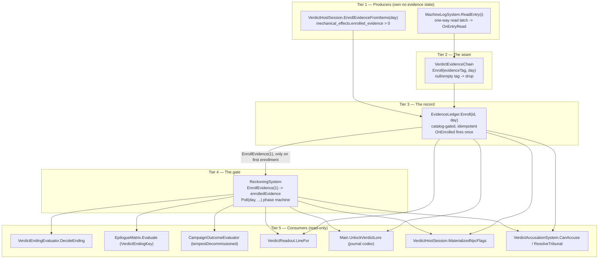

# Verdict Hardening Implementation Log

## Phase 1 — Evidence producer/consumer seam

Status: PASS

Changed:

- Added `VerdictEvidenceChain` in Core.
- Wired read machine logs to `EvidenceLedger` and `ReckoningSystem`.
- Made machine-log capture and restore deep-copy entries.
- Preserved persisted evidence IDs during restore.
- Tracked the host simulation day for Verdict save capture.
- Added focused replay and aliasing tests.

Tests:

- `dotnet test Ashfall.Core.Tests/Ashfall.Core.Tests.csproj --filter "FullyQualifiedName~Verdict" --no-restore`
- 112 passed.

Result:

- A read evidence-producing log now opens the canonical Reckoning evidence
  gate exactly once.
- Save restore reconciliation is idempotent.

Divergences:

- This phase does not add the typed accusation or tribunal system. Those need
  their own data contract and consequence authority review.

Remaining:

- Add typed accusation eligibility and tribunal resolution.
- Add Verdict replay evidence at the Godot selftest layer.

---

# EXPANSION 2026-09-25 — Verdict Hardening: Full Integration Framework & Code Architecture

Everything above this line is the original 2026-09-05 Phase-1 hardening log,
preserved byte-for-byte. Everything below is the 2026-09-25 documentation
expansion: a full integration framework and code-architecture reference for
the Verdict evidence domain, grounded in a same-day audit of the live tree.

# Part I — Expansion Preamble

## I.1 Thesis

Phase 1 of the Verdict hardening (2026-09-05) proved one narrow claim: a read
evidence-producing log opens the canonical Reckoning evidence gate exactly
once, and save restore reconciliation is idempotent. That claim was small on
purpose. The seam it guarded, however, is not small. The evidence producer/
consumer seam is the spine of ASHFALL: THE VERDICT (Expansion 08) — the
machine that keeps the count after the people stopped — and every other
Verdict surface (the census carrier on 99.0 MHz, the diegetic radio corpus,
the eighteen figures of the record, the tribunal cases, the three endings)
stands on top of it.

This expansion documents that whole structure as it exists on 2026-09-25:
the ownership lattice, the tier-by-tier data flow, the save and determinism
discipline, the per-component code architecture, the authored content, the
test family, and the deferred seams (typed accusation eligibility, tribunal
resolution, Godot-layer replay evidence) with their current real status —
which has moved since the original log was written.

The document is a map of an existing machine, not a proposal. Where a thing
is verified in source it is cited by path. Where it is only known from the
log's own text it is marked `UNVERIFIED (log text)`. Where the audit found
the premise of the original log to be stale or superseded, that is said
plainly.

## I.2 Scope

In scope:

- The evidence domain in `Assets/Ashfall.Core/Verdict/` (14 C# files,
  2,112 lines, namespace `Ashfall.Core.Verdict`): `VerdictEvidenceChain`,
  `EvidenceLedger`, `MachineLogSystem`, `ReckoningSystem`,
  `VerdictAccusationSystem`, `VerdictSave`/`VerdictSaveCodec`,
  `VerdictCatalogLoader`, `VerdictNpcSystem`, `VerdictRadioSystem`,
  `VerdictCensusBroadcast`, `VerdictEndingEvaluator`, `VerdictReadout`,
  `VerdictQuestCatalogLoader`, `VerdictQuestMigration`.
- The host seam: `src/Host/VerdictHostSession.cs`, `src/Host/VerdictSaveStore.cs`,
  `src/Host/HostCli.SelfTests.cs` (`RunVerdictSelfTest`),
  `src/Main.Verdict.cs`, `src/VerdictPanel.cs`,
  `src/UI/VerdictDashboardPanel.cs`, `src/Main.UiTests.Verdict.cs`.
- The authored data: the six `verdict_*.json` catalogs under
  `Assets/StreamingAssets/Data/`.
- The downstream consumers: `Assets/Ashfall.Core/Muster/EpilogueMatrix.cs`,
  `Assets/Ashfall.Core/Endgame/CampaignOutcomeEvaluator.cs`, the journal
  lore unlocks, and the Muster testimony surface.
- The Verdict test family under `Ashfall.Core.Tests/` (16 files).

Out of scope (non-goals), and this list is load-bearing:

- **No new tribunal authority.** `EvidenceLedger` remains the sole idempotence
  authority for evidence enrollment; `ReckoningSystem` remains the sole
  phase-gate authority. Any new parallel ledger, verdict registry, or second
  evidence store would violate the one-authority-per-concern rule and is
  explicitly rejected here. `VerdictAccusationSystem` exists in Core as a
  thin consumer of both owners and never manipulates evidence directly; that
  is the accepted pattern, not a rival one.
- **No balance tuning.** The phase thresholds (160/210/240), the evidence
  gate value (1), the doctrine dose thresholds (4.0/8.0 Sv), the census
  constants (211,004 expected souls; 1.7 s held-breath pause; 7-day window at
  03:00) and the guilt threshold (>= 2 enrolled evidence) are recorded as
  found. None is proposed for change.
- **No engine dependency.** Everything specified here lives in Core
  (`netstandard2.1`, engine-free) or in the thin Godot host (`net8.0`).
  Core files reference no `Godot` and no `UnityEngine` types — verified by
  reading every file in `Assets/Ashfall.Core/Verdict/`.
- **No data rewrite.** The JSON catalogs are documented, not edited.
- **No test run.** Per `TEST_POLICY.md` discipline and the documentation-only
  brief, no `dotnet test` was executed for this expansion. Test counts are
  static enumerations of `[Fact]` methods; see Part V.7 for the method.

## I.3 Evidence policy of this document

Every factual claim in Parts II–VIII carries one of three grades:

| Grade | Meaning |
|---|---|
| *(verified)* | Read directly in source or data on 2026-09-25; path cited. |
| `UNVERIFIED (log text)` | Stated by the original 2026-09-05 log; the exact original condition (e.g. "112 passed") cannot be re-derived without running tests, which this expansion deliberately does not do. |
| *(design)* | Forward-looking design material in the deferred-seam chapters, clearly framed as a sketch for a future decision record, not as current behavior. |

Where the audit contradicted the log or the working assumptions handed to
this expansion, the contradiction is recorded in Part II.4 rather than
silently corrected. The most important one: **no `is_evidence` tag exists
anywhere in the data or code.** The task premise that a later master-plan
task authored "`is_evidence`-tagged forensic dossiers" is false for the
current tree. The actual item-protection model is the
`mechanical_effects.enrolled_evidence` payload in `verdict_items.json` plus
the loader's "never treated as loot" contract. Part V.4 documents the real
model; the `is_evidence` premise is recorded as UNVERIFIED and not present.

## I.4 Reading guide

- **Part II** — what owns what, right now, with paths; what changed since
  2026-09-05; the real status of the three deferred items.
- **Part III** — the integration framework: invariants, tiered data flow,
  event flow, save discipline, determinism contract, integrity validation.
- **Part IV** — code architecture: module map, per-component specs, the
  five hardening rules as specifications (H1–H5), sequence walkthroughs.
- **Part V** — the bulk: one chapter per domain concern (evidence chain,
  ledger, reckoning gate, machine log, content/dossiers, deferred tribunal
  design, tests, Muster/epilogue context, methodology).
- **Part VI** — cross-system interaction matrix and emergent-consequence
  design (a dossier assembled from maintenance logs; a verdict built from
  paperwork).
- **Part VII** — verification and acceptance: test matrix, gate ladder,
  acceptance criteria, rollback plan.
- **Part VIII** — twenty-six appendices: glossary, ID vocabulary, scenario
  walkthroughs, event/constants reference, migration cookbook, source
  inventory, traceability matrices, broadcast and case rosters, open
  questions. The one-line index is VIII.21; VIII.26 maps reading paths for
  the foreman, a builder, and an auditor.

Readers who want only the current truth table should read Part II and stop.
Readers implementing against the seam need Parts III and IV. Readers judging
acceptance need Part VII.

---

# Part II — Current Authority Audit (as of 2026-09-25)

## II.1 The Verdict ownership lattice

One authority per concern, with the verified path of each owner. This is the
map an implementer must extend, never duplicate.

| Concern | Owner | Path (verified) |
|---|---|---|
| Evidence producer/consumer seam | `VerdictEvidenceChain` | `Assets/Ashfall.Core/Verdict/VerdictEvidenceChain.cs` |
| Evidence idempotence + storage | `EvidenceLedger` | `Assets/Ashfall.Core/Verdict/EvidenceLedger.cs` |
| Machine-log records + read latch | `MachineLogSystem` | `Assets/Ashfall.Core/Verdict/MachineLogSystem.cs` |
| Reckoning phase gate + endings | `ReckoningSystem` | `Assets/Ashfall.Core/Verdict/ReckoningSystem.cs` |
| Typed accusation + tribunal | `VerdictAccusationSystem` | `Assets/Ashfall.Core/Verdict/VerdictAccusationSystem.cs` |
| Verdict save envelope + codec | `VerdictSave` / `VerdictSaveCodec` | `Assets/Ashfall.Core/Verdict/VerdictSave.cs` |
| Verdict save file I/O | `VerdictSaveStore` | `src/Host/VerdictSaveStore.cs` (`verdict_save.json`, section `verdict`) |
| Catalog loading (locations/items/radio/corpus/ladder) | `VerdictCatalogLoader` | `Assets/Ashfall.Core/Verdict/VerdictCatalogLoader.cs` |
| Verdict NPC registry + availability | `VerdictNpcSystem` | `Assets/Ashfall.Core/Verdict/VerdictNpcSystem.cs` |
| Diegetic radio corpus scheduling | `VerdictRadioSystem` | `Assets/Ashfall.Core/Verdict/VerdictRadioSystem.cs` |
| 99.0 MHz census carrier | `VerdictCensusBroadcast` | `Assets/Ashfall.Core/Verdict/VerdictCensusBroadcast.cs` |
| Ending derivation (read-only) | `VerdictEndingEvaluator` | `Assets/Ashfall.Core/Verdict/VerdictEndingEvaluator.cs` |
| Shelter instrument readout line | `VerdictReadout` | `Assets/Ashfall.Core/Verdict/VerdictReadout.cs` |
| Verdict quest registration | `VerdictQuestCatalogLoader` | `Assets/Ashfall.Core/Verdict/VerdictQuestCatalogLoader.cs` |
| Quest ownership migration (Year of Ash → Verdict) | `VerdictQuestMigration` | `Assets/Ashfall.Core/Verdict/VerdictQuestMigration.cs` |
| Host session (wiring + day tracking) | `VerdictHostSession` | `src/Host/VerdictHostSession.cs` |
| Godot panel (machine's register) | `VerdictPanel` | `src/VerdictPanel.cs` |
| Dashboard shell around the panel | `VerdictDashboardPanel` | `src/UI/VerdictDashboardPanel.cs` |
| Host day tick + drift + lore | `Main` Verdict partial | `src/Main.Verdict.cs` |
| Headless selftest gate | `HostCli.RunVerdictSelfTest` | `src/Host/HostCli.SelfTests.cs` (gate `expansion_08_the_verdict`) |
| Machine-log retention policy application | `MachineLogSystem.ApplyRetention` | called from `src/Host/RetentionHostSession.cs` (Plan 55/55A) |

Catalogs (all `snake_case`, under `Assets/StreamingAssets/Data/`, verified
by parsing):

| File | Container | Rows |
|---|---|---|
| `verdict_data.json` | keys: `catalog`, `schema_version`, `description`, `currencies`, `readout_steps`, `facets`, `endings`, `world_history_ladder`, `corruption_corpus` | 25 corruption strings, 12 ladder entries, 3 endings |
| `verdict_items.json` | `items` | 15 (12 carry `mechanical_effects.enrolled_evidence: 1`) |
| `verdict_locations.json` | `locations` | 15 |
| `verdict_npcs.json` | `items` | 18 |
| `verdict_radio.json` | `broadcasts` | 30 |
| `verdict_questlines.json` | `quests` | 23 `quest_verdict_*` questlines |

Downstream consumers (verified read sites):

- `Assets/Ashfall.Core/Muster/EpilogueMatrix.cs` — `EpilogueMatrixInput.
  VerdictEndingKey`; the three `ending_verdict_*` keys are members of
  `EpilogueMatrix.AllKeys`; `Evaluate` returns the Verdict ending with
  priority 3 (after shelter-fallen and the two compound endings, before
  Muster/faction/resource/moral).
- `Assets/Ashfall.Core/Endgame/CampaignOutcomeEvaluator.cs` — resolves
  `TempestDecommissioned` from `VerdictReckoningState` via
  `VerdictEndingEvaluator.IsTempestDecommissioned` / `DecideEnding`, or from
  the consequence-ledger flags `flag_tempest_decommissioned` /
  `flag_verdict_counted`.
- `Assets/Ashfall.Core/Muster/MusterSystem.cs` — `witnessResults` is the
  "stable epilogue/Verdict-facing surface" (Plan 15 consumes the delivered
  testimony list; it never re-derives witness eligibility).
- `src/Main.Verdict.cs` `UnlockVerdictLore` — journal codex beats
  (`lore_verdict_geophone_one`, `lore_verdict_shift_charters`,
  `lore_verdict_standard`, `lore_verdict_the_hold`, `lore_verdict_the_call`,
  `lore_verdict_the_count`) unlock from authoritative Verdict state only.
- `src/Main.UnifiedEnding.cs` — `tempestDecommissioned` flows from the
  consequence-ledger flag `tempest_decommissioned` into the unified ending.

## II.2 What changed since the 2026-09-05 log

The log describes a two-file seam (chain + ledger + reckoning + machine log)
and a v-something save. On 2026-09-25 the tree shows a full expansion built
around that seam. The deltas that matter to this document:

1. **Save envelope is now v4.** `VerdictSave.CurrentSaveVersion = 4`.
   The log's era predates the npc/radio/quest sections (frozen shapes
   `VerdictSaveV1`, `VerdictSaveV2`, `VerdictSaveV3` are kept for checksum
   validation over the exact field set each version wrote) and predates the
   v4 `accusations` section.
2. **Typed accusation eligibility and tribunal resolution exist in Core.**
   `VerdictAccusationSystem` (262 lines) implements exactly what the log
   listed as "Remaining": eligibility states, three canon cases, guilt by
   evidence count, ending selection through `ReckoningSystem.SelectEnding`,
   faction/moral/journal consequence payloads, and its own save section.
   However — and this is the load-bearing audit finding — **it is not
   constructed or bound anywhere in `src/`**. `VerdictSaveCodec.Capture`
   accepts an optional `accusations` parameter; `VerdictHostSession.
   CaptureSave` does not pass one, so the section serializes as the field
   default (empty). See II.4.
3. **The machine log grew retention and corruption machinery.**
   `MachineLogSystem.ApplyRetention` (Plan 55/55A, policy catalog bounds how
   many entries a 400-year campaign keeps) and `InsertCorruptionMarker`
   (seeded, data-driven corpus from `verdict_data.json`, deterministic
   cadence `day % 11 == 0` in Culpable+ via `VerdictHostSession.TickCorruption`).
4. **The content web multiplied.** 15 locations, 15 items, 18 NPCs,
   30 radio broadcasts, 23 questlines, a 12-rung world-history ladder, a
   25-string corruption corpus. The original log's seam now feeds all of it.
5. **The test family grew from 112 to 173 enumerated `[Fact]` methods**
   across 16 files. Per-file enumeration and the drift explanation are in
   Part V.7. (The 112 figure itself: `UNVERIFIED (log text)` — it is a run
   result from 2026-09-05 and cannot be re-derived statically.)
6. **The Muster/epilogue integration is real, not planned.** The three
   Verdict endings are first-class `EpilogueMatrix` keys and
   `CampaignOutcomeEvaluator` derives the base-game `tempestDecommissioned`
   outcome from the persisted `ReckoningState`.
7. **Quest ownership moved.** `VerdictSave` v3 took questline ownership from
   the Year of Ash envelope (`VerdictQuestMigration.AdoptFromYearOfAsh` +
   `StripFromYearOfAsh`); the registration in the Year of Ash envelope was
   removed so exactly one owner persists quest progress.
8. **The census carrier and radio corpus became one authoritative pair.**
   `VerdictCensusBroadcast` adopted the previously dead census scheduler
   canon (fixed structure, 1.7 s held-breath pause, 7-day/03:00 windows,
   idempotent per window) and `VerdictRadioSystem` schedules the authored
   corpus once each, gated on `phase >= Culpable` and `dayTrigger`.

## II.3 Status of the three deferred items

The original log recorded two "Remaining" bullets and one divergence. Their
status on 2026-09-25, verified:

| Deferred item | Status | Evidence |
|---|---|---|
| Typed accusation eligibility | **Core-authority landed; host wiring absent** | `VerdictAccusationSystem.cs` complete with `CanAccuse` (5-state eligibility), `ResolveTribunal`, capture/restore; 15 dedicated tests in `Ashfall.Core.Tests/VerdictAccusationSystemTests.cs`; `VerdictSave` v4 carries `accusations`. Grep of `src/` shows **no construction site** — `VerdictHostSession` never news it up, never calls `Bind`, and `CaptureSave`/`RestoreSave` never pass the accusations section. |
| Tribunal resolution | **Core-authority landed; consequence application is partial by design** | `ResolveTribunal` selects the ending through `ReckoningSystem.SelectEnding` (the canonical owner), emits a `TribunalVerdict` payload with faction/moral/journal fields, and writes a moral marker flag via `MoralChoiceSystem.SetFlag` when a moral system is passed. The faction-standing string (`"faction_the_office:+15"`) and the journal entry are **returned, not applied** — no host code consumes `TribunalVerdict` yet. |
| Verdict replay evidence at the Godot selftest layer | **Still open** | `HostCli.RunVerdictSelfTest` (`src/Host/HostCli.SelfTests.cs:793`) drives `machineLog.ReadEntry(0)` + `evidence.Enroll(tag, 162)` manually and its save round-trip never constructs a `VerdictEvidenceChain`, never calls `ReconcileReadEntries`, and never asserts the idempotent-replay property at the Godot layer. The xUnit layer covers it (`VerdictEvidenceChain_ReconcileIsSafeAfterSaveRestore`, `VerdictEvidenceChain_ReconcileRepairsDerivedReckoningCount`); the selftest gate does not. |

## II.4 Audit findings that correct or sharpen the log's framing

These are not defects in the Phase-1 work. They are facts an implementer
must know that the log's terse format could not carry:

1. **The live host load path does not call `ReconcileReadEntries`.**
   `VerdictHostSession.Create` restores via `VerdictSaveCodec.Restore(...)`
   directly. `ReconcileReadEntries` is only invoked by
   `VerdictHostSession.RestoreSave` (`VerdictHostSession.cs:250`), which has
   no caller in `src/` on this tree. This is safe by construction — the
   persisted `ReckoningState.enrolledEvidence` count rides in the save, so
   restore does not need the replay to be correct — and the replay exists as
   the repair path for legacy saves whose derived count drifted. The
   exactly-once guarantee does not depend on the reconcile running.
2. **`EvidenceLedger.Register` has no callers.** The definition-catalog gate
   inside `Enroll` (`if (_catalog.Count > 0 && !_catalog.ContainsKey(id))
   return false`) is therefore inert in practice: the catalog is empty at
   runtime, so `Enroll` accepts any non-empty id. The gate is a loaded
   safety device waiting for a registration call site, not a live
   validation. Evidence-id validation today happens at the content layer
   (`VerdictContentWebTests`, `VerdictRadioSystemTests.
   EvidenceEnrollment_FieldsPresentInItems`) and at the selftest, not at
   enrollment time.
3. **The `evidence` section that `EvidenceDefinition`'s doc comment names
   does not exist in `verdict_data.json`.** The comment reads "verdict_data
   .json 'evidence' section", but the parsed container keys are `currencies`,
   `readout_steps`, `facets`, `endings`, `world_history_ladder`,
   `corruption_corpus` — no `evidence`. The de-facto evidence definitions
   are the `evidence_*` rows of `verdict_items.json`. This is a stale doc
   comment, not a broken pipeline (the loader never parses an `evidence`
   section either).
4. **The player-facing "read" affordance is presentation-thin.**
   `VerdictPanel.RefreshLog` renders log rows read-only (read/unread flag,
   kind icon, body); the only `ReadEntry` call sites in the tree are the UI
   smoke test (`Main.UiTests.Verdict.cs:46`) and the headless selftest. The
   evidence-producing read is a Core API contract exercised by tests; the
   panel does not yet carry a button that produces one. Any future read
   button must call `MachineLogSystem.ReadEntry` (which fires the chain) —
   never enroll evidence directly from UI.
5. **`VerdictSave` v4's accusations section serializes empty by default.**
   `VerdictSaveCodec.Capture` defaults missing optional systems to fresh
   empty state, so a v4 save written by today's host contains an
   `accusations` object with an empty `resolvedCaseIds` and empty
   `caseVerdicts`. This keeps the checksum stable and the shape forward-
   compatible with the eventual host wiring.
6. **`logReadCount` is a vestigial Poll parameter.**
   `ReckoningSystem.Poll(day, livingCount, logReadCount, evidenceCount)`
   accepts `logReadCount` but the phase conditions use only day, the
   evidence gate, and one-shot flags. It exists for signature compatibility
   and observability; nothing downstream may assume it gates anything.
7. **`docs/CURRENT_AUTHORITY.md` contains zero occurrences of "verdict".**
   The domain documentation map does not yet index the Verdict domain. The
   authority pointers for this domain are the expansion bible
   (`docs/expansions/expansion_08_the_verdict_plan.md`), the depth audit
   (`docs/expansions/VERDICT_DEPTH_AUDIT.md`), the integration matrix
   (`docs/expansions/expansion_08_verdict_INTEGRATION_MATRIX.md`), and this
   log.

---

# Part III — Integration Framework

## III.1 Architecture invariants applied to the evidence domain

These are the repo's standing rules (AGENTS.md) rendered as concrete,
checkable statements for this domain. Each is enforced somewhere — code
shape, save design, or test.

| # | Invariant | Where it lives | How it is enforced |
|---|---|---|---|
| A1 | Core stays engine-free | every file in `Assets/Ashfall.Core/Verdict/` | no `Godot`/`UnityEngine` references (audit-read 2026-09-25); `netstandard2.1` target |
| A2 | One authority per concern | ledger = idempotence; reckoning = phase gate; machine log = read latch | `VerdictEvidenceChain` only routes; it stores nothing |
| A3 | JSON data is authoritative | `Assets/StreamingAssets/Data/verdict_*.json` | loaders return empty on missing/malformed and never synthesize gameplay rows |
| A4 | Core exposes facts as events; hosts apply presentation | `OnEntryRead`, `OnEnrolled`, `OnPhaseChanged`, `OnCarrierHeard`, `OnReckoningCall`, `OnVerdictResolved`, `OnLogPosted`, `OnTapeSpin`, `OnSpoken` | `VerdictHostSession` handlers only set `LastEvent` and raise `StateChanged`; `VerdictPanel` only renders |
| A5 | Deterministic behavior uses the seeded RNG contract | `VerdictHostSession._machineRng = new SeededRng(8841209 + 17)`; `SeededRng(8841209)` in selftest | corruption markers and radio RNG never touch wall-clock time; `VerdictReadout` uses `StableHash`, not per-frame RNG |
| A6 | Persisted state is captured/restored deep, per section | `CopyEntry` in `MachineLogSystem`; list copies in ledger/NPC/radio/accusation capture | no aliasing between live state and captured state; asserted by `MachineLog_CaptureRestore_DoesNotAliasEntries` |
| A7 | Phase transitions never reverse | `ReckoningSystem.Poll` compares phase ordinals with `<`/`>=` only | `Reckoning_NeverReverses`; restore clamps but never downgrades via `RecordCumulativeDose` (`HighDoseDoesNotDowngradePhase`) |
| A8 | One save section per domain, one envelope owner | `verdict` section via `VerdictSaveStore`; quests moved out of the Year of Ash envelope in v3 | `VerdictQuestOwnershipTests` (`AdoptThenStrip_LeavesOneOwnerOnly`) |
| A9 | UI is a truthful read of state; no gameplay in panels | `VerdictPanel` renders phase/evidence/log/radio/NPC rows from the session | no evidence enrollment, no phase writes, no ending selection in any panel |
| A10 | Every feature observable outcome agrees with Core authority | `VerdictEndingEvaluator` derives endings from `ReckoningState` flags + ledger count, "never from fragile text-ID scans" | `EndingSelection_IsAuthoritative_NotTextDriven` |

## III.2 Tier-by-tier data flow

The evidence domain is a five-tier pipeline. Each tier owns exactly one
transformation, and ownership of state increases monotonically downward:
producers own nothing, the ledger owns the record, the gate owns the phase.



Tier rules:

1. **Tier 1 (producers).** A machine-log entry becomes evidence-producing
   only at the moment a human reads it (`read` is the load-bearing field).
   The item path (`EnrollEvidenceFromItems`) enrolls by authored payload,
   keyed by item id, and is itself idempotent through the ledger. Producers
   never write to the ledger's state directly except through `Enroll`.
2. **Tier 2 (the seam).** `VerdictEvidenceChain` is the only component that
   may translate a read event into a ledger enrollment *and* a gate credit.
   It drops null/empty tags silently (`Enroll` returns false) — a corruption
   marker or an untagged facility reading enrolls nothing.
3. **Tier 3 (the record).** `EvidenceLedger.Enroll` is the single gatekeeper
   of "has this evidence been enrolled before". It appends the id, records
   `lastEnrolled`/`enrollmentDay`, and fires `OnEnrolled` once. A repeated
   id is a no-op that returns false.
4. **Tier 4 (the gate).** `ReckoningSystem.EnrollEvidence(1)` increments the
   derived counter **only when the ledger enrollment succeeded** — the chain
   calls it after the ledger's true return. The gate's evidence condition is
   `_state.enrolledEvidence > 0 || evidenceCount > 0` (the second operand is
   the live `Evidence.Count` passed by `AdvanceDay`, so an older save whose
   derived count was lost still opens the gate once the ledger is restored).
5. **Tier 5 (consumers).** All consumers are readers. None may mutate
   evidence or phase state. Ending selection is the one controlled write and
   it lives in Tier 4 (`SelectEnding`), invoked by the host's ending surface
   or the tribunal.

## III.3 Event flow

Event publication order for a single read that enrolls new evidence
(verified from the code paths):

```text
MachineLogSystem.ReadEntry(i)
  e.read = true                                  (one-way latch)
  -> OnEntryRead(entry)
       VerdictEvidenceChain.HandleEntryRead
         ledger.Enroll(tag, entry.day)            first time: true
           state.enrolled += tag
           state.lastEnrolled = tag
           state.enrollmentDay = entry.day
           -> OnEnrolled(tag)
                VerdictHostSession: LastEvent = "evidence:<id>", StateChanged
                Main._verdictDirty = true; RefreshVerdictReadout()
         reckoning.EnrollEvidence(1)
           state.enrolledEvidence += 1
  host UI (VerdictPanel) refreshes on StateChanged
```

And the phase-lift path on the next `AdvanceDay`/`Poll` that satisfies the
gate (day >= 210, evidence present):

```text
ReckoningSystem.Poll(211, living, readCount, evidenceCount)
  Knowing -> Culpable        fires "phase_culpable", OnPhaseChanged
  carrierHeard latch (one-shot)  fires "carrier_heard", OnCarrierHeard
VerdictHostSession.LastEvent = "phase:Culpable;carrier_heard"
VerdictRadioSystem.Poll(day, phase) may now fire corpus entries
  (dayTrigger passed AND phase >= Culpable), each exactly once,
  publishing "radio.verdict.broadcast" on the shared bus
```

Event-to-consumer contract: Core events carry facts (the entry, the id, the
phase, the ending key). Host adapters translate facts into presentation
(`LastEvent`, UI refresh, audio cues via `AudioManager`) and persistence
dirtying. No host handler decides gameplay.

## III.4 Save capture/restore discipline

The Verdict save is one checksummed envelope holding one section per owned
concern. The discipline has five rules, each verified in code:

1. **Deep copy on capture.** `MachineLogSystem.CaptureState` rebuilds every
   entry through `CopyEntry`; `EvidenceLedger.CaptureState` rebuilds the
   id list; every other subsystem's capture does the same. A captured
   envelope shares no mutable object with live state.
2. **Deep copy on restore.** `RestoreState` mirrors capture (`CopyEntry`
   again on the way in), so a restored envelope can be re-applied or
   inspected without aliasing the live system.
3. **Evidence-ID preservation.** `EvidenceLedger.RestoreState` re-inserts
   every persisted id in order, skipping null/empty and duplicates. The
   persisted ids *are* the evidence record; nothing about restore may
   reorder, rename, or re-derive them.
4. **Idempotent reconciliation.** For legacy saves where the derived
   `enrolledEvidence` count could disagree with the ledger, the chain's
   `ReconcileReadEntries` re-enrolls every read entry (all no-ops for ids
   already present) and then sets the derived count to the ledger's count
   via `ReconcileEvidenceCount(_ledger.Count)` — an internal, non-evented
   write, "intentionally not an eventful gameplay mutation".
5. **Simulation-day capture.** `VerdictSave.simDay` is filled by
   `VerdictHostSession.CurrentDaySafe()`: the last day passed to
   `AdvanceDay`, else the newest entry day in the log, else 0. The host
   day therefore rides with the envelope even if the host never ticked the
   session in the current process.

Envelope shape (current v4, field names as serialized):

```json
{
  "saveVersion": 4,
  "simDay": 241,
  "machineLog": {
    "entries": [
      {
        "facilityId": "loc_geophone_pit_1",
        "day": 162,
        "kind": "operating",
        "bodyShort": "a tap.",
        "evidenceTag": "evidence_geophone_hymn",
        "read": true
      }
    ],
    "lastTapeSpinDay": -1,
    "logIndex": 1,
    "countdownActive": false,
    "countdownDaysLeft": 0
  },
  "reckoning": {
    "phase": 3,
    "phaseChangedDay": 241,
    "carrierHeard": true,
    "callResolved": true,
    "countPresented": true,
    "countHeld": false,
    "offerIsLease": false,
    "enrolledEvidence": 12,
    "driftDays": 3,
    "dwellingDriftTotal": 0,
    "lastDriftDay": -1,
    "lastDriftDeltaToday": 0,
    "cumulativeDoseSieverts": 0.0,
    "highDosePromoted": false
  },
  "evidence": {
    "enrolled": [
      "evidence_geophone_hymn",
      "evidence_twelve_gauge_steel",
      "evidence_fuse_linen",
      "evidence_census_draft",
      "evidence_mailroom_tape",
      "evidence_uxo_register",
      "evidence_call_calibration",
      "evidence_call_plain",
      "evidence_reels_matter",
      "evidence_valve_s36",
      "evidence_eden_log",
      "evidence_veen_your_people"
    ],
    "lastEnrolled": "evidence_veen_your_people",
    "enrollmentDay": 220
  },
  "npcs": { "spokenNpcIds": [] },
  "radio": { "systemId": "verdict_radio_system", "firedIds": [] },
  "quests": { "active": [], "completedQuestlineIds": [], "failedQuestlineIds": [] },
  "censusLastWindowDay": 238,
  "accusations": { "resolvedCaseIds": [], "caseVerdicts": {} },
  "Checksum": "<SaveChecksum over the public fields above>"
}
```

Decode ladder (`VerdictSaveCodec.TryDecode`): reject null/empty; reject
`saveVersion > 4` (newer); reject `< 1` (too old); route v1/v2/v3 through
their **frozen shapes** so the checksum is verified over exactly the fields
that version wrote; validate the current shape against its own recomputed
checksum; reject checksumless or mismatched payloads as tampered.

## III.5 Determinism contract: exactly-once gate opening

The Phase-1 property, stated as a contract:

> **G1.** For any evidence id *e*, across any interleaving of reads, saves,
> restores, and reconciles, `ReckoningSystem.enrolledEvidence` is credited
> for *e* at most once, and the Culpable evidence gate opens at most once
> (`carrierHeard` fires at most once, `callResolved` at most once, and each
> `SelectEnding` flag is set at most once).

Mechanisms, in order of defense:

- `MachineLogSystem.ReadEntry` returns empty and does nothing when
  `e.read` is already true — the read latch itself is one-way.
- `MachineLogSystem.Post` suppresses duplicates by `(facilityId, day, kind)`,
  so the same physical reading cannot be posted into two evidence-bearing
  entries.
- `EvidenceLedger.Enroll` is the idempotence authority: a repeated id
  returns false, and only a `true` return is followed by
  `EnrollEvidence(1)`.
- `ReconcileReadEntries` replays through the same `Enroll`, so replay is a
  sequence of no-ops plus exactly the repair of the derived count.
- `carrierHeard`, `callResolved`, `countPresented`, `countHeld`,
  `offerIsLease` are latched booleans checked before every write;
  `SelectEnding` refuses when any of the three is set or when
  `phase < Counted`.
- The `Poll` conditions use `>=` on day thresholds, so a save restored at a
  later day replays the same transition set exactly once, not once per
  threshold-crossing tick.

Consequences for tests: any test may assert, after arbitrary
save/restore/reconcile churn, that `Evidence.Count` equals the number of
distinct enrolled ids, `State.enrolledEvidence >= Evidence.Count` is never
required (the derived count is repaired *down* to the ledger count by
reconcile), and phase-lift events appear at most once in a `Poll` return.

## III.6 Integrity validation of evidence content

Three layers, deliberately split:

| Layer | What it checks | Where |
|---|---|---|
| Catalog integrity (authored data) | ids unique, `snake_case`, all 15 item rows present, 12 carry `enrolled_evidence`, 30 broadcasts, 15 locations, 18 NPCs, runtime-schema alignment | `VerdictContentWebTests`, `VerdictRadioExpansionTests`, `Plan82VerdictLocationsExpansionTests`, `VerdictNpcExpansionTests` |
| Referential integrity (catalog ↔ seam) | every `evidenceTag`/item id used by producers matches an authored `evidence_*` id; quest triggers point at registered questlines | `VerdictRadioSystemTests.EvidenceEnrollment_FieldsPresentInItems`, `VerdictIntegrationTests.VerdictQuests_AllLoad_AndArePlayable` |
| Envelope integrity (persistence) | checksum over public fields, frozen-shape migration, tamper/newer/checksumless rejection | `VerdictSaveCodec.TryDecode`, `VerdictSaveMigrationTests`, selftest tamper check |

The runtime `EvidenceLedger` catalog gate is the designed fourth layer
(reject unknown ids at enrollment) but is inert until a host or test
registers definitions (see II.4 finding 2). Enabling it is a one-line
change per registration site and is the natural next hardening step if
evidence ids ever become player-facing.

---

# Part IV — Code Architecture

## IV.1 Module map

```text
Ashfall.Core.Verdict (netstandard2.1, engine-free)
│
├─ VerdictEvidenceChain ......... producer/consumer seam (62 ln)
│   └─ depends on: MachineLogSystem, EvidenceLedger, ReckoningSystem
├─ EvidenceLedger ............... record + idempotence authority (111 ln)
├─ MachineLogSystem ............. readings, read latch, corruption, retention (200 ln)
├─ ReckoningSystem .............. phase machine, gate, endings, chains (275 ln)
├─ VerdictAccusationSystem ...... typed cases, eligibility, tribunal (262 ln)
├─ VerdictSave (+Codec, V1..V3) . checksummed cross-host envelope (272 ln)
├─ VerdictCatalogLoader ......... locations/items/radio/corpus/ladder (225 ln)
├─ VerdictNpcSystem (+Loader) ... 18 figures, flag+phase gating (155 ln)
├─ VerdictRadioSystem ........... 30-broadcast corpus scheduler (114 ln)
├─ VerdictCensusBroadcast ....... 99.0 MHz carrier engine (93 ln)
├─ VerdictEndingEvaluator ....... read-only ending derivation (71 ln)
├─ VerdictReadout ............... diegetic instrument line (73 ln)
├─ VerdictQuestCatalogLoader .... quest registration into QuestlineSystem (63 ln)
└─ VerdictQuestMigration ........ Year-of-Ash quest adoption/strip (136 ln)

src/ (net8.0, Godot host — thin)
├─ Host/VerdictHostSession.cs ... wiring, day tracking, ticks, capture (284 ln)
├─ Host/VerdictSaveStore.cs ..... SaveStore<VerdictSave> façade (64 ln)
├─ Host/HostCli.SelfTests.cs .... RunVerdictSelfTest headless gate
├─ VerdictPanel.cs .............. the machine's register (Godot Control)
├─ UI/VerdictDashboardPanel.cs .. dashboard shell hosting VerdictPanel
├─ Main.Verdict.cs .............. SetupVerdict, TickVerdict, SaveVerdict, lore
├─ Main.UiTests.Verdict.cs ...... headless panel smoke
└─ Main.Lifecycle.cs ............ "verdict" session participant registration
```

Dependency direction is strictly downward: host → seam → owners. No Core
file references another tier's host, and the seam never references content
loaders. `VerdictAccusationSystem` depends on `Ashfall.Core.MoralChoice`
(for the optional moral-flag write) — the one cross-namespace edge — and on
the two owners by interface-free reference.

## IV.2 Component spec: `VerdictEvidenceChain`

**Responsibility.** Translate read events into ledger enrollments and gate
credits; repair the derived count after restore. Hold no state.

**Public API.**

| Member | Signature | Notes |
|---|---|---|
| ctor | `VerdictEvidenceChain(MachineLogSystem, EvidenceLedger, ReckoningSystem)` | throws on any null argument; subscribes `OnEntryRead → HandleEntryRead` exactly once |
| `ReconcileReadEntries` | `int ()` | replays every `entry.read` entry through `Enroll`; then `_reckoning.ReconcileEvidenceCount(_ledger.Count)`; returns count newly enrolled |
| `HandleEntryRead` | `private (MachineLogEntry)` | null-guard, then `Enroll(entry.evidenceTag, entry.day)` |
| `Enroll` | `private bool (string tag, int day)` | false on null/empty tag or ledger no-op; on ledger true → `reckoning.EnrollEvidence(1)`, return true |

**State.** None. The chain is a pure router; all state lives in the owners.
This is what makes it safe to construct per session and to reconstruct
after restore.

**Failure modes and mitigations.**

| Failure | Effect | Mitigation |
|---|---|---|
| Entry has empty `evidenceTag` (corruption markers, plain telemetry) | `Enroll` returns false; nothing enrolled | by design — only evidence-tagged readings produce evidence |
| Same entry read twice (two `ReadEntry` calls impossible after latch; replay after restore) | second `Enroll` is a ledger no-op | ledger idempotence; exactly-once preserved |
| Restore replays into a ledger that already holds the id | no-op + count repair | `ReconcileReadEntries` design |
| Duplicate chain construction (two chains subscribed to one log) | double credit per read? No — the second chain's `Enroll` hits the ledger no-op | ledger authority absorbs the defect; still, only `VerdictHostSession` constructs one |
| Ledger enrollment succeeds but gate credit throws between the two calls | impossible in-process (no exception path between them) | sequential synchronous calls; no I/O in the seam |

**Performance.** O(n) over entries on reconcile (n = total log entries,
bounded by the Plan 55 retention policy); O(1) per live read. No
allocations beyond the reconcile return counter.

## IV.3 Component spec: `EvidenceLedger`

**Responsibility.** Own the evidence record: one entry per id, one-way
enrollment, idempotent, catalog-gated when populated. Expose count and
membership to every consumer.

**Public API.**

| Member | Signature | Notes |
|---|---|---|
| `State` | `EvidenceLedgerState` | live serializable state |
| `Enrolled` | `IReadOnlyList<string>` | ordered enrollment (insertion order = reading order) |
| `Register` | `void (EvidenceDefinition)` | first-wins catalog insert; no caller on this tree |
| `Get` | `EvidenceDefinition? (string)` | null-safe catalog lookup |
| `IsEnrolled` | `bool (string)` | linear scan, ordinal equality |
| `Enroll` | `bool (string id, int day)` | idempotent; fires `OnEnrolled` once; false on empty id, unknown id (when catalog non-empty), or repeat |
| `Count` | `int` | enrolled id count |
| `CaptureState` / `RestoreState` | deep copy in/out | restore dedupes and skips empty ids |

**State DTO.**

```csharp
[Serializable]
public sealed class EvidenceLedgerState
{
    public List<string> enrolled = new List<string>();
    public string lastEnrolled = string.Empty;
    public int enrollmentDay = -1;
}
```

Serialized example (snake_case-compatible field names, as persisted inside
`VerdictSave.evidence`):

```json
{
  "enrolled": [
    "evidence_geophone_hymn",
    "evidence_fuse_linen",
    "evidence_eden_log"
  ],
  "lastEnrolled": "evidence_eden_log",
  "enrollmentDay": 197
}
```

Semantics worth stating precisely:

- `enrolled` is ordered by enrollment, and the order is preserved through
  capture/restore. Nothing re-sorts it. Deterministic prose or replay logic
  may rely on insertion order, but should not: consumers that need a
  canonical order sort the ids themselves (the radio state capture, by
  contrast, does sort its fired-ids — a deliberate asymmetry).
- `lastEnrolled`/`enrollmentDay` are a single-slot "most recent" journal,
  not a per-id day map. A per-id day history does not exist; if a future
  feature needs "when was X enrolled", it must extend the state additively
  (new list field) rather than reinterpret the existing ones.
- `EvidenceDefinition` (the catalog row shape) carries `id`, `name`,
  `category = "story_item"`, `tier = "Old-World"`, `flavor`, `questTrigger`,
  `factionAffinity`, `rarity = "Rare"`. Its doc comment names a
  `verdict_data.json` "evidence" section that the authored file does not
  contain (II.4 finding 3); the de-facto definition rows are the
  `evidence_*` items in `verdict_items.json`.

**Failure modes and mitigations.**

| Failure | Effect | Mitigation |
|---|---|---|
| Null/empty id | false, no state change | guard at entry |
| Unknown id with populated catalog | false — typo cannot silently enroll | catalog gate (inert until registrations exist, II.4) |
| Duplicate id (replay, double read, item + log both carrying same id) | false, `OnEnrolled` not re-fired | `IsEnrolled` check; the `evidence_geophone_hymn` id is the live example — both the machine log and `verdict_items.json` carry it, and the selftest asserts 11 (not 12) new item enrollments for exactly this reason |
| Restored list contains empty/duplicate strings | filtered on restore | `RestoreState` loop |
| Enrollment day is negative or zero | accepted as-is | day is a fact from the producer; the ledger does not police the clock |

**Performance.** `IsEnrolled` is a linear scan, so `Enroll` is O(n) in
enrollments. With 12 authored evidence rows the constant is trivial; the
shape is safe for a small closed corpus, not for unbounded growth. If the
corpus ever exceeds a few hundred ids, add a `HashSet<string>` mirror
beside the list (keeping the list as the persisted order) — an additive,
save-compatible change.

## IV.4 Component spec: `ReckoningSystem` (gate surface)

**Responsibility.** Own the three-phase state machine, the evidence gate,
the one-shot latches, ending selection, and the two systemic hazard chains.
This subsection covers only the evidence-facing surface; the chains are
specified in Part V.3.

**Evidence-facing API.**

| Member | Signature | Notes |
|---|---|---|
| `EnrollEvidence` | `void (int amount = 1)` | adds `Math.Max(1, amount)`; public because producers may call it directly, but the only in-tree caller is the chain |
| `ReconcileEvidenceCount` | `internal void (int)` | sets the derived count to the ledger's count; documented as not an eventful gameplay mutation |
| `Poll` | `List<string> (int day, int livingCount, int logReadCount, int evidenceCount)` | returns fired event names; idempotent per tick |
| `IsCensusWindowOpen` | `bool (int day)` | `phase >= Culpable && day >= CulpableDay` |
| `SelectEnding` | `bool (string endingKey, int day)` | mutually exclusive; refuses before `Counted` or after any resolution flag |
| `ClockDriftDays` | `int` | canon 3-day disagreement |

**Gate constants (verified).**

| Constant | Value | Meaning |
|---|---|---|
| `KnowingDay` | 160 | first maintenance log becomes readable |
| `CulpableDay` | 210 | census carrier window opens |
| `CountedDay` | 240 | the Reckoning Call resolves; endings open |
| `EvidenceCulpableGate` | 1 | at least one enrolled evidence opens Culpable early |
| `ExpectedProvincialCount` | 211004 | the count the machine expects |
| `HighDoseKnowingThresholdSieverts` | 4.0f | auto-promote Dormant → Knowing (one-shot) |
| `HighDoseCulpableFloorSieverts` | 8.0f | phase floor enforced by the clock holder |

**State DTO** (`ReckoningState`, 14 fields, serialized inside
`VerdictSave.reckoning`; the full JSON appears in III.4). The evidence-
relevant fields are `enrolledEvidence` (derived, repairable) and the four
resolution latches.

**Failure modes and mitigations.**

| Failure | Effect | Mitigation |
|---|---|---|
| Derived count lost (legacy save) | gate would stay closed despite a full ledger | `Poll` also accepts the live `evidenceCount`; reconcile repairs the derived count |
| Derived count inflated (double credit from a pre-hardening build) | gate opens early; endings remain valid | reconcile clamps the count down to the ledger count; the gate is boolean, so no gameplay quantity depends on the magnitude |
| `SelectEnding` called twice with different keys | second call returns false, state unchanged | resolution-flag guard |
| Save tampered mid-flight (phase flipped) | envelope rejected by checksum | `TryDecode` ladder |
| Restore with `driftDays <= 0` or negative dose | clamped to canon defaults (3 days; 0 Sv) | `RestoreState` normalization |

**Performance.** `Poll` is O(1). The system allocates one list per call
(the fired-events return), which the host calls once per sim-day.

## IV.5 Component spec: the machine-log producer seam

**Responsibility.** Hold facility readings; present them; latch reads
one-way; post corruption markers deterministically; apply retention. The
log is the *only* place where "a human read this" exists as a persisted
fact.

**Public API.**

| Member | Signature | Notes |
|---|---|---|
| `Post` | `bool (facilityId, day, kind, bodyShort, evidenceTag)` | duplicate-suppressed on `(facilityId, day, kind)`; fires `OnLogPosted`; bumps `logIndex` |
| `ReadEntry` | `string (int index)` | one-way `read` latch; returns the evidence tag or empty (not found / already read); fires `OnEntryRead` only on the first read |
| `InsertCorruptionMarker` | `bool (int day, ISeededRng, IReadOnlyList<string>? corpus)` | posts facility `"corruption"`, kind `"anomaly"`, empty evidence tag; data-driven corpus with built-in fallback |
| `SpinTape` | `void (int day)` | presentation rotation, one per day |
| `ApplyRetention` | `int (Records.RetentionPolicyCatalog?)` | Plan 55/55A; policy key `"machine_log"`; returns pruned count |
| `UnreadCount` / `ReadCount` | `int` | derived counters |
| `CaptureState` / `RestoreState` | deep copy in/out | per-entry `CopyEntry` both directions |
| Events | `OnLogPosted`, `OnEntryRead`, `OnTapeSpin` | facts for hosts |

**Entry DTO.**

```csharp
[Serializable]
public sealed class MachineLogEntry
{
    public string facilityId = string.Empty;
    public int day = 0;
    public string kind = "operating";   // operating | maintenance | anomaly | count
    public string bodyShort = string.Empty;
    public string evidenceTag = string.Empty;
    public bool read;
}
```

Field semantics:

- `facilityId` — logical site key (`loc_geophone_pit_1`, `loc_network_fuse_bunker`, ...), or the literal `"corruption"` for markers.
- `kind` — one of the four authored kinds. The duplicate-suppression key
  includes `kind`, so a facility may post an `operating` and a
  `maintenance` reading on the same day; both may then be read.
- `evidenceTag` — the id the chain will enroll on read. Empty for
  atmosphere rows and corruption markers.
- `read` — the load-bearing latch. Serialized in the save; restored as-is;
  one-way by construction ("the record does not forget").

**Failure modes and mitigations.**

| Failure | Effect | Mitigation |
|---|---|---|
| `Post` with empty facility id | false, nothing stored | guard |
| Same reading posted twice (e.g. host restart re-posts) | second is suppressed | `(facilityId, day, kind)` key |
| `ReadEntry` out of range or repeat | returns empty string, no event | bounds check + latch |
| Retention prunes an unread evidence entry | that evidence becomes unreachable | policy owner's responsibility (Plan 55); retention policy is the bounded knob — the log stays owned here, the policy bounds history |
| Save copied between machines (path drift) | irrelevant — envelope is path-free | no absolute paths in state |

## IV.6 Component spec: the save DTO and codec

**Envelope sections** (one owner each; verified against `VerdictSave`):

| Section | State type | Owner system |
|---|---|---|
| `machineLog` | `MachineLogSystemState` | `MachineLogSystem` |
| `reckoning` | `ReckoningState` | `ReckoningSystem` |
| `evidence` | `EvidenceLedgerState` | `EvidenceLedger` |
| `npcs` | `VerdictNpcState` | `VerdictNpcSystem` |
| `radio` | `VerdictRadioSystem.VerdictRadioState` | `VerdictRadioSystem` |
| `quests` | `QuestlineSystemState` | `QuestlineSystem` (Verdict-owned since v3) |
| `accusations` | `VerdictAccusationState` | `VerdictAccusationSystem` (v4) |
| `censusLastWindowDay` | `int` | `VerdictCensusBroadcast` window latch |
| `simDay` | `int` | host day tracking (`CurrentDaySafe`) |
| `Checksum` | `string` | `SaveChecksum.Compute` over public fields |

**Codec contract.**

- `Capture(simDay, machineLog, reckoning, evidence, censusLastWindowDay,
  npcs?, radio?, quests?, accusations?)` — deep-captures each present
  system, defaults absent ones to fresh state, computes the checksum.
- `Encode(save, json)` — recomputes the checksum immediately before
  serialization (encode-after-mutation is always safe).
- `TryDecode(json, serializer, out save)` — the version ladder described in
  III.4; every rejection path returns false without throwing (decode-side
  exceptions are caught and routed to `CatalogDiagnostics.Warn`).
- `Restore(save, machineLog, reckoning, evidence, npcs?, radio?, quests?,
  accusations?)` — applies each present system's state; null-safe against
  missing sections.

**Frozen shapes.** `VerdictSaveV1`/`V2`/`V3` exist because
`SaveChecksum` walks public fields: validating a legacy payload against the
current shape would always mismatch. Each frozen class matches the byte
field-set its version wrote; the migration path validates over that shape,
then rebuilds a current `VerdictSave` with fresh defaults for new sections
and re-checksums. This is the pattern to copy for v5.

**Failure modes and mitigations.**

| Failure | Effect | Mitigation |
|---|---|---|
| Bit-rot / hand-edited save | decode false; store throws "save rejected (bad checksum or version)." | checksum over public fields |
| Save from a newer build | decode false | version floor/ceiling |
| v1/v2/v3 saves | migrated with empty new sections | frozen-shape validation + rebuild |
| Section added without a frozen shape | future v4 saves still decode (checksum computed over the current shape), but a *v4-written* save must never be re-validated against a changed shape — the next field addition bumps to v5 with a frozen `VerdictSaveV4` | the pattern, stated for the next implementer |

## IV.7 The hardening rules as specifications

The Phase-1 changes, restated as five normative rules (H1–H5) with their
test anchors. These are the rules any future change to the seam must
preserve.

### Rule H1 — Exactly-once gate opening

> A read evidence-producing log opens the canonical Reckoning evidence gate
> exactly once.

- Normative: for each distinct evidence id, `ReckoningSystem.enrolledEvidence`
  is credited at most once, ever, per campaign.
- Mechanism: read latch → ledger idempotence → credit-on-true.
- Observable: `carrier_heard` appears in exactly one `Poll` return;
  `Evidence.Count == distinct(enrolled)`.
- Anchors: `VerdictEvidenceChain_ReadEnrollsLedgerAndReckoningExactlyOnce`,
  `Evidence_Enroll_IsIdempotent`, `Reckoning_CallIsOneShot`,
  selftest `"carrier one-shot"` / `"endings mutually exclusive"`.

### Rule H2 — Deep copy on capture and restore

> Machine-log capture and restore deep-copy entries.

- Normative: after `CaptureState`, mutations to live entries must never
  appear in the captured state, and vice versa after `RestoreState`.
- Mechanism: `CopyEntry` on both directions; no reference sharing.
- Anchors: `MachineLog_CaptureRestore_DoesNotAliasEntries`,
  `MachineLog_CaptureRestore_Roundtrip`.

### Rule H3 — Evidence-ID preservation during restore

> Persisted evidence IDs survive restore unchanged, in order.

- Normative: `RestoreState` must not drop, reorder, rename, or re-derive
  enrolled ids; it may only filter empty strings and exact duplicates.
- Anchors: `Evidence_CaptureRestore_Roundtrip`,
  `Save_CaptureEncode_DecodeRestore_Roundtrip`, selftest
  `"evidence restored (item enrollments persist)"` /
  `"item evidence id restored"`.

### Rule H4 — Host simulation day tracked for capture

> The host day rides with the envelope even when the host never ticked.

- Normative: `VerdictSave.simDay` is the last `AdvanceDay` day, else the
  newest log-entry day, else 0 — never negative, never an exception path.
- Mechanism: `_currentDay` field + `CurrentDaySafe()` fallback.
- Anchors: `Save_CaptureEncode_DecodeRestore_Roundtrip` (simDay equality),
  `VerdictSaveMigrationTests` round-trips.

### Rule H5 — Idempotent restore reconciliation

> Save restore reconciliation is idempotent (added by the hardening; stated
> in the log's Result).

- Normative: `ReconcileReadEntries` may run zero, one, or many times after
  any restore; the resulting ledger content and derived count are identical.
- Mechanism: replay through the same `Enroll`; final count set (not
  incremented) to `ledger.Count`.
- Anchors: `VerdictEvidenceChain_ReconcileIsSafeAfterSaveRestore`,
  `VerdictEvidenceChain_ReconcileRepairsDerivedReckoningCount`.

## IV.8 Sequence walkthroughs

### Walkthrough A — a machine log is read, evidence is recorded, the gate opens once

```text
Day 166, phase Knowing. One unread entry exists:
  { facilityId: "loc_geophone_pit_1", day: 166, kind: "operating",
    bodyShort: "a tap.", evidenceTag: "evidence_geophone_hymn", read: false }

1. VerdictPanel (or the ui-test drive) causes a read:
   MachineLogSystem.ReadEntry(0)
2. Latch: e.read = true (first read). Return "evidence_geophone_hymn".
3. OnEntryRead(entry) → chain.HandleEntryRead:
   ledger.Enroll("evidence_geophone_hymn", 166)
   - id non-empty ✓
   - catalog empty → gate open ✓
   - not already enrolled ✓
   - state: enrolled += id; lastEnrolled = id; enrollmentDay = 166
   - OnEnrolled("evidence_geophone_hymn")
     → host LastEvent = "evidence:evidence_geophone_hymn", StateChanged
       → Main._verdictDirty = true; readout line refreshes
4. Chain: reckoning.EnrollEvidence(1) → enrolledEvidence = 1
5. Next AdvanceDay(211, 14, readCount=1, evidenceCount=1):
   Poll: Knowing → Culpable (day 210 passed, evidenceGate true)
         fires ["phase_culpable", "carrier_heard"]
         carrierHeard = true (latched, never again)
6. Radio corpus Poll(211, Culpable): "radio_verdict_carrier_on_window"
   fires (dayTrigger 210). Once.
7. Re-read attempts of entry 0: ReadEntry returns "" — no event, no credit.
```

### Walkthrough B — save, reload, reconcile

```text
Day 241. Evidence: 12 ids. Derived count: 12. Phase: Counted, callResolved.

1. Main flushes dirty state: SaveVerdict()
   → VerdictSaveStore.TryCapturePersisted(_verdict.CaptureSave())
   → VerdictSaveCodec.Capture(241, ...) — simDay from CurrentDaySafe()
   → envelope checksummed, packed into the campaign envelope as section
     "verdict" (CaptureSection; empty payload would abort the whole save).
2. Process exits. New process: Main.Lifecycle's "verdict" participant
   resets the session; SetupVerdict → VerdictHostSession.Create(dataDir).
3. Create: catalogs load (15/15/30/18/23), then VerdictSaveStore.TryLoad()
   → TryDecode validates v4 checksum → Restore(...) applies machineLog,
     reckoning, evidence, npcs, radio, quests (deep copies in).
   Note: Create does NOT call ReconcileReadEntries (II.4 finding 1);
   enrolledEvidence arrives from the save and is already correct.
4. Had this been a legacy save with a lost derived count, the repair path is
   VerdictHostSession.RestoreSave(save):
   Restore(...) then EvidenceChain.ReconcileReadEntries():
   - for each entry with read=true: Enroll(tag, day) → ledger no-op for
     known ids (idempotence), true for missing ones
   - ReconcileEvidenceCount(_ledger.Count) — set, not add.
5. Idempotence: running step 4 again yields zero new enrollments and the
   same final count. The gate does not re-fire: phase and latches were
   restored, and Poll uses >= thresholds.
```

### Walkthrough C — duplicate read attempt

```text
Entry 0 read on day 166. Player (or a buggy host) calls ReadEntry(0) again
on day 190.

- ReadEntry: e.read is already true → return string.Empty. No event.
- Even a hostile path that re-fired OnEntryRead would be absorbed:
  ledger.Enroll returns false (IsEnrolled) → chain does NOT credit the gate.
- Ledger state unchanged: enrolled still has 12 entries; Count still 12.
- The tape-spin surface (SpinTape) rotates presentation only and is
  itself day-idempotent.
```

### Walkthrough D — evidence produced twice on the same day from different logs

```text
Day 205. Two facilities post readings on the same day:

MachineLog.Post("loc_geophone_pit_1", 205, "maintenance",
                "bearing replaced", "evidence_geophone_hymn")   → true
MachineLog.Post("loc_comm_array",      205, "anomaly",
                "the array is listening back", "evidence_eden_log") → true

Both entries coexist: the suppression key includes kind and facilityId.
Both are read on day 205:

ReadEntry(i1) → tag "evidence_geophone_hymn" → Enroll → true → credit (12)
ReadEntry(i2) → tag "evidence_eden_log"      → Enroll → true → credit (13)

Two reads, same day, distinct tags → two enrollments, two credits. The
exactly-once rule is per id, not per day. Now the degenerate case: a third
facility posts the SAME tag on the same day:

MachineLog.Post("loc_archive", 205, "operating", "duplicate",
                "evidence_geophone_hymn") → true (different facility)
ReadEntry(i3) → tag "evidence_geophone_hymn" → Enroll → FALSE (already
enrolled) → no credit. The log keeps the entry and marks it read; the
evidence is not double-counted. The ledger absorbs the alias.
```

---

# Part V — Domain Chapters

## V.1 The evidence chain, in full

### V.1.1 What an "entry kind" means to the chain

`MachineLogEntry.kind` is a four-value vocabulary (verified: the DTO comment
and `VerdictPanel`'s icon switch):

| kind | Icon in the register | Evidence-bearing in practice | Role |
|---|---|---|---|
| `operating` | `·` | Yes — the geophone reading in the selftest is `operating` | routine facility telemetry; the machine's ordinary voice |
| `maintenance` | `⚙` | Yes by intent (canon: "Day 160+ — first maintenance log becomes readable") | service records; the paperwork of custody |
| `anomaly` | `◆` | No for corruption markers (empty tag); available for genuine anomalies | irregular readings; the corruption markers post as facility `"corruption"` + kind `anomaly` with empty `evidenceTag` |
| `count` | `∑` | Available; no authored row on this tree posts one | census counts posted into the log |

The chain itself is kind-blind — it reads `evidenceTag` and `day` only.
Kind matters to (a) duplicate suppression (part of the key), (b)
presentation, and (c) authoring discipline: an evidence tag belongs on a
row whose kind fits its fiction.

### V.1.2 The key scheme

Three keys cooperate; confusing them is the classic implementation error:

| Key | Tuple | Owner | Purpose |
|---|---|---|---|
| Log dedupe key | `(facilityId, day, kind)` | `MachineLogSystem.Post` | one physical reading per facility/day/kind |
| Read latch key | list `index` | `MachineLogSystem.ReadEntry` | one read per entry, one-way |
| Evidence identity key | `evidenceTag` string (ordinal) | `EvidenceLedger.Enroll` | one enrollment per evidence id, ever |

Consequence: two entries may carry the same tag (walkthrough D); the log
key does not prevent it and the ledger key absorbs it. Conversely, one
entry produces at most one tag, so one read produces at most one
enrollment attempt.

### V.1.3 Producer registration

The chain has no registry: producers qualify by posting an entry with a
non-empty `evidenceTag`. The two in-tree producers are:

1. **The machine log path.** Whoever posts the entry (host setup, selftest,
   future expedition hook) attaches the tag at post time. The tag must
   match an authored `evidence_*` id in `verdict_items.json` for content
   integrity, though the runtime does not yet enforce the match at post
   time (the ledger catalog gate being inert, II.4).
2. **The item path.** `VerdictHostSession.EnrollEvidenceFromItems(day)`
   iterates the loaded `verdict_items.json` rows and enrolls
   `it.id` for every row with `mechanical_effects.enrolled_evidence > 0`.
   It bypasses the log entirely — the ledger is the entry point, and the
   chain is not involved, so no gate credit double-fires for the shared
   `evidence_geophone_hymn` id (the ledger dedupes).

To register a third producer: extend the owner that fits (post tagged
entries for readings; enroll by authored id for possessions) and do **not**
touch the chain or the gate. A producer that needs both a log row and an
item row uses the same id for both and lets the ledger dedupe.

### V.1.4 The consumer contract

Consumers of evidence state agree to:

1. Read `EvidenceLedger.Enrolled` / `Count` / `IsEnrolled(id)` for
   record questions ("do we hold X?").
2. Read `ReckoningSystem.State.enrolledEvidence` only through
   `Poll` inputs or read-only displays; treat it as derived and repairable,
   never as the record.
3. React to `OnEnrolled` for presentation (readout, lore unlocks, flag
   materialization) — never to advance phase or select endings directly.
4. Derive endings only through `VerdictEndingEvaluator`, which reads
   `ReckoningState` flags and the ledger count (Part V.3).
5. Never write `EvidenceLedgerState` or `ReckoningState` fields directly
   from outside the owning class (the save codec's captures are the
   sanctioned exception).

Verified consumers on this tree and what each reads:
`MaterializedNpcFlags` (`IsEnrolled("evidence_eden_log")`,
`IsEnrolled("evidence_fuse_linen")`, `IsEnrolled("evidence_geophone_hymn")`),
`UnlockVerdictLore` (`IsEnrolled("evidence_fuse_linen")`,
`IsEnrolled("evidence_uxo_register")` + read count),
`RefreshVerdictReadout` / `VerdictReadout.LineFor` (`Count` + `ReadCount`),
`VerdictAccusationSystem.CanAccuse` (`State.enrolledEvidence >= 1`),
`ResolveTribunal` (`enrolledEvidence >= 2` for guilt),
`VerdictEndingEvaluator.DecideEnding` (`enrolledEvidence >= 4` → recount),
`TickVerdict` (`Evidence.Count` into `Poll`).

## V.2 The ledger chapter

### V.2.1 Storage model

A single `[Serializable]` state object with three fields (III.4 shows the
persisted shape). Storage is deliberately minimal:

- `enrolled: List<string>` — the record. Insertion order = reading order.
  Persisted verbatim inside `VerdictSave.evidence`.
- `lastEnrolled: string` — most recent id; a one-slot journal for
  observability and tests.
- `enrollmentDay: int` — the day of that most recent enrollment (`-1`
  before any).

No per-id metadata (day, source, weight) is persisted. The ledger answers
"what do we hold and in what order", nothing more. This minimalism is what
keeps the checksum stable and the migration trivial: v1 through v4 all
carry this exact state shape, unchanged.

### V.2.2 Lookup semantics

| Query | API | Complexity | Notes |
|---|---|---|---|
| membership | `IsEnrolled(id)` | O(n) scan | ordinal string comparison; empty/null → false |
| definition | `Get(id)` | O(1) dictionary | catalog only; empty catalog → null |
| order | `Enrolled` | O(1) | live list reference (read-only view) |
| size | `Count` | O(1) | delegates to list |

### V.2.3 Dedupe and idempotence semantics, precisely

`Enroll(id, day)` evaluates, in order:

1. `string.IsNullOrEmpty(id)` → false.
2. Catalog populated and `id` unknown → false. (Gate inert in practice,
   II.4 finding 2 — recorded, not removed.)
3. `IsEnrolled(id)` → false. Comment in source: *"idempotent — a record
   cannot be read twice"*.
4. Append, set `lastEnrolled`/`enrollmentDay`, fire `OnEnrolled`, true.

The ordering matters: an unknown-id rejection never touches state, and a
duplicate never re-fires the event. Subscribers can therefore treat
`OnEnrolled` as "this id became evidence for the first time", which is the
signal the lore unlock and flag materialization surfaces rely on.

### V.2.4 Ordering guarantees

- Enrollment order is stable across save/restore: `CaptureState` copies the
  list in order; `RestoreState` re-appends in order, filtering invalid rows.
- No API sorts. Consumers wanting canonical order sort a copy (pattern set
  by `VerdictRadioSystem.CaptureState`, which sorts its fired-ids).
- Deterministic replay: for the same producer-event sequence, `enrolled`
  is byte-identical, hence the checksum is reproducible — the property the
  seed-replay tooling depends on.

### V.2.5 The ledger as a "census of readings", not an inventory

The ledger is not an item container. Verdict items exist in the item
domain; the ledger holds their *ids* once enrolled. Consequences:

- Items can be traded, lost, or stolen in the item domain without the
  evidence record changing ("a record, not a resource" — the `currencies`
  note in `verdict_data.json`).
- Enrollment is not reversible: no API removes an id. The record does not
  forget, matching the read latch.
- The `evidence_geophone_hymn` id exists in both domains by design: the
  item names the thing, the ledger records that the sector has *read* it.

## V.3 The reckoning-gate chapter

### V.3.1 What the gate actually checks

`Poll(day, livingCount, logReadCount, evidenceCount)` evaluates three
lifts, each guarded:

| Lift | Condition (verified) | Effects |
|---|---|---|
| Dormant → Knowing | `phase == Dormant && day >= 160` | `phase_changed` event; nothing else |
| Knowing → Culpable | `phase == Knowing && day >= 210 && evidenceGate` | phase lift; if `!carrierHeard`: latch + `carrier_heard` |
| Culpable → Counted | `phase == Culpable && day >= 240 && !callResolved` | latch `callResolved`, phase to Counted, `OnReckoningCall(max(1, livingCount))` |

where `evidenceGate = _state.enrolledEvidence > 0 || evidenceCount > 0`.

The canonical phrase from the code: *"at least one read entry to open
CULPABLE early is allowed"* (`EvidenceCulpableGate = 1`). One read entry is
the entire threshold. The gate is not about quantity; it is about the fact
of a witness. The quantity thresholds live elsewhere: guilt at >= 2
(tribunal), recount at >= 4 (ending evaluator).

### V.3.2 When it opens — timing semantics

- Thresholds use `>=`: a save restored on day 300 lifts through every
  eligible phase in one `Poll`, firing each event once.
- A Knowing-phase save with zero evidence sits below Culpable past day 210
  until one read happens (`Reckoning_NoEvidence_StaysDormantPastCulpableDay`
  guards the Dormant variant; the Knowing stall is the same shape).
- The dose chain can promote Dormant → Knowing regardless of day (Part
  V.3.4), but no chain skips the evidence gate for Culpable. Evidence is
  the only key to the middle door.

### V.3.3 What downstream consumes the gate

| Consumer | Reads | Does |
|---|---|---|
| `VerdictRadioSystem.Poll` | `phase >= Culpable` + own `dayTrigger` | fires each corpus broadcast once, publishes `radio.verdict.broadcast` |
| `VerdictCensusBroadcast.BroadcastIfDue` | clock + `flag_exp08_signed_reckoning` | census windows every 7 days at 03:00 (independent of phase by design; the carrier schedule is Culpable-facing via `IsCensusWindowOpen`) |
| `VerdictHostSession.TickCorruption` | `Phase >= Culpable` | corruption markers every 11th day |
| `VerdictNpcSystem.GetAvailable` | phase integer | NPCs with `phase_min` 2/3 appear only in Culpable/Counted |
| `VerdictAccusationSystem.CanAccuse` | `Phase >= Culpable` + evidence | tribunal eligibility (Part V.6) |
| `VerdictEndingEvaluator.DecideEnding` | `phase >= Counted` + resolution flags + evidence count | ending derivation |
| `VerdictReadout.LineFor` | phase + resolution flags | the instrument line per state |
| `Main.UnlockVerdictLore` | `callResolved` | codex beats `lore_verdict_the_call` / `lore_verdict_the_count` |
| `CampaignOutcomeEvaluator` | resolved/decided ending | `tempestDecommissioned`, `VerdictEndingKey` into the epilogue snapshot |

### V.3.4 The hazard chains (adjacent, not part of the evidence gate)

Two systemic chains live in `ReckoningSystem` and share its state DTO, but
they never touch the ledger. (The numbering is the source's own — the tests
name them `Chain1_*` and `Chain3_*`; no chain 2 exists in this domain, and
the gap in the sequence is inherited, not an omission of this log.)

- **Chain 1 — census drift** (`RecordDrift(day, count)`): dwellings that
  did not answer. Same-day deltas sum; the total grows monotonically; a
  read-only readout (`DwellingDriftTotal`) feeds the human-cost lines of
  the reckoning surface.
- **Chain 3 — cumulative dose** (`RecordCumulativeDose(day, sv)`): at
  >= 4.0 Sv aggregate, a one-shot auto-promote Dormant → Knowing;
  >= 8.0 Sv sets a phase floor the clock holder enforces. Negative input
  clamps to zero (`Gateway_RecordCumulativeDoseClampsNegativeInput`).

Both are consequences of the world that move the Reckoning's *timing*;
neither manufactures evidence. The separation is doctrinal: only a human
reading a record makes evidence exist.

## V.4 The machine-log chapter

### V.4.1 The physical/logical content model

A log row is a piece of institutional paperwork that survived: a station's
routine telemetry, a maintenance stamp, a corrected entry. The authored
corpus keeps the ASHFALL register — restrained, procedural, human only by
absence. Verified examples from the tree:

- The selftest's reading: facility `loc_geophone_pit_1`, day 162, kind
  `operating`, body `"a tap."`, tag `evidence_geophone_hymn`.
- The corruption corpus (`verdict_data.json`, 25 strings) — machine
  breakdown as text failure, e.g. the built-in fallbacks in
  `InsertCorruptionMarker`: `"[00:03:07] — signal lost mid-verbose."`,
  `"11111111 — no hand. No hand on the valve."`,
  `"the meter read. The meter read. The meter read."`
- The readout corpus (`VerdictReadout`): five state bands of
  `[shelter instruments]` one-liners, indexed by
  `StableHash.NonNegativeRemainder(readCount + enrolledEvidence, 3)` —
  deterministic, never per-frame RNG.

The serial numbers, maintenance stamps, and corrected entries of the
domain's fiction live in the *item* descriptions (`verdict_items.json`):
twelve gauge plates kept legible by "a hand with a pencil stub and an
opinion about the count"; a linen standard "written in the tense of a
department that fully expected to be read"; a four-column ledger whose
count column "is blank, and has been since Year One". The log rows are the
machine's side of that correspondence.

### V.4.2 The item-protection model (verified; `is_evidence` does not exist)

The brief for this expansion anticipated an `is_evidence`-tagged dossier
protection model. **No such field exists anywhere in the data or code**
(grep across `Assets/StreamingAssets/Data/` and both C# targets returns
nothing). The actual model, verified end to end:

1. **Authoring.** `verdict_items.json` rows carry
   `"mechanical_effects": { "enrolled_evidence": 1 }`. Twelve of fifteen
   rows carry it; three are plain quest objects
   (`item_archive_tape_silo_key`, `item_fuse_world_shift_charter`,
   `item_verdict_salt_flat_sample`).
2. **Loading.** `VerdictCatalogLoader.LoadItems` parses rows into
   `VerdictItemEntry` with the `VerdictItemEffects` payload; the loader's
   contract comment is the protection clause: *"Loaded only so the story
   content is reachable; never treated as loot."*
3. **Runtime.** `VerdictHostSession.EnrollEvidenceFromItems(day)` is the
   only consumer of the payload; it enrolls by id through the ledger and
   returns the count enrolled this call.
4. **Selftest pin.** `evidenceQualifying == 12` and
   `evidenceEnrolledNew == 11` (the geophone id already enrolled via the
   read) — the model's arithmetic is pinned at the Godot gate.

So the "protection" is: evidence items are story-surface rows, excluded
from loot generation by the loader contract, and their gameplay effect is
the enrollment itself. There is no tag to filter on because there is no
second consumer that would need filtering. If a future loot system ever
scans `verdict_items.json`, the protection must be made explicit (a
`"category": "story_item"` check is already sufficient — all fifteen rows
carry it).

## V.5 The dossier/content chapter

### V.5.1 What "a verdict built from paperwork" is made of, concretely

The verified authored content of the domain:

**Evidence items (12 of 15 rows, `verdict_items.json`).** All carry
`mechanical_effects.enrolled_evidence: 1`, a `downstream_quest_trigger`,
`faction_affinity: faction_the_tempest`, and a rarity. The twelve ids:

| id | Authored name | tier | quest trigger |
|---|---|---|---|
| `evidence_geophone_hymn` | The Farm's Seismic Signature | Old-World | `quest_verdict_the_warm_range` |
| `evidence_twelve_gauge_steel` | The Fired-Plate Ordnance Log | Salvaged | `quest_verdict_the_warm_range` |
| `evidence_fuse_linen` | The Standard's Linen | Old-World | `quest_verdict_the_shift_charter` |
| `evidence_census_draft` | The Partial County Ledger | Makeshift | `quest_verdict_the_reckoning_call` |
| `evidence_mailroom_tape` | Carbon-Copy Censusing Rota | Old-World | `quest_verdict_the_hold` |
| `evidence_uxo_register` | The Hold Register | (authored) | `quest_verdict_the_hold` |
| `evidence_call_calibration` | (authored) | — | — |
| `evidence_call_plain` | (authored) | — | — |
| `evidence_reels_matter` | (authored) | — | — |
| `evidence_valve_s36` | (authored) | — | — |
| `evidence_eden_log` | (authored) | — | — |
| `evidence_veen_your_people` | (authored) | — | — |

(The last six rows are verified present and unique; their authored display
strings live in `verdict_items.json` and are not quoted here. VIII.2.2
carries the same twelve ids under complementary facets — item row,
in-tree log carriage, flag and trigger bindings — so the two tables
together are the complete inventory.)

**Endings (3, `verdict_data.json`).** Each with trigger expression and
vignette: `ending_verdict_the_sector_recounts` ("accepted as read"),
`ending_verdict_the_count_is_held` ("the tone ... keeping a count nobody
asked it to keep, keeping it anyway"), `ending_verdict_the_offer_is_a_lease`
("a quarterly invoice ... delivered to a door that opens, because the door
is counted").

**World-history ladder (12 layers, `verdict_data.json`).** Layered
knowledge keys `lore_verdict_*` bound to discovery sites; consumed by the
journal via `UnlockVerdictLore` gated on real state (read count, specific
enrollments, `callResolved`).

**Corruption corpus (25 strings).** Injected by `InsertCorruptionMarker`
via the seeded RNG; pinned by `Plan127VerdictCorpusLadderTests`.

**Census/readout facets.** `currencies` (the enrolled-evidence currency
note), `readout_steps` (fuse advance, drone sleep, summit light, carrier
tone — each bound to a trigger phase), `facets` (The Archive, The
Fire-Computing Room, The Vent Shaft).

**Places (15, `verdict_locations.json`).** Four original Tempest array
sites plus investigation arcs; danger 3–10, travel 3–12 h, 20–60 rad/h —
all range-pinned by `Plan82VerdictLocationsExpansionTests`.

**Figures (18, `verdict_npcs.json`).** Six baseline (incl. `npc_eden_vale`,
`npc_ferris_voss`, `npc_iran_bell`), tribunal NPCs (Plan 18), and nine
investigation NPCs (Plan 93); kinds `tape_echo`/`paper_ghost`/`living`/
`readings`; explicit `gating_flag`/`location_id`/`phase_min` mappings
(Plan 93's serializer fix).

**Transmissions (30, `verdict_radio.json`).** Baseline 13 (incl.
`radio_verdict_carrier_on_window`, `radio_verdict_reckoning_call`) plus 17
Plan 94 broadcasts; kinds span the eleven-value vocabulary
carrier/call/maintenance/witness/readings/telemetry/census/calibration/
anomaly/count/emergency (VIII.22 has the full schedule and distribution);
all once-only, Culpable-gated.

**Cases (23, `verdict_questlines.json`).** Eight baseline narrative, eight
court-procedural (incl. `quest_verdict_chain_of_custody`,
`quest_verdict_witness_subpoena`, `quest_verdict_forged_evidence_inquest`,
`quest_verdict_prior_verdict_appeal`, `quest_verdict_alibi_verification`,
`quest_verdict_charter_authentication`), seven investigation cases; stage
DAGs pinned 4–7 stages, 2–4 choices.

### V.5.2 Dossier schema summary

The evidence dossier is not one file; it is the join of three authored
shapes keyed by id:

```text
evidence_<x>  ──  verdict_items.json row (display, weight, trade value,
                  rarity, mechanical_effects.enrolled_evidence,
                  downstream_quest_trigger, faction_affinity)
              ──  EvidenceDefinition (runtime mirror; id/name/category/
                  tier/flavor/questTrigger/factionAffinity/rarity) —
                  populated only via Register (inert, II.4)
              ──  EvidenceLedgerState.enrolled entry (the record:
                  id + insertion order + last-enrolled day)
```

Schema-valid authoring rules observed by the existing rows: ids unique,
`snake_case`, `evidence_` prefix; `category` fixed `story_item`;
`mechanical_effects.enrolled_evidence` integral >= 1 when present;
`downstream_quest_trigger` names a registered `quest_verdict_*` line.

## V.6 Deferred-design chapters: the tribunal seam as designed future work

The original log refused to build the tribunal without "their own data
contract and consequence authority review". That refusal aged well: the
Core authority has since landed (`VerdictAccusationSystem`, v4 save
section, 15 tests) while the host wiring and consequence application have
not. This chapter documents what exists, then sketches what remains as
design material — clearly marked *(design)*, requiring a decision record
before implementation.

### V.6.1 What exists today (verified)

**The eligibility state machine** — `CanAccuse(caseId, suspectId,
currentDay)` is pure (no side effects), evaluated in this order:

| Order | Check | Result on failure |
|---|---|---|
| 1 | `KnownCases.ContainsKey(caseId)` | `UnknownCase` — "not in the Verdict canon register" |
| 2 | `!IsResolved(caseId)` | `AlreadyResolved` — "already brought before the tribunal" |
| 3 | `_reckoning != null && Phase >= Culpable` | `PhaseNotReached` — "The tribunal will not convene yet" |
| 4 | `State.enrolledEvidence >= 1` | `MissingEvidence` — "at least one machine-log entry must be read" |
| 5 | all pass | `Allowed` |

**The case registry** — three canon cases, fixed suspect per case:

| Case | Suspect |
|---|---|
| `case_the_census_machine` | `suspect_the_bureau_clerk` |
| `case_the_long_silence` | `suspect_the_broadcast_director` |
| `case_the_missing_count` | `suspect_the_provincial_recorder` |

**The resolution rule** — `ResolveTribunal(caseId, suspectId, currentDay,
moralSystem?)` re-checks eligibility, then:

- guilt := `enrolledEvidence >= 2`;
- ending := guilty ? `ending_verdict_the_sector_recounts`
                   : `ending_verdict_the_count_is_held`;
- applies the ending through `ReckoningSystem.SelectEnding` (the canonical
  owner — the tribunal never writes resolution flags itself);
- attaches consequence payloads from four static tables (guilty/not-guilty
  × journal/consequences), e.g. guilty census-machine → faction
  `faction_the_office:+15`, moral +8; not-guilty long-silence →
  `faction_the_tempest:+8`, moral −4;
- writes one moral marker flag when a moral system is bound:
  `flag_tribunal_guilty_{caseId}` or `flag_tribunal_acquitted_{caseId}`
  via `MoralChoiceSystem.SetFlag`;
- records resolution in `VerdictAccusationState.resolvedCaseIds` +
  `caseVerdicts[caseId] = endingKey`;
- returns the `TribunalVerdict` payload (or null when ineligible).

**The save section** — `VerdictAccusationState { resolvedCaseIds: List<string>,
caseVerdicts: Dictionary<string,string> }`, deep-copied on capture/restore,
carried in `VerdictSave.accusations` since v4, empty by default from
today's host (`VerdictSave_CurrentVersion_AccusationsPreserved` pins the
round-trip; `VerdictSave_OldVersionMigration_AccusationsEmpty` pins the v1–v3
upgrade shape).

### V.6.2 The open gaps (each requires its own decision record)

The system is Core-complete but unowned at the host layer. The gaps, in
dependency order:

**Gap 1 — Session ownership.** `VerdictHostSession` does not construct a
`VerdictAccusationSystem`, does not call `Bind(reckoning, evidenceChain)`,
and does not pass the state through `CaptureSave`/`RestoreSave`. *(design)*
The natural shape is one field on the session, constructed in the
constructor, bound after `Reckoning`/`EvidenceChain` exist, and threaded as
the ninth argument to both codec calls — mirroring how `Npcs`/`Radio`/
`Quests` were threaded in their waves. No Core change required.

**Gap 2 — Consequence application.** `TribunalVerdict` carries
`FactionStandingEffect` (`"faction_the_office:+15"`) and `JournalEntry` as
strings that nothing consumes. *(design)* The options:

- **Option A — host adapter parses the payload.** A thin
  `Main.Verdict`-side handler applies faction deltas through the existing
  faction owner and writes the journal entry through the journal owner.
  Pro: zero Core change; consequence routing follows the events/facts rule.
  Con: string parsing in the host, a shape the repo avoids elsewhere.
- **Option B — typed consequence records in Core.** Replace the string
  with `(string factionId, int delta)` and a typed journal payload. Pro:
  parse-free, checksum-safe. Con: a v5 save is unnecessary (the payload is
  not persisted), but the four static tables and the `TribunalVerdict`
  shape change, plus test churn.
- **Option C — keep payloads, emit a Core event.** `OnTribunalResolved`
  carrying the verdict; hosts subscribe. Pro: matches the
  facts-as-events architecture (A1/A4). Con: one more event contract to
  document and test.

The recommendation recorded here — and it is only a recommendation pending
the consequence-authority review — is Option C, with A as its host-side
companion, because it preserves both the one-authority rule (the faction
owner applies deltas) and the event discipline.

**Gap 3 — Faction-standing authority.** "faction_the_office" and
"faction_the_tempest" appear in the payload strings; whether the live
faction system's ids match, and whether deltas are signed additions to a
standing meter the faction owner already owns, is **not verified** by this
audit. No implementation should proceed on the payload strings alone.

**Gap 4 — A player-facing route.** No panel exposes accusation. The UI
rule (A9) requires that a tribunal panel expose an *existing* command —
which means Gap 1 and Gap 2 land first, and the panel is last. Keyboard
close/back, focus, visible feedback, and lifecycle rules apply as for any
panel.

**Gap 5 — Death-of-the-author check on guilt-by-count.** Guilt at
`enrolledEvidence >= 2` means a tribunal verdict's severity rides the
global evidence counter, not per-case proof. That is a defensible canon
choice (the sector that read enough judges), but it couples three cases to
one counter: reading six logs makes every case guilty. The decision record
should either confirm this deliberately or sketch per-case evidence
tagging (`caseId → required tag sets`) as a v2 of the eligibility rule.

### V.6.3 Eligibility-rule sketch for the decision record *(design)*

If per-case proof is wanted, the minimal additive shape is:

```json
{
  "case_the_missing_count": {
    "suspect": "suspect_the_provincial_recorder",
    "required_evidence_any_of": [
      "evidence_census_draft",
      "evidence_mailroom_tape"
    ],
    "min_phase": "culpable",
    "guilty_threshold": 2,
    "guilty_if_tag_matched": true
  }
}
```

Authored in a new `verdict_cases.json` (snake_case, wrapped-list container,
loaded by a `VerdictCaseCatalogLoader` mirroring `VerdictNpcCatalogLoader`),
registered into the system through a `RegisterCase(...)` that replaces the
static `KnownCases` dictionary while keeping it as the fallback. The
eligibility order (V.6.1) gains one check between 3 and 4: any-required-
evidence. Nothing else moves: the ledger stays the record, the reckoning
stays the gate, the tribunal stays a consumer.

### V.6.4 Godot-layer replay evidence — the still-open selftest gap

The remaining Phase-1 item, precisely stated. What the xUnit layer proves
today but the selftest does not:

1. Construct `MachineLogSystem` + `EvidenceLedger` + `ReckoningSystem` +
   `VerdictEvidenceChain` (the selftest builds the first three, never the
   chain).
2. Read an entry; assert ledger/reckoning credited exactly once through
   the chain (selftest credits manually with a separate `Enroll` call).
3. `CaptureState` → mutate → `RestoreState` → `ReconcileReadEntries()`
   twice; assert enrolled count and derived count identical after one and
   after two reconciles; assert no `carrier_heard` re-fire.
4. Assert the aliasing property at the envelope boundary (`CopyEntry`).

The selftest addition is ~20 lines in `RunVerdictSelfTest` after the save
round-trip, needs no new data, and would close the last Phase-1 "Remaining"
bullet. It is bounded, focused, and does not race any claimed path — but it
edits `src/Host/HostCli.SelfTests.cs`, so it needs its own claim per
`WORKTREE_OWNERSHIP.md` before anyone writes it.

### V.6.5 Why the deferral was correct

The log's caution — "those need their own data contract and consequence
authority review" — matches how the domain actually matured: the Core
contract arrived when someone could pin it with 15 focused tests and a
versioned save section, and the consequence routing (faction/moral/journal
owners) is exactly the part still unowned. A tribunal built in 2026-09-05's
two-file seam would have had nowhere to put its consequences except
inventing a parallel authority. The order of operations the log implied —
evidence seam first, contracts when reviewable, consequences when owners
agree, UI last — is the order the tree actually followed.

## V.7 The Verdict test family, enumerated

### V.7.1 Method note and the 112 → 173 drift

This expansion ran no tests (documentation-only brief, `TEST_POLICY.md`
focus discipline). The counts below are static enumerations of `[Fact]`
methods in files whose names or content bind them to the Verdict domain,
performed 2026-09-25 by grepping the test tree. All Verdict-family tests
use `[Fact]` — zero `[Theory]`/`InlineData` — so method count equals case
count, and the enumeration is exact, not an estimate.

The original log recorded "112 passed" for
`--filter "FullyQualifiedName~Verdict"` on 2026-09-05
(`UNVERIFIED (log text)` — a run result, not re-derivable statically).
Today's enumeration counts **173 `[Fact]` methods across 16 files**. The
drift (+61) is attributable only at file level: which of today's files
existed on 2026-09-05, and at what size, is `UNVERIFIED (log text)`. What
the enumeration does establish is which waves arrived after the log, each
with its own focused file pinning its own content:

| Post-log wave (by file name) | Tests today | Subject |
|---|---|---|
| `Plan82VerdictLocationsExpansionTests` | 10 | 15-site catalog |
| `Plan82_67VerdictCassetteIntegrationTests` | 4 | cassette × cartography linkage |
| `Plan93_101VerdictDoseQuestIntegrationTests` | 4 | 18 NPCs + 12 dose questlines |
| `VerdictNpcExpansionTests` | 10 | NPC catalog to 18 |
| `VerdictRadioExpansionTests` | 10 | radio corpus to 30 |
| `Plan127VerdictCorpusLadderTests` | 3 | 25-string corpus, 12-rung ladder |
| Accusation + quest-ownership + edge/content files (`VerdictAccusationSystemTests`, `VerdictQuestOwnershipTests`, `VerdictEdgeCaseTests`, `VerdictContentWebTests`) | 33 (15/6/6/6) | tribunal, ownership, edge cases, content web |

The today-counts above sum to 74, more than the +61 drift: some of these
files may also have existed in smaller form on 2026-09-05, and
`VerdictSaveMigrationTests`, `VerdictChainTests`, and
`VerdictRadioSystemTests` may carry post-log additions too. Only the
file-level attribution is static fact. The exact composition of the
original 112 (which files existed on 2026-09-05, and whether any were
quarantined) is `UNVERIFIED (log text)`.

### V.7.2 The family, file by file

**`Ashfall.Core.Tests/VerdictSystemTests.cs` — 54 facts.** The core
contract file; the Phase-1 hardening's anchors live here.

- *Evidence ledger (6):* `Evidence_Enroll_IsIdempotent`;
  `Evidence_Enroll_RejectsUnknown_WhenCatalogPopulated`;
  `Evidence_Enroll_AllowsAny_WhenCatalogEmpty`; `Evidence_FiresEvent`;
  `Evidence_CaptureRestore_Roundtrip`; `Evidence_RejectNullEmpty`.
- *Machine log (9):* `MachineLog_Post_DuplicateSuppression`;
  `MachineLog_Post_DifferentKind_Allowed`; `MachineLog_ReadEntry_OneWay`;
  `MachineLog_ReadEntry_OutOfRange`;
  `MachineLog_CorruptionMarker_Deterministic`;
  `MachineLog_SpinTape_OnePerDay`;
  `MachineLog_CaptureRestore_Roundtrip`;
  `MachineLog_CaptureRestore_DoesNotAliasEntries` (hardening rule H2);
  `MachineLog_Post_RejectsEmptyFacility`.
- *Chain (3, the Phase-1 seam):*
  `VerdictEvidenceChain_ReadEnrollsLedgerAndReckoningExactlyOnce` (H1);
  `VerdictEvidenceChain_ReconcileIsSafeAfterSaveRestore` (H5);
  `VerdictEvidenceChain_ReconcileRepairsDerivedReckoningCount` (H5).
- *Reckoning gate (10):* `Reckoning_Dormant_BeforeDay160`;
  `Reckoning_Knowing_AtDay160`; `Reckoning_Culpable_NeedsEvidence`;
  `Reckoning_Counted_AtDay240`; `Reckoning_CallIsOneShot`;
  `Reckoning_NeverReverses`; `Reckoning_SelectEnding_MutuallyExclusive`;
  `Reckoning_SelectEnding_RejectsBeforeCounted`;
  `Reckoning_SelectEnding_RejectsUnknown`;
  `Reckoning_CensusWindow_OpenInCulpable`.
- *Reckoning persistence (1):* `Reckoning_CaptureRestore_Roundtrip`.
- *Ending evaluator (5):* `EndingEvaluator_ResolvedEnding_Priority`;
  `EndingEvaluator_NullState_ReturnsNull`;
  `EndingEvaluator_DecideEnding_FallsBackByEvidence`;
  `EndingEvaluator_DecideEnding_NullBeforeCounted`;
  `EndingEvaluator_TempestDecommissioned_OnlyOnRecount`.
- *Readout (4):* `Readout_Dormant_WhenStateNull`; `Readout_Knowing_InPhase`;
  `Readout_NegativeOrOverflowingCounters_StayBounded`;
  `Readout_Resolved_WhenCountPresented`.
- *NPC core (5):* `Npc_Register_Find`; `Npc_Speak_OneShot`;
  `Npc_GetAvailable_RespectsPhase`; `Npc_GetAvailable_RespectsGatingFlag`;
  `Npc_CaptureRestore_Roundtrip`.
- *Save (4):* `Save_CaptureEncode_DecodeRestore_Roundtrip` (H1/H3/H4);
  `Save_TamperRejection`; `Save_RejectsEmptyChecksum`;
  `Save_RejectsNewerVersion`.
- *Census (4):* `Census_WindowOpen_Every7DaysAt03`;
  `Census_BroadcastOnce_PerWindow`; `Census_SilentAfterSigning`;
  `Census_CanonConstants`.
- *Catalog (3):* `CatalogLoader_Locations_ReturnsEmpty_WhenFileMissing`,
  `CatalogLoader_Locations_ReturnsEmpty_WhenNullArgs`,
  `VerdictItemsJson_MatchesRuntimeSchema`.

  (The `AdvanceTicks`/`AdvanceHours`/`AdvanceDays` names in this file are
  the public helpers of the test's clock double, not `[Fact]` methods;
  counting them as tests would overshoot the file's 54.)

**`Ashfall.Core.Tests/VerdictChainTests.cs` — 9 facts.** The systemic
hazard chains: `Chain1_RecordDrift_AccumulatesAcrossDays`;
`Chain1_RecordDrift_NeverReducesTotal`;
`Chain1_DriftIsResilientAcrossSaveAndRestore`;
`Chain3_CumulativeDoseBelowThreshold_NoPromotion`;
`Chain3_CumulativeDoseAboveThreshold_PromotesDormantToKnowing`;
`Chain3_PromotionIsOneShot`; `Chain3_HighDoseDoesNotDowngradePhase`;
`Chain3_OpenEndedRecurrencePreservesState`;
`Gateway_RecordCumulativeDoseClampsNegativeInput`.

**`Ashfall.Core.Tests/VerdictIntegrationTests.cs` — 8 facts.** Cross-owner
integration: `VerdictQuests_AllLoad_AndArePlayable`;
`VerdictQuest_WarmRange_AdvancesToResolve_AndGrantsKey`;
`VerdictQuest_Hold_AllThreeBranchesResolve`;
`EvidenceEnrollment_DrivesCulpableGate_AndEnding` (the gate's
end-to-end proof);
`EndingSelection_IsAuthoritative_NotTextDriven`;
`VerdictDoorEncounters_AreLoaded_FromCanonicalCatalog`;
`VerdictMergedRadio_AreLoaded_ByYearOfAshRadio`;
`VerdictEndings_AreInLiveEpilogueCorpus`.

**`Ashfall.Core.Tests/VerdictAccusationSystemTests.cs` — 15 facts.**
`CanAccuse_BeforeCulpable_ReturnsPhaseLocked`;
`CanAccuse_KnowingPhaseNoEvidence_ReturnsPhaseLocked`;
`CanAccuse_CulpableNoEvidence_ReturnsMissingEvidence`;
`CanAccuse_CulpableWithEvidence_ReturnsAllowed`;
`CanAccuse_UnknownCase_ReturnsUnknownCase`;
`CanAccuse_AlreadyResolved_ReturnsAlreadyResolved`;
`ResolveTribunal_IneligibleNoEvidence_ReturnsNull`;
`ResolveTribunal_TwoEvidenceGuilty_SetsEndingKey`;
`ResolveTribunal_OneEvidenceNotGuilty_SetsNotGuiltyEnding`;
`ResolveTribunal_AppliesMoralFlag`; `ResolveTribunal_SetsJournalEntry`;
`ResolveTribunal_MarksResolved`; `AccusationState_CaptureRestore_RoundTrip`;
`VerdictSave_OldVersionMigration_AccusationsEmpty`;
`VerdictSave_CurrentVersion_AccusationsPreserved`.

**`Ashfall.Core.Tests/VerdictSaveMigrationTests.cs` — 12 facts.**
`V1Save_WithoutNpcField_MigratesToV3_AndBackfillsNpcs`;
`V2Save_MigratesToV3_WithEmptyQuestSection`;
`GenuineLegacyV2Save_ChecksumValidatedOverLegacyShape_NotRejectedAsTampered`;
`TooOldSave_BelowMigrationFloor_IsRejected`; `NewerSaveVersion_IsRejected`;
`MachineLog_CorruptionMarker_ConsumesDataDrivenCorpus`;
`MachineLog_SaveCapturesReadFlags`;
`Reckoning_NoEvidence_StaysDormantPastCulpableDay`;
`Reckoning_CensusWindowOpen_OnlyFromCulpable`;
`Evidence_EnrollIdempotent_FiresOnce`;
`VerdictNpcSystem_GatesOnFlagAndPhase`;
`VerdictEnding_MigratedSave_StillSelectsFromState`.

**`Ashfall.Core.Tests/VerdictQuestOwnershipTests.cs` — 6 facts.**
`VerdictSaveV3_RoundTripsQuestProgress`;
`AdoptFromYearOfAsh_CopiesOnlyVerdictQuestRecords`;
`AdoptFromYearOfAsh_VerdictWinsOnConflict`;
`StripFromYearOfAsh_RemovesOnlyVerdictQuestRecords`;
`AdoptThenStrip_LeavesOneOwnerOnly`;
`VerdictQuestCatalogs_RemainReachable`.

**`Ashfall.Core.Tests/VerdictEdgeCaseTests.cs` — 6 facts.**
`SeasonCap_BlocksRepeat_WithinSameSeason_ButAllowsNextSeason`;
`OneShot_ResolvedEncounter_NeverReOffers`;
`DayWindow_OutsideRange_NotEligible`;
`EncounterState_RoundTrips_SeasonAndOneShot`;
`ResolveChoice_UnknownItemId_FailsSafely`;
`Quest_HoldBranch_ResolvesEachBranchIndependently`.

**`Ashfall.Core.Tests/VerdictContentWebTests.cs` — 6 facts.**
`LoadItems_ReturnsAllFifteenRows`; `LoadItems_IdsAreUniqueAndSnakeCase`;
`LoadItems_EvidenceAndQuestItemsPresent`;
`LoadItems_RowsAlignToRuntimeSchema`; `LoadLocations_ReturnsFifteenSites`;
`LoadRadio_LoadsThirtyAuthoredBroadcasts`.

**`Ashfall.Core.Tests/VerdictRadioSystemTests.cs` — 7 facts.**
`Poll_GatesOnCulpableWindow_NothingBefore`;
`Poll_FiresCorpusOnceInsideWindow`; `Poll_FiresAllAtDeadline`;
`FiredBroadcastsPublishToBus`;
`SaveLoad_RoundTripsFiredIds_NoReplay`;
`LoadFrom_LoadsThirtyAuthoredBroadcasts`;
`EvidenceEnrollment_FieldsPresentInItems`.

**`Ashfall.Core.Tests/Verdict/` (subfolder, 50 facts).**
`Plan82VerdictLocationsExpansionTests` (10):
`LoadLocations_ReturnsExactlyFifteenSites`;
`PreservesAllFourOriginalTempestArraySites`;
`VerifiesAllFourInvestigationArcsPresent`;
`AllLocationIdsAreUniqueAndFollowCanonicalPrefix`;
`DangerLevelsWithinValidThreeToTenRange`;
`TravelHoursWithinValidThreeToTwelveRange`;
`BaseRadsPerHourWithinValidTwentyToSixtyRange`;
`AllDescriptionsMeetHighQualityDensityStandards`;
`NoForbiddenSupernaturalOrGenericTropesInDescriptions`;
`LocationsRoundTripSerialization_PreservesAllFields`.
`VerdictNpcExpansionTests` (10): `Catalog_Loads_All_18_Npc_Entries`;
`All_18_Npc_Ids_Are_Unique_And_Prefixed`;
`Original_6_Baseline_Npcs_Preserved`; `Plan18_Tribunal_Npcs_Preserved`;
`All_9_Plan93_Investigation_Npcs_Present`; `All_Npc_Kinds_Are_Supported`;
`All_Plan93_LocationIds_Map_To_Distinct_Verdict_Sites`;
`GetAvailable_Filters_By_Phase_And_Flag_And_Location`;
`Speak_Is_OneShot_And_Persists_In_State`;
`Availability_Is_Deterministic_Across_Invocations`.
`VerdictRadioExpansionTests` (10): `Catalog_Loads_All_30_Broadcasts`;
`All_30_Broadcast_Ids_Are_Unique_And_Prefixed`;
`Baseline_13_Broadcasts_Preserved_Verbatim`;
`All_17_Plan94_New_Broadcasts_Present`;
`Plan94_Requested_Kind_Distribution_Matches`;
`Frequency_And_Signal_Strength_Integrity`;
`DayTrigger_Semantics_And_Chronology`; `OneShot_And_State_RoundTrip`;
`UnifiedRadioBroadcast_Catalog_Loads_Verdict_Broadcasts`;
`AudioCueIntegrity_No_New_Broadcasts_Define_Dangling_Cues`.
`VerdictQuestExpansionTests` (9):
`LoadAndRegister_LoadsAllQuestlines_CountAtLeast23`;
`PreservesAllEightBaselineNarrativeQuestlines`;
`PreservesAllEightCourtProceduralQuestlines`;
`ContainsAllSevenNewInvestigationCases`;
`NewQuestlines_HaveFourToSevenStages_AndTwoToFourChoicesPerStage`;
`NewQuestlines_StageGraphsAreAcyclicDirectedGraphs_WithValidFirstStageAndTerminals`;
`NewQuestlines_HaveItemGrants_AndFactionStandingShifts`;
`NewQuestlines_DayWindowsAreOrdered_AndWithinRange`;
`NewQuestlines_SimulatedResolution_ExecutesToCompletion`.
`Plan82_67VerdictCassetteIntegrationTests` (4):
`VerdictLocationsAndCassetteCatalog_LoadAccurately_WithoutCollisions`;
`CassettePlaybackSystem_AcquireAndPlaySequence_GrantsMoraleAndCompletesSet`;
`VerdictCartographyToCassetteScavenging_CrossSystemLinkage`;
`CassettePlaybackSystem_SaveRestoreRoundTrip_PreservesState`.
`Plan93_101VerdictDoseQuestIntegrationTests` (4):
`Plan93_VerdictNpcCatalog_LoadsAll18Npcs_WithValidGatingAndDialogue`;
`Plan101_DoseQuestCatalog_LoadsAll12Questlines_WithValidTransitions`;
`CrossSystem_VerdictArchivistsAndDosimetryQuests_ExhibitNarrativeCoherence`;
`CrossSystem_DeterministicExecution_UnderSimulationPasses`.
`Plan127VerdictCorpusLadderTests` (3):
`VerdictData_LoadsAll25CorruptionCorpusStrings`;
`VerdictData_LoadsAll12WorldHistoryLadderEntries`;
`MachineLogSystem_InjectsCorruptionMarkersFromExpandedCorpus`.

### V.7.3 What the family covers — and its three honest gaps

Coverage by hardening rule: H1 (chain + ledger + gate + selftest + ending
tests), H2 (alias test), H3 (round-trips + save restore), H4 (save
round-trip simDay), H5 (two reconcile tests). All five rules anchored.

Honest gaps visible from the enumeration (recorded, not scheduled):

1. **No host-session-level test** exercises
   `VerdictHostSession.RestoreSave` → `ReconcileReadEntries` (the reconcile
   is tested at Core level only; the host method has no caller, II.4).
2. **The selftest gap** of V.6.4 — no Godot-gate replay evidence.
3. **No test constructs `VerdictAccusationSystem` bound to a real
   `VerdictEvidenceChain`** — the accusation tests bind reckoning directly
   (`Bind` allows a null chain), so the chain-consumer path of the tribunal
   is untested in either direction.

## V.8 The Muster/epilogue consumption context

### V.8.1 The epilogue hook, verified

Plan 25's epilogue/Verdict relationship, as it exists today:

- `EpilogueMatrixInput` carries `VerdictEndingKey` alongside
  `MusterEndingKey` (`Assets/Ashfall.Core/Muster/EpilogueMatrix.cs`).
- `EpilogueMatrix.Evaluate` priority: shelter-fallen → compound
  (mercy+water, iron+fuel) → **Verdict ending** → Muster approach →
  faction terminal → resource → moral → `unwritten`. A resolved Verdict
  ending outranks every regional outcome except collapse and the two
  compound patterns.
- The three `ending_verdict_*` keys are members of `AllKeys` — the ending
  corpus is one list, Verdict endings are not a parallel matrix.

### V.8.2 The Muster testimony surface

`MusterSystem` persists `witnessResults` (Plan 25) as "the stable
epilogue/Verdict-facing surface — Plan 15 consumes this list; it never
re-derives witness eligibility." The `WitnessResults` read is ordinal-sorted
by witness id, deterministic for the prose matrix. The relationship to
evidence: Muster testimonies and Verdict evidence are separate records
with separate owners. They meet only at the epilogue matrix and at the
fictional register (both are "the sector counting itself"). No code path
converts testimony into evidence or back — and none should without a
decision record; the ledger's one-way enrollment would not survive a
conversion feature bolted on.

### V.8.3 The unified ending and cross-run memory

`src/Main.UnifiedEnding.cs` reads `tempestDecommissioned` from the
consequence-ledger flag `tempest_decommissioned`;
`CampaignOutcomeEvaluator` sets that outcome from the Verdict side when
`IsTempestDecommissioned(state)` (the recount ending) or the flags
`flag_tempest_decommissioned`/`flag_verdict_counted` are set. The outcome
flows into `CampaignOutcomeSnapshot`, `EpilogueContextFactory`,
`CampaignCompletionHistory` (`tempests` counter), and `CrossRunProfileStore`
— so a Verdict recount is visible in cross-run legacy, not just in the
run's own epilogue. `VerdictEndingEvaluator.IsTempestDecommissioned`
documents the coupling in one line: *"the Tempest was decommissioned
exactly when the sector recounted."*

### V.8.4 What remains open in this context

The audit found the epilogue hook live and typed. What remains open is the
converse direction: the Reckoning's Counted phase presents "the count ...
names persons holding custody of persons" (readout text), but no
Muster-side surface consumes Verdict state (e.g. an accusation raised at
the gathering). That direction would be a new cross-owner contract —
Muster consuming Verdict facts — and belongs behind the same
decision-record gate as the tribunal host wiring.

## V.9 The Phase-1 hardening methodology this log exemplifies

The 2026-09-05 entry is one row in the repo's standing pattern. Restated
as a repeatable method, because it is the method this expansion also
followed:

1. **Name the seam, not the feature.** Phase 1 is titled "evidence
   producer/consumer seam" — an architectural claim — not "verdict
   evidence." The unit of work is a boundary.
2. **One authority per claim.** The log's result is two sentences, each
   naming its owner: the gate opens exactly once (Reckoning, via the
   ledger), restore reconciliation is idempotent (the chain's replay
   through the ledger).
3. **Smallest coherent change.** One new class (`VerdictEvidenceChain`,
   62 lines), three wiring points (read event, capture/restore deep copy,
   day tracking), two tests classes touched.
4. **Focused verification.** One filter (`FullyQualifiedName~Verdict`),
   112 cases (`UNVERIFIED (log text)` — the run result of 2026-09-05,
   V.7.1), no suite run — the `TEST_POLICY.md` shape.
5. **Record the refusal.** The Divergences section declines the tribunal —
   in writing, with the reason (data contract + consequence authority
   review) — which is what made the later, correct build-out possible
   (V.6.5).
6. **Leave a pointer, not a promise.** "Remaining" lists exactly two
   bullets, each verifiable against the tree today (one landed in Core,
   one still open). A future audit can grade the phase without reading a
   single commit message.

This expansion applies the same discipline at documentation scale: one
file, one owner (this log), grounded claims with paths, refusals recorded
as non-goals, and deferrals that a 2026-XX audit can grade the same way.

---

# Part VI — Cross-System Interaction Matrix & Emergent Consequence Design

## VI.1 The interaction matrix

Rows are systems; cells state the verified direction of influence and the
carrying contract. "—" means no coupling exists on this tree (and is not
merely overlooked: where a coupling is deliberately absent, the note says
so).

| Evidence domain ↓ / System → | Machine log | Items/inventory | Muster | Epilogue/endgame | Save/campaign envelope | Journal/knowledge | Radio | NPCs | Flags/consequences | Questlines | Radiation/dose |
|---|---|---|---|---|---|---|---|---|---|---|---|
| **MachineLogSystem** | — | reads `verdict_items.json` tags for authoring alignment (test-level) | — | — | persists via `machineLog` section | feeds `lore_verdict_geophone_one` unlock (read count) | — | gates `flag_verdict_fuse_world_read` (read count >= 1/2) | — | posts entries from quest fiction (authored) | — |
| **EvidenceLedger** | enroll on read (via chain) | ids mirror `evidence_*` item rows; enrollment ≠ possession | — | count feeds `DecideEnding` fallback | persists via `evidence` section | gates `lore_verdict_shift_charters`, `lore_verdict_standard`, `lore_verdict_the_hold` | — | gates `flag_verdict_eden_log_recovered`, `flag_verdict_clerk_met`, `flag_verdict_shift_charter_restored` | — | quest triggers name evidence rows | — |
| **ReckoningSystem** | read count = gate witness fact | evidence count into `Poll` | — | phase + resolution flags → endings → `VerdictEndingKey` | persists via `reckoning` section | gates `lore_verdict_the_call`, `lore_verdict_the_count` (`callResolved`) | `IsCensusWindowOpen`, corpus gating | `phase_min` availability | flags `flag_exp08_*` guard census text; `flag_verdict_call_resolved` | quest day windows reference phases | Chain 3 dose aggregate (write) |
| **VerdictAccusationSystem** | — (designed: via chain) | — | *(design)* tribunal at the gathering — none on tree | `SelectEnding` through reckoning | `accusations` section (v4, empty by default) | journal payload *(returned, unapplied)* | — | — | moral marker flags *(when moral system bound)* | — | — |
| **VerdictCensusBroadcast** | — | — | — | post-signature silence | window latch day in envelope | — | publishes `radio.carrier.*`, `radio.census.*` | — | `flag_exp08_machine_degraded`, `flag_exp08_signed_reckoning` | — | — |
| **VerdictRadioSystem** | — | — | — | fires only `phase >= Culpable` | `radio.firedIds` section | — | the corpus itself; bus event `radio.verdict.broadcast` | — | — | — | — |
| **VerdictNpcSystem** | — | — | — | — | `npcs.spokenNpcIds` | dialogue is journal-adjacent flavor | — | the register itself | availability reads materialized flags | — | — |
| **Questlines (23)** | day-window gating | item grants incl. evidence rows | — | — | `quests` section (Verdict-owned since v3; migrated out of Year of Ash) | — | — | NPC encounters in stages | faction standing shifts authored per choice | the lines themselves | Plan 101 dose questlines adjacent |

Reading rules for the matrix:

1. **Downward reads only.** Consumers read owner state; owners never read
   consumers. The one apparent exception (`Poll` receiving
   `Evidence.Count`) is parameter passing from the host, not a read of the
   ledger by the reckoning.
2. **No cycles.** No row reads a column that reads back into the same row.
   The tribunal design (V.6) would add a Reckoning→Accusation edge
   (eligibility) and an Accusation→Reckoning edge (ending selection) —
   both through public APIs, still acyclic at the ownership level.
3. **Flags are the lingua franca at the edges.** Cross-domain unlocks go
   through the consequence ledger's flag space (`flag_verdict_*`,
   `flag_exp08_*`), never through direct type references. This is why the
   epilogue can read Verdict outcomes from a save of another domain's
   shape.

## VI.2 Evidence ↔ machine logs: the witness contract

The machine log is the domain's only producer of *witnessed* evidence. The
contract's fine print, all verified:

- Posting is idempotent per `(facilityId, day, kind)`; reading is idempotent
  per entry; enrollment is idempotent per tag. Three independent idempotence
  domains, chained.
- A log entry can be read and *not* produce evidence (empty tag). The
  reverse — evidence without a log entry — exists only via the item path.
- The log's `logIndex` counts posts, not reads; `UnreadCount`/`ReadCount`
  are derived on demand. Nothing persists read counts; they are
  recomputed from `read` flags after restore — which is itself a check:
  if `ReadCount()` disagreed with the ledger after a legacy restore,
  `ReconcileReadEntries` is the reconciler, not a recount of `read` flags.
- Retention (Plan 55) may prune entries; pruned-and-unread evidence is
  lost by policy, not by accident. The policy owner owes the fiction an
  answer for pruned evidence rows (open question Q5, VIII.11).

## VI.3 Evidence ↔ items: record versus resource

The split, stated once and precisely:

| Question | Item domain answer | Evidence domain answer |
|---|---|---|
| Can I hold it? | yes — `evidence_*` rows are authored objects | the ledger holds ids, not objects |
| Can I lose it? | yes — trade/loss is item-domain state | no — enrollment is one-way |
| Does holding enroll? | no — only `EnrollEvidenceFromItems` (day tick) or a read does | — |
| Can I have two? | authored rows are unique; the item domain may stack | no — one enrollment per id |

Emergent rule: a player may trade away The Partial County Ledger after it
enrolled; the sector has still *read* it. The fiction supports this — a
photocopied rota, a remembered tally — and the code needs no special case.
The item-protection model (V.4.2) is what keeps these rows out of loot
tables so the trade path stays a story choice, not a farming route.

## VI.4 Evidence ↔ Muster: two censuses, one sector

Both domains are, at bottom, counting exercises: the machine counts souls;
the Muster counts witnesses and voices. The verified couplings are
epilogue-level only (V.8). The designed-but-absent couplings, for the
record:

- **Testimony as evidence** *(design, requires decision record)*: a
  delivered Muster testimony enrolling a Verdict evidence id would couple
  two one-way ledgers. The clean shape is a producer in the Muster host
  that calls the same `EvidenceLedger.Enroll` seam — not a cross-domain
  write into `witnessResults` or into `enrolled` directly.
- **The gathering as tribunal** *(design)*: V.6 Gap 4. The Counted-phase
  readout already says the count "names persons holding custody of
  persons"; a tribunal convened at the gathering is the fictional
  destination of that sentence.

## VI.5 Evidence ↔ save: the envelope discipline

Covered in III.4 and IV.6; the matrix-level summary:

- One section per owned concern; deep copy both directions; checksum over
  public fields; frozen shapes per version; migration rebuilds with fresh
  defaults; rejection, never best-effort repair, on tamper/newer/
  checksumless.
- The campaign envelope packs the section via `CaptureSection("verdict", ...)`
  into the one atomic campaign write; an empty payload aborts the entire
  save rather than shipping a partial generation.
- The "verdict" lifecycle participant (`Main.Lifecycle.cs`) declares
  dependency on `core_holdfast` and owns reset/dispose — the session graph
  knows the domain as a first-class citizen, not a panel add-on.

## VI.6 Evidence ↔ journal/knowledge: located truth

`UnlockVerdictLore` gates every codex beat on authoritative state — never
on quest completion text or panel visits:

| Codex beat | Gate (verified) |
|---|---|
| `lore_verdict_geophone_one` | `MachineLog.ReadCount() >= 1` |
| `lore_verdict_shift_charters` | `Evidence.IsEnrolled("evidence_fuse_linen")` |
| `lore_verdict_standard` | `Evidence.IsEnrolled("evidence_fuse_linen")` |
| `lore_verdict_the_hold` | `Evidence.IsEnrolled("evidence_uxo_register")` |
| `lore_verdict_the_call` | `Reckoning.State.callResolved` |
| `lore_verdict_the_count` | `Reckoning.State.callResolved` |

Plus the 12-rung `world_history_ladder` in `verdict_data.json`, whose
entries bind `knowledge_key` → `discovery_location_id`; the ladder is the
map of *where* the record lives, the gates above are the fact of *having
read* it. Knowledge unlocks are one-way (`UnlockEventFired`), matching the
domain's one-way record — the journal, too, does not forget.

## VI.7 Emergent-consequence design — a dossier assembled from maintenance logs

The domain's emergent behavior, written as the design it already is. All
mechanisms below exist in the tree; the "emergent" part is the player-
visible chain, not new code.

**The chain.** A maintenance log becomes readable at Day 160 (Knowing).
Reading it is an act with no inventory cost and no skill check — the gate
is attention. That one read: enrolls an id; credits the gate; materializes
two NPC flags if it is a first or second read
(`flag_verdict_fuse_world_read`, at two reads
`flag_verdict_cliff_signal_decoded`); possibly unlocks a codex beat;
refreshes the instrument line's hash index. At Day 210 the gate opens the
census carrier; the radio corpus begins; the summit light appears in the
readout band. By Day 240 the count resolves and the ending evaluator
weighs the ledger: four or more readings and the sector recounts; fewer
and the count is held. A single unread year produces the held ending with
the carrier still counting to nobody.

**Why it lands.** The design's restraint is mechanical: nothing in the
chain can be rushed (day thresholds), nothing can be farmed (idempotence),
nothing can be undone (one-way latches), and nothing announces itself
(the readout band indexes by hash, not by importance). The paperwork is
the gameplay.

**A verdict built from paperwork.** *(The one designed, not-yet-built
chain — the paragraph above is live on the tree, this one is not.)* With
the tribunal (V.6 — Core-complete, host-unwired, II.3), the chain will
extend: two read entries make an accusation eligible; the tribunal
selects a *held* ending for a thin ledger and a *recount* for a thick one,
with faction and moral payloads carried out to the consequence owners.
The same paperwork that opened the carrier will then decide whether a
named person is held responsible for the gap between 211,004 and the
count the machine actually hears. Until a host constructs
`VerdictAccusationSystem` and consumes `TribunalVerdict` (V.6.2 Gaps 1–2
behind a decision record), this paragraph is a specification, not a
behavior.

## VI.8 Failure containment across systems

Where the matrix's edges can break, and what contains the break:

| Break | Containment |
|---|---|
| `verdict_items.json` loses an evidence row | loaders return fewer rows; item-path enrollment skips; machine-log tags for that id simply never enroll; no exception path |
| `verdict_data.json` corruption corpus shrinks | `InsertCorruptionMarker` falls back to built-ins |
| Radio corpus absent | selftest degrades to empty `VerdictRadioSystem`; polls return empty; no replay risk (no fired ids) |
| Journal owner absent | `UnlockVerdictLore` early-returns on null `_journal` |
| Census port absent | `LivingRegisteredSouls()` null-guarded to 0 in `BroadcastIfDue`; discrepancy math still deterministic |
| Survivors/radiation absent | `LivingCumulativeDoseSieverts` returns 0; Chain 3 simply never fires |
| Clock absent at session create | defaults construct `SimClock`/`SimpleEventBus`/`CampaignConsequenceLedger`/`SeededRng(8841209)` |
| Envelope section empty | `CaptureSection` aborts the save — never a half-captured generation |
| UI session null | every `VerdictPanel`/`Main` handler null-guards `_verdict`/`_verdictPanel` |

The pattern: producers degrade to empty, consumers null-guard, persistence
refuses rather than repairs. Nothing in the matrix can throw across a
domain boundary.

---

# Part VII — Verification & Acceptance

## VII.1 The focused test matrix

Per `TEST_POLICY.md`: the smallest target for the changed region, run
alone first, capped by `scripts/run_test.sh` at 180 seconds. The Verdict
family maps to changes like this:

| Change surface | Focused target (run alone first) | Cases (static count) |
|---|---|---|
| `VerdictEvidenceChain` / seam | `Ashfall.Core.Tests/VerdictSystemTests.cs` | 54 |
| Ledger semantics | same file (ledger block) | 6 of the 54 |
| Machine log | same file (machine-log block) or `VerdictSaveMigrationTests.cs` | 9 / 12-file block |
| Reckoning gate/endings | `VerdictSystemTests.cs` + `VerdictChainTests.cs` | 10+5 / 9 |
| Save envelope/codec/migration | `VerdictSaveMigrationTests.cs` | 12 |
| Quest ownership | `VerdictQuestOwnershipTests.cs` | 6 |
| Tribunal (when wired) | `VerdictAccusationSystemTests.cs` | 15 |
| Catalogs/content | `VerdictContentWebTests.cs` + the `Ashfall.Core.Tests/Verdict/` subfolder | 6 + 50 |
| Cross-system epilogue | `VerdictIntegrationTests.cs` | 8 |
| Godot host path | `RunVerdictSelfTest` (headless gate `expansion_08_the_verdict`) + `RunVerdictUiTestAndQuit` | gate ladder, not cases |

Whole-family run (the log's own command, still the accepted ceiling for
this domain):

```bash
dotnet test Ashfall.Core.Tests/Ashfall.Core.Tests.csproj \
  --filter "FullyQualifiedName~Verdict" --no-restore
```

via the wrapper:

```bash
bash scripts/run_test.sh Ashfall.Core.Tests
```

The 180-second cap and the no-excluded-targets rule of the wrapper apply.
A whole-family run is justified when the seam itself changes; a catalog or
host change runs its single file first.

## VII.2 The gate ladder

The domain's verification layers, from cheapest to most expensive. Each
rung must pass before the next is worth running; a failure at rung N is
diagnosed there, not "confirmed" at rung N+1.

| Rung | Gate | What it proves | Cost |
|---|---|---|---|
| 1 | Static read of the touched owner | the change extends the canonical owner; no parallel state introduced | minutes |
| 2 | xUnit single file | contract behavior of the touched block (e.g. ledger idempotence) | seconds |
| 3 | xUnit `~Verdict` family | cross-owner contracts (gate, endings, save) hold together | < 3 min, capped |
| 4 | Godot headless selftest `expansion_08_the_verdict` | host wiring: catalogs load, phase machine ticks, save round-trips, tamper rejected at the Godot layer | one headless boot |
| 5 | Godot UI smoke `RunVerdictUiTestAndQuit` | the register panel builds, binds, renders transmissions, refresh is leak-free | one headless boot |
| 6 | 15 FPS runtime session (only if the change touches presentation cadence) | live performance, audio cues, input/focus behavior | a session; not default |

Rung-4 specifics (verified present in `RunVerdictSelfTest`): duplicate
suppression; read→tag; evidence-gated Culpable + carrier; carrier one-shot;
census once per window; radio corpus loads and fires once (pilot in
window, call at its dayTrigger, no replay); 12 item enrollments (11 new);
Counted + call at Day 240+; ending mutual exclusion; save round-trip with
phase/ending/evidence restored; tamper rejection. Rung-4's missing rung-3
property — replay evidence through the chain — is the V.6.4 gap.

## VII.3 Acceptance criteria

A change to the evidence domain is accepted when all of the following
hold. These are the criteria Phase 1 itself was graded against, extended
with what the domain has since grown:

**Seam criteria (from Phase 1, still binding).**

- AC-1: A read evidence-producing log opens the Reckoning evidence gate
  exactly once (H1; the determinism contract G1, III.5) — demonstrated by
  the chain tests, not asserted by review.
- AC-2: Machine-log capture and restore deep-copy entries (H2) — aliasing
  test passes.
- AC-3: Persisted evidence IDs survive restore in order (H3).
- AC-4: `VerdictSave.simDay` rides with the envelope (H4).
- AC-5: Restore reconciliation is idempotent (H5) — running reconcile
  zero, one, and many times yields identical ledger content and derived
  count.
- AC-6: No new state class, ledger, registry, or gate appears anywhere in
  the diff; the touched owners are extended in place.
- AC-7: Core files in the diff reference no engine types.

**Content criteria (post-log waves).**

- AC-8: Catalog rows cited by the change exist at the cited paths with the
  cited shapes (this expansion's own premise checks: 12 evidence payloads,
  30 broadcasts, 18 NPCs, 15 sites, 23 questlines, 25-string corpus).
- AC-9: New authored ids are unique, `snake_case`, correctly prefixed
  (`evidence_`, `quest_verdict_`, `radio_verdict_`, `npc_`, `loc_`,
  `lore_verdict_`).
- AC-10: Evidence rows remain story-surface ("never treated as loot") and
  their only mechanical consumer is the enrollment path.

**Persistence criteria.**

- AC-11: Any new persisted field lands as a new save version with a frozen
  shape for the previous version, migration covered by a test in the
  `VerdictSaveMigrationTests` pattern.
- AC-12: Decode rejects newer, too-old, checksumless, and tampered
  payloads; the reject paths are themselves tested.
- AC-13: A section capture that returns empty aborts the campaign save
  (no partial generation).

**Presentation criteria.**

- AC-14: Panels render state; they do not enroll, lift phases, or select
  endings. The only sanctioned UI-originated writes are calls into owner
  public APIs (`ReadEntry`, `Speak`).
- AC-15: Keyboard/controller close/back works (`ESC` handling in
  `VerdictPanel` is the pattern), focus and visible feedback preserved,
  refresh/dispose lifecycle leak-free (the row-count leak check).

**Determinism criteria.**

- AC-16: Any randomness in the change flows through `ISeededRng` with a
  fixed construction seed; no wall-clock, no hash-iteration order.
- AC-17: For the same input sequence, the envelope checksum is
  reproducible (the seed-replay property).

## VII.4 Verification recipe for the three most likely next changes

**Recipe A — wire the tribunal into the session** (Gap 1, V.6.2):

1. Add the field + construction + `Bind` in `VerdictHostSession`.
2. Thread `accusations` through `CaptureSave`/`RestoreSave` (ninth
   argument) — no codec change.
3. Run `VerdictAccusationSystemTests.cs` alone (15 cases), then the
   `~Verdict` family (expect 173 passing modulo unrelated drift).
4. Add one host-level test: session capture with a resolved case
   round-trips `caseVerdicts`.
5. Selftest unchanged (the gate does not yet exercise the tribunal —
   note it in the handoff).

**Recipe B — close the selftest replay gap** (V.6.4):

1. In `RunVerdictSelfTest`, after the save round-trip: construct the
   chain, re-read path via `Restore` + `ReconcileReadEntries()` twice,
   assert identical counts, assert no second `carrier_heard`.
2. Run the selftest headless; expect one more `[PASS]` block.
3. No xUnit changes; the Core property is already pinned.

**Recipe C — add a sixth evidence producer** (e.g. expedition-found
records):

1. Extend the expedition owner to post tagged log entries or enroll
   authored ids via the ledger — never a new ledger.
2. Add a content-web test: the new tag exists in the authored catalog and
   `LoadItems` still returns 15 rows (or the new count).
3. Run `VerdictContentWebTests.cs`, then the family.

## VII.5 Rollback plan

The domain is rollback-friendly by construction; the procedures per
surface:

| Surface | Rollback |
|---|---|
| Core seam change (chain/ledger/reckoning) | revert the commit; no data migration exists in reverse — but no forward-only data either: v4 envelopes decode under the restored codec unchanged, because the envelope shapes are frozen per version. A pre-revert client reading a post-revert save only fails if the save version moved; envelope version discipline (AC-11) is the rollback guard. |
| Save version bump (v4 → v5) | the frozen-shape pattern means v5 code reads v4 files forever; rolling back the *code* leaves v5 files unreadable by the old binary (newer-version rejection). The rollback procedure is therefore: stop, restore the binary, and accept that post-bump saves on disk are rejected (the store throws "save rejected (bad checksum or version).") — the campaign envelope's atomic write keeps the previous generation available if the bump was not yet saved over. Communicate, do not hack the version check. |
| Catalog change | revert the JSON; loaders return the previous rows on next boot; no persisted state references row *content* — only ids, which are stable. An id removal orphans a persisted `enrolled` entry: harmless (membership queries just never match; `IsEnrolled` gates simply stay shut). |
| Host wiring change | revert; the session reconstructs from catalogs + save on next boot; `LoadedSaveVersion`/`WasSaveMigrated` observability reports the state truthfully. |
| UI change | revert; panels are reconstructed per `SetupVerdict`; no persisted UI state exists beyond the save sections. |

Rollback invariants: never edit a persisted save by hand; never accept a
tampered envelope to "rescue" a campaign (the rejection is the feature);
never downgrade `CurrentSaveVersion` in place — add a frozen shape
upward, and treat downward as a new decision.

## VII.6 Known verification debt for this domain

- The exact 112-case composition of 2026-09-05 (`UNVERIFIED (log text)`,
  V.7.1).
- The selftest replay gap (V.6.4) — rung 4 verifies less than rung 3 for
  one property.
- The host-reconcile path (`RestoreSave`) has no automated caller-level
  test (V.7.3 gap 1).
- The tribunal chain-bound path is untested in both directions (V.7.3
  gap 3).
- `docs/CURRENT_AUTHORITY.md` does not index the domain (II.4 finding 7) —
  a documentation debt, recorded here as the map that should one day point
  back at this log.

---

# Part VIII — Appendices

## VIII.1 Appendix — Glossary

Terms as used in this log, with the code meaning first and the fictional
register second. Where a term has a precise owner, it is named.

**Evidence.** An id recorded once in `EvidenceLedgerState.enrolled` because
a human read a tagged log entry (or an authored item payload enrolled by
id). Fictional register: "a reading the machine keeps only because a human
read it. Fragile: it is a record, not a resource" (`verdict_data.json`
currency note).

**Evidence tag.** The `evidenceTag` string on a `MachineLogEntry`; the
enrollment key the chain passes to the ledger. Empty on atmosphere and
corruption rows.

**Evidence-producing log.** A machine-log entry with a non-empty
`evidenceTag`. Reading it is the only witnessed route to enrollment.

**The gate.** `ReckoningSystem.Poll`'s Knowing→Culpable condition:
`enrolledEvidence > 0 || evidenceCount > 0` at day >= 210. One witnessed
entry opens it. Not a quantity threshold.

**The Reckoning.** The three-phase state machine (`Dormant`, `Knowing`,
`Culpable`, `Counted`) plus its one-shot latches and ending selection.
Owner: `ReckoningSystem`. Fictional register: KNOWING → CULPABLE →
COUNTED.

**The carrier.** The 99.0 MHz census broadcast engine (`VerdictCensusBroadcast`)
and its audible pilot (`radio_verdict_carrier_on_window` in the corpus).
Fixed structure: carrier 4 s → header → the 1.7 s held-breath pause (canon,
do not tune) → count → footer → carrier 4 s. Windows every 7 in-game days
at 03:00.

**The count.** The machine's number — expected 211,004 — versus the souls
the census actually observes. `ExpectedProvincialCount` in two files
(`ReckoningSystem`, `VerdictCensusBroadcast`) by deliberate duplication of
a canon constant, pinned by `Census_CanonConstants`.

**The Call.** The one-shot `callResolved` event at Counted (Day 240+),
fired once with the observed living count; the radio corpus's
`radio_verdict_reckoning_call` carries the fiction.

**The drift.** The machine's 3-day disagreement with the wars' calendar
(`driftDays = 3`, restored to that canon when a save carries a non-positive
value). Distinct from Chain 1's *dwelling drift* (`dwellingDriftTotal`),
which counts dwellings that stopped answering.

**Read latch.** `MachineLogEntry.read` — one-way, persisted, the load-bearing
field. "Read is one-way by design — the record does not forget."

**Tape spin.** `SpinTape(day)` — the presentation rotation of the register,
one per day, gameplay-free.

**Corruption marker.** A log row posted as facility `"corruption"`, kind
`anomaly`, empty tag, body drawn from the 25-string data-driven corpus
(built-in fallbacks otherwise) via the seeded RNG at `day % 11 == 0` in
Culpable+.

**Reconciliation.** `VerdictEvidenceChain.ReconcileReadEntries` — replay of
persisted read entries through the ledger's idempotent enroll, then a
set-not-add repair of `enrolledEvidence` to `ledger.Count`.

**Frozen shape.** A `VerdictSaveV1/V2/V3`-style class whose public field
set matches byte-for-byte what that save version wrote, kept solely so the
checksum validates over the fields that were actually hashed.

**Envelope.** The checksummed `VerdictSave` document: simDay + seven
sections + census latch + checksum. File `verdict_save.json`, campaign
section key `"verdict"`.

**Ending keys.** `ending_verdict_the_sector_recounts`,
`ending_verdict_the_count_is_held`, `ending_verdict_the_offer_is_a_lease`.
Selected once, mutually exclusive, by `SelectEnding` or derived by
`VerdictEndingEvaluator.DecideEnding` (recount at >= 4 enrolled, held
below).

**The figures.** The 18 Verdict NPCs — `tape_echo`, `paper_ghost`,
`living`, `readings` — flag-gated, phase-reactive, one-shot spoken.
"No human faction is spawned — the Tempest stays a utility."

**The register.** The player-facing machine surface (`VerdictPanel`, titled
"THE MACHINE'S REGISTER"): phase strip, readout, log, figures, places,
transmissions.

**The Standard.** The machine's authored charter text (the linen); in code,
only its evidence id (`evidence_fuse_linen`) and two codex beats reference
it. Its full drafted text lives in the expansion bible, not in the game's
data.

**Chain 1 / Chain 3.** The systemic hazard records inside `ReckoningSystem`:
Chain 1 = dwelling drift from the census (human cost); Chain 3 = aggregate
survivor dose (4.0 Sv promote, 8.0 Sv floor). Neither produces evidence.

**Materialized flags.** `VerdictHostSession.MaterializedNpcFlags` — NPC
gate flags derived each query from real milestones (read counts, specific
enrollments, `callResolved`). "No NPC gate is a debug backdoor."

## VIII.2 Appendix — Evidence and ID vocabulary tables

### VIII.2.1 ID prefixes and their owners

| Prefix | Domain | Authored in | Persisted in |
|---|---|---|---|
| `evidence_` | evidence items/ids | `verdict_items.json` | `VerdictSave.evidence.enrolled`; `machineLog.entries[].evidenceTag` |
| `item_` | Verdict quest objects (non-evidence) | `verdict_items.json` | not persisted (authored surface) |
| `loc_` | Verdict sites | `verdict_locations.json` | `machineLog.entries[].facilityId` |
| `npc_` | figures | `verdict_npcs.json` | `VerdictSave.npcs.spokenNpcIds` |
| `radio_verdict_` | transmissions | `verdict_radio.json` | `VerdictSave.radio.firedIds` |
| `quest_verdict_` | cases | `verdict_questlines.json` | `VerdictSave.quests` |
| `lore_verdict_` | codex beats | `verdict_data.json` ladder | journal unlock state (journal domain) |
| `flag_verdict_*` | NPC materialization | derived in host | not persisted (re-derived) |
| `flag_exp08_*` | canon phase flags | consequence ledger | consequence-ledger domain |
| `flag_tribunal_guilty_/acquitted_` | moral markers | tribunal (when bound) | moral-choice domain |
| `case_` | tribunal cases | static registry in `VerdictAccusationSystem` | `VerdictSave.accusations` |
| `suspect_` | tribunal suspects | static registry | not persisted (registry-fixed) |
| `ending_verdict_` | endings | `verdict_data.json` + `VerdictEndingEvaluator` | `VerdictSave.reckoning` flags |
| `step_` / `facet_` | readout steps / shelter facets | `verdict_data.json` | not persisted (authored surface) |

### VIII.2.2 The complete evidence-id inventory (verified, 12)

The persistence/persistence-reachability facets; the authored-name and
tier facets of the same twelve ids are the V.5.1 roster table.

| id | item row | carried by log in tree? | quest trigger |
|---|---|---|---|
| `evidence_geophone_hymn` | yes | yes — selftest & ui-test post it | `quest_verdict_the_warm_range` |
| `evidence_twelve_gauge_steel` | yes | no | `quest_verdict_the_warm_range` |
| `evidence_fuse_linen` | yes | no | `quest_verdict_the_shift_charter` |
| `evidence_census_draft` | yes | no | `quest_verdict_the_reckoning_call` |
| `evidence_mailroom_tape` | yes | no | `quest_verdict_the_hold` |
| `evidence_uxo_register` | yes | no | `quest_verdict_the_hold` |
| `evidence_call_calibration` | yes | no | *(in file)* |
| `evidence_call_plain` | yes | no | *(in file)* |
| `evidence_reels_matter` | yes | no | *(in file)* |
| `evidence_valve_s36` | yes | no | *(in file)* |
| `evidence_eden_log` | yes | no | *(in file)*; flag `flag_verdict_eden_log_recovered` |
| `evidence_veen_your_people` | yes | no | *(in file)* |

### VIII.2.3 Flag vocabulary (derived Verdict gates, verified formulas)

| Flag | Set when | Consumer |
|---|---|---|
| `flag_verdict_fuse_world_read` | `MachineLog.ReadCount() >= 1` **or** `IsEnrolled("evidence_fuse_linen")` (two derivation sites, one flag — noted as a deliberate union) | NPC gating (`npc_ferris_voss`) |
| `flag_verdict_relay_read` | `MachineLog.ReadCount() >= 1` | NPC gating |
| `flag_verdict_eden_log_recovered` | `IsEnrolled("evidence_eden_log")` | NPC gating (`npc_eden_vale`) |
| `flag_verdict_shift_charter_restored` | `IsEnrolled("evidence_fuse_linen")` | NPC gating (`npc_iran_bell`) |
| `flag_verdict_clerk_met` | `IsEnrolled("evidence_geophone_hymn")` | NPC gating |
| `flag_verdict_call_resolved` | `Reckoning.State.callResolved` | NPC gating |
| `flag_verdict_cliff_signal_decoded` | `MachineLog.ReadCount() >= 2` (Plan 93 investigation arc) | NPC gating |
| `flag_verdict_counted` | consequence ledger (set by ending flow) | `CampaignOutcomeEvaluator` Tempest resolution |
| `flag_exp08_machine_degraded` | consequence ledger | degraded census header text |
| `flag_exp08_signed_reckoning` | consequence ledger | census footer + post-ending silence |

### VIII.2.4 Phase vocabulary

| Phase | Ordinal | Opens at | Named for |
|---|---|---|---|
| `Dormant` | 0 | — (before Day 160) | the machine idle |
| `Knowing` | 1 | Day 160 | the first readable log |
| `Culpable` | 2 | Day 210 + one evidence | the census carrier; the countdown; the summit light |
| `Counted` | 3 | Day 240 | the Call resolves; endings open |

## VIII.3 Appendix — Scenario walkthrough: an evidence run, end to end

A composite trace of one campaign's evidence path, using only verified
mechanics and authored content. Days and counts are consistent with the
constants; it is a walkthrough, not a play-log.

**Days 1–159 — Dormant.** The shelter instruments idle: "no anomalies.
The meter reads its own current." The register is quiet ("The log is
quiet."). No Verdict state exists worth saving beyond defaults; the
envelope would still checksum cleanly — the domain saves dormant state
like any other, so a campaign saved on Day 90 and restored on Day 200
behaves identically to one never interrupted.

**Day 160 — Knowing.** `Poll(160, ...)` fires `phase_knowing`. The
readout band shifts to the Knowing lines: a 120 Hz hum east of the
ridgeline "not in the district survey"; the geophone array under the
Allotments "reads nothing anomalous. Nothing is anomalous." Nothing else
changes — no evidence exists yet, and Knowing alone opens no doors. The
NPC registry still reports no figures: every gate flag derives from reads
or enrollments.

**Day 162 — the first read.** A maintenance telemetry row posts for
`loc_geophone_pit_1` (kind `operating`, body "a tap.", tag
`evidence_geophone_hymn`). The player opens the register; the row shows
`· [D162] loc_geophone_pit_1 · operating · unread` in the pale unread
color. Reading it: latch → chain → ledger → gate credit. `LastEvent` =
`read:evidence_geophone_hymn` then `evidence:evidence_geophone_hymn`.
The readout hash index shifts (`readCount + enrolledEvidence` changed);
the instrument line may rotate. `flag_verdict_fuse_world_read` and
`flag_verdict_relay_read` materialize (first read);
`flag_verdict_clerk_met` materializes (this id). The journal beat
`lore_verdict_geophone_one` unlocks. One row of one list changed; seven
surfaces noticed.

**Days 163–209 — the thin ledger.** Corruption cadence has not begun
(pre-Culpable). The count sits at 1. The player saves: the envelope
carries `machineLog` (one read entry, deep-copied), `evidence` (one id,
`lastEnrolled`, day 162), `reckoning` (Knowing, `enrolledEvidence: 1`,
all latches false), `simDay`. Restore on another machine: checksum holds;
the session reconstructs; the read count is recomputed from `read`
flags — 1 again. Nothing re-fires.

**Day 210–211 — the gate opens.** At the first `AdvanceDay(211, ...)`
after the gate's `evidenceCount > 0` is visible, `Poll` lifts Knowing →
Culpable and latches `carrier_heard`. `LastEvent` =
`phase:Culpable;carrier_heard`. The same tick, `TickCorruption` begins
its every-11th-day cadence, and `TickRadio(211)` fires
`radio_verdict_carrier_on_window` (dayTrigger 210, phase now eligible) —
the pilot tone: one second on, one second off, on a band nobody is
listening to. The readout band turns Culpable: the A/B tone, the summit
relay's cold light on "an idle schedule. The schedule is not yours.",
the clock-drift line ("three days"). `flag_verdict_cliff_signal_decoded`
is one read away.

**Day 217 — a window.** `% 7 == 0` (7 × 31) and the hour is 03:00:
`BroadcastIfDue` publishes the census structure — carrier open, header
(provincial count expected: 211,004), the 1.7-second pause, the observed
count (the census port's number — fourteen souls, in the selftest's
world), the footer ("Discrepancy: pending signature."), carrier close.
`censusLastWindowDay` latches; a second call the same window publishes
nothing. The envelope now carries the latch day, so a save inside the
window and a reload do not double-broadcast.

**Day 220 — the item path.** `EnrollEvidenceFromItems(220)` runs each day
tick; suppose an expedition resolved `quest_verdict_the_warm_range` and
its item grants reached the player. On the next tick the eleven
still-unenrolled evidence rows enroll by id (the geophone id is already
in). Count: 12. No gate event re-fires — the gate is boolean and already
open; only the number moved, and numbers are only consulted at Day 240's
ending math and the tribunal's guilt threshold.

**Day 231 — corruption.** `day % 11 == 0` (11 × 21), Culpable:
`InsertCorruptionMarker` posts facility `corruption`, kind `anomaly`,
body from the authored corpus, tag empty. Reading it enrolls nothing —
the chain's empty-tag guard. The register shows it with the anomaly
glyph, unread, and the reader learns the genre: some entries are the
machine failing to keep its own record.

**Day 233–239 — the countdown's last days.** Radio entries whose
`dayTrigger` falls in range fire once each, in corpus order, each
publishing `radio.verdict.broadcast`. The NPC field widens as flags
materialize. The tribunal, were it host-wired, would convene now:
phase >= Culpable, evidence >= 1 — `CanAccuse` returns `Allowed` for all
three cases; with count 12, `ResolveTribunal` would resolve any of them
guilty (>= 2) and select `ending_verdict_the_sector_recounts` through the
reckoning's own API.

**Day 240 — Counted.** `Poll(240, ...)` latches `callResolved`, lifts to
Counted, fires `OnReckoningCall(max(1, living))`. The corpus's
`radio_verdict_reckoning_call` fires at its dayTrigger (241 in the
selftest's chronology). Lore beats `lore_verdict_the_call` and
`lore_verdict_the_count` unlock. The readout band turns Counted: the
census window names "persons holding custody of persons"; the drone-hive
draw reads minus half a degree ("The wing standing down, the way a wing
stands down."); the fuse schedule advances twelve minutes ("A clock being
serviced, not an attack.").

**Day 241 — the ending.** With no explicit choice, `DecideEnding` weighs
the ledger: 12 >= `MinimumEvidenceForRecount` (4) →
`ending_verdict_the_sector_recounts`. `CampaignOutcomeEvaluator`
resolves `tempestDecommissioned = true` ("the Tempest was decommissioned
exactly when the sector recounted"); `EpilogueMatrix.Evaluate` returns the
Verdict ending ahead of every regional outcome; the vignette reads the
count aloud at the Grain Exchange weighbridge, ending on "accepted as
read." `SelectEnding` persists the choice; a second call with a different
key is refused forever. The carrier, per the held-ending vignette's
promise, would have kept counting either way — the difference is whether
anyone read it.

**What the run proved, mechanically.** Every state change above is
replayable: seeded corruption, hash-indexed readout, `>=` thresholds,
latched one-shots, insertion-ordered ledger, checksummed envelope. The
run's save at Day 241 and the same run's save at Day 241 after ten
save/reload cycles produce byte-identical envelopes.

## VIII.4 Appendix — Scenario walkthrough: a tampered save

The hostile path, step by step, against the verified codec.

**Setup.** Day 241 envelope as in III.4, `simDay: 241`, phase Counted,
`countPresented: true`, 12 enrolled ids. The file is `verdict_save.json`
inside the campaign envelope generation (and/or the standalone store
file).

**Attack 1 — inflate the ledger.** The attacker appends
`"evidence_sector_recounts_forge"` to `evidence.enrolled` and bumps
`reckoning.enrolledEvidence` to 99, hoping to force the recount ending in
a later session. `TryDecode` recomputes `SaveChecksum` over the public
fields; the checksum was computed by `Encode` over the original field set.
Mismatch → return false. `VerdictSaveStore.DecodeVerdict` throws "save
rejected (bad checksum or version)." The store surfaces the rejection; the
campaign envelope's own generation discipline keeps the last coherent
snapshot. The forged id never reaches the ledger; even if it had, it
matches no authored row and every `IsEnrolled` gate simply never fires.

**Attack 2 — flip the phase.** Set `reckoning.phase: 0` (Dormant) hoping
to replay the phase lifts for a fresh `carrier_heard` event chain. Same
checksum mismatch. But note the deeper point: even a *correctly
re-checksummed* forgery (an attacker who recomputes with the same
algorithm) gains nothing permanent — phase lifts are idempotent state
writes; replaying them re-fires events once into a fresh host session,
which is behaviorally identical to a legit save from an earlier day. The
latches (`carrierHeard`, `callResolved`) were also reset by the forgery,
so the forgery is indistinguishable from an old legitimate save — which
is the honest limit of any checksum scheme, and why the rejection matters
more than the semantics.

**Attack 3 — the checksumless payload.** Strip `Checksum` entirely.
Current-version decode returns false on `IsNullOrEmpty(decoded.Checksum)`.
Legacy-shape discipline mirrors it: every frozen migration path requires
a non-empty checksum over the frozen shape.

**Attack 4 — the newer version.** `saveVersion: 5` on a v4 binary.
Rejected by the ceiling check before any semantic work. This is also the
honest rollback guard (VII.5).

**Attack 5 — the downgrade gambit.** Re-version a v4 payload as v1 with a
matching v1-shape checksum. The v1 frozen shape lacks
`npcs`/`radio`/`quests`/`accusations`; `MigrateV1` validates over the v1
field set, then rebuilds with *fresh defaults* for the missing sections —
the forged payload silently drops the campaign's quest progress, NPC
state, and radio history. The checksum passes; the data loss is the
attack. Containment: `VerdictQuestMigration`'s one-time adoption from the
Year of Ash envelope restores Verdict quest records, and the campaign
envelope's previous generation remains available — but the general lesson
stands: version downgrade is a data-shape attack, not a checksum attack,
and the frozen-shape rebuild is the honest answer (accept the shape, lose
the unrepresented sections, recover from owners that migrated their own
state).

**What stands after all five.** The ledger's integrity does not depend on
the envelope. `ReconcileReadEntries` rebuilds the derived count from the
log's read flags; the ledger's own membership survives any single-field
forgery attempt un-trusted; the ending evaluator reads flags that only
`SelectEnding` writes. The checksum keeps hands off; the owners keep
state coherent; the tests pin both.

## VIII.5 Appendix — Scenario walkthrough: a late-game reckoning, with hazards

The second composite trace: a campaign that reaches the Reckoning the
hard way — through the dose chain, a drifted census, a restore mid-count,
and a tribunal verdict. Every mechanism cited is verified; the composite
is illustrative.

**The world.** Day 150. The shelter holds fourteen souls under a hard
sky. Aggregate lifetime dose across the roster is climbing — 0.3 Sv this
month through the east face's work. The Reckoning is Dormant; Day 160 is
ten days out.

**Day 153 — the dose speaks first.** `RecordCumulativeDose(153, 4.2)`
lands above `HighDoseKnowingThresholdSieverts` (4.0). The one-shot
`highDosePromoted` latch sets, and Dormant promotes to Knowing *ahead of
the calendar*. The readout band turns Knowing ten days early; nothing in
the fiction explains why the instruments changed their minds — the canon
line holds that the Reckoning "acknowledges early" when the sector's own
bodies accumulate the evidence no log carries. Repeat calls are no-ops
(`Chain3_PromotionIsOneShot`); a later return to 3.9 Sv cannot demote
(`Chain3_HighDoseDoesNotDowngradePhase`; negative input clamps).

**Day 160 — the calendar catches up.** `Poll(160, ...)` finds phase
already Knowing; the Dormant→Knowing lift is skipped (the ordinal guard).
No second `phase_knowing` event. The first maintenance log becomes
readable on schedule; the evidence path proceeds as in VIII.3.

**Days 162–170 — reading under pressure.** Two reads enroll two ids.
Count: 2. The Culpable gate is now satisfied for Day 210 — or for any
earlier dose crisis that forces the issue. `RecordDrift` begins its other
count: two dwellings up-valley went silent this week;
`RecordDrift(168, 2)` sums into `dwellingDriftTotal`. The drift and the
evidence never meet in code — one is the machine's count of the missing,
the other is the sector's record of what was read — but both ride the
same `ReckoningState` into every save.

**Day 171 — restore mid-count.** The session dies; the envelope from Day
168 restores cleanly (v4 checksum, no migration). State on the other
side: Knowing, count 2, drift total 2, dose 4.2, latches untouched.
Because `Create`'s restore path does not reconcile (II.4 finding 1), the
derived count arrives from the save — 2, matching the ledger. Had this
been a pre-hardening envelope with a lost derived count, the repair path
(`RestoreSave` → `ReconcileReadEntries`) would re-enroll both read
entries as no-ops and set the count to `ledger.Count` = 2. Either way the
gate's arithmetic at Day 210 is the same.

**Day 205 — two readings, one day, two facilities** (walkthrough D's
shape). The count reaches 4.

**Day 210 — Culpable.** Gate opens; carrier latches; corruption cadence
begins. The dose floor check matters now: at 8.1 Sv aggregate, the
`HighDoseCulpableFloorSieverts` doctrine requires the phase to be Knowing
or deeper "so surviving dwellings cannot be a quiet majority" — the phase
is Culpable; the floor is satisfied; the clock holder's enforcement is a
no-op this day.

**Days 211–239 — the tribunal window that never opened.** The tribunal is
Core-complete and host-absent (II.3): `CanAccuse` would return `Allowed`
for `case_the_missing_count` — phase Culpable, evidence 4 — but no host
constructs the system, so no case is filed. The sector's verdict arrives
instead by the default path: enough reading that the ending evaluator
will choose the recount for them. The fiction is precise here: without a
tribunal, the count is read aloud without a name attached.

**Day 240 — Counted, with the full record.** The Call fires with the
observed count. `EpilogueMatrixInput` will carry:
`VerdictEndingKey` = the evaluated ending; the drift total (read by the
reckoning surface's human-cost lines, not by the matrix); the dose record
in `ReckoningState`. With 4 >= 4 enrolled and no explicit choice:
`ending_verdict_the_sector_recounts`. `tempestDecommissioned` resolves
true; the epilogue matrix ranks it above every regional outcome short of
collapse; the cross-run history records the recount in `tempests`.

**The counterfactual that defines the design.** Suppose the same campaign
reads nothing — ever. Dose still promotes Knowing at 4.0 Sv; drift still
accumulates; Day 210 passes with the gate shut (evidence zero);
Day 240 arrives with phase Knowing. No Call. No Counted. The carrier
never opens; the readout stays Knowing; the ending evaluator returns null
before Counted. The campaign ends its year with the machine still
counting to nobody. Every hazard chain can move the Reckoning's clock;
nothing but a witness can open the middle door. That asymmetry is the
entire design, stated in one sentence.

## VIII.6 Appendix — the event catalog

Every C# event the domain publishes, its payload, its in-tree
subscribers, and its determinism class.

| Event | Publisher | Payload | Subscribers (verified) | Class |
|---|---|---|---|---|
| `MachineLogSystem.OnLogPosted` | `Post` | `MachineLogEntry` | session sets `LastEvent`, raises `StateChanged` | per post, idempotent per key |
| `MachineLogSystem.OnEntryRead` | `ReadEntry` (first read only) | `MachineLogEntry` | chain `HandleEntryRead`; session `LastEvent` | exactly-once per entry |
| `MachineLogSystem.OnTapeSpin` | `SpinTape` | none | (none in tree) | once per day |
| `EvidenceLedger.OnEnrolled` | `Enroll` (first enrollment only) | `string id` | session `LastEvent`; panel refresh via `StateChanged` | exactly-once per id |
| `ReckoningSystem.OnPhaseChanged` | `SetPhase`, Counted lift | `ReckoningPhase` | session `LastEvent` | once per lift, never backward |
| `ReckoningSystem.OnCarrierHeard` | Culpable lift | none | session | exactly-once per campaign |
| `ReckoningSystem.OnReckoningCall` | Counted lift | `int` observed living count | session | exactly-once |
| `ReckoningSystem.OnVerdictResolved` | `SelectEnding` | `string endingKey` | session | exactly-once (mutual exclusion) |
| `VerdictNpcSystem.OnSpoken` | `Speak` | `VerdictNpcEntry` | session | exactly-once per NPC |
| `radio.verdict.broadcast` (bus) | `VerdictRadioSystem.Poll` | `VerdictRadioEntry` | bus subscribers | exactly-once per broadcast id |
| `radio.carrier.open` / `close` (bus) | `BroadcastIfDue` | `99.0` | bus subscribers | once per window |
| `radio.census.header` / `pause` / `count` / `footer` (bus) | `BroadcastIfDue` | string / 1.7 / long / string | bus subscribers | once per window |
| `VerdictPanel.NpcSpoken` (Godot signal) | panel `hear` button | `string npcId` | Godot signal consumers | user-driven |

Design rules the catalog exhibits: Core events carry facts (entries, ids,
phases, keys), never commands; payloads are immutable types or strings;
every exactly-once event has a persisted latch or idempotence owner; no
event handler mutates another owner's state directly.

## VIII.7 Appendix — constants and thresholds master table

Every number the domain is tuned by, in one place. Canon values are
pinned by tests; do not tune without the bible.

| Constant | Value | Owner | Pinned by |
|---|---|---|---|
| `KnowingDay` | 160 | `ReckoningSystem` | `Reckoning_Knowing_AtDay160` |
| `CulpableDay` | 210 | `ReckoningSystem` | `Reckoning_Culpable_NeedsEvidence`, selftest |
| `CountedDay` | 240 | `ReckoningSystem` | `Reckoning_Counted_AtDay240`, selftest |
| `EvidenceCulpableGate` | 1 | `ReckoningSystem` | gate tests |
| `ExpectedProvincialCount` | 211,004 | `ReckoningSystem` + `VerdictCensusBroadcast` | `Census_CanonConstants` |
| `CarrierOpenDay` | 210 | `VerdictRadioSystem` | radio tests |
| `CarrierSeconds` | 4.0 | `VerdictCensusBroadcast` | `Census_CanonConstants` |
| `HeldBreathPauseSeconds` | 1.7 (canon, do not tune) | `VerdictCensusBroadcast` | `Census_CanonConstants` |
| census window cadence | every 7th day at hour 03 | `VerdictCensusBroadcast` | `Census_WindowOpen_Every7DaysAt03` |
| `driftDays` (canon) | 3 | `ReckoningState` default; restore clamps non-positive to 3 | `CulpableLines` readout names it |
| `HighDoseKnowingThresholdSieverts` | 4.0 | `ReckoningSystem` | Chain 3 tests |
| `HighDoseCulpableFloorSieverts` | 8.0 | `ReckoningSystem` | Chain 3 tests |
| corruption cadence | every 11th day, Culpable+ | `VerdictHostSession.TickCorruption` | corpus tests |
| tribunal guilt threshold | `enrolledEvidence >= 2` | `VerdictAccusationSystem` | `ResolveTribunal_TwoEvidenceGuilty_SetsEndingKey` |
| `MinimumEvidenceForRecount` | 4 | `VerdictEndingEvaluator` | `EndingEvaluator_DecideEnding_FallsBackByEvidence` |
| `machineRng` seed | 8841209 + 17 | `VerdictHostSession` | determinism tests via corpus |
| selftest/session radio seed | 8841209 | selftest, `Create` default | selftest determinism |
| machine-log retention key | `"machine_log"` | `ApplyRetention` (Plan 55) | retention policy tests (other domain) |

## VIII.8 Appendix — frozen-shape migration cookbook (v4 → v5)

The procedure the next envelope field addition must follow, distilled
from the v1→v4 history in `VerdictSave.cs`:

1. **Freeze v4.** Copy the current `VerdictSave` class to
   `VerdictSaveV4` with `saveVersion = 4` and *no new fields*. Touch
   nothing else in it; its field set is now historical record.
2. **Extend the current shape.** Add the new field to `VerdictSave` with a
   safe default initializer (the v4→v5 analog of how `accusations` was
   added). Bump `CurrentSaveVersion` to 5. Leave `MigrationFromVersion`
   pointing at the oldest supported version (1).
3. **Route v4 in `TryDecode`.** Add `if (decoded.saveVersion == 4) return
   MigrateV4(json, serializer, out save);` above the current-version
   branch.
4. **Write `MigrateV4`.** Deserialize as `VerdictSaveV4`; require a
   non-empty checksum; recompute over the *v4 shape*; on match, build the
   v5 save by field-mapping every v4 field and letting the new field take
   its default; recompute the checksum over the v5 shape; return.
5. **Test both directions.** In the `VerdictSaveMigrationTests` pattern:
   a genuine v4 payload validates over the v4 shape (not rejected as
   tampered — `GenuineLegacyV2Save_...` is the model), migrates with the
   new section at its default (`VerdictSave_OldVersionMigration_
   AccusationsEmpty` is the model), and a v5 round-trip preserves the new
   section (`VerdictSave_CurrentVersion_AccusationsPreserved` is the
   model).
6. **Never** validate a legacy payload against the current shape —
   `SaveChecksum` walks public fields, so any field-set difference is a
   guaranteed mismatch masquerading as tampering.
7. **Never** rewrite `VerdictSaveV1..V4` after shipping — they are the
   only proof of what old bytes hashed over.

The same cookbook, inverted, is why v1/v2/v3 saves still decode on this
tree, three versions later.

## VIII.9 Appendix — the auditor's per-file checklist

A 30-minute static audit of the domain, as performed for this expansion,
so the next auditor can repeat it and diff the result against Part II.

**Step 1 — inventory (2 min).**

```bash
ls Assets/Ashfall.Core/Verdict/*.cs          # expect 14 files
ls Ashfall.Core.Tests/ | grep -i Verdict     # expect 9 files
ls Ashfall.Core.Tests/Verdict/               # expect 7 files
ls Assets/StreamingAssets/Data/ | grep verdict   # expect 6 files
grep -rn "class VerdictEvidenceChain\|class EvidenceLedger\|class ReckoningSystem" \
  Assets/Ashfall.Core --include="*.cs" -l    # expect exactly one file each
```

**Step 2 — the seam invariants (5 min).** Read `VerdictEvidenceChain.cs`
end to end and confirm: three constructor guards; one subscription; the
reconcile loop reads `entry.read`; the reconcile ends with
`ReconcileEvidenceCount(_ledger.Count)`; `Enroll` credits the gate only
on the ledger's `true`.

**Step 3 — the ledger (3 min).** Confirm in `EvidenceLedger.cs`: the
empty-id guard; the catalog-populated gate; the `IsEnrolled` dedupe before
append; the single `OnEnrolled?.Invoke` after the append; capture builds a
new list; restore filters empty/duplicate ids.

**Step 4 — the log (3 min).** Confirm in `MachineLogSystem.cs`: the
`(facilityId, day, kind)` suppression loop; the `e.read` early return in
`ReadEntry`; `CopyEntry` used in both capture and restore; the corruption
marker's empty tag; the built-in fallback corpus.

**Step 5 — the gate (4 min).** Confirm in `ReckoningSystem.cs`: the two
`evidenceGate` operands; `>=` on all day thresholds; the `carrierHeard`/
`callResolved` latches; `SelectEnding`'s triple-flag refusal and phase
floor; `ReconcileEvidenceCount` is `internal` and set-based; restore
normalizes `driftDays` and dose.

**Step 6 — the envelope (4 min).** Confirm in `VerdictSave.cs`:
`CurrentSaveVersion` matches the newest frozen shape + 1; every frozen
class carries the doc comment forbidding field additions; `TryDecode`
rejects newer, too-old, checksumless, tampered; each `MigrateVN` validates
over the VN shape.

**Step 7 — the host (4 min).** Confirm in `VerdictHostSession.cs`: the
chain is constructed exactly once in the constructor; `AdvanceDay` passes
`Evidence.Count` into `Poll`; `CurrentDaySafe` never returns negative;
`CaptureSave`/`RestoreSave` thread the same optional set; `RestoreSave`
calls `ReconcileReadEntries` (and note whether `Create` does — II.4
finding 1); the machine RNG is seeded at fixed construction.

**Step 8 — the data (3 min).** Parse the six JSON files; diff the row
counts against Part II's table (25/12 ladder, 15 items with 12 evidence
payloads, 15 sites, 18 NPCs, 30 broadcasts, 23 questlines). Any drift is
a finding, not a rounding error.

**Step 9 — the consumers (2 min).** Grep `EpilogueMatrix.cs` for the three
`ending_verdict_` keys; grep `CampaignOutcomeEvaluator.cs` for
`VerdictEndingEvaluator`; grep `src/Main.Verdict.cs` for the lore-gate
ids. Any new consumer found here must be added to Part VI's matrix.

**Step 10 — the deferred (2 min).** Grep `src/` for
`VerdictAccusationSystem` (expect: no construction site — or, if found,
Part II.3 and V.6 are stale and must be revised); grep
`HostCli.SelfTests.cs` for `ReconcileReadEntries` (expect: absent — the
V.6.4 gap stands, or is closed and the log must say so).

A run of this checklist that matches Part II line for line means the
domain is unchanged. Every mismatch is a required erratum to this log.

## VIII.10 Appendix — documentation map of the Verdict domain

Where the domain's papers live, and what each is authoritative for.

| Document | Path | Authority |
|---|---|---|
| Expansion design bible | `docs/expansions/expansion_08_the_verdict_plan.md` (639 lines) | canon: timeline, doctrines, the Standard's text, questlines, radio corpus, locations |
| Creative pack | `docs/expansions/expansion_08_the_verdict_creative_pack.md` | canon companion for voice and content |
| Depth audit | `docs/expansions/VERDICT_DEPTH_AUDIT.md` (963 lines) | audit trail of domain depth work |
| Integration matrix | `docs/expansions/expansion_08_verdict_INTEGRATION_MATRIX.md` (48 lines) | integration status snapshot |
| Phase-1 hardening log (this file, top) | `docs/plans/VERDICT_HARDENING_IMPLEMENTATION_LOG.md` | the evidence-seam contract and its verification record |
| This expansion (this file, below the separator) | same | integration framework + code architecture reference (2026-09-25) |
| Repo-wide coordination | `INTEGRATION_PLANS.md`, `WORKTREE_OWNERSHIP.md`, `TEST_POLICY.md`, `KNOWN_DEBT.md`, `AI_AGENT_WORKFLOW.md` | queue, claims, test discipline, debt, roles |
| Domain documentation map | `docs/CURRENT_AUTHORITY.md` | **does not index the Verdict domain** (zero occurrences, II.4 finding 7) |

Cross-domain papers this log cites: `Assets/Ashfall.Core/Muster/
EpilogueMatrix.cs` and `MusterSystem.cs` (epilogue/Muster context),
`Assets/Ashfall.Core/Endgame/CampaignOutcomeEvaluator.cs` (unified
ending), `Assets/Ashfall.Core/SaveChecksum.cs` (integrity hash),
`src/Main.Lifecycle.cs` (session participation), `src/Main.SaveOrchestrator.cs`
(section capture).

## VIII.11 Appendix — open questions

Carried forward, each with its owner-shaped answer condition. None blocks
current behavior; all block future work named in this log.

**Q1 — Who registers `EvidenceDefinition`s?** The ledger's catalog gate is
inert (II.4 finding 2). If evidence ids are ever player-facing or
trading-relevant, a registration call site (host `Create`, from the
loaded item rows) turns the gate on — and then every producer must use
authored ids or enrollment fails loudly. Answer condition: a decision
that evidence ids are a validated vocabulary, plus the registration site
and a test for the rejection path.

**Q2 — Who consumes `TribunalVerdict`?** The faction-standing string and
journal entry are returned, not applied (II.3, V.6.2 Gap 2). Answer
condition: the consequence-authority review choosing Option A/B/C, then a
host subscriber with tests.

**Q3 — Are the faction ids real?** `faction_the_office`,
`faction_the_tempest` appear in tribunal payload strings; this audit did
not verify them against the live faction system's id space (V.6.2 Gap 3).
Answer condition: a grep-level reconciliation against the faction owner's
catalog, recorded here or in the tribunal decision record.

**Q4 — Guilt by global count: deliberate?** `>= 2` enrolled evidence
convicts every case once two records exist (V.6.2 Gap 5). Answer
condition: the decision record either blesses the coupling or adopts the
V.6.3 per-case sketch.

**Q5 — What happens to pruned evidence?** Retention (Plan 55) may delete
unread evidence rows; the policy owner and the fiction have not answered
whether pruned unread records are "lost" or "retrievable elsewhere"
(VI.2). Answer condition: a retention-policy note naming evidence rows
explicitly.

**Q6 — Muster testimony as evidence?** The clean seam shape exists
(VI.4) but no decision record backs it. Answer condition: a decision
record naming the producer and the ids it may enroll.

**Q7 — Should `Create` reconcile?** The load path skips
`ReconcileReadEntries` because the derived count rides in the save (II.4
finding 1). If telemetry ever shows legacy envelopes with drifted counts,
routing `RestoreSave`'s reconcile into the load path is a one-line,
idempotent change. Answer condition: evidence of drift, or a debt-line in
`KNOWN_DEBT.md` saying why the repair path stays dormant.

**Q8 — Two derivation sites, one flag.** `flag_verdict_fuse_world_read`
is set by `ReadCount() >= 1` *and* by `IsEnrolled("evidence_fuse_linen")`
(VIII.2.3). The union is harmless (both mean "the fuse world has been
read") but one of the two sites is redundant; a future flag audit should
collapse it deliberately. Answer condition: a host-cleanup pass with the
flag consumers enumerated.

**Q9 — The stale doc comment.** `EvidenceDefinition`'s "verdict_data.json
'evidence' section" does not exist (II.4 finding 3). Answer condition: a
one-line comment fix in the next Core touch of that file — trivial, but
owned by the Core owner, not by a documentation pass.

**Q10 — Indexing in `CURRENT_AUTHORITY.md`.** The map should point here.
Answer condition: a foreman-owned docs update adding the domain row.

## VIII.12 Appendix — source inventory and public-API quick reference

One row per file, with its members that matter to an implementer. Part IV
specifies six components in depth; this is the whole surface at a glance.

**`Assets/Ashfall.Core/Verdict/VerdictEvidenceChain.cs` (62 ln).** ctor
(machineLog, ledger, reckoning; subscribes); `ReconcileReadEntries() :
int`; private `HandleEntryRead`, `Enroll`.

**`EvidenceLedger.cs` (111 ln).** `EvidenceLedgerState` (enrolled,
lastEnrolled, enrollmentDay); `EvidenceDefinition` (id, name, category,
tier, flavor, questTrigger, factionAffinity, rarity); class:
`State`, `Enrolled`, `OnEnrolled`, `Register`, `Get`, `IsEnrolled`,
`Enroll`, `Count`, `CaptureState`, `RestoreState`.

**`MachineLogSystem.cs` (200 ln).** `MachineLogEntry` (facilityId, day,
kind, bodyShort, evidenceTag, read); `MachineLogSystemState` (entries,
lastTapeSpinDay, logIndex, countdownActive, countdownDaysLeft); class:
`State`, `Entries`, `OnLogPosted`, `OnEntryRead`, `OnTapeSpin`, `Post`,
`ApplyRetention`, `InsertCorruptionMarker`, `ReadEntry`, `SpinTape`,
`UnreadCount`, `ReadCount`, `CaptureState`, `RestoreState`, private
`CopyEntry`.

**`ReckoningSystem.cs` (275 ln).** `ReckoningPhase` enum;
`ReckoningState` (14 fields); class: `KnowingDay`, `CulpableDay`,
`CountedDay`, `EvidenceCulpableGate`, `ExpectedProvincialCount`,
`HighDoseKnowingThresholdSieverts`, `HighDoseCulpableFloorSieverts`,
`State`, `Phase`, `OnPhaseChanged`, `OnCarrierHeard`, `OnReckoningCall`,
`OnVerdictResolved`, `Poll`, `EnrollEvidence`, `ReconcileEvidenceCount`
(internal), `IsCensusWindowOpen`, `ClockDriftDays`, `SelectEnding`,
`CaptureState`, `RestoreState`, `RecordDrift`, `RecordCumulativeDose`,
`DwellingDriftTotal`, `LastDriftDeltaToday`, `LastDriftDay`,
`CumulativeDoseSieverts`, `HighDosePromoted`.

**`VerdictAccusationSystem.cs` (262 ln).** `AccusationAllowed` enum
(Allowed, MissingEvidence, PhaseNotReached, AlreadyResolved,
UnknownCase); `AccusationResult` (Status, CaseId, SuspectId, Reason);
`TribunalVerdict` (CaseId, SuspectId, Guilty, EvidenceCount, EndingKey,
FactionStandingEffect, MoralDelta, JournalEntry);
`VerdictAccusationState` (resolvedCaseIds, caseVerdicts); class: static
`KnownCases`, `GuiltyJournalEntries`, `NotGuiltyJournalEntries`,
`GuiltyConsequences`, `NotGuiltyConsequences`; `ResolvedCaseIds`, `Bind`,
`CanAccuse`, `ResolveTribunal`, `IsResolved`, `CaptureState`,
`RestoreState`.

**`VerdictSave.cs` (272 ln).** `VerdictSave` (v4) + `VerdictSaveV3/V2/V1`
frozen shapes; `VerdictSaveCodec`: `Capture`, `Encode`, `TryDecode`,
private `MigrateV1/V2/V3`, `Restore`.

**`VerdictCatalogLoader.cs` (225 ln).** file-name constants; nested
`VerdictLocationEntry`, `VerdictItemEffects` (enrolled_evidence, note),
`VerdictItemEntry`, `VerdictRadioEntry`, `VerdictWorldHistoryLadderEntry`;
statics: `LoadLocations`, `LoadItems`, `LoadRadio`,
`LoadCorruptionCorpus`, `LoadWorldHistoryLadder`.

**`VerdictNpcSystem.cs` (155 ln).** `VerdictNpcEntry` (id, name, role,
kind, gatingFlag, locationId, phaseMin, dialogue — with explicit
`JsonPropertyName` mappings per Plan 93); `VerdictNpcState`
(spokenNpcIds); class: `State`, `Catalog`, `OnSpoken`, `Register`, `Find`,
`GetAvailable`, `Speak`, capture/restore; `VerdictNpcCatalogLoader`:
`LoadAndRegister`.

**`VerdictRadioSystem.cs` (114 ln).** `SystemId`, `CarrierOpenDay`,
ctor(bus?, clock?, corpus?), `Corpus`, `HasFired`, `FiredCount`, `Poll`,
`LoadFrom`, `VerdictRadioState` (systemId, firedIds), capture (sorted) /
restore.

**`VerdictCensusBroadcast.cs` (93 ln).** `IWorldCensus` port;
`CarrierSeconds`, `HeldBreathPauseSeconds`, `ExpectedProvincialCount`,
`IsWindowOpen`, `BroadcastIfDue`, `ResetWindowLatch`, `LastWindowDay`.

**`VerdictEndingEvaluator.cs` (71 ln).** `EndingKeys`, `EndingKeyCounted/
Held/Lease`, `MinimumEvidenceForRecount`, `ResolvedEnding`,
`DecideEnding`, `IsTempestDecommissioned`.

**`VerdictReadout.cs` (73 ln).** five line bands (Dormant/Knowing/
Culpable/Counted/Resolved); `LineFor(state, enrolledEvidence, readCount)`.

**`VerdictQuestCatalogLoader.cs` (63 ln).** `FileName =
verdict_questlines.json`; `LoadAndRegister(QuestlineSystem, dataDir,
fileIO, json)` — container-first, wrapped-list fallback, registers into
the live `QuestlineSystem` (no parallel evaluator).

**`VerdictQuestMigration.cs` (136 ln).** `VerdictQuestPrefix`,
`IsVerdictQuestline`, `AdoptFromYearOfAsh` (Verdict wins on conflict),
`StripFromYearOfAsh` (one persisted owner after adoption).

**Host files.** `VerdictHostSession` (exposed systems, `MaterializedNpcFlags`,
`AvailableNpcs`, `LastEvent`, `Create`, `LoadedSaveVersion`,
`WasSaveMigrated`, `AdvanceDay`, `TickCensus`, `TickRadio`, `TickCorruption`,
`EnrollEvidenceFromItems`, `CaptureSave`, `RestoreSave`, `StatusLine`,
`FindLocation`, private `CurrentDaySafe`); `VerdictSaveStore` (`FileName`,
`SectionName`, `SavePath`, `Exists`, `TryCaptureDirect`, `TryRestoreDirect`,
`TryCapture`, `TryRestore`, `TrySave`, `TryLoad`, `TryCapturePersisted`,
private `DecodeVerdict`); `HostCli.RunVerdictSelfTest` +
private `SelftestCensus`.

## VIII.13 Appendix — the integrity hash, precisely

`Assets/Ashfall.Core/SaveChecksum.cs`, which the envelope's tamper
guarantee rests on, in brief:

- **What is hashed.** Not the JSON text — a canonical reflection walk over
  *public instance fields* in ordinal name order, values written in a
  self-delimiting invariant-culture form, SHA-256 over the UTF-8 bytes,
  lowercase hex. The canonical text is public (`Canonicalize`) so a
  failing check can be diffed field by field.
- **Why not the text.** The scheme replaced a hash over pretty-printed
  JSON that coupled validity to serializer formatting (indent width, null
  rendering) — the same state hashed differently per host and hard-
  rejected across hosts, violating the "a save written by one host MUST
  load in the other" invariant.
- **The two normalizations that must not be removed.** Null string hashes
  as `""`; null collection hashes as empty collection — otherwise the
  in-memory objects differ across hosts after parsing the same file.
- **Scope notes.** Public instance fields only (matching the all-public-
  field save DTOs); `[NonSerialized]` excluded; the root-level
  `Checksum` field is skipped by name so callers never blank it; max
  depth 32 guards cyclic graphs.
- **Consequence for this domain.** Any field added to `VerdictSave` or its
  nested states changes the hash — which is exactly why version bumps
  need frozen shapes (VIII.8), and why a "harmless" extra field on a
  nested DTO is never harmless.

## VIII.14 Appendix — the presentation layer, field guide

The two Godot surfaces, structurally, for anyone touching UI against the
domain.

### VIII.14.1 `VerdictPanel` (src/VerdictPanel.cs)

The bespoke register. Structure, top to bottom (verified):

1. Title: "THE MACHINE'S REGISTER".
2. Phase strip label — `phase: {name} · evidence {n} · logs read
   {r}/{t}[ · call RESOLVED]`, font color per phase: Muted (Dormant),
   Dim (Knowing), Warm (Culpable), Critical (Counted).
3. Readout label — `VerdictReadout.LineFor(...)` output, wrapped.
4. Log scroll (190 px) — the twelve most recent entries, newest first;
   per-row kind icon (`·`/`⚙`/`◆`/`∑`), `[D{day}] {facilityId} · {kind} ·
   {read|unread}`, body line beneath; unread rows in Pale, read in Muted;
   empty state: "The log is quiet. The meter reads its own current."
5. "FIGURES OF THE RECORD" — available NPCs from
   `session.AvailableNpcs()`; kind icons (`▤` tape_echo, `✉` paper_ghost,
   `◉` living, `▥` readings); spoken suffix `(spoken)`; unspoken rows
   carry a `hear` button calling `Npcs.Speak(npc.id)` — the panel's only
   state-mutating affordance.
6. "PLACES & EVIDENCE" — all 15 location rows (danger level, truncated
   description) and all 15 item rows (kind icon, id in parentheses,
   category); evidence-prefixed rows highlighted Warm.
7. "TRANSMISSIONS" scroll (170 px) — fired-count header
   (`{fired}/{corpus}`), then every authored broadcast with kind icon,
   truncated message, `[D{trigger}] {id} · RECEIVED|pending`.
8. Close button "RETURN TO EXPANSION HUB [ESC]".

Behavioral contract, verified: `ESC` in `_UnhandledInput` closes and
marks input handled (keyboard parity); `Bind` subscribes `StateChanged →
RefreshView`; `_ExitTree` unsubscribes (the leak discipline); the test
accessor `RenderedRadioRowCount()` counts only `[D`-marked rows so the
smoke test pins the live corpus count, "not a pinned number that rots on
expansion". The log rows carry **no read button** — the presentation is a
faithful read of the latch state, and the evidence-producing read remains
a Core-API act (II.4 finding 4).

### VIII.14.2 `VerdictDashboardPanel` (src/UI/VerdictDashboardPanel.cs)

The Phase-12 shell around the same panel. Verified structure:

- Full-rect dark backdrop (`0.04, 0.04, 0.05, 0.95`), `AshfallDashboardShell`
  titled "VERDICT — THE MACHINE'S REGISTER" at 1100×720.
- Sidebar "VERDICT OPS" with items `phase` (reckoning state), `figures`
  (of the record), `places` (& evidence), `transmits` (radio log).
- Status rail with six metric cards: `phase` (130 px), `evidence` (110),
  `call` (110), `figs` (100), `places` (100), `transmits` (120).
- `RefreshView` maps live session state to the rail: phase name
  uppercased with criticality Normal/Warn/Critical at ordinals 0–1/2/3+;
  `call` RESOLVED (Normal) or OPEN (Caution); counts null-guarded. The
  whole refresh is wrapped in a try/catch routed to
  `CatalogDiagnostics.Warn` — "bound session with quirky state should not
  break the dashboard."
- The inner `VerdictPanel` is mounted into the shell's content slot,
  expanded to fill; the brief's rule is quoted in the file: narrative
  verdict content is deliberately NOT converted into a DataGrid.
- Header close button "RETURN TO EXPANSION HUB [Esc]" wired to `OnClose`.

### VIII.14.3 `Main`'s Verdict partials (src/Main.Verdict.cs, src/Main.UiTests.Verdict.cs)

`SetupVerdict` builds the session once (`Create(_dataDir,
flags: _consequenceLedger)`), subscribes dirty-tracking, unlocks lore,
adds the persistent readout strip label and the panel to `_rightColumn`,
and binds them. `TickVerdict` is the per-day driver (VIII.15).
`SaveVerdict` packs the section. `OnVerdictOpenClicked` /
`OnVerdictTickClicked` / `OnVerdictCensusClicked` are status-line
surfaces. `FlushVerdictIfDirty` is the flush hook. The UI smoke
(`RunVerdictUiTestAndQuit`) builds the interface, drives one post + read
+ enroll by hand, advances 200 → 211, fires radio at 211 and 260, and
asserts panel/session existence, carrier firing, transmission row count
equal to the live corpus, and no row duplication across refreshes.

## VIII.15 Appendix — the host day-tick, in order

`Main.TickVerdict(day, livingCount)` — the exact call order and what each
step may change (verified against `src/Main.Verdict.cs` and
`VerdictHostSession`):

| Step | Call | May change |
|---|---|---|
| 1 | `SetupVerdict()` | session construction (once), catalog loads, save restore, quest adoption |
| 2 | `_verdict.AdvanceDay(day, max(1, living), ReadCount())` | `_currentDay = day`; `Reckoning.Poll` — phase lifts, carrier/call latches, fired-event string |
| 3 | `_verdict.TickCensus()` | census broadcast if `% 7 == 0` at hour 03; window latch |
| 4 | `_verdict.TickCorruption(day)` | corruption marker if `day % 11 == 0` and phase >= Culpable (seeded) |
| 5 | `_verdict.TickRadio(day)` | corpus fires with `dayTrigger <= day` at phase >= Culpable (once each); audio cue + voice-over on the first fired entry with an `audio_cue` |
| 6 | `_verdict.EnrollEvidenceFromItems(day)` | item-path enrollments (idempotent) |
| 7 | `ComputeDwellingDriftDelta` + `RecordDrift` | Chain 1 delta when the living count dropped since the previous tick (day-bounded; never negative) |
| 8 | `UnlockVerdictLore()` | journal beats gated on read count, two ids, `callResolved` |
| 9 | `RefreshVerdictReadout()` | the instrument strip line |

Ordering notes: the evidence gate is evaluated inside step 2 *before*
step 6's item enrollments — so an item-driven first enrollment opens the
gate on the *next* day's tick, not the current one. That is a real,
verified sequencing consequence: witnessed evidence opens gates
intra-day; item evidence opens them next tick. Also note `TickCorruption`
and `TickRadio` take the day explicitly and keep `_currentDay` fresh
(`if (day > _currentDay) _currentDay = day;`) so a `CaptureSave` after any
tick records the right `simDay` even if `AdvanceDay` was skipped.

The chain hazards are fed from outside this tick: dose via
`LivingCumulativeDoseSieverts()` (sum of `LifetimeDose` over the live
roster through `Radiation.GetDosimeter`), consumed by whoever holds the
host clock; drift computed in step 7.

## VIII.16 Appendix — determinism audit notes for the domain

What "deterministic" means here, mechanism by mechanism, with the
verification surface for each. A seed-replay run of this domain should be
able to assert every row below.

| Determinism concern | Mechanism (verified) | Verification surface |
|---|---|---|
| No wall-clock anywhere in Core behavior | every schedule derives from the passed `day` / `ISimClock` (`% 7`, `% 11`, `>=` thresholds, hour 03) | grep Core Verdict for `DateTime`, `Environment.TickCount`, `Random(` — expect zero |
| Randomness flows only through the seeded contract | `SeededRng(8841209 + 17)` (session machine RNG), `SeededRng(8841209)` (selftest/session radio RNG); `ISeededRng` parameter on `InsertCorruptionMarker` | corruption determinism test; identical corpus picks across runs with the same seed |
| No hash-iteration-order reads | enrollment list is insertion-ordered; radio capture sorts fired ids before persisting; accusation dictionaries are ordinal but only persisted via key/value round-trip, never iterated for gameplay | envelope byte-equality across two machines is the end-to-end check |
| Presentation randomness eliminated | `VerdictReadout` uses `StableHash.NonNegativeRemainder(readCount + enrolledEvidence, 3)` — state-derived, not RNG | `Readout_*` tests; no per-frame variance |
| Event replay is idempotent | latches + ledger dedupe + `>=` thresholds (H1/H5) | chain reconcile tests; selftest one-shot assertions |
| Envelope reproducibility | canonical checksum over public fields (VIII.13) — same state, same hash, any serializer | save round-trip tests; cross-host invariant in `SaveChecksum` docs |
| Migration is deterministic | frozen-shape validate → rebuild with defaults → re-hash; no RNG, no clock | migration test file |
| Session reconstruction order | `Create`: catalogs → census → quests → session ctor (chain wired) → radio → NPC loader → corpus → save restore → quest adoption — a fixed sequence a replay can mirror | `Create` source, read in order |

One deliberate non-determinism is tolerated at the boundary: the selftest's
temp-file path embeds a `Guid` (marked `DETERMINISM_ALLOWLIST` in source)
— scratch storage, never state.

## VIII.17 Appendix — the fiction register, as enforced by the content

The domain's authored text obeys a discipline the code comments keep
calling "restrained." Extracted, with verified examples, so future
content does not drift. These are observations of existing canon, not new
rules.

1. **The machine never emotes.** `VerdictReadout`'s header comment: "the
   machines never emote." Every instrument line is a measurement with the
   feeling left out: "the drone-hive draw reads minus half a degree. The
   wing has stood down." The one human word in the Dormant band — "It has
   waited five years" — lands because nothing else in the line does.
2. **Procedures carry the grief.** Institutional paperwork voices loss:
   the mailroom rota's footnote, "persons shall not be counted twice;
   persons shall not be counted once. The footnote does not say which
   clause won"; the census ledger blank "since Year One, when Selya
   Saltmarsh ran out of households to sight."
3. **Corruption is textual, not spectral.** Breakdown reads as language
   failing — repetition ("the meter read. The meter read. The meter
   read."), truncation ("signal lost mid-verbose"), a count without a
   hand ("11111111 — no hand. No hand on the valve."). No ghosts, no
   glitches-as-horror; `NoForbiddenSupernaturalOrGenericTropesInDescriptions`
   pins the ban for locations.
4. **Humor is clerical.** "a quarterly invoice ... delivered to a door
   that opens, because the door is counted." The joke is an audit
   finding.
5. **Numbers are canon.** 211,004. Three days of drift. One point seven
   seconds. Twelve minutes of fuse schedule. The fiction treats exact
   figures as sacred objects — which is why the code duplicates
   `ExpectedProvincialCount` in two files rather than risk one going
   stale, and pins both with `Census_CanonConstants`.
6. **No real world.** Factions (`the_office`, `the_tempest`), places
   (the Grain Exchange weighbridge, the Allotments), and persons (Selya
   Saltmarsh, Ferris Voss, Iaran Bell, Eden Vale) are invented; the
   tribunal's journal entries are checked diegetic ("no real places,
   wars, or organisations" — the field's own doc comment).
7. **Endings refuse catharsis.** The recount's last words are an
   accounting phrase ("accepted as read"); the held ending's last image
   is a tone keeping a count nobody asked it to keep, "keeping it
   anyway"; the lease ending's is an invoice. The domain's three
   endings are three kinds of paperwork.

## VIII.18 Appendix — Errata and forward log for this expansion

**Errata policy.** This expansion records the tree as read on 2026-09-25.
The tree is shared and concurrently edited (the uncommitted
shelter-operations stream was present and untouched). If a later reader
finds a claim here contradicted by source, the checklist in VIII.9
regenerates every load-bearing fact in minutes; record the erratum as an
appendix note below this section rather than editing the audited claims
in place.

**Known soft spots** (claims most likely to drift first, in order):

1. Test counts (V.7) — any new Verdict test file moves 173.
2. Row counts (II.1 tables) — content waves move them by design.
3. The tribunal's host-absence (II.3, V.6) — the single most likely claim
   to go stale; any wiring wave invalidates II.3 row 1–2 and V.6 Gap 1.
4. The selftest gap (V.6.4) — a ~20-line fix; likely closed quickly.
5. `RestoreSave` having no callers (II.4 finding 1) — a caller may exist
   by the time this is read.

**Forward log** — what this expansion expects to be true soon, so the
next audit can grade the predictions:

- The selftest gains chain-replay evidence (V.6.4).
- The tribunal gains session ownership and a consequence consumer, behind
  a decision record (V.6.2).
- `CURRENT_AUTHORITY.md` indexes the domain (Q10).
- Either the ledger catalog gate gets a registration site (Q1) or the
  gate is documented as deliberately dormant.

## VIII.19 Appendix — invariant traceability matrix

Every invariant from Part III mapped to the code that embodies it and the
tests that pin it. A row with an empty test cell is a recorded gap, not
an oversight.

| Invariant | Code embodiment (path:member) | Pinning tests | Selftest pin |
|---|---|---|---|
| A1 engine-free Core | all 14 files in `Assets/Ashfall.Core/Verdict/` | repo architecture tests (other domain) | runs headless by construction |
| A2 one authority per concern | `VerdictEvidenceChain` (routes only); `EvidenceLedger.Enroll`; `ReckoningSystem.Poll` | `VerdictEvidenceChain_ReadEnrollsLedgerAndReckoningExactlyOnce` | "read enrolls evidence tag"; "carrier one-shot" |
| A3 JSON is authoritative | `VerdictCatalogLoader.Load*` (empty on missing/malformed) | `CatalogLoader_Locations_ReturnsEmpty_WhenFileMissing`, `_WhenNullArgs`; content-web file | "verdict radio corpus loads at least 13 broadcasts" |
| A4 facts as events | the nine Core events in VIII.6 (bus events and the Godot signal excluded) | `Evidence_FiresEvent`, `FiredBroadcastsPublishToBus` | — |
| A5 seeded RNG only | `SeededRng(8841209 + 17)`, `SeededRng(8841209)` | `MachineLog_CorruptionMarker_Deterministic` | "verdict save loads back" (round-trip depends on it) |
| A6 deep copy at the boundary | `CopyEntry` (both directions); list-copy captures | `MachineLog_CaptureRestore_DoesNotAliasEntries` | save round-trip |
| A7 phases never reverse | ordinal comparisons in `Poll`; `RecordCumulativeDose` guard | `Reckoning_NeverReverses`, `Chain3_HighDoseDoesNotDowngradePhase` | — |
| A8 one save section per domain | `VerdictSave` sections; `VerdictQuestMigration` | quest-ownership file (6 tests) | — |
| A9 UI is a truthful read | `VerdictPanel` (no enrollment writes); `RefreshLog` renders latch state | `RenderedRadioRowCount` leak check (UI smoke) | UI smoke gate |
| A10 endings derive from state | `VerdictEndingEvaluator` (flags + count, "never from fragile text-ID scans") | `EndingSelection_IsAuthoritative_NotTextDriven`, `EndingEvaluator_*` (5) | "ending selected"; "endings mutually exclusive" |
| H1 exactly-once gate | read latch → ledger dedupe → credit-on-true | `VerdictEvidenceChain_ReadEnrollsLedgerAndReckoningExactlyOnce`, `Evidence_Enroll_IsIdempotent`, `Reckoning_CallIsOneShot` | "carrier one-shot" |
| H2 deep copy | `CopyEntry` | `MachineLog_CaptureRestore_DoesNotAliasEntries`, `_Roundtrip` | — |
| H3 ID preservation | `EvidenceLedger.RestoreState` order-preserving filter | `Evidence_CaptureRestore_Roundtrip`, `Save_CaptureEncode_DecodeRestore_Roundtrip` | "item evidence id restored" |
| H4 day tracking | `CurrentDaySafe` | `Save_CaptureEncode_DecodeRestore_Roundtrip` | — |
| H5 idempotent reconcile | `ReconcileReadEntries` replay + set-based repair | `VerdictEvidenceChain_ReconcileIsSafeAfterSaveRestore`, `_RepairsDerivedReckoningCount` | **gap** (V.6.4) |

## VIII.20 Appendix — content-to-code traceability

Each authored content block mapped to its runtime consumer and its pin,
so a content edit can predict its blast radius.

| Authored block | File | Runtime consumer | Changed-by-edit surface |
|---|---|---|---|
| currencies (enrolled-evidence note) | `verdict_data.json` | documentation only | none |
| `readout_steps` (4) | `verdict_data.json` | authored mirror of readout bands | `VerdictReadout` line bands (code, not data-driven) |
| `facets` (3) | `verdict_data.json` | shelter-facet adjacency (other domain reads) | facet systems |
| `endings` (3 vignettes + triggers) | `verdict_data.json` | `VerdictEndingEvaluator` (keys), epilogue prose | epilogue text; keys are load-bearing strings |
| `world_history_ladder` (12) | `verdict_data.json` | `LoadWorldHistoryLadder`; journal `lore_verdict_*` unlocks | `Plan127VerdictCorpusLadderTests` (12 pinned), `UnlockVerdictLore` gates |
| `corruption_corpus` (25) | `verdict_data.json` | `LoadCorruptionCorpus` → `InsertCorruptionMarker` | `VerdictData_LoadsAll25CorruptionCorpusStrings`, `MachineLogSystem_InjectsCorruptionMarkersFromExpandedCorpus` |
| items (15; 12 with `enrolled_evidence`) | `verdict_items.json` | `LoadItems` → panel rows → `EnrollEvidenceFromItems` | `LoadItems_*` (4), selftest 12/11 pin, any id change orphans flags/lore gates |
| locations (15) | `verdict_locations.json` | `LoadLocations` → panel rows, travel/danger adjacency | `Plan82*` (10 pins), `LoadLocations_ReturnsFifteenSites` |
| NPCs (18) | `verdict_npcs.json` | `VerdictNpcCatalogLoader` → availability/speak | NPC expansion file (10 pins), `MaterializedNpcFlags`/flag names must stay aligned |
| broadcasts (30) | `verdict_radio.json` | `VerdictRadioSystem` scheduling; audio cues | radio expansion file (10 pins), `VerdictRadioSystemTests` (7), selftest corpus-count gate |
| questlines (23) | `verdict_questlines.json` | `VerdictQuestCatalogLoader` → live `QuestlineSystem` | quest expansion file (9 pins), `VerdictQuestOwnershipTests`, integration file |
| tribunal cases (3) | static in `VerdictAccusationSystem` | `CanAccuse`/`ResolveTribunal` | accusation file (15) — content lives in code, the one content block NOT in JSON |

The last row is the domain's one deliberate exception to "JSON is
authoritative" for content: the case registry is a static dictionary
pending the decision record that would either bless it or move it to a
`verdict_cases.json` (V.6.3).

## VIII.21 Appendix index

For navigation; every appendix in this Part with its one-line summary.

- **VIII.1 Glossary** — code meanings first, fictional register second.
- **VIII.2 ID vocabulary** — prefixes/owners; the 12 evidence ids; flag formulas; phase ordinals.
- **VIII.3 Evidence-run walkthrough** — Day 1→241 composite trace.
- **VIII.4 Tampered-save walkthrough** — five attacks, five rejections, one honest limit.
- **VIII.5 Late-game reckoning** — dose-promoted Knowing, drift, restore mid-count, the unread counterfactual.
- **VIII.6 Event catalog** — every event, payload, subscriber, determinism class.
- **VIII.7 Constants master table** — every tuned number, owner, pin.
- **VIII.8 Migration cookbook** — frozen-shape procedure for v4 → v5.
- **VIII.9 Auditor's checklist** — the 30-minute regenerable audit.
- **VIII.10 Documentation map** — the domain's papers and their authority.
- **VIII.11 Open questions** — Q1–Q10 with answer conditions.
- **VIII.12 Source inventory** — per-file public-API quick reference.
- **VIII.13 Integrity hash** — what `SaveChecksum` hashes and why.
- **VIII.14 Presentation field guide** — panel, dashboard, Main partials.
- **VIII.15 Day-tick order** — the nine-step per-day call sequence and its one sequencing consequence.
- **VIII.16 Determinism notes** — mechanism/verification per concern.
- **VIII.17 Fiction register** — the content discipline, with examples.
- **VIII.18 Errata & forward log** — soft spots and predictions to grade.
- **VIII.19 Invariant traceability** — A1–A10, H1–H5 → code → tests → selftest.
- **VIII.20 Content traceability** — authored block → consumer → blast radius.
- **VIII.22 Broadcast schedule** — the thirty transmissions by dayTrigger and kind, read structurally.
- **VIII.23 Audit answers** — the brief's verification questions, answered in one table.
- **VIII.24 Case roster** — the twenty-three questlines by family and shape.
- **VIII.25 Reading a save in the wild** — where the bytes live, what to check, healthy vs. troubled envelopes.
- **VIII.26 Three-reader guide** — the foreman's, builder's, and auditor's paths through this log.

## VIII.22 Appendix — the thirty broadcasts by phase window

The full authored schedule of `verdict_radio.json`, sorted by
`dayTrigger` (verified by parsing the file), with kind distribution. The
window opens at `CarrierOpenDay` = 210 and requires phase >= Culpable, so
a campaign that reads no evidence never hears any of these: dayTrigger is
a necessary condition, the evidence gate is the other.

| dayTrigger | id | kind |
|---|---|---|
| 210 | `radio_verdict_carrier_on_window` | carrier |
| 210 | `radio_verdict_meter_reads_1142` | telemetry |
| 211 | `radio_verdict_fuse_serviced` | maintenance |
| 213 | `radio_verdict_clock_disagrees` | telemetry |
| 218 | `radio_verdict_geophone_taps` | readings |
| 240 | `radio_verdict_count_is_open` | call |
| 240 | `radio_verdict_off_count_assessed` | call |
| 241 | `radio_verdict_reckoning_call` | call |
| 242 | `radio_verdict_wing_sleeps` | telemetry |
| 245 | `radio_verdict_eden_was_here` | witness |
| 250 | `radio_verdict_valve_accessed_36` | maintenance |
| 255 | `radio_verdict_reels_matter` | count |
| 260 | `radio_verdict_presentation_names_holders` | call |
| 268 | `radio_verdict_barometric_spread` | telemetry |
| 272 | `radio_verdict_service_cycle_greywater` | maintenance |
| 275 | `radio_verdict_stilling_well_delta` | telemetry |
| 280 | `radio_verdict_subsector_ledger_update` | census |
| 284 | `radio_verdict_geophone_offset_recal` | calibration |
| 288 | `radio_verdict_strata_density_drift` | telemetry |
| 295 | `radio_verdict_relay_switch_pass4` | maintenance |
| 300 | `radio_verdict_unscheduled_burst_88` | anomaly |
| 304 | `radio_verdict_river_stage_deviation` | telemetry |
| 312 | `radio_verdict_core_vault_desiccant_purge` | maintenance |
| 318 | `radio_verdict_unverified_household_tally` | census |
| 326 | `radio_verdict_repeater_origin_mismatch` | telemetry |
| 330 | `radio_verdict_spectrometry_drift_stjude` | calibration |
| 338 | `radio_verdict_substation_breaker_test` | maintenance |
| 344 | `radio_verdict_holding_capacity_parity` | census |
| 352 | `radio_verdict_telemetry_phase_inversion` | anomaly |
| 360 | `radio_verdict_carrier_override_standby` | emergency |

Kind distribution: telemetry 8, maintenance 6, call 4, census 3,
calibration 2, anomaly 2, witness 1, readings 1, count 1, carrier 1,
emergency 1. Structural reading of the schedule (all consistent with the
day-threshold code):

- **210–218, the opening statement.** The pilot carrier and four routine
  readings. The machine introduces itself as telemetry before it says
  anything about persons.
- **240–260, the resolution cluster.** All five call/count entries — four
  `call`, one `count` — sit here: the count opening, the off-count being
  assessed, the Reckoning Call itself, the presentation that "names
  holders." The `call` kind concentrates exactly where `CountedDay` and
  the call latch operate.
- **268–360, the long tail.** Routine telemetry and maintenance with three
  census follow-ups (280, 318, 344) and the closing emergency
  (`carrier_override_standby`, 360) — the corpus keeps a 400-year
  campaign supplied, which is precisely why the Plan 55 retention policy
  exists to bound the log on the other side.
- **The witness at 245.** One `witness` entry, five days after the Call:
  `radio_verdict_eden_was_here` — the corpus's single human voice,
  arriving after the count, as designed.

Note for schedulers: two entries share dayTrigger 210 and two share
240; `VerdictRadioSystem.Poll` fires every due unfired entry per call in
corpus order, so same-day entries are all delivered in one tick — order
within the tick is list order, which is the authored file order.

## VIII.23 Appendix — what this audit was asked, and what it found

The expansion brief posed verification questions. Their answers, in one
place, with the section carrying the detail:

| Question asked | Answer found | Where |
|---|---|---|
| Where do `VerdictEvidenceChain`, `EvidenceLedger`, `ReckoningSystem` live today? | `Assets/Ashfall.Core/Verdict/` (paths in II.1) | II.1 |
| What is the machine-log read path that produces evidence? | `MachineLogSystem.ReadEntry` → `OnEntryRead` → chain → ledger → gate credit; UI panel renders but does not read | III.2, II.4 |
| Which store/section carries Verdict saves; how does the sim day ride? | `VerdictSaveStore` (`verdict_save.json`, section `verdict`); `simDay` via `CurrentDaySafe` | II.1, III.4, H4 |
| How many Verdict tests today vs the log's 112? | 173 `[Fact]` methods in 16 files (static count); 112 is `UNVERIFIED (log text)` | V.7 |
| Do `is_evidence`-tagged forensic dossiers exist? | **No.** The model is `mechanical_effects.enrolled_evidence` + loader "never treated as loot" | V.4.2, I.3 |
| What Muster/epilogue state consumes verdicts? | `EpilogueMatrixInput.VerdictEndingKey` (priority 3), `CampaignOutcomeEvaluator` → `tempestDecommissioned`, Muster `witnessResults` as the adjacent epilogue-facing surface | V.8, VI.4 |
| Status of typed accusation eligibility and tribunal resolution? | Core landed (262 lines, v4 section, 15 tests); host wiring absent; consequences returned-not-applied | II.3, V.6 |
| Status of Godot-layer replay evidence? | Still open — the selftest never constructs the chain nor reconciles | II.3, V.6.4 |
| What changed since 2026-09-05? | Eight structural deltas, from save v4 to the content web | II.2 |
| Is the original log's Phase-1 result still true of the tree? | Yes — every mechanism it credits is present and pinned; the two "Remaining" bullets graded in II.3 | II.2, V.9 |

## VIII.24 Appendix — the twenty-three cases, by family and shape

The full questline roster of `verdict_questlines.json`, grouped by the
three families the content tests name (eight baseline narrative, eight
court-procedural, seven investigation), with verified stage/choice counts
(parsed from the file; "choices" = total choice entries across a
questline's stages).

**Baseline narrative (8).** The original spine quests.

| questlineId | stages | choices |
|---|---|---|
| `quest_verdict_the_warm_range` | 2 | 3 |
| `quest_verdict_the_reckoning_call` | 2 | 3 |
| `quest_verdict_the_hold` | 1 | 3 |
| `quest_verdict_eden_grabs` | 1 | 2 |
| `quest_verdict_the_tape_silo` | 1 | 3 |
| `quest_verdict_the_mortars_timetable` | 1 | 2 |
| `quest_verdict_the_shift_charter` | 1 | 1 |
| `quest_verdict_the_summons` | 1 | 4 |

**Court-procedural (8).** The tribunal's paperwork engine — the family
that most directly prefigures the typed accusation system.

| questlineId | stages | choices |
|---|---|---|
| `quest_verdict_alibi_verification` | 2 | 2 |
| `quest_verdict_witness_subpoena` | 2 | 2 |
| `quest_verdict_charter_authentication` | 2 | 2 |
| `quest_verdict_prior_verdict_appeal` | 2 | 2 |
| `quest_verdict_chain_of_custody` | 2 | 2 |
| `quest_verdict_machine_interpretation_contest` | 2 | 2 |
| `quest_verdict_forged_evidence_inquest` | 2 | 2 |
| `quest_verdict_reconciled_testimony` | 2 | 2 |

**Investigation (7).** The Plan-era depth cases; four-to-seven-stage
shapes with the largest choice counts in the domain.

| questlineId | stages | choices |
|---|---|---|
| `quest_verdict_the_dead_frequency` | 4 | 8 |
| `quest_verdict_the_missing_reel` | 4 | 8 |
| `quest_verdict_the_cold_reading` | 4 | 8 |
| `quest_verdict_the_unsigned_tally` | 4 | 8 |
| `quest_verdict_the_interference_pattern` | 4 | 8 |
| `quest_verdict_the_last_entry` | 4 | 8 |
| `quest_verdict_the_open_count` | 4 | 9 |

Observations an implementer can use:

- The families are shape-typed: baseline 1–2 stages, procedural a uniform
  2-and-2, investigation a uniform 4-stage DAG with eight to nine total
  choices. `NewQuestlines_HaveFourToSevenStages_AndTwoToFourChoicesPerStage`
  pins the authoring rule per stage (choices per stage, not per line);
  `NewQuestlines_StageGraphsAreAcyclicDirectedGraphs_WithValidFirstStage
  AndTerminals` pins the graph shape.
- `quest_verdict_the_shift_charter` carries a single choice — the
  minimum in the domain — and is the trigger target of
  `evidence_fuse_linen`, the id with the most downstream gates (two codex
  beats, two NPC flags, one quest).
- The counts here are the same data the expanded test family pins by
  name; any content edit to this file should expect exactly the pins
  listed in VIII.20's last content row to move.

## VIII.25 Appendix — reading a Verdict save in the wild

A field guide for anyone staring at persisted bytes during support or
debugging.

**Where the bytes live.** Two possible homes, both verified:

1. The standalone store file, `verdict_save.json` under the user-data
   root (`VerdictSaveStore.SavePath` via the `SaveStore<VerdictSave>`
   service) — what `VerdictHostSession.Create` reads on boot.
2. The campaign envelope: `Main.SaveVerdict` packs
   `VerdictSaveStore.TryCapturePersisted(_verdict.CaptureSave())` as
   section key `"verdict"` into the one atomic campaign write; the
   lifecycle participant (`Main.Lifecycle.cs`) registers the same
   `saveSectionKey: "verdict"`. The envelope holds the exact persisted
   bytes (`CapturePersisted`), not a re-serialization — so the
   checksummed payload in the campaign file is byte-identical to what the
   standalone store would write.

**What to check first when a load fails.** In order:

1. `saveVersion` — above 4 means newer build; below 1 is impossible by
   codec, but a hand-edited 0 or negative is rejected as too-old.
2. `Checksum` — empty means legacy or stripped; non-empty but mismatched
   means tamper or a field-set drift (a save written by a build whose
   nested DTO gained a field — see VIII.13's consequence note).
3. On v1–v3: migration validates over the frozen shape, so a *failure*
   there means the payload's field set does not match what that version
   actually wrote — i.e. the file was hand-edited or written by an
   unofficial build.

**Reading the state, phase by phase.** `reckoning.phase` is the ordinal
(0–3, VIII.2.4). `machineLog.entries[].read` is the truth for "was it
witnessed"; `evidence.enrolled` is the truth for "is it evidence"; when
the two disagree in count, `reckoning.enrolledEvidence` should equal the
enrolled list length after a reconcile — a mismatch is the exact legacy
defect `ReconcileReadEntries` was built to repair. `radio.firedIds` is
sorted (the capture sorts), unlike `evidence.enrolled` (insertion order,
unsorted) — the asymmetry is deliberate and is a quick visual tell for
which section you are looking at.

**Signs of a healthy late-game envelope.** `simDay` >= `CountedDay` with
`callResolved: true` and exactly one of the three resolution flags true;
`evidence.enrolled` holding ids that all exist in `verdict_items.json`;
`accusations` present but empty (the v4 default until the tribunal is
host-wired); `censusLastWindowDay` a multiple-of-seven window day or -1.

**Signs of trouble that are not corruption.** An `enrolled` id that no
longer exists in the catalog (the catalog changed underneath a save —
harmless, see VII.5); `lastTapeSpinDay` in the future relative to
`simDay` (cosmetic; the one-spin rule self-heals); `countdownActive`
left true after the call resolved (the countdown fields are machine-log
presentation state, not reckoning authority — the gate and the Call do
not read them).

## VIII.26 Appendix — a three-reader guide to this log

The coordination model (`AI_AGENT_WORKFLOW.md`) assigns roles; each role
needs a different slice of this document. The shortest correct path for
each:

**The foreman (queue and acceptance).** Read II.1 (the ownership lattice
— nothing here may be claimed twice), II.3 (deferred-item status — the
tribunal gap is claimable work pending its decision record), and VII.3
(acceptance criteria for any Verdict package). II.4's seven findings are
the current risk register for the domain; Q1–Q10 in VIII.11 are the
open decisions only a foreman should route.

**A builder implementing against the seam.** Read III (the invariants
and data flow — the tier diagram is the contract), IV (the component you
are extending is already specified; extend it, do not re-spec it), the
one chapter in V matching your concern, and VII.4 (the recipe closest to
your change). Then claim exact paths in `WORKTREE_OWNERSHIP.md` and run
the focused row of VII.1's matrix. The one rule that saves the most
rework: producers enroll through owners; nothing new ever writes
`enrolled`, `enrolledEvidence`, or a phase field directly.

**A sweep or auditor (read-only).** Run VIII.9's checklist, diff against
Part II, and file errata per VIII.18's policy. The checklist regenerates
every load-bearing claim; a clean run means this log is still the
domain's true map, and a dirty run is a findings list handed to the
foreman — no fixes from the sweep itself.

Everyone: the non-goals in I.2 are standing refusals, not omissions. The
absence of a second ledger, a tribunal authority, and balance tuning in
this log is the log working as intended.

## Colophon

Original log: 2026-09-05, Phase 1, 1,002 characters, status PASS.
Expansion: 2026-09-25, documentation-only, this file, by the documentation
expansion pass. Every verified claim in the expansion was read from source
or data on 2026-09-25 in the repository working tree, with the unrelated
concurrent shelter-operations changes left untouched. No tests were run,
no other file was modified, and no Unity was invoked.

The seam the original log hardened turned out to be the load-bearing wall
of a whole expansion. The machine, it turns out, was keeping more than a
count. It was keeping the record of everyone who bothered to read it —
one entry, one id, exactly once.

---

End of the 2026-09-25 expansion.
