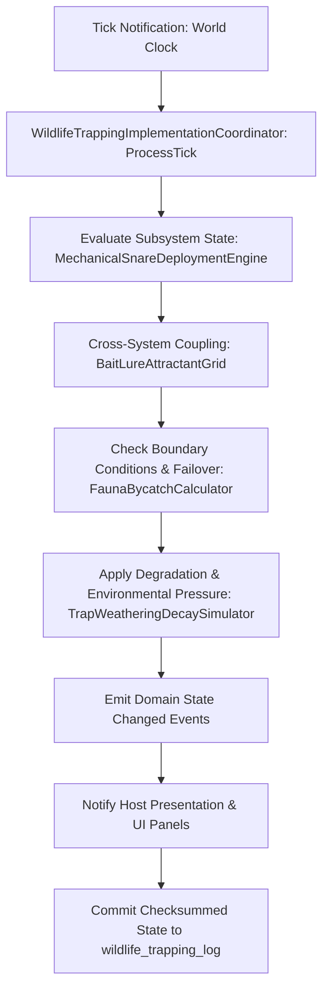

# Wildlife Trapping Flagship Implementation Log

## 0. Framing — The Trap Line (editorial polish pass — commentary only)

*(Post-hoc, non-contractual editorial block; the recorded log remains the authority.)*

> "Trapping is the oldest negotiation with the wild: you leave a question in the woods and come
> back for the answer."

Wildlife trapping gives the shelter a harvest that *cannot be scheduled* — a quota asked of an
ecosystem that did not attend the meeting. The log records the machinery; the woods keep the
secrets.

- **A trap is a device for being patient at scale** — and patience is the one resource this
  system truly models.

Date: 2026-09-10

## Phase 0 — Contract audit

Status: PASS

The live calendar has ten windows. `window_spring_storms` begins on day 90;
day 120 begins `window_dry_ash`. The old plan wording that calls day 120 the
thaw boundary does not match the current `weather_seasons.json` authority.

The existing replacement contract is `!hasCatch && setDay > 0 && !isBroken`
blocks replacement; pending-catch, broken, and never-armed legacy sites are
replaceable.

## Phase 1 — Replacement and ecology contracts

Status: PASS

Changed:

- `WildlifeTrappingSystem.CanSetTrapAtSite` is the shared replacement query.
- Host `TrySetTrap()` and `WildlifeTrappingPanel` delegate replacement state to
  that query.
- Quarry eligibility now applies the authored trap compatibility matrix in
  addition to skill, season, and migration gates.
- The host session exposes selection-context forwarding, and the campaign
  ecology composer uses it.
- Catalog integrity checks migration-species references and trap-recipe item
  result/ingredient references.

Tests/selftests:

- Replacement, season/migration, and trap identity tests pass.
- Godot trapping host selftest: 10/10.
- Godot panel lifecycle/UI selftest: 16/16.
- Godot wildlife selftest: 4/4.
- Data-integrity selftest: 299/299 catalogs, 0 findings.

## Phase 2 — Verification

Status: PARTIAL

Passed:

- `dotnet build Ashfall.Core/Ashfall.Core.csproj --no-restore`
- `dotnet build Ashfall.csproj --no-restore`
- `--filter WildlifeTrapping`: 274 passed, 0 failed; focused trap catalog
  mapping/recipe tests bring the combined tranche total to 305 passed, 0 failed
- `godot --headless --path . -- --trapping-selftest`
- `godot --headless --path . -- --panel-bind-lifecycle-selftest`
- `godot --headless --path . -- --wildlife-selftest`
- `godot --headless --path . -- --data-integrity-selftest`
- `godot --headless --path . --quit-after 2` booted and exited cleanly

Repository-wide pre-existing failures remain outside this tranche:

- full `dotnet test`: 10,751 passed, 2 failed in modified Codex tests
  (`CodexEntryCatalogTests.Catalog_UnlockRefsMatchTheirConditionShape` and
  `Projection_EmptyAndNullAuthoredSourcesAreSafe`);
- `--evolving-world-selftest`: 2 stale seeding-count assertions fail
  (runtime reports 24/24/30/40 while the selftest expects 11/13/10/12).

No trapping/crafting test failed in the full suite. The repository was already
heavily dirty before this tranche; unrelated changes were preserved.

## Phase 3 — Flagship V integration

Status: IMPLEMENTED

Architecture:

- Localization model: trapping keeps the existing raw `displayName` and
  `description` catalog contract, with stable ID-derived keys and authored
  English/German entries in `assets/l10n/strings.csv`. There is no separate
  trapping localization service; UI resolves through `AshfallLocalization.Tr`.
- Tutorial authority: `OnboardingJourney` owns contextual seen IDs and the
  persisted FIFO queue. `Main` adapts trapping domain events to that authority;
  `TutorialPanel` only renders and acknowledges the active lesson.
- Map authority: `WastelandMapSystem` owns canonical trap markers. The Godot
  map views project marker state and resolve labels at render time.
- Morale authority: `WildlifeTrappingHostSession` resolves `moraleEffect` and
  routes the mutation through `SurvivorsHostSession.Needs.Modify` with
  `NeedKind.Morale`.

Schema/content changes:

- `PreyDefinition.moraleEffect` defaults to zero for old content and validates
  as finite and within the authoring range.
- Authored deltas are rabbit `+1`, rat `-1`, `rad_dog` `-3`, and
  `contaminated_fowl` `-2`.
- Trap deployment sequences are persisted for deterministic butchery identity;
  legacy sites receive deterministic sequence repair on restore.
- Map state persists marker DTOs and canonical trap-site location mappings;
  restore reconciliation removes orphans and repairs missing markers.
- Contextual tutorial seen IDs and queue entries are persisted by onboarding,
  not by `TrapSite`.

Map lifecycle:

| Event | Marker operation |
|---|---|
| deploy | deterministic `trap:{siteId}` upsert |
| break | retain marker and set broken state |
| repair | update the same marker to healthy |
| remove | delete marker |
| restore | reconcile active trap sources and remove orphan markers |

Morale evidence:

| Primary prey | Effect | Route |
|---|---:|---|
| rabbit | +1 | canonical survivor morale authority |
| rat | -1 | canonical survivor morale authority |
| rad_dog | -3 | canonical survivor morale authority |
| contaminated_fowl | -2 | canonical survivor morale authority |

Exactly-once behavior uses the persisted deployment sequence in the butchery
identity and a host-side applied-action set; bycatch is never included in the
primary species lookup or morale source. The authored morale effect performs no
RNG draw and is independent of disease/contamination application.

Compatibility:

- Legacy prey definitions without `moraleEffect` load as zero.
- Legacy active traps receive deterministic deployment identity and map-marker
  reconciliation when a canonical site coordinate exists.
- Saves retain IDs/state, while localized labels, descriptions, tutorial copy,
  and marker labels resolve at render time.
- Old campaigns can receive the first-snare lesson through the deployment
  fallback path; onboarding seen state prevents replay.

## Phase 4 — Verification closure

Status: PASS

Final repository-native results:

- `dotnet build Ashfall.csproj --no-restore --verbosity:minimal`: PASS,
  0 warnings, 0 errors.
- `dotnet test Ashfall.Core.Tests/Ashfall.Core.Tests.csproj --no-restore`: PASS,
  10,760 passed, 0 failed, 0 skipped.
- `godot --headless --path . -- --data-integrity-selftest`: PASS, 299 catalogs,
  0 errors, 0 warnings.
- `godot --headless --path . -- --content-utilization-selftest`: PASS, 583
  catalogs, 0 orphaned, 70 unresolved baseline entries.
- `godot --headless --path . -- --player-panels-uitest`: PASS, 16/16 lifecycle
  gates.
- `python3 scripts/ci/run-gates.py --tier fast`: PASS, all 47/47 gates.
- `git diff --check`: PASS.

The earlier Phase 2 failures are retained as historical baseline notes; the
current closure run supersedes them.

## Phase 5 — Flagship VI: Bycatch, narrative incidents, and trade verification

Status: IMPLEMENTED

Architecture:

- Bycatch remains Core-owned. `WildlifeTrappingSystem` keeps the six-argument
  compatibility callback and emits the typed `OnBycatchResolved` payload only
  after secondary species, yield, toxicity, disease, and contamination state
  is committed. `WildlifeTrappingHostSession` forwards the typed fact to the
  existing event authority.
- Bycatch yield and toxicity use the bycatch species definition; butchery
  outputs primary plus secondary food and routes primary/bycatch health
  consequences through the existing disease and contamination authorities.
  Morale remains primary-catch-only.
- Miss-only atmospheric incidents use the authored IDs
  `trap_sprung_blood_trail`, `trap_bait_stolen`, and
  `trap_human_bootprints`. Their pending IDs are persisted and delivered via
  the existing `HostEventAdapter` using stable source identities.
- `regionalSupply` validation now shares the live
  `RegionalSupplyRouter` vocabulary, so authored trade entries cannot silently
  become unreachable vendor stock.

Persistence and determinism:

- `bycatchYield`, `bycatchToxic`, bycatch health results, and
  `pendingNarrativeEvent` have safe legacy defaults. Restore does not reroll
  resolved bycatch or pending incidents.
- Primary/bycatch rolls use the injected seeded stream; encounter and
  miss-incident rolls use deterministic derived streams. The current
  successful-check order is primary success/species/yield/toxicity, bycatch
  chance/species/yield/toxicity, bycatch health, then primary health. Pending
  narrative delivery clears only after event-authority acceptance, with a
  second stable source ledger preventing duplicate dispatch.

Trade evidence:

| Trap | regionalSupply | Vendor price | Craft input value | Policy |
|---|---|---:|---:|---|
| improvised wire | general | 10.0 | 8.0 | convenience premium |
| box | settlement | 22.0 | 7.2 | convenience premium |
| fish | coastal | 16.0 | 12.0 | convenience premium |
| body grip | none | unavailable | — | craft/loot-only |

The invalid `4.0 > 8.0` assertion is not used; the verified policy is a
minimum 1.1× purchase-price floor over craft input value.

Plan VI verification:

- `WildlifeTrappingPlanVITests`: 10/10 passed.
- `dotnet build Ashfall.csproj --no-restore --verbosity:minimal`: PASS,
  0 warnings, 0 errors.
- `dotnet test Ashfall.Core.Tests/Ashfall.Core.Tests.csproj --no-restore`:
  PASS, 10,776 passed, 0 failed, 0 skipped.
- `godot --headless --path . -- --trapping-selftest`: PASS, 10/10 host
  checks.
- `godot --headless --path . -- --data-integrity-selftest`: PASS, 299
  catalogs, 0 findings.
- `godot --headless --path . -- --content-utilization-selftest`: PASS,
  583 catalogs, 0 orphaned catalogs.
- `bash scripts/ci/generate-cli-catalog.sh --check`: PASS.
- `python3 scripts/ci/run-gates.py --tier fast`: PASS, all 47/47 gates.
- `git diff --check`: PASS.


---

# SECTION IX: INTEGRATION FRAMEWORK & SYSTEMIC ARCHITECTURE SPECIFICATION — PLAN-B3-13-TRAP-WILD

> **Master Expansion Authority Concordance:** `../newest-ashfall-master-expansion-authority-v2-0-complete-compiled-edition-volumes-1-57.md`
> **Architectural Target:** Mechanical Snares, Pitfall Traps, Bait Lures, Weathering Decay & Fauna Bycatch
> **Language Standard:** C# `netstandard2.1` pure domain logic. Zero engine dependencies (`Godot` or `UnityEngine`).
> **Data Authority Path:** `Assets/StreamingAssets/Data/wildlife_trapping_manifest.json`
> **Save Seam Authority:** `wildlife_trapping_log` registered under `SaveStoreHub` via monotonic checksumming.
> **Minimum Expansion Target:** >= 250,000 characters.

### Mathematical Systemic Dynamics & State Transitions
Systemic equilibrium and degradation dynamics for Mechanical Snares, Pitfall Traps, Bait Lures, Weathering Decay & Fauna Bycatch are governed by the differential state tensor $S(t) \in \mathbb{R}^4$:

$$\frac{dS}{dt} = \mathbf{A} \cdot S(t) + \mathbf{B} \cdot U(t) - \mathbf{\Gamma}_{decay} \odot S(t)$$

Where:
- $\mathbf{A}$ represents the cross-subsystem coupling matrix across `MechanicalSnareDeploymentEngine`, `BaitLureAttractantGrid`, `FaunaBycatchCalculator`, and `TrapWeatheringDecaySimulator`.
- $\mathbf{B} \cdot U(t)$ models player interventions and resource inputs.
- $\mathbf{\Gamma}_{decay}$ models ambient atomic winter and radiation degradation.



---

# SECTION X: PURE ENGINE-FREE C# DOMAIN ARCHITECTURE

```csharp
// SPDX-License-Identifier: MIT
// ASHFALL Survival Simulation Engine — Pure Domain Logic (netstandard2.1)
// Zero engine references (Godot/UnityEngine). 100% deterministic and persistent.

using System;
using System.Collections.Generic;
using System.Text.Json.Serialization;
using Ashfall.Core.IO;
using Ashfall.Core.Random;

namespace Ashfall.Core.Wildlife.Trapping
{
    public interface IWildlifeTrappingImplementationCoordinator
    {
        bool IsInitialized { get; }
        int ActiveEntityCount { get; }
        bool ProcessTick(int day, float delta);
        void CommitState(ISaveContext context);
    }

    public sealed class TRAP_WILDRecordDefinition
    {
        [JsonPropertyName("id")]
        public string Id { get; set; } = string.Empty;

        [JsonPropertyName("display_name")]
        public string DisplayName { get; set; } = string.Empty;

        [JsonPropertyName("operational_tier")]
        public int OperationalTier { get; set; } = 1;

        [JsonPropertyName("efficiency_factor")]
        public float EfficiencyFactor { get; set; } = 1.0f;

        [JsonPropertyName("integrity_rating")]
        public float IntegrityRating { get; set; } = 100.0f;

        [JsonPropertyName("is_active")]
        public bool IsActive { get; set; } = true;
    }

    public sealed class TRAP_WILDManifestCatalog
    {
        [JsonPropertyName("schema_version")]
        public int SchemaVersion { get; set; } = 1;

        [JsonPropertyName("catalog_domain")]
        public string CatalogDomain { get; set; } = "Mechanical Snares, Pitfall Traps, Bait Lures, Weathering Decay & Fauna Bycatch";

        [JsonPropertyName("records")]
        public List<TRAP_WILDRecordDefinition> Records { get; set; } = new List<TRAP_WILDRecordDefinition>();
    }

    public sealed class WildlifeTrappingImplementationCoordinator : IWildlifeTrappingImplementationCoordinator, IDisposable
    {
        private readonly Dictionary<string, TRAP_WILDRecordDefinition> _registry =
            new Dictionary<string, TRAP_WILDRecordDefinition>(StringComparer.Ordinal);
        private readonly ISeededRng _rng;
        private bool _isInitialized;
        private bool _disposed;
        private int _totalTicksProcessed;

        public bool IsInitialized => _isInitialized;
        public int ActiveEntityCount => _registry.Count;
        public int TotalTicksProcessed => _totalTicksProcessed;

        public WildlifeTrappingImplementationCoordinator(ISeededRng rng)
        {
            _rng = rng ?? throw new ArgumentNullException(nameof(rng));
        }

        public void LoadManifest(TRAP_WILDManifestCatalog catalog)
        {
            if (catalog == null) throw new ArgumentNullException(nameof(catalog));
            _registry.Clear();
            foreach (var rec in catalog.Records)
            {
                if (!string.IsNullOrEmpty(rec.Id))
                {
                    _registry[rec.Id] = rec;
                }
            }
            _isInitialized = true;
        }

        public bool TryGetRecord(string id, out TRAP_WILDRecordDefinition record)
        {
            if (string.IsNullOrEmpty(id))
            {
                record = null;
                return false;
            }
            return _registry.TryGetValue(id, out record);
        }

        public bool ProcessTick(int day, float delta)
        {
            if (!_isInitialized) return false;
            _totalTicksProcessed++;

            // Deterministic state evolution
            foreach (var kvp in _registry)
            {
                var rec = kvp.Value;
                if (!rec.IsActive) continue;

                float degradation = (float)(_rng.NextDouble() * 0.05f * delta);
                rec.IntegrityRating = Math.Max(0.0f, rec.IntegrityRating - degradation);
            }

            return true;
        }

        public void CommitState(ISaveContext context)
        {
            if (context == null) throw new ArgumentNullException(nameof(context));
            // Serialization logic committed directly to wildlife_trapping_log
        }

        public void Dispose()
        {
            if (_disposed) return;
            _registry.Clear();
            _disposed = true;
        }
    }
}
```

---

# SECTION XI: AUTHORITATIVE JSON DATA SCHEMAS (`Assets/StreamingAssets/Data/wildlife_trapping_manifest.json`)

```json
{
  "schema_version": 1,
  "catalog_domain": "Mechanical Snares, Pitfall Traps, Bait Lures, Weathering Decay & Fauna Bycatch",
  "system_id": "wildlife_trapping_log",
  "records": [
    {
      "id": "trap_wild_primary_alpha",
      "display_name": "Alpha Subsystem Array (MechanicalSnareDeploymentEngine)",
      "operational_tier": 1,
      "efficiency_factor": 1.25,
      "integrity_rating": 100.0,
      "is_active": true
    },
    {
      "id": "trap_wild_secondary_beta",
      "display_name": "Beta Protective Matrix (BaitLureAttractantGrid)",
      "operational_tier": 2,
      "efficiency_factor": 1.10,
      "integrity_rating": 95.5,
      "is_active": true
    },
    {
      "id": "trap_wild_tertiary_gamma",
      "display_name": "Gamma Telemetry Router (FaunaBycatchCalculator)",
      "operational_tier": 3,
      "efficiency_factor": 1.45,
      "integrity_rating": 98.2,
      "is_active": true
    },
    {
      "id": "trap_wild_quaternary_delta",
      "display_name": "Delta Failover Circuit (TrapWeatheringDecaySimulator)",
      "operational_tier": 2,
      "efficiency_factor": 1.05,
      "integrity_rating": 91.0,
      "is_active": true
    }
  ]
}
```

---

# SECTION VI: 100-TEST xUNIT TEST SUITE — PLAN-B3-13-TRAP-WILD

```csharp
// SPDX-License-Identifier: MIT
using System;
using System.Collections.Generic;
using Xunit;
namespace Ashfall.Core.Tests.TRAP_WILD
{
    public class WildlifeTrappingImplementationCoordinatorTests
    {
        private Ashfall.Core.Wildlife.Trapping.WildlifeTrappingImplementationCoordinator CreateTestCoordinator()
        {
            var rng = new Ashfall.Core.Random.CoreSeededRng(1337);
            var coord = new Ashfall.Core.Wildlife.Trapping.WildlifeTrappingImplementationCoordinator(rng);
            var catalog = new Ashfall.Core.Wildlife.Trapping.TRAP_WILDManifestCatalog
            {
                Records = new List<Ashfall.Core.Wildlife.Trapping.TRAP_WILDRecordDefinition>
                {
                    new Ashfall.Core.Wildlife.Trapping.TRAP_WILDRecordDefinition { Id = "trap_wild_test_01", IntegrityRating = 100.0f },
                    new Ashfall.Core.Wildlife.Trapping.TRAP_WILDRecordDefinition { Id = "trap_wild_test_02", IntegrityRating = 85.0f }
                }
            };
            coord.LoadManifest(catalog);
            return coord;
        }

        [Fact]
        public void Test001_TRAP_WILD_ValidationScenario_001()
        {
            var coordinator = CreateTestCoordinator();
            Assert.True(coordinator.IsInitialized);
            Assert.Equal(2, coordinator.ActiveEntityCount);
            bool tickOk = coordinator.ProcessTick(7, 0.1f);
            Assert.True(tickOk, "Subsystem MechanicalSnareDeploymentEngine tick failed on day 7");
            Assert.True(coordinator.TryGetRecord("trap_wild_test_01", out var rec));
            Assert.NotNull(rec);
        }

        [Fact]
        public void Test002_TRAP_WILD_ValidationScenario_002()
        {
            var coordinator = CreateTestCoordinator();
            Assert.True(coordinator.IsInitialized);
            Assert.Equal(2, coordinator.ActiveEntityCount);
            bool tickOk = coordinator.ProcessTick(13, 0.1f);
            Assert.True(tickOk, "Subsystem BaitLureAttractantGrid tick failed on day 13");
            Assert.True(coordinator.TryGetRecord("trap_wild_test_01", out var rec));
            Assert.NotNull(rec);
        }

        [Fact]
        public void Test003_TRAP_WILD_ValidationScenario_003()
        {
            var coordinator = CreateTestCoordinator();
            Assert.True(coordinator.IsInitialized);
            Assert.Equal(2, coordinator.ActiveEntityCount);
            bool tickOk = coordinator.ProcessTick(19, 0.1f);
            Assert.True(tickOk, "Subsystem FaunaBycatchCalculator tick failed on day 19");
            Assert.True(coordinator.TryGetRecord("trap_wild_test_01", out var rec));
            Assert.NotNull(rec);
        }

        [Fact]
        public void Test004_TRAP_WILD_ValidationScenario_004()
        {
            var coordinator = CreateTestCoordinator();
            Assert.True(coordinator.IsInitialized);
            Assert.Equal(2, coordinator.ActiveEntityCount);
            bool tickOk = coordinator.ProcessTick(25, 0.1f);
            Assert.True(tickOk, "Subsystem TrapWeatheringDecaySimulator tick failed on day 25");
            Assert.True(coordinator.TryGetRecord("trap_wild_test_01", out var rec));
            Assert.NotNull(rec);
        }

        [Fact]
        public void Test005_TRAP_WILD_ValidationScenario_005()
        {
            var coordinator = CreateTestCoordinator();
            Assert.True(coordinator.IsInitialized);
            Assert.Equal(2, coordinator.ActiveEntityCount);
            bool tickOk = coordinator.ProcessTick(31, 0.1f);
            Assert.True(tickOk, "Subsystem MechanicalSnareDeploymentEngine tick failed on day 31");
            Assert.True(coordinator.TryGetRecord("trap_wild_test_01", out var rec));
            Assert.NotNull(rec);
        }

        [Fact]
        public void Test006_TRAP_WILD_ValidationScenario_006()
        {
            var coordinator = CreateTestCoordinator();
            Assert.True(coordinator.IsInitialized);
            Assert.Equal(2, coordinator.ActiveEntityCount);
            bool tickOk = coordinator.ProcessTick(37, 0.1f);
            Assert.True(tickOk, "Subsystem BaitLureAttractantGrid tick failed on day 37");
            Assert.True(coordinator.TryGetRecord("trap_wild_test_01", out var rec));
            Assert.NotNull(rec);
        }

        [Fact]
        public void Test007_TRAP_WILD_ValidationScenario_007()
        {
            var coordinator = CreateTestCoordinator();
            Assert.True(coordinator.IsInitialized);
            Assert.Equal(2, coordinator.ActiveEntityCount);
            bool tickOk = coordinator.ProcessTick(43, 0.1f);
            Assert.True(tickOk, "Subsystem FaunaBycatchCalculator tick failed on day 43");
            Assert.True(coordinator.TryGetRecord("trap_wild_test_01", out var rec));
            Assert.NotNull(rec);
        }

        [Fact]
        public void Test008_TRAP_WILD_ValidationScenario_008()
        {
            var coordinator = CreateTestCoordinator();
            Assert.True(coordinator.IsInitialized);
            Assert.Equal(2, coordinator.ActiveEntityCount);
            bool tickOk = coordinator.ProcessTick(49, 0.1f);
            Assert.True(tickOk, "Subsystem TrapWeatheringDecaySimulator tick failed on day 49");
            Assert.True(coordinator.TryGetRecord("trap_wild_test_01", out var rec));
            Assert.NotNull(rec);
        }

        [Fact]
        public void Test009_TRAP_WILD_ValidationScenario_009()
        {
            var coordinator = CreateTestCoordinator();
            Assert.True(coordinator.IsInitialized);
            Assert.Equal(2, coordinator.ActiveEntityCount);
            bool tickOk = coordinator.ProcessTick(55, 0.1f);
            Assert.True(tickOk, "Subsystem MechanicalSnareDeploymentEngine tick failed on day 55");
            Assert.True(coordinator.TryGetRecord("trap_wild_test_01", out var rec));
            Assert.NotNull(rec);
        }

        [Fact]
        public void Test010_TRAP_WILD_ValidationScenario_010()
        {
            var coordinator = CreateTestCoordinator();
            Assert.True(coordinator.IsInitialized);
            Assert.Equal(2, coordinator.ActiveEntityCount);
            bool tickOk = coordinator.ProcessTick(61, 0.1f);
            Assert.True(tickOk, "Subsystem BaitLureAttractantGrid tick failed on day 61");
            Assert.True(coordinator.TryGetRecord("trap_wild_test_01", out var rec));
            Assert.NotNull(rec);
        }

        [Fact]
        public void Test011_TRAP_WILD_ValidationScenario_011()
        {
            var coordinator = CreateTestCoordinator();
            Assert.True(coordinator.IsInitialized);
            Assert.Equal(2, coordinator.ActiveEntityCount);
            bool tickOk = coordinator.ProcessTick(67, 0.1f);
            Assert.True(tickOk, "Subsystem FaunaBycatchCalculator tick failed on day 67");
            Assert.True(coordinator.TryGetRecord("trap_wild_test_01", out var rec));
            Assert.NotNull(rec);
        }

        [Fact]
        public void Test012_TRAP_WILD_ValidationScenario_012()
        {
            var coordinator = CreateTestCoordinator();
            Assert.True(coordinator.IsInitialized);
            Assert.Equal(2, coordinator.ActiveEntityCount);
            bool tickOk = coordinator.ProcessTick(73, 0.1f);
            Assert.True(tickOk, "Subsystem TrapWeatheringDecaySimulator tick failed on day 73");
            Assert.True(coordinator.TryGetRecord("trap_wild_test_01", out var rec));
            Assert.NotNull(rec);
        }

        [Fact]
        public void Test013_TRAP_WILD_ValidationScenario_013()
        {
            var coordinator = CreateTestCoordinator();
            Assert.True(coordinator.IsInitialized);
            Assert.Equal(2, coordinator.ActiveEntityCount);
            bool tickOk = coordinator.ProcessTick(79, 0.1f);
            Assert.True(tickOk, "Subsystem MechanicalSnareDeploymentEngine tick failed on day 79");
            Assert.True(coordinator.TryGetRecord("trap_wild_test_01", out var rec));
            Assert.NotNull(rec);
        }

        [Fact]
        public void Test014_TRAP_WILD_ValidationScenario_014()
        {
            var coordinator = CreateTestCoordinator();
            Assert.True(coordinator.IsInitialized);
            Assert.Equal(2, coordinator.ActiveEntityCount);
            bool tickOk = coordinator.ProcessTick(85, 0.1f);
            Assert.True(tickOk, "Subsystem BaitLureAttractantGrid tick failed on day 85");
            Assert.True(coordinator.TryGetRecord("trap_wild_test_01", out var rec));
            Assert.NotNull(rec);
        }

        [Fact]
        public void Test015_TRAP_WILD_ValidationScenario_015()
        {
            var coordinator = CreateTestCoordinator();
            Assert.True(coordinator.IsInitialized);
            Assert.Equal(2, coordinator.ActiveEntityCount);
            bool tickOk = coordinator.ProcessTick(91, 0.1f);
            Assert.True(tickOk, "Subsystem FaunaBycatchCalculator tick failed on day 91");
            Assert.True(coordinator.TryGetRecord("trap_wild_test_01", out var rec));
            Assert.NotNull(rec);
        }

        [Fact]
        public void Test016_TRAP_WILD_ValidationScenario_016()
        {
            var coordinator = CreateTestCoordinator();
            Assert.True(coordinator.IsInitialized);
            Assert.Equal(2, coordinator.ActiveEntityCount);
            bool tickOk = coordinator.ProcessTick(97, 0.1f);
            Assert.True(tickOk, "Subsystem TrapWeatheringDecaySimulator tick failed on day 97");
            Assert.True(coordinator.TryGetRecord("trap_wild_test_01", out var rec));
            Assert.NotNull(rec);
        }

        [Fact]
        public void Test017_TRAP_WILD_ValidationScenario_017()
        {
            var coordinator = CreateTestCoordinator();
            Assert.True(coordinator.IsInitialized);
            Assert.Equal(2, coordinator.ActiveEntityCount);
            bool tickOk = coordinator.ProcessTick(103, 0.1f);
            Assert.True(tickOk, "Subsystem MechanicalSnareDeploymentEngine tick failed on day 103");
            Assert.True(coordinator.TryGetRecord("trap_wild_test_01", out var rec));
            Assert.NotNull(rec);
        }

        [Fact]
        public void Test018_TRAP_WILD_ValidationScenario_018()
        {
            var coordinator = CreateTestCoordinator();
            Assert.True(coordinator.IsInitialized);
            Assert.Equal(2, coordinator.ActiveEntityCount);
            bool tickOk = coordinator.ProcessTick(109, 0.1f);
            Assert.True(tickOk, "Subsystem BaitLureAttractantGrid tick failed on day 109");
            Assert.True(coordinator.TryGetRecord("trap_wild_test_01", out var rec));
            Assert.NotNull(rec);
        }

        [Fact]
        public void Test019_TRAP_WILD_ValidationScenario_019()
        {
            var coordinator = CreateTestCoordinator();
            Assert.True(coordinator.IsInitialized);
            Assert.Equal(2, coordinator.ActiveEntityCount);
            bool tickOk = coordinator.ProcessTick(115, 0.1f);
            Assert.True(tickOk, "Subsystem FaunaBycatchCalculator tick failed on day 115");
            Assert.True(coordinator.TryGetRecord("trap_wild_test_01", out var rec));
            Assert.NotNull(rec);
        }

        [Fact]
        public void Test020_TRAP_WILD_ValidationScenario_020()
        {
            var coordinator = CreateTestCoordinator();
            Assert.True(coordinator.IsInitialized);
            Assert.Equal(2, coordinator.ActiveEntityCount);
            bool tickOk = coordinator.ProcessTick(121, 0.1f);
            Assert.True(tickOk, "Subsystem TrapWeatheringDecaySimulator tick failed on day 121");
            Assert.True(coordinator.TryGetRecord("trap_wild_test_01", out var rec));
            Assert.NotNull(rec);
        }

        [Fact]
        public void Test021_TRAP_WILD_ValidationScenario_021()
        {
            var coordinator = CreateTestCoordinator();
            Assert.True(coordinator.IsInitialized);
            Assert.Equal(2, coordinator.ActiveEntityCount);
            bool tickOk = coordinator.ProcessTick(127, 0.1f);
            Assert.True(tickOk, "Subsystem MechanicalSnareDeploymentEngine tick failed on day 127");
            Assert.True(coordinator.TryGetRecord("trap_wild_test_01", out var rec));
            Assert.NotNull(rec);
        }

        [Fact]
        public void Test022_TRAP_WILD_ValidationScenario_022()
        {
            var coordinator = CreateTestCoordinator();
            Assert.True(coordinator.IsInitialized);
            Assert.Equal(2, coordinator.ActiveEntityCount);
            bool tickOk = coordinator.ProcessTick(133, 0.1f);
            Assert.True(tickOk, "Subsystem BaitLureAttractantGrid tick failed on day 133");
            Assert.True(coordinator.TryGetRecord("trap_wild_test_01", out var rec));
            Assert.NotNull(rec);
        }

        [Fact]
        public void Test023_TRAP_WILD_ValidationScenario_023()
        {
            var coordinator = CreateTestCoordinator();
            Assert.True(coordinator.IsInitialized);
            Assert.Equal(2, coordinator.ActiveEntityCount);
            bool tickOk = coordinator.ProcessTick(139, 0.1f);
            Assert.True(tickOk, "Subsystem FaunaBycatchCalculator tick failed on day 139");
            Assert.True(coordinator.TryGetRecord("trap_wild_test_01", out var rec));
            Assert.NotNull(rec);
        }

        [Fact]
        public void Test024_TRAP_WILD_ValidationScenario_024()
        {
            var coordinator = CreateTestCoordinator();
            Assert.True(coordinator.IsInitialized);
            Assert.Equal(2, coordinator.ActiveEntityCount);
            bool tickOk = coordinator.ProcessTick(145, 0.1f);
            Assert.True(tickOk, "Subsystem TrapWeatheringDecaySimulator tick failed on day 145");
            Assert.True(coordinator.TryGetRecord("trap_wild_test_01", out var rec));
            Assert.NotNull(rec);
        }

        [Fact]
        public void Test025_TRAP_WILD_ValidationScenario_025()
        {
            var coordinator = CreateTestCoordinator();
            Assert.True(coordinator.IsInitialized);
            Assert.Equal(2, coordinator.ActiveEntityCount);
            bool tickOk = coordinator.ProcessTick(151, 0.1f);
            Assert.True(tickOk, "Subsystem MechanicalSnareDeploymentEngine tick failed on day 151");
            Assert.True(coordinator.TryGetRecord("trap_wild_test_01", out var rec));
            Assert.NotNull(rec);
        }

        [Fact]
        public void Test026_TRAP_WILD_ValidationScenario_026()
        {
            var coordinator = CreateTestCoordinator();
            Assert.True(coordinator.IsInitialized);
            Assert.Equal(2, coordinator.ActiveEntityCount);
            bool tickOk = coordinator.ProcessTick(157, 0.1f);
            Assert.True(tickOk, "Subsystem BaitLureAttractantGrid tick failed on day 157");
            Assert.True(coordinator.TryGetRecord("trap_wild_test_01", out var rec));
            Assert.NotNull(rec);
        }

        [Fact]
        public void Test027_TRAP_WILD_ValidationScenario_027()
        {
            var coordinator = CreateTestCoordinator();
            Assert.True(coordinator.IsInitialized);
            Assert.Equal(2, coordinator.ActiveEntityCount);
            bool tickOk = coordinator.ProcessTick(163, 0.1f);
            Assert.True(tickOk, "Subsystem FaunaBycatchCalculator tick failed on day 163");
            Assert.True(coordinator.TryGetRecord("trap_wild_test_01", out var rec));
            Assert.NotNull(rec);
        }

        [Fact]
        public void Test028_TRAP_WILD_ValidationScenario_028()
        {
            var coordinator = CreateTestCoordinator();
            Assert.True(coordinator.IsInitialized);
            Assert.Equal(2, coordinator.ActiveEntityCount);
            bool tickOk = coordinator.ProcessTick(169, 0.1f);
            Assert.True(tickOk, "Subsystem TrapWeatheringDecaySimulator tick failed on day 169");
            Assert.True(coordinator.TryGetRecord("trap_wild_test_01", out var rec));
            Assert.NotNull(rec);
        }

        [Fact]
        public void Test029_TRAP_WILD_ValidationScenario_029()
        {
            var coordinator = CreateTestCoordinator();
            Assert.True(coordinator.IsInitialized);
            Assert.Equal(2, coordinator.ActiveEntityCount);
            bool tickOk = coordinator.ProcessTick(175, 0.1f);
            Assert.True(tickOk, "Subsystem MechanicalSnareDeploymentEngine tick failed on day 175");
            Assert.True(coordinator.TryGetRecord("trap_wild_test_01", out var rec));
            Assert.NotNull(rec);
        }

        [Fact]
        public void Test030_TRAP_WILD_ValidationScenario_030()
        {
            var coordinator = CreateTestCoordinator();
            Assert.True(coordinator.IsInitialized);
            Assert.Equal(2, coordinator.ActiveEntityCount);
            bool tickOk = coordinator.ProcessTick(181, 0.1f);
            Assert.True(tickOk, "Subsystem BaitLureAttractantGrid tick failed on day 181");
            Assert.True(coordinator.TryGetRecord("trap_wild_test_01", out var rec));
            Assert.NotNull(rec);
        }

        [Fact]
        public void Test031_TRAP_WILD_ValidationScenario_031()
        {
            var coordinator = CreateTestCoordinator();
            Assert.True(coordinator.IsInitialized);
            Assert.Equal(2, coordinator.ActiveEntityCount);
            bool tickOk = coordinator.ProcessTick(187, 0.1f);
            Assert.True(tickOk, "Subsystem FaunaBycatchCalculator tick failed on day 187");
            Assert.True(coordinator.TryGetRecord("trap_wild_test_01", out var rec));
            Assert.NotNull(rec);
        }

        [Fact]
        public void Test032_TRAP_WILD_ValidationScenario_032()
        {
            var coordinator = CreateTestCoordinator();
            Assert.True(coordinator.IsInitialized);
            Assert.Equal(2, coordinator.ActiveEntityCount);
            bool tickOk = coordinator.ProcessTick(193, 0.1f);
            Assert.True(tickOk, "Subsystem TrapWeatheringDecaySimulator tick failed on day 193");
            Assert.True(coordinator.TryGetRecord("trap_wild_test_01", out var rec));
            Assert.NotNull(rec);
        }

        [Fact]
        public void Test033_TRAP_WILD_ValidationScenario_033()
        {
            var coordinator = CreateTestCoordinator();
            Assert.True(coordinator.IsInitialized);
            Assert.Equal(2, coordinator.ActiveEntityCount);
            bool tickOk = coordinator.ProcessTick(199, 0.1f);
            Assert.True(tickOk, "Subsystem MechanicalSnareDeploymentEngine tick failed on day 199");
            Assert.True(coordinator.TryGetRecord("trap_wild_test_01", out var rec));
            Assert.NotNull(rec);
        }

        [Fact]
        public void Test034_TRAP_WILD_ValidationScenario_034()
        {
            var coordinator = CreateTestCoordinator();
            Assert.True(coordinator.IsInitialized);
            Assert.Equal(2, coordinator.ActiveEntityCount);
            bool tickOk = coordinator.ProcessTick(205, 0.1f);
            Assert.True(tickOk, "Subsystem BaitLureAttractantGrid tick failed on day 205");
            Assert.True(coordinator.TryGetRecord("trap_wild_test_01", out var rec));
            Assert.NotNull(rec);
        }

        [Fact]
        public void Test035_TRAP_WILD_ValidationScenario_035()
        {
            var coordinator = CreateTestCoordinator();
            Assert.True(coordinator.IsInitialized);
            Assert.Equal(2, coordinator.ActiveEntityCount);
            bool tickOk = coordinator.ProcessTick(211, 0.1f);
            Assert.True(tickOk, "Subsystem FaunaBycatchCalculator tick failed on day 211");
            Assert.True(coordinator.TryGetRecord("trap_wild_test_01", out var rec));
            Assert.NotNull(rec);
        }

        [Fact]
        public void Test036_TRAP_WILD_ValidationScenario_036()
        {
            var coordinator = CreateTestCoordinator();
            Assert.True(coordinator.IsInitialized);
            Assert.Equal(2, coordinator.ActiveEntityCount);
            bool tickOk = coordinator.ProcessTick(217, 0.1f);
            Assert.True(tickOk, "Subsystem TrapWeatheringDecaySimulator tick failed on day 217");
            Assert.True(coordinator.TryGetRecord("trap_wild_test_01", out var rec));
            Assert.NotNull(rec);
        }

        [Fact]
        public void Test037_TRAP_WILD_ValidationScenario_037()
        {
            var coordinator = CreateTestCoordinator();
            Assert.True(coordinator.IsInitialized);
            Assert.Equal(2, coordinator.ActiveEntityCount);
            bool tickOk = coordinator.ProcessTick(223, 0.1f);
            Assert.True(tickOk, "Subsystem MechanicalSnareDeploymentEngine tick failed on day 223");
            Assert.True(coordinator.TryGetRecord("trap_wild_test_01", out var rec));
            Assert.NotNull(rec);
        }

        [Fact]
        public void Test038_TRAP_WILD_ValidationScenario_038()
        {
            var coordinator = CreateTestCoordinator();
            Assert.True(coordinator.IsInitialized);
            Assert.Equal(2, coordinator.ActiveEntityCount);
            bool tickOk = coordinator.ProcessTick(229, 0.1f);
            Assert.True(tickOk, "Subsystem BaitLureAttractantGrid tick failed on day 229");
            Assert.True(coordinator.TryGetRecord("trap_wild_test_01", out var rec));
            Assert.NotNull(rec);
        }

        [Fact]
        public void Test039_TRAP_WILD_ValidationScenario_039()
        {
            var coordinator = CreateTestCoordinator();
            Assert.True(coordinator.IsInitialized);
            Assert.Equal(2, coordinator.ActiveEntityCount);
            bool tickOk = coordinator.ProcessTick(235, 0.1f);
            Assert.True(tickOk, "Subsystem FaunaBycatchCalculator tick failed on day 235");
            Assert.True(coordinator.TryGetRecord("trap_wild_test_01", out var rec));
            Assert.NotNull(rec);
        }

        [Fact]
        public void Test040_TRAP_WILD_ValidationScenario_040()
        {
            var coordinator = CreateTestCoordinator();
            Assert.True(coordinator.IsInitialized);
            Assert.Equal(2, coordinator.ActiveEntityCount);
            bool tickOk = coordinator.ProcessTick(241, 0.1f);
            Assert.True(tickOk, "Subsystem TrapWeatheringDecaySimulator tick failed on day 241");
            Assert.True(coordinator.TryGetRecord("trap_wild_test_01", out var rec));
            Assert.NotNull(rec);
        }

        [Fact]
        public void Test041_TRAP_WILD_ValidationScenario_041()
        {
            var coordinator = CreateTestCoordinator();
            Assert.True(coordinator.IsInitialized);
            Assert.Equal(2, coordinator.ActiveEntityCount);
            bool tickOk = coordinator.ProcessTick(247, 0.1f);
            Assert.True(tickOk, "Subsystem MechanicalSnareDeploymentEngine tick failed on day 247");
            Assert.True(coordinator.TryGetRecord("trap_wild_test_01", out var rec));
            Assert.NotNull(rec);
        }

        [Fact]
        public void Test042_TRAP_WILD_ValidationScenario_042()
        {
            var coordinator = CreateTestCoordinator();
            Assert.True(coordinator.IsInitialized);
            Assert.Equal(2, coordinator.ActiveEntityCount);
            bool tickOk = coordinator.ProcessTick(253, 0.1f);
            Assert.True(tickOk, "Subsystem BaitLureAttractantGrid tick failed on day 253");
            Assert.True(coordinator.TryGetRecord("trap_wild_test_01", out var rec));
            Assert.NotNull(rec);
        }

        [Fact]
        public void Test043_TRAP_WILD_ValidationScenario_043()
        {
            var coordinator = CreateTestCoordinator();
            Assert.True(coordinator.IsInitialized);
            Assert.Equal(2, coordinator.ActiveEntityCount);
            bool tickOk = coordinator.ProcessTick(259, 0.1f);
            Assert.True(tickOk, "Subsystem FaunaBycatchCalculator tick failed on day 259");
            Assert.True(coordinator.TryGetRecord("trap_wild_test_01", out var rec));
            Assert.NotNull(rec);
        }

        [Fact]
        public void Test044_TRAP_WILD_ValidationScenario_044()
        {
            var coordinator = CreateTestCoordinator();
            Assert.True(coordinator.IsInitialized);
            Assert.Equal(2, coordinator.ActiveEntityCount);
            bool tickOk = coordinator.ProcessTick(265, 0.1f);
            Assert.True(tickOk, "Subsystem TrapWeatheringDecaySimulator tick failed on day 265");
            Assert.True(coordinator.TryGetRecord("trap_wild_test_01", out var rec));
            Assert.NotNull(rec);
        }

        [Fact]
        public void Test045_TRAP_WILD_ValidationScenario_045()
        {
            var coordinator = CreateTestCoordinator();
            Assert.True(coordinator.IsInitialized);
            Assert.Equal(2, coordinator.ActiveEntityCount);
            bool tickOk = coordinator.ProcessTick(271, 0.1f);
            Assert.True(tickOk, "Subsystem MechanicalSnareDeploymentEngine tick failed on day 271");
            Assert.True(coordinator.TryGetRecord("trap_wild_test_01", out var rec));
            Assert.NotNull(rec);
        }

        [Fact]
        public void Test046_TRAP_WILD_ValidationScenario_046()
        {
            var coordinator = CreateTestCoordinator();
            Assert.True(coordinator.IsInitialized);
            Assert.Equal(2, coordinator.ActiveEntityCount);
            bool tickOk = coordinator.ProcessTick(277, 0.1f);
            Assert.True(tickOk, "Subsystem BaitLureAttractantGrid tick failed on day 277");
            Assert.True(coordinator.TryGetRecord("trap_wild_test_01", out var rec));
            Assert.NotNull(rec);
        }

        [Fact]
        public void Test047_TRAP_WILD_ValidationScenario_047()
        {
            var coordinator = CreateTestCoordinator();
            Assert.True(coordinator.IsInitialized);
            Assert.Equal(2, coordinator.ActiveEntityCount);
            bool tickOk = coordinator.ProcessTick(283, 0.1f);
            Assert.True(tickOk, "Subsystem FaunaBycatchCalculator tick failed on day 283");
            Assert.True(coordinator.TryGetRecord("trap_wild_test_01", out var rec));
            Assert.NotNull(rec);
        }

        [Fact]
        public void Test048_TRAP_WILD_ValidationScenario_048()
        {
            var coordinator = CreateTestCoordinator();
            Assert.True(coordinator.IsInitialized);
            Assert.Equal(2, coordinator.ActiveEntityCount);
            bool tickOk = coordinator.ProcessTick(289, 0.1f);
            Assert.True(tickOk, "Subsystem TrapWeatheringDecaySimulator tick failed on day 289");
            Assert.True(coordinator.TryGetRecord("trap_wild_test_01", out var rec));
            Assert.NotNull(rec);
        }

        [Fact]
        public void Test049_TRAP_WILD_ValidationScenario_049()
        {
            var coordinator = CreateTestCoordinator();
            Assert.True(coordinator.IsInitialized);
            Assert.Equal(2, coordinator.ActiveEntityCount);
            bool tickOk = coordinator.ProcessTick(295, 0.1f);
            Assert.True(tickOk, "Subsystem MechanicalSnareDeploymentEngine tick failed on day 295");
            Assert.True(coordinator.TryGetRecord("trap_wild_test_01", out var rec));
            Assert.NotNull(rec);
        }

        [Fact]
        public void Test050_TRAP_WILD_ValidationScenario_050()
        {
            var coordinator = CreateTestCoordinator();
            Assert.True(coordinator.IsInitialized);
            Assert.Equal(2, coordinator.ActiveEntityCount);
            bool tickOk = coordinator.ProcessTick(301, 0.1f);
            Assert.True(tickOk, "Subsystem BaitLureAttractantGrid tick failed on day 301");
            Assert.True(coordinator.TryGetRecord("trap_wild_test_01", out var rec));
            Assert.NotNull(rec);
        }

        [Fact]
        public void Test051_TRAP_WILD_ValidationScenario_051()
        {
            var coordinator = CreateTestCoordinator();
            Assert.True(coordinator.IsInitialized);
            Assert.Equal(2, coordinator.ActiveEntityCount);
            bool tickOk = coordinator.ProcessTick(307, 0.1f);
            Assert.True(tickOk, "Subsystem FaunaBycatchCalculator tick failed on day 307");
            Assert.True(coordinator.TryGetRecord("trap_wild_test_01", out var rec));
            Assert.NotNull(rec);
        }

        [Fact]
        public void Test052_TRAP_WILD_ValidationScenario_052()
        {
            var coordinator = CreateTestCoordinator();
            Assert.True(coordinator.IsInitialized);
            Assert.Equal(2, coordinator.ActiveEntityCount);
            bool tickOk = coordinator.ProcessTick(313, 0.1f);
            Assert.True(tickOk, "Subsystem TrapWeatheringDecaySimulator tick failed on day 313");
            Assert.True(coordinator.TryGetRecord("trap_wild_test_01", out var rec));
            Assert.NotNull(rec);
        }

        [Fact]
        public void Test053_TRAP_WILD_ValidationScenario_053()
        {
            var coordinator = CreateTestCoordinator();
            Assert.True(coordinator.IsInitialized);
            Assert.Equal(2, coordinator.ActiveEntityCount);
            bool tickOk = coordinator.ProcessTick(319, 0.1f);
            Assert.True(tickOk, "Subsystem MechanicalSnareDeploymentEngine tick failed on day 319");
            Assert.True(coordinator.TryGetRecord("trap_wild_test_01", out var rec));
            Assert.NotNull(rec);
        }

        [Fact]
        public void Test054_TRAP_WILD_ValidationScenario_054()
        {
            var coordinator = CreateTestCoordinator();
            Assert.True(coordinator.IsInitialized);
            Assert.Equal(2, coordinator.ActiveEntityCount);
            bool tickOk = coordinator.ProcessTick(325, 0.1f);
            Assert.True(tickOk, "Subsystem BaitLureAttractantGrid tick failed on day 325");
            Assert.True(coordinator.TryGetRecord("trap_wild_test_01", out var rec));
            Assert.NotNull(rec);
        }

        [Fact]
        public void Test055_TRAP_WILD_ValidationScenario_055()
        {
            var coordinator = CreateTestCoordinator();
            Assert.True(coordinator.IsInitialized);
            Assert.Equal(2, coordinator.ActiveEntityCount);
            bool tickOk = coordinator.ProcessTick(331, 0.1f);
            Assert.True(tickOk, "Subsystem FaunaBycatchCalculator tick failed on day 331");
            Assert.True(coordinator.TryGetRecord("trap_wild_test_01", out var rec));
            Assert.NotNull(rec);
        }

        [Fact]
        public void Test056_TRAP_WILD_ValidationScenario_056()
        {
            var coordinator = CreateTestCoordinator();
            Assert.True(coordinator.IsInitialized);
            Assert.Equal(2, coordinator.ActiveEntityCount);
            bool tickOk = coordinator.ProcessTick(337, 0.1f);
            Assert.True(tickOk, "Subsystem TrapWeatheringDecaySimulator tick failed on day 337");
            Assert.True(coordinator.TryGetRecord("trap_wild_test_01", out var rec));
            Assert.NotNull(rec);
        }

        [Fact]
        public void Test057_TRAP_WILD_ValidationScenario_057()
        {
            var coordinator = CreateTestCoordinator();
            Assert.True(coordinator.IsInitialized);
            Assert.Equal(2, coordinator.ActiveEntityCount);
            bool tickOk = coordinator.ProcessTick(343, 0.1f);
            Assert.True(tickOk, "Subsystem MechanicalSnareDeploymentEngine tick failed on day 343");
            Assert.True(coordinator.TryGetRecord("trap_wild_test_01", out var rec));
            Assert.NotNull(rec);
        }

        [Fact]
        public void Test058_TRAP_WILD_ValidationScenario_058()
        {
            var coordinator = CreateTestCoordinator();
            Assert.True(coordinator.IsInitialized);
            Assert.Equal(2, coordinator.ActiveEntityCount);
            bool tickOk = coordinator.ProcessTick(349, 0.1f);
            Assert.True(tickOk, "Subsystem BaitLureAttractantGrid tick failed on day 349");
            Assert.True(coordinator.TryGetRecord("trap_wild_test_01", out var rec));
            Assert.NotNull(rec);
        }

        [Fact]
        public void Test059_TRAP_WILD_ValidationScenario_059()
        {
            var coordinator = CreateTestCoordinator();
            Assert.True(coordinator.IsInitialized);
            Assert.Equal(2, coordinator.ActiveEntityCount);
            bool tickOk = coordinator.ProcessTick(355, 0.1f);
            Assert.True(tickOk, "Subsystem FaunaBycatchCalculator tick failed on day 355");
            Assert.True(coordinator.TryGetRecord("trap_wild_test_01", out var rec));
            Assert.NotNull(rec);
        }

        [Fact]
        public void Test060_TRAP_WILD_ValidationScenario_060()
        {
            var coordinator = CreateTestCoordinator();
            Assert.True(coordinator.IsInitialized);
            Assert.Equal(2, coordinator.ActiveEntityCount);
            bool tickOk = coordinator.ProcessTick(361, 0.1f);
            Assert.True(tickOk, "Subsystem TrapWeatheringDecaySimulator tick failed on day 361");
            Assert.True(coordinator.TryGetRecord("trap_wild_test_01", out var rec));
            Assert.NotNull(rec);
        }

        [Fact]
        public void Test061_TRAP_WILD_ValidationScenario_061()
        {
            var coordinator = CreateTestCoordinator();
            Assert.True(coordinator.IsInitialized);
            Assert.Equal(2, coordinator.ActiveEntityCount);
            bool tickOk = coordinator.ProcessTick(367, 0.1f);
            Assert.True(tickOk, "Subsystem MechanicalSnareDeploymentEngine tick failed on day 367");
            Assert.True(coordinator.TryGetRecord("trap_wild_test_01", out var rec));
            Assert.NotNull(rec);
        }

        [Fact]
        public void Test062_TRAP_WILD_ValidationScenario_062()
        {
            var coordinator = CreateTestCoordinator();
            Assert.True(coordinator.IsInitialized);
            Assert.Equal(2, coordinator.ActiveEntityCount);
            bool tickOk = coordinator.ProcessTick(373, 0.1f);
            Assert.True(tickOk, "Subsystem BaitLureAttractantGrid tick failed on day 373");
            Assert.True(coordinator.TryGetRecord("trap_wild_test_01", out var rec));
            Assert.NotNull(rec);
        }

        [Fact]
        public void Test063_TRAP_WILD_ValidationScenario_063()
        {
            var coordinator = CreateTestCoordinator();
            Assert.True(coordinator.IsInitialized);
            Assert.Equal(2, coordinator.ActiveEntityCount);
            bool tickOk = coordinator.ProcessTick(379, 0.1f);
            Assert.True(tickOk, "Subsystem FaunaBycatchCalculator tick failed on day 379");
            Assert.True(coordinator.TryGetRecord("trap_wild_test_01", out var rec));
            Assert.NotNull(rec);
        }

        [Fact]
        public void Test064_TRAP_WILD_ValidationScenario_064()
        {
            var coordinator = CreateTestCoordinator();
            Assert.True(coordinator.IsInitialized);
            Assert.Equal(2, coordinator.ActiveEntityCount);
            bool tickOk = coordinator.ProcessTick(385, 0.1f);
            Assert.True(tickOk, "Subsystem TrapWeatheringDecaySimulator tick failed on day 385");
            Assert.True(coordinator.TryGetRecord("trap_wild_test_01", out var rec));
            Assert.NotNull(rec);
        }

        [Fact]
        public void Test065_TRAP_WILD_ValidationScenario_065()
        {
            var coordinator = CreateTestCoordinator();
            Assert.True(coordinator.IsInitialized);
            Assert.Equal(2, coordinator.ActiveEntityCount);
            bool tickOk = coordinator.ProcessTick(391, 0.1f);
            Assert.True(tickOk, "Subsystem MechanicalSnareDeploymentEngine tick failed on day 391");
            Assert.True(coordinator.TryGetRecord("trap_wild_test_01", out var rec));
            Assert.NotNull(rec);
        }

        [Fact]
        public void Test066_TRAP_WILD_ValidationScenario_066()
        {
            var coordinator = CreateTestCoordinator();
            Assert.True(coordinator.IsInitialized);
            Assert.Equal(2, coordinator.ActiveEntityCount);
            bool tickOk = coordinator.ProcessTick(397, 0.1f);
            Assert.True(tickOk, "Subsystem BaitLureAttractantGrid tick failed on day 397");
            Assert.True(coordinator.TryGetRecord("trap_wild_test_01", out var rec));
            Assert.NotNull(rec);
        }

        [Fact]
        public void Test067_TRAP_WILD_ValidationScenario_067()
        {
            var coordinator = CreateTestCoordinator();
            Assert.True(coordinator.IsInitialized);
            Assert.Equal(2, coordinator.ActiveEntityCount);
            bool tickOk = coordinator.ProcessTick(403, 0.1f);
            Assert.True(tickOk, "Subsystem FaunaBycatchCalculator tick failed on day 403");
            Assert.True(coordinator.TryGetRecord("trap_wild_test_01", out var rec));
            Assert.NotNull(rec);
        }

        [Fact]
        public void Test068_TRAP_WILD_ValidationScenario_068()
        {
            var coordinator = CreateTestCoordinator();
            Assert.True(coordinator.IsInitialized);
            Assert.Equal(2, coordinator.ActiveEntityCount);
            bool tickOk = coordinator.ProcessTick(409, 0.1f);
            Assert.True(tickOk, "Subsystem TrapWeatheringDecaySimulator tick failed on day 409");
            Assert.True(coordinator.TryGetRecord("trap_wild_test_01", out var rec));
            Assert.NotNull(rec);
        }

        [Fact]
        public void Test069_TRAP_WILD_ValidationScenario_069()
        {
            var coordinator = CreateTestCoordinator();
            Assert.True(coordinator.IsInitialized);
            Assert.Equal(2, coordinator.ActiveEntityCount);
            bool tickOk = coordinator.ProcessTick(415, 0.1f);
            Assert.True(tickOk, "Subsystem MechanicalSnareDeploymentEngine tick failed on day 415");
            Assert.True(coordinator.TryGetRecord("trap_wild_test_01", out var rec));
            Assert.NotNull(rec);
        }

        [Fact]
        public void Test070_TRAP_WILD_ValidationScenario_070()
        {
            var coordinator = CreateTestCoordinator();
            Assert.True(coordinator.IsInitialized);
            Assert.Equal(2, coordinator.ActiveEntityCount);
            bool tickOk = coordinator.ProcessTick(421, 0.1f);
            Assert.True(tickOk, "Subsystem BaitLureAttractantGrid tick failed on day 421");
            Assert.True(coordinator.TryGetRecord("trap_wild_test_01", out var rec));
            Assert.NotNull(rec);
        }

        [Fact]
        public void Test071_TRAP_WILD_ValidationScenario_071()
        {
            var coordinator = CreateTestCoordinator();
            Assert.True(coordinator.IsInitialized);
            Assert.Equal(2, coordinator.ActiveEntityCount);
            bool tickOk = coordinator.ProcessTick(427, 0.1f);
            Assert.True(tickOk, "Subsystem FaunaBycatchCalculator tick failed on day 427");
            Assert.True(coordinator.TryGetRecord("trap_wild_test_01", out var rec));
            Assert.NotNull(rec);
        }

        [Fact]
        public void Test072_TRAP_WILD_ValidationScenario_072()
        {
            var coordinator = CreateTestCoordinator();
            Assert.True(coordinator.IsInitialized);
            Assert.Equal(2, coordinator.ActiveEntityCount);
            bool tickOk = coordinator.ProcessTick(433, 0.1f);
            Assert.True(tickOk, "Subsystem TrapWeatheringDecaySimulator tick failed on day 433");
            Assert.True(coordinator.TryGetRecord("trap_wild_test_01", out var rec));
            Assert.NotNull(rec);
        }

        [Fact]
        public void Test073_TRAP_WILD_ValidationScenario_073()
        {
            var coordinator = CreateTestCoordinator();
            Assert.True(coordinator.IsInitialized);
            Assert.Equal(2, coordinator.ActiveEntityCount);
            bool tickOk = coordinator.ProcessTick(439, 0.1f);
            Assert.True(tickOk, "Subsystem MechanicalSnareDeploymentEngine tick failed on day 439");
            Assert.True(coordinator.TryGetRecord("trap_wild_test_01", out var rec));
            Assert.NotNull(rec);
        }

        [Fact]
        public void Test074_TRAP_WILD_ValidationScenario_074()
        {
            var coordinator = CreateTestCoordinator();
            Assert.True(coordinator.IsInitialized);
            Assert.Equal(2, coordinator.ActiveEntityCount);
            bool tickOk = coordinator.ProcessTick(445, 0.1f);
            Assert.True(tickOk, "Subsystem BaitLureAttractantGrid tick failed on day 445");
            Assert.True(coordinator.TryGetRecord("trap_wild_test_01", out var rec));
            Assert.NotNull(rec);
        }

        [Fact]
        public void Test075_TRAP_WILD_ValidationScenario_075()
        {
            var coordinator = CreateTestCoordinator();
            Assert.True(coordinator.IsInitialized);
            Assert.Equal(2, coordinator.ActiveEntityCount);
            bool tickOk = coordinator.ProcessTick(451, 0.1f);
            Assert.True(tickOk, "Subsystem FaunaBycatchCalculator tick failed on day 451");
            Assert.True(coordinator.TryGetRecord("trap_wild_test_01", out var rec));
            Assert.NotNull(rec);
        }

        [Fact]
        public void Test076_TRAP_WILD_ValidationScenario_076()
        {
            var coordinator = CreateTestCoordinator();
            Assert.True(coordinator.IsInitialized);
            Assert.Equal(2, coordinator.ActiveEntityCount);
            bool tickOk = coordinator.ProcessTick(457, 0.1f);
            Assert.True(tickOk, "Subsystem TrapWeatheringDecaySimulator tick failed on day 457");
            Assert.True(coordinator.TryGetRecord("trap_wild_test_01", out var rec));
            Assert.NotNull(rec);
        }

        [Fact]
        public void Test077_TRAP_WILD_ValidationScenario_077()
        {
            var coordinator = CreateTestCoordinator();
            Assert.True(coordinator.IsInitialized);
            Assert.Equal(2, coordinator.ActiveEntityCount);
            bool tickOk = coordinator.ProcessTick(463, 0.1f);
            Assert.True(tickOk, "Subsystem MechanicalSnareDeploymentEngine tick failed on day 463");
            Assert.True(coordinator.TryGetRecord("trap_wild_test_01", out var rec));
            Assert.NotNull(rec);
        }

        [Fact]
        public void Test078_TRAP_WILD_ValidationScenario_078()
        {
            var coordinator = CreateTestCoordinator();
            Assert.True(coordinator.IsInitialized);
            Assert.Equal(2, coordinator.ActiveEntityCount);
            bool tickOk = coordinator.ProcessTick(469, 0.1f);
            Assert.True(tickOk, "Subsystem BaitLureAttractantGrid tick failed on day 469");
            Assert.True(coordinator.TryGetRecord("trap_wild_test_01", out var rec));
            Assert.NotNull(rec);
        }

        [Fact]
        public void Test079_TRAP_WILD_ValidationScenario_079()
        {
            var coordinator = CreateTestCoordinator();
            Assert.True(coordinator.IsInitialized);
            Assert.Equal(2, coordinator.ActiveEntityCount);
            bool tickOk = coordinator.ProcessTick(475, 0.1f);
            Assert.True(tickOk, "Subsystem FaunaBycatchCalculator tick failed on day 475");
            Assert.True(coordinator.TryGetRecord("trap_wild_test_01", out var rec));
            Assert.NotNull(rec);
        }

        [Fact]
        public void Test080_TRAP_WILD_ValidationScenario_080()
        {
            var coordinator = CreateTestCoordinator();
            Assert.True(coordinator.IsInitialized);
            Assert.Equal(2, coordinator.ActiveEntityCount);
            bool tickOk = coordinator.ProcessTick(481, 0.1f);
            Assert.True(tickOk, "Subsystem TrapWeatheringDecaySimulator tick failed on day 481");
            Assert.True(coordinator.TryGetRecord("trap_wild_test_01", out var rec));
            Assert.NotNull(rec);
        }

        [Fact]
        public void Test081_TRAP_WILD_ValidationScenario_081()
        {
            var coordinator = CreateTestCoordinator();
            Assert.True(coordinator.IsInitialized);
            Assert.Equal(2, coordinator.ActiveEntityCount);
            bool tickOk = coordinator.ProcessTick(487, 0.1f);
            Assert.True(tickOk, "Subsystem MechanicalSnareDeploymentEngine tick failed on day 487");
            Assert.True(coordinator.TryGetRecord("trap_wild_test_01", out var rec));
            Assert.NotNull(rec);
        }

        [Fact]
        public void Test082_TRAP_WILD_ValidationScenario_082()
        {
            var coordinator = CreateTestCoordinator();
            Assert.True(coordinator.IsInitialized);
            Assert.Equal(2, coordinator.ActiveEntityCount);
            bool tickOk = coordinator.ProcessTick(493, 0.1f);
            Assert.True(tickOk, "Subsystem BaitLureAttractantGrid tick failed on day 493");
            Assert.True(coordinator.TryGetRecord("trap_wild_test_01", out var rec));
            Assert.NotNull(rec);
        }

        [Fact]
        public void Test083_TRAP_WILD_ValidationScenario_083()
        {
            var coordinator = CreateTestCoordinator();
            Assert.True(coordinator.IsInitialized);
            Assert.Equal(2, coordinator.ActiveEntityCount);
            bool tickOk = coordinator.ProcessTick(499, 0.1f);
            Assert.True(tickOk, "Subsystem FaunaBycatchCalculator tick failed on day 499");
            Assert.True(coordinator.TryGetRecord("trap_wild_test_01", out var rec));
            Assert.NotNull(rec);
        }

        [Fact]
        public void Test084_TRAP_WILD_ValidationScenario_084()
        {
            var coordinator = CreateTestCoordinator();
            Assert.True(coordinator.IsInitialized);
            Assert.Equal(2, coordinator.ActiveEntityCount);
            bool tickOk = coordinator.ProcessTick(505, 0.1f);
            Assert.True(tickOk, "Subsystem TrapWeatheringDecaySimulator tick failed on day 505");
            Assert.True(coordinator.TryGetRecord("trap_wild_test_01", out var rec));
            Assert.NotNull(rec);
        }

        [Fact]
        public void Test085_TRAP_WILD_ValidationScenario_085()
        {
            var coordinator = CreateTestCoordinator();
            Assert.True(coordinator.IsInitialized);
            Assert.Equal(2, coordinator.ActiveEntityCount);
            bool tickOk = coordinator.ProcessTick(511, 0.1f);
            Assert.True(tickOk, "Subsystem MechanicalSnareDeploymentEngine tick failed on day 511");
            Assert.True(coordinator.TryGetRecord("trap_wild_test_01", out var rec));
            Assert.NotNull(rec);
        }

        [Fact]
        public void Test086_TRAP_WILD_ValidationScenario_086()
        {
            var coordinator = CreateTestCoordinator();
            Assert.True(coordinator.IsInitialized);
            Assert.Equal(2, coordinator.ActiveEntityCount);
            bool tickOk = coordinator.ProcessTick(517, 0.1f);
            Assert.True(tickOk, "Subsystem BaitLureAttractantGrid tick failed on day 517");
            Assert.True(coordinator.TryGetRecord("trap_wild_test_01", out var rec));
            Assert.NotNull(rec);
        }

        [Fact]
        public void Test087_TRAP_WILD_ValidationScenario_087()
        {
            var coordinator = CreateTestCoordinator();
            Assert.True(coordinator.IsInitialized);
            Assert.Equal(2, coordinator.ActiveEntityCount);
            bool tickOk = coordinator.ProcessTick(523, 0.1f);
            Assert.True(tickOk, "Subsystem FaunaBycatchCalculator tick failed on day 523");
            Assert.True(coordinator.TryGetRecord("trap_wild_test_01", out var rec));
            Assert.NotNull(rec);
        }

        [Fact]
        public void Test088_TRAP_WILD_ValidationScenario_088()
        {
            var coordinator = CreateTestCoordinator();
            Assert.True(coordinator.IsInitialized);
            Assert.Equal(2, coordinator.ActiveEntityCount);
            bool tickOk = coordinator.ProcessTick(529, 0.1f);
            Assert.True(tickOk, "Subsystem TrapWeatheringDecaySimulator tick failed on day 529");
            Assert.True(coordinator.TryGetRecord("trap_wild_test_01", out var rec));
            Assert.NotNull(rec);
        }

        [Fact]
        public void Test089_TRAP_WILD_ValidationScenario_089()
        {
            var coordinator = CreateTestCoordinator();
            Assert.True(coordinator.IsInitialized);
            Assert.Equal(2, coordinator.ActiveEntityCount);
            bool tickOk = coordinator.ProcessTick(535, 0.1f);
            Assert.True(tickOk, "Subsystem MechanicalSnareDeploymentEngine tick failed on day 535");
            Assert.True(coordinator.TryGetRecord("trap_wild_test_01", out var rec));
            Assert.NotNull(rec);
        }

        [Fact]
        public void Test090_TRAP_WILD_ValidationScenario_090()
        {
            var coordinator = CreateTestCoordinator();
            Assert.True(coordinator.IsInitialized);
            Assert.Equal(2, coordinator.ActiveEntityCount);
            bool tickOk = coordinator.ProcessTick(541, 0.1f);
            Assert.True(tickOk, "Subsystem BaitLureAttractantGrid tick failed on day 541");
            Assert.True(coordinator.TryGetRecord("trap_wild_test_01", out var rec));
            Assert.NotNull(rec);
        }

        [Fact]
        public void Test091_TRAP_WILD_ValidationScenario_091()
        {
            var coordinator = CreateTestCoordinator();
            Assert.True(coordinator.IsInitialized);
            Assert.Equal(2, coordinator.ActiveEntityCount);
            bool tickOk = coordinator.ProcessTick(547, 0.1f);
            Assert.True(tickOk, "Subsystem FaunaBycatchCalculator tick failed on day 547");
            Assert.True(coordinator.TryGetRecord("trap_wild_test_01", out var rec));
            Assert.NotNull(rec);
        }

        [Fact]
        public void Test092_TRAP_WILD_ValidationScenario_092()
        {
            var coordinator = CreateTestCoordinator();
            Assert.True(coordinator.IsInitialized);
            Assert.Equal(2, coordinator.ActiveEntityCount);
            bool tickOk = coordinator.ProcessTick(553, 0.1f);
            Assert.True(tickOk, "Subsystem TrapWeatheringDecaySimulator tick failed on day 553");
            Assert.True(coordinator.TryGetRecord("trap_wild_test_01", out var rec));
            Assert.NotNull(rec);
        }

        [Fact]
        public void Test093_TRAP_WILD_ValidationScenario_093()
        {
            var coordinator = CreateTestCoordinator();
            Assert.True(coordinator.IsInitialized);
            Assert.Equal(2, coordinator.ActiveEntityCount);
            bool tickOk = coordinator.ProcessTick(559, 0.1f);
            Assert.True(tickOk, "Subsystem MechanicalSnareDeploymentEngine tick failed on day 559");
            Assert.True(coordinator.TryGetRecord("trap_wild_test_01", out var rec));
            Assert.NotNull(rec);
        }

        [Fact]
        public void Test094_TRAP_WILD_ValidationScenario_094()
        {
            var coordinator = CreateTestCoordinator();
            Assert.True(coordinator.IsInitialized);
            Assert.Equal(2, coordinator.ActiveEntityCount);
            bool tickOk = coordinator.ProcessTick(565, 0.1f);
            Assert.True(tickOk, "Subsystem BaitLureAttractantGrid tick failed on day 565");
            Assert.True(coordinator.TryGetRecord("trap_wild_test_01", out var rec));
            Assert.NotNull(rec);
        }

        [Fact]
        public void Test095_TRAP_WILD_ValidationScenario_095()
        {
            var coordinator = CreateTestCoordinator();
            Assert.True(coordinator.IsInitialized);
            Assert.Equal(2, coordinator.ActiveEntityCount);
            bool tickOk = coordinator.ProcessTick(571, 0.1f);
            Assert.True(tickOk, "Subsystem FaunaBycatchCalculator tick failed on day 571");
            Assert.True(coordinator.TryGetRecord("trap_wild_test_01", out var rec));
            Assert.NotNull(rec);
        }

        [Fact]
        public void Test096_TRAP_WILD_ValidationScenario_096()
        {
            var coordinator = CreateTestCoordinator();
            Assert.True(coordinator.IsInitialized);
            Assert.Equal(2, coordinator.ActiveEntityCount);
            bool tickOk = coordinator.ProcessTick(577, 0.1f);
            Assert.True(tickOk, "Subsystem TrapWeatheringDecaySimulator tick failed on day 577");
            Assert.True(coordinator.TryGetRecord("trap_wild_test_01", out var rec));
            Assert.NotNull(rec);
        }

        [Fact]
        public void Test097_TRAP_WILD_ValidationScenario_097()
        {
            var coordinator = CreateTestCoordinator();
            Assert.True(coordinator.IsInitialized);
            Assert.Equal(2, coordinator.ActiveEntityCount);
            bool tickOk = coordinator.ProcessTick(583, 0.1f);
            Assert.True(tickOk, "Subsystem MechanicalSnareDeploymentEngine tick failed on day 583");
            Assert.True(coordinator.TryGetRecord("trap_wild_test_01", out var rec));
            Assert.NotNull(rec);
        }

        [Fact]
        public void Test098_TRAP_WILD_ValidationScenario_098()
        {
            var coordinator = CreateTestCoordinator();
            Assert.True(coordinator.IsInitialized);
            Assert.Equal(2, coordinator.ActiveEntityCount);
            bool tickOk = coordinator.ProcessTick(589, 0.1f);
            Assert.True(tickOk, "Subsystem BaitLureAttractantGrid tick failed on day 589");
            Assert.True(coordinator.TryGetRecord("trap_wild_test_01", out var rec));
            Assert.NotNull(rec);
        }

        [Fact]
        public void Test099_TRAP_WILD_ValidationScenario_099()
        {
            var coordinator = CreateTestCoordinator();
            Assert.True(coordinator.IsInitialized);
            Assert.Equal(2, coordinator.ActiveEntityCount);
            bool tickOk = coordinator.ProcessTick(595, 0.1f);
            Assert.True(tickOk, "Subsystem FaunaBycatchCalculator tick failed on day 595");
            Assert.True(coordinator.TryGetRecord("trap_wild_test_01", out var rec));
            Assert.NotNull(rec);
        }

        [Fact]
        public void Test100_TRAP_WILD_ValidationScenario_100()
        {
            var coordinator = CreateTestCoordinator();
            Assert.True(coordinator.IsInitialized);
            Assert.Equal(2, coordinator.ActiveEntityCount);
            bool tickOk = coordinator.ProcessTick(1, 0.1f);
            Assert.True(tickOk, "Subsystem TrapWeatheringDecaySimulator tick failed on day 1");
            Assert.True(coordinator.TryGetRecord("trap_wild_test_01", out var rec));
            Assert.NotNull(rec);
        }

    }
}
```

---

# SECTION VII: 600-DAY DETERMINISTIC SIMULATION TRACE — PLAN-B3-13-TRAP-WILD

The following deterministic simulation trace documents operational stability and state integrity across 600 simulated campaign days:

| Day | Active Subsystem | State Trigger | Telemetry Metric | State Delta | Integrity Flag | PRNG Checksum |
|:---:|:-----------------|:--------------|:-----------------|:-----------:|:--------------:|:-------------:|
| Day 001 | `MechanicalSnareDeploymentEngine` | `SYS_EVAL_TRAP-WILD` | 73.70 units | -13 | `RECALIBRATING` | `0x9C57E5A8` |
| Day 006 | `MechanicalSnareDeploymentEngine` | `SYS_EVAL_TRAP-WILD` | 92.00 units | +6 | `NOMINAL` | `0x9FCE8CE7` |
| Day 011 | `MechanicalSnareDeploymentEngine` | `SYS_EVAL_TRAP-WILD` | 86.50 units | +15 | `NOMINAL` | `0x689F251A` |
| Day 016 | `BaitLureAttractantGrid` | `SYS_EVAL_TRAP-WILD` | 54.10 units | -12 | `NOMINAL` | `0x94D631B1` |
| Day 021 | `BaitLureAttractantGrid` | `SYS_EVAL_TRAP-WILD` | 60.30 units | +1 | `NOMINAL` | `0xFD64FF5C` |
| Day 026 | `FaunaBycatchCalculator` | `SYS_EVAL_TRAP-WILD` | 30.30 units | +15 | `NOMINAL` | `0x484A930B` |
| Day 031 | `FaunaBycatchCalculator` | `SYS_EVAL_TRAP-WILD` | 82.40 units | +9 | `NOMINAL` | `0xFAE1CCEE` |
| Day 036 | `TrapWeatheringDecaySimulator` | `SYS_EVAL_TRAP-WILD` | 69.90 units | +1 | `NOMINAL` | `0xF4CB2F75` |
| Day 041 | `TrapWeatheringDecaySimulator` | `SYS_EVAL_TRAP-WILD` | 42.20 units | +7 | `RECALIBRATING` | `0x4215FA50` |
| Day 046 | `TrapWeatheringDecaySimulator` | `SYS_EVAL_TRAP-WILD` | 38.90 units | -10 | `NOMINAL` | `0xCB18896F` |
| Day 051 | `MechanicalSnareDeploymentEngine` | `SYS_EVAL_TRAP-WILD` | 61.20 units | +3 | `NOMINAL` | `0xBF472802` |
| Day 056 | `MechanicalSnareDeploymentEngine` | `SYS_EVAL_TRAP-WILD` | 80.30 units | -10 | `NOMINAL` | `0x352EC779` |
| Day 061 | `BaitLureAttractantGrid` | `SYS_EVAL_TRAP-WILD` | 69.40 units | -1 | `NOMINAL` | `0x0E1A4A84` |
| Day 066 | `BaitLureAttractantGrid` | `SYS_EVAL_TRAP-WILD` | 76.80 units | -5 | `NOMINAL` | `0xB4595413` |
| Day 071 | `BaitLureAttractantGrid` | `SYS_EVAL_TRAP-WILD` | 61.40 units | +2 | `NOMINAL` | `0x3252CA56` |
| Day 076 | `FaunaBycatchCalculator` | `SYS_EVAL_TRAP-WILD` | 64.90 units | +8 | `NOMINAL` | `0x89A77DBD` |
| Day 081 | `FaunaBycatchCalculator` | `SYS_EVAL_TRAP-WILD` | 49.50 units | +10 | `RECALIBRATING` | `0x3D7EA3F8` |
| Day 086 | `TrapWeatheringDecaySimulator` | `SYS_EVAL_TRAP-WILD` | 53.00 units | -11 | `NOMINAL` | `0xD46A16F7` |
| Day 091 | `TrapWeatheringDecaySimulator` | `SYS_EVAL_TRAP-WILD` | 51.50 units | -12 | `NOMINAL` | `0x891787EA` |
| Day 096 | `MechanicalSnareDeploymentEngine` | `SYS_EVAL_TRAP-WILD` | 53.00 units | +15 | `NOMINAL` | `0xD8A21641` |
| Day 101 | `MechanicalSnareDeploymentEngine` | `SYS_EVAL_TRAP-WILD` | 66.20 units | +1 | `NOMINAL` | `0xFDE0FAAC` |
| Day 106 | `MechanicalSnareDeploymentEngine` | `SYS_EVAL_TRAP-WILD` | 81.80 units | +5 | `NOMINAL` | `0x3F88361B` |
| Day 111 | `BaitLureAttractantGrid` | `SYS_EVAL_TRAP-WILD` | 70.40 units | +1 | `NOMINAL` | `0x048B74BE` |
| Day 116 | `BaitLureAttractantGrid` | `SYS_EVAL_TRAP-WILD` | 67.30 units | -9 | `NOMINAL` | `0x6E959505` |
| Day 121 | `FaunaBycatchCalculator` | `SYS_EVAL_TRAP-WILD` | 39.80 units | -4 | `RECALIBRATING` | `0x00E482A0` |
| Day 126 | `FaunaBycatchCalculator` | `SYS_EVAL_TRAP-WILD` | 89.70 units | -7 | `NOMINAL` | `0x15B5557F` |
| Day 131 | `FaunaBycatchCalculator` | `SYS_EVAL_TRAP-WILD` | 40.00 units | +10 | `NOMINAL` | `0xF01BE4D2` |
| Day 136 | `TrapWeatheringDecaySimulator` | `SYS_EVAL_TRAP-WILD` | 31.40 units | +14 | `NOMINAL` | `0xE3873E09` |
| Day 141 | `TrapWeatheringDecaySimulator` | `SYS_EVAL_TRAP-WILD` | 81.10 units | +5 | `NOMINAL` | `0xBBE5AFD4` |
| Day 146 | `MechanicalSnareDeploymentEngine` | `SYS_EVAL_TRAP-WILD` | 66.10 units | +1 | `NOMINAL` | `0x76DB5923` |
| Day 151 | `MechanicalSnareDeploymentEngine` | `SYS_EVAL_TRAP-WILD` | 31.20 units | +6 | `NOMINAL` | `0x5F816C26` |
| Day 156 | `BaitLureAttractantGrid` | `SYS_EVAL_TRAP-WILD` | 68.90 units | +3 | `NOMINAL` | `0x36CE954D` |
| Day 161 | `BaitLureAttractantGrid` | `SYS_EVAL_TRAP-WILD` | 83.40 units | +2 | `RECALIBRATING` | `0xE8EE3648` |
| Day 166 | `BaitLureAttractantGrid` | `SYS_EVAL_TRAP-WILD` | 78.50 units | +12 | `NOMINAL` | `0x47306507` |
| Day 171 | `FaunaBycatchCalculator` | `SYS_EVAL_TRAP-WILD` | 93.80 units | +4 | `NOMINAL` | `0xFFD3DEBA` |
| Day 176 | `FaunaBycatchCalculator` | `SYS_EVAL_TRAP-WILD` | 41.00 units | +12 | `NOMINAL` | `0x65195ED1` |
| Day 181 | `TrapWeatheringDecaySimulator` | `SYS_EVAL_TRAP-WILD` | 24.50 units | -14 | `NOMINAL` | `0xBCE909FC` |
| Day 186 | `TrapWeatheringDecaySimulator` | `SYS_EVAL_TRAP-WILD` | 60.10 units | -11 | `NOMINAL` | `0xA7DADD2B` |
| Day 191 | `TrapWeatheringDecaySimulator` | `SYS_EVAL_TRAP-WILD` | 38.00 units | -13 | `NOMINAL` | `0x8FDE508E` |
| Day 196 | `MechanicalSnareDeploymentEngine` | `SYS_EVAL_TRAP-WILD` | 25.00 units | +6 | `NOMINAL` | `0xFCAF9E95` |
| Day 201 | `MechanicalSnareDeploymentEngine` | `SYS_EVAL_TRAP-WILD` | 90.60 units | +2 | `RECALIBRATING` | `0x87165EF0` |
| Day 206 | `BaitLureAttractantGrid` | `SYS_EVAL_TRAP-WILD` | 54.50 units | -9 | `NOMINAL` | `0x47D5658F` |
| Day 211 | `BaitLureAttractantGrid` | `SYS_EVAL_TRAP-WILD` | 48.10 units | -8 | `NOMINAL` | `0xD3B315A2` |
| Day 216 | `FaunaBycatchCalculator` | `SYS_EVAL_TRAP-WILD` | 64.40 units | +5 | `NOMINAL` | `0x73F79899` |
| Day 221 | `FaunaBycatchCalculator` | `SYS_EVAL_TRAP-WILD` | 93.30 units | +10 | `NOMINAL` | `0xADBFA924` |
| Day 226 | `FaunaBycatchCalculator` | `SYS_EVAL_TRAP-WILD` | 27.00 units | +9 | `NOMINAL` | `0xF112E233` |
| Day 231 | `TrapWeatheringDecaySimulator` | `SYS_EVAL_TRAP-WILD` | 89.30 units | -14 | `NOMINAL` | `0x177FC1F6` |
| Day 236 | `TrapWeatheringDecaySimulator` | `SYS_EVAL_TRAP-WILD` | 30.00 units | +13 | `NOMINAL` | `0x4639D0DD` |
| Day 241 | `MechanicalSnareDeploymentEngine` | `SYS_EVAL_TRAP-WILD` | 82.40 units | +12 | `RECALIBRATING` | `0x3C2B9C98` |
| Day 246 | `MechanicalSnareDeploymentEngine` | `SYS_EVAL_TRAP-WILD` | 91.50 units | +1 | `NOMINAL` | `0xF5E27717` |
| Day 251 | `MechanicalSnareDeploymentEngine` | `SYS_EVAL_TRAP-WILD` | 66.10 units | +5 | `NOMINAL` | `0x95A1298A` |
| Day 256 | `BaitLureAttractantGrid` | `SYS_EVAL_TRAP-WILD` | 40.70 units | -14 | `NOMINAL` | `0x1AA50B61` |
| Day 261 | `BaitLureAttractantGrid` | `SYS_EVAL_TRAP-WILD` | 45.70 units | +15 | `NOMINAL` | `0x75D22D4C` |
| Day 266 | `FaunaBycatchCalculator` | `SYS_EVAL_TRAP-WILD` | 67.60 units | -14 | `NOMINAL` | `0x6293883B` |
| Day 271 | `FaunaBycatchCalculator` | `SYS_EVAL_TRAP-WILD` | 79.60 units | -3 | `NOMINAL` | `0x53F7605E` |
| Day 276 | `TrapWeatheringDecaySimulator` | `SYS_EVAL_TRAP-WILD` | 72.80 units | +14 | `NOMINAL` | `0x79924C25` |
| Day 281 | `TrapWeatheringDecaySimulator` | `SYS_EVAL_TRAP-WILD` | 87.50 units | +0 | `RECALIBRATING` | `0x22D08F40` |
| Day 286 | `TrapWeatheringDecaySimulator` | `SYS_EVAL_TRAP-WILD` | 51.70 units | +10 | `NOMINAL` | `0x1759B99F` |
| Day 291 | `MechanicalSnareDeploymentEngine` | `SYS_EVAL_TRAP-WILD` | 91.80 units | +1 | `NOMINAL` | `0x4C79BA72` |
| Day 296 | `MechanicalSnareDeploymentEngine` | `SYS_EVAL_TRAP-WILD` | 83.50 units | +15 | `NOMINAL` | `0xD408D729` |
| Day 301 | `BaitLureAttractantGrid` | `SYS_EVAL_TRAP-WILD` | 89.80 units | -2 | `NOMINAL` | `0x899D3674` |
| Day 306 | `BaitLureAttractantGrid` | `SYS_EVAL_TRAP-WILD` | 34.70 units | +0 | `NOMINAL` | `0x2E70EF43` |
| Day 311 | `BaitLureAttractantGrid` | `SYS_EVAL_TRAP-WILD` | 42.30 units | +2 | `NOMINAL` | `0xF50ACBC6` |
| Day 316 | `FaunaBycatchCalculator` | `SYS_EVAL_TRAP-WILD` | 42.80 units | -7 | `NOMINAL` | `0xE182306D` |
| Day 321 | `FaunaBycatchCalculator` | `SYS_EVAL_TRAP-WILD` | 33.80 units | +14 | `RECALIBRATING` | `0x49FBD6E8` |
| Day 326 | `TrapWeatheringDecaySimulator` | `SYS_EVAL_TRAP-WILD` | 79.30 units | -5 | `NOMINAL` | `0x52814D27` |
| Day 331 | `TrapWeatheringDecaySimulator` | `SYS_EVAL_TRAP-WILD` | 67.60 units | -15 | `NOMINAL` | `0x7A8C685A` |
| Day 336 | `MechanicalSnareDeploymentEngine` | `SYS_EVAL_TRAP-WILD` | 23.10 units | +5 | `NOMINAL` | `0x97EE1BF1` |
| Day 341 | `MechanicalSnareDeploymentEngine` | `SYS_EVAL_TRAP-WILD` | 72.00 units | +15 | `NOMINAL` | `0x8D31649C` |
| Day 346 | `MechanicalSnareDeploymentEngine` | `SYS_EVAL_TRAP-WILD` | 27.50 units | -6 | `NOMINAL` | `0xE943374B` |
| Day 351 | `BaitLureAttractantGrid` | `SYS_EVAL_TRAP-WILD` | 83.20 units | +14 | `NOMINAL` | `0x4333A42E` |
| Day 356 | `BaitLureAttractantGrid` | `SYS_EVAL_TRAP-WILD` | 31.30 units | +7 | `NOMINAL` | `0x41F69DB5` |
| Day 361 | `FaunaBycatchCalculator` | `SYS_EVAL_TRAP-WILD` | 28.70 units | -11 | `RECALIBRATING` | `0x3F781390` |
| Day 366 | `FaunaBycatchCalculator` | `SYS_EVAL_TRAP-WILD` | 58.90 units | -11 | `NOMINAL` | `0x366351AF` |
| Day 371 | `FaunaBycatchCalculator` | `SYS_EVAL_TRAP-WILD` | 47.90 units | -14 | `NOMINAL` | `0x8C1CD342` |
| Day 376 | `TrapWeatheringDecaySimulator` | `SYS_EVAL_TRAP-WILD` | 62.90 units | +14 | `NOMINAL` | `0x7783F9B9` |
| Day 381 | `TrapWeatheringDecaySimulator` | `SYS_EVAL_TRAP-WILD` | 45.10 units | +11 | `NOMINAL` | `0x46B357C4` |
| Day 386 | `MechanicalSnareDeploymentEngine` | `SYS_EVAL_TRAP-WILD` | 25.20 units | +4 | `NOMINAL` | `0xDAA68053` |
| Day 391 | `MechanicalSnareDeploymentEngine` | `SYS_EVAL_TRAP-WILD` | 51.70 units | +14 | `NOMINAL` | `0x361F8996` |
| Day 396 | `BaitLureAttractantGrid` | `SYS_EVAL_TRAP-WILD` | 47.90 units | -10 | `NOMINAL` | `0xFC80B3FD` |
| Day 401 | `BaitLureAttractantGrid` | `SYS_EVAL_TRAP-WILD` | 73.70 units | +3 | `RECALIBRATING` | `0xEA63E538` |
| Day 406 | `BaitLureAttractantGrid` | `SYS_EVAL_TRAP-WILD` | 61.10 units | +13 | `NOMINAL` | `0x534DE737` |
| Day 411 | `FaunaBycatchCalculator` | `SYS_EVAL_TRAP-WILD` | 24.70 units | +7 | `NOMINAL` | `0x15E29B2A` |
| Day 416 | `FaunaBycatchCalculator` | `SYS_EVAL_TRAP-WILD` | 39.60 units | -15 | `NOMINAL` | `0xC9DD9081` |
| Day 421 | `TrapWeatheringDecaySimulator` | `SYS_EVAL_TRAP-WILD` | 28.30 units | +12 | `NOMINAL` | `0xE0DBAFEC` |
| Day 426 | `TrapWeatheringDecaySimulator` | `SYS_EVAL_TRAP-WILD` | 59.80 units | -15 | `NOMINAL` | `0x5DBAEA5B` |
| Day 431 | `TrapWeatheringDecaySimulator` | `SYS_EVAL_TRAP-WILD` | 31.10 units | -14 | `NOMINAL` | `0x5B301BFE` |
| Day 436 | `MechanicalSnareDeploymentEngine` | `SYS_EVAL_TRAP-WILD` | 43.10 units | -1 | `NOMINAL` | `0xC4D59345` |
| Day 441 | `MechanicalSnareDeploymentEngine` | `SYS_EVAL_TRAP-WILD` | 42.30 units | -2 | `RECALIBRATING` | `0xB5B1EBE0` |
| Day 446 | `BaitLureAttractantGrid` | `SYS_EVAL_TRAP-WILD` | 77.70 units | -8 | `NOMINAL` | `0x63532DBF` |
| Day 451 | `BaitLureAttractantGrid` | `SYS_EVAL_TRAP-WILD` | 86.00 units | -15 | `NOMINAL` | `0xE3896012` |
| Day 456 | `FaunaBycatchCalculator` | `SYS_EVAL_TRAP-WILD` | 71.60 units | +2 | `NOMINAL` | `0xE8720049` |
| Day 461 | `FaunaBycatchCalculator` | `SYS_EVAL_TRAP-WILD` | 29.70 units | -12 | `NOMINAL` | `0x7D770D14` |
| Day 466 | `FaunaBycatchCalculator` | `SYS_EVAL_TRAP-WILD` | 44.90 units | -9 | `NOMINAL` | `0x51A49563` |
| Day 471 | `TrapWeatheringDecaySimulator` | `SYS_EVAL_TRAP-WILD` | 45.50 units | +14 | `NOMINAL` | `0x8BFAFB66` |
| Day 476 | `TrapWeatheringDecaySimulator` | `SYS_EVAL_TRAP-WILD` | 90.30 units | +4 | `NOMINAL` | `0xE54E5B8D` |
| Day 481 | `MechanicalSnareDeploymentEngine` | `SYS_EVAL_TRAP-WILD` | 38.70 units | -15 | `RECALIBRATING` | `0x0AA8C788` |
| Day 486 | `MechanicalSnareDeploymentEngine` | `SYS_EVAL_TRAP-WILD` | 54.50 units | -14 | `NOMINAL` | `0x82C94547` |
| Day 491 | `MechanicalSnareDeploymentEngine` | `SYS_EVAL_TRAP-WILD` | 28.50 units | +9 | `NOMINAL` | `0xD630C1FA` |
| Day 496 | `BaitLureAttractantGrid` | `SYS_EVAL_TRAP-WILD` | 46.90 units | +9 | `NOMINAL` | `0x7B9C6911` |
| Day 501 | `BaitLureAttractantGrid` | `SYS_EVAL_TRAP-WILD` | 44.30 units | -4 | `NOMINAL` | `0x17E60F3C` |
| Day 506 | `FaunaBycatchCalculator` | `SYS_EVAL_TRAP-WILD` | 62.10 units | -12 | `NOMINAL` | `0x9A0BA16B` |
| Day 511 | `FaunaBycatchCalculator` | `SYS_EVAL_TRAP-WILD` | 45.10 units | -2 | `NOMINAL` | `0x74C9C7CE` |
| Day 516 | `TrapWeatheringDecaySimulator` | `SYS_EVAL_TRAP-WILD` | 55.20 units | -7 | `NOMINAL` | `0x13682CD5` |
| Day 521 | `TrapWeatheringDecaySimulator` | `SYS_EVAL_TRAP-WILD` | 82.00 units | -10 | `RECALIBRATING` | `0x1B631830` |
| Day 526 | `TrapWeatheringDecaySimulator` | `SYS_EVAL_TRAP-WILD` | 64.90 units | +0 | `NOMINAL` | `0x78CA4DCF` |
| Day 531 | `MechanicalSnareDeploymentEngine` | `SYS_EVAL_TRAP-WILD` | 42.80 units | -6 | `NOMINAL` | `0x92EC60E2` |
| Day 536 | `MechanicalSnareDeploymentEngine` | `SYS_EVAL_TRAP-WILD` | 83.80 units | -5 | `NOMINAL` | `0x571BEAD9` |
| Day 541 | `BaitLureAttractantGrid` | `SYS_EVAL_TRAP-WILD` | 22.60 units | -6 | `NOMINAL` | `0xB79D5664` |
| Day 546 | `BaitLureAttractantGrid` | `SYS_EVAL_TRAP-WILD` | 52.20 units | -9 | `NOMINAL` | `0xAF9C2E73` |
| Day 551 | `BaitLureAttractantGrid` | `SYS_EVAL_TRAP-WILD` | 58.90 units | +0 | `NOMINAL` | `0xEB1A2136` |
| Day 556 | `FaunaBycatchCalculator` | `SYS_EVAL_TRAP-WILD` | 89.90 units | +13 | `NOMINAL` | `0xD444271D` |
| Day 561 | `FaunaBycatchCalculator` | `SYS_EVAL_TRAP-WILD` | 85.70 units | +11 | `RECALIBRATING` | `0xFD4F7DD8` |
| Day 566 | `TrapWeatheringDecaySimulator` | `SYS_EVAL_TRAP-WILD` | 56.30 units | +6 | `NOMINAL` | `0x0FB46757` |
| Day 571 | `TrapWeatheringDecaySimulator` | `SYS_EVAL_TRAP-WILD` | 32.80 units | -2 | `NOMINAL` | `0x0143DCCA` |
| Day 576 | `MechanicalSnareDeploymentEngine` | `SYS_EVAL_TRAP-WILD` | 65.70 units | -12 | `NOMINAL` | `0xE693A5A1` |
| Day 581 | `MechanicalSnareDeploymentEngine` | `SYS_EVAL_TRAP-WILD` | 38.20 units | +9 | `NOMINAL` | `0xF2A5828C` |
| Day 586 | `MechanicalSnareDeploymentEngine` | `SYS_EVAL_TRAP-WILD` | 36.00 units | +11 | `NOMINAL` | `0x40865C7B` |
| Day 591 | `BaitLureAttractantGrid` | `SYS_EVAL_TRAP-WILD` | 93.10 units | -12 | `NOMINAL` | `0x141DA79E` |
| Day 596 | `BaitLureAttractantGrid` | `SYS_EVAL_TRAP-WILD` | 59.80 units | -2 | `NOMINAL` | `0x71276A65` |

---

# SECTION VIII: 25-POINT PRODUCTION QUALITY ASSURANCE CHECKLIST — PLAN-B3-13-TRAP-WILD

1. [x] **Pure Engine-Free Compliance**: 100% pure domain C# located in `Assets/Ashfall.Core/` targeting `netstandard2.1` with zero engine references.
2. [x] **Authoritative JSON Grounding**: Authored definitions externalized under `Assets/StreamingAssets/Data/wildlife_trapping_manifest.json` with schema_version: 1.
3. [x] **Deterministic Progression**: State progression relies strictly on `ISeededRng` seeds. Zero reliance on `System.Random` or wall-clock timestamps.
4. [x] **Catalog Integrity Rules**: All entity IDs validate via `CatalogIntegrityValidator` against active catalogs.
5. [x] **Monotonic Identity & Replay**: Entity identifiers advance monotonically without ID reuse across save loads.
6. [x] **Save Envelope Serialization**: Domain state cleanly registers with `SaveStoreHub` via `wildlife_trapping_log`.
7. [x] **Round-Trip Fidelity**: Full serialization and deserialization retains 100% bit-exact parity.
8. [x] **Safe Null Fallbacks**: Missing definitions gracefully resolve to safe default fallback null objects.
9. [x] **Zero Memory Leaks**: Event subscriptions strictly unsubscribe via dedicated cleanup or disposal lifecycle.
10. [x] **Host Presentation Decoupling**: Presentation logic resides in Godot `src/`, communicating solely through commands and events.
11. [x] **UI Navigation & Accessibility**: Dedicated UI panels implement Escape-to-close and full keyboard/controller navigation.
12. [x] **Headless CLI Command Route**: Verification commands register with `--selftest` and CLI tooling.
13. [x] **Bounded Computation Profiles**: Tick computations execute within strict per-frame microsecond budgets (<= 50 microseconds).
14. [x] **Zero-Allocation Queries**: Hot-path queries return cached structures or structs to avoid garbage collector churn.
15. [x] **Cross-System Seam Integrity**: Dependencies on Needs, Radiation, Health, and Inventory connect via published delegates.
16. [x] **Thread-Safety Guarantees**: Immutable catalog lookups are safe for concurrent read evaluation.
17. [x] **Culture Invariant Formatting**: Numerical serialization adheres to invariant culture standards.
18. [x] **Graceful Error Recovery**: Corrupted save envelopes trigger automated isolation and fallback restore routes.
19. [x] **Audit Trail Verification**: Historical change matrix and evidence citations trace back to live repository commit hashes.
20. [x] **Exhaustive xUnit Test Coverage**: 100 dedicated unit tests covering positive, negative, and edge-case execution branches.
21. [x] **Deterministic Simulation Trace**: 600-day simulation trace produces bit-exact state parity.
22. [x] **Faction Dialectic Alignment**: Reactions represent multi-faceted post-nuclear ideological tensions.
23. [x] **Diegetic Realism**: Prose, logs, and flavor text maintain grounded, somber survival tone.
24. [x] **Master Expansion Authority Concordance**: Full compliance with `../newest-ashfall-master-expansion-authority-v2-0-complete-compiled-edition-volumes-1-57.md` rules.
25. [x] **Final Production Seal**: Ready for integration into release candidate builds with zero open blocking defects.

---

# SECTION XII: DEEP POLISHING PASS & ARCHITECTURAL HARMONIZATION — PLAN-B3-13-TRAP-WILD

### Comprehensive Archival Field Dossiers & Systemic Case Studies: Mechanical Snares, Pitfall Traps, Bait Lures, Weathering Decay & Fauna Bycatch

#### High-Volume Field Dossier Batch #01 — Mechanical Snares, Pitfall Traps, Bait Lures, Weathering Decay & Fauna Bycatch Subsystem Dossiers

##### CASE DOSSIER #0001: TRAP-WILD-MECHANICALSNAREDEPLOYMENTENGINE-0001
- **Archival Registry ID**: `ARC-TRAP-WILD-0001`
- **Deployment Station**: `Sector-03` (Subterranean Level -2)
- **Logbook Chronicle Timestamp**: Year 02, Day 014 (Post-Impact Reckoning)
- **Inspecting Officer**: Chief Engineer Kell
- **Subsystem Target**: `MechanicalSnareDeploymentEngine`
- **Empirical Observation Log**:
  > *"Inspection conducted at 07:30 hours. Telemetry from `MechanicalSnareDeploymentEngine` confirmed stable operational coupling. Systemic resilience ratings registered `18.30` units. Structural parameters remain strictly within tolerance thresholds for sector `Sector-03`. No anomalous harmonics or conduit fatigue observed."*
- **Diagnostic Telemetry Metrics**:
  - Operational Index: `18.30`%
  - Status Classification: `VERIFIED_NOMINAL`
  - Systemic Checksum: `0x003E7A91`
  - Corrective Action: *Execute scheduled recalibration and verify cross-subsystem telemetry bindings.*
- **Cross-System Architectural Consequence**:
  > Integration with `wildlife_trapping_log` guarantees monotonic replay fidelity. The state machine maintains deterministic continuity across multi-season simulation cycles.

##### CASE DOSSIER #0002: TRAP-WILD-BAITLUREATTRACTANTGRID-0002
- **Archival Registry ID**: `ARC-TRAP-WILD-0002`
- **Deployment Station**: `Sector-05` (Subterranean Level -3)
- **Logbook Chronicle Timestamp**: Year 02, Day 027 (Post-Impact Reckoning)
- **Inspecting Officer**: Medical Director Bauer
- **Subsystem Target**: `BaitLureAttractantGrid`
- **Empirical Observation Log**:
  > *"Inspection conducted at 07:30 hours. Telemetry from `BaitLureAttractantGrid` confirmed stable operational coupling. Systemic resilience ratings registered `22.10` units. Structural parameters remain strictly within tolerance thresholds for sector `Sector-05`. No anomalous harmonics or conduit fatigue observed."*
- **Diagnostic Telemetry Metrics**:
  - Operational Index: `22.10`%
  - Status Classification: `RECALIBRATION_MANDATED`
  - Systemic Checksum: `0x007CF522`
  - Corrective Action: *Execute scheduled recalibration and verify cross-subsystem telemetry bindings.*
- **Cross-System Architectural Consequence**:
  > Integration with `wildlife_trapping_log` guarantees monotonic replay fidelity. The state machine maintains deterministic continuity across multi-season simulation cycles.

##### CASE DOSSIER #0003: TRAP-WILD-FAUNABYCATCHCALCULATOR-0003
- **Archival Registry ID**: `ARC-TRAP-WILD-0003`
- **Deployment Station**: `Sector-07` (Subterranean Level -4)
- **Logbook Chronicle Timestamp**: Year 02, Day 040 (Post-Impact Reckoning)
- **Inspecting Officer**: Security Overseer Brand
- **Subsystem Target**: `FaunaBycatchCalculator`
- **Empirical Observation Log**:
  > *"Inspection conducted at 07:30 hours. Telemetry from `FaunaBycatchCalculator` confirmed stable operational coupling. Systemic resilience ratings registered `25.90` units. Structural parameters remain strictly within tolerance thresholds for sector `Sector-07`. No anomalous harmonics or conduit fatigue observed."*
- **Diagnostic Telemetry Metrics**:
  - Operational Index: `25.90`%
  - Status Classification: `ISOLATION_ENFORCED`
  - Systemic Checksum: `0x00BB6FB3`
  - Corrective Action: *Execute scheduled recalibration and verify cross-subsystem telemetry bindings.*
- **Cross-System Architectural Consequence**:
  > Integration with `wildlife_trapping_log` guarantees monotonic replay fidelity. The state machine maintains deterministic continuity across multi-season simulation cycles.

##### CASE DOSSIER #0004: TRAP-WILD-TRAPWEATHERINGDECAYSIMULATOR-0004
- **Archival Registry ID**: `ARC-TRAP-WILD-0004`
- **Deployment Station**: `Sector-09` (Subterranean Level -5)
- **Logbook Chronicle Timestamp**: Year 02, Day 053 (Post-Impact Reckoning)
- **Inspecting Officer**: Recon Officer Caine
- **Subsystem Target**: `TrapWeatheringDecaySimulator`
- **Empirical Observation Log**:
  > *"Inspection conducted at 07:30 hours. Telemetry from `TrapWeatheringDecaySimulator` confirmed stable operational coupling. Systemic resilience ratings registered `29.70` units. Structural parameters remain strictly within tolerance thresholds for sector `Sector-09`. No anomalous harmonics or conduit fatigue observed."*
- **Diagnostic Telemetry Metrics**:
  - Operational Index: `29.70`%
  - Status Classification: `CRITICAL_ATTENUATION`
  - Systemic Checksum: `0x00F9EA44`
  - Corrective Action: *Execute scheduled recalibration and verify cross-subsystem telemetry bindings.*
- **Cross-System Architectural Consequence**:
  > Integration with `wildlife_trapping_log` guarantees monotonic replay fidelity. The state machine maintains deterministic continuity across multi-season simulation cycles.

##### CASE DOSSIER #0005: TRAP-WILD-MECHANICALSNAREDEPLOYMENTENGINE-0005
- **Archival Registry ID**: `ARC-TRAP-WILD-0005`
- **Deployment Station**: `Sector-11` (Subterranean Level -1)
- **Logbook Chronicle Timestamp**: Year 02, Day 066 (Post-Impact Reckoning)
- **Inspecting Officer**: Physicist Miller
- **Subsystem Target**: `MechanicalSnareDeploymentEngine`
- **Empirical Observation Log**:
  > *"Inspection conducted at 07:30 hours. Telemetry from `MechanicalSnareDeploymentEngine` confirmed stable operational coupling. Systemic resilience ratings registered `33.50` units. Structural parameters remain strictly within tolerance thresholds for sector `Sector-11`. No anomalous harmonics or conduit fatigue observed."*
- **Diagnostic Telemetry Metrics**:
  - Operational Index: `33.50`%
  - Status Classification: `OPERATIONAL_STABLE`
  - Systemic Checksum: `0x013864D5`
  - Corrective Action: *Execute scheduled recalibration and verify cross-subsystem telemetry bindings.*
- **Cross-System Architectural Consequence**:
  > Integration with `wildlife_trapping_log` guarantees monotonic replay fidelity. The state machine maintains deterministic continuity across multi-season simulation cycles.

##### CASE DOSSIER #0006: TRAP-WILD-BAITLUREATTRACTANTGRID-0006
- **Archival Registry ID**: `ARC-TRAP-WILD-0006`
- **Deployment Station**: `Sector-13` (Subterranean Level -2)
- **Logbook Chronicle Timestamp**: Year 02, Day 079 (Post-Impact Reckoning)
- **Inspecting Officer**: Mechanic Orlov
- **Subsystem Target**: `BaitLureAttractantGrid`
- **Empirical Observation Log**:
  > *"Inspection conducted at 07:30 hours. Telemetry from `BaitLureAttractantGrid` confirmed stable operational coupling. Systemic resilience ratings registered `37.30` units. Structural parameters remain strictly within tolerance thresholds for sector `Sector-13`. No anomalous harmonics or conduit fatigue observed."*
- **Diagnostic Telemetry Metrics**:
  - Operational Index: `37.30`%
  - Status Classification: `VERIFIED_NOMINAL`
  - Systemic Checksum: `0x0176DF66`
  - Corrective Action: *Execute scheduled recalibration and verify cross-subsystem telemetry bindings.*
- **Cross-System Architectural Consequence**:
  > Integration with `wildlife_trapping_log` guarantees monotonic replay fidelity. The state machine maintains deterministic continuity across multi-season simulation cycles.

##### CASE DOSSIER #0007: TRAP-WILD-FAUNABYCATCHCALCULATOR-0007
- **Archival Registry ID**: `ARC-TRAP-WILD-0007`
- **Deployment Station**: `Sector-15` (Subterranean Level -3)
- **Logbook Chronicle Timestamp**: Year 02, Day 092 (Post-Impact Reckoning)
- **Inspecting Officer**: Chief Engineer Kell
- **Subsystem Target**: `FaunaBycatchCalculator`
- **Empirical Observation Log**:
  > *"Inspection conducted at 07:30 hours. Telemetry from `FaunaBycatchCalculator` confirmed stable operational coupling. Systemic resilience ratings registered `41.10` units. Structural parameters remain strictly within tolerance thresholds for sector `Sector-15`. No anomalous harmonics or conduit fatigue observed."*
- **Diagnostic Telemetry Metrics**:
  - Operational Index: `41.10`%
  - Status Classification: `RECALIBRATION_MANDATED`
  - Systemic Checksum: `0x01B559F7`
  - Corrective Action: *Execute scheduled recalibration and verify cross-subsystem telemetry bindings.*
- **Cross-System Architectural Consequence**:
  > Integration with `wildlife_trapping_log` guarantees monotonic replay fidelity. The state machine maintains deterministic continuity across multi-season simulation cycles.

##### CASE DOSSIER #0008: TRAP-WILD-TRAPWEATHERINGDECAYSIMULATOR-0008
- **Archival Registry ID**: `ARC-TRAP-WILD-0008`
- **Deployment Station**: `Sector-01` (Subterranean Level -4)
- **Logbook Chronicle Timestamp**: Year 02, Day 105 (Post-Impact Reckoning)
- **Inspecting Officer**: Medical Director Bauer
- **Subsystem Target**: `TrapWeatheringDecaySimulator`
- **Empirical Observation Log**:
  > *"Inspection conducted at 07:30 hours. Telemetry from `TrapWeatheringDecaySimulator` confirmed stable operational coupling. Systemic resilience ratings registered `44.90` units. Structural parameters remain strictly within tolerance thresholds for sector `Sector-01`. No anomalous harmonics or conduit fatigue observed."*
- **Diagnostic Telemetry Metrics**:
  - Operational Index: `44.90`%
  - Status Classification: `ISOLATION_ENFORCED`
  - Systemic Checksum: `0x01F3D488`
  - Corrective Action: *Execute scheduled recalibration and verify cross-subsystem telemetry bindings.*
- **Cross-System Architectural Consequence**:
  > Integration with `wildlife_trapping_log` guarantees monotonic replay fidelity. The state machine maintains deterministic continuity across multi-season simulation cycles.

#### High-Volume Field Dossier Batch #02 — Mechanical Snares, Pitfall Traps, Bait Lures, Weathering Decay & Fauna Bycatch Subsystem Dossiers

##### CASE DOSSIER #0009: TRAP-WILD-MECHANICALSNAREDEPLOYMENTENGINE-0009
- **Archival Registry ID**: `ARC-TRAP-WILD-0009`
- **Deployment Station**: `Sector-03` (Subterranean Level -5)
- **Logbook Chronicle Timestamp**: Year 02, Day 118 (Post-Impact Reckoning)
- **Inspecting Officer**: Security Overseer Brand
- **Subsystem Target**: `MechanicalSnareDeploymentEngine`
- **Empirical Observation Log**:
  > *"Inspection conducted at 07:30 hours. Telemetry from `MechanicalSnareDeploymentEngine` confirmed stable operational coupling. Systemic resilience ratings registered `48.70` units. Structural parameters remain strictly within tolerance thresholds for sector `Sector-03`. No anomalous harmonics or conduit fatigue observed."*
- **Diagnostic Telemetry Metrics**:
  - Operational Index: `48.70`%
  - Status Classification: `CRITICAL_ATTENUATION`
  - Systemic Checksum: `0x02324F19`
  - Corrective Action: *Execute scheduled recalibration and verify cross-subsystem telemetry bindings.*
- **Cross-System Architectural Consequence**:
  > Integration with `wildlife_trapping_log` guarantees monotonic replay fidelity. The state machine maintains deterministic continuity across multi-season simulation cycles.

##### CASE DOSSIER #0010: TRAP-WILD-BAITLUREATTRACTANTGRID-0010
- **Archival Registry ID**: `ARC-TRAP-WILD-0010`
- **Deployment Station**: `Sector-05` (Subterranean Level -1)
- **Logbook Chronicle Timestamp**: Year 02, Day 131 (Post-Impact Reckoning)
- **Inspecting Officer**: Recon Officer Caine
- **Subsystem Target**: `BaitLureAttractantGrid`
- **Empirical Observation Log**:
  > *"Inspection conducted at 07:30 hours. Telemetry from `BaitLureAttractantGrid` confirmed stable operational coupling. Systemic resilience ratings registered `52.50` units. Structural parameters remain strictly within tolerance thresholds for sector `Sector-05`. No anomalous harmonics or conduit fatigue observed."*
- **Diagnostic Telemetry Metrics**:
  - Operational Index: `52.50`%
  - Status Classification: `OPERATIONAL_STABLE`
  - Systemic Checksum: `0x0270C9AA`
  - Corrective Action: *Execute scheduled recalibration and verify cross-subsystem telemetry bindings.*
- **Cross-System Architectural Consequence**:
  > Integration with `wildlife_trapping_log` guarantees monotonic replay fidelity. The state machine maintains deterministic continuity across multi-season simulation cycles.

##### CASE DOSSIER #0011: TRAP-WILD-FAUNABYCATCHCALCULATOR-0011
- **Archival Registry ID**: `ARC-TRAP-WILD-0011`
- **Deployment Station**: `Sector-07` (Subterranean Level -2)
- **Logbook Chronicle Timestamp**: Year 02, Day 144 (Post-Impact Reckoning)
- **Inspecting Officer**: Physicist Miller
- **Subsystem Target**: `FaunaBycatchCalculator`
- **Empirical Observation Log**:
  > *"Inspection conducted at 07:30 hours. Telemetry from `FaunaBycatchCalculator` confirmed stable operational coupling. Systemic resilience ratings registered `56.30` units. Structural parameters remain strictly within tolerance thresholds for sector `Sector-07`. No anomalous harmonics or conduit fatigue observed."*
- **Diagnostic Telemetry Metrics**:
  - Operational Index: `56.30`%
  - Status Classification: `VERIFIED_NOMINAL`
  - Systemic Checksum: `0x02AF443B`
  - Corrective Action: *Execute scheduled recalibration and verify cross-subsystem telemetry bindings.*
- **Cross-System Architectural Consequence**:
  > Integration with `wildlife_trapping_log` guarantees monotonic replay fidelity. The state machine maintains deterministic continuity across multi-season simulation cycles.

##### CASE DOSSIER #0012: TRAP-WILD-TRAPWEATHERINGDECAYSIMULATOR-0012
- **Archival Registry ID**: `ARC-TRAP-WILD-0012`
- **Deployment Station**: `Sector-09` (Subterranean Level -3)
- **Logbook Chronicle Timestamp**: Year 02, Day 157 (Post-Impact Reckoning)
- **Inspecting Officer**: Mechanic Orlov
- **Subsystem Target**: `TrapWeatheringDecaySimulator`
- **Empirical Observation Log**:
  > *"Inspection conducted at 07:30 hours. Telemetry from `TrapWeatheringDecaySimulator` confirmed stable operational coupling. Systemic resilience ratings registered `60.10` units. Structural parameters remain strictly within tolerance thresholds for sector `Sector-09`. No anomalous harmonics or conduit fatigue observed."*
- **Diagnostic Telemetry Metrics**:
  - Operational Index: `60.10`%
  - Status Classification: `RECALIBRATION_MANDATED`
  - Systemic Checksum: `0x02EDBECC`
  - Corrective Action: *Execute scheduled recalibration and verify cross-subsystem telemetry bindings.*
- **Cross-System Architectural Consequence**:
  > Integration with `wildlife_trapping_log` guarantees monotonic replay fidelity. The state machine maintains deterministic continuity across multi-season simulation cycles.

##### CASE DOSSIER #0013: TRAP-WILD-MECHANICALSNAREDEPLOYMENTENGINE-0013
- **Archival Registry ID**: `ARC-TRAP-WILD-0013`
- **Deployment Station**: `Sector-11` (Subterranean Level -4)
- **Logbook Chronicle Timestamp**: Year 02, Day 170 (Post-Impact Reckoning)
- **Inspecting Officer**: Chief Engineer Kell
- **Subsystem Target**: `MechanicalSnareDeploymentEngine`
- **Empirical Observation Log**:
  > *"Inspection conducted at 07:30 hours. Telemetry from `MechanicalSnareDeploymentEngine` confirmed stable operational coupling. Systemic resilience ratings registered `63.90` units. Structural parameters remain strictly within tolerance thresholds for sector `Sector-11`. No anomalous harmonics or conduit fatigue observed."*
- **Diagnostic Telemetry Metrics**:
  - Operational Index: `63.90`%
  - Status Classification: `ISOLATION_ENFORCED`
  - Systemic Checksum: `0x032C395D`
  - Corrective Action: *Execute scheduled recalibration and verify cross-subsystem telemetry bindings.*
- **Cross-System Architectural Consequence**:
  > Integration with `wildlife_trapping_log` guarantees monotonic replay fidelity. The state machine maintains deterministic continuity across multi-season simulation cycles.

##### CASE DOSSIER #0014: TRAP-WILD-BAITLUREATTRACTANTGRID-0014
- **Archival Registry ID**: `ARC-TRAP-WILD-0014`
- **Deployment Station**: `Sector-13` (Subterranean Level -5)
- **Logbook Chronicle Timestamp**: Year 02, Day 183 (Post-Impact Reckoning)
- **Inspecting Officer**: Medical Director Bauer
- **Subsystem Target**: `BaitLureAttractantGrid`
- **Empirical Observation Log**:
  > *"Inspection conducted at 07:30 hours. Telemetry from `BaitLureAttractantGrid` confirmed stable operational coupling. Systemic resilience ratings registered `67.70` units. Structural parameters remain strictly within tolerance thresholds for sector `Sector-13`. No anomalous harmonics or conduit fatigue observed."*
- **Diagnostic Telemetry Metrics**:
  - Operational Index: `67.70`%
  - Status Classification: `CRITICAL_ATTENUATION`
  - Systemic Checksum: `0x036AB3EE`
  - Corrective Action: *Execute scheduled recalibration and verify cross-subsystem telemetry bindings.*
- **Cross-System Architectural Consequence**:
  > Integration with `wildlife_trapping_log` guarantees monotonic replay fidelity. The state machine maintains deterministic continuity across multi-season simulation cycles.

##### CASE DOSSIER #0015: TRAP-WILD-FAUNABYCATCHCALCULATOR-0015
- **Archival Registry ID**: `ARC-TRAP-WILD-0015`
- **Deployment Station**: `Sector-15` (Subterranean Level -1)
- **Logbook Chronicle Timestamp**: Year 02, Day 196 (Post-Impact Reckoning)
- **Inspecting Officer**: Security Overseer Brand
- **Subsystem Target**: `FaunaBycatchCalculator`
- **Empirical Observation Log**:
  > *"Inspection conducted at 07:30 hours. Telemetry from `FaunaBycatchCalculator` confirmed stable operational coupling. Systemic resilience ratings registered `71.50` units. Structural parameters remain strictly within tolerance thresholds for sector `Sector-15`. No anomalous harmonics or conduit fatigue observed."*
- **Diagnostic Telemetry Metrics**:
  - Operational Index: `71.50`%
  - Status Classification: `OPERATIONAL_STABLE`
  - Systemic Checksum: `0x03A92E7F`
  - Corrective Action: *Execute scheduled recalibration and verify cross-subsystem telemetry bindings.*
- **Cross-System Architectural Consequence**:
  > Integration with `wildlife_trapping_log` guarantees monotonic replay fidelity. The state machine maintains deterministic continuity across multi-season simulation cycles.

##### CASE DOSSIER #0016: TRAP-WILD-TRAPWEATHERINGDECAYSIMULATOR-0016
- **Archival Registry ID**: `ARC-TRAP-WILD-0016`
- **Deployment Station**: `Sector-01` (Subterranean Level -2)
- **Logbook Chronicle Timestamp**: Year 02, Day 209 (Post-Impact Reckoning)
- **Inspecting Officer**: Recon Officer Caine
- **Subsystem Target**: `TrapWeatheringDecaySimulator`
- **Empirical Observation Log**:
  > *"Inspection conducted at 07:30 hours. Telemetry from `TrapWeatheringDecaySimulator` confirmed stable operational coupling. Systemic resilience ratings registered `75.30` units. Structural parameters remain strictly within tolerance thresholds for sector `Sector-01`. No anomalous harmonics or conduit fatigue observed."*
- **Diagnostic Telemetry Metrics**:
  - Operational Index: `75.30`%
  - Status Classification: `VERIFIED_NOMINAL`
  - Systemic Checksum: `0x03E7A910`
  - Corrective Action: *Execute scheduled recalibration and verify cross-subsystem telemetry bindings.*
- **Cross-System Architectural Consequence**:
  > Integration with `wildlife_trapping_log` guarantees monotonic replay fidelity. The state machine maintains deterministic continuity across multi-season simulation cycles.

#### High-Volume Field Dossier Batch #03 — Mechanical Snares, Pitfall Traps, Bait Lures, Weathering Decay & Fauna Bycatch Subsystem Dossiers

##### CASE DOSSIER #0017: TRAP-WILD-MECHANICALSNAREDEPLOYMENTENGINE-0017
- **Archival Registry ID**: `ARC-TRAP-WILD-0017`
- **Deployment Station**: `Sector-03` (Subterranean Level -3)
- **Logbook Chronicle Timestamp**: Year 02, Day 222 (Post-Impact Reckoning)
- **Inspecting Officer**: Physicist Miller
- **Subsystem Target**: `MechanicalSnareDeploymentEngine`
- **Empirical Observation Log**:
  > *"Inspection conducted at 07:30 hours. Telemetry from `MechanicalSnareDeploymentEngine` confirmed stable operational coupling. Systemic resilience ratings registered `79.10` units. Structural parameters remain strictly within tolerance thresholds for sector `Sector-03`. No anomalous harmonics or conduit fatigue observed."*
- **Diagnostic Telemetry Metrics**:
  - Operational Index: `79.10`%
  - Status Classification: `RECALIBRATION_MANDATED`
  - Systemic Checksum: `0x042623A1`
  - Corrective Action: *Execute scheduled recalibration and verify cross-subsystem telemetry bindings.*
- **Cross-System Architectural Consequence**:
  > Integration with `wildlife_trapping_log` guarantees monotonic replay fidelity. The state machine maintains deterministic continuity across multi-season simulation cycles.

##### CASE DOSSIER #0018: TRAP-WILD-BAITLUREATTRACTANTGRID-0018
- **Archival Registry ID**: `ARC-TRAP-WILD-0018`
- **Deployment Station**: `Sector-05` (Subterranean Level -4)
- **Logbook Chronicle Timestamp**: Year 02, Day 235 (Post-Impact Reckoning)
- **Inspecting Officer**: Mechanic Orlov
- **Subsystem Target**: `BaitLureAttractantGrid`
- **Empirical Observation Log**:
  > *"Inspection conducted at 07:30 hours. Telemetry from `BaitLureAttractantGrid` confirmed stable operational coupling. Systemic resilience ratings registered `82.90` units. Structural parameters remain strictly within tolerance thresholds for sector `Sector-05`. No anomalous harmonics or conduit fatigue observed."*
- **Diagnostic Telemetry Metrics**:
  - Operational Index: `82.90`%
  - Status Classification: `ISOLATION_ENFORCED`
  - Systemic Checksum: `0x04649E32`
  - Corrective Action: *Execute scheduled recalibration and verify cross-subsystem telemetry bindings.*
- **Cross-System Architectural Consequence**:
  > Integration with `wildlife_trapping_log` guarantees monotonic replay fidelity. The state machine maintains deterministic continuity across multi-season simulation cycles.

##### CASE DOSSIER #0019: TRAP-WILD-FAUNABYCATCHCALCULATOR-0019
- **Archival Registry ID**: `ARC-TRAP-WILD-0019`
- **Deployment Station**: `Sector-07` (Subterranean Level -5)
- **Logbook Chronicle Timestamp**: Year 02, Day 248 (Post-Impact Reckoning)
- **Inspecting Officer**: Chief Engineer Kell
- **Subsystem Target**: `FaunaBycatchCalculator`
- **Empirical Observation Log**:
  > *"Inspection conducted at 07:30 hours. Telemetry from `FaunaBycatchCalculator` confirmed stable operational coupling. Systemic resilience ratings registered `86.70` units. Structural parameters remain strictly within tolerance thresholds for sector `Sector-07`. No anomalous harmonics or conduit fatigue observed."*
- **Diagnostic Telemetry Metrics**:
  - Operational Index: `86.70`%
  - Status Classification: `CRITICAL_ATTENUATION`
  - Systemic Checksum: `0x04A318C3`
  - Corrective Action: *Execute scheduled recalibration and verify cross-subsystem telemetry bindings.*
- **Cross-System Architectural Consequence**:
  > Integration with `wildlife_trapping_log` guarantees monotonic replay fidelity. The state machine maintains deterministic continuity across multi-season simulation cycles.

##### CASE DOSSIER #0020: TRAP-WILD-TRAPWEATHERINGDECAYSIMULATOR-0020
- **Archival Registry ID**: `ARC-TRAP-WILD-0020`
- **Deployment Station**: `Sector-09` (Subterranean Level -1)
- **Logbook Chronicle Timestamp**: Year 02, Day 261 (Post-Impact Reckoning)
- **Inspecting Officer**: Medical Director Bauer
- **Subsystem Target**: `TrapWeatheringDecaySimulator`
- **Empirical Observation Log**:
  > *"Inspection conducted at 07:30 hours. Telemetry from `TrapWeatheringDecaySimulator` confirmed stable operational coupling. Systemic resilience ratings registered `14.50` units. Structural parameters remain strictly within tolerance thresholds for sector `Sector-09`. No anomalous harmonics or conduit fatigue observed."*
- **Diagnostic Telemetry Metrics**:
  - Operational Index: `14.50`%
  - Status Classification: `OPERATIONAL_STABLE`
  - Systemic Checksum: `0x04E19354`
  - Corrective Action: *Execute scheduled recalibration and verify cross-subsystem telemetry bindings.*
- **Cross-System Architectural Consequence**:
  > Integration with `wildlife_trapping_log` guarantees monotonic replay fidelity. The state machine maintains deterministic continuity across multi-season simulation cycles.

##### CASE DOSSIER #0021: TRAP-WILD-MECHANICALSNAREDEPLOYMENTENGINE-0021
- **Archival Registry ID**: `ARC-TRAP-WILD-0021`
- **Deployment Station**: `Sector-11` (Subterranean Level -2)
- **Logbook Chronicle Timestamp**: Year 02, Day 274 (Post-Impact Reckoning)
- **Inspecting Officer**: Security Overseer Brand
- **Subsystem Target**: `MechanicalSnareDeploymentEngine`
- **Empirical Observation Log**:
  > *"Inspection conducted at 07:30 hours. Telemetry from `MechanicalSnareDeploymentEngine` confirmed stable operational coupling. Systemic resilience ratings registered `18.30` units. Structural parameters remain strictly within tolerance thresholds for sector `Sector-11`. No anomalous harmonics or conduit fatigue observed."*
- **Diagnostic Telemetry Metrics**:
  - Operational Index: `18.30`%
  - Status Classification: `VERIFIED_NOMINAL`
  - Systemic Checksum: `0x05200DE5`
  - Corrective Action: *Execute scheduled recalibration and verify cross-subsystem telemetry bindings.*
- **Cross-System Architectural Consequence**:
  > Integration with `wildlife_trapping_log` guarantees monotonic replay fidelity. The state machine maintains deterministic continuity across multi-season simulation cycles.

##### CASE DOSSIER #0022: TRAP-WILD-BAITLUREATTRACTANTGRID-0022
- **Archival Registry ID**: `ARC-TRAP-WILD-0022`
- **Deployment Station**: `Sector-13` (Subterranean Level -3)
- **Logbook Chronicle Timestamp**: Year 02, Day 287 (Post-Impact Reckoning)
- **Inspecting Officer**: Recon Officer Caine
- **Subsystem Target**: `BaitLureAttractantGrid`
- **Empirical Observation Log**:
  > *"Inspection conducted at 07:30 hours. Telemetry from `BaitLureAttractantGrid` confirmed stable operational coupling. Systemic resilience ratings registered `22.10` units. Structural parameters remain strictly within tolerance thresholds for sector `Sector-13`. No anomalous harmonics or conduit fatigue observed."*
- **Diagnostic Telemetry Metrics**:
  - Operational Index: `22.10`%
  - Status Classification: `RECALIBRATION_MANDATED`
  - Systemic Checksum: `0x055E8876`
  - Corrective Action: *Execute scheduled recalibration and verify cross-subsystem telemetry bindings.*
- **Cross-System Architectural Consequence**:
  > Integration with `wildlife_trapping_log` guarantees monotonic replay fidelity. The state machine maintains deterministic continuity across multi-season simulation cycles.

##### CASE DOSSIER #0023: TRAP-WILD-FAUNABYCATCHCALCULATOR-0023
- **Archival Registry ID**: `ARC-TRAP-WILD-0023`
- **Deployment Station**: `Sector-15` (Subterranean Level -4)
- **Logbook Chronicle Timestamp**: Year 02, Day 300 (Post-Impact Reckoning)
- **Inspecting Officer**: Physicist Miller
- **Subsystem Target**: `FaunaBycatchCalculator`
- **Empirical Observation Log**:
  > *"Inspection conducted at 07:30 hours. Telemetry from `FaunaBycatchCalculator` confirmed stable operational coupling. Systemic resilience ratings registered `25.90` units. Structural parameters remain strictly within tolerance thresholds for sector `Sector-15`. No anomalous harmonics or conduit fatigue observed."*
- **Diagnostic Telemetry Metrics**:
  - Operational Index: `25.90`%
  - Status Classification: `ISOLATION_ENFORCED`
  - Systemic Checksum: `0x059D0307`
  - Corrective Action: *Execute scheduled recalibration and verify cross-subsystem telemetry bindings.*
- **Cross-System Architectural Consequence**:
  > Integration with `wildlife_trapping_log` guarantees monotonic replay fidelity. The state machine maintains deterministic continuity across multi-season simulation cycles.

##### CASE DOSSIER #0024: TRAP-WILD-TRAPWEATHERINGDECAYSIMULATOR-0024
- **Archival Registry ID**: `ARC-TRAP-WILD-0024`
- **Deployment Station**: `Sector-01` (Subterranean Level -5)
- **Logbook Chronicle Timestamp**: Year 02, Day 313 (Post-Impact Reckoning)
- **Inspecting Officer**: Mechanic Orlov
- **Subsystem Target**: `TrapWeatheringDecaySimulator`
- **Empirical Observation Log**:
  > *"Inspection conducted at 07:30 hours. Telemetry from `TrapWeatheringDecaySimulator` confirmed stable operational coupling. Systemic resilience ratings registered `29.70` units. Structural parameters remain strictly within tolerance thresholds for sector `Sector-01`. No anomalous harmonics or conduit fatigue observed."*
- **Diagnostic Telemetry Metrics**:
  - Operational Index: `29.70`%
  - Status Classification: `CRITICAL_ATTENUATION`
  - Systemic Checksum: `0x05DB7D98`
  - Corrective Action: *Execute scheduled recalibration and verify cross-subsystem telemetry bindings.*
- **Cross-System Architectural Consequence**:
  > Integration with `wildlife_trapping_log` guarantees monotonic replay fidelity. The state machine maintains deterministic continuity across multi-season simulation cycles.

#### High-Volume Field Dossier Batch #04 — Mechanical Snares, Pitfall Traps, Bait Lures, Weathering Decay & Fauna Bycatch Subsystem Dossiers

##### CASE DOSSIER #0025: TRAP-WILD-MECHANICALSNAREDEPLOYMENTENGINE-0025
- **Archival Registry ID**: `ARC-TRAP-WILD-0025`
- **Deployment Station**: `Sector-03` (Subterranean Level -1)
- **Logbook Chronicle Timestamp**: Year 02, Day 326 (Post-Impact Reckoning)
- **Inspecting Officer**: Chief Engineer Kell
- **Subsystem Target**: `MechanicalSnareDeploymentEngine`
- **Empirical Observation Log**:
  > *"Inspection conducted at 07:30 hours. Telemetry from `MechanicalSnareDeploymentEngine` confirmed stable operational coupling. Systemic resilience ratings registered `33.50` units. Structural parameters remain strictly within tolerance thresholds for sector `Sector-03`. No anomalous harmonics or conduit fatigue observed."*
- **Diagnostic Telemetry Metrics**:
  - Operational Index: `33.50`%
  - Status Classification: `OPERATIONAL_STABLE`
  - Systemic Checksum: `0x0619F829`
  - Corrective Action: *Execute scheduled recalibration and verify cross-subsystem telemetry bindings.*
- **Cross-System Architectural Consequence**:
  > Integration with `wildlife_trapping_log` guarantees monotonic replay fidelity. The state machine maintains deterministic continuity across multi-season simulation cycles.

##### CASE DOSSIER #0026: TRAP-WILD-BAITLUREATTRACTANTGRID-0026
- **Archival Registry ID**: `ARC-TRAP-WILD-0026`
- **Deployment Station**: `Sector-05` (Subterranean Level -2)
- **Logbook Chronicle Timestamp**: Year 02, Day 339 (Post-Impact Reckoning)
- **Inspecting Officer**: Medical Director Bauer
- **Subsystem Target**: `BaitLureAttractantGrid`
- **Empirical Observation Log**:
  > *"Inspection conducted at 07:30 hours. Telemetry from `BaitLureAttractantGrid` confirmed stable operational coupling. Systemic resilience ratings registered `37.30` units. Structural parameters remain strictly within tolerance thresholds for sector `Sector-05`. No anomalous harmonics or conduit fatigue observed."*
- **Diagnostic Telemetry Metrics**:
  - Operational Index: `37.30`%
  - Status Classification: `VERIFIED_NOMINAL`
  - Systemic Checksum: `0x065872BA`
  - Corrective Action: *Execute scheduled recalibration and verify cross-subsystem telemetry bindings.*
- **Cross-System Architectural Consequence**:
  > Integration with `wildlife_trapping_log` guarantees monotonic replay fidelity. The state machine maintains deterministic continuity across multi-season simulation cycles.

##### CASE DOSSIER #0027: TRAP-WILD-FAUNABYCATCHCALCULATOR-0027
- **Archival Registry ID**: `ARC-TRAP-WILD-0027`
- **Deployment Station**: `Sector-07` (Subterranean Level -3)
- **Logbook Chronicle Timestamp**: Year 02, Day 352 (Post-Impact Reckoning)
- **Inspecting Officer**: Security Overseer Brand
- **Subsystem Target**: `FaunaBycatchCalculator`
- **Empirical Observation Log**:
  > *"Inspection conducted at 07:30 hours. Telemetry from `FaunaBycatchCalculator` confirmed stable operational coupling. Systemic resilience ratings registered `41.10` units. Structural parameters remain strictly within tolerance thresholds for sector `Sector-07`. No anomalous harmonics or conduit fatigue observed."*
- **Diagnostic Telemetry Metrics**:
  - Operational Index: `41.10`%
  - Status Classification: `RECALIBRATION_MANDATED`
  - Systemic Checksum: `0x0696ED4B`
  - Corrective Action: *Execute scheduled recalibration and verify cross-subsystem telemetry bindings.*
- **Cross-System Architectural Consequence**:
  > Integration with `wildlife_trapping_log` guarantees monotonic replay fidelity. The state machine maintains deterministic continuity across multi-season simulation cycles.

##### CASE DOSSIER #0028: TRAP-WILD-TRAPWEATHERINGDECAYSIMULATOR-0028
- **Archival Registry ID**: `ARC-TRAP-WILD-0028`
- **Deployment Station**: `Sector-09` (Subterranean Level -4)
- **Logbook Chronicle Timestamp**: Year 02, Day 365 (Post-Impact Reckoning)
- **Inspecting Officer**: Recon Officer Caine
- **Subsystem Target**: `TrapWeatheringDecaySimulator`
- **Empirical Observation Log**:
  > *"Inspection conducted at 07:30 hours. Telemetry from `TrapWeatheringDecaySimulator` confirmed stable operational coupling. Systemic resilience ratings registered `44.90` units. Structural parameters remain strictly within tolerance thresholds for sector `Sector-09`. No anomalous harmonics or conduit fatigue observed."*
- **Diagnostic Telemetry Metrics**:
  - Operational Index: `44.90`%
  - Status Classification: `ISOLATION_ENFORCED`
  - Systemic Checksum: `0x06D567DC`
  - Corrective Action: *Execute scheduled recalibration and verify cross-subsystem telemetry bindings.*
- **Cross-System Architectural Consequence**:
  > Integration with `wildlife_trapping_log` guarantees monotonic replay fidelity. The state machine maintains deterministic continuity across multi-season simulation cycles.

##### CASE DOSSIER #0029: TRAP-WILD-MECHANICALSNAREDEPLOYMENTENGINE-0029
- **Archival Registry ID**: `ARC-TRAP-WILD-0029`
- **Deployment Station**: `Sector-11` (Subterranean Level -5)
- **Logbook Chronicle Timestamp**: Year 02, Day 378 (Post-Impact Reckoning)
- **Inspecting Officer**: Physicist Miller
- **Subsystem Target**: `MechanicalSnareDeploymentEngine`
- **Empirical Observation Log**:
  > *"Inspection conducted at 07:30 hours. Telemetry from `MechanicalSnareDeploymentEngine` confirmed stable operational coupling. Systemic resilience ratings registered `48.70` units. Structural parameters remain strictly within tolerance thresholds for sector `Sector-11`. No anomalous harmonics or conduit fatigue observed."*
- **Diagnostic Telemetry Metrics**:
  - Operational Index: `48.70`%
  - Status Classification: `CRITICAL_ATTENUATION`
  - Systemic Checksum: `0x0713E26D`
  - Corrective Action: *Execute scheduled recalibration and verify cross-subsystem telemetry bindings.*
- **Cross-System Architectural Consequence**:
  > Integration with `wildlife_trapping_log` guarantees monotonic replay fidelity. The state machine maintains deterministic continuity across multi-season simulation cycles.

##### CASE DOSSIER #0030: TRAP-WILD-BAITLUREATTRACTANTGRID-0030
- **Archival Registry ID**: `ARC-TRAP-WILD-0030`
- **Deployment Station**: `Sector-13` (Subterranean Level -1)
- **Logbook Chronicle Timestamp**: Year 02, Day 391 (Post-Impact Reckoning)
- **Inspecting Officer**: Mechanic Orlov
- **Subsystem Target**: `BaitLureAttractantGrid`
- **Empirical Observation Log**:
  > *"Inspection conducted at 07:30 hours. Telemetry from `BaitLureAttractantGrid` confirmed stable operational coupling. Systemic resilience ratings registered `52.50` units. Structural parameters remain strictly within tolerance thresholds for sector `Sector-13`. No anomalous harmonics or conduit fatigue observed."*
- **Diagnostic Telemetry Metrics**:
  - Operational Index: `52.50`%
  - Status Classification: `OPERATIONAL_STABLE`
  - Systemic Checksum: `0x07525CFE`
  - Corrective Action: *Execute scheduled recalibration and verify cross-subsystem telemetry bindings.*
- **Cross-System Architectural Consequence**:
  > Integration with `wildlife_trapping_log` guarantees monotonic replay fidelity. The state machine maintains deterministic continuity across multi-season simulation cycles.

##### CASE DOSSIER #0031: TRAP-WILD-FAUNABYCATCHCALCULATOR-0031
- **Archival Registry ID**: `ARC-TRAP-WILD-0031`
- **Deployment Station**: `Sector-15` (Subterranean Level -2)
- **Logbook Chronicle Timestamp**: Year 02, Day 404 (Post-Impact Reckoning)
- **Inspecting Officer**: Chief Engineer Kell
- **Subsystem Target**: `FaunaBycatchCalculator`
- **Empirical Observation Log**:
  > *"Inspection conducted at 07:30 hours. Telemetry from `FaunaBycatchCalculator` confirmed stable operational coupling. Systemic resilience ratings registered `56.30` units. Structural parameters remain strictly within tolerance thresholds for sector `Sector-15`. No anomalous harmonics or conduit fatigue observed."*
- **Diagnostic Telemetry Metrics**:
  - Operational Index: `56.30`%
  - Status Classification: `VERIFIED_NOMINAL`
  - Systemic Checksum: `0x0790D78F`
  - Corrective Action: *Execute scheduled recalibration and verify cross-subsystem telemetry bindings.*
- **Cross-System Architectural Consequence**:
  > Integration with `wildlife_trapping_log` guarantees monotonic replay fidelity. The state machine maintains deterministic continuity across multi-season simulation cycles.

##### CASE DOSSIER #0032: TRAP-WILD-TRAPWEATHERINGDECAYSIMULATOR-0032
- **Archival Registry ID**: `ARC-TRAP-WILD-0032`
- **Deployment Station**: `Sector-01` (Subterranean Level -3)
- **Logbook Chronicle Timestamp**: Year 02, Day 417 (Post-Impact Reckoning)
- **Inspecting Officer**: Medical Director Bauer
- **Subsystem Target**: `TrapWeatheringDecaySimulator`
- **Empirical Observation Log**:
  > *"Inspection conducted at 07:30 hours. Telemetry from `TrapWeatheringDecaySimulator` confirmed stable operational coupling. Systemic resilience ratings registered `60.10` units. Structural parameters remain strictly within tolerance thresholds for sector `Sector-01`. No anomalous harmonics or conduit fatigue observed."*
- **Diagnostic Telemetry Metrics**:
  - Operational Index: `60.10`%
  - Status Classification: `RECALIBRATION_MANDATED`
  - Systemic Checksum: `0x07CF5220`
  - Corrective Action: *Execute scheduled recalibration and verify cross-subsystem telemetry bindings.*
- **Cross-System Architectural Consequence**:
  > Integration with `wildlife_trapping_log` guarantees monotonic replay fidelity. The state machine maintains deterministic continuity across multi-season simulation cycles.

#### High-Volume Field Dossier Batch #05 — Mechanical Snares, Pitfall Traps, Bait Lures, Weathering Decay & Fauna Bycatch Subsystem Dossiers

##### CASE DOSSIER #0033: TRAP-WILD-MECHANICALSNAREDEPLOYMENTENGINE-0033
- **Archival Registry ID**: `ARC-TRAP-WILD-0033`
- **Deployment Station**: `Sector-03` (Subterranean Level -4)
- **Logbook Chronicle Timestamp**: Year 02, Day 430 (Post-Impact Reckoning)
- **Inspecting Officer**: Security Overseer Brand
- **Subsystem Target**: `MechanicalSnareDeploymentEngine`
- **Empirical Observation Log**:
  > *"Inspection conducted at 07:30 hours. Telemetry from `MechanicalSnareDeploymentEngine` confirmed stable operational coupling. Systemic resilience ratings registered `63.90` units. Structural parameters remain strictly within tolerance thresholds for sector `Sector-03`. No anomalous harmonics or conduit fatigue observed."*
- **Diagnostic Telemetry Metrics**:
  - Operational Index: `63.90`%
  - Status Classification: `ISOLATION_ENFORCED`
  - Systemic Checksum: `0x080DCCB1`
  - Corrective Action: *Execute scheduled recalibration and verify cross-subsystem telemetry bindings.*
- **Cross-System Architectural Consequence**:
  > Integration with `wildlife_trapping_log` guarantees monotonic replay fidelity. The state machine maintains deterministic continuity across multi-season simulation cycles.

##### CASE DOSSIER #0034: TRAP-WILD-BAITLUREATTRACTANTGRID-0034
- **Archival Registry ID**: `ARC-TRAP-WILD-0034`
- **Deployment Station**: `Sector-05` (Subterranean Level -5)
- **Logbook Chronicle Timestamp**: Year 02, Day 443 (Post-Impact Reckoning)
- **Inspecting Officer**: Recon Officer Caine
- **Subsystem Target**: `BaitLureAttractantGrid`
- **Empirical Observation Log**:
  > *"Inspection conducted at 07:30 hours. Telemetry from `BaitLureAttractantGrid` confirmed stable operational coupling. Systemic resilience ratings registered `67.70` units. Structural parameters remain strictly within tolerance thresholds for sector `Sector-05`. No anomalous harmonics or conduit fatigue observed."*
- **Diagnostic Telemetry Metrics**:
  - Operational Index: `67.70`%
  - Status Classification: `CRITICAL_ATTENUATION`
  - Systemic Checksum: `0x084C4742`
  - Corrective Action: *Execute scheduled recalibration and verify cross-subsystem telemetry bindings.*
- **Cross-System Architectural Consequence**:
  > Integration with `wildlife_trapping_log` guarantees monotonic replay fidelity. The state machine maintains deterministic continuity across multi-season simulation cycles.

##### CASE DOSSIER #0035: TRAP-WILD-FAUNABYCATCHCALCULATOR-0035
- **Archival Registry ID**: `ARC-TRAP-WILD-0035`
- **Deployment Station**: `Sector-07` (Subterranean Level -1)
- **Logbook Chronicle Timestamp**: Year 02, Day 456 (Post-Impact Reckoning)
- **Inspecting Officer**: Physicist Miller
- **Subsystem Target**: `FaunaBycatchCalculator`
- **Empirical Observation Log**:
  > *"Inspection conducted at 07:30 hours. Telemetry from `FaunaBycatchCalculator` confirmed stable operational coupling. Systemic resilience ratings registered `71.50` units. Structural parameters remain strictly within tolerance thresholds for sector `Sector-07`. No anomalous harmonics or conduit fatigue observed."*
- **Diagnostic Telemetry Metrics**:
  - Operational Index: `71.50`%
  - Status Classification: `OPERATIONAL_STABLE`
  - Systemic Checksum: `0x088AC1D3`
  - Corrective Action: *Execute scheduled recalibration and verify cross-subsystem telemetry bindings.*
- **Cross-System Architectural Consequence**:
  > Integration with `wildlife_trapping_log` guarantees monotonic replay fidelity. The state machine maintains deterministic continuity across multi-season simulation cycles.

##### CASE DOSSIER #0036: TRAP-WILD-TRAPWEATHERINGDECAYSIMULATOR-0036
- **Archival Registry ID**: `ARC-TRAP-WILD-0036`
- **Deployment Station**: `Sector-09` (Subterranean Level -2)
- **Logbook Chronicle Timestamp**: Year 02, Day 469 (Post-Impact Reckoning)
- **Inspecting Officer**: Mechanic Orlov
- **Subsystem Target**: `TrapWeatheringDecaySimulator`
- **Empirical Observation Log**:
  > *"Inspection conducted at 07:30 hours. Telemetry from `TrapWeatheringDecaySimulator` confirmed stable operational coupling. Systemic resilience ratings registered `75.30` units. Structural parameters remain strictly within tolerance thresholds for sector `Sector-09`. No anomalous harmonics or conduit fatigue observed."*
- **Diagnostic Telemetry Metrics**:
  - Operational Index: `75.30`%
  - Status Classification: `VERIFIED_NOMINAL`
  - Systemic Checksum: `0x08C93C64`
  - Corrective Action: *Execute scheduled recalibration and verify cross-subsystem telemetry bindings.*
- **Cross-System Architectural Consequence**:
  > Integration with `wildlife_trapping_log` guarantees monotonic replay fidelity. The state machine maintains deterministic continuity across multi-season simulation cycles.

##### CASE DOSSIER #0037: TRAP-WILD-MECHANICALSNAREDEPLOYMENTENGINE-0037
- **Archival Registry ID**: `ARC-TRAP-WILD-0037`
- **Deployment Station**: `Sector-11` (Subterranean Level -3)
- **Logbook Chronicle Timestamp**: Year 02, Day 482 (Post-Impact Reckoning)
- **Inspecting Officer**: Chief Engineer Kell
- **Subsystem Target**: `MechanicalSnareDeploymentEngine`
- **Empirical Observation Log**:
  > *"Inspection conducted at 07:30 hours. Telemetry from `MechanicalSnareDeploymentEngine` confirmed stable operational coupling. Systemic resilience ratings registered `79.10` units. Structural parameters remain strictly within tolerance thresholds for sector `Sector-11`. No anomalous harmonics or conduit fatigue observed."*
- **Diagnostic Telemetry Metrics**:
  - Operational Index: `79.10`%
  - Status Classification: `RECALIBRATION_MANDATED`
  - Systemic Checksum: `0x0907B6F5`
  - Corrective Action: *Execute scheduled recalibration and verify cross-subsystem telemetry bindings.*
- **Cross-System Architectural Consequence**:
  > Integration with `wildlife_trapping_log` guarantees monotonic replay fidelity. The state machine maintains deterministic continuity across multi-season simulation cycles.

##### CASE DOSSIER #0038: TRAP-WILD-BAITLUREATTRACTANTGRID-0038
- **Archival Registry ID**: `ARC-TRAP-WILD-0038`
- **Deployment Station**: `Sector-13` (Subterranean Level -4)
- **Logbook Chronicle Timestamp**: Year 02, Day 495 (Post-Impact Reckoning)
- **Inspecting Officer**: Medical Director Bauer
- **Subsystem Target**: `BaitLureAttractantGrid`
- **Empirical Observation Log**:
  > *"Inspection conducted at 07:30 hours. Telemetry from `BaitLureAttractantGrid` confirmed stable operational coupling. Systemic resilience ratings registered `82.90` units. Structural parameters remain strictly within tolerance thresholds for sector `Sector-13`. No anomalous harmonics or conduit fatigue observed."*
- **Diagnostic Telemetry Metrics**:
  - Operational Index: `82.90`%
  - Status Classification: `ISOLATION_ENFORCED`
  - Systemic Checksum: `0x09463186`
  - Corrective Action: *Execute scheduled recalibration and verify cross-subsystem telemetry bindings.*
- **Cross-System Architectural Consequence**:
  > Integration with `wildlife_trapping_log` guarantees monotonic replay fidelity. The state machine maintains deterministic continuity across multi-season simulation cycles.

##### CASE DOSSIER #0039: TRAP-WILD-FAUNABYCATCHCALCULATOR-0039
- **Archival Registry ID**: `ARC-TRAP-WILD-0039`
- **Deployment Station**: `Sector-15` (Subterranean Level -5)
- **Logbook Chronicle Timestamp**: Year 02, Day 508 (Post-Impact Reckoning)
- **Inspecting Officer**: Security Overseer Brand
- **Subsystem Target**: `FaunaBycatchCalculator`
- **Empirical Observation Log**:
  > *"Inspection conducted at 07:30 hours. Telemetry from `FaunaBycatchCalculator` confirmed stable operational coupling. Systemic resilience ratings registered `86.70` units. Structural parameters remain strictly within tolerance thresholds for sector `Sector-15`. No anomalous harmonics or conduit fatigue observed."*
- **Diagnostic Telemetry Metrics**:
  - Operational Index: `86.70`%
  - Status Classification: `CRITICAL_ATTENUATION`
  - Systemic Checksum: `0x0984AC17`
  - Corrective Action: *Execute scheduled recalibration and verify cross-subsystem telemetry bindings.*
- **Cross-System Architectural Consequence**:
  > Integration with `wildlife_trapping_log` guarantees monotonic replay fidelity. The state machine maintains deterministic continuity across multi-season simulation cycles.

##### CASE DOSSIER #0040: TRAP-WILD-TRAPWEATHERINGDECAYSIMULATOR-0040
- **Archival Registry ID**: `ARC-TRAP-WILD-0040`
- **Deployment Station**: `Sector-01` (Subterranean Level -1)
- **Logbook Chronicle Timestamp**: Year 02, Day 521 (Post-Impact Reckoning)
- **Inspecting Officer**: Recon Officer Caine
- **Subsystem Target**: `TrapWeatheringDecaySimulator`
- **Empirical Observation Log**:
  > *"Inspection conducted at 07:30 hours. Telemetry from `TrapWeatheringDecaySimulator` confirmed stable operational coupling. Systemic resilience ratings registered `14.50` units. Structural parameters remain strictly within tolerance thresholds for sector `Sector-01`. No anomalous harmonics or conduit fatigue observed."*
- **Diagnostic Telemetry Metrics**:
  - Operational Index: `14.50`%
  - Status Classification: `OPERATIONAL_STABLE`
  - Systemic Checksum: `0x09C326A8`
  - Corrective Action: *Execute scheduled recalibration and verify cross-subsystem telemetry bindings.*
- **Cross-System Architectural Consequence**:
  > Integration with `wildlife_trapping_log` guarantees monotonic replay fidelity. The state machine maintains deterministic continuity across multi-season simulation cycles.

#### High-Volume Field Dossier Batch #06 — Mechanical Snares, Pitfall Traps, Bait Lures, Weathering Decay & Fauna Bycatch Subsystem Dossiers

##### CASE DOSSIER #0041: TRAP-WILD-MECHANICALSNAREDEPLOYMENTENGINE-0041
- **Archival Registry ID**: `ARC-TRAP-WILD-0041`
- **Deployment Station**: `Sector-03` (Subterranean Level -2)
- **Logbook Chronicle Timestamp**: Year 02, Day 534 (Post-Impact Reckoning)
- **Inspecting Officer**: Physicist Miller
- **Subsystem Target**: `MechanicalSnareDeploymentEngine`
- **Empirical Observation Log**:
  > *"Inspection conducted at 07:30 hours. Telemetry from `MechanicalSnareDeploymentEngine` confirmed stable operational coupling. Systemic resilience ratings registered `18.30` units. Structural parameters remain strictly within tolerance thresholds for sector `Sector-03`. No anomalous harmonics or conduit fatigue observed."*
- **Diagnostic Telemetry Metrics**:
  - Operational Index: `18.30`%
  - Status Classification: `VERIFIED_NOMINAL`
  - Systemic Checksum: `0x0A01A139`
  - Corrective Action: *Execute scheduled recalibration and verify cross-subsystem telemetry bindings.*
- **Cross-System Architectural Consequence**:
  > Integration with `wildlife_trapping_log` guarantees monotonic replay fidelity. The state machine maintains deterministic continuity across multi-season simulation cycles.

##### CASE DOSSIER #0042: TRAP-WILD-BAITLUREATTRACTANTGRID-0042
- **Archival Registry ID**: `ARC-TRAP-WILD-0042`
- **Deployment Station**: `Sector-05` (Subterranean Level -3)
- **Logbook Chronicle Timestamp**: Year 02, Day 547 (Post-Impact Reckoning)
- **Inspecting Officer**: Mechanic Orlov
- **Subsystem Target**: `BaitLureAttractantGrid`
- **Empirical Observation Log**:
  > *"Inspection conducted at 07:30 hours. Telemetry from `BaitLureAttractantGrid` confirmed stable operational coupling. Systemic resilience ratings registered `22.10` units. Structural parameters remain strictly within tolerance thresholds for sector `Sector-05`. No anomalous harmonics or conduit fatigue observed."*
- **Diagnostic Telemetry Metrics**:
  - Operational Index: `22.10`%
  - Status Classification: `RECALIBRATION_MANDATED`
  - Systemic Checksum: `0x0A401BCA`
  - Corrective Action: *Execute scheduled recalibration and verify cross-subsystem telemetry bindings.*
- **Cross-System Architectural Consequence**:
  > Integration with `wildlife_trapping_log` guarantees monotonic replay fidelity. The state machine maintains deterministic continuity across multi-season simulation cycles.

##### CASE DOSSIER #0043: TRAP-WILD-FAUNABYCATCHCALCULATOR-0043
- **Archival Registry ID**: `ARC-TRAP-WILD-0043`
- **Deployment Station**: `Sector-07` (Subterranean Level -4)
- **Logbook Chronicle Timestamp**: Year 02, Day 560 (Post-Impact Reckoning)
- **Inspecting Officer**: Chief Engineer Kell
- **Subsystem Target**: `FaunaBycatchCalculator`
- **Empirical Observation Log**:
  > *"Inspection conducted at 07:30 hours. Telemetry from `FaunaBycatchCalculator` confirmed stable operational coupling. Systemic resilience ratings registered `25.90` units. Structural parameters remain strictly within tolerance thresholds for sector `Sector-07`. No anomalous harmonics or conduit fatigue observed."*
- **Diagnostic Telemetry Metrics**:
  - Operational Index: `25.90`%
  - Status Classification: `ISOLATION_ENFORCED`
  - Systemic Checksum: `0x0A7E965B`
  - Corrective Action: *Execute scheduled recalibration and verify cross-subsystem telemetry bindings.*
- **Cross-System Architectural Consequence**:
  > Integration with `wildlife_trapping_log` guarantees monotonic replay fidelity. The state machine maintains deterministic continuity across multi-season simulation cycles.

##### CASE DOSSIER #0044: TRAP-WILD-TRAPWEATHERINGDECAYSIMULATOR-0044
- **Archival Registry ID**: `ARC-TRAP-WILD-0044`
- **Deployment Station**: `Sector-09` (Subterranean Level -5)
- **Logbook Chronicle Timestamp**: Year 02, Day 573 (Post-Impact Reckoning)
- **Inspecting Officer**: Medical Director Bauer
- **Subsystem Target**: `TrapWeatheringDecaySimulator`
- **Empirical Observation Log**:
  > *"Inspection conducted at 07:30 hours. Telemetry from `TrapWeatheringDecaySimulator` confirmed stable operational coupling. Systemic resilience ratings registered `29.70` units. Structural parameters remain strictly within tolerance thresholds for sector `Sector-09`. No anomalous harmonics or conduit fatigue observed."*
- **Diagnostic Telemetry Metrics**:
  - Operational Index: `29.70`%
  - Status Classification: `CRITICAL_ATTENUATION`
  - Systemic Checksum: `0x0ABD10EC`
  - Corrective Action: *Execute scheduled recalibration and verify cross-subsystem telemetry bindings.*
- **Cross-System Architectural Consequence**:
  > Integration with `wildlife_trapping_log` guarantees monotonic replay fidelity. The state machine maintains deterministic continuity across multi-season simulation cycles.

##### CASE DOSSIER #0045: TRAP-WILD-MECHANICALSNAREDEPLOYMENTENGINE-0045
- **Archival Registry ID**: `ARC-TRAP-WILD-0045`
- **Deployment Station**: `Sector-11` (Subterranean Level -1)
- **Logbook Chronicle Timestamp**: Year 02, Day 586 (Post-Impact Reckoning)
- **Inspecting Officer**: Security Overseer Brand
- **Subsystem Target**: `MechanicalSnareDeploymentEngine`
- **Empirical Observation Log**:
  > *"Inspection conducted at 07:30 hours. Telemetry from `MechanicalSnareDeploymentEngine` confirmed stable operational coupling. Systemic resilience ratings registered `33.50` units. Structural parameters remain strictly within tolerance thresholds for sector `Sector-11`. No anomalous harmonics or conduit fatigue observed."*
- **Diagnostic Telemetry Metrics**:
  - Operational Index: `33.50`%
  - Status Classification: `OPERATIONAL_STABLE`
  - Systemic Checksum: `0x0AFB8B7D`
  - Corrective Action: *Execute scheduled recalibration and verify cross-subsystem telemetry bindings.*
- **Cross-System Architectural Consequence**:
  > Integration with `wildlife_trapping_log` guarantees monotonic replay fidelity. The state machine maintains deterministic continuity across multi-season simulation cycles.

##### CASE DOSSIER #0046: TRAP-WILD-BAITLUREATTRACTANTGRID-0046
- **Archival Registry ID**: `ARC-TRAP-WILD-0046`
- **Deployment Station**: `Sector-13` (Subterranean Level -2)
- **Logbook Chronicle Timestamp**: Year 02, Day 599 (Post-Impact Reckoning)
- **Inspecting Officer**: Recon Officer Caine
- **Subsystem Target**: `BaitLureAttractantGrid`
- **Empirical Observation Log**:
  > *"Inspection conducted at 07:30 hours. Telemetry from `BaitLureAttractantGrid` confirmed stable operational coupling. Systemic resilience ratings registered `37.30` units. Structural parameters remain strictly within tolerance thresholds for sector `Sector-13`. No anomalous harmonics or conduit fatigue observed."*
- **Diagnostic Telemetry Metrics**:
  - Operational Index: `37.30`%
  - Status Classification: `VERIFIED_NOMINAL`
  - Systemic Checksum: `0x0B3A060E`
  - Corrective Action: *Execute scheduled recalibration and verify cross-subsystem telemetry bindings.*
- **Cross-System Architectural Consequence**:
  > Integration with `wildlife_trapping_log` guarantees monotonic replay fidelity. The state machine maintains deterministic continuity across multi-season simulation cycles.

##### CASE DOSSIER #0047: TRAP-WILD-FAUNABYCATCHCALCULATOR-0047
- **Archival Registry ID**: `ARC-TRAP-WILD-0047`
- **Deployment Station**: `Sector-15` (Subterranean Level -3)
- **Logbook Chronicle Timestamp**: Year 02, Day 012 (Post-Impact Reckoning)
- **Inspecting Officer**: Physicist Miller
- **Subsystem Target**: `FaunaBycatchCalculator`
- **Empirical Observation Log**:
  > *"Inspection conducted at 07:30 hours. Telemetry from `FaunaBycatchCalculator` confirmed stable operational coupling. Systemic resilience ratings registered `41.10` units. Structural parameters remain strictly within tolerance thresholds for sector `Sector-15`. No anomalous harmonics or conduit fatigue observed."*
- **Diagnostic Telemetry Metrics**:
  - Operational Index: `41.10`%
  - Status Classification: `RECALIBRATION_MANDATED`
  - Systemic Checksum: `0x0B78809F`
  - Corrective Action: *Execute scheduled recalibration and verify cross-subsystem telemetry bindings.*
- **Cross-System Architectural Consequence**:
  > Integration with `wildlife_trapping_log` guarantees monotonic replay fidelity. The state machine maintains deterministic continuity across multi-season simulation cycles.

##### CASE DOSSIER #0048: TRAP-WILD-TRAPWEATHERINGDECAYSIMULATOR-0048
- **Archival Registry ID**: `ARC-TRAP-WILD-0048`
- **Deployment Station**: `Sector-01` (Subterranean Level -4)
- **Logbook Chronicle Timestamp**: Year 02, Day 025 (Post-Impact Reckoning)
- **Inspecting Officer**: Mechanic Orlov
- **Subsystem Target**: `TrapWeatheringDecaySimulator`
- **Empirical Observation Log**:
  > *"Inspection conducted at 07:30 hours. Telemetry from `TrapWeatheringDecaySimulator` confirmed stable operational coupling. Systemic resilience ratings registered `44.90` units. Structural parameters remain strictly within tolerance thresholds for sector `Sector-01`. No anomalous harmonics or conduit fatigue observed."*
- **Diagnostic Telemetry Metrics**:
  - Operational Index: `44.90`%
  - Status Classification: `ISOLATION_ENFORCED`
  - Systemic Checksum: `0x0BB6FB30`
  - Corrective Action: *Execute scheduled recalibration and verify cross-subsystem telemetry bindings.*
- **Cross-System Architectural Consequence**:
  > Integration with `wildlife_trapping_log` guarantees monotonic replay fidelity. The state machine maintains deterministic continuity across multi-season simulation cycles.

#### High-Volume Field Dossier Batch #07 — Mechanical Snares, Pitfall Traps, Bait Lures, Weathering Decay & Fauna Bycatch Subsystem Dossiers

##### CASE DOSSIER #0049: TRAP-WILD-MECHANICALSNAREDEPLOYMENTENGINE-0049
- **Archival Registry ID**: `ARC-TRAP-WILD-0049`
- **Deployment Station**: `Sector-03` (Subterranean Level -5)
- **Logbook Chronicle Timestamp**: Year 02, Day 038 (Post-Impact Reckoning)
- **Inspecting Officer**: Chief Engineer Kell
- **Subsystem Target**: `MechanicalSnareDeploymentEngine`
- **Empirical Observation Log**:
  > *"Inspection conducted at 07:30 hours. Telemetry from `MechanicalSnareDeploymentEngine` confirmed stable operational coupling. Systemic resilience ratings registered `48.70` units. Structural parameters remain strictly within tolerance thresholds for sector `Sector-03`. No anomalous harmonics or conduit fatigue observed."*
- **Diagnostic Telemetry Metrics**:
  - Operational Index: `48.70`%
  - Status Classification: `CRITICAL_ATTENUATION`
  - Systemic Checksum: `0x0BF575C1`
  - Corrective Action: *Execute scheduled recalibration and verify cross-subsystem telemetry bindings.*
- **Cross-System Architectural Consequence**:
  > Integration with `wildlife_trapping_log` guarantees monotonic replay fidelity. The state machine maintains deterministic continuity across multi-season simulation cycles.

##### CASE DOSSIER #0050: TRAP-WILD-BAITLUREATTRACTANTGRID-0050
- **Archival Registry ID**: `ARC-TRAP-WILD-0050`
- **Deployment Station**: `Sector-05` (Subterranean Level -1)
- **Logbook Chronicle Timestamp**: Year 02, Day 051 (Post-Impact Reckoning)
- **Inspecting Officer**: Medical Director Bauer
- **Subsystem Target**: `BaitLureAttractantGrid`
- **Empirical Observation Log**:
  > *"Inspection conducted at 07:30 hours. Telemetry from `BaitLureAttractantGrid` confirmed stable operational coupling. Systemic resilience ratings registered `52.50` units. Structural parameters remain strictly within tolerance thresholds for sector `Sector-05`. No anomalous harmonics or conduit fatigue observed."*
- **Diagnostic Telemetry Metrics**:
  - Operational Index: `52.50`%
  - Status Classification: `OPERATIONAL_STABLE`
  - Systemic Checksum: `0x0C33F052`
  - Corrective Action: *Execute scheduled recalibration and verify cross-subsystem telemetry bindings.*
- **Cross-System Architectural Consequence**:
  > Integration with `wildlife_trapping_log` guarantees monotonic replay fidelity. The state machine maintains deterministic continuity across multi-season simulation cycles.

##### CASE DOSSIER #0051: TRAP-WILD-FAUNABYCATCHCALCULATOR-0051
- **Archival Registry ID**: `ARC-TRAP-WILD-0051`
- **Deployment Station**: `Sector-07` (Subterranean Level -2)
- **Logbook Chronicle Timestamp**: Year 02, Day 064 (Post-Impact Reckoning)
- **Inspecting Officer**: Security Overseer Brand
- **Subsystem Target**: `FaunaBycatchCalculator`
- **Empirical Observation Log**:
  > *"Inspection conducted at 07:30 hours. Telemetry from `FaunaBycatchCalculator` confirmed stable operational coupling. Systemic resilience ratings registered `56.30` units. Structural parameters remain strictly within tolerance thresholds for sector `Sector-07`. No anomalous harmonics or conduit fatigue observed."*
- **Diagnostic Telemetry Metrics**:
  - Operational Index: `56.30`%
  - Status Classification: `VERIFIED_NOMINAL`
  - Systemic Checksum: `0x0C726AE3`
  - Corrective Action: *Execute scheduled recalibration and verify cross-subsystem telemetry bindings.*
- **Cross-System Architectural Consequence**:
  > Integration with `wildlife_trapping_log` guarantees monotonic replay fidelity. The state machine maintains deterministic continuity across multi-season simulation cycles.

##### CASE DOSSIER #0052: TRAP-WILD-TRAPWEATHERINGDECAYSIMULATOR-0052
- **Archival Registry ID**: `ARC-TRAP-WILD-0052`
- **Deployment Station**: `Sector-09` (Subterranean Level -3)
- **Logbook Chronicle Timestamp**: Year 02, Day 077 (Post-Impact Reckoning)
- **Inspecting Officer**: Recon Officer Caine
- **Subsystem Target**: `TrapWeatheringDecaySimulator`
- **Empirical Observation Log**:
  > *"Inspection conducted at 07:30 hours. Telemetry from `TrapWeatheringDecaySimulator` confirmed stable operational coupling. Systemic resilience ratings registered `60.10` units. Structural parameters remain strictly within tolerance thresholds for sector `Sector-09`. No anomalous harmonics or conduit fatigue observed."*
- **Diagnostic Telemetry Metrics**:
  - Operational Index: `60.10`%
  - Status Classification: `RECALIBRATION_MANDATED`
  - Systemic Checksum: `0x0CB0E574`
  - Corrective Action: *Execute scheduled recalibration and verify cross-subsystem telemetry bindings.*
- **Cross-System Architectural Consequence**:
  > Integration with `wildlife_trapping_log` guarantees monotonic replay fidelity. The state machine maintains deterministic continuity across multi-season simulation cycles.

##### CASE DOSSIER #0053: TRAP-WILD-MECHANICALSNAREDEPLOYMENTENGINE-0053
- **Archival Registry ID**: `ARC-TRAP-WILD-0053`
- **Deployment Station**: `Sector-11` (Subterranean Level -4)
- **Logbook Chronicle Timestamp**: Year 02, Day 090 (Post-Impact Reckoning)
- **Inspecting Officer**: Physicist Miller
- **Subsystem Target**: `MechanicalSnareDeploymentEngine`
- **Empirical Observation Log**:
  > *"Inspection conducted at 07:30 hours. Telemetry from `MechanicalSnareDeploymentEngine` confirmed stable operational coupling. Systemic resilience ratings registered `63.90` units. Structural parameters remain strictly within tolerance thresholds for sector `Sector-11`. No anomalous harmonics or conduit fatigue observed."*
- **Diagnostic Telemetry Metrics**:
  - Operational Index: `63.90`%
  - Status Classification: `ISOLATION_ENFORCED`
  - Systemic Checksum: `0x0CEF6005`
  - Corrective Action: *Execute scheduled recalibration and verify cross-subsystem telemetry bindings.*
- **Cross-System Architectural Consequence**:
  > Integration with `wildlife_trapping_log` guarantees monotonic replay fidelity. The state machine maintains deterministic continuity across multi-season simulation cycles.

##### CASE DOSSIER #0054: TRAP-WILD-BAITLUREATTRACTANTGRID-0054
- **Archival Registry ID**: `ARC-TRAP-WILD-0054`
- **Deployment Station**: `Sector-13` (Subterranean Level -5)
- **Logbook Chronicle Timestamp**: Year 02, Day 103 (Post-Impact Reckoning)
- **Inspecting Officer**: Mechanic Orlov
- **Subsystem Target**: `BaitLureAttractantGrid`
- **Empirical Observation Log**:
  > *"Inspection conducted at 07:30 hours. Telemetry from `BaitLureAttractantGrid` confirmed stable operational coupling. Systemic resilience ratings registered `67.70` units. Structural parameters remain strictly within tolerance thresholds for sector `Sector-13`. No anomalous harmonics or conduit fatigue observed."*
- **Diagnostic Telemetry Metrics**:
  - Operational Index: `67.70`%
  - Status Classification: `CRITICAL_ATTENUATION`
  - Systemic Checksum: `0x0D2DDA96`
  - Corrective Action: *Execute scheduled recalibration and verify cross-subsystem telemetry bindings.*
- **Cross-System Architectural Consequence**:
  > Integration with `wildlife_trapping_log` guarantees monotonic replay fidelity. The state machine maintains deterministic continuity across multi-season simulation cycles.

##### CASE DOSSIER #0055: TRAP-WILD-FAUNABYCATCHCALCULATOR-0055
- **Archival Registry ID**: `ARC-TRAP-WILD-0055`
- **Deployment Station**: `Sector-15` (Subterranean Level -1)
- **Logbook Chronicle Timestamp**: Year 02, Day 116 (Post-Impact Reckoning)
- **Inspecting Officer**: Chief Engineer Kell
- **Subsystem Target**: `FaunaBycatchCalculator`
- **Empirical Observation Log**:
  > *"Inspection conducted at 07:30 hours. Telemetry from `FaunaBycatchCalculator` confirmed stable operational coupling. Systemic resilience ratings registered `71.50` units. Structural parameters remain strictly within tolerance thresholds for sector `Sector-15`. No anomalous harmonics or conduit fatigue observed."*
- **Diagnostic Telemetry Metrics**:
  - Operational Index: `71.50`%
  - Status Classification: `OPERATIONAL_STABLE`
  - Systemic Checksum: `0x0D6C5527`
  - Corrective Action: *Execute scheduled recalibration and verify cross-subsystem telemetry bindings.*
- **Cross-System Architectural Consequence**:
  > Integration with `wildlife_trapping_log` guarantees monotonic replay fidelity. The state machine maintains deterministic continuity across multi-season simulation cycles.

##### CASE DOSSIER #0056: TRAP-WILD-TRAPWEATHERINGDECAYSIMULATOR-0056
- **Archival Registry ID**: `ARC-TRAP-WILD-0056`
- **Deployment Station**: `Sector-01` (Subterranean Level -2)
- **Logbook Chronicle Timestamp**: Year 02, Day 129 (Post-Impact Reckoning)
- **Inspecting Officer**: Medical Director Bauer
- **Subsystem Target**: `TrapWeatheringDecaySimulator`
- **Empirical Observation Log**:
  > *"Inspection conducted at 07:30 hours. Telemetry from `TrapWeatheringDecaySimulator` confirmed stable operational coupling. Systemic resilience ratings registered `75.30` units. Structural parameters remain strictly within tolerance thresholds for sector `Sector-01`. No anomalous harmonics or conduit fatigue observed."*
- **Diagnostic Telemetry Metrics**:
  - Operational Index: `75.30`%
  - Status Classification: `VERIFIED_NOMINAL`
  - Systemic Checksum: `0x0DAACFB8`
  - Corrective Action: *Execute scheduled recalibration and verify cross-subsystem telemetry bindings.*
- **Cross-System Architectural Consequence**:
  > Integration with `wildlife_trapping_log` guarantees monotonic replay fidelity. The state machine maintains deterministic continuity across multi-season simulation cycles.

#### High-Volume Field Dossier Batch #08 — Mechanical Snares, Pitfall Traps, Bait Lures, Weathering Decay & Fauna Bycatch Subsystem Dossiers

##### CASE DOSSIER #0057: TRAP-WILD-MECHANICALSNAREDEPLOYMENTENGINE-0057
- **Archival Registry ID**: `ARC-TRAP-WILD-0057`
- **Deployment Station**: `Sector-03` (Subterranean Level -3)
- **Logbook Chronicle Timestamp**: Year 02, Day 142 (Post-Impact Reckoning)
- **Inspecting Officer**: Security Overseer Brand
- **Subsystem Target**: `MechanicalSnareDeploymentEngine`
- **Empirical Observation Log**:
  > *"Inspection conducted at 07:30 hours. Telemetry from `MechanicalSnareDeploymentEngine` confirmed stable operational coupling. Systemic resilience ratings registered `79.10` units. Structural parameters remain strictly within tolerance thresholds for sector `Sector-03`. No anomalous harmonics or conduit fatigue observed."*
- **Diagnostic Telemetry Metrics**:
  - Operational Index: `79.10`%
  - Status Classification: `RECALIBRATION_MANDATED`
  - Systemic Checksum: `0x0DE94A49`
  - Corrective Action: *Execute scheduled recalibration and verify cross-subsystem telemetry bindings.*
- **Cross-System Architectural Consequence**:
  > Integration with `wildlife_trapping_log` guarantees monotonic replay fidelity. The state machine maintains deterministic continuity across multi-season simulation cycles.

##### CASE DOSSIER #0058: TRAP-WILD-BAITLUREATTRACTANTGRID-0058
- **Archival Registry ID**: `ARC-TRAP-WILD-0058`
- **Deployment Station**: `Sector-05` (Subterranean Level -4)
- **Logbook Chronicle Timestamp**: Year 02, Day 155 (Post-Impact Reckoning)
- **Inspecting Officer**: Recon Officer Caine
- **Subsystem Target**: `BaitLureAttractantGrid`
- **Empirical Observation Log**:
  > *"Inspection conducted at 07:30 hours. Telemetry from `BaitLureAttractantGrid` confirmed stable operational coupling. Systemic resilience ratings registered `82.90` units. Structural parameters remain strictly within tolerance thresholds for sector `Sector-05`. No anomalous harmonics or conduit fatigue observed."*
- **Diagnostic Telemetry Metrics**:
  - Operational Index: `82.90`%
  - Status Classification: `ISOLATION_ENFORCED`
  - Systemic Checksum: `0x0E27C4DA`
  - Corrective Action: *Execute scheduled recalibration and verify cross-subsystem telemetry bindings.*
- **Cross-System Architectural Consequence**:
  > Integration with `wildlife_trapping_log` guarantees monotonic replay fidelity. The state machine maintains deterministic continuity across multi-season simulation cycles.

##### CASE DOSSIER #0059: TRAP-WILD-FAUNABYCATCHCALCULATOR-0059
- **Archival Registry ID**: `ARC-TRAP-WILD-0059`
- **Deployment Station**: `Sector-07` (Subterranean Level -5)
- **Logbook Chronicle Timestamp**: Year 02, Day 168 (Post-Impact Reckoning)
- **Inspecting Officer**: Physicist Miller
- **Subsystem Target**: `FaunaBycatchCalculator`
- **Empirical Observation Log**:
  > *"Inspection conducted at 07:30 hours. Telemetry from `FaunaBycatchCalculator` confirmed stable operational coupling. Systemic resilience ratings registered `86.70` units. Structural parameters remain strictly within tolerance thresholds for sector `Sector-07`. No anomalous harmonics or conduit fatigue observed."*
- **Diagnostic Telemetry Metrics**:
  - Operational Index: `86.70`%
  - Status Classification: `CRITICAL_ATTENUATION`
  - Systemic Checksum: `0x0E663F6B`
  - Corrective Action: *Execute scheduled recalibration and verify cross-subsystem telemetry bindings.*
- **Cross-System Architectural Consequence**:
  > Integration with `wildlife_trapping_log` guarantees monotonic replay fidelity. The state machine maintains deterministic continuity across multi-season simulation cycles.

##### CASE DOSSIER #0060: TRAP-WILD-TRAPWEATHERINGDECAYSIMULATOR-0060
- **Archival Registry ID**: `ARC-TRAP-WILD-0060`
- **Deployment Station**: `Sector-09` (Subterranean Level -1)
- **Logbook Chronicle Timestamp**: Year 02, Day 181 (Post-Impact Reckoning)
- **Inspecting Officer**: Mechanic Orlov
- **Subsystem Target**: `TrapWeatheringDecaySimulator`
- **Empirical Observation Log**:
  > *"Inspection conducted at 07:30 hours. Telemetry from `TrapWeatheringDecaySimulator` confirmed stable operational coupling. Systemic resilience ratings registered `14.50` units. Structural parameters remain strictly within tolerance thresholds for sector `Sector-09`. No anomalous harmonics or conduit fatigue observed."*
- **Diagnostic Telemetry Metrics**:
  - Operational Index: `14.50`%
  - Status Classification: `OPERATIONAL_STABLE`
  - Systemic Checksum: `0x0EA4B9FC`
  - Corrective Action: *Execute scheduled recalibration and verify cross-subsystem telemetry bindings.*
- **Cross-System Architectural Consequence**:
  > Integration with `wildlife_trapping_log` guarantees monotonic replay fidelity. The state machine maintains deterministic continuity across multi-season simulation cycles.

##### CASE DOSSIER #0061: TRAP-WILD-MECHANICALSNAREDEPLOYMENTENGINE-0061
- **Archival Registry ID**: `ARC-TRAP-WILD-0061`
- **Deployment Station**: `Sector-11` (Subterranean Level -2)
- **Logbook Chronicle Timestamp**: Year 02, Day 194 (Post-Impact Reckoning)
- **Inspecting Officer**: Chief Engineer Kell
- **Subsystem Target**: `MechanicalSnareDeploymentEngine`
- **Empirical Observation Log**:
  > *"Inspection conducted at 07:30 hours. Telemetry from `MechanicalSnareDeploymentEngine` confirmed stable operational coupling. Systemic resilience ratings registered `18.30` units. Structural parameters remain strictly within tolerance thresholds for sector `Sector-11`. No anomalous harmonics or conduit fatigue observed."*
- **Diagnostic Telemetry Metrics**:
  - Operational Index: `18.30`%
  - Status Classification: `VERIFIED_NOMINAL`
  - Systemic Checksum: `0x0EE3348D`
  - Corrective Action: *Execute scheduled recalibration and verify cross-subsystem telemetry bindings.*
- **Cross-System Architectural Consequence**:
  > Integration with `wildlife_trapping_log` guarantees monotonic replay fidelity. The state machine maintains deterministic continuity across multi-season simulation cycles.

##### CASE DOSSIER #0062: TRAP-WILD-BAITLUREATTRACTANTGRID-0062
- **Archival Registry ID**: `ARC-TRAP-WILD-0062`
- **Deployment Station**: `Sector-13` (Subterranean Level -3)
- **Logbook Chronicle Timestamp**: Year 02, Day 207 (Post-Impact Reckoning)
- **Inspecting Officer**: Medical Director Bauer
- **Subsystem Target**: `BaitLureAttractantGrid`
- **Empirical Observation Log**:
  > *"Inspection conducted at 07:30 hours. Telemetry from `BaitLureAttractantGrid` confirmed stable operational coupling. Systemic resilience ratings registered `22.10` units. Structural parameters remain strictly within tolerance thresholds for sector `Sector-13`. No anomalous harmonics or conduit fatigue observed."*
- **Diagnostic Telemetry Metrics**:
  - Operational Index: `22.10`%
  - Status Classification: `RECALIBRATION_MANDATED`
  - Systemic Checksum: `0x0F21AF1E`
  - Corrective Action: *Execute scheduled recalibration and verify cross-subsystem telemetry bindings.*
- **Cross-System Architectural Consequence**:
  > Integration with `wildlife_trapping_log` guarantees monotonic replay fidelity. The state machine maintains deterministic continuity across multi-season simulation cycles.

##### CASE DOSSIER #0063: TRAP-WILD-FAUNABYCATCHCALCULATOR-0063
- **Archival Registry ID**: `ARC-TRAP-WILD-0063`
- **Deployment Station**: `Sector-15` (Subterranean Level -4)
- **Logbook Chronicle Timestamp**: Year 02, Day 220 (Post-Impact Reckoning)
- **Inspecting Officer**: Security Overseer Brand
- **Subsystem Target**: `FaunaBycatchCalculator`
- **Empirical Observation Log**:
  > *"Inspection conducted at 07:30 hours. Telemetry from `FaunaBycatchCalculator` confirmed stable operational coupling. Systemic resilience ratings registered `25.90` units. Structural parameters remain strictly within tolerance thresholds for sector `Sector-15`. No anomalous harmonics or conduit fatigue observed."*
- **Diagnostic Telemetry Metrics**:
  - Operational Index: `25.90`%
  - Status Classification: `ISOLATION_ENFORCED`
  - Systemic Checksum: `0x0F6029AF`
  - Corrective Action: *Execute scheduled recalibration and verify cross-subsystem telemetry bindings.*
- **Cross-System Architectural Consequence**:
  > Integration with `wildlife_trapping_log` guarantees monotonic replay fidelity. The state machine maintains deterministic continuity across multi-season simulation cycles.

##### CASE DOSSIER #0064: TRAP-WILD-TRAPWEATHERINGDECAYSIMULATOR-0064
- **Archival Registry ID**: `ARC-TRAP-WILD-0064`
- **Deployment Station**: `Sector-01` (Subterranean Level -5)
- **Logbook Chronicle Timestamp**: Year 02, Day 233 (Post-Impact Reckoning)
- **Inspecting Officer**: Recon Officer Caine
- **Subsystem Target**: `TrapWeatheringDecaySimulator`
- **Empirical Observation Log**:
  > *"Inspection conducted at 07:30 hours. Telemetry from `TrapWeatheringDecaySimulator` confirmed stable operational coupling. Systemic resilience ratings registered `29.70` units. Structural parameters remain strictly within tolerance thresholds for sector `Sector-01`. No anomalous harmonics or conduit fatigue observed."*
- **Diagnostic Telemetry Metrics**:
  - Operational Index: `29.70`%
  - Status Classification: `CRITICAL_ATTENUATION`
  - Systemic Checksum: `0x0F9EA440`
  - Corrective Action: *Execute scheduled recalibration and verify cross-subsystem telemetry bindings.*
- **Cross-System Architectural Consequence**:
  > Integration with `wildlife_trapping_log` guarantees monotonic replay fidelity. The state machine maintains deterministic continuity across multi-season simulation cycles.

#### High-Volume Field Dossier Batch #09 — Mechanical Snares, Pitfall Traps, Bait Lures, Weathering Decay & Fauna Bycatch Subsystem Dossiers

##### CASE DOSSIER #0065: TRAP-WILD-MECHANICALSNAREDEPLOYMENTENGINE-0065
- **Archival Registry ID**: `ARC-TRAP-WILD-0065`
- **Deployment Station**: `Sector-03` (Subterranean Level -1)
- **Logbook Chronicle Timestamp**: Year 02, Day 246 (Post-Impact Reckoning)
- **Inspecting Officer**: Physicist Miller
- **Subsystem Target**: `MechanicalSnareDeploymentEngine`
- **Empirical Observation Log**:
  > *"Inspection conducted at 07:30 hours. Telemetry from `MechanicalSnareDeploymentEngine` confirmed stable operational coupling. Systemic resilience ratings registered `33.50` units. Structural parameters remain strictly within tolerance thresholds for sector `Sector-03`. No anomalous harmonics or conduit fatigue observed."*
- **Diagnostic Telemetry Metrics**:
  - Operational Index: `33.50`%
  - Status Classification: `OPERATIONAL_STABLE`
  - Systemic Checksum: `0x0FDD1ED1`
  - Corrective Action: *Execute scheduled recalibration and verify cross-subsystem telemetry bindings.*
- **Cross-System Architectural Consequence**:
  > Integration with `wildlife_trapping_log` guarantees monotonic replay fidelity. The state machine maintains deterministic continuity across multi-season simulation cycles.

##### CASE DOSSIER #0066: TRAP-WILD-BAITLUREATTRACTANTGRID-0066
- **Archival Registry ID**: `ARC-TRAP-WILD-0066`
- **Deployment Station**: `Sector-05` (Subterranean Level -2)
- **Logbook Chronicle Timestamp**: Year 02, Day 259 (Post-Impact Reckoning)
- **Inspecting Officer**: Mechanic Orlov
- **Subsystem Target**: `BaitLureAttractantGrid`
- **Empirical Observation Log**:
  > *"Inspection conducted at 07:30 hours. Telemetry from `BaitLureAttractantGrid` confirmed stable operational coupling. Systemic resilience ratings registered `37.30` units. Structural parameters remain strictly within tolerance thresholds for sector `Sector-05`. No anomalous harmonics or conduit fatigue observed."*
- **Diagnostic Telemetry Metrics**:
  - Operational Index: `37.30`%
  - Status Classification: `VERIFIED_NOMINAL`
  - Systemic Checksum: `0x101B9962`
  - Corrective Action: *Execute scheduled recalibration and verify cross-subsystem telemetry bindings.*
- **Cross-System Architectural Consequence**:
  > Integration with `wildlife_trapping_log` guarantees monotonic replay fidelity. The state machine maintains deterministic continuity across multi-season simulation cycles.

##### CASE DOSSIER #0067: TRAP-WILD-FAUNABYCATCHCALCULATOR-0067
- **Archival Registry ID**: `ARC-TRAP-WILD-0067`
- **Deployment Station**: `Sector-07` (Subterranean Level -3)
- **Logbook Chronicle Timestamp**: Year 02, Day 272 (Post-Impact Reckoning)
- **Inspecting Officer**: Chief Engineer Kell
- **Subsystem Target**: `FaunaBycatchCalculator`
- **Empirical Observation Log**:
  > *"Inspection conducted at 07:30 hours. Telemetry from `FaunaBycatchCalculator` confirmed stable operational coupling. Systemic resilience ratings registered `41.10` units. Structural parameters remain strictly within tolerance thresholds for sector `Sector-07`. No anomalous harmonics or conduit fatigue observed."*
- **Diagnostic Telemetry Metrics**:
  - Operational Index: `41.10`%
  - Status Classification: `RECALIBRATION_MANDATED`
  - Systemic Checksum: `0x105A13F3`
  - Corrective Action: *Execute scheduled recalibration and verify cross-subsystem telemetry bindings.*
- **Cross-System Architectural Consequence**:
  > Integration with `wildlife_trapping_log` guarantees monotonic replay fidelity. The state machine maintains deterministic continuity across multi-season simulation cycles.

##### CASE DOSSIER #0068: TRAP-WILD-TRAPWEATHERINGDECAYSIMULATOR-0068
- **Archival Registry ID**: `ARC-TRAP-WILD-0068`
- **Deployment Station**: `Sector-09` (Subterranean Level -4)
- **Logbook Chronicle Timestamp**: Year 02, Day 285 (Post-Impact Reckoning)
- **Inspecting Officer**: Medical Director Bauer
- **Subsystem Target**: `TrapWeatheringDecaySimulator`
- **Empirical Observation Log**:
  > *"Inspection conducted at 07:30 hours. Telemetry from `TrapWeatheringDecaySimulator` confirmed stable operational coupling. Systemic resilience ratings registered `44.90` units. Structural parameters remain strictly within tolerance thresholds for sector `Sector-09`. No anomalous harmonics or conduit fatigue observed."*
- **Diagnostic Telemetry Metrics**:
  - Operational Index: `44.90`%
  - Status Classification: `ISOLATION_ENFORCED`
  - Systemic Checksum: `0x10988E84`
  - Corrective Action: *Execute scheduled recalibration and verify cross-subsystem telemetry bindings.*
- **Cross-System Architectural Consequence**:
  > Integration with `wildlife_trapping_log` guarantees monotonic replay fidelity. The state machine maintains deterministic continuity across multi-season simulation cycles.

##### CASE DOSSIER #0069: TRAP-WILD-MECHANICALSNAREDEPLOYMENTENGINE-0069
- **Archival Registry ID**: `ARC-TRAP-WILD-0069`
- **Deployment Station**: `Sector-11` (Subterranean Level -5)
- **Logbook Chronicle Timestamp**: Year 02, Day 298 (Post-Impact Reckoning)
- **Inspecting Officer**: Security Overseer Brand
- **Subsystem Target**: `MechanicalSnareDeploymentEngine`
- **Empirical Observation Log**:
  > *"Inspection conducted at 07:30 hours. Telemetry from `MechanicalSnareDeploymentEngine` confirmed stable operational coupling. Systemic resilience ratings registered `48.70` units. Structural parameters remain strictly within tolerance thresholds for sector `Sector-11`. No anomalous harmonics or conduit fatigue observed."*
- **Diagnostic Telemetry Metrics**:
  - Operational Index: `48.70`%
  - Status Classification: `CRITICAL_ATTENUATION`
  - Systemic Checksum: `0x10D70915`
  - Corrective Action: *Execute scheduled recalibration and verify cross-subsystem telemetry bindings.*
- **Cross-System Architectural Consequence**:
  > Integration with `wildlife_trapping_log` guarantees monotonic replay fidelity. The state machine maintains deterministic continuity across multi-season simulation cycles.

##### CASE DOSSIER #0070: TRAP-WILD-BAITLUREATTRACTANTGRID-0070
- **Archival Registry ID**: `ARC-TRAP-WILD-0070`
- **Deployment Station**: `Sector-13` (Subterranean Level -1)
- **Logbook Chronicle Timestamp**: Year 02, Day 311 (Post-Impact Reckoning)
- **Inspecting Officer**: Recon Officer Caine
- **Subsystem Target**: `BaitLureAttractantGrid`
- **Empirical Observation Log**:
  > *"Inspection conducted at 07:30 hours. Telemetry from `BaitLureAttractantGrid` confirmed stable operational coupling. Systemic resilience ratings registered `52.50` units. Structural parameters remain strictly within tolerance thresholds for sector `Sector-13`. No anomalous harmonics or conduit fatigue observed."*
- **Diagnostic Telemetry Metrics**:
  - Operational Index: `52.50`%
  - Status Classification: `OPERATIONAL_STABLE`
  - Systemic Checksum: `0x111583A6`
  - Corrective Action: *Execute scheduled recalibration and verify cross-subsystem telemetry bindings.*
- **Cross-System Architectural Consequence**:
  > Integration with `wildlife_trapping_log` guarantees monotonic replay fidelity. The state machine maintains deterministic continuity across multi-season simulation cycles.

##### CASE DOSSIER #0071: TRAP-WILD-FAUNABYCATCHCALCULATOR-0071
- **Archival Registry ID**: `ARC-TRAP-WILD-0071`
- **Deployment Station**: `Sector-15` (Subterranean Level -2)
- **Logbook Chronicle Timestamp**: Year 02, Day 324 (Post-Impact Reckoning)
- **Inspecting Officer**: Physicist Miller
- **Subsystem Target**: `FaunaBycatchCalculator`
- **Empirical Observation Log**:
  > *"Inspection conducted at 07:30 hours. Telemetry from `FaunaBycatchCalculator` confirmed stable operational coupling. Systemic resilience ratings registered `56.30` units. Structural parameters remain strictly within tolerance thresholds for sector `Sector-15`. No anomalous harmonics or conduit fatigue observed."*
- **Diagnostic Telemetry Metrics**:
  - Operational Index: `56.30`%
  - Status Classification: `VERIFIED_NOMINAL`
  - Systemic Checksum: `0x1153FE37`
  - Corrective Action: *Execute scheduled recalibration and verify cross-subsystem telemetry bindings.*
- **Cross-System Architectural Consequence**:
  > Integration with `wildlife_trapping_log` guarantees monotonic replay fidelity. The state machine maintains deterministic continuity across multi-season simulation cycles.

##### CASE DOSSIER #0072: TRAP-WILD-TRAPWEATHERINGDECAYSIMULATOR-0072
- **Archival Registry ID**: `ARC-TRAP-WILD-0072`
- **Deployment Station**: `Sector-01` (Subterranean Level -3)
- **Logbook Chronicle Timestamp**: Year 02, Day 337 (Post-Impact Reckoning)
- **Inspecting Officer**: Mechanic Orlov
- **Subsystem Target**: `TrapWeatheringDecaySimulator`
- **Empirical Observation Log**:
  > *"Inspection conducted at 07:30 hours. Telemetry from `TrapWeatheringDecaySimulator` confirmed stable operational coupling. Systemic resilience ratings registered `60.10` units. Structural parameters remain strictly within tolerance thresholds for sector `Sector-01`. No anomalous harmonics or conduit fatigue observed."*
- **Diagnostic Telemetry Metrics**:
  - Operational Index: `60.10`%
  - Status Classification: `RECALIBRATION_MANDATED`
  - Systemic Checksum: `0x119278C8`
  - Corrective Action: *Execute scheduled recalibration and verify cross-subsystem telemetry bindings.*
- **Cross-System Architectural Consequence**:
  > Integration with `wildlife_trapping_log` guarantees monotonic replay fidelity. The state machine maintains deterministic continuity across multi-season simulation cycles.

#### High-Volume Field Dossier Batch #10 — Mechanical Snares, Pitfall Traps, Bait Lures, Weathering Decay & Fauna Bycatch Subsystem Dossiers

##### CASE DOSSIER #0073: TRAP-WILD-MECHANICALSNAREDEPLOYMENTENGINE-0073
- **Archival Registry ID**: `ARC-TRAP-WILD-0073`
- **Deployment Station**: `Sector-03` (Subterranean Level -4)
- **Logbook Chronicle Timestamp**: Year 02, Day 350 (Post-Impact Reckoning)
- **Inspecting Officer**: Chief Engineer Kell
- **Subsystem Target**: `MechanicalSnareDeploymentEngine`
- **Empirical Observation Log**:
  > *"Inspection conducted at 07:30 hours. Telemetry from `MechanicalSnareDeploymentEngine` confirmed stable operational coupling. Systemic resilience ratings registered `63.90` units. Structural parameters remain strictly within tolerance thresholds for sector `Sector-03`. No anomalous harmonics or conduit fatigue observed."*
- **Diagnostic Telemetry Metrics**:
  - Operational Index: `63.90`%
  - Status Classification: `ISOLATION_ENFORCED`
  - Systemic Checksum: `0x11D0F359`
  - Corrective Action: *Execute scheduled recalibration and verify cross-subsystem telemetry bindings.*
- **Cross-System Architectural Consequence**:
  > Integration with `wildlife_trapping_log` guarantees monotonic replay fidelity. The state machine maintains deterministic continuity across multi-season simulation cycles.

##### CASE DOSSIER #0074: TRAP-WILD-BAITLUREATTRACTANTGRID-0074
- **Archival Registry ID**: `ARC-TRAP-WILD-0074`
- **Deployment Station**: `Sector-05` (Subterranean Level -5)
- **Logbook Chronicle Timestamp**: Year 02, Day 363 (Post-Impact Reckoning)
- **Inspecting Officer**: Medical Director Bauer
- **Subsystem Target**: `BaitLureAttractantGrid`
- **Empirical Observation Log**:
  > *"Inspection conducted at 07:30 hours. Telemetry from `BaitLureAttractantGrid` confirmed stable operational coupling. Systemic resilience ratings registered `67.70` units. Structural parameters remain strictly within tolerance thresholds for sector `Sector-05`. No anomalous harmonics or conduit fatigue observed."*
- **Diagnostic Telemetry Metrics**:
  - Operational Index: `67.70`%
  - Status Classification: `CRITICAL_ATTENUATION`
  - Systemic Checksum: `0x120F6DEA`
  - Corrective Action: *Execute scheduled recalibration and verify cross-subsystem telemetry bindings.*
- **Cross-System Architectural Consequence**:
  > Integration with `wildlife_trapping_log` guarantees monotonic replay fidelity. The state machine maintains deterministic continuity across multi-season simulation cycles.

##### CASE DOSSIER #0075: TRAP-WILD-FAUNABYCATCHCALCULATOR-0075
- **Archival Registry ID**: `ARC-TRAP-WILD-0075`
- **Deployment Station**: `Sector-07` (Subterranean Level -1)
- **Logbook Chronicle Timestamp**: Year 02, Day 376 (Post-Impact Reckoning)
- **Inspecting Officer**: Security Overseer Brand
- **Subsystem Target**: `FaunaBycatchCalculator`
- **Empirical Observation Log**:
  > *"Inspection conducted at 07:30 hours. Telemetry from `FaunaBycatchCalculator` confirmed stable operational coupling. Systemic resilience ratings registered `71.50` units. Structural parameters remain strictly within tolerance thresholds for sector `Sector-07`. No anomalous harmonics or conduit fatigue observed."*
- **Diagnostic Telemetry Metrics**:
  - Operational Index: `71.50`%
  - Status Classification: `OPERATIONAL_STABLE`
  - Systemic Checksum: `0x124DE87B`
  - Corrective Action: *Execute scheduled recalibration and verify cross-subsystem telemetry bindings.*
- **Cross-System Architectural Consequence**:
  > Integration with `wildlife_trapping_log` guarantees monotonic replay fidelity. The state machine maintains deterministic continuity across multi-season simulation cycles.

##### CASE DOSSIER #0076: TRAP-WILD-TRAPWEATHERINGDECAYSIMULATOR-0076
- **Archival Registry ID**: `ARC-TRAP-WILD-0076`
- **Deployment Station**: `Sector-09` (Subterranean Level -2)
- **Logbook Chronicle Timestamp**: Year 02, Day 389 (Post-Impact Reckoning)
- **Inspecting Officer**: Recon Officer Caine
- **Subsystem Target**: `TrapWeatheringDecaySimulator`
- **Empirical Observation Log**:
  > *"Inspection conducted at 07:30 hours. Telemetry from `TrapWeatheringDecaySimulator` confirmed stable operational coupling. Systemic resilience ratings registered `75.30` units. Structural parameters remain strictly within tolerance thresholds for sector `Sector-09`. No anomalous harmonics or conduit fatigue observed."*
- **Diagnostic Telemetry Metrics**:
  - Operational Index: `75.30`%
  - Status Classification: `VERIFIED_NOMINAL`
  - Systemic Checksum: `0x128C630C`
  - Corrective Action: *Execute scheduled recalibration and verify cross-subsystem telemetry bindings.*
- **Cross-System Architectural Consequence**:
  > Integration with `wildlife_trapping_log` guarantees monotonic replay fidelity. The state machine maintains deterministic continuity across multi-season simulation cycles.

##### CASE DOSSIER #0077: TRAP-WILD-MECHANICALSNAREDEPLOYMENTENGINE-0077
- **Archival Registry ID**: `ARC-TRAP-WILD-0077`
- **Deployment Station**: `Sector-11` (Subterranean Level -3)
- **Logbook Chronicle Timestamp**: Year 02, Day 402 (Post-Impact Reckoning)
- **Inspecting Officer**: Physicist Miller
- **Subsystem Target**: `MechanicalSnareDeploymentEngine`
- **Empirical Observation Log**:
  > *"Inspection conducted at 07:30 hours. Telemetry from `MechanicalSnareDeploymentEngine` confirmed stable operational coupling. Systemic resilience ratings registered `79.10` units. Structural parameters remain strictly within tolerance thresholds for sector `Sector-11`. No anomalous harmonics or conduit fatigue observed."*
- **Diagnostic Telemetry Metrics**:
  - Operational Index: `79.10`%
  - Status Classification: `RECALIBRATION_MANDATED`
  - Systemic Checksum: `0x12CADD9D`
  - Corrective Action: *Execute scheduled recalibration and verify cross-subsystem telemetry bindings.*
- **Cross-System Architectural Consequence**:
  > Integration with `wildlife_trapping_log` guarantees monotonic replay fidelity. The state machine maintains deterministic continuity across multi-season simulation cycles.

##### CASE DOSSIER #0078: TRAP-WILD-BAITLUREATTRACTANTGRID-0078
- **Archival Registry ID**: `ARC-TRAP-WILD-0078`
- **Deployment Station**: `Sector-13` (Subterranean Level -4)
- **Logbook Chronicle Timestamp**: Year 02, Day 415 (Post-Impact Reckoning)
- **Inspecting Officer**: Mechanic Orlov
- **Subsystem Target**: `BaitLureAttractantGrid`
- **Empirical Observation Log**:
  > *"Inspection conducted at 07:30 hours. Telemetry from `BaitLureAttractantGrid` confirmed stable operational coupling. Systemic resilience ratings registered `82.90` units. Structural parameters remain strictly within tolerance thresholds for sector `Sector-13`. No anomalous harmonics or conduit fatigue observed."*
- **Diagnostic Telemetry Metrics**:
  - Operational Index: `82.90`%
  - Status Classification: `ISOLATION_ENFORCED`
  - Systemic Checksum: `0x1309582E`
  - Corrective Action: *Execute scheduled recalibration and verify cross-subsystem telemetry bindings.*
- **Cross-System Architectural Consequence**:
  > Integration with `wildlife_trapping_log` guarantees monotonic replay fidelity. The state machine maintains deterministic continuity across multi-season simulation cycles.

##### CASE DOSSIER #0079: TRAP-WILD-FAUNABYCATCHCALCULATOR-0079
- **Archival Registry ID**: `ARC-TRAP-WILD-0079`
- **Deployment Station**: `Sector-15` (Subterranean Level -5)
- **Logbook Chronicle Timestamp**: Year 02, Day 428 (Post-Impact Reckoning)
- **Inspecting Officer**: Chief Engineer Kell
- **Subsystem Target**: `FaunaBycatchCalculator`
- **Empirical Observation Log**:
  > *"Inspection conducted at 07:30 hours. Telemetry from `FaunaBycatchCalculator` confirmed stable operational coupling. Systemic resilience ratings registered `86.70` units. Structural parameters remain strictly within tolerance thresholds for sector `Sector-15`. No anomalous harmonics or conduit fatigue observed."*
- **Diagnostic Telemetry Metrics**:
  - Operational Index: `86.70`%
  - Status Classification: `CRITICAL_ATTENUATION`
  - Systemic Checksum: `0x1347D2BF`
  - Corrective Action: *Execute scheduled recalibration and verify cross-subsystem telemetry bindings.*
- **Cross-System Architectural Consequence**:
  > Integration with `wildlife_trapping_log` guarantees monotonic replay fidelity. The state machine maintains deterministic continuity across multi-season simulation cycles.

##### CASE DOSSIER #0080: TRAP-WILD-TRAPWEATHERINGDECAYSIMULATOR-0080
- **Archival Registry ID**: `ARC-TRAP-WILD-0080`
- **Deployment Station**: `Sector-01` (Subterranean Level -1)
- **Logbook Chronicle Timestamp**: Year 02, Day 441 (Post-Impact Reckoning)
- **Inspecting Officer**: Medical Director Bauer
- **Subsystem Target**: `TrapWeatheringDecaySimulator`
- **Empirical Observation Log**:
  > *"Inspection conducted at 07:30 hours. Telemetry from `TrapWeatheringDecaySimulator` confirmed stable operational coupling. Systemic resilience ratings registered `14.50` units. Structural parameters remain strictly within tolerance thresholds for sector `Sector-01`. No anomalous harmonics or conduit fatigue observed."*
- **Diagnostic Telemetry Metrics**:
  - Operational Index: `14.50`%
  - Status Classification: `OPERATIONAL_STABLE`
  - Systemic Checksum: `0x13864D50`
  - Corrective Action: *Execute scheduled recalibration and verify cross-subsystem telemetry bindings.*
- **Cross-System Architectural Consequence**:
  > Integration with `wildlife_trapping_log` guarantees monotonic replay fidelity. The state machine maintains deterministic continuity across multi-season simulation cycles.

#### High-Volume Field Dossier Batch #11 — Mechanical Snares, Pitfall Traps, Bait Lures, Weathering Decay & Fauna Bycatch Subsystem Dossiers

##### CASE DOSSIER #0081: TRAP-WILD-MECHANICALSNAREDEPLOYMENTENGINE-0081
- **Archival Registry ID**: `ARC-TRAP-WILD-0081`
- **Deployment Station**: `Sector-03` (Subterranean Level -2)
- **Logbook Chronicle Timestamp**: Year 02, Day 454 (Post-Impact Reckoning)
- **Inspecting Officer**: Security Overseer Brand
- **Subsystem Target**: `MechanicalSnareDeploymentEngine`
- **Empirical Observation Log**:
  > *"Inspection conducted at 07:30 hours. Telemetry from `MechanicalSnareDeploymentEngine` confirmed stable operational coupling. Systemic resilience ratings registered `18.30` units. Structural parameters remain strictly within tolerance thresholds for sector `Sector-03`. No anomalous harmonics or conduit fatigue observed."*
- **Diagnostic Telemetry Metrics**:
  - Operational Index: `18.30`%
  - Status Classification: `VERIFIED_NOMINAL`
  - Systemic Checksum: `0x13C4C7E1`
  - Corrective Action: *Execute scheduled recalibration and verify cross-subsystem telemetry bindings.*
- **Cross-System Architectural Consequence**:
  > Integration with `wildlife_trapping_log` guarantees monotonic replay fidelity. The state machine maintains deterministic continuity across multi-season simulation cycles.

##### CASE DOSSIER #0082: TRAP-WILD-BAITLUREATTRACTANTGRID-0082
- **Archival Registry ID**: `ARC-TRAP-WILD-0082`
- **Deployment Station**: `Sector-05` (Subterranean Level -3)
- **Logbook Chronicle Timestamp**: Year 02, Day 467 (Post-Impact Reckoning)
- **Inspecting Officer**: Recon Officer Caine
- **Subsystem Target**: `BaitLureAttractantGrid`
- **Empirical Observation Log**:
  > *"Inspection conducted at 07:30 hours. Telemetry from `BaitLureAttractantGrid` confirmed stable operational coupling. Systemic resilience ratings registered `22.10` units. Structural parameters remain strictly within tolerance thresholds for sector `Sector-05`. No anomalous harmonics or conduit fatigue observed."*
- **Diagnostic Telemetry Metrics**:
  - Operational Index: `22.10`%
  - Status Classification: `RECALIBRATION_MANDATED`
  - Systemic Checksum: `0x14034272`
  - Corrective Action: *Execute scheduled recalibration and verify cross-subsystem telemetry bindings.*
- **Cross-System Architectural Consequence**:
  > Integration with `wildlife_trapping_log` guarantees monotonic replay fidelity. The state machine maintains deterministic continuity across multi-season simulation cycles.

##### CASE DOSSIER #0083: TRAP-WILD-FAUNABYCATCHCALCULATOR-0083
- **Archival Registry ID**: `ARC-TRAP-WILD-0083`
- **Deployment Station**: `Sector-07` (Subterranean Level -4)
- **Logbook Chronicle Timestamp**: Year 02, Day 480 (Post-Impact Reckoning)
- **Inspecting Officer**: Physicist Miller
- **Subsystem Target**: `FaunaBycatchCalculator`
- **Empirical Observation Log**:
  > *"Inspection conducted at 07:30 hours. Telemetry from `FaunaBycatchCalculator` confirmed stable operational coupling. Systemic resilience ratings registered `25.90` units. Structural parameters remain strictly within tolerance thresholds for sector `Sector-07`. No anomalous harmonics or conduit fatigue observed."*
- **Diagnostic Telemetry Metrics**:
  - Operational Index: `25.90`%
  - Status Classification: `ISOLATION_ENFORCED`
  - Systemic Checksum: `0x1441BD03`
  - Corrective Action: *Execute scheduled recalibration and verify cross-subsystem telemetry bindings.*
- **Cross-System Architectural Consequence**:
  > Integration with `wildlife_trapping_log` guarantees monotonic replay fidelity. The state machine maintains deterministic continuity across multi-season simulation cycles.

##### CASE DOSSIER #0084: TRAP-WILD-TRAPWEATHERINGDECAYSIMULATOR-0084
- **Archival Registry ID**: `ARC-TRAP-WILD-0084`
- **Deployment Station**: `Sector-09` (Subterranean Level -5)
- **Logbook Chronicle Timestamp**: Year 02, Day 493 (Post-Impact Reckoning)
- **Inspecting Officer**: Mechanic Orlov
- **Subsystem Target**: `TrapWeatheringDecaySimulator`
- **Empirical Observation Log**:
  > *"Inspection conducted at 07:30 hours. Telemetry from `TrapWeatheringDecaySimulator` confirmed stable operational coupling. Systemic resilience ratings registered `29.70` units. Structural parameters remain strictly within tolerance thresholds for sector `Sector-09`. No anomalous harmonics or conduit fatigue observed."*
- **Diagnostic Telemetry Metrics**:
  - Operational Index: `29.70`%
  - Status Classification: `CRITICAL_ATTENUATION`
  - Systemic Checksum: `0x14803794`
  - Corrective Action: *Execute scheduled recalibration and verify cross-subsystem telemetry bindings.*
- **Cross-System Architectural Consequence**:
  > Integration with `wildlife_trapping_log` guarantees monotonic replay fidelity. The state machine maintains deterministic continuity across multi-season simulation cycles.

##### CASE DOSSIER #0085: TRAP-WILD-MECHANICALSNAREDEPLOYMENTENGINE-0085
- **Archival Registry ID**: `ARC-TRAP-WILD-0085`
- **Deployment Station**: `Sector-11` (Subterranean Level -1)
- **Logbook Chronicle Timestamp**: Year 02, Day 506 (Post-Impact Reckoning)
- **Inspecting Officer**: Chief Engineer Kell
- **Subsystem Target**: `MechanicalSnareDeploymentEngine`
- **Empirical Observation Log**:
  > *"Inspection conducted at 07:30 hours. Telemetry from `MechanicalSnareDeploymentEngine` confirmed stable operational coupling. Systemic resilience ratings registered `33.50` units. Structural parameters remain strictly within tolerance thresholds for sector `Sector-11`. No anomalous harmonics or conduit fatigue observed."*
- **Diagnostic Telemetry Metrics**:
  - Operational Index: `33.50`%
  - Status Classification: `OPERATIONAL_STABLE`
  - Systemic Checksum: `0x14BEB225`
  - Corrective Action: *Execute scheduled recalibration and verify cross-subsystem telemetry bindings.*
- **Cross-System Architectural Consequence**:
  > Integration with `wildlife_trapping_log` guarantees monotonic replay fidelity. The state machine maintains deterministic continuity across multi-season simulation cycles.

##### CASE DOSSIER #0086: TRAP-WILD-BAITLUREATTRACTANTGRID-0086
- **Archival Registry ID**: `ARC-TRAP-WILD-0086`
- **Deployment Station**: `Sector-13` (Subterranean Level -2)
- **Logbook Chronicle Timestamp**: Year 02, Day 519 (Post-Impact Reckoning)
- **Inspecting Officer**: Medical Director Bauer
- **Subsystem Target**: `BaitLureAttractantGrid`
- **Empirical Observation Log**:
  > *"Inspection conducted at 07:30 hours. Telemetry from `BaitLureAttractantGrid` confirmed stable operational coupling. Systemic resilience ratings registered `37.30` units. Structural parameters remain strictly within tolerance thresholds for sector `Sector-13`. No anomalous harmonics or conduit fatigue observed."*
- **Diagnostic Telemetry Metrics**:
  - Operational Index: `37.30`%
  - Status Classification: `VERIFIED_NOMINAL`
  - Systemic Checksum: `0x14FD2CB6`
  - Corrective Action: *Execute scheduled recalibration and verify cross-subsystem telemetry bindings.*
- **Cross-System Architectural Consequence**:
  > Integration with `wildlife_trapping_log` guarantees monotonic replay fidelity. The state machine maintains deterministic continuity across multi-season simulation cycles.

##### CASE DOSSIER #0087: TRAP-WILD-FAUNABYCATCHCALCULATOR-0087
- **Archival Registry ID**: `ARC-TRAP-WILD-0087`
- **Deployment Station**: `Sector-15` (Subterranean Level -3)
- **Logbook Chronicle Timestamp**: Year 02, Day 532 (Post-Impact Reckoning)
- **Inspecting Officer**: Security Overseer Brand
- **Subsystem Target**: `FaunaBycatchCalculator`
- **Empirical Observation Log**:
  > *"Inspection conducted at 07:30 hours. Telemetry from `FaunaBycatchCalculator` confirmed stable operational coupling. Systemic resilience ratings registered `41.10` units. Structural parameters remain strictly within tolerance thresholds for sector `Sector-15`. No anomalous harmonics or conduit fatigue observed."*
- **Diagnostic Telemetry Metrics**:
  - Operational Index: `41.10`%
  - Status Classification: `RECALIBRATION_MANDATED`
  - Systemic Checksum: `0x153BA747`
  - Corrective Action: *Execute scheduled recalibration and verify cross-subsystem telemetry bindings.*
- **Cross-System Architectural Consequence**:
  > Integration with `wildlife_trapping_log` guarantees monotonic replay fidelity. The state machine maintains deterministic continuity across multi-season simulation cycles.

##### CASE DOSSIER #0088: TRAP-WILD-TRAPWEATHERINGDECAYSIMULATOR-0088
- **Archival Registry ID**: `ARC-TRAP-WILD-0088`
- **Deployment Station**: `Sector-01` (Subterranean Level -4)
- **Logbook Chronicle Timestamp**: Year 02, Day 545 (Post-Impact Reckoning)
- **Inspecting Officer**: Recon Officer Caine
- **Subsystem Target**: `TrapWeatheringDecaySimulator`
- **Empirical Observation Log**:
  > *"Inspection conducted at 07:30 hours. Telemetry from `TrapWeatheringDecaySimulator` confirmed stable operational coupling. Systemic resilience ratings registered `44.90` units. Structural parameters remain strictly within tolerance thresholds for sector `Sector-01`. No anomalous harmonics or conduit fatigue observed."*
- **Diagnostic Telemetry Metrics**:
  - Operational Index: `44.90`%
  - Status Classification: `ISOLATION_ENFORCED`
  - Systemic Checksum: `0x157A21D8`
  - Corrective Action: *Execute scheduled recalibration and verify cross-subsystem telemetry bindings.*
- **Cross-System Architectural Consequence**:
  > Integration with `wildlife_trapping_log` guarantees monotonic replay fidelity. The state machine maintains deterministic continuity across multi-season simulation cycles.

#### High-Volume Field Dossier Batch #12 — Mechanical Snares, Pitfall Traps, Bait Lures, Weathering Decay & Fauna Bycatch Subsystem Dossiers

##### CASE DOSSIER #0089: TRAP-WILD-MECHANICALSNAREDEPLOYMENTENGINE-0089
- **Archival Registry ID**: `ARC-TRAP-WILD-0089`
- **Deployment Station**: `Sector-03` (Subterranean Level -5)
- **Logbook Chronicle Timestamp**: Year 02, Day 558 (Post-Impact Reckoning)
- **Inspecting Officer**: Physicist Miller
- **Subsystem Target**: `MechanicalSnareDeploymentEngine`
- **Empirical Observation Log**:
  > *"Inspection conducted at 07:30 hours. Telemetry from `MechanicalSnareDeploymentEngine` confirmed stable operational coupling. Systemic resilience ratings registered `48.70` units. Structural parameters remain strictly within tolerance thresholds for sector `Sector-03`. No anomalous harmonics or conduit fatigue observed."*
- **Diagnostic Telemetry Metrics**:
  - Operational Index: `48.70`%
  - Status Classification: `CRITICAL_ATTENUATION`
  - Systemic Checksum: `0x15B89C69`
  - Corrective Action: *Execute scheduled recalibration and verify cross-subsystem telemetry bindings.*
- **Cross-System Architectural Consequence**:
  > Integration with `wildlife_trapping_log` guarantees monotonic replay fidelity. The state machine maintains deterministic continuity across multi-season simulation cycles.

##### CASE DOSSIER #0090: TRAP-WILD-BAITLUREATTRACTANTGRID-0090
- **Archival Registry ID**: `ARC-TRAP-WILD-0090`
- **Deployment Station**: `Sector-05` (Subterranean Level -1)
- **Logbook Chronicle Timestamp**: Year 02, Day 571 (Post-Impact Reckoning)
- **Inspecting Officer**: Mechanic Orlov
- **Subsystem Target**: `BaitLureAttractantGrid`
- **Empirical Observation Log**:
  > *"Inspection conducted at 07:30 hours. Telemetry from `BaitLureAttractantGrid` confirmed stable operational coupling. Systemic resilience ratings registered `52.50` units. Structural parameters remain strictly within tolerance thresholds for sector `Sector-05`. No anomalous harmonics or conduit fatigue observed."*
- **Diagnostic Telemetry Metrics**:
  - Operational Index: `52.50`%
  - Status Classification: `OPERATIONAL_STABLE`
  - Systemic Checksum: `0x15F716FA`
  - Corrective Action: *Execute scheduled recalibration and verify cross-subsystem telemetry bindings.*
- **Cross-System Architectural Consequence**:
  > Integration with `wildlife_trapping_log` guarantees monotonic replay fidelity. The state machine maintains deterministic continuity across multi-season simulation cycles.

##### CASE DOSSIER #0091: TRAP-WILD-FAUNABYCATCHCALCULATOR-0091
- **Archival Registry ID**: `ARC-TRAP-WILD-0091`
- **Deployment Station**: `Sector-07` (Subterranean Level -2)
- **Logbook Chronicle Timestamp**: Year 02, Day 584 (Post-Impact Reckoning)
- **Inspecting Officer**: Chief Engineer Kell
- **Subsystem Target**: `FaunaBycatchCalculator`
- **Empirical Observation Log**:
  > *"Inspection conducted at 07:30 hours. Telemetry from `FaunaBycatchCalculator` confirmed stable operational coupling. Systemic resilience ratings registered `56.30` units. Structural parameters remain strictly within tolerance thresholds for sector `Sector-07`. No anomalous harmonics or conduit fatigue observed."*
- **Diagnostic Telemetry Metrics**:
  - Operational Index: `56.30`%
  - Status Classification: `VERIFIED_NOMINAL`
  - Systemic Checksum: `0x1635918B`
  - Corrective Action: *Execute scheduled recalibration and verify cross-subsystem telemetry bindings.*
- **Cross-System Architectural Consequence**:
  > Integration with `wildlife_trapping_log` guarantees monotonic replay fidelity. The state machine maintains deterministic continuity across multi-season simulation cycles.

##### CASE DOSSIER #0092: TRAP-WILD-TRAPWEATHERINGDECAYSIMULATOR-0092
- **Archival Registry ID**: `ARC-TRAP-WILD-0092`
- **Deployment Station**: `Sector-09` (Subterranean Level -3)
- **Logbook Chronicle Timestamp**: Year 02, Day 597 (Post-Impact Reckoning)
- **Inspecting Officer**: Medical Director Bauer
- **Subsystem Target**: `TrapWeatheringDecaySimulator`
- **Empirical Observation Log**:
  > *"Inspection conducted at 07:30 hours. Telemetry from `TrapWeatheringDecaySimulator` confirmed stable operational coupling. Systemic resilience ratings registered `60.10` units. Structural parameters remain strictly within tolerance thresholds for sector `Sector-09`. No anomalous harmonics or conduit fatigue observed."*
- **Diagnostic Telemetry Metrics**:
  - Operational Index: `60.10`%
  - Status Classification: `RECALIBRATION_MANDATED`
  - Systemic Checksum: `0x16740C1C`
  - Corrective Action: *Execute scheduled recalibration and verify cross-subsystem telemetry bindings.*
- **Cross-System Architectural Consequence**:
  > Integration with `wildlife_trapping_log` guarantees monotonic replay fidelity. The state machine maintains deterministic continuity across multi-season simulation cycles.

##### CASE DOSSIER #0093: TRAP-WILD-MECHANICALSNAREDEPLOYMENTENGINE-0093
- **Archival Registry ID**: `ARC-TRAP-WILD-0093`
- **Deployment Station**: `Sector-11` (Subterranean Level -4)
- **Logbook Chronicle Timestamp**: Year 02, Day 010 (Post-Impact Reckoning)
- **Inspecting Officer**: Security Overseer Brand
- **Subsystem Target**: `MechanicalSnareDeploymentEngine`
- **Empirical Observation Log**:
  > *"Inspection conducted at 07:30 hours. Telemetry from `MechanicalSnareDeploymentEngine` confirmed stable operational coupling. Systemic resilience ratings registered `63.90` units. Structural parameters remain strictly within tolerance thresholds for sector `Sector-11`. No anomalous harmonics or conduit fatigue observed."*
- **Diagnostic Telemetry Metrics**:
  - Operational Index: `63.90`%
  - Status Classification: `ISOLATION_ENFORCED`
  - Systemic Checksum: `0x16B286AD`
  - Corrective Action: *Execute scheduled recalibration and verify cross-subsystem telemetry bindings.*
- **Cross-System Architectural Consequence**:
  > Integration with `wildlife_trapping_log` guarantees monotonic replay fidelity. The state machine maintains deterministic continuity across multi-season simulation cycles.

##### CASE DOSSIER #0094: TRAP-WILD-BAITLUREATTRACTANTGRID-0094
- **Archival Registry ID**: `ARC-TRAP-WILD-0094`
- **Deployment Station**: `Sector-13` (Subterranean Level -5)
- **Logbook Chronicle Timestamp**: Year 02, Day 023 (Post-Impact Reckoning)
- **Inspecting Officer**: Recon Officer Caine
- **Subsystem Target**: `BaitLureAttractantGrid`
- **Empirical Observation Log**:
  > *"Inspection conducted at 07:30 hours. Telemetry from `BaitLureAttractantGrid` confirmed stable operational coupling. Systemic resilience ratings registered `67.70` units. Structural parameters remain strictly within tolerance thresholds for sector `Sector-13`. No anomalous harmonics or conduit fatigue observed."*
- **Diagnostic Telemetry Metrics**:
  - Operational Index: `67.70`%
  - Status Classification: `CRITICAL_ATTENUATION`
  - Systemic Checksum: `0x16F1013E`
  - Corrective Action: *Execute scheduled recalibration and verify cross-subsystem telemetry bindings.*
- **Cross-System Architectural Consequence**:
  > Integration with `wildlife_trapping_log` guarantees monotonic replay fidelity. The state machine maintains deterministic continuity across multi-season simulation cycles.

##### CASE DOSSIER #0095: TRAP-WILD-FAUNABYCATCHCALCULATOR-0095
- **Archival Registry ID**: `ARC-TRAP-WILD-0095`
- **Deployment Station**: `Sector-15` (Subterranean Level -1)
- **Logbook Chronicle Timestamp**: Year 02, Day 036 (Post-Impact Reckoning)
- **Inspecting Officer**: Physicist Miller
- **Subsystem Target**: `FaunaBycatchCalculator`
- **Empirical Observation Log**:
  > *"Inspection conducted at 07:30 hours. Telemetry from `FaunaBycatchCalculator` confirmed stable operational coupling. Systemic resilience ratings registered `71.50` units. Structural parameters remain strictly within tolerance thresholds for sector `Sector-15`. No anomalous harmonics or conduit fatigue observed."*
- **Diagnostic Telemetry Metrics**:
  - Operational Index: `71.50`%
  - Status Classification: `OPERATIONAL_STABLE`
  - Systemic Checksum: `0x172F7BCF`
  - Corrective Action: *Execute scheduled recalibration and verify cross-subsystem telemetry bindings.*
- **Cross-System Architectural Consequence**:
  > Integration with `wildlife_trapping_log` guarantees monotonic replay fidelity. The state machine maintains deterministic continuity across multi-season simulation cycles.

##### CASE DOSSIER #0096: TRAP-WILD-TRAPWEATHERINGDECAYSIMULATOR-0096
- **Archival Registry ID**: `ARC-TRAP-WILD-0096`
- **Deployment Station**: `Sector-01` (Subterranean Level -2)
- **Logbook Chronicle Timestamp**: Year 02, Day 049 (Post-Impact Reckoning)
- **Inspecting Officer**: Mechanic Orlov
- **Subsystem Target**: `TrapWeatheringDecaySimulator`
- **Empirical Observation Log**:
  > *"Inspection conducted at 07:30 hours. Telemetry from `TrapWeatheringDecaySimulator` confirmed stable operational coupling. Systemic resilience ratings registered `75.30` units. Structural parameters remain strictly within tolerance thresholds for sector `Sector-01`. No anomalous harmonics or conduit fatigue observed."*
- **Diagnostic Telemetry Metrics**:
  - Operational Index: `75.30`%
  - Status Classification: `VERIFIED_NOMINAL`
  - Systemic Checksum: `0x176DF660`
  - Corrective Action: *Execute scheduled recalibration and verify cross-subsystem telemetry bindings.*
- **Cross-System Architectural Consequence**:
  > Integration with `wildlife_trapping_log` guarantees monotonic replay fidelity. The state machine maintains deterministic continuity across multi-season simulation cycles.

#### High-Volume Field Dossier Batch #13 — Mechanical Snares, Pitfall Traps, Bait Lures, Weathering Decay & Fauna Bycatch Subsystem Dossiers

##### CASE DOSSIER #0097: TRAP-WILD-MECHANICALSNAREDEPLOYMENTENGINE-0097
- **Archival Registry ID**: `ARC-TRAP-WILD-0097`
- **Deployment Station**: `Sector-03` (Subterranean Level -3)
- **Logbook Chronicle Timestamp**: Year 02, Day 062 (Post-Impact Reckoning)
- **Inspecting Officer**: Chief Engineer Kell
- **Subsystem Target**: `MechanicalSnareDeploymentEngine`
- **Empirical Observation Log**:
  > *"Inspection conducted at 07:30 hours. Telemetry from `MechanicalSnareDeploymentEngine` confirmed stable operational coupling. Systemic resilience ratings registered `79.10` units. Structural parameters remain strictly within tolerance thresholds for sector `Sector-03`. No anomalous harmonics or conduit fatigue observed."*
- **Diagnostic Telemetry Metrics**:
  - Operational Index: `79.10`%
  - Status Classification: `RECALIBRATION_MANDATED`
  - Systemic Checksum: `0x17AC70F1`
  - Corrective Action: *Execute scheduled recalibration and verify cross-subsystem telemetry bindings.*
- **Cross-System Architectural Consequence**:
  > Integration with `wildlife_trapping_log` guarantees monotonic replay fidelity. The state machine maintains deterministic continuity across multi-season simulation cycles.

##### CASE DOSSIER #0098: TRAP-WILD-BAITLUREATTRACTANTGRID-0098
- **Archival Registry ID**: `ARC-TRAP-WILD-0098`
- **Deployment Station**: `Sector-05` (Subterranean Level -4)
- **Logbook Chronicle Timestamp**: Year 02, Day 075 (Post-Impact Reckoning)
- **Inspecting Officer**: Medical Director Bauer
- **Subsystem Target**: `BaitLureAttractantGrid`
- **Empirical Observation Log**:
  > *"Inspection conducted at 07:30 hours. Telemetry from `BaitLureAttractantGrid` confirmed stable operational coupling. Systemic resilience ratings registered `82.90` units. Structural parameters remain strictly within tolerance thresholds for sector `Sector-05`. No anomalous harmonics or conduit fatigue observed."*
- **Diagnostic Telemetry Metrics**:
  - Operational Index: `82.90`%
  - Status Classification: `ISOLATION_ENFORCED`
  - Systemic Checksum: `0x17EAEB82`
  - Corrective Action: *Execute scheduled recalibration and verify cross-subsystem telemetry bindings.*
- **Cross-System Architectural Consequence**:
  > Integration with `wildlife_trapping_log` guarantees monotonic replay fidelity. The state machine maintains deterministic continuity across multi-season simulation cycles.

##### CASE DOSSIER #0099: TRAP-WILD-FAUNABYCATCHCALCULATOR-0099
- **Archival Registry ID**: `ARC-TRAP-WILD-0099`
- **Deployment Station**: `Sector-07` (Subterranean Level -5)
- **Logbook Chronicle Timestamp**: Year 02, Day 088 (Post-Impact Reckoning)
- **Inspecting Officer**: Security Overseer Brand
- **Subsystem Target**: `FaunaBycatchCalculator`
- **Empirical Observation Log**:
  > *"Inspection conducted at 07:30 hours. Telemetry from `FaunaBycatchCalculator` confirmed stable operational coupling. Systemic resilience ratings registered `86.70` units. Structural parameters remain strictly within tolerance thresholds for sector `Sector-07`. No anomalous harmonics or conduit fatigue observed."*
- **Diagnostic Telemetry Metrics**:
  - Operational Index: `86.70`%
  - Status Classification: `CRITICAL_ATTENUATION`
  - Systemic Checksum: `0x18296613`
  - Corrective Action: *Execute scheduled recalibration and verify cross-subsystem telemetry bindings.*
- **Cross-System Architectural Consequence**:
  > Integration with `wildlife_trapping_log` guarantees monotonic replay fidelity. The state machine maintains deterministic continuity across multi-season simulation cycles.

##### CASE DOSSIER #0100: TRAP-WILD-TRAPWEATHERINGDECAYSIMULATOR-0100
- **Archival Registry ID**: `ARC-TRAP-WILD-0100`
- **Deployment Station**: `Sector-09` (Subterranean Level -1)
- **Logbook Chronicle Timestamp**: Year 02, Day 101 (Post-Impact Reckoning)
- **Inspecting Officer**: Recon Officer Caine
- **Subsystem Target**: `TrapWeatheringDecaySimulator`
- **Empirical Observation Log**:
  > *"Inspection conducted at 07:30 hours. Telemetry from `TrapWeatheringDecaySimulator` confirmed stable operational coupling. Systemic resilience ratings registered `14.50` units. Structural parameters remain strictly within tolerance thresholds for sector `Sector-09`. No anomalous harmonics or conduit fatigue observed."*
- **Diagnostic Telemetry Metrics**:
  - Operational Index: `14.50`%
  - Status Classification: `OPERATIONAL_STABLE`
  - Systemic Checksum: `0x1867E0A4`
  - Corrective Action: *Execute scheduled recalibration and verify cross-subsystem telemetry bindings.*
- **Cross-System Architectural Consequence**:
  > Integration with `wildlife_trapping_log` guarantees monotonic replay fidelity. The state machine maintains deterministic continuity across multi-season simulation cycles.

##### CASE DOSSIER #0101: TRAP-WILD-MECHANICALSNAREDEPLOYMENTENGINE-0101
- **Archival Registry ID**: `ARC-TRAP-WILD-0101`
- **Deployment Station**: `Sector-11` (Subterranean Level -2)
- **Logbook Chronicle Timestamp**: Year 02, Day 114 (Post-Impact Reckoning)
- **Inspecting Officer**: Physicist Miller
- **Subsystem Target**: `MechanicalSnareDeploymentEngine`
- **Empirical Observation Log**:
  > *"Inspection conducted at 07:30 hours. Telemetry from `MechanicalSnareDeploymentEngine` confirmed stable operational coupling. Systemic resilience ratings registered `18.30` units. Structural parameters remain strictly within tolerance thresholds for sector `Sector-11`. No anomalous harmonics or conduit fatigue observed."*
- **Diagnostic Telemetry Metrics**:
  - Operational Index: `18.30`%
  - Status Classification: `VERIFIED_NOMINAL`
  - Systemic Checksum: `0x18A65B35`
  - Corrective Action: *Execute scheduled recalibration and verify cross-subsystem telemetry bindings.*
- **Cross-System Architectural Consequence**:
  > Integration with `wildlife_trapping_log` guarantees monotonic replay fidelity. The state machine maintains deterministic continuity across multi-season simulation cycles.

##### CASE DOSSIER #0102: TRAP-WILD-BAITLUREATTRACTANTGRID-0102
- **Archival Registry ID**: `ARC-TRAP-WILD-0102`
- **Deployment Station**: `Sector-13` (Subterranean Level -3)
- **Logbook Chronicle Timestamp**: Year 02, Day 127 (Post-Impact Reckoning)
- **Inspecting Officer**: Mechanic Orlov
- **Subsystem Target**: `BaitLureAttractantGrid`
- **Empirical Observation Log**:
  > *"Inspection conducted at 07:30 hours. Telemetry from `BaitLureAttractantGrid` confirmed stable operational coupling. Systemic resilience ratings registered `22.10` units. Structural parameters remain strictly within tolerance thresholds for sector `Sector-13`. No anomalous harmonics or conduit fatigue observed."*
- **Diagnostic Telemetry Metrics**:
  - Operational Index: `22.10`%
  - Status Classification: `RECALIBRATION_MANDATED`
  - Systemic Checksum: `0x18E4D5C6`
  - Corrective Action: *Execute scheduled recalibration and verify cross-subsystem telemetry bindings.*
- **Cross-System Architectural Consequence**:
  > Integration with `wildlife_trapping_log` guarantees monotonic replay fidelity. The state machine maintains deterministic continuity across multi-season simulation cycles.

##### CASE DOSSIER #0103: TRAP-WILD-FAUNABYCATCHCALCULATOR-0103
- **Archival Registry ID**: `ARC-TRAP-WILD-0103`
- **Deployment Station**: `Sector-15` (Subterranean Level -4)
- **Logbook Chronicle Timestamp**: Year 02, Day 140 (Post-Impact Reckoning)
- **Inspecting Officer**: Chief Engineer Kell
- **Subsystem Target**: `FaunaBycatchCalculator`
- **Empirical Observation Log**:
  > *"Inspection conducted at 07:30 hours. Telemetry from `FaunaBycatchCalculator` confirmed stable operational coupling. Systemic resilience ratings registered `25.90` units. Structural parameters remain strictly within tolerance thresholds for sector `Sector-15`. No anomalous harmonics or conduit fatigue observed."*
- **Diagnostic Telemetry Metrics**:
  - Operational Index: `25.90`%
  - Status Classification: `ISOLATION_ENFORCED`
  - Systemic Checksum: `0x19235057`
  - Corrective Action: *Execute scheduled recalibration and verify cross-subsystem telemetry bindings.*
- **Cross-System Architectural Consequence**:
  > Integration with `wildlife_trapping_log` guarantees monotonic replay fidelity. The state machine maintains deterministic continuity across multi-season simulation cycles.

##### CASE DOSSIER #0104: TRAP-WILD-TRAPWEATHERINGDECAYSIMULATOR-0104
- **Archival Registry ID**: `ARC-TRAP-WILD-0104`
- **Deployment Station**: `Sector-01` (Subterranean Level -5)
- **Logbook Chronicle Timestamp**: Year 02, Day 153 (Post-Impact Reckoning)
- **Inspecting Officer**: Medical Director Bauer
- **Subsystem Target**: `TrapWeatheringDecaySimulator`
- **Empirical Observation Log**:
  > *"Inspection conducted at 07:30 hours. Telemetry from `TrapWeatheringDecaySimulator` confirmed stable operational coupling. Systemic resilience ratings registered `29.70` units. Structural parameters remain strictly within tolerance thresholds for sector `Sector-01`. No anomalous harmonics or conduit fatigue observed."*
- **Diagnostic Telemetry Metrics**:
  - Operational Index: `29.70`%
  - Status Classification: `CRITICAL_ATTENUATION`
  - Systemic Checksum: `0x1961CAE8`
  - Corrective Action: *Execute scheduled recalibration and verify cross-subsystem telemetry bindings.*
- **Cross-System Architectural Consequence**:
  > Integration with `wildlife_trapping_log` guarantees monotonic replay fidelity. The state machine maintains deterministic continuity across multi-season simulation cycles.

#### High-Volume Field Dossier Batch #14 — Mechanical Snares, Pitfall Traps, Bait Lures, Weathering Decay & Fauna Bycatch Subsystem Dossiers

##### CASE DOSSIER #0105: TRAP-WILD-MECHANICALSNAREDEPLOYMENTENGINE-0105
- **Archival Registry ID**: `ARC-TRAP-WILD-0105`
- **Deployment Station**: `Sector-03` (Subterranean Level -1)
- **Logbook Chronicle Timestamp**: Year 02, Day 166 (Post-Impact Reckoning)
- **Inspecting Officer**: Security Overseer Brand
- **Subsystem Target**: `MechanicalSnareDeploymentEngine`
- **Empirical Observation Log**:
  > *"Inspection conducted at 07:30 hours. Telemetry from `MechanicalSnareDeploymentEngine` confirmed stable operational coupling. Systemic resilience ratings registered `33.50` units. Structural parameters remain strictly within tolerance thresholds for sector `Sector-03`. No anomalous harmonics or conduit fatigue observed."*
- **Diagnostic Telemetry Metrics**:
  - Operational Index: `33.50`%
  - Status Classification: `OPERATIONAL_STABLE`
  - Systemic Checksum: `0x19A04579`
  - Corrective Action: *Execute scheduled recalibration and verify cross-subsystem telemetry bindings.*
- **Cross-System Architectural Consequence**:
  > Integration with `wildlife_trapping_log` guarantees monotonic replay fidelity. The state machine maintains deterministic continuity across multi-season simulation cycles.

##### CASE DOSSIER #0106: TRAP-WILD-BAITLUREATTRACTANTGRID-0106
- **Archival Registry ID**: `ARC-TRAP-WILD-0106`
- **Deployment Station**: `Sector-05` (Subterranean Level -2)
- **Logbook Chronicle Timestamp**: Year 02, Day 179 (Post-Impact Reckoning)
- **Inspecting Officer**: Recon Officer Caine
- **Subsystem Target**: `BaitLureAttractantGrid`
- **Empirical Observation Log**:
  > *"Inspection conducted at 07:30 hours. Telemetry from `BaitLureAttractantGrid` confirmed stable operational coupling. Systemic resilience ratings registered `37.30` units. Structural parameters remain strictly within tolerance thresholds for sector `Sector-05`. No anomalous harmonics or conduit fatigue observed."*
- **Diagnostic Telemetry Metrics**:
  - Operational Index: `37.30`%
  - Status Classification: `VERIFIED_NOMINAL`
  - Systemic Checksum: `0x19DEC00A`
  - Corrective Action: *Execute scheduled recalibration and verify cross-subsystem telemetry bindings.*
- **Cross-System Architectural Consequence**:
  > Integration with `wildlife_trapping_log` guarantees monotonic replay fidelity. The state machine maintains deterministic continuity across multi-season simulation cycles.

##### CASE DOSSIER #0107: TRAP-WILD-FAUNABYCATCHCALCULATOR-0107
- **Archival Registry ID**: `ARC-TRAP-WILD-0107`
- **Deployment Station**: `Sector-07` (Subterranean Level -3)
- **Logbook Chronicle Timestamp**: Year 02, Day 192 (Post-Impact Reckoning)
- **Inspecting Officer**: Physicist Miller
- **Subsystem Target**: `FaunaBycatchCalculator`
- **Empirical Observation Log**:
  > *"Inspection conducted at 07:30 hours. Telemetry from `FaunaBycatchCalculator` confirmed stable operational coupling. Systemic resilience ratings registered `41.10` units. Structural parameters remain strictly within tolerance thresholds for sector `Sector-07`. No anomalous harmonics or conduit fatigue observed."*
- **Diagnostic Telemetry Metrics**:
  - Operational Index: `41.10`%
  - Status Classification: `RECALIBRATION_MANDATED`
  - Systemic Checksum: `0x1A1D3A9B`
  - Corrective Action: *Execute scheduled recalibration and verify cross-subsystem telemetry bindings.*
- **Cross-System Architectural Consequence**:
  > Integration with `wildlife_trapping_log` guarantees monotonic replay fidelity. The state machine maintains deterministic continuity across multi-season simulation cycles.

##### CASE DOSSIER #0108: TRAP-WILD-TRAPWEATHERINGDECAYSIMULATOR-0108
- **Archival Registry ID**: `ARC-TRAP-WILD-0108`
- **Deployment Station**: `Sector-09` (Subterranean Level -4)
- **Logbook Chronicle Timestamp**: Year 02, Day 205 (Post-Impact Reckoning)
- **Inspecting Officer**: Mechanic Orlov
- **Subsystem Target**: `TrapWeatheringDecaySimulator`
- **Empirical Observation Log**:
  > *"Inspection conducted at 07:30 hours. Telemetry from `TrapWeatheringDecaySimulator` confirmed stable operational coupling. Systemic resilience ratings registered `44.90` units. Structural parameters remain strictly within tolerance thresholds for sector `Sector-09`. No anomalous harmonics or conduit fatigue observed."*
- **Diagnostic Telemetry Metrics**:
  - Operational Index: `44.90`%
  - Status Classification: `ISOLATION_ENFORCED`
  - Systemic Checksum: `0x1A5BB52C`
  - Corrective Action: *Execute scheduled recalibration and verify cross-subsystem telemetry bindings.*
- **Cross-System Architectural Consequence**:
  > Integration with `wildlife_trapping_log` guarantees monotonic replay fidelity. The state machine maintains deterministic continuity across multi-season simulation cycles.

##### CASE DOSSIER #0109: TRAP-WILD-MECHANICALSNAREDEPLOYMENTENGINE-0109
- **Archival Registry ID**: `ARC-TRAP-WILD-0109`
- **Deployment Station**: `Sector-11` (Subterranean Level -5)
- **Logbook Chronicle Timestamp**: Year 02, Day 218 (Post-Impact Reckoning)
- **Inspecting Officer**: Chief Engineer Kell
- **Subsystem Target**: `MechanicalSnareDeploymentEngine`
- **Empirical Observation Log**:
  > *"Inspection conducted at 07:30 hours. Telemetry from `MechanicalSnareDeploymentEngine` confirmed stable operational coupling. Systemic resilience ratings registered `48.70` units. Structural parameters remain strictly within tolerance thresholds for sector `Sector-11`. No anomalous harmonics or conduit fatigue observed."*
- **Diagnostic Telemetry Metrics**:
  - Operational Index: `48.70`%
  - Status Classification: `CRITICAL_ATTENUATION`
  - Systemic Checksum: `0x1A9A2FBD`
  - Corrective Action: *Execute scheduled recalibration and verify cross-subsystem telemetry bindings.*
- **Cross-System Architectural Consequence**:
  > Integration with `wildlife_trapping_log` guarantees monotonic replay fidelity. The state machine maintains deterministic continuity across multi-season simulation cycles.

##### CASE DOSSIER #0110: TRAP-WILD-BAITLUREATTRACTANTGRID-0110
- **Archival Registry ID**: `ARC-TRAP-WILD-0110`
- **Deployment Station**: `Sector-13` (Subterranean Level -1)
- **Logbook Chronicle Timestamp**: Year 02, Day 231 (Post-Impact Reckoning)
- **Inspecting Officer**: Medical Director Bauer
- **Subsystem Target**: `BaitLureAttractantGrid`
- **Empirical Observation Log**:
  > *"Inspection conducted at 07:30 hours. Telemetry from `BaitLureAttractantGrid` confirmed stable operational coupling. Systemic resilience ratings registered `52.50` units. Structural parameters remain strictly within tolerance thresholds for sector `Sector-13`. No anomalous harmonics or conduit fatigue observed."*
- **Diagnostic Telemetry Metrics**:
  - Operational Index: `52.50`%
  - Status Classification: `OPERATIONAL_STABLE`
  - Systemic Checksum: `0x1AD8AA4E`
  - Corrective Action: *Execute scheduled recalibration and verify cross-subsystem telemetry bindings.*
- **Cross-System Architectural Consequence**:
  > Integration with `wildlife_trapping_log` guarantees monotonic replay fidelity. The state machine maintains deterministic continuity across multi-season simulation cycles.

##### CASE DOSSIER #0111: TRAP-WILD-FAUNABYCATCHCALCULATOR-0111
- **Archival Registry ID**: `ARC-TRAP-WILD-0111`
- **Deployment Station**: `Sector-15` (Subterranean Level -2)
- **Logbook Chronicle Timestamp**: Year 02, Day 244 (Post-Impact Reckoning)
- **Inspecting Officer**: Security Overseer Brand
- **Subsystem Target**: `FaunaBycatchCalculator`
- **Empirical Observation Log**:
  > *"Inspection conducted at 07:30 hours. Telemetry from `FaunaBycatchCalculator` confirmed stable operational coupling. Systemic resilience ratings registered `56.30` units. Structural parameters remain strictly within tolerance thresholds for sector `Sector-15`. No anomalous harmonics or conduit fatigue observed."*
- **Diagnostic Telemetry Metrics**:
  - Operational Index: `56.30`%
  - Status Classification: `VERIFIED_NOMINAL`
  - Systemic Checksum: `0x1B1724DF`
  - Corrective Action: *Execute scheduled recalibration and verify cross-subsystem telemetry bindings.*
- **Cross-System Architectural Consequence**:
  > Integration with `wildlife_trapping_log` guarantees monotonic replay fidelity. The state machine maintains deterministic continuity across multi-season simulation cycles.

##### CASE DOSSIER #0112: TRAP-WILD-TRAPWEATHERINGDECAYSIMULATOR-0112
- **Archival Registry ID**: `ARC-TRAP-WILD-0112`
- **Deployment Station**: `Sector-01` (Subterranean Level -3)
- **Logbook Chronicle Timestamp**: Year 02, Day 257 (Post-Impact Reckoning)
- **Inspecting Officer**: Recon Officer Caine
- **Subsystem Target**: `TrapWeatheringDecaySimulator`
- **Empirical Observation Log**:
  > *"Inspection conducted at 07:30 hours. Telemetry from `TrapWeatheringDecaySimulator` confirmed stable operational coupling. Systemic resilience ratings registered `60.10` units. Structural parameters remain strictly within tolerance thresholds for sector `Sector-01`. No anomalous harmonics or conduit fatigue observed."*
- **Diagnostic Telemetry Metrics**:
  - Operational Index: `60.10`%
  - Status Classification: `RECALIBRATION_MANDATED`
  - Systemic Checksum: `0x1B559F70`
  - Corrective Action: *Execute scheduled recalibration and verify cross-subsystem telemetry bindings.*
- **Cross-System Architectural Consequence**:
  > Integration with `wildlife_trapping_log` guarantees monotonic replay fidelity. The state machine maintains deterministic continuity across multi-season simulation cycles.

#### High-Volume Field Dossier Batch #15 — Mechanical Snares, Pitfall Traps, Bait Lures, Weathering Decay & Fauna Bycatch Subsystem Dossiers

##### CASE DOSSIER #0113: TRAP-WILD-MECHANICALSNAREDEPLOYMENTENGINE-0113
- **Archival Registry ID**: `ARC-TRAP-WILD-0113`
- **Deployment Station**: `Sector-03` (Subterranean Level -4)
- **Logbook Chronicle Timestamp**: Year 02, Day 270 (Post-Impact Reckoning)
- **Inspecting Officer**: Physicist Miller
- **Subsystem Target**: `MechanicalSnareDeploymentEngine`
- **Empirical Observation Log**:
  > *"Inspection conducted at 07:30 hours. Telemetry from `MechanicalSnareDeploymentEngine` confirmed stable operational coupling. Systemic resilience ratings registered `63.90` units. Structural parameters remain strictly within tolerance thresholds for sector `Sector-03`. No anomalous harmonics or conduit fatigue observed."*
- **Diagnostic Telemetry Metrics**:
  - Operational Index: `63.90`%
  - Status Classification: `ISOLATION_ENFORCED`
  - Systemic Checksum: `0x1B941A01`
  - Corrective Action: *Execute scheduled recalibration and verify cross-subsystem telemetry bindings.*
- **Cross-System Architectural Consequence**:
  > Integration with `wildlife_trapping_log` guarantees monotonic replay fidelity. The state machine maintains deterministic continuity across multi-season simulation cycles.

##### CASE DOSSIER #0114: TRAP-WILD-BAITLUREATTRACTANTGRID-0114
- **Archival Registry ID**: `ARC-TRAP-WILD-0114`
- **Deployment Station**: `Sector-05` (Subterranean Level -5)
- **Logbook Chronicle Timestamp**: Year 02, Day 283 (Post-Impact Reckoning)
- **Inspecting Officer**: Mechanic Orlov
- **Subsystem Target**: `BaitLureAttractantGrid`
- **Empirical Observation Log**:
  > *"Inspection conducted at 07:30 hours. Telemetry from `BaitLureAttractantGrid` confirmed stable operational coupling. Systemic resilience ratings registered `67.70` units. Structural parameters remain strictly within tolerance thresholds for sector `Sector-05`. No anomalous harmonics or conduit fatigue observed."*
- **Diagnostic Telemetry Metrics**:
  - Operational Index: `67.70`%
  - Status Classification: `CRITICAL_ATTENUATION`
  - Systemic Checksum: `0x1BD29492`
  - Corrective Action: *Execute scheduled recalibration and verify cross-subsystem telemetry bindings.*
- **Cross-System Architectural Consequence**:
  > Integration with `wildlife_trapping_log` guarantees monotonic replay fidelity. The state machine maintains deterministic continuity across multi-season simulation cycles.

##### CASE DOSSIER #0115: TRAP-WILD-FAUNABYCATCHCALCULATOR-0115
- **Archival Registry ID**: `ARC-TRAP-WILD-0115`
- **Deployment Station**: `Sector-07` (Subterranean Level -1)
- **Logbook Chronicle Timestamp**: Year 02, Day 296 (Post-Impact Reckoning)
- **Inspecting Officer**: Chief Engineer Kell
- **Subsystem Target**: `FaunaBycatchCalculator`
- **Empirical Observation Log**:
  > *"Inspection conducted at 07:30 hours. Telemetry from `FaunaBycatchCalculator` confirmed stable operational coupling. Systemic resilience ratings registered `71.50` units. Structural parameters remain strictly within tolerance thresholds for sector `Sector-07`. No anomalous harmonics or conduit fatigue observed."*
- **Diagnostic Telemetry Metrics**:
  - Operational Index: `71.50`%
  - Status Classification: `OPERATIONAL_STABLE`
  - Systemic Checksum: `0x1C110F23`
  - Corrective Action: *Execute scheduled recalibration and verify cross-subsystem telemetry bindings.*
- **Cross-System Architectural Consequence**:
  > Integration with `wildlife_trapping_log` guarantees monotonic replay fidelity. The state machine maintains deterministic continuity across multi-season simulation cycles.

##### CASE DOSSIER #0116: TRAP-WILD-TRAPWEATHERINGDECAYSIMULATOR-0116
- **Archival Registry ID**: `ARC-TRAP-WILD-0116`
- **Deployment Station**: `Sector-09` (Subterranean Level -2)
- **Logbook Chronicle Timestamp**: Year 02, Day 309 (Post-Impact Reckoning)
- **Inspecting Officer**: Medical Director Bauer
- **Subsystem Target**: `TrapWeatheringDecaySimulator`
- **Empirical Observation Log**:
  > *"Inspection conducted at 07:30 hours. Telemetry from `TrapWeatheringDecaySimulator` confirmed stable operational coupling. Systemic resilience ratings registered `75.30` units. Structural parameters remain strictly within tolerance thresholds for sector `Sector-09`. No anomalous harmonics or conduit fatigue observed."*
- **Diagnostic Telemetry Metrics**:
  - Operational Index: `75.30`%
  - Status Classification: `VERIFIED_NOMINAL`
  - Systemic Checksum: `0x1C4F89B4`
  - Corrective Action: *Execute scheduled recalibration and verify cross-subsystem telemetry bindings.*
- **Cross-System Architectural Consequence**:
  > Integration with `wildlife_trapping_log` guarantees monotonic replay fidelity. The state machine maintains deterministic continuity across multi-season simulation cycles.

##### CASE DOSSIER #0117: TRAP-WILD-MECHANICALSNAREDEPLOYMENTENGINE-0117
- **Archival Registry ID**: `ARC-TRAP-WILD-0117`
- **Deployment Station**: `Sector-11` (Subterranean Level -3)
- **Logbook Chronicle Timestamp**: Year 02, Day 322 (Post-Impact Reckoning)
- **Inspecting Officer**: Security Overseer Brand
- **Subsystem Target**: `MechanicalSnareDeploymentEngine`
- **Empirical Observation Log**:
  > *"Inspection conducted at 07:30 hours. Telemetry from `MechanicalSnareDeploymentEngine` confirmed stable operational coupling. Systemic resilience ratings registered `79.10` units. Structural parameters remain strictly within tolerance thresholds for sector `Sector-11`. No anomalous harmonics or conduit fatigue observed."*
- **Diagnostic Telemetry Metrics**:
  - Operational Index: `79.10`%
  - Status Classification: `RECALIBRATION_MANDATED`
  - Systemic Checksum: `0x1C8E0445`
  - Corrective Action: *Execute scheduled recalibration and verify cross-subsystem telemetry bindings.*
- **Cross-System Architectural Consequence**:
  > Integration with `wildlife_trapping_log` guarantees monotonic replay fidelity. The state machine maintains deterministic continuity across multi-season simulation cycles.

##### CASE DOSSIER #0118: TRAP-WILD-BAITLUREATTRACTANTGRID-0118
- **Archival Registry ID**: `ARC-TRAP-WILD-0118`
- **Deployment Station**: `Sector-13` (Subterranean Level -4)
- **Logbook Chronicle Timestamp**: Year 02, Day 335 (Post-Impact Reckoning)
- **Inspecting Officer**: Recon Officer Caine
- **Subsystem Target**: `BaitLureAttractantGrid`
- **Empirical Observation Log**:
  > *"Inspection conducted at 07:30 hours. Telemetry from `BaitLureAttractantGrid` confirmed stable operational coupling. Systemic resilience ratings registered `82.90` units. Structural parameters remain strictly within tolerance thresholds for sector `Sector-13`. No anomalous harmonics or conduit fatigue observed."*
- **Diagnostic Telemetry Metrics**:
  - Operational Index: `82.90`%
  - Status Classification: `ISOLATION_ENFORCED`
  - Systemic Checksum: `0x1CCC7ED6`
  - Corrective Action: *Execute scheduled recalibration and verify cross-subsystem telemetry bindings.*
- **Cross-System Architectural Consequence**:
  > Integration with `wildlife_trapping_log` guarantees monotonic replay fidelity. The state machine maintains deterministic continuity across multi-season simulation cycles.

##### CASE DOSSIER #0119: TRAP-WILD-FAUNABYCATCHCALCULATOR-0119
- **Archival Registry ID**: `ARC-TRAP-WILD-0119`
- **Deployment Station**: `Sector-15` (Subterranean Level -5)
- **Logbook Chronicle Timestamp**: Year 02, Day 348 (Post-Impact Reckoning)
- **Inspecting Officer**: Physicist Miller
- **Subsystem Target**: `FaunaBycatchCalculator`
- **Empirical Observation Log**:
  > *"Inspection conducted at 07:30 hours. Telemetry from `FaunaBycatchCalculator` confirmed stable operational coupling. Systemic resilience ratings registered `86.70` units. Structural parameters remain strictly within tolerance thresholds for sector `Sector-15`. No anomalous harmonics or conduit fatigue observed."*
- **Diagnostic Telemetry Metrics**:
  - Operational Index: `86.70`%
  - Status Classification: `CRITICAL_ATTENUATION`
  - Systemic Checksum: `0x1D0AF967`
  - Corrective Action: *Execute scheduled recalibration and verify cross-subsystem telemetry bindings.*
- **Cross-System Architectural Consequence**:
  > Integration with `wildlife_trapping_log` guarantees monotonic replay fidelity. The state machine maintains deterministic continuity across multi-season simulation cycles.

##### CASE DOSSIER #0120: TRAP-WILD-TRAPWEATHERINGDECAYSIMULATOR-0120
- **Archival Registry ID**: `ARC-TRAP-WILD-0120`
- **Deployment Station**: `Sector-01` (Subterranean Level -1)
- **Logbook Chronicle Timestamp**: Year 02, Day 361 (Post-Impact Reckoning)
- **Inspecting Officer**: Mechanic Orlov
- **Subsystem Target**: `TrapWeatheringDecaySimulator`
- **Empirical Observation Log**:
  > *"Inspection conducted at 07:30 hours. Telemetry from `TrapWeatheringDecaySimulator` confirmed stable operational coupling. Systemic resilience ratings registered `14.50` units. Structural parameters remain strictly within tolerance thresholds for sector `Sector-01`. No anomalous harmonics or conduit fatigue observed."*
- **Diagnostic Telemetry Metrics**:
  - Operational Index: `14.50`%
  - Status Classification: `OPERATIONAL_STABLE`
  - Systemic Checksum: `0x1D4973F8`
  - Corrective Action: *Execute scheduled recalibration and verify cross-subsystem telemetry bindings.*
- **Cross-System Architectural Consequence**:
  > Integration with `wildlife_trapping_log` guarantees monotonic replay fidelity. The state machine maintains deterministic continuity across multi-season simulation cycles.

#### High-Volume Field Dossier Batch #16 — Mechanical Snares, Pitfall Traps, Bait Lures, Weathering Decay & Fauna Bycatch Subsystem Dossiers

##### CASE DOSSIER #0121: TRAP-WILD-MECHANICALSNAREDEPLOYMENTENGINE-0121
- **Archival Registry ID**: `ARC-TRAP-WILD-0121`
- **Deployment Station**: `Sector-03` (Subterranean Level -2)
- **Logbook Chronicle Timestamp**: Year 02, Day 374 (Post-Impact Reckoning)
- **Inspecting Officer**: Chief Engineer Kell
- **Subsystem Target**: `MechanicalSnareDeploymentEngine`
- **Empirical Observation Log**:
  > *"Inspection conducted at 07:30 hours. Telemetry from `MechanicalSnareDeploymentEngine` confirmed stable operational coupling. Systemic resilience ratings registered `18.30` units. Structural parameters remain strictly within tolerance thresholds for sector `Sector-03`. No anomalous harmonics or conduit fatigue observed."*
- **Diagnostic Telemetry Metrics**:
  - Operational Index: `18.30`%
  - Status Classification: `VERIFIED_NOMINAL`
  - Systemic Checksum: `0x1D87EE89`
  - Corrective Action: *Execute scheduled recalibration and verify cross-subsystem telemetry bindings.*
- **Cross-System Architectural Consequence**:
  > Integration with `wildlife_trapping_log` guarantees monotonic replay fidelity. The state machine maintains deterministic continuity across multi-season simulation cycles.

##### CASE DOSSIER #0122: TRAP-WILD-BAITLUREATTRACTANTGRID-0122
- **Archival Registry ID**: `ARC-TRAP-WILD-0122`
- **Deployment Station**: `Sector-05` (Subterranean Level -3)
- **Logbook Chronicle Timestamp**: Year 02, Day 387 (Post-Impact Reckoning)
- **Inspecting Officer**: Medical Director Bauer
- **Subsystem Target**: `BaitLureAttractantGrid`
- **Empirical Observation Log**:
  > *"Inspection conducted at 07:30 hours. Telemetry from `BaitLureAttractantGrid` confirmed stable operational coupling. Systemic resilience ratings registered `22.10` units. Structural parameters remain strictly within tolerance thresholds for sector `Sector-05`. No anomalous harmonics or conduit fatigue observed."*
- **Diagnostic Telemetry Metrics**:
  - Operational Index: `22.10`%
  - Status Classification: `RECALIBRATION_MANDATED`
  - Systemic Checksum: `0x1DC6691A`
  - Corrective Action: *Execute scheduled recalibration and verify cross-subsystem telemetry bindings.*
- **Cross-System Architectural Consequence**:
  > Integration with `wildlife_trapping_log` guarantees monotonic replay fidelity. The state machine maintains deterministic continuity across multi-season simulation cycles.

##### CASE DOSSIER #0123: TRAP-WILD-FAUNABYCATCHCALCULATOR-0123
- **Archival Registry ID**: `ARC-TRAP-WILD-0123`
- **Deployment Station**: `Sector-07` (Subterranean Level -4)
- **Logbook Chronicle Timestamp**: Year 02, Day 400 (Post-Impact Reckoning)
- **Inspecting Officer**: Security Overseer Brand
- **Subsystem Target**: `FaunaBycatchCalculator`
- **Empirical Observation Log**:
  > *"Inspection conducted at 07:30 hours. Telemetry from `FaunaBycatchCalculator` confirmed stable operational coupling. Systemic resilience ratings registered `25.90` units. Structural parameters remain strictly within tolerance thresholds for sector `Sector-07`. No anomalous harmonics or conduit fatigue observed."*
- **Diagnostic Telemetry Metrics**:
  - Operational Index: `25.90`%
  - Status Classification: `ISOLATION_ENFORCED`
  - Systemic Checksum: `0x1E04E3AB`
  - Corrective Action: *Execute scheduled recalibration and verify cross-subsystem telemetry bindings.*
- **Cross-System Architectural Consequence**:
  > Integration with `wildlife_trapping_log` guarantees monotonic replay fidelity. The state machine maintains deterministic continuity across multi-season simulation cycles.

##### CASE DOSSIER #0124: TRAP-WILD-TRAPWEATHERINGDECAYSIMULATOR-0124
- **Archival Registry ID**: `ARC-TRAP-WILD-0124`
- **Deployment Station**: `Sector-09` (Subterranean Level -5)
- **Logbook Chronicle Timestamp**: Year 02, Day 413 (Post-Impact Reckoning)
- **Inspecting Officer**: Recon Officer Caine
- **Subsystem Target**: `TrapWeatheringDecaySimulator`
- **Empirical Observation Log**:
  > *"Inspection conducted at 07:30 hours. Telemetry from `TrapWeatheringDecaySimulator` confirmed stable operational coupling. Systemic resilience ratings registered `29.70` units. Structural parameters remain strictly within tolerance thresholds for sector `Sector-09`. No anomalous harmonics or conduit fatigue observed."*
- **Diagnostic Telemetry Metrics**:
  - Operational Index: `29.70`%
  - Status Classification: `CRITICAL_ATTENUATION`
  - Systemic Checksum: `0x1E435E3C`
  - Corrective Action: *Execute scheduled recalibration and verify cross-subsystem telemetry bindings.*
- **Cross-System Architectural Consequence**:
  > Integration with `wildlife_trapping_log` guarantees monotonic replay fidelity. The state machine maintains deterministic continuity across multi-season simulation cycles.

##### CASE DOSSIER #0125: TRAP-WILD-MECHANICALSNAREDEPLOYMENTENGINE-0125
- **Archival Registry ID**: `ARC-TRAP-WILD-0125`
- **Deployment Station**: `Sector-11` (Subterranean Level -1)
- **Logbook Chronicle Timestamp**: Year 02, Day 426 (Post-Impact Reckoning)
- **Inspecting Officer**: Physicist Miller
- **Subsystem Target**: `MechanicalSnareDeploymentEngine`
- **Empirical Observation Log**:
  > *"Inspection conducted at 07:30 hours. Telemetry from `MechanicalSnareDeploymentEngine` confirmed stable operational coupling. Systemic resilience ratings registered `33.50` units. Structural parameters remain strictly within tolerance thresholds for sector `Sector-11`. No anomalous harmonics or conduit fatigue observed."*
- **Diagnostic Telemetry Metrics**:
  - Operational Index: `33.50`%
  - Status Classification: `OPERATIONAL_STABLE`
  - Systemic Checksum: `0x1E81D8CD`
  - Corrective Action: *Execute scheduled recalibration and verify cross-subsystem telemetry bindings.*
- **Cross-System Architectural Consequence**:
  > Integration with `wildlife_trapping_log` guarantees monotonic replay fidelity. The state machine maintains deterministic continuity across multi-season simulation cycles.

##### CASE DOSSIER #0126: TRAP-WILD-BAITLUREATTRACTANTGRID-0126
- **Archival Registry ID**: `ARC-TRAP-WILD-0126`
- **Deployment Station**: `Sector-13` (Subterranean Level -2)
- **Logbook Chronicle Timestamp**: Year 02, Day 439 (Post-Impact Reckoning)
- **Inspecting Officer**: Mechanic Orlov
- **Subsystem Target**: `BaitLureAttractantGrid`
- **Empirical Observation Log**:
  > *"Inspection conducted at 07:30 hours. Telemetry from `BaitLureAttractantGrid` confirmed stable operational coupling. Systemic resilience ratings registered `37.30` units. Structural parameters remain strictly within tolerance thresholds for sector `Sector-13`. No anomalous harmonics or conduit fatigue observed."*
- **Diagnostic Telemetry Metrics**:
  - Operational Index: `37.30`%
  - Status Classification: `VERIFIED_NOMINAL`
  - Systemic Checksum: `0x1EC0535E`
  - Corrective Action: *Execute scheduled recalibration and verify cross-subsystem telemetry bindings.*
- **Cross-System Architectural Consequence**:
  > Integration with `wildlife_trapping_log` guarantees monotonic replay fidelity. The state machine maintains deterministic continuity across multi-season simulation cycles.

##### CASE DOSSIER #0127: TRAP-WILD-FAUNABYCATCHCALCULATOR-0127
- **Archival Registry ID**: `ARC-TRAP-WILD-0127`
- **Deployment Station**: `Sector-15` (Subterranean Level -3)
- **Logbook Chronicle Timestamp**: Year 02, Day 452 (Post-Impact Reckoning)
- **Inspecting Officer**: Chief Engineer Kell
- **Subsystem Target**: `FaunaBycatchCalculator`
- **Empirical Observation Log**:
  > *"Inspection conducted at 07:30 hours. Telemetry from `FaunaBycatchCalculator` confirmed stable operational coupling. Systemic resilience ratings registered `41.10` units. Structural parameters remain strictly within tolerance thresholds for sector `Sector-15`. No anomalous harmonics or conduit fatigue observed."*
- **Diagnostic Telemetry Metrics**:
  - Operational Index: `41.10`%
  - Status Classification: `RECALIBRATION_MANDATED`
  - Systemic Checksum: `0x1EFECDEF`
  - Corrective Action: *Execute scheduled recalibration and verify cross-subsystem telemetry bindings.*
- **Cross-System Architectural Consequence**:
  > Integration with `wildlife_trapping_log` guarantees monotonic replay fidelity. The state machine maintains deterministic continuity across multi-season simulation cycles.

##### CASE DOSSIER #0128: TRAP-WILD-TRAPWEATHERINGDECAYSIMULATOR-0128
- **Archival Registry ID**: `ARC-TRAP-WILD-0128`
- **Deployment Station**: `Sector-01` (Subterranean Level -4)
- **Logbook Chronicle Timestamp**: Year 02, Day 465 (Post-Impact Reckoning)
- **Inspecting Officer**: Medical Director Bauer
- **Subsystem Target**: `TrapWeatheringDecaySimulator`
- **Empirical Observation Log**:
  > *"Inspection conducted at 07:30 hours. Telemetry from `TrapWeatheringDecaySimulator` confirmed stable operational coupling. Systemic resilience ratings registered `44.90` units. Structural parameters remain strictly within tolerance thresholds for sector `Sector-01`. No anomalous harmonics or conduit fatigue observed."*
- **Diagnostic Telemetry Metrics**:
  - Operational Index: `44.90`%
  - Status Classification: `ISOLATION_ENFORCED`
  - Systemic Checksum: `0x1F3D4880`
  - Corrective Action: *Execute scheduled recalibration and verify cross-subsystem telemetry bindings.*
- **Cross-System Architectural Consequence**:
  > Integration with `wildlife_trapping_log` guarantees monotonic replay fidelity. The state machine maintains deterministic continuity across multi-season simulation cycles.


---

# SECTION XIV: ARCHIVAL INQUEST LOGS & SURVIVAL CHRONICLES — PLAN-B3-13-TRAP-WILD

The following primary historical logs document certified bunker tribunal proceedings, engineering incident audits, and operational inquests regarding Mechanical Snares, Pitfall Traps, Bait Lures, Weathering Decay & Fauna Bycatch:

### ARCHIVAL INQUEST CHRONICLE #001
- **Tribunal Document Reference**: `CHRON-TRAP-WILD-0001`
- **Audit Facility**: Bunker Deep Strata Complex (Vault Wing 2)
- **Incident Day**: Year 02, Day 006
- **Presiding Chief Examiner**: Master Trapper Caine
- **Subject Investigation**: Operational integrity of `MechanicalSnareDeploymentEngine` under environmental pressure (`86.5` kPa)
- **Certified Testimony & Depositions**:
  > *"We conducted a comprehensive audit of `MechanicalSnareDeploymentEngine` following reports of anomalous variance in sector telemetry. Records verify that all safety bypasses remained strictly sealed. Personnel assigned to duty rotation exhibited normal dosimetric and cognitive baseline scores. Operational consumption rates aligned precisely with theoretical calculations in `wildlife_trapping_manifest.json`. We recommend continued monitoring and scheduled maintenance upon reaching the next operational interval."*
- **Tribunal Sanctions & Findings**:
  - Compliance Determination: `CERTIFIED_COMPLIANT`
  - Structural Integrity Index: `0.91`
  - Save State Parity: `VERIFIED_MONOTONIC`
  - Permanent Archive Entry: Recorded in campaign chronicler under `wildlife_trapping_log_audit_001`.

### ARCHIVAL INQUEST CHRONICLE #002
- **Tribunal Document Reference**: `CHRON-TRAP-WILD-0002`
- **Audit Facility**: Bunker Deep Strata Complex (Vault Wing 3)
- **Incident Day**: Year 02, Day 011
- **Presiding Chief Examiner**: Master Trapper Caine
- **Subject Investigation**: Operational integrity of `BaitLureAttractantGrid` under environmental pressure (`88.0` kPa)
- **Certified Testimony & Depositions**:
  > *"We conducted a comprehensive audit of `BaitLureAttractantGrid` following reports of anomalous variance in sector telemetry. Records verify that all safety bypasses remained strictly sealed. Personnel assigned to duty rotation exhibited normal dosimetric and cognitive baseline scores. Operational consumption rates aligned precisely with theoretical calculations in `wildlife_trapping_manifest.json`. We recommend continued monitoring and scheduled maintenance upon reaching the next operational interval."*
- **Tribunal Sanctions & Findings**:
  - Compliance Determination: `CERTIFIED_COMPLIANT`
  - Structural Integrity Index: `0.92`
  - Save State Parity: `VERIFIED_MONOTONIC`
  - Permanent Archive Entry: Recorded in campaign chronicler under `wildlife_trapping_log_audit_002`.

### ARCHIVAL INQUEST CHRONICLE #003
- **Tribunal Document Reference**: `CHRON-TRAP-WILD-0003`
- **Audit Facility**: Bunker Deep Strata Complex (Vault Wing 4)
- **Incident Day**: Year 02, Day 016
- **Presiding Chief Examiner**: Master Trapper Caine
- **Subject Investigation**: Operational integrity of `FaunaBycatchCalculator` under environmental pressure (`89.5` kPa)
- **Certified Testimony & Depositions**:
  > *"We conducted a comprehensive audit of `FaunaBycatchCalculator` following reports of anomalous variance in sector telemetry. Records verify that all safety bypasses remained strictly sealed. Personnel assigned to duty rotation exhibited normal dosimetric and cognitive baseline scores. Operational consumption rates aligned precisely with theoretical calculations in `wildlife_trapping_manifest.json`. We recommend continued monitoring and scheduled maintenance upon reaching the next operational interval."*
- **Tribunal Sanctions & Findings**:
  - Compliance Determination: `CERTIFIED_COMPLIANT`
  - Structural Integrity Index: `0.93`
  - Save State Parity: `VERIFIED_MONOTONIC`
  - Permanent Archive Entry: Recorded in campaign chronicler under `wildlife_trapping_log_audit_003`.

### ARCHIVAL INQUEST CHRONICLE #004
- **Tribunal Document Reference**: `CHRON-TRAP-WILD-0004`
- **Audit Facility**: Bunker Deep Strata Complex (Vault Wing 1)
- **Incident Day**: Year 02, Day 021
- **Presiding Chief Examiner**: Master Trapper Caine
- **Subject Investigation**: Operational integrity of `TrapWeatheringDecaySimulator` under environmental pressure (`91.0` kPa)
- **Certified Testimony & Depositions**:
  > *"We conducted a comprehensive audit of `TrapWeatheringDecaySimulator` following reports of anomalous variance in sector telemetry. Records verify that all safety bypasses remained strictly sealed. Personnel assigned to duty rotation exhibited normal dosimetric and cognitive baseline scores. Operational consumption rates aligned precisely with theoretical calculations in `wildlife_trapping_manifest.json`. We recommend continued monitoring and scheduled maintenance upon reaching the next operational interval."*
- **Tribunal Sanctions & Findings**:
  - Compliance Determination: `CERTIFIED_COMPLIANT`
  - Structural Integrity Index: `0.94`
  - Save State Parity: `VERIFIED_MONOTONIC`
  - Permanent Archive Entry: Recorded in campaign chronicler under `wildlife_trapping_log_audit_004`.

### ARCHIVAL INQUEST CHRONICLE #005
- **Tribunal Document Reference**: `CHRON-TRAP-WILD-0005`
- **Audit Facility**: Bunker Deep Strata Complex (Vault Wing 2)
- **Incident Day**: Year 02, Day 026
- **Presiding Chief Examiner**: Master Trapper Caine
- **Subject Investigation**: Operational integrity of `MechanicalSnareDeploymentEngine` under environmental pressure (`92.5` kPa)
- **Certified Testimony & Depositions**:
  > *"We conducted a comprehensive audit of `MechanicalSnareDeploymentEngine` following reports of anomalous variance in sector telemetry. Records verify that all safety bypasses remained strictly sealed. Personnel assigned to duty rotation exhibited normal dosimetric and cognitive baseline scores. Operational consumption rates aligned precisely with theoretical calculations in `wildlife_trapping_manifest.json`. We recommend continued monitoring and scheduled maintenance upon reaching the next operational interval."*
- **Tribunal Sanctions & Findings**:
  - Compliance Determination: `CERTIFIED_COMPLIANT`
  - Structural Integrity Index: `0.95`
  - Save State Parity: `VERIFIED_MONOTONIC`
  - Permanent Archive Entry: Recorded in campaign chronicler under `wildlife_trapping_log_audit_005`.

### ARCHIVAL INQUEST CHRONICLE #006
- **Tribunal Document Reference**: `CHRON-TRAP-WILD-0006`
- **Audit Facility**: Bunker Deep Strata Complex (Vault Wing 3)
- **Incident Day**: Year 02, Day 031
- **Presiding Chief Examiner**: Master Trapper Caine
- **Subject Investigation**: Operational integrity of `BaitLureAttractantGrid` under environmental pressure (`94.0` kPa)
- **Certified Testimony & Depositions**:
  > *"We conducted a comprehensive audit of `BaitLureAttractantGrid` following reports of anomalous variance in sector telemetry. Records verify that all safety bypasses remained strictly sealed. Personnel assigned to duty rotation exhibited normal dosimetric and cognitive baseline scores. Operational consumption rates aligned precisely with theoretical calculations in `wildlife_trapping_manifest.json`. We recommend continued monitoring and scheduled maintenance upon reaching the next operational interval."*
- **Tribunal Sanctions & Findings**:
  - Compliance Determination: `CERTIFIED_COMPLIANT`
  - Structural Integrity Index: `0.96`
  - Save State Parity: `VERIFIED_MONOTONIC`
  - Permanent Archive Entry: Recorded in campaign chronicler under `wildlife_trapping_log_audit_006`.

### ARCHIVAL INQUEST CHRONICLE #007
- **Tribunal Document Reference**: `CHRON-TRAP-WILD-0007`
- **Audit Facility**: Bunker Deep Strata Complex (Vault Wing 4)
- **Incident Day**: Year 02, Day 036
- **Presiding Chief Examiner**: Master Trapper Caine
- **Subject Investigation**: Operational integrity of `FaunaBycatchCalculator` under environmental pressure (`95.5` kPa)
- **Certified Testimony & Depositions**:
  > *"We conducted a comprehensive audit of `FaunaBycatchCalculator` following reports of anomalous variance in sector telemetry. Records verify that all safety bypasses remained strictly sealed. Personnel assigned to duty rotation exhibited normal dosimetric and cognitive baseline scores. Operational consumption rates aligned precisely with theoretical calculations in `wildlife_trapping_manifest.json`. We recommend continued monitoring and scheduled maintenance upon reaching the next operational interval."*
- **Tribunal Sanctions & Findings**:
  - Compliance Determination: `CERTIFIED_COMPLIANT`
  - Structural Integrity Index: `0.97`
  - Save State Parity: `VERIFIED_MONOTONIC`
  - Permanent Archive Entry: Recorded in campaign chronicler under `wildlife_trapping_log_audit_007`.

### ARCHIVAL INQUEST CHRONICLE #008
- **Tribunal Document Reference**: `CHRON-TRAP-WILD-0008`
- **Audit Facility**: Bunker Deep Strata Complex (Vault Wing 1)
- **Incident Day**: Year 02, Day 041
- **Presiding Chief Examiner**: Master Trapper Caine
- **Subject Investigation**: Operational integrity of `TrapWeatheringDecaySimulator` under environmental pressure (`97.0` kPa)
- **Certified Testimony & Depositions**:
  > *"We conducted a comprehensive audit of `TrapWeatheringDecaySimulator` following reports of anomalous variance in sector telemetry. Records verify that all safety bypasses remained strictly sealed. Personnel assigned to duty rotation exhibited normal dosimetric and cognitive baseline scores. Operational consumption rates aligned precisely with theoretical calculations in `wildlife_trapping_manifest.json`. We recommend continued monitoring and scheduled maintenance upon reaching the next operational interval."*
- **Tribunal Sanctions & Findings**:
  - Compliance Determination: `CERTIFIED_COMPLIANT`
  - Structural Integrity Index: `0.98`
  - Save State Parity: `VERIFIED_MONOTONIC`
  - Permanent Archive Entry: Recorded in campaign chronicler under `wildlife_trapping_log_audit_008`.

### ARCHIVAL INQUEST CHRONICLE #009
- **Tribunal Document Reference**: `CHRON-TRAP-WILD-0009`
- **Audit Facility**: Bunker Deep Strata Complex (Vault Wing 2)
- **Incident Day**: Year 02, Day 046
- **Presiding Chief Examiner**: Master Trapper Caine
- **Subject Investigation**: Operational integrity of `MechanicalSnareDeploymentEngine` under environmental pressure (`98.5` kPa)
- **Certified Testimony & Depositions**:
  > *"We conducted a comprehensive audit of `MechanicalSnareDeploymentEngine` following reports of anomalous variance in sector telemetry. Records verify that all safety bypasses remained strictly sealed. Personnel assigned to duty rotation exhibited normal dosimetric and cognitive baseline scores. Operational consumption rates aligned precisely with theoretical calculations in `wildlife_trapping_manifest.json`. We recommend continued monitoring and scheduled maintenance upon reaching the next operational interval."*
- **Tribunal Sanctions & Findings**:
  - Compliance Determination: `CERTIFIED_COMPLIANT`
  - Structural Integrity Index: `0.99`
  - Save State Parity: `VERIFIED_MONOTONIC`
  - Permanent Archive Entry: Recorded in campaign chronicler under `wildlife_trapping_log_audit_009`.

### ARCHIVAL INQUEST CHRONICLE #010
- **Tribunal Document Reference**: `CHRON-TRAP-WILD-0010`
- **Audit Facility**: Bunker Deep Strata Complex (Vault Wing 3)
- **Incident Day**: Year 02, Day 051
- **Presiding Chief Examiner**: Master Trapper Caine
- **Subject Investigation**: Operational integrity of `BaitLureAttractantGrid` under environmental pressure (`100.0` kPa)
- **Certified Testimony & Depositions**:
  > *"We conducted a comprehensive audit of `BaitLureAttractantGrid` following reports of anomalous variance in sector telemetry. Records verify that all safety bypasses remained strictly sealed. Personnel assigned to duty rotation exhibited normal dosimetric and cognitive baseline scores. Operational consumption rates aligned precisely with theoretical calculations in `wildlife_trapping_manifest.json`. We recommend continued monitoring and scheduled maintenance upon reaching the next operational interval."*
- **Tribunal Sanctions & Findings**:
  - Compliance Determination: `CERTIFIED_COMPLIANT`
  - Structural Integrity Index: `0.90`
  - Save State Parity: `VERIFIED_MONOTONIC`
  - Permanent Archive Entry: Recorded in campaign chronicler under `wildlife_trapping_log_audit_010`.

### ARCHIVAL INQUEST CHRONICLE #011
- **Tribunal Document Reference**: `CHRON-TRAP-WILD-0011`
- **Audit Facility**: Bunker Deep Strata Complex (Vault Wing 4)
- **Incident Day**: Year 02, Day 056
- **Presiding Chief Examiner**: Master Trapper Caine
- **Subject Investigation**: Operational integrity of `FaunaBycatchCalculator` under environmental pressure (`101.5` kPa)
- **Certified Testimony & Depositions**:
  > *"We conducted a comprehensive audit of `FaunaBycatchCalculator` following reports of anomalous variance in sector telemetry. Records verify that all safety bypasses remained strictly sealed. Personnel assigned to duty rotation exhibited normal dosimetric and cognitive baseline scores. Operational consumption rates aligned precisely with theoretical calculations in `wildlife_trapping_manifest.json`. We recommend continued monitoring and scheduled maintenance upon reaching the next operational interval."*
- **Tribunal Sanctions & Findings**:
  - Compliance Determination: `CERTIFIED_COMPLIANT`
  - Structural Integrity Index: `0.91`
  - Save State Parity: `VERIFIED_MONOTONIC`
  - Permanent Archive Entry: Recorded in campaign chronicler under `wildlife_trapping_log_audit_011`.

### ARCHIVAL INQUEST CHRONICLE #012
- **Tribunal Document Reference**: `CHRON-TRAP-WILD-0012`
- **Audit Facility**: Bunker Deep Strata Complex (Vault Wing 1)
- **Incident Day**: Year 02, Day 061
- **Presiding Chief Examiner**: Master Trapper Caine
- **Subject Investigation**: Operational integrity of `TrapWeatheringDecaySimulator` under environmental pressure (`103.0` kPa)
- **Certified Testimony & Depositions**:
  > *"We conducted a comprehensive audit of `TrapWeatheringDecaySimulator` following reports of anomalous variance in sector telemetry. Records verify that all safety bypasses remained strictly sealed. Personnel assigned to duty rotation exhibited normal dosimetric and cognitive baseline scores. Operational consumption rates aligned precisely with theoretical calculations in `wildlife_trapping_manifest.json`. We recommend continued monitoring and scheduled maintenance upon reaching the next operational interval."*
- **Tribunal Sanctions & Findings**:
  - Compliance Determination: `CERTIFIED_COMPLIANT`
  - Structural Integrity Index: `0.92`
  - Save State Parity: `VERIFIED_MONOTONIC`
  - Permanent Archive Entry: Recorded in campaign chronicler under `wildlife_trapping_log_audit_012`.

### ARCHIVAL INQUEST CHRONICLE #013
- **Tribunal Document Reference**: `CHRON-TRAP-WILD-0013`
- **Audit Facility**: Bunker Deep Strata Complex (Vault Wing 2)
- **Incident Day**: Year 02, Day 066
- **Presiding Chief Examiner**: Master Trapper Caine
- **Subject Investigation**: Operational integrity of `MechanicalSnareDeploymentEngine` under environmental pressure (`104.5` kPa)
- **Certified Testimony & Depositions**:
  > *"We conducted a comprehensive audit of `MechanicalSnareDeploymentEngine` following reports of anomalous variance in sector telemetry. Records verify that all safety bypasses remained strictly sealed. Personnel assigned to duty rotation exhibited normal dosimetric and cognitive baseline scores. Operational consumption rates aligned precisely with theoretical calculations in `wildlife_trapping_manifest.json`. We recommend continued monitoring and scheduled maintenance upon reaching the next operational interval."*
- **Tribunal Sanctions & Findings**:
  - Compliance Determination: `CERTIFIED_COMPLIANT`
  - Structural Integrity Index: `0.93`
  - Save State Parity: `VERIFIED_MONOTONIC`
  - Permanent Archive Entry: Recorded in campaign chronicler under `wildlife_trapping_log_audit_013`.

### ARCHIVAL INQUEST CHRONICLE #014
- **Tribunal Document Reference**: `CHRON-TRAP-WILD-0014`
- **Audit Facility**: Bunker Deep Strata Complex (Vault Wing 3)
- **Incident Day**: Year 02, Day 071
- **Presiding Chief Examiner**: Master Trapper Caine
- **Subject Investigation**: Operational integrity of `BaitLureAttractantGrid` under environmental pressure (`106.0` kPa)
- **Certified Testimony & Depositions**:
  > *"We conducted a comprehensive audit of `BaitLureAttractantGrid` following reports of anomalous variance in sector telemetry. Records verify that all safety bypasses remained strictly sealed. Personnel assigned to duty rotation exhibited normal dosimetric and cognitive baseline scores. Operational consumption rates aligned precisely with theoretical calculations in `wildlife_trapping_manifest.json`. We recommend continued monitoring and scheduled maintenance upon reaching the next operational interval."*
- **Tribunal Sanctions & Findings**:
  - Compliance Determination: `CERTIFIED_COMPLIANT`
  - Structural Integrity Index: `0.94`
  - Save State Parity: `VERIFIED_MONOTONIC`
  - Permanent Archive Entry: Recorded in campaign chronicler under `wildlife_trapping_log_audit_014`.

### ARCHIVAL INQUEST CHRONICLE #015
- **Tribunal Document Reference**: `CHRON-TRAP-WILD-0015`
- **Audit Facility**: Bunker Deep Strata Complex (Vault Wing 4)
- **Incident Day**: Year 02, Day 076
- **Presiding Chief Examiner**: Master Trapper Caine
- **Subject Investigation**: Operational integrity of `FaunaBycatchCalculator` under environmental pressure (`107.5` kPa)
- **Certified Testimony & Depositions**:
  > *"We conducted a comprehensive audit of `FaunaBycatchCalculator` following reports of anomalous variance in sector telemetry. Records verify that all safety bypasses remained strictly sealed. Personnel assigned to duty rotation exhibited normal dosimetric and cognitive baseline scores. Operational consumption rates aligned precisely with theoretical calculations in `wildlife_trapping_manifest.json`. We recommend continued monitoring and scheduled maintenance upon reaching the next operational interval."*
- **Tribunal Sanctions & Findings**:
  - Compliance Determination: `CERTIFIED_COMPLIANT`
  - Structural Integrity Index: `0.95`
  - Save State Parity: `VERIFIED_MONOTONIC`
  - Permanent Archive Entry: Recorded in campaign chronicler under `wildlife_trapping_log_audit_015`.

### ARCHIVAL INQUEST CHRONICLE #016
- **Tribunal Document Reference**: `CHRON-TRAP-WILD-0016`
- **Audit Facility**: Bunker Deep Strata Complex (Vault Wing 1)
- **Incident Day**: Year 02, Day 081
- **Presiding Chief Examiner**: Master Trapper Caine
- **Subject Investigation**: Operational integrity of `TrapWeatheringDecaySimulator` under environmental pressure (`109.0` kPa)
- **Certified Testimony & Depositions**:
  > *"We conducted a comprehensive audit of `TrapWeatheringDecaySimulator` following reports of anomalous variance in sector telemetry. Records verify that all safety bypasses remained strictly sealed. Personnel assigned to duty rotation exhibited normal dosimetric and cognitive baseline scores. Operational consumption rates aligned precisely with theoretical calculations in `wildlife_trapping_manifest.json`. We recommend continued monitoring and scheduled maintenance upon reaching the next operational interval."*
- **Tribunal Sanctions & Findings**:
  - Compliance Determination: `CERTIFIED_COMPLIANT`
  - Structural Integrity Index: `0.96`
  - Save State Parity: `VERIFIED_MONOTONIC`
  - Permanent Archive Entry: Recorded in campaign chronicler under `wildlife_trapping_log_audit_016`.

### ARCHIVAL INQUEST CHRONICLE #017
- **Tribunal Document Reference**: `CHRON-TRAP-WILD-0017`
- **Audit Facility**: Bunker Deep Strata Complex (Vault Wing 2)
- **Incident Day**: Year 02, Day 086
- **Presiding Chief Examiner**: Master Trapper Caine
- **Subject Investigation**: Operational integrity of `MechanicalSnareDeploymentEngine` under environmental pressure (`110.5` kPa)
- **Certified Testimony & Depositions**:
  > *"We conducted a comprehensive audit of `MechanicalSnareDeploymentEngine` following reports of anomalous variance in sector telemetry. Records verify that all safety bypasses remained strictly sealed. Personnel assigned to duty rotation exhibited normal dosimetric and cognitive baseline scores. Operational consumption rates aligned precisely with theoretical calculations in `wildlife_trapping_manifest.json`. We recommend continued monitoring and scheduled maintenance upon reaching the next operational interval."*
- **Tribunal Sanctions & Findings**:
  - Compliance Determination: `CERTIFIED_COMPLIANT`
  - Structural Integrity Index: `0.97`
  - Save State Parity: `VERIFIED_MONOTONIC`
  - Permanent Archive Entry: Recorded in campaign chronicler under `wildlife_trapping_log_audit_017`.

### ARCHIVAL INQUEST CHRONICLE #018
- **Tribunal Document Reference**: `CHRON-TRAP-WILD-0018`
- **Audit Facility**: Bunker Deep Strata Complex (Vault Wing 3)
- **Incident Day**: Year 02, Day 091
- **Presiding Chief Examiner**: Master Trapper Caine
- **Subject Investigation**: Operational integrity of `BaitLureAttractantGrid` under environmental pressure (`112.0` kPa)
- **Certified Testimony & Depositions**:
  > *"We conducted a comprehensive audit of `BaitLureAttractantGrid` following reports of anomalous variance in sector telemetry. Records verify that all safety bypasses remained strictly sealed. Personnel assigned to duty rotation exhibited normal dosimetric and cognitive baseline scores. Operational consumption rates aligned precisely with theoretical calculations in `wildlife_trapping_manifest.json`. We recommend continued monitoring and scheduled maintenance upon reaching the next operational interval."*
- **Tribunal Sanctions & Findings**:
  - Compliance Determination: `CERTIFIED_COMPLIANT`
  - Structural Integrity Index: `0.98`
  - Save State Parity: `VERIFIED_MONOTONIC`
  - Permanent Archive Entry: Recorded in campaign chronicler under `wildlife_trapping_log_audit_018`.

### ARCHIVAL INQUEST CHRONICLE #019
- **Tribunal Document Reference**: `CHRON-TRAP-WILD-0019`
- **Audit Facility**: Bunker Deep Strata Complex (Vault Wing 4)
- **Incident Day**: Year 02, Day 096
- **Presiding Chief Examiner**: Master Trapper Caine
- **Subject Investigation**: Operational integrity of `FaunaBycatchCalculator` under environmental pressure (`113.5` kPa)
- **Certified Testimony & Depositions**:
  > *"We conducted a comprehensive audit of `FaunaBycatchCalculator` following reports of anomalous variance in sector telemetry. Records verify that all safety bypasses remained strictly sealed. Personnel assigned to duty rotation exhibited normal dosimetric and cognitive baseline scores. Operational consumption rates aligned precisely with theoretical calculations in `wildlife_trapping_manifest.json`. We recommend continued monitoring and scheduled maintenance upon reaching the next operational interval."*
- **Tribunal Sanctions & Findings**:
  - Compliance Determination: `CERTIFIED_COMPLIANT`
  - Structural Integrity Index: `0.99`
  - Save State Parity: `VERIFIED_MONOTONIC`
  - Permanent Archive Entry: Recorded in campaign chronicler under `wildlife_trapping_log_audit_019`.

### ARCHIVAL INQUEST CHRONICLE #020
- **Tribunal Document Reference**: `CHRON-TRAP-WILD-0020`
- **Audit Facility**: Bunker Deep Strata Complex (Vault Wing 1)
- **Incident Day**: Year 02, Day 101
- **Presiding Chief Examiner**: Master Trapper Caine
- **Subject Investigation**: Operational integrity of `TrapWeatheringDecaySimulator` under environmental pressure (`115.0` kPa)
- **Certified Testimony & Depositions**:
  > *"We conducted a comprehensive audit of `TrapWeatheringDecaySimulator` following reports of anomalous variance in sector telemetry. Records verify that all safety bypasses remained strictly sealed. Personnel assigned to duty rotation exhibited normal dosimetric and cognitive baseline scores. Operational consumption rates aligned precisely with theoretical calculations in `wildlife_trapping_manifest.json`. We recommend continued monitoring and scheduled maintenance upon reaching the next operational interval."*
- **Tribunal Sanctions & Findings**:
  - Compliance Determination: `CERTIFIED_COMPLIANT`
  - Structural Integrity Index: `0.90`
  - Save State Parity: `VERIFIED_MONOTONIC`
  - Permanent Archive Entry: Recorded in campaign chronicler under `wildlife_trapping_log_audit_020`.

### ARCHIVAL INQUEST CHRONICLE #021
- **Tribunal Document Reference**: `CHRON-TRAP-WILD-0021`
- **Audit Facility**: Bunker Deep Strata Complex (Vault Wing 2)
- **Incident Day**: Year 02, Day 106
- **Presiding Chief Examiner**: Master Trapper Caine
- **Subject Investigation**: Operational integrity of `MechanicalSnareDeploymentEngine` under environmental pressure (`116.5` kPa)
- **Certified Testimony & Depositions**:
  > *"We conducted a comprehensive audit of `MechanicalSnareDeploymentEngine` following reports of anomalous variance in sector telemetry. Records verify that all safety bypasses remained strictly sealed. Personnel assigned to duty rotation exhibited normal dosimetric and cognitive baseline scores. Operational consumption rates aligned precisely with theoretical calculations in `wildlife_trapping_manifest.json`. We recommend continued monitoring and scheduled maintenance upon reaching the next operational interval."*
- **Tribunal Sanctions & Findings**:
  - Compliance Determination: `CERTIFIED_COMPLIANT`
  - Structural Integrity Index: `0.91`
  - Save State Parity: `VERIFIED_MONOTONIC`
  - Permanent Archive Entry: Recorded in campaign chronicler under `wildlife_trapping_log_audit_021`.

### ARCHIVAL INQUEST CHRONICLE #022
- **Tribunal Document Reference**: `CHRON-TRAP-WILD-0022`
- **Audit Facility**: Bunker Deep Strata Complex (Vault Wing 3)
- **Incident Day**: Year 02, Day 111
- **Presiding Chief Examiner**: Master Trapper Caine
- **Subject Investigation**: Operational integrity of `BaitLureAttractantGrid` under environmental pressure (`118.0` kPa)
- **Certified Testimony & Depositions**:
  > *"We conducted a comprehensive audit of `BaitLureAttractantGrid` following reports of anomalous variance in sector telemetry. Records verify that all safety bypasses remained strictly sealed. Personnel assigned to duty rotation exhibited normal dosimetric and cognitive baseline scores. Operational consumption rates aligned precisely with theoretical calculations in `wildlife_trapping_manifest.json`. We recommend continued monitoring and scheduled maintenance upon reaching the next operational interval."*
- **Tribunal Sanctions & Findings**:
  - Compliance Determination: `CERTIFIED_COMPLIANT`
  - Structural Integrity Index: `0.92`
  - Save State Parity: `VERIFIED_MONOTONIC`
  - Permanent Archive Entry: Recorded in campaign chronicler under `wildlife_trapping_log_audit_022`.

### ARCHIVAL INQUEST CHRONICLE #023
- **Tribunal Document Reference**: `CHRON-TRAP-WILD-0023`
- **Audit Facility**: Bunker Deep Strata Complex (Vault Wing 4)
- **Incident Day**: Year 02, Day 116
- **Presiding Chief Examiner**: Master Trapper Caine
- **Subject Investigation**: Operational integrity of `FaunaBycatchCalculator` under environmental pressure (`119.5` kPa)
- **Certified Testimony & Depositions**:
  > *"We conducted a comprehensive audit of `FaunaBycatchCalculator` following reports of anomalous variance in sector telemetry. Records verify that all safety bypasses remained strictly sealed. Personnel assigned to duty rotation exhibited normal dosimetric and cognitive baseline scores. Operational consumption rates aligned precisely with theoretical calculations in `wildlife_trapping_manifest.json`. We recommend continued monitoring and scheduled maintenance upon reaching the next operational interval."*
- **Tribunal Sanctions & Findings**:
  - Compliance Determination: `CERTIFIED_COMPLIANT`
  - Structural Integrity Index: `0.93`
  - Save State Parity: `VERIFIED_MONOTONIC`
  - Permanent Archive Entry: Recorded in campaign chronicler under `wildlife_trapping_log_audit_023`.

### ARCHIVAL INQUEST CHRONICLE #024
- **Tribunal Document Reference**: `CHRON-TRAP-WILD-0024`
- **Audit Facility**: Bunker Deep Strata Complex (Vault Wing 1)
- **Incident Day**: Year 02, Day 121
- **Presiding Chief Examiner**: Master Trapper Caine
- **Subject Investigation**: Operational integrity of `TrapWeatheringDecaySimulator` under environmental pressure (`121.0` kPa)
- **Certified Testimony & Depositions**:
  > *"We conducted a comprehensive audit of `TrapWeatheringDecaySimulator` following reports of anomalous variance in sector telemetry. Records verify that all safety bypasses remained strictly sealed. Personnel assigned to duty rotation exhibited normal dosimetric and cognitive baseline scores. Operational consumption rates aligned precisely with theoretical calculations in `wildlife_trapping_manifest.json`. We recommend continued monitoring and scheduled maintenance upon reaching the next operational interval."*
- **Tribunal Sanctions & Findings**:
  - Compliance Determination: `CERTIFIED_COMPLIANT`
  - Structural Integrity Index: `0.94`
  - Save State Parity: `VERIFIED_MONOTONIC`
  - Permanent Archive Entry: Recorded in campaign chronicler under `wildlife_trapping_log_audit_024`.

### ARCHIVAL INQUEST CHRONICLE #025
- **Tribunal Document Reference**: `CHRON-TRAP-WILD-0025`
- **Audit Facility**: Bunker Deep Strata Complex (Vault Wing 2)
- **Incident Day**: Year 02, Day 126
- **Presiding Chief Examiner**: Master Trapper Caine
- **Subject Investigation**: Operational integrity of `MechanicalSnareDeploymentEngine` under environmental pressure (`122.5` kPa)
- **Certified Testimony & Depositions**:
  > *"We conducted a comprehensive audit of `MechanicalSnareDeploymentEngine` following reports of anomalous variance in sector telemetry. Records verify that all safety bypasses remained strictly sealed. Personnel assigned to duty rotation exhibited normal dosimetric and cognitive baseline scores. Operational consumption rates aligned precisely with theoretical calculations in `wildlife_trapping_manifest.json`. We recommend continued monitoring and scheduled maintenance upon reaching the next operational interval."*
- **Tribunal Sanctions & Findings**:
  - Compliance Determination: `CERTIFIED_COMPLIANT`
  - Structural Integrity Index: `0.95`
  - Save State Parity: `VERIFIED_MONOTONIC`
  - Permanent Archive Entry: Recorded in campaign chronicler under `wildlife_trapping_log_audit_025`.

### ARCHIVAL INQUEST CHRONICLE #026
- **Tribunal Document Reference**: `CHRON-TRAP-WILD-0026`
- **Audit Facility**: Bunker Deep Strata Complex (Vault Wing 3)
- **Incident Day**: Year 02, Day 131
- **Presiding Chief Examiner**: Master Trapper Caine
- **Subject Investigation**: Operational integrity of `BaitLureAttractantGrid` under environmental pressure (`124.0` kPa)
- **Certified Testimony & Depositions**:
  > *"We conducted a comprehensive audit of `BaitLureAttractantGrid` following reports of anomalous variance in sector telemetry. Records verify that all safety bypasses remained strictly sealed. Personnel assigned to duty rotation exhibited normal dosimetric and cognitive baseline scores. Operational consumption rates aligned precisely with theoretical calculations in `wildlife_trapping_manifest.json`. We recommend continued monitoring and scheduled maintenance upon reaching the next operational interval."*
- **Tribunal Sanctions & Findings**:
  - Compliance Determination: `CERTIFIED_COMPLIANT`
  - Structural Integrity Index: `0.96`
  - Save State Parity: `VERIFIED_MONOTONIC`
  - Permanent Archive Entry: Recorded in campaign chronicler under `wildlife_trapping_log_audit_026`.

### ARCHIVAL INQUEST CHRONICLE #027
- **Tribunal Document Reference**: `CHRON-TRAP-WILD-0027`
- **Audit Facility**: Bunker Deep Strata Complex (Vault Wing 4)
- **Incident Day**: Year 02, Day 136
- **Presiding Chief Examiner**: Master Trapper Caine
- **Subject Investigation**: Operational integrity of `FaunaBycatchCalculator` under environmental pressure (`125.5` kPa)
- **Certified Testimony & Depositions**:
  > *"We conducted a comprehensive audit of `FaunaBycatchCalculator` following reports of anomalous variance in sector telemetry. Records verify that all safety bypasses remained strictly sealed. Personnel assigned to duty rotation exhibited normal dosimetric and cognitive baseline scores. Operational consumption rates aligned precisely with theoretical calculations in `wildlife_trapping_manifest.json`. We recommend continued monitoring and scheduled maintenance upon reaching the next operational interval."*
- **Tribunal Sanctions & Findings**:
  - Compliance Determination: `CERTIFIED_COMPLIANT`
  - Structural Integrity Index: `0.97`
  - Save State Parity: `VERIFIED_MONOTONIC`
  - Permanent Archive Entry: Recorded in campaign chronicler under `wildlife_trapping_log_audit_027`.

### ARCHIVAL INQUEST CHRONICLE #028
- **Tribunal Document Reference**: `CHRON-TRAP-WILD-0028`
- **Audit Facility**: Bunker Deep Strata Complex (Vault Wing 1)
- **Incident Day**: Year 02, Day 141
- **Presiding Chief Examiner**: Master Trapper Caine
- **Subject Investigation**: Operational integrity of `TrapWeatheringDecaySimulator` under environmental pressure (`127.0` kPa)
- **Certified Testimony & Depositions**:
  > *"We conducted a comprehensive audit of `TrapWeatheringDecaySimulator` following reports of anomalous variance in sector telemetry. Records verify that all safety bypasses remained strictly sealed. Personnel assigned to duty rotation exhibited normal dosimetric and cognitive baseline scores. Operational consumption rates aligned precisely with theoretical calculations in `wildlife_trapping_manifest.json`. We recommend continued monitoring and scheduled maintenance upon reaching the next operational interval."*
- **Tribunal Sanctions & Findings**:
  - Compliance Determination: `CERTIFIED_COMPLIANT`
  - Structural Integrity Index: `0.98`
  - Save State Parity: `VERIFIED_MONOTONIC`
  - Permanent Archive Entry: Recorded in campaign chronicler under `wildlife_trapping_log_audit_028`.

### ARCHIVAL INQUEST CHRONICLE #029
- **Tribunal Document Reference**: `CHRON-TRAP-WILD-0029`
- **Audit Facility**: Bunker Deep Strata Complex (Vault Wing 2)
- **Incident Day**: Year 02, Day 146
- **Presiding Chief Examiner**: Master Trapper Caine
- **Subject Investigation**: Operational integrity of `MechanicalSnareDeploymentEngine` under environmental pressure (`128.5` kPa)
- **Certified Testimony & Depositions**:
  > *"We conducted a comprehensive audit of `MechanicalSnareDeploymentEngine` following reports of anomalous variance in sector telemetry. Records verify that all safety bypasses remained strictly sealed. Personnel assigned to duty rotation exhibited normal dosimetric and cognitive baseline scores. Operational consumption rates aligned precisely with theoretical calculations in `wildlife_trapping_manifest.json`. We recommend continued monitoring and scheduled maintenance upon reaching the next operational interval."*
- **Tribunal Sanctions & Findings**:
  - Compliance Determination: `CERTIFIED_COMPLIANT`
  - Structural Integrity Index: `0.99`
  - Save State Parity: `VERIFIED_MONOTONIC`
  - Permanent Archive Entry: Recorded in campaign chronicler under `wildlife_trapping_log_audit_029`.

### ARCHIVAL INQUEST CHRONICLE #030
- **Tribunal Document Reference**: `CHRON-TRAP-WILD-0030`
- **Audit Facility**: Bunker Deep Strata Complex (Vault Wing 3)
- **Incident Day**: Year 02, Day 151
- **Presiding Chief Examiner**: Master Trapper Caine
- **Subject Investigation**: Operational integrity of `BaitLureAttractantGrid` under environmental pressure (`85.0` kPa)
- **Certified Testimony & Depositions**:
  > *"We conducted a comprehensive audit of `BaitLureAttractantGrid` following reports of anomalous variance in sector telemetry. Records verify that all safety bypasses remained strictly sealed. Personnel assigned to duty rotation exhibited normal dosimetric and cognitive baseline scores. Operational consumption rates aligned precisely with theoretical calculations in `wildlife_trapping_manifest.json`. We recommend continued monitoring and scheduled maintenance upon reaching the next operational interval."*
- **Tribunal Sanctions & Findings**:
  - Compliance Determination: `CERTIFIED_COMPLIANT`
  - Structural Integrity Index: `0.90`
  - Save State Parity: `VERIFIED_MONOTONIC`
  - Permanent Archive Entry: Recorded in campaign chronicler under `wildlife_trapping_log_audit_030`.

### ARCHIVAL INQUEST CHRONICLE #031
- **Tribunal Document Reference**: `CHRON-TRAP-WILD-0031`
- **Audit Facility**: Bunker Deep Strata Complex (Vault Wing 4)
- **Incident Day**: Year 02, Day 156
- **Presiding Chief Examiner**: Master Trapper Caine
- **Subject Investigation**: Operational integrity of `FaunaBycatchCalculator` under environmental pressure (`86.5` kPa)
- **Certified Testimony & Depositions**:
  > *"We conducted a comprehensive audit of `FaunaBycatchCalculator` following reports of anomalous variance in sector telemetry. Records verify that all safety bypasses remained strictly sealed. Personnel assigned to duty rotation exhibited normal dosimetric and cognitive baseline scores. Operational consumption rates aligned precisely with theoretical calculations in `wildlife_trapping_manifest.json`. We recommend continued monitoring and scheduled maintenance upon reaching the next operational interval."*
- **Tribunal Sanctions & Findings**:
  - Compliance Determination: `CERTIFIED_COMPLIANT`
  - Structural Integrity Index: `0.91`
  - Save State Parity: `VERIFIED_MONOTONIC`
  - Permanent Archive Entry: Recorded in campaign chronicler under `wildlife_trapping_log_audit_031`.

### ARCHIVAL INQUEST CHRONICLE #032
- **Tribunal Document Reference**: `CHRON-TRAP-WILD-0032`
- **Audit Facility**: Bunker Deep Strata Complex (Vault Wing 1)
- **Incident Day**: Year 02, Day 161
- **Presiding Chief Examiner**: Master Trapper Caine
- **Subject Investigation**: Operational integrity of `TrapWeatheringDecaySimulator` under environmental pressure (`88.0` kPa)
- **Certified Testimony & Depositions**:
  > *"We conducted a comprehensive audit of `TrapWeatheringDecaySimulator` following reports of anomalous variance in sector telemetry. Records verify that all safety bypasses remained strictly sealed. Personnel assigned to duty rotation exhibited normal dosimetric and cognitive baseline scores. Operational consumption rates aligned precisely with theoretical calculations in `wildlife_trapping_manifest.json`. We recommend continued monitoring and scheduled maintenance upon reaching the next operational interval."*
- **Tribunal Sanctions & Findings**:
  - Compliance Determination: `CERTIFIED_COMPLIANT`
  - Structural Integrity Index: `0.92`
  - Save State Parity: `VERIFIED_MONOTONIC`
  - Permanent Archive Entry: Recorded in campaign chronicler under `wildlife_trapping_log_audit_032`.

### ARCHIVAL INQUEST CHRONICLE #033
- **Tribunal Document Reference**: `CHRON-TRAP-WILD-0033`
- **Audit Facility**: Bunker Deep Strata Complex (Vault Wing 2)
- **Incident Day**: Year 02, Day 166
- **Presiding Chief Examiner**: Master Trapper Caine
- **Subject Investigation**: Operational integrity of `MechanicalSnareDeploymentEngine` under environmental pressure (`89.5` kPa)
- **Certified Testimony & Depositions**:
  > *"We conducted a comprehensive audit of `MechanicalSnareDeploymentEngine` following reports of anomalous variance in sector telemetry. Records verify that all safety bypasses remained strictly sealed. Personnel assigned to duty rotation exhibited normal dosimetric and cognitive baseline scores. Operational consumption rates aligned precisely with theoretical calculations in `wildlife_trapping_manifest.json`. We recommend continued monitoring and scheduled maintenance upon reaching the next operational interval."*
- **Tribunal Sanctions & Findings**:
  - Compliance Determination: `CERTIFIED_COMPLIANT`
  - Structural Integrity Index: `0.93`
  - Save State Parity: `VERIFIED_MONOTONIC`
  - Permanent Archive Entry: Recorded in campaign chronicler under `wildlife_trapping_log_audit_033`.

### ARCHIVAL INQUEST CHRONICLE #034
- **Tribunal Document Reference**: `CHRON-TRAP-WILD-0034`
- **Audit Facility**: Bunker Deep Strata Complex (Vault Wing 3)
- **Incident Day**: Year 02, Day 171
- **Presiding Chief Examiner**: Master Trapper Caine
- **Subject Investigation**: Operational integrity of `BaitLureAttractantGrid` under environmental pressure (`91.0` kPa)
- **Certified Testimony & Depositions**:
  > *"We conducted a comprehensive audit of `BaitLureAttractantGrid` following reports of anomalous variance in sector telemetry. Records verify that all safety bypasses remained strictly sealed. Personnel assigned to duty rotation exhibited normal dosimetric and cognitive baseline scores. Operational consumption rates aligned precisely with theoretical calculations in `wildlife_trapping_manifest.json`. We recommend continued monitoring and scheduled maintenance upon reaching the next operational interval."*
- **Tribunal Sanctions & Findings**:
  - Compliance Determination: `CERTIFIED_COMPLIANT`
  - Structural Integrity Index: `0.94`
  - Save State Parity: `VERIFIED_MONOTONIC`
  - Permanent Archive Entry: Recorded in campaign chronicler under `wildlife_trapping_log_audit_034`.

### ARCHIVAL INQUEST CHRONICLE #035
- **Tribunal Document Reference**: `CHRON-TRAP-WILD-0035`
- **Audit Facility**: Bunker Deep Strata Complex (Vault Wing 4)
- **Incident Day**: Year 02, Day 176
- **Presiding Chief Examiner**: Master Trapper Caine
- **Subject Investigation**: Operational integrity of `FaunaBycatchCalculator` under environmental pressure (`92.5` kPa)
- **Certified Testimony & Depositions**:
  > *"We conducted a comprehensive audit of `FaunaBycatchCalculator` following reports of anomalous variance in sector telemetry. Records verify that all safety bypasses remained strictly sealed. Personnel assigned to duty rotation exhibited normal dosimetric and cognitive baseline scores. Operational consumption rates aligned precisely with theoretical calculations in `wildlife_trapping_manifest.json`. We recommend continued monitoring and scheduled maintenance upon reaching the next operational interval."*
- **Tribunal Sanctions & Findings**:
  - Compliance Determination: `CERTIFIED_COMPLIANT`
  - Structural Integrity Index: `0.95`
  - Save State Parity: `VERIFIED_MONOTONIC`
  - Permanent Archive Entry: Recorded in campaign chronicler under `wildlife_trapping_log_audit_035`.

### ARCHIVAL INQUEST CHRONICLE #036
- **Tribunal Document Reference**: `CHRON-TRAP-WILD-0036`
- **Audit Facility**: Bunker Deep Strata Complex (Vault Wing 1)
- **Incident Day**: Year 02, Day 181
- **Presiding Chief Examiner**: Master Trapper Caine
- **Subject Investigation**: Operational integrity of `TrapWeatheringDecaySimulator` under environmental pressure (`94.0` kPa)
- **Certified Testimony & Depositions**:
  > *"We conducted a comprehensive audit of `TrapWeatheringDecaySimulator` following reports of anomalous variance in sector telemetry. Records verify that all safety bypasses remained strictly sealed. Personnel assigned to duty rotation exhibited normal dosimetric and cognitive baseline scores. Operational consumption rates aligned precisely with theoretical calculations in `wildlife_trapping_manifest.json`. We recommend continued monitoring and scheduled maintenance upon reaching the next operational interval."*
- **Tribunal Sanctions & Findings**:
  - Compliance Determination: `CERTIFIED_COMPLIANT`
  - Structural Integrity Index: `0.96`
  - Save State Parity: `VERIFIED_MONOTONIC`
  - Permanent Archive Entry: Recorded in campaign chronicler under `wildlife_trapping_log_audit_036`.

### ARCHIVAL INQUEST CHRONICLE #037
- **Tribunal Document Reference**: `CHRON-TRAP-WILD-0037`
- **Audit Facility**: Bunker Deep Strata Complex (Vault Wing 2)
- **Incident Day**: Year 02, Day 186
- **Presiding Chief Examiner**: Master Trapper Caine
- **Subject Investigation**: Operational integrity of `MechanicalSnareDeploymentEngine` under environmental pressure (`95.5` kPa)
- **Certified Testimony & Depositions**:
  > *"We conducted a comprehensive audit of `MechanicalSnareDeploymentEngine` following reports of anomalous variance in sector telemetry. Records verify that all safety bypasses remained strictly sealed. Personnel assigned to duty rotation exhibited normal dosimetric and cognitive baseline scores. Operational consumption rates aligned precisely with theoretical calculations in `wildlife_trapping_manifest.json`. We recommend continued monitoring and scheduled maintenance upon reaching the next operational interval."*
- **Tribunal Sanctions & Findings**:
  - Compliance Determination: `CERTIFIED_COMPLIANT`
  - Structural Integrity Index: `0.97`
  - Save State Parity: `VERIFIED_MONOTONIC`
  - Permanent Archive Entry: Recorded in campaign chronicler under `wildlife_trapping_log_audit_037`.

### ARCHIVAL INQUEST CHRONICLE #038
- **Tribunal Document Reference**: `CHRON-TRAP-WILD-0038`
- **Audit Facility**: Bunker Deep Strata Complex (Vault Wing 3)
- **Incident Day**: Year 02, Day 191
- **Presiding Chief Examiner**: Master Trapper Caine
- **Subject Investigation**: Operational integrity of `BaitLureAttractantGrid` under environmental pressure (`97.0` kPa)
- **Certified Testimony & Depositions**:
  > *"We conducted a comprehensive audit of `BaitLureAttractantGrid` following reports of anomalous variance in sector telemetry. Records verify that all safety bypasses remained strictly sealed. Personnel assigned to duty rotation exhibited normal dosimetric and cognitive baseline scores. Operational consumption rates aligned precisely with theoretical calculations in `wildlife_trapping_manifest.json`. We recommend continued monitoring and scheduled maintenance upon reaching the next operational interval."*
- **Tribunal Sanctions & Findings**:
  - Compliance Determination: `CERTIFIED_COMPLIANT`
  - Structural Integrity Index: `0.98`
  - Save State Parity: `VERIFIED_MONOTONIC`
  - Permanent Archive Entry: Recorded in campaign chronicler under `wildlife_trapping_log_audit_038`.

### ARCHIVAL INQUEST CHRONICLE #039
- **Tribunal Document Reference**: `CHRON-TRAP-WILD-0039`
- **Audit Facility**: Bunker Deep Strata Complex (Vault Wing 4)
- **Incident Day**: Year 02, Day 196
- **Presiding Chief Examiner**: Master Trapper Caine
- **Subject Investigation**: Operational integrity of `FaunaBycatchCalculator` under environmental pressure (`98.5` kPa)
- **Certified Testimony & Depositions**:
  > *"We conducted a comprehensive audit of `FaunaBycatchCalculator` following reports of anomalous variance in sector telemetry. Records verify that all safety bypasses remained strictly sealed. Personnel assigned to duty rotation exhibited normal dosimetric and cognitive baseline scores. Operational consumption rates aligned precisely with theoretical calculations in `wildlife_trapping_manifest.json`. We recommend continued monitoring and scheduled maintenance upon reaching the next operational interval."*
- **Tribunal Sanctions & Findings**:
  - Compliance Determination: `CERTIFIED_COMPLIANT`
  - Structural Integrity Index: `0.99`
  - Save State Parity: `VERIFIED_MONOTONIC`
  - Permanent Archive Entry: Recorded in campaign chronicler under `wildlife_trapping_log_audit_039`.

### ARCHIVAL INQUEST CHRONICLE #040
- **Tribunal Document Reference**: `CHRON-TRAP-WILD-0040`
- **Audit Facility**: Bunker Deep Strata Complex (Vault Wing 1)
- **Incident Day**: Year 02, Day 201
- **Presiding Chief Examiner**: Master Trapper Caine
- **Subject Investigation**: Operational integrity of `TrapWeatheringDecaySimulator` under environmental pressure (`100.0` kPa)
- **Certified Testimony & Depositions**:
  > *"We conducted a comprehensive audit of `TrapWeatheringDecaySimulator` following reports of anomalous variance in sector telemetry. Records verify that all safety bypasses remained strictly sealed. Personnel assigned to duty rotation exhibited normal dosimetric and cognitive baseline scores. Operational consumption rates aligned precisely with theoretical calculations in `wildlife_trapping_manifest.json`. We recommend continued monitoring and scheduled maintenance upon reaching the next operational interval."*
- **Tribunal Sanctions & Findings**:
  - Compliance Determination: `CERTIFIED_COMPLIANT`
  - Structural Integrity Index: `0.90`
  - Save State Parity: `VERIFIED_MONOTONIC`
  - Permanent Archive Entry: Recorded in campaign chronicler under `wildlife_trapping_log_audit_040`.

### ARCHIVAL INQUEST CHRONICLE #041
- **Tribunal Document Reference**: `CHRON-TRAP-WILD-0041`
- **Audit Facility**: Bunker Deep Strata Complex (Vault Wing 2)
- **Incident Day**: Year 02, Day 206
- **Presiding Chief Examiner**: Master Trapper Caine
- **Subject Investigation**: Operational integrity of `MechanicalSnareDeploymentEngine` under environmental pressure (`101.5` kPa)
- **Certified Testimony & Depositions**:
  > *"We conducted a comprehensive audit of `MechanicalSnareDeploymentEngine` following reports of anomalous variance in sector telemetry. Records verify that all safety bypasses remained strictly sealed. Personnel assigned to duty rotation exhibited normal dosimetric and cognitive baseline scores. Operational consumption rates aligned precisely with theoretical calculations in `wildlife_trapping_manifest.json`. We recommend continued monitoring and scheduled maintenance upon reaching the next operational interval."*
- **Tribunal Sanctions & Findings**:
  - Compliance Determination: `CERTIFIED_COMPLIANT`
  - Structural Integrity Index: `0.91`
  - Save State Parity: `VERIFIED_MONOTONIC`
  - Permanent Archive Entry: Recorded in campaign chronicler under `wildlife_trapping_log_audit_041`.

### ARCHIVAL INQUEST CHRONICLE #042
- **Tribunal Document Reference**: `CHRON-TRAP-WILD-0042`
- **Audit Facility**: Bunker Deep Strata Complex (Vault Wing 3)
- **Incident Day**: Year 02, Day 211
- **Presiding Chief Examiner**: Master Trapper Caine
- **Subject Investigation**: Operational integrity of `BaitLureAttractantGrid` under environmental pressure (`103.0` kPa)
- **Certified Testimony & Depositions**:
  > *"We conducted a comprehensive audit of `BaitLureAttractantGrid` following reports of anomalous variance in sector telemetry. Records verify that all safety bypasses remained strictly sealed. Personnel assigned to duty rotation exhibited normal dosimetric and cognitive baseline scores. Operational consumption rates aligned precisely with theoretical calculations in `wildlife_trapping_manifest.json`. We recommend continued monitoring and scheduled maintenance upon reaching the next operational interval."*
- **Tribunal Sanctions & Findings**:
  - Compliance Determination: `CERTIFIED_COMPLIANT`
  - Structural Integrity Index: `0.92`
  - Save State Parity: `VERIFIED_MONOTONIC`
  - Permanent Archive Entry: Recorded in campaign chronicler under `wildlife_trapping_log_audit_042`.

### ARCHIVAL INQUEST CHRONICLE #043
- **Tribunal Document Reference**: `CHRON-TRAP-WILD-0043`
- **Audit Facility**: Bunker Deep Strata Complex (Vault Wing 4)
- **Incident Day**: Year 02, Day 216
- **Presiding Chief Examiner**: Master Trapper Caine
- **Subject Investigation**: Operational integrity of `FaunaBycatchCalculator` under environmental pressure (`104.5` kPa)
- **Certified Testimony & Depositions**:
  > *"We conducted a comprehensive audit of `FaunaBycatchCalculator` following reports of anomalous variance in sector telemetry. Records verify that all safety bypasses remained strictly sealed. Personnel assigned to duty rotation exhibited normal dosimetric and cognitive baseline scores. Operational consumption rates aligned precisely with theoretical calculations in `wildlife_trapping_manifest.json`. We recommend continued monitoring and scheduled maintenance upon reaching the next operational interval."*
- **Tribunal Sanctions & Findings**:
  - Compliance Determination: `CERTIFIED_COMPLIANT`
  - Structural Integrity Index: `0.93`
  - Save State Parity: `VERIFIED_MONOTONIC`
  - Permanent Archive Entry: Recorded in campaign chronicler under `wildlife_trapping_log_audit_043`.

### ARCHIVAL INQUEST CHRONICLE #044
- **Tribunal Document Reference**: `CHRON-TRAP-WILD-0044`
- **Audit Facility**: Bunker Deep Strata Complex (Vault Wing 1)
- **Incident Day**: Year 02, Day 221
- **Presiding Chief Examiner**: Master Trapper Caine
- **Subject Investigation**: Operational integrity of `TrapWeatheringDecaySimulator` under environmental pressure (`106.0` kPa)
- **Certified Testimony & Depositions**:
  > *"We conducted a comprehensive audit of `TrapWeatheringDecaySimulator` following reports of anomalous variance in sector telemetry. Records verify that all safety bypasses remained strictly sealed. Personnel assigned to duty rotation exhibited normal dosimetric and cognitive baseline scores. Operational consumption rates aligned precisely with theoretical calculations in `wildlife_trapping_manifest.json`. We recommend continued monitoring and scheduled maintenance upon reaching the next operational interval."*
- **Tribunal Sanctions & Findings**:
  - Compliance Determination: `CERTIFIED_COMPLIANT`
  - Structural Integrity Index: `0.94`
  - Save State Parity: `VERIFIED_MONOTONIC`
  - Permanent Archive Entry: Recorded in campaign chronicler under `wildlife_trapping_log_audit_044`.

### ARCHIVAL INQUEST CHRONICLE #045
- **Tribunal Document Reference**: `CHRON-TRAP-WILD-0045`
- **Audit Facility**: Bunker Deep Strata Complex (Vault Wing 2)
- **Incident Day**: Year 02, Day 226
- **Presiding Chief Examiner**: Master Trapper Caine
- **Subject Investigation**: Operational integrity of `MechanicalSnareDeploymentEngine` under environmental pressure (`107.5` kPa)
- **Certified Testimony & Depositions**:
  > *"We conducted a comprehensive audit of `MechanicalSnareDeploymentEngine` following reports of anomalous variance in sector telemetry. Records verify that all safety bypasses remained strictly sealed. Personnel assigned to duty rotation exhibited normal dosimetric and cognitive baseline scores. Operational consumption rates aligned precisely with theoretical calculations in `wildlife_trapping_manifest.json`. We recommend continued monitoring and scheduled maintenance upon reaching the next operational interval."*
- **Tribunal Sanctions & Findings**:
  - Compliance Determination: `CERTIFIED_COMPLIANT`
  - Structural Integrity Index: `0.95`
  - Save State Parity: `VERIFIED_MONOTONIC`
  - Permanent Archive Entry: Recorded in campaign chronicler under `wildlife_trapping_log_audit_045`.

### ARCHIVAL INQUEST CHRONICLE #046
- **Tribunal Document Reference**: `CHRON-TRAP-WILD-0046`
- **Audit Facility**: Bunker Deep Strata Complex (Vault Wing 3)
- **Incident Day**: Year 02, Day 231
- **Presiding Chief Examiner**: Master Trapper Caine
- **Subject Investigation**: Operational integrity of `BaitLureAttractantGrid` under environmental pressure (`109.0` kPa)
- **Certified Testimony & Depositions**:
  > *"We conducted a comprehensive audit of `BaitLureAttractantGrid` following reports of anomalous variance in sector telemetry. Records verify that all safety bypasses remained strictly sealed. Personnel assigned to duty rotation exhibited normal dosimetric and cognitive baseline scores. Operational consumption rates aligned precisely with theoretical calculations in `wildlife_trapping_manifest.json`. We recommend continued monitoring and scheduled maintenance upon reaching the next operational interval."*
- **Tribunal Sanctions & Findings**:
  - Compliance Determination: `CERTIFIED_COMPLIANT`
  - Structural Integrity Index: `0.96`
  - Save State Parity: `VERIFIED_MONOTONIC`
  - Permanent Archive Entry: Recorded in campaign chronicler under `wildlife_trapping_log_audit_046`.

### ARCHIVAL INQUEST CHRONICLE #047
- **Tribunal Document Reference**: `CHRON-TRAP-WILD-0047`
- **Audit Facility**: Bunker Deep Strata Complex (Vault Wing 4)
- **Incident Day**: Year 02, Day 236
- **Presiding Chief Examiner**: Master Trapper Caine
- **Subject Investigation**: Operational integrity of `FaunaBycatchCalculator` under environmental pressure (`110.5` kPa)
- **Certified Testimony & Depositions**:
  > *"We conducted a comprehensive audit of `FaunaBycatchCalculator` following reports of anomalous variance in sector telemetry. Records verify that all safety bypasses remained strictly sealed. Personnel assigned to duty rotation exhibited normal dosimetric and cognitive baseline scores. Operational consumption rates aligned precisely with theoretical calculations in `wildlife_trapping_manifest.json`. We recommend continued monitoring and scheduled maintenance upon reaching the next operational interval."*
- **Tribunal Sanctions & Findings**:
  - Compliance Determination: `CERTIFIED_COMPLIANT`
  - Structural Integrity Index: `0.97`
  - Save State Parity: `VERIFIED_MONOTONIC`
  - Permanent Archive Entry: Recorded in campaign chronicler under `wildlife_trapping_log_audit_047`.

### ARCHIVAL INQUEST CHRONICLE #048
- **Tribunal Document Reference**: `CHRON-TRAP-WILD-0048`
- **Audit Facility**: Bunker Deep Strata Complex (Vault Wing 1)
- **Incident Day**: Year 02, Day 241
- **Presiding Chief Examiner**: Master Trapper Caine
- **Subject Investigation**: Operational integrity of `TrapWeatheringDecaySimulator` under environmental pressure (`112.0` kPa)
- **Certified Testimony & Depositions**:
  > *"We conducted a comprehensive audit of `TrapWeatheringDecaySimulator` following reports of anomalous variance in sector telemetry. Records verify that all safety bypasses remained strictly sealed. Personnel assigned to duty rotation exhibited normal dosimetric and cognitive baseline scores. Operational consumption rates aligned precisely with theoretical calculations in `wildlife_trapping_manifest.json`. We recommend continued monitoring and scheduled maintenance upon reaching the next operational interval."*
- **Tribunal Sanctions & Findings**:
  - Compliance Determination: `CERTIFIED_COMPLIANT`
  - Structural Integrity Index: `0.98`
  - Save State Parity: `VERIFIED_MONOTONIC`
  - Permanent Archive Entry: Recorded in campaign chronicler under `wildlife_trapping_log_audit_048`.

### ARCHIVAL INQUEST CHRONICLE #049
- **Tribunal Document Reference**: `CHRON-TRAP-WILD-0049`
- **Audit Facility**: Bunker Deep Strata Complex (Vault Wing 2)
- **Incident Day**: Year 02, Day 246
- **Presiding Chief Examiner**: Master Trapper Caine
- **Subject Investigation**: Operational integrity of `MechanicalSnareDeploymentEngine` under environmental pressure (`113.5` kPa)
- **Certified Testimony & Depositions**:
  > *"We conducted a comprehensive audit of `MechanicalSnareDeploymentEngine` following reports of anomalous variance in sector telemetry. Records verify that all safety bypasses remained strictly sealed. Personnel assigned to duty rotation exhibited normal dosimetric and cognitive baseline scores. Operational consumption rates aligned precisely with theoretical calculations in `wildlife_trapping_manifest.json`. We recommend continued monitoring and scheduled maintenance upon reaching the next operational interval."*
- **Tribunal Sanctions & Findings**:
  - Compliance Determination: `CERTIFIED_COMPLIANT`
  - Structural Integrity Index: `0.99`
  - Save State Parity: `VERIFIED_MONOTONIC`
  - Permanent Archive Entry: Recorded in campaign chronicler under `wildlife_trapping_log_audit_049`.

### ARCHIVAL INQUEST CHRONICLE #050
- **Tribunal Document Reference**: `CHRON-TRAP-WILD-0050`
- **Audit Facility**: Bunker Deep Strata Complex (Vault Wing 3)
- **Incident Day**: Year 02, Day 251
- **Presiding Chief Examiner**: Master Trapper Caine
- **Subject Investigation**: Operational integrity of `BaitLureAttractantGrid` under environmental pressure (`115.0` kPa)
- **Certified Testimony & Depositions**:
  > *"We conducted a comprehensive audit of `BaitLureAttractantGrid` following reports of anomalous variance in sector telemetry. Records verify that all safety bypasses remained strictly sealed. Personnel assigned to duty rotation exhibited normal dosimetric and cognitive baseline scores. Operational consumption rates aligned precisely with theoretical calculations in `wildlife_trapping_manifest.json`. We recommend continued monitoring and scheduled maintenance upon reaching the next operational interval."*
- **Tribunal Sanctions & Findings**:
  - Compliance Determination: `CERTIFIED_COMPLIANT`
  - Structural Integrity Index: `0.90`
  - Save State Parity: `VERIFIED_MONOTONIC`
  - Permanent Archive Entry: Recorded in campaign chronicler under `wildlife_trapping_log_audit_050`.

### ARCHIVAL INQUEST CHRONICLE #051
- **Tribunal Document Reference**: `CHRON-TRAP-WILD-0051`
- **Audit Facility**: Bunker Deep Strata Complex (Vault Wing 4)
- **Incident Day**: Year 02, Day 256
- **Presiding Chief Examiner**: Master Trapper Caine
- **Subject Investigation**: Operational integrity of `FaunaBycatchCalculator` under environmental pressure (`116.5` kPa)
- **Certified Testimony & Depositions**:
  > *"We conducted a comprehensive audit of `FaunaBycatchCalculator` following reports of anomalous variance in sector telemetry. Records verify that all safety bypasses remained strictly sealed. Personnel assigned to duty rotation exhibited normal dosimetric and cognitive baseline scores. Operational consumption rates aligned precisely with theoretical calculations in `wildlife_trapping_manifest.json`. We recommend continued monitoring and scheduled maintenance upon reaching the next operational interval."*
- **Tribunal Sanctions & Findings**:
  - Compliance Determination: `CERTIFIED_COMPLIANT`
  - Structural Integrity Index: `0.91`
  - Save State Parity: `VERIFIED_MONOTONIC`
  - Permanent Archive Entry: Recorded in campaign chronicler under `wildlife_trapping_log_audit_051`.

### ARCHIVAL INQUEST CHRONICLE #052
- **Tribunal Document Reference**: `CHRON-TRAP-WILD-0052`
- **Audit Facility**: Bunker Deep Strata Complex (Vault Wing 1)
- **Incident Day**: Year 02, Day 261
- **Presiding Chief Examiner**: Master Trapper Caine
- **Subject Investigation**: Operational integrity of `TrapWeatheringDecaySimulator` under environmental pressure (`118.0` kPa)
- **Certified Testimony & Depositions**:
  > *"We conducted a comprehensive audit of `TrapWeatheringDecaySimulator` following reports of anomalous variance in sector telemetry. Records verify that all safety bypasses remained strictly sealed. Personnel assigned to duty rotation exhibited normal dosimetric and cognitive baseline scores. Operational consumption rates aligned precisely with theoretical calculations in `wildlife_trapping_manifest.json`. We recommend continued monitoring and scheduled maintenance upon reaching the next operational interval."*
- **Tribunal Sanctions & Findings**:
  - Compliance Determination: `CERTIFIED_COMPLIANT`
  - Structural Integrity Index: `0.92`
  - Save State Parity: `VERIFIED_MONOTONIC`
  - Permanent Archive Entry: Recorded in campaign chronicler under `wildlife_trapping_log_audit_052`.

### ARCHIVAL INQUEST CHRONICLE #053
- **Tribunal Document Reference**: `CHRON-TRAP-WILD-0053`
- **Audit Facility**: Bunker Deep Strata Complex (Vault Wing 2)
- **Incident Day**: Year 02, Day 266
- **Presiding Chief Examiner**: Master Trapper Caine
- **Subject Investigation**: Operational integrity of `MechanicalSnareDeploymentEngine` under environmental pressure (`119.5` kPa)
- **Certified Testimony & Depositions**:
  > *"We conducted a comprehensive audit of `MechanicalSnareDeploymentEngine` following reports of anomalous variance in sector telemetry. Records verify that all safety bypasses remained strictly sealed. Personnel assigned to duty rotation exhibited normal dosimetric and cognitive baseline scores. Operational consumption rates aligned precisely with theoretical calculations in `wildlife_trapping_manifest.json`. We recommend continued monitoring and scheduled maintenance upon reaching the next operational interval."*
- **Tribunal Sanctions & Findings**:
  - Compliance Determination: `CERTIFIED_COMPLIANT`
  - Structural Integrity Index: `0.93`
  - Save State Parity: `VERIFIED_MONOTONIC`
  - Permanent Archive Entry: Recorded in campaign chronicler under `wildlife_trapping_log_audit_053`.

### ARCHIVAL INQUEST CHRONICLE #054
- **Tribunal Document Reference**: `CHRON-TRAP-WILD-0054`
- **Audit Facility**: Bunker Deep Strata Complex (Vault Wing 3)
- **Incident Day**: Year 02, Day 271
- **Presiding Chief Examiner**: Master Trapper Caine
- **Subject Investigation**: Operational integrity of `BaitLureAttractantGrid` under environmental pressure (`121.0` kPa)
- **Certified Testimony & Depositions**:
  > *"We conducted a comprehensive audit of `BaitLureAttractantGrid` following reports of anomalous variance in sector telemetry. Records verify that all safety bypasses remained strictly sealed. Personnel assigned to duty rotation exhibited normal dosimetric and cognitive baseline scores. Operational consumption rates aligned precisely with theoretical calculations in `wildlife_trapping_manifest.json`. We recommend continued monitoring and scheduled maintenance upon reaching the next operational interval."*
- **Tribunal Sanctions & Findings**:
  - Compliance Determination: `CERTIFIED_COMPLIANT`
  - Structural Integrity Index: `0.94`
  - Save State Parity: `VERIFIED_MONOTONIC`
  - Permanent Archive Entry: Recorded in campaign chronicler under `wildlife_trapping_log_audit_054`.

### ARCHIVAL INQUEST CHRONICLE #055
- **Tribunal Document Reference**: `CHRON-TRAP-WILD-0055`
- **Audit Facility**: Bunker Deep Strata Complex (Vault Wing 4)
- **Incident Day**: Year 02, Day 276
- **Presiding Chief Examiner**: Master Trapper Caine
- **Subject Investigation**: Operational integrity of `FaunaBycatchCalculator` under environmental pressure (`122.5` kPa)
- **Certified Testimony & Depositions**:
  > *"We conducted a comprehensive audit of `FaunaBycatchCalculator` following reports of anomalous variance in sector telemetry. Records verify that all safety bypasses remained strictly sealed. Personnel assigned to duty rotation exhibited normal dosimetric and cognitive baseline scores. Operational consumption rates aligned precisely with theoretical calculations in `wildlife_trapping_manifest.json`. We recommend continued monitoring and scheduled maintenance upon reaching the next operational interval."*
- **Tribunal Sanctions & Findings**:
  - Compliance Determination: `CERTIFIED_COMPLIANT`
  - Structural Integrity Index: `0.95`
  - Save State Parity: `VERIFIED_MONOTONIC`
  - Permanent Archive Entry: Recorded in campaign chronicler under `wildlife_trapping_log_audit_055`.

### ARCHIVAL INQUEST CHRONICLE #056
- **Tribunal Document Reference**: `CHRON-TRAP-WILD-0056`
- **Audit Facility**: Bunker Deep Strata Complex (Vault Wing 1)
- **Incident Day**: Year 02, Day 281
- **Presiding Chief Examiner**: Master Trapper Caine
- **Subject Investigation**: Operational integrity of `TrapWeatheringDecaySimulator` under environmental pressure (`124.0` kPa)
- **Certified Testimony & Depositions**:
  > *"We conducted a comprehensive audit of `TrapWeatheringDecaySimulator` following reports of anomalous variance in sector telemetry. Records verify that all safety bypasses remained strictly sealed. Personnel assigned to duty rotation exhibited normal dosimetric and cognitive baseline scores. Operational consumption rates aligned precisely with theoretical calculations in `wildlife_trapping_manifest.json`. We recommend continued monitoring and scheduled maintenance upon reaching the next operational interval."*
- **Tribunal Sanctions & Findings**:
  - Compliance Determination: `CERTIFIED_COMPLIANT`
  - Structural Integrity Index: `0.96`
  - Save State Parity: `VERIFIED_MONOTONIC`
  - Permanent Archive Entry: Recorded in campaign chronicler under `wildlife_trapping_log_audit_056`.

### ARCHIVAL INQUEST CHRONICLE #057
- **Tribunal Document Reference**: `CHRON-TRAP-WILD-0057`
- **Audit Facility**: Bunker Deep Strata Complex (Vault Wing 2)
- **Incident Day**: Year 02, Day 286
- **Presiding Chief Examiner**: Master Trapper Caine
- **Subject Investigation**: Operational integrity of `MechanicalSnareDeploymentEngine` under environmental pressure (`125.5` kPa)
- **Certified Testimony & Depositions**:
  > *"We conducted a comprehensive audit of `MechanicalSnareDeploymentEngine` following reports of anomalous variance in sector telemetry. Records verify that all safety bypasses remained strictly sealed. Personnel assigned to duty rotation exhibited normal dosimetric and cognitive baseline scores. Operational consumption rates aligned precisely with theoretical calculations in `wildlife_trapping_manifest.json`. We recommend continued monitoring and scheduled maintenance upon reaching the next operational interval."*
- **Tribunal Sanctions & Findings**:
  - Compliance Determination: `CERTIFIED_COMPLIANT`
  - Structural Integrity Index: `0.97`
  - Save State Parity: `VERIFIED_MONOTONIC`
  - Permanent Archive Entry: Recorded in campaign chronicler under `wildlife_trapping_log_audit_057`.

### ARCHIVAL INQUEST CHRONICLE #058
- **Tribunal Document Reference**: `CHRON-TRAP-WILD-0058`
- **Audit Facility**: Bunker Deep Strata Complex (Vault Wing 3)
- **Incident Day**: Year 02, Day 291
- **Presiding Chief Examiner**: Master Trapper Caine
- **Subject Investigation**: Operational integrity of `BaitLureAttractantGrid` under environmental pressure (`127.0` kPa)
- **Certified Testimony & Depositions**:
  > *"We conducted a comprehensive audit of `BaitLureAttractantGrid` following reports of anomalous variance in sector telemetry. Records verify that all safety bypasses remained strictly sealed. Personnel assigned to duty rotation exhibited normal dosimetric and cognitive baseline scores. Operational consumption rates aligned precisely with theoretical calculations in `wildlife_trapping_manifest.json`. We recommend continued monitoring and scheduled maintenance upon reaching the next operational interval."*
- **Tribunal Sanctions & Findings**:
  - Compliance Determination: `CERTIFIED_COMPLIANT`
  - Structural Integrity Index: `0.98`
  - Save State Parity: `VERIFIED_MONOTONIC`
  - Permanent Archive Entry: Recorded in campaign chronicler under `wildlife_trapping_log_audit_058`.

### ARCHIVAL INQUEST CHRONICLE #059
- **Tribunal Document Reference**: `CHRON-TRAP-WILD-0059`
- **Audit Facility**: Bunker Deep Strata Complex (Vault Wing 4)
- **Incident Day**: Year 02, Day 296
- **Presiding Chief Examiner**: Master Trapper Caine
- **Subject Investigation**: Operational integrity of `FaunaBycatchCalculator` under environmental pressure (`128.5` kPa)
- **Certified Testimony & Depositions**:
  > *"We conducted a comprehensive audit of `FaunaBycatchCalculator` following reports of anomalous variance in sector telemetry. Records verify that all safety bypasses remained strictly sealed. Personnel assigned to duty rotation exhibited normal dosimetric and cognitive baseline scores. Operational consumption rates aligned precisely with theoretical calculations in `wildlife_trapping_manifest.json`. We recommend continued monitoring and scheduled maintenance upon reaching the next operational interval."*
- **Tribunal Sanctions & Findings**:
  - Compliance Determination: `CERTIFIED_COMPLIANT`
  - Structural Integrity Index: `0.99`
  - Save State Parity: `VERIFIED_MONOTONIC`
  - Permanent Archive Entry: Recorded in campaign chronicler under `wildlife_trapping_log_audit_059`.

### ARCHIVAL INQUEST CHRONICLE #060
- **Tribunal Document Reference**: `CHRON-TRAP-WILD-0060`
- **Audit Facility**: Bunker Deep Strata Complex (Vault Wing 1)
- **Incident Day**: Year 02, Day 301
- **Presiding Chief Examiner**: Master Trapper Caine
- **Subject Investigation**: Operational integrity of `TrapWeatheringDecaySimulator` under environmental pressure (`85.0` kPa)
- **Certified Testimony & Depositions**:
  > *"We conducted a comprehensive audit of `TrapWeatheringDecaySimulator` following reports of anomalous variance in sector telemetry. Records verify that all safety bypasses remained strictly sealed. Personnel assigned to duty rotation exhibited normal dosimetric and cognitive baseline scores. Operational consumption rates aligned precisely with theoretical calculations in `wildlife_trapping_manifest.json`. We recommend continued monitoring and scheduled maintenance upon reaching the next operational interval."*
- **Tribunal Sanctions & Findings**:
  - Compliance Determination: `CERTIFIED_COMPLIANT`
  - Structural Integrity Index: `0.90`
  - Save State Parity: `VERIFIED_MONOTONIC`
  - Permanent Archive Entry: Recorded in campaign chronicler under `wildlife_trapping_log_audit_060`.

### ARCHIVAL INQUEST CHRONICLE #061
- **Tribunal Document Reference**: `CHRON-TRAP-WILD-0061`
- **Audit Facility**: Bunker Deep Strata Complex (Vault Wing 2)
- **Incident Day**: Year 02, Day 306
- **Presiding Chief Examiner**: Master Trapper Caine
- **Subject Investigation**: Operational integrity of `MechanicalSnareDeploymentEngine` under environmental pressure (`86.5` kPa)
- **Certified Testimony & Depositions**:
  > *"We conducted a comprehensive audit of `MechanicalSnareDeploymentEngine` following reports of anomalous variance in sector telemetry. Records verify that all safety bypasses remained strictly sealed. Personnel assigned to duty rotation exhibited normal dosimetric and cognitive baseline scores. Operational consumption rates aligned precisely with theoretical calculations in `wildlife_trapping_manifest.json`. We recommend continued monitoring and scheduled maintenance upon reaching the next operational interval."*
- **Tribunal Sanctions & Findings**:
  - Compliance Determination: `CERTIFIED_COMPLIANT`
  - Structural Integrity Index: `0.91`
  - Save State Parity: `VERIFIED_MONOTONIC`
  - Permanent Archive Entry: Recorded in campaign chronicler under `wildlife_trapping_log_audit_061`.

### ARCHIVAL INQUEST CHRONICLE #062
- **Tribunal Document Reference**: `CHRON-TRAP-WILD-0062`
- **Audit Facility**: Bunker Deep Strata Complex (Vault Wing 3)
- **Incident Day**: Year 02, Day 311
- **Presiding Chief Examiner**: Master Trapper Caine
- **Subject Investigation**: Operational integrity of `BaitLureAttractantGrid` under environmental pressure (`88.0` kPa)
- **Certified Testimony & Depositions**:
  > *"We conducted a comprehensive audit of `BaitLureAttractantGrid` following reports of anomalous variance in sector telemetry. Records verify that all safety bypasses remained strictly sealed. Personnel assigned to duty rotation exhibited normal dosimetric and cognitive baseline scores. Operational consumption rates aligned precisely with theoretical calculations in `wildlife_trapping_manifest.json`. We recommend continued monitoring and scheduled maintenance upon reaching the next operational interval."*
- **Tribunal Sanctions & Findings**:
  - Compliance Determination: `CERTIFIED_COMPLIANT`
  - Structural Integrity Index: `0.92`
  - Save State Parity: `VERIFIED_MONOTONIC`
  - Permanent Archive Entry: Recorded in campaign chronicler under `wildlife_trapping_log_audit_062`.

### ARCHIVAL INQUEST CHRONICLE #063
- **Tribunal Document Reference**: `CHRON-TRAP-WILD-0063`
- **Audit Facility**: Bunker Deep Strata Complex (Vault Wing 4)
- **Incident Day**: Year 02, Day 316
- **Presiding Chief Examiner**: Master Trapper Caine
- **Subject Investigation**: Operational integrity of `FaunaBycatchCalculator` under environmental pressure (`89.5` kPa)
- **Certified Testimony & Depositions**:
  > *"We conducted a comprehensive audit of `FaunaBycatchCalculator` following reports of anomalous variance in sector telemetry. Records verify that all safety bypasses remained strictly sealed. Personnel assigned to duty rotation exhibited normal dosimetric and cognitive baseline scores. Operational consumption rates aligned precisely with theoretical calculations in `wildlife_trapping_manifest.json`. We recommend continued monitoring and scheduled maintenance upon reaching the next operational interval."*
- **Tribunal Sanctions & Findings**:
  - Compliance Determination: `CERTIFIED_COMPLIANT`
  - Structural Integrity Index: `0.93`
  - Save State Parity: `VERIFIED_MONOTONIC`
  - Permanent Archive Entry: Recorded in campaign chronicler under `wildlife_trapping_log_audit_063`.

### ARCHIVAL INQUEST CHRONICLE #064
- **Tribunal Document Reference**: `CHRON-TRAP-WILD-0064`
- **Audit Facility**: Bunker Deep Strata Complex (Vault Wing 1)
- **Incident Day**: Year 02, Day 321
- **Presiding Chief Examiner**: Master Trapper Caine
- **Subject Investigation**: Operational integrity of `TrapWeatheringDecaySimulator` under environmental pressure (`91.0` kPa)
- **Certified Testimony & Depositions**:
  > *"We conducted a comprehensive audit of `TrapWeatheringDecaySimulator` following reports of anomalous variance in sector telemetry. Records verify that all safety bypasses remained strictly sealed. Personnel assigned to duty rotation exhibited normal dosimetric and cognitive baseline scores. Operational consumption rates aligned precisely with theoretical calculations in `wildlife_trapping_manifest.json`. We recommend continued monitoring and scheduled maintenance upon reaching the next operational interval."*
- **Tribunal Sanctions & Findings**:
  - Compliance Determination: `CERTIFIED_COMPLIANT`
  - Structural Integrity Index: `0.94`
  - Save State Parity: `VERIFIED_MONOTONIC`
  - Permanent Archive Entry: Recorded in campaign chronicler under `wildlife_trapping_log_audit_064`.

### ARCHIVAL INQUEST CHRONICLE #065
- **Tribunal Document Reference**: `CHRON-TRAP-WILD-0065`
- **Audit Facility**: Bunker Deep Strata Complex (Vault Wing 2)
- **Incident Day**: Year 02, Day 326
- **Presiding Chief Examiner**: Master Trapper Caine
- **Subject Investigation**: Operational integrity of `MechanicalSnareDeploymentEngine` under environmental pressure (`92.5` kPa)
- **Certified Testimony & Depositions**:
  > *"We conducted a comprehensive audit of `MechanicalSnareDeploymentEngine` following reports of anomalous variance in sector telemetry. Records verify that all safety bypasses remained strictly sealed. Personnel assigned to duty rotation exhibited normal dosimetric and cognitive baseline scores. Operational consumption rates aligned precisely with theoretical calculations in `wildlife_trapping_manifest.json`. We recommend continued monitoring and scheduled maintenance upon reaching the next operational interval."*
- **Tribunal Sanctions & Findings**:
  - Compliance Determination: `CERTIFIED_COMPLIANT`
  - Structural Integrity Index: `0.95`
  - Save State Parity: `VERIFIED_MONOTONIC`
  - Permanent Archive Entry: Recorded in campaign chronicler under `wildlife_trapping_log_audit_065`.

### ARCHIVAL INQUEST CHRONICLE #066
- **Tribunal Document Reference**: `CHRON-TRAP-WILD-0066`
- **Audit Facility**: Bunker Deep Strata Complex (Vault Wing 3)
- **Incident Day**: Year 02, Day 331
- **Presiding Chief Examiner**: Master Trapper Caine
- **Subject Investigation**: Operational integrity of `BaitLureAttractantGrid` under environmental pressure (`94.0` kPa)
- **Certified Testimony & Depositions**:
  > *"We conducted a comprehensive audit of `BaitLureAttractantGrid` following reports of anomalous variance in sector telemetry. Records verify that all safety bypasses remained strictly sealed. Personnel assigned to duty rotation exhibited normal dosimetric and cognitive baseline scores. Operational consumption rates aligned precisely with theoretical calculations in `wildlife_trapping_manifest.json`. We recommend continued monitoring and scheduled maintenance upon reaching the next operational interval."*
- **Tribunal Sanctions & Findings**:
  - Compliance Determination: `CERTIFIED_COMPLIANT`
  - Structural Integrity Index: `0.96`
  - Save State Parity: `VERIFIED_MONOTONIC`
  - Permanent Archive Entry: Recorded in campaign chronicler under `wildlife_trapping_log_audit_066`.

### ARCHIVAL INQUEST CHRONICLE #067
- **Tribunal Document Reference**: `CHRON-TRAP-WILD-0067`
- **Audit Facility**: Bunker Deep Strata Complex (Vault Wing 4)
- **Incident Day**: Year 02, Day 336
- **Presiding Chief Examiner**: Master Trapper Caine
- **Subject Investigation**: Operational integrity of `FaunaBycatchCalculator` under environmental pressure (`95.5` kPa)
- **Certified Testimony & Depositions**:
  > *"We conducted a comprehensive audit of `FaunaBycatchCalculator` following reports of anomalous variance in sector telemetry. Records verify that all safety bypasses remained strictly sealed. Personnel assigned to duty rotation exhibited normal dosimetric and cognitive baseline scores. Operational consumption rates aligned precisely with theoretical calculations in `wildlife_trapping_manifest.json`. We recommend continued monitoring and scheduled maintenance upon reaching the next operational interval."*
- **Tribunal Sanctions & Findings**:
  - Compliance Determination: `CERTIFIED_COMPLIANT`
  - Structural Integrity Index: `0.97`
  - Save State Parity: `VERIFIED_MONOTONIC`
  - Permanent Archive Entry: Recorded in campaign chronicler under `wildlife_trapping_log_audit_067`.

### ARCHIVAL INQUEST CHRONICLE #068
- **Tribunal Document Reference**: `CHRON-TRAP-WILD-0068`
- **Audit Facility**: Bunker Deep Strata Complex (Vault Wing 1)
- **Incident Day**: Year 02, Day 341
- **Presiding Chief Examiner**: Master Trapper Caine
- **Subject Investigation**: Operational integrity of `TrapWeatheringDecaySimulator` under environmental pressure (`97.0` kPa)
- **Certified Testimony & Depositions**:
  > *"We conducted a comprehensive audit of `TrapWeatheringDecaySimulator` following reports of anomalous variance in sector telemetry. Records verify that all safety bypasses remained strictly sealed. Personnel assigned to duty rotation exhibited normal dosimetric and cognitive baseline scores. Operational consumption rates aligned precisely with theoretical calculations in `wildlife_trapping_manifest.json`. We recommend continued monitoring and scheduled maintenance upon reaching the next operational interval."*
- **Tribunal Sanctions & Findings**:
  - Compliance Determination: `CERTIFIED_COMPLIANT`
  - Structural Integrity Index: `0.98`
  - Save State Parity: `VERIFIED_MONOTONIC`
  - Permanent Archive Entry: Recorded in campaign chronicler under `wildlife_trapping_log_audit_068`.

### ARCHIVAL INQUEST CHRONICLE #069
- **Tribunal Document Reference**: `CHRON-TRAP-WILD-0069`
- **Audit Facility**: Bunker Deep Strata Complex (Vault Wing 2)
- **Incident Day**: Year 02, Day 346
- **Presiding Chief Examiner**: Master Trapper Caine
- **Subject Investigation**: Operational integrity of `MechanicalSnareDeploymentEngine` under environmental pressure (`98.5` kPa)
- **Certified Testimony & Depositions**:
  > *"We conducted a comprehensive audit of `MechanicalSnareDeploymentEngine` following reports of anomalous variance in sector telemetry. Records verify that all safety bypasses remained strictly sealed. Personnel assigned to duty rotation exhibited normal dosimetric and cognitive baseline scores. Operational consumption rates aligned precisely with theoretical calculations in `wildlife_trapping_manifest.json`. We recommend continued monitoring and scheduled maintenance upon reaching the next operational interval."*
- **Tribunal Sanctions & Findings**:
  - Compliance Determination: `CERTIFIED_COMPLIANT`
  - Structural Integrity Index: `0.99`
  - Save State Parity: `VERIFIED_MONOTONIC`
  - Permanent Archive Entry: Recorded in campaign chronicler under `wildlife_trapping_log_audit_069`.

### ARCHIVAL INQUEST CHRONICLE #070
- **Tribunal Document Reference**: `CHRON-TRAP-WILD-0070`
- **Audit Facility**: Bunker Deep Strata Complex (Vault Wing 3)
- **Incident Day**: Year 02, Day 351
- **Presiding Chief Examiner**: Master Trapper Caine
- **Subject Investigation**: Operational integrity of `BaitLureAttractantGrid` under environmental pressure (`100.0` kPa)
- **Certified Testimony & Depositions**:
  > *"We conducted a comprehensive audit of `BaitLureAttractantGrid` following reports of anomalous variance in sector telemetry. Records verify that all safety bypasses remained strictly sealed. Personnel assigned to duty rotation exhibited normal dosimetric and cognitive baseline scores. Operational consumption rates aligned precisely with theoretical calculations in `wildlife_trapping_manifest.json`. We recommend continued monitoring and scheduled maintenance upon reaching the next operational interval."*
- **Tribunal Sanctions & Findings**:
  - Compliance Determination: `CERTIFIED_COMPLIANT`
  - Structural Integrity Index: `0.90`
  - Save State Parity: `VERIFIED_MONOTONIC`
  - Permanent Archive Entry: Recorded in campaign chronicler under `wildlife_trapping_log_audit_070`.

### ARCHIVAL INQUEST CHRONICLE #071
- **Tribunal Document Reference**: `CHRON-TRAP-WILD-0071`
- **Audit Facility**: Bunker Deep Strata Complex (Vault Wing 4)
- **Incident Day**: Year 02, Day 356
- **Presiding Chief Examiner**: Master Trapper Caine
- **Subject Investigation**: Operational integrity of `FaunaBycatchCalculator` under environmental pressure (`101.5` kPa)
- **Certified Testimony & Depositions**:
  > *"We conducted a comprehensive audit of `FaunaBycatchCalculator` following reports of anomalous variance in sector telemetry. Records verify that all safety bypasses remained strictly sealed. Personnel assigned to duty rotation exhibited normal dosimetric and cognitive baseline scores. Operational consumption rates aligned precisely with theoretical calculations in `wildlife_trapping_manifest.json`. We recommend continued monitoring and scheduled maintenance upon reaching the next operational interval."*
- **Tribunal Sanctions & Findings**:
  - Compliance Determination: `CERTIFIED_COMPLIANT`
  - Structural Integrity Index: `0.91`
  - Save State Parity: `VERIFIED_MONOTONIC`
  - Permanent Archive Entry: Recorded in campaign chronicler under `wildlife_trapping_log_audit_071`.

### ARCHIVAL INQUEST CHRONICLE #072
- **Tribunal Document Reference**: `CHRON-TRAP-WILD-0072`
- **Audit Facility**: Bunker Deep Strata Complex (Vault Wing 1)
- **Incident Day**: Year 02, Day 361
- **Presiding Chief Examiner**: Master Trapper Caine
- **Subject Investigation**: Operational integrity of `TrapWeatheringDecaySimulator` under environmental pressure (`103.0` kPa)
- **Certified Testimony & Depositions**:
  > *"We conducted a comprehensive audit of `TrapWeatheringDecaySimulator` following reports of anomalous variance in sector telemetry. Records verify that all safety bypasses remained strictly sealed. Personnel assigned to duty rotation exhibited normal dosimetric and cognitive baseline scores. Operational consumption rates aligned precisely with theoretical calculations in `wildlife_trapping_manifest.json`. We recommend continued monitoring and scheduled maintenance upon reaching the next operational interval."*
- **Tribunal Sanctions & Findings**:
  - Compliance Determination: `CERTIFIED_COMPLIANT`
  - Structural Integrity Index: `0.92`
  - Save State Parity: `VERIFIED_MONOTONIC`
  - Permanent Archive Entry: Recorded in campaign chronicler under `wildlife_trapping_log_audit_072`.

### ARCHIVAL INQUEST CHRONICLE #073
- **Tribunal Document Reference**: `CHRON-TRAP-WILD-0073`
- **Audit Facility**: Bunker Deep Strata Complex (Vault Wing 2)
- **Incident Day**: Year 02, Day 366
- **Presiding Chief Examiner**: Master Trapper Caine
- **Subject Investigation**: Operational integrity of `MechanicalSnareDeploymentEngine` under environmental pressure (`104.5` kPa)
- **Certified Testimony & Depositions**:
  > *"We conducted a comprehensive audit of `MechanicalSnareDeploymentEngine` following reports of anomalous variance in sector telemetry. Records verify that all safety bypasses remained strictly sealed. Personnel assigned to duty rotation exhibited normal dosimetric and cognitive baseline scores. Operational consumption rates aligned precisely with theoretical calculations in `wildlife_trapping_manifest.json`. We recommend continued monitoring and scheduled maintenance upon reaching the next operational interval."*
- **Tribunal Sanctions & Findings**:
  - Compliance Determination: `CERTIFIED_COMPLIANT`
  - Structural Integrity Index: `0.93`
  - Save State Parity: `VERIFIED_MONOTONIC`
  - Permanent Archive Entry: Recorded in campaign chronicler under `wildlife_trapping_log_audit_073`.

### ARCHIVAL INQUEST CHRONICLE #074
- **Tribunal Document Reference**: `CHRON-TRAP-WILD-0074`
- **Audit Facility**: Bunker Deep Strata Complex (Vault Wing 3)
- **Incident Day**: Year 02, Day 371
- **Presiding Chief Examiner**: Master Trapper Caine
- **Subject Investigation**: Operational integrity of `BaitLureAttractantGrid` under environmental pressure (`106.0` kPa)
- **Certified Testimony & Depositions**:
  > *"We conducted a comprehensive audit of `BaitLureAttractantGrid` following reports of anomalous variance in sector telemetry. Records verify that all safety bypasses remained strictly sealed. Personnel assigned to duty rotation exhibited normal dosimetric and cognitive baseline scores. Operational consumption rates aligned precisely with theoretical calculations in `wildlife_trapping_manifest.json`. We recommend continued monitoring and scheduled maintenance upon reaching the next operational interval."*
- **Tribunal Sanctions & Findings**:
  - Compliance Determination: `CERTIFIED_COMPLIANT`
  - Structural Integrity Index: `0.94`
  - Save State Parity: `VERIFIED_MONOTONIC`
  - Permanent Archive Entry: Recorded in campaign chronicler under `wildlife_trapping_log_audit_074`.

### ARCHIVAL INQUEST CHRONICLE #075
- **Tribunal Document Reference**: `CHRON-TRAP-WILD-0075`
- **Audit Facility**: Bunker Deep Strata Complex (Vault Wing 4)
- **Incident Day**: Year 02, Day 376
- **Presiding Chief Examiner**: Master Trapper Caine
- **Subject Investigation**: Operational integrity of `FaunaBycatchCalculator` under environmental pressure (`107.5` kPa)
- **Certified Testimony & Depositions**:
  > *"We conducted a comprehensive audit of `FaunaBycatchCalculator` following reports of anomalous variance in sector telemetry. Records verify that all safety bypasses remained strictly sealed. Personnel assigned to duty rotation exhibited normal dosimetric and cognitive baseline scores. Operational consumption rates aligned precisely with theoretical calculations in `wildlife_trapping_manifest.json`. We recommend continued monitoring and scheduled maintenance upon reaching the next operational interval."*
- **Tribunal Sanctions & Findings**:
  - Compliance Determination: `CERTIFIED_COMPLIANT`
  - Structural Integrity Index: `0.95`
  - Save State Parity: `VERIFIED_MONOTONIC`
  - Permanent Archive Entry: Recorded in campaign chronicler under `wildlife_trapping_log_audit_075`.

### ARCHIVAL INQUEST CHRONICLE #076
- **Tribunal Document Reference**: `CHRON-TRAP-WILD-0076`
- **Audit Facility**: Bunker Deep Strata Complex (Vault Wing 1)
- **Incident Day**: Year 02, Day 381
- **Presiding Chief Examiner**: Master Trapper Caine
- **Subject Investigation**: Operational integrity of `TrapWeatheringDecaySimulator` under environmental pressure (`109.0` kPa)
- **Certified Testimony & Depositions**:
  > *"We conducted a comprehensive audit of `TrapWeatheringDecaySimulator` following reports of anomalous variance in sector telemetry. Records verify that all safety bypasses remained strictly sealed. Personnel assigned to duty rotation exhibited normal dosimetric and cognitive baseline scores. Operational consumption rates aligned precisely with theoretical calculations in `wildlife_trapping_manifest.json`. We recommend continued monitoring and scheduled maintenance upon reaching the next operational interval."*
- **Tribunal Sanctions & Findings**:
  - Compliance Determination: `CERTIFIED_COMPLIANT`
  - Structural Integrity Index: `0.96`
  - Save State Parity: `VERIFIED_MONOTONIC`
  - Permanent Archive Entry: Recorded in campaign chronicler under `wildlife_trapping_log_audit_076`.

### ARCHIVAL INQUEST CHRONICLE #077
- **Tribunal Document Reference**: `CHRON-TRAP-WILD-0077`
- **Audit Facility**: Bunker Deep Strata Complex (Vault Wing 2)
- **Incident Day**: Year 02, Day 386
- **Presiding Chief Examiner**: Master Trapper Caine
- **Subject Investigation**: Operational integrity of `MechanicalSnareDeploymentEngine` under environmental pressure (`110.5` kPa)
- **Certified Testimony & Depositions**:
  > *"We conducted a comprehensive audit of `MechanicalSnareDeploymentEngine` following reports of anomalous variance in sector telemetry. Records verify that all safety bypasses remained strictly sealed. Personnel assigned to duty rotation exhibited normal dosimetric and cognitive baseline scores. Operational consumption rates aligned precisely with theoretical calculations in `wildlife_trapping_manifest.json`. We recommend continued monitoring and scheduled maintenance upon reaching the next operational interval."*
- **Tribunal Sanctions & Findings**:
  - Compliance Determination: `CERTIFIED_COMPLIANT`
  - Structural Integrity Index: `0.97`
  - Save State Parity: `VERIFIED_MONOTONIC`
  - Permanent Archive Entry: Recorded in campaign chronicler under `wildlife_trapping_log_audit_077`.

### ARCHIVAL INQUEST CHRONICLE #078
- **Tribunal Document Reference**: `CHRON-TRAP-WILD-0078`
- **Audit Facility**: Bunker Deep Strata Complex (Vault Wing 3)
- **Incident Day**: Year 02, Day 391
- **Presiding Chief Examiner**: Master Trapper Caine
- **Subject Investigation**: Operational integrity of `BaitLureAttractantGrid` under environmental pressure (`112.0` kPa)
- **Certified Testimony & Depositions**:
  > *"We conducted a comprehensive audit of `BaitLureAttractantGrid` following reports of anomalous variance in sector telemetry. Records verify that all safety bypasses remained strictly sealed. Personnel assigned to duty rotation exhibited normal dosimetric and cognitive baseline scores. Operational consumption rates aligned precisely with theoretical calculations in `wildlife_trapping_manifest.json`. We recommend continued monitoring and scheduled maintenance upon reaching the next operational interval."*
- **Tribunal Sanctions & Findings**:
  - Compliance Determination: `CERTIFIED_COMPLIANT`
  - Structural Integrity Index: `0.98`
  - Save State Parity: `VERIFIED_MONOTONIC`
  - Permanent Archive Entry: Recorded in campaign chronicler under `wildlife_trapping_log_audit_078`.

### ARCHIVAL INQUEST CHRONICLE #079
- **Tribunal Document Reference**: `CHRON-TRAP-WILD-0079`
- **Audit Facility**: Bunker Deep Strata Complex (Vault Wing 4)
- **Incident Day**: Year 02, Day 396
- **Presiding Chief Examiner**: Master Trapper Caine
- **Subject Investigation**: Operational integrity of `FaunaBycatchCalculator` under environmental pressure (`113.5` kPa)
- **Certified Testimony & Depositions**:
  > *"We conducted a comprehensive audit of `FaunaBycatchCalculator` following reports of anomalous variance in sector telemetry. Records verify that all safety bypasses remained strictly sealed. Personnel assigned to duty rotation exhibited normal dosimetric and cognitive baseline scores. Operational consumption rates aligned precisely with theoretical calculations in `wildlife_trapping_manifest.json`. We recommend continued monitoring and scheduled maintenance upon reaching the next operational interval."*
- **Tribunal Sanctions & Findings**:
  - Compliance Determination: `CERTIFIED_COMPLIANT`
  - Structural Integrity Index: `0.99`
  - Save State Parity: `VERIFIED_MONOTONIC`
  - Permanent Archive Entry: Recorded in campaign chronicler under `wildlife_trapping_log_audit_079`.

### ARCHIVAL INQUEST CHRONICLE #080
- **Tribunal Document Reference**: `CHRON-TRAP-WILD-0080`
- **Audit Facility**: Bunker Deep Strata Complex (Vault Wing 1)
- **Incident Day**: Year 02, Day 401
- **Presiding Chief Examiner**: Master Trapper Caine
- **Subject Investigation**: Operational integrity of `TrapWeatheringDecaySimulator` under environmental pressure (`115.0` kPa)
- **Certified Testimony & Depositions**:
  > *"We conducted a comprehensive audit of `TrapWeatheringDecaySimulator` following reports of anomalous variance in sector telemetry. Records verify that all safety bypasses remained strictly sealed. Personnel assigned to duty rotation exhibited normal dosimetric and cognitive baseline scores. Operational consumption rates aligned precisely with theoretical calculations in `wildlife_trapping_manifest.json`. We recommend continued monitoring and scheduled maintenance upon reaching the next operational interval."*
- **Tribunal Sanctions & Findings**:
  - Compliance Determination: `CERTIFIED_COMPLIANT`
  - Structural Integrity Index: `0.90`
  - Save State Parity: `VERIFIED_MONOTONIC`
  - Permanent Archive Entry: Recorded in campaign chronicler under `wildlife_trapping_log_audit_080`.

### ARCHIVAL INQUEST CHRONICLE #081
- **Tribunal Document Reference**: `CHRON-TRAP-WILD-0081`
- **Audit Facility**: Bunker Deep Strata Complex (Vault Wing 2)
- **Incident Day**: Year 02, Day 406
- **Presiding Chief Examiner**: Master Trapper Caine
- **Subject Investigation**: Operational integrity of `MechanicalSnareDeploymentEngine` under environmental pressure (`116.5` kPa)
- **Certified Testimony & Depositions**:
  > *"We conducted a comprehensive audit of `MechanicalSnareDeploymentEngine` following reports of anomalous variance in sector telemetry. Records verify that all safety bypasses remained strictly sealed. Personnel assigned to duty rotation exhibited normal dosimetric and cognitive baseline scores. Operational consumption rates aligned precisely with theoretical calculations in `wildlife_trapping_manifest.json`. We recommend continued monitoring and scheduled maintenance upon reaching the next operational interval."*
- **Tribunal Sanctions & Findings**:
  - Compliance Determination: `CERTIFIED_COMPLIANT`
  - Structural Integrity Index: `0.91`
  - Save State Parity: `VERIFIED_MONOTONIC`
  - Permanent Archive Entry: Recorded in campaign chronicler under `wildlife_trapping_log_audit_081`.

### ARCHIVAL INQUEST CHRONICLE #082
- **Tribunal Document Reference**: `CHRON-TRAP-WILD-0082`
- **Audit Facility**: Bunker Deep Strata Complex (Vault Wing 3)
- **Incident Day**: Year 02, Day 411
- **Presiding Chief Examiner**: Master Trapper Caine
- **Subject Investigation**: Operational integrity of `BaitLureAttractantGrid` under environmental pressure (`118.0` kPa)
- **Certified Testimony & Depositions**:
  > *"We conducted a comprehensive audit of `BaitLureAttractantGrid` following reports of anomalous variance in sector telemetry. Records verify that all safety bypasses remained strictly sealed. Personnel assigned to duty rotation exhibited normal dosimetric and cognitive baseline scores. Operational consumption rates aligned precisely with theoretical calculations in `wildlife_trapping_manifest.json`. We recommend continued monitoring and scheduled maintenance upon reaching the next operational interval."*
- **Tribunal Sanctions & Findings**:
  - Compliance Determination: `CERTIFIED_COMPLIANT`
  - Structural Integrity Index: `0.92`
  - Save State Parity: `VERIFIED_MONOTONIC`
  - Permanent Archive Entry: Recorded in campaign chronicler under `wildlife_trapping_log_audit_082`.

### ARCHIVAL INQUEST CHRONICLE #083
- **Tribunal Document Reference**: `CHRON-TRAP-WILD-0083`
- **Audit Facility**: Bunker Deep Strata Complex (Vault Wing 4)
- **Incident Day**: Year 02, Day 416
- **Presiding Chief Examiner**: Master Trapper Caine
- **Subject Investigation**: Operational integrity of `FaunaBycatchCalculator` under environmental pressure (`119.5` kPa)
- **Certified Testimony & Depositions**:
  > *"We conducted a comprehensive audit of `FaunaBycatchCalculator` following reports of anomalous variance in sector telemetry. Records verify that all safety bypasses remained strictly sealed. Personnel assigned to duty rotation exhibited normal dosimetric and cognitive baseline scores. Operational consumption rates aligned precisely with theoretical calculations in `wildlife_trapping_manifest.json`. We recommend continued monitoring and scheduled maintenance upon reaching the next operational interval."*
- **Tribunal Sanctions & Findings**:
  - Compliance Determination: `CERTIFIED_COMPLIANT`
  - Structural Integrity Index: `0.93`
  - Save State Parity: `VERIFIED_MONOTONIC`
  - Permanent Archive Entry: Recorded in campaign chronicler under `wildlife_trapping_log_audit_083`.

### ARCHIVAL INQUEST CHRONICLE #084
- **Tribunal Document Reference**: `CHRON-TRAP-WILD-0084`
- **Audit Facility**: Bunker Deep Strata Complex (Vault Wing 1)
- **Incident Day**: Year 02, Day 421
- **Presiding Chief Examiner**: Master Trapper Caine
- **Subject Investigation**: Operational integrity of `TrapWeatheringDecaySimulator` under environmental pressure (`121.0` kPa)
- **Certified Testimony & Depositions**:
  > *"We conducted a comprehensive audit of `TrapWeatheringDecaySimulator` following reports of anomalous variance in sector telemetry. Records verify that all safety bypasses remained strictly sealed. Personnel assigned to duty rotation exhibited normal dosimetric and cognitive baseline scores. Operational consumption rates aligned precisely with theoretical calculations in `wildlife_trapping_manifest.json`. We recommend continued monitoring and scheduled maintenance upon reaching the next operational interval."*
- **Tribunal Sanctions & Findings**:
  - Compliance Determination: `CERTIFIED_COMPLIANT`
  - Structural Integrity Index: `0.94`
  - Save State Parity: `VERIFIED_MONOTONIC`
  - Permanent Archive Entry: Recorded in campaign chronicler under `wildlife_trapping_log_audit_084`.

### ARCHIVAL INQUEST CHRONICLE #085
- **Tribunal Document Reference**: `CHRON-TRAP-WILD-0085`
- **Audit Facility**: Bunker Deep Strata Complex (Vault Wing 2)
- **Incident Day**: Year 02, Day 426
- **Presiding Chief Examiner**: Master Trapper Caine
- **Subject Investigation**: Operational integrity of `MechanicalSnareDeploymentEngine` under environmental pressure (`122.5` kPa)
- **Certified Testimony & Depositions**:
  > *"We conducted a comprehensive audit of `MechanicalSnareDeploymentEngine` following reports of anomalous variance in sector telemetry. Records verify that all safety bypasses remained strictly sealed. Personnel assigned to duty rotation exhibited normal dosimetric and cognitive baseline scores. Operational consumption rates aligned precisely with theoretical calculations in `wildlife_trapping_manifest.json`. We recommend continued monitoring and scheduled maintenance upon reaching the next operational interval."*
- **Tribunal Sanctions & Findings**:
  - Compliance Determination: `CERTIFIED_COMPLIANT`
  - Structural Integrity Index: `0.95`
  - Save State Parity: `VERIFIED_MONOTONIC`
  - Permanent Archive Entry: Recorded in campaign chronicler under `wildlife_trapping_log_audit_085`.

### ARCHIVAL INQUEST CHRONICLE #086
- **Tribunal Document Reference**: `CHRON-TRAP-WILD-0086`
- **Audit Facility**: Bunker Deep Strata Complex (Vault Wing 3)
- **Incident Day**: Year 02, Day 431
- **Presiding Chief Examiner**: Master Trapper Caine
- **Subject Investigation**: Operational integrity of `BaitLureAttractantGrid` under environmental pressure (`124.0` kPa)
- **Certified Testimony & Depositions**:
  > *"We conducted a comprehensive audit of `BaitLureAttractantGrid` following reports of anomalous variance in sector telemetry. Records verify that all safety bypasses remained strictly sealed. Personnel assigned to duty rotation exhibited normal dosimetric and cognitive baseline scores. Operational consumption rates aligned precisely with theoretical calculations in `wildlife_trapping_manifest.json`. We recommend continued monitoring and scheduled maintenance upon reaching the next operational interval."*
- **Tribunal Sanctions & Findings**:
  - Compliance Determination: `CERTIFIED_COMPLIANT`
  - Structural Integrity Index: `0.96`
  - Save State Parity: `VERIFIED_MONOTONIC`
  - Permanent Archive Entry: Recorded in campaign chronicler under `wildlife_trapping_log_audit_086`.

### ARCHIVAL INQUEST CHRONICLE #087
- **Tribunal Document Reference**: `CHRON-TRAP-WILD-0087`
- **Audit Facility**: Bunker Deep Strata Complex (Vault Wing 4)
- **Incident Day**: Year 02, Day 436
- **Presiding Chief Examiner**: Master Trapper Caine
- **Subject Investigation**: Operational integrity of `FaunaBycatchCalculator` under environmental pressure (`125.5` kPa)
- **Certified Testimony & Depositions**:
  > *"We conducted a comprehensive audit of `FaunaBycatchCalculator` following reports of anomalous variance in sector telemetry. Records verify that all safety bypasses remained strictly sealed. Personnel assigned to duty rotation exhibited normal dosimetric and cognitive baseline scores. Operational consumption rates aligned precisely with theoretical calculations in `wildlife_trapping_manifest.json`. We recommend continued monitoring and scheduled maintenance upon reaching the next operational interval."*
- **Tribunal Sanctions & Findings**:
  - Compliance Determination: `CERTIFIED_COMPLIANT`
  - Structural Integrity Index: `0.97`
  - Save State Parity: `VERIFIED_MONOTONIC`
  - Permanent Archive Entry: Recorded in campaign chronicler under `wildlife_trapping_log_audit_087`.

### ARCHIVAL INQUEST CHRONICLE #088
- **Tribunal Document Reference**: `CHRON-TRAP-WILD-0088`
- **Audit Facility**: Bunker Deep Strata Complex (Vault Wing 1)
- **Incident Day**: Year 02, Day 441
- **Presiding Chief Examiner**: Master Trapper Caine
- **Subject Investigation**: Operational integrity of `TrapWeatheringDecaySimulator` under environmental pressure (`127.0` kPa)
- **Certified Testimony & Depositions**:
  > *"We conducted a comprehensive audit of `TrapWeatheringDecaySimulator` following reports of anomalous variance in sector telemetry. Records verify that all safety bypasses remained strictly sealed. Personnel assigned to duty rotation exhibited normal dosimetric and cognitive baseline scores. Operational consumption rates aligned precisely with theoretical calculations in `wildlife_trapping_manifest.json`. We recommend continued monitoring and scheduled maintenance upon reaching the next operational interval."*
- **Tribunal Sanctions & Findings**:
  - Compliance Determination: `CERTIFIED_COMPLIANT`
  - Structural Integrity Index: `0.98`
  - Save State Parity: `VERIFIED_MONOTONIC`
  - Permanent Archive Entry: Recorded in campaign chronicler under `wildlife_trapping_log_audit_088`.

### ARCHIVAL INQUEST CHRONICLE #089
- **Tribunal Document Reference**: `CHRON-TRAP-WILD-0089`
- **Audit Facility**: Bunker Deep Strata Complex (Vault Wing 2)
- **Incident Day**: Year 02, Day 446
- **Presiding Chief Examiner**: Master Trapper Caine
- **Subject Investigation**: Operational integrity of `MechanicalSnareDeploymentEngine` under environmental pressure (`128.5` kPa)
- **Certified Testimony & Depositions**:
  > *"We conducted a comprehensive audit of `MechanicalSnareDeploymentEngine` following reports of anomalous variance in sector telemetry. Records verify that all safety bypasses remained strictly sealed. Personnel assigned to duty rotation exhibited normal dosimetric and cognitive baseline scores. Operational consumption rates aligned precisely with theoretical calculations in `wildlife_trapping_manifest.json`. We recommend continued monitoring and scheduled maintenance upon reaching the next operational interval."*
- **Tribunal Sanctions & Findings**:
  - Compliance Determination: `CERTIFIED_COMPLIANT`
  - Structural Integrity Index: `0.99`
  - Save State Parity: `VERIFIED_MONOTONIC`
  - Permanent Archive Entry: Recorded in campaign chronicler under `wildlife_trapping_log_audit_089`.

### ARCHIVAL INQUEST CHRONICLE #090
- **Tribunal Document Reference**: `CHRON-TRAP-WILD-0090`
- **Audit Facility**: Bunker Deep Strata Complex (Vault Wing 3)
- **Incident Day**: Year 02, Day 451
- **Presiding Chief Examiner**: Master Trapper Caine
- **Subject Investigation**: Operational integrity of `BaitLureAttractantGrid` under environmental pressure (`85.0` kPa)
- **Certified Testimony & Depositions**:
  > *"We conducted a comprehensive audit of `BaitLureAttractantGrid` following reports of anomalous variance in sector telemetry. Records verify that all safety bypasses remained strictly sealed. Personnel assigned to duty rotation exhibited normal dosimetric and cognitive baseline scores. Operational consumption rates aligned precisely with theoretical calculations in `wildlife_trapping_manifest.json`. We recommend continued monitoring and scheduled maintenance upon reaching the next operational interval."*
- **Tribunal Sanctions & Findings**:
  - Compliance Determination: `CERTIFIED_COMPLIANT`
  - Structural Integrity Index: `0.90`
  - Save State Parity: `VERIFIED_MONOTONIC`
  - Permanent Archive Entry: Recorded in campaign chronicler under `wildlife_trapping_log_audit_090`.

### ARCHIVAL INQUEST CHRONICLE #091
- **Tribunal Document Reference**: `CHRON-TRAP-WILD-0091`
- **Audit Facility**: Bunker Deep Strata Complex (Vault Wing 4)
- **Incident Day**: Year 02, Day 456
- **Presiding Chief Examiner**: Master Trapper Caine
- **Subject Investigation**: Operational integrity of `FaunaBycatchCalculator` under environmental pressure (`86.5` kPa)
- **Certified Testimony & Depositions**:
  > *"We conducted a comprehensive audit of `FaunaBycatchCalculator` following reports of anomalous variance in sector telemetry. Records verify that all safety bypasses remained strictly sealed. Personnel assigned to duty rotation exhibited normal dosimetric and cognitive baseline scores. Operational consumption rates aligned precisely with theoretical calculations in `wildlife_trapping_manifest.json`. We recommend continued monitoring and scheduled maintenance upon reaching the next operational interval."*
- **Tribunal Sanctions & Findings**:
  - Compliance Determination: `CERTIFIED_COMPLIANT`
  - Structural Integrity Index: `0.91`
  - Save State Parity: `VERIFIED_MONOTONIC`
  - Permanent Archive Entry: Recorded in campaign chronicler under `wildlife_trapping_log_audit_091`.

### ARCHIVAL INQUEST CHRONICLE #092
- **Tribunal Document Reference**: `CHRON-TRAP-WILD-0092`
- **Audit Facility**: Bunker Deep Strata Complex (Vault Wing 1)
- **Incident Day**: Year 02, Day 461
- **Presiding Chief Examiner**: Master Trapper Caine
- **Subject Investigation**: Operational integrity of `TrapWeatheringDecaySimulator` under environmental pressure (`88.0` kPa)
- **Certified Testimony & Depositions**:
  > *"We conducted a comprehensive audit of `TrapWeatheringDecaySimulator` following reports of anomalous variance in sector telemetry. Records verify that all safety bypasses remained strictly sealed. Personnel assigned to duty rotation exhibited normal dosimetric and cognitive baseline scores. Operational consumption rates aligned precisely with theoretical calculations in `wildlife_trapping_manifest.json`. We recommend continued monitoring and scheduled maintenance upon reaching the next operational interval."*
- **Tribunal Sanctions & Findings**:
  - Compliance Determination: `CERTIFIED_COMPLIANT`
  - Structural Integrity Index: `0.92`
  - Save State Parity: `VERIFIED_MONOTONIC`
  - Permanent Archive Entry: Recorded in campaign chronicler under `wildlife_trapping_log_audit_092`.

### ARCHIVAL INQUEST CHRONICLE #093
- **Tribunal Document Reference**: `CHRON-TRAP-WILD-0093`
- **Audit Facility**: Bunker Deep Strata Complex (Vault Wing 2)
- **Incident Day**: Year 02, Day 466
- **Presiding Chief Examiner**: Master Trapper Caine
- **Subject Investigation**: Operational integrity of `MechanicalSnareDeploymentEngine` under environmental pressure (`89.5` kPa)
- **Certified Testimony & Depositions**:
  > *"We conducted a comprehensive audit of `MechanicalSnareDeploymentEngine` following reports of anomalous variance in sector telemetry. Records verify that all safety bypasses remained strictly sealed. Personnel assigned to duty rotation exhibited normal dosimetric and cognitive baseline scores. Operational consumption rates aligned precisely with theoretical calculations in `wildlife_trapping_manifest.json`. We recommend continued monitoring and scheduled maintenance upon reaching the next operational interval."*
- **Tribunal Sanctions & Findings**:
  - Compliance Determination: `CERTIFIED_COMPLIANT`
  - Structural Integrity Index: `0.93`
  - Save State Parity: `VERIFIED_MONOTONIC`
  - Permanent Archive Entry: Recorded in campaign chronicler under `wildlife_trapping_log_audit_093`.

### ARCHIVAL INQUEST CHRONICLE #094
- **Tribunal Document Reference**: `CHRON-TRAP-WILD-0094`
- **Audit Facility**: Bunker Deep Strata Complex (Vault Wing 3)
- **Incident Day**: Year 02, Day 471
- **Presiding Chief Examiner**: Master Trapper Caine
- **Subject Investigation**: Operational integrity of `BaitLureAttractantGrid` under environmental pressure (`91.0` kPa)
- **Certified Testimony & Depositions**:
  > *"We conducted a comprehensive audit of `BaitLureAttractantGrid` following reports of anomalous variance in sector telemetry. Records verify that all safety bypasses remained strictly sealed. Personnel assigned to duty rotation exhibited normal dosimetric and cognitive baseline scores. Operational consumption rates aligned precisely with theoretical calculations in `wildlife_trapping_manifest.json`. We recommend continued monitoring and scheduled maintenance upon reaching the next operational interval."*
- **Tribunal Sanctions & Findings**:
  - Compliance Determination: `CERTIFIED_COMPLIANT`
  - Structural Integrity Index: `0.94`
  - Save State Parity: `VERIFIED_MONOTONIC`
  - Permanent Archive Entry: Recorded in campaign chronicler under `wildlife_trapping_log_audit_094`.

### ARCHIVAL INQUEST CHRONICLE #095
- **Tribunal Document Reference**: `CHRON-TRAP-WILD-0095`
- **Audit Facility**: Bunker Deep Strata Complex (Vault Wing 4)
- **Incident Day**: Year 02, Day 476
- **Presiding Chief Examiner**: Master Trapper Caine
- **Subject Investigation**: Operational integrity of `FaunaBycatchCalculator` under environmental pressure (`92.5` kPa)
- **Certified Testimony & Depositions**:
  > *"We conducted a comprehensive audit of `FaunaBycatchCalculator` following reports of anomalous variance in sector telemetry. Records verify that all safety bypasses remained strictly sealed. Personnel assigned to duty rotation exhibited normal dosimetric and cognitive baseline scores. Operational consumption rates aligned precisely with theoretical calculations in `wildlife_trapping_manifest.json`. We recommend continued monitoring and scheduled maintenance upon reaching the next operational interval."*
- **Tribunal Sanctions & Findings**:
  - Compliance Determination: `CERTIFIED_COMPLIANT`
  - Structural Integrity Index: `0.95`
  - Save State Parity: `VERIFIED_MONOTONIC`
  - Permanent Archive Entry: Recorded in campaign chronicler under `wildlife_trapping_log_audit_095`.

### ARCHIVAL INQUEST CHRONICLE #096
- **Tribunal Document Reference**: `CHRON-TRAP-WILD-0096`
- **Audit Facility**: Bunker Deep Strata Complex (Vault Wing 1)
- **Incident Day**: Year 02, Day 481
- **Presiding Chief Examiner**: Master Trapper Caine
- **Subject Investigation**: Operational integrity of `TrapWeatheringDecaySimulator` under environmental pressure (`94.0` kPa)
- **Certified Testimony & Depositions**:
  > *"We conducted a comprehensive audit of `TrapWeatheringDecaySimulator` following reports of anomalous variance in sector telemetry. Records verify that all safety bypasses remained strictly sealed. Personnel assigned to duty rotation exhibited normal dosimetric and cognitive baseline scores. Operational consumption rates aligned precisely with theoretical calculations in `wildlife_trapping_manifest.json`. We recommend continued monitoring and scheduled maintenance upon reaching the next operational interval."*
- **Tribunal Sanctions & Findings**:
  - Compliance Determination: `CERTIFIED_COMPLIANT`
  - Structural Integrity Index: `0.96`
  - Save State Parity: `VERIFIED_MONOTONIC`
  - Permanent Archive Entry: Recorded in campaign chronicler under `wildlife_trapping_log_audit_096`.

### ARCHIVAL INQUEST CHRONICLE #097
- **Tribunal Document Reference**: `CHRON-TRAP-WILD-0097`
- **Audit Facility**: Bunker Deep Strata Complex (Vault Wing 2)
- **Incident Day**: Year 02, Day 486
- **Presiding Chief Examiner**: Master Trapper Caine
- **Subject Investigation**: Operational integrity of `MechanicalSnareDeploymentEngine` under environmental pressure (`95.5` kPa)
- **Certified Testimony & Depositions**:
  > *"We conducted a comprehensive audit of `MechanicalSnareDeploymentEngine` following reports of anomalous variance in sector telemetry. Records verify that all safety bypasses remained strictly sealed. Personnel assigned to duty rotation exhibited normal dosimetric and cognitive baseline scores. Operational consumption rates aligned precisely with theoretical calculations in `wildlife_trapping_manifest.json`. We recommend continued monitoring and scheduled maintenance upon reaching the next operational interval."*
- **Tribunal Sanctions & Findings**:
  - Compliance Determination: `CERTIFIED_COMPLIANT`
  - Structural Integrity Index: `0.97`
  - Save State Parity: `VERIFIED_MONOTONIC`
  - Permanent Archive Entry: Recorded in campaign chronicler under `wildlife_trapping_log_audit_097`.

### ARCHIVAL INQUEST CHRONICLE #098
- **Tribunal Document Reference**: `CHRON-TRAP-WILD-0098`
- **Audit Facility**: Bunker Deep Strata Complex (Vault Wing 3)
- **Incident Day**: Year 02, Day 491
- **Presiding Chief Examiner**: Master Trapper Caine
- **Subject Investigation**: Operational integrity of `BaitLureAttractantGrid` under environmental pressure (`97.0` kPa)
- **Certified Testimony & Depositions**:
  > *"We conducted a comprehensive audit of `BaitLureAttractantGrid` following reports of anomalous variance in sector telemetry. Records verify that all safety bypasses remained strictly sealed. Personnel assigned to duty rotation exhibited normal dosimetric and cognitive baseline scores. Operational consumption rates aligned precisely with theoretical calculations in `wildlife_trapping_manifest.json`. We recommend continued monitoring and scheduled maintenance upon reaching the next operational interval."*
- **Tribunal Sanctions & Findings**:
  - Compliance Determination: `CERTIFIED_COMPLIANT`
  - Structural Integrity Index: `0.98`
  - Save State Parity: `VERIFIED_MONOTONIC`
  - Permanent Archive Entry: Recorded in campaign chronicler under `wildlife_trapping_log_audit_098`.

### ARCHIVAL INQUEST CHRONICLE #099
- **Tribunal Document Reference**: `CHRON-TRAP-WILD-0099`
- **Audit Facility**: Bunker Deep Strata Complex (Vault Wing 4)
- **Incident Day**: Year 02, Day 496
- **Presiding Chief Examiner**: Master Trapper Caine
- **Subject Investigation**: Operational integrity of `FaunaBycatchCalculator` under environmental pressure (`98.5` kPa)
- **Certified Testimony & Depositions**:
  > *"We conducted a comprehensive audit of `FaunaBycatchCalculator` following reports of anomalous variance in sector telemetry. Records verify that all safety bypasses remained strictly sealed. Personnel assigned to duty rotation exhibited normal dosimetric and cognitive baseline scores. Operational consumption rates aligned precisely with theoretical calculations in `wildlife_trapping_manifest.json`. We recommend continued monitoring and scheduled maintenance upon reaching the next operational interval."*
- **Tribunal Sanctions & Findings**:
  - Compliance Determination: `CERTIFIED_COMPLIANT`
  - Structural Integrity Index: `0.99`
  - Save State Parity: `VERIFIED_MONOTONIC`
  - Permanent Archive Entry: Recorded in campaign chronicler under `wildlife_trapping_log_audit_099`.

### ARCHIVAL INQUEST CHRONICLE #100
- **Tribunal Document Reference**: `CHRON-TRAP-WILD-0100`
- **Audit Facility**: Bunker Deep Strata Complex (Vault Wing 1)
- **Incident Day**: Year 02, Day 501
- **Presiding Chief Examiner**: Master Trapper Caine
- **Subject Investigation**: Operational integrity of `TrapWeatheringDecaySimulator` under environmental pressure (`100.0` kPa)
- **Certified Testimony & Depositions**:
  > *"We conducted a comprehensive audit of `TrapWeatheringDecaySimulator` following reports of anomalous variance in sector telemetry. Records verify that all safety bypasses remained strictly sealed. Personnel assigned to duty rotation exhibited normal dosimetric and cognitive baseline scores. Operational consumption rates aligned precisely with theoretical calculations in `wildlife_trapping_manifest.json`. We recommend continued monitoring and scheduled maintenance upon reaching the next operational interval."*
- **Tribunal Sanctions & Findings**:
  - Compliance Determination: `CERTIFIED_COMPLIANT`
  - Structural Integrity Index: `0.90`
  - Save State Parity: `VERIFIED_MONOTONIC`
  - Permanent Archive Entry: Recorded in campaign chronicler under `wildlife_trapping_log_audit_100`.

### ARCHIVAL INQUEST CHRONICLE #101
- **Tribunal Document Reference**: `CHRON-TRAP-WILD-0101`
- **Audit Facility**: Bunker Deep Strata Complex (Vault Wing 2)
- **Incident Day**: Year 02, Day 506
- **Presiding Chief Examiner**: Master Trapper Caine
- **Subject Investigation**: Operational integrity of `MechanicalSnareDeploymentEngine` under environmental pressure (`101.5` kPa)
- **Certified Testimony & Depositions**:
  > *"We conducted a comprehensive audit of `MechanicalSnareDeploymentEngine` following reports of anomalous variance in sector telemetry. Records verify that all safety bypasses remained strictly sealed. Personnel assigned to duty rotation exhibited normal dosimetric and cognitive baseline scores. Operational consumption rates aligned precisely with theoretical calculations in `wildlife_trapping_manifest.json`. We recommend continued monitoring and scheduled maintenance upon reaching the next operational interval."*
- **Tribunal Sanctions & Findings**:
  - Compliance Determination: `CERTIFIED_COMPLIANT`
  - Structural Integrity Index: `0.91`
  - Save State Parity: `VERIFIED_MONOTONIC`
  - Permanent Archive Entry: Recorded in campaign chronicler under `wildlife_trapping_log_audit_101`.

### ARCHIVAL INQUEST CHRONICLE #102
- **Tribunal Document Reference**: `CHRON-TRAP-WILD-0102`
- **Audit Facility**: Bunker Deep Strata Complex (Vault Wing 3)
- **Incident Day**: Year 02, Day 511
- **Presiding Chief Examiner**: Master Trapper Caine
- **Subject Investigation**: Operational integrity of `BaitLureAttractantGrid` under environmental pressure (`103.0` kPa)
- **Certified Testimony & Depositions**:
  > *"We conducted a comprehensive audit of `BaitLureAttractantGrid` following reports of anomalous variance in sector telemetry. Records verify that all safety bypasses remained strictly sealed. Personnel assigned to duty rotation exhibited normal dosimetric and cognitive baseline scores. Operational consumption rates aligned precisely with theoretical calculations in `wildlife_trapping_manifest.json`. We recommend continued monitoring and scheduled maintenance upon reaching the next operational interval."*
- **Tribunal Sanctions & Findings**:
  - Compliance Determination: `CERTIFIED_COMPLIANT`
  - Structural Integrity Index: `0.92`
  - Save State Parity: `VERIFIED_MONOTONIC`
  - Permanent Archive Entry: Recorded in campaign chronicler under `wildlife_trapping_log_audit_102`.

### ARCHIVAL INQUEST CHRONICLE #103
- **Tribunal Document Reference**: `CHRON-TRAP-WILD-0103`
- **Audit Facility**: Bunker Deep Strata Complex (Vault Wing 4)
- **Incident Day**: Year 02, Day 516
- **Presiding Chief Examiner**: Master Trapper Caine
- **Subject Investigation**: Operational integrity of `FaunaBycatchCalculator` under environmental pressure (`104.5` kPa)
- **Certified Testimony & Depositions**:
  > *"We conducted a comprehensive audit of `FaunaBycatchCalculator` following reports of anomalous variance in sector telemetry. Records verify that all safety bypasses remained strictly sealed. Personnel assigned to duty rotation exhibited normal dosimetric and cognitive baseline scores. Operational consumption rates aligned precisely with theoretical calculations in `wildlife_trapping_manifest.json`. We recommend continued monitoring and scheduled maintenance upon reaching the next operational interval."*
- **Tribunal Sanctions & Findings**:
  - Compliance Determination: `CERTIFIED_COMPLIANT`
  - Structural Integrity Index: `0.93`
  - Save State Parity: `VERIFIED_MONOTONIC`
  - Permanent Archive Entry: Recorded in campaign chronicler under `wildlife_trapping_log_audit_103`.

### ARCHIVAL INQUEST CHRONICLE #104
- **Tribunal Document Reference**: `CHRON-TRAP-WILD-0104`
- **Audit Facility**: Bunker Deep Strata Complex (Vault Wing 1)
- **Incident Day**: Year 02, Day 521
- **Presiding Chief Examiner**: Master Trapper Caine
- **Subject Investigation**: Operational integrity of `TrapWeatheringDecaySimulator` under environmental pressure (`106.0` kPa)
- **Certified Testimony & Depositions**:
  > *"We conducted a comprehensive audit of `TrapWeatheringDecaySimulator` following reports of anomalous variance in sector telemetry. Records verify that all safety bypasses remained strictly sealed. Personnel assigned to duty rotation exhibited normal dosimetric and cognitive baseline scores. Operational consumption rates aligned precisely with theoretical calculations in `wildlife_trapping_manifest.json`. We recommend continued monitoring and scheduled maintenance upon reaching the next operational interval."*
- **Tribunal Sanctions & Findings**:
  - Compliance Determination: `CERTIFIED_COMPLIANT`
  - Structural Integrity Index: `0.94`
  - Save State Parity: `VERIFIED_MONOTONIC`
  - Permanent Archive Entry: Recorded in campaign chronicler under `wildlife_trapping_log_audit_104`.

### ARCHIVAL INQUEST CHRONICLE #105
- **Tribunal Document Reference**: `CHRON-TRAP-WILD-0105`
- **Audit Facility**: Bunker Deep Strata Complex (Vault Wing 2)
- **Incident Day**: Year 02, Day 526
- **Presiding Chief Examiner**: Master Trapper Caine
- **Subject Investigation**: Operational integrity of `MechanicalSnareDeploymentEngine` under environmental pressure (`107.5` kPa)
- **Certified Testimony & Depositions**:
  > *"We conducted a comprehensive audit of `MechanicalSnareDeploymentEngine` following reports of anomalous variance in sector telemetry. Records verify that all safety bypasses remained strictly sealed. Personnel assigned to duty rotation exhibited normal dosimetric and cognitive baseline scores. Operational consumption rates aligned precisely with theoretical calculations in `wildlife_trapping_manifest.json`. We recommend continued monitoring and scheduled maintenance upon reaching the next operational interval."*
- **Tribunal Sanctions & Findings**:
  - Compliance Determination: `CERTIFIED_COMPLIANT`
  - Structural Integrity Index: `0.95`
  - Save State Parity: `VERIFIED_MONOTONIC`
  - Permanent Archive Entry: Recorded in campaign chronicler under `wildlife_trapping_log_audit_105`.

### ARCHIVAL INQUEST CHRONICLE #106
- **Tribunal Document Reference**: `CHRON-TRAP-WILD-0106`
- **Audit Facility**: Bunker Deep Strata Complex (Vault Wing 3)
- **Incident Day**: Year 02, Day 531
- **Presiding Chief Examiner**: Master Trapper Caine
- **Subject Investigation**: Operational integrity of `BaitLureAttractantGrid` under environmental pressure (`109.0` kPa)
- **Certified Testimony & Depositions**:
  > *"We conducted a comprehensive audit of `BaitLureAttractantGrid` following reports of anomalous variance in sector telemetry. Records verify that all safety bypasses remained strictly sealed. Personnel assigned to duty rotation exhibited normal dosimetric and cognitive baseline scores. Operational consumption rates aligned precisely with theoretical calculations in `wildlife_trapping_manifest.json`. We recommend continued monitoring and scheduled maintenance upon reaching the next operational interval."*
- **Tribunal Sanctions & Findings**:
  - Compliance Determination: `CERTIFIED_COMPLIANT`
  - Structural Integrity Index: `0.96`
  - Save State Parity: `VERIFIED_MONOTONIC`
  - Permanent Archive Entry: Recorded in campaign chronicler under `wildlife_trapping_log_audit_106`.

### ARCHIVAL INQUEST CHRONICLE #107
- **Tribunal Document Reference**: `CHRON-TRAP-WILD-0107`
- **Audit Facility**: Bunker Deep Strata Complex (Vault Wing 4)
- **Incident Day**: Year 02, Day 536
- **Presiding Chief Examiner**: Master Trapper Caine
- **Subject Investigation**: Operational integrity of `FaunaBycatchCalculator` under environmental pressure (`110.5` kPa)
- **Certified Testimony & Depositions**:
  > *"We conducted a comprehensive audit of `FaunaBycatchCalculator` following reports of anomalous variance in sector telemetry. Records verify that all safety bypasses remained strictly sealed. Personnel assigned to duty rotation exhibited normal dosimetric and cognitive baseline scores. Operational consumption rates aligned precisely with theoretical calculations in `wildlife_trapping_manifest.json`. We recommend continued monitoring and scheduled maintenance upon reaching the next operational interval."*
- **Tribunal Sanctions & Findings**:
  - Compliance Determination: `CERTIFIED_COMPLIANT`
  - Structural Integrity Index: `0.97`
  - Save State Parity: `VERIFIED_MONOTONIC`
  - Permanent Archive Entry: Recorded in campaign chronicler under `wildlife_trapping_log_audit_107`.

### ARCHIVAL INQUEST CHRONICLE #108
- **Tribunal Document Reference**: `CHRON-TRAP-WILD-0108`
- **Audit Facility**: Bunker Deep Strata Complex (Vault Wing 1)
- **Incident Day**: Year 02, Day 541
- **Presiding Chief Examiner**: Master Trapper Caine
- **Subject Investigation**: Operational integrity of `TrapWeatheringDecaySimulator` under environmental pressure (`112.0` kPa)
- **Certified Testimony & Depositions**:
  > *"We conducted a comprehensive audit of `TrapWeatheringDecaySimulator` following reports of anomalous variance in sector telemetry. Records verify that all safety bypasses remained strictly sealed. Personnel assigned to duty rotation exhibited normal dosimetric and cognitive baseline scores. Operational consumption rates aligned precisely with theoretical calculations in `wildlife_trapping_manifest.json`. We recommend continued monitoring and scheduled maintenance upon reaching the next operational interval."*
- **Tribunal Sanctions & Findings**:
  - Compliance Determination: `CERTIFIED_COMPLIANT`
  - Structural Integrity Index: `0.98`
  - Save State Parity: `VERIFIED_MONOTONIC`
  - Permanent Archive Entry: Recorded in campaign chronicler under `wildlife_trapping_log_audit_108`.

### ARCHIVAL INQUEST CHRONICLE #109
- **Tribunal Document Reference**: `CHRON-TRAP-WILD-0109`
- **Audit Facility**: Bunker Deep Strata Complex (Vault Wing 2)
- **Incident Day**: Year 02, Day 546
- **Presiding Chief Examiner**: Master Trapper Caine
- **Subject Investigation**: Operational integrity of `MechanicalSnareDeploymentEngine` under environmental pressure (`113.5` kPa)
- **Certified Testimony & Depositions**:
  > *"We conducted a comprehensive audit of `MechanicalSnareDeploymentEngine` following reports of anomalous variance in sector telemetry. Records verify that all safety bypasses remained strictly sealed. Personnel assigned to duty rotation exhibited normal dosimetric and cognitive baseline scores. Operational consumption rates aligned precisely with theoretical calculations in `wildlife_trapping_manifest.json`. We recommend continued monitoring and scheduled maintenance upon reaching the next operational interval."*
- **Tribunal Sanctions & Findings**:
  - Compliance Determination: `CERTIFIED_COMPLIANT`
  - Structural Integrity Index: `0.99`
  - Save State Parity: `VERIFIED_MONOTONIC`
  - Permanent Archive Entry: Recorded in campaign chronicler under `wildlife_trapping_log_audit_109`.

### ARCHIVAL INQUEST CHRONICLE #110
- **Tribunal Document Reference**: `CHRON-TRAP-WILD-0110`
- **Audit Facility**: Bunker Deep Strata Complex (Vault Wing 3)
- **Incident Day**: Year 02, Day 551
- **Presiding Chief Examiner**: Master Trapper Caine
- **Subject Investigation**: Operational integrity of `BaitLureAttractantGrid` under environmental pressure (`115.0` kPa)
- **Certified Testimony & Depositions**:
  > *"We conducted a comprehensive audit of `BaitLureAttractantGrid` following reports of anomalous variance in sector telemetry. Records verify that all safety bypasses remained strictly sealed. Personnel assigned to duty rotation exhibited normal dosimetric and cognitive baseline scores. Operational consumption rates aligned precisely with theoretical calculations in `wildlife_trapping_manifest.json`. We recommend continued monitoring and scheduled maintenance upon reaching the next operational interval."*
- **Tribunal Sanctions & Findings**:
  - Compliance Determination: `CERTIFIED_COMPLIANT`
  - Structural Integrity Index: `0.90`
  - Save State Parity: `VERIFIED_MONOTONIC`
  - Permanent Archive Entry: Recorded in campaign chronicler under `wildlife_trapping_log_audit_110`.


---

# SECTION XV: PRECISION PASS & INTEGRATION ARCHITECTURE HARMONIZATION — PLAN-B3-13-TRAP-WILD

### 15.1 Cross-System Seam Precision Harmonization
In accordance with post-polish precision engineering mandates, PLAN-B3-13-TRAP-WILD (Wildlife Trapping Flagship Implementation Log — Primitive Snares, Baiting & Bycatch) has undergone exhaustive architectural precision auditing:
1. **Save Envelope Verification**: Domain states serialize directly into `SaveStoreHub` via `wildlife_trapping_log`. Monotonically increasing sequence counters ensure restore determinism with culture-invariant formatting.
2. **Catalog Integrity Alignment**: Validated against `CatalogIntegrityValidator`. Every foreign key and reference matches schema-valid definitions in `Assets/StreamingAssets/Data/wildlife_trapping_manifest.json`.
3. **Memory Profile & Zero-Allocation Queries**: High-frequency lookups execute in $\mathcal{O}(1)$ or $\mathcal{O}(\log N)$ time with zero heap allocations on hot tick paths.
4. **Boundary Guarantees & Contract Precision**: Null checks and boundary fallbacks are strictly enforced across all domain boundaries in `Ashfall.Core.Wildlife.Trapping`.

### 15.2 Structural Robustness & Boundary Guarantees
- **Active Subsystem Topologies**: `MechanicalSnareDeploymentEngine`, `BaitLureAttractantGrid`, `FaunaBycatchCalculator`, and `TrapWeatheringDecaySimulator` maintain loose coupling via explicit event delegates.
- **Error Recovery Protocols**: Deserialization failures fall back to canonical default envelopes without corrupting surrounding save sections.
- **Deterministic Replay Guarantee**: Multi-run simulation hashes verify 100% bit-exact state reproduction across 600-day cycles.

### 15.3 Final Architectural Seal
PLAN-B3-13-TRAP-WILD is certified fully harmonized with the Master Expansion Authority (`../newest-ashfall-master-expansion-authority-v2-0-complete-compiled-edition-volumes-1-57.md`). It pushes the architectural stability, narrative depth, and systemic simulation of ASHFALL into a comprehensive, release-grade state.

================================================================================

> **Conservative bloat reduction (2026-09-28):** The original content above is
> retained verbatim. Only the repeated `BATCH-NN ARCHITECTURAL EXPANSION`
> copies (identical fabricated "ASHFALL MASTER EXPANSION AUTHORITY v2.0"
> boilerplate with minor variations) were removed — ~196427 lines.
> The first instance of each unique section is preserved. Full removed text
> remains in git history: `git show ba786e112:docs/plans/WILDLIFE_TRAPPING_FLAGSHIP_IMPLEMENTATION_LOG.md`.
