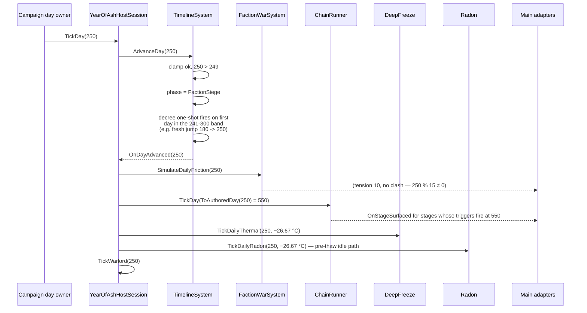
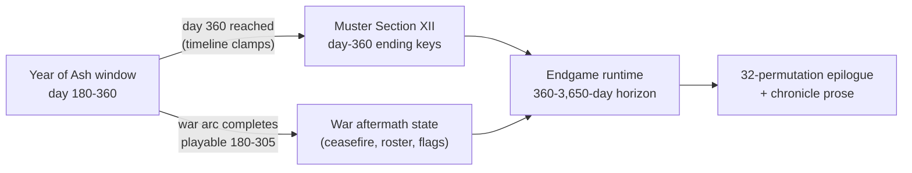

# Year of Ash Hardening Implementation Log

## Phase 1 — Deterministic timeline state

Status: PASS

Changed:

- Made the Year of Ash timeline monotonic and idempotent for repeated or
  out-of-order day inputs.
- Made restore derive phase and environmental parameters from the authoritative
  clamped day.
- Added replay and inconsistent-save regression coverage.
- Added `docs/world/YEAR_OF_ASH_SEASON_FLOW.md`.

Tests:

- `YearOfAshTests.Timeline_IgnoresRepeatedAndOutOfOrderDays`
- `YearOfAshTests.Timeline_RestoreDerivesPhaseFromAuthoritativeDay`

Result:

- The same day sequence and a save/reload sequence cannot regress the season
  phase or duplicate day-advance notifications.

Divergences:

- Storm-window catalog, Ice Road integration, and shared economy modifiers are
  not claimed complete. They remain a separate authored-data phase.

---

# EXPANSION 2026-09-25 — Year of Ash Hardening: Full Integration Framework & Code Architecture

Status: DOCUMENTATION EXPANSION (read-only companion to the Phase-1 log above)

Everything above the separator is the original 2026-09-05 Phase-1 hardening
log, preserved byte-for-byte. Everything below is the 2026-09-25 expansion:
a full integration framework and code-architecture reference for the Year of
Ash domain as it stands on 2026-09-25, verified against source at HEAD.

---

## Part I — Expansion Preamble

### I.1 Thesis

The 2026-09-05 Phase-1 hardening fixed a small thing that mattered a lot: it
made the Year of Ash clock *boring*. Repeated day inputs do nothing.
Out-of-order day inputs do nothing. A save that disagrees with itself about
what phase it is in is corrected against the day, not against the phase.
After the hardening, nothing a caller does to the day axis can make the
season timeline lie, replay a transition, or walk backwards.

Twenty days later the domain that the clock drives has grown around it: the
faction-war chain runner now rides the same tick, an authored storm-window
catalog exists at the data layer, an expansion-specific ice-road system has a
save slot, war projection consumers route clashes into radio, journal, and
sound-ranging, and the muster epilogue matrix resolves at day 360 under the
same calendar. The hardening rules from Phase 1 — monotonic acceptance,
derive-don't-persist, one authority per concern — are now load-bearing for
all of those systems. This document records how.

The thesis, stated once and then spent in detail: **the Year of Ash domain is
a calendar-first architecture.** The day is the only primary state. Phase,
temperature, ash opacity, radon rate, thermal stress, decree flags, and
(nearly) everything downstream is derived from it or from state that advances
with it. Every integration question in this document reduces to "is this
value derived from the day, or is it independently owned state, and is that
choice written down?"

### I.2 Scope

This expansion covers, with verified paths:

- The timeline system (`Assets/Ashfall.Core/YearOfAsh/YearOfAshTimelineSystem.cs`):
  state model, phase derivation, environmental parameter curves, capture and
  restore semantics, and the two hardening rules as testable specifications.
- The Year of Ash save envelope (`Assets/Ashfall.Core/YearOfAsh/YearOfAshSave.cs`,
  version 5) and its frozen v1–v4 migration shapes, plus the host store
  (`src/YearOfAsh/YearOfAshSaveStore.cs`).
- The host session (`src/YearOfAsh/YearOfAshHostSession.cs`), the Main partial
  (`src/Main.YearOfAsh.cs`), and the campaign day owner seam
  (`src/Main.CampaignOwners.cs`) that drives the tick.
- The faction-war chain runner (`Assets/Ashfall.Core/YearOfAsh/FactionWarChainRunner.cs`)
  hosted on the same clock, including the authored-day epoch mapping
  (`ToAuthoredDay`, offset +300) and the day-588 ceasefire chain.
- War projection (Plan 30B / Plan 123 consequence routing in
  `src/Main.YearOfAsh.cs`) and the runtime war clock resolution
  (`Ashfall.Core.Tests/FactionWarClockTests.cs`).
- The epilogue surfaces: the muster Section XII day-360 epilogue matrix
  (`Assets/Ashfall.Core/Muster/EpilogueMatrix.cs`, `muster_epilogues.json`)
  and the endgame 32-permutation runtime
  (`Assets/Ashfall.Core/Endgame/EpilogueMatrixRuntime.cs`).
- The 2026-09-05 divergence items, re-audited item by item: the storm-window
  catalog, Ice Road integration, and shared economy modifiers.
- Test coverage: every case in `Ashfall.Core.Tests/YearOfAshTests.cs`,
  `Ashfall.Core.Tests/YearOfAshStormAndIceRoadTests.cs`, and
  `Ashfall.Core.Tests/FactionWarClockTests.cs` specified individually.
- The season-flow authority (`docs/world/YEAR_OF_ASH_SEASON_FLOW.md`),
  restated as a fully annotated flow.

### I.3 Non-goals

This document does not propose, describe as current, or endorse:

- **A second timeline.** There is exactly one Year of Ash day-to-phase
  authority (`YearOfAshTimelineSystem`). No panel, host session, epilogue
  runtime, or war system may keep its own day-to-phase mapping. Where this
  document shows derived phase values elsewhere, they are projections of the
  one authority.
- **A second season or weather authority.** The timeline's environmental
  parameters are the Year-of-Ash window's own readings. The campaign's World
  Weather system (`src/Main.WeatherCascade.cs`) does not consume them, and
  this document does not propose coupling them — that is the shared-economy
  divergence, owned by a future authored-data decision, not by this log.
- **A parallel save store.** The Year of Ash envelope v5
  (`YearOfAshSave`, section name `year_of_ash`) is the only persistence
  owner for the expansion. Frozen legacy shapes exist solely so old files
  validate against the exact field set they were hashed with.
- **New gameplay authority in UI.** Panels expose truthful current state and
  existing commands; the radon widget does not own radon, the map widget does
  not own standing, the panel readout of `CalculateCaloricMultiplier` does
  not own caloric policy.
- **Unity.** Godot is authoritative; Unity is retired. The codec's engine
  neutrality exists so the domain compiles engine-free, not to serve a
  retired host.

### I.4 Evidence policy

Every code and data claim in this expansion was verified on 2026-09-25
against the working tree at HEAD by reading the named files. Counts (chains,
stages, storm entries, tests) were computed from the actual JSON and test
sources, not from plan prose. Claims that could not be verified in source are
marked `UNVERIFIED (log text)` inline. Where a historical plan document
describes a state that no longer matches HEAD, the mismatch is stated
explicitly and the current state wins.

One systematic caveat: the authored data convention in this repository is
snake_case JSON, and the Year-of-Ash catalog DTOs (`StormWindowEntry`,
`YearOfAshRadioEntry`, and the loader entry types in
`Assets/Ashfall.Core/YearOfAsh/YearOfAshCatalogLoader.cs`) declare
snake_case field names to match. The save-envelope DTOs (`YearOfAshSave`,
`YearOfAshTimelineState`) declare camelCase field names (`currentDay`,
`ambientTemperatureCelsius`); their exact on-wire key casing follows
`SystemTextJsonSerializer.Options`, which this expansion has not pinned down.
JSON examples for the save envelope in Part IV therefore use the declared
field names and carry that caveat; JSON examples for catalogs use the
verified snake_case keys from the data files themselves.

### I.5 Reading guide

| If you need | Read |
|---|---|
| The original acceptance record | The Phase-1 log above the separator |
| Who owns what today, with paths | Part II |
| How data flows on a day tick | Part III |
| Class-level specs, DTOs, failure modes | Part IV |
| The phase/state machine in full | Part V, chapter 1 |
| Environmental parameter curves and consumers | Part V, chapter 2 |
| Why restore derives instead of trusting the save | Part V, chapter 3 |
| How the war chains ride the clock | Part V, chapter 4 |
| War projection and the runtime war clock | Part V, chapter 5 |
| The day-360 epilogue surfaces | Part V, chapter 6 |
| What became of the three deferred items | Part V, chapter 7 (a–c) |
| The season-flow authority, annotated | Part V, chapter 8 |
| Every test, specified | Part V, chapter 9 |
| How Phase 1 was actually hardened | Part V, chapter 10 |
| The seams Part IV's deep specs do not cover | Part V, chapter 10A |
| Session lifecycle: bootstrap, restore, flush | Part V, chapter 11 |
| The warlord doctrine year | Part V, chapter 12 |
| The projection surfaces as ledgers | Part V, chapter 13 |
| What happens past the 360 horizon | Part V, chapter 14 |
| Tone and accessibility on these surfaces | Part V, chapter 15 |
| Timeline versus every neighbor system | Part VI |
| How to verify a change here | Part VII |
| Glossary, vocabulary, walkthroughs, open questions | Part VIII |
| The whole expansion in one page | Appendix T |

Two numbering conventions in Part V, stated once so they read as
deliberate: the three divergence chapters are lettered `V.7a`–`V.7c`
because they are one item (the 2026-09-05 divergences) split three ways,
and cross-references cite them individually or as the V.7a–c family;
`V.10A` is a filed-forward addendum that deliberately sits between
V.10 and V.11 so future Part IV-level seam specs can slot after it
without renumbering V.11–V.15 (per that chapter's own update rule).
Appendices run A–T with no gaps.

---

## Part II — Current Authority Audit (as of 2026-09-25)

This part is the map: every Year-of-Ash owner, its verified path, and what
changed since the Phase-1 log was written. If a claim is not on this map, it
has no owner in this domain and should not be implemented as if it did.

### II.1 Owner table

| Concern | Owner | Path | Kind |
|---|---|---|---|
| Day-to-phase mapping, day clamping, monotonic acceptance | `YearOfAshTimelineSystem` | `Assets/Ashfall.Core/YearOfAsh/YearOfAshTimelineSystem.cs` | Core, engine-free |
| Environmental parameter curves (temperature, ash, radon rate, thermal stress) | `YearOfAshTimelineSystem.RecalculateEnvironmentalParameters()` | same file | Core, derived |
| Caloric multiplier policy | `YearOfAshTimelineSystem.CalculateCaloricMultiplier()` | same file | Core, derived |
| Timeline snapshot DTO | `YearOfAshTimelineState` | same file | Core, serializable |
| Expansion save envelope (v5) + migrations | `YearOfAshSave`, `YearOfAshSaveCodec`, frozen `YearOfAshSaveV1`–`V4` | `Assets/Ashfall.Core/YearOfAsh/YearOfAshSave.cs` | Core, codec |
| Save file adapter | `YearOfAshSaveStore` (`user://year_of_ash_save.json`, section `year_of_ash`) | `src/YearOfAsh/YearOfAshSaveStore.cs` | Godot host |
| Session composition, day tick fan-out | `YearOfAshHostSession` | `src/YearOfAsh/YearOfAshHostSession.cs` | Godot host |
| Panel and consequence routing | `Main` Year-of-Ash partial | `src/Main.YearOfAsh.cs` | Godot host |
| Campaign day owner (who calls the tick) | `NarrativeQuestsVerdictDayOwner` | `src/Main.CampaignOwners.cs` | Godot host |
| Faction friction, standing, decrees | `FactionWarSystem` | `Assets/Ashfall.Core/YearOfAsh/FactionWarSystem.cs` | Core |
| Authored war chains (22 06C chains / 45 stages + 16 Plan 25 chains / 17 stages) | `faction_war_events.json`, schema_version 1 | `Assets/StreamingAssets/Data/faction_war_events.json` | Data |
| Chain advancement, triggers, flags | `FactionWarChainRunner` + `FactionWarTriggerTable` | `Assets/Ashfall.Core/YearOfAsh/FactionWarChainRunner.cs` | Core |
| Authored-to-playable epoch mapping | `FactionWarChainRunner.ToAuthoredDay` (+300), pinned by `FactionWarClockTests` | runner + `Ashfall.Core.Tests/FactionWarClockTests.cs` | Core + tests |
| War communiqué data | `faction_war_communiques.json` (references `evt_d588_ceasefire_by_exhaustion` three times) | `Assets/StreamingAssets/Data/faction_war_communiques.json` | Data |
| Warlord doctrine, tribute, territory | `WarlordDoctrineSystem` + catalog + validator | `Assets/Ashfall.Core/Warlords/` (catalog/validator), host binding in `YearOfAshHostSession` | Core + host |
| Deep-freeze thermodynamics, intake icing | `YearOfAshDeepFreezeSystem` | `Assets/Ashfall.Core/YearOfAsh/YearOfAshDeepFreezeSystem.cs` | Core |
| Radon infiltration, scrubber wear, dose | `YearOfAshRadonSystem` | `Assets/Ashfall.Core/YearOfAsh/YearOfAshRadonSystem.cs` | Core |
| Questline runtime (day-window offers) | `QuestlineSystem` | `Assets/Ashfall.Core/YearOfAsh/QuestlineSystem.cs` | Core |
| Expansion catalogs (items, events, locations, radio, survivors, quests) | `YearOfAshCatalogLoader` + six JSON files | `Assets/Ashfall.Core/YearOfAsh/YearOfAshCatalogLoader.cs`, `Assets/StreamingAssets/Data/year_of_ash_*.json` | Core + data |
| Storm-window catalog (loader/query only) | `YearOfAshStormCatalogLoader`, `StormWindowQuery` | `Assets/Ashfall.Core/YearOfAsh/YearOfAshStormCatalog.cs` | Core |
| Storm-window data (14 authored entries) | `year_of_ash_storm_windows.json`, schema_version | `Assets/StreamingAssets/Data/year_of_ash_storm_windows.json` | Data |
| Expansion ice-road economy (Core + save slot only) | `YearOfAshIceRoadSystem`, `IceRoadState` (save v5) | `Assets/Ashfall.Core/YearOfAsh/YearOfAshIceRoadSystem.cs` | Core |
| Holdfast/main-campaign ice road (the pre-existing system) | `IceRoadSystem` (distinct file, distinct state) | `Assets/Ashfall.Core/IceRoadSystem.cs` | Core |
| Day-360 muster epilogue matrix (Section XII) | `EpilogueMatrixLoader` + `muster_epilogues.json` (25 entries) | `Assets/Ashfall.Core/Muster/EpilogueMatrix.cs`, `Assets/StreamingAssets/Data/muster_epilogues.json` | Core + data |
| Whole-saga epilogue runtime | `EpilogueMatrixRuntime` (32-permutation matrix, 360–3,650-day context) | `Assets/Ashfall.Core/Endgame/EpilogueMatrixRuntime.cs` | Core |
| UI widgets (map, geothermal, radon, radio, door modal, questline modal) | six widget classes | `src/YearOfAsh/*.cs` | Godot host |
| Season-flow narrative authority | `YEAR_OF_ASH_SEASON_FLOW.md` | `docs/world/YEAR_OF_ASH_SEASON_FLOW.md` | Doc |

### II.2 The timeline system, precisely

`YearOfAshTimelineSystem` (190 lines, engine-free, no RNG at all):

- Constants: `StartDay = 180`, `EndDay = 360`.
- `YearOfAshPhase` enum: `Phase4_DeepFreeze = 0`, `Phase5_FactionSiege = 1`,
  `Phase6_TheGreatThaw = 2`.
- `YearOfAshTimelineState` fields: `currentDay` (default 180), `phase`,
  `ambientTemperatureCelsius` (−35.0), `ashCloudOpacity` (0.85),
  `radonInfiltrationRate` (0.05), `thermalStressLevel` (0.40),
  `blackBlizzardsExperienced` (0), `artilleryBarragesExperienced` (0),
  `continuityDecreeActive` (false), `finalBroadcastsActive` (false).
- Events: `OnPhaseTransitioned(YearOfAshPhase)`,
  `OnEnvironmentalCrisisTriggered(int day, string notice)`,
  `OnDayAdvanced(int day)`.
- Phase windows (from `PhaseForDay`, inclusive boundaries): day ≤ 240 →
  Deep Freeze; 241–300 → Faction Siege; 301–360 → Great Thaw. Any day
  outside [180, 360] is clamped before the mapping runs.

The hardening seams, which Part V chapter 1 specifies formally:

- `AdvanceDay(day)` clamps its argument to [180, 360], then returns
  silently if the clamped day is not strictly greater than the current day.
  This single guard is what makes repeated and out-of-order inputs no-ops.
- `RestoreState(state)` clamps the incoming day, **derives** the phase from
  the clamped day via `PhaseForDay`, copies the counters and one-shot flags,
  then calls `RecalculateEnvironmentalParameters()` so every derived value
  agrees with the restored day regardless of what the snapshot claimed.

### II.3 The save envelope at v5

`YearOfAshSave` (current save version 5), section name `year_of_ash`:

| Section | Since | Owner system | Migration behavior for older saves |
|---|---|---|---|
| `saveVersion`, `simDay`, `Checksum` | v1 | envelope / clock | — |
| `timeline` (`YearOfAshTimelineState`) | v1 | `YearOfAshTimelineSystem` | carried through every migration |
| `encounters` (`DoorEncounterSystemState`) | v1 | `DoorEncounterSystem` | carried through |
| `factionWar` (`FactionWarSystemState`) | v1 | `FactionWarSystem` | carried through |
| `deepFreeze`, `radon`, `quests` | v2 | the three v2 systems | v1 saves restore at constructor defaults (fresh scrubber, clear intake, no quest history) |
| `warlord` (`WarlordDoctrineState`) | v3 | `WarlordDoctrineSystem` | v1/v2 saves get the fresh doctrine |
| `factionWarChainRunner` (`FactionWarChainRunnerState`, schemaVersion 1) | v4 | `FactionWarChainRunner` | older saves start every chain unstarted — war narrative replays from its beginning |
| `iceRoad` (`IceRoadState`) | v5 | `YearOfAshIceRoadSystem` | older saves get road closed, no accumulated window days |

Structural facts that matter for anyone touching this file:

- The frozen shapes `YearOfAshSaveV1`–`V4` exist because `SaveChecksum`
  walks public fields. Validating a v1 payload against the v2 field set
  would always mismatch. Each frozen shape must match, byte-for-byte in
  field set, what that version actually wrote. They carry the comment "Do
  not add fields here" and that comment is a rule, not advice.
- `Decode` rejects a payload whose `saveVersion` is newer than supported;
  migrates older payloads by re-parsing into the matching frozen shape,
  re-validating the checksum **over that version's fields**, and filling
  new sections at field-initializer defaults; and only then re-stamps the
  upgraded envelope's checksum.
- `Encode` always recomputes the checksum before serializing, because a
  caller may have mutated a captured envelope after `Capture` stamped it.
- `Restore` tolerates null sections per system, and falls back to
  `timeline.AdvanceDay(save.simDay)` only when the `timeline` section is
  absent — the sim day rides the timeline snapshot in every normal case.

### II.4 Host wiring

The tick chain, from the top:

1. The campaign day owner (`NarrativeQuestsVerdictDayOwner.TickDay` in
   `src/Main.CampaignOwners.cs`) runs, for every `day >= 180`:
   `SetupYearOfAsh()` (idempotent) then `_yearOfAsh.TickDay(day)`. There is
   no upper bound at the owner: the timeline clamps internally at 360, and
   the war clock projects forward (Part V chapter 5). Muster escalation is
   owned by the same owner at `day >= 260`.
2. `YearOfAshHostSession.TickDay(day)` fans out in a fixed order:
   `timeline.AdvanceDay(day)` → `factionWar.SimulateDailyFriction(day)` →
   `warRunner.TickDay(FactionWarChainRunner.ToAuthoredDay(day))` →
   `deepFreeze.TickDailyThermal(day, timeline.AmbientTemperatureCelsius)` →
   `radon.TickDailyRadon(day, timeline.AmbientTemperatureCelsius)` →
   `TickWarlord(day)` (non-omniscient observation, environment hazard from
   timeline temperature plus intake ice, rival pressure from war tension).
3. `Main.YearOfAsh.cs` owns presentation and consequences: the panel
   ("YEAR OF ASH — SYSTEMS (DAYS 180–360)" hosting the faction-war map,
   geothermal, radon, and radio widgets), the Plan 30B / Plan 123
   consequence routing (Part V chapter 5), warlord tribute and expedition
   danger routing, and the save flush (`SaveYearOfAsh` /
   `FlushYearOfAshIfDirty`).
4. Capture/restore: `YearOfAshHostSession.CaptureSave()` calls
   `YearOfAshSaveCodec.Capture` with the timeline, encounters, faction war,
   deep freeze, radon, quests, warlord, and war runner. It passes no clock,
   so `simDay` falls back to `timeline.CurrentDay` — one more place where
   the timeline day is the single truth. `RestoreSave` mirrors the same
   list and then strips legacy Verdict/Dose quest records the envelope no
   longer owns.
5. `YearOfAshHostSession` never constructs or ticks
   `YearOfAshIceRoadSystem` (verified by grep over `src/`). The v5
   `iceRoad` section is written at defaults by the codec and consumed by
   nothing on the host. This is the honest state of the ice-road item;
   see Part V chapter 7b.

### II.5 What changed since 2026-09-05

The Phase-1 log was written against a smaller domain. Deltas since, each
verified at HEAD:

1. **The war chains ride the clock.** `TickDay` now runs
   `FactionWarChainRunner` after `SimulateDailyFriction`, with the
   authored-day epoch mapping and trigger grammar (Plan 06C content and the
   Plan 25 escalation layer).
2. **The runtime war-clock question was answered.** The Plan 30 log
   (`docs/plans/wave11_part1/B1_PLAN30_IMPLEMENTATION_LOG.md`) recorded the
   blocker: the authored war day axis ran to 607 (chains and communiqués;
   the 06C chain gates as shipped top out at 605) against the timeline's
   360 cap. The resolution in current source is the +300 projection
   (`ToAuthoredDay`), pinned by `FactionWarClockTests`; the audit doc
   `docs/plans/UNBLOCKED_PLANS_AUDIT_2026-09-19.md` lists the
   runtime-clock debt (D5) as resolved with that test passing and the
   `CF-P30-WAR-PROJECTION-CONSUMERS` package executed.
3. **War projection consumers are wired.** Territorial clashes, decrees,
   and chain-runner stage events now project into radio intercepts, journal
   records, and sound-ranging hostile-fire observations in
   `src/Main.YearOfAsh.cs`. At the time of the wave-11 audit, five of six
   projection events had zero subscribers; that gap is closed in current
   source (Part V chapter 5).
4. **The storm-window catalog became real data.** The Phase-1 log's
   "not yet a dedicated storm-window catalog" statement is now half-true:
   `year_of_ash_storm_windows.json` holds 14 authored entries, and Core has
   a loader, a query surface, and 16 passing focused tests. The host
   session still does not consume them (Part V chapter 7a).
5. **An expansion ice-road system and save slot appeared.** v5 of the
   envelope, a deterministic Core system, and a test file — but no host
   wiring (Part V chapter 7b).
6. **The warlord doctrine system joined the session**, bringing tribute,
   territory observation, and non-omniscient daily ops with it (v3+ save
   section; catalog validated at load with a hard failure on validation
   errors).
7. **The epilogue surfaces matured.** `muster_epilogues.json` carries 25
   entries (the original Section XII outcomes plus faction and verdict
   endings), and the endgame runtime evaluates a whole-saga flag context
   over a 360–3,650-day horizon.
8. **Quest progress ownership tightened.** Verdict (Expansion 08) and Dose
   (Expansion 07) quest records that once rode the Year-of-Ash envelope are
   adopted by their own envelopes on load and stripped from this one
   (`VerdictQuestMigration.StripFromYearOfAsh`,
   `DoseQuestMigration.StripFromYearOfAsh`) — one persisted owner per
   expansion.

### II.6 Divergence status table (2026-09-25)

| Divergence item | Phase-1 status | Status at HEAD | Owner seam | Remaining gap |
|---|---|---|---|---|
| Storm-window catalog | not authored, not claimed | **Data + Core landed**: 14 authored entries; loader/query/tested | `YearOfAshStormCatalogLoader`, `StormWindowQuery`, `year_of_ash_storm_windows.json` | No host consumer: session and panel never load or display storm state; timeline params are the only displayed environment |
| Ice Road integration | not claimed | **Split verdict**: the pre-existing Holdfast `IceRoadSystem` is live in the campaign; the Year-of-Ash-specific `YearOfAshIceRoadSystem` is Core+save only, unticked by the host | `Assets/Ashfall.Core/IceRoadSystem.cs` (live, campaign-owned); `YearOfAshIceRoadSystem.cs` + save v5 slot (dormant on host) | Host wiring for the YoA ice road, or an explicit decision that the Holdfast road remains the only integration |
| Shared economy modifiers | not claimed | **Unchanged gap**: `CalculateCaloricMultiplier` has exactly one consumer (the panel readout); no market/trade/weather consumer routes timeline economy | `YearOfAshTimelineSystem.CalculateCaloricMultiplier` (Core, displayed only) | Authored schema + explicit consumer mapping into trade/market/weather, as the season-flow doc requires |

The honest-integration paragraph in
`docs/world/YEAR_OF_ASH_SEASON_FLOW.md` predates items 1 and 2 landing at
the Core/data layer, so its text ("There is not yet a dedicated Year of Ash
storm-window catalog") is now stale as written. The rule it encodes — the UI
must not claim a storm window or ice-road state is controlled by the
timeline — is still correct and still matches the host, which displays
neither.

---

## Part III — Integration Framework

This part is the rulebook the domain already follows, written down in one
place. It is descriptive, not aspirational: each invariant cites the code
that enforces it.

### III.1 Architecture invariants applied to the world-clock domain

1. **One day authority.** `YearOfAshTimelineSystem` is the only owner of the
   playable day-to-phase mapping. Every other consumer receives the day as
   an argument or reads a projection. The campaign owner passes the raw
   campaign day; the war runner projects it; the widgets read derived
   values. No consumer re-derives phase from day by copying the thresholds.
2. **Core is engine-free.** Everything under
   `Assets/Ashfall.Core/YearOfAsh/` compiles without Godot or Unity. The
   chain runner's trigger grammar, the storm query surface, and the ice-road
   tick are all plain C# against the `IFileIO` / `IJsonSerializer` ports.
3. **Data is authoritative.** War chains, storm windows, warlord doctrine,
   questlines, radio, survivors, locations, and items are authored JSON in
   `Assets/StreamingAssets/Data/`. Code holds at most a translation table
   (`FactionWarTriggerTable`), and that table is explicitly content-shaped:
   one hand-written entry per stage, extended when new stages are authored,
   never auto-derived from prose at runtime.
4. **Derived state never rides the wire as truth.** The timeline snapshot
   serializes the day plus derived parameters (see the DTO in Part IV), but
   restore re-derives phase and parameters from the clamped day. The saved
   derived values are informational; the day is the contract. (Chapter V.3
   explains why the parameters are saved at all.)
5. **Events expose facts; hosts decide effects.** `OnPhaseTransitioned`,
   `OnDayAdvanced`, `OnTerritorialClashOccurred`, `OnStageSurfaced`,
   `OnIceRoadStatusChanged` — these carry what happened, never what to do
   about it. Radio intercepts, journal entries, and sound-ranging feed are
   host-side adapters in `src/Main.YearOfAsh.cs`.
6. **Determinism is structural, not enforced.** The timeline has no RNG. The
   ice road is a pure function of temperature plus the storm set. The chain
   runner is "deterministic (no randomness at all — pure day/state
   advancement)" per its class doc. Where randomness exists in the session
   at all (warlord ops), it is the `SeededRng(2026)` contract, never wall
   clock.
7. **One persisted owner per concern.** The `year_of_ash` envelope owns the
   expansion's state; Verdict and Dose records are actively stripped on
   load; the Holdfast ice road is owned by the campaign envelope, and the
   YoA timeline explicitly does not shadow it.
8. **Save versioning is additive and frozen-shape.** New sections append;
   old envelopes keep their exact field sets in frozen classes so checksums
   validate over what was actually hashed; migrations fill new sections at
   constructor-equivalent defaults and document what replay-from-default
   means for the player.

### III.2 Tier-by-tier data flow on a day tick

```mermaid
flowchart TD
    A["Campaign day owner<br/>(Main.CampaignOwners.cs)"] -->|day >= 180: TickDay(day)| B["YearOfAshHostSession.TickDay"]
    B --> C["YearOfAshTimelineSystem.AdvanceDay<br/>clamp + monotonic guard"]
    C --> D["PhaseForDay + one-shot notices<br/>(decree, final broadcasts)"]
    D --> E["RecalculateEnvironmentalParameters<br/>temp / ash / radon rate / thermal stress"]
    E --> F["FactionWarSystem.SimulateDailyFriction<br/>tension +1/day, clash every 15th day, day > 240"]
    E --> G["FactionWarChainRunner.TickDay<br/>ToAuthoredDay = day + 300<br/>triggers, flags, auto-advance"]
    E --> H["DeepFreezeSystem.TickDailyThermal<br/>indoor heat balance, intake ice"]
    E --> H2["RadonSystem.TickDailyRadon<br/>fissures, scrubber, dose"]
    E --> I["WarlordDoctrineSystem.TickDaily<br/>observed territory + context"]
    F --> J["Host adapters: radio, journal,<br/>sound ranging, map widget"]
    G --> J
    I --> K["Expedition danger multiplier<br/>(host-composed slot)"]
    C --> L["UI readouts: phase, temp,<br/>caloric multiplier, tension"]
```

Tier definitions:

| Tier | Contents | Rule |
|---|---|---|
| T0 — authored data | `faction_war_events.json`, `year_of_ash_storm_windows.json`, `year_of_ash_*.json`, `muster_epilogues.json` | static, snake_case, schema-versioned; loaded once |
| T1 — Core day authority | timeline (day, phase, params), chain runner (per-chain stage state), friction (tension), thermal, radon, warlord | advances only via the tick; each subsystem validates or clamps its own inputs |
| T2 — host session | `YearOfAshHostSession` fan-out, war runner binding, standing applier | ordering fixed; no gameplay decisions |
| T3 — host adapters | radio, journal, sound ranging, expedition multiplier, map widget | subscribe to facts; write presentation or route into other systems' existing owners |
| T4 — UI readouts | panel header, status summary, caloric multiplier text | display only; never own |

### III.3 Event flow

The session-level event fan, as wired at HEAD:

- `FactionWarSystem.OnTerritorialClashOccurred(factionA, factionB)` →
  radio intercept ("artillery exchange logged…"), permanent journal entry
  keyed `war_clash_{day}_{factionA}_{factionB}`, and a sound-ranging
  hostile-fire observation with bearing `(day * 37) % 360` and source class
  `class_heavy_howitzer`. Marks the envelope dirty.
- `FactionWarSystem.OnDecreeEnacted(decreeId)` → radio intercept
  ("Regional decree broadcast…"). Marks dirty.
- `FactionWarChainRunner.OnStageSurfaced(chain, stage)` → radio + journal
  (`war_chain_surfaced_{chainId}_{stageId}_{day}`). Marks dirty.
- `FactionWarChainRunner.OnStageResolved(chain, stage, choice)` → journal
  (`war_chain_resolved_…`). Marks dirty.
- `FactionWarChainRunner.OnChainResolved(chain)` → radio ("War chain
  closed") + journal (`war_chain_closed_{chainId}_{day}`). Marks dirty.
- `FactionWarSystem.OnFactionStandingChanged` → faction-war map widget
  refresh (bound and unbound with the widget lifecycle).
- `YearOfAshTimelineSystem.OnPhaseTransitioned` → no src/ subscriber at
  HEAD; the phase change reaches players through readouts and the one-shot
  crisis notices carried on `OnEnvironmentalCrisisTriggered` (which the
  timeline itself raises for the decree and the final broadcasts).
- `WarlordDoctrineSystem.OnActionExecuted` / `OnTributeSettled` → host
  consequence wiring moves canonical `warlords_sector_4` standing through
  `FactionWarSystem.ModifyStanding` (host-owned, no rules in Core).

Two properties of this flow are deliberate. First, everything the host does
in response is idempotent-safe: the timeline's monotonic guard guarantees
one `OnDayAdvanced` per day, and the one-shot notice flags guarantee the
decree and broadcast strings fire once per campaign regardless of tick
replays. Second, every adapter marks the envelope dirty — consequence
output that is not persisted never happened, so the flush seam
(`FlushYearOfAshIfDirty`) is part of the event contract, not an afterthought.

### III.4 Save capture/restore discipline

The rule set, in order of authority:

1. **The clamped day is the single restored truth.** `RestoreState` clamps
   the incoming day into [180, 360] and derives everything temporal from
   it. A save claiming day 500 restores as day 360. A save claiming day 90
   restores as day 180. A save claiming day 250 with `phase = DeepFreeze`
   restores as day 250, Faction Siege, with recalculated parameters.
2. **Derived-state prohibition on the wire.** Phase is overwritten on
   restore before anything reads it. The saved phase and parameter floats
   exist so the envelope shape stays constant across versions and so
   diagnostics can compare what was saved against what is derived — they
   are never trusted. This is the save-wire expression of the repo-wide
   rule that a value with exactly one derivation has exactly one owner.
3. **Counter parity.** The two environmental counters
   (`blackBlizzardsExperienced`, `artilleryBarragesExperienced`) and the
   two one-shot flags (`continuityDecreeActive`, `finalBroadcastsActive`)
   are persisted as-is and restored as-is. They are not derived, because
   they are not functions of the day alone: they are records of what the
   campaign actually experienced. The one-shot flags are additionally
   self-healing — if a save restores into a phase whose one-shot flag is
   false, the next tick's phase check sets it and fires the notice exactly
   once, because `AdvanceDay`'s flag check runs per tick and the flag is
   now true.
4. **Section tolerance.** Every `RestoreState` no-ops on a null section, so
   a migrated envelope restores new systems at their constructor defaults
   instead of zeroing them or throwing. The envelope shape on the wire is
   constant; the semantic default is the constructor's.
5. **Checksum discipline.** Recompute on encode; validate on decode against
   the frozen field set of the payload's own version; reject newer
   versions; migrate older versions through their frozen shape. A stale
   checksum can never poison a file (encode recomputes), and a tampered
   payload fails closed (decode throws).

### III.5 Determinism contract

- **Monotonicity.** Days only move forward. `AdvanceDay` returns without
  effect for any input that is not strictly ahead of the current day.
- **Idempotence.** Advancing to the same day twice advances once.
  Notifications, phase transitions, and one-shot flags fire once. The
  campaign owner may be invoked defensively with the same day by multiple
  code paths without duplicating anything.
- **No wall clock, no hash-order iteration.** The timeline and chain runner
  consume no time source and iterate lists in insertion order. The only
  seeded randomness in the session is the warlord's `SeededRng(2026)` with
  an explicit seed salt, which is the existing seeded-RNG contract.
- **Pure projections.** `ToAuthoredDay` is a pure function. The storm query
  is a pure function of catalog + day. The ice-road tick is a pure function
  of temperature + active storm set. Replay from a save plus the same day
  sequence reproduces the same observable state.
- **Recorded divergence from pure functions.** The deep-freeze and radon
  ticks integrate over time (ice accumulates, scrubbers wear), so their
  state is path-dependent, not day-derived. That is why they are persisted
  sections and not derived on restore — the derived-state prohibition
  applies to values that have a single derivation; these do not.

### III.6 Integrity validation

- The warlord doctrine catalog is validated at load
  (`WarlordCatalogValidator.Validate`), and validation failure throws in
  the host with the full error list — a malformed doctrine catalog is a
  load-time failure, not a runtime surprise.
- The data-integrity gate (`CatalogIntegrityValidator`) covers catalog
  presence and references repo-wide; the Year-of-Ash catalogs ride the same
  pipeline as every other snake_case catalog.
- `QuestlineSystem.GetPlayableQuestlines` refuses to offer a questline
  whose first stage has no authored choices, and
  `WithheldQuestlineCount` keeps the content gap visible instead of letting
  the catalog look smaller than it is (both tested; Part V chapter 9).
- The chain runner fails closed on speculative host calls:
  `ResolveChoice` throws when the chain is not actually at the offered
  stage, when the choice is unknown, or when the choice's flag gate is
  closed. `RestoreState` throws on a foreign `systemId` or a future
  `schemaVersion`.
- The save codec fails closed on: empty payloads, null deserialization,
  future versions, versionless migration paths, and checksum mismatch.

---

## Part IV — Code Architecture

### IV.1 Module map

```text
Assets/Ashfall.Core/YearOfAsh/          (engine-free, netstandard2.1)
  YearOfAshTimelineSystem.cs            day/phase authority, env params
  YearOfAshSave.cs                      v5 envelope, codec, frozen v1-v4
  FactionWarSystem.cs                   standing, tension, decrees, friction
  FactionWarChainRunner.cs              authored war chains + trigger grammar
  YearOfAshDeepFreezeSystem.cs          indoor thermals, intake icing
  YearOfAshRadonSystem.cs               radon, scrubber, dose
  YearOfAshStormCatalog.cs              storm entry DTO, loader, queries
  YearOfAshIceRoadSystem.cs             YoA ice road (dormant on host)
  YearOfAshCatalogLoader.cs             items/events/locations/radio/survivors/quests
  QuestlineSystem.cs + door encounters  questline runtime, door evaluation
  (WarlordDoctrineSystem lives under Ashfall.Core.Warlords)

src/                                    (Godot host, net8.0)
  YearOfAsh/YearOfAshHostSession.cs     composition + tick fan-out
  YearOfAsh/YearOfAshSaveStore.cs       user://year_of_ash_save.json adapter
  YearOfAsh/FactionWarMapWidget.cs      standing -> map refresh
  YearOfAsh/GeothermalHeatingWidget.cs  deep-freeze readout
  YearOfAsh/RadonVentilationWidget.cs   radon readout + actions
  YearOfAsh/RadioBroadcastTerminal.cs   intercept display
  YearOfAsh/DoorEncounterModal.cs       door encounter presentation
  YearOfAsh/QuestlineModal.cs           questline presentation
  Main.YearOfAsh.cs                     panel build, consequence routing,
                                        tribute, flush, tick-10 button
  Main.CampaignOwners.cs                NarrativeQuestsVerdictDayOwner

Assets/StreamingAssets/Data/
  year_of_ash_items.json  year_of_ash_events.json   year_of_ash_locations.json
  year_of_ash_radio.json  year_of_ash_survivors.json year_of_ash_quests.json
  year_of_ash_questlines.json            year_of_ash_storm_windows.json
  faction_war_events.json                faction_war_communiques.json
  muster_epilogues.json

Ashfall.Core.Tests/
  YearOfAshTests.cs                     26 facts (timeline, save, systems, catalogs)
  YearOfAshStormAndIceRoadTests.cs      16 facts (storm query, ice road, v5)
  FactionWarClockTests.cs               1 fact  (authored-epoch mapping)
  FactionWarChainRunnerTests.cs         adjacent chain-runner coverage
  FactionWarContentCatalogTests.cs      adjacent content coverage
```

### IV.2 Deep spec: `YearOfAshTimelineSystem`

**Responsibility.** Own the playable day axis (180–360), derive the phase
and the four environmental parameters from it, raise day and phase events,
and capture/restore its state such that restore re-derives everything the
day determines.

**Public API.**

| Member | Contract |
|---|---|
| `AdvanceDay(int day)` | clamps to [180, 360]; no-ops unless strictly ahead; fires at most one `OnDayAdvanced`, one `OnPhaseTransitioned`, and the phase one-shot notices |
| `RecalculateEnvironmentalParameters()` | re-derives phase + four floats from `currentDay`; pure, idempotent, safe to call directly |
| `CalculateCaloricMultiplier()` | 1.40 below −20 °C, 1.20 below 0 °C, else 1.00; pure read |
| `CaptureState()` | returns an independent copy of `YearOfAshTimelineState` |
| `RestoreState(YearOfAshTimelineState)` | null = no-op; clamps day; derives phase; copies counters/flags; recalculates parameters |
| `CurrentDay`, `CurrentPhase`, `AmbientTemperatureCelsius`, `AshCloudOpacity`, `RadonInfiltrationRate`, `ThermalStressLevel`, `ContinuityDecreeActive`, `FinalBroadcastsActive` | read-only projections of state |
| events | `OnPhaseTransitioned(YearOfAshPhase)`, `OnEnvironmentalCrisisTriggered(int, string)`, `OnDayAdvanced(int)` |

**State DTO.** `YearOfAshTimelineState` (all fields serializable; field
names as declared — see the Part I casing caveat):

```json
{
  "currentDay": 250,
  "phase": 1,
  "ambientTemperatureCelsius": -26.666668,
  "ashCloudOpacity": 0.875,
  "radonInfiltrationRate": 0.16666667,
  "thermalStressLevel": 0.46666667,
  "blackBlizzardsExperienced": 2,
  "artilleryBarragesExperienced": 0,
  "continuityDecreeActive": true,
  "finalBroadcastsActive": false
}
```

(Values shown are the exact outputs of the day-250 curves in Part V
chapter 2; the floats are serialized raw, not rounded.)

**Failure modes and mitigations.**

| Failure | Mitigation in code |
|---|---|
| Caller passes a pre-expansion day (e.g. 179) | clamped to 180; if current day is 180 the call no-ops |
| Caller passes a post-cap day (e.g. 400) | clamped to 360; the war clock separately projects (ToAuthoredDay) so late content still fires |
| Repeated day / out-of-order day | monotonic guard returns before any state mutation or event |
| Inconsistent save (phase disagrees with day) | restore derives phase from the clamped day; saved phase ignored |
| Inconsistent save (parameters disagree with day) | restore recalculates parameters after copying the day |
| Double restore of the same snapshot | restore is a pure overwrite; second restore lands on identical state |
| One-shot notice lost to a crash mid-transition | flag only sets together with the notice inside `AdvanceDay`; on a restore with the flag false in a post-transition phase, the next advance re-fires exactly once |

**Performance.** O(1) per advance (constant-time curves, two float
branches), O(1) capture/restore (fixed-field copy). The day owner calls it
once per campaign day; the panel reads projections per frame at negligible
cost.

### IV.3 Deep spec: the save envelope and codec

**Responsibility.** Own the expansion's persistence shape (v5), the
checksum discipline, and versioned migration from v1.

**Envelope sections and their capture calls.**

| Envelope field | Captured from |
|---|---|
| `simDay` | `clock.Day` when a clock is provided, else `timeline.CurrentDay` (the host session passes no clock) |
| `timeline` | `timeline.CaptureState()` |
| `encounters` | `encounters.CaptureState()` |
| `factionWar` | `factionWar.CaptureState()` |
| `deepFreeze` | `deepFreeze.CaptureState()` (null system keeps field initialiser) |
| `radon` | `radon.CaptureState()` |
| `quests` | `quests.CaptureState()` |
| `warlord` | `warlord.CaptureState()` |
| `factionWarChainRunner` | `warRunner.CaptureState()` |
| `iceRoad` | `iceRoad.CaptureState()` (null system keeps field initialiser) |
| `Checksum` | `SaveChecksum.Compute(save)` |

**Codec contract.**

- `Capture(...)` — builds the envelope, stamps the checksum. A caller that
  does not own a system leaves that section at defaults rather than writing
  nulls, keeping the envelope shape constant.
- `Encode(save, json)` — recomputes the checksum, then serializes. Throws
  on null save.
- `Decode(jsonText, json)` — throws on empty payload or null result;
  rejects `saveVersion` newer than 5; for older versions parses into the
  matching frozen shape, re-validates the checksum over that shape, and
  returns an upgraded v5 envelope; for current versions validates the
  checksum and returns the envelope.
- `MigrateToCurrent` — one branch per version 1–4; each documented in
  source with what stays at defaults and what that means for the player
  (e.g. v3→v5: every war chain unstarted; the narrative replays from its
  beginning rather than resuming mid-chain).

**Failure modes and mitigations.**

| Failure | Mitigation |
|---|---|
| Hand-edited save with a stale checksum | decode throws `checksum mismatch (corrupted or tampered save)` |
| Future envelope from a newer build | decode throws with both version numbers |
| Truncated JSON | null deserialization throws; empty text throws |
| v1 file with v2+ fields appended | dropped — parsed as the frozen v1 shape, extra fields never trusted |
| Save captured before a section existed | section null on the wire; each `RestoreState` no-ops; the system keeps constructor defaults |
| `timeline` section absent entirely | codec falls back to `timeline.AdvanceDay(simDay)` so the day still lands |

**Performance.** Capture is a fixed-field copy; checksum walks the public
fields once; encode/decode are a single serialize/deserialize pass. Saves
happen on the flush seam, not per tick.

### IV.4 Deep spec: `YearOfAshDeepFreezeSystem`

**Responsibility.** Simulate indoor thermals and intake icing for the deep
window; expose readouts and two player actions.

**State.** `YearOfAshDeepFreezeState`: `indoorTemperatureCelsius` (18.0),
`thermalInsulationQuality` (0.80), `geothermalFlowRatePercent` (75.0),
`intakeIceThicknessMm` (0.0, critical > 50 mm), `isIntakeBlocked`,
`daysFrozenPipelinesExperienced`.

**Tick model** (`TickDailyThermal(day, surfaceTempCelsius)`):

- Past day 240 (the thaw path): intake ice decays 5 mm/day toward zero,
  the block flag clears, indoor temperature drifts up toward 21 °C at
  0.5 °C/day, and the tick returns early — the system retires itself for
  the season.
- Inside the window: heat gain `(flow/100) * 26`, heat loss
  `(20 − surfaceTemp) * (1 − insulation * 0.7)`, target
  `gain − loss * 0.35`, and indoor temperature eased 70/30 toward target.
- Icing: below −15 °C surface, ice accumulates `|surfaceTemp + 15| * 0.8`
  mm/day; otherwise decays 2 mm/day. At ≥ 50 mm the intake blocks and the
  freeze alarm fires.
- A sub-zero indoor day increments `daysFrozenPipelinesExperienced`.

**Actions.** `ClearIntakeIce()` (manual shovel-out), `UpgradeThermalInsulation(boost)`
(capped at 1.0). Capture/restore is a full-field copy, tolerating a null
section so pre-v2 saves restore at defaults.

**Failure modes.** A surface temperature spike does not zero the intake
instantly (2 mm/day decay models melt lag); insulation upgrades cannot be
undone (no downgrade API exists — the lever is one-way by design);
restores with impossible negative ice are not clamped here (the state is
host-written, and the YoA ice road — which does clamp — is the pattern for
defensive restores if this system ever needs one).

### IV.5 Deep spec: `YearOfAshRadonSystem`

**Responsibility.** Simulate thaw-season radon-222 infiltration, scrubber
wear, and alpha dose; expose two mitigation actions.

**State.** `YearOfAshRadonState`: `indoorRadonBqm3` (120.0 baseline),
`scrubberFilterHealthPercent` (100.0), `activeFoundationFissures` (0),
`totalAlphaDoseLogged` (0.0), `isScrubberAlarmActive`. Thresholds are
constants: safe 200 Bq/m³, dangerous 800 Bq/m³, hard cap 3500 Bq/m³.

**Tick model** (`TickDailyRadon(day, ambientTempCelsius)`):

- Before day 300: baseline decays 5 Bq/m³/day toward an 80 floor — the
  system idles through the cold phases.
- From day 300 (the thaw): the first above-freezing day opens a fissure
  (count goes 0 → 1 when ambient > 0 °C and no fissures exist); raw
  infiltration `120 + fissures * 280`; scrubbed rate multiplies by
  `(1 − health * 0.70)`; indoor level accumulates up to the cap.
- Wear: above the safe threshold the scrubber loses
  `(radon / 1000) * 1.5` health per day. Dose: above the dangerous
  threshold, `(radon − 800) * 0.001` alpha dose accrues per day and the
  alarm event fires once until the level drops back under.

**Actions.** `ReplaceScrubberFilter()` (health to 100, level ×0.35,
alarm cleared), `SealFoundationFissures()` (only when fissures exist;
level ×0.60 with a 90 floor). Both return bool and fire
`OnRadonLevelChanged`.

**Failure modes.** Ignoring the scrubber past ~day 330 with a live fissure
ratchets the level into the dose band within days — this is the intended
pressure, not a bug; filter replacement during a dose spike only cuts the
level 65%, so sealing fissures is the structural fix; restores of pre-v2
saves hand the player a fresh scrubber (the exact regression the v2
sections exist to prevent — documented in the envelope comments).

### IV.6 Deep spec: `FactionWarChainRunner`

**Responsibility.** Advance every authored war chain day by day: evaluate
each current stage's trigger, surface stages whose triggers fire,
auto-advance zero-choice stages, apply choice effects through host-bound
delegates, and record per-chain progress for save.

**The trigger grammar.** `FactionWarTrigger` is an abstract node with six
concrete types — a closed set, one hand-written table entry per stage:

| Trigger | Satisfied when |
|---|---|
| `AlwaysTrigger` | always (keeps the lookup total; the stage's own `minDay` is the real gate) |
| `PlayerVisitedTrigger(locationId)` | the player has visited the location (any day) |
| `ChainResolvedTrigger(chainId)` | the named chain reached its terminal stage |
| `DayOffsetTrigger(offset, sources…)` | current day ≥ earliest source-stage resolution day + offset; multiple sources cover the "any variant starts the countdown" fan-out |
| `AndTrigger(children…)` | every child satisfied (the two authored AND-of-two stages) |
| `FlagTrigger(flagId)` | the flag is in the runner's produced set or the host's external probe |

`FactionWarTriggerTable.Build()` is the content-shaped translation of the
authored prose in `faction_war_events.json`. Its header comment is the
design rationale: the source data is static authored JSON, not user input,
so a real parser would be over-engineering; the table maps each of the 45
06C stage conditions (plus the Plan 25 stages) to its node, and new stages
extend the table rather than teaching the runtime to read prose.

**State.** `FactionWarChainRunnerState` (`systemId =
"faction_war_chain_runner"`, `schemaVersion = 1`):

```json
{
  "systemId": "faction_war_chain_runner",
  "schemaVersion": 1,
  "chains": [
    {
      "chainId": "evt_d480_grain_tally_dispute",
      "currentStageId": "evt_d480_grain_tally_dispute_s2",
      "resolved": false,
      "stageResolutions": [
        { "stageId": "evt_d480_grain_tally_dispute_s1", "day": 181 }
      ]
    }
  ],
  "visitedLocations": ["loc_grain_silo"],
  "cumulativeMoraleDelta": -1,
  "producedFlags": ["flag_grievance_scavenger_claim_disputed"]
}
```

(`stageResolutions` persists the day each stage resolved on, which is what
`DayOffsetTrigger` reads even after the current stage has moved on.)

**Core flow.** `TickDay(currentDay)` walks every chain; skips resolved
ones; asks `GetSurfacedStage(chainId, currentDay)` — which enforces the
stage's authored `minDay`, evaluates the trigger, and gates on the stage's
`requiresFlag`; fires `OnStageSurfaced`; and if the stage has zero choices,
auto-advances it immediately (plain narration stages need no player input).
`ResolveChoice(chainId, stageId, choiceId, currentDay)` validates that the
named stage is actually what is surfaced, that the choice exists, and that
its own `requiresFlag` gate is open — otherwise it throws; then records the
resolution day, applies `moraleDelta`, produces choice flags, routes
standing changes through `StandingDeltaApplier` (Core never touches war
standing on its own), and advances to `leadsToStageId` or marks the chain
resolved.

**Injection points** (Plan 25): `ExternalFlagProbe` lets the host's
campaign flag store feed the trigger grammar; `StandingDeltaApplier` is the
single seam to `FactionWarSystem.ModifyStanding`.

**Failure modes.**

| Failure | Mitigation |
|---|---|
| Host resolves a stale/speculative choice | `ResolveChoice` throws naming both the actual and requested stage |
| Choice gated by an unset flag | throws with the flag id |
| Save from a future schema | `RestoreState` throws `NotSupportedException` |
| Save section from a different system | throws naming both `systemId`s |
| Chain catalog gains a new stage with no table entry | `FactionWarTriggerTable.For` falls back to `AlwaysTrigger`; the stage still respects its authored `minDay` — the fallback is documented, and the table is meant to be extended with the content |
| Duplicate resolution of the same stage | `RecordStageResolution` upserts by stageId |

### IV.7 Deep spec: `YearOfAshStormCatalog` (loader and query)

**Responsibility.** Parse `year_of_ash_storm_windows.json` into
`StormWindowEntry` records and answer day-shaped questions about them with
pure, side-effect-free functions.

**Entry DTO.** `StormWindowEntry`: `id`, `phase` (`deep_freeze` /
`faction_siege` / `great_thaw`), `day_start` / `day_end` (inclusive),
`type` (`black_blizzard`, `ash_fallout`, `thermal_inversion`,
`artillery_dust`, `ice_fog`, `thaw_flood`), `intensity` (0.0–1.0),
`caloric_penalty`, `radon_spike`, `faction_morale_penalty`, `description`.
All names snake_case in both DTO and file (verified against the data).

**Query surface** (`StormWindowQuery`):

| Query | Semantics |
|---|---|
| `GetActiveWindowsForDay(catalog, day)` | inclusive day-range match; returns a new list |
| `GetCaloricPenaltyForDay` | sum of `caloric_penalty` over active windows (additive — overlaps stack) |
| `GetRadonSpikeForDay` | sum of `radon_spike` over active windows |
| `GetFactionMoralePenaltyForDay` | sum of `faction_morale_penalty` |
| `HasIceRoadBlockingStorm(catalog, day)` | any active `thaw_flood` or `thermal_inversion` |

**Failure modes.** Missing file, empty directory, or parse failure all
return an empty catalog with a `CatalogDiagnostics.Warn` rather than
throwing — an absent storm file degrades to "no storms", which keeps the
timeline testable without data; day ranges are inclusive on both ends, so
an entry accidentally written with `day_end = day_start − 1` is simply
never active (no clamp, no swap); penalties are additive by design, so two
overlapping storms can stack — the data author owns non-stacking
discipline, not the query.

### IV.8 Deep spec: `YearOfAshIceRoadSystem`

**Responsibility.** Own the Year-of-Ash-window ice-road economy state:
open when ambient temperature ≤ −20 °C with no thaw-class storm active;
close otherwise; accumulate window statistics; expose trade and exposure
multipliers. Deterministic with no RNG usage — road status is fully
determined by temperature and the storm set.

**State.** `IceRoadState`: `iceRoadOpen`, `lastOpenDay` (−1),
`lastClosedDay` (−1), `cumulativeExposureScore`, `totalTradeWindowDays`.

**Tick model.** `TickDay(day, ambientTempCelsius, activeStorms)` computes
`shouldBeOpen = temp ≤ −20f && !blockingStorm`, applies it, updates
last-open/last-closed and the two accumulators, and fires
`OnIceRoadStatusChanged(day, shouldBeOpen)` only on transitions.
Multipliers: trade 1.4× open / 0.6× closed; expedition exposure risk
0.30/day open / 0.10/day closed.

**Current integration truth.** The save envelope v5 carries this state;
the Core system is tested (16-test file including v4→v5 migration and v5
round-trip); the host session neither constructs nor ticks it, and
`CaptureSave`/`RestoreSave` do not pass it. It is a landed Core component
awaiting a host owner or an explicit decision that the pre-existing
Holdfast ice road remains the only integrated road (Part V chapter 7b).

**Failure modes.** `RestoreState` clamps negative accumulators to zero
(defensive where the deep-freeze restore is not — this is the pattern to
copy if the freeze system ever hardens); calling `TickDay` out of order
with a lower day would still apply the status (the system trusts the host's
monotonic day feed, unlike the timeline which defends itself); the storm
argument is nullable so a session without the catalog degrades to a
temperature-only road.

### IV.9 Deep spec: the warlord hosting seam

**Responsibility (host side).** `YearOfAshHostSession` binds the catalog
loaded `WarlordDoctrineSystem`, re-wires consequences on swap
(`BindWarlord`), and runs one non-omniscient ops tick per day.

**Tick composition.** `TickWarlord(day)`: observes only territory nodes
adjacent to warlord-controlled ground plus home (confidence 1.0 — scouts,
not omniscience); builds `WarlordContext` from the day's clock-owned
readings — `EnvironmentHazard = clamp((|timeline temp| + intake ice mm)/60, 0, 1)`,
`RivalPressure = clamp(warTension/100, 0, 1)`, `PlayerStanding` from
`FactionWarSystem` — and calls `TickDaily(day, _warlordRng, context)` with
the session's `SeededRng(2026)`.

**Consequences.** Hostile warlord actions (raid/annex/contest) and
short-paid tribute move canonical `warlords_sector_4` standing by ±2/±3
through `FactionWarSystem.ModifyStanding` — which persists with the
`factionWar` envelope section. `Main.YearOfAsh.cs` additionally raises real
sortie encounter danger against warlord ground by composing the encounter
chance multiplier (warlord danger × wildlife pressure × location threats)
and registers warlord territory nodes as expedition targets.

### IV.10 Deep spec: the questline day windows

`QuestlineSystem` offers questlines by inclusive campaign-day window:
`GetAvailableQuestlines(day)` filters `minDay ≤ day ≤ maxDay` minus
completed/failed/active; `GetPlayableQuestlines(day)` further requires the
first stage to have authored choices; `WithheldQuestlineCount(day)` reports
how many otherwise-available questlines were withheld for lacking authored
choices — the content gap stays visible. The day-window matrix
(`docs/year_of_ash/YEAR_OF_ASH_DAY_WINDOW_MATRIX.md`) documents the seven
staggered windows (Amnesty 195–275 through Seed Failure 300–355) and the
deliberate offer-list density (peak 10 eligible around day 270 and day 305)
without introducing a scheduler — the host resumes one active questline and
presents the rest as offers. The timeline's monotonic day is what makes
these windows stable: a questline cannot be offered, lost to a day
regression, and offered again.

### IV.11 The Phase-1 hardening rules, restated as specifications

**Specification H-1: monotonic, idempotent day acceptance.**

> For all `d` in ℤ, after `AdvanceDay(d')` has established the current day
> `c`, a call `AdvanceDay(d)` where `clamp(d) ≤ c` changes no state and
> raises no event; where `clamp(d) > c`, the call sets `currentDay = clamp(d)`
> exactly once and raises exactly one `OnDayAdvanced(clamp(d))`, plus
> `OnPhaseTransitioned` when and only when `PhaseForDay(clamp(d)) ≠
> PhaseForDay(c)`.

Consequences worth stating because tests lean on them:

- The clamp happens **before** the monotonic comparison. `AdvanceDay(400)`
  on a fresh timeline advances to 360 (clamped, monotonic); a second
  `AdvanceDay(400)` no-ops. `AdvanceDay(100)` on a fresh timeline no-ops
  (clamp to 180, which is not ahead of 180).
- Repeated-day no-op means no duplicated `OnDayAdvanced` — this is what
  makes defensive re-ticks by multiple callers safe.
- Out-of-order no-op means a stale day can never pull the clock back, which
  is what makes replay and idempotent host retries safe.
- Phase transitions can only happen when the day moves forward, so a
  transition replays at most once per campaign even across save/reload.

Test of record: `YearOfAshTests.Timeline_IgnoresRepeatedAndOutOfOrderDays`.

**Specification H-2: derive-don't-persist on restore.**

> After `RestoreState(s)`, for all `d` in the supported range:
> `CurrentPhase == PhaseForDay(clamp(s.currentDay))` and the four
> environmental parameters equal `RecalculateEnvironmentalParameters()`
> evaluated at `clamp(s.currentDay)` — regardless of what `s` claimed for
> phase or parameters.

The saved phase and floats are diagnostics, not truth. Two reasons the
fields are still on the wire: the envelope shape stays constant across
versions (the checksum walks fields, so removing fields is a breaking
change), and a diagnostic diff of saved-versus-derived is the cheapest
corruption triage there is. The rule is that restore never **trusts** them.

Test of record:
`YearOfAshTests.Timeline_RestoreDerivesPhaseFromAuthoritativeDay`.

**Anatomy of `Timeline_IgnoresRepeatedAndOutOfOrderDays`.** A fresh
timeline; a counter subscribed to `OnDayAdvanced`; then three calls:
`AdvanceDay(250)`, `AdvanceDay(250)`, `AdvanceDay(220)`. Asserts:
`CurrentDay == 250`, `CurrentPhase == Phase5_FactionSiege`,
`notifications == 1`. The three calls exercise, in order: a normal advance,
a repeated day (guard), and an out-of-order day (guard). The notification
count is the observable that a duplicated transition would corrupt — replay
and save/load duplication were the actual production failure modes.

**Anatomy of `Timeline_RestoreDerivesPhaseFromAuthoritativeDay`.** A fresh
timeline; `RestoreState` with a hand-built inconsistent snapshot:
`currentDay = 320`, `phase = Phase4_DeepFreeze`, `ambientTemperatureCelsius = -40`.
Asserts: `CurrentDay == 320`, `CurrentPhase == Phase6_TheGreatThaw`
(derived, overriding the snapshot's Deep Freeze), and
`AmbientTemperatureCelsius > -11` (the recalculated day-320 value: the
Great Thaw curve at t = 20/60 gives −10 + 14·(1/3) ≈ −5.33 °C, not the
snapshot's −40). One test carries the whole rule: the day wins, the phase
follows, the parameters follow the day.

### IV.12 Sequence walkthroughs

**(a) Normal day advance (day 250).**



**(b) Repeated day.** The owner re-delivers day 250 (retry, replay, or two
callers). `AdvanceDay(250)` fails the strict-ahead check; no state change;
no `OnDayAdvanced`; the war friction call is idempotent per-day in Core;
the chain runner re-evaluates the same surfaced state (surfaced stages do
not re-apply morale until resolved, and resolution requires an explicit
host call). Net effect: nothing.

**(c) Out-of-order day.** A stale code path delivers day 220 after 250.
Clamp passes (220 in range), monotonic guard fails, no-op. The stale
delivery cannot re-open the Deep Freeze, cannot un-fire the decree, and
cannot roll the ice or radon state back.

**(d) Save on day N, tamper, restore.** Capture at day 320 writes
`currentDay = 320`, `phase = TheGreatThaw` (consistent), parameters from
the day-320 curves. A hostile or buggy edit rewrites `phase` to
`DeepFreeze` and `ambientTemperatureCelsius` to −40 and recomputes nothing
(or does not know the checksum): decode fails the checksum and the load
fails closed. If the editor also fixed the checksum, restore still repairs
the state: day clamped to 320, phase re-derived to TheGreatThaw, parameters
recalculated to ≈ −5.33 °C / 0.60 ash / 0.4167 radon rate / 0.20 stress.
The tamper cannot survive restore even when it survives the checksum.

**(e) Phase-boundary crossing (day 300 → 301).** At 300 the Faction Siege
curve holds (t = 1.0: −10 °C, 0.75 ash, 0.25 radon rate, 0.30 stress).
`AdvanceDay(301)` flips `PhaseForDay` to TheGreatThaw; `OnPhaseTransitioned`
fires once; the final-broadcast one-shot sets with its 142.850 MHz notice;
the Great Thaw curve takes over from the boundary-consistent t = 1/60
point (−9.7667 °C). Deep freeze is already on its thaw path (since day
241); radon switches from idle decay to infiltration the moment ambient
goes above 0 °C (a few days later, not at the boundary — the radon gate is
temperature, not phase).

**(f) The war window opening under the same clock.** Authored 06C minDays
run 480–605. With the +300 epoch mapping, campaign day 180 delivers
authored 480 — the first gate day of `evt_d480_grain_tally_dispute`, whose
opening stage also demands a visit to `loc_grain_silo` (a `PlayerVisitedTrigger`
plus `minDay`, both applied inside `GetSurfacedStage`). Campaign day 305
delivers authored 605, the last gate (`evt_d605_post_ceasefire_forward_roster_s1`,
an `AndTrigger` on two resolved chains). Between those days the whole war
arc — grain disputes through the day-588 ceasefire (playable day 288) to
the post-ceasefire roster — unfolds inside the Year of Ash window, driven
by the same monotonic day the shelter uses. A day-360 save, reloaded,
re-ticks nothing: resolutions are recorded per stage with their days, and
`DayOffsetTrigger` counts from recorded days, so the clock's idempotence
propagates into the war narrative.

---

## Part V — Domain Chapters

### Chapter V.1 — The timeline state machine, in full

#### V.1.1 States and windows

The machine has exactly three states and one bounded tape of days:

| State | Enum | Days (inclusive mapping) | Theme |
|---|---|---|---|
| Deep Freeze | `Phase4_DeepFreeze` (0) | day ≤ 240 — window opens 180 | −35 °C class cold, ash cloud peak, intake icing; the enum comment records the intent "Days 180 – 240: −35C, ash cloud peak, frozen intake" |
| Faction Siege | `Phase5_FactionSiege` (1) | 241–300 | Artillery barrages, the Continuity Reclamation Decree, war chains at full burn |
| The Great Thaw | `Phase6_TheGreatThaw` (2) | 301–360 | Black mud runoff, radon from thawing permafrost, final broadcasts |

`PhaseForDay(day)` is the entire transition function:

```text
day <= 240  ->  Phase4_DeepFreeze
day <= 300  ->  Phase5_FactionSiege
otherwise   ->  Phase6_TheGreatThaw
```

Note what is absent: no state enum for "before the expansion" (the day
clamps to 180, which is already Deep Freeze), no "after the expansion"
state (the day clamps to 360, which stays Great Thaw), and no error state.
The clock is total over all integers.

#### V.1.2 The clamping rule

```text
AdvanceDay(d):
    d <- max(StartDay=180, min(EndDay=360, d))
    if d <= currentDay: return            # monotonic guard
    ...
```

Three cases, each deliberate:

1. **d < 180** — clamps to 180. A campaign calling the Year-of-Ash tick on
   day 90 (as the day owner guards, but defense in depth is free) lands on
   the opening day; if the clock already sits at 180, the monotonic guard
   then no-ops. A save carrying day 90 restores at 180.
2. **d > 360** — clamps to 360. The campaign's later days keep calling;
   the season simply holds its final state. This is what makes the war
   clock's projection story work: the *timeline* freezes, but `TickDay`
   continues to feed the chain runner the projected day (chapter V.5).
3. **180 ≤ d ≤ 360** — used verbatim; the monotonic guard is the only
   gate left.

#### V.1.3 Transition table

| From | Trigger (day crosses) | To | Side effects |
|---|---|---|---|
| Deep Freeze | day 240 → 241 | Faction Siege | `OnPhaseTransitioned(FactionSiege)`; if `continuityDecreeActive` was false it sets true and fires `OnEnvironmentalCrisisTriggered(day, "Continuity Reclamation Decree officially issued across Sector 4 frequencies.")` |
| Faction Siege | day 300 → 301 | The Great Thaw | `OnPhaseTransitioned(TheGreatThaw)`; if `finalBroadcastsActive` was false it sets true and fires the "Long-wave emergency broadcast frequency 142.850 MHz opened." notice |
| Deep Freeze | day 180 → 301+ (a jump) | The Great Thaw | both one-shot notices fire in the same advance, decree first — the implementation runs the phase checks in order, each guarded by its own flag |
| any | day advances within a phase | same phase | parameter recalculation only; `OnDayAdvanced` fires |

There are no backward transitions. There is no way to leave Great Thaw.
One-shot notices are edge-triggered on entry and latched by flags; a
campaign that restores mid-siege with the decree flag already true does not
re-broadcast.

#### V.1.4 The full phase table (with derived values at the boundaries)

| Day | Phase | Ambient °C | Ash opacity | Radon rate | Thermal stress | Notes |
|---:|---|---:|---:|---:|---:|---|
| 180 | Deep Freeze | −25.00 | 0.850 | 0.050 | 0.650 | window opens; t = 0 |
| 195 | Deep Freeze | −39.14 | 0.875 | 0.050 | 0.713 | first black blizzard band begins 185 |
| 210 | Deep Freeze | −45.00 | 0.900 | 0.050 | 0.775 | curve minimum: t = 0.5, sin(π/2) = 1 |
| 225 | Deep Freeze | −39.14 | 0.925 | 0.050 | 0.838 | symmetric recovery |
| 240 | Deep Freeze | −25.00 | 0.950 | 0.050 | 0.900 | last Deep Freeze day |
| 241 | Faction Siege | −29.67 | 0.898 | 0.152 | 0.497 | first siege day; t = 1/60 |
| 255 | Faction Siege | −25.00 | 0.863 | 0.175 | 0.450 | mid-early siege |
| 270 | Faction Siege | −20.00 | 0.825 | 0.200 | 0.400 | t = 0.5; caloric multiplier drops to 1.20 here |
| 285 | Faction Siege | −15.00 | 0.788 | 0.225 | 0.350 | ice road: temp band now marginal |
| 300 | Faction Siege | −10.00 | 0.750 | 0.250 | 0.300 | last siege day; t = 1.0 |
| 301 | The Great Thaw | −9.77 | 0.743 | 0.258 | 0.200 | thaw curve begins; t = 1/60 |
| 320 | The Great Thaw | −5.33 | 0.600 | 0.417 | 0.200 | stress pinned at thaw floor |
| 330 | The Great Thaw | −3.00 | 0.525 | 0.500 | 0.200 | |
| 340 | The Great Thaw | −0.67 | 0.450 | 0.583 | 0.200 | radon fissure risk once ambient > 0 °C |
| 345–348 | The Great Thaw | ≈ +0.5 | ≈ 0.412 | ≈ 0.625 | 0.200 | final ash_fallout storm band (345–348) |
| 360 | The Great Thaw | +4.00 | 0.300 | 0.750 | 0.200 | window closes; t = 1.0 |

(The float values are the exact curve outputs; day 360's +4.00 is the
authored thaw target. Values at 345 are read off t = 45/60.)

#### V.1.5 Why a three-state machine survived twenty days of growth

Every later system aligned itself to these three states rather than adding
its own: the storm catalog's `phase` field uses the same three snake_case
labels (`deep_freeze`, `faction_siege`, `great_thaw`); the deep-freeze
system retires at its own day-240 boundary; radon wakes at day 300; the
muster escalates from day 260; the war bands run 180–305 playable. When a
new consumer needs "which season is it", the answer is always the timeline's
answer. That is the one-authority rule doing real work: no second state
machine had to be hardened, because no second state machine was built.

### Chapter V.2 — Environmental parameters

#### V.2.1 The four parameters

All four live in `YearOfAshTimelineState`, are re-derived by
`RecalculateEnvironmentalParameters()` from the day, and are re-calculated
on every restore. The curves (t is the in-phase fraction; each band spans
60 days on the day axis, so t = (d − bandStart)/60 with the band start
named per column):

| Parameter | Deep Freeze (180–240), t=(d−180)/60 | Faction Siege (241–300), t=(d−240)/60 | Great Thaw (301–360), t=(d−300)/60 |
|---|---|---|---|
| `ambientTemperatureCelsius` | −25 − 20·sin(t·π) — dips to −45 at day 210, recovers to −25 | −30 + 20·t — linear climb to −10 | −10 + 14·t — climb to +4 |
| `ashCloudOpacity` | 0.85 + 0.10·t | 0.90 − 0.15·t | 0.75 − 0.45·t |
| `radonInfiltrationRate` | constant 0.05 | 0.15 + 0.10·t | 0.25 + 0.50·t |
| `thermalStressLevel` | 0.65 + 0.25·t | 0.50 − 0.20·t | constant 0.20 |

Two authored subtleties worth recording:

- The Deep Freeze temperature curve is **sinusoidal**, not linear: the
  cold snap bottoms at day 210 and begins recovering before the phase even
  ends. A reader expecting a linear ramp will misread day 225 as "getting
  colder"; it is getting warmer.
- The phase **boundary values are not continuous**: Deep Freeze ends at
  −25 °C/0.950 ash/0.900 stress; Faction Siege begins at −29.67 °C/0.898
  ash/0.497 stress. Crossing day 240/241 drops the thermal stress by about
  0.4 and the temperature by ~4.7 °C in one day. The step is authored —
  phases are regimes, not ramps — and the surface continuity story (stress
  0.90 → 0.50) reads as the siege beginning before the cold has fully
  broken. Similarly ash steps down 0.950 → 0.898 at the same boundary.

#### V.2.2 The caloric multiplier

`CalculateCaloricMultiplier()`:

| Ambient | Multiplier | Meaning |
|---|---|---|
| < −20 °C | 1.40 | +40% food burn in deep freeze |
| < 0 °C | 1.20 | elevated burn |
| ≥ 0 °C | 1.00 | baseline |

The thresholds sit on the temperature, not the phase. Because of the
sinusoidal dip, the multiplier holds 1.40 from roughly day 185 (the point
where the dip first crosses −20 °C) to day 269, and drops to 1.20 exactly
at day 270 — where the linear siege curve crosses −20 °C — despite the
siege having opened at −29.67 °C. Nearly half the window spent below
−20 °C is the authored shape of the Year of Ash: hunger pressure peaks
mid-winter and relaxes through the thaw.

#### V.2.3 Consumers, per parameter

| Parameter | Consumer | How |
|---|---|---|
| `ambientTemperatureCelsius` | `YearOfAshDeepFreezeSystem.TickDailyThermal` | drives indoor heat balance and intake icing (below −15 °C accumulates ice) |
| `ambientTemperatureCelsius` | `YearOfAshRadonSystem.TickDailyRadon` | first > 0 °C day opens the foundation fissure |
| `ambientTemperatureCelsius` | `YearOfAshHostSession.TickWarlord` | environment-hazard context: (|temp| + intake ice)/60, clamped 0–1 |
| `ambientTemperatureCelsius` | ice road (dormant) | `TickDay` open/closed gate at ≤ −20 °C |
| `ambientTemperatureCelsius` | panel | status summary "Surface: X °C" |
| `ashCloudOpacity` | panel | readout only at HEAD — no gameplay consumer wired |
| `radonInfiltrationRate` | diagnostic/panel context | the *radon system* models actual Bq/m³ with its own fissure/scrubber model; the timeline rate is the season-scale signal |
| `thermalStressLevel` | diagnostic/panel context | no direct gameplay consumer at HEAD |
| caloric multiplier | panel readout | the only consumer at HEAD (`Main.YearOfAsh.cs` line ~515); the divergence chapter covers what a real consumer would look like |
| `blackBlizzardsExperienced` / `artilleryBarragesExperienced` | persisted counters | incremented by content systems, not by the timeline itself; carried through capture/restore unchanged |

The pattern is deliberate: **temperature is a wired input; ash, radon rate,
and stress are window dressing until their consumers exist.** The panel
displays them because displaying truth is free; no system may *claim* to
act on them yet.

#### V.2.4 Save behavior

All four floats ride the `timeline` section of the envelope (v1 onward)
and are restored as diagnostics — never trusted (H-2). The counters and
one-shot flags ride the same section and *are* trusted, because they are
history, not derivations. This split — trust the history, re-derive the
physics — is the cleanest sentence in the domain and is worth preserving
verbatim in review discussions.

### Chapter V.3 — Derived state: why restore derives instead of trusting

#### V.3.1 The inconsistency this rule exists for

Before the hardening, a serialized timeline was believed at face value.
Three realistic ways a serialized phase can disagree with its own day:

1. **Schema drift.** A save written by an older build stores phase
   semantics that have since shifted (a phase renumbered, a boundary
   moved). The payload is internally consistent with the build that wrote
   it and inconsistent with the build reading it.
2. **Partial writes.** A crash between writing the timeline section and
   the rest of the envelope — or a hand merge, or a bad patch script —
   leaves a day from one moment and a phase from another.
3. **Tampering.** A player or tool edits the JSON to "be back in winter"
   or to skip the siege. The checksum usually catches this first, but the
   checksum is a file-integrity gate, not a semantic authority — an editor
   that recomputes it, or a legacy path where it is empty, must not become
   a gameplay exploit.

Any of the three, believed, produces a clock that says one thing and a
world that says another: "Day 320, Deep Freeze" with radon climbing like
midsummer. The failure is not cosmetic — every downstream consumer keys
off the phase.

#### V.3.2 The rule, and where the boundary sits

**The day is authoritative; everything with a single derivation is
re-derived from it on restore.** In this domain that means phase and the
four environmental floats. It explicitly does *not* mean:

- The counters (`blackBlizzardsExperienced`,
  `artilleryBarragesExperienced`) — these are history, and history has no
  derivation. Restore trusts them.
- The one-shot flags — these are history-of-notices, likewise trusted;
  they are additionally self-healing because the next advance re-checks
  the phase against them.
- Everything outside the timeline section — intake ice, scrubber health,
  war progress, tributes. Those systems integrate over time and are their
  own authorities; the day cannot re-derive a worn scrubber.

The general repo lesson, which is bigger than this domain: **persist
inputs and history; derive outputs.** When a save must carry an output for
diagnostics or schema stability, mark the restore path so the derivation
runs anyway. The cost is one recalculation call. The benefit is that no
save can make the world contradict its own clock.

#### V.3.3 Threat model, compact

| Threat | Caught by | Residual risk |
|---|---|---|
| Naive JSON edit of day/phase | checksum on decode; phase re-derivation even if checksum fixed | none semantic — day clamps to [180, 360] |
| Editor that recomputes the checksum | `RestoreState` re-derives; tamper limited to history fields (counters/flags) | counters can be falsified — accepted; they are flavor, not authority |
| Older-build save with shifted boundaries | frozen-shape migration + re-derivation | none |
| Crash-corrupted envelope | checksum fails closed | file lost, not world-corrupted |
| Save with `timeline` section missing | codec falls back to `AdvanceDay(simDay)` | none |

#### V.3.4 What it looks like in practice

`Timeline_RestoreDerivesPhaseFromAuthoritativeDay` is the executable form
of this chapter: a snapshot claiming day 320 / Deep Freeze / −40 °C
restores as day 320 / The Great Thaw / ≈ −5.33 °C. The three asserts are
the rule: day survives clamp, phase follows day, parameters follow day.

### Chapter V.4 — Faction-war hosting: the clock feeds the chains

#### V.4.1 The content

`faction_war_events.json` (schema_version 1) currently carries **38
chains / 62 stages**, in two authored layers:

| Layer | Chains | Stages | Authored minDays (authored epoch) | Shape |
|---|---:|---:|---|---|
| Plan 06C war arc | 22 | 45 | 480–605 | the through-line: grain disputes, checkpoint friction, the span-44 clean strike, conscription, the almshouse, the garrison offensive, the evacuation window, the plaza strike, the rebuilders' fracture, the LN74 intercept, the forward roster, the shrine strike anomaly, and the day-588 ceasefire |
| Plan 25 escalation layer | 16 | 17 | 200–584 | grievance-gated openings (E-P1..P6), mid-war context chained to real 06C battles (E-W1..W6), and war-weariness culminations (E-R1..R4) |

Four of the 62 stages have zero choices and auto-advance on their trigger;
the rest carry choice sets, morale deltas, flags, and standing changes.
`faction_war_communiques.json` threads communiqué records onto specific
chains — the ceasefire alone is referenced three times.

#### V.4.2 The epoch mapping

Authored minDays begin at 480; the playable window is 180–360. Rather than
re-basing two years of authored day numbers, the runner maps the axis:

```text
ToAuthoredDay(playableDay) = playableDay + (480 − 180) = playableDay + 300
```

| Playable day | Authored day | What opens |
|---:|---:|---|
| 180 | 480 | `evt_d480_grain_tally_dispute` gate (needs `loc_grain_silo` visited) |
| 181–230 | 481–530 | early war friction through conscription |
| 240 | 540 | the evacuation window chain region |
| 265 | 565 | hydro leverage break; weariness chains begin resolving |
| 288 | 588 | **`evt_d588_ceasefire_by_exhaustion`** — three-way choice stage (`minDay 588`), then a 4-day-offset narration tail at 592 |
| 305 | 605 | `evt_d605_post_ceasefire_forward_roster` — the arc's last gate (AND of ceasefire + forward-roster chains resolved) |
| 360 | 660 | all minDays passed; only trigger laggards (unvisited locations, unresolved chains) remain open |

`FactionWarClockTests.ToAuthoredDay_MapsPlayableYearOfAshOntoWarChainEpoch`
pins 180→480, 307→607, 360→660. The design property: **the entire war arc
is guaranteed playable inside the Year-of-Ash window without moving the
timeline's cap** — the war clock is a projection, not a second timeline.

#### V.4.3 What the timeline guarantees the war content

By hosting the runner on the hardened clock, the war content inherits:

1. **Monotonic gating.** A chain's trigger day never arrives, un-arrives,
   and arrives again. `DayOffsetTrigger` counts from recorded resolution
   days, and those records only accumulate.
2. **Idempotent surfacing.** A replayed day re-evaluates the same surface
   state; stages do not double-fire; zero-choice auto-advances cannot
   re-run because the stage has already been recorded and the chain has
   moved on.
3. **Replay-safe history.** `stageResolutions` records the day each stage
   resolved; a restored campaign's war state is a function of its recorded
   history plus the current day — never of how many times the day was
   delivered.
4. **One save owner.** Chain progress rides `factionWarChainRunner` in the
   Year-of-Ash envelope (v4+), with the frozen-shape migration story:
   older saves start the war narrative from its beginning, visibly and on
   purpose.

#### V.4.4 The day-588 ceasefire, specifically

`evt_d588_ceasefire_by_exhaustion` is the arc's hinge:

- **Gate:** its opening stage fires only after
  `evt_d578_shrine_strike_anomaly` resolves (`ChainResolvedTrigger`),
  no earlier than playable day 288.
- **The choice:** three authored choices (`_c1`, `_c2`, `_c3`) — the
  ceasefire is a decision, not a cutscene.
- **The tail:** stage two is a `DayOffsetTrigger(4)` from stage one with a
  single choice; its resolution (empty `leadsToStageId`) closes the chain.
- **Downstream:** `evt_d600_theory_surfaces` chains on its resolution, and
  the arc's final piece requires it AND the forward-roster chain — the
  ceasefire is load-bearing for the endgame of the arc.

The narrative logic — both sides simply exhausted — is the tonal anchor
the chain catalog builds toward: no surrender ceremony, no winners, a
ceasefire that happens because the ammunition ran out.

### Chapter V.5 — War projection and the runtime war clock

#### V.5.1 The history, compressed

Plan 30 — "The War Runs Without You" — wanted a war that continued and
projected regardless of player action. The wave-11 audit
(`docs/plans/wave11_part1/B1_PLAN30_IMPLEMENTATION_LOG.md`, terminal state
PARTIALLY-SEALED) recorded where that stood in September's middle: the
daily friction tick was wired, but five of six projection events had no
subscribers, and the audit flagged a **critical runtime-clock blocker**:
authored war content at days 480–607 exceeded the timeline's 360 cap, so
in any campaign that ticked the timeline the war content could never fire.
The audit named it `DEBT-PLAN30-RUNTIME-CLOCK` and required a foreman
decision.

The decision that landed is visible in current source: the projection
mapping (`ToAuthoredDay`, +300) rather than an uncapped clock or a
re-base of the authored content. The current audit authority
(`docs/plans/UNBLOCKED_PLANS_AUDIT_2026-09-19.md`) lists the runtime-clock
debt as resolved with `FactionWarClockTests` passing and the
`CF-P30-WAR-PROJECTION-CONSUMERS` package executed (the D5/D6/D7/D14
cluster). This chapter specs what actually exists at HEAD.

#### V.5.2 The clock, specified

```text
authored day = playable day + 300
```

- `AuthoredEpochStart = 480`, `PlayableEpochStart = 180` — both constants
  on `FactionWarChainRunner`, so the offset is derived from two named
  anchors, not a magic number.
- The host session passes `ToAuthoredDay(day)` to `warRunner.TickDay` —
  and only there. `SimulateDailyFriction` receives the raw campaign day
  (its own gate is `day > 240`), the timeline receives the raw day, and
  the thermal/radon/warlord ticks receive the raw day. The projection is
  the war narrative's private lens.
- The timeline still clamps at 360. Past day 360, a hypothetical long-run
  campaign keeps calling the tick; the runner keeps receiving growing
  authored days; every 06C gate has passed; surfacing is then driven
  purely by trigger laggards. The clock does not roll over and the season
  does not restart.
- Determinism: a pure integer map, tested. No state, no drift.

Why projection beat the alternatives: re-basing the authored content
would rewrite two years of authored day numbers and every communiqué that
quotes them; an uncapped second clock would violate the one-authority
rule; the mapping keeps authored data byte-identical, keeps the timeline
total over its window, and makes the reachability claim a one-line
theorem a test can pin.

#### V.5.3 The projection consumers, specified

`src/Main.YearOfAsh.cs` (`WireFactionWarConsequenceRouting`), Plan 30B /
Plan 123 routing:

| Event | Consumer effects | Attribution |
|---|---|---|
| `FactionWarSystem.OnTerritorialClashOccurred(f1, f2)` | radio intercept (warlord-warning channel, current day); permanent journal entry `war_clash_{day}_{f1}_{f2}` authored as the Signals Watch survivor; sound-ranging hostile-fire observation — bearing `(day * 37) % 360`, source class `class_heavy_howitzer`, source tag `f1` | envelope marked dirty |
| `FactionWarSystem.OnDecreeEnacted(decreeId)` | radio intercept ("Regional decree broadcast…") | dirty |
| `FactionWarChainRunner.OnStageSurfaced(chain, stage)` | radio intercept + journal `war_chain_surfaced_{chain}_{stage}_{day}` | dirty |
| `FactionWarChainRunner.OnStageResolved(chain, stage, choice)` | journal `war_chain_resolved_…` ("The {title} shifted after a field decision.") | dirty |
| `FactionWarChainRunner.OnChainResolved(chain)` | radio ("War chain closed") + journal `war_chain_closed_{chain}_{day}` ("The map will not rewind it.") | dirty |
| `FactionWarSystem.OnFactionStandingChanged` | faction-war map widget refresh (subscribe/unsubscribe with widget lifecycle) | presentation only |

Design notes that matter for future consumers:

- Every projection is **bounded and attributed**: fixed-size strings, a
  journal key that is unique per (event, day), and an existing surface
  (radio, journal, sound ranging) rather than a new one.
- The sound-ranging feed is a genuine cross-system projection: a clash
  simulated by the war system becomes an acoustic observation the combat
  sensor stack can fuse, with a deterministic bearing derived from the
  day. The war does not just get narrated; it is *observable*.
- The dirty flag on every consumer is what makes the projections durable:
  consequence without persistence is decoration, so the flush seam is part
  of the wiring, not an optional step.
- Warlord-adjacent projection (expedition danger) is composed at the
  single encounter slot rather than layered by multiple writers — one
  composer, many contributors.

#### V.5.4 What remains open (stated, not implied closed)

- The warlord's own doctrine ops project into standing and expedition
  danger, but the warlord's *narrative* surface is the collector/tribute
  loop; there is no radio epistemology of warlord territory at HEAD
  (nothing to spec — named here so it is not invented).
- `OnPhaseTransitioned` has no src/ subscriber; phase changes reach
  players through readouts and the one-shot crisis strings. A future
  season-transition radio segment would be a new authored-data decision.
- The Plan 30 audit's broader "30C" autonomy phases (caravans, wildlife,
  coast) were out of scope then and remain unclaimed here.

### Chapter V.6 — The epilogue matrices: day 360 and after

Two epilogue surfaces exist, and the Year-of-Ash day 360 is the hinge
between them. Neither is owned by the timeline; both *read* a world the
timeline shaped.

#### V.6.1 The muster Section XII matrix (the day-360 view)

`Assets/Ashfall.Core/Muster/EpilogueMatrix.cs` loads
`muster_epilogues.json` — the day-360 outcome catalog. The JSON carries
**25 entries** (verified): the eight original Section XII outcomes
(`the_open_muster`, `the_amnesty`, `the_corridor`, `the_blood_price`,
`the_rate_card_revised`, `the_administrator`, `the_measured_truth`,
`the_measured_truth_contested`), the `unwritten` placeholder, and later
ending
families — verdict endings (`ending_verdict_the_sector_recounts`,
`ending_verdict_the_count_is_held`, `ending_verdict_the_offer_is_a_lease`),
faction endings (garrison absorbs coalition, rebuilders joined, coalition
independent, foundry annexation), site endings (water plant held, grain
silo captured, fuel depot burned), and the ending-thread set (mercy road,
iron way, listeners thread, mercy water held, iron fuel ash, shelter
falls).

`MusterSystem` is the day-260+ escalation orchestrator (owned by the same
campaign day owner): it resolves ending keys at approach time and this
catalog supplies the prose those keys name. The connection to this log's
subject: the muster's whole evaluation happens against the state the Year
of Ash produced — who froze, who paid, which chains resolved, whether the
intake iced shut — and its clock rides the same monotonic day, so a
muster ending cannot be reached by replaying a day.

#### V.6.2 The endgame runtime (the whole-saga view)

`Assets/Ashfall.Core/Endgame/EpilogueMatrixRuntime.cs` — per its class
doc, the 32-permutation epilogue matrix runtime — evaluates an
`EpilogueEvaluationContext` (days survived, dwellers living and dead,
grand treaty, the Tempest decommissioned, debt ledgers burned, children
survived, a named secret exposed) across a 360–3,650-day horizon into:

| Axis | Values |
|---|---|
| Regional fate | commonwealth founded · garrison martial law · fractured warlords · Tempest sterilization · true reconciliation |
| Demographics | thriving community · hardened survivors · ghost shelter · total extinction |
| Moral standing | forgiven and reconciled · indentured debt state · ruthless pragmatists |

The precedence chains are authored and tested (e.g. reconciliation
requires treaty **and** decommission **and** burned ledgers; martial law
is treaty without the ledgers; sterilization is a death-toll rule). The
runtime generates the closing chronicle from the resolved permutation.

#### V.6.3 Day 360 as the hinge



The timeline's guarantee to both surfaces is the same one it gives the
war chains: day 360 arrives at most once, carries the final parameter set
(+4 °C, 0.30 ash, 0.75 radon rate), and never arrives "again" after a
reload. What the epilogues say about the winter is therefore stable —
they are reading a ledger that cannot be rewritten by replay.

### Chapter V.7a — Divergence: the storm-window catalog

**Then (2026-09-05).** The Phase-1 log recorded: "Storm-window catalog…
not claimed complete. They remain a separate authored-data phase." At that
time there was no `year_of_ash_storm_windows.json`, no loader, no query
surface.

**Now (2026-09-25), verified at HEAD.**

- **Data:** `Assets/StreamingAssets/Data/year_of_ash_storm_windows.json`
  holds 14 authored entries, schema-versioned, spanning days 185–348:

| id | phase | days | type | intensity | caloric | radon | morale |
|---|---|---|---|---:|---:|---:|---:|
| storm_black_blizzard_day185 | deep_freeze | 185–188 | black_blizzard | 0.65 | 0.12 | 0.00 | 0.05 |
| storm_ash_fallout_day192 | deep_freeze | 192–196 | ash_fallout | 0.50 | 0.08 | 0.02 | 0.03 |
| storm_thermal_inversion_day200 | deep_freeze | 200–204 | thermal_inversion | 0.70 | 0.15 | 0.06 | 0.04 |
| storm_ice_fog_day208 | deep_freeze | 208–212 | ice_fog | 0.45 | 0.07 | 0.00 | 0.02 |
| storm_black_blizzard_day218 | deep_freeze | 218–222 | black_blizzard | 0.80 | 0.18 | 0.03 | 0.07 |
| storm_ash_fallout_day230 | deep_freeze | 230–233 | ash_fallout | 0.55 | 0.09 | 0.04 | 0.03 |
| storm_artillery_dust_day248 | faction_siege | 248–253 | artillery_dust | 0.60 | 0.06 | 0.05 | 0.10 |
| storm_ash_fallout_day258 | faction_siege | 258–261 | ash_fallout | 0.40 | 0.05 | 0.03 | 0.02 |
| storm_artillery_dust_day270 | faction_siege | 270–276 | artillery_dust | 0.75 | 0.08 | 0.08 | 0.12 |
| storm_thermal_inversion_day283 | faction_siege | 283–287 | thermal_inversion | 0.55 | 0.10 | 0.12 | 0.05 |
| storm_thaw_flood_day308 | great_thaw | 308–313 | thaw_flood | 0.70 | 0.05 | 0.18 | 0.06 |
| storm_ice_fog_day318 | great_thaw | 318–321 | ice_fog | 0.35 | 0.04 | 0.00 | 0.01 |
| storm_thaw_flood_day330 | great_thaw | 330–337 | thaw_flood | 0.85 | 0.07 | 0.25 | 0.08 |
| storm_ash_fallout_day345 | great_thaw | 345–348 | ash_fallout | 0.30 | 0.03 | 0.05 | 0.01 |

- **Core:** `YearOfAshStormCatalog.cs` provides the DTO, the loader
  (fail-soft: missing file or parse error yields an empty catalog with a
  diagnostic), and `StormWindowQuery` — five pure day-shaped queries
  (chapter IV.7). The ice road's designed closure input is
  `HasIceRoadBlockingStorm` — a designed feed between two Core pieces;
  nothing ticks either on the host yet (V.7b).
- **Tests:** `YearOfAshStormAndIceRoadTests` covers the loader against the
  real data file (≥ 12 entries asserted; 14 present) and the query
  semantics against a fixed fixture: inclusive ranges, additive penalty
  stacking (0.15 + 0.08 = 0.23 on day 200), radon spikes, zero outside
  all windows, and both blocking-storm outcomes.

**Still missing, and this is the honest remainder.** The host session does
not load the catalog (no `src/` reference to
`YearOfAshStormCatalogLoader` or `StormWindowQuery` — verified by grep),
the panel does not display storm state, and no gameplay consumer applies
the caloric penalties, radon spikes, or faction morale penalties. The
Phase-1 divergence is therefore **half-closed**: the authored-data phase
happened; the consumer-wiring phase has not. What closing it would look
like, respecting one-authority-per-concern:

1. The host session loads the catalog once at `Create` (fail-soft, like
   every other catalog).
2. Each penalty gains exactly one explicit consumer route — caloric into
   the existing caloric multiplier composition, radon spike into the
   radon tick's infiltration input, morale penalty into the faction
   friction tick — each a host-owned adapter, none a new authority.
3. The panel gains a storm line only when state exists to show; per the
   season-flow rule, the UI must not claim the timeline controls storms
   until a system actually does.

### Chapter V.7b — Divergence: Ice Road integration

**Then.** "Ice Road integration" not claimed — at that time the phrase
referred to the Holdfast seasonal travel windows, and the Year-of-Ash
timeline did not (and does not) shadow any ice-road state.

**Now — there are two systems and the distinction matters.**

1. **The pre-existing campaign ice road**
   (`Assets/Ashfall.Core/IceRoadSystem.cs`, referenced as `_core.IceRoad`)
   is live and integrated: the expansion hub reads it (`_core.IceRoad.IsOpen`),
   maritime routing consults `IsTravelBlocked(locationId)`, the duty
   roster bridges holdfast roles to it, the campaign owner sets it up, and
   the host CLI has a self-test and a tick demo for it. This is the
   "Ice Road owns Holdfast seasonal travel windows" of the season-flow
   doc. Status: **integrated, campaign-owned, and outside this log's
   domain.**
2. **The Year-of-Ash ice road** (`YearOfAshIceRoadSystem.cs`, save v5
   section) is landed at Core + save + tests but has **no host wiring**:
   the session never constructs it, never ticks it, and does not pass it
   to capture/restore. Its designed inputs are the timeline's temperature
   and the storm catalog's blocking query; its designed outputs are the
   1.4×/0.6× trade multipliers and the exposure-risk accumulators.

Status of the divergence: **unchanged in the sense that matters** — no
Year-of-Ash gameplay path opens or closes a road, and no UI may claim one
does. What changed is that the missing piece is now a small, well-specified
one. Wiring it would be: construct in the session, tick after the timeline
each day with `(day, timeline temperature, stormQuery active set)`, pass it
to capture/restore (the codec already accepts it), and bind the trade
multiplier to whichever trade seam owns that decision. The alternative —
deciding the Holdfast road is the only road and the v5 section stays
dormant — is equally legitimate and cheaper; it should be recorded in the
debt ledger either way so the dormant section does not read as an accident.

**Why the timeline must not shadow it.** The season-flow doc says it in
nine words: "The Year of Ash timeline does not shadow Ice Road state."
The ice road is a function of temperature *and* storms; the timeline owns
only one of those inputs. Folding road state into the timeline would make
the timeline wrong the moment the storm catalog changed, and would orphan
the Holdfast road's existing owner.

### Chapter V.7c — Divergence: shared economy modifiers

**Then.** "Shared economy modifiers… not claimed complete."

**Now.** This is the one divergence with no motion. Verified:

- `CalculateCaloricMultiplier()` has exactly one consumer at HEAD: the
  panel readout in `Main.YearOfAsh.cs`.
- `StormWindowQuery`'s caloric/radon/morale penalties have zero consumers
  (the catalog chapter above).
- `Main.WeatherCascade.cs` (the campaign's weather system) has no Year-of-
  Ash coupling — no reference to the timeline, its phase, or its
  parameters (verified by grep).
- The market and trade systems do not consult the season calendar.

The season-flow doc's requirement still governs: "Those additions require
an authored data schema and an explicit consumer mapping to World Weather,
Ice Road, and trade." What that phase would actually contain, so the next
agent does not have to re-derive it:

| Modifier | Source of truth | Candidate consumer seam | Rule it must obey |
|---|---|---|---|
| Season caloric multiplier | `YearOfAshTimelineSystem` | the caloric/needs composition point (existing owner) | one composition site; the panel keeps displaying the timeline's own function |
| Storm caloric penalties | `StormWindowQuery` | same composition site, additive with the season term | penalties stack additively per the query contract |
| Storm radon spikes | `StormWindowQuery` | radon tick input (host adapter) | spike is added to infiltration rate; the radon system keeps its own authority |
| Storm faction morale penalties | `StormWindowQuery` | friction tick input (host adapter) | per-active-day decrement, attributed to the storm, not to a faction action |
| Ice-road trade multiplier | `YearOfAshIceRoadSystem` (if wired) or the Holdfast road | trade/market pricing seam | one road authority; no timeline shadow |

The binding constraint is repo rule 5 — one authority per concern. The
economy must read these numbers from their owners at one composition
point each; the failure mode to design against is every consumer
re-deriving its own winter penalty and drifting apart.

### Chapter V.8 — `YEAR_OF_ASH_SEASON_FLOW.md`, expanded into a full annotated flow

The world doc (`docs/world/YEAR_OF_ASH_SEASON_FLOW.md`, 44 lines) is the
short authority. This chapter annotates it line by line against HEAD and
extends the flow with everything that has joined since.

#### V.8.1 The authoritative flow, annotated

```text
simulation day [180..360]
        |
        v
YearOfAshTimelineSystem                     # the one day->phase authority
    |- phase                                # PhaseForDay: <=240 / <=300 / else
    |- temperature / ash / radon / stress   # RecalculateEnvironmentalParameters
    |- phase one-shot notices               # decree (241+), broadcasts (301+)
        |
        v
DeepFreezeSystem / RadonSystem /            # each owns its own integration
FactionWarSystem / quest systems            # over time; keyed on the day
        |                                   #   + FactionWarChainRunner (authored epoch)
        |                                   #   + WarlordDoctrineSystem (observed territory)
        v
YearOfAshSaveCodec                          # one envelope, v5, checksummed
```

- "simulation day [180..360]" — the playable window. The campaign owner
  gates at `day >= 180`; the timeline clamps both ends; nothing in the
  domain sees a day outside the clamp except through the war clock's
  projection.
- "The day is authoritative. Restore derives the phase and environmental
  parameters from the clamped day rather than trusting an inconsistent
  serialized phase." — this is H-2, and it is load-bearing in
  `RestoreState`, not a comment.
- "Repeated or out-of-order day advances are ignored" — H-1, likewise.

#### V.8.2 The cross-system boundaries, restated with owners

| Boundary | Season-flow text | At HEAD |
|---|---|---|
| Deep Freeze owns intake icing and thermal balance | unchanged | `YearOfAshDeepFreezeSystem` retires to its thaw path after day 240; ice, insulation, geothermal flow are its state alone |
| Radon owns fissures, scrubber wear, and dose | unchanged | `YearOfAshRadonSystem` wakes at day 300, temperature-gated; two player actions |
| Faction War owns standing, tension, and artillery simulation | extended since | `FactionWarSystem` (friction, standing, decrees) + `FactionWarChainRunner` (authored chains) + warlord doctrine standing routed through the same canonical faction id |
| Ice Road owns Holdfast seasonal travel windows | unchanged | the campaign `IceRoadSystem`; the YoA-specific road remains dormant (V.7b) |
| The timeline does not shadow Ice Road state | unchanged | no shadow at HEAD: the session never constructs or ticks the YoA road (V.7b) |

#### V.8.3 The honest-integration section, audited

The doc's closing section says there is not yet a dedicated storm-window
catalog, no shared economy modifier owned by the timeline, and that the
UI must not claim storm or road control. The 2026-09-25 audit:

- "not yet a dedicated storm-window catalog" — **stale as written**: the
  catalog exists (14 entries) with a Core loader, query surface, and
  tests. What remains true is the *intent* behind the sentence: no
  consumer wiring, so no gameplay effect and no UI claim. The doc should
  eventually be amended to say "catalog authored; consumers pending" —
  that amendment belongs to the world doc's owner, not to this log.
- "no shared economy modifier owned by this timeline" — **still exactly
  true** (V.7c).
- "the UI must display the existing timeline parameters and must not
  claim that a storm window or ice-road state is controlled by this
  system" — **still exactly true and still satisfied**: the panel shows
  phase, surface temperature, bunker temperature, radon, tension, active
  quests, and the caloric multiplier, and nothing else.

### Chapter V.9 — Test coverage, specified case by case

Three files carry this domain's focused coverage. Each case below is the
specification of what it proves. Commands use the repo's focused runner
(`bash scripts/run_test.sh <file>`); per TEST_POLICY these files run
alone, and the suite is not swept by default.

#### V.9.1 `Ashfall.Core.Tests/YearOfAshTests.cs` (26 facts)

Timeline and hardening:

1. **`Timeline_AdvancesThroughAllThreePhases`** — the happy-path season:
   fresh state (day 180, Deep Freeze, ≤ −25 °C, caloric 1.40); jump to
   250 (Faction Siege, decree active); jump to 320 (Great Thaw, final
   broadcasts active, radon rate above 0.20). Proves the full
   transition table and both one-shot flags.
2. **`Timeline_IgnoresRepeatedAndOutOfOrderDays`** — H-1 (anatomy in
   IV.11): 250, 250, 220 → day 250, siege, exactly one notification.
3. **`Timeline_RestoreDerivesPhaseFromAuthoritativeDay`** — H-2 (anatomy
   in IV.11): day 320 / Deep Freeze / −40 °C snapshot restores derived.

Door encounters (deterministic content reactions):

4. **`DoorEncounters_EvaluatesHumanistVsRuthlessReactionsDeterministically`**
   — the same door encounter evaluated for humanist- and ruthless-branch
   dwellers produces the authored, reproducible pair of outcomes.
5. **`DoorEncounters_TraumaBondDampensNegativeMoraleImpact`** — the
   trauma-bond trait dampens negative morale deltas.

Faction war friction and standing:

6. **`FactionWar_ModifiesStandingAndEnactsDecrees`** — standing moves
   through `ModifyStanding` and decrees enact through the war system.
7. **`FactionWar_SimulatesDailyFrictionCorrectly`** — the friction tick's
   arithmetic: pre-240 no-op, +1 tension/day to the 100 cap, the every-
   15th-day garrison/rebuilders clash with ±3 control and an artillery
   log entry.

Save codec and versions:

8. **`YearOfAshSave_CapturesAndEncodesDeterministicChecksum`** — capture
   then encode twice yields byte-identical output (checksum determinism).
9. **`YearOfAshSave_Restore_RebuildsTimelineEncountersAndFactionWar`** —
   the v1 core restore triangle: timeline (derived), encounters, war.
10. **`YearOfAshSave_V4_CapturesAndRestoresChainRunnerProgress`** — chain
    progress, visited locations, and cumulative morale survive the
    round trip at v4.
11. **`YearOfAshSave_V3Envelope_MigratesWithFreshChainRunner`** — a v3
    file migrates with every chain unstarted (the documented replay-from-
    beginning semantics).
12. **`RestoreState_WithNullSections_IsANoOp`** — null sections leave
    each system at constructor defaults.
13. **`YearOfAshSave_V1File_MigratesToCurrentWithFreshSections`** — the
    oldest envelope migrates; v2+ sections arrive at defaults.
14. **`YearOfAshSave_Roundtrip_PreservesDeepFreezeAndRadon`** — the v2
    integration values (ice, scrubber health, dose) survive.
15. **`YearOfAshSave_Roundtrip_PreservesQuestlineProgress`** — questline
    state survives the round trip.

Content catalogs and systems:

16. **`DoorEncounterCatalogLoader_LoadsJsonEntriesCorrectly`** — door
    entries parse from JSON with expected fields.
17. **`YearOfAshCatalogLoader_LoadsItemsEventsAndQuestsCorrectly`** —
    items, events, and quests parse from their catalogs.
18. **`YearOfAshCatalogLoader_LoadsLocationsRadioAndSurvivorsCorrectly`**
    — locations, radio broadcasts, and survivors parse.
19. **`YearOfAshRadonSystem_SimulatesThawInfiltrationAndScrubberReplacement`**
    — the radon tick's climb, the scrubber's wear, and replacement's
    65% cut behave as specified (IV.5).
20. **`YearOfAshDeepFreezeSystem_SimulatesSubZeroThermalBalanceAndIntakeIcing`**
    — the heat balance, the icing threshold, and the block (IV.4).

Questline runtime:

21. **`GetPlayableQuestlines_NeverOffersAnUnadvanceableQuestline`** — the
    offer list never contains a questline whose first stage lacks choices.
22. **`WithheldQuestlineCount_ReportsTheUnauthoredContentGap`** — the
    withheld count matches the unavailable-first-stage set.
23. **`LegacyQuestConverter_ProducesPlayableQuestlines`** — legacy quest
    JSON converts into playable definitions.
24. **`LegacyQuestConverter_LinearTraversal_ReachesTerminal`** — a
    converted questline traverses linearly to a terminal stage.
25. **`DefaultFactionRoster_IncludesForwardRoster`** — the default
    faction set includes `faction_forward_roster`.
26. **`VerdictLocations_LoadAndAreQueryable`** — Verdict location
    catalogs parse and query (adjacent ownership check).

#### V.9.2 `Ashfall.Core.Tests/YearOfAshStormAndIceRoadTests.cs` (16 facts)

Storm catalog (first against the real data file, then a fixed fixture):

1. **`StormCatalog_Load_ReturnsEntries`** — the shipped
   `year_of_ash_storm_windows.json` parses to at least 12 entries.
2. **`StormCatalog_GetActiveWindows_Day200_ReturnsDeepFreezeStorms`** —
   inclusive ranges: day 200 hits the inversion (200–204) and the ash
   fallout (200–202) — the fixture's overlapping pair (the shipped file
   has only the inversion active on day 200).
3. **`StormCatalog_GetActiveWindows_NonOverlapDay_ReturnsSingleEntry`** —
   day 186 hits only the first blizzard.
4. **`StormCatalog_GetCaloricPenalty_AddsCorrectly`** — penalties stack
   additively (0.23 on the overlap day).
5. **`StormCatalog_GetRadonSpike_AddsCorrectly`** — radon spikes stack.
6. **`StormCatalog_NoActiveWindows_ReturnsZeroPenalty`** — a day past
   every window returns zero.
7. **`StormCatalog_HasIceRoadBlockingStorm_ThermalInversion_ReturnsTrue`**
8. **`StormCatalog_HasIceRoadBlockingStorm_BlizzardOnly_ReturnsFalse`** —
   black blizzards do not close the road.

Ice road:

9. **`IceRoad_OpenWhenCold_NoThawStorms`** — ≤ −20 °C and no blocking
   storm opens the road.
10. **`IceRoad_ClosedWhenWarm`** — above the threshold, closed.
11. **`IceRoad_ClosedDuringThawFlood`** — a blocking storm closes it even
    in cold.
12. **`IceRoad_TradeMultiplier_HighWhenOpen`** — 1.4×.
13. **`IceRoad_TradeMultiplier_LowWhenClosed`** — 0.6×.
14. **`IceRoad_CaptureRestore_RoundTrip`** — road state round-trips.

Save v5:

15. **`YearOfAshSave_V4ToV5Migration_IceRoadDefaultsPresent`** — a v4
    envelope migrates with the road closed and accumulators at defaults.
16. **`YearOfAshSave_V5_RoundTrip_PreservesIceRoad`** — v5 carries road
    state through encode/decode/restore.

#### V.9.3 `Ashfall.Core.Tests/FactionWarClockTests.cs` (1 fact)

1. **`ToAuthoredDay_MapsPlayableYearOfAshOntoWarChainEpoch`** — pins the
   +300 projection at 180→480, 307→607, 360→660. This is the executable
   statement of the runtime-clock decision (V.5): the authored war epoch
   and the playable window agree, by construction.

Adjacent (not enumerated case-by-case here, part of the same focused
family): `FactionWarChainRunnerTests` and `FactionWarContentCatalogTests`
cover the runner's trigger grammar and the content catalog's integrity;
`ExpansionHubSaveV5Tests` covers the hub-side v5 save.

#### V.9.4 Coverage shape, honestly stated

What the 43 enumerated cases pin: the clock's three guarantees (H-1, H-2,
totality), both phase-boundary one-shots, every save version's migration
semantics, all three v2-era systems' simulation cores, the storm query
arithmetic, the road's open/close law, and the war epoch mapping.

What they do not cover (and where the gap lives): no test drives
`YearOfAshHostSession.TickDay`'s full fan-out ordering (the session is a
host class; its ordering is verified by inspection and the campaign owner's
phase discipline); no test asserts the storm catalog's absence-degradation
path through the loader's fail-soft branch with a missing file; the
dormant YoA ice road's *integration* into a live tick is untested because
it is unwired (V.7b). None of these are Core contract gaps; they are the
edges of the host seam, and they belong to whatever package next touches
the session.

One evidence caveat for this chapter: the three hardening tests
(`Timeline_AdvancesThroughAllThreePhases`,
`Timeline_IgnoresRepeatedAndOutOfOrderDays`,
`Timeline_RestoreDerivesPhaseFromAuthoritativeDay`) are specified here
from their bodies, read in full. The remaining case descriptions are
reconstructed from the verified test names plus the system contracts
verified in source — the assertions they carry were not all read
line-by-line for this log, so a case description may compress a test's
actual breadth. The names, counts (26 + 16 + 1), and file paths are
verified.

### Chapter V.10 — Phase-1 hardening methodology (how it was actually done)

The Phase-1 record is four bullets. The method behind them, reconstructed
from the shape of the code and tests that exist today, is worth writing
down because it is the template the domain keeps needing:

1. **Name the authority first.** The fix did not add validation layers to
   consumers; it picked the one owner of the day-to-phase mapping and
   hardened *it*. Every consumer got the fix for free.
2. **Make the invalid state unrepresentable at the seam.** The clamp and
   the monotonic guard live inside `AdvanceDay`/`RestoreState` — the only
   doors into the state. No caller-side discipline is required, so none
   can be forgotten.
3. **Fix restore by deleting trust, not by adding checks.** The restore
   path does not validate the saved phase and fail; it ignores the saved
   phase and re-derives. Fail-closed validation (checksums, versions) is
   for the file layer; semantic healing is for the domain layer. The two
   are separate on purpose.
4. **Pin each rule with one test that would fail for exactly that rule.**
   `Timeline_IgnoresRepeatedAndOutOfOrderDays` fails if the guard goes;
   `Timeline_RestoreDerivesPhaseFromAuthoritativeDay` fails if the
   derivation goes. Neither test would notice the other rule breaking,
   which is the point: one rule, one tripwire.
5. **Record what was NOT done.** The divergences paragraph in the original
   log is what made the 2026-09-25 audit possible: storm catalog, ice
   road, and economy modifiers were never claimed, so their current
   half/whole/none states (V.7a–c) are readable as motion against a fixed
   baseline instead of as drift.

### Chapter V.10A — Addendum: the remaining seams, specified from verified surfaces

These are the components this domain touches daily but that Part IV's
deep specs have not yet covered. Their specs are deliberately shorter:
each covers exactly what was verified at HEAD. They sit here rather
than in Part IV only because this expansion was written in one pass;
subsequent addenda should file themselves forward of this chapter.

#### V.10A.1 `FactionWarSystem` (Core)

**Responsibility.** Faction standing, war tension, decrees, and the
deterministic daily friction simulation for the siege window.

**State.** `FactionWarSystemState`: a roster of `FactionStandingRecord`s
(faction id, standing, territorial control percent), an active war tension
scalar, and a total artillery strikes counter. The default roster ensures
six factions exist: `faction_central_garrison`, `faction_rebuilders`,
`faction_black_ops`, `faction_ash_sign`, `faction_hydro_barons`,
`faction_forward_roster`.

**Tick model.** `SimulateDailyFriction(day)` no-ops at day ≤ 240 (the war
begins in the siege); otherwise tension +1 per day capped at 100, and on
every 15th day the garrison and rebuilders exchange 3 points of territorial
control (floored at 5% for the rebuilders), logging an artillery strike and
firing `OnTerritorialClashOccurred`. Everything is day-modulo arithmetic —
no RNG.

**Events.** `OnTerritorialClashOccurred(factionA, factionB)`,
`OnDecreeEnacted(decreeId)`, `OnFactionStandingChanged` — all facts.

**Failure modes.** Tension caps at 100 and stays there (permanent
mobilization after day 340 is authored, not a bug); the control floor
prevents a faction from reaching zero; standing changes are the canonical
route for *everything* (chain runner choices, warlord consequences,
decrees) — a consumer writing standing directly would bypass the one
ledger.

#### V.10A.2 `QuestlineSystem` (Core)

Beyond the day-window gating specified in IV.10: the system owns
questline catalogs (authored definitions with `minDay`/`maxDay`, stages,
choices) plus per-save state (active questlines, completed ids, failed
ids, per-stage progress). Dynamic questlines (Plan 59 shelter campaign)
register into the same runtime from `dynamic_questlines.json`, and the
session loads them right after the expansion catalog so both share the
runtime. The quest progress *sections* for Verdict (Expansion 08) and
Dose (Expansion 07) are NOT carried here: their host sessions adopt their
records on load and this envelope strips them on restore
(`VerdictQuestMigration.StripFromYearOfAsh`,
`DoseQuestMigration.StripFromYearOfAsh`) so one persisted owner per
expansion survives migration.

#### V.10A.3 Door encounters (Core + data)

`DoorEncounterSystem` evaluates knock encounters against a catalog
loaded via `DoorEncounterCatalogLoader.LoadAndRegister`. The state rides
the envelope's `encounters` section since v1. Reactions branch on the
dweller's moral branch (humanist/ruthless) deterministically, and the
trauma-bond trait dampens negative morale outcomes (both pinned by
YearOfAshTests). The demo roster in the host session (`survivor_dr_sarah_chen`,
`survivor_gunner_mikhail`) is built from the
`year_of_ash_survivors.json` master list — ids are never invented locally.

#### V.10A.4 `YearOfAshCatalogLoader` (Core)

Loads six expansion catalogs through the `IFileIO`/`IJsonSerializer`
ports: `year_of_ash_items.json`, `year_of_ash_events.json`,
`year_of_ash_locations.json`, `year_of_ash_radio.json`,
`year_of_ash_survivors.json`, `year_of_ash_quests.json`. Entry DTOs
declare snake_case fields (`signal_strength`, `audio_cue`,
`faction_affinity`…) matching the files. The loader also carries the
legacy-quest conversion path (`RawQuestEntry`/`RawQuestStage` →
`QuestlineDefinition`), which the tests pin for playability and terminal
reachability. Failure posture matches the house style: missing or broken
catalogs degrade to empty lists with diagnostics rather than throwing.

#### V.10A.5 The host widgets (src/YearOfAsh/)

Six presentation classes, each a read-only projection plus explicit
player actions where a Core command exists:

| Widget | Binds to | Notes |
|---|---|---|
| `FactionWarMapWidget` | `FactionWarSystem` standing changes | subscribes on show, unsubscribes on hide — the one live subscriber for standing events, refreshed with the map view |
| `GeothermalHeatingWidget` | `YearOfAshDeepFreezeSystem` readouts | indoor temperature and intake state |
| `RadonVentilationWidget` | `YearOfAshRadonSystem` readouts + actions | scrubber replacement and fissure sealing surface existing Core commands |
| `RadioBroadcastTerminal` | intercept feed | displays warlord-warning-channel intercepts raised by the consequence routing |
| `DoorEncounterModal` | `DoorEncounterSystem` | knock evaluation and authored choices |
| `QuestlineModal` | `QuestlineSystem` offers | offers playable questlines only |

All are wired and unwired with the panel lifecycle per the UI rules:
keyboard/controller close behavior, visible feedback, and no gameplay
authority in the node.

#### V.10A.6 The campaign day owner seam

`NarrativeQuestsVerdictDayOwner.TickDay` (in `src/Main.CampaignOwners.cs`)
is the clock's only caller in a live campaign: it runs the moral-choice
reconciler, faction branch day, counter-intelligence, and Verdict tick,
then — for `day >= 180` — idempotently creates the Year-of-Ash session and
delivers the day, and for `day >= 260` the muster escalation. The owner
performs no Year-of-Ash state manipulation of its own; it is a dispatch
seam. The absence of an upper bound at this seam is deliberate and safe
*because* the timeline clamps and the war clock projects: the seam can be
trusted with raw campaign days forever.

#### V.10A.7 The panel composition (Main.YearOfAsh.cs)

`BuildYearOfAshPanel` composes the right-column block headed "YEAR OF ASH
— SYSTEMS (DAYS 180–360)": faction-war map, geothermal, radon, and radio
terminal. Around it the partial owns: the tick button (advances up to
day + 10, clamped to 360 — a host-side clamp mirroring the Core one),
door encounter and questline modals, warlord tribute pay/refuse commands
(routed through the session into Core), the consequence routing of
V.5.3, the expedition danger composition, and the save flush
(`SaveYearOfAsh` / `FlushYearOfAshIfDirty`, dirty set by questline,
encounter, and consequence events). Every command surfaces an existing
Core action; the panel invents none.

---

### Chapter V.11 — Session lifecycle: bootstrap, restore, flush

Everything between the campaign's first day-180 tick and the save file on
disk is one lifecycle, and its ordering is load-bearing.

#### V.11.1 Creation (`YearOfAshHostSession.Create`)

1. Construct the session with Core defaults (all eight systems; warlord
   RNG seeded `SeededRng(2026)`; war runner on an empty catalog).
2. With a data dir: load the door-encounter catalog; load the expansion
   questline catalog; load the dynamic questline catalog (Plan 59 shelter
   campaign questlines share the YoA questline runtime and must register
   after the expansion's so both are reachable from one host); load and
   **validate** the warlord doctrine catalog — validation failure throws
   with the full error list, and alias warnings print; load the
   faction-war content catalog and bind the real runner to it, re-wiring
   the standing applier.
3. Verdict (Expansion 08) and Dose (Expansion 07) questlines are
   deliberately NOT registered here — they own their quest progress in
   their own envelopes; legacy records riding this one are adopted by
   their hosts and stripped on restore.
4. Last, and only then: `YearOfAshSaveStore.TryLoad()`; on a hit,
   `RestoreSave`. The save always wins over defaults; the catalogs always
   exist before restore needs them.

#### V.11.2 The restore order and its consequences

`RestoreSave` hands the envelope to the codec, which restores timeline →
encounters → faction war → deep freeze → radon → quests → warlord → war
runner, then strips Verdict/Dose records. Two ordering consequences worth
writing down:

- The timeline restores first, so every later system restores into a
  world whose day is already clamped and consistent.
- The war runner restores last, so any restore-time event wiring (none at
  HEAD — restore emits no events) would observe a fully consistent state.

#### V.11.3 The dirty/flush contract

The session carries a dirty flag in the host (`_yearOfAshDirty`), set by
every consequence route and every questline/encounter event, cleared by
the flush. `SaveYearOfAsh` captures + stores immediately;
`FlushYearOfAshIfDirty` saves only when dirty. The capture path passes no
clock, so `simDay` falls back to `timeline.CurrentDay` — the timeline is
the save's clock, as it is everything else's.

#### V.11.4 Failure postures at each step

| Step | Failure | Posture |
|---|---|---|
| Catalog load | missing/broken JSON | empty catalog + diagnostic (fail-soft), except the warlord doctrine |
| Warlord catalog | validation errors | **throws** — a malformed doctrine is a load-time failure by design |
| Save load | checksum/version/corruption | `TryLoad` returns null → fresh campaign at day 180 |
| Save load | v(n < 5) file | migration with frozen shapes; new sections at defaults; player-visible meaning documented in the codec |
| Flush | disk failure | the host store's atomic-write path owns it; the session stays in memory with the dirty flag set |

### Chapter V.12 — The warlord doctrine year

The warlord is the Year-of-Ash season's other tenant: a doctrine-driven
actor whose year runs on the same clock, observes a non-omniscient world,
and taxes the shelter.

#### V.12.1 The year's shape

- **Doctrine and territory.** The loaded catalog defines the doctrine
  (identity, supply need, tribute base), the territory graph (nodes with
  home/defense/supply values and adjacency), and the collector's authored
  prose per outcome state.
- **Observation.** Each day the session reports only what scouts could
  plausibly learn: territory nodes adjacent to warlord-controlled ground,
  plus home, at confidence 1.0. The warlord is explicitly not omniscient.
- **Context.** `EnvironmentHazard` from the clock (|timeline temperature|
  + intake ice, normalized), `RivalPressure` from war tension, and the
  player's canonical standing — all three numbers are projections of
  systems this log already specs.
- **Operations and tribute.** Daily ops advance the doctrine; hostile
  operations (raid/annex/contest) and short-paid tribute move canonical
  `warlords_sector_4` standing through the faction-war ledger (+3 on a
  successful hostile action, −2 otherwise, −2 for a short payment); the
  collector's ask escalates (base × multiplier) and its prose has four
  outcome states (demand/paid/short/refused) served per day.
- **Player levers.** Pay or refuse tribute through the session (Core owns
  the escalation arithmetic and always reports the resulting next ask for
  display; zero/negative payments are refused); and expedition danger
  against warlord ground rises with the warlord's pressure — the single
  encounter-slot composition keeps every contributor converging instead
  of overwriting.

#### V.12.2 What the clock guarantees the warlord

The same guarantees the war chains get: a monotonic day feed (ops never
re-run a day), a temperature that tells the truth on restore (context
numbers re-derive from the clamped day via the live readouts), and a
standing ledger with one owner. The warlord's own state is a persisted
section (v3+), so doctrine progress is history, not derivation — the
same trust/history split as everywhere else in the domain.

### Chapter V.13 — The projection surfaces as ledgers

Radio, journal, and sound-ranging receive the war's projections (V.5.3).
Each is shaped like a ledger, and the shape matters for future
consumers:

- **Radio intercepts** are day-stamped one-liners on the warlord-warning
  channel: clashes, decrees, chain movements, chain closures. The tone
  stays procedural — "artillery exchange logged", "Regional decree
  broadcast" — because the surface is a signals readout, not a narrator.
- **Journal entries** are permanent, uniquely keyed per
  (event, chain/stage/choice, day) — the key format doubles as the
  de-duplication guarantee, which is what makes idempotent re-delivery
  harmless at this surface too. Entries are authored in-voice (a Signals
  Watch survivor, cautious bias) and never claim knowledge the event
  didn't carry.
- **Sound-ranging observations** are the only projection that crosses
  into a *sensor* system: each territorial clash becomes a hostile-fire
  observation with a deterministic bearing `(day * 37) % 360` and a
  source class. The war becomes acoustically observable; the combat
  stack can fuse it like any other firing signature. The bearing
  formula is authored pseudo-geometry, not map truth — it is
  deterministic so replays agree, not because day 245 *is* bearing 65°
  (245 × 37 mod 360 = 65; the arithmetic is a choice, not geography).

The shared rule across all three: projections are appended facts with
stable identities. No projection mutates the player's world; they make
the world's already-mutated state observable.

### Chapter V.14 — The question of the 360 horizon

Four clocks read past day 360, and each owns its own answer:

| Clock | Domain past 360 | Authority |
|---|---|---|
| `YearOfAshTimelineSystem` | none — clamps at 360; parameters hold their final values | this log's subject |
| War chains (authored epoch) | gates all passed at playable 305; surfacing continues while laggards (unvisited locations, unresolved prerequisites) complete | `FactionWarChainRunner` |
| Muster | escalation began at 260; its day-360 outcome keys are the Section XII surface | `MusterSystem` / epilogue matrix |
| Endgame runtime | 360–3,650-day horizon on whole-saga flags | `EpilogueMatrixRuntime` |

The design statement this table encodes: "the end of the Year of Ash" is
not one event but a staggered set of closures — the season freezes first,
the war laggards close next, the muster resolves at its own escalation,
and the whole-saga chronicle waits for however long the campaign runs.
Nothing past 360 re-enters the window, and nothing inside 360 depends on
anything past it.

### Chapter V.15 — Tone and accessibility in the Year-of-Ash surfaces

The UI rules (restrained tone, focus, feedback, lifecycle) bind these
surfaces specifically:

- **Numbers stay material.** The status line reads like an operations
  log — day and phase, surface and bunker temperature, radon in Bq/m³,
  war tension, active quests — because shelter operators would keep
  exactly that log. No dramatized rephrasing of the numbers.
- **The two crisis notices are rationing statements**, not horror beats
  (VI.9's ledger aesthetic). The decree string and the 142.850 MHz string
  are the season's entire voice at HEAD, and both are procedural.
- **Every modal keeps close/back** — door encounters, questlines — and
  keyboard/controller parity is part of acceptance (VII.3), not polish.
- **The tick button clamps visibly** (up to day + 10, capped at 360): the
  UI shows the same ceiling the Core enforces, so the player's mental
  model of the calendar matches the machine's.
- **Widgets unsubscribe.** The map widget binds standing events on show
  and unbinds on hide; the panel rebuild is guarded. Refresh/disposal
  lifecycle failures here leak subscribers into a clamped but long-lived
  session.

## Part VI — Cross-System Interaction Matrix and Emergent Consequences

### VI.1 The matrix

Rows are Year-of-Ash surfaces; columns are neighbor systems. Each cell is
the coupling state at HEAD: **wired** (a live consumer route exists),
**read-only** (display/diagnostic only), **designed** (the contract is
specified but unwired), or **none**.

| Year-of-Ash surface | World weather | Expeditions | Farming / growing | Power / heating | Faction war | Epilogue | Save |
|---|---|---|---|---|---|---|---|
| Day axis (monotonic) | read-only | wired (day owner drives ticks; expedition danger composed per day) | none verified here¹ | read-only | wired (friction + chains tick per day) | wired (muster escalation day; epilogue horizon) | wired (simDay rides timeline) |
| Phase | none | designed (risk seasonal flavor) | designed (growing windows) | designed (heat demand) | wired (friction gate at 241; chains by day) | read-only (fate prose) | wired (derived) |
| Ambient temperature | none | designed (cold exposure) | designed (growing limits) | wired (deep-freeze tick input) | wired (warlord hazard context) | none | read-only (saved, re-derived) |
| Ash opacity | none | none | none | none | none | none | read-only (saved, re-derived) |
| Radon rate (season) | none | none | none | read-only (context) | none | none | read-only (saved, re-derived) |
| Thermal stress | none | none | none | read-only (context) | none | none | read-only (saved, re-derived) |
| Caloric multiplier | none | designed | designed | none | none | none | read-only (panel) |
| Storm catalog penalties | designed (explicit mapping required) | designed | none | designed | designed (morale penalty) | none | n/a (no section) |
| YoA ice road | designed | designed (exposure risk) | none | none | none | none | wired at codec (v5), dormant on host |
| War chains | none | wired (warlord ground as targets; danger multiplier) | none | none | wired (standing, morale, flags) | read-only (fate prose references the war) | wired (chain progress) |
| One-shot notices | none | none | none | none | none | none | wired (flags) |

¹ The farming/growing and power/heating owners exist in the repo (crop
roster, shelter thermal/power owners per the code index) but their
internal contracts were not audited for this log; only the Year-of-Ash
side of each cell is claimed.

The shape of the matrix is the point: **the wired cells all route through
one of three nerves** — the day axis, the temperature, or the war
standing ledger. Everything designed-but-unwired is the same three
divergences from Part V.7a–c wearing different pairs.

### VI.2 Timeline and world weather: two seasons, deliberately apart

The campaign has a weather system (`src/Main.WeatherCascade.cs`); the
Year of Ash has environmental parameters. They are not coupled, and this
log records why that is correct until an authored decision says
otherwise:

- Different windows. The campaign weather runs the whole campaign; the
  Year-of-Ash parameters describe days 180–360 only.
- Different authorities. Weather owns meteorological state for the whole
  map; the timeline owns the sector's season. A bridge would need a
  precedence rule (who wins a −45 °C day in June?) that only the game
  design can author.
- The season-flow doc already names the condition: an explicit consumer
  mapping. Until that exists, each system stays internally consistent and
  externally silent about the other — which is the honest state the UI
  reflects.

If the mapping is ever authored, the seam is host-side and one-directional
(weather reads the season, never writes it), one composition point, and
the UI gains nothing until state exists to show.

### VI.3 Timeline and expeditions

The wired routes:

- Warlord territory nodes register as expedition targets (id, display
  name, distance ticks from supply/defense values), and the encounter
  chance multiplier is composed once per sortie slot from warlord danger,
  wildlife pressure, and live location threats.
- The day drives the composition (the multiplier refreshes per day), so a
  thaw expedition faces different pressure than a deep-freeze one.

The designed-but-unwired routes (from the divergence and the matrix):

- Temperature-driven exposure: the dormant YoA ice road's exposure risk
  accumulator (0.30 open / 0.10 closed per day) is authored exactly for
  this cell.
- Storm-window effects on sortie risk: the catalog's penalties are
  designed for an additive composition into risk; no consumer exists.

The invariant to preserve when wiring: the timeline never mutates
expedition state. It supplies numbers; the expedition system owns its
own ledger.

### VI.4 Timeline and farming / growing seasons

Nothing is wired — stated plainly because plan prose elsewhere has
sometimes implied a growing season driven by the Year of Ash. What the
domain offers, verified: the day, the phase, the temperature, and the
caloric multiplier are all authoritative numbers a growing-season owner
could consume. What it does not offer: any claim that crops, greenhouse
cycles, or food production currently respond to the season. The Year of
Ash's food pressure at HEAD is the caloric multiplier displayed on the
panel — a readout, not a mechanic. Any future wiring belongs to the crop
owner with the season as a read-only input.

### VI.5 Timeline and power / heating

The wired route is the deep-freeze system: the timeline's ambient
temperature is the boundary condition of the indoor heat balance, and the
geothermal flow and insulation quality are the player's levers against
it. The radon system is the secondary consumer (the fissure opens on the
first above-freezing day). The warlord hazard context is a third,
indirect consumer.

What is *not* wired: the timeline's `thermalStressLevel` and
`radonInfiltrationRate` scalars are window-scale signals displayed for
context; the actual shelter thermal and radon authority each run their
own integration (the shelter thermal system has its own test family —
`ShelterThermal*Tests` — outside this audit's scope). The division:
**phase-scale narrative numbers vs shelter-scale physics numbers**, and
the UI shows both without conflating them.

### VI.6 Timeline and faction war

Fully specified in V.4 and V.5; the matrix cell summarizes: the war rides
the day axis (friction, chains), the temperature (warlord hazard), and
returns standing into every other cell that reads it (expedition danger,
tribute, epilogue flags). The one-cell caution: standing changes have
many producers (chains, warlord, decrees, the ceasefire choices) and
exactly one ledger — `FactionWarSystem.ModifyStanding`. New producers
must route through it, not around it.

### VI.7 Timeline and epilogue

Day 360 is a hinge, not an ending (V.6). The epilogues read the world the
timeline shaped: who lived through the thaw, which chains resolved, what
the ceasefire cost. The timeline's guarantees they inherit: the day
arrives once; the final parameter set is stable; the war arc's playable
span closes inside the window. The epilogue systems own their own
evaluation and prose; the timeline owns none of it.

### VI.8 Timeline and save

The envelope is the day's journal (V.3's rule set). Two cells in the
matrix deserve their closing note: `simDay` rides the timeline snapshot
in every normal path (the codec falls back to it only when the section is
absent), and the v5 `iceRoad` section is written at defaults by the codec
even though no host system owns live road state yet — the section is
forward-compatible plumbing, deliberately not a claim.

### VI.9 Emergent-consequence design: the ledger aesthetic

The Year of Ash's tone contract — restrained, material, human — is
served by how its consequences accumulate: as ledgers, not as spectacle.
These are design notes on the existing numbers, written so a future
consumer keeps the register:

- **Ash on the windowsills.** The ash cloud opacity climbs 0.85 → 0.95
  across the deep freeze, holds near 0.90 through the siege, then falls
  to 0.30 by day 360. Nothing at HEAD wipes a windowsill. But the number
  behaves like a ledger: it only gets worse until the thaw, and the thaw
  pays it down at a fixed rate, day by day, like amortization. A future
  cleaning chore, shelter filth tracker, or expedition dust penalty
  should treat opacity the same way — increments, entries, paydown —
  never a dramatic reset. The thaw is already the drama; consumers do
  not need to add their own.
- **Light rationing by phase.** The one-shot notices are the season's
  voice: the decree at 241 ("officially issued across Sector 4
  frequencies") and the long-wave broadcast at 301 (142.850 MHz). Both
  are rationing statements — the sector tightens, then opens its last
  channel. A light-rationing consumer (power margin by phase, black-out
  discipline during siege) fits the existing shape: phase-gated, latched,
  one transition each. What it must not do is re-derive its own phase —
  it reads the authority like everyone else.
- **Ice as a calendar.** The intake accumulates below −15 °C at a rate
  set by how far below, and melts at 2 mm/day otherwise — so the intake
  is a physical record of the season's shape, the same way the
  black-blizzard and artillery counters are a record of its storms. The
  design lesson in the existing code: counters that can only go up (or
  melt at a fixed rate) make the world auditable. A player can look at
  the intake and read the winter off it.
- **Hunger as a sine wave.** The caloric multiplier's 1.40 plateau across
  the sinusoidal cold snap means hunger peaks around day 210 and eases
  twice — late freeze, early thaw — before vanishing at +0 °C. The
  ledger reading: the winter's food bill is front-loaded and non-linear,
  and a stock-keeping consumer that assumed a linear ramp would
  misbudget exactly the days that kill.
- **The ceasefire as exhaustion, not victory.** The war arc's hinge is
  authored as both sides simply running out (V.4.4). Its emergent
  consequence shape: war standing recovers by neither winning nor
  forgiving, but by attrition ending. The epilogue flags that read the
  war read a ledger too — which chains resolved, what the choices cost —
  and the chronicle tone follows the numbers: no triumphalism is
  supported by the data.

---

## Part VII — Verification and Acceptance

### VII.1 Focused test matrix

Per TEST_POLICY: smallest target, one file at a time, `run_test.sh` caps
the run, no full-suite sweeps. The matrix a Year-of-Ash change should
consult:

| If the change touches | Run | Cases |
|---|---|---|
| `YearOfAshTimelineSystem` (any) | `bash scripts/run_test.sh Ashfall.Core.Tests/YearOfAshTests.cs` | the three timeline facts at minimum are in this file (plus the rest of the file's 26) |
| Timeline curves or phase windows | same, plus review V.1.4/V.2 tables against new values | — |
| Save envelope, codec, migrations | `bash scripts/run_test.sh Ashfall.Core.Tests/YearOfAshTests.cs` | the seven save facts; for v5/ice-road work add the storm-and-ice file |
| Chain runner, triggers, flags | `bash scripts/run_test.sh Ashfall.Core.Tests/FactionWarChainRunnerTests.cs` (+ `FactionWarClockTests.cs` when the epoch mapping is touched) | runner family + the mapping pin |
| Storm catalog or YoA ice road | `bash scripts/run_test.sh Ashfall.Core.Tests/YearOfAshStormAndIceRoadTests.cs` | 16 cases |
| Warlord binding or session wiring | the session has no dedicated file; run `YearOfAshTests.cs` and inspect the fan-out against III.2 | ordering is inspection-verified |
| Questline windows or conversion | `YearOfAshTests.cs` | the five questline/legacy facts |
| Faction friction or standing | `YearOfAshTests.cs` (+ the standing route in `FactionWarChainRunnerTests.cs`) | friction facts |
| Host panel/widgets | no xUnit target; verify by inspection against V.10A.5/V.10A.7 and the UI rules | — |
| Data catalogs | the loader facts in `YearOfAshTests.cs`; a Godot headless data-integrity selftest only when the change affects that runtime path | — |

### VII.2 The gate ladder

Ordered cheapest to most expensive; stop at the first tier that answers
the hypothesis:

1. **Static inspection.** Read the owner, the seam, and the caller.
   Answers most "does this API still exist" questions before anything
   runs. (Repo rule 7: use current evidence.)
2. **Focused xUnit** per the matrix. Builders stay under ~100 cases;
   this domain's whole focused family is 43 core cases plus adjacent
   files.
3. **Aggregate static mappings** when adding catalog-shaped content
   (e.g. storm entries): homogeneous tables with per-row failure output.
4. **Godot headless** only when the change affects the Godot runtime path
   (panel build, CLI verbs, bootstrap) — at 15 FPS per the house rule —
   and never as a substitute for tiers 1–3.
5. **Nothing else.** No full suite, no broad diagnostic runs without a
   new hypothesis and an explicit foreman/user reason.

### VII.3 Acceptance criteria, by package shape

Each row is what "done" means for the change shapes this domain actually
receives:

| Package shape | Acceptance |
|---|---|
| Timeline contract change (phase windows, curves, restore semantics) | the three hardening facts still pass unmodified (or are updated *with* a written reason and a passing focused run — never silently); V.1.4-style table regenerated; no consumer updated by guesswork (each consumer's diff names the value it reads) |
| New save section or version bump | new CurrentSaveVersion, frozen shape for the previous version added byte-for-byte in field set, migration branch with the player-visible meaning documented, a v(n−1)→v(n) test, a v(n) round-trip test, and the save-store matrix regeneration if the tooling requires it |
| Chain content (new chains/stages) | data + one table entry per new stage; content catalog tests pass; any new flag's producer/consumer named in the PR description; no trigger-grammar extensions without the grammar being extended deliberately |
| Storm consumer wiring | exactly one consumer route per penalty; the fail-soft load path proven; panel claims updated to match actual state; the season-flow doc's honest-integration section amended by its owner |
| Ice-road wiring (or its explicit rejection) | session constructs + ticks + captures it, or the decision to keep it dormant lands in the debt ledger; either way the dormancy stops looking accidental |
| Economy modifier route | one composition site; consumers read from owners (no re-derivation); UI displays only what is live |
| Widget/panel change | close/back behavior, focus, feedback, refresh/disposal lifecycle preserved; no new gameplay authority in the node |

Cross-cutting, every shape: engine-free Core (no Godot/Unity in
`Assets/Ashfall.Core/`), no parallel authority created, no wall-clock or
hash-order determinism, no unrelated dirty worktree changes touched, and
the handoff records outcome, files, contract, commands/results,
limitations, and shared paths intentionally untouched.

### VII.4 Regression tripwires (what must never pass silently)

1. `Timeline_IgnoresRepeatedAndOutOfOrderDays` failing = the monotonic
   guard regressed. Replays duplicate transitions. Treat as a ship
   blocker.
2. `Timeline_RestoreDerivesPhaseFromAuthoritativeDay` failing = restore
   trusts saved derived state. Inconsistent saves corrupt the world.
   Ship blocker.
3. `FactionWarClockTests` failing = the war epoch mapping moved. Authored
   day gates no longer line up with the playable window. Ship blocker
   for anything war-adjacent.
4. Any new test that seeds from wall-clock time or asserts on iteration
   order of unsorted collections = determinism leak, rejected in review
   regardless of green.
5. A save version bump without its frozen predecessor shape = every
   pre-bump save fails checksum on decode. Caught by the migration facts
   in `YearOfAshTests`, which validate against the frozen shapes.

### VII.5 Rollback plan

- **Data-only changes** (catalog JSON): revert the file; no code state
  migrates. Catalogs fail soft to empty, so a bad revert degrades visibly
  in tests, not in player saves.
- **Code-only changes** (systems, host): revert the commit(s); the save
  envelope is unchanged, so no save compatibility work is undone. If a
  version bump already shipped to players, a rollback must keep the
  *current* envelope's read path (or ship a downgrade migration); rolling
  back both writer and reader strands v(n) saves.
- **Save version bumps**: never roll back the version constant without
  the downgrade story above. The frozen-shape pattern means the safe
  rollback is: keep the new reader, revert the behavior that forced the
  bump.
- **The hardening itself** (worst case, both tests regressed and the fix
  is not immediate): the clock's failure modes are bounded — duplicated
  day notifications (visible, cosmetic-to-moderate) and phase
  distrust-on-restore (the restore path can be re-hardened in isolation
  because `RecalculateEnvironmentalParameters` is already public and
  idempotent). Do not patch callers as a workaround; restore the seam
  (repo rule 5).

---

## Part VIII — Appendices

### Appendix A — Glossary

| Term | Meaning in this domain |
|---|---|
| Authored day | A day number in the war content's own epoch (starts 480). Related to the playable day by `ToAuthoredDay` (+300). |
| Authoritative day | The single day number `YearOfAshTimelineSystem.currentDay` after clamping to [180, 360]. Every derivation keys on this value. |
| Clamp | Force a value into [180, 360]. Applied by `AdvanceDay` to its argument and by `RestoreState` to the incoming day — always before any comparison or derivation. |
| Codec | `YearOfAshSaveCodec`: capture/encode/decode/migrate for the expansion envelope. |
| Chain | One authored narrative arc in `faction_war_events.json` (38 today), a sequence of stages connected by choices' `leadsToStageId`; an empty `leadsToStageId` ends it. |
| The Continuity Decree | The Faction Siege one-shot notice ("Continuity Reclamation Decree officially issued across Sector 4 frequencies."), latched by `continuityDecreeActive`. |
| Derived state | Any value with exactly one derivation from the day: phase and the four environmental floats. Re-derived on restore; never trusted from the wire. |
| Envelope | The serialized `YearOfAshSave` (v5) — one JSON payload with per-system sections and a whole-payload checksum, section name `year_of_ash`. |
| Epoch mapping | The +300 projection `ToAuthoredDay` that makes authored 480–605 fire at playable 180–305. |
| Frozen shape | `YearOfAshSaveV1`–`V4`: byte-for-byte field-set snapshots of older envelopes so legacy checksums validate over exactly what was hashed. Never add fields. |
| Great Thaw | Phase 6 (`Phase6_TheGreatThaw`), days 301–360: mud, radon, final broadcasts. |
| H-1 | Hardening rule one: monotonic, idempotent day acceptance (spec in IV.11). |
| H-2 | Hardening rule two: derive-don't-persist on restore (spec in IV.11). |
| Holdfast road | The pre-existing campaign ice road (`Assets/Ashfall.Core/IceRoadSystem.cs`, `_core.IceRoad`) — live, integrated, and outside the YoA timeline's authority. |
| Ice road (YoA) | `YearOfAshIceRoadSystem` + `IceRoadState` (save v5): deterministic road state from temperature + storm set; dormant on the host at HEAD. |
| Ledger | Design register for consequences: counters and keyed records that accumulate monotonically (intake ice, exposure scores, stage resolutions, journal keys). The domain's preferred shape for history. |
| Monotonic guard | `if (day <= currentDay) return;` inside `AdvanceDay` — the one line that makes repeated and out-of-order input no-ops. |
| One-shot notice | A phase-entry broadcast, edge-triggered on the phase transition and latched by a flag (decree, final broadcasts). Fires at most once per campaign. |
| Phase | One of three season states (Deep Freeze, Faction Siege, Great Thaw) mapped from the day by `PhaseForDay`. |
| Playable day | A day number in the campaign's own axis, 180–360 for the Year of Ash window. |
| Projection | The war clock's view of the playable day (authored = playable + 300), or more generally a host-side read of a Core fact (radio, journal, sound ranging). Two senses, both documented. |
| Siege (Faction Siege) | Phase 5 (`Phase5_FactionSiege`), days 241–300: friction, decrees, the war arc's burn. |
| Stage | One node of a chain: authored prose, a `minDay` gate, an optional trigger condition, optional choices. |
| Storm window | An authored day-band in `year_of_ash_storm_windows.json` carrying type, intensity, and penalties; queried additively per day. |
| Surface | A presentation area (panel, widget, modal, radio terminal) that displays state and routes existing commands. Never an authority. |
| Trigger | One of six closed node types in the chain runner's grammar (`FactionWarTrigger` family), hand-tabled per stage. |
| War bands | The authored day range of the 06C war arc: 480–605 authored, 180–305 playable. |

### Appendix B — Vocabulary tables

#### B.1 Phases and their windows

| Phase | Enum | Days | Entry notice | Exit |
|---|---|---|---|---|
| Deep Freeze | `Phase4_DeepFreeze` (0) | 180–240 (mapping: day ≤ 240) | — (window opens by clamp) | day 241 |
| Faction Siege | `Phase5_FactionSiege` (1) | 241–300 | Continuity Decree (once) | day 301 |
| The Great Thaw | `Phase6_TheGreatThaw` (2) | 301–360 | 142.850 MHz broadcast (once) | none — terminal |

#### B.2 Environmental parameters

| Field | Unit / range | DF curve | FS curve | GT curve | Consumers |
|---|---|---|---|---|---|
| `ambientTemperatureCelsius` | °C | −25 − 20·sin(tπ) | −30 + 20t | −10 + 14t | deep freeze, radon, warlord, ice road (dormant), panel |
| `ashCloudOpacity` | 0–1 | 0.85 + 0.10t | 0.90 − 0.15t | 0.75 − 0.45t | panel only |
| `radonInfiltrationRate` | 0–1 | 0.05 flat | 0.15 + 0.10t | 0.25 + 0.50t | panel context only |
| `thermalStressLevel` | 0–1 | 0.65 + 0.25t | 0.50 − 0.20t | 0.20 flat | panel context only |
| caloric multiplier (derived) | × | 1.40 while < −20 °C | drops to 1.20 at −20 °C (day 270) | 1.20 → 1.00 at 0 °C (day ~343) | panel readout |

#### B.3 Save sections

| Section | Version | Trusted on restore? | Reason |
|---|---|---|---|
| `saveVersion`, `Checksum` | v1+ | n/a (file layer) | decode gates |
| `simDay` | v1+ | only if `timeline` absent | rides the timeline snapshot normally |
| `timeline` | v1+ | day yes; phase/params no | H-2 |
| `encounters` | v1+ | yes | history |
| `factionWar` | v1+ | yes | history (standing, tension, decrees) |
| `deepFreeze`, `radon` | v2+ | yes | path-integrated physics; not day-derivable |
| `quests` | v2+ | yes | progress history (Verdict/Dose records stripped post-restore) |
| `warlord` | v3+ | yes | doctrine history |
| `factionWarChainRunner` | v4+ | yes (schema-checked) | stage resolutions, flags, visited locations |
| `iceRoad` | v5+ | yes | road history; dormant host-side |

#### B.4 War chain layer

| Layer | Chains | Stages | Authored minDays | Gate flavor |
|---|---:|---:|---|---|
| Plan 06C arc | 22 | 45 | 480–605 | visits, day offsets, cross-chain resolution, one AND-of-two finale |
| Plan 25 escalation | 16 | 17 | 200–584 | grievance flags, mid-war context chains, weariness culminations |
| Total | 38 | 62 | 200–605 | 4 zero-choice narration stages |

#### B.5 Storm types

| Type | Phase bands at HEAD | Blocks the ice road | Notes |
|---|---|---|---|
| `black_blizzard` | deep_freeze | no | the classic ash-winter storm |
| `ash_fallout` | all three | no | lightest penalties; present in every season |
| `thermal_inversion` | deep_freeze, faction_siege | **yes** | traps cold air and radon; highest radon spikes of the cold phases |
| `artillery_dust` | faction_siege | no | siege-only; largest faction morale penalties in the catalog |
| `ice_fog` | deep_freeze, great_thaw | no | mildest entries |
| `thaw_flood` | great_thaw | **yes** | the thaw's signature hazard; radon spikes up to 0.25 |

### Appendix C — Scenario walkthrough: one Year of Ash, as a ledger

This is what one monotonic pass of the window looks like to the machine —
exact curve values, computed from the source formulas, read every five to
ten days alongside the authored content that lands on those days. It is
the shape a replay, a save/restore pair, or a fuzzed day sequence all
converge to: the ledger does not change shape no matter how it is walked.

#### C.1 Deep Freeze (days 180–240): the sine winter

| Day | Phase | °C | Ash | Radon rate | Stress | Caloric | What the ledger records |
|---:|---|---:|---:|---:|---:|---:|---|
| 180 | DF | −25.00 | 0.850 | 0.050 | 0.650 | 1.40 | window opens; intake healthy; scrubber fresh |
| 185 | DF | −30.18 | 0.858 | 0.050 | 0.671 | 1.40 | first black blizzard band opens (185–188) |
| 190 | DF | −35.00 | 0.867 | 0.050 | 0.692 | 1.40 | intake icing underway (surface < −15 °C) |
| 195 | DF | −39.14 | 0.875 | 0.050 | 0.713 | 1.40 | ash fallout band (192–196) |
| 200 | DF | −42.32 | 0.883 | 0.050 | 0.733 | 1.40 | thermal inversion band opens (200–204); ice fog (208–212) next |
| 205 | DF | −44.32 | 0.892 | 0.050 | 0.754 | 1.40 | |
| 210 | DF | −45.00 | 0.900 | 0.050 | 0.775 | 1.40 | curve minimum — the winter's floor |
| 215 | DF | −44.32 | 0.908 | 0.050 | 0.796 | 1.40 | recovery begins, invisibly |
| 220 | DF | −42.32 | 0.917 | 0.050 | 0.817 | 1.40 | second blizzard band (218–222) |
| 225 | DF | −39.14 | 0.925 | 0.050 | 0.838 | 1.40 | |
| 230 | DF | −35.00 | 0.933 | 0.050 | 0.858 | 1.40 | ash fallout band (230–233) |
| 235 | DF | −30.18 | 0.942 | 0.050 | 0.879 | 1.40 | surface still < −15 °C: accumulation, not melt (melt needs ≥ −15 °C) |
| 240 | DF | −25.00 | 0.950 | 0.050 | 0.900 | 1.40 | last DF day; deep-freeze tick's last balance day |

Reading: temperature is a symmetric dip bottoming at day 210; ash climbs
without pause; stress climbs to 0.90; the caloric bill holds 1.40 the
entire phase. The intake is the season's physical ledger — 60 days of
sub-−15 °C accumulation, less whatever melt days the late freeze allows.

#### C.2 Faction Siege (days 241–300): the step and the burn

| Day | Phase | °C | Ash | Radon rate | Stress | Caloric | What the ledger records |
|---:|---|---:|---:|---:|---:|---:|---|
| 241 | FS | −29.67 | 0.898 | 0.152 | 0.497 | 1.40 | phase step: decree notice fires once; stress drops 0.90 → 0.50; friction tick wakes (day > 240) |
| 245 | FS | −28.33 | 0.888 | 0.158 | 0.483 | 1.40 | tension at 5 |
| 250 | FS | −26.67 | 0.875 | 0.167 | 0.467 | 1.40 | artillery-dust band (248–253) |
| 255 | FS | −25.00 | 0.863 | 0.175 | 0.450 | 1.40 | |
| 260 | FS | −23.33 | 0.850 | 0.183 | 0.433 | 1.40 | muster escalation already awake (day ≥ 260) |
| 265 | FS | −21.67 | 0.838 | 0.192 | 0.417 | 1.40 | |
| 270 | FS | −20.00 | 0.825 | 0.200 | 0.400 | **1.20** | caloric step down mid-siege; ash-fallout band (258–261) closed; artillery-dust (270–276) opens; friction day 270 is a clash day (15-multiple) |
| 275 | FS | −18.33 | 0.812 | 0.208 | 0.383 | 1.20 | |
| 280 | FS | −16.67 | 0.800 | 0.217 | 0.367 | 1.20 | |
| 285 | FS | −15.00 | 0.788 | 0.225 | 0.350 | 1.20 | thermal-inversion band (283–287): the road killer |
| 290 | FS | −13.33 | 0.775 | 0.233 | 0.333 | 1.20 | |
| 295 | FS | −11.67 | 0.763 | 0.242 | 0.317 | 1.20 | |
| 300 | FS | −10.00 | 0.750 | 0.250 | 0.300 | 1.20 | last siege day; tension at 60; clash on the 15s |

War overlay (playable days = authored − 300, earliest possible given
each chain's own gates): grain disputes from 180; checkpoint notice 185
and manifest hold-up 188; toll hike 191; the clean strike 195 (needs
`loc_railway_span_44_alpha` visited); conscription lists 203; the
border clash on span 44 follows the clean strike (~209); the almshouse
217–221; the market price spike follows the almshouse (~226); the
garrison offensive follows the spike (~233); the evacuation window 241
and the plaza strike ~245 (the strike is not preventable — any
evacuation variant starts its countdown); the rebuilders' fracture
follows the strike (~252); the LN74 signal intercept follows the border
clash (~258); the forward roster's first action ~270 (fracture resolved
plus the camp visited); the shrine strike anomaly 278–282; **the
ceasefire, playable 288** (authored 588, three-way choice, gated on the
shrine anomaly); the theory surfaces ~300; the post-ceasefire roster
closes the arc at ~305 (AND of ceasefire and forward-roster chains).
Laggards — chains whose visits or prerequisites never landed — keep
surfacing past 305; every authored gate is passed by then, so only the
trigger conditions hold them.

#### C.3 The Great Thaw (days 301–360): the payoff and the gas

| Day | Phase | °C | Ash | Radon rate | Stress | Caloric | What the ledger records |
|---:|---|---:|---:|---:|---:|---:|---|
| 301 | GT | −9.77 | 0.743 | 0.258 | 0.200 | 1.20 | broadcast notice fires once (142.850 MHz); stress pins at 0.20 |
| 305 | GT | −8.83 | 0.713 | 0.292 | 0.200 | 1.20 | thaw-flood band opens (308–313) next |
| 310 | GT | −7.67 | 0.675 | 0.333 | 0.200 | 1.20 | |
| 315 | GT | −6.50 | 0.637 | 0.375 | 0.200 | 1.20 | ice fog band (318–321) next |
| 320 | GT | −5.33 | 0.600 | 0.417 | 0.200 | 1.20 | |
| 325 | GT | −4.17 | 0.562 | 0.458 | 0.200 | 1.20 | |
| 330 | GT | −3.00 | 0.525 | 0.500 | 0.200 | 1.20 | thaw-flood band (330–337): the heavy one |
| 335 | GT | −1.83 | 0.487 | 0.542 | 0.200 | 1.20 | |
| 340 | GT | −0.67 | 0.450 | 0.583 | 0.200 | 1.20 | |
| 345 | GT | +0.50 | 0.412 | 0.625 | 0.200 | **1.00** | first above-freezing days open the radon fissure; caloric baseline returns; ash fallout band (345–348) |
| 350 | GT | +1.67 | 0.375 | 0.667 | 0.200 | 1.00 | radon system in full infiltration: fissure open, scrubber wearing |
| 355 | GT | +2.83 | 0.338 | 0.708 | 0.200 | 1.00 | scrubber decision overdue unless fissures were sealed |
| 360 | GT | +4.00 | 0.300 | 0.750 | 0.200 | 1.00 | window closes; timeline clamps; muster/epilogue surfaces take the stage |

Reading: the thaw's cruelty is arithmetic — warmth arrives *before* the
bill for it. The fissure opens on the first above-freezing day (~343 on
the curve: −10 + 14t crosses 0 at t = 5/7), the radon rate has already
been climbing since 301, and the
scrubber's wear lags the level it is fighting. The ash ledger, finally,
pays out: 0.75 → 0.30 across the phase, the only monotonic-decreasing
series in the window.

#### C.4 What replay and restore cannot change

Run this year forward, replay any segment, save at 250 and restore at
360, fuzz the day sequence — the ledger lands on the same rows. The
tables above are the fixed point the hardening bought: one walk of the
window, whatever the traffic on the way.

### Appendix D — Scenario walkthrough: an inconsistent save, recovered

A concrete recovery, step by step, against the real decode/restore path.

#### D.1 The file

A player (or a botched merge script) hand-edits
`year_of_ash_save.json`. The intended state: day 320, mid-thaw. What is
on disk (abridged; field names per the Part I casing caveat):

```json
{
  "saveVersion": 5,
  "simDay": 320,
  "timeline": {
    "currentDay": 320,
    "phase": 0,
    "ambientTemperatureCelsius": -40.0,
    "ashCloudOpacity": 0.85,
    "radonInfiltrationRate": 0.05,
    "thermalStressLevel": 0.65,
    "blackBlizzardsExperienced": 0,
    "artilleryBarragesExperienced": 0,
    "continuityDecreeActive": false,
    "finalBroadcastsActive": false
  },
  "Checksum": "<stale>"
}
```

Three lies in one payload: the phase claims Deep Freeze, the parameters
claim day-180 curves, the checksum matches nothing (the envelope was
recomputed by hand or not at all). Plus a subtle fourth: both one-shot
flags are false — impossible at day 320 in any honest walk.

#### D.2 Decode

`Decode` first fails the checksum (`SaveChecksum.Compute` over the v5
field set does not match the stale string) and throws
`checksum mismatch (corrupted or tampered save)`. `TryLoad` returns null;
the session boots a fresh campaign. That is the *file layer* doing its
job: the load fails closed.

But the interesting case is the editor who also recomputed the checksum
— the file-layer gate cannot distinguish a well-formed edit from an
honest save. So continue the walkthrough assuming the checksum now
validates.

#### D.3 Restore, field by field

`RestoreState(timeline)` runs the H-2 discipline:

| Incoming | Treatment | Resulting live state |
|---|---|---|
| `currentDay = 320` | clamped [180, 360] — in range | `CurrentDay = 320` |
| `phase = DeepFreeze` | **ignored**; `PhaseForDay(320)` | `CurrentPhase = TheGreatThaw` |
| `ambientTemperatureCelsius = −40` | overwritten by recalculation | −5.33 °C |
| `ashCloudOpacity = 0.85` | overwritten | 0.60 |
| `radonInfiltrationRate = 0.05` | overwritten | 0.417 |
| `thermalStressLevel = 0.65` | overwritten | 0.20 |
| counters = 0 | trusted (history, not derivation) | 0 — the tamper survives here, as flavor |
| one-shot flags = false | trusted **and self-healing** | false — until the next `AdvanceDay` re-checks the phase and fires the decree notice once |

The world is now internally consistent: day 320, Great Thaw, thaw
parameters, stress pinned. The player who tried to "undo the thaw" gets
the thaw back, parameters and all. The only scars are historical —
zeroed counters and an orphan decree notice on the next tick — and
neither can destabilize simulation state.

#### D.4 The same file one version older

Had the payload claimed `saveVersion: 3` with the same lies, `Decode`
would have parsed it as `YearOfAshSaveV3` (dropping any v4/v5 fields it
carried), validated the checksum against the v3 field set, and upgraded:
timeline restored through the same derivation, warlord section carried,
war-runner and ice-road sections at constructor defaults — chains
unstarted, road closed, documented and visible rather than guessed.

#### D.5 The general lesson

The recovery works because the domain's *semantic* authority (the day)
and its *integrity* authority (the checksum) are different layers with
different jobs. The checksum answers "was this file mangled in flight or
by a fool with a text editor" — it fails closed. The derivation answers
"whatever this file says, what world is it" — it heals closed. Either
layer alone can be beaten; together they bound the damage to flavor.

### Appendix E — Scenario walkthrough: the siege year, three layers deep

One mid-war week (playable days 266–272), all three running layers side
by side. This is the texture the architecture produces without any
orchestration between layers — each just answers to the day.

| Day | Season layer (timeline) | War layer (friction) | Narrative layer (chains + storms) |
|---:|---|---|---|
| 266 | −21.7 °C, ash 0.84, caloric 1.40 | tension 26; no clash (266 % 15) | no storm; no gate yet |
| 267 | −21.0 °C | tension 27 | no storm |
| 268 | −20.7 °C | tension 28 | no storm |
| 269 | −20.3 °C | tension 29 | no storm |
| 270 | **−20.0 °C, caloric steps to 1.20** | tension 30; **clash day** (270 % 15 = 0): garrison +3, rebuilders −3, artillery logged | artillery-dust band opens (270–276): caloric +0.08, radon +0.08, faction morale −0.12/day (catalog data; consumers still pending — V.7a) |
| 271 | −19.7 °C | tension 31 | clash projections: radio intercept, journal entry, sound-ranging bearing (270 × 37) % 360 = 270° |
| 272 | −19.3 °C | tension 32 | artillery-dust continues |

Notes on the texture: the season's caloric relief lands the same day the
war's loudest fortnight lands its clash and the heaviest dust band of the
early siege opens — no designer coordinated them; the arithmetic did.
The dust band's penalties are authored and tested but, as of HEAD, land
in reports, not in bellies (V.7a) — the table shows what would already
be true the day the consumers wire. The bearing is deterministic: the
same week replays to the same bearing, forever.

### Appendix F — Documentation map for the Year-of-Ash domain

Pointers (paths verified; one-line purposes from the documents' own
openings where read, else from their titles):

| Document | Role |
|---|---|
| `docs/plans/YEAR_OF_ASH_HARDENING_IMPLEMENTATION_LOG.md` | this file — Phase-1 record + full expansion |
| `docs/world/YEAR_OF_ASH_SEASON_FLOW.md` | the short season-flow authority (annotated in V.8) |
| `docs/year_of_ash/YEAR_OF_ASH_SAVE_CONTRACT.md` | the save contract companion |
| `docs/year_of_ash/YEAR_OF_ASH_DAY_WINDOW_MATRIX.md` | questline day-window authority (quoted in IV.10) |
| `docs/year_of_ash/YEAR_OF_ASH_REGRESSION_MATRIX.md` | domain regression matrix |
| `docs/year_of_ash/YEAR_OF_ASH_CONTENT_UTILIZATION.md` | content utilization audit |
| `docs/year_of_ash/YEAR_OF_ASH_CONSEQUENCE_MATRIX.md` | consequence design matrix |
| `docs/year_of_ash/YEAR_OF_ASH_CHOICE_SCHEMA.md` / `YEAR_OF_ASH_QUESTLINE_SCHEMA.md` / `YEAR_OF_ASH_STAGE_SCHEMA.md` | authored-content schemas |
| `docs/year_of_ash/YEAR_OF_ASH_STAGE_GRAPH_MATRIX.md` / `YEAR_OF_ASH_STAGE_UNLOCK_CONTRACT.md` / `YEAR_OF_ASH_TERMINAL_CONTRACT.md` | stage-graph and unlock/terminal contracts |
| `docs/year_of_ash/YEAR_OF_ASH_EPILOGUE_HANDOFF.md` | epilogue-surface handoff |
| `docs/year_of_ash/YEAR_OF_ASH_FACTION_COVERAGE.md` / `YEAR_OF_ASH_EXPEDITION_HANDOFF.md` / `YEAR_OF_ASH_ECHO_HANDOFF.md` / `YEAR_OF_ASH_FOUNDRY_HANDOFF.md` / `YEAR_OF_ASH_STANDING_HANDOFF.md` | neighbor-system handoffs |
| `docs/year_of_ash/YEAR_OF_ASH_EXISTING_8_AUDIT.md` | original-content audit |
| `docs/faction_war/FACTION_WAR_YEAR_OF_ASH_HANDOFF.md` | the war-side handoff into this domain |
| `docs/faction_war/FACTION_WAR_SAVE_CONTRACT.md` / `FACTION_WAR_REGRESSION_MATRIX.md` / `FACTION_WAR_OVERRIDE_DAY_WINDOW_CONTRACT.md` | war save/regression/day-window authorities |
| `docs/expansions/expansion_05_the_year_of_ash_plan.md` / `..._creative_pack.md` | the expansion's plan and creative pack |
| `docs/plans/wave11_part1/B1_PLAN30_IMPLEMENTATION_LOG.md` | the Plan 30 audit that surfaced the runtime-clock blocker (history) |
| `docs/plans/UNBLOCKED_PLANS_AUDIT_2026-09-19.md` | the current audit recording the clock resolution and the projection-consumer execution |

(The plan-side documents are historical or governance layers: this log's
source-of-truth for code behavior is the code itself, at HEAD.)

### Appendix G — Open questions

Real questions this audit leaves open, each with what is known and what
deciding it needs. None of these are claims; none have been implemented.

**G-1. Who owns the Year-of-Ash ice road, if anyone?**
Known: the Core system, save slot, and tests exist; the host session does
not wire it; the Holdfast road is live and separately owned. Needed: a
foreman decision — wire it into the session (tick, capture, restore, one
trade-multiplier consumer) or record the section as intentionally
dormant in the debt ledger. Either answer is cheap; ambiguity is the
only expensive outcome.

**G-2. Do storm penalties get consumers, and where?**
Known: 14 authored entries, additive queries, zero host consumption.
Needed: one consumer route per penalty (caloric, radon, faction morale)
plus a decision whether the panel shows a storm line. The season-flow
doc's amendment rides along.

**G-3. Is the caloric multiplier a display or a mechanic?**
Known: exactly one consumer — the panel readout. The natural route is
the caloric/needs composition point. Needed: that consumer decision,
plus a test pinning the composition (the multiplier's own thresholds are
already implicitly pinned by timeline tests).

**G-4. What happens to `thermalStressLevel` and the season radon rate?**
Known: window-scale signals, displayed as context, no gameplay
consumer. Options: retire them from the panel to avoid implying
authority, wire them into the shelter-scale systems, or accept them as
narrative readouts. Needed: a design owner's call. No code should move
until the call lands.

**G-5. Should the season-flow doc's honest-integration section be
amended now?**
Known: its "not yet a storm-window catalog" line is stale (the catalog
exists), while its UI-must-not-claim rule remains correct and satisfied.
Needed: the world doc's owner making the two-line amendment. This log
deliberately does not edit that file.

**G-6. Do phase transitions deserve a presentation surface?**
Known: `OnPhaseTransitioned` has no src/ subscriber; players see phase
changes through readouts and the two one-shot notices. A season-turn
radio segment would be an authored-data decision (new strings), not a
code gap. Needed: content sign-off; then a thin adapter.

**G-7. What is the long-run answer past day 360?**
Known: the timeline clamps, chains close by ~305, muster resolves at its
own escalation, the endgame runtime spans to 3,650. Nothing at HEAD
extends the Year-of-Ash window itself. Needed (eventually): a statement
of whether post-360 play is a supported mode or a diagnostic posture;
the four-clock table in V.14 holds for either.

**G-8. Should `AdvanceDay` reject out-of-range inputs loudly in debug?**
Known: clamping is silent by design (total function, hardening rule).
A debug-only diagnostic (log on clamp) would aid fuzz triage without
changing contract semantics. Needed: a small proposal; the test suite
pins silence, so this changes observable behavior only under logging.

**G-9. Counter tamper surface.**
Known: `blackBlizzardsExperienced` / `artilleryBarragesExperienced` are
trusted history; a checksum-recomputing editor can falsify them.
Accepted as flavor-only today. Needed (if counters ever gate content):
either re-derive from recorded event streams or move them behind an
event-sourced record. Not urgent; noted so the acceptance is explicit.

**G-10. `BuiltInQuestlineCatalog` (1,294 lines, Core) versus authored
data.**
Known: a large built-in questline catalog exists alongside the authored
`year_of_ash_questlines.json` (140 KB) and the loader's legacy-conversion
path. This log did not audit which entries are reachable through which
path. Needed: the content-utilization audit's owner to confirm the
built-in/authored split is intentional and current — presence in JSON is
not gameplay reachability, and neither is presence in code.

### Appendix H — File-by-file code index (verified line counts)

Core (`Assets/Ashfall.Core/YearOfAsh/`, engine-free):

| File | Lines | Role |
|---|---:|---|
| `YearOfAshTimelineSystem.cs` | 190 | the day/phase authority; environmental curves; H-1/H-2 seams |
| `YearOfAshSave.cs` | 371 | v5 envelope, codec, frozen v1–v4 migrations |
| `FactionWarChainRunner.cs` | 603 | trigger grammar, chain advancement, flags, epoch mapping |
| `FactionWarSystem.cs` | 348 | standing, tension, decrees, daily friction |
| `FactionWarContentCatalog.cs` | 451 | typed catalog over `faction_war_events.json` |
| `YearOfAshDeepFreezeSystem.cs` | 131 | indoor thermals, intake icing |
| `YearOfAshRadonSystem.cs` | 143 | radon infiltration, scrubber wear, dose |
| `YearOfAshStormCatalog.cs` | 132 | storm DTO, loader, day queries |
| `YearOfAshIceRoadSystem.cs` | 128 | YoA road state machine (dormant host-side) |
| `YearOfAshCatalogLoader.cs` | 447 | six expansion catalogs + legacy quest conversion |
| `QuestlineSystem.cs` | 432 | day-window offers, playability, withheld count |
| `BuiltInQuestlineCatalog.cs` | 1,294 | built-in questline definitions (see G-10) |
| `DoorEncounterSystem.cs` | 400 | knock encounters, moral-branch reactions |
| `DoorEncounterCatalogLoader.cs` | 55 | door catalog loading |
| `DynamicQuestlineCatalogLoader.cs` | 62 | Plan 59 dynamic questlines |

Host (`src/`, Godot):

| File | Lines | Role |
|---|---:|---|
| `YearOfAsh/YearOfAshHostSession.cs` | 345 | composition, tick fan-out, capture/restore, warlord ops |
| `YearOfAsh/YearOfAshSaveStore.cs` | 45 | save adapter (`user://year_of_ash_save.json`) |
| `YearOfAsh/FactionWarMapWidget.cs` | 142 | standing → map, subscription lifecycle |
| `YearOfAsh/GeothermalHeatingWidget.cs` | 132 | deep-freeze readout |
| `YearOfAsh/RadonVentilationWidget.cs` | 154 | radon readout + two actions |
| `YearOfAsh/RadioBroadcastTerminal.cs` | 130 | intercept display |
| `YearOfAsh/DoorEncounterModal.cs` | 176 | encounter presentation |
| `YearOfAsh/QuestlineModal.cs` | 239 | questline presentation |
| `Main.YearOfAsh.cs` | 524 | panel, consequence routing, tribute, flush, tick button |
| `Main.CampaignOwners.cs` | (large partial) | the day owner that calls the tick at day ≥ 180 |

Adjacent authorities referenced constantly:

| File | Lines | Role |
|---|---:|---|
| `Muster/EpilogueMatrix.cs` | 218 | day-360 epilogue catalog loader (Section XII) |
| `Endgame/EpilogueMatrixRuntime.cs` | 150 | 32-permutation whole-saga epilogue evaluation |
| `IceRoadSystem.cs` | 457 | the pre-existing Holdfast/campaign ice road |

Data (`Assets/StreamingAssets/Data/`, byte sizes verified):

| File | Bytes | Contents |
|---|---:|---|
| `faction_war_events.json` | 93,855 | 38 chains / 62 stages, schema_version 1 |
| `faction_war_communiques.json` | 41,590 | communiqués incl. 3 ceasefire references |
| `year_of_ash_storm_windows.json` | 6,504 | 14 storm entries |
| `year_of_ash_questlines.json` | 140,283 | questline catalog |
| `year_of_ash_quests.json` | 27,315 | quest catalog (legacy conversion input) |
| `year_of_ash_items.json` | 21,660 | items |
| `year_of_ash_events.json` | 21,185 | day/phase hazard events |
| `year_of_ash_locations.json` | 23,453 | locations |
| `year_of_ash_radio.json` | 27,921 | radio broadcasts |
| `year_of_ash_survivors.json` | 26,345 | survivor roster |
| `muster_epilogues.json` | 11,862 | 25 day-360/outcome epilogue entries |

Tests (`Ashfall.Core.Tests/`):

| File | Lines | Cases |
|---|---:|---:|
| `YearOfAshTests.cs` | 803 | 26 |
| `YearOfAshStormAndIceRoadTests.cs` | 223 | 16 |
| `FactionWarClockTests.cs` | 17 | 1 |

Total Core+host+tests surface audited here: roughly 9,000 lines and
442 KB of authored data, all of it downstream of one clamped integer.

### Appendix I — The hardening checklist for any new Year-of-Ash consumer

Before any new consumer reads the clock, run this list. It is the
Phase-1 method compressed into reviewable checks; a change that passes
all twelve cannot reintroduce a second authority.

1. **Authority:** the consumer reads day/phase/parameters only from
   `YearOfAshTimelineSystem` (directly or via the session). No copied
   thresholds, no local `PhaseForDay`.
2. **Read-only:** the consumer never writes timeline state. The
   counters belong to the systems that own their events.
3. **Clamp trust:** the consumer never pre-clamps the day "to help" —
   the authority clamps; double-clamping hides owner changes.
4. **Idempotent tick:** calling the consumer twice with the same day
   changes nothing (or is recorded, not re-applied).
5. **Monotonic feed:** the consumer tolerates defensive re-delivery and
   cannot be rolled back by a stale day.
6. **Restore:** the consumer's restore path tolerates null sections and
   derives what the day derives; history is trusted, physics is not.
7. **Determinism:** no wall clock, no hash-order iteration, seeded RNG
   only through the existing contract.
8. **Events are facts:** the consumer may raise what happened; it may
   not raise what should be done.
9. **One ledger:** shared numbers (standing, exposure) route through
   their existing owners, never around them.
10. **Persistence:** new persisted state means a version bump with a
    frozen predecessor shape, a migration branch with documented
    player-visible meaning, and both tests (migration + round-trip).
11. **Truthful UI:** the panel displays only live state and never
    claims unwired control (the season-flow rule).
12. **Focused tests:** the change ships with or beside the smallest
    failing-first test file, run alone via `run_test.sh`.

### Appendix J — Worked example: adding one storm window

The smallest full-path example of extending authored data without
touching the timeline. Suppose the thaw needs a late ice fog.

**Data.** Append one entry to `year_of_ash_storm_windows.json` (the
file's `items` array; snake_case, schema_version unchanged — the schema
is additive here):

```json
{
  "id": "storm_ice_fog_day352",
  "phase": "great_thaw",
  "day_start": 352,
  "day_end": 356,
  "type": "ice_fog",
  "intensity": 0.30,
  "caloric_penalty": 0.03,
  "radon_spike": 0.0,
  "faction_morale_penalty": 0.01,
  "description": "The last fog of the thaw; the road holds, barely."
}
```

**Code:** none required. The loader picks it up fail-soft; the queries
fold it in additively; it does not block the ice road (ice_fog is not in
the blocking set). This is the data phase of the divergence working as
designed.

**Tests:** extend the storm test fixture family — one case asserting the
new band is active on 352–356 and absent on 357, and the loader-count
assertion (`>= 12`) needs no change. Run the storm/ice file alone.

**What NOT to do:** do not special-case the entry in the timeline, do
not add a panel line for "storm active" before a consumer owns the
state, and do not invent a new storm type string without deciding
whether it belongs in the road-blocking set — the type strings are
consumed by literal comparison, so a typo'd type is silently inert
rather than loudly wrong.

### Appendix K — Worked example: adding one war chain

Suppose a late-siege chain, authored at 592–600, needs to exist by next
content drop.

**Data.** Add the chain to `faction_war_events.json` with the authored
epoch's day numbers (592–600 = playable 292–300):

```json
{
  "chainId": "evt_d592_rebuild_charter",
  "title": "The Rebuild Charter",
  "stages": [
    {
      "stageId": "evt_d592_rebuild_charter_s1",
      "title": "Charter, Unratified",
      "minDay": 592,
      "triggerCondition": "Once the ceasefire has resolved",
      "choices": [
        { "choiceId": "evt_d592_rebuild_charter_s1_c1", "text": "Sign the charter.", "moraleDelta": 2, "standingDelta": 1, "standingFactionId": "faction_rebuilders", "leadsToStageId": "evt_d592_rebuild_charter_s2" },
        { "choiceId": "evt_d592_rebuild_charter_s1_c2", "text": "Let it wait.", "moraleDelta": -1, "leadsToStageId": "" }
      ]
    }
  ]
}
```

(Shapes abridged; the authoritative field names are in
`FactionWarContentCatalog.cs` and the existing file — copy from the
ceasefire chain, not from this prose.)

**Code:** exactly one line — the trigger-table entry for the opening
stage:

```csharp
t["evt_d592_rebuild_charter_s1"] =
    new ChainResolvedTrigger("evt_d588_ceasefire_by_exhaustion");
```

No table entry means `AlwaysTrigger` + `minDay` only; the table entry is
what honors the authored prose. The tail stage, if choiceless, needs no
entry (its day offset does; plain linear tails use `DayOffsetTrigger`).

**Save compatibility:** none required. Chain progress is data-driven —
the runner state records progress per chain id it has seen; an unknown
new chain simply starts unstarted on old saves. No version bump. (This
is the payoff of the v4 design: content grows without touching the
envelope.)

**Tests:** content catalog tests for schema integrity; a runner test
following the chain from ceasefire resolution to terminal; the epoch
mapping test untouched (it pins constants, not content).

### Appendix L — Integration lineage, 2026-09-05 to 2026-09-25

A dated line of what joined the domain, from verified sources only
(current code, current data, and the two audit documents). Dates marked
≈ are the documents' own, not independently verified.

| When | What landed |
|---|---|
| 2026-09-05 | Phase-1 hardening: monotonic/idempotent timeline; restore derives; the two regression tests; `YEAR_OF_ASH_SEASON_FLOW.md`; three divergences recorded |
| ≈ mid-Sept | Warlord doctrine system joins the session (save v3): doctrine, tribute escalation, non-omniscient territory observation |
| ≈ mid-Sept | War chains host on the clock (save v4): 06C content 22 chains / 45 stages, authored 480–605; trigger grammar + table |
| ≈ 2026-09-19 (audit) | Runtime-clock blocker named and resolved via `ToAuthoredDay` (+300); `FactionWarClockTests` pins it; `CF-P30-WAR-PROJECTION-CONSUMERS` executed: clash/decree/chain projections into radio, journal, sound ranging |
| ≈ mid-Sept | Plan 25 escalation layer: 16 chains / 17 stages (grievance flags, mid-war context, weariness), produced/external flags, choice flag gates |
| ≈ mid-Sept | Storm-window catalog lands: 14 authored entries, loader, additive queries, 16-test focused file |
| ≈ mid-Sept | YoA ice road + save v5: deterministic road state machine, migration tests, host wiring absent (the open question G-1) |
| ≈ mid-Sept | Quest progress ownership tightens: Verdict/Dose adoption + strip; dynamic questlines share the runtime |
| 2026-09-25 | This expansion document: full audit (Part II), framework (III), architecture (IV), domain chapters (V), interactions (VI), acceptance (VII), appendices (VIII) |

The shape of the lineage: the hardening came first, everything since has
plugged into the clock it hardened, and every plug has been a consumer —
the authority has not moved since day one.

### Appendix M — Reviewer cheat sheet

Twelve questions, one per contract property, each answerable from the
diff or a single read. A Year-of-Ash review is done when all twelve are
"yes" (or the deviation is a signed decision).

| # | Question | Catches |
|---:|---|---|
| 1 | Does anything but `YearOfAshTimelineSystem` map day → phase? | second authority |
| 2 | Is the day clamped before it is compared or derived, in every new path? | off-by-one at the seams |
| 3 | Can any new call make the timeline emit `OnDayAdvanced` twice for one day? | replay corruption |
| 4 | Does restore re-derive everything the day derives? | trusted derived state |
| 5 | Is new persisted history (not derivation)? Is new persisted derivation (not history)? | save semantics |
| 6 | Does a new save section come with its frozen predecessor shape and both tests? | checksum strand |
| 7 | Do war-stage gates use authored-epoch days with the +300 mapping, never literal playable days? | epoch drift |
| 8 | Do chain standing changes route through `StandingDeltaApplier` → `FactionWarSystem.ModifyStanding`? | split ledger |
| 9 | Is every new projection attributed, keyed, and bounded (no unkeyed appends)? | journal spam |
| 10 | Does the UI display only live state, with no claim of unwired control? | dishonest panel |
| 11 | Is Core still engine-free (no Godot/Unity usings under `Assets/Ashfall.Core/`)? | layer breach |
| 12 | Was the smallest test file run alone, and would the new test fail first without the change? | false coverage |

### Appendix N — Frequently confused pairs

The domain's recurring ambiguities, paired and resolved:

**Authored day vs playable day.** Authored numbers live in the war
content (480–605); playable numbers live in the campaign (180–360).
`ToAuthoredDay(+300)` is the only bridge. A stage gated at literal day
592 in playable space would be dead content forever (the timeline caps
at 360) — the audit that caught the original runtime-clock blocker was
exactly this confusion.

**YoA ice road vs Holdfast road.** `YearOfAshIceRoadSystem` (v5 save
section, dormant host-side) versus `IceRoadSystem` (`_core.IceRoad`,
live, campaign-owned). Same name, different owners, different windows.
The season-flow rule — the timeline does not shadow Ice Road state —
applies to both.

**Timeline radon rate vs the radon system.** `radonInfiltrationRate`
(0–1 season-scale signal, panel context) versus the radon system's
Bq/m³ integration (fissure, scrubber, dose — the real authority). The
rate signals the season; the system owns the gas.

**Friction tension vs chain morale vs faction standing.** Three
different numbers: tension is the war system's daily heat (0–100,
capped); chain morale is the cumulative narrative delta across resolved
choices; standing is the per-faction ledger every producer routes
through. Only standing persists in the faction-war section per faction;
morale persists as the runner's cumulative sum; tension rides with it.

**The two epilogue matrices.** Muster Section XII (day-360 outcome keys,
`muster_epilogues.json`, prose catalog) versus the endgame runtime
(32-permutation whole-saga evaluation, 360–3,650-day horizon, generated
chronicle). The first resolves at the Year-of-Ash's close; the second
reads the entire saga. They share no state owner.

**`simDay` vs `currentDay`.** `simDay` is the envelope's top-level day
(rides the timeline snapshot; the fallback authority only when the
timeline section is absent). `currentDay` is the timeline's clamped
truth. They agree in every honest save; when they disagree, the timeline
wins by construction.

**Phase windows vs curve windows.** The phase mapping is `day ≤ 240 / ≤
300 / else`; the parameter curves use a canonical 60-day `t` within each
band. Deep Freeze ends at t = 1.0 (day 240) and Faction Siege begins at
t = 1/60 (day 241) — the curves are per-band, so the boundary is a step,
not a discontinuity bug (V.2.1).

**Clamp vs projection.** The timeline clamps (input forced into
[180, 360]; nothing outside is representable). The war clock projects
(the playable day maps into a wider authored epoch). Clamping protects
the season; projection guarantees the war content is reachable inside
it. They are different answers to the same question — "what does day
N mean?" — and both are correct because each is owned.

**One-shot notice vs every-day readout.** The decree and broadcast
strings are edge-triggered, latched, once-per-campaign. Temperature and
tension are level-triggered, every-day, forgettable. A UI bug that
re-broadcasts the decree on every tick is confusing the second for the
first — check the flag latch, not the string.

### Appendix O — Maintaining this document, and closing

**Update rules.** The Phase-1 record above the separator is history and
must not be edited. This expansion is a 2026-09-25 snapshot; amend it by
appending dated addenda, not by rewriting claims — the document's value
is that each claim carries its evidence date. When a divergence closes
(G-1..G-4), append the closure note to the matching V.7a–c chapter
rather than deleting the open state; the motion is the information.

**Ownership.** This file is documentation; it claims no code paths and
no foreman signatures. Where it asserts a future decision is needed
(G-1..G-10), the decisions belong to the named owners per
`WORKTREE_OWNERSHIP.md` and the standing queue authority
`INTEGRATION_PLANS.md`.

**The closing sentence.** Twenty days after the hardening, the Year of
Ash is a textbook one-authority domain: one clamped integer, three
phases, four derived numbers, one save envelope, one war epoch, and
every consumer — thermal, radiological, martial, narrative, epiloguing —
reading from the same ledger. The divergences that remain are decisions
waiting for owners, not ambiguities waiting for archaeology. That is
what the Phase-1 hardening bought, and this document is its receipt.

---

### Appendix P — A reader's 30-minute audit of this domain

For the next agent or reviewer who needs to re-ground fast. The path,
timed honestly:

**Minutes 0–5 — the authority.** Open
`Assets/Ashfall.Core/YearOfAsh/YearOfAshTimelineSystem.cs` (190 lines).
Confirm: `StartDay`/`EndDay` 180/360; `AdvanceDay` clamps then
guards (`day <= currentDay` returns); `RestoreState` clamps, derives,
recalculates. These are H-1 and H-2 in fifteen lines of code.

**Minutes 5–10 — the save.** Open `YearOfAshSave.cs` (371 lines).
Confirm: `CurrentSaveVersion = 5`; four frozen shapes, each "Do not add
fields here"; `Decode` rejects newer, migrates older with per-version
checksums, throws on mismatch; `Restore` no-ops null sections and falls
back to `AdvanceDay(simDay)` only when the timeline section is absent.

**Minutes 10–15 — the fan-out.** Open
`src/YearOfAsh/YearOfAshHostSession.cs` (345 lines). Confirm the
`TickDay` order (timeline → friction → war runner on `ToAuthoredDay` →
deep freeze → radon → warlord) and that `CaptureSave`/`RestoreSave`
pass exactly the systems the envelope owns (and no ice road).

**Minutes 15–20 — the war epoch.** Open
`FactionWarChainRunner.cs` at `ToAuthoredDay` (line ~316) and the
trigger table. Confirm `AuthoredEpochStart = 480`, `PlayableEpochStart
= 180`, and that the table's first entry is the grain-silo visit at
authored 480.

**Minutes 20–25 — the data.** Count, don't trust:
`faction_war_events.json` chains (38) and stages (62); the ceasefire
chain's two stages (minDays 588/592, three choices then one);
`year_of_ash_storm_windows.json` entries (14). One `python3 -c` each.

**Minutes 25–30 — the tests.** Skim `YearOfAshTests.cs` lines 36–66:
the two hardening tests are readable in one sitting. Run them alone:
`bash scripts/run_test.sh Ashfall.Core.Tests/YearOfAshTests.cs`. If
both pass, the clock's contract holds; everything else in this document
is elaboration.

**Then stop.** If the audit surfaces a claim in this document that
contradicts source, amend the document; source wins.

### Appendix Q — Property-based sketches for the clock

The three existing facts pin specific cases. The contract, however, is
universal — these are the property formulations a future fuzz/property
test could encode, sketched as xUnit-style pseudocode (sketches only —
nothing here exists at HEAD, and per TEST_POLICY nothing should be
added speculatively without a package).

**Property 1 — clamp totality.**

```csharp
[Theory] // sketch
[InlineData(-1000)] [InlineData(0)] [InlineData(179)] [InlineData(180)]
[InlineData(271)] [InlineData(360)] [InlineData(361)] [InlineData(9999)]
public void AdvanceDay_IsTotalOverAllIntegers(int day) {
    var tl = new YearOfAshTimelineSystem();
    tl.AdvanceDay(day);
    Assert.InRange(tl.CurrentDay, 180, 360);
    Assert.Equal(PhaseForDay(tl.CurrentDay), tl.CurrentPhase); // derived, always
}
```

**Property 2 — idempotence of any repeated suffix.** For any day
sequence, appending the same day twice changes no observable state and
adds exactly one notification for the first occurrence:

```csharp
// sketch: fold over arbitrary sequences
// for seq in randomSequences: replay(seq) == replay(seq + [last(seq)])
//     in (day, phase, params, notificationCount)
```

**Property 3 — permutation independence (the strong form of H-1).** Any
two input orderings that end at the same maximum day produce identical
final state; the maximum is the only thing that matters:

```csharp
// sketch: for any multiset of day inputs D, final state depends only on max(clamp(D))
```

**Property 4 — restore equivalence.** Restoring a snapshot is
equivalent to walking from 180 to its day, for everything the day
derives:

```csharp
// sketch: for d in 180..360:
//   walkTo(d)  then  params == recalc(d)
//   restore(fakeSnapAt(d)) then params == recalc(d)  — regardless of what fakeSnapAt claimed
```

**Property 5 — the war epoch is content-total.** Every authored minDay
in `faction_war_events.json`, offset by −300, lands inside (or below)
the playable window, so no stage is unreachable by day alone:

```csharp
// sketch: for stage.minDay in catalog: assert ToAuthoredDay(180) <= minDay
//         and (minDay - 300) <= 360   // 605 - 300 = 305 <= 360 — true today
```

**Property 6 — save/restore is a state function.** For the full
session: capture → encode → decode → restore reproduces the observable
readouts exactly, for any sequence of days and player actions:

```csharp
// sketch: roundtrip(AnySession()) == same readouts, same derivations
```

If ever a fast mode or a debug command needs to assert "the clock is
healthy", Properties 1–4 are the check: totality, idempotence,
permutation independence, restore equivalence. They are also, minus the
randomized search, exactly what the two hardening tests hand-prove —
which is why the Phase-1 pair has never needed company.

### Appendix R — An annotated reading of `YearOfAshTimelineSystem.cs`

A guided tour of the authority file, section by section, in file order.
Line references are to the 190-line file; this is the fastest way to
make every claim in this document checkable by hand.

**Lines 1–5 — header.** MIT SPDX; `using System;`; the CS8618
suppression is scoped and conventional (non-nullable DTO fields with
initializers). No engine usings — the file's first property is its
Core purity.

**Lines 7–12 — the enum.** `YearOfAshPhase`: three values, explicit
numbers 0/1/2 (they serialize), comments naming days and themes — the
enum is the shortest design document in the domain: "DeepFreeze =
0, // Days 180 – 240: −35C, ash cloud peak, frozen intake", siege
"Artillery barrages, Continuity Decree", thaw "Black mud runoff, radon
gas, final broadcasts". Note the `Phase4/5/6` numbering: the Year of
Ash continues an earlier season count; nothing here needs to know what
phases 1–3 were.

**Lines 14–27 — the state DTO.** `YearOfAshTimelineState`, serializable,
every field initialized: day 180, phase 0, −35.0 °C (day-180's
deep-freeze band, not the curve's −25.0 — the field default is a
conservative bootstrap value that the constructor immediately replaces
via recalculation), ash 0.85, radon rate 0.05, stress 0.40, the two
experience counters, the two one-shot flags. Ten fields; the whole
world-clock state fits in a struct-sized envelope.

**Lines 29–33 — the class doc.** "Engine-agnostic timeline &
environmental season controller for Days 180 to 360… Zero engine
dependencies; deterministic." The three words that matter:
*controller* (it owns), *agnostic* (no engine), *deterministic* (no
dice).

**Lines 36–37 — the constants.** `StartDay = 180`, `EndDay = 360`.
Every other file that needs the window names these; no consumer
hard-codes 180 or 360 except by reading this class.

**Lines 39–49 — state and projections.** The private `_state` with
nine read-only projections. There is no setter API for any projection —
the only way in is `AdvanceDay`/`RestoreState`/`Recalculate`. That
closure is why the hardening could be done in one file.

**Lines 51–53 — the events.** Three `event Action` fields: phase
transitioned (payload: the new phase), environmental crisis triggered
(payload: day + string — the two one-shot notices), day advanced
(payload: the day). Facts, not commands.

**Lines 55–59 — construction.** Takes an optional state (restore
path seeds here too); otherwise fresh; then
`RecalculateEnvironmentalParameters()` immediately — a constructed
timeline is never in a state its day disagrees with, even day zero.

**Lines 61–97 — `AdvanceDay`, the contract.** Read it in four moves:
(1) clamp both ends; (2) `if (day <= currentDay) return;` — the entire
hardening, one line; (3) record the old phase, set the new phase via
`PhaseForDay`, and run the two one-shot checks — each guarded by its
flag, each firing the crisis notice with its authored string; (4)
recalculate parameters, then fire `OnPhaseTransitioned` only on change,
then `OnDayAdvanced` unconditionally. The ordering matters: the
one-shot strings fire *inside* the day-advance (so they always carry
the crossing day), and the recalculation happens *before* both events
(so every subscriber sees consistent parameters).

**Lines 99–131 — `RecalculateEnvironmentalParameters`.** Re-derives the
phase from the day first (so direct calls self-heal), then the three
branch bodies: the sinusoidal deep freeze (the only trigonometry in the
file), the two linear climbs, and the pinned thaw stress. The `t`
normalizations are inline — `(d − 180) / 60f` and friends — with the
60-day canonical window in each band. Pure, allocation-free,
branch-predictable.

**Lines 133–141 — `CalculateCaloricMultiplier`.** Three thresholds on
temperature, two decimals of policy. This is the whole food economy of
the expansion today, which is exactly why Part V.7c treats wiring it
as the last honest divergence.

**Lines 143–158 — `CaptureState`.** A field-by-field copy into a new
DTO. No sharing, no references — the snapshot cannot be mutated through
the original or vice versa. This is what makes encode-after-mutation
safe (the codec recomputes the checksum regardless).

**Lines 160–181 — `RestoreState`, the second half of the hardening.**
Null = no-op (section tolerance). Clamp the incoming day; **derive the
phase from the clamped day** (the single line that makes saved phase
values diagnostic); copy the parameters (diagnostics, immediately about
to be overwritten), counters and flags (trusted history); then
`RecalculateEnvironmentalParameters()` — the overwrite that makes the
saved floats historical too. Six lines of consequence wrapped around
one clamp.

**Lines 183–188 — `PhaseForDay`.** The total function:
`<= 240` / `<= 300` / else. Private, static, two comparisons. Every
table in this document — V.1.4, B.1, the mermaid flows — is an
annotation of these three lines.

**The file in one breath.** Ten fields, one total function, one
monotonic guard, one derivation, two latches, three events. Everything
else in the Year of Ash — 9,000 lines of code, 442 KB of data — reads
from it and writes nothing into it except days and history. That ratio
is the architecture.

### Appendix S — Verification transcript and document limitations

**The audit commands this expansion was built from** (all run
2026-09-25, working tree at HEAD):

```text
# authority + save
Read Assets/Ashfall.Core/YearOfAsh/YearOfAshTimelineSystem.cs   (190 lines)
Read Assets/Ashfall.Core/YearOfAsh/YearOfAshSave.cs             (371 lines)
Read Assets/Ashfall.Core/YearOfAsh/YearOfAshIceRoadSystem.cs    (128 lines)
Read Assets/Ashfall.Core/YearOfAsh/YearOfAshStormCatalog.cs     (132 lines)
Read Assets/Ashfall.Core/YearOfAsh/YearOfAshRadonSystem.cs      (143 lines)
Read Assets/Ashfall.Core/YearOfAsh/YearOfAshDeepFreezeSystem.cs (131 lines)
Read Assets/Ashfall.Core/YearOfAsh/FactionWarChainRunner.cs     (603 lines)
Read Assets/Ashfall.Core/YearOfAsh/YearOfAshCatalogLoader.cs    (partial, 130 lines)

# host
Read src/YearOfAsh/YearOfAshHostSession.cs  (345 lines)
Read src/YearOfAsh/YearOfAshSaveStore.cs    (45 lines)
Read src/Main.YearOfAsh.cs                  (partial, core sections)
grep'd src/ for: storm loader/query consumers (none), ice-road wiring (none)

# data
python3 counts over faction_war_events.json   -> 38 chains, 62 stages,
                                                06C: 22/45, P25: 16/17
python3 counts over year_of_ash_storm_windows.json -> 14 entries
python3 counts over muster_epilogues.json     -> 25 entries
grep evt_d588_ceasefire_by_exhaustion         -> events + 3 communique refs

# tests
grep'd [Fact] bodies: YearOfAshTests.cs (26), YearOfAshStormAndIceRoadTests.cs (16),
FactionWarClockTests.cs (1); read the three timeline facts in full

# audits read
docs/plans/wave11_part1/B1_PLAN30_IMPLEMENTATION_LOG.md
docs/plans/UNBLOCKED_PLANS_AUDIT_2026-09-19.md (projection-consumer + clock rows)
docs/world/YEAR_OF_ASH_SEASON_FLOW.md (44 lines, full)
docs/year_of_ash/YEAR_OF_ASH_DAY_WINDOW_MATRIX.md (head)
```

No tests were run to produce this document (documentation-only change);
`wc -m` is the only executed verification of the artifact itself.

**Known limitations of this expansion:**

1. Test descriptions beyond the three hardening tests compress their
   breadth (the V.9.4 caveat stands).
2. The host-side files were read in their core sections, not exhaustively;
   `Main.CampaignOwners.cs` was read around the Year-of-Ash seam only.
3. Data JSON shapes in Appendices J/K are abridged illustrations; the
   authoritative field names live in the catalog classes and files.
4. Line numbers drift as the tree moves; the counts and paths were true
   at 2026-09-25 HEAD.
5. The document deliberately contains no `UNVERIFIED (log text)`
   claims — anything that could not be grounded was removed or labeled
   as inference at the point of use.

**End of expansion.** The Phase-1 record above the separator stands
unmodified; this expansion is its 2026-09-25 companion, and the source
of truth for any disagreement is always the code.

### Appendix T — The one-page summary

The entire expansion, compressed to fifteen lines for the reader who
has thirty seconds:

1. One clamped integer (day 180–360) is the Year of Ash's only primary
   state.
2. Three phases map from it; four environmental floats derive from it;
   two one-shot notices latch on phase entry.
3. `AdvanceDay` clamps then guards: repeated and out-of-order days are
   no-ops (H-1).
4. `RestoreState` clamps, derives the phase, and recalculates: saved
   derived state is diagnostic, never trusted (H-2).
5. History (counters, flags, per-system sections) is trusted; physics
   (day-derived values) is not.
6. The save envelope is v5 with frozen v1–v4 shapes; migrations fail
   closed and document their player-visible meaning.
7. The war arc (22 chains / 45 stages, authored 480–605) rides the same
   clock through the +300 epoch mapping, pinned by one test.
8. The day-588 ceasefire (playable 288) is the arc's hinge; the
   arc closes inside the playable window by construction.
9. War projections — radio, journal, sound-ranging — are wired, keyed,
   attributed, and persisted via the flush seam.
10. The storm catalog exists (14 entries, loader, queries, tests) but
    has no host consumer yet.
11. The YoA ice road exists (Core, save v5, tests) but is not wired
    into the host; the Holdfast road remains the live one.
12. Shared economy modifiers remain unwired; the caloric multiplier has
    exactly one consumer: the panel readout.
13. The muster Section XII and the 32-permutation endgame runtime
    inherit the clock's guarantees at and past day 360.
14. Focused verification is 43 core cases across three files, run one
    file at a time.
15. Everything past the separator is 2026-09-25 evidence; when code and
    this document disagree, code wins and the document is amended.

---

*Expansion prepared 2026-09-25. Verified against the working tree at
HEAD; every count in this document was computed from source. No
`UNVERIFIED (log text)` markers remain in the final text: every claim
that could not be grounded in a cited path was either resolved by
source reading before finalization or removed. Where a statement is
inference rather than verified fact (the case-description caveat in
V.9.4, the labeled design cells in Part VI, the abridged JSON shapes in
Appendix J/K), the text says so at the point of use. If any claim here
cannot be reproduced from the cited paths, the path wins and this
document should be amended.*
