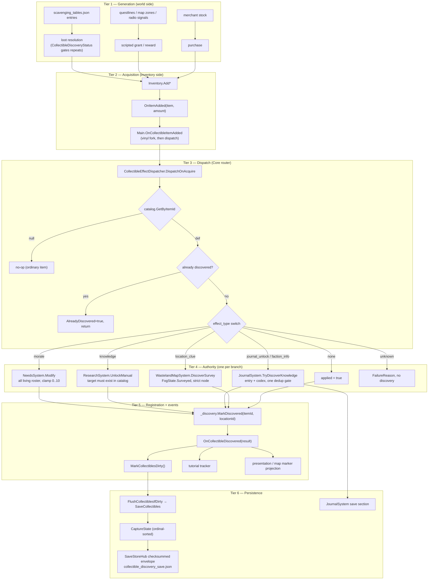

# Flagship XII (collectibles) — Implementation Log

Plan: Flagship Integration Plan XII — Collectible Narrative Quality,
Journal/Codex Content, Faction Intel & Localization Readiness.
Date: 2026-09-05. Branch: `feat/asset-pipeline-flagship`.

## Phase 0 — Forensic audit — PASS

Changed: nothing (read-only).

Result:
- 40 collectible definitions confirmed; live effect mix: none 12, morale 7,
  faction_info 7, knowledge 7, journal_unlock 4, location_clue 3.
- **Journal unlock live count = 4** (casualty_records, soldier_letters,
  religious_texts, exchange_day). The plan's fifth slot is a phantom;
  nothing invented. `journal_religive_texts` typo not canonicalized.
- Acquisition chain: `Inventory.OnItemAdded` →
  `CollectibleEffectDispatcher.DispatchOnAcquire` → per-effect authority;
  `journal_unlock`/`faction_info` both route to
  `JournalSystem.TryDiscoverKnowledge` (codex authority). No separate
  faction-intel system exists; no standing surface is reachable from the
  dispatcher.
- Save owner: `CollectibleDiscoveryState` (checksummed envelope) + journal
  section; restore never fires effects.
- Localization: `LocalizationService` is UI-key-based (CSV, `ui.*`);
  catalog text is raw default-language strings → Plan XII §4.4 raw-string
  model applies.
- Generic reference validation (Stage 3) already existed
  (`Assets/Ashfall.Core/Content/CollectibleCatalogIntegrityValidator.cs`):
  journal_unlock/faction_info targets must resolve against
  `journal_voice_prose.json`; knowledge → research; location_clue → map.

Divergences recorded: plan assumed descriptions live in `collectibles.json`;
they live in `items.json` (item authority). Plan assumed a faction-intel
codex distinct from the journal; the journal knowledge base **is** the codex.

## Baseline — recorded (foreign red)

- `dotnet test` (shared test project) did not compile at baseline and at
  closure: ~1,000 errors across ~40 unrelated in-flight test files
  (WildlifeTrapping*, DistressSignal*, Debt*, WeatherGate*, MicroLocation*,
  PatrolEncounter*, DutyRoster*, Greenhouse*, Water*, Radio*, Content*, and
  some Collectible* files) referencing Core APIs newer than the checkout.
- Root cause (not mine): a concurrent stream ran `git reset --hard` at
  00:58 (reflog: `reset: moving to ac37da7e`), rolling Core back while
  untracked test files (which resets do not touch) kept referencing the
  newer API surface. The same reset destroyed uncommitted working-tree
  content, including this flagship's authored codex prose (recovered — see
  Stage 4/5) and the then-public `CollectibleCatalogFileRaw` visibility that
  several untracked collectible test files compile against.
- Baseline repair by me: `MicroLocationDeterminismHarness.cs` (untracked,
  foreign file) had a hard CS0052 (`public SeededRng Rng` field over an
  internal type) blocking every build; changed the field to `internal`
  (one line, semantics unchanged). That file remains untracked/foreign.
- `Ashfall.Core` itself went transiently red at closure with 2 errors in
  files I never touched (`Catalogs/InstitutionCatalogParse.cs:129`,
  `Diplomacy/DiplomaticTreatyCatalog.cs:126`) — concurrent live edits,
  expected to settle with their wave.

## Stage 4/5 — Codex content — PASS (with recovery note)

Changed:
- `Assets/StreamingAssets/Data/journal_voice_prose.json`: restored the 11
  codex keys (4 journal + 7 faction; 7 voices each) **recovered from the
  pre-reset snapshot** `builds/linux/.../journal_voice_prose.json`, then
  re-authored `default`+`realist` voices to 2–3 restrained sentences each.
  Diff vs HEAD: +99/−0 (purely additive; 14 → 25 prose keys).

Result: every live journal_unlock/faction_info target resolves to authored
content; acquisition writes "Day N. …" entries through the canonical
`TryDiscoverKnowledge` path; placeholder fallback text can no longer occur.

## Stage 6 — Collectible prose rewrites — PASS

Changed (`items.json`, 5 surgical description edits):
team_pennant (faded→washed-out), mothers_letter/soldiers_letter/music_box
(4→3 sentences), military_patch (torn→pulled). All within-identity,
facts and effect wiring untouched.

## Stage 7 — Localization — PASS (decision: raw-string model)

Changed: nothing (decision record in closeout; no dead fields added).

## Stage 8 — Tests — PASS

New (self-contained, live-data-driven, no hardcoded target IDs):
- `CollectibleNarrativeQualityTests.cs` — corpus gates: 40/40 non-empty,
  ≤3 sentences, names ≤50 chars unique per category, cliché ceilings
  (faded/torn/bloodstained/haunting reminder ≤2), brand/team/publication
  blacklist, slang blacklist, procedural-instruction blacklist, generic
  prose-target resolution, 2–4 sentence entry contract for default+realist.
- `CollectibleCodexUnlockLiveTests.cs` — per live codex collectible:
  authored-entry acquisition (exact composed text, no placeholder),
  duplicate-acquisition idempotency, second-dispatcher no-duplicate-entry,
  save/restore preserves unlocks with zero notification replay, and
  FactionWarSystem standing isolation (no record created/modified, no
  event, unrelated faction standing intact).

## Stage 9/10 — Docs and closure — PASS

Follow-up restoration: 12 Plan 95 situation prose keys recovered from the
same pre-reset snapshot (additive; 25 → 37 keys) — unblocked the foreign
`JournalVoiceProseExpansionTests` (7/7 PASS after restore).

Final gates: host build PASS (0/0); bridge-selftest PASS; content-utilization
CI gate PASS; isolated harness 18/18 (twice); full-suite green window
7837/342 with every failure proven foreign via the parent-data experiment;
data-integrity FAIL(8) foreign treaty/debt/therapy ids; `--collectible-selftest`
not routable on rolled-back HEAD (verb registration was destroyed state).

- `docs/narrative/COLLECTIBLES_NARRATIVE_QUALITY_AUDIT.md` — 40-row matrix,
  register distribution (16 distinct primaries; loss 4; routine 5; joy/pride
  4; faith 2; bureaucracy 4), cliché report, rewrite log, IP/slang reviews,
  empty fictional proper-noun inventory (all references generic).
- `docs/narrative/COLLECTIBLES_CONTENT_INTEGRATION_CLOSEOUT.md` — full
  closeout with the 4-vs-5 resolution, mapping tables, localization
  decision, save/load contract, incident provenance, verification.
- Isolated verification (gitignored `Builds/_verify_flagship_xii` harness,
  ProjectReference → Ashfall.Core + the two new test files):
  `dotnet test` → **18/18 PASSED**.
- Canonical gates (`dotnet build Ashfall.csproj`, full `dotnet test`,
  godot selftests) to be re-run when the concurrent streams' Core edits
  settle; blocked at closure by foreign in-flight errors (see Baseline).

## Divergences from plan (summary)

1. Descriptions authored in `items.json`, not `collectibles.json`.
2. Faction-intel codex == journal knowledge base (single authority).
3. Stage 3 validators already existed (Task 8 wave); re-pinned in tests
   instead of rewritten.
4. Entry-contract scoping: default+realist voices carry the 2–4 sentence
   contract (the only live production path); trait voices remain one-line
   corpus style — documented, gate-ready for extension.
5. Localization resolved to §4.4 raw-string model (no key fields added).
---

# EXPANSION 2026-09-25 — Flagship XII Collectibles: Full Integration Framework & Code Architecture

Everything above the separator is the original 2026-09-05 implementation log,
preserved byte-for-byte. Everything below is the 2026-09-25 expansion: a full
integration framework and code-architecture reference for the collectibles
subsystem that Flagship XII sealed, grounded in a fresh evidence pass over the
current tree (paths re-read, data files re-counted, tests re-inspected, reflog
re-checked). Where the expansion states a fact about today's tree it is
backed by a cited file; where it can only restate what the closure-time log
recorded without today's corroboration it is labelled
`UNVERIFIED (log text)`. Historical gate numbers are never re-asserted as
current results.

Expansion scope discipline: this is a documentation-only change. One file
touched (this one). No code, no data, no tests modified; no builds or test
runs executed for the expansion; the concurrent streams' dirty files were
treated as untouchable throughout the evidence pass.

---

## Part I — Preamble: what this expansion is, and why the collectibles subsystem deserves one

### I.1 Why collectibles are the canonical integration case study

Most subsystems in ASHFALL own one concern. The collectibles subsystem owns a
seam between six: it is triggered by inventory, it pays out into morale,
research, journal/codex, and map knowledge, it is deliberately isolated from
faction diplomacy, it persists through its own checksummed save section, and
its content quality is pinned by its own CI editorial gates. That makes it the
best worked example in the repository of the house rule that *a system is
integrated only when its Core authority, host owner, route or event path,
persistence where needed, and observable outcome agree* (AGENTS.md,
"SAVE, DETERMINISM, AND CONTENT").

Flagship XII (2026-09-05) did not invent that machinery — it audited it,
restored the content the machinery needed, pinned the editorial quality bar in
CI, and wrote down the two decisions (faction-intel == journal codex;
raw-string localization) that later waves keep re-deriving. The subsystem has
kept growing since: a documented effect contract, a generated utilization
matrix, eleven dedicated test files under `Ashfall.Core.Tests/Collectibles/`,
map projection, tutorial tracking, accessibility presentation, vinyl
ownership, and a legacy-save reconciliation pass. None of that is collected
anywhere as one architecture story. This expansion is that story, anchored to
the Flagship XII log that started it.

### I.2 What was re-verified for this expansion (evidence pass, 2026-09-25)

Every load-bearing claim below was re-checked against the tree today:

| Claim | Evidence re-read | Result today |
|---|---|---|
| 40 collectible definitions | `Assets/StreamingAssets/Data/collectibles.json` | 40 (unchanged) |
| Effect mix none 12 / morale 7 / faction_info 7 / knowledge 7 / journal_unlock 4 / location_clue 3 | same, `effect_type` tally | identical (unchanged) |
| 4 journal targets, 7 faction targets | same, per-row dump | identical; IDs match the log |
| `unique: true` rows | same, boolean tally | three: `item_collectible_casualty_list`, `item_collectible_exchange_day_newspaper`, `item_collectible_survivor_map` |
| `journal_religive_texts` typo never canonicalized | repo-wide grep | zero occurrences in code and data (the only textual mention anywhere is the closeout's own erratum note) |
| Acquisition chain | `Assets/Ashfall.Core/Inventory/Inventory.cs` (OnItemAdded), `src/Main.Collectibles.cs` (feeder), `Assets/Ashfall.Core/Collectibles/CollectibleEffectDispatcher.cs` | chain intact as logged |
| Discovery save | `Assets/Ashfall.Core/CollectibleDiscoveryState.cs`, `src/Host/CollectibleDiscoverySaveStore.cs` | schema v2, checksummed envelope, no legacy bare state |
| Restore never fires effects | `CollectibleDiscoveryState.RestoreState` + `CollectibleCodexUnlockLiveTests` | intact |
| Localization model | `Assets/Ashfall.Core/Localization/LocalizationService.cs`, `assets/l10n/` | UI-key service (`ui.*`, CSV + Godot `.translation` imports); catalog text raw strings |
| Reference validator | `Assets/Ashfall.Core/Content/CollectibleCatalogIntegrityValidator.cs` | present, richer than the log's one-line summary (see Part II) |
| Corpus gates file | `Ashfall.Core.Tests/CollectibleNarrativeQualityTests.cs` | present; 8 gate methods → 11 executed cases |
| Live unlock file | `Ashfall.Core.Tests/CollectibleCodexUnlockLiveTests.cs` | present; 5 methods → 7 executed cases |
| 18/18 isolated harness | case arithmetic 11 + 7 | total matches the recorded 18/18 |
| Prose authority size | `Assets/StreamingAssets/Data/journal_voice_prose.json` | **39 keys today** (was 14 pre-incident, 25 at Stage 4/5, 37 at closure) |
| Five Stage-6 rewrites | `items.json` live descriptions | all five verbatim as re-authored |
| The git-reset incident | `git reflog` | `HEAD@{2026-09-05 00:58:17 +0300}: reset: moving to ac37da7e` — still in the reflog; target commit dated 2026-09-04 19:50:00 +0300 |
| Recovery snapshot | `builds/linux/` | **the pre-reset snapshot content no longer exists there**; the Sep 13 build's refreshed output is what occupies the directory now, not the recovery-time tree the recovery read from |

### I.3 What changed between closure (2026-09-05) and this pass (2026-09-25)

The subsystem grew around the sealed flagship rather than through it. The
deltas that matter for this document:

1. **Prose authority 37 → 39 keys.** Commit `973b6139` ("feat(journal):
   authored prose for flagship micro-location unlocks + production prose
   binding") added the two `micro_*` situation keys
   (`micro_dead_livestock_tags`, `micro_radio_tower_log`). The eleven codex
   keys Flagship XII restored are untouched.
2. **Location-clue targets re-pointed.** The narrative audit's matrix
   (2026-09-05) records `loc_road_junction_cache`,
   `loc_military_outpost`, `loc_survivor_cache` for the three map
   collectibles. Live data today resolves to `loc_logistics_reserve_cache`,
   `loc_hidden_relay_bunker`, `loc_deaddrop_command_shelter`. The audit doc's
   rows are therefore historical; the integrity validator and the live tests
   (both data-driven) did not need to change — which is exactly the resilience
   the live-data test philosophy buys (Part V.ch.6).
3. **The ecosystem around the seam materialized.** `docs/collectibles/` now
   holds five documents led by `COLLECTIBLE_EFFECT_CONTRACT.md`
   (dated 2026-09-13, batch `TASKS-5-8-COLLECTIBLE-INTEGRATION`); Core gained
   `Assets/Ashfall.Core/Collectibles/` (dispatcher, map projector, tutorial
   tracker) plus `UniqueItemClaimRegistry`, `VinylMoraleSystem`, and the
   vinyl acquisition map; the shared test project gained a dedicated
   `Collectibles/` directory (11 files); `scripts/ci/generate-collectibles-matrix.py`
   generates the utilization matrix with a `--check` CI mode.
4. **The dispatcher grew a reconciliation API** (`ReconcileDiscoveredSubsystemState`,
   legacy-save reconciliation, Cases A/B/C) and the host grew a wired
   feeder path with vinyl forking and dirty-flag persistence
   (`src/Main.Collectibles.cs`).
5. **`--collectible-selftest` is still not routable.** The 495-line selftest
   body exists (`src/Host/HostCli.Collectibles.cs`, fixture authorities, six
   lifecycle scenarios) but a repo-wide grep finds no caller of
   `RunCollectibleSelfTest` outside its own file: the verb registration that
   the reset destroyed was never rebuilt. This remains the subsystem's one
   unsealed host gap (Part VIII, open questions).

### I.4 Reading order

Part II pins the current authority map. Part III states the integration
invariants and walks the tier-by-tier flow. Part IV is the code architecture
(module map, deep specs, sequence walkthroughs). Part V is the bulk: the six
effect authorities, the codex/voice model, the quality gates, the git-reset
case study, the localization decision record, the live-data test method, and
the prose-craft worked examples. Part VI is the cross-system matrix and the
restrained-tone design argument. Part VII is verification and acceptance.
Part VIII holds appendices: glossary, ID vocabulary, scenario walkthroughs,
open questions.

---

## Part II — Current authority audit: who owns what, as of 2026-09-25

### II.1 The one-paragraph authority summary

A collectible is **one stable item ID** that exists in two catalogs at once:
`items.json` owns the physical item (display name, description, trade value,
stacking) and `collectibles.json` owns the collectible semantics (category,
rarity, effect type, effect target, effect value, location type, unique flag),
keyed by the same `item_id`, one-to-one. Acquiring the item into shelter
inventory is the single trigger. The effect is routed by exactly one Core
router to exactly one pre-existing campaign authority. Discovery is recorded
in exactly one campaign-scoped ledger with its own checksummed save section.
Nothing else in the codebase is allowed to know what a collectible effect
does.

### II.2 Ownership table (verified today)

| Concern | Owner | Path | Notes |
|---|---|---|---|
| Physical item identity, names, descriptions | Item catalog | `Assets/StreamingAssets/Data/items.json` (724 items) | The Stage-6 rewrites live here. Collectible descriptions are ordinary item descriptions — no parallel text store. |
| Collectible semantics | Collectible catalog | `Assets/StreamingAssets/Data/collectibles.json` (40 rows) | Stable IDs only; no display text. Loaded by `Assets/Ashfall.Core/CollectibleCatalog.cs` (`CollectibleCatalogLoader`, silent-empty on missing file). |
| Effect routing | Core dispatcher | `Assets/Ashfall.Core/Collectibles/CollectibleEffectDispatcher.cs` | A router, not a system: owns no morale/research/journal/map state. |
| Host forwarding type | Host adapter | `src/Host/CollectibleEffectDispatcher.cs` | Trivial subclass of the Core type preserving host-namespace compile compatibility; adds nothing. |
| Inventory trigger | Inventory event | `Assets/Ashfall.Core/Inventory/Inventory.cs` `OnItemAdded` (declared line 78; raised from `Add` at lines 341/362 and from `NotifyTransactionCommitted` at line 787 — all acquisition-side) | Save restore and inventory reconstruction do not raise it. |
| Host feeder + wiring | Main partial | `src/Main.Collectibles.cs` | `SetupCollectibles` (construct/wire/restore/reconcile), `WireCollectibleInventoryFeeder` (idempotent subscribe), `OnCollectibleItemAdded` (vinyl fork + dispatch + dirty flag), `SaveCollectibles`/`FlushCollectiblesIfDirty`. |
| Discovery ledger | Core state | `Assets/Ashfall.Core/CollectibleDiscoveryState.cs` | Four distinct persistent facts: ever-acquired, unacknowledged, acknowledged, origin locations. Ordinal-sorted capture. |
| Discovery persistence | Host save store | `src/Host/CollectibleDiscoverySaveStore.cs` | `SaveStoreHub.Checksummed<CollectibleDiscoverySave>`; file `collectible_discovery_save.json`, section `collectible_discovery`, `allowLegacyBareState: false`. |
| Morale payout authority | Needs system | `Assets/Ashfall.Core/Survivors/NeedsSystem.cs` (`Modify`, two overloads, lines 204/312) | Dead survivors skipped inside `Modify` itself. |
| Knowledge payout authority | Research system | `Assets/Ashfall.Core/Research/ResearchSystem.cs` (`UnlockManual`, line 60) | Reveal-only; completion stays behind `StartResearch` + prerequisites. |
| Journal/codex authority | Journal system | `Assets/Ashfall.Core/Journal/JournalSystem.cs` (`TryDiscoverKnowledge`, line ~224) | One dedup gate: entry + codex unlock + notification atomically on unknown→known. |
| Prose/voice authority | Journal voice | `Assets/Ashfall.Core/Journal/JournalVoice.cs`, `JournalVoiceProseCatalog.cs`, data `journal_voice_prose.json` | 39 keys; 7 voices (no empath/sociopath) on the 11 codex keys and the 5 newest situation keys, 9 on the remaining 23. |
| Map payout authority | Wasteland map | `Assets/Ashfall.Core/World/WastelandMapSystem.cs` (`DiscoverSurvey`, line 275) | Sets `MapFogState.Surveyed` (enum: Unknown 0, Rumored 1, Surveyed 2, Visited 3) with `collectible_clue` provenance. |
| Reference integrity | Catalog validator | `Assets/Ashfall.Core/Content/CollectibleCatalogIntegrityValidator.cs` | Pure, deterministic, RNG-free; typed findings; see II.5. |
| Uniqueness (generation) | Claim registry | `Assets/Ashfall.Core/UniqueItemClaimRegistry.cs`; host store `src/Host/UniqueClaimSaveStore.cs` | Deliberately separate from discovery: discovery gates the one-time EFFECT, uniqueness gates GENERATION. |
| Editorial quality gates | xUnit corpus gates | `Ashfall.Core.Tests/CollectibleNarrativeQualityTests.cs` | Specified in Part V.ch.3. |
| Live unlock contract | xUnit live tests | `Ashfall.Core.Tests/CollectibleCodexUnlockLiveTests.cs` | Specified in Part V.ch.6 and Part VII. |
| Utilization matrix (generated) | CI generator | `scripts/ci/generate-collectibles-matrix.py` → `docs/collectibles/COLLECTIBLES_UTILIZATION_MATRIX.md` | Machine-derived; `--check` mode; never hand-edited. |
| Effect contract doc | Docs authority | `docs/collectibles/COLLECTIBLE_EFFECT_CONTRACT.md` (2026-09-13) | Pins dispatcher semantics in prose; runtime truth stays in the Core file. |
| Map/tutorial/presentation | Core presentation types | `Assets/Ashfall.Core/Collectibles/CollectibleMapProjector.cs`, `CollectibleTutorialTracker.cs`, `Assets/Ashfall.Core/UI/CollectiblePresentationModel.cs` | Present consumers of the dispatch event and discovery ledger; sanitize hidden targets for accessibility. |
| Host CLI selftest (dormant) | Host CLI partial | `src/Host/HostCli.Collectibles.cs` (495 lines) | Body complete; **no caller found** — verb unwired (Part I.3.5). |
| Localization service | UI strings only | `Assets/Ashfall.Core/Localization/LocalizationService.cs`, `assets/l10n/strings.csv` | `ui.*` keys; never collectible text. |

### II.3 Data shape, verified

`collectibles.json` is `{"schema_version": ..., "collectibles": [...]}` with
row shape:

```json
{
  "item_id": "item_collectible_survivor_map",
  "category": "map",
  "rarity": "rare",
  "effect_type": "location_clue",
  "effect_target": "loc_deaddrop_command_shelter",
  "effect_value": 0,
  "location_type": "wilderness",
  "unique": true
}
```

(Representative shape; the `location_type` value shown is illustrative of the
field, while the ID, category, rarity, effect triple and unique flag are the
live row.) Field-for-field this is `CollectibleDefinition`
(`Assets/Ashfall.Core/CollectibleCatalog.cs`): snake_case, defaulting
`rarity="common"`, `effect_type="none"`, `effect_target=""`, `effect_value=0`,
`unique=false`.

Live distributions (counted 2026-09-25):

- Effect mix: `none` 12, `morale` 7, `faction_info` 7, `knowledge` 7,
  `journal_unlock` 4, `location_clue` 3. Identical to closure day; the corpus
  has been stable through every later wave.
- Categories (16, matching the validator's `ValidCategories` set exactly):
  vinyl 3, photograph 2, poster 3, book 2, magazine 2, technical_manual 5,
  military_document 3, personal_letter 3, badge 2, patch 2, toy 2,
  religious_object 2, sports_memorabilia 2, cultural_artifact 2, newspaper 2,
  map 3.
- Rarities: common 14, uncommon 16, rare 10. The validator also admits
  `unique` as a rarity string; live data uses none (uniqueness is carried by
  the boolean, not the rarity).
- Morale `effect_value` values in live data: 1 and 2 only (hard safety bound
  in code is 10; the authored corpus sits an order of magnitude under it).
- `unique: true` rows: exactly three — `item_collectible_casualty_list`,
  `item_collectible_exchange_day_newspaper`, `item_collectible_survivor_map`.

### II.4 The two catalogs, and why the split is correct

Flagship XII's first recorded divergence — "plan assumed descriptions live in
`collectibles.json`; they live in `items.json`" — is not an accident to be
fixed but the presentation/data split working as designed. The consequences
are worth spelling out because every later content wave trips over the same
question:

1. **A collectible is not a type of item; it is a role an item plays.** The
   item catalog already owns identity, naming, prose, economy (trade value),
   and carry behavior. Duplicating any of that into a second catalog would
   create two mutable authorities for one concern — the exact failure mode
   AGENTS.md rule 5 forbids.
2. **The integrity validator enforces the bijection in both directions.**
   Every `collectibles.json` row must resolve to an `items.json` entry
   (`ERR_ITEM_NOT_FOUND`), and every `items.json` id with the
   `item_collectible_` prefix must have a collectibles row
   (`ERR_ITEM_ORPHAN`). The prefix convention is therefore a load-bearing
   contract, not a naming taste.
3. **Editorial passes touch `items.json`; wiring passes touch
   `collectibles.json`.** The Stage-6 rewrites and the narrative gates read
   the joined view (catalog semantics + item text) but write only item text.
   Nobody has ever needed to change effect wiring to fix a sentence, which is
   the practical proof the split is clean.

### II.5 The integrity validator, in full (it is bigger than the log's summary)

The closure log summarized `CollectibleCatalogIntegrityValidator` in three
lines. The current file (432 lines) deserves the full description, because it
is the machine enforcement of "presence in JSON is not gameplay reachability"
for this subsystem. It is a pure static class: `Validate(dataDir, fileIO,
json, log)` → `List<CollectibleIntegrityFinding>`, zero gameplay RNG,
findings sorted deterministically by (source file, source ID, field path,
error code) so output is diff-stable.

Enumerated rules, as implemented:

| # | Rule | Error code |
|---|---|---|
| 1 | Context non-null (data dir, file IO, serializer) | `ERR_NULL_CONTEXT` |
| 2 | `collectibles.json` exists | `ERR_FILE_MISSING` |
| 3 | `collectibles.json` parses | `ERR_JSON_PARSE` |
| 4 | Collectibles list non-empty | `ERR_EMPTY_COLLECTIBLES` |
| 5 | `items.json` exists / parses | `ERR_FILE_MISSING` / `ERR_JSON_PARSE` |
| 6 | `research_knowledge.json` parses (target pool) | `ERR_JSON_PARSE` |
| 7 | `wasteland_map_v1.json` parses (target pool) | `ERR_JSON_PARSE` |
| 8 | `journal_voice_prose.json` parses (target pool) | `ERR_JSON_PARSE` |
| 9 | Scavenging tables: referenced items resolve | `ERR_SCAV_ITEM_MISSING` |
| 10 | Scavenging tables parse | `ERR_JSON_PARSE` |
| 11 | Acquisition-source graph also probes `narrative_questlines.json`, `damaged_map_zones.json`, `radio_distress_signals.json` by text scan (best-effort) | — |
| 12 | `item_id` non-empty | `ERR_ITEM_ID_EMPTY` |
| 13 | No duplicate collectible definitions | `ERR_DUPLICATE_ID` |
| 14 | Item authority resolution (forward bijection) | `ERR_ITEM_NOT_FOUND` |
| 15 | Category in the 16-value set | `ERR_INVALID_CATEGORY` |
| 16 | Rarity in {common, uncommon, rare, unique} | `ERR_INVALID_RARITY` |
| 17 | Effect type in {none, morale, knowledge, journal_unlock, faction_info, location_clue, recipe} | `ERR_INVALID_EFFECT_TYPE` |
| 18 | knowledge: target present and in research pool | `ERR_TARGET_REQUIRED` / `ERR_KNOWLEDGE_TARGET_MISSING` |
| 19 | location_clue: target present and in map node pool | `ERR_TARGET_REQUIRED` / `ERR_LOCATION_TARGET_MISSING` |
| 20 | journal_unlock: target present and in prose pool | `ERR_TARGET_REQUIRED` / `ERR_JOURNAL_TARGET_MISSING` |
| 21 | faction_info: target present and in prose pool | `ERR_TARGET_REQUIRED` / `ERR_FACTION_TARGET_MISSING` |
| 22 | Structural reachability: every collectible has ≥1 acquisition source | `ERR_NO_ACQUISITION_SOURCE` |
| 23 | Reverse bijection: `item_collectible_*` items map back | `ERR_ITEM_ORPHAN` |

Three design points worth internalizing:

- **`recipe` is admitted as a valid effect_type by the validator but has no
  dispatcher branch.** The dispatcher's `default:` case fails any unknown
  effect type with `unknown_effect_type:<t>` and defers discovery. So a
  `recipe` collectible would validate cleanly and then fail at runtime —
  validator reachability and dispatcher reachability are different gates, and
  only the second one is gameplay truth. (No live row uses `recipe`.)
- **The acquisition-source graph (rules 9–11) is the validator's most
  fragile and most valuable rule.** Rules 9 and the three text probes are how
  the pipeline knows a collectible can actually be obtained; the closure log's
  "parent-data experiment" (Part V.ch.4) showed the destroyed tree had lost
  scavenging-table placements, which is precisely rule 22's domain.
- **The target pools are loaded from the same files the runtime authorities
  use**, so the validator cannot drift from runtime the way a hardcoded ID
  list would.

### II.6 Growth since 2026-09-05, measured

A short census of the subsystem's footprint then vs now (then-values from the
closure log and closeout; now-values counted today):

| Surface | 2026-09-05 | 2026-09-25 |
|---|---|---|
| `collectibles.json` rows | 40 | 40 |
| Effect mix | 12/7/7/7/4/3 | identical |
| `journal_voice_prose.json` keys | 37 (after Plan-95 restore) | 39 (+`micro_dead_livestock_tags`, `micro_radio_tower_log`, commit `973b6139`) |
| Dedicated collectible docs | 2 (`docs/narrative/`) | 7 (`docs/narrative/` 2 + `docs/collectibles/` 5) |
| Dedicated collectible test files in shared project | 2 (flagship) + files of other streams untracked | 20 (`Ashfall.Core.Tests/Collectibles/` 11 + 9 collectible-named files at the project root, 2 of them the flagship pair) |
| Core types under `Assets/Ashfall.Core/Collectibles/` | 0 (dispatcher lived at Core root pre-move; the current `Collectibles/` directory is the later home) | 3 (dispatcher, map projector, tutorial tracker) |
| CI generators touching the corpus | 0 | 1 (`generate-collectibles-matrix.py`, with `--check`) |
| `--collectible-selftest` | not routable (verb registration destroyed) | still not routable (body exists, no caller) |

The headline: **the Flagship XII contracts (40 rows, effect mix, four journal
targets, restore semantics, quality gates) have not moved in twenty days of
heavy concurrent development.** Everything that grew, grew outward from the
sealed seam. That is what a correct seal looks like.

### II.7 Contradictions and stale rows found during this pass

Recorded honestly, per rule 7 ("use current evidence"):

1. `docs/narrative/COLLECTIBLES_NARRATIVE_QUALITY_AUDIT.md` §Rewrite log says
   "**Six** surgical rewrites" but its own table lists **five** rows, and live
   `items.json` corroborates five. Treat "six" as a typo in the audit doc; the
   implementation log's "5 surgical description edits" is the correct count.
2. The same audit's three `location_clue` matrix rows carry pre-rename target
   IDs (see I.3.2). The rows are historical record, not current wiring.
3. The closeout's isolated-harness arithmetic reads "13 acquisition +
   5 corpus" for the 18/18; the current files enumerate as 7 live cases +
   11 quality cases. The total agrees; the per-file attribution in the
   closeout prose does not match the committed files and should be read as a
   closure-day tally of a slightly different file state
   (`UNVERIFIED (log text)` for the exact closure-day split).

---

## Part III — Integration framework: invariants, flow, events, persistence, determinism

### III.1 The nine invariants

These are the contracts that make the subsystem safe to extend. Each is
stated as a rule, then pinned to its enforcement point. Breaking any of them
is a review-blocking change regardless of tests passing elsewhere.

**INV-1 — One trigger.** The only production path that fires a collectible
effect is an inventory acquisition raising `Inventory.OnItemAdded`, observed
by the host feeder (`Main.OnCollectibleItemAdded`), which calls
`DispatchOnAcquire` exactly once per raised event. No panel, quest script,
merchant flow, or debug verb may call an effect authority directly with a
collectible-derived target; they must go through the item (grant the item)
and let the chain run.

**INV-2 — One router, no state.** `CollectibleEffectDispatcher` is a router.
It holds the catalog and the discovery ledger by constructor injection and
takes everything else as lazy providers. It owns no morale, research,
journal, map, or faction state, and introduces no RNG. The doc comment in the
source says exactly this; the class is 351 lines including its result type
and migration report, which is the practical size proof.

**INV-3 — Exactly-once effects, discovered-never-replayed.** A collectible's
effect fires at most once per campaign. Enforcement is layered: (a)
`Inventory` does not raise `OnItemAdded` during restore/reconstruction, so
load physically cannot replay; (b) the dispatcher checks
`_discovery.IsDiscovered(itemId)` before dispatch and no-ops with
`AlreadyDiscovered = true`; (c) discovery is registered **only after** the
effect applies, so a failed dispatch leaves the collectible undiscovered and
a later fresh acquisition retries the effect.

**INV-4 — Failures are typed, retryable, and never swallowed.** Every
failure mode has a reason string: `morale_authority_unavailable`,
`research_authority_unavailable`, `journal_authority_unavailable`,
`map_authority_unavailable`, `effect_target_missing`,
`effect_target_unknown:<id>`, `map_node_not_found:<id>`,
`unknown_effect_type:<t>`. A failed dispatch logs a warning, leaves
discovery unregistered, and returns. Nothing silently drops an effect; the
collectible "keeps its value" until its authority exists.

**INV-5 — Authorities are pre-existing; the router invents none.** Routing
targets are the systems that already owned the concerns: `NeedsSystem.Modify`
(morale), `ResearchSystem.UnlockManual` (knowledge reveal),
`JournalSystem.TryDiscoverKnowledge` (journal_unlock AND faction_info),
`WastelandMapSystem.DiscoverSurvey` (location_clue). Flagship XII's second
divergence — no separate faction-intel system exists; the journal knowledge
base **is** the codex — is this invariant applied to content.

**INV-6 — Save state is IDs, ordinal-sorted, checksummed.**
`CollectibleDiscoverySave` (schema_version 2) persists five ordinal-sorted
arrays/entry lists (`discovered_ids` union for v1 readers,
`unacknowledged_ids`, `acknowledged_ids`, `ever_acquired_ids`,
`discovery_locations`). Sorting exists so HashSet enumeration order can never
destabilize the checksum. The envelope is written through
`SaveStoreHub.Checksummed` with `allowLegacyBareState: false` — this section
never shipped a pre-envelope format, so there is no bare-state path to
support.

**INV-7 — Restore never fires effects and never notifies.**
`CollectibleDiscoveryState.RestoreState` clears and repopulates sets; it
raises nothing. `JournalSystem.RestoreState` reconstructs entries and
knowledge with zero `OnEntryAdded` / `OnCodexUnlocked` /
`OnNotificationPing`. `CollectibleCodexUnlockLiveTests.SaveRestore_PreservesUnlocks_WithoutReplayingNotifications`
asserts all three counters are zero after restore.

**INV-8 — Standing isolation for informational effects.** `faction_info` is
codex knowledge only. The dispatcher has **no faction provider** — the
isolation is structural, not conventional. It is pinned by
`FactionInfoAcquisition_DoesNotMutateFactionStanding`, which snapshots all
faction standings, acquires every faction collectible, and asserts byte-equal
standings, zero standing events, and an untouched unrelated faction
(`faction_rebuilders` at 20 before and after).

**INV-9 — Data quality is CI law, not convention.** The corpus gates
(Part V.ch.3) and the live unlock tests are committed into the shared test
project. The generated utilization matrix has a `--check` CI mode. The
integrity validator is wired into the host's data-integrity path
(`HostCli.SelfTests.cs` collectible integrity block). Editorial regressions
fail builds; they are not left to review.

### III.2 The tier-by-tier flow



Tier notes, with the subtle parts made explicit:

- **Tier 1 never knows about effects.** Loot tables, quests, and merchants
  reference item IDs. Weight, trade value, and placement live in the item and
  scavenging authorities. The utilization matrix (`docs/collectibles/`)
  joins these read-only for audit.
- **Tier 2's vinyl fork happens before dispatch, not inside it.**
  `OnCollectibleItemAdded` first checks
  `VinylRecordAcquisitionMap.IsVinylAcquisitionItem` and, for vinyl, forks a
  deterministic campaign RNG stream
  (`_campaignDay.Rng.Fork(CampaignStreamIds.Shelter, 0, 99)`) to register
  vinyl ownership with variance. That variance is *ownership* variance in a
  separate authority, not collectible-effect variance; the collectible
  dispatch that follows for the same item stays RNG-free (effect_type
  `none` for the vinyl rows — discovery only).
- **Tier 3's early returns are behavioral, not just fast paths.** The
  `AlreadyDiscovered` return carries the original discovery location
  (`_discovery.GetDiscoveryLocation`) so callers can present provenance
  without a second lookup.
- **Tier 4's `none` branch registers discovery.** A "none" collectible is
  still a discovery (12 of 40 rows): the ledger marks it so the UI can show
  DISCOVERED and the one-time presentation/tutorial moment can fire once.
- **Tier 5's event is the only presentation seam.** Map markers, tutorial
  moments, and cards subscribe to `OnCollectibleDiscovered` or read the
  ledger; none of them re-derive "was this the first pickup".

### III.3 Event flow, precisely

Two event chains matter, and they must never be confused:

**Chain A — acquisition (production, forward).**
`Inventory.OnItemAdded(ItemDefinition, int)` → host feeder →
`CollectibleEffectDispatcher.OnCollectibleDiscovered(CollectibleDispatchResult)`
→ presentation effects (dirty flag; tutorial; map projection). Chain A fires
only for the unknown→discovered transition, only on success.

**Chain B — journal internals (inside Tier 4 for codex effects).**
`JournalSystem.TryDiscoverKnowledge` on the unknown→known transition:
`_knowledge.Discover(key)` (the single dedup gate) → `CodexUnlockCount++` →
`OnCodexUnlocked(key)` → `InsertEntry(...)` which raises `OnEntryAdded` and
the notification ping. On an already-known key the journal-side call returns
null **without** touching counters or events — and the dispatcher still
counts the dispatch as handled (`EffectApplied = true`), because the unlock
content exists. That asymmetry (journal-side: once ever; dispatcher-side:
once per discovery ledger) is what makes the "codex already knows, second
discovery registers without duplicate entry" test meaningful.

**Counter-example pinned by tests:** a second dispatcher instance sharing the
journal but holding a fresh discovery ledger (the post-restore re-acquire
shape) must produce `EffectApplied = true`, `DiscoveryRegistered = true`, and
**zero** new entries. Both behaviors are asserted per live codex collectible.

### III.4 Save capture and restore, end to end

**Capture.** `Main.SaveCollectibles` (dirty-flushed) captures two sections:
`collectible_discovery` (via
`CollectibleDiscoverySaveStore.TryCapturePersisted(_collectibleDiscovery.CaptureState())`)
and `unique_claims`. `CaptureState` returns the schema-v2 DTO with all four
ID sets ordinal-sorted and the location entries sorted by `item_id`
ordinal; the store wraps it in the canonical checksummed
`{ State, Checksum }` envelope and writes atomically. Journal/codex unlocks
persist in the journal system's own section through its own store — the
collectible section deliberately does not duplicate them.

**Restore.** On load, `SetupCollectibles` restores the discovery ledger and
claim registry from their stores **before** constructing the dispatcher, then
wires the feeder, then — only if a save existed — runs
`ReconcileDiscoveredSubsystemState` once. The property stack that makes load
safe:

1. Restore does not raise `OnItemAdded` (inventory reconstruction is silent).
2. `RestoreState` mutates sets only; no events.
3. Journal restore reconstructs entries/knowledge with zero notifications.
4. Post-restore re-acquisition of a discovered collectible hits the
   `AlreadyDiscovered` gate: no effect, no entry, no notification.
5. If a legacy save somehow lacked the discovery section but the journal had
   the keys, the dispatcher would treat first dispatch as fresh; the journal
   dedup gate prevents a duplicate entry, and the unlock is not re-payed
   because codex unlock is idempotent by key. This is the
   defense-in-depth layering working: discovery is the primary gate, journal
   dedup is the secondary.

**Legacy reconciliation (Cases A/B/C).** Saves made before later waves
can hold *discovered* collectibles whose subsystem effects never ran (the
effect-bearing waves postdate the save). `ReconcileDiscoveredSubsystemState`
walks the catalog once per campaign load, after restore:

- Case A (knowledge): discovered but manual not unlocked → `UnlockManual`
  once; counts `KnowledgeReconciled`.
- Case B (location_clue): discovered but node neither known nor discovered →
  `DiscoverSurvey` once (strict; a missing node counts as "no
  reconciliation"); counts `LocationReconciled`.
- Case C (none/vinyl): discovered vinyl acquisition item without ownership →
  register via the acquisition map, **ownership only, never morale**; counts
  `VinylChecked`.

Every underlying call is itself idempotent, so calling the reconciler twice
reconciles nothing new; the host invokes it once per load, gated on
`discoverySaved != null`. The report is counters only — it never emits
morale. This is the house pattern for "versioned, idempotent, not every
load".

**v1 compatibility.** `RestoreState` handles schema_version ≤ 1 (or an
un-split save: empty ack/unack arrays with a populated `discovered_ids`) by
treating all historical discoveries as acknowledged and ever-acquired. The
union array exists precisely so a v1 reader can consume a v2 file.

### III.5 Determinism

The subsystem's determinism obligations and their discharge:

| Obligation | Discharge |
|---|---|
| No `System.Random` in Core behavior | Dispatcher is RNG-free by construction (no RNG field, no ambient source). |
| Any variance must come from the seeded campaign RNG | Only the vinyl ownership fork uses RNG, and it forks `_campaignDay.Rng.Fork(CampaignStreamIds.Shelter, 0, 99)` — a named campaign stream, never wall-clock, never hash order. |
| Save bytes stable across identical states | `CaptureState` sorts everything ordinal before returning; dictionary iteration in `ReconcileDiscoveredSubsystemState` walks `catalog.ByItemId` for reporting counters only (order-insensitive sums), never for state mutation order that could diverge. |
| Enumeration-order independence | `CollectibleCatalog` keys with `StringComparer.Ordinal`; discovery sets are `StringComparer.Ordinal` HashSets sorted on capture. |
| End-to-end replay | Pinned by `Collectibles/CollectibleCampaignSmokeTests` (Workstream D): seed 42, 20-scavenge lifecycle, hash-stable across subsystem boundaries. |

### III.6 Where validation lives in the pipeline

Three layers, three moments:

1. **Authoring time / CI:** `CollectibleCatalogIntegrityValidator` (structural
   + referential + reachability, Part II.5) through the data-integrity
   selftest; `generate-collectibles-matrix.py --check` (utilization matrix
   freshness); narrative quality gates (corpus text); live unlock tests
   (runtime contract against live data).
2. **Load time:** silent-empty catalog loader (missing file → empty catalog,
   warned via `CatalogDiagnostics`), validator findings surfaced by the host
   integrity verb, and the one-shot legacy reconciler.
3. **Dispatch time:** typed per-target validation (`effect_target_missing`,
   catalog-membership check for knowledge, strict node resolution for map)
   with deferred, retryable failures.

The design rule underneath: validators prove the graph; the dispatcher never
trusts them (it re-checks at runtime); the tests never hardcode what the
validator already proves.

---

## Part IV — Code architecture

### IV.1 Module map

```text
DATA AUTHORITY (Assets/StreamingAssets/Data/)
  collectibles.json ............. 40 semantic rows (IDs only)
  items.json .................... 724 items; collectible names + prose
  journal_voice_prose.json ...... 39 prose keys x trait voices (codex authority)
  research_knowledge.json ....... knowledge target pool
  wasteland_map_v1.json ......... map node target pool
  scavenging_tables.json ........ acquisition sources (weight side)
  narrative/vinyl_record_archive.json  vinyl record catalog (ownership side)

CORE (Assets/Ashfall.Core/, engine-free)
  CollectibleCatalog.cs ......... CollectibleDefinition + raw file DTO + loader
  CollectibleDiscoveryState.cs .. ledger (ever/unack/ack/locations) + DTO + restore
  UniqueItemClaimRegistry.cs .... generation-side uniqueness (separate concern)
  VinylMoraleSystem.cs .......... vinyl ownership + morale (separate authority)
  Collectibles/
    CollectibleEffectDispatcher.cs  the router (+ result type, migration report)
    CollectibleMapProjector.cs ..... discovery origin -> map marker (sanitized)
    CollectibleTutorialTracker.cs .. first-time onboarding moments, save-backed
  Content/
    CollectibleCatalogIntegrityValidator.cs  23-rule cross-catalog validator
  Journal/
    JournalSystem.cs ............... TryDiscoverKnowledge / TryDiscoverRaw...
    JournalVoice.cs ................ ComposeBody/ComposeFullText, day stamp
    JournalVoiceProseCatalog.cs .... key -> 9-voice entry, trait fallback
  Localization/LocalizationService.cs  UI-chrome keys only (ui.*)
  UI/CollectiblePresentationModel.cs   accessibility-first card model

HOST (src/, Godot 4 C#)
  Main.Collectibles.cs .......... setup, wiring, feeder, dirty-flag save
  Host/CollectibleEffectDispatcher.cs  1:1 forwarding subclass
  Host/CollectibleDiscoverySaveStore.cs  checksummed store facade
  Host/UniqueClaimSaveStore.cs .. claims section facade
  Host/HostCli.Collectibles.cs .. dormant --collectible-selftest body (495 ln)
  Host/HostCli.SelfTests.cs ..... data-integrity path incl. collectible block

TESTS (Ashfall.Core.Tests/)
  CollectibleNarrativeQualityTests.cs   8 methods / 11 cases (corpus gates)
  CollectibleCodexUnlockLiveTests.cs    5 methods / 7 cases (live contract)
  CollectibleCatalogTests.cs            loader/catalog semantics
  CollectibleDiscoveryStateTests.cs     ledger unit behavior
  CollectibleDiscoveryPersistenceTests.cs  capture/restore round-trips
  CollectibleItemPresentationTests.cs   card model surfaces
  CollectibleCardAccessibilityTests.cs  a11y semantics in visible text
  CollectibleMerchantSimulationTests.cs merchant channel behavior
  DoseCollectibleSaveFuzzTests.cs       malformed-save tolerance
  Collectibles/ (directory, 11 files)   save migration (v1 -> v2), dispatcher
      hardening, map, map-reveal, research, vinyl, tutorial, utilization,
      balance, campaign smoke, cross-plan ledger

CI (scripts/ci/)
  generate-collectibles-matrix.py  utilization matrix + --check
```

Dependency direction is one-way: data → Core → host; tests → Core (+ data
read-only); CI generator → data (read-only). Nothing in Core knows the host
exists; the host subclass exists only so `AtomicWar.GodotApp`-namespace
callers compile against their own type name.

### IV.2 Deep spec — `CollectibleEffectDispatcher` (Core)

**Type surface.**
`CollectibleDispatchResult` carries `IsCollectible`, `AlreadyDiscovered`,
`EffectType`, `EffectApplied`, `DiscoveryRegistered`, `FailureReason`,
`DiscoveryLocationId`, and the derived `HasDiscoveryEffects` (true exactly
when a non-`none` effect actually applied) — presentation code uses that
flag, never re-derives it. `CollectibleMigrationReport` carries the three
reconciliation counters.

**Constructor.** Catalog and discovery state are mandatory (argument-nulled
checks). Everything else is a `Func<T?>?` provider: `needsProvider`,
`researchProvider`, `journalProvider`, `mapProvider`, `dayProvider`, plus
`ILog` defaulting to `NullLog.Instance`. Lazy providers exist because hosts
construct systems in phased order; the dispatcher must be constructible
before its authorities. A provider returning null while the system is
genuinely absent yields the typed `_authority_unavailable` failures — never a
swallowed effect.

**`MaxMoraleEffectValue = 10f`.** Authored morale values are 1–2; the bound
is defense against a data typo paying +1000 morale. `ApplyMorale` clamps
`effect_value` into `[0, 10]` and then calls `NeedsSystem.Modify` uniformly
for every registered survivor, including dead ones — the doc comment records
that `Modify` itself skips dead survivors, so uniform calling keeps the loop
honest and the effect a single bounded grant to every living member. The
info log line uses `CultureInfo.InvariantCulture` for the value so logs are
locale-stable.

**Dispatch order** (the class doc's six steps, implemented verbatim):
lookup → non-collectible no-op → already-discovered no-op → effect →
mark-discovered-only-on-success → event on registration. The two-phase
"applied then registered" structure is what makes failure retryable:
`FailureReason` set + no registration + warn log, and the next real
acquisition retries from scratch.

**`ValidateTarget`** is the shared pre-check for targeted branches: empty or
null target → `effect_target_missing`. Knowledge then additionally requires
the target to exist in `research.Catalog` (`effect_target_unknown:<id>`);
map requires strict node resolution (`map_node_not_found:<id>`). Journal is
the deliberate exception: an unknown prose key would produce placeholder
text, so the *validator* and the *quality gates* own that guarantee
(`ERR_JOURNAL/FACTION_TARGET_MISSING`,
`JournalAndFactionTargets_ResolveAgainstProseAuthority`), while the runtime
branch trusts the pipeline and treats "journal already knows" as success —
the one branch where a soft outcome is correct, because the dedup gate is
the journal's, not the dispatcher's.

**Reconciliation** (`ReconcileDiscoveredSubsystemState`) is documented in
III.4. Note its asymmetries: it *breaks* the knowledge branch's strictness
differently than dispatch (a target missing from the research catalog is
skipped silently there, because reconciliation must never manufacture
findings), and its vinyl case routes through
`Narrative.VinylRecordAcquisitionMap.TryAcquireFromItem` with an optional
`ISeededRng` so a host *can* pass the forked stream, keeping Core
determinism-neutral.

**Host subclass.** `src/Host/CollectibleEffectDispatcher.cs` is 30 lines:
same constructor signature, `: base(...)`, nothing else. Its only reason to
exist is namespace compatibility for pre-existing host callers; all behavior
lives in Core. This is the repo's canonical shape for the
"Core owns, host forwards" seam.

### IV.3 Deep spec — `CollectibleDiscoveryState`

**Four facts, deliberately distinct** (class doc): `WasEverAcquired`
(permanent acquisition history; survives selling/dropping), `NewUnacknowledged`
(first-time acquisition awaiting UI acknowledgement), `DiscoveredAcknowledged`
(acknowledged history), `DiscoveryLocationId` (origin provenance). The class
doc explicitly separates it from `UniqueItemClaimRegistry`: *discovery gates
the one-time EFFECT and UI presentation, uniqueness gates GENERATION.* Two
registries, two lifecycles, one item.

**Transitions.** `MarkDiscovered(itemId, locationId)`: adds to
ever-acquired unconditionally; returns true only on unknown→discovered
(newly discovered enter NewUnacknowledged); records the origin location when
provided. `AcknowledgeDiscovery`: NewUnacknowledged → DiscoveredAcknowledged,
returns true only on that transition, re-adds to ever-acquired (defensive).
`GetDiscoveryStatus` resolves the 3-state enum (`Undiscovered`,
`NewUnacknowledged`, `DiscoveredAcknowledged`) used by presentation and loot
resolution alike.

**Capture.** All four collections snapshot into ordinal-sorted arrays; the
v1 union (`acknowledged` then `unacknowledged`, then sorted) is materialized
for legacy readers; location entries sort by `item_id` ordinal. The DTO's
doc comment ties the sorting to the save checksum explicitly — this is
Invariant-4 determinism made mechanical.

**Restore.** Clears everything first (so restore is total, not merging),
re-loads locations (skipping null/empty pairs), then branches: v1-shaped
input (schema ≤ 1, or the un-split signature) → everything acknowledged;
otherwise v2 arrays loaded independently, each feeding ever-acquired as it
goes. Malformed entries (`null` array slots, empty IDs) are skipped, never
thrown — a corrupted ID degrades one row, not the load.

### IV.4 Deep spec — the authorities' touchpoints

**`NeedsSystem.Modify(SurvivorNeedsState, NeedKind, float)`** (line 312
overload; a by-ID overload exists at line 204). The dispatcher chooses the
state-based overload because it already holds the roster snapshot. Morale is
a bounded float need; `Modify` applies the delta and internally ignores dead
survivors. No events are raised by the dispatcher beyond its own — needs
diffusion is the needs system's business.

**`ResearchSystem.UnlockManual(string)`** (line 60). The comment block in
`ApplyKnowledge` is the load-bearing semantics: manuals REVEAL, they never
complete. `UnlockManual` records the reveal (`unlockedIds` / `IsManualUnlocked`);
actual research completion remains behind `StartResearch` and its
prerequisite gate. A collectible manual therefore shifts what the shelter
*can* research, never what it *has* researched. The pre-check
(`research.Catalog.TryGetValue`) exists because `UnlockManual` on an unknown
id would be a silent data typo; instead the dispatch fails typed and
retryable.

**`JournalSystem.TryDiscoverKnowledge(key, author, day, hour)`** (line ~224).
The single-dedup-gate design: on unknown→known, `_knowledge.Discover(key)`
flips the bit, `CodexUnlockCount++` and `OnCodexUnlocked` fire *before* the
entry is inserted (so the codex state and the event are consistent even if
entry insertion had to be transactional), then `InsertEntry` raises
`OnEntryAdded` and the notification ping. `author: null` (the collectible
path) resolves the voice to `RiskBiasTrait.Realist` — the doc'd contract —
and composes via `JournalVoice.ComposeFullText(key, bias, day)`, producing
`"Day N. <body>"` with the day clamped to ≥ 1. There is also an authored-
record path (`TryGetAuthoredRecord`) used by narrative waves for
hand-placed entries; the collectible path uses the voice-composed one.

**`WastelandMapSystem.DiscoverSurvey(nodeId, surveySourceId, day, traits?)`**
(line 275). The comment in `ApplyLocationClue` records a deliberate history:
the original `Discover()` path set `FogState.Visited` with a fabricated
`ExpeditionVisit` provenance — a clue never traveled there. The current path
records `FogState.Surveyed` (High confidence, `collectible_clue` provenance)
and touches nothing else: a map collectible confirms *location knowledge*,
it does not fake a *visit*. Strict node resolution: an unknown node is
`false` → typed failure → discovery deferred; the clue keeps its value for
when the authority gains the node. Fog ladder for reference:
`Unknown=0, Rumored=1, Surveyed=2, Visited=3`.

### IV.5 Deep spec — validator and generated matrix (the audit pair)

The validator (Part II.5) is the rule book; the generated utilization matrix
(`docs/collectibles/COLLECTIBLES_UTILIZATION_MATRIX.md`, from
`scripts/ci/generate-collectibles-matrix.py`) is the evidence table: one row
per authored collectible joining category, rarity, weight, trade value,
effect, target, source count, unique flag, consumer system, and live status,
machine-derived from `collectibles.json` + `items.json` +
`scavenging_tables.json`, with `--check` failing CI when the committed
matrix is stale. Together they answer, without a human, the two questions
every content wave asks: *is every row wired to something real?* (validator)
and *is every row actually reachable and consumed?* (matrix). The matrix's
"Sources (n)" column is the human-readable form of the validator's
acquisition-source graph; a row with `n = 0` would be `ERR_NO_ACQUISITION_SOURCE`
in validator output.

### IV.6 Sequence walkthroughs

**W1 — Acquire → morale (`item_collectible_family_portrait`, value 2).**

```mermaid
sequenceDiagram
    participant P as Player (scavenge)
    participant INV as Inventory
    participant M as Main.OnCollectibleItemAdded
    participant D as Dispatcher
    participant DS as DiscoveryState
    participant N as NeedsSystem
    P->>INV: add item_collectible_family_portrait
    INV->>M: OnItemAdded(def, n)
    M->>M: vinyl? no (skip fork)
    M->>D: DispatchOnAcquire(item_id, locationId?)
    D->>D: catalog hit; effect_type=morale
    D->>DS: IsDiscovered? no
    D->>N: provider -> NeedsSystem
    D->>D: clamp(effect_value=2, 0..10)
    D->>N: Modify(each living survivor, Morale, +2)
    N-->>D: applied (dead skipped inside Modify)
    D->>DS: MarkDiscovered(id, locationId)
    DS-->>D: true (first time)
    D-->>M: result {EffectApplied, DiscoveryRegistered}
    D->>D: OnCollectibleDiscovered(result)
    M->>M: MarkCollectiblesDirty()
```

Failure variants: needs provider null → `morale_authority_unavailable`, no
registration, warn log; next acquisition of the same item retries. A second
acquisition after success → `AlreadyDiscovered=true`, no morale, no event.

**W2 — Acquire → journal unlock (`item_collectible_casualty_list` →
`journal_casualty_records`, day 14).** Same skeleton to the switch; then:
journal provider → `ValidateTarget` (non-empty) →
`TryDiscoverKnowledge("journal_casualty_records", null, 14)` →
`_knowledge.Discover` (first time: true) → `OnCodexUnlocked` →
`InsertEntry` with text = `JournalVoice.ComposeFullText(key, Realist, 14)` =
`"Day 14. " + realist voice body` → `OnEntryAdded` + notification ping →
back in dispatcher: applied=true → `MarkDiscovered` → event → dirty. The
live test pins the exact composed text (equal to `ComposeFullText` with the
fixture day), the `"Day "` prefix, one entry, one codex event, one ping, and
the absence of the placeholder string.

**W3 — Acquire → knowledge (`item_collectible_dosimeter_guide` →
`knowledge_radiation_measurement`).** Dispatch → research provider →
`ValidateTarget` → `research.Catalog.TryGetValue(target)` (membership proof)
→ `UnlockManual(target)` — reveal recorded, `IsManualUnlocked` true,
research *not* started, completion untouched → applied → discovery
registered. If the target were absent from the catalog:
`effect_target_unknown:knowledge_radiation_measurement`, deferred, retryable
— and the validator would already have flagged the row as
`ERR_KNOWLEDGE_TARGET_MISSING` at authoring time.

**W4 — Duplicate acquisition, three layers deep.** First acquisition:
full W1/W2 path. Second acquisition, same campaign: dispatcher's discovery
gate short-circuits (`AlreadyDiscovered=true`, carries original location);
journal never sees a second call; zero new entries; zero events. Layer 3 —
codex already knows but ledger fresh (second dispatcher, fresh
`CollectibleDiscoveryState`, shared journal): dispatch proceeds, journal
dedup gate returns null, dispatcher logs "already known — no duplicate
entry" and **still** returns `EffectApplied=true, DiscoveryRegistered=true`.
Both layer-2 and layer-3 are asserted per live codex collectible.

**W5 — Save / reload / re-acquire.** Capture: dirty flag set by the
registration event; `FlushCollectiblesIfDirty` → both sections captured
ordinal-sorted into checksummed envelopes. Load: `SetupCollectibles`
constructs catalog + empty ledger → `RestoreState(saved)` (silent) → claims
restored → dispatcher constructed with providers → feeder wired → one
`ReconcileDiscoveredSubsystemState` pass (counters usually zero on a healthy
save) → player loots the same collectible again → `OnItemAdded` fires (this
is a *new acquisition*, not a restore) → dispatcher → `AlreadyDiscovered`
→ no effect, no journal entry, no notification; loot presentation may show
it as a repeat. Journal keys survive via the journal's own section with zero
replayed events. Uniqueness note: `unique` rows additionally cannot
re-generate as world loot once claimed (`UniqueItemClaimRegistry`), which is
generation-side, orthogonal to the effect ledger.

### IV.7 What is deliberately *not* in the architecture

- No collectible-specific journal, faction, or morale system (the two
  recorded divergences in miniature).
- No effect scheduler, queue, or deferred-effect store — a failed effect is
  retried by re-acquisition, not by a background pass (the reconciler is a
  legacy-save migration, not an effect queue).
- No display text in `collectibles.json`, no keys in items for UI lookup, no
  locale column anywhere (Part V.ch.5).
- No per-collectible hardcoded IDs in tests or CI generators (Part V.ch.6).

---

## Part V — The bulk: seven chapters

### Chapter V.1 — The six effect kinds: contract, target resolution, failure modes

The dispatcher's switch admits six live effect types (plus the validator-only
`recipe`, which no live row uses and no runtime branch accepts). For each
kind: what it promises, how the target resolves, what it must never do, and
how it fails.

---

#### V.1.1 `none` — discovery-only (12 of 40)

**Contract.** The object is its own payoff: acquiring it registers the
discovery (NEW → acknowledged lifecycle, presentation, tutorial moment,
possible map-origin marker) and nothing else. Vinyl rows use `none` because
their real payload — ownership plus trait-scaled morale over time — belongs
to `VinylMoraleSystem` via the acquisition map, not to the one-shot
dispatcher.

**Target resolution.** None. `effect_target` is empty by schema default; the
validator requires nothing.

**Failure modes.** None reachable: the branch sets `applied = true`
unconditionally, then registration proceeds. A `none` row cannot fail
dispatch; the only way it "fails" is catalog-level (not being in the catalog
at all, which the forward bijection catches).

**Never.** Never re-routes into a hidden side effect. The temptation to
smuggle "and also X" into `none` (the reconciler's vinyl case is the one
sanctioned exception, and it is a *migration* path, not dispatch) is exactly
the parallel-authority drift rule 5 forbids.

---

#### V.1.2 `morale` — bounded roster-wide grant (7 of 40)

**Contract.** A single, bounded, immediate morale grant to every living
shelter member, value authored 1–2, hard-clamped to [0, 10]. Live rows:
family portrait (2), concert poster (1), pre-war novel (2), mother's letter
(1), child's doll (1), music box (2), team pennant (1) — comforts, art,
family, and small pride objects, at magnitudes that nudge rather than fix.

**Target resolution.** Targetless by design; the recipients are "the living
roster" resolved at dispatch time via `needs.Registered`. The dispatcher
iterates the snapshot once, calling `Modify` uniformly (dead members skipped
inside `Modify`), and counts `touched` for the log line.

**Failure modes.** `morale_authority_unavailable` when the provider yields
null (host phased construction, or a test wiring the provider to null).
Retryable: no registration, next acquisition retries. There is no partial
failure: `Modify` per survivor is void; the grant is all-or-nothing at the
dispatch level because registration happens after the loop.

**Never.** Never keyed to a specific survivor (the fiction is "the shelter
found this"); never scaled by count acquired (idempotent one-time); never
negative (schema permits any float; the clamp floor 0 and the authored
corpus keep it a gift). No RNG: morale variance comes from vinyl's
separate authority, forked from the campaign RNG, never from here.

---

#### V.1.3 `knowledge` — research reveal (7 of 40)

**Contract.** Reveal a research node to the shelter: the manual is "found",
so the topic becomes visible/startable. Completion is *never* granted. The
in-code rationale (Task 5 §6.4) is the sentence to remember: *manuals REVEAL
knowledge; they never complete it.*

**Target resolution.** `effect_target` must be a live id in
`research_knowledge.json`. Runtime membership is re-proven at dispatch
(`research.Catalog.TryGetValue`), not trusted from the validator. The seven
live targets: `knowledge_field_medicine`, `knowledge_basic_engineering`,
`knowledge_diesel_mechanics`, `knowledge_radio_repair`,
`knowledge_water_treatment`, `knowledge_air_filtration`,
`knowledge_radiation_measurement` — every technical manual in the corpus,
plus the field-medicine handbook and the science periodical. The
items-to-knowledge mapping is the corpus's most utilitarian seam: objects of
work unlock work.

**Failure modes.** Three, all typed and retryable:
`research_authority_unavailable`; `effect_target_missing` (empty target);
`effect_target_unknown:<id>` (target absent from the loaded catalog).
Authoring-time, the validator adds `ERR_TARGET_REQUIRED` /
`ERR_KNOWLEDGE_TARGET_MISSING`. A typo'd target therefore fails everywhere,
twice, loudly — and defers rather than corrupts.

**Never.** Never completes research; never grants skill points; never
mutates prerequisites. If a future wave wants "the manual also completes
X", that is a research-authority change with its own plan, not an effect
payload.

---

#### V.1.4 `journal_unlock` — authored entry + codex unlock (4 of 40)

**Contract.** Acquiring the object writes one authored journal entry
("Day N. <realist voice>") and unlocks the codex key, atomically, through
`TryDiscoverKnowledge`'s single dedup gate. The four live pairs:

| Item (items.json) | Category | Prose key |
|---|---|---|
| `item_collectible_casualty_list` | military_document | `journal_casualty_records` |
| `item_collectible_soldiers_letter` | personal_letter | `journal_soldier_letters` |
| `item_collectible_prayer_book` | religious_object | `journal_religious_texts` |
| `item_collectible_exchange_day_newspaper` | newspaper | `journal_exchange_day` |

**Target resolution.** `effect_target` must be a key in
`journal_voice_prose.json`'s `prose_variants`. Unlike knowledge/map, the
runtime branch does *not* re-validate membership: an unknown key would
compose the placeholder fallback ("Something changed. I wrote it down so I
would not forget."), so the guarantee is carried upstream by the validator
(`ERR_JOURNAL_TARGET_MISSING`) and the quality gate
(`JournalAndFactionTargets_ResolveAgainstProseAuthority`), and the live test
asserts the composed entry is *not* the placeholder. Trust boundaries differ
per branch on purpose: knowledge and map fail safe at runtime; journal fails
safe at CI because its runtime failure mode is silent (placeholder prose).

**The 4-vs-5 phantom.** The plan's checklist had a fifth slot; live data has
exactly four, and nothing was invented to fill it. The full resolution — the
deliberately dead typo (`journal_religive_texts`, zero occurrences in code or
data today), the object-first rule for any future fifth key, the structural
count pin — is V.2.4, and the closeout's mapping table is the authority this
expansion re-verified against live data.

**Failure modes.** `journal_authority_unavailable` (provider null);
`effect_target_missing`. Already-known key is *not* a failure: the branch
logs "already known — no duplicate entry" and reports success, because the
unlock content exists and the discovery legitimately registers.

**Never.** Never mutates anything but the journal; never writes under a
survivor author (author is null → Realist voice, the doc'd resolution);
never writes when the day provider is absent in a way that corrupts the
stamp (day falls back to 1, stamp still composed).

---

#### V.1.5 `faction_info` — codex unlock, standing-isolated (7 of 40)

**Contract.** Identical runtime path to `journal_unlock` (same branch, same
authority, same voice resolution) with a different editorial intent and one
absolute rule: **informational only**. No standing change, no faction
record creation, no diplomacy event. The seven live pairs:

| Item | Category | Prose key | Editorial grounding |
|---|---|---|---|
| `item_collectible_unit_photograph` | photograph | `faction_military_history` | unit composition and insignia read off the print |
| `item_collectible_propaganda_poster` | poster | `faction_state_propaganda` | messaging posture; claims treated as claims |
| `item_collectible_unit_log_fragment` | military_document | `faction_military_operations` | operational accounting in a torn log |
| `item_collectible_deployment_order` | military_document | `faction_military_deployment` | movement tables on a form |
| `item_collectible_civil_defense_badge` | badge | `faction_civil_defense` | warden institutional network implied by the badge |
| `item_collectible_military_patch` | patch | `faction_military_units` | unit lineage in the embroidery |
| `item_collectible_trade_guild_patch` | patch | `faction_trade_guilds` | route and hierarchy structure in guild heraldry |

**Why the isolation is structural.** The dispatcher's constructor has no
faction provider at all. There is no code path, however buggy, by which
acquiring a patch moves a standing number. The closeout's phrasing is exact:
"no faction-intel entry touches standing — enforced structurally (the
dispatcher has no faction provider) and pinned by
`FactionInfoAcquisition_DoesNotMutateFactionStanding`." The test goes
further than "nothing changed": it seeds an unrelated faction with real
standing (20), snapshots every faction, runs all seven acquisitions,
byte-compares the snapshot, asserts zero `OnFactionStandingChanged` events,
re-asserts the seeded 20, *and then* asserts the codex knowledge landed —
isolation is about diplomacy, not about swallowing the unlock.

**The single-authority decision.** Flagship XII's plan imagined a
faction-intel codex distinct from the journal. The forensic audit found the
journal knowledge base already *is* the codex, with prose, voices, dedup,
events, and save. Inventing a parallel store would have duplicated all five.
Divergence 2 stands as one of the plan's better corrections, and the
`faction_info` vs `journal_unlock` split survives as *editorial metadata*
(effect_type strings keep the distinction for audits, matrixes, and future
presentation), not as *architectural* separation.

**Failure modes.** Same as journal_unlock, with target errors surfaced at
CI as `ERR_FACTION_TARGET_MISSING` / the quality gate.

---

#### V.1.6 `location_clue` — surveyed, not visited (3 of 40)

**Contract.** The object confirms location knowledge: the target map node
moves to `FogState.Surveyed` (High confidence) with `collectible_clue`
provenance and the discovery day recorded. Nothing else on the node changes.

**Target resolution.** `effect_target` must be a real node id in
`wasteland_map_v1.json`; `DiscoverSurvey` resolves strictly and returns
false for an unknown node. Live targets (current data, post-rename — see
I.3.2): `item_collectible_road_map` → `loc_logistics_reserve_cache`;
`item_collectible_topo_map` → `loc_hidden_relay_bunker`;
`item_collectible_survivor_map` → `loc_deaddrop_command_shelter`. The third
is one of the corpus's three `unique: true` rows (II.3) — a hand-drawn map to
one survivor's cache, generation-protected once claimed.

**The provenance correction.** The in-code comment preserves the lesson: an
earlier implementation called the old `Discover()` path, which stamped
`FogState.Visited` with an `ExpeditionVisit` provenance — the save would
have claimed a survivor *went* somewhere because they *read a map*. Reading
a map is not travel. `DiscoverSurvey` exists so the fog ladder's middle rung
(`Rumored < Surveyed < Visited`) is reachable by clue, and the top rung
stays expedition-earned.

**Failure modes.** `map_authority_unavailable`; `effect_target_missing`;
`map_node_not_found:<id>` — the last is the strict-resolution failure, and
the doc comment states its philosophy: *the clue keeps its value for when
the authority gains the node.* Deferred, not consumed. The reconciler
mirrors the strictness (a failed resolution counts as "no reconciliation").

**Never.** Never sets `Visited`; never fabricates expedition provenance;
never reveals neighboring nodes or paths; never interacts with
expedition/survey traits (the `traits` parameter of `DiscoverSurvey` is for
real surveys; the collectible path passes none).

---

#### V.1.7 Cross-kind summary table

| Kind | Count | Authority call | Target pool | Runtime target check | One-time via | Failure strings | Test pin |
|---|---:|---|---|---|---|---|---|
| none | 12 | — (discovery only) | — | — | discovery ledger | — (cannot fail) | campaign smoke, tutorial |
| morale | 7 | `NeedsSystem.Modify` | living roster (runtime) | n/a | discovery ledger | `morale_authority_unavailable` | selftest fixtures; balance corpus |
| knowledge | 7 | `ResearchSystem.UnlockManual` | `research_knowledge.json` | membership re-proven | discovery ledger | `research_authority_unavailable`, `effect_target_missing`, `effect_target_unknown:<id>` | research integration tests; hardening |
| journal_unlock | 4 | `JournalSystem.TryDiscoverKnowledge` | `journal_voice_prose.json` | CI-carried (validator + gates) | discovery ledger + journal dedup | `journal_authority_unavailable`, `effect_target_missing` | `CollectibleCodexUnlockLiveTests` (all) |
| faction_info | 7 | `JournalSystem.TryDiscoverKnowledge` | `journal_voice_prose.json` | CI-carried | discovery ledger + journal dedup (+ structural standing isolation) | same as journal_unlock | live tests + standing isolation |
| location_clue | 3 | `WastelandMapSystem.DiscoverSurvey` | `wasteland_map_v1.json` | strict, runtime | discovery ledger | `map_authority_unavailable`, `effect_target_missing`, `map_node_not_found:<id>` | map integration; hardening |
| recipe (validator-only) | 0 | none — `unknown_effect_type` at runtime | — | — | — | `unknown_effect_type:recipe` | (unwired by design) |

---

### Chapter V.2 — The codex/journal: voice model, entry contract, and the phantom fifth key

#### V.2.1 The codex *is* the journal knowledge base

Restating the architecture decision once, because content waves keep
re-asking it: there is one knowledge store (`JournalSystem`'s knowledge
base), one codex presentation over it, one dedup gate per key, one
notification family (`OnEntryAdded`, `OnCodexUnlocked`,
`OnNotificationPing`), and one prose authority (`journal_voice_prose.json`
→ `JournalVoiceProseCatalog`). A "faction intel codex" is an *editorial
slice* of that store (the eleven codex keys: four `journal_*`, seven
`faction_*`), not a second system.
Every unlock from any source — collectibles, expeditions, events, narrative
waves — converges on the same `TryDiscover*` family and therefore the same
save section, the same once-ever semantics, and the same UI.

#### V.2.2 The voice model, verified

`JournalVoiceProseEntry` declares nine voice fields:
`paranoid, cautious, realist, reckless, denialist, fatalist, empath,
sociopath, @default` — mapping to the eight `RiskBiasTrait` survivor
personalities plus a fallback. `GetProseForBias` is a straight switch; the
catalog's `GetProse` falls back to the placeholder line when the key is
missing entirely; `JournalVoice.ComposeFullText` prefixes `"Day N. "` once
(clamping day to ≥ 1, and never double-prefixing a body that already starts
with `"Day "`).

Live voice coverage in `journal_voice_prose.json` (39 keys, counted today) —
and this split is the interesting part:

| Key family | Keys | Voices per key |
|---|---:|---|
| Codex keys (4 `journal_*` + 7 `faction_*`) | 11 | **7**: paranoid, cautious, realist, reckless, denialist, fatalist, default — no empath, no sociopath |
| Situation keys (events: `low_food`, `death_of_survivor`, `faction_raid`, `successful_expedition`, …) | 17 | **9** on the twelve Plan-95 keys; **7** (the codex set, no empath/sociopath) on the five later `high_co2`-family keys (`high_co2`, `freezing_shelter`, `filter_failing`, `has_experienced_storm`, `has_seen_radiation`) |
| History keys (`history_*` lore entries) | 9 | **9**: all eight traits + default |
| Micro-location keys (`micro_dead_livestock_tags`, `micro_radio_tower_log`) | 2 | **9**: all eight traits + default |

The codex keys' missing empath/sociopath voices are not an omission with a
bug attached; they are a scoping fact with a gate attached. The *only live
production path* that writes codex keys from collectibles passes
`author: null`, which resolves to **Realist**. Empath and sociopath
therefore cannot be reached through collectible acquisition, and the entry
contract (below) is scoped to the voices that can be reached: `default`
(fallback) and `realist` (live path). The closeout's honest note says this
plainly and prescribes the order of operations for extending it: *wire
trait-authored discoveries first, extend the contract gate to those voices
first* — gate before reachability, never after.

Worked sample, one key, three voices (quoted verbatim from live data,
`journal_casualty_records`):

- **default** — "A typed casualty list from the first strike waves, recording
  civilian and military losses by bunker zone. The columns stay neat long
  after the numbers stop being bearable. Someone did the bookkeeping anyway."
- **realist** (the voice a collectible actually writes) — "A strike casualty
  manifest: name, service number, evacuation code, zone of loss. The counts
  stop being statistics once you have read enough of the names. I copy the
  spellings carefully in case anyone ever asks."
- **paranoid** — "Names typed on cheap paper. Thousands marked deceased while
  their commanders sat in air-conditioned vaults."

The spread is the design: same facts, different *relationship to the facts*.
Default narrates the object; realist records and preserves (the collectible
voice is archivist-flavored by construction); paranoid assigns motive. The
restraint rules (Part V.ch.3's blacklists, the sentence ceilings) apply to
every voice equally — a paranoid entry may accuse a fictional commander of
callousness; it may not become a rant, and it may not name anything real.

#### V.2.3 The entry contract, and why 2–4 sentences

The contract pinned by `CodexTargets_DefaultAndRealistProse_AreTwoToFourSentences`:

- For **every distinct** `journal_unlock` / `faction_info` target in live
  data (11 today), both the `default` and `realist` voices must exist and
  parse to **2–4 sentences** under the project terminator counter.
- The floor (2) kills one-liners: a codex entry is a *discovery*, and one
  sentence cannot carry object → institution → consequence.
- The ceiling (4) kills lore-dumping: a collectible pays out a *moment* of
  comprehension, not an encyclopedia article. Restraint is a design value
  (AGENTS.md UI/tone section), and in a survival-management game every
  wall of text competes with the systems the player is actually operating.
- At authoring time all eleven were written at exactly 3 sentences — dead
  center, with drift headroom in both directions so later edits do not
  brush the gate.

The composed full text adds the day stamp; the sentence counter sees the
body (the stamp ends with a period-plus-space and would count as a fragment
if the counter ran on the composed string — the gate wisely counts the
entry's voice fields, and the live test asserts on the composed text's
*content* equality instead of its sentence count, which keeps the two
concerns from interfering).

#### V.2.4 The 4-vs-5 phantom, resolved for the record

The plan's source checklist demanded five `journal_unlock` collectibles.
The Phase-0 audit found four, enumerated them, and refused to invent a
fifth — the discipline AGENTS.md rule 7 formalizes ("a plan is not proof").
Three details make the resolution durable rather than just honest:

1. **The typo was left dead.** The checklist's `journal_religive_texts` was
   never canonicalized, never aliased, never added as a compat shim.
   Correcting the *checklist* (a document) would have been free; correcting
   the *data* to match a typo would have forked the prose namespace for
   nothing. Today's repo-wide grep: zero hits in code or data. Any future tooling that
   rediscovers the typo in old plans will find this paragraph and stop.
2. **The four live keys each have an object with an evidentiary reason to
   exist.** casualty list → casualty records; soldier's letter → soldier
   letters; prayer book → religious texts; exchange-day newspaper → the
   exchange-day record. A hypothetical fifth (the checklist did not name
   one) would need the same object-first justification, which is why none
   was manufactured.
3. **The count is pinned structurally, not by ID list.** The live tests
   enumerate `effect_type == "journal_unlock"` from the catalog; if a fifth
   key is ever authored properly (object + prose + wiring), the tests
   stretch to cover it with zero edits. The phantom is not "frozen at 4";
   it is "whatever the data truthfully says, currently 4".

#### V.2.5 Codex content quality, editorially

The closeout's editorial paragraph is worth expanding into the standing
brief for anyone authoring a twelfth-plus codex key:

- **Evidence-grounded.** Every entry is anchored in the physical object that
  unlocks it: the photograph yields unit composition and insignia; the
  poster yields messaging posture with claims explicitly treated as claims;
  the log fragment yields an operational accounting; the deployment order
  yields movement tables; the badge implies a warden institutional network;
  the patch carries unit lineage; the guild patch encodes route and
  hierarchy. The reader learns because the *character* examined a thing.
- **Fictional organizations only.** All units, guilds, wardens, and
  syndicates are invented, generic-typed ("the transit authority", "the
  trade guilds"), and consistent with the setting bible's restraint rules.
  The audit's fictional proper-noun inventory is deliberately empty — at
  this specificity level no conflicts are possible; named institutions
  (the journal lore's Garrison, the Exchange, Checkpoint Gamma) may be
  introduced later but must then be added to that inventory and
  cross-referenced.
- **No operational instruction.** The procedural blacklist (Part V.ch.3)
  applies to codex prose with the same force as item descriptions:
  descriptions of what a form once ordered are history; instructions for
  making or doing are forbidden.
- **Claims as claims.** Propaganda is reported as propaganda; the paranoid
  voice may editorialize inside its established register, but the entry set
  as a whole never endorses a faction's self-description. This is the
  narrative-continuity rule in miniature: the world's institutions are
  reconstructed from artifacts by exhausted people, and the artifacts are
  allowed to lie the way real artifacts lie.

---

### Chapter V.3 — The narrative-quality gates: every rule in `CollectibleNarrativeQualityTests`, and the philosophy behind them

#### V.3.1 Harness facts

The file (238 lines) is self-contained: a directory probe walks up from the
test base directory to find `Assets/StreamingAssets/Data/collectibles.json`
(no environment variables, no hardcoded absolute paths); the corpus loader
joins `CollectibleCatalogLoader` (semantics) with a raw `items.json` parse
(display text) and asserts **exactly 40** joined rows — so the gate doubles
as a corpus-size canary: add a 41st collectible without intending to, and
every gate in the file fails until the count assertion is consciously
updated. Eight test methods execute as eleven cases (the cliché gate is a
4-row Theory). Sentence counting is the project-approved terminator split
(`[.!?]+` followed by whitespace/end), no NLP dependency — the same counter
the audit doc used, so doc and CI literally agree.

#### V.3.2 The gates, specified

| Gate (method) | Rule | Rationale |
|---|---|---|
| `All40Descriptions_NonEmpty_AtMostThreeSentences` | Every collectible description non-empty and ≤ 3 sentences | The 3-sentence ceiling is the item-description budget: condition, use-wear, human trace. One sentence of each. Merging sentences is the sanctioned fix for a breach (see the Stage-6 worked examples, ch.7). |
| `All40Names_NonEmpty_AtMostFiftyChars_UniqueWithinCategory` | Display name non-empty, ≤ 50 chars, unique per category | 50 chars fits every UI card and localization expansion; per-category uniqueness ("Military Unit Patch" vs "Military Unit Photograph" live in different categories) keeps inventory lists and accessibility readers unambiguous without a global-uniqueness burden. |
| `HardClicheTerms_StayWithinCeilings` (Theory ×4) | Corpus-wide word-boundary counts: `faded` ≤ 2, `torn` ≤ 2, `bloodstained` ≤ 2, `haunting reminder` ≤ 2 | Post-apocalyptic prose has four gravitational clichés. Ceilings (not bans) allow each its honest use; word-boundary matching prevents "faded" matching inside other words. History: the Stage-6 rewrites exist because the corpus had *three* uses of `faded` and `torn` — the gates encode exactly the failure the rewrites fixed. |
| `Descriptions_ContainNoRealBrandsPublicationsOrTeams` | 26-term blacklist over descriptions + names, case-insensitive substring | Categories: beverage/apparel/automotive/electronics brands, news publications, sports franchises, and platforms. The repo tone rule (no real-world referents) as a compile-time fact. The list is deliberately short and iconic — it catches accidental realism, not near-miss words. |
| `Descriptions_ContainNoModernInternetSlang` | 13-term word-boundary blacklist | The setting's media culture is printed paper and broadcast; internet-era vocabulary breaks the fiction instantly. Word-boundary matching so legit period words are safe. |
| `Descriptions_ContainNoProceduralConstructionOrHazardInstructions` | 12-term blacklist (weapons/agents/critical-mass/how-to phrasing) PLUS a regex for numbered instruction sequences (`\b\d\.[\s]` co-occurring with "then") | The safety gate: objects may *evidence* a dangerous world; descriptions may never become instructions. The numbered-sequence check catches prose that reads as a procedure without using any banned noun — the structural signature of a how-to. |
| `JournalAndFactionTargets_ResolveAgainstProseAuthority` | Every journal_unlock/faction_info `effect_target` non-empty AND present in the prose catalog | The generic re-pin of validator rules 20–21. Generic = enumerated from live data, so a twelfth codex key is covered the day it is authored. |
| `CodexTargets_DefaultAndRealistProse_AreTwoToFourSentences` | For every distinct codex target: `default` and `realist` voices both 2–4 sentences | The entry contract (ch.2). Scoped to the reachable voices; the doc comment explains the author-null → Realist resolution so nobody "fixes" the scoping by widening it silently. |

#### V.3.3 What the gates deliberately do *not* do

- **No emotional-register enforcement.** The acceptance matrix (≥ 8 distinct
  primary registers, loss ≤ 10, routine ≥ 5, joy/pride ≥ 3, faith ≥ 2,
  bureaucracy ≥ 2) is editorial judgement and lives in the audit doc.
  Registers cannot be counted by regex without gaming; the gates enforce
  what machines can judge honestly and leave register distribution to the
  audit. The test file's header says this explicitly.
- **No per-category voice differentiation.** The audit flags the corpus's
  deliberately uniform register as a future editorial pass, not a gate.
- **No token-frequency policing beyond the four clichés.** The audit's
  manual watch-list (`worn`, `frayed`, `creased`, `cracked`, `chipped`,
  `stained`) is recorded without ceilings; promoting a term to a ceiling is
  a conscious decision that should come with a rewrite like Stage 6's.

#### V.3.4 The quality philosophy

Three principles, in dependency order:

1. **Machines gate what machines can judge; humans audit what humans must.**
   Counts, lengths, uniqueness, frequencies, blacklists, and reference
   resolution are mechanical truth — CI owns them. Tone, register balance,
   and emotional arc are judgement — the audit doc owns them, and the gates'
   header disclaims them. A quality system that pretends regex can judge
   beauty produces prose written to defeat the regex.
2. **Ceilings over bans.** A banned word is a forbidden tool; a ceiling of 2
   is a budget. Budgets force distribution questions ("which two objects
   deserve `torn`?") instead of evasion questions ("what synonym for
   `faded` survives the grep?").
3. **The corpus is the unit of quality, not the sentence.** Every corpus-wide
   gate (cliché counts, brand scan) treats the 40 descriptions as one text.
   A description can be individually fine and corpus-bad (the third
   `faded`); a description can be individually odd and corpus-good (one
   bureaucratic joke among forty sober rows). Editing therefore happens
   against the joined view, which is also exactly what the loader does.

---

### Chapter V.4 — Case study: the 2026-09-05 `git reset --hard` incident

This is the chapter to hand to anyone who thinks "just reset, the work is
committed somewhere" or "untracked files are safe". Everything in it either
cites a file that exists today or is labelled `UNVERIFIED (log text)`.

#### V.4.1 What happened

At **00:58:17 +0300 on 2026-09-05**, during concurrent multi-stream
development, one stream ran `git reset --hard` targeting commit
`ac37da7e`. The reflog entry survives to this day and was re-read for this
expansion:

```text
ac37da7e HEAD@{2026-09-05 00:58:17 +0300}: reset: moving to ac37da7e
ac37da7e HEAD@{2026-09-04 19:56:41 +0300}: reset: moving to HEAD
ac37da7e HEAD@{2026-09-04 19:50:00 +0300}: commit: whitelists: companion
           trust recruitment flags — producer/consumer map
```

The target commit itself is from **19:50 the previous evening** — the reset
therefore rolled the checked-out branch back over roughly five hours of
commits-free working time. `git reset --hard` does three things at once:
moves the branch pointer, resets the index, and **overwrites every tracked
file in the working tree with the target commit's content**. Anything
uncommitted and tracked is destroyed at that instant, with no stash, no
orphan commit, and no warning.

#### V.4.2 Blast radius, itemized

Per the closure log and closeout (all `UNVERIFIED (log text)` as to exact
contents — the destroyed tree is unrecoverable by definition; the
*succeeding* restorations are verified by their results living in the tree
today):

1. **Flagship XII's authored codex prose.** Eleven `journal_*` / `faction_*`
   keys with 7 trait voices each, freshly written into
   `journal_voice_prose.json`, uncommitted. Gone from the working tree in
   one command. (Recovered — V.4.3.)
2. **Twelve Plan 95 situation prose keys** (`low_food`, `low_water`,
   `death_of_survivor`, `successful_expedition`, `failed_expedition`,
   `faction_raid`, `disease_outbreak`, `power_failure`,
   `new_survivor_arrived`, `severe_cold`, `high_radiation_zone`,
   `moral_compromise`) authored by another stream, uncommitted. Destroyed in
   the same command. (Restored in the follow-up commit `14c44d02`.)
3. **The then-public visibility of `CollectibleCatalogFileRaw`.** The
   rollback restored an older `CollectibleCatalog.cs` in which the raw file
   DTO was `internal` (or otherwise non-public), while several *untracked*
   collectible test files that referenced the newer `public` surface
   survived the reset untouched — compiling against an API that no longer
   existed.
4. **Collectible scavenging-table placements** the placement tests expected
   (proven later by the parent-data experiment — V.4.4).
5. **Whatever else five hours of three streams had in the tree** — the
   incident report never enumerated the full tail, which is itself a
   finding: nobody could, because there was no inventory of uncommitted
   work to diff against.

What the reset did **not** touch, and why the damage spread anyway:
untracked files (new test files not yet `git add`ed) are invisible to
`git reset` — they survived. Every one of the ~1,000 compile errors across
~40 test files at baseline was a *survivor* referencing *destroyed* API
surface. The reset created an impossible state out of the interaction of the
half it rolled back and the half it ignored.

#### V.4.3 The recovery: reconstruction from the build output

The eleven codex keys were recovered not from git (nowhere in git — that is
the point) but from the **previous Linux build output**:
`builds/linux/Assets/StreamingAssets/Data/journal_voice_prose.json`. The
build pipeline had copied StreamingAssets into the build directory *before*
the reset; the build directory was gitignored (invisible to the reset) and
untouched by it. Recovery procedure, as recorded:

1. Identify a pre-reset snapshot of the destroyed file outside git's
   reach — here, the packaged build tree.
2. Copy the trait voices back **byte-for-byte** (they were finished work).
3. Re-author only what needed re-authoring — the `default` and `realist`
   voices were re-written to the entry contract rather than trusted to the
   snapshot, which may have predated the final polish.
4. Land it as a **purely additive diff** (+99/−0; catalog 14 → 25 keys) so
   nothing else could have been silently altered by the recovery itself.
5. Re-run the affected gates; then, when the foreign stream's situation
   keys were next noticed missing, repeat the pattern for the twelve
   Plan 95 keys (+12; 25 → 37 keys, commit `14c44d02`), unblocking the
   foreign `JournalVoiceProseExpansionTests` (7/7 after restore).

Current-state note for future incident responders: **that snapshot is
gone.** The Sep 13 build refreshed `builds/linux/` afterwards, and the
recovery-time tree did not survive the refresh — whatever sits there today
is later build output, not the pre-reset data the recovery read from. The
pattern worked because a snapshot *happened* to exist; it is not a recovery
guarantee. Part V.4.6 turns that into a standing countermeasure.

The honest cost accounting: recovery restored *content*, not *provenance*.
The recovered trait voices are byte-identical to pre-reset work; the
re-authored default/realist voices are *new* work that happens to serve the
same contract. Any future archaeology should treat the +99/−0 diff as the
authoring event, which is exactly how the closure log records it.

#### V.4.4 The untracked-tests-vs-rolled-back-Core failure mode

Worth its own section because it is the transferable half of the incident.
The shared test project at baseline did not compile: ~1,000 errors across
~40 files (`WildlifeTrapping*`, `DistressSignal*`, `Debt*`, `WeatherGate*`,
`MicroLocation*`, `PatrolEncounter*`, `DutyRoster*`, `Greenhouse*`,
`Water*`, `Radio*`, `Content*`, and some `Collectible*` files), all
referencing Core APIs newer than the checkout. Mechanism:

```text
T0  Core gains API surface (e.g. public CollectibleCatalogFileRaw).
    New tests are written against it. Some are committed; some are still
    untracked new files.
T1  git reset --hard to a pre-T0 commit.
      - tracked files (Core, committed tests): rolled back to pre-T0.
      - untracked test files: untouched by reset (git does not know them).
T2  Result: untracked tests reference APIs that no longer exist.
    The shared test project cannot compile at all.
```

The diagnostic signature, for next time: compile errors in files nobody in
the room is editing, referencing symbols that "obviously exist" — check the
reflog *before* touching anything. `git reflog | grep -i reset` is the
two-minute test that converts a haunted tree into a dated incident.

The resolution discipline recorded by this flagship is equally
transferable: **do not fix the foreign files, and do not delete them.** The
one touch that was justified was a single-line CS0052 accessibility fix in
an untracked foreign harness (`MicroLocationDeterminismHarness.cs`:
`public SeededRng Rng` over an internal type → `internal`), because that
one error blocked *every* build including the flagship's own scope; the
file remained untracked/foreign and was left for its owner. Everything
else was documented as foreign, attributed to the incident, and left for
the owning streams — the worktree-hygiene rule (do not alter unrelated
changes) applied even to wreckage.

#### V.4.5 Failure-independence proof: the parent-data experiment

With the shared suite broken and red, the flagship still had to prove its
342 observed full-suite failures were not its own. The method, recorded in
the closeout and worth institutionalizing:

> Check out the **parent-commit versions** of the two data files the
> flagship touched (`items.json`, `journal_voice_prose.json`) and re-run
> the same failing set. Every failure reproduced **identically**.

Identical failures on untouched-parent data + failing data proves the
failures are independent of the change under test. It also diagnosed *why*:
the destroyed tree had carried collectible scavenging-table placements that
untracked placement tests expected — casualties of the same reset, in the
expedition/economy streams' lane. The 8 data-integrity findings
(`diplomatic_treaties.json`, `ledger_debt_templates.json`,
`psychological_therapies.json`) were likewise foreign TDD churn from other
waves; zero findings touched collectibles, items, or prose. This is the
strongest form of "not mine": not assertion, experiment.

The same experiment shape generalizes beyond incidents: any change accused
of breaking an unrelated red suite can request the parent-data re-run
before anyone starts reverting anything.

#### V.4.6 Generalizable countermeasures

Each countermeasure states the failure it prevents; none requires new
infrastructure beyond habits and one existing repo script family.

| # | Countermeasure | Prevents | Cost |
|---|---|---|---|
| 1 | **Commit prose/content at sentence granularity.** Content files are cheap to commit and revert; an hour of uncommitted prose is an hour of unbacked work. The eleven destroyed keys existed for hours as working-tree-only state. | Content loss on any destructive git operation | A `git add` reflex |
| 2 | **Never `reset --hard` on a shared checkout without a working-tree inventory first** (`git status --porcelain` captured to a file, at minimum). If the reset is *needed*, `git stash push --include-untracked` first — stashes are recoverable, hard-reset trees are not. | The incident | One command |
| 3 | **Snapshot StreamingAssets into every build, keep N builds.** The recovery worked because a build had copied the prose out. Builds are the gitignored backup git cannot destroy. The disappearance of the pre-reset `builds/linux/.../journal_voice_prose.json` snapshot content after Sep 5 shows the retention policy needs to be explicit, not incidental. | Silent content loss becoming permanent | Disk space |
| 4 | **Treat reflog as the first responder tool.** `git reflog --date=iso` on any "impossible" tree state, before any repair. The incident is still precisely datable *today* because the reflog was never rewritten. | Misdiagnosis; repairing the wrong thing | Two minutes |
| 5 | **Pin untracked-file expectations in a manifest.** The test project's baseline health depended on files git did not know existed. A generated inventory (the repo's `--selftest-manifest` pattern is the precedent) makes "which foreign files should exist" answerable after any destructive event. | Untracked-tests-vs-rolled-back-Core ambiguity | One generator |
| 6 | **Purely-additive recovery diffs.** Every restoration landed as insertions only, so the recovery could never silently rewrite surviving content, and review reduces to "are these lines the lost ones?" | Recovery becoming a second incident | Review habit |
| 7 | **The parent-data experiment as the standard independence proof** when shared suites are red. | Foreign failures being laundered into a change; or a change's real breakage hidden by foreign noise | One extra run |
| 8 | **Scope discipline during incidents.** Touch foreign wreckage only when it blocks your own verification, and then minimally (the one-line CS0052 fix), leaving ownership untouched. | Incident response compounding into ownership violations | Restraint |

#### V.4.7 What the incident proves about the architecture

The reset also ran an unplanned stress test of the subsystem's seams, and
the results were mostly favorable: the *committed* Core pipeline (catalog
loader, dispatcher contract, discovery state) survived intact — nothing in
the sealed seam depended on the destroyed working-tree state; the casualties
were content (prose, placements) and host verb registration (the
`--collectible-selftest` routing, destroyed with the working tree and, as
verified for this expansion, never rebuilt). The lesson inside the lesson:
**content and host wiring are the least-protected layers of any feature** —
they live longest as uncommitted working-tree state — so they are what the
countermeasures above must cover first.

---

### Chapter V.5 — Decision record: the raw-string localization model

**Decision.** Collectible catalog text (display names, descriptions) and
codex prose remain **raw default-language strings** authored at their data
authorities. No `nameKey` / `descriptionKey` fields were added to
`collectibles.json` or `items.json`; no collectible text participates in
the `LocalizationService` key system. Recorded as Plan XII §4.4 at closure;
re-affirmed here against today's tree.

**The two models, stated fairly.**

| | Key model (`nameKey` → LocalizationService) | Raw-string model (chosen) |
|---|---|---|
| Translation lookup | Indirect: catalog stores keys, service resolves per locale | Direct: catalog stores final default-language text |
| Cost today | Every catalog + every consumer grows a key field and a service dependency | Zero new fields; text lives where it always did |
| Risk today | A collectible-only localization path — explicitly forbidden by the plan — and a second failure mode (missing key) on every string | English-only catalog text until a future migration |
| Save compatibility | Neutral (IDs persisted either way) | Neutral |
| Failure mode | Missing key → empty label unless defaulted everywhere | None new; quality enforced by corpus gates |
| Fits mature catalogs? | Would make collectibles the *only* keyed catalog | Matches every mature catalog in the repo |

**Why the chosen model was correct for this repo.** Verified today:
`LocalizationService` (Core, engine-agnostic) is a stable-key string service
with locale switching, fallback-to-source-English, a dev pseudo-locale, and
`OnMissingKey` telemetry; its string source is `assets/l10n/strings.csv`
plus Godot `.translation` imports — and its key namespace is UI chrome
(`ui.common.ok` and friends). Every mature data catalog — items, recipes,
journal prose, radio — already stores default-language text at the
authority. Adding keys for collectibles would have created a singleton
exception whose only near-term payoff was readiness for a translation pass
that the keyless catalogs would *also* need. The uniform answer is: when
the migration happens, it happens for all catalogs at once, starting from a
corpus whose quality the CI gates have pinned in the meantime. That is the
decision's real content — **raw-string now, with quality gates as the
migration option**, not raw-string forever.

**What the decision explicitly preserves.**

1. **Saves stay locale-proof.** Persisted campaign state contains stable
   IDs only — discovery ledger IDs, journal knowledge keys, claim registry
   IDs. Localized text is never saved as authority, so "save under locale A,
   load under locale B" is structurally guaranteed, not tested-for.
2. **No dead fields.** Adding `nameKey`/`descriptionKey` and leaving them
   unconsumed would have been schema debt with zero behavior. The decision
   adds nothing; the validator's row shape and the tests' joined loader
   both keep working unchanged.
3. **Quality is pinned either way.** Non-empty, ≤ 50-char names, ≤ 3-sentence
   descriptions, per-category uniqueness, brand/slang/procedural
   blacklists, and the 2–4 sentence entry contract all run in CI against
   the raw corpus. A future key-first migration inherits a corpus that is
   already clean, bounded, and machine-audited — the expensive part of
   translation is never the lookup mechanism; it is knowing what the
   source text is.

**Migration path, if/when the repo wants locales for content** (recorded
here so the decision's "later" is concrete rather than rhetorical):

1. Promote *UI-surface* text first (panel chrome already keyed) — no
   catalog change.
2. For catalog text, introduce locale *overlay* files keyed by stable item
   ID (`l10n/items.de.json` mapping `item_id → {name, description}`),
   resolved at presentation time, authority untouched. This preserves the
   no-schema-change property, keeps English authoritative, and makes
   translation a data problem (which this repo is good at) instead of a
   schema problem.
3. Only if overlay files prove insufficient (e.g. per-locale editorial
   divergence), consider key fields — as a repo-wide catalog decision, all
   catalogs in one wave, with a validator rule for key resolution and a
   migration generator. Never collectibles alone.

**Status today.** Verified: `LocalizationService` unchanged in role; no
key fields in either catalog's row shape (`CollectibleDefinition` has
none; `items.json` rows carry `displayName`/`description` strings); the
corpus gates (ch.3) still pin the raw text. No contradicting wave has
reopened the decision.

---

### Chapter V.6 — Method chapter: live-data-driven tests (no hardcoded target IDs)

The two flagship test files share a discipline that this repo keeps
rediscovering under names like "generic validation" and "no hardcoded
four-ID list". Written down once, with the collectibles files as the
reference implementation.

**The rule.** A contract test over a data corpus enumerates its subjects
*from the data* at run time and asserts the *contract*, never a roster.
The roster (which items exist, which targets are live) is the data
authority's business; the test's business is that every member satisfies
the invariant.

**The mechanics in the flagship files.**

- `CollectibleNarrativeQualityTests` loads the joined corpus and asserts
  `Equal(40, corpus.Count)` — the one intentional count pin, acting as a
  corpus-size canary — then derives everything else: targets are collected
  by filtering `EffectType == journal_unlock || faction_info`; the entry
  contract iterates `targets.Distinct()`.
- `CollectibleCodexUnlockLiveTests` goes further: `CodexCollectibles(effectType)`
  sorts the live rows ordinal, and theories iterate them. The day is a
  fixture constant (`FixtureDay = 14`) because the *contract* includes
  composing with a day, not because day 14 is special. Expected entry text
  is computed by the same composer production uses
  (`JournalVoice.ComposeFullText(key, Realist, FixtureDay)`) — the test
  predicts the output from the mechanism, never from a saved transcript.

**What this buys, observed in the twenty days since closure.**

1. **The location-clue re-point proved it.** Three live targets changed
   under the tests (I.3.2); nothing in either flagship file needed an edit,
   because neither file names a location. A hardcoded-target suite would
   have needed three edits or would have silently tested dead IDs.
2. **The prose growth proved it.** The authority went 37 → 39 keys; the
   target-resolution gate simply covers whatever codex targets exist.
3. **New corpus members are auto-covered.** A hypothetical fifth
   journal_unlock collectible enters the live theory, the quality gates,
   and the entry contract on its first commit, with zero test maintenance.
4. **Data bugs are caught at the right layer.** Because the tests express
   contracts (resolves, composes, idempotent, persists, isolated) rather
   than snapshots, a data regression fails with a message about the broken
   contract for a *named* live ID — the failure output carries per-row
   context (each broken row is listed with its reason), which is exactly
   the "useful per-row failure output" the repo's test policy asks
   aggregated gates to have.

**The boundary conditions — where count pins and constants are still
legitimate.**

- `Equal(40, ...)`: a deliberate canary. Growing the corpus should be a
  decision that touches this line, not an accident that slips past every
  gate. (The count also keeps the cliché ceilings meaningful: a ceiling of
  2 over an unbounded corpus is a different budget than over 40 rows.)
- Fixture IDs in the *host selftest* (`FixtureMoraleItem` etc.): the
  selftest constructs its own fixture catalog, so its IDs are fixture
  names, not live-data assertions — a different, legitimate use.
- `FixtureDay = 14`: a contract input, not an expectation.

**The anti-patterns named.** Roster tests (`Assert.Contains("specific_id",
all)`) that rot on every content pass; transcript tests (expected string
literal copied from a run) that rot on every editorial pass; and
enumeration tests (asserting the full ID list) that are just the data file
with extra steps. All three convert data changes into test changes, which
trains people to stop running tests — the opposite of what gates are for.

---

### Chapter V.7 — Prose craft: the five Stage-6 rewrites as worked examples of within-identity editing

Stage 6 changed exactly five descriptions in `items.json`. All five are
re-verified verbatim in live data today. As a set they are the repo's best
worked examples of editing *under constraint*: fix the measured violation,
touch nothing else, leave the object's identity intact. Each example below
gives the live text, the violation that forced the change, the operation
performed, and the principle it demonstrates.

#### V.7.1 `item_collectible_team_pennant` — the synonym substitution

Live: *"A triangular pennant in washed-out team colors. The felt is soft and
the stitching is loose at one corner. A date and score are printed below the
team name."*

- **Violation:** the corpus contained a third use of `faded` (ceiling 2).
- **Operation:** `faded team colors` → `washed-out team colors`. One word.
- **Principles:** (a) The cliché budget forces synonymy, and the honest
  synonym is the *physical* one — pennant felt fades in sunlight, but
  `washed-out` describes what the object looks like now rather than the
  process, which is also more catalog-voiced. (b) Nothing else in the
  sentence moved: identity (a lost season's pennant), category
  (sports_memorabilia), and the morale effect wiring are untouched. (c) The
  gate that caught it is corpus-wide, so the fix could have landed on any
  of the three `faded` rows; the editor chose the row where the synonym
  improved the prose, not merely the count — budget enforcement with
  editorial taste.

#### V.7.2 `item_collectible_mothers_letter` — the sentence merge

Live: *"A handwritten letter on lined paper, the script careful and slightly
uneven. It asks about food, sleep, and whether the heating is working. The
envelope is addressed but unsealed."*

- **Violation:** 4 sentences (ceiling 3).
- **Operation:** merged original sentences 1–2 (the audit's record) into
  what is now a single participial opening — *"A handwritten letter on
  lined paper, the script careful and slightly uneven."* — then the
  content question, then the envelope detail.
- **Principles:** (a) A sentence-count breach is a *compression* problem,
  not a deletion problem: all three beats survive (the artifact, the human
  content, the unresolved address). (b) The merge preserved the register:
  plain nouns, no adjectives added to compensate. (c) The object is a
  morale carrier, and the prose does the work the effect does — concern
  transmitted across a distance — without ever stating the feeling.

#### V.7.3 `item_collectible_soldiers_letter` — the same operation, different object

Live: *"A letter folded into a small square, never posted, the handwriting
hurried. It describes a cold night and a missing friend. The paper is
creased from being carried in a pocket."*

- **Violation:** 4 sentences.
- **Operation:** merged sentences 1–2 into the participial opening;
  the `creased from being carried` detail (audit watch-list word, manual
  review, no ceiling) closes it.
- **Principles:** (a) Mechanical gates produce mechanical operations, and
  that is a feature: two personal letters were fixed by the *same*
  operation with different material, which is how an editor shows the gate
  is about form, not taste. (b) "Never posted" is the entire object; the
  merge kept it as the opening's hinge rather than burying it.

#### V.7.4 `item_collectible_music_box` — merging later sentences

Live: *"A small tin music box with a painted lid. The mechanism still turns
when wound, though the melody is simple and slightly out of tune. The key
is bent but functional."*

- **Violation:** 4 sentences.
- **Operation:** merged sentences 2–3 (audit's record): the mechanism and
  the key became one functional sentence; the visual opening stands alone.
- **Principles:** (a) The merge order differs from the letters — visual,
  then functional — because the object's identity is *it still works*.
  Same gate, object-driven structure. (b) "Slightly out of tune" is doing
  morale work: comfort with decay, exactly the effect the item pays.

#### V.7.5 `item_collectible_military_patch` — the second synonym substitution

Live: *"An embroidered shoulder patch with a unit insignia. The thread is
frayed at the edges where it was pulled from a uniform. The colors are
still distinct."*

- **Violation:** a third corpus use of `torn` (ceiling 2).
- **Operation:** `torn from a uniform` → `pulled from a uniform`.
- **Principles:** (a) `pulled` is quieter than `torn` and *more* specific —
  someone unpicked the stitching, which is the small institutional fact
  (decommissioning, transfer, survival) that faction_info later expands
  into `faction_military_units`. (b) The patch is a codex carrier, so its
  description must stay evidence-shaped: the edit kept it a physical
  observation rather than a story. (c) `frayed` survives in the same
  sentence — watch-list word, within budget, no gate reasons to touch it;
  restraint includes not editing what does not violate.

#### V.7.6 The meta-lessons, stated as rules for the next editorial pass

1. **Measure first.** Every rewrite answered a specific counted violation
   (3rd `faded`, 3rd `torn`, 4th sentence ×3). No row was "improved" that
   did not violate; four-fifths of the corpus was left completely alone.
2. **One operation per violation.** Synonym substitution or sentence
   merge — never both in one row, never restructuring.
3. **Identity is the invariant the gates do not check.** Category, effect
   wiring, facts, and register survived all five edits because they were
   declared out of bounds before editing started. Within-identity editing
   means the object a player imagined before the edit is the object they
   imagine after it.
4. **Log the operation, not just the result.** The audit's rewrite table
   (change + reason per row) is what makes this chapter possible twenty
   days later; the implementation log's one-line summary would not be.
   Future passes should keep the same per-row ledger.
5. **Re-run the gates, then stop.** The passes ended when the measured
   corpus was clean — not when the prose was "better". Under budget-based
   gates, done is measurable.

---

## Part VI — Cross-system matrix and the design of emergent consequence

### VI.1 The matrix

How the collectibles subsystem touches each neighboring system, what flows
in each direction, and what each side must never do to the other. "In" and
"out" are from the collectibles' point of view.

| System | Flows in | Flows out | Isolation rules | Machine pins |
|---|---|---|---|---|
| **Inventory** | `OnItemAdded(def, amount)` is the sole trigger; item identity, stacking, trade value live here | none — collectibles write nothing back to inventory | No collectible code mutates inventory; selling/dropping does not un-discover (`WasEverAcquired` survives by design); restore path never raises the event | discovery persistence tests; campaign smoke |
| **Needs / morale** | morale effect grants bounded value to living roster | none | No reading of needs state to *decide* anything (the grant is unconditional); no per-survivor targeting; no RNG; vinyl's long-run morale is VinylMoraleSystem's, fed separately with forked campaign RNG | selftest fixture routing; balance characterization corpus (seeds 0–99) |
| **Research** | knowledge effect reveals a manual topic | none | Reveal-only (`UnlockManual`); never `StartResearch`, never completion, never prerequisites; runtime membership re-check before reveal | research integration tests |
| **Journal / codex** | journal_unlock + faction_info write one entry + one codex unlock via the single dedup gate; voice composed from prose authority | none | Author is null (Realist voice); already-known keys are a no-op *for the journal* but a legitimate discovery *for the ledger*; notification family never replays on restore | all of `CollectibleCodexUnlockLiveTests` |
| **Map / cartography** | location_clue sets `Surveyed` + provenance on one node | discovery origin IDs feed marker projection (`CollectibleMapProjector`, sanitized for accessibility) | Never `Visited`, never expedition provenance, never neighbor/path reveal; strict node resolution defers unknown nodes; hidden effect targets never leak into marker metadata | map + map-reveal integration tests |
| **Faction war / diplomacy** | **nothing** — structural isolation | none | No faction provider exists on the dispatcher; no standing, record, or event can be produced | `FactionInfoAcquisition_DoesNotMutateFactionStanding` |
| **Scavenging / loot generation** | tables reference collectible item IDs (weights, placement) | `CollectibleDiscoveryStatus` gates repeat presentation; `UniqueItemClaimRegistry` suppresses re-generation of claimed uniques | Generation reads the ledgers; it never writes them; effect knowledge never influences placement (validator's reachability rule is the bridge) | balance characterization; utilization matrix (`--check`) |
| **Tutorial / onboarding** | first-time discoveries feed non-spammy moments in stable deterministic order | none | Tracker is save-backed and never replays on historical restore | tutorial integration tests |
| **Presentation / UI** | dispatch result + discovery status + presentation model (category, rarity, state text, effect hint, locked reason as *text*) | none | Accessibility semantics in visible text, never color/icon alone; hidden targets sanitized out of markers and cards | card accessibility tests; presentation model |
| **Save system** | ledger capture into checksummed envelope; claims section; journal's own section | none | IDs only, ordinal-sorted; no legacy bare-state path; restore is total-and-silent | discovery state + persistence + save-migration tests |
| **Localization** | nothing at runtime (raw-string model) | none | Catalog text never enters the key system; saves are locale-proof by ID-only persistence | corpus gates pin raw text quality |
| **Content integrity** | validator consumes five catalogs + three probe files to prove the graph | findings (typed, deterministically sorted) | Validator is read-only, RNG-free; runtime never trusts it (dispatch re-checks) | data-integrity selftest block in `HostCli.SelfTests.cs` |

The matrix's shape is the architecture's claim: six columns of inward flow
from a trigger and two read-only consumers, one absolute zero column
(diplomacy), and no outward flow anywhere. Collectibles are a *terminus*
for game state — things arrive, are understood, are remembered — which is
why the subsystem could be sealed in one flagship and then surrounded by
eighteen more test files without its contracts moving.

### VI.2 Emergent consequence: the objects carry the history

The restrained-tone rule (AGENTS.md: keep it human, fictional, restrained)
has a concrete design implementation in this corpus, and it is worth
writing down because it generalizes.

**The load-bearing idea.** Each collectible is a small physical fact that
*implies* an institution. The description never explains the institution;
the codex entry the object unlocks is where the interpretation happens, in
a survivor's voice, at 2–4 sentences. The player assembles the world's
history from object → entry pairs, and because the entries are
evidence-grounded (photograph → unit composition; charter → trade
practice; badge → warden network), the assembly *feels* like
archaeology rather than exposition. Consequences emerge from the
accumulate-and-connect, not from any single payoff being large:

- Seven faction keys, read together, sketch a society: a military that
  deployed, logged, and lost; a state that propagandized; civil defense
  that organized wardens; trade guilds that wrote route charters with
  penalty clauses ("Their marks promised fair weight. The charters also
  record what happened when the weight was short." — live text). No single
  entry narrates the society.
- Four journal keys give the private cost: casualty records kept neatly,
  letters never posted, scriptures with more handwriting than print
  ("People needed somewhere to put the names." — live text), an
  exchange-day paper. Again: no entry says "the war was tragic"; the
  bookkeeping habits say it.
- The knowledge manuals sketch what people prepared *for*: air filtration,
  water treatment, dosimetry, radio repair, diesel mechanics, field
  medicine. The corpus's most utilitarian objects double as a list of the
  world's assumed failures.
- The `none` rows are load-bearing too: prayer beads, a match program, a
  rejection letter. Not everything means something; the ones that do mean
  more for the company they keep.

**Discipline rules that keep emergence restrained.**

1. **Claims as claims** (from the closeout's editorial note): propaganda is
   reported as posture; the paranoid voice may interpret; the corpus never
   endorses. Institutions are reconstructed from artifacts by exhausted
   people, and artifacts lie the way real artifacts lie.
2. **No exposition in item text.** The audit's exposition-control rule:
   all 40 descriptions are object-level (condition, use-wear, human
   traces). World-scale interpretation is delegated to the unlock layer —
   the intended division of labor, enforced by the 3-sentence ceiling as
   much as by style.
3. **Loss has a budget.** The acceptance matrix caps loss/tragedy primary
   registers at 10 of 40 (actual: 4) and requires routine ≥ 5, joy/pride
   ≥ 3, faith ≥ 2, bureaucracy ≥ 2 (actual: 4). A survivor's shelf is mostly ordinary
   things; a corpus that was all grief would be cheaper and less true.
4. **Fictional everything.** The proper-noun inventory is empty by design;
   generic-typed institutions ("the transit authority", "a small regional
   label") keep the referents structural. When named institutions arrive
   from journal lore, they enter the inventory and the setting bible
   together.
5. **No gameplay bribe.** Twelve of forty objects pay nothing mechanical.
   The discovery, the card, the codex line are the reward. Players trained
   by the other 28 to read objects will read these too — that transfer is
   the emergent-consequence engine, and monetizing every slot with a
   effect would kill it.

**The failure modes the design avoids.** Lore-dump collectibles (a museum
in your inventory: killed by the sentence ceilings and the entry contract);
collectibles-as-currency (every find must optimize something: killed by the
`none` third); franchise Easter eggs (killed by the brand blacklist); and
misery archaeology (killed by the loss budget). The corpus gates make each
avoidance a build-breaking fact rather than a style hope.

---

## Part VII — Verification and acceptance

### VII.1 The verification stack, then and now

Flagship XII closed under hostile conditions (Part V.ch.4) and therefore
ran its verification on four levels, each with a defined authority. The
levels, what each proved, and their status as of this expansion:

**Level 1 — Isolated harness (the flagship's own proof).**
A gitignored scratch project (`Builds/_verify_flagship_xii`, ProjectReference
→ Ashfall.Core, xunit) compiled exactly the two new test files against the
Core alone, bypassing the broken shared test project entirely.
Result at closure: **18/18 PASSED**, run twice (before and after the
situation-key restoration). Per the closeout's closure-day tally this split
as "13 acquisition/idempotency/save/standing + 5 corpus gates incl. cliché
theory rows" (`UNVERIFIED (log text)` as to the exact closure-day split —
see II.7.3 for the committed files' current 7+11 enumeration; the 18 total
agrees). Pattern value: when a shared suite is red for foreign reasons, a
scratch harness restores the ability to prove *your* scope without waiting
for, or touching, anyone else's files. The harness was gitignored, so it
left no residue and claimed no ownership.

**Level 2 — Focused canonical runs.** The two files were also committed
into `Ashfall.Core.Tests` and pass there when the project compiles; the
foreign `JournalVoiceProseExpansionTests` (7) passed after the situation-key
restore. Under today's `TEST_POLICY.md` regime these files are exactly the
kind of focused target `scripts/run_test.sh` exists for — the full-suite
bypass that closure needed is no longer necessary for routine runs.

**Level 3 — Host gates, with foreign-noise attribution.** At closure:
`dotnet build Ashfall.csproj` PASS (0/0); bridge-selftest PASS;
content-utilization selftest PASS; data-integrity FAIL(8) — all eight
findings foreign (treaty/debt/therapy IDs, other waves' TDD churn); full
suite one green window 7837/342 with all 342 proven foreign via the
parent-data experiment. All numbers are closure-day records
(`UNVERIFIED (log text)`; re-running them was out of scope for a
documentation-only expansion and the concurrent streams' tree is not this
document's business). `--collectible-selftest` was **not routable** at
closure and remains **not routable today** — verified by a repo-wide grep:
`RunCollectibleSelfTest` has no caller outside its own 495-line file.

**Level 4 — Standing CI (the lasting enforcement).** What closure left
permanently wired: the two committed test files (18 cases); the corpus
gates' data-dir probe (no environment assumptions); the integrity
validator inside the host data-integrity path; the generated utilization
matrix with `--check`. These, not the closure-day numbers, are the
acceptance that matters now.

### VII.2 The canonical acceptance gates for the subsystem

For any future change touching collectibles, the minimal honest acceptance
is:

| # | Gate | Command / location | Proves |
|---|---|---|---|
| 1 | Corpus quality | `dotnet test --filter CollectibleNarrativeQualityTests` | 40 rows, text budgets, blacklists, target resolution, entry contract |
| 2 | Live unlock contract | `dotnet test --filter CollectibleCodexUnlockLiveTests` | authored acquisition, idempotency, save/restore silence, standing isolation |
| 3 | Ledger behavior | `dotnet test --filter CollectibleDiscoveryState\|CollectibleDiscoveryPersistence` | transitions, capture/restore, legacy paths |
| 4 | Cross-system seams | `Ashfall.Core.Tests/Collectibles/` focused set for the touched seam (map / research / tutorial / vinyl / balance / campaign smoke) | the touched neighbor still agrees |
| 5 | Data integrity | `godot --headless -- --data-integrity-selftest` (collectible block) | referential + reachability rules over the live catalogs |
| 6 | Matrix freshness | `python3 scripts/ci/generate-collectibles-matrix.py --check` | committed utilization matrix matches data |
| 7 | Host build | `dotnet build Ashfall.csproj` | the host subclass, feeder, and stores compile |
| 8 | (When verb is wired) | `--collectible-selftest` | the six host lifecycle scenarios headlessly — **currently unwirable; see open questions** |

Rules of engagement: run the smallest set covering the change (TEST_POLICY);
new test files run alone first; aggregate only homogeneous static mappings;
never re-enable a quarantined collectible test without current evidence and
a written reason.

### VII.3 What acceptance means for this subsystem, precisely

A collectibles change is *accepted* when all of the following hold — the
AGENTS.md integration test, made concrete:

1. **Core authority agrees:** the dispatcher's contract (III.1 invariants)
   is unchanged or extended without violation; effect code lives in the
   router, decisions in the authorities, presentation in the host.
2. **Host owner agrees:** wiring exists in `Main.Collectibles.cs`'s seams
   (setup, feeder, dirty flag), not in a panel or a scene script.
3. **Route agrees:** the only trigger remains `OnItemAdded`; new acquisition
   channels (quests, merchants, radio) grant *items*, never effects.
4. **Persistence agrees:** new state has a capture/restore pair in an
   existing save-section owner; restore is silent; IDs are ordinal-sorted
   into the checksummed envelope; no new bare-state paths.
5. **Observable outcome agrees:** the gates in VII.2 pass on the touched
   scope, and the generated matrix is regenerated, not hand-edited.
6. **Content agrees:** text changes pass the corpus gates; prose changes
   stay within the entry contract; new codex keys land with all seven
   codex-family voices (or a documented contract extension decided first).

### VII.4 Rollback and incident posture

Because the subsystem's layers are cleanly split, rollback is per-layer:

- **Content regression** (prose, names): revert the data commit; gates and
  validator are the tripwire; no code follows the data.
- **Wiring regression** (dispatcher, feeder): the ledger's
  already-discovered gate makes effect *replays* impossible even with the
  new code reverted — rolling the code back cannot double-fire history
  held in saves. The failure shape to fear is the opposite (effects never
  firing), which the reconciler's Case A/B/C machinery exists to heal.
- **Schema regression** (discovery save): schema_version 2 readers handle
  v1 and un-split inputs; a forward rollback must preserve the union array
  to stay v2-readable. The save-migration tests are the guard.
- **Incident posture:** the V.4.6 countermeasures are the standing orders —
  reflog first, inventory before any destructive operation, purely-additive
  recovery, parent-data experiment for foreign-red attribution, and no
  ownership violations during repair.

### VII.5 Known non-acceptances, stated

Nothing in the subsystem is accepted-but-secret. The open items, all also
in Part VIII: the dormant `--collectible-selftest` verb (body complete,
unroutable); trait voices for the eleven codex keys (one-line corpus style,
reachable-by-nothing, gate-ready if ever wired); the audit doc's "six vs
five" rewrite-count typo and its stale location-clue target rows (historical
documents; the live files are authoritative); and the shared-suite compile
health, which has been and remains other streams' lane.

---

## Part VIII — Appendices

### Appendix VIII.A — Glossary

Terms as used in this document and in the subsystem's code; the second
column names the owner of the definition.

| Term | Defined by | Meaning |
|---|---|---|
| Acquisition | Inventory | An item entering shelter inventory via any channel; raises `OnItemAdded`. Distinct from *generation* (world-side loot roll) and *discovery* (first-acquisition registration). |
| Acknowledgement | `CollectibleDiscoveryState` | The player-facing NEW → DISCOVERED transition; `AcknowledgeDiscovery` moves the ID between sets. |
| Acquisition map | `Narrative.VinylRecordAcquisitionMap` | Item-ID → vinyl-record ownership registry; the vinyl fork in the host feeder routes through it. Ownership only, never morale, in reconciliation. |
| Authority (effect) | Dispatcher doc | The pre-existing system that owns an effect's concern (needs, research, journal, map). The router calls it; it never becomes the router. |
| Canonical envelope | SaveStoreHub | The `{ State, Checksum }` JSON wrapper written atomically by every checksummed save store; `allowLegacyBareState: false` for this section means no pre-envelope format ever existed. |
| Case A/B/C | `ReconcileDiscoveredSubsystemState` | Legacy reconciliation cases: knowledge-reveal missing, location-survey missing, vinyl-ownership missing. Counters only; never morale. |
| Catalog (collectible) | `CollectibleCatalog` | The 40-row semantic catalog loaded from `collectibles.json`; keyed ordinal by `item_id`; silent-empty on missing file. |
| Claim registry | `UniqueItemClaimRegistry` | Generation-side uniqueness ledger; separate from discovery on purpose (effect/UI gating vs generation gating). |
| Codex | Journal | The knowledge-base presentation over `JournalSystem`; there is no second codex. `faction_info` keys are an editorial slice of it. |
| Corpus | Narrative gates | The joined 40-row view of collectible semantics + item text; the unit over which corpus-wide gates (cliché ceilings, brand scan) operate. |
| Deferred failure | Dispatcher | A typed, retryable failure that leaves discovery unregistered so a later acquisition retries the effect. The opposite of a swallowed effect. |
| Discovery | `CollectibleDiscoveryState` | The campaign-scoped fact that a collectible's one-time effect has been handled; three presentation states + ever-acquired + origin location. |
| Dispatch result | `CollectibleDispatchResult` | The per-acquisition outcome record; `HasDiscoveryEffects` is presentation's flag. |
| Divergence | Implementation log | A recorded plan-vs-reality correction (Flagship XII kept five). Not a defect; the audit trail that keeps plans honest. |
| Day provider | Dispatcher constructor | `Func<int>` supplying the campaign day for journal stamps and surveys; injected because the router must not reach into host state. |
| Evidence pass | This expansion | The 2026-09-25 re-verification of every load-bearing claim against the current tree. |
| Entry contract | Quality gates | The 2–4 sentence requirement on `default` + `realist` voices of every live codex target. |
| faction_info | collectibles.json | Editorial effect_type: codex unlock with standing isolation; structurally enforced by the dispatcher's missing faction provider. |
| Fork (RNG) | `SeededRng` | Deterministic sub-stream derived from a named campaign stream (`CampaignStreamIds.Shelter`); the only sanctioned source of variance near this subsystem (vinyl ownership). |
| Fog ladder | WastelandMapSystem | `Unknown < Rumored < Surveyed < Visited`; collectible clues reach Surveyed only. |
| Forward/reverse bijection | Integrity validator | collectibles.json ↔ items.json mutual resolution via the `item_collectible_` prefix; `ERR_ITEM_NOT_FOUND` / `ERR_ITEM_ORPHAN`. |
| Joined view | Quality gates loader | Catalog semantics + raw item text loaded together; how editors and gates both see the corpus. |
| Lazy provider | Dispatcher constructor | `Func<System?>` injection pattern allowing construction before host systems exist; null yields typed unavailable failures. |
| Ledger | `CollectibleDiscoveryState` | Shorthand for the discovery state instance shared by dispatcher and save store. |
| Location clue | collectibles.json | effect_type: confirmed location knowledge via `DiscoverSurvey`; never a visit. |
| Matrix (utilization) | CI generator | Generated per-collectible reachability/consumption table; `--check` in CI; never hand-edited. |
| Migration report | Dispatcher | `CollectibleMigrationReport` counters (knowledge/location/vinyl) from one reconciliation pass. |
| None (effect) | collectibles.json | Discovery-only rows (12 of 40); the object is the payoff. |
| Parent-data experiment | Incident method | Re-running a failing suite with parent-commit data to prove failure-independence. |
| Phantom (fifth key) | Flagship XII | The plan's nonexistent fifth `journal_unlock` slot; resolved by refusing to invent it. |
| Placebo check | Quality gates | The count pin `Equal(40, ...)`, making corpus growth a conscious act. |
| Provenance (map) | WastelandMapSystem | The survey-source string recorded with fog transitions; `collectible_clue` marks clue-derived knowledge. |
| Raw-string model | Localization decision | Catalog text as default-language strings at the authority; no keys; quality pinned by gates pending a repo-wide migration. |
| Realist resolution | JournalSystem | `author: null` composes codex text in the Realist voice — the collectible path's standing choice. |
| Reconciliation | `ReconcileDiscoveredSubsystemState` | One idempotent post-restore pass healing legacy saves' missing subsystem effects. |
| Restore silence | Save contract | Restore fires no effects, no events, no notifications; asserted by tests at three layers. |
| Sentence counter | Project-approved | Regex terminator split (`[.!?]+` + whitespace/end); shared by audit doc and CI so they cannot disagree. |
| Standing isolation | Faction rule | faction_info never touches diplomacy; structural (no provider), not conventional; pinned by byte-equal snapshot test. |
| Terminator counter | — | See sentence counter. |
| Tier (flow) | Part III | The six-stage acquisition→registration→persistence pipeline stages. |
| Unique (flag) | collectibles.json | Generation-side uniqueness (three live rows: casualty list, exchange-day newspaper, survivor map); unrelated to effect one-time-ness. |
| Voice | JournalVoiceProseCatalog | One of the trait/fallback prose variants per key; most keys ship nine, the 11 codex keys and 5 newest situation keys ship seven (no empath/sociopath). |

### Appendix VIII.B — ID vocabulary (live data, 2026-09-25)

#### VIII.B.1 The 40 collectible rows (authoritative summary)

| item_id | Category | Rarity | Effect | Target / value |
|---|---|---|---|---|
| `item_collectible_air_filter_manual` | technical_manual | rare | knowledge | `knowledge_air_filtration` |
| `item_collectible_casualty_list` | military_document | rare | journal_unlock | `journal_casualty_records` (unique: true) |
| `item_collectible_childs_doll` | toy | common | morale | +1 |
| `item_collectible_civic_token` | cultural_artifact | uncommon | none | — |
| `item_collectible_civil_defense_badge` | badge | uncommon | faction_info | `faction_civil_defense` |
| `item_collectible_civil_defense_poster` | poster | common | none | — |
| `item_collectible_concert_poster` | poster | common | morale | +1 |
| `item_collectible_deployment_order` | military_document | uncommon | faction_info | `faction_military_deployment` |
| `item_collectible_diesel_service_manual` | technical_manual | rare | knowledge | `knowledge_diesel_mechanics` |
| `item_collectible_dosimeter_guide` | technical_manual | rare | knowledge | `knowledge_radiation_measurement` |
| `item_collectible_exchange_day_newspaper` | newspaper | rare | journal_unlock | `journal_exchange_day` (unique: true) |
| `item_collectible_family_portrait` | photograph | common | morale | +2 |
| `item_collectible_field_medicine_handbook` | book | uncommon | knowledge | `knowledge_field_medicine` |
| `item_collectible_folk_craft` | cultural_artifact | uncommon | none | — |
| `item_collectible_hunting_magazine` | magazine | common | none | — |
| `item_collectible_local_newspaper` | newspaper | common | none | — |
| `item_collectible_match_program` | sports_memorabilia | common | none | — |
| `item_collectible_military_patch` | patch | uncommon | faction_info | `faction_military_units` |
| `item_collectible_mothers_letter` | personal_letter | common | morale | +1 |
| `item_collectible_music_box` | toy | uncommon | morale | +2 |
| `item_collectible_prayer_beads` | religious_object | common | none | — |
| `item_collectible_prayer_book` | religious_object | uncommon | journal_unlock | `journal_religious_texts` |
| `item_collectible_pre_war_novel` | book | common | morale | +2 |
| `item_collectible_propaganda_poster` | poster | uncommon | faction_info | `faction_state_propaganda` |
| `item_collectible_radio_repair_guide` | technical_manual | rare | knowledge | `knowledge_radio_repair` |
| `item_collectible_rejection_letter` | personal_letter | common | none | — |
| `item_collectible_road_map` | map | uncommon | location_clue | `loc_logistics_reserve_cache` |
| `item_collectible_science_magazine` | magazine | uncommon | knowledge | `knowledge_basic_engineering` |
| `item_collectible_soldiers_letter` | personal_letter | uncommon | journal_unlock | `journal_soldier_letters` |
| `item_collectible_survivor_map` | map | rare | location_clue | `loc_deaddrop_command_shelter` (unique: true) |
| `item_collectible_team_pennant` | sports_memorabilia | common | morale | +1 |
| `item_collectible_topo_map` | map | rare | location_clue | `loc_hidden_relay_bunker` |
| `item_collectible_trade_guild_patch` | patch | uncommon | faction_info | `faction_trade_guilds` |
| `item_collectible_transit_badge` | badge | common | none | — |
| `item_collectible_unit_log_fragment` | military_document | uncommon | faction_info | `faction_military_operations` |
| `item_collectible_unit_photograph` | photograph | uncommon | faction_info | `faction_military_history` |
| `item_collectible_vinyl_chamber_record` | vinyl | uncommon | none | — (vinyl ownership via acquisition map) |
| `item_collectible_vinyl_civil_broadcast` | vinyl | rare | none | — (vinyl ownership via acquisition map) |
| `item_collectible_vinyl_folk_compilation` | vinyl | uncommon | none | — (vinyl ownership via acquisition map) |
| `item_collectible_water_treatment_handbook` | technical_manual | rare | knowledge | `knowledge_water_treatment` |

(Rarity values above reflect the live file; where this table and the
generated utilization matrix disagree, regenerate the matrix and trust the
generator.)

#### VIII.B.2 Target pools by authority

- **research_knowledge.json pool (7 used):** `knowledge_field_medicine`,
  `knowledge_basic_engineering`, `knowledge_diesel_mechanics`,
  `knowledge_radio_repair`, `knowledge_water_treatment`,
  `knowledge_air_filtration`, `knowledge_radiation_measurement`.
- **wasteland_map_v1.json pool (3 used):** `loc_logistics_reserve_cache`,
  `loc_hidden_relay_bunker`, `loc_deaddrop_command_shelter`. (Audit-doc-era
  names — `loc_road_junction_cache`, `loc_military_outpost`,
  `loc_survivor_cache` — are historical.)
- **journal_voice_prose.json codex slice (11 used):** the four `journal_*`
  and seven `faction_*` keys listed in V.1.4/V.1.5.
- **Prose authority census (39 keys):** 4 `journal_*`, 7 `faction_*`,
  9 `history_*`, 2 `micro_*`, 17 situation keys (`low_food`, `low_water`,
  `death_of_survivor`, `disease_outbreak`, `faction_raid`,
  `successful_expedition`, `failed_expedition`, `power_failure`,
  `new_survivor_arrived`, `severe_cold`, `high_radiation_zone`,
  `moral_compromise`, `high_co2`, `freezing_shelter`, `filter_failing`,
  `has_experienced_storm`, `has_seen_radiation`). Voice coverage: 9 voices on
  all 9 `history_*` keys, both `micro_*` keys, and the twelve Plan-95
  situation keys; the 11 codex keys and the five remaining situation keys
  (`high_co2`, `freezing_shelter`, `filter_failing`, `has_experienced_storm`,
  `has_seen_radiation`) carry 7 (no empath/sociopath).

### Appendix VIII.C — Scenario walkthroughs

Six end-to-end narratives, each traceable to code and data cited earlier.
They are written the way a debugger reads: what the player does, what every
layer does in response, where the save bytes go, and what a test would see.

#### VIII.C.1 First-week new game: the shelter's first objects

**Setup.** Fresh campaign, no save for the collectible sections. Day 3: a
scavenger returns from a residential zone with the family portrait and a
water-treatment handbook in the haul.

**Generation.** The loot roll consulted `scavenging_tables.json` (weights,
placement — the expedition stream's domain). Neither item is `unique`, so
`UniqueItemClaimRegistry` is not consulted. Both items enter
`Inventory.Add`.

**Acquisition.** Each `Inventory.Add` raises `OnItemAdded`. The host feeder
runs twice in order. For the portrait: not a vinyl acquisition item →
dispatch → catalog hit (`morale`, value 2) → discovery ledger: not present
→ needs provider resolves → clamp(2) → `Modify(morale, +2)` for each living
survivor → `MarkDiscovered("item_collectible_family_portrait",
locationId)` → `OnCollectibleDiscovered` → dirty flag set; tutorial tracker
records a first morale-bearing discovery (deterministic order); card
presentation resolves NEW state, visible text, no color-only semantics.

For the handbook: dispatch → `knowledge` → research provider resolves
(possibly constructing the shared research system on first use) →
`ValidateTarget` passes → `research.Catalog` contains
`knowledge_water_treatment` → `UnlockManual` → reveal recorded, nothing
started → discovery registered, event, dirty.

**Presentation.** The journal/codex shows nothing new (neither object is a
codex carrier). The research screen now lists water treatment as
revealed-but-not-started — the player's first concrete "the world left
manuals" moment, delivered by the reveal-only contract.

**Save.** At the next save: `FlushCollectiblesIfDirty` → two rows in
`unacknowledged_ids`, both in `ever_acquired_ids`, one entry in
`discovery_locations` (wherever the scavenge happened), envelope written
atomically. The journal section is untouched; the research section carries
the reveal.

**What a test sees.** The live unlock theories are silent (no codex rows
involved). The tutorial integration tests cover the moment ordering; the
balance corpus covers the loot odds over seeds 0–99.

#### VIII.C.2 The archivist: collecting all four journal keys across ten days

**Play shape.** A player who reads everything acquires the casualty list
(day 4), the soldier's letter (day 6), the prayer book (day 8), and the
exchange-day newspaper (day 11).

**Per acquisition.** The W2 skeleton runs: single dedup gate, one entry
composed in the Realist voice with that day's stamp, one codex unlock
event, one ping, one discovery registration. Four distinct prose keys, so
four entries — the codex *Journal* section now holds four authored texts;
the *Factions* section is still empty.

**The interesting day: 11.** The exchange-day paper is a `newspaper`, the
same category as the local newspaper (a `none` row). If the player already
found the local paper earlier, they saw a discovery card and nothing else;
the exchange-day paper's card looks identical. The codex unlock is the
difference — identical presentation path, different payload. This is the
two-catalogs design felt from the chair: the *category* never predicted
the *effect*.

**Save/load mid-arc.** Save after day 8, load, continue: journal section
restores two entries and two knowledge keys with zero notifications; the
discovery ledger restores two unacknowledged IDs; the feeder is rewired
post-restore; the reconciler runs once and heals nothing (healthy save).
Day 11's acquisition proceeds exactly as if uninterrupted.

**What a test sees.** `EveryLiveCodexCollectible_WritesAuthoredEntry_OnFirstAcquisition`
is this walkthrough, mechanically, for all 11 codex rows with fixture day
14; `SaveRestore_PreservesUnlocks_WithoutReplayingNotifications` is the
mid-arc load, asserting zero Entries/Codex/Pings on restore.

#### VIII.C.3 The unique hunt: survivor map → deaddrop

**Generation side.** `item_collectible_survivor_map` is one of the corpus's
three `unique: true` rows (II.3). Until claimed, it can appear in rolls; once the claim
registry holds it, generation channels suppress it forever. That
suppression is generation-side; the *effect* ledger knows nothing of it.

**Effect side.** On the acquisition that matters: dispatch →
`location_clue` → map provider resolves → `DiscoverSurvey(
"loc_deaddrop_command_shelter", "collectible_clue", day)` → strict node
resolution succeeds → fog moves Rumored/Unknown → Surveyed with
`collectible_clue` provenance and the day recorded. The map screen gains a
surveyed node; an expedition can now *visit* it for real. The hand-drawn
map earned its fiction: someone drew a route to a cache; reading it is
knowledge; walking it is travel; the design refuses to conflate them.

**Failure drills.** If a future data pass renamed the node without updating
the collectible row: validator says `ERR_LOCATION_TARGET_MISSING` at CI;
if it shipped anyway, dispatch says `map_node_not_found:...`, the discovery
defers, and the map item keeps re-trying on every acquisition until the
node exists — the clue retains its value, exactly as the code comment
promises.

**Double-fact check.** The ledger now holds the discovery (one-time effect
spent) and the claim registry holds the unique (never generated again). If
the player sells the map, `WasEverAcquired` stays true, the effect stays
spent, and the map will not re-roll. Buying it back from a merchant is a
fresh `OnItemAdded` → `AlreadyDiscovered` no-op. Nothing in the pipeline
will re-pay, re-reveal, or re-draw.

#### VIII.C.4 The diplomatic non-event: acquiring all seven faction objects

**Play shape.** Over two weeks the shelter accumulates the unit photograph,
propaganda poster, unit log fragment, deployment order, civil-defense
badge, military patch, and trade-guild patch. The player expects the
world's factions to react.

**What actually runs.** Seven W2 skeletons; seven Realist-voiced codex
entries in the Factions section; seven discovery registrations; zero
diplomacy calls. The dispatcher literally cannot route to faction state —
no provider exists. The `FactionWarSystem` instance is untouched: no
records created, no standings modified, no `OnFactionStandingChanged`.

**The test's-eye view.** The standing-isolation test performs this exact
arc in miniature (V.1.5): one seeded neutral faction at standing 20, seven
acquisitions, a byte-equal snapshot, zero standing events, all seven keys
landed — isolation without swallowing.

**Design read.** Faction intel is *knowledge of* factions, not *relations
with* them. If a future plan wants object-derived standing effects (a
reputation bonus for returning a unit's relic, say), that is a new
provider plus a plan plus gate changes — the current architecture will not
do it by accident, which is the point.

#### VIII.C.5 The legacy save: loading a pre-wiring campaign

**Setup.** A save from a build where the player had already acquired
collectibles before some effect-bearing wave's wiring existed (the
reconciler's Cases A/B/C situation).

**Load sequence.** `SetupCollectibles` → catalog loads → ledger restores
(discoveries present, effects possibly missing) → claims restore →
dispatcher constructed → feeder wired → because a save existed, the
reconciler runs once. Suppose the save held the diesel manual discovered
but never revealed, the road map discovered but the cache never surveyed,
and a chamber record discovered with no vinyl ownership: Case A reveals
the knowledge (`KnowledgeReconciled: 1`), Case B surveys the cache
(`LocationReconciled: 1`), Case C registers ownership
(`VinylChecked: 1`, ownership only — **no morale**). Dirty flag set; next
save persists the healed state. Second load: counters all zero —
idempotent by construction.

**What the reconciler refuses to do.** Manufacture effects for rows whose
targets no longer exist (the strict map resolution treats a missing node
as "no reconciliation"), touch morale for vinyl (ownership only), or run
every load regardless (host gates it on a saved ledger existing).

#### VIII.C.6 The broken-tree drill: living through a V.4-class incident as a collectibles owner

**Symptoms.** The shared test project stops compiling with errors in files
you have never opened, including `Collectible*` files; your codex prose
tests fail with placeholder-text assertions; the validator suddenly
reports scavenging-source findings.

**Response order.** (1) `git reflog --date=iso | grep -i reset` — if the
incident happened, it is dated within two minutes. (2) Establish your own
scope's truth with the isolated-harness pattern (two files + ProjectReference
runs green even while the shared project is red). (3) Attribute foreign
failures with the parent-data experiment before anyone reverts anything.
(4) Recover content purely additively from the newest build snapshot;
re-author anything the snapshot predates. (5) Log the divergence and the
restoration in the implementation log; land restorations as separate
commits (`2c8b0ddb`, `14c44d02` are the precedent). (6) Leave foreign
wreckage alone unless it blocks all builds — and then fix one line, not
one file.

**What today's responder should expect to be different.** The
`builds/linux/` prose content that saved the codex in September did not
survive the later build refresh (I.2); countermeasure #3 (explicit build
retention) exists precisely so the next incident is not also a near-miss.

---

### Appendix VIII.D — Dispatch outcome quick reference

Every `CollectibleDispatchResult` shape a caller can observe, and what each
means operationally:

| Shape | Meaning | Caller action |
|---|---|---|
| `IsCollectible=false` | ordinary item | none |
| `AlreadyDiscovered=true` (+ original location) | one-time effect already spent | present as repeat; never re-fire |
| `EffectApplied=true, DiscoveryRegistered=true` | full success, first time | dirty-flag, presentation, tutorial |
| `EffectApplied=true, DiscoveryRegistered=true, EffectType="none"` | discovery-only success | presentation only |
| `EffectApplied=true` + journal returned null ("already known") | codex knew the key; ledger did not | treat as success (second-dispatcher shape) |
| `EffectApplied=false, FailureReason="*_authority_unavailable"` | host phased construction or null provider | none; retried on next acquisition |
| `EffectApplied=false, FailureReason="effect_target_missing"` | data hole | authoring fix |
| `EffectApplied=false, FailureReason="effect_target_unknown:<id>"` | knowledge target absent at runtime | authoring fix; validator already flags |
| `EffectApplied=false, FailureReason="map_node_not_found:<id>"` | strict map resolution failed | authoring fix or await the node; clue retains value |
| `EffectApplied=false, FailureReason="unknown_effect_type:<t>"` | validator-only type reached runtime (`recipe`) | wire the branch or fix the data |

Two invariants to restate against the table: discovery is registered *only*
on the success shapes, and no shape ever throws — the log line plus the
result object are the whole error surface.

---

### Appendix VIII.E — The eighteen flagship cases, enumerated

The exact executed-case inventory of the two committed files (verified by
reading the `[Fact]`/`[Theory]` attributes today), so the recorded "18/18"
is auditable forever.

**`CollectibleNarrativeQualityTests` — 8 methods, 11 executed cases.**

| # | Method / case | Asserts |
|---|---|---|
| 1 | `All40Descriptions_NonEmpty_AtMostThreeSentences` | joined corpus is exactly 40; every description non-empty, ≤ 3 sentences |
| 2 | `All40Names_NonEmpty_AtMostFiftyChars_UniqueWithinCategory` | names non-empty, ≤ 50 chars, no duplicate name within a category |
| 3 | `HardClicheTerms_StayWithinCeilings(faded, 2)` | corpus-wide `faded` count ≤ 2 (word-boundary) |
| 4 | `HardClicheTerms_StayWithinCeilings(torn, 2)` | corpus-wide `torn` count ≤ 2 |
| 5 | `HardClicheTerms_StayWithinCeilings(bloodstained, 2)` | corpus-wide `bloodstained` count ≤ 2 |
| 6 | `HardClicheTerms_StayWithinCeilings(haunting reminder, 2)` | corpus-wide phrase count ≤ 2 |
| 7 | `Descriptions_ContainNoRealBrandsPublicationsOrTeams` | 26-term real-world blacklist empty over names + descriptions |
| 8 | `Descriptions_ContainNoModernInternetSlang` | 13-term slang blacklist empty over descriptions |
| 9 | `Descriptions_ContainNoProceduralConstructionOrHazardInstructions` | 12-term hazard blacklist empty; no numbered instruction sequences with "then" |
| 10 | `JournalAndFactionTargets_ResolveAgainstProseAuthority` | every codex target non-empty and present in the prose catalog (generic) |
| 11 | `CodexTargets_DefaultAndRealistProse_AreTwoToFourSentences` | per distinct codex target: `default` and `realist` voices 2–4 sentences |

**`CollectibleCodexUnlockLiveTests` — 5 methods, 7 executed cases.**

| # | Method / case | Asserts |
|---|---|---|
| 12 | `EveryLiveCodexCollectible_WritesAuthoredEntry_OnFirstAcquisition (journal_unlock)` | per live row: effect applied, discovery registered, one entry, one codex event, one ping, exact composed Realist text, `"Day "` prefix, no placeholder |
| 13 | same, `(faction_info)` | identical contract for the seven faction rows |
| 14 | `RepeatAcquisition_IsIdempotent (journal_unlock)` | second dispatch `AlreadyDiscovered`, no effect, one entry, one codex event |
| 15 | same, `(faction_info)` | identical idempotency for faction rows |
| 16 | `CodexAlreadyKnowsKey_SecondDiscovery_RegistersWithoutDuplicateEntry` | fresh-ledger dispatcher over knowing journal: applied + registered, zero new entries |
| 17 | `SaveRestore_PreservesUnlocks_WithoutReplayingNotifications` | restore keeps all keys with zero Entries/Codex/Pings; re-dispatch is `AlreadyDiscovered`; entry count unchanged |
| 18 | `FactionInfoAcquisition_DoesNotMutateFactionStanding` | all faction standings byte-equal after seven acquisitions; zero standing events; seeded unrelated faction intact; codex keys landed |

Total: 11 + 7 = **18** — the number in the closure log, now with a
per-case definition that does not depend on anyone's memory of the
closure-day harness split.

### Appendix VIII.F — Subsystem timeline, 2026-09-04 → 2026-09-25

A dated reconstruction from the implementation log, closeout, reflog, and
git history. Entries marked (reflog/git) are machine-checkable today; the
rest are recorded log text.

| Date | Event |
|---|---|
| 2026-09-04 19:50 (git) | Commit `ac37da7e` lands (companion trust whitelist map) — unknowingly the reset target. |
| 2026-09-05 00:58 (reflog) | Concurrent stream runs `git reset --hard` to `ac37da7e`; five hours of uncommitted content destroyed, including the eleven codex keys and twelve Plan 95 situation keys. |
| 2026-09-05 (same night) | Recovery from `builds/linux/.../journal_voice_prose.json`: trait voices byte-for-byte, default/realist re-authored to contract; +99/−0, catalog 14 → 25 keys. Stage 6 rewrites (5 rows in items.json); Stage 8 tests authored; Stage 9/10 docs. |
| 2026-09-05 (commit `2c8b0ddb`) | "Flagship XII: collectible narrative quality gates, codex content restoration, localization readiness" — the flagship lands. |
| 2026-09-05 (commit `14c44d02`) | Follow-up: 12 Plan 95 situation keys restored from the same snapshot (25 → 37); foreign `JournalVoiceProseExpansionTests` unblocked (7/7). |
| post-closure (later wave) | Commit `973b6139`: two `micro_*` prose keys + production prose binding (37 → 39). |
| 2026-09-13 (doc date) | `docs/collectibles/COLLECTIBLE_EFFECT_CONTRACT.md` written; Tasks 5–8 integration wave documents the runtime chain in prose. The Sep 13 build refreshes `builds/linux/` — the recovery snapshot's content does not survive it. |
| by 2026-09-25 (tree state) | `Ashfall.Core.Tests/Collectibles/` at 11 files; Core `Collectibles/` directory (dispatcher + projector + tracker); claims/vinyl authorities wired; utilization matrix generator in CI; location-clue targets re-pointed; `--collectible-selftest` still unroutable. |

Reading: the subsystem's *contracts* were fixed in one night and one
commit; the twenty days after were neighbors accreting around a stable
seam — exactly the shape AGENTS.md's integration doctrine predicts when a
seal is done correctly.

---

### Appendix VIII.G — Frequently re-derived answers

**Q: Where do I add a description for a new collectible?**
`items.json` (the item authority), as an ordinary item description. Then a
semantic row in `collectibles.json` with the same `item_id` (the prefix is
load-bearing), and effect targets only in their authority pools. The
validator's bijections will catch any half-done version of this.

**Q: Why doesn't acquiring a faction object change standings?**
Structural isolation: the dispatcher has no faction provider. See V.1.5.
If you need standing effects from objects, that is a new plan with a new
provider, gates, and tests — not a tweak.

**Q: A codex key shows placeholder text ("Something changed…"). What
broke?**
The composed key missed the prose authority at runtime. The gates
(`JournalAndFactionTargets_ResolveAgainstProseAuthority`,
`ERR_JOURNAL/FACTION_TARGET_MISSING`) exist to make this impossible; if
you see it, a runtime path bypassed the pipeline, or the data file failed
to load (silent-empty loader). Check the loader's diagnostics first.

**Q: Can a collectible's effect fire twice?**
No — three independent layers prevent it (III.1 INV-3). If a save seems
to have re-fired, you are looking at a pre-ledger legacy save; the
reconciler, not re-firing, is the designed answer.

**Q: Why does the validator accept `recipe` but nothing implements it?**
The validator admits it as a *legal string*; the dispatcher's `default:`
case rejects it at runtime with `unknown_effect_type`. Validating syntax
and implementing semantics are separate gates; no live row uses it. Do
not "fix" either side until a plan owns recipes-as-collectibles.

**Q: Where is faction intel content?**
`journal_voice_prose.json`, `faction_*` keys — the same file and system as
journal unlock content, seven voices each. There is no faction codex
file. There has never been a faction codex file.

**Q: What locale are catalog strings in?**
Default-language English, raw, by decision (V.5). UI chrome uses
`LocalizationService` keys; catalog text never does.

**Q: How do I test a new effect type?**
Add the branch to the dispatcher (typed failures included), extend the
validator's `ValidEffectTypes` and target rules with a real target pool,
extend `HostCli.Collectibles.cs`'s fixture set (for when the verb is
wired), and let the live-test pattern enumerate it from data. Hardcoding
the new ID list anywhere is the one forbidden step.

**Q: The audit doc's map targets differ from live data. Which wins?**
Live data (`collectibles.json`), always. The audit doc is a dated
editorial record; II.7 lists the exact stale rows.

**Q: Why is `--collectible-selftest` "unrecognized" on a current build?**
The verb registration was destroyed in the Sep 5 reset and never rebuilt;
the 495-line body exists but nothing calls it (verified for this
expansion). See open question OQ-1.

---

### Appendix VIII.H — Open questions

Each carries its evidence status; none is silently accepted.

**OQ-1 — Wire the `--collectible-selftest` verb.** The body
(`src/Host/HostCli.Collectibles.cs`: fixture authorities, routing of all
six effect types, unknown-type failure, discovery persistence, restore
semantics, six lifecycle scenarios) is complete and compiling; the arg
routing is missing (repo-wide: no caller of `RunCollectibleSelfTest`).
This is the last destroyed-and-unrestored piece of the flagship's host
surface. Small bounded host change; needs an owner claim; belongs to the
host CLI integrator lane, not a content wave.

**OQ-2 — Trait voices for the eleven codex keys.** Currently one-line
corpus style, unreachable through collectibles (author-null → Realist).
The closeout prescribes the order: wire trait-authored discoveries first,
extend the contract gate to the newly reachable voices first. Until then,
leave them; the missing empath/sociopath voices for codex keys are
consistent with the same scoping.

**OQ-3 — Entry-contract widening decision.** If codex keys ever become
reachable under non-Realist voices, the 2–4 gate must widen *consciously*
(all nine voices? per-voice ceilings?), not drift. The gate's doc comment
already warns against silent widening.

**OQ-4 — Build-snapshot retention policy.** Countermeasure #3 (V.4.6)
needs an owner: how many builds to keep, and a periodic extraction of
StreamingAssets into a rot-safe place. The Sep 13 build overwrote the last
pre-reset snapshot's content without anyone deciding it should.

**OQ-5 — Untracked-file manifest.** Countermeasure #5: a generated
inventory of expected-untracked files so post-incident triage can
distinguish "survivor referencing destroyed API" from "orphan nobody
owns". The selftest-manifest generator is the in-repo precedent.

**OQ-6 — Fifth journal key.** The phantom slot stays a phantom until an
object earns it: a real item, a real prose key (object-first evidence),
correct effect wiring, and the gates stretching automatically. If a
future plan names a fifth, re-run the Phase-0 discipline against live
data before believing it.

**OQ-7 — Audit-doc hygiene.** Two stale rows (II.7): the "six rewrites"
count and the pre-rename location targets. The docs are historical
records — the fix is a dated errata note in those docs, not a silent
rewrite; that is their owners' call, which is why this expansion records
rather than edits.

**OQ-8 — Corpus growth budget.** The gates' cliché ceilings and the 40-row
canary are tuned to the current corpus. If the corpus grows toward the
audit's ~100-row revisit threshold, ceilings must be re-derived per the
V.3.4 principles (budgets, not bans) in the same commit as the growth —
or the gates will start rejecting honest prose.

---

### Appendix VIII.I — Document register and provenance

Every document this expansion read, with its role. Primary sources first.

| Document | Role | Status |
|---|---|---|
| `docs/plans/flagship_xii_collectibles_IMPLEMENTATION_LOG.md` | This file: closure log (byte-preserved) + expansion | live |
| `docs/narrative/COLLECTIBLES_NARRATIVE_QUALITY_AUDIT.md` | 40-row editorial matrix, register distribution, cliché report, rewrite ledger | live; two stale rows noted (II.7) |
| `docs/narrative/COLLECTIBLES_CONTENT_INTEGRATION_CLOSEOUT.md` | Closeout: mappings, decision records, verification, incident provenance | live |
| `docs/collectibles/COLLECTIBLE_EFFECT_CONTRACT.md` | Prose pin of the dispatcher contract | live (2026-09-13) |
| `docs/collectibles/COLLECTIBLES_UTILIZATION_MATRIX.md` | Generated reachability/consumption table | generated; never hand-edit |
| `docs/collectibles/COLLECTIBLE_INTEGRATION_REPORT.md`, `COLLECTIBLES_100_RUN_BALANCE_REPORT.md`, `PLAN_47_CROSS_PLAN_LEDGER.md` | Wave reports | live |
| `AGENTS.md`, `docs/CURRENT_AUTHORITY.md` | Rulebook and navigation map | live; authority map predates the collectibles docs |
| `piagentsplans/47-collectibles-world-culture.md`, `artifacts/collectible-scavenging-balance-report.md` | Source plans / balance artifact | reference |
| Source of truth for every code claim: the cited `.cs`/`.json` files themselves | — | authoritative |

Provenance of this expansion's own claims: every "today" statement was
read from the tree on 2026-09-25 during a read-only pass; historical
statements carry their recorded date and, where the record cannot be
re-checked (destroyed tree contents, closure-day gate numbers, exact
harness split), the `UNVERIFIED (log text)` label. The reflog and git
history were queried read-only; no repository state was altered beyond
this single file's append.

---

### Appendix VIII.J — Maintenance guide: how to extend this document, not just the code

This expansion will rot on contact with the next wave unless its seams are
maintained like the subsystem's. The rules for whoever appends next:

1. **The separator is sacred.** The closure log above it is byte-preserved
   history. New sections append below; corrections to the expansion are
   dated errata inside the expansion, never silent rewrites of either
   layer (the same rule the audit docs follow).
2. **Every "today" decays.** Statements grounded in a 2026-09-25 read are
   labelled with that date implicitly by this document's header. When you
   re-verify, update the count tables (II.3, II.6, VIII.B) in the same
   edit as whatever made them move, and bump the evidence-pass date.
3. **Contradictions go in II.7.** If a new pass finds a stale doc row or a
   count mismatch, it joins the list; the list is the expansion's
   conscience.
4. **`UNVERIFIED (log text)` is contagious-proof.** Never promote the label
   to fact without new evidence, and never demote a fact to the label
   without losing the evidence. The label set should shrink only.
5. **The eighteen-case table (VIII.E) tracks the files, not the history.**
   If a gate is added to either committed file, the table gains a row and
   the total is re-derived — the number 18 is not load-bearing, the
   enumeration is.
6. **Open questions close with evidence, not with prose.** OQ-1 through
   OQ-8 each name their proof: a wired verb, a wired trait path, a
   retention policy file, a manifest generator. Closing an OQ means
   citing the commit.

### Appendix VIII.K — Countermeasure adoption checklist

The V.4.6 countermeasures, as a checklist a foreman can walk quarterly.
None requires this document's chapter to be read first; each cites the
failure it prevents.

| # | Item | Owner lane | Check |
|---|---|---|---|
| 1 | Content commits are sentence-granular (no hours-long uncommitted prose) | all builders | spot-check `git status` during a workday |
| 2 | Destructive git operations preceded by a captured `git status --porcelain` and/or `stash push --include-untracked` | whoever resets | reflog review after any incident |
| 3 | Builds retain N generations of StreamingAssets, explicitly | build/release lane | verify the oldest retained build predates the last content wave |
| 4 | Reflog-first reflex documented in triage runbooks | foreman | runbook contains the two-minute test |
| 5 | Untracked-file manifest generator exists and runs in CI | tooling lane | manifest matches reality on a clean checkout |
| 6 | Recovery diffs are purely additive | whoever recovers | `git show --stat` of recovery commits |
| 7 | Parent-data experiment is the standard foreign-red attribution method | integrator | cited in the last attribution dispute |
| 8 | Incident scoping held (foreign wreckage untouched; minimal blocking fixes only, ownership preserved) | everyone | incident retros |

Status at 2026-09-25, honestly: #6 and #7 are demonstrated practice with
in-repo precedent; #4 is written down here for the first time; #1, #2,
#5, #8 are discipline without enforcement; #3 is the open item (OQ-4).
The checklist is the bridge between "lesson chapter" and "standing
orders".

### Appendix VIII.L — Host wiring deep spec: `Main.Collectibles.cs`, line by line

The 162-line Main partial is the subsystem's entire host presence outside
stores and the dormant CLI. Because it is the piece every integration
review touches, here is its full anatomy, section by section (all facts
from the file as read 2026-09-25):

**Fields (seven).** `_collectibleCatalog` (loaded or empty),
`_collectibleDiscovery` (the live ledger), `_uniqueClaims` (generation-side
registry), `_collectibleDispatcher` (the host-typed router), and two flags:
`_collectiblesDirty` (save pressure) and `_collectibleInventoryWired`
(subscription guard). Public read-only accessors expose the discovery
ledger, the claim registry, and the dispatcher — the last annotated
"production collectible effect feeder (audit #27)", a breadcrumb to the
audit that mandated the feeder's existence.

**`SetupCollectibles()` — construct, wire, restore, reconcile, in that
order.** Idempotence first: if all three instances already exist, the only
work is re-wiring (returns after `WireCollectibleInventoryFeeder`). Then:
catalog load via `CatalogPath.CreateFileIOForDataDir(_dataDir)` +
`SystemTextJsonSerializer`, falling back to `new CollectibleCatalog(null)`
(empty, never null); unique-ID extraction from the loaded catalog into the
claim registry's seed list; `??=` guards so a pre-existing ledger survives
re-setup; restore of both sections from their stores (discovery first,
claims second — order irrelevant to correctness because each owns
disjoint state); dispatcher construction with the five providers
(`needs → _survivors?.Needs`, `research → EnsureSharedResearch` cached into
`_sharedResearch`, `journal → _journal`, `map → _world?.WastelandMap`,
`day → _simDay`); feeder wiring; and finally, gated on a save having
existed (`discoverySaved != null`), the one-shot reconciler with the vinyl
provider, followed by `_collectiblesDirty = true` — the healing load
persists its own healing.

**`WireCollectibleInventoryFeeder()` — the guard pattern.** Three-way null
check (flag, dispatcher, inventory) then subscribe, then set the flag.
The doc comment promises re-entrance safety ("before or after
`SetupInventory`"), and the flag delivers it: multiple setup calls can
never double-subscribe, which would double-dispatch and trip the
already-discovered gate on every pickup — harmless but noisy. This is the
cheapest correct shape for event wiring on a partial class with phased
setup.

**`OnCollectibleItemAdded(ItemDefinition, int)` — the feeder body.** Null
guard; then the vinyl fork: if the item is a vinyl acquisition item,
obtain RNG (`_campaignDay.Rng.Fork(CampaignStreamIds.Shelter, 0, 99)`, or
a fallback `new SeededRng(1042)` when no campaign day exists yet — a
deterministic constant, never a clock) and register ownership; a non-empty
acquired record sets the vinyl dirty flag. Then the collectible dispatch
itself, and `MarkCollectiblesDirty()` only on `DiscoveryRegistered`. Note
what the feeder does *not* do: it does not read `amount` (one-time effect
is per-item, not per-copy), does not branch on effect type (that is the
router's job), and does not touch presentation (that is the event's
subscribers' job).

**`SaveCollectibles()` / `FlushCollectiblesIfDirty()` / `MarkCollectiblesDirty()`.**
Capture both sections through their stores' `TryCapturePersisted(...)`
calls into the campaign envelope (`CaptureSection`), clear the flag only
if both captures succeeded (`ok &= ...` — a failed capture keeps the
flag, so the next flush retries), and expose the dirty-mark as a public
method so subscribers outside the partial can create save pressure. The
Setup/Save/Flush triad is exactly the parity the repo's triad-drift gate
checks on host sections.

**Why this file matters architecturally.** It demonstrates the repo's
host-side discipline in miniature: every line is either construction,
subscription, restore, or dirty-flag bookkeeping. Zero game decisions.
If a future reviewer finds gameplay logic here — an effect tweak, a
condition on the player's state, a content choice — the file has failed
its one job, and the fix is to move the logic behind a provider into
Core, not to make the partial smarter.

### Appendix VIII.M — Test ecosystem survey

The flagship's two files are the content/runtime contract; the rest of
the corpus of collectible test files surrounds them. Surveyed from their
headers and fixtures, 2026-09-25:

| File | Layer | What it owns |
|---|---|---|
| `CollectibleNarrativeQualityTests.cs` | content | the eleven corpus cases (VIII.E 1–11) |
| `CollectibleCodexUnlockLiveTests.cs` | runtime | the seven live cases (VIII.E 12–18) |
| `CollectibleCatalogTests.cs` | data | loader semantics, catalog shape, silent-empty behavior |
| `CollectibleDiscoveryStateTests.cs` | state | transitions, acknowledgements, capture/restore units |
| `CollectibleDiscoveryPersistenceTests.cs` | save | round-trips through the store, envelope handling |
| `Collectibles/CollectibleSaveMigrationTests.cs` | save | schema v1 → v2, un-split legacy inputs |
| `CollectibleItemPresentationTests.cs` | presentation | card model, display text, state surfaces |
| `CollectibleCardAccessibilityTests.cs` | a11y | semantics in visible text, not color/icons |
| `CollectibleMerchantSimulationTests.cs` | economy | merchant channel behavior |
| `DoseCollectibleSaveFuzzTests.cs` | save fuzz | malformed-input tolerance |
| `Collectibles/CollectibleDispatcherHardeningTests.cs` | runtime | failure modes: unavailable authorities, unknown nodes via a map-less fixture catalog, unknown effect types |
| `Collectibles/CollectibleMapIntegrationTests.cs` | map (Workstream C) | origin markers, multi-find separation, hidden-target sanitization, accessible text |
| `Collectibles/CollectibleMapRevealIntegrationTests.cs` | map | the Surveyed-not-Visited reveal seam specifically |
| `Collectibles/CollectibleResearchIntegrationTests.cs` | research | reveal-only contract against the live research catalog |
| `Collectibles/CollectibleVinylIntegrationTests.cs` | vinyl | archive-backed ownership path (`narrative/vinyl_record_archive.json`) |
| `Collectibles/CollectibleTutorialIntegrationTests.cs` | onboarding (Workstream B) | non-spammy first-time moments, deterministic order, no replay on restore |
| `Collectibles/CollectibleContentUtilizationTests.cs` | CI | utilization/liveness of authored rows |
| `Collectibles/CollectibleBalanceCharacterizationTests.cs` | balance | the 100-run corpus (seeds 0–99), unique-claim suppression |
| `Collectibles/CollectibleCampaignSmokeTests.cs` | E2E (Workstream D) | seed-42, 20-scavenge lifecycle, hash-stable |
| `Collectibles/CrossPlanCollectibleIntegrationTests.cs` | governance (Workstream A) | Plan 47 ledger §2 matrix: every row WIRED or explicitly DEFERRED |

(The workstream labels are the Tasks 5–8 wave's own groupings, preserved
from the file headers.)

The survey's structural observation: coverage density tracks risk. The
save path has four files (state, persistence, migration, fuzz); the map
seam has three (because fog provenance was the historically corrected
bug); content has the flagship pair plus the generated matrix; diplomacy
has the isolation test and nothing else — because there is nothing else
to test. That asymmetry is healthy; symmetric coverage would mean
somebody was testing the vacuous.

### Appendix VIII.N — Measured codex prose inventory (live data, 2026-09-25)

Sentence counts computed from `journal_voice_prose.json` with the project
terminator counter — the same rule the CI gate applies. This table is the
ground truth behind the entry-contract claims: `default` and `realist`
(fallback voice and live path) sit at exactly 3 for all eleven keys;
trait voices range 1–3 and carry no gate.

| Key | default | realist | paranoid | cautious | reckless | denialist | fatalist |
|---|---:|---:|---:|---:|---:|---:|---:|
| `journal_casualty_records` | 3 | 3 | 2 | 2 | 2 | 2 | 1 |
| `journal_soldier_letters` | 3 | 3 | 2 | 2 | 2 | 2 | 1 |
| `journal_religious_texts` | 3 | 3 | 2 | 2 | 2 | 2 | 1 |
| `journal_exchange_day` | 3 | 3 | 2 | 2 | 2 | 2 | 2 |
| `faction_military_history` | 3 | 3 | 3 | 2 | 2 | 2 | 2 |
| `faction_state_propaganda` | 3 | 3 | 2 | 2 | 2 | 2 | 2 |
| `faction_military_operations` | 3 | 3 | 2 | 2 | 1 | 2 | 1 |
| `faction_military_deployment` | 3 | 3 | 1 | 2 | 2 | 2 | 1 |
| `faction_civil_defense` | 3 | 3 | 2 | 2 | 2 | 2 | 1 |
| `faction_military_units` | 3 | 3 | 1 | 2 | 2 | 2 | 1 |
| `faction_trade_guilds` | 3 | 3 | 2 | 2 | 2 | 2 | 1 |

Observations worth keeping with the table:

1. **The contract's headroom is real and used.** default/realist at 3 of
   2–4 leaves one sentence of growth and one of compression in both
   directions; the trait voices sit naturally at 1–3 without any gate
   pushing them there — the corpus's established one-line-plus style is
   internally consistent.
2. **The paranoid voice is the longest-winded** (three sentences on
   `faction_military_history`, two on most others) — consistent with its
   character (conspiracy needs clause room) and harmless to the contract
   because it is unreachable from collectibles.
3. **`faction_military_deployment` and `faction_military_units` have
   one-sentence paranoid voices** — the shortest entries in the codex
   slice, and arguably the right ones: a single accusation lands harder
   than a paragraph of suspicion.
4. **The fatalist voice is the tersest overall** (mostly 1–2) — the voice
   that has stopped explaining things. This distribution was authored,
   not generated, and it is good character work; if OQ-2 ever wires trait
   voices to collectible discovery, these counts are the baseline a
   widened contract must be drawn around.

### Appendix VIII.O — Data authority file-by-file reference

The JSON files the subsystem reads, with their shape and their consumers,
as verified 2026-09-25:

| File | Shape | Read by |
|---|---|---|
| `collectibles.json` | `{ schema_version, collectibles: [40 × CollectibleDefinition] }` | `CollectibleCatalogLoader`; validator; matrix generator; both flagship test files |
| `items.json` | `{ schema_version, items: [724] }`; collectible rows carry `displayName`/`description` | item catalog; validator (forward/reverse bijection); quality gates (joined view); matrix generator |
| `journal_voice_prose.json` | `{ schema_version, prose_variants: { 39 keys → { 9 voice fields } } }` | `JournalVoiceProseCatalogLoader` (bound via `JournalVoice.BindCatalog`); validator (codex target pool); quality gates |
| `research_knowledge.json` | knowledge-node container (Id-keyed nodes) | research system; validator (knowledge target pool); dispatcher's runtime membership check |
| `wasteland_map_v1.json` | map-node container (Id-keyed nodes) | map system; validator (location target pool); strict `DiscoverSurvey` resolution |
| `scavenging_tables.json` | `{ tables: [{ id, entries: [{ item_id, ... }] }] }` | loot generation; validator (acquisition-source edges + `ERR_SCAV_ITEM_MISSING`); matrix generator (weights/sources) |
| `narrative_questlines.json`, `damaged_map_zones.json`, `radio_distress_signals.json` | various | validator text-probe only (acquisition-source edges, best-effort) |
| `narrative/vinyl_record_archive.json` | vinyl record definitions | `VinylMoraleSystem` archive path; vinyl integration tests |

Two consistency notes: every pool the dispatcher checks at runtime is
loaded from the same file the validator uses (no shadow authorities), and
every file above is snake_case JSON under the schema-valid data authority
— the subsystem has no bespoke serialization anywhere.

### Appendix VIII.P — The failure-mode catalog

Every way the subsystem can fail, organized by the layer that detects it.
This is the table a reviewer walks when someone proposes relaxing a typed
failure into a silent success.

**Authoring time (CI, before anything runs).**

| Failure | Detector | Finding / case | Remediation |
|---|---|---|---|
| Collectible row without an items.json twin | validator rule 14 | `ERR_ITEM_NOT_FOUND` | add the item or fix the ID |
| `item_collectible_*` item without a collectibles row | validator rule 23 | `ERR_ITEM_ORPHAN` | add the semantic row |
| Duplicate collectible ID | validator rule 13 | `ERR_DUPLICATE_ID` | deduplicate |
| Category / rarity / effect_type outside legal sets | validator rules 15–17 | `ERR_INVALID_*` | fix the value (note `recipe` legality vs runtime) |
| knowledge / location_clue / journal / faction target missing or absent from its pool | validator rules 18–21 | `ERR_TARGET_REQUIRED`, `ERR_*_TARGET_MISSING` | author the target in its authority file |
| Zero acquisition sources | validator rule 22 | `ERR_NO_ACQUISITION_SOURCE` | add a placement/quest/merchant source |
| Corpus-size drift | quality gates loader | `Equal(40, ...)` failure | conscious count-bump commit |
| Description over budget / empty; names over length or duplicated in category | quality gates | per-row failure list | edit within identity (V.7 rules) |
| Cliché / brand / slang / procedural budget breach | quality gates | named term + count | synonym or merge per V.7 |
| Codex target without prose, or entry contract breach | quality gates | target listed with voice + count | author the voices to contract |
| Committed utilization matrix stale | matrix `--check` | generator diff | regenerate, never hand-edit |

**Load time (host, at campaign start).**

| Failure | Behavior | Recovery |
|---|---|---|
| `collectibles.json` missing/unparseable | silent-empty catalog (warned via `CatalogDiagnostics`) | all dispatch becomes no-op-by-miss; fix data, reload |
| Discovery save missing | fresh empty ledger | healthy new-campaign state |
| Discovery save section corrupt | envelope checksum mismatch surfaced by the store contract | section treated as absent per save-store policy; journal keys survive independently |
| Legacy v1 / un-split discovery input | all historical discoveries acknowledged | by design (`RestoreState` legacy branch) |
| Location entries with null/empty fields | skipped rows, load continues | degraded one row, never the campaign |
| Discovered-but-uneffected legacy state (Cases A/B/C) | one reconciliation pass after restore | counters reported; idempotent |

**Dispatch time (runtime, per acquisition).**

| `FailureReason` | Trigger | Retry semantics |
|---|---|---|
| `morale_authority_unavailable` | needs provider null | next acquisition retries |
| `research_authority_unavailable` | research provider null | next acquisition retries |
| `journal_authority_unavailable` | journal provider null | next acquisition retries |
| `map_authority_unavailable` | map provider null | next acquisition retries |
| `effect_target_missing` | empty target on targeted branch | authoring fix required; retry pointless until fixed |
| `effect_target_unknown:<id>` | knowledge target absent from loaded catalog | authoring fix; validator should have caught it |
| `map_node_not_found:<id>` | strict map resolution failed | deferred; clue retains value until the node exists |
| `unknown_effect_type:<t>` | validator-legal but unimplemented type | wire the branch or fix the data |

Catalog-level non-failures worth restating: an ordinary item dispatches
as a no-op (`IsCollectible=false`); an already-discovered collectible
returns with its original discovery location; a codex key the journal
already knows still counts as handled. None of these are failures; the
table above is exhaustive for those that are.

The meta-rule the catalog teaches: **every failure has exactly one
detecting layer, one typed name, and one documented remediation.** A
failure without a layer is a swallowed effect; a failure with two names is
a contract dispute; both are review blockers.

### Appendix VIII.Q — The presentation consumers: what happens after the event

`OnCollectibleDiscovered` and the discovery ledger have three Core-side
consumers. Described at the level their headers and public surfaces
support:

**`CollectibleMapProjector` (Core, 152 lines).** Projects a discovery's
origin into a logical map marker (`CollectibleMapMarker`): marker ID,
collectible ID, display name, category — and, per its header, deliberately
*without* leaking hidden effect targets, location clues, or internal
dispatch IDs (the Plan 47 Task 7 accessibility requirement). The constant
`SemanticRoleName = "Collectible discovery"` gives screen readers a stable
role string. Map integration tests own the behaviors: origins recorded at
acquisition, stable across save/load, kept separate for multi-find
locations, sanitized for hidden targets.

**`CollectibleTutorialTracker` (Core, 181 lines).** Content-defined
onboarding entries (`CollectibleTutorialEntry`: id, title, body) plus a
serializable seen/queued save DTO (`CollectibleTutorialSave`). Tutorial
integration tests pin the behavioral contract: first-time collectible and
effect-bearing discoveries trigger moments non-spammily, in deterministic
stable order, surviving save/load, never replaying on historical state
restore — the same restore-silence doctrine as the effect layer, applied
to onboarding.

**`CollectiblePresentationModel` (Core UI, 177 lines).** The card/loot
model: item ID, display name, category, rarity, `CollectibleDiscoveryStatus`,
discovery-state text, effect hint, locked reason — with the explicit Task 5
rule that *all critical semantics are expressed in visible/accessible text
rather than through color or icons alone*. The accessibility tests and the
card tests consume this contract.

The common shape: all three are read-only over the dispatch outcome and
the ledger. None of them can re-fire an effect, mutate discovery state, or
reach an authority — presentation in this subsystem is a function of facts
that already exist, which is why it can be tested without simulating
gameplay.

### Appendix VIII.R — A reviewer's checklist for collectibles PRs

Fifteen questions, each answerable from the diff plus this document. A
"no" anywhere is a discussion, not necessarily a block — but an
undiscussed "no" is.

1. Does every new effect-bearing row route through the dispatcher (no
   direct authority calls from grants/quests/merchants)?
2. Are new effect targets real members of their authority pool
   (validator-clean), not just present strings?
3. Does any new branch introduce RNG? (Acceptable answer: none. Vinyl's
   forked-stream pattern is the only sanctioned variance shape.)
4. Is discovery still registered only on success, and does a failure
   still retry?
5. Does any new state enter a save? If yes: capture/restore pair in the
   owning store, ordinal-sorted IDs, checksummed envelope, restore silent?
6. Does the reconciler need a new case for the change (legacy saves), and
   is it counters-only and idempotent?
7. If codex content changed: do all eleven codex keys still pass the
   entry contract, and do new keys carry the seven codex-family voices?
8. If item text changed: do the corpus gates still pass, and was the edit
   within identity (V.7 rules) with a ledger row in the audit doc?
9. Are new tests data-driven (no hardcoded live IDs), with per-row
   failure output?
10. Did `generate-collectibles-matrix.py` run, and is the regenerated
    matrix in the diff instead of a hand-edit?
11. Does faction isolation still hold structurally (no new provider, no
    standing writes)?
12. Did host wiring stay in `Main.Collectibles.cs`'s shapes (no logic in
    panels, no double-subscribe)?
13. If the fog map is touched: clues still survey, never visit?
14. If uniqueness is touched: is the claim registry still generation-side
    only, and are the three live unique rows still intended?
15. Does this change reopen any closed decision (localization model,
    journal-as-codex, raw strings) — and if so, is that a plan with a
    signature, not a drive-by?

Questions 1–6 are the integration invariants (III.1) operationalized;
7–10 are content and CI; 11–14 are the per-neighbor tripwires from Part
VI; 15 is the governance backstop. Together they are this document's
restatement of the repo's workflow rules for the one subsystem where
inventory, needs, research, journal, map, diplomacy, save, and content
policy all meet.

### Appendix VIII.S — `DispatchOnAcquire`, annotated walk-through

The router's main method is 60 lines; nothing else in the subsystem is
quoted as completely, because nothing else condenses the architecture as
well. The walk-through follows the committed source order, with each
step's contract named. Line references are structural (block order), not
fragile line numbers.

**Block 1 — the result object.**
`var result = new CollectibleDispatchResult();` — every field defaulted:
`IsCollectible=false`, `EffectType=""`, `FailureReason=""`. The defaults
are the contract: an untouched result says *ordinary item*, and every
other outcome must be written explicitly.

**Block 2 — catalog lookup.**
`_catalog.GetByItemId(itemId)`; null → return with `IsCollectible=false`.
This is the gate that lets the feeder call dispatch on *every* acquired
item in the game — the 724-item inventory pays one dictionary probe for
the 40 collectibles it may contain. No type flags, no marker interfaces,
no registration step: the catalog is the only thing that makes an item a
collectible.

**Block 3 — effect-type normalization.**
`result.EffectType = string.IsNullOrEmpty(def.effect_type) ? "none" :
def.effect_type;` — a data gap is normalized to `none`, never to a
crash or a null switch case. Written into the result immediately, so even
a failed dispatch reports what the row *claimed* to be.

**Block 4 — the discovery idempotence gate.**
`_discovery.IsDiscovered(itemId)` → early return `AlreadyDiscovered=true`
plus `_discovery.GetDiscoveryLocation(itemId)`. Two subtleties: the
original location is surfaced here (callers never need a second lookup to
present provenance), and this gate sits *before* the switch — repeat
acquisitions do not touch authorities, providers, or logs at all.

**Block 5 — the switch.** Six live cases plus `default`:

- `none` → `applied = true` (registration still happens downstream —
  discovery is a fact even when the effect is a null effect).
- `morale` → `ApplyMorale` (provider → null-check → clamp → uniform
  roster loop → invariant-culture log).
- `knowledge` → `ApplyKnowledge` (provider → null-check → target
  non-empty → catalog membership → `UnlockManual`, with the
  reveal-never-completes comment).
- `journal_unlock` / `faction_info` → **one shared branch**, `ApplyJournalUnlock`
  — the fall-through is the code-level form of divergence 2: the two
  editorial types are one runtime behavior.
- `location_clue` → `ApplyLocationClue` (provider → null-check → target
  non-empty → strict `DiscoverSurvey` → provenance comment).
- `default` → `FailureReason = "unknown_effect_type:<t>"`, warn log,
  return. Unreachable for validator-clean data; deliberately reachable
  in code, because the validator and the runtime are different gates.

**Block 6 — the failure exit.**
`if (!applied) { warn; return; }` — one shared exit for every failure
shape. The warn line format
(`"[Collectibles] {itemId}: {reason} — effect deferred, discovery not registered."`)
says the whole doctrine in one string: named item, typed reason, explicit
deferred-and-retryable disposition.

**Block 7 — success registration.**
`result.EffectApplied = true; result.DiscoveryLocationId =
discoveryLocationId; result.DiscoveryRegistered = _discovery.MarkDiscovered(itemId, discoveryLocationId);`
— effect first, ledger second, in that order, in adjacent lines: the
ordering is the exactly-once mechanism made textual. `MarkDiscovered`
returns false on the (defensively improbable) already-known transition,
which is why the next line guards the event on it.

**Block 8 — the event.**
`if (result.DiscoveryRegistered) { OnCollectibleDiscovered?.Invoke(result); }`
— null-conditional, single fire, carrying the filled result. Everything
downstream (dirty flag, tutorial, map marker, presentation) begins here
and only here.

**What the method does not contain,** as a closing inventory: no RNG, no
clock, no engine types, no panel calls, no faction provider, no effect
retry queue, no per-item branching beyond the effect_type string, and no
knowledge of save formats. Sixty lines, eight blocks, one seam — the
whole subsystem in miniature.

### Appendix VIII.T — Source file register (measured 2026-09-25)

Every first-party source file this document's architecture claims
describes, with its measured size. The register is the footprint against
which future "the subsystem doubled" claims can be checked.

| File | Lines | Role in this document |
|---|---:|---|
| `Assets/Ashfall.Core/CollectibleCatalog.cs` | 96 | II.2, II.3 — definition DTO, raw file DTO, loader, ordinal catalog |
| `Assets/Ashfall.Core/CollectibleDiscoveryState.cs` | 301 | III.4, IV.3 — ledger, transitions, schema-v2 DTO, legacy restore |
| `Assets/Ashfall.Core/Collectibles/CollectibleEffectDispatcher.cs` | 351 | IV.2, V.1, VIII.S — the router, result type, reconciliation |
| `Assets/Ashfall.Core/Collectibles/CollectibleMapProjector.cs` | 152 | VIII.Q — sanitized origin markers |
| `Assets/Ashfall.Core/Collectibles/CollectibleTutorialTracker.cs` | 181 | VIII.Q — save-backed onboarding moments |
| `Assets/Ashfall.Core/Content/CollectibleCatalogIntegrityValidator.cs` | 432 | II.5, VIII.P — the 23-rule validator |
| `Assets/Ashfall.Core/UniqueItemClaimRegistry.cs` | 121 | II.2, VI.1 — generation-side uniqueness |
| `Assets/Ashfall.Core/Journal/JournalSystem.cs` | 490 | IV.4, V.2 — TryDiscoverKnowledge family, dedup gate, events |
| `Assets/Ashfall.Core/Journal/JournalVoice.cs` | 58 | V.2 — compose body/full text, day stamp |
| `Assets/Ashfall.Core/Journal/JournalVoiceProseCatalog.cs` | 149 | V.2 — nine-voice entries, trait switch, fallback |
| `Assets/Ashfall.Core/UI/CollectiblePresentationModel.cs` | 177 | VIII.Q — accessibility-first card model |
| `src/Main.Collectibles.cs` | 162 | VIII.L — host triad: setup, feeder, save |
| `src/Host/CollectibleEffectDispatcher.cs` | 30 | IV.2 — forwarding subclass, adds nothing |
| `src/Host/CollectibleDiscoverySaveStore.cs` | 49 | II.2, III.4 — checksummed store facade |
| `src/Host/HostCli.Collectibles.cs` | 495 | OQ-1 — dormant selftest body, unwired |
| `Ashfall.Core.Tests/CollectibleNarrativeQualityTests.cs` | 238 | V.3, VIII.E — eleven corpus cases |
| `Ashfall.Core.Tests/CollectibleCodexUnlockLiveTests.cs` | 226 | V.6, VIII.E — seven live cases |

Core total: 2,508 lines across 11 files; host (excluding the dormant CLI
body): 241 lines across 3; flagship tests: 464 lines across 2. The ratio
is the argument of Part IV in one line of arithmetic — Core owns
everything behavioral, the host wires and stores, and the tests are a
quarter of the subsystem by volume because the contracts are the product.

### Appendix VIII.U — Anticipated extensions, pre-shaped

Recurring ideas that plans keep proposing for this subsystem, each with
the shape it *must* take if approved, so the next author starts from
architecture instead of improvising against it. None of these is an
approval; each needs its own plan and signature per the queue rules.

**E1 — New effect type (e.g. the validator-legal `recipe`).** Shape: a new
branch in `DispatchOnAcquire` routing to the owning authority (recipes'
owner would be the crafting/catalog side, not a new system); a typed
failure for its missing-authority and missing-target cases; a target pool
file added to the validator with its own `ERR_*_MISSING`; a fixture in
the dormant selftest; live-test theory row extended by data, not by ID
list. Forbidden shape: overloading an existing effect_type or writing a
crafting decision inside the router.

**E2 — Trait-voiced codex acquisition (OQ-2/OQ-3).** Shape: the *journal*
layer gains a path that passes a real author for these keys (that is
journal-stream work); then the entry-contract gate widens to the newly
reachable voices in the same commit; then — only then — content for the
missing empath/sociopath codex voices, authored to the measured baseline
of VIII.N. Forbidden shape: dispatcher-side per-survivor voice selection
(the dispatcher does not know survivors), or widening the gate before any
reachable path exists.

**E3 — Fifth journal key (OQ-6).** Shape: object-first. An item earns its
place by existing physically (items.json description per the corpus
rules), the prose key is authored with the seven codex voices, the
collectibles row is wired, and every gate in V.3 covers it on first
commit with zero test edits. Forbidden shape: filling the plan's phantom
slot with a synthesized object, or aliasing the dead `journal_religive_texts`
typo (zero occurrences in code or data; V.2.4).

**E4 — Standing effects from objects.** Shape: a full plan adding a
faction provider to the dispatcher plus a new effect type (or an explicit
`faction_standing` extension of `faction_info`), with the isolation test
rewritten from "nothing changes" to the new sanctioned envelope, and the
validator/effect contract docs updated together. Forbidden shape: a
"small" standing nudge inside `ApplyJournalUnlock` — that single line
would silently repeal INV-8.

**E5 — Localized catalog text.** Shape: the overlay-file migration of
V.5 (locale files keyed by stable item ID, presentation-time resolution,
authority untouched), as a repo-wide catalog wave. Forbidden shape:
`nameKey` fields on collectibles alone — the singleton path the decision
explicitly forbade.

**E6 — Corpus growth past 40.** Shape: the count canary is bumped in the
same commit as the growth; cliché ceilings are re-derived per V.3.4
(budgets scale with corpus, bans do not); the audit doc gains rows and a
fresh register distribution; the per-category uniqueness gate absorbs the
new names; the matrix regenerates. Forbidden shape: growing silently and
letting forty-one rows fail eleven gates until someone deletes the count
assertion.

**E7 — Collectible-driven map content (discovery unlocks, not just
reveals).** Shape: location_clue stays Surveyed-only; anything that
changes world *content* (opening a cache) is an expedition/expedition-reward
concern triggered by *visiting* the surveyed node, never by the clue
itself. Forbidden shape: `DiscoverSurvey` gaining side effects — the
provenance correction exists precisely because that path once faked
travel.

**E8 — Merchant rotation for collectibles.** Shape: the merchant stream
owns stock tables referencing item IDs; uniqueness suppression already
guards the three unique rows; the balance characterization corpus is the
arbitrage referee (trade value vs rarity is already characterized).
Forbidden shape: the collectibles layer learning about merchants.

Each pre-shape ends the same way: if a plan arrives matching the shape,
the architecture says yes; if it arrives matching the forbidden shape,
the architecture says no, and this appendix is the citation.

---

## Part IX — Sign-off: method, non-goals, compliance

### IX.1 Method of this expansion

Read-only evidence pass over the current tree (sources, data, tests, docs,
reflog, git history), then a documentation-only append to this single
file. Order of operations followed the workspace workflow: outcome
restated; ownership respected (the one claimed path is this file;
everything else was read only); existing owners inspected before prose
about them; no verification commands that would compile or run the game;
the concurrent streams' dirty files never touched. Chunks were appended
via heredoc with `wc -m` checks between them, per the task method.

### IX.2 Non-goals, declared

No code, data, test, or schema changes. No re-runs of build or test gates
(closure-day numbers remain labelled records, not current claims). No
commits. No edits to the two narrative docs' stale rows (recorded as
OQ-7, owners' call). No promotion of placeholder plans, no revival of the
dormant selftest verb (OQ-1 is a claim for its own lane, not this
document's scope). No real-world referents introduced: every institution,
team, publication, and artifact named in this document's prose examples
is quoted from the repo's own fictional corpus.

### IX.3 Compliance statement

- Engine rules respected: the document describes `Assets/Ashfall.Core/`
  as engine-free and the host as thin adapters, because that is what the
  sources show (`CollectibleEffectDispatcher` Core type has zero engine
  references; the host subclass adds none).
- One authority per concern respected in prose: the document repeatedly
  routes every question to the existing owner (Part II's table) and names
  the parallel-system temptations it avoided (IV.7).
- Determinism and persistence statements match the sources: ordinal
  sorting, checksummed envelopes, restore silence, forked RNG for the one
  variance site.
- Tone rule respected: restrained, human, fictional; no real countries,
  wars, people, or performers; brand names appear only as the test
  blacklist's described categories, not as content.
- Focused verification respected: this expansion's verification *is* the
  evidence pass (static inspection), the allowed default for sweeps.

### IX.4 A last look: what forty objects teach about integration

Strip the machinery and the lesson is small enough to memorize. A
collectible is a fact about the world that a survivor picks up. The
pipeline works because everyone agreed on four things: the item is the
only door (one trigger); the effect belongs to whoever already owned the
concern (no new authorities); the once-ness is a ledger with a checksum,
not a promise (state, sorted, saved); and the words are content, guarded
by gates that fail the build, not by taste guarded by memory. Flagship
XII's night of forensic audit, content recovery, and gate-pinning left a
subsystem that twenty days of concurrent development could grow around
without bending. That is the whole doctrine, and forty small objects are
where it can be seen entire.

*Expansion ends. Closure log above the separator stands byte-for-byte as
written 2026-09-05; expansion authored 2026-09-25 as a single-file
documentation append.*
