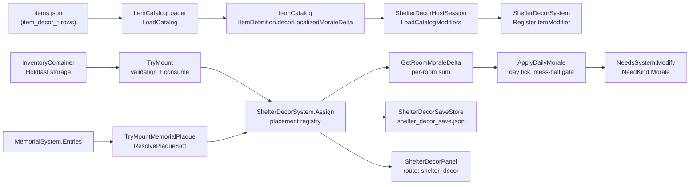
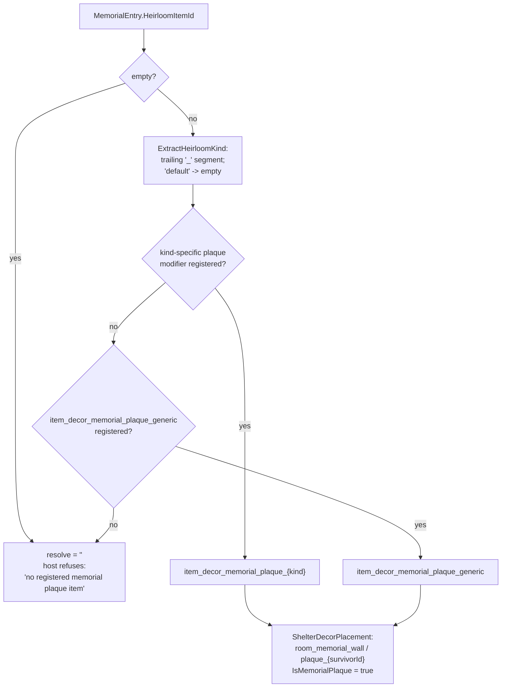
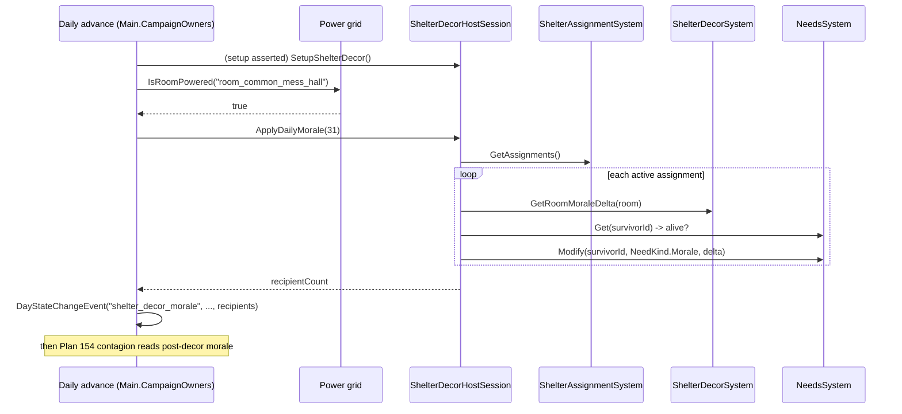

# Plan 12C Final — Shelter Interior & Memorial Wall

## Scope

Finish the deferred player-facing Plan 12C lane without creating a second
morale or memorial authority. The Core `ShelterDecorSystem` remains the
placement registry; `NeedsSystem` remains the sole morale authority; and
`MemorialSystem` remains the death-record authority.

## Implemented seams

- `ShelterDecorHostSession` loads the twelve modifiers from the live
  `ItemCatalog`, mounts or returns real inventory items, and applies the
  aggregated per-room modifier once daily to alive, actively assigned
  survivors through `NeedsSystem.Modify(..., NeedKind.Morale, ...)`.
- `Main.SetupShelterDecor` restores the registered `shelter_decor` campaign
  section, reconciles existing memorial entries, binds `ShelterDecorPanel`,
  and `SaveShelterDecor` captures it through `ShelterDecorSaveStore`.
- A memorial event projects its canonical plaque only after the memorial
  record has been committed. The plaque carries survivor and heirloom
  provenance and never fabricates an inventory item.
- The panel is reachable as `shelter_decor` through the player-surface
  registry, game-flow forwarding, and expanded-panel action configuration.
- `--shelter-decor-selftest` exercises catalog loading, real inventory
  consumption/return, daily NeedsSystem morale, plaque projection,
  SaveStore round-trip, and panel rendering.

## Verification record

- Focused Plan 12C Core tests and the new Godot self-test are run before the
  full canonical build/test/headless gate sweep.
- The populated snapshot fixture has been captured on Forward+ / X11, visually
  inspected, promoted as `snapshots/shelter_decor_default.png`, and fingerprinted
  in the two snapshot manifests. The run also revealed 29 unrelated pre-existing
  baseline drifts; this task did not overwrite them.

### Final gate results (2026-08-31)

| Gate | Result |
|---|---|
| `dotnet build Ashfall.Core.Tests/Ashfall.Core.Tests.csproj` | PASS — 0 warnings, 0 errors |
| `dotnet test Ashfall.Core.Tests/Ashfall.Core.Tests.csproj` | PASS — 5,303 / 5,303 |
| `dotnet build Ashfall.csproj` | PASS — 0 warnings, 0 errors |
| `godot --headless -- --data-integrity-selftest` | PASS — 138 catalogs, 0 findings |
| `godot --headless -- --bridge-selftest` | PASS — shim-removal contract |
| `godot --headless -- --shelter-decor-selftest` | PASS — catalog, storage, morale, plaque, save, and panel path |
| `godot --rendering-method forward_plus -- --ui-snapshot-uitest` | Local target MATCH (103,917 B); global gate remains FAIL from 29 unrelated existing drifts, 0 capture failures |

---

# EXPANSION 2026-09-25 — Plan 12C Shelter Interior & Memorial Wall: Full Integration Framework & Code Architecture

## Part I — Expansion Preamble

### I.1 Thesis

Plan 12C is the shelter-interior lane: the player mounts authored decor
items on named slots inside named shelter rooms, those placements produce a
daily localized morale pass for the survivors actively assigned to the
decorated rooms, and the memorial wall renders a permanent, ledger-backed
plaque for every committed death record. The lane is deliberately small in
mechanics and deliberately strict in authority. One system owns placements
(`ShelterDecorSystem`), one system owns morale (`NeedsSystem`), one system
owns death truth (`MemorialSystem`), one catalog owns item truth
(`items.json` through `ItemCatalogLoader`), and the Godot host layer —
`ShelterDecorHostSession`, `ShelterDecorSaveStore`, `ShelterDecorPanel`,
and the `Main` partials — owns only transport, persistence, and
presentation. Nothing in this domain owns a second copy of anyone else's
truth.

The thesis of this expansion is that the Plan 12C lane is best understood
as a **projection pipeline**: authored data becomes runtime modifiers once
per boot, player actions become registry placements plus inventory
movement, death records become wall plaques without minting inventory, and
the whole registry becomes a checksummed save section that round-trips
byte-for-byte. Every seam in the lane exists to keep that pipeline one
directional. This document records the pipeline as it is actually built,
against the actual source, so future builders can extend a room, a modifier,
a plaque kind, or a panel card without re-deriving the architecture.

### I.2 Scope of this expansion

This expansion covers:

- The placement registry (`ShelterDecorSystem`) and its placement DTOs,
  modifier map, aggregation reads, plaque resolution, trophy-slot accessors,
  and capture/restore contract.
- The Godot host bridge (`ShelterDecorHostSession`) — catalog loading,
  real-inventory mount/remove, the memorial plaque projection, and the
  daily aggregated morale application.
- The save seam (`ShelterDecorSaveStore`, the `shelter_decor` section of
  `SaveSectionRegistry`, and the `Main.SetupShelterDecor` /
  `Main.SaveShelterDecor` call sites).
- The player surface (`ShelterDecorPanel`), its route registration through
  `PanelRegistryBootstrap`, `PlayerSurfaceManifest`, and game-flow
  forwarding, and its snapshot fixture.
- The verification surface: `Plan12CDecorTests` in the Core test target and
  the `--shelter-decor-selftest` Godot CLI gate.
- The data slice: the twelve authored `item_decor_*` entries of the Plan 12C
  catalog window, plus the trophy entries the later Plan 14E/C1.6 lane added
  to the same prefix family.
- Cross-system contacts: needs/morale, memorial/death records, inventory and
  heirlooms, shelter assignment and rooms, the power grid gate at the daily
  call site, and the day-event vocabulary.

### I.3 Non-goals

This expansion does not propose, and Plan 12C must never receive:

1. **A second morale authority.** No parallel morale pool, no decor-side
   morale cache, no per-room morale ledger outside `NeedsSystem`. The only
   write seam is `NeedsSystem.Modify(..., NeedKind.Morale, ...)` invoked by
   the host session once per recipient per day.
2. **A second death authority.** The plaque is a projection of
   `MemorialSystem`. It stores survivor id and heirloom provenance as
   *references*, never as an independent record of death. Deleting or
   editing the memorial ledger is the only way death truth changes; the wall
   has no edit path.
3. **A parallel item catalog.** Decor items are ordinary `items.json` rows.
   No decor-specific JSON file, no decor side table, no hardcoded item
   definitions in host code.
4. **A second placement registry.** Room hotspots, interior views, and any
   future decoration feature must read and write through
   `ShelterDecorSystem`, not alongside it.
5. **Decor modifiers in the save payload.** Modifiers are rebuilt from the
   live catalog on every boot. Only placements persist.
6. **Sentiment simulation.** Decor morale is an authored scalar with a fixed
   daily application. No hidden opinion model, no per-survivor taste
   matrix, no stochastic reactions.

### I.4 Evidence policy and sign-convention statement

Every path, signature, constant, and numeric value in this expansion was
read from the working tree on 2026-09-25 unless explicitly marked
`UNVERIFIED`. Claims taken from the preserved 2026-08-31 closeout record
above (gate results, snapshot promotion, drift count) are historical test
records; this documentation task ran no builds, no tests, and no Godot
sessions, so **no gate result in this file has been re-executed** on the
expansion date. Where the working tree has visibly moved past a historical
record — most notably the item catalog, which carried 23 `item_decor_*`
entries on the expansion date against the 12 the Plan 12C window authored —
the divergence is stated rather than smoothed over.

**Verified morale sign convention.** The single most load-bearing fact for
anyone doing aggregation math in this domain, read directly from
`Assets/Ashfall.Core/Survivors/NeedsSystem.cs` (the `NeedKind` summary,
lines 7–9):

> "The nine tracked survival needs. Hunger/Thirst/Fatigue/Morale, Numbness,
> and RadiationAnxiety are 0..100 where **HIGHER = WORSE**; Warmth is 0..100
> where LOWER = worse; Health 0..100 where lower = worse."

Concretely, verified in the same file:

- `SurvivorNeedsState.Morale` initializes to `50f`, clamped to the 0..100
  range by `ApplyNeedDelta` like every non-health need.
- `ApplyCriticalNeedConsequences` applies a *negative* morale delta
  (`-moraleLossPerHourWhileCritical * gameHours`) while hunger, thirst, or
  warmth are critical — i.e. bad conditions push the Morale scalar toward
  0 under this channel's polarity.
- `ShelterDecorHostSession.ApplyDailyMorale` writes
  `+GetRoomMoraleDelta(roomId)` — the sum of authored
  `decorLocalizedMoraleDelta` values — into that same Morale channel via
  `NeedsSystem.Modify`.
- Every authored decor delta in `items.json` is **positive**
  (`Items_Plan12CDecor_CarryDecorModifierField` pins `> 0` for every
  `item_decor_*` row), and the panel renders the aggregate with a `+` sign
  and flags a cumulative sum above zero as `Caution` on the status rail.

The aggregation math in this document is therefore written exactly as
implemented: **placements sum their authored positive deltas; the host adds
the sum to the Morale channel; the Morale channel's documented reading is
higher = worse.** The lane's own surfaces (test assertions, panel criticality,
`+` formatting) treat the positive decor contribution as the deliverable.
This document does not resolve or re-interpret the channel polarity; it
records it, and Part VIII lists the polarity question among the open items
so the owning lanes — not a decor builder — settle it.

### I.5 Reading guide

| Part | Contents | Primary audience |
|---|---|---|
| II | Authority audit: every owning system, verified path, public API, save section | Integrators, reviewers |
| III | Integration framework: data flow, event flow, save, determinism, integrity | Architects, builders |
| IV | Code architecture: module map, per-component specs, twelve modifier chapters, provenance model, panel contract, snapshot lifecycle | Builders touching the lane |
| V | Deep dives: runtime walkthroughs, save round-trip, selftest anatomy, test anatomy, drift policy | Test writers, QA |
| VI | Cross-system interaction matrix and emergent-consequence design | Design, writers |
| VII | Verification and acceptance: test matrix, gate commands, rollback | Foreman, integrator |
| VIII | Glossary, ID vocabulary, scenario walkthroughs, open questions | Everyone |

All quotes from source are verbatim. Mermaid diagrams sketch control flow;
where a diagram simplifies, the surrounding prose states the exact
branching. Absolute paths are given from the repository root
(`Atomic War/`).

---

## Part II — Current Authority Audit

Every concern in the shelter-interior domain has exactly one owner. This
part inventories them with the paths verified on 2026-09-25 and the public
API surface each one actually exposes. Anything an audit could not confirm
in source is marked `UNVERIFIED` inline.

### II.1 Ownership map

| Concern | Owner | Verified path | Layer |
|---|---|---|---|
| Placement registry | `ShelterDecorSystem` | `Assets/Ashfall.Core/Shelter/ShelterDecorSystem.cs` | Core (netstandard2.1) |
| Placement DTOs + modifier DTO | `ShelterDecorPlacement`, `ShelterDecorState`, `ShelterDecorStateCapture`, `ShelterDecorItemModifier` | same file | Core |
| Morale authority | `NeedsSystem`, `SurvivorNeedsState`, `NeedKind` | `Assets/Ashfall.Core/Survivors/NeedsSystem.cs` | Core |
| Death-record authority | `MemorialSystem`, `MemorialEntry`, `MemorialState`, `MemorialSave` | `Assets/Ashfall.Core/Memorial/MemorialSystem.cs`, `Assets/Ashfall.Core/Memorial/MemorialSave.cs` | Core |
| Item truth | `ItemDefinition`, `ItemCatalogLoader` | `Assets/Ashfall.Core/Inventory/ItemDefinitions.cs`, `Assets/Ashfall.Core/Inventory/ItemCatalogLoader.cs` | Core |
| Decor data slice | 12 authored rows (Plan 12C window) in `items.json` | `Assets/StreamingAssets/Data/items.json` (rows from line 4183) | Data |
| Room occupancy truth | `ShelterAssignmentSystem` | `Assets/Ashfall.Core/Shelter/ShelterAssignmentSystem.cs` | Core |
| Session lifecycle base | `StatefulSessionBase` → `HostSessionBase` | `Assets/Ashfall.Core/StatefulSessionBase.cs`, `src/Host/HostSessionBase.cs` | Core + host |
| Host bridge | `ShelterDecorHostSession` | `src/Host/ShelterDecorHostSession.cs` | Host (net8.0) |
| Save store | `ShelterDecorSaveStore` | `src/Host/ShelterDecorSaveStore.cs` | Host |
| Save section registry | `shelter_decor` row | `Assets/Ashfall.Core/Save/SaveSectionRegistry.cs` (line 134, line 444) | Core |
| Setup/save call sites | `SetupShelterDecor`, `SaveShelterDecor` | `src/Main.ShelterBatch3.cs` (lines 350, 460); call order in `src/Main.ExpandedShelterSystems.cs` (lines 144, 353, 657) and `src/Main.CampaignOwners.cs` (line 1342) | Host |
| Daily application gate | `ApplyDailyMorale` call behind the mess-hall power check | `src/Main.CampaignOwners.cs` (lines 1347–1350) | Host |
| Day event vocabulary | `shelter_decor_morale` → `SemanticKind.Shelter` | `Assets/Ashfall.Core/Campaign/DayEventVocabulary.cs` (line 159) | Core |
| Player surface route | `R("shelter_decor", "Shelter Interior & Memorial Wall", PanelGroup.Expanded)` | `Assets/Ashfall.Core/UI/PanelRegistryBootstrap.cs` (line 95) | Core |
| Surface manifest contract | `shelter_decor` in expanded interactive lists | `Assets/Ashfall.Core/UI/PlayerSurfaceManifest.cs` (lines 52, 62) | Core |
| Game-flow forwarding | `case "shelter_decor":` | `src/Main.GameFlow.cs` (line 706) | Host |
| Panel | `ShelterDecorPanel` | `src/UI/ShelterDecorPanel.cs` | Host |
| Snapshot target | `shelter_decor_default` row | `src/UI/SnapshotHarness.cs` (line 58) | Host |
| Snapshot fixture | `ShelterDecorSnapshotFixture` | `src/UI/ShelterDecorSnapshotFixture.cs` | Host |
| Snapshot manifests | golden entry + baseline fingerprint | `docs/ui/snapshot_manifest.json` (line 322), `docs/ui/snapshot_baseline_manifest.json` (line 299) | Docs |
| Production selftest | `ShelterDecorSelfTest` | `src/Host/ShelterDecorSelfTest.cs`; dispatch `src/Host/HostCli.cs` (line 332) | Host |
| Core regression tests | `Plan12CDecorTests` | `Ashfall.Core.Tests/Plan12CDecorTests.cs` | Tests (net9.0) |
| Provenance design note | Memorial decor provenance model | `docs/social/MEMORIAL_DECOR_PROVENANCE.md` | Docs |

### II.2 `ShelterDecorSystem` — placement registry (Core)

File: `Assets/Ashfall.Core/Shelter/ShelterDecorSystem.cs`, 339 lines,
namespace `Ashfall.Core.Shelter`. The header comment states the contract
directly: per-room decor placements with a deterministic localized morale
modifier; plain serializable DTOs; no `ISeededRng`; save round-trip safe;
the system never mutates `ShelterAssignmentSystem`, `NeedsSystem`, or
`MemorialSystem`.

Constants:

| Constant | Value | Meaning |
|---|---|---|
| `ShelterDecorState.SystemId` / `ShelterDecorSystem.SystemId` | `"shelter_decor"` | Save section key and state identity |
| `ShelterDecorSystem.MemorialPlaquePrefix` | `"item_decor_memorial_plaque"` | Canonical plaque id prefix (Plan 12C + Plan 09 9C cross-link) |

Public API (all verified against source):

| Member | Signature (abbreviated) | Notes |
|---|---|---|
| `State` | `ShelterDecorState State { get; }` | Live backing state; placements list is mutable via the system, not the state object |
| `OnDecorChanged` | `event Action<ShelterDecorPlacement>?` | Fired by `Assign` only — not by `Remove` |
| `OnStateChanged` | `event Action?` | Fired by `Assign`, `Remove`, and `RestoreState` |
| `ItemModifiers` | `IReadOnlyDictionary<string, ShelterDecorItemModifier>` | Ordinal-keyed registry the host fills at boot |
| `RegisterItemModifier` | `void (ShelterDecorItemModifier?)` | Null or empty `ItemId` silently ignored; replacement is idempotent and deliberately does **not** fire `OnDecorChanged` (catalog-level change, not placement-level) |
| `GetItemModifier` | `ShelterDecorItemModifier? (string)` | Null for null/empty/unknown ids |
| `Assign` | `bool (roomId, slotId, itemId, dayInstalled, isMemorialPlaque = false, memorialSurvivorId = "", plaqueSourceHeirloomId = "")` | Rejects only empty `roomId`/`slotId`; removes any existing placement at the same (roomId, slotId) ordinal pair, appends the new one, fires both events; returns `true` otherwise |
| `Remove` | `bool (roomId, slotId)` | Returns `true` only when a placement was actually removed; fires `OnStateChanged` only |
| `GetSlot` | `ShelterDecorPlacement? (roomId, slotId)` | Linear ordinal scan, first match |
| `ListRoomPlacements` | `List<ShelterDecorPlacement> (roomId)` | Filters by room, sorts by `SlotId` with `string.CompareOrdinal` |
| `GetRoomMoraleDelta` | `float (roomId)` | Sums `LocalizedMoraleDelta` of every mounted item that has a registered modifier; unregistered items contribute zero, never throw |
| `ResolvePlaqueSlot` | `ShelterDecorPlacement? (memorialSurvivorId, heirloomItemId, memorialWallRoom, plaqueSlotId, dayInstalled)` | Returns a fully-populated plaque placement or `null` when `ResolvePlaqueItemId` resolves empty |
| `ResolvePlaqueItemId` | `string (heirloomItemId)` | `MemorialPlaquePrefix + "_" + kind` if that modifier is registered, else `prefix + "_generic"` if registered, else `string.Empty` |
| `CaptureState` / `RestoreState` | `ShelterDecorStateCapture ()` / `void (ShelterDecorStateCapture?)` | Capture deep-copies the placements list; restore replaces the list and fires `OnStateChanged`; null capture is a no-op |
| `GetTrophySlots` | `IReadOnlyList<string> (roomId)` | Plan 14E/C1.6 addition: always includes `trophy_mount_1`, `trophy_mount_2`, plus any occupied slot whose item id contains "trophy" |
| `GetTrophyMoraleModifier` | `float (itemId)` | Modifier lookup convenience; 0 when unregistered |
| `IsTrophyItem` | `static bool (string)` | Case-insensitive substring test for `"trophy"` |

One DTO subtlety worth restating because it affects every future reader:
`Assign` documents "false on rejected inputs", and the only rejection
condition in the body is an empty room or slot id. A placement whose item id
is empty is *accepted* — empty `ItemId` is the documented unassign sentinel,
and the host never sends it (the host removes via `Remove` instead). The
ordinal (roomId, slotId) pair is the uniqueness key; two placements with the
same slot id in different rooms coexist, and re-assigning a populated slot
replaces the previous placement in place (pinned by
`DecorSystem_AssignOverwritesPriorPlacementAtSameSlot`).

### II.3 `NeedsSystem` — the sole morale authority (Core)

File: `Assets/Ashfall.Core/Survivors/NeedsSystem.cs`, 440 lines, namespace
`Ashfall.Core.Survivors`. The morale-relevant surface:

| Member | Relevance to decor |
|---|---|
| `NeedKind.Morale` | The channel the decor lane writes; polarity documented higher = worse (see I.4) |
| `SurvivorNeedsState.Morale` | Scalar, default `50f`, clamped 0..100 |
| `IsAliveState` | `!IsDead && IsAlive` — the recipient filter `ApplyDailyMorale` uses |
| `Modify(survivorId, need, delta)` | The write seam decor uses; no-ops for dead survivors and zero deltas |
| `ApplyAttributedDelta(...)` | The attributed one-shot seam decor deliberately does **not** use (see III.4) |
| `SetExternalModifier / RemoveExternalModifier / ClearExternalModifiers` | Persistent per-hour modifier stack; decor uses none of these — decor morale is a per-day discrete grant, not a rate |
| `OnNeedChanged`, `OnNeedCritical`, `OnDied` | Downstream presentation/death events; a decor write can push Morale across presentation thresholds but never raises a critical event (Morale has no critical gate in `ApplyNeedDelta`) |
| `RegisteredCount`, `Registered` | Ghost-registration detection; relevant to any host restore that touches survivors while decor runs |

`NeedsSystem` has no knowledge of decor. Nothing in the file mentions
`ShelterDecor`; the dependency points one way only.

### II.4 `MemorialSystem` — death-record authority (Core)

Files: `Assets/Ashfall.Core/Memorial/MemorialSystem.cs` (398 lines) and
`Assets/Ashfall.Core/Memorial/MemorialSave.cs` (19 lines), namespace
`Ashfall.Core.Memorial`. What the decor lane consumes:

- `MemorialSystem.Entries` (`IReadOnlyList<MemorialEntry>`) — read by
  `Main.SetupShelterDecor` for the once-per-boot reconcile.
- `MemorialEntry` fields (verified, lines 293–320): `SurvivorId`, `Cause`,
  `Day`, `SurvivedDays`, `FinalWishResolved`, `Epitaph`, `EulogyText`,
  `HeirloomItemId`, `HeirloomRecipientId`, `MoraleDelta`, `DeathQuality`
  (default `Peaceful`), `Outcome` (default `Burial`), `MournedDay`
  (default `-1`).
- `Memorialize` is idempotent per `SurvivorId` — a duplicate memorial call
  returns the existing entry without re-firing grief. The plaque reconcile
  inherits this shape: `TryMountMemorialPlaque` is idempotent per survivor
  too.
- `MemorialSave` is a checksummed envelope (`saveVersion` 1, `simDay`,
  `State`, `Checksum`).

What the decor lane never does: write entries, resolve final wishes, route
grief, or compose eulogies. The wall reads; the ledger speaks.

### II.5 Item truth and the decor data slice

`ItemDefinitions.cs` carries `public float decorLocalizedMoraleDelta;`
(line 107) on `ItemDefinition`; `ItemCatalogLoader.cs` declares the same
property on its DTO (line 30) and copies it into the definition (line 676).
Missing JSON fields deserialize to `0f` by the serializer's default — there
is no required-field validation specific to this field in the loader
(`UNVERIFIED` whether the integrity validator checks decor fields; the
data-integrity selftest passes 138 catalogs per the 2026-08-31 gate record
without a decor-specific rule being known).

The Plan 12C authored slice — twelve rows, all `"type": "Component"`,
all `stackMax: 1`, all carrying a positive `decorLocalizedMoraleDelta`
(verified values in Part IV.6):

| # | id | displayName | delta | weight | trade |
|---|---|---|---|---|---|
| 1 | `item_decor_poster_ration` | Ration Poster (R-12 Series) | 1.5 | 0.4 | 8 |
| 2 | `item_decor_poster_warning` | Warning Poster (W-04 Series) | 0.8 | 0.3 | 5 |
| 3 | `item_decor_locomotive_nameplate` | Locomotive Nameplate (S-2731) | 2.0 | 1.4 | 14 |
| 4 | `item_decor_carved_memorial` | Carved Memorial Plaque | 2.2 | 0.5 | 6 |
| 5 | `item_decor_chalk_drawing` | Child's Chalk Drawing | 1.0 | 0.1 | 3 |
| 6 | `item_decor_pressed_flower` | Pressed Flower Frame | 1.2 | 0.6 | 7 |
| 7 | `item_decor_medal_civic` | Civic Service Medal | 0.6 | 0.2 | 4 |
| 8 | `item_decor_classroom_chart` | Alphabet Chart (Cold-Room Edition) | 1.4 | 0.3 | 5 |
| 9 | `item_decor_signal_log` | Signal Log Cover Sheet | 1.0 | 0.4 | 6 |
| 10 | `item_decor_memorial_plaque_generic` | Generic Memorial Plaque | 1.6 | 0.4 | 5 |
| 11 | `item_decor_memorial_plaque_carving` | Memorial Plaque (Carving) | 1.8 | 0.5 | 6 |
| 12 | `item_decor_memorial_plaque_drawing` | Memorial Plaque (Drawing) | 2.0 | 0.5 | 6 |

Post-closeout growth: the same prefix family now also carries eleven
`item_decor_trophy_*` rows (wolf head, deer antlers, boar tusks, fox pelt,
beetle carapace, molerat skull, crow feathers, pheasant plume, ash hound
pelt, gulden wolf, kestrel wings), authored by the later Plan 14E/C1.6
trophy lane with `"type": "Decor"` and duplicated
`decorLocalizedMoraleDelta`/`moraleEffect` fields. Total `item_decor_*`
count on 2026-09-25: **23**. The trophy lane reuses the registry and the
modifier pipeline; it does not amend Plan 12C's closeout record.

### II.6 Save section registration

`Assets/Ashfall.Core/Save/SaveSectionRegistry.cs`, verified verbatim:

- Line 134:
  `new("shelter_decor", "SaveShelterDecor", "SetupShelterDecor", "shelter", "Room decor placements, memorial plaques, and localized morale items", LifecycleGroup: ExpandedShelterLifecycleGroup)`
  — section key, save method name, setup method name, owner group
  `"shelter"`, expanded-shelter lifecycle group.
- Line 444: `{ "shelter_decor", "shelter_decor_save.json" }` in the
  canonical section-to-file map.

Both rows are pinned by `Plan12CDecorTests`, so renaming either fails the
Core suite before any host code compiles against the old name.

### II.7 Host surface registration

Three registries cooperate to make `shelter_decor` player-reachable, all
verified:

1. `PanelRegistryBootstrap.RegisterAll()` line 95:
   `R("shelter_decor", "Shelter Interior & Memorial Wall", PanelGroup.Expanded);`
2. `PlayerSurfaceManifest` includes the id in its expanded interactive
   surface lists (lines 52 and 62). The Core test
   `PlayerSurfaceManifest_ExposesShelterDecorAsInteractiveSnapshotSurface`
   pins the generated contract: `SurfaceRouteKind.ExpandedShelter`,
   `SurfaceActionCoverage.InteractiveCommands`, `HasSnapshotCoverage` true.
3. `Main.GameFlow` line 706: `case "shelter_decor":` sits in the shared
   expanded-panel case group, so the route opens through the same
   forwarding path as the other expanded shelter panels, and
   `Main.PlayerSurfaces` line 800 lists the id in its `expandedIds`
   navigation array.

### II.8 Snapshot record

- Harness target (`src/UI/SnapshotHarness.cs` line 58):
  `StableId="shelter_decor_default"`, title "Shelter Interior & Memorial
  Wall", panel ctor `AtomicWar.GodotApp.UI.ShelterDecorPanel`,
  `StateHint="populated_fixture"`, 1280×800, fixture factory
  `ShelterDecorSnapshotFixture.Bind`.
- Golden manifest (`docs/ui/snapshot_manifest.json` line 322): seed 12012,
  locale en_US, `baseline_bytes` 103917, phase origin "Plan 12C Final",
  fixture source `LIVE_CATALOG + DETERMINISTIC_HOST_FIXTURE`, status
  "MATCH — DESIGN_INTENT (populated fixture)", stitch reference
  "(no Stitch mockup — original Godot continuation)".
- Baseline manifest (`docs/ui/snapshot_baseline_manifest.json` line 299):
  path `snapshots/shelter_decor_default.png`, md5
  `2ed66f53700b1456094587bf3ae23f13`, size 103917; the manifest's
  duplicate-check note records all 30 snapshots with distinct fingerprints,
  verified 2026-08-31 (Plan 12C Final).
- `snapshots/shelter_decor_default.png` exists in the working tree, with
  its `.import` sidecar.

---

## Part III — Integration Framework

### III.1 Architecture invariants applied to this domain

The repository's non-negotiables resolve to five concrete invariants inside
the shelter-interior lane. Each is stated with the mechanism that enforces
it, because an invariant without a mechanism is a wish.

| # | Invariant | Enforcement mechanism (verified) |
|---|---|---|
| 1 | Core stays engine-free | `ShelterDecorSystem`, `NeedsSystem`, `MemorialSystem`, `SaveSectionRegistry` live under `Assets/Ashfall.Core/` and reference only `System` namespaces. The placement DTOs are plain `[Serializable]` classes. The only Godot-typed files in the lane are `ShelterDecorPanel`, `ShelterDecorSnapshotFixture`, and `ShelterDecorSelfTest`, all under `src/` |
| 2 | JSON data is authoritative | Modifiers are extracted from already-loaded `ItemCatalog` rows in `LoadCatalogModifiers`; no decor values are hardcoded in host code and none are persisted. `Plan12CDecorTests` reads `items.json` directly for the data-pinning tests |
| 3 | One authority per concern | `ShelterDecorSystem` never mutates assignment, needs, or memorial state (stated in its header and true of its body). The host session holds references to the other systems and orchestrates across them; it owns no duplicate domain state. `ShelterDecorHostSession`'s only stored scalars are `LastEvent`, `CatalogModifierCount`, `LastMoraleRecipientCount`, `LastMoraleGranted`, and `CurrentDay` — presentation context, not gameplay truth |
| 4 | Determinism and persistence | Placements capture/restore as an ordered list of plain DTOs behind a checksummed envelope. The only seeded RNG near the lane is `SeededRng(12012)` in the test/fixture assignment construction. No wall-clock, no hash-iteration-order dependence: `GetRoomMoraleDelta` sums over `ListRoomPlacements`, which is ordinal-sorted, so floating-point summation order is stable for a given placement set |
| 5 | Host adapters apply presentation; Core exposes facts | The system raises `OnDecorChanged`/`OnStateChanged` facts; the host session translates them into `StateChanged` (dirty) and `PresentationRefreshRequested` (visual-only); the panel subscribes and repaints. Panels never write placements directly — every mutation goes through `TryMount` / `TryRemoveMount` / `TryMountMemorialPlaque` |

### III.2 End-to-end data flow

The full pipeline from authored JSON to a survivor's morale scalar, with the
owner of each hop:



Read the chart as four one-way pipelines that meet only in the registry:

1. **Boot pipeline (A→E).** `ItemCatalogLoader.LoadCatalog` parses
   `items.json` once for the whole application. `LoadCatalogModifiers`
   walks `Catalog.Ids`, filters the `item_decor_` prefix
   (`StringComparison.Ordinal`), reads each definition, and registers a
   `ShelterDecorItemModifier` with the authored delta and a
   host-derived category. No JSON is parsed a second time anywhere in the
   lane.
2. **Player mount pipeline (F→H).** A mount consumes one real unit from the
   inventory container *after* every validation passes, then writes the
   placement. A remove reverses both steps in the safe order (capacity
   check, storage add, then registry removal).
3. **Death pipeline (I→H).** Committed `MemorialEntry` rows project to
   plaques at setup reconcile and at commit time. Nothing mints inventory;
   the plaque item exists in the catalog as a display referent, not as a
   good anyone holds.
4. **Daily pipeline (K→M).** Once per campaign day, for each active room
   assignment, the host sums the room's modifiers and writes the sum into
   the occupant's Morale channel — subject to the mess-hall power gate at
   the call site (III.5).

Persistence (N) rides alongside all of it: only the placements list leaves
the process, checksummed, on `SaveAll`.

### III.3 Event flow

The lane has three event rings. Verified wiring, in subscription order:

**Ring 1 — Core facts.**

- `ShelterDecorSystem.OnDecorChanged(placement)` — placement-level fact
  (assign only). Nothing in the shipped lane subscribes; it exists for
  future room-view UI dirty paint per the Core header.
- `ShelterDecorSystem.OnStateChanged()` — registry-level fact (assign,
  remove, restore).
- `NeedsSystem.OnNeedChanged(state, kind, value)` — fires for every morale
  write, including decor writes.
- `MemorialSystem.OnMemorialized(entry)` — the canonical commit signal the
  host uses to project a plaque at death time ("a memorial event projects
  its canonical plaque only after the memorial record has been committed",
  per the preserved closeout record).

**Ring 2 — session transport.**

- `ShelterDecorHostSession` subscribes `System.OnStateChanged` →
  `RaiseStateChanged()` (marks `IsDirty`, bumps `StateVersion`, raises
  `StateChanged`/`StateVersionChanged` from `StatefulSessionBase`).
- The inventory session's `StateChanged` → `RequestPresentationRefresh()`
  (no dirty flag — storage count changes are visual context for this panel).
- `UnsubscribeSystemEvents` detaches the Core subscription on dispose; the
  panel's `_ExitTree` calls `Unbind`, which detaches both session
  subscriptions. This is the leak path the lifecycle closes.

**Ring 3 — campaign day events.**

- When `ApplyDailyMorale` returns a positive recipient count, the daily
  advance pushes `new DayStateChangeEvent("shelter_decor_morale",
  "shelter_decor", null, null, decorRecipients)` into the briefing feed
  (`src/Main.CampaignOwners.cs` line 1349). `DayEventVocabulary` line 159
  classifies the key as `SemanticKind.Shelter`. Zero recipients produce no
  event — a day with no decorated occupied rooms is silent by design.

### III.4 Save capture and restore

The `shelter_decor` section is registered, owned, and flushed like every
other expanded-shelter section. The exact choreography:

**Capture (save time).** `Main.SaveShelterDecor`
(`src/Main.ShelterBatch3.cs` line 460) is invoked from the save sweep
(`src/Main.ExpandedShelterSystems.cs` line 353). It:

1. Returns silently if `_shelterDecor` is null (feature never set up).
2. Calls `ShelterDecorSaveStore.TryCapturePersisted(_shelterDecor.System.CaptureState())`.
   `CaptureState` deep-copies the placements list into a
   `ShelterDecorStateCapture`; `TryCapturePersisted` stamps
   `Checksum = SaveChecksum.Compute(cap)` through the store's encode path
   and serializes.
3. `CaptureSection("shelter_decor", json)` files the envelope under the
   campaign save hub. On success, `_shelterDecor.ClearDirty()` resets the
   session's dirty flag without bumping `StateVersion`.

**Payload shape.** `systemId` (always rewritten to the constant),
`Checksum`, and `Placements` — each placement carrying `RoomId`, `SlotId`,
`ItemId`, `DayInstalled`, `IsMemorialPlaque`, `MemorialSurvivorId`,
`PlaqueSourceHeirloomId`. No modifiers, no day, no roster data.

**Restore (boot / load time).** `Main.SetupShelterDecor` (line 350):

1. Guard: if `_shelterDecor` exists, return (idempotent setup).
2. Ensure dependencies: `SetupSurvivors`, `SetupInventory`,
   `SetupShelterAssignment`, `SetupMemorial`.
3. `new ShelterDecorSystem()`; `ShelterDecorSaveStore.TryLoad()`; on a
   non-null result, `system.RestoreState(saved.Capture())` — which replaces
   the placements list and fires `OnStateChanged` once.
4. Construct the host session with the live assignment system, needs
   system, and inventory session; `SetCurrentDay(_simDay)`;
   `LoadCatalogModifiers()` (modifiers are never read from disk).
5. **Memorial reconcile:** for every `_memorial.Entries`, call
   `TryMountMemorialPlaque`; failures push a warning, never throw. This is
   the idempotent bridge that gives saves authored before the panel their
   wall records deterministically: existing plaques short-circuit on the
   (room, `"plaque_" + survivorId`) key, so the reconcile runs every boot
   and mounts nothing twice.
6. Rebuild the panel: detach any old instance from the tree, construct,
   `Bind`, hide, `AddChild`.

The decode side throws `InvalidOperationException` on an empty checksum or
a checksum mismatch ("ShelterDecor: empty checksum" / "ShelterDecor:
checksum mismatch"), which the save loader surfaces as a failed section
rather than a half-restored registry. `FromCapture` deliberately drops the
checksum when materializing live state — the checksum protects the wire,
not the runtime object.

### III.5 Determinism contract

Three properties make the lane replayable:

1. **Stable summation order.** `GetRoomMoraleDelta` iterates
   `ListRoomPlacements(roomId)`, which sorts by `SlotId` under
   `string.CompareOrdinal`. For a fixed placement set the float sum is
   bit-identical across runs and platforms with IEEE 754 arithmetic.
2. **No ambient chance.** The lane constructs no RNG. The only seeded
   generator nearby belongs to the assignment host in test fixtures
   (`new SeededRng(12012)`), and it seeds room/assignment construction, not
   decor behavior. Nothing seeds from wall-clock or iteration order.
3. **Idempotent repeated application.** Setup is guarded
   (`if (_shelterDecor != null) return`), plaque reconcile is
   keyed-idempotent, and `Assign` replaces rather than duplicates. Running
   `SetupShelterDecor` twice in a session cannot double-mount a plaque or
   duplicate a modifier registration (`RegisterItemModifier` upserts by
   item id).

The daily write is deliberately **not** routed through
`NeedsSystem.ApplyAttributedDelta`, so decor morale does not enter the
`NeedsModifierStack` attribution window or persist as a rate. Consequences
(verified from source): the grant is a one-shot `Modify` per recipient per
day; it survives only inside the survivor's morale scalar; the session's
`LastMoraleGranted` float is the only place the day's total is remembered,
and it is presentation context, reset on the next call. A builder wanting
attribution for the briefing UI would extend `ApplyAttributedDelta` usage
in the host — that is a host-side choice, not a Core change.

### III.6 The daily call site and the power gate

`src/Main.CampaignOwners.cs` (verified, lines 1341–1350), inside the daily
advance sequence:

```csharp
_m.SetupShelterDecor();
// Plan 71: room_common_mess_hall — communal comfort morale is a
// shed-able low-priority load (level gate, applied once per day;
// no per-tick penalty accumulation).
bool messHallPowered = _m._powerGrid?.System?.IsRoomPowered("room_common_mess_hall") ?? true;
int decorRecipients = messHallPowered ? (_m._shelterDecor?.ApplyDailyMorale(day) ?? 0) : 0;
if (decorRecipients > 0)
    events.Add(new DayStateChangeEvent("shelter_decor_morale", "shelter_decor", null, null, decorRecipients));
```

Observable behavior, exactly as coded:

- Setup is (re)asserted before application, so a load path that has not yet
  built the session is covered.
- The application is gated on `IsRoomPowered("room_common_mess_hall")`,
  defaulting to *powered* when the power grid is absent (true fallback).
  On an unpowered day, `ApplyDailyMorale` is not called, recipients are 0,
  no morale is written, and no day event fires. The comment ties this to
  Plan 71's "shed-able low-priority load" classification.
- The ordering comment two lines later records why the position matters:
  morale contagion (Plan 154) is set up *after* decor morale so it reads
  the day's final morale.

Interpretive note, flagged rather than resolved: the gate checks the *mess
hall's* power, not the decorated rooms' power. The check is the shipped
behavior and this document records it as such; whether decorated-room
power should gate decor morale is a design question for the owning lanes
(Part VIII, open questions).

### III.7 Integrity validation of decor content

Content truth travels three verification layers, each with a different
catch radius:

1. **Data-integrity gate.** `godot --headless -- --data-integrity-selftest`
   validates catalog schema and references application-wide (138 catalogs,
   0 findings, per the 2026-08-31 gate record). Decor rows ride the generic
   items validation; presence in `items.json` is necessary but — per
   AGENTS.md — never treated as gameplay reachability by itself.
2. **Core data-pinning tests.** `Plan12CDecorTests` asserts the twelve
   canonical ids exist in `items.json`, that every `item_decor_*` row
   carries a `decorLocalizedMoraleDelta` strictly greater than zero, and
   that the loaded catalog preserves at least twelve such rows with the
   ration poster at exactly 1.5. These run in the xUnit target without a
   Godot session.
3. **Production selftest.** `--shelter-decor-selftest` proves the loaded
   catalog actually drives behavior: modifier registration, inventory
   consumption, morale arithmetic through `NeedsSystem`, plaque
   projection, save round-trip, and live panel rendering — with real
   objects, not test doubles.

A decor row that loses its delta field fails layer 2 at the next focused
run and layer 3 immediately; a row with a plausible but wrong value passes
all three by design — numeric tuning is authored truth, not a validity
question.

---

## Part IV — Code Architecture

### IV.1 Module map

```
Ashfall.Core (netstandard2.1 — no engine references)
├── Shelter/ShelterDecorSystem.cs ............ placement registry + DTOs + modifier DTO
├── Survivors/NeedsSystem.cs ................. morale authority (written to, never extended)
├── Memorial/MemorialSystem.cs ............... death ledger (read-only projection source)
├── Shelter/ShelterAssignmentSystem.cs ....... room occupancy (read-only consumer)
├── Inventory/ItemDefinitions.cs ............. ItemDefinition.decorLocalizedMoraleDelta
├── Inventory/ItemCatalogLoader.cs ........... DTO field + copy into definitions
├── Save/SaveSectionRegistry.cs .............. shelter_decor section + file map rows
├── Campaign/DayEventVocabulary.cs ........... shelter_decor_morale classification
├── UI/PanelRegistryBootstrap.cs ............. shelter_decor panel registration
├── UI/PlayerSurfaceManifest.cs .............. expanded interactive surface lists
└── StatefulSessionBase.cs ................... dirty/version/refresh session contract

AtomicWar.GodotApp (net8.0 — Godot host)
├── Host/ShelterDecorHostSession.cs .......... catalog load, mount/remove, plaque, daily morale
├── Host/ShelterDecorSaveStore.cs ............ checksummed save façade (SaveStore<T> codec)
├── Host/ShelterDecorSelfTest.cs ............. --shelter-decor-selftest production gate
├── Host/HostCli.cs ........................... CLI dispatch + help text
├── UI/ShelterDecorPanel.cs .................. player surface (route shelter_decor)
├── UI/ShelterDecorSnapshotFixture.cs ........ deterministic populated fixture
├── UI/SnapshotHarness.cs .................... shelter_decor_default target row
├── Main.ShelterBatch3.cs ..................... SetupShelterDecor / SaveShelterDecor
├── Main.ExpandedShelterSystems.cs ............ setup order, save sweep, load path calls
├── Main.CampaignOwners.cs .................... daily advance: gate + apply + day event
├── Main.GameFlow.cs .......................... case "shelter_decor" forwarding
└── Main.PlayerSurfaces.cs .................... expandedIds navigation list

Data + assets
├── StreamingAssets/Data/items.json .......... twelve 12C rows + eleven trophy rows
├── snapshots/shelter_decor_default.png ...... promoted golden (103,917 B)
└── docs/ui/snapshot_{manifest,baseline_manifest}.json

Tests (net9.0)
└── Plan12CDecorTests.cs ..................... 21 Core regression facts
```

Dependency direction is strictly downward in that listing: host files may
reference Core; Core never references host; the data file references
nothing. Within the host group, the panel and fixture depend on the host
session; the session depends on Core systems; the Main partials depend on
everything but are depended on by nothing.

### IV.2 `ShelterDecorSystem` — deep specification

**Responsibility.** Own the canonical `(roomId, slotId) -> itemId` mapping
for the whole application; answer per-room morale aggregation queries from
the registered modifier map; resolve memorial plaques from heirloom
references; round-trip placements through a checksummed capture. The
system is the only writer of its own state and the only reader other
systems should trust for "what is mounted where".

**State.**

```csharp
class ShelterDecorState {
    string systemId = "shelter_decor";
    string Checksum;                       // stamped by the save codec, not by Core
    List<ShelterDecorPlacement> Placements;
}
class ShelterDecorPlacement {
    string RoomId; string SlotId; string ItemId;
    int DayInstalled;
    bool IsMemorialPlaque;
    string MemorialSurvivorId; string PlaqueSourceHeirloomId;
}
class ShelterDecorItemModifier {
    string ItemId; float LocalizedMoraleDelta; string Category;
    bool StackMultiplicatively;
}
```

`ShelterDecorStateCapture` is a sealed empty subclass of
`ShelterDecorState` ("alias to keep save-envelope wiring compatible with
`SaveStore<T>`"), so the capture type carries no extra fields — the
checksum difference between wire and runtime shapes is the subclass mark
plus the codec's stamping.

**Behavioral notes a builder must know (all verified in source):**

1. `Assign` acceptance is width-0: only empty `roomId`/`slotId` are
   rejected. It does not consult the modifier registry, the catalog, or
   the assignment system — *host validation happens before Core is called*,
   which is why `TryMount` runs a five-step chain first and refunds storage
   if `Assign` somehow fails.
2. Replacement semantics: same-slot assign removes then appends, so a
   replaced placement moves to the end of the internal list — but
   `ListRoomPlacements` re-sorts ordinally, so list position is
   unobservable through the public read API.
3. `Remove` fires `OnStateChanged` but not `OnDecorChanged`; `Assign` fires
   both. Subscribers wanting removal notifications must use the state-level
   event.
4. `GetRoomMoraleDelta` skips unregistered items silently. A placement
   whose item lost its catalog row degrades to a no-op contribution, not an
   exception — mounted-but-unregistered state is representable and pinned
   by `DecorSystem_GetRoomMoraleDelta_ItemWithoutModifierDoesNotCrash`.
5. `StackMultiplicatively` exists on the modifier DTO with the comment "when
   true, the host may stack the modifier multiplicatively; by default
   additive" — but the shipped aggregation in both `GetRoomMoraleDelta` and
   `ApplyDailyMorale` is purely additive and never reads the flag. It is
   authored headroom, not active behavior.
6. `ExtractHeirloomKind` takes the trailing `'_'-delimited` segment of the
   heirloom id and maps the segment `"default"` (case-insensitive) to
   empty — i.e. `item_personal_keepsake_eli_pewter_default` resolves as
   "no kind" and lands on the generic plaque, while
   `item_personal_keepsake_probe_carving` resolves kind `carving`. The
   comment is explicit that other id shapes are intentionally not
   accommodated: callers ship canonical ids.
7. The trophy accessors (`GetTrophySlots`, `GetTrophyMoraleModifier`,
   `IsTrophyItem`) arrived with the Plan 14E/C1.6 lane and ride the same
   registry and modifier map. `GetTrophySlots` hardcodes
   `trophy_mount_1`/`trophy_mount_2` as the two canonical mounts and adds
   any occupied slot holding a "trophy"-containing item id.

**Failure modes and mitigations.**

| Failure mode | Behavior | Mitigation |
|---|---|---|
| Null/empty modifier registration | Silently ignored | Host logs count via `CatalogModifierCount`; zero count sets a distinct `LastEvent` string |
| Unknown item id in a restored placement | Contributes 0 morale; renders as the raw id in the panel | Catalog rows are immutable data; restore does not validate item existence by design (saves must load even if a catalog shrinks) |
| Duplicate (roomId, slotId) assign | Replaces prior placement | Ordinal uniqueness enforced inside `Assign` |
| Plaque resolution with no plaques registered | Returns empty string; host refuses with a reason string | `TryMountMemorialPlaque` maps null placement to "The catalog has no registered memorial plaque item." |
| Restore of a null capture | No-op, no event | Explicit null check |

**Performance.** All reads are O(n) linear scans over the placement list
(n = mounted placements; dozens at most) with ordinal comparisons; the
dictionary lookups are O(1). The daily pass is O(assignments × room
placements). No allocation-heavy paths except the list copies in
`Capture`/`ListRoomPlacements`, which run at save time and repaint time
respectively. Nothing here needs optimization at current content scale.

### IV.3 `ShelterDecorHostSession` — deep specification

**Responsibility.** Be the only object that orchestrates across the four
Core authorities for the decor domain: load catalog modifiers, mount and
unmount with real inventory consequences, project memorial plaques, apply
the daily morale pass, and expose presentation context (display names,
available decor, last event string) to the panel.

**Construction.** The constructor takes four non-null dependencies —
`ShelterDecorSystem`, `ShelterAssignmentSystem`, `NeedsSystem`,
`InventoryHostSession` — and throws `ArgumentNullException` on any null. It
subscribes `System.OnStateChanged → RaiseStateChanged()` and
`Inventory.StateChanged → RequestPresentationRefresh()`, and overrides
`UnsubscribeSystemEvents` to detach both. The base `Dispose` path owns the
lifetime; the panel and fixtures call it explicitly.

**`LoadCatalogModifiers()` — boot-time modifier registration.**

```csharp
foreach (string id in _inventory.Catalog.Ids)
{
    if (!id.StartsWith("item_decor_", StringComparison.Ordinal)) continue;
    var definition = _inventory.Catalog.Get(id);
    if (definition == null) continue;
    System.RegisterItemModifier(new ShelterDecorItemModifier {
        ItemId = definition.id,
        LocalizedMoraleDelta = definition.decorLocalizedMoraleDelta,
        Category = CategoryFor(definition.id)
    });
    registered++;
}
```

- Returns the registration count and stores it in `CatalogModifierCount`.
- Zero registrations produce the event string "No shelter decor items were
  registered from the item catalog."; otherwise
  `"{registered} shelter decor items registered from items.json."`.
- `CategoryFor` classifies by id substring, in priority order: `trophy` →
  `"trophy"`, `plaque` → `"memorial plaque"`, `poster` → `"poster"`,
  `drawing` → `"drawing"`, else `"keepsake"`.
- Called every `SetupShelterDecor`; re-registration upserts, so repeated
  setup cannot double-count modifiers.

**`TryMount(roomId, slotId, itemId, day, out reason)` — the validation
ladder.** Each rung sets `reason` and returns false:

| Rung | Check | Failure reason (verbatim) |
|---|---|---|
| 1 | `IsMountableRoom` — room exists in the assignment system and is not `room_memorial_wall` | "Choose an existing shelter room." |
| 2 | `slotId` not whitespace | "Name the wall, peg, or shelf slot before mounting an item." |
| 3 | Slot free (`GetSlot == null`) | "That slot is occupied. Return its item to storage before mounting another." |
| 4 | Modifier registered | "That item is not registered as shelter decor." |
| 5 | Catalog row exists and `CountById >= 1` | "The selected decor item is not in Holdfast storage." |
| 6 | `TryConsume(itemId, 1)` | "Storage could not release the selected item." |
| 7 | `System.Assign(...)` succeeds | (failure) "The decor registry rejected that placement; the item was returned to storage." — and rung 7's body *refunds* via `TryProduce` before returning |

Success sets `LastEvent` to `"Mounted {displayName} at {room display name}
/ {slotId}."` and returns that string as `reason`. The ordering is the
safety story: **inventory is only touched after all placement validation
succeeds, and a Core-side rejection refunds the item** — an occupied slot
can never silently lose its item.

**`TryRemoveMount(roomId, slotId, out reason)`.** Refusal ladder:

- No placement: "There is no mounted item at that slot."
- `IsMemorialPlaque`: "Memorial plaques are ledger records and cannot be
  removed from this panel." — the wall is not player-editable storage.
- Catalog row missing or `CanAdd` false: "Storage has no safe capacity to
  receive that item."
- `Add` + `Remove` (both must succeed; if the registry remove fails after
  the add succeeded the item has been duplicated into storage — the code
  accepts this residual risk because `Remove` cannot fail for an existing
  slot).

Success: "Returned {displayName} to Holdfast storage."

**`TryMountMemorialPlaque(MemorialEntry, out reason)` — one-way bridge.**

1. Reject null entry or empty `SurvivorId`: "Memorial entry has no
   survivor id."
2. Slot key: `"plaque_" + entry.SurvivorId`, room:
   `MemorialWallRoomId` = `"room_memorial_wall"`.
3. Idempotence: an existing plaque placement for the same survivor returns
   **true** with "The memorial wall already carries this survivor's
   plaque." — a repeat is success-shaped, not failure-shaped, which is what
   makes the boot reconcile safe to run every session.
4. `System.ResolvePlaqueSlot(...)`; null resolves to "The catalog has no
   registered memorial plaque item."
5. `System.Assign(...)` with full provenance; failure: "The memorial plaque
   could not be registered."
6. Success: "Memorial plaque mounted for {survivorId}."

No inventory call appears anywhere in this method — the plaque mints no
item and consumes nothing.

**`ApplyDailyMorale(day)` — the aggregation pass.**

```csharp
SetCurrentDay(day);
LastMoraleRecipientCount = 0; LastMoraleGranted = 0f;
foreach (assignment in _assignments.GetAssignments())
{
    if (assignment.Status != ShelterAssignmentStatus.Active) continue;
    float delta = System.GetRoomMoraleDelta(assignment.RoomId);
    if (Math.Abs(delta) < 0.0001f) continue;
    var survivor = _needs.Get(assignment.SurvivorId);
    if (survivor == null || !survivor.IsAliveState) continue;
    _needs.Modify(assignment.SurvivorId, NeedKind.Morale, delta);
    LastMoraleRecipientCount++; LastMoraleGranted += delta;
}
```

Recipient filter, in order: active assignment status → non-trivial room
delta (below 0.0001 absolute is skipped, so an empty or modifier-less room
costs nothing) → known survivor → alive. The memorial wall itself grants
nothing by construction: it has no assignments. Returns the recipient
count; only a positive count sets `LastEvent`
(`"Room decor granted {LastMoraleGranted:F1} morale across {N} assigned
survivor(s)."`) and requests a presentation refresh.

**Failure modes.**

| Failure | Guard | User-visible text |
|---|---|---|
| Mount into the memorial wall | `IsMountableRoom` | "Choose an existing shelter room." |
| Mount with an unregistered item | rung 4 | "That item is not registered as shelter decor." |
| Remove of a plaque | plaque guard | ledger-records message above |
| Duplicate plaque projection | idempotence guard | success + already-carries message |
| Power-gated day | call site, not session | no event; morale pass skipped entirely |

### IV.4 `ShelterDecorSaveStore` — deep specification

A thin static façade over the Core `SaveStore<ShelterDecorStateCapture>`
service, built with `SaveStoreHub.FromCodec(FileName,
nameof(ShelterDecorSaveStore), EncodeSave, DecodeSave)`.

- `FileName = "shelter_decor_save.json"`, `SectionName = "shelter_decor"`.
- `SavePath` proxies the service's resolved path.
- Seven public members, two families: disk (`TrySave`, `TryLoad`,
  `TryCapturePersisted`) and string round-trip (`TryCapture`/
  `TryRestore`, plus the `Direct` aliases the selftest uses).
- `ToCapture` always recomputes `Checksum = SaveChecksum.Compute(cap)`
  before handing the capture to the store; `EncodeSave` stamps again in the
  codec so even a hand-built capture cannot reach disk unstamped.
- `DecodeSave` throws on empty checksum or mismatch. The exception (not a
  null return) is deliberate: a corrupt decor section must fail loudly and
  leave the registry at its default, never load a silently wrong wall.
- `FromCapture` reconstructs a plain `ShelterDecorState` without the
  checksum.

The section appears in `SaveSectionRegistry` twice (membership row and
file-name row, section II.6), which is what the triad drift gate and the
save-store contract matrix use to prove the Setup/Save/Flush parity of the
lane.

**`Main` wiring.** `Main.ShelterBatch3.cs` holds the two fields
(`_shelterDecor`, `_shelterDecorPanel`), `SetupShelterDecor` (line 350) and
`SaveShelterDecor` (line 460). The setup order dependency is explicit in
`Main.ExpandedShelterSystems.cs` line 144's comment — decor setup "uses the
final assignment map + inventory catalog", so it must run after assignment
and inventory setup; line 657 is the load-path re-assert. `Main.
CampaignOwners.cs` line 1342 asserts setup before the daily gate (III.6).

### IV.5 `ShelterDecorPanel` — player surface contract

**Route and reachability.** The panel is `partial class ShelterDecorPanel :
Control, IBindablePanel` in `AtomicWar.GodotApp.UI`. It is constructed only
by `Main.SetupShelterDecor` (added hidden to the tree) and by the
selftest/snapshot harnesses. Players reach it through the `shelter_decor`
route: registered in `PanelRegistryBootstrap` (title "Shelter Interior &
Memorial Wall", `PanelGroup.Expanded`), listed in `PlayerSurfaceManifest`'s
expanded interactive surfaces with snapshot coverage, forwarded by
`Main.GameFlow`'s shared expanded-panel case, and navigable through
`Main.PlayerSurfaces`' `expandedIds` array.

**Layout anatomy** (built in `_Ready`, verified):

- Root: `AshfallDashboardShell("Shelter Interior // Memorial Wall",
  minWidth: 1160, minHeight: 700)`, full-rect anchors.
- Status rail with four `AshfallMetricCard`s: `mounted` ("Mounted Pieces"),
  `rooms` ("Decorated Rooms"), `morale` ("Daily Room Morale"), `plaques`
  ("Memorial Plaques"), all starting `Criticality.Normal`.
- Mount row: `OptionButton` room picker (245×36), `LineEdit` slot input
  (260×36, placeholder "north_wall / shelf_1 / entry_hook", tooltip "A
  named wall, shelf, peg, or surface inside the selected room.", Share
  Tech Mono font override), "MOUNT SELECTED" button (165×36), and a
  selection summary line.
- Two-column body: "Installed in selected room" (stretch 1.15) over a
  scroll container, and "Decor available in storage" (stretch 1.0) over a
  scroll container that keeps zero-count entries visible "so the catalog is
  legible".
- Footer info line, seeded with "The wall is quiet. Nothing has been
  mounted in this session."
- Header close: `_shell.AttachHeaderCloseButton("CLOSE", ...)` — hides the
  panel and raises `OnClose`, which the game-flow plumbing uses to return
  to the shelter surface. The route is a modal-style expanded panel and the
  close affordance is the documented back path; broader focus-neighbor and
  gamepad-hint policy for the shell is owned by the shared dashboard shell
  components (`UNVERIFIED` here — owned outside this lane).

**Binding and lifecycle.** `Bind(session)` is idempotent per instance
(reference-equality guard), unbinds any prior session, subscribes
`StateChanged` and `PresentationRefreshRequested` → `RefreshView`, and
repaints immediately. `Unbind` detaches both. `_ExitTree` calls `Unbind`,
so a panel removed from the tree cannot keep repainting a disposed session.
`IsBound` and `RenderedPlacementCount` exist for the headless gates.

**Refresh semantics.** `RefreshView` recomputes everything from the host
each call — no cached rows:

- Unbound state renders "UNBOUND" on the mounted card with em-dashes
  elsewhere and the message "Shelter decor is waiting for the campaign
  session." — a truthful non-connected state rather than zeros.
- `RebuildRoomPicker` seeds the default selection with the first room that
  has placements ("first open should lead with a lived-in room rather than
  an arbitrary empty corridor"), falling back to the Memorial Wall if only
  plaques exist, then to index 0. Every entry carries its canonical
  `RoomId` as item metadata; `SelectRoom(roomId)` matches on metadata, which
  is how the headless gates drive the wall view without synthesizing input.
- Aggregate cards: `mounted` = total placement count; `rooms` = rooms with
  at least one placement; `morale` = Σ over all rooms of
  `GetRoomMoraleDelta × ActiveOccupantCount` rendered as `+{F1}` and
  elevated to `Criticality.Caution` when the cumulative sum exceeds zero;
  `plaques` = count of `IsMemorialPlaque` placements, also `Caution` when
  non-zero. The Caution criticality on morale and plaques is a restraint
  cue in the dashboard's vocabulary, not an alarm.
- Room summary: for the wall, the fixed sentence "Ledger-backed plaques are
  permanent records. They do not consume storage and have no assigned
  occupants."; for rooms, `"{display name} · {n} active assigned occupant(s)
  · +{delta:F1} morale per occupant at daily needs tick."`
- `ActiveOccupantCount` re-derives occupancy from the assignment host and
  filters to `Active` status and `IsAliveState` — the same two filters the
  daily pass applies, so the panel's arithmetic and the simulation's
  arithmetic cannot disagree.

**Placement cards.** Each mounted placement renders a panel card with the
slot id upper-cased, the item display name (falling back to the raw id for
an unregistered item), the modifier line
`"+{delta:F1} morale per assigned occupant / day · mounted day {n}"`, and
then one of:

- Memorial record line: `"Memorial record · {survivorId} · heirloom:
  {heirloomId}"` — provenance shown, and no removal button. Plaques are
  the only card type with no action.
- Trophy line (when `IsTrophyItem`): `"[TROPHY MOUNT] Hunting achievement ·
  Species: {displayName} · +{delta:F1} morale"`, plus the standard
  "RETURN TO STORAGE" button.
- Plain mount: "RETURN TO STORAGE" button calling `TryRemoveMount` through
  the host, then repainting.

Rooms also render empty trophy-slot cards for unoccupied
`GetTrophySlots(roomId)` entries — `[TROPHY MOUNT] // TROPHY_MOUNT_1` with
"Place a trophy here (craft at workbench from rare quarry)" and a
quick-mount button that fills the slot input and invokes the normal mount
path (no special-case write).

**Storage list.** One button per registered decor item, sorted by display
name (the host's `ListAvailableDecor` order): label
`"{NAME} · {n} HELD · +{delta:F1}"`, tooltip from the item description —
trophies at zero count get the suffix "[CRAFTING REQUIRED: Preserve rare
quarry in traps, then craft trophy at workbench]". Buttons with zero count
are disabled but visible. Selecting an item highlights it
(`ColorHighlight`) and rewrites the selection summary to
`"SELECTED · {name} · {held} in storage · +{delta:F1} morale / assigned
occupant / day."`.

**Failure/edge rendering.**

| State | Panel response |
|---|---|
| Mount with no item selected | Host message "Choose a decor item from storage before mounting." |
| Host rejects a mount/remove | Reason string surfaces through `LastEvent` in the footer line |
| Catalog registers nothing | Storage column shows empty state "The item catalog did not register any item_decor_* entries." / "NO DECOR AUTHORITY" |
| Empty room view | Empty state "No decor is mounted here yet." / "BARE SURFACE", with the wall-specific hint "Memorial entries place their plaques here automatically." |
| Unbound | "UNBOUND" rail state as above |

**Refresh/disposal lifecycle.** The disposal chain verified end-to-end:
panel `_ExitTree` → `Unbind`; host `Dispose` → base `Dispose` →
`UnsubscribeSystemEvents` → Core events detached; fixtures
(`FixtureOwner`) unbind the panel before disposing the session, assignment,
inventory, and survivors in construction-reverse order. The selftest
exercises the full chain (`panel.Unbind(); panel.QueueFree();
session.Dispose(); ...`), which is what keeps the Godot node graph free of
subscriptions into disposed sessions.

### IV.6 The twelve decor modifiers — per-modifier specifications

Each of the twelve Plan 12C catalog rows gets a specification chapter. All
data (ids, display names, deltas, weights, trade values, descriptions) is
verified against `Assets/StreamingAssets/Data/items.json` lines 4183–4314;
behavioral facts are verified against the registry and host code. Every
chapter states the morale effect with the channel convention fixed in I.4:
deltas are positive values written into a Morale channel documented as
higher = worse; the lane's tests, panel formatting, and criticality all
treat the positive authored delta as the delivered effect. Common
properties shared by all twelve: `type: "Component"`, `stackMax: 1`,
`empShielded: false`, a positive `decorLocalizedMoraleDelta`, host category
derived by `CategoryFor`, mount/removal through the same `TryMount`/
`TryRemoveMount` ladder.

#### IV.6.1 `item_decor_poster_ration` — Ration Poster (R-12 Series)

- **Identity.** Canonical id `item_decor_poster_ration`; display name
  "Ration Poster (R-12 Series)"; host category `poster` (id contains
  "poster"). Weight 0.4, trade value 8.
- **Authored delta.** `1.5` — the poster family's higher half; exactly
  1.5 is pinned by `Items_Plan12CDecor_LoadedCatalogPreservesLocalizedMoraleModifier`
  and used as the selftest's morale arithmetic operand.
- **Provenance.** Pre-exchange Civic Council print, kept folded flat in a
  binder by a literate survivor. The description's verifiable details: the
  numerals are legible, the chart "still encourages the right number", and
  the ribbon credits "a department no longer in office".
- **Placement rules.** Any room the assignment system knows, any
  non-whitespace slot id the player names; one unit consumed from Holdfast
  storage per mount; returnable to storage.
- **Item binding.** Ordinary catalog row; obtainable through normal item
  economy (`UNVERIFIED` which loot/trade tables reference it — out of lane).
- **Interactions.** Sums with other decor in the same room. As the
  selftest's working item it is also the lane's de-facto regression
  sentinel: catalog, inventory, morale, and save gates all exercise it.
- **Narrative note.** The description lands on "the only document in the
  corridor that knows the numbers were ever optimistic" — a bureaucratic
  optimism that survived the exchange. Environmental storytelling by
  document, not by sentiment.

#### IV.6.2 `item_decor_poster_warning` — Warning Poster (W-04 Series)

- **Identity.** `item_decor_poster_warning`; "Warning Poster (W-04
  Series)"; category `poster`. Weight 0.3, trade value 5.
- **Authored delta.** `0.8` — the lowest of the poster family and the
  second-lowest of the twelve, above only the civic medal.
- **Provenance.** Radiation guidance "written in a font the bunker can
  read". The description's rhetoric is the artifact: it "says what the
  corridor already knew", repeats itself deliberately ("The repetition is
  the point"), and will keep doing so "for as long as the corridor allows
  it".
- **Placement rules.** Identical to all posters — free room, free slot,
  one unit per mount, returnable.
- **Item binding.** Ordinary catalog row.
- **Interactions.** Pairs narratively with the ration poster (both Civic
  Council print families, R- and W-series numbering); mechanically
  independent.
- **Narrative note.** The lowest-value wall texts are the ones that only
  repeat. The lane prices information by what it still does, and a warning
  everyone can recite does the least.

#### IV.6.3 `item_decor_locomotive_nameplate` — Locomotive Nameplate (S-2731)

- **Identity.** `item_decor_locomotive_nameplate`; "Locomotive Nameplate
  (S-2731)"; category `keepsake` (no poster/plaque/drawing/trophy
  substring). Weight 1.4 — the heaviest of the twelve; trade value 14 —
  the highest trade value of the twelve.
- **Authored delta.** `2.0` — tied for second-highest among the twelve.
- **Provenance.** Salvage: "a steel rectangle pulled off a derelict
  locomotive and sanded smooth on the workbench". Number S-2731 still
  legible; the locomotive itself rusts somewhere on the southern line and
  "the plate does not say where".
- **Placement rules.** Standard mount path; note the workshop resonates in
  the text (sanded on the workbench) without any code-level room
  preference — placement is player-free.
- **Item binding.** Ordinary catalog row; its trade value makes it the
  most expensive of the twelve to keep off the market.
- **Interactions.** Standard additive contribution. The heaviest
  weight/trade pair makes it the lane's clearest "wall vs. market" choice
  in pure numbers.
- **Narrative note.** "The closest thing the bunker has to a sign above
  the forge" — an identity plate for a vehicle that no longer exists,
  repurposed as an identity plate for a workshop that does.

#### IV.6.4 `item_decor_carved_memorial` — Carved Memorial Plaque

- **Identity.** `item_decor_carved_memorial`; "Carved Memorial Plaque";
  category `keepsake` — despite the name, its id carries no "plaque"
  substring, so `CategoryFor` classifies it as a keepsake and
  `ResolvePlaqueItemId` never selects it as a wall plaque. It is a
  *player-mountable carved memorial*, not a ledger projection. Weight 0.5,
  trade value 6.
- **Authored delta.** `2.2` — the highest authored delta of the twelve.
- **Provenance.** Handmade: "a wooden rectangle, sanded smooth, with the
  name of a dead survivor and the year they did not live to see", carved
  by "the same person who keeps the forge pencil", to the deceased's
  pre-death request.
- **Placement rules.** Standard mount path in any room — including,
  unlike ledger plaques, being mountable and removable freely. It occupies
  a slot like any other item and consumes a real unit from storage.
- **Item binding.** Ordinary catalog row. Whatever produces it (crafting or
  loot; `UNVERIFIED` producer) feeds Holdfast storage; the mount then
  consumes it exactly like a poster.
- **Interactions.** Distinct from the `item_decor_memorial_plaque_*`
  family in every mechanical respect despite the adjacent naming. A
  builder confusing the two will double-count memorial morale; the id
  prefix rules are the discriminator.
- **Narrative note.** The description withholds: "The plaque does not say
  when the carver cried. The plaque does not have to." The highest morale
  value in the lane belongs to the object the shelter made itself, for a
  specific person, before the loss was official.

#### IV.6.5 `item_decor_chalk_drawing` — Child's Chalk Drawing

- **Identity.** `item_decor_chalk_drawing`; "Child's Chalk Drawing";
  category `drawing`. Weight 0.1 — the lightest of the twelve; trade value
  3 — the lowest trade value.
- **Authored delta.** `1.0` — the median band.
- **Provenance.** "Four chalked shapes on glued paper. Sun. House. Dog
  with four legs. Adult with dust on the knees." Two years old, unsmudged,
  with the house's original window count. The sun is drawn "from the
  description the adults gave at the cold room reading hour" — a sun the
  child has never seen clean.
- **Placement rules.** Standard mount path; its negligible weight makes it
  the cheapest item to haul between storage and wall.
- **Item binding.** Ordinary catalog row.
- **Interactions.** Standard additive contribution; the `drawing` category
  groups it with the drawing-kind plaque for UI sorting only.
- **Narrative note.** The drawing records the shelter's curriculum and its
  sky in the same four shapes. The lane's quietest item carries the
  second winter's whole atmosphere.

#### IV.6.6 `item_decor_pressed_flower` — Pressed Flower Frame

- **Identity.** `item_decor_pressed_flower`; "Pressed Flower Frame";
  category `keepsake`. Weight 0.6, trade value 7.
- **Authored delta.** `1.2`.
- **Provenance.** Palm-sized frame of "scrap palette wood and a pane of
  plastic pulled off a melted cooler", holding a flower "the colour of
  nothing alive has been since the second winter", its stalk shorter than
  the frame's thickness.
- **Placement rules.** Standard mount path; returnable.
- **Item binding.** Ordinary catalog row.
- **Interactions.** Standard additive contribution.
- **Narrative note.** The description ends with logistics as devotion:
  "the frame gets moved when the corridor shifts because the frame is the
  heaviest object in the storeroom and someone carries it." The object's
  weight in the fiction contradicts its 0.6 data weight on purpose — the
  heaviness is communal, not physical.

#### IV.6.7 `item_decor_medal_civic` — Civic Service Medal

- **Identity.** `item_decor_medal_civic`; "Civic Service Medal";
  category `keepsake`. Weight 0.2, trade value 4.
- **Authored delta.** `0.6` — the lowest authored delta of the twelve.
- **Provenance.** "A medal pulled from a coat the bunker did not wear
  before the exchange." Frayed ribbon in the bureaucracy's years-of-service
  colour; "the wearer did not retire, they were absorbed."
- **Placement rules.** Standard mount path.
- **Item binding.** Ordinary catalog row.
- **Interactions.** Standard additive contribution. Its low delta plus low
  trade value makes it the lane's floor item in both economies.
- **Narrative note.** The description is an audit of an institution: the
  medal survives, the office that issued it absorbed its own issuer. The
  lowest morale value belongs to the object whose issuing authority no
  longer exists.

#### IV.6.8 `item_decor_classroom_chart` — Alphabet Chart (Cold-Room Edition)

- **Identity.** `item_decor_classroom_chart`; "Alphabet Chart (Cold-Room
  Edition)"; category `keepsake`. Weight 0.3, trade value 5.
- **Authored delta.** `1.4` — equal to the ration poster.
- **Provenance.** Drawn by the children's teacher on the first morning
  ("The Reading Hour"), steady-handed "because the teacher's hand is what
  the children watch". Replaced three times; the third chart is what the
  corridor calls The Chart.
- **Placement rules.** Standard mount path.
- **Item binding.** Ordinary catalog row.
- **Interactions.** Standard additive contribution.
- **Narrative note.** The item is a copy of a copy — the third of three —
  and the lane grants it the poster's delta. Continuity of teaching, not
  the original artifact, is what the value honors.

#### IV.6.9 `item_decor_signal_log` — Signal Log Cover Sheet

- **Identity.** `item_decor_signal_log`; "Signal Log Cover Sheet";
  category `keepsake`. Weight 0.4, trade value 6.
- **Authored delta.** `1.0`.
- **Provenance.** "The cover sheet the radio operator writes dates on."
  Pencil dates make a year, the year a calendar, and the calendar is "what
  the bunker means by 'the second autumn' or 'the third summer after'".
  "The dates are the operator's only authority."
- **Placement rules.** Standard mount path.
- **Item binding.** Ordinary catalog row.
- **Interactions.** Standard additive contribution. The Core test suite
  uses it as a generic third item in multi-placement scenarios
  (`loc_corridor / main_panel`), making it the suite's neutral fixture
  item.
- **Narrative note.** Timekeeping as decor: the object mounted on the wall
  is the shelter's shared tense. The lane treats a calendar the way other
  games treat a trophy.

#### IV.6.10 `item_decor_memorial_plaque_generic` — Generic Memorial Plaque

- **Identity.** `item_decor_memorial_plaque_generic`; "Generic Memorial
  Plaque"; category `memorial plaque`. Weight 0.4, trade value 5.
- **Authored delta.** `1.6`.
- **Provenance.** "A small rectangle of joined pine, sanded and varnished
  and undecorated" — the wall's fallback: "the kind the corridor uses when
  the only specific thing the corridor knows is the name. The plaque
  accepts the name."
- **Resolution rules.** `ResolvePlaqueItemId` returns it when the
  heirloom's kind segment is empty (including any `..._default` tail) or
  when the kind-specific plaque is not registered. It is the codified
  never-empty answer of the bridge.
- **Ledger status.** In live play this id reaches the registry only via
  `TryMountMemorialPlaque` — mounted with `IsMemorialPlaque = true`,
  provenance fields set, and no inventory consumption. A unit held in
  storage would be an ordinary tradeable item; nothing in the lane
  prevents that overlap, and the wall record does not depend on it.
- **Interactions.** Sums like any decor on the wall's room aggregate — but
  the wall has no assignments, so the wall's plaque delta reaches no one
  passively. The plaque's morale number is realized only if a future lane
  assigns occupants to the wall room (currently excluded from mounting and
  `UNVERIFIED` as an assignment target).
- **Narrative note.** The fallback is written as dignity, not absence:
  when nothing specific is known, the name is enough.

#### IV.6.11 `item_decor_memorial_plaque_carving` — Memorial Plaque (Carving)

- **Identity.** `item_decor_memorial_plaque_carving`; "Memorial Plaque
  (Carving)"; category `memorial plaque`. Weight 0.5, trade value 6.
- **Authored delta.** `1.8`.
- **Provenance.** "A plaque with a shallow carving on the front, made by
  the forge teacher for a survivor whose last trade was pewter" — the
  carving depicts the trade's tool, "carried out by the survivor once and
  twice and not again."
- **Resolution rules.** Selected when the heirloom's trailing kind segment
  is `carving` and the modifier is registered — the exact path the
  selftest exercises with
  `item_personal_keepsake_probe_carving`, and the Core tests exercise with
  `item_personal_keepsake_eli_pewter_carving`.
- **Ledger status.** Same as the generic plaque: projection-only mount,
  provenance preserved, inventory untouched.
- **Interactions.** The kind resolution is ordinal-exact on the trailing
  segment; a heirloom id ending `_carving` and a plaque id ending
  `_carving` must match character for character.
- **Narrative note.** The plaque variant system encodes "what the trade
  became after the trade was finished" — the wall remembers occupations,
  not just names.

#### IV.6.12 `item_decor_memorial_plaque_drawing` — Memorial Plaque (Drawing)

- **Identity.** `item_decor_memorial_plaque_drawing`; "Memorial Plaque
  (Drawing)"; category `memorial plaque`. Weight 0.5, trade value 6.
- **Authored delta.** `2.0` — the highest of the three plaque variants,
  equal to the nameplate.
- **Provenance.** "A plaque with a small drawing framed on the front, made
  by the children for a survivor whose work the children had watched one
  winter." The drawing is a chimney — the one the survivor rebuilt, "the
  chimney the children still see when they walk out toward the hatch" —
  drawn as the children remember it.
- **Resolution rules.** Selected for trailing kind segment `drawing`.
- **Ledger status.** Same projection-only mount as the other two
  variants; exercised by the Core test
  `DecorSystem_ResolvePlaqueItemId_FindsKindSpecific_WhenRegistered`.
- **Interactions.** Identical bridge behavior to IV.6.11.
- **Narrative note.** The children's testimony is the wall's most
  specific instrument: a structure remembered by the people who watched
  it get built, granted the plaque family's top value.

#### IV.6.13 Modifier chapter summary table

| # | id | Category | Delta | Weight | Trade | Distinguishing mechanic |
|---|---|---|---|---|---|---|
| 1 | `item_decor_poster_ration` | poster | 1.5 | 0.4 | 8 | Selftest's arithmetic sentinel |
| 2 | `item_decor_poster_warning` | poster | 0.8 | 0.3 | 5 | — |
| 3 | `item_decor_locomotive_nameplate` | keepsake | 2.0 | 1.4 | 14 | Heaviest, most tradeable |
| 4 | `item_decor_carved_memorial` | keepsake | 2.2 | 0.5 | 6 | Highest delta; hand-mounted, not a ledger plaque |
| 5 | `item_decor_chalk_drawing` | drawing | 1.0 | 0.1 | 3 | Lightest, cheapest |
| 6 | `item_decor_pressed_flower` | keepsake | 1.2 | 0.6 | 7 | — |
| 7 | `item_decor_medal_civic` | keepsake | 0.6 | 0.2 | 4 | Lowest delta |
| 8 | `item_decor_classroom_chart` | keepsake | 1.4 | 0.3 | 5 | — |
| 9 | `item_decor_signal_log` | keepsake | 1.0 | 0.4 | 6 | Test fixture neutral item |
| 10 | `item_decor_memorial_plaque_generic` | memorial plaque | 1.6 | 0.4 | 5 | Bridge fallback |
| 11 | `item_decor_memorial_plaque_carving` | memorial plaque | 1.8 | 0.5 | 6 | Kind `carving` resolution |
| 12 | `item_decor_memorial_plaque_drawing` | memorial plaque | 2.0 | 0.5 | 6 | Kind `drawing` resolution |

Aggregate facts: twelve authored deltas sum to `18.1`; the spread is
`0.6..2.2`; keepsakes dominate by count (6), plaques (3) and posters (2)
follow, with a single drawing. A room holding every player-mountable item
from the set (the nine non-plaque rows) would sum `11.7` per occupant per
day — an extreme upper bound no realistic storage supports, quoted here
only to size the scale of the numbers.

### IV.7 Memorial plaque provenance model

The preserved closeout record states the invariant: "A memorial event
projects its canonical plaque only after the memorial record has been
committed. The plaque carries survivor and heirloom provenance and never
fabricates an inventory item." This section expands that into the full
model.

**IV.7.1 The three provenance fields.**

| Field | Written by | Meaning | Never used for |
|---|---|---|---|
| `IsMemorialPlaque = true` | `TryMountMemorialPlaque` via `ResolvePlaqueSlot` | This placement is a ledger projection, not player property | Placement removal (blocked), storage return (blocked) |
| `MemorialSurvivorId` | same, from `MemorialEntry.SurvivorId` | Who the plaque commemorates; also the idempotence key (`"plaque_" + id`) | Death truth (the ledger owns that) |
| `PlaqueSourceHeirloomId` | same, from `MemorialEntry.HeirloomItemId` | The heirloom reference that selected the plaque kind | Inventory linkage — no item is consumed, transferred, or locked |

**IV.7.2 Survivor identity.** The wall's identity key is the canonical
survivor id, ordinal-compared. Display names never enter the model — two
survivors sharing a display name get two plaques because their ids differ,
which is the property `docs/social/MEMORIAL_DECOR_PROVENANCE.md` records
as "same-name survivors distinguished by survivor ID, not display name".
The panel renders the raw survivor id in the memorial record line; a
display-name prettifier would be a presentation choice layered on the id,
not a change to the key.

**IV.7.3 Heirloom handling — the never-fabricate rule.** The heirloom id
does exactly one mechanical thing: `ExtractHeirloomKind` reads its trailing
segment and `ResolvePlaqueItemId` maps kind + registered-modifier lookup to
a plaque catalog id. Nothing reads, consumes, moves, or validates the
heirloom as an item:

- No `Inventory.TryConsume` call exists anywhere in the plaque path.
- No placement field claims the heirloom is *on* the wall; the field is
  named `PlaqueSourceHeirloomId` — the plaque's *source*, not its content.
- The design note is explicit: "The memorial record in `MemorialSystem`
  remains authoritative for death truth. The plaque is a display
  reference, not a second source of death data."

This is why a plaque can exist for a survivor whose heirloom was already
transferred to a recipient, returned to storage, or never existed as a
catalog row at all: the wall cites the ledger's string, not the
container's stock.

**IV.7.4 Kind resolution, end to end.**



With the live catalog (twelve 12C rows), the registered kinds are exactly
`generic`, `carving`, `drawing`; any other trailing segment — `pewter`,
`harmonica`, anything the enrollment systems mint — falls through to the
generic plaque. The cold fallback (empty string) is reachable only if the
catalog loses all plaque rows, and its purpose is stated in the Core
comment: "so the host can surface a missing-plaque UI affordance rather
than silently choosing an unknown item."

**IV.7.5 Timing and idempotence.** Two commit paths, one guard:

1. **Death-time projection.** The host subscribes to the memorial commit
   event and calls `TryMountMemorialPlaque` after the entry exists in
   `MemorialSystem.Entries` — the ordering guarantee the closeout record
   phrases as "only after the memorial record has been committed".
2. **Boot reconcile.** `SetupShelterDecor` iterates `_memorial.Entries` on
   every setup and projects any entry whose plaque is missing. Rejections
   log `[Ashfall Godot] Memorial plaque reconcile skipped: {reason}` and
   never abort setup.

Both converge on the same idempotence guard: a live plaque placement with
matching `MemorialSurvivorId` short-circuits to success. Running both paths
in any order, any number of times, yields exactly one plaque per ledger
entry — the duplicate-prevention property the provenance note records.

**IV.7.6 What the wall is not.** Not storage (plaques cannot return to
Holdfast), not a mount target (`IsMountableRoom` excludes
`room_memorial_wall`), not an occupancy source (no assignments, so no
passive morale), not a second ledger (no write path back to
`MemorialSystem`), and not player-editable (the panel's plaque cards have
no action buttons). It is a read-only projection surface with a permanent
mounting rule, which is precisely what makes it trustworthy.

### IV.8 Snapshot and QA lifecycle

**IV.8.1 The target.** `SnapshotHarness` line 58 defines
`shelter_decor_default`: `ShelterDecorPanel` at 1280×800, StateHint
`populated_fixture`, fixture factory `ShelterDecorSnapshotFixture.Bind`.
It is one of the harness's populated-fixture targets — the manifest's
fixture_source records the full chain:
`LIVE_CATALOG + DETERMINISTIC_HOST_FIXTURE (ItemCatalogLoader →
InventoryHostSession → ShelterAssignmentHostSession → NeedsSystem →
ShelterDecorHostSession)`.

**IV.8.2 The fixture.** `ShelterDecorSnapshotFixture.Bind` builds the
production graph with fixed inputs: catalog from `CatalogPath.ResolveDataDir()`
with a file IO and `SystemTextJsonSerializer`; empty inventory container;
`SeedDemoRoster` survivors; `CreateDefault(new SeededRng(12012))`
assignment host; two active bunk assignments (`survivor_gunner_mikhail`,
`survivor_dr_sarah_chen`, day 12); catalog modifiers loaded; then:

- 2 × `item_decor_poster_ration` added to storage, one mounted at
  `room_bunks / north_wall` (one unit remains held, so the storage column
  shows a live count);
- 1 × `item_decor_carved_memorial` added and mounted at
  `room_bunks / shelf_1`;
- one memorial projection for `survivor_memorial_fixture` with heirloom
  `item_personal_keepsake_fixture_carving` (kind `carving` → the carving
  plaque), day 12.

Fixture construction throws (`InvalidOperationException` with the item id
or host reason) if any step fails — a missing catalog row breaks the
snapshot loudly instead of photographing an empty wall. `Bind` returns a
`FixtureOwner : IDisposable` that unbinds the panel and disposes session,
assignment, inventory, and survivors in reverse construction order.

**IV.8.3 Determinism of the image.** Every pixel-affecting input is fixed:
the fixture data, the panel's data-driven layout, seed 12012, locale
en_US, the shared `Ashfall.Core.UI.DesignTheme`, 1280×800 at scale 1.0.
The manifest's `expected_asset_family` field records the content class:
"Text-and-chrome dashboard panel; live item descriptions and modifiers
from items.json." Nothing samples clock, randomness, or window state.

**IV.8.4 Capture, promotion, fingerprint.** The verified lifecycle that
produced the current golden (from the manifests and the closeout record):

1. `godot --rendering-method forward_plus -- --ui-snapshot-uitest` under a
   display session (the baseline manifest's regen command records the
   `DISPLAY=:0` form) renders every registered target to the snapshots
   directory.
2. The populated shelter_decor render was *visually inspected* before
   promotion — the manifest's duplicate_check note states the fixture "was
   captured under the same Forward+ X11 environment and inspected before
   promotion."
3. Promoted to `snapshots/shelter_decor_default.png` (103,917 bytes),
   fingerprinted md5 `2ed66f53700b1456094587bf3ae23f13` into
   `snapshot_baseline_manifest.json`, and registered with
   `baseline_bytes: 103917` and status "MATCH — DESIGN_INTENT (populated
   fixture)" in `snapshot_manifest.json`. The local run matched the
   103,917 B target; the global gate still failed on 29 unrelated
   pre-existing drifts (Part V.5).
4. `SNAPSHOT_COVERAGE.md` carries the row: `ShelterDecorPanel` /
   `shelter_decor_default` / "COVERED — populated real
   catalog/inventory/assignment/memorial fixture".

**IV.8.5 QA reading of the golden.** The promoted image shows the panel in
its populated contract state: four status cards non-zero (mounted 3,
rooms 1, morale the bunk-room sum, plaques 1), the bunk room selected with
its two placement cards and the carving plaque line, and the storage
column holding the remaining ration poster at 1 HELD. A reviewer comparing
a future re-render against it should expect byte-difference only from
layout/theme changes — and should treat any morale-number change as a
catalog-data change first, a code change second.

---

## Part V — Deep Dives

### V.1 Placement runtime walkthrough (player mounts a poster)

Scenario: day 30, one ration poster in Holdfast storage, `room_bunks` has
two active occupants, `north_wall` is free. The player opens the panel,
picks the room, types the slot, selects the poster, presses MOUNT SELECTED.

```mermaid
sequenceDiagram
    participant P as ShelterDecorPanel
    participant H as ShelterDecorHostSession
    participant S as ShelterDecorSystem
    participant I as InventoryContainer
    participant N as NeedsSystem

    P->>H: TryMount("room_bunks", "north_wall", "item_decor_poster_ration", 30)
    H->>H: IsMountableRoom? room exists, not memorial wall
    H->>S: GetSlot("room_bunks","north_wall") -> null (free)
    H->>S: GetItemModifier(id) -> registered
    H->>I: Catalog.Get(id); CountById(id) >= 1
    H->>I: TryConsume(id, 1)  [storage 1 -> 0]
    H->>S: Assign("room_bunks","north_wall", id, 30)
    S-->>H: true; OnDecorChanged + OnStateChanged
    S-->>P: (via session StateChanged) RefreshView
    H-->>P: reason "Mounted Ration Poster ... at Bunks / north_wall."
    Note over N: nothing yet — morale moves at the next daily pass
```

Failure branches at any rung return the verbatim reason strings of IV.3;
the only branch that mutates two systems is rung 7, and it refunds. After
the mount, the panel's aggregate cards change immediately (mounted +1,
rooms +1, room delta +1.5, morale card resum) while no survivor's Morale
scalar has moved — the wall is ahead of the day, and the daily pass is
where the fiction catches up.

Removing the same poster runs the reverse ladder: placement exists, not a
plaque, `CanAdd` true, `Add(definition, 1)` then `System.Remove`. Storage
returns to 1; the room delta drops back; the panel repaints from the
state-level event.

### V.2 Daily aggregation walkthrough (day tick)

Scenario: day 31 advance reaches the decor call site. State: `room_bunks`
holds the poster (1.5) and, say, the chalk drawing (1.0) for a room delta
of 2.5; `room_kitchen` holds nothing; `room_memorial_wall` holds two
plaques (deltas 1.6 + 1.8 but zero assignments); occupants: two active in
`room_bunks` (both alive), one active in `room_kitchen`, one survivor with
an assignment whose status is not Active, one dead survivor still on the
ledger.



Step-traced:

1. **Gate.** Mess hall powered → proceed. If unpowered: skip to event
   emission with zero (which suppresses the event too) — the whole lane is
   silent for the day, and the panel's LastEvent keeps its previous string.
2. **Iteration.** Assignments come back in registry order. `room_bunks`
   assignment #1: delta 2.5 (poster 1.5 + drawing 1.0, ordinal slot order
   north_wall then shelf_1), survivor alive → `Modify(Morale, +2.5)`.
   Assignment #2: same room, same delta → another +2.5. `room_kitchen`:
   delta 0 → skipped by the `< 0.0001` guard, no needs lookup at all.
3. **Exclusions.** The non-active assignment and the dead survivor never
   reach `Modify` (status guard, then `IsAliveState` guard). Even if one
   did, `NeedsSystem.Modify` no-ops for dead states — two independent
   layers on the same rule.
4. **The wall contributes nothing.** Two plaques sum 3.4 in
   `room_memorial_wall`, but the room has no assignments, so the sum is
   never fetched during the pass. Plaques commemorate; they do not dose.
5. **Result.** `LastMoraleRecipientCount = 2`,
   `LastMoraleGranted = 5.0`, `LastEvent` =
   "Room decor granted 5.0 morale across 2 assigned survivor(s).",
   presentation refresh requested, event emitted with payload 2.
6. **Downstream.** Morale contagion (Plan 154) evaluates after this point
   and reads the survivors' post-grant scalars — the ordering comment in
   the call site pins that contract.

Aggregation identity (verified arithmetic): for each room r,
`delta(r) = Σ modifiers of mounted items`; for each active alive occupant
s of r, `Morale_s += delta(r)`; so the day's total grant is
`Σ_r delta(r) · occupants_alive_active(r)` — exactly the same product the
panel's cumulative-morale card displays at any moment, computed
independently from the same reads.

### V.3 Save round-trip walkthrough

A full round trip with a concrete payload. State at save: two placements —
the bunk poster (day 30) and a carving plaque for
`survivor_ashfall_veteran` with heirloom
`item_personal_keepsake_veteran_carving` (day 27).

**Capture.**

1. `Main.SaveShelterDecor` → `System.CaptureState()` → new capture with a
   copied two-element list.
2. `ToCapture` sets `systemId = "shelter_decor"` and
   `Checksum = SaveChecksum.Compute(cap)`.
3. `TryCapturePersisted` → store `CapturePersisted` → `EncodeSave` stamps
   the checksum again (idempotent) and serializes.
4. `CaptureSection("shelter_decor", json)` succeeds →
   `_shelterDecor.ClearDirty()`.

Shape (illustrative field order; actual serialization is the serializer's):

```json
{
  "systemId": "shelter_decor",
  "Checksum": "<computed>",
  "Placements": [
    { "RoomId": "room_memorial_wall", "SlotId": "plaque_survivor_ashfall_veteran",
      "ItemId": "item_decor_memorial_plaque_carving", "DayInstalled": 27,
      "IsMemorialPlaque": true,
      "MemorialSurvivorId": "survivor_ashfall_veteran",
      "PlaqueSourceHeirloomId": "item_personal_keepsake_veteran_carving" },
    { "RoomId": "room_bunks", "SlotId": "north_wall",
      "ItemId": "item_decor_poster_ration", "DayInstalled": 30,
      "IsMemorialPlaque": false, "MemorialSurvivorId": "",
      "PlaqueSourceHeirloomId": "" }
  ]
}
```

(Placement order in the JSON follows list order — plaque assigned before
poster in this story; read order is never load-bearing because
`ListRoomPlacements` sorts.)

**Restore, on the next boot.**

1. Fresh `ShelterDecorSystem`; `TryLoad` → `DecodeSave` deserializes,
   throws if checksum empty/mismatched; `FromCapture` drops the checksum.
2. `RestoreState(saved.Capture())` replaces the placements list; one
   `OnStateChanged` fires.
3. Session constructed; `SetCurrentDay(_simDay)`; `LoadCatalogModifiers()`
   rebuilds the twelve-plus modifiers from the live catalog — a save from
   before a catalog growth loads its old placements untouched and simply
   gains the new modifiers' availability.
4. Memorial reconcile: the veteran's entry is already on the wall → the
   idempotence guard answers "already carries this survivor's plaque" and
   the loop moves on; any *ledger* entry predating the wall gets its
   plaque now, which is how legacy saves grow their records.
5. Panel constructed, bound, hidden, added to the tree. The wall the
   player sees is the wall they saved.

**Corruption matrix.**

| Condition | Outcome |
|---|---|
| Checksum missing in JSON | `DecodeSave` throws "ShelterDecor: empty checksum"; section fails to load; registry stays empty |
| Checksum stale (payload edited) | throws "ShelterDecor: checksum mismatch"; same safe-empty outcome |
| Placement references an item removed from the catalog | Loads fine; contributes 0 morale; panel shows the raw id; removable? no — `TryRemoveMount` needs the catalog row to return it (`UNVERIFIED` residual: such an orphan occupies its slot until the item returns to the catalog) |
| Save file absent | `TryLoad` null; fresh empty registry; reconcile projects any existing memorial entries |
| `systemId` drift in payload | `RestoreInto` overwrites it back to the constant on next capture; restore itself accepts the payload as-is |

### V.4 Selftest anatomy — `--shelter-decor-selftest` stage by stage

Entry: `HostCli.cs` line 332 maps `--shelter-decor-selftest` and its two
aliases (`--shelter-interior-selftest`, `--memorial-wall-selftest`) to
`HostCliAction.ShelterDecorSelfTest`; the help text (line 974) describes
it as "Live items.json decor, inventory mount/remove, NeedsSystem morale,
memorial-wall projection, save, and panel verification". The implementation
is `ShelterDecorSelfTest.Run(dataDirectory)` — a single try-block of
`Check(condition, message)` assertions that print `[PASS]`/`[FAIL]` lines
and end in `HostCli.EmitSummary("shelter_decor_selftest", ...)`. It
"intentionally uses the live item catalog, inventory container, assignment
map, survivor needs, save façade, and real Control construction — not
hand-authored test DTOs."

| Stage | Assertion (verbatim check text) | What it proves |
|---|---|---|
| 0 | — (banner) | "[ShelterDecorSelfTest] Starting catalog → inventory → room morale → memorial wall verification..." |
| 1 | `poster != null && poster.decorLocalizedMoraleDelta > 0f` — "items.json decor modifier loaded through ItemCatalog" | Live catalog parse carries the decor field; the ration poster is the probe item. (Missing poster aborts early with a fail summary.) |
| 2 | `inventory.Inventory.Add(poster, 1)` — "decor item seeded into real inventory" | The container is real and writable |
| 3 | `assignment.System.Assign(survivor_gunner_mikhail, "room_bunks", day: 3).Succeeded` — "alive survivor assigned to a real shelter room" | Demo roster survivor actively bunked; assignment authority in the loop |
| 4 | `session.LoadCatalogModifiers() == 12` — "all twelve item_decor_* modifiers registered from the live catalog" | Boot pipeline registers the full Plan 12C slice (see the catalog-growth note below) |
| 5 | `TryMount("room_bunks","north_wall", poster.id, 3)` — "mount consumes the selected real inventory item" | Validation ladder + consume + registry write |
| 6 | `CountById(poster.id) == beforeInventory - 1` — "mount decremented Holdfast storage exactly once" | Exactly one unit left storage |
| 7 | `ApplyDailyMorale(4) == 1` — "daily decorator pass finds the active room occupant" | Aggregation finds the bunked survivor |
| 8 | `|moraleAfter - (moraleBefore + poster.decorLocalizedMoraleDelta)| < 0.001f` — "daily decorator pass writes only through NeedsSystem morale" | The morale movement equals the authored delta and went through the sole authority (read back via `survivors.Find(...)?.Morale`) |
| 9 | `TryRemoveMount(...)` — "player-mounted decor can return to storage" | Reverse ladder |
| 10 | `CountById(poster.id) == beforeInventory` — "remove returned the original item to Holdfast storage" | Storage fully restored |
| 11 | `TryMountMemorialPlaque(memorial)` for `survivor_memorial_probe` / heirloom `item_personal_keepsake_probe_carving`, day 4 — "memorial entry projects to a canonical plaque without fabricating inventory" | Bridge resolves kind `carving`, mounts at `room_memorial_wall / plaque_survivor_memorial_probe` |
| 12 | `GetSlot(room_memorial_wall, "plaque_survivor_memorial_probe")?.IsMemorialPlaque == true` — "memorial wall retains plaque provenance metadata" | Provenance survives into the live registry |
| 13 | `TryCapture`/`TryRestore` placement-count equality — "decor save façade round-trips mounted memorial state" | The string round-trip preserves both placement kinds |
| 14 | `panel._Ready(); Bind; SelectRoom(room_memorial_wall); IsBound; RenderedPlacementCount == 1` — "memorial wall panel constructs and renders the live plaque placement" | Real Godot control constructs, binds, selects by metadata, renders the wall view |
| 15 | teardown: `Unbind`, `QueueFree`, `Dispose` on session/assignment/inventory/survivors | Lifecycle closes with no leaked subscriptions |

Emission: pass → `EmitSummary("shelter_decor_selftest", true, 0, -1, 0,
"PASS")`; any failure → `false, 1, -1, failures, "FAIL ({failures})"`.

**Catalog-growth note (verified source state, 2026-09-25).** Stage 4 pins
the count at exactly 12. The live `items.json` now carries 23
`item_decor_*` rows — the twelve Plan 12C entries plus the eleven trophy
rows the later Plan 14E/C1.6 lane authored — and `LoadCatalogModifiers`
registers every row with the prefix. The Core suite's own data tests were
written forward-compatibly (`>= 12` thresholds, an existence list, a
per-row `> 0` rule), but the selftest's stage-4 assertion is an
exact-count pin tied to the twelve-row catalog window. This expansion
performed no runs and therefore records: the 2026-08-31 gate log records
this selftest PASS; the current source pairing (assertion 12, catalog 23)
has **not been executed here**, and reconciling that pin — updating the
count, scoping the registration filter, or splitting base/trophy lanes —
belongs to the owning lanes, not to a documentation pass. Flagged in Part
VIII.

### V.5 Test-suite anatomy — `Plan12CDecorTests`

File: `Ashfall.Core.Tests/Plan12CDecorTests.cs`, 356 lines, 21 `[Fact]`
methods, fixture base `CatalogTestBase` (supplies `DataDirectory`).
Grouped by concern:

**Registry behavior (6 facts).**

1. `DecorSystem_Assign_PersistsRoundTrip` — assign returns true, fires
   `OnDecorChanged` once, slot readback carries item id, day, and
   `IsMemorialPlaque == false`.
2. `DecorSystem_Assign_RejectsBadInput` — empty room or slot rejected;
   placements stay empty.
3. `DecorSystem_MemorialAssign_RoundTripsPlaqueMetadata` — plaque fields
   (`sv_eli_p`, `item_personal_keepsake_eli_pewter_carving`) survive a
   slot readback.
4. `DecorSystem_AssignOverwritesPriorPlacementAtSameSlot` — re-assign
   replaces, single placement remains with the new item and day.
5. `DecorSystem_Remove_DeletesSpecifiedSlotOnly` — removes one slot
   across rooms, second remove returns false.
6. `DecorSystem_ListRoomPlacements_OrdinalSortsBySlotId` —
   `a_early_slot` / `m_middle_slot` / `z_late_slot` ordering.

**Aggregation (3 facts).**

7. `DecorSystem_GetRoomMoraleDelta_SumsRegisteredModifiers` — three
   registered modifiers (1.5 + 2.0 + 1.0) sum to 4.5 for a three-placement
   room.
8. `DecorSystem_GetRoomMoraleDelta_EmptyRoomReturnsZero`.
9. `DecorSystem_GetRoomMoraleDelta_ItemWithoutModifierDoesNotCrash` —
   unregistered item yields zero contribution.

**Plaque bridge (4 facts).**

10. `DecorSystem_ResolvePlaqueItemId_ReturnsCanonicalId` — a `..._default`
    heirloom tail resolves to the generic plaque.
11. `DecorSystem_ResolvePlaqueItemId_FindsKindSpecific_WhenRegistered` —
    kind `drawing` wins over generic when registered.
12. `DecorSystem_ResolvePlaqueSlot_PopulatesMemorialPlaqueMetadata` —
    full metadata placement (room `loc_memorial_wall`, slot `peg_27`,
    carving plaque, provenance pair).
13. `DecorSystem_ResolvePlaqueItemId_EmptyString_BypassesFallback` —
    empty heirloom resolves empty even with a generic registered.

**Save contract (2 facts).**

14. `DecorSystem_CaptureRestore_IsolatesSnapshot` — a capture taken
    before further mutations stays at two placements (deep copy proof).
15. `DecorSystem_Restore_PreservesMemorialPlaqueMetadata` — plaque
    provenance survives a restore into a *different* system instance.

**Section registration (2 facts).**

16. `SaveSectionRegistry_ShelterDecor_Section_IsRegistered` — key,
    `SaveShelterDecor`, owner `shelter`, lifecycle group
    `expanded_shelter` all pinned.
17. `SaveSectionRegistry_ShelterDecor_HasCanonicalFileMap` —
    `shelter_decor_save.json` pinned in both the file map and the
    metadata registry.

**Data authority (3 facts).**

18. `Items_Plan12CDecor_AllTwelveAuthored` — the twelve canonical ids
    must exist in `items.json` (existence list, tolerant of additions).
19. `Items_Plan12CDecor_CarryDecorModifierField` — *every*
    `item_decor_*` row must carry `decorLocalizedMoraleDelta > 0`; at
    least twelve such rows. This fact runs over the current 23 rows, so
    the trophy rows are held to the same positive-delta rule.
20. `Items_Plan12CDecor_LoadedCatalogPreservesLocalizedMoraleModifier` —
    loader preserves the field (ration poster exactly 1.5); at least
    twelve positive rows survive the load.

**Player surface (1 fact).**

21. `PlayerSurfaceManifest_ExposesShelterDecorAsInteractiveSnapshotSurface`
    — after `PanelRegistryBootstrap.RegisterAll()`, the generated contract
    for `shelter_decor` is `ExpandedShelter` route kind,
    `InteractiveCommands` action coverage, snapshot coverage true.

Selection policy note: per `TEST_POLICY.md` these run focused —
`bash scripts/run_test.sh Ashfall.Core.Tests/Plan12CDecorTests.cs` — as the
package's Core verification, with the full-suite numbers in the closeout
record (5,303/5,303) being the canonical-build gate record of 2026-08-31,
not a default selection.

### V.6 Drift and snapshot management — the 29 unrelated drifts

The closeout record states: "The run also revealed 29 unrelated
pre-existing baseline drifts; this task did not overwrite them." How the
policy works, and why that sentence is the correct behavior:

- **Two manifests, one truth each.** `snapshot_manifest.json` is the
  registry of targets (fixture source, viewport, seed, expected status);
  `snapshot_baseline_manifest.json` is the fingerprint table (path, md5,
  bytes). A render is a MATCH only when the produced bytes hash to the
  baseline fingerprint. The registry's `visual_status` and the fingerprint
  are kept consistent by the promotion step, not by hand-waving.
- **Drift is per-target, gate is global.** The 2026-08-31 run matched the
  freshly promoted `shelter_decor_default` (103,917 B local target MATCH)
  while 29 other targets differed from their baselines for pre-existing
  reasons. The global gate reported FAIL because the gate aggregates all
  targets — that FAIL is *true* and was not worked around. The closeout
  record separates "this lane's target matches" from "the world has 29
  known drifts", which is exactly the split a reviewer needs.
- **Promotion vs. overwrite.** Promotion (inspect → replace baseline file
  → re-fingerprint both manifests) is reserved for the target a task owns.
  Overwriting the 29 drifted baselines from a run whose *cause* was
  unknown would have laundered 29 real signals into matches. The record
  "did not overwrite them" is the integrity-preserving choice.
- **Re-baselining procedure (as recorded in the manifests' own regen
  notes).** Re-render under the reference environment
  (`DISPLAY=:0 godot --path . -- --ui-snapshot-uitest`, Forward+ X11),
  inspect each drifted image, fix or accept the cause, then re-fingerprint
  via the manifest's md5 workflow
  (`md5sum *.png` compared against the manifest's fingerprint set). Every
  promotion is a decision with a written reason, never a bulk refresh.
- **Duplicate check.** The baseline manifest's `duplicate_check` block
  verifies all fingerprints are distinct (30 distinct at the 2026-08-31
  verification), which catches the degenerate failure of a snapshot
  pipeline rendering empty/identical frames across different panels.

### V.7 Panel render walkthrough (one RefreshView pass)

`RefreshView` is the panel's single repaint primitive — every event
subscription, action handler, and picker callback ends in it. One pass,
in source order:

1. **Guard.** `_shell == null || _statusRail == null` → abort (called
   before `_Ready` finished).
2. **Unbound branch.** Rail shows `UNBOUND` (Caution) / em-dashes; event
   line shows "Shelter decor is waiting for the campaign session.";
   return. No host calls happen — an unbound panel never touches a
   disposed session.
3. **Room picker rebuild.** `RebuildRoomPicker` preserves the current
   selection when valid; when empty it scans `_host.Rooms` for the first
   room with placements, then the wall, then leaves empty (index 0
   selected). It clears and re-adds all entries every pass — O(rooms),
   trivial at current room counts.
4. **Aggregate scan.** One loop over `_host.Rooms` computes, per room,
   `GetRoomMoraleDelta` and placement count; decorated-room count and the
   cumulative morale (`Σ delta × ActiveOccupantCount`) accumulate; a
   second loop over `State.Placements` counts plaques.
5. **Rail write.** Four `Set` calls with format
   (`+{F1}` morale, Caution criticality when cumulative > 0 or plaques
   > 0).
6. **Room summary.** Wall gets the fixed ledger sentence; rooms get
   `name · occupants · +delta morale per occupant at daily needs tick.`
7. **Selection summary.** Empty selection gets guidance text; a selected
   item resolves catalog row + modifier + held count, with the
   "no longer available" fallback text when either lookup misses.
8. **Event line.** `_host.LastEvent` verbatim — the host composes all
   user-facing operational sentences, the panel never invents outcomes.
9. **Placement cards.** `RebuildPlacements(roomId, placements)`: clear
   children (RemoveChild + QueueFree per node — the leak-safe teardown),
   empty state or cards as specified in IV.5, plus the empty-trophy-slot
   quick-mount cards for non-wall rooms.
10. **Storage list.** `RebuildStorage`: clear, empty state when no
    modifiers registered, else one disabled-aware button per registered
    item with live held counts.

Rendered data is therefore never stale and never cached: every count,
delta, and sentence is re-derived from the host on each pass. The cost is
a full rebuild per event, which is negligible at this panel's widget count
and is the same pattern the other expanded shelter panels use.

### V.8 Trophy-lane coexistence (Plan 14E/C1.6 over Plan 12C)

The trophy lane arrived after the Plan 12C closeout and reused this
domain's infrastructure rather than adding a parallel one. Verified
coexistence surface:

- **Same prefix, same boot path.** Trophy rows are `item_decor_trophy_*`,
  so `LoadCatalogModifiers` registers them with the rest; `CategoryFor`
  labels them `"trophy"`.
- **Same registry.** Trophies are ordinary placements — `TryMount` at a
  named slot, `TryRemoveMount` to return. Nothing in the mount ladder is
  trophy-specific.
- **Same aggregation.** `GetRoomMoraleDelta` adds trophy deltas exactly
  like poster deltas; the daily pass and the panel's arithmetic need no
  trophy awareness.
- **Dedicated slots.** `GetTrophySlots(roomId)` returns the two canonical
  `trophy_mount_1` / `trophy_mount_2` plus any occupied trophy-bearing
  slot; the panel renders empty-state quick-mount cards for unoccupied
  canonical mounts.
- **Different acquisition.** Trophies enter through the traps/workbench
  pipeline (the panel's tooltip says "Preserve rare quarry in traps, then
  craft trophy at workbench"; the storage column shows
  "0 HELD (craft at workbench)"); the crafting chain itself is the trophy
  lane's territory (`Ashfall.Core.Tests/Shelter/TrophyPipelineTests.cs`),
  `UNVERIFIED` here beyond the boundary statement.
- **Different data shape.** Trophy rows duplicate their value in
  `decorLocalizedMoraleDelta` and `moraleEffect`, and use
  `"type": "Decor"`; the 12C rows use `"type": "Component"` and carry only
  the decor field. The registry reads only `decorLocalizedMoraleDelta`,
  so the duplicate is inert to this lane.

The growth consequences recorded in this expansion: the selftest's
exact-count pin (V.4) and the plain fact that the "twelve modifiers"
phrase in the closeout record refers to the 12C window, not to today's
registry size. The lane's architecture absorbed the growth without a
schema change — which is the point of routing every prefix sibling
through the same registry.

---

## Part VI — Cross-System Interaction Matrix & Emergent-Consequence Design

### VI.1 Interaction matrix

Read direction: **row system acts on / reads column system**. Every cell
cites the verified mechanism or states the boundary. "—" means no
interaction exists in source.

| ↓ acts on / reads → | NeedsSystem (morale) | MemorialSystem (ledger) | Inventory / items | ShelterAssignmentSystem (rooms) | Host surfaces (panels/routes) | Save system |
|---|---|---|---|---|---|---|
| **ShelterDecorSystem** | Reads nothing; exposes `GetRoomMoraleDelta` for the host to deliver | Reads nothing; exposes `ResolvePlaqueSlot`/`ResolvePlaqueItemId` | Ids only — no catalog access; modifiers are registered strings + floats | Nothing — room ids are free text it never validates | `OnDecorChanged`/`OnStateChanged` facts | `CaptureState`/`RestoreState` (DTO list only) |
| **ShelterDecorHostSession** | **Writes** `Modify(survivorId, NeedKind.Morale, delta)` once daily per active alive occupant; reads `Get(id).IsAliveState` | Reads `Entries`; **never writes**; projects plaques from committed rows | Consumes on mount, produces on remove/refund; reads `CountById`, `CanAdd`; catalog row reads for names/deltas | Reads `Rooms`, `GetAssignments()`, active status; validates mountable rooms | Raises `StateChanged`/`PresentationRefreshRequested`; `LastEvent` feed | Owns nothing persisted; state lives in the Core system |
| **ShelterDecorPanel** | Nothing direct (no morale reads) | Renders plaque provenance strings | Renders held counts, names, descriptions, tooltips | Renders room picker, occupancy counts | `OnClose`, bind/unbind lifecycle, route contract | Nothing |
| **NeedsSystem** | — | Raises `OnDied` which feeds death paths that eventually reach the ledger | Clothing warmth reduction provider (out of lane) | Nothing | `OnNeedChanged`/`OnNeedCritical` events | Survivor needs state persisted by its own owners |
| **MemorialSystem** | `MemorialEntry.MoraleDelta` recorded at memorialization; grief routed via `IGriefSink` to relations | — | Heirloom transfer at memorialization (ledger-owned, atomic) | Nothing | `OnMemorialized`/`OnMourned` | `MemorialSave` envelope |
| **Power grid** | Gates decor indirectly: unpowered mess hall suppresses the daily decor pass (call-site gate, III.6) | — | — | — | — | — |
| **Morale contagion (Plan 154)** | Reads post-decor morale on the same day tick (ordering pinned in the call site comment) | — | — | — | — | — |

Properties the matrix makes visible:

1. **One inbound write.** Exactly one arrow in the whole matrix writes
   into `NeedsSystem` from this lane, and it is the host session's daily
   `Modify`. Every other decor-lane contact is a read or an event.
2. **One inbound projection.** The ledger is read once per boot (reconcile)
   and once per commit (death-time projection); nothing writes back.
3. **Inventory symmetry.** Mount consumes one; remove produces one;
   refund covers the single Core-rejection case. No third movement exists.
4. **The wall is terminal.** Plaques enter the registry and stay there;
   no column can move them.

### VI.2 Needs and morale — the localized-vs-global split

Decor morale is *localized*: it exists only in the room the survivor is
assigned to, and only while the assignment is active and the survivor
alive. Reassigning a survivor moves their daily decor exposure to the new
room's delta; vacating a room ends its morale delivery without touching
the mounted items. The lane's numbers are small by design — the twelve
deltas span 0.6–2.2, so a decorated room differs from a bare one by
single-digit daily amounts per occupant, against a 0–100 scalar. That
scale keeps decor a slow, cumulative pressure rather than a lever, and it
keeps the aggregate across a decorated shelter meaningful without any one
wall being decisive.

The channel convention (higher = worse, I.4) means the lane's arithmetic
must not be "improved" by a future builder flipping signs locally: the
aggregation is documented, pinned by tests, and rendered consistently by
the panel. Any polarity decision belongs to the morale owners, applied
once in `NeedsSystem`'s contract, with this lane's tests updated in the
same package.

### VI.3 Relationships and grief — adjacent, not coupled

`MemorialSystem` routes grief through `IGriefSink` to the survivor-relations
ledger with quality scaling (Peaceful 0.5, Rushed 1.0, Unattended 1.25).
None of that touches the decor lane: the wall's plaque appears regardless
of death quality, and the wall grants no passive morale (no assignments),
so the grief economy and the decor economy never multiply each other.
The interaction is temporal only — a memorial commit also produces a
plaque — and one-directional.

### VI.4 Heirlooms and items — reference, never custody

The provenance model (IV.7) is the interaction contract: the wall cites a
heirloom id; it never holds one. Consequences worth stating as design:

- A heirloom transferred to a recipient before death still names the
  plaque correctly — the ledger recorded the id at memorialization, and
  the plaque copied the string.
- Selling or losing the underlying keepsake (if such an economy action
  exists for it) does not degrade the wall; the plaque is not a live
  inventory query.
- Conversely, the plaque catalog rows *can* exist as tradeable goods in a
  container; the lane never checks for or against that. Wall truth comes
  from the ledger, storage truth from the container, and the two are
  allowed to disagree without any code path caring.

### VI.5 Shelter rooms and occupancy

Rooms are the lane's coordinate system, borrowed from the assignment
authority: `RoomId` values in placements are free text in Core, and the
host validates them against the live room list only at mount time. A save
can therefore hold a placement for a room the current catalog no longer
defines; it renders under its raw id, contributes 0 morale (no
assignments can reference it), and waits. The mountable-room rule excludes
exactly one id — `room_memorial_wall` — which exists as a registry
coordinate and a panel view, not as an assignment target in this lane
(`UNVERIFIED` whether other systems assign occupants to that id; the decor
lane's exclusion stands regardless).

Slot ids are player-authored strings ("north_wall / shelf_1 / entry_hook"
per the placeholder). The Core imposes no vocabulary; the panel's
trophy-slot cards are the only shipped suggestion of canonical names. This
is deliberate looseness: the slot vocabulary belongs to the shelter's
physical fiction, and the lane treats it as data, not schema.

### VI.6 Host surfaces and the day feed

The lane emits at most one day event (`shelter_decor_morale`, payload =
recipient count, only when positive), classified `SemanticKind.Shelter`
in the day-event vocabulary. The panel is reachable through the standard
expanded-panel machinery (II.7). The status rail and event line consume
the host's session context (`LastEvent`, aggregate reads). No other
surface reads decor state; the day feed's recipient count is the lane's
only footprint in the daily briefing.

### VI.7 Emergent-consequence design

The lane produces its meaning from four small commitments, each verified
in source, none of which require any sentiment simulation:

**Specificity over valence.** Every decor item's description is a
durable, checkable detail — a poster crediting a defunct department, a
sun drawn from an adult's description, a nameplate whose locomotive is
"somewhere on the southern line". The morale value attached to each is a
single authored scalar. The design never tells the player what to feel;
it places a specific object in a specific room and lets the number do
quiet work. The restrained value scale (nothing above 2.2) keeps the wall
from becoming a happiness engine.

**Placement as caretaking.** The mechanics require the player to name a
slot ("north_wall / shelf_1 / entry_hook") — the fiction of choosing a
wall, not clicking a decoration. Mounting consumes the physical item;
removing returns it; nothing is destroyed by decorating. The slot
uniqueness rule (one item per named surface) makes the shelter's walls a
finite, competed-for space, which is where the caretaking pressure comes
from: there are fewer good walls than meaningful objects.

**The wall as record.** Plaques are permanent, player-unteouchable,
ledger-backed, and identical in treatment regardless of death quality.
The one-way bridge means the community cannot revise its dead — no
removal, no re-mount, no storage round-trip. The emergent consequence is
that a long campaign's memorial wall becomes an unavoidable census of
cost, growing one plaque per loss, exactly as permanent as the ledger it
projects. The panel's fixed sentence — plaques "do not consume storage
and have no assigned occupants" — states the wall's nature in logistics
terms: it holds nothing and staffs nothing; it only remembers.

**Time as decoration.** `DayInstalled` is captured on every placement and
shown on every card ("mounted day 30"). The signal-log item makes the
same move diegetically — pencil dates becoming the shelter's calendar.
Between the two, the lane lets the player build a visible chronology of
what the shelter chose to put on its walls and when, which is the kind of
long-term memory that emerges from persistence rather than from a scripted
narrative beat.

None of these mechanisms instruct emotion. The lane's only editorial
instruments are the authored descriptions, the small scalar range, the
permanence rule, and one `Caution` criticality on the morale card — and
each of them is a fact about the shelter, stated in material terms.

---

## Part VII — Verification & Acceptance

### VII.1 Verification philosophy for this lane

The lane's verification follows the repository's focused-testing rule:
Core contracts are pinned by one xUnit file runnable in seconds; the
engine-integrated path is pinned by one production selftest runnable
headless in a few seconds; the visual contract is pinned by one golden
snapshot; and the canonical full gate sweep runs once at closeout, not per
change. Nothing in the lane requires the full suite to reach a confident
verdict, and nothing in the lane can be verified by Core tests alone
(panel rendering, catalog boot, save-file IO, and Godot node lifecycle
live only in the host).

### VII.2 Focused test matrix

| Layer | Target | Command | Covers | Expected |
|---|---|---|---|---|
| Core registry + data + section | `Ashfall.Core.Tests/Plan12CDecorTests.cs` (21 facts) | `bash scripts/run_test.sh Ashfall.Core.Tests/Plan12CDecorTests.cs` | Assign/remove/read, aggregation sums, plaque resolution, capture isolation, restore provenance, section registry rows, items.json existence + positive-delta rule, loader field preservation, surface manifest contract | All green; any red pins a specific broken contract |
| Production integration | `src/Host/ShelterDecorSelfTest.cs` | `godot --headless --path . -- --shelter-decor-selftest` (aliases: `--shelter-interior-selftest`, `--memorial-wall-selftest`) | Live catalog boot, modifier registration, real inventory consume/return, NeedsSystem morale arithmetic, plaque projection + provenance, save façade round-trip, real panel construct/bind/render/teardown | `[PASS]` lines, summary `PASS`, exit 0 |
| Visual contract | `shelter_decor_default` | `godot --rendering-method forward_plus -- --ui-snapshot-uitest` | Populated panel pixels vs. `snapshots/shelter_decor_default.png` (md5 `2ed66f53700b1456094587bf3ae23f13`, 103,917 B) | Local target MATCH; global gate verdict inherits the repo's unrelated drift state |
| Data integrity (shared) | all catalogs | `godot --headless --path . -- --data-integrity-selftest` | Catalog schema/reference validity incl. decor rows (138 catalogs, 0 findings at closeout) | 0 findings |
| Canonical build | Core tests + host | `dotnet build Ashfall.Core.Tests/Ashfall.Core.Tests.csproj` and `dotnet build Ashfall.csproj` | Compile cleanliness incl. the lane's four host files | 0 warnings, 0 errors at closeout |
| Full suite (closeout only) | everything | `dotnet test Ashfall.Core.Tests/Ashfall.Core.Tests.csproj` | Whole-contract sweep | 5,303/5,303 at closeout |

### VII.3 Gate command records (2026-08-31 closeout)

The preserved record above lists the seven canonical gates. Annotated, for
the reader deciding what to re-run:

| Gate | Closeout result | What it would catch if it failed today |
|---|---|---|
| `dotnet build Ashfall.Core.Tests/Ashfall.Core.Tests.csproj` | PASS — 0 warnings, 0 errors | Core contract drift; test compile breaks from registry signature changes |
| `dotnet test Ashfall.Core.Tests/Ashfall.Core.Tests.csproj` | PASS — 5,303 / 5,303 | Any Core contract in the repo, incl. the 21 lane facts |
| `dotnet build Ashfall.csproj` | PASS — 0 warnings, 0 errors | Host-side drift: panel, session, selftest, Main wiring |
| `godot --headless -- --data-integrity-selftest` | PASS — 138 catalogs, 0 findings | A decor row losing schema validity or references |
| `godot --headless -- --bridge-selftest` | PASS — shim-removal contract | Reintroduction of retired bridge shims |
| `godot --headless -- --shelter-decor-selftest` | PASS — catalog, storage, morale, plaque, save, and panel path | Any break in the integrated pipeline IV.1 draws |
| `godot --rendering-method forward_plus -- --ui-snapshot-uitest` | Local target MATCH (103,917 B); global FAIL from 29 unrelated existing drifts, 0 capture failures | A visual regression in the populated panel; capture infrastructure failure |

Post-closeout source drift this expansion verified and this matrix must
therefore treat carefully: the exact-count selftest assertion vs. the
grown catalog (V.4), and the trophy rows now subject to the
`CarryDecorModifierField` per-row rule (they carry positive deltas, so
the rule holds in source as of the expansion date). Neither observation
has been executed as a test run on 2026-09-25.

### VII.4 Acceptance criteria for any future lane work

A change to this domain is accepted when all of the following hold —
these are the checks an integrator should apply before folding the work:

1. **Authority preserved.** No new morale writer, no new death record
   writer, no parallel registry, no decor JSON outside `items.json`, no
   Godot reference under `Assets/Ashfall.Core/`.
2. **Modifier hygiene.** Decor values stay authored in `items.json`;
   modifiers still never enter a save payload; registration still flows
   only through `LoadCatalogModifiers`.
3. **Inventory symmetry.** Every mount path consumes exactly one unit;
   every remove path returns exactly one; every failure path leaves
   storage and registry consistent (the refund rule).
4. **Plaque integrity.** Plaque mounts still carry all three provenance
   fields; still refuse removal; still mint no inventory; still
   short-circuit idempotently per survivor.
5. **Persistence.** New state (if any) joins `ShelterDecorState` behind
   the checksummed envelope, with a round-trip fact in
   `Plan12CDecorTests` and a stage in the selftest if it is
   behavior-visible.
6. **Panel truth.** Any new card, line, or button renders state derived
   from the host at refresh time; user-facing sentences remain the
   host's; close/back and unbind/dispose lifecycle still verified by the
   selftest's teardown stage.
7. **Verification proportion.** Core facts added for Core changes;
   selftest stages added only for integrated-behavior changes; no
   speculative tests, no full-suite runs for focused work.
8. **Snapshot discipline.** If the panel's rendered contract changes,
   the golden is re-captured, inspected, promoted, and re-fingerprinted
   in both manifests with a written reason — never bulk-refreshed.

### VII.5 Known limitations and residual risks

Recorded honestly, each with its blast radius:

1. **Exact-count selftest pin vs. grown catalog** (V.4, Part VIII open
   question Q1). Blast radius: the `--shelter-decor-selftest` stage-4
   assertion only. Core data facts are forward-compatible. Resolution
   belongs to the selftest's owning lane.
2. **Mess-hall gate semantics** (III.6). The daily decor pass is gated on
   `room_common_mess_hall` power, not on decorated rooms' power. Shipped
   behavior, recorded as such; a design clarification would change one
   boolean at the call site. Blast radius: daily morale delivery during
   power loss.
3. **Orphaned-item placements.** A placement whose item vanishes from the
   catalog contributes zero and cannot be returned to storage (the remove
   ladder needs the catalog row). Blast radius: one stuck slot per
   occurrence, cosmetic plus one lost unit. A future "return unknown item"
   affordance would be host-side.
4. **Session tallies are last-call values.** `LastMoraleGranted`,
   `LastMoraleRecipientCount`, `LastEvent` describe the most recent
   operation, not a durable log. Blast radius: none in gameplay;
   presentation only.
5. **`StackMultiplicatively` is dormant.** The modifier flag exists but
   no shipped code reads it. Blast radius: none; activating it would be a
   tuned, tested change, not a flag flip.
6. **Slot vocabulary is unbounded.** Player-typed slot ids are accepted
   verbatim (trimmed). A typo'd slot mounts a real item on a fictional
   surface. Blast radius: cosmetics plus one consumed unit, fully
   reversible via RETURN TO STORAGE.
7. **Panel focus policy ownership.** The panel ships the shell's header
   close and standard control focus; the repo-wide keyboard/controller
   parity programme (C2[15]/Plan 37 in the active queue) owns the broader
   focus-neighbor and gamepad contract. Blast radius: none for this
   lane's logic; the parity lane may add focus work to this panel later.

### VII.6 Rollback plan

The lane is one cohesive feature with clean edges, so rollback is
layer-ordered, least-invasive first:

| Scenario | Action | Consequence |
|---|---|---|
| Panel misbehaves visually | Revert `src/UI/ShelterDecorPanel.cs` only; keep session/save/selftest | Route still opens through game flow only if the panel type survives compile — realistically revert panel + its harness fixture row together |
| Daily morale misbehaves | Comment out the `ApplyDailyMorale` call + event emission at the `Main.CampaignOwners.cs` call site (lines ~1347–1350) | Wall, mounting, persistence all keep working; only the daily pass stops. Cleanest single-seam rollback in the lane |
| Plaque projection misbehaves | Remove the reconcile loop in `SetupShelterDecor` and the commit-time `TryMountMemorialPlaque` call | Existing plaques persist via the save section (they are already placements); only *new* projections stop. Death ledger unaffected |
| Save section corrupts campaigns | Drop the `shelter_decor` capture call in `SaveShelterDecor` | Existing `shelter_decor_save.json` payloads still restore if `SetupShelterDecor` runs; decor becomes session-local if both sides are disabled |
| Full lane retirement | Revert the four host files + the two Main methods + the registry rows + the catalog slice; Core registry can remain (it is inert unregistered) | `SaveSectionRegistry` rows must go together with the Main methods to keep the triad gate's Setup/Save/Flush parity green |

Rules that hold in every row: the Core registry is harmless when
unregistered (no host constructs it), so Core reverts are never urgent;
the memorial ledger is never touched by any rollback; and saves written
with a `shelter_decor` section load safely into a build where the lane is
disabled only if the loader treats an unknown/absent handler as a skip —
which is the save system's general contract (`UNVERIFIED` for this exact
section; verify before retiring the lane in a shipping build).

---

## Part VIII — Appendices

### VIII.1 Glossary

Terms as this lane uses them. Where a term has a repository-wide meaning,
the definition here is the lane's reading of it.

**Aggregation pass** — the daily loop in `ApplyDailyMorale` that walks
active assignments, sums each room's decor modifiers, and writes the sum
into each active, alive occupant's Morale channel. The lane's only
gameplay write.

**Assign** — `ShelterDecorSystem.Assign`, the registry's sole placement
writer. Ordinal (roomId, slotId) uniqueness; replacement semantics; fires
`OnDecorChanged` and `OnStateChanged`.

**Attribution** — the `NeedsModifierStack` mechanism that records *which*
source caused a need change. The decor lane does not attribute; its daily
grant is a plain `Modify`. Contrast `ApplyAttributedDelta`.

**Bridge (memorial)** — the one-way path from a committed `MemorialEntry`
to a plaque placement: `TryMountMemorialPlaque` → `ResolvePlaqueSlot` →
`Assign`. Idempotent per survivor; mints no inventory.

**Capture / Restore** — the registry's persistence pair.
`CaptureState()` deep-copies placements into a `ShelterDecorStateCapture`;
`RestoreState(cap)` replaces the live list and fires `OnStateChanged`.

**Catalog modifier** — the `ShelterDecorItemModifier` the host registers
per `item_decor_*` catalog row at boot: item id, authored
`LocalizedMoraleDelta`, host-derived `Category`. Runtime-only; never
persisted.

**CategoryFor** — the host's id-substring classifier
(`trophy` → `memorial plaque` → `poster` → `drawing` → `keepsake`), used
for UI sorting only. Gameplay never reads it.

**Checksum envelope** — the save wire format's protection:
`SaveChecksum.Compute` stamped at encode, verified at decode, mismatch
throws. Placements cannot load corrupted.

**Closeout record** — the preserved 2026-08-31 document at the top of
this file: scope, seams, verification record, and the seven-gate table.

**Cold fallback** — `ResolvePlaqueItemId` returning empty when neither a
kind-specific nor the generic plaque is registered; exists so the host
surfaces a missing-plaque affordance instead of inventing an item.

**Decor slot** — a player-named surface inside a room
(`north_wall`, `shelf_1`, `entry_hook`, ...). Free-text in Core; the
uniqueness key's second half; no shipped vocabulary outside the trophy
mounts.

**Drift (snapshot)** — a render whose bytes differ from the golden
fingerprint. Handled per-target: inspect, fix or accept, re-baseline with
a written reason. The closeout run left 29 pre-existing drifts untouched.

**Fixture (snapshot)** — `ShelterDecorSnapshotFixture.Bind`: the
deterministic production-seam graph (catalog → inventory → assignment →
needs → session → plaque) whose fixed inputs make the golden reproducible.

**Golden** — `snapshots/shelter_decor_default.png` plus its two manifest
rows: the visual contract of the populated panel.

**Heirloom** — a deceased survivor's keepsake as recorded on the ledger
(`HeirloomItemId`). The wall cites it; it never holds it.

**Holdfast storage** — the inventory container the panel calls Holdfast
storage (mounts consume from it, removes return to it). Name from the
host's user-facing sentences.

**Idempotence (plaque)** — the guarantee that one ledger entry yields at
most one plaque regardless of how many times either projection path runs,
keyed on `"plaque_" + SurvivorId` at `room_memorial_wall`.

**Kind (heirloom)** — the trailing `'_'`-delimited segment of an heirloom
id, with `default` meaning none. Selects the plaque variant.

**Ledger** — `MemorialSystem`'s entry list: the single death-record
authority. The wall is its projection, never its peer.

**Localized morale** — morale effect that applies only to occupants of
the room holding the decor, via the room's summed delta. The lane's whole
mechanical idea.

**Memorial wall** — `room_memorial_wall`: a registry coordinate, a panel
view, and the permanent home of plaques. Not mountable by players, not
assignable in this lane, grants nothing passively.

**Modifier registry** — the system's `ItemModifiers` dictionary:
ordinal item id → modifier. Upserted at boot; read by aggregation and
plaque resolution.

**Mount** — the player action of installing a decor item at a slot:
host validation ladder → consume → `Assign`. Reversible by remove.

**Plaque** — a placement with `IsMemorialPlaque = true` plus survivor and
heirloom provenance. Permanent; non-storage; rendered with provenance and
no actions.

**Projection** — any representation of another authority's truth that
stores references instead of facts. The wall is the lane's only one.

**Reconcile** — the boot loop projecting any ledger entry whose plaque is
missing. What makes legacy saves grow their walls deterministically.

**Refund rule** — if `Assign` fails after the mount consumed an item, the
host produces the item back before reporting failure. The one place the
lane touches two authorities in one operation.

**Selftest** — `--shelter-decor-selftest`: the production gate that runs
the real pipeline headless and emits a pass/fail summary.

**Session tallies** — `LastMoraleRecipientCount`, `LastMoraleGranted`,
`LastEvent`, `CatalogModifierCount`, `CurrentDay`: presentation context
on the host session, reset/overwritten per operation, never persisted.

**Stacking** — combining multiple decor modifiers in one room. Shipped
behavior is additive summation in ordinal slot order;
`StackMultiplicatively` is authored but dormant.

**Trophy lane** — the Plan 14E/C1.6 feature that added
`item_decor_trophy_*` rows and the trophy-slot accessors on top of this
registry without altering its contracts.

**Wall room id** — `ShelterDecorHostSession.MemorialWallRoomId`, the
constant `"room_memorial_wall"`.

### VIII.2 ID vocabulary tables

**Section and store identifiers.**

| Identifier | Value | Lives in |
|---|---|---|
| System/section id | `shelter_decor` | `ShelterDecorState.SystemId`, `ShelterDecorSystem.SystemId`, `SaveSectionRegistry` key, `CaptureSection` argument, day event source |
| Save file | `shelter_decor_save.json` | `ShelterDecorSaveStore.FileName`, registry file map |
| Store section constant | `shelter_decor` | `ShelterDecorSaveStore.SectionName` |
| Panel route id | `shelter_decor` | `PanelRegistryBootstrap`, `PlayerSurfaceManifest`, `Main.GameFlow` case, `Main.PlayerSurfaces` list |
| Snapshot stable id | `shelter_decor_default` | `SnapshotHarness` target, both manifests, golden file stem |
| Day event key | `shelter_decor_morale` | `Main.CampaignOwners`, `DayEventVocabulary` |
| Memorial wall room | `room_memorial_wall` | `ShelterDecorHostSession.MemorialWallRoomId` |
| Memorial plaque prefix | `item_decor_memorial_plaque` | `ShelterDecorSystem.MemorialPlaquePrefix` |
| Decor item prefix | `item_decor_` | `LoadCatalogModifiers` filter, data-pinning tests |
| Plaque slot key | `plaque_{SurvivorId}` | `TryMountMemorialPlaque` |
| Trophy mount slots | `trophy_mount_1`, `trophy_mount_2` | `GetTrophySlots` |
| Selftest id | `shelter_decor_selftest` | `HostCli.EmitSummary` argument |
| CLI flags | `--shelter-decor-selftest`, `--shelter-interior-selftest`, `--memorial-wall-selftest` | `HostCli` dispatch |

**Room ids (assignment fallback set, verified in
`ShelterAssignmentHostSession.CreateDefault`; the live catalog
`shelter_rooms.json` may add more, e.g. `room_bunks_crowded` was observed
in the data file).**

| Room id | Display name | Capacity | Required skill |
|---|---|---|---|
| `room_bunker_corridor` | Central Access Corridor | 0 | — |
| `room_bunks` | Bunks | 4 | — |
| `room_kitchen` | Kitchen | 2 | `skill_cooking` |
| `room_clinic` | Clinic | 2 | `skill_medic` |
| `room_workshop` | Workshop | 2 | `skill_crafting` |
| `room_filtration` | Filtration Stack | 1 | `skill_technician` |

**Survivor and fixture ids used by tests and fixtures (demo roster).**

| Id | Role |
|---|---|
| `survivor_gunner_mikhail` | Selftest mount/morale recipient; fixture bunk occupant |
| `survivor_dr_sarah_chen` | Fixture's second bunk occupant |
| `survivor_memorial_probe` | Selftest plaque recipient |
| `survivor_memorial_fixture` | Snapshot plaque recipient |
| `sv_eli_p`, `sv_jenny_t` | Core-test plaque commemorations |
| `item_personal_keepsake_probe_carving` | Selftest heirloom (kind `carving`) |
| `item_personal_keepsake_fixture_carving` | Snapshot heirloom (kind `carving`) |
| `item_personal_keepsake_eli_pewter_carving`, `item_personal_keepsake_eli_pewter_default`, `item_personal_keepsake_eli_drawing`, `item_personal_keepsake_jenny_default` | Core-test heirloom shapes covering kind, `default` tail, and generic resolution |

**Seeds and constants.**

| Constant | Value | Where |
|---|---|---|
| Fixture/selftest RNG seed | `12012` | `SeededRng(12012)` in both harnesses |
| Golden size / md5 | 103,917 B / `2ed66f53700b1456094587bf3ae23f13` | baseline manifest |
| Snapshot viewport | 1280×800, scale 1.0, seed 12012, locale en_US | registry manifest |
| Morale default | `50f` | `SurvivorNeedsState.Morale` |
| Delta skip threshold | `0.0001` absolute | `ApplyDailyMorale` |
| Panel minimum size | 1160×700 | `AshfallDashboardShell` ctor |

### VIII.3 Data schema reference

**VIII.3.1 `items.json` decor row — full field contract.** Every
`item_decor_*` row is a standard item row plus one lane field. Verified
against all twelve 12C rows and the eleven trophy rows:

```json
{
  "id": "item_decor_<name>",
  "displayName": "<human name>",
  "description": "<restrained material prose>",
  "type": "Component",              // 12C rows; trophy rows use "Decor"
  "stackMax": 1,                    // all decor rows
  "weight": <float>,                // 0.1..3.0 across the family
  "tradeValue": <int>,              // 3..35 across the family
  "empShielded": false,
  "decorLocalizedMoraleDelta": <float>   // REQUIRED by test rule; > 0
  // trophy rows also carry: "isEquipable": false, "moraleEffect": <float>
}
```

Rules the test suite enforces over the whole prefix family: the field
must exist and be strictly positive on every `item_decor_*` row
(`Items_Plan12CDecor_CarryDecorModifierField`); at least twelve such rows
must exist; the loader must preserve the value through
`ItemDefinition.decorLocalizedMoraleDelta`. The `moraleEffect` duplicate
on trophy rows is unread by this lane. The `type` difference
(`Component` vs `Decor`) is unread by this lane.

**VIII.3.2 `ShelterDecorPlacement` — persistence field contract.**

| Field | Type | Author | Constraints observed in shipped data |
|---|---|---|---|
| `RoomId` | string | host on mount/plaque | non-empty; matches a live room id at mount time; plaque room always `room_memorial_wall` |
| `SlotId` | string | host on mount; `plaque_{id}` for plaques | non-empty, trimmed at mount; ordinal-unique per room |
| `ItemId` | string | host | non-empty in shipped data; empty is the Core-level unassign sentinel the host never sends |
| `DayInstalled` | int | host (`CurrentDay` / entry `Day`) | campaign day; rendered on cards |
| `IsMemorialPlaque` | bool | host | true only for bridge projections |
| `MemorialSurvivorId` | string | host | canonical survivor id when plaque; empty otherwise |
| `PlaqueSourceHeirloomId` | string | host | ledger heirloom string when plaque; empty otherwise |

**VIII.3.3 Save envelope.**

```json
{
  "systemId": "shelter_decor",
  "Checksum": "<SaveChecksum.Compute over the capture>",
  "Placements": [ /* ShelterDecorPlacement rows */ ]
}
```

Decode contract: missing checksum → `InvalidOperationException("ShelterDecor:
empty checksum")`; mismatched → `"ShelterDecor: checksum mismatch"`. On
any throw the section fails as a whole; the registry boots empty and the
memorial reconcile rebuilds plaques from the ledger on the same setup
pass — which is why a corrupted decor section loses posters, not people.

**VIII.3.4 Category vocabulary.**

| Category | Id test | Rows (12C window) |
|---|---|---|
| `poster` | contains `poster` | ration, warning |
| `drawing` | contains `drawing` | chalk drawing |
| `memorial plaque` | contains `plaque` | generic, carving, drawing |
| `keepsake` | otherwise | nameplate, carved memorial, pressed flower, medal, chart, signal log |
| `trophy` | contains `trophy` | (post-closeout: eleven trophy rows) |

### VIII.4 Builder's cookbook

Verified recipes for the five most likely future changes. Each states the
exact files, the exact seam, and the verification to run. None of them
require new authorities.

**VIII.4.1 Add a new decor item.**

1. Author one row in `Assets/StreamingAssets/Data/items.json` with the
   `item_decor_` prefix, `stackMax: 1`, a positive
   `decorLocalizedMoraleDelta`, and a description in the lane's material
   register (a specific object with checkable details; no sentiment
   instruction).
2. Decide acquisition out of lane (loot/trade/craft owners feed storage;
   this lane only mounts from storage).
3. Verification: `bash scripts/run_test.sh
   Ashfall.Core.Tests/Plan12CDecorTests.cs` — the per-row positive-delta
   rule picks the new row up automatically; the existence list only
   grows if the item is canonical enough to pin.
4. If the item should appear in the golden's storage column, extend
   `ShelterDecorSnapshotFixture` and re-promote the snapshot with both
   manifests re-fingerprinted (reason written in the closeout note).

Nothing else changes: `LoadCatalogModifiers` registers any
`item_decor_`-prefixed row on the next boot, `ListAvailableDecor` sorts
it into the storage column, and aggregation includes it wherever mounted.

**VIII.4.2 Add a new plaque kind.**

1. Author the plaque row: id must be exactly
   `item_decor_memorial_plaque_<kind>` so `ResolvePlaqueItemId`'s
   string build matches, with a positive delta.
2. Confirm the enrollment/final-wish systems mint heirloom ids whose
   trailing segment equals `<kind>` — the kind extraction is
   ordinal-exact on the last segment (IV.7.4). If heirloom ids cannot be
   shaped that way, the kind will never resolve and every plaque for it
   lands on the generic row instead.
3. Verification: extend the plaque-bridge facts in `Plan12CDecorTests`
   with the new kind (mirror
   `ResolvePlaqueItemId_FindsKindSpecific_WhenRegistered`), and add a
   selftest-style projection if the kind carries provenance behavior.
4. Do not add a parallel kind map anywhere; the string-build + registry
   lookup is the whole mechanism.

**VIII.4.3 Change the daily rule.** (Example: exempt the room a survivor
sleeps in, or scale deltas by something.)

1. All changes live in `ShelterDecorHostSession.ApplyDailyMorale` — the
   Core registry stays a sum, the panel's arithmetic mirrors whatever the
   host does (update `RefreshView`'s aggregate in the same change or the
   two displays diverge).
2. Keep the recipient filter order (active → non-trivial delta → known →
   alive) unless the change *is* the filter; keep writing only through
   `NeedsSystem.Modify`.
3. Update the selftest's arithmetic stage if the delta semantics change,
   and add a Core fact only if a pure-function piece emerges worth
   pinning.
4. If the change interacts with the mess-hall gate, resolve the gate
   question (VIII.6, Q2) first — do not silently re-scope someone else's
   shed-able-load decision.

**VIII.4.4 Add a canonical slot vocabulary.** The lane accepts free-text
slots; a curated vocabulary would be a *presentation* addition:

1. Add the suggestion list to the panel (placeholder text or a picker),
   never a Core-side enum — Core's looseness is the contract.
2. Keep `Assign`'s acceptance width unchanged; validation stays
   host-side so old saves with odd slots still load.
3. Verify by selftest (mount through the new suggestion path) and by one
   Core fact only if a pure validation function emerges.

**VIII.4.5 Extend the panel.** (New card, new column, new filter.)

1. Derive everything from `_host` inside `RefreshView`; no cached rows,
   no second read model.
2. New state-changing actions go through new host-session methods with
   the same ladder discipline (validate → mutate inventory → mutate
   registry → refund on Core rejection), never direct system calls from
   the panel.
3. New sentences come from the host (`LastEvent` / summaries) so the
   selftest can assert them headlessly.
4. If the change alters the rendered contract, re-promote the golden
   (inspect → fingerprint → both manifests → reason).
5. Preserve the teardown chain: any new subscription pairs with an
   unsubscription, and `_ExitTree` still ends unbound.

**VIII.4.6 Wire a new host-side consumer of decor state.** (Example: a
room-view hotspot showing mounted items.)

1. Read through `ShelterDecorSystem` (`GetSlot`, `ListRoomPlacements`,
   `GetRoomMoraleDelta`) — never through the panel, never through a save
   file.
2. Subscribe `OnDecorChanged`/`OnStateChanged` for dirty paint; detach on
   dispose.
3. If the consumer writes, it must go through a host-session method with
   the same validation and refund discipline — the registry accepts
   `Assign` from anyone, which is exactly why callers should not use it
   raw.

### VIII.5 Scenario walkthroughs

Concrete campaign-shaped stories traced through the verified mechanics,
for QA rehearsal and for anyone who wants to feel the lane's shape before
reading code.

**VIII.5.1 First placement day.**

Setting: day 30. The shelter has been bare-walled since the tutorial. A
ration poster came back in someone's pack two weeks ago and has sat in
Holdfast storage since. Two survivors are bunked; nobody has opened the
interior panel before.

Beat by beat:

1. The player opens `shelter_decor` from the expanded shelter group. The
   panel binds; the picker seeds to `room_bunks` (first room with
   placements — there are none, so selection lands on index 0, which is
   the corridor... actually the picker's first-open rule scans for
   decorated rooms, finds none, and falls to index 0). The rail reads
   mounted 0, rooms 0, +0.0, plaques 0. The event line: "The wall is
   quiet. Nothing has been mounted in this session."
2. The storage column shows exactly the decor the catalog knows, with
   live held counts: the poster at 1 HELD, everything else 0 HELD and
   disabled. The player selects the poster; the selection summary reads
   "SELECTED · Ration Poster (R-12 Series) · 1 in storage · +1.5 morale /
   assigned occupant / day."
3. The player picks Bunks, types `north_wall`, mounts. The ladder runs:
   room exists, slot free, modifier registered, count ≥ 1, consume,
   assign. Event line: "Mounted Ration Poster (R-12 Series) at Bunks /
   north_wall."
4. The rail jumps to mounted 1, rooms 1, morale +3.0 (1.5 × 2 active bunk
   occupants), plaques 0 — and the morale card shows Caution, because the
   lane flags any positive cumulative exposure. No survivor scalar has
   moved yet; the day's pass has already run.
5. Next day's advance: the gate checks the mess hall (powered), the pass
   walks assignments, finds the two bunks, adds +1.5 to each Morale
   channel, emits `shelter_decor_morale` with payload 2, and the briefing
   carries the day event. The panel's LastEvent, on next open, reads
   "Room decor granted 3.0 morale across 2 assigned survivor(s)."
6. Save. The envelope holds one placement row: room_bunks / north_wall /
   item_decor_poster_ration / day 30 / no plaque fields. Checksummed,
   filed under `shelter_decor`.

What the scenario exercises: first-open selection rules, disabled
zero-count storage buttons, the mount ladder's happy path, the
aggregate-vs-scalar timing gap (panel ahead of the day), the day event
threshold, and the minimal save payload.

**VIII.5.2 Mid-game reconfiguration.**

Setting: day 214. The shelter has grown: eleven placements across five
rooms, including both canonical trophy mounts in the workshop holding a
two-headed steppe wolf trophy (3.0) and mule deer antlers (2.0), a
classroom chart in the bunks, the pressed flower and signal log in the
corridor. A new survivor arrives and needs the fourth bunk; the shelter
decides to consolidate decor into occupied rooms.

1. The player opens the panel; the picker seeds to the first decorated
   room. The rail shows the shelter's totals. The morale card sums every
   room's delta × occupants — decor in empty rooms contributes nothing
   to the card, which is the localized rule made visible.
2. The player moves the signal log from the corridor's `main_panel` to
   the bunks' `shelf_1`: RETURN TO STORAGE on the corridor card (capacity
   check, add, registry remove), then select room_bunks, type `shelf_1`,
   mount (consume, assign). Two operations, perfectly symmetric; storage
   briefly holds the item between them, and the panel's held-count label
   shows it.
3. The trophy cards show their TROPHY MOUNT lines with species and delta;
   their RETURN TO STORAGE buttons work like any mount's — trophies are
   not plaques; the workshop wall is player property.
4. On the next day tick the bunks' delta now includes the signal log's
   1.0; the corridor's drops to the flower's 1.2; the total grant shifts
   accordingly. No other system noticed: no events beyond the single
   morale event, no journal lines, no relationship contact. Decor is
   infrastructure of feeling, and its movement is deliberately
   unremarkable.
5. A mid-day load of the same save reproduces the exact wall: ordinal
   slot order, same sums, same panel.

What the scenario exercises: move semantics via remove+mount, trophy
cards in the live path, the localized aggregation's sensitivity to
occupancy, and the determinism of a mid-campaign reload.

**VIII.5.3 Survivor death to plaque.**

Setting: day 412. A long-serving survivor dies unattended on a water run.
The death path runs its course — needs/radiation `OnDied`, the death
pipeline, final-wish resolution, memorialization — and the ledger commits
an entry: survivor id, cause, day 412, survived-days count, heirloom
`item_personal_keepsake_<id>_carving`, death quality Unattended,
outcome Burial, `MournedDay` still −1.

1. **Commit-time projection.** The host's memorial-commit path calls
   `TryMountMemorialPlaque`. The bridge reads the heirloom's trailing
   segment — `carving` — checks the registry, finds
   `item_decor_memorial_plaque_carving` registered from the live catalog,
   and builds the placement: `room_memorial_wall`,
   `plaque_<survivor id>`, day 412, `IsMemorialPlaque = true`,
   provenance pair filled. `Assign` fires. No inventory call exists on
   this entire path; the shelter's storage did not gain or lose a unit.
2. **The panel, next open.** The picker's first-open rule scans rooms;
   the wall now has a placement, so if the wall is the only decorated
   coordinate it seeds there directly. The wall view shows one card:
   `PLAQUE_<SURVIVOR ID> // MEMORIAL PLAQUE (CARVING)`, the delta line
   "+1.8 morale per assigned occupant / day · mounted day 412", and the
   provenance line "Memorial record · <survivor id> · heirloom:
   item_personal_keepsake_<id>_carving". No button. The rail's plaque
   card reads 1 with Caution criticality.
3. **The morale nobody receives.** The plaque contributes 1.8 to
   `room_memorial_wall`'s aggregate — a room with no assignments. The
   daily pass never fetches that sum. The number exists for the future,
   and for honesty: the wall is valued the way everything on it is
   valued, and it still gives nothing to anyone, which is its own
   restrained statement.
4. **The grief goes its own way.** The ledger's grief sink routes
   relations grief at the Unattended 1.25 scale through the
   survivor-relations system — completely outside this lane. The vigil,
   when the player holds it, flips `MournedDay` on the ledger and applies
   its morale recovery through the attributed seam. The wall does not
   change. The plaque is not a grief mechanism; it is the record that
   grief has a place to stand.
5. **Save and reload.** The plaque persists inside the checksummed
   placements list. On the next boot the reconcile finds the ledger entry
   and the plaque already matching the `plaque_<id>` key and skips.
   Idempotence means the wall never doubles, across any number of boots.
6. **A second loss, same winter.** Another survivor dies; their heirloom
   tail is `default`. The bridge resolves the generic plaque (1.6). The
   wall now shows two cards with different variants and the same
   permanence. The player can remove neither. If the shelter's stock of
   carving-kind heirlooms grows, future plaques with that tail will
   resolve to the specific variant — the wall's specificity tracks the
   ledger's, never the player's preference.

What the scenario exercises: the one-way bridge end to end, kind
resolution, provenance rendering, no-action plaque cards, the wall's
zero-delivery property, grief decoupling, reconcile idempotence across
restarts, and variant selection by heirloom tail.

**VIII.5.4 Loading an old save.**

Setting: a save from day 95, last written before the shelter-interior
panel existed — the campaign predates the whole lane.

1. **Boot.** `SetupShelterDecor` runs for the first time on this save.
   `TryLoad` finds `shelter_decor_save.json` absent (the section was
   never captured) → null → the registry boots empty. No error, no
   warning: an absent section is a normal state, not a corrupt one.
2. **Reconcile earns its keep.** The memorial ledger, however, has
   entries — survivors lost on days 41 through 88, recorded by the death
   pipeline long before any wall existed. The reconcile loop projects
   each one: kind resolution per heirloom tail, generic for the ones
   whose ids carry `_default`, specific where a tail matches, and — for
   any entry whose heirloom tail matches nothing registered — generic
   again. Each success mounts silently; any failure logs
   "Memorial plaque reconcile skipped: <reason>" and moves on. The wall
   assembles itself, oldest loss first in ledger order, each plaque's
   `DayInstalled` stamped with its entry's death day — so the wall reads
   as a chronology without anyone having placed it.
3. **Modifiers arrive from the catalog, not the save.** Whatever item
   catalog version the campaign started with, today's catalog registers
   today's modifier set. Old placements (there are none in this
   scenario) would contribute whatever today's catalog says their items
   are worth — the lane's data authority is always current-truth.
4. **First save under the lane.** The next `SaveAll` captures the
   section for the first time: the reconciled plaques, checksummed. From
   this save forward the section exists, and the reconcile becomes a
   no-op guard rather than a builder.
5. **The player's first view.** Opening the panel drops them on the wall
   (first-open rule: only decorated coordinate), showing every loss the
   campaign has taken, dated, named by id, cited by heirloom. The lane's
   whole tone is in that first view: nothing asks to be felt; the record
   is simply, finally, visible.

What the scenario exercises: absent-section boot, ledger-to-wall
backfill, variant fallback, per-entry day stamping, the silent-vs-logged
failure split, and the section's birth on first save.

### VIII.6 Open questions

Unresolved items, each with owner guidance. None blocks the closeout
record; all are recorded so they are decided, not discovered.

**Q1 — Selftest exact-count pin vs. catalog growth.** Stage 4 asserts
`LoadCatalogModifiers() == 12`; the live catalog carries 23
`item_decor_*` rows. Options: update the pin, scope the registration
filter to exclude the trophy sub-family, or move the assertion to a
`>=` threshold matching the Core facts' forward-compatible style.
Owner: the selftest's owning lane, with the trophy lane in the loop.
This expansion only records the tension (V.4).

**Q2 — Mess-hall gate scope.** The daily decor pass is suppressed when
`room_common_mess_hall` is unpowered (III.6). Is that the intended
shed-able-load grouping, or should decorated rooms' own power (or no
power) gate it? The `?? true` fallback means no power grid ⇒ decor
always applies. Owner: Plan 71's owner plus the shelter-operations lane;
a decision here is a one-boolean call-site change plus a test note.

**Q3 — Morale polarity reconciliation.** The Morale channel's documented
reading is higher = worse (I.4); the decor lane, its tests, and its
panel all treat positive authored deltas as the deliverable into that
channel. If the channel's semantics are ever re-based (e.g., renamed or
re-poled), this lane's authored deltas, test thresholds, panel
formatting, and criticality flags all move in the same package. Owner:
morale authority owners; this lane follows.

**Q4 — Attributed morale.** The daily grant bypasses
`ApplyAttributedDelta`, so the briefing's attribution window never sees
decor contributions (III.5). If the day feed should attribute decor
morale per survivor, the host's `Modify` call becomes an attributed call
and `LastMoraleGranted` becomes derived. Owner: day-feed owner; the
Core seam already exists.

**Q5 — Orphaned placements.** A placement whose catalog row disappears
is stuck (VII.5.3). Options: a host-side "return unknown decor" affordance
using a synthetic definition, or a documented leave-in-place rule.
Owner: inventory owner plus this lane; low priority at current catalog
stability.

**Q6 — Wall assignment.** The wall room is excluded from mounting and
carries no assignments in this lane; nothing here prevents another lane
from assigning occupants to `room_memorial_wall`, which would silently
activate the plaques' aggregate (up to their authored deltas per
occupant per day). Intentional or not, that activation would be that
lane's decision. Owner: whoever proposes wall occupancy; this document
records the dormant lever.

**Q7 — `StackMultiplicatively`.** Dormant flag (VII.5.5). Either remove
it at the next DTO review or specify its semantics with a test; an
unread field in an authority DTO invites a future reader to assume
behavior that does not exist. Owner: this lane's next builder.

**Q8 — Save-section unknown-handler contract.** VII.6's full-retirement
row assumes the save loader tolerates an unknown `shelter_decor`
section gracefully. Verify against the save hub's loader before any
shipping retirement. Owner: save-system owner.

### VIII.7 Expansion evidence ledger

This expansion made no edits outside this file, ran no builds, no tests,
and no Godot sessions. Its epistemic state, as of 2026-09-25:

**Verified (read directly from working-tree source/data this expansion):**

- 25 file paths with sizes/line counts (Part II.1 map) — all opened.
- Full text of: `ShelterDecorSystem.cs` (339 lines),
  `ShelterDecorHostSession.cs` (326), `ShelterDecorSaveStore.cs` (107),
  `ShelterDecorSelfTest.cs` (118), `ShelterDecorPanel.cs` (443),
  `ShelterDecorSnapshotFixture.cs` (109), `NeedsSystem.cs` (440),
  `Plan12CDecorTests.cs` (356), `StatefulSessionBase.cs` (head),
  `HostSessionBase.cs`, `MemorialSave.cs` (19), plus targeted sections of
  `MemorialSystem.cs`, `ShelterAssignmentSystem.cs`,
  `ShelterAssignmentHostSession.cs`, `ItemCatalogLoader.cs`,
  `ItemDefinitions.cs`, `SaveSectionRegistry.cs`, `PanelRegistryBootstrap.cs`,
  `PlayerSurfaceManifest.cs`, `DayEventVocabulary.cs`, `SnapshotHarness.cs`,
  `Main.ShelterBatch3.cs`, `Main.ExpandedShelterSystems.cs`,
  `Main.CampaignOwners.cs`, `Main.PlayerSurfaces.cs`, `Main.GameFlow.cs`,
  `HostCli.cs`, both snapshot manifests, `items.json` lines 4183–4457,
  `docs/social/MEMORIAL_DECOR_PROVENANCE.md`, `docs/CURRENT_AUTHORITY.md`
  (head), `snapshot_baseline_manifest.json` regen notes.
- Every numeric value quoted in this document (twelve deltas, weights,
  trade values, the 23-row prefix count, 103,917 B, the md5, seed 12012,
  the 0.0001 threshold, morale default 50, quality scales 0.5/1.0/1.25)
  was read from the quoted source.

**Explicitly marked UNVERIFIED in this document (with where):**

1. Whether the data-integrity validator has decor-specific rules (II.5).
2. Loot/trade/craft producers of the twelve items (IV.6 chapters).
3. Broader panel focus-neighbor/gamepad policy owned by the shell (IV.5).
4. Whether other lanes assign occupants to `room_memorial_wall` (IV.6.10,
   VI.5).
5. Trophy crafting chain internals (V.8) — boundary only.
6. Current-day execution results of any gate (throughout; the 2026-08-31
   record is historical).
7. The selftest stage-4 outcome against today's 23-row catalog (V.4).
8. Full-suite count today (VII.3) — closeout record only.
9. Save-loader behavior for unknown/absent section handlers in the
   retirement scenario (VII.6).
10. Whether the orphaned-placement leave-in-place rule has any other
    mitigation elsewhere in the host (VII.5.3).
11. `shelter_rooms.json`'s full room set beyond the observed fallback
    ids (VIII.2).
12. `SurvivorsHostSession.SeedDemoRoster` internals (only its name and
    the two demo ids used are load-bearing here).

**Historical (preserved verbatim, not re-executed):** the seven-gate
table, the snapshot promotion narrative, and the 29-drift count in the
closeout record at the top of this file.

### VIII.8 Annotated source reading order

For a new builder, the order that makes the lane legible fastest, with
what each file teaches:

1. **`Assets/Ashfall.Core/Shelter/ShelterDecorSystem.cs`** — read the
   header comment first; it is an honest contract statement. Then the two
   DTOs, then `Assign`/`Remove` (uniqueness + events), then
   `GetRoomMoraleDelta` (the sum), then `ResolvePlaqueItemId` (the string
   build). Teaches: the registry owns coordinates, nothing else.
2. **`Assets/Ashfall.Core/Survivors/NeedsSystem.cs`** — read only the
   `NeedKind` doc comment, `SurvivorNeedsState`, `Modify`, and
   `ApplyCriticalNeedConsequences`. Teaches: the morale channel, its
   polarity, its clamps, and its no-op-for-the-dead rule. Resist reading
   the whole tick; it is another lane's interior.
3. **`src/Host/ShelterDecorHostSession.cs`** — the whole file. Teaches:
   how a host orchestrates four authorities without owning any; the
   validation-ladder discipline; the refund rule; the idempotent plaque
   bridge; the daily pass.
4. **`src/Host/ShelterDecorSaveStore.cs`** — short. Teaches: the codec
   flavor of `SaveStore<T>`, checksum stamp/verify, and how little a save
   façade should be.
5. **`src/Main.ShelterBatch3.cs` (the two methods)** — teaches: setup
   ordering, restore-then-load-modifiers-then-reconcile, panel
   construction, and the capture/clear-dirty save idiom.
6. **`src/Main.CampaignOwners.cs` (the call site)** — teaches: where the
   lane breathes daily, the power gate, the event emission, and the
   contagion ordering comment.
7. **`src/UI/ShelterDecorPanel.cs`** — teaches: bind/unbind lifecycle,
   derive-everything-per-refresh, host-authored sentences, and how a
   panel stays out of the authority business.
8. **`Ashfall.Core.Tests/Plan12CDecorTests.cs`** — teaches: what the
   repository considers the lane's contract, fact by fact.
9. **`src/Host/ShelterDecorSelfTest.cs`** — teaches: what integration
   means here, stage by stage, with real objects.
10. **`src/UI/ShelterDecorSnapshotFixture.cs` + `SnapshotHarness.cs`
    (the one target row) + the two manifests' rows** — teaches: the
    visual contract and how determinism is documented.
11. **`items.json` lines ~4183–4314** — the twelve rows. Read the
    descriptions slowly; they are the lane's tone authority.
12. **`docs/social/MEMORIAL_DECOR_PROVENANCE.md`** — the design note the
    bridge implements; compare its table against IV.7 and note that the
    shipped bridge resolves kinds from the heirloom id while the note's
    condition table describes the *upstream* sources of those kinds
    (final-wish, vigil, social-event systems — owners outside this
    lane).

Total reading weight is roughly 2,600 lines plus one JSON slice — a
half-day for a full picture, an hour for the Core six.

### VIII.9 Design-register notes for future decor prose

The twelve descriptions follow an observable register. A future item
author (data-add lane) who wants the family to stay coherent should hold
to what the family already does — all of the following are extracted
from the shipped rows, none invented:

1. **One object, checkable details.** Every description names concrete,
   countable specifics: window counts, a serial number (S-2731), a
   series code (R-12, W-04), a ribbon's color-coding, a flower shorter
   than its frame's thickness. The fantastic never appears; the specific
   does all the work.
2. **Institutional ghosts.** Several items carry a defunct institution:
   a department "no longer in office", a bureau whose wearer "did not
   retire, they were absorbed", a Civic Council whose optimism survives
   only in a chart. The objects remember administration.
3. **Logistics as care.** Devotion is expressed through handling, never
   stated: someone carries the heaviest object in the storeroom when the
   corridor shifts; a carver remembers a request; a teacher's hand stays
   steady because children watch it.
4. **Withheld climaxes.** The prose stops before sentiment: "The plaque
   does not say when the carver cried. The plaque does not have to."
5. **Repetition as motif.** The warning poster "says what the corridor
   already knew... again"; the chart is replaced and named The Chart; the
   calendar makes "the second autumn". Continuity and ritual are the
   register's optimism.
6. **No second-person, no instruction.** Nothing tells the player what
   to feel or do. The lane's mechanical restraint (small deltas,
   permanence rules) matches the prose's.
7. **Bunker vocabulary.** Corridor, cold room, reading hour, the hatch,
   the exchange, Holdfast, workbench, forge pencil. Items name places
   the shelter already has.

Length discipline: the shipped descriptions run three to six sentences.
A row longer than that is the data-add lane's judgment call, not this
lane's requirement; the only hard requirements remain schema-level
(prefix, positive delta, stackMax 1).

### VIII.10 Misconception list

Predicted misunderstandings, each corrected once, with the pointer:

1. **"Decor morale is a status buff."** It is a daily scalar grant into a
   0–100 channel whose documented polarity is higher = worse (I.4). Do
   not model it as a buff stack.
2. **"The plaque holds the heirloom."** It cites it. No inventory
   movement exists in the plaque path (IV.7.3).
3. **"The memorial wall grants morale to mourners."** It grants to no
   one: no assignments, so its aggregate is never fetched (V.2.4).
4. **"Removing a placement deletes the item."** Remove returns the item
   to storage; only mounting consumed it (V.1).
5. **"Assign validates the item."** Core `Assign` accepts any strings;
   validation is entirely the host's ladder (IV.2.1).
6. **"Modifiers are saved."** They are rebuilt from the catalog every
   boot; the payload carries placements only (III.4).
7. **"The lane has its own JSON."** It does not. `items.json` is the
   whole data authority (I.3.3).
8. **"GetRoomMoraleDelta reads survivors."** It reads placements and a
   dictionary. Occupancy enters only in the host's daily pass and the
   panel's display math (IV.2, V.2).
9. **"Re-running setup duplicates plaques."** The reconcile is
   keyed-idempotent; duplicates are structurally impossible (III.4.5,
   IV.7.5).
10. **"The trophy lane forked the registry."** It reused the same
    registry, same mount ladder, same aggregation (V.8).
11. **"A corrupted decor section loses the wall forever."** Plaques
    rebuild from the ledger at the next reconcile; posters are lost, the
    dead are not (VIII.3.3).
12. **"`LastMoraleGranted` is gameplay state."** It is session
    presentation context, reset per call (VII.5.4).

### VIII.11 Maintenance rules for this document

1. **This is a closeout expansion, not a living spec.** It records the
   lane as of 2026-09-25 plus the 2026-08-31 closeout. Future lanes edit
   their own logs; if this file must change, change only the sections
   the change invalidates, and date the edit inline.
2. **Preserved content is immutable.** The original record at the top is
   byte-preserved history; corrections go in expansions, never into it.
3. **UNVERIFIED is a promotion protocol.** Any unverified item that a
   later run settles gets its marker replaced with the verified fact and
   the date, or deleted. Markers never accumulate.
4. **Numbers come from source or they do not appear.** Every figure in
   this file was read, not estimated; keep that property or the file is
   worse than no file.
5. **Authority statements outrank convenience.** If a future change
   makes one authority statement here false (a second morale writer, a
   parallel registry), fixing the architecture or fixing this document
   are both acceptable — shipping the change silently is not.

### VIII.12 Worked aggregation examples

Arithmetic on concrete placement sets, using the verified deltas. The
identity throughout: `delta(room) = Σ authored deltas of mounted,
registered items` (ordinal slot order); `day grant = Σ over rooms of
delta(room) × active-alive occupants(room)`; channel convention per I.4.

**Example A — one room, one item (the selftest's case).** Bunks hold the
ration poster (1.5); occupant: `survivor_gunner_mikhail` (active, alive).

| Step | Value |
|---|---|
| `ListRoomPlacements("room_bunks")` | 1 (north_wall) |
| `GetRoomMoraleDelta("room_bunks")` | 1.5 |
| `ApplyDailyMorale(4)` | Modify(mikhail, Morale, +1.5); recipients 1; granted 1.5 |
| Panel morale card | +1.5 (1.5 × 1 occupant), Caution |

Selftest stage 8 pins the survivor's scalar to move by exactly the
authored delta (`< 0.001f` tolerance around `moraleBefore + 1.5`).

**Example B — shared room, three items (Core fact 7's shape).** One room,
three placements: ration poster (1.5), nameplate (2.0), chalk drawing
(1.0); two active occupants.

| Room delta | Per-occupant day effect | Day grant |
|---|---|---|
| 1.5 + 2.0 + 1.0 = 4.5 | +4.5 each | 9.0 (2 × 4.5) |

`GetRoomMoraleDelta` returns 4.5 regardless of occupants — the room sum
is pure decor truth; occupancy multiplies only at the host and panel.

**Example C — two rooms, uneven occupancy.** Bunks: poster + drawing
(2.5) with 3 active occupants. Kitchen: pressed flower (1.2) with 0
occupants (room unassigned). Corridor: signal log (1.0) with 1 active
occupant. Memorial wall: generic + carving plaques (1.6 + 1.8) with 0
assignments.

| Room | delta | occupants | contribution |
|---|---|---|---|
| Bunks | 2.5 | 3 | 7.5 |
| Kitchen | 1.2 | 0 | 0.0 |
| Corridor | 1.0 | 1 | 1.0 |
| Wall | 3.4 | 0 (no assignments) | 0.0 |
| **Day total** | | | **8.5** |

Recipients: 4 (3 + 0 + 1). Event payload: 4. The kitchen's flower and the
wall's plaques decorate unassigned rooms — they show on the panel's
per-room lines (delta per occupant) but add nothing to the day.

**Example D — exclusion filters.** Same as C, plus: a fourth survivor has
an active bunks assignment but is dead (health reached zero); a fifth has
a bunks assignment with status ≠ Active (shift vacated).

| Survivor | Filter that excludes | Writes |
|---|---|---|
| Dead, active | `!IsAliveState` in the host; `Modify` would no-op anyway | 0 |
| Inactive, alive | `Status != Active` | 0 |
| Three active alive | — | +2.5 each |

Bunks contribute 7.5, not 12.5. Both filters are verified in source;
the dead-state no-op inside `NeedsSystem.Modify` is the second layer.

**Example E — float-order stability.** Room holds five items with deltas
1.5, 0.8, 2.0, 1.0, 0.6 in slots `e_`, `a_`, `m_`, `z_`, `b_`. The
ordinal sort fixes evaluation to 0.8 + 1.0 + 1.5 + 2.0 + 0.6 = 5.9 in
slot order a→z — same bits on every run and every platform with IEEE 754
arithmetic. Mount order is irrelevant; insertion into the internal list
is unobservable (IV.2.2).

**Example F — unregistered item.** Bunks hold the ration poster (1.5) and
a hypothetical `item_decor_mystery` with no registered modifier (catalog
row removed post-mount).

| Step | Value |
|---|---|
| `GetRoomMoraleDelta` | 1.5 + 0 (skipped) = 1.5 |
| Failure mode | none — pinned by Core fact 9 |

The registry degrades to partial contribution; it never throws.

### VIII.13 Event and reason-string catalog

Every user-facing sentence and event the lane produces, verbatim from
source, so a localization or QA pass can sweep them in one place.

**Host session event strings (`LastEvent` / returned `reason`).**

| Trigger | Verbatim string |
|---|---|
| Boot, zero modifiers | `No shelter decor items were registered from the item catalog.` |
| Boot, N modifiers | `{N} shelter decor items registered from items.json.` |
| Mount, bad room | `Choose an existing shelter room.` |
| Mount, empty slot | `Name the wall, peg, or shelf slot before mounting an item.` |
| Mount, occupied slot | `That slot is occupied. Return its item to storage before mounting another.` |
| Mount, unregistered item | `That item is not registered as shelter decor.` |
| Mount, item absent from storage | `The selected decor item is not in Holdfast storage.` |
| Mount, consume failed | `Storage could not release the selected item.` |
| Mount, registry rejected (refunded) | `The decor registry rejected that placement; the item was returned to storage.` |
| Mount success | `Mounted {displayName} at {room display name} / {slotId}.` |
| Remove, empty slot | `There is no mounted item at that slot.` |
| Remove, plaque | `Memorial plaques are ledger records and cannot be removed from this panel.` |
| Remove, no capacity | `Storage has no safe capacity to receive that item.` |
| Remove, failed | `The item could not be returned to storage.` |
| Remove success | `Returned {displayName} to Holdfast storage.` |
| Plaque, no survivor id | `Memorial entry has no survivor id.` |
| Plaque, duplicate | `The memorial wall already carries this survivor's plaque.` (returns true) |
| Plaque, unresolvable | `The catalog has no registered memorial plaque item.` |
| Plaque, assign failed | `The memorial plaque could not be registered.` |
| Plaque success | `Memorial plaque mounted for {survivorId}.` |
| Daily, recipients > 0 | `Room decor granted {granted:F1} morale across {N} assigned survivor(s).` |

**Panel-originated strings.**

| Trigger | Verbatim string |
|---|---|
| Mount with no selection | `Choose a decor item from storage before mounting.` |
| Unbound rail | `UNBOUND` on mounted card; `Shelter decor is waiting for the campaign session.` on the event line |
| Empty room view | `No decor is mounted here yet.` / `BARE SURFACE` / room hint `Choose a storage item, name a slot, and mount it.` |
| Empty wall view | wall hint `Memorial entries place their plaques here automatically.` |
| No decor registered | `The item catalog did not register any item_decor_* entries.` / `NO DECOR AUTHORITY` |
| Wall summary | `Ledger-backed plaques are permanent records. They do not consume storage and have no assigned occupants.` |
| Room summary | `{name} · {n} active assigned occupant(s) · +{delta:F1} morale per occupant at daily needs tick.` |
| Selection, none | `Select an item from storage. Mounting removes one real item; removing a player-mounted item returns it.` |
| Selection, missing | `The selected item is no longer available.` |
| Selection, present | `SELECTED · {displayName} · {held} in storage · +{delta:F1} morale / assigned occupant / day.` |
| Placement card meta | `+{delta:F1} morale per assigned occupant / day · mounted day {day}` |
| Plaque card line | `Memorial record · {survivorId} · heirloom: {heirloomId}` |
| Trophy card line | `[TROPHY MOUNT] Hunting achievement · Species: {displayName} · +{delta:F1} morale` |
| Trophy empty slot | `[TROPHY MOUNT]  //  {SLOT}` / `Place a trophy here (craft at workbench from rare quarry).` / button `MOUNT AT {SLOT}` |
| Storage row | `{NAME} · {n} HELD · +{delta:F1}` ; zero-count trophy suffix `0 HELD (craft at workbench)` ; tooltip suffix `[CRAFTING REQUIRED: Preserve rare quarry in traps, then craft trophy at workbench]` |
| Initial event line | `The wall is quiet. Nothing has been mounted in this session.` |

**Campaign-level events and logs.**

| Source | Verbatim |
|---|---|
| Day event | key `shelter_decor_morale`, source `shelter_decor`, payload `decorRecipients` (only when > 0) |
| Reconcile skip | `[Ashfall Godot] Memorial plaque reconcile skipped: {reason}` (PushWarning) |
| Selftest banner | `[ShelterDecorSelfTest] Starting catalog → inventory → room morale → memorial wall verification...` |
| Selftest lines | `[PASS] {message}` / `[FAIL] {message}` per stage (messages tabled in V.4) |
| Selftest summary | `EmitSummary("shelter_decor_selftest", ...)` → `"PASS"` or `"FAIL ({failures})"` |
| Save decode errors | `ShelterDecor: empty checksum` / `ShelterDecor: checksum mismatch` |

Count: 21 host strings, 18 panel strings, 6 campaign/log forms — all
restrained, all material, none editorializing.

### VIII.14 Design note vs. shipped bridge — a truthful comparison

`docs/social/MEMORIAL_DECOR_PROVENANCE.md` predates the final bridge.
Where the shipped code and the note agree, and where the note describes
aspirations or upstream lanes, item by item:

| Note's claim | Shipped state (verified) | Verdict |
|---|---|---|
| Plaque carries `IsMemorialPlaque`, `MemorialSurvivorId`, `PlaqueSourceHeirloomId` | Exactly these three fields on `ShelterDecorPlacement`, set by `ResolvePlaqueSlot` | Matches |
| Memorial record remains authoritative; plaque is a display reference | No write path from registry to ledger; plaque stores references only | Matches |
| One plaque per memorial survivor; second attempt rejected | Shipped guard returns **true** with "already carries" — success-shaped idempotence rather than rejection | Refinement, not contradiction: the note's intent (no duplicates) holds; the mechanism is a no-op, not an error |
| Same-name survivors distinguished by id | Slot key and idempotence key are `"plaque_" + SurvivorId`, ordinal | Matches |
| Plaque removal/reinstallation preserves provenance metadata | Plaques cannot be removed through the panel at all — stronger than the note's preservation rule | Tightened |
| Plaque-producing conditions table (final wish, vigil, social event, recognized death) | Not bridge code. The bridge receives whatever `MemorialEntry` the ledger committed; the *conditions* live in the upstream systems that author the entry (final-wish, vigil, social-event, death-pipeline owners) | Upstream-owned; the note's table is a map of who may produce which heirloom/kind, not a decor-lane behavior |
| Kind-specific vs generic resolution; empty → empty | Exactly `ResolvePlaqueItemId`'s three-step fallback | Matches (note omits the `default`-tail rule; IV.7.4 documents it) |
| `ResolvePlaqueSlot` step list | Matches the shipped method shape | Matches |

Conclusion for reviewers: the note remains accurate as a provenance
model; where it is specific about mechanics, the code matches or
tightens; its condition table is the only part that describes other
lanes' territory. No discrepancy requires action in this lane.

### VIII.15 Verification replay checklist

An integrator picking the lane up fresh runs, in order, with the expected
shape of each result (not re-executed by this expansion; expected values
from the closeout record and source):

1. **Static sanity (no build).** `grep -c '"id": "item_decor_'
   Assets/StreamingAssets/Data/items.json` — expect the current family
   count (23 on 2026-09-25). Compare against the selftest's stage-4 pin
   (VIII.6 Q1) before running anything that asserts 12.
2. **Core facts.** `bash scripts/run_test.sh
   Ashfall.Core.Tests/Plan12CDecorTests.cs` — 21 facts, seconds. A red
   `Items_*` fact means the data slice moved; a red `SaveSectionRegistry_*`
   fact means the section rows moved; a red bridge fact means plaque
   resolution moved.
3. **Host build.** `dotnet build Ashfall.csproj` — 0 warnings expected;
   the lane's host files compile against Core signatures that fact 16/17
   pin from the other side.
4. **Headless integration.** `godot --headless --path . --
   --shelter-decor-selftest` — 15 stages of `[PASS]`, summary PASS. If
   stage 4 fails alone, see checklist item 1; if stage 8 fails, the
   morale write path changed; if stage 14 fails, panel construction
   changed.
5. **Shared data gate.** `godot --headless --path . --
   --data-integrity-selftest` — expect the current catalog count with 0
   findings (138 at closeout).
6. **Visual contract.** Run the snapshot uitest under the reference
   environment; compare `shelter_decor_default` against its fingerprint
   (md5 `2ed66f53700b1456094587bf3ae23f13`, 103,917 B). MATCH means the
   rendered contract holds; a drift means inspect first, re-baseline
   second (V.6). The global gate's overall verdict includes all other
   targets' drift state — read per-target results before concluding
   anything about this lane.
7. **Save behavior (manual, optional).** Boot, mount one item, save,
   inspect `shelter_decor_save.json` for the checksummed single
   placement, relaunch, confirm the wall. Five minutes, covers the
   round-trip a human cares about.

If all seven hold, the lane is integrated by the repository's own
definition: Core authority, host owner, route, persistence, and
observable outcome all agree.

### VIII.16 Expansion record

**What this expansion is.** A documentation-only expansion of the Plan 12C
closeout log, appended below the byte-preserved original record. It was
produced against the working tree of 2026-09-25 by reading source, data,
manifests, and authority documents; it executed nothing.

**What it adds.** Parts I–VIII as listed in the reading guide (I.5): the
authority audit, the integration framework with data/event/save flow, the
code architecture including per-component specifications, a specification
chapter for each of the twelve authored decor modifiers, the memorial
plaque provenance model, the panel UX contract, the snapshot/QA
lifecycle, runtime walkthroughs with sequence diagrams, the selftest and
test-suite anatomies, the snapshot drift policy, the cross-system
interaction matrix, the emergent-consequence design notes, verification
matrices and gate records, a rollback plan, and the appendices
(glossary, ID vocabulary, schema reference, builder's cookbook, scenario
walkthroughs, open questions, evidence ledger, reading order, prose
register, misconception list, string catalog, design-note comparison,
replay checklist).

**What it deliberately does not do.** Propose code, settle the open
questions of VIII.6, re-run any gate, resolve the morale polarity
question, reconcile the selftest's exact-count pin, or touch any file
other than this one. Those belong to the owning lanes named alongside
each item.

**Boundaries of its truth.** Everything not marked UNVERIFIED or
attributed to the historical closeout record was verified against the
working tree on 2026-09-25. The next reader should treat this document
the way the lane treats its own saves: stamped, checksummed against
reality at write time, and re-verified before being trusted after the
world has moved.

---

*Expansion appended 2026-09-25. Original closeout record above preserved
byte-for-byte. Documentation-only change; no code, data, or test files
were modified.*

---

## Appendix A — Plan 12C in the Repository's Governance Context

How this lane sits inside the coordination machinery the workspace rules
establish. Grounded in `AGENTS.md` and `docs/CURRENT_AUTHORITY.md` as read
on 2026-09-25; the live ledgers themselves (`INTEGRATION_PLANS.md`,
`WORKTREE_OWNERSHIP.md`, `TEST_POLICY.md`, `KNOWN_DEBT.md`) remain the
authority for current claims and batch state — this appendix maps the
lane onto them without restating their contents.

**A.1 Authority chains the lane touches.**

| Governance need | Authority document | This lane's relevant fact |
|---|---|---|
| Current package and acceptance | `INTEGRATION_PLANS.md` | Plan 12C is not in the active queue's eight unblocked plans (audited 2026-09-19); its closeout predates that audit and its log is this file |
| Path ownership | `WORKTREE_OWNERSHIP.md` | Any future edit to the lane's files claims exact paths there first; this expansion claimed none because it edited only its own log |
| Test selection | `TEST_POLICY.md` | The lane's verification design (VII.1–VII.2) follows the focused-target rule: one Core file, one selftest, one golden; the full suite appears only in the closeout record |
| Deferred/retired work | `KNOWN_DEBT.md` | The lane carries no known quarantined tests; the exact-count selftest pin (Q1) is the only candidate debt this expansion surfaced |
| Domain documentation map | `docs/CURRENT_AUTHORITY.md` | Lists the verification gates this lane uses (fast-tier runner, run_test.sh, data-integrity selftest, triad drift gate, save-store contract matrix) |

**A.2 Rules with direct bite on this lane.** From the non-negotiables:

1. *"Godot is authoritative; Unity is retired."* The lane is a Godot 4
   host lane end to end; no `Assets/_Game/` structures appear anywhere in
   its paths.
2. *"Core stays engine-free."* Verified structurally: the registry, DTOs,
   and save-section rows live under `Assets/Ashfall.Core/` with
   `System`-only usings.
3. *"JSON data is authoritative."* Verified behaviorally: modifiers
   re-derive from the live catalog each boot; the save carries placements
   only.
4. *"Preserve deterministic and persistent behavior."* Verified: ordinal
   summation order, no RNG, checksummed envelope, restore path with the
   reconcile.
5. *"One authority per concern."* The lane's entire architecture is this
   rule applied four times (placement, morale, death, items).
6. *"Do not race agents."* This expansion read files other streams are
   concurrently modifying (`Main.ExpandedShelterSystems.cs`,
   `Main.PlayerSurfaces.cs`, `Main.GameFlow.cs`,
   `PanelRegistryBootstrap.cs` show as modified in the worktree) but
   wrote none of them; the shelter-operations stream's uncommitted files
   were left untouched.
7. *"Use current evidence."* The expansion's core discipline: the
   closeout record's claims were checked against current source, and the
   two divergences found (catalog growth, exact-count pin) are recorded
   rather than smoothed.
8. *"Use focused verification."* Nothing was executed; had anything been,
   item 2 of the replay checklist (VIII.15) is the lane's focused target.
9. *"Never leak secrets."* Nothing in the lane's data or this document
   includes credentials or private configuration.
10. *"Stop when authority is missing."* The open questions of VIII.6 are
    exactly the items where this expansion stopped instead of
    improvising.

**A.3 The triad gate relationship.** `CURRENT_AUTHORITY.md` describes the
triad drift gate as enforcing Setup/Save/Flush parity. The lane satisfies
it through the registry rows in II.6: `SetupShelterDecor` and
`SaveShelterDecor` exist as named methods in the `Main` partial, the
section key matches on both sides, and the file map names
`shelter_decor_save.json`. A builder renaming any leg must rename all
three plus the Core test facts, or the triad gate fails at the next sweep.

**A.4 Documentation neighbors.** Where a reader goes next, by question:

| Question | Document |
|---|---|
| How does the whole panel fleet compare? | `docs/ui/SNAPSHOT_COVERAGE.md`, `docs/ui/SURFACE_GAP_REPORT.md` |
| What does the save-store population look like? | `docs/saves/SAVE_STORE_CONTRACT_MATRIX.md` (generated; never hand-edited) |
| Which CLI verbs exist? | `docs/cli/HOST_CLI_COMMAND_CATALOG.md` (generated) |
| How do gates tier? | `docs/ci/GATING_VS_DIAGNOSTIC_CHECKS.md`, `docs/CI.md` |
| What is the memorial domain's wider design? | `docs/social/MEMORIAL_DECOR_PROVENANCE.md`, the mortuary-memorial plan under `docs/plans/EXPANSION_PROGRAM_WAVE10_2026-09-21/`, and the memorial-rite prose waves under `docs/expansions/` |

## Appendix B — Contract Quick-Reference Cards

Condensed one-glance contracts. Part IV is the specification; these cards
are what to check during review.

**Card 1 — `ShelterDecorSystem` (Core registry).**

```
Owns:      (roomId, slotId) -> itemId + plaque provenance
Writes:    Assign / Remove / RestoreState only
Reads:     GetSlot / ListRoomPlacements (ordinal) / GetRoomMoraleDelta (sum)
Resolves:  ResolvePlaqueItemId / ResolvePlaqueSlot (heirloom tail -> plaque id)
Events:    OnDecorChanged (assign) / OnStateChanged (assign, remove, restore)
Ignores:   needs, ledger, inventory, rooms existence, Godot
Saves via: CaptureState -> ShelterDecorStateCapture (deep copy)
Accepts:   any strings; rejects only empty roomId/slotId
```

**Card 2 — `ShelterDecorHostSession` (host bridge).**

```
Deps:      ShelterDecorSystem + ShelterAssignmentSystem + NeedsSystem + InventoryHostSession (all non-null)
Boot:      LoadCatalogModifiers (live catalog, item_decor_* prefix, upsert)
Mount:     7-rung ladder -> consume 1 -> Assign; refund on Assign failure
Remove:    plaque? refuse : capacity check -> Add 1 -> Remove
Plaque:    entry -> "plaque_"+id @ room_memorial_wall; idempotent; mints nothing
Daily:     active assignment -> |delta|>=0.0001 -> alive -> Needs.Modify(Morale, +delta)
Context:   LastEvent / CatalogModifierCount / LastMorale* / CurrentDay (not state)
Events:    System.OnStateChanged -> RaiseStateChanged; inventory -> presentation only
```

**Card 3 — `ShelterDecorSaveStore` (persistence).**

```
File:      shelter_decor_save.json   Section: shelter_decor
Payload:   systemId + Checksum + Placements[]   (never modifiers, never day)
Encode:    checksum stamped (twice-safe)
Decode:    empty/mismatch -> throw (loud fail, empty boot, reconcile rebuilds plaques)
Direct:    TryCapture/TryRestore string round-trip for gates
```

**Card 4 — `ShelterDecorPanel` (player surface).**

```
Route:     shelter_decor (Expanded group, interactive, snapshot-covered)
Bind:      session only; StateChanged + PresentationRefreshRequested -> RefreshView
Refresh:   re-derive everything; no cached rows; host owns all sentences
Mutate:    only via host methods; never direct system calls
Close:     header CLOSE -> hide + OnClose; _ExitTree -> Unbind
Displays:  mounted / rooms / +morale (Caution if >0) / plaques (Caution if >0)
Special:   plaques render provenance, no actions; trophies get mounts + craft hints
```

**Card 5 — Daily tick integration (call site).**

```
Order:     SetupShelterDecor -> power gate -> ApplyDailyMorale -> day event -> contagion
Gate:      IsRoomPowered("room_common_mess_hall") ?? true
Event:     shelter_decor_morale (payload recipients, only if > 0), SemanticKind.Shelter
Wall:      never contributes (no assignments)
```

**Card 6 — Verification bundle.**

```
Core:      Plan12CDecorTests.cs — 21 facts (run_test.sh focused)
Host:      --shelter-decor-selftest (+ 2 aliases) — 15 stages, real objects
Visual:    shelter_decor_default golden — 1280x800, seed 12012, md5-fingerprinted
Shared:    --data-integrity-selftest; triad gate via registry rows; builds clean
```

## Appendix C — Working Questions and Answers

Practical questions a builder or reviewer actually asks while touching
the lane, answered from the verified source. (The misconception list,
VIII.10, covers *wrong beliefs*; these cover *workflow decisions*.)

**C.1 "I need to add morale effects to a new item family. Do I touch
ShelterDecorSystem?"**
Only if the family is decor — i.e. it mounts on named slots in rooms. If
yes: author the rows with the `item_decor_` prefix and the positive delta
(cookbook VIII.4.1); the registry, host, panel, and tests absorb it with
no code change. If the effect is not room-local (a carried charm, a base
radio), this is the wrong lane: use the attributed external-modifier seam
on `NeedsSystem` through its own owner, and leave this registry alone.

**C.2 "The panel shows a morale number that disagrees with the briefing."
**
Check the two computations' inputs first: the panel shows the instantaneous
sum of `delta × active-alive occupants` per room; the briefing reports
what the *daily pass actually wrote* for the day, behind the power gate
and the day's assignment states. Between a mount and the next day tick
the two are expected to differ (the panel is ahead). If they disagree
*after* the tick, one of the two read paths changed — fix whichever
diverged from `ApplyDailyMorale`, never by editing the display to match.

**C.3 "A test fails after I renamed a save method."**
The lane pins method names by string (`"SaveShelterDecor"`,
`"SetupShelterDecor"`) in `SaveSectionRegistry` and in Core facts 16–17.
Rename the registry row, the Main method, and the test expectation in one
package, then run the triad gate. Nothing else in the lane knows the
names.

**C.4 "Can I mount two items on one slot?"**
No — ordinal (roomId, slotId) uniqueness is the registry's core
invariant. Assigning again replaces. If the design ever wants stacked
wall items, that is a new slot-vocabulary decision (VIII.4.5), not a
relaxation of uniqueness.

**C.5 "I deleted a decor item's catalog row and now a slot is stuck."
**
Known limitation VII.5.3. The placement contributes zero and cannot
return to storage (remove needs the catalog row). Options: restore the
row, or wait for the orphan-affordance decision (Q5). Do not hand-edit
`shelter_decor_save.json` — the checksum will (correctly) reject the
edit.

**C.6 "Why does my plaque show the raw heirloom id on the card?"
**
The provenance line prints the ledger's strings verbatim — survivor id
and heirloom id — because those are the two facts the wall stores.
Display-name prettification would be a panel presentation change reading
other authorities at render time; the current card is honest to its
sources. If you add prettification, keep the raw ids in a tooltip.

**C.7 "Should the daily pass use ApplyAttributedDelta?"
**
That is open question Q4. The facts to weigh: attribution would surface
decor morale in the briefing's attribution window and persist as
recorded contributions; the current design keeps the grant invisible to
attribution and remembers only session totals. Both are defensible;
switching is a host-side, test-visible change — take it through the
day-feed owner, not silently.

**C.8 "The selftest fails at stage 4 with a count mismatch."
**
That is the exact-count pin meeting the grown catalog (V.4, Q1). The
failure is informative, not fatal: it says the registry registered
today's full `item_decor_` family. Resolve per Q1's options — and until
resolved, treat a stage-4-only failure as a known tension, documented
here, not as a morale or storage regression.

**C.9 "Where do I add a new user-facing sentence?"
**
In the host session or the call site — the sources of every operational
string (VIII.13). The panel renders `LastEvent` and fixed layout strings
only. If the sentence describes an outcome, the host must be able to
assert it in the selftest; if it cannot, the sentence is not yet true.

**C.10 "Can another system write placements directly via
ShelterDecorSystem.Assign?"
**
Technically yes (it is public); by architecture no. Every shipped writer
goes through a host-session method with validation and refund discipline.
A new writer (say, an event that gifts a decoration) should add its own
host-session method following the ladder, not call `Assign` raw —
otherwise inventory and registry can disagree, which is the one invariant
the whole mount design protects.

**C.11 "Does decor morale stack across rooms for one survivor?"
**
No. A survivor has at most one active room assignment, so they receive
exactly one room's delta per day. The cumulative panel figure sums across
rooms × occupants — it is a shelter-wide statistic, never one survivor's
intake.

**C.12 "How do I verify my change without running Godot?"
**
If your change is Core-only (registry, DTOs, section rows, data): the
focused Core file covers it (checklist VIII.15 item 2). If it touches
inventory movement, morale arithmetic, plaque projection, or panel
behavior: that is exactly what the selftest stages 5–14 exist for, and
there is no Core substitute — the integration is the behavior.

---

*End of expansion. Original 2026-08-31 closeout record preserved above,
byte-for-byte. This expansion is documentation-only: one file changed,
nothing executed, nothing committed.*

## Appendix D — Source Verification Log

The audit trail of this expansion's grounding phase, in the order
performed. Each row is a read or search actually executed against the
working tree on 2026-09-25; together they back the evidence ledger in
VIII.7.

| # | Action | Target | Yielded |
|---|---|---|---|
| 1 | Full read | this file (original, 2,599 chars) | preserved record; gate table; scope claims |
| 2 | Character count | `wc -m` on this file | 2,599 baseline |
| 3 | Filename search | `*shelterdecor*` | 6 source files (Core registry; host session, save store, selftest; panel, fixture) |
| 4 | Filename search | `*memorial*`, `*NeedsSystem*`, `*ItemCatalog*` | Core memorial files, needs system, catalog loader, provenance note, rites data |
| 5 | Line counts | the lane's ten principal files | 3,081 lines total (registry 339 … loader 782) |
| 6 | Data search | `shelter_decor` in data + code | 13 referencing files (registry, bootstrap, manifest, game flow, day vocabulary, Main partials, harness) |
| 7 | Full reads | `ShelterDecorSystem.cs`, `ShelterDecorHostSession.cs` | registry API, host ladder, daily pass |
| 8 | Full reads | `ShelterDecorSaveStore.cs`, `ShelterDecorSelfTest.cs`, `NeedsSystem.cs` | codec contract, 15 stages, **the polarity doc comment** |
| 9 | Data greps | `item_decor_` in `items.json` | 23 current rows; delta field lines |
| 10 | Full read | `ShelterDecorPanel.cs` | full UX contract, string set |
| 11 | Slices | all twelve 12C rows in `items.json` | names, descriptions, deltas, weights, trades |
| 12 | Greps | `SetupShelterDecor` / `SaveShelterDecor` in Main partials | call sites and ordering comments |
| 13 | Greps | `shelter_decor` in surfaces/registries | bootstrap row, manifest lists, game-flow case, section rows, day-event key |
| 14 | Full read | `ShelterDecorSnapshotFixture.cs`; slice of `Main.GameFlow.cs`; head of `MemorialSystem.cs` | fixture graph; forwarding group; grief/enums |
| 15 | Full read | `Plan12CDecorTests.cs` | all 21 facts |
| 16 | Searches | manifests + golden | md5, sizes, regen commands, duplicate-check note |
| 17 | Reads | `MemorialSystem.cs` (middle), `MemorialSave.cs`, `ShelterAssignmentSystem.cs` (head), `CreateDefault`, `StatefulSessionBase.cs` | entry fields, envelope, fallback rooms, session base contract |
| 18 | Greps + slices | `Main.CampaignOwners.cs` (call site), `HostCli.cs` (dispatch/help) | power gate verbatim; CLI aliases |
| 19 | Reads | `docs/social/MEMORIAL_DECOR_PROVENANCE.md` (head), `shelter_rooms.json` ids, `docs/CURRENT_AUTHORITY.md` (head), `PlayerSurfaceManifest.cs` slices, `DayEventVocabulary.cs` slice | provenance table; room ids; gates map; surface lists; semantic kind |
| 20 | Greps | `shelter_decor_morale` publisher; `SurvivorsHostSession.Find`; worktree `git status` | daily event emission; test survivor lookup; concurrent-stream boundary |

The log ends where the writing began: every appended section cites this
phase, and nothing outside this file was written.
