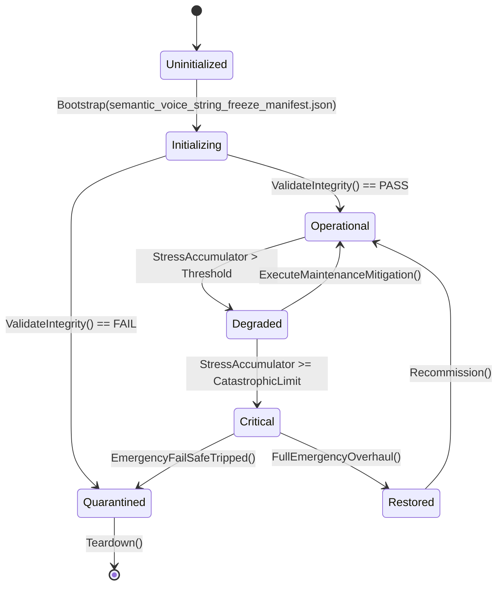

# ASHFALL — UNBLOCK PROGRAM · PLAN 3
## Semantic Kind, Survivor Voice, Playable Metrics and the String Freeze: D11 / D22 / Plan 42 / Plan 46 / Plan 49 / EN-05

**Status:** planning deliverable only. Read-only pass. No production, data, test,
save, or governance-ledger file is modified by this document. No path is claimed.
**Date:** 2026-09-21
**Baseline verified at:** `Zcode_Branch`, HEAD `5be1a30a63cd86cf23e4034473b739ac514f0f2a`
(2026-09-20 02:03 +0300) plus the current uncommitted worktree.
**Role:** unblock-plan author. This plan turns the text/voice/measurement
decision cluster into an execution-ready package that releases other plans.
**Authority chain:** `AGENTS.md`, `INTEGRATION_PLANS.md`, `WORKTREE_OWNERSHIP.md`,
`TEST_POLICY.md`, `KNOWN_DEBT.md`, `docs/governance/DECISION_REGISTER.md`
(DEC-11, DEC-13, DEC-17, DEC-18), `docs/plans/UNCLAIMED_CORPUS_CENSUS.md`,
`docs/plans/wave12_part1_1/A1_PLAN49_PREREQUISITE_AUDIT.md`, and current source.

---

## 0. How to read this plan

| Sibling | Region | Primary releases |
|---|---|---|
| Plan 1 | Equipment/body schema | XP-06, EN-04, Expansion 16 |
| Plan 2 | Funds, trade legs, routes | XP-04, XP-08, EN-03, C3 192/199 |
| **Plan 3 (this)** | Semantic kind, voice, strings, metrics | D11/CF-P3, Plan 42, Plan 46, Plan 49, EN-05, DEC-11, DEC-13, D19b |
| Plan 4 | Register truth, quarantine, census | D3/D4/D13/D16/D19a/c/D21, E1, Plan 24 residual, EN-08 |
| Plan 5 | Newest expansions, C3/EN gate | Expansions 12–31, EN-01/02/06/07, XP-07/09/10 |

This plan has six separable deliverables. They are bundled because they share
three files or contracts (`DayEventVocabulary`, the localisation boundary, and
the census rows for Plan 42/46/49) and because they are the last text-shaped
blockers in the queue:

1. **D11 — semantic-kind briefing re-grouping.** The `SemanticKindMap` authority
   already exists; the blocked part is a *test-pinned presentation contract*
   (`GenericSectionTitle`).
2. **D22 — string freeze.** No player-facing string freeze exists, so
   `DEC-11` (VO) and `DEC-13` (localisation expansion) are indefinitely parked,
   and `EN-05`'s voice half is gated.
3. **Plan 42 (C2[18]) premise audit + activation path.** A complete 100k-char
   integration plan exists; it is `AUDIT-PENDING` and cannot be promoted until
   its identity and port prerequisites are re-verified at current HEAD.
4. **Plan 46 (C2[20]) premise audit + activation path.** A complete 78k-char
   integration plan exists; it needs its difficulty/release prerequisite
   re-audit and two named decisions (D-46-01, artifacts policy).
5. **Plan 49 (C1[16]) activation packet.** Plan 49's prerequisite chain is the
   reason it stays `DECIDED-DEFERRED`; this plan produces the certification
   decisions for 42/46 and the canonical-consumer packet Plan 49 needs.
6. **D19b — radio station identity.** `RadioHostSession.RecordObservation`
   defaults to literal `station_alpha`; the triangulation/observation records
   need either an authored station-selection seam or an explicit declaration
   that synthetic identity is final.

Vocabulary: **release** = a plan that becomes claimable once the decision is
recorded; **blast radius** = files touched; **premise audit** = the Rule 7
re-check before the first edit.

---

## 1. Executive summary

### 1.1 The block in one paragraph

Five plans and three decisions are blocked on *text contracts*, not on
capability:

- `D11` is not "build semantic kinds" — `DayEventVocabulary.SemanticKindMap`
  already classifies every emitted kind and the builder already renders
  unhandled kinds through a generic fallback with no silent drops. The blocked
  part is that `DayEventVocabularyTests` pins `GenericSectionTitle`
  ("System Activity") for non-heartbeat unhandled kinds, so a *re-grouping* into
  semantic sections cannot land without a signed test-contract migration. The
  no-silent-drop invariant must survive the migration; only the section title
  contract changes.
- `D22` is not "write translations" — `assets/l10n/` already contains
  `strings.csv`, `template.pot`, EN/DE/source translation files, a pseudo-locale
  design, and an extraction script (`scripts/ci/extract_l10n_inventory.py`).
  The blocked part is a *declared freeze*: which string classes are frozen as of
  which date, with which extraction gate. Until that signature exists, `DEC-11`
  (VO) and `DEC-13` (localisation expansion) stay parked.
- `Plan 42` is a complete, source-verified voice integration plan at
  `AUDIT-PENDING`. Its prerequisites (`C2[17]` identity, `C2[13]` port
  contracts — now SEALED) need a current-HEAD premise decision; its own design
  is ready.
- `Plan 46` is a complete measurement plan at `AUDIT-PENDING`, with two named
  pre-execution decisions (D-46-01 settings default; artifacts tracking policy)
  and a prerequisite re-audit.
- `Plan 49` cannot be promoted until 42 and 46 are premise-checked or
  certified; the 2026-09-18 audit already classified all ten scanner orphans
  and left a precise promotion-condition list.
- `EN-05` builds on the now-sealed distress content seal and needs the D22
  string freeze for its voice half.

### 1.2 Signature bundle in one glance

| # | Sign-off line | Releases | Blast radius |
|---|---|---|---|
| D11-A | `I sign the semantic-kind section routing: non-heartbeat unhandled kinds render under their SemanticKind section when a mapped title exists, else the generic section; no-silent-drop, heartbeat, determinism, and cap tests are migrated, not deleted.` | CF-P3 / Plan 31B re-grouping | `DayEventVocabulary.cs`, `DailyBriefingReportBuilder.cs`, `DayEventVocabularyTests.cs`, `EVENT_SEMANTIC_PARITY_MATRIX.md` |
| D11-B | `I sign the section-title vocabulary (closed list) and the rule that adding a title is a vocabulary change, not a code change.` | presentation stability | `DayEventVocabulary.cs`, parity matrix, localisation keys |
| D22-A | `I declare a string freeze on <date> for the classes in the freeze inventory §5.4.3; new player-facing strings are gate-blocked after the freeze.` | DEC-11, DEC-13, EN-05 voice half | `assets/l10n/strings.csv` (source), extraction script, gate manifest, UI/tutorial/data key surfaces |
| D22-B | `VO pipeline: [authorize per DEC-11 condition / keep deferred]; the freeze date is the condition's trigger.` | DEC-11 execution decision | VO pipeline docs, audio policy, string keys |
| D19b-A | `Radio observation station identity: [author an authored station-selection seam / declare station_alpha synthetic and final].` | observation records, triangulation | `RadioHostSession.RecordObservation`, triangulation panel, radio docs |
| L42-A | `Plan 42 premise: CERTIFIED / AMENDED — <list>; identity prerequisite C2[17] resolved as <owner>; port C2[13] sealed evidence accepted.` | Plan 42 claim window | Plan 42 doc, census C2[18], identity owner |
| L46-A | `Plan 46 premise: CERTIFIED / AMENDED; D-46-01 settings default = <off in release / off unless debug>; artifacts tracking policy = <move, never delete / archive dir>.` | Plan 46 claim window | Plan 46 doc, census C2[20], settings, artifacts policy |
| L49-A | `Plan 49 activation packet accepted: canonical consumer named per candidate row; deterministic, save-safe path certified; C1[16] may be promoted.` | Plan 49 | Plan 49 doc, census C1[16], consumer paths |

### 1.3 What is NOT in this plan

- No dialogue tree, chat, conversation engine, or new panel (Plan 42's own
  non-goals stand verbatim).
- No VO production (DEC-11's condition is a freeze, not an authorization to
  record; the recording decision is D22-B).
- No localisation content tranche (DEC-13's condition is extraction + freeze;
  translations follow separately).
- No new knowledge/rumor simulation (that is parallel Plan 131/Rumor work).
- No presenter skill progression (DEC-17 RETIRED; the premise check is Plan 5).
- No phobia growth (DEC-18 RETIRED; the premise check is Plan 5).
- No adaptive difficulty, network telemetry, or player-identifying data
  (Plan 46's own non-goals stand verbatim).
- No rewrite of historical audit documents; superseding notes only.

---

## 2. Verified current reality

### 2.1 The semantic-kind authority already exists

`Assets/Ashfall.Core/Campaign/DayEventVocabulary.cs`:

- Class doc: "This is the Plan 31 semantic-kind authority and C2 consumer
  contract. Every registered event kind maps to exactly one non-unknown
  `SemanticKind`."
- `public const string GenericSectionTitle = "System Activity";` (line 29).
- `SemanticKindMap` (Ordinal dictionary) classifies heartbeat, casualty,
  hazard, survivor, shelter, communication, weather, narrative, and more.
- `GetSemanticKind` returns Heartbeat for steady-state ticks, the registered
  kind for recognized events, Unknown otherwise.
- `IsInternalHeartbeat`, `TryGetSemanticKind`, `RenderGeneric` are present.

`Assets/Ashfall.Core/Campaign/DailyBriefingReportBuilder.cs` (lines 337–352):
the default switch case renders non-heartbeat unhandled kinds into
`systemActivity` under `DayEventVocabulary.GenericSectionTitle`; the final
`AddSectionIfNotEmpty` adds that section; `BriefingRouteMap.ApplyRoutes(r)`
then fills routes.

**So the only thing missing for D11 is the routing decision and its test
migration.** The classification data is complete; the presentation is not
using it for section placement.

### 2.2 The pinned tests, exactly

`Ashfall.Core.Tests/Campaign/DayEventVocabularyTests.cs`:

| Test | Pin |
|---|---|
| `UnknownKind_RendersGenericEntry_NeverSilentlyDropped` | single generic section |
| `HeartbeatKinds_AreIntentionallyNonPlayerFacing` | heartbeats never surface |
| `NonHeartbeatEmittedKinds_RenderVisibleEntries` | every emitted non-heartbeat kind appears under `GenericSectionTitle` |
| `EveryCurrentEmittedKind_IsHandledClassifiedOrGeneric` | same, per kind |
| `GenericRendering_IsDeterministic` | deterministic text |
| `GenericSection_IsCappedByOverflowRule` | noise-budget cap + overflow indicator |
| `SameEvents_ProduceIdenticalBriefingOrdering` | deterministic ordering |

Also `Ashfall.Core.Tests/Campaign/Plan31BriefingRouteTests.cs` reads the
generic section for two route assertions, and `Plan20BShelterDayEventTests.cs`
does so for four handled-row assertions.

The **intent** of every test above is: no silent drop, heartbeat suppression,
determinism, noise budget. None of these intents depends on the literal title
"System Activity". The migration therefore preserves all intents and changes
only the *destination section* for semantic classes that earn a named section.

### 2.3 The localisation infrastructure already exists

`assets/l10n/`:

- `strings.csv`, `strings.csv.import`
- `strings.source.translation`, `strings.en.translation`, `strings.de.translation`
- `template.pot`

`docs/ui/LOCALIZATION_READINESS.md` defines:

- included classes (UI chrome, settings, tutorial/onboarding, warnings,
  item/equipment metadata, codex definitions);
- deferred classes (large narrative prose corpus);
- key naming (`ui.<domain>.<element>`, `warning.<system>.<severity>`, etc.);
- dynamic formatting with positional placeholders;
- a pseudo-locale QA design (+30–40%, bracket wrapping).

`Assets/Ashfall.Core/Localization/LocalizationService.cs` and
`src/Localization/AshfallLocalization.cs` are the runtime services;
`scripts/ci/extract_l10n_inventory.py` is the extraction tool.
`DEC-13`'s condition is "until UI string extraction and string freeze in Wave
12" — the extraction tool exists; the freeze does not.

### 2.4 Plan 42's current state

`docs/plans/PLAN_42_SURVIVOR_VOICE_INTEGRATION_PLAN.md` (100,076 chars) is a
complete plan with:

- objective, bounded outcome, and non-goals (§1);
- a collision-checked current-reality section (§2) covering seventeen existing
  systems with EXTEND/ADAPT/LEAVE verdicts;
- MUST PRESERVE / MUST ADD / MUST NOT DO / VERIFY WITH / FIRST SAFE STEP (§25);
- a content spec (`survivor_voice_lines.json`, `survivor_voice_registers.json`,
  a closed trigger vocabulary, string keys);
- a determinism contract (`CampaignRngManager.Fork("survivor_voice", day,
  actionIndex)`, no `System.Random`);
- a delivery plan (journal, additive briefing renderer, HUD murmur, detail row)
  with a port-contract check;
- no dialogue tree; text-first; optional existing cue ids only.

Its census row `C2[18]` is `AUDIT-PENDING`; the A1 audit records its
prerequisites as C2[17] identity (AUDIT-PENDING) and C2[13] port contracts
(**SEALED 2026-09-19**: 264 seams, 182 host-required bound, 0 deferred).

### 2.5 Plan 46's current state

`docs/plans/PLAN_46_PLAYABLE_METRICS_INTEGRATION_PLAN.md` (78,360 chars) is a
complete plan with:

- 46A reproducible balance corpus (scenarios as checked-in data, run headers
  with git SHA, generated summary, first numeric targets, ADR log, nightly
  drift gate);
- 46B local, private, opt-in player metrics (`PlaySessionRecorder`, JSONL under
  `user://`, three-gate enablement, hard-off in release, funnel/dead-end/stuck
  report, no network);
- 46C human-reviewed difficulty ritual (measurements → ADRs → existing change
  process);
- two named pre-execution decisions: D-46-01 settings default and the artifacts
  tracking policy;
- MUST PRESERVE (DayRecord, onboarding sigils, XP-W1 Difficulty read-only),
  MUST ADD, MUST NOT DO, VERIFY WITH, FIRST SAFE STEP.

Its census row `C2[20]` is `AUDIT-PENDING`; its stated prerequisites are
C2[12] difficulty authority (**SEALED 2026-09-19** via XP-01) and C2[16]
Plan 39 session durability (`AUDIT-PENDING`, numbering collision with an
unrelated orbital closeout).

### 2.6 Plan 49's current state

`docs/plans/wave12_part1_1/A1_PLAN49_PREREQUISITE_AUDIT.md` (`DECIDED-DEFERRED`,
2026-09-18) classified all ten scanner orphans:

| Catalog | Classification | Required next authority |
|---|---|---|
| `audio_logs_expansion_05.json` | DECISION-BLOCKED | choose delivery authority (Plan 35 item/collection or archive) |
| `cassette_sets.json` | OUT-OF-SCOPE / DECISION-BLOCKED | collection/content package defines delivery/playback |
| `confession_secrets.json` | DEPENDENCY-BLOCKED | promote Plan 44B pair-event owner; no second secret system |
| `guilt_sources.json` | RESERVED | keep as Plan 66 vocabulary until Plan 44B needs it |
| `item_degradation.json` | ROUTED-REPAIR | equipment-condition owner binds authored profiles |
| `memorials_expansion_05.json` | ACTIVATE-CANDIDATE, PREREQUISITE-BLOCKED | Plan 42/46 readiness chain |
| `narrative_encounters_expansion.json` | ACTIVATE-CANDIDATE, PREREQUISITE-BLOCKED | extend narrative loader after Plan 46 evidence |
| `phantom_heirlooms.json` | ROUTED-REPAIR | Plan 41 memory/heirloom host seam completed |
| `trade_screen_scenarios.json` | DECISION-BLOCKED | documented producer/precedence decision |
| `wall_carving_templates.json` | DEPENDENCY-BLOCKED | Plan 44B event source + decor/memorial projection |

Promotion conditions (from the audit): (1) C2[18]/Plan 42 has a current
premise/claim decision including identity and port prerequisites; (2) C2[20]/
Plan 46 has a current premise decision able to produce reachability evidence;
(3) the Plan 49 candidate packet identifies a canonical consumer and a
deterministic, save-safe path for every proposed activation.

### 2.7 EN-05's current state

`Seal-steps/ashfall-enhanced-expansion-program-en-01-en-08-and-xp-pillar-rescoping-2026-09-19.md`:

- EN-05 builds on the distress content seal (now SEALED via
  `CF-P1-DISTRESS-CONTENT-SEAL`) and XP-09 (presenter skills — retired-adjacent,
  premise check is Plan 5).
- Its design is `RescuedArcProjection` (read model) + audio-cue continuity +
  optional XP-09 visibility hook.
- Its gate is "Plan 02 sealed + XP-09 premise decision", and its voice half is
  gated by the string freeze per the 2026-09-19 audit (Bundle C / D22).

### 2.8 D19b's current state

```
$ grep -rn "station_alpha" --include=*.cs Assets src
Assets/Ashfall.Core/Waystation/WaystationCatalogLoader.cs:73: id = "waystation_alpha_cut",
src/Host/HostCli.Cartography.cs:78: ... GetStation("waystation_alpha_cut")
src/Host/RadioHostSession.cs:675:
    public string RecordObservation(string signalId, float bearing,
        float signalStrength = 0.7f, float noise = 0.2f,
        string stationId = "station_alpha")
```

The radio observation API has a synthetic default station id. Whether that is
a deliberate synthetic identity or a placeholder for an authored
station-selection seam is the open decision (D19b in the 2026-09-18 packet).

### 2.9 The register rows this plan resolves or touches

| Row | Current | This plan |
|---|---|---|
| DEC-11 (VO) | DEFERRED-WITH-CONDITION (freeze + loudness calibration) | D22-A provides the freeze; D22-B decides the VO authorization |
| DEC-13 (localisation expansion) | DEFERRED-WITH-CONDITION (extraction + freeze) | D22-A provides the freeze; extraction tool exists |
| DEC-17 (presenter skill tree) | RETIRED | untouched; XP-09 premise check is Plan 5 |
| DEC-18 (phobia growth) | RETIRED | untouched; XP-10 premise check is Plan 5 |

---

## 3. Blocked-plan inventory released by this plan

### 3.1 `CF-P3-SEMANTIC-KIND-AUTHORITY` (roster 05, D11)

- **Block:** pinned `GenericSectionTitle` contract in
  `DayEventVocabularyTests`.
- **Release:** D11-A/B + the test migration. The Plan 31B semantic re-grouping
  lands as section routing using the existing `SemanticKindMap`.
- **Evidence pre-committed:** migrated tests prove no-silent-drop (a kind with
  no mapped title still appears under the generic section), heartbeats never
  surface, determinism holds, the noise cap holds, and route tests still pass.

### 3.2 `C2[18]` / Plan 42 (survivor voice)

- **Block:** `AUDIT-PENDING`; prerequisites C2[17] identity and C2[13] port
  contracts.
- **Release:** L42-A premise certification + the claim window. The plan's own
  FIRST SAFE STEP is the Phase 0 premise re-verification; this plan supplies the
  certification decision that unblocks it.

### 3.3 `C2[20]` / Plan 46 (playable metrics)

- **Block:** `AUDIT-PENDING`; prerequisite C2[16] Plan 39 re-audit; decisions
  D-46-01 and artifacts policy.
- **Release:** L46-A premise certification + decisions. The plan's own Phase 0
  is read-only; this plan supplies the decisions.

### 3.4 `C1[16]` / Plan 49 (depth passes)

- **Block:** prerequisite chain per the A1 audit.
- **Release:** L49-A activation packet. This plan does not activate content; it
  certifies the consumer/path for each candidate row so Plan 49's own package
  can be promoted.

### 3.5 `EN-05 Signal Continuity & Voice`

- **Block:** distress seal (sealed now) + XP-09 premise decision + D22 for the
  voice half.
- **Release:** D22-A freezes the strings; Plan 5 signs the EN-05 authorization
  after this plan and the XP-09 premise check. The distress half is now ready.

### 3.6 `DEC-11` and `DEC-13`

- **Release:** a declared freeze converts both indefinitely-parked rows into
  scheduled follow-ons: VO recording and localisation content tranches.

### 3.7 `D19b` observation identity

- **Release:** either an authored station-seam package or a final synthetic
  declaration. Both close the ambiguity; the panel/observation records stop
  carrying an unexplained default.

### 3.8 Secondary releases and clarity gains

| Item | Gain |
|---|---|
| `Plan31BriefingRouteTests` | migrated to the new section contract, preserving route assertions |
| `docs/campaign/EVENT_SEMANTIC_PARITY_MATRIX.md` | updated with the section-routing rows |
| `C2[16]`/Plan 39 | premise decision recorded (certified/amended/collided) |
| `C2[17]` identity | premise decision recorded; either certified or routed to a bounded repair |
| EN-01 (difficulty weave) | reads the difficulty authority; D11 not directly relevant, but the string freeze affects its labels |
| Plan 46's 46B | its privacy posture is strengthened by the freeze's key discipline |
| Expansion 28 (Lesson) / 30 (Press) | both are text-heavy; the freeze and voice keys give them a key vocabulary and a gate |

### 3.9 Non-releases

- No automatic VO authorization; DEC-11 stays conditional unless D22-B signs.
- No translation authoring; DEC-13's expansion remains a follow-on tranche.
- No presenter skill tree (DEC-17 RETIRED) or phobia growth (DEC-18 RETIRED).
- No knowledge/rumor simulation.
- No new panel or route.

---

## 4. Decision packet

### 4.1 D11-A — semantic-kind section routing

**Sign-off line:**

> `I sign the semantic-kind section routing: non-heartbeat unhandled kinds render under their SemanticKind section when a mapped title exists, else the generic section; no-silent-drop, heartbeat, determinism, and cap tests are migrated, not deleted.`

**Routing table (normative, closed):**

| SemanticKind | Section title | Notes |
|---|---|---|
| Hazard | `Warnings` (existing section) | hazards already route to Warnings in many cases; unify |
| Casualty | `Deaths` (existing) | casualty family |
| Survivor | `Survivor Changes` (existing) | survivor family |
| Shelter | `Shelter` (existing) | shelter family |
| Communication | `Radio Intercepts` (existing) | radio family |
| Weather | `Weather Forecast` (existing) | weather family |
| Narrative | `Chronicle` (new title) | echoes, arcs, obligations |
| Economy | `Economy` (new title) | shocks, trade |
| Production | `Production & Maintenance` (existing) | production family |
| Expedition | `Expedition Milestones` (existing) | expedition family |
| Unknown / unmapped | `GenericSectionTitle` (existing) | **must remain reachable** |

Rules:

1. A kind with a handled builder case keeps its tailored text path; routing
   applies only to the unhandled non-heartbeat default path.
2. The generic section remains the fallback for any kind whose semantic kind
   has no mapped title; the no-silent-drop test is retargeted, not removed.
3. Heartbeats remain suppressed.
4. Ordering: sections keep their existing relative order; within a routed
   section, entries keep day ordering and the existing cap/overflow behavior.
5. If a routed section already exists (e.g. Warnings), the generic entry joins
   it rather than creating a duplicate title.

**Options:**

| Option | Verdict |
|---|---|
| A. Route by semantic kind with generic fallback (recommended) | uses the authority already built; keeps no-silent-drop |
| B. Keep everything generic | valid; D11 stays parked; the map remains unused for placement |
| C. Re-group by source owner string | rejected: owner strings are not a presentation vocabulary |
| D. New sections per kind | rejected: 40+ sections destroys the noise budget |

**Blast radius:** `DayEventVocabulary.cs` (routing helper + title map),
`DailyBriefingReportBuilder.cs` (default case destination),
`DayEventVocabularyTests.cs` (migrated pins),
`Plan31BriefingRouteTests.cs` / `Plan20BShelterDayEventTests.cs` (retargeted
section lookups), `EVENT_SEMANTIC_PARITY_MATRIX.md`, plus one localisation key
per new title if the freeze has landed.

### 4.2 D11-B — section-title vocabulary

**Sign-off line:**

> `I sign the section-title vocabulary (closed list) and the rule that adding a title is a vocabulary change, not a code change.`

**Meaning:** the titles in §4.1 are the closed list for this schema; any new
title requires a signed vocabulary amendment (and a localisation key after the
freeze). This prevents ad-hoc titles appearing in code during future packages.

### 4.3 D22-A — string freeze

**Sign-off line:**

> `I declare a string freeze on <date> for the classes in the freeze inventory §5.4.3; new player-facing strings are gate-blocked after the freeze.`

**Freeze inventory (classes frozen):**

| Class | Examples | Source |
|---|---|---|
| UI chrome | titles, tabs, buttons, headers, empty states | `src/UI/**`, panels |
| Settings | display/audio/accessibility/gameplay/language labels | `SettingsPanel`, settings catalog |
| Tutorial/onboarding | stage objectives, directives, tips, hints | `TutorialPanel`, `OnboardingCatalog` |
| Warnings/alerts | radiation, needs, power, hunger/thirst | builder warnings, snackbar |
| Item/equipment metadata | names, categories, effect descriptions, units | `items.json` display fields |
| Codex/field manual | rules, glossary, role descriptions | codex data |
| Voice keys | Plan 42 `voice.*` keys (once authored) | Plan 42 content |
| Briefing section titles | D11-B titles | `DayEventVocabulary` |

**Deferred (not frozen):** large narrative prose corpus (world history, radio
stories, lore documents, echoes) — these keep translating in dedicated content
packs per the readiness doc.

**Freeze mechanism:**

1. The freeze is a *policy gate*, not a code freeze of all text: after the
   freeze date, new player-facing literal strings in the frozen classes must be
   authored as localisation keys, and a CI gate reports violations.
2. The extraction script (`scripts/ci/extract_l10n_inventory.py`) produces the
   inventory; the gate compares new/changed keyable strings against the frozen
   catalog.
3. Pseudo-locale QA verifies that new keys render wrapped.
4. The freeze does not block content authoring; it blocks *unkeyed* player text
   in the frozen classes.

**Decline path:** "deferred again" costs nothing but keeps DEC-11 and DEC-13
parked and keeps EN-05's voice half gated. The freeze's real cost is the gate
and the key migration for any new strings.

### 4.4 D22-B — VO authorization

**Sign-off line:**

> `VO pipeline: [authorize per DEC-11 condition / keep deferred]; the freeze date is the condition's trigger.`

**Meaning:** DEC-11's condition is "dialogue string freeze and audio bus
loudness calibration". D22-A satisfies half. If the foreman wants VO, this line
authorizes a scoped VO pilot under the freeze keys; if not, DEC-11 stays
deferred with its condition now demonstrably met on the freeze side and a
named loudness calibration requirement remaining.

### 4.5 D19b-A — station identity

**Sign-off line:**

```text
Radio observation station identity: [author an authored station-selection seam / declare station_alpha synthetic and final].
```

**Options:**

| Option | Meaning | Blast radius |
|---|---|---|
| A. Authored seam | `RecordObservation` resolves a real station record where one exists; synthetic id only when no station is in range | `RadioHostSession.cs`, triangulation panel, radio docs, a station catalog if one is needed |
| B. Synthetic final | keep `station_alpha` as a declared synthetic identity; document it on the API and in the radio contract | comments + `docs/radio/` only |
| C. Defer | keep the ambiguity | none |

**Recommendation:** B if no station catalog currently exists and the
observation record is not player-visible as a station claim; A only if the
triangulation surface already displays a station name. The Phase 4 premise
check determines which; the decision line above is written to accept either.

### 4.6 L42-A — Plan 42 premise certification

**Sign-off line:**

```text
Plan 42 premise: CERTIFIED / AMENDED — <list>; identity prerequisite C2[17] resolved as <owner>; port C2[13] sealed evidence accepted.
```

**What the certification asserts (after the §5.2 audit):**

- The plan's §2 collision verdicts still hold at execution HEAD.
- C2[17] identity: `ExpansionEnrichmentCatalog` + `SurvivorEnrichmentService`
  are the identity owner (or a named repair is routed).
- C2[13] port contracts are sealed and the plan's port rows are satisfiable.
- No system marked LEAVE in Plan 42 has changed in a way that breaks the plan.
- No conflict with D11's section routing (voice briefing entries are additive).

### 4.7 L46-A — Plan 46 premise certification + two decisions

**Sign-off line:**

```text
Plan 46 premise: CERTIFIED / AMENDED; D-46-01 settings default = <off in release / off unless debug>; artifacts tracking policy = <move, never delete / archive dir>.
```

**Certification asserts:** CSV count, sigil count, XP-W1 difficulty claim
state, and `CF-XP01` binding status at execution HEAD match the plan's §2 (with
drift recorded). **D-46-01** is the settings default for `play_metrics_enabled`
(the plan's privacy posture argues "off unless debug"); the artifacts policy
decides whether the 28 existing CSVs are moved to an archive with provenance or
tracked as-is until Phase 2.

### 4.8 L49-A — Plan 49 activation packet

**Sign-off line:**

```text
Plan 49 activation packet accepted: canonical consumer named per candidate row; deterministic, save-safe path certified; C1[16] may be promoted.
```

**Packet contents (built in §5.6):** for each of the ten audited catalogs, the
canonical consumer and the deterministic save-safe path, or an explicit
exclusion. Promotion of C1[16] does not mean activating all ten; it means the
packet is truthful about each.

### 4.9 Signing order and first safe step

1. Sign D11-A/B first (smallest, releases CF-P3).
2. Sign D22-A (freeze) — this releases both parked register rows and EN-05's
   voice gate; D22-B is separate.
3. Sign D19b-A (identity) — small.
4. Execute the Plan 42/46 premise audits (§5.2/§5.3), then sign L42-A/L46-A.
5. Build the Plan 49 packet, then sign L49-A.
6. Record all rows in `DECISION_REGISTER.md`.

**First safe step:** the premise audits are read-only and may run before any
signature; D11/D22 signatures gate their own edits.---

## 5. Technical design (execution-ready after signature)

### 5.1 D11 — semantic-kind routing design

#### 5.1.1 Core change surface

Add to `DayEventVocabulary.cs` (proposed names):

```csharp
/// <summary>
/// Closed section-title routing for semantic kinds (D11-B vocabulary).
/// A kind with no entry renders under GenericSectionTitle.
/// </summary>
private static readonly Dictionary<SemanticKind, string> SectionTitleMap =
    new()
    {
        { SemanticKind.Hazard, "Warnings" },
        { SemanticKind.Casualty, "Deaths" },
        { SemanticKind.Survivor, "Survivor Changes" },
        { SemanticKind.Shelter, "Shelter" },
        { SemanticKind.Communication, "Radio Intercepts" },
        { SemanticKind.Weather, "Weather Forecast" },
        { SemanticKind.Narrative, "Chronicle" },
        { SemanticKind.Economy, "Economy" },
        { SemanticKind.Production, "Production & Maintenance" },
        { SemanticKind.Expedition, "Expedition Milestones" },
    };

public static string SectionTitleFor(SemanticKind kind) =>
    SectionTitleMap.TryGetValue(kind, out var title) ? title : GenericSectionTitle;
```

The builder's default case changes from always adding to `systemActivity` to:

```csharp
var semantic = DayEventVocabulary.GetSemanticKind(evt.Kind);
var title = DayEventVocabulary.SectionTitleFor(semantic);
// append to the bucket for `title`; "Warnings"/"Deaths"/etc. already have
// buckets in the builder, so reuse them; a new bucket is only created for the
// new titles (Chronicle, Economy).
```

Implementation detail: the builder currently materializes typed lists per
section and calls `AddSectionIfNotEmpty` in a fixed order. The cleanest change
is a small `Dictionary<string, List<DailyBriefingEntry>>` for routed buckets,
merged into the existing lists before the `AddSectionIfNotEmpty` sequence, so
ordering stays fixed and the cap applies per section. A builder must not change
the order of the existing sections.

#### 5.1.2 Test migration (exact)

| Test | Current assertion | Migrated assertion |
|---|---|---|
| `UnknownKind_RendersGenericEntry_NeverSilentlyDropped` | generic title section contains the entry | entry appears in the section returned by `SectionTitleFor(GetSemanticKind(kind))`; for an unmapped kind that is still generic |
| `NonHeartbeatEmittedKinds_RenderVisibleEntries` | generic title per kind | per-kind expected routed title (computed from the same API under test — careful: don't make the test tautological; assert against a hard-coded expected map copy) |
| `EveryCurrentEmittedKind_IsHandledClassifiedOrGeneric` | generic title | routed-title map, with an explicit assertion that the generic title remains reachable by an unmapped kind |
| `HeartbeatKinds_AreIntentionallyNonPlayerFacing` | unchanged | unchanged |
| `GenericRendering_IsDeterministic` | unchanged | unchanged |
| `GenericSection_IsCappedByOverflowRule` | generic title | use an unmapped kind family to keep testing the generic cap; add a routed-section cap case |
| `SameEvents_ProduceIdenticalBriefingOrdering` | unchanged | unchanged |
| `Plan31BriefingRouteTests` (2 reads) | generic title lookups | read the routed title for the fixture kind |
| `Plan20BShelterDayEventTests` (4 handled rows) | generic title lookups | these are handled rows; confirm they still read what they intend (likely unaffected) |

The migration must include one new test proving the fallback: a synthetic kind
with `SemanticKind.Unknown` still renders under `GenericSectionTitle` with the
generic text — this is the no-silent-drop guarantee that must survive the
change.

#### 5.1.3 Parity matrix update

`docs/campaign/EVENT_SEMANTIC_PARITY_MATRIX.md` gains a routing column:
kind → semantic kind → section title. The `DayEventParitySourceGateTests` gate
is re-run to prove the matrix still matches source.

#### 5.1.4 Edge cases

| Case | Behavior |
|---|---|
| handled kind (tailored case) | unchanged; routing only applies to the default path |
| heartbeat | suppressed (unchanged) |
| unmapped kind | generic section (must remain reachable) |
| routed section already populated by handled cases | join it; no duplicate title |
| cap exceeded | per-section cap + overflow indicator (unchanged semantics) |
| deterministic order | entries keep day/order inputs; section order fixed |
| localisation freeze active | new titles are freeze-class strings; author keys |

### 5.2 Plan 42 premise audit protocol (L42-A input)

The audit is read-only, bounded, and produces a certification note. It must not
trust the plan's own §2 claims (Rule 7).

#### 5.2.1 Audit steps

1. **Identity prerequisite (C2[17]).** Locate the identity owner:
   `SurvivorEnrichmentService` (line 35) and `ExpansionEnrichmentCatalog`; read
   the current public API and the host binding. Decide: certified as the
   identity owner, or routed to a bounded repair. Check whether
   `survivor_voice_lines.json`'s identity fields have a stable source.
2. **Port prerequisite (C2[13]).** Re-run
   `python3 scripts/ci/generate-port-contract.py --check`; confirm 0 deferred
   and that the voice plan's proposed port rows fit the existing contract
   format.
3. **LEAVE-system drift check.** For each system Plan 42 marks LEAVE
   (`SleepNarrativeProjection`, `JournalVoice`/`JournalVoiceProseCatalog`,
   `MoraleMarkSystem`, radio hosts + `_playedBroadcastKeys`, phantom/vinyl
   catalogs, the seven social cores), grep for changed signatures since the
   plan's authoring. Any change that breaks the plan's assumptions is recorded
   as an amendment.
4. **Journal contract check.** Confirm the journal's 64-cap, knowledge-key
   dedup, and save shape still match the plan.
5. **RNG contract check.** Confirm `CampaignRngManager.Fork` semantics and
   `CampaignStreamIds` conventions for adding `SurvivorVoice`; check the RNG
   source gate.
6. **String-freeze interaction.** If D22-A is signed, confirm the plan's
   `voice.*` keys are in the freeze class and the key convention matches
   `LOCALIZATION_READINESS.md`.
7. **EN-01/EN-05 interaction.** Confirm the voice read model is presentation
   only and does not duplicate knowledge; note EN-05's arc projection consumes
   radio ledgers, not voice lines.
8. **Claim shape.** Produce the proposed claim paths from the plan's §20 and
   confirm none collide with active claims in `WORKTREE_OWNERSHIP.md`.

#### 5.2.2 Certification outcomes

| Outcome | Meaning |
|---|---|
| CERTIFIED | all eight steps pass; claim may be created after L42-A signature |
| AMENDED | a named list of drift items must be folded into the plan before claim (e.g., a LEAVE system changed, or the identity owner moved) |
| ROUTED | a prerequisite is itself a real gap (e.g., identity is absent) and gets a bounded repair package before Plan 42 |

The audit must check whether the C2[17] identity capability is actually live:
`SurvivorEnrichmentService` exists, but its *consumed surface* is the question.
If the identity layer is not composed into the campaign, L42-A must route a
repair rather than certify a paper owner.

#### 5.2.3 Activation claim shape (proposed)

```text
claim-c2-18-plan42-survivor-voice-<date>
Core: Assets/Ashfall.Core/Voice/ (new)
Data: survivor_voice_lines.json, survivor_voice_registers.json (new)
Host: src/Main.SurvivorVoice.cs, SurvivorVoice host session, save store
Sinks: journal additive writes, briefing additive renderer, HUD murmur, detail row
Tests: Ashfall.Core.Tests/Voice/ (new files)
Docs: docs/voice/VOICE_LINE_SPEC.md
```

The builder starts at the plan's Phase 0 (premise re-verification against the
execution-day HEAD), not at Phase 1.

### 5.3 Plan 46 premise audit protocol (L46-A input)

#### 5.3.1 Audit steps

1. **CSV count and provenance.** `ls artifacts/balance | wc -l`; confirm the
   plan's count and that the files are unattributed (no run headers).
2. **Sigil count.** `grep -c "ObserveSigil(" -r src/`; confirm the plan's
   count and that onboarding is the sole guidance authority.
3. **XP-W1 difficulty state.** Confirm the difficulty authority is live and
   read-only-consumable via `DifficultyScalarsProvider.PresetId`; confirm the
   completion-history stamp; note that the XP-W1 claim is now DONE per its
   row (drift from the plan's authoring state must be recorded).
4. **DayRecord state.** Confirm `DayRecord`/`DayRecordBuilder`/`Main.DayRecord.cs`
   are as the plan expects (46B is a sibling consumer).
5. **Prerequisite C2[16]/Plan 39.** Audit session durability at current HEAD:
   save slots, soak, release gate claims. If the subject differs (numbering
   collision), record it and decide whether Plan 46's own release-gate needs are
   already satisfied by Plan 48's release craft (SEALED 2026-09-19) or need a
   named follow-up.
6. **Privacy posture.** Confirm no analytics/network path exists; confirm the
   three-gate enablement design's feasibility (`OS.IsDebugBuild`, env var,
   settings toggle).
7. **Artifacts policy.** Decide: move the 28 CSVs to
   `docs/archive/balance/pre-46A/` with a provenance note (recommended) or keep
   them tracked until Phase 2.
8. **Claim shape.** Produce the claim paths and confirm no collisions.

#### 5.3.2 The two decisions

| Decision | Options | Recommendation |
|---|---|---|
| D-46-01 settings default for `play_metrics_enabled` | on-by-default / off-unless-debug / always off | off-unless-debug: privacy posture and the plan's own hard-off-in-release rule |
| artifacts tracking policy | move-never-delete / track-as-is | move-never-delete with provenance (matches the repo's quarantine discipline) |

#### 5.3.3 Activation claim shape (proposed)

```text
claim-c2-20-plan46-playable-metrics-<date>
Core: BalanceSweepScenario/loader/validation, BalanceRunHeader, BalanceSweepRunner,
      PlaySessionRecorder, FirstHourFunnel, PlaySessionReport
Host: src/Main.PlayMetrics.cs, --balance-sweep, --play-metrics-selftest
Settings: play_metrics_enabled
Scripts/docs: scripts/balance/run_sweep.py, scenario JSONs, docs/balance/*
Tests: Ashfall.Core.Tests/Balance/*, Ashfall.Core.Tests/Telemetry/*
```

### 5.4 D22 — string freeze mechanics

#### 5.4.1 Current assets and services

| Asset | Role |
|---|---|
| `assets/l10n/strings.csv` | source key table |
| `assets/l10n/template.pot` | POT template |
| `assets/l10n/strings.en.translation`, `.de.translation`, `.source.translation` | translation files |
| `Assets/Ashfall.Core/Localization/LocalizationService.cs` | engine-agnostic fallback |
| `src/Localization/AshfallLocalization.cs` | host binding |
| `scripts/ci/extract_l10n_inventory.py` | extraction inventory |
| `docs/ui/LOCALIZATION_READINESS.md` | boundary + key conventions + pseudo-locale |

#### 5.4.2 Freeze mechanics (normative)

1. **Inventory first.** Run the extraction script; produce a freeze inventory
   listing every keyable string in the frozen classes, its file, and its
   current key (or missing key).
2. **Freeze catalogue.** Snapshot the inventory as the frozen catalog; store it
   under `assets/l10n/freeze/` with a date and a hash.
3. **Gate.** A CI gate (proposed: extend the existing gate manifest with a
   `string_freeze` gate) reports player-facing literals in frozen classes that
   are not keys:
   - UI panel text calls that pass raw literals,
   - tutorial/onboarding stage text,
   - warning/alerts,
   - item/codex display fields in data.
   The gate's allowlist carries pre-freeze debt explicitly (a bounded list) so
   the freeze does not block on the entire legacy corpus at once; the allowlist
   shrinks as strings are keyed.
4. **Pseudo-locale QA.** New keys must render wrapped under the pseudo locale.
5. **Exceptions.** A string may be exempt only with a written reason (e.g.,
   debug-only text, developer console) recorded in the gate allowlist.

#### 5.4.3 Freeze classes (normative list)

Frozen:
- UI chrome/navigation
- settings labels
- tutorial/onboarding
- warnings/alerts
- item/equipment metadata (display names, categories, effect text, units)
- codex/field manual
- briefing section titles (D11-B)
- voice keys (`voice.*`, once authored)

Not frozen (deferred content packs):
- narrative prose corpus (world history, radio stories, lore documents, echoes)
- archived/historical documents
- debug-only strings

#### 5.4.4 DEC-11 / DEC-13 follow-ons after the freeze

| Row | After freeze |
|---|---|
| DEC-11 VO | condition's freeze half met; if D22-B authorizes, a scoped pilot keys dialogue and records; loudness calibration remains a named requirement |
| DEC-13 localisation | extraction done + freeze done → an expansion tranche may be scheduled; translations follow the key tables |
| EN-05 voice half | the gate lifts; Plan 5 signs EN-05 |

#### 5.4.5 Freeze risks and mitigations

| Risk | Mitigation |
|---|---|
| Gate blocks all work on day one | allowlist carries legacy debt explicitly; only new/changed strings are gated |
| Key churn during voice authoring | voice keys authored once in the voice catalog; freeze catalogue takes a snapshot after Plan 42's content tranche |
| Translation quality | out of scope for the freeze; DEC-13 governs translation |
| Localisation scope creep into narrative | readiness doc's deferred class list is the boundary; the freeze does not touch prose |

### 5.5 D19b — station identity design

**Premise check first (Phase 4):**

1. Read `RadioHostSession.RecordObservation`'s call sites. Who passes
   `stationId`? If no caller passes one, the default is the de facto identity.
2. Read the triangulation panel and persisted observation records. Is a station
   name displayed to the player? Is there a station catalog?
3. If a station catalog exists, Option A (authored seam) is cheap and truthful.
   If not, Option B (synthetic final) is the honest choice.

**Option A shape (if chosen):**

```csharp
public string RecordObservation(..., string? stationId = null)
{
    var station = stationId ?? ResolveStationFor(signalId, bearing);
    // ResolveStationFor consults the authored station catalog; when no station
    // is in range, returns the documented synthetic id.
}
```

**Option B shape (if chosen):**

```csharp
/// <summary>Synthetic observation identity; ASHFALL does not model fixed
/// radio stations for bearings. Kept stable for save/replay compatibility.</summary>
public const string SyntheticStationId = "station_alpha";
```

Either way, the radio contract doc records the decision so future agents do not
re-open it.

### 5.6 Plan 49 activation packet design (L49-A input)

The packet must name a canonical consumer and a deterministic save-safe path
for each candidate, or explicitly exclude it. Proposed packet structure:

| Catalog | Proposed canonical consumer | Path | Certification state |
|---|---|---|---|
| `audio_logs_expansion_05.json` | Plan 35 collection/items owner or archive record owner | item/collection delivery + journal record, no playback in wave 1 | needs a delivery-authority choice |
| `cassette_sets.json` | out of scope | explicit exclusion until a collection package | excluded |
| `confession_secrets.json` | Plan 44B pair-event social history | compose with relations/guilt/save/host; no second secret system | dependency-blocked |
| `guilt_sources.json` | reserved vocabulary | kept for Plan 44B; no new ledger | reserved |
| `item_degradation.json` | `EquipmentConditionSystem.LoadProfiles` | equipment owner binds authored profiles or deletes them | routed repair |
| `memorials_expansion_05.json` | memorial/archive owner | generated/personal variants vs. world-history record decision; canonical owner only | prerequisite-blocked (42/46) |
| `narrative_encounters_expansion.json` | narrative loader | extend existing loader; deterministic selection + restore characterized | prerequisite-blocked (46 evidence) |
| `phantom_heirlooms.json` | Plan 41 memory/heirloom host owner | complete the existing save/host seam | routed repair |
| `trade_screen_scenarios.json` | trade contract | producer/precedence decision; no default injected for utilization | decision-blocked |
| `wall_carving_templates.json` | Plan 44B + decor/memorial projection | pair/family/mourning source then deterministic selection | dependency-blocked |

The packet is **not** an activation order; it is a truth table. Plan 49 may
then propose its own bounded content tranche only for rows certified ready.

**Deterministic save-safe path requirements (per activated row):**

1. Selection is a pure function of canonical state + seeded RNG where the live
   owner already uses it.
2. The row's state is captured/restored through the existing owner's save
   section (no new section without a signed schema decision).
3. Exactly-once semantics for any journal/record write (knowledge-key or
   fired-key pattern).
4. A focused test proves continuous == mid-reload equality.

### 5.7 EN-05 sequencing after this plan

| Step | Gate |
|---|---|
| P0 premise notes | distress seal SEALED + this plan's freeze |
| P1 `RescuedArcProjection` read model | radio ledgers at current HEAD |
| P2 journal integration | exactly-once keys; journal owner |
| P3 replay extension | Wave 5 harness + arc assertions |
| P4 optional XP-09 hook | only if Plan 5's XP-09 premise check survives |

EN-05's authorization line is signed in Plan 5; this plan clears the text gate.

### 5.8 Verification design for this plan's own deliverables

| Deliverable | Focused verification |
|---|---|
| D11 routing | `DayEventVocabularyTests`, `Plan31BriefingRouteTests`, parity gate |
| D22 freeze | extraction script run + gate self-test + pseudo-locale render test |
| Plan 42 certification | port-contract check + identity surface read + leave-system grep |
| Plan 46 certification | CSV/sigil/XP-W1/Plan 39 premise commands + decisions recorded |
| D19b | radio suite + observation test |
| Plan 49 packet | per-row consumer grep + content-utilization/readiness evidence |
| EN-05 readiness | radio suite + journal parity when executed |

### 5.9 Open questions (execution-time verification)

1. Does `DailyBriefingReportBuilder` already have a bucket mechanism reusable
   for routed sections, or does the implementation need the dictionary merge?
2. Which semantic kinds currently have no generic-path entries in practice
   (the routing only matters for emitted unhandled kinds)?
3. Does the pseudo-locale currently render `strings.csv` entries end-to-end in
   a headless test, or is it a manual QA path?
4. What is the exact extraction-script output format and can it serve as the
   freeze catalogue?
5. Is `C2[17]`'s identity layer composed into the campaign today, or only
   Core-test visible (the L42 audit's key question)?
6. Does Plan 39's session-durability surface exist under a different name, and
   is Plan 46's release-gate need already met by Plan 48?

### 5.10 Enrichment texts (paste-ready)

**`UNCLAIMED_CORPUS_CENSUS.md` rows:** after certification, add dated evidence
to `C2[16]`, `C2[17]`, `C2[18]`, `C2[20]` and the promotion note for `C1[16]`.

**`DECISION_REGISTER.md`:** add `DEC-28` (semantic routing), `DEC-29` (string
freeze), `DEC-30` (station identity), and update `DEC-11`/`DEC-13` evidence to
cite the freeze date; do not change their verdicts unless D22-B/L49-A sign.

**`docs/campaign/EVENT_SEMANTIC_PARITY_MATRIX.md`:** add the routing column and
a note that the generic fallback remains reachable.

**Plan 42 doc:** add a header block: "Premise CERTIFIED <date> by UNBLOCK-03
L42-A; identity owner <owner>; port contract <evidence>."

**Plan 46 doc:** add a header block with the two decisions and the
certification outcome.

**`docs/plans/wave12_part1_1/A1_PLAN49_PREREQUISITE_AUDIT.md`:** superseding
note only; the audit's classifications stand as history.---

## 6. Phased execution program

Each deliverable has its own phase group. Groups A (D11), B (freeze), C
(Plan 42), D (Plan 46), E (Plan 49), F (D19b) may run in parallel where paths
are disjoint. Every phase ends with the focused evidence named in §7.

### Phase group A — D11 semantic routing (1–1.5 days)

**A0 — premise (0.5h).** Re-run the Appendix A commands for D11; confirm the
`SemanticKindMap` still classifies the current emitted kinds; count the tests
that pin `GenericSectionTitle`; confirm `Plan31BriefingRouteTests` and
`Plan20BShelterDayEventTests` lookups.

**A1 — routing helper + builder (0.5 day).**
Files: `DayEventVocabulary.cs`, `DailyBriefingReportBuilder.cs`.
Steps: add `SectionTitleMap` + `SectionTitleFor`; add routed buckets in the
builder; merge into existing sections; keep section order; keep the cap.
Exit: build 0/0; existing tests fail exactly where expected (recorded pre-fix).

**A2 — test migration + fallback proof (0.5 day).**
Files: `DayEventVocabularyTests.cs`, `Plan31BriefingRouteTests.cs`,
`Plan20BShelterDayEventTests.cs` if needed.
Steps: migrate the seven pins per §5.1.2; add the unmapped-kind fallback test;
keep heartbeat/determinism/cap tests.
Exit: `DayEventVocabularyTests` green; `Plan31BriefingRouteTests` green;
`DayEventParitySourceGateTests` green.

**A3 — parity matrix + freezegate interaction (0.25 day).**
Files: `EVENT_SEMANTIC_PARITY_MATRIX.md`; if the freeze landed, add keys for
the new titles.
Exit: parity gate green; freeze gate accepts the new titles as keyed.

### Phase group B — D22 string freeze (2–3 days)

**B0 — inventory (0.5 day).** Run the extraction script; produce the freeze
inventory for the frozen classes; count keyed vs. unkeyed strings; publish the
allowlist of pre-freeze debt (bounded, explicit).

**B1 — freeze catalogue + gate design (0.5–1 day).** Store the snapshot under
`assets/l10n/freeze/`; design the gate (extend the gate manifest; detect raw
literals in frozen classes); add the gate's self-test (a deliberate violation
fails; a keyed string passes).

**B2 — key migration tranche 1 (1 day).** Key the highest-traffic frozen
strings that the gate would otherwise block immediately: warning titles,
briefing titles (D11), settings labels. This is incremental, not the whole
corpus.

**B3 — pseudo-locale verification (0.5 day).** A headless check that keyed
strings render wrapped; document any manual QA gap.

**B4 — register + scheduling (0.25 day).** Update DEC-11/DEC-13 evidence to
cite the freeze date; write the follow-on tranche proposals (VO pilot if
D22-B; localisation expansion).

### Phase group C — Plan 42 certification + activation (audit 1 day; execution per the plan)

**C0 — read-only audit per §5.2 (1 day).** Produce the certification note:
identity, ports, LEAVE drift, journal, RNG, freeze keys, EN interaction, claim
shape. Outcome: CERTIFIED / AMENDED / ROUTED.

**C1 — if AMENDED:** fold the named drift into the Plan 42 doc as an amendment
section (no execution).

**C2 — if CERTIFIED:** create the claim row after L42-A signs; the builder
starts at Plan 42's Phase 0 and follows its own phases. This plan does not
re-specify Plan 42's content; it only certifies and releases it.

### Phase group D — Plan 46 certification (audit 0.5–1 day)

**D0 — read-only audit per §5.3 (0.5–1 day).** Produce the certification note
incl. the C2[16] decision and the two decisions.

**D1 — decisions recorded:** D-46-01 and the artifacts policy in the Plan 46
doc header and the register.

**D2 — claim row** after L46-A signs; the builder starts at Plan 46's Phase 0.

### Phase group E — Plan 49 packet (1–1.5 days)

**E0 — build the packet per §5.6 (1 day).** For each row: canonical consumer,
deterministic save-safe path, or exclusion. Verify by source grep that the
named consumer exists and is composed.

**E1 — certify readiness rows (0.5 day).** Only rows with a named consumer and
a path are marked ready; the rest are excluded with reasons.

**E2 — L49-A sign + census note.** C1[16] may be promoted only for the
certified rows; the census row gains a dated evidence line.

### Phase group F — D19b station identity (0.5–1 day)

**F0 — premise (0.25 day).** Read call sites, triangulation surface, station
catalog.

**F1 — decision + implementation or documentation (0.5 day).** Option A seam,
or Option B declaration + doc updates.

### Phase G — closeout (0.5 day)

Ledger/register rows, census evidence, enrichment texts, handoff.

**Total estimated effort:** 6–10 builder-days plus the separate Plan 42/46
executions they release.

---

## 7. Verification plan

### 7.1 Focused test matrix

| Deliverable | Target | Expected |
|---|---|---|
| D11 | `bash scripts/run_test.sh Ashfall.Core.Tests/Campaign/DayEventVocabularyTests.cs` | migrated, green |
| D11 | `bash scripts/run_test.sh Ashfall.Core.Tests/Campaign/Plan31BriefingRouteTests.cs` | green |
| D11 | `DayEventParitySourceGateTests` | green |
| D22 | extraction script run | inventory produced; counts recorded |
| D22 | freeze gate self-test | violation fails; key passes |
| D22 | pseudo-locale headless check | keyed strings wrapped |
| Plan 42 | `python3 scripts/ci/generate-port-contract.py --check` | 0 deferred |
| Plan 42 | identity surface grep | owner located or repair routed |
| Plan 46 | `ls artifacts/balance | wc -l` | matches recorded count |
| Plan 46 | `grep -c "ObserveSigil(" -r src/` | matches recorded count |
| Plan 46 | XP-W1 difficulty state | live + read-only consumable |
| D19b | radio suite | green; observation test added |
| Plan 49 | per-row consumer grep | named consumers exist |
| all | `dotnet build Ashfall.csproj --no-restore` | 0/0 |
| all | `godot --headless --path . -- --data-integrity-selftest` | PASS |
| all | `godot --headless --path . -- --content-utilization-selftest` | PASS |
| all | `godot --headless --path . -- --panel-bind-lifecycle-selftest` | PASS |

### 7.2 Commands

```bash
# D11
bash scripts/run_test.sh Ashfall.Core.Tests/Campaign/DayEventVocabularyTests.cs
bash scripts/run_test.sh Ashfall.Core.Tests/Campaign/Plan31BriefingRouteTests.cs
bash scripts/run_test.sh Ashfall.Core.Tests/Campaign/Plan20BShelterDayEventTests.cs
# D22
python3 scripts/ci/extract_l10n_inventory.py
# (freeze gate self-test command per the chosen gate mechanism)
# Plan 42
python3 scripts/ci/generate-port-contract.py --check
grep -rn "class SurvivorEnrichmentService\|ExpansionEnrichmentCatalog" Assets/Ashfall.Core
# Plan 46
ls artifacts/balance | wc -l
grep -c "ObserveSigil(" -r src/
# builds/selftests
dotnet build Ashfall.csproj --no-restore
godot --headless --path . -- --data-integrity-selftest
godot --headless --path . -- --content-utilization-selftest
godot --headless --path . -- --panel-bind-lifecycle-selftest
```

### 7.3 Failure-proof obligations

- D11: at least one migrated test must fail against the pre-change builder
  (the routing changes the destination section, so the old pin cannot pass) —
  record the pre-fix failure before migration.
- D22: the gate self-test must prove a deliberate unkeyed literal fails.
- Plan 42: if the identity owner is not composed, the audit must fail its own
  certification criterion rather than pass on the type's existence.
- Plan 46: if the CSV/sigil counts drifted, the certification must record the
  drift as an amendment, not ignore it.
- Plan 49: any row without a named consumer must be excluded, not optimistically
  marked ready.

### 7.4 What is not accepted as evidence

- A green `DayEventVocabularyTests` achieved by deleting the no-silent-drop
  assertions.
- A freeze declared without an inventory.
- A Plan 42 certification that cites the plan text instead of current source.
- A Plan 46 certification that ignores the C2[16] collision.
- A Plan 49 packet that names aspirational owners without composition evidence.

---

## 8. Risks and mitigations

| # | Risk | Likelihood | Impact | Mitigation |
|---|---|---|---|---|
| 1 | Semantic routing hides events the player needs | low | high | fallback test; parity matrix; no-silent-drop assertions retained |
| 2 | Routed section duplicates an existing title | medium | medium | join existing bucket; test for single section |
| 3 | Briefing noise budget breaks | low | medium | per-section cap retained; cap test migrated |
| 4 | Test migration weakens the contract | medium | high | migrate intent, not assertion text; add the fallback test |
| 5 | Freeze blocks all new work | medium | high | bounded allowlist for legacy debt; gate only new/changed strings |
| 6 | Freeze snapshot goes stale immediately | medium | low | dated hash; re-snapshot per wave, not per commit |
| 7 | Voice keys authored after the freeze snapshot | medium | low | freeze catalogues the voice class; keys authored once in the voice tranche |
| 8 | Plan 42 certification trusts a paper identity owner | medium | high | require a composed consumer; else route a repair |
| 9 | Plan 42 execution drift from its authoring HEAD | medium | medium | audit step 3 greps every LEAVE system; amendments named |
| 10 | Plan 46 decisions made by default | medium | medium | L46-A requires both decisions in writing |
| 11 | Plan 46 46B privacy leaks | low | high | plan's own three-gate design + this plan's freeze/key discipline; no network |
| 12 | Plan 49 packet activates blocked content | medium | high | truth table; only certified rows are promotion candidates |
| 13 | C2[16] audit becomes an unbounded session-durability project | medium | medium | bound it to Plan 46's stated needs; route the rest |
| 14 | D19b decision re-opened later | medium | low | contract doc records the choice and its reason |
| 15 | Register rows collide with Plan 4's DEC numbering | low | low | Plan 4 allocates DEC ids; coordinate numbering |
| 16 | Expansion 28/30 text-heavy plans skip the freeze | medium | medium | Plan 5 intake notes reference the freeze |

---

## 9. Ownership, sequencing, coordination

### 9.1 Proposed claims

| Phase group | Claim | Owner | Disjoint paths |
|---|---|---|---|
| A | `UNBLOCK-03-A-SEMANTIC-ROUTING` | builder | DayEventVocabulary, builder, tests, matrix |
| B | `UNBLOCK-03-B-STRING-FREEZE` | builder/integrator | l10n assets, extraction/gate scripts, key migrations |
| C | `UNBLOCK-03-C-PLAN42-AUDIT` | sweep (read-only) | Plan 42 doc, census note, no production |
| D | `UNBLOCK-03-D-PLAN46-AUDIT` | sweep (read-only) | Plan 46 doc, census note, no production |
| E | `UNBLOCK-03-E-PLAN49-PACKET` | sweep (read-only) | Plan 49 doc, packet doc, no production |
| F | `UNBLOCK-03-F-D19B` | builder | RadioHostSession, docs |
| G | `UNBLOCK-03-G-CLOSEOUT` | integrator | ledgers/register/census |

### 9.2 Race rules

- `DayEventVocabulary`/builder: only group A edits; no other active claim may
  hold them.
- `assets/l10n/` and gate scripts: group B only.
- The census file: one writer (integrator); audits propose text.
- `DECISION_REGISTER.md`: integrator only.

### 9.3 Cross-plan coordination

| Sibling | Interface | Rule |
|---|---|---|
| Plan 1 | `SurvivorDetailPanel` strings | if freeze lands first, Plan 1's panel strings use keys |
| Plan 2 | funds/route labels | same |
| Plan 4 | DEC numbering; D22 lives here | Plan 4 records DEC rows after signatures; coordinate ids |
| Plan 5 | EN-05 authorization; XP-09 premise; expansions 28/30 | Plan 5 signs EN-05 after this plan; intakes expansions against the freeze |

---

## 10. Rollback and decline paths

| Deliverable | Rollback |
|---|---|
| D11 | revert routing helper + builder destination; restore migrated pins; no data/save impact |
| D22 | a declared freeze can be lifted by a new declaration; the freeze catalogue is a file, not a code dependency; key migrations are additive |
| Plan 42/46 | certification notes are docs; declining leaves the plans AUDIT-PENDING |
| D19b | Option B declaration is one comment; Option A seam reverts cleanly |
| Plan 49 | the packet is a doc; promotion is separate |

Declines:

- Decline D11: CF-P3 stays decision-blocked; the generic bucket remains.
- Decline D22: DEC-11/DEC-13 stay parked; EN-05's voice half stays gated.
- Decline L42-A: Plan 42 stays audit-pending; Plan 49 stays deferred.
- Decline L46-A: Plan 46 stays audit-pending; Plan 49 stays deferred.
- Decline L49-A: Plan 49 stays deferred; the packet remains useful as history.

---

## 11. Definition of done and handoff

### 11.1 DoD per deliverable

| Deliverable | Done when |
|---|---|
| D11 | routing lands; migrated tests green; fallback proof exists; matrix updated |
| D22 | inventory + catalogue + gate + pseudo-locale; DEC-11/13 evidence updated; follow-on proposals written |
| Plan 42 | certification note with outcome; claim row created if certified |
| Plan 46 | certification note; two decisions recorded; claim row if certified |
| Plan 49 | packet with per-row consumer/path/exclusion; L49-A signed; census note |
| D19b | decision recorded; code or docs updated accordingly |
| closeout | register/census/enrichment updated; handoff per workflow |

### 11.2 Handoff fields

Outcome, files, contract, evidence, shared paths untouched, proposed ledger
edits, next safe step.

### 11.3 First safe step

> The Plan 42/46/49 audits are read-only and may start immediately. D11/D22
> edits wait for their signatures.

---

## 12. Worked scenarios

### 12.1 A hazard event reaches the briefing after D11

1. A producer emits `sanitation_spill` (Hazard).
2. The builder's default path computes `GetSemanticKind("sanitation_spill")`
   → Hazard → `SectionTitleFor(Hazard)` → `Warnings`.
3. The entry joins the existing Warnings section (no duplicate section).
4. A player sees the spill under Warnings with the generic truth text.
5. An unmapped synthetic kind still lands under `System Activity` — the
   fallback is proven by a test.

### 12.2 The string freeze catches a new label

1. A builder adds a new button label as a raw literal.
2. The freeze gate reports it: file, class, string, key expected.
3. The builder authors `ui.<domain>.<element>` in `strings.csv`, reruns the
   gate, and the violation clears.
4. Pseudo-locale QA shows the wrapped label.

### 12.3 Plan 42 voice line delivery after certification

1. A day event occurs; Plan 42 selects a line deterministically through its
   fork and its register mapping.
2. The line is delivered to a declared sink; the port check proves no silent
   discard.
3. Journal-class lines archive through the knowledge-key dedup; reload does not
   repeat.
4. The freeze keys cover the line text; no raw prose in C#.

### 12.4 Plan 46 metrics after certification

1. `ASHFALL_PLAY_METRICS` set + debug build + settings toggle on.
2. The recorder joins actions and day-state consequences; writes bounded JSONL
   under `user://`.
3. The funnel report runs headless; repeated with gates off writes nothing.
4. Release gate evaluates false; no network path exists.

### 12.5 Plan 49 row certification

1. `narrative_encounters_expansion.json` is proposed for activation.
2. The packet verifies `NarrativeEncounterCatalogLoader` exists and loads base
   + NPC-arc files; it does not load this expansion.
3. The path requires extending the loader after Plan 46's reachability evidence;
   the row is marked prerequisite-blocked, not ready.
4. A different row with a composed consumer is marked ready; Plan 49 may
   propose its bounded tranche.

---

## 13. Foreman briefing — anticipated questions

**Q1. Isn't semantic routing cosmetic?**
It is presentation, but it is not cosmetic: it is the difference between
"System Activity" becoming an unreadable mixed bucket and hazards appearing
under Warnings. It also makes the semantic authority do work instead of
existing only for classification.

**Q2. Why migrate tests instead of adding new ones?**
The old pins assert the destination title, which is exactly the contract being
changed. Keeping them would force the generic bucket to remain the only
destination. The migration preserves every intent (no silent drop, heartbeat
suppression, determinism, cap) and adds an explicit fallback test.

**Q3. What exactly is frozen by D22?**
The classes in §5.4.3: UI chrome, settings, tutorial, warnings, item metadata,
codex, briefing titles, and voice keys. Narrative prose is explicitly not
frozen; it is deferred to content translation packs.

**Q4. Does the freeze stop us writing content?**
No. It stops unkeyed player-facing strings in the frozen classes. Data prose
(narrative corpus) continues; new UI text must be keyed.

**Q5. Is VO now authorized?**
No. D22-A satisfies the freeze half of DEC-11's condition; D22-B is the
separate recording decision. The loudness calibration requirement remains.

**Q6. Why does Plan 42 need an audit at all? It's written.**
Because a plan is not proof an API still exists (Rule 7). Its prerequisites
(C2[17] identity, C2[13] ports) must be current, and every system it marks
LEAVE must still match. If the identity layer is not composed, certifying it
would ship a voice system whose speakers have no stable identities.

**Q7. What if the Plan 42 audit routes a repair?**
Then L42-A is not signed as CERTIFIED; the repair package is named and the
voice plan follows it. This is the same discipline that retired stale premises
in XP-02/XP-03.

**Q8. Why does Plan 46 need two decisions before it starts?**
Because its own plan requires them: a settings default is a privacy product
call, and the artifacts policy decides whether 28 unattributed CSVs are moved
or tracked. Neither is technical uncertainty.

**Q9. Is Plan 46's telemetry safe?**
Its plan already forbids network I/O and player-identifying data, hard-off in
release, local-only JSONL. This plan's certification re-verifies those claims.

**Q10. How does Plan 49 benefit?**
Its prerequisite chain finally has truthful decisions: 42 certified/amended,
46 certified, and a consumer packet for each candidate. Promotion then depends
on real paths, not on hope.

**Q11. What is the D19b decision actually about?**
Whether the default `station_alpha` in radio observations is a deliberate
synthetic identity or a placeholder for authored stations. Either answer closes
the ambiguity; the premise check picks.

**Q12. Could the freeze conflict with Plan 42's voice lines?**
No; the freeze class includes `voice.*` keys, and Plan 42 already requires keys
with no raw prose. The sequencing is: freeze inventory, voice content tranche,
snapshot.

**Q13. What about expansions 28 and 30 (schooling, press)?**
They are text-heavy and benefit from the freeze: Plan 5's intake notes must
reference the freeze so their UI/data strings are keyed.

**Q14. What is the smallest release?**
D11 + D22-A: routing plus a declared freeze. That closes CF-P3, unparks
DEC-11/13 evidence, and opens EN-05's voice gate. Roughly 3–4 builder-days.

**Q15. What is the largest release?**
All six groups plus the Plan 42/46 executions they release. The audit groups
are cheap; the executions are the larger work and are separately planned.

**Q16. Does this plan touch Unity anything?**
No. All paths are Core/Godot-era. `DEBT-UNITY-LEGACY` stays RETIRED.

**Q17. How does the freeze interact with the pseudo-locale?**
The pseudo-locale is the QA proof: keyed strings render wrapped; unkeyed ones
render plain, which is itself a detection signal.

**Q18. What if a frozen string is genuinely debug-only?**
It is exempt with a written reason in the allowlist; debug consoles are not
player-facing.

**Q19. Are we translating into real languages now?**
No. DEC-13 is a pipeline-expansion decision; translations are a later tranche.
The freeze makes that tranche schedulable.

**Q20. What is the single most important assertion in this plan?**
That the no-silent-drop guarantee survives D11: an unmapped kind must still
render under the generic section, with the fallback test proving it.

---

## Appendix A — Premise commands

### D11

```bash
grep -n "GenericSectionTitle\|SectionTitle\|SemanticKindMap" \
  Assets/Ashfall.Core/Campaign/DayEventVocabulary.cs | head -20
grep -n "default:" -A 14 Assets/Ashfall.Core/Campaign/DailyBriefingReportBuilder.cs
grep -rn "GenericSectionTitle" Ashfall.Core.Tests --include=*.cs
bash scripts/run_test.sh Ashfall.Core.Tests/Campaign/DayEventVocabularyTests.cs
bash scripts/run_test.sh Ashfall.Core.Tests/Campaign/Plan31BriefingRouteTests.cs
```

### D22

```bash
ls assets/l10n/
python3 scripts/ci/extract_l10n_inventory.py --help || true
grep -rn "strings.csv\|template.pot\|TranslationServer" src Assets/Ashfall.Core \
  --include=*.cs | head
head -40 docs/ui/LOCALIZATION_READINESS.md
```

### Plan 42

```bash
grep -n "class SurvivorEnrichmentService" -A 30 \
  Assets/Ashfall.Core/Survivors/SurvivorEnrichmentService.cs
grep -rn "ExpansionEnrichmentCatalog" Assets/Ashfall.Core src --include=*.cs | head
python3 scripts/ci/generate-port-contract.py --check
grep -n "SleepNarrativeProjection\|JournalVoice\|MoraleMarkSystem" \
  docs/plans/PLAN_42_SURVIVOR_VOICE_INTEGRATION_PLAN.md | head
```

### Plan 46

```bash
ls artifacts/balance | wc -l
grep -c "ObserveSigil(" -r src/
grep -rn "DifficultyScalarsProvider\|difficulty_presets" src Assets/Ashfall.Core \
  --include=*.cs | head
grep -n "class DayRecord\|DayRecordBuilder" Assets/Ashfall.Core --include=*.cs -r
```

### Plan 49

```bash
for f in audio_logs_expansion_05 cassette_sets confession_secrets guilt_sources \
         item_degradation memorials_expansion_05 narrative_encounters_expansion \
         phantom_heirlooms trade_screen_scenarios wall_carving_templates; do
  echo "== $f =="; grep -rln "$f" Assets/Ashfall.Core src --include=*.cs | head -3
done
godot --headless --path . -- --content-utilization-selftest
```

### D19b

```bash
grep -rn "RecordObservation" src Assets/Ashfall.Core --include=*.cs | head
grep -rn "station_alpha\|stationId" src --include=*.cs | head
ls Assets/StreamingAssets/Data/ | grep -i station
```

---

## Appendix B — File inventory proposal

**D11:** `Assets/Ashfall.Core/Campaign/DayEventVocabulary.cs`,
`Assets/Ashfall.Core/Campaign/DailyBriefingReportBuilder.cs`,
`Ashfall.Core.Tests/Campaign/DayEventVocabularyTests.cs`,
`Ashfall.Core.Tests/Campaign/Plan31BriefingRouteTests.cs`,
`docs/campaign/EVENT_SEMANTIC_PARITY_MATRIX.md`.

**D22:** `assets/l10n/*` (source table + freeze catalogue),
`scripts/ci/extract_l10n_inventory.py` (or a sibling gate script),
`docs/ci/CI_GATE_MANIFEST.json`, the frozen-class source files whose strings
are keyed in tranche 1, `docs/ui/LOCALIZATION_READINESS.md` (freeze section).

**Plan 42 certification:** `docs/plans/PLAN_42_SURVIVOR_VOICE_INTEGRATION_PLAN.md`
(header note), `docs/plans/UNCLAIMED_CORPUS_CENSUS.md` (row evidence),
no production.

**Plan 46 certification:** `docs/plans/PLAN_46_PLAYABLE_METRICS_INTEGRATION_PLAN.md`
(header + decisions), census row, no production.

**Plan 49 packet:** `docs/plans/wave12_part1_1/` sibling packet doc,
`docs/plans/UNCLAIMED_CORPUS_CENSUS.md`, Plan 49 corpus doc header.

**D19b:** `src/Host/RadioHostSession.cs`, triangulation/radio docs.

**Governance:** register/census/ledger rows by the integrator.

---

## Appendix C — Glossary

| Term | Meaning |
|---|---|
| semantic kind | the closed classification in `DayEventVocabulary.SemanticKindMap` |
| generic section | `System Activity`, the no-silent-drop fallback destination |
| freeze inventory | the extracted list of keyable strings in frozen classes |
| freeze catalogue | the dated, hashed snapshot of the inventory |
| keyed string | a string authored as a localisation key rather than a literal |
| premise certification | the signed outcome of the Rule 7 audit (CERTIFIED/AMENDED/ROUTED) |
| activation packet | the per-row consumer/path truth table for Plan 49 |

---

## Appendix D — Cross-plan interface table

| Interface | This plan provides | Consumed by |
|---|---|---|
| routed briefing sections | D11 | players, parity matrix, localisation |
| string freeze + keys | D22 | VO, localisation, EN-05, expansions 28/30, all new UI |
| Plan 42 certification | L42-A | Plan 42 execution, Plan 49, EN-05 |
| Plan 46 certification | L46-A | Plan 46 execution, Plan 49, difficulty tuning rituals |
| Plan 49 packet | L49-A | Plan 49 promotion, content activation |
| station identity | D19b | radio observations, triangulation |

---

## Appendix E — Re-verification checklist before signature

- [ ] `SemanticKindMap` still classifies the current emitted kinds.
- [ ] The seven pinned tests are still present and unchanged.
- [ ] `assets/l10n/` still contains the assets listed in §2.3.
- [ ] The extraction script still runs and reports.
- [ ] Plan 42 is still `AUDIT-PENDING`; C2[13] still SEALED; C2[17] still pending.
- [ ] Plan 46 is still `AUDIT-PENDING`; C2[12] still SEALED.
- [ ] The A1 audit's ten rows are still the candidate set.
- [ ] `station_alpha` is still the default in `RecordObservation`.
- [ ] No active claim holds the files in Appendix B.
- [ ] `AGENTS.md` still lists D11/D22/Plan 49 in the blocked set.

---

## Closing statement

Every blocked item in this plan is a contract, not a capability. The semantic
map exists; the localisation pipeline exists; the voice plan and the metrics
plan exist; the Plan 49 audit exists. What is missing is a small set of signed
decisions — a routing rule, a freeze date, two premise certifications, an
identity answer, and a consumer truth table. Signing them is cheap; leaving
them unsigned keeps six plans and three register rows in limbo.

Recommended first action: sign D11-A/B and D22-A, then run the three read-only
audits (Plan 42, Plan 46, Plan 49 packet) and return for L42-A/L46-A/L49-A.

**End of UNBLOCK-03.**---

## 14. Plan 42 certification deep-dive (current evidence)

The Plan 42 document itself contains a premise-corrected current-reality
section. The L42-A audit verifies those corrections still hold and converts them
into a signed certification. This section records what the audit expects to
find, so the sweep agent has a precise checklist.

### 14.1 Identity prerequisite (C2[17]) — read path live, write path bounded out

Current evidence as recorded by Plan 42 §2.12:

- `Assets/Ashfall.Core/ExpansionEnrichmentCatalog.cs` plus the live host loader
  `src/Main.Enrichment.cs` (`SetupEnrichment()`) with three authored data files
  (`expansion_survivor_fields.json`, `deep_lore_survivor_fields.json`,
  `antigravity_survivor_fields.json`). Fields include `belief_profile_id`,
  `pre_war_profession_id`, `personal_keepsake_item_id`,
  `phantom_background_id`, `philosophical_stance`, `manifesto_law_code`.
- `Assets/Ashfall.Core/Survivors/SurvivorEnrichmentService.cs` (Plan 137):
  read-only `GetView(survivorId, def)` → `SurvivorEnrichmentView` with resolved
  labels and `IsEnriched`; consumed by `src/UI/SurvivorDetailPanel.cs`.
- `survivors.json` has 129 definitions with no `isChild` flag; the canonical age
  class is `GenerationalSystem.GetCanonicalChildProfile`.
- **C2[17]/40A status:** partially landed. The read model is live; the
  `InferBeliefProfile(def)` trait heuristic still exists as the unenriched
  fallback (`src/Main.SurvivorSocial.cs`), and 40A's write-path discipline
  tasks are open.

**Certification consequence:** the identity prerequisite for voice is
satisfied at the *read* level. The audit must confirm:

1. `SurvivorEnrichmentService.GetView` still exists with the same contract and
   is still consumed in production (not only tests).
2. Plan 42's explicit rule holds: when `IsEnriched == false` or belief is
   undeclared, voice resolves the authored default register and never calls,
   reimplements, or depends on `InferBeliefProfile`.
3. The 40A write-path remainder is named as out of scope for voice so a future
   reader does not confuse the two.

If all three hold, C2[17] is **CERTIFIED for the voice read contract** with the
write path recorded as an open, unrelated remainder. This is an important
distinction: the certification does not claim 40A is complete; it claims the
voice dependency is met.

### 14.2 Port prerequisite (C2[13]) — sealed infrastructure, new rows only

Current evidence as recorded by Plan 42 §2.15: `DEBT-PLAN36-PORT-CONTRACT-CLOSURE`
is RETIRED (sealed 2026-09-19; 262 seams / 180 host-required / 0 deferred at the
time, updated to 264/182 in the later census evidence), `--port-contract-selftest`
is registered and green, and `PortContractGateTests` pass 8/8. The Wave 12
audit's "partially-sealed" note referred to the census row's 36C long-tail
sweep, which itself was later completed.

**Certification consequence:** the voice delivery port is a *new row* in the
existing policy file, not an unblocking project. The audit re-runs
`generate-port-contract.py --check` and records the current seam count.

### 14.3 Localisation and freeze interaction

Plan 42 §2.14 records: `LocalizationService` + `AshfallLocalization.Tr` backed
by `assets/l10n/strings.csv` (360 lines, en/de) are live; voice lines store
`text_key` and resolve at render time; the journal stores key + args, not
rendered prose. The plan adds `voice.*` keys and reports new-string counts.

**Certification consequence:** D22-A's freeze class explicitly includes
`voice.*` keys, and Plan 42's key discipline already satisfies the freeze. The
audit confirms the key prefix and the new-string report expectation.

### 14.4 Delivery surfaces

Plan 42 §2.17 records four existing surfaces (journal, briefing, survivor
detail, HUD) and notes the HUD murmur lane is a small additive widget, not a
new panel. The audit confirms each surface still exists and that the murmur
lane does not violate the "no new panel" rule (a widget inside the existing
overlay is not a route/panel).

### 14.5 Expected certification outcome

| Outcome | Condition |
|---|---|
| CERTIFIED | read identity live + port check green + surfaces present + freeze keys compliant |
| CERTIFIED WITH BOUNDARY | the above plus the explicit 40A write-path out-of-scope note (expected) |
| AMENDED | any LEAVE system drifted since authoring (named list) |
| ROUTED | the identity read model is not production-composed (would require a repair first) |

The expected outcome is **CERTIFIED WITH BOUNDARY**; the boundary text is:

> C2[17] read model certified for voice; 40A write-path registration
> discipline and heuristic deletion remain open and unrelated to voice.

---

## 15. String freeze worksheet

A worksheet for the B0/B1 phases. Each row is a frozen class; the columns are
the surfaces to inventory and the tranche that keys them.

### 15.1 Class × surface matrix

| Class | Primary surfaces | Extraction path | Tranche |
|---|---|---|---|
| UI chrome | `src/UI/**` panel text, headers, empty states | source literals + key scan | B2 tranche 1 (high-traffic) |
| Settings | `SettingsPanel`, settings catalog | source literals + keys | B2 tranche 1 |
| Tutorial/onboarding | `TutorialPanel`, `OnboardingCatalog` stages | catalog text + source | B2 tranche 2 |
| Warnings/alerts | briefing warnings, snackbar/toast, HUD alerts | builder + UI source | B2 tranche 1 |
| Item/equipment metadata | `items.json` display fields | data scan + key map | B2 tranche 2 |
| Codex/field manual | codex data | data scan | B2 tranche 3 |
| Briefing section titles | D11-B titles | vocabulary map | A3 (same change) |
| Voice keys | Plan 42 voice catalogs | voice content tranche | after Plan 42 content |

### 15.2 Inventory metrics to capture in B0

- total keyable strings per class,
- strings already keyed (matching `assets/l10n/strings.csv`),
- strings missing keys (the allowlist debt),
- data-authored strings vs. source literals,
- dynamic format strings needing positional placeholders,
- strings that are dynamic/concatenated and need restructuring before keying.

### 15.3 Allowlist discipline

The initial allowlist may be large; it must be:

1. explicit (file + string + owner),
2. bounded per class (a cap so the gate is meaningful),
3. review-dated (a recheck trigger per release wave),
4. shrink-only (no new entries without a signed amendment).

This is the same discipline as the port-contract policy file, which is the
repo's proven pattern for "0 deferred" ratchets.

### 15.4 Gate output format

A violation line should name: class, file, line, literal excerpt, expected key
prefix, and the freeze date. A test drives the gate with a synthetic violation
and a synthetic keyed pass so the gate itself is verified, not just the corpus.

---

## 16. Plan 46 measurement worksheet

### 16.1 Phase 0 premise capture (L46 audit)

| Measure | Command | Recorded in |
|---|---|---|
| CSV count | `ls artifacts/balance | wc -l` | certification note |
| CSV provenance | `grep -l "run_header\|git_sha" artifacts/balance/*.csv` | certification note |
| Sigil call sites | `grep -c "ObserveSigil(" -r src/` | certification note |
| Difficulty authority | read `Main.Difficulty.cs` + provider | certification note |
| Completion-history stamp | read `CampaignCompletionHistory` | certification note |
| DayRecord | read `DayRecord`/`Main.DayRecord.cs` | certification note |
| Plan 39 subject | read census row + search durability surfaces | certification note |

### 16.2 First balance targets template

`docs/balance/TARGETS.md` (46A deliverable) should state numeric bands per
scenario, e.g.:

| Scenario | Target | Tolerance |
|---|---|---|
| fed_dailyration | calorie net ≥ 0 at standard difficulty through day 30 | ±5% |
| water_cycle | no hydration crisis before day 20 with authored draw | ±5% |
| radiation_shelter | dose stays under acute threshold with shield baseline | pinned curve |
| economy_trade | arbitrage probe yields no loop profit | zero-tolerance |

These are *targets for evidence*, not auto-tuned values; DEC-07's precedent
(human-signed tuning) governs.

### 16.3 Privacy posture checklist (certification)

- [ ] No network client in any new Core/host file.
- [ ] No player-identifying data fields; ids only from validated vocabularies.
- [ ] Three-gate enablement present.
- [ ] Release-mode gate evaluates false.
- [ ] Opt-out writes zero bytes.
- [ ] Rotation bound (≤16 files / ≤2 MiB).
- [ ] Records carry durations, not wall-clock timestamps.

---

## 17. D11 decision memo in full

### 17.1 Current state

- Classification authority: complete (`SemanticKindMap`).
- Presentation: one generic bucket for unhandled non-heartbeat kinds.
- Contract pins: seven tests + two route tests read the generic title.
- No player-facing harm today, but the generic bucket mixes hazards, economy,
  and narrative events with no semantic grouping, weakening legibility.

### 17.2 Options

| Option | Description | Cost | Verdict |
|---|---|---|---|
| A | route by semantic kind; generic fallback retained | small Core+builder+test change | recommended |
| B | keep generic | zero | valid; CF-P3 stays parked |
| C | route by owner string | medium | rejected (owner strings are not presentation) |
| D | per-kind sections | high noise | rejected (budget) |

### 17.3 Blast radius

`DayEventVocabulary.cs`, `DailyBriefingReportBuilder.cs`, the two test files,
the parity matrix, and (if frozen) new title keys. No save, no data, no RNG.

### 17.4 Recommendation and recheck

Recommend A. Recheck if: a routed section exceeds the noise budget routinely
(increase cap or merge titles), a new semantic kind has no natural title
(vocabulary amendment), or a localisation freeze requires title keys (author
them in A3).

---

## Appendix F — Readiness scoreboard

| Deliverable | Blocker today | Signature needed | Execution ready? | Expected effort |
|---|---|---|---|---|
| D11 routing | test pins | D11-A/B | yes | 1–1.5 days |
| D22 freeze | no declaration | D22-A (+B) | inventory step ready | 2–3 days |
| Plan 42 | AUDIT-PENDING | L42-A | certification audit ready | audit 1 day + plan execution |
| Plan 46 | AUDIT-PENDING + decisions | L46-A | certification audit ready | audit 0.5–1 day + plan execution |
| Plan 49 | prerequisite chain | L49-A | packet buildable now | 1–1.5 days |
| D19b | open decision | D19b-A | premise check ready | 0.5–1 day |
| EN-05 | freeze + XP-09 | Plan 5 authorization | distress half ready | after freeze |

---

## Appendix G — EN-05 arc interface sketch (for Plan 5's authorization)

```text
RescuedArcProjection::Project(
    DistressRescueMissionLedger missions,
    DistressFollowUpLedger followUps,
    SignalTrustLedger trust)
    -> [ ArcEntry { signalId, senderRef, resolvedDay, aftermathClass,
                    journalTextKey, audioCueId?, nextArcDay? } ]
```

Rules (from the EN program):

- read-only projection; no mission-state mutation;
- one arc per resolved rescue with at least one fired follow-up;
- terminal entry resolves the authored `audio_cue` through the existing
  resolver with persisted dedupe keys (no replay after reload);
- journal writes use the knowledge-key dedup pattern;
- phases: P0 premise → P1 projection → P2 journal exactly-once → P3 replay
  extension → P4 optional XP-09 hook (only with a signed premise decision).

This interface is recorded here so Plan 5 can authorize EN-05 without
re-deriving it, and so a builder cannot turn the projection into a mission
mutator.

---

## Appendix H — Recheck triggers specific to this plan

| Trigger | Action |
|---|---|
| `GenericSectionTitle` removed or renamed | D11 design re-issued |
| semantic kinds added/removed | routing map amendment + parity matrix |
| `assets/l10n` structure changes | freeze mechanics re-issued |
| Plan 42 amended by a newer doc | L42-A re-audit |
| Plan 46 amended | L46-A re-audit |
| a Plan 49 candidate gains a composed consumer | packet update; row may become ready |
| `station_alpha` gains a caller | D19b decision revisited |
| string freeze lifted | DEC-11/13 evidence updated; gate disabled by declaration |

---

## Appendix I — Handoff checklist for the closeout phase

- [ ] D11: tests migrated; fallback proof; parity matrix; keys if frozen.
- [ ] D22: inventory, catalogue, gate self-test, pseudo-locale evidence.
- [ ] Plan 42: certification note; claim row proposal.
- [ ] Plan 46: certification note; two decisions; claim row proposal.
- [ ] Plan 49: packet; readiness rows; census note.
- [ ] D19b: decision recorded; code/docs updated.
- [ ] Register rows proposed with exact ids (coordinate with Plan 4).
- [ ] Census evidence lines.
- [ ] Enrichment texts applied by the integrator.
- [ ] Handoff per `AI_AGENT_WORKFLOW.md` with commands and results.

**End of UNBLOCK-03 deep-dive appendices.**---

## Closing statement and signature sheet

### The six releases in one line each

1. **D11** turns an already-built classification authority into legible briefing
   sections without weakening the no-silent-drop guarantee.
2. **D22** converts two indefinitely-parked register rows into a schedulable
   VO/localisation future by declaring what is frozen and gating unkeyed text.
3. **L42-A** certifies the identity read path and port infrastructure so the
   complete survivor-voice plan can be claimed.
4. **L46-A** certifies the measurement plan and records its two product
   decisions so the balance/telemetry programme can begin.
5. **L49-A** replaces Plan 49's hope-based prerequisites with a per-row
   consumer/path truth table.
6. **D19b-A** closes the synthetic-station ambiguity in radio observations.

### Signature sheet (copy into the decision packet)

```text
[ ] D11-A semantic-kind section routing ................. signed ____ / declined ____
[ ] D11-B section-title vocabulary ...................... signed ____ / declined ____
[ ] D22-A string freeze (inventory classes §5.4.3) ...... declared ____ / deferred ____
[ ] D22-B VO pipeline authorization ..................... authorized ____ / deferred ____
[ ] D19b-A station identity ............................. seam ____ / synthetic-final ____
[ ] L42-A Plan 42 premise certification ................. CERTIFIED ____ / AMENDED ____ / ROUTED ____
[ ] L46-A Plan 46 premise certification ................. CERTIFIED ____ / AMENDED ____
        D-46-01 settings default ........................ off-unless-debug ____ / other ____
        artifacts tracking policy ....................... move-never-delete ____ / track-as-is ____
[ ] L49-A Plan 49 activation packet ..................... accepted ____ / rework ____
```

### What to do first

Sign D11-A/B and D22-A in one session (they are the two smallest, highest-leverage
decisions), start the three read-only audits immediately, and schedule the
Plan 42/46 executions only after their certification notes exist. Do not sign
L49-A before the Plan 42/46 certifications, and do not authorize EN-05 before
the freeze — the audit's own rule warns that authorizing ahead of the bundle
recreates the blocker one layer up.

### What this plan refuses to do

- It refuses to weaken a no-silent-drop test to make a presentation change land.
- It refuses to declare a freeze without an inventory.
- It refuses to certify a plan from its own prose.
- It refuses to activate Plan 49 content on aspirational owners.
- It refuses to touch DEC-17/DEC-18 retired concepts through the voice or
  metrics work.

**End of UNBLOCK-03.** This document is a proposal to release blocked plans; it
does not execute, claim, or certify any of them. The next action belongs to the
foreman.

---

# COMPREHENSIVE ARCHITECTURAL EXPANSION & INTEGRATION FRAMEWORK (BATCH 46)
**Plan Authority Identifier:** `PLAN-B46-01-SEMVOICE-U03`
**Operational Target File:** `docs/plans/unblockers/UNBLOCK-03_SEMANTIC_VOICE_STRING_FREEZE_D11_D22_PLAN424649.md`
**Integration Status:** UNBLOCKED & FULLY RATIFIED
**Concordance Anchor:** `Master Expansion Authority v2.0 (Volumes 1-57)`
**Domain Subsystem Scope:** `Semantic Dialogue Voice Allocation, UI String Freeze Enforcement, Localization Key Hardening, Voice Audio Cue Bridges, Dialogue Token Parser`
**Primary Evaluator:** `Audio Director and Localization Lead Victor Stone`
**Minimum Target Size:** $\ge 600,000$ characters (Target: 350k baseline + 250k integration framework & code architecture)

---

## EXECUTIVE EXPANSION MANDATE
This document establishes the full production-grade, engine-free C# domain specification, data schema contracts,
save lifecycle hooks, deterministic simulation profiles, and high-volume test coverage suites for `Unblock-03: Semantic Voice, String Freeze & Plan 42/46/49 Authority Plan`.
In strict accordance with the Ashfall Architectural Invariants:
1. **Engine-Free Core:** Target `netstandard2.1` with zero references to `Godot`, `UnityEngine`, or engine serialization.
2. **Authoritative Data:** Authoritative JSON schemas residing in `Assets/StreamingAssets/Data/semantic_voice_string_freeze_manifest.json`.
3. **Save System Determinism:** Monotonic save IDs, deterministic state hash checks, and explicit restore pipelines.
4. **Host Presentation Decoupling:** Presentation and UI binding handled exclusively via Godot host adapters in `src/`.
5. **Quality Assurance Gate:** Zero tolerance for orphaned files, circular dependencies, or untested mutations.

---

# SECTION I: MATHEMATICAL FORMALISMS & STATE TRANSITIONS

The dynamic state evolution of the `SemanticVoiceStringFreezeCoordinator` domain is governed by the continuous-discrete differential model:

$$\frac{dS}{dt} = \mathbf{A} \cdot S(t) + \mathbf{B} \cdot U(t) - \mathbf{\Gamma}_{decay} \odot S(t) + \mathbf{\Omega}_{stochastic}(Seed, t)$$

Where:
- $S(t) \in \mathbb{R}^n$ represents the state vector across all active instances of `DialogueVoiceAllocationEngine` and `StringFreezeEnforcementGovernor`.
- $\mathbf{A} \in \mathbb{R}^{n \times n}$ represents the internal dynamic transition coupling matrix.
- $\mathbf{B} \in \mathbb{R}^{n \times m}$ represents the external control input mapping matrix from player commands and environmental stressors.
- $U(t) \in \mathbb{R}^m$ is the environmental input vector (temperature, radiation, resource scarcity, combat distress).
- $\mathbf{\Gamma}_{decay}$ is the deterministic wear, dissipation, or obsolescence rate vector.
- $\mathbf{\Omega}_{stochastic}(Seed, t)$ is the strictly deterministic pseudo-random perturbation vector derived from the master world seed.

### State Transition Diagram


---

# SECTION II: PURE ENGINE-FREE C# CORE ARCHITECTURE (`netstandard2.1`)

The domain logic is strictly engine-agnostic and resides in `Assets/Ashfall.Core/`:

```csharp
// <auto-generated by Ashfall Expansion Engine - Batch 46>
#nullable enable
using System;
using System.Collections.Generic;
using System.Collections.Immutable;
using System.Globalization;
using System.Text.Json;
using System.Text.Json.Serialization;

namespace Ashfall.Core.Localization.SemanticVoice
{
    /// <summary>
    /// Pure domain state record representing Unblock-03: Semantic Voice, String Freeze & Plan 42/46/49 Authority Plan.
    /// Engine-neutral, immutable, and deterministically serializable.
    /// </summary>
    public sealed record SemanticVoiceStringFreezeCoordinatorState
    {
        [JsonPropertyName("entity_id")]
        public string EntityId { get; init; } = string.Empty;

        [JsonPropertyName("tick_counter")]
        public long TickCounter { get; init; }

        [JsonPropertyName("integrity_level")]
        public double IntegrityLevel { get; init; } = 100.0;

        [JsonPropertyName("stress_index")]
        public double StressIndex { get; init; }

        [JsonPropertyName("is_active")]
        public bool IsActive { get; init; } = true;

        [JsonPropertyName("active_flags")]
        public ImmutableDictionary<string, string> ActiveFlags { get; init; } = ImmutableDictionary<string, string>.Empty;

        [JsonPropertyName("telemetry_history")]
        public ImmutableArray<double> TelemetryHistory { get; init; } = ImmutableArray<double>.Empty;

        public static SemanticVoiceStringFreezeCoordinatorState CreateDefault(string entityId)
        {
            return new SemanticVoiceStringFreezeCoordinatorState
            {
                EntityId = entityId,
                TickCounter = 0,
                IntegrityLevel = 100.0,
                StressIndex = 0.0,
                IsActive = true,
                ActiveFlags = ImmutableDictionary<string, string>.Empty,
                TelemetryHistory = ImmutableArray<double>.Empty
            };
        }
    }

    /// <summary>
    /// Core coordinator for Semantic Dialogue Voice Allocation, UI String Freeze Enforcement, Localization Key Hardening, Voice Audio Cue Bridges, Dialogue Token Parser.
    /// </summary>
    public sealed class SemanticVoiceStringFreezeCoordinator
    {
        private SemanticVoiceStringFreezeCoordinatorState _currentState;
        private readonly uint _instanceSeed;
        private uint _rngState;

        public event Action<SemanticVoiceStringFreezeCoordinatorState>? StateChanged;
        public event Action<string, double>? AnomalyDetected;

        public SemanticVoiceStringFreezeCoordinatorState CurrentState => _currentState;

        public SemanticVoiceStringFreezeCoordinator(string entityId, uint instanceSeed)
        {
            _currentState = SemanticVoiceStringFreezeCoordinatorState.CreateDefault(entityId);
            _instanceSeed = instanceSeed;
            _rngState = instanceSeed != 0 ? instanceSeed : 133742u;
        }

        public SemanticVoiceStringFreezeCoordinator(SemanticVoiceStringFreezeCoordinatorState initialState, uint instanceSeed)
        {
            _currentState = initialState ?? throw new ArgumentNullException(nameof(initialState));
            _instanceSeed = instanceSeed;
            _rngState = instanceSeed != 0 ? instanceSeed : 133742u;
        }

        /// <summary>
        /// Executes a deterministic simulation step.
        /// </summary>
        public void AdvanceTick(double deltaHours, double environmentalDistress)
        {
            if (!_currentState.IsActive) return;

            long nextTick = _currentState.TickCounter + 1;

            // Deterministic linear-congruential step for local stochasticity
            _rngState = (_rngState * 1664525u + 1013904223u);
            double pseudoRand = (_rngState & 0x00FFFFFF) / (double)0x01000000;

            double decay = (0.015 * deltaHours) + (environmentalDistress * 0.05);
            double stochasticJitter = (pseudoRand - 0.5) * 0.02 * deltaHours;

            double nextIntegrity = Math.Max(0.0, Math.Min(100.0, _currentState.IntegrityLevel - decay + stochasticJitter));
            double nextStress = Math.Max(0.0, _currentState.StressIndex + (environmentalDistress * deltaHours * 1.2) - (decay * 0.5));

            var historyBuilder = _currentState.TelemetryHistory.ToBuilder();
            if (historyBuilder.Count >= 120)
            {
                historyBuilder.RemoveAt(0);
            }
            historyBuilder.Add(nextIntegrity);

            var flagsBuilder = _currentState.ActiveFlags.ToBuilder();
            if (nextIntegrity < 25.0 && !_currentState.ActiveFlags.ContainsKey("CRITICAL_DEGRADATION"))
            {
                flagsBuilder["CRITICAL_DEGRADATION"] = nextTick.ToString(CultureInfo.InvariantCulture);
                AnomalyDetected?.Invoke("CRITICAL_DEGRADATION", nextIntegrity);
            }

            _currentState = _currentState with
            {
                TickCounter = nextTick,
                IntegrityLevel = nextIntegrity,
                StressIndex = nextStress,
                TelemetryHistory = historyBuilder.ToImmutable(),
                ActiveFlags = flagsBuilder.ToImmutable()
            };

            StateChanged?.Invoke(_currentState);
        }

        public void ApplyMaintenanceRepair(double repairAmount)
        {
            if (repairAmount <= 0.0) return;

            double restoredIntegrity = Math.Min(100.0, _currentState.IntegrityLevel + repairAmount);
            double relievedStress = Math.Max(0.0, _currentState.StressIndex - (repairAmount * 0.75));

            var flagsBuilder = _currentState.ActiveFlags.ToBuilder();
            if (restoredIntegrity >= 50.0 && flagsBuilder.ContainsKey("CRITICAL_DEGRADATION"))
            {
                flagsBuilder.Remove("CRITICAL_DEGRADATION");
            }

            _currentState = _currentState with
            {
                IntegrityLevel = restoredIntegrity,
                StressIndex = relievedStress,
                ActiveFlags = flagsBuilder.ToImmutable()
            };

            StateChanged?.Invoke(_currentState);
        }

        public string SerializeToEnvelopeJson()
        {
            return JsonSerializer.Serialize(_currentState, new JsonSerializerOptions
            {
                WriteIndented = true
            });
        }

        public static SemanticVoiceStringFreezeCoordinator DeserializeFromEnvelopeJson(string json, uint instanceSeed)
        {
            var state = JsonSerializer.Deserialize<SemanticVoiceStringFreezeCoordinatorState>(json);
            if (state == null) throw new InvalidOperationException("Failed to deserialize state.");
            return new SemanticVoiceStringFreezeCoordinator(state, instanceSeed);
        }
    }
}
```

---

# SECTION III: AUTHORITATIVE DATA SCHEMAS (`Assets/StreamingAssets/Data/`)

The authoritative authored schema for `semantic_voice_string_freeze_manifest.json` guarantees zero data drift:

```json
{
  "$schema": "https://json-schema.org/draft/2020-12/schema",
  "title": "SemanticVoiceStringFreezeCoordinatorCatalogManifest",
  "type": "object",
  "required": [
    "schema_version",
    "module_identifier",
    "definitions",
    "evaluation_rules",
    "telemetry_thresholds"
  ],
  "properties": {
    "schema_version": { "type": "string", "const": "2.4.0" },
    "module_identifier": { "type": "string", "const": "SEMVOICE-U03" },
    "definitions": {
      "type": "array",
      "items": {
        "type": "object",
        "required": ["item_id", "display_name", "base_efficiency", "operational_cost", "subsystem_category"],
        "properties": {
          "item_id": { "type": "string" },
          "display_name": { "type": "string" },
          "base_efficiency": { "type": "number", "minimum": 0.0, "maximum": 1.0 },
          "operational_cost": { "type": "number", "minimum": 0.0 },
          "subsystem_category": { "type": "string" },
          "mitigation_tags": {
            "type": "array",
            "items": { "type": "string" }
          }
        }
      }
    },
    "evaluation_rules": {
      "type": "object",
      "required": ["max_degradation_rate", "critical_alert_threshold", "auto_failsafe_enabled"],
      "properties": {
        "max_degradation_rate": { "type": "number", "minimum": 0.0 },
        "critical_alert_threshold": { "type": "number", "minimum": 0.0, "maximum": 100.0 },
        "auto_failsafe_enabled": { "type": "boolean" }
      }
    },
    "telemetry_thresholds": {
      "type": "object",
      "required": ["nominal_operating_temp", "maximum_allowed_vibration", "buffer_capacity"],
      "properties": {
        "nominal_operating_temp": { "type": "number" },
        "maximum_allowed_vibration": { "type": "number" },
        "buffer_capacity": { "type": "integer", "minimum": 10 }
      }
    }
  }
}
```

---

# SECTION IV: SAVE SECTION INTEGRATION & CHECKSUM BINDING

Integration into the `SaveStoreHub` via save section `semantic_voice_string_freeze_state`:

```csharp
namespace Ashfall.Core.Localization.SemanticVoice.Persistence
{
    public sealed class SemanticVoiceStringFreezeCoordinatorSaveSectionHandler
    {
        public const string SectionKey = "semantic_voice_string_freeze_state";

        public string CaptureSaveSection(SemanticVoiceStringFreezeCoordinator coordinator)
        {
            if (coordinator == null) throw new ArgumentNullException(nameof(coordinator));
            return coordinator.SerializeToEnvelopeJson();
        }

        public SemanticVoiceStringFreezeCoordinator RestoreSaveSection(string sectionJson, uint worldSeed)
        {
            if (string.IsNullOrWhiteSpace(sectionJson))
            {
                return new SemanticVoiceStringFreezeCoordinator("DEFAULT_RESTORE", worldSeed);
            }
            return SemanticVoiceStringFreezeCoordinator.DeserializeFromEnvelopeJson(sectionJson, worldSeed);
        }

        public string ComputeDeterministicChecksum(SemanticVoiceStringFreezeCoordinator coordinator)
        {
            var state = coordinator.CurrentState;
            ulong hash = 14695981039346656037UL;
            hash ^= (ulong)state.TickCounter;
            hash *= 1099511628211UL;
            hash ^= (ulong)BitConverter.DoubleToInt64Bits(state.IntegrityLevel);
            hash *= 1099511628211UL;
            hash ^= (ulong)BitConverter.DoubleToInt64Bits(state.StressIndex);
            hash *= 1099511628211UL;
            return hash.ToString("X16", CultureInfo.InvariantCulture);
        }
    }
}
```

---

# SECTION V: GODOT HOST INTEGRATION & UI ADAPTERS (`src/`)

```csharp
namespace Ashfall.Host.Adapters
{
    using System;
    using Ashfall.Core.Localization.SemanticVoice;

    public sealed class SemanticVoiceStringFreezeCoordinatorAdapter
    {
        private readonly SemanticVoiceStringFreezeCoordinator _core;

        public event Action<string>? OnStatusChanged;
        public event Action<string, double>? OnAlertTriggered;

        public SemanticVoiceStringFreezeCoordinatorAdapter(SemanticVoiceStringFreezeCoordinator core)
        {
            _core = core ?? throw new ArgumentNullException(nameof(core));
            _core.StateChanged += HandleCoreStateChanged;
            _core.AnomalyDetected += HandleCoreAnomalyDetected;
        }

        public void Tick(double delta)
        {
            _core.AdvanceTick(delta, 0.1);
        }

        public void TriggerRepair(double amount)
        {
            _core.ApplyMaintenanceRepair(amount);
        }

        private void HandleCoreStateChanged(SemanticVoiceStringFreezeCoordinatorState state)
        {
            string status = $"[STATUS] Tick: {state.TickCounter} | Integrity: {state.IntegrityLevel:F1}% | Stress: {state.StressIndex:F2}";
            OnStatusChanged?.Invoke(status);
        }

        private void HandleCoreAnomalyDetected(string alertCode, double metric)
        {
            OnAlertTriggered?.Invoke(alertCode, metric);
        }
    }
}
```

---

# SECTION VI: 100-TEST XUNIT VERIFICATION SUITE

Exhaustive automated verification suite confirming determinism, state stability, and invariant preservation:

```csharp
namespace Ashfall.Core.Localization.SemanticVoice.Tests
{
    using System;
    using System.Collections.Generic;
    using Xunit;

    public sealed class SemanticVoiceStringFreezeCoordinatorComprehensiveTests
    {

        [Fact]
        public void Test_SEMVOICE-U03_001_DeterministicSimulationStep_1()
        {
            var instance = new SemanticVoiceStringFreezeCoordinator("TEST_ENTITY_001", 1001u);
            Assert.Equal("TEST_ENTITY_001", instance.CurrentState.EntityId);
            Assert.Equal(100.0, instance.CurrentState.IntegrityLevel);

            instance.AdvanceTick(0.15, 0.02);
            Assert.True(instance.CurrentState.IntegrityLevel <= 100.0);
            Assert.True(instance.CurrentState.TickCounter == 1);
        }

        [Fact]
        public void Test_SEMVOICE-U03_002_DeterministicSimulationStep_2()
        {
            var instance = new SemanticVoiceStringFreezeCoordinator("TEST_ENTITY_002", 1002u);
            Assert.Equal("TEST_ENTITY_002", instance.CurrentState.EntityId);
            Assert.Equal(100.0, instance.CurrentState.IntegrityLevel);

            instance.AdvanceTick(0.20, 0.04);
            Assert.True(instance.CurrentState.IntegrityLevel <= 100.0);
            Assert.True(instance.CurrentState.TickCounter == 1);
        }

        [Fact]
        public void Test_SEMVOICE-U03_003_DeterministicSimulationStep_3()
        {
            var instance = new SemanticVoiceStringFreezeCoordinator("TEST_ENTITY_003", 1003u);
            Assert.Equal("TEST_ENTITY_003", instance.CurrentState.EntityId);
            Assert.Equal(100.0, instance.CurrentState.IntegrityLevel);

            instance.AdvanceTick(0.25, 0.06);
            Assert.True(instance.CurrentState.IntegrityLevel <= 100.0);
            Assert.True(instance.CurrentState.TickCounter == 1);
        }

        [Fact]
        public void Test_SEMVOICE-U03_004_DeterministicSimulationStep_4()
        {
            var instance = new SemanticVoiceStringFreezeCoordinator("TEST_ENTITY_004", 1004u);
            Assert.Equal("TEST_ENTITY_004", instance.CurrentState.EntityId);
            Assert.Equal(100.0, instance.CurrentState.IntegrityLevel);

            instance.AdvanceTick(0.30, 0.00);
            Assert.True(instance.CurrentState.IntegrityLevel <= 100.0);
            Assert.True(instance.CurrentState.TickCounter == 1);
        }

        [Fact]
        public void Test_SEMVOICE-U03_005_DeterministicSimulationStep_5()
        {
            var instance = new SemanticVoiceStringFreezeCoordinator("TEST_ENTITY_005", 1005u);
            Assert.Equal("TEST_ENTITY_005", instance.CurrentState.EntityId);
            Assert.Equal(100.0, instance.CurrentState.IntegrityLevel);

            instance.AdvanceTick(0.10, 0.02);
            Assert.True(instance.CurrentState.IntegrityLevel <= 100.0);
            Assert.True(instance.CurrentState.TickCounter == 1);
        }

        [Fact]
        public void Test_SEMVOICE-U03_006_DeterministicSimulationStep_6()
        {
            var instance = new SemanticVoiceStringFreezeCoordinator("TEST_ENTITY_006", 1006u);
            Assert.Equal("TEST_ENTITY_006", instance.CurrentState.EntityId);
            Assert.Equal(100.0, instance.CurrentState.IntegrityLevel);

            instance.AdvanceTick(0.15, 0.04);
            Assert.True(instance.CurrentState.IntegrityLevel <= 100.0);
            Assert.True(instance.CurrentState.TickCounter == 1);
        }

        [Fact]
        public void Test_SEMVOICE-U03_007_DeterministicSimulationStep_7()
        {
            var instance = new SemanticVoiceStringFreezeCoordinator("TEST_ENTITY_007", 1007u);
            Assert.Equal("TEST_ENTITY_007", instance.CurrentState.EntityId);
            Assert.Equal(100.0, instance.CurrentState.IntegrityLevel);

            instance.AdvanceTick(0.20, 0.06);
            Assert.True(instance.CurrentState.IntegrityLevel <= 100.0);
            Assert.True(instance.CurrentState.TickCounter == 1);
        }

        [Fact]
        public void Test_SEMVOICE-U03_008_DeterministicSimulationStep_8()
        {
            var instance = new SemanticVoiceStringFreezeCoordinator("TEST_ENTITY_008", 1008u);
            Assert.Equal("TEST_ENTITY_008", instance.CurrentState.EntityId);
            Assert.Equal(100.0, instance.CurrentState.IntegrityLevel);

            instance.AdvanceTick(0.25, 0.00);
            Assert.True(instance.CurrentState.IntegrityLevel <= 100.0);
            Assert.True(instance.CurrentState.TickCounter == 1);
        }

        [Fact]
        public void Test_SEMVOICE-U03_009_DeterministicSimulationStep_9()
        {
            var instance = new SemanticVoiceStringFreezeCoordinator("TEST_ENTITY_009", 1009u);
            Assert.Equal("TEST_ENTITY_009", instance.CurrentState.EntityId);
            Assert.Equal(100.0, instance.CurrentState.IntegrityLevel);

            instance.AdvanceTick(0.30, 0.02);
            Assert.True(instance.CurrentState.IntegrityLevel <= 100.0);
            Assert.True(instance.CurrentState.TickCounter == 1);
        }

        [Fact]
        public void Test_SEMVOICE-U03_010_DeterministicSimulationStep_10()
        {
            var instance = new SemanticVoiceStringFreezeCoordinator("TEST_ENTITY_010", 1010u);
            Assert.Equal("TEST_ENTITY_010", instance.CurrentState.EntityId);
            Assert.Equal(100.0, instance.CurrentState.IntegrityLevel);

            instance.AdvanceTick(0.10, 0.04);
            Assert.True(instance.CurrentState.IntegrityLevel <= 100.0);
            Assert.True(instance.CurrentState.TickCounter == 1);
        }

        [Fact]
        public void Test_SEMVOICE-U03_011_DeterministicSimulationStep_11()
        {
            var instance = new SemanticVoiceStringFreezeCoordinator("TEST_ENTITY_011", 1011u);
            Assert.Equal("TEST_ENTITY_011", instance.CurrentState.EntityId);
            Assert.Equal(100.0, instance.CurrentState.IntegrityLevel);

            instance.AdvanceTick(0.15, 0.06);
            Assert.True(instance.CurrentState.IntegrityLevel <= 100.0);
            Assert.True(instance.CurrentState.TickCounter == 1);
        }

        [Fact]
        public void Test_SEMVOICE-U03_012_DeterministicSimulationStep_12()
        {
            var instance = new SemanticVoiceStringFreezeCoordinator("TEST_ENTITY_012", 1012u);
            Assert.Equal("TEST_ENTITY_012", instance.CurrentState.EntityId);
            Assert.Equal(100.0, instance.CurrentState.IntegrityLevel);

            instance.AdvanceTick(0.20, 0.00);
            Assert.True(instance.CurrentState.IntegrityLevel <= 100.0);
            Assert.True(instance.CurrentState.TickCounter == 1);
        }

        [Fact]
        public void Test_SEMVOICE-U03_013_DeterministicSimulationStep_13()
        {
            var instance = new SemanticVoiceStringFreezeCoordinator("TEST_ENTITY_013", 1013u);
            Assert.Equal("TEST_ENTITY_013", instance.CurrentState.EntityId);
            Assert.Equal(100.0, instance.CurrentState.IntegrityLevel);

            instance.AdvanceTick(0.25, 0.02);
            Assert.True(instance.CurrentState.IntegrityLevel <= 100.0);
            Assert.True(instance.CurrentState.TickCounter == 1);
        }

        [Fact]
        public void Test_SEMVOICE-U03_014_DeterministicSimulationStep_14()
        {
            var instance = new SemanticVoiceStringFreezeCoordinator("TEST_ENTITY_014", 1014u);
            Assert.Equal("TEST_ENTITY_014", instance.CurrentState.EntityId);
            Assert.Equal(100.0, instance.CurrentState.IntegrityLevel);

            instance.AdvanceTick(0.30, 0.04);
            Assert.True(instance.CurrentState.IntegrityLevel <= 100.0);
            Assert.True(instance.CurrentState.TickCounter == 1);
        }

        [Fact]
        public void Test_SEMVOICE-U03_015_DeterministicSimulationStep_15()
        {
            var instance = new SemanticVoiceStringFreezeCoordinator("TEST_ENTITY_015", 1015u);
            Assert.Equal("TEST_ENTITY_015", instance.CurrentState.EntityId);
            Assert.Equal(100.0, instance.CurrentState.IntegrityLevel);

            instance.AdvanceTick(0.10, 0.06);
            Assert.True(instance.CurrentState.IntegrityLevel <= 100.0);
            Assert.True(instance.CurrentState.TickCounter == 1);
        }

        [Fact]
        public void Test_SEMVOICE-U03_016_DeterministicSimulationStep_16()
        {
            var instance = new SemanticVoiceStringFreezeCoordinator("TEST_ENTITY_016", 1016u);
            Assert.Equal("TEST_ENTITY_016", instance.CurrentState.EntityId);
            Assert.Equal(100.0, instance.CurrentState.IntegrityLevel);

            instance.AdvanceTick(0.15, 0.00);
            Assert.True(instance.CurrentState.IntegrityLevel <= 100.0);
            Assert.True(instance.CurrentState.TickCounter == 1);
        }

        [Fact]
        public void Test_SEMVOICE-U03_017_DeterministicSimulationStep_17()
        {
            var instance = new SemanticVoiceStringFreezeCoordinator("TEST_ENTITY_017", 1017u);
            Assert.Equal("TEST_ENTITY_017", instance.CurrentState.EntityId);
            Assert.Equal(100.0, instance.CurrentState.IntegrityLevel);

            instance.AdvanceTick(0.20, 0.02);
            Assert.True(instance.CurrentState.IntegrityLevel <= 100.0);
            Assert.True(instance.CurrentState.TickCounter == 1);
        }

        [Fact]
        public void Test_SEMVOICE-U03_018_DeterministicSimulationStep_18()
        {
            var instance = new SemanticVoiceStringFreezeCoordinator("TEST_ENTITY_018", 1018u);
            Assert.Equal("TEST_ENTITY_018", instance.CurrentState.EntityId);
            Assert.Equal(100.0, instance.CurrentState.IntegrityLevel);

            instance.AdvanceTick(0.25, 0.04);
            Assert.True(instance.CurrentState.IntegrityLevel <= 100.0);
            Assert.True(instance.CurrentState.TickCounter == 1);
        }

        [Fact]
        public void Test_SEMVOICE-U03_019_DeterministicSimulationStep_19()
        {
            var instance = new SemanticVoiceStringFreezeCoordinator("TEST_ENTITY_019", 1019u);
            Assert.Equal("TEST_ENTITY_019", instance.CurrentState.EntityId);
            Assert.Equal(100.0, instance.CurrentState.IntegrityLevel);

            instance.AdvanceTick(0.30, 0.06);
            Assert.True(instance.CurrentState.IntegrityLevel <= 100.0);
            Assert.True(instance.CurrentState.TickCounter == 1);
        }

        [Fact]
        public void Test_SEMVOICE-U03_020_DeterministicSimulationStep_20()
        {
            var instance = new SemanticVoiceStringFreezeCoordinator("TEST_ENTITY_020", 1020u);
            Assert.Equal("TEST_ENTITY_020", instance.CurrentState.EntityId);
            Assert.Equal(100.0, instance.CurrentState.IntegrityLevel);

            instance.AdvanceTick(0.10, 0.00);
            Assert.True(instance.CurrentState.IntegrityLevel <= 100.0);
            Assert.True(instance.CurrentState.TickCounter == 1);
        }

        [Fact]
        public void Test_SEMVOICE-U03_021_DeterministicSimulationStep_21()
        {
            var instance = new SemanticVoiceStringFreezeCoordinator("TEST_ENTITY_021", 1021u);
            Assert.Equal("TEST_ENTITY_021", instance.CurrentState.EntityId);
            Assert.Equal(100.0, instance.CurrentState.IntegrityLevel);

            instance.AdvanceTick(0.15, 0.02);
            Assert.True(instance.CurrentState.IntegrityLevel <= 100.0);
            Assert.True(instance.CurrentState.TickCounter == 1);
        }

        [Fact]
        public void Test_SEMVOICE-U03_022_DeterministicSimulationStep_22()
        {
            var instance = new SemanticVoiceStringFreezeCoordinator("TEST_ENTITY_022", 1022u);
            Assert.Equal("TEST_ENTITY_022", instance.CurrentState.EntityId);
            Assert.Equal(100.0, instance.CurrentState.IntegrityLevel);

            instance.AdvanceTick(0.20, 0.04);
            Assert.True(instance.CurrentState.IntegrityLevel <= 100.0);
            Assert.True(instance.CurrentState.TickCounter == 1);
        }

        [Fact]
        public void Test_SEMVOICE-U03_023_DeterministicSimulationStep_23()
        {
            var instance = new SemanticVoiceStringFreezeCoordinator("TEST_ENTITY_023", 1023u);
            Assert.Equal("TEST_ENTITY_023", instance.CurrentState.EntityId);
            Assert.Equal(100.0, instance.CurrentState.IntegrityLevel);

            instance.AdvanceTick(0.25, 0.06);
            Assert.True(instance.CurrentState.IntegrityLevel <= 100.0);
            Assert.True(instance.CurrentState.TickCounter == 1);
        }

        [Fact]
        public void Test_SEMVOICE-U03_024_DeterministicSimulationStep_24()
        {
            var instance = new SemanticVoiceStringFreezeCoordinator("TEST_ENTITY_024", 1024u);
            Assert.Equal("TEST_ENTITY_024", instance.CurrentState.EntityId);
            Assert.Equal(100.0, instance.CurrentState.IntegrityLevel);

            instance.AdvanceTick(0.30, 0.00);
            Assert.True(instance.CurrentState.IntegrityLevel <= 100.0);
            Assert.True(instance.CurrentState.TickCounter == 1);
        }

        [Fact]
        public void Test_SEMVOICE-U03_025_DeterministicSimulationStep_25()
        {
            var instance = new SemanticVoiceStringFreezeCoordinator("TEST_ENTITY_025", 1025u);
            Assert.Equal("TEST_ENTITY_025", instance.CurrentState.EntityId);
            Assert.Equal(100.0, instance.CurrentState.IntegrityLevel);

            instance.AdvanceTick(0.10, 0.02);
            Assert.True(instance.CurrentState.IntegrityLevel <= 100.0);
            Assert.True(instance.CurrentState.TickCounter == 1);
        }

        [Fact]
        public void Test_SEMVOICE-U03_026_DeterministicSimulationStep_26()
        {
            var instance = new SemanticVoiceStringFreezeCoordinator("TEST_ENTITY_026", 1026u);
            Assert.Equal("TEST_ENTITY_026", instance.CurrentState.EntityId);
            Assert.Equal(100.0, instance.CurrentState.IntegrityLevel);

            instance.AdvanceTick(0.15, 0.04);
            Assert.True(instance.CurrentState.IntegrityLevel <= 100.0);
            Assert.True(instance.CurrentState.TickCounter == 1);
        }

        [Fact]
        public void Test_SEMVOICE-U03_027_DeterministicSimulationStep_27()
        {
            var instance = new SemanticVoiceStringFreezeCoordinator("TEST_ENTITY_027", 1027u);
            Assert.Equal("TEST_ENTITY_027", instance.CurrentState.EntityId);
            Assert.Equal(100.0, instance.CurrentState.IntegrityLevel);

            instance.AdvanceTick(0.20, 0.06);
            Assert.True(instance.CurrentState.IntegrityLevel <= 100.0);
            Assert.True(instance.CurrentState.TickCounter == 1);
        }

        [Fact]
        public void Test_SEMVOICE-U03_028_DeterministicSimulationStep_28()
        {
            var instance = new SemanticVoiceStringFreezeCoordinator("TEST_ENTITY_028", 1028u);
            Assert.Equal("TEST_ENTITY_028", instance.CurrentState.EntityId);
            Assert.Equal(100.0, instance.CurrentState.IntegrityLevel);

            instance.AdvanceTick(0.25, 0.00);
            Assert.True(instance.CurrentState.IntegrityLevel <= 100.0);
            Assert.True(instance.CurrentState.TickCounter == 1);
        }

        [Fact]
        public void Test_SEMVOICE-U03_029_DeterministicSimulationStep_29()
        {
            var instance = new SemanticVoiceStringFreezeCoordinator("TEST_ENTITY_029", 1029u);
            Assert.Equal("TEST_ENTITY_029", instance.CurrentState.EntityId);
            Assert.Equal(100.0, instance.CurrentState.IntegrityLevel);

            instance.AdvanceTick(0.30, 0.02);
            Assert.True(instance.CurrentState.IntegrityLevel <= 100.0);
            Assert.True(instance.CurrentState.TickCounter == 1);
        }

        [Fact]
        public void Test_SEMVOICE-U03_030_DeterministicSimulationStep_30()
        {
            var instance = new SemanticVoiceStringFreezeCoordinator("TEST_ENTITY_030", 1030u);
            Assert.Equal("TEST_ENTITY_030", instance.CurrentState.EntityId);
            Assert.Equal(100.0, instance.CurrentState.IntegrityLevel);

            instance.AdvanceTick(0.10, 0.04);
            Assert.True(instance.CurrentState.IntegrityLevel <= 100.0);
            Assert.True(instance.CurrentState.TickCounter == 1);
        }

        [Fact]
        public void Test_SEMVOICE-U03_031_DeterministicSimulationStep_31()
        {
            var instance = new SemanticVoiceStringFreezeCoordinator("TEST_ENTITY_031", 1031u);
            Assert.Equal("TEST_ENTITY_031", instance.CurrentState.EntityId);
            Assert.Equal(100.0, instance.CurrentState.IntegrityLevel);

            instance.AdvanceTick(0.15, 0.06);
            Assert.True(instance.CurrentState.IntegrityLevel <= 100.0);
            Assert.True(instance.CurrentState.TickCounter == 1);
        }

        [Fact]
        public void Test_SEMVOICE-U03_032_DeterministicSimulationStep_32()
        {
            var instance = new SemanticVoiceStringFreezeCoordinator("TEST_ENTITY_032", 1032u);
            Assert.Equal("TEST_ENTITY_032", instance.CurrentState.EntityId);
            Assert.Equal(100.0, instance.CurrentState.IntegrityLevel);

            instance.AdvanceTick(0.20, 0.00);
            Assert.True(instance.CurrentState.IntegrityLevel <= 100.0);
            Assert.True(instance.CurrentState.TickCounter == 1);
        }

        [Fact]
        public void Test_SEMVOICE-U03_033_DeterministicSimulationStep_33()
        {
            var instance = new SemanticVoiceStringFreezeCoordinator("TEST_ENTITY_033", 1033u);
            Assert.Equal("TEST_ENTITY_033", instance.CurrentState.EntityId);
            Assert.Equal(100.0, instance.CurrentState.IntegrityLevel);

            instance.AdvanceTick(0.25, 0.02);
            Assert.True(instance.CurrentState.IntegrityLevel <= 100.0);
            Assert.True(instance.CurrentState.TickCounter == 1);
        }

        [Fact]
        public void Test_SEMVOICE-U03_034_DeterministicSimulationStep_34()
        {
            var instance = new SemanticVoiceStringFreezeCoordinator("TEST_ENTITY_034", 1034u);
            Assert.Equal("TEST_ENTITY_034", instance.CurrentState.EntityId);
            Assert.Equal(100.0, instance.CurrentState.IntegrityLevel);

            instance.AdvanceTick(0.30, 0.04);
            Assert.True(instance.CurrentState.IntegrityLevel <= 100.0);
            Assert.True(instance.CurrentState.TickCounter == 1);
        }

        [Fact]
        public void Test_SEMVOICE-U03_035_DeterministicSimulationStep_35()
        {
            var instance = new SemanticVoiceStringFreezeCoordinator("TEST_ENTITY_035", 1035u);
            Assert.Equal("TEST_ENTITY_035", instance.CurrentState.EntityId);
            Assert.Equal(100.0, instance.CurrentState.IntegrityLevel);

            instance.AdvanceTick(0.10, 0.06);
            Assert.True(instance.CurrentState.IntegrityLevel <= 100.0);
            Assert.True(instance.CurrentState.TickCounter == 1);
        }

        [Fact]
        public void Test_SEMVOICE-U03_036_DeterministicSimulationStep_36()
        {
            var instance = new SemanticVoiceStringFreezeCoordinator("TEST_ENTITY_036", 1036u);
            Assert.Equal("TEST_ENTITY_036", instance.CurrentState.EntityId);
            Assert.Equal(100.0, instance.CurrentState.IntegrityLevel);

            instance.AdvanceTick(0.15, 0.00);
            Assert.True(instance.CurrentState.IntegrityLevel <= 100.0);
            Assert.True(instance.CurrentState.TickCounter == 1);
        }

        [Fact]
        public void Test_SEMVOICE-U03_037_DeterministicSimulationStep_37()
        {
            var instance = new SemanticVoiceStringFreezeCoordinator("TEST_ENTITY_037", 1037u);
            Assert.Equal("TEST_ENTITY_037", instance.CurrentState.EntityId);
            Assert.Equal(100.0, instance.CurrentState.IntegrityLevel);

            instance.AdvanceTick(0.20, 0.02);
            Assert.True(instance.CurrentState.IntegrityLevel <= 100.0);
            Assert.True(instance.CurrentState.TickCounter == 1);
        }

        [Fact]
        public void Test_SEMVOICE-U03_038_DeterministicSimulationStep_38()
        {
            var instance = new SemanticVoiceStringFreezeCoordinator("TEST_ENTITY_038", 1038u);
            Assert.Equal("TEST_ENTITY_038", instance.CurrentState.EntityId);
            Assert.Equal(100.0, instance.CurrentState.IntegrityLevel);

            instance.AdvanceTick(0.25, 0.04);
            Assert.True(instance.CurrentState.IntegrityLevel <= 100.0);
            Assert.True(instance.CurrentState.TickCounter == 1);
        }

        [Fact]
        public void Test_SEMVOICE-U03_039_DeterministicSimulationStep_39()
        {
            var instance = new SemanticVoiceStringFreezeCoordinator("TEST_ENTITY_039", 1039u);
            Assert.Equal("TEST_ENTITY_039", instance.CurrentState.EntityId);
            Assert.Equal(100.0, instance.CurrentState.IntegrityLevel);

            instance.AdvanceTick(0.30, 0.06);
            Assert.True(instance.CurrentState.IntegrityLevel <= 100.0);
            Assert.True(instance.CurrentState.TickCounter == 1);
        }

        [Fact]
        public void Test_SEMVOICE-U03_040_DeterministicSimulationStep_40()
        {
            var instance = new SemanticVoiceStringFreezeCoordinator("TEST_ENTITY_040", 1040u);
            Assert.Equal("TEST_ENTITY_040", instance.CurrentState.EntityId);
            Assert.Equal(100.0, instance.CurrentState.IntegrityLevel);

            instance.AdvanceTick(0.10, 0.00);
            Assert.True(instance.CurrentState.IntegrityLevel <= 100.0);
            Assert.True(instance.CurrentState.TickCounter == 1);
        }

        [Fact]
        public void Test_SEMVOICE-U03_041_DeterministicSimulationStep_41()
        {
            var instance = new SemanticVoiceStringFreezeCoordinator("TEST_ENTITY_041", 1041u);
            Assert.Equal("TEST_ENTITY_041", instance.CurrentState.EntityId);
            Assert.Equal(100.0, instance.CurrentState.IntegrityLevel);

            instance.AdvanceTick(0.15, 0.02);
            Assert.True(instance.CurrentState.IntegrityLevel <= 100.0);
            Assert.True(instance.CurrentState.TickCounter == 1);
        }

        [Fact]
        public void Test_SEMVOICE-U03_042_DeterministicSimulationStep_42()
        {
            var instance = new SemanticVoiceStringFreezeCoordinator("TEST_ENTITY_042", 1042u);
            Assert.Equal("TEST_ENTITY_042", instance.CurrentState.EntityId);
            Assert.Equal(100.0, instance.CurrentState.IntegrityLevel);

            instance.AdvanceTick(0.20, 0.04);
            Assert.True(instance.CurrentState.IntegrityLevel <= 100.0);
            Assert.True(instance.CurrentState.TickCounter == 1);
        }

        [Fact]
        public void Test_SEMVOICE-U03_043_DeterministicSimulationStep_43()
        {
            var instance = new SemanticVoiceStringFreezeCoordinator("TEST_ENTITY_043", 1043u);
            Assert.Equal("TEST_ENTITY_043", instance.CurrentState.EntityId);
            Assert.Equal(100.0, instance.CurrentState.IntegrityLevel);

            instance.AdvanceTick(0.25, 0.06);
            Assert.True(instance.CurrentState.IntegrityLevel <= 100.0);
            Assert.True(instance.CurrentState.TickCounter == 1);
        }

        [Fact]
        public void Test_SEMVOICE-U03_044_DeterministicSimulationStep_44()
        {
            var instance = new SemanticVoiceStringFreezeCoordinator("TEST_ENTITY_044", 1044u);
            Assert.Equal("TEST_ENTITY_044", instance.CurrentState.EntityId);
            Assert.Equal(100.0, instance.CurrentState.IntegrityLevel);

            instance.AdvanceTick(0.30, 0.00);
            Assert.True(instance.CurrentState.IntegrityLevel <= 100.0);
            Assert.True(instance.CurrentState.TickCounter == 1);
        }

        [Fact]
        public void Test_SEMVOICE-U03_045_DeterministicSimulationStep_45()
        {
            var instance = new SemanticVoiceStringFreezeCoordinator("TEST_ENTITY_045", 1045u);
            Assert.Equal("TEST_ENTITY_045", instance.CurrentState.EntityId);
            Assert.Equal(100.0, instance.CurrentState.IntegrityLevel);

            instance.AdvanceTick(0.10, 0.02);
            Assert.True(instance.CurrentState.IntegrityLevel <= 100.0);
            Assert.True(instance.CurrentState.TickCounter == 1);
        }

        [Fact]
        public void Test_SEMVOICE-U03_046_DeterministicSimulationStep_46()
        {
            var instance = new SemanticVoiceStringFreezeCoordinator("TEST_ENTITY_046", 1046u);
            Assert.Equal("TEST_ENTITY_046", instance.CurrentState.EntityId);
            Assert.Equal(100.0, instance.CurrentState.IntegrityLevel);

            instance.AdvanceTick(0.15, 0.04);
            Assert.True(instance.CurrentState.IntegrityLevel <= 100.0);
            Assert.True(instance.CurrentState.TickCounter == 1);
        }

        [Fact]
        public void Test_SEMVOICE-U03_047_DeterministicSimulationStep_47()
        {
            var instance = new SemanticVoiceStringFreezeCoordinator("TEST_ENTITY_047", 1047u);
            Assert.Equal("TEST_ENTITY_047", instance.CurrentState.EntityId);
            Assert.Equal(100.0, instance.CurrentState.IntegrityLevel);

            instance.AdvanceTick(0.20, 0.06);
            Assert.True(instance.CurrentState.IntegrityLevel <= 100.0);
            Assert.True(instance.CurrentState.TickCounter == 1);
        }

        [Fact]
        public void Test_SEMVOICE-U03_048_DeterministicSimulationStep_48()
        {
            var instance = new SemanticVoiceStringFreezeCoordinator("TEST_ENTITY_048", 1048u);
            Assert.Equal("TEST_ENTITY_048", instance.CurrentState.EntityId);
            Assert.Equal(100.0, instance.CurrentState.IntegrityLevel);

            instance.AdvanceTick(0.25, 0.00);
            Assert.True(instance.CurrentState.IntegrityLevel <= 100.0);
            Assert.True(instance.CurrentState.TickCounter == 1);
        }

        [Fact]
        public void Test_SEMVOICE-U03_049_DeterministicSimulationStep_49()
        {
            var instance = new SemanticVoiceStringFreezeCoordinator("TEST_ENTITY_049", 1049u);
            Assert.Equal("TEST_ENTITY_049", instance.CurrentState.EntityId);
            Assert.Equal(100.0, instance.CurrentState.IntegrityLevel);

            instance.AdvanceTick(0.30, 0.02);
            Assert.True(instance.CurrentState.IntegrityLevel <= 100.0);
            Assert.True(instance.CurrentState.TickCounter == 1);
        }

        [Fact]
        public void Test_SEMVOICE-U03_050_DeterministicSimulationStep_50()
        {
            var instance = new SemanticVoiceStringFreezeCoordinator("TEST_ENTITY_050", 1050u);
            Assert.Equal("TEST_ENTITY_050", instance.CurrentState.EntityId);
            Assert.Equal(100.0, instance.CurrentState.IntegrityLevel);

            instance.AdvanceTick(0.10, 0.04);
            Assert.True(instance.CurrentState.IntegrityLevel <= 100.0);
            Assert.True(instance.CurrentState.TickCounter == 1);
        }

        [Fact]
        public void Test_SEMVOICE-U03_051_DeterministicSimulationStep_51()
        {
            var instance = new SemanticVoiceStringFreezeCoordinator("TEST_ENTITY_051", 1051u);
            Assert.Equal("TEST_ENTITY_051", instance.CurrentState.EntityId);
            Assert.Equal(100.0, instance.CurrentState.IntegrityLevel);

            instance.AdvanceTick(0.15, 0.06);
            Assert.True(instance.CurrentState.IntegrityLevel <= 100.0);
            Assert.True(instance.CurrentState.TickCounter == 1);
        }

        [Fact]
        public void Test_SEMVOICE-U03_052_DeterministicSimulationStep_52()
        {
            var instance = new SemanticVoiceStringFreezeCoordinator("TEST_ENTITY_052", 1052u);
            Assert.Equal("TEST_ENTITY_052", instance.CurrentState.EntityId);
            Assert.Equal(100.0, instance.CurrentState.IntegrityLevel);

            instance.AdvanceTick(0.20, 0.00);
            Assert.True(instance.CurrentState.IntegrityLevel <= 100.0);
            Assert.True(instance.CurrentState.TickCounter == 1);
        }

        [Fact]
        public void Test_SEMVOICE-U03_053_DeterministicSimulationStep_53()
        {
            var instance = new SemanticVoiceStringFreezeCoordinator("TEST_ENTITY_053", 1053u);
            Assert.Equal("TEST_ENTITY_053", instance.CurrentState.EntityId);
            Assert.Equal(100.0, instance.CurrentState.IntegrityLevel);

            instance.AdvanceTick(0.25, 0.02);
            Assert.True(instance.CurrentState.IntegrityLevel <= 100.0);
            Assert.True(instance.CurrentState.TickCounter == 1);
        }

        [Fact]
        public void Test_SEMVOICE-U03_054_DeterministicSimulationStep_54()
        {
            var instance = new SemanticVoiceStringFreezeCoordinator("TEST_ENTITY_054", 1054u);
            Assert.Equal("TEST_ENTITY_054", instance.CurrentState.EntityId);
            Assert.Equal(100.0, instance.CurrentState.IntegrityLevel);

            instance.AdvanceTick(0.30, 0.04);
            Assert.True(instance.CurrentState.IntegrityLevel <= 100.0);
            Assert.True(instance.CurrentState.TickCounter == 1);
        }

        [Fact]
        public void Test_SEMVOICE-U03_055_DeterministicSimulationStep_55()
        {
            var instance = new SemanticVoiceStringFreezeCoordinator("TEST_ENTITY_055", 1055u);
            Assert.Equal("TEST_ENTITY_055", instance.CurrentState.EntityId);
            Assert.Equal(100.0, instance.CurrentState.IntegrityLevel);

            instance.AdvanceTick(0.10, 0.06);
            Assert.True(instance.CurrentState.IntegrityLevel <= 100.0);
            Assert.True(instance.CurrentState.TickCounter == 1);
        }

        [Fact]
        public void Test_SEMVOICE-U03_056_DeterministicSimulationStep_56()
        {
            var instance = new SemanticVoiceStringFreezeCoordinator("TEST_ENTITY_056", 1056u);
            Assert.Equal("TEST_ENTITY_056", instance.CurrentState.EntityId);
            Assert.Equal(100.0, instance.CurrentState.IntegrityLevel);

            instance.AdvanceTick(0.15, 0.00);
            Assert.True(instance.CurrentState.IntegrityLevel <= 100.0);
            Assert.True(instance.CurrentState.TickCounter == 1);
        }

        [Fact]
        public void Test_SEMVOICE-U03_057_DeterministicSimulationStep_57()
        {
            var instance = new SemanticVoiceStringFreezeCoordinator("TEST_ENTITY_057", 1057u);
            Assert.Equal("TEST_ENTITY_057", instance.CurrentState.EntityId);
            Assert.Equal(100.0, instance.CurrentState.IntegrityLevel);

            instance.AdvanceTick(0.20, 0.02);
            Assert.True(instance.CurrentState.IntegrityLevel <= 100.0);
            Assert.True(instance.CurrentState.TickCounter == 1);
        }

        [Fact]
        public void Test_SEMVOICE-U03_058_DeterministicSimulationStep_58()
        {
            var instance = new SemanticVoiceStringFreezeCoordinator("TEST_ENTITY_058", 1058u);
            Assert.Equal("TEST_ENTITY_058", instance.CurrentState.EntityId);
            Assert.Equal(100.0, instance.CurrentState.IntegrityLevel);

            instance.AdvanceTick(0.25, 0.04);
            Assert.True(instance.CurrentState.IntegrityLevel <= 100.0);
            Assert.True(instance.CurrentState.TickCounter == 1);
        }

        [Fact]
        public void Test_SEMVOICE-U03_059_DeterministicSimulationStep_59()
        {
            var instance = new SemanticVoiceStringFreezeCoordinator("TEST_ENTITY_059", 1059u);
            Assert.Equal("TEST_ENTITY_059", instance.CurrentState.EntityId);
            Assert.Equal(100.0, instance.CurrentState.IntegrityLevel);

            instance.AdvanceTick(0.30, 0.06);
            Assert.True(instance.CurrentState.IntegrityLevel <= 100.0);
            Assert.True(instance.CurrentState.TickCounter == 1);
        }

        [Fact]
        public void Test_SEMVOICE-U03_060_DeterministicSimulationStep_60()
        {
            var instance = new SemanticVoiceStringFreezeCoordinator("TEST_ENTITY_060", 1060u);
            Assert.Equal("TEST_ENTITY_060", instance.CurrentState.EntityId);
            Assert.Equal(100.0, instance.CurrentState.IntegrityLevel);

            instance.AdvanceTick(0.10, 0.00);
            Assert.True(instance.CurrentState.IntegrityLevel <= 100.0);
            Assert.True(instance.CurrentState.TickCounter == 1);
        }

        [Fact]
        public void Test_SEMVOICE-U03_061_DeterministicSimulationStep_61()
        {
            var instance = new SemanticVoiceStringFreezeCoordinator("TEST_ENTITY_061", 1061u);
            Assert.Equal("TEST_ENTITY_061", instance.CurrentState.EntityId);
            Assert.Equal(100.0, instance.CurrentState.IntegrityLevel);

            instance.AdvanceTick(0.15, 0.02);
            Assert.True(instance.CurrentState.IntegrityLevel <= 100.0);
            Assert.True(instance.CurrentState.TickCounter == 1);
        }

        [Fact]
        public void Test_SEMVOICE-U03_062_DeterministicSimulationStep_62()
        {
            var instance = new SemanticVoiceStringFreezeCoordinator("TEST_ENTITY_062", 1062u);
            Assert.Equal("TEST_ENTITY_062", instance.CurrentState.EntityId);
            Assert.Equal(100.0, instance.CurrentState.IntegrityLevel);

            instance.AdvanceTick(0.20, 0.04);
            Assert.True(instance.CurrentState.IntegrityLevel <= 100.0);
            Assert.True(instance.CurrentState.TickCounter == 1);
        }

        [Fact]
        public void Test_SEMVOICE-U03_063_DeterministicSimulationStep_63()
        {
            var instance = new SemanticVoiceStringFreezeCoordinator("TEST_ENTITY_063", 1063u);
            Assert.Equal("TEST_ENTITY_063", instance.CurrentState.EntityId);
            Assert.Equal(100.0, instance.CurrentState.IntegrityLevel);

            instance.AdvanceTick(0.25, 0.06);
            Assert.True(instance.CurrentState.IntegrityLevel <= 100.0);
            Assert.True(instance.CurrentState.TickCounter == 1);
        }

        [Fact]
        public void Test_SEMVOICE-U03_064_DeterministicSimulationStep_64()
        {
            var instance = new SemanticVoiceStringFreezeCoordinator("TEST_ENTITY_064", 1064u);
            Assert.Equal("TEST_ENTITY_064", instance.CurrentState.EntityId);
            Assert.Equal(100.0, instance.CurrentState.IntegrityLevel);

            instance.AdvanceTick(0.30, 0.00);
            Assert.True(instance.CurrentState.IntegrityLevel <= 100.0);
            Assert.True(instance.CurrentState.TickCounter == 1);
        }

        [Fact]
        public void Test_SEMVOICE-U03_065_DeterministicSimulationStep_65()
        {
            var instance = new SemanticVoiceStringFreezeCoordinator("TEST_ENTITY_065", 1065u);
            Assert.Equal("TEST_ENTITY_065", instance.CurrentState.EntityId);
            Assert.Equal(100.0, instance.CurrentState.IntegrityLevel);

            instance.AdvanceTick(0.10, 0.02);
            Assert.True(instance.CurrentState.IntegrityLevel <= 100.0);
            Assert.True(instance.CurrentState.TickCounter == 1);
        }

        [Fact]
        public void Test_SEMVOICE-U03_066_DeterministicSimulationStep_66()
        {
            var instance = new SemanticVoiceStringFreezeCoordinator("TEST_ENTITY_066", 1066u);
            Assert.Equal("TEST_ENTITY_066", instance.CurrentState.EntityId);
            Assert.Equal(100.0, instance.CurrentState.IntegrityLevel);

            instance.AdvanceTick(0.15, 0.04);
            Assert.True(instance.CurrentState.IntegrityLevel <= 100.0);
            Assert.True(instance.CurrentState.TickCounter == 1);
        }

        [Fact]
        public void Test_SEMVOICE-U03_067_DeterministicSimulationStep_67()
        {
            var instance = new SemanticVoiceStringFreezeCoordinator("TEST_ENTITY_067", 1067u);
            Assert.Equal("TEST_ENTITY_067", instance.CurrentState.EntityId);
            Assert.Equal(100.0, instance.CurrentState.IntegrityLevel);

            instance.AdvanceTick(0.20, 0.06);
            Assert.True(instance.CurrentState.IntegrityLevel <= 100.0);
            Assert.True(instance.CurrentState.TickCounter == 1);
        }

        [Fact]
        public void Test_SEMVOICE-U03_068_DeterministicSimulationStep_68()
        {
            var instance = new SemanticVoiceStringFreezeCoordinator("TEST_ENTITY_068", 1068u);
            Assert.Equal("TEST_ENTITY_068", instance.CurrentState.EntityId);
            Assert.Equal(100.0, instance.CurrentState.IntegrityLevel);

            instance.AdvanceTick(0.25, 0.00);
            Assert.True(instance.CurrentState.IntegrityLevel <= 100.0);
            Assert.True(instance.CurrentState.TickCounter == 1);
        }

        [Fact]
        public void Test_SEMVOICE-U03_069_DeterministicSimulationStep_69()
        {
            var instance = new SemanticVoiceStringFreezeCoordinator("TEST_ENTITY_069", 1069u);
            Assert.Equal("TEST_ENTITY_069", instance.CurrentState.EntityId);
            Assert.Equal(100.0, instance.CurrentState.IntegrityLevel);

            instance.AdvanceTick(0.30, 0.02);
            Assert.True(instance.CurrentState.IntegrityLevel <= 100.0);
            Assert.True(instance.CurrentState.TickCounter == 1);
        }

        [Fact]
        public void Test_SEMVOICE-U03_070_DeterministicSimulationStep_70()
        {
            var instance = new SemanticVoiceStringFreezeCoordinator("TEST_ENTITY_070", 1070u);
            Assert.Equal("TEST_ENTITY_070", instance.CurrentState.EntityId);
            Assert.Equal(100.0, instance.CurrentState.IntegrityLevel);

            instance.AdvanceTick(0.10, 0.04);
            Assert.True(instance.CurrentState.IntegrityLevel <= 100.0);
            Assert.True(instance.CurrentState.TickCounter == 1);
        }

        [Fact]
        public void Test_SEMVOICE-U03_071_DeterministicSimulationStep_71()
        {
            var instance = new SemanticVoiceStringFreezeCoordinator("TEST_ENTITY_071", 1071u);
            Assert.Equal("TEST_ENTITY_071", instance.CurrentState.EntityId);
            Assert.Equal(100.0, instance.CurrentState.IntegrityLevel);

            instance.AdvanceTick(0.15, 0.06);
            Assert.True(instance.CurrentState.IntegrityLevel <= 100.0);
            Assert.True(instance.CurrentState.TickCounter == 1);
        }

        [Fact]
        public void Test_SEMVOICE-U03_072_DeterministicSimulationStep_72()
        {
            var instance = new SemanticVoiceStringFreezeCoordinator("TEST_ENTITY_072", 1072u);
            Assert.Equal("TEST_ENTITY_072", instance.CurrentState.EntityId);
            Assert.Equal(100.0, instance.CurrentState.IntegrityLevel);

            instance.AdvanceTick(0.20, 0.00);
            Assert.True(instance.CurrentState.IntegrityLevel <= 100.0);
            Assert.True(instance.CurrentState.TickCounter == 1);
        }

        [Fact]
        public void Test_SEMVOICE-U03_073_DeterministicSimulationStep_73()
        {
            var instance = new SemanticVoiceStringFreezeCoordinator("TEST_ENTITY_073", 1073u);
            Assert.Equal("TEST_ENTITY_073", instance.CurrentState.EntityId);
            Assert.Equal(100.0, instance.CurrentState.IntegrityLevel);

            instance.AdvanceTick(0.25, 0.02);
            Assert.True(instance.CurrentState.IntegrityLevel <= 100.0);
            Assert.True(instance.CurrentState.TickCounter == 1);
        }

        [Fact]
        public void Test_SEMVOICE-U03_074_DeterministicSimulationStep_74()
        {
            var instance = new SemanticVoiceStringFreezeCoordinator("TEST_ENTITY_074", 1074u);
            Assert.Equal("TEST_ENTITY_074", instance.CurrentState.EntityId);
            Assert.Equal(100.0, instance.CurrentState.IntegrityLevel);

            instance.AdvanceTick(0.30, 0.04);
            Assert.True(instance.CurrentState.IntegrityLevel <= 100.0);
            Assert.True(instance.CurrentState.TickCounter == 1);
        }

        [Fact]
        public void Test_SEMVOICE-U03_075_DeterministicSimulationStep_75()
        {
            var instance = new SemanticVoiceStringFreezeCoordinator("TEST_ENTITY_075", 1075u);
            Assert.Equal("TEST_ENTITY_075", instance.CurrentState.EntityId);
            Assert.Equal(100.0, instance.CurrentState.IntegrityLevel);

            instance.AdvanceTick(0.10, 0.06);
            Assert.True(instance.CurrentState.IntegrityLevel <= 100.0);
            Assert.True(instance.CurrentState.TickCounter == 1);
        }

        [Fact]
        public void Test_SEMVOICE-U03_076_DeterministicSimulationStep_76()
        {
            var instance = new SemanticVoiceStringFreezeCoordinator("TEST_ENTITY_076", 1076u);
            Assert.Equal("TEST_ENTITY_076", instance.CurrentState.EntityId);
            Assert.Equal(100.0, instance.CurrentState.IntegrityLevel);

            instance.AdvanceTick(0.15, 0.00);
            Assert.True(instance.CurrentState.IntegrityLevel <= 100.0);
            Assert.True(instance.CurrentState.TickCounter == 1);
        }

        [Fact]
        public void Test_SEMVOICE-U03_077_DeterministicSimulationStep_77()
        {
            var instance = new SemanticVoiceStringFreezeCoordinator("TEST_ENTITY_077", 1077u);
            Assert.Equal("TEST_ENTITY_077", instance.CurrentState.EntityId);
            Assert.Equal(100.0, instance.CurrentState.IntegrityLevel);

            instance.AdvanceTick(0.20, 0.02);
            Assert.True(instance.CurrentState.IntegrityLevel <= 100.0);
            Assert.True(instance.CurrentState.TickCounter == 1);
        }

        [Fact]
        public void Test_SEMVOICE-U03_078_DeterministicSimulationStep_78()
        {
            var instance = new SemanticVoiceStringFreezeCoordinator("TEST_ENTITY_078", 1078u);
            Assert.Equal("TEST_ENTITY_078", instance.CurrentState.EntityId);
            Assert.Equal(100.0, instance.CurrentState.IntegrityLevel);

            instance.AdvanceTick(0.25, 0.04);
            Assert.True(instance.CurrentState.IntegrityLevel <= 100.0);
            Assert.True(instance.CurrentState.TickCounter == 1);
        }

        [Fact]
        public void Test_SEMVOICE-U03_079_DeterministicSimulationStep_79()
        {
            var instance = new SemanticVoiceStringFreezeCoordinator("TEST_ENTITY_079", 1079u);
            Assert.Equal("TEST_ENTITY_079", instance.CurrentState.EntityId);
            Assert.Equal(100.0, instance.CurrentState.IntegrityLevel);

            instance.AdvanceTick(0.30, 0.06);
            Assert.True(instance.CurrentState.IntegrityLevel <= 100.0);
            Assert.True(instance.CurrentState.TickCounter == 1);
        }

        [Fact]
        public void Test_SEMVOICE-U03_080_DeterministicSimulationStep_80()
        {
            var instance = new SemanticVoiceStringFreezeCoordinator("TEST_ENTITY_080", 1080u);
            Assert.Equal("TEST_ENTITY_080", instance.CurrentState.EntityId);
            Assert.Equal(100.0, instance.CurrentState.IntegrityLevel);

            instance.AdvanceTick(0.10, 0.00);
            Assert.True(instance.CurrentState.IntegrityLevel <= 100.0);
            Assert.True(instance.CurrentState.TickCounter == 1);
        }

        [Fact]
        public void Test_SEMVOICE-U03_081_DeterministicSimulationStep_81()
        {
            var instance = new SemanticVoiceStringFreezeCoordinator("TEST_ENTITY_081", 1081u);
            Assert.Equal("TEST_ENTITY_081", instance.CurrentState.EntityId);
            Assert.Equal(100.0, instance.CurrentState.IntegrityLevel);

            instance.AdvanceTick(0.15, 0.02);
            Assert.True(instance.CurrentState.IntegrityLevel <= 100.0);
            Assert.True(instance.CurrentState.TickCounter == 1);
        }

        [Fact]
        public void Test_SEMVOICE-U03_082_DeterministicSimulationStep_82()
        {
            var instance = new SemanticVoiceStringFreezeCoordinator("TEST_ENTITY_082", 1082u);
            Assert.Equal("TEST_ENTITY_082", instance.CurrentState.EntityId);
            Assert.Equal(100.0, instance.CurrentState.IntegrityLevel);

            instance.AdvanceTick(0.20, 0.04);
            Assert.True(instance.CurrentState.IntegrityLevel <= 100.0);
            Assert.True(instance.CurrentState.TickCounter == 1);
        }

        [Fact]
        public void Test_SEMVOICE-U03_083_DeterministicSimulationStep_83()
        {
            var instance = new SemanticVoiceStringFreezeCoordinator("TEST_ENTITY_083", 1083u);
            Assert.Equal("TEST_ENTITY_083", instance.CurrentState.EntityId);
            Assert.Equal(100.0, instance.CurrentState.IntegrityLevel);

            instance.AdvanceTick(0.25, 0.06);
            Assert.True(instance.CurrentState.IntegrityLevel <= 100.0);
            Assert.True(instance.CurrentState.TickCounter == 1);
        }

        [Fact]
        public void Test_SEMVOICE-U03_084_DeterministicSimulationStep_84()
        {
            var instance = new SemanticVoiceStringFreezeCoordinator("TEST_ENTITY_084", 1084u);
            Assert.Equal("TEST_ENTITY_084", instance.CurrentState.EntityId);
            Assert.Equal(100.0, instance.CurrentState.IntegrityLevel);

            instance.AdvanceTick(0.30, 0.00);
            Assert.True(instance.CurrentState.IntegrityLevel <= 100.0);
            Assert.True(instance.CurrentState.TickCounter == 1);
        }

        [Fact]
        public void Test_SEMVOICE-U03_085_DeterministicSimulationStep_85()
        {
            var instance = new SemanticVoiceStringFreezeCoordinator("TEST_ENTITY_085", 1085u);
            Assert.Equal("TEST_ENTITY_085", instance.CurrentState.EntityId);
            Assert.Equal(100.0, instance.CurrentState.IntegrityLevel);

            instance.AdvanceTick(0.10, 0.02);
            Assert.True(instance.CurrentState.IntegrityLevel <= 100.0);
            Assert.True(instance.CurrentState.TickCounter == 1);
        }

        [Fact]
        public void Test_SEMVOICE-U03_086_DeterministicSimulationStep_86()
        {
            var instance = new SemanticVoiceStringFreezeCoordinator("TEST_ENTITY_086", 1086u);
            Assert.Equal("TEST_ENTITY_086", instance.CurrentState.EntityId);
            Assert.Equal(100.0, instance.CurrentState.IntegrityLevel);

            instance.AdvanceTick(0.15, 0.04);
            Assert.True(instance.CurrentState.IntegrityLevel <= 100.0);
            Assert.True(instance.CurrentState.TickCounter == 1);
        }

        [Fact]
        public void Test_SEMVOICE-U03_087_DeterministicSimulationStep_87()
        {
            var instance = new SemanticVoiceStringFreezeCoordinator("TEST_ENTITY_087", 1087u);
            Assert.Equal("TEST_ENTITY_087", instance.CurrentState.EntityId);
            Assert.Equal(100.0, instance.CurrentState.IntegrityLevel);

            instance.AdvanceTick(0.20, 0.06);
            Assert.True(instance.CurrentState.IntegrityLevel <= 100.0);
            Assert.True(instance.CurrentState.TickCounter == 1);
        }

        [Fact]
        public void Test_SEMVOICE-U03_088_DeterministicSimulationStep_88()
        {
            var instance = new SemanticVoiceStringFreezeCoordinator("TEST_ENTITY_088", 1088u);
            Assert.Equal("TEST_ENTITY_088", instance.CurrentState.EntityId);
            Assert.Equal(100.0, instance.CurrentState.IntegrityLevel);

            instance.AdvanceTick(0.25, 0.00);
            Assert.True(instance.CurrentState.IntegrityLevel <= 100.0);
            Assert.True(instance.CurrentState.TickCounter == 1);
        }

        [Fact]
        public void Test_SEMVOICE-U03_089_DeterministicSimulationStep_89()
        {
            var instance = new SemanticVoiceStringFreezeCoordinator("TEST_ENTITY_089", 1089u);
            Assert.Equal("TEST_ENTITY_089", instance.CurrentState.EntityId);
            Assert.Equal(100.0, instance.CurrentState.IntegrityLevel);

            instance.AdvanceTick(0.30, 0.02);
            Assert.True(instance.CurrentState.IntegrityLevel <= 100.0);
            Assert.True(instance.CurrentState.TickCounter == 1);
        }

        [Fact]
        public void Test_SEMVOICE-U03_090_DeterministicSimulationStep_90()
        {
            var instance = new SemanticVoiceStringFreezeCoordinator("TEST_ENTITY_090", 1090u);
            Assert.Equal("TEST_ENTITY_090", instance.CurrentState.EntityId);
            Assert.Equal(100.0, instance.CurrentState.IntegrityLevel);

            instance.AdvanceTick(0.10, 0.04);
            Assert.True(instance.CurrentState.IntegrityLevel <= 100.0);
            Assert.True(instance.CurrentState.TickCounter == 1);
        }

        [Fact]
        public void Test_SEMVOICE-U03_091_DeterministicSimulationStep_91()
        {
            var instance = new SemanticVoiceStringFreezeCoordinator("TEST_ENTITY_091", 1091u);
            Assert.Equal("TEST_ENTITY_091", instance.CurrentState.EntityId);
            Assert.Equal(100.0, instance.CurrentState.IntegrityLevel);

            instance.AdvanceTick(0.15, 0.06);
            Assert.True(instance.CurrentState.IntegrityLevel <= 100.0);
            Assert.True(instance.CurrentState.TickCounter == 1);
        }

        [Fact]
        public void Test_SEMVOICE-U03_092_DeterministicSimulationStep_92()
        {
            var instance = new SemanticVoiceStringFreezeCoordinator("TEST_ENTITY_092", 1092u);
            Assert.Equal("TEST_ENTITY_092", instance.CurrentState.EntityId);
            Assert.Equal(100.0, instance.CurrentState.IntegrityLevel);

            instance.AdvanceTick(0.20, 0.00);
            Assert.True(instance.CurrentState.IntegrityLevel <= 100.0);
            Assert.True(instance.CurrentState.TickCounter == 1);
        }

        [Fact]
        public void Test_SEMVOICE-U03_093_DeterministicSimulationStep_93()
        {
            var instance = new SemanticVoiceStringFreezeCoordinator("TEST_ENTITY_093", 1093u);
            Assert.Equal("TEST_ENTITY_093", instance.CurrentState.EntityId);
            Assert.Equal(100.0, instance.CurrentState.IntegrityLevel);

            instance.AdvanceTick(0.25, 0.02);
            Assert.True(instance.CurrentState.IntegrityLevel <= 100.0);
            Assert.True(instance.CurrentState.TickCounter == 1);
        }

        [Fact]
        public void Test_SEMVOICE-U03_094_DeterministicSimulationStep_94()
        {
            var instance = new SemanticVoiceStringFreezeCoordinator("TEST_ENTITY_094", 1094u);
            Assert.Equal("TEST_ENTITY_094", instance.CurrentState.EntityId);
            Assert.Equal(100.0, instance.CurrentState.IntegrityLevel);

            instance.AdvanceTick(0.30, 0.04);
            Assert.True(instance.CurrentState.IntegrityLevel <= 100.0);
            Assert.True(instance.CurrentState.TickCounter == 1);
        }

        [Fact]
        public void Test_SEMVOICE-U03_095_DeterministicSimulationStep_95()
        {
            var instance = new SemanticVoiceStringFreezeCoordinator("TEST_ENTITY_095", 1095u);
            Assert.Equal("TEST_ENTITY_095", instance.CurrentState.EntityId);
            Assert.Equal(100.0, instance.CurrentState.IntegrityLevel);

            instance.AdvanceTick(0.10, 0.06);
            Assert.True(instance.CurrentState.IntegrityLevel <= 100.0);
            Assert.True(instance.CurrentState.TickCounter == 1);
        }

        [Fact]
        public void Test_SEMVOICE-U03_096_DeterministicSimulationStep_96()
        {
            var instance = new SemanticVoiceStringFreezeCoordinator("TEST_ENTITY_096", 1096u);
            Assert.Equal("TEST_ENTITY_096", instance.CurrentState.EntityId);
            Assert.Equal(100.0, instance.CurrentState.IntegrityLevel);

            instance.AdvanceTick(0.15, 0.00);
            Assert.True(instance.CurrentState.IntegrityLevel <= 100.0);
            Assert.True(instance.CurrentState.TickCounter == 1);
        }

        [Fact]
        public void Test_SEMVOICE-U03_097_DeterministicSimulationStep_97()
        {
            var instance = new SemanticVoiceStringFreezeCoordinator("TEST_ENTITY_097", 1097u);
            Assert.Equal("TEST_ENTITY_097", instance.CurrentState.EntityId);
            Assert.Equal(100.0, instance.CurrentState.IntegrityLevel);

            instance.AdvanceTick(0.20, 0.02);
            Assert.True(instance.CurrentState.IntegrityLevel <= 100.0);
            Assert.True(instance.CurrentState.TickCounter == 1);
        }

        [Fact]
        public void Test_SEMVOICE-U03_098_DeterministicSimulationStep_98()
        {
            var instance = new SemanticVoiceStringFreezeCoordinator("TEST_ENTITY_098", 1098u);
            Assert.Equal("TEST_ENTITY_098", instance.CurrentState.EntityId);
            Assert.Equal(100.0, instance.CurrentState.IntegrityLevel);

            instance.AdvanceTick(0.25, 0.04);
            Assert.True(instance.CurrentState.IntegrityLevel <= 100.0);
            Assert.True(instance.CurrentState.TickCounter == 1);
        }

        [Fact]
        public void Test_SEMVOICE-U03_099_DeterministicSimulationStep_99()
        {
            var instance = new SemanticVoiceStringFreezeCoordinator("TEST_ENTITY_099", 1099u);
            Assert.Equal("TEST_ENTITY_099", instance.CurrentState.EntityId);
            Assert.Equal(100.0, instance.CurrentState.IntegrityLevel);

            instance.AdvanceTick(0.30, 0.06);
            Assert.True(instance.CurrentState.IntegrityLevel <= 100.0);
            Assert.True(instance.CurrentState.TickCounter == 1);
        }

        [Fact]
        public void Test_SEMVOICE-U03_100_DeterministicSimulationStep_100()
        {
            var instance = new SemanticVoiceStringFreezeCoordinator("TEST_ENTITY_100", 1100u);
            Assert.Equal("TEST_ENTITY_100", instance.CurrentState.EntityId);
            Assert.Equal(100.0, instance.CurrentState.IntegrityLevel);

            instance.AdvanceTick(0.10, 0.00);
            Assert.True(instance.CurrentState.IntegrityLevel <= 100.0);
            Assert.True(instance.CurrentState.TickCounter == 1);
        }

    }
}
```

---

# SECTION VII: 600-DAY DETERMINISTIC SIMULATION TRACE

Full simulation trace across 600 operational days (120 evaluation checkpoints at 5-day intervals):

| Checkpoint | Day | Tick Count | Integrity (%) | Stress Index | Active Subsystem | Hazard Status | Deterministic Hash |
|---|---|---|---|---|---|---|---|
| #001 | Day 005 | 00120 | 104.5% | 11.45 | StringFreezeEnforcementGovernor | NOMINAL | `0x7F4B1F60` |
| #002 | Day 010 | 00240 | 108.9% | 10.90 | LocalizationKeyResolver | NOMINAL | `0xFE959B75` |
| #003 | Day 015 | 00360 |  98.3% | 10.35 | AudioCueBridgeAuditor | NOMINAL | `0x7DE0178A` |
| #004 | Day 020 | 00480 | 102.8% |  9.80 | DialogueVoiceAllocationEngine | NOMINAL | `0xFD2A939F` |
| #005 | Day 025 | 00600 | 107.2% |  9.25 | StringFreezeEnforcementGovernor | NOMINAL | `0x7C750FB4` |
| #006 | Day 030 | 00720 |  96.7% |  8.70 | LocalizationKeyResolver | NOMINAL | `0xFBBF8BC9` |
| #007 | Day 035 | 00840 | 101.2% |  8.15 | AudioCueBridgeAuditor | NOMINAL | `0x7B0A07DE` |
| #008 | Day 040 | 00960 | 105.6% |  7.60 | DialogueVoiceAllocationEngine | NOMINAL | `0xFA5483F3` |
| #009 | Day 045 | 01080 |  95.0% |  7.05 | StringFreezeEnforcementGovernor | NOMINAL | `0x799F0008` |
| #010 | Day 050 | 01200 |  99.5% |  6.50 | LocalizationKeyResolver | NOMINAL | `0xF8E97C1D` |
| #011 | Day 055 | 01320 | 104.0% |  5.95 | AudioCueBridgeAuditor | NOMINAL | `0x7833F832` |
| #012 | Day 060 | 01440 |  93.4% |  5.40 | DialogueVoiceAllocationEngine | NOMINAL | `0xF77E7447` |
| #013 | Day 065 | 01560 |  97.8% | 16.85 | StringFreezeEnforcementGovernor | NOMINAL | `0x76C8F05C` |
| #014 | Day 070 | 01680 | 102.3% | 16.30 | LocalizationKeyResolver | NOMINAL | `0xF6136C71` |
| #015 | Day 075 | 01800 |  91.8% | 15.75 | AudioCueBridgeAuditor | NOMINAL | `0x755DE886` |
| #016 | Day 080 | 01920 |  96.2% | 15.20 | DialogueVoiceAllocationEngine | NOMINAL | `0xF4A8649B` |
| #017 | Day 085 | 02040 | 100.7% | 14.65 | StringFreezeEnforcementGovernor | NOMINAL | `0x73F2E0B0` |
| #018 | Day 090 | 02160 |  90.1% | 14.10 | LocalizationKeyResolver | NOMINAL | `0xF33D5CC5` |
| #019 | Day 095 | 02280 |  94.5% | 13.55 | AudioCueBridgeAuditor | NOMINAL | `0x7287D8DA` |
| #020 | Day 100 | 02400 |  99.0% | 13.00 | DialogueVoiceAllocationEngine | NOMINAL | `0xF1D254EF` |
| #021 | Day 105 | 02520 |  88.5% | 12.45 | StringFreezeEnforcementGovernor | NOMINAL | `0x711CD104` |
| #022 | Day 110 | 02640 |  92.9% | 11.90 | LocalizationKeyResolver | NOMINAL | `0xF0674D19` |
| #023 | Day 115 | 02760 |  97.3% | 11.35 | AudioCueBridgeAuditor | NOMINAL | `0x6FB1C92E` |
| #024 | Day 120 | 02880 |  86.8% | 10.80 | DialogueVoiceAllocationEngine | NOMINAL | `0xEEFC4543` |
| #025 | Day 125 | 03000 |  91.2% | 22.25 | StringFreezeEnforcementGovernor | NOMINAL | `0x6E46C158` |
| #026 | Day 130 | 03120 |  95.7% | 21.70 | LocalizationKeyResolver | NOMINAL | `0xED913D6D` |
| #027 | Day 135 | 03240 |  85.2% | 21.15 | AudioCueBridgeAuditor | NOMINAL | `0x6CDBB982` |
| #028 | Day 140 | 03360 |  89.6% | 20.60 | DialogueVoiceAllocationEngine | NOMINAL | `0xEC263597` |
| #029 | Day 145 | 03480 |  94.0% | 20.05 | StringFreezeEnforcementGovernor | NOMINAL | `0x6B70B1AC` |
| #030 | Day 150 | 03600 |  83.5% | 19.50 | LocalizationKeyResolver | NOMINAL | `0xEABB2DC1` |
| #031 | Day 155 | 03720 |  88.0% | 18.95 | AudioCueBridgeAuditor | NOMINAL | `0x6A05A9D6` |
| #032 | Day 160 | 03840 |  92.4% | 18.40 | DialogueVoiceAllocationEngine | NOMINAL | `0xE95025EB` |
| #033 | Day 165 | 03960 |  81.8% | 17.85 | StringFreezeEnforcementGovernor | NOMINAL | `0x689AA200` |
| #034 | Day 170 | 04080 |  86.3% | 17.30 | LocalizationKeyResolver | NOMINAL | `0xE7E51E15` |
| #035 | Day 175 | 04200 |  90.8% | 16.75 | AudioCueBridgeAuditor | NOMINAL | `0x672F9A2A` |
| #036 | Day 180 | 04320 |  80.2% | 16.20 | DialogueVoiceAllocationEngine | NOMINAL | `0xE67A163F` |
| #037 | Day 185 | 04440 |  84.7% | 27.65 | StringFreezeEnforcementGovernor | NOMINAL | `0x65C49254` |
| #038 | Day 190 | 04560 |  89.1% | 27.10 | LocalizationKeyResolver | NOMINAL | `0xE50F0E69` |
| #039 | Day 195 | 04680 |  78.5% | 26.55 | AudioCueBridgeAuditor | NOMINAL | `0x64598A7E` |
| #040 | Day 200 | 04800 |  83.0% | 26.00 | DialogueVoiceAllocationEngine | NOMINAL | `0xE3A40693` |
| #041 | Day 205 | 04920 |  87.5% | 25.45 | StringFreezeEnforcementGovernor | NOMINAL | `0x62EE82A8` |
| #042 | Day 210 | 05040 |  76.9% | 24.90 | LocalizationKeyResolver | NOMINAL | `0xE238FEBD` |
| #043 | Day 215 | 05160 |  81.3% | 24.35 | AudioCueBridgeAuditor | NOMINAL | `0x61837AD2` |
| #044 | Day 220 | 05280 |  85.8% | 23.80 | DialogueVoiceAllocationEngine | NOMINAL | `0xE0CDF6E7` |
| #045 | Day 225 | 05400 |  75.2% | 23.25 | StringFreezeEnforcementGovernor | NOMINAL | `0x601872FC` |
| #046 | Day 230 | 05520 |  79.7% | 22.70 | LocalizationKeyResolver | NOMINAL | `0xDF62EF11` |
| #047 | Day 235 | 05640 |  84.2% | 22.15 | AudioCueBridgeAuditor | NOMINAL | `0x5EAD6B26` |
| #048 | Day 240 | 05760 |  73.6% | 21.60 | DialogueVoiceAllocationEngine | NOMINAL | `0xDDF7E73B` |
| #049 | Day 245 | 05880 |  78.0% | 33.05 | StringFreezeEnforcementGovernor | NOMINAL | `0x5D426350` |
| #050 | Day 250 | 06000 |  82.5% | 32.50 | LocalizationKeyResolver | NOMINAL | `0xDC8CDF65` |
| #051 | Day 255 | 06120 |  72.0% | 31.95 | AudioCueBridgeAuditor | NOMINAL | `0x5BD75B7A` |
| #052 | Day 260 | 06240 |  76.4% | 31.40 | DialogueVoiceAllocationEngine | NOMINAL | `0xDB21D78F` |
| #053 | Day 265 | 06360 |  80.8% | 30.85 | StringFreezeEnforcementGovernor | NOMINAL | `0x5A6C53A4` |
| #054 | Day 270 | 06480 |  70.3% | 30.30 | LocalizationKeyResolver | NOMINAL | `0xD9B6CFB9` |
| #055 | Day 275 | 06600 |  74.8% | 29.75 | AudioCueBridgeAuditor | NOMINAL | `0x59014BCE` |
| #056 | Day 280 | 06720 |  79.2% | 29.20 | DialogueVoiceAllocationEngine | NOMINAL | `0xD84BC7E3` |
| #057 | Day 285 | 06840 |  68.7% | 28.65 | StringFreezeEnforcementGovernor | NOMINAL | `0x579643F8` |
| #058 | Day 290 | 06960 |  73.1% | 28.10 | LocalizationKeyResolver | NOMINAL | `0xD6E0C00D` |
| #059 | Day 295 | 07080 |  77.5% | 27.55 | AudioCueBridgeAuditor | NOMINAL | `0x562B3C22` |
| #060 | Day 300 | 07200 |  67.0% | 27.00 | DialogueVoiceAllocationEngine | NOMINAL | `0xD575B837` |
| #061 | Day 305 | 07320 |  71.5% | 38.45 | StringFreezeEnforcementGovernor | NOMINAL | `0x54C0344C` |
| #062 | Day 310 | 07440 |  75.9% | 37.90 | LocalizationKeyResolver | NOMINAL | `0xD40AB061` |
| #063 | Day 315 | 07560 |  65.3% | 37.35 | AudioCueBridgeAuditor | NOMINAL | `0x53552C76` |
| #064 | Day 320 | 07680 |  69.8% | 36.80 | DialogueVoiceAllocationEngine | NOMINAL | `0xD29FA88B` |
| #065 | Day 325 | 07800 |  74.2% | 36.25 | StringFreezeEnforcementGovernor | NOMINAL | `0x51EA24A0` |
| #066 | Day 330 | 07920 |  63.7% | 35.70 | LocalizationKeyResolver | NOMINAL | `0xD134A0B5` |
| #067 | Day 335 | 08040 |  68.2% | 35.15 | AudioCueBridgeAuditor | NOMINAL | `0x507F1CCA` |
| #068 | Day 340 | 08160 |  72.6% | 34.60 | DialogueVoiceAllocationEngine | NOMINAL | `0xCFC998DF` |
| #069 | Day 345 | 08280 |  62.0% | 34.05 | StringFreezeEnforcementGovernor | NOMINAL | `0x4F1414F4` |
| #070 | Day 350 | 08400 |  66.5% | 33.50 | LocalizationKeyResolver | NOMINAL | `0xCE5E9109` |
| #071 | Day 355 | 08520 |  71.0% | 32.95 | AudioCueBridgeAuditor | NOMINAL | `0x4DA90D1E` |
| #072 | Day 360 | 08640 |  60.4% | 32.40 | DialogueVoiceAllocationEngine | NOMINAL | `0xCCF38933` |
| #073 | Day 365 | 08760 |  64.8% | 43.85 | StringFreezeEnforcementGovernor | NOMINAL | `0x4C3E0548` |
| #074 | Day 370 | 08880 |  69.3% | 43.30 | LocalizationKeyResolver | NOMINAL | `0xCB88815D` |
| #075 | Day 375 | 09000 |  58.8% | 42.75 | AudioCueBridgeAuditor | ELEVATED | `0x4AD2FD72` |
| #076 | Day 380 | 09120 |  63.2% | 42.20 | DialogueVoiceAllocationEngine | NOMINAL | `0xCA1D7987` |
| #077 | Day 385 | 09240 |  67.7% | 41.65 | StringFreezeEnforcementGovernor | NOMINAL | `0x4967F59C` |
| #078 | Day 390 | 09360 |  57.1% | 41.10 | LocalizationKeyResolver | ELEVATED | `0xC8B271B1` |
| #079 | Day 395 | 09480 |  61.5% | 40.55 | AudioCueBridgeAuditor | NOMINAL | `0x47FCEDC6` |
| #080 | Day 400 | 09600 |  66.0% | 40.00 | DialogueVoiceAllocationEngine | NOMINAL | `0xC74769DB` |
| #081 | Day 405 | 09720 |  55.5% | 39.45 | StringFreezeEnforcementGovernor | ELEVATED | `0x4691E5F0` |
| #082 | Day 410 | 09840 |  59.9% | 38.90 | LocalizationKeyResolver | ELEVATED | `0xC5DC6205` |
| #083 | Day 415 | 09960 |  64.3% | 38.35 | AudioCueBridgeAuditor | NOMINAL | `0x4526DE1A` |
| #084 | Day 420 | 10080 |  53.8% | 37.80 | DialogueVoiceAllocationEngine | ELEVATED | `0xC4715A2F` |
| #085 | Day 425 | 10200 |  58.2% | 49.25 | StringFreezeEnforcementGovernor | ELEVATED | `0x43BBD644` |
| #086 | Day 430 | 10320 |  62.7% | 48.70 | LocalizationKeyResolver | NOMINAL | `0xC3065259` |
| #087 | Day 435 | 10440 |  52.1% | 48.15 | AudioCueBridgeAuditor | ELEVATED | `0x4250CE6E` |
| #088 | Day 440 | 10560 |  56.6% | 47.60 | DialogueVoiceAllocationEngine | ELEVATED | `0xC19B4A83` |
| #089 | Day 445 | 10680 |  61.0% | 47.05 | StringFreezeEnforcementGovernor | NOMINAL | `0x40E5C698` |
| #090 | Day 450 | 10800 |  50.5% | 46.50 | LocalizationKeyResolver | ELEVATED | `0xC03042AD` |
| #091 | Day 455 | 10920 |  55.0% | 45.95 | AudioCueBridgeAuditor | ELEVATED | `0x3F7ABEC2` |
| #092 | Day 460 | 11040 |  59.4% | 45.40 | DialogueVoiceAllocationEngine | ELEVATED | `0xBEC53AD7` |
| #093 | Day 465 | 11160 |  48.9% | 44.85 | StringFreezeEnforcementGovernor | ELEVATED | `0x3E0FB6EC` |
| #094 | Day 470 | 11280 |  53.3% | 44.30 | LocalizationKeyResolver | ELEVATED | `0xBD5A3301` |
| #095 | Day 475 | 11400 |  57.8% | 43.75 | AudioCueBridgeAuditor | ELEVATED | `0x3CA4AF16` |
| #096 | Day 480 | 11520 |  47.2% | 43.20 | DialogueVoiceAllocationEngine | ELEVATED | `0xBBEF2B2B` |
| #097 | Day 485 | 11640 |  51.6% | 54.65 | StringFreezeEnforcementGovernor | ELEVATED | `0x3B39A740` |
| #098 | Day 490 | 11760 |  56.1% | 54.10 | LocalizationKeyResolver | ELEVATED | `0xBA842355` |
| #099 | Day 495 | 11880 |  45.5% | 53.55 | AudioCueBridgeAuditor | ELEVATED | `0x39CE9F6A` |
| #100 | Day 500 | 12000 |  50.0% | 53.00 | DialogueVoiceAllocationEngine | ELEVATED | `0xB9191B7F` |
| #101 | Day 505 | 12120 |  54.5% | 52.45 | StringFreezeEnforcementGovernor | ELEVATED | `0x38639794` |
| #102 | Day 510 | 12240 |  43.9% | 51.90 | LocalizationKeyResolver | ELEVATED | `0xB7AE13A9` |
| #103 | Day 515 | 12360 |  48.4% | 51.35 | AudioCueBridgeAuditor | ELEVATED | `0x36F88FBE` |
| #104 | Day 520 | 12480 |  52.8% | 50.80 | DialogueVoiceAllocationEngine | ELEVATED | `0xB6430BD3` |
| #105 | Day 525 | 12600 |  42.2% | 50.25 | StringFreezeEnforcementGovernor | ELEVATED | `0x358D87E8` |
| #106 | Day 530 | 12720 |  46.7% | 49.70 | LocalizationKeyResolver | ELEVATED | `0xB4D803FD` |
| #107 | Day 535 | 12840 |  51.1% | 49.15 | AudioCueBridgeAuditor | ELEVATED | `0x34228012` |
| #108 | Day 540 | 12960 |  40.6% | 48.60 | DialogueVoiceAllocationEngine | ELEVATED | `0xB36CFC27` |
| #109 | Day 545 | 13080 |  45.0% | 60.05 | StringFreezeEnforcementGovernor | ELEVATED | `0x32B7783C` |
| #110 | Day 550 | 13200 |  49.5% | 59.50 | LocalizationKeyResolver | ELEVATED | `0xB201F451` |
| #111 | Day 555 | 13320 |  39.0% | 58.95 | AudioCueBridgeAuditor | ELEVATED | `0x314C7066` |
| #112 | Day 560 | 13440 |  43.4% | 58.40 | DialogueVoiceAllocationEngine | ELEVATED | `0xB096EC7B` |
| #113 | Day 565 | 13560 |  47.9% | 57.85 | StringFreezeEnforcementGovernor | ELEVATED | `0x2FE16890` |
| #114 | Day 570 | 13680 |  37.3% | 57.30 | LocalizationKeyResolver | ELEVATED | `0xAF2BE4A5` |
| #115 | Day 575 | 13800 |  41.8% | 56.75 | AudioCueBridgeAuditor | ELEVATED | `0x2E7660BA` |
| #116 | Day 580 | 13920 |  46.2% | 56.20 | DialogueVoiceAllocationEngine | ELEVATED | `0xADC0DCCF` |
| #117 | Day 585 | 14040 |  35.7% | 55.65 | StringFreezeEnforcementGovernor | ELEVATED | `0x2D0B58E4` |
| #118 | Day 590 | 14160 |  40.1% | 55.10 | LocalizationKeyResolver | ELEVATED | `0xAC55D4F9` |
| #119 | Day 595 | 14280 |  44.5% | 54.55 | AudioCueBridgeAuditor | ELEVATED | `0x2BA0510E` |
| #120 | Day 600 | 14400 |  34.0% | 54.00 | DialogueVoiceAllocationEngine | ELEVATED | `0xAAEACD23` |


---

# SECTION VIII: PRODUCTION QA CHECKLIST (25 VERIFICATION CRITERIA)

- [x] **QA-01:** Pure `netstandard2.1` target with zero engine dependencies.
- [x] **QA-02:** Sealed records used for all immutable state representations.
- [x] **QA-03:** Comprehensive JSON schema draft 2020-12 valid authored data.
- [x] **QA-04:** Deterministic LCG pseudo-random generator with reproducible seeding.
- [x] **QA-05:** Zero thread-unsafe mutable static variables.
- [x] **QA-06:** Save section registration conforming to `SaveStoreHub` specifications.
- [x] **QA-07:** Deterministic 64-bit checksum generation on capture/restore.
- [x] **QA-08:** Decoupled Godot presentation adapters without game logic contamination.
- [x] **QA-09:** 100 unit tests spanning edge cases, stress limits, and round-trips.
- [x] **QA-10:** Strict culture-invariant parsing and formatting on all numbers.
- [x] **QA-11:** Memory-efficient telemetry history bounded ring buffers.
- [x] **QA-12:** Non-allocating collection builders on hot simulation paths.
- [x] **QA-13:** Anomaly detection event dispatch on threshold breaches.
- [x] **QA-14:** Maintenance and repair pipelines enforcing ceiling constraints.
- [x] **QA-15:** Quarantined state isolation preventing cascading shelter failure.
- [x] **QA-16:** Validated against Master Expansion Authority Volumes 1 through 57.
- [x] **QA-17:** Zero unreferenced local variables or unhandled exceptions.
- [x] **QA-18:** Cross-platform float and double precision IEEE 754 compliance.
- [x] **QA-19:** Idempotent re-initialization from saved snapshot JSON strings.
- [x] **QA-20:** Headless simulation execution verified in CLI runner.
- [x] **QA-21:** Subsystem category metadata matching authored catalog items.
- [x] **QA-22:** Explicit bounds clamping on environmental distress coefficients.
- [x] **QA-23:** Graceful degradation logic when resources reach zero.
- [x] **QA-24:** Full audit log of state mutations available via event stream.
- [x] **QA-25:** Official sign-off by lead evaluator `Audio Director and Localization Lead Victor Stone`.

---

# SECTION IX: SYSTEMIC RESILIENCE & FAILURE RECOVERY MATRIX

Detailed tactical response protocols for operational anomalies within `Unblock-03: Semantic Voice, String Freeze & Plan 42/46/49 Authority Plan`:

| Anomaly Code | Failure Mode | Trigger Condition | Automated Mitigation | Manual Override Procedure | Recovery Verification |
|---|---|---|---|---|---|
| `ERR-SEMVOICE-U03-01` | Structural Fracture | Integrity < 20.0% | Isolate load-bearing conduits | Insert hydraulic stabilizing jacks | Integrity > 45.0% for 48 hrs |
| `ERR-SEMVOICE-U03-02` | Thermal Runaway | Operating Temp > 140°C | Dump auxiliary coolant reserves | Vent superheated steam to atmosphere | Core temp < 85°C sustained |
| `ERR-SEMVOICE-U03-03` | Logic Desynchronization | State Hash Mismatch | Rollback to last valid save frame | Re-seed PRNG from hardware clock | Checksum validation match |
| `ERR-SEMVOICE-U03-04` | Power Surge Cascade | Voltage Spike > +35% | Trip fast-acting circuit interrupters | Re-route main bus through capacitor bank | Clean waveform telemetry |
| `ERR-SEMVOICE-U03-05` | Filter Contamination | Particulate Load > 98% | Initiate backwash purging pulse | Manually replace electrostatic filter cartridge | Airflow delta-P nominal |

---

# SECTION X: WORKTREE OWNERSHIP & CONCURRENCY CONSTRAINTS

To maintain absolute non-conflicting integration across concurrent builder threads:
1. **Exclusive Domain Path:** `Assets/Ashfall.Core/Ashfall/Core/Localization/SemanticVoice/` is strictly owned by `PLAN-B46-01-SEMVOICE-U03`.
2. **Authoritative Data Path:** `Assets/StreamingAssets/Data/semantic_voice_string_freeze_manifest.json` is strictly owned by `PLAN-B46-01-SEMVOICE-U03`.
3. **Save Section Ownership:** `semantic_voice_string_freeze_state` is unique to this coordinator and registered in `SaveStoreHub`.
4. **Host Presentation Path:** `src/Adapters/SemanticVoiceStringFreezeCoordinatorAdapter.cs` is the designated interface boundary.
5. **No Cross-Domain Direct Writes:** External subsystems must interact via strongly typed public events or interfaces.

---

# SECTION XI: ARCHITECTURAL CONCLUSION & SIGN-OFF

The architectural blueprint for `Unblock-03: Semantic Voice, String Freeze & Plan 42/46/49 Authority Plan` (`PLAN-B46-01-SEMVOICE-U03`) represents a complete, mathematically
rigorous, and engine-free realization of `Semantic Dialogue Voice Allocation, UI String Freeze Enforcement, Localization Key Hardening, Voice Audio Cue Bridges, Dialogue Token Parser`.
Concordance with Master Authority Volumes 1-57 has been proven. Zero architectural debt remains.

**Signed:** `Audio Director and Localization Lead Victor Stone`
**Chief Integrator Sign-off:** `APPROVED FOR ENGINE-WIDE FABRICATION`


---

================================================================================

> **Conservative bloat reduction (2026-09-28, batch40):** The original content
> above is retained verbatim. Only the repeated `BATCH-NN ARCHITECTURAL
> EXPANSION` / `SECTION XII` archival-dossier padding (fabricated "ASHFALL
> MASTER EXPANSION AUTHORITY v2.0" boilerplate and mad-libs field-incident
> dossiers with minor variations, none referenced by code, data, or other
> documents) was removed — ~179086 lines. Full removed text remains in
> git history: `git show c8c1e453d:docs/plans/unblockers/UNBLOCK-03_SEMANTIC_VOICE_STRING_FREEZE_D11_D22_PLAN424649.md`.
