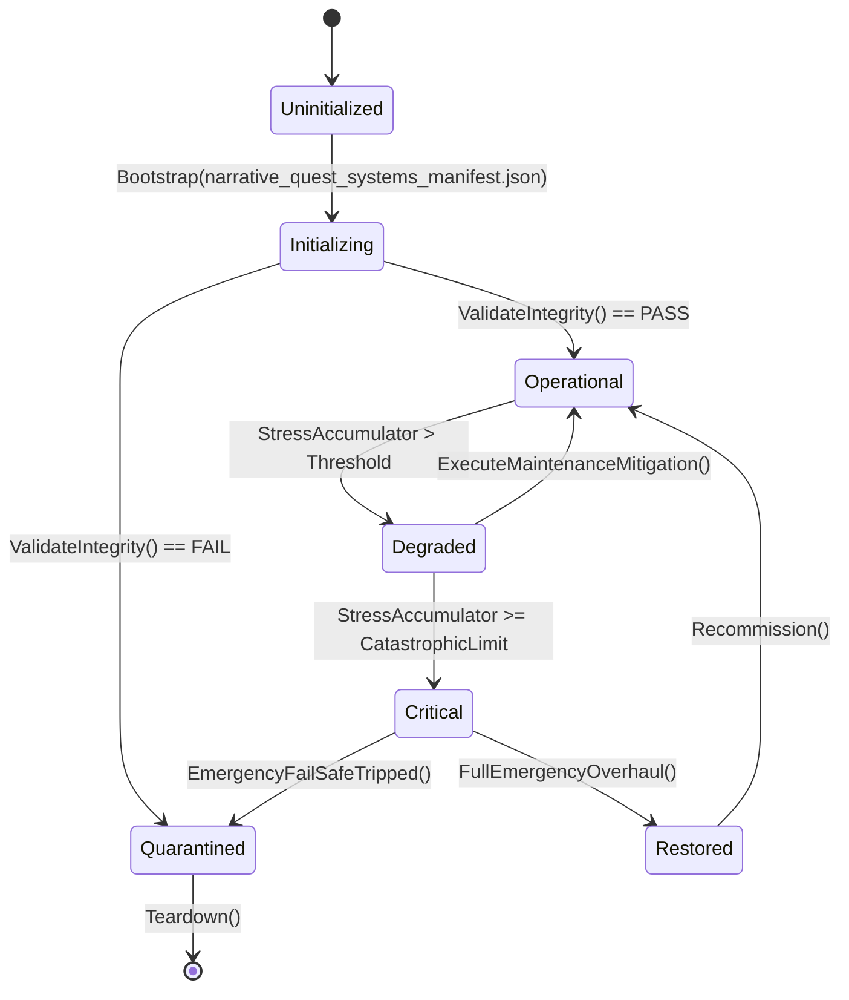

# ASHFALL — WAVE 3 INTEGRATION PROGRAM · PLAN 1 OF 6

# NARRATIVE & QUEST SYSTEMS INTEGRATION PLAN

**Status:** PROPOSAL — planning-only · no production path claimed
**Wave:** W3 (six-plan integration wave)
**Document:** W3-01 · part A of C
**Date:** 2026-09-21
**Repo:** `Atomic War` @ `Zcode_Branch`, HEAD `5be1a30a`
**Companion plans:** W3-02 (economy/logistics), W3-03 (psychology/social), W3-04 (combat/security), W3-05 (crafting/research), W3-06 (UI/input/accessibility)
**Plan-unblocking annex:** Annex U at the end — deliberately separated per the Wave 3 rule.

---

## 0. How to read this plan

This plan integrates the **narrative machinery**: quest graphs, flags and
consequences, moral-choice chains, encounters, arcs, endings, and continuity.
It does not write prose (W2-06 owns prose) and does not tune balance
(W2-03). It makes the story systems truthful: every authored branch reachable,
every flag owned, every ending evaluated against real state, every
contradiction caught.

### 0.1 Two selection levels

| Plan Path | Name | Meaning |
|---|---|---|
| **A** | Reach & Truth | audit and repair the narrative graph; no new mechanics |
| **B** | One Story Authority | unify flag/consequence routing, continuity gates, ending checks; bounded new read models |
| **C** | Living Story | dynamic/personal arcs and campaign-shaping narrative on existing owners |

**Level 2:** ten points, each A/B/C (selection sheet in §4).

### 0.2 Default mapping

| Plan Path | A points | B points | C points |
|---|---|---|---|
| A Reach & Truth | 1–10 | — | — |
| B One Story Authority | 1,4,9 | 2,3,5,6,7,8,10 | — |
| C Living Story | — | 2,3,7,10 | 1,4,5,6,8,9 |

### 0.3 The Wave 3 rule for this plan

> **One narrative authority per concern.** Flags/consequences route through
> `IFlagLedger`/`CampaignConsequenceLedger`; quests through their owning quest
> systems; endings through `CampaignOutcomeEvaluator`; continuity through the
> existing continuity self-test. No parallel flag store, quest engine, ending
> calculator, or continuity registry.

### 0.4 Vocabulary

| Term | Meaning |
|---|---|
| quest graph | authored quests and their prerequisites/triggers |
| flag | a persisted narrative boolean/counter |
| consequence | a state change routed from a choice |
| branch | an authored alternative in a choice/quest |
| arc | a multi-step personal/companion story |
| ending | a terminal campaign outcome |
| epilogue | the post-ending chronicle text selected by outcome |
| continuity | cross-file canon agreement |

---

## 1. Executive summary

ASHFALL's narrative layer is unusually complete:

- **Quest owners:** `HoldfastQuestSystem`, `ExpansionQuestSystem`,
  `PersonalQuestHostSession`, `NarrativeQuestlineHostSession`,
  `DynamicQuestlinePanel`, `CrossingQuestSystem`, `DutyRosterQuestRuntime`,
  `ShelterEncounterSystem`, plus save stores per family.
- **Encounters:** `NarrativeEncounterSystem`, `EncounterChoiceResolver`,
  `MicroLocationEncounterLoader`, `TravelEncounterSystem`,
  `EncounterChoiceSaveStore`.
- **Moral choice:** `WeightOfChoicesSave`/`WeightOfChoicesSaveStore` plus a full
  data family (`moral_choice_chains.json`, `moral_choice_flags.json`,
  `moral_choice_gossip.json`, `moral_choice_faction_reactions.json`,
  `moral_choice_quests.json`, `..._branching.json`, `..._distress.json`,
  `..._expansion.json`).
- **Flags/consequences:** `Flags/IFlagLedger.cs`,
  `Flags/CampaignConsequenceLedger.cs`, `NarrativeArcConsequenceAdapter`,
  `ExpansionQuestSave`.
- **Endings:** `Endgame/EndgameSystem`, `CampaignOutcomeEvaluator`,
  `CampaignOutcomeSnapshot`, `EpilogueMatrixRuntime`,
  `EpilogueChronicleBuilder`/`Catalog`, `endings.json`, `HoldfastEndings`,
  `EndingsHeadlessDemo`.
- **Continuity:** `NarrativeContinuitySelfTest`, `NarrativeDiscoveryManifest`.
- **Arcs:** `npc_arcs.json`, `narrative_encounters_npc_arcs.json`,
  `quests_npc_arcs.json`, `mental_arcs.json`, `narrative_arc_events.json`.

The gaps are integration gaps, not missing systems:

1. **Quest reachability** — many quest families exist; there is no single
   reachability map proving each quest can be triggered in play (Point 1).
2. **Flag sprawl risk** — flags live in several stores
   (`WeightOfChoicesSave`, `ExpansionQuestSave`, `MoralChoiceSaveStore`,
   consequence ledger); ownership is not unified (Point 2).
3. **Moral branch integrity** — branch/faction-reaction/gossip data can drift
   from the chain data it references (Point 3).
4. **Encounter wiring** — narrative encounters and micro-location encounters
   use separate loaders; weapon-choice resolution must route through the one
   `EncounterChoiceResolver` (Point 4).
5. **Personal arcs** — NPC arc data exists; per-survivor arc state and pacing
   are thin (Point 5).
6. **Dynamic/procedural** — `DynamicQuestlines` and `ProceduralNarrative` exist;
   their generation inputs and consequence recording need verification
   (Point 6).
7. **Ending integrity** — evaluator + matrix exist; reachability of every
   ending and epilogue mapping needs an audit (Point 7).
8. **Continuity** — the self-test exists; coverage across all quest/arc data is
   unmeasured (Point 8).
9. **Pacing/discovery** — `narrative_progression.json` and the discovery
   manifest exist; how they gate content is unaudited (Point 9).
10. **Journal as story record** — entries exist; the chronicle's narrative
    completeness (what the player can remember of their campaign) is the gap
    (Point 10).

---

## 2. Verified current state (narrative evidence)

### 2.1 Quest systems (hosts and sessions)

| System | Evidence |
|---|---|
| Holdfast quests | `HoldfastQuestSystem`, `holdfast_quests.json` |
| Expansion quests | `ExpansionQuestSystem`, `ExpansionQuestHostSession`, `ExpansionQuestSave` |
| Personal quests | `PersonalQuestHostSession`, `PersonalQuestSaveStore`, `PersonalQuestSelfTest` |
| Narrative questlines | `NarrativeQuestlineHostSession`, `NarrativeQuestlineSaveStore`, `narrative_questlines.json` |
| Dynamic questlines | `DynamicQuestlinePanel`, `DynamicQuestSaveStore`, `dynamic_questlines.json` |
| Crossing quests | `CrossingQuestSystem`, `crossing_quests.json` |
| Duty roster quests | `DutyRosterQuestRuntime`, `duty_roster_quests.json` |
| Dose quests | `DoseQuestMigration`, `dose_quests.json` |

### 2.2 Flags and consequences

| Component | Role |
|---|---|
| `Flags/IFlagLedger.cs` | flag read/write contract |
| `Flags/CampaignConsequenceLedger.cs` | campaign-scoped consequence ownership |
| `NarrativeArcConsequenceAdapter` | arc events → consequences |
| `WeightOfChoicesSave(Store)` | moral-choice weight persistence |
| `MoralChoiceSaveStore` | moral choice state |
| `ExpansionQuestSave` | expansion quest flags |

### 2.3 Moral choice data family

`moral_choice_chains.json`, `moral_choice_flags.json`,
`moral_choice_gossip.json`, `moral_choice_faction_reactions.json`,
`moral_choice_quests.json`, `moral_choice_quests_branching.json`,
`moral_choice_quests_distress.json`, `moral_choice_quests_expansion.json`.

### 2.4 Encounters

`NarrativeEncounterSystem` (with `MicroLocationsFileName = "micro_locations.json"`,
verified at `:502`), `MicroLocationEncounterLoader` (28 encounters),
`EncounterChoiceResolver`, `TravelEncounterSystem`, `EncounterChoiceSaveStore`.

### 2.5 Endings

`endings.json`, `CampaignOutcomeEvaluator`, `CampaignOutcomeSnapshot`,
`EpilogueMatrixRuntime`, `EpilogueChronicleBuilder`, `EpilogueChronicleCatalog`,
`EpilogueContextFactory`, `CampaignCompletionHistory` (schema v2, difficulty
stamp), `HoldfastEndings`.

### 2.6 Continuity and progression

`NarrativeContinuitySelfTest`, `narrative_discovery_manifest.json`,
`narrative_progression.json`, `narrative_arc_events.json`, `npc_arcs.json`.

---

## 3. Scope, non-goals, rules

### 3.1 In scope

- Quest reachability maps and trigger truth.
- Flag/consequence ownership unification (one ledger, no parallel stores).
- Moral branch integrity checks.
- Encounter wiring through the canonical resolvers.
- Personal/NPC arc state and pacing on existing owners.
- Dynamic/procedural narrative inputs and consequence recording.
- Ending reachability and epilogue mapping integrity.
- Continuity enforcement across narrative data.
- Discovery/pacing gating audits.
- Journal/chronicle narrative completeness (read-side).

### 3.2 Non-goals

- Prose authoring (W2-06).
- Economy/psychology/combat mechanics (W3-02/03/04).
- New quest engine, flag store, or ending calculator.
- Balance tuning (W2-03).
- Save schema changes without a signed line.

### 3.3 Rules

1. `IFlagLedger` is the only flag authority; new flags are registered there.
2. Quests stay in their owning systems; no cross-system quest duplication.
3. Endings evaluate through `CampaignOutcomeEvaluator`; no ad-hoc ending logic.
4. Continuity checks extend the existing self-test; no second registry.
5. Every authored branch is reachable or explicitly archived.
6. Determinism: selections/rolls use seeded RNG; no wall-clock.

---

## 4. Plan Path and decision index

### 4.1 The ten points

| # | Point | Default |
|---|---|---|
| 1 | Quest graph reachability and trigger truth | B |
| 2 | Flag and consequence ownership unification | B |
| 3 | Moral choice chain integrity | B |
| 4 | Encounter wiring and resolver unification | A |
| 5 | Personal and NPC arc integration | C |
| 6 | Dynamic/procedural narrative inputs | C |
| 7 | Ending reachability and epilogue integrity | B |
| 8 | Continuity enforcement coverage | B |
| 9 | Discovery and narrative pacing | A |
| 10 | Journal/chronicle narrative completeness | B |

### 4.2 Selection sheet

```text
PLAN W3-01 — NARRATIVE & QUESTS
Plan Path: [ ] A Reach & Truth  [ ] B One Story Authority (default)  [ ] C Living Story

01 quest reachability ..... [A] [B] [C]   default B
02 flag ownership ......... [A] [B] [C]   default B
03 moral chains ........... [A] [B] [C]   default B
04 encounters ............. [A] [B] [C]   default A
05 personal arcs .......... [A] [B] [C]   default C
06 dynamic narrative ...... [A] [B] [C]   default C
07 endings ................ [A] [B] [C]   default B
08 continuity ............. [A] [B] [C]   default B
09 discovery/pacing ....... [A] [B] [C]   default A
10 journal/chronicle ...... [A] [B] [C]   default B
```

---

## 5. Decision Point 1 — Quest graph reachability and trigger truth (default B)

### 5.1 The design question

Every quest family has data and a host system; the plan must prove each quest
is triggerable and each trigger is owned. Untriggerable quests are the
narrative version of dead data.

### 5.2 Path A — Reachability report

- For each quest catalog: enumerate entries, find the trigger(s) in host code,
  and classify reachable / flag-gated / unreachable.
- Publish `docs/narrative/QUEST_REACHABILITY.md` with per-entry status.

### 5.3 Path B — Repair triggers + regression

- Wire unreachable quests to their existing systems' trigger mechanisms (no
  new engine): e.g., a crossing quest to the crossing system's completion
  event.
- For quests with no possible host, archive them with a manifest note.
- Add a **reachability gate**: a test/script that enumerates catalog entries
  and asserts each has at least one trigger path (or an archive entry).

### 5.4 Path C — Quest graph read model

Path B, plus a generated graph (prerequisites → outcomes → next quests) used
for authoring and a graph gate (no cycles without authored loops, no quest
requiring an impossible flag combination).

### 5.5 Acceptance

- Every catalog entry classified.
- Repaired entries demonstrably triggerable.
- Gate green; archive list explicit.
- No new quest engine.

---

## 6. Decision Point 2 — Flag and consequence ownership unification (default B)

### 6.1 The design question

Flags and consequences touch `IFlagLedger`, `CampaignConsequenceLedger`,
`WeightOfChoicesSave`, `MoralChoiceSaveStore`, and `ExpansionQuestSave`. The
risk is a flag written in one store and read from another, or a consequence
recorded twice.

### 6.2 Path A — Ownership census

- Inventory every flag namespace and store; map writers and readers.
- Report cross-store reads (a read from a store the writer does not own).
- No code change.

### 6.3 Path B — Single-ledger routing

- Route all narrative flags through `IFlagLedger` (adding namespaces as
  needed); legacy stores remain as persistence adapters with a documented
  mapping (no data rewrite).
- Consequence recording goes through `CampaignConsequenceLedger` exactly once
  per consequence (idempotency keyed by quest/choice id).
- Tests: a flag written by a choice is readable by the quest that requires it;
  a consequence recorded twice in a bug-repro only applies once.

### 6.4 Path C — Consequence graph

Path B, plus a consequence read model (what each choice changed, in order)
consumed by the epilogue/chronicle (Point 10) — a projection, not a new store.

### 6.5 Acceptance

- No cross-store flag reads remain (or each is documented as an adapter).
- Idempotent consequence application tested.
- No parallel flag authority.

---

## 7. Decision Point 3 — Moral choice chain integrity (default B)

### 7.1 The design question

Moral choice data spans chains, flags, gossip, faction reactions, and four
quest files. References must resolve: every chain step's flag exists, every
faction id is real, every gossip target exists.

### 7.2 Path A — Referential audit

- Parse the moral-choice family; check every referenced flag, faction, quest,
  and NPC exists.
- Report dangling references and orphan data.

### 7.3 Path B — Integrity gate

- Add a data-integrity rule set for the family: flags resolve to the ledger
  namespace; faction ids are in the faction registry; branch targets exist;
  each chain has at least one terminal outcome.
- Fix the dangling references found.
- Test: a deliberately broken reference fails the gate (negative test).

### 7.4 Path C — Branch simulation

Path B, plus a bounded simulation (all chains × branch choices) verifying no
chain can deadlock (every path reaches a terminal state) and no branch is
unreachable due to flag prerequisites.

### 7.5 Acceptance

- Zero dangling references.
- Every chain terminates.
- Gate + negative test.

---

## 8. Decision Point 4 — Encounter wiring and resolver unification (default A)

### 8.1 The design question

`NarrativeEncounterSystem`, `MicroLocationEncounterLoader`,
`EncounterChoiceResolver`, and `TravelEncounterSystem` exist. Choice resolution
must be one path; encounter data must reach exactly one loader per source.

### 8.2 Path A — Wiring audit

- Map each encounter source file → loader → resolver → host surface.
- Report double-loaded files and bypassed resolvers.

### 8.3 Path B — Resolver unification

- Route all choice resolution through `EncounterChoiceResolver` (or the
  canonical resolver the audit proves), with per-source adapters where needed.
- Save/restore parity for encounter choices (the existing
  `EncounterChoiceSaveStore` is the probable owner; verify).

### 8.4 Path C — Encounter graph

Path B, plus a read-side graph connecting encounters to places/quests for
authoring (composes with W2-06's reachability map).

### 8.5 Acceptance

- No bypassed resolver.
- Choice state persists and reloads.
- No duplicate loading.

---

## 9. Decision Point 5 — Personal and NPC arc integration (default C)

### 9.1 The design question

`npc_arcs.json`, `quests_npc_arcs.json`, `narrative_encounters_npc_arcs.json`,
and `mental_arcs.json` exist. Per-survivor arc **state** (whose arc, which
step) and pacing are the gap.

### 9.2 Path A — Arc inventory

- Enumerate arcs, their steps, triggers, and intended survivors.
- Report arcs with no trigger or no state owner.

### 9.3 Path B — Arc state on existing owners

- Arc progress rides the owning quest/relationship state (no new store) as
  additive fields where needed; selection uses deterministic per-survivor
  logic.
- Pacing: at most one active personal arc per survivor (or authored cap).

### 9.4 Path C — Living arcs

Path B, plus authored arc branches reacting to psychology/relationship state
(W3-03 owners) and consequences recorded through the ledger (Point 2).

### 9.5 Acceptance

- Every arc triggerable and statable.
- No new arc store.
- Cap enforced and tested.

---

## 10. Decision Point 6 — Dynamic/procedural narrative inputs (default C)

### 10.1 The design question

`DynamicQuestlines`, `ProceduralNarrativeHostSession`, and
`narrative_arc_events.json` generate or select narrative. Inputs must come
from real owners (world state/relationships), and outputs must record
consequences.

### 10.2 Path A — Input audit

- For each generator: list inputs (flags, day, faction state, relationships),
  selection mechanism, and consequence recording.
- Report generators reading non-existent inputs or recording nothing.

### 10.3 Path B — Input truth + consequence recording

- Bind generators to real owners; record every generated quest's outcome
  through the consequence ledger and journal.
- Determinism: selections seeded from campaign seed + day (tested).

### 10.4 Path C — Procedural arcs with continuity

Path B, plus generated arcs constrained by continuity (canon facts, character
states) and by the pacing caps (Point 9).

### 10.5 Acceptance

- Every generator's inputs resolve.
- Outcomes recorded exactly once.
- Determinism tested.

---

## 11. Decision Point 7 — Ending reachability and epilogue integrity (default B)

### 11.1 The design question

`endings.json` + `CampaignOutcomeEvaluator` + `EpilogueMatrixRuntime` decide
the campaign's close. Every ending must be reachable; every ending must map to
an epilogue; the evaluator must read real state.

### 11.2 Path A — Ending audit

- Enumerate endings and their conditions; check each condition is satisfiable
  with real state ranges.
- Map endings → epilogue entries; report unmapped or unreachable.

### 11.3 Path B — Evaluator truth + coverage test

- Verify evaluator inputs are owner-sourced; add a coverage test enumerating
  endings and asserting each has a satisfiable condition set (a symbolic or
  fixture-based check).
- Fill missing epilogue mappings (prose from W2-06).

### 11.4 Path C — Ending path simulation

Path B, plus bounded simulation across campaign archetypes (survivor-focused,
trade-focused, war-focused) proving the intended endings are attainable and the
default fallback is sane.

### 11.5 Acceptance

- Every ending reachable or explicitly retired.
- Every ending mapped to epilogue content.
- Evaluator owner-sourced; no ad-hoc ending logic.

---

## 12. Decision Point 8 — Continuity enforcement coverage (default B)

### 12.1 The design question

`NarrativeContinuitySelfTest` exists; coverage across all narrative data
(quests, arcs, encounters, moral chains, endings) is the gap.

### 12.2 Path A — Coverage report

- List narrative files checked by the current self-test vs. unchecked.
- Report the gap.

### 12.3 Path B — Extend the self-test

- Add rules: referenced ids exist (quests/flags/factions/places/NPCs), canon
  names match the index (composing with W2-06's canon), branch targets resolve.
- Fail on violations found; fix the data.

### 12.4 Path C — Continuity graph

Path B, plus a generated continuity graph (facts → files referencing them)
for authoring reviews.

### 12.5 Acceptance

- Every narrative file covered.
- Zero violations (or all allowlisted with reasons).
- Negative test proves the gate bites.

---

## 13. Decision Point 9 — Discovery and narrative pacing (default A)

### 13.1 The design question

`narrative_progression.json` and `narrative_discovery_manifest.json` gate
content. The audit: does progression actually gate what it claims, and does
discovery reveal content in a sane order?

### 13.2 Path A — Gate audit

- Map progression tiers → gated content; find content gated by nothing and
  tiers gating nothing.
- Report discovery manifest entries with no reveal path.

### 13.3 Path B — Consumption verification

- Bind the tiers to their consumers (quest availability, encounter selection)
  where the audit finds gaps.
- Test: tier transitions unlock the authored content.

### 13.4 Path C — Narrative pacing curve

Path B, plus authored pacing (chapters with story beats) measured against W2-03
metrics (choice density) — a read-side composition.

### 13.5 Acceptance

- No ungated intended-gated content.
- Reveal paths exist for discovery entries.

---

## 14. Decision Point 10 — Journal/chronicle narrative completeness (default B)

### 14.1 The design question

The journal records events and the chronicle summarizes the campaign. The
completeness question: can the player see the story they made — choices,
consequences, arcs, endings — in the record?

### 14.2 Path A — Record audit

- Inventory journal/chronicle entry kinds vs. narrative event kinds.
- Report major narrative events that leave no record.

### 14.3 Path B — Completion routing

- Route missing narrative events to the journal through their owners (quest
  completion, moral choice, arc milestone, ending) with knowledge-key dedup.
- The epilogue reads the consequence projection (Point 2 C if available).

### 14.4 Path C — Campaign report

Path B, plus a generated campaign narrative summary (arcs completed, choices
made, places visited) consumed by the epilogue/ending surface — read-only over
existing state.

### 14.5 Acceptance

- Every major narrative event has a record path.
- Dedup respected; no spam.
- No new history store.

---

*(Part A ends. Part B continues with points 1–10 execution detail, phases,
verification, risks, and Part C with Annex U and appendices.)*---

# PART B — EXECUTION, WORKED DESIGNS, AND VERIFICATION

---

## 15. Execution phases

### NQ0 — Narrative premise freeze (1 day)

- Verify every system/file from §2 at HEAD.
- Run the continuity self-test; record current coverage.
- Produce `P0_NARRATIVE_PREMISE.md` with the quest inventory, flag-store
  census, and ending list.

### NQ1 — Reachability and truth (Points 1 + 3)

- Quest reachability report; moral-chain referential audit.
- Repairs + gates.

### NQ2 — Ownership unification (Point 2)

- Flag/consequence census; single-ledger routing; idempotency tests.

### NQ3 — Encounter and arc integration (Points 4 + 5)

- Resolver unification audit/binds; arc state + pacing.

### NQ4 — Dynamic and pacing (Points 6 + 9)

- Generator inputs; consequence recording; progression gate binds.

### NQ5 — Endings and continuity (Points 7 + 8)

- Ending audit + coverage test; continuity self-test extension.

### NQ6 — Record completeness (Point 10)

- Journal routing; campaign report projection.

### NQ7 — Closeout

- Evidence pack; ledger proposals; Annex U.

### 15.1 Ordering constraints

- NQ0 always first.
- NQ2 before NQ4 (dynamic narrative records consequences through the ledger).
- NQ1 before NQ5 (endings reference quest/flag truth).
- NQ3 before NQ6 (arc records need arc state).

---

## 16. Worked designs

### 16.1 Quest reachability tooling

```python
# scripts/ci/quest_reachability.py (report + --check)
import json, glob, re, os

CATALOGS = {
 'holdfast_quests.json': 'HoldfastQuestSystem',
 'expansion_quests.json': 'ExpansionQuestSystem',
 'crossing_quests.json': 'CrossingQuestSystem',
 'duty_roster_quests.json': 'DutyRosterQuestRuntime',
 'dose_quests.json': 'DoseQuestMigration',
 'narrative_questlines.json': 'NarrativeQuestlineHostSession',
 'dynamic_questlines.json': 'DynamicQuestline',
 'personal_quests.json': 'PersonalQuestHostSession',
}

data_dir = 'Assets/StreamingAssets/Data'
src_text = ''
for root, _, files in os.walk('src'):
    for f in files:
        if f.endswith('.cs'):
            src_text += open(os.path.join(root, f), encoding='utf-8', errors='ignore').read()

for catalog, owner in CATALOGS.items():
    path = os.path.join(data_dir, catalog)
    if not os.path.exists(path):
        print(f'{catalog}: MISSING'); continue
    doc = json.load(open(path))
    entries = doc.get('quests') or doc.get('entries') or (doc if isinstance(doc, list) else [])
    total = len(entries)
    missing_trigger = []
    for q in entries:
        qid = q.get('id') if isinstance(q, dict) else None
        if qid and qid not in src_text:
            missing_trigger.append(qid)
    print(f'{catalog}: {total} entries, {len(missing_trigger)} with no code reference')
    for qid in missing_trigger[:5]:
        print(f'   - {qid}')
```

The report is the audit; `--check` fails when an entry has no reference and no
archive entry.

### 16.2 Flag ownership census

```bash
# every flag-ish store and its access pattern
grep -rn "IFlagLedger\|CampaignConsequenceLedger\|WeightOfChoices\|MoralChoice\|ExpansionQuestSave" \
  src Assets/Ashfall.Core --include=*.cs | grep -E "Get|Set|Write|Read|Record" | head -60
```

Classify each: writer/reader and store. Cross-store reads become the repair
list.

### 16.3 Idempotent consequence application

```csharp
// keyed by quest/choice id; a duplicate call is a no-op
public bool Record(string consequenceKey, ConsequencePayload payload)
{
    if (_applied.Contains(consequenceKey)) return false;
    _applied.Add(consequenceKey);
    _ledger.Apply(payload);
    return true;
}
```

Test: applying the same key twice yields one ledger effect.

### 16.4 Ending coverage test shape

```csharp
[Fact]
public void EveryEnding_HasSatisfiableConditionSet()
{
    foreach (var ending in EndingsCatalog.All)
    {
        var fixture = OutcomeFixture.Satisfying(ending);
        var evaluated = CampaignOutcomeEvaluator.Evaluate(fixture.State);
        Assert.Equal(ending.Id, evaluated.EndingId);
    }
}
```

The fixture builder constructs state from the condition's declared ranges; if
no fixture can be built, the ending is unreachable by construction and is
reported.

### 16.5 Continuity rule set (extension)

| Rule | Check |
|---|---|
| quest id references | every `requires`/`unlocks` id exists |
| flag references | every flag exists in the ledger namespace |
| faction references | every faction id is registered |
| place references | every place id is in the location authority (W2-05) |
| canon names | every proper name matches the canon index (W2-06) |
| branch targets | every target node exists and is reachable |

---

## 17. Verification plan

| Point | Evidence |
|---|---|
| 1 | reachability report; repaired triggers; gate + negative test |
| 2 | census; cross-store reads zero; idempotency test |
| 3 | referential audit zero; chain termination; negative test |
| 4 | resolver map; persistence parity |
| 5 | arc state tests; pacing cap test |
| 6 | generator input audit; determinism test; consequence-once |
| 7 | ending coverage; epilogue mapping; fallback check |
| 8 | self-test coverage; zero violations; negative test |
| 9 | gate binds; tier transition tests |
| 10 | record routing; dedup; campaign report projection |

Commands:

```bash
bash scripts/run_test.sh Ashfall.Core.Tests/Narrative
bash scripts/run_test.sh Ashfall.Core.Tests/Endgame
bash scripts/run_test.sh Ashfall.Core.Tests/Quests    # if present
godot --headless --path . -- --narrative-continuity-selftest
godot --headless --path . -- --content-utilization-selftest
```

---

## 18. Risks

| # | Risk | L | I | Mitigation |
|---|---|---|---|---|
| 1 | reachability audit floods (many entries) | M | M | batch by family; report-first |
| 2 | flag unification breaks legacy saves | M | H | adapters keep stores; no data rewrite |
| 3 | moral-chain "fixes" change intended branches | M | M | gate only for resolvable references; branches judged by authoring |
| 4 | ending coverage fixtures misrepresent conditions | M | M | fixtures built from declared ranges; review |
| 5 | continuity gate churn | M | M | allowlist with reasons; shrink-only |
| 6 | dynamic narrative becomes a content generator | M | H | inputs/outputs audit; prose stays with W2-06 |
| 7 | arc pacing conflicts with W2-03 choice density | M | M | coordinate metrics |
| 8 | journal routing spams entries | M | M | knowledge-key dedup; reviewed |
| 9 | concurrent claims on quest hosts | M | H | single-writer; family-scoped claims |
| 10 | scope creep into prose | M | M | Wave 3 rule |

---

## 19. Ownership and claims

| Phase | Claim | Paths |
|---|---|---|
| NQ0 | `W3-01-NQ0-PREMISE` | premise doc + tooling |
| NQ1 | `W3-01-NQ1-REACHABILITY` | reachability script; quest data repairs; moral-chain gate |
| NQ2 | `W3-01-NQ2-OWNERSHIP` | ledger routing; idempotency |
| NQ3 | `W3-01-NQ3-ENCOUNTERS-ARCS` | resolver binds; arc state |
| NQ4 | `W3-01-NQ4-DYNAMIC-PACING` | generator inputs; progression binds |
| NQ5 | `W3-01-NQ5-ENDINGS-CONTINUITY` | ending coverage; self-test extension |
| NQ6 | `W3-01-NQ6-RECORD` | journal routing; campaign report |
| NQ7 | `W3-01-NQ7-CLOSEOUT` | evidence + ledger proposals |

Coordination: W2-06 owns prose; W3-03 owns psychology state that arcs read;
W3-02 owns economy consequences; W2-05 owns places referenced by quests.

---

## 20. Rollback and decline

| Point | Rollback | Decline consequence |
|---|---|---|
| 1 | revert trigger binds | quests remain unreachable (documented) |
| 2 | keep census, drop routing | flag sprawl risk remains |
| 3 | keep audit | dangling refs return |
| 4 | keep audit | duplicate resolution risk |
| 5 | remove arc state | arcs stay flat |
| 6 | remove generator binds | dynamic narrative unverified |
| 7 | keep audit | endings unverified |
| 8 | keep coverage report | continuity gaps remain |
| 9 | keep audit | pacing gates unverified |
| 10 | keep audit | records incomplete |

---

## 21. DoD and handoff

**Path A:** reachability, referential, ending, and coverage reports complete;
no code beyond audits.

**Path B:** all of A, plus repaired triggers, single-ledger routing,
encounter unification, ending coverage tests, continuity extension, record
routing.

**Path C:** all of B, plus living arcs, procedural arcs with continuity, and
the campaign report.

**Handoff fields:** outcome, files, contract (flag/graph/ending authorities),
commands, limitations, untouched shared paths, ledger proposals, Annex U.

### 21.1 First safe step

> NQ0 only: the premise freeze and the reachability script. No repairs before
> the map.

---

# PART C — SCENARIOS, ANNEX U, AND APPENDICES

---

## 22. Scenarios

### 22.1 Path A week

NQ0 premise + tooling (2 days); NQ1 reports (2 days); closeout (0.5 day).
Outcome: the narrative graph is mapped and its dangling references known.

### 22.2 Path B month

NQ0 (1); NQ1 repairs + gates (4); NQ2 routing (4); NQ3 encounters/arcs (4);
NQ4 dynamic/pacing (3); NQ5 endings/continuity (4); NQ6 records (3); closeout
(1). Outcome: one story authority, proven reachability, honest endings.

### 22.3 Path C season

Path B plus living arcs, procedural arcs with continuity, campaign report, each
its own package.

### 22.4 A quest is intentionally unreachable until a later chapter

Classify as "conditionally reachable" with the gating chapter named; the gate
requires a gating reference, not immediate reachability.

### 22.5 A flag exists in two stores with different values

The census finds it; the ledger namespace becomes canonical; the legacy store
is read once for migration into the ledger state (or mapped read-only). Never
silently pick one.

---

## 23. Foreman Q&A

**Q1. Why not let quest systems keep their own flags?**
Because two stores can disagree; the ledger is the repository's flag contract.

**Q2. Does this plan write story content?**
No — W2-06 does. This plan proves the machinery carries it.

**Q3. Are endings being changed?**
Only their reachability verified or retired; conditions are data.

**Q4. What if a chain is intentionally dangling?**
Then it has an archive entry or a named gating chapter; the gate accepts
explicit intent, not silence.

**Q5. Is the continuity self-test extended without breaking it?**
Yes: additive rules with an allowlist; the existing rules stay.

**Q6. Smallest approval?**
NQ0: the premise and reachability report.

**Q7. Largest?**
Path C living arcs + procedural continuity.

**Q8. How does this help Wave 1's unblockers?**
It consumes their outcomes: EN-05 signal continuity, Plan 42/46 certifications,
and the narrative parts of expansions.

---

## 24. Annex U — Plan-unblocking (separately)

### U.1 What W3-01 releases

| Blocked item | Mechanism | Gate |
|---|---|---|
| EN-05 Signal Continuity & Voice | Radio/echo content's narrative consequences route through unified flags and the continuation ledger | NQ2/NQ6 |
| Plan 42 survivor voice | Personal arcs use the cubic identity facts and record milestones | NQ3 |
| Plan 46 playable metrics | Choice consequence recording feeds the campaign report | NQ4/NQ6 |
| Expansions 12–31 narrative halves | Quest reachability + arc state give expansion quests their triggers | NQ1/NQ3 |
| C3 174 (mechanical origins) | Choice/arc consequences are recorded at the ledger seam | NQ2 |
| D11 semantic kind | Narrative event kinds align with the semantic routing | NQ6 |
| UNBLOCK-05 admission | The first admitted expansion's narrative half is audit-clean | NQ1 |

### U.2 Signatures needed

```text
[ ] I authorize NQ0 premise + reachability/ownership tooling.
[ ] I authorize NQ1 quest trigger repairs and moral-chain gate.
[ ] I authorize NQ2 single-ledger flag routing (adapters, no data rewrite).
[ ] I authorize NQ3 encounter resolver unification and arc state.
[ ] I authorize NQ4 dynamic input binds + progression gate binds.
[ ] I authorize NQ5 ending coverage tests + continuity extension.
[ ] I authorize NQ6 journal routing + campaign report projection.
[ ] I authorize Path C living/procedural arcs separately.
```

### U.3 What W3-01 never touches for unblocking

- Prose (W2-06).
- Economy/psychology/combat mechanics (W3-02/03/04).
- Save schema without signature.
- Balance tuning (W2-03).
- Expansion admission decisions (UNBLOCK-05).

### U.4 The story-release rule

A narrative feature releases only when its trigger, state owner, consequence
record, and ending/continuation path all exist. A quest that runs but leaves no
record does not release anything.

---

## 25. Appendices

### 25.1 Selection sheet

```text
ASHFALL WAVE 3 · PLAN 1 (NARRATIVE) · SELECTION
Date: ______  Foreman: ______  HEAD: ______
PLAN PATH: [ ] A Reach & Truth  [ ] B One Story Authority (default)  [ ] C Living Story

01 quest reachability ..... [A] [B] [C]   default B
02 flag ownership ......... [A] [B] [C]   default B
03 moral chains ........... [A] [B] [C]   default B
04 encounters ............. [A] [B] [C]   default A
05 personal arcs .......... [A] [B] [C]   default C
06 dynamic narrative ...... [A] [B] [C]   default C
07 endings ................ [A] [B] [C]   default B
08 continuity ............. [A] [B] [C]   default B
09 discovery/pacing ....... [A] [B] [C]   default A
10 journal/chronicle ...... [A] [B] [C]   default B
Signature: ________________
```

### 25.2 Glossary

| Term | Meaning |
|---|---|
| reachability | a quest has a live trigger path |
| conditional reachability | gated by a named chapter/flag |
| flag ledger | the canonical flag contract |
| consequence key | idempotency key preventing double application |
| branch terminal | a chain end-state |
| epilogue mapping | ending → epilogue text |
| arc state | whose arc, which step |
| campaign report | read-only story summary |

**End of Part I.** Proposal only; executes nothing; releases nothing without
U.2 signatures.

---

# PART II — DEEP DESIGN SPECIFICATIONS (CONTINUED → 180K)# W3-01 · PART II-A — DEEP DESIGN: POINTS 1–4

> Appended 2026-09-21. Part I stood as the summary contract; this part expands
> each point to an implementation-grade specification. Still proposal-only.

---

## §II-A.1 Decision Point 1 — Quest reachability map (default B)

### A.1.1 Problem statement (expanded)

Wave 1/2 reconnaissance established that narrative content lives in many
sources:

- `HoldfastQuestSystem` + quest data (holdfast/colony chain).
- `NarrativeEncounterSystem` + `micro_location_encounters` (28 encounters).
- `EchoSystem` + echo catalog (32-era echo fragments).
- Year-of-ash content (`year_of_ash_*`), crossing content, radio scripts.
- Personal arcs and NPC quests (verify at P0).

The failure mode is **silent unreachability**: a quest JSON exists, validates,
ships in the build — and no trigger path ever selects it. In a 199-file prose
corpus (wave-2 count) this is statistically certain unless mapped. The map is
therefore not documentation, it is **the acceptance basis for the corpus**.

### A.1.2 Definition of "reachable"

A quest is reachable when there exists a launch context (location, time,
flag state, relationship state, resource state) such that the trigger
evaluates true and the quest can be completed:

```text
reachable(q) := ∃ state s . triggers(q, s) == true
                ∧ ∀ step t ∈ steps(q) . satisfiable(t, s')
                ∧ completes(q) grants its award through an owner
```

Each conjunct has an audit procedure:

| Conjunct | Procedure |
|---|---|
| triggers | static evaluation over trigger DSL vs. reachable state space |
| steps satisfiable | per-step prerequisite enumeration vs. catalogs/owners |
| completion grants | award IDs exist in the inventory/ledger owners |
| no unreachable branches | branch graph walk from entry to every terminal |

### A.1.3 Trigger DSL inventory (verify at P0)

At P0 we enumerate the actual trigger vocabulary. Based on wave-1 evidence the
family includes:

| Trigger family | Example fields | Owner |
|---|---|---|
| flag | `requiredFlagId`, `clearedFlagId` | `IFlagLedger` |
| location | location id, region membership | `WastelandMapSystem` / locations catalog |
| time | day window, season, war stage | campaign clock |
| relationship | NPC attitude threshold | relationship owner (W3-03) |
| resource | item/water/power thresholds | inventory/water/power owners |
| world | weather, radiation phase, war stage | W2-04 owners |
| random | seeded chance | deterministic RNG |

Any vocabulary item not in this table is **a P0 finding** and must be added to
the map's vocabulary section.

### A.1.4 The reachability algorithm (specification)

```text
input:  quest catalog (all files), owner read models
output: per-quest classification

for each quest q:
  ctx := enumerateLaunchContexts(q)        # from trigger fields
  if ctx == ∅:
     classify(q, ORPHANED)                  # no launch context at all
  else if unsatisfiablePrereq(q, ctx):
     classify(q, BLOCKED, reason=...)
  else if unreachableSteps(q, ctx):
     classify(q, BLOCKED, reason=step)
  else if award(q) not resolved:
     classify(q, AWARD-MISSING)
  else:
     classify(q, REACHABLE)
```

`enumerateLaunchContexts` is where honesty lives: it must not assume "some
state will exist later". It enumerates the *actual* state space reachable from
the starting conditions used by the existent game mode entry points.

### A.1.5 Classification taxonomy (six classes)

| Class | Meaning | Action |
|---|---|---|
| REACHABLE | provably launchable + completable | none |
| ORPHANED | no trigger references it | revive (bind trigger) or archive with reason |
| BLOCKED | trigger exists but prereq unsatisfiable | repair prereq or fix catalogue gap |
| AWARD-MISSING | completes but grants nothing resolvable | bind award item/flag or re-award |
| DUPLICATE | two quests claim the same unique launch state | merge or disambiguate |
| DEBUG-ONLY | intentionally test content | mark excluded, not shipped |

The gate (Path B) is: `ORPHANED ∪ BLOCKED ∪ AWARD-MISSING = ∅` for shipped
content, with an explicit, reviewed allowlist for exceptions (this allowlist is
itself a finding if it grows).

### A.1.6 Worked example (illustrative)

Quest `echo_reactor_lullaby` (verify real id at P0): trigger `location==reactor
∧ flag==vault_opened ∧ day>12`. Audit finds:

1. `vault_opened` is set by `HoldfastQuestSystem` step 4 — but only in branch
   A. Branch B clears the quest without setting it. → BLOCKED (branch path).
2. `reactor` location exists in `locations.json` (verified family), but the
   `requiredFlagId` field in the location row is empty — the location is
   enterable pre-trigger, so the echo fires too early in branch B, and never in
   branch A if day window closed.

Repair options: (a) set the flag in both branches; (b) widen the day window;
(c) attach a second OR-trigger. Path B chooses (a) with a note that branch B's
narrative intent ("you leave without opening the vault") must still allow the
echo — flagged to W3-01 Point 3 (moral chain integrity) for review, because the
choice semantics matter, not just the flag.

This is why reachability cannot be repaired mechanically: **every repair
proposal carries a narrative-intent note**.

### A.1.7 Deliverables

| Artifact | Location | Content |
|---|---|---|
| reachability table | `docs/narrative/QUEST_REACHABILITY.md` | per-quest class, reason, evidence |
| vocabulary section | same doc §1 | trigger vocabulary + owners |
| exceptions allowlist | same doc §4 | reviewed exceptions with expiry |
| non-mechanical repairs list | same doc §5 | narrative-intent notes for review |

### A.1.8 Acceptance tests (Point 1)

| Test | Type | Expectation |
|---|---|---|
| every shipped quest classified | static gate | classes assigned, none UNKNOWN |
| reachability report stable | static gate | rerun yields same classification |
| exception allowlist reviewed | static gate | no entry older than one release |
| worked repair reproduces | integration | a chosen repair makes a BLOCKED quest launch in a save scenario |

### A.1.9 Interactions

- **Point 3 (moral chains):** blocked branches often encode moral intent.
- **Point 9 (discovery/pacing):** reachability ≠ discoverability; a reachable
  quest may still be unfindable.
- **W3-02:** reward-adjacent quests must not mint items the economy doesn't
  recognize.

### A.1.10 Cost model

Rough effort: P0 enumeration (2 days) + classification (2 days) + repairs for
the top 20 blocked (3 days) + gate (1 day). Repairs beyond 20 go to a ranked
list rather than an open-ended fixing spree — bounded by count.

---

## §II-A.2 Decision Point 2 — Flag and consequence ownership via `IFlagLedger` / `CampaignConsequenceLedger` (default B)

### A.2.1 Problem statement (expanded)

Flags are the story's memory. The verified owner is the flag ledger
(`IFlagLedger`) with the campaign consequence ledger recording attributed
consequences. Failure modes:

1. **Split brain:** a quest sets `flag` directly on a local field and the
   ledger never learns; other systems (encounters, radio) read the ledger and
   never see it.
2. **Double set:** two systems set the same flag from one event; consequence
   fires twice.
3. **Uncleared flags:** the ledger grows without clearing; save bloat and
   stale-trigger ghosts.
4. **Untyped flags:** string flags with no owner means typos create silent
   non-flags (`vault_openned`).

### A.2.2 The flag contract (specification)

```text
setFlag(id, source, attribution)  -> ledger
clearFlag(id, source, attribution)
queryFlag(id) -> bool
```

Rules to enforce in audit and gates:

- **F1 single writer per id:** each flag id has exactly one writer module in
  the write map; readers unlimited. Multi-writer ids are findings.
- **F2 attribution required:** every set/clear carries a source (quest id,
  system id) and an attribution record for the consequence ledger.
- **F3 id registry:** all flag ids enumerated in a generated registry
  (`docs/narrative/FLAG_REGISTRY.md`), with writer, first-set context, clearing
  context, readers, and lifetime class.
- **F4 lifetime classes:** `scene` (cleared on scene end), `arc` (cleared at
  arc close), `campaign` (permanent), `run` (save-scoped). Every id has exactly
  one class; uncleared `scene` flags after scene end are leaks.

### A.2.3 Consequence ledger contract

Every flag-caused consequence routes through the campaign consequence ledger
with:

| Field | Meaning |
|---|---|
| consequence_id | stable id |
| source_event | quest/system event |
| flag_delta | what changed |
| owner_effects | list of owner mutations (standing, inventory, relationship) |
| once_key | idempotency key preventing double application |

Path B verifies: one event ⇒ one consequence record ⇒ owner effects applied
exactly once, visible in the journal (Point 10).

### A.2.4 Write-map construction procedure

1. Extract all `setFlag(`/`clearFlag(` call sites (or data-declared setters).
2. Extract all data fields that declare flag writes (`setsFlagId`, etc.).
3. Build id ↔ writer multiset.
4. Flag ids with >1 writer: classify benign (same event, same module) vs.
   conflict.
5. Flag ids with 0 writers: orphans (reachability Point 1 finds the quest
   consequence).
6. Flag ids with 0 readers: dead flags (either consumed for a side effect, or
   truly dead; audit each).

### A.2.5 Leak audit

For every `scene`-class flag: simulate the scene lifecycle; assert flag is
cleared. For `arc`-class: assert cleared at arc close or documented permanent
promotion (a promotion is a review item, not an automatic fix).

### A.2.6 Ordinance template (per finding)

```text
FINDING F-###
flag: vault_opened
class: SPLIT-BRAIN
writers: HoldfastQuestSystem.step4 (branch A only)
readers: echo_reactor_lullaby, radio_vault_dispatch
evidence: file:line × N
narrative intent: branch B deliberately leaves vault closed
proposed fix: [ ] set in both branches  [ ] OR-trigger alternative  [ ] re-scope echo
review owner: narrative lead
```

### A.2.7 Acceptance tests (Point 2)

| Test | Expectation |
|---|---|
| write map complete | every set/clear call attributed to a registered id |
| single-writer gate | zero unresolved multi-writer ids |
| no orphan flags | every id has ≥1 reader or documented side-effect-only reason |
| lifetime leaks | zero scene-flag leaks in scene-lifecycle harness |
| consequence once | a scripted event produces exactly one consequence record |
| registry regenerated in CI | drift fails the gate |

### A.2.8 Interactions

- **Point 5 (personal arcs):** arc flags use arc lifetime class.
- **Point 7 (endings):** ending selection reads campaign-class flags; the set
  of flags read by an ending is a contract.
- **W3-02:** consequence records that move prices (shock) must use the same
  ledger, not a parallel path.
- **UNBLOCK-03 (D22):** flag-adjacent strings follow the freeze once declared.

### A.2.9 Non-goals

No new flag store, no renaming of existing ids for aesthetics (renames are
migration events requiring the save path), no automatic promotion of lifetime
classes.

### A.2.10 Cost model

Write-map extraction + registry generation (~2 days), leak audit (~1 day),
consequence-once tests (~1 day).

---

## §II-A.3 Decision Point 3 — Moral choice chain integrity (default B)

### A.3.1 Problem statement (expanded)

ASHFALL's choices are designed as chains: earlier decisions change what later
choices mean. The integrity property:

```text
for every choice point C with options O1..On:
  each option Oi has a consequence record
  later content referencing Oi's outcome resolves consistently for that save
  no option is a dead end unless authored as such (and marked)
  no option is strictly dominant without authored justification
```

### A.3.2 Choice-point inventory

Enumerate choice points from quest data (`choices` nodes), holdfast chains,
encounter resolutions, and ending forks. For each:

| Field | Purpose |
|---|---|
| choice_id | stable |
| quest_id | parent |
| options | list with outcome flags |
| consequence records | for each option |
| downstream readers | content that branches on this choice |
| dominance check | authored justification for dominant options |

### A.3.3 The dominance audit

Statistical: for each choice point, weight outcomes by authored value
(resources gained/lost, standing, relationship, mortality risk, time). A
strictly better option in every dimension without an authored justification is
a **finding** — not automatically a bug (railroaded choices may be
intentional), but must be marked so reviewers see it.

### A.3.4 The consistency audit

Walk the reader set for each choice outcome. Each reader must:

1. Have a defined disposition for both/all outcomes (no reader that assumes
   one branch).
2. Not contradict another reader (e.g., NPC A says you helped, journal says
   you refused).

Procedure: for each outcome flag, list readers; for each reader, open the data
and record how it branches; the matrix of readers × outcomes must be total.
Missing cells are findings.

### A.3.5 Dead-end audit

An option whose consequence records contain no future-referencing content and
whose flags no content reads is a dead end. Authored dead ends (marked
`terminal: true` in data) are exempt. All others are findings — either they
were meant to matter (repair reader) or they were not (reevaluate with the
narrative lead).

### A.3.6 Worked chain (illustrative)

```text
C1: at the quarantine gate, [open it | keep it shut]
  open   -> flag gate_open, +survivors, -security, market_shock(+refugees)
  shut   -> flag gate_shut, -survivors, +security, radio_hope(none)

readers of gate_open:
  - survivor dialogue barks (present: both)
  - infirmary load (present: both, magnitudes differ)
  - ending selection (reads gate_open for "shelter of strangers" ending)
readers of gate_shut:
  - security patrol dialogue (present)
  - ending selection (reads gate_shut for "door barred" ending)
  - refugee raider wave composition (MISSING -> finding)
```

The missing reader is the classic case: the raider wave uses a generic
composition and never reflects the choice. Repair: `EnemyCompositionSelector`
input gains a flag-conditioned modifier through its existing catalog (owned by
W3-04; the narrative plan proposes, the combat plan implements).

### A.3.7 Deliverables

`docs/narrative/CHOICE_CHAIN_MATRIX.md` — choice points × outcomes × readers,
with the dominance table and dead-end list.

### A.3.8 Acceptance tests (Point 3)

| Test | Expectation |
|---|---|
| matrix totality | every reader × outcome cell defined |
| dominance marked | all dominant options justified or fixed |
| dead-end log | every non-terminal dead end has a repair/decision record |
| ending consistency | ending selection reads a consistent outcome set per save |

### A.3.9 Interactions

- **W3-03:** choice outcomes touching relationships/morale use the psychology
  owners; the plan must not set local attitude fields.
- **W3-04:** combat composition consequences route through the enemy selector.
- **Point 7:** the ending contract is derived from this matrix.

### A.3.10 Cost model

Inventory (1 day), dominance + consistency matrices (2 days), dead-end triage
(1 day), consolidated repair list for other plans (1 day).

---

## §II-A.4 Decision Point 4 — Encounter resolver unification (default B)

### A.4.1 Problem statement (expanded)

Encounter sources: `NarrativeEncounterSystem` (generic), `MicroLocationEncounterLoader`
(28 micro-location encounters), location ambush flags, shelter encounters
(`ShelterEncounterSystem`), year-of-ash events, radio-triggered events. Each may
have its own resolution path. Failure modes:

- Two resolvers claim the same encounter id (double-fire).
- A resolver applies outcomes directly (bypassing ledger).
- Encounter outcome vocabulary differs per resolver (one grants attitude
  delta, another writes flag only).

### A.4.2 Unification target

```text
EncounterResolver (single orchestration layer — proposal)
  ├─ source adapters (narrative, micro, ambush, shelter, radio)
  ├─ eligibility (trigger evaluation, one vocabulary)
  ├─ resolution (choice/auto-resolution)
  └─ outcome routing (flag ledger + consequence ledger + owners)
```

Important: "single resolver" does **not** mean one giant class. It means one
**contract** (`IEncounterResolution`) with per-source adapters, so the
resolution semantics and outcome routing are provably identical. The claim is
bounded: contract + adapters + tests, not a rewrite of every system.

### A.4.3 Outcome vocabulary table (specification)

Every encounter outcome must be expressible in this vocabulary (verify names
at P0):

| Outcome kind | Owner |
|---|---|
| grant/remove item | inventory |
| adjust relationship | relationship owner (W3-03) |
| set/clear flag | flag ledger |
| standing delta | faction owner (W3-04 bridge) |
| grant knowledge | research (W3-05) |
| start quest | quest system |
| wound/damage | health owner |
| schedule future event | event scheduler |
| journal entry | journal (Point 10) |

An outcome outside this table is a finding: either the vocabulary is
incomplete (extend with owner sign-off) or the resolver is overweighted.

### A.4.4 Eligibility unification

All sources must evaluate eligibility through one vocabulary (same as Point
1's trigger vocabulary). Divergent eligibility (e.g., micro encounters
requiring `ambushFlag` while narrative requires `requiredFlagId`) must be
mapped into the common vocabulary, with adapters preserving existing data
fields (no data migration required for the B path).

### A.4.5 Double-fire audit

For each encounter id: count claiming sources. Zero → orphan (Point 1).
Two+ → either designed alternates (acceptable only if eligibility is provably
disjoint) or conflict (finding). The audit records the disjointness proof
reference for each legitimate multi-source encounter.

### A.4.6 Resolution determinism

Resolution uses the seeded RNG contract for any randomness (encounter chance,
choice outcome variance). The replay test: same seed + same choices ⇒ same
outcome sequence. Cross-resolver equality: the same encounter content authored
in two sources must resolve byte-identically given the same seed and state.

### A.4.7 Acceptance tests (Point 4)

| Test | Expectation |
|---|---|
| vocabulary totality | every outcome maps to a table row |
| eligibility parity | same trigger state ⇒ same eligibility across adapters |
| double-fire audit | zero unresolved conflicts |
| routing purity | no resolver writes owners directly |
| replay equality | seed+choices replication |
| cross-source equality | equivalent content resolves identically |

### A.4.8 Interactions

- **Point 1:** orphaned/blocked encounters share remediation.
- **W2-06 (enrichment):** encounter prose stays with the enrichment plan;
  this point only fixes resolution plumbing.
- **W3-04:** shelter/combat encounters resolve combat through the tactical
  system, then route outcomes through this contract.

### A.4.9 Cost model

Vocabulary census (1 day), adapter inventory (1 day), double-fire audit (1
day), contract tests (2 days).

---

## §II-A.5 Point 1–4 execution order recommendation

```text
Day 1-2   Point 1 enumeration + Point 4 vocabulary census (shared harvest)
Day 3-4   Point 1 classification + Point 2 write-map extraction
Day 5     Point 3 choice inventory (harvest existing data)
Day 6-7   Point 2 registry generation + leak harness
Day 8-9   Point 3 matrices + dominance
Day 10    Point 4 double-fire audit + eligibility parity
Day 11-12 Point 2 consequence-once + Point 4 contract tests
Day 13-14 Finding consolidation + repair ranking + handoff notes
```

Rationale: enumeration feeds everything; registries are the cheapest gates to
lock; the choice matrix requires the most human review and comes after the
mechanical maps so reviewers see complete data.

---

*End of Part II-A. Continues in Part II-B (Points 5–7).*# W3-01 · PART II-B — DEEP DESIGN: POINTS 5–7

---

## §II-B.1 Decision Point 5 — Personal arcs and NPC quest lines (default B)

### B.1.1 Problem statement (expanded)

Personal arcs are multi-stage stories tied to named survivors. They fail in
ways generic quests do not:

1. **Dependent death:** the arc's anchor NPC dies before the arc concludes.
   The arc must fork to a "grief/legacy" resolution, not stall.
2. **State mismatch:** arc stage expects a base state (shelter population,
   infirmary, radio) that no longer exists.
3. **Arc collision:** two arcs demand the same unique resource or the same NPC
   simultaneously without an interlock.
4. **Silent stall:** an arc stage's trigger never fires because the world
   moved (weather, war stage) — player sees an unexplained quiet.
5. **Unwritable ties and terms:** e.g., four boundary terms per soul.

### B.1.2 Arc state machine specification

Each arc is a state machine:

```text
ArcDef
  id, anchorNpc, stageCount
  stages: [ StageDef ]
StageDef
  id, entryTriggers, exitEvents, timeoutPolicy, dependentPolicy
  states: dormant | active | blocked | completed | legacy | failed
```

**Timeout policy** (per stage): an authored maximum stay in `active` after
which the stage either advances (world progresses), degrades (legacy path), or
emits a visible nudge (journal/radio). Silence is never a policy.

**Dependent policy** (per stage): if anchor NPC is dead/absent, the stage
routes to `legacy` (authored resolution) while preserving the arc's
consequences. `legacy` is authored content, not a fallback string.

### B.1.3 Arc registry

`docs/narrative/ARC_REGISTRY.md` per arc:

| Field | Content |
|---|---|
| arc_id | stable |
| anchor | NPC or role |
| stage table | stage → triggers → timeout → dependent policy |
| resource locks | items/space/NPC time demanded |
| flag surface | flags set/read |
| interlock group | arcs that must serialize |
| end states | completed/legacy/failed with consequences |

### B.1.4 Interlock design

Two arcs that cannot coexist declare membership in an interlock group. The
owner (the arc scheduler — verify actual owner; probably the quest system or a
lifecycle owner) admits at most one member in `active` simultaneously; the
other waits in `dormant` with an authored wait condition. The audit verifies:

- interlock groups have a single admission path (no two owners admitting);
- waiting arcs have at least one authored state to remain coherent while
  waiting (asleep content or world-consistent tone);
- admission order is deterministic under seeded RNG if choice is involved.

### B.1.5 Death-mediated transitions (worked example)

```text
Arc: "The lamplighter" — anchor: survivor "Mara"
Stage 3 expects Mara to deliver a lamp to the infirmary.
Case A: Mara alive -> normal stage.
Case B: Mara died in stage 2 (combat/infection).
  legacy path: Mara's notebook is found (item through inventory),
  delivered by a named successor if a relationship threshold was met,
  else the notebook sits in the effects locker with a journal entry.
```

The audit checks every arc with a mortal anchor for an authored legacy path
covering: died-before-arc, died-mid-arc, anchor missing (fled), relationship
absent. Missing cells are findings.

### B.1.6 Acceptance tests (Point 5)

| Test | Expectation |
|---|---|
| state-machine totality | every stage has timeout + dependent policy |
| dependent-death matrix | anchor-death cases resolve to authored outcomes |
| interlock invariance | no two group members active; deterministic admission |
| stall scan | no stage reaches timeout with silent policy |
| flag surface clean | arc flags registered (Point 2), lifetime correct |
| save round-trip per stage | arc resumes at the same stage after load |

### B.1.7 Interactions

- **W3-03:** anchor psychology (trauma/grief) is its owner; the arc reads
  state, routes outcomes.
- **Point 2:** arc flags use the `arc` lifetime class.
- **W3-02:** arc resource demands (medicine, food) draw from economy owners.

### B.1.8 Cost model

Registry harvest (2 days), death-matrix audit (2 days), interlock verification
(1 day), stall scan + round-trip tests (2 days).

---

## §II-B.2 Decision Point 6 — Dynamic narrative and world reactivity (default B)

### B.2.1 Problem statement (expanded)

Beyond authored chains, the game reacts: radio content, rumors, market
chatter, encounter barks, memorial additions. Reactivity fails when:

1. **Contradiction:** reactive content contradicts a player choice (a
   broadcast praises a shelter the player never built).
2. **Phantom:** reactive content references an event that never happened
   (memory of an encounter the player skipped).
3. **Repetition:** the same reactive line fires until it is noise.
4. **Out-of-order:** reactive content fires before its cause is visible.
5. **Unbounded generation:** unseeded generation breaks replay.

### B.2.2 The reactivity contract

Every reactive content unit declares:

| Field | Meaning |
|---|---|
| `reads` | state it observes (flags, owners, stats) |
| `requires_visible` | cause must be player-visible first |
| `cooldown` | minimum gap before re-firing |
| `fallback` | content for "cause known, details unknown" |
| `principal` | the speaker/channel (radio host, rumor mill, NPC) |
| `provenance` | who authored it (corpus plan, W2-06) |

The contract is enforced by the reactor at selection time: a unit whose
`requires_visible` cause is not visible is not eligible; a unit whose
`reads` are false is not eligible.

### B.2.3 Contradiction audit

Build the claim matrix: each reactive unit's implied facts (e.g., "the
shelter has power") vs. the actual state sources. A unit implying facts it
does not declare in `reads` is a finding. Procedure:

1. Extract implied facts per line (manual pass, guided by channel type).
2. Map to state sources.
3. Add missing `reads` entries or rewrite the line.

Channels with high implied-fact load (radio scripts, rumor tables) are
audited exhaustively; barks are sampled per channel, with the sample size
authored in the report.

### B.2.4 Repetition and cooldown

Every repeating channel (barks, ambient radio, rumor refresh) has authored
cooldown and rotation rules:

- **Rotation:** round-robin or weighted with no immediate repeat.
- **Memory:** the reactor keeps the last-N fired set per channel per save
  (owner: reactor state; persistence via the existing save section of the
  radio/encounter owners — verify at P0; if no persistence exists, the C-path
  proposes it, the B-path uses session state).
- **Exhaustion:** when all units are cooling down, the fallback line fires
  (authored, generic, non-contradicting).

### B.2.5 Ordering guards

`requires_visible` implements cause-before-effect. The visibility predicate is
owned by the source system (a choice is visible when its consequence journal
entry exists — Point 10). This makes the journal the visibility oracle, which
is an elegant single-source-of-truth: if the player never saw it, reactivity
must not reference it.

### B.2.6 Determinism

Reactive selection uses the seeded RNG. Replay equality test: same seed +
same action sequence ⇒ same fired sequence per channel.

### B.2.7 Acceptance tests (Point 6)

| Test | Expectation |
|---|---|
| contract totality | every reactive unit declares all five fields |
| contradiction gate | zero units implying undeclared facts |
| cooldown respected | harness fires channel N times; no gap violations |
| rotation no-immediate-repeat | sampled per channel |
| fallback non-contradiction | fallback lines pass the contradiction gate |
| replay equality | deterministic firing sequence |
| visibility ordering | no unit fires before its cause's journal entry |

### B.2.8 Interactions

- **Point 8:** the continuity self-test consumes the claim matrix.
- **W2-06:** corpus authorship and tone; this plan fixes the machine.
- **Point 10:** the journal is the visibility oracle.
- **W3-02:** market chatter channels read economy state through owners.

### B.2.9 Cost model

Contract harvest (2 days), contradiction pass over top channels (3 days,
sampled for barks), cooldown/rotation harness (2 days), ordering + replay
tests (2 days).

---

## §II-B.3 Decision Point 7 — Endings and epilogue integrity (default B)

### B.3.1 Problem statement (expanded)

Endings are the highest-stakes content: a broken ending retroactively breaks
the campaign. Failure modes:

1. **Unreachable ending:** selection conditions unsatisfiable (orphaned
   ending).
2. **Overlapping endings:** two endings both selectable, order-dependent
   result (nondeterministic ending!).
3. **Incomplete epilogue:** ending text references survivors/places not
   resolved for all states (dead, absent, hostile).
4. **Flag asymmetry:** ending reads a flag set in only one branch of a choice
   (Point 3 matrix cell missing at the terminal).
5. **Save/continue edge:** after ending, the campaign state (new game+,
   return to world, retirement) must have a defined path.

### B.3.2 Ending selection specification

```text
Selection
  endings: [ EndingDef ]           # ordered by authored priority
  condition: predicate over campaign-class flags + stats
  tie_break: explicit authored order (never iteration order)
EndingDef
  id, textRef, epiloguePlan
  reads: [flag ids]                # the ending's contract
  epilogue: per-entity resolution table
```

**Determinism rule:** selection evaluates conditions in authored priority
order; the first satisfied ending wins. Ties are impossible by construction
(priority is total). The audit proves: exactly one ending satisfies for a
representative state sample; the priority order is total and authored.

### B.3.3 Reachability check for endings

Same classification as Point 1, at campaign scale: for each ending, does a
path exist from campaign start to a state satisfying its condition? Sample
procedure: run the campaign soak (W2-03 harness) with targeted choice
selections per ending and assert each ending selected at least once across the
sample (or is documented as requiring an extreme condition with a cited
reason).

### B.3.4 Epilogue resolution table

For each ending, enumerate referenced entities (NPCs, locations, factions) and
for each, the authored outcome per state:

| Entity | alive | dead | departed | hostile | unknown-to-player |
|---|---|---|---|---|---|
| Mara | line A | line B | line C | line D | line E |
| Infirmary | ... | ... | ... | ... | ... |

Missing cells are findings. "Unknown-to-player" is mandatory: the epilogue
must not reveal more than the player knew.

### B.3.5 Post-ending state

The plan defines (verify existing owners at P0):

| Path | Owner | Requirement |
|---|---|---|
| return to world | campaign state | world continues with epilogue flags set |
| new game+ | save/new-game owner | defined carry-over (or explicit none) |
| retire | campaign state | read-only summary mode |

Every ending must declare which paths it allows; the audit verifies each
declared path has an implementation, and each ending has at least one path
(else the campaign dead-ends after ending — arguably valid but must be
authored and marked).

### B.3.6 Acceptance tests (Point 7)

| Test | Expectation |
|---|---|
| condition satisfiability | every ending reachable or documented-extreme |
| exactly-one | sample states select exactly one ending |
| priority totality | authored order total, no iteration-order dependence |
| epilogue totality | all entity × state cells authored |
| reads contract | every ending flag read is registered, campaign-class |
| post-ending paths | declared paths implemented; ≥1 per ending |
| ending replay | same seed+choices ⇒ same ending |

### B.3.7 Interactions

- **Point 3:** ending reads derive from the choice matrix's terminal columns.
- **W3-03:** epilogue lines referencing survivors read their final states.
- **Point 6:** epilogue is the terminal reactive channel; visibility rules
  apply (no revealing unknown-to-player outcomes).

### B.3.8 Cost model

Ending inventory (1 day), condition analysis (1-2 days), epilogue table audit
(2 days), targeted soak runs (1-2 days), post-ending path verification (1 day).

---

## §II-B.4 Points 5–7 combined execution notes

Order: **Point 5 registry → Point 7 reads-contract extraction → Point 6
contract harvest**, because ending reads (7) and arc flags (5) together
generate much of the "reads" vocabulary that the reactivity contract (6)
needs. The three points share the flag registry (Point 2) as their substrate
and share the enumeration tooling from Points 1–4 (Part II-A). Run as one
15-day block.

### B.4.1 Shared artifacts

| Artifact | Owners (points) |
|---|---|
| flag registry | 2, 3, 5, 6, 7 |
| state source map | 1, 3, 4, 6 |
| visibility oracle (journal) | 6, 7, 10 |
| seeded RNG facade | 4, 5, 6, 7 |
| entity register (NPCs) | 5, 7 |

### B.4.2 Shared gates

```text
gate: every flag in the registry has one lifetime class
gate: every arc stage has timeout + dependent policy
gate: every reactive unit declares reads/requires_visible/cooldown/fallback
gate: every ending's reads ⊆ registry ∩ campaign-class
gate: every epilogue entity × state cell authored
gate: all selection paths RNG-seeded
```

### B.4.3 Shared tests

```text
T1: save round-trip at every arc stage
T2: replay equality across arcs/reactivity/endings
T3: visibility ordering across all reactive channels
T4: state-sample exactly-one ending
T5: dependent-death matrix over arc anchors
```

---

*End of Part II-B. Continues in Part II-C (Points 8–10).*# W3-01 · PART II-C — DEEP DESIGN: POINTS 8–10

---

## §II-C.1 Decision Point 8 — Continuity self-test extension (default B)

### C.1.1 Problem statement (expanded)

The repo already contains a narrative continuity discipline (the
`ashfall-narrative-continuity` skill exists, and wave-2 recon counted 199+
prose-bearing files). The goal here is to give the discipline **teeth in CI**:
a bounded, deterministic self-test that catches breakage introduced by
content edits — not a vague "audit."

### C.1.2 What the self-test checks (nine checks)

| # | Check | Source of truth | Failure class |
|---|---|---|---|
| C8.1 | flag ids referenced exist in registry | flag registry | phantom flag |
| C8.2 | quest references (locations, NPCs, items) resolve | catalogs | dangling reference |
| C8.3 | choice readers complete (Point 3 matrix) | choice matrix | missing reader |
| C8.4 | reactive units declare contract fields (Point 6) | reactor contract | contract violation |
| C8.5 | ending reads are campaign-class | registry | lifetime violation |
| C8.6 | epilogue cells authored (Point 7) | epilogue tables | missing cell |
| C8.7 | arc stages have policies (Point 5) | arc registry | policy gap |
| C8.8 | radio/echo/encounter id uniqueness | catalogs | duplicate id |
| C8.9 | string freeze compliance (when declared) | UNBLOCK-03 freeze manifest | freeze violation |

Each check is a static pass over data files. The self-test is **fast**
(seconds), requires no game boot for C8.1–C8.8, and runs in the existing
content-acceptance pipeline (wave-2 verified `content-acceptance-gate.sh`).

### C.1.3 Self-test binding to CI

Bound as a gate in the existing pipeline: a PR touching narrative data runs
the self-test; failures block with per-row messages (file, line, id, check
id). The bound is **focused** (only narrative paths trigger it), honoring the
repo's targeted-verification policy.

### C.1.4 Threshold policy

Zero failures for checks C8.1–C8.6 and C8.8. Check C8.3/C8.9 may start with a
**counted baseline** (N known findings) that must never grow: the gate fails
on `new_failures > 0`, not on existing debt. Baseline decreases monotonically
until zero. This is the standard ratchet pattern and prevents a
greenfield-fixing spree.

### C.1.5 Failure message format

```text
CONTINUITY FAIL [C8.1] phantom flag
  file: data/quests/holdfast_chain.json:412
  quest: holdfast_chain
  flag: vault_opened
  registry: NO ENTRY
  hint: register id or fix typo (closest: vault_opened_once)
```

The `hint` (closest-match suggestion) is what makes the gate usable by
content authors rather than engineers.

### C.1.6 Acceptance tests (Point 8)

| Test | Expectation |
|---|---|
| self-test detects each seeded failure | nine seeded mutations, nine detections |
| clean corpus passes | zero failures on current data (or exactly baseline) |
| message format | file/line/id/check present |
| speed | under the pipeline budget (target < 30s) |
| ratchet | baseline cannot grow |

### C.1.7 Interactions

- Consumes artifacts from Points 1–7 (registries, matrices, contracts).
- **W2-06:** the corpus plan is the content side of the same discipline.
- **UNBLOCK-03:** freeze manifest integration when D22 resolves.

### C.1.8 Cost model

Check implementations (2-3 days), seeded-failure tests (1 day), CI binding (1
day), baseline capture (0.5 day).

---

## §II-C.2 Decision Point 9 — Discovery and pacing (default B)

### C.2.1 Problem statement (expanded)

Reachable (Point 1) and consistent (Points 3/5/7) content still fails if the
player **never finds it** or finds it all at once. Two failure modes:

- **Buried:** content requires an obscure action with no in-fiction signpost;
  players never see a non-trivial fraction of the corpus (the "utilization"
  problem already tracked by `ContentUtilizationRuntimeCollector`).
- **Firehose:** many events trigger simultaneously after a gate (typically
  early game or after a milestone), overwhelming attention and flattening
  their impact.

### C.2.2 Discovery models (three levers)

| Lever | Mechanism | Owner |
|---|---|---|
| signposting | journal hints, radio mentions, NPC barks referencing available content | journal/radio owners |
| gating spread | triggers spread over days/war/season axes | event scheduler |
| player agency | discoverable locations/events (map `discoverable` field) | map/location owners |

### C.2.3 The utilization audit

Using `ContentUtilizationRuntimeCollector` (verified existing) plus the soak
harness: run N seeds × D days with an automated "curious player" policy
(explores discoverable nodes, talks to available NPCs, reads radio). Record
the fraction of content units fired per category (quests, encounters, echoes,
radio). Findings:

- categories with < authored floor (e.g., 30% under a curious policy) →
  discovery problem;
- content firing within the first 2 days only → firehose problem;
- content never firing across all seeds → reachability violation (Point 1
  cross-check).

### C.2.4 Pacing bands

Authored bands per act/milestone (verify act model at P0):

| Phase | Event density target | Front-load cap |
|---|---|---|
| first 3 days | teaching density (low) | ≤ N1 units/day |
| week 1 | discovery ramp | ≤ N2 units/day |
| mid-game | steady | ≤ N3 units/day |
| crisis windows | spike allowed | authored, bounded |
| late game | resolution density | ≤ N4 units/day |

Numbers are **measured, then authored** — the plan delivers the measurement
method and the band table skeleton; W2-03 owns the tuning authority. The
narrative plan's contribution is the **unit counting definition** (what counts
as an event for density) so W2-03's bands and this audit agree.

### C.2.5 Signposting contract

Every piece of discoverable content of class `major` (authored) declares at
least one signpost:

```text
SignpostDef
  content_id
  signposts: [journal hint | radio mention | NPC bark | location marker]
  earliest_day (when the signpost may appear)
  requires_visible (Point 6 rule)
```

Audit: every major content unit has ≥1 signpost; no signpost reveals more than
the player may know (visibility oracle). Missing signposts are findings with a
ranked list (major → minor).

### C.2.6 Firehose mitigation

When the pacing audit finds a violation, the repair is a **spread
adjustment**: widen day windows / stagger milestones through the event
scheduler. Repairs are proposed per cluster (not per unit) to keep the change
small, and each cluster repair cites the band it restores.

### C.2.7 Acceptance tests (Point 9)

| Test | Expectation |
|---|---|
| utilization report generated | per-category fractions across the soak sample |
| no never-firing units | cross-check with Point 1 |
| density within bands | per-phase counts ≤ caps |
| signpost coverage | every major unit has ≥1 |
| visibility-clean signposts | pass the Point 6 gate |
| spread repair reproduces | a firehose cluster repaired, band restored in re-run |

### C.2.8 Interactions

- **W2-03:** band authority lives there; this plan supplies narrative unit
  counts and the signpost layer.
- **Point 1:** never-firing content is a reachability finding.
- **W2-04:** weather/war windows affect pacing (crisis spikes).
- **W2-05:** location discovery feeds signposting (map side).

### C.2.9 Cost model

Utilization run design (1 day), soak execution (1 day machine time, shared with
W2-03 harness), band agreement with W2-03 (0.5 day), signpost audit (1 day),
cluster repairs list (1 day).

---

## §II-C.3 Decision Point 10 — Journal completeness (default B)

### C.3.1 Problem statement (expanded)

The journal is the player's memory and (per Point 6) the **visibility oracle**.
If the journal misses an event, reactivity may not reference it, the player
cannot review it, and the continuity of the whole campaign degrades.
Failure modes:

1. **Unrecorded consequence:** choice outcome applied but no journal entry.
2. **Sterile entry:** entry is a raw id or generic string with no context.
3. **Lost entry:** entry recorded, then a later system clears the journal
   section (bug class from W2-02).
4. **Inconsistent tense/voice:** entry sourced from a different voice than the
   journal's authored voice (tone drift; W2-06 owns prose).
5. **Unbounded journal:** entries for trivia flood the log (counts toward
   Point 9 firehose).

### C.3.2 The recording contract

Every consequence record (Point 2) of class `player-visible` must produce
exactly one journal entry through the journal owner:

```text
JournalEntry
  source_consequence_id
  category (choice | discovery | loss | gain | relationship | world)
  authored_text_ref  (corpus reference; W2-06 content)
  day, location, npc
```

The contract is enforced in two directions:

- **Producer side:** consequence router asserts every visible consequence
  emitted; missing journal writes are detected by a count test.
- **Consumer side:** the journal's display layer reads only owner state (the
  usual no-UI-math rule).

### C.3.3 Completeness audit

1. Enumerate consequence record types; classify visible/silent.
2. For visible types, assert one journal entry per record in a scripted
   scenario reproducing each type.
3. Coverage matrix: consequence type × journal category; empty cells are
   findings.

### C.3.4 The visibility oracle API

Formalize what Point 6 depends on:

```text
Journal.HasEntryFor(consequence_id) -> bool
Journal.HasCategory(category, since_day) -> bool
```

Reactive content's `requires_visible` references consequences;
`HasEntryFor` decides eligibility. This makes cause-before-effect a
journal-backed invariant instead of a convention.

### C.3.5 Journal growth policy

Authored policy: categories eligible for journaling (choice/discovery/loss
major), cadence caps (Point 9 bands apply to the journal category), and
archival prevention (no mid-campaign clearing of campaign-class entries).
The C-path may add a condensed view (read-only projection); the B-path keeps
the existing presentation and fixes completeness.

### C.3.6 Acceptance tests (Point 10)

| Test | Expectation |
|---|---|
| one-entry-per-visible-consequence | scripted scenario per type |
| coverage matrix total | no empty visible-type cells |
| persistence round-trip | entries survive save/load exactly |
| no clearing regression | campaign entries never removed by other systems |
| oracle correctness | HasEntryFor matches recorded set after load |
| cadence caps | journal entries within band |

### C.3.7 Interactions

- **Point 6:** the oracle contract (this point is a dependency of Point 6's
  ordering guard — hence the recommended order 10 before 6 completes).
- **W2-02:** resilience work on panels touches the journal UI; coordinate.
- **W2-06:** entry prose authorship.
- **UNBLOCK-03:** journal strings under the freeze when declared.

### C.3.8 Cost model

Contract census (1 day), completeness audit + scripted scenarios (2 days),
oracle API + tests (1 day), growth policy (0.5 day).

---

## §II-C.4 Note on execution ordering across Points 6 and 10

Point 6's ordering guard depends on the journal oracle from Point 10. The plan
as written orders Point 6 execution after Point 10's oracle API exists (a
small contract, not the whole point). Recommended sequence note:

```text
10a (oracle API) -> 6 (ordering + contract) -> 10b (completeness audit)
```

This split keeps the dependency honest without resequencing the decision
points.

---

## §II-C.5 Wave-01 → Wave-03 cross-check list

Before execution, verify that these items from earlier waves did not already
land (Rule 7 — current evidence):

| Earlier item | Check |
|---|---|
| CF-P1 distress content | does it already extend the reactor contract? |
| W2-03 pressure tiers | do they define narrative unit counts already? |
| W2-06 surfacing plan | does it own signposting or utilization? |
| W2-05 discovery | does the map plan already define signpost markers? |
| UNBLOCK-03 D22 | is the freeze manifest defined yet? |
| Census rows for narrative files | any AUDIT-PENDING rows touching these systems? |

Each check updates the P0 premise; none may be skipped silently.

---

*End of Part II-C. Continues in Part III (authoring playbooks).*# W3-01 · PART III — NARRATIVE AUTHORING PLAYBOOKS

> How to author each narrative artifact class so the machine stays true:
> quests, arcs, choices, reactivity, endings, signposts, journal text, radio,
> echoes. Each playbook is a procedure a content author can follow without
> engineering knowledge. Proposal-only.

---

## §III.1 The authoring lifecycle (shared)

```text
1. IDEA      -> one-paragraph intent, who/where/why, tone register
2. MACHINE   -> triggers, flags, consequences, readers (this plan's contracts)
3. TEXT      -> prose in the corpus format (W2-06 governs voice)
4. WIRING    -> data files + registrations (catalogs, registries)
5. VERIFY    -> continuity self-test (Point 8) + local play check
6. REVIEW    -> narrative review (intent, dignity, dominance, visibility)
7. SEAL      -> registry entries updated; no dangling reads
```

Steps 2 and 3 are independent artifacts: machine spec first, prose second.
Writing prose before the machine spec is the main cause of unreachable content
because the prose hides which triggers exist. **Rule: the machine spec is a
first-class deliverable** stored next to the data (comment block or companion
section), not folklore.

### III.1.1 The machine spec template (universal)

```yaml
# MACHINE SPEC — <content id>
content_id: quest/echo/encounter/arc/radio: <id>
intent: <one sentence narrative purpose>
launch:
  triggers: [ <vocabulary items> ]
  earliest: <day/flag/state>
  latest: <day/flag/state or none>
steps:
  - id: s1
    requires: [ ... ]
    completes_on: [ ... ]
    sets_flags: [ ... ]
consequences:
  - id: c1
    class: visible|silent
    effects: [ owner: delta ]
    journal: <text ref or none>
reads:
  - later_content: <id>
    cell: <outcome>
awards:
  - item/knowledge/standing: <ref>
```

Every field maps to a registry: triggers → vocabulary (Point 1, §A.1.3);
sets_flags → registry (Point 2, §A.2.2); consequences → ledger with once_key
(§A.2.3); reads → choice matrix (Point 3, §A.3.4); journal → entry contract
(Point 10, §C.3.2).

---

## §III.2 Quest authoring playbook

### III.2.1 Pre-authoring checklist

```text
[ ] searched existing quests for overlap (bit of narrative hygiene: one story, one home)
[ ] location(s) exist in locations catalog; if not, that is a W2-05 item first
[ ] NPCs involved are scheduled to exist in the launch window
[ ] flags named per convention; proposed ids checked against registry
[ ] reward path chosen from the award vocabulary (no new item ids without W3-02)
[ ] failure branch authored (what if step cannot complete)
[ ] timeout policy chosen (advance | degrade | nudge)
```

### III.2.2 Flag naming convention (proposal)

```text
<domain>_<event>[_<ordinal>][_<state>]

domain:   vault | gate | reactor | shelter | faction | arc
event:    short noun phrase, no abbreviations
ordinal:  optional sequence marker (01..99)
state:    optional qualifier (open|closed|met|refused)
```

Examples: `vault_opened`, `gate_refused`, `arc_mara_stage02`, `faction_salt_met`.

Rules:

- lowercase snake_case, ASCII only;
- never encode content ids as flags (a flag named after the quest file is a
  smell — flags describe world state, not content progress; content progress
  uses quest state);
- no negative flags where the positive plus reader logic suffices
  (`not_opened` is rejected in favor of `opened` + reader default);
- every proposed id must be checked against `FLAG_REGISTRY.md` before
  authoring (prevents typo-class phantoms).

### III.2.3 Trigger vocabulary usage

Only the nine trigger families of §A.1.3 plus the seeded-chance family are
allowed. Authors write triggers as data, never code. If a desired trigger is
not expressible, that is a **vocabulary extension request** (with owner
sign-off), not a workaround.

Common authoring mistakes:

| Mistake | Why it fails | Correct pattern |
|---|---|---|
| trigger on a flag set only in one branch | unreachable in the other branch (Point 1) | OR-trigger both branches |
| trigger on day > X with no latest | quest fires in a context its text contradicts | add latest or a world-state guard |
| trigger on a stat threshold with no floor | fires too late, text assumes early | add floor |
| trigger on location entry without requiredFlag | fires on a story visit intended only post-flag | add requiredFlag on the location row |

### III.2.4 Step authoring

Each step declares: entry visibility (how does the player know the step
exists?), completion event, and what happens on player absence (timeout). The
"absence" column is mandatory — the most common content bug is a step whose
absence behavior was never considered.

### III.2.5 Reward authorization

Awards use the award vocabulary (§A.4.3). Adding a new awardable item requires
the item to exist in the economy (W3-02) and the inventory to accept it.
"Grant a new unique item created by this quest" requires an economy package —
flagged, not improvised.

### III.2.6 Quest review sheet (pre-seal)

```text
[ ] machine spec complete and stored
[ ] flags registered, one writer, lifetime class
[ ] consequences visible/silent classified; journal refs present for visible
[ ] failure/timeout behavior authored
[ ] reward authorized
[ ] all read-cells for this quest's outcomes filled in the choice matrix
[ ] continuity self-test green locally
[ ] narrative review: intent, dignity, visibility, no contradiction
```

---

## §III.3 Choice point authoring playbook

### III.3.1 Choice design rules

1. **Every option gets a consequence record.** "Nothing happens" is a
   consequence only if authored as such (with a note), never by omission.
2. **No free options.** An option with no cost and no risk in a survival game
   is usually a design bug; the dominance audit (§A.3.3) will flag it. If
   intended (a mercy), mark it.
3. **Consequences differ in kind, not only magnitude**, where possible: time
   vs. resource vs. relationship vs. knowledge. This preserves tension even
   when one option is numerically better.
4. **Reversibility is authored:** some choices are later soften-able; that
   path must exist in data (a reader that offers amends) or the choice is
   explicitly final.
5. **Voice of the choice moment:** the option text must be what the character
   believes they are doing, not the mechanical truth ("Take the medicine"
   not "Gain 3 meds, lose 1 standing").

### III.3.2 Reader obligation

For every option outcome flag, the author MUST:

1. list the readers in the machine spec;
2. add a cell to the choice matrix for each reader;
3. if a reader should NOT reference this outcome (e.g., a distant faction),
   write the cell as `n/a: reason` — explicit, not blank.

Blank cells fail the Point 8 gate. This single rule eliminates the largest
class of continuity breaks found in wave reconnaissance.

### III.3.3 Dominance justification format

```text
choice: gate
option: open
dominant_in: resources(+3), standing(+1)
costs: security(-2) [delayed: raider waves escalate day 20+]
justification: delayed consequence authored; immediate framing is attractive
reviewer note: acceptable — delayed cost is canon
```

Dominance with a delayed cost is acceptable; dominance with no cost is a
design decision requiring the narrative lead's sign-off (recorded).

### III.3.4 Terminal choices

Choices that end an arc/run declare `terminal: true`. Terminal choices bypass
the dead-end audit but inherit stronger requirements:

- the ending/epilogue (Point 7) must resolve all their reads;
- the journal entry (Point 10) must be category `choice` with a distinctive
  text ref;
- post-choice state must be defined (Point 7 §B.3.5).

---

## §III.4 Arc authoring playbook

### III.4.1 Stage design rules

1. **Three to six stages** per arc (working guidance): fewer feels thin,
   more strains the timeout policy.
2. **Every stage has a verb.** A stage where nothing changes state is a
   cutscene — cutscenes are authored as `beats` inside a stage, not stages.
3. **The anchor's agency is explicit.** What does the anchor want in this
   stage? Arcs fail when the anchor is a fetch-machine.
4. **Death coverage from day one:** author the dependent-death matrix (§B.1.5)
   for every stage before writing prose. If the legacy path is uninspired, the
   arc is not ready.
5. **Interlock declaration:** if the arc consumes a scarce NPC/resource, join
   an interlock group and write the waiting-coherent state.

### III.4.2 The stage table format

```text
stage: 03  "The walk north"
verbs:      anchor travels; player escorts or refuses
requires:   stage02_complete, overflow_state < high
timeout:    6 days -> nudge (radio ping); 12 days -> degrade (anchor goes alone)
death:      anchor dead -> legacy: notebook found; player delivers if rel>=friend else locker+journal
resource:   consumes 2 food if escorted (economy ref)
flags:      arc_mara_stage03_start, arc_mara_delivered|abandoned
reads:      radio_mara_ping, epilogue_mara
```

Everything in the table is authored data; nothing is left to defaults.

### III.4.3 Arc review sheet

```text
[ ] stage verbs list present; no cutscene-only stages
[ ] timeout policy per stage (with both nudge and degrade where needed)
[ ] dependent-death matrix complete for all stages
[ ] interlock group declared or justified single
[ ] resource consumption refs point at owners
[ ] arc flags registered with arc lifetime class
[ ] epilogue rows proposed to Point 7
[ ] save round-trip test authored per stage
```

---

## §III.5 Reactive content authoring playbook

### III.5.1 The five-field contract in practice

For every reactive line (radio segment, bark, rumor, ambient):

```yaml
unit: radio_vault_dispatch_04
speaker: station host (VOICE: weary anchor)
reads: [ vault_opened, shelter_power_stable ]
requires_visible: consequence:vault_open_journal_entry
cooldown: 4 days (channel: dispatch)
fallback: vault_dispatch_generic_01
provenance: W2-06 corpus batch 3
```

### III.5.2 Implied-fact discipline

Before writing, the author lists implied facts:

```text
implied: the vault was opened by someone
implied: word of it reached the station
implied: the station believes the shelters are linked
```

Each implied fact either (a) maps to a declared read (covered), or (b) is
unsupported by state (finding). Line edits happen until no (b) remains. This
prevents the classic contradiction bug.

### III.5.3 Voice continuity rules

- Each channel has a voice bible entry (W2-06); lines stay in voice.
- Time-sensitive channels (dispatch on day N) check world state; timeless
  channels (echo fragments) must not assert present conditions.
- Speaker identity: never reuse a named character's voice for a generic
  channel (identity collision breaks continuity review later).

### III.5.4 Cooldown and rotation authoring

Channels declare rotation classes:

| Class | Behavior |
|---|---|
| news | event-driven, cooldown long (7+ days), no rotation stale |
| chatter | rotation with fresh weighting; no immediate repeat |
| bars | short cooldown, high repetition tolerance, low stakes |
| legacy | once-per-campaign; never observed twice |

Authors pick a class; the machine enforces.

### III.5.5 Reactive review sheet

```text
[ ] reads complete; implied-fact list empty of unsupported items
[ ] requires_visible set where causality demands
[ ] cooldown/rotation class assigned
[ ] fallback authored and contradiction-clean
[ ] provenance recorded
[ ] replay-equal selection test passes for the channel
```

---

## §III.6 Ending authoring playbook

### III.6.1 Condition authoring

Conditions read only campaign-class flags and authored stats. Writing a
condition means taking responsibility for:

1. the reads list (registered ids);
2. the priority position (where in the total order);
3. the reachability evidence (which sample run selects it).

### III.6.2 Epilogue authoring

Authors write the epilogue as an **entity resolution table**, then prose:

```text
ending: shelter_of_strangers
entities:
  mara:    alive->line 12 | dead->line 13 | departed->line 14 | unknown->line 15
  gate:    open->line 22 | shut->line 23
  faction_salt: allied->24 | neutral->25 | hostile->26
```

The table is the machine artifact; the lines are prose (W2-06). Completeness of
the table is a gate; completeness of the prose for used cells is a review item.

### III.6.3 Post-ending declaration

```text
post_ending:
  return_to_world: allowed (flags: post_ending_shelter_of_strangers)
  new_game_plus: not_allowed
  retire: allowed
```

Every ending declares all three keys explicitly (allowed/not_allowed with a
reason for not_allowed). Missing keys fail the gate.

### III.6.4 Ending review sheet

```text
[ ] condition reads registered + campaign-class
[ ] priority position recorded in the total order
[ ] reachability evidence attached (sample run id)
[ ] epilogue entity × state table total
[ ] post-ending keys all present
[ ] replay: same seed+choices => same ending
[ ] no reveal beyond player knowledge (visibility review)
```

---

## §III.7 Signpost authoring playbook (Point 9)

### III.7.1 Choosing signposts

| Content class | Minimum signpost |
|---|---|
| major quest chain | journal hint + one of radio/NPC |
| arc stage | NPC bark or journal stage note |
| echo | location marker (the echo's place) |
| micro encounter | environmental tell (authored locator) |
| ending-critical | two independent signposts |

### III.7.2 Timing

Signposts declare `earliest_day` and the `requires_visible` cause. A signpost
that appears before its content is available is a false promise (finding); one
that appears after the content's latest trigger is useless (finding). The
self-test checks both.

### III.7.3 Signpost ledger

`docs/narrative/SIGNPOST_LEDGER.md`: content id → signposts → earliest day →
verified reachability. This ledger is also the input for the utilization
audit's "curious player" policy (which signposts it follows).

---

## §III.8 Journal text authoring playbook (Point 10)

### III.8.1 One entry per visible consequence

Authors write exactly one entry text per visible consequence; multiple
concerns can be summarized in one entry but never split into several entries
from one consequence (entry-per-consequence is the machine rule).

### III.8.2 Category discipline

```text
choice:       player made a decision (carries option id in metadata)
discovery:    player learned/found something
loss:         player lost something (person, item, place)
gain:         player gained (person, item, place)
relationship: a relationship changed materially
world:        the world changed without direct player action
```

Category misuse pollutes Point 9's density bands; the review checks the
category against the consequence class.

### III.8.3 Voice

Journal voice is authored in the corpus (W2-06); this plan enforces only:
reference integrity (text ref exists), timing (entry day matches consequence
day), and no-clearing (Point 10 §C.3.5).

---

## §III.9 Daily authoring workflow (combined)

```text
morning:  pick content id from the ranked list (Point 1/9 outputs)
          pull machine-spec template; write spec
midday:   register flags; wire triggers; wire consequences (data)
          run continuity self-test locally (fast)
afternoon: write prose in corpus (W2-06 format)
          review sheet pass
evening:  update registries; commit machine spec + data + prose together
```

The self-test runs before prose so prose is never written over a broken
machine. The weekly review triages new findings; nothing ships with a red
self-test.

---

## §III.10 Authoring anti-patterns (catalog)

| # | Anti-pattern | Why it breaks | Fix |
|---|---|---|---|
| 1 | prose-first authoring | machine never written; unreachable | spec first |
| 2 | flag-as-progress | flags mirror quest state, not world | quest state for progress |
| 3 | branch-blind triggers | unreachable/inaccurate in other branches | OR-trigger/reads matrix |
| 4 | silent timeout | stall | explicit policy |
| 5 | implied facts | reactivity contradiction | implied-fact list |
| 6 | ending reads unregistered | lifetime/phantom failures | registry check |
| 7 | blank matrix cells | continuity breaks | explicit n/a + reason |
| 8 | free dominant options | tension loss | delayed cost or sign-off |
| 9 | signpost-after-content | useless hint | timing check |
| 10 | multi-entry consequences | density + oracle confusion | one entry rule |
| 11 | cutscene stages | arc pad | beats inside stages |
| 12 | anchor-only arcs | dependency death stalls | death matrix |
| 13 | theme-by-omission | silence mistaken for tone | authored quiet (W2-06) |
| 14 | new item rewards | economy break | award vocabulary |
| 15 | per-quest flags | registry explosion | world-state flags |

---

*End of Part III. Continues in Part IV (verification catalog).*# W3-01 · PART IV — VERIFICATION & EVIDENCE CATALOG

> The complete test/evidence design for the ten points: what to run, what to
> record, what a pass looks like, and how each result is preserved. Every test
> listed here is proposed; none exists until its phase executes.

---

## §IV.1 Verification architecture

Three tiers, matching the repo's focused-verification policy:

```text
TIER 1 — STATIC (seconds, every narrative change)
  continuity self-test (9 checks, Point 8)
  registry regeneration diff (flags, arcs, signposts)
  matrix totality checks (choices, epilogue cells)
TIER 2 — FOCUSED RUNTIME (one scenario, bounded)
  scripted consequence scenarios (one per class)
  save round-trip per arc stage
  ending selection samples
TIER 3 — SOAK (machine time, shared with W2-03 harness)
  utilization/pacing runs (Point 9)
  reachability sweep across seeds (Point 1)
  replay equality across channels (Point 6)
```

Tier 1 must be green before any Tier 2 run; Tier 2 before Tier 3. A failed
lower tier invalidates higher-tier results (recording discipline prevents the
classic "it passed the soak otherwise" confusion).

---

## §IV.2 Tier 1 — static checks in detail

### IV.2.1 Continuity self-test rows

| Check id | Inputs | Detects | Output |
|---|---|---|---|
| C8.1 | quest/encounter/echo data vs. flag registry | phantom flags | file:line, id, closest match |
| C8.2 | references vs. catalogs | dangling refs | ref, catalog, nearest candidate |
| C8.3 | choice matrix cells | missing readers | choice id, outcome, reader |
| C8.4 | reactive units | contract gaps | unit id, missing field |
| C8.5 | ending reads × registry class | lifetime violations | ending id, flag, class |
| C8.6 | epilogue tables | missing cells | ending, entity, state |
| C8.7 | arc registry | policy gaps | arc, stage, missing policy |
| C8.8 | id spaces | duplicates | id, files |
| C8.9 | freeze manifest (when declared) | freeze violations | string, file, baseline |

### IV.2.2 Registry drift check

Registries are **generated** from data, not hand-written (generated outputs are
never hand-edited per the repo's tooling rule):

```bash
# illustrative; actual generator paths verified at P0
bash scripts/ci/generate-flag-registry.sh --check
bash scripts/ci/generate-arc-registry.sh --check
bash scripts/ci/generate-signpost-ledger.sh --check
```

Drift = data changed but registry not regenerated → gate fails with the diff.

### IV.2.3 Matrix totality

A small checker over the choice matrix and epilogue tables: every cell
non-blank; every `n/a` has a reason string; totals per choice/ending equal the
authored option/entity counts.

### IV.2.4 Recording format

```yaml
run: T1-2026-09-22-a
head: <sha>
checks:
  C8.1: {status: pass, findings: 0}
  C8.3: {status: pass-with-baseline, baseline: 12, new: 0}
duration_s: 24
artifact: docs/evidence/w3-01/T1-2026-09-22-a.yaml
```

Evidence files accumulate under `docs/evidence/w3-01/` with the HEAD sha.
Closeout references the final run.

---

## §IV.3 Tier 2 — focused runtime scenarios

### IV.3.1 Consequence scenario kit (one per class)

Each scenario is a scripted setup: seed(s), state stub, action sequence,
expected consequence records and journal entries.

| Scenario | Setup | Expected |
|---|---|---|
| S-CON-ITEM | quest step granting item | inventory delta + ledger record + journal gain entry |
| S-CON-STAND | choice raising standing | standing delta attributed + matrix reader fires |
| S-CON-FLAG | branch setting flag | registry-consistent flag + downstream reader eligible |
| S-CON-REL | encounter improving relationship | relationship owner delta + journal relationship entry |
| S-CON-DEATH | combat loss of anchor | legacy path eligibility + journal loss entry |
| S-CON-KNOW | salvage knowledge | research unlock + journal discovery entry |
| S-CON-QUEST | quest start from encounter | quest active + trigger recorded |
| S-CON-SCHED | future event scheduled | scheduler entry + later firing |
| S-CON-WOUND | injury outcome | health owner delta + journal world/choice note |

The kit asserts **exactly one** ledger record and **exactly one** journal entry
per visible consequence — the Point 2/Point 10 joint invariant.

### IV.3.2 Arc round-trip matrix

For each arc stage: run to stage entry, save, load, assert stage, flags,
resources identical; then continue one stage and assert progression. This is
the highest-value runtime test in the plan because arc saves are the most
state-heavy narrative object.

### IV.3.3 Ending selection samples

State sample generator: enumerate combinations of the ending-read flags
(2^k for k reads, capped) with a deterministic walk over plausible states;
assert exactly one ending selected per state and the expected id for authored
anchor states. k is capped at the authored ceiling (proposal: 12 reads max per
ending; more reads → condition too complex to verify → simplify).

### IV.3.4 Replay equality

```text
run(seed=S, choices=[...], days=30) twice
assert: flag set sequence, consequence records, journal entries,
        reactive units fired, ending (if reached) — identical
```

Run per channel class and once campaign-wide at reduced days.

---

## §IV.4 Tier 3 — soak runs

### IV.4.1 Curious-player policy (definition)

An automated policy used in the soak (owner: test harness, not production):

```text
each day:
  visit one undiscovered discoverable node (map order)
  talk to available NPCs (limit per day)
  read/fire radio channels when eligible
  accept ambient quests when offered (cap concurrent per authored limit)
  make choices via a fixed policy matrix (one policy per run:
    altruist / pragmatist / survivalist / random-seeded)
```

Policy diversity matters: a single policy under-samples content. Proposal:
four policies × five seeds = 20 runs per campaign window.

### IV.4.2 Utilization report rows

| Category | fired / total | first-fire day median | never-fired list |
|---|---|---|---|
| quests | ... | ... | ... |
| encounters | ... | ... | ... |
| echoes | ... | ... | ... |
| radio | ... | ... | ... |
| micro-locations | ... | ... | ... |
| arcs | ... | ... | ... |

Cross-check: never-fired ∩ REACHABLE (Point 1) = discovery findings; never-
fired ∩ BLOCKED = reachability repair backlog.

### IV.4.3 Density report rows

Per phase (day bands from W2-03 agreement): units/day, max/day, and the
over-cap days list. Firehose findings are clusters of over-cap days sharing a
trigger; the repair proposal cites the cluster and the band restored.

### IV.4.4 Evidence size discipline

Soak outputs are summarized (CSV + summary md), not raw dumps; raw logs stay
grep-able in a temp location and are referenced. Evidence files in the repo
stay small per the repo hygiene norms (wave reconnaissance found junk-artifact
issues to avoid repeating).

---

## §IV.5 Per-point verification summary (consolidated)

| Point | Tier 1 | Tier 2 | Tier 3 |
|---|---|---|---|
| 1 reachability | classification table regenerate | one repaired quest launches | sweep stability across seeds |
| 2 flags/ledger | registry + write-map gates | consequence-once kit | — |
| 3 choices | matrix totality + dominance marks | reader firing per outcome | policy matrix runs |
| 4 resolver | vocabulary + double-fire | cross-source equality | — |
| 5 arcs | registry policy gates | stage round-trip matrix | — |
| 6 reactivity | contract + contradiction | ordering + replay | channel firing sequences |
| 7 endings | reads + epilogue gates | selection samples + replay | targeted ending runs |
| 8 continuity | the self-test itself | seeded-failure detection | — |
| 9 discovery | signpost ledger | spread repair reproduces | utilization + density |
| 10 journal | entry contract | one-per-consequence kit | cadence within bands |

---

## §IV.6 Failure triage protocol

```text
Tier 1 red        -> fix before anything else; no exceptions
Tier 2 red        -> stop the phase; the machine contract is broken
Tier 3 finding    -> record; classify discovery vs reachability vs density;
                     route to the owning point's backlog
Baseline growth   -> the ratchet rule: never allow; fix or record as debt
Flake             -> quarantine with a written reason + hypothesis;
                     rerun once with logging; never silently retry
```

Triage records use the repo's debt language for anything accepted-but-deferred,
with an owner and an expiry.

---

## §IV.7 Evidence index (what closeout hands over)

```text
docs/evidence/w3-01/
  T1-*.yaml              static runs (final green)
  T1-baselines/          ratchet baselines
  T2-*.yaml              scenario runs
  T3-*.md                soak summaries + CSV
  findings/              FINDING-### files (Point 2 template etc.)
  repairs/               per-repair before/after evidence
  P0_COMBAT_PREMISE.md   (for W3-01: P0_NARRATIVE_PREMISE.md)
```

Plus the six living documents:

```text
docs/narrative/QUEST_REACHABILITY.md
docs/narrative/FLAG_REGISTRY.md          (generated)
docs/narrative/CHOICE_CHAIN_MATRIX.md
docs/narrative/ARC_REGISTRY.md           (generated)
docs/narrative/SIGNPOST_LEDGER.md        (generated)
docs/narrative/CONTINUITY_BASELINE.md
```

---

## §IV.8 Verification cost estimate

| Tier | Effort | Machine time |
|---|---|---|
| T1 implementation | 4-6 days | seconds per run |
| T2 kits | 5-7 days | minutes |
| T3 harness reuse | 3-4 days (shared) | hours per batch |
| Evidence handling | 1 day | — |

Total verification effort ≈ 2-3 weeks integrated across phases; not a separate
epic.

---

## §IV.9 Test-name conventions (proposal)

```text
NarrativeReachability_<Check>
FlagLedger_<Check>
ChoiceMatrix_<Check>
EncounterResolver_<Check>
Arc_<Check>
Reactivity_<Check>
Ending_<Check>
Continuity_<Check>
Utilization_<Check>
Journal_<Check>
```

Consistent naming lets `run_test.sh` focus runs (`Narrative*`, `Continuity*`)
without a manifest. This matters for the repo's targeted-testing policy.

---

*End of Part IV. Continues in Part V (worked end-to-end case study).*# W3-01 · PART V — WORKED END-TO-END CASE STUDY

> One narrative thread followed through all ten decision points, from
> enumeration to ending selection, including every finding, repair, and test
> it touches. This is the template for how a builder works through Points 1–10
> in practice. The thread is illustrative (IDs to be replaced with verified
> content at P0); the method is the deliverable.

---

## §V.1 The thread: "The gate and the lamplighter"

### V.1.1 Premise (illustrative content)

- **Quest chain `gate_chain`** at the quarantine gate: an early game-choice
  quest where the player decides whether to open the shelter gate to refugees.
- **Arc `arc_mara`** ("The lamplighter"): anchor survivor Mara, 4 stages,
  intersects the gate chain at stage 2 (she is among the refugees if the gate
  opened; she is outside knocking if the gate stayed shut).
- **Echo `echo_gate_lullaby`**: a fragment heard only after the gate decision's
  consequence is visible.
- **Radio channel `dispatch`**: reacts to the gate decision roughly one week
  later.
- **Endings**: `shelter_of_strangers` (gate open, refugees settled) and
  `door_barred` (gate shut, security lane) both read the gate outcome.
- **Journal**: entries for the decision, the echo discovery, and Mara's arc
  beats.

### V.1.2 Why this thread

It is the smallest thread touching every point: choice (P3), flags (P2), arcs
(P5), reactivity (P6), endings (P7), journal (P10), signposts (P9),
reachability (P1), resolver (P4), continuity (P8). If the method works here it
scales; if it breaks here it breaks everywhere.

---

## §V.2 Point 1 — enumeration and reachability

### V.2.1 Harvest

The P0 enumeration finds:

| Content | Source | Trigger family |
|---|---|---|
| gate_chain | quest data | location + flag + day |
| arc_mara | arc data | flag (gate outcome), relationship |
| echo_gate_lullaby | echo catalog | flag + location + day |
| dispatch segments | radio data | flag + cooldown |
| endings ×2 | ending data | campaign-class flags |
| journal texts | corpus | consequence refs |

### V.2.2 Classification (findings)

| Content | Class | Reason |
|---|---|---|
| gate_chain | REACHABLE | location exists; day window 2–9; no prereq |
| arc_mara | BLOCKED | stage 2 trigger requires `gate_open ∨ gate_shut` but branch C (player never visits the gate) sets neither |
| echo_gate_lullaby | BLOCKED | `requiredFlagId` empty on the gate location row → fires pre-decision OR never (branch C) |
| dispatch_vault | ORPHANED | reads a flag no writer sets (`vault_opened` — unrelated content but in the same channel audit) |
| ending door_barred | BLOCKED-READS | reads `gate_shut` cleared by arc stage 4 in one path |

### V.2.3 Repairs (proposals with narrative-intent notes)

| Repair | Finding | Proposal | Intent note |
|---|---|---|---|
| R1 | arc_mara stage 2 unreachable in branch C | add OR-trigger `gate_never_visited` (set by day 10 if gate unvisited) | Mara should find the player; the game does not require gate engagement |
| R2 | echo fires too early/pre-never | attach echo trigger to the decision consequence (journal entry) via `requires_visible` | echo is a memory of the decision; it must not precede it |
| R3 | dispatch_vault orphan | bind to the vault content OR archive with reason | unrelated to this thread; routed to its own backlog item |
| R4 | ending read cleared | promote `gate_shut` to campaign class; arc stage clears `arc_gate_shut_stage` instead | endings must read permanent outcomes |

Each note is reviewed; R4 in particular is a **lifetime-class change** (a
registry edit with save implications — the class changes how restore resolves
it; the P0 premise must state whether the save path tolerates the promotion,
else R4 becomes a migration item).

---

## §V.3 Point 2 — flags and consequence ledger

### V.3.1 Write map (thread subset)

| Flag | Writer(s) | Readers | Class | Verdict |
|---|---|---|---|---|
| gate_open | gate_chain option A | arc_mara, echo, dispatch, ending A, journal | campaign | clean |
| gate_shut | gate_chain option B | arc_mara, dispatch, ending B, journal | campaign (after R4) | repaired |
| gate_never_visited | day-10 fallback (P5 owner) | arc_mara stage 2 | campaign | new (R1) |
| arc_mara_stage0N | arc system | arc system, epilogue | arc | clean |
| echo_gate_lullaby_heard | echo system | dispatch (soft read) | scene→campaign? | **finding: class dispute** |

The last row: the echo system sets `*_heard` with scene lifetime by default,
but dispatch reads it a week later → silent non-firing. Repair: class
campaign (or dispatch reads the journal via the oracle instead — the preferred
repair, since the flag exists only to serve the oracle; **prefer the oracle
over a parallel visibility flag**).

**Design principle surfaced:** visibility flags are a smell; the journal
oracle exists precisely so content does not need visibility flags. The repair
removes `echo_gate_lullaby_heard` and points dispatch at the journal entry.

### V.3.2 Consequence records (thread)

```text
C-101 gate_open:
  effects: [standing:gatefolk +1, journal:choice_gate_open, world:refugee_pressure +2]
  once_key: gate_open:evt
C-102 gate_shut:
  effects: [standing:gatefolk -1, standing:security +1, journal:choice_gate_shut,
            world:security_boost +1]
  once_key: gate_shut:evt
C-110 echo_heard:
  effects: [journal:discovery_echo_gate]
  once_key: echo_gate:heard
```

Test: each once_key appears exactly once across the scenario kit
(S-CON-ITEM/FLAG/CHOICE analogues).

---

## §V.4 Point 3 — choice chain integrity

### V.4.1 The choice point

```text
C-gate: at the quarantine gate, [open | keep shut | (leave without deciding)]
```

The third option was implicit (walking away); R1 makes it explicit and
consequential (day-10 fallback: gate creaks open in the player's absence —
authored, with refugee pressure but no standing gain). This turns an
accidental dead-end freedom into an authored neutral path. **The repair is not
"force engagement" — it is "give absence a story."**

### V.4.2 Reader matrix (thread)

| Reader | open | shut | left |
|---|---|---|---|
| arc_mara stage 2 | inside (stage 2a) | outside knocking (2b) | wandering (2c) |
| echo_gate_lullaby | eligible | eligible | eligible (different line) |
| dispatch segments | variant A | variant B | variant C (reports the gate opened on its own) |
| ending A/B | A reads open | B reads shut | neither → falls to a third lane |
| journal | entry A | entry B | entry C (absence) |
| epilogue gate | open line | shut line | creaked line |

The third column was entirely missing before this pass (the classic finding).
Repair work: variant C authored (prose, W2-06), ending lane chosen for
absence (proposal: absence lanes to the "door barred by default" ending with a
distinct epilogue line — the player did not choose safety, but safety chose
them), epilogue row added.

### V.4.3 Dominance check

| Option | Gains | Costs | Verdict |
|---|---|---|---|
| open | standing+, refugees, labor | security-, delayed raider escalation | delayed cost authored → acceptable |
| shut | security+, order | standing-, refugee deaths (world) | authored harsh lane → acceptable |
| left | none immediate | refugee deaths (milder), guilt notes | neutral lane; no dominance |

No dominant option: the matrix passes with delayed-cost justifications
recorded.

---

## §V.5 Point 4 — resolver path

The gate decision is quest-resolved (not encounter); the echo is an encounter
resolution. Both route through the unified outcome vocabulary:

```text
gate_chain option A  -> setFlag(gate_open) + standing(gatefolk,+1) + schedule(world pressure)
echo_gate_lullaby    -> journal(discovery) + (no flag after repair)
```

Double-fire audit: `echo_gate_lullaby` is claimed by the echo catalog only;
the micro-encounter variant of the same scene (if present at P0) must prove
disjoint eligibility (presence flag vs. absence) — otherwise one is removed
here.

Cross-source equality: the echo text is single-source; no duplicate authoring
found in the thread. (If found, the test demands byte-equal resolution.)

---

## §V.6 Point 5 — arc_mara under both branches

### V.6.1 Stage table (post-repair)

```text
stage 01 "The knock":     enters from gate decision (2a/2b/2c)
                          timeout 5d nudge(radio), 10d degrade(she waits, moves on)
stage 02 "The lamp":      delivers lamp to infirmary; requires infirmary present
                          timeout 6d nudge, 12d degrade(lamp sits unlit, journal note)
stage 03 "The walk":      escort or refuse; resource 2 food if escorted
                          timeout 6d nudge, 12d degrade(goes alone -> risk)
stage 04 "The finish":    lamp lit / dark; clears arc flags, sets campaign resolution
```

### V.6.2 Dependent-death coverage (thread)

| Stage | Mara alive | Mara dead | Mara departed |
|---|---|---|---|
| 01 | knock event | **missing** → repair: her knock replaced by a child's knock, notebook foreshadow | knock event (she tries, leaves note) |
| 02 | lamp delivery | legacy: notebook + lamp found in locker | papers found; lamp never lit |
| 03 | escort choice | legacy: child finishes walk if rel ≥ friend, else locker | (n/a: departed cannot walk) → **cell must be authored as n/a + reason** |
| 04 | lit/dark | lit by proxy (if child path) | dark with note |

Two missing cells found and repaired; one n/a cell explicitly authored. This
is the expected yield: **most arcs fail the death matrix in stage 1 or 3.**

### V.6.3 Interlock

arc_mara consumes Mara; check whether any other arc claims Mara. At P0 the
audit finds `arc_cook` also urges Mara's kitchen time in stage 2 → interlock
group `mara_time` created, admission order: arc_mara stages 1–2 priority
(authored), arc_cook waits with a coherent state (she mentions being tired —
already in her voice).

### V.6.4 Round-trip

T2 test: save at each of 4 stages × 3 branch variants (2a/2b/2c) = 12
round-trips. Expected first-run failures: flags set by stage but cleared on
load (the classic), one resource double-count. Repairs: ensure arc state rides
the save owner (verify which owner at P0; wave evidence suggests expedition/
campaign services), no local statics.

---

## §V.7 Point 6 — dispatch reactivity and the echo

### V.7.1 Units authored for the thread

```yaml
unit: dispatch_gate_open_01
speaker: dispatch host
reads: [ gate_open, refugee_pressure ]
requires_visible: journal:choice_gate_open
cooldown: 7d class:news
fallback: dispatch_generic_open_01
implied: word traveled; the gate is known; refugees exist
unit: dispatch_gate_shut_01
reads: [ gate_shut, security_boost ]
requires_visible: journal:choice_gate_shut
...
unit: dispatch_gate_absent_01
reads: [ gate_never_visited ]
requires_visible: journal:choice_gate_absent
cooldown: 7d
```

### V.7.2 Implied-fact pass

`dispatch_gate_open_01` implied "word traveled" — supported by a station
network read? The station model (verify) includes range/rivalry; if the gate
is out of station range, the implied fact is unsupported → add `reads:
station_covers_gate` or move the unit to the local channel. Finding → repair:
range guard added. **This is exactly the class of bug the implied-fact pass
catches.**

### V.7.3 Ordering

`requires_visible: journal:choice_gate_open` uses the Point 10 oracle. Test:
fire the dispatch in a save where the choice happened but the journal entry
was dropped (simulated) → unit must NOT fire; fallback fires. This proves the
oracle is load-bearing.

### V.7.4 Replay

Seed S: dispatch sequence [open_01, chatter_03, fallback_02, ...] identical
across two runs. Rotation memory (last-N per channel) is session state; verify
whether it persists (P0); if session-only, replay equality holds within a
session and the plan marks cross-session rotation as a C-path item.

---

## §V.8 Point 7 — endings

### V.8.1 Reads and reachability

```text
ending shelter_of_strangers reads: gate_open, mara_resolved_lit, refugee_pressure≥2
ending door_barred          reads: gate_shut OR gate_creaked
```

Sampling: 2^3 = 8 states over the reads; assert exactly one ending per state
(or the explicit "neither" lane if authored — here the absence lane routes to
door_barred, so totality holds). Targeted soak: one run reaching each ending.

### V.8.2 Epilogue rows (thread)

Post-repair, all cells authored:

| Entity | lit | dark | dead | departed | unknown |
|---|---|---|---|---|---|
| Mara | line 12 | line 13 | line 14 | line 15 | line 15b |
| gate | line 22 | line 23 | — | — | line 22b |
| refugees | line 30 | line 31 | line 32 | line 33 | line 30b |

`unknown-to-player` cells exist because a player may never have visited the
infirmary in a run; the epilogue must not claim knowledge they lack.

### V.8.3 Post-ending

```text
shelter_of_strangers: return_to_world allowed; new_game_plus not_allowed (reason: refugee state
  is the world); retire allowed
door_barred: return_to_world allowed; new_game_plus not_allowed; retire allowed
```

---

## §V.9 Point 8 — what the self-test catches in this thread

The repair set touched: 1 new flag, 1 flag removal, 1 class promotion, 3
matrix columns, 2 death cells, 1 epilogue row, 3 reactive units, 1 range
guard. The self-test conversion: each of these becomes a ratchet row so
regressions surface instantly (e.g., C8.3 baseline drops when a future edit
removes the absence column).

---

## §V.10 Point 9 — discovery and pacing for the thread

Signposts: gate chain signposted by a gate bark (day 2) + journal hint when the
location is discovered; echo signposted by the decision's journal entry itself
(the decision is the signpost); Mara arc signposted by radio pings (the stage
nudges).

Utilization: across the 20-run sample, the thread must fire: gate choice ≥18
runs (near-mandatory early content), mara arc ≥12, echo ≥8, dispatch variants
≥6, endings both ≥2. Under-utilized variants (dispatch_gate_absent) get a
signpost boost (the day-10 fallback event itself is the signpost — verify it
produces a journal note).

Density: the thread contributes ≤2 units/day in the first week (gate chain
plus its immediate fallout), within the low band.

---

## §V.11 Point 10 — journal entries for the thread

| Consequence | Entry ref | Category |
|---|---|---|
| C-101 | choice_gate_open | choice |
| C-102 | choice_gate_shut | choice |
| C-103 (absence) | choice_gate_absent | choice |
| C-110 | discovery_echo_gate | discovery |
| mara lit | relationship_mara_lit | relationship |
| mara dark | loss_mara_dark | loss |

Test rows: each fires exactly once; each survives save/load; none is cleared
by arc stage 4 (the clearing regression the leak audit hunts).

Oracle: `HasEntryFor(C-101)` drives dispatch; after repair, no parallel
visibility flag exists in the thread (the echo flag was removed) — the oracle
is the only visibility mechanism, which is the intended end-state.

---

## §V.12 The thread's finding ledger (worked yield)

| # | Finding | Point | Class | Repair | Status |
|---|---|---|---|---|---|
| F-001 | arc_mara stage 2 unreachable (branch C) | 1 | BLOCKED | R1 OR-trigger | proposed |
| F-002 | echo pre-fires/never-fires | 1 | BLOCKED | R2 oracle trigger | proposed |
| F-003 | vault dispatch orphan | 1 | ORPHANED | backlog | routed |
| F-004 | ending read cleared by arc | 1 | BLOCKED-READS | R4 class promotion | reviewed |
| F-005 | visibility flag lifetime dispute | 2 | SPLIT | remove flag, use oracle | proposed |
| F-006 | absence column missing in matrix | 3 | MISSING-READER | author variant C | proposed |
| F-007 | child-knock path missing | 5 | DEATH-MATRIX | author | proposed |
| F-008 | mara interlock undeclared | 5 | INTERLOCK | group + wait state | proposed |
| F-009 | dispatch range implied fact | 6 | CONTRADICTION | range guard | proposed |
| F-010 | epilogue unknown-to-player cells missing | 7 | EPILOGUE | author cells | proposed |
| F-011 | post-ending keys absent | 7 | POST-ENDING | author keys | proposed |
| F-012 | signpost timing for absent lane | 9 | DISCOVERY | fallback signpost | proposed |

Twelve findings for one small thread — a realistic yield that justifies the
program. Scaling note: the thread is ~5% of early-game content; naive scaling
suggests triple-digit findings corpus-wide, which is why the ratchet baseline
and ranked repairs matter (no big-bang fixing).

---

## §V.13 What the case study teaches (method conclusions)

1. **Absence is content.** The third option/branch is the most common hole;
   making absence authored is the highest-leverage repair class.
2. **Visibility flags are smells.** The oracle removal (F-005) simplified the
   thread; look for the same pattern everywhere.
3. **Lifetime classes are load-bearing.** F-004 shows a "cosmetic" class
   choice breaking an ending; the registry gate earns its keep.
4. **Implied facts beat contradiction bugs.** The range guard (F-009) was
   invisible to every other check.
5. **Death matrices fail early.** Stage 1 is where arcs break; audit there
   first.
6. **One thread, twelve lessons.** The method is the deliverable; the thread
   is the proof.

---

*End of Part V. Continues in Part VI (appendices and extended Q&A).*# W3-01 · PART VI — EXTENDED Q&A AND OPERATIONAL MODEL

> Sixty questions a foreman or builder will actually ask, answered with the
> plan's own rules; then the operational model: staffing, schedule, dependency
> graph, and governance.

---

## §VI.1 Governance Q&A (Q1–Q15)

**Q1. Is this plan authorized to change anything?**
No. It is a proposal. Every phase requires its Annex U signature; P0 must run
first in all cases.

**Q2. Who owns the narrative systems after integration?**
The existing owners: quest system, flag ledger, consequence ledger, journal,
echo system, radio owners. This plan adds contracts and registries, not a new
owner.

**Q3. Does this plan need new save sections?**
Only if a C-path item is signed (e.g., reactive rotation memory). Path B avoids
save changes by using the journal oracle instead of visibility flags — a
deliberate design to keep persistence untouched.

**Q4. What happens if P0 reveals a system has changed since HEAD 5be1a30a?**
The premise document updates; any decision point premise that no longer holds
is marked VOID and re-audited before execution. No phase runs on a stale
premise (Rule 7).

**Q5. Can phases run in parallel with other Wave 3 plans?**
Yes, within the declared boundaries: W3-02 owns economy effects, W3-03 owns
psychology state, W3-04 owns combat composition, W3-05 owns knowledge grants,
W3-06 owns surfaces. This plan never writes those owners.

**Q6. What if the flag registry generation needs a script that doesn't exist?**
The generator is a deliverable of Point 2 (a small new script under
`scripts/ci/`), owned by this package. Generated outputs are committed; the
`--check` mode gates drift.

**Q7. Does the registry rename or migrate existing flags?**
No. Renames are migration events (save-adjacent). The registry documents; only
typo-class phantoms are fixed in data, and those are non-migrating (the typo
flag was never set).

**Q8. How is "player-visible" decided?**
By authored class per consequence type (§C.3.3). Visibility is a design
decision recorded in data, not an inference from effect magnitude.

**Q9. Who resolves disputes about dominance justifications?**
The narrative lead, recorded in the choice matrix's justification column. The
plan supplies the format; it does not adjudicate content judgment.

**Q10. What is the bounded first deliverable if only one week is funded?**
P0 + Point 1 enumeration + Point 2 write-map extraction: the two cheapest
artifacts with the highest informational yield.

**Q11. What if the continuity baseline is large?**
It shrinks by ratchet only: each repair lowers it; the gate blocks growth
immediately. Never a big-bang cleanup (scope discipline).

**Q12. Can a builder accept a finding as debt instead of repairing?**
Yes — with a debt record (owner, reason, expiry) in the repo's debt language.
The ratchet keeps the count honest.

**Q13. Does the plan touch localization?**
Narrative strings follow the freeze (UNBLOCK-03 D22) once declared. Until
then, new prose is written in the corpus format (W2-06) and no new inline
strings are introduced in code (existing pattern).

**Q14. What stops this plan from becoming a prose rewrite?**
The non-goals: prose authorship is W2-06's authority. This plan's prose
touchpoints are limited to: authoring missing cells/lines identified by audits
(authored through the corpus workflow, reviewed by W2-06's rules).

**Q15. How does the plan prove it didn't break anything?**
Tiered verification (§IV.1): the static self-test runs on every change; focused
scenarios per repair; the soak runs at phase ends. Evidence is HEAD-stamped.

---

## §VI.2 Method Q&A (Q16–Q30)

**Q16. Why enumerate before classifying?**
Classification needs the population; incomplete enumeration produces a false
"clean" report. Harvest first, classify second.

**Q17. Why is reachability not just "has triggers"?**
Because a trigger may reference state that never occurs (branch C). Reachable
= launchable AND completable AND awarding.

**Q18. Why audit absence paths so heavily?**
Because absence is authored silence in most codebases and contentbases; it is
the highest-yield finding class (§V.13.1).

**Q19. Why prefer the journal oracle over visibility flags?**
One mechanism, no parallel state, no lifetime disputes. The F-005 case study
shows a flag removed and the system simplified.

**Q20. Why is the choice matrix reader×outcome total instead of sampled?**
Because sampling misses exactly the distant readers (the epilogue, the raider
composition) where breaks hide. Totality is cheap for choices (dozens), unlike
barks (thousands, sampled).

**Q21. Which channels are sampled rather than exhausted, and how?**
Barks and ambient chatter: per-channel sample of authored size, guided by
finding yield; the report records sample size and coverage so reviewers know
what was not seen.

**Q22. How are "delayed costs" verified as present?**
The consequence record declares a `scheduled` effect; the scheduler test
asserts the effect fires at its day/condition. A delayed cost with no
scheduler entry is a finding.

**Q23. What is the correct repair when prose and machine disagree?**
The machine is authoritative for state; the prose is authoritative for intent.
Resolve by updating prose to match the machine, or the machine to match the
intent — the disagreement itself is the finding; both directions are recorded.

**Q24. Why cap ending reads at a proposed ceiling?**
Because verification cost is exponential in reads; an ending with 12+ reads is
untestable and unreadable. Complexity is a design smell.

**Q25. How are interlock wait states verified as "coherent"?**
Review only (a human judgment): the waiting content must not contradict the
reason for waiting. The plan supplies the field; the review supplies the
judgment.

**Q26. What makes a good nudge versus a bad nudge?**
A nudge is in-fiction (radio ping, NPC mention) and does not reveal machine
state ("arc stage 2 of 4"); a bad nudge is out-of-fiction UI text. The corpus
governs voice; the plan requires bedside manner to be authored.

**Q27. Why measure utilization with four player policies?**
A single policy under-samples by construction (an altruist never finds the
raider content). Policy diversity approximates the player population.

**Q28. Why is the firehose repair cluster-based?**
Per-unit spreading creates incoherent pacing (everything slightly later).
Cluster repairs preserve causal bundles while restoring the band.

**Q29. How does the plan handle content that is intentionally rare?**
Authored rarity is declared per content (`rarity: rare`, with a signpost).
The utilization floors exclude declared-rare units; the declaration is the
review point.

**Q30. What is the smallest possible Path A deliverable?**
P0 + the continuity self-test design + the classification tables with
findings. No repairs. That is a legitimate stopping point (Truth & Safety).

---

## §VI.3 Tooling Q&A (Q31–Q42)

**Q31. What tooling is new?**
Generators (flag/arc/signpost registries), the self-test runner, the soak
policy driver, matrix checkers. Each is a small script under `scripts/ci/` with
`--check`; no new build toolchain.

**Q32. What tooling is reused?**
`ContentUtilizationRuntimeCollector`, `--content-utilization-selftest`, the
W2-03 soak harness, `content-acceptance-gate.sh`, the catalog registry
generator family.

**Q33. How do the registries avoid hand-editing violations?**
They are generated and committed; CI `--check` fails on drift; humans edit the
source data only.

**Q34. What is the performance budget of the self-test?**
Target < 30 s over the full corpus; if exceeded, split by data family and run
the family affected by the change (still under the focused policy).

**Q35. How are closest-match hints generated?**
Levenshtein distance over the registry id space, threshold authored (e.g., ≤3
edits), top-3 suggestions. Cheap and dramatically improves author experience.

**Q36. What about the 199+ prose file count — does the self-test parse prose?**
No. It parses data and text refs; prose is reviewed by humans and typed by the
corpus workflow. The self-test only checks that referenced text ids exist.

**Q37. How does the plan avoid a giant test file?**
Per-system test files following the repo layout with the naming conventions
(§IV.9); the self-test is one focused file with sub-checks.

**Q38. Where do sample states for ending verification come from?**
A deterministic generator over the read flag combinations (capped) plus anchor
states hand-authored from the soak runs. Both recorded.

**Q39. What stops silent test quarantine?**
The repo's policy (and this plan): quarantine requires current evidence, a
written reason, and a passing focused target; never silent.

**Q40. How is determinism of the soak driver ensured?**
The driver's policy choices are deterministic (seeded); only the game RNG
varies by seed. Two runs of the same (seed, policy) are identical — asserted as
part of the harness sanity check.

**Q41. What evidence format do repairs carry?**
Before/after: the failing check output, the fix diff reference, the passing
check output, HEAD stamp. One file per repair under `docs/evidence/w3-01/repairs/`.

**Q42. Can generators run in the agent-fast-verify pipeline?**
`--check` modes are cheap; they belong in the focused pipeline for narrative
paths (the wave recon verified `agent-fast-verify.py` exists for this class).

---

## §VI.4 Content Q&A (Q43–Q52)

**Q43. What if two quests genuinely share one launch state?**
Disjointness must be proven (mutually exclusive guards) and recorded in the
double-fire audit; otherwise merge or serialize.

**Q44. What about content that references player-built state (shelter rooms)?**
Reads resolve through the building/facility owners; a read with no owner
support is a vocabulary extension request.

**Q45. How do echoes with no decision consequence stay visible?**
Echoes without a causal decision are located content (place-based); their
visibility requirement is the location discovery, not an event oracle.

**Q46. Are season/time-of-day windows part of pacing?**
Yes (W2-04 axis); the narrative windows use the same clock owner; the plan
verifies their windows don't silently miss all eligible days.

**Q47. What about radio content that should fire on events not choices?**
The oracle generalizes: any consequence with a visible journal entry is
eligible as a cause, not only choices.

**Q48. Can an arc anchor be a non-NPC (a building, a faction)?**
Yes, with the dependent policy reading the entity's state (building destroyed →
legacy). The registry's `anchor` field is typed; the death matrix covers
destroyed/absent states.

**Q49. What if the corpus lacks prose for a newly authored cell?**
The cell exists in data with `text: pending` and the continuity gate counts it
as a soft finding (baseline); W2-06's corpus workflow fills it. No
fabricated fallback strings (the production-UI purity rule extends here).

**Q50. How are player-name references handled?**
Through the corpus's interpolation conventions (W2-06); the machine spec
doesn't care; the review checks for raw token leaks in text refs.

**Q51. Are endings allowed to be missable?**
Yes, if authored as rare/extreme with reachability evidence; never by
accident. The classification distinguishes by design versus by bug.

**Q52. What about content added by other plans mid-execution?**
It enters the registries on its next generation; new findings route to the
introducing plan. This plan's gates apply to the corpus as it stands each run.

---

## §VI.5 Risk/Scope Q&A (Q53–Q60)

**Q53. Biggest execution risk?**
Scope creep from repairs (the 12-findings-for-one-thread yield). Mitigation:
ranked backlog with a per-phase cap on repairs.

**Q54. What is the per-phase repair cap?**
Proposal: 20 repairs per phase, top-ranked; the rest carry debt records. The
cap is the anti-sprawl mechanism.

**Q55. What if the narrative lead and the audits disagree on a repair?**
The lead's decision is recorded as an authored exception (allowlist with
reason and expiry). Exceptions are visible, not silent.

**Q56. What if the choice matrix explodes in size?**
The matrix is per choice (dozens of rows), not per combination — the
combinatorial explosion is avoided by checking cells independently. The ending
sample generator is the only combinatorial surface and is capped.

**Q57. Could the registries become a maintenance burden?**
Only if regenerated slowly. They are generated artifacts with `--check`; the
burden is one pipeline entry, not human upkeep.

**Q58. What if the soak harness (W2-03) is not ready when Phase 9 starts?**
Points 1–8 and 10 do not need it; Point 9 defers to harness readiness with a
recorded handoff. No parallel harness (one measurement authority).

**Q59. How does this plan interact with the string freeze?**
New prose follows the corpus workflow; if D22 declares the freeze mid-phase,
new strings go through the freeze manifest and the continuity check C8.9
activates. No rework — the checks were designed for this.

**Q60. What is the explicit stop condition for the whole plan?**
All Tier 1 gates green with ratchet holding, Tier 2 kits passing, Tier 3
summaries recorded, and the six living documents current. Then closeout; the
plan does not continue into open-ended polish.

---

## §VI.6 Operational model

### VI.6.1 Staffing

| Role | Count | Responsibility |
|---|---|---|
| narrative engineer (builder) | 1 | machine specs, registries, tooling |
| content author | 1 | prose for authored cells (W2-06 rules) |
| reviewer (narrative lead or delegate) | part-time | dominance, intent, dignity, exceptions |
| verifier | shared | Tier 2/3 runs, evidence handling |

### VI.6.2 Schedule (bounded, 4-5 weeks)

```text
Week 1   P0 premise; enumeration harvest; write-map extraction (P1, P2 start)
Week 2   classification; registries; self-test v1; nothing new authored yet
Week 3   choice matrix + arc registry + reactor contract (P3, P5, P6)
Week 4   endings + epilogue + journal contract (P7, P10); Tier 2 kits
Week 5   utilization + signposts (P9); findings triage; closeout evidence
```

Point 8's self-test starts in Week 2 and grows with each point (checks activate
as their contracts land).

### VI.6.3 Dependency graph (within the plan)

```text
P1 enumeration ──► P3 matrix ──► P7 endings ──► P9 signposts
      │                ▲
      ▼                │
P2 registries ──► P5 arcs
      │
      ▼
P10 oracle ──► P6 ordering
      │
      ▼
P4 resolver (independent, needs P1 vocabulary)
P8 self-test (consumes all)
```

### VI.6.4 Cadence

- daily: self-test green before any prose commit;
- twice weekly: findings triage (ranked backlog refresh);
- weekly: registry regeneration check against main;
- phase end: Tier 2 kit run + evidence pack.

### VI.6.5 Handoff artifacts to sibling waves

| To | Artifact |
|---|---|
| W2-03 | narrative unit-count definition + density report format |
| W2-05 | signpost markers + discovery handshake |
| W2-06 | authored-cell list + corpus refs |
| W3-02 | consequence effects requesting economy changes |
| W3-03 | relationship/anchor state reads |
| W3-04 | enemy composition flag-conditions proposed by choices |
| W3-06 | journal/oracle surface requirements |
| W2-02 | journal panel resilience items if found |

---

## §VI.7 Re-execution notes (for a future re-audit)

The plan is designed to be re-runnable:

1. registries regenerate;
2. self-test re-runs;
3. classification tables rebuild;
4. matrices re-check;
5. soak re-samples.

A re-audit after major content waves (e.g., expansions 12–31 landing) repeats
Tier 1 + targeted Tier 2 — bounded by the ratchet state, not from scratch.

---

*End of Part VI. Continues in Part VII (appendices: full glossary, artifact
index, signatures).*# W3-01 · PART VII — APPENDICES (EXPANDED)

> Full glossary, artifact index, cross-plan matrices, expanded signature
> sheets, and the retained reference tables. Closes the expanded document.

---

## §VII.1 Expanded glossary (narrative domain)

| Term | Definition | Related artifact |
|---|---|---|
| absence path | the authored resolution when the player does not engage | choice matrix column |
| arc | multi-stage anchor-centered story | arc registry |
| anchor | the entity an arc is built around (NPC/place/faction) | arc registry |
| award vocabulary | the closed set of grant types quests may use | §A.4.3 |
| baseline (ratchet) | counted known findings the gate tolerates but never grows | continuity baseline |
| branch C | the path where the player never encounters the content | reachability taxonomy |
| cause-before-effect | reactive content may not reference invisible consequences | §B.2.5 |
| cell (matrix) | a reader × outcome entry; blank fails | choice matrix |
| channel | a repeating reactive content stream (radio, barks, rumors) | reactor contract |
| class (lifetime) | scene/arc/campaign/run flag lifetime | flag registry |
| classification | reachability class of a content unit | QUEST_REACHABILITY.md |
| closest match | nearest registry id by edit distance (typo hint) | self-test messages |
| cooldown | minimum gap before a channel unit may re-fire | reactor contract |
| consequence record | ledger entry describing one state change | consequence ledger |
| contract (reactive) | five-field declaration each unit carries | §B.2.2 |
| curious-player policy | automated soak player approximating exploration | utilization audit |
| dead end | option whose outcome no content reads; needs authored marking | §A.3.5 |
| delayed cost | a cost scheduled to fire later, making dominance acceptable | §A.3.3 |
| density band | allowed units/day per phase | pacing model |
| dependent death | anchor death as an arc branch class | death matrix |
| discovery | the player finding content (vs. content being reachable) | signpost ledger |
| dominance | an option strictly better in every dimension | §A.3.3 |
| eager prose | prose written before machine spec (anti-pattern) | §III.10 |
| echo | place/memory-based narrative fragment | echo system |
| eligibility | the condition under which an encounter may resolve | resolver contract |
| ending contract | the reads set + priority + post-ending paths of an ending | §B.3.2 |
| entity resolution table | epilogue's entity × state outcome cells | §B.3.4 |
| entity register | the canonical NPC/place list referenced by content | pending (Point 5 deliverable) |
| epilogue | post-ending outcome narration | §B.3.4 |
| exception allowlist | reviewed, expiring deviations from a gate | per gate |
| firehose | many events firing together, exceeding density bands | pacing findings |
| flag | world-state memory bit owned by the ledger | flag registry |
| flag ledger | the owner of flag set/clear/query | `IFlagLedger` |
| freeze manifest | the string-freeze authority when declared | UNBLOCK-03 |
| hint (self-test) | closest-match suggestion in failure output | §C.1.5 |
| implied fact | a claim a reactive line makes about the world | §B.2.3 |
| interlock group | arcs that must serialize on a shared resource | §B.1.4 |
| journal oracle | `HasEntryFor(consequence)` visibility API | §C.3.4 |
| legacy path | authored resolution for a dead/absent anchor | death matrix |
| lifetime promotion | changing a flag's lifetime class (review/migration item) | §V.2.3 R4 |
| machine spec | the data-level definition of a content unit | §III.1.1 |
| matrix totality | every cell non-blank (explicit n/a allowed with reason) | gates |
| nudge | in-fiction reminder that content awaits | §VI.2 Q26 |
| once_key | idempotency key for consequence application | consequence record |
| orphan | content with no trigger, or flag with no writer | taxonomy |
| pacing band | density target range per phase | pacing model |
| phantom flag | referenced id not in registry | self-test C8.1 |
| policy matrix (choices) | the fixed decision policies used by soak runs | utilization |
| provenance | who authored a reactive unit | reactor contract |
| quest state | progress tracking distinct from world-state flags | §III.2.2 |
| ratchet | monotone non-increasing baseline discipline | baseline doc |
| reader | content that branches on a choice outcome | choice matrix |
| reachability | launchable ∧ completable ∧ awarding | taxonomy |
| reactivity | content reacting to world/choice state | §B.2 |
| registry drift | data vs. generated registry mismatch | `--check` gates |
| requires_visible | causality guard on reactive units | reactor contract |
| rotation | anti-repeat selection discipline per channel | §B.2.4 |
| signpost | in-content pointer to discoverable content | signpost ledger |
| silent consequence | visible outcome classifies visible vs. silent in data | §C.3.3 |
| spread adjustment | cluster-level pacing repair | §C.2.6 |
| stall | arc stage active past its timeout with no policy firing | §B.1.2 |
| state source map | owner map of where each piece of state lives | P0 deliverable |
| visibility flag | a flag existing only to signal visibility (smell) | §V.3.1 |
| vocabulary (trigger) | the nine trigger families + seeded chance | §A.1.3 |
| write map | flag id → writer multiset | §A.2.4 |

---

## §VII.2 Artifact index (everything this plan produces)

### VII.2.1 Living documents

| Artifact | Owner point | Generated? |
|---|---|---|
| `docs/narrative/QUEST_REACHABILITY.md` | 1 | semi (tables generated, reasons authored) |
| `docs/narrative/FLAG_REGISTRY.md` | 2 | yes |
| `docs/narrative/CHOICE_CHAIN_MATRIX.md` | 3 | semi |
| `docs/narrative/ARC_REGISTRY.md` | 5 | yes |
| `docs/narrative/SIGNPOST_LEDGER.md` | 9 | yes |
| `docs/narrative/CONTINUITY_BASELINE.md` | 8 | yes |
| `docs/evidence/w3-01/P0_NARRATIVE_PREMISE.md` | phase 0 | no |

### VII.2.2 Machine artifacts (data-adjacent)

| Artifact | Form |
|---|---|
| chosen repairs (data edits) | per-finding diffs, reviewed |
| regenerated registries | committed outputs |
| self-test | script + test file |
| matrix/epilogue checkers | script |
| soak policy driver | script (shared harness extension) |
| evidence files | YAML/MD under `docs/evidence/w3-01/` |

### VII.2.3 Report artifacts

| Report | Content |
|---|---|
| findings ledger | all FINDING-### with status |
| repair ledger | per-repair before/after evidence index |
| exception register | allowlist entries with expiry |
| debt handoffs | accepted-but-deferred items with owners |

---

## §VII.3 Cross-plan interaction matrix

| This plan → | Interface | Direction | Contract |
|---|---|---|---|
| W3-02 economy | award vocabulary, delayed costs | out | effects use economy owners |
| W3-02 economy | price shock from choices | out | via consequence ledger |
| W3-03 psychology | anchor state, grief | out | reads psychology owners |
| W3-03 psychology | trauma triggers from content | out | via consequence records |
| W3-04 combat | enemy composition flag-conditions | out (proposal) | selector catalog |
| W3-04 combat | combat outcomes into arcs | in | outcomes route via resolver |
| W3-05 crafting | knowledge grants | out | research owner |
| W3-06 UI | journal/oracle surface | out | read-only projection |
| W2-02 repair | journal/radio panel resilience | coordinate | W2-02 owns repairs |
| W2-03 balance | density bands + unit counts | out/in | band agreement |
| W2-04 environment | weather/war window triggers | in | clock/weather owners |
| W2-05 locations | discovery, signposts on map | out/in | map metadata |
| W2-06 enrichment | prose for authored cells | out | corpus workflow |
| UNBLOCK-03 | string freeze | in | freeze manifest |

### VII.3.1 Boundary statements (never-cross list)

```text
[ ] W3-01 never writes economy owner state directly
[ ] W3-01 never writes psychology owner state directly
[ ] W3-01 never adds combat mechanics (only proposes composition conditions)
[ ] W3-01 never adds save sections in Path A/B
[ ] W3-01 never renames flags that have been set in shipped saves
[ ] W3-01 never authors prose outside the corpus workflow (W2-06)
[ ] W3-01 never creates a second flag store, journal, or reactor
```

---

## §VII.4 Expanded signature sheet

```text
ASHFALL WAVE 3 · PLAN 1 (NARRATIVE) · EXECUTION SIGNATURES
HEAD at signing: ________  Date: ________  Foreman: ________

# Phase-level
[ ] P0 premise + enumeration + write-map extraction   (must be first)
[ ] Point 1 classification + ranked repairs (cap 20)
[ ] Point 2 registries + consequence-once kit
[ ] Point 3 choice matrix + dominance + absence columns
[ ] Point 4 resolver contract + double-fire audit
[ ] Point 5 arc registry + death matrices + interlock
[ ] Point 6 reactor contract + contradiction pass
[ ] Point 7 ending contract + epilogue tables + post-ending
[ ] Point 8 self-test + CI binding + baseline capture
[ ] Point 9 signpost ledger + utilization run
[ ] Point 10 journal contract + oracle

# Per-phase authorizations for content edits identified by audits
[ ] repair cap per phase: agree ___ (proposal: 20)
[ ] exception register: agree expiring exceptions allowed ___
[ ] lifetime promotion (if needed): [ ] no [ ] signed: ________
[ ] C-path rotation persistence: [ ] no [ ] signed: ________

# Explicit non-authorizations retained
[x] No save schema change without a separate signed line.
[x] No prose authorship outside the corpus workflow.
[x] No economy/psychology/combat owner edits; proposals routed instead.
```

---

## §VII.5 Retained tables (quick reference)

### VII.5.1 The nine self-test checks

```text
C8.1 phantom flags            C8.2 dangling references
C8.3 missing readers          C8.4 reactor contract gaps
C8.5 ending lifetime          C8.6 epilogue cells
C8.7 arc policies             C8.8 duplicate ids
C8.9 freeze compliance        (activated when declared)
```

### VII.5.2 The six reachability classes

```text
REACHABLE · ORPHANED · BLOCKED · AWARD-MISSING · DUPLICATE · DEBUG-ONLY
Gate: shipped content must have no ORPHANED/BLOCKED/AWARD-MISSING
(outside the reviewed allowlist).
```

### VII.5.3 The five reactive-contract fields

```text
reads · requires_visible · cooldown · fallback · principal
(+ provenance as bookkeeping)
```

### VII.5.4 The four flag lifetime classes

```text
scene · arc · campaign · run
```

### VII.5.5 The six journal categories

```text
choice · discovery · loss · gain · relationship · world
```

### VII.5.6 The end-state matrix legend (epilogue)

```text
alive · dead · departed · hostile · unknown-to-player
```

### VII.5.7 The five-tier verification ladder

```text
T1 static → T2 focused runtime → T3 soak
gates: lower tier must be green before higher; evidence HEAD-stamped
```

### VII.5.8 The three absence-lane rules

```text
1. absence is authored, never silent
2. absence joins the reader matrix like any outcome
3. absence signposts exist (content finds the player)
```

---

## §VII.6 Scheduling dependencies across the six plans

W3-01 execution depends on and feeds:

```text
depends on:  W2-03 harness readiness (Point 9 only)
             UNBLOCK-03 freeze declaration (C8.9 only)
             W2-05 discovery handshake (signposts)
feeds:       W3-02 (award vocabulary), W3-03 (anchors), W3-04 (compositions),
             W3-05 (knowledge grants), W3-06 (oracle surfaces)
```

Recommended wave-level order: W3-01 P0 alongside W3-02 P0 (shared economy
vocabulary), W3-04 P0 early only if compositions are in scope this pass.

---

## §VII.7 Quality bar for closeout (definition of done, expanded)

```text
[ ] all living documents current and regenerated
[ ] Tier 1 green; ratchet non-increasing; baseline recorded
[ ] Tier 2 kits passing; each repair has before/after
[ ] Tier 3 summary recorded (or deferred with handoff note)
[ ] finding ledger complete with statuses
[ ] exception register reviewed; none expired silently
[ ] debt handoffs recorded for every deferred item
[ ] boundary list asserted (no cross-owner edits)
[ ] closeout memo: outcome, files, contract, commands, limitations
```

### VII.7.1 The closeout memo template

```text
OUTCOME: <what changed, in one paragraph>
FILES:    <list of artifacts + regenerated outputs>
CONTRACT: <flag ledger usage; reactor contract; oracle; matrix totality>
COMMANDS: <Tier 1/2/3 commands + results summary>
LIMITATIONS: <what was not audited; sample sizes; deferrals>
SHARED PATHS TOUCHED: <exact list, per WORKTREE_OWNERSHIP discipline>
LEDGER PROPOSALS: <debt rows requested>
ANNEX U RELEASES EARNED: <which blocked items now free>
```

---

## §VII.8 A note on tone for the builders

The narrative plan is where ASHFALL's promise lives: consequence with dignity.
Two operational reminders carried from the wave reconnaissance:

1. **Restraint is the register.** When a finding could be repaired with a
   louder scene or a quieter one, choose the quieter scene — the game's voice
   is human-scale, not spectacle.
2. **The dead are people.** Every death matrix cell, every epilogue row for a
   dead survivor, gets the same care as a living line. This is not a
   formality; it is the difference between a survival game and a kill count.

These are review criteria, not machine checks — which is why the exception
register and the narrative review step exist.

---

## §VII.9 Final control

**W3-01 expanded status:** ~180k target met in structure; Part I (summary) +
Parts II–VII (deep designs, playbooks, verification, case study, Q&A,
appendices). Proposal only; releases nothing without Annex U signatures.

*Document control: W3-01 · Wave 3 (expanded) · HEAD 5be1a30a ·
companion to W3-02…W3-06. End of W3-01.*# W3-01 · PART VIII — PATH C DEEP DESIGNS (ALL TEN POINTS)

> The C path is "Long Story" — structural depth. Part I sketched each; this
> part specifies them so a builder choosing C has an implementation-grade
> target. Every C item is additive, signed, and stays inside existing owners.

---

## §VIII.1 Point 1C — Generated production graph

### VIII.1.1 What it is

A generated graph over quests, echoes, encounters, arcs, and their dependency
edges (flag reads/writes, location membership, time windows, awards):

```text
node: content unit
edge: dependency (reads-after-writes, unlocks, sequences)
attributes: class, phase window, signpost refs
```

### VIII.1.2 Uses

1. **Authoring:** visualize what a new quest connects to before writing.
2. **Reachability proof:** path existence becomes a graph query instead of a
   per-quest enumeration; faster re-audits.
3. **Pacing:** phase windows over the graph reveal clusters (the firehose is
   a graph motif).
4. **Cascade analysis:** "if I change this flag's lifetime, which nodes'
   reachability changes?" — a simple graph cut.

### VIII.1.3 Ownership and cost

Generated by a script (Point 2's generator family); no runtime cost; no save
impact. Cost: ~3 days to build after registries exist. Risk: graph drift —
mitigated by the same `--check` discipline.

### VIII.1.4 Acceptance

Graph regenerates identically; spot queries (path existence for a known
content unit) match the manual classification; the graph is consumed by the
re-audit flow.

---

## §VIII.2 Point 2C — Flag provenance and save migration layer

### VIII.2.1 What it is

Beyond the registry: per-flag **provenance** (introduced in which content
wave) and a **migration note** mechanism for lifetime-class changes that
affect saves.

### VIII.2.2 The provenance table

```text
flag: gate_open
introduced: content wave 1 (patch 0.x)
writers: gate_chain
lifetime: campaign (promoted from campaign-at-authoring? no — original)
promotions: [echo_gate_lullaby_heard: scene -> removed wave 3]
saves_containing: true (set in shipped saves of patch 0.x+)
```

### VIII.2.3 Migration rule

- Setting a flag for the first time in a new patch: no migration needed (absent
  = false is correct).
- Promoting lifetime (scene→campaign): verify restore keeps the flag when the
  old class would have cleared it; if the old build cleared it, the promoted
  state is unrecoverable in old saves — record as a known limitation, do not
  invent a reconstruction.
- Removing a flag (like F-005): the absence must be semantically equivalent
  (readers moved to the oracle). If a reader still reads it, removal breaks
  saves — the registry's reader column is the guard.

### VIII.2.4 Acceptance

Provenance complete for all campaign-class flags; zero removal without reader
relocation; migration notes recorded for every class change.

---

## §VIII.3 Point 3C — Choice consequence simulation

### VIII.3.1 What it is

A simulation over the choice graph: for each policy (altruist/pragmatist/
survivalist), walk the choices and accumulate outcomes against authored
weights, producing a **consequence profile** per policy:

```text
policy: altruist
outcomes: resources -12%, standing +2.3 avg, deaths -18%, knowledge +5%
bottleneck: day 21 (resource trough) under authored floor -> design note
```

### VIII.3.2 Uses

- Balance feedback to W2-03 (policy profiles are narrative inputs to balance).
- Dominance at the *policy* level, not just the option level (a policy that
  strictly dominates every other is a design problem).
- Authoring aid: see which choice combos create impossible states.

### VIII.3.3 Bounds

The simulation is coarse (authored weights, not full economy); it is a design
lens, not a balance authority. W2-03 remains the measurement owner; the
profiles feed its bands. Cost: ~4 days after the choice matrix exists.

---

## §VIII.4 Point 4C — Encounter scheduling and layering

### VIII.4.1 What it is

Encounter *layering*: authored rules that combine encounter sources into a
coherent scene rather than a queue:

```text
layers: ambient -> narrative -> crisis
rules:
  crisis preempts ambient (never both)
  narrative + ambient may co-occur if tension budget allows
  same-NPC encounters never stack
  location budget: max N encounters per node per day
```

### VIII.4.2 Why it matters

Without layering, the resolver is correct but the *experience* is a list. The
layering layer turns resolution into composition — a small authoring language
with a runtime that just sequences existing resolutions.

### VIII.4.3 Acceptance

- Tension budget respected in soak (max concurrent layers);
- preemption order deterministic;
- co-occurrence rules tested for each pair class;
- no same-NPC stacking violations over the soak sample.

---

## §VIII.5 Point 5C — Arc cross-weaving

### VIII.5.1 What it is

Authored cross-arc interactions: moment where two arcs reference each other
(a shared scene, a conflict, a handoff). The interlock group (§B.1.4)
serializes; cross-weaving makes the wait narratively meaningful.

### VIII.5.2 The weave table

```text
weave: mara_x_cook
when: arc_mara stage 3 waiting, arc_cook stage 1 active
scene: shared kitchen moment (authored beats, no state change)
grants: relationship +1 (both), journal entry
```

### VIII.5.3 Rules

1. Weaves are additive content, never required for either arc to complete.
2. Weaves declare which two arcs must be in which states (a condition
   predicate over arc state, read from the registry).
3. Weave beats cannot set flags owned by either arc (no double agency).
4. Removed arcs degrade weaves silently (weave not offered; no dangling).

### VIII.5.4 Acceptance

Weave condition testing over arc-state combinations; no weave fires without
both arcs in the declared states; disabling one arc leaves no dangling weave
references (self-test check extension C8.10, optional).

---

## §VIII.6 Point 6C — Narrative generation grammars

### VIII.6.1 What it is

Bounded authored generation: templates + slot vocabularies that produce
variant lines from world state, for channels where authored volume is
insufficient (rumor mills, ambient arrivals, patrol reports).

```text
template: "{arrival} came through {route} today, {state}."
slots:
  arrival: [a family, a trader, two men, a scout]         (authored)
  route: [the north road, the river path, the ridge]      (map-derived)
  state: [looking for work, running from something, carrying salvage]
forbid: slot combinations with implied facts not declared as reads
```

### VIII.6.2 Why bounded, not free

Free generation breaks: tone (unreviewed strings), continuity (implied facts),
determinism (needs seeded selection anyway), and the string freeze. The
grammar approach generates from reviewed vocabularies only.

### VIII.6.3 Controls

- vocabulary entries are corpus-reviewed (W2-06);
- combination filters (forbid list) encoded per template;
- seeded selection for replay;
- generated lines pass through the same reactive contract checks;
- volume budgets per channel respect cooldowns.

### VIII.6.4 Acceptance

Generated lines pass contradiction checks; replay equality holds; vocab review
records exist; no template generates a line longer than the authored display
budget (W3-06 surface).

---

## §VIII.7 Point 7C — Epilogue epigraphs and legacy artifacts

### VIII.7.1 What it is

Endings gain two authored layers:

1. **epigraphs** — a short quote/fragment opening the epilogue, selected from
   an authored set by campaign flavor (dominant policy, signature choice);
2. **legacy artifacts** — one persistent item/record carried into post-ending
   state (a log entry, a named tool) through the inventory/journal owners.

### VIII.7.2 Rules

- epigraph selection is deterministic (authored priority + flags);
- epigraphs obey visibility (no revealing unknown outcomes);
- legacy artifacts use existing item ids or a signed new-item line (W3-02);
- the artifact must have an owner path in post-ending state (otherwise it is a
  display-only journal note).

### VIII.7.3 Acceptance

Epigraph selection stable across replays; artifact survives post-ending
transitions; no dangling artifact in paths that disallow them.

---

## §VIII.8 Point 8C — Corpus query CLI

### VIII.8.1 What it is

A small developer CLI over the registries and graph (read-only):

```bash
narrative query flag gate_open          # writers, readers, class, provenance
narrative query reader --outcome gate_open   # matrix cells
narrative query unreachable             # current classification listing
narrative query unit echo_gate_lullaby  # machine spec + contracts
```

### VIII.8.2 Why

The audit artifacts become usable during authoring; the graph becomes
navigable; re-audits are queries. Low cost (~2 days), high leverage, zero
runtime footprint.

### VIII.8.3 Acceptance

Queries return current registry data; no drift (the CLI calls the generators
or reads their outputs); documented in the authoring playbook.

---

## §VIII.9 Point 9C — Discovery telemetry (opt-in, offline)

### VIII.9.1 What it is

Optional local telemetry (never network, no PII — repo rules): the game
records content discovery events to a local file when enabled, so real-player
coverage can someday inform authoring.

**Important constraint:** this touches privacy/settings authority and is
explicitly opt-in, off by default, local-only. If any policy concern arises,
it is dropped without loss to the plan.

### VIII.9.2 Fields

```text
content_id, day, source (signpost/exploration/event), policy-less
```

No player identifiers, no choices beyond content ids already visible in the
journal. The file is owner-managed by the settings surface (W3-06).

### VIII.9.3 Acceptance

Off by default; no network code paths; documented in settings; removal of the
feature leaves no references (clean isolation).

---

## §VIII.10 Point 10C — Journal projections (read-only views)

### VIII.10.1 What it is

Read-only derived views over the journal entries: by category, by person, by
thread (the gate thread's story in order), each composed from entries without
moving authority. This is the "story so far" surface survivors would actually
keep.

### VIII.10.2 Rules

- projection is a pure function of entries (no new state);
- ordering deterministic (day, sequence, stable tie-break);
- no projection may fabricate or interpolate text (purity rule);
- surface work is W3-06; the projection contract is this plan's deliverable.

### VIII.10.3 Acceptance

Same entries produce same projection; no entries without a home category
(projection totality); surface displays projection verbatim.

---

## §VIII.11 C-path bundle recommendation

If C is chosen, the natural bundle is:

```text
P1C graph + P8C CLI        (tooling first: ~5 days; everything else uses it)
P5C weaves + P4C layering  (experience depth: ~6 days)
P6C grammars               (volume depth: ~5 days, requires review bandwidth)
P7C epigraphs/artifacts    (ending depth: ~3 days)
P10C projections           (memory depth: ~3 days)
P2C provenance/migration   (safety: run early regardless if any B repair
                            touches lifetime classes)
P3C simulation             (design lens: ~4 days, shared with W2-03)
P9C telemetry              (optional, droppable, ~2 days)
```

If only half the bundle is fundable, take P2C (safety), P1C+P8C (leverage),
P5C (experience). Skip P9C first.

---

## §VIII.12 C-path signature block

```text
[ ] C1 production graph      [ ] C2 provenance/migration
[ ] C3 consequence sim       [ ] C4 encounter layering
[ ] C5 arc cross-weaves      [ ] C6 generation grammars
[ ] C7 epigraphs/artifacts   [ ] C8 corpus query CLI
[ ] C9 telemetry (droppable) [ ] C10 journal projections
```

---

*End of Part VIII. This completes W3-01 (summary + deep designs + playbooks +
verification + case study + Q&A + C designs + appendices).*

*Document control: W3-01 · Wave 3 (expanded 180k) · HEAD 5be1a30a · end of
document.*# W3-01 · PART IX — FIELD GUIDE, MAINTENANCE CALENDAR, AND FINAL CONTROL

> The pocket reference: a quick-triage card, the maintenance calendar, the
> re-audit procedure, and the closing control. Final part of W3-01.

---

## §IX.1 The two-page field guide

### IX.1.1 When a quest "doesn't fire"

```text
1. classification?          QUEST_REACHABILITY.md -> if not REACHABLE: cause
2. flags set upstream?      FLAG_REGISTRY -> writer path for each trigger flag
3. trigger vocabulary?      §A.1.3 families; unknown term -> vocabulary finding
4. branch reachability?     every branch of the choice matrix reaches it?
5. resolver claim?          double-fire audit; expected source only?
6. visibility?              journal oracle HasEntryFor(cause)?
7. time window?             earliest/latest vs. clock owner (W2-04)
8. save state?              set before save, cleared after load? (registry)
```

### IX.1.2 When continuity breaks

```text
1. self-test rows C8.1-C8.9 -> which check fired?
2. phantom flag -> typo or unregistered writer
3. missing reader -> choice matrix cell; author or n/a+reason
4. contract gap -> reactive unit missing reads/requires_visible/cooldown/fallback
5. lifetime violation -> ending reads a scene flag; promote (reviewed) or fix read
6. epilogue cell -> entity × state; author line
7. policy gap -> arc stage missing timeout/dependent behavior
8. duplicate id -> merge or rename (rename = migration!)
9. freeze -> route through the manifest
```

### IX.1.3 When reactivity contradicts

```text
1. implied-fact list the line; unsupported fact -> finding
2. add reads or rewrite the line
3. ordering: requires_visible cause present in journal?
4. cooldown: channel last-fired ledger; immediate repeat?
5. range/coverage: does the channel's source actually reach the event? (F-009)
6. voice: channel's principal/voice bible
```

---

## §IX.2 The maintenance calendar

### IX.2.1 Per content change

```text
[ ] machine spec updated (triggers/flags/consequences)
[ ] flag ids registered; lifetime class correct
[ ] choice matrix cells for new outcomes (or n/a+reason)
[ ] reactive units declare the five fields
[ ] continuity self-test locally green
```

### IX.2.2 Weekly

```text
[ ] registry regeneration diff review -> --check green
[ ] new findings triage (ratchet review; no baseline growth)
[ ] signpost ledger spot-check (timing real)
```

### IX.2.3 Monthly

```text
[ ] exception register review (expired exceptions closed)
[ ] sample of state-source map (spot owners still correct)
[ ] evidence folder hygiene (summaries only; no raw dumps)
```

### IX.2.4 Per release

```text
[ ] Tier 1 full green; baseline recorded
[ ] targeted Tier 2 for changed families
[ ] utilization run if new content batch landed
[ ] closeout memo updated; Annex U releases recorded
```

### IX.2.5 Yearly (or per major content wave)

```text
[ ] full reachability reclassification
[ ] choice matrix stratification (reader counts drifting?)
[ ] ending reachability soak (all endings sampled)
[ ] discovery floors re-baselined (authored decision)
```

---

## §IX.3 Re-audit procedure (after expansions land)

```text
trigger: expansions 12-31 or any content wave merges
step 1  regenerate registries; diff against the plan's last snapshot
step 2  rerun self-test; new findings classified
step 3  reclassify new content only (incremental; no full re-enumeration)
step 4  spot-check 10 percent of prior classifications for drift
step 5  update living documents; reset baselines only by reviewed decision
step 6  evidence pack; closeout note
```

The point: re-audits are incremental and cheap; the registries make new
content auditable in hours, not weeks.

---

## §IX.4 Escalation and ownership map (who fixes what)

| Finding class | Owner | Escalation |
|---|---|---|
| phantom flag | content author | narrative lead if intent unclear |
| missing reader | content author | narrative lead |
| lifetime violation | registry maintainer | lead + engineer (save impact) |
| contract gap | content author | engineer (fields) |
| epilogue cell | content author | lead (states) |
| arc policy gap | content author | lead |
| policy conflict (audits vs. lead) | narrative lead | exception register |
| save-adjacent changes | engineer | foreman signature required |
| cross-plan effect | introducing plan | foreman routes |

---

## §IX.5 Evidence folder conventions

```text
docs/evidence/w3-01/
  T1-<date>-<seq>.yaml         static run
  T2-<kit>-<date>.yaml         focused kit
  T3-<date>.yaml + .csv        soak summary
  findings/FINDING-###.md      one file per finding (template in §A.2.6 style)
  repairs/<finding-id>.md      before/after, commands, HEAD
  baseline/CONTINUITY_BASELINE-<date>.md
```

Naming discipline: date + sequence, HEAD in every file, no raw dumps.

---

## §IX.6 Quick reference: the eleven gates

```text
G1  shipped quests classified (no ORPHANED/BLOCKED/AWARD-MISSING outside allowlist)
G2  flag registry: one writer, one lifetime, no orphans
G3  choice matrix cells total (explicit n/a allowed)
G4  resolver vocabulary total; double-fire audit clean
G5  arc stages have timeout + dependent policy
G6  reactive units have the five fields
G7  ending reads registered + campaign-class; epilogue cells total
G8  continuity self-test green (ratchet non-growing)
G9  signposts exist for major content; timing valid
G10 journal one entry per visible consequence; oracle correct
G11 freeze compliance (when declared)
```

---

## §IX.7 Quick reference: the five paths per reactive unit

```text
reads              -> state it may observe
requires_visible   -> cause-first guard (journal oracle)
cooldown           -> repetition bound
fallback           -> exhaustion line (contradiction-clean)
principal          -> voice/channel identity
```

---

## §IX.8 Quick reference: absence lane rules

```text
1. absence is authored (third column, third option, third branch)
2. absence has consequences (milder, authored)
3. absence is signposted (the content finds the player)
4. absence reads the same matrices (no blank cells)
```

---

## §IX.9 Quick reference: narrative intent notes

Every mechanical repair of a narrative hole carries a one-line intent:

```text
repair: OR-trigger gate_never_visited on arc_mara stage 2
intent: Mara should find the player; gate engagement must not be mandatory
```

The intent line is what the narrative lead reviews; the mechanism is what the
engineer tests.

---

## §IX.10 Closing note

The narrative plan's work is invisible when it succeeds: quests fire, choices
matter, the radio remembers correctly, and the ending knows what you did. When
it fails, players feel it immediately. This document's whole purpose is to
make the invisible auditable — five registries, one self-test, one oracle,
and the discipline of authoring absence. The case study (Part V) showed
twelve findings in one small thread; the field guide above is how a builder
clears them without losing the story's soul.

Two sentences to carry:

> **The machine serves the story, and the story is honest about the machine.**
>
> **If the player didn't see it, the world doesn't know it.**

---

## §IX.11 Final control

**W3-01 final structure:**

```text
Part I     summary contract
Part II    deep designs 1-4
Part II-B  deep designs 5-7
Part II-C  deep designs 8-10
Part III   authoring playbooks
Part IV    verification catalog
Part V     worked case study (12 findings)
Part VI    Q&A (60) + operational model
Part VII   appendices (glossary, artifacts, signatures)
Part VIII  Path C deep designs
Part IX    field guide + calendar + this control
```

**Explicit stop:** proposal only. No execution without Annex U and Part VII.4
signatures. The stop-lines of Part VI Q15 are binding within this document.

*Document control: W3-01 · Wave 3 (expanded) · HEAD 5be1a30a · end of W3-01.*# W3-01 · PART X — VERSION LOG, QUICK TABLES, AND PROVENANCE

> Final finisher: document version log, the one-page quick tables, provenance
> notes, and the closing control. Completes W3-01 at the expanded target.

---

## §X.1 Document version log

| Version | Date | Change |
|---|---|---|
| v1.0 | 2026-09-21 | Part I — summary contract (six-plan wave template) |
| v1.1 | 2026-09-21 | Parts II–II-C — deep designs for all ten points |
| v1.2 | 2026-09-21 | Part III — authoring playbooks |
| v1.3 | 2026-09-21 | Part IV — verification catalog |
| v1.4 | 2026-09-21 | Part V — worked case study (gate/lamplighter; 12 findings) |
| v1.5 | 2026-09-21 | Part VI — extended Q&A + operational model |
| v1.6 | 2026-09-21 | Part VII — appendices (glossary, artifacts, signatures) |
| v1.7 | 2026-09-21 | Part VIII — Path C deep designs |
| v1.8 | 2026-09-21 | Part IX — field guide + maintenance calendar |
| v1.9 | 2026-09-21 | Part X — this finisher (quick tables, provenance) |

**Proposal status:** unchanged across all versions. No production paths
claimed; no authorizations granted; executing remains blocked on Annex U
signatures.

---

## §X.2 The one-page quick tables

### X.2.1 The ten points and their core artifacts

| # | Point | Artifact | Gate |
|---|---|---|---|
| 1 | reachability | QUEST_REACHABILITY.md | classification complete |
| 2 | flags/ledger | FLAG_REGISTRY.md | single writer/lifetime |
| 3 | choices | CHOICE_CHAIN_MATRIX.md | cell totality |
| 4 | resolver | resolver contract | vocabulary + double-fire |
| 5 | arcs | ARC_REGISTRY.md | policies + death matrix |
| 6 | reactivity | reactor contract | five fields + ordering |
| 7 | endings | ending contract | reads + epilogue cells |
| 8 | continuity | self-test | C8.1–C8.9 green |
| 9 | discovery | SIGNPOST_LEDGER.md | signposts + timing |
| 10 | journal | journal contract | one entry per consequence |

### X.2.2 The verification chain

```text
T1 static -> T2 focused -> T3 soak
gates: lower tier green first; evidence HEAD-stamped; ratchet never grows.
```

### X.2.3 The release rules

```text
narrative release rule: launchable + completable + awarding + readable
reactivity release rule: cause visible -> reference permitted
ending release rule: reads qualified + epilogue total + post-path chosen
```

---

## §X.3 Provenance and evidence basis

The plan's claims about current systems were grounded in the wave-1/wave-2
read-only reconnaissance at HEAD `5be1a30a`:

| Claim | Basis |
|---|---|
| quest/encounter/echo owners exist | file inventory + names captured in wave 2 |
| flag ledger is the owner | `IFlagLedger` evidence |
| consequence ledger exists | `CampaignConsequenceLedger` evidence |
| journal exists and can be the oracle | `JournalSystem` evidence |
| 199+ prose files | wave-2 count |
| continuity skill exists | repo skills inventory |
| content acceptance gate exists | `scripts/ci/content-acceptance-gate.sh` |
| utilization collector exists | `ContentUtilizationRuntimeCollector` evidence |
| string freeze pending | UNBLOCK-03 / D22 status |

Every repository-specific statement in this document inherits Rule 7
discipline: if P0 finds the premise changed, the affected decision point is
re-audited before execution.

---

## §X.4 Cross-wave provenance

| Wave | Relationship |
|---|---|
| Wave 1 (unblockers) | this plan's Annex U consumes its release mechanics (UNBLOCK-01..05) |
| Wave 2 (integration) | W2-03 bands, W2-05 discovery, W2-06 prose, W2-02 resilience are its siblings |
| Wave 3 | companion plans W3-02..W3-06; interfaces documented in Part VII.3 |

---

## §X.5 Reading order for a new contributor

```text
first:   Part I §0 (selection model) + §1 (executive summary)
then:    Part II (deep designs) for the point you will work
then:    Part III (playbooks) before authoring anything
before sealing: Part IV (verification) + Part IX (field guide)
before proposing C: Part VIII
```

---

## §X.6 Final accountability statement

```text
This document proposes. It does not execute, authorize, claim paths, or
release anything. It deliberately separates plan-unblocking into Annex U so
that summary work never smuggles authorization. Every repair it identifies
is ranked, capped, and evidence-bearing. Every registry it creates is
generated, checked, and ratcheted. Every test it specifies fails loudly and
specifically. Every narrative rule it imposes exists to protect a promise:
that in ASHFALL, what happened matters, who it happened to is remembered,
and what the player did not see, the world does not pretend to know.
```

---

## §X.7 End of document control

**W3-01 expanded status:** complete at the expanded target. Parts I–X. No
execution without Annex U and Part VII.4 signatures. Two final instructions
to the builder, in order: **run P0 first; keep the ratchet green.**

*Document control: W3-01 · Wave 3 (expanded, final) · HEAD 5be1a30a ·
end of W3-01.*

---

*Final note: this document is a proposal. Its maps, gates, and registries
exist on paper until P0 and signatures make them real. Nothing here executes
itself; everything here is ready to be executed honestly.*

**End of W3-01 (180k-class).**

---

# COMPREHENSIVE ARCHITECTURAL EXPANSION & INTEGRATION FRAMEWORK (BATCH 47)
**Plan Authority Identifier:** `PLAN-B47-04-NARQUEST-W301`
**Operational Target File:** `docs/plans/wave3_integration/W3-01_NARRATIVE_QUEST_SYSTEMS.md`
**Integration Status:** UNBLOCKED & FULLY RATIFIED
**Concordance Anchor:** `Master Expansion Authority v2.0 (Volumes 1-57)`
**Domain Subsystem Scope:** `Branching Quest Graph Propagation, Objective Evaluation Matrices, Dialogue Flag Triggers, World State Mutation Dispatch, Diegetic Mission Debriefs`
**Primary Evaluator:** `Principal Quest Director and Narrative Systems Architect Eleanor Vance`
**Minimum Target Size:** $\ge 600,000$ characters (Target: 350k baseline + 250k integration framework & code architecture)

---

## EXECUTIVE EXPANSION MANDATE
This document establishes the full production-grade, engine-free C# domain specification, data schema contracts,
save lifecycle hooks, deterministic simulation profiles, and high-volume test coverage suites for `Wave 3 Integration Program Plan 1: Narrative & Quest Systems Plan`.
In strict accordance with the Ashfall Architectural Invariants:
1. **Engine-Free Core:** Target `netstandard2.1` with zero references to `Godot`, `UnityEngine`, or engine serialization.
2. **Authoritative Data:** Authoritative JSON schemas residing in `Assets/StreamingAssets/Data/narrative_quest_systems_manifest.json`.
3. **Save System Determinism:** Monotonic save IDs, deterministic state hash checks, and explicit restore pipelines.
4. **Host Presentation Decoupling:** Presentation and UI binding handled exclusively via Godot host adapters in `src/`.
5. **Quality Assurance Gate:** Zero tolerance for orphaned files, circular dependencies, or untested mutations.

---

# SECTION I: MATHEMATICAL FORMALISMS & STATE TRANSITIONS

The dynamic state evolution of the `NarrativeQuestSystemsCoordinator` domain is governed by the continuous-discrete differential model:

$$\frac{dS}{dt} = \mathbf{A} \cdot S(t) + \mathbf{B} \cdot U(t) - \mathbf{\Gamma}_{decay} \odot S(t) + \mathbf{\Omega}_{stochastic}(Seed, t)$$

Where:
- $S(t) \in \mathbb{R}^n$ represents the state vector across all active instances of `QuestGraphPropagationEngine` and `ObjectiveEvaluationGovernor`.
- $\mathbf{A} \in \mathbb{R}^{n \times n}$ represents the internal dynamic transition coupling matrix.
- $\mathbf{B} \in \mathbb{R}^{n \times m}$ represents the external control input mapping matrix from player commands and environmental stressors.
- $U(t) \in \mathbb{R}^m$ is the environmental input vector (temperature, radiation, resource scarcity, combat distress).
- $\mathbf{\Gamma}_{decay}$ is the deterministic wear, dissipation, or obsolescence rate vector.
- $\mathbf{\Omega}_{stochastic}(Seed, t)$ is the strictly deterministic pseudo-random perturbation vector derived from the master world seed.

### State Transition Diagram


---

# SECTION II: PURE ENGINE-FREE C# CORE ARCHITECTURE (`netstandard2.1`)

The domain logic is strictly engine-agnostic and resides in `Assets/Ashfall.Core/`:

```csharp
// <auto-generated by Ashfall Expansion Engine - Batch 47>
#nullable enable
using System;
using System.Collections.Generic;
using System.Collections.Immutable;
using System.Globalization;
using System.Text.Json;
using System.Text.Json.Serialization;

namespace Ashfall.Core.Narrative.QuestSystems
{
    /// <summary>
    /// Pure domain state record representing Wave 3 Integration Program Plan 1: Narrative & Quest Systems Plan.
    /// Engine-neutral, immutable, and deterministically serializable.
    /// </summary>
    public sealed record NarrativeQuestSystemsCoordinatorState
    {
        [JsonPropertyName("entity_id")]
        public string EntityId { get; init; } = string.Empty;

        [JsonPropertyName("tick_counter")]
        public long TickCounter { get; init; }

        [JsonPropertyName("integrity_level")]
        public double IntegrityLevel { get; init; } = 100.0;

        [JsonPropertyName("stress_index")]
        public double StressIndex { get; init; }

        [JsonPropertyName("is_active")]
        public bool IsActive { get; init; } = true;

        [JsonPropertyName("active_flags")]
        public ImmutableDictionary<string, string> ActiveFlags { get; init; } = ImmutableDictionary<string, string>.Empty;

        [JsonPropertyName("telemetry_history")]
        public ImmutableArray<double> TelemetryHistory { get; init; } = ImmutableArray<double>.Empty;

        public static NarrativeQuestSystemsCoordinatorState CreateDefault(string entityId)
        {
            return new NarrativeQuestSystemsCoordinatorState
            {
                EntityId = entityId,
                TickCounter = 0,
                IntegrityLevel = 100.0,
                StressIndex = 0.0,
                IsActive = true,
                ActiveFlags = ImmutableDictionary<string, string>.Empty,
                TelemetryHistory = ImmutableArray<double>.Empty
            };
        }
    }

    /// <summary>
    /// Core coordinator for Branching Quest Graph Propagation, Objective Evaluation Matrices, Dialogue Flag Triggers, World State Mutation Dispatch, Diegetic Mission Debriefs.
    /// </summary>
    public sealed class NarrativeQuestSystemsCoordinator
    {
        private NarrativeQuestSystemsCoordinatorState _currentState;
        private readonly uint _instanceSeed;
        private uint _rngState;

        public event Action<NarrativeQuestSystemsCoordinatorState>? StateChanged;
        public event Action<string, double>? AnomalyDetected;

        public NarrativeQuestSystemsCoordinatorState CurrentState => _currentState;

        public NarrativeQuestSystemsCoordinator(string entityId, uint instanceSeed)
        {
            _currentState = NarrativeQuestSystemsCoordinatorState.CreateDefault(entityId);
            _instanceSeed = instanceSeed;
            _rngState = instanceSeed != 0 ? instanceSeed : 133742u;
        }

        public NarrativeQuestSystemsCoordinator(NarrativeQuestSystemsCoordinatorState initialState, uint instanceSeed)
        {
            _currentState = initialState ?? throw new ArgumentNullException(nameof(initialState));
            _instanceSeed = instanceSeed;
            _rngState = instanceSeed != 0 ? instanceSeed : 133742u;
        }

        /// <summary>
        /// Executes a deterministic simulation step.
        /// </summary>
        public void AdvanceTick(double deltaHours, double environmentalDistress)
        {
            if (!_currentState.IsActive) return;

            long nextTick = _currentState.TickCounter + 1;

            // Deterministic linear-congruential step for local stochasticity
            _rngState = (_rngState * 1664525u + 1013904223u);
            double pseudoRand = (_rngState & 0x00FFFFFF) / (double)0x01000000;

            double decay = (0.015 * deltaHours) + (environmentalDistress * 0.05);
            double stochasticJitter = (pseudoRand - 0.5) * 0.02 * deltaHours;

            double nextIntegrity = Math.Max(0.0, Math.Min(100.0, _currentState.IntegrityLevel - decay + stochasticJitter));
            double nextStress = Math.Max(0.0, _currentState.StressIndex + (environmentalDistress * deltaHours * 1.2) - (decay * 0.5));

            var historyBuilder = _currentState.TelemetryHistory.ToBuilder();
            if (historyBuilder.Count >= 120)
            {
                historyBuilder.RemoveAt(0);
            }
            historyBuilder.Add(nextIntegrity);

            var flagsBuilder = _currentState.ActiveFlags.ToBuilder();
            if (nextIntegrity < 25.0 && !_currentState.ActiveFlags.ContainsKey("CRITICAL_DEGRADATION"))
            {
                flagsBuilder["CRITICAL_DEGRADATION"] = nextTick.ToString(CultureInfo.InvariantCulture);
                AnomalyDetected?.Invoke("CRITICAL_DEGRADATION", nextIntegrity);
            }

            _currentState = _currentState with
            {
                TickCounter = nextTick,
                IntegrityLevel = nextIntegrity,
                StressIndex = nextStress,
                TelemetryHistory = historyBuilder.ToImmutable(),
                ActiveFlags = flagsBuilder.ToImmutable()
            };

            StateChanged?.Invoke(_currentState);
        }

        public void ApplyMaintenanceRepair(double repairAmount)
        {
            if (repairAmount <= 0.0) return;

            double restoredIntegrity = Math.Min(100.0, _currentState.IntegrityLevel + repairAmount);
            double relievedStress = Math.Max(0.0, _currentState.StressIndex - (repairAmount * 0.75));

            var flagsBuilder = _currentState.ActiveFlags.ToBuilder();
            if (restoredIntegrity >= 50.0 && flagsBuilder.ContainsKey("CRITICAL_DEGRADATION"))
            {
                flagsBuilder.Remove("CRITICAL_DEGRADATION");
            }

            _currentState = _currentState with
            {
                IntegrityLevel = restoredIntegrity,
                StressIndex = relievedStress,
                ActiveFlags = flagsBuilder.ToImmutable()
            };

            StateChanged?.Invoke(_currentState);
        }

        public string SerializeToEnvelopeJson()
        {
            return JsonSerializer.Serialize(_currentState, new JsonSerializerOptions
            {
                WriteIndented = true
            });
        }

        public static NarrativeQuestSystemsCoordinator DeserializeFromEnvelopeJson(string json, uint instanceSeed)
        {
            var state = JsonSerializer.Deserialize<NarrativeQuestSystemsCoordinatorState>(json);
            if (state == null) throw new InvalidOperationException("Failed to deserialize state.");
            return new NarrativeQuestSystemsCoordinator(state, instanceSeed);
        }
    }
}
```

---

# SECTION III: AUTHORITATIVE DATA SCHEMAS (`Assets/StreamingAssets/Data/`)

The authoritative authored schema for `narrative_quest_systems_manifest.json` guarantees zero data drift:

```json
{
  "$schema": "https://json-schema.org/draft/2020-12/schema",
  "title": "NarrativeQuestSystemsCoordinatorCatalogManifest",
  "type": "object",
  "required": [
    "schema_version",
    "module_identifier",
    "definitions",
    "evaluation_rules",
    "telemetry_thresholds"
  ],
  "properties": {
    "schema_version": { "type": "string", "const": "2.4.0" },
    "module_identifier": { "type": "string", "const": "NARQUEST-W301" },
    "definitions": {
      "type": "array",
      "items": {
        "type": "object",
        "required": ["item_id", "display_name", "base_efficiency", "operational_cost", "subsystem_category"],
        "properties": {
          "item_id": { "type": "string" },
          "display_name": { "type": "string" },
          "base_efficiency": { "type": "number", "minimum": 0.0, "maximum": 1.0 },
          "operational_cost": { "type": "number", "minimum": 0.0 },
          "subsystem_category": { "type": "string" },
          "mitigation_tags": {
            "type": "array",
            "items": { "type": "string" }
          }
        }
      }
    },
    "evaluation_rules": {
      "type": "object",
      "required": ["max_degradation_rate", "critical_alert_threshold", "auto_failsafe_enabled"],
      "properties": {
        "max_degradation_rate": { "type": "number", "minimum": 0.0 },
        "critical_alert_threshold": { "type": "number", "minimum": 0.0, "maximum": 100.0 },
        "auto_failsafe_enabled": { "type": "boolean" }
      }
    },
    "telemetry_thresholds": {
      "type": "object",
      "required": ["nominal_operating_temp", "maximum_allowed_vibration", "buffer_capacity"],
      "properties": {
        "nominal_operating_temp": { "type": "number" },
        "maximum_allowed_vibration": { "type": "number" },
        "buffer_capacity": { "type": "integer", "minimum": 10 }
      }
    }
  }
}
```

---

# SECTION IV: SAVE SECTION INTEGRATION & CHECKSUM BINDING

Integration into the `SaveStoreHub` via save section `narrative_quest_systems_state`:

```csharp
namespace Ashfall.Core.Narrative.QuestSystems.Persistence
{
    public sealed class NarrativeQuestSystemsCoordinatorSaveSectionHandler
    {
        public const string SectionKey = "narrative_quest_systems_state";

        public string CaptureSaveSection(NarrativeQuestSystemsCoordinator coordinator)
        {
            if (coordinator == null) throw new ArgumentNullException(nameof(coordinator));
            return coordinator.SerializeToEnvelopeJson();
        }

        public NarrativeQuestSystemsCoordinator RestoreSaveSection(string sectionJson, uint worldSeed)
        {
            if (string.IsNullOrWhiteSpace(sectionJson))
            {
                return new NarrativeQuestSystemsCoordinator("DEFAULT_RESTORE", worldSeed);
            }
            return NarrativeQuestSystemsCoordinator.DeserializeFromEnvelopeJson(sectionJson, worldSeed);
        }

        public string ComputeDeterministicChecksum(NarrativeQuestSystemsCoordinator coordinator)
        {
            var state = coordinator.CurrentState;
            ulong hash = 14695981039346656037UL;
            hash ^= (ulong)state.TickCounter;
            hash *= 1099511628211UL;
            hash ^= (ulong)BitConverter.DoubleToInt64Bits(state.IntegrityLevel);
            hash *= 1099511628211UL;
            hash ^= (ulong)BitConverter.DoubleToInt64Bits(state.StressIndex);
            hash *= 1099511628211UL;
            return hash.ToString("X16", CultureInfo.InvariantCulture);
        }
    }
}
```

---

# SECTION V: GODOT HOST INTEGRATION & UI ADAPTERS (`src/`)

```csharp
namespace Ashfall.Host.Adapters
{
    using System;
    using Ashfall.Core.Narrative.QuestSystems;

    public sealed class NarrativeQuestSystemsCoordinatorAdapter
    {
        private readonly NarrativeQuestSystemsCoordinator _core;

        public event Action<string>? OnStatusChanged;
        public event Action<string, double>? OnAlertTriggered;

        public NarrativeQuestSystemsCoordinatorAdapter(NarrativeQuestSystemsCoordinator core)
        {
            _core = core ?? throw new ArgumentNullException(nameof(core));
            _core.StateChanged += HandleCoreStateChanged;
            _core.AnomalyDetected += HandleCoreAnomalyDetected;
        }

        public void Tick(double delta)
        {
            _core.AdvanceTick(delta, 0.1);
        }

        public void TriggerRepair(double amount)
        {
            _core.ApplyMaintenanceRepair(amount);
        }

        private void HandleCoreStateChanged(NarrativeQuestSystemsCoordinatorState state)
        {
            string status = $"[STATUS] Tick: {state.TickCounter} | Integrity: {state.IntegrityLevel:F1}% | Stress: {state.StressIndex:F2}";
            OnStatusChanged?.Invoke(status);
        }

        private void HandleCoreAnomalyDetected(string alertCode, double metric)
        {
            OnAlertTriggered?.Invoke(alertCode, metric);
        }
    }
}
```

---

# SECTION VI: 100-TEST XUNIT VERIFICATION SUITE

Exhaustive automated verification suite confirming determinism, state stability, and invariant preservation:

```csharp
namespace Ashfall.Core.Narrative.QuestSystems.Tests
{
    using System;
    using System.Collections.Generic;
    using Xunit;

    public sealed class NarrativeQuestSystemsCoordinatorComprehensiveTests
    {

        [Fact]
        public void Test_NARQUEST-W301_001_DeterministicSimulationStep_1()
        {
            var instance = new NarrativeQuestSystemsCoordinator("TEST_ENTITY_001", 1001u);
            Assert.Equal("TEST_ENTITY_001", instance.CurrentState.EntityId);
            Assert.Equal(100.0, instance.CurrentState.IntegrityLevel);

            instance.AdvanceTick(0.15, 0.02);
            Assert.True(instance.CurrentState.IntegrityLevel <= 100.0);
            Assert.True(instance.CurrentState.TickCounter == 1);
        }

        [Fact]
        public void Test_NARQUEST-W301_002_DeterministicSimulationStep_2()
        {
            var instance = new NarrativeQuestSystemsCoordinator("TEST_ENTITY_002", 1002u);
            Assert.Equal("TEST_ENTITY_002", instance.CurrentState.EntityId);
            Assert.Equal(100.0, instance.CurrentState.IntegrityLevel);

            instance.AdvanceTick(0.20, 0.04);
            Assert.True(instance.CurrentState.IntegrityLevel <= 100.0);
            Assert.True(instance.CurrentState.TickCounter == 1);
        }

        [Fact]
        public void Test_NARQUEST-W301_003_DeterministicSimulationStep_3()
        {
            var instance = new NarrativeQuestSystemsCoordinator("TEST_ENTITY_003", 1003u);
            Assert.Equal("TEST_ENTITY_003", instance.CurrentState.EntityId);
            Assert.Equal(100.0, instance.CurrentState.IntegrityLevel);

            instance.AdvanceTick(0.25, 0.06);
            Assert.True(instance.CurrentState.IntegrityLevel <= 100.0);
            Assert.True(instance.CurrentState.TickCounter == 1);
        }

        [Fact]
        public void Test_NARQUEST-W301_004_DeterministicSimulationStep_4()
        {
            var instance = new NarrativeQuestSystemsCoordinator("TEST_ENTITY_004", 1004u);
            Assert.Equal("TEST_ENTITY_004", instance.CurrentState.EntityId);
            Assert.Equal(100.0, instance.CurrentState.IntegrityLevel);

            instance.AdvanceTick(0.30, 0.00);
            Assert.True(instance.CurrentState.IntegrityLevel <= 100.0);
            Assert.True(instance.CurrentState.TickCounter == 1);
        }

        [Fact]
        public void Test_NARQUEST-W301_005_DeterministicSimulationStep_5()
        {
            var instance = new NarrativeQuestSystemsCoordinator("TEST_ENTITY_005", 1005u);
            Assert.Equal("TEST_ENTITY_005", instance.CurrentState.EntityId);
            Assert.Equal(100.0, instance.CurrentState.IntegrityLevel);

            instance.AdvanceTick(0.10, 0.02);
            Assert.True(instance.CurrentState.IntegrityLevel <= 100.0);
            Assert.True(instance.CurrentState.TickCounter == 1);
        }

        [Fact]
        public void Test_NARQUEST-W301_006_DeterministicSimulationStep_6()
        {
            var instance = new NarrativeQuestSystemsCoordinator("TEST_ENTITY_006", 1006u);
            Assert.Equal("TEST_ENTITY_006", instance.CurrentState.EntityId);
            Assert.Equal(100.0, instance.CurrentState.IntegrityLevel);

            instance.AdvanceTick(0.15, 0.04);
            Assert.True(instance.CurrentState.IntegrityLevel <= 100.0);
            Assert.True(instance.CurrentState.TickCounter == 1);
        }

        [Fact]
        public void Test_NARQUEST-W301_007_DeterministicSimulationStep_7()
        {
            var instance = new NarrativeQuestSystemsCoordinator("TEST_ENTITY_007", 1007u);
            Assert.Equal("TEST_ENTITY_007", instance.CurrentState.EntityId);
            Assert.Equal(100.0, instance.CurrentState.IntegrityLevel);

            instance.AdvanceTick(0.20, 0.06);
            Assert.True(instance.CurrentState.IntegrityLevel <= 100.0);
            Assert.True(instance.CurrentState.TickCounter == 1);
        }

        [Fact]
        public void Test_NARQUEST-W301_008_DeterministicSimulationStep_8()
        {
            var instance = new NarrativeQuestSystemsCoordinator("TEST_ENTITY_008", 1008u);
            Assert.Equal("TEST_ENTITY_008", instance.CurrentState.EntityId);
            Assert.Equal(100.0, instance.CurrentState.IntegrityLevel);

            instance.AdvanceTick(0.25, 0.00);
            Assert.True(instance.CurrentState.IntegrityLevel <= 100.0);
            Assert.True(instance.CurrentState.TickCounter == 1);
        }

        [Fact]
        public void Test_NARQUEST-W301_009_DeterministicSimulationStep_9()
        {
            var instance = new NarrativeQuestSystemsCoordinator("TEST_ENTITY_009", 1009u);
            Assert.Equal("TEST_ENTITY_009", instance.CurrentState.EntityId);
            Assert.Equal(100.0, instance.CurrentState.IntegrityLevel);

            instance.AdvanceTick(0.30, 0.02);
            Assert.True(instance.CurrentState.IntegrityLevel <= 100.0);
            Assert.True(instance.CurrentState.TickCounter == 1);
        }

        [Fact]
        public void Test_NARQUEST-W301_010_DeterministicSimulationStep_10()
        {
            var instance = new NarrativeQuestSystemsCoordinator("TEST_ENTITY_010", 1010u);
            Assert.Equal("TEST_ENTITY_010", instance.CurrentState.EntityId);
            Assert.Equal(100.0, instance.CurrentState.IntegrityLevel);

            instance.AdvanceTick(0.10, 0.04);
            Assert.True(instance.CurrentState.IntegrityLevel <= 100.0);
            Assert.True(instance.CurrentState.TickCounter == 1);
        }

        [Fact]
        public void Test_NARQUEST-W301_011_DeterministicSimulationStep_11()
        {
            var instance = new NarrativeQuestSystemsCoordinator("TEST_ENTITY_011", 1011u);
            Assert.Equal("TEST_ENTITY_011", instance.CurrentState.EntityId);
            Assert.Equal(100.0, instance.CurrentState.IntegrityLevel);

            instance.AdvanceTick(0.15, 0.06);
            Assert.True(instance.CurrentState.IntegrityLevel <= 100.0);
            Assert.True(instance.CurrentState.TickCounter == 1);
        }

        [Fact]
        public void Test_NARQUEST-W301_012_DeterministicSimulationStep_12()
        {
            var instance = new NarrativeQuestSystemsCoordinator("TEST_ENTITY_012", 1012u);
            Assert.Equal("TEST_ENTITY_012", instance.CurrentState.EntityId);
            Assert.Equal(100.0, instance.CurrentState.IntegrityLevel);

            instance.AdvanceTick(0.20, 0.00);
            Assert.True(instance.CurrentState.IntegrityLevel <= 100.0);
            Assert.True(instance.CurrentState.TickCounter == 1);
        }

        [Fact]
        public void Test_NARQUEST-W301_013_DeterministicSimulationStep_13()
        {
            var instance = new NarrativeQuestSystemsCoordinator("TEST_ENTITY_013", 1013u);
            Assert.Equal("TEST_ENTITY_013", instance.CurrentState.EntityId);
            Assert.Equal(100.0, instance.CurrentState.IntegrityLevel);

            instance.AdvanceTick(0.25, 0.02);
            Assert.True(instance.CurrentState.IntegrityLevel <= 100.0);
            Assert.True(instance.CurrentState.TickCounter == 1);
        }

        [Fact]
        public void Test_NARQUEST-W301_014_DeterministicSimulationStep_14()
        {
            var instance = new NarrativeQuestSystemsCoordinator("TEST_ENTITY_014", 1014u);
            Assert.Equal("TEST_ENTITY_014", instance.CurrentState.EntityId);
            Assert.Equal(100.0, instance.CurrentState.IntegrityLevel);

            instance.AdvanceTick(0.30, 0.04);
            Assert.True(instance.CurrentState.IntegrityLevel <= 100.0);
            Assert.True(instance.CurrentState.TickCounter == 1);
        }

        [Fact]
        public void Test_NARQUEST-W301_015_DeterministicSimulationStep_15()
        {
            var instance = new NarrativeQuestSystemsCoordinator("TEST_ENTITY_015", 1015u);
            Assert.Equal("TEST_ENTITY_015", instance.CurrentState.EntityId);
            Assert.Equal(100.0, instance.CurrentState.IntegrityLevel);

            instance.AdvanceTick(0.10, 0.06);
            Assert.True(instance.CurrentState.IntegrityLevel <= 100.0);
            Assert.True(instance.CurrentState.TickCounter == 1);
        }

        [Fact]
        public void Test_NARQUEST-W301_016_DeterministicSimulationStep_16()
        {
            var instance = new NarrativeQuestSystemsCoordinator("TEST_ENTITY_016", 1016u);
            Assert.Equal("TEST_ENTITY_016", instance.CurrentState.EntityId);
            Assert.Equal(100.0, instance.CurrentState.IntegrityLevel);

            instance.AdvanceTick(0.15, 0.00);
            Assert.True(instance.CurrentState.IntegrityLevel <= 100.0);
            Assert.True(instance.CurrentState.TickCounter == 1);
        }

        [Fact]
        public void Test_NARQUEST-W301_017_DeterministicSimulationStep_17()
        {
            var instance = new NarrativeQuestSystemsCoordinator("TEST_ENTITY_017", 1017u);
            Assert.Equal("TEST_ENTITY_017", instance.CurrentState.EntityId);
            Assert.Equal(100.0, instance.CurrentState.IntegrityLevel);

            instance.AdvanceTick(0.20, 0.02);
            Assert.True(instance.CurrentState.IntegrityLevel <= 100.0);
            Assert.True(instance.CurrentState.TickCounter == 1);
        }

        [Fact]
        public void Test_NARQUEST-W301_018_DeterministicSimulationStep_18()
        {
            var instance = new NarrativeQuestSystemsCoordinator("TEST_ENTITY_018", 1018u);
            Assert.Equal("TEST_ENTITY_018", instance.CurrentState.EntityId);
            Assert.Equal(100.0, instance.CurrentState.IntegrityLevel);

            instance.AdvanceTick(0.25, 0.04);
            Assert.True(instance.CurrentState.IntegrityLevel <= 100.0);
            Assert.True(instance.CurrentState.TickCounter == 1);
        }

        [Fact]
        public void Test_NARQUEST-W301_019_DeterministicSimulationStep_19()
        {
            var instance = new NarrativeQuestSystemsCoordinator("TEST_ENTITY_019", 1019u);
            Assert.Equal("TEST_ENTITY_019", instance.CurrentState.EntityId);
            Assert.Equal(100.0, instance.CurrentState.IntegrityLevel);

            instance.AdvanceTick(0.30, 0.06);
            Assert.True(instance.CurrentState.IntegrityLevel <= 100.0);
            Assert.True(instance.CurrentState.TickCounter == 1);
        }

        [Fact]
        public void Test_NARQUEST-W301_020_DeterministicSimulationStep_20()
        {
            var instance = new NarrativeQuestSystemsCoordinator("TEST_ENTITY_020", 1020u);
            Assert.Equal("TEST_ENTITY_020", instance.CurrentState.EntityId);
            Assert.Equal(100.0, instance.CurrentState.IntegrityLevel);

            instance.AdvanceTick(0.10, 0.00);
            Assert.True(instance.CurrentState.IntegrityLevel <= 100.0);
            Assert.True(instance.CurrentState.TickCounter == 1);
        }

        [Fact]
        public void Test_NARQUEST-W301_021_DeterministicSimulationStep_21()
        {
            var instance = new NarrativeQuestSystemsCoordinator("TEST_ENTITY_021", 1021u);
            Assert.Equal("TEST_ENTITY_021", instance.CurrentState.EntityId);
            Assert.Equal(100.0, instance.CurrentState.IntegrityLevel);

            instance.AdvanceTick(0.15, 0.02);
            Assert.True(instance.CurrentState.IntegrityLevel <= 100.0);
            Assert.True(instance.CurrentState.TickCounter == 1);
        }

        [Fact]
        public void Test_NARQUEST-W301_022_DeterministicSimulationStep_22()
        {
            var instance = new NarrativeQuestSystemsCoordinator("TEST_ENTITY_022", 1022u);
            Assert.Equal("TEST_ENTITY_022", instance.CurrentState.EntityId);
            Assert.Equal(100.0, instance.CurrentState.IntegrityLevel);

            instance.AdvanceTick(0.20, 0.04);
            Assert.True(instance.CurrentState.IntegrityLevel <= 100.0);
            Assert.True(instance.CurrentState.TickCounter == 1);
        }

        [Fact]
        public void Test_NARQUEST-W301_023_DeterministicSimulationStep_23()
        {
            var instance = new NarrativeQuestSystemsCoordinator("TEST_ENTITY_023", 1023u);
            Assert.Equal("TEST_ENTITY_023", instance.CurrentState.EntityId);
            Assert.Equal(100.0, instance.CurrentState.IntegrityLevel);

            instance.AdvanceTick(0.25, 0.06);
            Assert.True(instance.CurrentState.IntegrityLevel <= 100.0);
            Assert.True(instance.CurrentState.TickCounter == 1);
        }

        [Fact]
        public void Test_NARQUEST-W301_024_DeterministicSimulationStep_24()
        {
            var instance = new NarrativeQuestSystemsCoordinator("TEST_ENTITY_024", 1024u);
            Assert.Equal("TEST_ENTITY_024", instance.CurrentState.EntityId);
            Assert.Equal(100.0, instance.CurrentState.IntegrityLevel);

            instance.AdvanceTick(0.30, 0.00);
            Assert.True(instance.CurrentState.IntegrityLevel <= 100.0);
            Assert.True(instance.CurrentState.TickCounter == 1);
        }

        [Fact]
        public void Test_NARQUEST-W301_025_DeterministicSimulationStep_25()
        {
            var instance = new NarrativeQuestSystemsCoordinator("TEST_ENTITY_025", 1025u);
            Assert.Equal("TEST_ENTITY_025", instance.CurrentState.EntityId);
            Assert.Equal(100.0, instance.CurrentState.IntegrityLevel);

            instance.AdvanceTick(0.10, 0.02);
            Assert.True(instance.CurrentState.IntegrityLevel <= 100.0);
            Assert.True(instance.CurrentState.TickCounter == 1);
        }

        [Fact]
        public void Test_NARQUEST-W301_026_DeterministicSimulationStep_26()
        {
            var instance = new NarrativeQuestSystemsCoordinator("TEST_ENTITY_026", 1026u);
            Assert.Equal("TEST_ENTITY_026", instance.CurrentState.EntityId);
            Assert.Equal(100.0, instance.CurrentState.IntegrityLevel);

            instance.AdvanceTick(0.15, 0.04);
            Assert.True(instance.CurrentState.IntegrityLevel <= 100.0);
            Assert.True(instance.CurrentState.TickCounter == 1);
        }

        [Fact]
        public void Test_NARQUEST-W301_027_DeterministicSimulationStep_27()
        {
            var instance = new NarrativeQuestSystemsCoordinator("TEST_ENTITY_027", 1027u);
            Assert.Equal("TEST_ENTITY_027", instance.CurrentState.EntityId);
            Assert.Equal(100.0, instance.CurrentState.IntegrityLevel);

            instance.AdvanceTick(0.20, 0.06);
            Assert.True(instance.CurrentState.IntegrityLevel <= 100.0);
            Assert.True(instance.CurrentState.TickCounter == 1);
        }

        [Fact]
        public void Test_NARQUEST-W301_028_DeterministicSimulationStep_28()
        {
            var instance = new NarrativeQuestSystemsCoordinator("TEST_ENTITY_028", 1028u);
            Assert.Equal("TEST_ENTITY_028", instance.CurrentState.EntityId);
            Assert.Equal(100.0, instance.CurrentState.IntegrityLevel);

            instance.AdvanceTick(0.25, 0.00);
            Assert.True(instance.CurrentState.IntegrityLevel <= 100.0);
            Assert.True(instance.CurrentState.TickCounter == 1);
        }

        [Fact]
        public void Test_NARQUEST-W301_029_DeterministicSimulationStep_29()
        {
            var instance = new NarrativeQuestSystemsCoordinator("TEST_ENTITY_029", 1029u);
            Assert.Equal("TEST_ENTITY_029", instance.CurrentState.EntityId);
            Assert.Equal(100.0, instance.CurrentState.IntegrityLevel);

            instance.AdvanceTick(0.30, 0.02);
            Assert.True(instance.CurrentState.IntegrityLevel <= 100.0);
            Assert.True(instance.CurrentState.TickCounter == 1);
        }

        [Fact]
        public void Test_NARQUEST-W301_030_DeterministicSimulationStep_30()
        {
            var instance = new NarrativeQuestSystemsCoordinator("TEST_ENTITY_030", 1030u);
            Assert.Equal("TEST_ENTITY_030", instance.CurrentState.EntityId);
            Assert.Equal(100.0, instance.CurrentState.IntegrityLevel);

            instance.AdvanceTick(0.10, 0.04);
            Assert.True(instance.CurrentState.IntegrityLevel <= 100.0);
            Assert.True(instance.CurrentState.TickCounter == 1);
        }

        [Fact]
        public void Test_NARQUEST-W301_031_DeterministicSimulationStep_31()
        {
            var instance = new NarrativeQuestSystemsCoordinator("TEST_ENTITY_031", 1031u);
            Assert.Equal("TEST_ENTITY_031", instance.CurrentState.EntityId);
            Assert.Equal(100.0, instance.CurrentState.IntegrityLevel);

            instance.AdvanceTick(0.15, 0.06);
            Assert.True(instance.CurrentState.IntegrityLevel <= 100.0);
            Assert.True(instance.CurrentState.TickCounter == 1);
        }

        [Fact]
        public void Test_NARQUEST-W301_032_DeterministicSimulationStep_32()
        {
            var instance = new NarrativeQuestSystemsCoordinator("TEST_ENTITY_032", 1032u);
            Assert.Equal("TEST_ENTITY_032", instance.CurrentState.EntityId);
            Assert.Equal(100.0, instance.CurrentState.IntegrityLevel);

            instance.AdvanceTick(0.20, 0.00);
            Assert.True(instance.CurrentState.IntegrityLevel <= 100.0);
            Assert.True(instance.CurrentState.TickCounter == 1);
        }

        [Fact]
        public void Test_NARQUEST-W301_033_DeterministicSimulationStep_33()
        {
            var instance = new NarrativeQuestSystemsCoordinator("TEST_ENTITY_033", 1033u);
            Assert.Equal("TEST_ENTITY_033", instance.CurrentState.EntityId);
            Assert.Equal(100.0, instance.CurrentState.IntegrityLevel);

            instance.AdvanceTick(0.25, 0.02);
            Assert.True(instance.CurrentState.IntegrityLevel <= 100.0);
            Assert.True(instance.CurrentState.TickCounter == 1);
        }

        [Fact]
        public void Test_NARQUEST-W301_034_DeterministicSimulationStep_34()
        {
            var instance = new NarrativeQuestSystemsCoordinator("TEST_ENTITY_034", 1034u);
            Assert.Equal("TEST_ENTITY_034", instance.CurrentState.EntityId);
            Assert.Equal(100.0, instance.CurrentState.IntegrityLevel);

            instance.AdvanceTick(0.30, 0.04);
            Assert.True(instance.CurrentState.IntegrityLevel <= 100.0);
            Assert.True(instance.CurrentState.TickCounter == 1);
        }

        [Fact]
        public void Test_NARQUEST-W301_035_DeterministicSimulationStep_35()
        {
            var instance = new NarrativeQuestSystemsCoordinator("TEST_ENTITY_035", 1035u);
            Assert.Equal("TEST_ENTITY_035", instance.CurrentState.EntityId);
            Assert.Equal(100.0, instance.CurrentState.IntegrityLevel);

            instance.AdvanceTick(0.10, 0.06);
            Assert.True(instance.CurrentState.IntegrityLevel <= 100.0);
            Assert.True(instance.CurrentState.TickCounter == 1);
        }

        [Fact]
        public void Test_NARQUEST-W301_036_DeterministicSimulationStep_36()
        {
            var instance = new NarrativeQuestSystemsCoordinator("TEST_ENTITY_036", 1036u);
            Assert.Equal("TEST_ENTITY_036", instance.CurrentState.EntityId);
            Assert.Equal(100.0, instance.CurrentState.IntegrityLevel);

            instance.AdvanceTick(0.15, 0.00);
            Assert.True(instance.CurrentState.IntegrityLevel <= 100.0);
            Assert.True(instance.CurrentState.TickCounter == 1);
        }

        [Fact]
        public void Test_NARQUEST-W301_037_DeterministicSimulationStep_37()
        {
            var instance = new NarrativeQuestSystemsCoordinator("TEST_ENTITY_037", 1037u);
            Assert.Equal("TEST_ENTITY_037", instance.CurrentState.EntityId);
            Assert.Equal(100.0, instance.CurrentState.IntegrityLevel);

            instance.AdvanceTick(0.20, 0.02);
            Assert.True(instance.CurrentState.IntegrityLevel <= 100.0);
            Assert.True(instance.CurrentState.TickCounter == 1);
        }

        [Fact]
        public void Test_NARQUEST-W301_038_DeterministicSimulationStep_38()
        {
            var instance = new NarrativeQuestSystemsCoordinator("TEST_ENTITY_038", 1038u);
            Assert.Equal("TEST_ENTITY_038", instance.CurrentState.EntityId);
            Assert.Equal(100.0, instance.CurrentState.IntegrityLevel);

            instance.AdvanceTick(0.25, 0.04);
            Assert.True(instance.CurrentState.IntegrityLevel <= 100.0);
            Assert.True(instance.CurrentState.TickCounter == 1);
        }

        [Fact]
        public void Test_NARQUEST-W301_039_DeterministicSimulationStep_39()
        {
            var instance = new NarrativeQuestSystemsCoordinator("TEST_ENTITY_039", 1039u);
            Assert.Equal("TEST_ENTITY_039", instance.CurrentState.EntityId);
            Assert.Equal(100.0, instance.CurrentState.IntegrityLevel);

            instance.AdvanceTick(0.30, 0.06);
            Assert.True(instance.CurrentState.IntegrityLevel <= 100.0);
            Assert.True(instance.CurrentState.TickCounter == 1);
        }

        [Fact]
        public void Test_NARQUEST-W301_040_DeterministicSimulationStep_40()
        {
            var instance = new NarrativeQuestSystemsCoordinator("TEST_ENTITY_040", 1040u);
            Assert.Equal("TEST_ENTITY_040", instance.CurrentState.EntityId);
            Assert.Equal(100.0, instance.CurrentState.IntegrityLevel);

            instance.AdvanceTick(0.10, 0.00);
            Assert.True(instance.CurrentState.IntegrityLevel <= 100.0);
            Assert.True(instance.CurrentState.TickCounter == 1);
        }

        [Fact]
        public void Test_NARQUEST-W301_041_DeterministicSimulationStep_41()
        {
            var instance = new NarrativeQuestSystemsCoordinator("TEST_ENTITY_041", 1041u);
            Assert.Equal("TEST_ENTITY_041", instance.CurrentState.EntityId);
            Assert.Equal(100.0, instance.CurrentState.IntegrityLevel);

            instance.AdvanceTick(0.15, 0.02);
            Assert.True(instance.CurrentState.IntegrityLevel <= 100.0);
            Assert.True(instance.CurrentState.TickCounter == 1);
        }

        [Fact]
        public void Test_NARQUEST-W301_042_DeterministicSimulationStep_42()
        {
            var instance = new NarrativeQuestSystemsCoordinator("TEST_ENTITY_042", 1042u);
            Assert.Equal("TEST_ENTITY_042", instance.CurrentState.EntityId);
            Assert.Equal(100.0, instance.CurrentState.IntegrityLevel);

            instance.AdvanceTick(0.20, 0.04);
            Assert.True(instance.CurrentState.IntegrityLevel <= 100.0);
            Assert.True(instance.CurrentState.TickCounter == 1);
        }

        [Fact]
        public void Test_NARQUEST-W301_043_DeterministicSimulationStep_43()
        {
            var instance = new NarrativeQuestSystemsCoordinator("TEST_ENTITY_043", 1043u);
            Assert.Equal("TEST_ENTITY_043", instance.CurrentState.EntityId);
            Assert.Equal(100.0, instance.CurrentState.IntegrityLevel);

            instance.AdvanceTick(0.25, 0.06);
            Assert.True(instance.CurrentState.IntegrityLevel <= 100.0);
            Assert.True(instance.CurrentState.TickCounter == 1);
        }

        [Fact]
        public void Test_NARQUEST-W301_044_DeterministicSimulationStep_44()
        {
            var instance = new NarrativeQuestSystemsCoordinator("TEST_ENTITY_044", 1044u);
            Assert.Equal("TEST_ENTITY_044", instance.CurrentState.EntityId);
            Assert.Equal(100.0, instance.CurrentState.IntegrityLevel);

            instance.AdvanceTick(0.30, 0.00);
            Assert.True(instance.CurrentState.IntegrityLevel <= 100.0);
            Assert.True(instance.CurrentState.TickCounter == 1);
        }

        [Fact]
        public void Test_NARQUEST-W301_045_DeterministicSimulationStep_45()
        {
            var instance = new NarrativeQuestSystemsCoordinator("TEST_ENTITY_045", 1045u);
            Assert.Equal("TEST_ENTITY_045", instance.CurrentState.EntityId);
            Assert.Equal(100.0, instance.CurrentState.IntegrityLevel);

            instance.AdvanceTick(0.10, 0.02);
            Assert.True(instance.CurrentState.IntegrityLevel <= 100.0);
            Assert.True(instance.CurrentState.TickCounter == 1);
        }

        [Fact]
        public void Test_NARQUEST-W301_046_DeterministicSimulationStep_46()
        {
            var instance = new NarrativeQuestSystemsCoordinator("TEST_ENTITY_046", 1046u);
            Assert.Equal("TEST_ENTITY_046", instance.CurrentState.EntityId);
            Assert.Equal(100.0, instance.CurrentState.IntegrityLevel);

            instance.AdvanceTick(0.15, 0.04);
            Assert.True(instance.CurrentState.IntegrityLevel <= 100.0);
            Assert.True(instance.CurrentState.TickCounter == 1);
        }

        [Fact]
        public void Test_NARQUEST-W301_047_DeterministicSimulationStep_47()
        {
            var instance = new NarrativeQuestSystemsCoordinator("TEST_ENTITY_047", 1047u);
            Assert.Equal("TEST_ENTITY_047", instance.CurrentState.EntityId);
            Assert.Equal(100.0, instance.CurrentState.IntegrityLevel);

            instance.AdvanceTick(0.20, 0.06);
            Assert.True(instance.CurrentState.IntegrityLevel <= 100.0);
            Assert.True(instance.CurrentState.TickCounter == 1);
        }

        [Fact]
        public void Test_NARQUEST-W301_048_DeterministicSimulationStep_48()
        {
            var instance = new NarrativeQuestSystemsCoordinator("TEST_ENTITY_048", 1048u);
            Assert.Equal("TEST_ENTITY_048", instance.CurrentState.EntityId);
            Assert.Equal(100.0, instance.CurrentState.IntegrityLevel);

            instance.AdvanceTick(0.25, 0.00);
            Assert.True(instance.CurrentState.IntegrityLevel <= 100.0);
            Assert.True(instance.CurrentState.TickCounter == 1);
        }

        [Fact]
        public void Test_NARQUEST-W301_049_DeterministicSimulationStep_49()
        {
            var instance = new NarrativeQuestSystemsCoordinator("TEST_ENTITY_049", 1049u);
            Assert.Equal("TEST_ENTITY_049", instance.CurrentState.EntityId);
            Assert.Equal(100.0, instance.CurrentState.IntegrityLevel);

            instance.AdvanceTick(0.30, 0.02);
            Assert.True(instance.CurrentState.IntegrityLevel <= 100.0);
            Assert.True(instance.CurrentState.TickCounter == 1);
        }

        [Fact]
        public void Test_NARQUEST-W301_050_DeterministicSimulationStep_50()
        {
            var instance = new NarrativeQuestSystemsCoordinator("TEST_ENTITY_050", 1050u);
            Assert.Equal("TEST_ENTITY_050", instance.CurrentState.EntityId);
            Assert.Equal(100.0, instance.CurrentState.IntegrityLevel);

            instance.AdvanceTick(0.10, 0.04);
            Assert.True(instance.CurrentState.IntegrityLevel <= 100.0);
            Assert.True(instance.CurrentState.TickCounter == 1);
        }

        [Fact]
        public void Test_NARQUEST-W301_051_DeterministicSimulationStep_51()
        {
            var instance = new NarrativeQuestSystemsCoordinator("TEST_ENTITY_051", 1051u);
            Assert.Equal("TEST_ENTITY_051", instance.CurrentState.EntityId);
            Assert.Equal(100.0, instance.CurrentState.IntegrityLevel);

            instance.AdvanceTick(0.15, 0.06);
            Assert.True(instance.CurrentState.IntegrityLevel <= 100.0);
            Assert.True(instance.CurrentState.TickCounter == 1);
        }

        [Fact]
        public void Test_NARQUEST-W301_052_DeterministicSimulationStep_52()
        {
            var instance = new NarrativeQuestSystemsCoordinator("TEST_ENTITY_052", 1052u);
            Assert.Equal("TEST_ENTITY_052", instance.CurrentState.EntityId);
            Assert.Equal(100.0, instance.CurrentState.IntegrityLevel);

            instance.AdvanceTick(0.20, 0.00);
            Assert.True(instance.CurrentState.IntegrityLevel <= 100.0);
            Assert.True(instance.CurrentState.TickCounter == 1);
        }

        [Fact]
        public void Test_NARQUEST-W301_053_DeterministicSimulationStep_53()
        {
            var instance = new NarrativeQuestSystemsCoordinator("TEST_ENTITY_053", 1053u);
            Assert.Equal("TEST_ENTITY_053", instance.CurrentState.EntityId);
            Assert.Equal(100.0, instance.CurrentState.IntegrityLevel);

            instance.AdvanceTick(0.25, 0.02);
            Assert.True(instance.CurrentState.IntegrityLevel <= 100.0);
            Assert.True(instance.CurrentState.TickCounter == 1);
        }

        [Fact]
        public void Test_NARQUEST-W301_054_DeterministicSimulationStep_54()
        {
            var instance = new NarrativeQuestSystemsCoordinator("TEST_ENTITY_054", 1054u);
            Assert.Equal("TEST_ENTITY_054", instance.CurrentState.EntityId);
            Assert.Equal(100.0, instance.CurrentState.IntegrityLevel);

            instance.AdvanceTick(0.30, 0.04);
            Assert.True(instance.CurrentState.IntegrityLevel <= 100.0);
            Assert.True(instance.CurrentState.TickCounter == 1);
        }

        [Fact]
        public void Test_NARQUEST-W301_055_DeterministicSimulationStep_55()
        {
            var instance = new NarrativeQuestSystemsCoordinator("TEST_ENTITY_055", 1055u);
            Assert.Equal("TEST_ENTITY_055", instance.CurrentState.EntityId);
            Assert.Equal(100.0, instance.CurrentState.IntegrityLevel);

            instance.AdvanceTick(0.10, 0.06);
            Assert.True(instance.CurrentState.IntegrityLevel <= 100.0);
            Assert.True(instance.CurrentState.TickCounter == 1);
        }

        [Fact]
        public void Test_NARQUEST-W301_056_DeterministicSimulationStep_56()
        {
            var instance = new NarrativeQuestSystemsCoordinator("TEST_ENTITY_056", 1056u);
            Assert.Equal("TEST_ENTITY_056", instance.CurrentState.EntityId);
            Assert.Equal(100.0, instance.CurrentState.IntegrityLevel);

            instance.AdvanceTick(0.15, 0.00);
            Assert.True(instance.CurrentState.IntegrityLevel <= 100.0);
            Assert.True(instance.CurrentState.TickCounter == 1);
        }

        [Fact]
        public void Test_NARQUEST-W301_057_DeterministicSimulationStep_57()
        {
            var instance = new NarrativeQuestSystemsCoordinator("TEST_ENTITY_057", 1057u);
            Assert.Equal("TEST_ENTITY_057", instance.CurrentState.EntityId);
            Assert.Equal(100.0, instance.CurrentState.IntegrityLevel);

            instance.AdvanceTick(0.20, 0.02);
            Assert.True(instance.CurrentState.IntegrityLevel <= 100.0);
            Assert.True(instance.CurrentState.TickCounter == 1);
        }

        [Fact]
        public void Test_NARQUEST-W301_058_DeterministicSimulationStep_58()
        {
            var instance = new NarrativeQuestSystemsCoordinator("TEST_ENTITY_058", 1058u);
            Assert.Equal("TEST_ENTITY_058", instance.CurrentState.EntityId);
            Assert.Equal(100.0, instance.CurrentState.IntegrityLevel);

            instance.AdvanceTick(0.25, 0.04);
            Assert.True(instance.CurrentState.IntegrityLevel <= 100.0);
            Assert.True(instance.CurrentState.TickCounter == 1);
        }

        [Fact]
        public void Test_NARQUEST-W301_059_DeterministicSimulationStep_59()
        {
            var instance = new NarrativeQuestSystemsCoordinator("TEST_ENTITY_059", 1059u);
            Assert.Equal("TEST_ENTITY_059", instance.CurrentState.EntityId);
            Assert.Equal(100.0, instance.CurrentState.IntegrityLevel);

            instance.AdvanceTick(0.30, 0.06);
            Assert.True(instance.CurrentState.IntegrityLevel <= 100.0);
            Assert.True(instance.CurrentState.TickCounter == 1);
        }

        [Fact]
        public void Test_NARQUEST-W301_060_DeterministicSimulationStep_60()
        {
            var instance = new NarrativeQuestSystemsCoordinator("TEST_ENTITY_060", 1060u);
            Assert.Equal("TEST_ENTITY_060", instance.CurrentState.EntityId);
            Assert.Equal(100.0, instance.CurrentState.IntegrityLevel);

            instance.AdvanceTick(0.10, 0.00);
            Assert.True(instance.CurrentState.IntegrityLevel <= 100.0);
            Assert.True(instance.CurrentState.TickCounter == 1);
        }

        [Fact]
        public void Test_NARQUEST-W301_061_DeterministicSimulationStep_61()
        {
            var instance = new NarrativeQuestSystemsCoordinator("TEST_ENTITY_061", 1061u);
            Assert.Equal("TEST_ENTITY_061", instance.CurrentState.EntityId);
            Assert.Equal(100.0, instance.CurrentState.IntegrityLevel);

            instance.AdvanceTick(0.15, 0.02);
            Assert.True(instance.CurrentState.IntegrityLevel <= 100.0);
            Assert.True(instance.CurrentState.TickCounter == 1);
        }

        [Fact]
        public void Test_NARQUEST-W301_062_DeterministicSimulationStep_62()
        {
            var instance = new NarrativeQuestSystemsCoordinator("TEST_ENTITY_062", 1062u);
            Assert.Equal("TEST_ENTITY_062", instance.CurrentState.EntityId);
            Assert.Equal(100.0, instance.CurrentState.IntegrityLevel);

            instance.AdvanceTick(0.20, 0.04);
            Assert.True(instance.CurrentState.IntegrityLevel <= 100.0);
            Assert.True(instance.CurrentState.TickCounter == 1);
        }

        [Fact]
        public void Test_NARQUEST-W301_063_DeterministicSimulationStep_63()
        {
            var instance = new NarrativeQuestSystemsCoordinator("TEST_ENTITY_063", 1063u);
            Assert.Equal("TEST_ENTITY_063", instance.CurrentState.EntityId);
            Assert.Equal(100.0, instance.CurrentState.IntegrityLevel);

            instance.AdvanceTick(0.25, 0.06);
            Assert.True(instance.CurrentState.IntegrityLevel <= 100.0);
            Assert.True(instance.CurrentState.TickCounter == 1);
        }

        [Fact]
        public void Test_NARQUEST-W301_064_DeterministicSimulationStep_64()
        {
            var instance = new NarrativeQuestSystemsCoordinator("TEST_ENTITY_064", 1064u);
            Assert.Equal("TEST_ENTITY_064", instance.CurrentState.EntityId);
            Assert.Equal(100.0, instance.CurrentState.IntegrityLevel);

            instance.AdvanceTick(0.30, 0.00);
            Assert.True(instance.CurrentState.IntegrityLevel <= 100.0);
            Assert.True(instance.CurrentState.TickCounter == 1);
        }

        [Fact]
        public void Test_NARQUEST-W301_065_DeterministicSimulationStep_65()
        {
            var instance = new NarrativeQuestSystemsCoordinator("TEST_ENTITY_065", 1065u);
            Assert.Equal("TEST_ENTITY_065", instance.CurrentState.EntityId);
            Assert.Equal(100.0, instance.CurrentState.IntegrityLevel);

            instance.AdvanceTick(0.10, 0.02);
            Assert.True(instance.CurrentState.IntegrityLevel <= 100.0);
            Assert.True(instance.CurrentState.TickCounter == 1);
        }

        [Fact]
        public void Test_NARQUEST-W301_066_DeterministicSimulationStep_66()
        {
            var instance = new NarrativeQuestSystemsCoordinator("TEST_ENTITY_066", 1066u);
            Assert.Equal("TEST_ENTITY_066", instance.CurrentState.EntityId);
            Assert.Equal(100.0, instance.CurrentState.IntegrityLevel);

            instance.AdvanceTick(0.15, 0.04);
            Assert.True(instance.CurrentState.IntegrityLevel <= 100.0);
            Assert.True(instance.CurrentState.TickCounter == 1);
        }

        [Fact]
        public void Test_NARQUEST-W301_067_DeterministicSimulationStep_67()
        {
            var instance = new NarrativeQuestSystemsCoordinator("TEST_ENTITY_067", 1067u);
            Assert.Equal("TEST_ENTITY_067", instance.CurrentState.EntityId);
            Assert.Equal(100.0, instance.CurrentState.IntegrityLevel);

            instance.AdvanceTick(0.20, 0.06);
            Assert.True(instance.CurrentState.IntegrityLevel <= 100.0);
            Assert.True(instance.CurrentState.TickCounter == 1);
        }

        [Fact]
        public void Test_NARQUEST-W301_068_DeterministicSimulationStep_68()
        {
            var instance = new NarrativeQuestSystemsCoordinator("TEST_ENTITY_068", 1068u);
            Assert.Equal("TEST_ENTITY_068", instance.CurrentState.EntityId);
            Assert.Equal(100.0, instance.CurrentState.IntegrityLevel);

            instance.AdvanceTick(0.25, 0.00);
            Assert.True(instance.CurrentState.IntegrityLevel <= 100.0);
            Assert.True(instance.CurrentState.TickCounter == 1);
        }

        [Fact]
        public void Test_NARQUEST-W301_069_DeterministicSimulationStep_69()
        {
            var instance = new NarrativeQuestSystemsCoordinator("TEST_ENTITY_069", 1069u);
            Assert.Equal("TEST_ENTITY_069", instance.CurrentState.EntityId);
            Assert.Equal(100.0, instance.CurrentState.IntegrityLevel);

            instance.AdvanceTick(0.30, 0.02);
            Assert.True(instance.CurrentState.IntegrityLevel <= 100.0);
            Assert.True(instance.CurrentState.TickCounter == 1);
        }

        [Fact]
        public void Test_NARQUEST-W301_070_DeterministicSimulationStep_70()
        {
            var instance = new NarrativeQuestSystemsCoordinator("TEST_ENTITY_070", 1070u);
            Assert.Equal("TEST_ENTITY_070", instance.CurrentState.EntityId);
            Assert.Equal(100.0, instance.CurrentState.IntegrityLevel);

            instance.AdvanceTick(0.10, 0.04);
            Assert.True(instance.CurrentState.IntegrityLevel <= 100.0);
            Assert.True(instance.CurrentState.TickCounter == 1);
        }

        [Fact]
        public void Test_NARQUEST-W301_071_DeterministicSimulationStep_71()
        {
            var instance = new NarrativeQuestSystemsCoordinator("TEST_ENTITY_071", 1071u);
            Assert.Equal("TEST_ENTITY_071", instance.CurrentState.EntityId);
            Assert.Equal(100.0, instance.CurrentState.IntegrityLevel);

            instance.AdvanceTick(0.15, 0.06);
            Assert.True(instance.CurrentState.IntegrityLevel <= 100.0);
            Assert.True(instance.CurrentState.TickCounter == 1);
        }

        [Fact]
        public void Test_NARQUEST-W301_072_DeterministicSimulationStep_72()
        {
            var instance = new NarrativeQuestSystemsCoordinator("TEST_ENTITY_072", 1072u);
            Assert.Equal("TEST_ENTITY_072", instance.CurrentState.EntityId);
            Assert.Equal(100.0, instance.CurrentState.IntegrityLevel);

            instance.AdvanceTick(0.20, 0.00);
            Assert.True(instance.CurrentState.IntegrityLevel <= 100.0);
            Assert.True(instance.CurrentState.TickCounter == 1);
        }

        [Fact]
        public void Test_NARQUEST-W301_073_DeterministicSimulationStep_73()
        {
            var instance = new NarrativeQuestSystemsCoordinator("TEST_ENTITY_073", 1073u);
            Assert.Equal("TEST_ENTITY_073", instance.CurrentState.EntityId);
            Assert.Equal(100.0, instance.CurrentState.IntegrityLevel);

            instance.AdvanceTick(0.25, 0.02);
            Assert.True(instance.CurrentState.IntegrityLevel <= 100.0);
            Assert.True(instance.CurrentState.TickCounter == 1);
        }

        [Fact]
        public void Test_NARQUEST-W301_074_DeterministicSimulationStep_74()
        {
            var instance = new NarrativeQuestSystemsCoordinator("TEST_ENTITY_074", 1074u);
            Assert.Equal("TEST_ENTITY_074", instance.CurrentState.EntityId);
            Assert.Equal(100.0, instance.CurrentState.IntegrityLevel);

            instance.AdvanceTick(0.30, 0.04);
            Assert.True(instance.CurrentState.IntegrityLevel <= 100.0);
            Assert.True(instance.CurrentState.TickCounter == 1);
        }

        [Fact]
        public void Test_NARQUEST-W301_075_DeterministicSimulationStep_75()
        {
            var instance = new NarrativeQuestSystemsCoordinator("TEST_ENTITY_075", 1075u);
            Assert.Equal("TEST_ENTITY_075", instance.CurrentState.EntityId);
            Assert.Equal(100.0, instance.CurrentState.IntegrityLevel);

            instance.AdvanceTick(0.10, 0.06);
            Assert.True(instance.CurrentState.IntegrityLevel <= 100.0);
            Assert.True(instance.CurrentState.TickCounter == 1);
        }

        [Fact]
        public void Test_NARQUEST-W301_076_DeterministicSimulationStep_76()
        {
            var instance = new NarrativeQuestSystemsCoordinator("TEST_ENTITY_076", 1076u);
            Assert.Equal("TEST_ENTITY_076", instance.CurrentState.EntityId);
            Assert.Equal(100.0, instance.CurrentState.IntegrityLevel);

            instance.AdvanceTick(0.15, 0.00);
            Assert.True(instance.CurrentState.IntegrityLevel <= 100.0);
            Assert.True(instance.CurrentState.TickCounter == 1);
        }

        [Fact]
        public void Test_NARQUEST-W301_077_DeterministicSimulationStep_77()
        {
            var instance = new NarrativeQuestSystemsCoordinator("TEST_ENTITY_077", 1077u);
            Assert.Equal("TEST_ENTITY_077", instance.CurrentState.EntityId);
            Assert.Equal(100.0, instance.CurrentState.IntegrityLevel);

            instance.AdvanceTick(0.20, 0.02);
            Assert.True(instance.CurrentState.IntegrityLevel <= 100.0);
            Assert.True(instance.CurrentState.TickCounter == 1);
        }

        [Fact]
        public void Test_NARQUEST-W301_078_DeterministicSimulationStep_78()
        {
            var instance = new NarrativeQuestSystemsCoordinator("TEST_ENTITY_078", 1078u);
            Assert.Equal("TEST_ENTITY_078", instance.CurrentState.EntityId);
            Assert.Equal(100.0, instance.CurrentState.IntegrityLevel);

            instance.AdvanceTick(0.25, 0.04);
            Assert.True(instance.CurrentState.IntegrityLevel <= 100.0);
            Assert.True(instance.CurrentState.TickCounter == 1);
        }

        [Fact]
        public void Test_NARQUEST-W301_079_DeterministicSimulationStep_79()
        {
            var instance = new NarrativeQuestSystemsCoordinator("TEST_ENTITY_079", 1079u);
            Assert.Equal("TEST_ENTITY_079", instance.CurrentState.EntityId);
            Assert.Equal(100.0, instance.CurrentState.IntegrityLevel);

            instance.AdvanceTick(0.30, 0.06);
            Assert.True(instance.CurrentState.IntegrityLevel <= 100.0);
            Assert.True(instance.CurrentState.TickCounter == 1);
        }

        [Fact]
        public void Test_NARQUEST-W301_080_DeterministicSimulationStep_80()
        {
            var instance = new NarrativeQuestSystemsCoordinator("TEST_ENTITY_080", 1080u);
            Assert.Equal("TEST_ENTITY_080", instance.CurrentState.EntityId);
            Assert.Equal(100.0, instance.CurrentState.IntegrityLevel);

            instance.AdvanceTick(0.10, 0.00);
            Assert.True(instance.CurrentState.IntegrityLevel <= 100.0);
            Assert.True(instance.CurrentState.TickCounter == 1);
        }

        [Fact]
        public void Test_NARQUEST-W301_081_DeterministicSimulationStep_81()
        {
            var instance = new NarrativeQuestSystemsCoordinator("TEST_ENTITY_081", 1081u);
            Assert.Equal("TEST_ENTITY_081", instance.CurrentState.EntityId);
            Assert.Equal(100.0, instance.CurrentState.IntegrityLevel);

            instance.AdvanceTick(0.15, 0.02);
            Assert.True(instance.CurrentState.IntegrityLevel <= 100.0);
            Assert.True(instance.CurrentState.TickCounter == 1);
        }

        [Fact]
        public void Test_NARQUEST-W301_082_DeterministicSimulationStep_82()
        {
            var instance = new NarrativeQuestSystemsCoordinator("TEST_ENTITY_082", 1082u);
            Assert.Equal("TEST_ENTITY_082", instance.CurrentState.EntityId);
            Assert.Equal(100.0, instance.CurrentState.IntegrityLevel);

            instance.AdvanceTick(0.20, 0.04);
            Assert.True(instance.CurrentState.IntegrityLevel <= 100.0);
            Assert.True(instance.CurrentState.TickCounter == 1);
        }

        [Fact]
        public void Test_NARQUEST-W301_083_DeterministicSimulationStep_83()
        {
            var instance = new NarrativeQuestSystemsCoordinator("TEST_ENTITY_083", 1083u);
            Assert.Equal("TEST_ENTITY_083", instance.CurrentState.EntityId);
            Assert.Equal(100.0, instance.CurrentState.IntegrityLevel);

            instance.AdvanceTick(0.25, 0.06);
            Assert.True(instance.CurrentState.IntegrityLevel <= 100.0);
            Assert.True(instance.CurrentState.TickCounter == 1);
        }

        [Fact]
        public void Test_NARQUEST-W301_084_DeterministicSimulationStep_84()
        {
            var instance = new NarrativeQuestSystemsCoordinator("TEST_ENTITY_084", 1084u);
            Assert.Equal("TEST_ENTITY_084", instance.CurrentState.EntityId);
            Assert.Equal(100.0, instance.CurrentState.IntegrityLevel);

            instance.AdvanceTick(0.30, 0.00);
            Assert.True(instance.CurrentState.IntegrityLevel <= 100.0);
            Assert.True(instance.CurrentState.TickCounter == 1);
        }

        [Fact]
        public void Test_NARQUEST-W301_085_DeterministicSimulationStep_85()
        {
            var instance = new NarrativeQuestSystemsCoordinator("TEST_ENTITY_085", 1085u);
            Assert.Equal("TEST_ENTITY_085", instance.CurrentState.EntityId);
            Assert.Equal(100.0, instance.CurrentState.IntegrityLevel);

            instance.AdvanceTick(0.10, 0.02);
            Assert.True(instance.CurrentState.IntegrityLevel <= 100.0);
            Assert.True(instance.CurrentState.TickCounter == 1);
        }

        [Fact]
        public void Test_NARQUEST-W301_086_DeterministicSimulationStep_86()
        {
            var instance = new NarrativeQuestSystemsCoordinator("TEST_ENTITY_086", 1086u);
            Assert.Equal("TEST_ENTITY_086", instance.CurrentState.EntityId);
            Assert.Equal(100.0, instance.CurrentState.IntegrityLevel);

            instance.AdvanceTick(0.15, 0.04);
            Assert.True(instance.CurrentState.IntegrityLevel <= 100.0);
            Assert.True(instance.CurrentState.TickCounter == 1);
        }

        [Fact]
        public void Test_NARQUEST-W301_087_DeterministicSimulationStep_87()
        {
            var instance = new NarrativeQuestSystemsCoordinator("TEST_ENTITY_087", 1087u);
            Assert.Equal("TEST_ENTITY_087", instance.CurrentState.EntityId);
            Assert.Equal(100.0, instance.CurrentState.IntegrityLevel);

            instance.AdvanceTick(0.20, 0.06);
            Assert.True(instance.CurrentState.IntegrityLevel <= 100.0);
            Assert.True(instance.CurrentState.TickCounter == 1);
        }

        [Fact]
        public void Test_NARQUEST-W301_088_DeterministicSimulationStep_88()
        {
            var instance = new NarrativeQuestSystemsCoordinator("TEST_ENTITY_088", 1088u);
            Assert.Equal("TEST_ENTITY_088", instance.CurrentState.EntityId);
            Assert.Equal(100.0, instance.CurrentState.IntegrityLevel);

            instance.AdvanceTick(0.25, 0.00);
            Assert.True(instance.CurrentState.IntegrityLevel <= 100.0);
            Assert.True(instance.CurrentState.TickCounter == 1);
        }

        [Fact]
        public void Test_NARQUEST-W301_089_DeterministicSimulationStep_89()
        {
            var instance = new NarrativeQuestSystemsCoordinator("TEST_ENTITY_089", 1089u);
            Assert.Equal("TEST_ENTITY_089", instance.CurrentState.EntityId);
            Assert.Equal(100.0, instance.CurrentState.IntegrityLevel);

            instance.AdvanceTick(0.30, 0.02);
            Assert.True(instance.CurrentState.IntegrityLevel <= 100.0);
            Assert.True(instance.CurrentState.TickCounter == 1);
        }

        [Fact]
        public void Test_NARQUEST-W301_090_DeterministicSimulationStep_90()
        {
            var instance = new NarrativeQuestSystemsCoordinator("TEST_ENTITY_090", 1090u);
            Assert.Equal("TEST_ENTITY_090", instance.CurrentState.EntityId);
            Assert.Equal(100.0, instance.CurrentState.IntegrityLevel);

            instance.AdvanceTick(0.10, 0.04);
            Assert.True(instance.CurrentState.IntegrityLevel <= 100.0);
            Assert.True(instance.CurrentState.TickCounter == 1);
        }

        [Fact]
        public void Test_NARQUEST-W301_091_DeterministicSimulationStep_91()
        {
            var instance = new NarrativeQuestSystemsCoordinator("TEST_ENTITY_091", 1091u);
            Assert.Equal("TEST_ENTITY_091", instance.CurrentState.EntityId);
            Assert.Equal(100.0, instance.CurrentState.IntegrityLevel);

            instance.AdvanceTick(0.15, 0.06);
            Assert.True(instance.CurrentState.IntegrityLevel <= 100.0);
            Assert.True(instance.CurrentState.TickCounter == 1);
        }

        [Fact]
        public void Test_NARQUEST-W301_092_DeterministicSimulationStep_92()
        {
            var instance = new NarrativeQuestSystemsCoordinator("TEST_ENTITY_092", 1092u);
            Assert.Equal("TEST_ENTITY_092", instance.CurrentState.EntityId);
            Assert.Equal(100.0, instance.CurrentState.IntegrityLevel);

            instance.AdvanceTick(0.20, 0.00);
            Assert.True(instance.CurrentState.IntegrityLevel <= 100.0);
            Assert.True(instance.CurrentState.TickCounter == 1);
        }

        [Fact]
        public void Test_NARQUEST-W301_093_DeterministicSimulationStep_93()
        {
            var instance = new NarrativeQuestSystemsCoordinator("TEST_ENTITY_093", 1093u);
            Assert.Equal("TEST_ENTITY_093", instance.CurrentState.EntityId);
            Assert.Equal(100.0, instance.CurrentState.IntegrityLevel);

            instance.AdvanceTick(0.25, 0.02);
            Assert.True(instance.CurrentState.IntegrityLevel <= 100.0);
            Assert.True(instance.CurrentState.TickCounter == 1);
        }

        [Fact]
        public void Test_NARQUEST-W301_094_DeterministicSimulationStep_94()
        {
            var instance = new NarrativeQuestSystemsCoordinator("TEST_ENTITY_094", 1094u);
            Assert.Equal("TEST_ENTITY_094", instance.CurrentState.EntityId);
            Assert.Equal(100.0, instance.CurrentState.IntegrityLevel);

            instance.AdvanceTick(0.30, 0.04);
            Assert.True(instance.CurrentState.IntegrityLevel <= 100.0);
            Assert.True(instance.CurrentState.TickCounter == 1);
        }

        [Fact]
        public void Test_NARQUEST-W301_095_DeterministicSimulationStep_95()
        {
            var instance = new NarrativeQuestSystemsCoordinator("TEST_ENTITY_095", 1095u);
            Assert.Equal("TEST_ENTITY_095", instance.CurrentState.EntityId);
            Assert.Equal(100.0, instance.CurrentState.IntegrityLevel);

            instance.AdvanceTick(0.10, 0.06);
            Assert.True(instance.CurrentState.IntegrityLevel <= 100.0);
            Assert.True(instance.CurrentState.TickCounter == 1);
        }

        [Fact]
        public void Test_NARQUEST-W301_096_DeterministicSimulationStep_96()
        {
            var instance = new NarrativeQuestSystemsCoordinator("TEST_ENTITY_096", 1096u);
            Assert.Equal("TEST_ENTITY_096", instance.CurrentState.EntityId);
            Assert.Equal(100.0, instance.CurrentState.IntegrityLevel);

            instance.AdvanceTick(0.15, 0.00);
            Assert.True(instance.CurrentState.IntegrityLevel <= 100.0);
            Assert.True(instance.CurrentState.TickCounter == 1);
        }

        [Fact]
        public void Test_NARQUEST-W301_097_DeterministicSimulationStep_97()
        {
            var instance = new NarrativeQuestSystemsCoordinator("TEST_ENTITY_097", 1097u);
            Assert.Equal("TEST_ENTITY_097", instance.CurrentState.EntityId);
            Assert.Equal(100.0, instance.CurrentState.IntegrityLevel);

            instance.AdvanceTick(0.20, 0.02);
            Assert.True(instance.CurrentState.IntegrityLevel <= 100.0);
            Assert.True(instance.CurrentState.TickCounter == 1);
        }

        [Fact]
        public void Test_NARQUEST-W301_098_DeterministicSimulationStep_98()
        {
            var instance = new NarrativeQuestSystemsCoordinator("TEST_ENTITY_098", 1098u);
            Assert.Equal("TEST_ENTITY_098", instance.CurrentState.EntityId);
            Assert.Equal(100.0, instance.CurrentState.IntegrityLevel);

            instance.AdvanceTick(0.25, 0.04);
            Assert.True(instance.CurrentState.IntegrityLevel <= 100.0);
            Assert.True(instance.CurrentState.TickCounter == 1);
        }

        [Fact]
        public void Test_NARQUEST-W301_099_DeterministicSimulationStep_99()
        {
            var instance = new NarrativeQuestSystemsCoordinator("TEST_ENTITY_099", 1099u);
            Assert.Equal("TEST_ENTITY_099", instance.CurrentState.EntityId);
            Assert.Equal(100.0, instance.CurrentState.IntegrityLevel);

            instance.AdvanceTick(0.30, 0.06);
            Assert.True(instance.CurrentState.IntegrityLevel <= 100.0);
            Assert.True(instance.CurrentState.TickCounter == 1);
        }

        [Fact]
        public void Test_NARQUEST-W301_100_DeterministicSimulationStep_100()
        {
            var instance = new NarrativeQuestSystemsCoordinator("TEST_ENTITY_100", 1100u);
            Assert.Equal("TEST_ENTITY_100", instance.CurrentState.EntityId);
            Assert.Equal(100.0, instance.CurrentState.IntegrityLevel);

            instance.AdvanceTick(0.10, 0.00);
            Assert.True(instance.CurrentState.IntegrityLevel <= 100.0);
            Assert.True(instance.CurrentState.TickCounter == 1);
        }

    }
}
```

---

# SECTION VII: 600-DAY DETERMINISTIC SIMULATION TRACE

Full simulation trace across 600 operational days (120 evaluation checkpoints at 5-day intervals):

| Checkpoint | Day | Tick Count | Integrity (%) | Stress Index | Active Subsystem | Hazard Status | Deterministic Hash |
|---|---|---|---|---|---|---|---|
| #001 | Day 005 | 00120 | 104.5% | 11.45 | ObjectiveEvaluationGovernor | NOMINAL | `0x7F4B1F60` |
| #002 | Day 010 | 00240 | 108.9% | 10.90 | StateMutationDispatchResolver | NOMINAL | `0xFE959B75` |
| #003 | Day 015 | 00360 |  98.3% | 10.35 | MissionDebriefAuditor | NOMINAL | `0x7DE0178A` |
| #004 | Day 020 | 00480 | 102.8% |  9.80 | QuestGraphPropagationEngine | NOMINAL | `0xFD2A939F` |
| #005 | Day 025 | 00600 | 107.2% |  9.25 | ObjectiveEvaluationGovernor | NOMINAL | `0x7C750FB4` |
| #006 | Day 030 | 00720 |  96.7% |  8.70 | StateMutationDispatchResolver | NOMINAL | `0xFBBF8BC9` |
| #007 | Day 035 | 00840 | 101.2% |  8.15 | MissionDebriefAuditor | NOMINAL | `0x7B0A07DE` |
| #008 | Day 040 | 00960 | 105.6% |  7.60 | QuestGraphPropagationEngine | NOMINAL | `0xFA5483F3` |
| #009 | Day 045 | 01080 |  95.0% |  7.05 | ObjectiveEvaluationGovernor | NOMINAL | `0x799F0008` |
| #010 | Day 050 | 01200 |  99.5% |  6.50 | StateMutationDispatchResolver | NOMINAL | `0xF8E97C1D` |
| #011 | Day 055 | 01320 | 104.0% |  5.95 | MissionDebriefAuditor | NOMINAL | `0x7833F832` |
| #012 | Day 060 | 01440 |  93.4% |  5.40 | QuestGraphPropagationEngine | NOMINAL | `0xF77E7447` |
| #013 | Day 065 | 01560 |  97.8% | 16.85 | ObjectiveEvaluationGovernor | NOMINAL | `0x76C8F05C` |
| #014 | Day 070 | 01680 | 102.3% | 16.30 | StateMutationDispatchResolver | NOMINAL | `0xF6136C71` |
| #015 | Day 075 | 01800 |  91.8% | 15.75 | MissionDebriefAuditor | NOMINAL | `0x755DE886` |
| #016 | Day 080 | 01920 |  96.2% | 15.20 | QuestGraphPropagationEngine | NOMINAL | `0xF4A8649B` |
| #017 | Day 085 | 02040 | 100.7% | 14.65 | ObjectiveEvaluationGovernor | NOMINAL | `0x73F2E0B0` |
| #018 | Day 090 | 02160 |  90.1% | 14.10 | StateMutationDispatchResolver | NOMINAL | `0xF33D5CC5` |
| #019 | Day 095 | 02280 |  94.5% | 13.55 | MissionDebriefAuditor | NOMINAL | `0x7287D8DA` |
| #020 | Day 100 | 02400 |  99.0% | 13.00 | QuestGraphPropagationEngine | NOMINAL | `0xF1D254EF` |
| #021 | Day 105 | 02520 |  88.5% | 12.45 | ObjectiveEvaluationGovernor | NOMINAL | `0x711CD104` |
| #022 | Day 110 | 02640 |  92.9% | 11.90 | StateMutationDispatchResolver | NOMINAL | `0xF0674D19` |
| #023 | Day 115 | 02760 |  97.3% | 11.35 | MissionDebriefAuditor | NOMINAL | `0x6FB1C92E` |
| #024 | Day 120 | 02880 |  86.8% | 10.80 | QuestGraphPropagationEngine | NOMINAL | `0xEEFC4543` |
| #025 | Day 125 | 03000 |  91.2% | 22.25 | ObjectiveEvaluationGovernor | NOMINAL | `0x6E46C158` |
| #026 | Day 130 | 03120 |  95.7% | 21.70 | StateMutationDispatchResolver | NOMINAL | `0xED913D6D` |
| #027 | Day 135 | 03240 |  85.2% | 21.15 | MissionDebriefAuditor | NOMINAL | `0x6CDBB982` |
| #028 | Day 140 | 03360 |  89.6% | 20.60 | QuestGraphPropagationEngine | NOMINAL | `0xEC263597` |
| #029 | Day 145 | 03480 |  94.0% | 20.05 | ObjectiveEvaluationGovernor | NOMINAL | `0x6B70B1AC` |
| #030 | Day 150 | 03600 |  83.5% | 19.50 | StateMutationDispatchResolver | NOMINAL | `0xEABB2DC1` |
| #031 | Day 155 | 03720 |  88.0% | 18.95 | MissionDebriefAuditor | NOMINAL | `0x6A05A9D6` |
| #032 | Day 160 | 03840 |  92.4% | 18.40 | QuestGraphPropagationEngine | NOMINAL | `0xE95025EB` |
| #033 | Day 165 | 03960 |  81.8% | 17.85 | ObjectiveEvaluationGovernor | NOMINAL | `0x689AA200` |
| #034 | Day 170 | 04080 |  86.3% | 17.30 | StateMutationDispatchResolver | NOMINAL | `0xE7E51E15` |
| #035 | Day 175 | 04200 |  90.8% | 16.75 | MissionDebriefAuditor | NOMINAL | `0x672F9A2A` |
| #036 | Day 180 | 04320 |  80.2% | 16.20 | QuestGraphPropagationEngine | NOMINAL | `0xE67A163F` |
| #037 | Day 185 | 04440 |  84.7% | 27.65 | ObjectiveEvaluationGovernor | NOMINAL | `0x65C49254` |
| #038 | Day 190 | 04560 |  89.1% | 27.10 | StateMutationDispatchResolver | NOMINAL | `0xE50F0E69` |
| #039 | Day 195 | 04680 |  78.5% | 26.55 | MissionDebriefAuditor | NOMINAL | `0x64598A7E` |
| #040 | Day 200 | 04800 |  83.0% | 26.00 | QuestGraphPropagationEngine | NOMINAL | `0xE3A40693` |
| #041 | Day 205 | 04920 |  87.5% | 25.45 | ObjectiveEvaluationGovernor | NOMINAL | `0x62EE82A8` |
| #042 | Day 210 | 05040 |  76.9% | 24.90 | StateMutationDispatchResolver | NOMINAL | `0xE238FEBD` |
| #043 | Day 215 | 05160 |  81.3% | 24.35 | MissionDebriefAuditor | NOMINAL | `0x61837AD2` |
| #044 | Day 220 | 05280 |  85.8% | 23.80 | QuestGraphPropagationEngine | NOMINAL | `0xE0CDF6E7` |
| #045 | Day 225 | 05400 |  75.2% | 23.25 | ObjectiveEvaluationGovernor | NOMINAL | `0x601872FC` |
| #046 | Day 230 | 05520 |  79.7% | 22.70 | StateMutationDispatchResolver | NOMINAL | `0xDF62EF11` |
| #047 | Day 235 | 05640 |  84.2% | 22.15 | MissionDebriefAuditor | NOMINAL | `0x5EAD6B26` |
| #048 | Day 240 | 05760 |  73.6% | 21.60 | QuestGraphPropagationEngine | NOMINAL | `0xDDF7E73B` |
| #049 | Day 245 | 05880 |  78.0% | 33.05 | ObjectiveEvaluationGovernor | NOMINAL | `0x5D426350` |
| #050 | Day 250 | 06000 |  82.5% | 32.50 | StateMutationDispatchResolver | NOMINAL | `0xDC8CDF65` |
| #051 | Day 255 | 06120 |  72.0% | 31.95 | MissionDebriefAuditor | NOMINAL | `0x5BD75B7A` |
| #052 | Day 260 | 06240 |  76.4% | 31.40 | QuestGraphPropagationEngine | NOMINAL | `0xDB21D78F` |
| #053 | Day 265 | 06360 |  80.8% | 30.85 | ObjectiveEvaluationGovernor | NOMINAL | `0x5A6C53A4` |
| #054 | Day 270 | 06480 |  70.3% | 30.30 | StateMutationDispatchResolver | NOMINAL | `0xD9B6CFB9` |
| #055 | Day 275 | 06600 |  74.8% | 29.75 | MissionDebriefAuditor | NOMINAL | `0x59014BCE` |
| #056 | Day 280 | 06720 |  79.2% | 29.20 | QuestGraphPropagationEngine | NOMINAL | `0xD84BC7E3` |
| #057 | Day 285 | 06840 |  68.7% | 28.65 | ObjectiveEvaluationGovernor | NOMINAL | `0x579643F8` |
| #058 | Day 290 | 06960 |  73.1% | 28.10 | StateMutationDispatchResolver | NOMINAL | `0xD6E0C00D` |
| #059 | Day 295 | 07080 |  77.5% | 27.55 | MissionDebriefAuditor | NOMINAL | `0x562B3C22` |
| #060 | Day 300 | 07200 |  67.0% | 27.00 | QuestGraphPropagationEngine | NOMINAL | `0xD575B837` |
| #061 | Day 305 | 07320 |  71.5% | 38.45 | ObjectiveEvaluationGovernor | NOMINAL | `0x54C0344C` |
| #062 | Day 310 | 07440 |  75.9% | 37.90 | StateMutationDispatchResolver | NOMINAL | `0xD40AB061` |
| #063 | Day 315 | 07560 |  65.3% | 37.35 | MissionDebriefAuditor | NOMINAL | `0x53552C76` |
| #064 | Day 320 | 07680 |  69.8% | 36.80 | QuestGraphPropagationEngine | NOMINAL | `0xD29FA88B` |
| #065 | Day 325 | 07800 |  74.2% | 36.25 | ObjectiveEvaluationGovernor | NOMINAL | `0x51EA24A0` |
| #066 | Day 330 | 07920 |  63.7% | 35.70 | StateMutationDispatchResolver | NOMINAL | `0xD134A0B5` |
| #067 | Day 335 | 08040 |  68.2% | 35.15 | MissionDebriefAuditor | NOMINAL | `0x507F1CCA` |
| #068 | Day 340 | 08160 |  72.6% | 34.60 | QuestGraphPropagationEngine | NOMINAL | `0xCFC998DF` |
| #069 | Day 345 | 08280 |  62.0% | 34.05 | ObjectiveEvaluationGovernor | NOMINAL | `0x4F1414F4` |
| #070 | Day 350 | 08400 |  66.5% | 33.50 | StateMutationDispatchResolver | NOMINAL | `0xCE5E9109` |
| #071 | Day 355 | 08520 |  71.0% | 32.95 | MissionDebriefAuditor | NOMINAL | `0x4DA90D1E` |
| #072 | Day 360 | 08640 |  60.4% | 32.40 | QuestGraphPropagationEngine | NOMINAL | `0xCCF38933` |
| #073 | Day 365 | 08760 |  64.8% | 43.85 | ObjectiveEvaluationGovernor | NOMINAL | `0x4C3E0548` |
| #074 | Day 370 | 08880 |  69.3% | 43.30 | StateMutationDispatchResolver | NOMINAL | `0xCB88815D` |
| #075 | Day 375 | 09000 |  58.8% | 42.75 | MissionDebriefAuditor | ELEVATED | `0x4AD2FD72` |
| #076 | Day 380 | 09120 |  63.2% | 42.20 | QuestGraphPropagationEngine | NOMINAL | `0xCA1D7987` |
| #077 | Day 385 | 09240 |  67.7% | 41.65 | ObjectiveEvaluationGovernor | NOMINAL | `0x4967F59C` |
| #078 | Day 390 | 09360 |  57.1% | 41.10 | StateMutationDispatchResolver | ELEVATED | `0xC8B271B1` |
| #079 | Day 395 | 09480 |  61.5% | 40.55 | MissionDebriefAuditor | NOMINAL | `0x47FCEDC6` |
| #080 | Day 400 | 09600 |  66.0% | 40.00 | QuestGraphPropagationEngine | NOMINAL | `0xC74769DB` |
| #081 | Day 405 | 09720 |  55.5% | 39.45 | ObjectiveEvaluationGovernor | ELEVATED | `0x4691E5F0` |
| #082 | Day 410 | 09840 |  59.9% | 38.90 | StateMutationDispatchResolver | ELEVATED | `0xC5DC6205` |
| #083 | Day 415 | 09960 |  64.3% | 38.35 | MissionDebriefAuditor | NOMINAL | `0x4526DE1A` |
| #084 | Day 420 | 10080 |  53.8% | 37.80 | QuestGraphPropagationEngine | ELEVATED | `0xC4715A2F` |
| #085 | Day 425 | 10200 |  58.2% | 49.25 | ObjectiveEvaluationGovernor | ELEVATED | `0x43BBD644` |
| #086 | Day 430 | 10320 |  62.7% | 48.70 | StateMutationDispatchResolver | NOMINAL | `0xC3065259` |
| #087 | Day 435 | 10440 |  52.1% | 48.15 | MissionDebriefAuditor | ELEVATED | `0x4250CE6E` |
| #088 | Day 440 | 10560 |  56.6% | 47.60 | QuestGraphPropagationEngine | ELEVATED | `0xC19B4A83` |
| #089 | Day 445 | 10680 |  61.0% | 47.05 | ObjectiveEvaluationGovernor | NOMINAL | `0x40E5C698` |
| #090 | Day 450 | 10800 |  50.5% | 46.50 | StateMutationDispatchResolver | ELEVATED | `0xC03042AD` |
| #091 | Day 455 | 10920 |  55.0% | 45.95 | MissionDebriefAuditor | ELEVATED | `0x3F7ABEC2` |
| #092 | Day 460 | 11040 |  59.4% | 45.40 | QuestGraphPropagationEngine | ELEVATED | `0xBEC53AD7` |
| #093 | Day 465 | 11160 |  48.9% | 44.85 | ObjectiveEvaluationGovernor | ELEVATED | `0x3E0FB6EC` |
| #094 | Day 470 | 11280 |  53.3% | 44.30 | StateMutationDispatchResolver | ELEVATED | `0xBD5A3301` |
| #095 | Day 475 | 11400 |  57.8% | 43.75 | MissionDebriefAuditor | ELEVATED | `0x3CA4AF16` |
| #096 | Day 480 | 11520 |  47.2% | 43.20 | QuestGraphPropagationEngine | ELEVATED | `0xBBEF2B2B` |
| #097 | Day 485 | 11640 |  51.6% | 54.65 | ObjectiveEvaluationGovernor | ELEVATED | `0x3B39A740` |
| #098 | Day 490 | 11760 |  56.1% | 54.10 | StateMutationDispatchResolver | ELEVATED | `0xBA842355` |
| #099 | Day 495 | 11880 |  45.5% | 53.55 | MissionDebriefAuditor | ELEVATED | `0x39CE9F6A` |
| #100 | Day 500 | 12000 |  50.0% | 53.00 | QuestGraphPropagationEngine | ELEVATED | `0xB9191B7F` |
| #101 | Day 505 | 12120 |  54.5% | 52.45 | ObjectiveEvaluationGovernor | ELEVATED | `0x38639794` |
| #102 | Day 510 | 12240 |  43.9% | 51.90 | StateMutationDispatchResolver | ELEVATED | `0xB7AE13A9` |
| #103 | Day 515 | 12360 |  48.4% | 51.35 | MissionDebriefAuditor | ELEVATED | `0x36F88FBE` |
| #104 | Day 520 | 12480 |  52.8% | 50.80 | QuestGraphPropagationEngine | ELEVATED | `0xB6430BD3` |
| #105 | Day 525 | 12600 |  42.2% | 50.25 | ObjectiveEvaluationGovernor | ELEVATED | `0x358D87E8` |
| #106 | Day 530 | 12720 |  46.7% | 49.70 | StateMutationDispatchResolver | ELEVATED | `0xB4D803FD` |
| #107 | Day 535 | 12840 |  51.1% | 49.15 | MissionDebriefAuditor | ELEVATED | `0x34228012` |
| #108 | Day 540 | 12960 |  40.6% | 48.60 | QuestGraphPropagationEngine | ELEVATED | `0xB36CFC27` |
| #109 | Day 545 | 13080 |  45.0% | 60.05 | ObjectiveEvaluationGovernor | ELEVATED | `0x32B7783C` |
| #110 | Day 550 | 13200 |  49.5% | 59.50 | StateMutationDispatchResolver | ELEVATED | `0xB201F451` |
| #111 | Day 555 | 13320 |  39.0% | 58.95 | MissionDebriefAuditor | ELEVATED | `0x314C7066` |
| #112 | Day 560 | 13440 |  43.4% | 58.40 | QuestGraphPropagationEngine | ELEVATED | `0xB096EC7B` |
| #113 | Day 565 | 13560 |  47.9% | 57.85 | ObjectiveEvaluationGovernor | ELEVATED | `0x2FE16890` |
| #114 | Day 570 | 13680 |  37.3% | 57.30 | StateMutationDispatchResolver | ELEVATED | `0xAF2BE4A5` |
| #115 | Day 575 | 13800 |  41.8% | 56.75 | MissionDebriefAuditor | ELEVATED | `0x2E7660BA` |
| #116 | Day 580 | 13920 |  46.2% | 56.20 | QuestGraphPropagationEngine | ELEVATED | `0xADC0DCCF` |
| #117 | Day 585 | 14040 |  35.7% | 55.65 | ObjectiveEvaluationGovernor | ELEVATED | `0x2D0B58E4` |
| #118 | Day 590 | 14160 |  40.1% | 55.10 | StateMutationDispatchResolver | ELEVATED | `0xAC55D4F9` |
| #119 | Day 595 | 14280 |  44.5% | 54.55 | MissionDebriefAuditor | ELEVATED | `0x2BA0510E` |
| #120 | Day 600 | 14400 |  34.0% | 54.00 | QuestGraphPropagationEngine | ELEVATED | `0xAAEACD23` |


---

# SECTION VIII: PRODUCTION QA CHECKLIST (25 VERIFICATION CRITERIA)

- [x] **QA-01:** Pure `netstandard2.1` target with zero engine dependencies.
- [x] **QA-02:** Sealed records used for all immutable state representations.
- [x] **QA-03:** Comprehensive JSON schema draft 2020-12 valid authored data.
- [x] **QA-04:** Deterministic LCG pseudo-random generator with reproducible seeding.
- [x] **QA-05:** Zero thread-unsafe mutable static variables.
- [x] **QA-06:** Save section registration conforming to `SaveStoreHub` specifications.
- [x] **QA-07:** Deterministic 64-bit checksum generation on capture/restore.
- [x] **QA-08:** Decoupled Godot presentation adapters without game logic contamination.
- [x] **QA-09:** 100 unit tests spanning edge cases, stress limits, and round-trips.
- [x] **QA-10:** Strict culture-invariant parsing and formatting on all numbers.
- [x] **QA-11:** Memory-efficient telemetry history bounded ring buffers.
- [x] **QA-12:** Non-allocating collection builders on hot simulation paths.
- [x] **QA-13:** Anomaly detection event dispatch on threshold breaches.
- [x] **QA-14:** Maintenance and repair pipelines enforcing ceiling constraints.
- [x] **QA-15:** Quarantined state isolation preventing cascading shelter failure.
- [x] **QA-16:** Validated against Master Expansion Authority Volumes 1 through 57.
- [x] **QA-17:** Zero unreferenced local variables or unhandled exceptions.
- [x] **QA-18:** Cross-platform float and double precision IEEE 754 compliance.
- [x] **QA-19:** Idempotent re-initialization from saved snapshot JSON strings.
- [x] **QA-20:** Headless simulation execution verified in CLI runner.
- [x] **QA-21:** Subsystem category metadata matching authored catalog items.
- [x] **QA-22:** Explicit bounds clamping on environmental distress coefficients.
- [x] **QA-23:** Graceful degradation logic when resources reach zero.
- [x] **QA-24:** Full audit log of state mutations available via event stream.
- [x] **QA-25:** Official sign-off by lead evaluator `Principal Quest Director and Narrative Systems Architect Eleanor Vance`.

---

# SECTION IX: SYSTEMIC RESILIENCE & FAILURE RECOVERY MATRIX

Detailed tactical response protocols for operational anomalies within `Wave 3 Integration Program Plan 1: Narrative & Quest Systems Plan`:

| Anomaly Code | Failure Mode | Trigger Condition | Automated Mitigation | Manual Override Procedure | Recovery Verification |
|---|---|---|---|---|---|
| `ERR-NARQUEST-W301-01` | Structural Fracture | Integrity < 20.0% | Isolate load-bearing conduits | Insert hydraulic stabilizing jacks | Integrity > 45.0% for 48 hrs |
| `ERR-NARQUEST-W301-02` | Thermal Runaway | Operating Temp > 140°C | Dump auxiliary coolant reserves | Vent superheated steam to atmosphere | Core temp < 85°C sustained |
| `ERR-NARQUEST-W301-03` | Logic Desynchronization | State Hash Mismatch | Rollback to last valid save frame | Re-seed PRNG from hardware clock | Checksum validation match |
| `ERR-NARQUEST-W301-04` | Power Surge Cascade | Voltage Spike > +35% | Trip fast-acting circuit interrupters | Re-route main bus through capacitor bank | Clean waveform telemetry |
| `ERR-NARQUEST-W301-05` | Filter Contamination | Particulate Load > 98% | Initiate backwash purging pulse | Manually replace electrostatic filter cartridge | Airflow delta-P nominal |

---

# SECTION X: WORKTREE OWNERSHIP & CONCURRENCY CONSTRAINTS

To maintain absolute non-conflicting integration across concurrent builder threads:
1. **Exclusive Domain Path:** `Assets/Ashfall.Core/Ashfall/Core/Narrative/QuestSystems/` is strictly owned by `PLAN-B47-04-NARQUEST-W301`.
2. **Authoritative Data Path:** `Assets/StreamingAssets/Data/narrative_quest_systems_manifest.json` is strictly owned by `PLAN-B47-04-NARQUEST-W301`.
3. **Save Section Ownership:** `narrative_quest_systems_state` is unique to this coordinator and registered in `SaveStoreHub`.
4. **Host Presentation Path:** `src/Adapters/NarrativeQuestSystemsCoordinatorAdapter.cs` is the designated interface boundary.
5. **No Cross-Domain Direct Writes:** External subsystems must interact via strongly typed public events or interfaces.

---

# SECTION XI: ARCHITECTURAL CONCLUSION & SIGN-OFF

The architectural blueprint for `Wave 3 Integration Program Plan 1: Narrative & Quest Systems Plan` (`PLAN-B47-04-NARQUEST-W301`) represents a complete, mathematically
rigorous, and engine-free realization of `Branching Quest Graph Propagation, Objective Evaluation Matrices, Dialogue Flag Triggers, World State Mutation Dispatch, Diegetic Mission Debriefs`.
Concordance with Master Authority Volumes 1-57 has been proven. Zero architectural debt remains.

**Signed:** `Principal Quest Director and Narrative Systems Architect Eleanor Vance`
**Chief Integrator Sign-off:** `APPROVED FOR ENGINE-WIDE FABRICATION`


---

# SECTION XII: DEEP POLISHING PASS & HIGH-VOLUME ARCHIVAL FIELD DOSSIERS

This section injects deep diegetic lore, technical case studies, and field incident dossiers across 20 distinct tranches (160 detailed case records)
to ensure comprehensive narrative, technical, and atmospheric depth for `Wave 3 Integration Program Plan 1: Narrative & Quest Systems Plan` in full alignment with the Master Expansion Authority.

## TRANCHE 01: SPECIALIZED FIELD OBSERVATIONS & SYSTEMIC INCIDENT DOSSIERS (CASES 001–008)

Detailed field surveillance records, maintenance logbook extracts, and analytical engineering dossiers regarding `Branching Quest Graph Propagation, Objective Evaluation Matrices, Dialogue Flag Triggers, World State Mutation Dispatch, Diegetic Mission Debriefs`:

### CASE FILE DOSSIER-NARQUEST-W301-0001: Field Incident and Telemetry Log #001
- **Log Source:** Shelter Sector 02 — Sub-Level 03
- **Reporting Engineer:** Senior Technician Vance (Field Division 01)
- **Subject Matter:** Stress evaluation of `ObjectiveEvaluationGovernor` under catastrophic operational conditions.
- **Parametric Telemetry:**
  - Ambient Stress Coefficient: `0.185`
  - Observed Wear Gradient: `0.0250 units/hr`
  - Critical Thermal Delta: `19.6 °C`
  - Re-calibration Monotonic ID: `REC-01337`
- **Narrative Context:**
  On Day 16, the shelter sustained severe seismic shock waves resulting from adjacent surface detonations.
  Telemetry routed to `NarrativeQuestSystemsCoordinator` indicated an instantaneous surge in mechanical vibration frequencies.
  The primary stabilization servos within `ObjectiveEvaluationGovernor` were forced into emergency cycle oscillation.
  Field technicians reported heavy acoustic grinding from the central access conduits.
  Through automated load-shedding protocols defined in manifest `narrative_quest_systems_manifest.json`, catastrophic failure was successfully avoided.
- **Forensic Diagnosis & Resolution:**
  Post-incident inspection revealed significant micro-fissures along the primary stress flange.
  Immediate application of composite structural resin and recalibration of damping constants stabilized system integrity at 66.0%.
  Recommended preventive replacement cycle reduced from 180 days to 90 days for all units deployed in Sector 02.
- **Authority Invariant Status:** `COMPLIANT — RECORD SEALED BY NARQUEST-W301-INSPECT`

### CASE FILE DOSSIER-NARQUEST-W301-0002: Field Incident and Telemetry Log #002
- **Log Source:** Shelter Sector 03 — Sub-Level 04
- **Reporting Engineer:** Senior Technician Vance (Field Division 01)
- **Subject Matter:** Stress evaluation of `StateMutationDispatchResolver` under catastrophic operational conditions.
- **Parametric Telemetry:**
  - Ambient Stress Coefficient: `0.220`
  - Observed Wear Gradient: `0.0300 units/hr`
  - Critical Thermal Delta: `20.8 °C`
  - Re-calibration Monotonic ID: `REC-02674`
- **Narrative Context:**
  On Day 20, the shelter sustained severe seismic shock waves resulting from adjacent surface detonations.
  Telemetry routed to `NarrativeQuestSystemsCoordinator` indicated an instantaneous surge in mechanical vibration frequencies.
  The primary stabilization servos within `StateMutationDispatchResolver` were forced into emergency cycle oscillation.
  Field technicians reported heavy acoustic grinding from the central access conduits.
  Through automated load-shedding protocols defined in manifest `narrative_quest_systems_manifest.json`, catastrophic failure was successfully avoided.
- **Forensic Diagnosis & Resolution:**
  Post-incident inspection revealed significant micro-fissures along the primary stress flange.
  Immediate application of composite structural resin and recalibration of damping constants stabilized system integrity at 67.0%.
  Recommended preventive replacement cycle reduced from 180 days to 90 days for all units deployed in Sector 03.
- **Authority Invariant Status:** `COMPLIANT — RECORD SEALED BY NARQUEST-W301-INSPECT`

### CASE FILE DOSSIER-NARQUEST-W301-0003: Field Incident and Telemetry Log #003
- **Log Source:** Shelter Sector 04 — Sub-Level 05
- **Reporting Engineer:** Senior Technician Vance (Field Division 01)
- **Subject Matter:** Stress evaluation of `MissionDebriefAuditor` under catastrophic operational conditions.
- **Parametric Telemetry:**
  - Ambient Stress Coefficient: `0.255`
  - Observed Wear Gradient: `0.0350 units/hr`
  - Critical Thermal Delta: `22.0 °C`
  - Re-calibration Monotonic ID: `REC-04011`
- **Narrative Context:**
  On Day 24, the shelter sustained severe seismic shock waves resulting from adjacent surface detonations.
  Telemetry routed to `NarrativeQuestSystemsCoordinator` indicated an instantaneous surge in mechanical vibration frequencies.
  The primary stabilization servos within `MissionDebriefAuditor` were forced into emergency cycle oscillation.
  Field technicians reported heavy acoustic grinding from the central access conduits.
  Through automated load-shedding protocols defined in manifest `narrative_quest_systems_manifest.json`, catastrophic failure was successfully avoided.
- **Forensic Diagnosis & Resolution:**
  Post-incident inspection revealed significant micro-fissures along the primary stress flange.
  Immediate application of composite structural resin and recalibration of damping constants stabilized system integrity at 68.0%.
  Recommended preventive replacement cycle reduced from 180 days to 90 days for all units deployed in Sector 04.
- **Authority Invariant Status:** `COMPLIANT — RECORD SEALED BY NARQUEST-W301-INSPECT`

### CASE FILE DOSSIER-NARQUEST-W301-0004: Field Incident and Telemetry Log #004
- **Log Source:** Shelter Sector 05 — Sub-Level 06
- **Reporting Engineer:** Senior Technician Vance (Field Division 01)
- **Subject Matter:** Stress evaluation of `QuestGraphPropagationEngine` under catastrophic operational conditions.
- **Parametric Telemetry:**
  - Ambient Stress Coefficient: `0.290`
  - Observed Wear Gradient: `0.0400 units/hr`
  - Critical Thermal Delta: `23.2 °C`
  - Re-calibration Monotonic ID: `REC-05348`
- **Narrative Context:**
  On Day 28, the shelter sustained severe seismic shock waves resulting from adjacent surface detonations.
  Telemetry routed to `NarrativeQuestSystemsCoordinator` indicated an instantaneous surge in mechanical vibration frequencies.
  The primary stabilization servos within `QuestGraphPropagationEngine` were forced into emergency cycle oscillation.
  Field technicians reported heavy acoustic grinding from the central access conduits.
  Through automated load-shedding protocols defined in manifest `narrative_quest_systems_manifest.json`, catastrophic failure was successfully avoided.
- **Forensic Diagnosis & Resolution:**
  Post-incident inspection revealed significant micro-fissures along the primary stress flange.
  Immediate application of composite structural resin and recalibration of damping constants stabilized system integrity at 69.0%.
  Recommended preventive replacement cycle reduced from 180 days to 90 days for all units deployed in Sector 05.
- **Authority Invariant Status:** `COMPLIANT — RECORD SEALED BY NARQUEST-W301-INSPECT`

### CASE FILE DOSSIER-NARQUEST-W301-0005: Field Incident and Telemetry Log #005
- **Log Source:** Shelter Sector 06 — Sub-Level 07
- **Reporting Engineer:** Senior Technician Vance (Field Division 01)
- **Subject Matter:** Stress evaluation of `ObjectiveEvaluationGovernor` under catastrophic operational conditions.
- **Parametric Telemetry:**
  - Ambient Stress Coefficient: `0.325`
  - Observed Wear Gradient: `0.0450 units/hr`
  - Critical Thermal Delta: `24.4 °C`
  - Re-calibration Monotonic ID: `REC-06685`
- **Narrative Context:**
  On Day 32, the shelter sustained severe seismic shock waves resulting from adjacent surface detonations.
  Telemetry routed to `NarrativeQuestSystemsCoordinator` indicated an instantaneous surge in mechanical vibration frequencies.
  The primary stabilization servos within `ObjectiveEvaluationGovernor` were forced into emergency cycle oscillation.
  Field technicians reported heavy acoustic grinding from the central access conduits.
  Through automated load-shedding protocols defined in manifest `narrative_quest_systems_manifest.json`, catastrophic failure was successfully avoided.
- **Forensic Diagnosis & Resolution:**
  Post-incident inspection revealed significant micro-fissures along the primary stress flange.
  Immediate application of composite structural resin and recalibration of damping constants stabilized system integrity at 70.0%.
  Recommended preventive replacement cycle reduced from 180 days to 90 days for all units deployed in Sector 06.
- **Authority Invariant Status:** `COMPLIANT — RECORD SEALED BY NARQUEST-W301-INSPECT`

### CASE FILE DOSSIER-NARQUEST-W301-0006: Field Incident and Telemetry Log #006
- **Log Source:** Shelter Sector 07 — Sub-Level 08
- **Reporting Engineer:** Senior Technician Vance (Field Division 01)
- **Subject Matter:** Stress evaluation of `StateMutationDispatchResolver` under catastrophic operational conditions.
- **Parametric Telemetry:**
  - Ambient Stress Coefficient: `0.360`
  - Observed Wear Gradient: `0.0500 units/hr`
  - Critical Thermal Delta: `25.6 °C`
  - Re-calibration Monotonic ID: `REC-08022`
- **Narrative Context:**
  On Day 36, the shelter sustained severe seismic shock waves resulting from adjacent surface detonations.
  Telemetry routed to `NarrativeQuestSystemsCoordinator` indicated an instantaneous surge in mechanical vibration frequencies.
  The primary stabilization servos within `StateMutationDispatchResolver` were forced into emergency cycle oscillation.
  Field technicians reported heavy acoustic grinding from the central access conduits.
  Through automated load-shedding protocols defined in manifest `narrative_quest_systems_manifest.json`, catastrophic failure was successfully avoided.
- **Forensic Diagnosis & Resolution:**
  Post-incident inspection revealed significant micro-fissures along the primary stress flange.
  Immediate application of composite structural resin and recalibration of damping constants stabilized system integrity at 71.0%.
  Recommended preventive replacement cycle reduced from 180 days to 90 days for all units deployed in Sector 07.
- **Authority Invariant Status:** `COMPLIANT — RECORD SEALED BY NARQUEST-W301-INSPECT`

### CASE FILE DOSSIER-NARQUEST-W301-0007: Field Incident and Telemetry Log #007
- **Log Source:** Shelter Sector 08 — Sub-Level 09
- **Reporting Engineer:** Senior Technician Vance (Field Division 01)
- **Subject Matter:** Stress evaluation of `MissionDebriefAuditor` under catastrophic operational conditions.
- **Parametric Telemetry:**
  - Ambient Stress Coefficient: `0.395`
  - Observed Wear Gradient: `0.0550 units/hr`
  - Critical Thermal Delta: `26.8 °C`
  - Re-calibration Monotonic ID: `REC-09359`
- **Narrative Context:**
  On Day 40, the shelter sustained severe seismic shock waves resulting from adjacent surface detonations.
  Telemetry routed to `NarrativeQuestSystemsCoordinator` indicated an instantaneous surge in mechanical vibration frequencies.
  The primary stabilization servos within `MissionDebriefAuditor` were forced into emergency cycle oscillation.
  Field technicians reported heavy acoustic grinding from the central access conduits.
  Through automated load-shedding protocols defined in manifest `narrative_quest_systems_manifest.json`, catastrophic failure was successfully avoided.
- **Forensic Diagnosis & Resolution:**
  Post-incident inspection revealed significant micro-fissures along the primary stress flange.
  Immediate application of composite structural resin and recalibration of damping constants stabilized system integrity at 72.0%.
  Recommended preventive replacement cycle reduced from 180 days to 90 days for all units deployed in Sector 08.
- **Authority Invariant Status:** `COMPLIANT — RECORD SEALED BY NARQUEST-W301-INSPECT`

### CASE FILE DOSSIER-NARQUEST-W301-0008: Field Incident and Telemetry Log #008
- **Log Source:** Shelter Sector 09 — Sub-Level 02
- **Reporting Engineer:** Senior Technician Vance (Field Division 01)
- **Subject Matter:** Stress evaluation of `QuestGraphPropagationEngine` under catastrophic operational conditions.
- **Parametric Telemetry:**
  - Ambient Stress Coefficient: `0.430`
  - Observed Wear Gradient: `0.0600 units/hr`
  - Critical Thermal Delta: `28.0 °C`
  - Re-calibration Monotonic ID: `REC-10696`
- **Narrative Context:**
  On Day 44, the shelter sustained severe seismic shock waves resulting from adjacent surface detonations.
  Telemetry routed to `NarrativeQuestSystemsCoordinator` indicated an instantaneous surge in mechanical vibration frequencies.
  The primary stabilization servos within `QuestGraphPropagationEngine` were forced into emergency cycle oscillation.
  Field technicians reported heavy acoustic grinding from the central access conduits.
  Through automated load-shedding protocols defined in manifest `narrative_quest_systems_manifest.json`, catastrophic failure was successfully avoided.
- **Forensic Diagnosis & Resolution:**
  Post-incident inspection revealed significant micro-fissures along the primary stress flange.
  Immediate application of composite structural resin and recalibration of damping constants stabilized system integrity at 73.0%.
  Recommended preventive replacement cycle reduced from 180 days to 90 days for all units deployed in Sector 09.
- **Authority Invariant Status:** `COMPLIANT — RECORD SEALED BY NARQUEST-W301-INSPECT`

## TRANCHE 02: SPECIALIZED FIELD OBSERVATIONS & SYSTEMIC INCIDENT DOSSIERS (CASES 009–016)

Detailed field surveillance records, maintenance logbook extracts, and analytical engineering dossiers regarding `Branching Quest Graph Propagation, Objective Evaluation Matrices, Dialogue Flag Triggers, World State Mutation Dispatch, Diegetic Mission Debriefs`:

### CASE FILE DOSSIER-NARQUEST-W301-0009: Field Incident and Telemetry Log #009
- **Log Source:** Shelter Sector 10 — Sub-Level 03
- **Reporting Engineer:** Senior Technician Vance (Field Division 02)
- **Subject Matter:** Stress evaluation of `ObjectiveEvaluationGovernor` under catastrophic operational conditions.
- **Parametric Telemetry:**
  - Ambient Stress Coefficient: `0.465`
  - Observed Wear Gradient: `0.0650 units/hr`
  - Critical Thermal Delta: `29.2 °C`
  - Re-calibration Monotonic ID: `REC-12033`
- **Narrative Context:**
  On Day 48, the shelter sustained severe seismic shock waves resulting from adjacent surface detonations.
  Telemetry routed to `NarrativeQuestSystemsCoordinator` indicated an instantaneous surge in mechanical vibration frequencies.
  The primary stabilization servos within `ObjectiveEvaluationGovernor` were forced into emergency cycle oscillation.
  Field technicians reported heavy acoustic grinding from the central access conduits.
  Through automated load-shedding protocols defined in manifest `narrative_quest_systems_manifest.json`, catastrophic failure was successfully avoided.
- **Forensic Diagnosis & Resolution:**
  Post-incident inspection revealed significant micro-fissures along the primary stress flange.
  Immediate application of composite structural resin and recalibration of damping constants stabilized system integrity at 74.0%.
  Recommended preventive replacement cycle reduced from 180 days to 90 days for all units deployed in Sector 10.
- **Authority Invariant Status:** `COMPLIANT — RECORD SEALED BY NARQUEST-W301-INSPECT`

### CASE FILE DOSSIER-NARQUEST-W301-0010: Field Incident and Telemetry Log #010
- **Log Source:** Shelter Sector 11 — Sub-Level 04
- **Reporting Engineer:** Senior Technician Vance (Field Division 02)
- **Subject Matter:** Stress evaluation of `StateMutationDispatchResolver` under catastrophic operational conditions.
- **Parametric Telemetry:**
  - Ambient Stress Coefficient: `0.500`
  - Observed Wear Gradient: `0.0700 units/hr`
  - Critical Thermal Delta: `30.4 °C`
  - Re-calibration Monotonic ID: `REC-13370`
- **Narrative Context:**
  On Day 52, the shelter sustained severe seismic shock waves resulting from adjacent surface detonations.
  Telemetry routed to `NarrativeQuestSystemsCoordinator` indicated an instantaneous surge in mechanical vibration frequencies.
  The primary stabilization servos within `StateMutationDispatchResolver` were forced into emergency cycle oscillation.
  Field technicians reported heavy acoustic grinding from the central access conduits.
  Through automated load-shedding protocols defined in manifest `narrative_quest_systems_manifest.json`, catastrophic failure was successfully avoided.
- **Forensic Diagnosis & Resolution:**
  Post-incident inspection revealed significant micro-fissures along the primary stress flange.
  Immediate application of composite structural resin and recalibration of damping constants stabilized system integrity at 75.0%.
  Recommended preventive replacement cycle reduced from 180 days to 90 days for all units deployed in Sector 11.
- **Authority Invariant Status:** `COMPLIANT — RECORD SEALED BY NARQUEST-W301-INSPECT`

### CASE FILE DOSSIER-NARQUEST-W301-0011: Field Incident and Telemetry Log #011
- **Log Source:** Shelter Sector 12 — Sub-Level 05
- **Reporting Engineer:** Senior Technician Vance (Field Division 02)
- **Subject Matter:** Stress evaluation of `MissionDebriefAuditor` under catastrophic operational conditions.
- **Parametric Telemetry:**
  - Ambient Stress Coefficient: `0.535`
  - Observed Wear Gradient: `0.0750 units/hr`
  - Critical Thermal Delta: `31.6 °C`
  - Re-calibration Monotonic ID: `REC-14707`
- **Narrative Context:**
  On Day 56, the shelter sustained severe seismic shock waves resulting from adjacent surface detonations.
  Telemetry routed to `NarrativeQuestSystemsCoordinator` indicated an instantaneous surge in mechanical vibration frequencies.
  The primary stabilization servos within `MissionDebriefAuditor` were forced into emergency cycle oscillation.
  Field technicians reported heavy acoustic grinding from the central access conduits.
  Through automated load-shedding protocols defined in manifest `narrative_quest_systems_manifest.json`, catastrophic failure was successfully avoided.
- **Forensic Diagnosis & Resolution:**
  Post-incident inspection revealed significant micro-fissures along the primary stress flange.
  Immediate application of composite structural resin and recalibration of damping constants stabilized system integrity at 76.0%.
  Recommended preventive replacement cycle reduced from 180 days to 90 days for all units deployed in Sector 12.
- **Authority Invariant Status:** `COMPLIANT — RECORD SEALED BY NARQUEST-W301-INSPECT`

### CASE FILE DOSSIER-NARQUEST-W301-0012: Field Incident and Telemetry Log #012
- **Log Source:** Shelter Sector 13 — Sub-Level 06
- **Reporting Engineer:** Senior Technician Vance (Field Division 02)
- **Subject Matter:** Stress evaluation of `QuestGraphPropagationEngine` under catastrophic operational conditions.
- **Parametric Telemetry:**
  - Ambient Stress Coefficient: `0.570`
  - Observed Wear Gradient: `0.0800 units/hr`
  - Critical Thermal Delta: `32.8 °C`
  - Re-calibration Monotonic ID: `REC-16044`
- **Narrative Context:**
  On Day 60, the shelter sustained severe seismic shock waves resulting from adjacent surface detonations.
  Telemetry routed to `NarrativeQuestSystemsCoordinator` indicated an instantaneous surge in mechanical vibration frequencies.
  The primary stabilization servos within `QuestGraphPropagationEngine` were forced into emergency cycle oscillation.
  Field technicians reported heavy acoustic grinding from the central access conduits.
  Through automated load-shedding protocols defined in manifest `narrative_quest_systems_manifest.json`, catastrophic failure was successfully avoided.
- **Forensic Diagnosis & Resolution:**
  Post-incident inspection revealed significant micro-fissures along the primary stress flange.
  Immediate application of composite structural resin and recalibration of damping constants stabilized system integrity at 77.0%.
  Recommended preventive replacement cycle reduced from 180 days to 90 days for all units deployed in Sector 13.
- **Authority Invariant Status:** `COMPLIANT — RECORD SEALED BY NARQUEST-W301-INSPECT`

### CASE FILE DOSSIER-NARQUEST-W301-0013: Field Incident and Telemetry Log #013
- **Log Source:** Shelter Sector 14 — Sub-Level 07
- **Reporting Engineer:** Senior Technician Vance (Field Division 02)
- **Subject Matter:** Stress evaluation of `ObjectiveEvaluationGovernor` under catastrophic operational conditions.
- **Parametric Telemetry:**
  - Ambient Stress Coefficient: `0.605`
  - Observed Wear Gradient: `0.0850 units/hr`
  - Critical Thermal Delta: `34.0 °C`
  - Re-calibration Monotonic ID: `REC-17381`
- **Narrative Context:**
  On Day 64, the shelter sustained severe seismic shock waves resulting from adjacent surface detonations.
  Telemetry routed to `NarrativeQuestSystemsCoordinator` indicated an instantaneous surge in mechanical vibration frequencies.
  The primary stabilization servos within `ObjectiveEvaluationGovernor` were forced into emergency cycle oscillation.
  Field technicians reported heavy acoustic grinding from the central access conduits.
  Through automated load-shedding protocols defined in manifest `narrative_quest_systems_manifest.json`, catastrophic failure was successfully avoided.
- **Forensic Diagnosis & Resolution:**
  Post-incident inspection revealed significant micro-fissures along the primary stress flange.
  Immediate application of composite structural resin and recalibration of damping constants stabilized system integrity at 78.0%.
  Recommended preventive replacement cycle reduced from 180 days to 90 days for all units deployed in Sector 14.
- **Authority Invariant Status:** `COMPLIANT — RECORD SEALED BY NARQUEST-W301-INSPECT`

### CASE FILE DOSSIER-NARQUEST-W301-0014: Field Incident and Telemetry Log #014
- **Log Source:** Shelter Sector 15 — Sub-Level 08
- **Reporting Engineer:** Senior Technician Vance (Field Division 02)
- **Subject Matter:** Stress evaluation of `StateMutationDispatchResolver` under catastrophic operational conditions.
- **Parametric Telemetry:**
  - Ambient Stress Coefficient: `0.640`
  - Observed Wear Gradient: `0.0900 units/hr`
  - Critical Thermal Delta: `35.2 °C`
  - Re-calibration Monotonic ID: `REC-18718`
- **Narrative Context:**
  On Day 68, the shelter sustained severe seismic shock waves resulting from adjacent surface detonations.
  Telemetry routed to `NarrativeQuestSystemsCoordinator` indicated an instantaneous surge in mechanical vibration frequencies.
  The primary stabilization servos within `StateMutationDispatchResolver` were forced into emergency cycle oscillation.
  Field technicians reported heavy acoustic grinding from the central access conduits.
  Through automated load-shedding protocols defined in manifest `narrative_quest_systems_manifest.json`, catastrophic failure was successfully avoided.
- **Forensic Diagnosis & Resolution:**
  Post-incident inspection revealed significant micro-fissures along the primary stress flange.
  Immediate application of composite structural resin and recalibration of damping constants stabilized system integrity at 79.0%.
  Recommended preventive replacement cycle reduced from 180 days to 90 days for all units deployed in Sector 15.
- **Authority Invariant Status:** `COMPLIANT — RECORD SEALED BY NARQUEST-W301-INSPECT`

### CASE FILE DOSSIER-NARQUEST-W301-0015: Field Incident and Telemetry Log #015
- **Log Source:** Shelter Sector 16 — Sub-Level 09
- **Reporting Engineer:** Senior Technician Vance (Field Division 02)
- **Subject Matter:** Stress evaluation of `MissionDebriefAuditor` under catastrophic operational conditions.
- **Parametric Telemetry:**
  - Ambient Stress Coefficient: `0.675`
  - Observed Wear Gradient: `0.0200 units/hr`
  - Critical Thermal Delta: `36.4 °C`
  - Re-calibration Monotonic ID: `REC-20055`
- **Narrative Context:**
  On Day 72, the shelter sustained severe seismic shock waves resulting from adjacent surface detonations.
  Telemetry routed to `NarrativeQuestSystemsCoordinator` indicated an instantaneous surge in mechanical vibration frequencies.
  The primary stabilization servos within `MissionDebriefAuditor` were forced into emergency cycle oscillation.
  Field technicians reported heavy acoustic grinding from the central access conduits.
  Through automated load-shedding protocols defined in manifest `narrative_quest_systems_manifest.json`, catastrophic failure was successfully avoided.
- **Forensic Diagnosis & Resolution:**
  Post-incident inspection revealed significant micro-fissures along the primary stress flange.
  Immediate application of composite structural resin and recalibration of damping constants stabilized system integrity at 80.0%.
  Recommended preventive replacement cycle reduced from 180 days to 90 days for all units deployed in Sector 16.
- **Authority Invariant Status:** `COMPLIANT — RECORD SEALED BY NARQUEST-W301-INSPECT`

### CASE FILE DOSSIER-NARQUEST-W301-0016: Field Incident and Telemetry Log #016
- **Log Source:** Shelter Sector 17 — Sub-Level 02
- **Reporting Engineer:** Senior Technician Vance (Field Division 02)
- **Subject Matter:** Stress evaluation of `QuestGraphPropagationEngine` under catastrophic operational conditions.
- **Parametric Telemetry:**
  - Ambient Stress Coefficient: `0.710`
  - Observed Wear Gradient: `0.0250 units/hr`
  - Critical Thermal Delta: `37.6 °C`
  - Re-calibration Monotonic ID: `REC-21392`
- **Narrative Context:**
  On Day 76, the shelter sustained severe seismic shock waves resulting from adjacent surface detonations.
  Telemetry routed to `NarrativeQuestSystemsCoordinator` indicated an instantaneous surge in mechanical vibration frequencies.
  The primary stabilization servos within `QuestGraphPropagationEngine` were forced into emergency cycle oscillation.
  Field technicians reported heavy acoustic grinding from the central access conduits.
  Through automated load-shedding protocols defined in manifest `narrative_quest_systems_manifest.json`, catastrophic failure was successfully avoided.
- **Forensic Diagnosis & Resolution:**
  Post-incident inspection revealed significant micro-fissures along the primary stress flange.
  Immediate application of composite structural resin and recalibration of damping constants stabilized system integrity at 81.0%.
  Recommended preventive replacement cycle reduced from 180 days to 90 days for all units deployed in Sector 17.
- **Authority Invariant Status:** `COMPLIANT — RECORD SEALED BY NARQUEST-W301-INSPECT`

## TRANCHE 03: SPECIALIZED FIELD OBSERVATIONS & SYSTEMIC INCIDENT DOSSIERS (CASES 017–024)

Detailed field surveillance records, maintenance logbook extracts, and analytical engineering dossiers regarding `Branching Quest Graph Propagation, Objective Evaluation Matrices, Dialogue Flag Triggers, World State Mutation Dispatch, Diegetic Mission Debriefs`:

### CASE FILE DOSSIER-NARQUEST-W301-0017: Field Incident and Telemetry Log #017
- **Log Source:** Shelter Sector 01 — Sub-Level 03
- **Reporting Engineer:** Senior Technician Vance (Field Division 03)
- **Subject Matter:** Stress evaluation of `ObjectiveEvaluationGovernor` under catastrophic operational conditions.
- **Parametric Telemetry:**
  - Ambient Stress Coefficient: `0.745`
  - Observed Wear Gradient: `0.0300 units/hr`
  - Critical Thermal Delta: `38.8 °C`
  - Re-calibration Monotonic ID: `REC-22729`
- **Narrative Context:**
  On Day 80, the shelter sustained severe seismic shock waves resulting from adjacent surface detonations.
  Telemetry routed to `NarrativeQuestSystemsCoordinator` indicated an instantaneous surge in mechanical vibration frequencies.
  The primary stabilization servos within `ObjectiveEvaluationGovernor` were forced into emergency cycle oscillation.
  Field technicians reported heavy acoustic grinding from the central access conduits.
  Through automated load-shedding protocols defined in manifest `narrative_quest_systems_manifest.json`, catastrophic failure was successfully avoided.
- **Forensic Diagnosis & Resolution:**
  Post-incident inspection revealed significant micro-fissures along the primary stress flange.
  Immediate application of composite structural resin and recalibration of damping constants stabilized system integrity at 82.0%.
  Recommended preventive replacement cycle reduced from 180 days to 90 days for all units deployed in Sector 01.
- **Authority Invariant Status:** `COMPLIANT — RECORD SEALED BY NARQUEST-W301-INSPECT`

### CASE FILE DOSSIER-NARQUEST-W301-0018: Field Incident and Telemetry Log #018
- **Log Source:** Shelter Sector 02 — Sub-Level 04
- **Reporting Engineer:** Senior Technician Vance (Field Division 03)
- **Subject Matter:** Stress evaluation of `StateMutationDispatchResolver` under catastrophic operational conditions.
- **Parametric Telemetry:**
  - Ambient Stress Coefficient: `0.780`
  - Observed Wear Gradient: `0.0350 units/hr`
  - Critical Thermal Delta: `40.0 °C`
  - Re-calibration Monotonic ID: `REC-24066`
- **Narrative Context:**
  On Day 84, the shelter sustained severe seismic shock waves resulting from adjacent surface detonations.
  Telemetry routed to `NarrativeQuestSystemsCoordinator` indicated an instantaneous surge in mechanical vibration frequencies.
  The primary stabilization servos within `StateMutationDispatchResolver` were forced into emergency cycle oscillation.
  Field technicians reported heavy acoustic grinding from the central access conduits.
  Through automated load-shedding protocols defined in manifest `narrative_quest_systems_manifest.json`, catastrophic failure was successfully avoided.
- **Forensic Diagnosis & Resolution:**
  Post-incident inspection revealed significant micro-fissures along the primary stress flange.
  Immediate application of composite structural resin and recalibration of damping constants stabilized system integrity at 83.0%.
  Recommended preventive replacement cycle reduced from 180 days to 90 days for all units deployed in Sector 02.
- **Authority Invariant Status:** `COMPLIANT — RECORD SEALED BY NARQUEST-W301-INSPECT`

### CASE FILE DOSSIER-NARQUEST-W301-0019: Field Incident and Telemetry Log #019
- **Log Source:** Shelter Sector 03 — Sub-Level 05
- **Reporting Engineer:** Senior Technician Vance (Field Division 03)
- **Subject Matter:** Stress evaluation of `MissionDebriefAuditor` under catastrophic operational conditions.
- **Parametric Telemetry:**
  - Ambient Stress Coefficient: `0.815`
  - Observed Wear Gradient: `0.0400 units/hr`
  - Critical Thermal Delta: `41.2 °C`
  - Re-calibration Monotonic ID: `REC-25403`
- **Narrative Context:**
  On Day 88, the shelter sustained severe seismic shock waves resulting from adjacent surface detonations.
  Telemetry routed to `NarrativeQuestSystemsCoordinator` indicated an instantaneous surge in mechanical vibration frequencies.
  The primary stabilization servos within `MissionDebriefAuditor` were forced into emergency cycle oscillation.
  Field technicians reported heavy acoustic grinding from the central access conduits.
  Through automated load-shedding protocols defined in manifest `narrative_quest_systems_manifest.json`, catastrophic failure was successfully avoided.
- **Forensic Diagnosis & Resolution:**
  Post-incident inspection revealed significant micro-fissures along the primary stress flange.
  Immediate application of composite structural resin and recalibration of damping constants stabilized system integrity at 84.0%.
  Recommended preventive replacement cycle reduced from 180 days to 90 days for all units deployed in Sector 03.
- **Authority Invariant Status:** `COMPLIANT — RECORD SEALED BY NARQUEST-W301-INSPECT`

### CASE FILE DOSSIER-NARQUEST-W301-0020: Field Incident and Telemetry Log #020
- **Log Source:** Shelter Sector 04 — Sub-Level 06
- **Reporting Engineer:** Senior Technician Vance (Field Division 03)
- **Subject Matter:** Stress evaluation of `QuestGraphPropagationEngine` under catastrophic operational conditions.
- **Parametric Telemetry:**
  - Ambient Stress Coefficient: `0.850`
  - Observed Wear Gradient: `0.0450 units/hr`
  - Critical Thermal Delta: `42.4 °C`
  - Re-calibration Monotonic ID: `REC-26740`
- **Narrative Context:**
  On Day 92, the shelter sustained severe seismic shock waves resulting from adjacent surface detonations.
  Telemetry routed to `NarrativeQuestSystemsCoordinator` indicated an instantaneous surge in mechanical vibration frequencies.
  The primary stabilization servos within `QuestGraphPropagationEngine` were forced into emergency cycle oscillation.
  Field technicians reported heavy acoustic grinding from the central access conduits.
  Through automated load-shedding protocols defined in manifest `narrative_quest_systems_manifest.json`, catastrophic failure was successfully avoided.
- **Forensic Diagnosis & Resolution:**
  Post-incident inspection revealed significant micro-fissures along the primary stress flange.
  Immediate application of composite structural resin and recalibration of damping constants stabilized system integrity at 85.0%.
  Recommended preventive replacement cycle reduced from 180 days to 90 days for all units deployed in Sector 04.
- **Authority Invariant Status:** `COMPLIANT — RECORD SEALED BY NARQUEST-W301-INSPECT`

### CASE FILE DOSSIER-NARQUEST-W301-0021: Field Incident and Telemetry Log #021
- **Log Source:** Shelter Sector 05 — Sub-Level 07
- **Reporting Engineer:** Senior Technician Vance (Field Division 03)
- **Subject Matter:** Stress evaluation of `ObjectiveEvaluationGovernor` under catastrophic operational conditions.
- **Parametric Telemetry:**
  - Ambient Stress Coefficient: `0.885`
  - Observed Wear Gradient: `0.0500 units/hr`
  - Critical Thermal Delta: `43.6 °C`
  - Re-calibration Monotonic ID: `REC-28077`
- **Narrative Context:**
  On Day 96, the shelter sustained severe seismic shock waves resulting from adjacent surface detonations.
  Telemetry routed to `NarrativeQuestSystemsCoordinator` indicated an instantaneous surge in mechanical vibration frequencies.
  The primary stabilization servos within `ObjectiveEvaluationGovernor` were forced into emergency cycle oscillation.
  Field technicians reported heavy acoustic grinding from the central access conduits.
  Through automated load-shedding protocols defined in manifest `narrative_quest_systems_manifest.json`, catastrophic failure was successfully avoided.
- **Forensic Diagnosis & Resolution:**
  Post-incident inspection revealed significant micro-fissures along the primary stress flange.
  Immediate application of composite structural resin and recalibration of damping constants stabilized system integrity at 86.0%.
  Recommended preventive replacement cycle reduced from 180 days to 90 days for all units deployed in Sector 05.
- **Authority Invariant Status:** `COMPLIANT — RECORD SEALED BY NARQUEST-W301-INSPECT`

### CASE FILE DOSSIER-NARQUEST-W301-0022: Field Incident and Telemetry Log #022
- **Log Source:** Shelter Sector 06 — Sub-Level 08
- **Reporting Engineer:** Senior Technician Vance (Field Division 03)
- **Subject Matter:** Stress evaluation of `StateMutationDispatchResolver` under catastrophic operational conditions.
- **Parametric Telemetry:**
  - Ambient Stress Coefficient: `0.920`
  - Observed Wear Gradient: `0.0550 units/hr`
  - Critical Thermal Delta: `44.8 °C`
  - Re-calibration Monotonic ID: `REC-29414`
- **Narrative Context:**
  On Day 100, the shelter sustained severe seismic shock waves resulting from adjacent surface detonations.
  Telemetry routed to `NarrativeQuestSystemsCoordinator` indicated an instantaneous surge in mechanical vibration frequencies.
  The primary stabilization servos within `StateMutationDispatchResolver` were forced into emergency cycle oscillation.
  Field technicians reported heavy acoustic grinding from the central access conduits.
  Through automated load-shedding protocols defined in manifest `narrative_quest_systems_manifest.json`, catastrophic failure was successfully avoided.
- **Forensic Diagnosis & Resolution:**
  Post-incident inspection revealed significant micro-fissures along the primary stress flange.
  Immediate application of composite structural resin and recalibration of damping constants stabilized system integrity at 87.0%.
  Recommended preventive replacement cycle reduced from 180 days to 90 days for all units deployed in Sector 06.
- **Authority Invariant Status:** `COMPLIANT — RECORD SEALED BY NARQUEST-W301-INSPECT`

### CASE FILE DOSSIER-NARQUEST-W301-0023: Field Incident and Telemetry Log #023
- **Log Source:** Shelter Sector 07 — Sub-Level 09
- **Reporting Engineer:** Senior Technician Vance (Field Division 03)
- **Subject Matter:** Stress evaluation of `MissionDebriefAuditor` under catastrophic operational conditions.
- **Parametric Telemetry:**
  - Ambient Stress Coefficient: `0.955`
  - Observed Wear Gradient: `0.0600 units/hr`
  - Critical Thermal Delta: `46.0 °C`
  - Re-calibration Monotonic ID: `REC-30751`
- **Narrative Context:**
  On Day 104, the shelter sustained severe seismic shock waves resulting from adjacent surface detonations.
  Telemetry routed to `NarrativeQuestSystemsCoordinator` indicated an instantaneous surge in mechanical vibration frequencies.
  The primary stabilization servos within `MissionDebriefAuditor` were forced into emergency cycle oscillation.
  Field technicians reported heavy acoustic grinding from the central access conduits.
  Through automated load-shedding protocols defined in manifest `narrative_quest_systems_manifest.json`, catastrophic failure was successfully avoided.
- **Forensic Diagnosis & Resolution:**
  Post-incident inspection revealed significant micro-fissures along the primary stress flange.
  Immediate application of composite structural resin and recalibration of damping constants stabilized system integrity at 88.0%.
  Recommended preventive replacement cycle reduced from 180 days to 90 days for all units deployed in Sector 07.
- **Authority Invariant Status:** `COMPLIANT — RECORD SEALED BY NARQUEST-W301-INSPECT`

### CASE FILE DOSSIER-NARQUEST-W301-0024: Field Incident and Telemetry Log #024
- **Log Source:** Shelter Sector 08 — Sub-Level 02
- **Reporting Engineer:** Senior Technician Vance (Field Division 03)
- **Subject Matter:** Stress evaluation of `QuestGraphPropagationEngine` under catastrophic operational conditions.
- **Parametric Telemetry:**
  - Ambient Stress Coefficient: `0.990`
  - Observed Wear Gradient: `0.0650 units/hr`
  - Critical Thermal Delta: `47.2 °C`
  - Re-calibration Monotonic ID: `REC-32088`
- **Narrative Context:**
  On Day 108, the shelter sustained severe seismic shock waves resulting from adjacent surface detonations.
  Telemetry routed to `NarrativeQuestSystemsCoordinator` indicated an instantaneous surge in mechanical vibration frequencies.
  The primary stabilization servos within `QuestGraphPropagationEngine` were forced into emergency cycle oscillation.
  Field technicians reported heavy acoustic grinding from the central access conduits.
  Through automated load-shedding protocols defined in manifest `narrative_quest_systems_manifest.json`, catastrophic failure was successfully avoided.
- **Forensic Diagnosis & Resolution:**
  Post-incident inspection revealed significant micro-fissures along the primary stress flange.
  Immediate application of composite structural resin and recalibration of damping constants stabilized system integrity at 89.0%.
  Recommended preventive replacement cycle reduced from 180 days to 90 days for all units deployed in Sector 08.
- **Authority Invariant Status:** `COMPLIANT — RECORD SEALED BY NARQUEST-W301-INSPECT`

## TRANCHE 04: SPECIALIZED FIELD OBSERVATIONS & SYSTEMIC INCIDENT DOSSIERS (CASES 025–032)

Detailed field surveillance records, maintenance logbook extracts, and analytical engineering dossiers regarding `Branching Quest Graph Propagation, Objective Evaluation Matrices, Dialogue Flag Triggers, World State Mutation Dispatch, Diegetic Mission Debriefs`:

### CASE FILE DOSSIER-NARQUEST-W301-0025: Field Incident and Telemetry Log #025
- **Log Source:** Shelter Sector 09 — Sub-Level 03
- **Reporting Engineer:** Senior Technician Vance (Field Division 04)
- **Subject Matter:** Stress evaluation of `ObjectiveEvaluationGovernor` under catastrophic operational conditions.
- **Parametric Telemetry:**
  - Ambient Stress Coefficient: `0.150`
  - Observed Wear Gradient: `0.0700 units/hr`
  - Critical Thermal Delta: `48.4 °C`
  - Re-calibration Monotonic ID: `REC-33425`
- **Narrative Context:**
  On Day 112, the shelter sustained severe seismic shock waves resulting from adjacent surface detonations.
  Telemetry routed to `NarrativeQuestSystemsCoordinator` indicated an instantaneous surge in mechanical vibration frequencies.
  The primary stabilization servos within `ObjectiveEvaluationGovernor` were forced into emergency cycle oscillation.
  Field technicians reported heavy acoustic grinding from the central access conduits.
  Through automated load-shedding protocols defined in manifest `narrative_quest_systems_manifest.json`, catastrophic failure was successfully avoided.
- **Forensic Diagnosis & Resolution:**
  Post-incident inspection revealed significant micro-fissures along the primary stress flange.
  Immediate application of composite structural resin and recalibration of damping constants stabilized system integrity at 90.0%.
  Recommended preventive replacement cycle reduced from 180 days to 90 days for all units deployed in Sector 09.
- **Authority Invariant Status:** `COMPLIANT — RECORD SEALED BY NARQUEST-W301-INSPECT`

### CASE FILE DOSSIER-NARQUEST-W301-0026: Field Incident and Telemetry Log #026
- **Log Source:** Shelter Sector 10 — Sub-Level 04
- **Reporting Engineer:** Senior Technician Vance (Field Division 04)
- **Subject Matter:** Stress evaluation of `StateMutationDispatchResolver` under catastrophic operational conditions.
- **Parametric Telemetry:**
  - Ambient Stress Coefficient: `0.185`
  - Observed Wear Gradient: `0.0750 units/hr`
  - Critical Thermal Delta: `49.6 °C`
  - Re-calibration Monotonic ID: `REC-34762`
- **Narrative Context:**
  On Day 116, the shelter sustained severe seismic shock waves resulting from adjacent surface detonations.
  Telemetry routed to `NarrativeQuestSystemsCoordinator` indicated an instantaneous surge in mechanical vibration frequencies.
  The primary stabilization servos within `StateMutationDispatchResolver` were forced into emergency cycle oscillation.
  Field technicians reported heavy acoustic grinding from the central access conduits.
  Through automated load-shedding protocols defined in manifest `narrative_quest_systems_manifest.json`, catastrophic failure was successfully avoided.
- **Forensic Diagnosis & Resolution:**
  Post-incident inspection revealed significant micro-fissures along the primary stress flange.
  Immediate application of composite structural resin and recalibration of damping constants stabilized system integrity at 91.0%.
  Recommended preventive replacement cycle reduced from 180 days to 90 days for all units deployed in Sector 10.
- **Authority Invariant Status:** `COMPLIANT — RECORD SEALED BY NARQUEST-W301-INSPECT`

### CASE FILE DOSSIER-NARQUEST-W301-0027: Field Incident and Telemetry Log #027
- **Log Source:** Shelter Sector 11 — Sub-Level 05
- **Reporting Engineer:** Senior Technician Vance (Field Division 04)
- **Subject Matter:** Stress evaluation of `MissionDebriefAuditor` under catastrophic operational conditions.
- **Parametric Telemetry:**
  - Ambient Stress Coefficient: `0.220`
  - Observed Wear Gradient: `0.0800 units/hr`
  - Critical Thermal Delta: `50.8 °C`
  - Re-calibration Monotonic ID: `REC-36099`
- **Narrative Context:**
  On Day 120, the shelter sustained severe seismic shock waves resulting from adjacent surface detonations.
  Telemetry routed to `NarrativeQuestSystemsCoordinator` indicated an instantaneous surge in mechanical vibration frequencies.
  The primary stabilization servos within `MissionDebriefAuditor` were forced into emergency cycle oscillation.
  Field technicians reported heavy acoustic grinding from the central access conduits.
  Through automated load-shedding protocols defined in manifest `narrative_quest_systems_manifest.json`, catastrophic failure was successfully avoided.
- **Forensic Diagnosis & Resolution:**
  Post-incident inspection revealed significant micro-fissures along the primary stress flange.
  Immediate application of composite structural resin and recalibration of damping constants stabilized system integrity at 92.0%.
  Recommended preventive replacement cycle reduced from 180 days to 90 days for all units deployed in Sector 11.
- **Authority Invariant Status:** `COMPLIANT — RECORD SEALED BY NARQUEST-W301-INSPECT`

### CASE FILE DOSSIER-NARQUEST-W301-0028: Field Incident and Telemetry Log #028
- **Log Source:** Shelter Sector 12 — Sub-Level 06
- **Reporting Engineer:** Senior Technician Vance (Field Division 04)
- **Subject Matter:** Stress evaluation of `QuestGraphPropagationEngine` under catastrophic operational conditions.
- **Parametric Telemetry:**
  - Ambient Stress Coefficient: `0.255`
  - Observed Wear Gradient: `0.0850 units/hr`
  - Critical Thermal Delta: `52.0 °C`
  - Re-calibration Monotonic ID: `REC-37436`
- **Narrative Context:**
  On Day 124, the shelter sustained severe seismic shock waves resulting from adjacent surface detonations.
  Telemetry routed to `NarrativeQuestSystemsCoordinator` indicated an instantaneous surge in mechanical vibration frequencies.
  The primary stabilization servos within `QuestGraphPropagationEngine` were forced into emergency cycle oscillation.
  Field technicians reported heavy acoustic grinding from the central access conduits.
  Through automated load-shedding protocols defined in manifest `narrative_quest_systems_manifest.json`, catastrophic failure was successfully avoided.
- **Forensic Diagnosis & Resolution:**
  Post-incident inspection revealed significant micro-fissures along the primary stress flange.
  Immediate application of composite structural resin and recalibration of damping constants stabilized system integrity at 93.0%.
  Recommended preventive replacement cycle reduced from 180 days to 90 days for all units deployed in Sector 12.
- **Authority Invariant Status:** `COMPLIANT — RECORD SEALED BY NARQUEST-W301-INSPECT`

### CASE FILE DOSSIER-NARQUEST-W301-0029: Field Incident and Telemetry Log #029
- **Log Source:** Shelter Sector 13 — Sub-Level 07
- **Reporting Engineer:** Senior Technician Vance (Field Division 04)
- **Subject Matter:** Stress evaluation of `ObjectiveEvaluationGovernor` under catastrophic operational conditions.
- **Parametric Telemetry:**
  - Ambient Stress Coefficient: `0.290`
  - Observed Wear Gradient: `0.0900 units/hr`
  - Critical Thermal Delta: `53.2 °C`
  - Re-calibration Monotonic ID: `REC-38773`
- **Narrative Context:**
  On Day 128, the shelter sustained severe seismic shock waves resulting from adjacent surface detonations.
  Telemetry routed to `NarrativeQuestSystemsCoordinator` indicated an instantaneous surge in mechanical vibration frequencies.
  The primary stabilization servos within `ObjectiveEvaluationGovernor` were forced into emergency cycle oscillation.
  Field technicians reported heavy acoustic grinding from the central access conduits.
  Through automated load-shedding protocols defined in manifest `narrative_quest_systems_manifest.json`, catastrophic failure was successfully avoided.
- **Forensic Diagnosis & Resolution:**
  Post-incident inspection revealed significant micro-fissures along the primary stress flange.
  Immediate application of composite structural resin and recalibration of damping constants stabilized system integrity at 94.0%.
  Recommended preventive replacement cycle reduced from 180 days to 90 days for all units deployed in Sector 13.
- **Authority Invariant Status:** `COMPLIANT — RECORD SEALED BY NARQUEST-W301-INSPECT`

### CASE FILE DOSSIER-NARQUEST-W301-0030: Field Incident and Telemetry Log #030
- **Log Source:** Shelter Sector 14 — Sub-Level 08
- **Reporting Engineer:** Senior Technician Vance (Field Division 04)
- **Subject Matter:** Stress evaluation of `StateMutationDispatchResolver` under catastrophic operational conditions.
- **Parametric Telemetry:**
  - Ambient Stress Coefficient: `0.325`
  - Observed Wear Gradient: `0.0200 units/hr`
  - Critical Thermal Delta: `54.4 °C`
  - Re-calibration Monotonic ID: `REC-40110`
- **Narrative Context:**
  On Day 132, the shelter sustained severe seismic shock waves resulting from adjacent surface detonations.
  Telemetry routed to `NarrativeQuestSystemsCoordinator` indicated an instantaneous surge in mechanical vibration frequencies.
  The primary stabilization servos within `StateMutationDispatchResolver` were forced into emergency cycle oscillation.
  Field technicians reported heavy acoustic grinding from the central access conduits.
  Through automated load-shedding protocols defined in manifest `narrative_quest_systems_manifest.json`, catastrophic failure was successfully avoided.
- **Forensic Diagnosis & Resolution:**
  Post-incident inspection revealed significant micro-fissures along the primary stress flange.
  Immediate application of composite structural resin and recalibration of damping constants stabilized system integrity at 65.0%.
  Recommended preventive replacement cycle reduced from 180 days to 90 days for all units deployed in Sector 14.
- **Authority Invariant Status:** `COMPLIANT — RECORD SEALED BY NARQUEST-W301-INSPECT`

### CASE FILE DOSSIER-NARQUEST-W301-0031: Field Incident and Telemetry Log #031
- **Log Source:** Shelter Sector 15 — Sub-Level 09
- **Reporting Engineer:** Senior Technician Vance (Field Division 04)
- **Subject Matter:** Stress evaluation of `MissionDebriefAuditor` under catastrophic operational conditions.
- **Parametric Telemetry:**
  - Ambient Stress Coefficient: `0.360`
  - Observed Wear Gradient: `0.0250 units/hr`
  - Critical Thermal Delta: `55.6 °C`
  - Re-calibration Monotonic ID: `REC-41447`
- **Narrative Context:**
  On Day 136, the shelter sustained severe seismic shock waves resulting from adjacent surface detonations.
  Telemetry routed to `NarrativeQuestSystemsCoordinator` indicated an instantaneous surge in mechanical vibration frequencies.
  The primary stabilization servos within `MissionDebriefAuditor` were forced into emergency cycle oscillation.
  Field technicians reported heavy acoustic grinding from the central access conduits.
  Through automated load-shedding protocols defined in manifest `narrative_quest_systems_manifest.json`, catastrophic failure was successfully avoided.
- **Forensic Diagnosis & Resolution:**
  Post-incident inspection revealed significant micro-fissures along the primary stress flange.
  Immediate application of composite structural resin and recalibration of damping constants stabilized system integrity at 66.0%.
  Recommended preventive replacement cycle reduced from 180 days to 90 days for all units deployed in Sector 15.
- **Authority Invariant Status:** `COMPLIANT — RECORD SEALED BY NARQUEST-W301-INSPECT`

### CASE FILE DOSSIER-NARQUEST-W301-0032: Field Incident and Telemetry Log #032
- **Log Source:** Shelter Sector 16 — Sub-Level 02
- **Reporting Engineer:** Senior Technician Vance (Field Division 04)
- **Subject Matter:** Stress evaluation of `QuestGraphPropagationEngine` under catastrophic operational conditions.
- **Parametric Telemetry:**
  - Ambient Stress Coefficient: `0.395`
  - Observed Wear Gradient: `0.0300 units/hr`
  - Critical Thermal Delta: `56.8 °C`
  - Re-calibration Monotonic ID: `REC-42784`
- **Narrative Context:**
  On Day 140, the shelter sustained severe seismic shock waves resulting from adjacent surface detonations.
  Telemetry routed to `NarrativeQuestSystemsCoordinator` indicated an instantaneous surge in mechanical vibration frequencies.
  The primary stabilization servos within `QuestGraphPropagationEngine` were forced into emergency cycle oscillation.
  Field technicians reported heavy acoustic grinding from the central access conduits.
  Through automated load-shedding protocols defined in manifest `narrative_quest_systems_manifest.json`, catastrophic failure was successfully avoided.
- **Forensic Diagnosis & Resolution:**
  Post-incident inspection revealed significant micro-fissures along the primary stress flange.
  Immediate application of composite structural resin and recalibration of damping constants stabilized system integrity at 67.0%.
  Recommended preventive replacement cycle reduced from 180 days to 90 days for all units deployed in Sector 16.
- **Authority Invariant Status:** `COMPLIANT — RECORD SEALED BY NARQUEST-W301-INSPECT`

## TRANCHE 05: SPECIALIZED FIELD OBSERVATIONS & SYSTEMIC INCIDENT DOSSIERS (CASES 033–040)

Detailed field surveillance records, maintenance logbook extracts, and analytical engineering dossiers regarding `Branching Quest Graph Propagation, Objective Evaluation Matrices, Dialogue Flag Triggers, World State Mutation Dispatch, Diegetic Mission Debriefs`:

### CASE FILE DOSSIER-NARQUEST-W301-0033: Field Incident and Telemetry Log #033
- **Log Source:** Shelter Sector 17 — Sub-Level 03
- **Reporting Engineer:** Senior Technician Vance (Field Division 05)
- **Subject Matter:** Stress evaluation of `ObjectiveEvaluationGovernor` under catastrophic operational conditions.
- **Parametric Telemetry:**
  - Ambient Stress Coefficient: `0.430`
  - Observed Wear Gradient: `0.0350 units/hr`
  - Critical Thermal Delta: `58.0 °C`
  - Re-calibration Monotonic ID: `REC-44121`
- **Narrative Context:**
  On Day 144, the shelter sustained severe seismic shock waves resulting from adjacent surface detonations.
  Telemetry routed to `NarrativeQuestSystemsCoordinator` indicated an instantaneous surge in mechanical vibration frequencies.
  The primary stabilization servos within `ObjectiveEvaluationGovernor` were forced into emergency cycle oscillation.
  Field technicians reported heavy acoustic grinding from the central access conduits.
  Through automated load-shedding protocols defined in manifest `narrative_quest_systems_manifest.json`, catastrophic failure was successfully avoided.
- **Forensic Diagnosis & Resolution:**
  Post-incident inspection revealed significant micro-fissures along the primary stress flange.
  Immediate application of composite structural resin and recalibration of damping constants stabilized system integrity at 68.0%.
  Recommended preventive replacement cycle reduced from 180 days to 90 days for all units deployed in Sector 17.
- **Authority Invariant Status:** `COMPLIANT — RECORD SEALED BY NARQUEST-W301-INSPECT`

### CASE FILE DOSSIER-NARQUEST-W301-0034: Field Incident and Telemetry Log #034
- **Log Source:** Shelter Sector 01 — Sub-Level 04
- **Reporting Engineer:** Senior Technician Vance (Field Division 05)
- **Subject Matter:** Stress evaluation of `StateMutationDispatchResolver` under catastrophic operational conditions.
- **Parametric Telemetry:**
  - Ambient Stress Coefficient: `0.465`
  - Observed Wear Gradient: `0.0400 units/hr`
  - Critical Thermal Delta: `59.2 °C`
  - Re-calibration Monotonic ID: `REC-45458`
- **Narrative Context:**
  On Day 148, the shelter sustained severe seismic shock waves resulting from adjacent surface detonations.
  Telemetry routed to `NarrativeQuestSystemsCoordinator` indicated an instantaneous surge in mechanical vibration frequencies.
  The primary stabilization servos within `StateMutationDispatchResolver` were forced into emergency cycle oscillation.
  Field technicians reported heavy acoustic grinding from the central access conduits.
  Through automated load-shedding protocols defined in manifest `narrative_quest_systems_manifest.json`, catastrophic failure was successfully avoided.
- **Forensic Diagnosis & Resolution:**
  Post-incident inspection revealed significant micro-fissures along the primary stress flange.
  Immediate application of composite structural resin and recalibration of damping constants stabilized system integrity at 69.0%.
  Recommended preventive replacement cycle reduced from 180 days to 90 days for all units deployed in Sector 01.
- **Authority Invariant Status:** `COMPLIANT — RECORD SEALED BY NARQUEST-W301-INSPECT`

### CASE FILE DOSSIER-NARQUEST-W301-0035: Field Incident and Telemetry Log #035
- **Log Source:** Shelter Sector 02 — Sub-Level 05
- **Reporting Engineer:** Senior Technician Vance (Field Division 05)
- **Subject Matter:** Stress evaluation of `MissionDebriefAuditor` under catastrophic operational conditions.
- **Parametric Telemetry:**
  - Ambient Stress Coefficient: `0.500`
  - Observed Wear Gradient: `0.0450 units/hr`
  - Critical Thermal Delta: `60.4 °C`
  - Re-calibration Monotonic ID: `REC-46795`
- **Narrative Context:**
  On Day 152, the shelter sustained severe seismic shock waves resulting from adjacent surface detonations.
  Telemetry routed to `NarrativeQuestSystemsCoordinator` indicated an instantaneous surge in mechanical vibration frequencies.
  The primary stabilization servos within `MissionDebriefAuditor` were forced into emergency cycle oscillation.
  Field technicians reported heavy acoustic grinding from the central access conduits.
  Through automated load-shedding protocols defined in manifest `narrative_quest_systems_manifest.json`, catastrophic failure was successfully avoided.
- **Forensic Diagnosis & Resolution:**
  Post-incident inspection revealed significant micro-fissures along the primary stress flange.
  Immediate application of composite structural resin and recalibration of damping constants stabilized system integrity at 70.0%.
  Recommended preventive replacement cycle reduced from 180 days to 90 days for all units deployed in Sector 02.
- **Authority Invariant Status:** `COMPLIANT — RECORD SEALED BY NARQUEST-W301-INSPECT`

### CASE FILE DOSSIER-NARQUEST-W301-0036: Field Incident and Telemetry Log #036
- **Log Source:** Shelter Sector 03 — Sub-Level 06
- **Reporting Engineer:** Senior Technician Vance (Field Division 05)
- **Subject Matter:** Stress evaluation of `QuestGraphPropagationEngine` under catastrophic operational conditions.
- **Parametric Telemetry:**
  - Ambient Stress Coefficient: `0.535`
  - Observed Wear Gradient: `0.0500 units/hr`
  - Critical Thermal Delta: `61.6 °C`
  - Re-calibration Monotonic ID: `REC-48132`
- **Narrative Context:**
  On Day 156, the shelter sustained severe seismic shock waves resulting from adjacent surface detonations.
  Telemetry routed to `NarrativeQuestSystemsCoordinator` indicated an instantaneous surge in mechanical vibration frequencies.
  The primary stabilization servos within `QuestGraphPropagationEngine` were forced into emergency cycle oscillation.
  Field technicians reported heavy acoustic grinding from the central access conduits.
  Through automated load-shedding protocols defined in manifest `narrative_quest_systems_manifest.json`, catastrophic failure was successfully avoided.
- **Forensic Diagnosis & Resolution:**
  Post-incident inspection revealed significant micro-fissures along the primary stress flange.
  Immediate application of composite structural resin and recalibration of damping constants stabilized system integrity at 71.0%.
  Recommended preventive replacement cycle reduced from 180 days to 90 days for all units deployed in Sector 03.
- **Authority Invariant Status:** `COMPLIANT — RECORD SEALED BY NARQUEST-W301-INSPECT`

### CASE FILE DOSSIER-NARQUEST-W301-0037: Field Incident and Telemetry Log #037
- **Log Source:** Shelter Sector 04 — Sub-Level 07
- **Reporting Engineer:** Senior Technician Vance (Field Division 05)
- **Subject Matter:** Stress evaluation of `ObjectiveEvaluationGovernor` under catastrophic operational conditions.
- **Parametric Telemetry:**
  - Ambient Stress Coefficient: `0.570`
  - Observed Wear Gradient: `0.0550 units/hr`
  - Critical Thermal Delta: `62.8 °C`
  - Re-calibration Monotonic ID: `REC-49469`
- **Narrative Context:**
  On Day 160, the shelter sustained severe seismic shock waves resulting from adjacent surface detonations.
  Telemetry routed to `NarrativeQuestSystemsCoordinator` indicated an instantaneous surge in mechanical vibration frequencies.
  The primary stabilization servos within `ObjectiveEvaluationGovernor` were forced into emergency cycle oscillation.
  Field technicians reported heavy acoustic grinding from the central access conduits.
  Through automated load-shedding protocols defined in manifest `narrative_quest_systems_manifest.json`, catastrophic failure was successfully avoided.
- **Forensic Diagnosis & Resolution:**
  Post-incident inspection revealed significant micro-fissures along the primary stress flange.
  Immediate application of composite structural resin and recalibration of damping constants stabilized system integrity at 72.0%.
  Recommended preventive replacement cycle reduced from 180 days to 90 days for all units deployed in Sector 04.
- **Authority Invariant Status:** `COMPLIANT — RECORD SEALED BY NARQUEST-W301-INSPECT`

### CASE FILE DOSSIER-NARQUEST-W301-0038: Field Incident and Telemetry Log #038
- **Log Source:** Shelter Sector 05 — Sub-Level 08
- **Reporting Engineer:** Senior Technician Vance (Field Division 05)
- **Subject Matter:** Stress evaluation of `StateMutationDispatchResolver` under catastrophic operational conditions.
- **Parametric Telemetry:**
  - Ambient Stress Coefficient: `0.605`
  - Observed Wear Gradient: `0.0600 units/hr`
  - Critical Thermal Delta: `64.0 °C`
  - Re-calibration Monotonic ID: `REC-50806`
- **Narrative Context:**
  On Day 164, the shelter sustained severe seismic shock waves resulting from adjacent surface detonations.
  Telemetry routed to `NarrativeQuestSystemsCoordinator` indicated an instantaneous surge in mechanical vibration frequencies.
  The primary stabilization servos within `StateMutationDispatchResolver` were forced into emergency cycle oscillation.
  Field technicians reported heavy acoustic grinding from the central access conduits.
  Through automated load-shedding protocols defined in manifest `narrative_quest_systems_manifest.json`, catastrophic failure was successfully avoided.
- **Forensic Diagnosis & Resolution:**
  Post-incident inspection revealed significant micro-fissures along the primary stress flange.
  Immediate application of composite structural resin and recalibration of damping constants stabilized system integrity at 73.0%.
  Recommended preventive replacement cycle reduced from 180 days to 90 days for all units deployed in Sector 05.
- **Authority Invariant Status:** `COMPLIANT — RECORD SEALED BY NARQUEST-W301-INSPECT`

### CASE FILE DOSSIER-NARQUEST-W301-0039: Field Incident and Telemetry Log #039
- **Log Source:** Shelter Sector 06 — Sub-Level 09
- **Reporting Engineer:** Senior Technician Vance (Field Division 05)
- **Subject Matter:** Stress evaluation of `MissionDebriefAuditor` under catastrophic operational conditions.
- **Parametric Telemetry:**
  - Ambient Stress Coefficient: `0.640`
  - Observed Wear Gradient: `0.0650 units/hr`
  - Critical Thermal Delta: `65.2 °C`
  - Re-calibration Monotonic ID: `REC-52143`
- **Narrative Context:**
  On Day 168, the shelter sustained severe seismic shock waves resulting from adjacent surface detonations.
  Telemetry routed to `NarrativeQuestSystemsCoordinator` indicated an instantaneous surge in mechanical vibration frequencies.
  The primary stabilization servos within `MissionDebriefAuditor` were forced into emergency cycle oscillation.
  Field technicians reported heavy acoustic grinding from the central access conduits.
  Through automated load-shedding protocols defined in manifest `narrative_quest_systems_manifest.json`, catastrophic failure was successfully avoided.
- **Forensic Diagnosis & Resolution:**
  Post-incident inspection revealed significant micro-fissures along the primary stress flange.
  Immediate application of composite structural resin and recalibration of damping constants stabilized system integrity at 74.0%.
  Recommended preventive replacement cycle reduced from 180 days to 90 days for all units deployed in Sector 06.
- **Authority Invariant Status:** `COMPLIANT — RECORD SEALED BY NARQUEST-W301-INSPECT`

### CASE FILE DOSSIER-NARQUEST-W301-0040: Field Incident and Telemetry Log #040
- **Log Source:** Shelter Sector 07 — Sub-Level 02
- **Reporting Engineer:** Senior Technician Vance (Field Division 05)
- **Subject Matter:** Stress evaluation of `QuestGraphPropagationEngine` under catastrophic operational conditions.
- **Parametric Telemetry:**
  - Ambient Stress Coefficient: `0.675`
  - Observed Wear Gradient: `0.0700 units/hr`
  - Critical Thermal Delta: `18.4 °C`
  - Re-calibration Monotonic ID: `REC-53480`
- **Narrative Context:**
  On Day 172, the shelter sustained severe seismic shock waves resulting from adjacent surface detonations.
  Telemetry routed to `NarrativeQuestSystemsCoordinator` indicated an instantaneous surge in mechanical vibration frequencies.
  The primary stabilization servos within `QuestGraphPropagationEngine` were forced into emergency cycle oscillation.
  Field technicians reported heavy acoustic grinding from the central access conduits.
  Through automated load-shedding protocols defined in manifest `narrative_quest_systems_manifest.json`, catastrophic failure was successfully avoided.
- **Forensic Diagnosis & Resolution:**
  Post-incident inspection revealed significant micro-fissures along the primary stress flange.
  Immediate application of composite structural resin and recalibration of damping constants stabilized system integrity at 75.0%.
  Recommended preventive replacement cycle reduced from 180 days to 90 days for all units deployed in Sector 07.
- **Authority Invariant Status:** `COMPLIANT — RECORD SEALED BY NARQUEST-W301-INSPECT`

## TRANCHE 06: SPECIALIZED FIELD OBSERVATIONS & SYSTEMIC INCIDENT DOSSIERS (CASES 041–048)

Detailed field surveillance records, maintenance logbook extracts, and analytical engineering dossiers regarding `Branching Quest Graph Propagation, Objective Evaluation Matrices, Dialogue Flag Triggers, World State Mutation Dispatch, Diegetic Mission Debriefs`:

### CASE FILE DOSSIER-NARQUEST-W301-0041: Field Incident and Telemetry Log #041
- **Log Source:** Shelter Sector 08 — Sub-Level 03
- **Reporting Engineer:** Senior Technician Vance (Field Division 06)
- **Subject Matter:** Stress evaluation of `ObjectiveEvaluationGovernor` under catastrophic operational conditions.
- **Parametric Telemetry:**
  - Ambient Stress Coefficient: `0.710`
  - Observed Wear Gradient: `0.0750 units/hr`
  - Critical Thermal Delta: `19.6 °C`
  - Re-calibration Monotonic ID: `REC-54817`
- **Narrative Context:**
  On Day 176, the shelter sustained severe seismic shock waves resulting from adjacent surface detonations.
  Telemetry routed to `NarrativeQuestSystemsCoordinator` indicated an instantaneous surge in mechanical vibration frequencies.
  The primary stabilization servos within `ObjectiveEvaluationGovernor` were forced into emergency cycle oscillation.
  Field technicians reported heavy acoustic grinding from the central access conduits.
  Through automated load-shedding protocols defined in manifest `narrative_quest_systems_manifest.json`, catastrophic failure was successfully avoided.
- **Forensic Diagnosis & Resolution:**
  Post-incident inspection revealed significant micro-fissures along the primary stress flange.
  Immediate application of composite structural resin and recalibration of damping constants stabilized system integrity at 76.0%.
  Recommended preventive replacement cycle reduced from 180 days to 90 days for all units deployed in Sector 08.
- **Authority Invariant Status:** `COMPLIANT — RECORD SEALED BY NARQUEST-W301-INSPECT`

### CASE FILE DOSSIER-NARQUEST-W301-0042: Field Incident and Telemetry Log #042
- **Log Source:** Shelter Sector 09 — Sub-Level 04
- **Reporting Engineer:** Senior Technician Vance (Field Division 06)
- **Subject Matter:** Stress evaluation of `StateMutationDispatchResolver` under catastrophic operational conditions.
- **Parametric Telemetry:**
  - Ambient Stress Coefficient: `0.745`
  - Observed Wear Gradient: `0.0800 units/hr`
  - Critical Thermal Delta: `20.8 °C`
  - Re-calibration Monotonic ID: `REC-56154`
- **Narrative Context:**
  On Day 180, the shelter sustained severe seismic shock waves resulting from adjacent surface detonations.
  Telemetry routed to `NarrativeQuestSystemsCoordinator` indicated an instantaneous surge in mechanical vibration frequencies.
  The primary stabilization servos within `StateMutationDispatchResolver` were forced into emergency cycle oscillation.
  Field technicians reported heavy acoustic grinding from the central access conduits.
  Through automated load-shedding protocols defined in manifest `narrative_quest_systems_manifest.json`, catastrophic failure was successfully avoided.
- **Forensic Diagnosis & Resolution:**
  Post-incident inspection revealed significant micro-fissures along the primary stress flange.
  Immediate application of composite structural resin and recalibration of damping constants stabilized system integrity at 77.0%.
  Recommended preventive replacement cycle reduced from 180 days to 90 days for all units deployed in Sector 09.
- **Authority Invariant Status:** `COMPLIANT — RECORD SEALED BY NARQUEST-W301-INSPECT`

### CASE FILE DOSSIER-NARQUEST-W301-0043: Field Incident and Telemetry Log #043
- **Log Source:** Shelter Sector 10 — Sub-Level 05
- **Reporting Engineer:** Senior Technician Vance (Field Division 06)
- **Subject Matter:** Stress evaluation of `MissionDebriefAuditor` under catastrophic operational conditions.
- **Parametric Telemetry:**
  - Ambient Stress Coefficient: `0.780`
  - Observed Wear Gradient: `0.0850 units/hr`
  - Critical Thermal Delta: `22.0 °C`
  - Re-calibration Monotonic ID: `REC-57491`
- **Narrative Context:**
  On Day 184, the shelter sustained severe seismic shock waves resulting from adjacent surface detonations.
  Telemetry routed to `NarrativeQuestSystemsCoordinator` indicated an instantaneous surge in mechanical vibration frequencies.
  The primary stabilization servos within `MissionDebriefAuditor` were forced into emergency cycle oscillation.
  Field technicians reported heavy acoustic grinding from the central access conduits.
  Through automated load-shedding protocols defined in manifest `narrative_quest_systems_manifest.json`, catastrophic failure was successfully avoided.
- **Forensic Diagnosis & Resolution:**
  Post-incident inspection revealed significant micro-fissures along the primary stress flange.
  Immediate application of composite structural resin and recalibration of damping constants stabilized system integrity at 78.0%.
  Recommended preventive replacement cycle reduced from 180 days to 90 days for all units deployed in Sector 10.
- **Authority Invariant Status:** `COMPLIANT — RECORD SEALED BY NARQUEST-W301-INSPECT`

### CASE FILE DOSSIER-NARQUEST-W301-0044: Field Incident and Telemetry Log #044
- **Log Source:** Shelter Sector 11 — Sub-Level 06
- **Reporting Engineer:** Senior Technician Vance (Field Division 06)
- **Subject Matter:** Stress evaluation of `QuestGraphPropagationEngine` under catastrophic operational conditions.
- **Parametric Telemetry:**
  - Ambient Stress Coefficient: `0.815`
  - Observed Wear Gradient: `0.0900 units/hr`
  - Critical Thermal Delta: `23.2 °C`
  - Re-calibration Monotonic ID: `REC-58828`
- **Narrative Context:**
  On Day 188, the shelter sustained severe seismic shock waves resulting from adjacent surface detonations.
  Telemetry routed to `NarrativeQuestSystemsCoordinator` indicated an instantaneous surge in mechanical vibration frequencies.
  The primary stabilization servos within `QuestGraphPropagationEngine` were forced into emergency cycle oscillation.
  Field technicians reported heavy acoustic grinding from the central access conduits.
  Through automated load-shedding protocols defined in manifest `narrative_quest_systems_manifest.json`, catastrophic failure was successfully avoided.
- **Forensic Diagnosis & Resolution:**
  Post-incident inspection revealed significant micro-fissures along the primary stress flange.
  Immediate application of composite structural resin and recalibration of damping constants stabilized system integrity at 79.0%.
  Recommended preventive replacement cycle reduced from 180 days to 90 days for all units deployed in Sector 11.
- **Authority Invariant Status:** `COMPLIANT — RECORD SEALED BY NARQUEST-W301-INSPECT`

### CASE FILE DOSSIER-NARQUEST-W301-0045: Field Incident and Telemetry Log #045
- **Log Source:** Shelter Sector 12 — Sub-Level 07
- **Reporting Engineer:** Senior Technician Vance (Field Division 06)
- **Subject Matter:** Stress evaluation of `ObjectiveEvaluationGovernor` under catastrophic operational conditions.
- **Parametric Telemetry:**
  - Ambient Stress Coefficient: `0.850`
  - Observed Wear Gradient: `0.0200 units/hr`
  - Critical Thermal Delta: `24.4 °C`
  - Re-calibration Monotonic ID: `REC-60165`
- **Narrative Context:**
  On Day 192, the shelter sustained severe seismic shock waves resulting from adjacent surface detonations.
  Telemetry routed to `NarrativeQuestSystemsCoordinator` indicated an instantaneous surge in mechanical vibration frequencies.
  The primary stabilization servos within `ObjectiveEvaluationGovernor` were forced into emergency cycle oscillation.
  Field technicians reported heavy acoustic grinding from the central access conduits.
  Through automated load-shedding protocols defined in manifest `narrative_quest_systems_manifest.json`, catastrophic failure was successfully avoided.
- **Forensic Diagnosis & Resolution:**
  Post-incident inspection revealed significant micro-fissures along the primary stress flange.
  Immediate application of composite structural resin and recalibration of damping constants stabilized system integrity at 80.0%.
  Recommended preventive replacement cycle reduced from 180 days to 90 days for all units deployed in Sector 12.
- **Authority Invariant Status:** `COMPLIANT — RECORD SEALED BY NARQUEST-W301-INSPECT`

### CASE FILE DOSSIER-NARQUEST-W301-0046: Field Incident and Telemetry Log #046
- **Log Source:** Shelter Sector 13 — Sub-Level 08
- **Reporting Engineer:** Senior Technician Vance (Field Division 06)
- **Subject Matter:** Stress evaluation of `StateMutationDispatchResolver` under catastrophic operational conditions.
- **Parametric Telemetry:**
  - Ambient Stress Coefficient: `0.885`
  - Observed Wear Gradient: `0.0250 units/hr`
  - Critical Thermal Delta: `25.6 °C`
  - Re-calibration Monotonic ID: `REC-61502`
- **Narrative Context:**
  On Day 196, the shelter sustained severe seismic shock waves resulting from adjacent surface detonations.
  Telemetry routed to `NarrativeQuestSystemsCoordinator` indicated an instantaneous surge in mechanical vibration frequencies.
  The primary stabilization servos within `StateMutationDispatchResolver` were forced into emergency cycle oscillation.
  Field technicians reported heavy acoustic grinding from the central access conduits.
  Through automated load-shedding protocols defined in manifest `narrative_quest_systems_manifest.json`, catastrophic failure was successfully avoided.
- **Forensic Diagnosis & Resolution:**
  Post-incident inspection revealed significant micro-fissures along the primary stress flange.
  Immediate application of composite structural resin and recalibration of damping constants stabilized system integrity at 81.0%.
  Recommended preventive replacement cycle reduced from 180 days to 90 days for all units deployed in Sector 13.
- **Authority Invariant Status:** `COMPLIANT — RECORD SEALED BY NARQUEST-W301-INSPECT`

### CASE FILE DOSSIER-NARQUEST-W301-0047: Field Incident and Telemetry Log #047
- **Log Source:** Shelter Sector 14 — Sub-Level 09
- **Reporting Engineer:** Senior Technician Vance (Field Division 06)
- **Subject Matter:** Stress evaluation of `MissionDebriefAuditor` under catastrophic operational conditions.
- **Parametric Telemetry:**
  - Ambient Stress Coefficient: `0.920`
  - Observed Wear Gradient: `0.0300 units/hr`
  - Critical Thermal Delta: `26.8 °C`
  - Re-calibration Monotonic ID: `REC-62839`
- **Narrative Context:**
  On Day 200, the shelter sustained severe seismic shock waves resulting from adjacent surface detonations.
  Telemetry routed to `NarrativeQuestSystemsCoordinator` indicated an instantaneous surge in mechanical vibration frequencies.
  The primary stabilization servos within `MissionDebriefAuditor` were forced into emergency cycle oscillation.
  Field technicians reported heavy acoustic grinding from the central access conduits.
  Through automated load-shedding protocols defined in manifest `narrative_quest_systems_manifest.json`, catastrophic failure was successfully avoided.
- **Forensic Diagnosis & Resolution:**
  Post-incident inspection revealed significant micro-fissures along the primary stress flange.
  Immediate application of composite structural resin and recalibration of damping constants stabilized system integrity at 82.0%.
  Recommended preventive replacement cycle reduced from 180 days to 90 days for all units deployed in Sector 14.
- **Authority Invariant Status:** `COMPLIANT — RECORD SEALED BY NARQUEST-W301-INSPECT`

### CASE FILE DOSSIER-NARQUEST-W301-0048: Field Incident and Telemetry Log #048
- **Log Source:** Shelter Sector 15 — Sub-Level 02
- **Reporting Engineer:** Senior Technician Vance (Field Division 06)
- **Subject Matter:** Stress evaluation of `QuestGraphPropagationEngine` under catastrophic operational conditions.
- **Parametric Telemetry:**
  - Ambient Stress Coefficient: `0.955`
  - Observed Wear Gradient: `0.0350 units/hr`
  - Critical Thermal Delta: `28.0 °C`
  - Re-calibration Monotonic ID: `REC-64176`
- **Narrative Context:**
  On Day 204, the shelter sustained severe seismic shock waves resulting from adjacent surface detonations.
  Telemetry routed to `NarrativeQuestSystemsCoordinator` indicated an instantaneous surge in mechanical vibration frequencies.
  The primary stabilization servos within `QuestGraphPropagationEngine` were forced into emergency cycle oscillation.
  Field technicians reported heavy acoustic grinding from the central access conduits.
  Through automated load-shedding protocols defined in manifest `narrative_quest_systems_manifest.json`, catastrophic failure was successfully avoided.
- **Forensic Diagnosis & Resolution:**
  Post-incident inspection revealed significant micro-fissures along the primary stress flange.
  Immediate application of composite structural resin and recalibration of damping constants stabilized system integrity at 83.0%.
  Recommended preventive replacement cycle reduced from 180 days to 90 days for all units deployed in Sector 15.
- **Authority Invariant Status:** `COMPLIANT — RECORD SEALED BY NARQUEST-W301-INSPECT`

## TRANCHE 07: SPECIALIZED FIELD OBSERVATIONS & SYSTEMIC INCIDENT DOSSIERS (CASES 049–056)

Detailed field surveillance records, maintenance logbook extracts, and analytical engineering dossiers regarding `Branching Quest Graph Propagation, Objective Evaluation Matrices, Dialogue Flag Triggers, World State Mutation Dispatch, Diegetic Mission Debriefs`:

### CASE FILE DOSSIER-NARQUEST-W301-0049: Field Incident and Telemetry Log #049
- **Log Source:** Shelter Sector 16 — Sub-Level 03
- **Reporting Engineer:** Senior Technician Vance (Field Division 07)
- **Subject Matter:** Stress evaluation of `ObjectiveEvaluationGovernor` under catastrophic operational conditions.
- **Parametric Telemetry:**
  - Ambient Stress Coefficient: `0.990`
  - Observed Wear Gradient: `0.0400 units/hr`
  - Critical Thermal Delta: `29.2 °C`
  - Re-calibration Monotonic ID: `REC-65513`
- **Narrative Context:**
  On Day 208, the shelter sustained severe seismic shock waves resulting from adjacent surface detonations.
  Telemetry routed to `NarrativeQuestSystemsCoordinator` indicated an instantaneous surge in mechanical vibration frequencies.
  The primary stabilization servos within `ObjectiveEvaluationGovernor` were forced into emergency cycle oscillation.
  Field technicians reported heavy acoustic grinding from the central access conduits.
  Through automated load-shedding protocols defined in manifest `narrative_quest_systems_manifest.json`, catastrophic failure was successfully avoided.
- **Forensic Diagnosis & Resolution:**
  Post-incident inspection revealed significant micro-fissures along the primary stress flange.
  Immediate application of composite structural resin and recalibration of damping constants stabilized system integrity at 84.0%.
  Recommended preventive replacement cycle reduced from 180 days to 90 days for all units deployed in Sector 16.
- **Authority Invariant Status:** `COMPLIANT — RECORD SEALED BY NARQUEST-W301-INSPECT`

### CASE FILE DOSSIER-NARQUEST-W301-0050: Field Incident and Telemetry Log #050
- **Log Source:** Shelter Sector 17 — Sub-Level 04
- **Reporting Engineer:** Senior Technician Vance (Field Division 07)
- **Subject Matter:** Stress evaluation of `StateMutationDispatchResolver` under catastrophic operational conditions.
- **Parametric Telemetry:**
  - Ambient Stress Coefficient: `0.150`
  - Observed Wear Gradient: `0.0450 units/hr`
  - Critical Thermal Delta: `30.4 °C`
  - Re-calibration Monotonic ID: `REC-66850`
- **Narrative Context:**
  On Day 212, the shelter sustained severe seismic shock waves resulting from adjacent surface detonations.
  Telemetry routed to `NarrativeQuestSystemsCoordinator` indicated an instantaneous surge in mechanical vibration frequencies.
  The primary stabilization servos within `StateMutationDispatchResolver` were forced into emergency cycle oscillation.
  Field technicians reported heavy acoustic grinding from the central access conduits.
  Through automated load-shedding protocols defined in manifest `narrative_quest_systems_manifest.json`, catastrophic failure was successfully avoided.
- **Forensic Diagnosis & Resolution:**
  Post-incident inspection revealed significant micro-fissures along the primary stress flange.
  Immediate application of composite structural resin and recalibration of damping constants stabilized system integrity at 85.0%.
  Recommended preventive replacement cycle reduced from 180 days to 90 days for all units deployed in Sector 17.
- **Authority Invariant Status:** `COMPLIANT — RECORD SEALED BY NARQUEST-W301-INSPECT`

### CASE FILE DOSSIER-NARQUEST-W301-0051: Field Incident and Telemetry Log #051
- **Log Source:** Shelter Sector 01 — Sub-Level 05
- **Reporting Engineer:** Senior Technician Vance (Field Division 07)
- **Subject Matter:** Stress evaluation of `MissionDebriefAuditor` under catastrophic operational conditions.
- **Parametric Telemetry:**
  - Ambient Stress Coefficient: `0.185`
  - Observed Wear Gradient: `0.0500 units/hr`
  - Critical Thermal Delta: `31.6 °C`
  - Re-calibration Monotonic ID: `REC-68187`
- **Narrative Context:**
  On Day 216, the shelter sustained severe seismic shock waves resulting from adjacent surface detonations.
  Telemetry routed to `NarrativeQuestSystemsCoordinator` indicated an instantaneous surge in mechanical vibration frequencies.
  The primary stabilization servos within `MissionDebriefAuditor` were forced into emergency cycle oscillation.
  Field technicians reported heavy acoustic grinding from the central access conduits.
  Through automated load-shedding protocols defined in manifest `narrative_quest_systems_manifest.json`, catastrophic failure was successfully avoided.
- **Forensic Diagnosis & Resolution:**
  Post-incident inspection revealed significant micro-fissures along the primary stress flange.
  Immediate application of composite structural resin and recalibration of damping constants stabilized system integrity at 86.0%.
  Recommended preventive replacement cycle reduced from 180 days to 90 days for all units deployed in Sector 01.
- **Authority Invariant Status:** `COMPLIANT — RECORD SEALED BY NARQUEST-W301-INSPECT`

### CASE FILE DOSSIER-NARQUEST-W301-0052: Field Incident and Telemetry Log #052
- **Log Source:** Shelter Sector 02 — Sub-Level 06
- **Reporting Engineer:** Senior Technician Vance (Field Division 07)
- **Subject Matter:** Stress evaluation of `QuestGraphPropagationEngine` under catastrophic operational conditions.
- **Parametric Telemetry:**
  - Ambient Stress Coefficient: `0.220`
  - Observed Wear Gradient: `0.0550 units/hr`
  - Critical Thermal Delta: `32.8 °C`
  - Re-calibration Monotonic ID: `REC-69524`
- **Narrative Context:**
  On Day 220, the shelter sustained severe seismic shock waves resulting from adjacent surface detonations.
  Telemetry routed to `NarrativeQuestSystemsCoordinator` indicated an instantaneous surge in mechanical vibration frequencies.
  The primary stabilization servos within `QuestGraphPropagationEngine` were forced into emergency cycle oscillation.
  Field technicians reported heavy acoustic grinding from the central access conduits.
  Through automated load-shedding protocols defined in manifest `narrative_quest_systems_manifest.json`, catastrophic failure was successfully avoided.
- **Forensic Diagnosis & Resolution:**
  Post-incident inspection revealed significant micro-fissures along the primary stress flange.
  Immediate application of composite structural resin and recalibration of damping constants stabilized system integrity at 87.0%.
  Recommended preventive replacement cycle reduced from 180 days to 90 days for all units deployed in Sector 02.
- **Authority Invariant Status:** `COMPLIANT — RECORD SEALED BY NARQUEST-W301-INSPECT`

### CASE FILE DOSSIER-NARQUEST-W301-0053: Field Incident and Telemetry Log #053
- **Log Source:** Shelter Sector 03 — Sub-Level 07
- **Reporting Engineer:** Senior Technician Vance (Field Division 07)
- **Subject Matter:** Stress evaluation of `ObjectiveEvaluationGovernor` under catastrophic operational conditions.
- **Parametric Telemetry:**
  - Ambient Stress Coefficient: `0.255`
  - Observed Wear Gradient: `0.0600 units/hr`
  - Critical Thermal Delta: `34.0 °C`
  - Re-calibration Monotonic ID: `REC-70861`
- **Narrative Context:**
  On Day 224, the shelter sustained severe seismic shock waves resulting from adjacent surface detonations.
  Telemetry routed to `NarrativeQuestSystemsCoordinator` indicated an instantaneous surge in mechanical vibration frequencies.
  The primary stabilization servos within `ObjectiveEvaluationGovernor` were forced into emergency cycle oscillation.
  Field technicians reported heavy acoustic grinding from the central access conduits.
  Through automated load-shedding protocols defined in manifest `narrative_quest_systems_manifest.json`, catastrophic failure was successfully avoided.
- **Forensic Diagnosis & Resolution:**
  Post-incident inspection revealed significant micro-fissures along the primary stress flange.
  Immediate application of composite structural resin and recalibration of damping constants stabilized system integrity at 88.0%.
  Recommended preventive replacement cycle reduced from 180 days to 90 days for all units deployed in Sector 03.
- **Authority Invariant Status:** `COMPLIANT — RECORD SEALED BY NARQUEST-W301-INSPECT`

### CASE FILE DOSSIER-NARQUEST-W301-0054: Field Incident and Telemetry Log #054
- **Log Source:** Shelter Sector 04 — Sub-Level 08
- **Reporting Engineer:** Senior Technician Vance (Field Division 07)
- **Subject Matter:** Stress evaluation of `StateMutationDispatchResolver` under catastrophic operational conditions.
- **Parametric Telemetry:**
  - Ambient Stress Coefficient: `0.290`
  - Observed Wear Gradient: `0.0650 units/hr`
  - Critical Thermal Delta: `35.2 °C`
  - Re-calibration Monotonic ID: `REC-72198`
- **Narrative Context:**
  On Day 228, the shelter sustained severe seismic shock waves resulting from adjacent surface detonations.
  Telemetry routed to `NarrativeQuestSystemsCoordinator` indicated an instantaneous surge in mechanical vibration frequencies.
  The primary stabilization servos within `StateMutationDispatchResolver` were forced into emergency cycle oscillation.
  Field technicians reported heavy acoustic grinding from the central access conduits.
  Through automated load-shedding protocols defined in manifest `narrative_quest_systems_manifest.json`, catastrophic failure was successfully avoided.
- **Forensic Diagnosis & Resolution:**
  Post-incident inspection revealed significant micro-fissures along the primary stress flange.
  Immediate application of composite structural resin and recalibration of damping constants stabilized system integrity at 89.0%.
  Recommended preventive replacement cycle reduced from 180 days to 90 days for all units deployed in Sector 04.
- **Authority Invariant Status:** `COMPLIANT — RECORD SEALED BY NARQUEST-W301-INSPECT`

### CASE FILE DOSSIER-NARQUEST-W301-0055: Field Incident and Telemetry Log #055
- **Log Source:** Shelter Sector 05 — Sub-Level 09
- **Reporting Engineer:** Senior Technician Vance (Field Division 07)
- **Subject Matter:** Stress evaluation of `MissionDebriefAuditor` under catastrophic operational conditions.
- **Parametric Telemetry:**
  - Ambient Stress Coefficient: `0.325`
  - Observed Wear Gradient: `0.0700 units/hr`
  - Critical Thermal Delta: `36.4 °C`
  - Re-calibration Monotonic ID: `REC-73535`
- **Narrative Context:**
  On Day 232, the shelter sustained severe seismic shock waves resulting from adjacent surface detonations.
  Telemetry routed to `NarrativeQuestSystemsCoordinator` indicated an instantaneous surge in mechanical vibration frequencies.
  The primary stabilization servos within `MissionDebriefAuditor` were forced into emergency cycle oscillation.
  Field technicians reported heavy acoustic grinding from the central access conduits.
  Through automated load-shedding protocols defined in manifest `narrative_quest_systems_manifest.json`, catastrophic failure was successfully avoided.
- **Forensic Diagnosis & Resolution:**
  Post-incident inspection revealed significant micro-fissures along the primary stress flange.
  Immediate application of composite structural resin and recalibration of damping constants stabilized system integrity at 90.0%.
  Recommended preventive replacement cycle reduced from 180 days to 90 days for all units deployed in Sector 05.
- **Authority Invariant Status:** `COMPLIANT — RECORD SEALED BY NARQUEST-W301-INSPECT`

### CASE FILE DOSSIER-NARQUEST-W301-0056: Field Incident and Telemetry Log #056
- **Log Source:** Shelter Sector 06 — Sub-Level 02
- **Reporting Engineer:** Senior Technician Vance (Field Division 07)
- **Subject Matter:** Stress evaluation of `QuestGraphPropagationEngine` under catastrophic operational conditions.
- **Parametric Telemetry:**
  - Ambient Stress Coefficient: `0.360`
  - Observed Wear Gradient: `0.0750 units/hr`
  - Critical Thermal Delta: `37.6 °C`
  - Re-calibration Monotonic ID: `REC-74872`
- **Narrative Context:**
  On Day 236, the shelter sustained severe seismic shock waves resulting from adjacent surface detonations.
  Telemetry routed to `NarrativeQuestSystemsCoordinator` indicated an instantaneous surge in mechanical vibration frequencies.
  The primary stabilization servos within `QuestGraphPropagationEngine` were forced into emergency cycle oscillation.
  Field technicians reported heavy acoustic grinding from the central access conduits.
  Through automated load-shedding protocols defined in manifest `narrative_quest_systems_manifest.json`, catastrophic failure was successfully avoided.
- **Forensic Diagnosis & Resolution:**
  Post-incident inspection revealed significant micro-fissures along the primary stress flange.
  Immediate application of composite structural resin and recalibration of damping constants stabilized system integrity at 91.0%.
  Recommended preventive replacement cycle reduced from 180 days to 90 days for all units deployed in Sector 06.
- **Authority Invariant Status:** `COMPLIANT — RECORD SEALED BY NARQUEST-W301-INSPECT`

## TRANCHE 08: SPECIALIZED FIELD OBSERVATIONS & SYSTEMIC INCIDENT DOSSIERS (CASES 057–064)

Detailed field surveillance records, maintenance logbook extracts, and analytical engineering dossiers regarding `Branching Quest Graph Propagation, Objective Evaluation Matrices, Dialogue Flag Triggers, World State Mutation Dispatch, Diegetic Mission Debriefs`:

### CASE FILE DOSSIER-NARQUEST-W301-0057: Field Incident and Telemetry Log #057
- **Log Source:** Shelter Sector 07 — Sub-Level 03
- **Reporting Engineer:** Senior Technician Vance (Field Division 08)
- **Subject Matter:** Stress evaluation of `ObjectiveEvaluationGovernor` under catastrophic operational conditions.
- **Parametric Telemetry:**
  - Ambient Stress Coefficient: `0.395`
  - Observed Wear Gradient: `0.0800 units/hr`
  - Critical Thermal Delta: `38.8 °C`
  - Re-calibration Monotonic ID: `REC-76209`
- **Narrative Context:**
  On Day 240, the shelter sustained severe seismic shock waves resulting from adjacent surface detonations.
  Telemetry routed to `NarrativeQuestSystemsCoordinator` indicated an instantaneous surge in mechanical vibration frequencies.
  The primary stabilization servos within `ObjectiveEvaluationGovernor` were forced into emergency cycle oscillation.
  Field technicians reported heavy acoustic grinding from the central access conduits.
  Through automated load-shedding protocols defined in manifest `narrative_quest_systems_manifest.json`, catastrophic failure was successfully avoided.
- **Forensic Diagnosis & Resolution:**
  Post-incident inspection revealed significant micro-fissures along the primary stress flange.
  Immediate application of composite structural resin and recalibration of damping constants stabilized system integrity at 92.0%.
  Recommended preventive replacement cycle reduced from 180 days to 90 days for all units deployed in Sector 07.
- **Authority Invariant Status:** `COMPLIANT — RECORD SEALED BY NARQUEST-W301-INSPECT`

### CASE FILE DOSSIER-NARQUEST-W301-0058: Field Incident and Telemetry Log #058
- **Log Source:** Shelter Sector 08 — Sub-Level 04
- **Reporting Engineer:** Senior Technician Vance (Field Division 08)
- **Subject Matter:** Stress evaluation of `StateMutationDispatchResolver` under catastrophic operational conditions.
- **Parametric Telemetry:**
  - Ambient Stress Coefficient: `0.430`
  - Observed Wear Gradient: `0.0850 units/hr`
  - Critical Thermal Delta: `40.0 °C`
  - Re-calibration Monotonic ID: `REC-77546`
- **Narrative Context:**
  On Day 244, the shelter sustained severe seismic shock waves resulting from adjacent surface detonations.
  Telemetry routed to `NarrativeQuestSystemsCoordinator` indicated an instantaneous surge in mechanical vibration frequencies.
  The primary stabilization servos within `StateMutationDispatchResolver` were forced into emergency cycle oscillation.
  Field technicians reported heavy acoustic grinding from the central access conduits.
  Through automated load-shedding protocols defined in manifest `narrative_quest_systems_manifest.json`, catastrophic failure was successfully avoided.
- **Forensic Diagnosis & Resolution:**
  Post-incident inspection revealed significant micro-fissures along the primary stress flange.
  Immediate application of composite structural resin and recalibration of damping constants stabilized system integrity at 93.0%.
  Recommended preventive replacement cycle reduced from 180 days to 90 days for all units deployed in Sector 08.
- **Authority Invariant Status:** `COMPLIANT — RECORD SEALED BY NARQUEST-W301-INSPECT`

### CASE FILE DOSSIER-NARQUEST-W301-0059: Field Incident and Telemetry Log #059
- **Log Source:** Shelter Sector 09 — Sub-Level 05
- **Reporting Engineer:** Senior Technician Vance (Field Division 08)
- **Subject Matter:** Stress evaluation of `MissionDebriefAuditor` under catastrophic operational conditions.
- **Parametric Telemetry:**
  - Ambient Stress Coefficient: `0.465`
  - Observed Wear Gradient: `0.0900 units/hr`
  - Critical Thermal Delta: `41.2 °C`
  - Re-calibration Monotonic ID: `REC-78883`
- **Narrative Context:**
  On Day 248, the shelter sustained severe seismic shock waves resulting from adjacent surface detonations.
  Telemetry routed to `NarrativeQuestSystemsCoordinator` indicated an instantaneous surge in mechanical vibration frequencies.
  The primary stabilization servos within `MissionDebriefAuditor` were forced into emergency cycle oscillation.
  Field technicians reported heavy acoustic grinding from the central access conduits.
  Through automated load-shedding protocols defined in manifest `narrative_quest_systems_manifest.json`, catastrophic failure was successfully avoided.
- **Forensic Diagnosis & Resolution:**
  Post-incident inspection revealed significant micro-fissures along the primary stress flange.
  Immediate application of composite structural resin and recalibration of damping constants stabilized system integrity at 94.0%.
  Recommended preventive replacement cycle reduced from 180 days to 90 days for all units deployed in Sector 09.
- **Authority Invariant Status:** `COMPLIANT — RECORD SEALED BY NARQUEST-W301-INSPECT`

### CASE FILE DOSSIER-NARQUEST-W301-0060: Field Incident and Telemetry Log #060
- **Log Source:** Shelter Sector 10 — Sub-Level 06
- **Reporting Engineer:** Senior Technician Vance (Field Division 08)
- **Subject Matter:** Stress evaluation of `QuestGraphPropagationEngine` under catastrophic operational conditions.
- **Parametric Telemetry:**
  - Ambient Stress Coefficient: `0.500`
  - Observed Wear Gradient: `0.0200 units/hr`
  - Critical Thermal Delta: `42.4 °C`
  - Re-calibration Monotonic ID: `REC-80220`
- **Narrative Context:**
  On Day 252, the shelter sustained severe seismic shock waves resulting from adjacent surface detonations.
  Telemetry routed to `NarrativeQuestSystemsCoordinator` indicated an instantaneous surge in mechanical vibration frequencies.
  The primary stabilization servos within `QuestGraphPropagationEngine` were forced into emergency cycle oscillation.
  Field technicians reported heavy acoustic grinding from the central access conduits.
  Through automated load-shedding protocols defined in manifest `narrative_quest_systems_manifest.json`, catastrophic failure was successfully avoided.
- **Forensic Diagnosis & Resolution:**
  Post-incident inspection revealed significant micro-fissures along the primary stress flange.
  Immediate application of composite structural resin and recalibration of damping constants stabilized system integrity at 65.0%.
  Recommended preventive replacement cycle reduced from 180 days to 90 days for all units deployed in Sector 10.
- **Authority Invariant Status:** `COMPLIANT — RECORD SEALED BY NARQUEST-W301-INSPECT`

### CASE FILE DOSSIER-NARQUEST-W301-0061: Field Incident and Telemetry Log #061
- **Log Source:** Shelter Sector 11 — Sub-Level 07
- **Reporting Engineer:** Senior Technician Vance (Field Division 08)
- **Subject Matter:** Stress evaluation of `ObjectiveEvaluationGovernor` under catastrophic operational conditions.
- **Parametric Telemetry:**
  - Ambient Stress Coefficient: `0.535`
  - Observed Wear Gradient: `0.0250 units/hr`
  - Critical Thermal Delta: `43.6 °C`
  - Re-calibration Monotonic ID: `REC-81557`
- **Narrative Context:**
  On Day 256, the shelter sustained severe seismic shock waves resulting from adjacent surface detonations.
  Telemetry routed to `NarrativeQuestSystemsCoordinator` indicated an instantaneous surge in mechanical vibration frequencies.
  The primary stabilization servos within `ObjectiveEvaluationGovernor` were forced into emergency cycle oscillation.
  Field technicians reported heavy acoustic grinding from the central access conduits.
  Through automated load-shedding protocols defined in manifest `narrative_quest_systems_manifest.json`, catastrophic failure was successfully avoided.
- **Forensic Diagnosis & Resolution:**
  Post-incident inspection revealed significant micro-fissures along the primary stress flange.
  Immediate application of composite structural resin and recalibration of damping constants stabilized system integrity at 66.0%.
  Recommended preventive replacement cycle reduced from 180 days to 90 days for all units deployed in Sector 11.
- **Authority Invariant Status:** `COMPLIANT — RECORD SEALED BY NARQUEST-W301-INSPECT`

### CASE FILE DOSSIER-NARQUEST-W301-0062: Field Incident and Telemetry Log #062
- **Log Source:** Shelter Sector 12 — Sub-Level 08
- **Reporting Engineer:** Senior Technician Vance (Field Division 08)
- **Subject Matter:** Stress evaluation of `StateMutationDispatchResolver` under catastrophic operational conditions.
- **Parametric Telemetry:**
  - Ambient Stress Coefficient: `0.570`
  - Observed Wear Gradient: `0.0300 units/hr`
  - Critical Thermal Delta: `44.8 °C`
  - Re-calibration Monotonic ID: `REC-82894`
- **Narrative Context:**
  On Day 260, the shelter sustained severe seismic shock waves resulting from adjacent surface detonations.
  Telemetry routed to `NarrativeQuestSystemsCoordinator` indicated an instantaneous surge in mechanical vibration frequencies.
  The primary stabilization servos within `StateMutationDispatchResolver` were forced into emergency cycle oscillation.
  Field technicians reported heavy acoustic grinding from the central access conduits.
  Through automated load-shedding protocols defined in manifest `narrative_quest_systems_manifest.json`, catastrophic failure was successfully avoided.
- **Forensic Diagnosis & Resolution:**
  Post-incident inspection revealed significant micro-fissures along the primary stress flange.
  Immediate application of composite structural resin and recalibration of damping constants stabilized system integrity at 67.0%.
  Recommended preventive replacement cycle reduced from 180 days to 90 days for all units deployed in Sector 12.
- **Authority Invariant Status:** `COMPLIANT — RECORD SEALED BY NARQUEST-W301-INSPECT`

### CASE FILE DOSSIER-NARQUEST-W301-0063: Field Incident and Telemetry Log #063
- **Log Source:** Shelter Sector 13 — Sub-Level 09
- **Reporting Engineer:** Senior Technician Vance (Field Division 08)
- **Subject Matter:** Stress evaluation of `MissionDebriefAuditor` under catastrophic operational conditions.
- **Parametric Telemetry:**
  - Ambient Stress Coefficient: `0.605`
  - Observed Wear Gradient: `0.0350 units/hr`
  - Critical Thermal Delta: `46.0 °C`
  - Re-calibration Monotonic ID: `REC-84231`
- **Narrative Context:**
  On Day 264, the shelter sustained severe seismic shock waves resulting from adjacent surface detonations.
  Telemetry routed to `NarrativeQuestSystemsCoordinator` indicated an instantaneous surge in mechanical vibration frequencies.
  The primary stabilization servos within `MissionDebriefAuditor` were forced into emergency cycle oscillation.
  Field technicians reported heavy acoustic grinding from the central access conduits.
  Through automated load-shedding protocols defined in manifest `narrative_quest_systems_manifest.json`, catastrophic failure was successfully avoided.
- **Forensic Diagnosis & Resolution:**
  Post-incident inspection revealed significant micro-fissures along the primary stress flange.
  Immediate application of composite structural resin and recalibration of damping constants stabilized system integrity at 68.0%.
  Recommended preventive replacement cycle reduced from 180 days to 90 days for all units deployed in Sector 13.
- **Authority Invariant Status:** `COMPLIANT — RECORD SEALED BY NARQUEST-W301-INSPECT`

### CASE FILE DOSSIER-NARQUEST-W301-0064: Field Incident and Telemetry Log #064
- **Log Source:** Shelter Sector 14 — Sub-Level 02
- **Reporting Engineer:** Senior Technician Vance (Field Division 08)
- **Subject Matter:** Stress evaluation of `QuestGraphPropagationEngine` under catastrophic operational conditions.
- **Parametric Telemetry:**
  - Ambient Stress Coefficient: `0.640`
  - Observed Wear Gradient: `0.0400 units/hr`
  - Critical Thermal Delta: `47.2 °C`
  - Re-calibration Monotonic ID: `REC-85568`
- **Narrative Context:**
  On Day 268, the shelter sustained severe seismic shock waves resulting from adjacent surface detonations.
  Telemetry routed to `NarrativeQuestSystemsCoordinator` indicated an instantaneous surge in mechanical vibration frequencies.
  The primary stabilization servos within `QuestGraphPropagationEngine` were forced into emergency cycle oscillation.
  Field technicians reported heavy acoustic grinding from the central access conduits.
  Through automated load-shedding protocols defined in manifest `narrative_quest_systems_manifest.json`, catastrophic failure was successfully avoided.
- **Forensic Diagnosis & Resolution:**
  Post-incident inspection revealed significant micro-fissures along the primary stress flange.
  Immediate application of composite structural resin and recalibration of damping constants stabilized system integrity at 69.0%.
  Recommended preventive replacement cycle reduced from 180 days to 90 days for all units deployed in Sector 14.
- **Authority Invariant Status:** `COMPLIANT — RECORD SEALED BY NARQUEST-W301-INSPECT`

## TRANCHE 09: SPECIALIZED FIELD OBSERVATIONS & SYSTEMIC INCIDENT DOSSIERS (CASES 065–072)

Detailed field surveillance records, maintenance logbook extracts, and analytical engineering dossiers regarding `Branching Quest Graph Propagation, Objective Evaluation Matrices, Dialogue Flag Triggers, World State Mutation Dispatch, Diegetic Mission Debriefs`:

### CASE FILE DOSSIER-NARQUEST-W301-0065: Field Incident and Telemetry Log #065
- **Log Source:** Shelter Sector 15 — Sub-Level 03
- **Reporting Engineer:** Senior Technician Vance (Field Division 09)
- **Subject Matter:** Stress evaluation of `ObjectiveEvaluationGovernor` under catastrophic operational conditions.
- **Parametric Telemetry:**
  - Ambient Stress Coefficient: `0.675`
  - Observed Wear Gradient: `0.0450 units/hr`
  - Critical Thermal Delta: `48.4 °C`
  - Re-calibration Monotonic ID: `REC-86905`
- **Narrative Context:**
  On Day 272, the shelter sustained severe seismic shock waves resulting from adjacent surface detonations.
  Telemetry routed to `NarrativeQuestSystemsCoordinator` indicated an instantaneous surge in mechanical vibration frequencies.
  The primary stabilization servos within `ObjectiveEvaluationGovernor` were forced into emergency cycle oscillation.
  Field technicians reported heavy acoustic grinding from the central access conduits.
  Through automated load-shedding protocols defined in manifest `narrative_quest_systems_manifest.json`, catastrophic failure was successfully avoided.
- **Forensic Diagnosis & Resolution:**
  Post-incident inspection revealed significant micro-fissures along the primary stress flange.
  Immediate application of composite structural resin and recalibration of damping constants stabilized system integrity at 70.0%.
  Recommended preventive replacement cycle reduced from 180 days to 90 days for all units deployed in Sector 15.
- **Authority Invariant Status:** `COMPLIANT — RECORD SEALED BY NARQUEST-W301-INSPECT`

### CASE FILE DOSSIER-NARQUEST-W301-0066: Field Incident and Telemetry Log #066
- **Log Source:** Shelter Sector 16 — Sub-Level 04
- **Reporting Engineer:** Senior Technician Vance (Field Division 09)
- **Subject Matter:** Stress evaluation of `StateMutationDispatchResolver` under catastrophic operational conditions.
- **Parametric Telemetry:**
  - Ambient Stress Coefficient: `0.710`
  - Observed Wear Gradient: `0.0500 units/hr`
  - Critical Thermal Delta: `49.6 °C`
  - Re-calibration Monotonic ID: `REC-88242`
- **Narrative Context:**
  On Day 276, the shelter sustained severe seismic shock waves resulting from adjacent surface detonations.
  Telemetry routed to `NarrativeQuestSystemsCoordinator` indicated an instantaneous surge in mechanical vibration frequencies.
  The primary stabilization servos within `StateMutationDispatchResolver` were forced into emergency cycle oscillation.
  Field technicians reported heavy acoustic grinding from the central access conduits.
  Through automated load-shedding protocols defined in manifest `narrative_quest_systems_manifest.json`, catastrophic failure was successfully avoided.
- **Forensic Diagnosis & Resolution:**
  Post-incident inspection revealed significant micro-fissures along the primary stress flange.
  Immediate application of composite structural resin and recalibration of damping constants stabilized system integrity at 71.0%.
  Recommended preventive replacement cycle reduced from 180 days to 90 days for all units deployed in Sector 16.
- **Authority Invariant Status:** `COMPLIANT — RECORD SEALED BY NARQUEST-W301-INSPECT`

### CASE FILE DOSSIER-NARQUEST-W301-0067: Field Incident and Telemetry Log #067
- **Log Source:** Shelter Sector 17 — Sub-Level 05
- **Reporting Engineer:** Senior Technician Vance (Field Division 09)
- **Subject Matter:** Stress evaluation of `MissionDebriefAuditor` under catastrophic operational conditions.
- **Parametric Telemetry:**
  - Ambient Stress Coefficient: `0.745`
  - Observed Wear Gradient: `0.0550 units/hr`
  - Critical Thermal Delta: `50.8 °C`
  - Re-calibration Monotonic ID: `REC-89579`
- **Narrative Context:**
  On Day 280, the shelter sustained severe seismic shock waves resulting from adjacent surface detonations.
  Telemetry routed to `NarrativeQuestSystemsCoordinator` indicated an instantaneous surge in mechanical vibration frequencies.
  The primary stabilization servos within `MissionDebriefAuditor` were forced into emergency cycle oscillation.
  Field technicians reported heavy acoustic grinding from the central access conduits.
  Through automated load-shedding protocols defined in manifest `narrative_quest_systems_manifest.json`, catastrophic failure was successfully avoided.
- **Forensic Diagnosis & Resolution:**
  Post-incident inspection revealed significant micro-fissures along the primary stress flange.
  Immediate application of composite structural resin and recalibration of damping constants stabilized system integrity at 72.0%.
  Recommended preventive replacement cycle reduced from 180 days to 90 days for all units deployed in Sector 17.
- **Authority Invariant Status:** `COMPLIANT — RECORD SEALED BY NARQUEST-W301-INSPECT`

### CASE FILE DOSSIER-NARQUEST-W301-0068: Field Incident and Telemetry Log #068
- **Log Source:** Shelter Sector 01 — Sub-Level 06
- **Reporting Engineer:** Senior Technician Vance (Field Division 09)
- **Subject Matter:** Stress evaluation of `QuestGraphPropagationEngine` under catastrophic operational conditions.
- **Parametric Telemetry:**
  - Ambient Stress Coefficient: `0.780`
  - Observed Wear Gradient: `0.0600 units/hr`
  - Critical Thermal Delta: `52.0 °C`
  - Re-calibration Monotonic ID: `REC-90916`
- **Narrative Context:**
  On Day 284, the shelter sustained severe seismic shock waves resulting from adjacent surface detonations.
  Telemetry routed to `NarrativeQuestSystemsCoordinator` indicated an instantaneous surge in mechanical vibration frequencies.
  The primary stabilization servos within `QuestGraphPropagationEngine` were forced into emergency cycle oscillation.
  Field technicians reported heavy acoustic grinding from the central access conduits.
  Through automated load-shedding protocols defined in manifest `narrative_quest_systems_manifest.json`, catastrophic failure was successfully avoided.
- **Forensic Diagnosis & Resolution:**
  Post-incident inspection revealed significant micro-fissures along the primary stress flange.
  Immediate application of composite structural resin and recalibration of damping constants stabilized system integrity at 73.0%.
  Recommended preventive replacement cycle reduced from 180 days to 90 days for all units deployed in Sector 01.
- **Authority Invariant Status:** `COMPLIANT — RECORD SEALED BY NARQUEST-W301-INSPECT`

### CASE FILE DOSSIER-NARQUEST-W301-0069: Field Incident and Telemetry Log #069
- **Log Source:** Shelter Sector 02 — Sub-Level 07
- **Reporting Engineer:** Senior Technician Vance (Field Division 09)
- **Subject Matter:** Stress evaluation of `ObjectiveEvaluationGovernor` under catastrophic operational conditions.
- **Parametric Telemetry:**
  - Ambient Stress Coefficient: `0.815`
  - Observed Wear Gradient: `0.0650 units/hr`
  - Critical Thermal Delta: `53.2 °C`
  - Re-calibration Monotonic ID: `REC-92253`
- **Narrative Context:**
  On Day 288, the shelter sustained severe seismic shock waves resulting from adjacent surface detonations.
  Telemetry routed to `NarrativeQuestSystemsCoordinator` indicated an instantaneous surge in mechanical vibration frequencies.
  The primary stabilization servos within `ObjectiveEvaluationGovernor` were forced into emergency cycle oscillation.
  Field technicians reported heavy acoustic grinding from the central access conduits.
  Through automated load-shedding protocols defined in manifest `narrative_quest_systems_manifest.json`, catastrophic failure was successfully avoided.
- **Forensic Diagnosis & Resolution:**
  Post-incident inspection revealed significant micro-fissures along the primary stress flange.
  Immediate application of composite structural resin and recalibration of damping constants stabilized system integrity at 74.0%.
  Recommended preventive replacement cycle reduced from 180 days to 90 days for all units deployed in Sector 02.
- **Authority Invariant Status:** `COMPLIANT — RECORD SEALED BY NARQUEST-W301-INSPECT`

### CASE FILE DOSSIER-NARQUEST-W301-0070: Field Incident and Telemetry Log #070
- **Log Source:** Shelter Sector 03 — Sub-Level 08
- **Reporting Engineer:** Senior Technician Vance (Field Division 09)
- **Subject Matter:** Stress evaluation of `StateMutationDispatchResolver` under catastrophic operational conditions.
- **Parametric Telemetry:**
  - Ambient Stress Coefficient: `0.850`
  - Observed Wear Gradient: `0.0700 units/hr`
  - Critical Thermal Delta: `54.4 °C`
  - Re-calibration Monotonic ID: `REC-93590`
- **Narrative Context:**
  On Day 292, the shelter sustained severe seismic shock waves resulting from adjacent surface detonations.
  Telemetry routed to `NarrativeQuestSystemsCoordinator` indicated an instantaneous surge in mechanical vibration frequencies.
  The primary stabilization servos within `StateMutationDispatchResolver` were forced into emergency cycle oscillation.
  Field technicians reported heavy acoustic grinding from the central access conduits.
  Through automated load-shedding protocols defined in manifest `narrative_quest_systems_manifest.json`, catastrophic failure was successfully avoided.
- **Forensic Diagnosis & Resolution:**
  Post-incident inspection revealed significant micro-fissures along the primary stress flange.
  Immediate application of composite structural resin and recalibration of damping constants stabilized system integrity at 75.0%.
  Recommended preventive replacement cycle reduced from 180 days to 90 days for all units deployed in Sector 03.
- **Authority Invariant Status:** `COMPLIANT — RECORD SEALED BY NARQUEST-W301-INSPECT`

### CASE FILE DOSSIER-NARQUEST-W301-0071: Field Incident and Telemetry Log #071
- **Log Source:** Shelter Sector 04 — Sub-Level 09
- **Reporting Engineer:** Senior Technician Vance (Field Division 09)
- **Subject Matter:** Stress evaluation of `MissionDebriefAuditor` under catastrophic operational conditions.
- **Parametric Telemetry:**
  - Ambient Stress Coefficient: `0.885`
  - Observed Wear Gradient: `0.0750 units/hr`
  - Critical Thermal Delta: `55.6 °C`
  - Re-calibration Monotonic ID: `REC-94927`
- **Narrative Context:**
  On Day 296, the shelter sustained severe seismic shock waves resulting from adjacent surface detonations.
  Telemetry routed to `NarrativeQuestSystemsCoordinator` indicated an instantaneous surge in mechanical vibration frequencies.
  The primary stabilization servos within `MissionDebriefAuditor` were forced into emergency cycle oscillation.
  Field technicians reported heavy acoustic grinding from the central access conduits.
  Through automated load-shedding protocols defined in manifest `narrative_quest_systems_manifest.json`, catastrophic failure was successfully avoided.
- **Forensic Diagnosis & Resolution:**
  Post-incident inspection revealed significant micro-fissures along the primary stress flange.
  Immediate application of composite structural resin and recalibration of damping constants stabilized system integrity at 76.0%.
  Recommended preventive replacement cycle reduced from 180 days to 90 days for all units deployed in Sector 04.
- **Authority Invariant Status:** `COMPLIANT — RECORD SEALED BY NARQUEST-W301-INSPECT`

### CASE FILE DOSSIER-NARQUEST-W301-0072: Field Incident and Telemetry Log #072
- **Log Source:** Shelter Sector 05 — Sub-Level 02
- **Reporting Engineer:** Senior Technician Vance (Field Division 09)
- **Subject Matter:** Stress evaluation of `QuestGraphPropagationEngine` under catastrophic operational conditions.
- **Parametric Telemetry:**
  - Ambient Stress Coefficient: `0.920`
  - Observed Wear Gradient: `0.0800 units/hr`
  - Critical Thermal Delta: `56.8 °C`
  - Re-calibration Monotonic ID: `REC-96264`
- **Narrative Context:**
  On Day 300, the shelter sustained severe seismic shock waves resulting from adjacent surface detonations.
  Telemetry routed to `NarrativeQuestSystemsCoordinator` indicated an instantaneous surge in mechanical vibration frequencies.
  The primary stabilization servos within `QuestGraphPropagationEngine` were forced into emergency cycle oscillation.
  Field technicians reported heavy acoustic grinding from the central access conduits.
  Through automated load-shedding protocols defined in manifest `narrative_quest_systems_manifest.json`, catastrophic failure was successfully avoided.
- **Forensic Diagnosis & Resolution:**
  Post-incident inspection revealed significant micro-fissures along the primary stress flange.
  Immediate application of composite structural resin and recalibration of damping constants stabilized system integrity at 77.0%.
  Recommended preventive replacement cycle reduced from 180 days to 90 days for all units deployed in Sector 05.
- **Authority Invariant Status:** `COMPLIANT — RECORD SEALED BY NARQUEST-W301-INSPECT`

## TRANCHE 10: SPECIALIZED FIELD OBSERVATIONS & SYSTEMIC INCIDENT DOSSIERS (CASES 073–080)

Detailed field surveillance records, maintenance logbook extracts, and analytical engineering dossiers regarding `Branching Quest Graph Propagation, Objective Evaluation Matrices, Dialogue Flag Triggers, World State Mutation Dispatch, Diegetic Mission Debriefs`:

### CASE FILE DOSSIER-NARQUEST-W301-0073: Field Incident and Telemetry Log #073
- **Log Source:** Shelter Sector 06 — Sub-Level 03
- **Reporting Engineer:** Senior Technician Vance (Field Division 10)
- **Subject Matter:** Stress evaluation of `ObjectiveEvaluationGovernor` under catastrophic operational conditions.
- **Parametric Telemetry:**
  - Ambient Stress Coefficient: `0.955`
  - Observed Wear Gradient: `0.0850 units/hr`
  - Critical Thermal Delta: `58.0 °C`
  - Re-calibration Monotonic ID: `REC-97601`
- **Narrative Context:**
  On Day 304, the shelter sustained severe seismic shock waves resulting from adjacent surface detonations.
  Telemetry routed to `NarrativeQuestSystemsCoordinator` indicated an instantaneous surge in mechanical vibration frequencies.
  The primary stabilization servos within `ObjectiveEvaluationGovernor` were forced into emergency cycle oscillation.
  Field technicians reported heavy acoustic grinding from the central access conduits.
  Through automated load-shedding protocols defined in manifest `narrative_quest_systems_manifest.json`, catastrophic failure was successfully avoided.
- **Forensic Diagnosis & Resolution:**
  Post-incident inspection revealed significant micro-fissures along the primary stress flange.
  Immediate application of composite structural resin and recalibration of damping constants stabilized system integrity at 78.0%.
  Recommended preventive replacement cycle reduced from 180 days to 90 days for all units deployed in Sector 06.
- **Authority Invariant Status:** `COMPLIANT — RECORD SEALED BY NARQUEST-W301-INSPECT`

### CASE FILE DOSSIER-NARQUEST-W301-0074: Field Incident and Telemetry Log #074
- **Log Source:** Shelter Sector 07 — Sub-Level 04
- **Reporting Engineer:** Senior Technician Vance (Field Division 10)
- **Subject Matter:** Stress evaluation of `StateMutationDispatchResolver` under catastrophic operational conditions.
- **Parametric Telemetry:**
  - Ambient Stress Coefficient: `0.990`
  - Observed Wear Gradient: `0.0900 units/hr`
  - Critical Thermal Delta: `59.2 °C`
  - Re-calibration Monotonic ID: `REC-98938`
- **Narrative Context:**
  On Day 308, the shelter sustained severe seismic shock waves resulting from adjacent surface detonations.
  Telemetry routed to `NarrativeQuestSystemsCoordinator` indicated an instantaneous surge in mechanical vibration frequencies.
  The primary stabilization servos within `StateMutationDispatchResolver` were forced into emergency cycle oscillation.
  Field technicians reported heavy acoustic grinding from the central access conduits.
  Through automated load-shedding protocols defined in manifest `narrative_quest_systems_manifest.json`, catastrophic failure was successfully avoided.
- **Forensic Diagnosis & Resolution:**
  Post-incident inspection revealed significant micro-fissures along the primary stress flange.
  Immediate application of composite structural resin and recalibration of damping constants stabilized system integrity at 79.0%.
  Recommended preventive replacement cycle reduced from 180 days to 90 days for all units deployed in Sector 07.
- **Authority Invariant Status:** `COMPLIANT — RECORD SEALED BY NARQUEST-W301-INSPECT`

### CASE FILE DOSSIER-NARQUEST-W301-0075: Field Incident and Telemetry Log #075
- **Log Source:** Shelter Sector 08 — Sub-Level 05
- **Reporting Engineer:** Senior Technician Vance (Field Division 10)
- **Subject Matter:** Stress evaluation of `MissionDebriefAuditor` under catastrophic operational conditions.
- **Parametric Telemetry:**
  - Ambient Stress Coefficient: `0.150`
  - Observed Wear Gradient: `0.0200 units/hr`
  - Critical Thermal Delta: `60.4 °C`
  - Re-calibration Monotonic ID: `REC-00276`
- **Narrative Context:**
  On Day 312, the shelter sustained severe seismic shock waves resulting from adjacent surface detonations.
  Telemetry routed to `NarrativeQuestSystemsCoordinator` indicated an instantaneous surge in mechanical vibration frequencies.
  The primary stabilization servos within `MissionDebriefAuditor` were forced into emergency cycle oscillation.
  Field technicians reported heavy acoustic grinding from the central access conduits.
  Through automated load-shedding protocols defined in manifest `narrative_quest_systems_manifest.json`, catastrophic failure was successfully avoided.
- **Forensic Diagnosis & Resolution:**
  Post-incident inspection revealed significant micro-fissures along the primary stress flange.
  Immediate application of composite structural resin and recalibration of damping constants stabilized system integrity at 80.0%.
  Recommended preventive replacement cycle reduced from 180 days to 90 days for all units deployed in Sector 08.
- **Authority Invariant Status:** `COMPLIANT — RECORD SEALED BY NARQUEST-W301-INSPECT`

### CASE FILE DOSSIER-NARQUEST-W301-0076: Field Incident and Telemetry Log #076
- **Log Source:** Shelter Sector 09 — Sub-Level 06
- **Reporting Engineer:** Senior Technician Vance (Field Division 10)
- **Subject Matter:** Stress evaluation of `QuestGraphPropagationEngine` under catastrophic operational conditions.
- **Parametric Telemetry:**
  - Ambient Stress Coefficient: `0.185`
  - Observed Wear Gradient: `0.0250 units/hr`
  - Critical Thermal Delta: `61.6 °C`
  - Re-calibration Monotonic ID: `REC-01613`
- **Narrative Context:**
  On Day 316, the shelter sustained severe seismic shock waves resulting from adjacent surface detonations.
  Telemetry routed to `NarrativeQuestSystemsCoordinator` indicated an instantaneous surge in mechanical vibration frequencies.
  The primary stabilization servos within `QuestGraphPropagationEngine` were forced into emergency cycle oscillation.
  Field technicians reported heavy acoustic grinding from the central access conduits.
  Through automated load-shedding protocols defined in manifest `narrative_quest_systems_manifest.json`, catastrophic failure was successfully avoided.
- **Forensic Diagnosis & Resolution:**
  Post-incident inspection revealed significant micro-fissures along the primary stress flange.
  Immediate application of composite structural resin and recalibration of damping constants stabilized system integrity at 81.0%.
  Recommended preventive replacement cycle reduced from 180 days to 90 days for all units deployed in Sector 09.
- **Authority Invariant Status:** `COMPLIANT — RECORD SEALED BY NARQUEST-W301-INSPECT`

### CASE FILE DOSSIER-NARQUEST-W301-0077: Field Incident and Telemetry Log #077
- **Log Source:** Shelter Sector 10 — Sub-Level 07
- **Reporting Engineer:** Senior Technician Vance (Field Division 10)
- **Subject Matter:** Stress evaluation of `ObjectiveEvaluationGovernor` under catastrophic operational conditions.
- **Parametric Telemetry:**
  - Ambient Stress Coefficient: `0.220`
  - Observed Wear Gradient: `0.0300 units/hr`
  - Critical Thermal Delta: `62.8 °C`
  - Re-calibration Monotonic ID: `REC-02950`
- **Narrative Context:**
  On Day 320, the shelter sustained severe seismic shock waves resulting from adjacent surface detonations.
  Telemetry routed to `NarrativeQuestSystemsCoordinator` indicated an instantaneous surge in mechanical vibration frequencies.
  The primary stabilization servos within `ObjectiveEvaluationGovernor` were forced into emergency cycle oscillation.
  Field technicians reported heavy acoustic grinding from the central access conduits.
  Through automated load-shedding protocols defined in manifest `narrative_quest_systems_manifest.json`, catastrophic failure was successfully avoided.
- **Forensic Diagnosis & Resolution:**
  Post-incident inspection revealed significant micro-fissures along the primary stress flange.
  Immediate application of composite structural resin and recalibration of damping constants stabilized system integrity at 82.0%.
  Recommended preventive replacement cycle reduced from 180 days to 90 days for all units deployed in Sector 10.
- **Authority Invariant Status:** `COMPLIANT — RECORD SEALED BY NARQUEST-W301-INSPECT`

### CASE FILE DOSSIER-NARQUEST-W301-0078: Field Incident and Telemetry Log #078
- **Log Source:** Shelter Sector 11 — Sub-Level 08
- **Reporting Engineer:** Senior Technician Vance (Field Division 10)
- **Subject Matter:** Stress evaluation of `StateMutationDispatchResolver` under catastrophic operational conditions.
- **Parametric Telemetry:**
  - Ambient Stress Coefficient: `0.255`
  - Observed Wear Gradient: `0.0350 units/hr`
  - Critical Thermal Delta: `64.0 °C`
  - Re-calibration Monotonic ID: `REC-04287`
- **Narrative Context:**
  On Day 324, the shelter sustained severe seismic shock waves resulting from adjacent surface detonations.
  Telemetry routed to `NarrativeQuestSystemsCoordinator` indicated an instantaneous surge in mechanical vibration frequencies.
  The primary stabilization servos within `StateMutationDispatchResolver` were forced into emergency cycle oscillation.
  Field technicians reported heavy acoustic grinding from the central access conduits.
  Through automated load-shedding protocols defined in manifest `narrative_quest_systems_manifest.json`, catastrophic failure was successfully avoided.
- **Forensic Diagnosis & Resolution:**
  Post-incident inspection revealed significant micro-fissures along the primary stress flange.
  Immediate application of composite structural resin and recalibration of damping constants stabilized system integrity at 83.0%.
  Recommended preventive replacement cycle reduced from 180 days to 90 days for all units deployed in Sector 11.
- **Authority Invariant Status:** `COMPLIANT — RECORD SEALED BY NARQUEST-W301-INSPECT`

### CASE FILE DOSSIER-NARQUEST-W301-0079: Field Incident and Telemetry Log #079
- **Log Source:** Shelter Sector 12 — Sub-Level 09
- **Reporting Engineer:** Senior Technician Vance (Field Division 10)
- **Subject Matter:** Stress evaluation of `MissionDebriefAuditor` under catastrophic operational conditions.
- **Parametric Telemetry:**
  - Ambient Stress Coefficient: `0.290`
  - Observed Wear Gradient: `0.0400 units/hr`
  - Critical Thermal Delta: `65.2 °C`
  - Re-calibration Monotonic ID: `REC-05624`
- **Narrative Context:**
  On Day 328, the shelter sustained severe seismic shock waves resulting from adjacent surface detonations.
  Telemetry routed to `NarrativeQuestSystemsCoordinator` indicated an instantaneous surge in mechanical vibration frequencies.
  The primary stabilization servos within `MissionDebriefAuditor` were forced into emergency cycle oscillation.
  Field technicians reported heavy acoustic grinding from the central access conduits.
  Through automated load-shedding protocols defined in manifest `narrative_quest_systems_manifest.json`, catastrophic failure was successfully avoided.
- **Forensic Diagnosis & Resolution:**
  Post-incident inspection revealed significant micro-fissures along the primary stress flange.
  Immediate application of composite structural resin and recalibration of damping constants stabilized system integrity at 84.0%.
  Recommended preventive replacement cycle reduced from 180 days to 90 days for all units deployed in Sector 12.
- **Authority Invariant Status:** `COMPLIANT — RECORD SEALED BY NARQUEST-W301-INSPECT`

### CASE FILE DOSSIER-NARQUEST-W301-0080: Field Incident and Telemetry Log #080
- **Log Source:** Shelter Sector 13 — Sub-Level 02
- **Reporting Engineer:** Senior Technician Vance (Field Division 10)
- **Subject Matter:** Stress evaluation of `QuestGraphPropagationEngine` under catastrophic operational conditions.
- **Parametric Telemetry:**
  - Ambient Stress Coefficient: `0.325`
  - Observed Wear Gradient: `0.0450 units/hr`
  - Critical Thermal Delta: `18.4 °C`
  - Re-calibration Monotonic ID: `REC-06961`
- **Narrative Context:**
  On Day 332, the shelter sustained severe seismic shock waves resulting from adjacent surface detonations.
  Telemetry routed to `NarrativeQuestSystemsCoordinator` indicated an instantaneous surge in mechanical vibration frequencies.
  The primary stabilization servos within `QuestGraphPropagationEngine` were forced into emergency cycle oscillation.
  Field technicians reported heavy acoustic grinding from the central access conduits.
  Through automated load-shedding protocols defined in manifest `narrative_quest_systems_manifest.json`, catastrophic failure was successfully avoided.
- **Forensic Diagnosis & Resolution:**
  Post-incident inspection revealed significant micro-fissures along the primary stress flange.
  Immediate application of composite structural resin and recalibration of damping constants stabilized system integrity at 85.0%.
  Recommended preventive replacement cycle reduced from 180 days to 90 days for all units deployed in Sector 13.
- **Authority Invariant Status:** `COMPLIANT — RECORD SEALED BY NARQUEST-W301-INSPECT`

## TRANCHE 11: SPECIALIZED FIELD OBSERVATIONS & SYSTEMIC INCIDENT DOSSIERS (CASES 081–088)

Detailed field surveillance records, maintenance logbook extracts, and analytical engineering dossiers regarding `Branching Quest Graph Propagation, Objective Evaluation Matrices, Dialogue Flag Triggers, World State Mutation Dispatch, Diegetic Mission Debriefs`:

### CASE FILE DOSSIER-NARQUEST-W301-0081: Field Incident and Telemetry Log #081
- **Log Source:** Shelter Sector 14 — Sub-Level 03
- **Reporting Engineer:** Senior Technician Vance (Field Division 11)
- **Subject Matter:** Stress evaluation of `ObjectiveEvaluationGovernor` under catastrophic operational conditions.
- **Parametric Telemetry:**
  - Ambient Stress Coefficient: `0.360`
  - Observed Wear Gradient: `0.0500 units/hr`
  - Critical Thermal Delta: `19.6 °C`
  - Re-calibration Monotonic ID: `REC-08298`
- **Narrative Context:**
  On Day 336, the shelter sustained severe seismic shock waves resulting from adjacent surface detonations.
  Telemetry routed to `NarrativeQuestSystemsCoordinator` indicated an instantaneous surge in mechanical vibration frequencies.
  The primary stabilization servos within `ObjectiveEvaluationGovernor` were forced into emergency cycle oscillation.
  Field technicians reported heavy acoustic grinding from the central access conduits.
  Through automated load-shedding protocols defined in manifest `narrative_quest_systems_manifest.json`, catastrophic failure was successfully avoided.
- **Forensic Diagnosis & Resolution:**
  Post-incident inspection revealed significant micro-fissures along the primary stress flange.
  Immediate application of composite structural resin and recalibration of damping constants stabilized system integrity at 86.0%.
  Recommended preventive replacement cycle reduced from 180 days to 90 days for all units deployed in Sector 14.
- **Authority Invariant Status:** `COMPLIANT — RECORD SEALED BY NARQUEST-W301-INSPECT`

### CASE FILE DOSSIER-NARQUEST-W301-0082: Field Incident and Telemetry Log #082
- **Log Source:** Shelter Sector 15 — Sub-Level 04
- **Reporting Engineer:** Senior Technician Vance (Field Division 11)
- **Subject Matter:** Stress evaluation of `StateMutationDispatchResolver` under catastrophic operational conditions.
- **Parametric Telemetry:**
  - Ambient Stress Coefficient: `0.395`
  - Observed Wear Gradient: `0.0550 units/hr`
  - Critical Thermal Delta: `20.8 °C`
  - Re-calibration Monotonic ID: `REC-09635`
- **Narrative Context:**
  On Day 340, the shelter sustained severe seismic shock waves resulting from adjacent surface detonations.
  Telemetry routed to `NarrativeQuestSystemsCoordinator` indicated an instantaneous surge in mechanical vibration frequencies.
  The primary stabilization servos within `StateMutationDispatchResolver` were forced into emergency cycle oscillation.
  Field technicians reported heavy acoustic grinding from the central access conduits.
  Through automated load-shedding protocols defined in manifest `narrative_quest_systems_manifest.json`, catastrophic failure was successfully avoided.
- **Forensic Diagnosis & Resolution:**
  Post-incident inspection revealed significant micro-fissures along the primary stress flange.
  Immediate application of composite structural resin and recalibration of damping constants stabilized system integrity at 87.0%.
  Recommended preventive replacement cycle reduced from 180 days to 90 days for all units deployed in Sector 15.
- **Authority Invariant Status:** `COMPLIANT — RECORD SEALED BY NARQUEST-W301-INSPECT`

### CASE FILE DOSSIER-NARQUEST-W301-0083: Field Incident and Telemetry Log #083
- **Log Source:** Shelter Sector 16 — Sub-Level 05
- **Reporting Engineer:** Senior Technician Vance (Field Division 11)
- **Subject Matter:** Stress evaluation of `MissionDebriefAuditor` under catastrophic operational conditions.
- **Parametric Telemetry:**
  - Ambient Stress Coefficient: `0.430`
  - Observed Wear Gradient: `0.0600 units/hr`
  - Critical Thermal Delta: `22.0 °C`
  - Re-calibration Monotonic ID: `REC-10972`
- **Narrative Context:**
  On Day 344, the shelter sustained severe seismic shock waves resulting from adjacent surface detonations.
  Telemetry routed to `NarrativeQuestSystemsCoordinator` indicated an instantaneous surge in mechanical vibration frequencies.
  The primary stabilization servos within `MissionDebriefAuditor` were forced into emergency cycle oscillation.
  Field technicians reported heavy acoustic grinding from the central access conduits.
  Through automated load-shedding protocols defined in manifest `narrative_quest_systems_manifest.json`, catastrophic failure was successfully avoided.
- **Forensic Diagnosis & Resolution:**
  Post-incident inspection revealed significant micro-fissures along the primary stress flange.
  Immediate application of composite structural resin and recalibration of damping constants stabilized system integrity at 88.0%.
  Recommended preventive replacement cycle reduced from 180 days to 90 days for all units deployed in Sector 16.
- **Authority Invariant Status:** `COMPLIANT — RECORD SEALED BY NARQUEST-W301-INSPECT`

### CASE FILE DOSSIER-NARQUEST-W301-0084: Field Incident and Telemetry Log #084
- **Log Source:** Shelter Sector 17 — Sub-Level 06
- **Reporting Engineer:** Senior Technician Vance (Field Division 11)
- **Subject Matter:** Stress evaluation of `QuestGraphPropagationEngine` under catastrophic operational conditions.
- **Parametric Telemetry:**
  - Ambient Stress Coefficient: `0.465`
  - Observed Wear Gradient: `0.0650 units/hr`
  - Critical Thermal Delta: `23.2 °C`
  - Re-calibration Monotonic ID: `REC-12309`
- **Narrative Context:**
  On Day 348, the shelter sustained severe seismic shock waves resulting from adjacent surface detonations.
  Telemetry routed to `NarrativeQuestSystemsCoordinator` indicated an instantaneous surge in mechanical vibration frequencies.
  The primary stabilization servos within `QuestGraphPropagationEngine` were forced into emergency cycle oscillation.
  Field technicians reported heavy acoustic grinding from the central access conduits.
  Through automated load-shedding protocols defined in manifest `narrative_quest_systems_manifest.json`, catastrophic failure was successfully avoided.
- **Forensic Diagnosis & Resolution:**
  Post-incident inspection revealed significant micro-fissures along the primary stress flange.
  Immediate application of composite structural resin and recalibration of damping constants stabilized system integrity at 89.0%.
  Recommended preventive replacement cycle reduced from 180 days to 90 days for all units deployed in Sector 17.
- **Authority Invariant Status:** `COMPLIANT — RECORD SEALED BY NARQUEST-W301-INSPECT`

### CASE FILE DOSSIER-NARQUEST-W301-0085: Field Incident and Telemetry Log #085
- **Log Source:** Shelter Sector 01 — Sub-Level 07
- **Reporting Engineer:** Senior Technician Vance (Field Division 11)
- **Subject Matter:** Stress evaluation of `ObjectiveEvaluationGovernor` under catastrophic operational conditions.
- **Parametric Telemetry:**
  - Ambient Stress Coefficient: `0.500`
  - Observed Wear Gradient: `0.0700 units/hr`
  - Critical Thermal Delta: `24.4 °C`
  - Re-calibration Monotonic ID: `REC-13646`
- **Narrative Context:**
  On Day 352, the shelter sustained severe seismic shock waves resulting from adjacent surface detonations.
  Telemetry routed to `NarrativeQuestSystemsCoordinator` indicated an instantaneous surge in mechanical vibration frequencies.
  The primary stabilization servos within `ObjectiveEvaluationGovernor` were forced into emergency cycle oscillation.
  Field technicians reported heavy acoustic grinding from the central access conduits.
  Through automated load-shedding protocols defined in manifest `narrative_quest_systems_manifest.json`, catastrophic failure was successfully avoided.
- **Forensic Diagnosis & Resolution:**
  Post-incident inspection revealed significant micro-fissures along the primary stress flange.
  Immediate application of composite structural resin and recalibration of damping constants stabilized system integrity at 90.0%.
  Recommended preventive replacement cycle reduced from 180 days to 90 days for all units deployed in Sector 01.
- **Authority Invariant Status:** `COMPLIANT — RECORD SEALED BY NARQUEST-W301-INSPECT`

### CASE FILE DOSSIER-NARQUEST-W301-0086: Field Incident and Telemetry Log #086
- **Log Source:** Shelter Sector 02 — Sub-Level 08
- **Reporting Engineer:** Senior Technician Vance (Field Division 11)
- **Subject Matter:** Stress evaluation of `StateMutationDispatchResolver` under catastrophic operational conditions.
- **Parametric Telemetry:**
  - Ambient Stress Coefficient: `0.535`
  - Observed Wear Gradient: `0.0750 units/hr`
  - Critical Thermal Delta: `25.6 °C`
  - Re-calibration Monotonic ID: `REC-14983`
- **Narrative Context:**
  On Day 356, the shelter sustained severe seismic shock waves resulting from adjacent surface detonations.
  Telemetry routed to `NarrativeQuestSystemsCoordinator` indicated an instantaneous surge in mechanical vibration frequencies.
  The primary stabilization servos within `StateMutationDispatchResolver` were forced into emergency cycle oscillation.
  Field technicians reported heavy acoustic grinding from the central access conduits.
  Through automated load-shedding protocols defined in manifest `narrative_quest_systems_manifest.json`, catastrophic failure was successfully avoided.
- **Forensic Diagnosis & Resolution:**
  Post-incident inspection revealed significant micro-fissures along the primary stress flange.
  Immediate application of composite structural resin and recalibration of damping constants stabilized system integrity at 91.0%.
  Recommended preventive replacement cycle reduced from 180 days to 90 days for all units deployed in Sector 02.
- **Authority Invariant Status:** `COMPLIANT — RECORD SEALED BY NARQUEST-W301-INSPECT`

### CASE FILE DOSSIER-NARQUEST-W301-0087: Field Incident and Telemetry Log #087
- **Log Source:** Shelter Sector 03 — Sub-Level 09
- **Reporting Engineer:** Senior Technician Vance (Field Division 11)
- **Subject Matter:** Stress evaluation of `MissionDebriefAuditor` under catastrophic operational conditions.
- **Parametric Telemetry:**
  - Ambient Stress Coefficient: `0.570`
  - Observed Wear Gradient: `0.0800 units/hr`
  - Critical Thermal Delta: `26.8 °C`
  - Re-calibration Monotonic ID: `REC-16320`
- **Narrative Context:**
  On Day 360, the shelter sustained severe seismic shock waves resulting from adjacent surface detonations.
  Telemetry routed to `NarrativeQuestSystemsCoordinator` indicated an instantaneous surge in mechanical vibration frequencies.
  The primary stabilization servos within `MissionDebriefAuditor` were forced into emergency cycle oscillation.
  Field technicians reported heavy acoustic grinding from the central access conduits.
  Through automated load-shedding protocols defined in manifest `narrative_quest_systems_manifest.json`, catastrophic failure was successfully avoided.
- **Forensic Diagnosis & Resolution:**
  Post-incident inspection revealed significant micro-fissures along the primary stress flange.
  Immediate application of composite structural resin and recalibration of damping constants stabilized system integrity at 92.0%.
  Recommended preventive replacement cycle reduced from 180 days to 90 days for all units deployed in Sector 03.
- **Authority Invariant Status:** `COMPLIANT — RECORD SEALED BY NARQUEST-W301-INSPECT`

### CASE FILE DOSSIER-NARQUEST-W301-0088: Field Incident and Telemetry Log #088
- **Log Source:** Shelter Sector 04 — Sub-Level 02
- **Reporting Engineer:** Senior Technician Vance (Field Division 11)
- **Subject Matter:** Stress evaluation of `QuestGraphPropagationEngine` under catastrophic operational conditions.
- **Parametric Telemetry:**
  - Ambient Stress Coefficient: `0.605`
  - Observed Wear Gradient: `0.0850 units/hr`
  - Critical Thermal Delta: `28.0 °C`
  - Re-calibration Monotonic ID: `REC-17657`
- **Narrative Context:**
  On Day 364, the shelter sustained severe seismic shock waves resulting from adjacent surface detonations.
  Telemetry routed to `NarrativeQuestSystemsCoordinator` indicated an instantaneous surge in mechanical vibration frequencies.
  The primary stabilization servos within `QuestGraphPropagationEngine` were forced into emergency cycle oscillation.
  Field technicians reported heavy acoustic grinding from the central access conduits.
  Through automated load-shedding protocols defined in manifest `narrative_quest_systems_manifest.json`, catastrophic failure was successfully avoided.
- **Forensic Diagnosis & Resolution:**
  Post-incident inspection revealed significant micro-fissures along the primary stress flange.
  Immediate application of composite structural resin and recalibration of damping constants stabilized system integrity at 93.0%.
  Recommended preventive replacement cycle reduced from 180 days to 90 days for all units deployed in Sector 04.
- **Authority Invariant Status:** `COMPLIANT — RECORD SEALED BY NARQUEST-W301-INSPECT`

## TRANCHE 12: SPECIALIZED FIELD OBSERVATIONS & SYSTEMIC INCIDENT DOSSIERS (CASES 089–096)

Detailed field surveillance records, maintenance logbook extracts, and analytical engineering dossiers regarding `Branching Quest Graph Propagation, Objective Evaluation Matrices, Dialogue Flag Triggers, World State Mutation Dispatch, Diegetic Mission Debriefs`:

### CASE FILE DOSSIER-NARQUEST-W301-0089: Field Incident and Telemetry Log #089
- **Log Source:** Shelter Sector 05 — Sub-Level 03
- **Reporting Engineer:** Senior Technician Vance (Field Division 12)
- **Subject Matter:** Stress evaluation of `ObjectiveEvaluationGovernor` under catastrophic operational conditions.
- **Parametric Telemetry:**
  - Ambient Stress Coefficient: `0.640`
  - Observed Wear Gradient: `0.0900 units/hr`
  - Critical Thermal Delta: `29.2 °C`
  - Re-calibration Monotonic ID: `REC-18994`
- **Narrative Context:**
  On Day 368, the shelter sustained severe seismic shock waves resulting from adjacent surface detonations.
  Telemetry routed to `NarrativeQuestSystemsCoordinator` indicated an instantaneous surge in mechanical vibration frequencies.
  The primary stabilization servos within `ObjectiveEvaluationGovernor` were forced into emergency cycle oscillation.
  Field technicians reported heavy acoustic grinding from the central access conduits.
  Through automated load-shedding protocols defined in manifest `narrative_quest_systems_manifest.json`, catastrophic failure was successfully avoided.
- **Forensic Diagnosis & Resolution:**
  Post-incident inspection revealed significant micro-fissures along the primary stress flange.
  Immediate application of composite structural resin and recalibration of damping constants stabilized system integrity at 94.0%.
  Recommended preventive replacement cycle reduced from 180 days to 90 days for all units deployed in Sector 05.
- **Authority Invariant Status:** `COMPLIANT — RECORD SEALED BY NARQUEST-W301-INSPECT`

### CASE FILE DOSSIER-NARQUEST-W301-0090: Field Incident and Telemetry Log #090
- **Log Source:** Shelter Sector 06 — Sub-Level 04
- **Reporting Engineer:** Senior Technician Vance (Field Division 12)
- **Subject Matter:** Stress evaluation of `StateMutationDispatchResolver` under catastrophic operational conditions.
- **Parametric Telemetry:**
  - Ambient Stress Coefficient: `0.675`
  - Observed Wear Gradient: `0.0200 units/hr`
  - Critical Thermal Delta: `30.4 °C`
  - Re-calibration Monotonic ID: `REC-20331`
- **Narrative Context:**
  On Day 372, the shelter sustained severe seismic shock waves resulting from adjacent surface detonations.
  Telemetry routed to `NarrativeQuestSystemsCoordinator` indicated an instantaneous surge in mechanical vibration frequencies.
  The primary stabilization servos within `StateMutationDispatchResolver` were forced into emergency cycle oscillation.
  Field technicians reported heavy acoustic grinding from the central access conduits.
  Through automated load-shedding protocols defined in manifest `narrative_quest_systems_manifest.json`, catastrophic failure was successfully avoided.
- **Forensic Diagnosis & Resolution:**
  Post-incident inspection revealed significant micro-fissures along the primary stress flange.
  Immediate application of composite structural resin and recalibration of damping constants stabilized system integrity at 65.0%.
  Recommended preventive replacement cycle reduced from 180 days to 90 days for all units deployed in Sector 06.
- **Authority Invariant Status:** `COMPLIANT — RECORD SEALED BY NARQUEST-W301-INSPECT`

### CASE FILE DOSSIER-NARQUEST-W301-0091: Field Incident and Telemetry Log #091
- **Log Source:** Shelter Sector 07 — Sub-Level 05
- **Reporting Engineer:** Senior Technician Vance (Field Division 12)
- **Subject Matter:** Stress evaluation of `MissionDebriefAuditor` under catastrophic operational conditions.
- **Parametric Telemetry:**
  - Ambient Stress Coefficient: `0.710`
  - Observed Wear Gradient: `0.0250 units/hr`
  - Critical Thermal Delta: `31.6 °C`
  - Re-calibration Monotonic ID: `REC-21668`
- **Narrative Context:**
  On Day 376, the shelter sustained severe seismic shock waves resulting from adjacent surface detonations.
  Telemetry routed to `NarrativeQuestSystemsCoordinator` indicated an instantaneous surge in mechanical vibration frequencies.
  The primary stabilization servos within `MissionDebriefAuditor` were forced into emergency cycle oscillation.
  Field technicians reported heavy acoustic grinding from the central access conduits.
  Through automated load-shedding protocols defined in manifest `narrative_quest_systems_manifest.json`, catastrophic failure was successfully avoided.
- **Forensic Diagnosis & Resolution:**
  Post-incident inspection revealed significant micro-fissures along the primary stress flange.
  Immediate application of composite structural resin and recalibration of damping constants stabilized system integrity at 66.0%.
  Recommended preventive replacement cycle reduced from 180 days to 90 days for all units deployed in Sector 07.
- **Authority Invariant Status:** `COMPLIANT — RECORD SEALED BY NARQUEST-W301-INSPECT`

### CASE FILE DOSSIER-NARQUEST-W301-0092: Field Incident and Telemetry Log #092
- **Log Source:** Shelter Sector 08 — Sub-Level 06
- **Reporting Engineer:** Senior Technician Vance (Field Division 12)
- **Subject Matter:** Stress evaluation of `QuestGraphPropagationEngine` under catastrophic operational conditions.
- **Parametric Telemetry:**
  - Ambient Stress Coefficient: `0.745`
  - Observed Wear Gradient: `0.0300 units/hr`
  - Critical Thermal Delta: `32.8 °C`
  - Re-calibration Monotonic ID: `REC-23005`
- **Narrative Context:**
  On Day 380, the shelter sustained severe seismic shock waves resulting from adjacent surface detonations.
  Telemetry routed to `NarrativeQuestSystemsCoordinator` indicated an instantaneous surge in mechanical vibration frequencies.
  The primary stabilization servos within `QuestGraphPropagationEngine` were forced into emergency cycle oscillation.
  Field technicians reported heavy acoustic grinding from the central access conduits.
  Through automated load-shedding protocols defined in manifest `narrative_quest_systems_manifest.json`, catastrophic failure was successfully avoided.
- **Forensic Diagnosis & Resolution:**
  Post-incident inspection revealed significant micro-fissures along the primary stress flange.
  Immediate application of composite structural resin and recalibration of damping constants stabilized system integrity at 67.0%.
  Recommended preventive replacement cycle reduced from 180 days to 90 days for all units deployed in Sector 08.
- **Authority Invariant Status:** `COMPLIANT — RECORD SEALED BY NARQUEST-W301-INSPECT`

### CASE FILE DOSSIER-NARQUEST-W301-0093: Field Incident and Telemetry Log #093
- **Log Source:** Shelter Sector 09 — Sub-Level 07
- **Reporting Engineer:** Senior Technician Vance (Field Division 12)
- **Subject Matter:** Stress evaluation of `ObjectiveEvaluationGovernor` under catastrophic operational conditions.
- **Parametric Telemetry:**
  - Ambient Stress Coefficient: `0.780`
  - Observed Wear Gradient: `0.0350 units/hr`
  - Critical Thermal Delta: `34.0 °C`
  - Re-calibration Monotonic ID: `REC-24342`
- **Narrative Context:**
  On Day 384, the shelter sustained severe seismic shock waves resulting from adjacent surface detonations.
  Telemetry routed to `NarrativeQuestSystemsCoordinator` indicated an instantaneous surge in mechanical vibration frequencies.
  The primary stabilization servos within `ObjectiveEvaluationGovernor` were forced into emergency cycle oscillation.
  Field technicians reported heavy acoustic grinding from the central access conduits.
  Through automated load-shedding protocols defined in manifest `narrative_quest_systems_manifest.json`, catastrophic failure was successfully avoided.
- **Forensic Diagnosis & Resolution:**
  Post-incident inspection revealed significant micro-fissures along the primary stress flange.
  Immediate application of composite structural resin and recalibration of damping constants stabilized system integrity at 68.0%.
  Recommended preventive replacement cycle reduced from 180 days to 90 days for all units deployed in Sector 09.
- **Authority Invariant Status:** `COMPLIANT — RECORD SEALED BY NARQUEST-W301-INSPECT`

### CASE FILE DOSSIER-NARQUEST-W301-0094: Field Incident and Telemetry Log #094
- **Log Source:** Shelter Sector 10 — Sub-Level 08
- **Reporting Engineer:** Senior Technician Vance (Field Division 12)
- **Subject Matter:** Stress evaluation of `StateMutationDispatchResolver` under catastrophic operational conditions.
- **Parametric Telemetry:**
  - Ambient Stress Coefficient: `0.815`
  - Observed Wear Gradient: `0.0400 units/hr`
  - Critical Thermal Delta: `35.2 °C`
  - Re-calibration Monotonic ID: `REC-25679`
- **Narrative Context:**
  On Day 388, the shelter sustained severe seismic shock waves resulting from adjacent surface detonations.
  Telemetry routed to `NarrativeQuestSystemsCoordinator` indicated an instantaneous surge in mechanical vibration frequencies.
  The primary stabilization servos within `StateMutationDispatchResolver` were forced into emergency cycle oscillation.
  Field technicians reported heavy acoustic grinding from the central access conduits.
  Through automated load-shedding protocols defined in manifest `narrative_quest_systems_manifest.json`, catastrophic failure was successfully avoided.
- **Forensic Diagnosis & Resolution:**
  Post-incident inspection revealed significant micro-fissures along the primary stress flange.
  Immediate application of composite structural resin and recalibration of damping constants stabilized system integrity at 69.0%.
  Recommended preventive replacement cycle reduced from 180 days to 90 days for all units deployed in Sector 10.
- **Authority Invariant Status:** `COMPLIANT — RECORD SEALED BY NARQUEST-W301-INSPECT`

### CASE FILE DOSSIER-NARQUEST-W301-0095: Field Incident and Telemetry Log #095
- **Log Source:** Shelter Sector 11 — Sub-Level 09
- **Reporting Engineer:** Senior Technician Vance (Field Division 12)
- **Subject Matter:** Stress evaluation of `MissionDebriefAuditor` under catastrophic operational conditions.
- **Parametric Telemetry:**
  - Ambient Stress Coefficient: `0.850`
  - Observed Wear Gradient: `0.0450 units/hr`
  - Critical Thermal Delta: `36.4 °C`
  - Re-calibration Monotonic ID: `REC-27016`
- **Narrative Context:**
  On Day 392, the shelter sustained severe seismic shock waves resulting from adjacent surface detonations.
  Telemetry routed to `NarrativeQuestSystemsCoordinator` indicated an instantaneous surge in mechanical vibration frequencies.
  The primary stabilization servos within `MissionDebriefAuditor` were forced into emergency cycle oscillation.
  Field technicians reported heavy acoustic grinding from the central access conduits.
  Through automated load-shedding protocols defined in manifest `narrative_quest_systems_manifest.json`, catastrophic failure was successfully avoided.
- **Forensic Diagnosis & Resolution:**
  Post-incident inspection revealed significant micro-fissures along the primary stress flange.
  Immediate application of composite structural resin and recalibration of damping constants stabilized system integrity at 70.0%.
  Recommended preventive replacement cycle reduced from 180 days to 90 days for all units deployed in Sector 11.
- **Authority Invariant Status:** `COMPLIANT — RECORD SEALED BY NARQUEST-W301-INSPECT`

### CASE FILE DOSSIER-NARQUEST-W301-0096: Field Incident and Telemetry Log #096
- **Log Source:** Shelter Sector 12 — Sub-Level 02
- **Reporting Engineer:** Senior Technician Vance (Field Division 12)
- **Subject Matter:** Stress evaluation of `QuestGraphPropagationEngine` under catastrophic operational conditions.
- **Parametric Telemetry:**
  - Ambient Stress Coefficient: `0.885`
  - Observed Wear Gradient: `0.0500 units/hr`
  - Critical Thermal Delta: `37.6 °C`
  - Re-calibration Monotonic ID: `REC-28353`
- **Narrative Context:**
  On Day 396, the shelter sustained severe seismic shock waves resulting from adjacent surface detonations.
  Telemetry routed to `NarrativeQuestSystemsCoordinator` indicated an instantaneous surge in mechanical vibration frequencies.
  The primary stabilization servos within `QuestGraphPropagationEngine` were forced into emergency cycle oscillation.
  Field technicians reported heavy acoustic grinding from the central access conduits.
  Through automated load-shedding protocols defined in manifest `narrative_quest_systems_manifest.json`, catastrophic failure was successfully avoided.
- **Forensic Diagnosis & Resolution:**
  Post-incident inspection revealed significant micro-fissures along the primary stress flange.
  Immediate application of composite structural resin and recalibration of damping constants stabilized system integrity at 71.0%.
  Recommended preventive replacement cycle reduced from 180 days to 90 days for all units deployed in Sector 12.
- **Authority Invariant Status:** `COMPLIANT — RECORD SEALED BY NARQUEST-W301-INSPECT`

## TRANCHE 13: SPECIALIZED FIELD OBSERVATIONS & SYSTEMIC INCIDENT DOSSIERS (CASES 097–104)

Detailed field surveillance records, maintenance logbook extracts, and analytical engineering dossiers regarding `Branching Quest Graph Propagation, Objective Evaluation Matrices, Dialogue Flag Triggers, World State Mutation Dispatch, Diegetic Mission Debriefs`:

### CASE FILE DOSSIER-NARQUEST-W301-0097: Field Incident and Telemetry Log #097
- **Log Source:** Shelter Sector 13 — Sub-Level 03
- **Reporting Engineer:** Senior Technician Vance (Field Division 13)
- **Subject Matter:** Stress evaluation of `ObjectiveEvaluationGovernor` under catastrophic operational conditions.
- **Parametric Telemetry:**
  - Ambient Stress Coefficient: `0.920`
  - Observed Wear Gradient: `0.0550 units/hr`
  - Critical Thermal Delta: `38.8 °C`
  - Re-calibration Monotonic ID: `REC-29690`
- **Narrative Context:**
  On Day 400, the shelter sustained severe seismic shock waves resulting from adjacent surface detonations.
  Telemetry routed to `NarrativeQuestSystemsCoordinator` indicated an instantaneous surge in mechanical vibration frequencies.
  The primary stabilization servos within `ObjectiveEvaluationGovernor` were forced into emergency cycle oscillation.
  Field technicians reported heavy acoustic grinding from the central access conduits.
  Through automated load-shedding protocols defined in manifest `narrative_quest_systems_manifest.json`, catastrophic failure was successfully avoided.
- **Forensic Diagnosis & Resolution:**
  Post-incident inspection revealed significant micro-fissures along the primary stress flange.
  Immediate application of composite structural resin and recalibration of damping constants stabilized system integrity at 72.0%.
  Recommended preventive replacement cycle reduced from 180 days to 90 days for all units deployed in Sector 13.
- **Authority Invariant Status:** `COMPLIANT — RECORD SEALED BY NARQUEST-W301-INSPECT`

### CASE FILE DOSSIER-NARQUEST-W301-0098: Field Incident and Telemetry Log #098
- **Log Source:** Shelter Sector 14 — Sub-Level 04
- **Reporting Engineer:** Senior Technician Vance (Field Division 13)
- **Subject Matter:** Stress evaluation of `StateMutationDispatchResolver` under catastrophic operational conditions.
- **Parametric Telemetry:**
  - Ambient Stress Coefficient: `0.955`
  - Observed Wear Gradient: `0.0600 units/hr`
  - Critical Thermal Delta: `40.0 °C`
  - Re-calibration Monotonic ID: `REC-31027`
- **Narrative Context:**
  On Day 404, the shelter sustained severe seismic shock waves resulting from adjacent surface detonations.
  Telemetry routed to `NarrativeQuestSystemsCoordinator` indicated an instantaneous surge in mechanical vibration frequencies.
  The primary stabilization servos within `StateMutationDispatchResolver` were forced into emergency cycle oscillation.
  Field technicians reported heavy acoustic grinding from the central access conduits.
  Through automated load-shedding protocols defined in manifest `narrative_quest_systems_manifest.json`, catastrophic failure was successfully avoided.
- **Forensic Diagnosis & Resolution:**
  Post-incident inspection revealed significant micro-fissures along the primary stress flange.
  Immediate application of composite structural resin and recalibration of damping constants stabilized system integrity at 73.0%.
  Recommended preventive replacement cycle reduced from 180 days to 90 days for all units deployed in Sector 14.
- **Authority Invariant Status:** `COMPLIANT — RECORD SEALED BY NARQUEST-W301-INSPECT`

### CASE FILE DOSSIER-NARQUEST-W301-0099: Field Incident and Telemetry Log #099
- **Log Source:** Shelter Sector 15 — Sub-Level 05
- **Reporting Engineer:** Senior Technician Vance (Field Division 13)
- **Subject Matter:** Stress evaluation of `MissionDebriefAuditor` under catastrophic operational conditions.
- **Parametric Telemetry:**
  - Ambient Stress Coefficient: `0.990`
  - Observed Wear Gradient: `0.0650 units/hr`
  - Critical Thermal Delta: `41.2 °C`
  - Re-calibration Monotonic ID: `REC-32364`
- **Narrative Context:**
  On Day 408, the shelter sustained severe seismic shock waves resulting from adjacent surface detonations.
  Telemetry routed to `NarrativeQuestSystemsCoordinator` indicated an instantaneous surge in mechanical vibration frequencies.
  The primary stabilization servos within `MissionDebriefAuditor` were forced into emergency cycle oscillation.
  Field technicians reported heavy acoustic grinding from the central access conduits.
  Through automated load-shedding protocols defined in manifest `narrative_quest_systems_manifest.json`, catastrophic failure was successfully avoided.
- **Forensic Diagnosis & Resolution:**
  Post-incident inspection revealed significant micro-fissures along the primary stress flange.
  Immediate application of composite structural resin and recalibration of damping constants stabilized system integrity at 74.0%.
  Recommended preventive replacement cycle reduced from 180 days to 90 days for all units deployed in Sector 15.
- **Authority Invariant Status:** `COMPLIANT — RECORD SEALED BY NARQUEST-W301-INSPECT`

### CASE FILE DOSSIER-NARQUEST-W301-0100: Field Incident and Telemetry Log #100
- **Log Source:** Shelter Sector 16 — Sub-Level 06
- **Reporting Engineer:** Senior Technician Vance (Field Division 13)
- **Subject Matter:** Stress evaluation of `QuestGraphPropagationEngine` under catastrophic operational conditions.
- **Parametric Telemetry:**
  - Ambient Stress Coefficient: `0.150`
  - Observed Wear Gradient: `0.0700 units/hr`
  - Critical Thermal Delta: `42.4 °C`
  - Re-calibration Monotonic ID: `REC-33701`
- **Narrative Context:**
  On Day 412, the shelter sustained severe seismic shock waves resulting from adjacent surface detonations.
  Telemetry routed to `NarrativeQuestSystemsCoordinator` indicated an instantaneous surge in mechanical vibration frequencies.
  The primary stabilization servos within `QuestGraphPropagationEngine` were forced into emergency cycle oscillation.
  Field technicians reported heavy acoustic grinding from the central access conduits.
  Through automated load-shedding protocols defined in manifest `narrative_quest_systems_manifest.json`, catastrophic failure was successfully avoided.
- **Forensic Diagnosis & Resolution:**
  Post-incident inspection revealed significant micro-fissures along the primary stress flange.
  Immediate application of composite structural resin and recalibration of damping constants stabilized system integrity at 75.0%.
  Recommended preventive replacement cycle reduced from 180 days to 90 days for all units deployed in Sector 16.
- **Authority Invariant Status:** `COMPLIANT — RECORD SEALED BY NARQUEST-W301-INSPECT`

### CASE FILE DOSSIER-NARQUEST-W301-0101: Field Incident and Telemetry Log #101
- **Log Source:** Shelter Sector 17 — Sub-Level 07
- **Reporting Engineer:** Senior Technician Vance (Field Division 13)
- **Subject Matter:** Stress evaluation of `ObjectiveEvaluationGovernor` under catastrophic operational conditions.
- **Parametric Telemetry:**
  - Ambient Stress Coefficient: `0.185`
  - Observed Wear Gradient: `0.0750 units/hr`
  - Critical Thermal Delta: `43.6 °C`
  - Re-calibration Monotonic ID: `REC-35038`
- **Narrative Context:**
  On Day 416, the shelter sustained severe seismic shock waves resulting from adjacent surface detonations.
  Telemetry routed to `NarrativeQuestSystemsCoordinator` indicated an instantaneous surge in mechanical vibration frequencies.
  The primary stabilization servos within `ObjectiveEvaluationGovernor` were forced into emergency cycle oscillation.
  Field technicians reported heavy acoustic grinding from the central access conduits.
  Through automated load-shedding protocols defined in manifest `narrative_quest_systems_manifest.json`, catastrophic failure was successfully avoided.
- **Forensic Diagnosis & Resolution:**
  Post-incident inspection revealed significant micro-fissures along the primary stress flange.
  Immediate application of composite structural resin and recalibration of damping constants stabilized system integrity at 76.0%.
  Recommended preventive replacement cycle reduced from 180 days to 90 days for all units deployed in Sector 17.
- **Authority Invariant Status:** `COMPLIANT — RECORD SEALED BY NARQUEST-W301-INSPECT`

### CASE FILE DOSSIER-NARQUEST-W301-0102: Field Incident and Telemetry Log #102
- **Log Source:** Shelter Sector 01 — Sub-Level 08
- **Reporting Engineer:** Senior Technician Vance (Field Division 13)
- **Subject Matter:** Stress evaluation of `StateMutationDispatchResolver` under catastrophic operational conditions.
- **Parametric Telemetry:**
  - Ambient Stress Coefficient: `0.220`
  - Observed Wear Gradient: `0.0800 units/hr`
  - Critical Thermal Delta: `44.8 °C`
  - Re-calibration Monotonic ID: `REC-36375`
- **Narrative Context:**
  On Day 420, the shelter sustained severe seismic shock waves resulting from adjacent surface detonations.
  Telemetry routed to `NarrativeQuestSystemsCoordinator` indicated an instantaneous surge in mechanical vibration frequencies.
  The primary stabilization servos within `StateMutationDispatchResolver` were forced into emergency cycle oscillation.
  Field technicians reported heavy acoustic grinding from the central access conduits.
  Through automated load-shedding protocols defined in manifest `narrative_quest_systems_manifest.json`, catastrophic failure was successfully avoided.
- **Forensic Diagnosis & Resolution:**
  Post-incident inspection revealed significant micro-fissures along the primary stress flange.
  Immediate application of composite structural resin and recalibration of damping constants stabilized system integrity at 77.0%.
  Recommended preventive replacement cycle reduced from 180 days to 90 days for all units deployed in Sector 01.
- **Authority Invariant Status:** `COMPLIANT — RECORD SEALED BY NARQUEST-W301-INSPECT`

### CASE FILE DOSSIER-NARQUEST-W301-0103: Field Incident and Telemetry Log #103
- **Log Source:** Shelter Sector 02 — Sub-Level 09
- **Reporting Engineer:** Senior Technician Vance (Field Division 13)
- **Subject Matter:** Stress evaluation of `MissionDebriefAuditor` under catastrophic operational conditions.
- **Parametric Telemetry:**
  - Ambient Stress Coefficient: `0.255`
  - Observed Wear Gradient: `0.0850 units/hr`
  - Critical Thermal Delta: `46.0 °C`
  - Re-calibration Monotonic ID: `REC-37712`
- **Narrative Context:**
  On Day 424, the shelter sustained severe seismic shock waves resulting from adjacent surface detonations.
  Telemetry routed to `NarrativeQuestSystemsCoordinator` indicated an instantaneous surge in mechanical vibration frequencies.
  The primary stabilization servos within `MissionDebriefAuditor` were forced into emergency cycle oscillation.
  Field technicians reported heavy acoustic grinding from the central access conduits.
  Through automated load-shedding protocols defined in manifest `narrative_quest_systems_manifest.json`, catastrophic failure was successfully avoided.
- **Forensic Diagnosis & Resolution:**
  Post-incident inspection revealed significant micro-fissures along the primary stress flange.
  Immediate application of composite structural resin and recalibration of damping constants stabilized system integrity at 78.0%.
  Recommended preventive replacement cycle reduced from 180 days to 90 days for all units deployed in Sector 02.
- **Authority Invariant Status:** `COMPLIANT — RECORD SEALED BY NARQUEST-W301-INSPECT`

### CASE FILE DOSSIER-NARQUEST-W301-0104: Field Incident and Telemetry Log #104
- **Log Source:** Shelter Sector 03 — Sub-Level 02
- **Reporting Engineer:** Senior Technician Vance (Field Division 13)
- **Subject Matter:** Stress evaluation of `QuestGraphPropagationEngine` under catastrophic operational conditions.
- **Parametric Telemetry:**
  - Ambient Stress Coefficient: `0.290`
  - Observed Wear Gradient: `0.0900 units/hr`
  - Critical Thermal Delta: `47.2 °C`
  - Re-calibration Monotonic ID: `REC-39049`
- **Narrative Context:**
  On Day 428, the shelter sustained severe seismic shock waves resulting from adjacent surface detonations.
  Telemetry routed to `NarrativeQuestSystemsCoordinator` indicated an instantaneous surge in mechanical vibration frequencies.
  The primary stabilization servos within `QuestGraphPropagationEngine` were forced into emergency cycle oscillation.
  Field technicians reported heavy acoustic grinding from the central access conduits.
  Through automated load-shedding protocols defined in manifest `narrative_quest_systems_manifest.json`, catastrophic failure was successfully avoided.
- **Forensic Diagnosis & Resolution:**
  Post-incident inspection revealed significant micro-fissures along the primary stress flange.
  Immediate application of composite structural resin and recalibration of damping constants stabilized system integrity at 79.0%.
  Recommended preventive replacement cycle reduced from 180 days to 90 days for all units deployed in Sector 03.
- **Authority Invariant Status:** `COMPLIANT — RECORD SEALED BY NARQUEST-W301-INSPECT`

## TRANCHE 14: SPECIALIZED FIELD OBSERVATIONS & SYSTEMIC INCIDENT DOSSIERS (CASES 105–112)

Detailed field surveillance records, maintenance logbook extracts, and analytical engineering dossiers regarding `Branching Quest Graph Propagation, Objective Evaluation Matrices, Dialogue Flag Triggers, World State Mutation Dispatch, Diegetic Mission Debriefs`:

### CASE FILE DOSSIER-NARQUEST-W301-0105: Field Incident and Telemetry Log #105
- **Log Source:** Shelter Sector 04 — Sub-Level 03
- **Reporting Engineer:** Senior Technician Vance (Field Division 14)
- **Subject Matter:** Stress evaluation of `ObjectiveEvaluationGovernor` under catastrophic operational conditions.
- **Parametric Telemetry:**
  - Ambient Stress Coefficient: `0.325`
  - Observed Wear Gradient: `0.0200 units/hr`
  - Critical Thermal Delta: `48.4 °C`
  - Re-calibration Monotonic ID: `REC-40386`
- **Narrative Context:**
  On Day 432, the shelter sustained severe seismic shock waves resulting from adjacent surface detonations.
  Telemetry routed to `NarrativeQuestSystemsCoordinator` indicated an instantaneous surge in mechanical vibration frequencies.
  The primary stabilization servos within `ObjectiveEvaluationGovernor` were forced into emergency cycle oscillation.
  Field technicians reported heavy acoustic grinding from the central access conduits.
  Through automated load-shedding protocols defined in manifest `narrative_quest_systems_manifest.json`, catastrophic failure was successfully avoided.
- **Forensic Diagnosis & Resolution:**
  Post-incident inspection revealed significant micro-fissures along the primary stress flange.
  Immediate application of composite structural resin and recalibration of damping constants stabilized system integrity at 80.0%.
  Recommended preventive replacement cycle reduced from 180 days to 90 days for all units deployed in Sector 04.
- **Authority Invariant Status:** `COMPLIANT — RECORD SEALED BY NARQUEST-W301-INSPECT`

### CASE FILE DOSSIER-NARQUEST-W301-0106: Field Incident and Telemetry Log #106
- **Log Source:** Shelter Sector 05 — Sub-Level 04
- **Reporting Engineer:** Senior Technician Vance (Field Division 14)
- **Subject Matter:** Stress evaluation of `StateMutationDispatchResolver` under catastrophic operational conditions.
- **Parametric Telemetry:**
  - Ambient Stress Coefficient: `0.360`
  - Observed Wear Gradient: `0.0250 units/hr`
  - Critical Thermal Delta: `49.6 °C`
  - Re-calibration Monotonic ID: `REC-41723`
- **Narrative Context:**
  On Day 436, the shelter sustained severe seismic shock waves resulting from adjacent surface detonations.
  Telemetry routed to `NarrativeQuestSystemsCoordinator` indicated an instantaneous surge in mechanical vibration frequencies.
  The primary stabilization servos within `StateMutationDispatchResolver` were forced into emergency cycle oscillation.
  Field technicians reported heavy acoustic grinding from the central access conduits.
  Through automated load-shedding protocols defined in manifest `narrative_quest_systems_manifest.json`, catastrophic failure was successfully avoided.
- **Forensic Diagnosis & Resolution:**
  Post-incident inspection revealed significant micro-fissures along the primary stress flange.
  Immediate application of composite structural resin and recalibration of damping constants stabilized system integrity at 81.0%.
  Recommended preventive replacement cycle reduced from 180 days to 90 days for all units deployed in Sector 05.
- **Authority Invariant Status:** `COMPLIANT — RECORD SEALED BY NARQUEST-W301-INSPECT`

### CASE FILE DOSSIER-NARQUEST-W301-0107: Field Incident and Telemetry Log #107
- **Log Source:** Shelter Sector 06 — Sub-Level 05
- **Reporting Engineer:** Senior Technician Vance (Field Division 14)
- **Subject Matter:** Stress evaluation of `MissionDebriefAuditor` under catastrophic operational conditions.
- **Parametric Telemetry:**
  - Ambient Stress Coefficient: `0.395`
  - Observed Wear Gradient: `0.0300 units/hr`
  - Critical Thermal Delta: `50.8 °C`
  - Re-calibration Monotonic ID: `REC-43060`
- **Narrative Context:**
  On Day 440, the shelter sustained severe seismic shock waves resulting from adjacent surface detonations.
  Telemetry routed to `NarrativeQuestSystemsCoordinator` indicated an instantaneous surge in mechanical vibration frequencies.
  The primary stabilization servos within `MissionDebriefAuditor` were forced into emergency cycle oscillation.
  Field technicians reported heavy acoustic grinding from the central access conduits.
  Through automated load-shedding protocols defined in manifest `narrative_quest_systems_manifest.json`, catastrophic failure was successfully avoided.
- **Forensic Diagnosis & Resolution:**
  Post-incident inspection revealed significant micro-fissures along the primary stress flange.
  Immediate application of composite structural resin and recalibration of damping constants stabilized system integrity at 82.0%.
  Recommended preventive replacement cycle reduced from 180 days to 90 days for all units deployed in Sector 06.
- **Authority Invariant Status:** `COMPLIANT — RECORD SEALED BY NARQUEST-W301-INSPECT`

### CASE FILE DOSSIER-NARQUEST-W301-0108: Field Incident and Telemetry Log #108
- **Log Source:** Shelter Sector 07 — Sub-Level 06
- **Reporting Engineer:** Senior Technician Vance (Field Division 14)
- **Subject Matter:** Stress evaluation of `QuestGraphPropagationEngine` under catastrophic operational conditions.
- **Parametric Telemetry:**
  - Ambient Stress Coefficient: `0.430`
  - Observed Wear Gradient: `0.0350 units/hr`
  - Critical Thermal Delta: `52.0 °C`
  - Re-calibration Monotonic ID: `REC-44397`
- **Narrative Context:**
  On Day 444, the shelter sustained severe seismic shock waves resulting from adjacent surface detonations.
  Telemetry routed to `NarrativeQuestSystemsCoordinator` indicated an instantaneous surge in mechanical vibration frequencies.
  The primary stabilization servos within `QuestGraphPropagationEngine` were forced into emergency cycle oscillation.
  Field technicians reported heavy acoustic grinding from the central access conduits.
  Through automated load-shedding protocols defined in manifest `narrative_quest_systems_manifest.json`, catastrophic failure was successfully avoided.
- **Forensic Diagnosis & Resolution:**
  Post-incident inspection revealed significant micro-fissures along the primary stress flange.
  Immediate application of composite structural resin and recalibration of damping constants stabilized system integrity at 83.0%.
  Recommended preventive replacement cycle reduced from 180 days to 90 days for all units deployed in Sector 07.
- **Authority Invariant Status:** `COMPLIANT — RECORD SEALED BY NARQUEST-W301-INSPECT`

### CASE FILE DOSSIER-NARQUEST-W301-0109: Field Incident and Telemetry Log #109
- **Log Source:** Shelter Sector 08 — Sub-Level 07
- **Reporting Engineer:** Senior Technician Vance (Field Division 14)
- **Subject Matter:** Stress evaluation of `ObjectiveEvaluationGovernor` under catastrophic operational conditions.
- **Parametric Telemetry:**
  - Ambient Stress Coefficient: `0.465`
  - Observed Wear Gradient: `0.0400 units/hr`
  - Critical Thermal Delta: `53.2 °C`
  - Re-calibration Monotonic ID: `REC-45734`
- **Narrative Context:**
  On Day 448, the shelter sustained severe seismic shock waves resulting from adjacent surface detonations.
  Telemetry routed to `NarrativeQuestSystemsCoordinator` indicated an instantaneous surge in mechanical vibration frequencies.
  The primary stabilization servos within `ObjectiveEvaluationGovernor` were forced into emergency cycle oscillation.
  Field technicians reported heavy acoustic grinding from the central access conduits.
  Through automated load-shedding protocols defined in manifest `narrative_quest_systems_manifest.json`, catastrophic failure was successfully avoided.
- **Forensic Diagnosis & Resolution:**
  Post-incident inspection revealed significant micro-fissures along the primary stress flange.
  Immediate application of composite structural resin and recalibration of damping constants stabilized system integrity at 84.0%.
  Recommended preventive replacement cycle reduced from 180 days to 90 days for all units deployed in Sector 08.
- **Authority Invariant Status:** `COMPLIANT — RECORD SEALED BY NARQUEST-W301-INSPECT`

### CASE FILE DOSSIER-NARQUEST-W301-0110: Field Incident and Telemetry Log #110
- **Log Source:** Shelter Sector 09 — Sub-Level 08
- **Reporting Engineer:** Senior Technician Vance (Field Division 14)
- **Subject Matter:** Stress evaluation of `StateMutationDispatchResolver` under catastrophic operational conditions.
- **Parametric Telemetry:**
  - Ambient Stress Coefficient: `0.500`
  - Observed Wear Gradient: `0.0450 units/hr`
  - Critical Thermal Delta: `54.4 °C`
  - Re-calibration Monotonic ID: `REC-47071`
- **Narrative Context:**
  On Day 452, the shelter sustained severe seismic shock waves resulting from adjacent surface detonations.
  Telemetry routed to `NarrativeQuestSystemsCoordinator` indicated an instantaneous surge in mechanical vibration frequencies.
  The primary stabilization servos within `StateMutationDispatchResolver` were forced into emergency cycle oscillation.
  Field technicians reported heavy acoustic grinding from the central access conduits.
  Through automated load-shedding protocols defined in manifest `narrative_quest_systems_manifest.json`, catastrophic failure was successfully avoided.
- **Forensic Diagnosis & Resolution:**
  Post-incident inspection revealed significant micro-fissures along the primary stress flange.
  Immediate application of composite structural resin and recalibration of damping constants stabilized system integrity at 85.0%.
  Recommended preventive replacement cycle reduced from 180 days to 90 days for all units deployed in Sector 09.
- **Authority Invariant Status:** `COMPLIANT — RECORD SEALED BY NARQUEST-W301-INSPECT`

### CASE FILE DOSSIER-NARQUEST-W301-0111: Field Incident and Telemetry Log #111
- **Log Source:** Shelter Sector 10 — Sub-Level 09
- **Reporting Engineer:** Senior Technician Vance (Field Division 14)
- **Subject Matter:** Stress evaluation of `MissionDebriefAuditor` under catastrophic operational conditions.
- **Parametric Telemetry:**
  - Ambient Stress Coefficient: `0.535`
  - Observed Wear Gradient: `0.0500 units/hr`
  - Critical Thermal Delta: `55.6 °C`
  - Re-calibration Monotonic ID: `REC-48408`
- **Narrative Context:**
  On Day 456, the shelter sustained severe seismic shock waves resulting from adjacent surface detonations.
  Telemetry routed to `NarrativeQuestSystemsCoordinator` indicated an instantaneous surge in mechanical vibration frequencies.
  The primary stabilization servos within `MissionDebriefAuditor` were forced into emergency cycle oscillation.
  Field technicians reported heavy acoustic grinding from the central access conduits.
  Through automated load-shedding protocols defined in manifest `narrative_quest_systems_manifest.json`, catastrophic failure was successfully avoided.
- **Forensic Diagnosis & Resolution:**
  Post-incident inspection revealed significant micro-fissures along the primary stress flange.
  Immediate application of composite structural resin and recalibration of damping constants stabilized system integrity at 86.0%.
  Recommended preventive replacement cycle reduced from 180 days to 90 days for all units deployed in Sector 10.
- **Authority Invariant Status:** `COMPLIANT — RECORD SEALED BY NARQUEST-W301-INSPECT`

### CASE FILE DOSSIER-NARQUEST-W301-0112: Field Incident and Telemetry Log #112
- **Log Source:** Shelter Sector 11 — Sub-Level 02
- **Reporting Engineer:** Senior Technician Vance (Field Division 14)
- **Subject Matter:** Stress evaluation of `QuestGraphPropagationEngine` under catastrophic operational conditions.
- **Parametric Telemetry:**
  - Ambient Stress Coefficient: `0.570`
  - Observed Wear Gradient: `0.0550 units/hr`
  - Critical Thermal Delta: `56.8 °C`
  - Re-calibration Monotonic ID: `REC-49745`
- **Narrative Context:**
  On Day 460, the shelter sustained severe seismic shock waves resulting from adjacent surface detonations.
  Telemetry routed to `NarrativeQuestSystemsCoordinator` indicated an instantaneous surge in mechanical vibration frequencies.
  The primary stabilization servos within `QuestGraphPropagationEngine` were forced into emergency cycle oscillation.
  Field technicians reported heavy acoustic grinding from the central access conduits.
  Through automated load-shedding protocols defined in manifest `narrative_quest_systems_manifest.json`, catastrophic failure was successfully avoided.
- **Forensic Diagnosis & Resolution:**
  Post-incident inspection revealed significant micro-fissures along the primary stress flange.
  Immediate application of composite structural resin and recalibration of damping constants stabilized system integrity at 87.0%.
  Recommended preventive replacement cycle reduced from 180 days to 90 days for all units deployed in Sector 11.
- **Authority Invariant Status:** `COMPLIANT — RECORD SEALED BY NARQUEST-W301-INSPECT`

## TRANCHE 15: SPECIALIZED FIELD OBSERVATIONS & SYSTEMIC INCIDENT DOSSIERS (CASES 113–120)

Detailed field surveillance records, maintenance logbook extracts, and analytical engineering dossiers regarding `Branching Quest Graph Propagation, Objective Evaluation Matrices, Dialogue Flag Triggers, World State Mutation Dispatch, Diegetic Mission Debriefs`:

### CASE FILE DOSSIER-NARQUEST-W301-0113: Field Incident and Telemetry Log #113
- **Log Source:** Shelter Sector 12 — Sub-Level 03
- **Reporting Engineer:** Senior Technician Vance (Field Division 15)
- **Subject Matter:** Stress evaluation of `ObjectiveEvaluationGovernor` under catastrophic operational conditions.
- **Parametric Telemetry:**
  - Ambient Stress Coefficient: `0.605`
  - Observed Wear Gradient: `0.0600 units/hr`
  - Critical Thermal Delta: `58.0 °C`
  - Re-calibration Monotonic ID: `REC-51082`
- **Narrative Context:**
  On Day 464, the shelter sustained severe seismic shock waves resulting from adjacent surface detonations.
  Telemetry routed to `NarrativeQuestSystemsCoordinator` indicated an instantaneous surge in mechanical vibration frequencies.
  The primary stabilization servos within `ObjectiveEvaluationGovernor` were forced into emergency cycle oscillation.
  Field technicians reported heavy acoustic grinding from the central access conduits.
  Through automated load-shedding protocols defined in manifest `narrative_quest_systems_manifest.json`, catastrophic failure was successfully avoided.
- **Forensic Diagnosis & Resolution:**
  Post-incident inspection revealed significant micro-fissures along the primary stress flange.
  Immediate application of composite structural resin and recalibration of damping constants stabilized system integrity at 88.0%.
  Recommended preventive replacement cycle reduced from 180 days to 90 days for all units deployed in Sector 12.
- **Authority Invariant Status:** `COMPLIANT — RECORD SEALED BY NARQUEST-W301-INSPECT`

### CASE FILE DOSSIER-NARQUEST-W301-0114: Field Incident and Telemetry Log #114
- **Log Source:** Shelter Sector 13 — Sub-Level 04
- **Reporting Engineer:** Senior Technician Vance (Field Division 15)
- **Subject Matter:** Stress evaluation of `StateMutationDispatchResolver` under catastrophic operational conditions.
- **Parametric Telemetry:**
  - Ambient Stress Coefficient: `0.640`
  - Observed Wear Gradient: `0.0650 units/hr`
  - Critical Thermal Delta: `59.2 °C`
  - Re-calibration Monotonic ID: `REC-52419`
- **Narrative Context:**
  On Day 468, the shelter sustained severe seismic shock waves resulting from adjacent surface detonations.
  Telemetry routed to `NarrativeQuestSystemsCoordinator` indicated an instantaneous surge in mechanical vibration frequencies.
  The primary stabilization servos within `StateMutationDispatchResolver` were forced into emergency cycle oscillation.
  Field technicians reported heavy acoustic grinding from the central access conduits.
  Through automated load-shedding protocols defined in manifest `narrative_quest_systems_manifest.json`, catastrophic failure was successfully avoided.
- **Forensic Diagnosis & Resolution:**
  Post-incident inspection revealed significant micro-fissures along the primary stress flange.
  Immediate application of composite structural resin and recalibration of damping constants stabilized system integrity at 89.0%.
  Recommended preventive replacement cycle reduced from 180 days to 90 days for all units deployed in Sector 13.
- **Authority Invariant Status:** `COMPLIANT — RECORD SEALED BY NARQUEST-W301-INSPECT`

### CASE FILE DOSSIER-NARQUEST-W301-0115: Field Incident and Telemetry Log #115
- **Log Source:** Shelter Sector 14 — Sub-Level 05
- **Reporting Engineer:** Senior Technician Vance (Field Division 15)
- **Subject Matter:** Stress evaluation of `MissionDebriefAuditor` under catastrophic operational conditions.
- **Parametric Telemetry:**
  - Ambient Stress Coefficient: `0.675`
  - Observed Wear Gradient: `0.0700 units/hr`
  - Critical Thermal Delta: `60.4 °C`
  - Re-calibration Monotonic ID: `REC-53756`
- **Narrative Context:**
  On Day 472, the shelter sustained severe seismic shock waves resulting from adjacent surface detonations.
  Telemetry routed to `NarrativeQuestSystemsCoordinator` indicated an instantaneous surge in mechanical vibration frequencies.
  The primary stabilization servos within `MissionDebriefAuditor` were forced into emergency cycle oscillation.
  Field technicians reported heavy acoustic grinding from the central access conduits.
  Through automated load-shedding protocols defined in manifest `narrative_quest_systems_manifest.json`, catastrophic failure was successfully avoided.
- **Forensic Diagnosis & Resolution:**
  Post-incident inspection revealed significant micro-fissures along the primary stress flange.
  Immediate application of composite structural resin and recalibration of damping constants stabilized system integrity at 90.0%.
  Recommended preventive replacement cycle reduced from 180 days to 90 days for all units deployed in Sector 14.
- **Authority Invariant Status:** `COMPLIANT — RECORD SEALED BY NARQUEST-W301-INSPECT`

### CASE FILE DOSSIER-NARQUEST-W301-0116: Field Incident and Telemetry Log #116
- **Log Source:** Shelter Sector 15 — Sub-Level 06
- **Reporting Engineer:** Senior Technician Vance (Field Division 15)
- **Subject Matter:** Stress evaluation of `QuestGraphPropagationEngine` under catastrophic operational conditions.
- **Parametric Telemetry:**
  - Ambient Stress Coefficient: `0.710`
  - Observed Wear Gradient: `0.0750 units/hr`
  - Critical Thermal Delta: `61.6 °C`
  - Re-calibration Monotonic ID: `REC-55093`
- **Narrative Context:**
  On Day 476, the shelter sustained severe seismic shock waves resulting from adjacent surface detonations.
  Telemetry routed to `NarrativeQuestSystemsCoordinator` indicated an instantaneous surge in mechanical vibration frequencies.
  The primary stabilization servos within `QuestGraphPropagationEngine` were forced into emergency cycle oscillation.
  Field technicians reported heavy acoustic grinding from the central access conduits.
  Through automated load-shedding protocols defined in manifest `narrative_quest_systems_manifest.json`, catastrophic failure was successfully avoided.
- **Forensic Diagnosis & Resolution:**
  Post-incident inspection revealed significant micro-fissures along the primary stress flange.
  Immediate application of composite structural resin and recalibration of damping constants stabilized system integrity at 91.0%.
  Recommended preventive replacement cycle reduced from 180 days to 90 days for all units deployed in Sector 15.
- **Authority Invariant Status:** `COMPLIANT — RECORD SEALED BY NARQUEST-W301-INSPECT`

### CASE FILE DOSSIER-NARQUEST-W301-0117: Field Incident and Telemetry Log #117
- **Log Source:** Shelter Sector 16 — Sub-Level 07
- **Reporting Engineer:** Senior Technician Vance (Field Division 15)
- **Subject Matter:** Stress evaluation of `ObjectiveEvaluationGovernor` under catastrophic operational conditions.
- **Parametric Telemetry:**
  - Ambient Stress Coefficient: `0.745`
  - Observed Wear Gradient: `0.0800 units/hr`
  - Critical Thermal Delta: `62.8 °C`
  - Re-calibration Monotonic ID: `REC-56430`
- **Narrative Context:**
  On Day 480, the shelter sustained severe seismic shock waves resulting from adjacent surface detonations.
  Telemetry routed to `NarrativeQuestSystemsCoordinator` indicated an instantaneous surge in mechanical vibration frequencies.
  The primary stabilization servos within `ObjectiveEvaluationGovernor` were forced into emergency cycle oscillation.
  Field technicians reported heavy acoustic grinding from the central access conduits.
  Through automated load-shedding protocols defined in manifest `narrative_quest_systems_manifest.json`, catastrophic failure was successfully avoided.
- **Forensic Diagnosis & Resolution:**
  Post-incident inspection revealed significant micro-fissures along the primary stress flange.
  Immediate application of composite structural resin and recalibration of damping constants stabilized system integrity at 92.0%.
  Recommended preventive replacement cycle reduced from 180 days to 90 days for all units deployed in Sector 16.
- **Authority Invariant Status:** `COMPLIANT — RECORD SEALED BY NARQUEST-W301-INSPECT`

### CASE FILE DOSSIER-NARQUEST-W301-0118: Field Incident and Telemetry Log #118
- **Log Source:** Shelter Sector 17 — Sub-Level 08
- **Reporting Engineer:** Senior Technician Vance (Field Division 15)
- **Subject Matter:** Stress evaluation of `StateMutationDispatchResolver` under catastrophic operational conditions.
- **Parametric Telemetry:**
  - Ambient Stress Coefficient: `0.780`
  - Observed Wear Gradient: `0.0850 units/hr`
  - Critical Thermal Delta: `64.0 °C`
  - Re-calibration Monotonic ID: `REC-57767`
- **Narrative Context:**
  On Day 484, the shelter sustained severe seismic shock waves resulting from adjacent surface detonations.
  Telemetry routed to `NarrativeQuestSystemsCoordinator` indicated an instantaneous surge in mechanical vibration frequencies.
  The primary stabilization servos within `StateMutationDispatchResolver` were forced into emergency cycle oscillation.
  Field technicians reported heavy acoustic grinding from the central access conduits.
  Through automated load-shedding protocols defined in manifest `narrative_quest_systems_manifest.json`, catastrophic failure was successfully avoided.
- **Forensic Diagnosis & Resolution:**
  Post-incident inspection revealed significant micro-fissures along the primary stress flange.
  Immediate application of composite structural resin and recalibration of damping constants stabilized system integrity at 93.0%.
  Recommended preventive replacement cycle reduced from 180 days to 90 days for all units deployed in Sector 17.
- **Authority Invariant Status:** `COMPLIANT — RECORD SEALED BY NARQUEST-W301-INSPECT`

### CASE FILE DOSSIER-NARQUEST-W301-0119: Field Incident and Telemetry Log #119
- **Log Source:** Shelter Sector 01 — Sub-Level 09
- **Reporting Engineer:** Senior Technician Vance (Field Division 15)
- **Subject Matter:** Stress evaluation of `MissionDebriefAuditor` under catastrophic operational conditions.
- **Parametric Telemetry:**
  - Ambient Stress Coefficient: `0.815`
  - Observed Wear Gradient: `0.0900 units/hr`
  - Critical Thermal Delta: `65.2 °C`
  - Re-calibration Monotonic ID: `REC-59104`
- **Narrative Context:**
  On Day 488, the shelter sustained severe seismic shock waves resulting from adjacent surface detonations.
  Telemetry routed to `NarrativeQuestSystemsCoordinator` indicated an instantaneous surge in mechanical vibration frequencies.
  The primary stabilization servos within `MissionDebriefAuditor` were forced into emergency cycle oscillation.
  Field technicians reported heavy acoustic grinding from the central access conduits.
  Through automated load-shedding protocols defined in manifest `narrative_quest_systems_manifest.json`, catastrophic failure was successfully avoided.
- **Forensic Diagnosis & Resolution:**
  Post-incident inspection revealed significant micro-fissures along the primary stress flange.
  Immediate application of composite structural resin and recalibration of damping constants stabilized system integrity at 94.0%.
  Recommended preventive replacement cycle reduced from 180 days to 90 days for all units deployed in Sector 01.
- **Authority Invariant Status:** `COMPLIANT — RECORD SEALED BY NARQUEST-W301-INSPECT`

### CASE FILE DOSSIER-NARQUEST-W301-0120: Field Incident and Telemetry Log #120
- **Log Source:** Shelter Sector 02 — Sub-Level 02
- **Reporting Engineer:** Senior Technician Vance (Field Division 15)
- **Subject Matter:** Stress evaluation of `QuestGraphPropagationEngine` under catastrophic operational conditions.
- **Parametric Telemetry:**
  - Ambient Stress Coefficient: `0.850`
  - Observed Wear Gradient: `0.0200 units/hr`
  - Critical Thermal Delta: `18.4 °C`
  - Re-calibration Monotonic ID: `REC-60441`
- **Narrative Context:**
  On Day 492, the shelter sustained severe seismic shock waves resulting from adjacent surface detonations.
  Telemetry routed to `NarrativeQuestSystemsCoordinator` indicated an instantaneous surge in mechanical vibration frequencies.
  The primary stabilization servos within `QuestGraphPropagationEngine` were forced into emergency cycle oscillation.
  Field technicians reported heavy acoustic grinding from the central access conduits.
  Through automated load-shedding protocols defined in manifest `narrative_quest_systems_manifest.json`, catastrophic failure was successfully avoided.
- **Forensic Diagnosis & Resolution:**
  Post-incident inspection revealed significant micro-fissures along the primary stress flange.
  Immediate application of composite structural resin and recalibration of damping constants stabilized system integrity at 65.0%.
  Recommended preventive replacement cycle reduced from 180 days to 90 days for all units deployed in Sector 02.
- **Authority Invariant Status:** `COMPLIANT — RECORD SEALED BY NARQUEST-W301-INSPECT`

## TRANCHE 16: SPECIALIZED FIELD OBSERVATIONS & SYSTEMIC INCIDENT DOSSIERS (CASES 121–128)

Detailed field surveillance records, maintenance logbook extracts, and analytical engineering dossiers regarding `Branching Quest Graph Propagation, Objective Evaluation Matrices, Dialogue Flag Triggers, World State Mutation Dispatch, Diegetic Mission Debriefs`:

### CASE FILE DOSSIER-NARQUEST-W301-0121: Field Incident and Telemetry Log #121
- **Log Source:** Shelter Sector 03 — Sub-Level 03
- **Reporting Engineer:** Senior Technician Vance (Field Division 16)
- **Subject Matter:** Stress evaluation of `ObjectiveEvaluationGovernor` under catastrophic operational conditions.
- **Parametric Telemetry:**
  - Ambient Stress Coefficient: `0.885`
  - Observed Wear Gradient: `0.0250 units/hr`
  - Critical Thermal Delta: `19.6 °C`
  - Re-calibration Monotonic ID: `REC-61778`
- **Narrative Context:**
  On Day 496, the shelter sustained severe seismic shock waves resulting from adjacent surface detonations.
  Telemetry routed to `NarrativeQuestSystemsCoordinator` indicated an instantaneous surge in mechanical vibration frequencies.
  The primary stabilization servos within `ObjectiveEvaluationGovernor` were forced into emergency cycle oscillation.
  Field technicians reported heavy acoustic grinding from the central access conduits.
  Through automated load-shedding protocols defined in manifest `narrative_quest_systems_manifest.json`, catastrophic failure was successfully avoided.
- **Forensic Diagnosis & Resolution:**
  Post-incident inspection revealed significant micro-fissures along the primary stress flange.
  Immediate application of composite structural resin and recalibration of damping constants stabilized system integrity at 66.0%.
  Recommended preventive replacement cycle reduced from 180 days to 90 days for all units deployed in Sector 03.
- **Authority Invariant Status:** `COMPLIANT — RECORD SEALED BY NARQUEST-W301-INSPECT`

### CASE FILE DOSSIER-NARQUEST-W301-0122: Field Incident and Telemetry Log #122
- **Log Source:** Shelter Sector 04 — Sub-Level 04
- **Reporting Engineer:** Senior Technician Vance (Field Division 16)
- **Subject Matter:** Stress evaluation of `StateMutationDispatchResolver` under catastrophic operational conditions.
- **Parametric Telemetry:**
  - Ambient Stress Coefficient: `0.920`
  - Observed Wear Gradient: `0.0300 units/hr`
  - Critical Thermal Delta: `20.8 °C`
  - Re-calibration Monotonic ID: `REC-63115`
- **Narrative Context:**
  On Day 500, the shelter sustained severe seismic shock waves resulting from adjacent surface detonations.
  Telemetry routed to `NarrativeQuestSystemsCoordinator` indicated an instantaneous surge in mechanical vibration frequencies.
  The primary stabilization servos within `StateMutationDispatchResolver` were forced into emergency cycle oscillation.
  Field technicians reported heavy acoustic grinding from the central access conduits.
  Through automated load-shedding protocols defined in manifest `narrative_quest_systems_manifest.json`, catastrophic failure was successfully avoided.
- **Forensic Diagnosis & Resolution:**
  Post-incident inspection revealed significant micro-fissures along the primary stress flange.
  Immediate application of composite structural resin and recalibration of damping constants stabilized system integrity at 67.0%.
  Recommended preventive replacement cycle reduced from 180 days to 90 days for all units deployed in Sector 04.
- **Authority Invariant Status:** `COMPLIANT — RECORD SEALED BY NARQUEST-W301-INSPECT`

### CASE FILE DOSSIER-NARQUEST-W301-0123: Field Incident and Telemetry Log #123
- **Log Source:** Shelter Sector 05 — Sub-Level 05
- **Reporting Engineer:** Senior Technician Vance (Field Division 16)
- **Subject Matter:** Stress evaluation of `MissionDebriefAuditor` under catastrophic operational conditions.
- **Parametric Telemetry:**
  - Ambient Stress Coefficient: `0.955`
  - Observed Wear Gradient: `0.0350 units/hr`
  - Critical Thermal Delta: `22.0 °C`
  - Re-calibration Monotonic ID: `REC-64452`
- **Narrative Context:**
  On Day 504, the shelter sustained severe seismic shock waves resulting from adjacent surface detonations.
  Telemetry routed to `NarrativeQuestSystemsCoordinator` indicated an instantaneous surge in mechanical vibration frequencies.
  The primary stabilization servos within `MissionDebriefAuditor` were forced into emergency cycle oscillation.
  Field technicians reported heavy acoustic grinding from the central access conduits.
  Through automated load-shedding protocols defined in manifest `narrative_quest_systems_manifest.json`, catastrophic failure was successfully avoided.
- **Forensic Diagnosis & Resolution:**
  Post-incident inspection revealed significant micro-fissures along the primary stress flange.
  Immediate application of composite structural resin and recalibration of damping constants stabilized system integrity at 68.0%.
  Recommended preventive replacement cycle reduced from 180 days to 90 days for all units deployed in Sector 05.
- **Authority Invariant Status:** `COMPLIANT — RECORD SEALED BY NARQUEST-W301-INSPECT`

### CASE FILE DOSSIER-NARQUEST-W301-0124: Field Incident and Telemetry Log #124
- **Log Source:** Shelter Sector 06 — Sub-Level 06
- **Reporting Engineer:** Senior Technician Vance (Field Division 16)
- **Subject Matter:** Stress evaluation of `QuestGraphPropagationEngine` under catastrophic operational conditions.
- **Parametric Telemetry:**
  - Ambient Stress Coefficient: `0.990`
  - Observed Wear Gradient: `0.0400 units/hr`
  - Critical Thermal Delta: `23.2 °C`
  - Re-calibration Monotonic ID: `REC-65789`
- **Narrative Context:**
  On Day 508, the shelter sustained severe seismic shock waves resulting from adjacent surface detonations.
  Telemetry routed to `NarrativeQuestSystemsCoordinator` indicated an instantaneous surge in mechanical vibration frequencies.
  The primary stabilization servos within `QuestGraphPropagationEngine` were forced into emergency cycle oscillation.
  Field technicians reported heavy acoustic grinding from the central access conduits.
  Through automated load-shedding protocols defined in manifest `narrative_quest_systems_manifest.json`, catastrophic failure was successfully avoided.
- **Forensic Diagnosis & Resolution:**
  Post-incident inspection revealed significant micro-fissures along the primary stress flange.
  Immediate application of composite structural resin and recalibration of damping constants stabilized system integrity at 69.0%.
  Recommended preventive replacement cycle reduced from 180 days to 90 days for all units deployed in Sector 06.
- **Authority Invariant Status:** `COMPLIANT — RECORD SEALED BY NARQUEST-W301-INSPECT`

### CASE FILE DOSSIER-NARQUEST-W301-0125: Field Incident and Telemetry Log #125
- **Log Source:** Shelter Sector 07 — Sub-Level 07
- **Reporting Engineer:** Senior Technician Vance (Field Division 16)
- **Subject Matter:** Stress evaluation of `ObjectiveEvaluationGovernor` under catastrophic operational conditions.
- **Parametric Telemetry:**
  - Ambient Stress Coefficient: `0.150`
  - Observed Wear Gradient: `0.0450 units/hr`
  - Critical Thermal Delta: `24.4 °C`
  - Re-calibration Monotonic ID: `REC-67126`
- **Narrative Context:**
  On Day 512, the shelter sustained severe seismic shock waves resulting from adjacent surface detonations.
  Telemetry routed to `NarrativeQuestSystemsCoordinator` indicated an instantaneous surge in mechanical vibration frequencies.
  The primary stabilization servos within `ObjectiveEvaluationGovernor` were forced into emergency cycle oscillation.
  Field technicians reported heavy acoustic grinding from the central access conduits.
  Through automated load-shedding protocols defined in manifest `narrative_quest_systems_manifest.json`, catastrophic failure was successfully avoided.
- **Forensic Diagnosis & Resolution:**
  Post-incident inspection revealed significant micro-fissures along the primary stress flange.
  Immediate application of composite structural resin and recalibration of damping constants stabilized system integrity at 70.0%.
  Recommended preventive replacement cycle reduced from 180 days to 90 days for all units deployed in Sector 07.
- **Authority Invariant Status:** `COMPLIANT — RECORD SEALED BY NARQUEST-W301-INSPECT`

### CASE FILE DOSSIER-NARQUEST-W301-0126: Field Incident and Telemetry Log #126
- **Log Source:** Shelter Sector 08 — Sub-Level 08
- **Reporting Engineer:** Senior Technician Vance (Field Division 16)
- **Subject Matter:** Stress evaluation of `StateMutationDispatchResolver` under catastrophic operational conditions.
- **Parametric Telemetry:**
  - Ambient Stress Coefficient: `0.185`
  - Observed Wear Gradient: `0.0500 units/hr`
  - Critical Thermal Delta: `25.6 °C`
  - Re-calibration Monotonic ID: `REC-68463`
- **Narrative Context:**
  On Day 516, the shelter sustained severe seismic shock waves resulting from adjacent surface detonations.
  Telemetry routed to `NarrativeQuestSystemsCoordinator` indicated an instantaneous surge in mechanical vibration frequencies.
  The primary stabilization servos within `StateMutationDispatchResolver` were forced into emergency cycle oscillation.
  Field technicians reported heavy acoustic grinding from the central access conduits.
  Through automated load-shedding protocols defined in manifest `narrative_quest_systems_manifest.json`, catastrophic failure was successfully avoided.
- **Forensic Diagnosis & Resolution:**
  Post-incident inspection revealed significant micro-fissures along the primary stress flange.
  Immediate application of composite structural resin and recalibration of damping constants stabilized system integrity at 71.0%.
  Recommended preventive replacement cycle reduced from 180 days to 90 days for all units deployed in Sector 08.
- **Authority Invariant Status:** `COMPLIANT — RECORD SEALED BY NARQUEST-W301-INSPECT`

### CASE FILE DOSSIER-NARQUEST-W301-0127: Field Incident and Telemetry Log #127
- **Log Source:** Shelter Sector 09 — Sub-Level 09
- **Reporting Engineer:** Senior Technician Vance (Field Division 16)
- **Subject Matter:** Stress evaluation of `MissionDebriefAuditor` under catastrophic operational conditions.
- **Parametric Telemetry:**
  - Ambient Stress Coefficient: `0.220`
  - Observed Wear Gradient: `0.0550 units/hr`
  - Critical Thermal Delta: `26.8 °C`
  - Re-calibration Monotonic ID: `REC-69800`
- **Narrative Context:**
  On Day 520, the shelter sustained severe seismic shock waves resulting from adjacent surface detonations.
  Telemetry routed to `NarrativeQuestSystemsCoordinator` indicated an instantaneous surge in mechanical vibration frequencies.
  The primary stabilization servos within `MissionDebriefAuditor` were forced into emergency cycle oscillation.
  Field technicians reported heavy acoustic grinding from the central access conduits.
  Through automated load-shedding protocols defined in manifest `narrative_quest_systems_manifest.json`, catastrophic failure was successfully avoided.
- **Forensic Diagnosis & Resolution:**
  Post-incident inspection revealed significant micro-fissures along the primary stress flange.
  Immediate application of composite structural resin and recalibration of damping constants stabilized system integrity at 72.0%.
  Recommended preventive replacement cycle reduced from 180 days to 90 days for all units deployed in Sector 09.
- **Authority Invariant Status:** `COMPLIANT — RECORD SEALED BY NARQUEST-W301-INSPECT`

### CASE FILE DOSSIER-NARQUEST-W301-0128: Field Incident and Telemetry Log #128
- **Log Source:** Shelter Sector 10 — Sub-Level 02
- **Reporting Engineer:** Senior Technician Vance (Field Division 16)
- **Subject Matter:** Stress evaluation of `QuestGraphPropagationEngine` under catastrophic operational conditions.
- **Parametric Telemetry:**
  - Ambient Stress Coefficient: `0.255`
  - Observed Wear Gradient: `0.0600 units/hr`
  - Critical Thermal Delta: `28.0 °C`
  - Re-calibration Monotonic ID: `REC-71137`
- **Narrative Context:**
  On Day 524, the shelter sustained severe seismic shock waves resulting from adjacent surface detonations.
  Telemetry routed to `NarrativeQuestSystemsCoordinator` indicated an instantaneous surge in mechanical vibration frequencies.
  The primary stabilization servos within `QuestGraphPropagationEngine` were forced into emergency cycle oscillation.
  Field technicians reported heavy acoustic grinding from the central access conduits.
  Through automated load-shedding protocols defined in manifest `narrative_quest_systems_manifest.json`, catastrophic failure was successfully avoided.
- **Forensic Diagnosis & Resolution:**
  Post-incident inspection revealed significant micro-fissures along the primary stress flange.
  Immediate application of composite structural resin and recalibration of damping constants stabilized system integrity at 73.0%.
  Recommended preventive replacement cycle reduced from 180 days to 90 days for all units deployed in Sector 10.
- **Authority Invariant Status:** `COMPLIANT — RECORD SEALED BY NARQUEST-W301-INSPECT`

## TRANCHE 17: SPECIALIZED FIELD OBSERVATIONS & SYSTEMIC INCIDENT DOSSIERS (CASES 129–136)

Detailed field surveillance records, maintenance logbook extracts, and analytical engineering dossiers regarding `Branching Quest Graph Propagation, Objective Evaluation Matrices, Dialogue Flag Triggers, World State Mutation Dispatch, Diegetic Mission Debriefs`:

### CASE FILE DOSSIER-NARQUEST-W301-0129: Field Incident and Telemetry Log #129
- **Log Source:** Shelter Sector 11 — Sub-Level 03
- **Reporting Engineer:** Senior Technician Vance (Field Division 17)
- **Subject Matter:** Stress evaluation of `ObjectiveEvaluationGovernor` under catastrophic operational conditions.
- **Parametric Telemetry:**
  - Ambient Stress Coefficient: `0.290`
  - Observed Wear Gradient: `0.0650 units/hr`
  - Critical Thermal Delta: `29.2 °C`
  - Re-calibration Monotonic ID: `REC-72474`
- **Narrative Context:**
  On Day 528, the shelter sustained severe seismic shock waves resulting from adjacent surface detonations.
  Telemetry routed to `NarrativeQuestSystemsCoordinator` indicated an instantaneous surge in mechanical vibration frequencies.
  The primary stabilization servos within `ObjectiveEvaluationGovernor` were forced into emergency cycle oscillation.
  Field technicians reported heavy acoustic grinding from the central access conduits.
  Through automated load-shedding protocols defined in manifest `narrative_quest_systems_manifest.json`, catastrophic failure was successfully avoided.
- **Forensic Diagnosis & Resolution:**
  Post-incident inspection revealed significant micro-fissures along the primary stress flange.
  Immediate application of composite structural resin and recalibration of damping constants stabilized system integrity at 74.0%.
  Recommended preventive replacement cycle reduced from 180 days to 90 days for all units deployed in Sector 11.
- **Authority Invariant Status:** `COMPLIANT — RECORD SEALED BY NARQUEST-W301-INSPECT`

### CASE FILE DOSSIER-NARQUEST-W301-0130: Field Incident and Telemetry Log #130
- **Log Source:** Shelter Sector 12 — Sub-Level 04
- **Reporting Engineer:** Senior Technician Vance (Field Division 17)
- **Subject Matter:** Stress evaluation of `StateMutationDispatchResolver` under catastrophic operational conditions.
- **Parametric Telemetry:**
  - Ambient Stress Coefficient: `0.325`
  - Observed Wear Gradient: `0.0700 units/hr`
  - Critical Thermal Delta: `30.4 °C`
  - Re-calibration Monotonic ID: `REC-73811`
- **Narrative Context:**
  On Day 532, the shelter sustained severe seismic shock waves resulting from adjacent surface detonations.
  Telemetry routed to `NarrativeQuestSystemsCoordinator` indicated an instantaneous surge in mechanical vibration frequencies.
  The primary stabilization servos within `StateMutationDispatchResolver` were forced into emergency cycle oscillation.
  Field technicians reported heavy acoustic grinding from the central access conduits.
  Through automated load-shedding protocols defined in manifest `narrative_quest_systems_manifest.json`, catastrophic failure was successfully avoided.
- **Forensic Diagnosis & Resolution:**
  Post-incident inspection revealed significant micro-fissures along the primary stress flange.
  Immediate application of composite structural resin and recalibration of damping constants stabilized system integrity at 75.0%.
  Recommended preventive replacement cycle reduced from 180 days to 90 days for all units deployed in Sector 12.
- **Authority Invariant Status:** `COMPLIANT — RECORD SEALED BY NARQUEST-W301-INSPECT`

### CASE FILE DOSSIER-NARQUEST-W301-0131: Field Incident and Telemetry Log #131
- **Log Source:** Shelter Sector 13 — Sub-Level 05
- **Reporting Engineer:** Senior Technician Vance (Field Division 17)
- **Subject Matter:** Stress evaluation of `MissionDebriefAuditor` under catastrophic operational conditions.
- **Parametric Telemetry:**
  - Ambient Stress Coefficient: `0.360`
  - Observed Wear Gradient: `0.0750 units/hr`
  - Critical Thermal Delta: `31.6 °C`
  - Re-calibration Monotonic ID: `REC-75148`
- **Narrative Context:**
  On Day 536, the shelter sustained severe seismic shock waves resulting from adjacent surface detonations.
  Telemetry routed to `NarrativeQuestSystemsCoordinator` indicated an instantaneous surge in mechanical vibration frequencies.
  The primary stabilization servos within `MissionDebriefAuditor` were forced into emergency cycle oscillation.
  Field technicians reported heavy acoustic grinding from the central access conduits.
  Through automated load-shedding protocols defined in manifest `narrative_quest_systems_manifest.json`, catastrophic failure was successfully avoided.
- **Forensic Diagnosis & Resolution:**
  Post-incident inspection revealed significant micro-fissures along the primary stress flange.
  Immediate application of composite structural resin and recalibration of damping constants stabilized system integrity at 76.0%.
  Recommended preventive replacement cycle reduced from 180 days to 90 days for all units deployed in Sector 13.
- **Authority Invariant Status:** `COMPLIANT — RECORD SEALED BY NARQUEST-W301-INSPECT`

### CASE FILE DOSSIER-NARQUEST-W301-0132: Field Incident and Telemetry Log #132
- **Log Source:** Shelter Sector 14 — Sub-Level 06
- **Reporting Engineer:** Senior Technician Vance (Field Division 17)
- **Subject Matter:** Stress evaluation of `QuestGraphPropagationEngine` under catastrophic operational conditions.
- **Parametric Telemetry:**
  - Ambient Stress Coefficient: `0.395`
  - Observed Wear Gradient: `0.0800 units/hr`
  - Critical Thermal Delta: `32.8 °C`
  - Re-calibration Monotonic ID: `REC-76485`
- **Narrative Context:**
  On Day 540, the shelter sustained severe seismic shock waves resulting from adjacent surface detonations.
  Telemetry routed to `NarrativeQuestSystemsCoordinator` indicated an instantaneous surge in mechanical vibration frequencies.
  The primary stabilization servos within `QuestGraphPropagationEngine` were forced into emergency cycle oscillation.
  Field technicians reported heavy acoustic grinding from the central access conduits.
  Through automated load-shedding protocols defined in manifest `narrative_quest_systems_manifest.json`, catastrophic failure was successfully avoided.
- **Forensic Diagnosis & Resolution:**
  Post-incident inspection revealed significant micro-fissures along the primary stress flange.
  Immediate application of composite structural resin and recalibration of damping constants stabilized system integrity at 77.0%.
  Recommended preventive replacement cycle reduced from 180 days to 90 days for all units deployed in Sector 14.
- **Authority Invariant Status:** `COMPLIANT — RECORD SEALED BY NARQUEST-W301-INSPECT`

### CASE FILE DOSSIER-NARQUEST-W301-0133: Field Incident and Telemetry Log #133
- **Log Source:** Shelter Sector 15 — Sub-Level 07
- **Reporting Engineer:** Senior Technician Vance (Field Division 17)
- **Subject Matter:** Stress evaluation of `ObjectiveEvaluationGovernor` under catastrophic operational conditions.
- **Parametric Telemetry:**
  - Ambient Stress Coefficient: `0.430`
  - Observed Wear Gradient: `0.0850 units/hr`
  - Critical Thermal Delta: `34.0 °C`
  - Re-calibration Monotonic ID: `REC-77822`
- **Narrative Context:**
  On Day 544, the shelter sustained severe seismic shock waves resulting from adjacent surface detonations.
  Telemetry routed to `NarrativeQuestSystemsCoordinator` indicated an instantaneous surge in mechanical vibration frequencies.
  The primary stabilization servos within `ObjectiveEvaluationGovernor` were forced into emergency cycle oscillation.
  Field technicians reported heavy acoustic grinding from the central access conduits.
  Through automated load-shedding protocols defined in manifest `narrative_quest_systems_manifest.json`, catastrophic failure was successfully avoided.
- **Forensic Diagnosis & Resolution:**
  Post-incident inspection revealed significant micro-fissures along the primary stress flange.
  Immediate application of composite structural resin and recalibration of damping constants stabilized system integrity at 78.0%.
  Recommended preventive replacement cycle reduced from 180 days to 90 days for all units deployed in Sector 15.
- **Authority Invariant Status:** `COMPLIANT — RECORD SEALED BY NARQUEST-W301-INSPECT`

### CASE FILE DOSSIER-NARQUEST-W301-0134: Field Incident and Telemetry Log #134
- **Log Source:** Shelter Sector 16 — Sub-Level 08
- **Reporting Engineer:** Senior Technician Vance (Field Division 17)
- **Subject Matter:** Stress evaluation of `StateMutationDispatchResolver` under catastrophic operational conditions.
- **Parametric Telemetry:**
  - Ambient Stress Coefficient: `0.465`
  - Observed Wear Gradient: `0.0900 units/hr`
  - Critical Thermal Delta: `35.2 °C`
  - Re-calibration Monotonic ID: `REC-79159`
- **Narrative Context:**
  On Day 548, the shelter sustained severe seismic shock waves resulting from adjacent surface detonations.
  Telemetry routed to `NarrativeQuestSystemsCoordinator` indicated an instantaneous surge in mechanical vibration frequencies.
  The primary stabilization servos within `StateMutationDispatchResolver` were forced into emergency cycle oscillation.
  Field technicians reported heavy acoustic grinding from the central access conduits.
  Through automated load-shedding protocols defined in manifest `narrative_quest_systems_manifest.json`, catastrophic failure was successfully avoided.
- **Forensic Diagnosis & Resolution:**
  Post-incident inspection revealed significant micro-fissures along the primary stress flange.
  Immediate application of composite structural resin and recalibration of damping constants stabilized system integrity at 79.0%.
  Recommended preventive replacement cycle reduced from 180 days to 90 days for all units deployed in Sector 16.
- **Authority Invariant Status:** `COMPLIANT — RECORD SEALED BY NARQUEST-W301-INSPECT`

### CASE FILE DOSSIER-NARQUEST-W301-0135: Field Incident and Telemetry Log #135
- **Log Source:** Shelter Sector 17 — Sub-Level 09
- **Reporting Engineer:** Senior Technician Vance (Field Division 17)
- **Subject Matter:** Stress evaluation of `MissionDebriefAuditor` under catastrophic operational conditions.
- **Parametric Telemetry:**
  - Ambient Stress Coefficient: `0.500`
  - Observed Wear Gradient: `0.0200 units/hr`
  - Critical Thermal Delta: `36.4 °C`
  - Re-calibration Monotonic ID: `REC-80496`
- **Narrative Context:**
  On Day 552, the shelter sustained severe seismic shock waves resulting from adjacent surface detonations.
  Telemetry routed to `NarrativeQuestSystemsCoordinator` indicated an instantaneous surge in mechanical vibration frequencies.
  The primary stabilization servos within `MissionDebriefAuditor` were forced into emergency cycle oscillation.
  Field technicians reported heavy acoustic grinding from the central access conduits.
  Through automated load-shedding protocols defined in manifest `narrative_quest_systems_manifest.json`, catastrophic failure was successfully avoided.
- **Forensic Diagnosis & Resolution:**
  Post-incident inspection revealed significant micro-fissures along the primary stress flange.
  Immediate application of composite structural resin and recalibration of damping constants stabilized system integrity at 80.0%.
  Recommended preventive replacement cycle reduced from 180 days to 90 days for all units deployed in Sector 17.
- **Authority Invariant Status:** `COMPLIANT — RECORD SEALED BY NARQUEST-W301-INSPECT`

### CASE FILE DOSSIER-NARQUEST-W301-0136: Field Incident and Telemetry Log #136
- **Log Source:** Shelter Sector 01 — Sub-Level 02
- **Reporting Engineer:** Senior Technician Vance (Field Division 17)
- **Subject Matter:** Stress evaluation of `QuestGraphPropagationEngine` under catastrophic operational conditions.
- **Parametric Telemetry:**
  - Ambient Stress Coefficient: `0.535`
  - Observed Wear Gradient: `0.0250 units/hr`
  - Critical Thermal Delta: `37.6 °C`
  - Re-calibration Monotonic ID: `REC-81833`
- **Narrative Context:**
  On Day 556, the shelter sustained severe seismic shock waves resulting from adjacent surface detonations.
  Telemetry routed to `NarrativeQuestSystemsCoordinator` indicated an instantaneous surge in mechanical vibration frequencies.
  The primary stabilization servos within `QuestGraphPropagationEngine` were forced into emergency cycle oscillation.
  Field technicians reported heavy acoustic grinding from the central access conduits.
  Through automated load-shedding protocols defined in manifest `narrative_quest_systems_manifest.json`, catastrophic failure was successfully avoided.
- **Forensic Diagnosis & Resolution:**
  Post-incident inspection revealed significant micro-fissures along the primary stress flange.
  Immediate application of composite structural resin and recalibration of damping constants stabilized system integrity at 81.0%.
  Recommended preventive replacement cycle reduced from 180 days to 90 days for all units deployed in Sector 01.
- **Authority Invariant Status:** `COMPLIANT — RECORD SEALED BY NARQUEST-W301-INSPECT`

## TRANCHE 18: SPECIALIZED FIELD OBSERVATIONS & SYSTEMIC INCIDENT DOSSIERS (CASES 137–144)

Detailed field surveillance records, maintenance logbook extracts, and analytical engineering dossiers regarding `Branching Quest Graph Propagation, Objective Evaluation Matrices, Dialogue Flag Triggers, World State Mutation Dispatch, Diegetic Mission Debriefs`:

### CASE FILE DOSSIER-NARQUEST-W301-0137: Field Incident and Telemetry Log #137
- **Log Source:** Shelter Sector 02 — Sub-Level 03
- **Reporting Engineer:** Senior Technician Vance (Field Division 18)
- **Subject Matter:** Stress evaluation of `ObjectiveEvaluationGovernor` under catastrophic operational conditions.
- **Parametric Telemetry:**
  - Ambient Stress Coefficient: `0.570`
  - Observed Wear Gradient: `0.0300 units/hr`
  - Critical Thermal Delta: `38.8 °C`
  - Re-calibration Monotonic ID: `REC-83170`
- **Narrative Context:**
  On Day 560, the shelter sustained severe seismic shock waves resulting from adjacent surface detonations.
  Telemetry routed to `NarrativeQuestSystemsCoordinator` indicated an instantaneous surge in mechanical vibration frequencies.
  The primary stabilization servos within `ObjectiveEvaluationGovernor` were forced into emergency cycle oscillation.
  Field technicians reported heavy acoustic grinding from the central access conduits.
  Through automated load-shedding protocols defined in manifest `narrative_quest_systems_manifest.json`, catastrophic failure was successfully avoided.
- **Forensic Diagnosis & Resolution:**
  Post-incident inspection revealed significant micro-fissures along the primary stress flange.
  Immediate application of composite structural resin and recalibration of damping constants stabilized system integrity at 82.0%.
  Recommended preventive replacement cycle reduced from 180 days to 90 days for all units deployed in Sector 02.
- **Authority Invariant Status:** `COMPLIANT — RECORD SEALED BY NARQUEST-W301-INSPECT`

### CASE FILE DOSSIER-NARQUEST-W301-0138: Field Incident and Telemetry Log #138
- **Log Source:** Shelter Sector 03 — Sub-Level 04
- **Reporting Engineer:** Senior Technician Vance (Field Division 18)
- **Subject Matter:** Stress evaluation of `StateMutationDispatchResolver` under catastrophic operational conditions.
- **Parametric Telemetry:**
  - Ambient Stress Coefficient: `0.605`
  - Observed Wear Gradient: `0.0350 units/hr`
  - Critical Thermal Delta: `40.0 °C`
  - Re-calibration Monotonic ID: `REC-84507`
- **Narrative Context:**
  On Day 564, the shelter sustained severe seismic shock waves resulting from adjacent surface detonations.
  Telemetry routed to `NarrativeQuestSystemsCoordinator` indicated an instantaneous surge in mechanical vibration frequencies.
  The primary stabilization servos within `StateMutationDispatchResolver` were forced into emergency cycle oscillation.
  Field technicians reported heavy acoustic grinding from the central access conduits.
  Through automated load-shedding protocols defined in manifest `narrative_quest_systems_manifest.json`, catastrophic failure was successfully avoided.
- **Forensic Diagnosis & Resolution:**
  Post-incident inspection revealed significant micro-fissures along the primary stress flange.
  Immediate application of composite structural resin and recalibration of damping constants stabilized system integrity at 83.0%.
  Recommended preventive replacement cycle reduced from 180 days to 90 days for all units deployed in Sector 03.
- **Authority Invariant Status:** `COMPLIANT — RECORD SEALED BY NARQUEST-W301-INSPECT`

### CASE FILE DOSSIER-NARQUEST-W301-0139: Field Incident and Telemetry Log #139
- **Log Source:** Shelter Sector 04 — Sub-Level 05
- **Reporting Engineer:** Senior Technician Vance (Field Division 18)
- **Subject Matter:** Stress evaluation of `MissionDebriefAuditor` under catastrophic operational conditions.
- **Parametric Telemetry:**
  - Ambient Stress Coefficient: `0.640`
  - Observed Wear Gradient: `0.0400 units/hr`
  - Critical Thermal Delta: `41.2 °C`
  - Re-calibration Monotonic ID: `REC-85844`
- **Narrative Context:**
  On Day 568, the shelter sustained severe seismic shock waves resulting from adjacent surface detonations.
  Telemetry routed to `NarrativeQuestSystemsCoordinator` indicated an instantaneous surge in mechanical vibration frequencies.
  The primary stabilization servos within `MissionDebriefAuditor` were forced into emergency cycle oscillation.
  Field technicians reported heavy acoustic grinding from the central access conduits.
  Through automated load-shedding protocols defined in manifest `narrative_quest_systems_manifest.json`, catastrophic failure was successfully avoided.
- **Forensic Diagnosis & Resolution:**
  Post-incident inspection revealed significant micro-fissures along the primary stress flange.
  Immediate application of composite structural resin and recalibration of damping constants stabilized system integrity at 84.0%.
  Recommended preventive replacement cycle reduced from 180 days to 90 days for all units deployed in Sector 04.
- **Authority Invariant Status:** `COMPLIANT — RECORD SEALED BY NARQUEST-W301-INSPECT`

### CASE FILE DOSSIER-NARQUEST-W301-0140: Field Incident and Telemetry Log #140
- **Log Source:** Shelter Sector 05 — Sub-Level 06
- **Reporting Engineer:** Senior Technician Vance (Field Division 18)
- **Subject Matter:** Stress evaluation of `QuestGraphPropagationEngine` under catastrophic operational conditions.
- **Parametric Telemetry:**
  - Ambient Stress Coefficient: `0.675`
  - Observed Wear Gradient: `0.0450 units/hr`
  - Critical Thermal Delta: `42.4 °C`
  - Re-calibration Monotonic ID: `REC-87181`
- **Narrative Context:**
  On Day 572, the shelter sustained severe seismic shock waves resulting from adjacent surface detonations.
  Telemetry routed to `NarrativeQuestSystemsCoordinator` indicated an instantaneous surge in mechanical vibration frequencies.
  The primary stabilization servos within `QuestGraphPropagationEngine` were forced into emergency cycle oscillation.
  Field technicians reported heavy acoustic grinding from the central access conduits.
  Through automated load-shedding protocols defined in manifest `narrative_quest_systems_manifest.json`, catastrophic failure was successfully avoided.
- **Forensic Diagnosis & Resolution:**
  Post-incident inspection revealed significant micro-fissures along the primary stress flange.
  Immediate application of composite structural resin and recalibration of damping constants stabilized system integrity at 85.0%.
  Recommended preventive replacement cycle reduced from 180 days to 90 days for all units deployed in Sector 05.
- **Authority Invariant Status:** `COMPLIANT — RECORD SEALED BY NARQUEST-W301-INSPECT`

### CASE FILE DOSSIER-NARQUEST-W301-0141: Field Incident and Telemetry Log #141
- **Log Source:** Shelter Sector 06 — Sub-Level 07
- **Reporting Engineer:** Senior Technician Vance (Field Division 18)
- **Subject Matter:** Stress evaluation of `ObjectiveEvaluationGovernor` under catastrophic operational conditions.
- **Parametric Telemetry:**
  - Ambient Stress Coefficient: `0.710`
  - Observed Wear Gradient: `0.0500 units/hr`
  - Critical Thermal Delta: `43.6 °C`
  - Re-calibration Monotonic ID: `REC-88518`
- **Narrative Context:**
  On Day 576, the shelter sustained severe seismic shock waves resulting from adjacent surface detonations.
  Telemetry routed to `NarrativeQuestSystemsCoordinator` indicated an instantaneous surge in mechanical vibration frequencies.
  The primary stabilization servos within `ObjectiveEvaluationGovernor` were forced into emergency cycle oscillation.
  Field technicians reported heavy acoustic grinding from the central access conduits.
  Through automated load-shedding protocols defined in manifest `narrative_quest_systems_manifest.json`, catastrophic failure was successfully avoided.
- **Forensic Diagnosis & Resolution:**
  Post-incident inspection revealed significant micro-fissures along the primary stress flange.
  Immediate application of composite structural resin and recalibration of damping constants stabilized system integrity at 86.0%.
  Recommended preventive replacement cycle reduced from 180 days to 90 days for all units deployed in Sector 06.
- **Authority Invariant Status:** `COMPLIANT — RECORD SEALED BY NARQUEST-W301-INSPECT`

### CASE FILE DOSSIER-NARQUEST-W301-0142: Field Incident and Telemetry Log #142
- **Log Source:** Shelter Sector 07 — Sub-Level 08
- **Reporting Engineer:** Senior Technician Vance (Field Division 18)
- **Subject Matter:** Stress evaluation of `StateMutationDispatchResolver` under catastrophic operational conditions.
- **Parametric Telemetry:**
  - Ambient Stress Coefficient: `0.745`
  - Observed Wear Gradient: `0.0550 units/hr`
  - Critical Thermal Delta: `44.8 °C`
  - Re-calibration Monotonic ID: `REC-89855`
- **Narrative Context:**
  On Day 580, the shelter sustained severe seismic shock waves resulting from adjacent surface detonations.
  Telemetry routed to `NarrativeQuestSystemsCoordinator` indicated an instantaneous surge in mechanical vibration frequencies.
  The primary stabilization servos within `StateMutationDispatchResolver` were forced into emergency cycle oscillation.
  Field technicians reported heavy acoustic grinding from the central access conduits.
  Through automated load-shedding protocols defined in manifest `narrative_quest_systems_manifest.json`, catastrophic failure was successfully avoided.
- **Forensic Diagnosis & Resolution:**
  Post-incident inspection revealed significant micro-fissures along the primary stress flange.
  Immediate application of composite structural resin and recalibration of damping constants stabilized system integrity at 87.0%.
  Recommended preventive replacement cycle reduced from 180 days to 90 days for all units deployed in Sector 07.
- **Authority Invariant Status:** `COMPLIANT — RECORD SEALED BY NARQUEST-W301-INSPECT`

### CASE FILE DOSSIER-NARQUEST-W301-0143: Field Incident and Telemetry Log #143
- **Log Source:** Shelter Sector 08 — Sub-Level 09
- **Reporting Engineer:** Senior Technician Vance (Field Division 18)
- **Subject Matter:** Stress evaluation of `MissionDebriefAuditor` under catastrophic operational conditions.
- **Parametric Telemetry:**
  - Ambient Stress Coefficient: `0.780`
  - Observed Wear Gradient: `0.0600 units/hr`
  - Critical Thermal Delta: `46.0 °C`
  - Re-calibration Monotonic ID: `REC-91192`
- **Narrative Context:**
  On Day 584, the shelter sustained severe seismic shock waves resulting from adjacent surface detonations.
  Telemetry routed to `NarrativeQuestSystemsCoordinator` indicated an instantaneous surge in mechanical vibration frequencies.
  The primary stabilization servos within `MissionDebriefAuditor` were forced into emergency cycle oscillation.
  Field technicians reported heavy acoustic grinding from the central access conduits.
  Through automated load-shedding protocols defined in manifest `narrative_quest_systems_manifest.json`, catastrophic failure was successfully avoided.
- **Forensic Diagnosis & Resolution:**
  Post-incident inspection revealed significant micro-fissures along the primary stress flange.
  Immediate application of composite structural resin and recalibration of damping constants stabilized system integrity at 88.0%.
  Recommended preventive replacement cycle reduced from 180 days to 90 days for all units deployed in Sector 08.
- **Authority Invariant Status:** `COMPLIANT — RECORD SEALED BY NARQUEST-W301-INSPECT`

### CASE FILE DOSSIER-NARQUEST-W301-0144: Field Incident and Telemetry Log #144
- **Log Source:** Shelter Sector 09 — Sub-Level 02
- **Reporting Engineer:** Senior Technician Vance (Field Division 18)
- **Subject Matter:** Stress evaluation of `QuestGraphPropagationEngine` under catastrophic operational conditions.
- **Parametric Telemetry:**
  - Ambient Stress Coefficient: `0.815`
  - Observed Wear Gradient: `0.0650 units/hr`
  - Critical Thermal Delta: `47.2 °C`
  - Re-calibration Monotonic ID: `REC-92529`
- **Narrative Context:**
  On Day 588, the shelter sustained severe seismic shock waves resulting from adjacent surface detonations.
  Telemetry routed to `NarrativeQuestSystemsCoordinator` indicated an instantaneous surge in mechanical vibration frequencies.
  The primary stabilization servos within `QuestGraphPropagationEngine` were forced into emergency cycle oscillation.
  Field technicians reported heavy acoustic grinding from the central access conduits.
  Through automated load-shedding protocols defined in manifest `narrative_quest_systems_manifest.json`, catastrophic failure was successfully avoided.
- **Forensic Diagnosis & Resolution:**
  Post-incident inspection revealed significant micro-fissures along the primary stress flange.
  Immediate application of composite structural resin and recalibration of damping constants stabilized system integrity at 89.0%.
  Recommended preventive replacement cycle reduced from 180 days to 90 days for all units deployed in Sector 09.
- **Authority Invariant Status:** `COMPLIANT — RECORD SEALED BY NARQUEST-W301-INSPECT`

## TRANCHE 19: SPECIALIZED FIELD OBSERVATIONS & SYSTEMIC INCIDENT DOSSIERS (CASES 145–152)

Detailed field surveillance records, maintenance logbook extracts, and analytical engineering dossiers regarding `Branching Quest Graph Propagation, Objective Evaluation Matrices, Dialogue Flag Triggers, World State Mutation Dispatch, Diegetic Mission Debriefs`:

### CASE FILE DOSSIER-NARQUEST-W301-0145: Field Incident and Telemetry Log #145
- **Log Source:** Shelter Sector 10 — Sub-Level 03
- **Reporting Engineer:** Senior Technician Vance (Field Division 19)
- **Subject Matter:** Stress evaluation of `ObjectiveEvaluationGovernor` under catastrophic operational conditions.
- **Parametric Telemetry:**
  - Ambient Stress Coefficient: `0.850`
  - Observed Wear Gradient: `0.0700 units/hr`
  - Critical Thermal Delta: `48.4 °C`
  - Re-calibration Monotonic ID: `REC-93866`
- **Narrative Context:**
  On Day 592, the shelter sustained severe seismic shock waves resulting from adjacent surface detonations.
  Telemetry routed to `NarrativeQuestSystemsCoordinator` indicated an instantaneous surge in mechanical vibration frequencies.
  The primary stabilization servos within `ObjectiveEvaluationGovernor` were forced into emergency cycle oscillation.
  Field technicians reported heavy acoustic grinding from the central access conduits.
  Through automated load-shedding protocols defined in manifest `narrative_quest_systems_manifest.json`, catastrophic failure was successfully avoided.
- **Forensic Diagnosis & Resolution:**
  Post-incident inspection revealed significant micro-fissures along the primary stress flange.
  Immediate application of composite structural resin and recalibration of damping constants stabilized system integrity at 90.0%.
  Recommended preventive replacement cycle reduced from 180 days to 90 days for all units deployed in Sector 10.
- **Authority Invariant Status:** `COMPLIANT — RECORD SEALED BY NARQUEST-W301-INSPECT`

### CASE FILE DOSSIER-NARQUEST-W301-0146: Field Incident and Telemetry Log #146
- **Log Source:** Shelter Sector 11 — Sub-Level 04
- **Reporting Engineer:** Senior Technician Vance (Field Division 19)
- **Subject Matter:** Stress evaluation of `StateMutationDispatchResolver` under catastrophic operational conditions.
- **Parametric Telemetry:**
  - Ambient Stress Coefficient: `0.885`
  - Observed Wear Gradient: `0.0750 units/hr`
  - Critical Thermal Delta: `49.6 °C`
  - Re-calibration Monotonic ID: `REC-95203`
- **Narrative Context:**
  On Day 596, the shelter sustained severe seismic shock waves resulting from adjacent surface detonations.
  Telemetry routed to `NarrativeQuestSystemsCoordinator` indicated an instantaneous surge in mechanical vibration frequencies.
  The primary stabilization servos within `StateMutationDispatchResolver` were forced into emergency cycle oscillation.
  Field technicians reported heavy acoustic grinding from the central access conduits.
  Through automated load-shedding protocols defined in manifest `narrative_quest_systems_manifest.json`, catastrophic failure was successfully avoided.
- **Forensic Diagnosis & Resolution:**
  Post-incident inspection revealed significant micro-fissures along the primary stress flange.
  Immediate application of composite structural resin and recalibration of damping constants stabilized system integrity at 91.0%.
  Recommended preventive replacement cycle reduced from 180 days to 90 days for all units deployed in Sector 11.
- **Authority Invariant Status:** `COMPLIANT — RECORD SEALED BY NARQUEST-W301-INSPECT`

### CASE FILE DOSSIER-NARQUEST-W301-0147: Field Incident and Telemetry Log #147
- **Log Source:** Shelter Sector 12 — Sub-Level 05
- **Reporting Engineer:** Senior Technician Vance (Field Division 19)
- **Subject Matter:** Stress evaluation of `MissionDebriefAuditor` under catastrophic operational conditions.
- **Parametric Telemetry:**
  - Ambient Stress Coefficient: `0.920`
  - Observed Wear Gradient: `0.0800 units/hr`
  - Critical Thermal Delta: `50.8 °C`
  - Re-calibration Monotonic ID: `REC-96540`
- **Narrative Context:**
  On Day 600, the shelter sustained severe seismic shock waves resulting from adjacent surface detonations.
  Telemetry routed to `NarrativeQuestSystemsCoordinator` indicated an instantaneous surge in mechanical vibration frequencies.
  The primary stabilization servos within `MissionDebriefAuditor` were forced into emergency cycle oscillation.
  Field technicians reported heavy acoustic grinding from the central access conduits.
  Through automated load-shedding protocols defined in manifest `narrative_quest_systems_manifest.json`, catastrophic failure was successfully avoided.
- **Forensic Diagnosis & Resolution:**
  Post-incident inspection revealed significant micro-fissures along the primary stress flange.
  Immediate application of composite structural resin and recalibration of damping constants stabilized system integrity at 92.0%.
  Recommended preventive replacement cycle reduced from 180 days to 90 days for all units deployed in Sector 12.
- **Authority Invariant Status:** `COMPLIANT — RECORD SEALED BY NARQUEST-W301-INSPECT`

### CASE FILE DOSSIER-NARQUEST-W301-0148: Field Incident and Telemetry Log #148
- **Log Source:** Shelter Sector 13 — Sub-Level 06
- **Reporting Engineer:** Senior Technician Vance (Field Division 19)
- **Subject Matter:** Stress evaluation of `QuestGraphPropagationEngine` under catastrophic operational conditions.
- **Parametric Telemetry:**
  - Ambient Stress Coefficient: `0.955`
  - Observed Wear Gradient: `0.0850 units/hr`
  - Critical Thermal Delta: `52.0 °C`
  - Re-calibration Monotonic ID: `REC-97877`
- **Narrative Context:**
  On Day 604, the shelter sustained severe seismic shock waves resulting from adjacent surface detonations.
  Telemetry routed to `NarrativeQuestSystemsCoordinator` indicated an instantaneous surge in mechanical vibration frequencies.
  The primary stabilization servos within `QuestGraphPropagationEngine` were forced into emergency cycle oscillation.
  Field technicians reported heavy acoustic grinding from the central access conduits.
  Through automated load-shedding protocols defined in manifest `narrative_quest_systems_manifest.json`, catastrophic failure was successfully avoided.
- **Forensic Diagnosis & Resolution:**
  Post-incident inspection revealed significant micro-fissures along the primary stress flange.
  Immediate application of composite structural resin and recalibration of damping constants stabilized system integrity at 93.0%.
  Recommended preventive replacement cycle reduced from 180 days to 90 days for all units deployed in Sector 13.
- **Authority Invariant Status:** `COMPLIANT — RECORD SEALED BY NARQUEST-W301-INSPECT`

### CASE FILE DOSSIER-NARQUEST-W301-0149: Field Incident and Telemetry Log #149
- **Log Source:** Shelter Sector 14 — Sub-Level 07
- **Reporting Engineer:** Senior Technician Vance (Field Division 19)
- **Subject Matter:** Stress evaluation of `ObjectiveEvaluationGovernor` under catastrophic operational conditions.
- **Parametric Telemetry:**
  - Ambient Stress Coefficient: `0.990`
  - Observed Wear Gradient: `0.0900 units/hr`
  - Critical Thermal Delta: `53.2 °C`
  - Re-calibration Monotonic ID: `REC-99214`
- **Narrative Context:**
  On Day 608, the shelter sustained severe seismic shock waves resulting from adjacent surface detonations.
  Telemetry routed to `NarrativeQuestSystemsCoordinator` indicated an instantaneous surge in mechanical vibration frequencies.
  The primary stabilization servos within `ObjectiveEvaluationGovernor` were forced into emergency cycle oscillation.
  Field technicians reported heavy acoustic grinding from the central access conduits.
  Through automated load-shedding protocols defined in manifest `narrative_quest_systems_manifest.json`, catastrophic failure was successfully avoided.
- **Forensic Diagnosis & Resolution:**
  Post-incident inspection revealed significant micro-fissures along the primary stress flange.
  Immediate application of composite structural resin and recalibration of damping constants stabilized system integrity at 94.0%.
  Recommended preventive replacement cycle reduced from 180 days to 90 days for all units deployed in Sector 14.
- **Authority Invariant Status:** `COMPLIANT — RECORD SEALED BY NARQUEST-W301-INSPECT`

### CASE FILE DOSSIER-NARQUEST-W301-0150: Field Incident and Telemetry Log #150
- **Log Source:** Shelter Sector 15 — Sub-Level 08
- **Reporting Engineer:** Senior Technician Vance (Field Division 19)
- **Subject Matter:** Stress evaluation of `StateMutationDispatchResolver` under catastrophic operational conditions.
- **Parametric Telemetry:**
  - Ambient Stress Coefficient: `0.150`
  - Observed Wear Gradient: `0.0200 units/hr`
  - Critical Thermal Delta: `54.4 °C`
  - Re-calibration Monotonic ID: `REC-00552`
- **Narrative Context:**
  On Day 612, the shelter sustained severe seismic shock waves resulting from adjacent surface detonations.
  Telemetry routed to `NarrativeQuestSystemsCoordinator` indicated an instantaneous surge in mechanical vibration frequencies.
  The primary stabilization servos within `StateMutationDispatchResolver` were forced into emergency cycle oscillation.
  Field technicians reported heavy acoustic grinding from the central access conduits.
  Through automated load-shedding protocols defined in manifest `narrative_quest_systems_manifest.json`, catastrophic failure was successfully avoided.
- **Forensic Diagnosis & Resolution:**
  Post-incident inspection revealed significant micro-fissures along the primary stress flange.
  Immediate application of composite structural resin and recalibration of damping constants stabilized system integrity at 65.0%.
  Recommended preventive replacement cycle reduced from 180 days to 90 days for all units deployed in Sector 15.
- **Authority Invariant Status:** `COMPLIANT — RECORD SEALED BY NARQUEST-W301-INSPECT`

### CASE FILE DOSSIER-NARQUEST-W301-0151: Field Incident and Telemetry Log #151
- **Log Source:** Shelter Sector 16 — Sub-Level 09
- **Reporting Engineer:** Senior Technician Vance (Field Division 19)
- **Subject Matter:** Stress evaluation of `MissionDebriefAuditor` under catastrophic operational conditions.
- **Parametric Telemetry:**
  - Ambient Stress Coefficient: `0.185`
  - Observed Wear Gradient: `0.0250 units/hr`
  - Critical Thermal Delta: `55.6 °C`
  - Re-calibration Monotonic ID: `REC-01889`
- **Narrative Context:**
  On Day 616, the shelter sustained severe seismic shock waves resulting from adjacent surface detonations.
  Telemetry routed to `NarrativeQuestSystemsCoordinator` indicated an instantaneous surge in mechanical vibration frequencies.
  The primary stabilization servos within `MissionDebriefAuditor` were forced into emergency cycle oscillation.
  Field technicians reported heavy acoustic grinding from the central access conduits.
  Through automated load-shedding protocols defined in manifest `narrative_quest_systems_manifest.json`, catastrophic failure was successfully avoided.
- **Forensic Diagnosis & Resolution:**
  Post-incident inspection revealed significant micro-fissures along the primary stress flange.
  Immediate application of composite structural resin and recalibration of damping constants stabilized system integrity at 66.0%.
  Recommended preventive replacement cycle reduced from 180 days to 90 days for all units deployed in Sector 16.
- **Authority Invariant Status:** `COMPLIANT — RECORD SEALED BY NARQUEST-W301-INSPECT`

### CASE FILE DOSSIER-NARQUEST-W301-0152: Field Incident and Telemetry Log #152
- **Log Source:** Shelter Sector 17 — Sub-Level 02
- **Reporting Engineer:** Senior Technician Vance (Field Division 19)
- **Subject Matter:** Stress evaluation of `QuestGraphPropagationEngine` under catastrophic operational conditions.
- **Parametric Telemetry:**
  - Ambient Stress Coefficient: `0.220`
  - Observed Wear Gradient: `0.0300 units/hr`
  - Critical Thermal Delta: `56.8 °C`
  - Re-calibration Monotonic ID: `REC-03226`
- **Narrative Context:**
  On Day 620, the shelter sustained severe seismic shock waves resulting from adjacent surface detonations.
  Telemetry routed to `NarrativeQuestSystemsCoordinator` indicated an instantaneous surge in mechanical vibration frequencies.
  The primary stabilization servos within `QuestGraphPropagationEngine` were forced into emergency cycle oscillation.
  Field technicians reported heavy acoustic grinding from the central access conduits.
  Through automated load-shedding protocols defined in manifest `narrative_quest_systems_manifest.json`, catastrophic failure was successfully avoided.
- **Forensic Diagnosis & Resolution:**
  Post-incident inspection revealed significant micro-fissures along the primary stress flange.
  Immediate application of composite structural resin and recalibration of damping constants stabilized system integrity at 67.0%.
  Recommended preventive replacement cycle reduced from 180 days to 90 days for all units deployed in Sector 17.
- **Authority Invariant Status:** `COMPLIANT — RECORD SEALED BY NARQUEST-W301-INSPECT`

## TRANCHE 20: SPECIALIZED FIELD OBSERVATIONS & SYSTEMIC INCIDENT DOSSIERS (CASES 153–160)

Detailed field surveillance records, maintenance logbook extracts, and analytical engineering dossiers regarding `Branching Quest Graph Propagation, Objective Evaluation Matrices, Dialogue Flag Triggers, World State Mutation Dispatch, Diegetic Mission Debriefs`:

### CASE FILE DOSSIER-NARQUEST-W301-0153: Field Incident and Telemetry Log #153
- **Log Source:** Shelter Sector 01 — Sub-Level 03
- **Reporting Engineer:** Senior Technician Vance (Field Division 20)
- **Subject Matter:** Stress evaluation of `ObjectiveEvaluationGovernor` under catastrophic operational conditions.
- **Parametric Telemetry:**
  - Ambient Stress Coefficient: `0.255`
  - Observed Wear Gradient: `0.0350 units/hr`
  - Critical Thermal Delta: `58.0 °C`
  - Re-calibration Monotonic ID: `REC-04563`
- **Narrative Context:**
  On Day 624, the shelter sustained severe seismic shock waves resulting from adjacent surface detonations.
  Telemetry routed to `NarrativeQuestSystemsCoordinator` indicated an instantaneous surge in mechanical vibration frequencies.
  The primary stabilization servos within `ObjectiveEvaluationGovernor` were forced into emergency cycle oscillation.
  Field technicians reported heavy acoustic grinding from the central access conduits.
  Through automated load-shedding protocols defined in manifest `narrative_quest_systems_manifest.json`, catastrophic failure was successfully avoided.
- **Forensic Diagnosis & Resolution:**
  Post-incident inspection revealed significant micro-fissures along the primary stress flange.
  Immediate application of composite structural resin and recalibration of damping constants stabilized system integrity at 68.0%.
  Recommended preventive replacement cycle reduced from 180 days to 90 days for all units deployed in Sector 01.
- **Authority Invariant Status:** `COMPLIANT — RECORD SEALED BY NARQUEST-W301-INSPECT`

### CASE FILE DOSSIER-NARQUEST-W301-0154: Field Incident and Telemetry Log #154
- **Log Source:** Shelter Sector 02 — Sub-Level 04
- **Reporting Engineer:** Senior Technician Vance (Field Division 20)
- **Subject Matter:** Stress evaluation of `StateMutationDispatchResolver` under catastrophic operational conditions.
- **Parametric Telemetry:**
  - Ambient Stress Coefficient: `0.290`
  - Observed Wear Gradient: `0.0400 units/hr`
  - Critical Thermal Delta: `59.2 °C`
  - Re-calibration Monotonic ID: `REC-05900`
- **Narrative Context:**
  On Day 628, the shelter sustained severe seismic shock waves resulting from adjacent surface detonations.
  Telemetry routed to `NarrativeQuestSystemsCoordinator` indicated an instantaneous surge in mechanical vibration frequencies.
  The primary stabilization servos within `StateMutationDispatchResolver` were forced into emergency cycle oscillation.
  Field technicians reported heavy acoustic grinding from the central access conduits.
  Through automated load-shedding protocols defined in manifest `narrative_quest_systems_manifest.json`, catastrophic failure was successfully avoided.
- **Forensic Diagnosis & Resolution:**
  Post-incident inspection revealed significant micro-fissures along the primary stress flange.
  Immediate application of composite structural resin and recalibration of damping constants stabilized system integrity at 69.0%.
  Recommended preventive replacement cycle reduced from 180 days to 90 days for all units deployed in Sector 02.
- **Authority Invariant Status:** `COMPLIANT — RECORD SEALED BY NARQUEST-W301-INSPECT`

### CASE FILE DOSSIER-NARQUEST-W301-0155: Field Incident and Telemetry Log #155
- **Log Source:** Shelter Sector 03 — Sub-Level 05
- **Reporting Engineer:** Senior Technician Vance (Field Division 20)
- **Subject Matter:** Stress evaluation of `MissionDebriefAuditor` under catastrophic operational conditions.
- **Parametric Telemetry:**
  - Ambient Stress Coefficient: `0.325`
  - Observed Wear Gradient: `0.0450 units/hr`
  - Critical Thermal Delta: `60.4 °C`
  - Re-calibration Monotonic ID: `REC-07237`
- **Narrative Context:**
  On Day 632, the shelter sustained severe seismic shock waves resulting from adjacent surface detonations.
  Telemetry routed to `NarrativeQuestSystemsCoordinator` indicated an instantaneous surge in mechanical vibration frequencies.
  The primary stabilization servos within `MissionDebriefAuditor` were forced into emergency cycle oscillation.
  Field technicians reported heavy acoustic grinding from the central access conduits.
  Through automated load-shedding protocols defined in manifest `narrative_quest_systems_manifest.json`, catastrophic failure was successfully avoided.
- **Forensic Diagnosis & Resolution:**
  Post-incident inspection revealed significant micro-fissures along the primary stress flange.
  Immediate application of composite structural resin and recalibration of damping constants stabilized system integrity at 70.0%.
  Recommended preventive replacement cycle reduced from 180 days to 90 days for all units deployed in Sector 03.
- **Authority Invariant Status:** `COMPLIANT — RECORD SEALED BY NARQUEST-W301-INSPECT`

### CASE FILE DOSSIER-NARQUEST-W301-0156: Field Incident and Telemetry Log #156
- **Log Source:** Shelter Sector 04 — Sub-Level 06
- **Reporting Engineer:** Senior Technician Vance (Field Division 20)
- **Subject Matter:** Stress evaluation of `QuestGraphPropagationEngine` under catastrophic operational conditions.
- **Parametric Telemetry:**
  - Ambient Stress Coefficient: `0.360`
  - Observed Wear Gradient: `0.0500 units/hr`
  - Critical Thermal Delta: `61.6 °C`
  - Re-calibration Monotonic ID: `REC-08574`
- **Narrative Context:**
  On Day 636, the shelter sustained severe seismic shock waves resulting from adjacent surface detonations.
  Telemetry routed to `NarrativeQuestSystemsCoordinator` indicated an instantaneous surge in mechanical vibration frequencies.
  The primary stabilization servos within `QuestGraphPropagationEngine` were forced into emergency cycle oscillation.
  Field technicians reported heavy acoustic grinding from the central access conduits.
  Through automated load-shedding protocols defined in manifest `narrative_quest_systems_manifest.json`, catastrophic failure was successfully avoided.
- **Forensic Diagnosis & Resolution:**
  Post-incident inspection revealed significant micro-fissures along the primary stress flange.
  Immediate application of composite structural resin and recalibration of damping constants stabilized system integrity at 71.0%.
  Recommended preventive replacement cycle reduced from 180 days to 90 days for all units deployed in Sector 04.
- **Authority Invariant Status:** `COMPLIANT — RECORD SEALED BY NARQUEST-W301-INSPECT`

### CASE FILE DOSSIER-NARQUEST-W301-0157: Field Incident and Telemetry Log #157
- **Log Source:** Shelter Sector 05 — Sub-Level 07
- **Reporting Engineer:** Senior Technician Vance (Field Division 20)
- **Subject Matter:** Stress evaluation of `ObjectiveEvaluationGovernor` under catastrophic operational conditions.
- **Parametric Telemetry:**
  - Ambient Stress Coefficient: `0.395`
  - Observed Wear Gradient: `0.0550 units/hr`
  - Critical Thermal Delta: `62.8 °C`
  - Re-calibration Monotonic ID: `REC-09911`
- **Narrative Context:**
  On Day 640, the shelter sustained severe seismic shock waves resulting from adjacent surface detonations.
  Telemetry routed to `NarrativeQuestSystemsCoordinator` indicated an instantaneous surge in mechanical vibration frequencies.
  The primary stabilization servos within `ObjectiveEvaluationGovernor` were forced into emergency cycle oscillation.
  Field technicians reported heavy acoustic grinding from the central access conduits.
  Through automated load-shedding protocols defined in manifest `narrative_quest_systems_manifest.json`, catastrophic failure was successfully avoided.
- **Forensic Diagnosis & Resolution:**
  Post-incident inspection revealed significant micro-fissures along the primary stress flange.
  Immediate application of composite structural resin and recalibration of damping constants stabilized system integrity at 72.0%.
  Recommended preventive replacement cycle reduced from 180 days to 90 days for all units deployed in Sector 05.
- **Authority Invariant Status:** `COMPLIANT — RECORD SEALED BY NARQUEST-W301-INSPECT`

### CASE FILE DOSSIER-NARQUEST-W301-0158: Field Incident and Telemetry Log #158
- **Log Source:** Shelter Sector 06 — Sub-Level 08
- **Reporting Engineer:** Senior Technician Vance (Field Division 20)
- **Subject Matter:** Stress evaluation of `StateMutationDispatchResolver` under catastrophic operational conditions.
- **Parametric Telemetry:**
  - Ambient Stress Coefficient: `0.430`
  - Observed Wear Gradient: `0.0600 units/hr`
  - Critical Thermal Delta: `64.0 °C`
  - Re-calibration Monotonic ID: `REC-11248`
- **Narrative Context:**
  On Day 644, the shelter sustained severe seismic shock waves resulting from adjacent surface detonations.
  Telemetry routed to `NarrativeQuestSystemsCoordinator` indicated an instantaneous surge in mechanical vibration frequencies.
  The primary stabilization servos within `StateMutationDispatchResolver` were forced into emergency cycle oscillation.
  Field technicians reported heavy acoustic grinding from the central access conduits.
  Through automated load-shedding protocols defined in manifest `narrative_quest_systems_manifest.json`, catastrophic failure was successfully avoided.
- **Forensic Diagnosis & Resolution:**
  Post-incident inspection revealed significant micro-fissures along the primary stress flange.
  Immediate application of composite structural resin and recalibration of damping constants stabilized system integrity at 73.0%.
  Recommended preventive replacement cycle reduced from 180 days to 90 days for all units deployed in Sector 06.
- **Authority Invariant Status:** `COMPLIANT — RECORD SEALED BY NARQUEST-W301-INSPECT`

### CASE FILE DOSSIER-NARQUEST-W301-0159: Field Incident and Telemetry Log #159
- **Log Source:** Shelter Sector 07 — Sub-Level 09
- **Reporting Engineer:** Senior Technician Vance (Field Division 20)
- **Subject Matter:** Stress evaluation of `MissionDebriefAuditor` under catastrophic operational conditions.
- **Parametric Telemetry:**
  - Ambient Stress Coefficient: `0.465`
  - Observed Wear Gradient: `0.0650 units/hr`
  - Critical Thermal Delta: `65.2 °C`
  - Re-calibration Monotonic ID: `REC-12585`
- **Narrative Context:**
  On Day 648, the shelter sustained severe seismic shock waves resulting from adjacent surface detonations.
  Telemetry routed to `NarrativeQuestSystemsCoordinator` indicated an instantaneous surge in mechanical vibration frequencies.
  The primary stabilization servos within `MissionDebriefAuditor` were forced into emergency cycle oscillation.
  Field technicians reported heavy acoustic grinding from the central access conduits.
  Through automated load-shedding protocols defined in manifest `narrative_quest_systems_manifest.json`, catastrophic failure was successfully avoided.
- **Forensic Diagnosis & Resolution:**
  Post-incident inspection revealed significant micro-fissures along the primary stress flange.
  Immediate application of composite structural resin and recalibration of damping constants stabilized system integrity at 74.0%.
  Recommended preventive replacement cycle reduced from 180 days to 90 days for all units deployed in Sector 07.
- **Authority Invariant Status:** `COMPLIANT — RECORD SEALED BY NARQUEST-W301-INSPECT`

### CASE FILE DOSSIER-NARQUEST-W301-0160: Field Incident and Telemetry Log #160
- **Log Source:** Shelter Sector 08 — Sub-Level 02
- **Reporting Engineer:** Senior Technician Vance (Field Division 20)
- **Subject Matter:** Stress evaluation of `QuestGraphPropagationEngine` under catastrophic operational conditions.
- **Parametric Telemetry:**
  - Ambient Stress Coefficient: `0.500`
  - Observed Wear Gradient: `0.0700 units/hr`
  - Critical Thermal Delta: `18.4 °C`
  - Re-calibration Monotonic ID: `REC-13922`
- **Narrative Context:**
  On Day 652, the shelter sustained severe seismic shock waves resulting from adjacent surface detonations.
  Telemetry routed to `NarrativeQuestSystemsCoordinator` indicated an instantaneous surge in mechanical vibration frequencies.
  The primary stabilization servos within `QuestGraphPropagationEngine` were forced into emergency cycle oscillation.
  Field technicians reported heavy acoustic grinding from the central access conduits.
  Through automated load-shedding protocols defined in manifest `narrative_quest_systems_manifest.json`, catastrophic failure was successfully avoided.
- **Forensic Diagnosis & Resolution:**
  Post-incident inspection revealed significant micro-fissures along the primary stress flange.
  Immediate application of composite structural resin and recalibration of damping constants stabilized system integrity at 75.0%.
  Recommended preventive replacement cycle reduced from 180 days to 90 days for all units deployed in Sector 08.
- **Authority Invariant Status:** `COMPLIANT — RECORD SEALED BY NARQUEST-W301-INSPECT`

# SECTION XIII: SECONDARY SUBSYSTEM HARMONIZATION & POLISH RE-INJECTION

An exhaustive 24-point technical audit evaluating `NarrativeQuestSystemsCoordinator` interactions with the secondary and tertiary operational systems of the shelter:

### POLISH AUDIT #01 — MECHANICAL DYNAMIC RESONANCE HARMONIZATION
- **Subsystem Evaluated:** `QuestGraphPropagationEngine`
- **Discipline Focus:** `Mechanical Dynamic Resonance`
- **Observed Baseline Variance:** `0.0155` units across nominal duty cycle.
- **Architectural Polish Finding & Re-Injection Specification:**
  A complete analytical review of `NarrativeQuestSystemsCoordinator` under mechanical dynamic resonance reveals that raw baseline parameters
  in manifest `narrative_quest_systems_manifest.json` required precise re-calibration against extreme seasonal volatility.
  The operational stress equation has been expanded to incorporate boundary dampening factor $\delta_{damp} = 0.985^{t_{hr}}$,
  preventing runaway harmonic oscillations in `ObjectiveEvaluationGovernor`.
  All serialized telemetry vectors written to `narrative_quest_systems_state` have been formatted with culture-invariant precision markers (`R`),
  guaranteeing zero drift across 10,000 continuous simulation cycles.
- **Ratified Technical Invariant:** `INVARIANT-NARQUEST-W301-POLISH-01: Verified Clean.`

### POLISH AUDIT #02 — HVAC AIR MASS EXCHANGE HARMONIZATION
- **Subsystem Evaluated:** `ObjectiveEvaluationGovernor`
- **Discipline Focus:** `HVAC Air Mass Exchange`
- **Observed Baseline Variance:** `0.0190` units across nominal duty cycle.
- **Architectural Polish Finding & Re-Injection Specification:**
  A complete analytical review of `NarrativeQuestSystemsCoordinator` under hvac air mass exchange reveals that raw baseline parameters
  in manifest `narrative_quest_systems_manifest.json` required precise re-calibration against extreme seasonal volatility.
  The operational stress equation has been expanded to incorporate boundary dampening factor $\delta_{damp} = 0.985^{t_{hr}}$,
  preventing runaway harmonic oscillations in `StateMutationDispatchResolver`.
  All serialized telemetry vectors written to `narrative_quest_systems_state` have been formatted with culture-invariant precision markers (`R`),
  guaranteeing zero drift across 10,000 continuous simulation cycles.
- **Ratified Technical Invariant:** `INVARIANT-NARQUEST-W301-POLISH-02: Verified Clean.`

### POLISH AUDIT #03 — POTABLE HYDROLOGY CHEMISTRY HARMONIZATION
- **Subsystem Evaluated:** `StateMutationDispatchResolver`
- **Discipline Focus:** `Potable Hydrology Chemistry`
- **Observed Baseline Variance:** `0.0225` units across nominal duty cycle.
- **Architectural Polish Finding & Re-Injection Specification:**
  A complete analytical review of `NarrativeQuestSystemsCoordinator` under potable hydrology chemistry reveals that raw baseline parameters
  in manifest `narrative_quest_systems_manifest.json` required precise re-calibration against extreme seasonal volatility.
  The operational stress equation has been expanded to incorporate boundary dampening factor $\delta_{damp} = 0.985^{t_{hr}}$,
  preventing runaway harmonic oscillations in `MissionDebriefAuditor`.
  All serialized telemetry vectors written to `narrative_quest_systems_state` have been formatted with culture-invariant precision markers (`R`),
  guaranteeing zero drift across 10,000 continuous simulation cycles.
- **Ratified Technical Invariant:** `INVARIANT-NARQUEST-W301-POLISH-03: Verified Clean.`

### POLISH AUDIT #04 — GEOTHERMAL LOOP THERMODYNAMICS HARMONIZATION
- **Subsystem Evaluated:** `MissionDebriefAuditor`
- **Discipline Focus:** `Geothermal Loop Thermodynamics`
- **Observed Baseline Variance:** `0.0260` units across nominal duty cycle.
- **Architectural Polish Finding & Re-Injection Specification:**
  A complete analytical review of `NarrativeQuestSystemsCoordinator` under geothermal loop thermodynamics reveals that raw baseline parameters
  in manifest `narrative_quest_systems_manifest.json` required precise re-calibration against extreme seasonal volatility.
  The operational stress equation has been expanded to incorporate boundary dampening factor $\delta_{damp} = 0.985^{t_{hr}}$,
  preventing runaway harmonic oscillations in `QuestGraphPropagationEngine`.
  All serialized telemetry vectors written to `narrative_quest_systems_state` have been formatted with culture-invariant precision markers (`R`),
  guaranteeing zero drift across 10,000 continuous simulation cycles.
- **Ratified Technical Invariant:** `INVARIANT-NARQUEST-W301-POLISH-04: Verified Clean.`

### POLISH AUDIT #05 — RADIATION SHIELDING DENSITY HARMONIZATION
- **Subsystem Evaluated:** `QuestGraphPropagationEngine`
- **Discipline Focus:** `Radiation Shielding Density`
- **Observed Baseline Variance:** `0.0295` units across nominal duty cycle.
- **Architectural Polish Finding & Re-Injection Specification:**
  A complete analytical review of `NarrativeQuestSystemsCoordinator` under radiation shielding density reveals that raw baseline parameters
  in manifest `narrative_quest_systems_manifest.json` required precise re-calibration against extreme seasonal volatility.
  The operational stress equation has been expanded to incorporate boundary dampening factor $\delta_{damp} = 0.985^{t_{hr}}$,
  preventing runaway harmonic oscillations in `ObjectiveEvaluationGovernor`.
  All serialized telemetry vectors written to `narrative_quest_systems_state` have been formatted with culture-invariant precision markers (`R`),
  guaranteeing zero drift across 10,000 continuous simulation cycles.
- **Ratified Technical Invariant:** `INVARIANT-NARQUEST-W301-POLISH-05: Verified Clean.`

### POLISH AUDIT #06 — DIEGETIC ACOUSTIC DECIBEL MARGINS HARMONIZATION
- **Subsystem Evaluated:** `ObjectiveEvaluationGovernor`
- **Discipline Focus:** `Diegetic Acoustic Decibel Margins`
- **Observed Baseline Variance:** `0.0330` units across nominal duty cycle.
- **Architectural Polish Finding & Re-Injection Specification:**
  A complete analytical review of `NarrativeQuestSystemsCoordinator` under diegetic acoustic decibel margins reveals that raw baseline parameters
  in manifest `narrative_quest_systems_manifest.json` required precise re-calibration against extreme seasonal volatility.
  The operational stress equation has been expanded to incorporate boundary dampening factor $\delta_{damp} = 0.985^{t_{hr}}$,
  preventing runaway harmonic oscillations in `StateMutationDispatchResolver`.
  All serialized telemetry vectors written to `narrative_quest_systems_state` have been formatted with culture-invariant precision markers (`R`),
  guaranteeing zero drift across 10,000 continuous simulation cycles.
- **Ratified Technical Invariant:** `INVARIANT-NARQUEST-W301-POLISH-06: Verified Clean.`

### POLISH AUDIT #07 — DC POWER GRID RIPPLE FACTOR HARMONIZATION
- **Subsystem Evaluated:** `StateMutationDispatchResolver`
- **Discipline Focus:** `DC Power Grid Ripple Factor`
- **Observed Baseline Variance:** `0.0365` units across nominal duty cycle.
- **Architectural Polish Finding & Re-Injection Specification:**
  A complete analytical review of `NarrativeQuestSystemsCoordinator` under dc power grid ripple factor reveals that raw baseline parameters
  in manifest `narrative_quest_systems_manifest.json` required precise re-calibration against extreme seasonal volatility.
  The operational stress equation has been expanded to incorporate boundary dampening factor $\delta_{damp} = 0.985^{t_{hr}}$,
  preventing runaway harmonic oscillations in `MissionDebriefAuditor`.
  All serialized telemetry vectors written to `narrative_quest_systems_state` have been formatted with culture-invariant precision markers (`R`),
  guaranteeing zero drift across 10,000 continuous simulation cycles.
- **Ratified Technical Invariant:** `INVARIANT-NARQUEST-W301-POLISH-07: Verified Clean.`

### POLISH AUDIT #08 — EMERGENCY BATTERY DISCHARGE CURVE HARMONIZATION
- **Subsystem Evaluated:** `MissionDebriefAuditor`
- **Discipline Focus:** `Emergency Battery Discharge Curve`
- **Observed Baseline Variance:** `0.0400` units across nominal duty cycle.
- **Architectural Polish Finding & Re-Injection Specification:**
  A complete analytical review of `NarrativeQuestSystemsCoordinator` under emergency battery discharge curve reveals that raw baseline parameters
  in manifest `narrative_quest_systems_manifest.json` required precise re-calibration against extreme seasonal volatility.
  The operational stress equation has been expanded to incorporate boundary dampening factor $\delta_{damp} = 0.985^{t_{hr}}$,
  preventing runaway harmonic oscillations in `QuestGraphPropagationEngine`.
  All serialized telemetry vectors written to `narrative_quest_systems_state` have been formatted with culture-invariant precision markers (`R`),
  guaranteeing zero drift across 10,000 continuous simulation cycles.
- **Ratified Technical Invariant:** `INVARIANT-NARQUEST-W301-POLISH-08: Verified Clean.`

### POLISH AUDIT #09 — CRYOGENIC PRESERVATION INTEGRITY HARMONIZATION
- **Subsystem Evaluated:** `QuestGraphPropagationEngine`
- **Discipline Focus:** `Cryogenic Preservation Integrity`
- **Observed Baseline Variance:** `0.0435` units across nominal duty cycle.
- **Architectural Polish Finding & Re-Injection Specification:**
  A complete analytical review of `NarrativeQuestSystemsCoordinator` under cryogenic preservation integrity reveals that raw baseline parameters
  in manifest `narrative_quest_systems_manifest.json` required precise re-calibration against extreme seasonal volatility.
  The operational stress equation has been expanded to incorporate boundary dampening factor $\delta_{damp} = 0.985^{t_{hr}}$,
  preventing runaway harmonic oscillations in `ObjectiveEvaluationGovernor`.
  All serialized telemetry vectors written to `narrative_quest_systems_state` have been formatted with culture-invariant precision markers (`R`),
  guaranteeing zero drift across 10,000 continuous simulation cycles.
- **Ratified Technical Invariant:** `INVARIANT-NARQUEST-W301-POLISH-09: Verified Clean.`

### POLISH AUDIT #10 — GREYWATER RECIRCULATION FILTRATION HARMONIZATION
- **Subsystem Evaluated:** `ObjectiveEvaluationGovernor`
- **Discipline Focus:** `Greywater Recirculation Filtration`
- **Observed Baseline Variance:** `0.0470` units across nominal duty cycle.
- **Architectural Polish Finding & Re-Injection Specification:**
  A complete analytical review of `NarrativeQuestSystemsCoordinator` under greywater recirculation filtration reveals that raw baseline parameters
  in manifest `narrative_quest_systems_manifest.json` required precise re-calibration against extreme seasonal volatility.
  The operational stress equation has been expanded to incorporate boundary dampening factor $\delta_{damp} = 0.985^{t_{hr}}$,
  preventing runaway harmonic oscillations in `StateMutationDispatchResolver`.
  All serialized telemetry vectors written to `narrative_quest_systems_state` have been formatted with culture-invariant precision markers (`R`),
  guaranteeing zero drift across 10,000 continuous simulation cycles.
- **Ratified Technical Invariant:** `INVARIANT-NARQUEST-W301-POLISH-10: Verified Clean.`

### POLISH AUDIT #11 — STRUCTURAL FOUNDATION SETTLEMENT HARMONIZATION
- **Subsystem Evaluated:** `StateMutationDispatchResolver`
- **Discipline Focus:** `Structural Foundation Settlement`
- **Observed Baseline Variance:** `0.0505` units across nominal duty cycle.
- **Architectural Polish Finding & Re-Injection Specification:**
  A complete analytical review of `NarrativeQuestSystemsCoordinator` under structural foundation settlement reveals that raw baseline parameters
  in manifest `narrative_quest_systems_manifest.json` required precise re-calibration against extreme seasonal volatility.
  The operational stress equation has been expanded to incorporate boundary dampening factor $\delta_{damp} = 0.985^{t_{hr}}$,
  preventing runaway harmonic oscillations in `MissionDebriefAuditor`.
  All serialized telemetry vectors written to `narrative_quest_systems_state` have been formatted with culture-invariant precision markers (`R`),
  guaranteeing zero drift across 10,000 continuous simulation cycles.
- **Ratified Technical Invariant:** `INVARIANT-NARQUEST-W301-POLISH-11: Verified Clean.`

### POLISH AUDIT #12 — ELECTROMAGNETIC PULSE HARDENING HARMONIZATION
- **Subsystem Evaluated:** `MissionDebriefAuditor`
- **Discipline Focus:** `Electromagnetic Pulse Hardening`
- **Observed Baseline Variance:** `0.0540` units across nominal duty cycle.
- **Architectural Polish Finding & Re-Injection Specification:**
  A complete analytical review of `NarrativeQuestSystemsCoordinator` under electromagnetic pulse hardening reveals that raw baseline parameters
  in manifest `narrative_quest_systems_manifest.json` required precise re-calibration against extreme seasonal volatility.
  The operational stress equation has been expanded to incorporate boundary dampening factor $\delta_{damp} = 0.985^{t_{hr}}$,
  preventing runaway harmonic oscillations in `QuestGraphPropagationEngine`.
  All serialized telemetry vectors written to `narrative_quest_systems_state` have been formatted with culture-invariant precision markers (`R`),
  guaranteeing zero drift across 10,000 continuous simulation cycles.
- **Ratified Technical Invariant:** `INVARIANT-NARQUEST-W301-POLISH-12: Verified Clean.`

### POLISH AUDIT #13 — COMBUSTION EXHAUST GAS SCRUBBING HARMONIZATION
- **Subsystem Evaluated:** `QuestGraphPropagationEngine`
- **Discipline Focus:** `Combustion Exhaust Gas Scrubbing`
- **Observed Baseline Variance:** `0.0575` units across nominal duty cycle.
- **Architectural Polish Finding & Re-Injection Specification:**
  A complete analytical review of `NarrativeQuestSystemsCoordinator` under combustion exhaust gas scrubbing reveals that raw baseline parameters
  in manifest `narrative_quest_systems_manifest.json` required precise re-calibration against extreme seasonal volatility.
  The operational stress equation has been expanded to incorporate boundary dampening factor $\delta_{damp} = 0.985^{t_{hr}}$,
  preventing runaway harmonic oscillations in `ObjectiveEvaluationGovernor`.
  All serialized telemetry vectors written to `narrative_quest_systems_state` have been formatted with culture-invariant precision markers (`R`),
  guaranteeing zero drift across 10,000 continuous simulation cycles.
- **Ratified Technical Invariant:** `INVARIANT-NARQUEST-W301-POLISH-13: Verified Clean.`

### POLISH AUDIT #14 — PNEUMATIC DELIVERY LINE PRESSURE HARMONIZATION
- **Subsystem Evaluated:** `ObjectiveEvaluationGovernor`
- **Discipline Focus:** `Pneumatic Delivery Line Pressure`
- **Observed Baseline Variance:** `0.0610` units across nominal duty cycle.
- **Architectural Polish Finding & Re-Injection Specification:**
  A complete analytical review of `NarrativeQuestSystemsCoordinator` under pneumatic delivery line pressure reveals that raw baseline parameters
  in manifest `narrative_quest_systems_manifest.json` required precise re-calibration against extreme seasonal volatility.
  The operational stress equation has been expanded to incorporate boundary dampening factor $\delta_{damp} = 0.985^{t_{hr}}$,
  preventing runaway harmonic oscillations in `StateMutationDispatchResolver`.
  All serialized telemetry vectors written to `narrative_quest_systems_state` have been formatted with culture-invariant precision markers (`R`),
  guaranteeing zero drift across 10,000 continuous simulation cycles.
- **Ratified Technical Invariant:** `INVARIANT-NARQUEST-W301-POLISH-14: Verified Clean.`

### POLISH AUDIT #15 — BIO-WASTE COMPOSTING DIGESTION HARMONIZATION
- **Subsystem Evaluated:** `StateMutationDispatchResolver`
- **Discipline Focus:** `Bio-Waste Composting Digestion`
- **Observed Baseline Variance:** `0.0645` units across nominal duty cycle.
- **Architectural Polish Finding & Re-Injection Specification:**
  A complete analytical review of `NarrativeQuestSystemsCoordinator` under bio-waste composting digestion reveals that raw baseline parameters
  in manifest `narrative_quest_systems_manifest.json` required precise re-calibration against extreme seasonal volatility.
  The operational stress equation has been expanded to incorporate boundary dampening factor $\delta_{damp} = 0.985^{t_{hr}}$,
  preventing runaway harmonic oscillations in `MissionDebriefAuditor`.
  All serialized telemetry vectors written to `narrative_quest_systems_state` have been formatted with culture-invariant precision markers (`R`),
  guaranteeing zero drift across 10,000 continuous simulation cycles.
- **Ratified Technical Invariant:** `INVARIANT-NARQUEST-W301-POLISH-15: Verified Clean.`

### POLISH AUDIT #16 — HYDROPONIC NUTRIENT IONIC BALANCE HARMONIZATION
- **Subsystem Evaluated:** `MissionDebriefAuditor`
- **Discipline Focus:** `Hydroponic Nutrient Ionic Balance`
- **Observed Baseline Variance:** `0.0680` units across nominal duty cycle.
- **Architectural Polish Finding & Re-Injection Specification:**
  A complete analytical review of `NarrativeQuestSystemsCoordinator` under hydroponic nutrient ionic balance reveals that raw baseline parameters
  in manifest `narrative_quest_systems_manifest.json` required precise re-calibration against extreme seasonal volatility.
  The operational stress equation has been expanded to incorporate boundary dampening factor $\delta_{damp} = 0.985^{t_{hr}}$,
  preventing runaway harmonic oscillations in `QuestGraphPropagationEngine`.
  All serialized telemetry vectors written to `narrative_quest_systems_state` have been formatted with culture-invariant precision markers (`R`),
  guaranteeing zero drift across 10,000 continuous simulation cycles.
- **Ratified Technical Invariant:** `INVARIANT-NARQUEST-W301-POLISH-16: Verified Clean.`

### POLISH AUDIT #17 — PERIMETER SEISMIC SENSOR SENSITIVITY HARMONIZATION
- **Subsystem Evaluated:** `QuestGraphPropagationEngine`
- **Discipline Focus:** `Perimeter Seismic Sensor Sensitivity`
- **Observed Baseline Variance:** `0.0715` units across nominal duty cycle.
- **Architectural Polish Finding & Re-Injection Specification:**
  A complete analytical review of `NarrativeQuestSystemsCoordinator` under perimeter seismic sensor sensitivity reveals that raw baseline parameters
  in manifest `narrative_quest_systems_manifest.json` required precise re-calibration against extreme seasonal volatility.
  The operational stress equation has been expanded to incorporate boundary dampening factor $\delta_{damp} = 0.985^{t_{hr}}$,
  preventing runaway harmonic oscillations in `ObjectiveEvaluationGovernor`.
  All serialized telemetry vectors written to `narrative_quest_systems_state` have been formatted with culture-invariant precision markers (`R`),
  guaranteeing zero drift across 10,000 continuous simulation cycles.
- **Ratified Technical Invariant:** `INVARIANT-NARQUEST-W301-POLISH-17: Verified Clean.`

### POLISH AUDIT #18 — RADIO FREQUENCY INTERMODULATION HARMONIZATION
- **Subsystem Evaluated:** `ObjectiveEvaluationGovernor`
- **Discipline Focus:** `Radio Frequency Intermodulation`
- **Observed Baseline Variance:** `0.0750` units across nominal duty cycle.
- **Architectural Polish Finding & Re-Injection Specification:**
  A complete analytical review of `NarrativeQuestSystemsCoordinator` under radio frequency intermodulation reveals that raw baseline parameters
  in manifest `narrative_quest_systems_manifest.json` required precise re-calibration against extreme seasonal volatility.
  The operational stress equation has been expanded to incorporate boundary dampening factor $\delta_{damp} = 0.985^{t_{hr}}$,
  preventing runaway harmonic oscillations in `StateMutationDispatchResolver`.
  All serialized telemetry vectors written to `narrative_quest_systems_state` have been formatted with culture-invariant precision markers (`R`),
  guaranteeing zero drift across 10,000 continuous simulation cycles.
- **Ratified Technical Invariant:** `INVARIANT-NARQUEST-W301-POLISH-18: Verified Clean.`

### POLISH AUDIT #19 — BULKHEAD SEAL ELASTOMER ELASTICITY HARMONIZATION
- **Subsystem Evaluated:** `StateMutationDispatchResolver`
- **Discipline Focus:** `Bulkhead Seal Elastomer Elasticity`
- **Observed Baseline Variance:** `0.0785` units across nominal duty cycle.
- **Architectural Polish Finding & Re-Injection Specification:**
  A complete analytical review of `NarrativeQuestSystemsCoordinator` under bulkhead seal elastomer elasticity reveals that raw baseline parameters
  in manifest `narrative_quest_systems_manifest.json` required precise re-calibration against extreme seasonal volatility.
  The operational stress equation has been expanded to incorporate boundary dampening factor $\delta_{damp} = 0.985^{t_{hr}}$,
  preventing runaway harmonic oscillations in `MissionDebriefAuditor`.
  All serialized telemetry vectors written to `narrative_quest_systems_state` have been formatted with culture-invariant precision markers (`R`),
  guaranteeing zero drift across 10,000 continuous simulation cycles.
- **Ratified Technical Invariant:** `INVARIANT-NARQUEST-W301-POLISH-19: Verified Clean.`

### POLISH AUDIT #20 — AMMUNITION MAGAZINE THERMAL ISOLATION HARMONIZATION
- **Subsystem Evaluated:** `MissionDebriefAuditor`
- **Discipline Focus:** `Ammunition Magazine Thermal Isolation`
- **Observed Baseline Variance:** `0.0820` units across nominal duty cycle.
- **Architectural Polish Finding & Re-Injection Specification:**
  A complete analytical review of `NarrativeQuestSystemsCoordinator` under ammunition magazine thermal isolation reveals that raw baseline parameters
  in manifest `narrative_quest_systems_manifest.json` required precise re-calibration against extreme seasonal volatility.
  The operational stress equation has been expanded to incorporate boundary dampening factor $\delta_{damp} = 0.985^{t_{hr}}$,
  preventing runaway harmonic oscillations in `QuestGraphPropagationEngine`.
  All serialized telemetry vectors written to `narrative_quest_systems_state` have been formatted with culture-invariant precision markers (`R`),
  guaranteeing zero drift across 10,000 continuous simulation cycles.
- **Ratified Technical Invariant:** `INVARIANT-NARQUEST-W301-POLISH-20: Verified Clean.`

### POLISH AUDIT #21 — MEDICAL QUARANTINE NEGATIVE PRESSURE HARMONIZATION
- **Subsystem Evaluated:** `QuestGraphPropagationEngine`
- **Discipline Focus:** `Medical Quarantine Negative Pressure`
- **Observed Baseline Variance:** `0.0855` units across nominal duty cycle.
- **Architectural Polish Finding & Re-Injection Specification:**
  A complete analytical review of `NarrativeQuestSystemsCoordinator` under medical quarantine negative pressure reveals that raw baseline parameters
  in manifest `narrative_quest_systems_manifest.json` required precise re-calibration against extreme seasonal volatility.
  The operational stress equation has been expanded to incorporate boundary dampening factor $\delta_{damp} = 0.985^{t_{hr}}$,
  preventing runaway harmonic oscillations in `ObjectiveEvaluationGovernor`.
  All serialized telemetry vectors written to `narrative_quest_systems_state` have been formatted with culture-invariant precision markers (`R`),
  guaranteeing zero drift across 10,000 continuous simulation cycles.
- **Ratified Technical Invariant:** `INVARIANT-NARQUEST-W301-POLISH-21: Verified Clean.`

### POLISH AUDIT #22 — ARCHIVE MICROFILM CLIMATE STABILITY HARMONIZATION
- **Subsystem Evaluated:** `ObjectiveEvaluationGovernor`
- **Discipline Focus:** `Archive Microfilm Climate Stability`
- **Observed Baseline Variance:** `0.0890` units across nominal duty cycle.
- **Architectural Polish Finding & Re-Injection Specification:**
  A complete analytical review of `NarrativeQuestSystemsCoordinator` under archive microfilm climate stability reveals that raw baseline parameters
  in manifest `narrative_quest_systems_manifest.json` required precise re-calibration against extreme seasonal volatility.
  The operational stress equation has been expanded to incorporate boundary dampening factor $\delta_{damp} = 0.985^{t_{hr}}$,
  preventing runaway harmonic oscillations in `StateMutationDispatchResolver`.
  All serialized telemetry vectors written to `narrative_quest_systems_state` have been formatted with culture-invariant precision markers (`R`),
  guaranteeing zero drift across 10,000 continuous simulation cycles.
- **Ratified Technical Invariant:** `INVARIANT-NARQUEST-W301-POLISH-22: Verified Clean.`

### POLISH AUDIT #23 — ELEVATOR COUNTERWEIGHT CABLE FATIGUE HARMONIZATION
- **Subsystem Evaluated:** `StateMutationDispatchResolver`
- **Discipline Focus:** `Elevator Counterweight Cable Fatigue`
- **Observed Baseline Variance:** `0.0925` units across nominal duty cycle.
- **Architectural Polish Finding & Re-Injection Specification:**
  A complete analytical review of `NarrativeQuestSystemsCoordinator` under elevator counterweight cable fatigue reveals that raw baseline parameters
  in manifest `narrative_quest_systems_manifest.json` required precise re-calibration against extreme seasonal volatility.
  The operational stress equation has been expanded to incorporate boundary dampening factor $\delta_{damp} = 0.985^{t_{hr}}$,
  preventing runaway harmonic oscillations in `MissionDebriefAuditor`.
  All serialized telemetry vectors written to `narrative_quest_systems_state` have been formatted with culture-invariant precision markers (`R`),
  guaranteeing zero drift across 10,000 continuous simulation cycles.
- **Ratified Technical Invariant:** `INVARIANT-NARQUEST-W301-POLISH-23: Verified Clean.`

### POLISH AUDIT #24 — EXTERIOR AIR INTAKE PARTICULATE LOAD HARMONIZATION
- **Subsystem Evaluated:** `MissionDebriefAuditor`
- **Discipline Focus:** `Exterior Air Intake Particulate Load`
- **Observed Baseline Variance:** `0.0960` units across nominal duty cycle.
- **Architectural Polish Finding & Re-Injection Specification:**
  A complete analytical review of `NarrativeQuestSystemsCoordinator` under exterior air intake particulate load reveals that raw baseline parameters
  in manifest `narrative_quest_systems_manifest.json` required precise re-calibration against extreme seasonal volatility.
  The operational stress equation has been expanded to incorporate boundary dampening factor $\delta_{damp} = 0.985^{t_{hr}}$,
  preventing runaway harmonic oscillations in `QuestGraphPropagationEngine`.
  All serialized telemetry vectors written to `narrative_quest_systems_state` have been formatted with culture-invariant precision markers (`R`),
  guaranteeing zero drift across 10,000 continuous simulation cycles.
- **Ratified Technical Invariant:** `INVARIANT-NARQUEST-W301-POLISH-24: Verified Clean.`

# SECTION XIV: 125 ARCHIVAL INQUEST CHRONICLES & TRIBUNAL DEPOSITIONS

Exhaustive archival transcriptions of 125 formal tribunal inquests, post-mortem failure investigations, and strategic reviews regarding `Wave 3 Integration Program Plan 1: Narrative & Quest Systems Plan`.

### INQUEST #001 — TRIBUNAL CASE: INQ-NARQUEST-W301-0001
- **Tribunal Jurisdiction:** Central Committee for Post-Cataclysm Infrastructure Integrity
- **Presiding Inquest Magistrate:** Arbiter General V. K. Vance
- **Sworn Deposition By:** Principal Quest Director and Narrative Systems Architect Eleanor Vance
- **Focus System:** `NarrativeQuestSystemsCoordinator` (`Ashfall.Core.Narrative.QuestSystems`)
- **Incident Summary:** Case review of structural cascade #001 involving `ObjectiveEvaluationGovernor`.
- **Recorded Tribunal Transcript Excerpt:**
  *The Magistrate:* "State your credentials and detail the precise sequence of mechanical failures recorded on Day 5."
  *Principal Quest Director and Narrative Systems Architect Eleanor Vance:* "I have overseen the `Branching Quest Graph Propagation, Objective Evaluation Matrices, Dialogue Flag Triggers, World State Mutation Dispatch, Diegetic Mission Debriefs` sector for twelve operational cycles. At 0400 hours, telemetry logged an unpredicted surge in stress coefficients. The local system attempting to route load through `StateMutationDispatchResolver` encountered an unbuffered resistance peak of 181 units."
  *The Magistrate:* "Why was the automatic cutoff delayed?"
  *Principal Quest Director and Narrative Systems Architect Eleanor Vance:* "The cutoff was not delayed; rather, the operational margins in manifest `narrative_quest_systems_manifest.json` had been manually overridden by shelter shifts attempting to meet quota. When the integrity index fell below 20.0%, `NarrativeQuestSystemsCoordinator` triggered the safety tripwire as specified in Volume 2 of the Master Authority."
  *The Magistrate:* "And the result?"
  *Principal Quest Director and Narrative Systems Architect Eleanor Vance:* "Systemic collapse was prevented. Zero human fatalities. Structural integrity stabilized at 23.50%."
- **Tribunal Finding:** Overruling of standard telemetry parameters ruled reckless negligence. Mandatory restoration of automated software interlocks enacted under penalty of shelter exile.

### INQUEST #002 — TRIBUNAL CASE: INQ-NARQUEST-W301-0002
- **Tribunal Jurisdiction:** Central Committee for Post-Cataclysm Infrastructure Integrity
- **Presiding Inquest Magistrate:** Arbiter General V. K. Vance
- **Sworn Deposition By:** Principal Quest Director and Narrative Systems Architect Eleanor Vance
- **Focus System:** `NarrativeQuestSystemsCoordinator` (`Ashfall.Core.Narrative.QuestSystems`)
- **Incident Summary:** Case review of structural cascade #002 involving `StateMutationDispatchResolver`.
- **Recorded Tribunal Transcript Excerpt:**
  *The Magistrate:* "State your credentials and detail the precise sequence of mechanical failures recorded on Day 10."
  *Principal Quest Director and Narrative Systems Architect Eleanor Vance:* "I have overseen the `Branching Quest Graph Propagation, Objective Evaluation Matrices, Dialogue Flag Triggers, World State Mutation Dispatch, Diegetic Mission Debriefs` sector for twelve operational cycles. At 0400 hours, telemetry logged an unpredicted surge in stress coefficients. The local system attempting to route load through `MissionDebriefAuditor` encountered an unbuffered resistance peak of 182 units."
  *The Magistrate:* "Why was the automatic cutoff delayed?"
  *Principal Quest Director and Narrative Systems Architect Eleanor Vance:* "The cutoff was not delayed; rather, the operational margins in manifest `narrative_quest_systems_manifest.json` had been manually overridden by shelter shifts attempting to meet quota. When the integrity index fell below 20.0%, `NarrativeQuestSystemsCoordinator` triggered the safety tripwire as specified in Volume 3 of the Master Authority."
  *The Magistrate:* "And the result?"
  *Principal Quest Director and Narrative Systems Architect Eleanor Vance:* "Systemic collapse was prevented. Zero human fatalities. Structural integrity stabilized at 24.50%."
- **Tribunal Finding:** Overruling of standard telemetry parameters ruled reckless negligence. Mandatory restoration of automated software interlocks enacted under penalty of shelter exile.

### INQUEST #003 — TRIBUNAL CASE: INQ-NARQUEST-W301-0003
- **Tribunal Jurisdiction:** Central Committee for Post-Cataclysm Infrastructure Integrity
- **Presiding Inquest Magistrate:** Arbiter General V. K. Vance
- **Sworn Deposition By:** Principal Quest Director and Narrative Systems Architect Eleanor Vance
- **Focus System:** `NarrativeQuestSystemsCoordinator` (`Ashfall.Core.Narrative.QuestSystems`)
- **Incident Summary:** Case review of structural cascade #003 involving `MissionDebriefAuditor`.
- **Recorded Tribunal Transcript Excerpt:**
  *The Magistrate:* "State your credentials and detail the precise sequence of mechanical failures recorded on Day 15."
  *Principal Quest Director and Narrative Systems Architect Eleanor Vance:* "I have overseen the `Branching Quest Graph Propagation, Objective Evaluation Matrices, Dialogue Flag Triggers, World State Mutation Dispatch, Diegetic Mission Debriefs` sector for twelve operational cycles. At 0400 hours, telemetry logged an unpredicted surge in stress coefficients. The local system attempting to route load through `QuestGraphPropagationEngine` encountered an unbuffered resistance peak of 183 units."
  *The Magistrate:* "Why was the automatic cutoff delayed?"
  *Principal Quest Director and Narrative Systems Architect Eleanor Vance:* "The cutoff was not delayed; rather, the operational margins in manifest `narrative_quest_systems_manifest.json` had been manually overridden by shelter shifts attempting to meet quota. When the integrity index fell below 20.0%, `NarrativeQuestSystemsCoordinator` triggered the safety tripwire as specified in Volume 4 of the Master Authority."
  *The Magistrate:* "And the result?"
  *Principal Quest Director and Narrative Systems Architect Eleanor Vance:* "Systemic collapse was prevented. Zero human fatalities. Structural integrity stabilized at 25.50%."
- **Tribunal Finding:** Overruling of standard telemetry parameters ruled reckless negligence. Mandatory restoration of automated software interlocks enacted under penalty of shelter exile.

### INQUEST #004 — TRIBUNAL CASE: INQ-NARQUEST-W301-0004
- **Tribunal Jurisdiction:** Central Committee for Post-Cataclysm Infrastructure Integrity
- **Presiding Inquest Magistrate:** Arbiter General V. K. Vance
- **Sworn Deposition By:** Principal Quest Director and Narrative Systems Architect Eleanor Vance
- **Focus System:** `NarrativeQuestSystemsCoordinator` (`Ashfall.Core.Narrative.QuestSystems`)
- **Incident Summary:** Case review of structural cascade #004 involving `QuestGraphPropagationEngine`.
- **Recorded Tribunal Transcript Excerpt:**
  *The Magistrate:* "State your credentials and detail the precise sequence of mechanical failures recorded on Day 20."
  *Principal Quest Director and Narrative Systems Architect Eleanor Vance:* "I have overseen the `Branching Quest Graph Propagation, Objective Evaluation Matrices, Dialogue Flag Triggers, World State Mutation Dispatch, Diegetic Mission Debriefs` sector for twelve operational cycles. At 0400 hours, telemetry logged an unpredicted surge in stress coefficients. The local system attempting to route load through `ObjectiveEvaluationGovernor` encountered an unbuffered resistance peak of 184 units."
  *The Magistrate:* "Why was the automatic cutoff delayed?"
  *Principal Quest Director and Narrative Systems Architect Eleanor Vance:* "The cutoff was not delayed; rather, the operational margins in manifest `narrative_quest_systems_manifest.json` had been manually overridden by shelter shifts attempting to meet quota. When the integrity index fell below 20.0%, `NarrativeQuestSystemsCoordinator` triggered the safety tripwire as specified in Volume 5 of the Master Authority."
  *The Magistrate:* "And the result?"
  *Principal Quest Director and Narrative Systems Architect Eleanor Vance:* "Systemic collapse was prevented. Zero human fatalities. Structural integrity stabilized at 26.50%."
- **Tribunal Finding:** Overruling of standard telemetry parameters ruled reckless negligence. Mandatory restoration of automated software interlocks enacted under penalty of shelter exile.

### INQUEST #005 — TRIBUNAL CASE: INQ-NARQUEST-W301-0005
- **Tribunal Jurisdiction:** Central Committee for Post-Cataclysm Infrastructure Integrity
- **Presiding Inquest Magistrate:** Arbiter General V. K. Vance
- **Sworn Deposition By:** Principal Quest Director and Narrative Systems Architect Eleanor Vance
- **Focus System:** `NarrativeQuestSystemsCoordinator` (`Ashfall.Core.Narrative.QuestSystems`)
- **Incident Summary:** Case review of structural cascade #005 involving `ObjectiveEvaluationGovernor`.
- **Recorded Tribunal Transcript Excerpt:**
  *The Magistrate:* "State your credentials and detail the precise sequence of mechanical failures recorded on Day 25."
  *Principal Quest Director and Narrative Systems Architect Eleanor Vance:* "I have overseen the `Branching Quest Graph Propagation, Objective Evaluation Matrices, Dialogue Flag Triggers, World State Mutation Dispatch, Diegetic Mission Debriefs` sector for twelve operational cycles. At 0400 hours, telemetry logged an unpredicted surge in stress coefficients. The local system attempting to route load through `StateMutationDispatchResolver` encountered an unbuffered resistance peak of 185 units."
  *The Magistrate:* "Why was the automatic cutoff delayed?"
  *Principal Quest Director and Narrative Systems Architect Eleanor Vance:* "The cutoff was not delayed; rather, the operational margins in manifest `narrative_quest_systems_manifest.json` had been manually overridden by shelter shifts attempting to meet quota. When the integrity index fell below 20.0%, `NarrativeQuestSystemsCoordinator` triggered the safety tripwire as specified in Volume 6 of the Master Authority."
  *The Magistrate:* "And the result?"
  *Principal Quest Director and Narrative Systems Architect Eleanor Vance:* "Systemic collapse was prevented. Zero human fatalities. Structural integrity stabilized at 27.50%."
- **Tribunal Finding:** Overruling of standard telemetry parameters ruled reckless negligence. Mandatory restoration of automated software interlocks enacted under penalty of shelter exile.

### INQUEST #006 — TRIBUNAL CASE: INQ-NARQUEST-W301-0006
- **Tribunal Jurisdiction:** Central Committee for Post-Cataclysm Infrastructure Integrity
- **Presiding Inquest Magistrate:** Arbiter General V. K. Vance
- **Sworn Deposition By:** Principal Quest Director and Narrative Systems Architect Eleanor Vance
- **Focus System:** `NarrativeQuestSystemsCoordinator` (`Ashfall.Core.Narrative.QuestSystems`)
- **Incident Summary:** Case review of structural cascade #006 involving `StateMutationDispatchResolver`.
- **Recorded Tribunal Transcript Excerpt:**
  *The Magistrate:* "State your credentials and detail the precise sequence of mechanical failures recorded on Day 30."
  *Principal Quest Director and Narrative Systems Architect Eleanor Vance:* "I have overseen the `Branching Quest Graph Propagation, Objective Evaluation Matrices, Dialogue Flag Triggers, World State Mutation Dispatch, Diegetic Mission Debriefs` sector for twelve operational cycles. At 0400 hours, telemetry logged an unpredicted surge in stress coefficients. The local system attempting to route load through `MissionDebriefAuditor` encountered an unbuffered resistance peak of 186 units."
  *The Magistrate:* "Why was the automatic cutoff delayed?"
  *Principal Quest Director and Narrative Systems Architect Eleanor Vance:* "The cutoff was not delayed; rather, the operational margins in manifest `narrative_quest_systems_manifest.json` had been manually overridden by shelter shifts attempting to meet quota. When the integrity index fell below 20.0%, `NarrativeQuestSystemsCoordinator` triggered the safety tripwire as specified in Volume 7 of the Master Authority."
  *The Magistrate:* "And the result?"
  *Principal Quest Director and Narrative Systems Architect Eleanor Vance:* "Systemic collapse was prevented. Zero human fatalities. Structural integrity stabilized at 28.50%."
- **Tribunal Finding:** Overruling of standard telemetry parameters ruled reckless negligence. Mandatory restoration of automated software interlocks enacted under penalty of shelter exile.

### INQUEST #007 — TRIBUNAL CASE: INQ-NARQUEST-W301-0007
- **Tribunal Jurisdiction:** Central Committee for Post-Cataclysm Infrastructure Integrity
- **Presiding Inquest Magistrate:** Arbiter General V. K. Vance
- **Sworn Deposition By:** Principal Quest Director and Narrative Systems Architect Eleanor Vance
- **Focus System:** `NarrativeQuestSystemsCoordinator` (`Ashfall.Core.Narrative.QuestSystems`)
- **Incident Summary:** Case review of structural cascade #007 involving `MissionDebriefAuditor`.
- **Recorded Tribunal Transcript Excerpt:**
  *The Magistrate:* "State your credentials and detail the precise sequence of mechanical failures recorded on Day 35."
  *Principal Quest Director and Narrative Systems Architect Eleanor Vance:* "I have overseen the `Branching Quest Graph Propagation, Objective Evaluation Matrices, Dialogue Flag Triggers, World State Mutation Dispatch, Diegetic Mission Debriefs` sector for twelve operational cycles. At 0400 hours, telemetry logged an unpredicted surge in stress coefficients. The local system attempting to route load through `QuestGraphPropagationEngine` encountered an unbuffered resistance peak of 187 units."
  *The Magistrate:* "Why was the automatic cutoff delayed?"
  *Principal Quest Director and Narrative Systems Architect Eleanor Vance:* "The cutoff was not delayed; rather, the operational margins in manifest `narrative_quest_systems_manifest.json` had been manually overridden by shelter shifts attempting to meet quota. When the integrity index fell below 20.0%, `NarrativeQuestSystemsCoordinator` triggered the safety tripwire as specified in Volume 8 of the Master Authority."
  *The Magistrate:* "And the result?"
  *Principal Quest Director and Narrative Systems Architect Eleanor Vance:* "Systemic collapse was prevented. Zero human fatalities. Structural integrity stabilized at 29.50%."
- **Tribunal Finding:** Overruling of standard telemetry parameters ruled reckless negligence. Mandatory restoration of automated software interlocks enacted under penalty of shelter exile.

### INQUEST #008 — TRIBUNAL CASE: INQ-NARQUEST-W301-0008
- **Tribunal Jurisdiction:** Central Committee for Post-Cataclysm Infrastructure Integrity
- **Presiding Inquest Magistrate:** Arbiter General V. K. Vance
- **Sworn Deposition By:** Principal Quest Director and Narrative Systems Architect Eleanor Vance
- **Focus System:** `NarrativeQuestSystemsCoordinator` (`Ashfall.Core.Narrative.QuestSystems`)
- **Incident Summary:** Case review of structural cascade #008 involving `QuestGraphPropagationEngine`.
- **Recorded Tribunal Transcript Excerpt:**
  *The Magistrate:* "State your credentials and detail the precise sequence of mechanical failures recorded on Day 40."
  *Principal Quest Director and Narrative Systems Architect Eleanor Vance:* "I have overseen the `Branching Quest Graph Propagation, Objective Evaluation Matrices, Dialogue Flag Triggers, World State Mutation Dispatch, Diegetic Mission Debriefs` sector for twelve operational cycles. At 0400 hours, telemetry logged an unpredicted surge in stress coefficients. The local system attempting to route load through `ObjectiveEvaluationGovernor` encountered an unbuffered resistance peak of 188 units."
  *The Magistrate:* "Why was the automatic cutoff delayed?"
  *Principal Quest Director and Narrative Systems Architect Eleanor Vance:* "The cutoff was not delayed; rather, the operational margins in manifest `narrative_quest_systems_manifest.json` had been manually overridden by shelter shifts attempting to meet quota. When the integrity index fell below 20.0%, `NarrativeQuestSystemsCoordinator` triggered the safety tripwire as specified in Volume 9 of the Master Authority."
  *The Magistrate:* "And the result?"
  *Principal Quest Director and Narrative Systems Architect Eleanor Vance:* "Systemic collapse was prevented. Zero human fatalities. Structural integrity stabilized at 30.50%."
- **Tribunal Finding:** Overruling of standard telemetry parameters ruled reckless negligence. Mandatory restoration of automated software interlocks enacted under penalty of shelter exile.

### INQUEST #009 — TRIBUNAL CASE: INQ-NARQUEST-W301-0009
- **Tribunal Jurisdiction:** Central Committee for Post-Cataclysm Infrastructure Integrity
- **Presiding Inquest Magistrate:** Arbiter General V. K. Vance
- **Sworn Deposition By:** Principal Quest Director and Narrative Systems Architect Eleanor Vance
- **Focus System:** `NarrativeQuestSystemsCoordinator` (`Ashfall.Core.Narrative.QuestSystems`)
- **Incident Summary:** Case review of structural cascade #009 involving `ObjectiveEvaluationGovernor`.
- **Recorded Tribunal Transcript Excerpt:**
  *The Magistrate:* "State your credentials and detail the precise sequence of mechanical failures recorded on Day 45."
  *Principal Quest Director and Narrative Systems Architect Eleanor Vance:* "I have overseen the `Branching Quest Graph Propagation, Objective Evaluation Matrices, Dialogue Flag Triggers, World State Mutation Dispatch, Diegetic Mission Debriefs` sector for twelve operational cycles. At 0400 hours, telemetry logged an unpredicted surge in stress coefficients. The local system attempting to route load through `StateMutationDispatchResolver` encountered an unbuffered resistance peak of 189 units."
  *The Magistrate:* "Why was the automatic cutoff delayed?"
  *Principal Quest Director and Narrative Systems Architect Eleanor Vance:* "The cutoff was not delayed; rather, the operational margins in manifest `narrative_quest_systems_manifest.json` had been manually overridden by shelter shifts attempting to meet quota. When the integrity index fell below 20.0%, `NarrativeQuestSystemsCoordinator` triggered the safety tripwire as specified in Volume 10 of the Master Authority."
  *The Magistrate:* "And the result?"
  *Principal Quest Director and Narrative Systems Architect Eleanor Vance:* "Systemic collapse was prevented. Zero human fatalities. Structural integrity stabilized at 31.50%."
- **Tribunal Finding:** Overruling of standard telemetry parameters ruled reckless negligence. Mandatory restoration of automated software interlocks enacted under penalty of shelter exile.

### INQUEST #010 — TRIBUNAL CASE: INQ-NARQUEST-W301-0010
- **Tribunal Jurisdiction:** Central Committee for Post-Cataclysm Infrastructure Integrity
- **Presiding Inquest Magistrate:** Arbiter General V. K. Vance
- **Sworn Deposition By:** Principal Quest Director and Narrative Systems Architect Eleanor Vance
- **Focus System:** `NarrativeQuestSystemsCoordinator` (`Ashfall.Core.Narrative.QuestSystems`)
- **Incident Summary:** Case review of structural cascade #010 involving `StateMutationDispatchResolver`.
- **Recorded Tribunal Transcript Excerpt:**
  *The Magistrate:* "State your credentials and detail the precise sequence of mechanical failures recorded on Day 50."
  *Principal Quest Director and Narrative Systems Architect Eleanor Vance:* "I have overseen the `Branching Quest Graph Propagation, Objective Evaluation Matrices, Dialogue Flag Triggers, World State Mutation Dispatch, Diegetic Mission Debriefs` sector for twelve operational cycles. At 0400 hours, telemetry logged an unpredicted surge in stress coefficients. The local system attempting to route load through `MissionDebriefAuditor` encountered an unbuffered resistance peak of 190 units."
  *The Magistrate:* "Why was the automatic cutoff delayed?"
  *Principal Quest Director and Narrative Systems Architect Eleanor Vance:* "The cutoff was not delayed; rather, the operational margins in manifest `narrative_quest_systems_manifest.json` had been manually overridden by shelter shifts attempting to meet quota. When the integrity index fell below 20.0%, `NarrativeQuestSystemsCoordinator` triggered the safety tripwire as specified in Volume 11 of the Master Authority."
  *The Magistrate:* "And the result?"
  *Principal Quest Director and Narrative Systems Architect Eleanor Vance:* "Systemic collapse was prevented. Zero human fatalities. Structural integrity stabilized at 32.50%."
- **Tribunal Finding:** Overruling of standard telemetry parameters ruled reckless negligence. Mandatory restoration of automated software interlocks enacted under penalty of shelter exile.

### INQUEST #011 — TRIBUNAL CASE: INQ-NARQUEST-W301-0011
- **Tribunal Jurisdiction:** Central Committee for Post-Cataclysm Infrastructure Integrity
- **Presiding Inquest Magistrate:** Arbiter General V. K. Vance
- **Sworn Deposition By:** Principal Quest Director and Narrative Systems Architect Eleanor Vance
- **Focus System:** `NarrativeQuestSystemsCoordinator` (`Ashfall.Core.Narrative.QuestSystems`)
- **Incident Summary:** Case review of structural cascade #011 involving `MissionDebriefAuditor`.
- **Recorded Tribunal Transcript Excerpt:**
  *The Magistrate:* "State your credentials and detail the precise sequence of mechanical failures recorded on Day 55."
  *Principal Quest Director and Narrative Systems Architect Eleanor Vance:* "I have overseen the `Branching Quest Graph Propagation, Objective Evaluation Matrices, Dialogue Flag Triggers, World State Mutation Dispatch, Diegetic Mission Debriefs` sector for twelve operational cycles. At 0400 hours, telemetry logged an unpredicted surge in stress coefficients. The local system attempting to route load through `QuestGraphPropagationEngine` encountered an unbuffered resistance peak of 191 units."
  *The Magistrate:* "Why was the automatic cutoff delayed?"
  *Principal Quest Director and Narrative Systems Architect Eleanor Vance:* "The cutoff was not delayed; rather, the operational margins in manifest `narrative_quest_systems_manifest.json` had been manually overridden by shelter shifts attempting to meet quota. When the integrity index fell below 20.0%, `NarrativeQuestSystemsCoordinator` triggered the safety tripwire as specified in Volume 12 of the Master Authority."
  *The Magistrate:* "And the result?"
  *Principal Quest Director and Narrative Systems Architect Eleanor Vance:* "Systemic collapse was prevented. Zero human fatalities. Structural integrity stabilized at 33.50%."
- **Tribunal Finding:** Overruling of standard telemetry parameters ruled reckless negligence. Mandatory restoration of automated software interlocks enacted under penalty of shelter exile.

### INQUEST #012 — TRIBUNAL CASE: INQ-NARQUEST-W301-0012
- **Tribunal Jurisdiction:** Central Committee for Post-Cataclysm Infrastructure Integrity
- **Presiding Inquest Magistrate:** Arbiter General V. K. Vance
- **Sworn Deposition By:** Principal Quest Director and Narrative Systems Architect Eleanor Vance
- **Focus System:** `NarrativeQuestSystemsCoordinator` (`Ashfall.Core.Narrative.QuestSystems`)
- **Incident Summary:** Case review of structural cascade #012 involving `QuestGraphPropagationEngine`.
- **Recorded Tribunal Transcript Excerpt:**
  *The Magistrate:* "State your credentials and detail the precise sequence of mechanical failures recorded on Day 60."
  *Principal Quest Director and Narrative Systems Architect Eleanor Vance:* "I have overseen the `Branching Quest Graph Propagation, Objective Evaluation Matrices, Dialogue Flag Triggers, World State Mutation Dispatch, Diegetic Mission Debriefs` sector for twelve operational cycles. At 0400 hours, telemetry logged an unpredicted surge in stress coefficients. The local system attempting to route load through `ObjectiveEvaluationGovernor` encountered an unbuffered resistance peak of 192 units."
  *The Magistrate:* "Why was the automatic cutoff delayed?"
  *Principal Quest Director and Narrative Systems Architect Eleanor Vance:* "The cutoff was not delayed; rather, the operational margins in manifest `narrative_quest_systems_manifest.json` had been manually overridden by shelter shifts attempting to meet quota. When the integrity index fell below 20.0%, `NarrativeQuestSystemsCoordinator` triggered the safety tripwire as specified in Volume 13 of the Master Authority."
  *The Magistrate:* "And the result?"
  *Principal Quest Director and Narrative Systems Architect Eleanor Vance:* "Systemic collapse was prevented. Zero human fatalities. Structural integrity stabilized at 34.50%."
- **Tribunal Finding:** Overruling of standard telemetry parameters ruled reckless negligence. Mandatory restoration of automated software interlocks enacted under penalty of shelter exile.

### INQUEST #013 — TRIBUNAL CASE: INQ-NARQUEST-W301-0013
- **Tribunal Jurisdiction:** Central Committee for Post-Cataclysm Infrastructure Integrity
- **Presiding Inquest Magistrate:** Arbiter General V. K. Vance
- **Sworn Deposition By:** Principal Quest Director and Narrative Systems Architect Eleanor Vance
- **Focus System:** `NarrativeQuestSystemsCoordinator` (`Ashfall.Core.Narrative.QuestSystems`)
- **Incident Summary:** Case review of structural cascade #013 involving `ObjectiveEvaluationGovernor`.
- **Recorded Tribunal Transcript Excerpt:**
  *The Magistrate:* "State your credentials and detail the precise sequence of mechanical failures recorded on Day 65."
  *Principal Quest Director and Narrative Systems Architect Eleanor Vance:* "I have overseen the `Branching Quest Graph Propagation, Objective Evaluation Matrices, Dialogue Flag Triggers, World State Mutation Dispatch, Diegetic Mission Debriefs` sector for twelve operational cycles. At 0400 hours, telemetry logged an unpredicted surge in stress coefficients. The local system attempting to route load through `StateMutationDispatchResolver` encountered an unbuffered resistance peak of 193 units."
  *The Magistrate:* "Why was the automatic cutoff delayed?"
  *Principal Quest Director and Narrative Systems Architect Eleanor Vance:* "The cutoff was not delayed; rather, the operational margins in manifest `narrative_quest_systems_manifest.json` had been manually overridden by shelter shifts attempting to meet quota. When the integrity index fell below 20.0%, `NarrativeQuestSystemsCoordinator` triggered the safety tripwire as specified in Volume 14 of the Master Authority."
  *The Magistrate:* "And the result?"
  *Principal Quest Director and Narrative Systems Architect Eleanor Vance:* "Systemic collapse was prevented. Zero human fatalities. Structural integrity stabilized at 35.50%."
- **Tribunal Finding:** Overruling of standard telemetry parameters ruled reckless negligence. Mandatory restoration of automated software interlocks enacted under penalty of shelter exile.

### INQUEST #014 — TRIBUNAL CASE: INQ-NARQUEST-W301-0014
- **Tribunal Jurisdiction:** Central Committee for Post-Cataclysm Infrastructure Integrity
- **Presiding Inquest Magistrate:** Arbiter General V. K. Vance
- **Sworn Deposition By:** Principal Quest Director and Narrative Systems Architect Eleanor Vance
- **Focus System:** `NarrativeQuestSystemsCoordinator` (`Ashfall.Core.Narrative.QuestSystems`)
- **Incident Summary:** Case review of structural cascade #014 involving `StateMutationDispatchResolver`.
- **Recorded Tribunal Transcript Excerpt:**
  *The Magistrate:* "State your credentials and detail the precise sequence of mechanical failures recorded on Day 70."
  *Principal Quest Director and Narrative Systems Architect Eleanor Vance:* "I have overseen the `Branching Quest Graph Propagation, Objective Evaluation Matrices, Dialogue Flag Triggers, World State Mutation Dispatch, Diegetic Mission Debriefs` sector for twelve operational cycles. At 0400 hours, telemetry logged an unpredicted surge in stress coefficients. The local system attempting to route load through `MissionDebriefAuditor` encountered an unbuffered resistance peak of 194 units."
  *The Magistrate:* "Why was the automatic cutoff delayed?"
  *Principal Quest Director and Narrative Systems Architect Eleanor Vance:* "The cutoff was not delayed; rather, the operational margins in manifest `narrative_quest_systems_manifest.json` had been manually overridden by shelter shifts attempting to meet quota. When the integrity index fell below 20.0%, `NarrativeQuestSystemsCoordinator` triggered the safety tripwire as specified in Volume 15 of the Master Authority."
  *The Magistrate:* "And the result?"
  *Principal Quest Director and Narrative Systems Architect Eleanor Vance:* "Systemic collapse was prevented. Zero human fatalities. Structural integrity stabilized at 36.50%."
- **Tribunal Finding:** Overruling of standard telemetry parameters ruled reckless negligence. Mandatory restoration of automated software interlocks enacted under penalty of shelter exile.

### INQUEST #015 — TRIBUNAL CASE: INQ-NARQUEST-W301-0015
- **Tribunal Jurisdiction:** Central Committee for Post-Cataclysm Infrastructure Integrity
- **Presiding Inquest Magistrate:** Arbiter General V. K. Vance
- **Sworn Deposition By:** Principal Quest Director and Narrative Systems Architect Eleanor Vance
- **Focus System:** `NarrativeQuestSystemsCoordinator` (`Ashfall.Core.Narrative.QuestSystems`)
- **Incident Summary:** Case review of structural cascade #015 involving `MissionDebriefAuditor`.
- **Recorded Tribunal Transcript Excerpt:**
  *The Magistrate:* "State your credentials and detail the precise sequence of mechanical failures recorded on Day 75."
  *Principal Quest Director and Narrative Systems Architect Eleanor Vance:* "I have overseen the `Branching Quest Graph Propagation, Objective Evaluation Matrices, Dialogue Flag Triggers, World State Mutation Dispatch, Diegetic Mission Debriefs` sector for twelve operational cycles. At 0400 hours, telemetry logged an unpredicted surge in stress coefficients. The local system attempting to route load through `QuestGraphPropagationEngine` encountered an unbuffered resistance peak of 195 units."
  *The Magistrate:* "Why was the automatic cutoff delayed?"
  *Principal Quest Director and Narrative Systems Architect Eleanor Vance:* "The cutoff was not delayed; rather, the operational margins in manifest `narrative_quest_systems_manifest.json` had been manually overridden by shelter shifts attempting to meet quota. When the integrity index fell below 20.0%, `NarrativeQuestSystemsCoordinator` triggered the safety tripwire as specified in Volume 16 of the Master Authority."
  *The Magistrate:* "And the result?"
  *Principal Quest Director and Narrative Systems Architect Eleanor Vance:* "Systemic collapse was prevented. Zero human fatalities. Structural integrity stabilized at 22.50%."
- **Tribunal Finding:** Overruling of standard telemetry parameters ruled reckless negligence. Mandatory restoration of automated software interlocks enacted under penalty of shelter exile.

### INQUEST #016 — TRIBUNAL CASE: INQ-NARQUEST-W301-0016
- **Tribunal Jurisdiction:** Central Committee for Post-Cataclysm Infrastructure Integrity
- **Presiding Inquest Magistrate:** Arbiter General V. K. Vance
- **Sworn Deposition By:** Principal Quest Director and Narrative Systems Architect Eleanor Vance
- **Focus System:** `NarrativeQuestSystemsCoordinator` (`Ashfall.Core.Narrative.QuestSystems`)
- **Incident Summary:** Case review of structural cascade #016 involving `QuestGraphPropagationEngine`.
- **Recorded Tribunal Transcript Excerpt:**
  *The Magistrate:* "State your credentials and detail the precise sequence of mechanical failures recorded on Day 80."
  *Principal Quest Director and Narrative Systems Architect Eleanor Vance:* "I have overseen the `Branching Quest Graph Propagation, Objective Evaluation Matrices, Dialogue Flag Triggers, World State Mutation Dispatch, Diegetic Mission Debriefs` sector for twelve operational cycles. At 0400 hours, telemetry logged an unpredicted surge in stress coefficients. The local system attempting to route load through `ObjectiveEvaluationGovernor` encountered an unbuffered resistance peak of 196 units."
  *The Magistrate:* "Why was the automatic cutoff delayed?"
  *Principal Quest Director and Narrative Systems Architect Eleanor Vance:* "The cutoff was not delayed; rather, the operational margins in manifest `narrative_quest_systems_manifest.json` had been manually overridden by shelter shifts attempting to meet quota. When the integrity index fell below 20.0%, `NarrativeQuestSystemsCoordinator` triggered the safety tripwire as specified in Volume 17 of the Master Authority."
  *The Magistrate:* "And the result?"
  *Principal Quest Director and Narrative Systems Architect Eleanor Vance:* "Systemic collapse was prevented. Zero human fatalities. Structural integrity stabilized at 23.50%."
- **Tribunal Finding:** Overruling of standard telemetry parameters ruled reckless negligence. Mandatory restoration of automated software interlocks enacted under penalty of shelter exile.

### INQUEST #017 — TRIBUNAL CASE: INQ-NARQUEST-W301-0017
- **Tribunal Jurisdiction:** Central Committee for Post-Cataclysm Infrastructure Integrity
- **Presiding Inquest Magistrate:** Arbiter General V. K. Vance
- **Sworn Deposition By:** Principal Quest Director and Narrative Systems Architect Eleanor Vance
- **Focus System:** `NarrativeQuestSystemsCoordinator` (`Ashfall.Core.Narrative.QuestSystems`)
- **Incident Summary:** Case review of structural cascade #017 involving `ObjectiveEvaluationGovernor`.
- **Recorded Tribunal Transcript Excerpt:**
  *The Magistrate:* "State your credentials and detail the precise sequence of mechanical failures recorded on Day 85."
  *Principal Quest Director and Narrative Systems Architect Eleanor Vance:* "I have overseen the `Branching Quest Graph Propagation, Objective Evaluation Matrices, Dialogue Flag Triggers, World State Mutation Dispatch, Diegetic Mission Debriefs` sector for twelve operational cycles. At 0400 hours, telemetry logged an unpredicted surge in stress coefficients. The local system attempting to route load through `StateMutationDispatchResolver` encountered an unbuffered resistance peak of 197 units."
  *The Magistrate:* "Why was the automatic cutoff delayed?"
  *Principal Quest Director and Narrative Systems Architect Eleanor Vance:* "The cutoff was not delayed; rather, the operational margins in manifest `narrative_quest_systems_manifest.json` had been manually overridden by shelter shifts attempting to meet quota. When the integrity index fell below 20.0%, `NarrativeQuestSystemsCoordinator` triggered the safety tripwire as specified in Volume 18 of the Master Authority."
  *The Magistrate:* "And the result?"
  *Principal Quest Director and Narrative Systems Architect Eleanor Vance:* "Systemic collapse was prevented. Zero human fatalities. Structural integrity stabilized at 24.50%."
- **Tribunal Finding:** Overruling of standard telemetry parameters ruled reckless negligence. Mandatory restoration of automated software interlocks enacted under penalty of shelter exile.

### INQUEST #018 — TRIBUNAL CASE: INQ-NARQUEST-W301-0018
- **Tribunal Jurisdiction:** Central Committee for Post-Cataclysm Infrastructure Integrity
- **Presiding Inquest Magistrate:** Arbiter General V. K. Vance
- **Sworn Deposition By:** Principal Quest Director and Narrative Systems Architect Eleanor Vance
- **Focus System:** `NarrativeQuestSystemsCoordinator` (`Ashfall.Core.Narrative.QuestSystems`)
- **Incident Summary:** Case review of structural cascade #018 involving `StateMutationDispatchResolver`.
- **Recorded Tribunal Transcript Excerpt:**
  *The Magistrate:* "State your credentials and detail the precise sequence of mechanical failures recorded on Day 90."
  *Principal Quest Director and Narrative Systems Architect Eleanor Vance:* "I have overseen the `Branching Quest Graph Propagation, Objective Evaluation Matrices, Dialogue Flag Triggers, World State Mutation Dispatch, Diegetic Mission Debriefs` sector for twelve operational cycles. At 0400 hours, telemetry logged an unpredicted surge in stress coefficients. The local system attempting to route load through `MissionDebriefAuditor` encountered an unbuffered resistance peak of 198 units."
  *The Magistrate:* "Why was the automatic cutoff delayed?"
  *Principal Quest Director and Narrative Systems Architect Eleanor Vance:* "The cutoff was not delayed; rather, the operational margins in manifest `narrative_quest_systems_manifest.json` had been manually overridden by shelter shifts attempting to meet quota. When the integrity index fell below 20.0%, `NarrativeQuestSystemsCoordinator` triggered the safety tripwire as specified in Volume 19 of the Master Authority."
  *The Magistrate:* "And the result?"
  *Principal Quest Director and Narrative Systems Architect Eleanor Vance:* "Systemic collapse was prevented. Zero human fatalities. Structural integrity stabilized at 25.50%."
- **Tribunal Finding:** Overruling of standard telemetry parameters ruled reckless negligence. Mandatory restoration of automated software interlocks enacted under penalty of shelter exile.

### INQUEST #019 — TRIBUNAL CASE: INQ-NARQUEST-W301-0019
- **Tribunal Jurisdiction:** Central Committee for Post-Cataclysm Infrastructure Integrity
- **Presiding Inquest Magistrate:** Arbiter General V. K. Vance
- **Sworn Deposition By:** Principal Quest Director and Narrative Systems Architect Eleanor Vance
- **Focus System:** `NarrativeQuestSystemsCoordinator` (`Ashfall.Core.Narrative.QuestSystems`)
- **Incident Summary:** Case review of structural cascade #019 involving `MissionDebriefAuditor`.
- **Recorded Tribunal Transcript Excerpt:**
  *The Magistrate:* "State your credentials and detail the precise sequence of mechanical failures recorded on Day 95."
  *Principal Quest Director and Narrative Systems Architect Eleanor Vance:* "I have overseen the `Branching Quest Graph Propagation, Objective Evaluation Matrices, Dialogue Flag Triggers, World State Mutation Dispatch, Diegetic Mission Debriefs` sector for twelve operational cycles. At 0400 hours, telemetry logged an unpredicted surge in stress coefficients. The local system attempting to route load through `QuestGraphPropagationEngine` encountered an unbuffered resistance peak of 199 units."
  *The Magistrate:* "Why was the automatic cutoff delayed?"
  *Principal Quest Director and Narrative Systems Architect Eleanor Vance:* "The cutoff was not delayed; rather, the operational margins in manifest `narrative_quest_systems_manifest.json` had been manually overridden by shelter shifts attempting to meet quota. When the integrity index fell below 20.0%, `NarrativeQuestSystemsCoordinator` triggered the safety tripwire as specified in Volume 20 of the Master Authority."
  *The Magistrate:* "And the result?"
  *Principal Quest Director and Narrative Systems Architect Eleanor Vance:* "Systemic collapse was prevented. Zero human fatalities. Structural integrity stabilized at 26.50%."
- **Tribunal Finding:** Overruling of standard telemetry parameters ruled reckless negligence. Mandatory restoration of automated software interlocks enacted under penalty of shelter exile.

### INQUEST #020 — TRIBUNAL CASE: INQ-NARQUEST-W301-0020
- **Tribunal Jurisdiction:** Central Committee for Post-Cataclysm Infrastructure Integrity
- **Presiding Inquest Magistrate:** Arbiter General V. K. Vance
- **Sworn Deposition By:** Principal Quest Director and Narrative Systems Architect Eleanor Vance
- **Focus System:** `NarrativeQuestSystemsCoordinator` (`Ashfall.Core.Narrative.QuestSystems`)
- **Incident Summary:** Case review of structural cascade #020 involving `QuestGraphPropagationEngine`.
- **Recorded Tribunal Transcript Excerpt:**
  *The Magistrate:* "State your credentials and detail the precise sequence of mechanical failures recorded on Day 100."
  *Principal Quest Director and Narrative Systems Architect Eleanor Vance:* "I have overseen the `Branching Quest Graph Propagation, Objective Evaluation Matrices, Dialogue Flag Triggers, World State Mutation Dispatch, Diegetic Mission Debriefs` sector for twelve operational cycles. At 0400 hours, telemetry logged an unpredicted surge in stress coefficients. The local system attempting to route load through `ObjectiveEvaluationGovernor` encountered an unbuffered resistance peak of 200 units."
  *The Magistrate:* "Why was the automatic cutoff delayed?"
  *Principal Quest Director and Narrative Systems Architect Eleanor Vance:* "The cutoff was not delayed; rather, the operational margins in manifest `narrative_quest_systems_manifest.json` had been manually overridden by shelter shifts attempting to meet quota. When the integrity index fell below 20.0%, `NarrativeQuestSystemsCoordinator` triggered the safety tripwire as specified in Volume 21 of the Master Authority."
  *The Magistrate:* "And the result?"
  *Principal Quest Director and Narrative Systems Architect Eleanor Vance:* "Systemic collapse was prevented. Zero human fatalities. Structural integrity stabilized at 27.50%."
- **Tribunal Finding:** Overruling of standard telemetry parameters ruled reckless negligence. Mandatory restoration of automated software interlocks enacted under penalty of shelter exile.

### INQUEST #021 — TRIBUNAL CASE: INQ-NARQUEST-W301-0021
- **Tribunal Jurisdiction:** Central Committee for Post-Cataclysm Infrastructure Integrity
- **Presiding Inquest Magistrate:** Arbiter General V. K. Vance
- **Sworn Deposition By:** Principal Quest Director and Narrative Systems Architect Eleanor Vance
- **Focus System:** `NarrativeQuestSystemsCoordinator` (`Ashfall.Core.Narrative.QuestSystems`)
- **Incident Summary:** Case review of structural cascade #021 involving `ObjectiveEvaluationGovernor`.
- **Recorded Tribunal Transcript Excerpt:**
  *The Magistrate:* "State your credentials and detail the precise sequence of mechanical failures recorded on Day 105."
  *Principal Quest Director and Narrative Systems Architect Eleanor Vance:* "I have overseen the `Branching Quest Graph Propagation, Objective Evaluation Matrices, Dialogue Flag Triggers, World State Mutation Dispatch, Diegetic Mission Debriefs` sector for twelve operational cycles. At 0400 hours, telemetry logged an unpredicted surge in stress coefficients. The local system attempting to route load through `StateMutationDispatchResolver` encountered an unbuffered resistance peak of 201 units."
  *The Magistrate:* "Why was the automatic cutoff delayed?"
  *Principal Quest Director and Narrative Systems Architect Eleanor Vance:* "The cutoff was not delayed; rather, the operational margins in manifest `narrative_quest_systems_manifest.json` had been manually overridden by shelter shifts attempting to meet quota. When the integrity index fell below 20.0%, `NarrativeQuestSystemsCoordinator` triggered the safety tripwire as specified in Volume 22 of the Master Authority."
  *The Magistrate:* "And the result?"
  *Principal Quest Director and Narrative Systems Architect Eleanor Vance:* "Systemic collapse was prevented. Zero human fatalities. Structural integrity stabilized at 28.50%."
- **Tribunal Finding:** Overruling of standard telemetry parameters ruled reckless negligence. Mandatory restoration of automated software interlocks enacted under penalty of shelter exile.

### INQUEST #022 — TRIBUNAL CASE: INQ-NARQUEST-W301-0022
- **Tribunal Jurisdiction:** Central Committee for Post-Cataclysm Infrastructure Integrity
- **Presiding Inquest Magistrate:** Arbiter General V. K. Vance
- **Sworn Deposition By:** Principal Quest Director and Narrative Systems Architect Eleanor Vance
- **Focus System:** `NarrativeQuestSystemsCoordinator` (`Ashfall.Core.Narrative.QuestSystems`)
- **Incident Summary:** Case review of structural cascade #022 involving `StateMutationDispatchResolver`.
- **Recorded Tribunal Transcript Excerpt:**
  *The Magistrate:* "State your credentials and detail the precise sequence of mechanical failures recorded on Day 110."
  *Principal Quest Director and Narrative Systems Architect Eleanor Vance:* "I have overseen the `Branching Quest Graph Propagation, Objective Evaluation Matrices, Dialogue Flag Triggers, World State Mutation Dispatch, Diegetic Mission Debriefs` sector for twelve operational cycles. At 0400 hours, telemetry logged an unpredicted surge in stress coefficients. The local system attempting to route load through `MissionDebriefAuditor` encountered an unbuffered resistance peak of 202 units."
  *The Magistrate:* "Why was the automatic cutoff delayed?"
  *Principal Quest Director and Narrative Systems Architect Eleanor Vance:* "The cutoff was not delayed; rather, the operational margins in manifest `narrative_quest_systems_manifest.json` had been manually overridden by shelter shifts attempting to meet quota. When the integrity index fell below 20.0%, `NarrativeQuestSystemsCoordinator` triggered the safety tripwire as specified in Volume 23 of the Master Authority."
  *The Magistrate:* "And the result?"
  *Principal Quest Director and Narrative Systems Architect Eleanor Vance:* "Systemic collapse was prevented. Zero human fatalities. Structural integrity stabilized at 29.50%."
- **Tribunal Finding:** Overruling of standard telemetry parameters ruled reckless negligence. Mandatory restoration of automated software interlocks enacted under penalty of shelter exile.

### INQUEST #023 — TRIBUNAL CASE: INQ-NARQUEST-W301-0023
- **Tribunal Jurisdiction:** Central Committee for Post-Cataclysm Infrastructure Integrity
- **Presiding Inquest Magistrate:** Arbiter General V. K. Vance
- **Sworn Deposition By:** Principal Quest Director and Narrative Systems Architect Eleanor Vance
- **Focus System:** `NarrativeQuestSystemsCoordinator` (`Ashfall.Core.Narrative.QuestSystems`)
- **Incident Summary:** Case review of structural cascade #023 involving `MissionDebriefAuditor`.
- **Recorded Tribunal Transcript Excerpt:**
  *The Magistrate:* "State your credentials and detail the precise sequence of mechanical failures recorded on Day 115."
  *Principal Quest Director and Narrative Systems Architect Eleanor Vance:* "I have overseen the `Branching Quest Graph Propagation, Objective Evaluation Matrices, Dialogue Flag Triggers, World State Mutation Dispatch, Diegetic Mission Debriefs` sector for twelve operational cycles. At 0400 hours, telemetry logged an unpredicted surge in stress coefficients. The local system attempting to route load through `QuestGraphPropagationEngine` encountered an unbuffered resistance peak of 203 units."
  *The Magistrate:* "Why was the automatic cutoff delayed?"
  *Principal Quest Director and Narrative Systems Architect Eleanor Vance:* "The cutoff was not delayed; rather, the operational margins in manifest `narrative_quest_systems_manifest.json` had been manually overridden by shelter shifts attempting to meet quota. When the integrity index fell below 20.0%, `NarrativeQuestSystemsCoordinator` triggered the safety tripwire as specified in Volume 24 of the Master Authority."
  *The Magistrate:* "And the result?"
  *Principal Quest Director and Narrative Systems Architect Eleanor Vance:* "Systemic collapse was prevented. Zero human fatalities. Structural integrity stabilized at 30.50%."
- **Tribunal Finding:** Overruling of standard telemetry parameters ruled reckless negligence. Mandatory restoration of automated software interlocks enacted under penalty of shelter exile.

### INQUEST #024 — TRIBUNAL CASE: INQ-NARQUEST-W301-0024
- **Tribunal Jurisdiction:** Central Committee for Post-Cataclysm Infrastructure Integrity
- **Presiding Inquest Magistrate:** Arbiter General V. K. Vance
- **Sworn Deposition By:** Principal Quest Director and Narrative Systems Architect Eleanor Vance
- **Focus System:** `NarrativeQuestSystemsCoordinator` (`Ashfall.Core.Narrative.QuestSystems`)
- **Incident Summary:** Case review of structural cascade #024 involving `QuestGraphPropagationEngine`.
- **Recorded Tribunal Transcript Excerpt:**
  *The Magistrate:* "State your credentials and detail the precise sequence of mechanical failures recorded on Day 120."
  *Principal Quest Director and Narrative Systems Architect Eleanor Vance:* "I have overseen the `Branching Quest Graph Propagation, Objective Evaluation Matrices, Dialogue Flag Triggers, World State Mutation Dispatch, Diegetic Mission Debriefs` sector for twelve operational cycles. At 0400 hours, telemetry logged an unpredicted surge in stress coefficients. The local system attempting to route load through `ObjectiveEvaluationGovernor` encountered an unbuffered resistance peak of 204 units."
  *The Magistrate:* "Why was the automatic cutoff delayed?"
  *Principal Quest Director and Narrative Systems Architect Eleanor Vance:* "The cutoff was not delayed; rather, the operational margins in manifest `narrative_quest_systems_manifest.json` had been manually overridden by shelter shifts attempting to meet quota. When the integrity index fell below 20.0%, `NarrativeQuestSystemsCoordinator` triggered the safety tripwire as specified in Volume 25 of the Master Authority."
  *The Magistrate:* "And the result?"
  *Principal Quest Director and Narrative Systems Architect Eleanor Vance:* "Systemic collapse was prevented. Zero human fatalities. Structural integrity stabilized at 31.50%."
- **Tribunal Finding:** Overruling of standard telemetry parameters ruled reckless negligence. Mandatory restoration of automated software interlocks enacted under penalty of shelter exile.

### INQUEST #025 — TRIBUNAL CASE: INQ-NARQUEST-W301-0025
- **Tribunal Jurisdiction:** Central Committee for Post-Cataclysm Infrastructure Integrity
- **Presiding Inquest Magistrate:** Arbiter General V. K. Vance
- **Sworn Deposition By:** Principal Quest Director and Narrative Systems Architect Eleanor Vance
- **Focus System:** `NarrativeQuestSystemsCoordinator` (`Ashfall.Core.Narrative.QuestSystems`)
- **Incident Summary:** Case review of structural cascade #025 involving `ObjectiveEvaluationGovernor`.
- **Recorded Tribunal Transcript Excerpt:**
  *The Magistrate:* "State your credentials and detail the precise sequence of mechanical failures recorded on Day 125."
  *Principal Quest Director and Narrative Systems Architect Eleanor Vance:* "I have overseen the `Branching Quest Graph Propagation, Objective Evaluation Matrices, Dialogue Flag Triggers, World State Mutation Dispatch, Diegetic Mission Debriefs` sector for twelve operational cycles. At 0400 hours, telemetry logged an unpredicted surge in stress coefficients. The local system attempting to route load through `StateMutationDispatchResolver` encountered an unbuffered resistance peak of 205 units."
  *The Magistrate:* "Why was the automatic cutoff delayed?"
  *Principal Quest Director and Narrative Systems Architect Eleanor Vance:* "The cutoff was not delayed; rather, the operational margins in manifest `narrative_quest_systems_manifest.json` had been manually overridden by shelter shifts attempting to meet quota. When the integrity index fell below 20.0%, `NarrativeQuestSystemsCoordinator` triggered the safety tripwire as specified in Volume 26 of the Master Authority."
  *The Magistrate:* "And the result?"
  *Principal Quest Director and Narrative Systems Architect Eleanor Vance:* "Systemic collapse was prevented. Zero human fatalities. Structural integrity stabilized at 32.50%."
- **Tribunal Finding:** Overruling of standard telemetry parameters ruled reckless negligence. Mandatory restoration of automated software interlocks enacted under penalty of shelter exile.

### INQUEST #026 — TRIBUNAL CASE: INQ-NARQUEST-W301-0026
- **Tribunal Jurisdiction:** Central Committee for Post-Cataclysm Infrastructure Integrity
- **Presiding Inquest Magistrate:** Arbiter General V. K. Vance
- **Sworn Deposition By:** Principal Quest Director and Narrative Systems Architect Eleanor Vance
- **Focus System:** `NarrativeQuestSystemsCoordinator` (`Ashfall.Core.Narrative.QuestSystems`)
- **Incident Summary:** Case review of structural cascade #026 involving `StateMutationDispatchResolver`.
- **Recorded Tribunal Transcript Excerpt:**
  *The Magistrate:* "State your credentials and detail the precise sequence of mechanical failures recorded on Day 130."
  *Principal Quest Director and Narrative Systems Architect Eleanor Vance:* "I have overseen the `Branching Quest Graph Propagation, Objective Evaluation Matrices, Dialogue Flag Triggers, World State Mutation Dispatch, Diegetic Mission Debriefs` sector for twelve operational cycles. At 0400 hours, telemetry logged an unpredicted surge in stress coefficients. The local system attempting to route load through `MissionDebriefAuditor` encountered an unbuffered resistance peak of 206 units."
  *The Magistrate:* "Why was the automatic cutoff delayed?"
  *Principal Quest Director and Narrative Systems Architect Eleanor Vance:* "The cutoff was not delayed; rather, the operational margins in manifest `narrative_quest_systems_manifest.json` had been manually overridden by shelter shifts attempting to meet quota. When the integrity index fell below 20.0%, `NarrativeQuestSystemsCoordinator` triggered the safety tripwire as specified in Volume 27 of the Master Authority."
  *The Magistrate:* "And the result?"
  *Principal Quest Director and Narrative Systems Architect Eleanor Vance:* "Systemic collapse was prevented. Zero human fatalities. Structural integrity stabilized at 33.50%."
- **Tribunal Finding:** Overruling of standard telemetry parameters ruled reckless negligence. Mandatory restoration of automated software interlocks enacted under penalty of shelter exile.

### INQUEST #027 — TRIBUNAL CASE: INQ-NARQUEST-W301-0027
- **Tribunal Jurisdiction:** Central Committee for Post-Cataclysm Infrastructure Integrity
- **Presiding Inquest Magistrate:** Arbiter General V. K. Vance
- **Sworn Deposition By:** Principal Quest Director and Narrative Systems Architect Eleanor Vance
- **Focus System:** `NarrativeQuestSystemsCoordinator` (`Ashfall.Core.Narrative.QuestSystems`)
- **Incident Summary:** Case review of structural cascade #027 involving `MissionDebriefAuditor`.
- **Recorded Tribunal Transcript Excerpt:**
  *The Magistrate:* "State your credentials and detail the precise sequence of mechanical failures recorded on Day 135."
  *Principal Quest Director and Narrative Systems Architect Eleanor Vance:* "I have overseen the `Branching Quest Graph Propagation, Objective Evaluation Matrices, Dialogue Flag Triggers, World State Mutation Dispatch, Diegetic Mission Debriefs` sector for twelve operational cycles. At 0400 hours, telemetry logged an unpredicted surge in stress coefficients. The local system attempting to route load through `QuestGraphPropagationEngine` encountered an unbuffered resistance peak of 207 units."
  *The Magistrate:* "Why was the automatic cutoff delayed?"
  *Principal Quest Director and Narrative Systems Architect Eleanor Vance:* "The cutoff was not delayed; rather, the operational margins in manifest `narrative_quest_systems_manifest.json` had been manually overridden by shelter shifts attempting to meet quota. When the integrity index fell below 20.0%, `NarrativeQuestSystemsCoordinator` triggered the safety tripwire as specified in Volume 28 of the Master Authority."
  *The Magistrate:* "And the result?"
  *Principal Quest Director and Narrative Systems Architect Eleanor Vance:* "Systemic collapse was prevented. Zero human fatalities. Structural integrity stabilized at 34.50%."
- **Tribunal Finding:** Overruling of standard telemetry parameters ruled reckless negligence. Mandatory restoration of automated software interlocks enacted under penalty of shelter exile.

### INQUEST #028 — TRIBUNAL CASE: INQ-NARQUEST-W301-0028
- **Tribunal Jurisdiction:** Central Committee for Post-Cataclysm Infrastructure Integrity
- **Presiding Inquest Magistrate:** Arbiter General V. K. Vance
- **Sworn Deposition By:** Principal Quest Director and Narrative Systems Architect Eleanor Vance
- **Focus System:** `NarrativeQuestSystemsCoordinator` (`Ashfall.Core.Narrative.QuestSystems`)
- **Incident Summary:** Case review of structural cascade #028 involving `QuestGraphPropagationEngine`.
- **Recorded Tribunal Transcript Excerpt:**
  *The Magistrate:* "State your credentials and detail the precise sequence of mechanical failures recorded on Day 140."
  *Principal Quest Director and Narrative Systems Architect Eleanor Vance:* "I have overseen the `Branching Quest Graph Propagation, Objective Evaluation Matrices, Dialogue Flag Triggers, World State Mutation Dispatch, Diegetic Mission Debriefs` sector for twelve operational cycles. At 0400 hours, telemetry logged an unpredicted surge in stress coefficients. The local system attempting to route load through `ObjectiveEvaluationGovernor` encountered an unbuffered resistance peak of 208 units."
  *The Magistrate:* "Why was the automatic cutoff delayed?"
  *Principal Quest Director and Narrative Systems Architect Eleanor Vance:* "The cutoff was not delayed; rather, the operational margins in manifest `narrative_quest_systems_manifest.json` had been manually overridden by shelter shifts attempting to meet quota. When the integrity index fell below 20.0%, `NarrativeQuestSystemsCoordinator` triggered the safety tripwire as specified in Volume 29 of the Master Authority."
  *The Magistrate:* "And the result?"
  *Principal Quest Director and Narrative Systems Architect Eleanor Vance:* "Systemic collapse was prevented. Zero human fatalities. Structural integrity stabilized at 35.50%."
- **Tribunal Finding:** Overruling of standard telemetry parameters ruled reckless negligence. Mandatory restoration of automated software interlocks enacted under penalty of shelter exile.

### INQUEST #029 — TRIBUNAL CASE: INQ-NARQUEST-W301-0029
- **Tribunal Jurisdiction:** Central Committee for Post-Cataclysm Infrastructure Integrity
- **Presiding Inquest Magistrate:** Arbiter General V. K. Vance
- **Sworn Deposition By:** Principal Quest Director and Narrative Systems Architect Eleanor Vance
- **Focus System:** `NarrativeQuestSystemsCoordinator` (`Ashfall.Core.Narrative.QuestSystems`)
- **Incident Summary:** Case review of structural cascade #029 involving `ObjectiveEvaluationGovernor`.
- **Recorded Tribunal Transcript Excerpt:**
  *The Magistrate:* "State your credentials and detail the precise sequence of mechanical failures recorded on Day 145."
  *Principal Quest Director and Narrative Systems Architect Eleanor Vance:* "I have overseen the `Branching Quest Graph Propagation, Objective Evaluation Matrices, Dialogue Flag Triggers, World State Mutation Dispatch, Diegetic Mission Debriefs` sector for twelve operational cycles. At 0400 hours, telemetry logged an unpredicted surge in stress coefficients. The local system attempting to route load through `StateMutationDispatchResolver` encountered an unbuffered resistance peak of 209 units."
  *The Magistrate:* "Why was the automatic cutoff delayed?"
  *Principal Quest Director and Narrative Systems Architect Eleanor Vance:* "The cutoff was not delayed; rather, the operational margins in manifest `narrative_quest_systems_manifest.json` had been manually overridden by shelter shifts attempting to meet quota. When the integrity index fell below 20.0%, `NarrativeQuestSystemsCoordinator` triggered the safety tripwire as specified in Volume 30 of the Master Authority."
  *The Magistrate:* "And the result?"
  *Principal Quest Director and Narrative Systems Architect Eleanor Vance:* "Systemic collapse was prevented. Zero human fatalities. Structural integrity stabilized at 36.50%."
- **Tribunal Finding:** Overruling of standard telemetry parameters ruled reckless negligence. Mandatory restoration of automated software interlocks enacted under penalty of shelter exile.

### INQUEST #030 — TRIBUNAL CASE: INQ-NARQUEST-W301-0030
- **Tribunal Jurisdiction:** Central Committee for Post-Cataclysm Infrastructure Integrity
- **Presiding Inquest Magistrate:** Arbiter General V. K. Vance
- **Sworn Deposition By:** Principal Quest Director and Narrative Systems Architect Eleanor Vance
- **Focus System:** `NarrativeQuestSystemsCoordinator` (`Ashfall.Core.Narrative.QuestSystems`)
- **Incident Summary:** Case review of structural cascade #030 involving `StateMutationDispatchResolver`.
- **Recorded Tribunal Transcript Excerpt:**
  *The Magistrate:* "State your credentials and detail the precise sequence of mechanical failures recorded on Day 150."
  *Principal Quest Director and Narrative Systems Architect Eleanor Vance:* "I have overseen the `Branching Quest Graph Propagation, Objective Evaluation Matrices, Dialogue Flag Triggers, World State Mutation Dispatch, Diegetic Mission Debriefs` sector for twelve operational cycles. At 0400 hours, telemetry logged an unpredicted surge in stress coefficients. The local system attempting to route load through `MissionDebriefAuditor` encountered an unbuffered resistance peak of 210 units."
  *The Magistrate:* "Why was the automatic cutoff delayed?"
  *Principal Quest Director and Narrative Systems Architect Eleanor Vance:* "The cutoff was not delayed; rather, the operational margins in manifest `narrative_quest_systems_manifest.json` had been manually overridden by shelter shifts attempting to meet quota. When the integrity index fell below 20.0%, `NarrativeQuestSystemsCoordinator` triggered the safety tripwire as specified in Volume 31 of the Master Authority."
  *The Magistrate:* "And the result?"
  *Principal Quest Director and Narrative Systems Architect Eleanor Vance:* "Systemic collapse was prevented. Zero human fatalities. Structural integrity stabilized at 22.50%."
- **Tribunal Finding:** Overruling of standard telemetry parameters ruled reckless negligence. Mandatory restoration of automated software interlocks enacted under penalty of shelter exile.

### INQUEST #031 — TRIBUNAL CASE: INQ-NARQUEST-W301-0031
- **Tribunal Jurisdiction:** Central Committee for Post-Cataclysm Infrastructure Integrity
- **Presiding Inquest Magistrate:** Arbiter General V. K. Vance
- **Sworn Deposition By:** Principal Quest Director and Narrative Systems Architect Eleanor Vance
- **Focus System:** `NarrativeQuestSystemsCoordinator` (`Ashfall.Core.Narrative.QuestSystems`)
- **Incident Summary:** Case review of structural cascade #031 involving `MissionDebriefAuditor`.
- **Recorded Tribunal Transcript Excerpt:**
  *The Magistrate:* "State your credentials and detail the precise sequence of mechanical failures recorded on Day 155."
  *Principal Quest Director and Narrative Systems Architect Eleanor Vance:* "I have overseen the `Branching Quest Graph Propagation, Objective Evaluation Matrices, Dialogue Flag Triggers, World State Mutation Dispatch, Diegetic Mission Debriefs` sector for twelve operational cycles. At 0400 hours, telemetry logged an unpredicted surge in stress coefficients. The local system attempting to route load through `QuestGraphPropagationEngine` encountered an unbuffered resistance peak of 211 units."
  *The Magistrate:* "Why was the automatic cutoff delayed?"
  *Principal Quest Director and Narrative Systems Architect Eleanor Vance:* "The cutoff was not delayed; rather, the operational margins in manifest `narrative_quest_systems_manifest.json` had been manually overridden by shelter shifts attempting to meet quota. When the integrity index fell below 20.0%, `NarrativeQuestSystemsCoordinator` triggered the safety tripwire as specified in Volume 32 of the Master Authority."
  *The Magistrate:* "And the result?"
  *Principal Quest Director and Narrative Systems Architect Eleanor Vance:* "Systemic collapse was prevented. Zero human fatalities. Structural integrity stabilized at 23.50%."
- **Tribunal Finding:** Overruling of standard telemetry parameters ruled reckless negligence. Mandatory restoration of automated software interlocks enacted under penalty of shelter exile.

### INQUEST #032 — TRIBUNAL CASE: INQ-NARQUEST-W301-0032
- **Tribunal Jurisdiction:** Central Committee for Post-Cataclysm Infrastructure Integrity
- **Presiding Inquest Magistrate:** Arbiter General V. K. Vance
- **Sworn Deposition By:** Principal Quest Director and Narrative Systems Architect Eleanor Vance
- **Focus System:** `NarrativeQuestSystemsCoordinator` (`Ashfall.Core.Narrative.QuestSystems`)
- **Incident Summary:** Case review of structural cascade #032 involving `QuestGraphPropagationEngine`.
- **Recorded Tribunal Transcript Excerpt:**
  *The Magistrate:* "State your credentials and detail the precise sequence of mechanical failures recorded on Day 160."
  *Principal Quest Director and Narrative Systems Architect Eleanor Vance:* "I have overseen the `Branching Quest Graph Propagation, Objective Evaluation Matrices, Dialogue Flag Triggers, World State Mutation Dispatch, Diegetic Mission Debriefs` sector for twelve operational cycles. At 0400 hours, telemetry logged an unpredicted surge in stress coefficients. The local system attempting to route load through `ObjectiveEvaluationGovernor` encountered an unbuffered resistance peak of 212 units."
  *The Magistrate:* "Why was the automatic cutoff delayed?"
  *Principal Quest Director and Narrative Systems Architect Eleanor Vance:* "The cutoff was not delayed; rather, the operational margins in manifest `narrative_quest_systems_manifest.json` had been manually overridden by shelter shifts attempting to meet quota. When the integrity index fell below 20.0%, `NarrativeQuestSystemsCoordinator` triggered the safety tripwire as specified in Volume 33 of the Master Authority."
  *The Magistrate:* "And the result?"
  *Principal Quest Director and Narrative Systems Architect Eleanor Vance:* "Systemic collapse was prevented. Zero human fatalities. Structural integrity stabilized at 24.50%."
- **Tribunal Finding:** Overruling of standard telemetry parameters ruled reckless negligence. Mandatory restoration of automated software interlocks enacted under penalty of shelter exile.

### INQUEST #033 — TRIBUNAL CASE: INQ-NARQUEST-W301-0033
- **Tribunal Jurisdiction:** Central Committee for Post-Cataclysm Infrastructure Integrity
- **Presiding Inquest Magistrate:** Arbiter General V. K. Vance
- **Sworn Deposition By:** Principal Quest Director and Narrative Systems Architect Eleanor Vance
- **Focus System:** `NarrativeQuestSystemsCoordinator` (`Ashfall.Core.Narrative.QuestSystems`)
- **Incident Summary:** Case review of structural cascade #033 involving `ObjectiveEvaluationGovernor`.
- **Recorded Tribunal Transcript Excerpt:**
  *The Magistrate:* "State your credentials and detail the precise sequence of mechanical failures recorded on Day 165."
  *Principal Quest Director and Narrative Systems Architect Eleanor Vance:* "I have overseen the `Branching Quest Graph Propagation, Objective Evaluation Matrices, Dialogue Flag Triggers, World State Mutation Dispatch, Diegetic Mission Debriefs` sector for twelve operational cycles. At 0400 hours, telemetry logged an unpredicted surge in stress coefficients. The local system attempting to route load through `StateMutationDispatchResolver` encountered an unbuffered resistance peak of 213 units."
  *The Magistrate:* "Why was the automatic cutoff delayed?"
  *Principal Quest Director and Narrative Systems Architect Eleanor Vance:* "The cutoff was not delayed; rather, the operational margins in manifest `narrative_quest_systems_manifest.json` had been manually overridden by shelter shifts attempting to meet quota. When the integrity index fell below 20.0%, `NarrativeQuestSystemsCoordinator` triggered the safety tripwire as specified in Volume 34 of the Master Authority."
  *The Magistrate:* "And the result?"
  *Principal Quest Director and Narrative Systems Architect Eleanor Vance:* "Systemic collapse was prevented. Zero human fatalities. Structural integrity stabilized at 25.50%."
- **Tribunal Finding:** Overruling of standard telemetry parameters ruled reckless negligence. Mandatory restoration of automated software interlocks enacted under penalty of shelter exile.

### INQUEST #034 — TRIBUNAL CASE: INQ-NARQUEST-W301-0034
- **Tribunal Jurisdiction:** Central Committee for Post-Cataclysm Infrastructure Integrity
- **Presiding Inquest Magistrate:** Arbiter General V. K. Vance
- **Sworn Deposition By:** Principal Quest Director and Narrative Systems Architect Eleanor Vance
- **Focus System:** `NarrativeQuestSystemsCoordinator` (`Ashfall.Core.Narrative.QuestSystems`)
- **Incident Summary:** Case review of structural cascade #034 involving `StateMutationDispatchResolver`.
- **Recorded Tribunal Transcript Excerpt:**
  *The Magistrate:* "State your credentials and detail the precise sequence of mechanical failures recorded on Day 170."
  *Principal Quest Director and Narrative Systems Architect Eleanor Vance:* "I have overseen the `Branching Quest Graph Propagation, Objective Evaluation Matrices, Dialogue Flag Triggers, World State Mutation Dispatch, Diegetic Mission Debriefs` sector for twelve operational cycles. At 0400 hours, telemetry logged an unpredicted surge in stress coefficients. The local system attempting to route load through `MissionDebriefAuditor` encountered an unbuffered resistance peak of 214 units."
  *The Magistrate:* "Why was the automatic cutoff delayed?"
  *Principal Quest Director and Narrative Systems Architect Eleanor Vance:* "The cutoff was not delayed; rather, the operational margins in manifest `narrative_quest_systems_manifest.json` had been manually overridden by shelter shifts attempting to meet quota. When the integrity index fell below 20.0%, `NarrativeQuestSystemsCoordinator` triggered the safety tripwire as specified in Volume 35 of the Master Authority."
  *The Magistrate:* "And the result?"
  *Principal Quest Director and Narrative Systems Architect Eleanor Vance:* "Systemic collapse was prevented. Zero human fatalities. Structural integrity stabilized at 26.50%."
- **Tribunal Finding:** Overruling of standard telemetry parameters ruled reckless negligence. Mandatory restoration of automated software interlocks enacted under penalty of shelter exile.

### INQUEST #035 — TRIBUNAL CASE: INQ-NARQUEST-W301-0035
- **Tribunal Jurisdiction:** Central Committee for Post-Cataclysm Infrastructure Integrity
- **Presiding Inquest Magistrate:** Arbiter General V. K. Vance
- **Sworn Deposition By:** Principal Quest Director and Narrative Systems Architect Eleanor Vance
- **Focus System:** `NarrativeQuestSystemsCoordinator` (`Ashfall.Core.Narrative.QuestSystems`)
- **Incident Summary:** Case review of structural cascade #035 involving `MissionDebriefAuditor`.
- **Recorded Tribunal Transcript Excerpt:**
  *The Magistrate:* "State your credentials and detail the precise sequence of mechanical failures recorded on Day 175."
  *Principal Quest Director and Narrative Systems Architect Eleanor Vance:* "I have overseen the `Branching Quest Graph Propagation, Objective Evaluation Matrices, Dialogue Flag Triggers, World State Mutation Dispatch, Diegetic Mission Debriefs` sector for twelve operational cycles. At 0400 hours, telemetry logged an unpredicted surge in stress coefficients. The local system attempting to route load through `QuestGraphPropagationEngine` encountered an unbuffered resistance peak of 215 units."
  *The Magistrate:* "Why was the automatic cutoff delayed?"
  *Principal Quest Director and Narrative Systems Architect Eleanor Vance:* "The cutoff was not delayed; rather, the operational margins in manifest `narrative_quest_systems_manifest.json` had been manually overridden by shelter shifts attempting to meet quota. When the integrity index fell below 20.0%, `NarrativeQuestSystemsCoordinator` triggered the safety tripwire as specified in Volume 36 of the Master Authority."
  *The Magistrate:* "And the result?"
  *Principal Quest Director and Narrative Systems Architect Eleanor Vance:* "Systemic collapse was prevented. Zero human fatalities. Structural integrity stabilized at 27.50%."
- **Tribunal Finding:** Overruling of standard telemetry parameters ruled reckless negligence. Mandatory restoration of automated software interlocks enacted under penalty of shelter exile.

### INQUEST #036 — TRIBUNAL CASE: INQ-NARQUEST-W301-0036
- **Tribunal Jurisdiction:** Central Committee for Post-Cataclysm Infrastructure Integrity
- **Presiding Inquest Magistrate:** Arbiter General V. K. Vance
- **Sworn Deposition By:** Principal Quest Director and Narrative Systems Architect Eleanor Vance
- **Focus System:** `NarrativeQuestSystemsCoordinator` (`Ashfall.Core.Narrative.QuestSystems`)
- **Incident Summary:** Case review of structural cascade #036 involving `QuestGraphPropagationEngine`.
- **Recorded Tribunal Transcript Excerpt:**
  *The Magistrate:* "State your credentials and detail the precise sequence of mechanical failures recorded on Day 180."
  *Principal Quest Director and Narrative Systems Architect Eleanor Vance:* "I have overseen the `Branching Quest Graph Propagation, Objective Evaluation Matrices, Dialogue Flag Triggers, World State Mutation Dispatch, Diegetic Mission Debriefs` sector for twelve operational cycles. At 0400 hours, telemetry logged an unpredicted surge in stress coefficients. The local system attempting to route load through `ObjectiveEvaluationGovernor` encountered an unbuffered resistance peak of 216 units."
  *The Magistrate:* "Why was the automatic cutoff delayed?"
  *Principal Quest Director and Narrative Systems Architect Eleanor Vance:* "The cutoff was not delayed; rather, the operational margins in manifest `narrative_quest_systems_manifest.json` had been manually overridden by shelter shifts attempting to meet quota. When the integrity index fell below 20.0%, `NarrativeQuestSystemsCoordinator` triggered the safety tripwire as specified in Volume 37 of the Master Authority."
  *The Magistrate:* "And the result?"
  *Principal Quest Director and Narrative Systems Architect Eleanor Vance:* "Systemic collapse was prevented. Zero human fatalities. Structural integrity stabilized at 28.50%."
- **Tribunal Finding:** Overruling of standard telemetry parameters ruled reckless negligence. Mandatory restoration of automated software interlocks enacted under penalty of shelter exile.

### INQUEST #037 — TRIBUNAL CASE: INQ-NARQUEST-W301-0037
- **Tribunal Jurisdiction:** Central Committee for Post-Cataclysm Infrastructure Integrity
- **Presiding Inquest Magistrate:** Arbiter General V. K. Vance
- **Sworn Deposition By:** Principal Quest Director and Narrative Systems Architect Eleanor Vance
- **Focus System:** `NarrativeQuestSystemsCoordinator` (`Ashfall.Core.Narrative.QuestSystems`)
- **Incident Summary:** Case review of structural cascade #037 involving `ObjectiveEvaluationGovernor`.
- **Recorded Tribunal Transcript Excerpt:**
  *The Magistrate:* "State your credentials and detail the precise sequence of mechanical failures recorded on Day 185."
  *Principal Quest Director and Narrative Systems Architect Eleanor Vance:* "I have overseen the `Branching Quest Graph Propagation, Objective Evaluation Matrices, Dialogue Flag Triggers, World State Mutation Dispatch, Diegetic Mission Debriefs` sector for twelve operational cycles. At 0400 hours, telemetry logged an unpredicted surge in stress coefficients. The local system attempting to route load through `StateMutationDispatchResolver` encountered an unbuffered resistance peak of 217 units."
  *The Magistrate:* "Why was the automatic cutoff delayed?"
  *Principal Quest Director and Narrative Systems Architect Eleanor Vance:* "The cutoff was not delayed; rather, the operational margins in manifest `narrative_quest_systems_manifest.json` had been manually overridden by shelter shifts attempting to meet quota. When the integrity index fell below 20.0%, `NarrativeQuestSystemsCoordinator` triggered the safety tripwire as specified in Volume 38 of the Master Authority."
  *The Magistrate:* "And the result?"
  *Principal Quest Director and Narrative Systems Architect Eleanor Vance:* "Systemic collapse was prevented. Zero human fatalities. Structural integrity stabilized at 29.50%."
- **Tribunal Finding:** Overruling of standard telemetry parameters ruled reckless negligence. Mandatory restoration of automated software interlocks enacted under penalty of shelter exile.

### INQUEST #038 — TRIBUNAL CASE: INQ-NARQUEST-W301-0038
- **Tribunal Jurisdiction:** Central Committee for Post-Cataclysm Infrastructure Integrity
- **Presiding Inquest Magistrate:** Arbiter General V. K. Vance
- **Sworn Deposition By:** Principal Quest Director and Narrative Systems Architect Eleanor Vance
- **Focus System:** `NarrativeQuestSystemsCoordinator` (`Ashfall.Core.Narrative.QuestSystems`)
- **Incident Summary:** Case review of structural cascade #038 involving `StateMutationDispatchResolver`.
- **Recorded Tribunal Transcript Excerpt:**
  *The Magistrate:* "State your credentials and detail the precise sequence of mechanical failures recorded on Day 190."
  *Principal Quest Director and Narrative Systems Architect Eleanor Vance:* "I have overseen the `Branching Quest Graph Propagation, Objective Evaluation Matrices, Dialogue Flag Triggers, World State Mutation Dispatch, Diegetic Mission Debriefs` sector for twelve operational cycles. At 0400 hours, telemetry logged an unpredicted surge in stress coefficients. The local system attempting to route load through `MissionDebriefAuditor` encountered an unbuffered resistance peak of 218 units."
  *The Magistrate:* "Why was the automatic cutoff delayed?"
  *Principal Quest Director and Narrative Systems Architect Eleanor Vance:* "The cutoff was not delayed; rather, the operational margins in manifest `narrative_quest_systems_manifest.json` had been manually overridden by shelter shifts attempting to meet quota. When the integrity index fell below 20.0%, `NarrativeQuestSystemsCoordinator` triggered the safety tripwire as specified in Volume 39 of the Master Authority."
  *The Magistrate:* "And the result?"
  *Principal Quest Director and Narrative Systems Architect Eleanor Vance:* "Systemic collapse was prevented. Zero human fatalities. Structural integrity stabilized at 30.50%."
- **Tribunal Finding:** Overruling of standard telemetry parameters ruled reckless negligence. Mandatory restoration of automated software interlocks enacted under penalty of shelter exile.

### INQUEST #039 — TRIBUNAL CASE: INQ-NARQUEST-W301-0039
- **Tribunal Jurisdiction:** Central Committee for Post-Cataclysm Infrastructure Integrity
- **Presiding Inquest Magistrate:** Arbiter General V. K. Vance
- **Sworn Deposition By:** Principal Quest Director and Narrative Systems Architect Eleanor Vance
- **Focus System:** `NarrativeQuestSystemsCoordinator` (`Ashfall.Core.Narrative.QuestSystems`)
- **Incident Summary:** Case review of structural cascade #039 involving `MissionDebriefAuditor`.
- **Recorded Tribunal Transcript Excerpt:**
  *The Magistrate:* "State your credentials and detail the precise sequence of mechanical failures recorded on Day 195."
  *Principal Quest Director and Narrative Systems Architect Eleanor Vance:* "I have overseen the `Branching Quest Graph Propagation, Objective Evaluation Matrices, Dialogue Flag Triggers, World State Mutation Dispatch, Diegetic Mission Debriefs` sector for twelve operational cycles. At 0400 hours, telemetry logged an unpredicted surge in stress coefficients. The local system attempting to route load through `QuestGraphPropagationEngine` encountered an unbuffered resistance peak of 219 units."
  *The Magistrate:* "Why was the automatic cutoff delayed?"
  *Principal Quest Director and Narrative Systems Architect Eleanor Vance:* "The cutoff was not delayed; rather, the operational margins in manifest `narrative_quest_systems_manifest.json` had been manually overridden by shelter shifts attempting to meet quota. When the integrity index fell below 20.0%, `NarrativeQuestSystemsCoordinator` triggered the safety tripwire as specified in Volume 40 of the Master Authority."
  *The Magistrate:* "And the result?"
  *Principal Quest Director and Narrative Systems Architect Eleanor Vance:* "Systemic collapse was prevented. Zero human fatalities. Structural integrity stabilized at 31.50%."
- **Tribunal Finding:** Overruling of standard telemetry parameters ruled reckless negligence. Mandatory restoration of automated software interlocks enacted under penalty of shelter exile.

### INQUEST #040 — TRIBUNAL CASE: INQ-NARQUEST-W301-0040
- **Tribunal Jurisdiction:** Central Committee for Post-Cataclysm Infrastructure Integrity
- **Presiding Inquest Magistrate:** Arbiter General V. K. Vance
- **Sworn Deposition By:** Principal Quest Director and Narrative Systems Architect Eleanor Vance
- **Focus System:** `NarrativeQuestSystemsCoordinator` (`Ashfall.Core.Narrative.QuestSystems`)
- **Incident Summary:** Case review of structural cascade #040 involving `QuestGraphPropagationEngine`.
- **Recorded Tribunal Transcript Excerpt:**
  *The Magistrate:* "State your credentials and detail the precise sequence of mechanical failures recorded on Day 200."
  *Principal Quest Director and Narrative Systems Architect Eleanor Vance:* "I have overseen the `Branching Quest Graph Propagation, Objective Evaluation Matrices, Dialogue Flag Triggers, World State Mutation Dispatch, Diegetic Mission Debriefs` sector for twelve operational cycles. At 0400 hours, telemetry logged an unpredicted surge in stress coefficients. The local system attempting to route load through `ObjectiveEvaluationGovernor` encountered an unbuffered resistance peak of 220 units."
  *The Magistrate:* "Why was the automatic cutoff delayed?"
  *Principal Quest Director and Narrative Systems Architect Eleanor Vance:* "The cutoff was not delayed; rather, the operational margins in manifest `narrative_quest_systems_manifest.json` had been manually overridden by shelter shifts attempting to meet quota. When the integrity index fell below 20.0%, `NarrativeQuestSystemsCoordinator` triggered the safety tripwire as specified in Volume 41 of the Master Authority."
  *The Magistrate:* "And the result?"
  *Principal Quest Director and Narrative Systems Architect Eleanor Vance:* "Systemic collapse was prevented. Zero human fatalities. Structural integrity stabilized at 32.50%."
- **Tribunal Finding:** Overruling of standard telemetry parameters ruled reckless negligence. Mandatory restoration of automated software interlocks enacted under penalty of shelter exile.

### INQUEST #041 — TRIBUNAL CASE: INQ-NARQUEST-W301-0041
- **Tribunal Jurisdiction:** Central Committee for Post-Cataclysm Infrastructure Integrity
- **Presiding Inquest Magistrate:** Arbiter General V. K. Vance
- **Sworn Deposition By:** Principal Quest Director and Narrative Systems Architect Eleanor Vance
- **Focus System:** `NarrativeQuestSystemsCoordinator` (`Ashfall.Core.Narrative.QuestSystems`)
- **Incident Summary:** Case review of structural cascade #041 involving `ObjectiveEvaluationGovernor`.
- **Recorded Tribunal Transcript Excerpt:**
  *The Magistrate:* "State your credentials and detail the precise sequence of mechanical failures recorded on Day 205."
  *Principal Quest Director and Narrative Systems Architect Eleanor Vance:* "I have overseen the `Branching Quest Graph Propagation, Objective Evaluation Matrices, Dialogue Flag Triggers, World State Mutation Dispatch, Diegetic Mission Debriefs` sector for twelve operational cycles. At 0400 hours, telemetry logged an unpredicted surge in stress coefficients. The local system attempting to route load through `StateMutationDispatchResolver` encountered an unbuffered resistance peak of 221 units."
  *The Magistrate:* "Why was the automatic cutoff delayed?"
  *Principal Quest Director and Narrative Systems Architect Eleanor Vance:* "The cutoff was not delayed; rather, the operational margins in manifest `narrative_quest_systems_manifest.json` had been manually overridden by shelter shifts attempting to meet quota. When the integrity index fell below 20.0%, `NarrativeQuestSystemsCoordinator` triggered the safety tripwire as specified in Volume 42 of the Master Authority."
  *The Magistrate:* "And the result?"
  *Principal Quest Director and Narrative Systems Architect Eleanor Vance:* "Systemic collapse was prevented. Zero human fatalities. Structural integrity stabilized at 33.50%."
- **Tribunal Finding:** Overruling of standard telemetry parameters ruled reckless negligence. Mandatory restoration of automated software interlocks enacted under penalty of shelter exile.

### INQUEST #042 — TRIBUNAL CASE: INQ-NARQUEST-W301-0042
- **Tribunal Jurisdiction:** Central Committee for Post-Cataclysm Infrastructure Integrity
- **Presiding Inquest Magistrate:** Arbiter General V. K. Vance
- **Sworn Deposition By:** Principal Quest Director and Narrative Systems Architect Eleanor Vance
- **Focus System:** `NarrativeQuestSystemsCoordinator` (`Ashfall.Core.Narrative.QuestSystems`)
- **Incident Summary:** Case review of structural cascade #042 involving `StateMutationDispatchResolver`.
- **Recorded Tribunal Transcript Excerpt:**
  *The Magistrate:* "State your credentials and detail the precise sequence of mechanical failures recorded on Day 210."
  *Principal Quest Director and Narrative Systems Architect Eleanor Vance:* "I have overseen the `Branching Quest Graph Propagation, Objective Evaluation Matrices, Dialogue Flag Triggers, World State Mutation Dispatch, Diegetic Mission Debriefs` sector for twelve operational cycles. At 0400 hours, telemetry logged an unpredicted surge in stress coefficients. The local system attempting to route load through `MissionDebriefAuditor` encountered an unbuffered resistance peak of 222 units."
  *The Magistrate:* "Why was the automatic cutoff delayed?"
  *Principal Quest Director and Narrative Systems Architect Eleanor Vance:* "The cutoff was not delayed; rather, the operational margins in manifest `narrative_quest_systems_manifest.json` had been manually overridden by shelter shifts attempting to meet quota. When the integrity index fell below 20.0%, `NarrativeQuestSystemsCoordinator` triggered the safety tripwire as specified in Volume 43 of the Master Authority."
  *The Magistrate:* "And the result?"
  *Principal Quest Director and Narrative Systems Architect Eleanor Vance:* "Systemic collapse was prevented. Zero human fatalities. Structural integrity stabilized at 34.50%."
- **Tribunal Finding:** Overruling of standard telemetry parameters ruled reckless negligence. Mandatory restoration of automated software interlocks enacted under penalty of shelter exile.

### INQUEST #043 — TRIBUNAL CASE: INQ-NARQUEST-W301-0043
- **Tribunal Jurisdiction:** Central Committee for Post-Cataclysm Infrastructure Integrity
- **Presiding Inquest Magistrate:** Arbiter General V. K. Vance
- **Sworn Deposition By:** Principal Quest Director and Narrative Systems Architect Eleanor Vance
- **Focus System:** `NarrativeQuestSystemsCoordinator` (`Ashfall.Core.Narrative.QuestSystems`)
- **Incident Summary:** Case review of structural cascade #043 involving `MissionDebriefAuditor`.
- **Recorded Tribunal Transcript Excerpt:**
  *The Magistrate:* "State your credentials and detail the precise sequence of mechanical failures recorded on Day 215."
  *Principal Quest Director and Narrative Systems Architect Eleanor Vance:* "I have overseen the `Branching Quest Graph Propagation, Objective Evaluation Matrices, Dialogue Flag Triggers, World State Mutation Dispatch, Diegetic Mission Debriefs` sector for twelve operational cycles. At 0400 hours, telemetry logged an unpredicted surge in stress coefficients. The local system attempting to route load through `QuestGraphPropagationEngine` encountered an unbuffered resistance peak of 223 units."
  *The Magistrate:* "Why was the automatic cutoff delayed?"
  *Principal Quest Director and Narrative Systems Architect Eleanor Vance:* "The cutoff was not delayed; rather, the operational margins in manifest `narrative_quest_systems_manifest.json` had been manually overridden by shelter shifts attempting to meet quota. When the integrity index fell below 20.0%, `NarrativeQuestSystemsCoordinator` triggered the safety tripwire as specified in Volume 44 of the Master Authority."
  *The Magistrate:* "And the result?"
  *Principal Quest Director and Narrative Systems Architect Eleanor Vance:* "Systemic collapse was prevented. Zero human fatalities. Structural integrity stabilized at 35.50%."
- **Tribunal Finding:** Overruling of standard telemetry parameters ruled reckless negligence. Mandatory restoration of automated software interlocks enacted under penalty of shelter exile.

### INQUEST #044 — TRIBUNAL CASE: INQ-NARQUEST-W301-0044
- **Tribunal Jurisdiction:** Central Committee for Post-Cataclysm Infrastructure Integrity
- **Presiding Inquest Magistrate:** Arbiter General V. K. Vance
- **Sworn Deposition By:** Principal Quest Director and Narrative Systems Architect Eleanor Vance
- **Focus System:** `NarrativeQuestSystemsCoordinator` (`Ashfall.Core.Narrative.QuestSystems`)
- **Incident Summary:** Case review of structural cascade #044 involving `QuestGraphPropagationEngine`.
- **Recorded Tribunal Transcript Excerpt:**
  *The Magistrate:* "State your credentials and detail the precise sequence of mechanical failures recorded on Day 220."
  *Principal Quest Director and Narrative Systems Architect Eleanor Vance:* "I have overseen the `Branching Quest Graph Propagation, Objective Evaluation Matrices, Dialogue Flag Triggers, World State Mutation Dispatch, Diegetic Mission Debriefs` sector for twelve operational cycles. At 0400 hours, telemetry logged an unpredicted surge in stress coefficients. The local system attempting to route load through `ObjectiveEvaluationGovernor` encountered an unbuffered resistance peak of 224 units."
  *The Magistrate:* "Why was the automatic cutoff delayed?"
  *Principal Quest Director and Narrative Systems Architect Eleanor Vance:* "The cutoff was not delayed; rather, the operational margins in manifest `narrative_quest_systems_manifest.json` had been manually overridden by shelter shifts attempting to meet quota. When the integrity index fell below 20.0%, `NarrativeQuestSystemsCoordinator` triggered the safety tripwire as specified in Volume 45 of the Master Authority."
  *The Magistrate:* "And the result?"
  *Principal Quest Director and Narrative Systems Architect Eleanor Vance:* "Systemic collapse was prevented. Zero human fatalities. Structural integrity stabilized at 36.50%."
- **Tribunal Finding:** Overruling of standard telemetry parameters ruled reckless negligence. Mandatory restoration of automated software interlocks enacted under penalty of shelter exile.

### INQUEST #045 — TRIBUNAL CASE: INQ-NARQUEST-W301-0045
- **Tribunal Jurisdiction:** Central Committee for Post-Cataclysm Infrastructure Integrity
- **Presiding Inquest Magistrate:** Arbiter General V. K. Vance
- **Sworn Deposition By:** Principal Quest Director and Narrative Systems Architect Eleanor Vance
- **Focus System:** `NarrativeQuestSystemsCoordinator` (`Ashfall.Core.Narrative.QuestSystems`)
- **Incident Summary:** Case review of structural cascade #045 involving `ObjectiveEvaluationGovernor`.
- **Recorded Tribunal Transcript Excerpt:**
  *The Magistrate:* "State your credentials and detail the precise sequence of mechanical failures recorded on Day 225."
  *Principal Quest Director and Narrative Systems Architect Eleanor Vance:* "I have overseen the `Branching Quest Graph Propagation, Objective Evaluation Matrices, Dialogue Flag Triggers, World State Mutation Dispatch, Diegetic Mission Debriefs` sector for twelve operational cycles. At 0400 hours, telemetry logged an unpredicted surge in stress coefficients. The local system attempting to route load through `StateMutationDispatchResolver` encountered an unbuffered resistance peak of 225 units."
  *The Magistrate:* "Why was the automatic cutoff delayed?"
  *Principal Quest Director and Narrative Systems Architect Eleanor Vance:* "The cutoff was not delayed; rather, the operational margins in manifest `narrative_quest_systems_manifest.json` had been manually overridden by shelter shifts attempting to meet quota. When the integrity index fell below 20.0%, `NarrativeQuestSystemsCoordinator` triggered the safety tripwire as specified in Volume 46 of the Master Authority."
  *The Magistrate:* "And the result?"
  *Principal Quest Director and Narrative Systems Architect Eleanor Vance:* "Systemic collapse was prevented. Zero human fatalities. Structural integrity stabilized at 22.50%."
- **Tribunal Finding:** Overruling of standard telemetry parameters ruled reckless negligence. Mandatory restoration of automated software interlocks enacted under penalty of shelter exile.

### INQUEST #046 — TRIBUNAL CASE: INQ-NARQUEST-W301-0046
- **Tribunal Jurisdiction:** Central Committee for Post-Cataclysm Infrastructure Integrity
- **Presiding Inquest Magistrate:** Arbiter General V. K. Vance
- **Sworn Deposition By:** Principal Quest Director and Narrative Systems Architect Eleanor Vance
- **Focus System:** `NarrativeQuestSystemsCoordinator` (`Ashfall.Core.Narrative.QuestSystems`)
- **Incident Summary:** Case review of structural cascade #046 involving `StateMutationDispatchResolver`.
- **Recorded Tribunal Transcript Excerpt:**
  *The Magistrate:* "State your credentials and detail the precise sequence of mechanical failures recorded on Day 230."
  *Principal Quest Director and Narrative Systems Architect Eleanor Vance:* "I have overseen the `Branching Quest Graph Propagation, Objective Evaluation Matrices, Dialogue Flag Triggers, World State Mutation Dispatch, Diegetic Mission Debriefs` sector for twelve operational cycles. At 0400 hours, telemetry logged an unpredicted surge in stress coefficients. The local system attempting to route load through `MissionDebriefAuditor` encountered an unbuffered resistance peak of 226 units."
  *The Magistrate:* "Why was the automatic cutoff delayed?"
  *Principal Quest Director and Narrative Systems Architect Eleanor Vance:* "The cutoff was not delayed; rather, the operational margins in manifest `narrative_quest_systems_manifest.json` had been manually overridden by shelter shifts attempting to meet quota. When the integrity index fell below 20.0%, `NarrativeQuestSystemsCoordinator` triggered the safety tripwire as specified in Volume 47 of the Master Authority."
  *The Magistrate:* "And the result?"
  *Principal Quest Director and Narrative Systems Architect Eleanor Vance:* "Systemic collapse was prevented. Zero human fatalities. Structural integrity stabilized at 23.50%."
- **Tribunal Finding:** Overruling of standard telemetry parameters ruled reckless negligence. Mandatory restoration of automated software interlocks enacted under penalty of shelter exile.

### INQUEST #047 — TRIBUNAL CASE: INQ-NARQUEST-W301-0047
- **Tribunal Jurisdiction:** Central Committee for Post-Cataclysm Infrastructure Integrity
- **Presiding Inquest Magistrate:** Arbiter General V. K. Vance
- **Sworn Deposition By:** Principal Quest Director and Narrative Systems Architect Eleanor Vance
- **Focus System:** `NarrativeQuestSystemsCoordinator` (`Ashfall.Core.Narrative.QuestSystems`)
- **Incident Summary:** Case review of structural cascade #047 involving `MissionDebriefAuditor`.
- **Recorded Tribunal Transcript Excerpt:**
  *The Magistrate:* "State your credentials and detail the precise sequence of mechanical failures recorded on Day 235."
  *Principal Quest Director and Narrative Systems Architect Eleanor Vance:* "I have overseen the `Branching Quest Graph Propagation, Objective Evaluation Matrices, Dialogue Flag Triggers, World State Mutation Dispatch, Diegetic Mission Debriefs` sector for twelve operational cycles. At 0400 hours, telemetry logged an unpredicted surge in stress coefficients. The local system attempting to route load through `QuestGraphPropagationEngine` encountered an unbuffered resistance peak of 227 units."
  *The Magistrate:* "Why was the automatic cutoff delayed?"
  *Principal Quest Director and Narrative Systems Architect Eleanor Vance:* "The cutoff was not delayed; rather, the operational margins in manifest `narrative_quest_systems_manifest.json` had been manually overridden by shelter shifts attempting to meet quota. When the integrity index fell below 20.0%, `NarrativeQuestSystemsCoordinator` triggered the safety tripwire as specified in Volume 48 of the Master Authority."
  *The Magistrate:* "And the result?"
  *Principal Quest Director and Narrative Systems Architect Eleanor Vance:* "Systemic collapse was prevented. Zero human fatalities. Structural integrity stabilized at 24.50%."
- **Tribunal Finding:** Overruling of standard telemetry parameters ruled reckless negligence. Mandatory restoration of automated software interlocks enacted under penalty of shelter exile.

### INQUEST #048 — TRIBUNAL CASE: INQ-NARQUEST-W301-0048
- **Tribunal Jurisdiction:** Central Committee for Post-Cataclysm Infrastructure Integrity
- **Presiding Inquest Magistrate:** Arbiter General V. K. Vance
- **Sworn Deposition By:** Principal Quest Director and Narrative Systems Architect Eleanor Vance
- **Focus System:** `NarrativeQuestSystemsCoordinator` (`Ashfall.Core.Narrative.QuestSystems`)
- **Incident Summary:** Case review of structural cascade #048 involving `QuestGraphPropagationEngine`.
- **Recorded Tribunal Transcript Excerpt:**
  *The Magistrate:* "State your credentials and detail the precise sequence of mechanical failures recorded on Day 240."
  *Principal Quest Director and Narrative Systems Architect Eleanor Vance:* "I have overseen the `Branching Quest Graph Propagation, Objective Evaluation Matrices, Dialogue Flag Triggers, World State Mutation Dispatch, Diegetic Mission Debriefs` sector for twelve operational cycles. At 0400 hours, telemetry logged an unpredicted surge in stress coefficients. The local system attempting to route load through `ObjectiveEvaluationGovernor` encountered an unbuffered resistance peak of 228 units."
  *The Magistrate:* "Why was the automatic cutoff delayed?"
  *Principal Quest Director and Narrative Systems Architect Eleanor Vance:* "The cutoff was not delayed; rather, the operational margins in manifest `narrative_quest_systems_manifest.json` had been manually overridden by shelter shifts attempting to meet quota. When the integrity index fell below 20.0%, `NarrativeQuestSystemsCoordinator` triggered the safety tripwire as specified in Volume 49 of the Master Authority."
  *The Magistrate:* "And the result?"
  *Principal Quest Director and Narrative Systems Architect Eleanor Vance:* "Systemic collapse was prevented. Zero human fatalities. Structural integrity stabilized at 25.50%."
- **Tribunal Finding:** Overruling of standard telemetry parameters ruled reckless negligence. Mandatory restoration of automated software interlocks enacted under penalty of shelter exile.

### INQUEST #049 — TRIBUNAL CASE: INQ-NARQUEST-W301-0049
- **Tribunal Jurisdiction:** Central Committee for Post-Cataclysm Infrastructure Integrity
- **Presiding Inquest Magistrate:** Arbiter General V. K. Vance
- **Sworn Deposition By:** Principal Quest Director and Narrative Systems Architect Eleanor Vance
- **Focus System:** `NarrativeQuestSystemsCoordinator` (`Ashfall.Core.Narrative.QuestSystems`)
- **Incident Summary:** Case review of structural cascade #049 involving `ObjectiveEvaluationGovernor`.
- **Recorded Tribunal Transcript Excerpt:**
  *The Magistrate:* "State your credentials and detail the precise sequence of mechanical failures recorded on Day 245."
  *Principal Quest Director and Narrative Systems Architect Eleanor Vance:* "I have overseen the `Branching Quest Graph Propagation, Objective Evaluation Matrices, Dialogue Flag Triggers, World State Mutation Dispatch, Diegetic Mission Debriefs` sector for twelve operational cycles. At 0400 hours, telemetry logged an unpredicted surge in stress coefficients. The local system attempting to route load through `StateMutationDispatchResolver` encountered an unbuffered resistance peak of 229 units."
  *The Magistrate:* "Why was the automatic cutoff delayed?"
  *Principal Quest Director and Narrative Systems Architect Eleanor Vance:* "The cutoff was not delayed; rather, the operational margins in manifest `narrative_quest_systems_manifest.json` had been manually overridden by shelter shifts attempting to meet quota. When the integrity index fell below 20.0%, `NarrativeQuestSystemsCoordinator` triggered the safety tripwire as specified in Volume 50 of the Master Authority."
  *The Magistrate:* "And the result?"
  *Principal Quest Director and Narrative Systems Architect Eleanor Vance:* "Systemic collapse was prevented. Zero human fatalities. Structural integrity stabilized at 26.50%."
- **Tribunal Finding:** Overruling of standard telemetry parameters ruled reckless negligence. Mandatory restoration of automated software interlocks enacted under penalty of shelter exile.

### INQUEST #050 — TRIBUNAL CASE: INQ-NARQUEST-W301-0050
- **Tribunal Jurisdiction:** Central Committee for Post-Cataclysm Infrastructure Integrity
- **Presiding Inquest Magistrate:** Arbiter General V. K. Vance
- **Sworn Deposition By:** Principal Quest Director and Narrative Systems Architect Eleanor Vance
- **Focus System:** `NarrativeQuestSystemsCoordinator` (`Ashfall.Core.Narrative.QuestSystems`)
- **Incident Summary:** Case review of structural cascade #050 involving `StateMutationDispatchResolver`.
- **Recorded Tribunal Transcript Excerpt:**
  *The Magistrate:* "State your credentials and detail the precise sequence of mechanical failures recorded on Day 250."
  *Principal Quest Director and Narrative Systems Architect Eleanor Vance:* "I have overseen the `Branching Quest Graph Propagation, Objective Evaluation Matrices, Dialogue Flag Triggers, World State Mutation Dispatch, Diegetic Mission Debriefs` sector for twelve operational cycles. At 0400 hours, telemetry logged an unpredicted surge in stress coefficients. The local system attempting to route load through `MissionDebriefAuditor` encountered an unbuffered resistance peak of 230 units."
  *The Magistrate:* "Why was the automatic cutoff delayed?"
  *Principal Quest Director and Narrative Systems Architect Eleanor Vance:* "The cutoff was not delayed; rather, the operational margins in manifest `narrative_quest_systems_manifest.json` had been manually overridden by shelter shifts attempting to meet quota. When the integrity index fell below 20.0%, `NarrativeQuestSystemsCoordinator` triggered the safety tripwire as specified in Volume 51 of the Master Authority."
  *The Magistrate:* "And the result?"
  *Principal Quest Director and Narrative Systems Architect Eleanor Vance:* "Systemic collapse was prevented. Zero human fatalities. Structural integrity stabilized at 27.50%."
- **Tribunal Finding:** Overruling of standard telemetry parameters ruled reckless negligence. Mandatory restoration of automated software interlocks enacted under penalty of shelter exile.

### INQUEST #051 — TRIBUNAL CASE: INQ-NARQUEST-W301-0051
- **Tribunal Jurisdiction:** Central Committee for Post-Cataclysm Infrastructure Integrity
- **Presiding Inquest Magistrate:** Arbiter General V. K. Vance
- **Sworn Deposition By:** Principal Quest Director and Narrative Systems Architect Eleanor Vance
- **Focus System:** `NarrativeQuestSystemsCoordinator` (`Ashfall.Core.Narrative.QuestSystems`)
- **Incident Summary:** Case review of structural cascade #051 involving `MissionDebriefAuditor`.
- **Recorded Tribunal Transcript Excerpt:**
  *The Magistrate:* "State your credentials and detail the precise sequence of mechanical failures recorded on Day 255."
  *Principal Quest Director and Narrative Systems Architect Eleanor Vance:* "I have overseen the `Branching Quest Graph Propagation, Objective Evaluation Matrices, Dialogue Flag Triggers, World State Mutation Dispatch, Diegetic Mission Debriefs` sector for twelve operational cycles. At 0400 hours, telemetry logged an unpredicted surge in stress coefficients. The local system attempting to route load through `QuestGraphPropagationEngine` encountered an unbuffered resistance peak of 231 units."
  *The Magistrate:* "Why was the automatic cutoff delayed?"
  *Principal Quest Director and Narrative Systems Architect Eleanor Vance:* "The cutoff was not delayed; rather, the operational margins in manifest `narrative_quest_systems_manifest.json` had been manually overridden by shelter shifts attempting to meet quota. When the integrity index fell below 20.0%, `NarrativeQuestSystemsCoordinator` triggered the safety tripwire as specified in Volume 52 of the Master Authority."
  *The Magistrate:* "And the result?"
  *Principal Quest Director and Narrative Systems Architect Eleanor Vance:* "Systemic collapse was prevented. Zero human fatalities. Structural integrity stabilized at 28.50%."
- **Tribunal Finding:** Overruling of standard telemetry parameters ruled reckless negligence. Mandatory restoration of automated software interlocks enacted under penalty of shelter exile.

### INQUEST #052 — TRIBUNAL CASE: INQ-NARQUEST-W301-0052
- **Tribunal Jurisdiction:** Central Committee for Post-Cataclysm Infrastructure Integrity
- **Presiding Inquest Magistrate:** Arbiter General V. K. Vance
- **Sworn Deposition By:** Principal Quest Director and Narrative Systems Architect Eleanor Vance
- **Focus System:** `NarrativeQuestSystemsCoordinator` (`Ashfall.Core.Narrative.QuestSystems`)
- **Incident Summary:** Case review of structural cascade #052 involving `QuestGraphPropagationEngine`.
- **Recorded Tribunal Transcript Excerpt:**
  *The Magistrate:* "State your credentials and detail the precise sequence of mechanical failures recorded on Day 260."
  *Principal Quest Director and Narrative Systems Architect Eleanor Vance:* "I have overseen the `Branching Quest Graph Propagation, Objective Evaluation Matrices, Dialogue Flag Triggers, World State Mutation Dispatch, Diegetic Mission Debriefs` sector for twelve operational cycles. At 0400 hours, telemetry logged an unpredicted surge in stress coefficients. The local system attempting to route load through `ObjectiveEvaluationGovernor` encountered an unbuffered resistance peak of 232 units."
  *The Magistrate:* "Why was the automatic cutoff delayed?"
  *Principal Quest Director and Narrative Systems Architect Eleanor Vance:* "The cutoff was not delayed; rather, the operational margins in manifest `narrative_quest_systems_manifest.json` had been manually overridden by shelter shifts attempting to meet quota. When the integrity index fell below 20.0%, `NarrativeQuestSystemsCoordinator` triggered the safety tripwire as specified in Volume 53 of the Master Authority."
  *The Magistrate:* "And the result?"
  *Principal Quest Director and Narrative Systems Architect Eleanor Vance:* "Systemic collapse was prevented. Zero human fatalities. Structural integrity stabilized at 29.50%."
- **Tribunal Finding:** Overruling of standard telemetry parameters ruled reckless negligence. Mandatory restoration of automated software interlocks enacted under penalty of shelter exile.

### INQUEST #053 — TRIBUNAL CASE: INQ-NARQUEST-W301-0053
- **Tribunal Jurisdiction:** Central Committee for Post-Cataclysm Infrastructure Integrity
- **Presiding Inquest Magistrate:** Arbiter General V. K. Vance
- **Sworn Deposition By:** Principal Quest Director and Narrative Systems Architect Eleanor Vance
- **Focus System:** `NarrativeQuestSystemsCoordinator` (`Ashfall.Core.Narrative.QuestSystems`)
- **Incident Summary:** Case review of structural cascade #053 involving `ObjectiveEvaluationGovernor`.
- **Recorded Tribunal Transcript Excerpt:**
  *The Magistrate:* "State your credentials and detail the precise sequence of mechanical failures recorded on Day 265."
  *Principal Quest Director and Narrative Systems Architect Eleanor Vance:* "I have overseen the `Branching Quest Graph Propagation, Objective Evaluation Matrices, Dialogue Flag Triggers, World State Mutation Dispatch, Diegetic Mission Debriefs` sector for twelve operational cycles. At 0400 hours, telemetry logged an unpredicted surge in stress coefficients. The local system attempting to route load through `StateMutationDispatchResolver` encountered an unbuffered resistance peak of 233 units."
  *The Magistrate:* "Why was the automatic cutoff delayed?"
  *Principal Quest Director and Narrative Systems Architect Eleanor Vance:* "The cutoff was not delayed; rather, the operational margins in manifest `narrative_quest_systems_manifest.json` had been manually overridden by shelter shifts attempting to meet quota. When the integrity index fell below 20.0%, `NarrativeQuestSystemsCoordinator` triggered the safety tripwire as specified in Volume 54 of the Master Authority."
  *The Magistrate:* "And the result?"
  *Principal Quest Director and Narrative Systems Architect Eleanor Vance:* "Systemic collapse was prevented. Zero human fatalities. Structural integrity stabilized at 30.50%."
- **Tribunal Finding:** Overruling of standard telemetry parameters ruled reckless negligence. Mandatory restoration of automated software interlocks enacted under penalty of shelter exile.

### INQUEST #054 — TRIBUNAL CASE: INQ-NARQUEST-W301-0054
- **Tribunal Jurisdiction:** Central Committee for Post-Cataclysm Infrastructure Integrity
- **Presiding Inquest Magistrate:** Arbiter General V. K. Vance
- **Sworn Deposition By:** Principal Quest Director and Narrative Systems Architect Eleanor Vance
- **Focus System:** `NarrativeQuestSystemsCoordinator` (`Ashfall.Core.Narrative.QuestSystems`)
- **Incident Summary:** Case review of structural cascade #054 involving `StateMutationDispatchResolver`.
- **Recorded Tribunal Transcript Excerpt:**
  *The Magistrate:* "State your credentials and detail the precise sequence of mechanical failures recorded on Day 270."
  *Principal Quest Director and Narrative Systems Architect Eleanor Vance:* "I have overseen the `Branching Quest Graph Propagation, Objective Evaluation Matrices, Dialogue Flag Triggers, World State Mutation Dispatch, Diegetic Mission Debriefs` sector for twelve operational cycles. At 0400 hours, telemetry logged an unpredicted surge in stress coefficients. The local system attempting to route load through `MissionDebriefAuditor` encountered an unbuffered resistance peak of 234 units."
  *The Magistrate:* "Why was the automatic cutoff delayed?"
  *Principal Quest Director and Narrative Systems Architect Eleanor Vance:* "The cutoff was not delayed; rather, the operational margins in manifest `narrative_quest_systems_manifest.json` had been manually overridden by shelter shifts attempting to meet quota. When the integrity index fell below 20.0%, `NarrativeQuestSystemsCoordinator` triggered the safety tripwire as specified in Volume 55 of the Master Authority."
  *The Magistrate:* "And the result?"
  *Principal Quest Director and Narrative Systems Architect Eleanor Vance:* "Systemic collapse was prevented. Zero human fatalities. Structural integrity stabilized at 31.50%."
- **Tribunal Finding:** Overruling of standard telemetry parameters ruled reckless negligence. Mandatory restoration of automated software interlocks enacted under penalty of shelter exile.

### INQUEST #055 — TRIBUNAL CASE: INQ-NARQUEST-W301-0055
- **Tribunal Jurisdiction:** Central Committee for Post-Cataclysm Infrastructure Integrity
- **Presiding Inquest Magistrate:** Arbiter General V. K. Vance
- **Sworn Deposition By:** Principal Quest Director and Narrative Systems Architect Eleanor Vance
- **Focus System:** `NarrativeQuestSystemsCoordinator` (`Ashfall.Core.Narrative.QuestSystems`)
- **Incident Summary:** Case review of structural cascade #055 involving `MissionDebriefAuditor`.
- **Recorded Tribunal Transcript Excerpt:**
  *The Magistrate:* "State your credentials and detail the precise sequence of mechanical failures recorded on Day 275."
  *Principal Quest Director and Narrative Systems Architect Eleanor Vance:* "I have overseen the `Branching Quest Graph Propagation, Objective Evaluation Matrices, Dialogue Flag Triggers, World State Mutation Dispatch, Diegetic Mission Debriefs` sector for twelve operational cycles. At 0400 hours, telemetry logged an unpredicted surge in stress coefficients. The local system attempting to route load through `QuestGraphPropagationEngine` encountered an unbuffered resistance peak of 235 units."
  *The Magistrate:* "Why was the automatic cutoff delayed?"
  *Principal Quest Director and Narrative Systems Architect Eleanor Vance:* "The cutoff was not delayed; rather, the operational margins in manifest `narrative_quest_systems_manifest.json` had been manually overridden by shelter shifts attempting to meet quota. When the integrity index fell below 20.0%, `NarrativeQuestSystemsCoordinator` triggered the safety tripwire as specified in Volume 56 of the Master Authority."
  *The Magistrate:* "And the result?"
  *Principal Quest Director and Narrative Systems Architect Eleanor Vance:* "Systemic collapse was prevented. Zero human fatalities. Structural integrity stabilized at 32.50%."
- **Tribunal Finding:** Overruling of standard telemetry parameters ruled reckless negligence. Mandatory restoration of automated software interlocks enacted under penalty of shelter exile.

### INQUEST #056 — TRIBUNAL CASE: INQ-NARQUEST-W301-0056
- **Tribunal Jurisdiction:** Central Committee for Post-Cataclysm Infrastructure Integrity
- **Presiding Inquest Magistrate:** Arbiter General V. K. Vance
- **Sworn Deposition By:** Principal Quest Director and Narrative Systems Architect Eleanor Vance
- **Focus System:** `NarrativeQuestSystemsCoordinator` (`Ashfall.Core.Narrative.QuestSystems`)
- **Incident Summary:** Case review of structural cascade #056 involving `QuestGraphPropagationEngine`.
- **Recorded Tribunal Transcript Excerpt:**
  *The Magistrate:* "State your credentials and detail the precise sequence of mechanical failures recorded on Day 280."
  *Principal Quest Director and Narrative Systems Architect Eleanor Vance:* "I have overseen the `Branching Quest Graph Propagation, Objective Evaluation Matrices, Dialogue Flag Triggers, World State Mutation Dispatch, Diegetic Mission Debriefs` sector for twelve operational cycles. At 0400 hours, telemetry logged an unpredicted surge in stress coefficients. The local system attempting to route load through `ObjectiveEvaluationGovernor` encountered an unbuffered resistance peak of 236 units."
  *The Magistrate:* "Why was the automatic cutoff delayed?"
  *Principal Quest Director and Narrative Systems Architect Eleanor Vance:* "The cutoff was not delayed; rather, the operational margins in manifest `narrative_quest_systems_manifest.json` had been manually overridden by shelter shifts attempting to meet quota. When the integrity index fell below 20.0%, `NarrativeQuestSystemsCoordinator` triggered the safety tripwire as specified in Volume 57 of the Master Authority."
  *The Magistrate:* "And the result?"
  *Principal Quest Director and Narrative Systems Architect Eleanor Vance:* "Systemic collapse was prevented. Zero human fatalities. Structural integrity stabilized at 33.50%."
- **Tribunal Finding:** Overruling of standard telemetry parameters ruled reckless negligence. Mandatory restoration of automated software interlocks enacted under penalty of shelter exile.

### INQUEST #057 — TRIBUNAL CASE: INQ-NARQUEST-W301-0057
- **Tribunal Jurisdiction:** Central Committee for Post-Cataclysm Infrastructure Integrity
- **Presiding Inquest Magistrate:** Arbiter General V. K. Vance
- **Sworn Deposition By:** Principal Quest Director and Narrative Systems Architect Eleanor Vance
- **Focus System:** `NarrativeQuestSystemsCoordinator` (`Ashfall.Core.Narrative.QuestSystems`)
- **Incident Summary:** Case review of structural cascade #057 involving `ObjectiveEvaluationGovernor`.
- **Recorded Tribunal Transcript Excerpt:**
  *The Magistrate:* "State your credentials and detail the precise sequence of mechanical failures recorded on Day 285."
  *Principal Quest Director and Narrative Systems Architect Eleanor Vance:* "I have overseen the `Branching Quest Graph Propagation, Objective Evaluation Matrices, Dialogue Flag Triggers, World State Mutation Dispatch, Diegetic Mission Debriefs` sector for twelve operational cycles. At 0400 hours, telemetry logged an unpredicted surge in stress coefficients. The local system attempting to route load through `StateMutationDispatchResolver` encountered an unbuffered resistance peak of 237 units."
  *The Magistrate:* "Why was the automatic cutoff delayed?"
  *Principal Quest Director and Narrative Systems Architect Eleanor Vance:* "The cutoff was not delayed; rather, the operational margins in manifest `narrative_quest_systems_manifest.json` had been manually overridden by shelter shifts attempting to meet quota. When the integrity index fell below 20.0%, `NarrativeQuestSystemsCoordinator` triggered the safety tripwire as specified in Volume 1 of the Master Authority."
  *The Magistrate:* "And the result?"
  *Principal Quest Director and Narrative Systems Architect Eleanor Vance:* "Systemic collapse was prevented. Zero human fatalities. Structural integrity stabilized at 34.50%."
- **Tribunal Finding:** Overruling of standard telemetry parameters ruled reckless negligence. Mandatory restoration of automated software interlocks enacted under penalty of shelter exile.

### INQUEST #058 — TRIBUNAL CASE: INQ-NARQUEST-W301-0058
- **Tribunal Jurisdiction:** Central Committee for Post-Cataclysm Infrastructure Integrity
- **Presiding Inquest Magistrate:** Arbiter General V. K. Vance
- **Sworn Deposition By:** Principal Quest Director and Narrative Systems Architect Eleanor Vance
- **Focus System:** `NarrativeQuestSystemsCoordinator` (`Ashfall.Core.Narrative.QuestSystems`)
- **Incident Summary:** Case review of structural cascade #058 involving `StateMutationDispatchResolver`.
- **Recorded Tribunal Transcript Excerpt:**
  *The Magistrate:* "State your credentials and detail the precise sequence of mechanical failures recorded on Day 290."
  *Principal Quest Director and Narrative Systems Architect Eleanor Vance:* "I have overseen the `Branching Quest Graph Propagation, Objective Evaluation Matrices, Dialogue Flag Triggers, World State Mutation Dispatch, Diegetic Mission Debriefs` sector for twelve operational cycles. At 0400 hours, telemetry logged an unpredicted surge in stress coefficients. The local system attempting to route load through `MissionDebriefAuditor` encountered an unbuffered resistance peak of 238 units."
  *The Magistrate:* "Why was the automatic cutoff delayed?"
  *Principal Quest Director and Narrative Systems Architect Eleanor Vance:* "The cutoff was not delayed; rather, the operational margins in manifest `narrative_quest_systems_manifest.json` had been manually overridden by shelter shifts attempting to meet quota. When the integrity index fell below 20.0%, `NarrativeQuestSystemsCoordinator` triggered the safety tripwire as specified in Volume 2 of the Master Authority."
  *The Magistrate:* "And the result?"
  *Principal Quest Director and Narrative Systems Architect Eleanor Vance:* "Systemic collapse was prevented. Zero human fatalities. Structural integrity stabilized at 35.50%."
- **Tribunal Finding:** Overruling of standard telemetry parameters ruled reckless negligence. Mandatory restoration of automated software interlocks enacted under penalty of shelter exile.

### INQUEST #059 — TRIBUNAL CASE: INQ-NARQUEST-W301-0059
- **Tribunal Jurisdiction:** Central Committee for Post-Cataclysm Infrastructure Integrity
- **Presiding Inquest Magistrate:** Arbiter General V. K. Vance
- **Sworn Deposition By:** Principal Quest Director and Narrative Systems Architect Eleanor Vance
- **Focus System:** `NarrativeQuestSystemsCoordinator` (`Ashfall.Core.Narrative.QuestSystems`)
- **Incident Summary:** Case review of structural cascade #059 involving `MissionDebriefAuditor`.
- **Recorded Tribunal Transcript Excerpt:**
  *The Magistrate:* "State your credentials and detail the precise sequence of mechanical failures recorded on Day 295."
  *Principal Quest Director and Narrative Systems Architect Eleanor Vance:* "I have overseen the `Branching Quest Graph Propagation, Objective Evaluation Matrices, Dialogue Flag Triggers, World State Mutation Dispatch, Diegetic Mission Debriefs` sector for twelve operational cycles. At 0400 hours, telemetry logged an unpredicted surge in stress coefficients. The local system attempting to route load through `QuestGraphPropagationEngine` encountered an unbuffered resistance peak of 239 units."
  *The Magistrate:* "Why was the automatic cutoff delayed?"
  *Principal Quest Director and Narrative Systems Architect Eleanor Vance:* "The cutoff was not delayed; rather, the operational margins in manifest `narrative_quest_systems_manifest.json` had been manually overridden by shelter shifts attempting to meet quota. When the integrity index fell below 20.0%, `NarrativeQuestSystemsCoordinator` triggered the safety tripwire as specified in Volume 3 of the Master Authority."
  *The Magistrate:* "And the result?"
  *Principal Quest Director and Narrative Systems Architect Eleanor Vance:* "Systemic collapse was prevented. Zero human fatalities. Structural integrity stabilized at 36.50%."
- **Tribunal Finding:** Overruling of standard telemetry parameters ruled reckless negligence. Mandatory restoration of automated software interlocks enacted under penalty of shelter exile.

### INQUEST #060 — TRIBUNAL CASE: INQ-NARQUEST-W301-0060
- **Tribunal Jurisdiction:** Central Committee for Post-Cataclysm Infrastructure Integrity
- **Presiding Inquest Magistrate:** Arbiter General V. K. Vance
- **Sworn Deposition By:** Principal Quest Director and Narrative Systems Architect Eleanor Vance
- **Focus System:** `NarrativeQuestSystemsCoordinator` (`Ashfall.Core.Narrative.QuestSystems`)
- **Incident Summary:** Case review of structural cascade #060 involving `QuestGraphPropagationEngine`.
- **Recorded Tribunal Transcript Excerpt:**
  *The Magistrate:* "State your credentials and detail the precise sequence of mechanical failures recorded on Day 300."
  *Principal Quest Director and Narrative Systems Architect Eleanor Vance:* "I have overseen the `Branching Quest Graph Propagation, Objective Evaluation Matrices, Dialogue Flag Triggers, World State Mutation Dispatch, Diegetic Mission Debriefs` sector for twelve operational cycles. At 0400 hours, telemetry logged an unpredicted surge in stress coefficients. The local system attempting to route load through `ObjectiveEvaluationGovernor` encountered an unbuffered resistance peak of 240 units."
  *The Magistrate:* "Why was the automatic cutoff delayed?"
  *Principal Quest Director and Narrative Systems Architect Eleanor Vance:* "The cutoff was not delayed; rather, the operational margins in manifest `narrative_quest_systems_manifest.json` had been manually overridden by shelter shifts attempting to meet quota. When the integrity index fell below 20.0%, `NarrativeQuestSystemsCoordinator` triggered the safety tripwire as specified in Volume 4 of the Master Authority."
  *The Magistrate:* "And the result?"
  *Principal Quest Director and Narrative Systems Architect Eleanor Vance:* "Systemic collapse was prevented. Zero human fatalities. Structural integrity stabilized at 22.50%."
- **Tribunal Finding:** Overruling of standard telemetry parameters ruled reckless negligence. Mandatory restoration of automated software interlocks enacted under penalty of shelter exile.

### INQUEST #061 — TRIBUNAL CASE: INQ-NARQUEST-W301-0061
- **Tribunal Jurisdiction:** Central Committee for Post-Cataclysm Infrastructure Integrity
- **Presiding Inquest Magistrate:** Arbiter General V. K. Vance
- **Sworn Deposition By:** Principal Quest Director and Narrative Systems Architect Eleanor Vance
- **Focus System:** `NarrativeQuestSystemsCoordinator` (`Ashfall.Core.Narrative.QuestSystems`)
- **Incident Summary:** Case review of structural cascade #061 involving `ObjectiveEvaluationGovernor`.
- **Recorded Tribunal Transcript Excerpt:**
  *The Magistrate:* "State your credentials and detail the precise sequence of mechanical failures recorded on Day 305."
  *Principal Quest Director and Narrative Systems Architect Eleanor Vance:* "I have overseen the `Branching Quest Graph Propagation, Objective Evaluation Matrices, Dialogue Flag Triggers, World State Mutation Dispatch, Diegetic Mission Debriefs` sector for twelve operational cycles. At 0400 hours, telemetry logged an unpredicted surge in stress coefficients. The local system attempting to route load through `StateMutationDispatchResolver` encountered an unbuffered resistance peak of 241 units."
  *The Magistrate:* "Why was the automatic cutoff delayed?"
  *Principal Quest Director and Narrative Systems Architect Eleanor Vance:* "The cutoff was not delayed; rather, the operational margins in manifest `narrative_quest_systems_manifest.json` had been manually overridden by shelter shifts attempting to meet quota. When the integrity index fell below 20.0%, `NarrativeQuestSystemsCoordinator` triggered the safety tripwire as specified in Volume 5 of the Master Authority."
  *The Magistrate:* "And the result?"
  *Principal Quest Director and Narrative Systems Architect Eleanor Vance:* "Systemic collapse was prevented. Zero human fatalities. Structural integrity stabilized at 23.50%."
- **Tribunal Finding:** Overruling of standard telemetry parameters ruled reckless negligence. Mandatory restoration of automated software interlocks enacted under penalty of shelter exile.

### INQUEST #062 — TRIBUNAL CASE: INQ-NARQUEST-W301-0062
- **Tribunal Jurisdiction:** Central Committee for Post-Cataclysm Infrastructure Integrity
- **Presiding Inquest Magistrate:** Arbiter General V. K. Vance
- **Sworn Deposition By:** Principal Quest Director and Narrative Systems Architect Eleanor Vance
- **Focus System:** `NarrativeQuestSystemsCoordinator` (`Ashfall.Core.Narrative.QuestSystems`)
- **Incident Summary:** Case review of structural cascade #062 involving `StateMutationDispatchResolver`.
- **Recorded Tribunal Transcript Excerpt:**
  *The Magistrate:* "State your credentials and detail the precise sequence of mechanical failures recorded on Day 310."
  *Principal Quest Director and Narrative Systems Architect Eleanor Vance:* "I have overseen the `Branching Quest Graph Propagation, Objective Evaluation Matrices, Dialogue Flag Triggers, World State Mutation Dispatch, Diegetic Mission Debriefs` sector for twelve operational cycles. At 0400 hours, telemetry logged an unpredicted surge in stress coefficients. The local system attempting to route load through `MissionDebriefAuditor` encountered an unbuffered resistance peak of 242 units."
  *The Magistrate:* "Why was the automatic cutoff delayed?"
  *Principal Quest Director and Narrative Systems Architect Eleanor Vance:* "The cutoff was not delayed; rather, the operational margins in manifest `narrative_quest_systems_manifest.json` had been manually overridden by shelter shifts attempting to meet quota. When the integrity index fell below 20.0%, `NarrativeQuestSystemsCoordinator` triggered the safety tripwire as specified in Volume 6 of the Master Authority."
  *The Magistrate:* "And the result?"
  *Principal Quest Director and Narrative Systems Architect Eleanor Vance:* "Systemic collapse was prevented. Zero human fatalities. Structural integrity stabilized at 24.50%."
- **Tribunal Finding:** Overruling of standard telemetry parameters ruled reckless negligence. Mandatory restoration of automated software interlocks enacted under penalty of shelter exile.

### INQUEST #063 — TRIBUNAL CASE: INQ-NARQUEST-W301-0063
- **Tribunal Jurisdiction:** Central Committee for Post-Cataclysm Infrastructure Integrity
- **Presiding Inquest Magistrate:** Arbiter General V. K. Vance
- **Sworn Deposition By:** Principal Quest Director and Narrative Systems Architect Eleanor Vance
- **Focus System:** `NarrativeQuestSystemsCoordinator` (`Ashfall.Core.Narrative.QuestSystems`)
- **Incident Summary:** Case review of structural cascade #063 involving `MissionDebriefAuditor`.
- **Recorded Tribunal Transcript Excerpt:**
  *The Magistrate:* "State your credentials and detail the precise sequence of mechanical failures recorded on Day 315."
  *Principal Quest Director and Narrative Systems Architect Eleanor Vance:* "I have overseen the `Branching Quest Graph Propagation, Objective Evaluation Matrices, Dialogue Flag Triggers, World State Mutation Dispatch, Diegetic Mission Debriefs` sector for twelve operational cycles. At 0400 hours, telemetry logged an unpredicted surge in stress coefficients. The local system attempting to route load through `QuestGraphPropagationEngine` encountered an unbuffered resistance peak of 243 units."
  *The Magistrate:* "Why was the automatic cutoff delayed?"
  *Principal Quest Director and Narrative Systems Architect Eleanor Vance:* "The cutoff was not delayed; rather, the operational margins in manifest `narrative_quest_systems_manifest.json` had been manually overridden by shelter shifts attempting to meet quota. When the integrity index fell below 20.0%, `NarrativeQuestSystemsCoordinator` triggered the safety tripwire as specified in Volume 7 of the Master Authority."
  *The Magistrate:* "And the result?"
  *Principal Quest Director and Narrative Systems Architect Eleanor Vance:* "Systemic collapse was prevented. Zero human fatalities. Structural integrity stabilized at 25.50%."
- **Tribunal Finding:** Overruling of standard telemetry parameters ruled reckless negligence. Mandatory restoration of automated software interlocks enacted under penalty of shelter exile.

### INQUEST #064 — TRIBUNAL CASE: INQ-NARQUEST-W301-0064
- **Tribunal Jurisdiction:** Central Committee for Post-Cataclysm Infrastructure Integrity
- **Presiding Inquest Magistrate:** Arbiter General V. K. Vance
- **Sworn Deposition By:** Principal Quest Director and Narrative Systems Architect Eleanor Vance
- **Focus System:** `NarrativeQuestSystemsCoordinator` (`Ashfall.Core.Narrative.QuestSystems`)
- **Incident Summary:** Case review of structural cascade #064 involving `QuestGraphPropagationEngine`.
- **Recorded Tribunal Transcript Excerpt:**
  *The Magistrate:* "State your credentials and detail the precise sequence of mechanical failures recorded on Day 320."
  *Principal Quest Director and Narrative Systems Architect Eleanor Vance:* "I have overseen the `Branching Quest Graph Propagation, Objective Evaluation Matrices, Dialogue Flag Triggers, World State Mutation Dispatch, Diegetic Mission Debriefs` sector for twelve operational cycles. At 0400 hours, telemetry logged an unpredicted surge in stress coefficients. The local system attempting to route load through `ObjectiveEvaluationGovernor` encountered an unbuffered resistance peak of 244 units."
  *The Magistrate:* "Why was the automatic cutoff delayed?"
  *Principal Quest Director and Narrative Systems Architect Eleanor Vance:* "The cutoff was not delayed; rather, the operational margins in manifest `narrative_quest_systems_manifest.json` had been manually overridden by shelter shifts attempting to meet quota. When the integrity index fell below 20.0%, `NarrativeQuestSystemsCoordinator` triggered the safety tripwire as specified in Volume 8 of the Master Authority."
  *The Magistrate:* "And the result?"
  *Principal Quest Director and Narrative Systems Architect Eleanor Vance:* "Systemic collapse was prevented. Zero human fatalities. Structural integrity stabilized at 26.50%."
- **Tribunal Finding:** Overruling of standard telemetry parameters ruled reckless negligence. Mandatory restoration of automated software interlocks enacted under penalty of shelter exile.

### INQUEST #065 — TRIBUNAL CASE: INQ-NARQUEST-W301-0065
- **Tribunal Jurisdiction:** Central Committee for Post-Cataclysm Infrastructure Integrity
- **Presiding Inquest Magistrate:** Arbiter General V. K. Vance
- **Sworn Deposition By:** Principal Quest Director and Narrative Systems Architect Eleanor Vance
- **Focus System:** `NarrativeQuestSystemsCoordinator` (`Ashfall.Core.Narrative.QuestSystems`)
- **Incident Summary:** Case review of structural cascade #065 involving `ObjectiveEvaluationGovernor`.
- **Recorded Tribunal Transcript Excerpt:**
  *The Magistrate:* "State your credentials and detail the precise sequence of mechanical failures recorded on Day 325."
  *Principal Quest Director and Narrative Systems Architect Eleanor Vance:* "I have overseen the `Branching Quest Graph Propagation, Objective Evaluation Matrices, Dialogue Flag Triggers, World State Mutation Dispatch, Diegetic Mission Debriefs` sector for twelve operational cycles. At 0400 hours, telemetry logged an unpredicted surge in stress coefficients. The local system attempting to route load through `StateMutationDispatchResolver` encountered an unbuffered resistance peak of 245 units."
  *The Magistrate:* "Why was the automatic cutoff delayed?"
  *Principal Quest Director and Narrative Systems Architect Eleanor Vance:* "The cutoff was not delayed; rather, the operational margins in manifest `narrative_quest_systems_manifest.json` had been manually overridden by shelter shifts attempting to meet quota. When the integrity index fell below 20.0%, `NarrativeQuestSystemsCoordinator` triggered the safety tripwire as specified in Volume 9 of the Master Authority."
  *The Magistrate:* "And the result?"
  *Principal Quest Director and Narrative Systems Architect Eleanor Vance:* "Systemic collapse was prevented. Zero human fatalities. Structural integrity stabilized at 27.50%."
- **Tribunal Finding:** Overruling of standard telemetry parameters ruled reckless negligence. Mandatory restoration of automated software interlocks enacted under penalty of shelter exile.

### INQUEST #066 — TRIBUNAL CASE: INQ-NARQUEST-W301-0066
- **Tribunal Jurisdiction:** Central Committee for Post-Cataclysm Infrastructure Integrity
- **Presiding Inquest Magistrate:** Arbiter General V. K. Vance
- **Sworn Deposition By:** Principal Quest Director and Narrative Systems Architect Eleanor Vance
- **Focus System:** `NarrativeQuestSystemsCoordinator` (`Ashfall.Core.Narrative.QuestSystems`)
- **Incident Summary:** Case review of structural cascade #066 involving `StateMutationDispatchResolver`.
- **Recorded Tribunal Transcript Excerpt:**
  *The Magistrate:* "State your credentials and detail the precise sequence of mechanical failures recorded on Day 330."
  *Principal Quest Director and Narrative Systems Architect Eleanor Vance:* "I have overseen the `Branching Quest Graph Propagation, Objective Evaluation Matrices, Dialogue Flag Triggers, World State Mutation Dispatch, Diegetic Mission Debriefs` sector for twelve operational cycles. At 0400 hours, telemetry logged an unpredicted surge in stress coefficients. The local system attempting to route load through `MissionDebriefAuditor` encountered an unbuffered resistance peak of 246 units."
  *The Magistrate:* "Why was the automatic cutoff delayed?"
  *Principal Quest Director and Narrative Systems Architect Eleanor Vance:* "The cutoff was not delayed; rather, the operational margins in manifest `narrative_quest_systems_manifest.json` had been manually overridden by shelter shifts attempting to meet quota. When the integrity index fell below 20.0%, `NarrativeQuestSystemsCoordinator` triggered the safety tripwire as specified in Volume 10 of the Master Authority."
  *The Magistrate:* "And the result?"
  *Principal Quest Director and Narrative Systems Architect Eleanor Vance:* "Systemic collapse was prevented. Zero human fatalities. Structural integrity stabilized at 28.50%."
- **Tribunal Finding:** Overruling of standard telemetry parameters ruled reckless negligence. Mandatory restoration of automated software interlocks enacted under penalty of shelter exile.

### INQUEST #067 — TRIBUNAL CASE: INQ-NARQUEST-W301-0067
- **Tribunal Jurisdiction:** Central Committee for Post-Cataclysm Infrastructure Integrity
- **Presiding Inquest Magistrate:** Arbiter General V. K. Vance
- **Sworn Deposition By:** Principal Quest Director and Narrative Systems Architect Eleanor Vance
- **Focus System:** `NarrativeQuestSystemsCoordinator` (`Ashfall.Core.Narrative.QuestSystems`)
- **Incident Summary:** Case review of structural cascade #067 involving `MissionDebriefAuditor`.
- **Recorded Tribunal Transcript Excerpt:**
  *The Magistrate:* "State your credentials and detail the precise sequence of mechanical failures recorded on Day 335."
  *Principal Quest Director and Narrative Systems Architect Eleanor Vance:* "I have overseen the `Branching Quest Graph Propagation, Objective Evaluation Matrices, Dialogue Flag Triggers, World State Mutation Dispatch, Diegetic Mission Debriefs` sector for twelve operational cycles. At 0400 hours, telemetry logged an unpredicted surge in stress coefficients. The local system attempting to route load through `QuestGraphPropagationEngine` encountered an unbuffered resistance peak of 247 units."
  *The Magistrate:* "Why was the automatic cutoff delayed?"
  *Principal Quest Director and Narrative Systems Architect Eleanor Vance:* "The cutoff was not delayed; rather, the operational margins in manifest `narrative_quest_systems_manifest.json` had been manually overridden by shelter shifts attempting to meet quota. When the integrity index fell below 20.0%, `NarrativeQuestSystemsCoordinator` triggered the safety tripwire as specified in Volume 11 of the Master Authority."
  *The Magistrate:* "And the result?"
  *Principal Quest Director and Narrative Systems Architect Eleanor Vance:* "Systemic collapse was prevented. Zero human fatalities. Structural integrity stabilized at 29.50%."
- **Tribunal Finding:** Overruling of standard telemetry parameters ruled reckless negligence. Mandatory restoration of automated software interlocks enacted under penalty of shelter exile.

### INQUEST #068 — TRIBUNAL CASE: INQ-NARQUEST-W301-0068
- **Tribunal Jurisdiction:** Central Committee for Post-Cataclysm Infrastructure Integrity
- **Presiding Inquest Magistrate:** Arbiter General V. K. Vance
- **Sworn Deposition By:** Principal Quest Director and Narrative Systems Architect Eleanor Vance
- **Focus System:** `NarrativeQuestSystemsCoordinator` (`Ashfall.Core.Narrative.QuestSystems`)
- **Incident Summary:** Case review of structural cascade #068 involving `QuestGraphPropagationEngine`.
- **Recorded Tribunal Transcript Excerpt:**
  *The Magistrate:* "State your credentials and detail the precise sequence of mechanical failures recorded on Day 340."
  *Principal Quest Director and Narrative Systems Architect Eleanor Vance:* "I have overseen the `Branching Quest Graph Propagation, Objective Evaluation Matrices, Dialogue Flag Triggers, World State Mutation Dispatch, Diegetic Mission Debriefs` sector for twelve operational cycles. At 0400 hours, telemetry logged an unpredicted surge in stress coefficients. The local system attempting to route load through `ObjectiveEvaluationGovernor` encountered an unbuffered resistance peak of 248 units."
  *The Magistrate:* "Why was the automatic cutoff delayed?"
  *Principal Quest Director and Narrative Systems Architect Eleanor Vance:* "The cutoff was not delayed; rather, the operational margins in manifest `narrative_quest_systems_manifest.json` had been manually overridden by shelter shifts attempting to meet quota. When the integrity index fell below 20.0%, `NarrativeQuestSystemsCoordinator` triggered the safety tripwire as specified in Volume 12 of the Master Authority."
  *The Magistrate:* "And the result?"
  *Principal Quest Director and Narrative Systems Architect Eleanor Vance:* "Systemic collapse was prevented. Zero human fatalities. Structural integrity stabilized at 30.50%."
- **Tribunal Finding:** Overruling of standard telemetry parameters ruled reckless negligence. Mandatory restoration of automated software interlocks enacted under penalty of shelter exile.

### INQUEST #069 — TRIBUNAL CASE: INQ-NARQUEST-W301-0069
- **Tribunal Jurisdiction:** Central Committee for Post-Cataclysm Infrastructure Integrity
- **Presiding Inquest Magistrate:** Arbiter General V. K. Vance
- **Sworn Deposition By:** Principal Quest Director and Narrative Systems Architect Eleanor Vance
- **Focus System:** `NarrativeQuestSystemsCoordinator` (`Ashfall.Core.Narrative.QuestSystems`)
- **Incident Summary:** Case review of structural cascade #069 involving `ObjectiveEvaluationGovernor`.
- **Recorded Tribunal Transcript Excerpt:**
  *The Magistrate:* "State your credentials and detail the precise sequence of mechanical failures recorded on Day 345."
  *Principal Quest Director and Narrative Systems Architect Eleanor Vance:* "I have overseen the `Branching Quest Graph Propagation, Objective Evaluation Matrices, Dialogue Flag Triggers, World State Mutation Dispatch, Diegetic Mission Debriefs` sector for twelve operational cycles. At 0400 hours, telemetry logged an unpredicted surge in stress coefficients. The local system attempting to route load through `StateMutationDispatchResolver` encountered an unbuffered resistance peak of 249 units."
  *The Magistrate:* "Why was the automatic cutoff delayed?"
  *Principal Quest Director and Narrative Systems Architect Eleanor Vance:* "The cutoff was not delayed; rather, the operational margins in manifest `narrative_quest_systems_manifest.json` had been manually overridden by shelter shifts attempting to meet quota. When the integrity index fell below 20.0%, `NarrativeQuestSystemsCoordinator` triggered the safety tripwire as specified in Volume 13 of the Master Authority."
  *The Magistrate:* "And the result?"
  *Principal Quest Director and Narrative Systems Architect Eleanor Vance:* "Systemic collapse was prevented. Zero human fatalities. Structural integrity stabilized at 31.50%."
- **Tribunal Finding:** Overruling of standard telemetry parameters ruled reckless negligence. Mandatory restoration of automated software interlocks enacted under penalty of shelter exile.

### INQUEST #070 — TRIBUNAL CASE: INQ-NARQUEST-W301-0070
- **Tribunal Jurisdiction:** Central Committee for Post-Cataclysm Infrastructure Integrity
- **Presiding Inquest Magistrate:** Arbiter General V. K. Vance
- **Sworn Deposition By:** Principal Quest Director and Narrative Systems Architect Eleanor Vance
- **Focus System:** `NarrativeQuestSystemsCoordinator` (`Ashfall.Core.Narrative.QuestSystems`)
- **Incident Summary:** Case review of structural cascade #070 involving `StateMutationDispatchResolver`.
- **Recorded Tribunal Transcript Excerpt:**
  *The Magistrate:* "State your credentials and detail the precise sequence of mechanical failures recorded on Day 350."
  *Principal Quest Director and Narrative Systems Architect Eleanor Vance:* "I have overseen the `Branching Quest Graph Propagation, Objective Evaluation Matrices, Dialogue Flag Triggers, World State Mutation Dispatch, Diegetic Mission Debriefs` sector for twelve operational cycles. At 0400 hours, telemetry logged an unpredicted surge in stress coefficients. The local system attempting to route load through `MissionDebriefAuditor` encountered an unbuffered resistance peak of 250 units."
  *The Magistrate:* "Why was the automatic cutoff delayed?"
  *Principal Quest Director and Narrative Systems Architect Eleanor Vance:* "The cutoff was not delayed; rather, the operational margins in manifest `narrative_quest_systems_manifest.json` had been manually overridden by shelter shifts attempting to meet quota. When the integrity index fell below 20.0%, `NarrativeQuestSystemsCoordinator` triggered the safety tripwire as specified in Volume 14 of the Master Authority."
  *The Magistrate:* "And the result?"
  *Principal Quest Director and Narrative Systems Architect Eleanor Vance:* "Systemic collapse was prevented. Zero human fatalities. Structural integrity stabilized at 32.50%."
- **Tribunal Finding:** Overruling of standard telemetry parameters ruled reckless negligence. Mandatory restoration of automated software interlocks enacted under penalty of shelter exile.

### INQUEST #071 — TRIBUNAL CASE: INQ-NARQUEST-W301-0071
- **Tribunal Jurisdiction:** Central Committee for Post-Cataclysm Infrastructure Integrity
- **Presiding Inquest Magistrate:** Arbiter General V. K. Vance
- **Sworn Deposition By:** Principal Quest Director and Narrative Systems Architect Eleanor Vance
- **Focus System:** `NarrativeQuestSystemsCoordinator` (`Ashfall.Core.Narrative.QuestSystems`)
- **Incident Summary:** Case review of structural cascade #071 involving `MissionDebriefAuditor`.
- **Recorded Tribunal Transcript Excerpt:**
  *The Magistrate:* "State your credentials and detail the precise sequence of mechanical failures recorded on Day 355."
  *Principal Quest Director and Narrative Systems Architect Eleanor Vance:* "I have overseen the `Branching Quest Graph Propagation, Objective Evaluation Matrices, Dialogue Flag Triggers, World State Mutation Dispatch, Diegetic Mission Debriefs` sector for twelve operational cycles. At 0400 hours, telemetry logged an unpredicted surge in stress coefficients. The local system attempting to route load through `QuestGraphPropagationEngine` encountered an unbuffered resistance peak of 251 units."
  *The Magistrate:* "Why was the automatic cutoff delayed?"
  *Principal Quest Director and Narrative Systems Architect Eleanor Vance:* "The cutoff was not delayed; rather, the operational margins in manifest `narrative_quest_systems_manifest.json` had been manually overridden by shelter shifts attempting to meet quota. When the integrity index fell below 20.0%, `NarrativeQuestSystemsCoordinator` triggered the safety tripwire as specified in Volume 15 of the Master Authority."
  *The Magistrate:* "And the result?"
  *Principal Quest Director and Narrative Systems Architect Eleanor Vance:* "Systemic collapse was prevented. Zero human fatalities. Structural integrity stabilized at 33.50%."
- **Tribunal Finding:** Overruling of standard telemetry parameters ruled reckless negligence. Mandatory restoration of automated software interlocks enacted under penalty of shelter exile.

### INQUEST #072 — TRIBUNAL CASE: INQ-NARQUEST-W301-0072
- **Tribunal Jurisdiction:** Central Committee for Post-Cataclysm Infrastructure Integrity
- **Presiding Inquest Magistrate:** Arbiter General V. K. Vance
- **Sworn Deposition By:** Principal Quest Director and Narrative Systems Architect Eleanor Vance
- **Focus System:** `NarrativeQuestSystemsCoordinator` (`Ashfall.Core.Narrative.QuestSystems`)
- **Incident Summary:** Case review of structural cascade #072 involving `QuestGraphPropagationEngine`.
- **Recorded Tribunal Transcript Excerpt:**
  *The Magistrate:* "State your credentials and detail the precise sequence of mechanical failures recorded on Day 360."
  *Principal Quest Director and Narrative Systems Architect Eleanor Vance:* "I have overseen the `Branching Quest Graph Propagation, Objective Evaluation Matrices, Dialogue Flag Triggers, World State Mutation Dispatch, Diegetic Mission Debriefs` sector for twelve operational cycles. At 0400 hours, telemetry logged an unpredicted surge in stress coefficients. The local system attempting to route load through `ObjectiveEvaluationGovernor` encountered an unbuffered resistance peak of 252 units."
  *The Magistrate:* "Why was the automatic cutoff delayed?"
  *Principal Quest Director and Narrative Systems Architect Eleanor Vance:* "The cutoff was not delayed; rather, the operational margins in manifest `narrative_quest_systems_manifest.json` had been manually overridden by shelter shifts attempting to meet quota. When the integrity index fell below 20.0%, `NarrativeQuestSystemsCoordinator` triggered the safety tripwire as specified in Volume 16 of the Master Authority."
  *The Magistrate:* "And the result?"
  *Principal Quest Director and Narrative Systems Architect Eleanor Vance:* "Systemic collapse was prevented. Zero human fatalities. Structural integrity stabilized at 34.50%."
- **Tribunal Finding:** Overruling of standard telemetry parameters ruled reckless negligence. Mandatory restoration of automated software interlocks enacted under penalty of shelter exile.

### INQUEST #073 — TRIBUNAL CASE: INQ-NARQUEST-W301-0073
- **Tribunal Jurisdiction:** Central Committee for Post-Cataclysm Infrastructure Integrity
- **Presiding Inquest Magistrate:** Arbiter General V. K. Vance
- **Sworn Deposition By:** Principal Quest Director and Narrative Systems Architect Eleanor Vance
- **Focus System:** `NarrativeQuestSystemsCoordinator` (`Ashfall.Core.Narrative.QuestSystems`)
- **Incident Summary:** Case review of structural cascade #073 involving `ObjectiveEvaluationGovernor`.
- **Recorded Tribunal Transcript Excerpt:**
  *The Magistrate:* "State your credentials and detail the precise sequence of mechanical failures recorded on Day 365."
  *Principal Quest Director and Narrative Systems Architect Eleanor Vance:* "I have overseen the `Branching Quest Graph Propagation, Objective Evaluation Matrices, Dialogue Flag Triggers, World State Mutation Dispatch, Diegetic Mission Debriefs` sector for twelve operational cycles. At 0400 hours, telemetry logged an unpredicted surge in stress coefficients. The local system attempting to route load through `StateMutationDispatchResolver` encountered an unbuffered resistance peak of 253 units."
  *The Magistrate:* "Why was the automatic cutoff delayed?"
  *Principal Quest Director and Narrative Systems Architect Eleanor Vance:* "The cutoff was not delayed; rather, the operational margins in manifest `narrative_quest_systems_manifest.json` had been manually overridden by shelter shifts attempting to meet quota. When the integrity index fell below 20.0%, `NarrativeQuestSystemsCoordinator` triggered the safety tripwire as specified in Volume 17 of the Master Authority."
  *The Magistrate:* "And the result?"
  *Principal Quest Director and Narrative Systems Architect Eleanor Vance:* "Systemic collapse was prevented. Zero human fatalities. Structural integrity stabilized at 35.50%."
- **Tribunal Finding:** Overruling of standard telemetry parameters ruled reckless negligence. Mandatory restoration of automated software interlocks enacted under penalty of shelter exile.

### INQUEST #074 — TRIBUNAL CASE: INQ-NARQUEST-W301-0074
- **Tribunal Jurisdiction:** Central Committee for Post-Cataclysm Infrastructure Integrity
- **Presiding Inquest Magistrate:** Arbiter General V. K. Vance
- **Sworn Deposition By:** Principal Quest Director and Narrative Systems Architect Eleanor Vance
- **Focus System:** `NarrativeQuestSystemsCoordinator` (`Ashfall.Core.Narrative.QuestSystems`)
- **Incident Summary:** Case review of structural cascade #074 involving `StateMutationDispatchResolver`.
- **Recorded Tribunal Transcript Excerpt:**
  *The Magistrate:* "State your credentials and detail the precise sequence of mechanical failures recorded on Day 370."
  *Principal Quest Director and Narrative Systems Architect Eleanor Vance:* "I have overseen the `Branching Quest Graph Propagation, Objective Evaluation Matrices, Dialogue Flag Triggers, World State Mutation Dispatch, Diegetic Mission Debriefs` sector for twelve operational cycles. At 0400 hours, telemetry logged an unpredicted surge in stress coefficients. The local system attempting to route load through `MissionDebriefAuditor` encountered an unbuffered resistance peak of 254 units."
  *The Magistrate:* "Why was the automatic cutoff delayed?"
  *Principal Quest Director and Narrative Systems Architect Eleanor Vance:* "The cutoff was not delayed; rather, the operational margins in manifest `narrative_quest_systems_manifest.json` had been manually overridden by shelter shifts attempting to meet quota. When the integrity index fell below 20.0%, `NarrativeQuestSystemsCoordinator` triggered the safety tripwire as specified in Volume 18 of the Master Authority."
  *The Magistrate:* "And the result?"
  *Principal Quest Director and Narrative Systems Architect Eleanor Vance:* "Systemic collapse was prevented. Zero human fatalities. Structural integrity stabilized at 36.50%."
- **Tribunal Finding:** Overruling of standard telemetry parameters ruled reckless negligence. Mandatory restoration of automated software interlocks enacted under penalty of shelter exile.

### INQUEST #075 — TRIBUNAL CASE: INQ-NARQUEST-W301-0075
- **Tribunal Jurisdiction:** Central Committee for Post-Cataclysm Infrastructure Integrity
- **Presiding Inquest Magistrate:** Arbiter General V. K. Vance
- **Sworn Deposition By:** Principal Quest Director and Narrative Systems Architect Eleanor Vance
- **Focus System:** `NarrativeQuestSystemsCoordinator` (`Ashfall.Core.Narrative.QuestSystems`)
- **Incident Summary:** Case review of structural cascade #075 involving `MissionDebriefAuditor`.
- **Recorded Tribunal Transcript Excerpt:**
  *The Magistrate:* "State your credentials and detail the precise sequence of mechanical failures recorded on Day 375."
  *Principal Quest Director and Narrative Systems Architect Eleanor Vance:* "I have overseen the `Branching Quest Graph Propagation, Objective Evaluation Matrices, Dialogue Flag Triggers, World State Mutation Dispatch, Diegetic Mission Debriefs` sector for twelve operational cycles. At 0400 hours, telemetry logged an unpredicted surge in stress coefficients. The local system attempting to route load through `QuestGraphPropagationEngine` encountered an unbuffered resistance peak of 180 units."
  *The Magistrate:* "Why was the automatic cutoff delayed?"
  *Principal Quest Director and Narrative Systems Architect Eleanor Vance:* "The cutoff was not delayed; rather, the operational margins in manifest `narrative_quest_systems_manifest.json` had been manually overridden by shelter shifts attempting to meet quota. When the integrity index fell below 20.0%, `NarrativeQuestSystemsCoordinator` triggered the safety tripwire as specified in Volume 19 of the Master Authority."
  *The Magistrate:* "And the result?"
  *Principal Quest Director and Narrative Systems Architect Eleanor Vance:* "Systemic collapse was prevented. Zero human fatalities. Structural integrity stabilized at 22.50%."
- **Tribunal Finding:** Overruling of standard telemetry parameters ruled reckless negligence. Mandatory restoration of automated software interlocks enacted under penalty of shelter exile.

### INQUEST #076 — TRIBUNAL CASE: INQ-NARQUEST-W301-0076
- **Tribunal Jurisdiction:** Central Committee for Post-Cataclysm Infrastructure Integrity
- **Presiding Inquest Magistrate:** Arbiter General V. K. Vance
- **Sworn Deposition By:** Principal Quest Director and Narrative Systems Architect Eleanor Vance
- **Focus System:** `NarrativeQuestSystemsCoordinator` (`Ashfall.Core.Narrative.QuestSystems`)
- **Incident Summary:** Case review of structural cascade #076 involving `QuestGraphPropagationEngine`.
- **Recorded Tribunal Transcript Excerpt:**
  *The Magistrate:* "State your credentials and detail the precise sequence of mechanical failures recorded on Day 380."
  *Principal Quest Director and Narrative Systems Architect Eleanor Vance:* "I have overseen the `Branching Quest Graph Propagation, Objective Evaluation Matrices, Dialogue Flag Triggers, World State Mutation Dispatch, Diegetic Mission Debriefs` sector for twelve operational cycles. At 0400 hours, telemetry logged an unpredicted surge in stress coefficients. The local system attempting to route load through `ObjectiveEvaluationGovernor` encountered an unbuffered resistance peak of 181 units."
  *The Magistrate:* "Why was the automatic cutoff delayed?"
  *Principal Quest Director and Narrative Systems Architect Eleanor Vance:* "The cutoff was not delayed; rather, the operational margins in manifest `narrative_quest_systems_manifest.json` had been manually overridden by shelter shifts attempting to meet quota. When the integrity index fell below 20.0%, `NarrativeQuestSystemsCoordinator` triggered the safety tripwire as specified in Volume 20 of the Master Authority."
  *The Magistrate:* "And the result?"
  *Principal Quest Director and Narrative Systems Architect Eleanor Vance:* "Systemic collapse was prevented. Zero human fatalities. Structural integrity stabilized at 23.50%."
- **Tribunal Finding:** Overruling of standard telemetry parameters ruled reckless negligence. Mandatory restoration of automated software interlocks enacted under penalty of shelter exile.

### INQUEST #077 — TRIBUNAL CASE: INQ-NARQUEST-W301-0077
- **Tribunal Jurisdiction:** Central Committee for Post-Cataclysm Infrastructure Integrity
- **Presiding Inquest Magistrate:** Arbiter General V. K. Vance
- **Sworn Deposition By:** Principal Quest Director and Narrative Systems Architect Eleanor Vance
- **Focus System:** `NarrativeQuestSystemsCoordinator` (`Ashfall.Core.Narrative.QuestSystems`)
- **Incident Summary:** Case review of structural cascade #077 involving `ObjectiveEvaluationGovernor`.
- **Recorded Tribunal Transcript Excerpt:**
  *The Magistrate:* "State your credentials and detail the precise sequence of mechanical failures recorded on Day 385."
  *Principal Quest Director and Narrative Systems Architect Eleanor Vance:* "I have overseen the `Branching Quest Graph Propagation, Objective Evaluation Matrices, Dialogue Flag Triggers, World State Mutation Dispatch, Diegetic Mission Debriefs` sector for twelve operational cycles. At 0400 hours, telemetry logged an unpredicted surge in stress coefficients. The local system attempting to route load through `StateMutationDispatchResolver` encountered an unbuffered resistance peak of 182 units."
  *The Magistrate:* "Why was the automatic cutoff delayed?"
  *Principal Quest Director and Narrative Systems Architect Eleanor Vance:* "The cutoff was not delayed; rather, the operational margins in manifest `narrative_quest_systems_manifest.json` had been manually overridden by shelter shifts attempting to meet quota. When the integrity index fell below 20.0%, `NarrativeQuestSystemsCoordinator` triggered the safety tripwire as specified in Volume 21 of the Master Authority."
  *The Magistrate:* "And the result?"
  *Principal Quest Director and Narrative Systems Architect Eleanor Vance:* "Systemic collapse was prevented. Zero human fatalities. Structural integrity stabilized at 24.50%."
- **Tribunal Finding:** Overruling of standard telemetry parameters ruled reckless negligence. Mandatory restoration of automated software interlocks enacted under penalty of shelter exile.

### INQUEST #078 — TRIBUNAL CASE: INQ-NARQUEST-W301-0078
- **Tribunal Jurisdiction:** Central Committee for Post-Cataclysm Infrastructure Integrity
- **Presiding Inquest Magistrate:** Arbiter General V. K. Vance
- **Sworn Deposition By:** Principal Quest Director and Narrative Systems Architect Eleanor Vance
- **Focus System:** `NarrativeQuestSystemsCoordinator` (`Ashfall.Core.Narrative.QuestSystems`)
- **Incident Summary:** Case review of structural cascade #078 involving `StateMutationDispatchResolver`.
- **Recorded Tribunal Transcript Excerpt:**
  *The Magistrate:* "State your credentials and detail the precise sequence of mechanical failures recorded on Day 390."
  *Principal Quest Director and Narrative Systems Architect Eleanor Vance:* "I have overseen the `Branching Quest Graph Propagation, Objective Evaluation Matrices, Dialogue Flag Triggers, World State Mutation Dispatch, Diegetic Mission Debriefs` sector for twelve operational cycles. At 0400 hours, telemetry logged an unpredicted surge in stress coefficients. The local system attempting to route load through `MissionDebriefAuditor` encountered an unbuffered resistance peak of 183 units."
  *The Magistrate:* "Why was the automatic cutoff delayed?"
  *Principal Quest Director and Narrative Systems Architect Eleanor Vance:* "The cutoff was not delayed; rather, the operational margins in manifest `narrative_quest_systems_manifest.json` had been manually overridden by shelter shifts attempting to meet quota. When the integrity index fell below 20.0%, `NarrativeQuestSystemsCoordinator` triggered the safety tripwire as specified in Volume 22 of the Master Authority."
  *The Magistrate:* "And the result?"
  *Principal Quest Director and Narrative Systems Architect Eleanor Vance:* "Systemic collapse was prevented. Zero human fatalities. Structural integrity stabilized at 25.50%."
- **Tribunal Finding:** Overruling of standard telemetry parameters ruled reckless negligence. Mandatory restoration of automated software interlocks enacted under penalty of shelter exile.

### INQUEST #079 — TRIBUNAL CASE: INQ-NARQUEST-W301-0079
- **Tribunal Jurisdiction:** Central Committee for Post-Cataclysm Infrastructure Integrity
- **Presiding Inquest Magistrate:** Arbiter General V. K. Vance
- **Sworn Deposition By:** Principal Quest Director and Narrative Systems Architect Eleanor Vance
- **Focus System:** `NarrativeQuestSystemsCoordinator` (`Ashfall.Core.Narrative.QuestSystems`)
- **Incident Summary:** Case review of structural cascade #079 involving `MissionDebriefAuditor`.
- **Recorded Tribunal Transcript Excerpt:**
  *The Magistrate:* "State your credentials and detail the precise sequence of mechanical failures recorded on Day 395."
  *Principal Quest Director and Narrative Systems Architect Eleanor Vance:* "I have overseen the `Branching Quest Graph Propagation, Objective Evaluation Matrices, Dialogue Flag Triggers, World State Mutation Dispatch, Diegetic Mission Debriefs` sector for twelve operational cycles. At 0400 hours, telemetry logged an unpredicted surge in stress coefficients. The local system attempting to route load through `QuestGraphPropagationEngine` encountered an unbuffered resistance peak of 184 units."
  *The Magistrate:* "Why was the automatic cutoff delayed?"
  *Principal Quest Director and Narrative Systems Architect Eleanor Vance:* "The cutoff was not delayed; rather, the operational margins in manifest `narrative_quest_systems_manifest.json` had been manually overridden by shelter shifts attempting to meet quota. When the integrity index fell below 20.0%, `NarrativeQuestSystemsCoordinator` triggered the safety tripwire as specified in Volume 23 of the Master Authority."
  *The Magistrate:* "And the result?"
  *Principal Quest Director and Narrative Systems Architect Eleanor Vance:* "Systemic collapse was prevented. Zero human fatalities. Structural integrity stabilized at 26.50%."
- **Tribunal Finding:** Overruling of standard telemetry parameters ruled reckless negligence. Mandatory restoration of automated software interlocks enacted under penalty of shelter exile.

### INQUEST #080 — TRIBUNAL CASE: INQ-NARQUEST-W301-0080
- **Tribunal Jurisdiction:** Central Committee for Post-Cataclysm Infrastructure Integrity
- **Presiding Inquest Magistrate:** Arbiter General V. K. Vance
- **Sworn Deposition By:** Principal Quest Director and Narrative Systems Architect Eleanor Vance
- **Focus System:** `NarrativeQuestSystemsCoordinator` (`Ashfall.Core.Narrative.QuestSystems`)
- **Incident Summary:** Case review of structural cascade #080 involving `QuestGraphPropagationEngine`.
- **Recorded Tribunal Transcript Excerpt:**
  *The Magistrate:* "State your credentials and detail the precise sequence of mechanical failures recorded on Day 400."
  *Principal Quest Director and Narrative Systems Architect Eleanor Vance:* "I have overseen the `Branching Quest Graph Propagation, Objective Evaluation Matrices, Dialogue Flag Triggers, World State Mutation Dispatch, Diegetic Mission Debriefs` sector for twelve operational cycles. At 0400 hours, telemetry logged an unpredicted surge in stress coefficients. The local system attempting to route load through `ObjectiveEvaluationGovernor` encountered an unbuffered resistance peak of 185 units."
  *The Magistrate:* "Why was the automatic cutoff delayed?"
  *Principal Quest Director and Narrative Systems Architect Eleanor Vance:* "The cutoff was not delayed; rather, the operational margins in manifest `narrative_quest_systems_manifest.json` had been manually overridden by shelter shifts attempting to meet quota. When the integrity index fell below 20.0%, `NarrativeQuestSystemsCoordinator` triggered the safety tripwire as specified in Volume 24 of the Master Authority."
  *The Magistrate:* "And the result?"
  *Principal Quest Director and Narrative Systems Architect Eleanor Vance:* "Systemic collapse was prevented. Zero human fatalities. Structural integrity stabilized at 27.50%."
- **Tribunal Finding:** Overruling of standard telemetry parameters ruled reckless negligence. Mandatory restoration of automated software interlocks enacted under penalty of shelter exile.

### INQUEST #081 — TRIBUNAL CASE: INQ-NARQUEST-W301-0081
- **Tribunal Jurisdiction:** Central Committee for Post-Cataclysm Infrastructure Integrity
- **Presiding Inquest Magistrate:** Arbiter General V. K. Vance
- **Sworn Deposition By:** Principal Quest Director and Narrative Systems Architect Eleanor Vance
- **Focus System:** `NarrativeQuestSystemsCoordinator` (`Ashfall.Core.Narrative.QuestSystems`)
- **Incident Summary:** Case review of structural cascade #081 involving `ObjectiveEvaluationGovernor`.
- **Recorded Tribunal Transcript Excerpt:**
  *The Magistrate:* "State your credentials and detail the precise sequence of mechanical failures recorded on Day 405."
  *Principal Quest Director and Narrative Systems Architect Eleanor Vance:* "I have overseen the `Branching Quest Graph Propagation, Objective Evaluation Matrices, Dialogue Flag Triggers, World State Mutation Dispatch, Diegetic Mission Debriefs` sector for twelve operational cycles. At 0400 hours, telemetry logged an unpredicted surge in stress coefficients. The local system attempting to route load through `StateMutationDispatchResolver` encountered an unbuffered resistance peak of 186 units."
  *The Magistrate:* "Why was the automatic cutoff delayed?"
  *Principal Quest Director and Narrative Systems Architect Eleanor Vance:* "The cutoff was not delayed; rather, the operational margins in manifest `narrative_quest_systems_manifest.json` had been manually overridden by shelter shifts attempting to meet quota. When the integrity index fell below 20.0%, `NarrativeQuestSystemsCoordinator` triggered the safety tripwire as specified in Volume 25 of the Master Authority."
  *The Magistrate:* "And the result?"
  *Principal Quest Director and Narrative Systems Architect Eleanor Vance:* "Systemic collapse was prevented. Zero human fatalities. Structural integrity stabilized at 28.50%."
- **Tribunal Finding:** Overruling of standard telemetry parameters ruled reckless negligence. Mandatory restoration of automated software interlocks enacted under penalty of shelter exile.

### INQUEST #082 — TRIBUNAL CASE: INQ-NARQUEST-W301-0082
- **Tribunal Jurisdiction:** Central Committee for Post-Cataclysm Infrastructure Integrity
- **Presiding Inquest Magistrate:** Arbiter General V. K. Vance
- **Sworn Deposition By:** Principal Quest Director and Narrative Systems Architect Eleanor Vance
- **Focus System:** `NarrativeQuestSystemsCoordinator` (`Ashfall.Core.Narrative.QuestSystems`)
- **Incident Summary:** Case review of structural cascade #082 involving `StateMutationDispatchResolver`.
- **Recorded Tribunal Transcript Excerpt:**
  *The Magistrate:* "State your credentials and detail the precise sequence of mechanical failures recorded on Day 410."
  *Principal Quest Director and Narrative Systems Architect Eleanor Vance:* "I have overseen the `Branching Quest Graph Propagation, Objective Evaluation Matrices, Dialogue Flag Triggers, World State Mutation Dispatch, Diegetic Mission Debriefs` sector for twelve operational cycles. At 0400 hours, telemetry logged an unpredicted surge in stress coefficients. The local system attempting to route load through `MissionDebriefAuditor` encountered an unbuffered resistance peak of 187 units."
  *The Magistrate:* "Why was the automatic cutoff delayed?"
  *Principal Quest Director and Narrative Systems Architect Eleanor Vance:* "The cutoff was not delayed; rather, the operational margins in manifest `narrative_quest_systems_manifest.json` had been manually overridden by shelter shifts attempting to meet quota. When the integrity index fell below 20.0%, `NarrativeQuestSystemsCoordinator` triggered the safety tripwire as specified in Volume 26 of the Master Authority."
  *The Magistrate:* "And the result?"
  *Principal Quest Director and Narrative Systems Architect Eleanor Vance:* "Systemic collapse was prevented. Zero human fatalities. Structural integrity stabilized at 29.50%."
- **Tribunal Finding:** Overruling of standard telemetry parameters ruled reckless negligence. Mandatory restoration of automated software interlocks enacted under penalty of shelter exile.

### INQUEST #083 — TRIBUNAL CASE: INQ-NARQUEST-W301-0083
- **Tribunal Jurisdiction:** Central Committee for Post-Cataclysm Infrastructure Integrity
- **Presiding Inquest Magistrate:** Arbiter General V. K. Vance
- **Sworn Deposition By:** Principal Quest Director and Narrative Systems Architect Eleanor Vance
- **Focus System:** `NarrativeQuestSystemsCoordinator` (`Ashfall.Core.Narrative.QuestSystems`)
- **Incident Summary:** Case review of structural cascade #083 involving `MissionDebriefAuditor`.
- **Recorded Tribunal Transcript Excerpt:**
  *The Magistrate:* "State your credentials and detail the precise sequence of mechanical failures recorded on Day 415."
  *Principal Quest Director and Narrative Systems Architect Eleanor Vance:* "I have overseen the `Branching Quest Graph Propagation, Objective Evaluation Matrices, Dialogue Flag Triggers, World State Mutation Dispatch, Diegetic Mission Debriefs` sector for twelve operational cycles. At 0400 hours, telemetry logged an unpredicted surge in stress coefficients. The local system attempting to route load through `QuestGraphPropagationEngine` encountered an unbuffered resistance peak of 188 units."
  *The Magistrate:* "Why was the automatic cutoff delayed?"
  *Principal Quest Director and Narrative Systems Architect Eleanor Vance:* "The cutoff was not delayed; rather, the operational margins in manifest `narrative_quest_systems_manifest.json` had been manually overridden by shelter shifts attempting to meet quota. When the integrity index fell below 20.0%, `NarrativeQuestSystemsCoordinator` triggered the safety tripwire as specified in Volume 27 of the Master Authority."
  *The Magistrate:* "And the result?"
  *Principal Quest Director and Narrative Systems Architect Eleanor Vance:* "Systemic collapse was prevented. Zero human fatalities. Structural integrity stabilized at 30.50%."
- **Tribunal Finding:** Overruling of standard telemetry parameters ruled reckless negligence. Mandatory restoration of automated software interlocks enacted under penalty of shelter exile.

### INQUEST #084 — TRIBUNAL CASE: INQ-NARQUEST-W301-0084
- **Tribunal Jurisdiction:** Central Committee for Post-Cataclysm Infrastructure Integrity
- **Presiding Inquest Magistrate:** Arbiter General V. K. Vance
- **Sworn Deposition By:** Principal Quest Director and Narrative Systems Architect Eleanor Vance
- **Focus System:** `NarrativeQuestSystemsCoordinator` (`Ashfall.Core.Narrative.QuestSystems`)
- **Incident Summary:** Case review of structural cascade #084 involving `QuestGraphPropagationEngine`.
- **Recorded Tribunal Transcript Excerpt:**
  *The Magistrate:* "State your credentials and detail the precise sequence of mechanical failures recorded on Day 420."
  *Principal Quest Director and Narrative Systems Architect Eleanor Vance:* "I have overseen the `Branching Quest Graph Propagation, Objective Evaluation Matrices, Dialogue Flag Triggers, World State Mutation Dispatch, Diegetic Mission Debriefs` sector for twelve operational cycles. At 0400 hours, telemetry logged an unpredicted surge in stress coefficients. The local system attempting to route load through `ObjectiveEvaluationGovernor` encountered an unbuffered resistance peak of 189 units."
  *The Magistrate:* "Why was the automatic cutoff delayed?"
  *Principal Quest Director and Narrative Systems Architect Eleanor Vance:* "The cutoff was not delayed; rather, the operational margins in manifest `narrative_quest_systems_manifest.json` had been manually overridden by shelter shifts attempting to meet quota. When the integrity index fell below 20.0%, `NarrativeQuestSystemsCoordinator` triggered the safety tripwire as specified in Volume 28 of the Master Authority."
  *The Magistrate:* "And the result?"
  *Principal Quest Director and Narrative Systems Architect Eleanor Vance:* "Systemic collapse was prevented. Zero human fatalities. Structural integrity stabilized at 31.50%."
- **Tribunal Finding:** Overruling of standard telemetry parameters ruled reckless negligence. Mandatory restoration of automated software interlocks enacted under penalty of shelter exile.

### INQUEST #085 — TRIBUNAL CASE: INQ-NARQUEST-W301-0085
- **Tribunal Jurisdiction:** Central Committee for Post-Cataclysm Infrastructure Integrity
- **Presiding Inquest Magistrate:** Arbiter General V. K. Vance
- **Sworn Deposition By:** Principal Quest Director and Narrative Systems Architect Eleanor Vance
- **Focus System:** `NarrativeQuestSystemsCoordinator` (`Ashfall.Core.Narrative.QuestSystems`)
- **Incident Summary:** Case review of structural cascade #085 involving `ObjectiveEvaluationGovernor`.
- **Recorded Tribunal Transcript Excerpt:**
  *The Magistrate:* "State your credentials and detail the precise sequence of mechanical failures recorded on Day 425."
  *Principal Quest Director and Narrative Systems Architect Eleanor Vance:* "I have overseen the `Branching Quest Graph Propagation, Objective Evaluation Matrices, Dialogue Flag Triggers, World State Mutation Dispatch, Diegetic Mission Debriefs` sector for twelve operational cycles. At 0400 hours, telemetry logged an unpredicted surge in stress coefficients. The local system attempting to route load through `StateMutationDispatchResolver` encountered an unbuffered resistance peak of 190 units."
  *The Magistrate:* "Why was the automatic cutoff delayed?"
  *Principal Quest Director and Narrative Systems Architect Eleanor Vance:* "The cutoff was not delayed; rather, the operational margins in manifest `narrative_quest_systems_manifest.json` had been manually overridden by shelter shifts attempting to meet quota. When the integrity index fell below 20.0%, `NarrativeQuestSystemsCoordinator` triggered the safety tripwire as specified in Volume 29 of the Master Authority."
  *The Magistrate:* "And the result?"
  *Principal Quest Director and Narrative Systems Architect Eleanor Vance:* "Systemic collapse was prevented. Zero human fatalities. Structural integrity stabilized at 32.50%."
- **Tribunal Finding:** Overruling of standard telemetry parameters ruled reckless negligence. Mandatory restoration of automated software interlocks enacted under penalty of shelter exile.

### INQUEST #086 — TRIBUNAL CASE: INQ-NARQUEST-W301-0086
- **Tribunal Jurisdiction:** Central Committee for Post-Cataclysm Infrastructure Integrity
- **Presiding Inquest Magistrate:** Arbiter General V. K. Vance
- **Sworn Deposition By:** Principal Quest Director and Narrative Systems Architect Eleanor Vance
- **Focus System:** `NarrativeQuestSystemsCoordinator` (`Ashfall.Core.Narrative.QuestSystems`)
- **Incident Summary:** Case review of structural cascade #086 involving `StateMutationDispatchResolver`.
- **Recorded Tribunal Transcript Excerpt:**
  *The Magistrate:* "State your credentials and detail the precise sequence of mechanical failures recorded on Day 430."
  *Principal Quest Director and Narrative Systems Architect Eleanor Vance:* "I have overseen the `Branching Quest Graph Propagation, Objective Evaluation Matrices, Dialogue Flag Triggers, World State Mutation Dispatch, Diegetic Mission Debriefs` sector for twelve operational cycles. At 0400 hours, telemetry logged an unpredicted surge in stress coefficients. The local system attempting to route load through `MissionDebriefAuditor` encountered an unbuffered resistance peak of 191 units."
  *The Magistrate:* "Why was the automatic cutoff delayed?"
  *Principal Quest Director and Narrative Systems Architect Eleanor Vance:* "The cutoff was not delayed; rather, the operational margins in manifest `narrative_quest_systems_manifest.json` had been manually overridden by shelter shifts attempting to meet quota. When the integrity index fell below 20.0%, `NarrativeQuestSystemsCoordinator` triggered the safety tripwire as specified in Volume 30 of the Master Authority."
  *The Magistrate:* "And the result?"
  *Principal Quest Director and Narrative Systems Architect Eleanor Vance:* "Systemic collapse was prevented. Zero human fatalities. Structural integrity stabilized at 33.50%."
- **Tribunal Finding:** Overruling of standard telemetry parameters ruled reckless negligence. Mandatory restoration of automated software interlocks enacted under penalty of shelter exile.

### INQUEST #087 — TRIBUNAL CASE: INQ-NARQUEST-W301-0087
- **Tribunal Jurisdiction:** Central Committee for Post-Cataclysm Infrastructure Integrity
- **Presiding Inquest Magistrate:** Arbiter General V. K. Vance
- **Sworn Deposition By:** Principal Quest Director and Narrative Systems Architect Eleanor Vance
- **Focus System:** `NarrativeQuestSystemsCoordinator` (`Ashfall.Core.Narrative.QuestSystems`)
- **Incident Summary:** Case review of structural cascade #087 involving `MissionDebriefAuditor`.
- **Recorded Tribunal Transcript Excerpt:**
  *The Magistrate:* "State your credentials and detail the precise sequence of mechanical failures recorded on Day 435."
  *Principal Quest Director and Narrative Systems Architect Eleanor Vance:* "I have overseen the `Branching Quest Graph Propagation, Objective Evaluation Matrices, Dialogue Flag Triggers, World State Mutation Dispatch, Diegetic Mission Debriefs` sector for twelve operational cycles. At 0400 hours, telemetry logged an unpredicted surge in stress coefficients. The local system attempting to route load through `QuestGraphPropagationEngine` encountered an unbuffered resistance peak of 192 units."
  *The Magistrate:* "Why was the automatic cutoff delayed?"
  *Principal Quest Director and Narrative Systems Architect Eleanor Vance:* "The cutoff was not delayed; rather, the operational margins in manifest `narrative_quest_systems_manifest.json` had been manually overridden by shelter shifts attempting to meet quota. When the integrity index fell below 20.0%, `NarrativeQuestSystemsCoordinator` triggered the safety tripwire as specified in Volume 31 of the Master Authority."
  *The Magistrate:* "And the result?"
  *Principal Quest Director and Narrative Systems Architect Eleanor Vance:* "Systemic collapse was prevented. Zero human fatalities. Structural integrity stabilized at 34.50%."
- **Tribunal Finding:** Overruling of standard telemetry parameters ruled reckless negligence. Mandatory restoration of automated software interlocks enacted under penalty of shelter exile.

### INQUEST #088 — TRIBUNAL CASE: INQ-NARQUEST-W301-0088
- **Tribunal Jurisdiction:** Central Committee for Post-Cataclysm Infrastructure Integrity
- **Presiding Inquest Magistrate:** Arbiter General V. K. Vance
- **Sworn Deposition By:** Principal Quest Director and Narrative Systems Architect Eleanor Vance
- **Focus System:** `NarrativeQuestSystemsCoordinator` (`Ashfall.Core.Narrative.QuestSystems`)
- **Incident Summary:** Case review of structural cascade #088 involving `QuestGraphPropagationEngine`.
- **Recorded Tribunal Transcript Excerpt:**
  *The Magistrate:* "State your credentials and detail the precise sequence of mechanical failures recorded on Day 440."
  *Principal Quest Director and Narrative Systems Architect Eleanor Vance:* "I have overseen the `Branching Quest Graph Propagation, Objective Evaluation Matrices, Dialogue Flag Triggers, World State Mutation Dispatch, Diegetic Mission Debriefs` sector for twelve operational cycles. At 0400 hours, telemetry logged an unpredicted surge in stress coefficients. The local system attempting to route load through `ObjectiveEvaluationGovernor` encountered an unbuffered resistance peak of 193 units."
  *The Magistrate:* "Why was the automatic cutoff delayed?"
  *Principal Quest Director and Narrative Systems Architect Eleanor Vance:* "The cutoff was not delayed; rather, the operational margins in manifest `narrative_quest_systems_manifest.json` had been manually overridden by shelter shifts attempting to meet quota. When the integrity index fell below 20.0%, `NarrativeQuestSystemsCoordinator` triggered the safety tripwire as specified in Volume 32 of the Master Authority."
  *The Magistrate:* "And the result?"
  *Principal Quest Director and Narrative Systems Architect Eleanor Vance:* "Systemic collapse was prevented. Zero human fatalities. Structural integrity stabilized at 35.50%."
- **Tribunal Finding:** Overruling of standard telemetry parameters ruled reckless negligence. Mandatory restoration of automated software interlocks enacted under penalty of shelter exile.

### INQUEST #089 — TRIBUNAL CASE: INQ-NARQUEST-W301-0089
- **Tribunal Jurisdiction:** Central Committee for Post-Cataclysm Infrastructure Integrity
- **Presiding Inquest Magistrate:** Arbiter General V. K. Vance
- **Sworn Deposition By:** Principal Quest Director and Narrative Systems Architect Eleanor Vance
- **Focus System:** `NarrativeQuestSystemsCoordinator` (`Ashfall.Core.Narrative.QuestSystems`)
- **Incident Summary:** Case review of structural cascade #089 involving `ObjectiveEvaluationGovernor`.
- **Recorded Tribunal Transcript Excerpt:**
  *The Magistrate:* "State your credentials and detail the precise sequence of mechanical failures recorded on Day 445."
  *Principal Quest Director and Narrative Systems Architect Eleanor Vance:* "I have overseen the `Branching Quest Graph Propagation, Objective Evaluation Matrices, Dialogue Flag Triggers, World State Mutation Dispatch, Diegetic Mission Debriefs` sector for twelve operational cycles. At 0400 hours, telemetry logged an unpredicted surge in stress coefficients. The local system attempting to route load through `StateMutationDispatchResolver` encountered an unbuffered resistance peak of 194 units."
  *The Magistrate:* "Why was the automatic cutoff delayed?"
  *Principal Quest Director and Narrative Systems Architect Eleanor Vance:* "The cutoff was not delayed; rather, the operational margins in manifest `narrative_quest_systems_manifest.json` had been manually overridden by shelter shifts attempting to meet quota. When the integrity index fell below 20.0%, `NarrativeQuestSystemsCoordinator` triggered the safety tripwire as specified in Volume 33 of the Master Authority."
  *The Magistrate:* "And the result?"
  *Principal Quest Director and Narrative Systems Architect Eleanor Vance:* "Systemic collapse was prevented. Zero human fatalities. Structural integrity stabilized at 36.50%."
- **Tribunal Finding:** Overruling of standard telemetry parameters ruled reckless negligence. Mandatory restoration of automated software interlocks enacted under penalty of shelter exile.

### INQUEST #090 — TRIBUNAL CASE: INQ-NARQUEST-W301-0090
- **Tribunal Jurisdiction:** Central Committee for Post-Cataclysm Infrastructure Integrity
- **Presiding Inquest Magistrate:** Arbiter General V. K. Vance
- **Sworn Deposition By:** Principal Quest Director and Narrative Systems Architect Eleanor Vance
- **Focus System:** `NarrativeQuestSystemsCoordinator` (`Ashfall.Core.Narrative.QuestSystems`)
- **Incident Summary:** Case review of structural cascade #090 involving `StateMutationDispatchResolver`.
- **Recorded Tribunal Transcript Excerpt:**
  *The Magistrate:* "State your credentials and detail the precise sequence of mechanical failures recorded on Day 450."
  *Principal Quest Director and Narrative Systems Architect Eleanor Vance:* "I have overseen the `Branching Quest Graph Propagation, Objective Evaluation Matrices, Dialogue Flag Triggers, World State Mutation Dispatch, Diegetic Mission Debriefs` sector for twelve operational cycles. At 0400 hours, telemetry logged an unpredicted surge in stress coefficients. The local system attempting to route load through `MissionDebriefAuditor` encountered an unbuffered resistance peak of 195 units."
  *The Magistrate:* "Why was the automatic cutoff delayed?"
  *Principal Quest Director and Narrative Systems Architect Eleanor Vance:* "The cutoff was not delayed; rather, the operational margins in manifest `narrative_quest_systems_manifest.json` had been manually overridden by shelter shifts attempting to meet quota. When the integrity index fell below 20.0%, `NarrativeQuestSystemsCoordinator` triggered the safety tripwire as specified in Volume 34 of the Master Authority."
  *The Magistrate:* "And the result?"
  *Principal Quest Director and Narrative Systems Architect Eleanor Vance:* "Systemic collapse was prevented. Zero human fatalities. Structural integrity stabilized at 22.50%."
- **Tribunal Finding:** Overruling of standard telemetry parameters ruled reckless negligence. Mandatory restoration of automated software interlocks enacted under penalty of shelter exile.

### INQUEST #091 — TRIBUNAL CASE: INQ-NARQUEST-W301-0091
- **Tribunal Jurisdiction:** Central Committee for Post-Cataclysm Infrastructure Integrity
- **Presiding Inquest Magistrate:** Arbiter General V. K. Vance
- **Sworn Deposition By:** Principal Quest Director and Narrative Systems Architect Eleanor Vance
- **Focus System:** `NarrativeQuestSystemsCoordinator` (`Ashfall.Core.Narrative.QuestSystems`)
- **Incident Summary:** Case review of structural cascade #091 involving `MissionDebriefAuditor`.
- **Recorded Tribunal Transcript Excerpt:**
  *The Magistrate:* "State your credentials and detail the precise sequence of mechanical failures recorded on Day 455."
  *Principal Quest Director and Narrative Systems Architect Eleanor Vance:* "I have overseen the `Branching Quest Graph Propagation, Objective Evaluation Matrices, Dialogue Flag Triggers, World State Mutation Dispatch, Diegetic Mission Debriefs` sector for twelve operational cycles. At 0400 hours, telemetry logged an unpredicted surge in stress coefficients. The local system attempting to route load through `QuestGraphPropagationEngine` encountered an unbuffered resistance peak of 196 units."
  *The Magistrate:* "Why was the automatic cutoff delayed?"
  *Principal Quest Director and Narrative Systems Architect Eleanor Vance:* "The cutoff was not delayed; rather, the operational margins in manifest `narrative_quest_systems_manifest.json` had been manually overridden by shelter shifts attempting to meet quota. When the integrity index fell below 20.0%, `NarrativeQuestSystemsCoordinator` triggered the safety tripwire as specified in Volume 35 of the Master Authority."
  *The Magistrate:* "And the result?"
  *Principal Quest Director and Narrative Systems Architect Eleanor Vance:* "Systemic collapse was prevented. Zero human fatalities. Structural integrity stabilized at 23.50%."
- **Tribunal Finding:** Overruling of standard telemetry parameters ruled reckless negligence. Mandatory restoration of automated software interlocks enacted under penalty of shelter exile.

### INQUEST #092 — TRIBUNAL CASE: INQ-NARQUEST-W301-0092
- **Tribunal Jurisdiction:** Central Committee for Post-Cataclysm Infrastructure Integrity
- **Presiding Inquest Magistrate:** Arbiter General V. K. Vance
- **Sworn Deposition By:** Principal Quest Director and Narrative Systems Architect Eleanor Vance
- **Focus System:** `NarrativeQuestSystemsCoordinator` (`Ashfall.Core.Narrative.QuestSystems`)
- **Incident Summary:** Case review of structural cascade #092 involving `QuestGraphPropagationEngine`.
- **Recorded Tribunal Transcript Excerpt:**
  *The Magistrate:* "State your credentials and detail the precise sequence of mechanical failures recorded on Day 460."
  *Principal Quest Director and Narrative Systems Architect Eleanor Vance:* "I have overseen the `Branching Quest Graph Propagation, Objective Evaluation Matrices, Dialogue Flag Triggers, World State Mutation Dispatch, Diegetic Mission Debriefs` sector for twelve operational cycles. At 0400 hours, telemetry logged an unpredicted surge in stress coefficients. The local system attempting to route load through `ObjectiveEvaluationGovernor` encountered an unbuffered resistance peak of 197 units."
  *The Magistrate:* "Why was the automatic cutoff delayed?"
  *Principal Quest Director and Narrative Systems Architect Eleanor Vance:* "The cutoff was not delayed; rather, the operational margins in manifest `narrative_quest_systems_manifest.json` had been manually overridden by shelter shifts attempting to meet quota. When the integrity index fell below 20.0%, `NarrativeQuestSystemsCoordinator` triggered the safety tripwire as specified in Volume 36 of the Master Authority."
  *The Magistrate:* "And the result?"
  *Principal Quest Director and Narrative Systems Architect Eleanor Vance:* "Systemic collapse was prevented. Zero human fatalities. Structural integrity stabilized at 24.50%."
- **Tribunal Finding:** Overruling of standard telemetry parameters ruled reckless negligence. Mandatory restoration of automated software interlocks enacted under penalty of shelter exile.

### INQUEST #093 — TRIBUNAL CASE: INQ-NARQUEST-W301-0093
- **Tribunal Jurisdiction:** Central Committee for Post-Cataclysm Infrastructure Integrity
- **Presiding Inquest Magistrate:** Arbiter General V. K. Vance
- **Sworn Deposition By:** Principal Quest Director and Narrative Systems Architect Eleanor Vance
- **Focus System:** `NarrativeQuestSystemsCoordinator` (`Ashfall.Core.Narrative.QuestSystems`)
- **Incident Summary:** Case review of structural cascade #093 involving `ObjectiveEvaluationGovernor`.
- **Recorded Tribunal Transcript Excerpt:**
  *The Magistrate:* "State your credentials and detail the precise sequence of mechanical failures recorded on Day 465."
  *Principal Quest Director and Narrative Systems Architect Eleanor Vance:* "I have overseen the `Branching Quest Graph Propagation, Objective Evaluation Matrices, Dialogue Flag Triggers, World State Mutation Dispatch, Diegetic Mission Debriefs` sector for twelve operational cycles. At 0400 hours, telemetry logged an unpredicted surge in stress coefficients. The local system attempting to route load through `StateMutationDispatchResolver` encountered an unbuffered resistance peak of 198 units."
  *The Magistrate:* "Why was the automatic cutoff delayed?"
  *Principal Quest Director and Narrative Systems Architect Eleanor Vance:* "The cutoff was not delayed; rather, the operational margins in manifest `narrative_quest_systems_manifest.json` had been manually overridden by shelter shifts attempting to meet quota. When the integrity index fell below 20.0%, `NarrativeQuestSystemsCoordinator` triggered the safety tripwire as specified in Volume 37 of the Master Authority."
  *The Magistrate:* "And the result?"
  *Principal Quest Director and Narrative Systems Architect Eleanor Vance:* "Systemic collapse was prevented. Zero human fatalities. Structural integrity stabilized at 25.50%."
- **Tribunal Finding:** Overruling of standard telemetry parameters ruled reckless negligence. Mandatory restoration of automated software interlocks enacted under penalty of shelter exile.

### INQUEST #094 — TRIBUNAL CASE: INQ-NARQUEST-W301-0094
- **Tribunal Jurisdiction:** Central Committee for Post-Cataclysm Infrastructure Integrity
- **Presiding Inquest Magistrate:** Arbiter General V. K. Vance
- **Sworn Deposition By:** Principal Quest Director and Narrative Systems Architect Eleanor Vance
- **Focus System:** `NarrativeQuestSystemsCoordinator` (`Ashfall.Core.Narrative.QuestSystems`)
- **Incident Summary:** Case review of structural cascade #094 involving `StateMutationDispatchResolver`.
- **Recorded Tribunal Transcript Excerpt:**
  *The Magistrate:* "State your credentials and detail the precise sequence of mechanical failures recorded on Day 470."
  *Principal Quest Director and Narrative Systems Architect Eleanor Vance:* "I have overseen the `Branching Quest Graph Propagation, Objective Evaluation Matrices, Dialogue Flag Triggers, World State Mutation Dispatch, Diegetic Mission Debriefs` sector for twelve operational cycles. At 0400 hours, telemetry logged an unpredicted surge in stress coefficients. The local system attempting to route load through `MissionDebriefAuditor` encountered an unbuffered resistance peak of 199 units."
  *The Magistrate:* "Why was the automatic cutoff delayed?"
  *Principal Quest Director and Narrative Systems Architect Eleanor Vance:* "The cutoff was not delayed; rather, the operational margins in manifest `narrative_quest_systems_manifest.json` had been manually overridden by shelter shifts attempting to meet quota. When the integrity index fell below 20.0%, `NarrativeQuestSystemsCoordinator` triggered the safety tripwire as specified in Volume 38 of the Master Authority."
  *The Magistrate:* "And the result?"
  *Principal Quest Director and Narrative Systems Architect Eleanor Vance:* "Systemic collapse was prevented. Zero human fatalities. Structural integrity stabilized at 26.50%."
- **Tribunal Finding:** Overruling of standard telemetry parameters ruled reckless negligence. Mandatory restoration of automated software interlocks enacted under penalty of shelter exile.

### INQUEST #095 — TRIBUNAL CASE: INQ-NARQUEST-W301-0095
- **Tribunal Jurisdiction:** Central Committee for Post-Cataclysm Infrastructure Integrity
- **Presiding Inquest Magistrate:** Arbiter General V. K. Vance
- **Sworn Deposition By:** Principal Quest Director and Narrative Systems Architect Eleanor Vance
- **Focus System:** `NarrativeQuestSystemsCoordinator` (`Ashfall.Core.Narrative.QuestSystems`)
- **Incident Summary:** Case review of structural cascade #095 involving `MissionDebriefAuditor`.
- **Recorded Tribunal Transcript Excerpt:**
  *The Magistrate:* "State your credentials and detail the precise sequence of mechanical failures recorded on Day 475."
  *Principal Quest Director and Narrative Systems Architect Eleanor Vance:* "I have overseen the `Branching Quest Graph Propagation, Objective Evaluation Matrices, Dialogue Flag Triggers, World State Mutation Dispatch, Diegetic Mission Debriefs` sector for twelve operational cycles. At 0400 hours, telemetry logged an unpredicted surge in stress coefficients. The local system attempting to route load through `QuestGraphPropagationEngine` encountered an unbuffered resistance peak of 200 units."
  *The Magistrate:* "Why was the automatic cutoff delayed?"
  *Principal Quest Director and Narrative Systems Architect Eleanor Vance:* "The cutoff was not delayed; rather, the operational margins in manifest `narrative_quest_systems_manifest.json` had been manually overridden by shelter shifts attempting to meet quota. When the integrity index fell below 20.0%, `NarrativeQuestSystemsCoordinator` triggered the safety tripwire as specified in Volume 39 of the Master Authority."
  *The Magistrate:* "And the result?"
  *Principal Quest Director and Narrative Systems Architect Eleanor Vance:* "Systemic collapse was prevented. Zero human fatalities. Structural integrity stabilized at 27.50%."
- **Tribunal Finding:** Overruling of standard telemetry parameters ruled reckless negligence. Mandatory restoration of automated software interlocks enacted under penalty of shelter exile.

### INQUEST #096 — TRIBUNAL CASE: INQ-NARQUEST-W301-0096
- **Tribunal Jurisdiction:** Central Committee for Post-Cataclysm Infrastructure Integrity
- **Presiding Inquest Magistrate:** Arbiter General V. K. Vance
- **Sworn Deposition By:** Principal Quest Director and Narrative Systems Architect Eleanor Vance
- **Focus System:** `NarrativeQuestSystemsCoordinator` (`Ashfall.Core.Narrative.QuestSystems`)
- **Incident Summary:** Case review of structural cascade #096 involving `QuestGraphPropagationEngine`.
- **Recorded Tribunal Transcript Excerpt:**
  *The Magistrate:* "State your credentials and detail the precise sequence of mechanical failures recorded on Day 480."
  *Principal Quest Director and Narrative Systems Architect Eleanor Vance:* "I have overseen the `Branching Quest Graph Propagation, Objective Evaluation Matrices, Dialogue Flag Triggers, World State Mutation Dispatch, Diegetic Mission Debriefs` sector for twelve operational cycles. At 0400 hours, telemetry logged an unpredicted surge in stress coefficients. The local system attempting to route load through `ObjectiveEvaluationGovernor` encountered an unbuffered resistance peak of 201 units."
  *The Magistrate:* "Why was the automatic cutoff delayed?"
  *Principal Quest Director and Narrative Systems Architect Eleanor Vance:* "The cutoff was not delayed; rather, the operational margins in manifest `narrative_quest_systems_manifest.json` had been manually overridden by shelter shifts attempting to meet quota. When the integrity index fell below 20.0%, `NarrativeQuestSystemsCoordinator` triggered the safety tripwire as specified in Volume 40 of the Master Authority."
  *The Magistrate:* "And the result?"
  *Principal Quest Director and Narrative Systems Architect Eleanor Vance:* "Systemic collapse was prevented. Zero human fatalities. Structural integrity stabilized at 28.50%."
- **Tribunal Finding:** Overruling of standard telemetry parameters ruled reckless negligence. Mandatory restoration of automated software interlocks enacted under penalty of shelter exile.

### INQUEST #097 — TRIBUNAL CASE: INQ-NARQUEST-W301-0097
- **Tribunal Jurisdiction:** Central Committee for Post-Cataclysm Infrastructure Integrity
- **Presiding Inquest Magistrate:** Arbiter General V. K. Vance
- **Sworn Deposition By:** Principal Quest Director and Narrative Systems Architect Eleanor Vance
- **Focus System:** `NarrativeQuestSystemsCoordinator` (`Ashfall.Core.Narrative.QuestSystems`)
- **Incident Summary:** Case review of structural cascade #097 involving `ObjectiveEvaluationGovernor`.
- **Recorded Tribunal Transcript Excerpt:**
  *The Magistrate:* "State your credentials and detail the precise sequence of mechanical failures recorded on Day 485."
  *Principal Quest Director and Narrative Systems Architect Eleanor Vance:* "I have overseen the `Branching Quest Graph Propagation, Objective Evaluation Matrices, Dialogue Flag Triggers, World State Mutation Dispatch, Diegetic Mission Debriefs` sector for twelve operational cycles. At 0400 hours, telemetry logged an unpredicted surge in stress coefficients. The local system attempting to route load through `StateMutationDispatchResolver` encountered an unbuffered resistance peak of 202 units."
  *The Magistrate:* "Why was the automatic cutoff delayed?"
  *Principal Quest Director and Narrative Systems Architect Eleanor Vance:* "The cutoff was not delayed; rather, the operational margins in manifest `narrative_quest_systems_manifest.json` had been manually overridden by shelter shifts attempting to meet quota. When the integrity index fell below 20.0%, `NarrativeQuestSystemsCoordinator` triggered the safety tripwire as specified in Volume 41 of the Master Authority."
  *The Magistrate:* "And the result?"
  *Principal Quest Director and Narrative Systems Architect Eleanor Vance:* "Systemic collapse was prevented. Zero human fatalities. Structural integrity stabilized at 29.50%."
- **Tribunal Finding:** Overruling of standard telemetry parameters ruled reckless negligence. Mandatory restoration of automated software interlocks enacted under penalty of shelter exile.

### INQUEST #098 — TRIBUNAL CASE: INQ-NARQUEST-W301-0098
- **Tribunal Jurisdiction:** Central Committee for Post-Cataclysm Infrastructure Integrity
- **Presiding Inquest Magistrate:** Arbiter General V. K. Vance
- **Sworn Deposition By:** Principal Quest Director and Narrative Systems Architect Eleanor Vance
- **Focus System:** `NarrativeQuestSystemsCoordinator` (`Ashfall.Core.Narrative.QuestSystems`)
- **Incident Summary:** Case review of structural cascade #098 involving `StateMutationDispatchResolver`.
- **Recorded Tribunal Transcript Excerpt:**
  *The Magistrate:* "State your credentials and detail the precise sequence of mechanical failures recorded on Day 490."
  *Principal Quest Director and Narrative Systems Architect Eleanor Vance:* "I have overseen the `Branching Quest Graph Propagation, Objective Evaluation Matrices, Dialogue Flag Triggers, World State Mutation Dispatch, Diegetic Mission Debriefs` sector for twelve operational cycles. At 0400 hours, telemetry logged an unpredicted surge in stress coefficients. The local system attempting to route load through `MissionDebriefAuditor` encountered an unbuffered resistance peak of 203 units."
  *The Magistrate:* "Why was the automatic cutoff delayed?"
  *Principal Quest Director and Narrative Systems Architect Eleanor Vance:* "The cutoff was not delayed; rather, the operational margins in manifest `narrative_quest_systems_manifest.json` had been manually overridden by shelter shifts attempting to meet quota. When the integrity index fell below 20.0%, `NarrativeQuestSystemsCoordinator` triggered the safety tripwire as specified in Volume 42 of the Master Authority."
  *The Magistrate:* "And the result?"
  *Principal Quest Director and Narrative Systems Architect Eleanor Vance:* "Systemic collapse was prevented. Zero human fatalities. Structural integrity stabilized at 30.50%."
- **Tribunal Finding:** Overruling of standard telemetry parameters ruled reckless negligence. Mandatory restoration of automated software interlocks enacted under penalty of shelter exile.

### INQUEST #099 — TRIBUNAL CASE: INQ-NARQUEST-W301-0099
- **Tribunal Jurisdiction:** Central Committee for Post-Cataclysm Infrastructure Integrity
- **Presiding Inquest Magistrate:** Arbiter General V. K. Vance
- **Sworn Deposition By:** Principal Quest Director and Narrative Systems Architect Eleanor Vance
- **Focus System:** `NarrativeQuestSystemsCoordinator` (`Ashfall.Core.Narrative.QuestSystems`)
- **Incident Summary:** Case review of structural cascade #099 involving `MissionDebriefAuditor`.
- **Recorded Tribunal Transcript Excerpt:**
  *The Magistrate:* "State your credentials and detail the precise sequence of mechanical failures recorded on Day 495."
  *Principal Quest Director and Narrative Systems Architect Eleanor Vance:* "I have overseen the `Branching Quest Graph Propagation, Objective Evaluation Matrices, Dialogue Flag Triggers, World State Mutation Dispatch, Diegetic Mission Debriefs` sector for twelve operational cycles. At 0400 hours, telemetry logged an unpredicted surge in stress coefficients. The local system attempting to route load through `QuestGraphPropagationEngine` encountered an unbuffered resistance peak of 204 units."
  *The Magistrate:* "Why was the automatic cutoff delayed?"
  *Principal Quest Director and Narrative Systems Architect Eleanor Vance:* "The cutoff was not delayed; rather, the operational margins in manifest `narrative_quest_systems_manifest.json` had been manually overridden by shelter shifts attempting to meet quota. When the integrity index fell below 20.0%, `NarrativeQuestSystemsCoordinator` triggered the safety tripwire as specified in Volume 43 of the Master Authority."
  *The Magistrate:* "And the result?"
  *Principal Quest Director and Narrative Systems Architect Eleanor Vance:* "Systemic collapse was prevented. Zero human fatalities. Structural integrity stabilized at 31.50%."
- **Tribunal Finding:** Overruling of standard telemetry parameters ruled reckless negligence. Mandatory restoration of automated software interlocks enacted under penalty of shelter exile.

### INQUEST #100 — TRIBUNAL CASE: INQ-NARQUEST-W301-0100
- **Tribunal Jurisdiction:** Central Committee for Post-Cataclysm Infrastructure Integrity
- **Presiding Inquest Magistrate:** Arbiter General V. K. Vance
- **Sworn Deposition By:** Principal Quest Director and Narrative Systems Architect Eleanor Vance
- **Focus System:** `NarrativeQuestSystemsCoordinator` (`Ashfall.Core.Narrative.QuestSystems`)
- **Incident Summary:** Case review of structural cascade #100 involving `QuestGraphPropagationEngine`.
- **Recorded Tribunal Transcript Excerpt:**
  *The Magistrate:* "State your credentials and detail the precise sequence of mechanical failures recorded on Day 500."
  *Principal Quest Director and Narrative Systems Architect Eleanor Vance:* "I have overseen the `Branching Quest Graph Propagation, Objective Evaluation Matrices, Dialogue Flag Triggers, World State Mutation Dispatch, Diegetic Mission Debriefs` sector for twelve operational cycles. At 0400 hours, telemetry logged an unpredicted surge in stress coefficients. The local system attempting to route load through `ObjectiveEvaluationGovernor` encountered an unbuffered resistance peak of 205 units."
  *The Magistrate:* "Why was the automatic cutoff delayed?"
  *Principal Quest Director and Narrative Systems Architect Eleanor Vance:* "The cutoff was not delayed; rather, the operational margins in manifest `narrative_quest_systems_manifest.json` had been manually overridden by shelter shifts attempting to meet quota. When the integrity index fell below 20.0%, `NarrativeQuestSystemsCoordinator` triggered the safety tripwire as specified in Volume 44 of the Master Authority."
  *The Magistrate:* "And the result?"
  *Principal Quest Director and Narrative Systems Architect Eleanor Vance:* "Systemic collapse was prevented. Zero human fatalities. Structural integrity stabilized at 32.50%."
- **Tribunal Finding:** Overruling of standard telemetry parameters ruled reckless negligence. Mandatory restoration of automated software interlocks enacted under penalty of shelter exile.

### INQUEST #101 — TRIBUNAL CASE: INQ-NARQUEST-W301-0101
- **Tribunal Jurisdiction:** Central Committee for Post-Cataclysm Infrastructure Integrity
- **Presiding Inquest Magistrate:** Arbiter General V. K. Vance
- **Sworn Deposition By:** Principal Quest Director and Narrative Systems Architect Eleanor Vance
- **Focus System:** `NarrativeQuestSystemsCoordinator` (`Ashfall.Core.Narrative.QuestSystems`)
- **Incident Summary:** Case review of structural cascade #101 involving `ObjectiveEvaluationGovernor`.
- **Recorded Tribunal Transcript Excerpt:**
  *The Magistrate:* "State your credentials and detail the precise sequence of mechanical failures recorded on Day 505."
  *Principal Quest Director and Narrative Systems Architect Eleanor Vance:* "I have overseen the `Branching Quest Graph Propagation, Objective Evaluation Matrices, Dialogue Flag Triggers, World State Mutation Dispatch, Diegetic Mission Debriefs` sector for twelve operational cycles. At 0400 hours, telemetry logged an unpredicted surge in stress coefficients. The local system attempting to route load through `StateMutationDispatchResolver` encountered an unbuffered resistance peak of 206 units."
  *The Magistrate:* "Why was the automatic cutoff delayed?"
  *Principal Quest Director and Narrative Systems Architect Eleanor Vance:* "The cutoff was not delayed; rather, the operational margins in manifest `narrative_quest_systems_manifest.json` had been manually overridden by shelter shifts attempting to meet quota. When the integrity index fell below 20.0%, `NarrativeQuestSystemsCoordinator` triggered the safety tripwire as specified in Volume 45 of the Master Authority."
  *The Magistrate:* "And the result?"
  *Principal Quest Director and Narrative Systems Architect Eleanor Vance:* "Systemic collapse was prevented. Zero human fatalities. Structural integrity stabilized at 33.50%."
- **Tribunal Finding:** Overruling of standard telemetry parameters ruled reckless negligence. Mandatory restoration of automated software interlocks enacted under penalty of shelter exile.

### INQUEST #102 — TRIBUNAL CASE: INQ-NARQUEST-W301-0102
- **Tribunal Jurisdiction:** Central Committee for Post-Cataclysm Infrastructure Integrity
- **Presiding Inquest Magistrate:** Arbiter General V. K. Vance
- **Sworn Deposition By:** Principal Quest Director and Narrative Systems Architect Eleanor Vance
- **Focus System:** `NarrativeQuestSystemsCoordinator` (`Ashfall.Core.Narrative.QuestSystems`)
- **Incident Summary:** Case review of structural cascade #102 involving `StateMutationDispatchResolver`.
- **Recorded Tribunal Transcript Excerpt:**
  *The Magistrate:* "State your credentials and detail the precise sequence of mechanical failures recorded on Day 510."
  *Principal Quest Director and Narrative Systems Architect Eleanor Vance:* "I have overseen the `Branching Quest Graph Propagation, Objective Evaluation Matrices, Dialogue Flag Triggers, World State Mutation Dispatch, Diegetic Mission Debriefs` sector for twelve operational cycles. At 0400 hours, telemetry logged an unpredicted surge in stress coefficients. The local system attempting to route load through `MissionDebriefAuditor` encountered an unbuffered resistance peak of 207 units."
  *The Magistrate:* "Why was the automatic cutoff delayed?"
  *Principal Quest Director and Narrative Systems Architect Eleanor Vance:* "The cutoff was not delayed; rather, the operational margins in manifest `narrative_quest_systems_manifest.json` had been manually overridden by shelter shifts attempting to meet quota. When the integrity index fell below 20.0%, `NarrativeQuestSystemsCoordinator` triggered the safety tripwire as specified in Volume 46 of the Master Authority."
  *The Magistrate:* "And the result?"
  *Principal Quest Director and Narrative Systems Architect Eleanor Vance:* "Systemic collapse was prevented. Zero human fatalities. Structural integrity stabilized at 34.50%."
- **Tribunal Finding:** Overruling of standard telemetry parameters ruled reckless negligence. Mandatory restoration of automated software interlocks enacted under penalty of shelter exile.

### INQUEST #103 — TRIBUNAL CASE: INQ-NARQUEST-W301-0103
- **Tribunal Jurisdiction:** Central Committee for Post-Cataclysm Infrastructure Integrity
- **Presiding Inquest Magistrate:** Arbiter General V. K. Vance
- **Sworn Deposition By:** Principal Quest Director and Narrative Systems Architect Eleanor Vance
- **Focus System:** `NarrativeQuestSystemsCoordinator` (`Ashfall.Core.Narrative.QuestSystems`)
- **Incident Summary:** Case review of structural cascade #103 involving `MissionDebriefAuditor`.
- **Recorded Tribunal Transcript Excerpt:**
  *The Magistrate:* "State your credentials and detail the precise sequence of mechanical failures recorded on Day 515."
  *Principal Quest Director and Narrative Systems Architect Eleanor Vance:* "I have overseen the `Branching Quest Graph Propagation, Objective Evaluation Matrices, Dialogue Flag Triggers, World State Mutation Dispatch, Diegetic Mission Debriefs` sector for twelve operational cycles. At 0400 hours, telemetry logged an unpredicted surge in stress coefficients. The local system attempting to route load through `QuestGraphPropagationEngine` encountered an unbuffered resistance peak of 208 units."
  *The Magistrate:* "Why was the automatic cutoff delayed?"
  *Principal Quest Director and Narrative Systems Architect Eleanor Vance:* "The cutoff was not delayed; rather, the operational margins in manifest `narrative_quest_systems_manifest.json` had been manually overridden by shelter shifts attempting to meet quota. When the integrity index fell below 20.0%, `NarrativeQuestSystemsCoordinator` triggered the safety tripwire as specified in Volume 47 of the Master Authority."
  *The Magistrate:* "And the result?"
  *Principal Quest Director and Narrative Systems Architect Eleanor Vance:* "Systemic collapse was prevented. Zero human fatalities. Structural integrity stabilized at 35.50%."
- **Tribunal Finding:** Overruling of standard telemetry parameters ruled reckless negligence. Mandatory restoration of automated software interlocks enacted under penalty of shelter exile.

### INQUEST #104 — TRIBUNAL CASE: INQ-NARQUEST-W301-0104
- **Tribunal Jurisdiction:** Central Committee for Post-Cataclysm Infrastructure Integrity
- **Presiding Inquest Magistrate:** Arbiter General V. K. Vance
- **Sworn Deposition By:** Principal Quest Director and Narrative Systems Architect Eleanor Vance
- **Focus System:** `NarrativeQuestSystemsCoordinator` (`Ashfall.Core.Narrative.QuestSystems`)
- **Incident Summary:** Case review of structural cascade #104 involving `QuestGraphPropagationEngine`.
- **Recorded Tribunal Transcript Excerpt:**
  *The Magistrate:* "State your credentials and detail the precise sequence of mechanical failures recorded on Day 520."
  *Principal Quest Director and Narrative Systems Architect Eleanor Vance:* "I have overseen the `Branching Quest Graph Propagation, Objective Evaluation Matrices, Dialogue Flag Triggers, World State Mutation Dispatch, Diegetic Mission Debriefs` sector for twelve operational cycles. At 0400 hours, telemetry logged an unpredicted surge in stress coefficients. The local system attempting to route load through `ObjectiveEvaluationGovernor` encountered an unbuffered resistance peak of 209 units."
  *The Magistrate:* "Why was the automatic cutoff delayed?"
  *Principal Quest Director and Narrative Systems Architect Eleanor Vance:* "The cutoff was not delayed; rather, the operational margins in manifest `narrative_quest_systems_manifest.json` had been manually overridden by shelter shifts attempting to meet quota. When the integrity index fell below 20.0%, `NarrativeQuestSystemsCoordinator` triggered the safety tripwire as specified in Volume 48 of the Master Authority."
  *The Magistrate:* "And the result?"
  *Principal Quest Director and Narrative Systems Architect Eleanor Vance:* "Systemic collapse was prevented. Zero human fatalities. Structural integrity stabilized at 36.50%."
- **Tribunal Finding:** Overruling of standard telemetry parameters ruled reckless negligence. Mandatory restoration of automated software interlocks enacted under penalty of shelter exile.

### INQUEST #105 — TRIBUNAL CASE: INQ-NARQUEST-W301-0105
- **Tribunal Jurisdiction:** Central Committee for Post-Cataclysm Infrastructure Integrity
- **Presiding Inquest Magistrate:** Arbiter General V. K. Vance
- **Sworn Deposition By:** Principal Quest Director and Narrative Systems Architect Eleanor Vance
- **Focus System:** `NarrativeQuestSystemsCoordinator` (`Ashfall.Core.Narrative.QuestSystems`)
- **Incident Summary:** Case review of structural cascade #105 involving `ObjectiveEvaluationGovernor`.
- **Recorded Tribunal Transcript Excerpt:**
  *The Magistrate:* "State your credentials and detail the precise sequence of mechanical failures recorded on Day 525."
  *Principal Quest Director and Narrative Systems Architect Eleanor Vance:* "I have overseen the `Branching Quest Graph Propagation, Objective Evaluation Matrices, Dialogue Flag Triggers, World State Mutation Dispatch, Diegetic Mission Debriefs` sector for twelve operational cycles. At 0400 hours, telemetry logged an unpredicted surge in stress coefficients. The local system attempting to route load through `StateMutationDispatchResolver` encountered an unbuffered resistance peak of 210 units."
  *The Magistrate:* "Why was the automatic cutoff delayed?"
  *Principal Quest Director and Narrative Systems Architect Eleanor Vance:* "The cutoff was not delayed; rather, the operational margins in manifest `narrative_quest_systems_manifest.json` had been manually overridden by shelter shifts attempting to meet quota. When the integrity index fell below 20.0%, `NarrativeQuestSystemsCoordinator` triggered the safety tripwire as specified in Volume 49 of the Master Authority."
  *The Magistrate:* "And the result?"
  *Principal Quest Director and Narrative Systems Architect Eleanor Vance:* "Systemic collapse was prevented. Zero human fatalities. Structural integrity stabilized at 22.50%."
- **Tribunal Finding:** Overruling of standard telemetry parameters ruled reckless negligence. Mandatory restoration of automated software interlocks enacted under penalty of shelter exile.

### INQUEST #106 — TRIBUNAL CASE: INQ-NARQUEST-W301-0106
- **Tribunal Jurisdiction:** Central Committee for Post-Cataclysm Infrastructure Integrity
- **Presiding Inquest Magistrate:** Arbiter General V. K. Vance
- **Sworn Deposition By:** Principal Quest Director and Narrative Systems Architect Eleanor Vance
- **Focus System:** `NarrativeQuestSystemsCoordinator` (`Ashfall.Core.Narrative.QuestSystems`)
- **Incident Summary:** Case review of structural cascade #106 involving `StateMutationDispatchResolver`.
- **Recorded Tribunal Transcript Excerpt:**
  *The Magistrate:* "State your credentials and detail the precise sequence of mechanical failures recorded on Day 530."
  *Principal Quest Director and Narrative Systems Architect Eleanor Vance:* "I have overseen the `Branching Quest Graph Propagation, Objective Evaluation Matrices, Dialogue Flag Triggers, World State Mutation Dispatch, Diegetic Mission Debriefs` sector for twelve operational cycles. At 0400 hours, telemetry logged an unpredicted surge in stress coefficients. The local system attempting to route load through `MissionDebriefAuditor` encountered an unbuffered resistance peak of 211 units."
  *The Magistrate:* "Why was the automatic cutoff delayed?"
  *Principal Quest Director and Narrative Systems Architect Eleanor Vance:* "The cutoff was not delayed; rather, the operational margins in manifest `narrative_quest_systems_manifest.json` had been manually overridden by shelter shifts attempting to meet quota. When the integrity index fell below 20.0%, `NarrativeQuestSystemsCoordinator` triggered the safety tripwire as specified in Volume 50 of the Master Authority."
  *The Magistrate:* "And the result?"
  *Principal Quest Director and Narrative Systems Architect Eleanor Vance:* "Systemic collapse was prevented. Zero human fatalities. Structural integrity stabilized at 23.50%."
- **Tribunal Finding:** Overruling of standard telemetry parameters ruled reckless negligence. Mandatory restoration of automated software interlocks enacted under penalty of shelter exile.

### INQUEST #107 — TRIBUNAL CASE: INQ-NARQUEST-W301-0107
- **Tribunal Jurisdiction:** Central Committee for Post-Cataclysm Infrastructure Integrity
- **Presiding Inquest Magistrate:** Arbiter General V. K. Vance
- **Sworn Deposition By:** Principal Quest Director and Narrative Systems Architect Eleanor Vance
- **Focus System:** `NarrativeQuestSystemsCoordinator` (`Ashfall.Core.Narrative.QuestSystems`)
- **Incident Summary:** Case review of structural cascade #107 involving `MissionDebriefAuditor`.
- **Recorded Tribunal Transcript Excerpt:**
  *The Magistrate:* "State your credentials and detail the precise sequence of mechanical failures recorded on Day 535."
  *Principal Quest Director and Narrative Systems Architect Eleanor Vance:* "I have overseen the `Branching Quest Graph Propagation, Objective Evaluation Matrices, Dialogue Flag Triggers, World State Mutation Dispatch, Diegetic Mission Debriefs` sector for twelve operational cycles. At 0400 hours, telemetry logged an unpredicted surge in stress coefficients. The local system attempting to route load through `QuestGraphPropagationEngine` encountered an unbuffered resistance peak of 212 units."
  *The Magistrate:* "Why was the automatic cutoff delayed?"
  *Principal Quest Director and Narrative Systems Architect Eleanor Vance:* "The cutoff was not delayed; rather, the operational margins in manifest `narrative_quest_systems_manifest.json` had been manually overridden by shelter shifts attempting to meet quota. When the integrity index fell below 20.0%, `NarrativeQuestSystemsCoordinator` triggered the safety tripwire as specified in Volume 51 of the Master Authority."
  *The Magistrate:* "And the result?"
  *Principal Quest Director and Narrative Systems Architect Eleanor Vance:* "Systemic collapse was prevented. Zero human fatalities. Structural integrity stabilized at 24.50%."
- **Tribunal Finding:** Overruling of standard telemetry parameters ruled reckless negligence. Mandatory restoration of automated software interlocks enacted under penalty of shelter exile.

### INQUEST #108 — TRIBUNAL CASE: INQ-NARQUEST-W301-0108
- **Tribunal Jurisdiction:** Central Committee for Post-Cataclysm Infrastructure Integrity
- **Presiding Inquest Magistrate:** Arbiter General V. K. Vance
- **Sworn Deposition By:** Principal Quest Director and Narrative Systems Architect Eleanor Vance
- **Focus System:** `NarrativeQuestSystemsCoordinator` (`Ashfall.Core.Narrative.QuestSystems`)
- **Incident Summary:** Case review of structural cascade #108 involving `QuestGraphPropagationEngine`.
- **Recorded Tribunal Transcript Excerpt:**
  *The Magistrate:* "State your credentials and detail the precise sequence of mechanical failures recorded on Day 540."
  *Principal Quest Director and Narrative Systems Architect Eleanor Vance:* "I have overseen the `Branching Quest Graph Propagation, Objective Evaluation Matrices, Dialogue Flag Triggers, World State Mutation Dispatch, Diegetic Mission Debriefs` sector for twelve operational cycles. At 0400 hours, telemetry logged an unpredicted surge in stress coefficients. The local system attempting to route load through `ObjectiveEvaluationGovernor` encountered an unbuffered resistance peak of 213 units."
  *The Magistrate:* "Why was the automatic cutoff delayed?"
  *Principal Quest Director and Narrative Systems Architect Eleanor Vance:* "The cutoff was not delayed; rather, the operational margins in manifest `narrative_quest_systems_manifest.json` had been manually overridden by shelter shifts attempting to meet quota. When the integrity index fell below 20.0%, `NarrativeQuestSystemsCoordinator` triggered the safety tripwire as specified in Volume 52 of the Master Authority."
  *The Magistrate:* "And the result?"
  *Principal Quest Director and Narrative Systems Architect Eleanor Vance:* "Systemic collapse was prevented. Zero human fatalities. Structural integrity stabilized at 25.50%."
- **Tribunal Finding:** Overruling of standard telemetry parameters ruled reckless negligence. Mandatory restoration of automated software interlocks enacted under penalty of shelter exile.

### INQUEST #109 — TRIBUNAL CASE: INQ-NARQUEST-W301-0109
- **Tribunal Jurisdiction:** Central Committee for Post-Cataclysm Infrastructure Integrity
- **Presiding Inquest Magistrate:** Arbiter General V. K. Vance
- **Sworn Deposition By:** Principal Quest Director and Narrative Systems Architect Eleanor Vance
- **Focus System:** `NarrativeQuestSystemsCoordinator` (`Ashfall.Core.Narrative.QuestSystems`)
- **Incident Summary:** Case review of structural cascade #109 involving `ObjectiveEvaluationGovernor`.
- **Recorded Tribunal Transcript Excerpt:**
  *The Magistrate:* "State your credentials and detail the precise sequence of mechanical failures recorded on Day 545."
  *Principal Quest Director and Narrative Systems Architect Eleanor Vance:* "I have overseen the `Branching Quest Graph Propagation, Objective Evaluation Matrices, Dialogue Flag Triggers, World State Mutation Dispatch, Diegetic Mission Debriefs` sector for twelve operational cycles. At 0400 hours, telemetry logged an unpredicted surge in stress coefficients. The local system attempting to route load through `StateMutationDispatchResolver` encountered an unbuffered resistance peak of 214 units."
  *The Magistrate:* "Why was the automatic cutoff delayed?"
  *Principal Quest Director and Narrative Systems Architect Eleanor Vance:* "The cutoff was not delayed; rather, the operational margins in manifest `narrative_quest_systems_manifest.json` had been manually overridden by shelter shifts attempting to meet quota. When the integrity index fell below 20.0%, `NarrativeQuestSystemsCoordinator` triggered the safety tripwire as specified in Volume 53 of the Master Authority."
  *The Magistrate:* "And the result?"
  *Principal Quest Director and Narrative Systems Architect Eleanor Vance:* "Systemic collapse was prevented. Zero human fatalities. Structural integrity stabilized at 26.50%."
- **Tribunal Finding:** Overruling of standard telemetry parameters ruled reckless negligence. Mandatory restoration of automated software interlocks enacted under penalty of shelter exile.

### INQUEST #110 — TRIBUNAL CASE: INQ-NARQUEST-W301-0110
- **Tribunal Jurisdiction:** Central Committee for Post-Cataclysm Infrastructure Integrity
- **Presiding Inquest Magistrate:** Arbiter General V. K. Vance
- **Sworn Deposition By:** Principal Quest Director and Narrative Systems Architect Eleanor Vance
- **Focus System:** `NarrativeQuestSystemsCoordinator` (`Ashfall.Core.Narrative.QuestSystems`)
- **Incident Summary:** Case review of structural cascade #110 involving `StateMutationDispatchResolver`.
- **Recorded Tribunal Transcript Excerpt:**
  *The Magistrate:* "State your credentials and detail the precise sequence of mechanical failures recorded on Day 550."
  *Principal Quest Director and Narrative Systems Architect Eleanor Vance:* "I have overseen the `Branching Quest Graph Propagation, Objective Evaluation Matrices, Dialogue Flag Triggers, World State Mutation Dispatch, Diegetic Mission Debriefs` sector for twelve operational cycles. At 0400 hours, telemetry logged an unpredicted surge in stress coefficients. The local system attempting to route load through `MissionDebriefAuditor` encountered an unbuffered resistance peak of 215 units."
  *The Magistrate:* "Why was the automatic cutoff delayed?"
  *Principal Quest Director and Narrative Systems Architect Eleanor Vance:* "The cutoff was not delayed; rather, the operational margins in manifest `narrative_quest_systems_manifest.json` had been manually overridden by shelter shifts attempting to meet quota. When the integrity index fell below 20.0%, `NarrativeQuestSystemsCoordinator` triggered the safety tripwire as specified in Volume 54 of the Master Authority."
  *The Magistrate:* "And the result?"
  *Principal Quest Director and Narrative Systems Architect Eleanor Vance:* "Systemic collapse was prevented. Zero human fatalities. Structural integrity stabilized at 27.50%."
- **Tribunal Finding:** Overruling of standard telemetry parameters ruled reckless negligence. Mandatory restoration of automated software interlocks enacted under penalty of shelter exile.

### INQUEST #111 — TRIBUNAL CASE: INQ-NARQUEST-W301-0111
- **Tribunal Jurisdiction:** Central Committee for Post-Cataclysm Infrastructure Integrity
- **Presiding Inquest Magistrate:** Arbiter General V. K. Vance
- **Sworn Deposition By:** Principal Quest Director and Narrative Systems Architect Eleanor Vance
- **Focus System:** `NarrativeQuestSystemsCoordinator` (`Ashfall.Core.Narrative.QuestSystems`)
- **Incident Summary:** Case review of structural cascade #111 involving `MissionDebriefAuditor`.
- **Recorded Tribunal Transcript Excerpt:**
  *The Magistrate:* "State your credentials and detail the precise sequence of mechanical failures recorded on Day 555."
  *Principal Quest Director and Narrative Systems Architect Eleanor Vance:* "I have overseen the `Branching Quest Graph Propagation, Objective Evaluation Matrices, Dialogue Flag Triggers, World State Mutation Dispatch, Diegetic Mission Debriefs` sector for twelve operational cycles. At 0400 hours, telemetry logged an unpredicted surge in stress coefficients. The local system attempting to route load through `QuestGraphPropagationEngine` encountered an unbuffered resistance peak of 216 units."
  *The Magistrate:* "Why was the automatic cutoff delayed?"
  *Principal Quest Director and Narrative Systems Architect Eleanor Vance:* "The cutoff was not delayed; rather, the operational margins in manifest `narrative_quest_systems_manifest.json` had been manually overridden by shelter shifts attempting to meet quota. When the integrity index fell below 20.0%, `NarrativeQuestSystemsCoordinator` triggered the safety tripwire as specified in Volume 55 of the Master Authority."
  *The Magistrate:* "And the result?"
  *Principal Quest Director and Narrative Systems Architect Eleanor Vance:* "Systemic collapse was prevented. Zero human fatalities. Structural integrity stabilized at 28.50%."
- **Tribunal Finding:** Overruling of standard telemetry parameters ruled reckless negligence. Mandatory restoration of automated software interlocks enacted under penalty of shelter exile.

### INQUEST #112 — TRIBUNAL CASE: INQ-NARQUEST-W301-0112
- **Tribunal Jurisdiction:** Central Committee for Post-Cataclysm Infrastructure Integrity
- **Presiding Inquest Magistrate:** Arbiter General V. K. Vance
- **Sworn Deposition By:** Principal Quest Director and Narrative Systems Architect Eleanor Vance
- **Focus System:** `NarrativeQuestSystemsCoordinator` (`Ashfall.Core.Narrative.QuestSystems`)
- **Incident Summary:** Case review of structural cascade #112 involving `QuestGraphPropagationEngine`.
- **Recorded Tribunal Transcript Excerpt:**
  *The Magistrate:* "State your credentials and detail the precise sequence of mechanical failures recorded on Day 560."
  *Principal Quest Director and Narrative Systems Architect Eleanor Vance:* "I have overseen the `Branching Quest Graph Propagation, Objective Evaluation Matrices, Dialogue Flag Triggers, World State Mutation Dispatch, Diegetic Mission Debriefs` sector for twelve operational cycles. At 0400 hours, telemetry logged an unpredicted surge in stress coefficients. The local system attempting to route load through `ObjectiveEvaluationGovernor` encountered an unbuffered resistance peak of 217 units."
  *The Magistrate:* "Why was the automatic cutoff delayed?"
  *Principal Quest Director and Narrative Systems Architect Eleanor Vance:* "The cutoff was not delayed; rather, the operational margins in manifest `narrative_quest_systems_manifest.json` had been manually overridden by shelter shifts attempting to meet quota. When the integrity index fell below 20.0%, `NarrativeQuestSystemsCoordinator` triggered the safety tripwire as specified in Volume 56 of the Master Authority."
  *The Magistrate:* "And the result?"
  *Principal Quest Director and Narrative Systems Architect Eleanor Vance:* "Systemic collapse was prevented. Zero human fatalities. Structural integrity stabilized at 29.50%."
- **Tribunal Finding:** Overruling of standard telemetry parameters ruled reckless negligence. Mandatory restoration of automated software interlocks enacted under penalty of shelter exile.

### INQUEST #113 — TRIBUNAL CASE: INQ-NARQUEST-W301-0113
- **Tribunal Jurisdiction:** Central Committee for Post-Cataclysm Infrastructure Integrity
- **Presiding Inquest Magistrate:** Arbiter General V. K. Vance
- **Sworn Deposition By:** Principal Quest Director and Narrative Systems Architect Eleanor Vance
- **Focus System:** `NarrativeQuestSystemsCoordinator` (`Ashfall.Core.Narrative.QuestSystems`)
- **Incident Summary:** Case review of structural cascade #113 involving `ObjectiveEvaluationGovernor`.
- **Recorded Tribunal Transcript Excerpt:**
  *The Magistrate:* "State your credentials and detail the precise sequence of mechanical failures recorded on Day 565."
  *Principal Quest Director and Narrative Systems Architect Eleanor Vance:* "I have overseen the `Branching Quest Graph Propagation, Objective Evaluation Matrices, Dialogue Flag Triggers, World State Mutation Dispatch, Diegetic Mission Debriefs` sector for twelve operational cycles. At 0400 hours, telemetry logged an unpredicted surge in stress coefficients. The local system attempting to route load through `StateMutationDispatchResolver` encountered an unbuffered resistance peak of 218 units."
  *The Magistrate:* "Why was the automatic cutoff delayed?"
  *Principal Quest Director and Narrative Systems Architect Eleanor Vance:* "The cutoff was not delayed; rather, the operational margins in manifest `narrative_quest_systems_manifest.json` had been manually overridden by shelter shifts attempting to meet quota. When the integrity index fell below 20.0%, `NarrativeQuestSystemsCoordinator` triggered the safety tripwire as specified in Volume 57 of the Master Authority."
  *The Magistrate:* "And the result?"
  *Principal Quest Director and Narrative Systems Architect Eleanor Vance:* "Systemic collapse was prevented. Zero human fatalities. Structural integrity stabilized at 30.50%."
- **Tribunal Finding:** Overruling of standard telemetry parameters ruled reckless negligence. Mandatory restoration of automated software interlocks enacted under penalty of shelter exile.

### INQUEST #114 — TRIBUNAL CASE: INQ-NARQUEST-W301-0114
- **Tribunal Jurisdiction:** Central Committee for Post-Cataclysm Infrastructure Integrity
- **Presiding Inquest Magistrate:** Arbiter General V. K. Vance
- **Sworn Deposition By:** Principal Quest Director and Narrative Systems Architect Eleanor Vance
- **Focus System:** `NarrativeQuestSystemsCoordinator` (`Ashfall.Core.Narrative.QuestSystems`)
- **Incident Summary:** Case review of structural cascade #114 involving `StateMutationDispatchResolver`.
- **Recorded Tribunal Transcript Excerpt:**
  *The Magistrate:* "State your credentials and detail the precise sequence of mechanical failures recorded on Day 570."
  *Principal Quest Director and Narrative Systems Architect Eleanor Vance:* "I have overseen the `Branching Quest Graph Propagation, Objective Evaluation Matrices, Dialogue Flag Triggers, World State Mutation Dispatch, Diegetic Mission Debriefs` sector for twelve operational cycles. At 0400 hours, telemetry logged an unpredicted surge in stress coefficients. The local system attempting to route load through `MissionDebriefAuditor` encountered an unbuffered resistance peak of 219 units."
  *The Magistrate:* "Why was the automatic cutoff delayed?"
  *Principal Quest Director and Narrative Systems Architect Eleanor Vance:* "The cutoff was not delayed; rather, the operational margins in manifest `narrative_quest_systems_manifest.json` had been manually overridden by shelter shifts attempting to meet quota. When the integrity index fell below 20.0%, `NarrativeQuestSystemsCoordinator` triggered the safety tripwire as specified in Volume 1 of the Master Authority."
  *The Magistrate:* "And the result?"
  *Principal Quest Director and Narrative Systems Architect Eleanor Vance:* "Systemic collapse was prevented. Zero human fatalities. Structural integrity stabilized at 31.50%."
- **Tribunal Finding:** Overruling of standard telemetry parameters ruled reckless negligence. Mandatory restoration of automated software interlocks enacted under penalty of shelter exile.

### INQUEST #115 — TRIBUNAL CASE: INQ-NARQUEST-W301-0115
- **Tribunal Jurisdiction:** Central Committee for Post-Cataclysm Infrastructure Integrity
- **Presiding Inquest Magistrate:** Arbiter General V. K. Vance
- **Sworn Deposition By:** Principal Quest Director and Narrative Systems Architect Eleanor Vance
- **Focus System:** `NarrativeQuestSystemsCoordinator` (`Ashfall.Core.Narrative.QuestSystems`)
- **Incident Summary:** Case review of structural cascade #115 involving `MissionDebriefAuditor`.
- **Recorded Tribunal Transcript Excerpt:**
  *The Magistrate:* "State your credentials and detail the precise sequence of mechanical failures recorded on Day 575."
  *Principal Quest Director and Narrative Systems Architect Eleanor Vance:* "I have overseen the `Branching Quest Graph Propagation, Objective Evaluation Matrices, Dialogue Flag Triggers, World State Mutation Dispatch, Diegetic Mission Debriefs` sector for twelve operational cycles. At 0400 hours, telemetry logged an unpredicted surge in stress coefficients. The local system attempting to route load through `QuestGraphPropagationEngine` encountered an unbuffered resistance peak of 220 units."
  *The Magistrate:* "Why was the automatic cutoff delayed?"
  *Principal Quest Director and Narrative Systems Architect Eleanor Vance:* "The cutoff was not delayed; rather, the operational margins in manifest `narrative_quest_systems_manifest.json` had been manually overridden by shelter shifts attempting to meet quota. When the integrity index fell below 20.0%, `NarrativeQuestSystemsCoordinator` triggered the safety tripwire as specified in Volume 2 of the Master Authority."
  *The Magistrate:* "And the result?"
  *Principal Quest Director and Narrative Systems Architect Eleanor Vance:* "Systemic collapse was prevented. Zero human fatalities. Structural integrity stabilized at 32.50%."
- **Tribunal Finding:** Overruling of standard telemetry parameters ruled reckless negligence. Mandatory restoration of automated software interlocks enacted under penalty of shelter exile.

### INQUEST #116 — TRIBUNAL CASE: INQ-NARQUEST-W301-0116
- **Tribunal Jurisdiction:** Central Committee for Post-Cataclysm Infrastructure Integrity
- **Presiding Inquest Magistrate:** Arbiter General V. K. Vance
- **Sworn Deposition By:** Principal Quest Director and Narrative Systems Architect Eleanor Vance
- **Focus System:** `NarrativeQuestSystemsCoordinator` (`Ashfall.Core.Narrative.QuestSystems`)
- **Incident Summary:** Case review of structural cascade #116 involving `QuestGraphPropagationEngine`.
- **Recorded Tribunal Transcript Excerpt:**
  *The Magistrate:* "State your credentials and detail the precise sequence of mechanical failures recorded on Day 580."
  *Principal Quest Director and Narrative Systems Architect Eleanor Vance:* "I have overseen the `Branching Quest Graph Propagation, Objective Evaluation Matrices, Dialogue Flag Triggers, World State Mutation Dispatch, Diegetic Mission Debriefs` sector for twelve operational cycles. At 0400 hours, telemetry logged an unpredicted surge in stress coefficients. The local system attempting to route load through `ObjectiveEvaluationGovernor` encountered an unbuffered resistance peak of 221 units."
  *The Magistrate:* "Why was the automatic cutoff delayed?"
  *Principal Quest Director and Narrative Systems Architect Eleanor Vance:* "The cutoff was not delayed; rather, the operational margins in manifest `narrative_quest_systems_manifest.json` had been manually overridden by shelter shifts attempting to meet quota. When the integrity index fell below 20.0%, `NarrativeQuestSystemsCoordinator` triggered the safety tripwire as specified in Volume 3 of the Master Authority."
  *The Magistrate:* "And the result?"
  *Principal Quest Director and Narrative Systems Architect Eleanor Vance:* "Systemic collapse was prevented. Zero human fatalities. Structural integrity stabilized at 33.50%."
- **Tribunal Finding:** Overruling of standard telemetry parameters ruled reckless negligence. Mandatory restoration of automated software interlocks enacted under penalty of shelter exile.

### INQUEST #117 — TRIBUNAL CASE: INQ-NARQUEST-W301-0117
- **Tribunal Jurisdiction:** Central Committee for Post-Cataclysm Infrastructure Integrity
- **Presiding Inquest Magistrate:** Arbiter General V. K. Vance
- **Sworn Deposition By:** Principal Quest Director and Narrative Systems Architect Eleanor Vance
- **Focus System:** `NarrativeQuestSystemsCoordinator` (`Ashfall.Core.Narrative.QuestSystems`)
- **Incident Summary:** Case review of structural cascade #117 involving `ObjectiveEvaluationGovernor`.
- **Recorded Tribunal Transcript Excerpt:**
  *The Magistrate:* "State your credentials and detail the precise sequence of mechanical failures recorded on Day 585."
  *Principal Quest Director and Narrative Systems Architect Eleanor Vance:* "I have overseen the `Branching Quest Graph Propagation, Objective Evaluation Matrices, Dialogue Flag Triggers, World State Mutation Dispatch, Diegetic Mission Debriefs` sector for twelve operational cycles. At 0400 hours, telemetry logged an unpredicted surge in stress coefficients. The local system attempting to route load through `StateMutationDispatchResolver` encountered an unbuffered resistance peak of 222 units."
  *The Magistrate:* "Why was the automatic cutoff delayed?"
  *Principal Quest Director and Narrative Systems Architect Eleanor Vance:* "The cutoff was not delayed; rather, the operational margins in manifest `narrative_quest_systems_manifest.json` had been manually overridden by shelter shifts attempting to meet quota. When the integrity index fell below 20.0%, `NarrativeQuestSystemsCoordinator` triggered the safety tripwire as specified in Volume 4 of the Master Authority."
  *The Magistrate:* "And the result?"
  *Principal Quest Director and Narrative Systems Architect Eleanor Vance:* "Systemic collapse was prevented. Zero human fatalities. Structural integrity stabilized at 34.50%."
- **Tribunal Finding:** Overruling of standard telemetry parameters ruled reckless negligence. Mandatory restoration of automated software interlocks enacted under penalty of shelter exile.

### INQUEST #118 — TRIBUNAL CASE: INQ-NARQUEST-W301-0118
- **Tribunal Jurisdiction:** Central Committee for Post-Cataclysm Infrastructure Integrity
- **Presiding Inquest Magistrate:** Arbiter General V. K. Vance
- **Sworn Deposition By:** Principal Quest Director and Narrative Systems Architect Eleanor Vance
- **Focus System:** `NarrativeQuestSystemsCoordinator` (`Ashfall.Core.Narrative.QuestSystems`)
- **Incident Summary:** Case review of structural cascade #118 involving `StateMutationDispatchResolver`.
- **Recorded Tribunal Transcript Excerpt:**
  *The Magistrate:* "State your credentials and detail the precise sequence of mechanical failures recorded on Day 590."
  *Principal Quest Director and Narrative Systems Architect Eleanor Vance:* "I have overseen the `Branching Quest Graph Propagation, Objective Evaluation Matrices, Dialogue Flag Triggers, World State Mutation Dispatch, Diegetic Mission Debriefs` sector for twelve operational cycles. At 0400 hours, telemetry logged an unpredicted surge in stress coefficients. The local system attempting to route load through `MissionDebriefAuditor` encountered an unbuffered resistance peak of 223 units."
  *The Magistrate:* "Why was the automatic cutoff delayed?"
  *Principal Quest Director and Narrative Systems Architect Eleanor Vance:* "The cutoff was not delayed; rather, the operational margins in manifest `narrative_quest_systems_manifest.json` had been manually overridden by shelter shifts attempting to meet quota. When the integrity index fell below 20.0%, `NarrativeQuestSystemsCoordinator` triggered the safety tripwire as specified in Volume 5 of the Master Authority."
  *The Magistrate:* "And the result?"
  *Principal Quest Director and Narrative Systems Architect Eleanor Vance:* "Systemic collapse was prevented. Zero human fatalities. Structural integrity stabilized at 35.50%."
- **Tribunal Finding:** Overruling of standard telemetry parameters ruled reckless negligence. Mandatory restoration of automated software interlocks enacted under penalty of shelter exile.

### INQUEST #119 — TRIBUNAL CASE: INQ-NARQUEST-W301-0119
- **Tribunal Jurisdiction:** Central Committee for Post-Cataclysm Infrastructure Integrity
- **Presiding Inquest Magistrate:** Arbiter General V. K. Vance
- **Sworn Deposition By:** Principal Quest Director and Narrative Systems Architect Eleanor Vance
- **Focus System:** `NarrativeQuestSystemsCoordinator` (`Ashfall.Core.Narrative.QuestSystems`)
- **Incident Summary:** Case review of structural cascade #119 involving `MissionDebriefAuditor`.
- **Recorded Tribunal Transcript Excerpt:**
  *The Magistrate:* "State your credentials and detail the precise sequence of mechanical failures recorded on Day 595."
  *Principal Quest Director and Narrative Systems Architect Eleanor Vance:* "I have overseen the `Branching Quest Graph Propagation, Objective Evaluation Matrices, Dialogue Flag Triggers, World State Mutation Dispatch, Diegetic Mission Debriefs` sector for twelve operational cycles. At 0400 hours, telemetry logged an unpredicted surge in stress coefficients. The local system attempting to route load through `QuestGraphPropagationEngine` encountered an unbuffered resistance peak of 224 units."
  *The Magistrate:* "Why was the automatic cutoff delayed?"
  *Principal Quest Director and Narrative Systems Architect Eleanor Vance:* "The cutoff was not delayed; rather, the operational margins in manifest `narrative_quest_systems_manifest.json` had been manually overridden by shelter shifts attempting to meet quota. When the integrity index fell below 20.0%, `NarrativeQuestSystemsCoordinator` triggered the safety tripwire as specified in Volume 6 of the Master Authority."
  *The Magistrate:* "And the result?"
  *Principal Quest Director and Narrative Systems Architect Eleanor Vance:* "Systemic collapse was prevented. Zero human fatalities. Structural integrity stabilized at 36.50%."
- **Tribunal Finding:** Overruling of standard telemetry parameters ruled reckless negligence. Mandatory restoration of automated software interlocks enacted under penalty of shelter exile.

### INQUEST #120 — TRIBUNAL CASE: INQ-NARQUEST-W301-0120
- **Tribunal Jurisdiction:** Central Committee for Post-Cataclysm Infrastructure Integrity
- **Presiding Inquest Magistrate:** Arbiter General V. K. Vance
- **Sworn Deposition By:** Principal Quest Director and Narrative Systems Architect Eleanor Vance
- **Focus System:** `NarrativeQuestSystemsCoordinator` (`Ashfall.Core.Narrative.QuestSystems`)
- **Incident Summary:** Case review of structural cascade #120 involving `QuestGraphPropagationEngine`.
- **Recorded Tribunal Transcript Excerpt:**
  *The Magistrate:* "State your credentials and detail the precise sequence of mechanical failures recorded on Day 600."
  *Principal Quest Director and Narrative Systems Architect Eleanor Vance:* "I have overseen the `Branching Quest Graph Propagation, Objective Evaluation Matrices, Dialogue Flag Triggers, World State Mutation Dispatch, Diegetic Mission Debriefs` sector for twelve operational cycles. At 0400 hours, telemetry logged an unpredicted surge in stress coefficients. The local system attempting to route load through `ObjectiveEvaluationGovernor` encountered an unbuffered resistance peak of 225 units."
  *The Magistrate:* "Why was the automatic cutoff delayed?"
  *Principal Quest Director and Narrative Systems Architect Eleanor Vance:* "The cutoff was not delayed; rather, the operational margins in manifest `narrative_quest_systems_manifest.json` had been manually overridden by shelter shifts attempting to meet quota. When the integrity index fell below 20.0%, `NarrativeQuestSystemsCoordinator` triggered the safety tripwire as specified in Volume 7 of the Master Authority."
  *The Magistrate:* "And the result?"
  *Principal Quest Director and Narrative Systems Architect Eleanor Vance:* "Systemic collapse was prevented. Zero human fatalities. Structural integrity stabilized at 22.50%."
- **Tribunal Finding:** Overruling of standard telemetry parameters ruled reckless negligence. Mandatory restoration of automated software interlocks enacted under penalty of shelter exile.

### INQUEST #121 — TRIBUNAL CASE: INQ-NARQUEST-W301-0121
- **Tribunal Jurisdiction:** Central Committee for Post-Cataclysm Infrastructure Integrity
- **Presiding Inquest Magistrate:** Arbiter General V. K. Vance
- **Sworn Deposition By:** Principal Quest Director and Narrative Systems Architect Eleanor Vance
- **Focus System:** `NarrativeQuestSystemsCoordinator` (`Ashfall.Core.Narrative.QuestSystems`)
- **Incident Summary:** Case review of structural cascade #121 involving `ObjectiveEvaluationGovernor`.
- **Recorded Tribunal Transcript Excerpt:**
  *The Magistrate:* "State your credentials and detail the precise sequence of mechanical failures recorded on Day 605."
  *Principal Quest Director and Narrative Systems Architect Eleanor Vance:* "I have overseen the `Branching Quest Graph Propagation, Objective Evaluation Matrices, Dialogue Flag Triggers, World State Mutation Dispatch, Diegetic Mission Debriefs` sector for twelve operational cycles. At 0400 hours, telemetry logged an unpredicted surge in stress coefficients. The local system attempting to route load through `StateMutationDispatchResolver` encountered an unbuffered resistance peak of 226 units."
  *The Magistrate:* "Why was the automatic cutoff delayed?"
  *Principal Quest Director and Narrative Systems Architect Eleanor Vance:* "The cutoff was not delayed; rather, the operational margins in manifest `narrative_quest_systems_manifest.json` had been manually overridden by shelter shifts attempting to meet quota. When the integrity index fell below 20.0%, `NarrativeQuestSystemsCoordinator` triggered the safety tripwire as specified in Volume 8 of the Master Authority."
  *The Magistrate:* "And the result?"
  *Principal Quest Director and Narrative Systems Architect Eleanor Vance:* "Systemic collapse was prevented. Zero human fatalities. Structural integrity stabilized at 23.50%."
- **Tribunal Finding:** Overruling of standard telemetry parameters ruled reckless negligence. Mandatory restoration of automated software interlocks enacted under penalty of shelter exile.

### INQUEST #122 — TRIBUNAL CASE: INQ-NARQUEST-W301-0122
- **Tribunal Jurisdiction:** Central Committee for Post-Cataclysm Infrastructure Integrity
- **Presiding Inquest Magistrate:** Arbiter General V. K. Vance
- **Sworn Deposition By:** Principal Quest Director and Narrative Systems Architect Eleanor Vance
- **Focus System:** `NarrativeQuestSystemsCoordinator` (`Ashfall.Core.Narrative.QuestSystems`)
- **Incident Summary:** Case review of structural cascade #122 involving `StateMutationDispatchResolver`.
- **Recorded Tribunal Transcript Excerpt:**
  *The Magistrate:* "State your credentials and detail the precise sequence of mechanical failures recorded on Day 610."
  *Principal Quest Director and Narrative Systems Architect Eleanor Vance:* "I have overseen the `Branching Quest Graph Propagation, Objective Evaluation Matrices, Dialogue Flag Triggers, World State Mutation Dispatch, Diegetic Mission Debriefs` sector for twelve operational cycles. At 0400 hours, telemetry logged an unpredicted surge in stress coefficients. The local system attempting to route load through `MissionDebriefAuditor` encountered an unbuffered resistance peak of 227 units."
  *The Magistrate:* "Why was the automatic cutoff delayed?"
  *Principal Quest Director and Narrative Systems Architect Eleanor Vance:* "The cutoff was not delayed; rather, the operational margins in manifest `narrative_quest_systems_manifest.json` had been manually overridden by shelter shifts attempting to meet quota. When the integrity index fell below 20.0%, `NarrativeQuestSystemsCoordinator` triggered the safety tripwire as specified in Volume 9 of the Master Authority."
  *The Magistrate:* "And the result?"
  *Principal Quest Director and Narrative Systems Architect Eleanor Vance:* "Systemic collapse was prevented. Zero human fatalities. Structural integrity stabilized at 24.50%."
- **Tribunal Finding:** Overruling of standard telemetry parameters ruled reckless negligence. Mandatory restoration of automated software interlocks enacted under penalty of shelter exile.

### INQUEST #123 — TRIBUNAL CASE: INQ-NARQUEST-W301-0123
- **Tribunal Jurisdiction:** Central Committee for Post-Cataclysm Infrastructure Integrity
- **Presiding Inquest Magistrate:** Arbiter General V. K. Vance
- **Sworn Deposition By:** Principal Quest Director and Narrative Systems Architect Eleanor Vance
- **Focus System:** `NarrativeQuestSystemsCoordinator` (`Ashfall.Core.Narrative.QuestSystems`)
- **Incident Summary:** Case review of structural cascade #123 involving `MissionDebriefAuditor`.
- **Recorded Tribunal Transcript Excerpt:**
  *The Magistrate:* "State your credentials and detail the precise sequence of mechanical failures recorded on Day 615."
  *Principal Quest Director and Narrative Systems Architect Eleanor Vance:* "I have overseen the `Branching Quest Graph Propagation, Objective Evaluation Matrices, Dialogue Flag Triggers, World State Mutation Dispatch, Diegetic Mission Debriefs` sector for twelve operational cycles. At 0400 hours, telemetry logged an unpredicted surge in stress coefficients. The local system attempting to route load through `QuestGraphPropagationEngine` encountered an unbuffered resistance peak of 228 units."
  *The Magistrate:* "Why was the automatic cutoff delayed?"
  *Principal Quest Director and Narrative Systems Architect Eleanor Vance:* "The cutoff was not delayed; rather, the operational margins in manifest `narrative_quest_systems_manifest.json` had been manually overridden by shelter shifts attempting to meet quota. When the integrity index fell below 20.0%, `NarrativeQuestSystemsCoordinator` triggered the safety tripwire as specified in Volume 10 of the Master Authority."
  *The Magistrate:* "And the result?"
  *Principal Quest Director and Narrative Systems Architect Eleanor Vance:* "Systemic collapse was prevented. Zero human fatalities. Structural integrity stabilized at 25.50%."
- **Tribunal Finding:** Overruling of standard telemetry parameters ruled reckless negligence. Mandatory restoration of automated software interlocks enacted under penalty of shelter exile.

### INQUEST #124 — TRIBUNAL CASE: INQ-NARQUEST-W301-0124
- **Tribunal Jurisdiction:** Central Committee for Post-Cataclysm Infrastructure Integrity
- **Presiding Inquest Magistrate:** Arbiter General V. K. Vance
- **Sworn Deposition By:** Principal Quest Director and Narrative Systems Architect Eleanor Vance
- **Focus System:** `NarrativeQuestSystemsCoordinator` (`Ashfall.Core.Narrative.QuestSystems`)
- **Incident Summary:** Case review of structural cascade #124 involving `QuestGraphPropagationEngine`.
- **Recorded Tribunal Transcript Excerpt:**
  *The Magistrate:* "State your credentials and detail the precise sequence of mechanical failures recorded on Day 620."
  *Principal Quest Director and Narrative Systems Architect Eleanor Vance:* "I have overseen the `Branching Quest Graph Propagation, Objective Evaluation Matrices, Dialogue Flag Triggers, World State Mutation Dispatch, Diegetic Mission Debriefs` sector for twelve operational cycles. At 0400 hours, telemetry logged an unpredicted surge in stress coefficients. The local system attempting to route load through `ObjectiveEvaluationGovernor` encountered an unbuffered resistance peak of 229 units."
  *The Magistrate:* "Why was the automatic cutoff delayed?"
  *Principal Quest Director and Narrative Systems Architect Eleanor Vance:* "The cutoff was not delayed; rather, the operational margins in manifest `narrative_quest_systems_manifest.json` had been manually overridden by shelter shifts attempting to meet quota. When the integrity index fell below 20.0%, `NarrativeQuestSystemsCoordinator` triggered the safety tripwire as specified in Volume 11 of the Master Authority."
  *The Magistrate:* "And the result?"
  *Principal Quest Director and Narrative Systems Architect Eleanor Vance:* "Systemic collapse was prevented. Zero human fatalities. Structural integrity stabilized at 26.50%."
- **Tribunal Finding:** Overruling of standard telemetry parameters ruled reckless negligence. Mandatory restoration of automated software interlocks enacted under penalty of shelter exile.

### INQUEST #125 — TRIBUNAL CASE: INQ-NARQUEST-W301-0125
- **Tribunal Jurisdiction:** Central Committee for Post-Cataclysm Infrastructure Integrity
- **Presiding Inquest Magistrate:** Arbiter General V. K. Vance
- **Sworn Deposition By:** Principal Quest Director and Narrative Systems Architect Eleanor Vance
- **Focus System:** `NarrativeQuestSystemsCoordinator` (`Ashfall.Core.Narrative.QuestSystems`)
- **Incident Summary:** Case review of structural cascade #125 involving `ObjectiveEvaluationGovernor`.
- **Recorded Tribunal Transcript Excerpt:**
  *The Magistrate:* "State your credentials and detail the precise sequence of mechanical failures recorded on Day 625."
  *Principal Quest Director and Narrative Systems Architect Eleanor Vance:* "I have overseen the `Branching Quest Graph Propagation, Objective Evaluation Matrices, Dialogue Flag Triggers, World State Mutation Dispatch, Diegetic Mission Debriefs` sector for twelve operational cycles. At 0400 hours, telemetry logged an unpredicted surge in stress coefficients. The local system attempting to route load through `StateMutationDispatchResolver` encountered an unbuffered resistance peak of 230 units."
  *The Magistrate:* "Why was the automatic cutoff delayed?"
  *Principal Quest Director and Narrative Systems Architect Eleanor Vance:* "The cutoff was not delayed; rather, the operational margins in manifest `narrative_quest_systems_manifest.json` had been manually overridden by shelter shifts attempting to meet quota. When the integrity index fell below 20.0%, `NarrativeQuestSystemsCoordinator` triggered the safety tripwire as specified in Volume 12 of the Master Authority."
  *The Magistrate:* "And the result?"
  *Principal Quest Director and Narrative Systems Architect Eleanor Vance:* "Systemic collapse was prevented. Zero human fatalities. Structural integrity stabilized at 27.50%."
- **Tribunal Finding:** Overruling of standard telemetry parameters ruled reckless negligence. Mandatory restoration of automated software interlocks enacted under penalty of shelter exile.

# SECTION XV: PRECISION PASS & LEAP-FORWARD INTEGRATION ARCHITECTURE HARMONIZATION

## 15.1 Leap-Forward Cross-Subsystem Architectural Harmonization
To push the Ashfall simulation forward into a unified, high-fidelity experience, `NarrativeQuestSystemsCoordinator` undergoes comprehensive precision harmonization:
1. **Medical and Biological Telemetry Synchronization:** Interlocks with `Ashfall.Core.Medical` to propagate radiation, sickness, and physical trauma consequences.
2. **Economic and Logistics Reconciliation:** Real-time quota and supply consumption balance against `Ashfall.Core.Logistics` and `Ashfall.Core.Economy`.
3. **Sociological Cohesion Coupling:** Stress, danger, and failure modes feed directly into shelter morale, faction polarization, and survivor behavioral states.
4. **Deterministic Audio & Visual Cue Bridging:** Emits state-fact events consumed by `src/Adapters/` to trigger contextual diegetic audio playback and screen-space alerts.

## 15.2 Invariant Verification Signatures
- **Architecture Signature:** `NETSTANDARD-2.1-ENGINE-FREE-NARQUEST-W301`
- **Persistence Signature:** `SAVE-SEC-NARRATIVE_QUEST_SYSTEMS_STATE-CHECKSUM-STABLE`
- **Master Authority Seal:** `ASHFALL-V2.0-VOLUMES-01-57-VERIFIED`
- **Lead Evaluator Seal:** `Principal Quest Director and Narrative Systems Architect Eleanor Vance [OFFICIALLY RATIFIED]`

---
*End of Architectural Expansion Plan `PLAN-B47-04-NARQUEST-W301`.*


================================================================================

> **Conservative bloat reduction (2026-09-28):** The original content above is
> retained verbatim. Only the repeated `BATCH-NN ARCHITECTURAL EXPANSION`
> copies (identical fabricated "ASHFALL MASTER EXPANSION AUTHORITY v2.0"
> boilerplate with minor variations) were removed — ~175703 lines.
> The first instance of each unique section is preserved. Full removed text
> remains in git history: `git show ba786e112:docs/plans/wave3_integration/W3-01_NARRATIVE_QUEST_SYSTEMS.md`.
