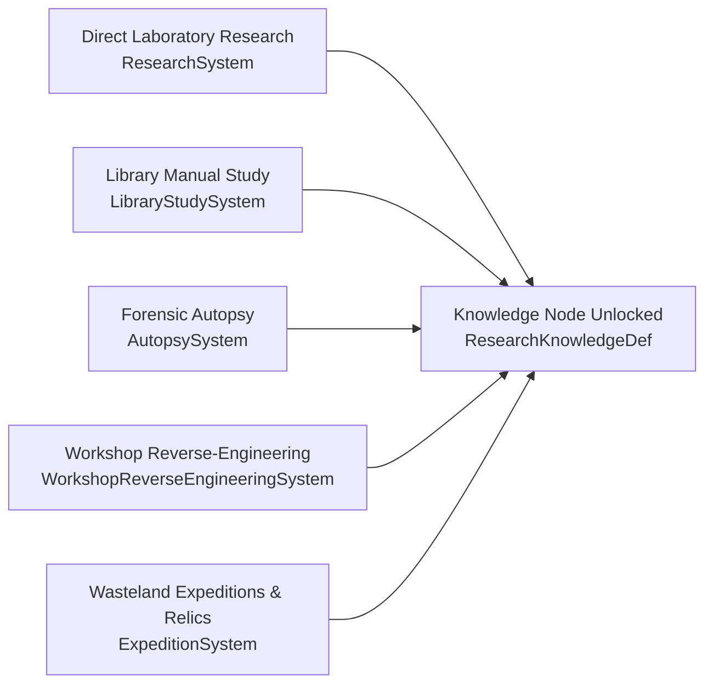

# Knowledge Acquisition Sources

> **Document Status:** Authoritative Progression Mechanics
> **Project:** ASHFALL (Godot 4.7+ / .NET 8 / C# Core)
> **Date:** September 2026

---

## 1. Unified Knowledge Pathways

In ASHFALL, scientific and technological knowledge is acquired through multiple distinct survival activities, preventing the research tree from feeling like an abstract idle timer:

1. **Direct Laboratory Research:** Assigned researchers dedicate shelter work shifts over several days to systematically discover nodes.
2. **Library Manual Study:** Survivors study authored pre-war technical manuals in the shelter library, directly unlocking foundational and applied nodes.
3. **Forensic Autopsy Procedures:** Performing clinical pathology on deceased specimens unlocks medical, radiological, and toxicological breakthroughs.
4. **Relic Reverse-Engineering:** Analyzing recovered pre-war technology prototypes unlocks 16 specialized blueprint nodes.
5. **Field Scavenge & Narrative Discoveries:** Encountering lost bunkers, observatories, or university libraries reveals coordinates and manual caches.
