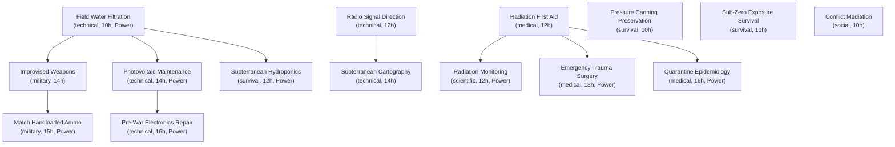

# Plan 80 — Library Manuals Prerequisite Graph

> **Graph Authority:** `Assets/StreamingAssets/Data/library_manuals.json`

---

## 1. Topological Graph Overview

The 15 library study manuals form a strictly Directed Acyclic Graph (DAG) spanning six core knowledge domains with three distinct progression tiers (Foundation, Intermediate, and Advanced).

---

## 2. Tier & Reachability Breakdown

### Tier 1: Foundations (Depth 0 — 6 Manuals)
No prerequisites; immediately available for study by any unoccupied survivor:
- `manual_water_filtration`: Field Water Filtration (`technical`)
- `manual_rad_first_aid`: Radiation First Aid (`medical`)
- `manual_radio_signal_direction`: Radio Direction Finding (`technical`)
- `manual_vacuum_preservation`: Pressure Canning & Food Preservation (`survival`)
- `manual_cold_weather_survival`: Sub-Zero Exposure & Thermal Insulation (`survival`)
- `manual_conflict_mediation`: De-Escalation & Group Conflict Mediation (`social`)

### Tier 2: Intermediate (Depth 1 — 7 Manuals)
Requires exactly 1 foundational manual:
- `manual_improvised_weapons` (Requires: `manual_water_filtration`)
- `manual_solar_maintenance` (Requires: `manual_water_filtration`)
- `manual_bunker_hydroponics` (Requires: `manual_water_filtration`)
- `manual_subterranean_cartography` (Requires: `manual_radio_signal_direction`)
- `manual_radiation_monitoring` (Requires: `manual_rad_first_aid`)
- `manual_field_trauma_surgery` (Requires: `manual_rad_first_aid`)
- `manual_quarantine_epidemiology` (Requires: `manual_rad_first_aid`)

### Tier 3: Advanced (Depth 2 — 2 Manuals)
Requires an intermediate manual in the chain:
- `manual_ballistic_handloading` (Requires: `manual_improvised_weapons` -> `manual_water_filtration`)
- `manual_relic_reverse_engineering` (Requires: `manual_solar_maintenance` -> `manual_water_filtration`)

---

## 3. Acyclicity & Reachability Proof

- **Cycle Count:** 0. Verified via depth-first topological search across all 15 nodes.
- **Reachability:** 100%. All 15 manuals are reachable starting from the 6 zero-prerequisite foundation manuals.
