# Research Knowledge Directed Acyclic Graph (DAG)

> **Document Status:** Authoritative Graph Topography
> **Project:** ASHFALL (Godot 4.7+ / .NET 8 / C# Core)
> **Date:** September 2026

---

## 1. Graph Structure & Validation

The ASHFALL research tree is modeled as a strictly acyclic directed graph (DAG). Cycle detection and dependency completeness are mechanically validated by `ResearchKnowledgeCatalogLoader.ValidateDag()` and tested in xUnit suite `ResearchKnowledgeDagTests`.

```mermaid
graph TD
    subgraph Survival
        K_WB[knowledge_water_basics] --> K_WA[knowledge_water_advanced]
        K_WA --> K_DWH[knowledge_deep_well_hydraulics]
        K_HYD[knowledge_hydroponics] --> K_GM[knowledge_greenhouse_microclimate]
        K_HYD --> K_API[knowledge_apiculture_ecology]
        K_FP[knowledge_food_preservation] --> K_CAN[knowledge_cold_canning_preservation]
    end

    subgraph Medical
        K_RB[knowledge_radiation_basics] --> K_FTS[knowledge_field_trauma_surgery]
        K_RB --> K_PC[knowledge_pathogen_containment]
        K_PC --> K_PHARM[knowledge_pharmacology_synthesis]
    end

    subgraph Engineering
        K_SB[knowledge_solar_basics] --> K_SA[knowledge_solar_advanced]
        K_SI[knowledge_shelter_insulation] --> K_AF[knowledge_air_filtration]
        K_SI --> K_HTM[knowledge_high_temp_metallurgy]
        K_SI --> K_GEO[knowledge_geothermal_tap]
        K_SA --> K_GEO
        K_RB --> K_RS[knowledge_radiation_shielding]
        K_RB --> K_GMI[knowledge_gas_mask_improved]
        K_GMI --> K_SSR[knowledge_submersible_salvage_rig]
    end

    subgraph Science
        K_RADB[knowledge_radio_basics] --> K_RADA[knowledge_radio_advanced]
        K_RADA --> K_IONO[knowledge_ionospheric_propagation]
        K_RADB --> K_SEIS[knowledge_seismic_fault_mapping]
        K_RADB --> K_CLOUD[knowledge_atmospheric_cloud_seeding]
        K_RS --> K_CLOUD
    end

    subgraph Scavenging
        K_SE[knowledge_scavenge_efficiency] --> K_RUR[knowledge_ruin_structural_survey]
        K_SE --> K_FGT[knowledge_field_guide_taxonomy]
        K_SE --> K_HBT[knowledge_hazmat_breaching_technique]
        K_HTM --> K_HBT
    end

    subgraph Combat
        K_CT[knowledge_combat_training] --> K_FC[knowledge_fortified_chokepoints]
        K_CT --> K_DTA[knowledge_defensive_tripwire_arrays]
        K_CT --> K_PB[knowledge_precision_ballistics]
        K_CT --> K_AST[knowledge_automated_sentry_doctrine]
        K_SA --> K_AST
    end
```

---

## 2. Topological Order & Cross-Discipline Seams

1. **Submersible Salvage Rig (`knowledge_submersible_salvage_rig`):** Unlocks Plan 23B vulcanized diving gear from `knowledge_gas_mask_improved`.
2. **Cloud Seeding (`knowledge_atmospheric_cloud_seeding`):** Requires both Science (`knowledge_radio_basics`) and Engineering (`knowledge_radiation_shielding`) to trigger Plan 17 atmospheric cleansing.
3. **Thermal Lance Breaching Rig (`knowledge_hazmat_breaching_technique`):** Bridges Scavenging (`knowledge_scavenge_efficiency`) with Engineering (`knowledge_high_temp_metallurgy`).
4. **Automated Sentry Doctrine (`knowledge_automated_sentry_doctrine`):** Bridges Combat (`knowledge_combat_training`) with Engineering (`knowledge_solar_advanced`).
