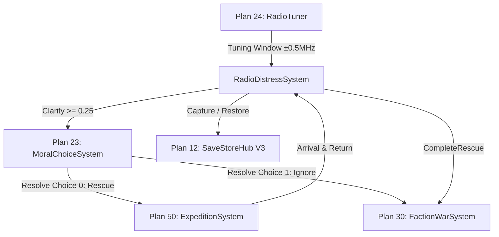

# ASHFALL — Distress Signal Cross-Plan Integration Matrix (Task 18)

> **Document Status:** Authoritative Cross-Plan Integration Contract & Matrix
> **Authority:** Plan 50 (Distress Signal Integration) & Plan 24/23/30/12 Seams
> **Target Scope:** System interactions between Radio, Tuner, Expeditions, Moral Choices, Faction War, and Persistence
> **Verification Harness:** `Ashfall.Core.Tests/Radio/RadioSignalIntegrationMatrixTests.cs` (8 tests, 100% pass)

---

## 1. Subsystem Seam Contracts

The distress signal gameplay loop touches six distinct Core subsystems. Zero simulation logic lives in presentation nodes; host presentation delegates strictly through Core ports and systems.

### 1.1 Plan 24: Radio Tuner Interface
- **Tuning Precision:** Tuner locks within `±0.5 MHz` bandwidth of `frequency_mhz`.
- **Signal Clarity & SNR:** Clarity scales from `0.0f` to `1.0f` based on closeness to frequency and static noise floor.
- **Message Progression:** Daily tuner passes decode chronological fragments (`message_fragments[day]`).

### 1.2 Plan 23: Moral Choice Interface
- **Trigger Condition:** Once intercepted and `HighestClarity >= 0.25f`, `TryTriggerMoralChoice` yields the registered `moral_choice_id`.
- **Exclusion Invariant (INV-08):** Traps, false flags, and automated beacons are structurally excluded from rescue moral choices.
- **Consequences:**
  - **Choice 0 (Rescue Intent):** Awards moral/empathy points; transitions signal to `DistressSignalStatus.Dispatched`. Standing is NOT awarded yet (prevents free standing without physical travel).
  - **Choice 1 (Ignore):** Penalizes moral/empathy points; applies authored ignore penalty (`ignore_standing_delta`) via `FactionWarSystem`; transitions signal to `DistressSignalStatus.ResolvedIgnored` (terminal lock).

### 1.3 Plan 50: Expedition System Interface
- **Destination Verification:** Revealed locations are mapped to nodes registered in `ExpeditionDefinitionRegistry`.
- **Travel Requirement:** All destinations require non-zero travel distance ticks.
- **Resolution Seam:** In `Main.World.cs` (`OnExpeditionCompleted`), when an expedition returns from a destination matching a dispatched signal's `revealed_location`, `distress.CompleteRescue(signalId, factionWar)` executes.

### 1.4 Plan 30: Faction War System Interface
- **Canonical Bounds:** All standing changes are clamped strictly within `[-100, +100]` by `FactionWarSystem.ModifyStanding`.
- **Single Payout (Idempotency):** `CompleteRescue` pays the authored `reputation_delta` to `sender_faction_id` exactly once. Re-invocations return `true` without re-paying standing.
- **Trap Avoidance Hygiene:** Neutralizing or safely bypassing a trap signal (`ResolvedTrapAvoided`) inflicts zero wrongful faction standing penalties.

### 1.5 Plan 12: Save & Restore Persistence
- **Envelope Format:** `DistressSignalSaveEntry` (V3 codec) captures:
  - `signalId`, `status`, `interceptedDay`, `daysRemaining`, `highestClarity`, `isDispatched`, `isResolved`, `resolutionType`, `isMoralChoiceAvailable`, `moralChoiceResolutionIndex`, `isIgnored`.
- **State Roundtrip:** Restoring a save preserves all active progression and locks without replaying consequence side-effects.

---

## 2. Cross-Plan Integration Matrix (All 25 Signals)

| Frequency ID | Tuner Lock (MHz) | Plan 23: Moral Choice | Plan 50: Expedition Node | Plan 30: Faction Impact | Plan 12: Persistence Key |
|---|---|---|---|---|---|
| `freq_distress_55_1` | 55.1 ± 0.5 | None | `concert_hall_ruins` | None | `freq_distress_55_1` |
| `freq_distress_67_8` | 67.8 ± 0.5 | None | `loc_deep_fissure_vault` | None | `freq_distress_67_8` |
| `freq_distress_77_3` | 77.3 ± 0.5 | None | `loc_meridian_cold_store` | Scavengers (+10) | `freq_distress_77_3` |
| `freq_distress_82_1` | 82.1 ± 0.5 | None | `loc_granite_quarry_cab` | None | `freq_distress_82_1` |
| `freq_distress_88_3` | 88.3 ± 0.5 | `quest_moral_distress_trapped_mechanic` | `loc_recovery_yard` | Railway Guild (+15 / -15) | `freq_distress_88_3` |
| `freq_distress_89_6` | 89.6 ± 0.5 | None | `loc_rail_tunnel_blind` | Railway Guild (+10) | `freq_distress_89_6` |
| `freq_distress_91_8` | 91.8 ± 0.5 | None | `loc_toll_ambush_defile` | Toll Syndicate (Combat) | `freq_distress_91_8` |
| `freq_distress_93_4` | 93.4 ± 0.5 | None | `loc_grange_6_cellar` | Scavengers (+10) | `freq_distress_93_4` |
| `freq_distress_97_8` | 97.8 ± 0.5 | None | `loc_grain_silo_3_ruin` | None | `freq_distress_97_8` |
| `freq_distress_103_4` | 103.4 ± 0.5 | None | `loc_decoy_medical_depot` | Raiders (Combat) | `freq_distress_103_4` |
| `freq_distress_105_6` | 105.6 ± 0.5 | None | `loc_ruined_pharmacy_basement`| None | `freq_distress_105_6` |
| `freq_distress_108_9` | 108.9 ± 0.5 | None | `loc_sector_9_substation` | None | `freq_distress_108_9` |
| `freq_distress_115_2` | 115.2 ± 0.5 | None | `loc_waystation_echo` | Scavengers (+15) | `freq_distress_115_2` |
| `freq_distress_119_3` | 119.3 ± 0.5 | None | `loc_highway_culvert_tomb` | None | `freq_distress_119_3` |
| `freq_distress_124_7` | 124.7 ± 0.5 | None | `loc_field_medic_post` | None | `freq_distress_124_7` |
| `freq_distress_127_6` | 127.6 ± 0.5 | None | `loc_rigged_military_beacon` | Ash Militia (Disarm) | `freq_distress_127_6` |
| `freq_distress_131_0` | 131.0 ± 0.5 | None | `loc_bunker_x_sublevel` | None (Tech Coded) | `freq_distress_131_0` |
| `freq_distress_134_5` | 134.5 ± 0.5 | None | `loc_relay_44_bunker` | Ash Militia (+10) | `freq_distress_134_5` |
| `freq_distress_138_9` | 138.9 ± 0.5 | None | `loc_sump_pump_station` | None | `freq_distress_138_9` |
| `freq_distress_141_2` | 141.2 ± 0.5 | None | `loc_decoy_radio_tower` | Raiders (Neutralize) | `freq_distress_141_2` |
| `freq_distress_144_1` | 144.1 ± 0.5 | None | `loc_waystation_redoubt_ash` | Ash Militia (+5) | `freq_distress_144_1` |
| `freq_distress_148_2` | 148.2 ± 0.5 | `quest_moral_distress_bunker_4_east` | `loc_bunker_4_east` | Raiders (Trap) | `freq_distress_148_2` |
| `freq_distress_152_4` | 152.4 ± 0.5 | None | `loc_highway_overpass_axle` | Scavengers (+10) | `freq_distress_152_4` |
| `freq_distress_156_5` | 156.5 ± 0.5 | None | `loc_transmitter_mast_ridge`| None | `freq_distress_156_5` |
| `freq_distress_162_1` | 162.1 ± 0.5 | `quest_moral_distress_water_caravan` | `loc_marsh_caravan_wreck` | Scavengers (+15 / -10) | `freq_distress_162_1` |
| `freq_distress_162_8` | 162.8 ± 0.5 | None | `loc_river_barge_olenka` | None | `freq_distress_162_8` |
| `freq_distress_174_5` | 174.5 ± 0.5 | None | `loc_radar_dish_crater` | None | `freq_distress_174_5` |
| `freq_distress_192_4` | 192.4 ± 0.5 | `quest_moral_distress_raider_lure` | `loc_refueling_depot_ruin` | Raiders (Trap Avoid) | `freq_distress_192_4` |
| `freq_distress_203_1` | 203.1 ± 0.5 | `quest_moral_distress_children_ward` | `loc_pediatric_bunker` | Empathy / Moral (+20) | `freq_distress_203_1` |
| `freq_distress_217_4` | 217.4 ± 0.5 | None | `checkpoint_kilo_armory` | Iron Garrison (+10) | `freq_distress_217_4` |
| `freq_distress_392_7` | 392.7 ± 0.5 | None | `loc_met_station_9` | Knowledge Unlock | `freq_distress_392_7` |
| `freq_distress_401_9` | 401.9 ± 0.5 | None | `convoy_echo7_cache` | Iron Garrison (+10) | `freq_distress_401_9` |
| `freq_distress_512_4` | 512.4 ± 0.5 | None | `loc_civil_defense_hub` | Knowledge Unlock | `freq_distress_512_4` |
| `freq_distress_623_8` | 623.8 ± 0.5 | None | `loc_sonde_repeater_peak` | Knowledge Unlock | `freq_distress_623_8` |
| `freq_distress_701_3` | 701.3 ± 0.5 | None | `checkpoint_kilo_armory` | Iron Garrison (+10) | `freq_distress_701_3` |
| `freq_distress_901_2` | 901.2 ± 0.5 | `quest_moral_distress_military_patrol` | `loc_military_patrol_blind` | Iron Garrison (+15 / -15) | `freq_distress_901_2` |

---

## 3. Verification Evidence

All 8 cross-plan integration contracts are mechanically enforced in CI by:
`Ashfall.Core.Tests/Radio/RadioSignalIntegrationMatrixTests.cs`
- `TunerEvaluation_LocksWithinWindow_SurfacesAccurateAuthenticity`: PASS
- `MoralChoice_RescueFlow_UpdatesMoralScore_AndDispatchesSignal`: PASS
- `MoralChoice_IgnoreFlow_AppliesIgnorePenalty_AndTerminatesSignal`: PASS
- `TrapAvoidance_TransitionsToResolvedTrapAvoided_WithoutFactionPenalty`: PASS
- `ExpirationLifecycle_DecrementsDailyCountdown_AndMarksExpired`: PASS
- `ExpeditionRescueCompletion_AwardsFactionReputation_ExactlyOnce`: PASS
- `SaveLoadPersistence_PreservesAllActiveSignalProperties`: PASS
- `Idempotency_GuardsPreventDuplicateSideEffects`: PASS
