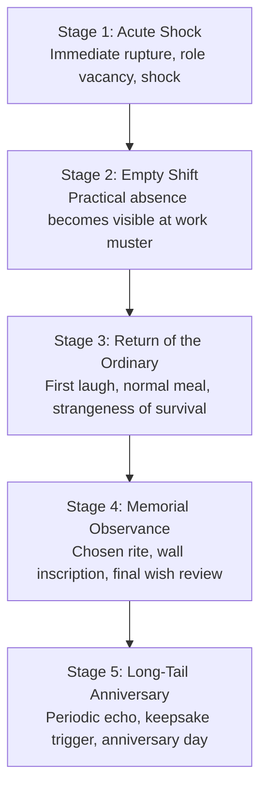

# Grief & Mourning Lifecycle

---

## 1. The 5-Stage Mourning Arc

1. **Stage 1 (Day 0): Acute Shock:** Immediate shock, emergency triage, body disposition.
2. **Stage 2 (Day +1): Empty Shift:** The deceased's absence is confronted at shift muster or tool handover.
3. **Stage 3 (Day +3): Return of the Ordinary:** The strange guilt of returning to ordinary conversation and meals.
4. **Stage 4 (Day +7): Memorial Observance:** Execution of a chosen memorial rite or wall engraving.
5. **Stage 5 (Day +30): Long-Tail Echo:** Quiet anniversary reflection or keepsake trigger.

---

## 2. Six Memorial Rites

| ID | Title | Method / Focus | Grief Multiplier | Guilt Relief |
| :--- | :--- | :--- | :--- | :--- |
| `memorial_rite_roll_call_naming` | Roll-Call Naming | Name spoken once in muster order | 0.85x | 0.15 |
| `memorial_rite_empty_bunk_night` | The Unmade Bunk Night | Cot left unoccupied for 24h | 0.80x | 0.20 |
| `memorial_rite_division_of_effects` | The Small Tin Division | Review of comb/pencil/keepsakes | 0.75x | 0.25 |
| `memorial_rite_work_gang_farewell` | The Final Shift Detail | Peer crew carries out physical seal | 0.70x | 0.30 |
| `memorial_rite_wall_tally_engraving` | Memorial Wall Inscription | Chiseling name/days into limestone | 0.75x | 0.20 |
| `memorial_rite_last_wish_committal` | The Spoken Wish Fulfillment | Public declaration of Final Wish | 0.70x | 0.35 |

---

## 3. Four Grief-Conflict Events

1. **Work as Flight (`event_grief_conflict_exhaustion_overwork`):** Bereaved dweller works triple shifts to outrun grief; peers must intervene before collapse.
2. **The Contested Mattress (`event_grief_conflict_bunk_reassignment`):** Shelter overcrowding demands assigning empty bunk to cold arrival vs. honoring empty-bunk custom.
3. **The Dead Man's Boots (`event_grief_conflict_belongings_dispute`):** Surface expedition needs insulated boots vs. companion holding them as keepsake.
4. **The Unfinished Promise (`event_grief_conflict_reckless_wish`):** Survivor demands dangerous expedition to fulfill dead friend's uncompleted wish.
