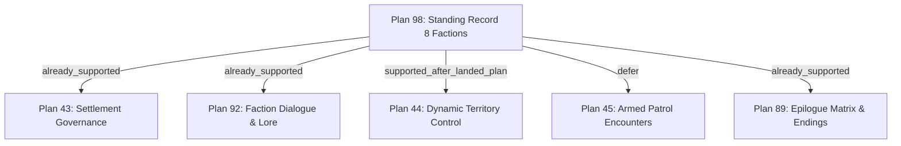

# Plan 98 — Cross-Plan Integration Matrix

## 1. Executive Summary

This matrix evaluates integration seams between Plan 98 Standing Record factions and dependent world systems across the codebase. In accordance with Section 1.7 of the Plan 98 contract, downstream features are classified based on current repository truth.

---

## 2. Integration Seam Evaluations

| Target System | Plan Scope | Integration Status | Factions Involved | Mapping & Implementation Details |
|---|---|---|---|---|
| **Settlement Governance** | Plan 43 | `already_supported` | `faction_the_garrison`, `faction_the_rebuilders` | `wasteland_settlement_gazetteer.json` already references Fort Karkov (`faction_the_garrison`) and rural agricultural communes (`faction_the_rebuilders`) in Ash Flats. No new mapping code required. |
| **Faction Dialogue & Overheard Lore** | Plan 92 | `already_supported` | All 8 Factions | Overheard dialogue and radio chatter systems (`faction_war_dialogue.json`) query faction IDs for flavor text. Quotes and access rules authored in Plan 98 feed directly into dialogue voice lines. |
| **Territory Control** | Plan 44 | `supported_after_landed_plan` | `faction_the_scale`, `faction_the_cutters`, `faction_the_fleet` | The Scale anchors to Industrial Belt pumping nodes; The Cutters anchor to The Cut transport spans; The Fleet anchors to coastal ports. Once dynamic territory capture lands, these 3 factions serve as primary jurisdictional controllers. |
| **Armed Patrol Encounters** | Plan 45 | `defer` | `faction_the_garrison`, `faction_the_cutters` | Fort Karkov patrols are supported by existing military encounter tables. Non-military road crews (The Cutters) are deferred to prevent forcing civilian maintenance workers into combat patrol mechanics. |
| **Epilogues & Endings** | Plan 89 | `already_supported` | All 8 Factions | Epilogue matrix (`EpilogueMatrix.cs`) evaluates live faction standing scores at campaign resolution. New factions receive safe default outcomes without breaking endgame slides. |

---

## 3. Producer / Consumer Wiring Graph

1. **Standing Record Dossier Panel (`StandingRecordPanel.cs`):** Consumes `standing_record_factions.json` to present faction rosters, trade desires, and access rules.
2. **Caravan Trading Network (`CaravanTradeNetworkSystem.cs`):** References `faction_the_underwrite` and `faction_the_scale` for convoy protection agreements and water rights.
3. **Greenhouse & Food Reserves (`GreenhouseSystem.cs`):** References `faction_the_rebuilders` for soil rotation almanacs and heirloom seed trade.
4. **Railway Logistics (`RailwaySystem.cs`):** References `faction_the_cutters` for mountain viaduct passage clearance and snow clearing chits.
